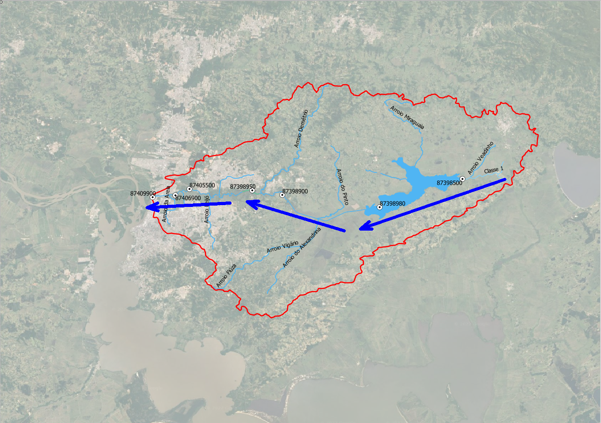

```{r Rotina pra toda vez que abrir o documento, echo = FALSE}
# Abrir o GitHub Desktop
# Verificar se há pull pra ser feito
# Abrir o RStudio
```

# Brief explanation

Every boxplot means a monitoring point (Ponto de monitoramento (or PM) in portuguese). My goal here is to analyze the evolution between decades of each water quality parameter that compounds the Water Quality Index (WQI).

The river flows in the east-west direction as shown in the image below.



The logic behind the sorting in the boxplots is because of 2 main reasons:

1.  The original monitoring point isn't easy to understand (8 digits, like 87409900)
2.  Changing the original nomenclature to PM1, PM2 (...) makes it easier to understand that the last point has water contributions of every other point upstream.

Some features that I want to add:
*  If the parameter is x, then use x's classes (with its own classes background color plotted)
*  Define the timescale, should act just like a filter

```{r p1 example}
# plan_wide_19902020 %>%
#   filter(ANO_COLETA > "1990" &
#          ANO_COLETA <= "2000")
```

# Anotações de coisas por fazer:

-   Descobrir como colocar as estações no sentido correto montante -\> jusante nos sumários

> 87398500, 87398980, 87398900, 87398950, 87405500, 87406900, 87409900

-   ~~Aprender a segmentar o meu dataset por períodos~~
-   aprender a criar uma nova coluna com a segmentação dos períodos
-   maybe use `~facet.grid`
-   aprender a colocar a legenda dentro do gráfico
    -   reduzir o tamanho da legenda
-   ~~corrigir os valores 0 de IQA pra NA~~
-   descobrir como conseguir a equação do lm
-   ~~aprender a pivotar o sumário~~ -\> meu sumário do google docs ta batendo direitinho com o do R
-   descobrir se há outros TCCs com disponibilização de códigos
-   `Namon` tá com com casa decimal `","` e `ptot` tá com `"."`
-   correlação forte entre condutividade e Namon/Ptot/DBO

| 1990-2000 | 2000-2010 | 2010-2020 |
|:---------:|:---------:|:---------:|
| 1990-2000 | 2000-2010 | 2010-2020 |

# Instalar os pacotes

```{r instalar pacotes}
# install.packages(tidyverse)
```

## acessar os pacotes

```{r Acessar os pacotes, message = FALSE, warning = TRUE}
# library(readr)
# library(rmarkdown)
# # library(qboxplot)
# library(readxl)
# library(pillar)
# library(dplyr)
# library(tidyverse)
# library(gapminder)
# library(knitr)
# library(kableExtra)
# library(ggpubr)
# library(gridExtra)
# library(modelsummary)
# library(gtsummary)
# library(GGally)
pacman::p_load(readr, rmarkdown, readxl,
               pillar, dplyr, tidyverse,
               gapminder, knitr, kableExtra,
               gridExtra, #modelsummary, 
               gtsummary, ggplot2,
               ggbeeswarm, GGally)
# pacman::p_load(tibbletime)
```

```{r cronometrando quanto tempo cada chunk leva}
knitr::knit_hooks$set(time_it = local({
   now <- NULL
   function(before, options) {
      if (before) {
         # record the current time before each chunk
         now <<- Sys.time()
      } else {
         # calculate the time difference after a chunk
         res <- difftime(Sys.time(), now)
         # return a character string to show the time
         paste("Time for this code chunk to run:", res)
      }
   }
}))

knitr::opts_chunk$set(time_it = TRUE)
```

## importando a planilha

```{r Importando a planilha, echo = FALSE, message = TRUE, warning = FALSE}
plan_wide_19902020 <- read_delim("https://raw.githubusercontent.com/leonardofwink/TCC_gh/main/plan_wide_19902020.tsv",
                                 delim = "\t", 
                                 escape_double = FALSE,
                                 col_types = cols(
                                    Alcalinidade = col_double(),
                                    CODIGO = col_character(), 
                                    COORD_GEO_LAT_GRAU = col_double(),
                                    COORD_GEO_LONG_GRAU = col_double(),
                                    DATA_COLETA = col_date(format = "%d/%m/%Y"),
                                    Nitrato = col_double(), 
                                    Nitrito = col_double(),
                                    SDT = col_double(), 
                                    SST = col_double(),
                                    `Vazao` = col_double(), 
                                    `Vazao rio` = col_double()
                                 ),
                                 locale = locale(
                                    date_names = "pt", 
                                    decimal_mark = ",",
                                    grouping_mark = ""
                                 ),
                                 trim_ws = TRUE
)

# teste[~'2000']
# 
# teste <- plan_wide_19902020 %>%
#   dplyr::filter(DATA_COLETA >= as.POSIXct("2010-01-01")) #this works
# 
# teste$DATA_COLETA <- as.POSIXct(teste$DATA_COLETA)
# 
# teste %>% 
#   dplyr::arrange(DATA_COLETA)
# teste %>% 
#   filter_time(time_formula = '2013-01-01' ~ '2020-12-31')
# 
# 
# typeof(teste$DATA_COLETA)
# 
#   as_tbl_time(plan_wide_19902020, index = DATA_COLETA)
# str(plan_wide_19902020$DATA_COLETA)
```

```{r Visualização da planilha importada, echo = FALSE}
paged_table(plan_wide_19902020,
            options = list(rows.print = 15,
                           cols.print = 10))
```

# data wrangling

```{r data wrangling}
# Como há dados faltantes, no cálculo entre o produto das colunas, ele acaba interpretando como se fosse zero, mas na verdade é NA
plan_wide_19902020 <- plan_wide_19902020 %>% 
   mutate(IQA = ifelse(IQA == 0, NA, IQA))
```

```{r Códigos Git, echo = FALSE}
# cd myrepo
# ls
# head README.md
# git status
# git add README.md
# git commit -m "A commit from my local computer"
# 
# cd .. # voltar pro diretório acima
# rm -rf myrepo/ #remover/apagar a pasta myrepo
```

```{r Aprendendo Git, echo = FALSE}
# slides da bia que ajudam mt
# https://beatrizmilz.github.io/slidesR/git_rstudio/11-2021-ENCE.html#20
# aprendendo a sincronizar usando esse guia -> 
# https://happygitwithr-com.translate.goog/push-pull-github.html?_x_tr_sl=auto&_x_tr_tl=pt&_x_tr_hl=pt-BR
# library(usethis)
# usethis::create_github_token() criar um código pra acesso e sincronização between R e github

# gitcreds::gitcreds_set() 
# 
# use_git_config(user.name = "leonardofwink",
#                user.email = "leonardofwink@gmail.com")
# usethis::gh_token_help()

# Como mostrar os dados de um arquivo via Git/GitHub
# git clone https://github.com/leonardofwink/myrepo.git
# cd myrepo #acessa a pasta myrepo
# ls #lista os arquivos da pasta 
# head README.md #mostra as primeiras observações do arquivo

# Como mostrar os dados de um arquivo via R
# head(C:/Users/Léo/myrepo/README.md)

# Adicionar uma linha ao README.md e verificar se o Git percebe a mudança
# echo "A line I wrote on my local computer" >> README.md
# git status
## C:\Users\Léo\myrepo>git status
## On branch main
## Your branch is up to date with 'origin/main'.
## 
## Changes not staged for commit:
##   (use "git add <file>..." to update what will be committed)
##   (use "git restore <file>..." to discard changes in working directory)
##         **modified:   README.md**
## 
## no changes added to commit (use "git add" and/or "git commit -a")
```

# setting theme

```{r setting theme}
theme_grafs <- function(bg = "white", 
                        coloracao_letra = "black") {
   theme(
      plot.title = element_text(
         hjust = 0.5,
         color = coloracao_letra,
         size = 19),
      
      axis.title.x = 
         # element_text(
         # color = coloracao_letra,
         # size = 15,
         # angle = 0,),
         element_blank(),
      axis.title.y = element_text(
         color = coloracao_letra,
         size = 15,
         angle = 90),
      
      axis.text.x = element_text(
         color = coloracao_letra,
         size = 17),
      axis.text.y = element_text(
         color = coloracao_letra,
         size = 17,
         angle = 0),
      
      panel.background = element_rect(fill = bg),
      plot.background = element_rect(fill = bg),
      plot.margin = margin(l = 5, r = 10,
                           b = 5, t = 5)
   )
}
```

# setting different timescales

```{r setting periodos, echo = FALSE}
# p1 <- plan_wide_19902020 %>% 
#   filter(ANO_COLETA > "1990" &
#            ANO_COLETA <= "2000")
# 
# p2 <- plan_wide_19902020 %>% 
#   filter(ANO_COLETA > "2000" &
#            ANO_COLETA <= "2010")
# 
# p3 <- plan_wide_19902020 %>% 
#   filter(ANO_COLETA > "2010" &
#            ANO_COLETA <= "2020")

# teste_all_periodos <- plan_wide_19902020 %>% 
#   filter(
#     between(ANO_COLETA, 1990, 2000)
#   )
```

# setting sumaries

```{r Sumários, echo = FALSE}
# plan_wide_19902020 %>%
#   as_tibble() %>% 
#   filter(ANO_COLETA > "1990" &
#            ANO_COLETA <= "2000") %>% 
#   select(colnames(parametros_IQA)) %>% 
#   group_by(CODIGO) %>% 
#   group_by(colnames(parametros_IQA)) %>% 
#   summarise_each(
#     funs( 
#       min = 
#         min(., 
#             na.rm = TRUE),
#       q1 = 
#         quantile(., 0.25, 
#                  na.rm = TRUE),
#       median = 
#         median(., 
#                na.rm = TRUE),
#       mean = 
#         mean(., 
#              na.rm= TRUE),
#       q3 = 
#         quantile(., 0.75, 
#                  na.rm = TRUE),
#       max = 
#         max(., 
#             na.rm = TRUE),
#       n = 
#         length(.)
#     )
#   ) %>% 
#   pivot_longer(
#        !CODIGO,
#        names_to = "parametro",
#        values_to = "valor"
#     ) %>% 
#     pivot_wider(names_from = CODIGO,
#                 values_from = valor) %>% 
#   group_by(parametro)


# p2 <- plan_wide_19902020 %>%
#   filter(ANO_COLETA > "2000" &
#          ANO_COLETA <= "2010")
# 
# p3 <- plan_wide_19902020 %>%
#   filter(ANO_COLETA > "2010" &
#          ANO_COLETA <= "2020")

# periodo = c(p1 <- plan_wide_19902020 %>% 
#   filter(ANO_COLETA > "1990" &
#            ANO_COLETA <= "2000"),
# 
# p2 <- plan_wide_19902020 %>%
#   filter(ANO_COLETA > "2000" &
#            ANO_COLETA <= "2010"),
# 
# p3 <- plan_wide_19902020 %>%
#   filter(ANO_COLETA > "2010" &
#            ANO_COLETA <= "2020"))

# sumario <- function(parametros = parametros, periodo){
#   plan_wide_19902020 %>%
#    select(CODIGO, ., ANO_COLETA) %>% 
#    # filter(ANO_COLETA>"1990" &
#    #          ANO_COLETA<="2000") %>% 
#    group_by(CODIGO) %>% 
#    summarize(
#      min = 
#        min(parametros, 
#            na.rm = TRUE),
#      q1 = 
#        quantile(parametros, 0.25, 
#                 na.rm = TRUE),
#      median = 
#        median(parametros, 
#               na.rm = TRUE),
#      mean = 
#        mean(parametros, 
#             na.rm= TRUE),
#      q3 = 
#        quantile(parametros, 0.75, 
#                 na.rm = TRUE),
#      max = 
#        max(parametros, 
#            na.rm = TRUE))
# }

# plan_wide_19902020 %>% 
#   sumario(parametros = DBO)

# sum_IQA_p1 <- plan_wide_19902020 %>%
#    select(CODIGO, IQA, ANO_COLETA) %>% 
#    filter(ANO_COLETA>"1990" &
#             ANO_COLETA<="2000") %>% 
#    group_by(CODIGO) %>% 
#    summarize(
#      min = 
#        min(IQA, 
#            na.rm = TRUE),
#      q1 = 
#        quantile(IQA, 0.25, 
#                 na.rm = TRUE),
#      median = 
#        median(IQA, 
#               na.rm = TRUE),
#      mean = 
#        mean(IQA, 
#             na.rm= TRUE),
#      q3 = 
#        quantile(IQA, 0.75, 
#                 na.rm = TRUE),
#      max = 
#        max(IQA, 
#            na.rm = TRUE))
```

# Parâmetros físico-químicos

### Oxigênio Dissolvido

```{r setting base od}
# par_od <- plan_wide_19902020 %>%
#   select(CODIGO, `Oxigênio dissolvido`) %>%
#   group_nest(CODIGO)

# data %>%  o que o Pat fez no CC156 21min56s
#   highlight_key(., ~) %>% 
#   ggplot()
# oxig_p1 <- p1 %>% 
#   select(CODIGO, `Oxigênio dissolvido`)
# 
# par_od <- plan_wide_19902020 %>% 
#   select(CODIGO, ) %>% 
#   group_by(CODIGO)

# parametros_IQA

# parametros <- colnames(parametros_IQA)

# base_od <- function(titulo = "Título") {
#   annotate("rect",
#            xmin = -Inf, xmax = Inf,
#            ymin = -Inf, ymax = 2,
#            alpha = 1,
#            fill = "#ac5079")+ # >pior classe
#     annotate("rect",
#              xmin = -Inf, xmax = Inf,
#              ymin = 2, ymax = 4,
#              alpha = 1,
#              fill = "#eb5661")+ #classe 4
#     annotate("rect",
#              xmin = -Inf, xmax = Inf,
#              ymin = 4, ymax = 5,
#              alpha=1,
#              fill="#fcf7ab")+ #classe 3
#     annotate("rect",
#              xmin=-Inf,
#              xmax=Inf,
#              ymin=5,
#              ymax=6,
#              alpha=1,
#              fill="#70c18c")+ #classe 2
#     annotate("rect",
#              xmin=-Inf,
#              xmax=Inf,
#              ymin=6,
#              ymax=Inf,
#              alpha=1,
#              fill="#8dcdeb")+ #classe 1
#     stat_boxplot(
#       geom = 'errorbar',
#       width=0.3,
#       position = position_dodge(width = 0.65)
#     )+
#     labs(
#       title = titulo,
#       x = "Estação",
#       y = "mg/L"
#     )+
#     geom_quasirandom(
#       size = 1.2,
#       alpha = .25,
#       width = .07,
#     )+
#     scale_y_continuous(
#       expand = expansion(mult = c(0,0)),
#       n.breaks = 11,
#       limits = c(-1,21)
#     )+
#     scale_x_discrete(limits = c("87398500",
#                                 "87398980",
#                                 "87398900",
#                                 "87398950",
#                                 "87405500",
#                                 "87406900",
#                                 "87409900"),
#                      labels = c("PM1", "PM2", "PM3", "PM4", "PM5", "PM6", "PM7")
#     )+
#     geom_smooth(method = "lm",
#                 se=FALSE, #se deixar TRUE gera o intervalo de confiança de 95%
#                 aes(group=1),
#                 alpha=.5,
#                 na.rm = TRUE,
#                 size = 1)
# }

# plan_wide_19902020 %>%
#   ggplot(
#     aes(CODIGO, `Oxigênio dissolvido`)
#   )+
#   geom_boxplot(
#       fill = '#F8F8FF',
#       color = "black",
#       outlier.shape = NA, #se deixar NA fica só o jitter, se não, deixa 1
#       width= 0.7
#     )+
#   base_od("Oxigênio 1990")


```

```{r Gráfico OD periodo 1, echo = FALSE, warning=FALSE, message = FALSE, fig.cap="Oxigênio Dissolvido no período 1990-2000"}
(od_p1 <- ggplot(plan_wide_19902020 %>% 
                    filter(ANO_COLETA > "1990" &
                              ANO_COLETA <= "2000"),
                 aes(CODIGO,
                     `Oxigênio dissolvido`)
)+
   annotate("rect",
            xmin = -Inf, xmax = Inf,
            ymin = -Inf, ymax = 2,
            alpha = 1,
            fill = "#ac5079")+ #>pior classe
   annotate("rect",
            xmin = -Inf, xmax = Inf,
            ymin = 2, ymax = 4,
            alpha = 1,
            fill = "#eb5661")+ #classe 4
   annotate("rect",
            xmin = -Inf, xmax = Inf,
            ymin = 4, ymax = 5,
            alpha = 1,
            fill = "#fcf7ab")+ #classe 3
   annotate("rect",
            xmin = -Inf, xmax = Inf,
            ymin = 5, ymax = 6,
            alpha = 1,
            fill = "#70c18c")+ #classe 2
   annotate("rect",
            xmin = -Inf, xmax = Inf,
            ymin= 6, ymax = Inf,
            alpha = 1,
            fill = "#8dcdeb")+ #classe 1
   stat_boxplot(
      geom = 'errorbar',
      width = 0.3,
      position = position_dodge(width = 0.65)
   )+
   geom_boxplot(
      fill = '#F8F8FF',
      color = "black",
      outlier.shape = NA, #se deixar NA fica só o jitter, se não, deixa 1
      width = 0.7
   )+
   labs(
      title = "Oxigênio Dissolvido no período 1990-2000",
      x="Estação",
      y="mg/L"
   )+
   ggbeeswarm::geom_quasirandom(
      size = 1.2,
      alpha = .25,
      width = .07,
   )+
   scale_y_continuous(
      expand = expansion(mult = c(0,0)),
      n.breaks = 11,
      limits = c(-1,21)
   )+
   scale_x_discrete(limits = c("87398500", 
                               "87398980", 
                               "87398900", 
                               "87398950", 
                               "87405500", 
                               "87406900", 
                               "87409900"),
                    labels = c("PM1", "PM2", "PM3", "PM4", "PM5", "PM6", "PM7")
   )+
   geom_smooth(
      method = "lm",
      se=FALSE, #se deixar TRUE gera o intervalo de confiança de 95%
      aes(group = 1),
      alpha = .5,
      na.rm = TRUE,
      size = 1
   )+
   theme_grafs()
)
```

```{r Gráfico OD periodo 2, echo = FALSE, warning=FALSE, message = FALSE}
(od_p2 <-ggplot(plan_wide_19902020 %>% 
                   filter(ANO_COLETA>"2000" &
                             ANO_COLETA<="2010"),
                aes(CODIGO,
                    `Oxigênio dissolvido`))+
    annotate("rect",
             xmin=-Inf,
             xmax=Inf,
             ymin=-Inf,
             ymax=2,
             alpha=1,
             fill="#ac5079")+ #>pior classe
    annotate("rect",
             xmin=-Inf,
             xmax=Inf,
             ymin=2,
             ymax=4,
             alpha=1,
             fill="#eb5661")+ #classe 4
    annotate("rect",
             xmin=-Inf,
             xmax=Inf,
             ymin=4,
             ymax=5,
             alpha=1,
             fill="#fcf7ab")+ #classe 3
    annotate("rect",
             xmin=-Inf,
             xmax=Inf,
             ymin=5,
             ymax=6,
             alpha=1,
             fill="#70c18c")+ #classe 2
    annotate("rect",
             xmin=-Inf,
             xmax=Inf,
             ymin=6,
             ymax=Inf,
             alpha=1,
             fill="#8dcdeb")+ #classe 1
    stat_boxplot(geom = 'errorbar',
                 width=0.3,
                 position = position_dodge(width = 0.65))+
    geom_boxplot(fill='#F8F8FF',
                 color="black",
                 outlier.shape = NA, #se deixar NA fica só o jitter, se não, deixa 1
                 width= 0.7)+
    labs(title = "Oxigênio Dissolvido no período 2000-2010",
         x="Estação",
         y=NULL)+
    ggbeeswarm::geom_quasirandom(
       size = 1.2,
       alpha = .25,
       width = .07,
    )+
    scale_y_continuous(
       expand = expansion(mult = c(0,0)),
       n.breaks = 11,
       limits = c(-1,21))+
    scale_x_discrete(limits = c("87398500", 
                                "87398980", 
                                "87398900", 
                                "87398950", 
                                "87405500", 
                                "87406900", 
                                "87409900"),
                     labels = c("PM1", "PM2", "PM3", "PM4", "PM5", "PM6", "PM7")
    )+
    geom_smooth(
       method = "lm",
       se=FALSE, #se deixar TRUE gera o intervalo de confiança de 95%
       aes(group=1),
       alpha=.5,
       na.rm = TRUE,
       size = 1
    )+
    theme_grafs()
)
```

```{r Gráfico OD periodo 3, echo = FALSE, warning=FALSE, message = FALSE}
(od_p3 <-ggplot(plan_wide_19902020 %>% 
                   filter(ANO_COLETA>"2010" &
                             ANO_COLETA<="2020"),
                aes(CODIGO,
                    `Oxigênio dissolvido`))+
    annotate("rect",
             xmin=-Inf,
             xmax=Inf,
             ymin=-Inf,
             ymax=2,
             alpha=1,
             fill="#ac5079")+ #>pior classe
    annotate("rect",
             xmin=-Inf,
             xmax=Inf,
             ymin=2,
             ymax=4,
             alpha=1,
             fill="#eb5661")+ #classe 4
    annotate("rect",
             xmin=-Inf,
             xmax=Inf,
             ymin=4,
             ymax=5,
             alpha=1,
             fill="#fcf7ab")+ #classe 3
    annotate("rect",
             xmin=-Inf,
             xmax=Inf,
             ymin=5,
             ymax=6,
             alpha=1,
             fill="#70c18c")+ #classe 2
    annotate("rect",
             xmin=-Inf,
             xmax=Inf,
             ymin=6,
             ymax=Inf,
             alpha=1,
             fill="#8dcdeb")+ #classe 1
    stat_boxplot(geom = 'errorbar',
                 width=0.3,
                 position = position_dodge(width = 0.65))+
    geom_boxplot(fill='#F8F8FF',
                 color="black",
                 outlier.shape = NA, #se deixar NA fica só o jitter, se não, deixa 1
                 width= 0.7)+
    labs(title = "Oxigênio Dissolvido no período 2010-2020",
         x=NULL,
         y=NULL)+
    ggbeeswarm::geom_quasirandom(
       size = 1.2,
       alpha = .25,
       width = .07,
    )+
    scale_x_discrete(limits = c("87398500", 
                                "87398980", 
                                "87398900", 
                                "87398950", 
                                "87405500", 
                                "87406900", 
                                "87409900"),
                     labels = c("PM1", "PM2", "PM3", "PM4", "PM5", "PM6", "PM7")
    )+
    scale_y_continuous(
       expand = expansion(mult = c(0,0)),
       n.breaks = 11,
       limits = c(-1,21))+
    geom_smooth(
       method = "lm",
       se=FALSE, #se deixar TRUE gera o intervalo de confiança de 95%
       aes(group=1),
       alpha=.5,
       na.rm = TRUE,
       size = 1
    )+
    theme_grafs()
)
```

```{r Gráfico OD 3 periodos juntos, echo = TRUE, warning=FALSE, message = FALSE, fig.cap="Oxigênio Dissolvido no período 1990-2020"}
grid.arrange(od_p1, od_p2, od_p3, ncol = 3)
```

```{r Salvando OD}
ggsave("od_p1.png",
       plot = od_p1,
       path = "./graficos",
       dpi = 300,
       type = "cairo")

ggsave("od_p2.png",
       plot = od_p2,
       path = "./graficos",
       dpi = 300,
       type = "cairo")

ggsave("od_p3.png",
       plot = od_p3,
       path = "./graficos",
       dpi = 300,
       type = "cairo")

ggsave("od_3periodos_2.png",
       units = c("px"),
       width = 4500,
       height = 2993,
       plot = grid.arrange(od_p1, od_p2, od_p3, ncol = 3),
       path = "./graficos",
       dpi = 300,
       type = "cairo")
```

```{r Gráfico OD_chernobyl, echo = FALSE, warning=FALSE, message = FALSE}
# p1 <- function(plan_wide_19902020, ANO_COLETA) {
#   plan_wide_19902020 %>% 
#     filter(ANO_COLETA > "1990" &
#            ANO_COLETA <= "2000")
# }
# 
# 
# classes_od <- function(plan_wide_19902020, parametro, periodo){
#   ggplot(plan_wide_19902020 %>%
#            periodo),
#   aes(CODIGO,
#       parametro)
# }


# (od_chernobyl <- ggplot(plan_wide_19902020 %>%
#                           p1(ANO_COLETA > "1990" &
#                                ANO_COLETA <= "2000"),
#                         aes(CODIGO,
#                             `Oxigênio dissolvido`))+
#     annotate("rect",
#              xmin=-Inf,
#              xmax=Inf,
#              ymin=-Inf,
#              ymax=2,
#              alpha=1,
#              fill="#ac5079")+ #>pior classe
#     annotate("rect",
#              xmin=-Inf,
#              xmax=Inf,
#              ymin=2,
#              ymax=4,
#              alpha=1,
#              fill="#eb5661")+ #classe 4
#     annotate("rect",
#              xmin=-Inf,
#              xmax=Inf,
#              ymin=4,
#              ymax=5,
#              alpha=1,
#              fill="#fcf7ab")+ #classe 3
#     annotate("rect",
#              xmin=-Inf,
#              xmax=Inf,
#              ymin=5,
#              ymax=6,
#              alpha=1,
#              fill="#70c18c")+ #classe 2
#     annotate("rect",
#              xmin=-Inf,
#              xmax=Inf,
#              ymin=6,
#              ymax=Inf,
#              alpha=1,
#              fill="#8dcdeb")+ #classe 1
#     stat_boxplot(geom = 'errorbar',
#                  width=0.3,
#                  position = position_dodge(width = 0.65))+
#     geom_boxplot(fill='#F8F8FF',
#                  color="black",
#                  outlier.shape = NA, #se deixar NA fica só o jitter, se não, deixa 1
#                  width= 0.7)+
#     labs(title = "Oxigênio Dissolvido no período 1990-2000",
#          x="Estação",
#          y="mg/L")+
#     # geom_jitter(width = .07,
#     #             alpha=.15,
#     #             size=1.,
#     #             color="black")+
#     ggbeeswarm::geom_quasirandom(
#       size = 1.2,
#       alpha = .25,
#       width = .07,
#     )+
#     scale_y_continuous(expand = expansion(mult = c(0,0)),
#                        n.breaks = 11,
#                        limits = c(-1,21))+
#     scale_x_discrete(limits = c("87398500",
#                                 "87398980",
#                                 "87398900",
#                                 "87398950",
#                                 "87405500",
#                                 "87406900",
#                                 "87409900"),
#                      labels = c("PM1", "PM2", "PM3", "PM4", "PM5", "PM6", "PM7")
#     )+
#     geom_smooth(method = "lm",
#                 se=FALSE, #se deixar TRUE gera o intervalo de confiança de 95%
#                 aes(group=1),
#                 alpha=.5,
#                 na.rm = TRUE,
#                 size = 1)+
#     # geom_line(
#     #   aes(color="red"),
#     #   alpha=.0)+
#     # scale_color_manual("Legenda",
#     #                    guide="legend",
#     #                    values = c("Classe 1"="#8dcdeb",
#     #                               "Classe 2"="#70c18c",
#     #                               "Classe 3"="#fcf7ab",
#     #                               "Classe 4"="#eb5661",
#     #                               "Pior Classe"="#ac5079"))+
#     # guides(color=guide_legend(override.aes = list(linetype=c(1,1,1,1,1),
#   #                                               lwd=c(2,2,2,2,2),
#   #                                               shape=c(NA,NA,NA,NA,NA),
#   #                                               alpha=1)))+
#   theme(
#     plot.title = element_text(size = 19),
#     axis.title.y = element_text(size = 15),
#     axis.text.y = element_text(size = 17),
#     axis.text.x = element_text(size = 17),
#   )
# )
```

```{r Gráfico IQA OD periodo1, echo = FALSE, message=FALSE, warning=FALSE}
(iqaod_p1 <-ggplot(plan_wide_19902020 %>% 
                      filter(ANO_COLETA > "1990" &
                                ANO_COLETA <= "2000"),
                   aes(CODIGO,
                       IQA_OD, na.rm = TRUE))+
    annotate("rect",
             xmin=-Inf,
             xmax=Inf,
             ymin=-Inf,
             ymax=19,
             alpha=1,
             fill="#ac5079")+ #>pior classe
    annotate("rect",
             xmin=-Inf,
             xmax=Inf,
             ymin=19,
             ymax=36,
             alpha=1,
             fill="#eb5661")+ #classe 4
    annotate("rect",
             xmin=-Inf,
             xmax=Inf,
             ymin=36,
             ymax=51,
             alpha=1,
             fill="#fcf7ab")+ #classe 3
    annotate("rect",
             xmin=-Inf,
             xmax=Inf,
             ymin=51,
             ymax=79,
             alpha=1,
             fill="#70c18c")+ #classe 2
    annotate("rect",
             xmin=-Inf,
             xmax=Inf,
             ymin=79,
             ymax=Inf,
             alpha=1,
             fill="#8dcdeb")+ #classe 1
    stat_boxplot(geom = 'errorbar',
                 width=0.3,
                 position = position_dodge(width = 0.65),
                 na.rm = TRUE)+
    geom_boxplot(fill='#F8F8FF',
                 color="black",
                 outlier.shape = NA, #se deixar NA fica só o jitter, se não, deixa 1
                 width= 0.7,
                 na.rm = TRUE)+
    labs(title = "Variação do IQA para o parâmetro Oxigênio Dissolvido 1990-2000",
         x="Estação",
         y="")+
    ggbeeswarm::geom_quasirandom(
       size = 1.2,
       alpha = .25,
       width = .07,
    )+
    scale_x_discrete(limits = c("87398500", 
                                "87398980", 
                                "87398900", 
                                "87398950", 
                                "87405500", 
                                "87406900", 
                                "87409900"),
                     labels = c("PM1", "PM2", "PM3", "PM4", "PM5", "PM6", "PM7")
    )+
    scale_y_continuous(expand = expansion(mult = c(0,0)),
                       n.breaks = 6,
                       limits = c(-1,101))+
    geom_smooth(
       method = "lm",
       se=FALSE, #se deixar TRUE gera o intervalo de confiança de 95%
       aes(group=1),
       alpha=.5,
       na.rm = TRUE,
       size = 1
    )+
    theme_grafs()
)
```

```{r Gráfico IQA OD periodo2, echo = FALSE, warning= FALSE, message = FALSE}
(iqaod_p2 <-ggplot(plan_wide_19902020 %>% 
                      filter(ANO_COLETA > "2000" &
                                ANO_COLETA <= "2010"),
                   aes(CODIGO,
                       IQA_OD, na.rm = TRUE))+
    annotate("rect",
             xmin=-Inf,
             xmax=Inf,
             ymin=-Inf,
             ymax=19,
             alpha=1,
             fill="#ac5079")+ #>pior classe
    annotate("rect",
             xmin=-Inf,
             xmax=Inf,
             ymin=19,
             ymax=36,
             alpha=1,
             fill="#eb5661")+ #classe 4
    annotate("rect",
             xmin=-Inf,
             xmax=Inf,
             ymin=36,
             ymax=51,
             alpha=1,
             fill="#fcf7ab")+ #classe 3
    annotate("rect",
             xmin=-Inf,
             xmax=Inf,
             ymin=51,
             ymax=79,
             alpha=1,
             fill="#70c18c")+ #classe 2
    annotate("rect",
             xmin=-Inf,
             xmax=Inf,
             ymin=79,
             ymax=Inf,
             alpha=1,
             fill="#8dcdeb")+ #classe 1
    stat_boxplot(geom = 'errorbar',
                 width=0.3,
                 position = position_dodge(width = 0.65),
                 na.rm = TRUE)+
    geom_boxplot(fill='#F8F8FF',
                 color="black",
                 outlier.shape = NA, #se deixar NA fica só o jitter, se não, deixa 1
                 width= 0.7,
                 na.rm = TRUE)+
    labs(title = "Variação do IQA para o parâmetro Oxigênio Dissolvido 2000-2010",
         x="Estação",
         y="")+
    ggbeeswarm::geom_quasirandom(
       size = 1.2,
       alpha = .25,
       width = .07,
    )+
    scale_y_continuous(expand = expansion(mult = c(0,0)),
                       n.breaks = 6,
                       limits = c(-1,101))+
    scale_x_discrete(limits = c("87398500", 
                                "87398980", 
                                "87398900", 
                                "87398950", 
                                "87405500", 
                                "87406900", 
                                "87409900"),
                     labels = c("PM1", "PM2", "PM3", "PM4", "PM5", "PM6", "PM7")
    )+
    geom_smooth(
       method = "lm",
       se=FALSE, #se deixar TRUE gera o intervalo de confiança de 95%
       aes(group=1),
       alpha=.5,
       na.rm = TRUE,
       size = 1
    )+
    theme_grafs()
)

```

```{r Gráfico IQA OD periodo3, echo = FALSE, warning=FALSE, message = FALSE}
(iqaod_p3 <-ggplot(plan_wide_19902020 %>% 
                      filter(ANO_COLETA > "2010" &
                                ANO_COLETA <= "2020"),
                   aes(CODIGO,
                       IQA_OD, na.rm = TRUE))+
    annotate("rect",
             xmin=-Inf,
             xmax=Inf,
             ymin=-Inf,
             ymax=19,
             alpha=1,
             fill="#ac5079")+ #>pior classe
    annotate("rect",
             xmin=-Inf,
             xmax=Inf,
             ymin=19,
             ymax=36,
             alpha=1,
             fill="#eb5661")+ #classe 4
    annotate("rect",
             xmin=-Inf,
             xmax=Inf,
             ymin=36,
             ymax=51,
             alpha=1,
             fill="#fcf7ab")+ #classe 3
    annotate("rect",
             xmin=-Inf,
             xmax=Inf,
             ymin=51,
             ymax=79,
             alpha=1,
             fill="#70c18c")+ #classe 2
    annotate("rect",
             xmin=-Inf,
             xmax=Inf,
             ymin=79,
             ymax=Inf,
             alpha=1,
             fill="#8dcdeb")+ #classe 1
    stat_boxplot(geom = 'errorbar',
                 width=0.3,
                 position = position_dodge(width = 0.65),
                 na.rm = TRUE)+
    geom_boxplot(fill='#F8F8FF',
                 color="black",
                 outlier.shape = NA, #se deixar NA fica só o jitter, se não, deixa 1
                 width= 0.7,
                 na.rm = TRUE)+
    labs(title = "Variação do IQA para o parâmetro Oxigênio Dissolvido 2010-2020",
         x="Estação",
         y="")+
    ggbeeswarm::geom_quasirandom(
       size = 1.2,
       alpha = .25,
       width = .07,
    )+
    scale_y_continuous(expand = expansion(mult = c(0,0)),
                       n.breaks = 6,
                       limits = c(-1,101))+
    scale_x_discrete(limits = c("87398500", 
                                "87398980", 
                                "87398900", 
                                "87398950", 
                                "87405500", 
                                "87406900", 
                                "87409900"),
                     labels = c("PM1", "PM2", "PM3", "PM4", "PM5", "PM6", "PM7")
    )+
    geom_smooth(
       method = "lm",
       se=FALSE, #se deixar TRUE gera o intervalo de confiança de 95%
       aes(group=1),
       alpha=.5,
       na.rm = TRUE,
       size = 1
    )+
    theme_grafs()
)
```

```{r Gráfico OD_IQA 6 periodos juntos, warning=FALSE, message=FALSE}
grid.arrange(iqaod_p1, iqaod_p2, iqaod_p3, ncol = 3)
```

```{r Sumário OD, echo = FALSE}
(sum_od_p1 <- plan_wide_19902020 %>%
    select(CODIGO, `Oxigênio dissolvido`, ANO_COLETA) %>% 
    filter(ANO_COLETA>"1990" &
              ANO_COLETA<="2000") %>% 
    group_by(CODIGO) %>% 
    summarize(
       min = 
          min(`Oxigênio dissolvido`, na.rm = TRUE),
       q1 = 
          quantile(`Oxigênio dissolvido`, 0.25, na.rm = TRUE),
       median = 
          median(`Oxigênio dissolvido`, na.rm = TRUE),
       mean = 
          mean(`Oxigênio dissolvido`, na.rm= TRUE),
       q3 = 
          quantile(`Oxigênio dissolvido`, 0.75, na.rm = TRUE),
       max = 
          max(`Oxigênio dissolvido`, na.rm = TRUE),
       n = 
          length(`Oxigênio dissolvido`)
    ) %>% 
    pivot_longer(
       !CODIGO,
       names_to = "par",
       values_to = "valor"
    ) %>% 
    pivot_wider(names_from = CODIGO,
                values_from = valor)
)

(sum_od_p2 <- plan_wide_19902020 %>%
      select(CODIGO, `Oxigênio dissolvido`, ANO_COLETA) %>% 
      filter(ANO_COLETA>"2000" &
                ANO_COLETA<="2010") %>% 
      group_by(CODIGO) %>% 
      summarize(
         min = 
            min(`Oxigênio dissolvido`, na.rm = TRUE),
         q1 = 
            quantile(`Oxigênio dissolvido`, 0.25, na.rm = TRUE),
         median = 
            median(`Oxigênio dissolvido`, na.rm = TRUE),
         mean = 
            mean(`Oxigênio dissolvido`, na.rm= TRUE),
         q3 = 
            quantile(`Oxigênio dissolvido`, 0.75, na.rm = TRUE),
         max = 
            max(`Oxigênio dissolvido`, na.rm = TRUE)
      )
)

(sum_od_p3 <- plan_wide_19902020 %>%
      select(CODIGO, `Oxigênio dissolvido`, ANO_COLETA) %>% 
      filter(ANO_COLETA>"2010" &
                ANO_COLETA<="2020") %>% 
      group_by(CODIGO) %>% 
      summarize(
         min = 
            min(`Oxigênio dissolvido`, na.rm = TRUE),
         q1 = 
            quantile(`Oxigênio dissolvido`, 0.25, na.rm = TRUE),
         median = 
            median(`Oxigênio dissolvido`, na.rm = TRUE),
         mean = 
            mean(`Oxigênio dissolvido`, na.rm= TRUE),
         q3 = 
            quantile(`Oxigênio dissolvido`, 0.75, na.rm = TRUE),
         max = 
            max(`Oxigênio dissolvido`, na.rm = TRUE)
      )
)

# sumario_OD3 <- plan_wide_19902020 %>%
#   select(DATA_COLETA, CODIGO, `Oxigênio dissolvido`) %>% 
#   pivot_wider(id_cols = DATA_COLETA,
#               names_from = CODIGO,
#               values_from = plan_wide_19902020$`Oxigênio dissolvido`)
# 
# unique(plan_wide_19902020$CODIGO)

# 
#   pivot_wider(id_cols = CODIGO,
#               names_from = CODIGO,
#               values_from = `Oxigênio dissolvido`)
# 
# 
#   group_by(CODIGO) %>%
#   get_summary_stats(type = "common") %>%
#   pivot_wider(id_cols = variable,
#               names_from = CODIGO,
#               values_from = variable$`Oxigênio dissolvido`)
# 
# # install.packages("ggpubr")
# # library(ggpubr)
```

```{r setup, include=FALSE}
# knitr::opts_chunk$set(echo = TRUE)
```

### Demanda Bioquímica de Oxigênio

```{r Gráfico DBO período1, echo = FALSE, warning = FALSE, message = FALSE}
(dbo_p1<-ggplot(plan_wide_19902020 %>% 
                   filter(ANO_COLETA>"1990" &
                             ANO_COLETA<="2000"),
                aes(CODIGO,
                    DBO))+
    annotate("rect",
             xmin=-Inf,
             xmax=Inf,
             ymin=10,
             ymax=Inf,
             alpha=1,
             fill="#ac5079")+ #>pior classe
    annotate("rect",
             xmin=-Inf,
             xmax=Inf,
             ymin=5,
             ymax=10,
             alpha=1,
             fill="#fcf7ab")+ #classe 3
    annotate("rect",
             xmin=-Inf,
             xmax=Inf,
             ymin=3,
             ymax=5,
             alpha=1,
             fill="#70c18c")+ #classe 2
    annotate("rect",
             xmin=-Inf,
             xmax=Inf,
             ymin=0,
             ymax=3,
             alpha=1,
             fill="#8dcdeb")+ #classe 1
    stat_boxplot(geom = 'errorbar',
                 width=0.3,
                 position = position_dodge(width = 0.65))+
    geom_boxplot(fill='#F8F8FF',
                 color="black",
                 outlier.shape = NA, #se deixar NA fica só o jitter, se não, deixa 1
                 width= 0.7)+
    labs(title = "Demanda Bioquímica de Oxigênio no período 1990-2000",
         x="Estação",
         y="mg/L")+
    ggbeeswarm::geom_quasirandom(
       size = 1.2,
       alpha = .25,
       width = .07,
    )+
    scale_x_discrete(limits = c("87398500", 
                                "87398980", 
                                "87398900", 
                                "87398950", 
                                "87405500", 
                                "87406900", 
                                "87409900"),
                     labels = c("PM1", "PM2", "PM3", "PM4", "PM5", "PM6", "PM7")
    )+
    scale_y_continuous(expand = expansion(mult = c(0.03,0.03)),
                       n.breaks = 8,
                       limits = c(1,100),
                       trans = "log10")+
    geom_smooth(method = "lm",
                se=FALSE, #se deixar TRUE gera o intervalo de confiança de 95%
                aes(group=1),
                alpha=.5,
                na.rm = TRUE,
                size = 1)+
    theme_grafs()
)
```

```{r Gráfico DBO período2, echo = FALSE, warning = FALSE, message = FALSE}
(dbo_p2<-ggplot(plan_wide_19902020 %>% 
                   filter(ANO_COLETA>"2000" &
                             ANO_COLETA<="2010"),
                aes(CODIGO,
                    DBO))+
    annotate("rect",
             xmin=-Inf,
             xmax=Inf,
             ymin=10,
             ymax=Inf,
             alpha=1,
             fill="#ac5079")+ #>pior classe
    annotate("rect",
             xmin=-Inf,
             xmax=Inf,
             ymin=5,
             ymax=10,
             alpha=1,
            fill="#fcf7ab")+ #classe 3
   annotate("rect",
            xmin=-Inf,
            xmax=Inf,
            ymin=3,
            ymax=5,
            alpha=1,
            fill="#70c18c")+ #classe 2
   annotate("rect",
            xmin=-Inf,
            xmax=Inf,
            ymin=0,
            ymax=3,
            alpha=1,
            fill="#8dcdeb")+ #classe 1
   stat_boxplot(geom = 'errorbar',
                width=0.3,
                position = position_dodge(width = 0.65))+
   geom_boxplot(fill='#F8F8FF',
                color="black",
                outlier.shape = NA, #se deixar NA fica só o jitter, se não, deixa 1
                width= 0.7)+
   labs(title = "Demanda Bioquímica de Oxigênio no período 2000-2010",
        x="Estação",
        y="mg/L")+
   ggbeeswarm::geom_quasirandom(
     size = 1.2,
     alpha = .25,
     width = .07,
   )+
    scale_x_discrete(limits = c("87398500", 
                                "87398980", 
                                "87398900", 
                                "87398950", 
                                "87405500", 
                                "87406900", 
                                "87409900"),
                     labels = c("PM1", "PM2", "PM3", "PM4", "PM5", "PM6", "PM7")
    )+
    scale_y_continuous(expand = expansion(mult = c(0.03,0.03)),
                       n.breaks = 8,
                       limits = c(1,100),
                       trans = "log10")+
    geom_smooth(method = "lm",
                se=FALSE, #se deixar TRUE gera o intervalo de confiança de 95%
                aes(group=1),
                alpha=.5,
                na.rm = TRUE,
                size = 1)+
    theme_grafs()
)
```

```{r Gráfico DBO período3, echo = FALSE, warning = FALSE, message = FALSE}
(dbo_p3<-ggplot(plan_wide_19902020 %>% 
                   filter(ANO_COLETA>"2010" &
                             ANO_COLETA<="2020"),
                aes(CODIGO,
                    DBO, na.rm=TRUE))+
    annotate("rect",
             xmin=-Inf,
             xmax=Inf,
             ymin=10,
             ymax=Inf,
             alpha=1,
             fill="#ac5079")+ #>pior classe
    annotate("rect",
             xmin=-Inf,
             xmax=Inf,
             ymin=5,
             ymax=10,
             alpha=1,
             fill="#fcf7ab")+ #classe 3
    annotate("rect",
             xmin=-Inf,
             xmax=Inf,
             ymin=3,
             ymax=5,
             alpha=1,
             fill="#70c18c")+ #classe 2
    annotate("rect",
             xmin=-Inf,
             xmax=Inf,
             ymin=0,
             ymax=3,
             alpha=1,
             fill="#8dcdeb")+ #classe 1
    stat_boxplot(geom = 'errorbar',
                 width=0.3,
                 position = position_dodge(width = 0.65))+
    geom_boxplot(fill='#F8F8FF',
                 color="black",
                 outlier.shape = NA, #se deixar NA fica só o jitter, se não, deixa 1
                 width= 0.7)+
    labs(title = "Demanda Bioquímica de Oxigênio no período 2010-2020",
         x="Estação",
         y="mg/L")+
    ggbeeswarm::geom_quasirandom(
       size = 1.2,
       alpha = .25,
       width = .07,
    )+
    scale_y_continuous(expand = expansion(mult = c(0.03,0.03)),
                       n.breaks = 8,
                       limits = c(1,100),
                       trans = "log10")+
   scale_x_discrete(limits = c("87398500", 
                               "87398980", 
                               "87398900", 
                               "87398950", 
                               "87405500", 
                               "87406900", 
                               "87409900"),
                    labels = c("PM1", "PM2", "PM3", "PM4", "PM5", "PM6", "PM7")
   )+
        geom_smooth(method = "lm",
                se=FALSE, #se deixar TRUE gera o intervalo de confiança de 95%
                aes(group=1),
                alpha=.5,
                na.rm = TRUE,
                size = 1)+
    theme_grafs()
)
```

```{r Gráfico IQA DBO periodo1, echo = FALSE, warning = FALSE, message = FALSE}
(iqa_dbo1<-ggplot(plan_wide_19902020 %>% 
                    filter(ANO_COLETA>"1990" &
                             ANO_COLETA<="2000"),
                  aes(CODIGO,
                      IQA_DBO))+
   annotate("rect",
            xmin=-Inf,
            xmax=Inf,
            ymin=-Inf,
            ymax=19,
            alpha=1,
            fill="#ac5079")+ #>pior classe
   annotate("rect",
            xmin=-Inf,
            xmax=Inf,
            ymin=19,
            ymax=36,
            alpha=1,
            fill="#eb5661")+ #classe 4
   annotate("rect",
            xmin=-Inf,
            xmax=Inf,
            ymin=36,
            ymax=51,
            alpha=1,
            fill="#fcf7ab")+ #classe 3
   annotate("rect",
            xmin=-Inf,
            xmax=Inf,
            ymin=51,
            ymax=79,
            alpha=1,
            fill="#70c18c")+ #classe 2
   annotate("rect",
            xmin=-Inf,
            xmax=Inf,
            ymin=79,
            ymax=Inf,
            alpha=1,
            fill="#8dcdeb")+ #classe 1))
   stat_boxplot(geom = 'errorbar',
                width=0.3,
                position = position_dodge(width = 0.65),
                na.rm = TRUE)+
   geom_boxplot(fill='#F8F8FF',
                color="black",
                outlier.shape = NA, #se deixar NA fica só o jitter, se não, deixa 1
                width= 0.7)+
   labs(title = "Variação do IQA para o parâmetro DBO 1990-2020",
        x="Estação",
        y="mg/L")+
   ggbeeswarm::geom_quasirandom(
     size = 1.2,
     alpha = .25,
     width = .07,
   )+
   scale_y_continuous(expand = expansion(mult = c(0,0)),
                      n.breaks = 6,
                      limits = c(-1,101))+
    scale_x_discrete(limits = c("87398500", 
                                "87398980", 
                                "87398900", 
                                "87398950", 
                                "87405500", 
                                "87406900", 
                                "87409900"),
                     labels = c("PM1", "PM2", "PM3", "PM4", "PM5", "PM6", "PM7")
    )+
    geom_smooth(method = "lm",
                se=FALSE, #se deixar TRUE gera o intervalo de confiança de 95%
                aes(group=1),
                alpha=.5,
                na.rm = TRUE,
                size = 1)+
    theme_grafs()
)
```

```{r Gráfico IQA DBO periodo2, echo = FALSE, warning = FALSE, message = FALSE}
(iqa_dbo2<-ggplot(plan_wide_19902020%>% 
                     filter(ANO_COLETA>"2000" &
                               ANO_COLETA<="2010"),
                  aes(CODIGO,
                      IQA_DBO))+
    annotate("rect",
             xmin=-Inf,
             xmax=Inf,
             ymin=-Inf,
             ymax=19,
             alpha=1,
             fill="#ac5079")+ #>pior classe
    annotate("rect",
             xmin=-Inf,
             xmax=Inf,
             ymin=19,
             ymax=36,
             alpha=1,
             fill="#eb5661")+ #classe 4
    annotate("rect",
             xmin=-Inf,
             xmax=Inf,
             ymin=36,
             ymax=51,
             alpha=1,
             fill="#fcf7ab")+ #classe 3
    annotate("rect",
             xmin=-Inf,
             xmax=Inf,
             ymin=51,
             ymax=79,
             alpha=1,
             fill="#70c18c")+ #classe 2
    annotate("rect",
             xmin=-Inf,
             xmax=Inf,
             ymin=79,
             ymax=Inf,
             alpha=1,
             fill="#8dcdeb")+ #classe 1))
    stat_boxplot(geom = 'errorbar',
                 width=0.3,
                 position = position_dodge(width = 0.65),
                 na.rm = TRUE)+
    geom_boxplot(fill='#F8F8FF',
                 color="black",
                 outlier.shape = NA, #se deixar NA fica só o jitter, se não, deixa 1
                 width= 0.7)+
    labs(title = "Variação do IQA para o parâmetro DBO 2000-2010",
         x="Estação",
         y="mg/L")+
    ggbeeswarm::geom_quasirandom(
       size = 1.2,
       alpha = .25,
       width = .07,
    )+
    scale_y_continuous(expand = expansion(mult = c(0,0)),
                       n.breaks = 6,
                       limits = c(-1,101))+
    scale_x_discrete(limits = c("87398500", 
                                "87398980", 
                                "87398900", 
                                "87398950", 
                                "87405500", 
                                "87406900", 
                                "87409900"),
                     labels = c("PM1", "PM2", "PM3", "PM4", "PM5", "PM6", "PM7")
    )+
    geom_smooth(method = "lm",
                se=FALSE, #se deixar TRUE gera o intervalo de confiança de 95%
                aes(group=1),
                alpha=.5,
                na.rm = TRUE,
                size = 1)+
    theme_grafs()
)
```

```{r Gráfico IQA DBO periodo3, echo = FALSE, warning = FALSE, message = FALSE}
(iqa_dbo3<-ggplot(plan_wide_19902020%>% 
                     filter(ANO_COLETA>"2010" &
                               ANO_COLETA<="2020"),
                  aes(CODIGO,
                      IQA_DBO))+
    annotate("rect",
             xmin=-Inf,
             xmax=Inf,
             ymin=-Inf,
             ymax=19,
             alpha=1,
             fill="#ac5079")+ #>pior classe
    annotate("rect",
             xmin=-Inf,
             xmax=Inf,
             ymin=19,
             ymax=36,
             alpha=1,
             fill="#eb5661")+ #classe 4
    annotate("rect",
             xmin=-Inf,
             xmax=Inf,
             ymin=36,
             ymax=51,
             alpha=1,
             fill="#fcf7ab")+ #classe 3
    annotate("rect",
             xmin=-Inf,
             xmax=Inf,
             ymin=51,
             ymax=79,
             alpha=1,
             fill="#70c18c")+ #classe 2
    annotate("rect",
             xmin=-Inf,
             xmax=Inf,
             ymin=79,
             ymax=Inf,
             alpha=1,
             fill="#8dcdeb")+ #classe 1))
    stat_boxplot(geom = 'errorbar',
                 width=0.3,
                 position = position_dodge(width = 0.65),
                 na.rm = TRUE)+
    geom_boxplot(fill='#F8F8FF',
                 color="black",
                 outlier.shape = NA, #se deixar NA fica só o jitter, se não, deixa 1
                 width= 0.7)+
    labs(title = "Variação do IQA para o parâmetro DBO 2010-2020",
         x="Estação",
         y="mg/L")+
    ggbeeswarm::geom_quasirandom(
       size = 1.2,
       alpha = .25,
       width = .07,
    )+
    scale_y_continuous(expand = expansion(mult = c(0,0)),
                       n.breaks = 6,
                       limits = c(-1,101))+
   scale_x_discrete(limits = c("87398500", 
                               "87398980", 
                               "87398900", 
                               "87398950", 
                               "87405500", 
                               "87406900", 
                               "87409900"),
                    labels = c("PM1", "PM2", "PM3", "PM4", "PM5", "PM6", "PM7")
   )+
        geom_smooth(method = "lm",
                se=FALSE, #se deixar TRUE gera o intervalo de confiança de 95%
                aes(group=1),
                alpha=.5,
                na.rm = TRUE,
                size = 1)+
    theme_grafs()
)
```

```{r Gráfico DBO 3 periodos juntos, warning=FALSE, message=FALSE}
grid.arrange(dbo_p1, dbo_p2, dbo_p3, ncol = 3)
```

```{r Sumário DBO}
(sum_dbo_p1 <- plan_wide_19902020 %>%
   select(CODIGO, DBO, ANO_COLETA) %>% 
   filter(ANO_COLETA>"1990" &
            ANO_COLETA<="2000") %>% 
   group_by(CODIGO) %>% 
   summarize(
     min = 
       min(DBO, 
           na.rm = TRUE),
     q1 = 
       quantile(DBO, 0.25, 
                na.rm = TRUE),
     median = 
       median(DBO, 
              na.rm = TRUE),
     mean = 
       mean(DBO, 
            na.rm= TRUE),
     q3 = 
       quantile(DBO, 0.75, 
                na.rm = TRUE),
     max = 
       max(DBO, 
           na.rm = TRUE))
)

(sum_dbo_p2 <- plan_wide_19902020 %>%
    select(CODIGO, DBO, ANO_COLETA) %>% 
    filter(ANO_COLETA>"2000" &
             ANO_COLETA<="2010") %>% 
    group_by(CODIGO) %>% 
    summarize(
      min = 
        min(DBO, 
            na.rm = TRUE),
      q1 = 
        quantile(DBO, 0.25, 
                 na.rm = TRUE),
      median = 
        median(DBO, 
               na.rm = TRUE),
      mean = 
        mean(DBO, 
             na.rm= TRUE),
      q3 = 
        quantile(DBO, 0.75, 
                 na.rm = TRUE),
      max = 
        max(DBO, 
            na.rm = TRUE))
)

(sum_dbo_p3 <- plan_wide_19902020 %>%
    select(CODIGO, DBO, ANO_COLETA) %>% 
    filter(ANO_COLETA>"2010" &
             ANO_COLETA<="2020") %>% 
    group_by(CODIGO) %>% 
    summarize(
      min = 
        min(DBO, 
            na.rm = TRUE),
      q1 = 
        quantile(DBO, 0.25, 
                 na.rm = TRUE),
      median = 
        median(DBO, 
               na.rm = TRUE),
      mean = 
        mean(DBO, 
             na.rm= TRUE),
      q3 = 
        quantile(DBO, 0.75, 
                 na.rm = TRUE),
      max = 
        max(DBO, 
            na.rm = TRUE))
)
```

```{r Salvando DBO}
ggsave("dbo_p1.png",
       plot = dbo_p1,
       path = "./graficos",
       dpi = 300,
       type = "cairo")


ggsave("dbo_p2.png",
       plot = dbo_p2,
       path = "./graficos",
       dpi = 300,
       type = "cairo")

ggsave("dbo_p3.png",
       plot = dbo_p3,
       path = "./graficos",
       dpi = 300,
       type = "cairo")

ggsave("dbo_3periodos.png",
       units = c("px"),
       width = 4500,
       height = 2993,
       plot = grid.arrange(dbo_p1, dbo_p2, dbo_p3, ncol = 3),
       path = "./graficos",
       dpi = 300,
       type = "cairo")
```

### Fósforo total

```{r Gráfico Fósforo total periodo1, warning = FALSE, message = FALSE}
(ptot_p1<-ggplot(plan_wide_19902020%>% 
                   filter(ANO_COLETA>"1990" &
                             ANO_COLETA<="2000"),
                 aes(CODIGO,
                     `Fósforo total`))+
    annotate("rect",
             xmin=-Inf,
             xmax=Inf,
             ymin=0.15,
             ymax=Inf,
             alpha=1,
             fill="#ac5079")+ #>pior classe
    annotate("rect",
             xmin=-Inf,
             xmax=Inf,
             ymin=0.1,
             ymax=0.15,
             alpha=1,
             fill="#fcf7ab")+ #classe 3
    annotate("rect",
             xmin=-Inf,
             xmax=Inf,
             ymin=0,
             ymax=0.1,
             alpha=1,
             fill="#8dcdeb")+ #classe 1
    stat_boxplot(geom = 'errorbar',
                 width=0.3,
                 position = position_dodge(width = 0.65))+
    geom_boxplot(fill='#F8F8FF',
                 color="black",
                 outlier.shape = NA, #se deixar NA fica só o jitter, se não, deixa 1
                 width= 0.7)+
    labs(title = "Fósforo total no período 1990-2000",
         x="Estação",
         y="mg/L")+
    ggbeeswarm::geom_quasirandom(
       size = 1.2,
       alpha = .25,
       width = .07,
    )+
    scale_y_continuous(expand = expansion(mult = c(0.03,0.03)),
                       n.breaks = 8,
                       limits = c(min(plan_wide_19902020$`Fósforo total`, na.rm = TRUE),
                                  max(plan_wide_19902020$`Fósforo total`), na.rm = TRUE),
                       trans = "log10")+
    scale_x_discrete(limits = c("87398500", 
                                "87398980", 
                                "87398900", 
                                "87398950", 
                                "87405500", 
                                "87406900", 
                                "87409900"),
                     labels = c("PM1", "PM2", "PM3", "PM4", "PM5", "PM6", "PM7")
    )+
    geom_smooth(method = "lm",
                se=FALSE, #se deixar TRUE gera o intervalo de confiança de 95%
                aes(group=1),
                alpha=.5,
                na.rm = TRUE,
                size = 1)+
    theme_grafs()
)

```

```{r Gráfico Fósforo total periodo2, warning = FALSE, message = FALSE}
(ptot_p2 <- ggplot(plan_wide_19902020%>% 
                      filter(ANO_COLETA>"2000" &
                                ANO_COLETA<="2010"),
                   aes(CODIGO,
                       `Fósforo total`))+
    annotate("rect",
             xmin=-Inf,
             xmax=Inf,
             ymin=0.15,
             ymax=Inf,
             alpha=1,
             fill="#ac5079")+ #>pior classe
    annotate("rect",
             xmin=-Inf,
             xmax=Inf,
             ymin=0.1,
             ymax=0.15,
             alpha=1,
             fill="#fcf7ab")+ #classe 3
    annotate("rect",
             xmin=-Inf,
             xmax=Inf,
             ymin=0,
             ymax=0.1,
             alpha=1,
             fill="#8dcdeb")+ #classe 1
    stat_boxplot(geom = 'errorbar',
                 width=0.3,
                 position = position_dodge(width = 0.65))+
    geom_boxplot(fill='#F8F8FF',
                 color="black",
                 outlier.shape = NA, #se deixar NA fica só o jitter, se não, deixa 1
                 width= 0.7)+
    labs(title = "Fósforo total no período 2000-2010",
         x="Estação",
         y="mg/L")+
   scale_y_continuous(expand = expansion(mult = c(0.03,0.03)),
                      n.breaks = 8,
                      limits = c(min(plan_wide_19902020$`Fósforo total`, na.rm = TRUE),
                                 max(plan_wide_19902020$`Fósforo total`), na.rm = TRUE),
                      trans = "log10")+
    ggbeeswarm::geom_quasirandom(
       size = 1.2,
       alpha = .25,
       width = .07,
    )+
    scale_x_discrete(limits = c("87398500", 
                                "87398980", 
                                "87398900", 
                                "87398950", 
                                "87405500", 
                                "87406900", 
                                "87409900"),
                     labels = c("PM1", "PM2", "PM3", "PM4", "PM5", "PM6", "PM7")
    )+
    geom_smooth(method = "lm",
                se=FALSE, #se deixar TRUE gera o intervalo de confiança de 95%
                aes(group=1),
                alpha=.5,
                na.rm = TRUE,
                size = 1)+
    theme_grafs()
)

```

```{r Gráfico Fósforo total periodo3, warning = FALSE, message = FALSE}
(ptot_p3 <- ggplot(plan_wide_19902020%>% 
                      filter(ANO_COLETA>"2010" &
                                ANO_COLETA<="2020"),
                   aes(CODIGO,
                       `Fósforo total`))+
    annotate("rect",
             xmin=-Inf,
             xmax=Inf,
             ymin=0.15,
             ymax=Inf,
             alpha=1,
             fill="#ac5079")+ #>pior classe
    annotate("rect",
             xmin=-Inf,
             xmax=Inf,
             ymin=0.1,
             ymax=0.15,
             alpha=1,
             fill="#fcf7ab")+ #classe 3
    annotate("rect",
             xmin=-Inf,
             xmax=Inf,
             ymin=0,
             ymax=0.1,
             alpha=1,
             fill="#8dcdeb")+ #classe 1
    stat_boxplot(geom = 'errorbar',
                 width=0.3,
                 position = position_dodge(width = 0.65))+
    geom_boxplot(fill='#F8F8FF',
                 color="black",
                 outlier.shape = NA, #se deixar NA fica só o jitter, se não, deixa 1
                 width= 0.7)+
    labs(title = "Fósforo total no período 2010-2020",
         x="Estação",
         y="mg/L")+
    scale_y_continuous(expand = expansion(mult = c(0.03,0.03)),
                       n.breaks = 8,
                       limits = c(min(plan_wide_19902020$`Fósforo total`, na.rm = TRUE),
                                  max(plan_wide_19902020$`Fósforo total`), na.rm = TRUE),
                       trans = "log10")+
   ggbeeswarm::geom_quasirandom(
     size = 1.2,
     alpha = .25,
     width = .07,
   )+
   scale_x_discrete(limits = c("87398500", 
                               "87398980", 
                               "87398900", 
                               "87398950", 
                               "87405500", 
                               "87406900", 
                               "87409900"),
                    labels = c("PM1", "PM2", "PM3", "PM4", "PM5", "PM6", "PM7")
   )+
    geom_smooth(method = "lm",
                se=FALSE, #se deixar TRUE gera o intervalo de confiança de 95%
                aes(group=1),
                alpha=.5,
                na.rm = TRUE,
                size = 1)+
    theme_grafs()
)

```

```{r Gráfico Ptot 3 periodos juntos, warning=FALSE, message=FALSE}
grid.arrange(ptot_p1, ptot_p2, ptot_p3, ncol = 3)
```

```{r Sumário Fósforo total}
(sum_ptot_p1 <- plan_wide_19902020 %>%
    select(CODIGO, `Fósforo total`, ANO_COLETA) %>% 
   filter(ANO_COLETA>"1990" &
            ANO_COLETA<="2000") %>% 
   group_by(CODIGO) %>% 
   summarize(
     min = 
       min(`Fósforo total`, na.rm = TRUE),
     q1 = 
       quantile(`Fósforo total`, 0.25, na.rm = TRUE),
     median = 
       median(`Fósforo total`, na.rm = TRUE),
     mean = 
       mean(`Fósforo total`, na.rm= TRUE),
     q3 = 
       quantile(`Fósforo total`, 0.75, na.rm = TRUE),
     max = 
       max(`Fósforo total`, na.rm = TRUE)))

(sum_ptot_p2 <- plan_wide_19902020 %>%
    select(CODIGO, `Fósforo total`, ANO_COLETA) %>% 
    filter(ANO_COLETA>"2000" &
             ANO_COLETA<="2010") %>% 
    group_by(CODIGO) %>% 
    summarize(
      min = 
        min(`Fósforo total`, na.rm = TRUE),
      q1 = 
        quantile(`Fósforo total`, 0.25, na.rm = TRUE),
      median = 
        median(`Fósforo total`, na.rm = TRUE),
      mean = 
        mean(`Fósforo total`, na.rm= TRUE),
      q3 = 
        quantile(`Fósforo total`, 0.75, na.rm = TRUE),
      max = 
        max(`Fósforo total`, na.rm = TRUE)))

(sum_ptot_p3 <- plan_wide_19902020 %>%
    select(CODIGO, `Fósforo total`, ANO_COLETA) %>% 
    filter(ANO_COLETA>"2010" &
             ANO_COLETA<="2020") %>% 
    group_by(CODIGO) %>% 
    summarize(
      min = 
        min(`Fósforo total`, na.rm = TRUE),
      q1 = 
        quantile(`Fósforo total`, 0.25, na.rm = TRUE),
      median = 
        median(`Fósforo total`, na.rm = TRUE),
      mean = 
        mean(`Fósforo total`, na.rm= TRUE),
      q3 = 
        quantile(`Fósforo total`, 0.75, na.rm = TRUE),
      max = 
        max(`Fósforo total`, na.rm = TRUE)))

```

```{r Salvando Ptot}
ggsave("ptot_p1.png",
       plot = ptot_p1,
       path = "./graficos",
       dpi = 300,
       type = "cairo")

ggsave("ptot_p2.png",
       plot = ptot_p2,
       path = "./graficos",
       dpi = 300,
       type = "cairo")

ggsave("ptot_p3.png",
       plot = ptot_p3,
       path = "./graficos",
       dpi = 300,
       type = "cairo")

ggsave("ptot_3periodos.png",
       units = c("px"),
       width = 4500,
       height = 2993,
       plot = grid.arrange(ptot_p1, ptot_p2, ptot_p3, ncol = 3),
       path = "./graficos",
       dpi = 300,
       type = "cairo")
```

### Escherichia coli

```{r Gráfico Ecoli periodo1, warning = FALSE, message = FALSE}
(ecoli_p1 <- ggplot(plan_wide_19902020 %>% 
                       filter(ANO_COLETA>"1990" &
                                 ANO_COLETA<="2000"),
                    aes(CODIGO,
                        `Escherichia coli`))+
    annotate("rect",
             xmin=-Inf,
             xmax=Inf,
             ymin=3200,
             ymax=Inf,
             alpha=1,
             fill="#ac5079")+ #>pior classe
    annotate("rect",
             xmin=-Inf,
             xmax=Inf,
             ymin=800,
             ymax=3200,
             alpha=1,
             fill="#fcf7ab")+ #classe 3
    annotate("rect",
             xmin=-Inf,
             xmax=Inf,
             ymin=160,
             ymax=800,
             alpha=1,
             fill="#70c18c")+ #classe 2
    annotate("rect",
             xmin=-Inf,
             xmax=Inf,
             ymin=0,
             ymax=160,
             alpha=1,
             fill="#8dcdeb")+ #classe 1
    stat_boxplot(geom = 'errorbar',
                 width=0.3,
                 position = position_dodge(width = 0.65))+
    geom_boxplot(fill='#F8F8FF',
                 color="black",
                 outlier.shape = NA, #se deixar NA fica só o jitter, se não, deixa 1
                 width= 0.7)+
    labs(title = "Escherichia coli no período 1990-2000",
         x="Estação",
         y="NMP/100mL")+
   scale_y_continuous(expand = expansion(mult = c(0.01, 0.01)),
                      n.breaks = 9,
                      limits = c(min(plan_wide_19902020$`Escherichia coli`, na.rm = TRUE),
                                 max(plan_wide_19902020$`Escherichia coli`, na.rm = TRUE)),
                      trans = "log10",
                      labels = scales::number_format(accuracy = 1,
                                                     decimal.mark = ",",
                                                     big.mark = " "))+
    ggbeeswarm::geom_quasirandom(
       size = 1.2,
       alpha = .25,
       width = .07,
    )+
    scale_x_discrete(limits = c("87398500", 
                                "87398980", 
                                "87398900", 
                                "87398950", 
                                "87405500", 
                                "87406900", 
                                "87409900"),
                     labels = c("PM1", "PM2", "PM3", "PM4", "PM5", "PM6", "PM7")
    )+
    geom_smooth(method = "lm",
                se=FALSE, #se deixar TRUE gera o intervalo de confiança de 95%
                aes(group=1),
                alpha=.5,
                na.rm = TRUE,
                size = 1)+
    theme_grafs()
)
```

```{r Gráfico Ecoli periodo2, warning = FALSE, message = FALSE}
(ecoli_p2 <- ggplot(plan_wide_19902020 %>% 
                       filter(ANO_COLETA>"2000" &
                                 ANO_COLETA<="2010"),
                    aes(CODIGO,
                        `Escherichia coli`))+
    annotate("rect",
             xmin=-Inf,
             xmax=Inf,
             ymin=3200,
             ymax=Inf,
             alpha=1,
             fill="#ac5079")+ #>pior classe
    annotate("rect",
             xmin=-Inf,
             xmax=Inf,
             ymin=800,
             ymax=3200,
             alpha=1,
             fill="#fcf7ab")+ #classe 3
    annotate("rect",
             xmin=-Inf,
             xmax=Inf,
             ymin=160,
             ymax=800,
             alpha=1,
             fill="#70c18c")+ #classe 2
    annotate("rect",
             xmin=-Inf,
             xmax=Inf,
             ymin=0,
             ymax=160,
             alpha=1,
             fill="#8dcdeb")+ #classe 1
    stat_boxplot(geom = 'errorbar',
                 width=0.3,
                 position = position_dodge(width = 0.65))+
    geom_boxplot(fill='#F8F8FF',
                 color="black",
                 outlier.shape = NA, #se deixar NA fica só o jitter, se não, deixa 1
                 width= 0.7)+
    labs(title = "Escherichia coli no período 2000-2010",
         x="Estação",
         y="NMP/100mL")+
    scale_y_continuous(expand = expansion(mult = c(0.01, 0.01)),
                       n.breaks = 9,
                       limits = c(min(plan_wide_19902020$`Escherichia coli`, na.rm = TRUE),
                                  max(plan_wide_19902020$`Escherichia coli`, na.rm = TRUE)),
                       trans = "log10",
                       labels = scales::number_format(accuracy = 1,
                                                      decimal.mark = ",",
                                                      big.mark = " "))+
   ggbeeswarm::geom_quasirandom(
     size = 1.2,
     alpha = .25,
     width = .07,
   )+
   scale_x_discrete(limits = c("87398500", 
                               "87398980", 
                               "87398900", 
                               "87398950", 
                               "87405500", 
                               "87406900", 
                               "87409900"),
                    labels = c("PM1", "PM2", "PM3", "PM4", "PM5", "PM6", "PM7")
   )+
    geom_smooth(method = "lm",
                se=FALSE, #se deixar TRUE gera o intervalo de confiança de 95%
                aes(group=1),
                alpha=.5,
                na.rm = TRUE,
                size = 1)+
    theme_grafs()
)
```

```{r Gráfico Ecoli periodo3, warning = FALSE, message = FALSE}
(ecoli_p3 <- ggplot(plan_wide_19902020 %>% 
                       filter(ANO_COLETA>"2010" &
                                 ANO_COLETA<="2020"),
                    aes(CODIGO,
                        `Escherichia coli`))+
    annotate("rect",
             xmin=-Inf,
             xmax=Inf,
             ymin=3200,
             ymax=Inf,
             alpha=1,
             fill="#ac5079")+ #>pior classe
    annotate("rect",
             xmin=-Inf,
             xmax=Inf,
             ymin=800,
             ymax=3200,
             alpha=1,
             fill="#fcf7ab")+ #classe 3
    annotate("rect",
             xmin=-Inf,
             xmax=Inf,
             ymin=160,
             ymax=800,
             alpha=1,
             fill="#70c18c")+ #classe 2
    annotate("rect",
             xmin=-Inf,
             xmax=Inf,
             ymin=0,
             ymax=160,
             alpha=1,
             fill="#8dcdeb")+ #classe 1
    stat_boxplot(geom = 'errorbar',
                 width=0.3,
                 position = position_dodge(width = 0.65))+
    geom_boxplot(fill='#F8F8FF',
                 color="black",
                 outlier.shape = NA, #se deixar NA fica só o jitter, se não, deixa 1
                 width= 0.7)+
    labs(title = "Escherichia coli no período 2010-2020",
         x="Estação",
         y="NMP/100mL")+
    scale_y_continuous(expand = expansion(mult = c(0.01, 0.01)),
                       n.breaks = 9,
                       limits = c(min(plan_wide_19902020$`Escherichia coli`, na.rm = TRUE),
                                  max(plan_wide_19902020$`Escherichia coli`, na.rm = TRUE)),
                       trans = "log10",
                       labels = scales::number_format(accuracy = 1,
                                                      decimal.mark = ",",
                                                      big.mark = " "))+
    ggbeeswarm::geom_quasirandom(
     size = 1.2,
     alpha = .25,
     width = .07,
   )+
   scale_x_discrete(limits = c("87398500", 
                               "87398980", 
                               "87398900", 
                               "87398950", 
                               "87405500", 
                               "87406900", 
                               "87409900"),
                    labels = c("PM1", "PM2", "PM3", "PM4", "PM5", "PM6", "PM7")
   )+
    geom_smooth(method = "lm",
                se=FALSE, #se deixar TRUE gera o intervalo de confiança de 95%
                aes(group=1),
                alpha=.5,
                na.rm = TRUE,
                size = 1)+
    theme_grafs()
)
```

```{r Gráfico ecoli 3 periodos juntos, warning=FALSE, message=FALSE}
grid.arrange(ecoli_p1, ecoli_p2, ecoli_p3, ncol = 3)
```

```{r Sumário Ecoli}
(sum_ecoli_p1 <- plan_wide_19902020 %>%
    select(CODIGO, `Escherichia coli`, ANO_COLETA) %>% 
    filter(ANO_COLETA>"1990" &
              ANO_COLETA<="2000") %>% 
   group_by(CODIGO) %>% 
   summarize(
     min = 
       min(`Escherichia coli`, 
           na.rm = TRUE),
     q1 = 
       quantile(`Escherichia coli`, 0.25, 
                na.rm = TRUE),
     median = 
       median(`Escherichia coli`, 
              na.rm = TRUE),
     mean = 
       mean(`Escherichia coli`, 
            na.rm= TRUE),
     q3 = 
       quantile(`Escherichia coli`, 0.75, 
                na.rm = TRUE),
     max = 
       max(`Escherichia coli`, 
           na.rm = TRUE))
)

(sum_ecoli_p2 <- plan_wide_19902020 %>%
    select(CODIGO, `Escherichia coli`, ANO_COLETA) %>% 
    filter(ANO_COLETA>"2000" &
             ANO_COLETA<="2010") %>% 
    group_by(CODIGO) %>% 
    summarize(
      min = 
        min(`Escherichia coli`, 
            na.rm = TRUE),
      q1 = 
        quantile(`Escherichia coli`, 0.25, 
                 na.rm = TRUE),
      median = 
        median(`Escherichia coli`, 
               na.rm = TRUE),
      mean = 
        mean(`Escherichia coli`, 
             na.rm= TRUE),
      q3 = 
        quantile(`Escherichia coli`, 0.75, 
                 na.rm = TRUE),
      max = 
        max(`Escherichia coli`, 
            na.rm = TRUE))
)

(sum_ecoli_p3 <- plan_wide_19902020 %>%
    select(CODIGO, `Escherichia coli`, ANO_COLETA) %>% 
    filter(ANO_COLETA>"2010" &
             ANO_COLETA<="2020") %>% 
    group_by(CODIGO) %>% 
    summarize(
      min = 
        min(`Escherichia coli`, 
            na.rm = TRUE),
      q1 = 
        quantile(`Escherichia coli`, 0.25, 
                 na.rm = TRUE),
      median = 
        median(`Escherichia coli`, 
               na.rm = TRUE),
      mean = 
        mean(`Escherichia coli`, 
             na.rm= TRUE),
      q3 = 
        quantile(`Escherichia coli`, 0.75, 
                 na.rm = TRUE),
      max = 
        max(`Escherichia coli`, 
            na.rm = TRUE))
)
```

```{r Salvando ecoli}
ggsave("ecoli_p1.png",
       plot = ecoli_p1,
       path = "./graficos",
       dpi = 300,
       type = "cairo")

ggsave("ecoli_p2.png",
       plot = ecoli_p2,
       path = "./graficos",
       dpi = 300,
       type = "cairo")

ggsave("ecoli_p3.png",
       plot = ecoli_p3,
       path = "./graficos",
       dpi = 300,
       type = "cairo")

ggsave("ecoli_3periodos.png",
       units = c("px"),
       width = 4500,
       height = 2993,
       plot = grid.arrange(ecoli_p1, ecoli_p2, ecoli_p3, ncol = 3),
       path = "./graficos",
       dpi = 300,
       type = "cairo")
```

### Nitrogênio amoniacal

```{r Gráfico Nitrogênio total periodo1, warning = FALSE, message = FALSE}
(namon_p1 <- ggplot(plan_wide_19902020 %>% 
                      filter(ANO_COLETA>"1990" &
                               ANO_COLETA<="2000"),
                    aes(CODIGO,
                        `Nitrogênio total`))+
   annotate("rect",
            xmin=-Inf,
            xmax=Inf,
            ymin=13.3,
            ymax=Inf,
            alpha=1,
            fill="#ac5079")+ #>pior classe
    annotate("rect",
             xmin=-Inf,
             xmax=Inf,
             ymin=3.7,
             ymax=13.3,
             alpha=1,
             fill="#fcf7ab")+ #classe 3
    annotate("rect",
             xmin=-Inf,
             xmax=Inf,
             ymin=0,
             ymax=3.7,
             alpha=1,
             fill="#8dcdeb")+ #classe 1
    stat_boxplot(geom = 'errorbar',
                 width=0.3,
                 position = position_dodge(width = 0.65))+
    geom_boxplot(fill='#F8F8FF',
                 color="black",
                 outlier.shape = NA, #se deixar NA fica só o jitter, se não, deixa 1
                 width= 0.7)+
   labs(title = "Nitrogênio amoniacal no período 1990-2000",
        x="Estação",
        y="mg/L")+
   scale_y_continuous(expand = expansion(mult = c(0.01, 0.05)),
                      n.breaks = 9,
                      limits = c(min(plan_wide_19902020$`Nitrogênio total`, na.rm = TRUE),
                                 max(plan_wide_19902020$`Nitrogênio total`, na.rm = TRUE)),
                      trans = "log10",
                      labels = scales::number_format(accuracy = .001,
                                                     decimal.mark = ",",
                                                     big.mark = " "))+
    ggbeeswarm::geom_quasirandom(
     size = 1.2,
     alpha = .25,
     width = .07,
   )+
   scale_x_discrete(limits = c("87398500", 
                               "87398980", 
                               "87398900", 
                               "87398950", 
                               "87405500", 
                               "87406900", 
                               "87409900"),
                    labels = c("PM1", "PM2", "PM3", "PM4", "PM5", "PM6", "PM7")
   )+
   geom_smooth(method = "lm",
               se=FALSE, #se deixar TRUE gera o intervalo de confiança de 95%
               aes(group=1),
               alpha=.5,
               na.rm = TRUE,
               size = 1)+
   theme_grafs()
)
```

```{r Gráfico Nitrogênio total periodo2, warning = FALSE, message = FALSE}
(namon_p2 <- ggplot(plan_wide_19902020 %>% 
                      filter(ANO_COLETA>"2000" &
                               ANO_COLETA<="2010"),
                    aes(CODIGO,
                        `Nitrogênio total`))+
   annotate("rect",
            xmin=-Inf,
            xmax=Inf,
            ymin=13.3,
            ymax=Inf,
            alpha=1,
            fill="#ac5079")+ #>pior classe
   annotate("rect",
            xmin=-Inf,
            xmax=Inf,
            ymin=3.7,
            ymax=13.3,
            alpha=1,
            fill="#fcf7ab")+ #classe 3
   annotate("rect",
            xmin=-Inf,
            xmax=Inf,
            ymin=0,
            ymax=3.7,
            alpha=1,
            fill="#8dcdeb")+ #classe 1
   stat_boxplot(geom = 'errorbar',
                width=0.3,
                position = position_dodge(width = 0.65))+
   geom_boxplot(fill='#F8F8FF',
                color="black",
                outlier.shape = NA, #se deixar NA fica só o jitter, se não, deixa 1
                width= 0.7)+
   labs(title = "Nitrogênio amoniacal no período 2000-2010",
        x="Estação",
        y="mg/L")+
   scale_y_continuous(expand = expansion(mult = c(0.01, 0.05)),
                      n.breaks = 9,
                      limits = c(min(plan_wide_19902020$`Nitrogênio total`, na.rm = TRUE),
                                 max(plan_wide_19902020$`Nitrogênio total`, na.rm = TRUE)),
                      trans = "log10",
                      labels = scales::number_format(accuracy = .001,
                                                     decimal.mark = ",",
                                                     big.mark = " "))+
    ggbeeswarm::geom_quasirandom(
     size = 1.2,
     alpha = .25,
     width = .07,
   )+
   scale_x_discrete(limits = c("87398500", 
                               "87398980", 
                               "87398900", 
                               "87398950", 
                               "87405500", 
                               "87406900", 
                               "87409900"),
                    labels = c("PM1", "PM2", "PM3", "PM4", "PM5", "PM6", "PM7")
   )+
   geom_smooth(method = "lm",
               se=FALSE, #se deixar TRUE gera o intervalo de confiança de 95%
               aes(group=1),
               alpha=.5,
               na.rm = TRUE,
               size = 1)+
   theme_grafs()
)
```

```{r Gráfico Nitrogênio total periodo3, warning = FALSE, message = FALSE}
(namon_p3 <- ggplot(plan_wide_19902020 %>% 
                       filter(ANO_COLETA>"2010" &
                                 ANO_COLETA<="2020"),
                    aes(CODIGO,
                        `Nitrogênio total`))+
   annotate("rect",
            xmin=-Inf,
            xmax=Inf,
            ymin=13.3,
            ymax=Inf,
            alpha=1,
            fill="#ac5079")+ #>pior classe
   annotate("rect",
            xmin=-Inf,
            xmax=Inf,
            ymin=3.7,
            ymax=13.3,
            alpha=1,
            fill="#fcf7ab")+ #classe 3
   annotate("rect",
            xmin=-Inf,
            xmax=Inf,
            ymin=0,
            ymax=3.7,
            alpha=1,
            fill="#8dcdeb")+ #classe 1
   stat_boxplot(geom = 'errorbar',
                width=0.3,
                position = position_dodge(width = 0.65))+
   geom_boxplot(fill='#F8F8FF',
                color="black",
                outlier.shape = NA, #se deixar NA fica só o jitter, se não, deixa 1
                width= 0.7)+
   labs(title = "Nitrogênio amoniacal no período 2010-2020",
        x="Estação",
        y="mg/L")+
   scale_y_continuous(expand = expansion(mult = c(0.01, 0.05)),
                      n.breaks = 9,
                      limits = c(min(plan_wide_19902020$`Nitrogênio total`, na.rm = TRUE),
                                 max(plan_wide_19902020$`Nitrogênio total`, na.rm = TRUE)),
                      trans = "log10",
                      labels = scales::number_format(accuracy = .001,
                                                     decimal.mark = ",",
                                                     big.mark = " "))+
    ggbeeswarm::geom_quasirandom(
     size = 1.2,
     alpha = .25,
     width = .07,
   )+
   scale_x_discrete(limits = c("87398500", 
                               "87398980", 
                               "87398900", 
                               "87398950", 
                               "87405500", 
                               "87406900", 
                               "87409900"),
                    labels = c("PM1", "PM2", "PM3", "PM4", "PM5", "PM6", "PM7")
   )+
   geom_smooth(method = "lm",
               se=FALSE, #se deixar TRUE gera o intervalo de confiança de 95%
               aes(group=1),
               alpha=.5,
               na.rm = TRUE,
               size = 1)+
   theme_grafs()
)
```

```{r Gráfico Namon 3 periodos juntos, warning=FALSE, message=FALSE}
grid.arrange(namon_p1, namon_p2, namon_p3, ncol = 3)
```

```{r Sumário Nitrogênio total}
(sum_namon_p1 <- plan_wide_19902020 %>%
   select(CODIGO, `Nitrogênio total`, ANO_COLETA) %>% 
   filter(ANO_COLETA>"1990" &
            ANO_COLETA<="2000") %>% 
   group_by(CODIGO) %>% 
   summarize(
     min = 
       min(`Nitrogênio total`, 
           na.rm = TRUE),
     q1 = 
       quantile(`Nitrogênio total`, 0.25, 
                na.rm = TRUE),
     median = 
       median(`Nitrogênio total`, 
              na.rm = TRUE),
     mean = 
       mean(`Nitrogênio total`, 
            na.rm= TRUE),
     q3 = 
       quantile(`Nitrogênio total`, 0.75, 
                na.rm = TRUE),
     max = 
       max(`Nitrogênio total`, 
           na.rm = TRUE))
)

(sum_namon_p2 <- plan_wide_19902020 %>%
    select(CODIGO, `Nitrogênio total`, ANO_COLETA) %>% 
    filter(ANO_COLETA>"2000" &
             ANO_COLETA<="2010") %>% 
    group_by(CODIGO) %>% 
    summarize(
      min = 
        min(`Nitrogênio total`, 
            na.rm = TRUE),
      q1 = 
        quantile(`Nitrogênio total`, 0.25, 
                 na.rm = TRUE),
      median = 
        median(`Nitrogênio total`, 
               na.rm = TRUE),
      mean = 
        mean(`Nitrogênio total`, 
             na.rm= TRUE),
      q3 = 
        quantile(`Nitrogênio total`, 0.75, 
                 na.rm = TRUE),
      max = 
        max(`Nitrogênio total`, 
            na.rm = TRUE))
)

(sum_namon_p3 <- plan_wide_19902020 %>%
    select(CODIGO, `Nitrogênio total`, ANO_COLETA) %>% 
    filter(ANO_COLETA>"2010" &
             ANO_COLETA<="2020") %>% 
    group_by(CODIGO) %>% 
    summarize(
      min = 
        min(`Nitrogênio total`, 
            na.rm = TRUE),
      q1 = 
        quantile(`Nitrogênio total`, 0.25, 
                 na.rm = TRUE),
      median = 
        median(`Nitrogênio total`, 
               na.rm = TRUE),
      mean = 
        mean(`Nitrogênio total`, 
             na.rm= TRUE),
      q3 = 
        quantile(`Nitrogênio total`, 0.75, 
                 na.rm = TRUE),
      max = 
        max(`Nitrogênio total`, 
            na.rm = TRUE))
)
```

```{r Salvando namon}
ggsave("namon_p1.png",
       plot = namon_p1,
       path = "./graficos",
       dpi = 300,
       type = "cairo")

ggsave("namon_p2.png",
       plot = namon_p2,
       path = "./graficos",
       dpi = 300,
       type = "cairo")

ggsave("namon_p3.png",
       plot = namon_p3,
       path = "./graficos",
       dpi = 300,
       type = "cairo")

ggsave("namon_3periodos.png",
       units = c("px"),
       width = 4500,
       height = 2993,
       plot = grid.arrange(namon_p1, namon_p2, namon_p3, ncol = 3),
       path = "./graficos",
       dpi = 300,
       type = "cairo")
```

### Turbidez

```{r Gráfico Turbidez periodo1, warning = FALSE, message = FALSE}
(turb_p1 <- ggplot(plan_wide_19902020 %>% 
                     filter(ANO_COLETA>"1990" &
                              ANO_COLETA<="2000"),
                   aes(CODIGO,
                       Turbidez))+
   annotate("rect",
            xmin=-Inf,
            xmax=Inf,
            ymin=100,
            ymax=Inf,
            alpha=1,
            fill="#ac5079")+ #>pior classe
   annotate("rect",
            xmin=-Inf,
            xmax=Inf,
            ymin=40,
            ymax=100,
            alpha=1,
            fill="#fcf7ab")+ #classe 3
   annotate("rect",
            xmin=-Inf,
            xmax=Inf,
            ymin=0,
            ymax=40,
            alpha=1,
            fill="#8dcdeb")+ #classe 1
   stat_boxplot(geom = 'errorbar',
                width=0.3,
                position = position_dodge(width = 0.65))+
   geom_boxplot(fill='#F8F8FF',
                color="black",
                outlier.shape = NA, #se deixar NA fica só o jitter, se não, deixa 1
                width= 0.7)+
   labs(title = "Turbidez no período 1990-2000",
        x="Estação",
        y="UNT")+
   scale_y_continuous(expand = expansion(mult = c(0.05, 0.03)),
                      n.breaks = 8,
                      limits = c(min(plan_wide_19902020$Turbidez, na.rm = TRUE),
                                 max(plan_wide_19902020$Turbidez, na.rm = TRUE)),
                      trans = "log10",
                      labels = scales::number_format(accuracy = 1,
                                                     decimal.mark = ",",
                                                     big.mark = " "))+
    ggbeeswarm::geom_quasirandom(
     size = 1.2,
     alpha = .25,
     width = .07,
   )+
   scale_x_discrete(limits = c("87398500", 
                               "87398980", 
                               "87398900", 
                               "87398950", 
                               "87405500", 
                               "87406900", 
                               "87409900"),
                    labels = c("PM1", "PM2", "PM3", "PM4", "PM5", "PM6", "PM7")
   )+
   geom_smooth(method = "lm",
               se=FALSE, #se deixar TRUE gera o intervalo de confiança de 95%
               aes(group=1),
               alpha=.5,
               na.rm = TRUE,
               size = 1)+
   theme_grafs()
)
```

```{r Gráfico Turbidez periodo2, warning = FALSE, message = FALSE}
(turb_p2 <- ggplot(plan_wide_19902020 %>% 
                     filter(ANO_COLETA>"2000" &
                              ANO_COLETA<="2010"),
                   aes(CODIGO,
                       Turbidez))+
   annotate("rect",
            xmin=-Inf,
            xmax=Inf,
            ymin=100,
            ymax=Inf,
            alpha=1,
            fill="#ac5079")+ #>pior classe
   annotate("rect",
            xmin=-Inf,
            xmax=Inf,
            ymin=40,
            ymax=100,
            alpha=1,
            fill="#fcf7ab")+ #classe 3
   annotate("rect",
            xmin=-Inf,
            xmax=Inf,
            ymin=0,
            ymax=40,
            alpha=1,
            fill="#8dcdeb")+ #classe 1
   stat_boxplot(geom = 'errorbar',
                width=0.3,
                position = position_dodge(width = 0.65))+
   geom_boxplot(fill='#F8F8FF',
                color="black",
                outlier.shape = NA, #se deixar NA fica só o jitter, se não, deixa 1
                width= 0.7)+
   labs(title = "Turbidez no período 2000-2010",
        x="Estação",
        y="UNT")+
   scale_y_continuous(expand = expansion(mult = c(0.05, 0.03)),
                      n.breaks = 8,
                      limits = c(min(plan_wide_19902020$Turbidez, na.rm = TRUE),
                                 max(plan_wide_19902020$Turbidez, na.rm = TRUE)),
                      trans = "log10",
                      labels = scales::number_format(accuracy = 1,
                                                     decimal.mark = ",",
                                                     big.mark = " "))+
    ggbeeswarm::geom_quasirandom(
     size = 1.2,
     alpha = .25,
     width = .07,
   )+
   scale_x_discrete(limits = c("87398500", 
                               "87398980", 
                               "87398900", 
                               "87398950", 
                               "87405500", 
                               "87406900", 
                               "87409900"),
                    labels = c("PM1", "PM2", "PM3", "PM4", "PM5", "PM6", "PM7")
   )+
   geom_smooth(method = "lm",
               se=FALSE, #se deixar TRUE gera o intervalo de confiança de 95%
               aes(group=1),
               alpha=.5,
               na.rm = TRUE,
               size = 1)+
   theme_grafs()
)
```

```{r Gráfico Turbidez periodo3, warning = FALSE, message = FALSE}
(turb_p3 <- ggplot(plan_wide_19902020 %>% 
                     filter(ANO_COLETA>"2010" &
                              ANO_COLETA<="2020"),
                   aes(CODIGO,
                       Turbidez))+
   annotate("rect",
            xmin=-Inf,
            xmax=Inf,
            ymin=100,
            ymax=Inf,
            alpha=1,
            fill="#ac5079")+ #>pior classe
   annotate("rect",
            xmin=-Inf,
            xmax=Inf,
            ymin=40,
            ymax=100,
            alpha=1,
            fill="#fcf7ab")+ #classe 3
   annotate("rect",
            xmin=-Inf,
            xmax=Inf,
            ymin=0,
            ymax=40,
            alpha=1,
            fill="#8dcdeb")+ #classe 1
   stat_boxplot(geom = 'errorbar',
                width=0.3,
                position = position_dodge(width = 0.65))+
   geom_boxplot(fill='#F8F8FF',
                color="black",
                outlier.shape = NA, #se deixar NA fica só o jitter, se não, deixa 1
                width= 0.7)+
   labs(title = "Turbidez no período 2010-2020",
        x="Estação",
        y="UNT")+
   scale_y_continuous(expand = expansion(mult = c(0.05, 0.03)),
                      n.breaks = 8,
                      limits = c(min(plan_wide_19902020$Turbidez, na.rm = TRUE),
                                 max(plan_wide_19902020$Turbidez, na.rm = TRUE)),
                      trans = "log10",
                      labels = scales::number_format(accuracy = 1,
                                                     decimal.mark = ",",
                                                     big.mark = " "))+
    ggbeeswarm::geom_quasirandom(
     size = 1.2,
     alpha = .25,
     width = .07,
   )+
   scale_x_discrete(limits = c("87398500", 
                               "87398980", 
                               "87398900", 
                               "87398950", 
                               "87405500", 
                               "87406900", 
                               "87409900"),
                    labels = c("PM1", "PM2", "PM3", "PM4", "PM5", "PM6", "PM7")
   )+
   geom_smooth(method = "lm",
               se=FALSE, #se deixar TRUE gera o intervalo de confiança de 95%
               aes(group=1),
               alpha=.5,
               na.rm = TRUE,
               size = 1)+
   theme_grafs()
)
```

```{r Gráfico turb 3 periodos juntos, warning=FALSE, message=FALSE}
grid.arrange(turb_p1, turb_p2, turb_p3, ncol = 3)
```

```{r Sumário Turbidez}
(sum_turb_p1 <- plan_wide_19902020 %>%
   select(CODIGO, Turbidez, ANO_COLETA) %>% 
   filter(ANO_COLETA>"1990" &
            ANO_COLETA<="2000") %>% 
   group_by(CODIGO) %>% 
   summarize(
     min = 
       min(Turbidez, 
           na.rm = TRUE),
     q1 = 
       quantile(Turbidez, 0.25, 
                na.rm = TRUE),
     median = 
       median(Turbidez, 
              na.rm = TRUE),
     mean = 
       mean(Turbidez, 
            na.rm= TRUE),
     q3 = 
       quantile(Turbidez, 0.75, 
                na.rm = TRUE),
     max = 
       max(Turbidez, 
           na.rm = TRUE))
)

(sum_turb_p2 <- plan_wide_19902020 %>%
    select(CODIGO, Turbidez, ANO_COLETA) %>% 
    filter(ANO_COLETA>"2000" &
             ANO_COLETA<="2010") %>% 
    group_by(CODIGO) %>% 
    summarize(
      min = 
        min(Turbidez, 
            na.rm = TRUE),
      q1 = 
        quantile(Turbidez, 0.25, 
                 na.rm = TRUE),
      median = 
        median(Turbidez, 
               na.rm = TRUE),
      mean = 
        mean(Turbidez, 
             na.rm= TRUE),
      q3 = 
        quantile(Turbidez, 0.75, 
                 na.rm = TRUE),
      max = 
        max(Turbidez, 
            na.rm = TRUE))
)

(sum_turb_p3 <- plan_wide_19902020 %>%
    select(CODIGO, Turbidez, ANO_COLETA) %>% 
    filter(ANO_COLETA>"2010" &
             ANO_COLETA<="2020") %>% 
    group_by(CODIGO) %>% 
    summarize(
      min = 
        min(Turbidez, 
            na.rm = TRUE),
      q1 = 
        quantile(Turbidez, 0.25, 
                 na.rm = TRUE),
      median = 
        median(Turbidez, 
               na.rm = TRUE),
      mean = 
        mean(Turbidez, 
             na.rm= TRUE),
      q3 = 
        quantile(Turbidez, 0.75, 
                 na.rm = TRUE),
      max = 
        max(Turbidez, 
            na.rm = TRUE))
) 
```

```{r Salvando turb}
ggsave("turb_p1.png",
       plot = turb_p1,
       path = "./graficos",
       dpi = 300,
       type = "cairo")

ggsave("turb_p2.png",
       plot = turb_p2,
       path = "./graficos",
       dpi = 300,
       type = "cairo")

ggsave("turb_p3.png",
       plot = turb_p3,
       path = "./graficos",
       dpi = 300,
       type = "cairo")

ggsave("turb_3periodos.png",
       units = c("px"),
       width = 4500,
       height = 2993,
       plot = grid.arrange(turb_p1, turb_p2, turb_p3, ncol = 3),
       path = "./graficos",
       dpi = 300,
       type = "cairo")
```

### pH

```{r Gráfico pH periodo1, warning = FALSE, message = FALSE}
(pH_p1 <- ggplot(plan_wide_19902020 %>% 
                   filter(ANO_COLETA>"1990" &
                            ANO_COLETA<="2000"),
                 aes(CODIGO,
                     pH))+
   annotate("rect",
            xmin=-Inf,
            xmax=Inf,
            ymin=-Inf,
            ymax=6,
            alpha=1,
            fill="#eb5661")+ #classe 4
   annotate("rect",
            xmin=-Inf,
            xmax=Inf,
            ymin=9,
            ymax=Inf,
            alpha=1,
            fill="#eb5661")+ #classe 4
   annotate("rect",
            xmin=-Inf,
            xmax=Inf,
            ymin=6,
            ymax=9,
            alpha=1,
            fill="#8dcdeb")+ #classe 1
   stat_boxplot(geom = 'errorbar',
                width=0.3,
                position = position_dodge(width = 0.65))+
   geom_boxplot(fill='#F8F8FF',
                color="black",
                outlier.shape = NA, #se deixar NA fica só o jitter, se não, deixa 1
                width= 0.7)+
   labs(title = "pH no período 1990-2000",
        x="Estação",
        y="")+
   scale_y_continuous(expand = expansion(mult = c(0.01, 0.01)),
                      n.breaks = 8,
                      limits = c(4,11),
                      labels = scales::number_format(accuracy = 1,
                                                     decimal.mark = ",",
                                                     big.mark = " "))+
    ggbeeswarm::geom_quasirandom(
     size = 1.2,
     alpha = .25,
     width = .07,
   )+
   scale_x_discrete(limits = c("87398500", 
                               "87398980", 
                               "87398900", 
                               "87398950", 
                               "87405500", 
                               "87406900", 
                               "87409900"),
                    labels = c("PM1", "PM2", "PM3", "PM4", "PM5", "PM6", "PM7")
   )+
   geom_smooth(method = "lm",
               se=FALSE, #se deixar TRUE gera o intervalo de confiança de 95%
               aes(group=1),
               alpha=.5,
               na.rm = TRUE,
               size = 1)+
   theme_grafs()
)
```

```{r Gráfico pH periodo2, warning = FALSE, message = FALSE}
(pH_p2 <- ggplot(plan_wide_19902020 %>% 
                   filter(ANO_COLETA>"2000" &
                            ANO_COLETA<="2010"),
                 aes(CODIGO,
                     pH))+
   annotate("rect",
            xmin=-Inf,
            xmax=Inf,
            ymin=-Inf,
            ymax=6,
            alpha=1,
            fill="#eb5661")+ #classe 4
   annotate("rect",
            xmin=-Inf,
            xmax=Inf,
            ymin=9,
            ymax=Inf,
            alpha=1,
            fill="#eb5661")+ #classe 4
   annotate("rect",
            xmin=-Inf,
            xmax=Inf,
            ymin=6,
            ymax=9,
            alpha=1,
            fill="#8dcdeb")+ #classe 1
   stat_boxplot(geom = 'errorbar',
                width=0.3,
                position = position_dodge(width = 0.65))+
   geom_boxplot(fill='#F8F8FF',
                color="black",
                outlier.shape = NA, #se deixar NA fica só o jitter, se não, deixa 1
                width= 0.7)+
   labs(title = "pH no período 2000-2010",
        x="Estação",
        y="")+
   scale_y_continuous(expand = expansion(mult = c(0.01, 0.01)),
                      n.breaks = 8,
                      limits = c(4,11),
                      labels = scales::number_format(accuracy = 1,
                                                     decimal.mark = ",",
                                                     big.mark = " "))+
    ggbeeswarm::geom_quasirandom(
     size = 1.2,
     alpha = .25,
     width = .07,
   )+
   scale_x_discrete(limits = c("87398500", 
                               "87398980", 
                               "87398900", 
                               "87398950", 
                               "87405500", 
                               "87406900", 
                               "87409900"),
                    labels = c("PM1", "PM2", "PM3", "PM4", "PM5", "PM6", "PM7")
   )+
   geom_smooth(method = "lm",
               se=FALSE, #se deixar TRUE gera o intervalo de confiança de 95%
               aes(group=1),
               alpha=.5,
               na.rm = TRUE,
               size = 1)+
   theme_grafs()
)
```

```{r Gráfico pH periodo3, warning = FALSE, message = FALSE}
(pH_p3 <- ggplot(plan_wide_19902020 %>% 
                   filter(ANO_COLETA>"2010" &
                            ANO_COLETA<="2020"),
                 aes(CODIGO,
                     pH))+
   annotate("rect",
            xmin=-Inf,
            xmax=Inf,
            ymin=-Inf,
            ymax=6,
            alpha=1,
            fill="#eb5661")+ #classe 4
   annotate("rect",
            xmin=-Inf,
            xmax=Inf,
            ymin=9,
            ymax=Inf,
            alpha=1,
            fill="#eb5661")+ #classe 4
   annotate("rect",
            xmin=-Inf,
            xmax=Inf,
            ymin=6,
            ymax=9,
            alpha=1,
            fill="#8dcdeb")+ #classe 1
   stat_boxplot(geom = 'errorbar',
                width=0.3,
                position = position_dodge(width = 0.65))+
   geom_boxplot(fill='#F8F8FF',
                color="black",
                outlier.shape = NA, #se deixar NA fica só o jitter, se não, deixa 1
                width= 0.7)+
   labs(title = "pH no período 2010-2020",
        x="Estação",
        y="")+
   scale_y_continuous(expand = expansion(mult = c(0.01, 0.01)),
                      n.breaks = 8,
                      limits = c(4,11),
                      labels = scales::number_format(accuracy = 1,
                                                     decimal.mark = ",",
                                                     big.mark = " "))+
    ggbeeswarm::geom_quasirandom(
     size = 1.2,
     alpha = .25,
     width = .07,
   )+
   scale_x_discrete(limits = c("87398500", 
                               "87398980", 
                               "87398900", 
                               "87398950", 
                               "87405500", 
                               "87406900", 
                               "87409900"),
                    labels = c("PM1", "PM2", "PM3", "PM4", "PM5", "PM6", "PM7")
   )+
   geom_smooth(method = "lm",
               se=FALSE, #se deixar TRUE gera o intervalo de confiança de 95%
               aes(group=1),
               alpha=.5,
               na.rm = TRUE,
               size = 1)+
   theme_grafs()
)
```

```{r Gráfico pH 3 periodos juntos, warning=FALSE, message=FALSE}
grid.arrange(pH_p1, pH_p2, pH_p3, ncol = 3)
```

```{r Sumário pH}
(sum_pH_p1 <- plan_wide_19902020 %>%
   select(CODIGO, pH, ANO_COLETA) %>% 
   filter(ANO_COLETA>"1990" &
            ANO_COLETA<="2000") %>% 
   group_by(CODIGO) %>% 
   summarize(
     min = 
       min(pH, 
           na.rm = TRUE),
     q1 = 
       quantile(pH, 0.25, 
                na.rm = TRUE),
     median = 
       median(pH, 
              na.rm = TRUE),
     mean = 
       mean(pH, 
            na.rm= TRUE),
     q3 = 
       quantile(pH, 0.75, 
                na.rm = TRUE),
     max = 
       max(pH, 
           na.rm = TRUE))
)

(sum_pH_p2 <- plan_wide_19902020 %>%
    select(CODIGO, pH, ANO_COLETA) %>% 
    filter(ANO_COLETA>"2000" &
             ANO_COLETA<="2010") %>% 
    group_by(CODIGO) %>% 
    summarize(
      min = 
        min(pH, 
            na.rm = TRUE),
      q1 = 
        quantile(pH, 0.25, 
                 na.rm = TRUE),
      median = 
        median(pH, 
               na.rm = TRUE),
      mean = 
        mean(pH, 
             na.rm= TRUE),
      q3 = 
        quantile(pH, 0.75, 
                 na.rm = TRUE),
      max = 
        max(pH, 
            na.rm = TRUE))
) 

(sum_pH_p3 <- plan_wide_19902020 %>%
    select(CODIGO, pH, ANO_COLETA) %>% 
    filter(ANO_COLETA>"2010" &
             ANO_COLETA<="2020") %>% 
    group_by(CODIGO) %>% 
    summarize(
      min = 
        min(pH, 
            na.rm = TRUE),
      q1 = 
        quantile(pH, 0.25, 
                 na.rm = TRUE),
      median = 
        median(pH, 
               na.rm = TRUE),
      mean = 
        mean(pH, 
             na.rm= TRUE),
      q3 = 
        quantile(pH, 0.75, 
                 na.rm = TRUE),
      max = 
        max(pH, 
            na.rm = TRUE))
)
```

```{r Salvando pH}
ggsave("pH_p1.png",
       plot = pH_p1,
       path = "./graficos",
       dpi = 300,
       type = "cairo")

ggsave("pH_p2.png",
       plot = pH_p2,
       path = "./graficos",
       dpi = 300,
       type = "cairo")

ggsave("pH_p3.png",
       plot = pH_p3,
       path = "./graficos",
       dpi = 300,
       type = "cairo")

ggsave("pH_3periodos.png",
       units = c("px"),
       width = 4500,
       height = 2993,
       plot = grid.arrange(pH_p1, pH_p2, pH_p3, ncol = 3),
       path = "./graficos",
       dpi = 300,
       type = "cairo")
```

### Sólidos totais

```{r Gráfico SólTot periodo1, warning = FALSE, message = FALSE}
(SolTot_p1 <- ggplot(plan_wide_19902020 %>% 
                       filter(ANO_COLETA>"1990" &
                                ANO_COLETA<="2000"),
                     aes(CODIGO,
                         `Sólidos totais`))+
   annotate("rect",
            xmin=-Inf,
            xmax=Inf,
            ymin=500,
            ymax=Inf,
            alpha=1,
            fill="#eb5661")+ #classe 4
   annotate("rect",
            xmin=-Inf,
            xmax=Inf,
            ymin=-Inf,
            ymax=500,
            alpha=1,
            fill="#8dcdeb")+ #classe 1
   stat_boxplot(geom = 'errorbar',
                width=0.3,
                position = position_dodge(width = 0.65))+
   geom_boxplot(fill='#F8F8FF',
                color="black",
                outlier.shape = NA, #se deixar NA fica só o jitter, se não, deixa 1
                width= 0.7)+
   labs(title = "Sólidos totais no período 1990-2000",
        x="Estação",
        y="")+
   scale_y_continuous(expand = expansion(mult = c(0.01, 0.05)),
                      n.breaks = 8,
                      limits = c(0,
                                 max(plan_wide_19902020$`Sólidos totais`, na.rm = TRUE)),
                      labels = scales::number_format(accuracy = 1,
                                                     decimal.mark = ",",
                                                     big.mark = " "))+
    ggbeeswarm::geom_quasirandom(
     size = 1.2,
     alpha = .25,
     width = .07,
   )+
   scale_x_discrete(limits = c("87398500", 
                               "87398980", 
                               "87398900", 
                               "87398950", 
                               "87405500", 
                               "87406900", 
                               "87409900"),
                    labels = c("PM1", "PM2", "PM3", "PM4", "PM5", "PM6", "PM7")
   )+
   geom_smooth(method = "lm",
               se=FALSE, #se deixar TRUE gera o intervalo de confiança de 95%
               aes(group=1),
               alpha=.5,
               na.rm = TRUE,
               size = 1)+
   theme_grafs()
)
```

```{r Gráfico SólTot periodo2, warning = FALSE, message = FALSE}
(SolTot_p2 <- ggplot(plan_wide_19902020 %>% 
                       filter(ANO_COLETA>"2000" &
                                ANO_COLETA<="2010"),
                     aes(CODIGO,
                         `Sólidos totais`))+
   annotate("rect",
            xmin=-Inf,
            xmax=Inf,
            ymin=500,
            ymax=Inf,
            alpha=1,
            fill="#eb5661")+ #classe 4
   annotate("rect",
            xmin=-Inf,
            xmax=Inf,
            ymin=-Inf,
            ymax=500,
            alpha=1,
            fill="#8dcdeb")+ #classe 1
   stat_boxplot(geom = 'errorbar',
                width=0.3,
                position = position_dodge(width = 0.65))+
   geom_boxplot(fill='#F8F8FF',
                color="black",
                outlier.shape = NA, #se deixar NA fica só o jitter, se não, deixa 1
                width= 0.7)+
   labs(title = "Sólidos totais no período 2000-2010",
        x="Estação",
        y="")+
   scale_y_continuous(expand = expansion(mult = c(0.01, 0.05)),
                      n.breaks = 8,
                      limits = c(0,
                                 max(plan_wide_19902020$`Sólidos totais`, na.rm = TRUE)),
                      labels = scales::number_format(accuracy = 1,
                                                     decimal.mark = ",",
                                                     big.mark = " "))+
    ggbeeswarm::geom_quasirandom(
       size = 1.2,
       alpha = .25,
       width = .07,
    )+
    scale_x_discrete(limits = c("87398500", 
                                "87398980", 
                                "87398900", 
                                "87398950", 
                                "87405500", 
                                "87406900", 
                                "87409900"),
                     labels = c("PM1", "PM2", "PM3", "PM4", "PM5", "PM6", "PM7")
    )+
    geom_smooth(method = "lm",
                se=FALSE, #se deixar TRUE gera o intervalo de confiança de 95%
                aes(group=1),
                alpha=.5,
                na.rm = TRUE,
                size = 1)+
    theme_grafs()
)
```

```{r Gráfico SólTot periodo3, warning = FALSE, message = FALSE}
(SolTot_p3 <- ggplot(plan_wide_19902020 %>% 
                        filter(ANO_COLETA>"2010" &
                                  ANO_COLETA<="2020"),
                     aes(CODIGO,
                         `Sólidos totais`))+
    annotate("rect",
             xmin=-Inf,
             xmax=Inf,
             ymin=500,
             ymax=Inf,
             alpha=1,
             fill="#eb5661")+ #classe 4
    annotate("rect",
             xmin=-Inf,
             xmax=Inf,
             ymin=-Inf,
             ymax=500,
             alpha=1,
             fill="#8dcdeb")+ #classe 1
    stat_boxplot(geom = 'errorbar',
                 width=0.3,
                 position = position_dodge(width = 0.65))+
    geom_boxplot(fill='#F8F8FF',
                 color="black",
                 outlier.shape = NA, #se deixar NA fica só o jitter, se não, deixa 1
                 width= 0.7)+
    labs(title = "Sólidos totais no período 2010-2020",
         x="Estação",
         y="")+
   scale_y_continuous(expand = expansion(mult = c(0.01, 0.05)),
                      n.breaks = 8,
                      limits = c(0,
                                 max(plan_wide_19902020$`Sólidos totais`, na.rm = TRUE)),
                      labels = scales::number_format(accuracy = 1,
                                                     decimal.mark = ",",
                                                     big.mark = " "))+
   ggbeeswarm::geom_quasirandom(
     size = 1.2,
     alpha = .25,
     width = .07,
   )+
   scale_x_discrete(limits = c("87398500", 
                               "87398980", 
                               "87398900", 
                               "87398950", 
                               "87405500", 
                               "87406900", 
                               "87409900"),
                    labels = c("PM1", "PM2", "PM3", "PM4", "PM5", "PM6", "PM7")
   )+
   geom_smooth(method = "lm",
               se=FALSE, #se deixar TRUE gera o intervalo de confiança de 95%
               aes(group=1),
               alpha=.5,
               na.rm = TRUE,
               size = 1)+
   theme_grafs()
)
```

```{r Gráfico SólTot 3 periodos juntos, warning=FALSE, message=FALSE}
grid.arrange(SolTot_p1, SolTot_p2, SolTot_p3, ncol = 3)
```

```{r Sumário Sólidos Totais}
(sum_SolTot_p1 <- plan_wide_19902020 %>%
   select(CODIGO, `Sólidos totais`, ANO_COLETA) %>% 
   filter(ANO_COLETA>"1990" &
            ANO_COLETA<="2000") %>% 
   group_by(CODIGO) %>% 
   summarize(
     min = 
       min(`Sólidos totais`, 
           na.rm = TRUE),
     q1 = 
       quantile(`Sólidos totais`, 0.25, 
                na.rm = TRUE),
     median = 
       median(`Sólidos totais`, 
              na.rm = TRUE),
     mean = 
       mean(`Sólidos totais`, 
            na.rm= TRUE),
     q3 = 
       quantile(`Sólidos totais`, 0.75, 
                na.rm = TRUE),
     max = 
       max(`Sólidos totais`, 
           na.rm = TRUE))
)

(sum_SolTot_p2 <- plan_wide_19902020 %>%
    select(CODIGO, `Sólidos totais`, ANO_COLETA) %>% 
    filter(ANO_COLETA>"2000" &
             ANO_COLETA<="2010") %>% 
    group_by(CODIGO) %>% 
    summarize(
      min = 
        min(`Sólidos totais`, 
            na.rm = TRUE),
      q1 = 
        quantile(`Sólidos totais`, 0.25, 
                 na.rm = TRUE),
      median = 
        median(`Sólidos totais`, 
               na.rm = TRUE),
      mean = 
        mean(`Sólidos totais`, 
             na.rm= TRUE),
      q3 = 
        quantile(`Sólidos totais`, 0.75, 
                 na.rm = TRUE),
      max = 
        max(`Sólidos totais`, 
            na.rm = TRUE))
)

(sum_SolTot_p3 <- plan_wide_19902020 %>%
    select(CODIGO, `Sólidos totais`, ANO_COLETA) %>% 
    filter(ANO_COLETA>"2010" &
             ANO_COLETA<="2020") %>% 
    group_by(CODIGO) %>% 
    summarize(
      min = 
        min(`Sólidos totais`, 
            na.rm = TRUE),
      q1 = 
        quantile(`Sólidos totais`, 0.25, 
                 na.rm = TRUE),
      median = 
        median(`Sólidos totais`, 
               na.rm = TRUE),
      mean = 
        mean(`Sólidos totais`, 
             na.rm= TRUE),
      q3 = 
        quantile(`Sólidos totais`, 0.75, 
                 na.rm = TRUE),
      max = 
        max(`Sólidos totais`, 
            na.rm = TRUE))
)
```

```{r Salvando SolTot}
ggsave("SolTot_p1.png",
       plot = SolTot_p1,
       path = "./graficos",
       dpi = 300,
       type = "cairo")

ggsave("SolTot_p2.png",
       plot = SolTot_p2,
       path = "./graficos",
       dpi = 300,
       type = "cairo")

ggsave("SolTot_p3.png",
       plot = SolTot_p3,
       path = "./graficos",
       dpi = 300,
       type = "cairo")

ggsave("SolTot_3periodos.png",
       units = c("px"),
       width = 4500,
       height = 2993,
       plot = grid.arrange(SolTot_p1, SolTot_p2, SolTot_p3, ncol = 3),
       path = "./graficos",
       dpi = 300,
       type = "cairo")
```

### IQA

```{r Gráfico IQA periodo1, echo = FALSE, message=FALSE, warning=FALSE}
(iqa_p1 <-ggplot(plan_wide_19902020 %>% 
                   filter(ANO_COLETA > "1990" &
                            ANO_COLETA <= "2000"),
                 aes(CODIGO,
                     IQA, na.rm = TRUE))+
    annotate("rect",
             xmin=-Inf,
             xmax=Inf,
             ymin=-Inf,
             ymax=19,
             alpha=1,
             fill="#ac5079")+ #>pior classe
    annotate("rect",
             xmin=-Inf,
             xmax=Inf,
             ymin=19,
             ymax=36,
             alpha=1,
             fill="#eb5661")+ #classe 4
    annotate("rect",
             xmin=-Inf,
             xmax=Inf,
             ymin=36,
             ymax=51,
             alpha=1,
             fill="#fcf7ab")+ #classe 3
    annotate("rect",
             xmin=-Inf,
             xmax=Inf,
             ymin=51,
             ymax=79,
             alpha=1,
             fill="#70c18c")+ #classe 2
    annotate("rect",
             xmin=-Inf,
             xmax=Inf,
             ymin=79,
             ymax=Inf,
             alpha=1,
             fill="#8dcdeb")+ #classe 1
    stat_boxplot(geom = 'errorbar',
                 width=0.3,
                 position = position_dodge(width = 0.65),
                 na.rm = TRUE)+
    geom_boxplot(fill='#F8F8FF',
                 color="black",
                 outlier.shape = NA, #se deixar NA fica só o jitter, se não, deixa 1
                 width= 0.7,
                 na.rm = TRUE)+
    labs(title = "Variação do IQA no período 1990-2000",
         x="Estação",
         y="")+
    scale_y_continuous(expand = expansion(mult = c(0,0)),
                       n.breaks = 6,
                       limits = c(-1,101))+
    ggbeeswarm::geom_quasirandom(
     size = 1.2,
     alpha = .25,
     width = .07,
   )+
   scale_x_discrete(limits = c("87398500", 
                               "87398980", 
                               "87398900", 
                               "87398950", 
                               "87405500", 
                               "87406900", 
                               "87409900"),
                    labels = c("PM1", "PM2", "PM3", "PM4", "PM5", "PM6", "PM7")
   )+
    geom_smooth(method = "lm",
                se=FALSE, #se deixar TRUE gera o intervalo de confiança de 95%
                aes(group=1),
                alpha=.5,
                na.rm = TRUE,
                size = 1)+
   theme_grafs()+
   theme(axis.title.y = element_blank())
)
```

```{r Gráfico IQA periodo2, echo = FALSE, message=FALSE, warning=FALSE}
(iqa_p2 <-ggplot(plan_wide_19902020 %>% 
                   filter(ANO_COLETA > "2000" &
                            ANO_COLETA <= "2010"),
                 aes(CODIGO,
                     IQA, na.rm = TRUE))+
   annotate("rect",
            xmin=-Inf,
            xmax=Inf,
            ymin=-Inf,
            ymax=19,
            alpha=1,
            fill="#ac5079")+ #>pior classe
   annotate("rect",
            xmin=-Inf,
            xmax=Inf,
            ymin=19,
            ymax=36,
            alpha=1,
            fill="#eb5661")+ #classe 4
   annotate("rect",
            xmin=-Inf,
            xmax=Inf,
            ymin=36,
            ymax=51,
            alpha=1,
            fill="#fcf7ab")+ #classe 3
   annotate("rect",
            xmin=-Inf,
            xmax=Inf,
            ymin=51,
            ymax=79,
            alpha=1,
            fill="#70c18c")+ #classe 2
   annotate("rect",
            xmin=-Inf,
            xmax=Inf,
            ymin=79,
            ymax=Inf,
            alpha=1,
            fill="#8dcdeb")+ #classe 1
   stat_boxplot(geom = 'errorbar',
                width=0.3,
                position = position_dodge(width = 0.65),
                na.rm = TRUE)+
   geom_boxplot(fill='#F8F8FF',
                color="black",
                outlier.shape = NA, #se deixar NA fica só o jitter, se não, deixa 1
                width= 0.7,
                na.rm = TRUE)+
   labs(title = "Variação do IQA no período 2000-2010",
        x="Estação",
        y="")+
   scale_y_continuous(expand = expansion(mult = c(0,0)),
                      n.breaks = 6,
                      limits = c(-1,101))+
   ggbeeswarm::geom_quasirandom(
     size = 1.2,
     alpha = .25,
     width = .07,
   )+
   scale_x_discrete(limits = c("87398500", 
                               "87398980", 
                               "87398900", 
                               "87398950", 
                               "87405500", 
                               "87406900", 
                               "87409900"),
                    labels = c("PM1", "PM2", "PM3", "PM4", "PM5", "PM6", "PM7")
   )+
   geom_smooth(method = "lm",
               se=FALSE, #se deixar TRUE gera o intervalo de confiança de 95%
               aes(group=1),
               alpha=.5,
               na.rm = TRUE,
               size = 1)+
 theme_grafs()+
   theme(axis.title.y = element_blank()
   )
)
```

```{r Gráfico IQA periodo3, echo = FALSE, message=FALSE, warning=FALSE}
(iqa_p3 <-ggplot(plan_wide_19902020 %>% 
                   filter(ANO_COLETA > "2010" &
                            ANO_COLETA <= "2020"),
                 aes(CODIGO,
                     IQA, na.rm = TRUE))+
   annotate("rect",
            xmin=-Inf,
            xmax=Inf,
            ymin=-Inf,
            ymax=19,
            alpha=1,
            fill="#ac5079")+ #>pior classe
   annotate("rect",
            xmin=-Inf,
            xmax=Inf,
            ymin=19,
            ymax=36,
            alpha=1,
            fill="#eb5661")+ #classe 4
   annotate("rect",
            xmin=-Inf,
            xmax=Inf,
            ymin=36,
            ymax=51,
            alpha=1,
            fill="#fcf7ab")+ #classe 3
   annotate("rect",
            xmin=-Inf,
            xmax=Inf,
            ymin=51,
            ymax=79,
            alpha=1,
            fill="#70c18c")+ #classe 2
   annotate("rect",
            xmin=-Inf,
            xmax=Inf,
            ymin=79,
            ymax=Inf,
            alpha=1,
            fill="#8dcdeb")+ #classe 1
   stat_boxplot(geom = 'errorbar',
                width=0.3,
                position = position_dodge(width = 0.65),
                na.rm = TRUE)+
   geom_boxplot(fill='#F8F8FF',
                color="black",
                outlier.shape = NA, #se deixar NA fica só o jitter, se não, deixa 1
                width= 0.7,
                na.rm = TRUE)+
   labs(title = "Variação do IQA no período 2010-2020",
        x="Estação",
        y="")+
   scale_y_continuous(expand = expansion(mult = c(0,0)),
                      n.breaks = 6,
                      limits = c(-1,101))+
   ggbeeswarm::geom_quasirandom(
     size = 1.2,
     alpha = .25,
     width = .07,
   )+
   scale_x_discrete(limits = c("87398500", 
                               "87398980", 
                               "87398900", 
                               "87398950", 
                               "87405500", 
                               "87406900", 
                               "87409900"),
                    labels = c("PM1", "PM2", "PM3", "PM4", "PM5", "PM6", "PM7")
   )+
   geom_smooth(method = "lm",
               se=FALSE, #se deixar TRUE gera o intervalo de confiança de 95%
               aes(group=1),
               alpha=.5,
               na.rm = TRUE,
               size = 1)+
    theme_grafs()+
    theme(axis.title.y = element_blank())
)
```

```{r Gráfico IQA 3 periodos juntos, warning=FALSE, message=FALSE}
grid.arrange(iqa_p1, iqa_p2, iqa_p3, ncol = 3)
```

```{r Sumário IQA}
(sum_IQA_p1 <- plan_wide_19902020 %>%
   select(CODIGO, IQA, ANO_COLETA) %>% 
   filter(ANO_COLETA>"1990" &
            ANO_COLETA<="2000") %>% 
   group_by(CODIGO) %>% 
   summarize(
     min = 
       min(IQA, 
           na.rm = TRUE),
     q1 = 
       quantile(IQA, 0.25, 
                na.rm = TRUE),
     median = 
       median(IQA, 
              na.rm = TRUE),
     mean = 
       mean(IQA, 
            na.rm= TRUE),
     q3 = 
       quantile(IQA, 0.75, 
                na.rm = TRUE),
     max = 
       max(IQA, 
           na.rm = TRUE))
)

(sum_IQA_p2 <- plan_wide_19902020 %>%
    select(CODIGO, IQA, ANO_COLETA) %>% 
    filter(ANO_COLETA>"2000" &
             ANO_COLETA<="2010") %>% 
    group_by(CODIGO) %>% 
    summarize(
      min = 
        min(IQA, 
            na.rm = TRUE),
      q1 = 
        quantile(IQA, 0.25, 
                 na.rm = TRUE),
      median = 
        median(IQA, 
               na.rm = TRUE),
      mean = 
        mean(IQA, 
             na.rm= TRUE),
      q3 = 
        quantile(IQA, 0.75, 
                 na.rm = TRUE),
      max = 
        max(IQA, 
            na.rm = TRUE))
)

(sum_IQA_p3 <- plan_wide_19902020 %>%
    select(CODIGO, IQA, ANO_COLETA) %>% 
    filter(ANO_COLETA>"2010" &
             ANO_COLETA<="2020") %>% 
    group_by(CODIGO) %>% 
    summarize(
      min = 
        min(IQA, 
            na.rm = TRUE),
      q1 = 
        quantile(IQA, 0.25, 
                 na.rm = TRUE),
      median = 
        median(IQA, 
               na.rm = TRUE),
      mean = 
        mean(IQA, 
             na.rm= TRUE),
      q3 = 
        quantile(IQA, 0.75, 
                 na.rm = TRUE),
      max = 
        max(IQA, 
            na.rm = TRUE),
      n = 
        length(IQA))
)

```

```{r Salvando iqa}
ggsave("iqa_p1.png",
       plot = iqa_p1,
       path = "./graficos",
       dpi = 300,
       type = "cairo")

ggsave("iqa_p2.png",
       plot = iqa_p2,
       path = "./graficos",
       dpi = 300,
       type = "cairo")

ggsave("iqa_p3.png",
       plot = iqa_p3,
       path = "./graficos",
       dpi = 300,
       type = "cairo")

ggsave("iqa_3periodos.png",
       units = c("px"),
       width = 4500,
       height = 2993,
       plot = grid.arrange(iqa_p1, iqa_p2, iqa_p3, ncol = 3),
       path = "./graficos",
       dpi = 300,
       type = "cairo")
```

## Testando coisas

```{r Testando coisas, include = FALSE}
# plan_wide_19902020 %>% 
#    select(CODIGO, `Oxigênio dissolvido`, ANO_COLETA) %>% 
#    ggplot(aes(ANO_COLETA, `Oxigênio dissolvido`, 
#       col = CODIGO))+
#    geom_line()+
#    facet_wrap(~ CODIGO, ncol = 7)

# df111 <- data.frame(x = c(1:100))
# glimpse(df111)
# df111$y <- 2 + 3 * df111$x + rnorm(100, sd = 40)
# 
# lm_eqn <- function(df111){
#     m <- lm(y ~ x, df111);
#     eq <- substitute(y == a + b %.% x*","~~r^2~"="~r2,
#          list(a = format(unname(coef(m)[1]), digits = 2),
#               b = format(unname(coef(m)[2]), digits = 2),
#              r2 = format(summary(m)$r.squared, digits = 3)))
#     as.character(as.expression(eq));
# } 
# p2 <- p111 +
#   geom_text(x = 25, y = 300,
#             label = lm_eqn(df111),
#             parse = TRUE)
# p2
# 
# 
# lm_eqc <- function(plan_wide_19902020){
#    m <- lm(`Oxigênio dissolvido` ~ CODIGO, plan_wide_19902020);
#    eq <- substitute(y == a + b %.% x*","~~r^2~"="~r2,
#                     list(a = format(unname(coef(m)[1]), digits = 2),
#                          b = format(unname(coef(m)[2]), digits = 2),
#                          r2 = format(summary(m)$r.squared, digits = 3)))
#    as.character(as.expression(eq));
# }
# 
# (od_p1 <-ggplot(plan_wide_19902020 %>%
#                    filter(ANO_COLETA>"1990" &
#                              ANO_COLETA<="2000"),
#                 aes(CODIGO,
#                     `Oxigênio dissolvido`))+
#       annotate("rect",
#                xmin=-Inf,
#                xmax=Inf,
#                ymin=-Inf,
#                ymax=2,
#                alpha=1,
#                fill="#ac5079")+ #>pior classe
#       annotate("rect",
#                xmin=-Inf,
#                xmax=Inf,
#                ymin=2,
#                ymax=4,
#                alpha=1,
#                fill="#eb5661")+ #classe 4
#       annotate("rect",
#                xmin=-Inf,
#                xmax=Inf,
#                ymin=4,
#                ymax=5,
#                alpha=1,
#                fill="#fcf7ab")+ #classe 3
#       annotate("rect",
#                xmin=-Inf,
#                xmax=Inf,
#                ymin=5,
#                ymax=6,
#                alpha=1,
#                fill="#70c18c")+ #classe 2
#       annotate("rect",
#                xmin=-Inf,
#                xmax=Inf,
#                ymin=6,
#                ymax=Inf,
#                alpha=1,
#                fill="#8dcdeb")+ #classe 1
#       stat_boxplot(geom = 'errorbar',
#                    width=0.3,
#                    position = position_dodge(width = 0.65))+
#       geom_boxplot(fill='#F8F8FF',
#                    color="black",
#                    outlier.shape = NA, #se deixar NA fica só o jitter, se não, deixa 1
#                    width= 0.7)+
#       labs(title = "Oxigênio Dissolvido no período 1990-2000",
#            x="Estação",
#            y="mg/L")+
#       # geom_jitter(width = .05,
#       #             alpha=.2,
#       #             size=1.5,
#       #             color="black")+
#       scale_y_continuous(expand = expansion(mult = c(0,0)),
#                          n.breaks = 11,
#                          limits = c(-1,21))+
#       scale_x_discrete(limits = c("87398500", "87398980", "87398900", "87398950", "87405500", "87406900", "87409900"))+
#       geom_smooth(method = "lm",
#                   se=FALSE, #se deixar TRUE gera o intervalo de confiança de 95%
#                   aes(group=1),
#                   alpha=.5,
#                   na.rm = TRUE,
#                   size = 1)+
#       # annotate(geom_text(aes(x = "87405500", y = 15),
#       #                    label = lm_eqc(plan_wide_19902020),
#       #                    parse = TRUE,
#       #                    inherit.aes = TRUE,
#       #                    check_overlap = TRUE))+
#       #  geom_line(
#       #     aes(color="red"),
#       #     alpha=.0,
#       # )+
#       # scale_color_manual("Legenda",
#       #                    guide="legend",
#       #                    values = c("Classe 1"="#8dcdeb",
#       #                               "Classe 2"="#70c18c",
#       #                               "Classe 3"="#fcf7ab",
#       #                               "Classe 4"="#eb5661",
#       #                               "Pior Classe"="#ac5079"))+
#    # guides(color=guide_legend(override.aes = list(linetype=c(1,1,1,1,1),
#    #                                               lwd=c(2,2,2,2,2),
#    #                                               shape=c(NA,NA,NA,NA,NA),
#    #                                               alpha=1)))+
#       theme(legend.position = "bottom")+
#       theme_classic())

# list1111 <- sessionInfo()
# list1111$loadedOnly

# install.packages("ggpmisc")
# library(ggpmisc)

# summary(lm(plan_wide_19902020$CODIGO~plan_wide_19902020$DBO))
# 
# 
# p <- ggplot(data, aes(y=number, x=pod)) +
#   geom_boxplot()
# print(p)

# install.packages("GGally")


# fit = lm(plan_wide_19902020$`Oxigênio dissolvido`~ plan_wide_19902020$CODIGO)
# summary(fit)
# summary.lm(fit)
# 
# plan_wide_19902020$IQA
# 
# plan_wide_19902020 <- plan_wide_19902020 %>% 
#    mutate(IQA = ifelse(IQA == 0, NA, IQA))
# pacman::p_load(esquisse)
```

### Correlação

```{r Correlação, time_it = TRUE}
parametros_IQA <- plan_wide_19902020 %>%
  select(CODIGO,
         pH,
         DBO,
         `Nitrogênio amoniacal`,
         `Nitrogênio total`,
         `Fósforo total`,
         `Temperatura água`,
         Turbidez,
         `Sólidos totais`,
         `Oxigênio dissolvido`,
         Condutividade)

write.csv(parametros_IQA,
          "./parametros_IQA.csv",
          row.names = FALSE)

parametros_IQA %>% 
  select(-CODIGO) %>% 
  ggcorr(method = "complete.obs",
           # "pearson",
           # "pairwise",
         name = "Correlação",
         label = TRUE,
         label_alpha = TRUE,
         digits = 3,
         low = "#3B9AB2",
         mid = "#EEEEEE",
         high = "#F21A00",
         # palette = "RdYlBu",
         layout.exp = 0,
         legend.position = "left",
         label_round = 3,
         )

# Gráfico das correlações entre todos os parâmetros com significância
# correl_IQA <- parametros_IQA %>% 
#   select(-CODIGO) %>% 
#   ggpairs(title = "Correlação entre parâmetros que compõem o IQA",
#           axisLabels = "show")
```

### Condutividade elétrica

```{r Gráfico cond_elet periodo1, warning = FALSE, message = FALSE}
(cond_elet_p1 <- ggplot(plan_wide_19902020 %>% 
                          filter(ANO_COLETA>"1990" &
                                   ANO_COLETA<="2000"),
                        aes(CODIGO,
                            Condutividade))+
   annotate("rect",
            xmin=-Inf,
            xmax=Inf,
            ymin=500,
            ymax=Inf,
            alpha=1,
            fill="#eb5661")+ #classe 4
   annotate("rect",
            xmin=-Inf,
            xmax=Inf,
            ymin=-Inf,
            ymax=500,
            alpha=1,
            fill="#8dcdeb")+ #classe 1
   stat_boxplot(geom = 'errorbar',
                width=0.3,
                position = position_dodge(width = 0.65))+
   geom_boxplot(fill='#F8F8FF',
                color="black",
                outlier.shape = NA, #se deixar NA fica só o jitter, se não, deixa 1
                width= 0.7)+
   labs(title = "Condutividade elétrica no período 1990-2000",
        x="Estação",
        y="µmhos/cm")+
   scale_y_continuous(expand = expansion(mult = c(0.01, 0.05)),
                      n.breaks = 8,
                      limits = c(0,
                                 max(plan_wide_19902020$Condutividade, na.rm = TRUE)),
                      labels = scales::number_format(accuracy = 1,
                                                     decimal.mark = ",",
                                                     big.mark = " "))+
    ggbeeswarm::geom_quasirandom(
     size = 1.2,
     alpha = .25,
     width = .07,
   )+
   scale_x_discrete(limits = c("87398500", 
                               "87398980", 
                               "87398900", 
                               "87398950", 
                               "87405500", 
                               "87406900", 
                               "87409900"),
                    labels = c("PM1", "PM2", "PM3", "PM4", "PM5", "PM6", "PM7")
   )+
   geom_smooth(method = "lm",
               se=FALSE, #se deixar TRUE gera o intervalo de confiança de 95%
               aes(group=1),
               alpha=.5,
               na.rm = TRUE,
               size = 1)+
   theme_grafs()
)
```

```{r Gráfico cond_elet periodo2, warning = FALSE, message = FALSE}
(cond_elet_p2 <- ggplot(plan_wide_19902020 %>% 
                          filter(ANO_COLETA>"2000" &
                                   ANO_COLETA<="2010"),
                        aes(CODIGO,
                            Condutividade))+
   annotate("rect",
            xmin=-Inf,
            xmax=Inf,
            ymin=500,
            ymax=Inf,
            alpha=1,
            fill="#eb5661")+ #classe 4
   annotate("rect",
            xmin=-Inf,
            xmax=Inf,
            ymin=-Inf,
            ymax=500,
            alpha=1,
            fill="#8dcdeb")+ #classe 1
   stat_boxplot(geom = 'errorbar',
                width=0.3,
                position = position_dodge(width = 0.65))+
   geom_boxplot(fill='#F8F8FF',
                color="black",
                outlier.shape = NA, #se deixar NA fica só o jitter, se não, deixa 1
                width= 0.7)+
   labs(title = "Condutividade elétrica no período 2000-2010",
        x="Estação",
        y="µmhos/cm")+
   scale_y_continuous(expand = expansion(mult = c(0.01, 0.05)),
                      n.breaks = 8,
                      limits = c(0,
                                 max(plan_wide_19902020$Condutividade, na.rm = TRUE)),
                      labels = scales::number_format(accuracy = 1,
                                                     decimal.mark = ",",
                                                     big.mark = " "))+
    ggbeeswarm::geom_quasirandom(
     size = 1.2,
     alpha = .25,
     width = .07,
   )+
   scale_x_discrete(limits = c("87398500", 
                               "87398980", 
                               "87398900", 
                               "87398950", 
                               "87405500", 
                               "87406900", 
                               "87409900"),
                    labels = c("PM1", "PM2", "PM3", "PM4", "PM5", "PM6", "PM7")
   )+
   geom_smooth(method = "lm",
               se=FALSE, #se deixar TRUE gera o intervalo de confiança de 95%
               aes(group=1),
               alpha=.5,
               na.rm = TRUE,
               size = 1)+
   theme_grafs()
)
```

```{r Gráfico cond_elet periodo3, warning = FALSE, message = FALSE}
(cond_elet_p3 <- ggplot(plan_wide_19902020 %>% 
                          filter(ANO_COLETA>"2010" &
                                   ANO_COLETA<="2020"),
                        aes(CODIGO,
                            Condutividade))+
   annotate("rect",
            xmin=-Inf,
            xmax=Inf,
            ymin=500,
            ymax=Inf,
            alpha=1,
            fill="#eb5661")+ #classe 4
   annotate("rect",
            xmin=-Inf,
            xmax=Inf,
            ymin=-Inf,
            ymax=500,
            alpha=1,
            fill="#8dcdeb")+ #classe 1
   stat_boxplot(geom = 'errorbar',
                width=0.3,
                position = position_dodge(width = 0.65))+
   geom_boxplot(fill='#F8F8FF',
                color="black",
                outlier.shape = NA, #se deixar NA fica só o jitter, se não, deixa 1
                width= 0.7)+
   labs(title = "Condutividade elétrica no período 2010-2020",
        x="Estação",
        y="µmhos/cm")+
   scale_y_continuous(expand = expansion(mult = c(0.01, 0.05)),
                      n.breaks = 8,
                      limits = c(0,
                                 max(plan_wide_19902020$Condutividade, na.rm = TRUE)),
                      labels = scales::number_format(accuracy = 1,
                                                     decimal.mark = ",",
                                                     big.mark = " "))+
    ggbeeswarm::geom_quasirandom(
     size = 1.2,
     alpha = .25,
     width = .07,
   )+
   scale_x_discrete(limits = c("87398500", 
                               "87398980", 
                               "87398900", 
                               "87398950", 
                               "87405500", 
                               "87406900", 
                               "87409900"),
                    labels = c("PM1", "PM2", "PM3", "PM4", "PM5", "PM6", "PM7")
   )+
   geom_smooth(method = "lm",
               se=FALSE, #se deixar TRUE gera o intervalo de confiança de 95%
               aes(group=1),
               alpha=.5,
               na.rm = TRUE,
               size = 1)+
   theme_grafs()
)
```

```{r Gráfico cond_elet 3 periodos juntos, warning=FALSE, message=FALSE}
grid.arrange(cond_elet_p1, cond_elet_p2, cond_elet_p3, ncol = 3)
```

```{r Sumário cond_elet}
(sum_cond_elet_p1 <- plan_wide_19902020 %>%
   select(CODIGO, Condutividade, ANO_COLETA) %>% 
   filter(ANO_COLETA>"1990" &
            ANO_COLETA<="2000") %>% 
   group_by(CODIGO) %>% 
   summarize(
     min = 
       min(Condutividade, 
           na.rm = TRUE),
     q1 = 
       quantile(Condutividade, 0.25, 
                na.rm = TRUE),
     median = 
       median(Condutividade, 
              na.rm = TRUE),
     mean = 
       mean(Condutividade, 
            na.rm= TRUE),
     q3 = 
       quantile(Condutividade, 0.75, 
                na.rm = TRUE),
     max = 
       max(Condutividade, 
           na.rm = TRUE))
)

(sum_cond_elet_p2 <- plan_wide_19902020 %>%
    select(CODIGO, Condutividade, ANO_COLETA) %>% 
    filter(ANO_COLETA>"2000" &
             ANO_COLETA<="2010") %>% 
    group_by(CODIGO) %>% 
    summarize(
      min = 
        min(Condutividade, 
            na.rm = TRUE),
      q1 = 
        quantile(Condutividade, 0.25, 
                 na.rm = TRUE),
      median = 
        median(Condutividade, 
               na.rm = TRUE),
      mean = 
        mean(Condutividade, 
             na.rm= TRUE),
      q3 = 
        quantile(Condutividade, 0.75, 
                 na.rm = TRUE),
      max = 
        max(Condutividade, 
            na.rm = TRUE))
)

(sum_cond_elet_p3 <- plan_wide_19902020 %>%
    select(CODIGO, Condutividade, ANO_COLETA) %>% 
    filter(ANO_COLETA>"2010" &
             ANO_COLETA<="2020") %>% 
    group_by(CODIGO) %>% 
    summarize(
      min = 
        min(Condutividade, 
            na.rm = TRUE),
      q1 = 
        quantile(Condutividade, 0.25, 
                 na.rm = TRUE),
      median = 
        median(Condutividade, 
               na.rm = TRUE),
      mean = 
        mean(Condutividade, 
             na.rm= TRUE),
      q3 = 
        quantile(Condutividade, 0.75, 
                 na.rm = TRUE),
      max = 
        max(Condutividade, 
            na.rm = TRUE),
      n = 
        length(Condutividade))
)

# plan_wide_19902020 %>% 
#    select(CODIGO, IQA) %>% 
#    group_by(CODIGO) %>% 
#    summarize(
#       min = 
#          min(IQA, 
#              na.rm = TRUE),
#       q1 = 
#          quantile(IQA, 0.25, 
#                   na.rm = TRUE),
#       median = 
#          median(IQA, 
#                 na.rm = TRUE),
#       mean = 
#          mean(IQA, 
#               na.rm= TRUE),
#       q3 = 
#          quantile(IQA, 0.75, 
#                   na.rm = TRUE),
#       max = 
#          max(IQA, 
#              na.rm = TRUE))
```

```{r Salvando cond_elet}
ggsave("cond_elet_p1.png",
       plot = cond_elet_p1,
       path = "./graficos",
       dpi = 300,
       type = "cairo")

ggsave("cond_elet_p2.png",
       plot = cond_elet_p2,
       path = "./graficos",
       dpi = 300,
       type = "cairo")

ggsave("cond_elet_p3.png",
       plot = cond_elet_p3,
       path = "./graficos",
       dpi = 300,
       type = "cairo")

ggsave("cond_elet_3periodos.png",
       units = c("px"),
       width = 4500,
       height = 2993,
       plot = grid.arrange(cond_elet_p1, cond_elet_p2, cond_elet_p3, ncol = 3),
       path = "./graficos",
       dpi = 300,
       type = "cairo")

```
