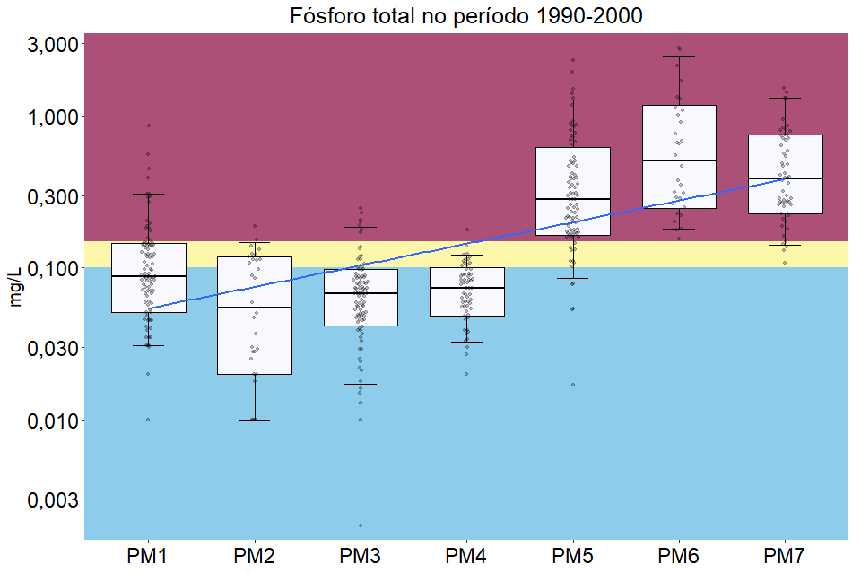
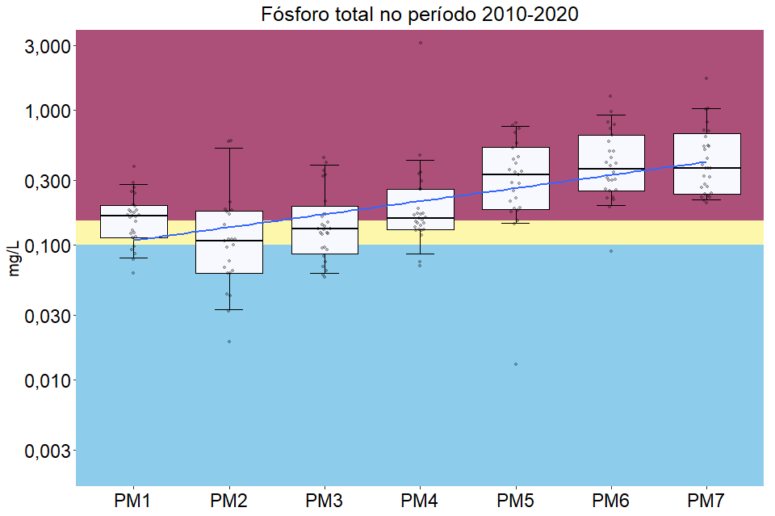
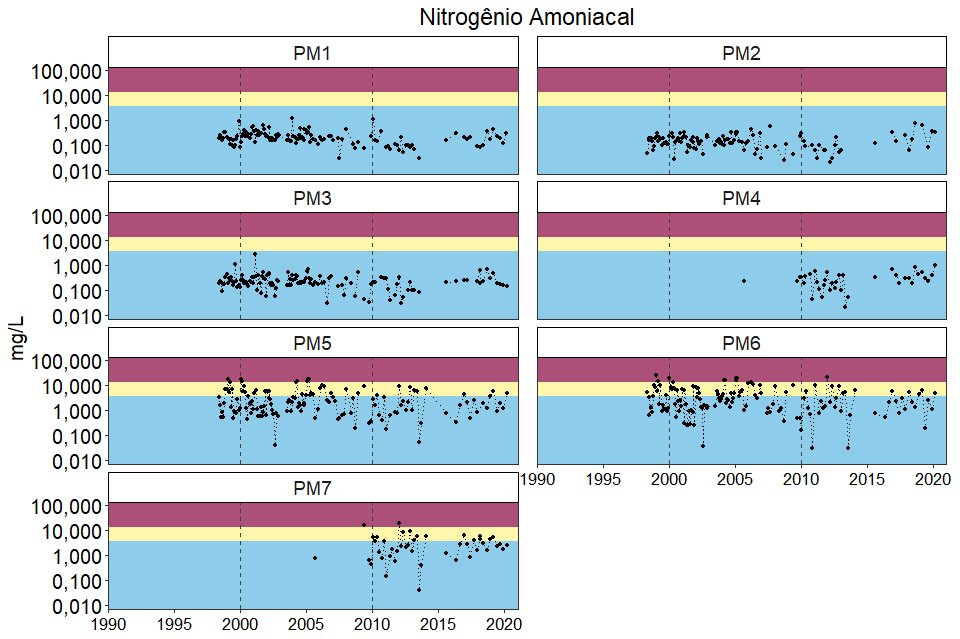
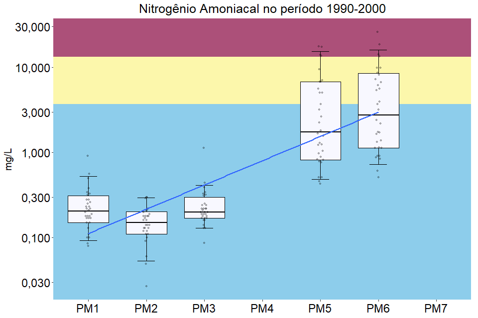
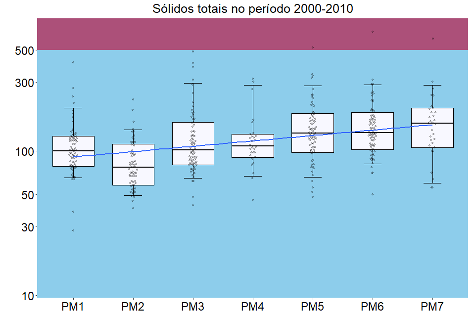
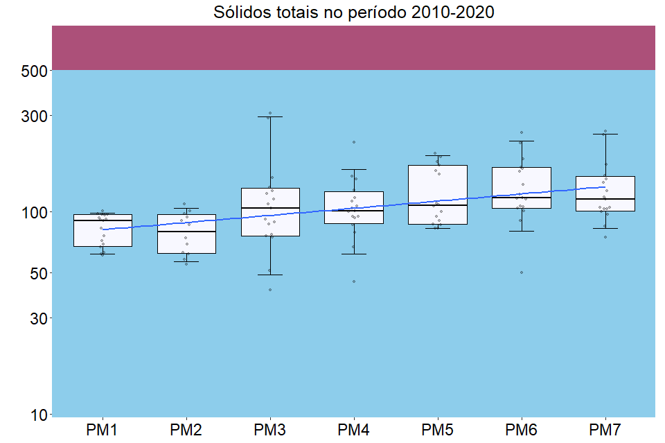
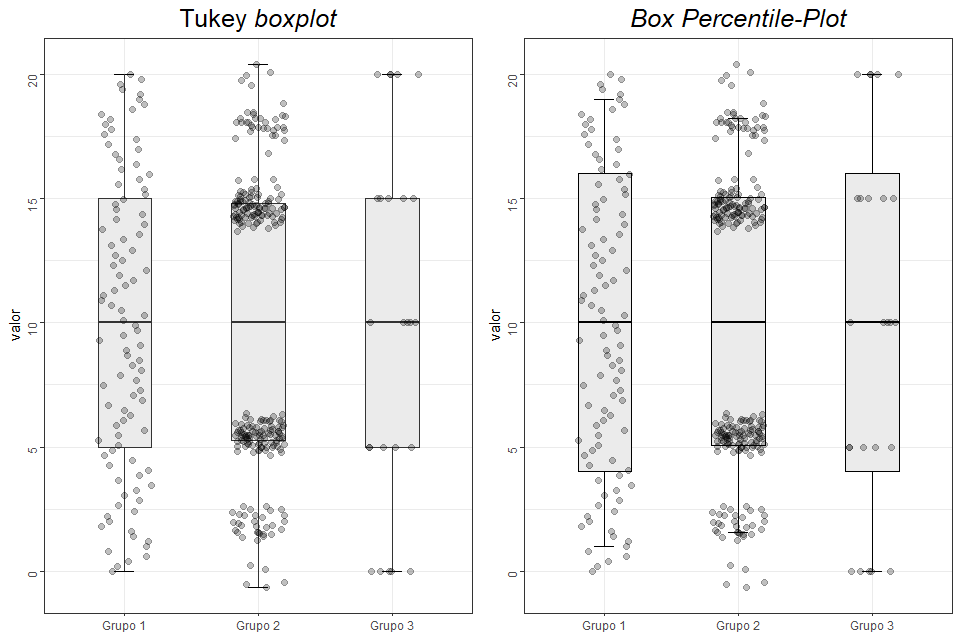

# Brief explanation

Every boxplot means a monitoring point (Ponto de monitoramento (or PM) in portuguese). My goal here is to analyze the evolution between decades of each water quality parameter that compounds the Water Quality Index (WQI).

The river flows in the east-west direction as shown in the image below.


The logic behind the sorting in the boxplots is because of 2 main reasons:

1.  The original monitoring point isn't easy to understand (8 digits, like `87409900`)
2.  Changing the original nomenclature to PM1, PM2 (...) makes it easier to understand that the last point has water contributions of every other point upstream.

# Pacotes necessários

## acessar os pacotes


```r
pacman::p_load(
  # ETL/data wrangling
  readr, readxl, janitor,
  tidyverse,
  dplyr, 
  skimr, 
  # pillar, 
  # see,
  #modelsummary, 
  # report,
  # Data Viz
  rmarkdown, 
  knitr, 
  ## Gráficos
  ggplot2,
  GGally, 
  ggtext, 
  scales,
  ggbeeswarm, 
  gridExtra,
  cowplot,
  ## Tabelas
  SmartEDA, 
  kableExtra, 
  gtsummary,
  formattable,
  
  # Mapas
  leaflet,
  sf, raster,
  # leaflet, leaflet.extras,
  # rgdal, rgeos,
  # maps,
  # mapview,
  # ggmap
  )
```

```
## Warning in pacman::p_load(readr, readxl, janitor, tidyverse, dplyr, skimr, : Failed to install/load:
```

```r
# pacman::p_load(tibbletime)
# cite_packages()
```

Tempo para esse code chunk ser rodado: 13.64 s

### referenciando os pacotes


```r
version$version.string
```

```
## [1] "R version 4.2.2 (2022-10-31 ucrt)"
```

```r
# citation(package = "tidyverse")
```

Tempo para esse code chunk ser rodado: 0 s

## importando a planilha


```r
plan_wide_19902020 <- read_delim("https://raw.githubusercontent.com/leonardofwink/TCC_gh/main/plan_wide_19902020.tsv",
                                 delim = "\t", 
                                 escape_double = FALSE,
                                 col_types = cols(
                                   Alcalinidade = col_double(),
                                   CODIGO = col_character(), 
                                   COORD_GEO_LAT_GRAU = col_double(),
                                   COORD_GEO_LONG_GRAU = col_double(),
                                   DATA_COLETA = col_date(format = "%d/%m/%Y"),
                                   Nitrato = col_double(), 
                                   Nitrito = col_double(),
                                   SDT = col_double(), 
                                   SST = col_double(),
                                   `Vazao` = col_double(), 
                                   `Vazao rio` = col_double()
                                 ),
                                 locale = locale(
                                   date_names = "pt", 
                                   decimal_mark = ",",
                                   grouping_mark = ""
                                 ),
                                 trim_ws = TRUE
) %>% 
  janitor::clean_names() %>% 
  rename(
    pH = p_h,
    iqa_pH = iqa_p_h,
    iqa_pH_2 = iqa_p_h_2,
    latitude = latitude_corrigida,
    longitude = longitude_corrigida
  ) %>% 
  mutate(
    ponto_monitoramento = case_when(
      codigo == "87398500" ~ "PM1",
      codigo == "87398980" ~ "PM2",
      codigo == "87398900" ~ "PM3",
      codigo == "87398950" ~ "PM4",
      codigo == "87405500" ~ "PM5",
      codigo == "87406900" ~ "PM6",
      codigo == "87409900" ~ "PM7"
    )
  ) %>% 
  dplyr::select(
    codigo, ponto_monitoramento, municipio, endereco, latitude, longitude, 
    everything()
    ) %>% 
  dplyr::select(
    -coord_geo_lat_grau,
    -coord_geo_long_grau,
    ) %>% #reordenando colunas
  arrange(data_coleta, ponto_monitoramento)
# teste <- plan_wide_19902020 %>%
#   dplyr::filter(data_coleta >= as.POSIXct("2010-01-01")) #this works
```

Tempo para esse code chunk ser rodado: 1.58 s

<div class="kable-table">

<table>
 <thead>
  <tr>
   <th style="text-align:left;"> codigo </th>
   <th style="text-align:left;"> ponto_monitoramento </th>
   <th style="text-align:left;"> municipio </th>
   <th style="text-align:left;"> endereco </th>
   <th style="text-align:right;"> latitude </th>
   <th style="text-align:right;"> longitude </th>
   <th style="text-align:right;"> altitude </th>
   <th style="text-align:left;"> recurso_hidrico </th>
   <th style="text-align:left;"> data_coleta </th>
   <th style="text-align:right;"> ano_coleta </th>
   <th style="text-align:right;"> alcalinidade </th>
   <th style="text-align:right;"> condutividade </th>
   <th style="text-align:right;"> dbo </th>
   <th style="text-align:right;"> iqa_dbo </th>
   <th style="text-align:right;"> dqo </th>
   <th style="text-align:right;"> escherichia_coli </th>
   <th style="text-align:right;"> fosfato_orto </th>
   <th style="text-align:right;"> fosforo_total </th>
   <th style="text-align:right;"> iqa_ptot </th>
   <th style="text-align:right;"> nitrato </th>
   <th style="text-align:right;"> nitrito </th>
   <th style="text-align:right;"> nitrogenio_organico </th>
   <th style="text-align:right;"> nitrogenio_amoniacal </th>
   <th style="text-align:right;"> nitrogenio_kjeldahl </th>
   <th style="text-align:right;"> nitrogenio_total </th>
   <th style="text-align:right;"> iqa_nitro_tot </th>
   <th style="text-align:right;"> oxigenio_dissolvido </th>
   <th style="text-align:right;"> percent_sat_od </th>
   <th style="text-align:right;"> iqa_od </th>
   <th style="text-align:right;"> pH </th>
   <th style="text-align:right;"> iqa_pH </th>
   <th style="text-align:right;"> sdt </th>
   <th style="text-align:right;"> sst </th>
   <th style="text-align:right;"> temperatura_agua </th>
   <th style="text-align:right;"> temperatura_ar </th>
   <th style="text-align:right;"> transparencia_agua </th>
   <th style="text-align:right;"> turbidez </th>
   <th style="text-align:right;"> iqa_turb </th>
   <th style="text-align:right;"> vazao_rio </th>
   <th style="text-align:right;"> vazao </th>
   <th style="text-align:right;"> coliformes_termotol </th>
   <th style="text-align:right;"> iqa_coli </th>
   <th style="text-align:right;"> solidos_totais </th>
   <th style="text-align:right;"> iqa_sol_tot </th>
   <th style="text-align:right;"> iqa_od_2 </th>
   <th style="text-align:right;"> iqa_temp_agua </th>
   <th style="text-align:right;"> iqa_coli_2 </th>
   <th style="text-align:right;"> iqa_pH_2 </th>
   <th style="text-align:right;"> iqa_dbo_2 </th>
   <th style="text-align:right;"> iqa_nitro_tot_2 </th>
   <th style="text-align:right;"> iqa_ptot_2 </th>
   <th style="text-align:right;"> iqa_turb_2 </th>
   <th style="text-align:right;"> iqa_sol_tot_2 </th>
   <th style="text-align:right;"> iqa </th>
  </tr>
 </thead>
<tbody>
  <tr>
   <td style="text-align:left;"> 87398500 </td>
   <td style="text-align:left;"> PM1 </td>
   <td style="text-align:left;"> SANTO ANTONIO DA PATRULHA - RS </td>
   <td style="text-align:left;"> A PE VINDO DA ESTRADA VELHA DE SANTO ANTONIO </td>
   <td style="text-align:right;"> -29.93385 </td>
   <td style="text-align:right;"> -50.60054 </td>
   <td style="text-align:right;"> 13 </td>
   <td style="text-align:left;"> ARROIO CHICOLUMA </td>
   <td style="text-align:left;"> 1992-05-12 </td>
   <td style="text-align:right;"> 1992 </td>
   <td style="text-align:right;"> NA </td>
   <td style="text-align:right;"> 100.00 </td>
   <td style="text-align:right;"> 4.0 </td>
   <td style="text-align:right;"> 61.05 </td>
   <td style="text-align:right;"> 160.0 </td>
   <td style="text-align:right;"> NA </td>
   <td style="text-align:right;"> NA </td>
   <td style="text-align:right;"> NA </td>
   <td style="text-align:right;"> NA </td>
   <td style="text-align:right;"> NA </td>
   <td style="text-align:right;"> NA </td>
   <td style="text-align:right;"> NA </td>
   <td style="text-align:right;"> NA </td>
   <td style="text-align:right;"> NA </td>
   <td style="text-align:right;"> NA </td>
   <td style="text-align:right;"> NA </td>
   <td style="text-align:right;"> 7.00 </td>
   <td style="text-align:right;"> 77.993 </td>
   <td style="text-align:right;"> 84.42 </td>
   <td style="text-align:right;"> 6.74 </td>
   <td style="text-align:right;"> 86.37 </td>
   <td style="text-align:right;"> NA </td>
   <td style="text-align:right;"> NA </td>
   <td style="text-align:right;"> 21.00 </td>
   <td style="text-align:right;"> NA </td>
   <td style="text-align:right;"> NA </td>
   <td style="text-align:right;"> NA </td>
   <td style="text-align:right;"> NA </td>
   <td style="text-align:right;"> NA </td>
   <td style="text-align:right;"> NA </td>
   <td style="text-align:right;"> NA </td>
   <td style="text-align:right;"> NA </td>
   <td style="text-align:right;"> NA </td>
   <td style="text-align:right;"> NA </td>
   <td style="text-align:right;"> 2.126 </td>
   <td style="text-align:right;"> 1.58 </td>
   <td style="text-align:right;"> NA </td>
   <td style="text-align:right;"> 1.708 </td>
   <td style="text-align:right;"> 1.149 </td>
   <td style="text-align:right;"> NA </td>
   <td style="text-align:right;"> NA </td>
   <td style="text-align:right;"> NA </td>
   <td style="text-align:right;"> NA </td>
   <td style="text-align:right;"> 0.000 </td>
  </tr>
  <tr>
   <td style="text-align:left;"> 87398900 </td>
   <td style="text-align:left;"> PM3 </td>
   <td style="text-align:left;"> GRAVATAI - RS </td>
   <td style="text-align:left;"> A PE VINDO DE CARRO PELA POLICIA RODOVIARIA DA FREE-WAY OU PELA RS-118 </td>
   <td style="text-align:right;"> -29.95075 </td>
   <td style="text-align:right;"> -50.93414 </td>
   <td style="text-align:right;"> 6 </td>
   <td style="text-align:left;"> RIO GRAVATAI </td>
   <td style="text-align:left;"> 1992-05-12 </td>
   <td style="text-align:right;"> 1992 </td>
   <td style="text-align:right;"> NA </td>
   <td style="text-align:right;"> 70.00 </td>
   <td style="text-align:right;"> 2.0 </td>
   <td style="text-align:right;"> 78.12 </td>
   <td style="text-align:right;"> 76.0 </td>
   <td style="text-align:right;"> NA </td>
   <td style="text-align:right;"> NA </td>
   <td style="text-align:right;"> NA </td>
   <td style="text-align:right;"> NA </td>
   <td style="text-align:right;"> NA </td>
   <td style="text-align:right;"> NA </td>
   <td style="text-align:right;"> NA </td>
   <td style="text-align:right;"> NA </td>
   <td style="text-align:right;"> NA </td>
   <td style="text-align:right;"> NA </td>
   <td style="text-align:right;"> NA </td>
   <td style="text-align:right;"> 6.90 </td>
   <td style="text-align:right;"> 77.694 </td>
   <td style="text-align:right;"> 84.14 </td>
   <td style="text-align:right;"> 6.48 </td>
   <td style="text-align:right;"> 79.45 </td>
   <td style="text-align:right;"> NA </td>
   <td style="text-align:right;"> NA </td>
   <td style="text-align:right;"> 21.50 </td>
   <td style="text-align:right;"> NA </td>
   <td style="text-align:right;"> NA </td>
   <td style="text-align:right;"> NA </td>
   <td style="text-align:right;"> NA </td>
   <td style="text-align:right;"> NA </td>
   <td style="text-align:right;"> NA </td>
   <td style="text-align:right;"> NA </td>
   <td style="text-align:right;"> NA </td>
   <td style="text-align:right;"> NA </td>
   <td style="text-align:right;"> NA </td>
   <td style="text-align:right;"> 2.124 </td>
   <td style="text-align:right;"> 1.58 </td>
   <td style="text-align:right;"> NA </td>
   <td style="text-align:right;"> 1.690 </td>
   <td style="text-align:right;"> 1.072 </td>
   <td style="text-align:right;"> NA </td>
   <td style="text-align:right;"> NA </td>
   <td style="text-align:right;"> NA </td>
   <td style="text-align:right;"> NA </td>
   <td style="text-align:right;"> 0.000 </td>
  </tr>
  <tr>
   <td style="text-align:left;"> 87398950 </td>
   <td style="text-align:left;"> PM4 </td>
   <td style="text-align:left;"> GRAVATAI - RS </td>
   <td style="text-align:left;"> A PE NO TREVO, NA PONTE VELHA OU DE BARCO VINDO DA PRAINHA </td>
   <td style="text-align:right;"> -29.95055 </td>
   <td style="text-align:right;"> -51.00064 </td>
   <td style="text-align:right;"> 7 </td>
   <td style="text-align:left;"> RIO GRAVATAI </td>
   <td style="text-align:left;"> 1992-05-12 </td>
   <td style="text-align:right;"> 1992 </td>
   <td style="text-align:right;"> NA </td>
   <td style="text-align:right;"> 75.00 </td>
   <td style="text-align:right;"> 1.0 </td>
   <td style="text-align:right;"> 88.37 </td>
   <td style="text-align:right;"> 145.0 </td>
   <td style="text-align:right;"> NA </td>
   <td style="text-align:right;"> NA </td>
   <td style="text-align:right;"> NA </td>
   <td style="text-align:right;"> NA </td>
   <td style="text-align:right;"> NA </td>
   <td style="text-align:right;"> NA </td>
   <td style="text-align:right;"> NA </td>
   <td style="text-align:right;"> NA </td>
   <td style="text-align:right;"> NA </td>
   <td style="text-align:right;"> NA </td>
   <td style="text-align:right;"> NA </td>
   <td style="text-align:right;"> 6.80 </td>
   <td style="text-align:right;"> 75.818 </td>
   <td style="text-align:right;"> 82.24 </td>
   <td style="text-align:right;"> 6.69 </td>
   <td style="text-align:right;"> 85.17 </td>
   <td style="text-align:right;"> NA </td>
   <td style="text-align:right;"> NA </td>
   <td style="text-align:right;"> 21.00 </td>
   <td style="text-align:right;"> NA </td>
   <td style="text-align:right;"> NA </td>
   <td style="text-align:right;"> NA </td>
   <td style="text-align:right;"> NA </td>
   <td style="text-align:right;"> NA </td>
   <td style="text-align:right;"> NA </td>
   <td style="text-align:right;"> NA </td>
   <td style="text-align:right;"> NA </td>
   <td style="text-align:right;"> NA </td>
   <td style="text-align:right;"> NA </td>
   <td style="text-align:right;"> 2.116 </td>
   <td style="text-align:right;"> 1.58 </td>
   <td style="text-align:right;"> NA </td>
   <td style="text-align:right;"> 1.705 </td>
   <td style="text-align:right;"> 1.000 </td>
   <td style="text-align:right;"> NA </td>
   <td style="text-align:right;"> NA </td>
   <td style="text-align:right;"> NA </td>
   <td style="text-align:right;"> NA </td>
   <td style="text-align:right;"> 0.000 </td>
  </tr>
  <tr>
   <td style="text-align:left;"> 87405500 </td>
   <td style="text-align:left;"> PM5 </td>
   <td style="text-align:left;"> CACHOEIRINHA - RS, PORTO ALEGRE - RS </td>
   <td style="text-align:left;"> DE BARCO, VINDO DO CLUBE ALBATROZ SUBINDO PARA CAHOEIRINHA </td>
   <td style="text-align:right;"> -29.95055 </td>
   <td style="text-align:right;"> -51.11733 </td>
   <td style="text-align:right;"> 6 </td>
   <td style="text-align:left;"> RIO GRAVATAI </td>
   <td style="text-align:left;"> 1992-05-12 </td>
   <td style="text-align:right;"> 1992 </td>
   <td style="text-align:right;"> NA </td>
   <td style="text-align:right;"> 115.00 </td>
   <td style="text-align:right;"> 4.0 </td>
   <td style="text-align:right;"> 61.05 </td>
   <td style="text-align:right;"> 84.0 </td>
   <td style="text-align:right;"> NA </td>
   <td style="text-align:right;"> NA </td>
   <td style="text-align:right;"> NA </td>
   <td style="text-align:right;"> NA </td>
   <td style="text-align:right;"> NA </td>
   <td style="text-align:right;"> NA </td>
   <td style="text-align:right;"> NA </td>
   <td style="text-align:right;"> NA </td>
   <td style="text-align:right;"> 2.000 </td>
   <td style="text-align:right;"> 2.000 </td>
   <td style="text-align:right;"> 84.89 </td>
   <td style="text-align:right;"> 2.40 </td>
   <td style="text-align:right;"> 27.286 </td>
   <td style="text-align:right;"> 18.58 </td>
   <td style="text-align:right;"> 6.19 </td>
   <td style="text-align:right;"> 69.31 </td>
   <td style="text-align:right;"> NA </td>
   <td style="text-align:right;"> NA </td>
   <td style="text-align:right;"> 22.00 </td>
   <td style="text-align:right;"> NA </td>
   <td style="text-align:right;"> NA </td>
   <td style="text-align:right;"> NA </td>
   <td style="text-align:right;"> NA </td>
   <td style="text-align:right;"> NA </td>
   <td style="text-align:right;"> NA </td>
   <td style="text-align:right;"> NA </td>
   <td style="text-align:right;"> NA </td>
   <td style="text-align:right;"> NA </td>
   <td style="text-align:right;"> NA </td>
   <td style="text-align:right;"> 1.643 </td>
   <td style="text-align:right;"> 1.58 </td>
   <td style="text-align:right;"> NA </td>
   <td style="text-align:right;"> 1.663 </td>
   <td style="text-align:right;"> 1.149 </td>
   <td style="text-align:right;"> 1.559 </td>
   <td style="text-align:right;"> NA </td>
   <td style="text-align:right;"> NA </td>
   <td style="text-align:right;"> NA </td>
   <td style="text-align:right;"> 0.000 </td>
  </tr>
  <tr>
   <td style="text-align:left;"> 87409900 </td>
   <td style="text-align:left;"> PM7 </td>
   <td style="text-align:left;"> CANOAS - RS, PORTO ALEGRE - RS </td>
   <td style="text-align:left;"> DE BARCO, VINDO DO CLUBE ALBATROZ, EM CANOAS </td>
   <td style="text-align:right;"> -29.96714 </td>
   <td style="text-align:right;"> -51.18404 </td>
   <td style="text-align:right;"> 9 </td>
   <td style="text-align:left;"> RIO GRAVATAI </td>
   <td style="text-align:left;"> 1992-05-12 </td>
   <td style="text-align:right;"> 1992 </td>
   <td style="text-align:right;"> NA </td>
   <td style="text-align:right;"> 170.00 </td>
   <td style="text-align:right;"> 9.0 </td>
   <td style="text-align:right;"> 35.36 </td>
   <td style="text-align:right;"> 129.0 </td>
   <td style="text-align:right;"> NA </td>
   <td style="text-align:right;"> NA </td>
   <td style="text-align:right;"> NA </td>
   <td style="text-align:right;"> NA </td>
   <td style="text-align:right;"> NA </td>
   <td style="text-align:right;"> NA </td>
   <td style="text-align:right;"> NA </td>
   <td style="text-align:right;"> NA </td>
   <td style="text-align:right;"> NA </td>
   <td style="text-align:right;"> NA </td>
   <td style="text-align:right;"> NA </td>
   <td style="text-align:right;"> 0.38 </td>
   <td style="text-align:right;"> 4.236 </td>
   <td style="text-align:right;"> 4.59 </td>
   <td style="text-align:right;"> 6.18 </td>
   <td style="text-align:right;"> 68.81 </td>
   <td style="text-align:right;"> NA </td>
   <td style="text-align:right;"> NA </td>
   <td style="text-align:right;"> 21.00 </td>
   <td style="text-align:right;"> NA </td>
   <td style="text-align:right;"> NA </td>
   <td style="text-align:right;"> NA </td>
   <td style="text-align:right;"> NA </td>
   <td style="text-align:right;"> NA </td>
   <td style="text-align:right;"> NA </td>
   <td style="text-align:right;"> NA </td>
   <td style="text-align:right;"> NA </td>
   <td style="text-align:right;"> NA </td>
   <td style="text-align:right;"> NA </td>
   <td style="text-align:right;"> 1.296 </td>
   <td style="text-align:right;"> 1.58 </td>
   <td style="text-align:right;"> NA </td>
   <td style="text-align:right;"> 1.662 </td>
   <td style="text-align:right;"> 1.246 </td>
   <td style="text-align:right;"> NA </td>
   <td style="text-align:right;"> NA </td>
   <td style="text-align:right;"> NA </td>
   <td style="text-align:right;"> NA </td>
   <td style="text-align:right;"> 0.000 </td>
  </tr>
  <tr>
   <td style="text-align:left;"> 87398500 </td>
   <td style="text-align:left;"> PM1 </td>
   <td style="text-align:left;"> SANTO ANTONIO DA PATRULHA - RS </td>
   <td style="text-align:left;"> A PE VINDO DA ESTRADA VELHA DE SANTO ANTONIO </td>
   <td style="text-align:right;"> -29.93385 </td>
   <td style="text-align:right;"> -50.60054 </td>
   <td style="text-align:right;"> 13 </td>
   <td style="text-align:left;"> ARROIO CHICOLUMA </td>
   <td style="text-align:left;"> 1992-06-16 </td>
   <td style="text-align:right;"> 1992 </td>
   <td style="text-align:right;"> NA </td>
   <td style="text-align:right;"> 76.00 </td>
   <td style="text-align:right;"> 2.0 </td>
   <td style="text-align:right;"> 78.12 </td>
   <td style="text-align:right;"> 68.0 </td>
   <td style="text-align:right;"> 176.0 </td>
   <td style="text-align:right;"> NA </td>
   <td style="text-align:right;"> NA </td>
   <td style="text-align:right;"> NA </td>
   <td style="text-align:right;"> NA </td>
   <td style="text-align:right;"> NA </td>
   <td style="text-align:right;"> NA </td>
   <td style="text-align:right;"> NA </td>
   <td style="text-align:right;"> NA </td>
   <td style="text-align:right;"> NA </td>
   <td style="text-align:right;"> NA </td>
   <td style="text-align:right;"> 9.10 </td>
   <td style="text-align:right;"> 89.588 </td>
   <td style="text-align:right;"> 92.74 </td>
   <td style="text-align:right;"> 6.80 </td>
   <td style="text-align:right;"> 87.72 </td>
   <td style="text-align:right;"> NA </td>
   <td style="text-align:right;"> NA </td>
   <td style="text-align:right;"> 15.00 </td>
   <td style="text-align:right;"> NA </td>
   <td style="text-align:right;"> NA </td>
   <td style="text-align:right;"> NA </td>
   <td style="text-align:right;"> NA </td>
   <td style="text-align:right;"> NA </td>
   <td style="text-align:right;"> NA </td>
   <td style="text-align:right;"> 220.00 </td>
   <td style="text-align:right;"> 32.66 </td>
   <td style="text-align:right;"> 114 </td>
   <td style="text-align:right;"> 84.53 </td>
   <td style="text-align:right;"> 2.160 </td>
   <td style="text-align:right;"> 1.58 </td>
   <td style="text-align:right;"> 1.687 </td>
   <td style="text-align:right;"> 1.711 </td>
   <td style="text-align:right;"> 1.072 </td>
   <td style="text-align:right;"> NA </td>
   <td style="text-align:right;"> NA </td>
   <td style="text-align:right;"> NA </td>
   <td style="text-align:right;"> 1.426 </td>
   <td style="text-align:right;"> 0.000 </td>
  </tr>
  <tr>
   <td style="text-align:left;"> 87398900 </td>
   <td style="text-align:left;"> PM3 </td>
   <td style="text-align:left;"> GRAVATAI - RS </td>
   <td style="text-align:left;"> A PE VINDO DE CARRO PELA POLICIA RODOVIARIA DA FREE-WAY OU PELA RS-118 </td>
   <td style="text-align:right;"> -29.95075 </td>
   <td style="text-align:right;"> -50.93414 </td>
   <td style="text-align:right;"> 6 </td>
   <td style="text-align:left;"> RIO GRAVATAI </td>
   <td style="text-align:left;"> 1992-06-16 </td>
   <td style="text-align:right;"> 1992 </td>
   <td style="text-align:right;"> NA </td>
   <td style="text-align:right;"> 40.00 </td>
   <td style="text-align:right;"> 1.0 </td>
   <td style="text-align:right;"> 88.37 </td>
   <td style="text-align:right;"> 72.0 </td>
   <td style="text-align:right;"> 104.0 </td>
   <td style="text-align:right;"> NA </td>
   <td style="text-align:right;"> NA </td>
   <td style="text-align:right;"> NA </td>
   <td style="text-align:right;"> NA </td>
   <td style="text-align:right;"> NA </td>
   <td style="text-align:right;"> NA </td>
   <td style="text-align:right;"> NA </td>
   <td style="text-align:right;"> NA </td>
   <td style="text-align:right;"> NA </td>
   <td style="text-align:right;"> NA </td>
   <td style="text-align:right;"> 6.90 </td>
   <td style="text-align:right;"> 70.954 </td>
   <td style="text-align:right;"> 76.40 </td>
   <td style="text-align:right;"> 6.00 </td>
   <td style="text-align:right;"> 60.27 </td>
   <td style="text-align:right;"> NA </td>
   <td style="text-align:right;"> NA </td>
   <td style="text-align:right;"> 17.00 </td>
   <td style="text-align:right;"> NA </td>
   <td style="text-align:right;"> NA </td>
   <td style="text-align:right;"> NA </td>
   <td style="text-align:right;"> NA </td>
   <td style="text-align:right;"> NA </td>
   <td style="text-align:right;"> NA </td>
   <td style="text-align:right;"> 130.00 </td>
   <td style="text-align:right;"> 37.48 </td>
   <td style="text-align:right;"> 474 </td>
   <td style="text-align:right;"> 35.70 </td>
   <td style="text-align:right;"> 2.090 </td>
   <td style="text-align:right;"> 1.58 </td>
   <td style="text-align:right;"> 1.722 </td>
   <td style="text-align:right;"> 1.635 </td>
   <td style="text-align:right;"> 1.000 </td>
   <td style="text-align:right;"> NA </td>
   <td style="text-align:right;"> NA </td>
   <td style="text-align:right;"> NA </td>
   <td style="text-align:right;"> 1.331 </td>
   <td style="text-align:right;"> 0.000 </td>
  </tr>
  <tr>
   <td style="text-align:left;"> 87398950 </td>
   <td style="text-align:left;"> PM4 </td>
   <td style="text-align:left;"> GRAVATAI - RS </td>
   <td style="text-align:left;"> A PE NO TREVO, NA PONTE VELHA OU DE BARCO VINDO DA PRAINHA </td>
   <td style="text-align:right;"> -29.95055 </td>
   <td style="text-align:right;"> -51.00064 </td>
   <td style="text-align:right;"> 7 </td>
   <td style="text-align:left;"> RIO GRAVATAI </td>
   <td style="text-align:left;"> 1992-06-16 </td>
   <td style="text-align:right;"> 1992 </td>
   <td style="text-align:right;"> NA </td>
   <td style="text-align:right;"> 42.00 </td>
   <td style="text-align:right;"> 1.0 </td>
   <td style="text-align:right;"> 88.37 </td>
   <td style="text-align:right;"> 76.0 </td>
   <td style="text-align:right;"> 240.0 </td>
   <td style="text-align:right;"> NA </td>
   <td style="text-align:right;"> NA </td>
   <td style="text-align:right;"> NA </td>
   <td style="text-align:right;"> NA </td>
   <td style="text-align:right;"> NA </td>
   <td style="text-align:right;"> NA </td>
   <td style="text-align:right;"> NA </td>
   <td style="text-align:right;"> NA </td>
   <td style="text-align:right;"> NA </td>
   <td style="text-align:right;"> NA </td>
   <td style="text-align:right;"> 7.90 </td>
   <td style="text-align:right;"> 79.525 </td>
   <td style="text-align:right;"> 85.79 </td>
   <td style="text-align:right;"> 8.10 </td>
   <td style="text-align:right;"> 86.40 </td>
   <td style="text-align:right;"> NA </td>
   <td style="text-align:right;"> NA </td>
   <td style="text-align:right;"> 16.00 </td>
   <td style="text-align:right;"> NA </td>
   <td style="text-align:right;"> NA </td>
   <td style="text-align:right;"> NA </td>
   <td style="text-align:right;"> NA </td>
   <td style="text-align:right;"> NA </td>
   <td style="text-align:right;"> NA </td>
   <td style="text-align:right;"> 300.00 </td>
   <td style="text-align:right;"> 29.99 </td>
   <td style="text-align:right;"> 76 </td>
   <td style="text-align:right;"> 86.08 </td>
   <td style="text-align:right;"> 2.132 </td>
   <td style="text-align:right;"> 1.58 </td>
   <td style="text-align:right;"> 1.665 </td>
   <td style="text-align:right;"> 1.708 </td>
   <td style="text-align:right;"> 1.000 </td>
   <td style="text-align:right;"> NA </td>
   <td style="text-align:right;"> NA </td>
   <td style="text-align:right;"> NA </td>
   <td style="text-align:right;"> 1.428 </td>
   <td style="text-align:right;"> 0.000 </td>
  </tr>
  <tr>
   <td style="text-align:left;"> 87405500 </td>
   <td style="text-align:left;"> PM5 </td>
   <td style="text-align:left;"> CACHOEIRINHA - RS, PORTO ALEGRE - RS </td>
   <td style="text-align:left;"> DE BARCO, VINDO DO CLUBE ALBATROZ SUBINDO PARA CAHOEIRINHA </td>
   <td style="text-align:right;"> -29.95055 </td>
   <td style="text-align:right;"> -51.11733 </td>
   <td style="text-align:right;"> 6 </td>
   <td style="text-align:left;"> RIO GRAVATAI </td>
   <td style="text-align:left;"> 1992-06-16 </td>
   <td style="text-align:right;"> 1992 </td>
   <td style="text-align:right;"> NA </td>
   <td style="text-align:right;"> 34.00 </td>
   <td style="text-align:right;"> 2.0 </td>
   <td style="text-align:right;"> 78.12 </td>
   <td style="text-align:right;"> 72.0 </td>
   <td style="text-align:right;"> 7.2 </td>
   <td style="text-align:right;"> NA </td>
   <td style="text-align:right;"> NA </td>
   <td style="text-align:right;"> NA </td>
   <td style="text-align:right;"> NA </td>
   <td style="text-align:right;"> NA </td>
   <td style="text-align:right;"> NA </td>
   <td style="text-align:right;"> NA </td>
   <td style="text-align:right;"> NA </td>
   <td style="text-align:right;"> NA </td>
   <td style="text-align:right;"> NA </td>
   <td style="text-align:right;"> 6.70 </td>
   <td style="text-align:right;"> 66.015 </td>
   <td style="text-align:right;"> 69.37 </td>
   <td style="text-align:right;"> 6.18 </td>
   <td style="text-align:right;"> 68.81 </td>
   <td style="text-align:right;"> NA </td>
   <td style="text-align:right;"> NA </td>
   <td style="text-align:right;"> 15.00 </td>
   <td style="text-align:right;"> NA </td>
   <td style="text-align:right;"> NA </td>
   <td style="text-align:right;"> NA </td>
   <td style="text-align:right;"> NA </td>
   <td style="text-align:right;"> NA </td>
   <td style="text-align:right;"> NA </td>
   <td style="text-align:right;"> 9.00 </td>
   <td style="text-align:right;"> 68.03 </td>
   <td style="text-align:right;"> 93 </td>
   <td style="text-align:right;"> 85.78 </td>
   <td style="text-align:right;"> 2.056 </td>
   <td style="text-align:right;"> 1.58 </td>
   <td style="text-align:right;"> 1.883 </td>
   <td style="text-align:right;"> 1.662 </td>
   <td style="text-align:right;"> 1.072 </td>
   <td style="text-align:right;"> NA </td>
   <td style="text-align:right;"> NA </td>
   <td style="text-align:right;"> NA </td>
   <td style="text-align:right;"> 1.428 </td>
   <td style="text-align:right;"> 0.000 </td>
  </tr>
  <tr>
   <td style="text-align:left;"> 87409900 </td>
   <td style="text-align:left;"> PM7 </td>
   <td style="text-align:left;"> CANOAS - RS, PORTO ALEGRE - RS </td>
   <td style="text-align:left;"> DE BARCO, VINDO DO CLUBE ALBATROZ, EM CANOAS </td>
   <td style="text-align:right;"> -29.96714 </td>
   <td style="text-align:right;"> -51.18404 </td>
   <td style="text-align:right;"> 9 </td>
   <td style="text-align:left;"> RIO GRAVATAI </td>
   <td style="text-align:left;"> 1992-06-16 </td>
   <td style="text-align:right;"> 1992 </td>
   <td style="text-align:right;"> NA </td>
   <td style="text-align:right;"> 68.00 </td>
   <td style="text-align:right;"> 4.0 </td>
   <td style="text-align:right;"> 61.05 </td>
   <td style="text-align:right;"> 76.0 </td>
   <td style="text-align:right;"> 56.0 </td>
   <td style="text-align:right;"> NA </td>
   <td style="text-align:right;"> NA </td>
   <td style="text-align:right;"> NA </td>
   <td style="text-align:right;"> NA </td>
   <td style="text-align:right;"> NA </td>
   <td style="text-align:right;"> NA </td>
   <td style="text-align:right;"> NA </td>
   <td style="text-align:right;"> NA </td>
   <td style="text-align:right;"> NA </td>
   <td style="text-align:right;"> NA </td>
   <td style="text-align:right;"> 5.10 </td>
   <td style="text-align:right;"> 51.327 </td>
   <td style="text-align:right;"> 44.52 </td>
   <td style="text-align:right;"> 6.20 </td>
   <td style="text-align:right;"> 69.80 </td>
   <td style="text-align:right;"> NA </td>
   <td style="text-align:right;"> NA </td>
   <td style="text-align:right;"> 16.00 </td>
   <td style="text-align:right;"> NA </td>
   <td style="text-align:right;"> NA </td>
   <td style="text-align:right;"> NA </td>
   <td style="text-align:right;"> NA </td>
   <td style="text-align:right;"> NA </td>
   <td style="text-align:right;"> NA </td>
   <td style="text-align:right;"> 70.00 </td>
   <td style="text-align:right;"> 43.64 </td>
   <td style="text-align:right;"> 94 </td>
   <td style="text-align:right;"> 85.74 </td>
   <td style="text-align:right;"> 1.907 </td>
   <td style="text-align:right;"> 1.58 </td>
   <td style="text-align:right;"> 1.762 </td>
   <td style="text-align:right;"> 1.664 </td>
   <td style="text-align:right;"> 1.149 </td>
   <td style="text-align:right;"> NA </td>
   <td style="text-align:right;"> NA </td>
   <td style="text-align:right;"> NA </td>
   <td style="text-align:right;"> 1.428 </td>
   <td style="text-align:right;"> 0.000 </td>
  </tr>
  <tr>
   <td style="text-align:left;"> 87398500 </td>
   <td style="text-align:left;"> PM1 </td>
   <td style="text-align:left;"> SANTO ANTONIO DA PATRULHA - RS </td>
   <td style="text-align:left;"> A PE VINDO DA ESTRADA VELHA DE SANTO ANTONIO </td>
   <td style="text-align:right;"> -29.93385 </td>
   <td style="text-align:right;"> -50.60054 </td>
   <td style="text-align:right;"> 13 </td>
   <td style="text-align:left;"> ARROIO CHICOLUMA </td>
   <td style="text-align:left;"> 1992-07-09 </td>
   <td style="text-align:right;"> 1992 </td>
   <td style="text-align:right;"> NA </td>
   <td style="text-align:right;"> 40.00 </td>
   <td style="text-align:right;"> 1.0 </td>
   <td style="text-align:right;"> 88.37 </td>
   <td style="text-align:right;"> 63.0 </td>
   <td style="text-align:right;"> 19200.0 </td>
   <td style="text-align:right;"> NA </td>
   <td style="text-align:right;"> 0.140 </td>
   <td style="text-align:right;"> 67.41 </td>
   <td style="text-align:right;"> NA </td>
   <td style="text-align:right;"> NA </td>
   <td style="text-align:right;"> NA </td>
   <td style="text-align:right;"> NA </td>
   <td style="text-align:right;"> NA </td>
   <td style="text-align:right;"> NA </td>
   <td style="text-align:right;"> NA </td>
   <td style="text-align:right;"> 9.10 </td>
   <td style="text-align:right;"> 81.879 </td>
   <td style="text-align:right;"> 87.59 </td>
   <td style="text-align:right;"> 7.23 </td>
   <td style="text-align:right;"> 92.44 </td>
   <td style="text-align:right;"> NA </td>
   <td style="text-align:right;"> NA </td>
   <td style="text-align:right;"> 11.00 </td>
   <td style="text-align:right;"> NA </td>
   <td style="text-align:right;"> NA </td>
   <td style="text-align:right;"> NA </td>
   <td style="text-align:right;"> NA </td>
   <td style="text-align:right;"> NA </td>
   <td style="text-align:right;"> NA </td>
   <td style="text-align:right;"> 24000.00 </td>
   <td style="text-align:right;"> 6.27 </td>
   <td style="text-align:right;"> 94 </td>
   <td style="text-align:right;"> 85.74 </td>
   <td style="text-align:right;"> 2.139 </td>
   <td style="text-align:right;"> 1.58 </td>
   <td style="text-align:right;"> 1.317 </td>
   <td style="text-align:right;"> 1.721 </td>
   <td style="text-align:right;"> 1.000 </td>
   <td style="text-align:right;"> NA </td>
   <td style="text-align:right;"> 1.524 </td>
   <td style="text-align:right;"> NA </td>
   <td style="text-align:right;"> 1.428 </td>
   <td style="text-align:right;"> 0.000 </td>
  </tr>
  <tr>
   <td style="text-align:left;"> 87398900 </td>
   <td style="text-align:left;"> PM3 </td>
   <td style="text-align:left;"> GRAVATAI - RS </td>
   <td style="text-align:left;"> A PE VINDO DE CARRO PELA POLICIA RODOVIARIA DA FREE-WAY OU PELA RS-118 </td>
   <td style="text-align:right;"> -29.95075 </td>
   <td style="text-align:right;"> -50.93414 </td>
   <td style="text-align:right;"> 6 </td>
   <td style="text-align:left;"> RIO GRAVATAI </td>
   <td style="text-align:left;"> 1992-07-09 </td>
   <td style="text-align:right;"> 1992 </td>
   <td style="text-align:right;"> NA </td>
   <td style="text-align:right;"> 30.00 </td>
   <td style="text-align:right;"> 1.0 </td>
   <td style="text-align:right;"> 88.37 </td>
   <td style="text-align:right;"> 59.0 </td>
   <td style="text-align:right;"> 1760.0 </td>
   <td style="text-align:right;"> NA </td>
   <td style="text-align:right;"> 0.120 </td>
   <td style="text-align:right;"> 71.31 </td>
   <td style="text-align:right;"> NA </td>
   <td style="text-align:right;"> NA </td>
   <td style="text-align:right;"> NA </td>
   <td style="text-align:right;"> NA </td>
   <td style="text-align:right;"> NA </td>
   <td style="text-align:right;"> NA </td>
   <td style="text-align:right;"> NA </td>
   <td style="text-align:right;"> 9.50 </td>
   <td style="text-align:right;"> 85.548 </td>
   <td style="text-align:right;"> 89.87 </td>
   <td style="text-align:right;"> 6.64 </td>
   <td style="text-align:right;"> 83.91 </td>
   <td style="text-align:right;"> NA </td>
   <td style="text-align:right;"> NA </td>
   <td style="text-align:right;"> 11.00 </td>
   <td style="text-align:right;"> NA </td>
   <td style="text-align:right;"> NA </td>
   <td style="text-align:right;"> NA </td>
   <td style="text-align:right;"> NA </td>
   <td style="text-align:right;"> NA </td>
   <td style="text-align:right;"> NA </td>
   <td style="text-align:right;"> 2200.00 </td>
   <td style="text-align:right;"> 15.96 </td>
   <td style="text-align:right;"> 97 </td>
   <td style="text-align:right;"> 85.62 </td>
   <td style="text-align:right;"> 2.148 </td>
   <td style="text-align:right;"> 1.58 </td>
   <td style="text-align:right;"> 1.515 </td>
   <td style="text-align:right;"> 1.702 </td>
   <td style="text-align:right;"> 1.000 </td>
   <td style="text-align:right;"> NA </td>
   <td style="text-align:right;"> 1.532 </td>
   <td style="text-align:right;"> NA </td>
   <td style="text-align:right;"> 1.428 </td>
   <td style="text-align:right;"> 0.000 </td>
  </tr>
  <tr>
   <td style="text-align:left;"> 87398950 </td>
   <td style="text-align:left;"> PM4 </td>
   <td style="text-align:left;"> GRAVATAI - RS </td>
   <td style="text-align:left;"> A PE NO TREVO, NA PONTE VELHA OU DE BARCO VINDO DA PRAINHA </td>
   <td style="text-align:right;"> -29.95055 </td>
   <td style="text-align:right;"> -51.00064 </td>
   <td style="text-align:right;"> 7 </td>
   <td style="text-align:left;"> RIO GRAVATAI </td>
   <td style="text-align:left;"> 1992-07-09 </td>
   <td style="text-align:right;"> 1992 </td>
   <td style="text-align:right;"> NA </td>
   <td style="text-align:right;"> 28.00 </td>
   <td style="text-align:right;"> 1.0 </td>
   <td style="text-align:right;"> 88.37 </td>
   <td style="text-align:right;"> 55.0 </td>
   <td style="text-align:right;"> 10400.0 </td>
   <td style="text-align:right;"> NA </td>
   <td style="text-align:right;"> 0.140 </td>
   <td style="text-align:right;"> 67.41 </td>
   <td style="text-align:right;"> NA </td>
   <td style="text-align:right;"> NA </td>
   <td style="text-align:right;"> NA </td>
   <td style="text-align:right;"> NA </td>
   <td style="text-align:right;"> NA </td>
   <td style="text-align:right;"> NA </td>
   <td style="text-align:right;"> NA </td>
   <td style="text-align:right;"> 9.30 </td>
   <td style="text-align:right;"> 85.691 </td>
   <td style="text-align:right;"> 89.97 </td>
   <td style="text-align:right;"> 6.82 </td>
   <td style="text-align:right;"> 88.14 </td>
   <td style="text-align:right;"> NA </td>
   <td style="text-align:right;"> NA </td>
   <td style="text-align:right;"> 12.00 </td>
   <td style="text-align:right;"> NA </td>
   <td style="text-align:right;"> NA </td>
   <td style="text-align:right;"> NA </td>
   <td style="text-align:right;"> NA </td>
   <td style="text-align:right;"> NA </td>
   <td style="text-align:right;"> NA </td>
   <td style="text-align:right;"> 13000.00 </td>
   <td style="text-align:right;"> 8.02 </td>
   <td style="text-align:right;"> 93 </td>
   <td style="text-align:right;"> 85.78 </td>
   <td style="text-align:right;"> 2.149 </td>
   <td style="text-align:right;"> 1.58 </td>
   <td style="text-align:right;"> 1.366 </td>
   <td style="text-align:right;"> 1.712 </td>
   <td style="text-align:right;"> 1.000 </td>
   <td style="text-align:right;"> NA </td>
   <td style="text-align:right;"> 1.524 </td>
   <td style="text-align:right;"> NA </td>
   <td style="text-align:right;"> 1.428 </td>
   <td style="text-align:right;"> 0.000 </td>
  </tr>
  <tr>
   <td style="text-align:left;"> 87405500 </td>
   <td style="text-align:left;"> PM5 </td>
   <td style="text-align:left;"> CACHOEIRINHA - RS, PORTO ALEGRE - RS </td>
   <td style="text-align:left;"> DE BARCO, VINDO DO CLUBE ALBATROZ SUBINDO PARA CAHOEIRINHA </td>
   <td style="text-align:right;"> -29.95055 </td>
   <td style="text-align:right;"> -51.11733 </td>
   <td style="text-align:right;"> 6 </td>
   <td style="text-align:left;"> RIO GRAVATAI </td>
   <td style="text-align:left;"> 1992-07-09 </td>
   <td style="text-align:right;"> 1992 </td>
   <td style="text-align:right;"> NA </td>
   <td style="text-align:right;"> 35.00 </td>
   <td style="text-align:right;"> 1.0 </td>
   <td style="text-align:right;"> 88.37 </td>
   <td style="text-align:right;"> 67.0 </td>
   <td style="text-align:right;"> 10400.0 </td>
   <td style="text-align:right;"> NA </td>
   <td style="text-align:right;"> 0.160 </td>
   <td style="text-align:right;"> 63.73 </td>
   <td style="text-align:right;"> NA </td>
   <td style="text-align:right;"> NA </td>
   <td style="text-align:right;"> NA </td>
   <td style="text-align:right;"> NA </td>
   <td style="text-align:right;"> NA </td>
   <td style="text-align:right;"> NA </td>
   <td style="text-align:right;"> NA </td>
   <td style="text-align:right;"> 8.30 </td>
   <td style="text-align:right;"> 77.362 </td>
   <td style="text-align:right;"> 83.82 </td>
   <td style="text-align:right;"> 6.70 </td>
   <td style="text-align:right;"> 85.42 </td>
   <td style="text-align:right;"> NA </td>
   <td style="text-align:right;"> NA </td>
   <td style="text-align:right;"> 12.50 </td>
   <td style="text-align:right;"> NA </td>
   <td style="text-align:right;"> NA </td>
   <td style="text-align:right;"> NA </td>
   <td style="text-align:right;"> NA </td>
   <td style="text-align:right;"> NA </td>
   <td style="text-align:right;"> NA </td>
   <td style="text-align:right;"> 13000.00 </td>
   <td style="text-align:right;"> 8.02 </td>
   <td style="text-align:right;"> 123 </td>
   <td style="text-align:right;"> 83.71 </td>
   <td style="text-align:right;"> 2.123 </td>
   <td style="text-align:right;"> 1.58 </td>
   <td style="text-align:right;"> 1.366 </td>
   <td style="text-align:right;"> 1.705 </td>
   <td style="text-align:right;"> 1.000 </td>
   <td style="text-align:right;"> NA </td>
   <td style="text-align:right;"> 1.515 </td>
   <td style="text-align:right;"> NA </td>
   <td style="text-align:right;"> 1.425 </td>
   <td style="text-align:right;"> 0.000 </td>
  </tr>
  <tr>
   <td style="text-align:left;"> 87409900 </td>
   <td style="text-align:left;"> PM7 </td>
   <td style="text-align:left;"> CANOAS - RS, PORTO ALEGRE - RS </td>
   <td style="text-align:left;"> DE BARCO, VINDO DO CLUBE ALBATROZ, EM CANOAS </td>
   <td style="text-align:right;"> -29.96714 </td>
   <td style="text-align:right;"> -51.18404 </td>
   <td style="text-align:right;"> 9 </td>
   <td style="text-align:left;"> RIO GRAVATAI </td>
   <td style="text-align:left;"> 1992-07-09 </td>
   <td style="text-align:right;"> 1992 </td>
   <td style="text-align:right;"> NA </td>
   <td style="text-align:right;"> 45.00 </td>
   <td style="text-align:right;"> 2.0 </td>
   <td style="text-align:right;"> 78.12 </td>
   <td style="text-align:right;"> 67.0 </td>
   <td style="text-align:right;"> 18.4 </td>
   <td style="text-align:right;"> NA </td>
   <td style="text-align:right;"> 0.260 </td>
   <td style="text-align:right;"> 48.12 </td>
   <td style="text-align:right;"> NA </td>
   <td style="text-align:right;"> NA </td>
   <td style="text-align:right;"> NA </td>
   <td style="text-align:right;"> NA </td>
   <td style="text-align:right;"> NA </td>
   <td style="text-align:right;"> NA </td>
   <td style="text-align:right;"> NA </td>
   <td style="text-align:right;"> 7.80 </td>
   <td style="text-align:right;"> 72.676 </td>
   <td style="text-align:right;"> 78.60 </td>
   <td style="text-align:right;"> 6.20 </td>
   <td style="text-align:right;"> 69.80 </td>
   <td style="text-align:right;"> NA </td>
   <td style="text-align:right;"> NA </td>
   <td style="text-align:right;"> 12.50 </td>
   <td style="text-align:right;"> NA </td>
   <td style="text-align:right;"> NA </td>
   <td style="text-align:right;"> NA </td>
   <td style="text-align:right;"> NA </td>
   <td style="text-align:right;"> NA </td>
   <td style="text-align:right;"> NA </td>
   <td style="text-align:right;"> 23.00 </td>
   <td style="text-align:right;"> 56.03 </td>
   <td style="text-align:right;"> 144 </td>
   <td style="text-align:right;"> 81.09 </td>
   <td style="text-align:right;"> 2.100 </td>
   <td style="text-align:right;"> 1.58 </td>
   <td style="text-align:right;"> 1.829 </td>
   <td style="text-align:right;"> 1.664 </td>
   <td style="text-align:right;"> 1.072 </td>
   <td style="text-align:right;"> NA </td>
   <td style="text-align:right;"> 1.473 </td>
   <td style="text-align:right;"> NA </td>
   <td style="text-align:right;"> 1.421 </td>
   <td style="text-align:right;"> 0.000 </td>
  </tr>
  <tr>
   <td style="text-align:left;"> 87398500 </td>
   <td style="text-align:left;"> PM1 </td>
   <td style="text-align:left;"> SANTO ANTONIO DA PATRULHA - RS </td>
   <td style="text-align:left;"> A PE VINDO DA ESTRADA VELHA DE SANTO ANTONIO </td>
   <td style="text-align:right;"> -29.93385 </td>
   <td style="text-align:right;"> -50.60054 </td>
   <td style="text-align:right;"> 13 </td>
   <td style="text-align:left;"> ARROIO CHICOLUMA </td>
   <td style="text-align:left;"> 1992-08-06 </td>
   <td style="text-align:right;"> 1992 </td>
   <td style="text-align:right;"> NA </td>
   <td style="text-align:right;"> 40.00 </td>
   <td style="text-align:right;"> 1.0 </td>
   <td style="text-align:right;"> 88.37 </td>
   <td style="text-align:right;"> 60.0 </td>
   <td style="text-align:right;"> 192.0 </td>
   <td style="text-align:right;"> NA </td>
   <td style="text-align:right;"> 0.090 </td>
   <td style="text-align:right;"> 77.58 </td>
   <td style="text-align:right;"> NA </td>
   <td style="text-align:right;"> NA </td>
   <td style="text-align:right;"> NA </td>
   <td style="text-align:right;"> NA </td>
   <td style="text-align:right;"> NA </td>
   <td style="text-align:right;"> NA </td>
   <td style="text-align:right;"> NA </td>
   <td style="text-align:right;"> NA </td>
   <td style="text-align:right;"> NA </td>
   <td style="text-align:right;"> NA </td>
   <td style="text-align:right;"> 6.58 </td>
   <td style="text-align:right;"> 82.31 </td>
   <td style="text-align:right;"> NA </td>
   <td style="text-align:right;"> NA </td>
   <td style="text-align:right;"> 13.00 </td>
   <td style="text-align:right;"> NA </td>
   <td style="text-align:right;"> NA </td>
   <td style="text-align:right;"> NA </td>
   <td style="text-align:right;"> NA </td>
   <td style="text-align:right;"> NA </td>
   <td style="text-align:right;"> NA </td>
   <td style="text-align:right;"> 240.00 </td>
   <td style="text-align:right;"> 31.89 </td>
   <td style="text-align:right;"> 85 </td>
   <td style="text-align:right;"> 86.00 </td>
   <td style="text-align:right;"> NA </td>
   <td style="text-align:right;"> 1.58 </td>
   <td style="text-align:right;"> 1.681 </td>
   <td style="text-align:right;"> 1.698 </td>
   <td style="text-align:right;"> 1.000 </td>
   <td style="text-align:right;"> NA </td>
   <td style="text-align:right;"> 1.545 </td>
   <td style="text-align:right;"> NA </td>
   <td style="text-align:right;"> 1.428 </td>
   <td style="text-align:right;"> 0.000 </td>
  </tr>
  <tr>
   <td style="text-align:left;"> 87398900 </td>
   <td style="text-align:left;"> PM3 </td>
   <td style="text-align:left;"> GRAVATAI - RS </td>
   <td style="text-align:left;"> A PE VINDO DE CARRO PELA POLICIA RODOVIARIA DA FREE-WAY OU PELA RS-118 </td>
   <td style="text-align:right;"> -29.95075 </td>
   <td style="text-align:right;"> -50.93414 </td>
   <td style="text-align:right;"> 6 </td>
   <td style="text-align:left;"> RIO GRAVATAI </td>
   <td style="text-align:left;"> 1992-08-06 </td>
   <td style="text-align:right;"> 1992 </td>
   <td style="text-align:right;"> NA </td>
   <td style="text-align:right;"> 30.00 </td>
   <td style="text-align:right;"> 1.0 </td>
   <td style="text-align:right;"> 88.37 </td>
   <td style="text-align:right;"> 64.0 </td>
   <td style="text-align:right;"> 64.0 </td>
   <td style="text-align:right;"> NA </td>
   <td style="text-align:right;"> 0.050 </td>
   <td style="text-align:right;"> 86.81 </td>
   <td style="text-align:right;"> NA </td>
   <td style="text-align:right;"> NA </td>
   <td style="text-align:right;"> NA </td>
   <td style="text-align:right;"> NA </td>
   <td style="text-align:right;"> NA </td>
   <td style="text-align:right;"> NA </td>
   <td style="text-align:right;"> NA </td>
   <td style="text-align:right;"> 10.30 </td>
   <td style="text-align:right;"> 99.284 </td>
   <td style="text-align:right;"> 99.48 </td>
   <td style="text-align:right;"> 6.80 </td>
   <td style="text-align:right;"> 87.72 </td>
   <td style="text-align:right;"> NA </td>
   <td style="text-align:right;"> NA </td>
   <td style="text-align:right;"> 14.00 </td>
   <td style="text-align:right;"> NA </td>
   <td style="text-align:right;"> NA </td>
   <td style="text-align:right;"> NA </td>
   <td style="text-align:right;"> NA </td>
   <td style="text-align:right;"> NA </td>
   <td style="text-align:right;"> NA </td>
   <td style="text-align:right;"> 80.00 </td>
   <td style="text-align:right;"> 42.27 </td>
   <td style="text-align:right;"> 70 </td>
   <td style="text-align:right;"> 86.04 </td>
   <td style="text-align:right;"> 2.186 </td>
   <td style="text-align:right;"> 1.58 </td>
   <td style="text-align:right;"> 1.753 </td>
   <td style="text-align:right;"> 1.711 </td>
   <td style="text-align:right;"> 1.000 </td>
   <td style="text-align:right;"> NA </td>
   <td style="text-align:right;"> 1.563 </td>
   <td style="text-align:right;"> NA </td>
   <td style="text-align:right;"> 1.428 </td>
   <td style="text-align:right;"> 0.000 </td>
  </tr>
  <tr>
   <td style="text-align:left;"> 87398950 </td>
   <td style="text-align:left;"> PM4 </td>
   <td style="text-align:left;"> GRAVATAI - RS </td>
   <td style="text-align:left;"> A PE NO TREVO, NA PONTE VELHA OU DE BARCO VINDO DA PRAINHA </td>
   <td style="text-align:right;"> -29.95055 </td>
   <td style="text-align:right;"> -51.00064 </td>
   <td style="text-align:right;"> 7 </td>
   <td style="text-align:left;"> RIO GRAVATAI </td>
   <td style="text-align:left;"> 1992-08-06 </td>
   <td style="text-align:right;"> 1992 </td>
   <td style="text-align:right;"> NA </td>
   <td style="text-align:right;"> 30.00 </td>
   <td style="text-align:right;"> 1.0 </td>
   <td style="text-align:right;"> 88.37 </td>
   <td style="text-align:right;"> 60.0 </td>
   <td style="text-align:right;"> 240.0 </td>
   <td style="text-align:right;"> NA </td>
   <td style="text-align:right;"> 0.060 </td>
   <td style="text-align:right;"> 84.40 </td>
   <td style="text-align:right;"> NA </td>
   <td style="text-align:right;"> NA </td>
   <td style="text-align:right;"> NA </td>
   <td style="text-align:right;"> NA </td>
   <td style="text-align:right;"> NA </td>
   <td style="text-align:right;"> NA </td>
   <td style="text-align:right;"> NA </td>
   <td style="text-align:right;"> 10.30 </td>
   <td style="text-align:right;"> 98.176 </td>
   <td style="text-align:right;"> 98.72 </td>
   <td style="text-align:right;"> 6.20 </td>
   <td style="text-align:right;"> 69.80 </td>
   <td style="text-align:right;"> NA </td>
   <td style="text-align:right;"> NA </td>
   <td style="text-align:right;"> 13.50 </td>
   <td style="text-align:right;"> NA </td>
   <td style="text-align:right;"> NA </td>
   <td style="text-align:right;"> NA </td>
   <td style="text-align:right;"> NA </td>
   <td style="text-align:right;"> NA </td>
   <td style="text-align:right;"> NA </td>
   <td style="text-align:right;"> 300.00 </td>
   <td style="text-align:right;"> 29.99 </td>
   <td style="text-align:right;"> 81 </td>
   <td style="text-align:right;"> 86.06 </td>
   <td style="text-align:right;"> 2.183 </td>
   <td style="text-align:right;"> 1.58 </td>
   <td style="text-align:right;"> 1.665 </td>
   <td style="text-align:right;"> 1.664 </td>
   <td style="text-align:right;"> 1.000 </td>
   <td style="text-align:right;"> NA </td>
   <td style="text-align:right;"> 1.558 </td>
   <td style="text-align:right;"> NA </td>
   <td style="text-align:right;"> 1.428 </td>
   <td style="text-align:right;"> 0.000 </td>
  </tr>
  <tr>
   <td style="text-align:left;"> 87405500 </td>
   <td style="text-align:left;"> PM5 </td>
   <td style="text-align:left;"> CACHOEIRINHA - RS, PORTO ALEGRE - RS </td>
   <td style="text-align:left;"> DE BARCO, VINDO DO CLUBE ALBATROZ SUBINDO PARA CAHOEIRINHA </td>
   <td style="text-align:right;"> -29.95055 </td>
   <td style="text-align:right;"> -51.11733 </td>
   <td style="text-align:right;"> 6 </td>
   <td style="text-align:left;"> RIO GRAVATAI </td>
   <td style="text-align:left;"> 1992-08-06 </td>
   <td style="text-align:right;"> 1992 </td>
   <td style="text-align:right;"> NA </td>
   <td style="text-align:right;"> 40.00 </td>
   <td style="text-align:right;"> 2.0 </td>
   <td style="text-align:right;"> 78.12 </td>
   <td style="text-align:right;"> 56.0 </td>
   <td style="text-align:right;"> 2.4 </td>
   <td style="text-align:right;"> NA </td>
   <td style="text-align:right;"> 0.110 </td>
   <td style="text-align:right;"> 73.34 </td>
   <td style="text-align:right;"> NA </td>
   <td style="text-align:right;"> NA </td>
   <td style="text-align:right;"> NA </td>
   <td style="text-align:right;"> NA </td>
   <td style="text-align:right;"> NA </td>
   <td style="text-align:right;"> NA </td>
   <td style="text-align:right;"> NA </td>
   <td style="text-align:right;"> 9.40 </td>
   <td style="text-align:right;"> 88.610 </td>
   <td style="text-align:right;"> 92.05 </td>
   <td style="text-align:right;"> 6.58 </td>
   <td style="text-align:right;"> 82.31 </td>
   <td style="text-align:right;"> NA </td>
   <td style="text-align:right;"> NA </td>
   <td style="text-align:right;"> 13.00 </td>
   <td style="text-align:right;"> NA </td>
   <td style="text-align:right;"> NA </td>
   <td style="text-align:right;"> NA </td>
   <td style="text-align:right;"> NA </td>
   <td style="text-align:right;"> NA </td>
   <td style="text-align:right;"> NA </td>
   <td style="text-align:right;"> 3.00 </td>
   <td style="text-align:right;"> 84.02 </td>
   <td style="text-align:right;"> 91 </td>
   <td style="text-align:right;"> 85.85 </td>
   <td style="text-align:right;"> 2.157 </td>
   <td style="text-align:right;"> 1.58 </td>
   <td style="text-align:right;"> 1.944 </td>
   <td style="text-align:right;"> 1.698 </td>
   <td style="text-align:right;"> 1.072 </td>
   <td style="text-align:right;"> NA </td>
   <td style="text-align:right;"> 1.537 </td>
   <td style="text-align:right;"> NA </td>
   <td style="text-align:right;"> 1.428 </td>
   <td style="text-align:right;"> 0.000 </td>
  </tr>
  <tr>
   <td style="text-align:left;"> 87409900 </td>
   <td style="text-align:left;"> PM7 </td>
   <td style="text-align:left;"> CANOAS - RS, PORTO ALEGRE - RS </td>
   <td style="text-align:left;"> DE BARCO, VINDO DO CLUBE ALBATROZ, EM CANOAS </td>
   <td style="text-align:right;"> -29.96714 </td>
   <td style="text-align:right;"> -51.18404 </td>
   <td style="text-align:right;"> 9 </td>
   <td style="text-align:left;"> RIO GRAVATAI </td>
   <td style="text-align:left;"> 1992-08-06 </td>
   <td style="text-align:right;"> 1992 </td>
   <td style="text-align:right;"> NA </td>
   <td style="text-align:right;"> 50.00 </td>
   <td style="text-align:right;"> 3.0 </td>
   <td style="text-align:right;"> 69.06 </td>
   <td style="text-align:right;"> 60.0 </td>
   <td style="text-align:right;"> 24.0 </td>
   <td style="text-align:right;"> NA </td>
   <td style="text-align:right;"> 0.210 </td>
   <td style="text-align:right;"> 55.38 </td>
   <td style="text-align:right;"> NA </td>
   <td style="text-align:right;"> NA </td>
   <td style="text-align:right;"> NA </td>
   <td style="text-align:right;"> NA </td>
   <td style="text-align:right;"> NA </td>
   <td style="text-align:right;"> NA </td>
   <td style="text-align:right;"> NA </td>
   <td style="text-align:right;"> 8.80 </td>
   <td style="text-align:right;"> 82.924 </td>
   <td style="text-align:right;"> 88.26 </td>
   <td style="text-align:right;"> 6.37 </td>
   <td style="text-align:right;"> 75.99 </td>
   <td style="text-align:right;"> NA </td>
   <td style="text-align:right;"> NA </td>
   <td style="text-align:right;"> 13.00 </td>
   <td style="text-align:right;"> NA </td>
   <td style="text-align:right;"> NA </td>
   <td style="text-align:right;"> NA </td>
   <td style="text-align:right;"> NA </td>
   <td style="text-align:right;"> NA </td>
   <td style="text-align:right;"> NA </td>
   <td style="text-align:right;"> 30.00 </td>
   <td style="text-align:right;"> 52.92 </td>
   <td style="text-align:right;"> 105 </td>
   <td style="text-align:right;"> 85.18 </td>
   <td style="text-align:right;"> 2.142 </td>
   <td style="text-align:right;"> 1.58 </td>
   <td style="text-align:right;"> 1.814 </td>
   <td style="text-align:right;"> 1.681 </td>
   <td style="text-align:right;"> 1.116 </td>
   <td style="text-align:right;"> NA </td>
   <td style="text-align:right;"> 1.494 </td>
   <td style="text-align:right;"> NA </td>
   <td style="text-align:right;"> 1.427 </td>
   <td style="text-align:right;"> 0.000 </td>
  </tr>
  <tr>
   <td style="text-align:left;"> 87398500 </td>
   <td style="text-align:left;"> PM1 </td>
   <td style="text-align:left;"> SANTO ANTONIO DA PATRULHA - RS </td>
   <td style="text-align:left;"> A PE VINDO DA ESTRADA VELHA DE SANTO ANTONIO </td>
   <td style="text-align:right;"> -29.93385 </td>
   <td style="text-align:right;"> -50.60054 </td>
   <td style="text-align:right;"> 13 </td>
   <td style="text-align:left;"> ARROIO CHICOLUMA </td>
   <td style="text-align:left;"> 1992-09-08 </td>
   <td style="text-align:right;"> 1992 </td>
   <td style="text-align:right;"> NA </td>
   <td style="text-align:right;"> 85.00 </td>
   <td style="text-align:right;"> 2.4 </td>
   <td style="text-align:right;"> 74.36 </td>
   <td style="text-align:right;"> 50.0 </td>
   <td style="text-align:right;"> 240.0 </td>
   <td style="text-align:right;"> NA </td>
   <td style="text-align:right;"> 0.046 </td>
   <td style="text-align:right;"> 87.79 </td>
   <td style="text-align:right;"> 140 </td>
   <td style="text-align:right;"> NA </td>
   <td style="text-align:right;"> NA </td>
   <td style="text-align:right;"> NA </td>
   <td style="text-align:right;"> NA </td>
   <td style="text-align:right;"> NA </td>
   <td style="text-align:right;"> NA </td>
   <td style="text-align:right;"> 7.02 </td>
   <td style="text-align:right;"> 75.165 </td>
   <td style="text-align:right;"> 81.53 </td>
   <td style="text-align:right;"> 7.02 </td>
   <td style="text-align:right;"> 91.62 </td>
   <td style="text-align:right;"> NA </td>
   <td style="text-align:right;"> NA </td>
   <td style="text-align:right;"> 19.00 </td>
   <td style="text-align:right;"> NA </td>
   <td style="text-align:right;"> NA </td>
   <td style="text-align:right;"> NA </td>
   <td style="text-align:right;"> NA </td>
   <td style="text-align:right;"> NA </td>
   <td style="text-align:right;"> NA </td>
   <td style="text-align:right;"> 300.00 </td>
   <td style="text-align:right;"> 29.99 </td>
   <td style="text-align:right;"> 118 </td>
   <td style="text-align:right;"> 84.19 </td>
   <td style="text-align:right;"> 2.113 </td>
   <td style="text-align:right;"> 1.58 </td>
   <td style="text-align:right;"> 1.665 </td>
   <td style="text-align:right;"> 1.720 </td>
   <td style="text-align:right;"> 1.091 </td>
   <td style="text-align:right;"> NA </td>
   <td style="text-align:right;"> 1.564 </td>
   <td style="text-align:right;"> NA </td>
   <td style="text-align:right;"> 1.426 </td>
   <td style="text-align:right;"> 0.000 </td>
  </tr>
  <tr>
   <td style="text-align:left;"> 87398900 </td>
   <td style="text-align:left;"> PM3 </td>
   <td style="text-align:left;"> GRAVATAI - RS </td>
   <td style="text-align:left;"> A PE VINDO DE CARRO PELA POLICIA RODOVIARIA DA FREE-WAY OU PELA RS-118 </td>
   <td style="text-align:right;"> -29.95075 </td>
   <td style="text-align:right;"> -50.93414 </td>
   <td style="text-align:right;"> 6 </td>
   <td style="text-align:left;"> RIO GRAVATAI </td>
   <td style="text-align:left;"> 1992-09-08 </td>
   <td style="text-align:right;"> 1992 </td>
   <td style="text-align:right;"> NA </td>
   <td style="text-align:right;"> 60.00 </td>
   <td style="text-align:right;"> 1.0 </td>
   <td style="text-align:right;"> 88.37 </td>
   <td style="text-align:right;"> 38.0 </td>
   <td style="text-align:right;"> 40.0 </td>
   <td style="text-align:right;"> NA </td>
   <td style="text-align:right;"> 0.002 </td>
   <td style="text-align:right;"> 99.26 </td>
   <td style="text-align:right;"> 800 </td>
   <td style="text-align:right;"> NA </td>
   <td style="text-align:right;"> NA </td>
   <td style="text-align:right;"> NA </td>
   <td style="text-align:right;"> NA </td>
   <td style="text-align:right;"> NA </td>
   <td style="text-align:right;"> NA </td>
   <td style="text-align:right;"> 8.02 </td>
   <td style="text-align:right;"> 89.431 </td>
   <td style="text-align:right;"> 92.63 </td>
   <td style="text-align:right;"> 6.63 </td>
   <td style="text-align:right;"> 83.65 </td>
   <td style="text-align:right;"> NA </td>
   <td style="text-align:right;"> NA </td>
   <td style="text-align:right;"> 21.00 </td>
   <td style="text-align:right;"> NA </td>
   <td style="text-align:right;"> 40.00 </td>
   <td style="text-align:right;"> NA </td>
   <td style="text-align:right;"> NA </td>
   <td style="text-align:right;"> NA </td>
   <td style="text-align:right;"> NA </td>
   <td style="text-align:right;"> 50.00 </td>
   <td style="text-align:right;"> 47.21 </td>
   <td style="text-align:right;"> 96 </td>
   <td style="text-align:right;"> 85.66 </td>
   <td style="text-align:right;"> 2.159 </td>
   <td style="text-align:right;"> 1.58 </td>
   <td style="text-align:right;"> 1.783 </td>
   <td style="text-align:right;"> 1.701 </td>
   <td style="text-align:right;"> 1.000 </td>
   <td style="text-align:right;"> NA </td>
   <td style="text-align:right;"> 1.584 </td>
   <td style="text-align:right;"> NA </td>
   <td style="text-align:right;"> 1.428 </td>
   <td style="text-align:right;"> 0.000 </td>
  </tr>
  <tr>
   <td style="text-align:left;"> 87398950 </td>
   <td style="text-align:left;"> PM4 </td>
   <td style="text-align:left;"> GRAVATAI - RS </td>
   <td style="text-align:left;"> A PE NO TREVO, NA PONTE VELHA OU DE BARCO VINDO DA PRAINHA </td>
   <td style="text-align:right;"> -29.95055 </td>
   <td style="text-align:right;"> -51.00064 </td>
   <td style="text-align:right;"> 7 </td>
   <td style="text-align:left;"> RIO GRAVATAI </td>
   <td style="text-align:left;"> 1992-09-08 </td>
   <td style="text-align:right;"> 1992 </td>
   <td style="text-align:right;"> NA </td>
   <td style="text-align:right;"> 50.00 </td>
   <td style="text-align:right;"> 1.0 </td>
   <td style="text-align:right;"> 88.37 </td>
   <td style="text-align:right;"> 38.0 </td>
   <td style="text-align:right;"> 2.4 </td>
   <td style="text-align:right;"> NA </td>
   <td style="text-align:right;"> 0.048 </td>
   <td style="text-align:right;"> 87.30 </td>
   <td style="text-align:right;"> 500 </td>
   <td style="text-align:right;"> NA </td>
   <td style="text-align:right;"> NA </td>
   <td style="text-align:right;"> NA </td>
   <td style="text-align:right;"> NA </td>
   <td style="text-align:right;"> NA </td>
   <td style="text-align:right;"> NA </td>
   <td style="text-align:right;"> 7.06 </td>
   <td style="text-align:right;"> 75.647 </td>
   <td style="text-align:right;"> 82.05 </td>
   <td style="text-align:right;"> 6.47 </td>
   <td style="text-align:right;"> 79.14 </td>
   <td style="text-align:right;"> NA </td>
   <td style="text-align:right;"> NA </td>
   <td style="text-align:right;"> 19.00 </td>
   <td style="text-align:right;"> NA </td>
   <td style="text-align:right;"> NA </td>
   <td style="text-align:right;"> NA </td>
   <td style="text-align:right;"> NA </td>
   <td style="text-align:right;"> NA </td>
   <td style="text-align:right;"> NA </td>
   <td style="text-align:right;"> 3.00 </td>
   <td style="text-align:right;"> 84.02 </td>
   <td style="text-align:right;"> 106 </td>
   <td style="text-align:right;"> 85.12 </td>
   <td style="text-align:right;"> 2.115 </td>
   <td style="text-align:right;"> 1.58 </td>
   <td style="text-align:right;"> 1.944 </td>
   <td style="text-align:right;"> 1.690 </td>
   <td style="text-align:right;"> 1.000 </td>
   <td style="text-align:right;"> NA </td>
   <td style="text-align:right;"> 1.564 </td>
   <td style="text-align:right;"> NA </td>
   <td style="text-align:right;"> 1.427 </td>
   <td style="text-align:right;"> 0.000 </td>
  </tr>
  <tr>
   <td style="text-align:left;"> 87405500 </td>
   <td style="text-align:left;"> PM5 </td>
   <td style="text-align:left;"> CACHOEIRINHA - RS, PORTO ALEGRE - RS </td>
   <td style="text-align:left;"> DE BARCO, VINDO DO CLUBE ALBATROZ SUBINDO PARA CAHOEIRINHA </td>
   <td style="text-align:right;"> -29.95055 </td>
   <td style="text-align:right;"> -51.11733 </td>
   <td style="text-align:right;"> 6 </td>
   <td style="text-align:left;"> RIO GRAVATAI </td>
   <td style="text-align:left;"> 1992-09-08 </td>
   <td style="text-align:right;"> 1992 </td>
   <td style="text-align:right;"> NA </td>
   <td style="text-align:right;"> 60.00 </td>
   <td style="text-align:right;"> 1.8 </td>
   <td style="text-align:right;"> 80.07 </td>
   <td style="text-align:right;"> 38.0 </td>
   <td style="text-align:right;"> 40.0 </td>
   <td style="text-align:right;"> NA </td>
   <td style="text-align:right;"> 0.079 </td>
   <td style="text-align:right;"> 80.02 </td>
   <td style="text-align:right;"> NA </td>
   <td style="text-align:right;"> NA </td>
   <td style="text-align:right;"> NA </td>
   <td style="text-align:right;"> NA </td>
   <td style="text-align:right;"> NA </td>
   <td style="text-align:right;"> NA </td>
   <td style="text-align:right;"> NA </td>
   <td style="text-align:right;"> 6.00 </td>
   <td style="text-align:right;"> 64.297 </td>
   <td style="text-align:right;"> 66.71 </td>
   <td style="text-align:right;"> 6.77 </td>
   <td style="text-align:right;"> 87.05 </td>
   <td style="text-align:right;"> NA </td>
   <td style="text-align:right;"> NA </td>
   <td style="text-align:right;"> 19.00 </td>
   <td style="text-align:right;"> NA </td>
   <td style="text-align:right;"> 25.00 </td>
   <td style="text-align:right;"> NA </td>
   <td style="text-align:right;"> NA </td>
   <td style="text-align:right;"> NA </td>
   <td style="text-align:right;"> NA </td>
   <td style="text-align:right;"> 50.00 </td>
   <td style="text-align:right;"> 47.21 </td>
   <td style="text-align:right;"> 116 </td>
   <td style="text-align:right;"> 84.37 </td>
   <td style="text-align:right;"> 2.042 </td>
   <td style="text-align:right;"> 1.58 </td>
   <td style="text-align:right;"> 1.783 </td>
   <td style="text-align:right;"> 1.709 </td>
   <td style="text-align:right;"> 1.061 </td>
   <td style="text-align:right;"> NA </td>
   <td style="text-align:right;"> 1.550 </td>
   <td style="text-align:right;"> NA </td>
   <td style="text-align:right;"> 1.426 </td>
   <td style="text-align:right;"> 0.000 </td>
  </tr>
  <tr>
   <td style="text-align:left;"> 87409900 </td>
   <td style="text-align:left;"> PM7 </td>
   <td style="text-align:left;"> CANOAS - RS, PORTO ALEGRE - RS </td>
   <td style="text-align:left;"> DE BARCO, VINDO DO CLUBE ALBATROZ, EM CANOAS </td>
   <td style="text-align:right;"> -29.96714 </td>
   <td style="text-align:right;"> -51.18404 </td>
   <td style="text-align:right;"> 9 </td>
   <td style="text-align:left;"> RIO GRAVATAI </td>
   <td style="text-align:left;"> 1992-09-08 </td>
   <td style="text-align:right;"> 1992 </td>
   <td style="text-align:right;"> NA </td>
   <td style="text-align:right;"> 80.00 </td>
   <td style="text-align:right;"> 3.8 </td>
   <td style="text-align:right;"> 62.57 </td>
   <td style="text-align:right;"> 54.0 </td>
   <td style="text-align:right;"> 104.0 </td>
   <td style="text-align:right;"> NA </td>
   <td style="text-align:right;"> 0.150 </td>
   <td style="text-align:right;"> 65.55 </td>
   <td style="text-align:right;"> 900 </td>
   <td style="text-align:right;"> NA </td>
   <td style="text-align:right;"> NA </td>
   <td style="text-align:right;"> NA </td>
   <td style="text-align:right;"> NA </td>
   <td style="text-align:right;"> NA </td>
   <td style="text-align:right;"> NA </td>
   <td style="text-align:right;"> 4.80 </td>
   <td style="text-align:right;"> 52.462 </td>
   <td style="text-align:right;"> 46.54 </td>
   <td style="text-align:right;"> 6.19 </td>
   <td style="text-align:right;"> 69.31 </td>
   <td style="text-align:right;"> NA </td>
   <td style="text-align:right;"> NA </td>
   <td style="text-align:right;"> 20.00 </td>
   <td style="text-align:right;"> NA </td>
   <td style="text-align:right;"> 30.00 </td>
   <td style="text-align:right;"> NA </td>
   <td style="text-align:right;"> NA </td>
   <td style="text-align:right;"> NA </td>
   <td style="text-align:right;"> NA </td>
   <td style="text-align:right;"> 130.00 </td>
   <td style="text-align:right;"> 37.48 </td>
   <td style="text-align:right;"> 120 </td>
   <td style="text-align:right;"> 84.00 </td>
   <td style="text-align:right;"> 1.921 </td>
   <td style="text-align:right;"> 1.58 </td>
   <td style="text-align:right;"> 1.722 </td>
   <td style="text-align:right;"> 1.663 </td>
   <td style="text-align:right;"> 1.143 </td>
   <td style="text-align:right;"> NA </td>
   <td style="text-align:right;"> 1.519 </td>
   <td style="text-align:right;"> NA </td>
   <td style="text-align:right;"> 1.425 </td>
   <td style="text-align:right;"> 0.000 </td>
  </tr>
  <tr>
   <td style="text-align:left;"> 87398500 </td>
   <td style="text-align:left;"> PM1 </td>
   <td style="text-align:left;"> SANTO ANTONIO DA PATRULHA - RS </td>
   <td style="text-align:left;"> A PE VINDO DA ESTRADA VELHA DE SANTO ANTONIO </td>
   <td style="text-align:right;"> -29.93385 </td>
   <td style="text-align:right;"> -50.60054 </td>
   <td style="text-align:right;"> 13 </td>
   <td style="text-align:left;"> ARROIO CHICOLUMA </td>
   <td style="text-align:left;"> 1992-10-07 </td>
   <td style="text-align:right;"> 1992 </td>
   <td style="text-align:right;"> NA </td>
   <td style="text-align:right;"> 50.00 </td>
   <td style="text-align:right;"> 3.0 </td>
   <td style="text-align:right;"> 69.06 </td>
   <td style="text-align:right;"> 36.0 </td>
   <td style="text-align:right;"> 192.0 </td>
   <td style="text-align:right;"> NA </td>
   <td style="text-align:right;"> NA </td>
   <td style="text-align:right;"> NA </td>
   <td style="text-align:right;"> NA </td>
   <td style="text-align:right;"> NA </td>
   <td style="text-align:right;"> NA </td>
   <td style="text-align:right;"> NA </td>
   <td style="text-align:right;"> NA </td>
   <td style="text-align:right;"> NA </td>
   <td style="text-align:right;"> NA </td>
   <td style="text-align:right;"> 8.80 </td>
   <td style="text-align:right;"> 92.318 </td>
   <td style="text-align:right;"> 94.66 </td>
   <td style="text-align:right;"> 6.93 </td>
   <td style="text-align:right;"> 90.32 </td>
   <td style="text-align:right;"> NA </td>
   <td style="text-align:right;"> NA </td>
   <td style="text-align:right;"> 18.00 </td>
   <td style="text-align:right;"> NA </td>
   <td style="text-align:right;"> 35.00 </td>
   <td style="text-align:right;"> NA </td>
   <td style="text-align:right;"> NA </td>
   <td style="text-align:right;"> NA </td>
   <td style="text-align:right;"> NA </td>
   <td style="text-align:right;"> 240.00 </td>
   <td style="text-align:right;"> 31.89 </td>
   <td style="text-align:right;"> 92 </td>
   <td style="text-align:right;"> 85.81 </td>
   <td style="text-align:right;"> 2.167 </td>
   <td style="text-align:right;"> 1.58 </td>
   <td style="text-align:right;"> 1.681 </td>
   <td style="text-align:right;"> 1.717 </td>
   <td style="text-align:right;"> 1.116 </td>
   <td style="text-align:right;"> NA </td>
   <td style="text-align:right;"> NA </td>
   <td style="text-align:right;"> NA </td>
   <td style="text-align:right;"> 1.428 </td>
   <td style="text-align:right;"> 0.000 </td>
  </tr>
  <tr>
   <td style="text-align:left;"> 87398900 </td>
   <td style="text-align:left;"> PM3 </td>
   <td style="text-align:left;"> GRAVATAI - RS </td>
   <td style="text-align:left;"> A PE VINDO DE CARRO PELA POLICIA RODOVIARIA DA FREE-WAY OU PELA RS-118 </td>
   <td style="text-align:right;"> -29.95075 </td>
   <td style="text-align:right;"> -50.93414 </td>
   <td style="text-align:right;"> 6 </td>
   <td style="text-align:left;"> RIO GRAVATAI </td>
   <td style="text-align:left;"> 1992-10-07 </td>
   <td style="text-align:right;"> 1992 </td>
   <td style="text-align:right;"> NA </td>
   <td style="text-align:right;"> 40.00 </td>
   <td style="text-align:right;"> 4.0 </td>
   <td style="text-align:right;"> 61.05 </td>
   <td style="text-align:right;"> 44.0 </td>
   <td style="text-align:right;"> 40.0 </td>
   <td style="text-align:right;"> NA </td>
   <td style="text-align:right;"> NA </td>
   <td style="text-align:right;"> NA </td>
   <td style="text-align:right;"> 620 </td>
   <td style="text-align:right;"> NA </td>
   <td style="text-align:right;"> NA </td>
   <td style="text-align:right;"> NA </td>
   <td style="text-align:right;"> NA </td>
   <td style="text-align:right;"> NA </td>
   <td style="text-align:right;"> NA </td>
   <td style="text-align:right;"> 7.60 </td>
   <td style="text-align:right;"> 83.094 </td>
   <td style="text-align:right;"> 88.36 </td>
   <td style="text-align:right;"> 6.00 </td>
   <td style="text-align:right;"> 60.27 </td>
   <td style="text-align:right;"> NA </td>
   <td style="text-align:right;"> NA </td>
   <td style="text-align:right;"> 20.00 </td>
   <td style="text-align:right;"> NA </td>
   <td style="text-align:right;"> 35.00 </td>
   <td style="text-align:right;"> NA </td>
   <td style="text-align:right;"> NA </td>
   <td style="text-align:right;"> NA </td>
   <td style="text-align:right;"> NA </td>
   <td style="text-align:right;"> 50.00 </td>
   <td style="text-align:right;"> 47.21 </td>
   <td style="text-align:right;"> 84 </td>
   <td style="text-align:right;"> 86.02 </td>
   <td style="text-align:right;"> 2.142 </td>
   <td style="text-align:right;"> 1.58 </td>
   <td style="text-align:right;"> 1.783 </td>
   <td style="text-align:right;"> 1.635 </td>
   <td style="text-align:right;"> 1.149 </td>
   <td style="text-align:right;"> NA </td>
   <td style="text-align:right;"> NA </td>
   <td style="text-align:right;"> NA </td>
   <td style="text-align:right;"> 1.428 </td>
   <td style="text-align:right;"> 0.000 </td>
  </tr>
  <tr>
   <td style="text-align:left;"> 87398950 </td>
   <td style="text-align:left;"> PM4 </td>
   <td style="text-align:left;"> GRAVATAI - RS </td>
   <td style="text-align:left;"> A PE NO TREVO, NA PONTE VELHA OU DE BARCO VINDO DA PRAINHA </td>
   <td style="text-align:right;"> -29.95055 </td>
   <td style="text-align:right;"> -51.00064 </td>
   <td style="text-align:right;"> 7 </td>
   <td style="text-align:left;"> RIO GRAVATAI </td>
   <td style="text-align:left;"> 1992-10-07 </td>
   <td style="text-align:right;"> 1992 </td>
   <td style="text-align:right;"> NA </td>
   <td style="text-align:right;"> 40.00 </td>
   <td style="text-align:right;"> 1.0 </td>
   <td style="text-align:right;"> 88.37 </td>
   <td style="text-align:right;"> 52.0 </td>
   <td style="text-align:right;"> 560.0 </td>
   <td style="text-align:right;"> NA </td>
   <td style="text-align:right;"> NA </td>
   <td style="text-align:right;"> NA </td>
   <td style="text-align:right;"> 500 </td>
   <td style="text-align:right;"> NA </td>
   <td style="text-align:right;"> NA </td>
   <td style="text-align:right;"> NA </td>
   <td style="text-align:right;"> NA </td>
   <td style="text-align:right;"> NA </td>
   <td style="text-align:right;"> NA </td>
   <td style="text-align:right;"> 6.80 </td>
   <td style="text-align:right;"> 74.338 </td>
   <td style="text-align:right;"> 80.59 </td>
   <td style="text-align:right;"> 6.47 </td>
   <td style="text-align:right;"> 79.14 </td>
   <td style="text-align:right;"> NA </td>
   <td style="text-align:right;"> NA </td>
   <td style="text-align:right;"> 20.00 </td>
   <td style="text-align:right;"> NA </td>
   <td style="text-align:right;"> 35.00 </td>
   <td style="text-align:right;"> NA </td>
   <td style="text-align:right;"> NA </td>
   <td style="text-align:right;"> NA </td>
   <td style="text-align:right;"> NA </td>
   <td style="text-align:right;"> 700.00 </td>
   <td style="text-align:right;"> 23.36 </td>
   <td style="text-align:right;"> 86 </td>
   <td style="text-align:right;"> 85.98 </td>
   <td style="text-align:right;"> 2.109 </td>
   <td style="text-align:right;"> 1.58 </td>
   <td style="text-align:right;"> 1.604 </td>
   <td style="text-align:right;"> 1.690 </td>
   <td style="text-align:right;"> 1.000 </td>
   <td style="text-align:right;"> NA </td>
   <td style="text-align:right;"> NA </td>
   <td style="text-align:right;"> NA </td>
   <td style="text-align:right;"> 1.428 </td>
   <td style="text-align:right;"> 0.000 </td>
  </tr>
  <tr>
   <td style="text-align:left;"> 87405500 </td>
   <td style="text-align:left;"> PM5 </td>
   <td style="text-align:left;"> CACHOEIRINHA - RS, PORTO ALEGRE - RS </td>
   <td style="text-align:left;"> DE BARCO, VINDO DO CLUBE ALBATROZ SUBINDO PARA CAHOEIRINHA </td>
   <td style="text-align:right;"> -29.95055 </td>
   <td style="text-align:right;"> -51.11733 </td>
   <td style="text-align:right;"> 6 </td>
   <td style="text-align:left;"> RIO GRAVATAI </td>
   <td style="text-align:left;"> 1992-10-07 </td>
   <td style="text-align:right;"> 1992 </td>
   <td style="text-align:right;"> NA </td>
   <td style="text-align:right;"> 55.00 </td>
   <td style="text-align:right;"> 3.0 </td>
   <td style="text-align:right;"> 69.06 </td>
   <td style="text-align:right;"> 44.0 </td>
   <td style="text-align:right;"> 8.8 </td>
   <td style="text-align:right;"> NA </td>
   <td style="text-align:right;"> NA </td>
   <td style="text-align:right;"> NA </td>
   <td style="text-align:right;"> 900 </td>
   <td style="text-align:right;"> NA </td>
   <td style="text-align:right;"> NA </td>
   <td style="text-align:right;"> NA </td>
   <td style="text-align:right;"> NA </td>
   <td style="text-align:right;"> NA </td>
   <td style="text-align:right;"> NA </td>
   <td style="text-align:right;"> 6.80 </td>
   <td style="text-align:right;"> 74.347 </td>
   <td style="text-align:right;"> 80.60 </td>
   <td style="text-align:right;"> 6.00 </td>
   <td style="text-align:right;"> 60.27 </td>
   <td style="text-align:right;"> NA </td>
   <td style="text-align:right;"> NA </td>
   <td style="text-align:right;"> 20.00 </td>
   <td style="text-align:right;"> NA </td>
   <td style="text-align:right;"> 30.00 </td>
   <td style="text-align:right;"> NA </td>
   <td style="text-align:right;"> NA </td>
   <td style="text-align:right;"> NA </td>
   <td style="text-align:right;"> NA </td>
   <td style="text-align:right;"> 11.00 </td>
   <td style="text-align:right;"> 65.17 </td>
   <td style="text-align:right;"> 101 </td>
   <td style="text-align:right;"> 85.42 </td>
   <td style="text-align:right;"> 2.109 </td>
   <td style="text-align:right;"> 1.58 </td>
   <td style="text-align:right;"> 1.871 </td>
   <td style="text-align:right;"> 1.635 </td>
   <td style="text-align:right;"> 1.116 </td>
   <td style="text-align:right;"> NA </td>
   <td style="text-align:right;"> NA </td>
   <td style="text-align:right;"> NA </td>
   <td style="text-align:right;"> 1.427 </td>
   <td style="text-align:right;"> 0.000 </td>
  </tr>
  <tr>
   <td style="text-align:left;"> 87409900 </td>
   <td style="text-align:left;"> PM7 </td>
   <td style="text-align:left;"> CANOAS - RS, PORTO ALEGRE - RS </td>
   <td style="text-align:left;"> DE BARCO, VINDO DO CLUBE ALBATROZ, EM CANOAS </td>
   <td style="text-align:right;"> -29.96714 </td>
   <td style="text-align:right;"> -51.18404 </td>
   <td style="text-align:right;"> 9 </td>
   <td style="text-align:left;"> RIO GRAVATAI </td>
   <td style="text-align:left;"> 1992-10-07 </td>
   <td style="text-align:right;"> 1992 </td>
   <td style="text-align:right;"> NA </td>
   <td style="text-align:right;"> 70.00 </td>
   <td style="text-align:right;"> 3.0 </td>
   <td style="text-align:right;"> 69.06 </td>
   <td style="text-align:right;"> 48.0 </td>
   <td style="text-align:right;"> 64.0 </td>
   <td style="text-align:right;"> NA </td>
   <td style="text-align:right;"> NA </td>
   <td style="text-align:right;"> NA </td>
   <td style="text-align:right;"> 700 </td>
   <td style="text-align:right;"> NA </td>
   <td style="text-align:right;"> NA </td>
   <td style="text-align:right;"> NA </td>
   <td style="text-align:right;"> NA </td>
   <td style="text-align:right;"> NA </td>
   <td style="text-align:right;"> NA </td>
   <td style="text-align:right;"> 4.40 </td>
   <td style="text-align:right;"> 48.090 </td>
   <td style="text-align:right;"> 39.58 </td>
   <td style="text-align:right;"> 6.40 </td>
   <td style="text-align:right;"> 76.96 </td>
   <td style="text-align:right;"> NA </td>
   <td style="text-align:right;"> NA </td>
   <td style="text-align:right;"> 20.00 </td>
   <td style="text-align:right;"> NA </td>
   <td style="text-align:right;"> 30.00 </td>
   <td style="text-align:right;"> NA </td>
   <td style="text-align:right;"> NA </td>
   <td style="text-align:right;"> NA </td>
   <td style="text-align:right;"> NA </td>
   <td style="text-align:right;"> 80.00 </td>
   <td style="text-align:right;"> 42.27 </td>
   <td style="text-align:right;"> 104 </td>
   <td style="text-align:right;"> 85.25 </td>
   <td style="text-align:right;"> 1.869 </td>
   <td style="text-align:right;"> 1.58 </td>
   <td style="text-align:right;"> 1.753 </td>
   <td style="text-align:right;"> 1.684 </td>
   <td style="text-align:right;"> 1.116 </td>
   <td style="text-align:right;"> NA </td>
   <td style="text-align:right;"> NA </td>
   <td style="text-align:right;"> NA </td>
   <td style="text-align:right;"> 1.427 </td>
   <td style="text-align:right;"> 0.000 </td>
  </tr>
  <tr>
   <td style="text-align:left;"> 87398500 </td>
   <td style="text-align:left;"> PM1 </td>
   <td style="text-align:left;"> SANTO ANTONIO DA PATRULHA - RS </td>
   <td style="text-align:left;"> A PE VINDO DA ESTRADA VELHA DE SANTO ANTONIO </td>
   <td style="text-align:right;"> -29.93385 </td>
   <td style="text-align:right;"> -50.60054 </td>
   <td style="text-align:right;"> 13 </td>
   <td style="text-align:left;"> ARROIO CHICOLUMA </td>
   <td style="text-align:left;"> 1992-11-05 </td>
   <td style="text-align:right;"> 1992 </td>
   <td style="text-align:right;"> NA </td>
   <td style="text-align:right;"> 50.00 </td>
   <td style="text-align:right;"> 3.0 </td>
   <td style="text-align:right;"> 69.06 </td>
   <td style="text-align:right;"> 42.0 </td>
   <td style="text-align:right;"> 240.0 </td>
   <td style="text-align:right;"> NA </td>
   <td style="text-align:right;"> 0.083 </td>
   <td style="text-align:right;"> 79.12 </td>
   <td style="text-align:right;"> NA </td>
   <td style="text-align:right;"> NA </td>
   <td style="text-align:right;"> NA </td>
   <td style="text-align:right;"> NA </td>
   <td style="text-align:right;"> NA </td>
   <td style="text-align:right;"> NA </td>
   <td style="text-align:right;"> NA </td>
   <td style="text-align:right;"> 7.01 </td>
   <td style="text-align:right;"> 70.516 </td>
   <td style="text-align:right;"> 75.82 </td>
   <td style="text-align:right;"> 6.34 </td>
   <td style="text-align:right;"> 74.99 </td>
   <td style="text-align:right;"> NA </td>
   <td style="text-align:right;"> NA </td>
   <td style="text-align:right;"> 16.00 </td>
   <td style="text-align:right;"> NA </td>
   <td style="text-align:right;"> NA </td>
   <td style="text-align:right;"> NA </td>
   <td style="text-align:right;"> NA </td>
   <td style="text-align:right;"> NA </td>
   <td style="text-align:right;"> NA </td>
   <td style="text-align:right;"> 300.00 </td>
   <td style="text-align:right;"> 29.99 </td>
   <td style="text-align:right;"> 115 </td>
   <td style="text-align:right;"> 84.45 </td>
   <td style="text-align:right;"> 2.087 </td>
   <td style="text-align:right;"> 1.58 </td>
   <td style="text-align:right;"> 1.665 </td>
   <td style="text-align:right;"> 1.679 </td>
   <td style="text-align:right;"> 1.116 </td>
   <td style="text-align:right;"> NA </td>
   <td style="text-align:right;"> 1.548 </td>
   <td style="text-align:right;"> NA </td>
   <td style="text-align:right;"> 1.426 </td>
   <td style="text-align:right;"> 0.000 </td>
  </tr>
  <tr>
   <td style="text-align:left;"> 87398900 </td>
   <td style="text-align:left;"> PM3 </td>
   <td style="text-align:left;"> GRAVATAI - RS </td>
   <td style="text-align:left;"> A PE VINDO DE CARRO PELA POLICIA RODOVIARIA DA FREE-WAY OU PELA RS-118 </td>
   <td style="text-align:right;"> -29.95075 </td>
   <td style="text-align:right;"> -50.93414 </td>
   <td style="text-align:right;"> 6 </td>
   <td style="text-align:left;"> RIO GRAVATAI </td>
   <td style="text-align:left;"> 1992-11-05 </td>
   <td style="text-align:right;"> 1992 </td>
   <td style="text-align:right;"> NA </td>
   <td style="text-align:right;"> 49.00 </td>
   <td style="text-align:right;"> 2.0 </td>
   <td style="text-align:right;"> 78.12 </td>
   <td style="text-align:right;"> 38.0 </td>
   <td style="text-align:right;"> 1760.0 </td>
   <td style="text-align:right;"> NA </td>
   <td style="text-align:right;"> 0.074 </td>
   <td style="text-align:right;"> 81.26 </td>
   <td style="text-align:right;"> NA </td>
   <td style="text-align:right;"> NA </td>
   <td style="text-align:right;"> NA </td>
   <td style="text-align:right;"> NA </td>
   <td style="text-align:right;"> NA </td>
   <td style="text-align:right;"> NA </td>
   <td style="text-align:right;"> NA </td>
   <td style="text-align:right;"> 7.20 </td>
   <td style="text-align:right;"> 81.072 </td>
   <td style="text-align:right;"> 87.02 </td>
   <td style="text-align:right;"> 6.09 </td>
   <td style="text-align:right;"> 64.46 </td>
   <td style="text-align:right;"> NA </td>
   <td style="text-align:right;"> NA </td>
   <td style="text-align:right;"> 21.50 </td>
   <td style="text-align:right;"> NA </td>
   <td style="text-align:right;"> NA </td>
   <td style="text-align:right;"> NA </td>
   <td style="text-align:right;"> NA </td>
   <td style="text-align:right;"> NA </td>
   <td style="text-align:right;"> NA </td>
   <td style="text-align:right;"> 2200.00 </td>
   <td style="text-align:right;"> 15.96 </td>
   <td style="text-align:right;"> 150 </td>
   <td style="text-align:right;"> 80.17 </td>
   <td style="text-align:right;"> 2.137 </td>
   <td style="text-align:right;"> 1.58 </td>
   <td style="text-align:right;"> 1.515 </td>
   <td style="text-align:right;"> 1.649 </td>
   <td style="text-align:right;"> 1.072 </td>
   <td style="text-align:right;"> NA </td>
   <td style="text-align:right;"> 1.552 </td>
   <td style="text-align:right;"> NA </td>
   <td style="text-align:right;"> 1.420 </td>
   <td style="text-align:right;"> 0.000 </td>
  </tr>
  <tr>
   <td style="text-align:left;"> 87398950 </td>
   <td style="text-align:left;"> PM4 </td>
   <td style="text-align:left;"> GRAVATAI - RS </td>
   <td style="text-align:left;"> A PE NO TREVO, NA PONTE VELHA OU DE BARCO VINDO DA PRAINHA </td>
   <td style="text-align:right;"> -29.95055 </td>
   <td style="text-align:right;"> -51.00064 </td>
   <td style="text-align:right;"> 7 </td>
   <td style="text-align:left;"> RIO GRAVATAI </td>
   <td style="text-align:left;"> 1992-11-05 </td>
   <td style="text-align:right;"> 1992 </td>
   <td style="text-align:right;"> NA </td>
   <td style="text-align:right;"> 50.00 </td>
   <td style="text-align:right;"> 2.0 </td>
   <td style="text-align:right;"> 78.12 </td>
   <td style="text-align:right;"> 42.0 </td>
   <td style="text-align:right;"> 4.0 </td>
   <td style="text-align:right;"> NA </td>
   <td style="text-align:right;"> 0.056 </td>
   <td style="text-align:right;"> 85.38 </td>
   <td style="text-align:right;"> NA </td>
   <td style="text-align:right;"> NA </td>
   <td style="text-align:right;"> NA </td>
   <td style="text-align:right;"> NA </td>
   <td style="text-align:right;"> NA </td>
   <td style="text-align:right;"> NA </td>
   <td style="text-align:right;"> NA </td>
   <td style="text-align:right;"> 6.02 </td>
   <td style="text-align:right;"> 65.811 </td>
   <td style="text-align:right;"> 69.06 </td>
   <td style="text-align:right;"> 6.26 </td>
   <td style="text-align:right;"> 72.22 </td>
   <td style="text-align:right;"> NA </td>
   <td style="text-align:right;"> NA </td>
   <td style="text-align:right;"> 20.00 </td>
   <td style="text-align:right;"> NA </td>
   <td style="text-align:right;"> NA </td>
   <td style="text-align:right;"> NA </td>
   <td style="text-align:right;"> NA </td>
   <td style="text-align:right;"> NA </td>
   <td style="text-align:right;"> NA </td>
   <td style="text-align:right;"> 5.00 </td>
   <td style="text-align:right;"> 76.58 </td>
   <td style="text-align:right;"> 107 </td>
   <td style="text-align:right;"> 85.06 </td>
   <td style="text-align:right;"> 2.054 </td>
   <td style="text-align:right;"> 1.58 </td>
   <td style="text-align:right;"> 1.917 </td>
   <td style="text-align:right;"> 1.671 </td>
   <td style="text-align:right;"> 1.072 </td>
   <td style="text-align:right;"> NA </td>
   <td style="text-align:right;"> 1.560 </td>
   <td style="text-align:right;"> NA </td>
   <td style="text-align:right;"> 1.427 </td>
   <td style="text-align:right;"> 0.000 </td>
  </tr>
  <tr>
   <td style="text-align:left;"> 87405500 </td>
   <td style="text-align:left;"> PM5 </td>
   <td style="text-align:left;"> CACHOEIRINHA - RS, PORTO ALEGRE - RS </td>
   <td style="text-align:left;"> DE BARCO, VINDO DO CLUBE ALBATROZ SUBINDO PARA CAHOEIRINHA </td>
   <td style="text-align:right;"> -29.95055 </td>
   <td style="text-align:right;"> -51.11733 </td>
   <td style="text-align:right;"> 6 </td>
   <td style="text-align:left;"> RIO GRAVATAI </td>
   <td style="text-align:left;"> 1992-11-05 </td>
   <td style="text-align:right;"> 1992 </td>
   <td style="text-align:right;"> NA </td>
   <td style="text-align:right;"> 105.00 </td>
   <td style="text-align:right;"> 3.0 </td>
   <td style="text-align:right;"> 69.06 </td>
   <td style="text-align:right;"> 38.0 </td>
   <td style="text-align:right;"> 18.4 </td>
   <td style="text-align:right;"> NA </td>
   <td style="text-align:right;"> 0.171 </td>
   <td style="text-align:right;"> 61.79 </td>
   <td style="text-align:right;"> NA </td>
   <td style="text-align:right;"> NA </td>
   <td style="text-align:right;"> NA </td>
   <td style="text-align:right;"> NA </td>
   <td style="text-align:right;"> NA </td>
   <td style="text-align:right;"> NA </td>
   <td style="text-align:right;"> NA </td>
   <td style="text-align:right;"> 2.90 </td>
   <td style="text-align:right;"> 32.971 </td>
   <td style="text-align:right;"> 23.49 </td>
   <td style="text-align:right;"> 6.34 </td>
   <td style="text-align:right;"> 74.99 </td>
   <td style="text-align:right;"> NA </td>
   <td style="text-align:right;"> NA </td>
   <td style="text-align:right;"> 22.00 </td>
   <td style="text-align:right;"> NA </td>
   <td style="text-align:right;"> 20.00 </td>
   <td style="text-align:right;"> NA </td>
   <td style="text-align:right;"> NA </td>
   <td style="text-align:right;"> NA </td>
   <td style="text-align:right;"> NA </td>
   <td style="text-align:right;"> 23.00 </td>
   <td style="text-align:right;"> 56.03 </td>
   <td style="text-align:right;"> 127 </td>
   <td style="text-align:right;"> 83.28 </td>
   <td style="text-align:right;"> 1.710 </td>
   <td style="text-align:right;"> 1.58 </td>
   <td style="text-align:right;"> 1.829 </td>
   <td style="text-align:right;"> 1.679 </td>
   <td style="text-align:right;"> 1.116 </td>
   <td style="text-align:right;"> NA </td>
   <td style="text-align:right;"> 1.510 </td>
   <td style="text-align:right;"> NA </td>
   <td style="text-align:right;"> 1.424 </td>
   <td style="text-align:right;"> 0.000 </td>
  </tr>
  <tr>
   <td style="text-align:left;"> 87409900 </td>
   <td style="text-align:left;"> PM7 </td>
   <td style="text-align:left;"> CANOAS - RS, PORTO ALEGRE - RS </td>
   <td style="text-align:left;"> DE BARCO, VINDO DO CLUBE ALBATROZ, EM CANOAS </td>
   <td style="text-align:right;"> -29.96714 </td>
   <td style="text-align:right;"> -51.18404 </td>
   <td style="text-align:right;"> 9 </td>
   <td style="text-align:left;"> RIO GRAVATAI </td>
   <td style="text-align:left;"> 1992-11-05 </td>
   <td style="text-align:right;"> 1992 </td>
   <td style="text-align:right;"> NA </td>
   <td style="text-align:right;"> 120.00 </td>
   <td style="text-align:right;"> 5.0 </td>
   <td style="text-align:right;"> 53.97 </td>
   <td style="text-align:right;"> 40.0 </td>
   <td style="text-align:right;"> 18.4 </td>
   <td style="text-align:right;"> NA </td>
   <td style="text-align:right;"> 0.181 </td>
   <td style="text-align:right;"> 60.08 </td>
   <td style="text-align:right;"> NA </td>
   <td style="text-align:right;"> NA </td>
   <td style="text-align:right;"> NA </td>
   <td style="text-align:right;"> NA </td>
   <td style="text-align:right;"> NA </td>
   <td style="text-align:right;"> NA </td>
   <td style="text-align:right;"> NA </td>
   <td style="text-align:right;"> 2.50 </td>
   <td style="text-align:right;"> 27.324 </td>
   <td style="text-align:right;"> 18.61 </td>
   <td style="text-align:right;"> 6.26 </td>
   <td style="text-align:right;"> 72.22 </td>
   <td style="text-align:right;"> NA </td>
   <td style="text-align:right;"> NA </td>
   <td style="text-align:right;"> 20.00 </td>
   <td style="text-align:right;"> NA </td>
   <td style="text-align:right;"> 20.00 </td>
   <td style="text-align:right;"> NA </td>
   <td style="text-align:right;"> NA </td>
   <td style="text-align:right;"> NA </td>
   <td style="text-align:right;"> NA </td>
   <td style="text-align:right;"> 23.00 </td>
   <td style="text-align:right;"> 56.03 </td>
   <td style="text-align:right;"> 142 </td>
   <td style="text-align:right;"> 81.38 </td>
   <td style="text-align:right;"> 1.644 </td>
   <td style="text-align:right;"> 1.58 </td>
   <td style="text-align:right;"> 1.829 </td>
   <td style="text-align:right;"> 1.671 </td>
   <td style="text-align:right;"> 1.175 </td>
   <td style="text-align:right;"> NA </td>
   <td style="text-align:right;"> 1.506 </td>
   <td style="text-align:right;"> NA </td>
   <td style="text-align:right;"> 1.422 </td>
   <td style="text-align:right;"> 0.000 </td>
  </tr>
  <tr>
   <td style="text-align:left;"> 87398500 </td>
   <td style="text-align:left;"> PM1 </td>
   <td style="text-align:left;"> SANTO ANTONIO DA PATRULHA - RS </td>
   <td style="text-align:left;"> A PE VINDO DA ESTRADA VELHA DE SANTO ANTONIO </td>
   <td style="text-align:right;"> -29.93385 </td>
   <td style="text-align:right;"> -50.60054 </td>
   <td style="text-align:right;"> 13 </td>
   <td style="text-align:left;"> ARROIO CHICOLUMA </td>
   <td style="text-align:left;"> 1992-12-09 </td>
   <td style="text-align:right;"> 1992 </td>
   <td style="text-align:right;"> NA </td>
   <td style="text-align:right;"> 55.00 </td>
   <td style="text-align:right;"> 3.0 </td>
   <td style="text-align:right;"> 69.06 </td>
   <td style="text-align:right;"> 43.0 </td>
   <td style="text-align:right;"> 40.0 </td>
   <td style="text-align:right;"> NA </td>
   <td style="text-align:right;"> 0.046 </td>
   <td style="text-align:right;"> 87.79 </td>
   <td style="text-align:right;"> NA </td>
   <td style="text-align:right;"> NA </td>
   <td style="text-align:right;"> NA </td>
   <td style="text-align:right;"> NA </td>
   <td style="text-align:right;"> NA </td>
   <td style="text-align:right;"> NA </td>
   <td style="text-align:right;"> NA </td>
   <td style="text-align:right;"> 4.90 </td>
   <td style="text-align:right;"> 57.805 </td>
   <td style="text-align:right;"> 55.94 </td>
   <td style="text-align:right;"> 6.67 </td>
   <td style="text-align:right;"> 84.67 </td>
   <td style="text-align:right;"> NA </td>
   <td style="text-align:right;"> NA </td>
   <td style="text-align:right;"> 24.00 </td>
   <td style="text-align:right;"> NA </td>
   <td style="text-align:right;"> NA </td>
   <td style="text-align:right;"> 26.00 </td>
   <td style="text-align:right;"> 55.75 </td>
   <td style="text-align:right;"> NA </td>
   <td style="text-align:right;"> NA </td>
   <td style="text-align:right;"> 50.00 </td>
   <td style="text-align:right;"> 47.21 </td>
   <td style="text-align:right;"> 107 </td>
   <td style="text-align:right;"> 85.06 </td>
   <td style="text-align:right;"> 1.982 </td>
   <td style="text-align:right;"> 1.58 </td>
   <td style="text-align:right;"> 1.783 </td>
   <td style="text-align:right;"> 1.703 </td>
   <td style="text-align:right;"> 1.116 </td>
   <td style="text-align:right;"> NA </td>
   <td style="text-align:right;"> 1.564 </td>
   <td style="text-align:right;"> 1.379 </td>
   <td style="text-align:right;"> 1.427 </td>
   <td style="text-align:right;"> 0.000 </td>
  </tr>
  <tr>
   <td style="text-align:left;"> 87398900 </td>
   <td style="text-align:left;"> PM3 </td>
   <td style="text-align:left;"> GRAVATAI - RS </td>
   <td style="text-align:left;"> A PE VINDO DE CARRO PELA POLICIA RODOVIARIA DA FREE-WAY OU PELA RS-118 </td>
   <td style="text-align:right;"> -29.95075 </td>
   <td style="text-align:right;"> -50.93414 </td>
   <td style="text-align:right;"> 6 </td>
   <td style="text-align:left;"> RIO GRAVATAI </td>
   <td style="text-align:left;"> 1992-12-09 </td>
   <td style="text-align:right;"> 1992 </td>
   <td style="text-align:right;"> NA </td>
   <td style="text-align:right;"> 64.00 </td>
   <td style="text-align:right;"> 2.0 </td>
   <td style="text-align:right;"> 78.12 </td>
   <td style="text-align:right;"> NA </td>
   <td style="text-align:right;"> 2080.0 </td>
   <td style="text-align:right;"> NA </td>
   <td style="text-align:right;"> 0.059 </td>
   <td style="text-align:right;"> 84.64 </td>
   <td style="text-align:right;"> NA </td>
   <td style="text-align:right;"> NA </td>
   <td style="text-align:right;"> NA </td>
   <td style="text-align:right;"> NA </td>
   <td style="text-align:right;"> NA </td>
   <td style="text-align:right;"> NA </td>
   <td style="text-align:right;"> NA </td>
   <td style="text-align:right;"> 5.93 </td>
   <td style="text-align:right;"> 72.622 </td>
   <td style="text-align:right;"> 78.54 </td>
   <td style="text-align:right;"> 6.20 </td>
   <td style="text-align:right;"> 69.80 </td>
   <td style="text-align:right;"> NA </td>
   <td style="text-align:right;"> NA </td>
   <td style="text-align:right;"> 26.00 </td>
   <td style="text-align:right;"> NA </td>
   <td style="text-align:right;"> 20.00 </td>
   <td style="text-align:right;"> 21.00 </td>
   <td style="text-align:right;"> 60.75 </td>
   <td style="text-align:right;"> NA </td>
   <td style="text-align:right;"> NA </td>
   <td style="text-align:right;"> 2600.00 </td>
   <td style="text-align:right;"> 15.03 </td>
   <td style="text-align:right;"> 142 </td>
   <td style="text-align:right;"> 81.38 </td>
   <td style="text-align:right;"> 2.100 </td>
   <td style="text-align:right;"> 1.58 </td>
   <td style="text-align:right;"> 1.502 </td>
   <td style="text-align:right;"> 1.664 </td>
   <td style="text-align:right;"> 1.072 </td>
   <td style="text-align:right;"> NA </td>
   <td style="text-align:right;"> 1.559 </td>
   <td style="text-align:right;"> 1.389 </td>
   <td style="text-align:right;"> 1.422 </td>
   <td style="text-align:right;"> 0.000 </td>
  </tr>
  <tr>
   <td style="text-align:left;"> 87398900 </td>
   <td style="text-align:left;"> PM3 </td>
   <td style="text-align:left;"> GRAVATAI - RS </td>
   <td style="text-align:left;"> A PE VINDO DE CARRO PELA POLICIA RODOVIARIA DA FREE-WAY OU PELA RS-118 </td>
   <td style="text-align:right;"> -29.95075 </td>
   <td style="text-align:right;"> -50.93414 </td>
   <td style="text-align:right;"> 6 </td>
   <td style="text-align:left;"> RIO GRAVATAI </td>
   <td style="text-align:left;"> 1992-12-09 </td>
   <td style="text-align:right;"> 1992 </td>
   <td style="text-align:right;"> NA </td>
   <td style="text-align:right;"> 63.00 </td>
   <td style="text-align:right;"> 2.0 </td>
   <td style="text-align:right;"> 78.12 </td>
   <td style="text-align:right;"> 51.0 </td>
   <td style="text-align:right;"> 40.0 </td>
   <td style="text-align:right;"> NA </td>
   <td style="text-align:right;"> 0.059 </td>
   <td style="text-align:right;"> 84.64 </td>
   <td style="text-align:right;"> NA </td>
   <td style="text-align:right;"> NA </td>
   <td style="text-align:right;"> NA </td>
   <td style="text-align:right;"> NA </td>
   <td style="text-align:right;"> NA </td>
   <td style="text-align:right;"> NA </td>
   <td style="text-align:right;"> NA </td>
   <td style="text-align:right;"> 5.93 </td>
   <td style="text-align:right;"> NA </td>
   <td style="text-align:right;"> NA </td>
   <td style="text-align:right;"> 6.03 </td>
   <td style="text-align:right;"> 61.65 </td>
   <td style="text-align:right;"> NA </td>
   <td style="text-align:right;"> NA </td>
   <td style="text-align:right;"> NA </td>
   <td style="text-align:right;"> 26.00 </td>
   <td style="text-align:right;"> NA </td>
   <td style="text-align:right;"> NA </td>
   <td style="text-align:right;"> NA </td>
   <td style="text-align:right;"> NA </td>
   <td style="text-align:right;"> NA </td>
   <td style="text-align:right;"> 50.00 </td>
   <td style="text-align:right;"> 47.21 </td>
   <td style="text-align:right;"> 142 </td>
   <td style="text-align:right;"> 81.38 </td>
   <td style="text-align:right;"> NA </td>
   <td style="text-align:right;"> NA </td>
   <td style="text-align:right;"> 1.783 </td>
   <td style="text-align:right;"> 1.640 </td>
   <td style="text-align:right;"> 1.072 </td>
   <td style="text-align:right;"> NA </td>
   <td style="text-align:right;"> 1.559 </td>
   <td style="text-align:right;"> NA </td>
   <td style="text-align:right;"> 1.422 </td>
   <td style="text-align:right;"> 0.000 </td>
  </tr>
  <tr>
   <td style="text-align:left;"> 87398950 </td>
   <td style="text-align:left;"> PM4 </td>
   <td style="text-align:left;"> GRAVATAI - RS </td>
   <td style="text-align:left;"> A PE NO TREVO, NA PONTE VELHA OU DE BARCO VINDO DA PRAINHA </td>
   <td style="text-align:right;"> -29.95055 </td>
   <td style="text-align:right;"> -51.00064 </td>
   <td style="text-align:right;"> 7 </td>
   <td style="text-align:left;"> RIO GRAVATAI </td>
   <td style="text-align:left;"> 1992-12-09 </td>
   <td style="text-align:right;"> 1992 </td>
   <td style="text-align:right;"> NA </td>
   <td style="text-align:right;"> 62.00 </td>
   <td style="text-align:right;"> 2.0 </td>
   <td style="text-align:right;"> 78.12 </td>
   <td style="text-align:right;"> 218.0 </td>
   <td style="text-align:right;"> 560.0 </td>
   <td style="text-align:right;"> NA </td>
   <td style="text-align:right;"> 0.054 </td>
   <td style="text-align:right;"> 85.84 </td>
   <td style="text-align:right;"> NA </td>
   <td style="text-align:right;"> NA </td>
   <td style="text-align:right;"> NA </td>
   <td style="text-align:right;"> NA </td>
   <td style="text-align:right;"> NA </td>
   <td style="text-align:right;"> NA </td>
   <td style="text-align:right;"> NA </td>
   <td style="text-align:right;"> 4.30 </td>
   <td style="text-align:right;"> 52.654 </td>
   <td style="text-align:right;"> 46.88 </td>
   <td style="text-align:right;"> 5.99 </td>
   <td style="text-align:right;"> 59.82 </td>
   <td style="text-align:right;"> NA </td>
   <td style="text-align:right;"> NA </td>
   <td style="text-align:right;"> 26.00 </td>
   <td style="text-align:right;"> NA </td>
   <td style="text-align:right;"> NA </td>
   <td style="text-align:right;"> 11.00 </td>
   <td style="text-align:right;"> 75.37 </td>
   <td style="text-align:right;"> NA </td>
   <td style="text-align:right;"> NA </td>
   <td style="text-align:right;"> 700.00 </td>
   <td style="text-align:right;"> 23.36 </td>
   <td style="text-align:right;"> 99 </td>
   <td style="text-align:right;"> 85.52 </td>
   <td style="text-align:right;"> 1.923 </td>
   <td style="text-align:right;"> 1.58 </td>
   <td style="text-align:right;"> 1.604 </td>
   <td style="text-align:right;"> 1.634 </td>
   <td style="text-align:right;"> 1.072 </td>
   <td style="text-align:right;"> NA </td>
   <td style="text-align:right;"> 1.561 </td>
   <td style="text-align:right;"> 1.413 </td>
   <td style="text-align:right;"> 1.427 </td>
   <td style="text-align:right;"> 0.000 </td>
  </tr>
  <tr>
   <td style="text-align:left;"> 87405500 </td>
   <td style="text-align:left;"> PM5 </td>
   <td style="text-align:left;"> CACHOEIRINHA - RS, PORTO ALEGRE - RS </td>
   <td style="text-align:left;"> DE BARCO, VINDO DO CLUBE ALBATROZ SUBINDO PARA CAHOEIRINHA </td>
   <td style="text-align:right;"> -29.95055 </td>
   <td style="text-align:right;"> -51.11733 </td>
   <td style="text-align:right;"> 6 </td>
   <td style="text-align:left;"> RIO GRAVATAI </td>
   <td style="text-align:left;"> 1992-12-09 </td>
   <td style="text-align:right;"> 1992 </td>
   <td style="text-align:right;"> NA </td>
   <td style="text-align:right;"> 196.00 </td>
   <td style="text-align:right;"> 21.0 </td>
   <td style="text-align:right;"> 10.02 </td>
   <td style="text-align:right;"> 71.0 </td>
   <td style="text-align:right;"> 12.8 </td>
   <td style="text-align:right;"> NA </td>
   <td style="text-align:right;"> 0.470 </td>
   <td style="text-align:right;"> 32.95 </td>
   <td style="text-align:right;"> NA </td>
   <td style="text-align:right;"> NA </td>
   <td style="text-align:right;"> NA </td>
   <td style="text-align:right;"> NA </td>
   <td style="text-align:right;"> NA </td>
   <td style="text-align:right;"> NA </td>
   <td style="text-align:right;"> NA </td>
   <td style="text-align:right;"> 13.07 </td>
   <td style="text-align:right;"> 171.718 </td>
   <td style="text-align:right;"> 47.00 </td>
   <td style="text-align:right;"> 8.07 </td>
   <td style="text-align:right;"> 86.88 </td>
   <td style="text-align:right;"> NA </td>
   <td style="text-align:right;"> NA </td>
   <td style="text-align:right;"> 30.00 </td>
   <td style="text-align:right;"> NA </td>
   <td style="text-align:right;"> 20.00 </td>
   <td style="text-align:right;"> 8.60 </td>
   <td style="text-align:right;"> 80.00 </td>
   <td style="text-align:right;"> NA </td>
   <td style="text-align:right;"> NA </td>
   <td style="text-align:right;"> 16.00 </td>
   <td style="text-align:right;"> 60.44 </td>
   <td style="text-align:right;"> 178 </td>
   <td style="text-align:right;"> 76.90 </td>
   <td style="text-align:right;"> 1.924 </td>
   <td style="text-align:right;"> 1.58 </td>
   <td style="text-align:right;"> 1.850 </td>
   <td style="text-align:right;"> 1.709 </td>
   <td style="text-align:right;"> 1.356 </td>
   <td style="text-align:right;"> NA </td>
   <td style="text-align:right;"> 1.418 </td>
   <td style="text-align:right;"> 1.420 </td>
   <td style="text-align:right;"> 1.415 </td>
   <td style="text-align:right;"> 0.000 </td>
  </tr>
  <tr>
   <td style="text-align:left;"> 87409900 </td>
   <td style="text-align:left;"> PM7 </td>
   <td style="text-align:left;"> CANOAS - RS, PORTO ALEGRE - RS </td>
   <td style="text-align:left;"> DE BARCO, VINDO DO CLUBE ALBATROZ, EM CANOAS </td>
   <td style="text-align:right;"> -29.96714 </td>
   <td style="text-align:right;"> -51.18404 </td>
   <td style="text-align:right;"> 9 </td>
   <td style="text-align:left;"> RIO GRAVATAI </td>
   <td style="text-align:left;"> 1992-12-09 </td>
   <td style="text-align:right;"> 1992 </td>
   <td style="text-align:right;"> NA </td>
   <td style="text-align:right;"> 230.00 </td>
   <td style="text-align:right;"> 10.0 </td>
   <td style="text-align:right;"> 32.03 </td>
   <td style="text-align:right;"> 129.0 </td>
   <td style="text-align:right;"> 12.8 </td>
   <td style="text-align:right;"> NA </td>
   <td style="text-align:right;"> 1.530 </td>
   <td style="text-align:right;"> 9.87 </td>
   <td style="text-align:right;"> NA </td>
   <td style="text-align:right;"> NA </td>
   <td style="text-align:right;"> NA </td>
   <td style="text-align:right;"> NA </td>
   <td style="text-align:right;"> NA </td>
   <td style="text-align:right;"> NA </td>
   <td style="text-align:right;"> NA </td>
   <td style="text-align:right;"> 2.90 </td>
   <td style="text-align:right;"> 36.787 </td>
   <td style="text-align:right;"> 27.14 </td>
   <td style="text-align:right;"> 6.68 </td>
   <td style="text-align:right;"> 84.92 </td>
   <td style="text-align:right;"> NA </td>
   <td style="text-align:right;"> NA </td>
   <td style="text-align:right;"> 28.00 </td>
   <td style="text-align:right;"> NA </td>
   <td style="text-align:right;"> 20.00 </td>
   <td style="text-align:right;"> 14.00 </td>
   <td style="text-align:right;"> 70.19 </td>
   <td style="text-align:right;"> NA </td>
   <td style="text-align:right;"> NA </td>
   <td style="text-align:right;"> 16.00 </td>
   <td style="text-align:right;"> 60.44 </td>
   <td style="text-align:right;"> 214 </td>
   <td style="text-align:right;"> 71.89 </td>
   <td style="text-align:right;"> 1.753 </td>
   <td style="text-align:right;"> 1.58 </td>
   <td style="text-align:right;"> 1.850 </td>
   <td style="text-align:right;"> 1.704 </td>
   <td style="text-align:right;"> 1.259 </td>
   <td style="text-align:right;"> NA </td>
   <td style="text-align:right;"> 1.257 </td>
   <td style="text-align:right;"> 1.405 </td>
   <td style="text-align:right;"> 1.408 </td>
   <td style="text-align:right;"> 0.000 </td>
  </tr>
  <tr>
   <td style="text-align:left;"> 87398500 </td>
   <td style="text-align:left;"> PM1 </td>
   <td style="text-align:left;"> SANTO ANTONIO DA PATRULHA - RS </td>
   <td style="text-align:left;"> A PE VINDO DA ESTRADA VELHA DE SANTO ANTONIO </td>
   <td style="text-align:right;"> -29.93385 </td>
   <td style="text-align:right;"> -50.60054 </td>
   <td style="text-align:right;"> 13 </td>
   <td style="text-align:left;"> ARROIO CHICOLUMA </td>
   <td style="text-align:left;"> 1993-01-07 </td>
   <td style="text-align:right;"> 1993 </td>
   <td style="text-align:right;"> NA </td>
   <td style="text-align:right;"> 150.00 </td>
   <td style="text-align:right;"> 3.0 </td>
   <td style="text-align:right;"> 69.06 </td>
   <td style="text-align:right;"> 14.0 </td>
   <td style="text-align:right;"> 136.0 </td>
   <td style="text-align:right;"> NA </td>
   <td style="text-align:right;"> 0.010 </td>
   <td style="text-align:right;"> 97.21 </td>
   <td style="text-align:right;"> NA </td>
   <td style="text-align:right;"> NA </td>
   <td style="text-align:right;"> NA </td>
   <td style="text-align:right;"> NA </td>
   <td style="text-align:right;"> NA </td>
   <td style="text-align:right;"> NA </td>
   <td style="text-align:right;"> NA </td>
   <td style="text-align:right;"> 5.10 </td>
   <td style="text-align:right;"> 64.664 </td>
   <td style="text-align:right;"> 67.28 </td>
   <td style="text-align:right;"> 5.90 </td>
   <td style="text-align:right;"> 55.81 </td>
   <td style="text-align:right;"> NA </td>
   <td style="text-align:right;"> NA </td>
   <td style="text-align:right;"> 28.00 </td>
   <td style="text-align:right;"> NA </td>
   <td style="text-align:right;"> NA </td>
   <td style="text-align:right;"> 7.10 </td>
   <td style="text-align:right;"> 83.12 </td>
   <td style="text-align:right;"> NA </td>
   <td style="text-align:right;"> NA </td>
   <td style="text-align:right;"> 170.00 </td>
   <td style="text-align:right;"> 34.97 </td>
   <td style="text-align:right;"> 73 </td>
   <td style="text-align:right;"> 86.07 </td>
   <td style="text-align:right;"> 2.045 </td>
   <td style="text-align:right;"> 1.58 </td>
   <td style="text-align:right;"> 1.704 </td>
   <td style="text-align:right;"> 1.620 </td>
   <td style="text-align:right;"> 1.116 </td>
   <td style="text-align:right;"> NA </td>
   <td style="text-align:right;"> 1.580 </td>
   <td style="text-align:right;"> 1.424 </td>
   <td style="text-align:right;"> 1.428 </td>
   <td style="text-align:right;"> 0.000 </td>
  </tr>
  <tr>
   <td style="text-align:left;"> 87398900 </td>
   <td style="text-align:left;"> PM3 </td>
   <td style="text-align:left;"> GRAVATAI - RS </td>
   <td style="text-align:left;"> A PE VINDO DE CARRO PELA POLICIA RODOVIARIA DA FREE-WAY OU PELA RS-118 </td>
   <td style="text-align:right;"> -29.95075 </td>
   <td style="text-align:right;"> -50.93414 </td>
   <td style="text-align:right;"> 6 </td>
   <td style="text-align:left;"> RIO GRAVATAI </td>
   <td style="text-align:left;"> 1993-01-07 </td>
   <td style="text-align:right;"> 1993 </td>
   <td style="text-align:right;"> NA </td>
   <td style="text-align:right;"> 100.00 </td>
   <td style="text-align:right;"> 3.0 </td>
   <td style="text-align:right;"> 69.06 </td>
   <td style="text-align:right;"> 18.0 </td>
   <td style="text-align:right;"> 88.0 </td>
   <td style="text-align:right;"> NA </td>
   <td style="text-align:right;"> 0.018 </td>
   <td style="text-align:right;"> 95.08 </td>
   <td style="text-align:right;"> NA </td>
   <td style="text-align:right;"> NA </td>
   <td style="text-align:right;"> NA </td>
   <td style="text-align:right;"> NA </td>
   <td style="text-align:right;"> NA </td>
   <td style="text-align:right;"> NA </td>
   <td style="text-align:right;"> NA </td>
   <td style="text-align:right;"> 5.70 </td>
   <td style="text-align:right;"> 74.889 </td>
   <td style="text-align:right;"> 81.22 </td>
   <td style="text-align:right;"> 6.30 </td>
   <td style="text-align:right;"> 73.63 </td>
   <td style="text-align:right;"> NA </td>
   <td style="text-align:right;"> NA </td>
   <td style="text-align:right;"> 30.00 </td>
   <td style="text-align:right;"> NA </td>
   <td style="text-align:right;"> 40.00 </td>
   <td style="text-align:right;"> 15.00 </td>
   <td style="text-align:right;"> 68.61 </td>
   <td style="text-align:right;"> NA </td>
   <td style="text-align:right;"> NA </td>
   <td style="text-align:right;"> 110.00 </td>
   <td style="text-align:right;"> 39.09 </td>
   <td style="text-align:right;"> 94 </td>
   <td style="text-align:right;"> 85.74 </td>
   <td style="text-align:right;"> 2.112 </td>
   <td style="text-align:right;"> 1.58 </td>
   <td style="text-align:right;"> 1.733 </td>
   <td style="text-align:right;"> 1.675 </td>
   <td style="text-align:right;"> 1.116 </td>
   <td style="text-align:right;"> NA </td>
   <td style="text-align:right;"> 1.577 </td>
   <td style="text-align:right;"> 1.403 </td>
   <td style="text-align:right;"> 1.428 </td>
   <td style="text-align:right;"> 0.000 </td>
  </tr>
  <tr>
   <td style="text-align:left;"> 87398950 </td>
   <td style="text-align:left;"> PM4 </td>
   <td style="text-align:left;"> GRAVATAI - RS </td>
   <td style="text-align:left;"> A PE NO TREVO, NA PONTE VELHA OU DE BARCO VINDO DA PRAINHA </td>
   <td style="text-align:right;"> -29.95055 </td>
   <td style="text-align:right;"> -51.00064 </td>
   <td style="text-align:right;"> 7 </td>
   <td style="text-align:left;"> RIO GRAVATAI </td>
   <td style="text-align:left;"> 1993-01-07 </td>
   <td style="text-align:right;"> 1993 </td>
   <td style="text-align:right;"> NA </td>
   <td style="text-align:right;"> 110.00 </td>
   <td style="text-align:right;"> 1.0 </td>
   <td style="text-align:right;"> 88.37 </td>
   <td style="text-align:right;"> 14.0 </td>
   <td style="text-align:right;"> 12.8 </td>
   <td style="text-align:right;"> NA </td>
   <td style="text-align:right;"> 0.020 </td>
   <td style="text-align:right;"> 94.39 </td>
   <td style="text-align:right;"> NA </td>
   <td style="text-align:right;"> NA </td>
   <td style="text-align:right;"> NA </td>
   <td style="text-align:right;"> NA </td>
   <td style="text-align:right;"> NA </td>
   <td style="text-align:right;"> NA </td>
   <td style="text-align:right;"> NA </td>
   <td style="text-align:right;"> 5.70 </td>
   <td style="text-align:right;"> 71.057 </td>
   <td style="text-align:right;"> 76.54 </td>
   <td style="text-align:right;"> 6.40 </td>
   <td style="text-align:right;"> 76.96 </td>
   <td style="text-align:right;"> NA </td>
   <td style="text-align:right;"> NA </td>
   <td style="text-align:right;"> 27.00 </td>
   <td style="text-align:right;"> NA </td>
   <td style="text-align:right;"> NA </td>
   <td style="text-align:right;"> 20.00 </td>
   <td style="text-align:right;"> 61.87 </td>
   <td style="text-align:right;"> NA </td>
   <td style="text-align:right;"> NA </td>
   <td style="text-align:right;"> 16.00 </td>
   <td style="text-align:right;"> 60.44 </td>
   <td style="text-align:right;"> 101 </td>
   <td style="text-align:right;"> 85.42 </td>
   <td style="text-align:right;"> 2.091 </td>
   <td style="text-align:right;"> 1.58 </td>
   <td style="text-align:right;"> 1.850 </td>
   <td style="text-align:right;"> 1.684 </td>
   <td style="text-align:right;"> 1.000 </td>
   <td style="text-align:right;"> NA </td>
   <td style="text-align:right;"> 1.576 </td>
   <td style="text-align:right;"> 1.391 </td>
   <td style="text-align:right;"> 1.427 </td>
   <td style="text-align:right;"> 0.000 </td>
  </tr>
  <tr>
   <td style="text-align:left;"> 87405500 </td>
   <td style="text-align:left;"> PM5 </td>
   <td style="text-align:left;"> CACHOEIRINHA - RS, PORTO ALEGRE - RS </td>
   <td style="text-align:left;"> DE BARCO, VINDO DO CLUBE ALBATROZ SUBINDO PARA CAHOEIRINHA </td>
   <td style="text-align:right;"> -29.95055 </td>
   <td style="text-align:right;"> -51.11733 </td>
   <td style="text-align:right;"> 6 </td>
   <td style="text-align:left;"> RIO GRAVATAI </td>
   <td style="text-align:left;"> 1993-01-07 </td>
   <td style="text-align:right;"> 1993 </td>
   <td style="text-align:right;"> NA </td>
   <td style="text-align:right;"> 200.00 </td>
   <td style="text-align:right;"> 5.0 </td>
   <td style="text-align:right;"> 53.97 </td>
   <td style="text-align:right;"> 14.0 </td>
   <td style="text-align:right;"> 12.8 </td>
   <td style="text-align:right;"> NA </td>
   <td style="text-align:right;"> 0.354 </td>
   <td style="text-align:right;"> 38.21 </td>
   <td style="text-align:right;"> NA </td>
   <td style="text-align:right;"> NA </td>
   <td style="text-align:right;"> NA </td>
   <td style="text-align:right;"> NA </td>
   <td style="text-align:right;"> NA </td>
   <td style="text-align:right;"> NA </td>
   <td style="text-align:right;"> NA </td>
   <td style="text-align:right;"> 3.70 </td>
   <td style="text-align:right;"> 48.612 </td>
   <td style="text-align:right;"> 40.21 </td>
   <td style="text-align:right;"> 6.30 </td>
   <td style="text-align:right;"> 73.63 </td>
   <td style="text-align:right;"> NA </td>
   <td style="text-align:right;"> NA </td>
   <td style="text-align:right;"> 30.00 </td>
   <td style="text-align:right;"> NA </td>
   <td style="text-align:right;"> 40.00 </td>
   <td style="text-align:right;"> 12.00 </td>
   <td style="text-align:right;"> 73.57 </td>
   <td style="text-align:right;"> NA </td>
   <td style="text-align:right;"> NA </td>
   <td style="text-align:right;"> 16.00 </td>
   <td style="text-align:right;"> 60.44 </td>
   <td style="text-align:right;"> 160 </td>
   <td style="text-align:right;"> 79.40 </td>
   <td style="text-align:right;"> 1.874 </td>
   <td style="text-align:right;"> 1.58 </td>
   <td style="text-align:right;"> 1.850 </td>
   <td style="text-align:right;"> 1.675 </td>
   <td style="text-align:right;"> 1.175 </td>
   <td style="text-align:right;"> NA </td>
   <td style="text-align:right;"> 1.440 </td>
   <td style="text-align:right;"> 1.410 </td>
   <td style="text-align:right;"> 1.419 </td>
   <td style="text-align:right;"> 0.000 </td>
  </tr>
  <tr>
   <td style="text-align:left;"> 87409900 </td>
   <td style="text-align:left;"> PM7 </td>
   <td style="text-align:left;"> CANOAS - RS, PORTO ALEGRE - RS </td>
   <td style="text-align:left;"> DE BARCO, VINDO DO CLUBE ALBATROZ, EM CANOAS </td>
   <td style="text-align:right;"> -29.96714 </td>
   <td style="text-align:right;"> -51.18404 </td>
   <td style="text-align:right;"> 9 </td>
   <td style="text-align:left;"> RIO GRAVATAI </td>
   <td style="text-align:left;"> 1993-01-07 </td>
   <td style="text-align:right;"> 1993 </td>
   <td style="text-align:right;"> NA </td>
   <td style="text-align:right;"> 400.00 </td>
   <td style="text-align:right;"> 17.0 </td>
   <td style="text-align:right;"> 15.29 </td>
   <td style="text-align:right;"> 22.0 </td>
   <td style="text-align:right;"> 12.8 </td>
   <td style="text-align:right;"> NA </td>
   <td style="text-align:right;"> NA </td>
   <td style="text-align:right;"> NA </td>
   <td style="text-align:right;"> NA </td>
   <td style="text-align:right;"> NA </td>
   <td style="text-align:right;"> NA </td>
   <td style="text-align:right;"> NA </td>
   <td style="text-align:right;"> NA </td>
   <td style="text-align:right;"> NA </td>
   <td style="text-align:right;"> NA </td>
   <td style="text-align:right;"> 10.60 </td>
   <td style="text-align:right;"> 139.217 </td>
   <td style="text-align:right;"> 74.32 </td>
   <td style="text-align:right;"> 6.90 </td>
   <td style="text-align:right;"> 89.76 </td>
   <td style="text-align:right;"> NA </td>
   <td style="text-align:right;"> NA </td>
   <td style="text-align:right;"> 30.00 </td>
   <td style="text-align:right;"> NA </td>
   <td style="text-align:right;"> NA </td>
   <td style="text-align:right;"> 12.00 </td>
   <td style="text-align:right;"> 73.57 </td>
   <td style="text-align:right;"> NA </td>
   <td style="text-align:right;"> NA </td>
   <td style="text-align:right;"> 16.00 </td>
   <td style="text-align:right;"> 60.44 </td>
   <td style="text-align:right;"> 104 </td>
   <td style="text-align:right;"> 85.25 </td>
   <td style="text-align:right;"> 2.080 </td>
   <td style="text-align:right;"> 1.58 </td>
   <td style="text-align:right;"> 1.850 </td>
   <td style="text-align:right;"> 1.715 </td>
   <td style="text-align:right;"> 1.328 </td>
   <td style="text-align:right;"> NA </td>
   <td style="text-align:right;"> NA </td>
   <td style="text-align:right;"> 1.410 </td>
   <td style="text-align:right;"> 1.427 </td>
   <td style="text-align:right;"> 0.000 </td>
  </tr>
  <tr>
   <td style="text-align:left;"> 87398500 </td>
   <td style="text-align:left;"> PM1 </td>
   <td style="text-align:left;"> SANTO ANTONIO DA PATRULHA - RS </td>
   <td style="text-align:left;"> A PE VINDO DA ESTRADA VELHA DE SANTO ANTONIO </td>
   <td style="text-align:right;"> -29.93385 </td>
   <td style="text-align:right;"> -50.60054 </td>
   <td style="text-align:right;"> 13 </td>
   <td style="text-align:left;"> ARROIO CHICOLUMA </td>
   <td style="text-align:left;"> 1993-02-11 </td>
   <td style="text-align:right;"> 1993 </td>
   <td style="text-align:right;"> NA </td>
   <td style="text-align:right;"> NA </td>
   <td style="text-align:right;"> 2.0 </td>
   <td style="text-align:right;"> 78.12 </td>
   <td style="text-align:right;"> 38.0 </td>
   <td style="text-align:right;"> 720.0 </td>
   <td style="text-align:right;"> NA </td>
   <td style="text-align:right;"> 0.031 </td>
   <td style="text-align:right;"> 91.54 </td>
   <td style="text-align:right;"> NA </td>
   <td style="text-align:right;"> NA </td>
   <td style="text-align:right;"> NA </td>
   <td style="text-align:right;"> NA </td>
   <td style="text-align:right;"> NA </td>
   <td style="text-align:right;"> NA </td>
   <td style="text-align:right;"> NA </td>
   <td style="text-align:right;"> 3.50 </td>
   <td style="text-align:right;"> 43.601 </td>
   <td style="text-align:right;"> 34.33 </td>
   <td style="text-align:right;"> 6.10 </td>
   <td style="text-align:right;"> 64.94 </td>
   <td style="text-align:right;"> NA </td>
   <td style="text-align:right;"> NA </td>
   <td style="text-align:right;"> 27.00 </td>
   <td style="text-align:right;"> NA </td>
   <td style="text-align:right;"> NA </td>
   <td style="text-align:right;"> 6.20 </td>
   <td style="text-align:right;"> 85.07 </td>
   <td style="text-align:right;"> NA </td>
   <td style="text-align:right;"> NA </td>
   <td style="text-align:right;"> 900.00 </td>
   <td style="text-align:right;"> 21.59 </td>
   <td style="text-align:right;"> 59 </td>
   <td style="text-align:right;"> 85.76 </td>
   <td style="text-align:right;"> 1.824 </td>
   <td style="text-align:right;"> 1.58 </td>
   <td style="text-align:right;"> 1.585 </td>
   <td style="text-align:right;"> 1.650 </td>
   <td style="text-align:right;"> 1.072 </td>
   <td style="text-align:right;"> NA </td>
   <td style="text-align:right;"> 1.571 </td>
   <td style="text-align:right;"> 1.427 </td>
   <td style="text-align:right;"> 1.428 </td>
   <td style="text-align:right;"> 0.000 </td>
  </tr>
  <tr>
   <td style="text-align:left;"> 87398900 </td>
   <td style="text-align:left;"> PM3 </td>
   <td style="text-align:left;"> GRAVATAI - RS </td>
   <td style="text-align:left;"> A PE VINDO DE CARRO PELA POLICIA RODOVIARIA DA FREE-WAY OU PELA RS-118 </td>
   <td style="text-align:right;"> -29.95075 </td>
   <td style="text-align:right;"> -50.93414 </td>
   <td style="text-align:right;"> 6 </td>
   <td style="text-align:left;"> RIO GRAVATAI </td>
   <td style="text-align:left;"> 1993-02-11 </td>
   <td style="text-align:right;"> 1993 </td>
   <td style="text-align:right;"> NA </td>
   <td style="text-align:right;"> 70.00 </td>
   <td style="text-align:right;"> 2.0 </td>
   <td style="text-align:right;"> 78.12 </td>
   <td style="text-align:right;"> 47.0 </td>
   <td style="text-align:right;"> 104.0 </td>
   <td style="text-align:right;"> NA </td>
   <td style="text-align:right;"> 0.024 </td>
   <td style="text-align:right;"> 93.47 </td>
   <td style="text-align:right;"> NA </td>
   <td style="text-align:right;"> NA </td>
   <td style="text-align:right;"> NA </td>
   <td style="text-align:right;"> NA </td>
   <td style="text-align:right;"> NA </td>
   <td style="text-align:right;"> NA </td>
   <td style="text-align:right;"> NA </td>
   <td style="text-align:right;"> 6.50 </td>
   <td style="text-align:right;"> 82.483 </td>
   <td style="text-align:right;"> 87.99 </td>
   <td style="text-align:right;"> 6.19 </td>
   <td style="text-align:right;"> 69.31 </td>
   <td style="text-align:right;"> NA </td>
   <td style="text-align:right;"> NA </td>
   <td style="text-align:right;"> 28.00 </td>
   <td style="text-align:right;"> NA </td>
   <td style="text-align:right;"> 30.00 </td>
   <td style="text-align:right;"> 16.00 </td>
   <td style="text-align:right;"> 67.11 </td>
   <td style="text-align:right;"> NA </td>
   <td style="text-align:right;"> NA </td>
   <td style="text-align:right;"> 130.00 </td>
   <td style="text-align:right;"> 37.48 </td>
   <td style="text-align:right;"> 92 </td>
   <td style="text-align:right;"> 85.81 </td>
   <td style="text-align:right;"> 2.141 </td>
   <td style="text-align:right;"> 1.58 </td>
   <td style="text-align:right;"> 1.722 </td>
   <td style="text-align:right;"> 1.663 </td>
   <td style="text-align:right;"> 1.072 </td>
   <td style="text-align:right;"> NA </td>
   <td style="text-align:right;"> 1.574 </td>
   <td style="text-align:right;"> 1.400 </td>
   <td style="text-align:right;"> 1.428 </td>
   <td style="text-align:right;"> 0.000 </td>
  </tr>
  <tr>
   <td style="text-align:left;"> 87398950 </td>
   <td style="text-align:left;"> PM4 </td>
   <td style="text-align:left;"> GRAVATAI - RS </td>
   <td style="text-align:left;"> A PE NO TREVO, NA PONTE VELHA OU DE BARCO VINDO DA PRAINHA </td>
   <td style="text-align:right;"> -29.95055 </td>
   <td style="text-align:right;"> -51.00064 </td>
   <td style="text-align:right;"> 7 </td>
   <td style="text-align:left;"> RIO GRAVATAI </td>
   <td style="text-align:left;"> 1993-02-11 </td>
   <td style="text-align:right;"> 1993 </td>
   <td style="text-align:right;"> NA </td>
   <td style="text-align:right;"> 80.00 </td>
   <td style="text-align:right;"> 1.0 </td>
   <td style="text-align:right;"> 88.37 </td>
   <td style="text-align:right;"> 42.0 </td>
   <td style="text-align:right;"> 12.8 </td>
   <td style="text-align:right;"> NA </td>
   <td style="text-align:right;"> 0.046 </td>
   <td style="text-align:right;"> 87.76 </td>
   <td style="text-align:right;"> NA </td>
   <td style="text-align:right;"> NA </td>
   <td style="text-align:right;"> NA </td>
   <td style="text-align:right;"> NA </td>
   <td style="text-align:right;"> NA </td>
   <td style="text-align:right;"> NA </td>
   <td style="text-align:right;"> NA </td>
   <td style="text-align:right;"> 4.10 </td>
   <td style="text-align:right;"> 51.111 </td>
   <td style="text-align:right;"> 44.14 </td>
   <td style="text-align:right;"> 6.31 </td>
   <td style="text-align:right;"> 73.98 </td>
   <td style="text-align:right;"> NA </td>
   <td style="text-align:right;"> NA </td>
   <td style="text-align:right;"> 27.00 </td>
   <td style="text-align:right;"> NA </td>
   <td style="text-align:right;"> 40.00 </td>
   <td style="text-align:right;"> 19.00 </td>
   <td style="text-align:right;"> 63.07 </td>
   <td style="text-align:right;"> NA </td>
   <td style="text-align:right;"> NA </td>
   <td style="text-align:right;"> 16.00 </td>
   <td style="text-align:right;"> 60.44 </td>
   <td style="text-align:right;"> 108 </td>
   <td style="text-align:right;"> 84.99 </td>
   <td style="text-align:right;"> 1.904 </td>
   <td style="text-align:right;"> 1.58 </td>
   <td style="text-align:right;"> 1.850 </td>
   <td style="text-align:right;"> 1.676 </td>
   <td style="text-align:right;"> 1.000 </td>
   <td style="text-align:right;"> NA </td>
   <td style="text-align:right;"> 1.564 </td>
   <td style="text-align:right;"> 1.393 </td>
   <td style="text-align:right;"> 1.427 </td>
   <td style="text-align:right;"> 0.000 </td>
  </tr>
  <tr>
   <td style="text-align:left;"> 87405500 </td>
   <td style="text-align:left;"> PM5 </td>
   <td style="text-align:left;"> CACHOEIRINHA - RS, PORTO ALEGRE - RS </td>
   <td style="text-align:left;"> DE BARCO, VINDO DO CLUBE ALBATROZ SUBINDO PARA CAHOEIRINHA </td>
   <td style="text-align:right;"> -29.95055 </td>
   <td style="text-align:right;"> -51.11733 </td>
   <td style="text-align:right;"> 6 </td>
   <td style="text-align:left;"> RIO GRAVATAI </td>
   <td style="text-align:left;"> 1993-02-11 </td>
   <td style="text-align:right;"> 1993 </td>
   <td style="text-align:right;"> NA </td>
   <td style="text-align:right;"> 200.00 </td>
   <td style="text-align:right;"> 4.0 </td>
   <td style="text-align:right;"> 61.05 </td>
   <td style="text-align:right;"> 51.0 </td>
   <td style="text-align:right;"> 12.8 </td>
   <td style="text-align:right;"> NA </td>
   <td style="text-align:right;"> 0.397 </td>
   <td style="text-align:right;"> 36.20 </td>
   <td style="text-align:right;"> NA </td>
   <td style="text-align:right;"> NA </td>
   <td style="text-align:right;"> NA </td>
   <td style="text-align:right;"> NA </td>
   <td style="text-align:right;"> NA </td>
   <td style="text-align:right;"> NA </td>
   <td style="text-align:right;"> NA </td>
   <td style="text-align:right;"> 5.30 </td>
   <td style="text-align:right;"> 68.440 </td>
   <td style="text-align:right;"> 72.94 </td>
   <td style="text-align:right;"> 6.73 </td>
   <td style="text-align:right;"> 86.13 </td>
   <td style="text-align:right;"> NA </td>
   <td style="text-align:right;"> NA </td>
   <td style="text-align:right;"> 29.00 </td>
   <td style="text-align:right;"> NA </td>
   <td style="text-align:right;"> 30.00 </td>
   <td style="text-align:right;"> 23.00 </td>
   <td style="text-align:right;"> 58.73 </td>
   <td style="text-align:right;"> NA </td>
   <td style="text-align:right;"> NA </td>
   <td style="text-align:right;"> 16.00 </td>
   <td style="text-align:right;"> 60.44 </td>
   <td style="text-align:right;"> 136 </td>
   <td style="text-align:right;"> 82.20 </td>
   <td style="text-align:right;"> 2.074 </td>
   <td style="text-align:right;"> 1.58 </td>
   <td style="text-align:right;"> 1.850 </td>
   <td style="text-align:right;"> 1.707 </td>
   <td style="text-align:right;"> 1.149 </td>
   <td style="text-align:right;"> NA </td>
   <td style="text-align:right;"> 1.432 </td>
   <td style="text-align:right;"> 1.385 </td>
   <td style="text-align:right;"> 1.423 </td>
   <td style="text-align:right;"> 0.000 </td>
  </tr>
  <tr>
   <td style="text-align:left;"> 87409900 </td>
   <td style="text-align:left;"> PM7 </td>
   <td style="text-align:left;"> CANOAS - RS, PORTO ALEGRE - RS </td>
   <td style="text-align:left;"> DE BARCO, VINDO DO CLUBE ALBATROZ, EM CANOAS </td>
   <td style="text-align:right;"> -29.96714 </td>
   <td style="text-align:right;"> -51.18404 </td>
   <td style="text-align:right;"> 9 </td>
   <td style="text-align:left;"> RIO GRAVATAI </td>
   <td style="text-align:left;"> 1993-02-11 </td>
   <td style="text-align:right;"> 1993 </td>
   <td style="text-align:right;"> NA </td>
   <td style="text-align:right;"> 230.00 </td>
   <td style="text-align:right;"> 5.0 </td>
   <td style="text-align:right;"> 53.97 </td>
   <td style="text-align:right;"> 55.0 </td>
   <td style="text-align:right;"> NA </td>
   <td style="text-align:right;"> NA </td>
   <td style="text-align:right;"> 0.715 </td>
   <td style="text-align:right;"> 23.61 </td>
   <td style="text-align:right;"> NA </td>
   <td style="text-align:right;"> NA </td>
   <td style="text-align:right;"> NA </td>
   <td style="text-align:right;"> NA </td>
   <td style="text-align:right;"> NA </td>
   <td style="text-align:right;"> NA </td>
   <td style="text-align:right;"> NA </td>
   <td style="text-align:right;"> 6.30 </td>
   <td style="text-align:right;"> 82.742 </td>
   <td style="text-align:right;"> 88.15 </td>
   <td style="text-align:right;"> 6.67 </td>
   <td style="text-align:right;"> 84.67 </td>
   <td style="text-align:right;"> NA </td>
   <td style="text-align:right;"> NA </td>
   <td style="text-align:right;"> 30.00 </td>
   <td style="text-align:right;"> NA </td>
   <td style="text-align:right;"> 40.00 </td>
   <td style="text-align:right;"> 18.00 </td>
   <td style="text-align:right;"> 64.34 </td>
   <td style="text-align:right;"> NA </td>
   <td style="text-align:right;"> NA </td>
   <td style="text-align:right;"> NA </td>
   <td style="text-align:right;"> NA </td>
   <td style="text-align:right;"> 122 </td>
   <td style="text-align:right;"> 83.81 </td>
   <td style="text-align:right;"> 2.141 </td>
   <td style="text-align:right;"> 1.58 </td>
   <td style="text-align:right;"> NA </td>
   <td style="text-align:right;"> 1.703 </td>
   <td style="text-align:right;"> 1.175 </td>
   <td style="text-align:right;"> NA </td>
   <td style="text-align:right;"> 1.372 </td>
   <td style="text-align:right;"> 1.395 </td>
   <td style="text-align:right;"> 1.425 </td>
   <td style="text-align:right;"> 0.000 </td>
  </tr>
  <tr>
   <td style="text-align:left;"> 87398500 </td>
   <td style="text-align:left;"> PM1 </td>
   <td style="text-align:left;"> SANTO ANTONIO DA PATRULHA - RS </td>
   <td style="text-align:left;"> A PE VINDO DA ESTRADA VELHA DE SANTO ANTONIO </td>
   <td style="text-align:right;"> -29.93385 </td>
   <td style="text-align:right;"> -50.60054 </td>
   <td style="text-align:right;"> 13 </td>
   <td style="text-align:left;"> ARROIO CHICOLUMA </td>
   <td style="text-align:left;"> 1993-03-10 </td>
   <td style="text-align:right;"> 1993 </td>
   <td style="text-align:right;"> NA </td>
   <td style="text-align:right;"> 43.00 </td>
   <td style="text-align:right;"> 1.0 </td>
   <td style="text-align:right;"> 88.37 </td>
   <td style="text-align:right;"> 40.0 </td>
   <td style="text-align:right;"> 104.0 </td>
   <td style="text-align:right;"> NA </td>
   <td style="text-align:right;"> 0.031 </td>
   <td style="text-align:right;"> 91.57 </td>
   <td style="text-align:right;"> NA </td>
   <td style="text-align:right;"> NA </td>
   <td style="text-align:right;"> NA </td>
   <td style="text-align:right;"> NA </td>
   <td style="text-align:right;"> NA </td>
   <td style="text-align:right;"> NA </td>
   <td style="text-align:right;"> NA </td>
   <td style="text-align:right;"> 6.70 </td>
   <td style="text-align:right;"> 79.040 </td>
   <td style="text-align:right;"> 85.37 </td>
   <td style="text-align:right;"> 6.65 </td>
   <td style="text-align:right;"> 84.17 </td>
   <td style="text-align:right;"> NA </td>
   <td style="text-align:right;"> NA </td>
   <td style="text-align:right;"> 24.00 </td>
   <td style="text-align:right;"> NA </td>
   <td style="text-align:right;"> NA </td>
   <td style="text-align:right;"> 9.00 </td>
   <td style="text-align:right;"> 79.20 </td>
   <td style="text-align:right;"> NA </td>
   <td style="text-align:right;"> NA </td>
   <td style="text-align:right;"> 130.00 </td>
   <td style="text-align:right;"> 37.48 </td>
   <td style="text-align:right;"> 87 </td>
   <td style="text-align:right;"> 85.96 </td>
   <td style="text-align:right;"> 2.130 </td>
   <td style="text-align:right;"> 1.58 </td>
   <td style="text-align:right;"> 1.722 </td>
   <td style="text-align:right;"> 1.702 </td>
   <td style="text-align:right;"> 1.000 </td>
   <td style="text-align:right;"> NA </td>
   <td style="text-align:right;"> 1.571 </td>
   <td style="text-align:right;"> 1.419 </td>
   <td style="text-align:right;"> 1.428 </td>
   <td style="text-align:right;"> 0.000 </td>
  </tr>
  <tr>
   <td style="text-align:left;"> 87398900 </td>
   <td style="text-align:left;"> PM3 </td>
   <td style="text-align:left;"> GRAVATAI - RS </td>
   <td style="text-align:left;"> A PE VINDO DE CARRO PELA POLICIA RODOVIARIA DA FREE-WAY OU PELA RS-118 </td>
   <td style="text-align:right;"> -29.95075 </td>
   <td style="text-align:right;"> -50.93414 </td>
   <td style="text-align:right;"> 6 </td>
   <td style="text-align:left;"> RIO GRAVATAI </td>
   <td style="text-align:left;"> 1993-03-10 </td>
   <td style="text-align:right;"> 1993 </td>
   <td style="text-align:right;"> NA </td>
   <td style="text-align:right;"> 45.00 </td>
   <td style="text-align:right;"> 1.0 </td>
   <td style="text-align:right;"> 88.37 </td>
   <td style="text-align:right;"> 48.0 </td>
   <td style="text-align:right;"> 64.0 </td>
   <td style="text-align:right;"> NA </td>
   <td style="text-align:right;"> 0.029 </td>
   <td style="text-align:right;"> 92.19 </td>
   <td style="text-align:right;"> NA </td>
   <td style="text-align:right;"> NA </td>
   <td style="text-align:right;"> NA </td>
   <td style="text-align:right;"> NA </td>
   <td style="text-align:right;"> NA </td>
   <td style="text-align:right;"> NA </td>
   <td style="text-align:right;"> NA </td>
   <td style="text-align:right;"> 6.00 </td>
   <td style="text-align:right;"> 73.479 </td>
   <td style="text-align:right;"> 79.58 </td>
   <td style="text-align:right;"> 6.51 </td>
   <td style="text-align:right;"> 80.33 </td>
   <td style="text-align:right;"> NA </td>
   <td style="text-align:right;"> NA </td>
   <td style="text-align:right;"> 26.00 </td>
   <td style="text-align:right;"> NA </td>
   <td style="text-align:right;"> 40.00 </td>
   <td style="text-align:right;"> 9.50 </td>
   <td style="text-align:right;"> 78.21 </td>
   <td style="text-align:right;"> NA </td>
   <td style="text-align:right;"> NA </td>
   <td style="text-align:right;"> 80.00 </td>
   <td style="text-align:right;"> 42.27 </td>
   <td style="text-align:right;"> 98 </td>
   <td style="text-align:right;"> 85.57 </td>
   <td style="text-align:right;"> 2.104 </td>
   <td style="text-align:right;"> 1.58 </td>
   <td style="text-align:right;"> 1.753 </td>
   <td style="text-align:right;"> 1.693 </td>
   <td style="text-align:right;"> 1.000 </td>
   <td style="text-align:right;"> NA </td>
   <td style="text-align:right;"> 1.572 </td>
   <td style="text-align:right;"> 1.417 </td>
   <td style="text-align:right;"> 1.428 </td>
   <td style="text-align:right;"> 0.000 </td>
  </tr>
  <tr>
   <td style="text-align:left;"> 87398950 </td>
   <td style="text-align:left;"> PM4 </td>
   <td style="text-align:left;"> GRAVATAI - RS </td>
   <td style="text-align:left;"> A PE NO TREVO, NA PONTE VELHA OU DE BARCO VINDO DA PRAINHA </td>
   <td style="text-align:right;"> -29.95055 </td>
   <td style="text-align:right;"> -51.00064 </td>
   <td style="text-align:right;"> 7 </td>
   <td style="text-align:left;"> RIO GRAVATAI </td>
   <td style="text-align:left;"> 1993-03-10 </td>
   <td style="text-align:right;"> 1993 </td>
   <td style="text-align:right;"> NA </td>
   <td style="text-align:right;"> 46.00 </td>
   <td style="text-align:right;"> 1.0 </td>
   <td style="text-align:right;"> 88.37 </td>
   <td style="text-align:right;"> 146.0 </td>
   <td style="text-align:right;"> 28000.0 </td>
   <td style="text-align:right;"> NA </td>
   <td style="text-align:right;"> 0.039 </td>
   <td style="text-align:right;"> 89.63 </td>
   <td style="text-align:right;"> NA </td>
   <td style="text-align:right;"> NA </td>
   <td style="text-align:right;"> NA </td>
   <td style="text-align:right;"> NA </td>
   <td style="text-align:right;"> NA </td>
   <td style="text-align:right;"> NA </td>
   <td style="text-align:right;"> NA </td>
   <td style="text-align:right;"> 6.00 </td>
   <td style="text-align:right;"> 72.149 </td>
   <td style="text-align:right;"> 77.95 </td>
   <td style="text-align:right;"> 6.43 </td>
   <td style="text-align:right;"> 77.91 </td>
   <td style="text-align:right;"> NA </td>
   <td style="text-align:right;"> NA </td>
   <td style="text-align:right;"> 25.00 </td>
   <td style="text-align:right;"> NA </td>
   <td style="text-align:right;"> NA </td>
   <td style="text-align:right;"> 9.60 </td>
   <td style="text-align:right;"> 78.02 </td>
   <td style="text-align:right;"> NA </td>
   <td style="text-align:right;"> NA </td>
   <td style="text-align:right;"> 35000.00 </td>
   <td style="text-align:right;"> 5.45 </td>
   <td style="text-align:right;"> 101 </td>
   <td style="text-align:right;"> 85.42 </td>
   <td style="text-align:right;"> 2.097 </td>
   <td style="text-align:right;"> 1.58 </td>
   <td style="text-align:right;"> 1.290 </td>
   <td style="text-align:right;"> 1.687 </td>
   <td style="text-align:right;"> 1.000 </td>
   <td style="text-align:right;"> NA </td>
   <td style="text-align:right;"> 1.568 </td>
   <td style="text-align:right;"> 1.417 </td>
   <td style="text-align:right;"> 1.427 </td>
   <td style="text-align:right;"> 0.000 </td>
  </tr>
  <tr>
   <td style="text-align:left;"> 87405500 </td>
   <td style="text-align:left;"> PM5 </td>
   <td style="text-align:left;"> CACHOEIRINHA - RS, PORTO ALEGRE - RS </td>
   <td style="text-align:left;"> DE BARCO, VINDO DO CLUBE ALBATROZ SUBINDO PARA CAHOEIRINHA </td>
   <td style="text-align:right;"> -29.95055 </td>
   <td style="text-align:right;"> -51.11733 </td>
   <td style="text-align:right;"> 6 </td>
   <td style="text-align:left;"> RIO GRAVATAI </td>
   <td style="text-align:left;"> 1993-03-10 </td>
   <td style="text-align:right;"> 1993 </td>
   <td style="text-align:right;"> NA </td>
   <td style="text-align:right;"> 71.00 </td>
   <td style="text-align:right;"> 4.0 </td>
   <td style="text-align:right;"> 61.05 </td>
   <td style="text-align:right;"> 46.0 </td>
   <td style="text-align:right;"> 128.0 </td>
   <td style="text-align:right;"> NA </td>
   <td style="text-align:right;"> 0.215 </td>
   <td style="text-align:right;"> 54.61 </td>
   <td style="text-align:right;"> NA </td>
   <td style="text-align:right;"> NA </td>
   <td style="text-align:right;"> NA </td>
   <td style="text-align:right;"> NA </td>
   <td style="text-align:right;"> NA </td>
   <td style="text-align:right;"> NA </td>
   <td style="text-align:right;"> NA </td>
   <td style="text-align:right;"> 3.60 </td>
   <td style="text-align:right;"> 44.883 </td>
   <td style="text-align:right;"> 35.79 </td>
   <td style="text-align:right;"> 6.55 </td>
   <td style="text-align:right;"> 81.48 </td>
   <td style="text-align:right;"> NA </td>
   <td style="text-align:right;"> NA </td>
   <td style="text-align:right;"> 27.00 </td>
   <td style="text-align:right;"> NA </td>
   <td style="text-align:right;"> 10.00 </td>
   <td style="text-align:right;"> 22.00 </td>
   <td style="text-align:right;"> 59.70 </td>
   <td style="text-align:right;"> NA </td>
   <td style="text-align:right;"> NA </td>
   <td style="text-align:right;"> 160.00 </td>
   <td style="text-align:right;"> 35.53 </td>
   <td style="text-align:right;"> 148 </td>
   <td style="text-align:right;"> 80.49 </td>
   <td style="text-align:right;"> 1.837 </td>
   <td style="text-align:right;"> 1.58 </td>
   <td style="text-align:right;"> 1.708 </td>
   <td style="text-align:right;"> 1.696 </td>
   <td style="text-align:right;"> 1.149 </td>
   <td style="text-align:right;"> NA </td>
   <td style="text-align:right;"> 1.492 </td>
   <td style="text-align:right;"> 1.387 </td>
   <td style="text-align:right;"> 1.421 </td>
   <td style="text-align:right;"> 0.000 </td>
  </tr>
  <tr>
   <td style="text-align:left;"> 87409900 </td>
   <td style="text-align:left;"> PM7 </td>
   <td style="text-align:left;"> CANOAS - RS, PORTO ALEGRE - RS </td>
   <td style="text-align:left;"> DE BARCO, VINDO DO CLUBE ALBATROZ, EM CANOAS </td>
   <td style="text-align:right;"> -29.96714 </td>
   <td style="text-align:right;"> -51.18404 </td>
   <td style="text-align:right;"> 9 </td>
   <td style="text-align:left;"> RIO GRAVATAI </td>
   <td style="text-align:left;"> 1993-03-10 </td>
   <td style="text-align:right;"> 1993 </td>
   <td style="text-align:right;"> NA </td>
   <td style="text-align:right;"> 105.00 </td>
   <td style="text-align:right;"> 3.0 </td>
   <td style="text-align:right;"> 69.06 </td>
   <td style="text-align:right;"> 55.0 </td>
   <td style="text-align:right;"> 128.0 </td>
   <td style="text-align:right;"> NA </td>
   <td style="text-align:right;"> 0.285 </td>
   <td style="text-align:right;"> 44.86 </td>
   <td style="text-align:right;"> NA </td>
   <td style="text-align:right;"> NA </td>
   <td style="text-align:right;"> NA </td>
   <td style="text-align:right;"> NA </td>
   <td style="text-align:right;"> NA </td>
   <td style="text-align:right;"> NA </td>
   <td style="text-align:right;"> NA </td>
   <td style="text-align:right;"> 0.50 </td>
   <td style="text-align:right;"> 6.232 </td>
   <td style="text-align:right;"> 5.44 </td>
   <td style="text-align:right;"> 7.13 </td>
   <td style="text-align:right;"> 92.15 </td>
   <td style="text-align:right;"> NA </td>
   <td style="text-align:right;"> NA </td>
   <td style="text-align:right;"> 27.00 </td>
   <td style="text-align:right;"> NA </td>
   <td style="text-align:right;"> 25.00 </td>
   <td style="text-align:right;"> 10.00 </td>
   <td style="text-align:right;"> 77.25 </td>
   <td style="text-align:right;"> NA </td>
   <td style="text-align:right;"> NA </td>
   <td style="text-align:right;"> 160.00 </td>
   <td style="text-align:right;"> 35.53 </td>
   <td style="text-align:right;"> 134 </td>
   <td style="text-align:right;"> 82.46 </td>
   <td style="text-align:right;"> 1.334 </td>
   <td style="text-align:right;"> 1.58 </td>
   <td style="text-align:right;"> 1.708 </td>
   <td style="text-align:right;"> 1.721 </td>
   <td style="text-align:right;"> 1.116 </td>
   <td style="text-align:right;"> NA </td>
   <td style="text-align:right;"> 1.463 </td>
   <td style="text-align:right;"> 1.416 </td>
   <td style="text-align:right;"> 1.423 </td>
   <td style="text-align:right;"> 0.000 </td>
  </tr>
  <tr>
   <td style="text-align:left;"> 87398950 </td>
   <td style="text-align:left;"> PM4 </td>
   <td style="text-align:left;"> GRAVATAI - RS </td>
   <td style="text-align:left;"> A PE NO TREVO, NA PONTE VELHA OU DE BARCO VINDO DA PRAINHA </td>
   <td style="text-align:right;"> -29.95055 </td>
   <td style="text-align:right;"> -51.00064 </td>
   <td style="text-align:right;"> 7 </td>
   <td style="text-align:left;"> RIO GRAVATAI </td>
   <td style="text-align:left;"> 1993-04-10 </td>
   <td style="text-align:right;"> 1993 </td>
   <td style="text-align:right;"> NA </td>
   <td style="text-align:right;"> 55.00 </td>
   <td style="text-align:right;"> 2.0 </td>
   <td style="text-align:right;"> 78.12 </td>
   <td style="text-align:right;"> 29.0 </td>
   <td style="text-align:right;"> 12.8 </td>
   <td style="text-align:right;"> NA </td>
   <td style="text-align:right;"> 0.030 </td>
   <td style="text-align:right;"> 91.80 </td>
   <td style="text-align:right;"> NA </td>
   <td style="text-align:right;"> NA </td>
   <td style="text-align:right;"> NA </td>
   <td style="text-align:right;"> NA </td>
   <td style="text-align:right;"> NA </td>
   <td style="text-align:right;"> NA </td>
   <td style="text-align:right;"> NA </td>
   <td style="text-align:right;"> 7.40 </td>
   <td style="text-align:right;"> 84.122 </td>
   <td style="text-align:right;"> 88.94 </td>
   <td style="text-align:right;"> 6.40 </td>
   <td style="text-align:right;"> 76.96 </td>
   <td style="text-align:right;"> NA </td>
   <td style="text-align:right;"> NA </td>
   <td style="text-align:right;"> 22.00 </td>
   <td style="text-align:right;"> NA </td>
   <td style="text-align:right;"> 40.00 </td>
   <td style="text-align:right;"> 13.00 </td>
   <td style="text-align:right;"> 71.84 </td>
   <td style="text-align:right;"> NA </td>
   <td style="text-align:right;"> NA </td>
   <td style="text-align:right;"> 16.00 </td>
   <td style="text-align:right;"> 60.44 </td>
   <td style="text-align:right;"> 85 </td>
   <td style="text-align:right;"> 86.00 </td>
   <td style="text-align:right;"> 2.145 </td>
   <td style="text-align:right;"> 1.58 </td>
   <td style="text-align:right;"> 1.850 </td>
   <td style="text-align:right;"> 1.684 </td>
   <td style="text-align:right;"> 1.072 </td>
   <td style="text-align:right;"> NA </td>
   <td style="text-align:right;"> 1.571 </td>
   <td style="text-align:right;"> 1.408 </td>
   <td style="text-align:right;"> 1.428 </td>
   <td style="text-align:right;"> 0.000 </td>
  </tr>
  <tr>
   <td style="text-align:left;"> 87398500 </td>
   <td style="text-align:left;"> PM1 </td>
   <td style="text-align:left;"> SANTO ANTONIO DA PATRULHA - RS </td>
   <td style="text-align:left;"> A PE VINDO DA ESTRADA VELHA DE SANTO ANTONIO </td>
   <td style="text-align:right;"> -29.93385 </td>
   <td style="text-align:right;"> -50.60054 </td>
   <td style="text-align:right;"> 13 </td>
   <td style="text-align:left;"> ARROIO CHICOLUMA </td>
   <td style="text-align:left;"> 1993-04-13 </td>
   <td style="text-align:right;"> 1993 </td>
   <td style="text-align:right;"> NA </td>
   <td style="text-align:right;"> 90.00 </td>
   <td style="text-align:right;"> 1.0 </td>
   <td style="text-align:right;"> 88.37 </td>
   <td style="text-align:right;"> 37.0 </td>
   <td style="text-align:right;"> 720.0 </td>
   <td style="text-align:right;"> NA </td>
   <td style="text-align:right;"> 0.071 </td>
   <td style="text-align:right;"> 81.84 </td>
   <td style="text-align:right;"> NA </td>
   <td style="text-align:right;"> NA </td>
   <td style="text-align:right;"> NA </td>
   <td style="text-align:right;"> NA </td>
   <td style="text-align:right;"> NA </td>
   <td style="text-align:right;"> NA </td>
   <td style="text-align:right;"> NA </td>
   <td style="text-align:right;"> 7.50 </td>
   <td style="text-align:right;"> 88.477 </td>
   <td style="text-align:right;"> 91.95 </td>
   <td style="text-align:right;"> 6.70 </td>
   <td style="text-align:right;"> 85.42 </td>
   <td style="text-align:right;"> NA </td>
   <td style="text-align:right;"> NA </td>
   <td style="text-align:right;"> 24.00 </td>
   <td style="text-align:right;"> NA </td>
   <td style="text-align:right;"> 40.00 </td>
   <td style="text-align:right;"> 25.00 </td>
   <td style="text-align:right;"> 57.01 </td>
   <td style="text-align:right;"> NA </td>
   <td style="text-align:right;"> NA </td>
   <td style="text-align:right;"> 900.00 </td>
   <td style="text-align:right;"> 21.59 </td>
   <td style="text-align:right;"> 129 </td>
   <td style="text-align:right;"> 83.06 </td>
   <td style="text-align:right;"> 2.157 </td>
   <td style="text-align:right;"> 1.58 </td>
   <td style="text-align:right;"> 1.585 </td>
   <td style="text-align:right;"> 1.705 </td>
   <td style="text-align:right;"> 1.000 </td>
   <td style="text-align:right;"> NA </td>
   <td style="text-align:right;"> 1.553 </td>
   <td style="text-align:right;"> 1.382 </td>
   <td style="text-align:right;"> 1.424 </td>
   <td style="text-align:right;"> 0.000 </td>
  </tr>
  <tr>
   <td style="text-align:left;"> 87398900 </td>
   <td style="text-align:left;"> PM3 </td>
   <td style="text-align:left;"> GRAVATAI - RS </td>
   <td style="text-align:left;"> A PE VINDO DE CARRO PELA POLICIA RODOVIARIA DA FREE-WAY OU PELA RS-118 </td>
   <td style="text-align:right;"> -29.95075 </td>
   <td style="text-align:right;"> -50.93414 </td>
   <td style="text-align:right;"> 6 </td>
   <td style="text-align:left;"> RIO GRAVATAI </td>
   <td style="text-align:left;"> 1993-04-13 </td>
   <td style="text-align:right;"> 1993 </td>
   <td style="text-align:right;"> NA </td>
   <td style="text-align:right;"> 60.00 </td>
   <td style="text-align:right;"> 1.0 </td>
   <td style="text-align:right;"> 88.37 </td>
   <td style="text-align:right;"> 30.0 </td>
   <td style="text-align:right;"> 192.0 </td>
   <td style="text-align:right;"> NA </td>
   <td style="text-align:right;"> 0.016 </td>
   <td style="text-align:right;"> 95.51 </td>
   <td style="text-align:right;"> NA </td>
   <td style="text-align:right;"> NA </td>
   <td style="text-align:right;"> NA </td>
   <td style="text-align:right;"> NA </td>
   <td style="text-align:right;"> NA </td>
   <td style="text-align:right;"> NA </td>
   <td style="text-align:right;"> NA </td>
   <td style="text-align:right;"> 7.40 </td>
   <td style="text-align:right;"> 84.132 </td>
   <td style="text-align:right;"> 88.94 </td>
   <td style="text-align:right;"> 6.20 </td>
   <td style="text-align:right;"> 69.80 </td>
   <td style="text-align:right;"> NA </td>
   <td style="text-align:right;"> NA </td>
   <td style="text-align:right;"> 22.00 </td>
   <td style="text-align:right;"> NA </td>
   <td style="text-align:right;"> 40.00 </td>
   <td style="text-align:right;"> 12.00 </td>
   <td style="text-align:right;"> 73.57 </td>
   <td style="text-align:right;"> NA </td>
   <td style="text-align:right;"> NA </td>
   <td style="text-align:right;"> 240.00 </td>
   <td style="text-align:right;"> 31.89 </td>
   <td style="text-align:right;"> 80 </td>
   <td style="text-align:right;"> 86.07 </td>
   <td style="text-align:right;"> 2.145 </td>
   <td style="text-align:right;"> 1.58 </td>
   <td style="text-align:right;"> 1.681 </td>
   <td style="text-align:right;"> 1.664 </td>
   <td style="text-align:right;"> 1.000 </td>
   <td style="text-align:right;"> NA </td>
   <td style="text-align:right;"> 1.578 </td>
   <td style="text-align:right;"> 1.410 </td>
   <td style="text-align:right;"> 1.428 </td>
   <td style="text-align:right;"> 0.000 </td>
  </tr>
  <tr>
   <td style="text-align:left;"> 87405500 </td>
   <td style="text-align:left;"> PM5 </td>
   <td style="text-align:left;"> CACHOEIRINHA - RS, PORTO ALEGRE - RS </td>
   <td style="text-align:left;"> DE BARCO, VINDO DO CLUBE ALBATROZ SUBINDO PARA CAHOEIRINHA </td>
   <td style="text-align:right;"> -29.95055 </td>
   <td style="text-align:right;"> -51.11733 </td>
   <td style="text-align:right;"> 6 </td>
   <td style="text-align:left;"> RIO GRAVATAI </td>
   <td style="text-align:left;"> 1993-04-13 </td>
   <td style="text-align:right;"> 1993 </td>
   <td style="text-align:right;"> NA </td>
   <td style="text-align:right;"> 110.00 </td>
   <td style="text-align:right;"> 3.0 </td>
   <td style="text-align:right;"> 69.06 </td>
   <td style="text-align:right;"> 46.0 </td>
   <td style="text-align:right;"> 12.8 </td>
   <td style="text-align:right;"> NA </td>
   <td style="text-align:right;"> 0.305 </td>
   <td style="text-align:right;"> 42.41 </td>
   <td style="text-align:right;"> NA </td>
   <td style="text-align:right;"> NA </td>
   <td style="text-align:right;"> NA </td>
   <td style="text-align:right;"> NA </td>
   <td style="text-align:right;"> NA </td>
   <td style="text-align:right;"> NA </td>
   <td style="text-align:right;"> NA </td>
   <td style="text-align:right;"> 3.50 </td>
   <td style="text-align:right;"> 42.092 </td>
   <td style="text-align:right;"> 32.66 </td>
   <td style="text-align:right;"> 6.30 </td>
   <td style="text-align:right;"> 73.63 </td>
   <td style="text-align:right;"> NA </td>
   <td style="text-align:right;"> NA </td>
   <td style="text-align:right;"> 25.00 </td>
   <td style="text-align:right;"> NA </td>
   <td style="text-align:right;"> 40.00 </td>
   <td style="text-align:right;"> 24.00 </td>
   <td style="text-align:right;"> 57.83 </td>
   <td style="text-align:right;"> NA </td>
   <td style="text-align:right;"> NA </td>
   <td style="text-align:right;"> 16.00 </td>
   <td style="text-align:right;"> 60.44 </td>
   <td style="text-align:right;"> 135 </td>
   <td style="text-align:right;"> 82.33 </td>
   <td style="text-align:right;"> 1.809 </td>
   <td style="text-align:right;"> 1.58 </td>
   <td style="text-align:right;"> 1.850 </td>
   <td style="text-align:right;"> 1.675 </td>
   <td style="text-align:right;"> 1.116 </td>
   <td style="text-align:right;"> NA </td>
   <td style="text-align:right;"> 1.455 </td>
   <td style="text-align:right;"> 1.383 </td>
   <td style="text-align:right;"> 1.423 </td>
   <td style="text-align:right;"> 0.000 </td>
  </tr>
  <tr>
   <td style="text-align:left;"> 87409900 </td>
   <td style="text-align:left;"> PM7 </td>
   <td style="text-align:left;"> CANOAS - RS, PORTO ALEGRE - RS </td>
   <td style="text-align:left;"> DE BARCO, VINDO DO CLUBE ALBATROZ, EM CANOAS </td>
   <td style="text-align:right;"> -29.96714 </td>
   <td style="text-align:right;"> -51.18404 </td>
   <td style="text-align:right;"> 9 </td>
   <td style="text-align:left;"> RIO GRAVATAI </td>
   <td style="text-align:left;"> 1993-04-13 </td>
   <td style="text-align:right;"> 1993 </td>
   <td style="text-align:right;"> NA </td>
   <td style="text-align:right;"> 150.00 </td>
   <td style="text-align:right;"> 3.0 </td>
   <td style="text-align:right;"> 69.06 </td>
   <td style="text-align:right;"> 39.0 </td>
   <td style="text-align:right;"> 12.8 </td>
   <td style="text-align:right;"> NA </td>
   <td style="text-align:right;"> 0.390 </td>
   <td style="text-align:right;"> 36.52 </td>
   <td style="text-align:right;"> NA </td>
   <td style="text-align:right;"> NA </td>
   <td style="text-align:right;"> NA </td>
   <td style="text-align:right;"> NA </td>
   <td style="text-align:right;"> NA </td>
   <td style="text-align:right;"> NA </td>
   <td style="text-align:right;"> NA </td>
   <td style="text-align:right;"> 2.30 </td>
   <td style="text-align:right;"> 27.146 </td>
   <td style="text-align:right;"> 18.47 </td>
   <td style="text-align:right;"> 6.50 </td>
   <td style="text-align:right;"> 80.04 </td>
   <td style="text-align:right;"> NA </td>
   <td style="text-align:right;"> NA </td>
   <td style="text-align:right;"> 24.00 </td>
   <td style="text-align:right;"> NA </td>
   <td style="text-align:right;"> 40.00 </td>
   <td style="text-align:right;"> 11.00 </td>
   <td style="text-align:right;"> 75.37 </td>
   <td style="text-align:right;"> NA </td>
   <td style="text-align:right;"> NA </td>
   <td style="text-align:right;"> 16.00 </td>
   <td style="text-align:right;"> 60.44 </td>
   <td style="text-align:right;"> 20 </td>
   <td style="text-align:right;"> 82.63 </td>
   <td style="text-align:right;"> 1.642 </td>
   <td style="text-align:right;"> 1.58 </td>
   <td style="text-align:right;"> 1.850 </td>
   <td style="text-align:right;"> 1.692 </td>
   <td style="text-align:right;"> 1.116 </td>
   <td style="text-align:right;"> NA </td>
   <td style="text-align:right;"> 1.433 </td>
   <td style="text-align:right;"> 1.413 </td>
   <td style="text-align:right;"> 1.424 </td>
   <td style="text-align:right;"> 0.000 </td>
  </tr>
  <tr>
   <td style="text-align:left;"> 87398500 </td>
   <td style="text-align:left;"> PM1 </td>
   <td style="text-align:left;"> SANTO ANTONIO DA PATRULHA - RS </td>
   <td style="text-align:left;"> A PE VINDO DA ESTRADA VELHA DE SANTO ANTONIO </td>
   <td style="text-align:right;"> -29.93385 </td>
   <td style="text-align:right;"> -50.60054 </td>
   <td style="text-align:right;"> 13 </td>
   <td style="text-align:left;"> ARROIO CHICOLUMA </td>
   <td style="text-align:left;"> 1993-05-12 </td>
   <td style="text-align:right;"> 1993 </td>
   <td style="text-align:right;"> NA </td>
   <td style="text-align:right;"> 34.00 </td>
   <td style="text-align:right;"> 2.0 </td>
   <td style="text-align:right;"> 78.12 </td>
   <td style="text-align:right;"> 25.0 </td>
   <td style="text-align:right;"> 240.0 </td>
   <td style="text-align:right;"> NA </td>
   <td style="text-align:right;"> 0.088 </td>
   <td style="text-align:right;"> 78.00 </td>
   <td style="text-align:right;"> NA </td>
   <td style="text-align:right;"> NA </td>
   <td style="text-align:right;"> NA </td>
   <td style="text-align:right;"> NA </td>
   <td style="text-align:right;"> NA </td>
   <td style="text-align:right;"> NA </td>
   <td style="text-align:right;"> NA </td>
   <td style="text-align:right;"> 7.10 </td>
   <td style="text-align:right;"> 79.107 </td>
   <td style="text-align:right;"> 85.43 </td>
   <td style="text-align:right;"> 6.80 </td>
   <td style="text-align:right;"> 87.72 </td>
   <td style="text-align:right;"> NA </td>
   <td style="text-align:right;"> NA </td>
   <td style="text-align:right;"> 21.00 </td>
   <td style="text-align:right;"> NA </td>
   <td style="text-align:right;"> NA </td>
   <td style="text-align:right;"> 27.00 </td>
   <td style="text-align:right;"> 54.85 </td>
   <td style="text-align:right;"> NA </td>
   <td style="text-align:right;"> NA </td>
   <td style="text-align:right;"> 300.00 </td>
   <td style="text-align:right;"> 29.99 </td>
   <td style="text-align:right;"> 200 </td>
   <td style="text-align:right;"> 73.84 </td>
   <td style="text-align:right;"> 2.130 </td>
   <td style="text-align:right;"> 1.58 </td>
   <td style="text-align:right;"> 1.665 </td>
   <td style="text-align:right;"> 1.711 </td>
   <td style="text-align:right;"> 1.072 </td>
   <td style="text-align:right;"> NA </td>
   <td style="text-align:right;"> 1.546 </td>
   <td style="text-align:right;"> 1.378 </td>
   <td style="text-align:right;"> 1.411 </td>
   <td style="text-align:right;"> 0.000 </td>
  </tr>
  <tr>
   <td style="text-align:left;"> 87398900 </td>
   <td style="text-align:left;"> PM3 </td>
   <td style="text-align:left;"> GRAVATAI - RS </td>
   <td style="text-align:left;"> A PE VINDO DE CARRO PELA POLICIA RODOVIARIA DA FREE-WAY OU PELA RS-118 </td>
   <td style="text-align:right;"> -29.95075 </td>
   <td style="text-align:right;"> -50.93414 </td>
   <td style="text-align:right;"> 6 </td>
   <td style="text-align:left;"> RIO GRAVATAI </td>
   <td style="text-align:left;"> 1993-05-12 </td>
   <td style="text-align:right;"> 1993 </td>
   <td style="text-align:right;"> NA </td>
   <td style="text-align:right;"> 51.00 </td>
   <td style="text-align:right;"> 2.0 </td>
   <td style="text-align:right;"> 78.12 </td>
   <td style="text-align:right;"> 48.0 </td>
   <td style="text-align:right;"> 720.0 </td>
   <td style="text-align:right;"> NA </td>
   <td style="text-align:right;"> 0.015 </td>
   <td style="text-align:right;"> 95.75 </td>
   <td style="text-align:right;"> NA </td>
   <td style="text-align:right;"> NA </td>
   <td style="text-align:right;"> NA </td>
   <td style="text-align:right;"> NA </td>
   <td style="text-align:right;"> NA </td>
   <td style="text-align:right;"> NA </td>
   <td style="text-align:right;"> NA </td>
   <td style="text-align:right;"> 7.90 </td>
   <td style="text-align:right;"> 93.273 </td>
   <td style="text-align:right;"> 95.32 </td>
   <td style="text-align:right;"> 6.50 </td>
   <td style="text-align:right;"> 80.04 </td>
   <td style="text-align:right;"> NA </td>
   <td style="text-align:right;"> NA </td>
   <td style="text-align:right;"> 24.00 </td>
   <td style="text-align:right;"> NA </td>
   <td style="text-align:right;"> 30.00 </td>
   <td style="text-align:right;"> 16.00 </td>
   <td style="text-align:right;"> 67.11 </td>
   <td style="text-align:right;"> NA </td>
   <td style="text-align:right;"> NA </td>
   <td style="text-align:right;"> 900.00 </td>
   <td style="text-align:right;"> 21.59 </td>
   <td style="text-align:right;"> 143 </td>
   <td style="text-align:right;"> 81.24 </td>
   <td style="text-align:right;"> 2.170 </td>
   <td style="text-align:right;"> 1.58 </td>
   <td style="text-align:right;"> 1.585 </td>
   <td style="text-align:right;"> 1.692 </td>
   <td style="text-align:right;"> 1.072 </td>
   <td style="text-align:right;"> NA </td>
   <td style="text-align:right;"> 1.578 </td>
   <td style="text-align:right;"> 1.400 </td>
   <td style="text-align:right;"> 1.422 </td>
   <td style="text-align:right;"> 0.000 </td>
  </tr>
  <tr>
   <td style="text-align:left;"> 87398950 </td>
   <td style="text-align:left;"> PM4 </td>
   <td style="text-align:left;"> GRAVATAI - RS </td>
   <td style="text-align:left;"> A PE NO TREVO, NA PONTE VELHA OU DE BARCO VINDO DA PRAINHA </td>
   <td style="text-align:right;"> -29.95055 </td>
   <td style="text-align:right;"> -51.00064 </td>
   <td style="text-align:right;"> 7 </td>
   <td style="text-align:left;"> RIO GRAVATAI </td>
   <td style="text-align:left;"> 1993-05-12 </td>
   <td style="text-align:right;"> 1993 </td>
   <td style="text-align:right;"> NA </td>
   <td style="text-align:right;"> 56.00 </td>
   <td style="text-align:right;"> 2.0 </td>
   <td style="text-align:right;"> 78.12 </td>
   <td style="text-align:right;"> 29.0 </td>
   <td style="text-align:right;"> 12.8 </td>
   <td style="text-align:right;"> NA </td>
   <td style="text-align:right;"> 0.039 </td>
   <td style="text-align:right;"> 89.63 </td>
   <td style="text-align:right;"> NA </td>
   <td style="text-align:right;"> NA </td>
   <td style="text-align:right;"> NA </td>
   <td style="text-align:right;"> NA </td>
   <td style="text-align:right;"> NA </td>
   <td style="text-align:right;"> NA </td>
   <td style="text-align:right;"> NA </td>
   <td style="text-align:right;"> 7.10 </td>
   <td style="text-align:right;"> 79.163 </td>
   <td style="text-align:right;"> 85.48 </td>
   <td style="text-align:right;"> 6.60 </td>
   <td style="text-align:right;"> 82.86 </td>
   <td style="text-align:right;"> NA </td>
   <td style="text-align:right;"> NA </td>
   <td style="text-align:right;"> 21.00 </td>
   <td style="text-align:right;"> NA </td>
   <td style="text-align:right;"> NA </td>
   <td style="text-align:right;"> 18.00 </td>
   <td style="text-align:right;"> 64.34 </td>
   <td style="text-align:right;"> NA </td>
   <td style="text-align:right;"> NA </td>
   <td style="text-align:right;"> 16.00 </td>
   <td style="text-align:right;"> 60.44 </td>
   <td style="text-align:right;"> 155 </td>
   <td style="text-align:right;"> 80.10 </td>
   <td style="text-align:right;"> 2.130 </td>
   <td style="text-align:right;"> 1.58 </td>
   <td style="text-align:right;"> 1.850 </td>
   <td style="text-align:right;"> 1.699 </td>
   <td style="text-align:right;"> 1.072 </td>
   <td style="text-align:right;"> NA </td>
   <td style="text-align:right;"> 1.568 </td>
   <td style="text-align:right;"> 1.395 </td>
   <td style="text-align:right;"> 1.420 </td>
   <td style="text-align:right;"> 0.000 </td>
  </tr>
  <tr>
   <td style="text-align:left;"> 87405500 </td>
   <td style="text-align:left;"> PM5 </td>
   <td style="text-align:left;"> CACHOEIRINHA - RS, PORTO ALEGRE - RS </td>
   <td style="text-align:left;"> DE BARCO, VINDO DO CLUBE ALBATROZ SUBINDO PARA CAHOEIRINHA </td>
   <td style="text-align:right;"> -29.95055 </td>
   <td style="text-align:right;"> -51.11733 </td>
   <td style="text-align:right;"> 6 </td>
   <td style="text-align:left;"> RIO GRAVATAI </td>
   <td style="text-align:left;"> 1993-05-12 </td>
   <td style="text-align:right;"> 1993 </td>
   <td style="text-align:right;"> NA </td>
   <td style="text-align:right;"> 182.00 </td>
   <td style="text-align:right;"> 9.0 </td>
   <td style="text-align:right;"> 35.36 </td>
   <td style="text-align:right;"> 33.0 </td>
   <td style="text-align:right;"> 12.8 </td>
   <td style="text-align:right;"> NA </td>
   <td style="text-align:right;"> 0.690 </td>
   <td style="text-align:right;"> 24.46 </td>
   <td style="text-align:right;"> NA </td>
   <td style="text-align:right;"> NA </td>
   <td style="text-align:right;"> NA </td>
   <td style="text-align:right;"> NA </td>
   <td style="text-align:right;"> NA </td>
   <td style="text-align:right;"> NA </td>
   <td style="text-align:right;"> NA </td>
   <td style="text-align:right;"> 0.60 </td>
   <td style="text-align:right;"> 7.481 </td>
   <td style="text-align:right;"> 6.00 </td>
   <td style="text-align:right;"> 6.90 </td>
   <td style="text-align:right;"> 89.76 </td>
   <td style="text-align:right;"> NA </td>
   <td style="text-align:right;"> NA </td>
   <td style="text-align:right;"> 27.00 </td>
   <td style="text-align:right;"> NA </td>
   <td style="text-align:right;"> 25.00 </td>
   <td style="text-align:right;"> 23.00 </td>
   <td style="text-align:right;"> 58.73 </td>
   <td style="text-align:right;"> NA </td>
   <td style="text-align:right;"> NA </td>
   <td style="text-align:right;"> 16.00 </td>
   <td style="text-align:right;"> 60.44 </td>
   <td style="text-align:right;"> 209 </td>
   <td style="text-align:right;"> 72.58 </td>
   <td style="text-align:right;"> 1.356 </td>
   <td style="text-align:right;"> 1.58 </td>
   <td style="text-align:right;"> 1.850 </td>
   <td style="text-align:right;"> 1.715 </td>
   <td style="text-align:right;"> 1.246 </td>
   <td style="text-align:right;"> NA </td>
   <td style="text-align:right;"> 1.377 </td>
   <td style="text-align:right;"> 1.385 </td>
   <td style="text-align:right;"> 1.409 </td>
   <td style="text-align:right;"> 0.000 </td>
  </tr>
  <tr>
   <td style="text-align:left;"> 87409900 </td>
   <td style="text-align:left;"> PM7 </td>
   <td style="text-align:left;"> CANOAS - RS, PORTO ALEGRE - RS </td>
   <td style="text-align:left;"> DE BARCO, VINDO DO CLUBE ALBATROZ, EM CANOAS </td>
   <td style="text-align:right;"> -29.96714 </td>
   <td style="text-align:right;"> -51.18404 </td>
   <td style="text-align:right;"> 9 </td>
   <td style="text-align:left;"> RIO GRAVATAI </td>
   <td style="text-align:left;"> 1993-05-12 </td>
   <td style="text-align:right;"> 1993 </td>
   <td style="text-align:right;"> NA </td>
   <td style="text-align:right;"> 137.00 </td>
   <td style="text-align:right;"> 13.0 </td>
   <td style="text-align:right;"> 23.76 </td>
   <td style="text-align:right;"> 34.0 </td>
   <td style="text-align:right;"> 12.8 </td>
   <td style="text-align:right;"> NA </td>
   <td style="text-align:right;"> 0.950 </td>
   <td style="text-align:right;"> 16.92 </td>
   <td style="text-align:right;"> NA </td>
   <td style="text-align:right;"> NA </td>
   <td style="text-align:right;"> NA </td>
   <td style="text-align:right;"> NA </td>
   <td style="text-align:right;"> NA </td>
   <td style="text-align:right;"> NA </td>
   <td style="text-align:right;"> NA </td>
   <td style="text-align:right;"> 2.20 </td>
   <td style="text-align:right;"> 25.966 </td>
   <td style="text-align:right;"> 17.52 </td>
   <td style="text-align:right;"> 6.70 </td>
   <td style="text-align:right;"> 85.42 </td>
   <td style="text-align:right;"> NA </td>
   <td style="text-align:right;"> NA </td>
   <td style="text-align:right;"> 24.00 </td>
   <td style="text-align:right;"> NA </td>
   <td style="text-align:right;"> 20.00 </td>
   <td style="text-align:right;"> 17.00 </td>
   <td style="text-align:right;"> 65.69 </td>
   <td style="text-align:right;"> NA </td>
   <td style="text-align:right;"> NA </td>
   <td style="text-align:right;"> 16.00 </td>
   <td style="text-align:right;"> 60.44 </td>
   <td style="text-align:right;"> 223 </td>
   <td style="text-align:right;"> 70.64 </td>
   <td style="text-align:right;"> 1.627 </td>
   <td style="text-align:right;"> 1.58 </td>
   <td style="text-align:right;"> 1.850 </td>
   <td style="text-align:right;"> 1.705 </td>
   <td style="text-align:right;"> 1.292 </td>
   <td style="text-align:right;"> NA </td>
   <td style="text-align:right;"> 1.327 </td>
   <td style="text-align:right;"> 1.398 </td>
   <td style="text-align:right;"> 1.406 </td>
   <td style="text-align:right;"> 0.000 </td>
  </tr>
  <tr>
   <td style="text-align:left;"> 87398900 </td>
   <td style="text-align:left;"> PM3 </td>
   <td style="text-align:left;"> GRAVATAI - RS </td>
   <td style="text-align:left;"> A PE VINDO DE CARRO PELA POLICIA RODOVIARIA DA FREE-WAY OU PELA RS-118 </td>
   <td style="text-align:right;"> -29.95075 </td>
   <td style="text-align:right;"> -50.93414 </td>
   <td style="text-align:right;"> 6 </td>
   <td style="text-align:left;"> RIO GRAVATAI </td>
   <td style="text-align:left;"> 1993-06-08 </td>
   <td style="text-align:right;"> 1993 </td>
   <td style="text-align:right;"> NA </td>
   <td style="text-align:right;"> 40.00 </td>
   <td style="text-align:right;"> 2.0 </td>
   <td style="text-align:right;"> 78.12 </td>
   <td style="text-align:right;"> 30.0 </td>
   <td style="text-align:right;"> 240.0 </td>
   <td style="text-align:right;"> NA </td>
   <td style="text-align:right;"> 0.021 </td>
   <td style="text-align:right;"> 94.18 </td>
   <td style="text-align:right;"> NA </td>
   <td style="text-align:right;"> NA </td>
   <td style="text-align:right;"> NA </td>
   <td style="text-align:right;"> NA </td>
   <td style="text-align:right;"> NA </td>
   <td style="text-align:right;"> NA </td>
   <td style="text-align:right;"> NA </td>
   <td style="text-align:right;"> 5.40 </td>
   <td style="text-align:right;"> 54.366 </td>
   <td style="text-align:right;"> 49.92 </td>
   <td style="text-align:right;"> 6.00 </td>
   <td style="text-align:right;"> 60.27 </td>
   <td style="text-align:right;"> NA </td>
   <td style="text-align:right;"> NA </td>
   <td style="text-align:right;"> 16.00 </td>
   <td style="text-align:right;"> NA </td>
   <td style="text-align:right;"> 40.00 </td>
   <td style="text-align:right;"> 32.00 </td>
   <td style="text-align:right;"> 50.58 </td>
   <td style="text-align:right;"> NA </td>
   <td style="text-align:right;"> NA </td>
   <td style="text-align:right;"> 300.00 </td>
   <td style="text-align:right;"> 29.99 </td>
   <td style="text-align:right;"> 128 </td>
   <td style="text-align:right;"> 83.17 </td>
   <td style="text-align:right;"> 1.944 </td>
   <td style="text-align:right;"> 1.58 </td>
   <td style="text-align:right;"> 1.665 </td>
   <td style="text-align:right;"> 1.635 </td>
   <td style="text-align:right;"> 1.072 </td>
   <td style="text-align:right;"> NA </td>
   <td style="text-align:right;"> 1.575 </td>
   <td style="text-align:right;"> 1.369 </td>
   <td style="text-align:right;"> 1.424 </td>
   <td style="text-align:right;"> 0.000 </td>
  </tr>
  <tr>
   <td style="text-align:left;"> 87398950 </td>
   <td style="text-align:left;"> PM4 </td>
   <td style="text-align:left;"> GRAVATAI - RS </td>
   <td style="text-align:left;"> A PE NO TREVO, NA PONTE VELHA OU DE BARCO VINDO DA PRAINHA </td>
   <td style="text-align:right;"> -29.95055 </td>
   <td style="text-align:right;"> -51.00064 </td>
   <td style="text-align:right;"> 7 </td>
   <td style="text-align:left;"> RIO GRAVATAI </td>
   <td style="text-align:left;"> 1993-06-08 </td>
   <td style="text-align:right;"> 1993 </td>
   <td style="text-align:right;"> NA </td>
   <td style="text-align:right;"> 40.00 </td>
   <td style="text-align:right;"> 2.0 </td>
   <td style="text-align:right;"> 78.12 </td>
   <td style="text-align:right;"> 30.0 </td>
   <td style="text-align:right;"> 240.0 </td>
   <td style="text-align:right;"> NA </td>
   <td style="text-align:right;"> 0.027 </td>
   <td style="text-align:right;"> 92.60 </td>
   <td style="text-align:right;"> NA </td>
   <td style="text-align:right;"> NA </td>
   <td style="text-align:right;"> NA </td>
   <td style="text-align:right;"> NA </td>
   <td style="text-align:right;"> NA </td>
   <td style="text-align:right;"> NA </td>
   <td style="text-align:right;"> NA </td>
   <td style="text-align:right;"> 5.90 </td>
   <td style="text-align:right;"> 59.392 </td>
   <td style="text-align:right;"> 58.66 </td>
   <td style="text-align:right;"> 6.10 </td>
   <td style="text-align:right;"> 64.94 </td>
   <td style="text-align:right;"> NA </td>
   <td style="text-align:right;"> NA </td>
   <td style="text-align:right;"> 16.00 </td>
   <td style="text-align:right;"> NA </td>
   <td style="text-align:right;"> 35.00 </td>
   <td style="text-align:right;"> 30.00 </td>
   <td style="text-align:right;"> 52.25 </td>
   <td style="text-align:right;"> NA </td>
   <td style="text-align:right;"> NA </td>
   <td style="text-align:right;"> 300.00 </td>
   <td style="text-align:right;"> 29.99 </td>
   <td style="text-align:right;"> 112 </td>
   <td style="text-align:right;"> 84.69 </td>
   <td style="text-align:right;"> 1.998 </td>
   <td style="text-align:right;"> 1.58 </td>
   <td style="text-align:right;"> 1.665 </td>
   <td style="text-align:right;"> 1.650 </td>
   <td style="text-align:right;"> 1.072 </td>
   <td style="text-align:right;"> NA </td>
   <td style="text-align:right;"> 1.573 </td>
   <td style="text-align:right;"> 1.372 </td>
   <td style="text-align:right;"> 1.426 </td>
   <td style="text-align:right;"> 0.000 </td>
  </tr>
  <tr>
   <td style="text-align:left;"> 87405500 </td>
   <td style="text-align:left;"> PM5 </td>
   <td style="text-align:left;"> CACHOEIRINHA - RS, PORTO ALEGRE - RS </td>
   <td style="text-align:left;"> DE BARCO, VINDO DO CLUBE ALBATROZ SUBINDO PARA CAHOEIRINHA </td>
   <td style="text-align:right;"> -29.95055 </td>
   <td style="text-align:right;"> -51.11733 </td>
   <td style="text-align:right;"> 6 </td>
   <td style="text-align:left;"> RIO GRAVATAI </td>
   <td style="text-align:left;"> 1993-06-08 </td>
   <td style="text-align:right;"> 1993 </td>
   <td style="text-align:right;"> NA </td>
   <td style="text-align:right;"> 40.00 </td>
   <td style="text-align:right;"> 2.0 </td>
   <td style="text-align:right;"> 78.12 </td>
   <td style="text-align:right;"> 35.0 </td>
   <td style="text-align:right;"> 2.4 </td>
   <td style="text-align:right;"> NA </td>
   <td style="text-align:right;"> 0.108 </td>
   <td style="text-align:right;"> 73.76 </td>
   <td style="text-align:right;"> NA </td>
   <td style="text-align:right;"> NA </td>
   <td style="text-align:right;"> NA </td>
   <td style="text-align:right;"> NA </td>
   <td style="text-align:right;"> NA </td>
   <td style="text-align:right;"> NA </td>
   <td style="text-align:right;"> NA </td>
   <td style="text-align:right;"> 5.80 </td>
   <td style="text-align:right;"> 58.393 </td>
   <td style="text-align:right;"> 56.95 </td>
   <td style="text-align:right;"> 6.30 </td>
   <td style="text-align:right;"> 73.63 </td>
   <td style="text-align:right;"> NA </td>
   <td style="text-align:right;"> NA </td>
   <td style="text-align:right;"> 16.00 </td>
   <td style="text-align:right;"> NA </td>
   <td style="text-align:right;"> 30.00 </td>
   <td style="text-align:right;"> 33.00 </td>
   <td style="text-align:right;"> 49.77 </td>
   <td style="text-align:right;"> NA </td>
   <td style="text-align:right;"> NA </td>
   <td style="text-align:right;"> 3.00 </td>
   <td style="text-align:right;"> 84.02 </td>
   <td style="text-align:right;"> 140 </td>
   <td style="text-align:right;"> 81.67 </td>
   <td style="text-align:right;"> 1.988 </td>
   <td style="text-align:right;"> 1.58 </td>
   <td style="text-align:right;"> 1.944 </td>
   <td style="text-align:right;"> 1.675 </td>
   <td style="text-align:right;"> 1.072 </td>
   <td style="text-align:right;"> NA </td>
   <td style="text-align:right;"> 1.537 </td>
   <td style="text-align:right;"> 1.367 </td>
   <td style="text-align:right;"> 1.422 </td>
   <td style="text-align:right;"> 0.000 </td>
  </tr>
  <tr>
   <td style="text-align:left;"> 87409900 </td>
   <td style="text-align:left;"> PM7 </td>
   <td style="text-align:left;"> CANOAS - RS, PORTO ALEGRE - RS </td>
   <td style="text-align:left;"> DE BARCO, VINDO DO CLUBE ALBATROZ, EM CANOAS </td>
   <td style="text-align:right;"> -29.96714 </td>
   <td style="text-align:right;"> -51.18404 </td>
   <td style="text-align:right;"> 9 </td>
   <td style="text-align:left;"> RIO GRAVATAI </td>
   <td style="text-align:left;"> 1993-06-08 </td>
   <td style="text-align:right;"> 1993 </td>
   <td style="text-align:right;"> NA </td>
   <td style="text-align:right;"> 50.00 </td>
   <td style="text-align:right;"> 3.0 </td>
   <td style="text-align:right;"> 69.06 </td>
   <td style="text-align:right;"> 32.0 </td>
   <td style="text-align:right;"> 12.8 </td>
   <td style="text-align:right;"> NA </td>
   <td style="text-align:right;"> 0.131 </td>
   <td style="text-align:right;"> 69.14 </td>
   <td style="text-align:right;"> NA </td>
   <td style="text-align:right;"> NA </td>
   <td style="text-align:right;"> NA </td>
   <td style="text-align:right;"> NA </td>
   <td style="text-align:right;"> NA </td>
   <td style="text-align:right;"> NA </td>
   <td style="text-align:right;"> NA </td>
   <td style="text-align:right;"> 5.40 </td>
   <td style="text-align:right;"> 54.346 </td>
   <td style="text-align:right;"> 49.89 </td>
   <td style="text-align:right;"> 6.20 </td>
   <td style="text-align:right;"> 69.80 </td>
   <td style="text-align:right;"> NA </td>
   <td style="text-align:right;"> NA </td>
   <td style="text-align:right;"> 16.00 </td>
   <td style="text-align:right;"> NA </td>
   <td style="text-align:right;"> 28.00 </td>
   <td style="text-align:right;"> 34.00 </td>
   <td style="text-align:right;"> 48.97 </td>
   <td style="text-align:right;"> NA </td>
   <td style="text-align:right;"> NA </td>
   <td style="text-align:right;"> 16.00 </td>
   <td style="text-align:right;"> 60.44 </td>
   <td style="text-align:right;"> 181 </td>
   <td style="text-align:right;"> 76.48 </td>
   <td style="text-align:right;"> 1.944 </td>
   <td style="text-align:right;"> 1.58 </td>
   <td style="text-align:right;"> 1.850 </td>
   <td style="text-align:right;"> 1.664 </td>
   <td style="text-align:right;"> 1.116 </td>
   <td style="text-align:right;"> NA </td>
   <td style="text-align:right;"> 1.527 </td>
   <td style="text-align:right;"> 1.365 </td>
   <td style="text-align:right;"> 1.415 </td>
   <td style="text-align:right;"> 0.000 </td>
  </tr>
  <tr>
   <td style="text-align:left;"> 87398500 </td>
   <td style="text-align:left;"> PM1 </td>
   <td style="text-align:left;"> SANTO ANTONIO DA PATRULHA - RS </td>
   <td style="text-align:left;"> A PE VINDO DA ESTRADA VELHA DE SANTO ANTONIO </td>
   <td style="text-align:right;"> -29.93385 </td>
   <td style="text-align:right;"> -50.60054 </td>
   <td style="text-align:right;"> 13 </td>
   <td style="text-align:left;"> ARROIO CHICOLUMA </td>
   <td style="text-align:left;"> 1993-06-24 </td>
   <td style="text-align:right;"> 1993 </td>
   <td style="text-align:right;"> NA </td>
   <td style="text-align:right;"> 65.00 </td>
   <td style="text-align:right;"> 1.0 </td>
   <td style="text-align:right;"> 88.37 </td>
   <td style="text-align:right;"> 19.0 </td>
   <td style="text-align:right;"> 240.0 </td>
   <td style="text-align:right;"> NA </td>
   <td style="text-align:right;"> 0.051 </td>
   <td style="text-align:right;"> 86.61 </td>
   <td style="text-align:right;"> NA </td>
   <td style="text-align:right;"> NA </td>
   <td style="text-align:right;"> NA </td>
   <td style="text-align:right;"> NA </td>
   <td style="text-align:right;"> NA </td>
   <td style="text-align:right;"> NA </td>
   <td style="text-align:right;"> NA </td>
   <td style="text-align:right;"> 8.20 </td>
   <td style="text-align:right;"> 75.502 </td>
   <td style="text-align:right;"> 81.90 </td>
   <td style="text-align:right;"> 6.70 </td>
   <td style="text-align:right;"> 85.42 </td>
   <td style="text-align:right;"> NA </td>
   <td style="text-align:right;"> NA </td>
   <td style="text-align:right;"> 12.00 </td>
   <td style="text-align:right;"> NA </td>
   <td style="text-align:right;"> 40.00 </td>
   <td style="text-align:right;"> 19.00 </td>
   <td style="text-align:right;"> 63.07 </td>
   <td style="text-align:right;"> NA </td>
   <td style="text-align:right;"> NA </td>
   <td style="text-align:right;"> 300.00 </td>
   <td style="text-align:right;"> 29.99 </td>
   <td style="text-align:right;"> 92 </td>
   <td style="text-align:right;"> 85.81 </td>
   <td style="text-align:right;"> 2.115 </td>
   <td style="text-align:right;"> 1.58 </td>
   <td style="text-align:right;"> 1.665 </td>
   <td style="text-align:right;"> 1.705 </td>
   <td style="text-align:right;"> 1.000 </td>
   <td style="text-align:right;"> NA </td>
   <td style="text-align:right;"> 1.562 </td>
   <td style="text-align:right;"> 1.393 </td>
   <td style="text-align:right;"> 1.428 </td>
   <td style="text-align:right;"> 0.000 </td>
  </tr>
  <tr>
   <td style="text-align:left;"> 87398900 </td>
   <td style="text-align:left;"> PM3 </td>
   <td style="text-align:left;"> GRAVATAI - RS </td>
   <td style="text-align:left;"> A PE VINDO DE CARRO PELA POLICIA RODOVIARIA DA FREE-WAY OU PELA RS-118 </td>
   <td style="text-align:right;"> -29.95075 </td>
   <td style="text-align:right;"> -50.93414 </td>
   <td style="text-align:right;"> 6 </td>
   <td style="text-align:left;"> RIO GRAVATAI </td>
   <td style="text-align:left;"> 1993-07-07 </td>
   <td style="text-align:right;"> 1993 </td>
   <td style="text-align:right;"> NA </td>
   <td style="text-align:right;"> 40.00 </td>
   <td style="text-align:right;"> 1.0 </td>
   <td style="text-align:right;"> 88.37 </td>
   <td style="text-align:right;"> 33.0 </td>
   <td style="text-align:right;"> 1280.0 </td>
   <td style="text-align:right;"> NA </td>
   <td style="text-align:right;"> NA </td>
   <td style="text-align:right;"> NA </td>
   <td style="text-align:right;"> NA </td>
   <td style="text-align:right;"> NA </td>
   <td style="text-align:right;"> NA </td>
   <td style="text-align:right;"> NA </td>
   <td style="text-align:right;"> NA </td>
   <td style="text-align:right;"> NA </td>
   <td style="text-align:right;"> NA </td>
   <td style="text-align:right;"> 7.40 </td>
   <td style="text-align:right;"> 74.501 </td>
   <td style="text-align:right;"> 80.78 </td>
   <td style="text-align:right;"> 6.60 </td>
   <td style="text-align:right;"> 82.86 </td>
   <td style="text-align:right;"> NA </td>
   <td style="text-align:right;"> NA </td>
   <td style="text-align:right;"> 16.00 </td>
   <td style="text-align:right;"> NA </td>
   <td style="text-align:right;"> 40.00 </td>
   <td style="text-align:right;"> 19.00 </td>
   <td style="text-align:right;"> 63.07 </td>
   <td style="text-align:right;"> NA </td>
   <td style="text-align:right;"> NA </td>
   <td style="text-align:right;"> 1600.00 </td>
   <td style="text-align:right;"> 17.84 </td>
   <td style="text-align:right;"> 82 </td>
   <td style="text-align:right;"> 86.05 </td>
   <td style="text-align:right;"> 2.110 </td>
   <td style="text-align:right;"> 1.58 </td>
   <td style="text-align:right;"> 1.541 </td>
   <td style="text-align:right;"> 1.699 </td>
   <td style="text-align:right;"> 1.000 </td>
   <td style="text-align:right;"> NA </td>
   <td style="text-align:right;"> NA </td>
   <td style="text-align:right;"> 1.393 </td>
   <td style="text-align:right;"> 1.428 </td>
   <td style="text-align:right;"> 0.000 </td>
  </tr>
  <tr>
   <td style="text-align:left;"> 87398950 </td>
   <td style="text-align:left;"> PM4 </td>
   <td style="text-align:left;"> GRAVATAI - RS </td>
   <td style="text-align:left;"> A PE NO TREVO, NA PONTE VELHA OU DE BARCO VINDO DA PRAINHA </td>
   <td style="text-align:right;"> -29.95055 </td>
   <td style="text-align:right;"> -51.00064 </td>
   <td style="text-align:right;"> 7 </td>
   <td style="text-align:left;"> RIO GRAVATAI </td>
   <td style="text-align:left;"> 1993-07-07 </td>
   <td style="text-align:right;"> 1993 </td>
   <td style="text-align:right;"> NA </td>
   <td style="text-align:right;"> 40.00 </td>
   <td style="text-align:right;"> 1.0 </td>
   <td style="text-align:right;"> 88.37 </td>
   <td style="text-align:right;"> 29.0 </td>
   <td style="text-align:right;"> 12800.0 </td>
   <td style="text-align:right;"> NA </td>
   <td style="text-align:right;"> NA </td>
   <td style="text-align:right;"> NA </td>
   <td style="text-align:right;"> NA </td>
   <td style="text-align:right;"> NA </td>
   <td style="text-align:right;"> NA </td>
   <td style="text-align:right;"> NA </td>
   <td style="text-align:right;"> NA </td>
   <td style="text-align:right;"> NA </td>
   <td style="text-align:right;"> NA </td>
   <td style="text-align:right;"> 6.80 </td>
   <td style="text-align:right;"> 66.992 </td>
   <td style="text-align:right;"> 70.84 </td>
   <td style="text-align:right;"> 6.80 </td>
   <td style="text-align:right;"> 87.72 </td>
   <td style="text-align:right;"> NA </td>
   <td style="text-align:right;"> NA </td>
   <td style="text-align:right;"> 15.00 </td>
   <td style="text-align:right;"> NA </td>
   <td style="text-align:right;"> 15.00 </td>
   <td style="text-align:right;"> 35.00 </td>
   <td style="text-align:right;"> 48.18 </td>
   <td style="text-align:right;"> NA </td>
   <td style="text-align:right;"> NA </td>
   <td style="text-align:right;"> 16000.00 </td>
   <td style="text-align:right;"> 7.37 </td>
   <td style="text-align:right;"> 106 </td>
   <td style="text-align:right;"> 85.12 </td>
   <td style="text-align:right;"> 2.063 </td>
   <td style="text-align:right;"> 1.58 </td>
   <td style="text-align:right;"> 1.349 </td>
   <td style="text-align:right;"> 1.711 </td>
   <td style="text-align:right;"> 1.000 </td>
   <td style="text-align:right;"> NA </td>
   <td style="text-align:right;"> NA </td>
   <td style="text-align:right;"> 1.363 </td>
   <td style="text-align:right;"> 1.427 </td>
   <td style="text-align:right;"> 0.000 </td>
  </tr>
  <tr>
   <td style="text-align:left;"> 87405500 </td>
   <td style="text-align:left;"> PM5 </td>
   <td style="text-align:left;"> CACHOEIRINHA - RS, PORTO ALEGRE - RS </td>
   <td style="text-align:left;"> DE BARCO, VINDO DO CLUBE ALBATROZ SUBINDO PARA CAHOEIRINHA </td>
   <td style="text-align:right;"> -29.95055 </td>
   <td style="text-align:right;"> -51.11733 </td>
   <td style="text-align:right;"> 6 </td>
   <td style="text-align:left;"> RIO GRAVATAI </td>
   <td style="text-align:left;"> 1993-07-07 </td>
   <td style="text-align:right;"> 1993 </td>
   <td style="text-align:right;"> NA </td>
   <td style="text-align:right;"> 55.00 </td>
   <td style="text-align:right;"> 2.0 </td>
   <td style="text-align:right;"> 78.12 </td>
   <td style="text-align:right;"> 20.0 </td>
   <td style="text-align:right;"> 7.2 </td>
   <td style="text-align:right;"> NA </td>
   <td style="text-align:right;"> NA </td>
   <td style="text-align:right;"> NA </td>
   <td style="text-align:right;"> NA </td>
   <td style="text-align:right;"> NA </td>
   <td style="text-align:right;"> NA </td>
   <td style="text-align:right;"> NA </td>
   <td style="text-align:right;"> NA </td>
   <td style="text-align:right;"> NA </td>
   <td style="text-align:right;"> NA </td>
   <td style="text-align:right;"> 6.80 </td>
   <td style="text-align:right;"> 65.547 </td>
   <td style="text-align:right;"> 68.65 </td>
   <td style="text-align:right;"> 6.80 </td>
   <td style="text-align:right;"> 87.72 </td>
   <td style="text-align:right;"> NA </td>
   <td style="text-align:right;"> NA </td>
   <td style="text-align:right;"> 14.00 </td>
   <td style="text-align:right;"> NA </td>
   <td style="text-align:right;"> 15.00 </td>
   <td style="text-align:right;"> 36.00 </td>
   <td style="text-align:right;"> 47.41 </td>
   <td style="text-align:right;"> NA </td>
   <td style="text-align:right;"> NA </td>
   <td style="text-align:right;"> 9.00 </td>
   <td style="text-align:right;"> 68.03 </td>
   <td style="text-align:right;"> 120 </td>
   <td style="text-align:right;"> 84.00 </td>
   <td style="text-align:right;"> 2.052 </td>
   <td style="text-align:right;"> 1.58 </td>
   <td style="text-align:right;"> 1.883 </td>
   <td style="text-align:right;"> 1.711 </td>
   <td style="text-align:right;"> 1.072 </td>
   <td style="text-align:right;"> NA </td>
   <td style="text-align:right;"> NA </td>
   <td style="text-align:right;"> 1.362 </td>
   <td style="text-align:right;"> 1.425 </td>
   <td style="text-align:right;"> 0.000 </td>
  </tr>
  <tr>
   <td style="text-align:left;"> 87409900 </td>
   <td style="text-align:left;"> PM7 </td>
   <td style="text-align:left;"> CANOAS - RS, PORTO ALEGRE - RS </td>
   <td style="text-align:left;"> DE BARCO, VINDO DO CLUBE ALBATROZ, EM CANOAS </td>
   <td style="text-align:right;"> -29.96714 </td>
   <td style="text-align:right;"> -51.18404 </td>
   <td style="text-align:right;"> 9 </td>
   <td style="text-align:left;"> RIO GRAVATAI </td>
   <td style="text-align:left;"> 1993-07-07 </td>
   <td style="text-align:right;"> 1993 </td>
   <td style="text-align:right;"> NA </td>
   <td style="text-align:right;"> 70.00 </td>
   <td style="text-align:right;"> 2.0 </td>
   <td style="text-align:right;"> 78.12 </td>
   <td style="text-align:right;"> 45.0 </td>
   <td style="text-align:right;"> 2.4 </td>
   <td style="text-align:right;"> NA </td>
   <td style="text-align:right;"> NA </td>
   <td style="text-align:right;"> NA </td>
   <td style="text-align:right;"> NA </td>
   <td style="text-align:right;"> NA </td>
   <td style="text-align:right;"> NA </td>
   <td style="text-align:right;"> NA </td>
   <td style="text-align:right;"> NA </td>
   <td style="text-align:right;"> NA </td>
   <td style="text-align:right;"> NA </td>
   <td style="text-align:right;"> 6.10 </td>
   <td style="text-align:right;"> 58.779 </td>
   <td style="text-align:right;"> 57.61 </td>
   <td style="text-align:right;"> 6.90 </td>
   <td style="text-align:right;"> 89.76 </td>
   <td style="text-align:right;"> NA </td>
   <td style="text-align:right;"> NA </td>
   <td style="text-align:right;"> 14.00 </td>
   <td style="text-align:right;"> NA </td>
   <td style="text-align:right;"> 20.00 </td>
   <td style="text-align:right;"> 36.00 </td>
   <td style="text-align:right;"> 47.41 </td>
   <td style="text-align:right;"> NA </td>
   <td style="text-align:right;"> NA </td>
   <td style="text-align:right;"> 3.00 </td>
   <td style="text-align:right;"> 84.02 </td>
   <td style="text-align:right;"> 56 </td>
   <td style="text-align:right;"> 85.63 </td>
   <td style="text-align:right;"> 1.992 </td>
   <td style="text-align:right;"> 1.58 </td>
   <td style="text-align:right;"> 1.944 </td>
   <td style="text-align:right;"> 1.715 </td>
   <td style="text-align:right;"> 1.072 </td>
   <td style="text-align:right;"> NA </td>
   <td style="text-align:right;"> NA </td>
   <td style="text-align:right;"> 1.362 </td>
   <td style="text-align:right;"> 1.428 </td>
   <td style="text-align:right;"> 0.000 </td>
  </tr>
  <tr>
   <td style="text-align:left;"> 87398500 </td>
   <td style="text-align:left;"> PM1 </td>
   <td style="text-align:left;"> SANTO ANTONIO DA PATRULHA - RS </td>
   <td style="text-align:left;"> A PE VINDO DA ESTRADA VELHA DE SANTO ANTONIO </td>
   <td style="text-align:right;"> -29.93385 </td>
   <td style="text-align:right;"> -50.60054 </td>
   <td style="text-align:right;"> 13 </td>
   <td style="text-align:left;"> ARROIO CHICOLUMA </td>
   <td style="text-align:left;"> 1993-07-22 </td>
   <td style="text-align:right;"> 1993 </td>
   <td style="text-align:right;"> NA </td>
   <td style="text-align:right;"> 60.00 </td>
   <td style="text-align:right;"> 1.0 </td>
   <td style="text-align:right;"> 88.37 </td>
   <td style="text-align:right;"> 23.0 </td>
   <td style="text-align:right;"> NA </td>
   <td style="text-align:right;"> NA </td>
   <td style="text-align:right;"> 0.040 </td>
   <td style="text-align:right;"> 89.18 </td>
   <td style="text-align:right;"> NA </td>
   <td style="text-align:right;"> NA </td>
   <td style="text-align:right;"> NA </td>
   <td style="text-align:right;"> NA </td>
   <td style="text-align:right;"> NA </td>
   <td style="text-align:right;"> NA </td>
   <td style="text-align:right;"> NA </td>
   <td style="text-align:right;"> 8.00 </td>
   <td style="text-align:right;"> 83.061 </td>
   <td style="text-align:right;"> 88.34 </td>
   <td style="text-align:right;"> 6.60 </td>
   <td style="text-align:right;"> 82.86 </td>
   <td style="text-align:right;"> NA </td>
   <td style="text-align:right;"> NA </td>
   <td style="text-align:right;"> 17.50 </td>
   <td style="text-align:right;"> NA </td>
   <td style="text-align:right;"> NA </td>
   <td style="text-align:right;"> 19.00 </td>
   <td style="text-align:right;"> 63.07 </td>
   <td style="text-align:right;"> NA </td>
   <td style="text-align:right;"> NA </td>
   <td style="text-align:right;"> NA </td>
   <td style="text-align:right;"> NA </td>
   <td style="text-align:right;"> 77 </td>
   <td style="text-align:right;"> 86.08 </td>
   <td style="text-align:right;"> 2.142 </td>
   <td style="text-align:right;"> 1.58 </td>
   <td style="text-align:right;"> NA </td>
   <td style="text-align:right;"> 1.699 </td>
   <td style="text-align:right;"> 1.000 </td>
   <td style="text-align:right;"> NA </td>
   <td style="text-align:right;"> 1.567 </td>
   <td style="text-align:right;"> 1.393 </td>
   <td style="text-align:right;"> 1.428 </td>
   <td style="text-align:right;"> 0.000 </td>
  </tr>
  <tr>
   <td style="text-align:left;"> 87398500 </td>
   <td style="text-align:left;"> PM1 </td>
   <td style="text-align:left;"> SANTO ANTONIO DA PATRULHA - RS </td>
   <td style="text-align:left;"> A PE VINDO DA ESTRADA VELHA DE SANTO ANTONIO </td>
   <td style="text-align:right;"> -29.93385 </td>
   <td style="text-align:right;"> -50.60054 </td>
   <td style="text-align:right;"> 13 </td>
   <td style="text-align:left;"> ARROIO CHICOLUMA </td>
   <td style="text-align:left;"> 1993-08-05 </td>
   <td style="text-align:right;"> 1993 </td>
   <td style="text-align:right;"> NA </td>
   <td style="text-align:right;"> 60.00 </td>
   <td style="text-align:right;"> 2.0 </td>
   <td style="text-align:right;"> 78.12 </td>
   <td style="text-align:right;"> 25.0 </td>
   <td style="text-align:right;"> 56.0 </td>
   <td style="text-align:right;"> NA </td>
   <td style="text-align:right;"> NA </td>
   <td style="text-align:right;"> NA </td>
   <td style="text-align:right;"> NA </td>
   <td style="text-align:right;"> NA </td>
   <td style="text-align:right;"> NA </td>
   <td style="text-align:right;"> NA </td>
   <td style="text-align:right;"> NA </td>
   <td style="text-align:right;"> NA </td>
   <td style="text-align:right;"> NA </td>
   <td style="text-align:right;"> 10.80 </td>
   <td style="text-align:right;"> 99.441 </td>
   <td style="text-align:right;"> 99.59 </td>
   <td style="text-align:right;"> 6.60 </td>
   <td style="text-align:right;"> 82.86 </td>
   <td style="text-align:right;"> NA </td>
   <td style="text-align:right;"> NA </td>
   <td style="text-align:right;"> 12.00 </td>
   <td style="text-align:right;"> NA </td>
   <td style="text-align:right;"> 50.00 </td>
   <td style="text-align:right;"> 16.00 </td>
   <td style="text-align:right;"> 67.11 </td>
   <td style="text-align:right;"> NA </td>
   <td style="text-align:right;"> NA </td>
   <td style="text-align:right;"> 70.00 </td>
   <td style="text-align:right;"> 43.64 </td>
   <td style="text-align:right;"> 74 </td>
   <td style="text-align:right;"> 86.08 </td>
   <td style="text-align:right;"> 2.186 </td>
   <td style="text-align:right;"> 1.58 </td>
   <td style="text-align:right;"> 1.762 </td>
   <td style="text-align:right;"> 1.699 </td>
   <td style="text-align:right;"> 1.072 </td>
   <td style="text-align:right;"> NA </td>
   <td style="text-align:right;"> NA </td>
   <td style="text-align:right;"> 1.400 </td>
   <td style="text-align:right;"> 1.428 </td>
   <td style="text-align:right;"> 0.000 </td>
  </tr>
  <tr>
   <td style="text-align:left;"> 87398900 </td>
   <td style="text-align:left;"> PM3 </td>
   <td style="text-align:left;"> GRAVATAI - RS </td>
   <td style="text-align:left;"> A PE VINDO DE CARRO PELA POLICIA RODOVIARIA DA FREE-WAY OU PELA RS-118 </td>
   <td style="text-align:right;"> -29.95075 </td>
   <td style="text-align:right;"> -50.93414 </td>
   <td style="text-align:right;"> 6 </td>
   <td style="text-align:left;"> RIO GRAVATAI </td>
   <td style="text-align:left;"> 1993-08-05 </td>
   <td style="text-align:right;"> 1993 </td>
   <td style="text-align:right;"> NA </td>
   <td style="text-align:right;"> 40.00 </td>
   <td style="text-align:right;"> 1.0 </td>
   <td style="text-align:right;"> 88.37 </td>
   <td style="text-align:right;"> 29.0 </td>
   <td style="text-align:right;"> 18.4 </td>
   <td style="text-align:right;"> NA </td>
   <td style="text-align:right;"> NA </td>
   <td style="text-align:right;"> NA </td>
   <td style="text-align:right;"> NA </td>
   <td style="text-align:right;"> NA </td>
   <td style="text-align:right;"> NA </td>
   <td style="text-align:right;"> NA </td>
   <td style="text-align:right;"> NA </td>
   <td style="text-align:right;"> NA </td>
   <td style="text-align:right;"> NA </td>
   <td style="text-align:right;"> 9.80 </td>
   <td style="text-align:right;"> 94.465 </td>
   <td style="text-align:right;"> 96.15 </td>
   <td style="text-align:right;"> 6.00 </td>
   <td style="text-align:right;"> 60.27 </td>
   <td style="text-align:right;"> NA </td>
   <td style="text-align:right;"> NA </td>
   <td style="text-align:right;"> 14.00 </td>
   <td style="text-align:right;"> NA </td>
   <td style="text-align:right;"> 45.00 </td>
   <td style="text-align:right;"> 14.00 </td>
   <td style="text-align:right;"> 70.19 </td>
   <td style="text-align:right;"> NA </td>
   <td style="text-align:right;"> NA </td>
   <td style="text-align:right;"> 23.00 </td>
   <td style="text-align:right;"> 56.03 </td>
   <td style="text-align:right;"> 67 </td>
   <td style="text-align:right;"> 85.99 </td>
   <td style="text-align:right;"> 2.173 </td>
   <td style="text-align:right;"> 1.58 </td>
   <td style="text-align:right;"> 1.829 </td>
   <td style="text-align:right;"> 1.635 </td>
   <td style="text-align:right;"> 1.000 </td>
   <td style="text-align:right;"> NA </td>
   <td style="text-align:right;"> NA </td>
   <td style="text-align:right;"> 1.405 </td>
   <td style="text-align:right;"> 1.428 </td>
   <td style="text-align:right;"> 0.000 </td>
  </tr>
  <tr>
   <td style="text-align:left;"> 87398950 </td>
   <td style="text-align:left;"> PM4 </td>
   <td style="text-align:left;"> GRAVATAI - RS </td>
   <td style="text-align:left;"> A PE NO TREVO, NA PONTE VELHA OU DE BARCO VINDO DA PRAINHA </td>
   <td style="text-align:right;"> -29.95055 </td>
   <td style="text-align:right;"> -51.00064 </td>
   <td style="text-align:right;"> 7 </td>
   <td style="text-align:left;"> RIO GRAVATAI </td>
   <td style="text-align:left;"> 1993-08-05 </td>
   <td style="text-align:right;"> 1993 </td>
   <td style="text-align:right;"> NA </td>
   <td style="text-align:right;"> 40.00 </td>
   <td style="text-align:right;"> 2.0 </td>
   <td style="text-align:right;"> 78.12 </td>
   <td style="text-align:right;"> 30.0 </td>
   <td style="text-align:right;"> 640.0 </td>
   <td style="text-align:right;"> NA </td>
   <td style="text-align:right;"> NA </td>
   <td style="text-align:right;"> NA </td>
   <td style="text-align:right;"> NA </td>
   <td style="text-align:right;"> NA </td>
   <td style="text-align:right;"> NA </td>
   <td style="text-align:right;"> NA </td>
   <td style="text-align:right;"> NA </td>
   <td style="text-align:right;"> NA </td>
   <td style="text-align:right;"> NA </td>
   <td style="text-align:right;"> 10.30 </td>
   <td style="text-align:right;"> 97.082 </td>
   <td style="text-align:right;"> 97.97 </td>
   <td style="text-align:right;"> 6.40 </td>
   <td style="text-align:right;"> 76.96 </td>
   <td style="text-align:right;"> NA </td>
   <td style="text-align:right;"> NA </td>
   <td style="text-align:right;"> 13.00 </td>
   <td style="text-align:right;"> NA </td>
   <td style="text-align:right;"> 40.00 </td>
   <td style="text-align:right;"> 13.00 </td>
   <td style="text-align:right;"> 71.84 </td>
   <td style="text-align:right;"> NA </td>
   <td style="text-align:right;"> NA </td>
   <td style="text-align:right;"> 800.00 </td>
   <td style="text-align:right;"> 22.41 </td>
   <td style="text-align:right;"> 69 </td>
   <td style="text-align:right;"> 86.02 </td>
   <td style="text-align:right;"> 2.180 </td>
   <td style="text-align:right;"> 1.58 </td>
   <td style="text-align:right;"> 1.594 </td>
   <td style="text-align:right;"> 1.684 </td>
   <td style="text-align:right;"> 1.072 </td>
   <td style="text-align:right;"> NA </td>
   <td style="text-align:right;"> NA </td>
   <td style="text-align:right;"> 1.408 </td>
   <td style="text-align:right;"> 1.428 </td>
   <td style="text-align:right;"> 0.000 </td>
  </tr>
  <tr>
   <td style="text-align:left;"> 87405500 </td>
   <td style="text-align:left;"> PM5 </td>
   <td style="text-align:left;"> CACHOEIRINHA - RS, PORTO ALEGRE - RS </td>
   <td style="text-align:left;"> DE BARCO, VINDO DO CLUBE ALBATROZ SUBINDO PARA CAHOEIRINHA </td>
   <td style="text-align:right;"> -29.95055 </td>
   <td style="text-align:right;"> -51.11733 </td>
   <td style="text-align:right;"> 6 </td>
   <td style="text-align:left;"> RIO GRAVATAI </td>
   <td style="text-align:left;"> 1993-08-05 </td>
   <td style="text-align:right;"> 1993 </td>
   <td style="text-align:right;"> NA </td>
   <td style="text-align:right;"> 60.00 </td>
   <td style="text-align:right;"> 4.0 </td>
   <td style="text-align:right;"> 61.05 </td>
   <td style="text-align:right;"> 33.0 </td>
   <td style="text-align:right;"> 4.0 </td>
   <td style="text-align:right;"> NA </td>
   <td style="text-align:right;"> NA </td>
   <td style="text-align:right;"> NA </td>
   <td style="text-align:right;"> NA </td>
   <td style="text-align:right;"> NA </td>
   <td style="text-align:right;"> NA </td>
   <td style="text-align:right;"> NA </td>
   <td style="text-align:right;"> NA </td>
   <td style="text-align:right;"> NA </td>
   <td style="text-align:right;"> NA </td>
   <td style="text-align:right;"> 9.40 </td>
   <td style="text-align:right;"> 86.622 </td>
   <td style="text-align:right;"> 90.63 </td>
   <td style="text-align:right;"> 6.50 </td>
   <td style="text-align:right;"> 80.04 </td>
   <td style="text-align:right;"> NA </td>
   <td style="text-align:right;"> NA </td>
   <td style="text-align:right;"> 12.00 </td>
   <td style="text-align:right;"> NA </td>
   <td style="text-align:right;"> 40.00 </td>
   <td style="text-align:right;"> 14.00 </td>
   <td style="text-align:right;"> 70.19 </td>
   <td style="text-align:right;"> NA </td>
   <td style="text-align:right;"> NA </td>
   <td style="text-align:right;"> 5.00 </td>
   <td style="text-align:right;"> 76.58 </td>
   <td style="text-align:right;"> 75 </td>
   <td style="text-align:right;"> 86.08 </td>
   <td style="text-align:right;"> 2.151 </td>
   <td style="text-align:right;"> 1.58 </td>
   <td style="text-align:right;"> 1.917 </td>
   <td style="text-align:right;"> 1.692 </td>
   <td style="text-align:right;"> 1.149 </td>
   <td style="text-align:right;"> NA </td>
   <td style="text-align:right;"> NA </td>
   <td style="text-align:right;"> 1.405 </td>
   <td style="text-align:right;"> 1.428 </td>
   <td style="text-align:right;"> 0.000 </td>
  </tr>
  <tr>
   <td style="text-align:left;"> 87409900 </td>
   <td style="text-align:left;"> PM7 </td>
   <td style="text-align:left;"> CANOAS - RS, PORTO ALEGRE - RS </td>
   <td style="text-align:left;"> DE BARCO, VINDO DO CLUBE ALBATROZ, EM CANOAS </td>
   <td style="text-align:right;"> -29.96714 </td>
   <td style="text-align:right;"> -51.18404 </td>
   <td style="text-align:right;"> 9 </td>
   <td style="text-align:left;"> RIO GRAVATAI </td>
   <td style="text-align:left;"> 1993-08-05 </td>
   <td style="text-align:right;"> 1993 </td>
   <td style="text-align:right;"> NA </td>
   <td style="text-align:right;"> 70.00 </td>
   <td style="text-align:right;"> 4.0 </td>
   <td style="text-align:right;"> 61.05 </td>
   <td style="text-align:right;"> 35.0 </td>
   <td style="text-align:right;"> 72.0 </td>
   <td style="text-align:right;"> NA </td>
   <td style="text-align:right;"> NA </td>
   <td style="text-align:right;"> NA </td>
   <td style="text-align:right;"> NA </td>
   <td style="text-align:right;"> NA </td>
   <td style="text-align:right;"> NA </td>
   <td style="text-align:right;"> NA </td>
   <td style="text-align:right;"> NA </td>
   <td style="text-align:right;"> NA </td>
   <td style="text-align:right;"> NA </td>
   <td style="text-align:right;"> 7.80 </td>
   <td style="text-align:right;"> 71.852 </td>
   <td style="text-align:right;"> 77.57 </td>
   <td style="text-align:right;"> 6.40 </td>
   <td style="text-align:right;"> 76.96 </td>
   <td style="text-align:right;"> NA </td>
   <td style="text-align:right;"> NA </td>
   <td style="text-align:right;"> 12.00 </td>
   <td style="text-align:right;"> NA </td>
   <td style="text-align:right;"> 40.00 </td>
   <td style="text-align:right;"> 14.00 </td>
   <td style="text-align:right;"> 70.19 </td>
   <td style="text-align:right;"> NA </td>
   <td style="text-align:right;"> NA </td>
   <td style="text-align:right;"> 90.00 </td>
   <td style="text-align:right;"> 41.08 </td>
   <td style="text-align:right;"> 88 </td>
   <td style="text-align:right;"> 85.93 </td>
   <td style="text-align:right;"> 2.095 </td>
   <td style="text-align:right;"> 1.58 </td>
   <td style="text-align:right;"> 1.746 </td>
   <td style="text-align:right;"> 1.684 </td>
   <td style="text-align:right;"> 1.149 </td>
   <td style="text-align:right;"> NA </td>
   <td style="text-align:right;"> NA </td>
   <td style="text-align:right;"> 1.405 </td>
   <td style="text-align:right;"> 1.428 </td>
   <td style="text-align:right;"> 0.000 </td>
  </tr>
  <tr>
   <td style="text-align:left;"> 87398500 </td>
   <td style="text-align:left;"> PM1 </td>
   <td style="text-align:left;"> SANTO ANTONIO DA PATRULHA - RS </td>
   <td style="text-align:left;"> A PE VINDO DA ESTRADA VELHA DE SANTO ANTONIO </td>
   <td style="text-align:right;"> -29.93385 </td>
   <td style="text-align:right;"> -50.60054 </td>
   <td style="text-align:right;"> 13 </td>
   <td style="text-align:left;"> ARROIO CHICOLUMA </td>
   <td style="text-align:left;"> 1993-09-09 </td>
   <td style="text-align:right;"> 1993 </td>
   <td style="text-align:right;"> NA </td>
   <td style="text-align:right;"> 39.00 </td>
   <td style="text-align:right;"> 1.0 </td>
   <td style="text-align:right;"> 88.37 </td>
   <td style="text-align:right;"> 33.0 </td>
   <td style="text-align:right;"> 1920.0 </td>
   <td style="text-align:right;"> NA </td>
   <td style="text-align:right;"> 0.059 </td>
   <td style="text-align:right;"> 84.57 </td>
   <td style="text-align:right;"> NA </td>
   <td style="text-align:right;"> NA </td>
   <td style="text-align:right;"> NA </td>
   <td style="text-align:right;"> NA </td>
   <td style="text-align:right;"> 0.780 </td>
   <td style="text-align:right;"> 0.780 </td>
   <td style="text-align:right;"> 93.81 </td>
   <td style="text-align:right;"> 7.50 </td>
   <td style="text-align:right;"> 78.680 </td>
   <td style="text-align:right;"> 85.06 </td>
   <td style="text-align:right;"> 6.70 </td>
   <td style="text-align:right;"> 85.42 </td>
   <td style="text-align:right;"> NA </td>
   <td style="text-align:right;"> NA </td>
   <td style="text-align:right;"> 18.00 </td>
   <td style="text-align:right;"> NA </td>
   <td style="text-align:right;"> NA </td>
   <td style="text-align:right;"> NA </td>
   <td style="text-align:right;"> NA </td>
   <td style="text-align:right;"> NA </td>
   <td style="text-align:right;"> NA </td>
   <td style="text-align:right;"> 2400.00 </td>
   <td style="text-align:right;"> 15.47 </td>
   <td style="text-align:right;"> NA </td>
   <td style="text-align:right;"> NA </td>
   <td style="text-align:right;"> 2.128 </td>
   <td style="text-align:right;"> 1.58 </td>
   <td style="text-align:right;"> 1.508 </td>
   <td style="text-align:right;"> 1.705 </td>
   <td style="text-align:right;"> 1.000 </td>
   <td style="text-align:right;"> 1.575 </td>
   <td style="text-align:right;"> 1.559 </td>
   <td style="text-align:right;"> NA </td>
   <td style="text-align:right;"> NA </td>
   <td style="text-align:right;"> 0.000 </td>
  </tr>
  <tr>
   <td style="text-align:left;"> 87398900 </td>
   <td style="text-align:left;"> PM3 </td>
   <td style="text-align:left;"> GRAVATAI - RS </td>
   <td style="text-align:left;"> A PE VINDO DE CARRO PELA POLICIA RODOVIARIA DA FREE-WAY OU PELA RS-118 </td>
   <td style="text-align:right;"> -29.95075 </td>
   <td style="text-align:right;"> -50.93414 </td>
   <td style="text-align:right;"> 6 </td>
   <td style="text-align:left;"> RIO GRAVATAI </td>
   <td style="text-align:left;"> 1993-09-09 </td>
   <td style="text-align:right;"> 1993 </td>
   <td style="text-align:right;"> NA </td>
   <td style="text-align:right;"> 39.00 </td>
   <td style="text-align:right;"> 1.0 </td>
   <td style="text-align:right;"> 88.37 </td>
   <td style="text-align:right;"> 37.0 </td>
   <td style="text-align:right;"> 400.0 </td>
   <td style="text-align:right;"> NA </td>
   <td style="text-align:right;"> 0.049 </td>
   <td style="text-align:right;"> 87.10 </td>
   <td style="text-align:right;"> NA </td>
   <td style="text-align:right;"> NA </td>
   <td style="text-align:right;"> NA </td>
   <td style="text-align:right;"> NA </td>
   <td style="text-align:right;"> 4.860 </td>
   <td style="text-align:right;"> 4.860 </td>
   <td style="text-align:right;"> 67.52 </td>
   <td style="text-align:right;"> 8.50 </td>
   <td style="text-align:right;"> 91.087 </td>
   <td style="text-align:right;"> 93.79 </td>
   <td style="text-align:right;"> 6.60 </td>
   <td style="text-align:right;"> 82.86 </td>
   <td style="text-align:right;"> NA </td>
   <td style="text-align:right;"> NA </td>
   <td style="text-align:right;"> 19.00 </td>
   <td style="text-align:right;"> NA </td>
   <td style="text-align:right;"> 30.00 </td>
   <td style="text-align:right;"> NA </td>
   <td style="text-align:right;"> NA </td>
   <td style="text-align:right;"> NA </td>
   <td style="text-align:right;"> NA </td>
   <td style="text-align:right;"> 500.00 </td>
   <td style="text-align:right;"> 25.88 </td>
   <td style="text-align:right;"> NA </td>
   <td style="text-align:right;"> NA </td>
   <td style="text-align:right;"> 2.164 </td>
   <td style="text-align:right;"> 1.58 </td>
   <td style="text-align:right;"> 1.629 </td>
   <td style="text-align:right;"> 1.699 </td>
   <td style="text-align:right;"> 1.000 </td>
   <td style="text-align:right;"> 1.524 </td>
   <td style="text-align:right;"> 1.563 </td>
   <td style="text-align:right;"> NA </td>
   <td style="text-align:right;"> NA </td>
   <td style="text-align:right;"> 0.000 </td>
  </tr>
  <tr>
   <td style="text-align:left;"> 87398950 </td>
   <td style="text-align:left;"> PM4 </td>
   <td style="text-align:left;"> GRAVATAI - RS </td>
   <td style="text-align:left;"> A PE NO TREVO, NA PONTE VELHA OU DE BARCO VINDO DA PRAINHA </td>
   <td style="text-align:right;"> -29.95055 </td>
   <td style="text-align:right;"> -51.00064 </td>
   <td style="text-align:right;"> 7 </td>
   <td style="text-align:left;"> RIO GRAVATAI </td>
   <td style="text-align:left;"> 1993-09-09 </td>
   <td style="text-align:right;"> 1993 </td>
   <td style="text-align:right;"> NA </td>
   <td style="text-align:right;"> 42.00 </td>
   <td style="text-align:right;"> 1.0 </td>
   <td style="text-align:right;"> 88.37 </td>
   <td style="text-align:right;"> 37.0 </td>
   <td style="text-align:right;"> 18400.0 </td>
   <td style="text-align:right;"> NA </td>
   <td style="text-align:right;"> 0.080 </td>
   <td style="text-align:right;"> 79.70 </td>
   <td style="text-align:right;"> NA </td>
   <td style="text-align:right;"> NA </td>
   <td style="text-align:right;"> NA </td>
   <td style="text-align:right;"> NA </td>
   <td style="text-align:right;"> 0.900 </td>
   <td style="text-align:right;"> 0.900 </td>
   <td style="text-align:right;"> 92.90 </td>
   <td style="text-align:right;"> 8.00 </td>
   <td style="text-align:right;"> 85.719 </td>
   <td style="text-align:right;"> 89.99 </td>
   <td style="text-align:right;"> 6.50 </td>
   <td style="text-align:right;"> 80.04 </td>
   <td style="text-align:right;"> NA </td>
   <td style="text-align:right;"> NA </td>
   <td style="text-align:right;"> 19.00 </td>
   <td style="text-align:right;"> NA </td>
   <td style="text-align:right;"> NA </td>
   <td style="text-align:right;"> NA </td>
   <td style="text-align:right;"> NA </td>
   <td style="text-align:right;"> NA </td>
   <td style="text-align:right;"> NA </td>
   <td style="text-align:right;"> 23000.00 </td>
   <td style="text-align:right;"> 6.37 </td>
   <td style="text-align:right;"> NA </td>
   <td style="text-align:right;"> NA </td>
   <td style="text-align:right;"> 2.149 </td>
   <td style="text-align:right;"> 1.58 </td>
   <td style="text-align:right;"> 1.320 </td>
   <td style="text-align:right;"> 1.692 </td>
   <td style="text-align:right;"> 1.000 </td>
   <td style="text-align:right;"> 1.573 </td>
   <td style="text-align:right;"> 1.549 </td>
   <td style="text-align:right;"> NA </td>
   <td style="text-align:right;"> NA </td>
   <td style="text-align:right;"> 0.000 </td>
  </tr>
  <tr>
   <td style="text-align:left;"> 87405500 </td>
   <td style="text-align:left;"> PM5 </td>
   <td style="text-align:left;"> CACHOEIRINHA - RS, PORTO ALEGRE - RS </td>
   <td style="text-align:left;"> DE BARCO, VINDO DO CLUBE ALBATROZ SUBINDO PARA CAHOEIRINHA </td>
   <td style="text-align:right;"> -29.95055 </td>
   <td style="text-align:right;"> -51.11733 </td>
   <td style="text-align:right;"> 6 </td>
   <td style="text-align:left;"> RIO GRAVATAI </td>
   <td style="text-align:left;"> 1993-09-09 </td>
   <td style="text-align:right;"> 1993 </td>
   <td style="text-align:right;"> NA </td>
   <td style="text-align:right;"> 71.00 </td>
   <td style="text-align:right;"> 5.0 </td>
   <td style="text-align:right;"> 53.97 </td>
   <td style="text-align:right;"> 44.0 </td>
   <td style="text-align:right;"> 24.0 </td>
   <td style="text-align:right;"> NA </td>
   <td style="text-align:right;"> 0.338 </td>
   <td style="text-align:right;"> 38.98 </td>
   <td style="text-align:right;"> NA </td>
   <td style="text-align:right;"> NA </td>
   <td style="text-align:right;"> NA </td>
   <td style="text-align:right;"> NA </td>
   <td style="text-align:right;"> 0.710 </td>
   <td style="text-align:right;"> 0.710 </td>
   <td style="text-align:right;"> 94.35 </td>
   <td style="text-align:right;"> 4.20 </td>
   <td style="text-align:right;"> 44.097 </td>
   <td style="text-align:right;"> 34.89 </td>
   <td style="text-align:right;"> 6.20 </td>
   <td style="text-align:right;"> 69.80 </td>
   <td style="text-align:right;"> NA </td>
   <td style="text-align:right;"> NA </td>
   <td style="text-align:right;"> 18.00 </td>
   <td style="text-align:right;"> NA </td>
   <td style="text-align:right;"> 30.00 </td>
   <td style="text-align:right;"> NA </td>
   <td style="text-align:right;"> NA </td>
   <td style="text-align:right;"> NA </td>
   <td style="text-align:right;"> NA </td>
   <td style="text-align:right;"> 30.00 </td>
   <td style="text-align:right;"> 52.92 </td>
   <td style="text-align:right;"> NA </td>
   <td style="text-align:right;"> NA </td>
   <td style="text-align:right;"> 1.829 </td>
   <td style="text-align:right;"> 1.58 </td>
   <td style="text-align:right;"> 1.814 </td>
   <td style="text-align:right;"> 1.664 </td>
   <td style="text-align:right;"> 1.175 </td>
   <td style="text-align:right;"> 1.576 </td>
   <td style="text-align:right;"> 1.442 </td>
   <td style="text-align:right;"> NA </td>
   <td style="text-align:right;"> NA </td>
   <td style="text-align:right;"> 0.000 </td>
  </tr>
  <tr>
   <td style="text-align:left;"> 87409900 </td>
   <td style="text-align:left;"> PM7 </td>
   <td style="text-align:left;"> CANOAS - RS, PORTO ALEGRE - RS </td>
   <td style="text-align:left;"> DE BARCO, VINDO DO CLUBE ALBATROZ, EM CANOAS </td>
   <td style="text-align:right;"> -29.96714 </td>
   <td style="text-align:right;"> -51.18404 </td>
   <td style="text-align:right;"> 9 </td>
   <td style="text-align:left;"> RIO GRAVATAI </td>
   <td style="text-align:left;"> 1993-09-09 </td>
   <td style="text-align:right;"> 1993 </td>
   <td style="text-align:right;"> NA </td>
   <td style="text-align:right;"> 109.00 </td>
   <td style="text-align:right;"> 13.0 </td>
   <td style="text-align:right;"> 23.76 </td>
   <td style="text-align:right;"> 50.0 </td>
   <td style="text-align:right;"> 128.0 </td>
   <td style="text-align:right;"> NA </td>
   <td style="text-align:right;"> 0.590 </td>
   <td style="text-align:right;"> 28.08 </td>
   <td style="text-align:right;"> NA </td>
   <td style="text-align:right;"> NA </td>
   <td style="text-align:right;"> NA </td>
   <td style="text-align:right;"> NA </td>
   <td style="text-align:right;"> 4.220 </td>
   <td style="text-align:right;"> 4.220 </td>
   <td style="text-align:right;"> 70.97 </td>
   <td style="text-align:right;"> 2.10 </td>
   <td style="text-align:right;"> 22.496 </td>
   <td style="text-align:right;"> 14.90 </td>
   <td style="text-align:right;"> 6.10 </td>
   <td style="text-align:right;"> 64.94 </td>
   <td style="text-align:right;"> NA </td>
   <td style="text-align:right;"> NA </td>
   <td style="text-align:right;"> 19.00 </td>
   <td style="text-align:right;"> NA </td>
   <td style="text-align:right;"> 20.00 </td>
   <td style="text-align:right;"> NA </td>
   <td style="text-align:right;"> NA </td>
   <td style="text-align:right;"> NA </td>
   <td style="text-align:right;"> NA </td>
   <td style="text-align:right;"> 160.00 </td>
   <td style="text-align:right;"> 35.53 </td>
   <td style="text-align:right;"> NA </td>
   <td style="text-align:right;"> NA </td>
   <td style="text-align:right;"> 1.583 </td>
   <td style="text-align:right;"> 1.58 </td>
   <td style="text-align:right;"> 1.708 </td>
   <td style="text-align:right;"> 1.650 </td>
   <td style="text-align:right;"> 1.292 </td>
   <td style="text-align:right;"> 1.531 </td>
   <td style="text-align:right;"> 1.396 </td>
   <td style="text-align:right;"> NA </td>
   <td style="text-align:right;"> NA </td>
   <td style="text-align:right;"> 0.000 </td>
  </tr>
  <tr>
   <td style="text-align:left;"> 87398500 </td>
   <td style="text-align:left;"> PM1 </td>
   <td style="text-align:left;"> SANTO ANTONIO DA PATRULHA - RS </td>
   <td style="text-align:left;"> A PE VINDO DA ESTRADA VELHA DE SANTO ANTONIO </td>
   <td style="text-align:right;"> -29.93385 </td>
   <td style="text-align:right;"> -50.60054 </td>
   <td style="text-align:right;"> 13 </td>
   <td style="text-align:left;"> ARROIO CHICOLUMA </td>
   <td style="text-align:left;"> 1993-10-06 </td>
   <td style="text-align:right;"> 1993 </td>
   <td style="text-align:right;"> NA </td>
   <td style="text-align:right;"> 60.00 </td>
   <td style="text-align:right;"> 3.0 </td>
   <td style="text-align:right;"> 69.06 </td>
   <td style="text-align:right;"> 29.0 </td>
   <td style="text-align:right;"> 640.0 </td>
   <td style="text-align:right;"> NA </td>
   <td style="text-align:right;"> 0.065 </td>
   <td style="text-align:right;"> 83.32 </td>
   <td style="text-align:right;"> NA </td>
   <td style="text-align:right;"> NA </td>
   <td style="text-align:right;"> NA </td>
   <td style="text-align:right;"> NA </td>
   <td style="text-align:right;"> 0.770 </td>
   <td style="text-align:right;"> 0.770 </td>
   <td style="text-align:right;"> 93.89 </td>
   <td style="text-align:right;"> 8.60 </td>
   <td style="text-align:right;"> 92.082 </td>
   <td style="text-align:right;"> 94.49 </td>
   <td style="text-align:right;"> 6.80 </td>
   <td style="text-align:right;"> 87.72 </td>
   <td style="text-align:right;"> NA </td>
   <td style="text-align:right;"> NA </td>
   <td style="text-align:right;"> 19.00 </td>
   <td style="text-align:right;"> NA </td>
   <td style="text-align:right;"> NA </td>
   <td style="text-align:right;"> 16.00 </td>
   <td style="text-align:right;"> 67.11 </td>
   <td style="text-align:right;"> NA </td>
   <td style="text-align:right;"> NA </td>
   <td style="text-align:right;"> 800.00 </td>
   <td style="text-align:right;"> 22.41 </td>
   <td style="text-align:right;"> 98 </td>
   <td style="text-align:right;"> 85.57 </td>
   <td style="text-align:right;"> 2.167 </td>
   <td style="text-align:right;"> 1.58 </td>
   <td style="text-align:right;"> 1.594 </td>
   <td style="text-align:right;"> 1.711 </td>
   <td style="text-align:right;"> 1.116 </td>
   <td style="text-align:right;"> 1.575 </td>
   <td style="text-align:right;"> 1.556 </td>
   <td style="text-align:right;"> 1.400 </td>
   <td style="text-align:right;"> 1.428 </td>
   <td style="text-align:right;"> 51.049 </td>
  </tr>
  <tr>
   <td style="text-align:left;"> 87398900 </td>
   <td style="text-align:left;"> PM3 </td>
   <td style="text-align:left;"> GRAVATAI - RS </td>
   <td style="text-align:left;"> A PE VINDO DE CARRO PELA POLICIA RODOVIARIA DA FREE-WAY OU PELA RS-118 </td>
   <td style="text-align:right;"> -29.95075 </td>
   <td style="text-align:right;"> -50.93414 </td>
   <td style="text-align:right;"> 6 </td>
   <td style="text-align:left;"> RIO GRAVATAI </td>
   <td style="text-align:left;"> 1993-10-06 </td>
   <td style="text-align:right;"> 1993 </td>
   <td style="text-align:right;"> NA </td>
   <td style="text-align:right;"> 40.00 </td>
   <td style="text-align:right;"> 2.0 </td>
   <td style="text-align:right;"> 78.12 </td>
   <td style="text-align:right;"> 38.0 </td>
   <td style="text-align:right;"> 104.0 </td>
   <td style="text-align:right;"> NA </td>
   <td style="text-align:right;"> 0.091 </td>
   <td style="text-align:right;"> 77.41 </td>
   <td style="text-align:right;"> NA </td>
   <td style="text-align:right;"> NA </td>
   <td style="text-align:right;"> NA </td>
   <td style="text-align:right;"> NA </td>
   <td style="text-align:right;"> 0.650 </td>
   <td style="text-align:right;"> 0.650 </td>
   <td style="text-align:right;"> 94.82 </td>
   <td style="text-align:right;"> 8.60 </td>
   <td style="text-align:right;"> 94.027 </td>
   <td style="text-align:right;"> 95.85 </td>
   <td style="text-align:right;"> 6.80 </td>
   <td style="text-align:right;"> 87.72 </td>
   <td style="text-align:right;"> NA </td>
   <td style="text-align:right;"> NA </td>
   <td style="text-align:right;"> 20.00 </td>
   <td style="text-align:right;"> NA </td>
   <td style="text-align:right;"> 25.00 </td>
   <td style="text-align:right;"> 19.00 </td>
   <td style="text-align:right;"> 63.07 </td>
   <td style="text-align:right;"> NA </td>
   <td style="text-align:right;"> NA </td>
   <td style="text-align:right;"> 130.00 </td>
   <td style="text-align:right;"> 37.48 </td>
   <td style="text-align:right;"> 109 </td>
   <td style="text-align:right;"> 84.92 </td>
   <td style="text-align:right;"> 2.172 </td>
   <td style="text-align:right;"> 1.58 </td>
   <td style="text-align:right;"> 1.722 </td>
   <td style="text-align:right;"> 1.711 </td>
   <td style="text-align:right;"> 1.072 </td>
   <td style="text-align:right;"> 1.576 </td>
   <td style="text-align:right;"> 1.545 </td>
   <td style="text-align:right;"> 1.393 </td>
   <td style="text-align:right;"> 1.427 </td>
   <td style="text-align:right;"> 52.450 </td>
  </tr>
  <tr>
   <td style="text-align:left;"> 87398950 </td>
   <td style="text-align:left;"> PM4 </td>
   <td style="text-align:left;"> GRAVATAI - RS </td>
   <td style="text-align:left;"> A PE NO TREVO, NA PONTE VELHA OU DE BARCO VINDO DA PRAINHA </td>
   <td style="text-align:right;"> -29.95055 </td>
   <td style="text-align:right;"> -51.00064 </td>
   <td style="text-align:right;"> 7 </td>
   <td style="text-align:left;"> RIO GRAVATAI </td>
   <td style="text-align:left;"> 1993-10-06 </td>
   <td style="text-align:right;"> 1993 </td>
   <td style="text-align:right;"> NA </td>
   <td style="text-align:right;"> 43.00 </td>
   <td style="text-align:right;"> 3.0 </td>
   <td style="text-align:right;"> 69.06 </td>
   <td style="text-align:right;"> 37.0 </td>
   <td style="text-align:right;"> 10.4 </td>
   <td style="text-align:right;"> NA </td>
   <td style="text-align:right;"> 0.091 </td>
   <td style="text-align:right;"> 77.41 </td>
   <td style="text-align:right;"> NA </td>
   <td style="text-align:right;"> NA </td>
   <td style="text-align:right;"> NA </td>
   <td style="text-align:right;"> NA </td>
   <td style="text-align:right;"> 0.790 </td>
   <td style="text-align:right;"> 0.790 </td>
   <td style="text-align:right;"> 93.74 </td>
   <td style="text-align:right;"> 7.80 </td>
   <td style="text-align:right;"> 85.270 </td>
   <td style="text-align:right;"> 89.67 </td>
   <td style="text-align:right;"> 6.40 </td>
   <td style="text-align:right;"> 76.96 </td>
   <td style="text-align:right;"> NA </td>
   <td style="text-align:right;"> NA </td>
   <td style="text-align:right;"> 20.00 </td>
   <td style="text-align:right;"> NA </td>
   <td style="text-align:right;"> NA </td>
   <td style="text-align:right;"> 23.00 </td>
   <td style="text-align:right;"> 58.73 </td>
   <td style="text-align:right;"> NA </td>
   <td style="text-align:right;"> NA </td>
   <td style="text-align:right;"> 13.00 </td>
   <td style="text-align:right;"> 63.04 </td>
   <td style="text-align:right;"> 93 </td>
   <td style="text-align:right;"> 85.78 </td>
   <td style="text-align:right;"> 2.148 </td>
   <td style="text-align:right;"> 1.58 </td>
   <td style="text-align:right;"> 1.862 </td>
   <td style="text-align:right;"> 1.684 </td>
   <td style="text-align:right;"> 1.116 </td>
   <td style="text-align:right;"> 1.575 </td>
   <td style="text-align:right;"> 1.545 </td>
   <td style="text-align:right;"> 1.385 </td>
   <td style="text-align:right;"> 1.428 </td>
   <td style="text-align:right;"> 57.129 </td>
  </tr>
  <tr>
   <td style="text-align:left;"> 87405500 </td>
   <td style="text-align:left;"> PM5 </td>
   <td style="text-align:left;"> CACHOEIRINHA - RS, PORTO ALEGRE - RS </td>
   <td style="text-align:left;"> DE BARCO, VINDO DO CLUBE ALBATROZ SUBINDO PARA CAHOEIRINHA </td>
   <td style="text-align:right;"> -29.95055 </td>
   <td style="text-align:right;"> -51.11733 </td>
   <td style="text-align:right;"> 6 </td>
   <td style="text-align:left;"> RIO GRAVATAI </td>
   <td style="text-align:left;"> 1993-10-06 </td>
   <td style="text-align:right;"> 1993 </td>
   <td style="text-align:right;"> NA </td>
   <td style="text-align:right;"> 78.00 </td>
   <td style="text-align:right;"> 1.0 </td>
   <td style="text-align:right;"> 88.37 </td>
   <td style="text-align:right;"> 33.0 </td>
   <td style="text-align:right;"> 13.6 </td>
   <td style="text-align:right;"> NA </td>
   <td style="text-align:right;"> 0.300 </td>
   <td style="text-align:right;"> 43.01 </td>
   <td style="text-align:right;"> NA </td>
   <td style="text-align:right;"> NA </td>
   <td style="text-align:right;"> NA </td>
   <td style="text-align:right;"> NA </td>
   <td style="text-align:right;"> 3.780 </td>
   <td style="text-align:right;"> 3.780 </td>
   <td style="text-align:right;"> 73.49 </td>
   <td style="text-align:right;"> 3.40 </td>
   <td style="text-align:right;"> 36.435 </td>
   <td style="text-align:right;"> 26.79 </td>
   <td style="text-align:right;"> 6.40 </td>
   <td style="text-align:right;"> 76.96 </td>
   <td style="text-align:right;"> NA </td>
   <td style="text-align:right;"> NA </td>
   <td style="text-align:right;"> 19.00 </td>
   <td style="text-align:right;"> NA </td>
   <td style="text-align:right;"> 25.00 </td>
   <td style="text-align:right;"> 26.00 </td>
   <td style="text-align:right;"> 55.75 </td>
   <td style="text-align:right;"> NA </td>
   <td style="text-align:right;"> NA </td>
   <td style="text-align:right;"> 17.00 </td>
   <td style="text-align:right;"> 59.69 </td>
   <td style="text-align:right;"> 125 </td>
   <td style="text-align:right;"> 83.50 </td>
   <td style="text-align:right;"> 1.749 </td>
   <td style="text-align:right;"> 1.58 </td>
   <td style="text-align:right;"> 1.847 </td>
   <td style="text-align:right;"> 1.684 </td>
   <td style="text-align:right;"> 1.000 </td>
   <td style="text-align:right;"> 1.537 </td>
   <td style="text-align:right;"> 1.457 </td>
   <td style="text-align:right;"> 1.379 </td>
   <td style="text-align:right;"> 1.425 </td>
   <td style="text-align:right;"> 37.806 </td>
  </tr>
  <tr>
   <td style="text-align:left;"> 87409900 </td>
   <td style="text-align:left;"> PM7 </td>
   <td style="text-align:left;"> CANOAS - RS, PORTO ALEGRE - RS </td>
   <td style="text-align:left;"> DE BARCO, VINDO DO CLUBE ALBATROZ, EM CANOAS </td>
   <td style="text-align:right;"> -29.96714 </td>
   <td style="text-align:right;"> -51.18404 </td>
   <td style="text-align:right;"> 9 </td>
   <td style="text-align:left;"> RIO GRAVATAI </td>
   <td style="text-align:left;"> 1993-10-06 </td>
   <td style="text-align:right;"> 1993 </td>
   <td style="text-align:right;"> NA </td>
   <td style="text-align:right;"> 104.00 </td>
   <td style="text-align:right;"> 3.0 </td>
   <td style="text-align:right;"> 69.06 </td>
   <td style="text-align:right;"> 38.0 </td>
   <td style="text-align:right;"> 40.0 </td>
   <td style="text-align:right;"> NA </td>
   <td style="text-align:right;"> 0.464 </td>
   <td style="text-align:right;"> 33.21 </td>
   <td style="text-align:right;"> NA </td>
   <td style="text-align:right;"> NA </td>
   <td style="text-align:right;"> NA </td>
   <td style="text-align:right;"> NA </td>
   <td style="text-align:right;"> 4.340 </td>
   <td style="text-align:right;"> 4.340 </td>
   <td style="text-align:right;"> 70.31 </td>
   <td style="text-align:right;"> 1.70 </td>
   <td style="text-align:right;"> 18.580 </td>
   <td style="text-align:right;"> 12.20 </td>
   <td style="text-align:right;"> 6.40 </td>
   <td style="text-align:right;"> 76.96 </td>
   <td style="text-align:right;"> NA </td>
   <td style="text-align:right;"> NA </td>
   <td style="text-align:right;"> 20.00 </td>
   <td style="text-align:right;"> NA </td>
   <td style="text-align:right;"> 25.00 </td>
   <td style="text-align:right;"> 21.00 </td>
   <td style="text-align:right;"> 60.75 </td>
   <td style="text-align:right;"> NA </td>
   <td style="text-align:right;"> NA </td>
   <td style="text-align:right;"> 50.00 </td>
   <td style="text-align:right;"> 47.21 </td>
   <td style="text-align:right;"> 138 </td>
   <td style="text-align:right;"> 81.94 </td>
   <td style="text-align:right;"> 1.530 </td>
   <td style="text-align:right;"> 1.58 </td>
   <td style="text-align:right;"> 1.783 </td>
   <td style="text-align:right;"> 1.684 </td>
   <td style="text-align:right;"> 1.116 </td>
   <td style="text-align:right;"> 1.530 </td>
   <td style="text-align:right;"> 1.419 </td>
   <td style="text-align:right;"> 1.389 </td>
   <td style="text-align:right;"> 1.423 </td>
   <td style="text-align:right;"> 34.761 </td>
  </tr>
  <tr>
   <td style="text-align:left;"> 87398500 </td>
   <td style="text-align:left;"> PM1 </td>
   <td style="text-align:left;"> SANTO ANTONIO DA PATRULHA - RS </td>
   <td style="text-align:left;"> A PE VINDO DA ESTRADA VELHA DE SANTO ANTONIO </td>
   <td style="text-align:right;"> -29.93385 </td>
   <td style="text-align:right;"> -50.60054 </td>
   <td style="text-align:right;"> 13 </td>
   <td style="text-align:left;"> ARROIO CHICOLUMA </td>
   <td style="text-align:left;"> 1993-11-11 </td>
   <td style="text-align:right;"> 1993 </td>
   <td style="text-align:right;"> NA </td>
   <td style="text-align:right;"> 53.00 </td>
   <td style="text-align:right;"> 1.0 </td>
   <td style="text-align:right;"> 88.37 </td>
   <td style="text-align:right;"> 28.0 </td>
   <td style="text-align:right;"> 240.0 </td>
   <td style="text-align:right;"> NA </td>
   <td style="text-align:right;"> 0.088 </td>
   <td style="text-align:right;"> 78.04 </td>
   <td style="text-align:right;"> NA </td>
   <td style="text-align:right;"> NA </td>
   <td style="text-align:right;"> NA </td>
   <td style="text-align:right;"> NA </td>
   <td style="text-align:right;"> 0.950 </td>
   <td style="text-align:right;"> 0.950 </td>
   <td style="text-align:right;"> 92.52 </td>
   <td style="text-align:right;"> 5.30 </td>
   <td style="text-align:right;"> 64.853 </td>
   <td style="text-align:right;"> 67.58 </td>
   <td style="text-align:right;"> 6.70 </td>
   <td style="text-align:right;"> 85.42 </td>
   <td style="text-align:right;"> NA </td>
   <td style="text-align:right;"> NA </td>
   <td style="text-align:right;"> 26.00 </td>
   <td style="text-align:right;"> NA </td>
   <td style="text-align:right;"> NA </td>
   <td style="text-align:right;"> 22.00 </td>
   <td style="text-align:right;"> 59.70 </td>
   <td style="text-align:right;"> NA </td>
   <td style="text-align:right;"> NA </td>
   <td style="text-align:right;"> 300.00 </td>
   <td style="text-align:right;"> 29.99 </td>
   <td style="text-align:right;"> 130 </td>
   <td style="text-align:right;"> 82.94 </td>
   <td style="text-align:right;"> 2.047 </td>
   <td style="text-align:right;"> 1.58 </td>
   <td style="text-align:right;"> 1.665 </td>
   <td style="text-align:right;"> 1.705 </td>
   <td style="text-align:right;"> 1.000 </td>
   <td style="text-align:right;"> 1.573 </td>
   <td style="text-align:right;"> 1.546 </td>
   <td style="text-align:right;"> 1.387 </td>
   <td style="text-align:right;"> 1.424 </td>
   <td style="text-align:right;"> 44.105 </td>
  </tr>
  <tr>
   <td style="text-align:left;"> 87398900 </td>
   <td style="text-align:left;"> PM3 </td>
   <td style="text-align:left;"> GRAVATAI - RS </td>
   <td style="text-align:left;"> A PE VINDO DE CARRO PELA POLICIA RODOVIARIA DA FREE-WAY OU PELA RS-118 </td>
   <td style="text-align:right;"> -29.95075 </td>
   <td style="text-align:right;"> -50.93414 </td>
   <td style="text-align:right;"> 6 </td>
   <td style="text-align:left;"> RIO GRAVATAI </td>
   <td style="text-align:left;"> 1993-11-11 </td>
   <td style="text-align:right;"> 1993 </td>
   <td style="text-align:right;"> NA </td>
   <td style="text-align:right;"> 41.00 </td>
   <td style="text-align:right;"> 1.0 </td>
   <td style="text-align:right;"> 88.37 </td>
   <td style="text-align:right;"> 31.0 </td>
   <td style="text-align:right;"> 136.0 </td>
   <td style="text-align:right;"> NA </td>
   <td style="text-align:right;"> 0.013 </td>
   <td style="text-align:right;"> 96.45 </td>
   <td style="text-align:right;"> NA </td>
   <td style="text-align:right;"> NA </td>
   <td style="text-align:right;"> NA </td>
   <td style="text-align:right;"> NA </td>
   <td style="text-align:right;"> 0.900 </td>
   <td style="text-align:right;"> 0.900 </td>
   <td style="text-align:right;"> 92.90 </td>
   <td style="text-align:right;"> 6.30 </td>
   <td style="text-align:right;"> 78.546 </td>
   <td style="text-align:right;"> 84.94 </td>
   <td style="text-align:right;"> 6.70 </td>
   <td style="text-align:right;"> 85.42 </td>
   <td style="text-align:right;"> NA </td>
   <td style="text-align:right;"> NA </td>
   <td style="text-align:right;"> 27.00 </td>
   <td style="text-align:right;"> NA </td>
   <td style="text-align:right;"> 25.00 </td>
   <td style="text-align:right;"> 19.00 </td>
   <td style="text-align:right;"> 63.07 </td>
   <td style="text-align:right;"> NA </td>
   <td style="text-align:right;"> NA </td>
   <td style="text-align:right;"> 170.00 </td>
   <td style="text-align:right;"> 34.97 </td>
   <td style="text-align:right;"> 117 </td>
   <td style="text-align:right;"> 84.28 </td>
   <td style="text-align:right;"> 2.128 </td>
   <td style="text-align:right;"> 1.58 </td>
   <td style="text-align:right;"> 1.704 </td>
   <td style="text-align:right;"> 1.705 </td>
   <td style="text-align:right;"> 1.000 </td>
   <td style="text-align:right;"> 1.573 </td>
   <td style="text-align:right;"> 1.579 </td>
   <td style="text-align:right;"> 1.393 </td>
   <td style="text-align:right;"> 1.426 </td>
   <td style="text-align:right;"> 48.219 </td>
  </tr>
  <tr>
   <td style="text-align:left;"> 87398950 </td>
   <td style="text-align:left;"> PM4 </td>
   <td style="text-align:left;"> GRAVATAI - RS </td>
   <td style="text-align:left;"> A PE NO TREVO, NA PONTE VELHA OU DE BARCO VINDO DA PRAINHA </td>
   <td style="text-align:right;"> -29.95055 </td>
   <td style="text-align:right;"> -51.00064 </td>
   <td style="text-align:right;"> 7 </td>
   <td style="text-align:left;"> RIO GRAVATAI </td>
   <td style="text-align:left;"> 1993-11-11 </td>
   <td style="text-align:right;"> 1993 </td>
   <td style="text-align:right;"> NA </td>
   <td style="text-align:right;"> 44.00 </td>
   <td style="text-align:right;"> 1.0 </td>
   <td style="text-align:right;"> 88.37 </td>
   <td style="text-align:right;"> 28.0 </td>
   <td style="text-align:right;"> 720.0 </td>
   <td style="text-align:right;"> NA </td>
   <td style="text-align:right;"> 0.118 </td>
   <td style="text-align:right;"> 71.71 </td>
   <td style="text-align:right;"> NA </td>
   <td style="text-align:right;"> NA </td>
   <td style="text-align:right;"> NA </td>
   <td style="text-align:right;"> NA </td>
   <td style="text-align:right;"> NA </td>
   <td style="text-align:right;"> NA </td>
   <td style="text-align:right;"> NA </td>
   <td style="text-align:right;"> 5.30 </td>
   <td style="text-align:right;"> 66.071 </td>
   <td style="text-align:right;"> 69.45 </td>
   <td style="text-align:right;"> 6.40 </td>
   <td style="text-align:right;"> 76.96 </td>
   <td style="text-align:right;"> NA </td>
   <td style="text-align:right;"> NA </td>
   <td style="text-align:right;"> 27.00 </td>
   <td style="text-align:right;"> NA </td>
   <td style="text-align:right;"> NA </td>
   <td style="text-align:right;"> 16.00 </td>
   <td style="text-align:right;"> 67.11 </td>
   <td style="text-align:right;"> NA </td>
   <td style="text-align:right;"> NA </td>
   <td style="text-align:right;"> 900.00 </td>
   <td style="text-align:right;"> 21.59 </td>
   <td style="text-align:right;"> 120 </td>
   <td style="text-align:right;"> 84.00 </td>
   <td style="text-align:right;"> 2.056 </td>
   <td style="text-align:right;"> 1.58 </td>
   <td style="text-align:right;"> 1.585 </td>
   <td style="text-align:right;"> 1.684 </td>
   <td style="text-align:right;"> 1.000 </td>
   <td style="text-align:right;"> NA </td>
   <td style="text-align:right;"> 1.533 </td>
   <td style="text-align:right;"> 1.400 </td>
   <td style="text-align:right;"> 1.425 </td>
   <td style="text-align:right;"> 0.000 </td>
  </tr>
  <tr>
   <td style="text-align:left;"> 87405500 </td>
   <td style="text-align:left;"> PM5 </td>
   <td style="text-align:left;"> CACHOEIRINHA - RS, PORTO ALEGRE - RS </td>
   <td style="text-align:left;"> DE BARCO, VINDO DO CLUBE ALBATROZ SUBINDO PARA CAHOEIRINHA </td>
   <td style="text-align:right;"> -29.95055 </td>
   <td style="text-align:right;"> -51.11733 </td>
   <td style="text-align:right;"> 6 </td>
   <td style="text-align:left;"> RIO GRAVATAI </td>
   <td style="text-align:left;"> 1993-11-11 </td>
   <td style="text-align:right;"> 1993 </td>
   <td style="text-align:right;"> NA </td>
   <td style="text-align:right;"> 66.00 </td>
   <td style="text-align:right;"> 4.0 </td>
   <td style="text-align:right;"> 61.05 </td>
   <td style="text-align:right;"> 32.0 </td>
   <td style="text-align:right;"> 17.6 </td>
   <td style="text-align:right;"> NA </td>
   <td style="text-align:right;"> 0.299 </td>
   <td style="text-align:right;"> 43.13 </td>
   <td style="text-align:right;"> NA </td>
   <td style="text-align:right;"> NA </td>
   <td style="text-align:right;"> NA </td>
   <td style="text-align:right;"> NA </td>
   <td style="text-align:right;"> NA </td>
   <td style="text-align:right;"> NA </td>
   <td style="text-align:right;"> NA </td>
   <td style="text-align:right;"> 3.70 </td>
   <td style="text-align:right;"> 46.130 </td>
   <td style="text-align:right;"> 37.24 </td>
   <td style="text-align:right;"> 6.60 </td>
   <td style="text-align:right;"> 82.86 </td>
   <td style="text-align:right;"> NA </td>
   <td style="text-align:right;"> NA </td>
   <td style="text-align:right;"> 27.00 </td>
   <td style="text-align:right;"> NA </td>
   <td style="text-align:right;"> NA </td>
   <td style="text-align:right;"> 15.00 </td>
   <td style="text-align:right;"> 68.61 </td>
   <td style="text-align:right;"> NA </td>
   <td style="text-align:right;"> NA </td>
   <td style="text-align:right;"> 22.00 </td>
   <td style="text-align:right;"> 56.56 </td>
   <td style="text-align:right;"> 127 </td>
   <td style="text-align:right;"> 83.28 </td>
   <td style="text-align:right;"> 1.850 </td>
   <td style="text-align:right;"> 1.58 </td>
   <td style="text-align:right;"> 1.832 </td>
   <td style="text-align:right;"> 1.699 </td>
   <td style="text-align:right;"> 1.149 </td>
   <td style="text-align:right;"> NA </td>
   <td style="text-align:right;"> 1.457 </td>
   <td style="text-align:right;"> 1.403 </td>
   <td style="text-align:right;"> 1.424 </td>
   <td style="text-align:right;"> 0.000 </td>
  </tr>
  <tr>
   <td style="text-align:left;"> 87409900 </td>
   <td style="text-align:left;"> PM7 </td>
   <td style="text-align:left;"> CANOAS - RS, PORTO ALEGRE - RS </td>
   <td style="text-align:left;"> DE BARCO, VINDO DO CLUBE ALBATROZ, EM CANOAS </td>
   <td style="text-align:right;"> -29.96714 </td>
   <td style="text-align:right;"> -51.18404 </td>
   <td style="text-align:right;"> 9 </td>
   <td style="text-align:left;"> RIO GRAVATAI </td>
   <td style="text-align:left;"> 1993-11-11 </td>
   <td style="text-align:right;"> 1993 </td>
   <td style="text-align:right;"> NA </td>
   <td style="text-align:right;"> 90.00 </td>
   <td style="text-align:right;"> 6.0 </td>
   <td style="text-align:right;"> 48.15 </td>
   <td style="text-align:right;"> 31.0 </td>
   <td style="text-align:right;"> 128.0 </td>
   <td style="text-align:right;"> NA </td>
   <td style="text-align:right;"> 0.485 </td>
   <td style="text-align:right;"> 32.31 </td>
   <td style="text-align:right;"> NA </td>
   <td style="text-align:right;"> NA </td>
   <td style="text-align:right;"> NA </td>
   <td style="text-align:right;"> NA </td>
   <td style="text-align:right;"> NA </td>
   <td style="text-align:right;"> NA </td>
   <td style="text-align:right;"> NA </td>
   <td style="text-align:right;"> 2.30 </td>
   <td style="text-align:right;"> 28.157 </td>
   <td style="text-align:right;"> 19.29 </td>
   <td style="text-align:right;"> 6.30 </td>
   <td style="text-align:right;"> 73.63 </td>
   <td style="text-align:right;"> NA </td>
   <td style="text-align:right;"> NA </td>
   <td style="text-align:right;"> 26.00 </td>
   <td style="text-align:right;"> NA </td>
   <td style="text-align:right;"> 30.00 </td>
   <td style="text-align:right;"> 12.00 </td>
   <td style="text-align:right;"> 73.57 </td>
   <td style="text-align:right;"> NA </td>
   <td style="text-align:right;"> NA </td>
   <td style="text-align:right;"> 160.00 </td>
   <td style="text-align:right;"> 35.53 </td>
   <td style="text-align:right;"> 143 </td>
   <td style="text-align:right;"> 81.24 </td>
   <td style="text-align:right;"> 1.654 </td>
   <td style="text-align:right;"> 1.58 </td>
   <td style="text-align:right;"> 1.708 </td>
   <td style="text-align:right;"> 1.675 </td>
   <td style="text-align:right;"> 1.196 </td>
   <td style="text-align:right;"> NA </td>
   <td style="text-align:right;"> 1.416 </td>
   <td style="text-align:right;"> 1.410 </td>
   <td style="text-align:right;"> 1.422 </td>
   <td style="text-align:right;"> 0.000 </td>
  </tr>
  <tr>
   <td style="text-align:left;"> 87398500 </td>
   <td style="text-align:left;"> PM1 </td>
   <td style="text-align:left;"> SANTO ANTONIO DA PATRULHA - RS </td>
   <td style="text-align:left;"> A PE VINDO DA ESTRADA VELHA DE SANTO ANTONIO </td>
   <td style="text-align:right;"> -29.93385 </td>
   <td style="text-align:right;"> -50.60054 </td>
   <td style="text-align:right;"> 13 </td>
   <td style="text-align:left;"> ARROIO CHICOLUMA </td>
   <td style="text-align:left;"> 1993-12-09 </td>
   <td style="text-align:right;"> 1993 </td>
   <td style="text-align:right;"> NA </td>
   <td style="text-align:right;"> 68.00 </td>
   <td style="text-align:right;"> 2.0 </td>
   <td style="text-align:right;"> 78.12 </td>
   <td style="text-align:right;"> 37.0 </td>
   <td style="text-align:right;"> 160.0 </td>
   <td style="text-align:right;"> NA </td>
   <td style="text-align:right;"> 0.053 </td>
   <td style="text-align:right;"> 86.15 </td>
   <td style="text-align:right;"> NA </td>
   <td style="text-align:right;"> NA </td>
   <td style="text-align:right;"> NA </td>
   <td style="text-align:right;"> NA </td>
   <td style="text-align:right;"> 1.000 </td>
   <td style="text-align:right;"> 1.000 </td>
   <td style="text-align:right;"> 92.14 </td>
   <td style="text-align:right;"> 5.60 </td>
   <td style="text-align:right;"> 67.292 </td>
   <td style="text-align:right;"> 71.28 </td>
   <td style="text-align:right;"> 6.90 </td>
   <td style="text-align:right;"> 89.76 </td>
   <td style="text-align:right;"> NA </td>
   <td style="text-align:right;"> NA </td>
   <td style="text-align:right;"> 25.00 </td>
   <td style="text-align:right;"> NA </td>
   <td style="text-align:right;"> NA </td>
   <td style="text-align:right;"> 11.00 </td>
   <td style="text-align:right;"> 75.37 </td>
   <td style="text-align:right;"> NA </td>
   <td style="text-align:right;"> NA </td>
   <td style="text-align:right;"> 200.00 </td>
   <td style="text-align:right;"> 33.50 </td>
   <td style="text-align:right;"> 92 </td>
   <td style="text-align:right;"> 85.81 </td>
   <td style="text-align:right;"> 2.065 </td>
   <td style="text-align:right;"> 1.58 </td>
   <td style="text-align:right;"> 1.693 </td>
   <td style="text-align:right;"> 1.715 </td>
   <td style="text-align:right;"> 1.072 </td>
   <td style="text-align:right;"> 1.572 </td>
   <td style="text-align:right;"> 1.561 </td>
   <td style="text-align:right;"> 1.413 </td>
   <td style="text-align:right;"> 1.428 </td>
   <td style="text-align:right;"> 50.318 </td>
  </tr>
  <tr>
   <td style="text-align:left;"> 87398900 </td>
   <td style="text-align:left;"> PM3 </td>
   <td style="text-align:left;"> GRAVATAI - RS </td>
   <td style="text-align:left;"> A PE VINDO DE CARRO PELA POLICIA RODOVIARIA DA FREE-WAY OU PELA RS-118 </td>
   <td style="text-align:right;"> -29.95075 </td>
   <td style="text-align:right;"> -50.93414 </td>
   <td style="text-align:right;"> 6 </td>
   <td style="text-align:left;"> RIO GRAVATAI </td>
   <td style="text-align:left;"> 1993-12-09 </td>
   <td style="text-align:right;"> 1993 </td>
   <td style="text-align:right;"> NA </td>
   <td style="text-align:right;"> 45.00 </td>
   <td style="text-align:right;"> 1.0 </td>
   <td style="text-align:right;"> 88.37 </td>
   <td style="text-align:right;"> 37.0 </td>
   <td style="text-align:right;"> 400.0 </td>
   <td style="text-align:right;"> NA </td>
   <td style="text-align:right;"> 0.068 </td>
   <td style="text-align:right;"> 82.57 </td>
   <td style="text-align:right;"> NA </td>
   <td style="text-align:right;"> NA </td>
   <td style="text-align:right;"> NA </td>
   <td style="text-align:right;"> NA </td>
   <td style="text-align:right;"> 1.060 </td>
   <td style="text-align:right;"> 1.060 </td>
   <td style="text-align:right;"> 91.68 </td>
   <td style="text-align:right;"> 7.30 </td>
   <td style="text-align:right;"> 91.014 </td>
   <td style="text-align:right;"> 93.74 </td>
   <td style="text-align:right;"> 6.60 </td>
   <td style="text-align:right;"> 82.86 </td>
   <td style="text-align:right;"> NA </td>
   <td style="text-align:right;"> NA </td>
   <td style="text-align:right;"> 27.00 </td>
   <td style="text-align:right;"> NA </td>
   <td style="text-align:right;"> 20.00 </td>
   <td style="text-align:right;"> 22.00 </td>
   <td style="text-align:right;"> 59.70 </td>
   <td style="text-align:right;"> NA </td>
   <td style="text-align:right;"> NA </td>
   <td style="text-align:right;"> 500.00 </td>
   <td style="text-align:right;"> 25.88 </td>
   <td style="text-align:right;"> 116 </td>
   <td style="text-align:right;"> 84.37 </td>
   <td style="text-align:right;"> 2.164 </td>
   <td style="text-align:right;"> 1.58 </td>
   <td style="text-align:right;"> 1.629 </td>
   <td style="text-align:right;"> 1.699 </td>
   <td style="text-align:right;"> 1.000 </td>
   <td style="text-align:right;"> 1.571 </td>
   <td style="text-align:right;"> 1.555 </td>
   <td style="text-align:right;"> 1.387 </td>
   <td style="text-align:right;"> 1.426 </td>
   <td style="text-align:right;"> 45.720 </td>
  </tr>
  <tr>
   <td style="text-align:left;"> 87398950 </td>
   <td style="text-align:left;"> PM4 </td>
   <td style="text-align:left;"> GRAVATAI - RS </td>
   <td style="text-align:left;"> A PE NO TREVO, NA PONTE VELHA OU DE BARCO VINDO DA PRAINHA </td>
   <td style="text-align:right;"> -29.95055 </td>
   <td style="text-align:right;"> -51.00064 </td>
   <td style="text-align:right;"> 7 </td>
   <td style="text-align:left;"> RIO GRAVATAI </td>
   <td style="text-align:left;"> 1993-12-09 </td>
   <td style="text-align:right;"> 1993 </td>
   <td style="text-align:right;"> NA </td>
   <td style="text-align:right;"> 41.00 </td>
   <td style="text-align:right;"> 1.0 </td>
   <td style="text-align:right;"> 88.37 </td>
   <td style="text-align:right;"> 33.0 </td>
   <td style="text-align:right;"> 4.0 </td>
   <td style="text-align:right;"> NA </td>
   <td style="text-align:right;"> 0.113 </td>
   <td style="text-align:right;"> 72.73 </td>
   <td style="text-align:right;"> NA </td>
   <td style="text-align:right;"> NA </td>
   <td style="text-align:right;"> NA </td>
   <td style="text-align:right;"> NA </td>
   <td style="text-align:right;"> NA </td>
   <td style="text-align:right;"> NA </td>
   <td style="text-align:right;"> NA </td>
   <td style="text-align:right;"> 7.00 </td>
   <td style="text-align:right;"> 84.174 </td>
   <td style="text-align:right;"> 88.96 </td>
   <td style="text-align:right;"> 6.60 </td>
   <td style="text-align:right;"> 82.86 </td>
   <td style="text-align:right;"> NA </td>
   <td style="text-align:right;"> NA </td>
   <td style="text-align:right;"> 25.00 </td>
   <td style="text-align:right;"> NA </td>
   <td style="text-align:right;"> NA </td>
   <td style="text-align:right;"> 21.00 </td>
   <td style="text-align:right;"> 60.75 </td>
   <td style="text-align:right;"> NA </td>
   <td style="text-align:right;"> NA </td>
   <td style="text-align:right;"> 5.00 </td>
   <td style="text-align:right;"> 76.58 </td>
   <td style="text-align:right;"> 103 </td>
   <td style="text-align:right;"> 85.31 </td>
   <td style="text-align:right;"> 2.145 </td>
   <td style="text-align:right;"> 1.58 </td>
   <td style="text-align:right;"> 1.917 </td>
   <td style="text-align:right;"> 1.699 </td>
   <td style="text-align:right;"> 1.000 </td>
   <td style="text-align:right;"> NA </td>
   <td style="text-align:right;"> 1.535 </td>
   <td style="text-align:right;"> 1.389 </td>
   <td style="text-align:right;"> 1.427 </td>
   <td style="text-align:right;"> 0.000 </td>
  </tr>
  <tr>
   <td style="text-align:left;"> 87405500 </td>
   <td style="text-align:left;"> PM5 </td>
   <td style="text-align:left;"> CACHOEIRINHA - RS, PORTO ALEGRE - RS </td>
   <td style="text-align:left;"> DE BARCO, VINDO DO CLUBE ALBATROZ SUBINDO PARA CAHOEIRINHA </td>
   <td style="text-align:right;"> -29.95055 </td>
   <td style="text-align:right;"> -51.11733 </td>
   <td style="text-align:right;"> 6 </td>
   <td style="text-align:left;"> RIO GRAVATAI </td>
   <td style="text-align:left;"> 1993-12-09 </td>
   <td style="text-align:right;"> 1993 </td>
   <td style="text-align:right;"> NA </td>
   <td style="text-align:right;"> 60.00 </td>
   <td style="text-align:right;"> 2.0 </td>
   <td style="text-align:right;"> 78.12 </td>
   <td style="text-align:right;"> 30.0 </td>
   <td style="text-align:right;"> 6.4 </td>
   <td style="text-align:right;"> NA </td>
   <td style="text-align:right;"> 0.213 </td>
   <td style="text-align:right;"> 54.91 </td>
   <td style="text-align:right;"> NA </td>
   <td style="text-align:right;"> NA </td>
   <td style="text-align:right;"> NA </td>
   <td style="text-align:right;"> NA </td>
   <td style="text-align:right;"> NA </td>
   <td style="text-align:right;"> NA </td>
   <td style="text-align:right;"> NA </td>
   <td style="text-align:right;"> 4.40 </td>
   <td style="text-align:right;"> 52.916 </td>
   <td style="text-align:right;"> 47.35 </td>
   <td style="text-align:right;"> 6.40 </td>
   <td style="text-align:right;"> 76.96 </td>
   <td style="text-align:right;"> NA </td>
   <td style="text-align:right;"> NA </td>
   <td style="text-align:right;"> 25.00 </td>
   <td style="text-align:right;"> NA </td>
   <td style="text-align:right;"> 20.00 </td>
   <td style="text-align:right;"> 26.00 </td>
   <td style="text-align:right;"> 55.75 </td>
   <td style="text-align:right;"> NA </td>
   <td style="text-align:right;"> NA </td>
   <td style="text-align:right;"> 8.00 </td>
   <td style="text-align:right;"> 69.75 </td>
   <td style="text-align:right;"> 110 </td>
   <td style="text-align:right;"> 84.85 </td>
   <td style="text-align:right;"> 1.927 </td>
   <td style="text-align:right;"> 1.58 </td>
   <td style="text-align:right;"> 1.890 </td>
   <td style="text-align:right;"> 1.684 </td>
   <td style="text-align:right;"> 1.072 </td>
   <td style="text-align:right;"> NA </td>
   <td style="text-align:right;"> 1.493 </td>
   <td style="text-align:right;"> 1.379 </td>
   <td style="text-align:right;"> 1.427 </td>
   <td style="text-align:right;"> 0.000 </td>
  </tr>
  <tr>
   <td style="text-align:left;"> 87409900 </td>
   <td style="text-align:left;"> PM7 </td>
   <td style="text-align:left;"> CANOAS - RS, PORTO ALEGRE - RS </td>
   <td style="text-align:left;"> DE BARCO, VINDO DO CLUBE ALBATROZ, EM CANOAS </td>
   <td style="text-align:right;"> -29.96714 </td>
   <td style="text-align:right;"> -51.18404 </td>
   <td style="text-align:right;"> 9 </td>
   <td style="text-align:left;"> RIO GRAVATAI </td>
   <td style="text-align:left;"> 1993-12-09 </td>
   <td style="text-align:right;"> 1993 </td>
   <td style="text-align:right;"> NA </td>
   <td style="text-align:right;"> 84.00 </td>
   <td style="text-align:right;"> 4.0 </td>
   <td style="text-align:right;"> 61.05 </td>
   <td style="text-align:right;"> 30.0 </td>
   <td style="text-align:right;"> 136.0 </td>
   <td style="text-align:right;"> NA </td>
   <td style="text-align:right;"> 0.389 </td>
   <td style="text-align:right;"> 36.57 </td>
   <td style="text-align:right;"> NA </td>
   <td style="text-align:right;"> NA </td>
   <td style="text-align:right;"> NA </td>
   <td style="text-align:right;"> NA </td>
   <td style="text-align:right;"> NA </td>
   <td style="text-align:right;"> NA </td>
   <td style="text-align:right;"> NA </td>
   <td style="text-align:right;"> 2.20 </td>
   <td style="text-align:right;"> 26.448 </td>
   <td style="text-align:right;"> 17.91 </td>
   <td style="text-align:right;"> 6.30 </td>
   <td style="text-align:right;"> 73.63 </td>
   <td style="text-align:right;"> NA </td>
   <td style="text-align:right;"> NA </td>
   <td style="text-align:right;"> 25.00 </td>
   <td style="text-align:right;"> NA </td>
   <td style="text-align:right;"> 25.00 </td>
   <td style="text-align:right;"> 20.00 </td>
   <td style="text-align:right;"> 61.87 </td>
   <td style="text-align:right;"> NA </td>
   <td style="text-align:right;"> NA </td>
   <td style="text-align:right;"> 170.00 </td>
   <td style="text-align:right;"> 34.97 </td>
   <td style="text-align:right;"> 124 </td>
   <td style="text-align:right;"> 83.60 </td>
   <td style="text-align:right;"> 1.633 </td>
   <td style="text-align:right;"> 1.58 </td>
   <td style="text-align:right;"> 1.704 </td>
   <td style="text-align:right;"> 1.675 </td>
   <td style="text-align:right;"> 1.149 </td>
   <td style="text-align:right;"> NA </td>
   <td style="text-align:right;"> 1.433 </td>
   <td style="text-align:right;"> 1.391 </td>
   <td style="text-align:right;"> 1.425 </td>
   <td style="text-align:right;"> 0.000 </td>
  </tr>
  <tr>
   <td style="text-align:left;"> 87398500 </td>
   <td style="text-align:left;"> PM1 </td>
   <td style="text-align:left;"> SANTO ANTONIO DA PATRULHA - RS </td>
   <td style="text-align:left;"> A PE VINDO DA ESTRADA VELHA DE SANTO ANTONIO </td>
   <td style="text-align:right;"> -29.93385 </td>
   <td style="text-align:right;"> -50.60054 </td>
   <td style="text-align:right;"> 13 </td>
   <td style="text-align:left;"> ARROIO CHICOLUMA </td>
   <td style="text-align:left;"> 1994-01-06 </td>
   <td style="text-align:right;"> 1994 </td>
   <td style="text-align:right;"> NA </td>
   <td style="text-align:right;"> 62.00 </td>
   <td style="text-align:right;"> 2.0 </td>
   <td style="text-align:right;"> 78.12 </td>
   <td style="text-align:right;"> 27.0 </td>
   <td style="text-align:right;"> 40.0 </td>
   <td style="text-align:right;"> NA </td>
   <td style="text-align:right;"> 0.068 </td>
   <td style="text-align:right;"> 82.57 </td>
   <td style="text-align:right;"> NA </td>
   <td style="text-align:right;"> NA </td>
   <td style="text-align:right;"> NA </td>
   <td style="text-align:right;"> NA </td>
   <td style="text-align:right;"> 0.710 </td>
   <td style="text-align:right;"> 0.710 </td>
   <td style="text-align:right;"> 94.35 </td>
   <td style="text-align:right;"> 5.60 </td>
   <td style="text-align:right;"> 67.292 </td>
   <td style="text-align:right;"> 71.28 </td>
   <td style="text-align:right;"> 7.20 </td>
   <td style="text-align:right;"> 92.37 </td>
   <td style="text-align:right;"> NA </td>
   <td style="text-align:right;"> NA </td>
   <td style="text-align:right;"> 25.00 </td>
   <td style="text-align:right;"> NA </td>
   <td style="text-align:right;"> NA </td>
   <td style="text-align:right;"> 20.00 </td>
   <td style="text-align:right;"> 61.87 </td>
   <td style="text-align:right;"> NA </td>
   <td style="text-align:right;"> NA </td>
   <td style="text-align:right;"> 50.00 </td>
   <td style="text-align:right;"> 47.21 </td>
   <td style="text-align:right;"> 95 </td>
   <td style="text-align:right;"> 85.70 </td>
   <td style="text-align:right;"> 2.065 </td>
   <td style="text-align:right;"> 1.58 </td>
   <td style="text-align:right;"> 1.783 </td>
   <td style="text-align:right;"> 1.721 </td>
   <td style="text-align:right;"> 1.072 </td>
   <td style="text-align:right;"> 1.576 </td>
   <td style="text-align:right;"> 1.555 </td>
   <td style="text-align:right;"> 1.391 </td>
   <td style="text-align:right;"> 1.428 </td>
   <td style="text-align:right;"> 52.222 </td>
  </tr>
  <tr>
   <td style="text-align:left;"> 87398900 </td>
   <td style="text-align:left;"> PM3 </td>
   <td style="text-align:left;"> GRAVATAI - RS </td>
   <td style="text-align:left;"> A PE VINDO DE CARRO PELA POLICIA RODOVIARIA DA FREE-WAY OU PELA RS-118 </td>
   <td style="text-align:right;"> -29.95075 </td>
   <td style="text-align:right;"> -50.93414 </td>
   <td style="text-align:right;"> 6 </td>
   <td style="text-align:left;"> RIO GRAVATAI </td>
   <td style="text-align:left;"> 1994-01-06 </td>
   <td style="text-align:right;"> 1994 </td>
   <td style="text-align:right;"> NA </td>
   <td style="text-align:right;"> 56.00 </td>
   <td style="text-align:right;"> 2.0 </td>
   <td style="text-align:right;"> 78.12 </td>
   <td style="text-align:right;"> 40.0 </td>
   <td style="text-align:right;"> 18.4 </td>
   <td style="text-align:right;"> NA </td>
   <td style="text-align:right;"> 0.088 </td>
   <td style="text-align:right;"> 78.04 </td>
   <td style="text-align:right;"> NA </td>
   <td style="text-align:right;"> NA </td>
   <td style="text-align:right;"> NA </td>
   <td style="text-align:right;"> NA </td>
   <td style="text-align:right;"> 1.340 </td>
   <td style="text-align:right;"> 1.340 </td>
   <td style="text-align:right;"> 89.60 </td>
   <td style="text-align:right;"> 6.30 </td>
   <td style="text-align:right;"> 79.945 </td>
   <td style="text-align:right;"> 86.14 </td>
   <td style="text-align:right;"> 7.10 </td>
   <td style="text-align:right;"> 92.03 </td>
   <td style="text-align:right;"> NA </td>
   <td style="text-align:right;"> NA </td>
   <td style="text-align:right;"> 28.00 </td>
   <td style="text-align:right;"> NA </td>
   <td style="text-align:right;"> 20.00 </td>
   <td style="text-align:right;"> 23.00 </td>
   <td style="text-align:right;"> 58.73 </td>
   <td style="text-align:right;"> NA </td>
   <td style="text-align:right;"> NA </td>
   <td style="text-align:right;"> 23.00 </td>
   <td style="text-align:right;"> 56.03 </td>
   <td style="text-align:right;"> 123 </td>
   <td style="text-align:right;"> 83.71 </td>
   <td style="text-align:right;"> 2.133 </td>
   <td style="text-align:right;"> 1.58 </td>
   <td style="text-align:right;"> 1.829 </td>
   <td style="text-align:right;"> 1.721 </td>
   <td style="text-align:right;"> 1.072 </td>
   <td style="text-align:right;"> 1.568 </td>
   <td style="text-align:right;"> 1.546 </td>
   <td style="text-align:right;"> 1.385 </td>
   <td style="text-align:right;"> 1.425 </td>
   <td style="text-align:right;"> 54.385 </td>
  </tr>
  <tr>
   <td style="text-align:left;"> 87398950 </td>
   <td style="text-align:left;"> PM4 </td>
   <td style="text-align:left;"> GRAVATAI - RS </td>
   <td style="text-align:left;"> A PE NO TREVO, NA PONTE VELHA OU DE BARCO VINDO DA PRAINHA </td>
   <td style="text-align:right;"> -29.95055 </td>
   <td style="text-align:right;"> -51.00064 </td>
   <td style="text-align:right;"> 7 </td>
   <td style="text-align:left;"> RIO GRAVATAI </td>
   <td style="text-align:left;"> 1994-01-06 </td>
   <td style="text-align:right;"> 1994 </td>
   <td style="text-align:right;"> NA </td>
   <td style="text-align:right;"> NA </td>
   <td style="text-align:right;"> 2.0 </td>
   <td style="text-align:right;"> 78.12 </td>
   <td style="text-align:right;"> 26.0 </td>
   <td style="text-align:right;"> 19200.0 </td>
   <td style="text-align:right;"> NA </td>
   <td style="text-align:right;"> 0.098 </td>
   <td style="text-align:right;"> 75.86 </td>
   <td style="text-align:right;"> NA </td>
   <td style="text-align:right;"> NA </td>
   <td style="text-align:right;"> NA </td>
   <td style="text-align:right;"> NA </td>
   <td style="text-align:right;"> NA </td>
   <td style="text-align:right;"> NA </td>
   <td style="text-align:right;"> NA </td>
   <td style="text-align:right;"> 5.30 </td>
   <td style="text-align:right;"> 66.071 </td>
   <td style="text-align:right;"> 69.45 </td>
   <td style="text-align:right;"> 6.90 </td>
   <td style="text-align:right;"> 89.76 </td>
   <td style="text-align:right;"> NA </td>
   <td style="text-align:right;"> NA </td>
   <td style="text-align:right;"> 27.00 </td>
   <td style="text-align:right;"> NA </td>
   <td style="text-align:right;"> NA </td>
   <td style="text-align:right;"> 19.00 </td>
   <td style="text-align:right;"> 63.07 </td>
   <td style="text-align:right;"> NA </td>
   <td style="text-align:right;"> NA </td>
   <td style="text-align:right;"> 24000.00 </td>
   <td style="text-align:right;"> 6.27 </td>
   <td style="text-align:right;"> 109 </td>
   <td style="text-align:right;"> 84.92 </td>
   <td style="text-align:right;"> 2.056 </td>
   <td style="text-align:right;"> 1.58 </td>
   <td style="text-align:right;"> 1.317 </td>
   <td style="text-align:right;"> 1.715 </td>
   <td style="text-align:right;"> 1.072 </td>
   <td style="text-align:right;"> NA </td>
   <td style="text-align:right;"> 1.542 </td>
   <td style="text-align:right;"> 1.393 </td>
   <td style="text-align:right;"> 1.427 </td>
   <td style="text-align:right;"> 0.000 </td>
  </tr>
  <tr>
   <td style="text-align:left;"> 87405500 </td>
   <td style="text-align:left;"> PM5 </td>
   <td style="text-align:left;"> CACHOEIRINHA - RS, PORTO ALEGRE - RS </td>
   <td style="text-align:left;"> DE BARCO, VINDO DO CLUBE ALBATROZ SUBINDO PARA CAHOEIRINHA </td>
   <td style="text-align:right;"> -29.95055 </td>
   <td style="text-align:right;"> -51.11733 </td>
   <td style="text-align:right;"> 6 </td>
   <td style="text-align:left;"> RIO GRAVATAI </td>
   <td style="text-align:left;"> 1994-01-06 </td>
   <td style="text-align:right;"> 1994 </td>
   <td style="text-align:right;"> NA </td>
   <td style="text-align:right;"> 131.00 </td>
   <td style="text-align:right;"> 5.0 </td>
   <td style="text-align:right;"> 53.97 </td>
   <td style="text-align:right;"> 93.0 </td>
   <td style="text-align:right;"> 128.0 </td>
   <td style="text-align:right;"> NA </td>
   <td style="text-align:right;"> 0.505 </td>
   <td style="text-align:right;"> 31.47 </td>
   <td style="text-align:right;"> NA </td>
   <td style="text-align:right;"> NA </td>
   <td style="text-align:right;"> NA </td>
   <td style="text-align:right;"> NA </td>
   <td style="text-align:right;"> 17.800 </td>
   <td style="text-align:right;"> 17.800 </td>
   <td style="text-align:right;"> 35.38 </td>
   <td style="text-align:right;"> 4.30 </td>
   <td style="text-align:right;"> 52.660 </td>
   <td style="text-align:right;"> 46.90 </td>
   <td style="text-align:right;"> 7.10 </td>
   <td style="text-align:right;"> 92.03 </td>
   <td style="text-align:right;"> NA </td>
   <td style="text-align:right;"> NA </td>
   <td style="text-align:right;"> 26.00 </td>
   <td style="text-align:right;"> NA </td>
   <td style="text-align:right;"> 20.00 </td>
   <td style="text-align:right;"> 19.00 </td>
   <td style="text-align:right;"> 63.07 </td>
   <td style="text-align:right;"> NA </td>
   <td style="text-align:right;"> NA </td>
   <td style="text-align:right;"> 160.00 </td>
   <td style="text-align:right;"> 35.53 </td>
   <td style="text-align:right;"> 132 </td>
   <td style="text-align:right;"> 82.70 </td>
   <td style="text-align:right;"> 1.923 </td>
   <td style="text-align:right;"> 1.58 </td>
   <td style="text-align:right;"> 1.708 </td>
   <td style="text-align:right;"> 1.721 </td>
   <td style="text-align:right;"> 1.175 </td>
   <td style="text-align:right;"> 1.429 </td>
   <td style="text-align:right;"> 1.412 </td>
   <td style="text-align:right;"> 1.393 </td>
   <td style="text-align:right;"> 1.424 </td>
   <td style="text-align:right;"> 41.973 </td>
  </tr>
  <tr>
   <td style="text-align:left;"> 87409900 </td>
   <td style="text-align:left;"> PM7 </td>
   <td style="text-align:left;"> CANOAS - RS, PORTO ALEGRE - RS </td>
   <td style="text-align:left;"> DE BARCO, VINDO DO CLUBE ALBATROZ, EM CANOAS </td>
   <td style="text-align:right;"> -29.96714 </td>
   <td style="text-align:right;"> -51.18404 </td>
   <td style="text-align:right;"> 9 </td>
   <td style="text-align:left;"> RIO GRAVATAI </td>
   <td style="text-align:left;"> 1994-01-06 </td>
   <td style="text-align:right;"> 1994 </td>
   <td style="text-align:right;"> NA </td>
   <td style="text-align:right;"> 157.00 </td>
   <td style="text-align:right;"> 14.0 </td>
   <td style="text-align:right;"> 21.42 </td>
   <td style="text-align:right;"> 37.0 </td>
   <td style="text-align:right;"> 128.0 </td>
   <td style="text-align:right;"> NA </td>
   <td style="text-align:right;"> 0.790 </td>
   <td style="text-align:right;"> 21.24 </td>
   <td style="text-align:right;"> NA </td>
   <td style="text-align:right;"> NA </td>
   <td style="text-align:right;"> NA </td>
   <td style="text-align:right;"> NA </td>
   <td style="text-align:right;"> 19.600 </td>
   <td style="text-align:right;"> 19.600 </td>
   <td style="text-align:right;"> 33.16 </td>
   <td style="text-align:right;"> 2.70 </td>
   <td style="text-align:right;"> 34.853 </td>
   <td style="text-align:right;"> 25.26 </td>
   <td style="text-align:right;"> 7.20 </td>
   <td style="text-align:right;"> 92.37 </td>
   <td style="text-align:right;"> NA </td>
   <td style="text-align:right;"> NA </td>
   <td style="text-align:right;"> 29.00 </td>
   <td style="text-align:right;"> NA </td>
   <td style="text-align:right;"> NA </td>
   <td style="text-align:right;"> 28.00 </td>
   <td style="text-align:right;"> 53.97 </td>
   <td style="text-align:right;"> NA </td>
   <td style="text-align:right;"> NA </td>
   <td style="text-align:right;"> 160.00 </td>
   <td style="text-align:right;"> 35.53 </td>
   <td style="text-align:right;"> 161 </td>
   <td style="text-align:right;"> 79.26 </td>
   <td style="text-align:right;"> 1.731 </td>
   <td style="text-align:right;"> 1.58 </td>
   <td style="text-align:right;"> 1.708 </td>
   <td style="text-align:right;"> 1.721 </td>
   <td style="text-align:right;"> 1.302 </td>
   <td style="text-align:right;"> 1.419 </td>
   <td style="text-align:right;"> 1.357 </td>
   <td style="text-align:right;"> 1.376 </td>
   <td style="text-align:right;"> 1.419 </td>
   <td style="text-align:right;"> 39.391 </td>
  </tr>
  <tr>
   <td style="text-align:left;"> 87398500 </td>
   <td style="text-align:left;"> PM1 </td>
   <td style="text-align:left;"> SANTO ANTONIO DA PATRULHA - RS </td>
   <td style="text-align:left;"> A PE VINDO DA ESTRADA VELHA DE SANTO ANTONIO </td>
   <td style="text-align:right;"> -29.93385 </td>
   <td style="text-align:right;"> -50.60054 </td>
   <td style="text-align:right;"> 13 </td>
   <td style="text-align:left;"> ARROIO CHICOLUMA </td>
   <td style="text-align:left;"> 1994-02-03 </td>
   <td style="text-align:right;"> 1994 </td>
   <td style="text-align:right;"> NA </td>
   <td style="text-align:right;"> 55.00 </td>
   <td style="text-align:right;"> 3.0 </td>
   <td style="text-align:right;"> 69.06 </td>
   <td style="text-align:right;"> 55.0 </td>
   <td style="text-align:right;"> 136.0 </td>
   <td style="text-align:right;"> NA </td>
   <td style="text-align:right;"> 0.078 </td>
   <td style="text-align:right;"> 80.17 </td>
   <td style="text-align:right;"> NA </td>
   <td style="text-align:right;"> NA </td>
   <td style="text-align:right;"> NA </td>
   <td style="text-align:right;"> NA </td>
   <td style="text-align:right;"> 1.320 </td>
   <td style="text-align:right;"> 1.320 </td>
   <td style="text-align:right;"> 89.75 </td>
   <td style="text-align:right;"> 4.20 </td>
   <td style="text-align:right;"> 56.089 </td>
   <td style="text-align:right;"> 52.95 </td>
   <td style="text-align:right;"> 6.40 </td>
   <td style="text-align:right;"> 76.96 </td>
   <td style="text-align:right;"> NA </td>
   <td style="text-align:right;"> NA </td>
   <td style="text-align:right;"> 31.00 </td>
   <td style="text-align:right;"> NA </td>
   <td style="text-align:right;"> NA </td>
   <td style="text-align:right;"> 6.50 </td>
   <td style="text-align:right;"> 84.41 </td>
   <td style="text-align:right;"> NA </td>
   <td style="text-align:right;"> NA </td>
   <td style="text-align:right;"> 170.00 </td>
   <td style="text-align:right;"> 34.97 </td>
   <td style="text-align:right;"> 87 </td>
   <td style="text-align:right;"> 85.96 </td>
   <td style="text-align:right;"> 1.964 </td>
   <td style="text-align:right;"> 1.58 </td>
   <td style="text-align:right;"> 1.704 </td>
   <td style="text-align:right;"> 1.684 </td>
   <td style="text-align:right;"> 1.116 </td>
   <td style="text-align:right;"> 1.568 </td>
   <td style="text-align:right;"> 1.550 </td>
   <td style="text-align:right;"> 1.426 </td>
   <td style="text-align:right;"> 1.428 </td>
   <td style="text-align:right;"> 49.193 </td>
  </tr>
  <tr>
   <td style="text-align:left;"> 87398900 </td>
   <td style="text-align:left;"> PM3 </td>
   <td style="text-align:left;"> GRAVATAI - RS </td>
   <td style="text-align:left;"> A PE VINDO DE CARRO PELA POLICIA RODOVIARIA DA FREE-WAY OU PELA RS-118 </td>
   <td style="text-align:right;"> -29.95075 </td>
   <td style="text-align:right;"> -50.93414 </td>
   <td style="text-align:right;"> 6 </td>
   <td style="text-align:left;"> RIO GRAVATAI </td>
   <td style="text-align:left;"> 1994-02-03 </td>
   <td style="text-align:right;"> 1994 </td>
   <td style="text-align:right;"> NA </td>
   <td style="text-align:right;"> 47.00 </td>
   <td style="text-align:right;"> 5.0 </td>
   <td style="text-align:right;"> 53.97 </td>
   <td style="text-align:right;"> 47.0 </td>
   <td style="text-align:right;"> 40.0 </td>
   <td style="text-align:right;"> NA </td>
   <td style="text-align:right;"> 0.088 </td>
   <td style="text-align:right;"> 77.95 </td>
   <td style="text-align:right;"> NA </td>
   <td style="text-align:right;"> NA </td>
   <td style="text-align:right;"> NA </td>
   <td style="text-align:right;"> NA </td>
   <td style="text-align:right;"> 1.610 </td>
   <td style="text-align:right;"> 1.610 </td>
   <td style="text-align:right;"> 87.64 </td>
   <td style="text-align:right;"> 8.70 </td>
   <td style="text-align:right;"> 116.280 </td>
   <td style="text-align:right;"> 90.92 </td>
   <td style="text-align:right;"> 6.80 </td>
   <td style="text-align:right;"> 87.72 </td>
   <td style="text-align:right;"> NA </td>
   <td style="text-align:right;"> NA </td>
   <td style="text-align:right;"> 31.00 </td>
   <td style="text-align:right;"> NA </td>
   <td style="text-align:right;"> 40.00 </td>
   <td style="text-align:right;"> 20.00 </td>
   <td style="text-align:right;"> 61.87 </td>
   <td style="text-align:right;"> NA </td>
   <td style="text-align:right;"> NA </td>
   <td style="text-align:right;"> 50.00 </td>
   <td style="text-align:right;"> 47.21 </td>
   <td style="text-align:right;"> 112 </td>
   <td style="text-align:right;"> 84.69 </td>
   <td style="text-align:right;"> 2.153 </td>
   <td style="text-align:right;"> 1.58 </td>
   <td style="text-align:right;"> 1.783 </td>
   <td style="text-align:right;"> 1.711 </td>
   <td style="text-align:right;"> 1.175 </td>
   <td style="text-align:right;"> 1.564 </td>
   <td style="text-align:right;"> 1.546 </td>
   <td style="text-align:right;"> 1.391 </td>
   <td style="text-align:right;"> 1.426 </td>
   <td style="text-align:right;"> 58.452 </td>
  </tr>
  <tr>
   <td style="text-align:left;"> 87398950 </td>
   <td style="text-align:left;"> PM4 </td>
   <td style="text-align:left;"> GRAVATAI - RS </td>
   <td style="text-align:left;"> A PE NO TREVO, NA PONTE VELHA OU DE BARCO VINDO DA PRAINHA </td>
   <td style="text-align:right;"> -29.95055 </td>
   <td style="text-align:right;"> -51.00064 </td>
   <td style="text-align:right;"> 7 </td>
   <td style="text-align:left;"> RIO GRAVATAI </td>
   <td style="text-align:left;"> 1994-02-03 </td>
   <td style="text-align:right;"> 1994 </td>
   <td style="text-align:right;"> NA </td>
   <td style="text-align:right;"> 56.00 </td>
   <td style="text-align:right;"> 2.0 </td>
   <td style="text-align:right;"> 78.12 </td>
   <td style="text-align:right;"> 39.0 </td>
   <td style="text-align:right;"> 12800.0 </td>
   <td style="text-align:right;"> NA </td>
   <td style="text-align:right;"> 0.088 </td>
   <td style="text-align:right;"> 77.95 </td>
   <td style="text-align:right;"> NA </td>
   <td style="text-align:right;"> NA </td>
   <td style="text-align:right;"> NA </td>
   <td style="text-align:right;"> NA </td>
   <td style="text-align:right;"> 1.460 </td>
   <td style="text-align:right;"> 1.460 </td>
   <td style="text-align:right;"> 88.73 </td>
   <td style="text-align:right;"> 4.30 </td>
   <td style="text-align:right;"> 55.520 </td>
   <td style="text-align:right;"> 51.96 </td>
   <td style="text-align:right;"> 6.60 </td>
   <td style="text-align:right;"> 82.86 </td>
   <td style="text-align:right;"> NA </td>
   <td style="text-align:right;"> NA </td>
   <td style="text-align:right;"> 29.00 </td>
   <td style="text-align:right;"> NA </td>
   <td style="text-align:right;"> NA </td>
   <td style="text-align:right;"> 19.00 </td>
   <td style="text-align:right;"> 63.07 </td>
   <td style="text-align:right;"> NA </td>
   <td style="text-align:right;"> NA </td>
   <td style="text-align:right;"> 16000.00 </td>
   <td style="text-align:right;"> 7.37 </td>
   <td style="text-align:right;"> 107 </td>
   <td style="text-align:right;"> 85.06 </td>
   <td style="text-align:right;"> 1.957 </td>
   <td style="text-align:right;"> 1.58 </td>
   <td style="text-align:right;"> 1.349 </td>
   <td style="text-align:right;"> 1.699 </td>
   <td style="text-align:right;"> 1.072 </td>
   <td style="text-align:right;"> 1.566 </td>
   <td style="text-align:right;"> 1.546 </td>
   <td style="text-align:right;"> 1.393 </td>
   <td style="text-align:right;"> 1.427 </td>
   <td style="text-align:right;"> 36.564 </td>
  </tr>
  <tr>
   <td style="text-align:left;"> 87405500 </td>
   <td style="text-align:left;"> PM5 </td>
   <td style="text-align:left;"> CACHOEIRINHA - RS, PORTO ALEGRE - RS </td>
   <td style="text-align:left;"> DE BARCO, VINDO DO CLUBE ALBATROZ SUBINDO PARA CAHOEIRINHA </td>
   <td style="text-align:right;"> -29.95055 </td>
   <td style="text-align:right;"> -51.11733 </td>
   <td style="text-align:right;"> 6 </td>
   <td style="text-align:left;"> RIO GRAVATAI </td>
   <td style="text-align:left;"> 1994-02-03 </td>
   <td style="text-align:right;"> 1994 </td>
   <td style="text-align:right;"> NA </td>
   <td style="text-align:right;"> 147.00 </td>
   <td style="text-align:right;"> 11.0 </td>
   <td style="text-align:right;"> 29.03 </td>
   <td style="text-align:right;"> 34.0 </td>
   <td style="text-align:right;"> 12.8 </td>
   <td style="text-align:right;"> NA </td>
   <td style="text-align:right;"> 0.353 </td>
   <td style="text-align:right;"> 38.26 </td>
   <td style="text-align:right;"> NA </td>
   <td style="text-align:right;"> NA </td>
   <td style="text-align:right;"> NA </td>
   <td style="text-align:right;"> NA </td>
   <td style="text-align:right;"> 6.620 </td>
   <td style="text-align:right;"> 6.620 </td>
   <td style="text-align:right;"> 59.33 </td>
   <td style="text-align:right;"> 5.30 </td>
   <td style="text-align:right;"> 70.837 </td>
   <td style="text-align:right;"> 76.25 </td>
   <td style="text-align:right;"> 6.60 </td>
   <td style="text-align:right;"> 82.86 </td>
   <td style="text-align:right;"> NA </td>
   <td style="text-align:right;"> NA </td>
   <td style="text-align:right;"> 31.00 </td>
   <td style="text-align:right;"> NA </td>
   <td style="text-align:right;"> 30.00 </td>
   <td style="text-align:right;"> 8.50 </td>
   <td style="text-align:right;"> 80.20 </td>
   <td style="text-align:right;"> NA </td>
   <td style="text-align:right;"> NA </td>
   <td style="text-align:right;"> 16.00 </td>
   <td style="text-align:right;"> 60.44 </td>
   <td style="text-align:right;"> 160 </td>
   <td style="text-align:right;"> 79.40 </td>
   <td style="text-align:right;"> 2.089 </td>
   <td style="text-align:right;"> 1.58 </td>
   <td style="text-align:right;"> 1.850 </td>
   <td style="text-align:right;"> 1.699 </td>
   <td style="text-align:right;"> 1.271 </td>
   <td style="text-align:right;"> 1.504 </td>
   <td style="text-align:right;"> 1.440 </td>
   <td style="text-align:right;"> 1.420 </td>
   <td style="text-align:right;"> 1.419 </td>
   <td style="text-align:right;"> 57.556 </td>
  </tr>
  <tr>
   <td style="text-align:left;"> 87409900 </td>
   <td style="text-align:left;"> PM7 </td>
   <td style="text-align:left;"> CANOAS - RS, PORTO ALEGRE - RS </td>
   <td style="text-align:left;"> DE BARCO, VINDO DO CLUBE ALBATROZ, EM CANOAS </td>
   <td style="text-align:right;"> -29.96714 </td>
   <td style="text-align:right;"> -51.18404 </td>
   <td style="text-align:right;"> 9 </td>
   <td style="text-align:left;"> RIO GRAVATAI </td>
   <td style="text-align:left;"> 1994-02-03 </td>
   <td style="text-align:right;"> 1994 </td>
   <td style="text-align:right;"> NA </td>
   <td style="text-align:right;"> 168.00 </td>
   <td style="text-align:right;"> 11.0 </td>
   <td style="text-align:right;"> 29.03 </td>
   <td style="text-align:right;"> 41.0 </td>
   <td style="text-align:right;"> 12.8 </td>
   <td style="text-align:right;"> NA </td>
   <td style="text-align:right;"> 0.482 </td>
   <td style="text-align:right;"> 32.44 </td>
   <td style="text-align:right;"> NA </td>
   <td style="text-align:right;"> NA </td>
   <td style="text-align:right;"> NA </td>
   <td style="text-align:right;"> NA </td>
   <td style="text-align:right;"> 7.190 </td>
   <td style="text-align:right;"> 7.190 </td>
   <td style="text-align:right;"> 57.08 </td>
   <td style="text-align:right;"> 11.10 </td>
   <td style="text-align:right;"> 158.727 </td>
   <td style="text-align:right;"> 47.00 </td>
   <td style="text-align:right;"> 6.30 </td>
   <td style="text-align:right;"> 73.63 </td>
   <td style="text-align:right;"> NA </td>
   <td style="text-align:right;"> NA </td>
   <td style="text-align:right;"> 35.00 </td>
   <td style="text-align:right;"> NA </td>
   <td style="text-align:right;"> 40.00 </td>
   <td style="text-align:right;"> 5.80 </td>
   <td style="text-align:right;"> 85.95 </td>
   <td style="text-align:right;"> NA </td>
   <td style="text-align:right;"> NA </td>
   <td style="text-align:right;"> 16.00 </td>
   <td style="text-align:right;"> 60.44 </td>
   <td style="text-align:right;"> 153 </td>
   <td style="text-align:right;"> 80.38 </td>
   <td style="text-align:right;"> 1.924 </td>
   <td style="text-align:right;"> 1.58 </td>
   <td style="text-align:right;"> 1.850 </td>
   <td style="text-align:right;"> 1.675 </td>
   <td style="text-align:right;"> 1.271 </td>
   <td style="text-align:right;"> 1.498 </td>
   <td style="text-align:right;"> 1.416 </td>
   <td style="text-align:right;"> 1.428 </td>
   <td style="text-align:right;"> 1.420 </td>
   <td style="text-align:right;"> 51.547 </td>
  </tr>
  <tr>
   <td style="text-align:left;"> 87398500 </td>
   <td style="text-align:left;"> PM1 </td>
   <td style="text-align:left;"> SANTO ANTONIO DA PATRULHA - RS </td>
   <td style="text-align:left;"> A PE VINDO DA ESTRADA VELHA DE SANTO ANTONIO </td>
   <td style="text-align:right;"> -29.93385 </td>
   <td style="text-align:right;"> -50.60054 </td>
   <td style="text-align:right;"> 13 </td>
   <td style="text-align:left;"> ARROIO CHICOLUMA </td>
   <td style="text-align:left;"> 1994-03-10 </td>
   <td style="text-align:right;"> 1994 </td>
   <td style="text-align:right;"> NA </td>
   <td style="text-align:right;"> 37.00 </td>
   <td style="text-align:right;"> 1.0 </td>
   <td style="text-align:right;"> 88.37 </td>
   <td style="text-align:right;"> 44.0 </td>
   <td style="text-align:right;"> 136.0 </td>
   <td style="text-align:right;"> NA </td>
   <td style="text-align:right;"> 0.057 </td>
   <td style="text-align:right;"> 85.02 </td>
   <td style="text-align:right;"> NA </td>
   <td style="text-align:right;"> NA </td>
   <td style="text-align:right;"> NA </td>
   <td style="text-align:right;"> NA </td>
   <td style="text-align:right;"> 0.660 </td>
   <td style="text-align:right;"> 0.660 </td>
   <td style="text-align:right;"> 94.74 </td>
   <td style="text-align:right;"> 7.00 </td>
   <td style="text-align:right;"> 82.579 </td>
   <td style="text-align:right;"> 88.05 </td>
   <td style="text-align:right;"> 6.50 </td>
   <td style="text-align:right;"> 80.04 </td>
   <td style="text-align:right;"> NA </td>
   <td style="text-align:right;"> NA </td>
   <td style="text-align:right;"> 24.00 </td>
   <td style="text-align:right;"> NA </td>
   <td style="text-align:right;"> NA </td>
   <td style="text-align:right;"> 11.00 </td>
   <td style="text-align:right;"> 75.37 </td>
   <td style="text-align:right;"> NA </td>
   <td style="text-align:right;"> NA </td>
   <td style="text-align:right;"> 170.00 </td>
   <td style="text-align:right;"> 34.97 </td>
   <td style="text-align:right;"> 76 </td>
   <td style="text-align:right;"> 86.08 </td>
   <td style="text-align:right;"> 2.141 </td>
   <td style="text-align:right;"> 1.58 </td>
   <td style="text-align:right;"> 1.704 </td>
   <td style="text-align:right;"> 1.692 </td>
   <td style="text-align:right;"> 1.000 </td>
   <td style="text-align:right;"> 1.576 </td>
   <td style="text-align:right;"> 1.559 </td>
   <td style="text-align:right;"> 1.413 </td>
   <td style="text-align:right;"> 1.428 </td>
   <td style="text-align:right;"> 48.394 </td>
  </tr>
  <tr>
   <td style="text-align:left;"> 87398900 </td>
   <td style="text-align:left;"> PM3 </td>
   <td style="text-align:left;"> GRAVATAI - RS </td>
   <td style="text-align:left;"> A PE VINDO DE CARRO PELA POLICIA RODOVIARIA DA FREE-WAY OU PELA RS-118 </td>
   <td style="text-align:right;"> -29.95075 </td>
   <td style="text-align:right;"> -50.93414 </td>
   <td style="text-align:right;"> 6 </td>
   <td style="text-align:left;"> RIO GRAVATAI </td>
   <td style="text-align:left;"> 1994-03-10 </td>
   <td style="text-align:right;"> 1994 </td>
   <td style="text-align:right;"> NA </td>
   <td style="text-align:right;"> 30.00 </td>
   <td style="text-align:right;"> 1.0 </td>
   <td style="text-align:right;"> 88.37 </td>
   <td style="text-align:right;"> 44.0 </td>
   <td style="text-align:right;"> 24.0 </td>
   <td style="text-align:right;"> NA </td>
   <td style="text-align:right;"> 0.068 </td>
   <td style="text-align:right;"> 82.64 </td>
   <td style="text-align:right;"> NA </td>
   <td style="text-align:right;"> NA </td>
   <td style="text-align:right;"> NA </td>
   <td style="text-align:right;"> NA </td>
   <td style="text-align:right;"> 0.870 </td>
   <td style="text-align:right;"> 0.870 </td>
   <td style="text-align:right;"> 93.12 </td>
   <td style="text-align:right;"> 5.40 </td>
   <td style="text-align:right;"> 66.131 </td>
   <td style="text-align:right;"> 69.54 </td>
   <td style="text-align:right;"> 6.40 </td>
   <td style="text-align:right;"> 76.96 </td>
   <td style="text-align:right;"> NA </td>
   <td style="text-align:right;"> NA </td>
   <td style="text-align:right;"> 26.00 </td>
   <td style="text-align:right;"> NA </td>
   <td style="text-align:right;"> 50.00 </td>
   <td style="text-align:right;"> 9.70 </td>
   <td style="text-align:right;"> 77.82 </td>
   <td style="text-align:right;"> NA </td>
   <td style="text-align:right;"> NA </td>
   <td style="text-align:right;"> 30.00 </td>
   <td style="text-align:right;"> 52.92 </td>
   <td style="text-align:right;"> 87 </td>
   <td style="text-align:right;"> 85.96 </td>
   <td style="text-align:right;"> 2.057 </td>
   <td style="text-align:right;"> 1.58 </td>
   <td style="text-align:right;"> 1.814 </td>
   <td style="text-align:right;"> 1.684 </td>
   <td style="text-align:right;"> 1.000 </td>
   <td style="text-align:right;"> 1.574 </td>
   <td style="text-align:right;"> 1.555 </td>
   <td style="text-align:right;"> 1.417 </td>
   <td style="text-align:right;"> 1.428 </td>
   <td style="text-align:right;"> 49.136 </td>
  </tr>
  <tr>
   <td style="text-align:left;"> 87398950 </td>
   <td style="text-align:left;"> PM4 </td>
   <td style="text-align:left;"> GRAVATAI - RS </td>
   <td style="text-align:left;"> A PE NO TREVO, NA PONTE VELHA OU DE BARCO VINDO DA PRAINHA </td>
   <td style="text-align:right;"> -29.95055 </td>
   <td style="text-align:right;"> -51.00064 </td>
   <td style="text-align:right;"> 7 </td>
   <td style="text-align:left;"> RIO GRAVATAI </td>
   <td style="text-align:left;"> 1994-03-10 </td>
   <td style="text-align:right;"> 1994 </td>
   <td style="text-align:right;"> NA </td>
   <td style="text-align:right;"> 33.00 </td>
   <td style="text-align:right;"> 1.0 </td>
   <td style="text-align:right;"> 88.37 </td>
   <td style="text-align:right;"> 44.0 </td>
   <td style="text-align:right;"> 4.0 </td>
   <td style="text-align:right;"> NA </td>
   <td style="text-align:right;"> 0.068 </td>
   <td style="text-align:right;"> 82.64 </td>
   <td style="text-align:right;"> NA </td>
   <td style="text-align:right;"> NA </td>
   <td style="text-align:right;"> NA </td>
   <td style="text-align:right;"> NA </td>
   <td style="text-align:right;"> 1.160 </td>
   <td style="text-align:right;"> 1.160 </td>
   <td style="text-align:right;"> 90.94 </td>
   <td style="text-align:right;"> 5.30 </td>
   <td style="text-align:right;"> 62.568 </td>
   <td style="text-align:right;"> 63.94 </td>
   <td style="text-align:right;"> 6.60 </td>
   <td style="text-align:right;"> 82.86 </td>
   <td style="text-align:right;"> NA </td>
   <td style="text-align:right;"> NA </td>
   <td style="text-align:right;"> 24.00 </td>
   <td style="text-align:right;"> NA </td>
   <td style="text-align:right;"> NA </td>
   <td style="text-align:right;"> 10.00 </td>
   <td style="text-align:right;"> 77.25 </td>
   <td style="text-align:right;"> NA </td>
   <td style="text-align:right;"> NA </td>
   <td style="text-align:right;"> 5.00 </td>
   <td style="text-align:right;"> 76.58 </td>
   <td style="text-align:right;"> 83 </td>
   <td style="text-align:right;"> 86.03 </td>
   <td style="text-align:right;"> 2.028 </td>
   <td style="text-align:right;"> 1.58 </td>
   <td style="text-align:right;"> 1.917 </td>
   <td style="text-align:right;"> 1.699 </td>
   <td style="text-align:right;"> 1.000 </td>
   <td style="text-align:right;"> 1.570 </td>
   <td style="text-align:right;"> 1.555 </td>
   <td style="text-align:right;"> 1.416 </td>
   <td style="text-align:right;"> 1.428 </td>
   <td style="text-align:right;"> 51.506 </td>
  </tr>
  <tr>
   <td style="text-align:left;"> 87405500 </td>
   <td style="text-align:left;"> PM5 </td>
   <td style="text-align:left;"> CACHOEIRINHA - RS, PORTO ALEGRE - RS </td>
   <td style="text-align:left;"> DE BARCO, VINDO DO CLUBE ALBATROZ SUBINDO PARA CAHOEIRINHA </td>
   <td style="text-align:right;"> -29.95055 </td>
   <td style="text-align:right;"> -51.11733 </td>
   <td style="text-align:right;"> 6 </td>
   <td style="text-align:left;"> RIO GRAVATAI </td>
   <td style="text-align:left;"> 1994-03-10 </td>
   <td style="text-align:right;"> 1994 </td>
   <td style="text-align:right;"> NA </td>
   <td style="text-align:right;"> 49.00 </td>
   <td style="text-align:right;"> 3.0 </td>
   <td style="text-align:right;"> 69.06 </td>
   <td style="text-align:right;"> 46.0 </td>
   <td style="text-align:right;"> 12.8 </td>
   <td style="text-align:right;"> NA </td>
   <td style="text-align:right;"> 0.178 </td>
   <td style="text-align:right;"> 60.59 </td>
   <td style="text-align:right;"> NA </td>
   <td style="text-align:right;"> NA </td>
   <td style="text-align:right;"> NA </td>
   <td style="text-align:right;"> NA </td>
   <td style="text-align:right;"> 0.830 </td>
   <td style="text-align:right;"> 0.830 </td>
   <td style="text-align:right;"> 93.43 </td>
   <td style="text-align:right;"> 4.80 </td>
   <td style="text-align:right;"> 57.726 </td>
   <td style="text-align:right;"> 55.80 </td>
   <td style="text-align:right;"> 6.50 </td>
   <td style="text-align:right;"> 80.04 </td>
   <td style="text-align:right;"> NA </td>
   <td style="text-align:right;"> NA </td>
   <td style="text-align:right;"> 25.00 </td>
   <td style="text-align:right;"> NA </td>
   <td style="text-align:right;"> 15.00 </td>
   <td style="text-align:right;"> 16.00 </td>
   <td style="text-align:right;"> 67.11 </td>
   <td style="text-align:right;"> NA </td>
   <td style="text-align:right;"> NA </td>
   <td style="text-align:right;"> 16.00 </td>
   <td style="text-align:right;"> 60.44 </td>
   <td style="text-align:right;"> 135 </td>
   <td style="text-align:right;"> 82.33 </td>
   <td style="text-align:right;"> 1.981 </td>
   <td style="text-align:right;"> 1.58 </td>
   <td style="text-align:right;"> 1.850 </td>
   <td style="text-align:right;"> 1.692 </td>
   <td style="text-align:right;"> 1.116 </td>
   <td style="text-align:right;"> 1.574 </td>
   <td style="text-align:right;"> 1.507 </td>
   <td style="text-align:right;"> 1.400 </td>
   <td style="text-align:right;"> 1.423 </td>
   <td style="text-align:right;"> 51.709 </td>
  </tr>
  <tr>
   <td style="text-align:left;"> 87409900 </td>
   <td style="text-align:left;"> PM7 </td>
   <td style="text-align:left;"> CANOAS - RS, PORTO ALEGRE - RS </td>
   <td style="text-align:left;"> DE BARCO, VINDO DO CLUBE ALBATROZ, EM CANOAS </td>
   <td style="text-align:right;"> -29.96714 </td>
   <td style="text-align:right;"> -51.18404 </td>
   <td style="text-align:right;"> 9 </td>
   <td style="text-align:left;"> RIO GRAVATAI </td>
   <td style="text-align:left;"> 1994-03-10 </td>
   <td style="text-align:right;"> 1994 </td>
   <td style="text-align:right;"> NA </td>
   <td style="text-align:right;"> 62.00 </td>
   <td style="text-align:right;"> 5.0 </td>
   <td style="text-align:right;"> 53.97 </td>
   <td style="text-align:right;"> 45.0 </td>
   <td style="text-align:right;"> 12.8 </td>
   <td style="text-align:right;"> NA </td>
   <td style="text-align:right;"> 0.220 </td>
   <td style="text-align:right;"> 53.85 </td>
   <td style="text-align:right;"> NA </td>
   <td style="text-align:right;"> NA </td>
   <td style="text-align:right;"> NA </td>
   <td style="text-align:right;"> NA </td>
   <td style="text-align:right;"> 0.660 </td>
   <td style="text-align:right;"> 0.660 </td>
   <td style="text-align:right;"> 94.74 </td>
   <td style="text-align:right;"> 3.40 </td>
   <td style="text-align:right;"> 40.129 </td>
   <td style="text-align:right;"> 30.55 </td>
   <td style="text-align:right;"> 6.40 </td>
   <td style="text-align:right;"> 76.96 </td>
   <td style="text-align:right;"> NA </td>
   <td style="text-align:right;"> NA </td>
   <td style="text-align:right;"> 24.00 </td>
   <td style="text-align:right;"> NA </td>
   <td style="text-align:right;"> 15.00 </td>
   <td style="text-align:right;"> 24.00 </td>
   <td style="text-align:right;"> 57.83 </td>
   <td style="text-align:right;"> NA </td>
   <td style="text-align:right;"> NA </td>
   <td style="text-align:right;"> 16.00 </td>
   <td style="text-align:right;"> 60.44 </td>
   <td style="text-align:right;"> 133 </td>
   <td style="text-align:right;"> 82.58 </td>
   <td style="text-align:right;"> 1.788 </td>
   <td style="text-align:right;"> 1.58 </td>
   <td style="text-align:right;"> 1.850 </td>
   <td style="text-align:right;"> 1.684 </td>
   <td style="text-align:right;"> 1.175 </td>
   <td style="text-align:right;"> 1.576 </td>
   <td style="text-align:right;"> 1.490 </td>
   <td style="text-align:right;"> 1.383 </td>
   <td style="text-align:right;"> 1.423 </td>
   <td style="text-align:right;"> 47.825 </td>
  </tr>
  <tr>
   <td style="text-align:left;"> 87398500 </td>
   <td style="text-align:left;"> PM1 </td>
   <td style="text-align:left;"> SANTO ANTONIO DA PATRULHA - RS </td>
   <td style="text-align:left;"> A PE VINDO DA ESTRADA VELHA DE SANTO ANTONIO </td>
   <td style="text-align:right;"> -29.93385 </td>
   <td style="text-align:right;"> -50.60054 </td>
   <td style="text-align:right;"> 13 </td>
   <td style="text-align:left;"> ARROIO CHICOLUMA </td>
   <td style="text-align:left;"> 1994-04-13 </td>
   <td style="text-align:right;"> 1994 </td>
   <td style="text-align:right;"> NA </td>
   <td style="text-align:right;"> 70.00 </td>
   <td style="text-align:right;"> 1.0 </td>
   <td style="text-align:right;"> 88.37 </td>
   <td style="text-align:right;"> 23.0 </td>
   <td style="text-align:right;"> 136.0 </td>
   <td style="text-align:right;"> NA </td>
   <td style="text-align:right;"> 0.117 </td>
   <td style="text-align:right;"> 71.91 </td>
   <td style="text-align:right;"> NA </td>
   <td style="text-align:right;"> NA </td>
   <td style="text-align:right;"> NA </td>
   <td style="text-align:right;"> NA </td>
   <td style="text-align:right;"> 0.740 </td>
   <td style="text-align:right;"> 0.740 </td>
   <td style="text-align:right;"> 94.12 </td>
   <td style="text-align:right;"> 7.30 </td>
   <td style="text-align:right;"> 78.955 </td>
   <td style="text-align:right;"> 85.30 </td>
   <td style="text-align:right;"> 7.10 </td>
   <td style="text-align:right;"> 92.03 </td>
   <td style="text-align:right;"> NA </td>
   <td style="text-align:right;"> NA </td>
   <td style="text-align:right;"> 19.50 </td>
   <td style="text-align:right;"> NA </td>
   <td style="text-align:right;"> 20.00 </td>
   <td style="text-align:right;"> 21.00 </td>
   <td style="text-align:right;"> 60.75 </td>
   <td style="text-align:right;"> NA </td>
   <td style="text-align:right;"> NA </td>
   <td style="text-align:right;"> 170.00 </td>
   <td style="text-align:right;"> 34.97 </td>
   <td style="text-align:right;"> 102 </td>
   <td style="text-align:right;"> 85.36 </td>
   <td style="text-align:right;"> 2.129 </td>
   <td style="text-align:right;"> 1.58 </td>
   <td style="text-align:right;"> 1.704 </td>
   <td style="text-align:right;"> 1.721 </td>
   <td style="text-align:right;"> 1.000 </td>
   <td style="text-align:right;"> 1.575 </td>
   <td style="text-align:right;"> 1.533 </td>
   <td style="text-align:right;"> 1.389 </td>
   <td style="text-align:right;"> 1.427 </td>
   <td style="text-align:right;"> 47.248 </td>
  </tr>
  <tr>
   <td style="text-align:left;"> 87398900 </td>
   <td style="text-align:left;"> PM3 </td>
   <td style="text-align:left;"> GRAVATAI - RS </td>
   <td style="text-align:left;"> A PE VINDO DE CARRO PELA POLICIA RODOVIARIA DA FREE-WAY OU PELA RS-118 </td>
   <td style="text-align:right;"> -29.95075 </td>
   <td style="text-align:right;"> -50.93414 </td>
   <td style="text-align:right;"> 6 </td>
   <td style="text-align:left;"> RIO GRAVATAI </td>
   <td style="text-align:left;"> 1994-04-13 </td>
   <td style="text-align:right;"> 1994 </td>
   <td style="text-align:right;"> NA </td>
   <td style="text-align:right;"> 40.00 </td>
   <td style="text-align:right;"> 1.0 </td>
   <td style="text-align:right;"> 88.37 </td>
   <td style="text-align:right;"> 23.0 </td>
   <td style="text-align:right;"> 88.0 </td>
   <td style="text-align:right;"> NA </td>
   <td style="text-align:right;"> 0.073 </td>
   <td style="text-align:right;"> 81.42 </td>
   <td style="text-align:right;"> NA </td>
   <td style="text-align:right;"> NA </td>
   <td style="text-align:right;"> NA </td>
   <td style="text-align:right;"> NA </td>
   <td style="text-align:right;"> 0.650 </td>
   <td style="text-align:right;"> 0.650 </td>
   <td style="text-align:right;"> 94.82 </td>
   <td style="text-align:right;"> 8.00 </td>
   <td style="text-align:right;"> 90.953 </td>
   <td style="text-align:right;"> 93.70 </td>
   <td style="text-align:right;"> 6.70 </td>
   <td style="text-align:right;"> 85.42 </td>
   <td style="text-align:right;"> NA </td>
   <td style="text-align:right;"> NA </td>
   <td style="text-align:right;"> 22.00 </td>
   <td style="text-align:right;"> NA </td>
   <td style="text-align:right;"> 40.00 </td>
   <td style="text-align:right;"> 14.00 </td>
   <td style="text-align:right;"> 70.19 </td>
   <td style="text-align:right;"> NA </td>
   <td style="text-align:right;"> NA </td>
   <td style="text-align:right;"> 110.00 </td>
   <td style="text-align:right;"> 39.09 </td>
   <td style="text-align:right;"> 79 </td>
   <td style="text-align:right;"> 86.07 </td>
   <td style="text-align:right;"> 2.164 </td>
   <td style="text-align:right;"> 1.58 </td>
   <td style="text-align:right;"> 1.733 </td>
   <td style="text-align:right;"> 1.705 </td>
   <td style="text-align:right;"> 1.000 </td>
   <td style="text-align:right;"> 1.576 </td>
   <td style="text-align:right;"> 1.553 </td>
   <td style="text-align:right;"> 1.405 </td>
   <td style="text-align:right;"> 1.428 </td>
   <td style="text-align:right;"> 49.626 </td>
  </tr>
  <tr>
   <td style="text-align:left;"> 87398950 </td>
   <td style="text-align:left;"> PM4 </td>
   <td style="text-align:left;"> GRAVATAI - RS </td>
   <td style="text-align:left;"> A PE NO TREVO, NA PONTE VELHA OU DE BARCO VINDO DA PRAINHA </td>
   <td style="text-align:right;"> -29.95055 </td>
   <td style="text-align:right;"> -51.00064 </td>
   <td style="text-align:right;"> 7 </td>
   <td style="text-align:left;"> RIO GRAVATAI </td>
   <td style="text-align:left;"> 1994-04-13 </td>
   <td style="text-align:right;"> 1994 </td>
   <td style="text-align:right;"> NA </td>
   <td style="text-align:right;"> 50.00 </td>
   <td style="text-align:right;"> 1.0 </td>
   <td style="text-align:right;"> 88.37 </td>
   <td style="text-align:right;"> 39.0 </td>
   <td style="text-align:right;"> 560.0 </td>
   <td style="text-align:right;"> NA </td>
   <td style="text-align:right;"> 0.063 </td>
   <td style="text-align:right;"> 83.72 </td>
   <td style="text-align:right;"> NA </td>
   <td style="text-align:right;"> NA </td>
   <td style="text-align:right;"> NA </td>
   <td style="text-align:right;"> NA </td>
   <td style="text-align:right;"> 0.690 </td>
   <td style="text-align:right;"> 0.690 </td>
   <td style="text-align:right;"> 94.51 </td>
   <td style="text-align:right;"> 7.60 </td>
   <td style="text-align:right;"> 83.084 </td>
   <td style="text-align:right;"> 88.36 </td>
   <td style="text-align:right;"> 6.40 </td>
   <td style="text-align:right;"> 76.96 </td>
   <td style="text-align:right;"> NA </td>
   <td style="text-align:right;"> NA </td>
   <td style="text-align:right;"> 20.00 </td>
   <td style="text-align:right;"> NA </td>
   <td style="text-align:right;"> 50.00 </td>
   <td style="text-align:right;"> 16.00 </td>
   <td style="text-align:right;"> 67.11 </td>
   <td style="text-align:right;"> NA </td>
   <td style="text-align:right;"> NA </td>
   <td style="text-align:right;"> 700.00 </td>
   <td style="text-align:right;"> 23.36 </td>
   <td style="text-align:right;"> 86 </td>
   <td style="text-align:right;"> 85.98 </td>
   <td style="text-align:right;"> 2.142 </td>
   <td style="text-align:right;"> 1.58 </td>
   <td style="text-align:right;"> 1.604 </td>
   <td style="text-align:right;"> 1.684 </td>
   <td style="text-align:right;"> 1.000 </td>
   <td style="text-align:right;"> 1.576 </td>
   <td style="text-align:right;"> 1.557 </td>
   <td style="text-align:right;"> 1.400 </td>
   <td style="text-align:right;"> 1.428 </td>
   <td style="text-align:right;"> 44.862 </td>
  </tr>
  <tr>
   <td style="text-align:left;"> 87405500 </td>
   <td style="text-align:left;"> PM5 </td>
   <td style="text-align:left;"> CACHOEIRINHA - RS, PORTO ALEGRE - RS </td>
   <td style="text-align:left;"> DE BARCO, VINDO DO CLUBE ALBATROZ SUBINDO PARA CAHOEIRINHA </td>
   <td style="text-align:right;"> -29.95055 </td>
   <td style="text-align:right;"> -51.11733 </td>
   <td style="text-align:right;"> 6 </td>
   <td style="text-align:left;"> RIO GRAVATAI </td>
   <td style="text-align:left;"> 1994-04-13 </td>
   <td style="text-align:right;"> 1994 </td>
   <td style="text-align:right;"> NA </td>
   <td style="text-align:right;"> 70.00 </td>
   <td style="text-align:right;"> 3.0 </td>
   <td style="text-align:right;"> 69.06 </td>
   <td style="text-align:right;"> 35.0 </td>
   <td style="text-align:right;"> 12.8 </td>
   <td style="text-align:right;"> NA </td>
   <td style="text-align:right;"> 0.177 </td>
   <td style="text-align:right;"> 60.76 </td>
   <td style="text-align:right;"> NA </td>
   <td style="text-align:right;"> NA </td>
   <td style="text-align:right;"> NA </td>
   <td style="text-align:right;"> NA </td>
   <td style="text-align:right;"> 0.510 </td>
   <td style="text-align:right;"> 0.510 </td>
   <td style="text-align:right;"> 95.91 </td>
   <td style="text-align:right;"> 6.00 </td>
   <td style="text-align:right;"> 66.906 </td>
   <td style="text-align:right;"> 70.71 </td>
   <td style="text-align:right;"> 6.40 </td>
   <td style="text-align:right;"> 76.96 </td>
   <td style="text-align:right;"> NA </td>
   <td style="text-align:right;"> NA </td>
   <td style="text-align:right;"> 21.00 </td>
   <td style="text-align:right;"> NA </td>
   <td style="text-align:right;"> 30.00 </td>
   <td style="text-align:right;"> 18.00 </td>
   <td style="text-align:right;"> 64.34 </td>
   <td style="text-align:right;"> NA </td>
   <td style="text-align:right;"> NA </td>
   <td style="text-align:right;"> 16.00 </td>
   <td style="text-align:right;"> 60.44 </td>
   <td style="text-align:right;"> 102 </td>
   <td style="text-align:right;"> 85.36 </td>
   <td style="text-align:right;"> 2.063 </td>
   <td style="text-align:right;"> 1.58 </td>
   <td style="text-align:right;"> 1.850 </td>
   <td style="text-align:right;"> 1.684 </td>
   <td style="text-align:right;"> 1.116 </td>
   <td style="text-align:right;"> 1.578 </td>
   <td style="text-align:right;"> 1.508 </td>
   <td style="text-align:right;"> 1.395 </td>
   <td style="text-align:right;"> 1.427 </td>
   <td style="text-align:right;"> 53.710 </td>
  </tr>
  <tr>
   <td style="text-align:left;"> 87409900 </td>
   <td style="text-align:left;"> PM7 </td>
   <td style="text-align:left;"> CANOAS - RS, PORTO ALEGRE - RS </td>
   <td style="text-align:left;"> DE BARCO, VINDO DO CLUBE ALBATROZ, EM CANOAS </td>
   <td style="text-align:right;"> -29.96714 </td>
   <td style="text-align:right;"> -51.18404 </td>
   <td style="text-align:right;"> 9 </td>
   <td style="text-align:left;"> RIO GRAVATAI </td>
   <td style="text-align:left;"> 1994-04-13 </td>
   <td style="text-align:right;"> 1994 </td>
   <td style="text-align:right;"> NA </td>
   <td style="text-align:right;"> 120.00 </td>
   <td style="text-align:right;"> 3.0 </td>
   <td style="text-align:right;"> 69.06 </td>
   <td style="text-align:right;"> 35.0 </td>
   <td style="text-align:right;"> 12.8 </td>
   <td style="text-align:right;"> NA </td>
   <td style="text-align:right;"> 0.409 </td>
   <td style="text-align:right;"> 35.65 </td>
   <td style="text-align:right;"> NA </td>
   <td style="text-align:right;"> NA </td>
   <td style="text-align:right;"> NA </td>
   <td style="text-align:right;"> NA </td>
   <td style="text-align:right;"> 0.890 </td>
   <td style="text-align:right;"> 0.890 </td>
   <td style="text-align:right;"> 92.97 </td>
   <td style="text-align:right;"> 3.50 </td>
   <td style="text-align:right;"> 39.015 </td>
   <td style="text-align:right;"> 29.39 </td>
   <td style="text-align:right;"> 6.50 </td>
   <td style="text-align:right;"> 80.04 </td>
   <td style="text-align:right;"> NA </td>
   <td style="text-align:right;"> NA </td>
   <td style="text-align:right;"> 21.00 </td>
   <td style="text-align:right;"> NA </td>
   <td style="text-align:right;"> 30.00 </td>
   <td style="text-align:right;"> 17.00 </td>
   <td style="text-align:right;"> 65.69 </td>
   <td style="text-align:right;"> NA </td>
   <td style="text-align:right;"> NA </td>
   <td style="text-align:right;"> 16.00 </td>
   <td style="text-align:right;"> 60.44 </td>
   <td style="text-align:right;"> 109 </td>
   <td style="text-align:right;"> 84.92 </td>
   <td style="text-align:right;"> 1.777 </td>
   <td style="text-align:right;"> 1.58 </td>
   <td style="text-align:right;"> 1.850 </td>
   <td style="text-align:right;"> 1.692 </td>
   <td style="text-align:right;"> 1.116 </td>
   <td style="text-align:right;"> 1.573 </td>
   <td style="text-align:right;"> 1.430 </td>
   <td style="text-align:right;"> 1.398 </td>
   <td style="text-align:right;"> 1.427 </td>
   <td style="text-align:right;"> 43.986 </td>
  </tr>
  <tr>
   <td style="text-align:left;"> 87398500 </td>
   <td style="text-align:left;"> PM1 </td>
   <td style="text-align:left;"> SANTO ANTONIO DA PATRULHA - RS </td>
   <td style="text-align:left;"> A PE VINDO DA ESTRADA VELHA DE SANTO ANTONIO </td>
   <td style="text-align:right;"> -29.93385 </td>
   <td style="text-align:right;"> -50.60054 </td>
   <td style="text-align:right;"> 13 </td>
   <td style="text-align:left;"> ARROIO CHICOLUMA </td>
   <td style="text-align:left;"> 1994-05-10 </td>
   <td style="text-align:right;"> 1994 </td>
   <td style="text-align:right;"> NA </td>
   <td style="text-align:right;"> 47.00 </td>
   <td style="text-align:right;"> 1.0 </td>
   <td style="text-align:right;"> 88.37 </td>
   <td style="text-align:right;"> 32.0 </td>
   <td style="text-align:right;"> 2400.0 </td>
   <td style="text-align:right;"> NA </td>
   <td style="text-align:right;"> 0.127 </td>
   <td style="text-align:right;"> 69.92 </td>
   <td style="text-align:right;"> NA </td>
   <td style="text-align:right;"> NA </td>
   <td style="text-align:right;"> NA </td>
   <td style="text-align:right;"> NA </td>
   <td style="text-align:right;"> NA </td>
   <td style="text-align:right;"> NA </td>
   <td style="text-align:right;"> NA </td>
   <td style="text-align:right;"> 5.50 </td>
   <td style="text-align:right;"> 61.280 </td>
   <td style="text-align:right;"> 61.83 </td>
   <td style="text-align:right;"> 6.40 </td>
   <td style="text-align:right;"> 76.96 </td>
   <td style="text-align:right;"> NA </td>
   <td style="text-align:right;"> NA </td>
   <td style="text-align:right;"> 21.00 </td>
   <td style="text-align:right;"> NA </td>
   <td style="text-align:right;"> NA </td>
   <td style="text-align:right;"> 19.00 </td>
   <td style="text-align:right;"> 63.07 </td>
   <td style="text-align:right;"> NA </td>
   <td style="text-align:right;"> NA </td>
   <td style="text-align:right;"> 3000.00 </td>
   <td style="text-align:right;"> 14.27 </td>
   <td style="text-align:right;"> 111 </td>
   <td style="text-align:right;"> 84.77 </td>
   <td style="text-align:right;"> 2.016 </td>
   <td style="text-align:right;"> 1.58 </td>
   <td style="text-align:right;"> 1.490 </td>
   <td style="text-align:right;"> 1.684 </td>
   <td style="text-align:right;"> 1.000 </td>
   <td style="text-align:right;"> NA </td>
   <td style="text-align:right;"> 1.529 </td>
   <td style="text-align:right;"> 1.393 </td>
   <td style="text-align:right;"> 1.426 </td>
   <td style="text-align:right;"> 0.000 </td>
  </tr>
  <tr>
   <td style="text-align:left;"> 87398900 </td>
   <td style="text-align:left;"> PM3 </td>
   <td style="text-align:left;"> GRAVATAI - RS </td>
   <td style="text-align:left;"> A PE VINDO DE CARRO PELA POLICIA RODOVIARIA DA FREE-WAY OU PELA RS-118 </td>
   <td style="text-align:right;"> -29.95075 </td>
   <td style="text-align:right;"> -50.93414 </td>
   <td style="text-align:right;"> 6 </td>
   <td style="text-align:left;"> RIO GRAVATAI </td>
   <td style="text-align:left;"> 1994-05-10 </td>
   <td style="text-align:right;"> 1994 </td>
   <td style="text-align:right;"> NA </td>
   <td style="text-align:right;"> 32.00 </td>
   <td style="text-align:right;"> 1.0 </td>
   <td style="text-align:right;"> 88.37 </td>
   <td style="text-align:right;"> 27.0 </td>
   <td style="text-align:right;"> 400.0 </td>
   <td style="text-align:right;"> NA </td>
   <td style="text-align:right;"> 0.068 </td>
   <td style="text-align:right;"> 82.55 </td>
   <td style="text-align:right;"> NA </td>
   <td style="text-align:right;"> NA </td>
   <td style="text-align:right;"> NA </td>
   <td style="text-align:right;"> NA </td>
   <td style="text-align:right;"> NA </td>
   <td style="text-align:right;"> NA </td>
   <td style="text-align:right;"> NA </td>
   <td style="text-align:right;"> 6.20 </td>
   <td style="text-align:right;"> 73.202 </td>
   <td style="text-align:right;"> 79.25 </td>
   <td style="text-align:right;"> 6.50 </td>
   <td style="text-align:right;"> 80.04 </td>
   <td style="text-align:right;"> NA </td>
   <td style="text-align:right;"> NA </td>
   <td style="text-align:right;"> 24.00 </td>
   <td style="text-align:right;"> NA </td>
   <td style="text-align:right;"> 40.00 </td>
   <td style="text-align:right;"> 11.00 </td>
   <td style="text-align:right;"> 75.37 </td>
   <td style="text-align:right;"> NA </td>
   <td style="text-align:right;"> NA </td>
   <td style="text-align:right;"> 500.00 </td>
   <td style="text-align:right;"> 25.88 </td>
   <td style="text-align:right;"> 81 </td>
   <td style="text-align:right;"> 86.06 </td>
   <td style="text-align:right;"> 2.103 </td>
   <td style="text-align:right;"> 1.58 </td>
   <td style="text-align:right;"> 1.629 </td>
   <td style="text-align:right;"> 1.692 </td>
   <td style="text-align:right;"> 1.000 </td>
   <td style="text-align:right;"> NA </td>
   <td style="text-align:right;"> 1.555 </td>
   <td style="text-align:right;"> 1.413 </td>
   <td style="text-align:right;"> 1.428 </td>
   <td style="text-align:right;"> 0.000 </td>
  </tr>
  <tr>
   <td style="text-align:left;"> 87398950 </td>
   <td style="text-align:left;"> PM4 </td>
   <td style="text-align:left;"> GRAVATAI - RS </td>
   <td style="text-align:left;"> A PE NO TREVO, NA PONTE VELHA OU DE BARCO VINDO DA PRAINHA </td>
   <td style="text-align:right;"> -29.95055 </td>
   <td style="text-align:right;"> -51.00064 </td>
   <td style="text-align:right;"> 7 </td>
   <td style="text-align:left;"> RIO GRAVATAI </td>
   <td style="text-align:left;"> 1994-05-10 </td>
   <td style="text-align:right;"> 1994 </td>
   <td style="text-align:right;"> NA </td>
   <td style="text-align:right;"> 33.00 </td>
   <td style="text-align:right;"> 3.0 </td>
   <td style="text-align:right;"> 69.06 </td>
   <td style="text-align:right;"> 27.0 </td>
   <td style="text-align:right;"> 8800.0 </td>
   <td style="text-align:right;"> NA </td>
   <td style="text-align:right;"> 0.107 </td>
   <td style="text-align:right;"> 73.96 </td>
   <td style="text-align:right;"> NA </td>
   <td style="text-align:right;"> NA </td>
   <td style="text-align:right;"> NA </td>
   <td style="text-align:right;"> NA </td>
   <td style="text-align:right;"> NA </td>
   <td style="text-align:right;"> NA </td>
   <td style="text-align:right;"> NA </td>
   <td style="text-align:right;"> 5.60 </td>
   <td style="text-align:right;"> 63.660 </td>
   <td style="text-align:right;"> 65.70 </td>
   <td style="text-align:right;"> 6.30 </td>
   <td style="text-align:right;"> 73.63 </td>
   <td style="text-align:right;"> NA </td>
   <td style="text-align:right;"> NA </td>
   <td style="text-align:right;"> 22.00 </td>
   <td style="text-align:right;"> NA </td>
   <td style="text-align:right;"> NA </td>
   <td style="text-align:right;"> 15.00 </td>
   <td style="text-align:right;"> 68.61 </td>
   <td style="text-align:right;"> NA </td>
   <td style="text-align:right;"> NA </td>
   <td style="text-align:right;"> 11000.00 </td>
   <td style="text-align:right;"> 8.58 </td>
   <td style="text-align:right;"> 80 </td>
   <td style="text-align:right;"> 86.07 </td>
   <td style="text-align:right;"> 2.037 </td>
   <td style="text-align:right;"> 1.58 </td>
   <td style="text-align:right;"> 1.380 </td>
   <td style="text-align:right;"> 1.675 </td>
   <td style="text-align:right;"> 1.116 </td>
   <td style="text-align:right;"> NA </td>
   <td style="text-align:right;"> 1.538 </td>
   <td style="text-align:right;"> 1.403 </td>
   <td style="text-align:right;"> 1.428 </td>
   <td style="text-align:right;"> 0.000 </td>
  </tr>
  <tr>
   <td style="text-align:left;"> 87405500 </td>
   <td style="text-align:left;"> PM5 </td>
   <td style="text-align:left;"> CACHOEIRINHA - RS, PORTO ALEGRE - RS </td>
   <td style="text-align:left;"> DE BARCO, VINDO DO CLUBE ALBATROZ SUBINDO PARA CAHOEIRINHA </td>
   <td style="text-align:right;"> -29.95055 </td>
   <td style="text-align:right;"> -51.11733 </td>
   <td style="text-align:right;"> 6 </td>
   <td style="text-align:left;"> RIO GRAVATAI </td>
   <td style="text-align:left;"> 1994-05-10 </td>
   <td style="text-align:right;"> 1994 </td>
   <td style="text-align:right;"> NA </td>
   <td style="text-align:right;"> 47.00 </td>
   <td style="text-align:right;"> 2.0 </td>
   <td style="text-align:right;"> 78.12 </td>
   <td style="text-align:right;"> 24.0 </td>
   <td style="text-align:right;"> 12.8 </td>
   <td style="text-align:right;"> NA </td>
   <td style="text-align:right;"> 0.132 </td>
   <td style="text-align:right;"> 68.95 </td>
   <td style="text-align:right;"> NA </td>
   <td style="text-align:right;"> NA </td>
   <td style="text-align:right;"> NA </td>
   <td style="text-align:right;"> NA </td>
   <td style="text-align:right;"> NA </td>
   <td style="text-align:right;"> NA </td>
   <td style="text-align:right;"> NA </td>
   <td style="text-align:right;"> 5.00 </td>
   <td style="text-align:right;"> 57.939 </td>
   <td style="text-align:right;"> 56.17 </td>
   <td style="text-align:right;"> 6.40 </td>
   <td style="text-align:right;"> 76.96 </td>
   <td style="text-align:right;"> NA </td>
   <td style="text-align:right;"> NA </td>
   <td style="text-align:right;"> 23.00 </td>
   <td style="text-align:right;"> NA </td>
   <td style="text-align:right;"> 30.00 </td>
   <td style="text-align:right;"> 20.00 </td>
   <td style="text-align:right;"> 61.87 </td>
   <td style="text-align:right;"> NA </td>
   <td style="text-align:right;"> NA </td>
   <td style="text-align:right;"> 16.00 </td>
   <td style="text-align:right;"> 60.44 </td>
   <td style="text-align:right;"> 107 </td>
   <td style="text-align:right;"> 85.06 </td>
   <td style="text-align:right;"> 1.983 </td>
   <td style="text-align:right;"> 1.58 </td>
   <td style="text-align:right;"> 1.850 </td>
   <td style="text-align:right;"> 1.684 </td>
   <td style="text-align:right;"> 1.072 </td>
   <td style="text-align:right;"> NA </td>
   <td style="text-align:right;"> 1.527 </td>
   <td style="text-align:right;"> 1.391 </td>
   <td style="text-align:right;"> 1.427 </td>
   <td style="text-align:right;"> 0.000 </td>
  </tr>
  <tr>
   <td style="text-align:left;"> 87409900 </td>
   <td style="text-align:left;"> PM7 </td>
   <td style="text-align:left;"> CANOAS - RS, PORTO ALEGRE - RS </td>
   <td style="text-align:left;"> DE BARCO, VINDO DO CLUBE ALBATROZ, EM CANOAS </td>
   <td style="text-align:right;"> -29.96714 </td>
   <td style="text-align:right;"> -51.18404 </td>
   <td style="text-align:right;"> 9 </td>
   <td style="text-align:left;"> RIO GRAVATAI </td>
   <td style="text-align:left;"> 1994-05-10 </td>
   <td style="text-align:right;"> 1994 </td>
   <td style="text-align:right;"> NA </td>
   <td style="text-align:right;"> 61.00 </td>
   <td style="text-align:right;"> 2.0 </td>
   <td style="text-align:right;"> 78.12 </td>
   <td style="text-align:right;"> 32.0 </td>
   <td style="text-align:right;"> 12.8 </td>
   <td style="text-align:right;"> NA </td>
   <td style="text-align:right;"> 0.226 </td>
   <td style="text-align:right;"> 52.95 </td>
   <td style="text-align:right;"> NA </td>
   <td style="text-align:right;"> NA </td>
   <td style="text-align:right;"> NA </td>
   <td style="text-align:right;"> NA </td>
   <td style="text-align:right;"> NA </td>
   <td style="text-align:right;"> NA </td>
   <td style="text-align:right;"> NA </td>
   <td style="text-align:right;"> 4.00 </td>
   <td style="text-align:right;"> 46.334 </td>
   <td style="text-align:right;"> 37.48 </td>
   <td style="text-align:right;"> 6.40 </td>
   <td style="text-align:right;"> 76.96 </td>
   <td style="text-align:right;"> NA </td>
   <td style="text-align:right;"> NA </td>
   <td style="text-align:right;"> 23.00 </td>
   <td style="text-align:right;"> NA </td>
   <td style="text-align:right;"> 25.00 </td>
   <td style="text-align:right;"> 18.00 </td>
   <td style="text-align:right;"> 64.34 </td>
   <td style="text-align:right;"> NA </td>
   <td style="text-align:right;"> NA </td>
   <td style="text-align:right;"> 16.00 </td>
   <td style="text-align:right;"> 60.44 </td>
   <td style="text-align:right;"> 117 </td>
   <td style="text-align:right;"> 84.28 </td>
   <td style="text-align:right;"> 1.852 </td>
   <td style="text-align:right;"> 1.58 </td>
   <td style="text-align:right;"> 1.850 </td>
   <td style="text-align:right;"> 1.684 </td>
   <td style="text-align:right;"> 1.072 </td>
   <td style="text-align:right;"> NA </td>
   <td style="text-align:right;"> 1.487 </td>
   <td style="text-align:right;"> 1.395 </td>
   <td style="text-align:right;"> 1.426 </td>
   <td style="text-align:right;"> 0.000 </td>
  </tr>
  <tr>
   <td style="text-align:left;"> 87398500 </td>
   <td style="text-align:left;"> PM1 </td>
   <td style="text-align:left;"> SANTO ANTONIO DA PATRULHA - RS </td>
   <td style="text-align:left;"> A PE VINDO DA ESTRADA VELHA DE SANTO ANTONIO </td>
   <td style="text-align:right;"> -29.93385 </td>
   <td style="text-align:right;"> -50.60054 </td>
   <td style="text-align:right;"> 13 </td>
   <td style="text-align:left;"> ARROIO CHICOLUMA </td>
   <td style="text-align:left;"> 1994-06-09 </td>
   <td style="text-align:right;"> 1994 </td>
   <td style="text-align:right;"> NA </td>
   <td style="text-align:right;"> 50.00 </td>
   <td style="text-align:right;"> 2.0 </td>
   <td style="text-align:right;"> 78.12 </td>
   <td style="text-align:right;"> 36.0 </td>
   <td style="text-align:right;"> 640.0 </td>
   <td style="text-align:right;"> NA </td>
   <td style="text-align:right;"> 0.098 </td>
   <td style="text-align:right;"> 75.94 </td>
   <td style="text-align:right;"> NA </td>
   <td style="text-align:right;"> NA </td>
   <td style="text-align:right;"> NA </td>
   <td style="text-align:right;"> NA </td>
   <td style="text-align:right;"> 1.370 </td>
   <td style="text-align:right;"> 1.370 </td>
   <td style="text-align:right;"> 89.38 </td>
   <td style="text-align:right;"> 9.00 </td>
   <td style="text-align:right;"> 82.868 </td>
   <td style="text-align:right;"> 88.23 </td>
   <td style="text-align:right;"> 6.80 </td>
   <td style="text-align:right;"> 87.72 </td>
   <td style="text-align:right;"> NA </td>
   <td style="text-align:right;"> NA </td>
   <td style="text-align:right;"> 12.00 </td>
   <td style="text-align:right;"> NA </td>
   <td style="text-align:right;"> 40.00 </td>
   <td style="text-align:right;"> 16.00 </td>
   <td style="text-align:right;"> 67.11 </td>
   <td style="text-align:right;"> NA </td>
   <td style="text-align:right;"> NA </td>
   <td style="text-align:right;"> 800.00 </td>
   <td style="text-align:right;"> 22.41 </td>
   <td style="text-align:right;"> 89 </td>
   <td style="text-align:right;"> 85.91 </td>
   <td style="text-align:right;"> 2.142 </td>
   <td style="text-align:right;"> 1.58 </td>
   <td style="text-align:right;"> 1.594 </td>
   <td style="text-align:right;"> 1.711 </td>
   <td style="text-align:right;"> 1.072 </td>
   <td style="text-align:right;"> 1.567 </td>
   <td style="text-align:right;"> 1.542 </td>
   <td style="text-align:right;"> 1.400 </td>
   <td style="text-align:right;"> 1.428 </td>
   <td style="text-align:right;"> 47.784 </td>
  </tr>
  <tr>
   <td style="text-align:left;"> 87398900 </td>
   <td style="text-align:left;"> PM3 </td>
   <td style="text-align:left;"> GRAVATAI - RS </td>
   <td style="text-align:left;"> A PE VINDO DE CARRO PELA POLICIA RODOVIARIA DA FREE-WAY OU PELA RS-118 </td>
   <td style="text-align:right;"> -29.95075 </td>
   <td style="text-align:right;"> -50.93414 </td>
   <td style="text-align:right;"> 6 </td>
   <td style="text-align:left;"> RIO GRAVATAI </td>
   <td style="text-align:left;"> 1994-06-09 </td>
   <td style="text-align:right;"> 1994 </td>
   <td style="text-align:right;"> NA </td>
   <td style="text-align:right;"> 40.00 </td>
   <td style="text-align:right;"> 1.0 </td>
   <td style="text-align:right;"> 88.37 </td>
   <td style="text-align:right;"> 36.0 </td>
   <td style="text-align:right;"> 640.0 </td>
   <td style="text-align:right;"> NA </td>
   <td style="text-align:right;"> 0.048 </td>
   <td style="text-align:right;"> 87.27 </td>
   <td style="text-align:right;"> NA </td>
   <td style="text-align:right;"> NA </td>
   <td style="text-align:right;"> NA </td>
   <td style="text-align:right;"> NA </td>
   <td style="text-align:right;"> 1.300 </td>
   <td style="text-align:right;"> 1.300 </td>
   <td style="text-align:right;"> 89.90 </td>
   <td style="text-align:right;"> 9.00 </td>
   <td style="text-align:right;"> 90.609 </td>
   <td style="text-align:right;"> 93.46 </td>
   <td style="text-align:right;"> 6.40 </td>
   <td style="text-align:right;"> 76.96 </td>
   <td style="text-align:right;"> NA </td>
   <td style="text-align:right;"> NA </td>
   <td style="text-align:right;"> 16.00 </td>
   <td style="text-align:right;"> NA </td>
   <td style="text-align:right;"> 40.00 </td>
   <td style="text-align:right;"> 10.00 </td>
   <td style="text-align:right;"> 77.25 </td>
   <td style="text-align:right;"> NA </td>
   <td style="text-align:right;"> NA </td>
   <td style="text-align:right;"> 800.00 </td>
   <td style="text-align:right;"> 22.41 </td>
   <td style="text-align:right;"> 69 </td>
   <td style="text-align:right;"> 86.02 </td>
   <td style="text-align:right;"> 2.163 </td>
   <td style="text-align:right;"> 1.58 </td>
   <td style="text-align:right;"> 1.594 </td>
   <td style="text-align:right;"> 1.684 </td>
   <td style="text-align:right;"> 1.000 </td>
   <td style="text-align:right;"> 1.568 </td>
   <td style="text-align:right;"> 1.563 </td>
   <td style="text-align:right;"> 1.416 </td>
   <td style="text-align:right;"> 1.428 </td>
   <td style="text-align:right;"> 45.482 </td>
  </tr>
  <tr>
   <td style="text-align:left;"> 87405500 </td>
   <td style="text-align:left;"> PM5 </td>
   <td style="text-align:left;"> CACHOEIRINHA - RS, PORTO ALEGRE - RS </td>
   <td style="text-align:left;"> DE BARCO, VINDO DO CLUBE ALBATROZ SUBINDO PARA CAHOEIRINHA </td>
   <td style="text-align:right;"> -29.95055 </td>
   <td style="text-align:right;"> -51.11733 </td>
   <td style="text-align:right;"> 6 </td>
   <td style="text-align:left;"> RIO GRAVATAI </td>
   <td style="text-align:left;"> 1994-06-09 </td>
   <td style="text-align:right;"> 1994 </td>
   <td style="text-align:right;"> NA </td>
   <td style="text-align:right;"> 70.00 </td>
   <td style="text-align:right;"> 1.0 </td>
   <td style="text-align:right;"> 88.37 </td>
   <td style="text-align:right;"> 33.0 </td>
   <td style="text-align:right;"> 6.4 </td>
   <td style="text-align:right;"> NA </td>
   <td style="text-align:right;"> 0.053 </td>
   <td style="text-align:right;"> 86.08 </td>
   <td style="text-align:right;"> NA </td>
   <td style="text-align:right;"> NA </td>
   <td style="text-align:right;"> NA </td>
   <td style="text-align:right;"> NA </td>
   <td style="text-align:right;"> 0.740 </td>
   <td style="text-align:right;"> 0.740 </td>
   <td style="text-align:right;"> 94.12 </td>
   <td style="text-align:right;"> 7.50 </td>
   <td style="text-align:right;"> 75.508 </td>
   <td style="text-align:right;"> 81.90 </td>
   <td style="text-align:right;"> 6.50 </td>
   <td style="text-align:right;"> 80.04 </td>
   <td style="text-align:right;"> NA </td>
   <td style="text-align:right;"> NA </td>
   <td style="text-align:right;"> 16.00 </td>
   <td style="text-align:right;"> NA </td>
   <td style="text-align:right;"> 50.00 </td>
   <td style="text-align:right;"> 10.00 </td>
   <td style="text-align:right;"> 77.25 </td>
   <td style="text-align:right;"> NA </td>
   <td style="text-align:right;"> NA </td>
   <td style="text-align:right;"> 8.00 </td>
   <td style="text-align:right;"> 69.75 </td>
   <td style="text-align:right;"> 74 </td>
   <td style="text-align:right;"> 86.08 </td>
   <td style="text-align:right;"> 2.115 </td>
   <td style="text-align:right;"> 1.58 </td>
   <td style="text-align:right;"> 1.890 </td>
   <td style="text-align:right;"> 1.692 </td>
   <td style="text-align:right;"> 1.000 </td>
   <td style="text-align:right;"> 1.575 </td>
   <td style="text-align:right;"> 1.561 </td>
   <td style="text-align:right;"> 1.416 </td>
   <td style="text-align:right;"> 1.428 </td>
   <td style="text-align:right;"> 53.152 </td>
  </tr>
  <tr>
   <td style="text-align:left;"> 87409900 </td>
   <td style="text-align:left;"> PM7 </td>
   <td style="text-align:left;"> CANOAS - RS, PORTO ALEGRE - RS </td>
   <td style="text-align:left;"> DE BARCO, VINDO DO CLUBE ALBATROZ, EM CANOAS </td>
   <td style="text-align:right;"> -29.96714 </td>
   <td style="text-align:right;"> -51.18404 </td>
   <td style="text-align:right;"> 9 </td>
   <td style="text-align:left;"> RIO GRAVATAI </td>
   <td style="text-align:left;"> 1994-06-09 </td>
   <td style="text-align:right;"> 1994 </td>
   <td style="text-align:right;"> NA </td>
   <td style="text-align:right;"> 70.00 </td>
   <td style="text-align:right;"> 4.0 </td>
   <td style="text-align:right;"> 61.05 </td>
   <td style="text-align:right;"> 35.0 </td>
   <td style="text-align:right;"> 40.0 </td>
   <td style="text-align:right;"> NA </td>
   <td style="text-align:right;"> 0.162 </td>
   <td style="text-align:right;"> 63.37 </td>
   <td style="text-align:right;"> NA </td>
   <td style="text-align:right;"> NA </td>
   <td style="text-align:right;"> NA </td>
   <td style="text-align:right;"> NA </td>
   <td style="text-align:right;"> 1.230 </td>
   <td style="text-align:right;"> 1.230 </td>
   <td style="text-align:right;"> 90.41 </td>
   <td style="text-align:right;"> 7.30 </td>
   <td style="text-align:right;"> 73.468 </td>
   <td style="text-align:right;"> 79.57 </td>
   <td style="text-align:right;"> 6.60 </td>
   <td style="text-align:right;"> 82.86 </td>
   <td style="text-align:right;"> NA </td>
   <td style="text-align:right;"> NA </td>
   <td style="text-align:right;"> 16.00 </td>
   <td style="text-align:right;"> NA </td>
   <td style="text-align:right;"> 50.00 </td>
   <td style="text-align:right;"> 12.00 </td>
   <td style="text-align:right;"> 73.57 </td>
   <td style="text-align:right;"> NA </td>
   <td style="text-align:right;"> NA </td>
   <td style="text-align:right;"> 50.00 </td>
   <td style="text-align:right;"> 47.21 </td>
   <td style="text-align:right;"> 80 </td>
   <td style="text-align:right;"> 86.07 </td>
   <td style="text-align:right;"> 2.104 </td>
   <td style="text-align:right;"> 1.58 </td>
   <td style="text-align:right;"> 1.783 </td>
   <td style="text-align:right;"> 1.699 </td>
   <td style="text-align:right;"> 1.149 </td>
   <td style="text-align:right;"> 1.569 </td>
   <td style="text-align:right;"> 1.514 </td>
   <td style="text-align:right;"> 1.410 </td>
   <td style="text-align:right;"> 1.428 </td>
   <td style="text-align:right;"> 55.365 </td>
  </tr>
  <tr>
   <td style="text-align:left;"> 87398950 </td>
   <td style="text-align:left;"> PM4 </td>
   <td style="text-align:left;"> GRAVATAI - RS </td>
   <td style="text-align:left;"> A PE NO TREVO, NA PONTE VELHA OU DE BARCO VINDO DA PRAINHA </td>
   <td style="text-align:right;"> -29.95055 </td>
   <td style="text-align:right;"> -51.00064 </td>
   <td style="text-align:right;"> 7 </td>
   <td style="text-align:left;"> RIO GRAVATAI </td>
   <td style="text-align:left;"> 1994-06-19 </td>
   <td style="text-align:right;"> 1994 </td>
   <td style="text-align:right;"> NA </td>
   <td style="text-align:right;"> 50.00 </td>
   <td style="text-align:right;"> 2.0 </td>
   <td style="text-align:right;"> 78.12 </td>
   <td style="text-align:right;"> 30.0 </td>
   <td style="text-align:right;"> 720.0 </td>
   <td style="text-align:right;"> NA </td>
   <td style="text-align:right;"> 0.038 </td>
   <td style="text-align:right;"> 89.76 </td>
   <td style="text-align:right;"> NA </td>
   <td style="text-align:right;"> NA </td>
   <td style="text-align:right;"> NA </td>
   <td style="text-align:right;"> NA </td>
   <td style="text-align:right;"> 0.800 </td>
   <td style="text-align:right;"> 0.800 </td>
   <td style="text-align:right;"> 93.66 </td>
   <td style="text-align:right;"> 8.90 </td>
   <td style="text-align:right;"> 89.592 </td>
   <td style="text-align:right;"> 92.74 </td>
   <td style="text-align:right;"> 6.50 </td>
   <td style="text-align:right;"> 80.04 </td>
   <td style="text-align:right;"> NA </td>
   <td style="text-align:right;"> NA </td>
   <td style="text-align:right;"> 16.00 </td>
   <td style="text-align:right;"> NA </td>
   <td style="text-align:right;"> NA </td>
   <td style="text-align:right;"> 10.00 </td>
   <td style="text-align:right;"> 77.25 </td>
   <td style="text-align:right;"> NA </td>
   <td style="text-align:right;"> NA </td>
   <td style="text-align:right;"> 900.00 </td>
   <td style="text-align:right;"> 21.59 </td>
   <td style="text-align:right;"> 72 </td>
   <td style="text-align:right;"> 86.06 </td>
   <td style="text-align:right;"> 2.160 </td>
   <td style="text-align:right;"> 1.58 </td>
   <td style="text-align:right;"> 1.585 </td>
   <td style="text-align:right;"> 1.692 </td>
   <td style="text-align:right;"> 1.072 </td>
   <td style="text-align:right;"> 1.575 </td>
   <td style="text-align:right;"> 1.568 </td>
   <td style="text-align:right;"> 1.416 </td>
   <td style="text-align:right;"> 1.428 </td>
   <td style="text-align:right;"> 48.978 </td>
  </tr>
  <tr>
   <td style="text-align:left;"> 87398500 </td>
   <td style="text-align:left;"> PM1 </td>
   <td style="text-align:left;"> SANTO ANTONIO DA PATRULHA - RS </td>
   <td style="text-align:left;"> A PE VINDO DA ESTRADA VELHA DE SANTO ANTONIO </td>
   <td style="text-align:right;"> -29.93385 </td>
   <td style="text-align:right;"> -50.60054 </td>
   <td style="text-align:right;"> 13 </td>
   <td style="text-align:left;"> ARROIO CHICOLUMA </td>
   <td style="text-align:left;"> 1994-07-07 </td>
   <td style="text-align:right;"> 1994 </td>
   <td style="text-align:right;"> NA </td>
   <td style="text-align:right;"> 50.00 </td>
   <td style="text-align:right;"> 2.0 </td>
   <td style="text-align:right;"> 78.12 </td>
   <td style="text-align:right;"> 26.0 </td>
   <td style="text-align:right;"> 2240.0 </td>
   <td style="text-align:right;"> NA </td>
   <td style="text-align:right;"> 0.097 </td>
   <td style="text-align:right;"> 76.07 </td>
   <td style="text-align:right;"> NA </td>
   <td style="text-align:right;"> NA </td>
   <td style="text-align:right;"> NA </td>
   <td style="text-align:right;"> NA </td>
   <td style="text-align:right;"> 0.870 </td>
   <td style="text-align:right;"> 0.870 </td>
   <td style="text-align:right;"> 93.12 </td>
   <td style="text-align:right;"> 9.90 </td>
   <td style="text-align:right;"> 95.350 </td>
   <td style="text-align:right;"> 96.77 </td>
   <td style="text-align:right;"> 6.70 </td>
   <td style="text-align:right;"> 85.42 </td>
   <td style="text-align:right;"> NA </td>
   <td style="text-align:right;"> NA </td>
   <td style="text-align:right;"> 14.00 </td>
   <td style="text-align:right;"> NA </td>
   <td style="text-align:right;"> NA </td>
   <td style="text-align:right;"> 27.00 </td>
   <td style="text-align:right;"> 54.85 </td>
   <td style="text-align:right;"> NA </td>
   <td style="text-align:right;"> NA </td>
   <td style="text-align:right;"> 2800.00 </td>
   <td style="text-align:right;"> 14.63 </td>
   <td style="text-align:right;"> 84 </td>
   <td style="text-align:right;"> 86.02 </td>
   <td style="text-align:right;"> 2.176 </td>
   <td style="text-align:right;"> 1.58 </td>
   <td style="text-align:right;"> 1.496 </td>
   <td style="text-align:right;"> 1.705 </td>
   <td style="text-align:right;"> 1.072 </td>
   <td style="text-align:right;"> 1.574 </td>
   <td style="text-align:right;"> 1.542 </td>
   <td style="text-align:right;"> 1.378 </td>
   <td style="text-align:right;"> 1.428 </td>
   <td style="text-align:right;"> 44.859 </td>
  </tr>
  <tr>
   <td style="text-align:left;"> 87398900 </td>
   <td style="text-align:left;"> PM3 </td>
   <td style="text-align:left;"> GRAVATAI - RS </td>
   <td style="text-align:left;"> A PE VINDO DE CARRO PELA POLICIA RODOVIARIA DA FREE-WAY OU PELA RS-118 </td>
   <td style="text-align:right;"> -29.95075 </td>
   <td style="text-align:right;"> -50.93414 </td>
   <td style="text-align:right;"> 6 </td>
   <td style="text-align:left;"> RIO GRAVATAI </td>
   <td style="text-align:left;"> 1994-07-07 </td>
   <td style="text-align:right;"> 1994 </td>
   <td style="text-align:right;"> NA </td>
   <td style="text-align:right;"> 30.00 </td>
   <td style="text-align:right;"> 2.0 </td>
   <td style="text-align:right;"> 78.12 </td>
   <td style="text-align:right;"> 22.0 </td>
   <td style="text-align:right;"> 176.0 </td>
   <td style="text-align:right;"> NA </td>
   <td style="text-align:right;"> 0.022 </td>
   <td style="text-align:right;"> 94.02 </td>
   <td style="text-align:right;"> NA </td>
   <td style="text-align:right;"> NA </td>
   <td style="text-align:right;"> NA </td>
   <td style="text-align:right;"> NA </td>
   <td style="text-align:right;"> 0.530 </td>
   <td style="text-align:right;"> 0.530 </td>
   <td style="text-align:right;"> 95.76 </td>
   <td style="text-align:right;"> 10.50 </td>
   <td style="text-align:right;"> 103.456 </td>
   <td style="text-align:right;"> 97.98 </td>
   <td style="text-align:right;"> 6.30 </td>
   <td style="text-align:right;"> 73.63 </td>
   <td style="text-align:right;"> NA </td>
   <td style="text-align:right;"> NA </td>
   <td style="text-align:right;"> 15.00 </td>
   <td style="text-align:right;"> NA </td>
   <td style="text-align:right;"> 30.00 </td>
   <td style="text-align:right;"> 14.00 </td>
   <td style="text-align:right;"> 70.19 </td>
   <td style="text-align:right;"> NA </td>
   <td style="text-align:right;"> NA </td>
   <td style="text-align:right;"> 220.00 </td>
   <td style="text-align:right;"> 32.66 </td>
   <td style="text-align:right;"> 58 </td>
   <td style="text-align:right;"> 85.72 </td>
   <td style="text-align:right;"> 2.180 </td>
   <td style="text-align:right;"> 1.58 </td>
   <td style="text-align:right;"> 1.687 </td>
   <td style="text-align:right;"> 1.675 </td>
   <td style="text-align:right;"> 1.072 </td>
   <td style="text-align:right;"> 1.578 </td>
   <td style="text-align:right;"> 1.575 </td>
   <td style="text-align:right;"> 1.405 </td>
   <td style="text-align:right;"> 1.428 </td>
   <td style="text-align:right;"> 52.021 </td>
  </tr>
  <tr>
   <td style="text-align:left;"> 87398950 </td>
   <td style="text-align:left;"> PM4 </td>
   <td style="text-align:left;"> GRAVATAI - RS </td>
   <td style="text-align:left;"> A PE NO TREVO, NA PONTE VELHA OU DE BARCO VINDO DA PRAINHA </td>
   <td style="text-align:right;"> -29.95055 </td>
   <td style="text-align:right;"> -51.00064 </td>
   <td style="text-align:right;"> 7 </td>
   <td style="text-align:left;"> RIO GRAVATAI </td>
   <td style="text-align:left;"> 1994-07-07 </td>
   <td style="text-align:right;"> 1994 </td>
   <td style="text-align:right;"> NA </td>
   <td style="text-align:right;"> 40.00 </td>
   <td style="text-align:right;"> 1.0 </td>
   <td style="text-align:right;"> 88.37 </td>
   <td style="text-align:right;"> 21.0 </td>
   <td style="text-align:right;"> 10400.0 </td>
   <td style="text-align:right;"> NA </td>
   <td style="text-align:right;"> 0.037 </td>
   <td style="text-align:right;"> 90.11 </td>
   <td style="text-align:right;"> NA </td>
   <td style="text-align:right;"> NA </td>
   <td style="text-align:right;"> NA </td>
   <td style="text-align:right;"> NA </td>
   <td style="text-align:right;"> 0.560 </td>
   <td style="text-align:right;"> 0.560 </td>
   <td style="text-align:right;"> 95.52 </td>
   <td style="text-align:right;"> 9.40 </td>
   <td style="text-align:right;"> 90.598 </td>
   <td style="text-align:right;"> 93.45 </td>
   <td style="text-align:right;"> 5.40 </td>
   <td style="text-align:right;"> 36.59 </td>
   <td style="text-align:right;"> NA </td>
   <td style="text-align:right;"> NA </td>
   <td style="text-align:right;"> 14.00 </td>
   <td style="text-align:right;"> NA </td>
   <td style="text-align:right;"> 30.00 </td>
   <td style="text-align:right;"> 19.00 </td>
   <td style="text-align:right;"> 63.07 </td>
   <td style="text-align:right;"> NA </td>
   <td style="text-align:right;"> NA </td>
   <td style="text-align:right;"> 13000.00 </td>
   <td style="text-align:right;"> 8.02 </td>
   <td style="text-align:right;"> 61 </td>
   <td style="text-align:right;"> 85.83 </td>
   <td style="text-align:right;"> 2.163 </td>
   <td style="text-align:right;"> 1.58 </td>
   <td style="text-align:right;"> 1.366 </td>
   <td style="text-align:right;"> 1.540 </td>
   <td style="text-align:right;"> 1.000 </td>
   <td style="text-align:right;"> 1.578 </td>
   <td style="text-align:right;"> 1.568 </td>
   <td style="text-align:right;"> 1.393 </td>
   <td style="text-align:right;"> 1.428 </td>
   <td style="text-align:right;"> 35.401 </td>
  </tr>
  <tr>
   <td style="text-align:left;"> 87405500 </td>
   <td style="text-align:left;"> PM5 </td>
   <td style="text-align:left;"> CACHOEIRINHA - RS, PORTO ALEGRE - RS </td>
   <td style="text-align:left;"> DE BARCO, VINDO DO CLUBE ALBATROZ SUBINDO PARA CAHOEIRINHA </td>
   <td style="text-align:right;"> -29.95055 </td>
   <td style="text-align:right;"> -51.11733 </td>
   <td style="text-align:right;"> 6 </td>
   <td style="text-align:left;"> RIO GRAVATAI </td>
   <td style="text-align:left;"> 1994-07-07 </td>
   <td style="text-align:right;"> 1994 </td>
   <td style="text-align:right;"> NA </td>
   <td style="text-align:right;"> 50.00 </td>
   <td style="text-align:right;"> 1.0 </td>
   <td style="text-align:right;"> 88.37 </td>
   <td style="text-align:right;"> 25.0 </td>
   <td style="text-align:right;"> 4.0 </td>
   <td style="text-align:right;"> NA </td>
   <td style="text-align:right;"> 0.017 </td>
   <td style="text-align:right;"> 95.24 </td>
   <td style="text-align:right;"> NA </td>
   <td style="text-align:right;"> NA </td>
   <td style="text-align:right;"> NA </td>
   <td style="text-align:right;"> NA </td>
   <td style="text-align:right;"> 1.010 </td>
   <td style="text-align:right;"> 1.010 </td>
   <td style="text-align:right;"> 92.06 </td>
   <td style="text-align:right;"> 8.80 </td>
   <td style="text-align:right;"> 84.825 </td>
   <td style="text-align:right;"> 89.28 </td>
   <td style="text-align:right;"> 5.90 </td>
   <td style="text-align:right;"> 55.81 </td>
   <td style="text-align:right;"> NA </td>
   <td style="text-align:right;"> NA </td>
   <td style="text-align:right;"> 14.00 </td>
   <td style="text-align:right;"> NA </td>
   <td style="text-align:right;"> 20.00 </td>
   <td style="text-align:right;"> 30.00 </td>
   <td style="text-align:right;"> 52.25 </td>
   <td style="text-align:right;"> NA </td>
   <td style="text-align:right;"> NA </td>
   <td style="text-align:right;"> 5.00 </td>
   <td style="text-align:right;"> 76.58 </td>
   <td style="text-align:right;"> 80 </td>
   <td style="text-align:right;"> 86.07 </td>
   <td style="text-align:right;"> 2.146 </td>
   <td style="text-align:right;"> 1.58 </td>
   <td style="text-align:right;"> 1.917 </td>
   <td style="text-align:right;"> 1.620 </td>
   <td style="text-align:right;"> 1.000 </td>
   <td style="text-align:right;"> 1.572 </td>
   <td style="text-align:right;"> 1.577 </td>
   <td style="text-align:right;"> 1.372 </td>
   <td style="text-align:right;"> 1.428 </td>
   <td style="text-align:right;"> 51.173 </td>
  </tr>
  <tr>
   <td style="text-align:left;"> 87409900 </td>
   <td style="text-align:left;"> PM7 </td>
   <td style="text-align:left;"> CANOAS - RS, PORTO ALEGRE - RS </td>
   <td style="text-align:left;"> DE BARCO, VINDO DO CLUBE ALBATROZ, EM CANOAS </td>
   <td style="text-align:right;"> -29.96714 </td>
   <td style="text-align:right;"> -51.18404 </td>
   <td style="text-align:right;"> 9 </td>
   <td style="text-align:left;"> RIO GRAVATAI </td>
   <td style="text-align:left;"> 1994-07-07 </td>
   <td style="text-align:right;"> 1994 </td>
   <td style="text-align:right;"> NA </td>
   <td style="text-align:right;"> 60.00 </td>
   <td style="text-align:right;"> 2.0 </td>
   <td style="text-align:right;"> 78.12 </td>
   <td style="text-align:right;"> 25.0 </td>
   <td style="text-align:right;"> 13.6 </td>
   <td style="text-align:right;"> NA </td>
   <td style="text-align:right;"> 0.107 </td>
   <td style="text-align:right;"> 73.96 </td>
   <td style="text-align:right;"> NA </td>
   <td style="text-align:right;"> NA </td>
   <td style="text-align:right;"> NA </td>
   <td style="text-align:right;"> NA </td>
   <td style="text-align:right;"> 1.110 </td>
   <td style="text-align:right;"> 1.110 </td>
   <td style="text-align:right;"> 91.31 </td>
   <td style="text-align:right;"> 8.20 </td>
   <td style="text-align:right;"> 79.014 </td>
   <td style="text-align:right;"> 85.35 </td>
   <td style="text-align:right;"> 6.00 </td>
   <td style="text-align:right;"> 60.27 </td>
   <td style="text-align:right;"> NA </td>
   <td style="text-align:right;"> NA </td>
   <td style="text-align:right;"> 14.00 </td>
   <td style="text-align:right;"> NA </td>
   <td style="text-align:right;"> 20.00 </td>
   <td style="text-align:right;"> 24.00 </td>
   <td style="text-align:right;"> 57.83 </td>
   <td style="text-align:right;"> NA </td>
   <td style="text-align:right;"> NA </td>
   <td style="text-align:right;"> 17.00 </td>
   <td style="text-align:right;"> 59.69 </td>
   <td style="text-align:right;"> 96 </td>
   <td style="text-align:right;"> 85.66 </td>
   <td style="text-align:right;"> 2.130 </td>
   <td style="text-align:right;"> 1.58 </td>
   <td style="text-align:right;"> 1.847 </td>
   <td style="text-align:right;"> 1.635 </td>
   <td style="text-align:right;"> 1.072 </td>
   <td style="text-align:right;"> 1.571 </td>
   <td style="text-align:right;"> 1.538 </td>
   <td style="text-align:right;"> 1.383 </td>
   <td style="text-align:right;"> 1.428 </td>
   <td style="text-align:right;"> 51.953 </td>
  </tr>
  <tr>
   <td style="text-align:left;"> 87398500 </td>
   <td style="text-align:left;"> PM1 </td>
   <td style="text-align:left;"> SANTO ANTONIO DA PATRULHA - RS </td>
   <td style="text-align:left;"> A PE VINDO DA ESTRADA VELHA DE SANTO ANTONIO </td>
   <td style="text-align:right;"> -29.93385 </td>
   <td style="text-align:right;"> -50.60054 </td>
   <td style="text-align:right;"> 13 </td>
   <td style="text-align:left;"> ARROIO CHICOLUMA </td>
   <td style="text-align:left;"> 1994-08-10 </td>
   <td style="text-align:right;"> 1994 </td>
   <td style="text-align:right;"> NA </td>
   <td style="text-align:right;"> 50.00 </td>
   <td style="text-align:right;"> 1.0 </td>
   <td style="text-align:right;"> 88.37 </td>
   <td style="text-align:right;"> 25.0 </td>
   <td style="text-align:right;"> 240.0 </td>
   <td style="text-align:right;"> NA </td>
   <td style="text-align:right;"> 0.082 </td>
   <td style="text-align:right;"> 79.28 </td>
   <td style="text-align:right;"> NA </td>
   <td style="text-align:right;"> NA </td>
   <td style="text-align:right;"> NA </td>
   <td style="text-align:right;"> NA </td>
   <td style="text-align:right;"> 0.820 </td>
   <td style="text-align:right;"> 0.820 </td>
   <td style="text-align:right;"> 93.51 </td>
   <td style="text-align:right;"> 9.80 </td>
   <td style="text-align:right;"> 98.582 </td>
   <td style="text-align:right;"> 99.00 </td>
   <td style="text-align:right;"> 7.70 </td>
   <td style="text-align:right;"> 91.17 </td>
   <td style="text-align:right;"> NA </td>
   <td style="text-align:right;"> NA </td>
   <td style="text-align:right;"> 16.00 </td>
   <td style="text-align:right;"> NA </td>
   <td style="text-align:right;"> 30.00 </td>
   <td style="text-align:right;"> 18.00 </td>
   <td style="text-align:right;"> 64.34 </td>
   <td style="text-align:right;"> NA </td>
   <td style="text-align:right;"> NA </td>
   <td style="text-align:right;"> 300.00 </td>
   <td style="text-align:right;"> 29.99 </td>
   <td style="text-align:right;"> 86 </td>
   <td style="text-align:right;"> 85.98 </td>
   <td style="text-align:right;"> 2.184 </td>
   <td style="text-align:right;"> 1.58 </td>
   <td style="text-align:right;"> 1.665 </td>
   <td style="text-align:right;"> 1.719 </td>
   <td style="text-align:right;"> 1.000 </td>
   <td style="text-align:right;"> 1.574 </td>
   <td style="text-align:right;"> 1.549 </td>
   <td style="text-align:right;"> 1.395 </td>
   <td style="text-align:right;"> 1.428 </td>
   <td style="text-align:right;"> 47.981 </td>
  </tr>
  <tr>
   <td style="text-align:left;"> 87398900 </td>
   <td style="text-align:left;"> PM3 </td>
   <td style="text-align:left;"> GRAVATAI - RS </td>
   <td style="text-align:left;"> A PE VINDO DE CARRO PELA POLICIA RODOVIARIA DA FREE-WAY OU PELA RS-118 </td>
   <td style="text-align:right;"> -29.95075 </td>
   <td style="text-align:right;"> -50.93414 </td>
   <td style="text-align:right;"> 6 </td>
   <td style="text-align:left;"> RIO GRAVATAI </td>
   <td style="text-align:left;"> 1994-08-10 </td>
   <td style="text-align:right;"> 1994 </td>
   <td style="text-align:right;"> NA </td>
   <td style="text-align:right;"> 40.00 </td>
   <td style="text-align:right;"> 1.0 </td>
   <td style="text-align:right;"> 88.37 </td>
   <td style="text-align:right;"> 21.0 </td>
   <td style="text-align:right;"> 192.0 </td>
   <td style="text-align:right;"> NA </td>
   <td style="text-align:right;"> 0.047 </td>
   <td style="text-align:right;"> 87.49 </td>
   <td style="text-align:right;"> NA </td>
   <td style="text-align:right;"> NA </td>
   <td style="text-align:right;"> NA </td>
   <td style="text-align:right;"> NA </td>
   <td style="text-align:right;"> 0.520 </td>
   <td style="text-align:right;"> 0.520 </td>
   <td style="text-align:right;"> 95.83 </td>
   <td style="text-align:right;"> 9.80 </td>
   <td style="text-align:right;"> 100.775 </td>
   <td style="text-align:right;"> 99.17 </td>
   <td style="text-align:right;"> 6.20 </td>
   <td style="text-align:right;"> 69.80 </td>
   <td style="text-align:right;"> NA </td>
   <td style="text-align:right;"> NA </td>
   <td style="text-align:right;"> 17.00 </td>
   <td style="text-align:right;"> NA </td>
   <td style="text-align:right;"> 40.00 </td>
   <td style="text-align:right;"> 10.00 </td>
   <td style="text-align:right;"> 77.25 </td>
   <td style="text-align:right;"> NA </td>
   <td style="text-align:right;"> NA </td>
   <td style="text-align:right;"> 240.00 </td>
   <td style="text-align:right;"> 31.89 </td>
   <td style="text-align:right;"> 59 </td>
   <td style="text-align:right;"> 85.76 </td>
   <td style="text-align:right;"> 2.185 </td>
   <td style="text-align:right;"> 1.58 </td>
   <td style="text-align:right;"> 1.681 </td>
   <td style="text-align:right;"> 1.664 </td>
   <td style="text-align:right;"> 1.000 </td>
   <td style="text-align:right;"> 1.578 </td>
   <td style="text-align:right;"> 1.564 </td>
   <td style="text-align:right;"> 1.416 </td>
   <td style="text-align:right;"> 1.428 </td>
   <td style="text-align:right;"> 48.184 </td>
  </tr>
  <tr>
   <td style="text-align:left;"> 87398950 </td>
   <td style="text-align:left;"> PM4 </td>
   <td style="text-align:left;"> GRAVATAI - RS </td>
   <td style="text-align:left;"> A PE NO TREVO, NA PONTE VELHA OU DE BARCO VINDO DA PRAINHA </td>
   <td style="text-align:right;"> -29.95055 </td>
   <td style="text-align:right;"> -51.00064 </td>
   <td style="text-align:right;"> 7 </td>
   <td style="text-align:left;"> RIO GRAVATAI </td>
   <td style="text-align:left;"> 1994-08-10 </td>
   <td style="text-align:right;"> 1994 </td>
   <td style="text-align:right;"> NA </td>
   <td style="text-align:right;"> 40.00 </td>
   <td style="text-align:right;"> 2.0 </td>
   <td style="text-align:right;"> 78.12 </td>
   <td style="text-align:right;"> 22.0 </td>
   <td style="text-align:right;"> 10400.0 </td>
   <td style="text-align:right;"> NA </td>
   <td style="text-align:right;"> 0.047 </td>
   <td style="text-align:right;"> 87.49 </td>
   <td style="text-align:right;"> NA </td>
   <td style="text-align:right;"> NA </td>
   <td style="text-align:right;"> NA </td>
   <td style="text-align:right;"> NA </td>
   <td style="text-align:right;"> 0.830 </td>
   <td style="text-align:right;"> 0.830 </td>
   <td style="text-align:right;"> 93.43 </td>
   <td style="text-align:right;"> 7.40 </td>
   <td style="text-align:right;"> 72.904 </td>
   <td style="text-align:right;"> 78.89 </td>
   <td style="text-align:right;"> 6.40 </td>
   <td style="text-align:right;"> 76.96 </td>
   <td style="text-align:right;"> NA </td>
   <td style="text-align:right;"> NA </td>
   <td style="text-align:right;"> 15.00 </td>
   <td style="text-align:right;"> NA </td>
   <td style="text-align:right;"> 50.00 </td>
   <td style="text-align:right;"> 10.00 </td>
   <td style="text-align:right;"> 77.25 </td>
   <td style="text-align:right;"> NA </td>
   <td style="text-align:right;"> NA </td>
   <td style="text-align:right;"> 13000.00 </td>
   <td style="text-align:right;"> 8.02 </td>
   <td style="text-align:right;"> 56 </td>
   <td style="text-align:right;"> 85.63 </td>
   <td style="text-align:right;"> 2.101 </td>
   <td style="text-align:right;"> 1.58 </td>
   <td style="text-align:right;"> 1.366 </td>
   <td style="text-align:right;"> 1.684 </td>
   <td style="text-align:right;"> 1.072 </td>
   <td style="text-align:right;"> 1.574 </td>
   <td style="text-align:right;"> 1.564 </td>
   <td style="text-align:right;"> 1.416 </td>
   <td style="text-align:right;"> 1.428 </td>
   <td style="text-align:right;"> 40.746 </td>
  </tr>
  <tr>
   <td style="text-align:left;"> 87405500 </td>
   <td style="text-align:left;"> PM5 </td>
   <td style="text-align:left;"> CACHOEIRINHA - RS, PORTO ALEGRE - RS </td>
   <td style="text-align:left;"> DE BARCO, VINDO DO CLUBE ALBATROZ SUBINDO PARA CAHOEIRINHA </td>
   <td style="text-align:right;"> -29.95055 </td>
   <td style="text-align:right;"> -51.11733 </td>
   <td style="text-align:right;"> 6 </td>
   <td style="text-align:left;"> RIO GRAVATAI </td>
   <td style="text-align:left;"> 1994-08-10 </td>
   <td style="text-align:right;"> 1994 </td>
   <td style="text-align:right;"> NA </td>
   <td style="text-align:right;"> 50.00 </td>
   <td style="text-align:right;"> 1.0 </td>
   <td style="text-align:right;"> 88.37 </td>
   <td style="text-align:right;"> 25.0 </td>
   <td style="text-align:right;"> 13.6 </td>
   <td style="text-align:right;"> NA </td>
   <td style="text-align:right;"> 0.102 </td>
   <td style="text-align:right;"> 75.01 </td>
   <td style="text-align:right;"> NA </td>
   <td style="text-align:right;"> NA </td>
   <td style="text-align:right;"> NA </td>
   <td style="text-align:right;"> NA </td>
   <td style="text-align:right;"> 1.400 </td>
   <td style="text-align:right;"> 1.400 </td>
   <td style="text-align:right;"> 89.16 </td>
   <td style="text-align:right;"> 6.10 </td>
   <td style="text-align:right;"> 60.103 </td>
   <td style="text-align:right;"> 59.86 </td>
   <td style="text-align:right;"> 6.10 </td>
   <td style="text-align:right;"> 64.94 </td>
   <td style="text-align:right;"> NA </td>
   <td style="text-align:right;"> NA </td>
   <td style="text-align:right;"> 15.00 </td>
   <td style="text-align:right;"> NA </td>
   <td style="text-align:right;"> 50.00 </td>
   <td style="text-align:right;"> 12.00 </td>
   <td style="text-align:right;"> 73.57 </td>
   <td style="text-align:right;"> NA </td>
   <td style="text-align:right;"> NA </td>
   <td style="text-align:right;"> 17.00 </td>
   <td style="text-align:right;"> 59.69 </td>
   <td style="text-align:right;"> 84 </td>
   <td style="text-align:right;"> 86.02 </td>
   <td style="text-align:right;"> 2.005 </td>
   <td style="text-align:right;"> 1.58 </td>
   <td style="text-align:right;"> 1.847 </td>
   <td style="text-align:right;"> 1.650 </td>
   <td style="text-align:right;"> 1.000 </td>
   <td style="text-align:right;"> 1.567 </td>
   <td style="text-align:right;"> 1.540 </td>
   <td style="text-align:right;"> 1.410 </td>
   <td style="text-align:right;"> 1.428 </td>
   <td style="text-align:right;"> 46.912 </td>
  </tr>
  <tr>
   <td style="text-align:left;"> 87409900 </td>
   <td style="text-align:left;"> PM7 </td>
   <td style="text-align:left;"> CANOAS - RS, PORTO ALEGRE - RS </td>
   <td style="text-align:left;"> DE BARCO, VINDO DO CLUBE ALBATROZ, EM CANOAS </td>
   <td style="text-align:right;"> -29.96714 </td>
   <td style="text-align:right;"> -51.18404 </td>
   <td style="text-align:right;"> 9 </td>
   <td style="text-align:left;"> RIO GRAVATAI </td>
   <td style="text-align:left;"> 1994-08-10 </td>
   <td style="text-align:right;"> 1994 </td>
   <td style="text-align:right;"> NA </td>
   <td style="text-align:right;"> 80.00 </td>
   <td style="text-align:right;"> 4.0 </td>
   <td style="text-align:right;"> 61.05 </td>
   <td style="text-align:right;"> 32.0 </td>
   <td style="text-align:right;"> 72.0 </td>
   <td style="text-align:right;"> NA </td>
   <td style="text-align:right;"> 0.268 </td>
   <td style="text-align:right;"> 47.05 </td>
   <td style="text-align:right;"> NA </td>
   <td style="text-align:right;"> NA </td>
   <td style="text-align:right;"> NA </td>
   <td style="text-align:right;"> NA </td>
   <td style="text-align:right;"> 1.980 </td>
   <td style="text-align:right;"> 1.980 </td>
   <td style="text-align:right;"> 85.02 </td>
   <td style="text-align:right;"> 8.40 </td>
   <td style="text-align:right;"> 82.736 </td>
   <td style="text-align:right;"> 88.15 </td>
   <td style="text-align:right;"> 6.20 </td>
   <td style="text-align:right;"> 69.80 </td>
   <td style="text-align:right;"> NA </td>
   <td style="text-align:right;"> NA </td>
   <td style="text-align:right;"> 15.00 </td>
   <td style="text-align:right;"> NA </td>
   <td style="text-align:right;"> 50.00 </td>
   <td style="text-align:right;"> 14.00 </td>
   <td style="text-align:right;"> 70.19 </td>
   <td style="text-align:right;"> NA </td>
   <td style="text-align:right;"> NA </td>
   <td style="text-align:right;"> 90.00 </td>
   <td style="text-align:right;"> 41.08 </td>
   <td style="text-align:right;"> 95 </td>
   <td style="text-align:right;"> 85.70 </td>
   <td style="text-align:right;"> 2.141 </td>
   <td style="text-align:right;"> 1.58 </td>
   <td style="text-align:right;"> 1.746 </td>
   <td style="text-align:right;"> 1.664 </td>
   <td style="text-align:right;"> 1.149 </td>
   <td style="text-align:right;"> 1.559 </td>
   <td style="text-align:right;"> 1.470 </td>
   <td style="text-align:right;"> 1.405 </td>
   <td style="text-align:right;"> 1.428 </td>
   <td style="text-align:right;"> 51.929 </td>
  </tr>
  <tr>
   <td style="text-align:left;"> 87398500 </td>
   <td style="text-align:left;"> PM1 </td>
   <td style="text-align:left;"> SANTO ANTONIO DA PATRULHA - RS </td>
   <td style="text-align:left;"> A PE VINDO DA ESTRADA VELHA DE SANTO ANTONIO </td>
   <td style="text-align:right;"> -29.93385 </td>
   <td style="text-align:right;"> -50.60054 </td>
   <td style="text-align:right;"> 13 </td>
   <td style="text-align:left;"> ARROIO CHICOLUMA </td>
   <td style="text-align:left;"> 1994-09-08 </td>
   <td style="text-align:right;"> 1994 </td>
   <td style="text-align:right;"> NA </td>
   <td style="text-align:right;"> 50.00 </td>
   <td style="text-align:right;"> 2.0 </td>
   <td style="text-align:right;"> 78.12 </td>
   <td style="text-align:right;"> 29.0 </td>
   <td style="text-align:right;"> 4000.0 </td>
   <td style="text-align:right;"> NA </td>
   <td style="text-align:right;"> 0.391 </td>
   <td style="text-align:right;"> 36.48 </td>
   <td style="text-align:right;"> NA </td>
   <td style="text-align:right;"> NA </td>
   <td style="text-align:right;"> NA </td>
   <td style="text-align:right;"> NA </td>
   <td style="text-align:right;"> 0.440 </td>
   <td style="text-align:right;"> 0.440 </td>
   <td style="text-align:right;"> 96.46 </td>
   <td style="text-align:right;"> 8.80 </td>
   <td style="text-align:right;"> 84.755 </td>
   <td style="text-align:right;"> 89.25 </td>
   <td style="text-align:right;"> 7.20 </td>
   <td style="text-align:right;"> 92.37 </td>
   <td style="text-align:right;"> NA </td>
   <td style="text-align:right;"> NA </td>
   <td style="text-align:right;"> 14.00 </td>
   <td style="text-align:right;"> NA </td>
   <td style="text-align:right;"> NA </td>
   <td style="text-align:right;"> 28.00 </td>
   <td style="text-align:right;"> 53.97 </td>
   <td style="text-align:right;"> NA </td>
   <td style="text-align:right;"> NA </td>
   <td style="text-align:right;"> 5000.00 </td>
   <td style="text-align:right;"> 11.76 </td>
   <td style="text-align:right;"> 116 </td>
   <td style="text-align:right;"> 84.37 </td>
   <td style="text-align:right;"> 2.146 </td>
   <td style="text-align:right;"> 1.58 </td>
   <td style="text-align:right;"> 1.447 </td>
   <td style="text-align:right;"> 1.721 </td>
   <td style="text-align:right;"> 1.072 </td>
   <td style="text-align:right;"> 1.579 </td>
   <td style="text-align:right;"> 1.433 </td>
   <td style="text-align:right;"> 1.376 </td>
   <td style="text-align:right;"> 1.426 </td>
   <td style="text-align:right;"> 40.186 </td>
  </tr>
  <tr>
   <td style="text-align:left;"> 87398900 </td>
   <td style="text-align:left;"> PM3 </td>
   <td style="text-align:left;"> GRAVATAI - RS </td>
   <td style="text-align:left;"> A PE VINDO DE CARRO PELA POLICIA RODOVIARIA DA FREE-WAY OU PELA RS-118 </td>
   <td style="text-align:right;"> -29.95075 </td>
   <td style="text-align:right;"> -50.93414 </td>
   <td style="text-align:right;"> 6 </td>
   <td style="text-align:left;"> RIO GRAVATAI </td>
   <td style="text-align:left;"> 1994-09-08 </td>
   <td style="text-align:right;"> 1994 </td>
   <td style="text-align:right;"> NA </td>
   <td style="text-align:right;"> 40.00 </td>
   <td style="text-align:right;"> 5.0 </td>
   <td style="text-align:right;"> 53.97 </td>
   <td style="text-align:right;"> 21.0 </td>
   <td style="text-align:right;"> 560.0 </td>
   <td style="text-align:right;"> NA </td>
   <td style="text-align:right;"> 0.088 </td>
   <td style="text-align:right;"> 77.95 </td>
   <td style="text-align:right;"> NA </td>
   <td style="text-align:right;"> NA </td>
   <td style="text-align:right;"> NA </td>
   <td style="text-align:right;"> NA </td>
   <td style="text-align:right;"> 0.490 </td>
   <td style="text-align:right;"> 0.490 </td>
   <td style="text-align:right;"> 96.07 </td>
   <td style="text-align:right;"> 8.70 </td>
   <td style="text-align:right;"> 87.589 </td>
   <td style="text-align:right;"> 91.32 </td>
   <td style="text-align:right;"> 7.00 </td>
   <td style="text-align:right;"> 91.54 </td>
   <td style="text-align:right;"> NA </td>
   <td style="text-align:right;"> NA </td>
   <td style="text-align:right;"> 16.00 </td>
   <td style="text-align:right;"> NA </td>
   <td style="text-align:right;"> NA </td>
   <td style="text-align:right;"> 12.00 </td>
   <td style="text-align:right;"> 73.57 </td>
   <td style="text-align:right;"> NA </td>
   <td style="text-align:right;"> NA </td>
   <td style="text-align:right;"> 700.00 </td>
   <td style="text-align:right;"> 23.36 </td>
   <td style="text-align:right;"> 78 </td>
   <td style="text-align:right;"> 86.08 </td>
   <td style="text-align:right;"> 2.154 </td>
   <td style="text-align:right;"> 1.58 </td>
   <td style="text-align:right;"> 1.604 </td>
   <td style="text-align:right;"> 1.719 </td>
   <td style="text-align:right;"> 1.175 </td>
   <td style="text-align:right;"> 1.579 </td>
   <td style="text-align:right;"> 1.546 </td>
   <td style="text-align:right;"> 1.410 </td>
   <td style="text-align:right;"> 1.428 </td>
   <td style="text-align:right;"> 54.212 </td>
  </tr>
  <tr>
   <td style="text-align:left;"> 87398950 </td>
   <td style="text-align:left;"> PM4 </td>
   <td style="text-align:left;"> GRAVATAI - RS </td>
   <td style="text-align:left;"> A PE NO TREVO, NA PONTE VELHA OU DE BARCO VINDO DA PRAINHA </td>
   <td style="text-align:right;"> -29.95055 </td>
   <td style="text-align:right;"> -51.00064 </td>
   <td style="text-align:right;"> 7 </td>
   <td style="text-align:left;"> RIO GRAVATAI </td>
   <td style="text-align:left;"> 1994-09-08 </td>
   <td style="text-align:right;"> 1994 </td>
   <td style="text-align:right;"> NA </td>
   <td style="text-align:right;"> 40.00 </td>
   <td style="text-align:right;"> 1.0 </td>
   <td style="text-align:right;"> 88.37 </td>
   <td style="text-align:right;"> 21.0 </td>
   <td style="text-align:right;"> 6.4 </td>
   <td style="text-align:right;"> NA </td>
   <td style="text-align:right;"> 0.034 </td>
   <td style="text-align:right;"> 90.88 </td>
   <td style="text-align:right;"> NA </td>
   <td style="text-align:right;"> NA </td>
   <td style="text-align:right;"> NA </td>
   <td style="text-align:right;"> NA </td>
   <td style="text-align:right;"> 0.710 </td>
   <td style="text-align:right;"> 0.710 </td>
   <td style="text-align:right;"> 94.35 </td>
   <td style="text-align:right;"> 8.50 </td>
   <td style="text-align:right;"> 85.565 </td>
   <td style="text-align:right;"> 89.88 </td>
   <td style="text-align:right;"> 6.40 </td>
   <td style="text-align:right;"> 76.96 </td>
   <td style="text-align:right;"> NA </td>
   <td style="text-align:right;"> NA </td>
   <td style="text-align:right;"> 16.00 </td>
   <td style="text-align:right;"> NA </td>
   <td style="text-align:right;"> NA </td>
   <td style="text-align:right;"> 16.00 </td>
   <td style="text-align:right;"> 67.11 </td>
   <td style="text-align:right;"> NA </td>
   <td style="text-align:right;"> NA </td>
   <td style="text-align:right;"> 8.00 </td>
   <td style="text-align:right;"> 69.75 </td>
   <td style="text-align:right;"> 87 </td>
   <td style="text-align:right;"> 85.96 </td>
   <td style="text-align:right;"> 2.148 </td>
   <td style="text-align:right;"> 1.58 </td>
   <td style="text-align:right;"> 1.890 </td>
   <td style="text-align:right;"> 1.684 </td>
   <td style="text-align:right;"> 1.000 </td>
   <td style="text-align:right;"> 1.576 </td>
   <td style="text-align:right;"> 1.570 </td>
   <td style="text-align:right;"> 1.400 </td>
   <td style="text-align:right;"> 1.428 </td>
   <td style="text-align:right;"> 53.440 </td>
  </tr>
  <tr>
   <td style="text-align:left;"> 87405500 </td>
   <td style="text-align:left;"> PM5 </td>
   <td style="text-align:left;"> CACHOEIRINHA - RS, PORTO ALEGRE - RS </td>
   <td style="text-align:left;"> DE BARCO, VINDO DO CLUBE ALBATROZ SUBINDO PARA CAHOEIRINHA </td>
   <td style="text-align:right;"> -29.95055 </td>
   <td style="text-align:right;"> -51.11733 </td>
   <td style="text-align:right;"> 6 </td>
   <td style="text-align:left;"> RIO GRAVATAI </td>
   <td style="text-align:left;"> 1994-09-08 </td>
   <td style="text-align:right;"> 1994 </td>
   <td style="text-align:right;"> NA </td>
   <td style="text-align:right;"> 80.00 </td>
   <td style="text-align:right;"> 3.0 </td>
   <td style="text-align:right;"> 69.06 </td>
   <td style="text-align:right;"> 26.0 </td>
   <td style="text-align:right;"> 40.0 </td>
   <td style="text-align:right;"> NA </td>
   <td style="text-align:right;"> 0.054 </td>
   <td style="text-align:right;"> 85.93 </td>
   <td style="text-align:right;"> NA </td>
   <td style="text-align:right;"> NA </td>
   <td style="text-align:right;"> NA </td>
   <td style="text-align:right;"> NA </td>
   <td style="text-align:right;"> 1.530 </td>
   <td style="text-align:right;"> 1.530 </td>
   <td style="text-align:right;"> 88.22 </td>
   <td style="text-align:right;"> 5.80 </td>
   <td style="text-align:right;"> 57.147 </td>
   <td style="text-align:right;"> 54.80 </td>
   <td style="text-align:right;"> 6.30 </td>
   <td style="text-align:right;"> 73.63 </td>
   <td style="text-align:right;"> NA </td>
   <td style="text-align:right;"> NA </td>
   <td style="text-align:right;"> 15.00 </td>
   <td style="text-align:right;"> NA </td>
   <td style="text-align:right;"> 40.00 </td>
   <td style="text-align:right;"> 15.00 </td>
   <td style="text-align:right;"> 68.61 </td>
   <td style="text-align:right;"> NA </td>
   <td style="text-align:right;"> NA </td>
   <td style="text-align:right;"> 50.00 </td>
   <td style="text-align:right;"> 47.21 </td>
   <td style="text-align:right;"> 101 </td>
   <td style="text-align:right;"> 85.42 </td>
   <td style="text-align:right;"> 1.975 </td>
   <td style="text-align:right;"> 1.58 </td>
   <td style="text-align:right;"> 1.783 </td>
   <td style="text-align:right;"> 1.675 </td>
   <td style="text-align:right;"> 1.116 </td>
   <td style="text-align:right;"> 1.565 </td>
   <td style="text-align:right;"> 1.561 </td>
   <td style="text-align:right;"> 1.403 </td>
   <td style="text-align:right;"> 1.427 </td>
   <td style="text-align:right;"> 50.877 </td>
  </tr>
  <tr>
   <td style="text-align:left;"> 87409900 </td>
   <td style="text-align:left;"> PM7 </td>
   <td style="text-align:left;"> CANOAS - RS, PORTO ALEGRE - RS </td>
   <td style="text-align:left;"> DE BARCO, VINDO DO CLUBE ALBATROZ, EM CANOAS </td>
   <td style="text-align:right;"> -29.96714 </td>
   <td style="text-align:right;"> -51.18404 </td>
   <td style="text-align:right;"> 9 </td>
   <td style="text-align:left;"> RIO GRAVATAI </td>
   <td style="text-align:left;"> 1994-09-08 </td>
   <td style="text-align:right;"> 1994 </td>
   <td style="text-align:right;"> NA </td>
   <td style="text-align:right;"> 100.00 </td>
   <td style="text-align:right;"> 4.0 </td>
   <td style="text-align:right;"> 61.05 </td>
   <td style="text-align:right;"> 27.0 </td>
   <td style="text-align:right;"> 40.0 </td>
   <td style="text-align:right;"> NA </td>
   <td style="text-align:right;"> 0.187 </td>
   <td style="text-align:right;"> 59.08 </td>
   <td style="text-align:right;"> NA </td>
   <td style="text-align:right;"> NA </td>
   <td style="text-align:right;"> NA </td>
   <td style="text-align:right;"> NA </td>
   <td style="text-align:right;"> 1.510 </td>
   <td style="text-align:right;"> 1.510 </td>
   <td style="text-align:right;"> 88.36 </td>
   <td style="text-align:right;"> 5.40 </td>
   <td style="text-align:right;"> 53.187 </td>
   <td style="text-align:right;"> 47.83 </td>
   <td style="text-align:right;"> 6.20 </td>
   <td style="text-align:right;"> 69.80 </td>
   <td style="text-align:right;"> NA </td>
   <td style="text-align:right;"> NA </td>
   <td style="text-align:right;"> 15.00 </td>
   <td style="text-align:right;"> NA </td>
   <td style="text-align:right;"> 20.00 </td>
   <td style="text-align:right;"> 21.00 </td>
   <td style="text-align:right;"> 60.75 </td>
   <td style="text-align:right;"> NA </td>
   <td style="text-align:right;"> NA </td>
   <td style="text-align:right;"> 50.00 </td>
   <td style="text-align:right;"> 47.21 </td>
   <td style="text-align:right;"> 133 </td>
   <td style="text-align:right;"> 82.58 </td>
   <td style="text-align:right;"> 1.930 </td>
   <td style="text-align:right;"> 1.58 </td>
   <td style="text-align:right;"> 1.783 </td>
   <td style="text-align:right;"> 1.664 </td>
   <td style="text-align:right;"> 1.149 </td>
   <td style="text-align:right;"> 1.565 </td>
   <td style="text-align:right;"> 1.504 </td>
   <td style="text-align:right;"> 1.389 </td>
   <td style="text-align:right;"> 1.423 </td>
   <td style="text-align:right;"> 48.372 </td>
  </tr>
  <tr>
   <td style="text-align:left;"> 87398500 </td>
   <td style="text-align:left;"> PM1 </td>
   <td style="text-align:left;"> SANTO ANTONIO DA PATRULHA - RS </td>
   <td style="text-align:left;"> A PE VINDO DA ESTRADA VELHA DE SANTO ANTONIO </td>
   <td style="text-align:right;"> -29.93385 </td>
   <td style="text-align:right;"> -50.60054 </td>
   <td style="text-align:right;"> 13 </td>
   <td style="text-align:left;"> ARROIO CHICOLUMA </td>
   <td style="text-align:left;"> 1994-10-06 </td>
   <td style="text-align:right;"> 1994 </td>
   <td style="text-align:right;"> NA </td>
   <td style="text-align:right;"> 50.00 </td>
   <td style="text-align:right;"> 2.0 </td>
   <td style="text-align:right;"> 78.12 </td>
   <td style="text-align:right;"> 26.0 </td>
   <td style="text-align:right;"> 40.0 </td>
   <td style="text-align:right;"> NA </td>
   <td style="text-align:right;"> 0.118 </td>
   <td style="text-align:right;"> 71.71 </td>
   <td style="text-align:right;"> NA </td>
   <td style="text-align:right;"> NA </td>
   <td style="text-align:right;"> NA </td>
   <td style="text-align:right;"> NA </td>
   <td style="text-align:right;"> 1.470 </td>
   <td style="text-align:right;"> 1.470 </td>
   <td style="text-align:right;"> 88.65 </td>
   <td style="text-align:right;"> 7.50 </td>
   <td style="text-align:right;"> 86.836 </td>
   <td style="text-align:right;"> 90.79 </td>
   <td style="text-align:right;"> 6.10 </td>
   <td style="text-align:right;"> 64.94 </td>
   <td style="text-align:right;"> NA </td>
   <td style="text-align:right;"> NA </td>
   <td style="text-align:right;"> 23.00 </td>
   <td style="text-align:right;"> NA </td>
   <td style="text-align:right;"> NA </td>
   <td style="text-align:right;"> 31.00 </td>
   <td style="text-align:right;"> 51.41 </td>
   <td style="text-align:right;"> NA </td>
   <td style="text-align:right;"> NA </td>
   <td style="text-align:right;"> 50.00 </td>
   <td style="text-align:right;"> 47.21 </td>
   <td style="text-align:right;"> 116 </td>
   <td style="text-align:right;"> 84.37 </td>
   <td style="text-align:right;"> 2.152 </td>
   <td style="text-align:right;"> 1.58 </td>
   <td style="text-align:right;"> 1.783 </td>
   <td style="text-align:right;"> 1.650 </td>
   <td style="text-align:right;"> 1.072 </td>
   <td style="text-align:right;"> 1.566 </td>
   <td style="text-align:right;"> 1.533 </td>
   <td style="text-align:right;"> 1.371 </td>
   <td style="text-align:right;"> 1.426 </td>
   <td style="text-align:right;"> 50.296 </td>
  </tr>
  <tr>
   <td style="text-align:left;"> 87398900 </td>
   <td style="text-align:left;"> PM3 </td>
   <td style="text-align:left;"> GRAVATAI - RS </td>
   <td style="text-align:left;"> A PE VINDO DE CARRO PELA POLICIA RODOVIARIA DA FREE-WAY OU PELA RS-118 </td>
   <td style="text-align:right;"> -29.95075 </td>
   <td style="text-align:right;"> -50.93414 </td>
   <td style="text-align:right;"> 6 </td>
   <td style="text-align:left;"> RIO GRAVATAI </td>
   <td style="text-align:left;"> 1994-10-06 </td>
   <td style="text-align:right;"> 1994 </td>
   <td style="text-align:right;"> NA </td>
   <td style="text-align:right;"> 60.00 </td>
   <td style="text-align:right;"> 2.0 </td>
   <td style="text-align:right;"> 78.12 </td>
   <td style="text-align:right;"> 26.0 </td>
   <td style="text-align:right;"> 184.0 </td>
   <td style="text-align:right;"> NA </td>
   <td style="text-align:right;"> 0.247 </td>
   <td style="text-align:right;"> 49.91 </td>
   <td style="text-align:right;"> NA </td>
   <td style="text-align:right;"> NA </td>
   <td style="text-align:right;"> NA </td>
   <td style="text-align:right;"> NA </td>
   <td style="text-align:right;"> 1.120 </td>
   <td style="text-align:right;"> 1.120 </td>
   <td style="text-align:right;"> 91.23 </td>
   <td style="text-align:right;"> 8.70 </td>
   <td style="text-align:right;"> 104.629 </td>
   <td style="text-align:right;"> 97.43 </td>
   <td style="text-align:right;"> 6.30 </td>
   <td style="text-align:right;"> 73.63 </td>
   <td style="text-align:right;"> NA </td>
   <td style="text-align:right;"> NA </td>
   <td style="text-align:right;"> 25.00 </td>
   <td style="text-align:right;"> NA </td>
   <td style="text-align:right;"> 30.00 </td>
   <td style="text-align:right;"> 20.00 </td>
   <td style="text-align:right;"> 61.87 </td>
   <td style="text-align:right;"> NA </td>
   <td style="text-align:right;"> NA </td>
   <td style="text-align:right;"> 230.00 </td>
   <td style="text-align:right;"> 32.27 </td>
   <td style="text-align:right;"> 101 </td>
   <td style="text-align:right;"> 85.42 </td>
   <td style="text-align:right;"> 2.178 </td>
   <td style="text-align:right;"> 1.58 </td>
   <td style="text-align:right;"> 1.684 </td>
   <td style="text-align:right;"> 1.675 </td>
   <td style="text-align:right;"> 1.072 </td>
   <td style="text-align:right;"> 1.570 </td>
   <td style="text-align:right;"> 1.478 </td>
   <td style="text-align:right;"> 1.391 </td>
   <td style="text-align:right;"> 1.427 </td>
   <td style="text-align:right;"> 47.959 </td>
  </tr>
  <tr>
   <td style="text-align:left;"> 87398950 </td>
   <td style="text-align:left;"> PM4 </td>
   <td style="text-align:left;"> GRAVATAI - RS </td>
   <td style="text-align:left;"> A PE NO TREVO, NA PONTE VELHA OU DE BARCO VINDO DA PRAINHA </td>
   <td style="text-align:right;"> -29.95055 </td>
   <td style="text-align:right;"> -51.00064 </td>
   <td style="text-align:right;"> 7 </td>
   <td style="text-align:left;"> RIO GRAVATAI </td>
   <td style="text-align:left;"> 1994-10-06 </td>
   <td style="text-align:right;"> 1994 </td>
   <td style="text-align:right;"> NA </td>
   <td style="text-align:right;"> 65.00 </td>
   <td style="text-align:right;"> 2.0 </td>
   <td style="text-align:right;"> 78.12 </td>
   <td style="text-align:right;"> 19.0 </td>
   <td style="text-align:right;"> 13600.0 </td>
   <td style="text-align:right;"> NA </td>
   <td style="text-align:right;"> 0.098 </td>
   <td style="text-align:right;"> 75.81 </td>
   <td style="text-align:right;"> NA </td>
   <td style="text-align:right;"> NA </td>
   <td style="text-align:right;"> NA </td>
   <td style="text-align:right;"> NA </td>
   <td style="text-align:right;"> 1.090 </td>
   <td style="text-align:right;"> 1.090 </td>
   <td style="text-align:right;"> 91.46 </td>
   <td style="text-align:right;"> 7.00 </td>
   <td style="text-align:right;"> 81.104 </td>
   <td style="text-align:right;"> 87.04 </td>
   <td style="text-align:right;"> 6.40 </td>
   <td style="text-align:right;"> 76.96 </td>
   <td style="text-align:right;"> NA </td>
   <td style="text-align:right;"> NA </td>
   <td style="text-align:right;"> 23.00 </td>
   <td style="text-align:right;"> NA </td>
   <td style="text-align:right;"> NA </td>
   <td style="text-align:right;"> 17.00 </td>
   <td style="text-align:right;"> 65.69 </td>
   <td style="text-align:right;"> NA </td>
   <td style="text-align:right;"> NA </td>
   <td style="text-align:right;"> 17000.00 </td>
   <td style="text-align:right;"> 7.19 </td>
   <td style="text-align:right;"> 91 </td>
   <td style="text-align:right;"> 85.85 </td>
   <td style="text-align:right;"> 2.137 </td>
   <td style="text-align:right;"> 1.58 </td>
   <td style="text-align:right;"> 1.344 </td>
   <td style="text-align:right;"> 1.684 </td>
   <td style="text-align:right;"> 1.072 </td>
   <td style="text-align:right;"> 1.571 </td>
   <td style="text-align:right;"> 1.542 </td>
   <td style="text-align:right;"> 1.398 </td>
   <td style="text-align:right;"> 1.428 </td>
   <td style="text-align:right;"> 39.587 </td>
  </tr>
  <tr>
   <td style="text-align:left;"> 87405500 </td>
   <td style="text-align:left;"> PM5 </td>
   <td style="text-align:left;"> CACHOEIRINHA - RS, PORTO ALEGRE - RS </td>
   <td style="text-align:left;"> DE BARCO, VINDO DO CLUBE ALBATROZ SUBINDO PARA CAHOEIRINHA </td>
   <td style="text-align:right;"> -29.95055 </td>
   <td style="text-align:right;"> -51.11733 </td>
   <td style="text-align:right;"> 6 </td>
   <td style="text-align:left;"> RIO GRAVATAI </td>
   <td style="text-align:left;"> 1994-10-06 </td>
   <td style="text-align:right;"> 1994 </td>
   <td style="text-align:right;"> NA </td>
   <td style="text-align:right;"> 140.00 </td>
   <td style="text-align:right;"> 3.0 </td>
   <td style="text-align:right;"> 69.06 </td>
   <td style="text-align:right;"> 21.0 </td>
   <td style="text-align:right;"> 40.0 </td>
   <td style="text-align:right;"> NA </td>
   <td style="text-align:right;"> 0.366 </td>
   <td style="text-align:right;"> 37.64 </td>
   <td style="text-align:right;"> NA </td>
   <td style="text-align:right;"> NA </td>
   <td style="text-align:right;"> NA </td>
   <td style="text-align:right;"> NA </td>
   <td style="text-align:right;"> 3.590 </td>
   <td style="text-align:right;"> 3.590 </td>
   <td style="text-align:right;"> 74.62 </td>
   <td style="text-align:right;"> 3.30 </td>
   <td style="text-align:right;"> 37.518 </td>
   <td style="text-align:right;"> 27.87 </td>
   <td style="text-align:right;"> 6.20 </td>
   <td style="text-align:right;"> 69.80 </td>
   <td style="text-align:right;"> NA </td>
   <td style="text-align:right;"> NA </td>
   <td style="text-align:right;"> 22.00 </td>
   <td style="text-align:right;"> NA </td>
   <td style="text-align:right;"> 20.00 </td>
   <td style="text-align:right;"> 20.00 </td>
   <td style="text-align:right;"> 61.87 </td>
   <td style="text-align:right;"> NA </td>
   <td style="text-align:right;"> NA </td>
   <td style="text-align:right;"> 50.00 </td>
   <td style="text-align:right;"> 47.21 </td>
   <td style="text-align:right;"> 114 </td>
   <td style="text-align:right;"> 84.53 </td>
   <td style="text-align:right;"> 1.761 </td>
   <td style="text-align:right;"> 1.58 </td>
   <td style="text-align:right;"> 1.783 </td>
   <td style="text-align:right;"> 1.664 </td>
   <td style="text-align:right;"> 1.116 </td>
   <td style="text-align:right;"> 1.539 </td>
   <td style="text-align:right;"> 1.437 </td>
   <td style="text-align:right;"> 1.391 </td>
   <td style="text-align:right;"> 1.426 </td>
   <td style="text-align:right;"> 40.433 </td>
  </tr>
  <tr>
   <td style="text-align:left;"> 87409900 </td>
   <td style="text-align:left;"> PM7 </td>
   <td style="text-align:left;"> CANOAS - RS, PORTO ALEGRE - RS </td>
   <td style="text-align:left;"> DE BARCO, VINDO DO CLUBE ALBATROZ, EM CANOAS </td>
   <td style="text-align:right;"> -29.96714 </td>
   <td style="text-align:right;"> -51.18404 </td>
   <td style="text-align:right;"> 9 </td>
   <td style="text-align:left;"> RIO GRAVATAI </td>
   <td style="text-align:left;"> 1994-10-06 </td>
   <td style="text-align:right;"> 1994 </td>
   <td style="text-align:right;"> NA </td>
   <td style="text-align:right;"> 200.00 </td>
   <td style="text-align:right;"> 6.0 </td>
   <td style="text-align:right;"> 48.15 </td>
   <td style="text-align:right;"> 27.0 </td>
   <td style="text-align:right;"> 128.0 </td>
   <td style="text-align:right;"> NA </td>
   <td style="text-align:right;"> 0.634 </td>
   <td style="text-align:right;"> 26.44 </td>
   <td style="text-align:right;"> NA </td>
   <td style="text-align:right;"> NA </td>
   <td style="text-align:right;"> NA </td>
   <td style="text-align:right;"> NA </td>
   <td style="text-align:right;"> 13.500 </td>
   <td style="text-align:right;"> 13.500 </td>
   <td style="text-align:right;"> 41.77 </td>
   <td style="text-align:right;"> 1.20 </td>
   <td style="text-align:right;"> 13.638 </td>
   <td style="text-align:right;"> 9.18 </td>
   <td style="text-align:right;"> 6.10 </td>
   <td style="text-align:right;"> 64.94 </td>
   <td style="text-align:right;"> NA </td>
   <td style="text-align:right;"> NA </td>
   <td style="text-align:right;"> 22.00 </td>
   <td style="text-align:right;"> NA </td>
   <td style="text-align:right;"> 20.00 </td>
   <td style="text-align:right;"> 25.00 </td>
   <td style="text-align:right;"> 57.01 </td>
   <td style="text-align:right;"> NA </td>
   <td style="text-align:right;"> NA </td>
   <td style="text-align:right;"> 160.00 </td>
   <td style="text-align:right;"> 35.53 </td>
   <td style="text-align:right;"> 157 </td>
   <td style="text-align:right;"> 79.82 </td>
   <td style="text-align:right;"> 1.458 </td>
   <td style="text-align:right;"> 1.58 </td>
   <td style="text-align:right;"> 1.708 </td>
   <td style="text-align:right;"> 1.650 </td>
   <td style="text-align:right;"> 1.196 </td>
   <td style="text-align:right;"> 1.452 </td>
   <td style="text-align:right;"> 1.387 </td>
   <td style="text-align:right;"> 1.382 </td>
   <td style="text-align:right;"> 1.420 </td>
   <td style="text-align:right;"> 30.703 </td>
  </tr>
  <tr>
   <td style="text-align:left;"> 87398500 </td>
   <td style="text-align:left;"> PM1 </td>
   <td style="text-align:left;"> SANTO ANTONIO DA PATRULHA - RS </td>
   <td style="text-align:left;"> A PE VINDO DA ESTRADA VELHA DE SANTO ANTONIO </td>
   <td style="text-align:right;"> -29.93385 </td>
   <td style="text-align:right;"> -50.60054 </td>
   <td style="text-align:right;"> 13 </td>
   <td style="text-align:left;"> ARROIO CHICOLUMA </td>
   <td style="text-align:left;"> 1994-11-10 </td>
   <td style="text-align:right;"> 1994 </td>
   <td style="text-align:right;"> NA </td>
   <td style="text-align:right;"> 55.00 </td>
   <td style="text-align:right;"> 2.0 </td>
   <td style="text-align:right;"> 78.12 </td>
   <td style="text-align:right;"> 28.0 </td>
   <td style="text-align:right;"> 104.0 </td>
   <td style="text-align:right;"> NA </td>
   <td style="text-align:right;"> 0.559 </td>
   <td style="text-align:right;"> 29.28 </td>
   <td style="text-align:right;"> NA </td>
   <td style="text-align:right;"> NA </td>
   <td style="text-align:right;"> NA </td>
   <td style="text-align:right;"> NA </td>
   <td style="text-align:right;"> 0.750 </td>
   <td style="text-align:right;"> 0.750 </td>
   <td style="text-align:right;"> 94.05 </td>
   <td style="text-align:right;"> NA </td>
   <td style="text-align:right;"> NA </td>
   <td style="text-align:right;"> NA </td>
   <td style="text-align:right;"> 6.60 </td>
   <td style="text-align:right;"> 82.86 </td>
   <td style="text-align:right;"> NA </td>
   <td style="text-align:right;"> NA </td>
   <td style="text-align:right;"> 22.00 </td>
   <td style="text-align:right;"> NA </td>
   <td style="text-align:right;"> NA </td>
   <td style="text-align:right;"> 23.00 </td>
   <td style="text-align:right;"> 58.73 </td>
   <td style="text-align:right;"> NA </td>
   <td style="text-align:right;"> NA </td>
   <td style="text-align:right;"> 130.00 </td>
   <td style="text-align:right;"> 37.48 </td>
   <td style="text-align:right;"> 95 </td>
   <td style="text-align:right;"> 85.70 </td>
   <td style="text-align:right;"> NA </td>
   <td style="text-align:right;"> 1.58 </td>
   <td style="text-align:right;"> 1.722 </td>
   <td style="text-align:right;"> 1.699 </td>
   <td style="text-align:right;"> 1.072 </td>
   <td style="text-align:right;"> 1.575 </td>
   <td style="text-align:right;"> 1.402 </td>
   <td style="text-align:right;"> 1.385 </td>
   <td style="text-align:right;"> 1.428 </td>
   <td style="text-align:right;"> 0.000 </td>
  </tr>
  <tr>
   <td style="text-align:left;"> 87398900 </td>
   <td style="text-align:left;"> PM3 </td>
   <td style="text-align:left;"> GRAVATAI - RS </td>
   <td style="text-align:left;"> A PE VINDO DE CARRO PELA POLICIA RODOVIARIA DA FREE-WAY OU PELA RS-118 </td>
   <td style="text-align:right;"> -29.95075 </td>
   <td style="text-align:right;"> -50.93414 </td>
   <td style="text-align:right;"> 6 </td>
   <td style="text-align:left;"> RIO GRAVATAI </td>
   <td style="text-align:left;"> 1994-11-10 </td>
   <td style="text-align:right;"> 1994 </td>
   <td style="text-align:right;"> NA </td>
   <td style="text-align:right;"> 45.00 </td>
   <td style="text-align:right;"> 1.0 </td>
   <td style="text-align:right;"> 88.37 </td>
   <td style="text-align:right;"> 31.0 </td>
   <td style="text-align:right;"> 56.0 </td>
   <td style="text-align:right;"> NA </td>
   <td style="text-align:right;"> 0.044 </td>
   <td style="text-align:right;"> 88.38 </td>
   <td style="text-align:right;"> NA </td>
   <td style="text-align:right;"> NA </td>
   <td style="text-align:right;"> NA </td>
   <td style="text-align:right;"> NA </td>
   <td style="text-align:right;"> 0.790 </td>
   <td style="text-align:right;"> 0.790 </td>
   <td style="text-align:right;"> 93.74 </td>
   <td style="text-align:right;"> 7.00 </td>
   <td style="text-align:right;"> 75.013 </td>
   <td style="text-align:right;"> 81.36 </td>
   <td style="text-align:right;"> 6.50 </td>
   <td style="text-align:right;"> 80.04 </td>
   <td style="text-align:right;"> NA </td>
   <td style="text-align:right;"> NA </td>
   <td style="text-align:right;"> 19.00 </td>
   <td style="text-align:right;"> NA </td>
   <td style="text-align:right;"> NA </td>
   <td style="text-align:right;"> 17.00 </td>
   <td style="text-align:right;"> 65.69 </td>
   <td style="text-align:right;"> NA </td>
   <td style="text-align:right;"> NA </td>
   <td style="text-align:right;"> 70.00 </td>
   <td style="text-align:right;"> 43.64 </td>
   <td style="text-align:right;"> 83 </td>
   <td style="text-align:right;"> 86.03 </td>
   <td style="text-align:right;"> 2.112 </td>
   <td style="text-align:right;"> 1.58 </td>
   <td style="text-align:right;"> 1.762 </td>
   <td style="text-align:right;"> 1.692 </td>
   <td style="text-align:right;"> 1.000 </td>
   <td style="text-align:right;"> 1.575 </td>
   <td style="text-align:right;"> 1.565 </td>
   <td style="text-align:right;"> 1.398 </td>
   <td style="text-align:right;"> 1.428 </td>
   <td style="text-align:right;"> 48.956 </td>
  </tr>
  <tr>
   <td style="text-align:left;"> 87398950 </td>
   <td style="text-align:left;"> PM4 </td>
   <td style="text-align:left;"> GRAVATAI - RS </td>
   <td style="text-align:left;"> A PE NO TREVO, NA PONTE VELHA OU DE BARCO VINDO DA PRAINHA </td>
   <td style="text-align:right;"> -29.95055 </td>
   <td style="text-align:right;"> -51.00064 </td>
   <td style="text-align:right;"> 7 </td>
   <td style="text-align:left;"> RIO GRAVATAI </td>
   <td style="text-align:left;"> 1994-11-10 </td>
   <td style="text-align:right;"> 1994 </td>
   <td style="text-align:right;"> NA </td>
   <td style="text-align:right;"> 50.00 </td>
   <td style="text-align:right;"> 3.0 </td>
   <td style="text-align:right;"> 69.06 </td>
   <td style="text-align:right;"> 26.0 </td>
   <td style="text-align:right;"> 10400.0 </td>
   <td style="text-align:right;"> NA </td>
   <td style="text-align:right;"> 0.083 </td>
   <td style="text-align:right;"> 79.06 </td>
   <td style="text-align:right;"> NA </td>
   <td style="text-align:right;"> NA </td>
   <td style="text-align:right;"> NA </td>
   <td style="text-align:right;"> NA </td>
   <td style="text-align:right;"> 0.700 </td>
   <td style="text-align:right;"> 0.700 </td>
   <td style="text-align:right;"> 94.43 </td>
   <td style="text-align:right;"> 6.30 </td>
   <td style="text-align:right;"> 71.617 </td>
   <td style="text-align:right;"> 77.27 </td>
   <td style="text-align:right;"> 6.30 </td>
   <td style="text-align:right;"> 73.63 </td>
   <td style="text-align:right;"> NA </td>
   <td style="text-align:right;"> NA </td>
   <td style="text-align:right;"> 22.00 </td>
   <td style="text-align:right;"> NA </td>
   <td style="text-align:right;"> NA </td>
   <td style="text-align:right;"> 16.00 </td>
   <td style="text-align:right;"> 67.11 </td>
   <td style="text-align:right;"> NA </td>
   <td style="text-align:right;"> NA </td>
   <td style="text-align:right;"> 13000.00 </td>
   <td style="text-align:right;"> 8.02 </td>
   <td style="text-align:right;"> 80 </td>
   <td style="text-align:right;"> 86.07 </td>
   <td style="text-align:right;"> 2.094 </td>
   <td style="text-align:right;"> 1.58 </td>
   <td style="text-align:right;"> 1.366 </td>
   <td style="text-align:right;"> 1.675 </td>
   <td style="text-align:right;"> 1.116 </td>
   <td style="text-align:right;"> 1.576 </td>
   <td style="text-align:right;"> 1.548 </td>
   <td style="text-align:right;"> 1.400 </td>
   <td style="text-align:right;"> 1.428 </td>
   <td style="text-align:right;"> 41.229 </td>
  </tr>
  <tr>
   <td style="text-align:left;"> 87405500 </td>
   <td style="text-align:left;"> PM5 </td>
   <td style="text-align:left;"> CACHOEIRINHA - RS, PORTO ALEGRE - RS </td>
   <td style="text-align:left;"> DE BARCO, VINDO DO CLUBE ALBATROZ SUBINDO PARA CAHOEIRINHA </td>
   <td style="text-align:right;"> -29.95055 </td>
   <td style="text-align:right;"> -51.11733 </td>
   <td style="text-align:right;"> 6 </td>
   <td style="text-align:left;"> RIO GRAVATAI </td>
   <td style="text-align:left;"> 1994-11-10 </td>
   <td style="text-align:right;"> 1994 </td>
   <td style="text-align:right;"> NA </td>
   <td style="text-align:right;"> 75.00 </td>
   <td style="text-align:right;"> 2.0 </td>
   <td style="text-align:right;"> 78.12 </td>
   <td style="text-align:right;"> 35.0 </td>
   <td style="text-align:right;"> 24.0 </td>
   <td style="text-align:right;"> NA </td>
   <td style="text-align:right;"> 0.173 </td>
   <td style="text-align:right;"> 61.45 </td>
   <td style="text-align:right;"> NA </td>
   <td style="text-align:right;"> NA </td>
   <td style="text-align:right;"> NA </td>
   <td style="text-align:right;"> NA </td>
   <td style="text-align:right;"> 1.440 </td>
   <td style="text-align:right;"> 1.440 </td>
   <td style="text-align:right;"> 88.87 </td>
   <td style="text-align:right;"> 3.80 </td>
   <td style="text-align:right;"> 43.203 </td>
   <td style="text-align:right;"> 33.89 </td>
   <td style="text-align:right;"> 6.40 </td>
   <td style="text-align:right;"> 76.96 </td>
   <td style="text-align:right;"> NA </td>
   <td style="text-align:right;"> NA </td>
   <td style="text-align:right;"> 22.00 </td>
   <td style="text-align:right;"> NA </td>
   <td style="text-align:right;"> 30.00 </td>
   <td style="text-align:right;"> 15.00 </td>
   <td style="text-align:right;"> 68.61 </td>
   <td style="text-align:right;"> NA </td>
   <td style="text-align:right;"> NA </td>
   <td style="text-align:right;"> 30.00 </td>
   <td style="text-align:right;"> 52.92 </td>
   <td style="text-align:right;"> 89 </td>
   <td style="text-align:right;"> 85.91 </td>
   <td style="text-align:right;"> 1.820 </td>
   <td style="text-align:right;"> 1.58 </td>
   <td style="text-align:right;"> 1.814 </td>
   <td style="text-align:right;"> 1.684 </td>
   <td style="text-align:right;"> 1.072 </td>
   <td style="text-align:right;"> 1.566 </td>
   <td style="text-align:right;"> 1.510 </td>
   <td style="text-align:right;"> 1.403 </td>
   <td style="text-align:right;"> 1.428 </td>
   <td style="text-align:right;"> 44.579 </td>
  </tr>
  <tr>
   <td style="text-align:left;"> 87409900 </td>
   <td style="text-align:left;"> PM7 </td>
   <td style="text-align:left;"> CANOAS - RS, PORTO ALEGRE - RS </td>
   <td style="text-align:left;"> DE BARCO, VINDO DO CLUBE ALBATROZ, EM CANOAS </td>
   <td style="text-align:right;"> -29.96714 </td>
   <td style="text-align:right;"> -51.18404 </td>
   <td style="text-align:right;"> 9 </td>
   <td style="text-align:left;"> RIO GRAVATAI </td>
   <td style="text-align:left;"> 1994-11-10 </td>
   <td style="text-align:right;"> 1994 </td>
   <td style="text-align:right;"> NA </td>
   <td style="text-align:right;"> 80.00 </td>
   <td style="text-align:right;"> 3.0 </td>
   <td style="text-align:right;"> 69.06 </td>
   <td style="text-align:right;"> 35.0 </td>
   <td style="text-align:right;"> 5.6 </td>
   <td style="text-align:right;"> NA </td>
   <td style="text-align:right;"> 0.272 </td>
   <td style="text-align:right;"> 46.53 </td>
   <td style="text-align:right;"> NA </td>
   <td style="text-align:right;"> NA </td>
   <td style="text-align:right;"> NA </td>
   <td style="text-align:right;"> NA </td>
   <td style="text-align:right;"> 0.500 </td>
   <td style="text-align:right;"> 0.500 </td>
   <td style="text-align:right;"> 95.99 </td>
   <td style="text-align:right;"> 3.20 </td>
   <td style="text-align:right;"> 36.368 </td>
   <td style="text-align:right;"> 26.72 </td>
   <td style="text-align:right;"> 6.50 </td>
   <td style="text-align:right;"> 80.04 </td>
   <td style="text-align:right;"> NA </td>
   <td style="text-align:right;"> NA </td>
   <td style="text-align:right;"> 22.00 </td>
   <td style="text-align:right;"> NA </td>
   <td style="text-align:right;"> 40.00 </td>
   <td style="text-align:right;"> 12.00 </td>
   <td style="text-align:right;"> 73.57 </td>
   <td style="text-align:right;"> NA </td>
   <td style="text-align:right;"> NA </td>
   <td style="text-align:right;"> 7.00 </td>
   <td style="text-align:right;"> 71.69 </td>
   <td style="text-align:right;"> 98 </td>
   <td style="text-align:right;"> 85.57 </td>
   <td style="text-align:right;"> 1.748 </td>
   <td style="text-align:right;"> 1.58 </td>
   <td style="text-align:right;"> 1.898 </td>
   <td style="text-align:right;"> 1.692 </td>
   <td style="text-align:right;"> 1.116 </td>
   <td style="text-align:right;"> 1.578 </td>
   <td style="text-align:right;"> 1.468 </td>
   <td style="text-align:right;"> 1.410 </td>
   <td style="text-align:right;"> 1.428 </td>
   <td style="text-align:right;"> 46.192 </td>
  </tr>
  <tr>
   <td style="text-align:left;"> 87398500 </td>
   <td style="text-align:left;"> PM1 </td>
   <td style="text-align:left;"> SANTO ANTONIO DA PATRULHA - RS </td>
   <td style="text-align:left;"> A PE VINDO DA ESTRADA VELHA DE SANTO ANTONIO </td>
   <td style="text-align:right;"> -29.93385 </td>
   <td style="text-align:right;"> -50.60054 </td>
   <td style="text-align:right;"> 13 </td>
   <td style="text-align:left;"> ARROIO CHICOLUMA </td>
   <td style="text-align:left;"> 1994-12-08 </td>
   <td style="text-align:right;"> 1994 </td>
   <td style="text-align:right;"> NA </td>
   <td style="text-align:right;"> 85.00 </td>
   <td style="text-align:right;"> 2.0 </td>
   <td style="text-align:right;"> 78.12 </td>
   <td style="text-align:right;"> 42.0 </td>
   <td style="text-align:right;"> 104.0 </td>
   <td style="text-align:right;"> NA </td>
   <td style="text-align:right;"> 0.103 </td>
   <td style="text-align:right;"> 74.80 </td>
   <td style="text-align:right;"> NA </td>
   <td style="text-align:right;"> NA </td>
   <td style="text-align:right;"> NA </td>
   <td style="text-align:right;"> NA </td>
   <td style="text-align:right;"> 1.620 </td>
   <td style="text-align:right;"> 1.620 </td>
   <td style="text-align:right;"> 87.57 </td>
   <td style="text-align:right;"> 5.10 </td>
   <td style="text-align:right;"> 63.532 </td>
   <td style="text-align:right;"> 65.49 </td>
   <td style="text-align:right;"> 6.90 </td>
   <td style="text-align:right;"> 89.76 </td>
   <td style="text-align:right;"> NA </td>
   <td style="text-align:right;"> NA </td>
   <td style="text-align:right;"> 27.00 </td>
   <td style="text-align:right;"> NA </td>
   <td style="text-align:right;"> NA </td>
   <td style="text-align:right;"> 13.00 </td>
   <td style="text-align:right;"> 71.84 </td>
   <td style="text-align:right;"> NA </td>
   <td style="text-align:right;"> NA </td>
   <td style="text-align:right;"> 130.00 </td>
   <td style="text-align:right;"> 37.48 </td>
   <td style="text-align:right;"> 96 </td>
   <td style="text-align:right;"> 85.66 </td>
   <td style="text-align:right;"> 2.036 </td>
   <td style="text-align:right;"> 1.58 </td>
   <td style="text-align:right;"> 1.722 </td>
   <td style="text-align:right;"> 1.715 </td>
   <td style="text-align:right;"> 1.072 </td>
   <td style="text-align:right;"> 1.564 </td>
   <td style="text-align:right;"> 1.540 </td>
   <td style="text-align:right;"> 1.408 </td>
   <td style="text-align:right;"> 1.428 </td>
   <td style="text-align:right;"> 49.285 </td>
  </tr>
  <tr>
   <td style="text-align:left;"> 87398900 </td>
   <td style="text-align:left;"> PM3 </td>
   <td style="text-align:left;"> GRAVATAI - RS </td>
   <td style="text-align:left;"> A PE VINDO DE CARRO PELA POLICIA RODOVIARIA DA FREE-WAY OU PELA RS-118 </td>
   <td style="text-align:right;"> -29.95075 </td>
   <td style="text-align:right;"> -50.93414 </td>
   <td style="text-align:right;"> 6 </td>
   <td style="text-align:left;"> RIO GRAVATAI </td>
   <td style="text-align:left;"> 1994-12-08 </td>
   <td style="text-align:right;"> 1994 </td>
   <td style="text-align:right;"> NA </td>
   <td style="text-align:right;"> NA </td>
   <td style="text-align:right;"> 3.0 </td>
   <td style="text-align:right;"> 69.06 </td>
   <td style="text-align:right;"> 54.0 </td>
   <td style="text-align:right;"> 32.0 </td>
   <td style="text-align:right;"> NA </td>
   <td style="text-align:right;"> 0.118 </td>
   <td style="text-align:right;"> 71.71 </td>
   <td style="text-align:right;"> NA </td>
   <td style="text-align:right;"> NA </td>
   <td style="text-align:right;"> NA </td>
   <td style="text-align:right;"> NA </td>
   <td style="text-align:right;"> 1.450 </td>
   <td style="text-align:right;"> 1.450 </td>
   <td style="text-align:right;"> 88.80 </td>
   <td style="text-align:right;"> 7.60 </td>
   <td style="text-align:right;"> 96.442 </td>
   <td style="text-align:right;"> 97.53 </td>
   <td style="text-align:right;"> 6.90 </td>
   <td style="text-align:right;"> 89.76 </td>
   <td style="text-align:right;"> NA </td>
   <td style="text-align:right;"> NA </td>
   <td style="text-align:right;"> 28.00 </td>
   <td style="text-align:right;"> NA </td>
   <td style="text-align:right;"> NA </td>
   <td style="text-align:right;"> 19.00 </td>
   <td style="text-align:right;"> 63.07 </td>
   <td style="text-align:right;"> NA </td>
   <td style="text-align:right;"> NA </td>
   <td style="text-align:right;"> 40.00 </td>
   <td style="text-align:right;"> 49.66 </td>
   <td style="text-align:right;"> 127 </td>
   <td style="text-align:right;"> 83.28 </td>
   <td style="text-align:right;"> 2.178 </td>
   <td style="text-align:right;"> 1.58 </td>
   <td style="text-align:right;"> 1.796 </td>
   <td style="text-align:right;"> 1.715 </td>
   <td style="text-align:right;"> 1.116 </td>
   <td style="text-align:right;"> 1.566 </td>
   <td style="text-align:right;"> 1.533 </td>
   <td style="text-align:right;"> 1.393 </td>
   <td style="text-align:right;"> 1.424 </td>
   <td style="text-align:right;"> 56.405 </td>
  </tr>
  <tr>
   <td style="text-align:left;"> 87398950 </td>
   <td style="text-align:left;"> PM4 </td>
   <td style="text-align:left;"> GRAVATAI - RS </td>
   <td style="text-align:left;"> A PE NO TREVO, NA PONTE VELHA OU DE BARCO VINDO DA PRAINHA </td>
   <td style="text-align:right;"> -29.95055 </td>
   <td style="text-align:right;"> -51.00064 </td>
   <td style="text-align:right;"> 7 </td>
   <td style="text-align:left;"> RIO GRAVATAI </td>
   <td style="text-align:left;"> 1994-12-08 </td>
   <td style="text-align:right;"> 1994 </td>
   <td style="text-align:right;"> NA </td>
   <td style="text-align:right;"> 90.00 </td>
   <td style="text-align:right;"> 5.0 </td>
   <td style="text-align:right;"> 53.97 </td>
   <td style="text-align:right;"> 26.0 </td>
   <td style="text-align:right;"> 4.0 </td>
   <td style="text-align:right;"> NA </td>
   <td style="text-align:right;"> 0.113 </td>
   <td style="text-align:right;"> 72.73 </td>
   <td style="text-align:right;"> NA </td>
   <td style="text-align:right;"> NA </td>
   <td style="text-align:right;"> NA </td>
   <td style="text-align:right;"> NA </td>
   <td style="text-align:right;"> 1.420 </td>
   <td style="text-align:right;"> 1.420 </td>
   <td style="text-align:right;"> 89.02 </td>
   <td style="text-align:right;"> 6.50 </td>
   <td style="text-align:right;"> 78.162 </td>
   <td style="text-align:right;"> 84.58 </td>
   <td style="text-align:right;"> 6.90 </td>
   <td style="text-align:right;"> 89.76 </td>
   <td style="text-align:right;"> NA </td>
   <td style="text-align:right;"> NA </td>
   <td style="text-align:right;"> 25.00 </td>
   <td style="text-align:right;"> NA </td>
   <td style="text-align:right;"> NA </td>
   <td style="text-align:right;"> 20.00 </td>
   <td style="text-align:right;"> 61.87 </td>
   <td style="text-align:right;"> NA </td>
   <td style="text-align:right;"> NA </td>
   <td style="text-align:right;"> 5.00 </td>
   <td style="text-align:right;"> 76.58 </td>
   <td style="text-align:right;"> 121 </td>
   <td style="text-align:right;"> 83.91 </td>
   <td style="text-align:right;"> 2.126 </td>
   <td style="text-align:right;"> 1.58 </td>
   <td style="text-align:right;"> 1.917 </td>
   <td style="text-align:right;"> 1.715 </td>
   <td style="text-align:right;"> 1.175 </td>
   <td style="text-align:right;"> 1.567 </td>
   <td style="text-align:right;"> 1.535 </td>
   <td style="text-align:right;"> 1.391 </td>
   <td style="text-align:right;"> 1.425 </td>
   <td style="text-align:right;"> 61.876 </td>
  </tr>
  <tr>
   <td style="text-align:left;"> 87405500 </td>
   <td style="text-align:left;"> PM5 </td>
   <td style="text-align:left;"> CACHOEIRINHA - RS, PORTO ALEGRE - RS </td>
   <td style="text-align:left;"> DE BARCO, VINDO DO CLUBE ALBATROZ SUBINDO PARA CAHOEIRINHA </td>
   <td style="text-align:right;"> -29.95055 </td>
   <td style="text-align:right;"> -51.11733 </td>
   <td style="text-align:right;"> 6 </td>
   <td style="text-align:left;"> RIO GRAVATAI </td>
   <td style="text-align:left;"> 1994-12-08 </td>
   <td style="text-align:right;"> 1994 </td>
   <td style="text-align:right;"> NA </td>
   <td style="text-align:right;"> 170.00 </td>
   <td style="text-align:right;"> 3.0 </td>
   <td style="text-align:right;"> 69.06 </td>
   <td style="text-align:right;"> 30.0 </td>
   <td style="text-align:right;"> 40.0 </td>
   <td style="text-align:right;"> NA </td>
   <td style="text-align:right;"> 0.495 </td>
   <td style="text-align:right;"> 31.89 </td>
   <td style="text-align:right;"> NA </td>
   <td style="text-align:right;"> NA </td>
   <td style="text-align:right;"> NA </td>
   <td style="text-align:right;"> NA </td>
   <td style="text-align:right;"> 5.240 </td>
   <td style="text-align:right;"> 5.240 </td>
   <td style="text-align:right;"> 65.59 </td>
   <td style="text-align:right;"> 3.50 </td>
   <td style="text-align:right;"> 42.092 </td>
   <td style="text-align:right;"> 32.66 </td>
   <td style="text-align:right;"> 6.80 </td>
   <td style="text-align:right;"> 87.72 </td>
   <td style="text-align:right;"> NA </td>
   <td style="text-align:right;"> NA </td>
   <td style="text-align:right;"> 25.00 </td>
   <td style="text-align:right;"> NA </td>
   <td style="text-align:right;"> NA </td>
   <td style="text-align:right;"> 19.00 </td>
   <td style="text-align:right;"> 63.07 </td>
   <td style="text-align:right;"> NA </td>
   <td style="text-align:right;"> NA </td>
   <td style="text-align:right;"> 50.00 </td>
   <td style="text-align:right;"> 47.21 </td>
   <td style="text-align:right;"> 132 </td>
   <td style="text-align:right;"> 82.70 </td>
   <td style="text-align:right;"> 1.809 </td>
   <td style="text-align:right;"> 1.58 </td>
   <td style="text-align:right;"> 1.783 </td>
   <td style="text-align:right;"> 1.711 </td>
   <td style="text-align:right;"> 1.116 </td>
   <td style="text-align:right;"> 1.519 </td>
   <td style="text-align:right;"> 1.414 </td>
   <td style="text-align:right;"> 1.393 </td>
   <td style="text-align:right;"> 1.424 </td>
   <td style="text-align:right;"> 41.445 </td>
  </tr>
  <tr>
   <td style="text-align:left;"> 87409900 </td>
   <td style="text-align:left;"> PM7 </td>
   <td style="text-align:left;"> CANOAS - RS, PORTO ALEGRE - RS </td>
   <td style="text-align:left;"> DE BARCO, VINDO DO CLUBE ALBATROZ, EM CANOAS </td>
   <td style="text-align:right;"> -29.96714 </td>
   <td style="text-align:right;"> -51.18404 </td>
   <td style="text-align:right;"> 9 </td>
   <td style="text-align:left;"> RIO GRAVATAI </td>
   <td style="text-align:left;"> 1994-12-08 </td>
   <td style="text-align:right;"> 1994 </td>
   <td style="text-align:right;"> NA </td>
   <td style="text-align:right;"> 220.00 </td>
   <td style="text-align:right;"> 5.0 </td>
   <td style="text-align:right;"> 53.97 </td>
   <td style="text-align:right;"> 30.0 </td>
   <td style="text-align:right;"> 128.0 </td>
   <td style="text-align:right;"> NA </td>
   <td style="text-align:right;"> 0.748 </td>
   <td style="text-align:right;"> 22.54 </td>
   <td style="text-align:right;"> NA </td>
   <td style="text-align:right;"> NA </td>
   <td style="text-align:right;"> NA </td>
   <td style="text-align:right;"> NA </td>
   <td style="text-align:right;"> 5.450 </td>
   <td style="text-align:right;"> 5.450 </td>
   <td style="text-align:right;"> 64.56 </td>
   <td style="text-align:right;"> 2.20 </td>
   <td style="text-align:right;"> 26.448 </td>
   <td style="text-align:right;"> 17.91 </td>
   <td style="text-align:right;"> 6.70 </td>
   <td style="text-align:right;"> 85.42 </td>
   <td style="text-align:right;"> NA </td>
   <td style="text-align:right;"> NA </td>
   <td style="text-align:right;"> 25.00 </td>
   <td style="text-align:right;"> NA </td>
   <td style="text-align:right;"> NA </td>
   <td style="text-align:right;"> 13.00 </td>
   <td style="text-align:right;"> 71.84 </td>
   <td style="text-align:right;"> NA </td>
   <td style="text-align:right;"> NA </td>
   <td style="text-align:right;"> 160.00 </td>
   <td style="text-align:right;"> 35.53 </td>
   <td style="text-align:right;"> 131 </td>
   <td style="text-align:right;"> 82.82 </td>
   <td style="text-align:right;"> 1.633 </td>
   <td style="text-align:right;"> 1.58 </td>
   <td style="text-align:right;"> 1.708 </td>
   <td style="text-align:right;"> 1.705 </td>
   <td style="text-align:right;"> 1.175 </td>
   <td style="text-align:right;"> 1.517 </td>
   <td style="text-align:right;"> 1.366 </td>
   <td style="text-align:right;"> 1.408 </td>
   <td style="text-align:right;"> 1.424 </td>
   <td style="text-align:right;"> 36.660 </td>
  </tr>
  <tr>
   <td style="text-align:left;"> 87398500 </td>
   <td style="text-align:left;"> PM1 </td>
   <td style="text-align:left;"> SANTO ANTONIO DA PATRULHA - RS </td>
   <td style="text-align:left;"> A PE VINDO DA ESTRADA VELHA DE SANTO ANTONIO </td>
   <td style="text-align:right;"> -29.93385 </td>
   <td style="text-align:right;"> -50.60054 </td>
   <td style="text-align:right;"> 13 </td>
   <td style="text-align:left;"> ARROIO CHICOLUMA </td>
   <td style="text-align:left;"> 1995-02-08 </td>
   <td style="text-align:right;"> 1995 </td>
   <td style="text-align:right;"> NA </td>
   <td style="text-align:right;"> 49.00 </td>
   <td style="text-align:right;"> 3.0 </td>
   <td style="text-align:right;"> 69.06 </td>
   <td style="text-align:right;"> 27.0 </td>
   <td style="text-align:right;"> 240.0 </td>
   <td style="text-align:right;"> NA </td>
   <td style="text-align:right;"> 0.035 </td>
   <td style="text-align:right;"> 90.47 </td>
   <td style="text-align:right;"> NA </td>
   <td style="text-align:right;"> NA </td>
   <td style="text-align:right;"> NA </td>
   <td style="text-align:right;"> NA </td>
   <td style="text-align:right;"> 1.080 </td>
   <td style="text-align:right;"> 1.080 </td>
   <td style="text-align:right;"> 91.53 </td>
   <td style="text-align:right;"> 6.40 </td>
   <td style="text-align:right;"> 72.703 </td>
   <td style="text-align:right;"> 78.64 </td>
   <td style="text-align:right;"> 6.40 </td>
   <td style="text-align:right;"> 76.96 </td>
   <td style="text-align:right;"> NA </td>
   <td style="text-align:right;"> NA </td>
   <td style="text-align:right;"> 22.00 </td>
   <td style="text-align:right;"> NA </td>
   <td style="text-align:right;"> NA </td>
   <td style="text-align:right;"> 13.00 </td>
   <td style="text-align:right;"> 71.84 </td>
   <td style="text-align:right;"> NA </td>
   <td style="text-align:right;"> NA </td>
   <td style="text-align:right;"> 300.00 </td>
   <td style="text-align:right;"> 29.99 </td>
   <td style="text-align:right;"> 77 </td>
   <td style="text-align:right;"> 86.08 </td>
   <td style="text-align:right;"> 2.100 </td>
   <td style="text-align:right;"> 1.58 </td>
   <td style="text-align:right;"> 1.665 </td>
   <td style="text-align:right;"> 1.684 </td>
   <td style="text-align:right;"> 1.116 </td>
   <td style="text-align:right;"> 1.571 </td>
   <td style="text-align:right;"> 1.569 </td>
   <td style="text-align:right;"> 1.408 </td>
   <td style="text-align:right;"> 1.428 </td>
   <td style="text-align:right;"> 51.479 </td>
  </tr>
  <tr>
   <td style="text-align:left;"> 87398500 </td>
   <td style="text-align:left;"> PM1 </td>
   <td style="text-align:left;"> SANTO ANTONIO DA PATRULHA - RS </td>
   <td style="text-align:left;"> A PE VINDO DA ESTRADA VELHA DE SANTO ANTONIO </td>
   <td style="text-align:right;"> -29.93385 </td>
   <td style="text-align:right;"> -50.60054 </td>
   <td style="text-align:right;"> 13 </td>
   <td style="text-align:left;"> ARROIO CHICOLUMA </td>
   <td style="text-align:left;"> 1995-03-08 </td>
   <td style="text-align:right;"> 1995 </td>
   <td style="text-align:right;"> NA </td>
   <td style="text-align:right;"> 60.00 </td>
   <td style="text-align:right;"> 1.0 </td>
   <td style="text-align:right;"> 88.37 </td>
   <td style="text-align:right;"> 43.0 </td>
   <td style="text-align:right;"> 32.0 </td>
   <td style="text-align:right;"> NA </td>
   <td style="text-align:right;"> 0.035 </td>
   <td style="text-align:right;"> 90.49 </td>
   <td style="text-align:right;"> NA </td>
   <td style="text-align:right;"> NA </td>
   <td style="text-align:right;"> NA </td>
   <td style="text-align:right;"> NA </td>
   <td style="text-align:right;"> 0.890 </td>
   <td style="text-align:right;"> 0.890 </td>
   <td style="text-align:right;"> 92.97 </td>
   <td style="text-align:right;"> 2.90 </td>
   <td style="text-align:right;"> 36.126 </td>
   <td style="text-align:right;"> 26.49 </td>
   <td style="text-align:right;"> 6.10 </td>
   <td style="text-align:right;"> 64.94 </td>
   <td style="text-align:right;"> NA </td>
   <td style="text-align:right;"> NA </td>
   <td style="text-align:right;"> 27.00 </td>
   <td style="text-align:right;"> NA </td>
   <td style="text-align:right;"> 35.00 </td>
   <td style="text-align:right;"> 7.10 </td>
   <td style="text-align:right;"> 83.12 </td>
   <td style="text-align:right;"> NA </td>
   <td style="text-align:right;"> NA </td>
   <td style="text-align:right;"> 40.00 </td>
   <td style="text-align:right;"> 49.66 </td>
   <td style="text-align:right;"> 54 </td>
   <td style="text-align:right;"> 85.54 </td>
   <td style="text-align:right;"> 1.745 </td>
   <td style="text-align:right;"> 1.58 </td>
   <td style="text-align:right;"> 1.796 </td>
   <td style="text-align:right;"> 1.650 </td>
   <td style="text-align:right;"> 1.000 </td>
   <td style="text-align:right;"> 1.573 </td>
   <td style="text-align:right;"> 1.569 </td>
   <td style="text-align:right;"> 1.424 </td>
   <td style="text-align:right;"> 1.427 </td>
   <td style="text-align:right;"> 41.031 </td>
  </tr>
  <tr>
   <td style="text-align:left;"> 87398900 </td>
   <td style="text-align:left;"> PM3 </td>
   <td style="text-align:left;"> GRAVATAI - RS </td>
   <td style="text-align:left;"> A PE VINDO DE CARRO PELA POLICIA RODOVIARIA DA FREE-WAY OU PELA RS-118 </td>
   <td style="text-align:right;"> -29.95075 </td>
   <td style="text-align:right;"> -50.93414 </td>
   <td style="text-align:right;"> 6 </td>
   <td style="text-align:left;"> RIO GRAVATAI </td>
   <td style="text-align:left;"> 1995-03-08 </td>
   <td style="text-align:right;"> 1995 </td>
   <td style="text-align:right;"> NA </td>
   <td style="text-align:right;"> 51.00 </td>
   <td style="text-align:right;"> 1.0 </td>
   <td style="text-align:right;"> 88.37 </td>
   <td style="text-align:right;"> 36.0 </td>
   <td style="text-align:right;"> 32.0 </td>
   <td style="text-align:right;"> NA </td>
   <td style="text-align:right;"> 0.035 </td>
   <td style="text-align:right;"> 90.49 </td>
   <td style="text-align:right;"> NA </td>
   <td style="text-align:right;"> NA </td>
   <td style="text-align:right;"> NA </td>
   <td style="text-align:right;"> NA </td>
   <td style="text-align:right;"> 1.200 </td>
   <td style="text-align:right;"> 1.200 </td>
   <td style="text-align:right;"> 90.64 </td>
   <td style="text-align:right;"> 3.70 </td>
   <td style="text-align:right;"> 45.312 </td>
   <td style="text-align:right;"> 36.29 </td>
   <td style="text-align:right;"> 6.10 </td>
   <td style="text-align:right;"> 64.94 </td>
   <td style="text-align:right;"> NA </td>
   <td style="text-align:right;"> NA </td>
   <td style="text-align:right;"> 26.00 </td>
   <td style="text-align:right;"> NA </td>
   <td style="text-align:right;"> 50.00 </td>
   <td style="text-align:right;"> 10.00 </td>
   <td style="text-align:right;"> 77.25 </td>
   <td style="text-align:right;"> NA </td>
   <td style="text-align:right;"> NA </td>
   <td style="text-align:right;"> 40.00 </td>
   <td style="text-align:right;"> 49.66 </td>
   <td style="text-align:right;"> 69 </td>
   <td style="text-align:right;"> 86.02 </td>
   <td style="text-align:right;"> 1.841 </td>
   <td style="text-align:right;"> 1.58 </td>
   <td style="text-align:right;"> 1.796 </td>
   <td style="text-align:right;"> 1.650 </td>
   <td style="text-align:right;"> 1.000 </td>
   <td style="text-align:right;"> 1.569 </td>
   <td style="text-align:right;"> 1.569 </td>
   <td style="text-align:right;"> 1.416 </td>
   <td style="text-align:right;"> 1.428 </td>
   <td style="text-align:right;"> 42.944 </td>
  </tr>
  <tr>
   <td style="text-align:left;"> 87398950 </td>
   <td style="text-align:left;"> PM4 </td>
   <td style="text-align:left;"> GRAVATAI - RS </td>
   <td style="text-align:left;"> A PE NO TREVO, NA PONTE VELHA OU DE BARCO VINDO DA PRAINHA </td>
   <td style="text-align:right;"> -29.95055 </td>
   <td style="text-align:right;"> -51.00064 </td>
   <td style="text-align:right;"> 7 </td>
   <td style="text-align:left;"> RIO GRAVATAI </td>
   <td style="text-align:left;"> 1995-03-08 </td>
   <td style="text-align:right;"> 1995 </td>
   <td style="text-align:right;"> NA </td>
   <td style="text-align:right;"> 54.00 </td>
   <td style="text-align:right;"> 3.0 </td>
   <td style="text-align:right;"> 69.06 </td>
   <td style="text-align:right;"> 45.0 </td>
   <td style="text-align:right;"> 640.0 </td>
   <td style="text-align:right;"> NA </td>
   <td style="text-align:right;"> 0.055 </td>
   <td style="text-align:right;"> 85.65 </td>
   <td style="text-align:right;"> NA </td>
   <td style="text-align:right;"> NA </td>
   <td style="text-align:right;"> NA </td>
   <td style="text-align:right;"> NA </td>
   <td style="text-align:right;"> 0.880 </td>
   <td style="text-align:right;"> 0.880 </td>
   <td style="text-align:right;"> 93.05 </td>
   <td style="text-align:right;"> 6.10 </td>
   <td style="text-align:right;"> 74.157 </td>
   <td style="text-align:right;"> 80.38 </td>
   <td style="text-align:right;"> 6.10 </td>
   <td style="text-align:right;"> 64.94 </td>
   <td style="text-align:right;"> NA </td>
   <td style="text-align:right;"> NA </td>
   <td style="text-align:right;"> 25.60 </td>
   <td style="text-align:right;"> NA </td>
   <td style="text-align:right;"> NA </td>
   <td style="text-align:right;"> 10.00 </td>
   <td style="text-align:right;"> 77.25 </td>
   <td style="text-align:right;"> NA </td>
   <td style="text-align:right;"> NA </td>
   <td style="text-align:right;"> 800.00 </td>
   <td style="text-align:right;"> 22.41 </td>
   <td style="text-align:right;"> 66 </td>
   <td style="text-align:right;"> 85.97 </td>
   <td style="text-align:right;"> 2.108 </td>
   <td style="text-align:right;"> 1.58 </td>
   <td style="text-align:right;"> 1.594 </td>
   <td style="text-align:right;"> 1.650 </td>
   <td style="text-align:right;"> 1.116 </td>
   <td style="text-align:right;"> 1.574 </td>
   <td style="text-align:right;"> 1.561 </td>
   <td style="text-align:right;"> 1.416 </td>
   <td style="text-align:right;"> 1.428 </td>
   <td style="text-align:right;"> 48.554 </td>
  </tr>
  <tr>
   <td style="text-align:left;"> 87398500 </td>
   <td style="text-align:left;"> PM1 </td>
   <td style="text-align:left;"> SANTO ANTONIO DA PATRULHA - RS </td>
   <td style="text-align:left;"> A PE VINDO DA ESTRADA VELHA DE SANTO ANTONIO </td>
   <td style="text-align:right;"> -29.93385 </td>
   <td style="text-align:right;"> -50.60054 </td>
   <td style="text-align:right;"> 13 </td>
   <td style="text-align:left;"> ARROIO CHICOLUMA </td>
   <td style="text-align:left;"> 1995-04-06 </td>
   <td style="text-align:right;"> 1995 </td>
   <td style="text-align:right;"> NA </td>
   <td style="text-align:right;"> 72.00 </td>
   <td style="text-align:right;"> 1.0 </td>
   <td style="text-align:right;"> 88.37 </td>
   <td style="text-align:right;"> 21.0 </td>
   <td style="text-align:right;"> 400.0 </td>
   <td style="text-align:right;"> NA </td>
   <td style="text-align:right;"> NA </td>
   <td style="text-align:right;"> NA </td>
   <td style="text-align:right;"> NA </td>
   <td style="text-align:right;"> NA </td>
   <td style="text-align:right;"> NA </td>
   <td style="text-align:right;"> NA </td>
   <td style="text-align:right;"> 0.860 </td>
   <td style="text-align:right;"> 0.860 </td>
   <td style="text-align:right;"> 93.20 </td>
   <td style="text-align:right;"> 5.10 </td>
   <td style="text-align:right;"> 60.165 </td>
   <td style="text-align:right;"> 59.96 </td>
   <td style="text-align:right;"> 6.50 </td>
   <td style="text-align:right;"> 80.04 </td>
   <td style="text-align:right;"> NA </td>
   <td style="text-align:right;"> NA </td>
   <td style="text-align:right;"> 24.00 </td>
   <td style="text-align:right;"> NA </td>
   <td style="text-align:right;"> 25.00 </td>
   <td style="text-align:right;"> 11.00 </td>
   <td style="text-align:right;"> 75.37 </td>
   <td style="text-align:right;"> NA </td>
   <td style="text-align:right;"> NA </td>
   <td style="text-align:right;"> 500.00 </td>
   <td style="text-align:right;"> 25.88 </td>
   <td style="text-align:right;"> 75 </td>
   <td style="text-align:right;"> 86.08 </td>
   <td style="text-align:right;"> 2.006 </td>
   <td style="text-align:right;"> 1.58 </td>
   <td style="text-align:right;"> 1.629 </td>
   <td style="text-align:right;"> 1.692 </td>
   <td style="text-align:right;"> 1.000 </td>
   <td style="text-align:right;"> 1.574 </td>
   <td style="text-align:right;"> NA </td>
   <td style="text-align:right;"> 1.413 </td>
   <td style="text-align:right;"> 1.428 </td>
   <td style="text-align:right;"> 0.000 </td>
  </tr>
  <tr>
   <td style="text-align:left;"> 87398900 </td>
   <td style="text-align:left;"> PM3 </td>
   <td style="text-align:left;"> GRAVATAI - RS </td>
   <td style="text-align:left;"> A PE VINDO DE CARRO PELA POLICIA RODOVIARIA DA FREE-WAY OU PELA RS-118 </td>
   <td style="text-align:right;"> -29.95075 </td>
   <td style="text-align:right;"> -50.93414 </td>
   <td style="text-align:right;"> 6 </td>
   <td style="text-align:left;"> RIO GRAVATAI </td>
   <td style="text-align:left;"> 1995-04-06 </td>
   <td style="text-align:right;"> 1995 </td>
   <td style="text-align:right;"> NA </td>
   <td style="text-align:right;"> 52.00 </td>
   <td style="text-align:right;"> 1.0 </td>
   <td style="text-align:right;"> 88.37 </td>
   <td style="text-align:right;"> 21.0 </td>
   <td style="text-align:right;"> 136.0 </td>
   <td style="text-align:right;"> NA </td>
   <td style="text-align:right;"> NA </td>
   <td style="text-align:right;"> NA </td>
   <td style="text-align:right;"> NA </td>
   <td style="text-align:right;"> NA </td>
   <td style="text-align:right;"> NA </td>
   <td style="text-align:right;"> NA </td>
   <td style="text-align:right;"> 0.900 </td>
   <td style="text-align:right;"> 0.900 </td>
   <td style="text-align:right;"> 92.90 </td>
   <td style="text-align:right;"> 9.00 </td>
   <td style="text-align:right;"> 106.261 </td>
   <td style="text-align:right;"> 96.62 </td>
   <td style="text-align:right;"> 6.50 </td>
   <td style="text-align:right;"> 80.04 </td>
   <td style="text-align:right;"> NA </td>
   <td style="text-align:right;"> NA </td>
   <td style="text-align:right;"> 24.00 </td>
   <td style="text-align:right;"> NA </td>
   <td style="text-align:right;"> 30.00 </td>
   <td style="text-align:right;"> 14.00 </td>
   <td style="text-align:right;"> 70.19 </td>
   <td style="text-align:right;"> NA </td>
   <td style="text-align:right;"> NA </td>
   <td style="text-align:right;"> 170.00 </td>
   <td style="text-align:right;"> 34.97 </td>
   <td style="text-align:right;"> 72 </td>
   <td style="text-align:right;"> 86.06 </td>
   <td style="text-align:right;"> 2.175 </td>
   <td style="text-align:right;"> 1.58 </td>
   <td style="text-align:right;"> 1.704 </td>
   <td style="text-align:right;"> 1.692 </td>
   <td style="text-align:right;"> 1.000 </td>
   <td style="text-align:right;"> 1.573 </td>
   <td style="text-align:right;"> NA </td>
   <td style="text-align:right;"> 1.405 </td>
   <td style="text-align:right;"> 1.428 </td>
   <td style="text-align:right;"> 0.000 </td>
  </tr>
  <tr>
   <td style="text-align:left;"> 87398950 </td>
   <td style="text-align:left;"> PM4 </td>
   <td style="text-align:left;"> GRAVATAI - RS </td>
   <td style="text-align:left;"> A PE NO TREVO, NA PONTE VELHA OU DE BARCO VINDO DA PRAINHA </td>
   <td style="text-align:right;"> -29.95055 </td>
   <td style="text-align:right;"> -51.00064 </td>
   <td style="text-align:right;"> 7 </td>
   <td style="text-align:left;"> RIO GRAVATAI </td>
   <td style="text-align:left;"> 1995-04-06 </td>
   <td style="text-align:right;"> 1995 </td>
   <td style="text-align:right;"> NA </td>
   <td style="text-align:right;"> 60.00 </td>
   <td style="text-align:right;"> 1.0 </td>
   <td style="text-align:right;"> 88.37 </td>
   <td style="text-align:right;"> 18.0 </td>
   <td style="text-align:right;"> 400.0 </td>
   <td style="text-align:right;"> NA </td>
   <td style="text-align:right;"> NA </td>
   <td style="text-align:right;"> NA </td>
   <td style="text-align:right;"> NA </td>
   <td style="text-align:right;"> NA </td>
   <td style="text-align:right;"> NA </td>
   <td style="text-align:right;"> NA </td>
   <td style="text-align:right;"> 1.290 </td>
   <td style="text-align:right;"> 1.290 </td>
   <td style="text-align:right;"> 89.97 </td>
   <td style="text-align:right;"> 7.80 </td>
   <td style="text-align:right;"> 92.082 </td>
   <td style="text-align:right;"> 94.49 </td>
   <td style="text-align:right;"> 6.00 </td>
   <td style="text-align:right;"> 60.27 </td>
   <td style="text-align:right;"> NA </td>
   <td style="text-align:right;"> NA </td>
   <td style="text-align:right;"> 24.00 </td>
   <td style="text-align:right;"> NA </td>
   <td style="text-align:right;"> 25.00 </td>
   <td style="text-align:right;"> 16.00 </td>
   <td style="text-align:right;"> 67.11 </td>
   <td style="text-align:right;"> NA </td>
   <td style="text-align:right;"> NA </td>
   <td style="text-align:right;"> 500.00 </td>
   <td style="text-align:right;"> 25.88 </td>
   <td style="text-align:right;"> 90 </td>
   <td style="text-align:right;"> 85.88 </td>
   <td style="text-align:right;"> 2.167 </td>
   <td style="text-align:right;"> 1.58 </td>
   <td style="text-align:right;"> 1.629 </td>
   <td style="text-align:right;"> 1.635 </td>
   <td style="text-align:right;"> 1.000 </td>
   <td style="text-align:right;"> 1.568 </td>
   <td style="text-align:right;"> NA </td>
   <td style="text-align:right;"> 1.400 </td>
   <td style="text-align:right;"> 1.428 </td>
   <td style="text-align:right;"> 0.000 </td>
  </tr>
  <tr>
   <td style="text-align:left;"> 87398500 </td>
   <td style="text-align:left;"> PM1 </td>
   <td style="text-align:left;"> SANTO ANTONIO DA PATRULHA - RS </td>
   <td style="text-align:left;"> A PE VINDO DA ESTRADA VELHA DE SANTO ANTONIO </td>
   <td style="text-align:right;"> -29.93385 </td>
   <td style="text-align:right;"> -50.60054 </td>
   <td style="text-align:right;"> 13 </td>
   <td style="text-align:left;"> ARROIO CHICOLUMA </td>
   <td style="text-align:left;"> 1995-05-04 </td>
   <td style="text-align:right;"> 1995 </td>
   <td style="text-align:right;"> NA </td>
   <td style="text-align:right;"> 82.80 </td>
   <td style="text-align:right;"> 1.0 </td>
   <td style="text-align:right;"> 88.37 </td>
   <td style="text-align:right;"> 42.0 </td>
   <td style="text-align:right;"> 240.0 </td>
   <td style="text-align:right;"> NA </td>
   <td style="text-align:right;"> 0.123 </td>
   <td style="text-align:right;"> 70.71 </td>
   <td style="text-align:right;"> NA </td>
   <td style="text-align:right;"> NA </td>
   <td style="text-align:right;"> NA </td>
   <td style="text-align:right;"> NA </td>
   <td style="text-align:right;"> 0.990 </td>
   <td style="text-align:right;"> 0.990 </td>
   <td style="text-align:right;"> 92.21 </td>
   <td style="text-align:right;"> 6.70 </td>
   <td style="text-align:right;"> 73.193 </td>
   <td style="text-align:right;"> 79.24 </td>
   <td style="text-align:right;"> 6.10 </td>
   <td style="text-align:right;"> 64.94 </td>
   <td style="text-align:right;"> NA </td>
   <td style="text-align:right;"> NA </td>
   <td style="text-align:right;"> 20.00 </td>
   <td style="text-align:right;"> NA </td>
   <td style="text-align:right;"> NA </td>
   <td style="text-align:right;"> 15.00 </td>
   <td style="text-align:right;"> 68.61 </td>
   <td style="text-align:right;"> NA </td>
   <td style="text-align:right;"> NA </td>
   <td style="text-align:right;"> 300.00 </td>
   <td style="text-align:right;"> 29.99 </td>
   <td style="text-align:right;"> 95 </td>
   <td style="text-align:right;"> 85.70 </td>
   <td style="text-align:right;"> 2.103 </td>
   <td style="text-align:right;"> 1.58 </td>
   <td style="text-align:right;"> 1.665 </td>
   <td style="text-align:right;"> 1.650 </td>
   <td style="text-align:right;"> 1.000 </td>
   <td style="text-align:right;"> 1.572 </td>
   <td style="text-align:right;"> 1.531 </td>
   <td style="text-align:right;"> 1.403 </td>
   <td style="text-align:right;"> 1.428 </td>
   <td style="text-align:right;"> 44.004 </td>
  </tr>
  <tr>
   <td style="text-align:left;"> 87398900 </td>
   <td style="text-align:left;"> PM3 </td>
   <td style="text-align:left;"> GRAVATAI - RS </td>
   <td style="text-align:left;"> A PE VINDO DE CARRO PELA POLICIA RODOVIARIA DA FREE-WAY OU PELA RS-118 </td>
   <td style="text-align:right;"> -29.95075 </td>
   <td style="text-align:right;"> -50.93414 </td>
   <td style="text-align:right;"> 6 </td>
   <td style="text-align:left;"> RIO GRAVATAI </td>
   <td style="text-align:left;"> 1995-05-04 </td>
   <td style="text-align:right;"> 1995 </td>
   <td style="text-align:right;"> NA </td>
   <td style="text-align:right;"> 54.00 </td>
   <td style="text-align:right;"> 3.0 </td>
   <td style="text-align:right;"> 69.06 </td>
   <td style="text-align:right;"> 44.0 </td>
   <td style="text-align:right;"> 240.0 </td>
   <td style="text-align:right;"> NA </td>
   <td style="text-align:right;"> 0.098 </td>
   <td style="text-align:right;"> 75.88 </td>
   <td style="text-align:right;"> NA </td>
   <td style="text-align:right;"> NA </td>
   <td style="text-align:right;"> NA </td>
   <td style="text-align:right;"> NA </td>
   <td style="text-align:right;"> 1.080 </td>
   <td style="text-align:right;"> 1.080 </td>
   <td style="text-align:right;"> 91.53 </td>
   <td style="text-align:right;"> 7.90 </td>
   <td style="text-align:right;"> 86.374 </td>
   <td style="text-align:right;"> 90.46 </td>
   <td style="text-align:right;"> 6.20 </td>
   <td style="text-align:right;"> 69.80 </td>
   <td style="text-align:right;"> NA </td>
   <td style="text-align:right;"> NA </td>
   <td style="text-align:right;"> 20.00 </td>
   <td style="text-align:right;"> NA </td>
   <td style="text-align:right;"> 20.00 </td>
   <td style="text-align:right;"> 27.00 </td>
   <td style="text-align:right;"> 54.85 </td>
   <td style="text-align:right;"> NA </td>
   <td style="text-align:right;"> NA </td>
   <td style="text-align:right;"> 300.00 </td>
   <td style="text-align:right;"> 29.99 </td>
   <td style="text-align:right;"> 108 </td>
   <td style="text-align:right;"> 84.99 </td>
   <td style="text-align:right;"> 2.151 </td>
   <td style="text-align:right;"> 1.58 </td>
   <td style="text-align:right;"> 1.665 </td>
   <td style="text-align:right;"> 1.664 </td>
   <td style="text-align:right;"> 1.116 </td>
   <td style="text-align:right;"> 1.571 </td>
   <td style="text-align:right;"> 1.542 </td>
   <td style="text-align:right;"> 1.378 </td>
   <td style="text-align:right;"> 1.427 </td>
   <td style="text-align:right;"> 50.052 </td>
  </tr>
  <tr>
   <td style="text-align:left;"> 87398950 </td>
   <td style="text-align:left;"> PM4 </td>
   <td style="text-align:left;"> GRAVATAI - RS </td>
   <td style="text-align:left;"> A PE NO TREVO, NA PONTE VELHA OU DE BARCO VINDO DA PRAINHA </td>
   <td style="text-align:right;"> -29.95055 </td>
   <td style="text-align:right;"> -51.00064 </td>
   <td style="text-align:right;"> 7 </td>
   <td style="text-align:left;"> RIO GRAVATAI </td>
   <td style="text-align:left;"> 1995-05-04 </td>
   <td style="text-align:right;"> 1995 </td>
   <td style="text-align:right;"> NA </td>
   <td style="text-align:right;"> 72.20 </td>
   <td style="text-align:right;"> 2.0 </td>
   <td style="text-align:right;"> 78.12 </td>
   <td style="text-align:right;"> 46.0 </td>
   <td style="text-align:right;"> 19200.0 </td>
   <td style="text-align:right;"> NA </td>
   <td style="text-align:right;"> 0.083 </td>
   <td style="text-align:right;"> 79.17 </td>
   <td style="text-align:right;"> NA </td>
   <td style="text-align:right;"> NA </td>
   <td style="text-align:right;"> NA </td>
   <td style="text-align:right;"> NA </td>
   <td style="text-align:right;"> 1.110 </td>
   <td style="text-align:right;"> 1.110 </td>
   <td style="text-align:right;"> 91.31 </td>
   <td style="text-align:right;"> 7.90 </td>
   <td style="text-align:right;"> 86.363 </td>
   <td style="text-align:right;"> 90.45 </td>
   <td style="text-align:right;"> 6.10 </td>
   <td style="text-align:right;"> 64.94 </td>
   <td style="text-align:right;"> NA </td>
   <td style="text-align:right;"> NA </td>
   <td style="text-align:right;"> 20.00 </td>
   <td style="text-align:right;"> NA </td>
   <td style="text-align:right;"> NA </td>
   <td style="text-align:right;"> 24.00 </td>
   <td style="text-align:right;"> 57.83 </td>
   <td style="text-align:right;"> NA </td>
   <td style="text-align:right;"> NA </td>
   <td style="text-align:right;"> 24000.00 </td>
   <td style="text-align:right;"> 6.27 </td>
   <td style="text-align:right;"> 131 </td>
   <td style="text-align:right;"> 82.82 </td>
   <td style="text-align:right;"> 2.151 </td>
   <td style="text-align:right;"> 1.58 </td>
   <td style="text-align:right;"> 1.317 </td>
   <td style="text-align:right;"> 1.650 </td>
   <td style="text-align:right;"> 1.072 </td>
   <td style="text-align:right;"> 1.571 </td>
   <td style="text-align:right;"> 1.548 </td>
   <td style="text-align:right;"> 1.383 </td>
   <td style="text-align:right;"> 1.424 </td>
   <td style="text-align:right;"> 37.911 </td>
  </tr>
  <tr>
   <td style="text-align:left;"> 87405500 </td>
   <td style="text-align:left;"> PM5 </td>
   <td style="text-align:left;"> CACHOEIRINHA - RS, PORTO ALEGRE - RS </td>
   <td style="text-align:left;"> DE BARCO, VINDO DO CLUBE ALBATROZ SUBINDO PARA CAHOEIRINHA </td>
   <td style="text-align:right;"> -29.95055 </td>
   <td style="text-align:right;"> -51.11733 </td>
   <td style="text-align:right;"> 6 </td>
   <td style="text-align:left;"> RIO GRAVATAI </td>
   <td style="text-align:left;"> 1995-05-04 </td>
   <td style="text-align:right;"> 1995 </td>
   <td style="text-align:right;"> NA </td>
   <td style="text-align:right;"> 117.90 </td>
   <td style="text-align:right;"> 2.0 </td>
   <td style="text-align:right;"> 78.12 </td>
   <td style="text-align:right;"> 36.0 </td>
   <td style="text-align:right;"> 12.8 </td>
   <td style="text-align:right;"> NA </td>
   <td style="text-align:right;"> 0.284 </td>
   <td style="text-align:right;"> 44.98 </td>
   <td style="text-align:right;"> NA </td>
   <td style="text-align:right;"> NA </td>
   <td style="text-align:right;"> NA </td>
   <td style="text-align:right;"> NA </td>
   <td style="text-align:right;"> 3.530 </td>
   <td style="text-align:right;"> 3.530 </td>
   <td style="text-align:right;"> 74.98 </td>
   <td style="text-align:right;"> 3.80 </td>
   <td style="text-align:right;"> 43.203 </td>
   <td style="text-align:right;"> 33.89 </td>
   <td style="text-align:right;"> 6.40 </td>
   <td style="text-align:right;"> 76.96 </td>
   <td style="text-align:right;"> NA </td>
   <td style="text-align:right;"> NA </td>
   <td style="text-align:right;"> 22.00 </td>
   <td style="text-align:right;"> NA </td>
   <td style="text-align:right;"> 10.00 </td>
   <td style="text-align:right;"> 46.00 </td>
   <td style="text-align:right;"> 40.31 </td>
   <td style="text-align:right;"> NA </td>
   <td style="text-align:right;"> NA </td>
   <td style="text-align:right;"> 16.00 </td>
   <td style="text-align:right;"> 60.44 </td>
   <td style="text-align:right;"> 123 </td>
   <td style="text-align:right;"> 83.71 </td>
   <td style="text-align:right;"> 1.820 </td>
   <td style="text-align:right;"> 1.58 </td>
   <td style="text-align:right;"> 1.850 </td>
   <td style="text-align:right;"> 1.684 </td>
   <td style="text-align:right;"> 1.072 </td>
   <td style="text-align:right;"> 1.540 </td>
   <td style="text-align:right;"> 1.463 </td>
   <td style="text-align:right;"> 1.344 </td>
   <td style="text-align:right;"> 1.425 </td>
   <td style="text-align:right;"> 41.445 </td>
  </tr>
  <tr>
   <td style="text-align:left;"> 87409900 </td>
   <td style="text-align:left;"> PM7 </td>
   <td style="text-align:left;"> CANOAS - RS, PORTO ALEGRE - RS </td>
   <td style="text-align:left;"> DE BARCO, VINDO DO CLUBE ALBATROZ, EM CANOAS </td>
   <td style="text-align:right;"> -29.96714 </td>
   <td style="text-align:right;"> -51.18404 </td>
   <td style="text-align:right;"> 9 </td>
   <td style="text-align:left;"> RIO GRAVATAI </td>
   <td style="text-align:left;"> 1995-05-04 </td>
   <td style="text-align:right;"> 1995 </td>
   <td style="text-align:right;"> NA </td>
   <td style="text-align:right;"> 168.50 </td>
   <td style="text-align:right;"> 7.0 </td>
   <td style="text-align:right;"> 43.28 </td>
   <td style="text-align:right;"> 25.0 </td>
   <td style="text-align:right;"> 12.8 </td>
   <td style="text-align:right;"> NA </td>
   <td style="text-align:right;"> 0.565 </td>
   <td style="text-align:right;"> 29.05 </td>
   <td style="text-align:right;"> NA </td>
   <td style="text-align:right;"> NA </td>
   <td style="text-align:right;"> NA </td>
   <td style="text-align:right;"> NA </td>
   <td style="text-align:right;"> 5.140 </td>
   <td style="text-align:right;"> 5.140 </td>
   <td style="text-align:right;"> 66.09 </td>
   <td style="text-align:right;"> 1.00 </td>
   <td style="text-align:right;"> 11.365 </td>
   <td style="text-align:right;"> 7.93 </td>
   <td style="text-align:right;"> 6.50 </td>
   <td style="text-align:right;"> 80.04 </td>
   <td style="text-align:right;"> NA </td>
   <td style="text-align:right;"> NA </td>
   <td style="text-align:right;"> 22.00 </td>
   <td style="text-align:right;"> NA </td>
   <td style="text-align:right;"> 20.00 </td>
   <td style="text-align:right;"> 27.00 </td>
   <td style="text-align:right;"> 54.85 </td>
   <td style="text-align:right;"> NA </td>
   <td style="text-align:right;"> NA </td>
   <td style="text-align:right;"> 16.00 </td>
   <td style="text-align:right;"> 60.44 </td>
   <td style="text-align:right;"> 122 </td>
   <td style="text-align:right;"> 83.81 </td>
   <td style="text-align:right;"> 1.422 </td>
   <td style="text-align:right;"> 1.58 </td>
   <td style="text-align:right;"> 1.850 </td>
   <td style="text-align:right;"> 1.692 </td>
   <td style="text-align:right;"> 1.215 </td>
   <td style="text-align:right;"> 1.521 </td>
   <td style="text-align:right;"> 1.401 </td>
   <td style="text-align:right;"> 1.378 </td>
   <td style="text-align:right;"> 1.425 </td>
   <td style="text-align:right;"> 35.723 </td>
  </tr>
  <tr>
   <td style="text-align:left;"> 87398500 </td>
   <td style="text-align:left;"> PM1 </td>
   <td style="text-align:left;"> SANTO ANTONIO DA PATRULHA - RS </td>
   <td style="text-align:left;"> A PE VINDO DA ESTRADA VELHA DE SANTO ANTONIO </td>
   <td style="text-align:right;"> -29.93385 </td>
   <td style="text-align:right;"> -50.60054 </td>
   <td style="text-align:right;"> 13 </td>
   <td style="text-align:left;"> ARROIO CHICOLUMA </td>
   <td style="text-align:left;"> 1995-06-08 </td>
   <td style="text-align:right;"> 1995 </td>
   <td style="text-align:right;"> NA </td>
   <td style="text-align:right;"> 10.00 </td>
   <td style="text-align:right;"> 2.0 </td>
   <td style="text-align:right;"> 78.12 </td>
   <td style="text-align:right;"> 30.0 </td>
   <td style="text-align:right;"> 12800.0 </td>
   <td style="text-align:right;"> NA </td>
   <td style="text-align:right;"> 0.118 </td>
   <td style="text-align:right;"> 71.71 </td>
   <td style="text-align:right;"> NA </td>
   <td style="text-align:right;"> NA </td>
   <td style="text-align:right;"> NA </td>
   <td style="text-align:right;"> NA </td>
   <td style="text-align:right;"> 1.070 </td>
   <td style="text-align:right;"> 1.070 </td>
   <td style="text-align:right;"> 91.61 </td>
   <td style="text-align:right;"> 5.40 </td>
   <td style="text-align:right;"> 54.321 </td>
   <td style="text-align:right;"> 49.84 </td>
   <td style="text-align:right;"> 7.00 </td>
   <td style="text-align:right;"> 91.54 </td>
   <td style="text-align:right;"> NA </td>
   <td style="text-align:right;"> NA </td>
   <td style="text-align:right;"> 16.00 </td>
   <td style="text-align:right;"> NA </td>
   <td style="text-align:right;"> NA </td>
   <td style="text-align:right;"> 27.00 </td>
   <td style="text-align:right;"> 54.85 </td>
   <td style="text-align:right;"> NA </td>
   <td style="text-align:right;"> NA </td>
   <td style="text-align:right;"> 16000.00 </td>
   <td style="text-align:right;"> 7.37 </td>
   <td style="text-align:right;"> 104 </td>
   <td style="text-align:right;"> 85.25 </td>
   <td style="text-align:right;"> 1.944 </td>
   <td style="text-align:right;"> 1.58 </td>
   <td style="text-align:right;"> 1.349 </td>
   <td style="text-align:right;"> 1.719 </td>
   <td style="text-align:right;"> 1.072 </td>
   <td style="text-align:right;"> 1.571 </td>
   <td style="text-align:right;"> 1.533 </td>
   <td style="text-align:right;"> 1.378 </td>
   <td style="text-align:right;"> 1.427 </td>
   <td style="text-align:right;"> 36.156 </td>
  </tr>
  <tr>
   <td style="text-align:left;"> 87398900 </td>
   <td style="text-align:left;"> PM3 </td>
   <td style="text-align:left;"> GRAVATAI - RS </td>
   <td style="text-align:left;"> A PE VINDO DE CARRO PELA POLICIA RODOVIARIA DA FREE-WAY OU PELA RS-118 </td>
   <td style="text-align:right;"> -29.95075 </td>
   <td style="text-align:right;"> -50.93414 </td>
   <td style="text-align:right;"> 6 </td>
   <td style="text-align:left;"> RIO GRAVATAI </td>
   <td style="text-align:left;"> 1995-06-08 </td>
   <td style="text-align:right;"> 1995 </td>
   <td style="text-align:right;"> NA </td>
   <td style="text-align:right;"> 61.00 </td>
   <td style="text-align:right;"> 1.0 </td>
   <td style="text-align:right;"> 88.37 </td>
   <td style="text-align:right;"> 16.0 </td>
   <td style="text-align:right;"> 136.0 </td>
   <td style="text-align:right;"> NA </td>
   <td style="text-align:right;"> 0.033 </td>
   <td style="text-align:right;"> 91.18 </td>
   <td style="text-align:right;"> NA </td>
   <td style="text-align:right;"> NA </td>
   <td style="text-align:right;"> NA </td>
   <td style="text-align:right;"> NA </td>
   <td style="text-align:right;"> 0.660 </td>
   <td style="text-align:right;"> 0.660 </td>
   <td style="text-align:right;"> 94.74 </td>
   <td style="text-align:right;"> 6.30 </td>
   <td style="text-align:right;"> 62.749 </td>
   <td style="text-align:right;"> 64.24 </td>
   <td style="text-align:right;"> 7.00 </td>
   <td style="text-align:right;"> 91.54 </td>
   <td style="text-align:right;"> NA </td>
   <td style="text-align:right;"> NA </td>
   <td style="text-align:right;"> 15.50 </td>
   <td style="text-align:right;"> NA </td>
   <td style="text-align:right;"> NA </td>
   <td style="text-align:right;"> 15.00 </td>
   <td style="text-align:right;"> 68.61 </td>
   <td style="text-align:right;"> NA </td>
   <td style="text-align:right;"> NA </td>
   <td style="text-align:right;"> 170.00 </td>
   <td style="text-align:right;"> 34.97 </td>
   <td style="text-align:right;"> 74 </td>
   <td style="text-align:right;"> 86.08 </td>
   <td style="text-align:right;"> 2.029 </td>
   <td style="text-align:right;"> 1.58 </td>
   <td style="text-align:right;"> 1.704 </td>
   <td style="text-align:right;"> 1.719 </td>
   <td style="text-align:right;"> 1.000 </td>
   <td style="text-align:right;"> 1.576 </td>
   <td style="text-align:right;"> 1.570 </td>
   <td style="text-align:right;"> 1.403 </td>
   <td style="text-align:right;"> 1.428 </td>
   <td style="text-align:right;"> 46.589 </td>
  </tr>
  <tr>
   <td style="text-align:left;"> 87398950 </td>
   <td style="text-align:left;"> PM4 </td>
   <td style="text-align:left;"> GRAVATAI - RS </td>
   <td style="text-align:left;"> A PE NO TREVO, NA PONTE VELHA OU DE BARCO VINDO DA PRAINHA </td>
   <td style="text-align:right;"> -29.95055 </td>
   <td style="text-align:right;"> -51.00064 </td>
   <td style="text-align:right;"> 7 </td>
   <td style="text-align:left;"> RIO GRAVATAI </td>
   <td style="text-align:left;"> 1995-06-08 </td>
   <td style="text-align:right;"> 1995 </td>
   <td style="text-align:right;"> NA </td>
   <td style="text-align:right;"> 101.00 </td>
   <td style="text-align:right;"> 3.0 </td>
   <td style="text-align:right;"> 69.06 </td>
   <td style="text-align:right;"> 23.0 </td>
   <td style="text-align:right;"> 12.8 </td>
   <td style="text-align:right;"> NA </td>
   <td style="text-align:right;"> 0.123 </td>
   <td style="text-align:right;"> 70.71 </td>
   <td style="text-align:right;"> NA </td>
   <td style="text-align:right;"> NA </td>
   <td style="text-align:right;"> NA </td>
   <td style="text-align:right;"> NA </td>
   <td style="text-align:right;"> 1.510 </td>
   <td style="text-align:right;"> 1.510 </td>
   <td style="text-align:right;"> 88.36 </td>
   <td style="text-align:right;"> 5.20 </td>
   <td style="text-align:right;"> 51.230 </td>
   <td style="text-align:right;"> 44.35 </td>
   <td style="text-align:right;"> 7.10 </td>
   <td style="text-align:right;"> 92.03 </td>
   <td style="text-align:right;"> NA </td>
   <td style="text-align:right;"> NA </td>
   <td style="text-align:right;"> 15.00 </td>
   <td style="text-align:right;"> NA </td>
   <td style="text-align:right;"> NA </td>
   <td style="text-align:right;"> 18.00 </td>
   <td style="text-align:right;"> 64.34 </td>
   <td style="text-align:right;"> NA </td>
   <td style="text-align:right;"> NA </td>
   <td style="text-align:right;"> 16.00 </td>
   <td style="text-align:right;"> 60.44 </td>
   <td style="text-align:right;"> 99 </td>
   <td style="text-align:right;"> 85.52 </td>
   <td style="text-align:right;"> 1.905 </td>
   <td style="text-align:right;"> 1.58 </td>
   <td style="text-align:right;"> 1.850 </td>
   <td style="text-align:right;"> 1.721 </td>
   <td style="text-align:right;"> 1.116 </td>
   <td style="text-align:right;"> 1.565 </td>
   <td style="text-align:right;"> 1.531 </td>
   <td style="text-align:right;"> 1.395 </td>
   <td style="text-align:right;"> 1.427 </td>
   <td style="text-align:right;"> 51.054 </td>
  </tr>
  <tr>
   <td style="text-align:left;"> 87405500 </td>
   <td style="text-align:left;"> PM5 </td>
   <td style="text-align:left;"> CACHOEIRINHA - RS, PORTO ALEGRE - RS </td>
   <td style="text-align:left;"> DE BARCO, VINDO DO CLUBE ALBATROZ SUBINDO PARA CAHOEIRINHA </td>
   <td style="text-align:right;"> -29.95055 </td>
   <td style="text-align:right;"> -51.11733 </td>
   <td style="text-align:right;"> 6 </td>
   <td style="text-align:left;"> RIO GRAVATAI </td>
   <td style="text-align:left;"> 1995-06-08 </td>
   <td style="text-align:right;"> 1995 </td>
   <td style="text-align:right;"> NA </td>
   <td style="text-align:right;"> 311.00 </td>
   <td style="text-align:right;"> 64.0 </td>
   <td style="text-align:right;"> 2.00 </td>
   <td style="text-align:right;"> 77.0 </td>
   <td style="text-align:right;"> 12.8 </td>
   <td style="text-align:right;"> NA </td>
   <td style="text-align:right;"> 0.916 </td>
   <td style="text-align:right;"> 17.75 </td>
   <td style="text-align:right;"> NA </td>
   <td style="text-align:right;"> NA </td>
   <td style="text-align:right;"> NA </td>
   <td style="text-align:right;"> NA </td>
   <td style="text-align:right;"> 11.700 </td>
   <td style="text-align:right;"> 11.700 </td>
   <td style="text-align:right;"> 45.08 </td>
   <td style="text-align:right;"> 0.50 </td>
   <td style="text-align:right;"> 5.034 </td>
   <td style="text-align:right;"> 4.92 </td>
   <td style="text-align:right;"> 6.90 </td>
   <td style="text-align:right;"> 89.76 </td>
   <td style="text-align:right;"> NA </td>
   <td style="text-align:right;"> NA </td>
   <td style="text-align:right;"> 16.00 </td>
   <td style="text-align:right;"> NA </td>
   <td style="text-align:right;"> 30.00 </td>
   <td style="text-align:right;"> 58.00 </td>
   <td style="text-align:right;"> 33.19 </td>
   <td style="text-align:right;"> NA </td>
   <td style="text-align:right;"> NA </td>
   <td style="text-align:right;"> 16.00 </td>
   <td style="text-align:right;"> 60.44 </td>
   <td style="text-align:right;"> 239 </td>
   <td style="text-align:right;"> 68.41 </td>
   <td style="text-align:right;"> 1.311 </td>
   <td style="text-align:right;"> 1.58 </td>
   <td style="text-align:right;"> 1.850 </td>
   <td style="text-align:right;"> 1.715 </td>
   <td style="text-align:right;"> 1.516 </td>
   <td style="text-align:right;"> 1.464 </td>
   <td style="text-align:right;"> 1.333 </td>
   <td style="text-align:right;"> 1.323 </td>
   <td style="text-align:right;"> 1.402 </td>
   <td style="text-align:right;"> 36.079 </td>
  </tr>
  <tr>
   <td style="text-align:left;"> 87409900 </td>
   <td style="text-align:left;"> PM7 </td>
   <td style="text-align:left;"> CANOAS - RS, PORTO ALEGRE - RS </td>
   <td style="text-align:left;"> DE BARCO, VINDO DO CLUBE ALBATROZ, EM CANOAS </td>
   <td style="text-align:right;"> -29.96714 </td>
   <td style="text-align:right;"> -51.18404 </td>
   <td style="text-align:right;"> 9 </td>
   <td style="text-align:left;"> RIO GRAVATAI </td>
   <td style="text-align:left;"> 1995-06-08 </td>
   <td style="text-align:right;"> 1995 </td>
   <td style="text-align:right;"> NA </td>
   <td style="text-align:right;"> 317.00 </td>
   <td style="text-align:right;"> 12.0 </td>
   <td style="text-align:right;"> 26.28 </td>
   <td style="text-align:right;"> 18.0 </td>
   <td style="text-align:right;"> 12.8 </td>
   <td style="text-align:right;"> NA </td>
   <td style="text-align:right;"> 1.420 </td>
   <td style="text-align:right;"> 10.17 </td>
   <td style="text-align:right;"> NA </td>
   <td style="text-align:right;"> NA </td>
   <td style="text-align:right;"> NA </td>
   <td style="text-align:right;"> NA </td>
   <td style="text-align:right;"> 10.800 </td>
   <td style="text-align:right;"> 10.800 </td>
   <td style="text-align:right;"> 46.93 </td>
   <td style="text-align:right;"> 0.80 </td>
   <td style="text-align:right;"> 8.310 </td>
   <td style="text-align:right;"> 6.39 </td>
   <td style="text-align:right;"> 6.80 </td>
   <td style="text-align:right;"> 87.72 </td>
   <td style="text-align:right;"> NA </td>
   <td style="text-align:right;"> NA </td>
   <td style="text-align:right;"> 17.50 </td>
   <td style="text-align:right;"> NA </td>
   <td style="text-align:right;"> 30.00 </td>
   <td style="text-align:right;"> 16.00 </td>
   <td style="text-align:right;"> 67.11 </td>
   <td style="text-align:right;"> NA </td>
   <td style="text-align:right;"> NA </td>
   <td style="text-align:right;"> 16.00 </td>
   <td style="text-align:right;"> 60.44 </td>
   <td style="text-align:right;"> 175 </td>
   <td style="text-align:right;"> 77.32 </td>
   <td style="text-align:right;"> 1.371 </td>
   <td style="text-align:right;"> 1.58 </td>
   <td style="text-align:right;"> 1.850 </td>
   <td style="text-align:right;"> 1.711 </td>
   <td style="text-align:right;"> 1.282 </td>
   <td style="text-align:right;"> 1.469 </td>
   <td style="text-align:right;"> 1.261 </td>
   <td style="text-align:right;"> 1.400 </td>
   <td style="text-align:right;"> 1.416 </td>
   <td style="text-align:right;"> 32.285 </td>
  </tr>
  <tr>
   <td style="text-align:left;"> 87398500 </td>
   <td style="text-align:left;"> PM1 </td>
   <td style="text-align:left;"> SANTO ANTONIO DA PATRULHA - RS </td>
   <td style="text-align:left;"> A PE VINDO DA ESTRADA VELHA DE SANTO ANTONIO </td>
   <td style="text-align:right;"> -29.93385 </td>
   <td style="text-align:right;"> -50.60054 </td>
   <td style="text-align:right;"> 13 </td>
   <td style="text-align:left;"> ARROIO CHICOLUMA </td>
   <td style="text-align:left;"> 1995-07-06 </td>
   <td style="text-align:right;"> 1995 </td>
   <td style="text-align:right;"> NA </td>
   <td style="text-align:right;"> 66.00 </td>
   <td style="text-align:right;"> 1.0 </td>
   <td style="text-align:right;"> 88.37 </td>
   <td style="text-align:right;"> 47.0 </td>
   <td style="text-align:right;"> 2400.0 </td>
   <td style="text-align:right;"> NA </td>
   <td style="text-align:right;"> 0.143 </td>
   <td style="text-align:right;"> 66.85 </td>
   <td style="text-align:right;"> NA </td>
   <td style="text-align:right;"> NA </td>
   <td style="text-align:right;"> NA </td>
   <td style="text-align:right;"> NA </td>
   <td style="text-align:right;"> 0.910 </td>
   <td style="text-align:right;"> 0.910 </td>
   <td style="text-align:right;"> 92.82 </td>
   <td style="text-align:right;"> 8.80 </td>
   <td style="text-align:right;"> 87.578 </td>
   <td style="text-align:right;"> 91.31 </td>
   <td style="text-align:right;"> 6.60 </td>
   <td style="text-align:right;"> 82.86 </td>
   <td style="text-align:right;"> NA </td>
   <td style="text-align:right;"> NA </td>
   <td style="text-align:right;"> 15.50 </td>
   <td style="text-align:right;"> NA </td>
   <td style="text-align:right;"> 35.00 </td>
   <td style="text-align:right;"> 25.00 </td>
   <td style="text-align:right;"> 57.01 </td>
   <td style="text-align:right;"> NA </td>
   <td style="text-align:right;"> NA </td>
   <td style="text-align:right;"> 3000.00 </td>
   <td style="text-align:right;"> 14.27 </td>
   <td style="text-align:right;"> 94 </td>
   <td style="text-align:right;"> 85.74 </td>
   <td style="text-align:right;"> 2.154 </td>
   <td style="text-align:right;"> 1.58 </td>
   <td style="text-align:right;"> 1.490 </td>
   <td style="text-align:right;"> 1.699 </td>
   <td style="text-align:right;"> 1.000 </td>
   <td style="text-align:right;"> 1.573 </td>
   <td style="text-align:right;"> 1.522 </td>
   <td style="text-align:right;"> 1.382 </td>
   <td style="text-align:right;"> 1.428 </td>
   <td style="text-align:right;"> 40.710 </td>
  </tr>
  <tr>
   <td style="text-align:left;"> 87398900 </td>
   <td style="text-align:left;"> PM3 </td>
   <td style="text-align:left;"> GRAVATAI - RS </td>
   <td style="text-align:left;"> A PE VINDO DE CARRO PELA POLICIA RODOVIARIA DA FREE-WAY OU PELA RS-118 </td>
   <td style="text-align:right;"> -29.95075 </td>
   <td style="text-align:right;"> -50.93414 </td>
   <td style="text-align:right;"> 6 </td>
   <td style="text-align:left;"> RIO GRAVATAI </td>
   <td style="text-align:left;"> 1995-07-06 </td>
   <td style="text-align:right;"> 1995 </td>
   <td style="text-align:right;"> NA </td>
   <td style="text-align:right;"> 45.00 </td>
   <td style="text-align:right;"> 1.0 </td>
   <td style="text-align:right;"> 88.37 </td>
   <td style="text-align:right;"> 26.0 </td>
   <td style="text-align:right;"> 1360.0 </td>
   <td style="text-align:right;"> NA </td>
   <td style="text-align:right;"> 0.058 </td>
   <td style="text-align:right;"> 84.95 </td>
   <td style="text-align:right;"> NA </td>
   <td style="text-align:right;"> NA </td>
   <td style="text-align:right;"> NA </td>
   <td style="text-align:right;"> NA </td>
   <td style="text-align:right;"> 0.640 </td>
   <td style="text-align:right;"> 0.640 </td>
   <td style="text-align:right;"> 94.90 </td>
   <td style="text-align:right;"> 9.50 </td>
   <td style="text-align:right;"> 93.603 </td>
   <td style="text-align:right;"> 95.56 </td>
   <td style="text-align:right;"> 6.50 </td>
   <td style="text-align:right;"> 80.04 </td>
   <td style="text-align:right;"> NA </td>
   <td style="text-align:right;"> NA </td>
   <td style="text-align:right;"> 15.00 </td>
   <td style="text-align:right;"> NA </td>
   <td style="text-align:right;"> 35.00 </td>
   <td style="text-align:right;"> 11.00 </td>
   <td style="text-align:right;"> 75.37 </td>
   <td style="text-align:right;"> NA </td>
   <td style="text-align:right;"> NA </td>
   <td style="text-align:right;"> 1700.00 </td>
   <td style="text-align:right;"> 17.47 </td>
   <td style="text-align:right;"> 68 </td>
   <td style="text-align:right;"> 86.01 </td>
   <td style="text-align:right;"> 2.171 </td>
   <td style="text-align:right;"> 1.58 </td>
   <td style="text-align:right;"> 1.536 </td>
   <td style="text-align:right;"> 1.692 </td>
   <td style="text-align:right;"> 1.000 </td>
   <td style="text-align:right;"> 1.577 </td>
   <td style="text-align:right;"> 1.559 </td>
   <td style="text-align:right;"> 1.413 </td>
   <td style="text-align:right;"> 1.428 </td>
   <td style="text-align:right;"> 44.222 </td>
  </tr>
  <tr>
   <td style="text-align:left;"> 87398950 </td>
   <td style="text-align:left;"> PM4 </td>
   <td style="text-align:left;"> GRAVATAI - RS </td>
   <td style="text-align:left;"> A PE NO TREVO, NA PONTE VELHA OU DE BARCO VINDO DA PRAINHA </td>
   <td style="text-align:right;"> -29.95055 </td>
   <td style="text-align:right;"> -51.00064 </td>
   <td style="text-align:right;"> 7 </td>
   <td style="text-align:left;"> RIO GRAVATAI </td>
   <td style="text-align:left;"> 1995-07-06 </td>
   <td style="text-align:right;"> 1995 </td>
   <td style="text-align:right;"> NA </td>
   <td style="text-align:right;"> 47.00 </td>
   <td style="text-align:right;"> 2.0 </td>
   <td style="text-align:right;"> 78.12 </td>
   <td style="text-align:right;"> 23.0 </td>
   <td style="text-align:right;"> 16.8 </td>
   <td style="text-align:right;"> NA </td>
   <td style="text-align:right;"> 0.033 </td>
   <td style="text-align:right;"> 91.16 </td>
   <td style="text-align:right;"> NA </td>
   <td style="text-align:right;"> NA </td>
   <td style="text-align:right;"> NA </td>
   <td style="text-align:right;"> NA </td>
   <td style="text-align:right;"> 0.760 </td>
   <td style="text-align:right;"> 0.760 </td>
   <td style="text-align:right;"> 93.97 </td>
   <td style="text-align:right;"> 8.50 </td>
   <td style="text-align:right;"> 85.565 </td>
   <td style="text-align:right;"> 89.88 </td>
   <td style="text-align:right;"> 6.70 </td>
   <td style="text-align:right;"> 85.42 </td>
   <td style="text-align:right;"> NA </td>
   <td style="text-align:right;"> NA </td>
   <td style="text-align:right;"> 16.00 </td>
   <td style="text-align:right;"> NA </td>
   <td style="text-align:right;"> NA </td>
   <td style="text-align:right;"> 17.00 </td>
   <td style="text-align:right;"> 65.69 </td>
   <td style="text-align:right;"> NA </td>
   <td style="text-align:right;"> NA </td>
   <td style="text-align:right;"> 21.00 </td>
   <td style="text-align:right;"> 57.12 </td>
   <td style="text-align:right;"> 75 </td>
   <td style="text-align:right;"> 86.08 </td>
   <td style="text-align:right;"> 2.148 </td>
   <td style="text-align:right;"> 1.58 </td>
   <td style="text-align:right;"> 1.835 </td>
   <td style="text-align:right;"> 1.705 </td>
   <td style="text-align:right;"> 1.072 </td>
   <td style="text-align:right;"> 1.575 </td>
   <td style="text-align:right;"> 1.570 </td>
   <td style="text-align:right;"> 1.398 </td>
   <td style="text-align:right;"> 1.428 </td>
   <td style="text-align:right;"> 56.189 </td>
  </tr>
  <tr>
   <td style="text-align:left;"> 87405500 </td>
   <td style="text-align:left;"> PM5 </td>
   <td style="text-align:left;"> CACHOEIRINHA - RS, PORTO ALEGRE - RS </td>
   <td style="text-align:left;"> DE BARCO, VINDO DO CLUBE ALBATROZ SUBINDO PARA CAHOEIRINHA </td>
   <td style="text-align:right;"> -29.95055 </td>
   <td style="text-align:right;"> -51.11733 </td>
   <td style="text-align:right;"> 6 </td>
   <td style="text-align:left;"> RIO GRAVATAI </td>
   <td style="text-align:left;"> 1995-07-06 </td>
   <td style="text-align:right;"> 1995 </td>
   <td style="text-align:right;"> NA </td>
   <td style="text-align:right;"> 69.00 </td>
   <td style="text-align:right;"> 2.0 </td>
   <td style="text-align:right;"> 78.12 </td>
   <td style="text-align:right;"> 27.0 </td>
   <td style="text-align:right;"> 128.0 </td>
   <td style="text-align:right;"> NA </td>
   <td style="text-align:right;"> 0.163 </td>
   <td style="text-align:right;"> 63.20 </td>
   <td style="text-align:right;"> NA </td>
   <td style="text-align:right;"> NA </td>
   <td style="text-align:right;"> NA </td>
   <td style="text-align:right;"> NA </td>
   <td style="text-align:right;"> 1.850 </td>
   <td style="text-align:right;"> 1.850 </td>
   <td style="text-align:right;"> 85.93 </td>
   <td style="text-align:right;"> 7.90 </td>
   <td style="text-align:right;"> 79.535 </td>
   <td style="text-align:right;"> 85.80 </td>
   <td style="text-align:right;"> 6.40 </td>
   <td style="text-align:right;"> 76.96 </td>
   <td style="text-align:right;"> NA </td>
   <td style="text-align:right;"> NA </td>
   <td style="text-align:right;"> 16.00 </td>
   <td style="text-align:right;"> NA </td>
   <td style="text-align:right;"> 30.00 </td>
   <td style="text-align:right;"> 25.00 </td>
   <td style="text-align:right;"> 57.01 </td>
   <td style="text-align:right;"> NA </td>
   <td style="text-align:right;"> NA </td>
   <td style="text-align:right;"> 160.00 </td>
   <td style="text-align:right;"> 35.53 </td>
   <td style="text-align:right;"> 121 </td>
   <td style="text-align:right;"> 83.91 </td>
   <td style="text-align:right;"> 2.132 </td>
   <td style="text-align:right;"> 1.58 </td>
   <td style="text-align:right;"> 1.708 </td>
   <td style="text-align:right;"> 1.684 </td>
   <td style="text-align:right;"> 1.072 </td>
   <td style="text-align:right;"> 1.561 </td>
   <td style="text-align:right;"> 1.514 </td>
   <td style="text-align:right;"> 1.382 </td>
   <td style="text-align:right;"> 1.425 </td>
   <td style="text-align:right;"> 48.336 </td>
  </tr>
  <tr>
   <td style="text-align:left;"> 87409900 </td>
   <td style="text-align:left;"> PM7 </td>
   <td style="text-align:left;"> CANOAS - RS, PORTO ALEGRE - RS </td>
   <td style="text-align:left;"> DE BARCO, VINDO DO CLUBE ALBATROZ, EM CANOAS </td>
   <td style="text-align:right;"> -29.96714 </td>
   <td style="text-align:right;"> -51.18404 </td>
   <td style="text-align:right;"> 9 </td>
   <td style="text-align:left;"> RIO GRAVATAI </td>
   <td style="text-align:left;"> 1995-07-06 </td>
   <td style="text-align:right;"> 1995 </td>
   <td style="text-align:right;"> NA </td>
   <td style="text-align:right;"> 85.00 </td>
   <td style="text-align:right;"> 3.0 </td>
   <td style="text-align:right;"> 69.06 </td>
   <td style="text-align:right;"> 37.0 </td>
   <td style="text-align:right;"> 72.0 </td>
   <td style="text-align:right;"> NA </td>
   <td style="text-align:right;"> 0.399 </td>
   <td style="text-align:right;"> 36.11 </td>
   <td style="text-align:right;"> NA </td>
   <td style="text-align:right;"> NA </td>
   <td style="text-align:right;"> NA </td>
   <td style="text-align:right;"> NA </td>
   <td style="text-align:right;"> 2.740 </td>
   <td style="text-align:right;"> 2.740 </td>
   <td style="text-align:right;"> 79.91 </td>
   <td style="text-align:right;"> 6.50 </td>
   <td style="text-align:right;"> 65.417 </td>
   <td style="text-align:right;"> 68.45 </td>
   <td style="text-align:right;"> 6.60 </td>
   <td style="text-align:right;"> 82.86 </td>
   <td style="text-align:right;"> NA </td>
   <td style="text-align:right;"> NA </td>
   <td style="text-align:right;"> 16.00 </td>
   <td style="text-align:right;"> NA </td>
   <td style="text-align:right;"> 30.00 </td>
   <td style="text-align:right;"> 20.00 </td>
   <td style="text-align:right;"> 61.87 </td>
   <td style="text-align:right;"> NA </td>
   <td style="text-align:right;"> NA </td>
   <td style="text-align:right;"> 90.00 </td>
   <td style="text-align:right;"> 41.08 </td>
   <td style="text-align:right;"> 99 </td>
   <td style="text-align:right;"> 85.52 </td>
   <td style="text-align:right;"> 2.051 </td>
   <td style="text-align:right;"> 1.58 </td>
   <td style="text-align:right;"> 1.746 </td>
   <td style="text-align:right;"> 1.699 </td>
   <td style="text-align:right;"> 1.116 </td>
   <td style="text-align:right;"> 1.550 </td>
   <td style="text-align:right;"> 1.431 </td>
   <td style="text-align:right;"> 1.391 </td>
   <td style="text-align:right;"> 1.427 </td>
   <td style="text-align:right;"> 47.264 </td>
  </tr>
  <tr>
   <td style="text-align:left;"> 87398500 </td>
   <td style="text-align:left;"> PM1 </td>
   <td style="text-align:left;"> SANTO ANTONIO DA PATRULHA - RS </td>
   <td style="text-align:left;"> A PE VINDO DA ESTRADA VELHA DE SANTO ANTONIO </td>
   <td style="text-align:right;"> -29.93385 </td>
   <td style="text-align:right;"> -50.60054 </td>
   <td style="text-align:right;"> 13 </td>
   <td style="text-align:left;"> ARROIO CHICOLUMA </td>
   <td style="text-align:left;"> 1995-08-03 </td>
   <td style="text-align:right;"> 1995 </td>
   <td style="text-align:right;"> NA </td>
   <td style="text-align:right;"> 36.60 </td>
   <td style="text-align:right;"> 1.0 </td>
   <td style="text-align:right;"> 88.37 </td>
   <td style="text-align:right;"> 27.0 </td>
   <td style="text-align:right;"> 64.0 </td>
   <td style="text-align:right;"> NA </td>
   <td style="text-align:right;"> 0.071 </td>
   <td style="text-align:right;"> 81.81 </td>
   <td style="text-align:right;"> NA </td>
   <td style="text-align:right;"> NA </td>
   <td style="text-align:right;"> NA </td>
   <td style="text-align:right;"> NA </td>
   <td style="text-align:right;"> 0.820 </td>
   <td style="text-align:right;"> 0.820 </td>
   <td style="text-align:right;"> 93.51 </td>
   <td style="text-align:right;"> 6.40 </td>
   <td style="text-align:right;"> 63.007 </td>
   <td style="text-align:right;"> 64.65 </td>
   <td style="text-align:right;"> 6.30 </td>
   <td style="text-align:right;"> 73.63 </td>
   <td style="text-align:right;"> NA </td>
   <td style="text-align:right;"> NA </td>
   <td style="text-align:right;"> 15.00 </td>
   <td style="text-align:right;"> NA </td>
   <td style="text-align:right;"> NA </td>
   <td style="text-align:right;"> 17.00 </td>
   <td style="text-align:right;"> 65.69 </td>
   <td style="text-align:right;"> NA </td>
   <td style="text-align:right;"> NA </td>
   <td style="text-align:right;"> 80.00 </td>
   <td style="text-align:right;"> 42.27 </td>
   <td style="text-align:right;"> 82 </td>
   <td style="text-align:right;"> 86.05 </td>
   <td style="text-align:right;"> 2.031 </td>
   <td style="text-align:right;"> 1.58 </td>
   <td style="text-align:right;"> 1.753 </td>
   <td style="text-align:right;"> 1.675 </td>
   <td style="text-align:right;"> 1.000 </td>
   <td style="text-align:right;"> 1.574 </td>
   <td style="text-align:right;"> 1.553 </td>
   <td style="text-align:right;"> 1.398 </td>
   <td style="text-align:right;"> 1.428 </td>
   <td style="text-align:right;"> 46.021 </td>
  </tr>
  <tr>
   <td style="text-align:left;"> 87398900 </td>
   <td style="text-align:left;"> PM3 </td>
   <td style="text-align:left;"> GRAVATAI - RS </td>
   <td style="text-align:left;"> A PE VINDO DE CARRO PELA POLICIA RODOVIARIA DA FREE-WAY OU PELA RS-118 </td>
   <td style="text-align:right;"> -29.95075 </td>
   <td style="text-align:right;"> -50.93414 </td>
   <td style="text-align:right;"> 6 </td>
   <td style="text-align:left;"> RIO GRAVATAI </td>
   <td style="text-align:left;"> 1995-08-03 </td>
   <td style="text-align:right;"> 1995 </td>
   <td style="text-align:right;"> NA </td>
   <td style="text-align:right;"> 30.60 </td>
   <td style="text-align:right;"> 2.0 </td>
   <td style="text-align:right;"> 78.12 </td>
   <td style="text-align:right;"> 22.0 </td>
   <td style="text-align:right;"> 64.0 </td>
   <td style="text-align:right;"> NA </td>
   <td style="text-align:right;"> 0.039 </td>
   <td style="text-align:right;"> 89.43 </td>
   <td style="text-align:right;"> NA </td>
   <td style="text-align:right;"> NA </td>
   <td style="text-align:right;"> NA </td>
   <td style="text-align:right;"> NA </td>
   <td style="text-align:right;"> 0.650 </td>
   <td style="text-align:right;"> 0.650 </td>
   <td style="text-align:right;"> 94.82 </td>
   <td style="text-align:right;"> 6.80 </td>
   <td style="text-align:right;"> 65.257 </td>
   <td style="text-align:right;"> 68.21 </td>
   <td style="text-align:right;"> 6.30 </td>
   <td style="text-align:right;"> 73.63 </td>
   <td style="text-align:right;"> NA </td>
   <td style="text-align:right;"> NA </td>
   <td style="text-align:right;"> 13.80 </td>
   <td style="text-align:right;"> NA </td>
   <td style="text-align:right;"> 30.00 </td>
   <td style="text-align:right;"> 17.00 </td>
   <td style="text-align:right;"> 65.69 </td>
   <td style="text-align:right;"> NA </td>
   <td style="text-align:right;"> NA </td>
   <td style="text-align:right;"> 80.00 </td>
   <td style="text-align:right;"> 42.27 </td>
   <td style="text-align:right;"> 69 </td>
   <td style="text-align:right;"> 86.02 </td>
   <td style="text-align:right;"> 2.050 </td>
   <td style="text-align:right;"> 1.58 </td>
   <td style="text-align:right;"> 1.753 </td>
   <td style="text-align:right;"> 1.675 </td>
   <td style="text-align:right;"> 1.072 </td>
   <td style="text-align:right;"> 1.576 </td>
   <td style="text-align:right;"> 1.567 </td>
   <td style="text-align:right;"> 1.398 </td>
   <td style="text-align:right;"> 1.428 </td>
   <td style="text-align:right;"> 50.289 </td>
  </tr>
  <tr>
   <td style="text-align:left;"> 87398950 </td>
   <td style="text-align:left;"> PM4 </td>
   <td style="text-align:left;"> GRAVATAI - RS </td>
   <td style="text-align:left;"> A PE NO TREVO, NA PONTE VELHA OU DE BARCO VINDO DA PRAINHA </td>
   <td style="text-align:right;"> -29.95055 </td>
   <td style="text-align:right;"> -51.00064 </td>
   <td style="text-align:right;"> 7 </td>
   <td style="text-align:left;"> RIO GRAVATAI </td>
   <td style="text-align:left;"> 1995-08-03 </td>
   <td style="text-align:right;"> 1995 </td>
   <td style="text-align:right;"> NA </td>
   <td style="text-align:right;"> 36.80 </td>
   <td style="text-align:right;"> 2.0 </td>
   <td style="text-align:right;"> 78.12 </td>
   <td style="text-align:right;"> 18.0 </td>
   <td style="text-align:right;"> 104.0 </td>
   <td style="text-align:right;"> NA </td>
   <td style="text-align:right;"> 0.049 </td>
   <td style="text-align:right;"> 87.08 </td>
   <td style="text-align:right;"> NA </td>
   <td style="text-align:right;"> NA </td>
   <td style="text-align:right;"> NA </td>
   <td style="text-align:right;"> NA </td>
   <td style="text-align:right;"> 0.730 </td>
   <td style="text-align:right;"> 0.730 </td>
   <td style="text-align:right;"> 94.20 </td>
   <td style="text-align:right;"> 6.50 </td>
   <td style="text-align:right;"> 63.064 </td>
   <td style="text-align:right;"> 64.74 </td>
   <td style="text-align:right;"> 6.30 </td>
   <td style="text-align:right;"> 73.63 </td>
   <td style="text-align:right;"> NA </td>
   <td style="text-align:right;"> NA </td>
   <td style="text-align:right;"> 14.30 </td>
   <td style="text-align:right;"> NA </td>
   <td style="text-align:right;"> NA </td>
   <td style="text-align:right;"> 20.00 </td>
   <td style="text-align:right;"> 61.87 </td>
   <td style="text-align:right;"> NA </td>
   <td style="text-align:right;"> NA </td>
   <td style="text-align:right;"> 130.00 </td>
   <td style="text-align:right;"> 37.48 </td>
   <td style="text-align:right;"> 75 </td>
   <td style="text-align:right;"> 86.08 </td>
   <td style="text-align:right;"> 2.032 </td>
   <td style="text-align:right;"> 1.58 </td>
   <td style="text-align:right;"> 1.722 </td>
   <td style="text-align:right;"> 1.675 </td>
   <td style="text-align:right;"> 1.072 </td>
   <td style="text-align:right;"> 1.575 </td>
   <td style="text-align:right;"> 1.563 </td>
   <td style="text-align:right;"> 1.391 </td>
   <td style="text-align:right;"> 1.428 </td>
   <td style="text-align:right;"> 48.561 </td>
  </tr>
  <tr>
   <td style="text-align:left;"> 87405500 </td>
   <td style="text-align:left;"> PM5 </td>
   <td style="text-align:left;"> CACHOEIRINHA - RS, PORTO ALEGRE - RS </td>
   <td style="text-align:left;"> DE BARCO, VINDO DO CLUBE ALBATROZ SUBINDO PARA CAHOEIRINHA </td>
   <td style="text-align:right;"> -29.95055 </td>
   <td style="text-align:right;"> -51.11733 </td>
   <td style="text-align:right;"> 6 </td>
   <td style="text-align:left;"> RIO GRAVATAI </td>
   <td style="text-align:left;"> 1995-08-03 </td>
   <td style="text-align:right;"> 1995 </td>
   <td style="text-align:right;"> NA </td>
   <td style="text-align:right;"> 42.30 </td>
   <td style="text-align:right;"> 2.0 </td>
   <td style="text-align:right;"> 78.12 </td>
   <td style="text-align:right;"> 21.0 </td>
   <td style="text-align:right;"> 104.0 </td>
   <td style="text-align:right;"> NA </td>
   <td style="text-align:right;"> 0.078 </td>
   <td style="text-align:right;"> 80.26 </td>
   <td style="text-align:right;"> NA </td>
   <td style="text-align:right;"> NA </td>
   <td style="text-align:right;"> NA </td>
   <td style="text-align:right;"> NA </td>
   <td style="text-align:right;"> 0.930 </td>
   <td style="text-align:right;"> 0.930 </td>
   <td style="text-align:right;"> 92.67 </td>
   <td style="text-align:right;"> 7.00 </td>
   <td style="text-align:right;"> 70.474 </td>
   <td style="text-align:right;"> 75.76 </td>
   <td style="text-align:right;"> 6.30 </td>
   <td style="text-align:right;"> 73.63 </td>
   <td style="text-align:right;"> NA </td>
   <td style="text-align:right;"> NA </td>
   <td style="text-align:right;"> 16.00 </td>
   <td style="text-align:right;"> NA </td>
   <td style="text-align:right;"> 20.00 </td>
   <td style="text-align:right;"> 20.00 </td>
   <td style="text-align:right;"> 61.87 </td>
   <td style="text-align:right;"> NA </td>
   <td style="text-align:right;"> NA </td>
   <td style="text-align:right;"> 130.00 </td>
   <td style="text-align:right;"> 37.48 </td>
   <td style="text-align:right;"> 77 </td>
   <td style="text-align:right;"> 86.08 </td>
   <td style="text-align:right;"> 2.087 </td>
   <td style="text-align:right;"> 1.58 </td>
   <td style="text-align:right;"> 1.722 </td>
   <td style="text-align:right;"> 1.675 </td>
   <td style="text-align:right;"> 1.072 </td>
   <td style="text-align:right;"> 1.573 </td>
   <td style="text-align:right;"> 1.550 </td>
   <td style="text-align:right;"> 1.391 </td>
   <td style="text-align:right;"> 1.428 </td>
   <td style="text-align:right;"> 49.391 </td>
  </tr>
  <tr>
   <td style="text-align:left;"> 87409900 </td>
   <td style="text-align:left;"> PM7 </td>
   <td style="text-align:left;"> CANOAS - RS, PORTO ALEGRE - RS </td>
   <td style="text-align:left;"> DE BARCO, VINDO DO CLUBE ALBATROZ, EM CANOAS </td>
   <td style="text-align:right;"> -29.96714 </td>
   <td style="text-align:right;"> -51.18404 </td>
   <td style="text-align:right;"> 9 </td>
   <td style="text-align:left;"> RIO GRAVATAI </td>
   <td style="text-align:left;"> 1995-08-03 </td>
   <td style="text-align:right;"> 1995 </td>
   <td style="text-align:right;"> NA </td>
   <td style="text-align:right;"> 60.60 </td>
   <td style="text-align:right;"> 3.0 </td>
   <td style="text-align:right;"> 69.06 </td>
   <td style="text-align:right;"> 25.0 </td>
   <td style="text-align:right;"> 6.4 </td>
   <td style="text-align:right;"> NA </td>
   <td style="text-align:right;"> 0.138 </td>
   <td style="text-align:right;"> 67.79 </td>
   <td style="text-align:right;"> NA </td>
   <td style="text-align:right;"> NA </td>
   <td style="text-align:right;"> NA </td>
   <td style="text-align:right;"> NA </td>
   <td style="text-align:right;"> 1.370 </td>
   <td style="text-align:right;"> 1.370 </td>
   <td style="text-align:right;"> 89.38 </td>
   <td style="text-align:right;"> 6.90 </td>
   <td style="text-align:right;"> 69.442 </td>
   <td style="text-align:right;"> 74.36 </td>
   <td style="text-align:right;"> 6.70 </td>
   <td style="text-align:right;"> 85.42 </td>
   <td style="text-align:right;"> NA </td>
   <td style="text-align:right;"> NA </td>
   <td style="text-align:right;"> 16.00 </td>
   <td style="text-align:right;"> NA </td>
   <td style="text-align:right;"> 20.00 </td>
   <td style="text-align:right;"> 22.00 </td>
   <td style="text-align:right;"> 59.70 </td>
   <td style="text-align:right;"> NA </td>
   <td style="text-align:right;"> NA </td>
   <td style="text-align:right;"> 8.00 </td>
   <td style="text-align:right;"> 69.75 </td>
   <td style="text-align:right;"> 201 </td>
   <td style="text-align:right;"> 73.70 </td>
   <td style="text-align:right;"> 2.080 </td>
   <td style="text-align:right;"> 1.58 </td>
   <td style="text-align:right;"> 1.890 </td>
   <td style="text-align:right;"> 1.705 </td>
   <td style="text-align:right;"> 1.116 </td>
   <td style="text-align:right;"> 1.567 </td>
   <td style="text-align:right;"> 1.524 </td>
   <td style="text-align:right;"> 1.387 </td>
   <td style="text-align:right;"> 1.411 </td>
   <td style="text-align:right;"> 55.274 </td>
  </tr>
  <tr>
   <td style="text-align:left;"> 87398500 </td>
   <td style="text-align:left;"> PM1 </td>
   <td style="text-align:left;"> SANTO ANTONIO DA PATRULHA - RS </td>
   <td style="text-align:left;"> A PE VINDO DA ESTRADA VELHA DE SANTO ANTONIO </td>
   <td style="text-align:right;"> -29.93385 </td>
   <td style="text-align:right;"> -50.60054 </td>
   <td style="text-align:right;"> 13 </td>
   <td style="text-align:left;"> ARROIO CHICOLUMA </td>
   <td style="text-align:left;"> 1995-09-05 </td>
   <td style="text-align:right;"> 1995 </td>
   <td style="text-align:right;"> NA </td>
   <td style="text-align:right;"> 56.60 </td>
   <td style="text-align:right;"> 1.0 </td>
   <td style="text-align:right;"> 88.37 </td>
   <td style="text-align:right;"> 56.0 </td>
   <td style="text-align:right;"> 184.0 </td>
   <td style="text-align:right;"> NA </td>
   <td style="text-align:right;"> 0.087 </td>
   <td style="text-align:right;"> 78.24 </td>
   <td style="text-align:right;"> NA </td>
   <td style="text-align:right;"> NA </td>
   <td style="text-align:right;"> NA </td>
   <td style="text-align:right;"> NA </td>
   <td style="text-align:right;"> 0.960 </td>
   <td style="text-align:right;"> 0.960 </td>
   <td style="text-align:right;"> 92.44 </td>
   <td style="text-align:right;"> 8.50 </td>
   <td style="text-align:right;"> 98.414 </td>
   <td style="text-align:right;"> 98.88 </td>
   <td style="text-align:right;"> 6.43 </td>
   <td style="text-align:right;"> 77.91 </td>
   <td style="text-align:right;"> NA </td>
   <td style="text-align:right;"> NA </td>
   <td style="text-align:right;"> 23.00 </td>
   <td style="text-align:right;"> NA </td>
   <td style="text-align:right;"> NA </td>
   <td style="text-align:right;"> 17.00 </td>
   <td style="text-align:right;"> 65.69 </td>
   <td style="text-align:right;"> NA </td>
   <td style="text-align:right;"> NA </td>
   <td style="text-align:right;"> 230.00 </td>
   <td style="text-align:right;"> 32.27 </td>
   <td style="text-align:right;"> 69 </td>
   <td style="text-align:right;"> 86.02 </td>
   <td style="text-align:right;"> 2.184 </td>
   <td style="text-align:right;"> 1.58 </td>
   <td style="text-align:right;"> 1.684 </td>
   <td style="text-align:right;"> 1.687 </td>
   <td style="text-align:right;"> 1.000 </td>
   <td style="text-align:right;"> 1.572 </td>
   <td style="text-align:right;"> 1.546 </td>
   <td style="text-align:right;"> 1.398 </td>
   <td style="text-align:right;"> 1.428 </td>
   <td style="text-align:right;"> 47.559 </td>
  </tr>
  <tr>
   <td style="text-align:left;"> 87398900 </td>
   <td style="text-align:left;"> PM3 </td>
   <td style="text-align:left;"> GRAVATAI - RS </td>
   <td style="text-align:left;"> A PE VINDO DE CARRO PELA POLICIA RODOVIARIA DA FREE-WAY OU PELA RS-118 </td>
   <td style="text-align:right;"> -29.95075 </td>
   <td style="text-align:right;"> -50.93414 </td>
   <td style="text-align:right;"> 6 </td>
   <td style="text-align:left;"> RIO GRAVATAI </td>
   <td style="text-align:left;"> 1995-09-05 </td>
   <td style="text-align:right;"> 1995 </td>
   <td style="text-align:right;"> NA </td>
   <td style="text-align:right;"> 43.20 </td>
   <td style="text-align:right;"> 1.0 </td>
   <td style="text-align:right;"> 88.37 </td>
   <td style="text-align:right;"> 26.0 </td>
   <td style="text-align:right;"> 160.0 </td>
   <td style="text-align:right;"> NA </td>
   <td style="text-align:right;"> 0.046 </td>
   <td style="text-align:right;"> 87.86 </td>
   <td style="text-align:right;"> NA </td>
   <td style="text-align:right;"> NA </td>
   <td style="text-align:right;"> NA </td>
   <td style="text-align:right;"> NA </td>
   <td style="text-align:right;"> 0.750 </td>
   <td style="text-align:right;"> 0.750 </td>
   <td style="text-align:right;"> 94.05 </td>
   <td style="text-align:right;"> 10.20 </td>
   <td style="text-align:right;"> 118.641 </td>
   <td style="text-align:right;"> 89.40 </td>
   <td style="text-align:right;"> 6.50 </td>
   <td style="text-align:right;"> 80.04 </td>
   <td style="text-align:right;"> NA </td>
   <td style="text-align:right;"> NA </td>
   <td style="text-align:right;"> 23.20 </td>
   <td style="text-align:right;"> NA </td>
   <td style="text-align:right;"> 35.00 </td>
   <td style="text-align:right;"> 9.00 </td>
   <td style="text-align:right;"> 79.20 </td>
   <td style="text-align:right;"> NA </td>
   <td style="text-align:right;"> NA </td>
   <td style="text-align:right;"> 200.00 </td>
   <td style="text-align:right;"> 33.50 </td>
   <td style="text-align:right;"> 53 </td>
   <td style="text-align:right;"> 85.49 </td>
   <td style="text-align:right;"> 2.146 </td>
   <td style="text-align:right;"> 1.58 </td>
   <td style="text-align:right;"> 1.693 </td>
   <td style="text-align:right;"> 1.692 </td>
   <td style="text-align:right;"> 1.000 </td>
   <td style="text-align:right;"> 1.575 </td>
   <td style="text-align:right;"> 1.565 </td>
   <td style="text-align:right;"> 1.419 </td>
   <td style="text-align:right;"> 1.427 </td>
   <td style="text-align:right;"> 48.496 </td>
  </tr>
  <tr>
   <td style="text-align:left;"> 87398950 </td>
   <td style="text-align:left;"> PM4 </td>
   <td style="text-align:left;"> GRAVATAI - RS </td>
   <td style="text-align:left;"> A PE NO TREVO, NA PONTE VELHA OU DE BARCO VINDO DA PRAINHA </td>
   <td style="text-align:right;"> -29.95055 </td>
   <td style="text-align:right;"> -51.00064 </td>
   <td style="text-align:right;"> 7 </td>
   <td style="text-align:left;"> RIO GRAVATAI </td>
   <td style="text-align:left;"> 1995-09-05 </td>
   <td style="text-align:right;"> 1995 </td>
   <td style="text-align:right;"> NA </td>
   <td style="text-align:right;"> 51.50 </td>
   <td style="text-align:right;"> 1.0 </td>
   <td style="text-align:right;"> 88.37 </td>
   <td style="text-align:right;"> 23.0 </td>
   <td style="text-align:right;"> 160.0 </td>
   <td style="text-align:right;"> NA </td>
   <td style="text-align:right;"> 0.058 </td>
   <td style="text-align:right;"> 84.78 </td>
   <td style="text-align:right;"> NA </td>
   <td style="text-align:right;"> NA </td>
   <td style="text-align:right;"> NA </td>
   <td style="text-align:right;"> NA </td>
   <td style="text-align:right;"> 0.750 </td>
   <td style="text-align:right;"> 0.750 </td>
   <td style="text-align:right;"> 94.05 </td>
   <td style="text-align:right;"> 8.30 </td>
   <td style="text-align:right;"> 87.494 </td>
   <td style="text-align:right;"> 91.25 </td>
   <td style="text-align:right;"> 6.50 </td>
   <td style="text-align:right;"> 80.04 </td>
   <td style="text-align:right;"> NA </td>
   <td style="text-align:right;"> NA </td>
   <td style="text-align:right;"> 18.20 </td>
   <td style="text-align:right;"> NA </td>
   <td style="text-align:right;"> NA </td>
   <td style="text-align:right;"> 13.00 </td>
   <td style="text-align:right;"> 71.84 </td>
   <td style="text-align:right;"> NA </td>
   <td style="text-align:right;"> NA </td>
   <td style="text-align:right;"> 200.00 </td>
   <td style="text-align:right;"> 33.50 </td>
   <td style="text-align:right;"> 66 </td>
   <td style="text-align:right;"> 85.97 </td>
   <td style="text-align:right;"> 2.154 </td>
   <td style="text-align:right;"> 1.58 </td>
   <td style="text-align:right;"> 1.693 </td>
   <td style="text-align:right;"> 1.692 </td>
   <td style="text-align:right;"> 1.000 </td>
   <td style="text-align:right;"> 1.575 </td>
   <td style="text-align:right;"> 1.559 </td>
   <td style="text-align:right;"> 1.408 </td>
   <td style="text-align:right;"> 1.428 </td>
   <td style="text-align:right;"> 48.137 </td>
  </tr>
  <tr>
   <td style="text-align:left;"> 87405500 </td>
   <td style="text-align:left;"> PM5 </td>
   <td style="text-align:left;"> CACHOEIRINHA - RS, PORTO ALEGRE - RS </td>
   <td style="text-align:left;"> DE BARCO, VINDO DO CLUBE ALBATROZ SUBINDO PARA CAHOEIRINHA </td>
   <td style="text-align:right;"> -29.95055 </td>
   <td style="text-align:right;"> -51.11733 </td>
   <td style="text-align:right;"> 6 </td>
   <td style="text-align:left;"> RIO GRAVATAI </td>
   <td style="text-align:left;"> 1995-09-05 </td>
   <td style="text-align:right;"> 1995 </td>
   <td style="text-align:right;"> NA </td>
   <td style="text-align:right;"> 72.70 </td>
   <td style="text-align:right;"> 4.0 </td>
   <td style="text-align:right;"> 61.05 </td>
   <td style="text-align:right;"> 28.0 </td>
   <td style="text-align:right;"> 10.4 </td>
   <td style="text-align:right;"> NA </td>
   <td style="text-align:right;"> 0.217 </td>
   <td style="text-align:right;"> 54.30 </td>
   <td style="text-align:right;"> NA </td>
   <td style="text-align:right;"> NA </td>
   <td style="text-align:right;"> NA </td>
   <td style="text-align:right;"> NA </td>
   <td style="text-align:right;"> 2.250 </td>
   <td style="text-align:right;"> 2.250 </td>
   <td style="text-align:right;"> 83.17 </td>
   <td style="text-align:right;"> 6.70 </td>
   <td style="text-align:right;"> 71.071 </td>
   <td style="text-align:right;"> 76.56 </td>
   <td style="text-align:right;"> 6.30 </td>
   <td style="text-align:right;"> 73.63 </td>
   <td style="text-align:right;"> NA </td>
   <td style="text-align:right;"> NA </td>
   <td style="text-align:right;"> 18.50 </td>
   <td style="text-align:right;"> NA </td>
   <td style="text-align:right;"> 40.00 </td>
   <td style="text-align:right;"> 17.00 </td>
   <td style="text-align:right;"> 65.69 </td>
   <td style="text-align:right;"> NA </td>
   <td style="text-align:right;"> NA </td>
   <td style="text-align:right;"> 13.00 </td>
   <td style="text-align:right;"> 63.04 </td>
   <td style="text-align:right;"> 84 </td>
   <td style="text-align:right;"> 86.02 </td>
   <td style="text-align:right;"> 2.091 </td>
   <td style="text-align:right;"> 1.58 </td>
   <td style="text-align:right;"> 1.862 </td>
   <td style="text-align:right;"> 1.675 </td>
   <td style="text-align:right;"> 1.149 </td>
   <td style="text-align:right;"> 1.556 </td>
   <td style="text-align:right;"> 1.491 </td>
   <td style="text-align:right;"> 1.398 </td>
   <td style="text-align:right;"> 1.428 </td>
   <td style="text-align:right;"> 54.799 </td>
  </tr>
  <tr>
   <td style="text-align:left;"> 87409900 </td>
   <td style="text-align:left;"> PM7 </td>
   <td style="text-align:left;"> CANOAS - RS, PORTO ALEGRE - RS </td>
   <td style="text-align:left;"> DE BARCO, VINDO DO CLUBE ALBATROZ, EM CANOAS </td>
   <td style="text-align:right;"> -29.96714 </td>
   <td style="text-align:right;"> -51.18404 </td>
   <td style="text-align:right;"> 9 </td>
   <td style="text-align:left;"> RIO GRAVATAI </td>
   <td style="text-align:left;"> 1995-09-05 </td>
   <td style="text-align:right;"> 1995 </td>
   <td style="text-align:right;"> NA </td>
   <td style="text-align:right;"> 94.30 </td>
   <td style="text-align:right;"> 2.0 </td>
   <td style="text-align:right;"> 78.12 </td>
   <td style="text-align:right;"> 33.0 </td>
   <td style="text-align:right;"> 128.0 </td>
   <td style="text-align:right;"> NA </td>
   <td style="text-align:right;"> 0.363 </td>
   <td style="text-align:right;"> 37.78 </td>
   <td style="text-align:right;"> NA </td>
   <td style="text-align:right;"> NA </td>
   <td style="text-align:right;"> NA </td>
   <td style="text-align:right;"> NA </td>
   <td style="text-align:right;"> 3.260 </td>
   <td style="text-align:right;"> 3.260 </td>
   <td style="text-align:right;"> 76.62 </td>
   <td style="text-align:right;"> 5.70 </td>
   <td style="text-align:right;"> 61.679 </td>
   <td style="text-align:right;"> 62.49 </td>
   <td style="text-align:right;"> 6.00 </td>
   <td style="text-align:right;"> 60.27 </td>
   <td style="text-align:right;"> NA </td>
   <td style="text-align:right;"> NA </td>
   <td style="text-align:right;"> 19.50 </td>
   <td style="text-align:right;"> NA </td>
   <td style="text-align:right;"> 30.00 </td>
   <td style="text-align:right;"> 11.00 </td>
   <td style="text-align:right;"> 75.37 </td>
   <td style="text-align:right;"> NA </td>
   <td style="text-align:right;"> NA </td>
   <td style="text-align:right;"> 160.00 </td>
   <td style="text-align:right;"> 35.53 </td>
   <td style="text-align:right;"> 80 </td>
   <td style="text-align:right;"> 86.07 </td>
   <td style="text-align:right;"> 2.020 </td>
   <td style="text-align:right;"> 1.58 </td>
   <td style="text-align:right;"> 1.708 </td>
   <td style="text-align:right;"> 1.635 </td>
   <td style="text-align:right;"> 1.072 </td>
   <td style="text-align:right;"> 1.543 </td>
   <td style="text-align:right;"> 1.438 </td>
   <td style="text-align:right;"> 1.413 </td>
   <td style="text-align:right;"> 1.428 </td>
   <td style="text-align:right;"> 42.793 </td>
  </tr>
  <tr>
   <td style="text-align:left;"> 87398500 </td>
   <td style="text-align:left;"> PM1 </td>
   <td style="text-align:left;"> SANTO ANTONIO DA PATRULHA - RS </td>
   <td style="text-align:left;"> A PE VINDO DA ESTRADA VELHA DE SANTO ANTONIO </td>
   <td style="text-align:right;"> -29.93385 </td>
   <td style="text-align:right;"> -50.60054 </td>
   <td style="text-align:right;"> 13 </td>
   <td style="text-align:left;"> ARROIO CHICOLUMA </td>
   <td style="text-align:left;"> 1995-10-10 </td>
   <td style="text-align:right;"> 1995 </td>
   <td style="text-align:right;"> NA </td>
   <td style="text-align:right;"> 110.00 </td>
   <td style="text-align:right;"> 2.0 </td>
   <td style="text-align:right;"> 78.12 </td>
   <td style="text-align:right;"> 25.0 </td>
   <td style="text-align:right;"> 160.0 </td>
   <td style="text-align:right;"> NA </td>
   <td style="text-align:right;"> 0.081 </td>
   <td style="text-align:right;"> 79.64 </td>
   <td style="text-align:right;"> NA </td>
   <td style="text-align:right;"> NA </td>
   <td style="text-align:right;"> NA </td>
   <td style="text-align:right;"> NA </td>
   <td style="text-align:right;"> 1.510 </td>
   <td style="text-align:right;"> 1.510 </td>
   <td style="text-align:right;"> 88.36 </td>
   <td style="text-align:right;"> 7.00 </td>
   <td style="text-align:right;"> 74.951 </td>
   <td style="text-align:right;"> 81.29 </td>
   <td style="text-align:right;"> 6.80 </td>
   <td style="text-align:right;"> 87.72 </td>
   <td style="text-align:right;"> NA </td>
   <td style="text-align:right;"> NA </td>
   <td style="text-align:right;"> 19.00 </td>
   <td style="text-align:right;"> NA </td>
   <td style="text-align:right;"> NA </td>
   <td style="text-align:right;"> 18.00 </td>
   <td style="text-align:right;"> 64.34 </td>
   <td style="text-align:right;"> NA </td>
   <td style="text-align:right;"> NA </td>
   <td style="text-align:right;"> 200.00 </td>
   <td style="text-align:right;"> 33.50 </td>
   <td style="text-align:right;"> 97 </td>
   <td style="text-align:right;"> 85.62 </td>
   <td style="text-align:right;"> 2.112 </td>
   <td style="text-align:right;"> 1.58 </td>
   <td style="text-align:right;"> 1.693 </td>
   <td style="text-align:right;"> 1.711 </td>
   <td style="text-align:right;"> 1.072 </td>
   <td style="text-align:right;"> 1.565 </td>
   <td style="text-align:right;"> 1.549 </td>
   <td style="text-align:right;"> 1.395 </td>
   <td style="text-align:right;"> 1.428 </td>
   <td style="text-align:right;"> 50.051 </td>
  </tr>
  <tr>
   <td style="text-align:left;"> 87398900 </td>
   <td style="text-align:left;"> PM3 </td>
   <td style="text-align:left;"> GRAVATAI - RS </td>
   <td style="text-align:left;"> A PE VINDO DE CARRO PELA POLICIA RODOVIARIA DA FREE-WAY OU PELA RS-118 </td>
   <td style="text-align:right;"> -29.95075 </td>
   <td style="text-align:right;"> -50.93414 </td>
   <td style="text-align:right;"> 6 </td>
   <td style="text-align:left;"> RIO GRAVATAI </td>
   <td style="text-align:left;"> 1995-10-10 </td>
   <td style="text-align:right;"> 1995 </td>
   <td style="text-align:right;"> NA </td>
   <td style="text-align:right;"> 60.00 </td>
   <td style="text-align:right;"> 2.0 </td>
   <td style="text-align:right;"> 78.12 </td>
   <td style="text-align:right;"> 27.0 </td>
   <td style="text-align:right;"> 160.0 </td>
   <td style="text-align:right;"> NA </td>
   <td style="text-align:right;"> 0.039 </td>
   <td style="text-align:right;"> 89.43 </td>
   <td style="text-align:right;"> NA </td>
   <td style="text-align:right;"> NA </td>
   <td style="text-align:right;"> NA </td>
   <td style="text-align:right;"> NA </td>
   <td style="text-align:right;"> 1.050 </td>
   <td style="text-align:right;"> 1.050 </td>
   <td style="text-align:right;"> 91.76 </td>
   <td style="text-align:right;"> 7.30 </td>
   <td style="text-align:right;"> 81.403 </td>
   <td style="text-align:right;"> 87.26 </td>
   <td style="text-align:right;"> 6.70 </td>
   <td style="text-align:right;"> 85.42 </td>
   <td style="text-align:right;"> NA </td>
   <td style="text-align:right;"> NA </td>
   <td style="text-align:right;"> 21.00 </td>
   <td style="text-align:right;"> NA </td>
   <td style="text-align:right;"> 40.00 </td>
   <td style="text-align:right;"> 11.00 </td>
   <td style="text-align:right;"> 75.37 </td>
   <td style="text-align:right;"> NA </td>
   <td style="text-align:right;"> NA </td>
   <td style="text-align:right;"> 200.00 </td>
   <td style="text-align:right;"> 33.50 </td>
   <td style="text-align:right;"> 67 </td>
   <td style="text-align:right;"> 85.99 </td>
   <td style="text-align:right;"> 2.138 </td>
   <td style="text-align:right;"> 1.58 </td>
   <td style="text-align:right;"> 1.693 </td>
   <td style="text-align:right;"> 1.705 </td>
   <td style="text-align:right;"> 1.072 </td>
   <td style="text-align:right;"> 1.571 </td>
   <td style="text-align:right;"> 1.567 </td>
   <td style="text-align:right;"> 1.413 </td>
   <td style="text-align:right;"> 1.428 </td>
   <td style="text-align:right;"> 51.950 </td>
  </tr>
  <tr>
   <td style="text-align:left;"> 87398950 </td>
   <td style="text-align:left;"> PM4 </td>
   <td style="text-align:left;"> GRAVATAI - RS </td>
   <td style="text-align:left;"> A PE NO TREVO, NA PONTE VELHA OU DE BARCO VINDO DA PRAINHA </td>
   <td style="text-align:right;"> -29.95055 </td>
   <td style="text-align:right;"> -51.00064 </td>
   <td style="text-align:right;"> 7 </td>
   <td style="text-align:left;"> RIO GRAVATAI </td>
   <td style="text-align:left;"> 1995-10-10 </td>
   <td style="text-align:right;"> 1995 </td>
   <td style="text-align:right;"> NA </td>
   <td style="text-align:right;"> 70.00 </td>
   <td style="text-align:right;"> 5.0 </td>
   <td style="text-align:right;"> 53.97 </td>
   <td style="text-align:right;"> 22.0 </td>
   <td style="text-align:right;"> 640.0 </td>
   <td style="text-align:right;"> NA </td>
   <td style="text-align:right;"> 0.062 </td>
   <td style="text-align:right;"> 84.02 </td>
   <td style="text-align:right;"> NA </td>
   <td style="text-align:right;"> NA </td>
   <td style="text-align:right;"> NA </td>
   <td style="text-align:right;"> NA </td>
   <td style="text-align:right;"> 0.830 </td>
   <td style="text-align:right;"> 0.830 </td>
   <td style="text-align:right;"> 93.43 </td>
   <td style="text-align:right;"> 6.60 </td>
   <td style="text-align:right;"> 73.588 </td>
   <td style="text-align:right;"> 79.71 </td>
   <td style="text-align:right;"> 7.10 </td>
   <td style="text-align:right;"> 92.03 </td>
   <td style="text-align:right;"> NA </td>
   <td style="text-align:right;"> NA </td>
   <td style="text-align:right;"> 21.00 </td>
   <td style="text-align:right;"> NA </td>
   <td style="text-align:right;"> NA </td>
   <td style="text-align:right;"> 10.00 </td>
   <td style="text-align:right;"> 77.25 </td>
   <td style="text-align:right;"> NA </td>
   <td style="text-align:right;"> NA </td>
   <td style="text-align:right;"> 800.00 </td>
   <td style="text-align:right;"> 22.41 </td>
   <td style="text-align:right;"> 68 </td>
   <td style="text-align:right;"> 86.01 </td>
   <td style="text-align:right;"> 2.105 </td>
   <td style="text-align:right;"> 1.58 </td>
   <td style="text-align:right;"> 1.594 </td>
   <td style="text-align:right;"> 1.721 </td>
   <td style="text-align:right;"> 1.175 </td>
   <td style="text-align:right;"> 1.574 </td>
   <td style="text-align:right;"> 1.558 </td>
   <td style="text-align:right;"> 1.416 </td>
   <td style="text-align:right;"> 1.428 </td>
   <td style="text-align:right;"> 53.129 </td>
  </tr>
  <tr>
   <td style="text-align:left;"> 87405500 </td>
   <td style="text-align:left;"> PM5 </td>
   <td style="text-align:left;"> CACHOEIRINHA - RS, PORTO ALEGRE - RS </td>
   <td style="text-align:left;"> DE BARCO, VINDO DO CLUBE ALBATROZ SUBINDO PARA CAHOEIRINHA </td>
   <td style="text-align:right;"> -29.95055 </td>
   <td style="text-align:right;"> -51.11733 </td>
   <td style="text-align:right;"> 6 </td>
   <td style="text-align:left;"> RIO GRAVATAI </td>
   <td style="text-align:left;"> 1995-10-10 </td>
   <td style="text-align:right;"> 1995 </td>
   <td style="text-align:right;"> NA </td>
   <td style="text-align:right;"> 90.00 </td>
   <td style="text-align:right;"> 3.0 </td>
   <td style="text-align:right;"> 69.06 </td>
   <td style="text-align:right;"> 15.0 </td>
   <td style="text-align:right;"> 24.0 </td>
   <td style="text-align:right;"> NA </td>
   <td style="text-align:right;"> 0.170 </td>
   <td style="text-align:right;"> 61.97 </td>
   <td style="text-align:right;"> NA </td>
   <td style="text-align:right;"> NA </td>
   <td style="text-align:right;"> NA </td>
   <td style="text-align:right;"> NA </td>
   <td style="text-align:right;"> 1.750 </td>
   <td style="text-align:right;"> 1.750 </td>
   <td style="text-align:right;"> 86.64 </td>
   <td style="text-align:right;"> 5.30 </td>
   <td style="text-align:right;"> 59.101 </td>
   <td style="text-align:right;"> 58.16 </td>
   <td style="text-align:right;"> 7.00 </td>
   <td style="text-align:right;"> 91.54 </td>
   <td style="text-align:right;"> NA </td>
   <td style="text-align:right;"> NA </td>
   <td style="text-align:right;"> 21.00 </td>
   <td style="text-align:right;"> NA </td>
   <td style="text-align:right;"> 40.00 </td>
   <td style="text-align:right;"> 12.00 </td>
   <td style="text-align:right;"> 73.57 </td>
   <td style="text-align:right;"> NA </td>
   <td style="text-align:right;"> NA </td>
   <td style="text-align:right;"> 30.00 </td>
   <td style="text-align:right;"> 52.92 </td>
   <td style="text-align:right;"> 86 </td>
   <td style="text-align:right;"> 85.98 </td>
   <td style="text-align:right;"> 1.995 </td>
   <td style="text-align:right;"> 1.58 </td>
   <td style="text-align:right;"> 1.814 </td>
   <td style="text-align:right;"> 1.719 </td>
   <td style="text-align:right;"> 1.116 </td>
   <td style="text-align:right;"> 1.562 </td>
   <td style="text-align:right;"> 1.511 </td>
   <td style="text-align:right;"> 1.410 </td>
   <td style="text-align:right;"> 1.428 </td>
   <td style="text-align:right;"> 52.164 </td>
  </tr>
  <tr>
   <td style="text-align:left;"> 87409900 </td>
   <td style="text-align:left;"> PM7 </td>
   <td style="text-align:left;"> CANOAS - RS, PORTO ALEGRE - RS </td>
   <td style="text-align:left;"> DE BARCO, VINDO DO CLUBE ALBATROZ, EM CANOAS </td>
   <td style="text-align:right;"> -29.96714 </td>
   <td style="text-align:right;"> -51.18404 </td>
   <td style="text-align:right;"> 9 </td>
   <td style="text-align:left;"> RIO GRAVATAI </td>
   <td style="text-align:left;"> 1995-10-10 </td>
   <td style="text-align:right;"> 1995 </td>
   <td style="text-align:right;"> NA </td>
   <td style="text-align:right;"> 110.00 </td>
   <td style="text-align:right;"> 4.0 </td>
   <td style="text-align:right;"> 61.05 </td>
   <td style="text-align:right;"> 29.0 </td>
   <td style="text-align:right;"> 128.0 </td>
   <td style="text-align:right;"> NA </td>
   <td style="text-align:right;"> 0.268 </td>
   <td style="text-align:right;"> 47.05 </td>
   <td style="text-align:right;"> NA </td>
   <td style="text-align:right;"> NA </td>
   <td style="text-align:right;"> NA </td>
   <td style="text-align:right;"> NA </td>
   <td style="text-align:right;"> 1.980 </td>
   <td style="text-align:right;"> 1.980 </td>
   <td style="text-align:right;"> 85.02 </td>
   <td style="text-align:right;"> 4.40 </td>
   <td style="text-align:right;"> 50.007 </td>
   <td style="text-align:right;"> 42.17 </td>
   <td style="text-align:right;"> 6.80 </td>
   <td style="text-align:right;"> 87.72 </td>
   <td style="text-align:right;"> NA </td>
   <td style="text-align:right;"> NA </td>
   <td style="text-align:right;"> 22.00 </td>
   <td style="text-align:right;"> NA </td>
   <td style="text-align:right;"> 30.00 </td>
   <td style="text-align:right;"> 13.00 </td>
   <td style="text-align:right;"> 71.84 </td>
   <td style="text-align:right;"> NA </td>
   <td style="text-align:right;"> NA </td>
   <td style="text-align:right;"> 160.00 </td>
   <td style="text-align:right;"> 35.53 </td>
   <td style="text-align:right;"> 93 </td>
   <td style="text-align:right;"> 85.78 </td>
   <td style="text-align:right;"> 1.889 </td>
   <td style="text-align:right;"> 1.58 </td>
   <td style="text-align:right;"> 1.708 </td>
   <td style="text-align:right;"> 1.711 </td>
   <td style="text-align:right;"> 1.149 </td>
   <td style="text-align:right;"> 1.559 </td>
   <td style="text-align:right;"> 1.470 </td>
   <td style="text-align:right;"> 1.408 </td>
   <td style="text-align:right;"> 1.428 </td>
   <td style="text-align:right;"> 46.160 </td>
  </tr>
  <tr>
   <td style="text-align:left;"> 87398500 </td>
   <td style="text-align:left;"> PM1 </td>
   <td style="text-align:left;"> SANTO ANTONIO DA PATRULHA - RS </td>
   <td style="text-align:left;"> A PE VINDO DA ESTRADA VELHA DE SANTO ANTONIO </td>
   <td style="text-align:right;"> -29.93385 </td>
   <td style="text-align:right;"> -50.60054 </td>
   <td style="text-align:right;"> 13 </td>
   <td style="text-align:left;"> ARROIO CHICOLUMA </td>
   <td style="text-align:left;"> 1995-11-07 </td>
   <td style="text-align:right;"> 1995 </td>
   <td style="text-align:right;"> NA </td>
   <td style="text-align:right;"> 11.00 </td>
   <td style="text-align:right;"> 3.0 </td>
   <td style="text-align:right;"> 69.06 </td>
   <td style="text-align:right;"> 36.0 </td>
   <td style="text-align:right;"> 240.0 </td>
   <td style="text-align:right;"> NA </td>
   <td style="text-align:right;"> NA </td>
   <td style="text-align:right;"> NA </td>
   <td style="text-align:right;"> NA </td>
   <td style="text-align:right;"> NA </td>
   <td style="text-align:right;"> NA </td>
   <td style="text-align:right;"> NA </td>
   <td style="text-align:right;"> 1.320 </td>
   <td style="text-align:right;"> 1.320 </td>
   <td style="text-align:right;"> 89.75 </td>
   <td style="text-align:right;"> 5.00 </td>
   <td style="text-align:right;"> 67.920 </td>
   <td style="text-align:right;"> 72.20 </td>
   <td style="text-align:right;"> 6.90 </td>
   <td style="text-align:right;"> 89.76 </td>
   <td style="text-align:right;"> NA </td>
   <td style="text-align:right;"> NA </td>
   <td style="text-align:right;"> 32.00 </td>
   <td style="text-align:right;"> NA </td>
   <td style="text-align:right;"> 40.00 </td>
   <td style="text-align:right;"> 14.00 </td>
   <td style="text-align:right;"> 70.19 </td>
   <td style="text-align:right;"> NA </td>
   <td style="text-align:right;"> NA </td>
   <td style="text-align:right;"> 300.00 </td>
   <td style="text-align:right;"> 29.99 </td>
   <td style="text-align:right;"> 91 </td>
   <td style="text-align:right;"> 85.85 </td>
   <td style="text-align:right;"> 2.070 </td>
   <td style="text-align:right;"> 1.58 </td>
   <td style="text-align:right;"> 1.665 </td>
   <td style="text-align:right;"> 1.715 </td>
   <td style="text-align:right;"> 1.116 </td>
   <td style="text-align:right;"> 1.568 </td>
   <td style="text-align:right;"> NA </td>
   <td style="text-align:right;"> 1.405 </td>
   <td style="text-align:right;"> 1.428 </td>
   <td style="text-align:right;"> 0.000 </td>
  </tr>
  <tr>
   <td style="text-align:left;"> 87398900 </td>
   <td style="text-align:left;"> PM3 </td>
   <td style="text-align:left;"> GRAVATAI - RS </td>
   <td style="text-align:left;"> A PE VINDO DE CARRO PELA POLICIA RODOVIARIA DA FREE-WAY OU PELA RS-118 </td>
   <td style="text-align:right;"> -29.95075 </td>
   <td style="text-align:right;"> -50.93414 </td>
   <td style="text-align:right;"> 6 </td>
   <td style="text-align:left;"> RIO GRAVATAI </td>
   <td style="text-align:left;"> 1995-11-07 </td>
   <td style="text-align:right;"> 1995 </td>
   <td style="text-align:right;"> NA </td>
   <td style="text-align:right;"> 10.00 </td>
   <td style="text-align:right;"> 2.0 </td>
   <td style="text-align:right;"> 78.12 </td>
   <td style="text-align:right;"> 38.0 </td>
   <td style="text-align:right;"> 240.0 </td>
   <td style="text-align:right;"> NA </td>
   <td style="text-align:right;"> NA </td>
   <td style="text-align:right;"> NA </td>
   <td style="text-align:right;"> NA </td>
   <td style="text-align:right;"> NA </td>
   <td style="text-align:right;"> NA </td>
   <td style="text-align:right;"> NA </td>
   <td style="text-align:right;"> 1.360 </td>
   <td style="text-align:right;"> 1.360 </td>
   <td style="text-align:right;"> 89.46 </td>
   <td style="text-align:right;"> 6.60 </td>
   <td style="text-align:right;"> 89.728 </td>
   <td style="text-align:right;"> 92.84 </td>
   <td style="text-align:right;"> 7.00 </td>
   <td style="text-align:right;"> 91.54 </td>
   <td style="text-align:right;"> NA </td>
   <td style="text-align:right;"> NA </td>
   <td style="text-align:right;"> 32.00 </td>
   <td style="text-align:right;"> NA </td>
   <td style="text-align:right;"> 40.00 </td>
   <td style="text-align:right;"> 18.00 </td>
   <td style="text-align:right;"> 64.34 </td>
   <td style="text-align:right;"> NA </td>
   <td style="text-align:right;"> NA </td>
   <td style="text-align:right;"> 300.00 </td>
   <td style="text-align:right;"> 29.99 </td>
   <td style="text-align:right;"> 120 </td>
   <td style="text-align:right;"> 84.00 </td>
   <td style="text-align:right;"> 2.160 </td>
   <td style="text-align:right;"> 1.58 </td>
   <td style="text-align:right;"> 1.665 </td>
   <td style="text-align:right;"> 1.719 </td>
   <td style="text-align:right;"> 1.072 </td>
   <td style="text-align:right;"> 1.567 </td>
   <td style="text-align:right;"> NA </td>
   <td style="text-align:right;"> 1.395 </td>
   <td style="text-align:right;"> 1.425 </td>
   <td style="text-align:right;"> 0.000 </td>
  </tr>
  <tr>
   <td style="text-align:left;"> 87398950 </td>
   <td style="text-align:left;"> PM4 </td>
   <td style="text-align:left;"> GRAVATAI - RS </td>
   <td style="text-align:left;"> A PE NO TREVO, NA PONTE VELHA OU DE BARCO VINDO DA PRAINHA </td>
   <td style="text-align:right;"> -29.95055 </td>
   <td style="text-align:right;"> -51.00064 </td>
   <td style="text-align:right;"> 7 </td>
   <td style="text-align:left;"> RIO GRAVATAI </td>
   <td style="text-align:left;"> 1995-11-07 </td>
   <td style="text-align:right;"> 1995 </td>
   <td style="text-align:right;"> NA </td>
   <td style="text-align:right;"> 9.00 </td>
   <td style="text-align:right;"> 2.0 </td>
   <td style="text-align:right;"> 78.12 </td>
   <td style="text-align:right;"> 28.0 </td>
   <td style="text-align:right;"> 2.4 </td>
   <td style="text-align:right;"> NA </td>
   <td style="text-align:right;"> NA </td>
   <td style="text-align:right;"> NA </td>
   <td style="text-align:right;"> NA </td>
   <td style="text-align:right;"> NA </td>
   <td style="text-align:right;"> NA </td>
   <td style="text-align:right;"> NA </td>
   <td style="text-align:right;"> 0.770 </td>
   <td style="text-align:right;"> 0.770 </td>
   <td style="text-align:right;"> 93.89 </td>
   <td style="text-align:right;"> 4.40 </td>
   <td style="text-align:right;"> 54.851 </td>
   <td style="text-align:right;"> 50.78 </td>
   <td style="text-align:right;"> 6.90 </td>
   <td style="text-align:right;"> 89.76 </td>
   <td style="text-align:right;"> NA </td>
   <td style="text-align:right;"> NA </td>
   <td style="text-align:right;"> 27.00 </td>
   <td style="text-align:right;"> NA </td>
   <td style="text-align:right;"> 30.00 </td>
   <td style="text-align:right;"> 16.00 </td>
   <td style="text-align:right;"> 67.11 </td>
   <td style="text-align:right;"> NA </td>
   <td style="text-align:right;"> NA </td>
   <td style="text-align:right;"> 3.00 </td>
   <td style="text-align:right;"> 84.02 </td>
   <td style="text-align:right;"> 103 </td>
   <td style="text-align:right;"> 85.31 </td>
   <td style="text-align:right;"> 1.950 </td>
   <td style="text-align:right;"> 1.58 </td>
   <td style="text-align:right;"> 1.944 </td>
   <td style="text-align:right;"> 1.715 </td>
   <td style="text-align:right;"> 1.072 </td>
   <td style="text-align:right;"> 1.575 </td>
   <td style="text-align:right;"> NA </td>
   <td style="text-align:right;"> 1.400 </td>
   <td style="text-align:right;"> 1.427 </td>
   <td style="text-align:right;"> 0.000 </td>
  </tr>
  <tr>
   <td style="text-align:left;"> 87405500 </td>
   <td style="text-align:left;"> PM5 </td>
   <td style="text-align:left;"> CACHOEIRINHA - RS, PORTO ALEGRE - RS </td>
   <td style="text-align:left;"> DE BARCO, VINDO DO CLUBE ALBATROZ SUBINDO PARA CAHOEIRINHA </td>
   <td style="text-align:right;"> -29.95055 </td>
   <td style="text-align:right;"> -51.11733 </td>
   <td style="text-align:right;"> 6 </td>
   <td style="text-align:left;"> RIO GRAVATAI </td>
   <td style="text-align:left;"> 1995-11-07 </td>
   <td style="text-align:right;"> 1995 </td>
   <td style="text-align:right;"> NA </td>
   <td style="text-align:right;"> 25.00 </td>
   <td style="text-align:right;"> NA </td>
   <td style="text-align:right;"> NA </td>
   <td style="text-align:right;"> 44.0 </td>
   <td style="text-align:right;"> 128.0 </td>
   <td style="text-align:right;"> NA </td>
   <td style="text-align:right;"> NA </td>
   <td style="text-align:right;"> NA </td>
   <td style="text-align:right;"> NA </td>
   <td style="text-align:right;"> NA </td>
   <td style="text-align:right;"> NA </td>
   <td style="text-align:right;"> NA </td>
   <td style="text-align:right;"> 6.770 </td>
   <td style="text-align:right;"> 6.770 </td>
   <td style="text-align:right;"> 58.72 </td>
   <td style="text-align:right;"> 1.00 </td>
   <td style="text-align:right;"> 12.468 </td>
   <td style="text-align:right;"> 8.52 </td>
   <td style="text-align:right;"> 7.00 </td>
   <td style="text-align:right;"> 91.54 </td>
   <td style="text-align:right;"> NA </td>
   <td style="text-align:right;"> NA </td>
   <td style="text-align:right;"> 27.00 </td>
   <td style="text-align:right;"> NA </td>
   <td style="text-align:right;"> NA </td>
   <td style="text-align:right;"> 15.00 </td>
   <td style="text-align:right;"> 68.61 </td>
   <td style="text-align:right;"> NA </td>
   <td style="text-align:right;"> NA </td>
   <td style="text-align:right;"> 160.00 </td>
   <td style="text-align:right;"> 35.53 </td>
   <td style="text-align:right;"> 141 </td>
   <td style="text-align:right;"> 81.53 </td>
   <td style="text-align:right;"> 1.439 </td>
   <td style="text-align:right;"> 1.58 </td>
   <td style="text-align:right;"> 1.708 </td>
   <td style="text-align:right;"> 1.719 </td>
   <td style="text-align:right;"> NA </td>
   <td style="text-align:right;"> 1.503 </td>
   <td style="text-align:right;"> NA </td>
   <td style="text-align:right;"> 1.403 </td>
   <td style="text-align:right;"> 1.422 </td>
   <td style="text-align:right;"> 0.000 </td>
  </tr>
  <tr>
   <td style="text-align:left;"> 87409900 </td>
   <td style="text-align:left;"> PM7 </td>
   <td style="text-align:left;"> CANOAS - RS, PORTO ALEGRE - RS </td>
   <td style="text-align:left;"> DE BARCO, VINDO DO CLUBE ALBATROZ, EM CANOAS </td>
   <td style="text-align:right;"> -29.96714 </td>
   <td style="text-align:right;"> -51.18404 </td>
   <td style="text-align:right;"> 9 </td>
   <td style="text-align:left;"> RIO GRAVATAI </td>
   <td style="text-align:left;"> 1995-11-07 </td>
   <td style="text-align:right;"> 1995 </td>
   <td style="text-align:right;"> NA </td>
   <td style="text-align:right;"> 29.00 </td>
   <td style="text-align:right;"> NA </td>
   <td style="text-align:right;"> NA </td>
   <td style="text-align:right;"> 41.0 </td>
   <td style="text-align:right;"> 72.0 </td>
   <td style="text-align:right;"> NA </td>
   <td style="text-align:right;"> NA </td>
   <td style="text-align:right;"> NA </td>
   <td style="text-align:right;"> NA </td>
   <td style="text-align:right;"> NA </td>
   <td style="text-align:right;"> NA </td>
   <td style="text-align:right;"> NA </td>
   <td style="text-align:right;"> 8.010 </td>
   <td style="text-align:right;"> 8.010 </td>
   <td style="text-align:right;"> 54.19 </td>
   <td style="text-align:right;"> 0.60 </td>
   <td style="text-align:right;"> 7.478 </td>
   <td style="text-align:right;"> 6.00 </td>
   <td style="text-align:right;"> 7.40 </td>
   <td style="text-align:right;"> 92.47 </td>
   <td style="text-align:right;"> NA </td>
   <td style="text-align:right;"> NA </td>
   <td style="text-align:right;"> 27.00 </td>
   <td style="text-align:right;"> NA </td>
   <td style="text-align:right;"> 30.00 </td>
   <td style="text-align:right;"> 9.00 </td>
   <td style="text-align:right;"> 79.20 </td>
   <td style="text-align:right;"> NA </td>
   <td style="text-align:right;"> NA </td>
   <td style="text-align:right;"> 90.00 </td>
   <td style="text-align:right;"> 41.08 </td>
   <td style="text-align:right;"> 135 </td>
   <td style="text-align:right;"> 82.33 </td>
   <td style="text-align:right;"> 1.356 </td>
   <td style="text-align:right;"> 1.58 </td>
   <td style="text-align:right;"> 1.746 </td>
   <td style="text-align:right;"> 1.722 </td>
   <td style="text-align:right;"> NA </td>
   <td style="text-align:right;"> 1.491 </td>
   <td style="text-align:right;"> NA </td>
   <td style="text-align:right;"> 1.419 </td>
   <td style="text-align:right;"> 1.423 </td>
   <td style="text-align:right;"> 0.000 </td>
  </tr>
  <tr>
   <td style="text-align:left;"> 87398500 </td>
   <td style="text-align:left;"> PM1 </td>
   <td style="text-align:left;"> SANTO ANTONIO DA PATRULHA - RS </td>
   <td style="text-align:left;"> A PE VINDO DA ESTRADA VELHA DE SANTO ANTONIO </td>
   <td style="text-align:right;"> -29.93385 </td>
   <td style="text-align:right;"> -50.60054 </td>
   <td style="text-align:right;"> 13 </td>
   <td style="text-align:left;"> ARROIO CHICOLUMA </td>
   <td style="text-align:left;"> 1995-12-12 </td>
   <td style="text-align:right;"> 1995 </td>
   <td style="text-align:right;"> NA </td>
   <td style="text-align:right;"> 250.00 </td>
   <td style="text-align:right;"> 3.0 </td>
   <td style="text-align:right;"> 69.06 </td>
   <td style="text-align:right;"> 29.0 </td>
   <td style="text-align:right;"> 104.0 </td>
   <td style="text-align:right;"> NA </td>
   <td style="text-align:right;"> NA </td>
   <td style="text-align:right;"> NA </td>
   <td style="text-align:right;"> NA </td>
   <td style="text-align:right;"> NA </td>
   <td style="text-align:right;"> NA </td>
   <td style="text-align:right;"> NA </td>
   <td style="text-align:right;"> 1.430 </td>
   <td style="text-align:right;"> 1.430 </td>
   <td style="text-align:right;"> 88.94 </td>
   <td style="text-align:right;"> 3.40 </td>
   <td style="text-align:right;"> 40.110 </td>
   <td style="text-align:right;"> 30.53 </td>
   <td style="text-align:right;"> 7.60 </td>
   <td style="text-align:right;"> 91.80 </td>
   <td style="text-align:right;"> NA </td>
   <td style="text-align:right;"> NA </td>
   <td style="text-align:right;"> 24.00 </td>
   <td style="text-align:right;"> NA </td>
   <td style="text-align:right;"> NA </td>
   <td style="text-align:right;"> NA </td>
   <td style="text-align:right;"> NA </td>
   <td style="text-align:right;"> NA </td>
   <td style="text-align:right;"> NA </td>
   <td style="text-align:right;"> 130.00 </td>
   <td style="text-align:right;"> 37.48 </td>
   <td style="text-align:right;"> 77 </td>
   <td style="text-align:right;"> 86.08 </td>
   <td style="text-align:right;"> 1.788 </td>
   <td style="text-align:right;"> 1.58 </td>
   <td style="text-align:right;"> 1.722 </td>
   <td style="text-align:right;"> 1.720 </td>
   <td style="text-align:right;"> 1.116 </td>
   <td style="text-align:right;"> 1.566 </td>
   <td style="text-align:right;"> NA </td>
   <td style="text-align:right;"> NA </td>
   <td style="text-align:right;"> 1.428 </td>
   <td style="text-align:right;"> 0.000 </td>
  </tr>
  <tr>
   <td style="text-align:left;"> 87398900 </td>
   <td style="text-align:left;"> PM3 </td>
   <td style="text-align:left;"> GRAVATAI - RS </td>
   <td style="text-align:left;"> A PE VINDO DE CARRO PELA POLICIA RODOVIARIA DA FREE-WAY OU PELA RS-118 </td>
   <td style="text-align:right;"> -29.95075 </td>
   <td style="text-align:right;"> -50.93414 </td>
   <td style="text-align:right;"> 6 </td>
   <td style="text-align:left;"> RIO GRAVATAI </td>
   <td style="text-align:left;"> 1995-12-12 </td>
   <td style="text-align:right;"> 1995 </td>
   <td style="text-align:right;"> NA </td>
   <td style="text-align:right;"> 100.00 </td>
   <td style="text-align:right;"> 2.0 </td>
   <td style="text-align:right;"> 78.12 </td>
   <td style="text-align:right;"> 27.0 </td>
   <td style="text-align:right;"> 18.4 </td>
   <td style="text-align:right;"> NA </td>
   <td style="text-align:right;"> NA </td>
   <td style="text-align:right;"> NA </td>
   <td style="text-align:right;"> NA </td>
   <td style="text-align:right;"> NA </td>
   <td style="text-align:right;"> NA </td>
   <td style="text-align:right;"> NA </td>
   <td style="text-align:right;"> 1.280 </td>
   <td style="text-align:right;"> 1.280 </td>
   <td style="text-align:right;"> 90.04 </td>
   <td style="text-align:right;"> 6.00 </td>
   <td style="text-align:right;"> 73.479 </td>
   <td style="text-align:right;"> 79.58 </td>
   <td style="text-align:right;"> 7.90 </td>
   <td style="text-align:right;"> 89.33 </td>
   <td style="text-align:right;"> NA </td>
   <td style="text-align:right;"> NA </td>
   <td style="text-align:right;"> 26.00 </td>
   <td style="text-align:right;"> NA </td>
   <td style="text-align:right;"> 30.00 </td>
   <td style="text-align:right;"> NA </td>
   <td style="text-align:right;"> NA </td>
   <td style="text-align:right;"> NA </td>
   <td style="text-align:right;"> NA </td>
   <td style="text-align:right;"> 23.00 </td>
   <td style="text-align:right;"> 56.03 </td>
   <td style="text-align:right;"> 134 </td>
   <td style="text-align:right;"> 82.46 </td>
   <td style="text-align:right;"> 2.104 </td>
   <td style="text-align:right;"> 1.58 </td>
   <td style="text-align:right;"> 1.829 </td>
   <td style="text-align:right;"> 1.714 </td>
   <td style="text-align:right;"> 1.072 </td>
   <td style="text-align:right;"> 1.568 </td>
   <td style="text-align:right;"> NA </td>
   <td style="text-align:right;"> NA </td>
   <td style="text-align:right;"> 1.423 </td>
   <td style="text-align:right;"> 0.000 </td>
  </tr>
  <tr>
   <td style="text-align:left;"> 87398950 </td>
   <td style="text-align:left;"> PM4 </td>
   <td style="text-align:left;"> GRAVATAI - RS </td>
   <td style="text-align:left;"> A PE NO TREVO, NA PONTE VELHA OU DE BARCO VINDO DA PRAINHA </td>
   <td style="text-align:right;"> -29.95055 </td>
   <td style="text-align:right;"> -51.00064 </td>
   <td style="text-align:right;"> 7 </td>
   <td style="text-align:left;"> RIO GRAVATAI </td>
   <td style="text-align:left;"> 1995-12-12 </td>
   <td style="text-align:right;"> 1995 </td>
   <td style="text-align:right;"> NA </td>
   <td style="text-align:right;"> 140.00 </td>
   <td style="text-align:right;"> 2.0 </td>
   <td style="text-align:right;"> 78.12 </td>
   <td style="text-align:right;"> 23.0 </td>
   <td style="text-align:right;"> 480.0 </td>
   <td style="text-align:right;"> NA </td>
   <td style="text-align:right;"> NA </td>
   <td style="text-align:right;"> NA </td>
   <td style="text-align:right;"> NA </td>
   <td style="text-align:right;"> NA </td>
   <td style="text-align:right;"> NA </td>
   <td style="text-align:right;"> NA </td>
   <td style="text-align:right;"> 2.160 </td>
   <td style="text-align:right;"> 2.160 </td>
   <td style="text-align:right;"> 83.78 </td>
   <td style="text-align:right;"> 4.10 </td>
   <td style="text-align:right;"> 49.302 </td>
   <td style="text-align:right;"> 41.06 </td>
   <td style="text-align:right;"> 7.40 </td>
   <td style="text-align:right;"> 92.47 </td>
   <td style="text-align:right;"> NA </td>
   <td style="text-align:right;"> NA </td>
   <td style="text-align:right;"> 25.00 </td>
   <td style="text-align:right;"> NA </td>
   <td style="text-align:right;"> NA </td>
   <td style="text-align:right;"> NA </td>
   <td style="text-align:right;"> NA </td>
   <td style="text-align:right;"> NA </td>
   <td style="text-align:right;"> NA </td>
   <td style="text-align:right;"> 600.00 </td>
   <td style="text-align:right;"> 24.50 </td>
   <td style="text-align:right;"> 100 </td>
   <td style="text-align:right;"> 85.47 </td>
   <td style="text-align:right;"> 1.881 </td>
   <td style="text-align:right;"> 1.58 </td>
   <td style="text-align:right;"> 1.616 </td>
   <td style="text-align:right;"> 1.722 </td>
   <td style="text-align:right;"> 1.072 </td>
   <td style="text-align:right;"> 1.557 </td>
   <td style="text-align:right;"> NA </td>
   <td style="text-align:right;"> NA </td>
   <td style="text-align:right;"> 1.427 </td>
   <td style="text-align:right;"> 0.000 </td>
  </tr>
  <tr>
   <td style="text-align:left;"> 87405500 </td>
   <td style="text-align:left;"> PM5 </td>
   <td style="text-align:left;"> CACHOEIRINHA - RS, PORTO ALEGRE - RS </td>
   <td style="text-align:left;"> DE BARCO, VINDO DO CLUBE ALBATROZ SUBINDO PARA CAHOEIRINHA </td>
   <td style="text-align:right;"> -29.95055 </td>
   <td style="text-align:right;"> -51.11733 </td>
   <td style="text-align:right;"> 6 </td>
   <td style="text-align:left;"> RIO GRAVATAI </td>
   <td style="text-align:left;"> 1995-12-12 </td>
   <td style="text-align:right;"> 1995 </td>
   <td style="text-align:right;"> NA </td>
   <td style="text-align:right;"> 390.00 </td>
   <td style="text-align:right;"> 19.0 </td>
   <td style="text-align:right;"> 12.24 </td>
   <td style="text-align:right;"> 82.0 </td>
   <td style="text-align:right;"> 128.0 </td>
   <td style="text-align:right;"> NA </td>
   <td style="text-align:right;"> NA </td>
   <td style="text-align:right;"> NA </td>
   <td style="text-align:right;"> NA </td>
   <td style="text-align:right;"> NA </td>
   <td style="text-align:right;"> NA </td>
   <td style="text-align:right;"> NA </td>
   <td style="text-align:right;"> 14.800 </td>
   <td style="text-align:right;"> 14.800 </td>
   <td style="text-align:right;"> 39.65 </td>
   <td style="text-align:right;"> 5.50 </td>
   <td style="text-align:right;"> 68.572 </td>
   <td style="text-align:right;"> 73.13 </td>
   <td style="text-align:right;"> 7.50 </td>
   <td style="text-align:right;"> 92.23 </td>
   <td style="text-align:right;"> NA </td>
   <td style="text-align:right;"> NA </td>
   <td style="text-align:right;"> 27.00 </td>
   <td style="text-align:right;"> NA </td>
   <td style="text-align:right;"> 35.00 </td>
   <td style="text-align:right;"> NA </td>
   <td style="text-align:right;"> NA </td>
   <td style="text-align:right;"> NA </td>
   <td style="text-align:right;"> NA </td>
   <td style="text-align:right;"> 160.00 </td>
   <td style="text-align:right;"> 35.53 </td>
   <td style="text-align:right;"> 222 </td>
   <td style="text-align:right;"> 70.77 </td>
   <td style="text-align:right;"> 2.074 </td>
   <td style="text-align:right;"> 1.58 </td>
   <td style="text-align:right;"> 1.708 </td>
   <td style="text-align:right;"> 1.721 </td>
   <td style="text-align:right;"> 1.342 </td>
   <td style="text-align:right;"> 1.445 </td>
   <td style="text-align:right;"> NA </td>
   <td style="text-align:right;"> NA </td>
   <td style="text-align:right;"> 1.406 </td>
   <td style="text-align:right;"> 0.000 </td>
  </tr>
  <tr>
   <td style="text-align:left;"> 87409900 </td>
   <td style="text-align:left;"> PM7 </td>
   <td style="text-align:left;"> CANOAS - RS, PORTO ALEGRE - RS </td>
   <td style="text-align:left;"> DE BARCO, VINDO DO CLUBE ALBATROZ, EM CANOAS </td>
   <td style="text-align:right;"> -29.96714 </td>
   <td style="text-align:right;"> -51.18404 </td>
   <td style="text-align:right;"> 9 </td>
   <td style="text-align:left;"> RIO GRAVATAI </td>
   <td style="text-align:left;"> 1995-12-12 </td>
   <td style="text-align:right;"> 1995 </td>
   <td style="text-align:right;"> NA </td>
   <td style="text-align:right;"> 210.00 </td>
   <td style="text-align:right;"> 16.0 </td>
   <td style="text-align:right;"> 17.26 </td>
   <td style="text-align:right;"> 41.0 </td>
   <td style="text-align:right;"> 4.0 </td>
   <td style="text-align:right;"> NA </td>
   <td style="text-align:right;"> NA </td>
   <td style="text-align:right;"> NA </td>
   <td style="text-align:right;"> NA </td>
   <td style="text-align:right;"> NA </td>
   <td style="text-align:right;"> NA </td>
   <td style="text-align:right;"> NA </td>
   <td style="text-align:right;"> 5.940 </td>
   <td style="text-align:right;"> 5.940 </td>
   <td style="text-align:right;"> 62.27 </td>
   <td style="text-align:right;"> 5.70 </td>
   <td style="text-align:right;"> 71.040 </td>
   <td style="text-align:right;"> 76.52 </td>
   <td style="text-align:right;"> 7.40 </td>
   <td style="text-align:right;"> 92.47 </td>
   <td style="text-align:right;"> NA </td>
   <td style="text-align:right;"> NA </td>
   <td style="text-align:right;"> 27.00 </td>
   <td style="text-align:right;"> NA </td>
   <td style="text-align:right;"> 45.00 </td>
   <td style="text-align:right;"> NA </td>
   <td style="text-align:right;"> NA </td>
   <td style="text-align:right;"> NA </td>
   <td style="text-align:right;"> NA </td>
   <td style="text-align:right;"> 5.00 </td>
   <td style="text-align:right;"> 76.58 </td>
   <td style="text-align:right;"> 137 </td>
   <td style="text-align:right;"> 82.07 </td>
   <td style="text-align:right;"> 2.090 </td>
   <td style="text-align:right;"> 1.58 </td>
   <td style="text-align:right;"> 1.917 </td>
   <td style="text-align:right;"> 1.722 </td>
   <td style="text-align:right;"> 1.320 </td>
   <td style="text-align:right;"> 1.512 </td>
   <td style="text-align:right;"> NA </td>
   <td style="text-align:right;"> NA </td>
   <td style="text-align:right;"> 1.423 </td>
   <td style="text-align:right;"> 0.000 </td>
  </tr>
  <tr>
   <td style="text-align:left;"> 87398500 </td>
   <td style="text-align:left;"> PM1 </td>
   <td style="text-align:left;"> SANTO ANTONIO DA PATRULHA - RS </td>
   <td style="text-align:left;"> A PE VINDO DA ESTRADA VELHA DE SANTO ANTONIO </td>
   <td style="text-align:right;"> -29.93385 </td>
   <td style="text-align:right;"> -50.60054 </td>
   <td style="text-align:right;"> 13 </td>
   <td style="text-align:left;"> ARROIO CHICOLUMA </td>
   <td style="text-align:left;"> 1996-01-10 </td>
   <td style="text-align:right;"> 1996 </td>
   <td style="text-align:right;"> NA </td>
   <td style="text-align:right;"> 170.00 </td>
   <td style="text-align:right;"> 4.0 </td>
   <td style="text-align:right;"> 61.05 </td>
   <td style="text-align:right;"> 46.0 </td>
   <td style="text-align:right;"> NA </td>
   <td style="text-align:right;"> NA </td>
   <td style="text-align:right;"> NA </td>
   <td style="text-align:right;"> NA </td>
   <td style="text-align:right;"> NA </td>
   <td style="text-align:right;"> NA </td>
   <td style="text-align:right;"> NA </td>
   <td style="text-align:right;"> NA </td>
   <td style="text-align:right;"> 1.170 </td>
   <td style="text-align:right;"> 1.170 </td>
   <td style="text-align:right;"> 90.86 </td>
   <td style="text-align:right;"> 1.70 </td>
   <td style="text-align:right;"> 21.555 </td>
   <td style="text-align:right;"> 14.23 </td>
   <td style="text-align:right;"> 6.30 </td>
   <td style="text-align:right;"> 73.63 </td>
   <td style="text-align:right;"> NA </td>
   <td style="text-align:right;"> NA </td>
   <td style="text-align:right;"> 28.00 </td>
   <td style="text-align:right;"> NA </td>
   <td style="text-align:right;"> NA </td>
   <td style="text-align:right;"> NA </td>
   <td style="text-align:right;"> NA </td>
   <td style="text-align:right;"> NA </td>
   <td style="text-align:right;"> NA </td>
   <td style="text-align:right;"> NA </td>
   <td style="text-align:right;"> NA </td>
   <td style="text-align:right;"> 100 </td>
   <td style="text-align:right;"> 85.47 </td>
   <td style="text-align:right;"> 1.570 </td>
   <td style="text-align:right;"> 1.58 </td>
   <td style="text-align:right;"> NA </td>
   <td style="text-align:right;"> 1.675 </td>
   <td style="text-align:right;"> 1.149 </td>
   <td style="text-align:right;"> 1.570 </td>
   <td style="text-align:right;"> NA </td>
   <td style="text-align:right;"> NA </td>
   <td style="text-align:right;"> 1.427 </td>
   <td style="text-align:right;"> 0.000 </td>
  </tr>
  <tr>
   <td style="text-align:left;"> 87398900 </td>
   <td style="text-align:left;"> PM3 </td>
   <td style="text-align:left;"> GRAVATAI - RS </td>
   <td style="text-align:left;"> A PE VINDO DE CARRO PELA POLICIA RODOVIARIA DA FREE-WAY OU PELA RS-118 </td>
   <td style="text-align:right;"> -29.95075 </td>
   <td style="text-align:right;"> -50.93414 </td>
   <td style="text-align:right;"> 6 </td>
   <td style="text-align:left;"> RIO GRAVATAI </td>
   <td style="text-align:left;"> 1996-01-10 </td>
   <td style="text-align:right;"> 1996 </td>
   <td style="text-align:right;"> NA </td>
   <td style="text-align:right;"> 160.00 </td>
   <td style="text-align:right;"> 3.0 </td>
   <td style="text-align:right;"> 69.06 </td>
   <td style="text-align:right;"> 31.0 </td>
   <td style="text-align:right;"> NA </td>
   <td style="text-align:right;"> NA </td>
   <td style="text-align:right;"> NA </td>
   <td style="text-align:right;"> NA </td>
   <td style="text-align:right;"> NA </td>
   <td style="text-align:right;"> NA </td>
   <td style="text-align:right;"> NA </td>
   <td style="text-align:right;"> NA </td>
   <td style="text-align:right;"> 1.180 </td>
   <td style="text-align:right;"> 1.180 </td>
   <td style="text-align:right;"> 90.79 </td>
   <td style="text-align:right;"> 6.00 </td>
   <td style="text-align:right;"> 78.830 </td>
   <td style="text-align:right;"> 85.19 </td>
   <td style="text-align:right;"> 6.40 </td>
   <td style="text-align:right;"> 76.96 </td>
   <td style="text-align:right;"> NA </td>
   <td style="text-align:right;"> NA </td>
   <td style="text-align:right;"> 30.00 </td>
   <td style="text-align:right;"> NA </td>
   <td style="text-align:right;"> 20.00 </td>
   <td style="text-align:right;"> NA </td>
   <td style="text-align:right;"> NA </td>
   <td style="text-align:right;"> NA </td>
   <td style="text-align:right;"> NA </td>
   <td style="text-align:right;"> NA </td>
   <td style="text-align:right;"> NA </td>
   <td style="text-align:right;"> 139 </td>
   <td style="text-align:right;"> 81.80 </td>
   <td style="text-align:right;"> 2.129 </td>
   <td style="text-align:right;"> 1.58 </td>
   <td style="text-align:right;"> NA </td>
   <td style="text-align:right;"> 1.684 </td>
   <td style="text-align:right;"> 1.116 </td>
   <td style="text-align:right;"> 1.570 </td>
   <td style="text-align:right;"> NA </td>
   <td style="text-align:right;"> NA </td>
   <td style="text-align:right;"> 1.422 </td>
   <td style="text-align:right;"> 0.000 </td>
  </tr>
  <tr>
   <td style="text-align:left;"> 87398950 </td>
   <td style="text-align:left;"> PM4 </td>
   <td style="text-align:left;"> GRAVATAI - RS </td>
   <td style="text-align:left;"> A PE NO TREVO, NA PONTE VELHA OU DE BARCO VINDO DA PRAINHA </td>
   <td style="text-align:right;"> -29.95055 </td>
   <td style="text-align:right;"> -51.00064 </td>
   <td style="text-align:right;"> 7 </td>
   <td style="text-align:left;"> RIO GRAVATAI </td>
   <td style="text-align:left;"> 1996-01-10 </td>
   <td style="text-align:right;"> 1996 </td>
   <td style="text-align:right;"> NA </td>
   <td style="text-align:right;"> 160.00 </td>
   <td style="text-align:right;"> 1.0 </td>
   <td style="text-align:right;"> 88.37 </td>
   <td style="text-align:right;"> 25.0 </td>
   <td style="text-align:right;"> NA </td>
   <td style="text-align:right;"> NA </td>
   <td style="text-align:right;"> NA </td>
   <td style="text-align:right;"> NA </td>
   <td style="text-align:right;"> NA </td>
   <td style="text-align:right;"> NA </td>
   <td style="text-align:right;"> NA </td>
   <td style="text-align:right;"> NA </td>
   <td style="text-align:right;"> 1.620 </td>
   <td style="text-align:right;"> 1.620 </td>
   <td style="text-align:right;"> 87.57 </td>
   <td style="text-align:right;"> 4.10 </td>
   <td style="text-align:right;"> 52.022 </td>
   <td style="text-align:right;"> 45.76 </td>
   <td style="text-align:right;"> 6.30 </td>
   <td style="text-align:right;"> 73.63 </td>
   <td style="text-align:right;"> NA </td>
   <td style="text-align:right;"> NA </td>
   <td style="text-align:right;"> 28.00 </td>
   <td style="text-align:right;"> NA </td>
   <td style="text-align:right;"> NA </td>
   <td style="text-align:right;"> NA </td>
   <td style="text-align:right;"> NA </td>
   <td style="text-align:right;"> NA </td>
   <td style="text-align:right;"> NA </td>
   <td style="text-align:right;"> NA </td>
   <td style="text-align:right;"> NA </td>
   <td style="text-align:right;"> 104 </td>
   <td style="text-align:right;"> 85.25 </td>
   <td style="text-align:right;"> 1.915 </td>
   <td style="text-align:right;"> 1.58 </td>
   <td style="text-align:right;"> NA </td>
   <td style="text-align:right;"> 1.675 </td>
   <td style="text-align:right;"> 1.000 </td>
   <td style="text-align:right;"> 1.564 </td>
   <td style="text-align:right;"> NA </td>
   <td style="text-align:right;"> NA </td>
   <td style="text-align:right;"> 1.427 </td>
   <td style="text-align:right;"> 0.000 </td>
  </tr>
  <tr>
   <td style="text-align:left;"> 87405500 </td>
   <td style="text-align:left;"> PM5 </td>
   <td style="text-align:left;"> CACHOEIRINHA - RS, PORTO ALEGRE - RS </td>
   <td style="text-align:left;"> DE BARCO, VINDO DO CLUBE ALBATROZ SUBINDO PARA CAHOEIRINHA </td>
   <td style="text-align:right;"> -29.95055 </td>
   <td style="text-align:right;"> -51.11733 </td>
   <td style="text-align:right;"> 6 </td>
   <td style="text-align:left;"> RIO GRAVATAI </td>
   <td style="text-align:left;"> 1996-01-10 </td>
   <td style="text-align:right;"> 1996 </td>
   <td style="text-align:right;"> NA </td>
   <td style="text-align:right;"> 410.00 </td>
   <td style="text-align:right;"> NA </td>
   <td style="text-align:right;"> NA </td>
   <td style="text-align:right;"> 107.0 </td>
   <td style="text-align:right;"> NA </td>
   <td style="text-align:right;"> NA </td>
   <td style="text-align:right;"> NA </td>
   <td style="text-align:right;"> NA </td>
   <td style="text-align:right;"> NA </td>
   <td style="text-align:right;"> NA </td>
   <td style="text-align:right;"> NA </td>
   <td style="text-align:right;"> NA </td>
   <td style="text-align:right;"> 17.800 </td>
   <td style="text-align:right;"> 17.800 </td>
   <td style="text-align:right;"> 35.38 </td>
   <td style="text-align:right;"> 19.90 </td>
   <td style="text-align:right;"> 279.878 </td>
   <td style="text-align:right;"> 47.00 </td>
   <td style="text-align:right;"> 9.30 </td>
   <td style="text-align:right;"> 36.90 </td>
   <td style="text-align:right;"> NA </td>
   <td style="text-align:right;"> NA </td>
   <td style="text-align:right;"> 34.00 </td>
   <td style="text-align:right;"> NA </td>
   <td style="text-align:right;"> 2.50 </td>
   <td style="text-align:right;"> NA </td>
   <td style="text-align:right;"> NA </td>
   <td style="text-align:right;"> NA </td>
   <td style="text-align:right;"> NA </td>
   <td style="text-align:right;"> NA </td>
   <td style="text-align:right;"> NA </td>
   <td style="text-align:right;"> 361 </td>
   <td style="text-align:right;"> 51.43 </td>
   <td style="text-align:right;"> 1.924 </td>
   <td style="text-align:right;"> 1.58 </td>
   <td style="text-align:right;"> NA </td>
   <td style="text-align:right;"> 1.542 </td>
   <td style="text-align:right;"> NA </td>
   <td style="text-align:right;"> 1.429 </td>
   <td style="text-align:right;"> NA </td>
   <td style="text-align:right;"> NA </td>
   <td style="text-align:right;"> 1.371 </td>
   <td style="text-align:right;"> 0.000 </td>
  </tr>
  <tr>
   <td style="text-align:left;"> 87409900 </td>
   <td style="text-align:left;"> PM7 </td>
   <td style="text-align:left;"> CANOAS - RS, PORTO ALEGRE - RS </td>
   <td style="text-align:left;"> DE BARCO, VINDO DO CLUBE ALBATROZ, EM CANOAS </td>
   <td style="text-align:right;"> -29.96714 </td>
   <td style="text-align:right;"> -51.18404 </td>
   <td style="text-align:right;"> 9 </td>
   <td style="text-align:left;"> RIO GRAVATAI </td>
   <td style="text-align:left;"> 1996-01-10 </td>
   <td style="text-align:right;"> 1996 </td>
   <td style="text-align:right;"> NA </td>
   <td style="text-align:right;"> 460.00 </td>
   <td style="text-align:right;"> 31.0 </td>
   <td style="text-align:right;"> 2.00 </td>
   <td style="text-align:right;"> 49.0 </td>
   <td style="text-align:right;"> NA </td>
   <td style="text-align:right;"> NA </td>
   <td style="text-align:right;"> NA </td>
   <td style="text-align:right;"> NA </td>
   <td style="text-align:right;"> NA </td>
   <td style="text-align:right;"> NA </td>
   <td style="text-align:right;"> NA </td>
   <td style="text-align:right;"> NA </td>
   <td style="text-align:right;"> 6.530 </td>
   <td style="text-align:right;"> 6.530 </td>
   <td style="text-align:right;"> 59.70 </td>
   <td style="text-align:right;"> 3.10 </td>
   <td style="text-align:right;"> 40.017 </td>
   <td style="text-align:right;"> 30.44 </td>
   <td style="text-align:right;"> 7.10 </td>
   <td style="text-align:right;"> 92.03 </td>
   <td style="text-align:right;"> NA </td>
   <td style="text-align:right;"> NA </td>
   <td style="text-align:right;"> 29.00 </td>
   <td style="text-align:right;"> NA </td>
   <td style="text-align:right;"> 40.00 </td>
   <td style="text-align:right;"> NA </td>
   <td style="text-align:right;"> NA </td>
   <td style="text-align:right;"> NA </td>
   <td style="text-align:right;"> NA </td>
   <td style="text-align:right;"> NA </td>
   <td style="text-align:right;"> NA </td>
   <td style="text-align:right;"> 177 </td>
   <td style="text-align:right;"> 77.04 </td>
   <td style="text-align:right;"> 1.787 </td>
   <td style="text-align:right;"> 1.58 </td>
   <td style="text-align:right;"> NA </td>
   <td style="text-align:right;"> 1.721 </td>
   <td style="text-align:right;"> 1.410 </td>
   <td style="text-align:right;"> 1.505 </td>
   <td style="text-align:right;"> NA </td>
   <td style="text-align:right;"> NA </td>
   <td style="text-align:right;"> 1.416 </td>
   <td style="text-align:right;"> 0.000 </td>
  </tr>
  <tr>
   <td style="text-align:left;"> 87398500 </td>
   <td style="text-align:left;"> PM1 </td>
   <td style="text-align:left;"> SANTO ANTONIO DA PATRULHA - RS </td>
   <td style="text-align:left;"> A PE VINDO DA ESTRADA VELHA DE SANTO ANTONIO </td>
   <td style="text-align:right;"> -29.93385 </td>
   <td style="text-align:right;"> -50.60054 </td>
   <td style="text-align:right;"> 13 </td>
   <td style="text-align:left;"> ARROIO CHICOLUMA </td>
   <td style="text-align:left;"> 1996-02-08 </td>
   <td style="text-align:right;"> 1996 </td>
   <td style="text-align:right;"> NA </td>
   <td style="text-align:right;"> 70.00 </td>
   <td style="text-align:right;"> 1.0 </td>
   <td style="text-align:right;"> 88.37 </td>
   <td style="text-align:right;"> 36.0 </td>
   <td style="text-align:right;"> 64.0 </td>
   <td style="text-align:right;"> NA </td>
   <td style="text-align:right;"> 0.051 </td>
   <td style="text-align:right;"> 86.47 </td>
   <td style="text-align:right;"> NA </td>
   <td style="text-align:right;"> NA </td>
   <td style="text-align:right;"> NA </td>
   <td style="text-align:right;"> NA </td>
   <td style="text-align:right;"> 1.120 </td>
   <td style="text-align:right;"> 1.120 </td>
   <td style="text-align:right;"> 91.23 </td>
   <td style="text-align:right;"> 2.00 </td>
   <td style="text-align:right;"> 25.359 </td>
   <td style="text-align:right;"> 17.05 </td>
   <td style="text-align:right;"> 6.70 </td>
   <td style="text-align:right;"> 85.42 </td>
   <td style="text-align:right;"> NA </td>
   <td style="text-align:right;"> NA </td>
   <td style="text-align:right;"> 28.00 </td>
   <td style="text-align:right;"> NA </td>
   <td style="text-align:right;"> NA </td>
   <td style="text-align:right;"> 31.00 </td>
   <td style="text-align:right;"> 51.41 </td>
   <td style="text-align:right;"> NA </td>
   <td style="text-align:right;"> NA </td>
   <td style="text-align:right;"> 80.00 </td>
   <td style="text-align:right;"> 42.27 </td>
   <td style="text-align:right;"> 46 </td>
   <td style="text-align:right;"> 85.08 </td>
   <td style="text-align:right;"> 1.620 </td>
   <td style="text-align:right;"> 1.58 </td>
   <td style="text-align:right;"> 1.753 </td>
   <td style="text-align:right;"> 1.705 </td>
   <td style="text-align:right;"> 1.000 </td>
   <td style="text-align:right;"> 1.570 </td>
   <td style="text-align:right;"> 1.562 </td>
   <td style="text-align:right;"> 1.371 </td>
   <td style="text-align:right;"> 1.427 </td>
   <td style="text-align:right;"> 36.703 </td>
  </tr>
  <tr>
   <td style="text-align:left;"> 87398900 </td>
   <td style="text-align:left;"> PM3 </td>
   <td style="text-align:left;"> GRAVATAI - RS </td>
   <td style="text-align:left;"> A PE VINDO DE CARRO PELA POLICIA RODOVIARIA DA FREE-WAY OU PELA RS-118 </td>
   <td style="text-align:right;"> -29.95075 </td>
   <td style="text-align:right;"> -50.93414 </td>
   <td style="text-align:right;"> 6 </td>
   <td style="text-align:left;"> RIO GRAVATAI </td>
   <td style="text-align:left;"> 1996-02-08 </td>
   <td style="text-align:right;"> 1996 </td>
   <td style="text-align:right;"> NA </td>
   <td style="text-align:right;"> 70.00 </td>
   <td style="text-align:right;"> 1.0 </td>
   <td style="text-align:right;"> 88.37 </td>
   <td style="text-align:right;"> 50.0 </td>
   <td style="text-align:right;"> 88.0 </td>
   <td style="text-align:right;"> NA </td>
   <td style="text-align:right;"> 0.074 </td>
   <td style="text-align:right;"> 81.22 </td>
   <td style="text-align:right;"> NA </td>
   <td style="text-align:right;"> NA </td>
   <td style="text-align:right;"> NA </td>
   <td style="text-align:right;"> NA </td>
   <td style="text-align:right;"> 1.190 </td>
   <td style="text-align:right;"> 1.190 </td>
   <td style="text-align:right;"> 90.71 </td>
   <td style="text-align:right;"> 2.00 </td>
   <td style="text-align:right;"> 25.826 </td>
   <td style="text-align:right;"> 17.41 </td>
   <td style="text-align:right;"> 6.60 </td>
   <td style="text-align:right;"> 82.86 </td>
   <td style="text-align:right;"> NA </td>
   <td style="text-align:right;"> NA </td>
   <td style="text-align:right;"> 29.00 </td>
   <td style="text-align:right;"> NA </td>
   <td style="text-align:right;"> 50.00 </td>
   <td style="text-align:right;"> 55.00 </td>
   <td style="text-align:right;"> 34.84 </td>
   <td style="text-align:right;"> NA </td>
   <td style="text-align:right;"> NA </td>
   <td style="text-align:right;"> 110.00 </td>
   <td style="text-align:right;"> 39.09 </td>
   <td style="text-align:right;"> 64 </td>
   <td style="text-align:right;"> 85.92 </td>
   <td style="text-align:right;"> 1.625 </td>
   <td style="text-align:right;"> 1.58 </td>
   <td style="text-align:right;"> 1.733 </td>
   <td style="text-align:right;"> 1.699 </td>
   <td style="text-align:right;"> 1.000 </td>
   <td style="text-align:right;"> 1.570 </td>
   <td style="text-align:right;"> 1.552 </td>
   <td style="text-align:right;"> 1.329 </td>
   <td style="text-align:right;"> 1.428 </td>
   <td style="text-align:right;"> 34.950 </td>
  </tr>
  <tr>
   <td style="text-align:left;"> 87398950 </td>
   <td style="text-align:left;"> PM4 </td>
   <td style="text-align:left;"> GRAVATAI - RS </td>
   <td style="text-align:left;"> A PE NO TREVO, NA PONTE VELHA OU DE BARCO VINDO DA PRAINHA </td>
   <td style="text-align:right;"> -29.95055 </td>
   <td style="text-align:right;"> -51.00064 </td>
   <td style="text-align:right;"> 7 </td>
   <td style="text-align:left;"> RIO GRAVATAI </td>
   <td style="text-align:left;"> 1996-02-08 </td>
   <td style="text-align:right;"> 1996 </td>
   <td style="text-align:right;"> NA </td>
   <td style="text-align:right;"> 70.00 </td>
   <td style="text-align:right;"> 1.0 </td>
   <td style="text-align:right;"> 88.37 </td>
   <td style="text-align:right;"> 49.0 </td>
   <td style="text-align:right;"> 240.0 </td>
   <td style="text-align:right;"> NA </td>
   <td style="text-align:right;"> 0.090 </td>
   <td style="text-align:right;"> 77.65 </td>
   <td style="text-align:right;"> NA </td>
   <td style="text-align:right;"> NA </td>
   <td style="text-align:right;"> NA </td>
   <td style="text-align:right;"> NA </td>
   <td style="text-align:right;"> 1.190 </td>
   <td style="text-align:right;"> 1.190 </td>
   <td style="text-align:right;"> 90.71 </td>
   <td style="text-align:right;"> 2.80 </td>
   <td style="text-align:right;"> 35.527 </td>
   <td style="text-align:right;"> 25.90 </td>
   <td style="text-align:right;"> 7.00 </td>
   <td style="text-align:right;"> 91.54 </td>
   <td style="text-align:right;"> NA </td>
   <td style="text-align:right;"> NA </td>
   <td style="text-align:right;"> 28.00 </td>
   <td style="text-align:right;"> NA </td>
   <td style="text-align:right;"> NA </td>
   <td style="text-align:right;"> 52.00 </td>
   <td style="text-align:right;"> 36.58 </td>
   <td style="text-align:right;"> NA </td>
   <td style="text-align:right;"> NA </td>
   <td style="text-align:right;"> 300.00 </td>
   <td style="text-align:right;"> 29.99 </td>
   <td style="text-align:right;"> 67 </td>
   <td style="text-align:right;"> 85.99 </td>
   <td style="text-align:right;"> 1.739 </td>
   <td style="text-align:right;"> 1.58 </td>
   <td style="text-align:right;"> 1.665 </td>
   <td style="text-align:right;"> 1.719 </td>
   <td style="text-align:right;"> 1.000 </td>
   <td style="text-align:right;"> 1.570 </td>
   <td style="text-align:right;"> 1.545 </td>
   <td style="text-align:right;"> 1.334 </td>
   <td style="text-align:right;"> 1.428 </td>
   <td style="text-align:right;"> 36.346 </td>
  </tr>
  <tr>
   <td style="text-align:left;"> 87405500 </td>
   <td style="text-align:left;"> PM5 </td>
   <td style="text-align:left;"> CACHOEIRINHA - RS, PORTO ALEGRE - RS </td>
   <td style="text-align:left;"> DE BARCO, VINDO DO CLUBE ALBATROZ SUBINDO PARA CAHOEIRINHA </td>
   <td style="text-align:right;"> -29.95055 </td>
   <td style="text-align:right;"> -51.11733 </td>
   <td style="text-align:right;"> 6 </td>
   <td style="text-align:left;"> RIO GRAVATAI </td>
   <td style="text-align:left;"> 1996-02-08 </td>
   <td style="text-align:right;"> 1996 </td>
   <td style="text-align:right;"> NA </td>
   <td style="text-align:right;"> 100.00 </td>
   <td style="text-align:right;"> 4.0 </td>
   <td style="text-align:right;"> 61.05 </td>
   <td style="text-align:right;"> 62.0 </td>
   <td style="text-align:right;"> 24.0 </td>
   <td style="text-align:right;"> NA </td>
   <td style="text-align:right;"> 0.230 </td>
   <td style="text-align:right;"> 52.35 </td>
   <td style="text-align:right;"> NA </td>
   <td style="text-align:right;"> NA </td>
   <td style="text-align:right;"> NA </td>
   <td style="text-align:right;"> NA </td>
   <td style="text-align:right;"> 1.850 </td>
   <td style="text-align:right;"> 1.850 </td>
   <td style="text-align:right;"> 85.93 </td>
   <td style="text-align:right;"> 1.40 </td>
   <td style="text-align:right;"> 17.766 </td>
   <td style="text-align:right;"> 11.67 </td>
   <td style="text-align:right;"> 6.60 </td>
   <td style="text-align:right;"> 82.86 </td>
   <td style="text-align:right;"> NA </td>
   <td style="text-align:right;"> NA </td>
   <td style="text-align:right;"> 28.00 </td>
   <td style="text-align:right;"> NA </td>
   <td style="text-align:right;"> 30.00 </td>
   <td style="text-align:right;"> 58.00 </td>
   <td style="text-align:right;"> 33.19 </td>
   <td style="text-align:right;"> NA </td>
   <td style="text-align:right;"> NA </td>
   <td style="text-align:right;"> 30.00 </td>
   <td style="text-align:right;"> 52.92 </td>
   <td style="text-align:right;"> 83 </td>
   <td style="text-align:right;"> 86.03 </td>
   <td style="text-align:right;"> 1.518 </td>
   <td style="text-align:right;"> 1.58 </td>
   <td style="text-align:right;"> 1.814 </td>
   <td style="text-align:right;"> 1.699 </td>
   <td style="text-align:right;"> 1.149 </td>
   <td style="text-align:right;"> 1.561 </td>
   <td style="text-align:right;"> 1.486 </td>
   <td style="text-align:right;"> 1.323 </td>
   <td style="text-align:right;"> 1.428 </td>
   <td style="text-align:right;"> 37.220 </td>
  </tr>
  <tr>
   <td style="text-align:left;"> 87409900 </td>
   <td style="text-align:left;"> PM7 </td>
   <td style="text-align:left;"> CANOAS - RS, PORTO ALEGRE - RS </td>
   <td style="text-align:left;"> DE BARCO, VINDO DO CLUBE ALBATROZ, EM CANOAS </td>
   <td style="text-align:right;"> -29.96714 </td>
   <td style="text-align:right;"> -51.18404 </td>
   <td style="text-align:right;"> 9 </td>
   <td style="text-align:left;"> RIO GRAVATAI </td>
   <td style="text-align:left;"> 1996-02-08 </td>
   <td style="text-align:right;"> 1996 </td>
   <td style="text-align:right;"> NA </td>
   <td style="text-align:right;"> 120.00 </td>
   <td style="text-align:right;"> 5.0 </td>
   <td style="text-align:right;"> 53.97 </td>
   <td style="text-align:right;"> 58.0 </td>
   <td style="text-align:right;"> 24.0 </td>
   <td style="text-align:right;"> NA </td>
   <td style="text-align:right;"> 0.297 </td>
   <td style="text-align:right;"> 43.37 </td>
   <td style="text-align:right;"> NA </td>
   <td style="text-align:right;"> NA </td>
   <td style="text-align:right;"> NA </td>
   <td style="text-align:right;"> NA </td>
   <td style="text-align:right;"> 3.160 </td>
   <td style="text-align:right;"> 3.160 </td>
   <td style="text-align:right;"> 77.24 </td>
   <td style="text-align:right;"> NA </td>
   <td style="text-align:right;"> NA </td>
   <td style="text-align:right;"> NA </td>
   <td style="text-align:right;"> 6.50 </td>
   <td style="text-align:right;"> 80.04 </td>
   <td style="text-align:right;"> NA </td>
   <td style="text-align:right;"> NA </td>
   <td style="text-align:right;"> 28.00 </td>
   <td style="text-align:right;"> NA </td>
   <td style="text-align:right;"> 40.00 </td>
   <td style="text-align:right;"> 57.00 </td>
   <td style="text-align:right;"> 33.73 </td>
   <td style="text-align:right;"> NA </td>
   <td style="text-align:right;"> NA </td>
   <td style="text-align:right;"> 30.00 </td>
   <td style="text-align:right;"> 52.92 </td>
   <td style="text-align:right;"> 91 </td>
   <td style="text-align:right;"> 85.85 </td>
   <td style="text-align:right;"> NA </td>
   <td style="text-align:right;"> 1.58 </td>
   <td style="text-align:right;"> 1.814 </td>
   <td style="text-align:right;"> 1.692 </td>
   <td style="text-align:right;"> 1.175 </td>
   <td style="text-align:right;"> 1.544 </td>
   <td style="text-align:right;"> 1.458 </td>
   <td style="text-align:right;"> 1.325 </td>
   <td style="text-align:right;"> 1.428 </td>
   <td style="text-align:right;"> 0.000 </td>
  </tr>
  <tr>
   <td style="text-align:left;"> 87398500 </td>
   <td style="text-align:left;"> PM1 </td>
   <td style="text-align:left;"> SANTO ANTONIO DA PATRULHA - RS </td>
   <td style="text-align:left;"> A PE VINDO DA ESTRADA VELHA DE SANTO ANTONIO </td>
   <td style="text-align:right;"> -29.93385 </td>
   <td style="text-align:right;"> -50.60054 </td>
   <td style="text-align:right;"> 13 </td>
   <td style="text-align:left;"> ARROIO CHICOLUMA </td>
   <td style="text-align:left;"> 1996-03-06 </td>
   <td style="text-align:right;"> 1996 </td>
   <td style="text-align:right;"> NA </td>
   <td style="text-align:right;"> 55.00 </td>
   <td style="text-align:right;"> 1.0 </td>
   <td style="text-align:right;"> 88.37 </td>
   <td style="text-align:right;"> 24.0 </td>
   <td style="text-align:right;"> 136.0 </td>
   <td style="text-align:right;"> NA </td>
   <td style="text-align:right;"> 0.020 </td>
   <td style="text-align:right;"> 94.57 </td>
   <td style="text-align:right;"> NA </td>
   <td style="text-align:right;"> NA </td>
   <td style="text-align:right;"> NA </td>
   <td style="text-align:right;"> NA </td>
   <td style="text-align:right;"> 0.650 </td>
   <td style="text-align:right;"> 0.650 </td>
   <td style="text-align:right;"> 94.82 </td>
   <td style="text-align:right;"> 3.30 </td>
   <td style="text-align:right;"> 38.858 </td>
   <td style="text-align:right;"> 29.23 </td>
   <td style="text-align:right;"> 6.10 </td>
   <td style="text-align:right;"> 64.94 </td>
   <td style="text-align:right;"> NA </td>
   <td style="text-align:right;"> NA </td>
   <td style="text-align:right;"> 23.90 </td>
   <td style="text-align:right;"> NA </td>
   <td style="text-align:right;"> NA </td>
   <td style="text-align:right;"> 27.00 </td>
   <td style="text-align:right;"> 54.85 </td>
   <td style="text-align:right;"> NA </td>
   <td style="text-align:right;"> NA </td>
   <td style="text-align:right;"> 170.00 </td>
   <td style="text-align:right;"> 34.97 </td>
   <td style="text-align:right;"> 58 </td>
   <td style="text-align:right;"> 85.72 </td>
   <td style="text-align:right;"> 1.775 </td>
   <td style="text-align:right;"> 1.58 </td>
   <td style="text-align:right;"> 1.704 </td>
   <td style="text-align:right;"> 1.650 </td>
   <td style="text-align:right;"> 1.000 </td>
   <td style="text-align:right;"> 1.576 </td>
   <td style="text-align:right;"> 1.576 </td>
   <td style="text-align:right;"> 1.378 </td>
   <td style="text-align:right;"> 1.428 </td>
   <td style="text-align:right;"> 38.543 </td>
  </tr>
  <tr>
   <td style="text-align:left;"> 87398900 </td>
   <td style="text-align:left;"> PM3 </td>
   <td style="text-align:left;"> GRAVATAI - RS </td>
   <td style="text-align:left;"> A PE VINDO DE CARRO PELA POLICIA RODOVIARIA DA FREE-WAY OU PELA RS-118 </td>
   <td style="text-align:right;"> -29.95075 </td>
   <td style="text-align:right;"> -50.93414 </td>
   <td style="text-align:right;"> 6 </td>
   <td style="text-align:left;"> RIO GRAVATAI </td>
   <td style="text-align:left;"> 1996-03-06 </td>
   <td style="text-align:right;"> 1996 </td>
   <td style="text-align:right;"> NA </td>
   <td style="text-align:right;"> 50.00 </td>
   <td style="text-align:right;"> 1.0 </td>
   <td style="text-align:right;"> 88.37 </td>
   <td style="text-align:right;"> 35.0 </td>
   <td style="text-align:right;"> 64.0 </td>
   <td style="text-align:right;"> NA </td>
   <td style="text-align:right;"> 0.051 </td>
   <td style="text-align:right;"> 86.47 </td>
   <td style="text-align:right;"> NA </td>
   <td style="text-align:right;"> NA </td>
   <td style="text-align:right;"> NA </td>
   <td style="text-align:right;"> NA </td>
   <td style="text-align:right;"> 0.960 </td>
   <td style="text-align:right;"> 0.960 </td>
   <td style="text-align:right;"> 92.44 </td>
   <td style="text-align:right;"> 6.00 </td>
   <td style="text-align:right;"> 73.479 </td>
   <td style="text-align:right;"> 79.58 </td>
   <td style="text-align:right;"> 6.10 </td>
   <td style="text-align:right;"> 64.94 </td>
   <td style="text-align:right;"> NA </td>
   <td style="text-align:right;"> NA </td>
   <td style="text-align:right;"> 26.00 </td>
   <td style="text-align:right;"> NA </td>
   <td style="text-align:right;"> 30.00 </td>
   <td style="text-align:right;"> 63.00 </td>
   <td style="text-align:right;"> 30.61 </td>
   <td style="text-align:right;"> NA </td>
   <td style="text-align:right;"> NA </td>
   <td style="text-align:right;"> 80.00 </td>
   <td style="text-align:right;"> 42.27 </td>
   <td style="text-align:right;"> 80 </td>
   <td style="text-align:right;"> 86.07 </td>
   <td style="text-align:right;"> 2.104 </td>
   <td style="text-align:right;"> 1.58 </td>
   <td style="text-align:right;"> 1.753 </td>
   <td style="text-align:right;"> 1.650 </td>
   <td style="text-align:right;"> 1.000 </td>
   <td style="text-align:right;"> 1.572 </td>
   <td style="text-align:right;"> 1.562 </td>
   <td style="text-align:right;"> 1.315 </td>
   <td style="text-align:right;"> 1.428 </td>
   <td style="text-align:right;"> 44.373 </td>
  </tr>
  <tr>
   <td style="text-align:left;"> 87398950 </td>
   <td style="text-align:left;"> PM4 </td>
   <td style="text-align:left;"> GRAVATAI - RS </td>
   <td style="text-align:left;"> A PE NO TREVO, NA PONTE VELHA OU DE BARCO VINDO DA PRAINHA </td>
   <td style="text-align:right;"> -29.95055 </td>
   <td style="text-align:right;"> -51.00064 </td>
   <td style="text-align:right;"> 7 </td>
   <td style="text-align:left;"> RIO GRAVATAI </td>
   <td style="text-align:left;"> 1996-03-06 </td>
   <td style="text-align:right;"> 1996 </td>
   <td style="text-align:right;"> NA </td>
   <td style="text-align:right;"> 60.00 </td>
   <td style="text-align:right;"> 2.0 </td>
   <td style="text-align:right;"> 78.12 </td>
   <td style="text-align:right;"> 36.0 </td>
   <td style="text-align:right;"> 17600.0 </td>
   <td style="text-align:right;"> NA </td>
   <td style="text-align:right;"> 0.074 </td>
   <td style="text-align:right;"> 81.22 </td>
   <td style="text-align:right;"> NA </td>
   <td style="text-align:right;"> NA </td>
   <td style="text-align:right;"> NA </td>
   <td style="text-align:right;"> NA </td>
   <td style="text-align:right;"> 1.020 </td>
   <td style="text-align:right;"> 1.020 </td>
   <td style="text-align:right;"> 91.99 </td>
   <td style="text-align:right;"> 4.60 </td>
   <td style="text-align:right;"> 55.314 </td>
   <td style="text-align:right;"> 51.59 </td>
   <td style="text-align:right;"> 6.20 </td>
   <td style="text-align:right;"> 69.80 </td>
   <td style="text-align:right;"> NA </td>
   <td style="text-align:right;"> NA </td>
   <td style="text-align:right;"> 25.00 </td>
   <td style="text-align:right;"> NA </td>
   <td style="text-align:right;"> NA </td>
   <td style="text-align:right;"> 59.00 </td>
   <td style="text-align:right;"> 32.66 </td>
   <td style="text-align:right;"> NA </td>
   <td style="text-align:right;"> NA </td>
   <td style="text-align:right;"> 22000.00 </td>
   <td style="text-align:right;"> 6.49 </td>
   <td style="text-align:right;"> 94 </td>
   <td style="text-align:right;"> 85.74 </td>
   <td style="text-align:right;"> 1.955 </td>
   <td style="text-align:right;"> 1.58 </td>
   <td style="text-align:right;"> 1.324 </td>
   <td style="text-align:right;"> 1.664 </td>
   <td style="text-align:right;"> 1.072 </td>
   <td style="text-align:right;"> 1.572 </td>
   <td style="text-align:right;"> 1.552 </td>
   <td style="text-align:right;"> 1.322 </td>
   <td style="text-align:right;"> 1.428 </td>
   <td style="text-align:right;"> 33.579 </td>
  </tr>
  <tr>
   <td style="text-align:left;"> 87405500 </td>
   <td style="text-align:left;"> PM5 </td>
   <td style="text-align:left;"> CACHOEIRINHA - RS, PORTO ALEGRE - RS </td>
   <td style="text-align:left;"> DE BARCO, VINDO DO CLUBE ALBATROZ SUBINDO PARA CAHOEIRINHA </td>
   <td style="text-align:right;"> -29.95055 </td>
   <td style="text-align:right;"> -51.11733 </td>
   <td style="text-align:right;"> 6 </td>
   <td style="text-align:left;"> RIO GRAVATAI </td>
   <td style="text-align:left;"> 1996-03-06 </td>
   <td style="text-align:right;"> 1996 </td>
   <td style="text-align:right;"> NA </td>
   <td style="text-align:right;"> 110.00 </td>
   <td style="text-align:right;"> 18.0 </td>
   <td style="text-align:right;"> 13.64 </td>
   <td style="text-align:right;"> 40.0 </td>
   <td style="text-align:right;"> 104.0 </td>
   <td style="text-align:right;"> NA </td>
   <td style="text-align:right;"> 0.310 </td>
   <td style="text-align:right;"> 41.82 </td>
   <td style="text-align:right;"> NA </td>
   <td style="text-align:right;"> NA </td>
   <td style="text-align:right;"> NA </td>
   <td style="text-align:right;"> NA </td>
   <td style="text-align:right;"> 1.020 </td>
   <td style="text-align:right;"> 1.020 </td>
   <td style="text-align:right;"> 91.99 </td>
   <td style="text-align:right;"> 1.90 </td>
   <td style="text-align:right;"> 22.850 </td>
   <td style="text-align:right;"> 15.16 </td>
   <td style="text-align:right;"> 6.30 </td>
   <td style="text-align:right;"> 73.63 </td>
   <td style="text-align:right;"> NA </td>
   <td style="text-align:right;"> NA </td>
   <td style="text-align:right;"> 25.00 </td>
   <td style="text-align:right;"> NA </td>
   <td style="text-align:right;"> 20.00 </td>
   <td style="text-align:right;"> 63.00 </td>
   <td style="text-align:right;"> 30.61 </td>
   <td style="text-align:right;"> NA </td>
   <td style="text-align:right;"> NA </td>
   <td style="text-align:right;"> 130.00 </td>
   <td style="text-align:right;"> 37.48 </td>
   <td style="text-align:right;"> 117 </td>
   <td style="text-align:right;"> 84.28 </td>
   <td style="text-align:right;"> 1.587 </td>
   <td style="text-align:right;"> 1.58 </td>
   <td style="text-align:right;"> 1.722 </td>
   <td style="text-align:right;"> 1.675 </td>
   <td style="text-align:right;"> 1.335 </td>
   <td style="text-align:right;"> 1.572 </td>
   <td style="text-align:right;"> 1.453 </td>
   <td style="text-align:right;"> 1.315 </td>
   <td style="text-align:right;"> 1.426 </td>
   <td style="text-align:right;"> 41.346 </td>
  </tr>
  <tr>
   <td style="text-align:left;"> 87409900 </td>
   <td style="text-align:left;"> PM7 </td>
   <td style="text-align:left;"> CANOAS - RS, PORTO ALEGRE - RS </td>
   <td style="text-align:left;"> DE BARCO, VINDO DO CLUBE ALBATROZ, EM CANOAS </td>
   <td style="text-align:right;"> -29.96714 </td>
   <td style="text-align:right;"> -51.18404 </td>
   <td style="text-align:right;"> 9 </td>
   <td style="text-align:left;"> RIO GRAVATAI </td>
   <td style="text-align:left;"> 1996-03-06 </td>
   <td style="text-align:right;"> 1996 </td>
   <td style="text-align:right;"> NA </td>
   <td style="text-align:right;"> 140.00 </td>
   <td style="text-align:right;"> 25.0 </td>
   <td style="text-align:right;"> 7.08 </td>
   <td style="text-align:right;"> 46.0 </td>
   <td style="text-align:right;"> 128.0 </td>
   <td style="text-align:right;"> NA </td>
   <td style="text-align:right;"> 0.540 </td>
   <td style="text-align:right;"> 30.04 </td>
   <td style="text-align:right;"> NA </td>
   <td style="text-align:right;"> NA </td>
   <td style="text-align:right;"> NA </td>
   <td style="text-align:right;"> NA </td>
   <td style="text-align:right;"> 4.950 </td>
   <td style="text-align:right;"> 4.950 </td>
   <td style="text-align:right;"> 67.06 </td>
   <td style="text-align:right;"> 0.10 </td>
   <td style="text-align:right;"> 1.224 </td>
   <td style="text-align:right;"> 3.43 </td>
   <td style="text-align:right;"> 6.50 </td>
   <td style="text-align:right;"> 80.04 </td>
   <td style="text-align:right;"> NA </td>
   <td style="text-align:right;"> NA </td>
   <td style="text-align:right;"> 26.00 </td>
   <td style="text-align:right;"> NA </td>
   <td style="text-align:right;"> 30.00 </td>
   <td style="text-align:right;"> 54.00 </td>
   <td style="text-align:right;"> 35.41 </td>
   <td style="text-align:right;"> NA </td>
   <td style="text-align:right;"> NA </td>
   <td style="text-align:right;"> 160.00 </td>
   <td style="text-align:right;"> 35.53 </td>
   <td style="text-align:right;"> 110 </td>
   <td style="text-align:right;"> 84.85 </td>
   <td style="text-align:right;"> 1.233 </td>
   <td style="text-align:right;"> 1.58 </td>
   <td style="text-align:right;"> 1.708 </td>
   <td style="text-align:right;"> 1.692 </td>
   <td style="text-align:right;"> 1.380 </td>
   <td style="text-align:right;"> 1.523 </td>
   <td style="text-align:right;"> 1.405 </td>
   <td style="text-align:right;"> 1.330 </td>
   <td style="text-align:right;"> 1.427 </td>
   <td style="text-align:right;"> 31.553 </td>
  </tr>
  <tr>
   <td style="text-align:left;"> 87398500 </td>
   <td style="text-align:left;"> PM1 </td>
   <td style="text-align:left;"> SANTO ANTONIO DA PATRULHA - RS </td>
   <td style="text-align:left;"> A PE VINDO DA ESTRADA VELHA DE SANTO ANTONIO </td>
   <td style="text-align:right;"> -29.93385 </td>
   <td style="text-align:right;"> -50.60054 </td>
   <td style="text-align:right;"> 13 </td>
   <td style="text-align:left;"> ARROIO CHICOLUMA </td>
   <td style="text-align:left;"> 1996-04-09 </td>
   <td style="text-align:right;"> 1996 </td>
   <td style="text-align:right;"> NA </td>
   <td style="text-align:right;"> 70.00 </td>
   <td style="text-align:right;"> 1.0 </td>
   <td style="text-align:right;"> 88.37 </td>
   <td style="text-align:right;"> 30.0 </td>
   <td style="text-align:right;"> 184.0 </td>
   <td style="text-align:right;"> NA </td>
   <td style="text-align:right;"> 0.058 </td>
   <td style="text-align:right;"> 84.95 </td>
   <td style="text-align:right;"> NA </td>
   <td style="text-align:right;"> NA </td>
   <td style="text-align:right;"> NA </td>
   <td style="text-align:right;"> NA </td>
   <td style="text-align:right;"> 0.840 </td>
   <td style="text-align:right;"> 0.840 </td>
   <td style="text-align:right;"> 93.35 </td>
   <td style="text-align:right;"> 4.90 </td>
   <td style="text-align:right;"> 57.805 </td>
   <td style="text-align:right;"> 55.94 </td>
   <td style="text-align:right;"> 6.10 </td>
   <td style="text-align:right;"> 64.94 </td>
   <td style="text-align:right;"> NA </td>
   <td style="text-align:right;"> NA </td>
   <td style="text-align:right;"> 24.00 </td>
   <td style="text-align:right;"> NA </td>
   <td style="text-align:right;"> NA </td>
   <td style="text-align:right;"> 47.00 </td>
   <td style="text-align:right;"> 39.67 </td>
   <td style="text-align:right;"> NA </td>
   <td style="text-align:right;"> NA </td>
   <td style="text-align:right;"> 230.00 </td>
   <td style="text-align:right;"> 32.27 </td>
   <td style="text-align:right;"> 87 </td>
   <td style="text-align:right;"> 85.96 </td>
   <td style="text-align:right;"> 1.982 </td>
   <td style="text-align:right;"> 1.58 </td>
   <td style="text-align:right;"> 1.684 </td>
   <td style="text-align:right;"> 1.650 </td>
   <td style="text-align:right;"> 1.000 </td>
   <td style="text-align:right;"> 1.574 </td>
   <td style="text-align:right;"> 1.559 </td>
   <td style="text-align:right;"> 1.342 </td>
   <td style="text-align:right;"> 1.428 </td>
   <td style="text-align:right;"> 40.938 </td>
  </tr>
  <tr>
   <td style="text-align:left;"> 87398900 </td>
   <td style="text-align:left;"> PM3 </td>
   <td style="text-align:left;"> GRAVATAI - RS </td>
   <td style="text-align:left;"> A PE VINDO DE CARRO PELA POLICIA RODOVIARIA DA FREE-WAY OU PELA RS-118 </td>
   <td style="text-align:right;"> -29.95075 </td>
   <td style="text-align:right;"> -50.93414 </td>
   <td style="text-align:right;"> 6 </td>
   <td style="text-align:left;"> RIO GRAVATAI </td>
   <td style="text-align:left;"> 1996-04-09 </td>
   <td style="text-align:right;"> 1996 </td>
   <td style="text-align:right;"> NA </td>
   <td style="text-align:right;"> 60.00 </td>
   <td style="text-align:right;"> 1.0 </td>
   <td style="text-align:right;"> 88.37 </td>
   <td style="text-align:right;"> 38.0 </td>
   <td style="text-align:right;"> 24.0 </td>
   <td style="text-align:right;"> NA </td>
   <td style="text-align:right;"> 0.074 </td>
   <td style="text-align:right;"> 81.24 </td>
   <td style="text-align:right;"> NA </td>
   <td style="text-align:right;"> NA </td>
   <td style="text-align:right;"> NA </td>
   <td style="text-align:right;"> NA </td>
   <td style="text-align:right;"> 0.960 </td>
   <td style="text-align:right;"> 0.960 </td>
   <td style="text-align:right;"> 92.44 </td>
   <td style="text-align:right;"> 8.00 </td>
   <td style="text-align:right;"> 99.741 </td>
   <td style="text-align:right;"> 99.79 </td>
   <td style="text-align:right;"> 6.30 </td>
   <td style="text-align:right;"> 73.63 </td>
   <td style="text-align:right;"> NA </td>
   <td style="text-align:right;"> NA </td>
   <td style="text-align:right;"> 27.00 </td>
   <td style="text-align:right;"> NA </td>
   <td style="text-align:right;"> 30.00 </td>
   <td style="text-align:right;"> 85.00 </td>
   <td style="text-align:right;"> 21.43 </td>
   <td style="text-align:right;"> NA </td>
   <td style="text-align:right;"> NA </td>
   <td style="text-align:right;"> 30.00 </td>
   <td style="text-align:right;"> 52.92 </td>
   <td style="text-align:right;"> 116 </td>
   <td style="text-align:right;"> 84.37 </td>
   <td style="text-align:right;"> 2.187 </td>
   <td style="text-align:right;"> 1.58 </td>
   <td style="text-align:right;"> 1.814 </td>
   <td style="text-align:right;"> 1.675 </td>
   <td style="text-align:right;"> 1.000 </td>
   <td style="text-align:right;"> 1.572 </td>
   <td style="text-align:right;"> 1.552 </td>
   <td style="text-align:right;"> 1.278 </td>
   <td style="text-align:right;"> 1.426 </td>
   <td style="text-align:right;"> 46.691 </td>
  </tr>
  <tr>
   <td style="text-align:left;"> 87398950 </td>
   <td style="text-align:left;"> PM4 </td>
   <td style="text-align:left;"> GRAVATAI - RS </td>
   <td style="text-align:left;"> A PE NO TREVO, NA PONTE VELHA OU DE BARCO VINDO DA PRAINHA </td>
   <td style="text-align:right;"> -29.95055 </td>
   <td style="text-align:right;"> -51.00064 </td>
   <td style="text-align:right;"> 7 </td>
   <td style="text-align:left;"> RIO GRAVATAI </td>
   <td style="text-align:left;"> 1996-04-09 </td>
   <td style="text-align:right;"> 1996 </td>
   <td style="text-align:right;"> NA </td>
   <td style="text-align:right;"> 60.00 </td>
   <td style="text-align:right;"> 1.0 </td>
   <td style="text-align:right;"> 88.37 </td>
   <td style="text-align:right;"> 37.0 </td>
   <td style="text-align:right;"> 7.2 </td>
   <td style="text-align:right;"> NA </td>
   <td style="text-align:right;"> 0.083 </td>
   <td style="text-align:right;"> 79.10 </td>
   <td style="text-align:right;"> NA </td>
   <td style="text-align:right;"> NA </td>
   <td style="text-align:right;"> NA </td>
   <td style="text-align:right;"> NA </td>
   <td style="text-align:right;"> 1.350 </td>
   <td style="text-align:right;"> 1.350 </td>
   <td style="text-align:right;"> 89.53 </td>
   <td style="text-align:right;"> 6.20 </td>
   <td style="text-align:right;"> 74.554 </td>
   <td style="text-align:right;"> 80.84 </td>
   <td style="text-align:right;"> 6.40 </td>
   <td style="text-align:right;"> 76.96 </td>
   <td style="text-align:right;"> NA </td>
   <td style="text-align:right;"> NA </td>
   <td style="text-align:right;"> 25.00 </td>
   <td style="text-align:right;"> NA </td>
   <td style="text-align:right;"> NA </td>
   <td style="text-align:right;"> 62.00 </td>
   <td style="text-align:right;"> 31.11 </td>
   <td style="text-align:right;"> NA </td>
   <td style="text-align:right;"> NA </td>
   <td style="text-align:right;"> 9.00 </td>
   <td style="text-align:right;"> 68.03 </td>
   <td style="text-align:right;"> 110 </td>
   <td style="text-align:right;"> 84.85 </td>
   <td style="text-align:right;"> 2.110 </td>
   <td style="text-align:right;"> 1.58 </td>
   <td style="text-align:right;"> 1.883 </td>
   <td style="text-align:right;"> 1.684 </td>
   <td style="text-align:right;"> 1.000 </td>
   <td style="text-align:right;"> 1.567 </td>
   <td style="text-align:right;"> 1.548 </td>
   <td style="text-align:right;"> 1.317 </td>
   <td style="text-align:right;"> 1.427 </td>
   <td style="text-align:right;"> 48.189 </td>
  </tr>
  <tr>
   <td style="text-align:left;"> 87405500 </td>
   <td style="text-align:left;"> PM5 </td>
   <td style="text-align:left;"> CACHOEIRINHA - RS, PORTO ALEGRE - RS </td>
   <td style="text-align:left;"> DE BARCO, VINDO DO CLUBE ALBATROZ SUBINDO PARA CAHOEIRINHA </td>
   <td style="text-align:right;"> -29.95055 </td>
   <td style="text-align:right;"> -51.11733 </td>
   <td style="text-align:right;"> 6 </td>
   <td style="text-align:left;"> RIO GRAVATAI </td>
   <td style="text-align:left;"> 1996-04-09 </td>
   <td style="text-align:right;"> 1996 </td>
   <td style="text-align:right;"> NA </td>
   <td style="text-align:right;"> 150.00 </td>
   <td style="text-align:right;"> 6.0 </td>
   <td style="text-align:right;"> 48.15 </td>
   <td style="text-align:right;"> 40.0 </td>
   <td style="text-align:right;"> 136.0 </td>
   <td style="text-align:right;"> NA </td>
   <td style="text-align:right;"> 0.489 </td>
   <td style="text-align:right;"> 32.14 </td>
   <td style="text-align:right;"> NA </td>
   <td style="text-align:right;"> NA </td>
   <td style="text-align:right;"> NA </td>
   <td style="text-align:right;"> NA </td>
   <td style="text-align:right;"> 4.950 </td>
   <td style="text-align:right;"> 4.950 </td>
   <td style="text-align:right;"> 67.06 </td>
   <td style="text-align:right;"> 0.60 </td>
   <td style="text-align:right;"> 7.348 </td>
   <td style="text-align:right;"> 5.94 </td>
   <td style="text-align:right;"> 6.40 </td>
   <td style="text-align:right;"> 76.96 </td>
   <td style="text-align:right;"> NA </td>
   <td style="text-align:right;"> NA </td>
   <td style="text-align:right;"> 26.00 </td>
   <td style="text-align:right;"> NA </td>
   <td style="text-align:right;"> 25.00 </td>
   <td style="text-align:right;"> 50.00 </td>
   <td style="text-align:right;"> 37.78 </td>
   <td style="text-align:right;"> NA </td>
   <td style="text-align:right;"> NA </td>
   <td style="text-align:right;"> 170.00 </td>
   <td style="text-align:right;"> 34.97 </td>
   <td style="text-align:right;"> 133 </td>
   <td style="text-align:right;"> 82.58 </td>
   <td style="text-align:right;"> 1.354 </td>
   <td style="text-align:right;"> 1.58 </td>
   <td style="text-align:right;"> 1.704 </td>
   <td style="text-align:right;"> 1.684 </td>
   <td style="text-align:right;"> 1.196 </td>
   <td style="text-align:right;"> 1.523 </td>
   <td style="text-align:right;"> 1.415 </td>
   <td style="text-align:right;"> 1.337 </td>
   <td style="text-align:right;"> 1.423 </td>
   <td style="text-align:right;"> 30.118 </td>
  </tr>
  <tr>
   <td style="text-align:left;"> 87409900 </td>
   <td style="text-align:left;"> PM7 </td>
   <td style="text-align:left;"> CANOAS - RS, PORTO ALEGRE - RS </td>
   <td style="text-align:left;"> DE BARCO, VINDO DO CLUBE ALBATROZ, EM CANOAS </td>
   <td style="text-align:right;"> -29.96714 </td>
   <td style="text-align:right;"> -51.18404 </td>
   <td style="text-align:right;"> 9 </td>
   <td style="text-align:left;"> RIO GRAVATAI </td>
   <td style="text-align:left;"> 1996-04-09 </td>
   <td style="text-align:right;"> 1996 </td>
   <td style="text-align:right;"> NA </td>
   <td style="text-align:right;"> 210.00 </td>
   <td style="text-align:right;"> 15.0 </td>
   <td style="text-align:right;"> 19.24 </td>
   <td style="text-align:right;"> 47.0 </td>
   <td style="text-align:right;"> 128.0 </td>
   <td style="text-align:right;"> NA </td>
   <td style="text-align:right;"> 0.803 </td>
   <td style="text-align:right;"> 20.85 </td>
   <td style="text-align:right;"> NA </td>
   <td style="text-align:right;"> NA </td>
   <td style="text-align:right;"> NA </td>
   <td style="text-align:right;"> NA </td>
   <td style="text-align:right;"> 6.240 </td>
   <td style="text-align:right;"> 6.240 </td>
   <td style="text-align:right;"> 60.94 </td>
   <td style="text-align:right;"> 0.80 </td>
   <td style="text-align:right;"> 9.971 </td>
   <td style="text-align:right;"> 7.21 </td>
   <td style="text-align:right;"> 6.60 </td>
   <td style="text-align:right;"> 82.86 </td>
   <td style="text-align:right;"> NA </td>
   <td style="text-align:right;"> NA </td>
   <td style="text-align:right;"> 27.00 </td>
   <td style="text-align:right;"> NA </td>
   <td style="text-align:right;"> 30.00 </td>
   <td style="text-align:right;"> 50.00 </td>
   <td style="text-align:right;"> 37.78 </td>
   <td style="text-align:right;"> NA </td>
   <td style="text-align:right;"> NA </td>
   <td style="text-align:right;"> 160.00 </td>
   <td style="text-align:right;"> 35.53 </td>
   <td style="text-align:right;"> 144 </td>
   <td style="text-align:right;"> 81.09 </td>
   <td style="text-align:right;"> 1.399 </td>
   <td style="text-align:right;"> 1.58 </td>
   <td style="text-align:right;"> 1.708 </td>
   <td style="text-align:right;"> 1.699 </td>
   <td style="text-align:right;"> 1.311 </td>
   <td style="text-align:right;"> 1.508 </td>
   <td style="text-align:right;"> 1.355 </td>
   <td style="text-align:right;"> 1.337 </td>
   <td style="text-align:right;"> 1.421 </td>
   <td style="text-align:right;"> 32.673 </td>
  </tr>
  <tr>
   <td style="text-align:left;"> 87398500 </td>
   <td style="text-align:left;"> PM1 </td>
   <td style="text-align:left;"> SANTO ANTONIO DA PATRULHA - RS </td>
   <td style="text-align:left;"> A PE VINDO DA ESTRADA VELHA DE SANTO ANTONIO </td>
   <td style="text-align:right;"> -29.93385 </td>
   <td style="text-align:right;"> -50.60054 </td>
   <td style="text-align:right;"> 13 </td>
   <td style="text-align:left;"> ARROIO CHICOLUMA </td>
   <td style="text-align:left;"> 1996-05-07 </td>
   <td style="text-align:right;"> 1996 </td>
   <td style="text-align:right;"> NA </td>
   <td style="text-align:right;"> 80.00 </td>
   <td style="text-align:right;"> 2.0 </td>
   <td style="text-align:right;"> 78.12 </td>
   <td style="text-align:right;"> 27.0 </td>
   <td style="text-align:right;"> NA </td>
   <td style="text-align:right;"> NA </td>
   <td style="text-align:right;"> 0.086 </td>
   <td style="text-align:right;"> 78.39 </td>
   <td style="text-align:right;"> NA </td>
   <td style="text-align:right;"> NA </td>
   <td style="text-align:right;"> NA </td>
   <td style="text-align:right;"> NA </td>
   <td style="text-align:right;"> 0.960 </td>
   <td style="text-align:right;"> 0.960 </td>
   <td style="text-align:right;"> 92.44 </td>
   <td style="text-align:right;"> 5.00 </td>
   <td style="text-align:right;"> 55.709 </td>
   <td style="text-align:right;"> 52.29 </td>
   <td style="text-align:right;"> 6.80 </td>
   <td style="text-align:right;"> 87.72 </td>
   <td style="text-align:right;"> NA </td>
   <td style="text-align:right;"> NA </td>
   <td style="text-align:right;"> 21.00 </td>
   <td style="text-align:right;"> NA </td>
   <td style="text-align:right;"> NA </td>
   <td style="text-align:right;"> 67.00 </td>
   <td style="text-align:right;"> 28.69 </td>
   <td style="text-align:right;"> NA </td>
   <td style="text-align:right;"> NA </td>
   <td style="text-align:right;"> NA </td>
   <td style="text-align:right;"> NA </td>
   <td style="text-align:right;"> 113 </td>
   <td style="text-align:right;"> 84.62 </td>
   <td style="text-align:right;"> 1.959 </td>
   <td style="text-align:right;"> 1.58 </td>
   <td style="text-align:right;"> NA </td>
   <td style="text-align:right;"> 1.711 </td>
   <td style="text-align:right;"> 1.072 </td>
   <td style="text-align:right;"> 1.572 </td>
   <td style="text-align:right;"> 1.547 </td>
   <td style="text-align:right;"> 1.308 </td>
   <td style="text-align:right;"> 1.426 </td>
   <td style="text-align:right;"> 0.000 </td>
  </tr>
  <tr>
   <td style="text-align:left;"> 87398900 </td>
   <td style="text-align:left;"> PM3 </td>
   <td style="text-align:left;"> GRAVATAI - RS </td>
   <td style="text-align:left;"> A PE VINDO DE CARRO PELA POLICIA RODOVIARIA DA FREE-WAY OU PELA RS-118 </td>
   <td style="text-align:right;"> -29.95075 </td>
   <td style="text-align:right;"> -50.93414 </td>
   <td style="text-align:right;"> 6 </td>
   <td style="text-align:left;"> RIO GRAVATAI </td>
   <td style="text-align:left;"> 1996-05-07 </td>
   <td style="text-align:right;"> 1996 </td>
   <td style="text-align:right;"> NA </td>
   <td style="text-align:right;"> 50.00 </td>
   <td style="text-align:right;"> 2.0 </td>
   <td style="text-align:right;"> 78.12 </td>
   <td style="text-align:right;"> 27.0 </td>
   <td style="text-align:right;"> 21.6 </td>
   <td style="text-align:right;"> NA </td>
   <td style="text-align:right;"> 0.045 </td>
   <td style="text-align:right;"> 88.04 </td>
   <td style="text-align:right;"> NA </td>
   <td style="text-align:right;"> NA </td>
   <td style="text-align:right;"> NA </td>
   <td style="text-align:right;"> NA </td>
   <td style="text-align:right;"> 0.650 </td>
   <td style="text-align:right;"> 0.650 </td>
   <td style="text-align:right;"> 94.82 </td>
   <td style="text-align:right;"> 6.00 </td>
   <td style="text-align:right;"> 66.906 </td>
   <td style="text-align:right;"> 70.71 </td>
   <td style="text-align:right;"> 6.70 </td>
   <td style="text-align:right;"> 85.42 </td>
   <td style="text-align:right;"> NA </td>
   <td style="text-align:right;"> NA </td>
   <td style="text-align:right;"> 21.00 </td>
   <td style="text-align:right;"> NA </td>
   <td style="text-align:right;"> 40.00 </td>
   <td style="text-align:right;"> 42.00 </td>
   <td style="text-align:right;"> 43.01 </td>
   <td style="text-align:right;"> NA </td>
   <td style="text-align:right;"> NA </td>
   <td style="text-align:right;"> 27.00 </td>
   <td style="text-align:right;"> 54.14 </td>
   <td style="text-align:right;"> 69 </td>
   <td style="text-align:right;"> 86.02 </td>
   <td style="text-align:right;"> 2.063 </td>
   <td style="text-align:right;"> 1.58 </td>
   <td style="text-align:right;"> 1.820 </td>
   <td style="text-align:right;"> 1.705 </td>
   <td style="text-align:right;"> 1.072 </td>
   <td style="text-align:right;"> 1.576 </td>
   <td style="text-align:right;"> 1.565 </td>
   <td style="text-align:right;"> 1.351 </td>
   <td style="text-align:right;"> 1.428 </td>
   <td style="text-align:right;"> 51.594 </td>
  </tr>
  <tr>
   <td style="text-align:left;"> 87398950 </td>
   <td style="text-align:left;"> PM4 </td>
   <td style="text-align:left;"> GRAVATAI - RS </td>
   <td style="text-align:left;"> A PE NO TREVO, NA PONTE VELHA OU DE BARCO VINDO DA PRAINHA </td>
   <td style="text-align:right;"> -29.95055 </td>
   <td style="text-align:right;"> -51.00064 </td>
   <td style="text-align:right;"> 7 </td>
   <td style="text-align:left;"> RIO GRAVATAI </td>
   <td style="text-align:left;"> 1996-05-07 </td>
   <td style="text-align:right;"> 1996 </td>
   <td style="text-align:right;"> NA </td>
   <td style="text-align:right;"> 60.00 </td>
   <td style="text-align:right;"> 2.0 </td>
   <td style="text-align:right;"> 78.12 </td>
   <td style="text-align:right;"> 26.0 </td>
   <td style="text-align:right;"> 640.0 </td>
   <td style="text-align:right;"> NA </td>
   <td style="text-align:right;"> 0.074 </td>
   <td style="text-align:right;"> 81.24 </td>
   <td style="text-align:right;"> NA </td>
   <td style="text-align:right;"> NA </td>
   <td style="text-align:right;"> NA </td>
   <td style="text-align:right;"> NA </td>
   <td style="text-align:right;"> 1.180 </td>
   <td style="text-align:right;"> 1.180 </td>
   <td style="text-align:right;"> 90.79 </td>
   <td style="text-align:right;"> 4.50 </td>
   <td style="text-align:right;"> 50.174 </td>
   <td style="text-align:right;"> 42.47 </td>
   <td style="text-align:right;"> 6.60 </td>
   <td style="text-align:right;"> 82.86 </td>
   <td style="text-align:right;"> NA </td>
   <td style="text-align:right;"> NA </td>
   <td style="text-align:right;"> 21.00 </td>
   <td style="text-align:right;"> NA </td>
   <td style="text-align:right;"> 40.00 </td>
   <td style="text-align:right;"> 47.00 </td>
   <td style="text-align:right;"> 39.67 </td>
   <td style="text-align:right;"> NA </td>
   <td style="text-align:right;"> NA </td>
   <td style="text-align:right;"> 800.00 </td>
   <td style="text-align:right;"> 22.41 </td>
   <td style="text-align:right;"> 85 </td>
   <td style="text-align:right;"> 86.00 </td>
   <td style="text-align:right;"> 1.891 </td>
   <td style="text-align:right;"> 1.58 </td>
   <td style="text-align:right;"> 1.594 </td>
   <td style="text-align:right;"> 1.699 </td>
   <td style="text-align:right;"> 1.072 </td>
   <td style="text-align:right;"> 1.570 </td>
   <td style="text-align:right;"> 1.552 </td>
   <td style="text-align:right;"> 1.342 </td>
   <td style="text-align:right;"> 1.428 </td>
   <td style="text-align:right;"> 40.523 </td>
  </tr>
  <tr>
   <td style="text-align:left;"> 87405500 </td>
   <td style="text-align:left;"> PM5 </td>
   <td style="text-align:left;"> CACHOEIRINHA - RS, PORTO ALEGRE - RS </td>
   <td style="text-align:left;"> DE BARCO, VINDO DO CLUBE ALBATROZ SUBINDO PARA CAHOEIRINHA </td>
   <td style="text-align:right;"> -29.95055 </td>
   <td style="text-align:right;"> -51.11733 </td>
   <td style="text-align:right;"> 6 </td>
   <td style="text-align:left;"> RIO GRAVATAI </td>
   <td style="text-align:left;"> 1996-05-07 </td>
   <td style="text-align:right;"> 1996 </td>
   <td style="text-align:right;"> NA </td>
   <td style="text-align:right;"> 170.00 </td>
   <td style="text-align:right;"> 8.0 </td>
   <td style="text-align:right;"> 39.07 </td>
   <td style="text-align:right;"> 39.0 </td>
   <td style="text-align:right;"> 400.0 </td>
   <td style="text-align:right;"> NA </td>
   <td style="text-align:right;"> 0.740 </td>
   <td style="text-align:right;"> 22.80 </td>
   <td style="text-align:right;"> NA </td>
   <td style="text-align:right;"> NA </td>
   <td style="text-align:right;"> NA </td>
   <td style="text-align:right;"> NA </td>
   <td style="text-align:right;"> 6.240 </td>
   <td style="text-align:right;"> 6.240 </td>
   <td style="text-align:right;"> 60.94 </td>
   <td style="text-align:right;"> 0.10 </td>
   <td style="text-align:right;"> 1.137 </td>
   <td style="text-align:right;"> 3.40 </td>
   <td style="text-align:right;"> 6.70 </td>
   <td style="text-align:right;"> 85.42 </td>
   <td style="text-align:right;"> NA </td>
   <td style="text-align:right;"> NA </td>
   <td style="text-align:right;"> 22.00 </td>
   <td style="text-align:right;"> NA </td>
   <td style="text-align:right;"> 40.00 </td>
   <td style="text-align:right;"> 41.00 </td>
   <td style="text-align:right;"> 43.72 </td>
   <td style="text-align:right;"> NA </td>
   <td style="text-align:right;"> NA </td>
   <td style="text-align:right;"> 500.00 </td>
   <td style="text-align:right;"> 25.88 </td>
   <td style="text-align:right;"> 120 </td>
   <td style="text-align:right;"> 84.00 </td>
   <td style="text-align:right;"> 1.231 </td>
   <td style="text-align:right;"> 1.58 </td>
   <td style="text-align:right;"> 1.629 </td>
   <td style="text-align:right;"> 1.705 </td>
   <td style="text-align:right;"> 1.231 </td>
   <td style="text-align:right;"> 1.508 </td>
   <td style="text-align:right;"> 1.367 </td>
   <td style="text-align:right;"> 1.353 </td>
   <td style="text-align:right;"> 1.425 </td>
   <td style="text-align:right;"> 26.451 </td>
  </tr>
  <tr>
   <td style="text-align:left;"> 87409900 </td>
   <td style="text-align:left;"> PM7 </td>
   <td style="text-align:left;"> CANOAS - RS, PORTO ALEGRE - RS </td>
   <td style="text-align:left;"> DE BARCO, VINDO DO CLUBE ALBATROZ, EM CANOAS </td>
   <td style="text-align:right;"> -29.96714 </td>
   <td style="text-align:right;"> -51.18404 </td>
   <td style="text-align:right;"> 9 </td>
   <td style="text-align:left;"> RIO GRAVATAI </td>
   <td style="text-align:left;"> 1996-05-07 </td>
   <td style="text-align:right;"> 1996 </td>
   <td style="text-align:right;"> NA </td>
   <td style="text-align:right;"> 160.00 </td>
   <td style="text-align:right;"> 17.0 </td>
   <td style="text-align:right;"> 15.29 </td>
   <td style="text-align:right;"> 34.0 </td>
   <td style="text-align:right;"> 128.0 </td>
   <td style="text-align:right;"> NA </td>
   <td style="text-align:right;"> 0.857 </td>
   <td style="text-align:right;"> 19.30 </td>
   <td style="text-align:right;"> NA </td>
   <td style="text-align:right;"> NA </td>
   <td style="text-align:right;"> NA </td>
   <td style="text-align:right;"> NA </td>
   <td style="text-align:right;"> 5.640 </td>
   <td style="text-align:right;"> 5.640 </td>
   <td style="text-align:right;"> 63.66 </td>
   <td style="text-align:right;"> 1.60 </td>
   <td style="text-align:right;"> 18.534 </td>
   <td style="text-align:right;"> 12.17 </td>
   <td style="text-align:right;"> 6.70 </td>
   <td style="text-align:right;"> 85.42 </td>
   <td style="text-align:right;"> NA </td>
   <td style="text-align:right;"> NA </td>
   <td style="text-align:right;"> 23.00 </td>
   <td style="text-align:right;"> NA </td>
   <td style="text-align:right;"> 30.00 </td>
   <td style="text-align:right;"> 34.00 </td>
   <td style="text-align:right;"> 48.97 </td>
   <td style="text-align:right;"> NA </td>
   <td style="text-align:right;"> NA </td>
   <td style="text-align:right;"> 160.00 </td>
   <td style="text-align:right;"> 35.53 </td>
   <td style="text-align:right;"> 114 </td>
   <td style="text-align:right;"> 84.53 </td>
   <td style="text-align:right;"> 1.529 </td>
   <td style="text-align:right;"> 1.58 </td>
   <td style="text-align:right;"> 1.708 </td>
   <td style="text-align:right;"> 1.705 </td>
   <td style="text-align:right;"> 1.328 </td>
   <td style="text-align:right;"> 1.515 </td>
   <td style="text-align:right;"> 1.345 </td>
   <td style="text-align:right;"> 1.365 </td>
   <td style="text-align:right;"> 1.426 </td>
   <td style="text-align:right;"> 37.057 </td>
  </tr>
  <tr>
   <td style="text-align:left;"> 87398500 </td>
   <td style="text-align:left;"> PM1 </td>
   <td style="text-align:left;"> SANTO ANTONIO DA PATRULHA - RS </td>
   <td style="text-align:left;"> A PE VINDO DA ESTRADA VELHA DE SANTO ANTONIO </td>
   <td style="text-align:right;"> -29.93385 </td>
   <td style="text-align:right;"> -50.60054 </td>
   <td style="text-align:right;"> 13 </td>
   <td style="text-align:left;"> ARROIO CHICOLUMA </td>
   <td style="text-align:left;"> 1996-06-04 </td>
   <td style="text-align:right;"> 1996 </td>
   <td style="text-align:right;"> NA </td>
   <td style="text-align:right;"> 72.00 </td>
   <td style="text-align:right;"> 2.0 </td>
   <td style="text-align:right;"> 78.12 </td>
   <td style="text-align:right;"> 26.0 </td>
   <td style="text-align:right;"> 1040.0 </td>
   <td style="text-align:right;"> NA </td>
   <td style="text-align:right;"> 0.035 </td>
   <td style="text-align:right;"> 90.60 </td>
   <td style="text-align:right;"> NA </td>
   <td style="text-align:right;"> NA </td>
   <td style="text-align:right;"> NA </td>
   <td style="text-align:right;"> NA </td>
   <td style="text-align:right;"> 0.690 </td>
   <td style="text-align:right;"> 0.690 </td>
   <td style="text-align:right;"> 94.51 </td>
   <td style="text-align:right;"> 5.20 </td>
   <td style="text-align:right;"> 48.978 </td>
   <td style="text-align:right;"> 40.66 </td>
   <td style="text-align:right;"> 6.00 </td>
   <td style="text-align:right;"> 60.27 </td>
   <td style="text-align:right;"> NA </td>
   <td style="text-align:right;"> NA </td>
   <td style="text-align:right;"> 13.00 </td>
   <td style="text-align:right;"> NA </td>
   <td style="text-align:right;"> NA </td>
   <td style="text-align:right;"> 45.00 </td>
   <td style="text-align:right;"> 40.97 </td>
   <td style="text-align:right;"> NA </td>
   <td style="text-align:right;"> NA </td>
   <td style="text-align:right;"> 1300.00 </td>
   <td style="text-align:right;"> 19.14 </td>
   <td style="text-align:right;"> 82 </td>
   <td style="text-align:right;"> 86.05 </td>
   <td style="text-align:right;"> 1.877 </td>
   <td style="text-align:right;"> 1.58 </td>
   <td style="text-align:right;"> 1.557 </td>
   <td style="text-align:right;"> 1.635 </td>
   <td style="text-align:right;"> 1.072 </td>
   <td style="text-align:right;"> 1.576 </td>
   <td style="text-align:right;"> 1.569 </td>
   <td style="text-align:right;"> 1.346 </td>
   <td style="text-align:right;"> 1.428 </td>
   <td style="text-align:right;"> 38.483 </td>
  </tr>
  <tr>
   <td style="text-align:left;"> 87398900 </td>
   <td style="text-align:left;"> PM3 </td>
   <td style="text-align:left;"> GRAVATAI - RS </td>
   <td style="text-align:left;"> A PE VINDO DE CARRO PELA POLICIA RODOVIARIA DA FREE-WAY OU PELA RS-118 </td>
   <td style="text-align:right;"> -29.95075 </td>
   <td style="text-align:right;"> -50.93414 </td>
   <td style="text-align:right;"> 6 </td>
   <td style="text-align:left;"> RIO GRAVATAI </td>
   <td style="text-align:left;"> 1996-06-04 </td>
   <td style="text-align:right;"> 1996 </td>
   <td style="text-align:right;"> NA </td>
   <td style="text-align:right;"> 62.00 </td>
   <td style="text-align:right;"> 1.0 </td>
   <td style="text-align:right;"> 88.37 </td>
   <td style="text-align:right;"> 22.0 </td>
   <td style="text-align:right;"> 176.0 </td>
   <td style="text-align:right;"> NA </td>
   <td style="text-align:right;"> 0.073 </td>
   <td style="text-align:right;"> 81.33 </td>
   <td style="text-align:right;"> NA </td>
   <td style="text-align:right;"> NA </td>
   <td style="text-align:right;"> NA </td>
   <td style="text-align:right;"> NA </td>
   <td style="text-align:right;"> 0.600 </td>
   <td style="text-align:right;"> 0.600 </td>
   <td style="text-align:right;"> 95.21 </td>
   <td style="text-align:right;"> 7.00 </td>
   <td style="text-align:right;"> 67.325 </td>
   <td style="text-align:right;"> 71.33 </td>
   <td style="text-align:right;"> 6.00 </td>
   <td style="text-align:right;"> 60.27 </td>
   <td style="text-align:right;"> NA </td>
   <td style="text-align:right;"> NA </td>
   <td style="text-align:right;"> 13.90 </td>
   <td style="text-align:right;"> NA </td>
   <td style="text-align:right;"> 30.00 </td>
   <td style="text-align:right;"> 49.00 </td>
   <td style="text-align:right;"> 38.40 </td>
   <td style="text-align:right;"> NA </td>
   <td style="text-align:right;"> NA </td>
   <td style="text-align:right;"> 220.00 </td>
   <td style="text-align:right;"> 32.66 </td>
   <td style="text-align:right;"> 91 </td>
   <td style="text-align:right;"> 85.85 </td>
   <td style="text-align:right;"> 2.066 </td>
   <td style="text-align:right;"> 1.58 </td>
   <td style="text-align:right;"> 1.687 </td>
   <td style="text-align:right;"> 1.635 </td>
   <td style="text-align:right;"> 1.000 </td>
   <td style="text-align:right;"> 1.577 </td>
   <td style="text-align:right;"> 1.552 </td>
   <td style="text-align:right;"> 1.339 </td>
   <td style="text-align:right;"> 1.428 </td>
   <td style="text-align:right;"> 42.146 </td>
  </tr>
  <tr>
   <td style="text-align:left;"> 87398950 </td>
   <td style="text-align:left;"> PM4 </td>
   <td style="text-align:left;"> GRAVATAI - RS </td>
   <td style="text-align:left;"> A PE NO TREVO, NA PONTE VELHA OU DE BARCO VINDO DA PRAINHA </td>
   <td style="text-align:right;"> -29.95055 </td>
   <td style="text-align:right;"> -51.00064 </td>
   <td style="text-align:right;"> 7 </td>
   <td style="text-align:left;"> RIO GRAVATAI </td>
   <td style="text-align:left;"> 1996-06-04 </td>
   <td style="text-align:right;"> 1996 </td>
   <td style="text-align:right;"> NA </td>
   <td style="text-align:right;"> 69.00 </td>
   <td style="text-align:right;"> 2.0 </td>
   <td style="text-align:right;"> 78.12 </td>
   <td style="text-align:right;"> 26.0 </td>
   <td style="text-align:right;"> 2.4 </td>
   <td style="text-align:right;"> NA </td>
   <td style="text-align:right;"> 0.105 </td>
   <td style="text-align:right;"> 74.38 </td>
   <td style="text-align:right;"> NA </td>
   <td style="text-align:right;"> NA </td>
   <td style="text-align:right;"> NA </td>
   <td style="text-align:right;"> NA </td>
   <td style="text-align:right;"> 1.160 </td>
   <td style="text-align:right;"> 1.160 </td>
   <td style="text-align:right;"> 90.94 </td>
   <td style="text-align:right;"> 5.90 </td>
   <td style="text-align:right;"> 56.237 </td>
   <td style="text-align:right;"> 53.21 </td>
   <td style="text-align:right;"> 6.20 </td>
   <td style="text-align:right;"> 69.80 </td>
   <td style="text-align:right;"> NA </td>
   <td style="text-align:right;"> NA </td>
   <td style="text-align:right;"> 13.50 </td>
   <td style="text-align:right;"> NA </td>
   <td style="text-align:right;"> NA </td>
   <td style="text-align:right;"> 48.00 </td>
   <td style="text-align:right;"> 39.03 </td>
   <td style="text-align:right;"> NA </td>
   <td style="text-align:right;"> NA </td>
   <td style="text-align:right;"> 3.00 </td>
   <td style="text-align:right;"> 84.02 </td>
   <td style="text-align:right;"> 89 </td>
   <td style="text-align:right;"> 85.91 </td>
   <td style="text-align:right;"> 1.965 </td>
   <td style="text-align:right;"> 1.58 </td>
   <td style="text-align:right;"> 1.944 </td>
   <td style="text-align:right;"> 1.664 </td>
   <td style="text-align:right;"> 1.072 </td>
   <td style="text-align:right;"> 1.570 </td>
   <td style="text-align:right;"> 1.539 </td>
   <td style="text-align:right;"> 1.341 </td>
   <td style="text-align:right;"> 1.428 </td>
   <td style="text-align:right;"> 49.791 </td>
  </tr>
  <tr>
   <td style="text-align:left;"> 87405500 </td>
   <td style="text-align:left;"> PM5 </td>
   <td style="text-align:left;"> CACHOEIRINHA - RS, PORTO ALEGRE - RS </td>
   <td style="text-align:left;"> DE BARCO, VINDO DO CLUBE ALBATROZ SUBINDO PARA CAHOEIRINHA </td>
   <td style="text-align:right;"> -29.95055 </td>
   <td style="text-align:right;"> -51.11733 </td>
   <td style="text-align:right;"> 6 </td>
   <td style="text-align:left;"> RIO GRAVATAI </td>
   <td style="text-align:left;"> 1996-06-04 </td>
   <td style="text-align:right;"> 1996 </td>
   <td style="text-align:right;"> NA </td>
   <td style="text-align:right;"> 248.00 </td>
   <td style="text-align:right;"> 9.0 </td>
   <td style="text-align:right;"> 35.36 </td>
   <td style="text-align:right;"> 45.0 </td>
   <td style="text-align:right;"> 7.2 </td>
   <td style="text-align:right;"> NA </td>
   <td style="text-align:right;"> 0.862 </td>
   <td style="text-align:right;"> 19.17 </td>
   <td style="text-align:right;"> NA </td>
   <td style="text-align:right;"> NA </td>
   <td style="text-align:right;"> NA </td>
   <td style="text-align:right;"> NA </td>
   <td style="text-align:right;"> 9.700 </td>
   <td style="text-align:right;"> 9.700 </td>
   <td style="text-align:right;"> 49.54 </td>
   <td style="text-align:right;"> 0.30 </td>
   <td style="text-align:right;"> 2.949 </td>
   <td style="text-align:right;"> 4.07 </td>
   <td style="text-align:right;"> 6.60 </td>
   <td style="text-align:right;"> 82.86 </td>
   <td style="text-align:right;"> NA </td>
   <td style="text-align:right;"> NA </td>
   <td style="text-align:right;"> 14.90 </td>
   <td style="text-align:right;"> NA </td>
   <td style="text-align:right;"> 30.00 </td>
   <td style="text-align:right;"> 38.00 </td>
   <td style="text-align:right;"> 45.89 </td>
   <td style="text-align:right;"> NA </td>
   <td style="text-align:right;"> NA </td>
   <td style="text-align:right;"> 9.00 </td>
   <td style="text-align:right;"> 68.03 </td>
   <td style="text-align:right;"> 147 </td>
   <td style="text-align:right;"> 80.64 </td>
   <td style="text-align:right;"> 1.270 </td>
   <td style="text-align:right;"> 1.58 </td>
   <td style="text-align:right;"> 1.883 </td>
   <td style="text-align:right;"> 1.699 </td>
   <td style="text-align:right;"> 1.246 </td>
   <td style="text-align:right;"> 1.477 </td>
   <td style="text-align:right;"> 1.344 </td>
   <td style="text-align:right;"> 1.358 </td>
   <td style="text-align:right;"> 1.421 </td>
   <td style="text-align:right;"> 30.627 </td>
  </tr>
  <tr>
   <td style="text-align:left;"> 87409900 </td>
   <td style="text-align:left;"> PM7 </td>
   <td style="text-align:left;"> CANOAS - RS, PORTO ALEGRE - RS </td>
   <td style="text-align:left;"> DE BARCO, VINDO DO CLUBE ALBATROZ, EM CANOAS </td>
   <td style="text-align:right;"> -29.96714 </td>
   <td style="text-align:right;"> -51.18404 </td>
   <td style="text-align:right;"> 9 </td>
   <td style="text-align:left;"> RIO GRAVATAI </td>
   <td style="text-align:left;"> 1996-06-04 </td>
   <td style="text-align:right;"> 1996 </td>
   <td style="text-align:right;"> NA </td>
   <td style="text-align:right;"> 228.00 </td>
   <td style="text-align:right;"> 7.0 </td>
   <td style="text-align:right;"> 43.28 </td>
   <td style="text-align:right;"> 36.0 </td>
   <td style="text-align:right;"> 128.0 </td>
   <td style="text-align:right;"> NA </td>
   <td style="text-align:right;"> 0.744 </td>
   <td style="text-align:right;"> 22.67 </td>
   <td style="text-align:right;"> NA </td>
   <td style="text-align:right;"> NA </td>
   <td style="text-align:right;"> NA </td>
   <td style="text-align:right;"> NA </td>
   <td style="text-align:right;"> 7.940 </td>
   <td style="text-align:right;"> 7.940 </td>
   <td style="text-align:right;"> 54.42 </td>
   <td style="text-align:right;"> 0.60 </td>
   <td style="text-align:right;"> 6.207 </td>
   <td style="text-align:right;"> 5.43 </td>
   <td style="text-align:right;"> 6.80 </td>
   <td style="text-align:right;"> 87.72 </td>
   <td style="text-align:right;"> NA </td>
   <td style="text-align:right;"> NA </td>
   <td style="text-align:right;"> 17.30 </td>
   <td style="text-align:right;"> NA </td>
   <td style="text-align:right;"> 35.00 </td>
   <td style="text-align:right;"> 27.00 </td>
   <td style="text-align:right;"> 54.85 </td>
   <td style="text-align:right;"> NA </td>
   <td style="text-align:right;"> NA </td>
   <td style="text-align:right;"> 160.00 </td>
   <td style="text-align:right;"> 35.53 </td>
   <td style="text-align:right;"> 132 </td>
   <td style="text-align:right;"> 82.70 </td>
   <td style="text-align:right;"> 1.333 </td>
   <td style="text-align:right;"> 1.58 </td>
   <td style="text-align:right;"> 1.708 </td>
   <td style="text-align:right;"> 1.711 </td>
   <td style="text-align:right;"> 1.215 </td>
   <td style="text-align:right;"> 1.491 </td>
   <td style="text-align:right;"> 1.366 </td>
   <td style="text-align:right;"> 1.378 </td>
   <td style="text-align:right;"> 1.424 </td>
   <td style="text-align:right;"> 29.884 </td>
  </tr>
  <tr>
   <td style="text-align:left;"> 87398500 </td>
   <td style="text-align:left;"> PM1 </td>
   <td style="text-align:left;"> SANTO ANTONIO DA PATRULHA - RS </td>
   <td style="text-align:left;"> A PE VINDO DA ESTRADA VELHA DE SANTO ANTONIO </td>
   <td style="text-align:right;"> -29.93385 </td>
   <td style="text-align:right;"> -50.60054 </td>
   <td style="text-align:right;"> 13 </td>
   <td style="text-align:left;"> ARROIO CHICOLUMA </td>
   <td style="text-align:left;"> 1996-07-02 </td>
   <td style="text-align:right;"> 1996 </td>
   <td style="text-align:right;"> NA </td>
   <td style="text-align:right;"> 67.00 </td>
   <td style="text-align:right;"> 2.0 </td>
   <td style="text-align:right;"> 78.12 </td>
   <td style="text-align:right;"> 33.0 </td>
   <td style="text-align:right;"> 240.0 </td>
   <td style="text-align:right;"> NA </td>
   <td style="text-align:right;"> 0.121 </td>
   <td style="text-align:right;"> 71.11 </td>
   <td style="text-align:right;"> NA </td>
   <td style="text-align:right;"> NA </td>
   <td style="text-align:right;"> NA </td>
   <td style="text-align:right;"> NA </td>
   <td style="text-align:right;"> NA </td>
   <td style="text-align:right;"> NA </td>
   <td style="text-align:right;"> NA </td>
   <td style="text-align:right;"> 5.40 </td>
   <td style="text-align:right;"> 49.380 </td>
   <td style="text-align:right;"> 41.16 </td>
   <td style="text-align:right;"> 6.40 </td>
   <td style="text-align:right;"> 76.96 </td>
   <td style="text-align:right;"> NA </td>
   <td style="text-align:right;"> NA </td>
   <td style="text-align:right;"> 11.70 </td>
   <td style="text-align:right;"> NA </td>
   <td style="text-align:right;"> NA </td>
   <td style="text-align:right;"> 50.00 </td>
   <td style="text-align:right;"> 37.78 </td>
   <td style="text-align:right;"> NA </td>
   <td style="text-align:right;"> NA </td>
   <td style="text-align:right;"> 300.00 </td>
   <td style="text-align:right;"> 29.99 </td>
   <td style="text-align:right;"> 93 </td>
   <td style="text-align:right;"> 85.78 </td>
   <td style="text-align:right;"> 1.881 </td>
   <td style="text-align:right;"> 1.58 </td>
   <td style="text-align:right;"> 1.665 </td>
   <td style="text-align:right;"> 1.684 </td>
   <td style="text-align:right;"> 1.072 </td>
   <td style="text-align:right;"> NA </td>
   <td style="text-align:right;"> 1.532 </td>
   <td style="text-align:right;"> 1.337 </td>
   <td style="text-align:right;"> 1.428 </td>
   <td style="text-align:right;"> 0.000 </td>
  </tr>
  <tr>
   <td style="text-align:left;"> 87398900 </td>
   <td style="text-align:left;"> PM3 </td>
   <td style="text-align:left;"> GRAVATAI - RS </td>
   <td style="text-align:left;"> A PE VINDO DE CARRO PELA POLICIA RODOVIARIA DA FREE-WAY OU PELA RS-118 </td>
   <td style="text-align:right;"> -29.95075 </td>
   <td style="text-align:right;"> -50.93414 </td>
   <td style="text-align:right;"> 6 </td>
   <td style="text-align:left;"> RIO GRAVATAI </td>
   <td style="text-align:left;"> 1996-07-02 </td>
   <td style="text-align:right;"> 1996 </td>
   <td style="text-align:right;"> NA </td>
   <td style="text-align:right;"> 47.00 </td>
   <td style="text-align:right;"> 1.0 </td>
   <td style="text-align:right;"> 88.37 </td>
   <td style="text-align:right;"> 32.0 </td>
   <td style="text-align:right;"> 184.0 </td>
   <td style="text-align:right;"> NA </td>
   <td style="text-align:right;"> 0.057 </td>
   <td style="text-align:right;"> 85.07 </td>
   <td style="text-align:right;"> NA </td>
   <td style="text-align:right;"> NA </td>
   <td style="text-align:right;"> NA </td>
   <td style="text-align:right;"> NA </td>
   <td style="text-align:right;"> NA </td>
   <td style="text-align:right;"> NA </td>
   <td style="text-align:right;"> NA </td>
   <td style="text-align:right;"> 8.00 </td>
   <td style="text-align:right;"> 71.706 </td>
   <td style="text-align:right;"> 77.38 </td>
   <td style="text-align:right;"> 6.10 </td>
   <td style="text-align:right;"> 64.94 </td>
   <td style="text-align:right;"> NA </td>
   <td style="text-align:right;"> NA </td>
   <td style="text-align:right;"> 10.80 </td>
   <td style="text-align:right;"> NA </td>
   <td style="text-align:right;"> 30.00 </td>
   <td style="text-align:right;"> 45.00 </td>
   <td style="text-align:right;"> 40.97 </td>
   <td style="text-align:right;"> NA </td>
   <td style="text-align:right;"> NA </td>
   <td style="text-align:right;"> 230.00 </td>
   <td style="text-align:right;"> 32.27 </td>
   <td style="text-align:right;"> 69 </td>
   <td style="text-align:right;"> 86.02 </td>
   <td style="text-align:right;"> 2.094 </td>
   <td style="text-align:right;"> 1.58 </td>
   <td style="text-align:right;"> 1.684 </td>
   <td style="text-align:right;"> 1.650 </td>
   <td style="text-align:right;"> 1.000 </td>
   <td style="text-align:right;"> NA </td>
   <td style="text-align:right;"> 1.559 </td>
   <td style="text-align:right;"> 1.346 </td>
   <td style="text-align:right;"> 1.428 </td>
   <td style="text-align:right;"> 0.000 </td>
  </tr>
  <tr>
   <td style="text-align:left;"> 87398950 </td>
   <td style="text-align:left;"> PM4 </td>
   <td style="text-align:left;"> GRAVATAI - RS </td>
   <td style="text-align:left;"> A PE NO TREVO, NA PONTE VELHA OU DE BARCO VINDO DA PRAINHA </td>
   <td style="text-align:right;"> -29.95055 </td>
   <td style="text-align:right;"> -51.00064 </td>
   <td style="text-align:right;"> 7 </td>
   <td style="text-align:left;"> RIO GRAVATAI </td>
   <td style="text-align:left;"> 1996-07-02 </td>
   <td style="text-align:right;"> 1996 </td>
   <td style="text-align:right;"> NA </td>
   <td style="text-align:right;"> 160.00 </td>
   <td style="text-align:right;"> 1.0 </td>
   <td style="text-align:right;"> 88.37 </td>
   <td style="text-align:right;"> 30.0 </td>
   <td style="text-align:right;"> 560.0 </td>
   <td style="text-align:right;"> NA </td>
   <td style="text-align:right;"> 0.067 </td>
   <td style="text-align:right;"> 82.81 </td>
   <td style="text-align:right;"> NA </td>
   <td style="text-align:right;"> NA </td>
   <td style="text-align:right;"> NA </td>
   <td style="text-align:right;"> NA </td>
   <td style="text-align:right;"> NA </td>
   <td style="text-align:right;"> NA </td>
   <td style="text-align:right;"> NA </td>
   <td style="text-align:right;"> 7.10 </td>
   <td style="text-align:right;"> 63.335 </td>
   <td style="text-align:right;"> 65.18 </td>
   <td style="text-align:right;"> 6.00 </td>
   <td style="text-align:right;"> 60.27 </td>
   <td style="text-align:right;"> NA </td>
   <td style="text-align:right;"> NA </td>
   <td style="text-align:right;"> 10.60 </td>
   <td style="text-align:right;"> NA </td>
   <td style="text-align:right;"> NA </td>
   <td style="text-align:right;"> 47.00 </td>
   <td style="text-align:right;"> 39.67 </td>
   <td style="text-align:right;"> NA </td>
   <td style="text-align:right;"> NA </td>
   <td style="text-align:right;"> 700.00 </td>
   <td style="text-align:right;"> 23.36 </td>
   <td style="text-align:right;"> 82 </td>
   <td style="text-align:right;"> 86.05 </td>
   <td style="text-align:right;"> 2.034 </td>
   <td style="text-align:right;"> 1.58 </td>
   <td style="text-align:right;"> 1.604 </td>
   <td style="text-align:right;"> 1.635 </td>
   <td style="text-align:right;"> 1.000 </td>
   <td style="text-align:right;"> NA </td>
   <td style="text-align:right;"> 1.555 </td>
   <td style="text-align:right;"> 1.342 </td>
   <td style="text-align:right;"> 1.428 </td>
   <td style="text-align:right;"> 0.000 </td>
  </tr>
  <tr>
   <td style="text-align:left;"> 87405500 </td>
   <td style="text-align:left;"> PM5 </td>
   <td style="text-align:left;"> CACHOEIRINHA - RS, PORTO ALEGRE - RS </td>
   <td style="text-align:left;"> DE BARCO, VINDO DO CLUBE ALBATROZ SUBINDO PARA CAHOEIRINHA </td>
   <td style="text-align:right;"> -29.95055 </td>
   <td style="text-align:right;"> -51.11733 </td>
   <td style="text-align:right;"> 6 </td>
   <td style="text-align:left;"> RIO GRAVATAI </td>
   <td style="text-align:left;"> 1996-07-02 </td>
   <td style="text-align:right;"> 1996 </td>
   <td style="text-align:right;"> NA </td>
   <td style="text-align:right;"> 76.00 </td>
   <td style="text-align:right;"> 1.0 </td>
   <td style="text-align:right;"> 88.37 </td>
   <td style="text-align:right;"> 38.0 </td>
   <td style="text-align:right;"> 13.6 </td>
   <td style="text-align:right;"> NA </td>
   <td style="text-align:right;"> 0.246 </td>
   <td style="text-align:right;"> 50.05 </td>
   <td style="text-align:right;"> NA </td>
   <td style="text-align:right;"> NA </td>
   <td style="text-align:right;"> NA </td>
   <td style="text-align:right;"> NA </td>
   <td style="text-align:right;"> NA </td>
   <td style="text-align:right;"> NA </td>
   <td style="text-align:right;"> NA </td>
   <td style="text-align:right;"> 6.00 </td>
   <td style="text-align:right;"> 53.529 </td>
   <td style="text-align:right;"> 48.44 </td>
   <td style="text-align:right;"> 6.20 </td>
   <td style="text-align:right;"> 69.80 </td>
   <td style="text-align:right;"> NA </td>
   <td style="text-align:right;"> NA </td>
   <td style="text-align:right;"> 10.60 </td>
   <td style="text-align:right;"> NA </td>
   <td style="text-align:right;"> 15.00 </td>
   <td style="text-align:right;"> 57.00 </td>
   <td style="text-align:right;"> 33.73 </td>
   <td style="text-align:right;"> NA </td>
   <td style="text-align:right;"> NA </td>
   <td style="text-align:right;"> 17.00 </td>
   <td style="text-align:right;"> 59.69 </td>
   <td style="text-align:right;"> 108 </td>
   <td style="text-align:right;"> 84.99 </td>
   <td style="text-align:right;"> 1.934 </td>
   <td style="text-align:right;"> 1.58 </td>
   <td style="text-align:right;"> 1.847 </td>
   <td style="text-align:right;"> 1.664 </td>
   <td style="text-align:right;"> 1.000 </td>
   <td style="text-align:right;"> NA </td>
   <td style="text-align:right;"> 1.479 </td>
   <td style="text-align:right;"> 1.325 </td>
   <td style="text-align:right;"> 1.427 </td>
   <td style="text-align:right;"> 0.000 </td>
  </tr>
  <tr>
   <td style="text-align:left;"> 87409900 </td>
   <td style="text-align:left;"> PM7 </td>
   <td style="text-align:left;"> CANOAS - RS, PORTO ALEGRE - RS </td>
   <td style="text-align:left;"> DE BARCO, VINDO DO CLUBE ALBATROZ, EM CANOAS </td>
   <td style="text-align:right;"> -29.96714 </td>
   <td style="text-align:right;"> -51.18404 </td>
   <td style="text-align:right;"> 9 </td>
   <td style="text-align:left;"> RIO GRAVATAI </td>
   <td style="text-align:left;"> 1996-07-02 </td>
   <td style="text-align:right;"> 1996 </td>
   <td style="text-align:right;"> NA </td>
   <td style="text-align:right;"> 100.00 </td>
   <td style="text-align:right;"> 6.0 </td>
   <td style="text-align:right;"> 48.15 </td>
   <td style="text-align:right;"> 38.0 </td>
   <td style="text-align:right;"> 72.0 </td>
   <td style="text-align:right;"> NA </td>
   <td style="text-align:right;"> 0.252 </td>
   <td style="text-align:right;"> 49.22 </td>
   <td style="text-align:right;"> NA </td>
   <td style="text-align:right;"> NA </td>
   <td style="text-align:right;"> NA </td>
   <td style="text-align:right;"> NA </td>
   <td style="text-align:right;"> NA </td>
   <td style="text-align:right;"> NA </td>
   <td style="text-align:right;"> NA </td>
   <td style="text-align:right;"> 4.80 </td>
   <td style="text-align:right;"> 43.109 </td>
   <td style="text-align:right;"> 33.78 </td>
   <td style="text-align:right;"> 6.30 </td>
   <td style="text-align:right;"> 73.63 </td>
   <td style="text-align:right;"> NA </td>
   <td style="text-align:right;"> NA </td>
   <td style="text-align:right;"> 10.90 </td>
   <td style="text-align:right;"> NA </td>
   <td style="text-align:right;"> 20.00 </td>
   <td style="text-align:right;"> 54.00 </td>
   <td style="text-align:right;"> 35.41 </td>
   <td style="text-align:right;"> NA </td>
   <td style="text-align:right;"> NA </td>
   <td style="text-align:right;"> 90.00 </td>
   <td style="text-align:right;"> 41.08 </td>
   <td style="text-align:right;"> 100 </td>
   <td style="text-align:right;"> 85.47 </td>
   <td style="text-align:right;"> 1.819 </td>
   <td style="text-align:right;"> 1.58 </td>
   <td style="text-align:right;"> 1.746 </td>
   <td style="text-align:right;"> 1.675 </td>
   <td style="text-align:right;"> 1.196 </td>
   <td style="text-align:right;"> NA </td>
   <td style="text-align:right;"> 1.476 </td>
   <td style="text-align:right;"> 1.330 </td>
   <td style="text-align:right;"> 1.427 </td>
   <td style="text-align:right;"> 0.000 </td>
  </tr>
  <tr>
   <td style="text-align:left;"> 87398500 </td>
   <td style="text-align:left;"> PM1 </td>
   <td style="text-align:left;"> SANTO ANTONIO DA PATRULHA - RS </td>
   <td style="text-align:left;"> A PE VINDO DA ESTRADA VELHA DE SANTO ANTONIO </td>
   <td style="text-align:right;"> -29.93385 </td>
   <td style="text-align:right;"> -50.60054 </td>
   <td style="text-align:right;"> 13 </td>
   <td style="text-align:left;"> ARROIO CHICOLUMA </td>
   <td style="text-align:left;"> 1996-08-05 </td>
   <td style="text-align:right;"> 1996 </td>
   <td style="text-align:right;"> NA </td>
   <td style="text-align:right;"> 117.00 </td>
   <td style="text-align:right;"> 2.0 </td>
   <td style="text-align:right;"> 78.12 </td>
   <td style="text-align:right;"> 20.0 </td>
   <td style="text-align:right;"> 136.0 </td>
   <td style="text-align:right;"> NA </td>
   <td style="text-align:right;"> 0.083 </td>
   <td style="text-align:right;"> 79.17 </td>
   <td style="text-align:right;"> NA </td>
   <td style="text-align:right;"> NA </td>
   <td style="text-align:right;"> NA </td>
   <td style="text-align:right;"> NA </td>
   <td style="text-align:right;"> 0.890 </td>
   <td style="text-align:right;"> 0.890 </td>
   <td style="text-align:right;"> 92.97 </td>
   <td style="text-align:right;"> 4.30 </td>
   <td style="text-align:right;"> 42.609 </td>
   <td style="text-align:right;"> 33.23 </td>
   <td style="text-align:right;"> 6.20 </td>
   <td style="text-align:right;"> 69.80 </td>
   <td style="text-align:right;"> NA </td>
   <td style="text-align:right;"> NA </td>
   <td style="text-align:right;"> 15.30 </td>
   <td style="text-align:right;"> NA </td>
   <td style="text-align:right;"> NA </td>
   <td style="text-align:right;"> 34.00 </td>
   <td style="text-align:right;"> 48.97 </td>
   <td style="text-align:right;"> NA </td>
   <td style="text-align:right;"> NA </td>
   <td style="text-align:right;"> 170.00 </td>
   <td style="text-align:right;"> 34.97 </td>
   <td style="text-align:right;"> 80 </td>
   <td style="text-align:right;"> 86.07 </td>
   <td style="text-align:right;"> 1.814 </td>
   <td style="text-align:right;"> 1.58 </td>
   <td style="text-align:right;"> 1.704 </td>
   <td style="text-align:right;"> 1.664 </td>
   <td style="text-align:right;"> 1.072 </td>
   <td style="text-align:right;"> 1.573 </td>
   <td style="text-align:right;"> 1.548 </td>
   <td style="text-align:right;"> 1.365 </td>
   <td style="text-align:right;"> 1.428 </td>
   <td style="text-align:right;"> 41.392 </td>
  </tr>
  <tr>
   <td style="text-align:left;"> 87398900 </td>
   <td style="text-align:left;"> PM3 </td>
   <td style="text-align:left;"> GRAVATAI - RS </td>
   <td style="text-align:left;"> A PE VINDO DE CARRO PELA POLICIA RODOVIARIA DA FREE-WAY OU PELA RS-118 </td>
   <td style="text-align:right;"> -29.95075 </td>
   <td style="text-align:right;"> -50.93414 </td>
   <td style="text-align:right;"> 6 </td>
   <td style="text-align:left;"> RIO GRAVATAI </td>
   <td style="text-align:left;"> 1996-08-05 </td>
   <td style="text-align:right;"> 1996 </td>
   <td style="text-align:right;"> NA </td>
   <td style="text-align:right;"> 57.00 </td>
   <td style="text-align:right;"> 1.0 </td>
   <td style="text-align:right;"> 88.37 </td>
   <td style="text-align:right;"> 19.0 </td>
   <td style="text-align:right;"> 40.0 </td>
   <td style="text-align:right;"> NA </td>
   <td style="text-align:right;"> 0.025 </td>
   <td style="text-align:right;"> 93.07 </td>
   <td style="text-align:right;"> NA </td>
   <td style="text-align:right;"> NA </td>
   <td style="text-align:right;"> NA </td>
   <td style="text-align:right;"> NA </td>
   <td style="text-align:right;"> 0.590 </td>
   <td style="text-align:right;"> 0.590 </td>
   <td style="text-align:right;"> 95.29 </td>
   <td style="text-align:right;"> 8.00 </td>
   <td style="text-align:right;"> 81.403 </td>
   <td style="text-align:right;"> 87.26 </td>
   <td style="text-align:right;"> 6.00 </td>
   <td style="text-align:right;"> 60.27 </td>
   <td style="text-align:right;"> NA </td>
   <td style="text-align:right;"> NA </td>
   <td style="text-align:right;"> 16.50 </td>
   <td style="text-align:right;"> NA </td>
   <td style="text-align:right;"> 60.00 </td>
   <td style="text-align:right;"> 25.00 </td>
   <td style="text-align:right;"> 57.01 </td>
   <td style="text-align:right;"> NA </td>
   <td style="text-align:right;"> NA </td>
   <td style="text-align:right;"> 50.00 </td>
   <td style="text-align:right;"> 47.21 </td>
   <td style="text-align:right;"> 55 </td>
   <td style="text-align:right;"> 85.59 </td>
   <td style="text-align:right;"> 2.138 </td>
   <td style="text-align:right;"> 1.58 </td>
   <td style="text-align:right;"> 1.783 </td>
   <td style="text-align:right;"> 1.635 </td>
   <td style="text-align:right;"> 1.000 </td>
   <td style="text-align:right;"> 1.577 </td>
   <td style="text-align:right;"> 1.574 </td>
   <td style="text-align:right;"> 1.382 </td>
   <td style="text-align:right;"> 1.428 </td>
   <td style="text-align:right;"> 48.214 </td>
  </tr>
  <tr>
   <td style="text-align:left;"> 87398950 </td>
   <td style="text-align:left;"> PM4 </td>
   <td style="text-align:left;"> GRAVATAI - RS </td>
   <td style="text-align:left;"> A PE NO TREVO, NA PONTE VELHA OU DE BARCO VINDO DA PRAINHA </td>
   <td style="text-align:right;"> -29.95055 </td>
   <td style="text-align:right;"> -51.00064 </td>
   <td style="text-align:right;"> 7 </td>
   <td style="text-align:left;"> RIO GRAVATAI </td>
   <td style="text-align:left;"> 1996-08-05 </td>
   <td style="text-align:right;"> 1996 </td>
   <td style="text-align:right;"> NA </td>
   <td style="text-align:right;"> 68.00 </td>
   <td style="text-align:right;"> 2.0 </td>
   <td style="text-align:right;"> 78.12 </td>
   <td style="text-align:right;"> 21.0 </td>
   <td style="text-align:right;"> 10400.0 </td>
   <td style="text-align:right;"> NA </td>
   <td style="text-align:right;"> 0.067 </td>
   <td style="text-align:right;"> 82.81 </td>
   <td style="text-align:right;"> NA </td>
   <td style="text-align:right;"> NA </td>
   <td style="text-align:right;"> NA </td>
   <td style="text-align:right;"> NA </td>
   <td style="text-align:right;"> 1.070 </td>
   <td style="text-align:right;"> 1.070 </td>
   <td style="text-align:right;"> 91.61 </td>
   <td style="text-align:right;"> 5.80 </td>
   <td style="text-align:right;"> 57.389 </td>
   <td style="text-align:right;"> 55.22 </td>
   <td style="text-align:right;"> 6.20 </td>
   <td style="text-align:right;"> 69.80 </td>
   <td style="text-align:right;"> NA </td>
   <td style="text-align:right;"> NA </td>
   <td style="text-align:right;"> 15.20 </td>
   <td style="text-align:right;"> NA </td>
   <td style="text-align:right;"> NA </td>
   <td style="text-align:right;"> 24.00 </td>
   <td style="text-align:right;"> 57.83 </td>
   <td style="text-align:right;"> NA </td>
   <td style="text-align:right;"> NA </td>
   <td style="text-align:right;"> 13000.00 </td>
   <td style="text-align:right;"> 8.02 </td>
   <td style="text-align:right;"> 63 </td>
   <td style="text-align:right;"> 85.89 </td>
   <td style="text-align:right;"> 1.978 </td>
   <td style="text-align:right;"> 1.58 </td>
   <td style="text-align:right;"> 1.366 </td>
   <td style="text-align:right;"> 1.664 </td>
   <td style="text-align:right;"> 1.072 </td>
   <td style="text-align:right;"> 1.571 </td>
   <td style="text-align:right;"> 1.555 </td>
   <td style="text-align:right;"> 1.383 </td>
   <td style="text-align:right;"> 1.428 </td>
   <td style="text-align:right;"> 36.767 </td>
  </tr>
  <tr>
   <td style="text-align:left;"> 87405500 </td>
   <td style="text-align:left;"> PM5 </td>
   <td style="text-align:left;"> CACHOEIRINHA - RS, PORTO ALEGRE - RS </td>
   <td style="text-align:left;"> DE BARCO, VINDO DO CLUBE ALBATROZ SUBINDO PARA CAHOEIRINHA </td>
   <td style="text-align:right;"> -29.95055 </td>
   <td style="text-align:right;"> -51.11733 </td>
   <td style="text-align:right;"> 6 </td>
   <td style="text-align:left;"> RIO GRAVATAI </td>
   <td style="text-align:left;"> 1996-08-05 </td>
   <td style="text-align:right;"> 1996 </td>
   <td style="text-align:right;"> NA </td>
   <td style="text-align:right;"> 192.00 </td>
   <td style="text-align:right;"> 3.0 </td>
   <td style="text-align:right;"> 69.06 </td>
   <td style="text-align:right;"> 42.0 </td>
   <td style="text-align:right;"> 24.0 </td>
   <td style="text-align:right;"> NA </td>
   <td style="text-align:right;"> 0.773 </td>
   <td style="text-align:right;"> 21.76 </td>
   <td style="text-align:right;"> NA </td>
   <td style="text-align:right;"> NA </td>
   <td style="text-align:right;"> NA </td>
   <td style="text-align:right;"> NA </td>
   <td style="text-align:right;"> 7.350 </td>
   <td style="text-align:right;"> 7.350 </td>
   <td style="text-align:right;"> 56.48 </td>
   <td style="text-align:right;"> 6.40 </td>
   <td style="text-align:right;"> 63.883 </td>
   <td style="text-align:right;"> 66.05 </td>
   <td style="text-align:right;"> 6.40 </td>
   <td style="text-align:right;"> 76.96 </td>
   <td style="text-align:right;"> NA </td>
   <td style="text-align:right;"> NA </td>
   <td style="text-align:right;"> 15.60 </td>
   <td style="text-align:right;"> NA </td>
   <td style="text-align:right;"> 50.00 </td>
   <td style="text-align:right;"> 25.00 </td>
   <td style="text-align:right;"> 57.01 </td>
   <td style="text-align:right;"> NA </td>
   <td style="text-align:right;"> NA </td>
   <td style="text-align:right;"> 30.00 </td>
   <td style="text-align:right;"> 52.92 </td>
   <td style="text-align:right;"> 114 </td>
   <td style="text-align:right;"> 84.53 </td>
   <td style="text-align:right;"> 2.039 </td>
   <td style="text-align:right;"> 1.58 </td>
   <td style="text-align:right;"> 1.814 </td>
   <td style="text-align:right;"> 1.684 </td>
   <td style="text-align:right;"> 1.116 </td>
   <td style="text-align:right;"> 1.497 </td>
   <td style="text-align:right;"> 1.361 </td>
   <td style="text-align:right;"> 1.382 </td>
   <td style="text-align:right;"> 1.426 </td>
   <td style="text-align:right;"> 44.080 </td>
  </tr>
  <tr>
   <td style="text-align:left;"> 87409900 </td>
   <td style="text-align:left;"> PM7 </td>
   <td style="text-align:left;"> CANOAS - RS, PORTO ALEGRE - RS </td>
   <td style="text-align:left;"> DE BARCO, VINDO DO CLUBE ALBATROZ, EM CANOAS </td>
   <td style="text-align:right;"> -29.96714 </td>
   <td style="text-align:right;"> -51.18404 </td>
   <td style="text-align:right;"> 9 </td>
   <td style="text-align:left;"> RIO GRAVATAI </td>
   <td style="text-align:left;"> 1996-08-05 </td>
   <td style="text-align:right;"> 1996 </td>
   <td style="text-align:right;"> NA </td>
   <td style="text-align:right;"> 258.00 </td>
   <td style="text-align:right;"> 10.0 </td>
   <td style="text-align:right;"> 32.03 </td>
   <td style="text-align:right;"> 71.0 </td>
   <td style="text-align:right;"> 128.0 </td>
   <td style="text-align:right;"> NA </td>
   <td style="text-align:right;"> 1.310 </td>
   <td style="text-align:right;"> 10.96 </td>
   <td style="text-align:right;"> NA </td>
   <td style="text-align:right;"> NA </td>
   <td style="text-align:right;"> NA </td>
   <td style="text-align:right;"> NA </td>
   <td style="text-align:right;"> 10.600 </td>
   <td style="text-align:right;"> 10.600 </td>
   <td style="text-align:right;"> 47.36 </td>
   <td style="text-align:right;"> 0.70 </td>
   <td style="text-align:right;"> 7.075 </td>
   <td style="text-align:right;"> 5.82 </td>
   <td style="text-align:right;"> 6.60 </td>
   <td style="text-align:right;"> 82.86 </td>
   <td style="text-align:right;"> NA </td>
   <td style="text-align:right;"> NA </td>
   <td style="text-align:right;"> 16.20 </td>
   <td style="text-align:right;"> NA </td>
   <td style="text-align:right;"> 30.00 </td>
   <td style="text-align:right;"> 23.00 </td>
   <td style="text-align:right;"> 58.73 </td>
   <td style="text-align:right;"> NA </td>
   <td style="text-align:right;"> NA </td>
   <td style="text-align:right;"> 160.00 </td>
   <td style="text-align:right;"> 35.53 </td>
   <td style="text-align:right;"> 136 </td>
   <td style="text-align:right;"> 82.20 </td>
   <td style="text-align:right;"> 1.349 </td>
   <td style="text-align:right;"> 1.58 </td>
   <td style="text-align:right;"> 1.708 </td>
   <td style="text-align:right;"> 1.699 </td>
   <td style="text-align:right;"> 1.259 </td>
   <td style="text-align:right;"> 1.471 </td>
   <td style="text-align:right;"> 1.271 </td>
   <td style="text-align:right;"> 1.385 </td>
   <td style="text-align:right;"> 1.423 </td>
   <td style="text-align:right;"> 28.684 </td>
  </tr>
  <tr>
   <td style="text-align:left;"> 87398500 </td>
   <td style="text-align:left;"> PM1 </td>
   <td style="text-align:left;"> SANTO ANTONIO DA PATRULHA - RS </td>
   <td style="text-align:left;"> A PE VINDO DA ESTRADA VELHA DE SANTO ANTONIO </td>
   <td style="text-align:right;"> -29.93385 </td>
   <td style="text-align:right;"> -50.60054 </td>
   <td style="text-align:right;"> 13 </td>
   <td style="text-align:left;"> ARROIO CHICOLUMA </td>
   <td style="text-align:left;"> 1996-09-04 </td>
   <td style="text-align:right;"> 1996 </td>
   <td style="text-align:right;"> NA </td>
   <td style="text-align:right;"> 52.20 </td>
   <td style="text-align:right;"> 1.0 </td>
   <td style="text-align:right;"> 88.37 </td>
   <td style="text-align:right;"> 36.0 </td>
   <td style="text-align:right;"> 240.0 </td>
   <td style="text-align:right;"> NA </td>
   <td style="text-align:right;"> 0.072 </td>
   <td style="text-align:right;"> 81.58 </td>
   <td style="text-align:right;"> NA </td>
   <td style="text-align:right;"> NA </td>
   <td style="text-align:right;"> NA </td>
   <td style="text-align:right;"> NA </td>
   <td style="text-align:right;"> 0.890 </td>
   <td style="text-align:right;"> 0.890 </td>
   <td style="text-align:right;"> 92.97 </td>
   <td style="text-align:right;"> 6.10 </td>
   <td style="text-align:right;"> 60.315 </td>
   <td style="text-align:right;"> 60.22 </td>
   <td style="text-align:right;"> 6.30 </td>
   <td style="text-align:right;"> 73.63 </td>
   <td style="text-align:right;"> NA </td>
   <td style="text-align:right;"> NA </td>
   <td style="text-align:right;"> 15.20 </td>
   <td style="text-align:right;"> NA </td>
   <td style="text-align:right;"> NA </td>
   <td style="text-align:right;"> 55.00 </td>
   <td style="text-align:right;"> 34.84 </td>
   <td style="text-align:right;"> NA </td>
   <td style="text-align:right;"> NA </td>
   <td style="text-align:right;"> 300.00 </td>
   <td style="text-align:right;"> 29.99 </td>
   <td style="text-align:right;"> 89 </td>
   <td style="text-align:right;"> 85.91 </td>
   <td style="text-align:right;"> 2.007 </td>
   <td style="text-align:right;"> 1.58 </td>
   <td style="text-align:right;"> 1.665 </td>
   <td style="text-align:right;"> 1.675 </td>
   <td style="text-align:right;"> 1.000 </td>
   <td style="text-align:right;"> 1.573 </td>
   <td style="text-align:right;"> 1.553 </td>
   <td style="text-align:right;"> 1.329 </td>
   <td style="text-align:right;"> 1.428 </td>
   <td style="text-align:right;"> 41.009 </td>
  </tr>
  <tr>
   <td style="text-align:left;"> 87398900 </td>
   <td style="text-align:left;"> PM3 </td>
   <td style="text-align:left;"> GRAVATAI - RS </td>
   <td style="text-align:left;"> A PE VINDO DE CARRO PELA POLICIA RODOVIARIA DA FREE-WAY OU PELA RS-118 </td>
   <td style="text-align:right;"> -29.95075 </td>
   <td style="text-align:right;"> -50.93414 </td>
   <td style="text-align:right;"> 6 </td>
   <td style="text-align:left;"> RIO GRAVATAI </td>
   <td style="text-align:left;"> 1996-09-04 </td>
   <td style="text-align:right;"> 1996 </td>
   <td style="text-align:right;"> NA </td>
   <td style="text-align:right;"> 49.40 </td>
   <td style="text-align:right;"> 1.0 </td>
   <td style="text-align:right;"> 88.37 </td>
   <td style="text-align:right;"> 34.0 </td>
   <td style="text-align:right;"> 184.0 </td>
   <td style="text-align:right;"> NA </td>
   <td style="text-align:right;"> 0.053 </td>
   <td style="text-align:right;"> 86.03 </td>
   <td style="text-align:right;"> NA </td>
   <td style="text-align:right;"> NA </td>
   <td style="text-align:right;"> NA </td>
   <td style="text-align:right;"> NA </td>
   <td style="text-align:right;"> 0.860 </td>
   <td style="text-align:right;"> 0.860 </td>
   <td style="text-align:right;"> 93.20 </td>
   <td style="text-align:right;"> 7.00 </td>
   <td style="text-align:right;"> 71.982 </td>
   <td style="text-align:right;"> 77.74 </td>
   <td style="text-align:right;"> 5.60 </td>
   <td style="text-align:right;"> 43.66 </td>
   <td style="text-align:right;"> NA </td>
   <td style="text-align:right;"> NA </td>
   <td style="text-align:right;"> 17.00 </td>
   <td style="text-align:right;"> NA </td>
   <td style="text-align:right;"> 20.00 </td>
   <td style="text-align:right;"> 55.00 </td>
   <td style="text-align:right;"> 34.84 </td>
   <td style="text-align:right;"> NA </td>
   <td style="text-align:right;"> NA </td>
   <td style="text-align:right;"> 230.00 </td>
   <td style="text-align:right;"> 32.27 </td>
   <td style="text-align:right;"> 88 </td>
   <td style="text-align:right;"> 85.93 </td>
   <td style="text-align:right;"> 2.096 </td>
   <td style="text-align:right;"> 1.58 </td>
   <td style="text-align:right;"> 1.684 </td>
   <td style="text-align:right;"> 1.573 </td>
   <td style="text-align:right;"> 1.000 </td>
   <td style="text-align:right;"> 1.574 </td>
   <td style="text-align:right;"> 1.561 </td>
   <td style="text-align:right;"> 1.329 </td>
   <td style="text-align:right;"> 1.428 </td>
   <td style="text-align:right;"> 40.897 </td>
  </tr>
  <tr>
   <td style="text-align:left;"> 87398950 </td>
   <td style="text-align:left;"> PM4 </td>
   <td style="text-align:left;"> GRAVATAI - RS </td>
   <td style="text-align:left;"> A PE NO TREVO, NA PONTE VELHA OU DE BARCO VINDO DA PRAINHA </td>
   <td style="text-align:right;"> -29.95055 </td>
   <td style="text-align:right;"> -51.00064 </td>
   <td style="text-align:right;"> 7 </td>
   <td style="text-align:left;"> RIO GRAVATAI </td>
   <td style="text-align:left;"> 1996-09-04 </td>
   <td style="text-align:right;"> 1996 </td>
   <td style="text-align:right;"> NA </td>
   <td style="text-align:right;"> 51.90 </td>
   <td style="text-align:right;"> 1.0 </td>
   <td style="text-align:right;"> 88.37 </td>
   <td style="text-align:right;"> 30.0 </td>
   <td style="text-align:right;"> 264.0 </td>
   <td style="text-align:right;"> NA </td>
   <td style="text-align:right;"> 0.056 </td>
   <td style="text-align:right;"> 85.29 </td>
   <td style="text-align:right;"> NA </td>
   <td style="text-align:right;"> NA </td>
   <td style="text-align:right;"> NA </td>
   <td style="text-align:right;"> NA </td>
   <td style="text-align:right;"> 1.010 </td>
   <td style="text-align:right;"> 1.010 </td>
   <td style="text-align:right;"> 92.06 </td>
   <td style="text-align:right;"> 5.30 </td>
   <td style="text-align:right;"> 52.556 </td>
   <td style="text-align:right;"> 46.71 </td>
   <td style="text-align:right;"> 5.90 </td>
   <td style="text-align:right;"> 55.81 </td>
   <td style="text-align:right;"> NA </td>
   <td style="text-align:right;"> NA </td>
   <td style="text-align:right;"> 15.30 </td>
   <td style="text-align:right;"> NA </td>
   <td style="text-align:right;"> NA </td>
   <td style="text-align:right;"> 49.00 </td>
   <td style="text-align:right;"> 38.40 </td>
   <td style="text-align:right;"> NA </td>
   <td style="text-align:right;"> NA </td>
   <td style="text-align:right;"> 330.00 </td>
   <td style="text-align:right;"> 29.19 </td>
   <td style="text-align:right;"> 87 </td>
   <td style="text-align:right;"> 85.96 </td>
   <td style="text-align:right;"> 1.922 </td>
   <td style="text-align:right;"> 1.58 </td>
   <td style="text-align:right;"> 1.659 </td>
   <td style="text-align:right;"> 1.620 </td>
   <td style="text-align:right;"> 1.000 </td>
   <td style="text-align:right;"> 1.572 </td>
   <td style="text-align:right;"> 1.560 </td>
   <td style="text-align:right;"> 1.339 </td>
   <td style="text-align:right;"> 1.428 </td>
   <td style="text-align:right;"> 38.268 </td>
  </tr>
  <tr>
   <td style="text-align:left;"> 87405500 </td>
   <td style="text-align:left;"> PM5 </td>
   <td style="text-align:left;"> CACHOEIRINHA - RS, PORTO ALEGRE - RS </td>
   <td style="text-align:left;"> DE BARCO, VINDO DO CLUBE ALBATROZ SUBINDO PARA CAHOEIRINHA </td>
   <td style="text-align:right;"> -29.95055 </td>
   <td style="text-align:right;"> -51.11733 </td>
   <td style="text-align:right;"> 6 </td>
   <td style="text-align:left;"> RIO GRAVATAI </td>
   <td style="text-align:left;"> 1996-09-04 </td>
   <td style="text-align:right;"> 1996 </td>
   <td style="text-align:right;"> NA </td>
   <td style="text-align:right;"> 70.20 </td>
   <td style="text-align:right;"> 2.0 </td>
   <td style="text-align:right;"> 78.12 </td>
   <td style="text-align:right;"> 35.0 </td>
   <td style="text-align:right;"> NA </td>
   <td style="text-align:right;"> NA </td>
   <td style="text-align:right;"> 0.160 </td>
   <td style="text-align:right;"> 63.73 </td>
   <td style="text-align:right;"> NA </td>
   <td style="text-align:right;"> NA </td>
   <td style="text-align:right;"> NA </td>
   <td style="text-align:right;"> NA </td>
   <td style="text-align:right;"> 1.370 </td>
   <td style="text-align:right;"> 1.370 </td>
   <td style="text-align:right;"> 89.38 </td>
   <td style="text-align:right;"> 6.50 </td>
   <td style="text-align:right;"> 65.860 </td>
   <td style="text-align:right;"> 69.13 </td>
   <td style="text-align:right;"> 5.50 </td>
   <td style="text-align:right;"> 40.03 </td>
   <td style="text-align:right;"> NA </td>
   <td style="text-align:right;"> NA </td>
   <td style="text-align:right;"> 16.30 </td>
   <td style="text-align:right;"> NA </td>
   <td style="text-align:right;"> 0.20 </td>
   <td style="text-align:right;"> 57.00 </td>
   <td style="text-align:right;"> 33.73 </td>
   <td style="text-align:right;"> NA </td>
   <td style="text-align:right;"> NA </td>
   <td style="text-align:right;"> NA </td>
   <td style="text-align:right;"> NA </td>
   <td style="text-align:right;"> 109 </td>
   <td style="text-align:right;"> 84.92 </td>
   <td style="text-align:right;"> 2.055 </td>
   <td style="text-align:right;"> 1.58 </td>
   <td style="text-align:right;"> NA </td>
   <td style="text-align:right;"> 1.557 </td>
   <td style="text-align:right;"> 1.072 </td>
   <td style="text-align:right;"> 1.567 </td>
   <td style="text-align:right;"> 1.515 </td>
   <td style="text-align:right;"> 1.325 </td>
   <td style="text-align:right;"> 1.427 </td>
   <td style="text-align:right;"> 0.000 </td>
  </tr>
  <tr>
   <td style="text-align:left;"> 87409900 </td>
   <td style="text-align:left;"> PM7 </td>
   <td style="text-align:left;"> CANOAS - RS, PORTO ALEGRE - RS </td>
   <td style="text-align:left;"> DE BARCO, VINDO DO CLUBE ALBATROZ, EM CANOAS </td>
   <td style="text-align:right;"> -29.96714 </td>
   <td style="text-align:right;"> -51.18404 </td>
   <td style="text-align:right;"> 9 </td>
   <td style="text-align:left;"> RIO GRAVATAI </td>
   <td style="text-align:left;"> 1996-09-04 </td>
   <td style="text-align:right;"> 1996 </td>
   <td style="text-align:right;"> NA </td>
   <td style="text-align:right;"> 95.00 </td>
   <td style="text-align:right;"> 2.0 </td>
   <td style="text-align:right;"> 78.12 </td>
   <td style="text-align:right;"> 36.0 </td>
   <td style="text-align:right;"> NA </td>
   <td style="text-align:right;"> NA </td>
   <td style="text-align:right;"> 0.201 </td>
   <td style="text-align:right;"> 56.80 </td>
   <td style="text-align:right;"> NA </td>
   <td style="text-align:right;"> NA </td>
   <td style="text-align:right;"> NA </td>
   <td style="text-align:right;"> NA </td>
   <td style="text-align:right;"> 1.900 </td>
   <td style="text-align:right;"> 1.900 </td>
   <td style="text-align:right;"> 85.58 </td>
   <td style="text-align:right;"> 5.70 </td>
   <td style="text-align:right;"> 56.509 </td>
   <td style="text-align:right;"> 53.69 </td>
   <td style="text-align:right;"> 5.50 </td>
   <td style="text-align:right;"> 40.03 </td>
   <td style="text-align:right;"> NA </td>
   <td style="text-align:right;"> NA </td>
   <td style="text-align:right;"> 15.30 </td>
   <td style="text-align:right;"> NA </td>
   <td style="text-align:right;"> 0.10 </td>
   <td style="text-align:right;"> 65.00 </td>
   <td style="text-align:right;"> 29.63 </td>
   <td style="text-align:right;"> NA </td>
   <td style="text-align:right;"> NA </td>
   <td style="text-align:right;"> NA </td>
   <td style="text-align:right;"> NA </td>
   <td style="text-align:right;"> 133 </td>
   <td style="text-align:right;"> 82.58 </td>
   <td style="text-align:right;"> 1.968 </td>
   <td style="text-align:right;"> 1.58 </td>
   <td style="text-align:right;"> NA </td>
   <td style="text-align:right;"> 1.557 </td>
   <td style="text-align:right;"> 1.072 </td>
   <td style="text-align:right;"> 1.560 </td>
   <td style="text-align:right;"> 1.498 </td>
   <td style="text-align:right;"> 1.311 </td>
   <td style="text-align:right;"> 1.423 </td>
   <td style="text-align:right;"> 0.000 </td>
  </tr>
  <tr>
   <td style="text-align:left;"> 87398500 </td>
   <td style="text-align:left;"> PM1 </td>
   <td style="text-align:left;"> SANTO ANTONIO DA PATRULHA - RS </td>
   <td style="text-align:left;"> A PE VINDO DA ESTRADA VELHA DE SANTO ANTONIO </td>
   <td style="text-align:right;"> -29.93385 </td>
   <td style="text-align:right;"> -50.60054 </td>
   <td style="text-align:right;"> 13 </td>
   <td style="text-align:left;"> ARROIO CHICOLUMA </td>
   <td style="text-align:left;"> 1996-10-08 </td>
   <td style="text-align:right;"> 1996 </td>
   <td style="text-align:right;"> NA </td>
   <td style="text-align:right;"> 78.80 </td>
   <td style="text-align:right;"> 2.0 </td>
   <td style="text-align:right;"> 78.12 </td>
   <td style="text-align:right;"> 25.0 </td>
   <td style="text-align:right;"> 104.0 </td>
   <td style="text-align:right;"> NA </td>
   <td style="text-align:right;"> 0.091 </td>
   <td style="text-align:right;"> 77.39 </td>
   <td style="text-align:right;"> NA </td>
   <td style="text-align:right;"> NA </td>
   <td style="text-align:right;"> NA </td>
   <td style="text-align:right;"> NA </td>
   <td style="text-align:right;"> 1.020 </td>
   <td style="text-align:right;"> 1.020 </td>
   <td style="text-align:right;"> 91.99 </td>
   <td style="text-align:right;"> 4.60 </td>
   <td style="text-align:right;"> 51.453 </td>
   <td style="text-align:right;"> 44.75 </td>
   <td style="text-align:right;"> 6.40 </td>
   <td style="text-align:right;"> 76.96 </td>
   <td style="text-align:right;"> NA </td>
   <td style="text-align:right;"> NA </td>
   <td style="text-align:right;"> 21.20 </td>
   <td style="text-align:right;"> NA </td>
   <td style="text-align:right;"> NA </td>
   <td style="text-align:right;"> 48.00 </td>
   <td style="text-align:right;"> 39.03 </td>
   <td style="text-align:right;"> NA </td>
   <td style="text-align:right;"> NA </td>
   <td style="text-align:right;"> 130.00 </td>
   <td style="text-align:right;"> 37.48 </td>
   <td style="text-align:right;"> 105 </td>
   <td style="text-align:right;"> 85.18 </td>
   <td style="text-align:right;"> 1.908 </td>
   <td style="text-align:right;"> 1.58 </td>
   <td style="text-align:right;"> 1.722 </td>
   <td style="text-align:right;"> 1.684 </td>
   <td style="text-align:right;"> 1.072 </td>
   <td style="text-align:right;"> 1.572 </td>
   <td style="text-align:right;"> 1.545 </td>
   <td style="text-align:right;"> 1.341 </td>
   <td style="text-align:right;"> 1.427 </td>
   <td style="text-align:right;"> 43.531 </td>
  </tr>
  <tr>
   <td style="text-align:left;"> 87398900 </td>
   <td style="text-align:left;"> PM3 </td>
   <td style="text-align:left;"> GRAVATAI - RS </td>
   <td style="text-align:left;"> A PE VINDO DE CARRO PELA POLICIA RODOVIARIA DA FREE-WAY OU PELA RS-118 </td>
   <td style="text-align:right;"> -29.95075 </td>
   <td style="text-align:right;"> -50.93414 </td>
   <td style="text-align:right;"> 6 </td>
   <td style="text-align:left;"> RIO GRAVATAI </td>
   <td style="text-align:left;"> 1996-10-08 </td>
   <td style="text-align:right;"> 1996 </td>
   <td style="text-align:right;"> NA </td>
   <td style="text-align:right;"> 49.90 </td>
   <td style="text-align:right;"> 1.0 </td>
   <td style="text-align:right;"> 88.37 </td>
   <td style="text-align:right;"> 32.0 </td>
   <td style="text-align:right;"> 88.0 </td>
   <td style="text-align:right;"> NA </td>
   <td style="text-align:right;"> 0.053 </td>
   <td style="text-align:right;"> 86.03 </td>
   <td style="text-align:right;"> NA </td>
   <td style="text-align:right;"> NA </td>
   <td style="text-align:right;"> NA </td>
   <td style="text-align:right;"> NA </td>
   <td style="text-align:right;"> 0.910 </td>
   <td style="text-align:right;"> 0.910 </td>
   <td style="text-align:right;"> 92.82 </td>
   <td style="text-align:right;"> 6.00 </td>
   <td style="text-align:right;"> 72.026 </td>
   <td style="text-align:right;"> 77.79 </td>
   <td style="text-align:right;"> 5.60 </td>
   <td style="text-align:right;"> 43.66 </td>
   <td style="text-align:right;"> NA </td>
   <td style="text-align:right;"> NA </td>
   <td style="text-align:right;"> 24.90 </td>
   <td style="text-align:right;"> NA </td>
   <td style="text-align:right;"> 60.00 </td>
   <td style="text-align:right;"> 37.00 </td>
   <td style="text-align:right;"> 46.64 </td>
   <td style="text-align:right;"> NA </td>
   <td style="text-align:right;"> NA </td>
   <td style="text-align:right;"> 110.00 </td>
   <td style="text-align:right;"> 39.09 </td>
   <td style="text-align:right;"> 18 </td>
   <td style="text-align:right;"> 82.39 </td>
   <td style="text-align:right;"> 2.096 </td>
   <td style="text-align:right;"> 1.58 </td>
   <td style="text-align:right;"> 1.733 </td>
   <td style="text-align:right;"> 1.573 </td>
   <td style="text-align:right;"> 1.000 </td>
   <td style="text-align:right;"> 1.573 </td>
   <td style="text-align:right;"> 1.561 </td>
   <td style="text-align:right;"> 1.360 </td>
   <td style="text-align:right;"> 1.423 </td>
   <td style="text-align:right;"> 42.929 </td>
  </tr>
  <tr>
   <td style="text-align:left;"> 87398950 </td>
   <td style="text-align:left;"> PM4 </td>
   <td style="text-align:left;"> GRAVATAI - RS </td>
   <td style="text-align:left;"> A PE NO TREVO, NA PONTE VELHA OU DE BARCO VINDO DA PRAINHA </td>
   <td style="text-align:right;"> -29.95055 </td>
   <td style="text-align:right;"> -51.00064 </td>
   <td style="text-align:right;"> 7 </td>
   <td style="text-align:left;"> RIO GRAVATAI </td>
   <td style="text-align:left;"> 1996-10-08 </td>
   <td style="text-align:right;"> 1996 </td>
   <td style="text-align:right;"> NA </td>
   <td style="text-align:right;"> 72.20 </td>
   <td style="text-align:right;"> 1.0 </td>
   <td style="text-align:right;"> 88.37 </td>
   <td style="text-align:right;"> 34.0 </td>
   <td style="text-align:right;"> 104.0 </td>
   <td style="text-align:right;"> NA </td>
   <td style="text-align:right;"> 0.060 </td>
   <td style="text-align:right;"> 84.52 </td>
   <td style="text-align:right;"> NA </td>
   <td style="text-align:right;"> NA </td>
   <td style="text-align:right;"> NA </td>
   <td style="text-align:right;"> NA </td>
   <td style="text-align:right;"> 0.920 </td>
   <td style="text-align:right;"> 0.920 </td>
   <td style="text-align:right;"> 92.74 </td>
   <td style="text-align:right;"> 5.30 </td>
   <td style="text-align:right;"> 63.499 </td>
   <td style="text-align:right;"> 65.44 </td>
   <td style="text-align:right;"> 6.80 </td>
   <td style="text-align:right;"> 87.72 </td>
   <td style="text-align:right;"> NA </td>
   <td style="text-align:right;"> NA </td>
   <td style="text-align:right;"> 24.80 </td>
   <td style="text-align:right;"> NA </td>
   <td style="text-align:right;"> NA </td>
   <td style="text-align:right;"> 35.00 </td>
   <td style="text-align:right;"> 48.18 </td>
   <td style="text-align:right;"> NA </td>
   <td style="text-align:right;"> NA </td>
   <td style="text-align:right;"> 130.00 </td>
   <td style="text-align:right;"> 37.48 </td>
   <td style="text-align:right;"> 10 </td>
   <td style="text-align:right;"> 81.30 </td>
   <td style="text-align:right;"> 2.036 </td>
   <td style="text-align:right;"> 1.58 </td>
   <td style="text-align:right;"> 1.722 </td>
   <td style="text-align:right;"> 1.711 </td>
   <td style="text-align:right;"> 1.000 </td>
   <td style="text-align:right;"> 1.573 </td>
   <td style="text-align:right;"> 1.558 </td>
   <td style="text-align:right;"> 1.363 </td>
   <td style="text-align:right;"> 1.422 </td>
   <td style="text-align:right;"> 45.025 </td>
  </tr>
  <tr>
   <td style="text-align:left;"> 87405500 </td>
   <td style="text-align:left;"> PM5 </td>
   <td style="text-align:left;"> CACHOEIRINHA - RS, PORTO ALEGRE - RS </td>
   <td style="text-align:left;"> DE BARCO, VINDO DO CLUBE ALBATROZ SUBINDO PARA CAHOEIRINHA </td>
   <td style="text-align:right;"> -29.95055 </td>
   <td style="text-align:right;"> -51.11733 </td>
   <td style="text-align:right;"> 6 </td>
   <td style="text-align:left;"> RIO GRAVATAI </td>
   <td style="text-align:left;"> 1996-10-08 </td>
   <td style="text-align:right;"> 1996 </td>
   <td style="text-align:right;"> NA </td>
   <td style="text-align:right;"> 67.80 </td>
   <td style="text-align:right;"> 3.0 </td>
   <td style="text-align:right;"> 69.06 </td>
   <td style="text-align:right;"> 33.0 </td>
   <td style="text-align:right;"> 40.0 </td>
   <td style="text-align:right;"> NA </td>
   <td style="text-align:right;"> 0.204 </td>
   <td style="text-align:right;"> 56.32 </td>
   <td style="text-align:right;"> NA </td>
   <td style="text-align:right;"> NA </td>
   <td style="text-align:right;"> NA </td>
   <td style="text-align:right;"> NA </td>
   <td style="text-align:right;"> 1.690 </td>
   <td style="text-align:right;"> 1.690 </td>
   <td style="text-align:right;"> 87.07 </td>
   <td style="text-align:right;"> 4.60 </td>
   <td style="text-align:right;"> 54.715 </td>
   <td style="text-align:right;"> 50.54 </td>
   <td style="text-align:right;"> 6.70 </td>
   <td style="text-align:right;"> 85.42 </td>
   <td style="text-align:right;"> NA </td>
   <td style="text-align:right;"> NA </td>
   <td style="text-align:right;"> 24.40 </td>
   <td style="text-align:right;"> NA </td>
   <td style="text-align:right;"> 40.00 </td>
   <td style="text-align:right;"> 40.00 </td>
   <td style="text-align:right;"> 44.43 </td>
   <td style="text-align:right;"> NA </td>
   <td style="text-align:right;"> NA </td>
   <td style="text-align:right;"> 50.00 </td>
   <td style="text-align:right;"> 47.21 </td>
   <td style="text-align:right;"> 94 </td>
   <td style="text-align:right;"> 85.74 </td>
   <td style="text-align:right;"> 1.948 </td>
   <td style="text-align:right;"> 1.58 </td>
   <td style="text-align:right;"> 1.783 </td>
   <td style="text-align:right;"> 1.705 </td>
   <td style="text-align:right;"> 1.116 </td>
   <td style="text-align:right;"> 1.563 </td>
   <td style="text-align:right;"> 1.496 </td>
   <td style="text-align:right;"> 1.355 </td>
   <td style="text-align:right;"> 1.428 </td>
   <td style="text-align:right;"> 47.249 </td>
  </tr>
  <tr>
   <td style="text-align:left;"> 87409900 </td>
   <td style="text-align:left;"> PM7 </td>
   <td style="text-align:left;"> CANOAS - RS, PORTO ALEGRE - RS </td>
   <td style="text-align:left;"> DE BARCO, VINDO DO CLUBE ALBATROZ, EM CANOAS </td>
   <td style="text-align:right;"> -29.96714 </td>
   <td style="text-align:right;"> -51.18404 </td>
   <td style="text-align:right;"> 9 </td>
   <td style="text-align:left;"> RIO GRAVATAI </td>
   <td style="text-align:left;"> 1996-10-08 </td>
   <td style="text-align:right;"> 1996 </td>
   <td style="text-align:right;"> NA </td>
   <td style="text-align:right;"> 99.20 </td>
   <td style="text-align:right;"> 4.0 </td>
   <td style="text-align:right;"> 61.05 </td>
   <td style="text-align:right;"> 39.0 </td>
   <td style="text-align:right;"> 240.0 </td>
   <td style="text-align:right;"> NA </td>
   <td style="text-align:right;"> 0.270 </td>
   <td style="text-align:right;"> 46.79 </td>
   <td style="text-align:right;"> NA </td>
   <td style="text-align:right;"> NA </td>
   <td style="text-align:right;"> NA </td>
   <td style="text-align:right;"> NA </td>
   <td style="text-align:right;"> 1.320 </td>
   <td style="text-align:right;"> 1.320 </td>
   <td style="text-align:right;"> 89.75 </td>
   <td style="text-align:right;"> 3.40 </td>
   <td style="text-align:right;"> 39.459 </td>
   <td style="text-align:right;"> 29.85 </td>
   <td style="text-align:right;"> 5.90 </td>
   <td style="text-align:right;"> 55.81 </td>
   <td style="text-align:right;"> NA </td>
   <td style="text-align:right;"> NA </td>
   <td style="text-align:right;"> 23.10 </td>
   <td style="text-align:right;"> NA </td>
   <td style="text-align:right;"> NA </td>
   <td style="text-align:right;"> 44.00 </td>
   <td style="text-align:right;"> 41.64 </td>
   <td style="text-align:right;"> NA </td>
   <td style="text-align:right;"> NA </td>
   <td style="text-align:right;"> 300.00 </td>
   <td style="text-align:right;"> 29.99 </td>
   <td style="text-align:right;"> 107 </td>
   <td style="text-align:right;"> 85.06 </td>
   <td style="text-align:right;"> 1.781 </td>
   <td style="text-align:right;"> 1.58 </td>
   <td style="text-align:right;"> 1.665 </td>
   <td style="text-align:right;"> 1.620 </td>
   <td style="text-align:right;"> 1.149 </td>
   <td style="text-align:right;"> 1.568 </td>
   <td style="text-align:right;"> 1.469 </td>
   <td style="text-align:right;"> 1.348 </td>
   <td style="text-align:right;"> 1.427 </td>
   <td style="text-align:right;"> 38.637 </td>
  </tr>
  <tr>
   <td style="text-align:left;"> 87398500 </td>
   <td style="text-align:left;"> PM1 </td>
   <td style="text-align:left;"> SANTO ANTONIO DA PATRULHA - RS </td>
   <td style="text-align:left;"> A PE VINDO DA ESTRADA VELHA DE SANTO ANTONIO </td>
   <td style="text-align:right;"> -29.93385 </td>
   <td style="text-align:right;"> -50.60054 </td>
   <td style="text-align:right;"> 13 </td>
   <td style="text-align:left;"> ARROIO CHICOLUMA </td>
   <td style="text-align:left;"> 1996-11-05 </td>
   <td style="text-align:right;"> 1996 </td>
   <td style="text-align:right;"> NA </td>
   <td style="text-align:right;"> 42.00 </td>
   <td style="text-align:right;"> NA </td>
   <td style="text-align:right;"> NA </td>
   <td style="text-align:right;"> 39.0 </td>
   <td style="text-align:right;"> 4000.0 </td>
   <td style="text-align:right;"> NA </td>
   <td style="text-align:right;"> 0.147 </td>
   <td style="text-align:right;"> 66.10 </td>
   <td style="text-align:right;"> NA </td>
   <td style="text-align:right;"> NA </td>
   <td style="text-align:right;"> NA </td>
   <td style="text-align:right;"> NA </td>
   <td style="text-align:right;"> 1.440 </td>
   <td style="text-align:right;"> 1.440 </td>
   <td style="text-align:right;"> 88.87 </td>
   <td style="text-align:right;"> 6.50 </td>
   <td style="text-align:right;"> 77.821 </td>
   <td style="text-align:right;"> 84.26 </td>
   <td style="text-align:right;"> 7.20 </td>
   <td style="text-align:right;"> 92.37 </td>
   <td style="text-align:right;"> NA </td>
   <td style="text-align:right;"> NA </td>
   <td style="text-align:right;"> 24.80 </td>
   <td style="text-align:right;"> NA </td>
   <td style="text-align:right;"> NA </td>
   <td style="text-align:right;"> 186.00 </td>
   <td style="text-align:right;"> 5.00 </td>
   <td style="text-align:right;"> NA </td>
   <td style="text-align:right;"> NA </td>
   <td style="text-align:right;"> 5000.00 </td>
   <td style="text-align:right;"> 11.76 </td>
   <td style="text-align:right;"> 174 </td>
   <td style="text-align:right;"> 77.45 </td>
   <td style="text-align:right;"> 2.125 </td>
   <td style="text-align:right;"> 1.58 </td>
   <td style="text-align:right;"> 1.447 </td>
   <td style="text-align:right;"> 1.721 </td>
   <td style="text-align:right;"> NA </td>
   <td style="text-align:right;"> 1.566 </td>
   <td style="text-align:right;"> 1.521 </td>
   <td style="text-align:right;"> 1.137 </td>
   <td style="text-align:right;"> 1.416 </td>
   <td style="text-align:right;"> 0.000 </td>
  </tr>
  <tr>
   <td style="text-align:left;"> 87398900 </td>
   <td style="text-align:left;"> PM3 </td>
   <td style="text-align:left;"> GRAVATAI - RS </td>
   <td style="text-align:left;"> A PE VINDO DE CARRO PELA POLICIA RODOVIARIA DA FREE-WAY OU PELA RS-118 </td>
   <td style="text-align:right;"> -29.95075 </td>
   <td style="text-align:right;"> -50.93414 </td>
   <td style="text-align:right;"> 6 </td>
   <td style="text-align:left;"> RIO GRAVATAI </td>
   <td style="text-align:left;"> 1996-11-05 </td>
   <td style="text-align:right;"> 1996 </td>
   <td style="text-align:right;"> NA </td>
   <td style="text-align:right;"> 74.00 </td>
   <td style="text-align:right;"> NA </td>
   <td style="text-align:right;"> NA </td>
   <td style="text-align:right;"> 37.0 </td>
   <td style="text-align:right;"> 2400.0 </td>
   <td style="text-align:right;"> NA </td>
   <td style="text-align:right;"> 0.075 </td>
   <td style="text-align:right;"> 80.88 </td>
   <td style="text-align:right;"> NA </td>
   <td style="text-align:right;"> NA </td>
   <td style="text-align:right;"> NA </td>
   <td style="text-align:right;"> NA </td>
   <td style="text-align:right;"> 1.000 </td>
   <td style="text-align:right;"> 1.000 </td>
   <td style="text-align:right;"> 92.14 </td>
   <td style="text-align:right;"> 5.00 </td>
   <td style="text-align:right;"> 59.472 </td>
   <td style="text-align:right;"> 58.79 </td>
   <td style="text-align:right;"> 7.20 </td>
   <td style="text-align:right;"> 92.37 </td>
   <td style="text-align:right;"> NA </td>
   <td style="text-align:right;"> NA </td>
   <td style="text-align:right;"> 24.40 </td>
   <td style="text-align:right;"> NA </td>
   <td style="text-align:right;"> 40.00 </td>
   <td style="text-align:right;"> 62.00 </td>
   <td style="text-align:right;"> 31.11 </td>
   <td style="text-align:right;"> NA </td>
   <td style="text-align:right;"> NA </td>
   <td style="text-align:right;"> 3000.00 </td>
   <td style="text-align:right;"> 14.27 </td>
   <td style="text-align:right;"> 136 </td>
   <td style="text-align:right;"> 82.20 </td>
   <td style="text-align:right;"> 1.999 </td>
   <td style="text-align:right;"> 1.58 </td>
   <td style="text-align:right;"> 1.490 </td>
   <td style="text-align:right;"> 1.721 </td>
   <td style="text-align:right;"> NA </td>
   <td style="text-align:right;"> 1.572 </td>
   <td style="text-align:right;"> 1.552 </td>
   <td style="text-align:right;"> 1.317 </td>
   <td style="text-align:right;"> 1.423 </td>
   <td style="text-align:right;"> 0.000 </td>
  </tr>
  <tr>
   <td style="text-align:left;"> 87398950 </td>
   <td style="text-align:left;"> PM4 </td>
   <td style="text-align:left;"> GRAVATAI - RS </td>
   <td style="text-align:left;"> A PE NO TREVO, NA PONTE VELHA OU DE BARCO VINDO DA PRAINHA </td>
   <td style="text-align:right;"> -29.95055 </td>
   <td style="text-align:right;"> -51.00064 </td>
   <td style="text-align:right;"> 7 </td>
   <td style="text-align:left;"> RIO GRAVATAI </td>
   <td style="text-align:left;"> 1996-11-05 </td>
   <td style="text-align:right;"> 1996 </td>
   <td style="text-align:right;"> NA </td>
   <td style="text-align:right;"> 35.00 </td>
   <td style="text-align:right;"> NA </td>
   <td style="text-align:right;"> NA </td>
   <td style="text-align:right;"> 37.0 </td>
   <td style="text-align:right;"> 17600.0 </td>
   <td style="text-align:right;"> NA </td>
   <td style="text-align:right;"> 0.082 </td>
   <td style="text-align:right;"> 79.46 </td>
   <td style="text-align:right;"> NA </td>
   <td style="text-align:right;"> NA </td>
   <td style="text-align:right;"> NA </td>
   <td style="text-align:right;"> NA </td>
   <td style="text-align:right;"> 0.940 </td>
   <td style="text-align:right;"> 0.940 </td>
   <td style="text-align:right;"> 92.59 </td>
   <td style="text-align:right;"> 5.30 </td>
   <td style="text-align:right;"> 61.988 </td>
   <td style="text-align:right;"> 62.99 </td>
   <td style="text-align:right;"> 6.90 </td>
   <td style="text-align:right;"> 89.76 </td>
   <td style="text-align:right;"> NA </td>
   <td style="text-align:right;"> NA </td>
   <td style="text-align:right;"> 23.50 </td>
   <td style="text-align:right;"> NA </td>
   <td style="text-align:right;"> NA </td>
   <td style="text-align:right;"> 43.00 </td>
   <td style="text-align:right;"> 42.32 </td>
   <td style="text-align:right;"> NA </td>
   <td style="text-align:right;"> NA </td>
   <td style="text-align:right;"> 22000.00 </td>
   <td style="text-align:right;"> 6.49 </td>
   <td style="text-align:right;"> 78 </td>
   <td style="text-align:right;"> 86.08 </td>
   <td style="text-align:right;"> 2.022 </td>
   <td style="text-align:right;"> 1.58 </td>
   <td style="text-align:right;"> 1.324 </td>
   <td style="text-align:right;"> 1.715 </td>
   <td style="text-align:right;"> NA </td>
   <td style="text-align:right;"> 1.573 </td>
   <td style="text-align:right;"> 1.549 </td>
   <td style="text-align:right;"> 1.349 </td>
   <td style="text-align:right;"> 1.428 </td>
   <td style="text-align:right;"> 0.000 </td>
  </tr>
  <tr>
   <td style="text-align:left;"> 87405500 </td>
   <td style="text-align:left;"> PM5 </td>
   <td style="text-align:left;"> CACHOEIRINHA - RS, PORTO ALEGRE - RS </td>
   <td style="text-align:left;"> DE BARCO, VINDO DO CLUBE ALBATROZ SUBINDO PARA CAHOEIRINHA </td>
   <td style="text-align:right;"> -29.95055 </td>
   <td style="text-align:right;"> -51.11733 </td>
   <td style="text-align:right;"> 6 </td>
   <td style="text-align:left;"> RIO GRAVATAI </td>
   <td style="text-align:left;"> 1996-11-05 </td>
   <td style="text-align:right;"> 1996 </td>
   <td style="text-align:right;"> NA </td>
   <td style="text-align:right;"> 76.00 </td>
   <td style="text-align:right;"> NA </td>
   <td style="text-align:right;"> NA </td>
   <td style="text-align:right;"> 34.0 </td>
   <td style="text-align:right;"> 184.0 </td>
   <td style="text-align:right;"> NA </td>
   <td style="text-align:right;"> 0.188 </td>
   <td style="text-align:right;"> 58.91 </td>
   <td style="text-align:right;"> NA </td>
   <td style="text-align:right;"> NA </td>
   <td style="text-align:right;"> NA </td>
   <td style="text-align:right;"> NA </td>
   <td style="text-align:right;"> 1.590 </td>
   <td style="text-align:right;"> 1.590 </td>
   <td style="text-align:right;"> 87.78 </td>
   <td style="text-align:right;"> 3.60 </td>
   <td style="text-align:right;"> 41.401 </td>
   <td style="text-align:right;"> 31.91 </td>
   <td style="text-align:right;"> 7.10 </td>
   <td style="text-align:right;"> 92.03 </td>
   <td style="text-align:right;"> NA </td>
   <td style="text-align:right;"> NA </td>
   <td style="text-align:right;"> 22.60 </td>
   <td style="text-align:right;"> NA </td>
   <td style="text-align:right;"> 30.00 </td>
   <td style="text-align:right;"> 46.00 </td>
   <td style="text-align:right;"> 40.31 </td>
   <td style="text-align:right;"> NA </td>
   <td style="text-align:right;"> NA </td>
   <td style="text-align:right;"> 230.00 </td>
   <td style="text-align:right;"> 32.27 </td>
   <td style="text-align:right;"> 95 </td>
   <td style="text-align:right;"> 85.70 </td>
   <td style="text-align:right;"> 1.802 </td>
   <td style="text-align:right;"> 1.58 </td>
   <td style="text-align:right;"> 1.684 </td>
   <td style="text-align:right;"> 1.721 </td>
   <td style="text-align:right;"> NA </td>
   <td style="text-align:right;"> 1.564 </td>
   <td style="text-align:right;"> 1.503 </td>
   <td style="text-align:right;"> 1.344 </td>
   <td style="text-align:right;"> 1.428 </td>
   <td style="text-align:right;"> 0.000 </td>
  </tr>
  <tr>
   <td style="text-align:left;"> 87409900 </td>
   <td style="text-align:left;"> PM7 </td>
   <td style="text-align:left;"> CANOAS - RS, PORTO ALEGRE - RS </td>
   <td style="text-align:left;"> DE BARCO, VINDO DO CLUBE ALBATROZ, EM CANOAS </td>
   <td style="text-align:right;"> -29.96714 </td>
   <td style="text-align:right;"> -51.18404 </td>
   <td style="text-align:right;"> 9 </td>
   <td style="text-align:left;"> RIO GRAVATAI </td>
   <td style="text-align:left;"> 1996-11-05 </td>
   <td style="text-align:right;"> 1996 </td>
   <td style="text-align:right;"> NA </td>
   <td style="text-align:right;"> 137.00 </td>
   <td style="text-align:right;"> NA </td>
   <td style="text-align:right;"> NA </td>
   <td style="text-align:right;"> 36.0 </td>
   <td style="text-align:right;"> 720.0 </td>
   <td style="text-align:right;"> NA </td>
   <td style="text-align:right;"> 0.261 </td>
   <td style="text-align:right;"> 47.99 </td>
   <td style="text-align:right;"> NA </td>
   <td style="text-align:right;"> NA </td>
   <td style="text-align:right;"> NA </td>
   <td style="text-align:right;"> NA </td>
   <td style="text-align:right;"> 2.820 </td>
   <td style="text-align:right;"> 2.820 </td>
   <td style="text-align:right;"> 79.40 </td>
   <td style="text-align:right;"> 2.10 </td>
   <td style="text-align:right;"> 24.463 </td>
   <td style="text-align:right;"> 16.36 </td>
   <td style="text-align:right;"> 7.40 </td>
   <td style="text-align:right;"> 92.47 </td>
   <td style="text-align:right;"> NA </td>
   <td style="text-align:right;"> NA </td>
   <td style="text-align:right;"> 23.30 </td>
   <td style="text-align:right;"> NA </td>
   <td style="text-align:right;"> NA </td>
   <td style="text-align:right;"> 46.00 </td>
   <td style="text-align:right;"> 40.31 </td>
   <td style="text-align:right;"> NA </td>
   <td style="text-align:right;"> NA </td>
   <td style="text-align:right;"> 900.00 </td>
   <td style="text-align:right;"> 21.59 </td>
   <td style="text-align:right;"> 98 </td>
   <td style="text-align:right;"> 85.57 </td>
   <td style="text-align:right;"> 1.608 </td>
   <td style="text-align:right;"> 1.58 </td>
   <td style="text-align:right;"> 1.585 </td>
   <td style="text-align:right;"> 1.722 </td>
   <td style="text-align:right;"> NA </td>
   <td style="text-align:right;"> 1.549 </td>
   <td style="text-align:right;"> 1.473 </td>
   <td style="text-align:right;"> 1.344 </td>
   <td style="text-align:right;"> 1.428 </td>
   <td style="text-align:right;"> 0.000 </td>
  </tr>
  <tr>
   <td style="text-align:left;"> 87398500 </td>
   <td style="text-align:left;"> PM1 </td>
   <td style="text-align:left;"> SANTO ANTONIO DA PATRULHA - RS </td>
   <td style="text-align:left;"> A PE VINDO DA ESTRADA VELHA DE SANTO ANTONIO </td>
   <td style="text-align:right;"> -29.93385 </td>
   <td style="text-align:right;"> -50.60054 </td>
   <td style="text-align:right;"> 13 </td>
   <td style="text-align:left;"> ARROIO CHICOLUMA </td>
   <td style="text-align:left;"> 1996-12-03 </td>
   <td style="text-align:right;"> 1996 </td>
   <td style="text-align:right;"> NA </td>
   <td style="text-align:right;"> 86.20 </td>
   <td style="text-align:right;"> 3.0 </td>
   <td style="text-align:right;"> 69.06 </td>
   <td style="text-align:right;"> 42.0 </td>
   <td style="text-align:right;"> 640.0 </td>
   <td style="text-align:right;"> NA </td>
   <td style="text-align:right;"> 0.132 </td>
   <td style="text-align:right;"> 68.95 </td>
   <td style="text-align:right;"> NA </td>
   <td style="text-align:right;"> NA </td>
   <td style="text-align:right;"> NA </td>
   <td style="text-align:right;"> NA </td>
   <td style="text-align:right;"> 1.340 </td>
   <td style="text-align:right;"> 1.340 </td>
   <td style="text-align:right;"> 89.60 </td>
   <td style="text-align:right;"> 2.30 </td>
   <td style="text-align:right;"> 28.754 </td>
   <td style="text-align:right;"> 19.79 </td>
   <td style="text-align:right;"> 5.60 </td>
   <td style="text-align:right;"> 43.66 </td>
   <td style="text-align:right;"> NA </td>
   <td style="text-align:right;"> NA </td>
   <td style="text-align:right;"> 27.20 </td>
   <td style="text-align:right;"> NA </td>
   <td style="text-align:right;"> NA </td>
   <td style="text-align:right;"> 67.00 </td>
   <td style="text-align:right;"> 28.69 </td>
   <td style="text-align:right;"> NA </td>
   <td style="text-align:right;"> NA </td>
   <td style="text-align:right;"> 800.00 </td>
   <td style="text-align:right;"> 22.41 </td>
   <td style="text-align:right;"> 122 </td>
   <td style="text-align:right;"> 83.81 </td>
   <td style="text-align:right;"> 1.661 </td>
   <td style="text-align:right;"> 1.58 </td>
   <td style="text-align:right;"> 1.594 </td>
   <td style="text-align:right;"> 1.573 </td>
   <td style="text-align:right;"> 1.116 </td>
   <td style="text-align:right;"> 1.568 </td>
   <td style="text-align:right;"> 1.527 </td>
   <td style="text-align:right;"> 1.308 </td>
   <td style="text-align:right;"> 1.425 </td>
   <td style="text-align:right;"> 32.787 </td>
  </tr>
  <tr>
   <td style="text-align:left;"> 87398900 </td>
   <td style="text-align:left;"> PM3 </td>
   <td style="text-align:left;"> GRAVATAI - RS </td>
   <td style="text-align:left;"> A PE VINDO DE CARRO PELA POLICIA RODOVIARIA DA FREE-WAY OU PELA RS-118 </td>
   <td style="text-align:right;"> -29.95075 </td>
   <td style="text-align:right;"> -50.93414 </td>
   <td style="text-align:right;"> 6 </td>
   <td style="text-align:left;"> RIO GRAVATAI </td>
   <td style="text-align:left;"> 1996-12-03 </td>
   <td style="text-align:right;"> 1996 </td>
   <td style="text-align:right;"> NA </td>
   <td style="text-align:right;"> 71.90 </td>
   <td style="text-align:right;"> 1.0 </td>
   <td style="text-align:right;"> 88.37 </td>
   <td style="text-align:right;"> 43.0 </td>
   <td style="text-align:right;"> 136.0 </td>
   <td style="text-align:right;"> NA </td>
   <td style="text-align:right;"> 0.085 </td>
   <td style="text-align:right;"> 78.77 </td>
   <td style="text-align:right;"> NA </td>
   <td style="text-align:right;"> NA </td>
   <td style="text-align:right;"> NA </td>
   <td style="text-align:right;"> NA </td>
   <td style="text-align:right;"> 1.160 </td>
   <td style="text-align:right;"> 1.160 </td>
   <td style="text-align:right;"> 90.94 </td>
   <td style="text-align:right;"> 5.00 </td>
   <td style="text-align:right;"> 69.139 </td>
   <td style="text-align:right;"> 73.93 </td>
   <td style="text-align:right;"> 5.90 </td>
   <td style="text-align:right;"> 55.81 </td>
   <td style="text-align:right;"> NA </td>
   <td style="text-align:right;"> NA </td>
   <td style="text-align:right;"> 33.00 </td>
   <td style="text-align:right;"> NA </td>
   <td style="text-align:right;"> 30.00 </td>
   <td style="text-align:right;"> 71.00 </td>
   <td style="text-align:right;"> 26.88 </td>
   <td style="text-align:right;"> NA </td>
   <td style="text-align:right;"> NA </td>
   <td style="text-align:right;"> 170.00 </td>
   <td style="text-align:right;"> 34.97 </td>
   <td style="text-align:right;"> 114 </td>
   <td style="text-align:right;"> 84.53 </td>
   <td style="text-align:right;"> 2.078 </td>
   <td style="text-align:right;"> 1.58 </td>
   <td style="text-align:right;"> 1.704 </td>
   <td style="text-align:right;"> 1.620 </td>
   <td style="text-align:right;"> 1.000 </td>
   <td style="text-align:right;"> 1.570 </td>
   <td style="text-align:right;"> 1.548 </td>
   <td style="text-align:right;"> 1.301 </td>
   <td style="text-align:right;"> 1.426 </td>
   <td style="text-align:right;"> 40.885 </td>
  </tr>
  <tr>
   <td style="text-align:left;"> 87398950 </td>
   <td style="text-align:left;"> PM4 </td>
   <td style="text-align:left;"> GRAVATAI - RS </td>
   <td style="text-align:left;"> A PE NO TREVO, NA PONTE VELHA OU DE BARCO VINDO DA PRAINHA </td>
   <td style="text-align:right;"> -29.95055 </td>
   <td style="text-align:right;"> -51.00064 </td>
   <td style="text-align:right;"> 7 </td>
   <td style="text-align:left;"> RIO GRAVATAI </td>
   <td style="text-align:left;"> 1996-12-03 </td>
   <td style="text-align:right;"> 1996 </td>
   <td style="text-align:right;"> NA </td>
   <td style="text-align:right;"> 83.60 </td>
   <td style="text-align:right;"> 1.0 </td>
   <td style="text-align:right;"> 88.37 </td>
   <td style="text-align:right;"> 33.0 </td>
   <td style="text-align:right;"> 7.2 </td>
   <td style="text-align:right;"> NA </td>
   <td style="text-align:right;"> 0.107 </td>
   <td style="text-align:right;"> 73.96 </td>
   <td style="text-align:right;"> NA </td>
   <td style="text-align:right;"> NA </td>
   <td style="text-align:right;"> NA </td>
   <td style="text-align:right;"> NA </td>
   <td style="text-align:right;"> 1.190 </td>
   <td style="text-align:right;"> 1.190 </td>
   <td style="text-align:right;"> 90.71 </td>
   <td style="text-align:right;"> 3.70 </td>
   <td style="text-align:right;"> 51.157 </td>
   <td style="text-align:right;"> 44.22 </td>
   <td style="text-align:right;"> 6.40 </td>
   <td style="text-align:right;"> 76.96 </td>
   <td style="text-align:right;"> NA </td>
   <td style="text-align:right;"> NA </td>
   <td style="text-align:right;"> 33.00 </td>
   <td style="text-align:right;"> NA </td>
   <td style="text-align:right;"> NA </td>
   <td style="text-align:right;"> 51.00 </td>
   <td style="text-align:right;"> 37.18 </td>
   <td style="text-align:right;"> NA </td>
   <td style="text-align:right;"> NA </td>
   <td style="text-align:right;"> 9.00 </td>
   <td style="text-align:right;"> 68.03 </td>
   <td style="text-align:right;"> 113 </td>
   <td style="text-align:right;"> 84.62 </td>
   <td style="text-align:right;"> 1.904 </td>
   <td style="text-align:right;"> 1.58 </td>
   <td style="text-align:right;"> 1.883 </td>
   <td style="text-align:right;"> 1.684 </td>
   <td style="text-align:right;"> 1.000 </td>
   <td style="text-align:right;"> 1.570 </td>
   <td style="text-align:right;"> 1.538 </td>
   <td style="text-align:right;"> 1.335 </td>
   <td style="text-align:right;"> 1.426 </td>
   <td style="text-align:right;"> 43.869 </td>
  </tr>
  <tr>
   <td style="text-align:left;"> 87405500 </td>
   <td style="text-align:left;"> PM5 </td>
   <td style="text-align:left;"> CACHOEIRINHA - RS, PORTO ALEGRE - RS </td>
   <td style="text-align:left;"> DE BARCO, VINDO DO CLUBE ALBATROZ SUBINDO PARA CAHOEIRINHA </td>
   <td style="text-align:right;"> -29.95055 </td>
   <td style="text-align:right;"> -51.11733 </td>
   <td style="text-align:right;"> 6 </td>
   <td style="text-align:left;"> RIO GRAVATAI </td>
   <td style="text-align:left;"> 1996-12-03 </td>
   <td style="text-align:right;"> 1996 </td>
   <td style="text-align:right;"> NA </td>
   <td style="text-align:right;"> 172.60 </td>
   <td style="text-align:right;"> 7.0 </td>
   <td style="text-align:right;"> 43.28 </td>
   <td style="text-align:right;"> 61.0 </td>
   <td style="text-align:right;"> 104.0 </td>
   <td style="text-align:right;"> NA </td>
   <td style="text-align:right;"> 0.720 </td>
   <td style="text-align:right;"> 23.45 </td>
   <td style="text-align:right;"> NA </td>
   <td style="text-align:right;"> NA </td>
   <td style="text-align:right;"> NA </td>
   <td style="text-align:right;"> NA </td>
   <td style="text-align:right;"> 7.100 </td>
   <td style="text-align:right;"> 7.100 </td>
   <td style="text-align:right;"> 57.42 </td>
   <td style="text-align:right;"> 2.30 </td>
   <td style="text-align:right;"> 31.322 </td>
   <td style="text-align:right;"> 22.01 </td>
   <td style="text-align:right;"> 6.30 </td>
   <td style="text-align:right;"> 73.63 </td>
   <td style="text-align:right;"> NA </td>
   <td style="text-align:right;"> NA </td>
   <td style="text-align:right;"> 32.10 </td>
   <td style="text-align:right;"> NA </td>
   <td style="text-align:right;"> NA </td>
   <td style="text-align:right;"> 47.00 </td>
   <td style="text-align:right;"> 39.67 </td>
   <td style="text-align:right;"> NA </td>
   <td style="text-align:right;"> NA </td>
   <td style="text-align:right;"> 130.00 </td>
   <td style="text-align:right;"> 37.48 </td>
   <td style="text-align:right;"> 130 </td>
   <td style="text-align:right;"> 82.94 </td>
   <td style="text-align:right;"> 1.691 </td>
   <td style="text-align:right;"> 1.58 </td>
   <td style="text-align:right;"> 1.722 </td>
   <td style="text-align:right;"> 1.675 </td>
   <td style="text-align:right;"> 1.215 </td>
   <td style="text-align:right;"> 1.499 </td>
   <td style="text-align:right;"> 1.371 </td>
   <td style="text-align:right;"> 1.342 </td>
   <td style="text-align:right;"> 1.424 </td>
   <td style="text-align:right;"> 36.797 </td>
  </tr>
  <tr>
   <td style="text-align:left;"> 87409900 </td>
   <td style="text-align:left;"> PM7 </td>
   <td style="text-align:left;"> CANOAS - RS, PORTO ALEGRE - RS </td>
   <td style="text-align:left;"> DE BARCO, VINDO DO CLUBE ALBATROZ, EM CANOAS </td>
   <td style="text-align:right;"> -29.96714 </td>
   <td style="text-align:right;"> -51.18404 </td>
   <td style="text-align:right;"> 9 </td>
   <td style="text-align:left;"> RIO GRAVATAI </td>
   <td style="text-align:left;"> 1996-12-03 </td>
   <td style="text-align:right;"> 1996 </td>
   <td style="text-align:right;"> NA </td>
   <td style="text-align:right;"> 183.60 </td>
   <td style="text-align:right;"> 10.0 </td>
   <td style="text-align:right;"> 32.03 </td>
   <td style="text-align:right;"> 10.0 </td>
   <td style="text-align:right;"> 4.0 </td>
   <td style="text-align:right;"> NA </td>
   <td style="text-align:right;"> 1.310 </td>
   <td style="text-align:right;"> 10.96 </td>
   <td style="text-align:right;"> NA </td>
   <td style="text-align:right;"> NA </td>
   <td style="text-align:right;"> NA </td>
   <td style="text-align:right;"> NA </td>
   <td style="text-align:right;"> 7.900 </td>
   <td style="text-align:right;"> 7.900 </td>
   <td style="text-align:right;"> 54.56 </td>
   <td style="text-align:right;"> 2.40 </td>
   <td style="text-align:right;"> 32.895 </td>
   <td style="text-align:right;"> 23.43 </td>
   <td style="text-align:right;"> 6.70 </td>
   <td style="text-align:right;"> 85.42 </td>
   <td style="text-align:right;"> NA </td>
   <td style="text-align:right;"> NA </td>
   <td style="text-align:right;"> 32.50 </td>
   <td style="text-align:right;"> NA </td>
   <td style="text-align:right;"> 0.25 </td>
   <td style="text-align:right;"> 44.00 </td>
   <td style="text-align:right;"> 41.64 </td>
   <td style="text-align:right;"> NA </td>
   <td style="text-align:right;"> NA </td>
   <td style="text-align:right;"> 5.00 </td>
   <td style="text-align:right;"> 76.58 </td>
   <td style="text-align:right;"> 144 </td>
   <td style="text-align:right;"> 81.09 </td>
   <td style="text-align:right;"> 1.709 </td>
   <td style="text-align:right;"> 1.58 </td>
   <td style="text-align:right;"> 1.917 </td>
   <td style="text-align:right;"> 1.705 </td>
   <td style="text-align:right;"> 1.259 </td>
   <td style="text-align:right;"> 1.492 </td>
   <td style="text-align:right;"> 1.271 </td>
   <td style="text-align:right;"> 1.348 </td>
   <td style="text-align:right;"> 1.421 </td>
   <td style="text-align:right;"> 40.351 </td>
  </tr>
  <tr>
   <td style="text-align:left;"> 87398900 </td>
   <td style="text-align:left;"> PM3 </td>
   <td style="text-align:left;"> GRAVATAI - RS </td>
   <td style="text-align:left;"> A PE VINDO DE CARRO PELA POLICIA RODOVIARIA DA FREE-WAY OU PELA RS-118 </td>
   <td style="text-align:right;"> -29.95075 </td>
   <td style="text-align:right;"> -50.93414 </td>
   <td style="text-align:right;"> 6 </td>
   <td style="text-align:left;"> RIO GRAVATAI </td>
   <td style="text-align:left;"> 1997-01-02 </td>
   <td style="text-align:right;"> 1997 </td>
   <td style="text-align:right;"> NA </td>
   <td style="text-align:right;"> 71.00 </td>
   <td style="text-align:right;"> 1.0 </td>
   <td style="text-align:right;"> 88.37 </td>
   <td style="text-align:right;"> 38.0 </td>
   <td style="text-align:right;"> 32.0 </td>
   <td style="text-align:right;"> NA </td>
   <td style="text-align:right;"> 0.068 </td>
   <td style="text-align:right;"> 82.62 </td>
   <td style="text-align:right;"> NA </td>
   <td style="text-align:right;"> NA </td>
   <td style="text-align:right;"> NA </td>
   <td style="text-align:right;"> NA </td>
   <td style="text-align:right;"> 0.940 </td>
   <td style="text-align:right;"> 0.940 </td>
   <td style="text-align:right;"> 92.59 </td>
   <td style="text-align:right;"> 5.20 </td>
   <td style="text-align:right;"> 72.027 </td>
   <td style="text-align:right;"> 77.79 </td>
   <td style="text-align:right;"> 6.60 </td>
   <td style="text-align:right;"> 82.86 </td>
   <td style="text-align:right;"> NA </td>
   <td style="text-align:right;"> NA </td>
   <td style="text-align:right;"> 33.10 </td>
   <td style="text-align:right;"> NA </td>
   <td style="text-align:right;"> 25.00 </td>
   <td style="text-align:right;"> 70.00 </td>
   <td style="text-align:right;"> 27.32 </td>
   <td style="text-align:right;"> NA </td>
   <td style="text-align:right;"> NA </td>
   <td style="text-align:right;"> 40.00 </td>
   <td style="text-align:right;"> 49.66 </td>
   <td style="text-align:right;"> 103 </td>
   <td style="text-align:right;"> 85.31 </td>
   <td style="text-align:right;"> 2.096 </td>
   <td style="text-align:right;"> 1.58 </td>
   <td style="text-align:right;"> 1.796 </td>
   <td style="text-align:right;"> 1.699 </td>
   <td style="text-align:right;"> 1.000 </td>
   <td style="text-align:right;"> 1.573 </td>
   <td style="text-align:right;"> 1.555 </td>
   <td style="text-align:right;"> 1.303 </td>
   <td style="text-align:right;"> 1.427 </td>
   <td style="text-align:right;"> 45.971 </td>
  </tr>
  <tr>
   <td style="text-align:left;"> 87398950 </td>
   <td style="text-align:left;"> PM4 </td>
   <td style="text-align:left;"> GRAVATAI - RS </td>
   <td style="text-align:left;"> A PE NO TREVO, NA PONTE VELHA OU DE BARCO VINDO DA PRAINHA </td>
   <td style="text-align:right;"> -29.95055 </td>
   <td style="text-align:right;"> -51.00064 </td>
   <td style="text-align:right;"> 7 </td>
   <td style="text-align:left;"> RIO GRAVATAI </td>
   <td style="text-align:left;"> 1997-01-02 </td>
   <td style="text-align:right;"> 1997 </td>
   <td style="text-align:right;"> NA </td>
   <td style="text-align:right;"> 72.80 </td>
   <td style="text-align:right;"> 1.0 </td>
   <td style="text-align:right;"> 88.37 </td>
   <td style="text-align:right;"> 29.0 </td>
   <td style="text-align:right;"> 12.8 </td>
   <td style="text-align:right;"> NA </td>
   <td style="text-align:right;"> 0.090 </td>
   <td style="text-align:right;"> 77.67 </td>
   <td style="text-align:right;"> NA </td>
   <td style="text-align:right;"> NA </td>
   <td style="text-align:right;"> NA </td>
   <td style="text-align:right;"> NA </td>
   <td style="text-align:right;"> 1.060 </td>
   <td style="text-align:right;"> 1.060 </td>
   <td style="text-align:right;"> 91.68 </td>
   <td style="text-align:right;"> 3.10 </td>
   <td style="text-align:right;"> 41.075 </td>
   <td style="text-align:right;"> 31.56 </td>
   <td style="text-align:right;"> 7.10 </td>
   <td style="text-align:right;"> 92.03 </td>
   <td style="text-align:right;"> NA </td>
   <td style="text-align:right;"> NA </td>
   <td style="text-align:right;"> 30.50 </td>
   <td style="text-align:right;"> NA </td>
   <td style="text-align:right;"> NA </td>
   <td style="text-align:right;"> 55.00 </td>
   <td style="text-align:right;"> 34.84 </td>
   <td style="text-align:right;"> NA </td>
   <td style="text-align:right;"> NA </td>
   <td style="text-align:right;"> 16.00 </td>
   <td style="text-align:right;"> 60.44 </td>
   <td style="text-align:right;"> 98 </td>
   <td style="text-align:right;"> 85.57 </td>
   <td style="text-align:right;"> 1.798 </td>
   <td style="text-align:right;"> 1.58 </td>
   <td style="text-align:right;"> 1.850 </td>
   <td style="text-align:right;"> 1.721 </td>
   <td style="text-align:right;"> 1.000 </td>
   <td style="text-align:right;"> 1.571 </td>
   <td style="text-align:right;"> 1.545 </td>
   <td style="text-align:right;"> 1.329 </td>
   <td style="text-align:right;"> 1.428 </td>
   <td style="text-align:right;"> 41.647 </td>
  </tr>
  <tr>
   <td style="text-align:left;"> 87398500 </td>
   <td style="text-align:left;"> PM1 </td>
   <td style="text-align:left;"> SANTO ANTONIO DA PATRULHA - RS </td>
   <td style="text-align:left;"> A PE VINDO DA ESTRADA VELHA DE SANTO ANTONIO </td>
   <td style="text-align:right;"> -29.93385 </td>
   <td style="text-align:right;"> -50.60054 </td>
   <td style="text-align:right;"> 13 </td>
   <td style="text-align:left;"> ARROIO CHICOLUMA </td>
   <td style="text-align:left;"> 1997-01-07 </td>
   <td style="text-align:right;"> 1997 </td>
   <td style="text-align:right;"> NA </td>
   <td style="text-align:right;"> 81.80 </td>
   <td style="text-align:right;"> 3.0 </td>
   <td style="text-align:right;"> 69.06 </td>
   <td style="text-align:right;"> 38.0 </td>
   <td style="text-align:right;"> 240.0 </td>
   <td style="text-align:right;"> NA </td>
   <td style="text-align:right;"> 0.143 </td>
   <td style="text-align:right;"> 66.85 </td>
   <td style="text-align:right;"> NA </td>
   <td style="text-align:right;"> NA </td>
   <td style="text-align:right;"> NA </td>
   <td style="text-align:right;"> NA </td>
   <td style="text-align:right;"> 1.310 </td>
   <td style="text-align:right;"> 1.310 </td>
   <td style="text-align:right;"> 89.82 </td>
   <td style="text-align:right;"> 1.10 </td>
   <td style="text-align:right;"> 14.465 </td>
   <td style="text-align:right;"> 9.65 </td>
   <td style="text-align:right;"> 6.40 </td>
   <td style="text-align:right;"> 76.96 </td>
   <td style="text-align:right;"> NA </td>
   <td style="text-align:right;"> NA </td>
   <td style="text-align:right;"> 30.10 </td>
   <td style="text-align:right;"> NA </td>
   <td style="text-align:right;"> NA </td>
   <td style="text-align:right;"> 75.00 </td>
   <td style="text-align:right;"> 25.20 </td>
   <td style="text-align:right;"> NA </td>
   <td style="text-align:right;"> NA </td>
   <td style="text-align:right;"> 300.00 </td>
   <td style="text-align:right;"> 29.99 </td>
   <td style="text-align:right;"> 104 </td>
   <td style="text-align:right;"> 85.25 </td>
   <td style="text-align:right;"> 1.470 </td>
   <td style="text-align:right;"> 1.58 </td>
   <td style="text-align:right;"> 1.665 </td>
   <td style="text-align:right;"> 1.684 </td>
   <td style="text-align:right;"> 1.116 </td>
   <td style="text-align:right;"> 1.568 </td>
   <td style="text-align:right;"> 1.522 </td>
   <td style="text-align:right;"> 1.295 </td>
   <td style="text-align:right;"> 1.427 </td>
   <td style="text-align:right;"> 32.068 </td>
  </tr>
  <tr>
   <td style="text-align:left;"> 87398500 </td>
   <td style="text-align:left;"> PM1 </td>
   <td style="text-align:left;"> SANTO ANTONIO DA PATRULHA - RS </td>
   <td style="text-align:left;"> A PE VINDO DA ESTRADA VELHA DE SANTO ANTONIO </td>
   <td style="text-align:right;"> -29.93385 </td>
   <td style="text-align:right;"> -50.60054 </td>
   <td style="text-align:right;"> 13 </td>
   <td style="text-align:left;"> ARROIO CHICOLUMA </td>
   <td style="text-align:left;"> 1997-02-13 </td>
   <td style="text-align:right;"> 1997 </td>
   <td style="text-align:right;"> NA </td>
   <td style="text-align:right;"> 80.00 </td>
   <td style="text-align:right;"> 2.0 </td>
   <td style="text-align:right;"> 78.12 </td>
   <td style="text-align:right;"> 29.0 </td>
   <td style="text-align:right;"> 720.0 </td>
   <td style="text-align:right;"> NA </td>
   <td style="text-align:right;"> 0.087 </td>
   <td style="text-align:right;"> 78.30 </td>
   <td style="text-align:right;"> NA </td>
   <td style="text-align:right;"> NA </td>
   <td style="text-align:right;"> NA </td>
   <td style="text-align:right;"> NA </td>
   <td style="text-align:right;"> 0.920 </td>
   <td style="text-align:right;"> 0.920 </td>
   <td style="text-align:right;"> 92.74 </td>
   <td style="text-align:right;"> 2.00 </td>
   <td style="text-align:right;"> 22.720 </td>
   <td style="text-align:right;"> 15.06 </td>
   <td style="text-align:right;"> 6.60 </td>
   <td style="text-align:right;"> 82.86 </td>
   <td style="text-align:right;"> NA </td>
   <td style="text-align:right;"> NA </td>
   <td style="text-align:right;"> 22.00 </td>
   <td style="text-align:right;"> NA </td>
   <td style="text-align:right;"> NA </td>
   <td style="text-align:right;"> 35.00 </td>
   <td style="text-align:right;"> 48.18 </td>
   <td style="text-align:right;"> NA </td>
   <td style="text-align:right;"> NA </td>
   <td style="text-align:right;"> 900.00 </td>
   <td style="text-align:right;"> 21.59 </td>
   <td style="text-align:right;"> 70 </td>
   <td style="text-align:right;"> 86.04 </td>
   <td style="text-align:right;"> 1.586 </td>
   <td style="text-align:right;"> 1.58 </td>
   <td style="text-align:right;"> 1.585 </td>
   <td style="text-align:right;"> 1.699 </td>
   <td style="text-align:right;"> 1.072 </td>
   <td style="text-align:right;"> 1.573 </td>
   <td style="text-align:right;"> 1.547 </td>
   <td style="text-align:right;"> 1.363 </td>
   <td style="text-align:right;"> 1.428 </td>
   <td style="text-align:right;"> 34.264 </td>
  </tr>
  <tr>
   <td style="text-align:left;"> 87398900 </td>
   <td style="text-align:left;"> PM3 </td>
   <td style="text-align:left;"> GRAVATAI - RS </td>
   <td style="text-align:left;"> A PE VINDO DE CARRO PELA POLICIA RODOVIARIA DA FREE-WAY OU PELA RS-118 </td>
   <td style="text-align:right;"> -29.95075 </td>
   <td style="text-align:right;"> -50.93414 </td>
   <td style="text-align:right;"> 6 </td>
   <td style="text-align:left;"> RIO GRAVATAI </td>
   <td style="text-align:left;"> 1997-02-13 </td>
   <td style="text-align:right;"> 1997 </td>
   <td style="text-align:right;"> NA </td>
   <td style="text-align:right;"> 101.00 </td>
   <td style="text-align:right;"> 1.0 </td>
   <td style="text-align:right;"> 88.37 </td>
   <td style="text-align:right;"> 44.0 </td>
   <td style="text-align:right;"> 104.0 </td>
   <td style="text-align:right;"> NA </td>
   <td style="text-align:right;"> 0.080 </td>
   <td style="text-align:right;"> 79.70 </td>
   <td style="text-align:right;"> NA </td>
   <td style="text-align:right;"> NA </td>
   <td style="text-align:right;"> NA </td>
   <td style="text-align:right;"> NA </td>
   <td style="text-align:right;"> 1.130 </td>
   <td style="text-align:right;"> 1.130 </td>
   <td style="text-align:right;"> 91.16 </td>
   <td style="text-align:right;"> 4.60 </td>
   <td style="text-align:right;"> 56.334 </td>
   <td style="text-align:right;"> 53.38 </td>
   <td style="text-align:right;"> 6.80 </td>
   <td style="text-align:right;"> 87.72 </td>
   <td style="text-align:right;"> NA </td>
   <td style="text-align:right;"> NA </td>
   <td style="text-align:right;"> 26.00 </td>
   <td style="text-align:right;"> NA </td>
   <td style="text-align:right;"> 30.00 </td>
   <td style="text-align:right;"> 62.00 </td>
   <td style="text-align:right;"> 31.11 </td>
   <td style="text-align:right;"> NA </td>
   <td style="text-align:right;"> NA </td>
   <td style="text-align:right;"> 130.00 </td>
   <td style="text-align:right;"> 37.48 </td>
   <td style="text-align:right;"> 97 </td>
   <td style="text-align:right;"> 85.62 </td>
   <td style="text-align:right;"> 1.966 </td>
   <td style="text-align:right;"> 1.58 </td>
   <td style="text-align:right;"> 1.722 </td>
   <td style="text-align:right;"> 1.711 </td>
   <td style="text-align:right;"> 1.000 </td>
   <td style="text-align:right;"> 1.570 </td>
   <td style="text-align:right;"> 1.549 </td>
   <td style="text-align:right;"> 1.317 </td>
   <td style="text-align:right;"> 1.428 </td>
   <td style="text-align:right;"> 41.852 </td>
  </tr>
  <tr>
   <td style="text-align:left;"> 87398950 </td>
   <td style="text-align:left;"> PM4 </td>
   <td style="text-align:left;"> GRAVATAI - RS </td>
   <td style="text-align:left;"> A PE NO TREVO, NA PONTE VELHA OU DE BARCO VINDO DA PRAINHA </td>
   <td style="text-align:right;"> -29.95055 </td>
   <td style="text-align:right;"> -51.00064 </td>
   <td style="text-align:right;"> 7 </td>
   <td style="text-align:left;"> RIO GRAVATAI </td>
   <td style="text-align:left;"> 1997-02-13 </td>
   <td style="text-align:right;"> 1997 </td>
   <td style="text-align:right;"> NA </td>
   <td style="text-align:right;"> 124.00 </td>
   <td style="text-align:right;"> 2.0 </td>
   <td style="text-align:right;"> 78.12 </td>
   <td style="text-align:right;"> 36.0 </td>
   <td style="text-align:right;"> 12.8 </td>
   <td style="text-align:right;"> NA </td>
   <td style="text-align:right;"> 0.121 </td>
   <td style="text-align:right;"> 71.11 </td>
   <td style="text-align:right;"> NA </td>
   <td style="text-align:right;"> NA </td>
   <td style="text-align:right;"> NA </td>
   <td style="text-align:right;"> NA </td>
   <td style="text-align:right;"> 1.430 </td>
   <td style="text-align:right;"> 1.430 </td>
   <td style="text-align:right;"> 88.94 </td>
   <td style="text-align:right;"> 3.00 </td>
   <td style="text-align:right;"> 37.066 </td>
   <td style="text-align:right;"> 27.41 </td>
   <td style="text-align:right;"> 6.30 </td>
   <td style="text-align:right;"> 73.63 </td>
   <td style="text-align:right;"> NA </td>
   <td style="text-align:right;"> NA </td>
   <td style="text-align:right;"> 26.50 </td>
   <td style="text-align:right;"> NA </td>
   <td style="text-align:right;"> NA </td>
   <td style="text-align:right;"> 62.00 </td>
   <td style="text-align:right;"> 31.11 </td>
   <td style="text-align:right;"> NA </td>
   <td style="text-align:right;"> NA </td>
   <td style="text-align:right;"> 16.00 </td>
   <td style="text-align:right;"> 60.44 </td>
   <td style="text-align:right;"> 108 </td>
   <td style="text-align:right;"> 84.99 </td>
   <td style="text-align:right;"> 1.756 </td>
   <td style="text-align:right;"> 1.58 </td>
   <td style="text-align:right;"> 1.850 </td>
   <td style="text-align:right;"> 1.675 </td>
   <td style="text-align:right;"> 1.072 </td>
   <td style="text-align:right;"> 1.566 </td>
   <td style="text-align:right;"> 1.532 </td>
   <td style="text-align:right;"> 1.317 </td>
   <td style="text-align:right;"> 1.427 </td>
   <td style="text-align:right;"> 41.528 </td>
  </tr>
  <tr>
   <td style="text-align:left;"> 87405500 </td>
   <td style="text-align:left;"> PM5 </td>
   <td style="text-align:left;"> CACHOEIRINHA - RS, PORTO ALEGRE - RS </td>
   <td style="text-align:left;"> DE BARCO, VINDO DO CLUBE ALBATROZ SUBINDO PARA CAHOEIRINHA </td>
   <td style="text-align:right;"> -29.95055 </td>
   <td style="text-align:right;"> -51.11733 </td>
   <td style="text-align:right;"> 6 </td>
   <td style="text-align:left;"> RIO GRAVATAI </td>
   <td style="text-align:left;"> 1997-02-13 </td>
   <td style="text-align:right;"> 1997 </td>
   <td style="text-align:right;"> NA </td>
   <td style="text-align:right;"> 187.00 </td>
   <td style="text-align:right;"> 4.0 </td>
   <td style="text-align:right;"> 61.05 </td>
   <td style="text-align:right;"> 40.0 </td>
   <td style="text-align:right;"> 176.0 </td>
   <td style="text-align:right;"> NA </td>
   <td style="text-align:right;"> 0.509 </td>
   <td style="text-align:right;"> 31.30 </td>
   <td style="text-align:right;"> NA </td>
   <td style="text-align:right;"> NA </td>
   <td style="text-align:right;"> NA </td>
   <td style="text-align:right;"> NA </td>
   <td style="text-align:right;"> 5.740 </td>
   <td style="text-align:right;"> 5.740 </td>
   <td style="text-align:right;"> 63.19 </td>
   <td style="text-align:right;"> 0.40 </td>
   <td style="text-align:right;"> 4.996 </td>
   <td style="text-align:right;"> 4.90 </td>
   <td style="text-align:right;"> 6.30 </td>
   <td style="text-align:right;"> 73.63 </td>
   <td style="text-align:right;"> NA </td>
   <td style="text-align:right;"> NA </td>
   <td style="text-align:right;"> 27.10 </td>
   <td style="text-align:right;"> NA </td>
   <td style="text-align:right;"> 0.25 </td>
   <td style="text-align:right;"> 51.00 </td>
   <td style="text-align:right;"> 37.18 </td>
   <td style="text-align:right;"> NA </td>
   <td style="text-align:right;"> NA </td>
   <td style="text-align:right;"> 220.00 </td>
   <td style="text-align:right;"> 32.66 </td>
   <td style="text-align:right;"> 131 </td>
   <td style="text-align:right;"> 82.82 </td>
   <td style="text-align:right;"> 1.310 </td>
   <td style="text-align:right;"> 1.58 </td>
   <td style="text-align:right;"> 1.687 </td>
   <td style="text-align:right;"> 1.675 </td>
   <td style="text-align:right;"> 1.149 </td>
   <td style="text-align:right;"> 1.514 </td>
   <td style="text-align:right;"> 1.411 </td>
   <td style="text-align:right;"> 1.335 </td>
   <td style="text-align:right;"> 1.424 </td>
   <td style="text-align:right;"> 27.294 </td>
  </tr>
  <tr>
   <td style="text-align:left;"> 87409900 </td>
   <td style="text-align:left;"> PM7 </td>
   <td style="text-align:left;"> CANOAS - RS, PORTO ALEGRE - RS </td>
   <td style="text-align:left;"> DE BARCO, VINDO DO CLUBE ALBATROZ, EM CANOAS </td>
   <td style="text-align:right;"> -29.96714 </td>
   <td style="text-align:right;"> -51.18404 </td>
   <td style="text-align:right;"> 9 </td>
   <td style="text-align:left;"> RIO GRAVATAI </td>
   <td style="text-align:left;"> 1997-02-13 </td>
   <td style="text-align:right;"> 1997 </td>
   <td style="text-align:right;"> NA </td>
   <td style="text-align:right;"> 220.00 </td>
   <td style="text-align:right;"> 4.0 </td>
   <td style="text-align:right;"> 61.05 </td>
   <td style="text-align:right;"> 40.0 </td>
   <td style="text-align:right;"> 720.0 </td>
   <td style="text-align:right;"> NA </td>
   <td style="text-align:right;"> 0.834 </td>
   <td style="text-align:right;"> 19.95 </td>
   <td style="text-align:right;"> NA </td>
   <td style="text-align:right;"> NA </td>
   <td style="text-align:right;"> NA </td>
   <td style="text-align:right;"> NA </td>
   <td style="text-align:right;"> 8.150 </td>
   <td style="text-align:right;"> 8.150 </td>
   <td style="text-align:right;"> 53.74 </td>
   <td style="text-align:right;"> NA </td>
   <td style="text-align:right;"> NA </td>
   <td style="text-align:right;"> NA </td>
   <td style="text-align:right;"> 5.90 </td>
   <td style="text-align:right;"> 55.81 </td>
   <td style="text-align:right;"> NA </td>
   <td style="text-align:right;"> NA </td>
   <td style="text-align:right;"> 27.10 </td>
   <td style="text-align:right;"> NA </td>
   <td style="text-align:right;"> 0.30 </td>
   <td style="text-align:right;"> 46.00 </td>
   <td style="text-align:right;"> 40.31 </td>
   <td style="text-align:right;"> NA </td>
   <td style="text-align:right;"> NA </td>
   <td style="text-align:right;"> 900.00 </td>
   <td style="text-align:right;"> 21.59 </td>
   <td style="text-align:right;"> 142 </td>
   <td style="text-align:right;"> 81.38 </td>
   <td style="text-align:right;"> NA </td>
   <td style="text-align:right;"> 1.58 </td>
   <td style="text-align:right;"> 1.585 </td>
   <td style="text-align:right;"> 1.620 </td>
   <td style="text-align:right;"> 1.149 </td>
   <td style="text-align:right;"> 1.489 </td>
   <td style="text-align:right;"> 1.349 </td>
   <td style="text-align:right;"> 1.344 </td>
   <td style="text-align:right;"> 1.422 </td>
   <td style="text-align:right;"> 0.000 </td>
  </tr>
  <tr>
   <td style="text-align:left;"> 87398500 </td>
   <td style="text-align:left;"> PM1 </td>
   <td style="text-align:left;"> SANTO ANTONIO DA PATRULHA - RS </td>
   <td style="text-align:left;"> A PE VINDO DA ESTRADA VELHA DE SANTO ANTONIO </td>
   <td style="text-align:right;"> -29.93385 </td>
   <td style="text-align:right;"> -50.60054 </td>
   <td style="text-align:right;"> 13 </td>
   <td style="text-align:left;"> ARROIO CHICOLUMA </td>
   <td style="text-align:left;"> 1997-03-05 </td>
   <td style="text-align:right;"> 1997 </td>
   <td style="text-align:right;"> NA </td>
   <td style="text-align:right;"> 50.00 </td>
   <td style="text-align:right;"> 1.0 </td>
   <td style="text-align:right;"> 88.37 </td>
   <td style="text-align:right;"> NA </td>
   <td style="text-align:right;"> 192.0 </td>
   <td style="text-align:right;"> NA </td>
   <td style="text-align:right;"> 0.039 </td>
   <td style="text-align:right;"> 89.43 </td>
   <td style="text-align:right;"> NA </td>
   <td style="text-align:right;"> NA </td>
   <td style="text-align:right;"> NA </td>
   <td style="text-align:right;"> NA </td>
   <td style="text-align:right;"> 0.640 </td>
   <td style="text-align:right;"> 0.640 </td>
   <td style="text-align:right;"> 94.90 </td>
   <td style="text-align:right;"> 6.60 </td>
   <td style="text-align:right;"> 79.308 </td>
   <td style="text-align:right;"> 85.61 </td>
   <td style="text-align:right;"> 7.10 </td>
   <td style="text-align:right;"> 92.03 </td>
   <td style="text-align:right;"> NA </td>
   <td style="text-align:right;"> NA </td>
   <td style="text-align:right;"> 25.00 </td>
   <td style="text-align:right;"> NA </td>
   <td style="text-align:right;"> NA </td>
   <td style="text-align:right;"> 19.00 </td>
   <td style="text-align:right;"> 63.07 </td>
   <td style="text-align:right;"> NA </td>
   <td style="text-align:right;"> NA </td>
   <td style="text-align:right;"> 240.00 </td>
   <td style="text-align:right;"> 31.89 </td>
   <td style="text-align:right;"> 51 </td>
   <td style="text-align:right;"> 85.39 </td>
   <td style="text-align:right;"> 2.131 </td>
   <td style="text-align:right;"> 1.58 </td>
   <td style="text-align:right;"> 1.681 </td>
   <td style="text-align:right;"> 1.721 </td>
   <td style="text-align:right;"> 1.000 </td>
   <td style="text-align:right;"> 1.577 </td>
   <td style="text-align:right;"> 1.567 </td>
   <td style="text-align:right;"> 1.393 </td>
   <td style="text-align:right;"> 1.427 </td>
   <td style="text-align:right;"> 47.839 </td>
  </tr>
  <tr>
   <td style="text-align:left;"> 87398900 </td>
   <td style="text-align:left;"> PM3 </td>
   <td style="text-align:left;"> GRAVATAI - RS </td>
   <td style="text-align:left;"> A PE VINDO DE CARRO PELA POLICIA RODOVIARIA DA FREE-WAY OU PELA RS-118 </td>
   <td style="text-align:right;"> -29.95075 </td>
   <td style="text-align:right;"> -50.93414 </td>
   <td style="text-align:right;"> 6 </td>
   <td style="text-align:left;"> RIO GRAVATAI </td>
   <td style="text-align:left;"> 1997-03-05 </td>
   <td style="text-align:right;"> 1997 </td>
   <td style="text-align:right;"> NA </td>
   <td style="text-align:right;"> 77.00 </td>
   <td style="text-align:right;"> 1.0 </td>
   <td style="text-align:right;"> 88.37 </td>
   <td style="text-align:right;"> 33.0 </td>
   <td style="text-align:right;"> 720.0 </td>
   <td style="text-align:right;"> NA </td>
   <td style="text-align:right;"> 0.065 </td>
   <td style="text-align:right;"> 83.32 </td>
   <td style="text-align:right;"> NA </td>
   <td style="text-align:right;"> NA </td>
   <td style="text-align:right;"> NA </td>
   <td style="text-align:right;"> NA </td>
   <td style="text-align:right;"> 0.890 </td>
   <td style="text-align:right;"> 0.890 </td>
   <td style="text-align:right;"> 92.97 </td>
   <td style="text-align:right;"> 5.60 </td>
   <td style="text-align:right;"> 67.347 </td>
   <td style="text-align:right;"> 71.36 </td>
   <td style="text-align:right;"> 6.90 </td>
   <td style="text-align:right;"> 89.76 </td>
   <td style="text-align:right;"> NA </td>
   <td style="text-align:right;"> NA </td>
   <td style="text-align:right;"> 25.00 </td>
   <td style="text-align:right;"> NA </td>
   <td style="text-align:right;"> 30.00 </td>
   <td style="text-align:right;"> 55.00 </td>
   <td style="text-align:right;"> 34.84 </td>
   <td style="text-align:right;"> NA </td>
   <td style="text-align:right;"> NA </td>
   <td style="text-align:right;"> 900.00 </td>
   <td style="text-align:right;"> 21.59 </td>
   <td style="text-align:right;"> 89 </td>
   <td style="text-align:right;"> 85.91 </td>
   <td style="text-align:right;"> 2.066 </td>
   <td style="text-align:right;"> 1.58 </td>
   <td style="text-align:right;"> 1.585 </td>
   <td style="text-align:right;"> 1.715 </td>
   <td style="text-align:right;"> 1.000 </td>
   <td style="text-align:right;"> 1.573 </td>
   <td style="text-align:right;"> 1.556 </td>
   <td style="text-align:right;"> 1.329 </td>
   <td style="text-align:right;"> 1.428 </td>
   <td style="text-align:right;"> 41.233 </td>
  </tr>
  <tr>
   <td style="text-align:left;"> 87398950 </td>
   <td style="text-align:left;"> PM4 </td>
   <td style="text-align:left;"> GRAVATAI - RS </td>
   <td style="text-align:left;"> A PE NO TREVO, NA PONTE VELHA OU DE BARCO VINDO DA PRAINHA </td>
   <td style="text-align:right;"> -29.95055 </td>
   <td style="text-align:right;"> -51.00064 </td>
   <td style="text-align:right;"> 7 </td>
   <td style="text-align:left;"> RIO GRAVATAI </td>
   <td style="text-align:left;"> 1997-03-05 </td>
   <td style="text-align:right;"> 1997 </td>
   <td style="text-align:right;"> NA </td>
   <td style="text-align:right;"> 47.00 </td>
   <td style="text-align:right;"> 1.0 </td>
   <td style="text-align:right;"> 88.37 </td>
   <td style="text-align:right;"> 33.0 </td>
   <td style="text-align:right;"> 24.0 </td>
   <td style="text-align:right;"> NA </td>
   <td style="text-align:right;"> 0.090 </td>
   <td style="text-align:right;"> 77.60 </td>
   <td style="text-align:right;"> NA </td>
   <td style="text-align:right;"> NA </td>
   <td style="text-align:right;"> NA </td>
   <td style="text-align:right;"> NA </td>
   <td style="text-align:right;"> 1.160 </td>
   <td style="text-align:right;"> 1.160 </td>
   <td style="text-align:right;"> 90.94 </td>
   <td style="text-align:right;"> 4.40 </td>
   <td style="text-align:right;"> 52.909 </td>
   <td style="text-align:right;"> 47.34 </td>
   <td style="text-align:right;"> 6.80 </td>
   <td style="text-align:right;"> 87.72 </td>
   <td style="text-align:right;"> NA </td>
   <td style="text-align:right;"> NA </td>
   <td style="text-align:right;"> 25.00 </td>
   <td style="text-align:right;"> NA </td>
   <td style="text-align:right;"> NA </td>
   <td style="text-align:right;"> 59.00 </td>
   <td style="text-align:right;"> 32.66 </td>
   <td style="text-align:right;"> NA </td>
   <td style="text-align:right;"> NA </td>
   <td style="text-align:right;"> 30.00 </td>
   <td style="text-align:right;"> 52.92 </td>
   <td style="text-align:right;"> 104 </td>
   <td style="text-align:right;"> 85.25 </td>
   <td style="text-align:right;"> 1.927 </td>
   <td style="text-align:right;"> 1.58 </td>
   <td style="text-align:right;"> 1.814 </td>
   <td style="text-align:right;"> 1.711 </td>
   <td style="text-align:right;"> 1.000 </td>
   <td style="text-align:right;"> 1.570 </td>
   <td style="text-align:right;"> 1.545 </td>
   <td style="text-align:right;"> 1.322 </td>
   <td style="text-align:right;"> 1.427 </td>
   <td style="text-align:right;"> 43.211 </td>
  </tr>
  <tr>
   <td style="text-align:left;"> 87405500 </td>
   <td style="text-align:left;"> PM5 </td>
   <td style="text-align:left;"> CACHOEIRINHA - RS, PORTO ALEGRE - RS </td>
   <td style="text-align:left;"> DE BARCO, VINDO DO CLUBE ALBATROZ SUBINDO PARA CAHOEIRINHA </td>
   <td style="text-align:right;"> -29.95055 </td>
   <td style="text-align:right;"> -51.11733 </td>
   <td style="text-align:right;"> 6 </td>
   <td style="text-align:left;"> RIO GRAVATAI </td>
   <td style="text-align:left;"> 1997-03-05 </td>
   <td style="text-align:right;"> 1997 </td>
   <td style="text-align:right;"> NA </td>
   <td style="text-align:right;"> 260.00 </td>
   <td style="text-align:right;"> 4.0 </td>
   <td style="text-align:right;"> 61.05 </td>
   <td style="text-align:right;"> 37.0 </td>
   <td style="text-align:right;"> 24.0 </td>
   <td style="text-align:right;"> NA </td>
   <td style="text-align:right;"> 0.418 </td>
   <td style="text-align:right;"> 35.24 </td>
   <td style="text-align:right;"> NA </td>
   <td style="text-align:right;"> NA </td>
   <td style="text-align:right;"> NA </td>
   <td style="text-align:right;"> NA </td>
   <td style="text-align:right;"> 4.500 </td>
   <td style="text-align:right;"> 4.500 </td>
   <td style="text-align:right;"> 69.43 </td>
   <td style="text-align:right;"> 0.50 </td>
   <td style="text-align:right;"> 6.013 </td>
   <td style="text-align:right;"> 5.34 </td>
   <td style="text-align:right;"> 6.70 </td>
   <td style="text-align:right;"> 85.42 </td>
   <td style="text-align:right;"> NA </td>
   <td style="text-align:right;"> NA </td>
   <td style="text-align:right;"> 25.00 </td>
   <td style="text-align:right;"> NA </td>
   <td style="text-align:right;"> 0.20 </td>
   <td style="text-align:right;"> 62.00 </td>
   <td style="text-align:right;"> 31.11 </td>
   <td style="text-align:right;"> NA </td>
   <td style="text-align:right;"> NA </td>
   <td style="text-align:right;"> 30.00 </td>
   <td style="text-align:right;"> 52.92 </td>
   <td style="text-align:right;"> 162 </td>
   <td style="text-align:right;"> 79.12 </td>
   <td style="text-align:right;"> 1.329 </td>
   <td style="text-align:right;"> 1.58 </td>
   <td style="text-align:right;"> 1.814 </td>
   <td style="text-align:right;"> 1.705 </td>
   <td style="text-align:right;"> 1.149 </td>
   <td style="text-align:right;"> 1.528 </td>
   <td style="text-align:right;"> 1.428 </td>
   <td style="text-align:right;"> 1.317 </td>
   <td style="text-align:right;"> 1.419 </td>
   <td style="text-align:right;"> 30.411 </td>
  </tr>
  <tr>
   <td style="text-align:left;"> 87409900 </td>
   <td style="text-align:left;"> PM7 </td>
   <td style="text-align:left;"> CANOAS - RS, PORTO ALEGRE - RS </td>
   <td style="text-align:left;"> DE BARCO, VINDO DO CLUBE ALBATROZ, EM CANOAS </td>
   <td style="text-align:right;"> -29.96714 </td>
   <td style="text-align:right;"> -51.18404 </td>
   <td style="text-align:right;"> 9 </td>
   <td style="text-align:left;"> RIO GRAVATAI </td>
   <td style="text-align:left;"> 1997-03-05 </td>
   <td style="text-align:right;"> 1997 </td>
   <td style="text-align:right;"> NA </td>
   <td style="text-align:right;"> 270.00 </td>
   <td style="text-align:right;"> 8.0 </td>
   <td style="text-align:right;"> 39.07 </td>
   <td style="text-align:right;"> 44.0 </td>
   <td style="text-align:right;"> 400.0 </td>
   <td style="text-align:right;"> NA </td>
   <td style="text-align:right;"> 0.752 </td>
   <td style="text-align:right;"> 22.41 </td>
   <td style="text-align:right;"> NA </td>
   <td style="text-align:right;"> NA </td>
   <td style="text-align:right;"> NA </td>
   <td style="text-align:right;"> NA </td>
   <td style="text-align:right;"> 6.950 </td>
   <td style="text-align:right;"> 6.950 </td>
   <td style="text-align:right;"> 58.00 </td>
   <td style="text-align:right;"> 0.10 </td>
   <td style="text-align:right;"> 1.202 </td>
   <td style="text-align:right;"> 3.42 </td>
   <td style="text-align:right;"> 6.90 </td>
   <td style="text-align:right;"> 89.76 </td>
   <td style="text-align:right;"> NA </td>
   <td style="text-align:right;"> NA </td>
   <td style="text-align:right;"> 25.00 </td>
   <td style="text-align:right;"> NA </td>
   <td style="text-align:right;"> 0.30 </td>
   <td style="text-align:right;"> 51.00 </td>
   <td style="text-align:right;"> 37.18 </td>
   <td style="text-align:right;"> NA </td>
   <td style="text-align:right;"> NA </td>
   <td style="text-align:right;"> 500.00 </td>
   <td style="text-align:right;"> 25.88 </td>
   <td style="text-align:right;"> 143 </td>
   <td style="text-align:right;"> 81.24 </td>
   <td style="text-align:right;"> 1.233 </td>
   <td style="text-align:right;"> 1.58 </td>
   <td style="text-align:right;"> 1.629 </td>
   <td style="text-align:right;"> 1.715 </td>
   <td style="text-align:right;"> 1.231 </td>
   <td style="text-align:right;"> 1.501 </td>
   <td style="text-align:right;"> 1.365 </td>
   <td style="text-align:right;"> 1.335 </td>
   <td style="text-align:right;"> 1.422 </td>
   <td style="text-align:right;"> 26.053 </td>
  </tr>
  <tr>
   <td style="text-align:left;"> 87398500 </td>
   <td style="text-align:left;"> PM1 </td>
   <td style="text-align:left;"> SANTO ANTONIO DA PATRULHA - RS </td>
   <td style="text-align:left;"> A PE VINDO DA ESTRADA VELHA DE SANTO ANTONIO </td>
   <td style="text-align:right;"> -29.93385 </td>
   <td style="text-align:right;"> -50.60054 </td>
   <td style="text-align:right;"> 13 </td>
   <td style="text-align:left;"> ARROIO CHICOLUMA </td>
   <td style="text-align:left;"> 1997-04-03 </td>
   <td style="text-align:right;"> 1997 </td>
   <td style="text-align:right;"> NA </td>
   <td style="text-align:right;"> 50.00 </td>
   <td style="text-align:right;"> 1.0 </td>
   <td style="text-align:right;"> 88.37 </td>
   <td style="text-align:right;"> 26.0 </td>
   <td style="text-align:right;"> 192.0 </td>
   <td style="text-align:right;"> NA </td>
   <td style="text-align:right;"> 0.030 </td>
   <td style="text-align:right;"> 91.83 </td>
   <td style="text-align:right;"> NA </td>
   <td style="text-align:right;"> NA </td>
   <td style="text-align:right;"> NA </td>
   <td style="text-align:right;"> NA </td>
   <td style="text-align:right;"> 0.660 </td>
   <td style="text-align:right;"> 0.660 </td>
   <td style="text-align:right;"> 94.74 </td>
   <td style="text-align:right;"> 6.80 </td>
   <td style="text-align:right;"> 81.711 </td>
   <td style="text-align:right;"> 87.47 </td>
   <td style="text-align:right;"> 6.90 </td>
   <td style="text-align:right;"> 89.76 </td>
   <td style="text-align:right;"> NA </td>
   <td style="text-align:right;"> NA </td>
   <td style="text-align:right;"> 25.00 </td>
   <td style="text-align:right;"> NA </td>
   <td style="text-align:right;"> 0.50 </td>
   <td style="text-align:right;"> 14.00 </td>
   <td style="text-align:right;"> 70.19 </td>
   <td style="text-align:right;"> NA </td>
   <td style="text-align:right;"> NA </td>
   <td style="text-align:right;"> 240.00 </td>
   <td style="text-align:right;"> 31.89 </td>
   <td style="text-align:right;"> 61 </td>
   <td style="text-align:right;"> 85.83 </td>
   <td style="text-align:right;"> 2.139 </td>
   <td style="text-align:right;"> 1.58 </td>
   <td style="text-align:right;"> 1.681 </td>
   <td style="text-align:right;"> 1.715 </td>
   <td style="text-align:right;"> 1.000 </td>
   <td style="text-align:right;"> 1.576 </td>
   <td style="text-align:right;"> 1.571 </td>
   <td style="text-align:right;"> 1.405 </td>
   <td style="text-align:right;"> 1.428 </td>
   <td style="text-align:right;"> 48.422 </td>
  </tr>
  <tr>
   <td style="text-align:left;"> 87398900 </td>
   <td style="text-align:left;"> PM3 </td>
   <td style="text-align:left;"> GRAVATAI - RS </td>
   <td style="text-align:left;"> A PE VINDO DE CARRO PELA POLICIA RODOVIARIA DA FREE-WAY OU PELA RS-118 </td>
   <td style="text-align:right;"> -29.95075 </td>
   <td style="text-align:right;"> -50.93414 </td>
   <td style="text-align:right;"> 6 </td>
   <td style="text-align:left;"> RIO GRAVATAI </td>
   <td style="text-align:left;"> 1997-04-03 </td>
   <td style="text-align:right;"> 1997 </td>
   <td style="text-align:right;"> NA </td>
   <td style="text-align:right;"> 70.00 </td>
   <td style="text-align:right;"> 1.0 </td>
   <td style="text-align:right;"> 88.37 </td>
   <td style="text-align:right;"> 31.0 </td>
   <td style="text-align:right;"> 720.0 </td>
   <td style="text-align:right;"> NA </td>
   <td style="text-align:right;"> 0.046 </td>
   <td style="text-align:right;"> 87.86 </td>
   <td style="text-align:right;"> NA </td>
   <td style="text-align:right;"> NA </td>
   <td style="text-align:right;"> NA </td>
   <td style="text-align:right;"> NA </td>
   <td style="text-align:right;"> 0.740 </td>
   <td style="text-align:right;"> 0.740 </td>
   <td style="text-align:right;"> 94.12 </td>
   <td style="text-align:right;"> 5.10 </td>
   <td style="text-align:right;"> 61.334 </td>
   <td style="text-align:right;"> 61.92 </td>
   <td style="text-align:right;"> 6.80 </td>
   <td style="text-align:right;"> 87.72 </td>
   <td style="text-align:right;"> NA </td>
   <td style="text-align:right;"> NA </td>
   <td style="text-align:right;"> 25.00 </td>
   <td style="text-align:right;"> NA </td>
   <td style="text-align:right;"> 40.00 </td>
   <td style="text-align:right;"> 56.00 </td>
   <td style="text-align:right;"> 34.28 </td>
   <td style="text-align:right;"> NA </td>
   <td style="text-align:right;"> NA </td>
   <td style="text-align:right;"> 900.00 </td>
   <td style="text-align:right;"> 21.59 </td>
   <td style="text-align:right;"> 80 </td>
   <td style="text-align:right;"> 86.07 </td>
   <td style="text-align:right;"> 2.017 </td>
   <td style="text-align:right;"> 1.58 </td>
   <td style="text-align:right;"> 1.585 </td>
   <td style="text-align:right;"> 1.711 </td>
   <td style="text-align:right;"> 1.000 </td>
   <td style="text-align:right;"> 1.575 </td>
   <td style="text-align:right;"> 1.565 </td>
   <td style="text-align:right;"> 1.327 </td>
   <td style="text-align:right;"> 1.428 </td>
   <td style="text-align:right;"> 40.355 </td>
  </tr>
  <tr>
   <td style="text-align:left;"> 87398950 </td>
   <td style="text-align:left;"> PM4 </td>
   <td style="text-align:left;"> GRAVATAI - RS </td>
   <td style="text-align:left;"> A PE NO TREVO, NA PONTE VELHA OU DE BARCO VINDO DA PRAINHA </td>
   <td style="text-align:right;"> -29.95055 </td>
   <td style="text-align:right;"> -51.00064 </td>
   <td style="text-align:right;"> 7 </td>
   <td style="text-align:left;"> RIO GRAVATAI </td>
   <td style="text-align:left;"> 1997-04-03 </td>
   <td style="text-align:right;"> 1997 </td>
   <td style="text-align:right;"> NA </td>
   <td style="text-align:right;"> 60.00 </td>
   <td style="text-align:right;"> 1.0 </td>
   <td style="text-align:right;"> 88.37 </td>
   <td style="text-align:right;"> 30.0 </td>
   <td style="text-align:right;"> 8.8 </td>
   <td style="text-align:right;"> NA </td>
   <td style="text-align:right;"> 0.080 </td>
   <td style="text-align:right;"> 79.70 </td>
   <td style="text-align:right;"> NA </td>
   <td style="text-align:right;"> NA </td>
   <td style="text-align:right;"> NA </td>
   <td style="text-align:right;"> NA </td>
   <td style="text-align:right;"> 0.980 </td>
   <td style="text-align:right;"> 0.980 </td>
   <td style="text-align:right;"> 92.29 </td>
   <td style="text-align:right;"> 4.00 </td>
   <td style="text-align:right;"> 48.100 </td>
   <td style="text-align:right;"> 39.59 </td>
   <td style="text-align:right;"> 6.90 </td>
   <td style="text-align:right;"> 89.76 </td>
   <td style="text-align:right;"> NA </td>
   <td style="text-align:right;"> NA </td>
   <td style="text-align:right;"> 25.00 </td>
   <td style="text-align:right;"> NA </td>
   <td style="text-align:right;"> 0.40 </td>
   <td style="text-align:right;"> 51.00 </td>
   <td style="text-align:right;"> 37.18 </td>
   <td style="text-align:right;"> NA </td>
   <td style="text-align:right;"> NA </td>
   <td style="text-align:right;"> 11.00 </td>
   <td style="text-align:right;"> 65.17 </td>
   <td style="text-align:right;"> 83 </td>
   <td style="text-align:right;"> 86.03 </td>
   <td style="text-align:right;"> 1.869 </td>
   <td style="text-align:right;"> 1.58 </td>
   <td style="text-align:right;"> 1.871 </td>
   <td style="text-align:right;"> 1.715 </td>
   <td style="text-align:right;"> 1.000 </td>
   <td style="text-align:right;"> 1.572 </td>
   <td style="text-align:right;"> 1.549 </td>
   <td style="text-align:right;"> 1.335 </td>
   <td style="text-align:right;"> 1.428 </td>
   <td style="text-align:right;"> 44.033 </td>
  </tr>
  <tr>
   <td style="text-align:left;"> 87405500 </td>
   <td style="text-align:left;"> PM5 </td>
   <td style="text-align:left;"> CACHOEIRINHA - RS, PORTO ALEGRE - RS </td>
   <td style="text-align:left;"> DE BARCO, VINDO DO CLUBE ALBATROZ SUBINDO PARA CAHOEIRINHA </td>
   <td style="text-align:right;"> -29.95055 </td>
   <td style="text-align:right;"> -51.11733 </td>
   <td style="text-align:right;"> 6 </td>
   <td style="text-align:left;"> RIO GRAVATAI </td>
   <td style="text-align:left;"> 1997-04-03 </td>
   <td style="text-align:right;"> 1997 </td>
   <td style="text-align:right;"> NA </td>
   <td style="text-align:right;"> 30.00 </td>
   <td style="text-align:right;"> 11.0 </td>
   <td style="text-align:right;"> 29.03 </td>
   <td style="text-align:right;"> 44.0 </td>
   <td style="text-align:right;"> 720.0 </td>
   <td style="text-align:right;"> NA </td>
   <td style="text-align:right;"> 1.180 </td>
   <td style="text-align:right;"> 12.51 </td>
   <td style="text-align:right;"> NA </td>
   <td style="text-align:right;"> NA </td>
   <td style="text-align:right;"> NA </td>
   <td style="text-align:right;"> NA </td>
   <td style="text-align:right;"> 10.870 </td>
   <td style="text-align:right;"> 10.870 </td>
   <td style="text-align:right;"> 46.78 </td>
   <td style="text-align:right;"> 0.20 </td>
   <td style="text-align:right;"> 2.361 </td>
   <td style="text-align:right;"> 3.85 </td>
   <td style="text-align:right;"> 6.70 </td>
   <td style="text-align:right;"> 85.42 </td>
   <td style="text-align:right;"> NA </td>
   <td style="text-align:right;"> NA </td>
   <td style="text-align:right;"> 24.00 </td>
   <td style="text-align:right;"> NA </td>
   <td style="text-align:right;"> 0.40 </td>
   <td style="text-align:right;"> 44.00 </td>
   <td style="text-align:right;"> 41.64 </td>
   <td style="text-align:right;"> NA </td>
   <td style="text-align:right;"> NA </td>
   <td style="text-align:right;"> 900.00 </td>
   <td style="text-align:right;"> 21.59 </td>
   <td style="text-align:right;"> 79 </td>
   <td style="text-align:right;"> 86.07 </td>
   <td style="text-align:right;"> 1.257 </td>
   <td style="text-align:right;"> 1.58 </td>
   <td style="text-align:right;"> 1.585 </td>
   <td style="text-align:right;"> 1.705 </td>
   <td style="text-align:right;"> 1.271 </td>
   <td style="text-align:right;"> 1.469 </td>
   <td style="text-align:right;"> 1.287 </td>
   <td style="text-align:right;"> 1.348 </td>
   <td style="text-align:right;"> 1.428 </td>
   <td style="text-align:right;"> 24.848 </td>
  </tr>
  <tr>
   <td style="text-align:left;"> 87409900 </td>
   <td style="text-align:left;"> PM7 </td>
   <td style="text-align:left;"> CANOAS - RS, PORTO ALEGRE - RS </td>
   <td style="text-align:left;"> DE BARCO, VINDO DO CLUBE ALBATROZ, EM CANOAS </td>
   <td style="text-align:right;"> -29.96714 </td>
   <td style="text-align:right;"> -51.18404 </td>
   <td style="text-align:right;"> 9 </td>
   <td style="text-align:left;"> RIO GRAVATAI </td>
   <td style="text-align:left;"> 1997-04-03 </td>
   <td style="text-align:right;"> 1997 </td>
   <td style="text-align:right;"> NA </td>
   <td style="text-align:right;"> 60.00 </td>
   <td style="text-align:right;"> 23.0 </td>
   <td style="text-align:right;"> 8.36 </td>
   <td style="text-align:right;"> 84.0 </td>
   <td style="text-align:right;"> 240.0 </td>
   <td style="text-align:right;"> NA </td>
   <td style="text-align:right;"> 0.711 </td>
   <td style="text-align:right;"> 23.75 </td>
   <td style="text-align:right;"> NA </td>
   <td style="text-align:right;"> NA </td>
   <td style="text-align:right;"> NA </td>
   <td style="text-align:right;"> NA </td>
   <td style="text-align:right;"> 14.800 </td>
   <td style="text-align:right;"> 14.800 </td>
   <td style="text-align:right;"> 39.65 </td>
   <td style="text-align:right;"> 0.50 </td>
   <td style="text-align:right;"> 6.011 </td>
   <td style="text-align:right;"> 5.34 </td>
   <td style="text-align:right;"> 6.90 </td>
   <td style="text-align:right;"> 89.76 </td>
   <td style="text-align:right;"> NA </td>
   <td style="text-align:right;"> NA </td>
   <td style="text-align:right;"> 25.00 </td>
   <td style="text-align:right;"> NA </td>
   <td style="text-align:right;"> 0.40 </td>
   <td style="text-align:right;"> 53.00 </td>
   <td style="text-align:right;"> 35.99 </td>
   <td style="text-align:right;"> NA </td>
   <td style="text-align:right;"> NA </td>
   <td style="text-align:right;"> 300.00 </td>
   <td style="text-align:right;"> 29.99 </td>
   <td style="text-align:right;"> 112 </td>
   <td style="text-align:right;"> 84.69 </td>
   <td style="text-align:right;"> 1.329 </td>
   <td style="text-align:right;"> 1.58 </td>
   <td style="text-align:right;"> 1.665 </td>
   <td style="text-align:right;"> 1.715 </td>
   <td style="text-align:right;"> 1.368 </td>
   <td style="text-align:right;"> 1.445 </td>
   <td style="text-align:right;"> 1.373 </td>
   <td style="text-align:right;"> 1.332 </td>
   <td style="text-align:right;"> 1.426 </td>
   <td style="text-align:right;"> 30.940 </td>
  </tr>
  <tr>
   <td style="text-align:left;"> 87398500 </td>
   <td style="text-align:left;"> PM1 </td>
   <td style="text-align:left;"> SANTO ANTONIO DA PATRULHA - RS </td>
   <td style="text-align:left;"> A PE VINDO DA ESTRADA VELHA DE SANTO ANTONIO </td>
   <td style="text-align:right;"> -29.93385 </td>
   <td style="text-align:right;"> -50.60054 </td>
   <td style="text-align:right;"> 13 </td>
   <td style="text-align:left;"> ARROIO CHICOLUMA </td>
   <td style="text-align:left;"> 1997-07-07 </td>
   <td style="text-align:right;"> 1997 </td>
   <td style="text-align:right;"> NA </td>
   <td style="text-align:right;"> 90.00 </td>
   <td style="text-align:right;"> 1.0 </td>
   <td style="text-align:right;"> 88.37 </td>
   <td style="text-align:right;"> 28.0 </td>
   <td style="text-align:right;"> 64.0 </td>
   <td style="text-align:right;"> NA </td>
   <td style="text-align:right;"> 0.140 </td>
   <td style="text-align:right;"> 67.41 </td>
   <td style="text-align:right;"> NA </td>
   <td style="text-align:right;"> NA </td>
   <td style="text-align:right;"> NA </td>
   <td style="text-align:right;"> NA </td>
   <td style="text-align:right;"> 0.950 </td>
   <td style="text-align:right;"> 0.950 </td>
   <td style="text-align:right;"> 92.52 </td>
   <td style="text-align:right;"> 6.50 </td>
   <td style="text-align:right;"> 59.849 </td>
   <td style="text-align:right;"> 59.43 </td>
   <td style="text-align:right;"> 6.30 </td>
   <td style="text-align:right;"> 73.63 </td>
   <td style="text-align:right;"> NA </td>
   <td style="text-align:right;"> NA </td>
   <td style="text-align:right;"> 12.00 </td>
   <td style="text-align:right;"> NA </td>
   <td style="text-align:right;"> NA </td>
   <td style="text-align:right;"> 47.00 </td>
   <td style="text-align:right;"> 39.67 </td>
   <td style="text-align:right;"> NA </td>
   <td style="text-align:right;"> NA </td>
   <td style="text-align:right;"> 80.00 </td>
   <td style="text-align:right;"> 42.27 </td>
   <td style="text-align:right;"> 116 </td>
   <td style="text-align:right;"> 84.37 </td>
   <td style="text-align:right;"> 2.003 </td>
   <td style="text-align:right;"> 1.58 </td>
   <td style="text-align:right;"> 1.753 </td>
   <td style="text-align:right;"> 1.675 </td>
   <td style="text-align:right;"> 1.000 </td>
   <td style="text-align:right;"> 1.573 </td>
   <td style="text-align:right;"> 1.524 </td>
   <td style="text-align:right;"> 1.342 </td>
   <td style="text-align:right;"> 1.426 </td>
   <td style="text-align:right;"> 42.624 </td>
  </tr>
  <tr>
   <td style="text-align:left;"> 87398900 </td>
   <td style="text-align:left;"> PM3 </td>
   <td style="text-align:left;"> GRAVATAI - RS </td>
   <td style="text-align:left;"> A PE VINDO DE CARRO PELA POLICIA RODOVIARIA DA FREE-WAY OU PELA RS-118 </td>
   <td style="text-align:right;"> -29.95075 </td>
   <td style="text-align:right;"> -50.93414 </td>
   <td style="text-align:right;"> 6 </td>
   <td style="text-align:left;"> RIO GRAVATAI </td>
   <td style="text-align:left;"> 1997-07-07 </td>
   <td style="text-align:right;"> 1997 </td>
   <td style="text-align:right;"> NA </td>
   <td style="text-align:right;"> 100.00 </td>
   <td style="text-align:right;"> 1.0 </td>
   <td style="text-align:right;"> 88.37 </td>
   <td style="text-align:right;"> 30.0 </td>
   <td style="text-align:right;"> 640.0 </td>
   <td style="text-align:right;"> NA </td>
   <td style="text-align:right;"> 0.062 </td>
   <td style="text-align:right;"> 83.86 </td>
   <td style="text-align:right;"> NA </td>
   <td style="text-align:right;"> NA </td>
   <td style="text-align:right;"> NA </td>
   <td style="text-align:right;"> NA </td>
   <td style="text-align:right;"> 0.850 </td>
   <td style="text-align:right;"> 0.850 </td>
   <td style="text-align:right;"> 93.28 </td>
   <td style="text-align:right;"> 6.90 </td>
   <td style="text-align:right;"> NA </td>
   <td style="text-align:right;"> NA </td>
   <td style="text-align:right;"> 6.60 </td>
   <td style="text-align:right;"> 82.86 </td>
   <td style="text-align:right;"> NA </td>
   <td style="text-align:right;"> NA </td>
   <td style="text-align:right;"> NA </td>
   <td style="text-align:right;"> NA </td>
   <td style="text-align:right;"> NA </td>
   <td style="text-align:right;"> 33.00 </td>
   <td style="text-align:right;"> 49.77 </td>
   <td style="text-align:right;"> NA </td>
   <td style="text-align:right;"> NA </td>
   <td style="text-align:right;"> 800.00 </td>
   <td style="text-align:right;"> 22.41 </td>
   <td style="text-align:right;"> 82 </td>
   <td style="text-align:right;"> 86.05 </td>
   <td style="text-align:right;"> NA </td>
   <td style="text-align:right;"> NA </td>
   <td style="text-align:right;"> 1.594 </td>
   <td style="text-align:right;"> 1.699 </td>
   <td style="text-align:right;"> 1.000 </td>
   <td style="text-align:right;"> 1.574 </td>
   <td style="text-align:right;"> 1.557 </td>
   <td style="text-align:right;"> 1.367 </td>
   <td style="text-align:right;"> 1.428 </td>
   <td style="text-align:right;"> 0.000 </td>
  </tr>
  <tr>
   <td style="text-align:left;"> 87398950 </td>
   <td style="text-align:left;"> PM4 </td>
   <td style="text-align:left;"> GRAVATAI - RS </td>
   <td style="text-align:left;"> A PE NO TREVO, NA PONTE VELHA OU DE BARCO VINDO DA PRAINHA </td>
   <td style="text-align:right;"> -29.95055 </td>
   <td style="text-align:right;"> -51.00064 </td>
   <td style="text-align:right;"> 7 </td>
   <td style="text-align:left;"> RIO GRAVATAI </td>
   <td style="text-align:left;"> 1997-07-07 </td>
   <td style="text-align:right;"> 1997 </td>
   <td style="text-align:right;"> NA </td>
   <td style="text-align:right;"> 90.00 </td>
   <td style="text-align:right;"> 1.0 </td>
   <td style="text-align:right;"> 88.37 </td>
   <td style="text-align:right;"> 28.0 </td>
   <td style="text-align:right;"> 10400.0 </td>
   <td style="text-align:right;"> NA </td>
   <td style="text-align:right;"> 0.078 </td>
   <td style="text-align:right;"> 80.29 </td>
   <td style="text-align:right;"> NA </td>
   <td style="text-align:right;"> NA </td>
   <td style="text-align:right;"> NA </td>
   <td style="text-align:right;"> NA </td>
   <td style="text-align:right;"> 0.910 </td>
   <td style="text-align:right;"> 0.910 </td>
   <td style="text-align:right;"> 92.82 </td>
   <td style="text-align:right;"> 7.00 </td>
   <td style="text-align:right;"> 64.498 </td>
   <td style="text-align:right;"> 67.02 </td>
   <td style="text-align:right;"> 6.70 </td>
   <td style="text-align:right;"> 85.42 </td>
   <td style="text-align:right;"> NA </td>
   <td style="text-align:right;"> NA </td>
   <td style="text-align:right;"> 12.00 </td>
   <td style="text-align:right;"> NA </td>
   <td style="text-align:right;"> 0.40 </td>
   <td style="text-align:right;"> 35.00 </td>
   <td style="text-align:right;"> 48.18 </td>
   <td style="text-align:right;"> NA </td>
   <td style="text-align:right;"> NA </td>
   <td style="text-align:right;"> 13000.00 </td>
   <td style="text-align:right;"> 8.02 </td>
   <td style="text-align:right;"> 92 </td>
   <td style="text-align:right;"> 85.81 </td>
   <td style="text-align:right;"> 2.044 </td>
   <td style="text-align:right;"> 1.58 </td>
   <td style="text-align:right;"> 1.366 </td>
   <td style="text-align:right;"> 1.705 </td>
   <td style="text-align:right;"> 1.000 </td>
   <td style="text-align:right;"> 1.573 </td>
   <td style="text-align:right;"> 1.550 </td>
   <td style="text-align:right;"> 1.363 </td>
   <td style="text-align:right;"> 1.428 </td>
   <td style="text-align:right;"> 35.730 </td>
  </tr>
  <tr>
   <td style="text-align:left;"> 87405500 </td>
   <td style="text-align:left;"> PM5 </td>
   <td style="text-align:left;"> CACHOEIRINHA - RS, PORTO ALEGRE - RS </td>
   <td style="text-align:left;"> DE BARCO, VINDO DO CLUBE ALBATROZ SUBINDO PARA CAHOEIRINHA </td>
   <td style="text-align:right;"> -29.95055 </td>
   <td style="text-align:right;"> -51.11733 </td>
   <td style="text-align:right;"> 6 </td>
   <td style="text-align:left;"> RIO GRAVATAI </td>
   <td style="text-align:left;"> 1997-07-07 </td>
   <td style="text-align:right;"> 1997 </td>
   <td style="text-align:right;"> NA </td>
   <td style="text-align:right;"> 90.00 </td>
   <td style="text-align:right;"> 3.0 </td>
   <td style="text-align:right;"> 69.06 </td>
   <td style="text-align:right;"> 37.0 </td>
   <td style="text-align:right;"> 24.0 </td>
   <td style="text-align:right;"> NA </td>
   <td style="text-align:right;"> 0.205 </td>
   <td style="text-align:right;"> 56.16 </td>
   <td style="text-align:right;"> NA </td>
   <td style="text-align:right;"> NA </td>
   <td style="text-align:right;"> NA </td>
   <td style="text-align:right;"> NA </td>
   <td style="text-align:right;"> 2.940 </td>
   <td style="text-align:right;"> 2.940 </td>
   <td style="text-align:right;"> 78.63 </td>
   <td style="text-align:right;"> 6.20 </td>
   <td style="text-align:right;"> 57.134 </td>
   <td style="text-align:right;"> 54.78 </td>
   <td style="text-align:right;"> 6.50 </td>
   <td style="text-align:right;"> 80.04 </td>
   <td style="text-align:right;"> NA </td>
   <td style="text-align:right;"> NA </td>
   <td style="text-align:right;"> 12.00 </td>
   <td style="text-align:right;"> NA </td>
   <td style="text-align:right;"> 0.40 </td>
   <td style="text-align:right;"> 53.00 </td>
   <td style="text-align:right;"> 35.99 </td>
   <td style="text-align:right;"> NA </td>
   <td style="text-align:right;"> NA </td>
   <td style="text-align:right;"> 30.00 </td>
   <td style="text-align:right;"> 52.92 </td>
   <td style="text-align:right;"> 112 </td>
   <td style="text-align:right;"> 84.69 </td>
   <td style="text-align:right;"> 1.975 </td>
   <td style="text-align:right;"> 1.58 </td>
   <td style="text-align:right;"> 1.814 </td>
   <td style="text-align:right;"> 1.692 </td>
   <td style="text-align:right;"> 1.116 </td>
   <td style="text-align:right;"> 1.547 </td>
   <td style="text-align:right;"> 1.496 </td>
   <td style="text-align:right;"> 1.332 </td>
   <td style="text-align:right;"> 1.426 </td>
   <td style="text-align:right;"> 47.000 </td>
  </tr>
  <tr>
   <td style="text-align:left;"> 87409900 </td>
   <td style="text-align:left;"> PM7 </td>
   <td style="text-align:left;"> CANOAS - RS, PORTO ALEGRE - RS </td>
   <td style="text-align:left;"> DE BARCO, VINDO DO CLUBE ALBATROZ, EM CANOAS </td>
   <td style="text-align:right;"> -29.96714 </td>
   <td style="text-align:right;"> -51.18404 </td>
   <td style="text-align:right;"> 9 </td>
   <td style="text-align:left;"> RIO GRAVATAI </td>
   <td style="text-align:left;"> 1997-07-07 </td>
   <td style="text-align:right;"> 1997 </td>
   <td style="text-align:right;"> NA </td>
   <td style="text-align:right;"> 110.00 </td>
   <td style="text-align:right;"> 5.0 </td>
   <td style="text-align:right;"> 53.97 </td>
   <td style="text-align:right;"> 40.0 </td>
   <td style="text-align:right;"> 9.6 </td>
   <td style="text-align:right;"> NA </td>
   <td style="text-align:right;"> 0.288 </td>
   <td style="text-align:right;"> 44.48 </td>
   <td style="text-align:right;"> NA </td>
   <td style="text-align:right;"> NA </td>
   <td style="text-align:right;"> NA </td>
   <td style="text-align:right;"> NA </td>
   <td style="text-align:right;"> 4.240 </td>
   <td style="text-align:right;"> 4.240 </td>
   <td style="text-align:right;"> 70.86 </td>
   <td style="text-align:right;"> 5.60 </td>
   <td style="text-align:right;"> NA </td>
   <td style="text-align:right;"> NA </td>
   <td style="text-align:right;"> 6.40 </td>
   <td style="text-align:right;"> 76.96 </td>
   <td style="text-align:right;"> NA </td>
   <td style="text-align:right;"> NA </td>
   <td style="text-align:right;"> NA </td>
   <td style="text-align:right;"> NA </td>
   <td style="text-align:right;"> 0.40 </td>
   <td style="text-align:right;"> 70.00 </td>
   <td style="text-align:right;"> 27.32 </td>
   <td style="text-align:right;"> NA </td>
   <td style="text-align:right;"> NA </td>
   <td style="text-align:right;"> 12.00 </td>
   <td style="text-align:right;"> 64.06 </td>
   <td style="text-align:right;"> 131 </td>
   <td style="text-align:right;"> 82.82 </td>
   <td style="text-align:right;"> NA </td>
   <td style="text-align:right;"> NA </td>
   <td style="text-align:right;"> 1.866 </td>
   <td style="text-align:right;"> 1.684 </td>
   <td style="text-align:right;"> 1.175 </td>
   <td style="text-align:right;"> 1.531 </td>
   <td style="text-align:right;"> 1.462 </td>
   <td style="text-align:right;"> 1.303 </td>
   <td style="text-align:right;"> 1.424 </td>
   <td style="text-align:right;"> 0.000 </td>
  </tr>
  <tr>
   <td style="text-align:left;"> 87398500 </td>
   <td style="text-align:left;"> PM1 </td>
   <td style="text-align:left;"> SANTO ANTONIO DA PATRULHA - RS </td>
   <td style="text-align:left;"> A PE VINDO DA ESTRADA VELHA DE SANTO ANTONIO </td>
   <td style="text-align:right;"> -29.93385 </td>
   <td style="text-align:right;"> -50.60054 </td>
   <td style="text-align:right;"> 13 </td>
   <td style="text-align:left;"> ARROIO CHICOLUMA </td>
   <td style="text-align:left;"> 1997-08-11 </td>
   <td style="text-align:right;"> 1997 </td>
   <td style="text-align:right;"> NA </td>
   <td style="text-align:right;"> 62.00 </td>
   <td style="text-align:right;"> 1.0 </td>
   <td style="text-align:right;"> 88.37 </td>
   <td style="text-align:right;"> 28.0 </td>
   <td style="text-align:right;"> 176.0 </td>
   <td style="text-align:right;"> NA </td>
   <td style="text-align:right;"> 0.109 </td>
   <td style="text-align:right;"> 73.55 </td>
   <td style="text-align:right;"> NA </td>
   <td style="text-align:right;"> NA </td>
   <td style="text-align:right;"> NA </td>
   <td style="text-align:right;"> NA </td>
   <td style="text-align:right;"> 0.850 </td>
   <td style="text-align:right;"> 0.850 </td>
   <td style="text-align:right;"> 93.28 </td>
   <td style="text-align:right;"> 5.50 </td>
   <td style="text-align:right;"> 54.382 </td>
   <td style="text-align:right;"> 49.95 </td>
   <td style="text-align:right;"> 5.50 </td>
   <td style="text-align:right;"> 40.03 </td>
   <td style="text-align:right;"> NA </td>
   <td style="text-align:right;"> NA </td>
   <td style="text-align:right;"> 15.20 </td>
   <td style="text-align:right;"> NA </td>
   <td style="text-align:right;"> NA </td>
   <td style="text-align:right;"> 55.00 </td>
   <td style="text-align:right;"> 34.84 </td>
   <td style="text-align:right;"> NA </td>
   <td style="text-align:right;"> NA </td>
   <td style="text-align:right;"> 220.00 </td>
   <td style="text-align:right;"> 32.66 </td>
   <td style="text-align:right;"> 77 </td>
   <td style="text-align:right;"> 86.08 </td>
   <td style="text-align:right;"> 1.944 </td>
   <td style="text-align:right;"> 1.58 </td>
   <td style="text-align:right;"> 1.687 </td>
   <td style="text-align:right;"> 1.557 </td>
   <td style="text-align:right;"> 1.000 </td>
   <td style="text-align:right;"> 1.574 </td>
   <td style="text-align:right;"> 1.537 </td>
   <td style="text-align:right;"> 1.329 </td>
   <td style="text-align:right;"> 1.428 </td>
   <td style="text-align:right;"> 37.032 </td>
  </tr>
  <tr>
   <td style="text-align:left;"> 87398900 </td>
   <td style="text-align:left;"> PM3 </td>
   <td style="text-align:left;"> GRAVATAI - RS </td>
   <td style="text-align:left;"> A PE VINDO DE CARRO PELA POLICIA RODOVIARIA DA FREE-WAY OU PELA RS-118 </td>
   <td style="text-align:right;"> -29.95075 </td>
   <td style="text-align:right;"> -50.93414 </td>
   <td style="text-align:right;"> 6 </td>
   <td style="text-align:left;"> RIO GRAVATAI </td>
   <td style="text-align:left;"> 1997-08-11 </td>
   <td style="text-align:right;"> 1997 </td>
   <td style="text-align:right;"> NA </td>
   <td style="text-align:right;"> 45.00 </td>
   <td style="text-align:right;"> 1.0 </td>
   <td style="text-align:right;"> 88.37 </td>
   <td style="text-align:right;"> 30.0 </td>
   <td style="text-align:right;"> 136.0 </td>
   <td style="text-align:right;"> NA </td>
   <td style="text-align:right;"> 0.041 </td>
   <td style="text-align:right;"> 89.13 </td>
   <td style="text-align:right;"> NA </td>
   <td style="text-align:right;"> NA </td>
   <td style="text-align:right;"> NA </td>
   <td style="text-align:right;"> NA </td>
   <td style="text-align:right;"> 0.590 </td>
   <td style="text-align:right;"> 0.590 </td>
   <td style="text-align:right;"> 95.29 </td>
   <td style="text-align:right;"> 7.40 </td>
   <td style="text-align:right;"> 74.501 </td>
   <td style="text-align:right;"> 80.78 </td>
   <td style="text-align:right;"> 5.50 </td>
   <td style="text-align:right;"> 40.03 </td>
   <td style="text-align:right;"> NA </td>
   <td style="text-align:right;"> NA </td>
   <td style="text-align:right;"> 16.00 </td>
   <td style="text-align:right;"> NA </td>
   <td style="text-align:right;"> 50.00 </td>
   <td style="text-align:right;"> 45.00 </td>
   <td style="text-align:right;"> 40.97 </td>
   <td style="text-align:right;"> NA </td>
   <td style="text-align:right;"> NA </td>
   <td style="text-align:right;"> 170.00 </td>
   <td style="text-align:right;"> 34.97 </td>
   <td style="text-align:right;"> 59 </td>
   <td style="text-align:right;"> 85.76 </td>
   <td style="text-align:right;"> 2.110 </td>
   <td style="text-align:right;"> 1.58 </td>
   <td style="text-align:right;"> 1.704 </td>
   <td style="text-align:right;"> 1.557 </td>
   <td style="text-align:right;"> 1.000 </td>
   <td style="text-align:right;"> 1.577 </td>
   <td style="text-align:right;"> 1.567 </td>
   <td style="text-align:right;"> 1.346 </td>
   <td style="text-align:right;"> 1.428 </td>
   <td style="text-align:right;"> 42.006 </td>
  </tr>
  <tr>
   <td style="text-align:left;"> 87398950 </td>
   <td style="text-align:left;"> PM4 </td>
   <td style="text-align:left;"> GRAVATAI - RS </td>
   <td style="text-align:left;"> A PE NO TREVO, NA PONTE VELHA OU DE BARCO VINDO DA PRAINHA </td>
   <td style="text-align:right;"> -29.95055 </td>
   <td style="text-align:right;"> -51.00064 </td>
   <td style="text-align:right;"> 7 </td>
   <td style="text-align:left;"> RIO GRAVATAI </td>
   <td style="text-align:left;"> 1997-08-11 </td>
   <td style="text-align:right;"> 1997 </td>
   <td style="text-align:right;"> NA </td>
   <td style="text-align:right;"> 49.00 </td>
   <td style="text-align:right;"> 1.0 </td>
   <td style="text-align:right;"> 88.37 </td>
   <td style="text-align:right;"> 28.0 </td>
   <td style="text-align:right;"> 88.0 </td>
   <td style="text-align:right;"> NA </td>
   <td style="text-align:right;"> 0.059 </td>
   <td style="text-align:right;"> 84.59 </td>
   <td style="text-align:right;"> NA </td>
   <td style="text-align:right;"> NA </td>
   <td style="text-align:right;"> NA </td>
   <td style="text-align:right;"> NA </td>
   <td style="text-align:right;"> 0.510 </td>
   <td style="text-align:right;"> 0.510 </td>
   <td style="text-align:right;"> 95.91 </td>
   <td style="text-align:right;"> 6.10 </td>
   <td style="text-align:right;"> 62.062 </td>
   <td style="text-align:right;"> 63.12 </td>
   <td style="text-align:right;"> 5.50 </td>
   <td style="text-align:right;"> 40.03 </td>
   <td style="text-align:right;"> NA </td>
   <td style="text-align:right;"> NA </td>
   <td style="text-align:right;"> 16.50 </td>
   <td style="text-align:right;"> NA </td>
   <td style="text-align:right;"> NA </td>
   <td style="text-align:right;"> 47.00 </td>
   <td style="text-align:right;"> 39.67 </td>
   <td style="text-align:right;"> NA </td>
   <td style="text-align:right;"> NA </td>
   <td style="text-align:right;"> 110.00 </td>
   <td style="text-align:right;"> 39.09 </td>
   <td style="text-align:right;"> 91 </td>
   <td style="text-align:right;"> 85.85 </td>
   <td style="text-align:right;"> 2.023 </td>
   <td style="text-align:right;"> 1.58 </td>
   <td style="text-align:right;"> 1.733 </td>
   <td style="text-align:right;"> 1.557 </td>
   <td style="text-align:right;"> 1.000 </td>
   <td style="text-align:right;"> 1.578 </td>
   <td style="text-align:right;"> 1.559 </td>
   <td style="text-align:right;"> 1.342 </td>
   <td style="text-align:right;"> 1.428 </td>
   <td style="text-align:right;"> 40.669 </td>
  </tr>
  <tr>
   <td style="text-align:left;"> 87405500 </td>
   <td style="text-align:left;"> PM5 </td>
   <td style="text-align:left;"> CACHOEIRINHA - RS, PORTO ALEGRE - RS </td>
   <td style="text-align:left;"> DE BARCO, VINDO DO CLUBE ALBATROZ SUBINDO PARA CAHOEIRINHA </td>
   <td style="text-align:right;"> -29.95055 </td>
   <td style="text-align:right;"> -51.11733 </td>
   <td style="text-align:right;"> 6 </td>
   <td style="text-align:left;"> RIO GRAVATAI </td>
   <td style="text-align:left;"> 1997-08-11 </td>
   <td style="text-align:right;"> 1997 </td>
   <td style="text-align:right;"> NA </td>
   <td style="text-align:right;"> 62.00 </td>
   <td style="text-align:right;"> 1.0 </td>
   <td style="text-align:right;"> 88.37 </td>
   <td style="text-align:right;"> 36.0 </td>
   <td style="text-align:right;"> 18400.0 </td>
   <td style="text-align:right;"> NA </td>
   <td style="text-align:right;"> 0.168 </td>
   <td style="text-align:right;"> 62.31 </td>
   <td style="text-align:right;"> NA </td>
   <td style="text-align:right;"> NA </td>
   <td style="text-align:right;"> NA </td>
   <td style="text-align:right;"> NA </td>
   <td style="text-align:right;"> 1.410 </td>
   <td style="text-align:right;"> 1.410 </td>
   <td style="text-align:right;"> 89.09 </td>
   <td style="text-align:right;"> 7.10 </td>
   <td style="text-align:right;"> 69.956 </td>
   <td style="text-align:right;"> 75.06 </td>
   <td style="text-align:right;"> 5.50 </td>
   <td style="text-align:right;"> 40.03 </td>
   <td style="text-align:right;"> NA </td>
   <td style="text-align:right;"> NA </td>
   <td style="text-align:right;"> 15.00 </td>
   <td style="text-align:right;"> NA </td>
   <td style="text-align:right;"> 0.25 </td>
   <td style="text-align:right;"> 57.00 </td>
   <td style="text-align:right;"> 33.73 </td>
   <td style="text-align:right;"> NA </td>
   <td style="text-align:right;"> NA </td>
   <td style="text-align:right;"> 23000.00 </td>
   <td style="text-align:right;"> 6.37 </td>
   <td style="text-align:right;"> 70 </td>
   <td style="text-align:right;"> 86.04 </td>
   <td style="text-align:right;"> 2.084 </td>
   <td style="text-align:right;"> 1.58 </td>
   <td style="text-align:right;"> 1.320 </td>
   <td style="text-align:right;"> 1.557 </td>
   <td style="text-align:right;"> 1.000 </td>
   <td style="text-align:right;"> 1.567 </td>
   <td style="text-align:right;"> 1.512 </td>
   <td style="text-align:right;"> 1.325 </td>
   <td style="text-align:right;"> 1.428 </td>
   <td style="text-align:right;"> 30.331 </td>
  </tr>
  <tr>
   <td style="text-align:left;"> 87409900 </td>
   <td style="text-align:left;"> PM7 </td>
   <td style="text-align:left;"> CANOAS - RS, PORTO ALEGRE - RS </td>
   <td style="text-align:left;"> DE BARCO, VINDO DO CLUBE ALBATROZ, EM CANOAS </td>
   <td style="text-align:right;"> -29.96714 </td>
   <td style="text-align:right;"> -51.18404 </td>
   <td style="text-align:right;"> 9 </td>
   <td style="text-align:left;"> RIO GRAVATAI </td>
   <td style="text-align:left;"> 1997-08-11 </td>
   <td style="text-align:right;"> 1997 </td>
   <td style="text-align:right;"> NA </td>
   <td style="text-align:right;"> 83.00 </td>
   <td style="text-align:right;"> 3.0 </td>
   <td style="text-align:right;"> 69.06 </td>
   <td style="text-align:right;"> 36.0 </td>
   <td style="text-align:right;"> 18.4 </td>
   <td style="text-align:right;"> NA </td>
   <td style="text-align:right;"> 0.227 </td>
   <td style="text-align:right;"> 52.80 </td>
   <td style="text-align:right;"> NA </td>
   <td style="text-align:right;"> NA </td>
   <td style="text-align:right;"> NA </td>
   <td style="text-align:right;"> NA </td>
   <td style="text-align:right;"> 2.170 </td>
   <td style="text-align:right;"> 2.170 </td>
   <td style="text-align:right;"> 83.71 </td>
   <td style="text-align:right;"> 5.70 </td>
   <td style="text-align:right;"> 56.264 </td>
   <td style="text-align:right;"> 53.26 </td>
   <td style="text-align:right;"> 5.50 </td>
   <td style="text-align:right;"> 40.03 </td>
   <td style="text-align:right;"> NA </td>
   <td style="text-align:right;"> NA </td>
   <td style="text-align:right;"> 15.10 </td>
   <td style="text-align:right;"> NA </td>
   <td style="text-align:right;"> 0.20 </td>
   <td style="text-align:right;"> 67.00 </td>
   <td style="text-align:right;"> 28.69 </td>
   <td style="text-align:right;"> NA </td>
   <td style="text-align:right;"> NA </td>
   <td style="text-align:right;"> 23.00 </td>
   <td style="text-align:right;"> 56.03 </td>
   <td style="text-align:right;"> 102 </td>
   <td style="text-align:right;"> 85.36 </td>
   <td style="text-align:right;"> 1.966 </td>
   <td style="text-align:right;"> 1.58 </td>
   <td style="text-align:right;"> 1.829 </td>
   <td style="text-align:right;"> 1.557 </td>
   <td style="text-align:right;"> 1.116 </td>
   <td style="text-align:right;"> 1.557 </td>
   <td style="text-align:right;"> 1.487 </td>
   <td style="text-align:right;"> 1.308 </td>
   <td style="text-align:right;"> 1.427 </td>
   <td style="text-align:right;"> 42.664 </td>
  </tr>
  <tr>
   <td style="text-align:left;"> 87398900 </td>
   <td style="text-align:left;"> PM3 </td>
   <td style="text-align:left;"> GRAVATAI - RS </td>
   <td style="text-align:left;"> A PE VINDO DE CARRO PELA POLICIA RODOVIARIA DA FREE-WAY OU PELA RS-118 </td>
   <td style="text-align:right;"> -29.95075 </td>
   <td style="text-align:right;"> -50.93414 </td>
   <td style="text-align:right;"> 6 </td>
   <td style="text-align:left;"> RIO GRAVATAI </td>
   <td style="text-align:left;"> 1997-09-08 </td>
   <td style="text-align:right;"> 1997 </td>
   <td style="text-align:right;"> NA </td>
   <td style="text-align:right;"> 53.00 </td>
   <td style="text-align:right;"> 1.0 </td>
   <td style="text-align:right;"> 88.37 </td>
   <td style="text-align:right;"> 40.0 </td>
   <td style="text-align:right;"> 24.0 </td>
   <td style="text-align:right;"> NA </td>
   <td style="text-align:right;"> 0.096 </td>
   <td style="text-align:right;"> 76.20 </td>
   <td style="text-align:right;"> NA </td>
   <td style="text-align:right;"> NA </td>
   <td style="text-align:right;"> NA </td>
   <td style="text-align:right;"> NA </td>
   <td style="text-align:right;"> 1.040 </td>
   <td style="text-align:right;"> 1.040 </td>
   <td style="text-align:right;"> 91.84 </td>
   <td style="text-align:right;"> 5.80 </td>
   <td style="text-align:right;"> 64.676 </td>
   <td style="text-align:right;"> 67.30 </td>
   <td style="text-align:right;"> 5.30 </td>
   <td style="text-align:right;"> 33.36 </td>
   <td style="text-align:right;"> NA </td>
   <td style="text-align:right;"> NA </td>
   <td style="text-align:right;"> 21.00 </td>
   <td style="text-align:right;"> NA </td>
   <td style="text-align:right;"> 40.00 </td>
   <td style="text-align:right;"> 49.00 </td>
   <td style="text-align:right;"> 38.40 </td>
   <td style="text-align:right;"> NA </td>
   <td style="text-align:right;"> NA </td>
   <td style="text-align:right;"> 30.00 </td>
   <td style="text-align:right;"> 52.92 </td>
   <td style="text-align:right;"> 67 </td>
   <td style="text-align:right;"> 85.99 </td>
   <td style="text-align:right;"> 2.045 </td>
   <td style="text-align:right;"> 1.58 </td>
   <td style="text-align:right;"> 1.814 </td>
   <td style="text-align:right;"> 1.523 </td>
   <td style="text-align:right;"> 1.000 </td>
   <td style="text-align:right;"> 1.571 </td>
   <td style="text-align:right;"> 1.542 </td>
   <td style="text-align:right;"> 1.339 </td>
   <td style="text-align:right;"> 1.428 </td>
   <td style="text-align:right;"> 41.377 </td>
  </tr>
  <tr>
   <td style="text-align:left;"> 87405500 </td>
   <td style="text-align:left;"> PM5 </td>
   <td style="text-align:left;"> CACHOEIRINHA - RS, PORTO ALEGRE - RS </td>
   <td style="text-align:left;"> DE BARCO, VINDO DO CLUBE ALBATROZ SUBINDO PARA CAHOEIRINHA </td>
   <td style="text-align:right;"> -29.95055 </td>
   <td style="text-align:right;"> -51.11733 </td>
   <td style="text-align:right;"> 6 </td>
   <td style="text-align:left;"> RIO GRAVATAI </td>
   <td style="text-align:left;"> 1997-09-08 </td>
   <td style="text-align:right;"> 1997 </td>
   <td style="text-align:right;"> NA </td>
   <td style="text-align:right;"> 80.00 </td>
   <td style="text-align:right;"> 3.0 </td>
   <td style="text-align:right;"> 69.06 </td>
   <td style="text-align:right;"> 40.0 </td>
   <td style="text-align:right;"> 24.0 </td>
   <td style="text-align:right;"> NA </td>
   <td style="text-align:right;"> 0.261 </td>
   <td style="text-align:right;"> 47.99 </td>
   <td style="text-align:right;"> NA </td>
   <td style="text-align:right;"> NA </td>
   <td style="text-align:right;"> NA </td>
   <td style="text-align:right;"> NA </td>
   <td style="text-align:right;"> 2.450 </td>
   <td style="text-align:right;"> 2.450 </td>
   <td style="text-align:right;"> 81.82 </td>
   <td style="text-align:right;"> 3.20 </td>
   <td style="text-align:right;"> 35.962 </td>
   <td style="text-align:right;"> 26.33 </td>
   <td style="text-align:right;"> 5.90 </td>
   <td style="text-align:right;"> 55.81 </td>
   <td style="text-align:right;"> NA </td>
   <td style="text-align:right;"> NA </td>
   <td style="text-align:right;"> 21.40 </td>
   <td style="text-align:right;"> NA </td>
   <td style="text-align:right;"> 0.35 </td>
   <td style="text-align:right;"> 49.00 </td>
   <td style="text-align:right;"> 38.40 </td>
   <td style="text-align:right;"> NA </td>
   <td style="text-align:right;"> NA </td>
   <td style="text-align:right;"> 30.00 </td>
   <td style="text-align:right;"> 52.92 </td>
   <td style="text-align:right;"> 86 </td>
   <td style="text-align:right;"> 85.98 </td>
   <td style="text-align:right;"> 1.744 </td>
   <td style="text-align:right;"> 1.58 </td>
   <td style="text-align:right;"> 1.814 </td>
   <td style="text-align:right;"> 1.620 </td>
   <td style="text-align:right;"> 1.116 </td>
   <td style="text-align:right;"> 1.553 </td>
   <td style="text-align:right;"> 1.473 </td>
   <td style="text-align:right;"> 1.339 </td>
   <td style="text-align:right;"> 1.428 </td>
   <td style="text-align:right;"> 39.526 </td>
  </tr>
  <tr>
   <td style="text-align:left;"> 87409900 </td>
   <td style="text-align:left;"> PM7 </td>
   <td style="text-align:left;"> CANOAS - RS, PORTO ALEGRE - RS </td>
   <td style="text-align:left;"> DE BARCO, VINDO DO CLUBE ALBATROZ, EM CANOAS </td>
   <td style="text-align:right;"> -29.96714 </td>
   <td style="text-align:right;"> -51.18404 </td>
   <td style="text-align:right;"> 9 </td>
   <td style="text-align:left;"> RIO GRAVATAI </td>
   <td style="text-align:left;"> 1997-09-08 </td>
   <td style="text-align:right;"> 1997 </td>
   <td style="text-align:right;"> NA </td>
   <td style="text-align:right;"> 97.00 </td>
   <td style="text-align:right;"> 3.0 </td>
   <td style="text-align:right;"> 69.06 </td>
   <td style="text-align:right;"> 41.0 </td>
   <td style="text-align:right;"> 64.0 </td>
   <td style="text-align:right;"> NA </td>
   <td style="text-align:right;"> 0.320 </td>
   <td style="text-align:right;"> 40.66 </td>
   <td style="text-align:right;"> NA </td>
   <td style="text-align:right;"> NA </td>
   <td style="text-align:right;"> NA </td>
   <td style="text-align:right;"> NA </td>
   <td style="text-align:right;"> 3.330 </td>
   <td style="text-align:right;"> 3.330 </td>
   <td style="text-align:right;"> 76.19 </td>
   <td style="text-align:right;"> 1.90 </td>
   <td style="text-align:right;"> 21.387 </td>
   <td style="text-align:right;"> 14.11 </td>
   <td style="text-align:right;"> 5.80 </td>
   <td style="text-align:right;"> 51.56 </td>
   <td style="text-align:right;"> NA </td>
   <td style="text-align:right;"> NA </td>
   <td style="text-align:right;"> 21.50 </td>
   <td style="text-align:right;"> NA </td>
   <td style="text-align:right;"> 0.40 </td>
   <td style="text-align:right;"> 46.00 </td>
   <td style="text-align:right;"> 40.31 </td>
   <td style="text-align:right;"> NA </td>
   <td style="text-align:right;"> NA </td>
   <td style="text-align:right;"> 80.00 </td>
   <td style="text-align:right;"> 42.27 </td>
   <td style="text-align:right;"> 85 </td>
   <td style="text-align:right;"> 86.00 </td>
   <td style="text-align:right;"> 1.568 </td>
   <td style="text-align:right;"> 1.58 </td>
   <td style="text-align:right;"> 1.753 </td>
   <td style="text-align:right;"> 1.605 </td>
   <td style="text-align:right;"> 1.116 </td>
   <td style="text-align:right;"> 1.542 </td>
   <td style="text-align:right;"> 1.448 </td>
   <td style="text-align:right;"> 1.344 </td>
   <td style="text-align:right;"> 1.428 </td>
   <td style="text-align:right;"> 33.377 </td>
  </tr>
  <tr>
   <td style="text-align:left;"> 87398500 </td>
   <td style="text-align:left;"> PM1 </td>
   <td style="text-align:left;"> SANTO ANTONIO DA PATRULHA - RS </td>
   <td style="text-align:left;"> A PE VINDO DA ESTRADA VELHA DE SANTO ANTONIO </td>
   <td style="text-align:right;"> -29.93385 </td>
   <td style="text-align:right;"> -50.60054 </td>
   <td style="text-align:right;"> 13 </td>
   <td style="text-align:left;"> ARROIO CHICOLUMA </td>
   <td style="text-align:left;"> 1997-09-09 </td>
   <td style="text-align:right;"> 1997 </td>
   <td style="text-align:right;"> NA </td>
   <td style="text-align:right;"> 86.00 </td>
   <td style="text-align:right;"> 1.0 </td>
   <td style="text-align:right;"> 88.37 </td>
   <td style="text-align:right;"> 29.0 </td>
   <td style="text-align:right;"> 112.0 </td>
   <td style="text-align:right;"> NA </td>
   <td style="text-align:right;"> 0.140 </td>
   <td style="text-align:right;"> 67.41 </td>
   <td style="text-align:right;"> NA </td>
   <td style="text-align:right;"> NA </td>
   <td style="text-align:right;"> NA </td>
   <td style="text-align:right;"> NA </td>
   <td style="text-align:right;"> 0.970 </td>
   <td style="text-align:right;"> 0.970 </td>
   <td style="text-align:right;"> 92.36 </td>
   <td style="text-align:right;"> 5.10 </td>
   <td style="text-align:right;"> 56.047 </td>
   <td style="text-align:right;"> 52.88 </td>
   <td style="text-align:right;"> 7.20 </td>
   <td style="text-align:right;"> 92.37 </td>
   <td style="text-align:right;"> NA </td>
   <td style="text-align:right;"> NA </td>
   <td style="text-align:right;"> 20.30 </td>
   <td style="text-align:right;"> NA </td>
   <td style="text-align:right;"> NA </td>
   <td style="text-align:right;"> 72.00 </td>
   <td style="text-align:right;"> 26.45 </td>
   <td style="text-align:right;"> NA </td>
   <td style="text-align:right;"> NA </td>
   <td style="text-align:right;"> 140.00 </td>
   <td style="text-align:right;"> 36.78 </td>
   <td style="text-align:right;"> 100 </td>
   <td style="text-align:right;"> 85.47 </td>
   <td style="text-align:right;"> 1.963 </td>
   <td style="text-align:right;"> 1.58 </td>
   <td style="text-align:right;"> 1.717 </td>
   <td style="text-align:right;"> 1.721 </td>
   <td style="text-align:right;"> 1.000 </td>
   <td style="text-align:right;"> 1.572 </td>
   <td style="text-align:right;"> 1.524 </td>
   <td style="text-align:right;"> 1.300 </td>
   <td style="text-align:right;"> 1.427 </td>
   <td style="text-align:right;"> 40.746 </td>
  </tr>
  <tr>
   <td style="text-align:left;"> 87398950 </td>
   <td style="text-align:left;"> PM4 </td>
   <td style="text-align:left;"> GRAVATAI - RS </td>
   <td style="text-align:left;"> A PE NO TREVO, NA PONTE VELHA OU DE BARCO VINDO DA PRAINHA </td>
   <td style="text-align:right;"> -29.95055 </td>
   <td style="text-align:right;"> -51.00064 </td>
   <td style="text-align:right;"> 7 </td>
   <td style="text-align:left;"> RIO GRAVATAI </td>
   <td style="text-align:left;"> 1997-09-09 </td>
   <td style="text-align:right;"> 1997 </td>
   <td style="text-align:right;"> NA </td>
   <td style="text-align:right;"> 56.00 </td>
   <td style="text-align:right;"> 1.0 </td>
   <td style="text-align:right;"> 88.37 </td>
   <td style="text-align:right;"> 38.0 </td>
   <td style="text-align:right;"> 400.0 </td>
   <td style="text-align:right;"> NA </td>
   <td style="text-align:right;"> 0.084 </td>
   <td style="text-align:right;"> 78.90 </td>
   <td style="text-align:right;"> NA </td>
   <td style="text-align:right;"> NA </td>
   <td style="text-align:right;"> NA </td>
   <td style="text-align:right;"> NA </td>
   <td style="text-align:right;"> 0.910 </td>
   <td style="text-align:right;"> 0.910 </td>
   <td style="text-align:right;"> 92.82 </td>
   <td style="text-align:right;"> 3.50 </td>
   <td style="text-align:right;"> 39.711 </td>
   <td style="text-align:right;"> 30.11 </td>
   <td style="text-align:right;"> 6.90 </td>
   <td style="text-align:right;"> 89.76 </td>
   <td style="text-align:right;"> NA </td>
   <td style="text-align:right;"> NA </td>
   <td style="text-align:right;"> 21.90 </td>
   <td style="text-align:right;"> NA </td>
   <td style="text-align:right;"> NA </td>
   <td style="text-align:right;"> 45.00 </td>
   <td style="text-align:right;"> 40.97 </td>
   <td style="text-align:right;"> NA </td>
   <td style="text-align:right;"> NA </td>
   <td style="text-align:right;"> 500.00 </td>
   <td style="text-align:right;"> 25.88 </td>
   <td style="text-align:right;"> 60 </td>
   <td style="text-align:right;"> 85.79 </td>
   <td style="text-align:right;"> 1.784 </td>
   <td style="text-align:right;"> 1.58 </td>
   <td style="text-align:right;"> 1.629 </td>
   <td style="text-align:right;"> 1.715 </td>
   <td style="text-align:right;"> 1.000 </td>
   <td style="text-align:right;"> 1.573 </td>
   <td style="text-align:right;"> 1.548 </td>
   <td style="text-align:right;"> 1.346 </td>
   <td style="text-align:right;"> 1.428 </td>
   <td style="text-align:right;"> 36.855 </td>
  </tr>
  <tr>
   <td style="text-align:left;"> 87398500 </td>
   <td style="text-align:left;"> PM1 </td>
   <td style="text-align:left;"> SANTO ANTONIO DA PATRULHA - RS </td>
   <td style="text-align:left;"> A PE VINDO DA ESTRADA VELHA DE SANTO ANTONIO </td>
   <td style="text-align:right;"> -29.93385 </td>
   <td style="text-align:right;"> -50.60054 </td>
   <td style="text-align:right;"> 13 </td>
   <td style="text-align:left;"> ARROIO CHICOLUMA </td>
   <td style="text-align:left;"> 1997-10-07 </td>
   <td style="text-align:right;"> 1997 </td>
   <td style="text-align:right;"> NA </td>
   <td style="text-align:right;"> 55.00 </td>
   <td style="text-align:right;"> 2.0 </td>
   <td style="text-align:right;"> 78.12 </td>
   <td style="text-align:right;"> 33.0 </td>
   <td style="text-align:right;"> 1360.0 </td>
   <td style="text-align:right;"> NA </td>
   <td style="text-align:right;"> 0.146 </td>
   <td style="text-align:right;"> 66.29 </td>
   <td style="text-align:right;"> NA </td>
   <td style="text-align:right;"> NA </td>
   <td style="text-align:right;"> NA </td>
   <td style="text-align:right;"> NA </td>
   <td style="text-align:right;"> 1.150 </td>
   <td style="text-align:right;"> 1.150 </td>
   <td style="text-align:right;"> 91.01 </td>
   <td style="text-align:right;"> 5.10 </td>
   <td style="text-align:right;"> 53.723 </td>
   <td style="text-align:right;"> 48.78 </td>
   <td style="text-align:right;"> 6.20 </td>
   <td style="text-align:right;"> 69.80 </td>
   <td style="text-align:right;"> NA </td>
   <td style="text-align:right;"> NA </td>
   <td style="text-align:right;"> 18.20 </td>
   <td style="text-align:right;"> NA </td>
   <td style="text-align:right;"> NA </td>
   <td style="text-align:right;"> 96.00 </td>
   <td style="text-align:right;"> 17.93 </td>
   <td style="text-align:right;"> NA </td>
   <td style="text-align:right;"> NA </td>
   <td style="text-align:right;"> 1700.00 </td>
   <td style="text-align:right;"> 17.47 </td>
   <td style="text-align:right;"> 138 </td>
   <td style="text-align:right;"> 81.94 </td>
   <td style="text-align:right;"> 1.936 </td>
   <td style="text-align:right;"> 1.58 </td>
   <td style="text-align:right;"> 1.536 </td>
   <td style="text-align:right;"> 1.664 </td>
   <td style="text-align:right;"> 1.072 </td>
   <td style="text-align:right;"> 1.570 </td>
   <td style="text-align:right;"> 1.521 </td>
   <td style="text-align:right;"> 1.260 </td>
   <td style="text-align:right;"> 1.423 </td>
   <td style="text-align:right;"> 35.876 </td>
  </tr>
  <tr>
   <td style="text-align:left;"> 87398900 </td>
   <td style="text-align:left;"> PM3 </td>
   <td style="text-align:left;"> GRAVATAI - RS </td>
   <td style="text-align:left;"> A PE VINDO DE CARRO PELA POLICIA RODOVIARIA DA FREE-WAY OU PELA RS-118 </td>
   <td style="text-align:right;"> -29.95075 </td>
   <td style="text-align:right;"> -50.93414 </td>
   <td style="text-align:right;"> 6 </td>
   <td style="text-align:left;"> RIO GRAVATAI </td>
   <td style="text-align:left;"> 1997-10-07 </td>
   <td style="text-align:right;"> 1997 </td>
   <td style="text-align:right;"> NA </td>
   <td style="text-align:right;"> 45.00 </td>
   <td style="text-align:right;"> 1.0 </td>
   <td style="text-align:right;"> 88.37 </td>
   <td style="text-align:right;"> 33.0 </td>
   <td style="text-align:right;"> 1040.0 </td>
   <td style="text-align:right;"> NA </td>
   <td style="text-align:right;"> 0.106 </td>
   <td style="text-align:right;"> 74.17 </td>
   <td style="text-align:right;"> NA </td>
   <td style="text-align:right;"> NA </td>
   <td style="text-align:right;"> NA </td>
   <td style="text-align:right;"> NA </td>
   <td style="text-align:right;"> 0.930 </td>
   <td style="text-align:right;"> 0.930 </td>
   <td style="text-align:right;"> 92.67 </td>
   <td style="text-align:right;"> 6.30 </td>
   <td style="text-align:right;"> 67.101 </td>
   <td style="text-align:right;"> 71.00 </td>
   <td style="text-align:right;"> 5.60 </td>
   <td style="text-align:right;"> 43.66 </td>
   <td style="text-align:right;"> NA </td>
   <td style="text-align:right;"> NA </td>
   <td style="text-align:right;"> 18.70 </td>
   <td style="text-align:right;"> NA </td>
   <td style="text-align:right;"> 20.00 </td>
   <td style="text-align:right;"> 81.00 </td>
   <td style="text-align:right;"> 22.86 </td>
   <td style="text-align:right;"> NA </td>
   <td style="text-align:right;"> NA </td>
   <td style="text-align:right;"> 1300.00 </td>
   <td style="text-align:right;"> 19.14 </td>
   <td style="text-align:right;"> 130 </td>
   <td style="text-align:right;"> 82.94 </td>
   <td style="text-align:right;"> 2.064 </td>
   <td style="text-align:right;"> 1.58 </td>
   <td style="text-align:right;"> 1.557 </td>
   <td style="text-align:right;"> 1.573 </td>
   <td style="text-align:right;"> 1.000 </td>
   <td style="text-align:right;"> 1.573 </td>
   <td style="text-align:right;"> 1.538 </td>
   <td style="text-align:right;"> 1.284 </td>
   <td style="text-align:right;"> 1.424 </td>
   <td style="text-align:right;"> 35.353 </td>
  </tr>
  <tr>
   <td style="text-align:left;"> 87398950 </td>
   <td style="text-align:left;"> PM4 </td>
   <td style="text-align:left;"> GRAVATAI - RS </td>
   <td style="text-align:left;"> A PE NO TREVO, NA PONTE VELHA OU DE BARCO VINDO DA PRAINHA </td>
   <td style="text-align:right;"> -29.95055 </td>
   <td style="text-align:right;"> -51.00064 </td>
   <td style="text-align:right;"> 7 </td>
   <td style="text-align:left;"> RIO GRAVATAI </td>
   <td style="text-align:left;"> 1997-10-07 </td>
   <td style="text-align:right;"> 1997 </td>
   <td style="text-align:right;"> NA </td>
   <td style="text-align:right;"> 46.00 </td>
   <td style="text-align:right;"> 1.0 </td>
   <td style="text-align:right;"> 88.37 </td>
   <td style="text-align:right;"> 30.0 </td>
   <td style="text-align:right;"> 272.0 </td>
   <td style="text-align:right;"> NA </td>
   <td style="text-align:right;"> 0.103 </td>
   <td style="text-align:right;"> 74.80 </td>
   <td style="text-align:right;"> NA </td>
   <td style="text-align:right;"> NA </td>
   <td style="text-align:right;"> NA </td>
   <td style="text-align:right;"> NA </td>
   <td style="text-align:right;"> 1.020 </td>
   <td style="text-align:right;"> 1.020 </td>
   <td style="text-align:right;"> 91.99 </td>
   <td style="text-align:right;"> 4.90 </td>
   <td style="text-align:right;"> 52.503 </td>
   <td style="text-align:right;"> 46.62 </td>
   <td style="text-align:right;"> 6.10 </td>
   <td style="text-align:right;"> 64.94 </td>
   <td style="text-align:right;"> NA </td>
   <td style="text-align:right;"> NA </td>
   <td style="text-align:right;"> 19.00 </td>
   <td style="text-align:right;"> NA </td>
   <td style="text-align:right;"> NA </td>
   <td style="text-align:right;"> 84.00 </td>
   <td style="text-align:right;"> 21.78 </td>
   <td style="text-align:right;"> NA </td>
   <td style="text-align:right;"> NA </td>
   <td style="text-align:right;"> 340.00 </td>
   <td style="text-align:right;"> 28.95 </td>
   <td style="text-align:right;"> 130 </td>
   <td style="text-align:right;"> 82.94 </td>
   <td style="text-align:right;"> 1.922 </td>
   <td style="text-align:right;"> 1.58 </td>
   <td style="text-align:right;"> 1.657 </td>
   <td style="text-align:right;"> 1.650 </td>
   <td style="text-align:right;"> 1.000 </td>
   <td style="text-align:right;"> 1.572 </td>
   <td style="text-align:right;"> 1.540 </td>
   <td style="text-align:right;"> 1.280 </td>
   <td style="text-align:right;"> 1.424 </td>
   <td style="text-align:right;"> 36.589 </td>
  </tr>
  <tr>
   <td style="text-align:left;"> 87405500 </td>
   <td style="text-align:left;"> PM5 </td>
   <td style="text-align:left;"> CACHOEIRINHA - RS, PORTO ALEGRE - RS </td>
   <td style="text-align:left;"> DE BARCO, VINDO DO CLUBE ALBATROZ SUBINDO PARA CAHOEIRINHA </td>
   <td style="text-align:right;"> -29.95055 </td>
   <td style="text-align:right;"> -51.11733 </td>
   <td style="text-align:right;"> 6 </td>
   <td style="text-align:left;"> RIO GRAVATAI </td>
   <td style="text-align:left;"> 1997-10-07 </td>
   <td style="text-align:right;"> 1997 </td>
   <td style="text-align:right;"> NA </td>
   <td style="text-align:right;"> 76.00 </td>
   <td style="text-align:right;"> 1.0 </td>
   <td style="text-align:right;"> 88.37 </td>
   <td style="text-align:right;"> 33.0 </td>
   <td style="text-align:right;"> 10.4 </td>
   <td style="text-align:right;"> NA </td>
   <td style="text-align:right;"> 0.180 </td>
   <td style="text-align:right;"> 60.25 </td>
   <td style="text-align:right;"> NA </td>
   <td style="text-align:right;"> NA </td>
   <td style="text-align:right;"> NA </td>
   <td style="text-align:right;"> NA </td>
   <td style="text-align:right;"> 1.650 </td>
   <td style="text-align:right;"> 1.650 </td>
   <td style="text-align:right;"> 87.35 </td>
   <td style="text-align:right;"> 4.40 </td>
   <td style="text-align:right;"> 47.246 </td>
   <td style="text-align:right;"> 38.56 </td>
   <td style="text-align:right;"> 7.00 </td>
   <td style="text-align:right;"> 91.54 </td>
   <td style="text-align:right;"> NA </td>
   <td style="text-align:right;"> NA </td>
   <td style="text-align:right;"> 19.10 </td>
   <td style="text-align:right;"> NA </td>
   <td style="text-align:right;"> 0.10 </td>
   <td style="text-align:right;"> 73.00 </td>
   <td style="text-align:right;"> 26.03 </td>
   <td style="text-align:right;"> NA </td>
   <td style="text-align:right;"> NA </td>
   <td style="text-align:right;"> 13.00 </td>
   <td style="text-align:right;"> 63.04 </td>
   <td style="text-align:right;"> 119 </td>
   <td style="text-align:right;"> 84.10 </td>
   <td style="text-align:right;"> 1.861 </td>
   <td style="text-align:right;"> 1.58 </td>
   <td style="text-align:right;"> 1.862 </td>
   <td style="text-align:right;"> 1.719 </td>
   <td style="text-align:right;"> 1.000 </td>
   <td style="text-align:right;"> 1.564 </td>
   <td style="text-align:right;"> 1.507 </td>
   <td style="text-align:right;"> 1.298 </td>
   <td style="text-align:right;"> 1.426 </td>
   <td style="text-align:right;"> 41.018 </td>
  </tr>
  <tr>
   <td style="text-align:left;"> 87409900 </td>
   <td style="text-align:left;"> PM7 </td>
   <td style="text-align:left;"> CANOAS - RS, PORTO ALEGRE - RS </td>
   <td style="text-align:left;"> DE BARCO, VINDO DO CLUBE ALBATROZ, EM CANOAS </td>
   <td style="text-align:right;"> -29.96714 </td>
   <td style="text-align:right;"> -51.18404 </td>
   <td style="text-align:right;"> 9 </td>
   <td style="text-align:left;"> RIO GRAVATAI </td>
   <td style="text-align:left;"> 1997-10-07 </td>
   <td style="text-align:right;"> 1997 </td>
   <td style="text-align:right;"> NA </td>
   <td style="text-align:right;"> 96.00 </td>
   <td style="text-align:right;"> 3.0 </td>
   <td style="text-align:right;"> 69.06 </td>
   <td style="text-align:right;"> 31.0 </td>
   <td style="text-align:right;"> 40.0 </td>
   <td style="text-align:right;"> NA </td>
   <td style="text-align:right;"> 0.276 </td>
   <td style="text-align:right;"> 46.01 </td>
   <td style="text-align:right;"> NA </td>
   <td style="text-align:right;"> NA </td>
   <td style="text-align:right;"> NA </td>
   <td style="text-align:right;"> NA </td>
   <td style="text-align:right;"> 1.970 </td>
   <td style="text-align:right;"> 1.970 </td>
   <td style="text-align:right;"> 85.09 </td>
   <td style="text-align:right;"> 4.20 </td>
   <td style="text-align:right;"> 44.992 </td>
   <td style="text-align:right;"> 35.92 </td>
   <td style="text-align:right;"> 6.90 </td>
   <td style="text-align:right;"> 89.76 </td>
   <td style="text-align:right;"> NA </td>
   <td style="text-align:right;"> NA </td>
   <td style="text-align:right;"> 19.00 </td>
   <td style="text-align:right;"> NA </td>
   <td style="text-align:right;"> 0.10 </td>
   <td style="text-align:right;"> 76.00 </td>
   <td style="text-align:right;"> 24.79 </td>
   <td style="text-align:right;"> NA </td>
   <td style="text-align:right;"> NA </td>
   <td style="text-align:right;"> 50.00 </td>
   <td style="text-align:right;"> 47.21 </td>
   <td style="text-align:right;"> 154 </td>
   <td style="text-align:right;"> 80.24 </td>
   <td style="text-align:right;"> 1.838 </td>
   <td style="text-align:right;"> 1.58 </td>
   <td style="text-align:right;"> 1.783 </td>
   <td style="text-align:right;"> 1.715 </td>
   <td style="text-align:right;"> 1.116 </td>
   <td style="text-align:right;"> 1.560 </td>
   <td style="text-align:right;"> 1.467 </td>
   <td style="text-align:right;"> 1.293 </td>
   <td style="text-align:right;"> 1.420 </td>
   <td style="text-align:right;"> 41.630 </td>
  </tr>
  <tr>
   <td style="text-align:left;"> 87398950 </td>
   <td style="text-align:left;"> PM4 </td>
   <td style="text-align:left;"> GRAVATAI - RS </td>
   <td style="text-align:left;"> A PE NO TREVO, NA PONTE VELHA OU DE BARCO VINDO DA PRAINHA </td>
   <td style="text-align:right;"> -29.95055 </td>
   <td style="text-align:right;"> -51.00064 </td>
   <td style="text-align:right;"> 7 </td>
   <td style="text-align:left;"> RIO GRAVATAI </td>
   <td style="text-align:left;"> 1997-11-04 </td>
   <td style="text-align:right;"> 1997 </td>
   <td style="text-align:right;"> NA </td>
   <td style="text-align:right;"> 40.00 </td>
   <td style="text-align:right;"> 1.0 </td>
   <td style="text-align:right;"> 88.37 </td>
   <td style="text-align:right;"> 30.0 </td>
   <td style="text-align:right;"> 640.0 </td>
   <td style="text-align:right;"> NA </td>
   <td style="text-align:right;"> 0.052 </td>
   <td style="text-align:right;"> 86.42 </td>
   <td style="text-align:right;"> NA </td>
   <td style="text-align:right;"> NA </td>
   <td style="text-align:right;"> NA </td>
   <td style="text-align:right;"> NA </td>
   <td style="text-align:right;"> 0.830 </td>
   <td style="text-align:right;"> 0.830 </td>
   <td style="text-align:right;"> 93.43 </td>
   <td style="text-align:right;"> 4.10 </td>
   <td style="text-align:right;"> 48.312 </td>
   <td style="text-align:right;"> 39.85 </td>
   <td style="text-align:right;"> 6.60 </td>
   <td style="text-align:right;"> 82.86 </td>
   <td style="text-align:right;"> NA </td>
   <td style="text-align:right;"> NA </td>
   <td style="text-align:right;"> 23.90 </td>
   <td style="text-align:right;"> NA </td>
   <td style="text-align:right;"> NA </td>
   <td style="text-align:right;"> 44.00 </td>
   <td style="text-align:right;"> 41.64 </td>
   <td style="text-align:right;"> NA </td>
   <td style="text-align:right;"> NA </td>
   <td style="text-align:right;"> 800.00 </td>
   <td style="text-align:right;"> 22.41 </td>
   <td style="text-align:right;"> 59 </td>
   <td style="text-align:right;"> 85.76 </td>
   <td style="text-align:right;"> 1.871 </td>
   <td style="text-align:right;"> 1.58 </td>
   <td style="text-align:right;"> 1.594 </td>
   <td style="text-align:right;"> 1.699 </td>
   <td style="text-align:right;"> 1.000 </td>
   <td style="text-align:right;"> 1.574 </td>
   <td style="text-align:right;"> 1.562 </td>
   <td style="text-align:right;"> 1.348 </td>
   <td style="text-align:right;"> 1.428 </td>
   <td style="text-align:right;"> 37.880 </td>
  </tr>
  <tr>
   <td style="text-align:left;"> 87398500 </td>
   <td style="text-align:left;"> PM1 </td>
   <td style="text-align:left;"> SANTO ANTONIO DA PATRULHA - RS </td>
   <td style="text-align:left;"> A PE VINDO DA ESTRADA VELHA DE SANTO ANTONIO </td>
   <td style="text-align:right;"> -29.93385 </td>
   <td style="text-align:right;"> -50.60054 </td>
   <td style="text-align:right;"> 13 </td>
   <td style="text-align:left;"> ARROIO CHICOLUMA </td>
   <td style="text-align:left;"> 1997-11-09 </td>
   <td style="text-align:right;"> 1997 </td>
   <td style="text-align:right;"> NA </td>
   <td style="text-align:right;"> 66.00 </td>
   <td style="text-align:right;"> 2.0 </td>
   <td style="text-align:right;"> 78.12 </td>
   <td style="text-align:right;"> 53.0 </td>
   <td style="text-align:right;"> 640.0 </td>
   <td style="text-align:right;"> NA </td>
   <td style="text-align:right;"> 0.289 </td>
   <td style="text-align:right;"> 44.36 </td>
   <td style="text-align:right;"> NA </td>
   <td style="text-align:right;"> NA </td>
   <td style="text-align:right;"> NA </td>
   <td style="text-align:right;"> NA </td>
   <td style="text-align:right;"> 2.780 </td>
   <td style="text-align:right;"> 2.780 </td>
   <td style="text-align:right;"> 79.65 </td>
   <td style="text-align:right;"> 3.80 </td>
   <td style="text-align:right;"> 45.579 </td>
   <td style="text-align:right;"> 36.59 </td>
   <td style="text-align:right;"> 5.90 </td>
   <td style="text-align:right;"> 55.81 </td>
   <td style="text-align:right;"> NA </td>
   <td style="text-align:right;"> NA </td>
   <td style="text-align:right;"> 24.90 </td>
   <td style="text-align:right;"> NA </td>
   <td style="text-align:right;"> NA </td>
   <td style="text-align:right;"> 461.00 </td>
   <td style="text-align:right;"> 5.00 </td>
   <td style="text-align:right;"> NA </td>
   <td style="text-align:right;"> NA </td>
   <td style="text-align:right;"> 800.00 </td>
   <td style="text-align:right;"> 22.41 </td>
   <td style="text-align:right;"> 444 </td>
   <td style="text-align:right;"> 39.88 </td>
   <td style="text-align:right;"> 1.844 </td>
   <td style="text-align:right;"> 1.58 </td>
   <td style="text-align:right;"> 1.594 </td>
   <td style="text-align:right;"> 1.620 </td>
   <td style="text-align:right;"> 1.072 </td>
   <td style="text-align:right;"> 1.549 </td>
   <td style="text-align:right;"> 1.461 </td>
   <td style="text-align:right;"> 1.137 </td>
   <td style="text-align:right;"> 1.343 </td>
   <td style="text-align:right;"> 27.893 </td>
  </tr>
  <tr>
   <td style="text-align:left;"> 87398900 </td>
   <td style="text-align:left;"> PM3 </td>
   <td style="text-align:left;"> GRAVATAI - RS </td>
   <td style="text-align:left;"> A PE VINDO DE CARRO PELA POLICIA RODOVIARIA DA FREE-WAY OU PELA RS-118 </td>
   <td style="text-align:right;"> -29.95075 </td>
   <td style="text-align:right;"> -50.93414 </td>
   <td style="text-align:right;"> 6 </td>
   <td style="text-align:left;"> RIO GRAVATAI </td>
   <td style="text-align:left;"> 1997-11-09 </td>
   <td style="text-align:right;"> 1997 </td>
   <td style="text-align:right;"> NA </td>
   <td style="text-align:right;"> 44.00 </td>
   <td style="text-align:right;"> 2.0 </td>
   <td style="text-align:right;"> 78.12 </td>
   <td style="text-align:right;"> 31.0 </td>
   <td style="text-align:right;"> 240.0 </td>
   <td style="text-align:right;"> NA </td>
   <td style="text-align:right;"> 0.055 </td>
   <td style="text-align:right;"> 85.65 </td>
   <td style="text-align:right;"> NA </td>
   <td style="text-align:right;"> NA </td>
   <td style="text-align:right;"> NA </td>
   <td style="text-align:right;"> NA </td>
   <td style="text-align:right;"> 0.820 </td>
   <td style="text-align:right;"> 0.820 </td>
   <td style="text-align:right;"> 93.51 </td>
   <td style="text-align:right;"> 4.50 </td>
   <td style="text-align:right;"> 53.723 </td>
   <td style="text-align:right;"> 48.78 </td>
   <td style="text-align:right;"> 6.60 </td>
   <td style="text-align:right;"> 82.86 </td>
   <td style="text-align:right;"> NA </td>
   <td style="text-align:right;"> NA </td>
   <td style="text-align:right;"> 24.60 </td>
   <td style="text-align:right;"> NA </td>
   <td style="text-align:right;"> 30.00 </td>
   <td style="text-align:right;"> 45.00 </td>
   <td style="text-align:right;"> 40.97 </td>
   <td style="text-align:right;"> NA </td>
   <td style="text-align:right;"> NA </td>
   <td style="text-align:right;"> 300.00 </td>
   <td style="text-align:right;"> 29.99 </td>
   <td style="text-align:right;"> 59 </td>
   <td style="text-align:right;"> 85.76 </td>
   <td style="text-align:right;"> 1.936 </td>
   <td style="text-align:right;"> 1.58 </td>
   <td style="text-align:right;"> 1.665 </td>
   <td style="text-align:right;"> 1.699 </td>
   <td style="text-align:right;"> 1.072 </td>
   <td style="text-align:right;"> 1.574 </td>
   <td style="text-align:right;"> 1.561 </td>
   <td style="text-align:right;"> 1.346 </td>
   <td style="text-align:right;"> 1.428 </td>
   <td style="text-align:right;"> 43.805 </td>
  </tr>
  <tr>
   <td style="text-align:left;"> 87405500 </td>
   <td style="text-align:left;"> PM5 </td>
   <td style="text-align:left;"> CACHOEIRINHA - RS, PORTO ALEGRE - RS </td>
   <td style="text-align:left;"> DE BARCO, VINDO DO CLUBE ALBATROZ SUBINDO PARA CAHOEIRINHA </td>
   <td style="text-align:right;"> -29.95055 </td>
   <td style="text-align:right;"> -51.11733 </td>
   <td style="text-align:right;"> 6 </td>
   <td style="text-align:left;"> RIO GRAVATAI </td>
   <td style="text-align:left;"> 1997-11-09 </td>
   <td style="text-align:right;"> 1997 </td>
   <td style="text-align:right;"> NA </td>
   <td style="text-align:right;"> 69.00 </td>
   <td style="text-align:right;"> 2.0 </td>
   <td style="text-align:right;"> 78.12 </td>
   <td style="text-align:right;"> 31.0 </td>
   <td style="text-align:right;"> 24.0 </td>
   <td style="text-align:right;"> NA </td>
   <td style="text-align:right;"> 0.164 </td>
   <td style="text-align:right;"> 63.02 </td>
   <td style="text-align:right;"> NA </td>
   <td style="text-align:right;"> NA </td>
   <td style="text-align:right;"> NA </td>
   <td style="text-align:right;"> NA </td>
   <td style="text-align:right;"> 1.530 </td>
   <td style="text-align:right;"> 1.530 </td>
   <td style="text-align:right;"> 88.22 </td>
   <td style="text-align:right;"> 3.90 </td>
   <td style="text-align:right;"> 45.534 </td>
   <td style="text-align:right;"> 36.54 </td>
   <td style="text-align:right;"> 6.80 </td>
   <td style="text-align:right;"> 87.72 </td>
   <td style="text-align:right;"> NA </td>
   <td style="text-align:right;"> NA </td>
   <td style="text-align:right;"> 23.40 </td>
   <td style="text-align:right;"> NA </td>
   <td style="text-align:right;"> 0.30 </td>
   <td style="text-align:right;"> 51.00 </td>
   <td style="text-align:right;"> 37.18 </td>
   <td style="text-align:right;"> NA </td>
   <td style="text-align:right;"> NA </td>
   <td style="text-align:right;"> 30.00 </td>
   <td style="text-align:right;"> 52.92 </td>
   <td style="text-align:right;"> 77 </td>
   <td style="text-align:right;"> 86.08 </td>
   <td style="text-align:right;"> 1.844 </td>
   <td style="text-align:right;"> 1.58 </td>
   <td style="text-align:right;"> 1.814 </td>
   <td style="text-align:right;"> 1.711 </td>
   <td style="text-align:right;"> 1.072 </td>
   <td style="text-align:right;"> 1.565 </td>
   <td style="text-align:right;"> 1.513 </td>
   <td style="text-align:right;"> 1.335 </td>
   <td style="text-align:right;"> 1.428 </td>
   <td style="text-align:right;"> 43.759 </td>
  </tr>
  <tr>
   <td style="text-align:left;"> 87409900 </td>
   <td style="text-align:left;"> PM7 </td>
   <td style="text-align:left;"> CANOAS - RS, PORTO ALEGRE - RS </td>
   <td style="text-align:left;"> DE BARCO, VINDO DO CLUBE ALBATROZ, EM CANOAS </td>
   <td style="text-align:right;"> -29.96714 </td>
   <td style="text-align:right;"> -51.18404 </td>
   <td style="text-align:right;"> 9 </td>
   <td style="text-align:left;"> RIO GRAVATAI </td>
   <td style="text-align:left;"> 1997-11-09 </td>
   <td style="text-align:right;"> 1997 </td>
   <td style="text-align:right;"> NA </td>
   <td style="text-align:right;"> 117.00 </td>
   <td style="text-align:right;"> 6.0 </td>
   <td style="text-align:right;"> 48.15 </td>
   <td style="text-align:right;"> 39.0 </td>
   <td style="text-align:right;"> 192.0 </td>
   <td style="text-align:right;"> NA </td>
   <td style="text-align:right;"> 0.421 </td>
   <td style="text-align:right;"> 35.11 </td>
   <td style="text-align:right;"> NA </td>
   <td style="text-align:right;"> NA </td>
   <td style="text-align:right;"> NA </td>
   <td style="text-align:right;"> NA </td>
   <td style="text-align:right;"> 4.080 </td>
   <td style="text-align:right;"> 4.080 </td>
   <td style="text-align:right;"> 71.76 </td>
   <td style="text-align:right;"> 1.80 </td>
   <td style="text-align:right;"> 21.087 </td>
   <td style="text-align:right;"> 13.90 </td>
   <td style="text-align:right;"> 6.20 </td>
   <td style="text-align:right;"> 69.80 </td>
   <td style="text-align:right;"> NA </td>
   <td style="text-align:right;"> NA </td>
   <td style="text-align:right;"> 23.60 </td>
   <td style="text-align:right;"> NA </td>
   <td style="text-align:right;"> 0.20 </td>
   <td style="text-align:right;"> 60.00 </td>
   <td style="text-align:right;"> 32.13 </td>
   <td style="text-align:right;"> NA </td>
   <td style="text-align:right;"> NA </td>
   <td style="text-align:right;"> 240.00 </td>
   <td style="text-align:right;"> 31.89 </td>
   <td style="text-align:right;"> 85 </td>
   <td style="text-align:right;"> 86.00 </td>
   <td style="text-align:right;"> 1.564 </td>
   <td style="text-align:right;"> 1.58 </td>
   <td style="text-align:right;"> 1.681 </td>
   <td style="text-align:right;"> 1.664 </td>
   <td style="text-align:right;"> 1.196 </td>
   <td style="text-align:right;"> 1.533 </td>
   <td style="text-align:right;"> 1.427 </td>
   <td style="text-align:right;"> 1.320 </td>
   <td style="text-align:right;"> 1.428 </td>
   <td style="text-align:right;"> 34.122 </td>
  </tr>
  <tr>
   <td style="text-align:left;"> 87398500 </td>
   <td style="text-align:left;"> PM1 </td>
   <td style="text-align:left;"> SANTO ANTONIO DA PATRULHA - RS </td>
   <td style="text-align:left;"> A PE VINDO DA ESTRADA VELHA DE SANTO ANTONIO </td>
   <td style="text-align:right;"> -29.93385 </td>
   <td style="text-align:right;"> -50.60054 </td>
   <td style="text-align:right;"> 13 </td>
   <td style="text-align:left;"> ARROIO CHICOLUMA </td>
   <td style="text-align:left;"> 1997-12-07 </td>
   <td style="text-align:right;"> 1997 </td>
   <td style="text-align:right;"> NA </td>
   <td style="text-align:right;"> NA </td>
   <td style="text-align:right;"> 2.0 </td>
   <td style="text-align:right;"> 78.12 </td>
   <td style="text-align:right;"> 50.0 </td>
   <td style="text-align:right;"> 64.0 </td>
   <td style="text-align:right;"> NA </td>
   <td style="text-align:right;"> 0.196 </td>
   <td style="text-align:right;"> 57.60 </td>
   <td style="text-align:right;"> NA </td>
   <td style="text-align:right;"> NA </td>
   <td style="text-align:right;"> NA </td>
   <td style="text-align:right;"> NA </td>
   <td style="text-align:right;"> 2.860 </td>
   <td style="text-align:right;"> 2.860 </td>
   <td style="text-align:right;"> 79.14 </td>
   <td style="text-align:right;"> 1.50 </td>
   <td style="text-align:right;"> 18.057 </td>
   <td style="text-align:right;"> 11.86 </td>
   <td style="text-align:right;"> 6.40 </td>
   <td style="text-align:right;"> 76.96 </td>
   <td style="text-align:right;"> NA </td>
   <td style="text-align:right;"> NA </td>
   <td style="text-align:right;"> 25.10 </td>
   <td style="text-align:right;"> NA </td>
   <td style="text-align:right;"> NA </td>
   <td style="text-align:right;"> 296.00 </td>
   <td style="text-align:right;"> 5.00 </td>
   <td style="text-align:right;"> NA </td>
   <td style="text-align:right;"> NA </td>
   <td style="text-align:right;"> 80.00 </td>
   <td style="text-align:right;"> 42.27 </td>
   <td style="text-align:right;"> 358 </td>
   <td style="text-align:right;"> 51.85 </td>
   <td style="text-align:right;"> 1.523 </td>
   <td style="text-align:right;"> 1.58 </td>
   <td style="text-align:right;"> 1.753 </td>
   <td style="text-align:right;"> 1.684 </td>
   <td style="text-align:right;"> 1.072 </td>
   <td style="text-align:right;"> 1.548 </td>
   <td style="text-align:right;"> 1.500 </td>
   <td style="text-align:right;"> 1.137 </td>
   <td style="text-align:right;"> 1.371 </td>
   <td style="text-align:right;"> 27.579 </td>
  </tr>
  <tr>
   <td style="text-align:left;"> 87398900 </td>
   <td style="text-align:left;"> PM3 </td>
   <td style="text-align:left;"> GRAVATAI - RS </td>
   <td style="text-align:left;"> A PE VINDO DE CARRO PELA POLICIA RODOVIARIA DA FREE-WAY OU PELA RS-118 </td>
   <td style="text-align:right;"> -29.95075 </td>
   <td style="text-align:right;"> -50.93414 </td>
   <td style="text-align:right;"> 6 </td>
   <td style="text-align:left;"> RIO GRAVATAI </td>
   <td style="text-align:left;"> 1997-12-07 </td>
   <td style="text-align:right;"> 1997 </td>
   <td style="text-align:right;"> NA </td>
   <td style="text-align:right;"> NA </td>
   <td style="text-align:right;"> 2.0 </td>
   <td style="text-align:right;"> 78.12 </td>
   <td style="text-align:right;"> 50.0 </td>
   <td style="text-align:right;"> 18.4 </td>
   <td style="text-align:right;"> NA </td>
   <td style="text-align:right;"> 0.083 </td>
   <td style="text-align:right;"> 79.21 </td>
   <td style="text-align:right;"> NA </td>
   <td style="text-align:right;"> NA </td>
   <td style="text-align:right;"> NA </td>
   <td style="text-align:right;"> NA </td>
   <td style="text-align:right;"> 1.700 </td>
   <td style="text-align:right;"> 1.700 </td>
   <td style="text-align:right;"> 87.00 </td>
   <td style="text-align:right;"> 5.50 </td>
   <td style="text-align:right;"> 67.356 </td>
   <td style="text-align:right;"> 71.37 </td>
   <td style="text-align:right;"> 6.10 </td>
   <td style="text-align:right;"> 64.94 </td>
   <td style="text-align:right;"> NA </td>
   <td style="text-align:right;"> NA </td>
   <td style="text-align:right;"> 26.00 </td>
   <td style="text-align:right;"> NA </td>
   <td style="text-align:right;"> 10.00 </td>
   <td style="text-align:right;"> 210.00 </td>
   <td style="text-align:right;"> 5.00 </td>
   <td style="text-align:right;"> NA </td>
   <td style="text-align:right;"> NA </td>
   <td style="text-align:right;"> 23.00 </td>
   <td style="text-align:right;"> 56.03 </td>
   <td style="text-align:right;"> 248 </td>
   <td style="text-align:right;"> 67.16 </td>
   <td style="text-align:right;"> 2.066 </td>
   <td style="text-align:right;"> 1.58 </td>
   <td style="text-align:right;"> 1.829 </td>
   <td style="text-align:right;"> 1.650 </td>
   <td style="text-align:right;"> 1.072 </td>
   <td style="text-align:right;"> 1.563 </td>
   <td style="text-align:right;"> 1.548 </td>
   <td style="text-align:right;"> 1.137 </td>
   <td style="text-align:right;"> 1.400 </td>
   <td style="text-align:right;"> 40.695 </td>
  </tr>
  <tr>
   <td style="text-align:left;"> 87398950 </td>
   <td style="text-align:left;"> PM4 </td>
   <td style="text-align:left;"> GRAVATAI - RS </td>
   <td style="text-align:left;"> A PE NO TREVO, NA PONTE VELHA OU DE BARCO VINDO DA PRAINHA </td>
   <td style="text-align:right;"> -29.95055 </td>
   <td style="text-align:right;"> -51.00064 </td>
   <td style="text-align:right;"> 7 </td>
   <td style="text-align:left;"> RIO GRAVATAI </td>
   <td style="text-align:left;"> 1997-12-07 </td>
   <td style="text-align:right;"> 1997 </td>
   <td style="text-align:right;"> NA </td>
   <td style="text-align:right;"> NA </td>
   <td style="text-align:right;"> 1.0 </td>
   <td style="text-align:right;"> 88.37 </td>
   <td style="text-align:right;"> 41.0 </td>
   <td style="text-align:right;"> 7.2 </td>
   <td style="text-align:right;"> NA </td>
   <td style="text-align:right;"> 0.111 </td>
   <td style="text-align:right;"> 73.14 </td>
   <td style="text-align:right;"> NA </td>
   <td style="text-align:right;"> NA </td>
   <td style="text-align:right;"> NA </td>
   <td style="text-align:right;"> NA </td>
   <td style="text-align:right;"> 1.830 </td>
   <td style="text-align:right;"> 1.830 </td>
   <td style="text-align:right;"> 86.08 </td>
   <td style="text-align:right;"> 3.80 </td>
   <td style="text-align:right;"> 45.778 </td>
   <td style="text-align:right;"> 36.83 </td>
   <td style="text-align:right;"> 6.80 </td>
   <td style="text-align:right;"> 87.72 </td>
   <td style="text-align:right;"> NA </td>
   <td style="text-align:right;"> NA </td>
   <td style="text-align:right;"> 25.10 </td>
   <td style="text-align:right;"> NA </td>
   <td style="text-align:right;"> NA </td>
   <td style="text-align:right;"> 144.00 </td>
   <td style="text-align:right;"> 5.00 </td>
   <td style="text-align:right;"> NA </td>
   <td style="text-align:right;"> NA </td>
   <td style="text-align:right;"> 9.00 </td>
   <td style="text-align:right;"> 68.03 </td>
   <td style="text-align:right;"> 116 </td>
   <td style="text-align:right;"> 84.37 </td>
   <td style="text-align:right;"> 1.846 </td>
   <td style="text-align:right;"> 1.58 </td>
   <td style="text-align:right;"> 1.883 </td>
   <td style="text-align:right;"> 1.711 </td>
   <td style="text-align:right;"> 1.000 </td>
   <td style="text-align:right;"> 1.561 </td>
   <td style="text-align:right;"> 1.536 </td>
   <td style="text-align:right;"> 1.137 </td>
   <td style="text-align:right;"> 1.426 </td>
   <td style="text-align:right;"> 36.550 </td>
  </tr>
  <tr>
   <td style="text-align:left;"> 87405500 </td>
   <td style="text-align:left;"> PM5 </td>
   <td style="text-align:left;"> CACHOEIRINHA - RS, PORTO ALEGRE - RS </td>
   <td style="text-align:left;"> DE BARCO, VINDO DO CLUBE ALBATROZ SUBINDO PARA CAHOEIRINHA </td>
   <td style="text-align:right;"> -29.95055 </td>
   <td style="text-align:right;"> -51.11733 </td>
   <td style="text-align:right;"> 6 </td>
   <td style="text-align:left;"> RIO GRAVATAI </td>
   <td style="text-align:left;"> 1997-12-07 </td>
   <td style="text-align:right;"> 1997 </td>
   <td style="text-align:right;"> NA </td>
   <td style="text-align:right;"> NA </td>
   <td style="text-align:right;"> 4.0 </td>
   <td style="text-align:right;"> 61.05 </td>
   <td style="text-align:right;"> 39.0 </td>
   <td style="text-align:right;"> 10.4 </td>
   <td style="text-align:right;"> NA </td>
   <td style="text-align:right;"> 0.408 </td>
   <td style="text-align:right;"> 35.70 </td>
   <td style="text-align:right;"> NA </td>
   <td style="text-align:right;"> NA </td>
   <td style="text-align:right;"> NA </td>
   <td style="text-align:right;"> NA </td>
   <td style="text-align:right;"> 4.670 </td>
   <td style="text-align:right;"> 4.670 </td>
   <td style="text-align:right;"> 68.52 </td>
   <td style="text-align:right;"> 0.20 </td>
   <td style="text-align:right;"> 2.440 </td>
   <td style="text-align:right;"> 3.88 </td>
   <td style="text-align:right;"> 6.40 </td>
   <td style="text-align:right;"> 76.96 </td>
   <td style="text-align:right;"> NA </td>
   <td style="text-align:right;"> NA </td>
   <td style="text-align:right;"> 25.80 </td>
   <td style="text-align:right;"> NA </td>
   <td style="text-align:right;"> 0.40 </td>
   <td style="text-align:right;"> 49.00 </td>
   <td style="text-align:right;"> 38.40 </td>
   <td style="text-align:right;"> NA </td>
   <td style="text-align:right;"> NA </td>
   <td style="text-align:right;"> 13.00 </td>
   <td style="text-align:right;"> 63.04 </td>
   <td style="text-align:right;"> 79 </td>
   <td style="text-align:right;"> 86.07 </td>
   <td style="text-align:right;"> 1.259 </td>
   <td style="text-align:right;"> 1.58 </td>
   <td style="text-align:right;"> 1.862 </td>
   <td style="text-align:right;"> 1.684 </td>
   <td style="text-align:right;"> 1.149 </td>
   <td style="text-align:right;"> 1.526 </td>
   <td style="text-align:right;"> 1.430 </td>
   <td style="text-align:right;"> 1.339 </td>
   <td style="text-align:right;"> 1.428 </td>
   <td style="text-align:right;"> 29.896 </td>
  </tr>
  <tr>
   <td style="text-align:left;"> 87409900 </td>
   <td style="text-align:left;"> PM7 </td>
   <td style="text-align:left;"> CANOAS - RS, PORTO ALEGRE - RS </td>
   <td style="text-align:left;"> DE BARCO, VINDO DO CLUBE ALBATROZ, EM CANOAS </td>
   <td style="text-align:right;"> -29.96714 </td>
   <td style="text-align:right;"> -51.18404 </td>
   <td style="text-align:right;"> 9 </td>
   <td style="text-align:left;"> RIO GRAVATAI </td>
   <td style="text-align:left;"> 1997-12-07 </td>
   <td style="text-align:right;"> 1997 </td>
   <td style="text-align:right;"> NA </td>
   <td style="text-align:right;"> NA </td>
   <td style="text-align:right;"> 12.0 </td>
   <td style="text-align:right;"> 26.28 </td>
   <td style="text-align:right;"> 44.0 </td>
   <td style="text-align:right;"> 104.0 </td>
   <td style="text-align:right;"> NA </td>
   <td style="text-align:right;"> 0.819 </td>
   <td style="text-align:right;"> 20.38 </td>
   <td style="text-align:right;"> NA </td>
   <td style="text-align:right;"> NA </td>
   <td style="text-align:right;"> NA </td>
   <td style="text-align:right;"> NA </td>
   <td style="text-align:right;"> 6.200 </td>
   <td style="text-align:right;"> 6.200 </td>
   <td style="text-align:right;"> 61.11 </td>
   <td style="text-align:right;"> 0.10 </td>
   <td style="text-align:right;"> 1.226 </td>
   <td style="text-align:right;"> 3.43 </td>
   <td style="text-align:right;"> 6.80 </td>
   <td style="text-align:right;"> 87.72 </td>
   <td style="text-align:right;"> NA </td>
   <td style="text-align:right;"> NA </td>
   <td style="text-align:right;"> 26.10 </td>
   <td style="text-align:right;"> NA </td>
   <td style="text-align:right;"> 0.30 </td>
   <td style="text-align:right;"> 45.00 </td>
   <td style="text-align:right;"> 40.97 </td>
   <td style="text-align:right;"> NA </td>
   <td style="text-align:right;"> NA </td>
   <td style="text-align:right;"> 130.00 </td>
   <td style="text-align:right;"> 37.48 </td>
   <td style="text-align:right;"> 381 </td>
   <td style="text-align:right;"> 48.65 </td>
   <td style="text-align:right;"> 1.233 </td>
   <td style="text-align:right;"> 1.58 </td>
   <td style="text-align:right;"> 1.722 </td>
   <td style="text-align:right;"> 1.711 </td>
   <td style="text-align:right;"> 1.282 </td>
   <td style="text-align:right;"> 1.509 </td>
   <td style="text-align:right;"> 1.352 </td>
   <td style="text-align:right;"> 1.346 </td>
   <td style="text-align:right;"> 1.364 </td>
   <td style="text-align:right;"> 27.561 </td>
  </tr>
  <tr>
   <td style="text-align:left;"> 87398500 </td>
   <td style="text-align:left;"> PM1 </td>
   <td style="text-align:left;"> SANTO ANTONIO DA PATRULHA - RS </td>
   <td style="text-align:left;"> A PE VINDO DA ESTRADA VELHA DE SANTO ANTONIO </td>
   <td style="text-align:right;"> -29.93385 </td>
   <td style="text-align:right;"> -50.60054 </td>
   <td style="text-align:right;"> 13 </td>
   <td style="text-align:left;"> ARROIO CHICOLUMA </td>
   <td style="text-align:left;"> 1998-01-08 </td>
   <td style="text-align:right;"> 1998 </td>
   <td style="text-align:right;"> NA </td>
   <td style="text-align:right;"> 55.00 </td>
   <td style="text-align:right;"> 1.0 </td>
   <td style="text-align:right;"> 88.37 </td>
   <td style="text-align:right;"> 31.0 </td>
   <td style="text-align:right;"> 400.0 </td>
   <td style="text-align:right;"> NA </td>
   <td style="text-align:right;"> 0.098 </td>
   <td style="text-align:right;"> 75.77 </td>
   <td style="text-align:right;"> NA </td>
   <td style="text-align:right;"> NA </td>
   <td style="text-align:right;"> NA </td>
   <td style="text-align:right;"> NA </td>
   <td style="text-align:right;"> 1.010 </td>
   <td style="text-align:right;"> 1.010 </td>
   <td style="text-align:right;"> 92.06 </td>
   <td style="text-align:right;"> 7.20 </td>
   <td style="text-align:right;"> 82.262 </td>
   <td style="text-align:right;"> 87.84 </td>
   <td style="text-align:right;"> 6.40 </td>
   <td style="text-align:right;"> 76.96 </td>
   <td style="text-align:right;"> NA </td>
   <td style="text-align:right;"> NA </td>
   <td style="text-align:right;"> 22.30 </td>
   <td style="text-align:right;"> NA </td>
   <td style="text-align:right;"> NA </td>
   <td style="text-align:right;"> 69.00 </td>
   <td style="text-align:right;"> 27.77 </td>
   <td style="text-align:right;"> NA </td>
   <td style="text-align:right;"> NA </td>
   <td style="text-align:right;"> 500.00 </td>
   <td style="text-align:right;"> 25.88 </td>
   <td style="text-align:right;"> 93 </td>
   <td style="text-align:right;"> 85.78 </td>
   <td style="text-align:right;"> 2.140 </td>
   <td style="text-align:right;"> 1.58 </td>
   <td style="text-align:right;"> 1.629 </td>
   <td style="text-align:right;"> 1.684 </td>
   <td style="text-align:right;"> 1.000 </td>
   <td style="text-align:right;"> 1.572 </td>
   <td style="text-align:right;"> 1.542 </td>
   <td style="text-align:right;"> 1.305 </td>
   <td style="text-align:right;"> 1.428 </td>
   <td style="text-align:right;"> 41.869 </td>
  </tr>
  <tr>
   <td style="text-align:left;"> 87398900 </td>
   <td style="text-align:left;"> PM3 </td>
   <td style="text-align:left;"> GRAVATAI - RS </td>
   <td style="text-align:left;"> A PE VINDO DE CARRO PELA POLICIA RODOVIARIA DA FREE-WAY OU PELA RS-118 </td>
   <td style="text-align:right;"> -29.95075 </td>
   <td style="text-align:right;"> -50.93414 </td>
   <td style="text-align:right;"> 6 </td>
   <td style="text-align:left;"> RIO GRAVATAI </td>
   <td style="text-align:left;"> 1998-01-08 </td>
   <td style="text-align:right;"> 1998 </td>
   <td style="text-align:right;"> NA </td>
   <td style="text-align:right;"> 46.00 </td>
   <td style="text-align:right;"> 1.0 </td>
   <td style="text-align:right;"> 88.37 </td>
   <td style="text-align:right;"> 33.0 </td>
   <td style="text-align:right;"> 240.0 </td>
   <td style="text-align:right;"> NA </td>
   <td style="text-align:right;"> 0.048 </td>
   <td style="text-align:right;"> 87.37 </td>
   <td style="text-align:right;"> NA </td>
   <td style="text-align:right;"> NA </td>
   <td style="text-align:right;"> NA </td>
   <td style="text-align:right;"> NA </td>
   <td style="text-align:right;"> 0.960 </td>
   <td style="text-align:right;"> 0.960 </td>
   <td style="text-align:right;"> 92.44 </td>
   <td style="text-align:right;"> 7.20 </td>
   <td style="text-align:right;"> 85.166 </td>
   <td style="text-align:right;"> 89.59 </td>
   <td style="text-align:right;"> 5.60 </td>
   <td style="text-align:right;"> 43.66 </td>
   <td style="text-align:right;"> NA </td>
   <td style="text-align:right;"> NA </td>
   <td style="text-align:right;"> 24.10 </td>
   <td style="text-align:right;"> NA </td>
   <td style="text-align:right;"> 40.00 </td>
   <td style="text-align:right;"> 44.00 </td>
   <td style="text-align:right;"> 41.64 </td>
   <td style="text-align:right;"> NA </td>
   <td style="text-align:right;"> NA </td>
   <td style="text-align:right;"> 300.00 </td>
   <td style="text-align:right;"> 29.99 </td>
   <td style="text-align:right;"> 63 </td>
   <td style="text-align:right;"> 85.89 </td>
   <td style="text-align:right;"> 2.147 </td>
   <td style="text-align:right;"> 1.58 </td>
   <td style="text-align:right;"> 1.665 </td>
   <td style="text-align:right;"> 1.573 </td>
   <td style="text-align:right;"> 1.000 </td>
   <td style="text-align:right;"> 1.572 </td>
   <td style="text-align:right;"> 1.564 </td>
   <td style="text-align:right;"> 1.348 </td>
   <td style="text-align:right;"> 1.428 </td>
   <td style="text-align:right;"> 42.063 </td>
  </tr>
  <tr>
   <td style="text-align:left;"> 87398950 </td>
   <td style="text-align:left;"> PM4 </td>
   <td style="text-align:left;"> GRAVATAI - RS </td>
   <td style="text-align:left;"> A PE NO TREVO, NA PONTE VELHA OU DE BARCO VINDO DA PRAINHA </td>
   <td style="text-align:right;"> -29.95055 </td>
   <td style="text-align:right;"> -51.00064 </td>
   <td style="text-align:right;"> 7 </td>
   <td style="text-align:left;"> RIO GRAVATAI </td>
   <td style="text-align:left;"> 1998-01-08 </td>
   <td style="text-align:right;"> 1998 </td>
   <td style="text-align:right;"> NA </td>
   <td style="text-align:right;"> 51.00 </td>
   <td style="text-align:right;"> 1.0 </td>
   <td style="text-align:right;"> 88.37 </td>
   <td style="text-align:right;"> 32.0 </td>
   <td style="text-align:right;"> 240.0 </td>
   <td style="text-align:right;"> NA </td>
   <td style="text-align:right;"> 0.064 </td>
   <td style="text-align:right;"> 83.55 </td>
   <td style="text-align:right;"> NA </td>
   <td style="text-align:right;"> NA </td>
   <td style="text-align:right;"> NA </td>
   <td style="text-align:right;"> NA </td>
   <td style="text-align:right;"> 0.950 </td>
   <td style="text-align:right;"> 0.950 </td>
   <td style="text-align:right;"> 92.52 </td>
   <td style="text-align:right;"> 2.50 </td>
   <td style="text-align:right;"> 29.788 </td>
   <td style="text-align:right;"> 20.67 </td>
   <td style="text-align:right;"> 5.90 </td>
   <td style="text-align:right;"> 55.81 </td>
   <td style="text-align:right;"> NA </td>
   <td style="text-align:right;"> NA </td>
   <td style="text-align:right;"> 24.50 </td>
   <td style="text-align:right;"> NA </td>
   <td style="text-align:right;"> NA </td>
   <td style="text-align:right;"> 51.00 </td>
   <td style="text-align:right;"> 37.18 </td>
   <td style="text-align:right;"> NA </td>
   <td style="text-align:right;"> NA </td>
   <td style="text-align:right;"> 300.00 </td>
   <td style="text-align:right;"> 29.99 </td>
   <td style="text-align:right;"> 75 </td>
   <td style="text-align:right;"> 86.08 </td>
   <td style="text-align:right;"> 1.673 </td>
   <td style="text-align:right;"> 1.58 </td>
   <td style="text-align:right;"> 1.665 </td>
   <td style="text-align:right;"> 1.620 </td>
   <td style="text-align:right;"> 1.000 </td>
   <td style="text-align:right;"> 1.573 </td>
   <td style="text-align:right;"> 1.557 </td>
   <td style="text-align:right;"> 1.335 </td>
   <td style="text-align:right;"> 1.428 </td>
   <td style="text-align:right;"> 33.315 </td>
  </tr>
  <tr>
   <td style="text-align:left;"> 87405500 </td>
   <td style="text-align:left;"> PM5 </td>
   <td style="text-align:left;"> CACHOEIRINHA - RS, PORTO ALEGRE - RS </td>
   <td style="text-align:left;"> DE BARCO, VINDO DO CLUBE ALBATROZ SUBINDO PARA CAHOEIRINHA </td>
   <td style="text-align:right;"> -29.95055 </td>
   <td style="text-align:right;"> -51.11733 </td>
   <td style="text-align:right;"> 6 </td>
   <td style="text-align:left;"> RIO GRAVATAI </td>
   <td style="text-align:left;"> 1998-01-08 </td>
   <td style="text-align:right;"> 1998 </td>
   <td style="text-align:right;"> NA </td>
   <td style="text-align:right;"> 72.00 </td>
   <td style="text-align:right;"> 2.0 </td>
   <td style="text-align:right;"> 78.12 </td>
   <td style="text-align:right;"> 32.0 </td>
   <td style="text-align:right;"> 18.4 </td>
   <td style="text-align:right;"> NA </td>
   <td style="text-align:right;"> 0.130 </td>
   <td style="text-align:right;"> 69.34 </td>
   <td style="text-align:right;"> NA </td>
   <td style="text-align:right;"> NA </td>
   <td style="text-align:right;"> NA </td>
   <td style="text-align:right;"> NA </td>
   <td style="text-align:right;"> 1.400 </td>
   <td style="text-align:right;"> 1.400 </td>
   <td style="text-align:right;"> 89.16 </td>
   <td style="text-align:right;"> 2.70 </td>
   <td style="text-align:right;"> 31.760 </td>
   <td style="text-align:right;"> 22.40 </td>
   <td style="text-align:right;"> 6.20 </td>
   <td style="text-align:right;"> 69.80 </td>
   <td style="text-align:right;"> NA </td>
   <td style="text-align:right;"> NA </td>
   <td style="text-align:right;"> 23.80 </td>
   <td style="text-align:right;"> NA </td>
   <td style="text-align:right;"> 0.30 </td>
   <td style="text-align:right;"> 55.00 </td>
   <td style="text-align:right;"> 34.84 </td>
   <td style="text-align:right;"> NA </td>
   <td style="text-align:right;"> NA </td>
   <td style="text-align:right;"> 23.00 </td>
   <td style="text-align:right;"> 56.03 </td>
   <td style="text-align:right;"> 83 </td>
   <td style="text-align:right;"> 86.03 </td>
   <td style="text-align:right;"> 1.696 </td>
   <td style="text-align:right;"> 1.58 </td>
   <td style="text-align:right;"> 1.829 </td>
   <td style="text-align:right;"> 1.664 </td>
   <td style="text-align:right;"> 1.072 </td>
   <td style="text-align:right;"> 1.567 </td>
   <td style="text-align:right;"> 1.528 </td>
   <td style="text-align:right;"> 1.329 </td>
   <td style="text-align:right;"> 1.428 </td>
   <td style="text-align:right;"> 39.727 </td>
  </tr>
  <tr>
   <td style="text-align:left;"> 87409900 </td>
   <td style="text-align:left;"> PM7 </td>
   <td style="text-align:left;"> CANOAS - RS, PORTO ALEGRE - RS </td>
   <td style="text-align:left;"> DE BARCO, VINDO DO CLUBE ALBATROZ, EM CANOAS </td>
   <td style="text-align:right;"> -29.96714 </td>
   <td style="text-align:right;"> -51.18404 </td>
   <td style="text-align:right;"> 9 </td>
   <td style="text-align:left;"> RIO GRAVATAI </td>
   <td style="text-align:left;"> 1998-01-08 </td>
   <td style="text-align:right;"> 1998 </td>
   <td style="text-align:right;"> NA </td>
   <td style="text-align:right;"> 88.00 </td>
   <td style="text-align:right;"> 2.0 </td>
   <td style="text-align:right;"> 78.12 </td>
   <td style="text-align:right;"> 32.0 </td>
   <td style="text-align:right;"> 64.0 </td>
   <td style="text-align:right;"> NA </td>
   <td style="text-align:right;"> 0.143 </td>
   <td style="text-align:right;"> 66.85 </td>
   <td style="text-align:right;"> NA </td>
   <td style="text-align:right;"> NA </td>
   <td style="text-align:right;"> NA </td>
   <td style="text-align:right;"> NA </td>
   <td style="text-align:right;"> 1.630 </td>
   <td style="text-align:right;"> 1.630 </td>
   <td style="text-align:right;"> 87.50 </td>
   <td style="text-align:right;"> 2.30 </td>
   <td style="text-align:right;"> 26.995 </td>
   <td style="text-align:right;"> 18.34 </td>
   <td style="text-align:right;"> 5.90 </td>
   <td style="text-align:right;"> 55.81 </td>
   <td style="text-align:right;"> NA </td>
   <td style="text-align:right;"> NA </td>
   <td style="text-align:right;"> 23.70 </td>
   <td style="text-align:right;"> NA </td>
   <td style="text-align:right;"> 0.30 </td>
   <td style="text-align:right;"> 54.00 </td>
   <td style="text-align:right;"> 35.41 </td>
   <td style="text-align:right;"> NA </td>
   <td style="text-align:right;"> NA </td>
   <td style="text-align:right;"> 80.00 </td>
   <td style="text-align:right;"> 42.27 </td>
   <td style="text-align:right;"> 80 </td>
   <td style="text-align:right;"> 86.07 </td>
   <td style="text-align:right;"> 1.640 </td>
   <td style="text-align:right;"> 1.58 </td>
   <td style="text-align:right;"> 1.753 </td>
   <td style="text-align:right;"> 1.620 </td>
   <td style="text-align:right;"> 1.072 </td>
   <td style="text-align:right;"> 1.564 </td>
   <td style="text-align:right;"> 1.522 </td>
   <td style="text-align:right;"> 1.330 </td>
   <td style="text-align:right;"> 1.428 </td>
   <td style="text-align:right;"> 35.685 </td>
  </tr>
  <tr>
   <td style="text-align:left;"> 87398500 </td>
   <td style="text-align:left;"> PM1 </td>
   <td style="text-align:left;"> SANTO ANTONIO DA PATRULHA - RS </td>
   <td style="text-align:left;"> A PE VINDO DA ESTRADA VELHA DE SANTO ANTONIO </td>
   <td style="text-align:right;"> -29.93385 </td>
   <td style="text-align:right;"> -50.60054 </td>
   <td style="text-align:right;"> 13 </td>
   <td style="text-align:left;"> ARROIO CHICOLUMA </td>
   <td style="text-align:left;"> 1998-02-05 </td>
   <td style="text-align:right;"> 1998 </td>
   <td style="text-align:right;"> NA </td>
   <td style="text-align:right;"> 55.00 </td>
   <td style="text-align:right;"> 5.0 </td>
   <td style="text-align:right;"> 53.97 </td>
   <td style="text-align:right;"> 26.0 </td>
   <td style="text-align:right;"> 240.0 </td>
   <td style="text-align:right;"> NA </td>
   <td style="text-align:right;"> 0.068 </td>
   <td style="text-align:right;"> 82.53 </td>
   <td style="text-align:right;"> NA </td>
   <td style="text-align:right;"> NA </td>
   <td style="text-align:right;"> NA </td>
   <td style="text-align:right;"> NA </td>
   <td style="text-align:right;"> NA </td>
   <td style="text-align:right;"> NA </td>
   <td style="text-align:right;"> NA </td>
   <td style="text-align:right;"> 7.80 </td>
   <td style="text-align:right;"> 96.305 </td>
   <td style="text-align:right;"> 97.43 </td>
   <td style="text-align:right;"> 5.20 </td>
   <td style="text-align:right;"> 30.34 </td>
   <td style="text-align:right;"> NA </td>
   <td style="text-align:right;"> NA </td>
   <td style="text-align:right;"> 26.50 </td>
   <td style="text-align:right;"> NA </td>
   <td style="text-align:right;"> NA </td>
   <td style="text-align:right;"> 41.00 </td>
   <td style="text-align:right;"> 43.72 </td>
   <td style="text-align:right;"> NA </td>
   <td style="text-align:right;"> NA </td>
   <td style="text-align:right;"> 300.00 </td>
   <td style="text-align:right;"> 29.99 </td>
   <td style="text-align:right;"> 57 </td>
   <td style="text-align:right;"> 85.68 </td>
   <td style="text-align:right;"> 2.178 </td>
   <td style="text-align:right;"> 1.58 </td>
   <td style="text-align:right;"> 1.665 </td>
   <td style="text-align:right;"> 1.506 </td>
   <td style="text-align:right;"> 1.175 </td>
   <td style="text-align:right;"> NA </td>
   <td style="text-align:right;"> 1.555 </td>
   <td style="text-align:right;"> 1.353 </td>
   <td style="text-align:right;"> 1.428 </td>
   <td style="text-align:right;"> 0.000 </td>
  </tr>
  <tr>
   <td style="text-align:left;"> 87398900 </td>
   <td style="text-align:left;"> PM3 </td>
   <td style="text-align:left;"> GRAVATAI - RS </td>
   <td style="text-align:left;"> A PE VINDO DE CARRO PELA POLICIA RODOVIARIA DA FREE-WAY OU PELA RS-118 </td>
   <td style="text-align:right;"> -29.95075 </td>
   <td style="text-align:right;"> -50.93414 </td>
   <td style="text-align:right;"> 6 </td>
   <td style="text-align:left;"> RIO GRAVATAI </td>
   <td style="text-align:left;"> 1998-02-05 </td>
   <td style="text-align:right;"> 1998 </td>
   <td style="text-align:right;"> NA </td>
   <td style="text-align:right;"> 60.00 </td>
   <td style="text-align:right;"> 6.0 </td>
   <td style="text-align:right;"> 48.15 </td>
   <td style="text-align:right;"> 30.0 </td>
   <td style="text-align:right;"> 136.0 </td>
   <td style="text-align:right;"> NA </td>
   <td style="text-align:right;"> 0.068 </td>
   <td style="text-align:right;"> 82.53 </td>
   <td style="text-align:right;"> NA </td>
   <td style="text-align:right;"> NA </td>
   <td style="text-align:right;"> NA </td>
   <td style="text-align:right;"> NA </td>
   <td style="text-align:right;"> NA </td>
   <td style="text-align:right;"> NA </td>
   <td style="text-align:right;"> NA </td>
   <td style="text-align:right;"> 8.00 </td>
   <td style="text-align:right;"> 99.387 </td>
   <td style="text-align:right;"> 99.55 </td>
   <td style="text-align:right;"> 6.00 </td>
   <td style="text-align:right;"> 60.27 </td>
   <td style="text-align:right;"> NA </td>
   <td style="text-align:right;"> NA </td>
   <td style="text-align:right;"> 26.80 </td>
   <td style="text-align:right;"> NA </td>
   <td style="text-align:right;"> 35.00 </td>
   <td style="text-align:right;"> 50.00 </td>
   <td style="text-align:right;"> 37.78 </td>
   <td style="text-align:right;"> NA </td>
   <td style="text-align:right;"> NA </td>
   <td style="text-align:right;"> 170.00 </td>
   <td style="text-align:right;"> 34.97 </td>
   <td style="text-align:right;"> 60 </td>
   <td style="text-align:right;"> 85.79 </td>
   <td style="text-align:right;"> 2.186 </td>
   <td style="text-align:right;"> 1.58 </td>
   <td style="text-align:right;"> 1.704 </td>
   <td style="text-align:right;"> 1.635 </td>
   <td style="text-align:right;"> 1.196 </td>
   <td style="text-align:right;"> NA </td>
   <td style="text-align:right;"> 1.555 </td>
   <td style="text-align:right;"> 1.337 </td>
   <td style="text-align:right;"> 1.428 </td>
   <td style="text-align:right;"> 0.000 </td>
  </tr>
  <tr>
   <td style="text-align:left;"> 87398950 </td>
   <td style="text-align:left;"> PM4 </td>
   <td style="text-align:left;"> GRAVATAI - RS </td>
   <td style="text-align:left;"> A PE NO TREVO, NA PONTE VELHA OU DE BARCO VINDO DA PRAINHA </td>
   <td style="text-align:right;"> -29.95055 </td>
   <td style="text-align:right;"> -51.00064 </td>
   <td style="text-align:right;"> 7 </td>
   <td style="text-align:left;"> RIO GRAVATAI </td>
   <td style="text-align:left;"> 1998-02-05 </td>
   <td style="text-align:right;"> 1998 </td>
   <td style="text-align:right;"> NA </td>
   <td style="text-align:right;"> NA </td>
   <td style="text-align:right;"> 6.0 </td>
   <td style="text-align:right;"> 48.15 </td>
   <td style="text-align:right;"> 30.0 </td>
   <td style="text-align:right;"> 12800.0 </td>
   <td style="text-align:right;"> NA </td>
   <td style="text-align:right;"> 0.074 </td>
   <td style="text-align:right;"> 81.10 </td>
   <td style="text-align:right;"> NA </td>
   <td style="text-align:right;"> NA </td>
   <td style="text-align:right;"> NA </td>
   <td style="text-align:right;"> NA </td>
   <td style="text-align:right;"> NA </td>
   <td style="text-align:right;"> NA </td>
   <td style="text-align:right;"> NA </td>
   <td style="text-align:right;"> 4.40 </td>
   <td style="text-align:right;"> 55.046 </td>
   <td style="text-align:right;"> 51.12 </td>
   <td style="text-align:right;"> 6.40 </td>
   <td style="text-align:right;"> 76.96 </td>
   <td style="text-align:right;"> NA </td>
   <td style="text-align:right;"> NA </td>
   <td style="text-align:right;"> 27.20 </td>
   <td style="text-align:right;"> NA </td>
   <td style="text-align:right;"> NA </td>
   <td style="text-align:right;"> 55.00 </td>
   <td style="text-align:right;"> 34.84 </td>
   <td style="text-align:right;"> NA </td>
   <td style="text-align:right;"> NA </td>
   <td style="text-align:right;"> 16000.00 </td>
   <td style="text-align:right;"> 7.37 </td>
   <td style="text-align:right;"> 69 </td>
   <td style="text-align:right;"> 86.02 </td>
   <td style="text-align:right;"> 1.952 </td>
   <td style="text-align:right;"> 1.58 </td>
   <td style="text-align:right;"> 1.349 </td>
   <td style="text-align:right;"> 1.684 </td>
   <td style="text-align:right;"> 1.196 </td>
   <td style="text-align:right;"> NA </td>
   <td style="text-align:right;"> 1.552 </td>
   <td style="text-align:right;"> 1.329 </td>
   <td style="text-align:right;"> 1.428 </td>
   <td style="text-align:right;"> 0.000 </td>
  </tr>
  <tr>
   <td style="text-align:left;"> 87405500 </td>
   <td style="text-align:left;"> PM5 </td>
   <td style="text-align:left;"> CACHOEIRINHA - RS, PORTO ALEGRE - RS </td>
   <td style="text-align:left;"> DE BARCO, VINDO DO CLUBE ALBATROZ SUBINDO PARA CAHOEIRINHA </td>
   <td style="text-align:right;"> -29.95055 </td>
   <td style="text-align:right;"> -51.11733 </td>
   <td style="text-align:right;"> 6 </td>
   <td style="text-align:left;"> RIO GRAVATAI </td>
   <td style="text-align:left;"> 1998-02-05 </td>
   <td style="text-align:right;"> 1998 </td>
   <td style="text-align:right;"> NA </td>
   <td style="text-align:right;"> 88.00 </td>
   <td style="text-align:right;"> 2.0 </td>
   <td style="text-align:right;"> 78.12 </td>
   <td style="text-align:right;"> 29.0 </td>
   <td style="text-align:right;"> 24.0 </td>
   <td style="text-align:right;"> NA </td>
   <td style="text-align:right;"> 0.171 </td>
   <td style="text-align:right;"> 61.79 </td>
   <td style="text-align:right;"> NA </td>
   <td style="text-align:right;"> NA </td>
   <td style="text-align:right;"> NA </td>
   <td style="text-align:right;"> NA </td>
   <td style="text-align:right;"> NA </td>
   <td style="text-align:right;"> NA </td>
   <td style="text-align:right;"> NA </td>
   <td style="text-align:right;"> 2.20 </td>
   <td style="text-align:right;"> 27.429 </td>
   <td style="text-align:right;"> 18.70 </td>
   <td style="text-align:right;"> 5.90 </td>
   <td style="text-align:right;"> 55.81 </td>
   <td style="text-align:right;"> NA </td>
   <td style="text-align:right;"> NA </td>
   <td style="text-align:right;"> 27.00 </td>
   <td style="text-align:right;"> NA </td>
   <td style="text-align:right;"> 0.25 </td>
   <td style="text-align:right;"> 52.00 </td>
   <td style="text-align:right;"> 36.58 </td>
   <td style="text-align:right;"> NA </td>
   <td style="text-align:right;"> NA </td>
   <td style="text-align:right;"> 30.00 </td>
   <td style="text-align:right;"> 52.92 </td>
   <td style="text-align:right;"> 105 </td>
   <td style="text-align:right;"> 85.18 </td>
   <td style="text-align:right;"> 1.645 </td>
   <td style="text-align:right;"> 1.58 </td>
   <td style="text-align:right;"> 1.814 </td>
   <td style="text-align:right;"> 1.620 </td>
   <td style="text-align:right;"> 1.072 </td>
   <td style="text-align:right;"> NA </td>
   <td style="text-align:right;"> 1.510 </td>
   <td style="text-align:right;"> 1.334 </td>
   <td style="text-align:right;"> 1.427 </td>
   <td style="text-align:right;"> 0.000 </td>
  </tr>
  <tr>
   <td style="text-align:left;"> 87409900 </td>
   <td style="text-align:left;"> PM7 </td>
   <td style="text-align:left;"> CANOAS - RS, PORTO ALEGRE - RS </td>
   <td style="text-align:left;"> DE BARCO, VINDO DO CLUBE ALBATROZ, EM CANOAS </td>
   <td style="text-align:right;"> -29.96714 </td>
   <td style="text-align:right;"> -51.18404 </td>
   <td style="text-align:right;"> 9 </td>
   <td style="text-align:left;"> RIO GRAVATAI </td>
   <td style="text-align:left;"> 1998-02-05 </td>
   <td style="text-align:right;"> 1998 </td>
   <td style="text-align:right;"> NA </td>
   <td style="text-align:right;"> 111.00 </td>
   <td style="text-align:right;"> 2.0 </td>
   <td style="text-align:right;"> 78.12 </td>
   <td style="text-align:right;"> 32.0 </td>
   <td style="text-align:right;"> 128.0 </td>
   <td style="text-align:right;"> NA </td>
   <td style="text-align:right;"> 0.278 </td>
   <td style="text-align:right;"> 45.75 </td>
   <td style="text-align:right;"> NA </td>
   <td style="text-align:right;"> NA </td>
   <td style="text-align:right;"> NA </td>
   <td style="text-align:right;"> NA </td>
   <td style="text-align:right;"> NA </td>
   <td style="text-align:right;"> NA </td>
   <td style="text-align:right;"> NA </td>
   <td style="text-align:right;"> 0.40 </td>
   <td style="text-align:right;"> 5.012 </td>
   <td style="text-align:right;"> 4.91 </td>
   <td style="text-align:right;"> 6.00 </td>
   <td style="text-align:right;"> 60.27 </td>
   <td style="text-align:right;"> NA </td>
   <td style="text-align:right;"> NA </td>
   <td style="text-align:right;"> 27.30 </td>
   <td style="text-align:right;"> NA </td>
   <td style="text-align:right;"> 0.25 </td>
   <td style="text-align:right;"> 52.00 </td>
   <td style="text-align:right;"> 36.58 </td>
   <td style="text-align:right;"> NA </td>
   <td style="text-align:right;"> NA </td>
   <td style="text-align:right;"> 160.00 </td>
   <td style="text-align:right;"> 35.53 </td>
   <td style="text-align:right;"> 120 </td>
   <td style="text-align:right;"> 84.00 </td>
   <td style="text-align:right;"> 1.311 </td>
   <td style="text-align:right;"> 1.58 </td>
   <td style="text-align:right;"> 1.708 </td>
   <td style="text-align:right;"> 1.635 </td>
   <td style="text-align:right;"> 1.072 </td>
   <td style="text-align:right;"> NA </td>
   <td style="text-align:right;"> 1.466 </td>
   <td style="text-align:right;"> 1.334 </td>
   <td style="text-align:right;"> 1.425 </td>
   <td style="text-align:right;"> 0.000 </td>
  </tr>
  <tr>
   <td style="text-align:left;"> 87398500 </td>
   <td style="text-align:left;"> PM1 </td>
   <td style="text-align:left;"> SANTO ANTONIO DA PATRULHA - RS </td>
   <td style="text-align:left;"> A PE VINDO DA ESTRADA VELHA DE SANTO ANTONIO </td>
   <td style="text-align:right;"> -29.93385 </td>
   <td style="text-align:right;"> -50.60054 </td>
   <td style="text-align:right;"> 13 </td>
   <td style="text-align:left;"> ARROIO CHICOLUMA </td>
   <td style="text-align:left;"> 1998-03-09 </td>
   <td style="text-align:right;"> 1998 </td>
   <td style="text-align:right;"> NA </td>
   <td style="text-align:right;"> 79.00 </td>
   <td style="text-align:right;"> 1.0 </td>
   <td style="text-align:right;"> 88.37 </td>
   <td style="text-align:right;"> 24.0 </td>
   <td style="text-align:right;"> 104.0 </td>
   <td style="text-align:right;"> NA </td>
   <td style="text-align:right;"> 0.041 </td>
   <td style="text-align:right;"> 89.11 </td>
   <td style="text-align:right;"> NA </td>
   <td style="text-align:right;"> NA </td>
   <td style="text-align:right;"> NA </td>
   <td style="text-align:right;"> NA </td>
   <td style="text-align:right;"> 0.800 </td>
   <td style="text-align:right;"> 0.800 </td>
   <td style="text-align:right;"> 93.66 </td>
   <td style="text-align:right;"> 6.60 </td>
   <td style="text-align:right;"> 86.344 </td>
   <td style="text-align:right;"> 90.44 </td>
   <td style="text-align:right;"> 6.00 </td>
   <td style="text-align:right;"> 60.27 </td>
   <td style="text-align:right;"> NA </td>
   <td style="text-align:right;"> NA </td>
   <td style="text-align:right;"> 29.80 </td>
   <td style="text-align:right;"> NA </td>
   <td style="text-align:right;"> NA </td>
   <td style="text-align:right;"> 44.00 </td>
   <td style="text-align:right;"> 41.64 </td>
   <td style="text-align:right;"> NA </td>
   <td style="text-align:right;"> NA </td>
   <td style="text-align:right;"> 130.00 </td>
   <td style="text-align:right;"> 37.48 </td>
   <td style="text-align:right;"> 89 </td>
   <td style="text-align:right;"> 85.91 </td>
   <td style="text-align:right;"> 2.151 </td>
   <td style="text-align:right;"> 1.58 </td>
   <td style="text-align:right;"> 1.722 </td>
   <td style="text-align:right;"> 1.635 </td>
   <td style="text-align:right;"> 1.000 </td>
   <td style="text-align:right;"> 1.575 </td>
   <td style="text-align:right;"> 1.567 </td>
   <td style="text-align:right;"> 1.348 </td>
   <td style="text-align:right;"> 1.428 </td>
   <td style="text-align:right;"> 45.431 </td>
  </tr>
  <tr>
   <td style="text-align:left;"> 87398900 </td>
   <td style="text-align:left;"> PM3 </td>
   <td style="text-align:left;"> GRAVATAI - RS </td>
   <td style="text-align:left;"> A PE VINDO DE CARRO PELA POLICIA RODOVIARIA DA FREE-WAY OU PELA RS-118 </td>
   <td style="text-align:right;"> -29.95075 </td>
   <td style="text-align:right;"> -50.93414 </td>
   <td style="text-align:right;"> 6 </td>
   <td style="text-align:left;"> RIO GRAVATAI </td>
   <td style="text-align:left;"> 1998-03-09 </td>
   <td style="text-align:right;"> 1998 </td>
   <td style="text-align:right;"> NA </td>
   <td style="text-align:right;"> 57.00 </td>
   <td style="text-align:right;"> 2.0 </td>
   <td style="text-align:right;"> 78.12 </td>
   <td style="text-align:right;"> 40.0 </td>
   <td style="text-align:right;"> 64.0 </td>
   <td style="text-align:right;"> NA </td>
   <td style="text-align:right;"> 0.079 </td>
   <td style="text-align:right;"> 80.13 </td>
   <td style="text-align:right;"> NA </td>
   <td style="text-align:right;"> NA </td>
   <td style="text-align:right;"> NA </td>
   <td style="text-align:right;"> NA </td>
   <td style="text-align:right;"> 1.250 </td>
   <td style="text-align:right;"> 1.250 </td>
   <td style="text-align:right;"> 90.27 </td>
   <td style="text-align:right;"> 5.80 </td>
   <td style="text-align:right;"> 76.202 </td>
   <td style="text-align:right;"> 82.64 </td>
   <td style="text-align:right;"> 5.80 </td>
   <td style="text-align:right;"> 51.56 </td>
   <td style="text-align:right;"> NA </td>
   <td style="text-align:right;"> NA </td>
   <td style="text-align:right;"> 30.00 </td>
   <td style="text-align:right;"> NA </td>
   <td style="text-align:right;"> 30.00 </td>
   <td style="text-align:right;"> 80.00 </td>
   <td style="text-align:right;"> 23.24 </td>
   <td style="text-align:right;"> NA </td>
   <td style="text-align:right;"> NA </td>
   <td style="text-align:right;"> 80.00 </td>
   <td style="text-align:right;"> 42.27 </td>
   <td style="text-align:right;"> 109 </td>
   <td style="text-align:right;"> 84.92 </td>
   <td style="text-align:right;"> 2.118 </td>
   <td style="text-align:right;"> 1.58 </td>
   <td style="text-align:right;"> 1.753 </td>
   <td style="text-align:right;"> 1.605 </td>
   <td style="text-align:right;"> 1.072 </td>
   <td style="text-align:right;"> 1.569 </td>
   <td style="text-align:right;"> 1.550 </td>
   <td style="text-align:right;"> 1.286 </td>
   <td style="text-align:right;"> 1.427 </td>
   <td style="text-align:right;"> 45.041 </td>
  </tr>
  <tr>
   <td style="text-align:left;"> 87398950 </td>
   <td style="text-align:left;"> PM4 </td>
   <td style="text-align:left;"> GRAVATAI - RS </td>
   <td style="text-align:left;"> A PE NO TREVO, NA PONTE VELHA OU DE BARCO VINDO DA PRAINHA </td>
   <td style="text-align:right;"> -29.95055 </td>
   <td style="text-align:right;"> -51.00064 </td>
   <td style="text-align:right;"> 7 </td>
   <td style="text-align:left;"> RIO GRAVATAI </td>
   <td style="text-align:left;"> 1998-03-09 </td>
   <td style="text-align:right;"> 1998 </td>
   <td style="text-align:right;"> NA </td>
   <td style="text-align:right;"> NA </td>
   <td style="text-align:right;"> 1.0 </td>
   <td style="text-align:right;"> 88.37 </td>
   <td style="text-align:right;"> 36.0 </td>
   <td style="text-align:right;"> 7.2 </td>
   <td style="text-align:right;"> NA </td>
   <td style="text-align:right;"> 0.179 </td>
   <td style="text-align:right;"> 60.42 </td>
   <td style="text-align:right;"> NA </td>
   <td style="text-align:right;"> NA </td>
   <td style="text-align:right;"> NA </td>
   <td style="text-align:right;"> NA </td>
   <td style="text-align:right;"> 1.570 </td>
   <td style="text-align:right;"> 1.570 </td>
   <td style="text-align:right;"> 87.93 </td>
   <td style="text-align:right;"> 3.20 </td>
   <td style="text-align:right;"> 42.546 </td>
   <td style="text-align:right;"> 33.16 </td>
   <td style="text-align:right;"> 5.80 </td>
   <td style="text-align:right;"> 51.56 </td>
   <td style="text-align:right;"> NA </td>
   <td style="text-align:right;"> NA </td>
   <td style="text-align:right;"> 30.70 </td>
   <td style="text-align:right;"> NA </td>
   <td style="text-align:right;"> NA </td>
   <td style="text-align:right;"> 65.00 </td>
   <td style="text-align:right;"> 29.63 </td>
   <td style="text-align:right;"> NA </td>
   <td style="text-align:right;"> NA </td>
   <td style="text-align:right;"> 9.00 </td>
   <td style="text-align:right;"> 68.03 </td>
   <td style="text-align:right;"> 97 </td>
   <td style="text-align:right;"> 85.62 </td>
   <td style="text-align:right;"> 1.813 </td>
   <td style="text-align:right;"> 1.58 </td>
   <td style="text-align:right;"> 1.883 </td>
   <td style="text-align:right;"> 1.605 </td>
   <td style="text-align:right;"> 1.000 </td>
   <td style="text-align:right;"> 1.565 </td>
   <td style="text-align:right;"> 1.507 </td>
   <td style="text-align:right;"> 1.311 </td>
   <td style="text-align:right;"> 1.428 </td>
   <td style="text-align:right;"> 38.231 </td>
  </tr>
  <tr>
   <td style="text-align:left;"> 87405500 </td>
   <td style="text-align:left;"> PM5 </td>
   <td style="text-align:left;"> CACHOEIRINHA - RS, PORTO ALEGRE - RS </td>
   <td style="text-align:left;"> DE BARCO, VINDO DO CLUBE ALBATROZ SUBINDO PARA CAHOEIRINHA </td>
   <td style="text-align:right;"> -29.95055 </td>
   <td style="text-align:right;"> -51.11733 </td>
   <td style="text-align:right;"> 6 </td>
   <td style="text-align:left;"> RIO GRAVATAI </td>
   <td style="text-align:left;"> 1998-03-09 </td>
   <td style="text-align:right;"> 1998 </td>
   <td style="text-align:right;"> NA </td>
   <td style="text-align:right;"> 121.00 </td>
   <td style="text-align:right;"> 3.0 </td>
   <td style="text-align:right;"> 69.06 </td>
   <td style="text-align:right;"> 36.0 </td>
   <td style="text-align:right;"> 24.0 </td>
   <td style="text-align:right;"> NA </td>
   <td style="text-align:right;"> 0.309 </td>
   <td style="text-align:right;"> 41.93 </td>
   <td style="text-align:right;"> NA </td>
   <td style="text-align:right;"> NA </td>
   <td style="text-align:right;"> NA </td>
   <td style="text-align:right;"> NA </td>
   <td style="text-align:right;"> 3.420 </td>
   <td style="text-align:right;"> 3.420 </td>
   <td style="text-align:right;"> 75.64 </td>
   <td style="text-align:right;"> 0.40 </td>
   <td style="text-align:right;"> 5.255 </td>
   <td style="text-align:right;"> 5.01 </td>
   <td style="text-align:right;"> 5.00 </td>
   <td style="text-align:right;"> 24.90 </td>
   <td style="text-align:right;"> NA </td>
   <td style="text-align:right;"> NA </td>
   <td style="text-align:right;"> 30.00 </td>
   <td style="text-align:right;"> NA </td>
   <td style="text-align:right;"> 0.40 </td>
   <td style="text-align:right;"> 46.00 </td>
   <td style="text-align:right;"> 40.31 </td>
   <td style="text-align:right;"> NA </td>
   <td style="text-align:right;"> NA </td>
   <td style="text-align:right;"> 30.00 </td>
   <td style="text-align:right;"> 52.92 </td>
   <td style="text-align:right;"> 105 </td>
   <td style="text-align:right;"> 85.18 </td>
   <td style="text-align:right;"> 1.315 </td>
   <td style="text-align:right;"> 1.58 </td>
   <td style="text-align:right;"> 1.814 </td>
   <td style="text-align:right;"> 1.471 </td>
   <td style="text-align:right;"> 1.116 </td>
   <td style="text-align:right;"> 1.541 </td>
   <td style="text-align:right;"> 1.453 </td>
   <td style="text-align:right;"> 1.344 </td>
   <td style="text-align:right;"> 1.427 </td>
   <td style="text-align:right;"> 26.575 </td>
  </tr>
  <tr>
   <td style="text-align:left;"> 87409900 </td>
   <td style="text-align:left;"> PM7 </td>
   <td style="text-align:left;"> CANOAS - RS, PORTO ALEGRE - RS </td>
   <td style="text-align:left;"> DE BARCO, VINDO DO CLUBE ALBATROZ, EM CANOAS </td>
   <td style="text-align:right;"> -29.96714 </td>
   <td style="text-align:right;"> -51.18404 </td>
   <td style="text-align:right;"> 9 </td>
   <td style="text-align:left;"> RIO GRAVATAI </td>
   <td style="text-align:left;"> 1998-03-09 </td>
   <td style="text-align:right;"> 1998 </td>
   <td style="text-align:right;"> NA </td>
   <td style="text-align:right;"> 133.00 </td>
   <td style="text-align:right;"> 3.0 </td>
   <td style="text-align:right;"> 69.06 </td>
   <td style="text-align:right;"> 34.0 </td>
   <td style="text-align:right;"> 128.0 </td>
   <td style="text-align:right;"> NA </td>
   <td style="text-align:right;"> 0.378 </td>
   <td style="text-align:right;"> 37.08 </td>
   <td style="text-align:right;"> NA </td>
   <td style="text-align:right;"> NA </td>
   <td style="text-align:right;"> NA </td>
   <td style="text-align:right;"> NA </td>
   <td style="text-align:right;"> 4.370 </td>
   <td style="text-align:right;"> 4.370 </td>
   <td style="text-align:right;"> 70.14 </td>
   <td style="text-align:right;"> 0.50 </td>
   <td style="text-align:right;"> 6.567 </td>
   <td style="text-align:right;"> 5.59 </td>
   <td style="text-align:right;"> 4.50 </td>
   <td style="text-align:right;"> 14.90 </td>
   <td style="text-align:right;"> NA </td>
   <td style="text-align:right;"> NA </td>
   <td style="text-align:right;"> 30.00 </td>
   <td style="text-align:right;"> NA </td>
   <td style="text-align:right;"> 0.40 </td>
   <td style="text-align:right;"> 43.00 </td>
   <td style="text-align:right;"> 42.32 </td>
   <td style="text-align:right;"> NA </td>
   <td style="text-align:right;"> NA </td>
   <td style="text-align:right;"> 160.00 </td>
   <td style="text-align:right;"> 35.53 </td>
   <td style="text-align:right;"> 100 </td>
   <td style="text-align:right;"> 85.47 </td>
   <td style="text-align:right;"> 1.340 </td>
   <td style="text-align:right;"> 1.58 </td>
   <td style="text-align:right;"> 1.708 </td>
   <td style="text-align:right;"> 1.383 </td>
   <td style="text-align:right;"> 1.116 </td>
   <td style="text-align:right;"> 1.530 </td>
   <td style="text-align:right;"> 1.435 </td>
   <td style="text-align:right;"> 1.349 </td>
   <td style="text-align:right;"> 1.427 </td>
   <td style="text-align:right;"> 23.602 </td>
  </tr>
  <tr>
   <td style="text-align:left;"> 87398500 </td>
   <td style="text-align:left;"> PM1 </td>
   <td style="text-align:left;"> SANTO ANTONIO DA PATRULHA - RS </td>
   <td style="text-align:left;"> A PE VINDO DA ESTRADA VELHA DE SANTO ANTONIO </td>
   <td style="text-align:right;"> -29.93385 </td>
   <td style="text-align:right;"> -50.60054 </td>
   <td style="text-align:right;"> 13 </td>
   <td style="text-align:left;"> ARROIO CHICOLUMA </td>
   <td style="text-align:left;"> 1998-04-06 </td>
   <td style="text-align:right;"> 1998 </td>
   <td style="text-align:right;"> NA </td>
   <td style="text-align:right;"> 80.90 </td>
   <td style="text-align:right;"> 1.0 </td>
   <td style="text-align:right;"> 88.37 </td>
   <td style="text-align:right;"> 22.0 </td>
   <td style="text-align:right;"> 720.0 </td>
   <td style="text-align:right;"> NA </td>
   <td style="text-align:right;"> 0.091 </td>
   <td style="text-align:right;"> 77.34 </td>
   <td style="text-align:right;"> NA </td>
   <td style="text-align:right;"> NA </td>
   <td style="text-align:right;"> NA </td>
   <td style="text-align:right;"> NA </td>
   <td style="text-align:right;"> 0.990 </td>
   <td style="text-align:right;"> 0.990 </td>
   <td style="text-align:right;"> 92.21 </td>
   <td style="text-align:right;"> 6.90 </td>
   <td style="text-align:right;"> 83.216 </td>
   <td style="text-align:right;"> 88.44 </td>
   <td style="text-align:right;"> 7.10 </td>
   <td style="text-align:right;"> 92.03 </td>
   <td style="text-align:right;"> NA </td>
   <td style="text-align:right;"> NA </td>
   <td style="text-align:right;"> 25.20 </td>
   <td style="text-align:right;"> NA </td>
   <td style="text-align:right;"> NA </td>
   <td style="text-align:right;"> 56.00 </td>
   <td style="text-align:right;"> 34.28 </td>
   <td style="text-align:right;"> NA </td>
   <td style="text-align:right;"> NA </td>
   <td style="text-align:right;"> 900.00 </td>
   <td style="text-align:right;"> 21.59 </td>
   <td style="text-align:right;"> 128 </td>
   <td style="text-align:right;"> 83.17 </td>
   <td style="text-align:right;"> 2.143 </td>
   <td style="text-align:right;"> 1.58 </td>
   <td style="text-align:right;"> 1.585 </td>
   <td style="text-align:right;"> 1.721 </td>
   <td style="text-align:right;"> 1.000 </td>
   <td style="text-align:right;"> 1.572 </td>
   <td style="text-align:right;"> 1.545 </td>
   <td style="text-align:right;"> 1.327 </td>
   <td style="text-align:right;"> 1.424 </td>
   <td style="text-align:right;"> 42.375 </td>
  </tr>
  <tr>
   <td style="text-align:left;"> 87398900 </td>
   <td style="text-align:left;"> PM3 </td>
   <td style="text-align:left;"> GRAVATAI - RS </td>
   <td style="text-align:left;"> A PE VINDO DE CARRO PELA POLICIA RODOVIARIA DA FREE-WAY OU PELA RS-118 </td>
   <td style="text-align:right;"> -29.95075 </td>
   <td style="text-align:right;"> -50.93414 </td>
   <td style="text-align:right;"> 6 </td>
   <td style="text-align:left;"> RIO GRAVATAI </td>
   <td style="text-align:left;"> 1998-04-06 </td>
   <td style="text-align:right;"> 1998 </td>
   <td style="text-align:right;"> NA </td>
   <td style="text-align:right;"> 37.50 </td>
   <td style="text-align:right;"> 2.0 </td>
   <td style="text-align:right;"> 78.12 </td>
   <td style="text-align:right;"> 27.0 </td>
   <td style="text-align:right;"> 24.0 </td>
   <td style="text-align:right;"> NA </td>
   <td style="text-align:right;"> 0.050 </td>
   <td style="text-align:right;"> 86.78 </td>
   <td style="text-align:right;"> NA </td>
   <td style="text-align:right;"> NA </td>
   <td style="text-align:right;"> NA </td>
   <td style="text-align:right;"> NA </td>
   <td style="text-align:right;"> 0.820 </td>
   <td style="text-align:right;"> 0.820 </td>
   <td style="text-align:right;"> 93.51 </td>
   <td style="text-align:right;"> 5.50 </td>
   <td style="text-align:right;"> 67.963 </td>
   <td style="text-align:right;"> 72.26 </td>
   <td style="text-align:right;"> 6.30 </td>
   <td style="text-align:right;"> 73.63 </td>
   <td style="text-align:right;"> NA </td>
   <td style="text-align:right;"> NA </td>
   <td style="text-align:right;"> 26.50 </td>
   <td style="text-align:right;"> NA </td>
   <td style="text-align:right;"> 30.00 </td>
   <td style="text-align:right;"> 57.00 </td>
   <td style="text-align:right;"> 33.73 </td>
   <td style="text-align:right;"> NA </td>
   <td style="text-align:right;"> NA </td>
   <td style="text-align:right;"> 30.00 </td>
   <td style="text-align:right;"> 52.92 </td>
   <td style="text-align:right;"> 107 </td>
   <td style="text-align:right;"> 85.06 </td>
   <td style="text-align:right;"> 2.070 </td>
   <td style="text-align:right;"> 1.58 </td>
   <td style="text-align:right;"> 1.814 </td>
   <td style="text-align:right;"> 1.675 </td>
   <td style="text-align:right;"> 1.072 </td>
   <td style="text-align:right;"> 1.574 </td>
   <td style="text-align:right;"> 1.563 </td>
   <td style="text-align:right;"> 1.325 </td>
   <td style="text-align:right;"> 1.427 </td>
   <td style="text-align:right;"> 49.535 </td>
  </tr>
  <tr>
   <td style="text-align:left;"> 87398950 </td>
   <td style="text-align:left;"> PM4 </td>
   <td style="text-align:left;"> GRAVATAI - RS </td>
   <td style="text-align:left;"> A PE NO TREVO, NA PONTE VELHA OU DE BARCO VINDO DA PRAINHA </td>
   <td style="text-align:right;"> -29.95055 </td>
   <td style="text-align:right;"> -51.00064 </td>
   <td style="text-align:right;"> 7 </td>
   <td style="text-align:left;"> RIO GRAVATAI </td>
   <td style="text-align:left;"> 1998-04-06 </td>
   <td style="text-align:right;"> 1998 </td>
   <td style="text-align:right;"> NA </td>
   <td style="text-align:right;"> NA </td>
   <td style="text-align:right;"> 1.0 </td>
   <td style="text-align:right;"> 88.37 </td>
   <td style="text-align:right;"> 25.0 </td>
   <td style="text-align:right;"> 12800.0 </td>
   <td style="text-align:right;"> NA </td>
   <td style="text-align:right;"> 0.088 </td>
   <td style="text-align:right;"> 78.04 </td>
   <td style="text-align:right;"> NA </td>
   <td style="text-align:right;"> NA </td>
   <td style="text-align:right;"> NA </td>
   <td style="text-align:right;"> NA </td>
   <td style="text-align:right;"> 1.140 </td>
   <td style="text-align:right;"> 1.140 </td>
   <td style="text-align:right;"> 91.08 </td>
   <td style="text-align:right;"> 4.90 </td>
   <td style="text-align:right;"> 56.452 </td>
   <td style="text-align:right;"> 53.59 </td>
   <td style="text-align:right;"> 6.70 </td>
   <td style="text-align:right;"> 85.42 </td>
   <td style="text-align:right;"> NA </td>
   <td style="text-align:right;"> NA </td>
   <td style="text-align:right;"> 22.70 </td>
   <td style="text-align:right;"> NA </td>
   <td style="text-align:right;"> NA </td>
   <td style="text-align:right;"> 56.00 </td>
   <td style="text-align:right;"> 34.28 </td>
   <td style="text-align:right;"> NA </td>
   <td style="text-align:right;"> NA </td>
   <td style="text-align:right;"> 16000.00 </td>
   <td style="text-align:right;"> 7.37 </td>
   <td style="text-align:right;"> 127 </td>
   <td style="text-align:right;"> 83.28 </td>
   <td style="text-align:right;"> 1.968 </td>
   <td style="text-align:right;"> 1.58 </td>
   <td style="text-align:right;"> 1.349 </td>
   <td style="text-align:right;"> 1.705 </td>
   <td style="text-align:right;"> 1.000 </td>
   <td style="text-align:right;"> 1.570 </td>
   <td style="text-align:right;"> 1.546 </td>
   <td style="text-align:right;"> 1.327 </td>
   <td style="text-align:right;"> 1.424 </td>
   <td style="text-align:right;"> 32.817 </td>
  </tr>
  <tr>
   <td style="text-align:left;"> 87405500 </td>
   <td style="text-align:left;"> PM5 </td>
   <td style="text-align:left;"> CACHOEIRINHA - RS, PORTO ALEGRE - RS </td>
   <td style="text-align:left;"> DE BARCO, VINDO DO CLUBE ALBATROZ SUBINDO PARA CAHOEIRINHA </td>
   <td style="text-align:right;"> -29.95055 </td>
   <td style="text-align:right;"> -51.11733 </td>
   <td style="text-align:right;"> 6 </td>
   <td style="text-align:left;"> RIO GRAVATAI </td>
   <td style="text-align:left;"> 1998-04-06 </td>
   <td style="text-align:right;"> 1998 </td>
   <td style="text-align:right;"> NA </td>
   <td style="text-align:right;"> 100.00 </td>
   <td style="text-align:right;"> 4.0 </td>
   <td style="text-align:right;"> 61.05 </td>
   <td style="text-align:right;"> 31.0 </td>
   <td style="text-align:right;"> 40.0 </td>
   <td style="text-align:right;"> NA </td>
   <td style="text-align:right;"> 0.384 </td>
   <td style="text-align:right;"> 36.80 </td>
   <td style="text-align:right;"> NA </td>
   <td style="text-align:right;"> NA </td>
   <td style="text-align:right;"> NA </td>
   <td style="text-align:right;"> NA </td>
   <td style="text-align:right;"> 4.010 </td>
   <td style="text-align:right;"> 4.010 </td>
   <td style="text-align:right;"> 72.16 </td>
   <td style="text-align:right;"> 1.90 </td>
   <td style="text-align:right;"> 21.892 </td>
   <td style="text-align:right;"> 14.46 </td>
   <td style="text-align:right;"> 6.60 </td>
   <td style="text-align:right;"> 82.86 </td>
   <td style="text-align:right;"> NA </td>
   <td style="text-align:right;"> NA </td>
   <td style="text-align:right;"> 22.70 </td>
   <td style="text-align:right;"> NA </td>
   <td style="text-align:right;"> 0.30 </td>
   <td style="text-align:right;"> 56.00 </td>
   <td style="text-align:right;"> 34.28 </td>
   <td style="text-align:right;"> NA </td>
   <td style="text-align:right;"> NA </td>
   <td style="text-align:right;"> 50.00 </td>
   <td style="text-align:right;"> 47.21 </td>
   <td style="text-align:right;"> 142 </td>
   <td style="text-align:right;"> 81.38 </td>
   <td style="text-align:right;"> 1.575 </td>
   <td style="text-align:right;"> 1.58 </td>
   <td style="text-align:right;"> 1.783 </td>
   <td style="text-align:right;"> 1.699 </td>
   <td style="text-align:right;"> 1.149 </td>
   <td style="text-align:right;"> 1.534 </td>
   <td style="text-align:right;"> 1.434 </td>
   <td style="text-align:right;"> 1.327 </td>
   <td style="text-align:right;"> 1.422 </td>
   <td style="text-align:right;"> 35.932 </td>
  </tr>
  <tr>
   <td style="text-align:left;"> 87409900 </td>
   <td style="text-align:left;"> PM7 </td>
   <td style="text-align:left;"> CANOAS - RS, PORTO ALEGRE - RS </td>
   <td style="text-align:left;"> DE BARCO, VINDO DO CLUBE ALBATROZ, EM CANOAS </td>
   <td style="text-align:right;"> -29.96714 </td>
   <td style="text-align:right;"> -51.18404 </td>
   <td style="text-align:right;"> 9 </td>
   <td style="text-align:left;"> RIO GRAVATAI </td>
   <td style="text-align:left;"> 1998-04-06 </td>
   <td style="text-align:right;"> 1998 </td>
   <td style="text-align:right;"> NA </td>
   <td style="text-align:right;"> 146.00 </td>
   <td style="text-align:right;"> 7.0 </td>
   <td style="text-align:right;"> 43.28 </td>
   <td style="text-align:right;"> 36.0 </td>
   <td style="text-align:right;"> 128.0 </td>
   <td style="text-align:right;"> NA </td>
   <td style="text-align:right;"> 0.690 </td>
   <td style="text-align:right;"> 24.46 </td>
   <td style="text-align:right;"> NA </td>
   <td style="text-align:right;"> NA </td>
   <td style="text-align:right;"> NA </td>
   <td style="text-align:right;"> NA </td>
   <td style="text-align:right;"> 9.500 </td>
   <td style="text-align:right;"> 9.500 </td>
   <td style="text-align:right;"> 50.00 </td>
   <td style="text-align:right;"> 0.10 </td>
   <td style="text-align:right;"> 1.137 </td>
   <td style="text-align:right;"> 3.40 </td>
   <td style="text-align:right;"> 6.10 </td>
   <td style="text-align:right;"> 64.94 </td>
   <td style="text-align:right;"> NA </td>
   <td style="text-align:right;"> NA </td>
   <td style="text-align:right;"> 22.00 </td>
   <td style="text-align:right;"> NA </td>
   <td style="text-align:right;"> 0.20 </td>
   <td style="text-align:right;"> 61.00 </td>
   <td style="text-align:right;"> 31.61 </td>
   <td style="text-align:right;"> NA </td>
   <td style="text-align:right;"> NA </td>
   <td style="text-align:right;"> 160.00 </td>
   <td style="text-align:right;"> 35.53 </td>
   <td style="text-align:right;"> 161 </td>
   <td style="text-align:right;"> 79.26 </td>
   <td style="text-align:right;"> 1.231 </td>
   <td style="text-align:right;"> 1.58 </td>
   <td style="text-align:right;"> 1.708 </td>
   <td style="text-align:right;"> 1.650 </td>
   <td style="text-align:right;"> 1.215 </td>
   <td style="text-align:right;"> 1.479 </td>
   <td style="text-align:right;"> 1.377 </td>
   <td style="text-align:right;"> 1.318 </td>
   <td style="text-align:right;"> 1.419 </td>
   <td style="text-align:right;"> 25.363 </td>
  </tr>
  <tr>
   <td style="text-align:left;"> 87398500 </td>
   <td style="text-align:left;"> PM1 </td>
   <td style="text-align:left;"> SANTO ANTONIO DA PATRULHA - RS </td>
   <td style="text-align:left;"> A PE VINDO DA ESTRADA VELHA DE SANTO ANTONIO </td>
   <td style="text-align:right;"> -29.93385 </td>
   <td style="text-align:right;"> -50.60054 </td>
   <td style="text-align:right;"> 13 </td>
   <td style="text-align:left;"> ARROIO CHICOLUMA </td>
   <td style="text-align:left;"> 1998-05-13 </td>
   <td style="text-align:right;"> 1998 </td>
   <td style="text-align:right;"> NA </td>
   <td style="text-align:right;"> 67.00 </td>
   <td style="text-align:right;"> 1.0 </td>
   <td style="text-align:right;"> 88.37 </td>
   <td style="text-align:right;"> 26.0 </td>
   <td style="text-align:right;"> 880.0 </td>
   <td style="text-align:right;"> 0.040 </td>
   <td style="text-align:right;"> 0.075 </td>
   <td style="text-align:right;"> 80.90 </td>
   <td style="text-align:right;"> NA </td>
   <td style="text-align:right;"> NA </td>
   <td style="text-align:right;"> 0.580 </td>
   <td style="text-align:right;"> 0.190 </td>
   <td style="text-align:right;"> 0.770 </td>
   <td style="text-align:right;"> 0.770 </td>
   <td style="text-align:right;"> 93.89 </td>
   <td style="text-align:right;"> 5.80 </td>
   <td style="text-align:right;"> 62.731 </td>
   <td style="text-align:right;"> 64.21 </td>
   <td style="text-align:right;"> 6.50 </td>
   <td style="text-align:right;"> 80.04 </td>
   <td style="text-align:right;"> NA </td>
   <td style="text-align:right;"> NA </td>
   <td style="text-align:right;"> 19.50 </td>
   <td style="text-align:right;"> 19.30 </td>
   <td style="text-align:right;"> NA </td>
   <td style="text-align:right;"> 62.00 </td>
   <td style="text-align:right;"> 31.11 </td>
   <td style="text-align:right;"> NA </td>
   <td style="text-align:right;"> NA </td>
   <td style="text-align:right;"> 1100.00 </td>
   <td style="text-align:right;"> 20.23 </td>
   <td style="text-align:right;"> 90 </td>
   <td style="text-align:right;"> 85.88 </td>
   <td style="text-align:right;"> 2.029 </td>
   <td style="text-align:right;"> 1.58 </td>
   <td style="text-align:right;"> 1.570 </td>
   <td style="text-align:right;"> 1.692 </td>
   <td style="text-align:right;"> 1.000 </td>
   <td style="text-align:right;"> 1.575 </td>
   <td style="text-align:right;"> 1.552 </td>
   <td style="text-align:right;"> 1.317 </td>
   <td style="text-align:right;"> 1.428 </td>
   <td style="text-align:right;"> 39.123 </td>
  </tr>
  <tr>
   <td style="text-align:left;"> 87398980 </td>
   <td style="text-align:left;"> PM2 </td>
   <td style="text-align:left;"> GLORINHA - RS </td>
   <td style="text-align:left;"> A PE VINDO DE CARRO DA FAZENDA DE JUCA BARCELOS </td>
   <td style="text-align:right;"> -29.98385 </td>
   <td style="text-align:right;"> -50.75074 </td>
   <td style="text-align:right;"> 8 </td>
   <td style="text-align:left;"> RIO GRAVATAI </td>
   <td style="text-align:left;"> 1998-05-13 </td>
   <td style="text-align:right;"> 1998 </td>
   <td style="text-align:right;"> NA </td>
   <td style="text-align:right;"> 50.00 </td>
   <td style="text-align:right;"> 1.0 </td>
   <td style="text-align:right;"> 88.37 </td>
   <td style="text-align:right;"> 17.0 </td>
   <td style="text-align:right;"> 400.0 </td>
   <td style="text-align:right;"> 0.027 </td>
   <td style="text-align:right;"> 0.010 </td>
   <td style="text-align:right;"> 97.13 </td>
   <td style="text-align:right;"> NA </td>
   <td style="text-align:right;"> NA </td>
   <td style="text-align:right;"> 0.500 </td>
   <td style="text-align:right;"> 0.049 </td>
   <td style="text-align:right;"> 0.549 </td>
   <td style="text-align:right;"> 0.549 </td>
   <td style="text-align:right;"> 95.60 </td>
   <td style="text-align:right;"> 7.50 </td>
   <td style="text-align:right;"> 77.916 </td>
   <td style="text-align:right;"> 84.35 </td>
   <td style="text-align:right;"> 6.00 </td>
   <td style="text-align:right;"> 60.27 </td>
   <td style="text-align:right;"> NA </td>
   <td style="text-align:right;"> NA </td>
   <td style="text-align:right;"> 17.50 </td>
   <td style="text-align:right;"> 20.00 </td>
   <td style="text-align:right;"> NA </td>
   <td style="text-align:right;"> 28.00 </td>
   <td style="text-align:right;"> 53.97 </td>
   <td style="text-align:right;"> NA </td>
   <td style="text-align:right;"> NA </td>
   <td style="text-align:right;"> 500.00 </td>
   <td style="text-align:right;"> 25.88 </td>
   <td style="text-align:right;"> 50 </td>
   <td style="text-align:right;"> 85.33 </td>
   <td style="text-align:right;"> 2.125 </td>
   <td style="text-align:right;"> 1.58 </td>
   <td style="text-align:right;"> 1.629 </td>
   <td style="text-align:right;"> 1.635 </td>
   <td style="text-align:right;"> 1.000 </td>
   <td style="text-align:right;"> 1.578 </td>
   <td style="text-align:right;"> 1.580 </td>
   <td style="text-align:right;"> 1.376 </td>
   <td style="text-align:right;"> 1.427 </td>
   <td style="text-align:right;"> 43.801 </td>
  </tr>
  <tr>
   <td style="text-align:left;"> 87398900 </td>
   <td style="text-align:left;"> PM3 </td>
   <td style="text-align:left;"> GRAVATAI - RS </td>
   <td style="text-align:left;"> A PE VINDO DE CARRO PELA POLICIA RODOVIARIA DA FREE-WAY OU PELA RS-118 </td>
   <td style="text-align:right;"> -29.95075 </td>
   <td style="text-align:right;"> -50.93414 </td>
   <td style="text-align:right;"> 6 </td>
   <td style="text-align:left;"> RIO GRAVATAI </td>
   <td style="text-align:left;"> 1998-05-13 </td>
   <td style="text-align:right;"> 1998 </td>
   <td style="text-align:right;"> NA </td>
   <td style="text-align:right;"> 56.00 </td>
   <td style="text-align:right;"> 1.0 </td>
   <td style="text-align:right;"> 88.37 </td>
   <td style="text-align:right;"> 30.0 </td>
   <td style="text-align:right;"> 640.0 </td>
   <td style="text-align:right;"> 0.050 </td>
   <td style="text-align:right;"> 0.010 </td>
   <td style="text-align:right;"> 97.13 </td>
   <td style="text-align:right;"> NA </td>
   <td style="text-align:right;"> NA </td>
   <td style="text-align:right;"> 0.950 </td>
   <td style="text-align:right;"> 0.180 </td>
   <td style="text-align:right;"> 1.130 </td>
   <td style="text-align:right;"> 1.130 </td>
   <td style="text-align:right;"> 91.16 </td>
   <td style="text-align:right;"> 4.70 </td>
   <td style="text-align:right;"> 50.468 </td>
   <td style="text-align:right;"> 42.99 </td>
   <td style="text-align:right;"> 6.00 </td>
   <td style="text-align:right;"> 60.27 </td>
   <td style="text-align:right;"> NA </td>
   <td style="text-align:right;"> NA </td>
   <td style="text-align:right;"> 19.10 </td>
   <td style="text-align:right;"> 21.00 </td>
   <td style="text-align:right;"> 0.20 </td>
   <td style="text-align:right;"> 97.00 </td>
   <td style="text-align:right;"> 17.64 </td>
   <td style="text-align:right;"> NA </td>
   <td style="text-align:right;"> NA </td>
   <td style="text-align:right;"> 800.00 </td>
   <td style="text-align:right;"> 22.41 </td>
   <td style="text-align:right;"> 118 </td>
   <td style="text-align:right;"> 84.19 </td>
   <td style="text-align:right;"> 1.895 </td>
   <td style="text-align:right;"> 1.58 </td>
   <td style="text-align:right;"> 1.594 </td>
   <td style="text-align:right;"> 1.635 </td>
   <td style="text-align:right;"> 1.000 </td>
   <td style="text-align:right;"> 1.570 </td>
   <td style="text-align:right;"> 1.580 </td>
   <td style="text-align:right;"> 1.258 </td>
   <td style="text-align:right;"> 1.426 </td>
   <td style="text-align:right;"> 34.751 </td>
  </tr>
  <tr>
   <td style="text-align:left;"> 87405500 </td>
   <td style="text-align:left;"> PM5 </td>
   <td style="text-align:left;"> CACHOEIRINHA - RS, PORTO ALEGRE - RS </td>
   <td style="text-align:left;"> DE BARCO, VINDO DO CLUBE ALBATROZ SUBINDO PARA CAHOEIRINHA </td>
   <td style="text-align:right;"> -29.95055 </td>
   <td style="text-align:right;"> -51.11733 </td>
   <td style="text-align:right;"> 6 </td>
   <td style="text-align:left;"> RIO GRAVATAI </td>
   <td style="text-align:left;"> 1998-05-13 </td>
   <td style="text-align:right;"> 1998 </td>
   <td style="text-align:right;"> NA </td>
   <td style="text-align:right;"> 93.00 </td>
   <td style="text-align:right;"> 4.0 </td>
   <td style="text-align:right;"> 61.05 </td>
   <td style="text-align:right;"> 41.0 </td>
   <td style="text-align:right;"> 1280.0 </td>
   <td style="text-align:right;"> 0.260 </td>
   <td style="text-align:right;"> 0.387 </td>
   <td style="text-align:right;"> 36.66 </td>
   <td style="text-align:right;"> NA </td>
   <td style="text-align:right;"> NA </td>
   <td style="text-align:right;"> 1.960 </td>
   <td style="text-align:right;"> 3.170 </td>
   <td style="text-align:right;"> 5.130 </td>
   <td style="text-align:right;"> 5.130 </td>
   <td style="text-align:right;"> 66.14 </td>
   <td style="text-align:right;"> 2.20 </td>
   <td style="text-align:right;"> 23.385 </td>
   <td style="text-align:right;"> 15.55 </td>
   <td style="text-align:right;"> 6.30 </td>
   <td style="text-align:right;"> 73.63 </td>
   <td style="text-align:right;"> NA </td>
   <td style="text-align:right;"> NA </td>
   <td style="text-align:right;"> 18.60 </td>
   <td style="text-align:right;"> 20.50 </td>
   <td style="text-align:right;"> 0.15 </td>
   <td style="text-align:right;"> 115.00 </td>
   <td style="text-align:right;"> 5.00 </td>
   <td style="text-align:right;"> NA </td>
   <td style="text-align:right;"> NA </td>
   <td style="text-align:right;"> 1600.00 </td>
   <td style="text-align:right;"> 17.84 </td>
   <td style="text-align:right;"> 188 </td>
   <td style="text-align:right;"> 75.51 </td>
   <td style="text-align:right;"> 1.594 </td>
   <td style="text-align:right;"> 1.58 </td>
   <td style="text-align:right;"> 1.541 </td>
   <td style="text-align:right;"> 1.675 </td>
   <td style="text-align:right;"> 1.149 </td>
   <td style="text-align:right;"> 1.521 </td>
   <td style="text-align:right;"> 1.434 </td>
   <td style="text-align:right;"> 1.137 </td>
   <td style="text-align:right;"> 1.413 </td>
   <td style="text-align:right;"> 26.173 </td>
  </tr>
  <tr>
   <td style="text-align:left;"> 87406900 </td>
   <td style="text-align:left;"> PM6 </td>
   <td style="text-align:left;"> CANOAS - RS, PORTO ALEGRE - RS </td>
   <td style="text-align:left;"> DE BARCO, VINDO DO CLUBE ALBATROZ EM DIRECAO A CACHOEIRINHA </td>
   <td style="text-align:right;"> -29.95065 </td>
   <td style="text-align:right;"> -51.13403 </td>
   <td style="text-align:right;"> 6 </td>
   <td style="text-align:left;"> RIO - GRAVATAI </td>
   <td style="text-align:left;"> 1998-05-13 </td>
   <td style="text-align:right;"> 1998 </td>
   <td style="text-align:right;"> NA </td>
   <td style="text-align:right;"> 230.00 </td>
   <td style="text-align:right;"> NA </td>
   <td style="text-align:right;"> NA </td>
   <td style="text-align:right;"> 50.0 </td>
   <td style="text-align:right;"> 1280.0 </td>
   <td style="text-align:right;"> 0.395 </td>
   <td style="text-align:right;"> 0.654 </td>
   <td style="text-align:right;"> 25.71 </td>
   <td style="text-align:right;"> NA </td>
   <td style="text-align:right;"> NA </td>
   <td style="text-align:right;"> 4.890 </td>
   <td style="text-align:right;"> 5.410 </td>
   <td style="text-align:right;"> 10.300 </td>
   <td style="text-align:right;"> 10.300 </td>
   <td style="text-align:right;"> 48.02 </td>
   <td style="text-align:right;"> 0.40 </td>
   <td style="text-align:right;"> 4.286 </td>
   <td style="text-align:right;"> 4.61 </td>
   <td style="text-align:right;"> 6.20 </td>
   <td style="text-align:right;"> 69.80 </td>
   <td style="text-align:right;"> NA </td>
   <td style="text-align:right;"> NA </td>
   <td style="text-align:right;"> 19.00 </td>
   <td style="text-align:right;"> 20.50 </td>
   <td style="text-align:right;"> 0.10 </td>
   <td style="text-align:right;"> 199.00 </td>
   <td style="text-align:right;"> 5.00 </td>
   <td style="text-align:right;"> NA </td>
   <td style="text-align:right;"> NA </td>
   <td style="text-align:right;"> 1600.00 </td>
   <td style="text-align:right;"> 17.84 </td>
   <td style="text-align:right;"> 245 </td>
   <td style="text-align:right;"> 67.57 </td>
   <td style="text-align:right;"> 1.297 </td>
   <td style="text-align:right;"> 1.58 </td>
   <td style="text-align:right;"> 1.541 </td>
   <td style="text-align:right;"> 1.664 </td>
   <td style="text-align:right;"> NA </td>
   <td style="text-align:right;"> 1.473 </td>
   <td style="text-align:right;"> 1.384 </td>
   <td style="text-align:right;"> 1.137 </td>
   <td style="text-align:right;"> 1.401 </td>
   <td style="text-align:right;"> 0.000 </td>
  </tr>
  <tr>
   <td style="text-align:left;"> 87398500 </td>
   <td style="text-align:left;"> PM1 </td>
   <td style="text-align:left;"> SANTO ANTONIO DA PATRULHA - RS </td>
   <td style="text-align:left;"> A PE VINDO DA ESTRADA VELHA DE SANTO ANTONIO </td>
   <td style="text-align:right;"> -29.93385 </td>
   <td style="text-align:right;"> -50.60054 </td>
   <td style="text-align:right;"> 13 </td>
   <td style="text-align:left;"> ARROIO CHICOLUMA </td>
   <td style="text-align:left;"> 1998-06-16 </td>
   <td style="text-align:right;"> 1998 </td>
   <td style="text-align:right;"> NA </td>
   <td style="text-align:right;"> 65.50 </td>
   <td style="text-align:right;"> 2.0 </td>
   <td style="text-align:right;"> 78.12 </td>
   <td style="text-align:right;"> 23.0 </td>
   <td style="text-align:right;"> 1280.0 </td>
   <td style="text-align:right;"> 0.140 </td>
   <td style="text-align:right;"> 0.183 </td>
   <td style="text-align:right;"> 59.74 </td>
   <td style="text-align:right;"> NA </td>
   <td style="text-align:right;"> NA </td>
   <td style="text-align:right;"> 0.730 </td>
   <td style="text-align:right;"> 0.250 </td>
   <td style="text-align:right;"> 0.980 </td>
   <td style="text-align:right;"> 0.980 </td>
   <td style="text-align:right;"> 92.29 </td>
   <td style="text-align:right;"> 3.70 </td>
   <td style="text-align:right;"> 38.815 </td>
   <td style="text-align:right;"> 29.18 </td>
   <td style="text-align:right;"> 6.90 </td>
   <td style="text-align:right;"> 89.76 </td>
   <td style="text-align:right;"> NA </td>
   <td style="text-align:right;"> NA </td>
   <td style="text-align:right;"> 18.00 </td>
   <td style="text-align:right;"> 26.00 </td>
   <td style="text-align:right;"> NA </td>
   <td style="text-align:right;"> 65.00 </td>
   <td style="text-align:right;"> 29.63 </td>
   <td style="text-align:right;"> NA </td>
   <td style="text-align:right;"> NA </td>
   <td style="text-align:right;"> 1600.00 </td>
   <td style="text-align:right;"> 17.84 </td>
   <td style="text-align:right;"> 135 </td>
   <td style="text-align:right;"> 82.33 </td>
   <td style="text-align:right;"> 1.774 </td>
   <td style="text-align:right;"> 1.58 </td>
   <td style="text-align:right;"> 1.541 </td>
   <td style="text-align:right;"> 1.715 </td>
   <td style="text-align:right;"> 1.072 </td>
   <td style="text-align:right;"> 1.572 </td>
   <td style="text-align:right;"> 1.505 </td>
   <td style="text-align:right;"> 1.311 </td>
   <td style="text-align:right;"> 1.423 </td>
   <td style="text-align:right;"> 35.079 </td>
  </tr>
  <tr>
   <td style="text-align:left;"> 87398980 </td>
   <td style="text-align:left;"> PM2 </td>
   <td style="text-align:left;"> GLORINHA - RS </td>
   <td style="text-align:left;"> A PE VINDO DE CARRO DA FAZENDA DE JUCA BARCELOS </td>
   <td style="text-align:right;"> -29.98385 </td>
   <td style="text-align:right;"> -50.75074 </td>
   <td style="text-align:right;"> 8 </td>
   <td style="text-align:left;"> RIO GRAVATAI </td>
   <td style="text-align:left;"> 1998-06-16 </td>
   <td style="text-align:right;"> 1998 </td>
   <td style="text-align:right;"> NA </td>
   <td style="text-align:right;"> 46.90 </td>
   <td style="text-align:right;"> 1.0 </td>
   <td style="text-align:right;"> 88.37 </td>
   <td style="text-align:right;"> 18.0 </td>
   <td style="text-align:right;"> 240.0 </td>
   <td style="text-align:right;"> NA </td>
   <td style="text-align:right;"> 0.018 </td>
   <td style="text-align:right;"> 95.03 </td>
   <td style="text-align:right;"> NA </td>
   <td style="text-align:right;"> NA </td>
   <td style="text-align:right;"> 0.500 </td>
   <td style="text-align:right;"> 0.180 </td>
   <td style="text-align:right;"> 0.680 </td>
   <td style="text-align:right;"> 0.680 </td>
   <td style="text-align:right;"> 94.59 </td>
   <td style="text-align:right;"> 6.20 </td>
   <td style="text-align:right;"> 62.405 </td>
   <td style="text-align:right;"> 63.68 </td>
   <td style="text-align:right;"> 6.10 </td>
   <td style="text-align:right;"> 64.94 </td>
   <td style="text-align:right;"> NA </td>
   <td style="text-align:right;"> NA </td>
   <td style="text-align:right;"> 16.00 </td>
   <td style="text-align:right;"> 20.80 </td>
   <td style="text-align:right;"> NA </td>
   <td style="text-align:right;"> 16.00 </td>
   <td style="text-align:right;"> 67.11 </td>
   <td style="text-align:right;"> NA </td>
   <td style="text-align:right;"> NA </td>
   <td style="text-align:right;"> 300.00 </td>
   <td style="text-align:right;"> 29.99 </td>
   <td style="text-align:right;"> 48 </td>
   <td style="text-align:right;"> 85.21 </td>
   <td style="text-align:right;"> 2.026 </td>
   <td style="text-align:right;"> 1.58 </td>
   <td style="text-align:right;"> 1.665 </td>
   <td style="text-align:right;"> 1.650 </td>
   <td style="text-align:right;"> 1.000 </td>
   <td style="text-align:right;"> 1.576 </td>
   <td style="text-align:right;"> 1.577 </td>
   <td style="text-align:right;"> 1.400 </td>
   <td style="text-align:right;"> 1.427 </td>
   <td style="text-align:right;"> 43.684 </td>
  </tr>
  <tr>
   <td style="text-align:left;"> 87398900 </td>
   <td style="text-align:left;"> PM3 </td>
   <td style="text-align:left;"> GRAVATAI - RS </td>
   <td style="text-align:left;"> A PE VINDO DE CARRO PELA POLICIA RODOVIARIA DA FREE-WAY OU PELA RS-118 </td>
   <td style="text-align:right;"> -29.95075 </td>
   <td style="text-align:right;"> -50.93414 </td>
   <td style="text-align:right;"> 6 </td>
   <td style="text-align:left;"> RIO GRAVATAI </td>
   <td style="text-align:left;"> 1998-06-16 </td>
   <td style="text-align:right;"> 1998 </td>
   <td style="text-align:right;"> NA </td>
   <td style="text-align:right;"> 48.10 </td>
   <td style="text-align:right;"> 2.0 </td>
   <td style="text-align:right;"> 78.12 </td>
   <td style="text-align:right;"> 27.0 </td>
   <td style="text-align:right;"> 184.0 </td>
   <td style="text-align:right;"> 0.030 </td>
   <td style="text-align:right;"> 0.056 </td>
   <td style="text-align:right;"> 85.36 </td>
   <td style="text-align:right;"> NA </td>
   <td style="text-align:right;"> NA </td>
   <td style="text-align:right;"> 0.000 </td>
   <td style="text-align:right;"> 0.220 </td>
   <td style="text-align:right;"> 0.220 </td>
   <td style="text-align:right;"> 0.220 </td>
   <td style="text-align:right;"> 98.22 </td>
   <td style="text-align:right;"> 3.70 </td>
   <td style="text-align:right;"> 38.367 </td>
   <td style="text-align:right;"> 28.73 </td>
   <td style="text-align:right;"> 6.10 </td>
   <td style="text-align:right;"> 64.94 </td>
   <td style="text-align:right;"> NA </td>
   <td style="text-align:right;"> NA </td>
   <td style="text-align:right;"> 17.40 </td>
   <td style="text-align:right;"> 21.60 </td>
   <td style="text-align:right;"> 0.30 </td>
   <td style="text-align:right;"> 53.00 </td>
   <td style="text-align:right;"> 35.99 </td>
   <td style="text-align:right;"> NA </td>
   <td style="text-align:right;"> NA </td>
   <td style="text-align:right;"> 230.00 </td>
   <td style="text-align:right;"> 32.27 </td>
   <td style="text-align:right;"> 75 </td>
   <td style="text-align:right;"> 86.08 </td>
   <td style="text-align:right;"> 1.770 </td>
   <td style="text-align:right;"> 1.58 </td>
   <td style="text-align:right;"> 1.684 </td>
   <td style="text-align:right;"> 1.650 </td>
   <td style="text-align:right;"> 1.072 </td>
   <td style="text-align:right;"> 1.582 </td>
   <td style="text-align:right;"> 1.560 </td>
   <td style="text-align:right;"> 1.332 </td>
   <td style="text-align:right;"> 1.428 </td>
   <td style="text-align:right;"> 39.093 </td>
  </tr>
  <tr>
   <td style="text-align:left;"> 87405500 </td>
   <td style="text-align:left;"> PM5 </td>
   <td style="text-align:left;"> CACHOEIRINHA - RS, PORTO ALEGRE - RS </td>
   <td style="text-align:left;"> DE BARCO, VINDO DO CLUBE ALBATROZ SUBINDO PARA CAHOEIRINHA </td>
   <td style="text-align:right;"> -29.95055 </td>
   <td style="text-align:right;"> -51.11733 </td>
   <td style="text-align:right;"> 6 </td>
   <td style="text-align:left;"> RIO GRAVATAI </td>
   <td style="text-align:left;"> 1998-06-16 </td>
   <td style="text-align:right;"> 1998 </td>
   <td style="text-align:right;"> NA </td>
   <td style="text-align:right;"> 80.00 </td>
   <td style="text-align:right;"> 4.0 </td>
   <td style="text-align:right;"> 61.05 </td>
   <td style="text-align:right;"> 32.0 </td>
   <td style="text-align:right;"> 6.4 </td>
   <td style="text-align:right;"> 0.169 </td>
   <td style="text-align:right;"> 0.244 </td>
   <td style="text-align:right;"> 50.33 </td>
   <td style="text-align:right;"> NA </td>
   <td style="text-align:right;"> NA </td>
   <td style="text-align:right;"> 0.800 </td>
   <td style="text-align:right;"> 1.570 </td>
   <td style="text-align:right;"> 2.370 </td>
   <td style="text-align:right;"> 2.370 </td>
   <td style="text-align:right;"> 82.36 </td>
   <td style="text-align:right;"> 5.90 </td>
   <td style="text-align:right;"> 60.035 </td>
   <td style="text-align:right;"> 59.74 </td>
   <td style="text-align:right;"> 6.40 </td>
   <td style="text-align:right;"> 76.96 </td>
   <td style="text-align:right;"> NA </td>
   <td style="text-align:right;"> NA </td>
   <td style="text-align:right;"> 16.50 </td>
   <td style="text-align:right;"> 24.20 </td>
   <td style="text-align:right;"> 0.25 </td>
   <td style="text-align:right;"> 60.00 </td>
   <td style="text-align:right;"> 32.13 </td>
   <td style="text-align:right;"> NA </td>
   <td style="text-align:right;"> NA </td>
   <td style="text-align:right;"> 8.00 </td>
   <td style="text-align:right;"> 69.75 </td>
   <td style="text-align:right;"> 103 </td>
   <td style="text-align:right;"> 85.31 </td>
   <td style="text-align:right;"> 2.004 </td>
   <td style="text-align:right;"> 1.58 </td>
   <td style="text-align:right;"> 1.890 </td>
   <td style="text-align:right;"> 1.684 </td>
   <td style="text-align:right;"> 1.149 </td>
   <td style="text-align:right;"> 1.554 </td>
   <td style="text-align:right;"> 1.480 </td>
   <td style="text-align:right;"> 1.320 </td>
   <td style="text-align:right;"> 1.427 </td>
   <td style="text-align:right;"> 50.177 </td>
  </tr>
  <tr>
   <td style="text-align:left;"> 87406900 </td>
   <td style="text-align:left;"> PM6 </td>
   <td style="text-align:left;"> CANOAS - RS, PORTO ALEGRE - RS </td>
   <td style="text-align:left;"> DE BARCO, VINDO DO CLUBE ALBATROZ EM DIRECAO A CACHOEIRINHA </td>
   <td style="text-align:right;"> -29.95065 </td>
   <td style="text-align:right;"> -51.13403 </td>
   <td style="text-align:right;"> 6 </td>
   <td style="text-align:left;"> RIO - GRAVATAI </td>
   <td style="text-align:left;"> 1998-06-16 </td>
   <td style="text-align:right;"> 1998 </td>
   <td style="text-align:right;"> NA </td>
   <td style="text-align:right;"> 100.30 </td>
   <td style="text-align:right;"> 4.0 </td>
   <td style="text-align:right;"> 61.05 </td>
   <td style="text-align:right;"> 34.0 </td>
   <td style="text-align:right;"> 64.0 </td>
   <td style="text-align:right;"> 0.276 </td>
   <td style="text-align:right;"> 0.352 </td>
   <td style="text-align:right;"> 38.31 </td>
   <td style="text-align:right;"> NA </td>
   <td style="text-align:right;"> NA </td>
   <td style="text-align:right;"> 1.150 </td>
   <td style="text-align:right;"> 3.170 </td>
   <td style="text-align:right;"> 4.320 </td>
   <td style="text-align:right;"> 4.320 </td>
   <td style="text-align:right;"> 70.42 </td>
   <td style="text-align:right;"> 4.60 </td>
   <td style="text-align:right;"> 47.700 </td>
   <td style="text-align:right;"> 39.10 </td>
   <td style="text-align:right;"> 6.30 </td>
   <td style="text-align:right;"> 73.63 </td>
   <td style="text-align:right;"> NA </td>
   <td style="text-align:right;"> NA </td>
   <td style="text-align:right;"> 17.40 </td>
   <td style="text-align:right;"> 23.40 </td>
   <td style="text-align:right;"> 0.30 </td>
   <td style="text-align:right;"> 54.00 </td>
   <td style="text-align:right;"> 35.41 </td>
   <td style="text-align:right;"> NA </td>
   <td style="text-align:right;"> NA </td>
   <td style="text-align:right;"> 80.00 </td>
   <td style="text-align:right;"> 42.27 </td>
   <td style="text-align:right;"> 119 </td>
   <td style="text-align:right;"> 84.10 </td>
   <td style="text-align:right;"> 1.865 </td>
   <td style="text-align:right;"> 1.58 </td>
   <td style="text-align:right;"> 1.753 </td>
   <td style="text-align:right;"> 1.675 </td>
   <td style="text-align:right;"> 1.149 </td>
   <td style="text-align:right;"> 1.530 </td>
   <td style="text-align:right;"> 1.440 </td>
   <td style="text-align:right;"> 1.330 </td>
   <td style="text-align:right;"> 1.426 </td>
   <td style="text-align:right;"> 41.544 </td>
  </tr>
  <tr>
   <td style="text-align:left;"> 87398500 </td>
   <td style="text-align:left;"> PM1 </td>
   <td style="text-align:left;"> SANTO ANTONIO DA PATRULHA - RS </td>
   <td style="text-align:left;"> A PE VINDO DA ESTRADA VELHA DE SANTO ANTONIO </td>
   <td style="text-align:right;"> -29.93385 </td>
   <td style="text-align:right;"> -50.60054 </td>
   <td style="text-align:right;"> 13 </td>
   <td style="text-align:left;"> ARROIO CHICOLUMA </td>
   <td style="text-align:left;"> 1998-07-13 </td>
   <td style="text-align:right;"> 1998 </td>
   <td style="text-align:right;"> NA </td>
   <td style="text-align:right;"> 68.30 </td>
   <td style="text-align:right;"> 1.0 </td>
   <td style="text-align:right;"> 88.37 </td>
   <td style="text-align:right;"> 30.0 </td>
   <td style="text-align:right;"> 640.0 </td>
   <td style="text-align:right;"> 0.060 </td>
   <td style="text-align:right;"> 0.075 </td>
   <td style="text-align:right;"> 80.90 </td>
   <td style="text-align:right;"> NA </td>
   <td style="text-align:right;"> NA </td>
   <td style="text-align:right;"> 0.710 </td>
   <td style="text-align:right;"> 0.210 </td>
   <td style="text-align:right;"> 0.920 </td>
   <td style="text-align:right;"> 0.920 </td>
   <td style="text-align:right;"> 92.74 </td>
   <td style="text-align:right;"> 4.00 </td>
   <td style="text-align:right;"> 42.569 </td>
   <td style="text-align:right;"> 33.19 </td>
   <td style="text-align:right;"> 6.30 </td>
   <td style="text-align:right;"> 73.63 </td>
   <td style="text-align:right;"> NA </td>
   <td style="text-align:right;"> NA </td>
   <td style="text-align:right;"> 18.70 </td>
   <td style="text-align:right;"> 16.30 </td>
   <td style="text-align:right;"> NA </td>
   <td style="text-align:right;"> 69.00 </td>
   <td style="text-align:right;"> 27.77 </td>
   <td style="text-align:right;"> NA </td>
   <td style="text-align:right;"> NA </td>
   <td style="text-align:right;"> 800.00 </td>
   <td style="text-align:right;"> 22.41 </td>
   <td style="text-align:right;"> 116 </td>
   <td style="text-align:right;"> 84.37 </td>
   <td style="text-align:right;"> 1.814 </td>
   <td style="text-align:right;"> 1.58 </td>
   <td style="text-align:right;"> 1.594 </td>
   <td style="text-align:right;"> 1.675 </td>
   <td style="text-align:right;"> 1.000 </td>
   <td style="text-align:right;"> 1.573 </td>
   <td style="text-align:right;"> 1.552 </td>
   <td style="text-align:right;"> 1.305 </td>
   <td style="text-align:right;"> 1.426 </td>
   <td style="text-align:right;"> 34.748 </td>
  </tr>
  <tr>
   <td style="text-align:left;"> 87398980 </td>
   <td style="text-align:left;"> PM2 </td>
   <td style="text-align:left;"> GLORINHA - RS </td>
   <td style="text-align:left;"> A PE VINDO DE CARRO DA FAZENDA DE JUCA BARCELOS </td>
   <td style="text-align:right;"> -29.98385 </td>
   <td style="text-align:right;"> -50.75074 </td>
   <td style="text-align:right;"> 8 </td>
   <td style="text-align:left;"> RIO GRAVATAI </td>
   <td style="text-align:left;"> 1998-07-13 </td>
   <td style="text-align:right;"> 1998 </td>
   <td style="text-align:right;"> NA </td>
   <td style="text-align:right;"> 41.00 </td>
   <td style="text-align:right;"> 1.0 </td>
   <td style="text-align:right;"> 88.37 </td>
   <td style="text-align:right;"> 21.0 </td>
   <td style="text-align:right;"> 56.0 </td>
   <td style="text-align:right;"> NA </td>
   <td style="text-align:right;"> 0.010 </td>
   <td style="text-align:right;"> 97.13 </td>
   <td style="text-align:right;"> NA </td>
   <td style="text-align:right;"> NA </td>
   <td style="text-align:right;"> 0.500 </td>
   <td style="text-align:right;"> 0.160 </td>
   <td style="text-align:right;"> 0.660 </td>
   <td style="text-align:right;"> 0.660 </td>
   <td style="text-align:right;"> 94.74 </td>
   <td style="text-align:right;"> 7.20 </td>
   <td style="text-align:right;"> 69.233 </td>
   <td style="text-align:right;"> 74.06 </td>
   <td style="text-align:right;"> 7.00 </td>
   <td style="text-align:right;"> 91.54 </td>
   <td style="text-align:right;"> NA </td>
   <td style="text-align:right;"> NA </td>
   <td style="text-align:right;"> 13.90 </td>
   <td style="text-align:right;"> 15.00 </td>
   <td style="text-align:right;"> NA </td>
   <td style="text-align:right;"> 21.00 </td>
   <td style="text-align:right;"> 60.75 </td>
   <td style="text-align:right;"> NA </td>
   <td style="text-align:right;"> NA </td>
   <td style="text-align:right;"> 70.00 </td>
   <td style="text-align:right;"> 43.64 </td>
   <td style="text-align:right;"> 73 </td>
   <td style="text-align:right;"> 86.07 </td>
   <td style="text-align:right;"> 2.079 </td>
   <td style="text-align:right;"> 1.58 </td>
   <td style="text-align:right;"> 1.762 </td>
   <td style="text-align:right;"> 1.719 </td>
   <td style="text-align:right;"> 1.000 </td>
   <td style="text-align:right;"> 1.576 </td>
   <td style="text-align:right;"> 1.580 </td>
   <td style="text-align:right;"> 1.389 </td>
   <td style="text-align:right;"> 1.428 </td>
   <td style="text-align:right;"> 49.174 </td>
  </tr>
  <tr>
   <td style="text-align:left;"> 87398900 </td>
   <td style="text-align:left;"> PM3 </td>
   <td style="text-align:left;"> GRAVATAI - RS </td>
   <td style="text-align:left;"> A PE VINDO DE CARRO PELA POLICIA RODOVIARIA DA FREE-WAY OU PELA RS-118 </td>
   <td style="text-align:right;"> -29.95075 </td>
   <td style="text-align:right;"> -50.93414 </td>
   <td style="text-align:right;"> 6 </td>
   <td style="text-align:left;"> RIO GRAVATAI </td>
   <td style="text-align:left;"> 1998-07-13 </td>
   <td style="text-align:right;"> 1998 </td>
   <td style="text-align:right;"> NA </td>
   <td style="text-align:right;"> 39.00 </td>
   <td style="text-align:right;"> 1.0 </td>
   <td style="text-align:right;"> 88.37 </td>
   <td style="text-align:right;"> 27.0 </td>
   <td style="text-align:right;"> 640.0 </td>
   <td style="text-align:right;"> 0.030 </td>
   <td style="text-align:right;"> 0.037 </td>
   <td style="text-align:right;"> 90.06 </td>
   <td style="text-align:right;"> NA </td>
   <td style="text-align:right;"> NA </td>
   <td style="text-align:right;"> 0.530 </td>
   <td style="text-align:right;"> 0.200 </td>
   <td style="text-align:right;"> 0.730 </td>
   <td style="text-align:right;"> 0.730 </td>
   <td style="text-align:right;"> 94.20 </td>
   <td style="text-align:right;"> 4.50 </td>
   <td style="text-align:right;"> 44.435 </td>
   <td style="text-align:right;"> 35.28 </td>
   <td style="text-align:right;"> 7.00 </td>
   <td style="text-align:right;"> 91.54 </td>
   <td style="text-align:right;"> NA </td>
   <td style="text-align:right;"> NA </td>
   <td style="text-align:right;"> 15.10 </td>
   <td style="text-align:right;"> 20.00 </td>
   <td style="text-align:right;"> 0.30 </td>
   <td style="text-align:right;"> 51.00 </td>
   <td style="text-align:right;"> 37.18 </td>
   <td style="text-align:right;"> NA </td>
   <td style="text-align:right;"> NA </td>
   <td style="text-align:right;"> 800.00 </td>
   <td style="text-align:right;"> 22.41 </td>
   <td style="text-align:right;"> 89 </td>
   <td style="text-align:right;"> 85.91 </td>
   <td style="text-align:right;"> 1.833 </td>
   <td style="text-align:right;"> 1.58 </td>
   <td style="text-align:right;"> 1.594 </td>
   <td style="text-align:right;"> 1.719 </td>
   <td style="text-align:right;"> 1.000 </td>
   <td style="text-align:right;"> 1.575 </td>
   <td style="text-align:right;"> 1.568 </td>
   <td style="text-align:right;"> 1.335 </td>
   <td style="text-align:right;"> 1.428 </td>
   <td style="text-align:right;"> 37.402 </td>
  </tr>
  <tr>
   <td style="text-align:left;"> 87405500 </td>
   <td style="text-align:left;"> PM5 </td>
   <td style="text-align:left;"> CACHOEIRINHA - RS, PORTO ALEGRE - RS </td>
   <td style="text-align:left;"> DE BARCO, VINDO DO CLUBE ALBATROZ SUBINDO PARA CAHOEIRINHA </td>
   <td style="text-align:right;"> -29.95055 </td>
   <td style="text-align:right;"> -51.11733 </td>
   <td style="text-align:right;"> 6 </td>
   <td style="text-align:left;"> RIO GRAVATAI </td>
   <td style="text-align:left;"> 1998-07-13 </td>
   <td style="text-align:right;"> 1998 </td>
   <td style="text-align:right;"> NA </td>
   <td style="text-align:right;"> 39.00 </td>
   <td style="text-align:right;"> 2.0 </td>
   <td style="text-align:right;"> 78.12 </td>
   <td style="text-align:right;"> 33.0 </td>
   <td style="text-align:right;"> 3.2 </td>
   <td style="text-align:right;"> 0.073 </td>
   <td style="text-align:right;"> 0.110 </td>
   <td style="text-align:right;"> 73.34 </td>
   <td style="text-align:right;"> NA </td>
   <td style="text-align:right;"> NA </td>
   <td style="text-align:right;"> 0.760 </td>
   <td style="text-align:right;"> 0.510 </td>
   <td style="text-align:right;"> 1.270 </td>
   <td style="text-align:right;"> 1.270 </td>
   <td style="text-align:right;"> 90.12 </td>
   <td style="text-align:right;"> 6.10 </td>
   <td style="text-align:right;"> 60.234 </td>
   <td style="text-align:right;"> 60.08 </td>
   <td style="text-align:right;"> 7.00 </td>
   <td style="text-align:right;"> 91.54 </td>
   <td style="text-align:right;"> NA </td>
   <td style="text-align:right;"> NA </td>
   <td style="text-align:right;"> 15.10 </td>
   <td style="text-align:right;"> 21.00 </td>
   <td style="text-align:right;"> 0.20 </td>
   <td style="text-align:right;"> 69.00 </td>
   <td style="text-align:right;"> 27.77 </td>
   <td style="text-align:right;"> NA </td>
   <td style="text-align:right;"> NA </td>
   <td style="text-align:right;"> 4.00 </td>
   <td style="text-align:right;"> 79.83 </td>
   <td style="text-align:right;"> 120 </td>
   <td style="text-align:right;"> 84.00 </td>
   <td style="text-align:right;"> 2.006 </td>
   <td style="text-align:right;"> 1.58 </td>
   <td style="text-align:right;"> 1.929 </td>
   <td style="text-align:right;"> 1.719 </td>
   <td style="text-align:right;"> 1.072 </td>
   <td style="text-align:right;"> 1.568 </td>
   <td style="text-align:right;"> 1.537 </td>
   <td style="text-align:right;"> 1.305 </td>
   <td style="text-align:right;"> 1.425 </td>
   <td style="text-align:right;"> 50.502 </td>
  </tr>
  <tr>
   <td style="text-align:left;"> 87406900 </td>
   <td style="text-align:left;"> PM6 </td>
   <td style="text-align:left;"> CANOAS - RS, PORTO ALEGRE - RS </td>
   <td style="text-align:left;"> DE BARCO, VINDO DO CLUBE ALBATROZ EM DIRECAO A CACHOEIRINHA </td>
   <td style="text-align:right;"> -29.95065 </td>
   <td style="text-align:right;"> -51.13403 </td>
   <td style="text-align:right;"> 6 </td>
   <td style="text-align:left;"> RIO - GRAVATAI </td>
   <td style="text-align:left;"> 1998-07-13 </td>
   <td style="text-align:right;"> 1998 </td>
   <td style="text-align:right;"> NA </td>
   <td style="text-align:right;"> 59.00 </td>
   <td style="text-align:right;"> 2.0 </td>
   <td style="text-align:right;"> 78.12 </td>
   <td style="text-align:right;"> 31.0 </td>
   <td style="text-align:right;"> 13.6 </td>
   <td style="text-align:right;"> 0.081 </td>
   <td style="text-align:right;"> 0.156 </td>
   <td style="text-align:right;"> 64.45 </td>
   <td style="text-align:right;"> NA </td>
   <td style="text-align:right;"> NA </td>
   <td style="text-align:right;"> 0.730 </td>
   <td style="text-align:right;"> 0.610 </td>
   <td style="text-align:right;"> 1.340 </td>
   <td style="text-align:right;"> 1.340 </td>
   <td style="text-align:right;"> 89.60 </td>
   <td style="text-align:right;"> 6.70 </td>
   <td style="text-align:right;"> 66.446 </td>
   <td style="text-align:right;"> 70.02 </td>
   <td style="text-align:right;"> 7.00 </td>
   <td style="text-align:right;"> 91.54 </td>
   <td style="text-align:right;"> NA </td>
   <td style="text-align:right;"> NA </td>
   <td style="text-align:right;"> 15.30 </td>
   <td style="text-align:right;"> 21.00 </td>
   <td style="text-align:right;"> 0.20 </td>
   <td style="text-align:right;"> 68.00 </td>
   <td style="text-align:right;"> 28.22 </td>
   <td style="text-align:right;"> NA </td>
   <td style="text-align:right;"> NA </td>
   <td style="text-align:right;"> 17.00 </td>
   <td style="text-align:right;"> 59.69 </td>
   <td style="text-align:right;"> 115 </td>
   <td style="text-align:right;"> 84.45 </td>
   <td style="text-align:right;"> 2.059 </td>
   <td style="text-align:right;"> 1.58 </td>
   <td style="text-align:right;"> 1.847 </td>
   <td style="text-align:right;"> 1.719 </td>
   <td style="text-align:right;"> 1.072 </td>
   <td style="text-align:right;"> 1.568 </td>
   <td style="text-align:right;"> 1.517 </td>
   <td style="text-align:right;"> 1.306 </td>
   <td style="text-align:right;"> 1.426 </td>
   <td style="text-align:right;"> 49.041 </td>
  </tr>
  <tr>
   <td style="text-align:left;"> 87398500 </td>
   <td style="text-align:left;"> PM1 </td>
   <td style="text-align:left;"> SANTO ANTONIO DA PATRULHA - RS </td>
   <td style="text-align:left;"> A PE VINDO DA ESTRADA VELHA DE SANTO ANTONIO </td>
   <td style="text-align:right;"> -29.93385 </td>
   <td style="text-align:right;"> -50.60054 </td>
   <td style="text-align:right;"> 13 </td>
   <td style="text-align:left;"> ARROIO CHICOLUMA </td>
   <td style="text-align:left;"> 1998-08-13 </td>
   <td style="text-align:right;"> 1998 </td>
   <td style="text-align:right;"> NA </td>
   <td style="text-align:right;"> 138.00 </td>
   <td style="text-align:right;"> 1.0 </td>
   <td style="text-align:right;"> 88.37 </td>
   <td style="text-align:right;"> 30.0 </td>
   <td style="text-align:right;"> 1040.0 </td>
   <td style="text-align:right;"> 0.050 </td>
   <td style="text-align:right;"> 0.060 </td>
   <td style="text-align:right;"> 84.52 </td>
   <td style="text-align:right;"> NA </td>
   <td style="text-align:right;"> NA </td>
   <td style="text-align:right;"> 0.960 </td>
   <td style="text-align:right;"> 0.150 </td>
   <td style="text-align:right;"> 1.110 </td>
   <td style="text-align:right;"> 1.110 </td>
   <td style="text-align:right;"> 91.31 </td>
   <td style="text-align:right;"> 3.50 </td>
   <td style="text-align:right;"> 35.961 </td>
   <td style="text-align:right;"> 26.32 </td>
   <td style="text-align:right;"> 6.70 </td>
   <td style="text-align:right;"> 85.42 </td>
   <td style="text-align:right;"> NA </td>
   <td style="text-align:right;"> NA </td>
   <td style="text-align:right;"> 17.00 </td>
   <td style="text-align:right;"> 17.50 </td>
   <td style="text-align:right;"> NA </td>
   <td style="text-align:right;"> 109.00 </td>
   <td style="text-align:right;"> 5.00 </td>
   <td style="text-align:right;"> NA </td>
   <td style="text-align:right;"> NA </td>
   <td style="text-align:right;"> 1300.00 </td>
   <td style="text-align:right;"> 19.14 </td>
   <td style="text-align:right;"> 116 </td>
   <td style="text-align:right;"> 84.37 </td>
   <td style="text-align:right;"> 1.744 </td>
   <td style="text-align:right;"> 1.58 </td>
   <td style="text-align:right;"> 1.557 </td>
   <td style="text-align:right;"> 1.705 </td>
   <td style="text-align:right;"> 1.000 </td>
   <td style="text-align:right;"> 1.571 </td>
   <td style="text-align:right;"> 1.558 </td>
   <td style="text-align:right;"> 1.137 </td>
   <td style="text-align:right;"> 1.426 </td>
   <td style="text-align:right;"> 29.037 </td>
  </tr>
  <tr>
   <td style="text-align:left;"> 87398980 </td>
   <td style="text-align:left;"> PM2 </td>
   <td style="text-align:left;"> GLORINHA - RS </td>
   <td style="text-align:left;"> A PE VINDO DE CARRO DA FAZENDA DE JUCA BARCELOS </td>
   <td style="text-align:right;"> -29.98385 </td>
   <td style="text-align:right;"> -50.75074 </td>
   <td style="text-align:right;"> 8 </td>
   <td style="text-align:left;"> RIO GRAVATAI </td>
   <td style="text-align:left;"> 1998-08-13 </td>
   <td style="text-align:right;"> 1998 </td>
   <td style="text-align:right;"> NA </td>
   <td style="text-align:right;"> 41.00 </td>
   <td style="text-align:right;"> 1.0 </td>
   <td style="text-align:right;"> 88.37 </td>
   <td style="text-align:right;"> 21.0 </td>
   <td style="text-align:right;"> 240.0 </td>
   <td style="text-align:right;"> NA </td>
   <td style="text-align:right;"> 0.010 </td>
   <td style="text-align:right;"> 97.13 </td>
   <td style="text-align:right;"> NA </td>
   <td style="text-align:right;"> NA </td>
   <td style="text-align:right;"> 0.800 </td>
   <td style="text-align:right;"> 0.180 </td>
   <td style="text-align:right;"> 0.980 </td>
   <td style="text-align:right;"> 0.980 </td>
   <td style="text-align:right;"> 92.29 </td>
   <td style="text-align:right;"> 6.20 </td>
   <td style="text-align:right;"> 63.072 </td>
   <td style="text-align:right;"> 64.76 </td>
   <td style="text-align:right;"> 6.20 </td>
   <td style="text-align:right;"> 69.80 </td>
   <td style="text-align:right;"> NA </td>
   <td style="text-align:right;"> NA </td>
   <td style="text-align:right;"> 16.50 </td>
   <td style="text-align:right;"> 19.00 </td>
   <td style="text-align:right;"> NA </td>
   <td style="text-align:right;"> 20.00 </td>
   <td style="text-align:right;"> 61.87 </td>
   <td style="text-align:right;"> NA </td>
   <td style="text-align:right;"> NA </td>
   <td style="text-align:right;"> 300.00 </td>
   <td style="text-align:right;"> 29.99 </td>
   <td style="text-align:right;"> 51 </td>
   <td style="text-align:right;"> 85.39 </td>
   <td style="text-align:right;"> 2.032 </td>
   <td style="text-align:right;"> 1.58 </td>
   <td style="text-align:right;"> 1.665 </td>
   <td style="text-align:right;"> 1.664 </td>
   <td style="text-align:right;"> 1.000 </td>
   <td style="text-align:right;"> 1.572 </td>
   <td style="text-align:right;"> 1.580 </td>
   <td style="text-align:right;"> 1.391 </td>
   <td style="text-align:right;"> 1.427 </td>
   <td style="text-align:right;"> 43.900 </td>
  </tr>
  <tr>
   <td style="text-align:left;"> 87398900 </td>
   <td style="text-align:left;"> PM3 </td>
   <td style="text-align:left;"> GRAVATAI - RS </td>
   <td style="text-align:left;"> A PE VINDO DE CARRO PELA POLICIA RODOVIARIA DA FREE-WAY OU PELA RS-118 </td>
   <td style="text-align:right;"> -29.95075 </td>
   <td style="text-align:right;"> -50.93414 </td>
   <td style="text-align:right;"> 6 </td>
   <td style="text-align:left;"> RIO GRAVATAI </td>
   <td style="text-align:left;"> 1998-08-13 </td>
   <td style="text-align:right;"> 1998 </td>
   <td style="text-align:right;"> NA </td>
   <td style="text-align:right;"> 42.00 </td>
   <td style="text-align:right;"> 1.0 </td>
   <td style="text-align:right;"> 88.37 </td>
   <td style="text-align:right;"> 26.0 </td>
   <td style="text-align:right;"> 240.0 </td>
   <td style="text-align:right;"> 0.020 </td>
   <td style="text-align:right;"> 0.040 </td>
   <td style="text-align:right;"> 89.38 </td>
   <td style="text-align:right;"> NA </td>
   <td style="text-align:right;"> NA </td>
   <td style="text-align:right;"> 0.690 </td>
   <td style="text-align:right;"> 0.087 </td>
   <td style="text-align:right;"> 0.777 </td>
   <td style="text-align:right;"> 0.777 </td>
   <td style="text-align:right;"> 93.84 </td>
   <td style="text-align:right;"> 4.10 </td>
   <td style="text-align:right;"> 42.338 </td>
   <td style="text-align:right;"> 32.93 </td>
   <td style="text-align:right;"> 7.00 </td>
   <td style="text-align:right;"> 91.54 </td>
   <td style="text-align:right;"> NA </td>
   <td style="text-align:right;"> NA </td>
   <td style="text-align:right;"> 17.20 </td>
   <td style="text-align:right;"> 20.00 </td>
   <td style="text-align:right;"> 0.40 </td>
   <td style="text-align:right;"> 52.00 </td>
   <td style="text-align:right;"> 36.58 </td>
   <td style="text-align:right;"> NA </td>
   <td style="text-align:right;"> NA </td>
   <td style="text-align:right;"> 300.00 </td>
   <td style="text-align:right;"> 29.99 </td>
   <td style="text-align:right;"> 70 </td>
   <td style="text-align:right;"> 86.04 </td>
   <td style="text-align:right;"> 1.811 </td>
   <td style="text-align:right;"> 1.58 </td>
   <td style="text-align:right;"> 1.665 </td>
   <td style="text-align:right;"> 1.719 </td>
   <td style="text-align:right;"> 1.000 </td>
   <td style="text-align:right;"> 1.575 </td>
   <td style="text-align:right;"> 1.567 </td>
   <td style="text-align:right;"> 1.334 </td>
   <td style="text-align:right;"> 1.428 </td>
   <td style="text-align:right;"> 38.529 </td>
  </tr>
  <tr>
   <td style="text-align:left;"> 87405500 </td>
   <td style="text-align:left;"> PM5 </td>
   <td style="text-align:left;"> CACHOEIRINHA - RS, PORTO ALEGRE - RS </td>
   <td style="text-align:left;"> DE BARCO, VINDO DO CLUBE ALBATROZ SUBINDO PARA CAHOEIRINHA </td>
   <td style="text-align:right;"> -29.95055 </td>
   <td style="text-align:right;"> -51.11733 </td>
   <td style="text-align:right;"> 6 </td>
   <td style="text-align:left;"> RIO GRAVATAI </td>
   <td style="text-align:left;"> 1998-08-13 </td>
   <td style="text-align:right;"> 1998 </td>
   <td style="text-align:right;"> NA </td>
   <td style="text-align:right;"> 71.00 </td>
   <td style="text-align:right;"> 3.0 </td>
   <td style="text-align:right;"> 69.06 </td>
   <td style="text-align:right;"> 27.0 </td>
   <td style="text-align:right;"> 1.6 </td>
   <td style="text-align:right;"> 0.111 </td>
   <td style="text-align:right;"> 0.136 </td>
   <td style="text-align:right;"> 68.18 </td>
   <td style="text-align:right;"> NA </td>
   <td style="text-align:right;"> NA </td>
   <td style="text-align:right;"> 0.670 </td>
   <td style="text-align:right;"> 0.820 </td>
   <td style="text-align:right;"> 1.490 </td>
   <td style="text-align:right;"> 1.490 </td>
   <td style="text-align:right;"> 88.51 </td>
   <td style="text-align:right;"> 5.20 </td>
   <td style="text-align:right;"> 53.360 </td>
   <td style="text-align:right;"> 48.14 </td>
   <td style="text-align:right;"> 6.60 </td>
   <td style="text-align:right;"> 82.86 </td>
   <td style="text-align:right;"> NA </td>
   <td style="text-align:right;"> NA </td>
   <td style="text-align:right;"> 16.90 </td>
   <td style="text-align:right;"> 18.00 </td>
   <td style="text-align:right;"> 0.30 </td>
   <td style="text-align:right;"> 47.00 </td>
   <td style="text-align:right;"> 39.67 </td>
   <td style="text-align:right;"> NA </td>
   <td style="text-align:right;"> NA </td>
   <td style="text-align:right;"> 2.00 </td>
   <td style="text-align:right;"> 89.92 </td>
   <td style="text-align:right;"> 84 </td>
   <td style="text-align:right;"> 86.02 </td>
   <td style="text-align:right;"> 1.932 </td>
   <td style="text-align:right;"> 1.58 </td>
   <td style="text-align:right;"> 1.964 </td>
   <td style="text-align:right;"> 1.699 </td>
   <td style="text-align:right;"> 1.116 </td>
   <td style="text-align:right;"> 1.566 </td>
   <td style="text-align:right;"> 1.525 </td>
   <td style="text-align:right;"> 1.342 </td>
   <td style="text-align:right;"> 1.428 </td>
   <td style="text-align:right;"> 52.044 </td>
  </tr>
  <tr>
   <td style="text-align:left;"> 87406900 </td>
   <td style="text-align:left;"> PM6 </td>
   <td style="text-align:left;"> CANOAS - RS, PORTO ALEGRE - RS </td>
   <td style="text-align:left;"> DE BARCO, VINDO DO CLUBE ALBATROZ EM DIRECAO A CACHOEIRINHA </td>
   <td style="text-align:right;"> -29.95065 </td>
   <td style="text-align:right;"> -51.13403 </td>
   <td style="text-align:right;"> 6 </td>
   <td style="text-align:left;"> RIO - GRAVATAI </td>
   <td style="text-align:left;"> 1998-08-13 </td>
   <td style="text-align:right;"> 1998 </td>
   <td style="text-align:right;"> NA </td>
   <td style="text-align:right;"> 89.00 </td>
   <td style="text-align:right;"> 4.0 </td>
   <td style="text-align:right;"> 61.05 </td>
   <td style="text-align:right;"> 30.0 </td>
   <td style="text-align:right;"> 40.0 </td>
   <td style="text-align:right;"> 0.184 </td>
   <td style="text-align:right;"> 0.226 </td>
   <td style="text-align:right;"> 52.95 </td>
   <td style="text-align:right;"> NA </td>
   <td style="text-align:right;"> NA </td>
   <td style="text-align:right;"> 1.560 </td>
   <td style="text-align:right;"> 1.330 </td>
   <td style="text-align:right;"> 2.890 </td>
   <td style="text-align:right;"> 2.890 </td>
   <td style="text-align:right;"> 78.95 </td>
   <td style="text-align:right;"> 4.50 </td>
   <td style="text-align:right;"> 46.177 </td>
   <td style="text-align:right;"> 37.29 </td>
   <td style="text-align:right;"> 6.70 </td>
   <td style="text-align:right;"> 85.42 </td>
   <td style="text-align:right;"> NA </td>
   <td style="text-align:right;"> NA </td>
   <td style="text-align:right;"> 16.90 </td>
   <td style="text-align:right;"> 18.00 </td>
   <td style="text-align:right;"> 0.30 </td>
   <td style="text-align:right;"> 49.00 </td>
   <td style="text-align:right;"> 38.40 </td>
   <td style="text-align:right;"> NA </td>
   <td style="text-align:right;"> NA </td>
   <td style="text-align:right;"> 50.00 </td>
   <td style="text-align:right;"> 47.21 </td>
   <td style="text-align:right;"> 89 </td>
   <td style="text-align:right;"> 85.91 </td>
   <td style="text-align:right;"> 1.850 </td>
   <td style="text-align:right;"> 1.58 </td>
   <td style="text-align:right;"> 1.783 </td>
   <td style="text-align:right;"> 1.705 </td>
   <td style="text-align:right;"> 1.149 </td>
   <td style="text-align:right;"> 1.548 </td>
   <td style="text-align:right;"> 1.487 </td>
   <td style="text-align:right;"> 1.339 </td>
   <td style="text-align:right;"> 1.428 </td>
   <td style="text-align:right;"> 44.928 </td>
  </tr>
  <tr>
   <td style="text-align:left;"> 87398500 </td>
   <td style="text-align:left;"> PM1 </td>
   <td style="text-align:left;"> SANTO ANTONIO DA PATRULHA - RS </td>
   <td style="text-align:left;"> A PE VINDO DA ESTRADA VELHA DE SANTO ANTONIO </td>
   <td style="text-align:right;"> -29.93385 </td>
   <td style="text-align:right;"> -50.60054 </td>
   <td style="text-align:right;"> 13 </td>
   <td style="text-align:left;"> ARROIO CHICOLUMA </td>
   <td style="text-align:left;"> 1998-09-15 </td>
   <td style="text-align:right;"> 1998 </td>
   <td style="text-align:right;"> NA </td>
   <td style="text-align:right;"> NA </td>
   <td style="text-align:right;"> 2.0 </td>
   <td style="text-align:right;"> 78.12 </td>
   <td style="text-align:right;"> 37.0 </td>
   <td style="text-align:right;"> 1360.0 </td>
   <td style="text-align:right;"> 0.040 </td>
   <td style="text-align:right;"> 0.106 </td>
   <td style="text-align:right;"> 74.17 </td>
   <td style="text-align:right;"> NA </td>
   <td style="text-align:right;"> NA </td>
   <td style="text-align:right;"> 1.090 </td>
   <td style="text-align:right;"> 0.180 </td>
   <td style="text-align:right;"> 1.270 </td>
   <td style="text-align:right;"> 1.270 </td>
   <td style="text-align:right;"> 90.12 </td>
   <td style="text-align:right;"> NA </td>
   <td style="text-align:right;"> NA </td>
   <td style="text-align:right;"> NA </td>
   <td style="text-align:right;"> 5.50 </td>
   <td style="text-align:right;"> 40.03 </td>
   <td style="text-align:right;"> NA </td>
   <td style="text-align:right;"> NA </td>
   <td style="text-align:right;"> 17.00 </td>
   <td style="text-align:right;"> 16.00 </td>
   <td style="text-align:right;"> NA </td>
   <td style="text-align:right;"> 147.00 </td>
   <td style="text-align:right;"> 5.00 </td>
   <td style="text-align:right;"> NA </td>
   <td style="text-align:right;"> NA </td>
   <td style="text-align:right;"> 1700.00 </td>
   <td style="text-align:right;"> 17.47 </td>
   <td style="text-align:right;"> 149 </td>
   <td style="text-align:right;"> 80.33 </td>
   <td style="text-align:right;"> NA </td>
   <td style="text-align:right;"> 1.58 </td>
   <td style="text-align:right;"> 1.536 </td>
   <td style="text-align:right;"> 1.557 </td>
   <td style="text-align:right;"> 1.072 </td>
   <td style="text-align:right;"> 1.568 </td>
   <td style="text-align:right;"> 1.538 </td>
   <td style="text-align:right;"> 1.137 </td>
   <td style="text-align:right;"> 1.420 </td>
   <td style="text-align:right;"> 0.000 </td>
  </tr>
  <tr>
   <td style="text-align:left;"> 87398980 </td>
   <td style="text-align:left;"> PM2 </td>
   <td style="text-align:left;"> GLORINHA - RS </td>
   <td style="text-align:left;"> A PE VINDO DE CARRO DA FAZENDA DE JUCA BARCELOS </td>
   <td style="text-align:right;"> -29.98385 </td>
   <td style="text-align:right;"> -50.75074 </td>
   <td style="text-align:right;"> 8 </td>
   <td style="text-align:left;"> RIO GRAVATAI </td>
   <td style="text-align:left;"> 1998-09-15 </td>
   <td style="text-align:right;"> 1998 </td>
   <td style="text-align:right;"> NA </td>
   <td style="text-align:right;"> 38.40 </td>
   <td style="text-align:right;"> 1.0 </td>
   <td style="text-align:right;"> 88.37 </td>
   <td style="text-align:right;"> 23.0 </td>
   <td style="text-align:right;"> 104.0 </td>
   <td style="text-align:right;"> 0.011 </td>
   <td style="text-align:right;"> 0.020 </td>
   <td style="text-align:right;"> 94.55 </td>
   <td style="text-align:right;"> NA </td>
   <td style="text-align:right;"> NA </td>
   <td style="text-align:right;"> 0.510 </td>
   <td style="text-align:right;"> 0.140 </td>
   <td style="text-align:right;"> 0.650 </td>
   <td style="text-align:right;"> 0.650 </td>
   <td style="text-align:right;"> 94.82 </td>
   <td style="text-align:right;"> 6.30 </td>
   <td style="text-align:right;"> 62.870 </td>
   <td style="text-align:right;"> 64.43 </td>
   <td style="text-align:right;"> 5.90 </td>
   <td style="text-align:right;"> 55.81 </td>
   <td style="text-align:right;"> NA </td>
   <td style="text-align:right;"> NA </td>
   <td style="text-align:right;"> 15.60 </td>
   <td style="text-align:right;"> 15.30 </td>
   <td style="text-align:right;"> NA </td>
   <td style="text-align:right;"> 29.00 </td>
   <td style="text-align:right;"> 53.10 </td>
   <td style="text-align:right;"> NA </td>
   <td style="text-align:right;"> NA </td>
   <td style="text-align:right;"> 130.00 </td>
   <td style="text-align:right;"> 37.48 </td>
   <td style="text-align:right;"> 54 </td>
   <td style="text-align:right;"> 85.54 </td>
   <td style="text-align:right;"> 2.030 </td>
   <td style="text-align:right;"> 1.58 </td>
   <td style="text-align:right;"> 1.722 </td>
   <td style="text-align:right;"> 1.620 </td>
   <td style="text-align:right;"> 1.000 </td>
   <td style="text-align:right;"> 1.576 </td>
   <td style="text-align:right;"> 1.576 </td>
   <td style="text-align:right;"> 1.374 </td>
   <td style="text-align:right;"> 1.427 </td>
   <td style="text-align:right;"> 43.624 </td>
  </tr>
  <tr>
   <td style="text-align:left;"> 87398900 </td>
   <td style="text-align:left;"> PM3 </td>
   <td style="text-align:left;"> GRAVATAI - RS </td>
   <td style="text-align:left;"> A PE VINDO DE CARRO PELA POLICIA RODOVIARIA DA FREE-WAY OU PELA RS-118 </td>
   <td style="text-align:right;"> -29.95075 </td>
   <td style="text-align:right;"> -50.93414 </td>
   <td style="text-align:right;"> 6 </td>
   <td style="text-align:left;"> RIO GRAVATAI </td>
   <td style="text-align:left;"> 1998-09-15 </td>
   <td style="text-align:right;"> 1998 </td>
   <td style="text-align:right;"> NA </td>
   <td style="text-align:right;"> 36.20 </td>
   <td style="text-align:right;"> 1.0 </td>
   <td style="text-align:right;"> 88.37 </td>
   <td style="text-align:right;"> 35.0 </td>
   <td style="text-align:right;"> 7200.0 </td>
   <td style="text-align:right;"> 0.040 </td>
   <td style="text-align:right;"> 0.113 </td>
   <td style="text-align:right;"> 72.73 </td>
   <td style="text-align:right;"> NA </td>
   <td style="text-align:right;"> NA </td>
   <td style="text-align:right;"> 1.120 </td>
   <td style="text-align:right;"> 0.170 </td>
   <td style="text-align:right;"> 1.290 </td>
   <td style="text-align:right;"> 1.290 </td>
   <td style="text-align:right;"> 89.97 </td>
   <td style="text-align:right;"> 6.50 </td>
   <td style="text-align:right;"> 69.514 </td>
   <td style="text-align:right;"> 74.45 </td>
   <td style="text-align:right;"> 5.50 </td>
   <td style="text-align:right;"> 40.03 </td>
   <td style="text-align:right;"> NA </td>
   <td style="text-align:right;"> NA </td>
   <td style="text-align:right;"> 18.90 </td>
   <td style="text-align:right;"> 17.90 </td>
   <td style="text-align:right;"> 0.10 </td>
   <td style="text-align:right;"> 143.00 </td>
   <td style="text-align:right;"> 5.00 </td>
   <td style="text-align:right;"> NA </td>
   <td style="text-align:right;"> NA </td>
   <td style="text-align:right;"> 9000.00 </td>
   <td style="text-align:right;"> 9.31 </td>
   <td style="text-align:right;"> 146 </td>
   <td style="text-align:right;"> 80.79 </td>
   <td style="text-align:right;"> 2.081 </td>
   <td style="text-align:right;"> 1.58 </td>
   <td style="text-align:right;"> 1.397 </td>
   <td style="text-align:right;"> 1.557 </td>
   <td style="text-align:right;"> 1.000 </td>
   <td style="text-align:right;"> 1.568 </td>
   <td style="text-align:right;"> 1.535 </td>
   <td style="text-align:right;"> 1.137 </td>
   <td style="text-align:right;"> 1.421 </td>
   <td style="text-align:right;"> 27.834 </td>
  </tr>
  <tr>
   <td style="text-align:left;"> 87405500 </td>
   <td style="text-align:left;"> PM5 </td>
   <td style="text-align:left;"> CACHOEIRINHA - RS, PORTO ALEGRE - RS </td>
   <td style="text-align:left;"> DE BARCO, VINDO DO CLUBE ALBATROZ SUBINDO PARA CAHOEIRINHA </td>
   <td style="text-align:right;"> -29.95055 </td>
   <td style="text-align:right;"> -51.11733 </td>
   <td style="text-align:right;"> 6 </td>
   <td style="text-align:left;"> RIO GRAVATAI </td>
   <td style="text-align:left;"> 1998-09-15 </td>
   <td style="text-align:right;"> 1998 </td>
   <td style="text-align:right;"> NA </td>
   <td style="text-align:right;"> 48.00 </td>
   <td style="text-align:right;"> 2.0 </td>
   <td style="text-align:right;"> 78.12 </td>
   <td style="text-align:right;"> 29.0 </td>
   <td style="text-align:right;"> 13.6 </td>
   <td style="text-align:right;"> 0.087 </td>
   <td style="text-align:right;"> 0.146 </td>
   <td style="text-align:right;"> 66.29 </td>
   <td style="text-align:right;"> NA </td>
   <td style="text-align:right;"> NA </td>
   <td style="text-align:right;"> 0.890 </td>
   <td style="text-align:right;"> 0.510 </td>
   <td style="text-align:right;"> 1.400 </td>
   <td style="text-align:right;"> 1.400 </td>
   <td style="text-align:right;"> 89.16 </td>
   <td style="text-align:right;"> 6.30 </td>
   <td style="text-align:right;"> 66.828 </td>
   <td style="text-align:right;"> 70.59 </td>
   <td style="text-align:right;"> 5.60 </td>
   <td style="text-align:right;"> 43.66 </td>
   <td style="text-align:right;"> NA </td>
   <td style="text-align:right;"> NA </td>
   <td style="text-align:right;"> 18.50 </td>
   <td style="text-align:right;"> 18.20 </td>
   <td style="text-align:right;"> 0.25 </td>
   <td style="text-align:right;"> 85.00 </td>
   <td style="text-align:right;"> 21.43 </td>
   <td style="text-align:right;"> NA </td>
   <td style="text-align:right;"> NA </td>
   <td style="text-align:right;"> 17.00 </td>
   <td style="text-align:right;"> 59.69 </td>
   <td style="text-align:right;"> 115 </td>
   <td style="text-align:right;"> 84.45 </td>
   <td style="text-align:right;"> 2.062 </td>
   <td style="text-align:right;"> 1.58 </td>
   <td style="text-align:right;"> 1.847 </td>
   <td style="text-align:right;"> 1.573 </td>
   <td style="text-align:right;"> 1.072 </td>
   <td style="text-align:right;"> 1.567 </td>
   <td style="text-align:right;"> 1.521 </td>
   <td style="text-align:right;"> 1.278 </td>
   <td style="text-align:right;"> 1.426 </td>
   <td style="text-align:right;"> 44.057 </td>
  </tr>
  <tr>
   <td style="text-align:left;"> 87406900 </td>
   <td style="text-align:left;"> PM6 </td>
   <td style="text-align:left;"> CANOAS - RS, PORTO ALEGRE - RS </td>
   <td style="text-align:left;"> DE BARCO, VINDO DO CLUBE ALBATROZ EM DIRECAO A CACHOEIRINHA </td>
   <td style="text-align:right;"> -29.95065 </td>
   <td style="text-align:right;"> -51.13403 </td>
   <td style="text-align:right;"> 6 </td>
   <td style="text-align:left;"> RIO - GRAVATAI </td>
   <td style="text-align:left;"> 1998-09-15 </td>
   <td style="text-align:right;"> 1998 </td>
   <td style="text-align:right;"> NA </td>
   <td style="text-align:right;"> 52.00 </td>
   <td style="text-align:right;"> 5.0 </td>
   <td style="text-align:right;"> 53.97 </td>
   <td style="text-align:right;"> 32.0 </td>
   <td style="text-align:right;"> 400.0 </td>
   <td style="text-align:right;"> 0.158 </td>
   <td style="text-align:right;"> 0.222 </td>
   <td style="text-align:right;"> 53.54 </td>
   <td style="text-align:right;"> NA </td>
   <td style="text-align:right;"> NA </td>
   <td style="text-align:right;"> 1.070 </td>
   <td style="text-align:right;"> 0.840 </td>
   <td style="text-align:right;"> 1.910 </td>
   <td style="text-align:right;"> 1.910 </td>
   <td style="text-align:right;"> 85.51 </td>
   <td style="text-align:right;"> 6.20 </td>
   <td style="text-align:right;"> 65.768 </td>
   <td style="text-align:right;"> 68.99 </td>
   <td style="text-align:right;"> 5.80 </td>
   <td style="text-align:right;"> 51.56 </td>
   <td style="text-align:right;"> NA </td>
   <td style="text-align:right;"> NA </td>
   <td style="text-align:right;"> 18.50 </td>
   <td style="text-align:right;"> 17.20 </td>
   <td style="text-align:right;"> 0.25 </td>
   <td style="text-align:right;"> 86.00 </td>
   <td style="text-align:right;"> 21.08 </td>
   <td style="text-align:right;"> NA </td>
   <td style="text-align:right;"> NA </td>
   <td style="text-align:right;"> 500.00 </td>
   <td style="text-align:right;"> 25.88 </td>
   <td style="text-align:right;"> 119 </td>
   <td style="text-align:right;"> 84.10 </td>
   <td style="text-align:right;"> 2.054 </td>
   <td style="text-align:right;"> 1.58 </td>
   <td style="text-align:right;"> 1.629 </td>
   <td style="text-align:right;"> 1.605 </td>
   <td style="text-align:right;"> 1.175 </td>
   <td style="text-align:right;"> 1.560 </td>
   <td style="text-align:right;"> 1.489 </td>
   <td style="text-align:right;"> 1.276 </td>
   <td style="text-align:right;"> 1.426 </td>
   <td style="text-align:right;"> 42.124 </td>
  </tr>
  <tr>
   <td style="text-align:left;"> 87398500 </td>
   <td style="text-align:left;"> PM1 </td>
   <td style="text-align:left;"> SANTO ANTONIO DA PATRULHA - RS </td>
   <td style="text-align:left;"> A PE VINDO DA ESTRADA VELHA DE SANTO ANTONIO </td>
   <td style="text-align:right;"> -29.93385 </td>
   <td style="text-align:right;"> -50.60054 </td>
   <td style="text-align:right;"> 13 </td>
   <td style="text-align:left;"> ARROIO CHICOLUMA </td>
   <td style="text-align:left;"> 1998-10-13 </td>
   <td style="text-align:right;"> 1998 </td>
   <td style="text-align:right;"> NA </td>
   <td style="text-align:right;"> 79.00 </td>
   <td style="text-align:right;"> 2.0 </td>
   <td style="text-align:right;"> 78.12 </td>
   <td style="text-align:right;"> 59.0 </td>
   <td style="text-align:right;"> 560.0 </td>
   <td style="text-align:right;"> 0.130 </td>
   <td style="text-align:right;"> 0.296 </td>
   <td style="text-align:right;"> 43.49 </td>
   <td style="text-align:right;"> NA </td>
   <td style="text-align:right;"> NA </td>
   <td style="text-align:right;"> 2.380 </td>
   <td style="text-align:right;"> 0.320 </td>
   <td style="text-align:right;"> 2.700 </td>
   <td style="text-align:right;"> 2.700 </td>
   <td style="text-align:right;"> 80.17 </td>
   <td style="text-align:right;"> 6.10 </td>
   <td style="text-align:right;"> 67.965 </td>
   <td style="text-align:right;"> 72.26 </td>
   <td style="text-align:right;"> 6.40 </td>
   <td style="text-align:right;"> 76.96 </td>
   <td style="text-align:right;"> NA </td>
   <td style="text-align:right;"> NA </td>
   <td style="text-align:right;"> 21.00 </td>
   <td style="text-align:right;"> 23.00 </td>
   <td style="text-align:right;"> NA </td>
   <td style="text-align:right;"> 432.00 </td>
   <td style="text-align:right;"> 5.00 </td>
   <td style="text-align:right;"> NA </td>
   <td style="text-align:right;"> NA </td>
   <td style="text-align:right;"> 700.00 </td>
   <td style="text-align:right;"> 23.36 </td>
   <td style="text-align:right;"> 360 </td>
   <td style="text-align:right;"> 51.57 </td>
   <td style="text-align:right;"> 2.070 </td>
   <td style="text-align:right;"> 1.58 </td>
   <td style="text-align:right;"> 1.604 </td>
   <td style="text-align:right;"> 1.684 </td>
   <td style="text-align:right;"> 1.072 </td>
   <td style="text-align:right;"> 1.550 </td>
   <td style="text-align:right;"> 1.458 </td>
   <td style="text-align:right;"> 1.137 </td>
   <td style="text-align:right;"> 1.371 </td>
   <td style="text-align:right;"> 33.386 </td>
  </tr>
  <tr>
   <td style="text-align:left;"> 87398980 </td>
   <td style="text-align:left;"> PM2 </td>
   <td style="text-align:left;"> GLORINHA - RS </td>
   <td style="text-align:left;"> A PE VINDO DE CARRO DA FAZENDA DE JUCA BARCELOS </td>
   <td style="text-align:right;"> -29.98385 </td>
   <td style="text-align:right;"> -50.75074 </td>
   <td style="text-align:right;"> 8 </td>
   <td style="text-align:left;"> RIO GRAVATAI </td>
   <td style="text-align:left;"> 1998-10-13 </td>
   <td style="text-align:right;"> 1998 </td>
   <td style="text-align:right;"> NA </td>
   <td style="text-align:right;"> 54.10 </td>
   <td style="text-align:right;"> 2.0 </td>
   <td style="text-align:right;"> 78.12 </td>
   <td style="text-align:right;"> 28.0 </td>
   <td style="text-align:right;"> 104.0 </td>
   <td style="text-align:right;"> 0.016 </td>
   <td style="text-align:right;"> 0.030 </td>
   <td style="text-align:right;"> 91.93 </td>
   <td style="text-align:right;"> NA </td>
   <td style="text-align:right;"> NA </td>
   <td style="text-align:right;"> 0.650 </td>
   <td style="text-align:right;"> 0.060 </td>
   <td style="text-align:right;"> 0.710 </td>
   <td style="text-align:right;"> 0.710 </td>
   <td style="text-align:right;"> 94.35 </td>
   <td style="text-align:right;"> 6.00 </td>
   <td style="text-align:right;"> 66.237 </td>
   <td style="text-align:right;"> 69.70 </td>
   <td style="text-align:right;"> 6.30 </td>
   <td style="text-align:right;"> 73.63 </td>
   <td style="text-align:right;"> NA </td>
   <td style="text-align:right;"> NA </td>
   <td style="text-align:right;"> 20.50 </td>
   <td style="text-align:right;"> 22.80 </td>
   <td style="text-align:right;"> NA </td>
   <td style="text-align:right;"> 35.00 </td>
   <td style="text-align:right;"> 48.18 </td>
   <td style="text-align:right;"> NA </td>
   <td style="text-align:right;"> NA </td>
   <td style="text-align:right;"> 130.00 </td>
   <td style="text-align:right;"> 37.48 </td>
   <td style="text-align:right;"> 56 </td>
   <td style="text-align:right;"> 85.63 </td>
   <td style="text-align:right;"> 2.058 </td>
   <td style="text-align:right;"> 1.58 </td>
   <td style="text-align:right;"> 1.722 </td>
   <td style="text-align:right;"> 1.675 </td>
   <td style="text-align:right;"> 1.072 </td>
   <td style="text-align:right;"> 1.576 </td>
   <td style="text-align:right;"> 1.572 </td>
   <td style="text-align:right;"> 1.363 </td>
   <td style="text-align:right;"> 1.428 </td>
   <td style="text-align:right;"> 48.450 </td>
  </tr>
  <tr>
   <td style="text-align:left;"> 87398900 </td>
   <td style="text-align:left;"> PM3 </td>
   <td style="text-align:left;"> GRAVATAI - RS </td>
   <td style="text-align:left;"> A PE VINDO DE CARRO PELA POLICIA RODOVIARIA DA FREE-WAY OU PELA RS-118 </td>
   <td style="text-align:right;"> -29.95075 </td>
   <td style="text-align:right;"> -50.93414 </td>
   <td style="text-align:right;"> 6 </td>
   <td style="text-align:left;"> RIO GRAVATAI </td>
   <td style="text-align:left;"> 1998-10-13 </td>
   <td style="text-align:right;"> 1998 </td>
   <td style="text-align:right;"> NA </td>
   <td style="text-align:right;"> 54.20 </td>
   <td style="text-align:right;"> 1.0 </td>
   <td style="text-align:right;"> 88.37 </td>
   <td style="text-align:right;"> 71.0 </td>
   <td style="text-align:right;"> 240.0 </td>
   <td style="text-align:right;"> 0.090 </td>
   <td style="text-align:right;"> 0.229 </td>
   <td style="text-align:right;"> 52.50 </td>
   <td style="text-align:right;"> NA </td>
   <td style="text-align:right;"> NA </td>
   <td style="text-align:right;"> 2.540 </td>
   <td style="text-align:right;"> 0.170 </td>
   <td style="text-align:right;"> 2.710 </td>
   <td style="text-align:right;"> 2.710 </td>
   <td style="text-align:right;"> 80.11 </td>
   <td style="text-align:right;"> 7.30 </td>
   <td style="text-align:right;"> 86.509 </td>
   <td style="text-align:right;"> 90.55 </td>
   <td style="text-align:right;"> 6.50 </td>
   <td style="text-align:right;"> 80.04 </td>
   <td style="text-align:right;"> NA </td>
   <td style="text-align:right;"> NA </td>
   <td style="text-align:right;"> 24.20 </td>
   <td style="text-align:right;"> 25.70 </td>
   <td style="text-align:right;"> 0.30 </td>
   <td style="text-align:right;"> 460.00 </td>
   <td style="text-align:right;"> 5.00 </td>
   <td style="text-align:right;"> NA </td>
   <td style="text-align:right;"> NA </td>
   <td style="text-align:right;"> 300.00 </td>
   <td style="text-align:right;"> 29.99 </td>
   <td style="text-align:right;"> 325 </td>
   <td style="text-align:right;"> 56.44 </td>
   <td style="text-align:right;"> 2.151 </td>
   <td style="text-align:right;"> 1.58 </td>
   <td style="text-align:right;"> 1.665 </td>
   <td style="text-align:right;"> 1.692 </td>
   <td style="text-align:right;"> 1.000 </td>
   <td style="text-align:right;"> 1.550 </td>
   <td style="text-align:right;"> 1.486 </td>
   <td style="text-align:right;"> 1.137 </td>
   <td style="text-align:right;"> 1.381 </td>
   <td style="text-align:right;"> 34.649 </td>
  </tr>
  <tr>
   <td style="text-align:left;"> 87405500 </td>
   <td style="text-align:left;"> PM5 </td>
   <td style="text-align:left;"> CACHOEIRINHA - RS, PORTO ALEGRE - RS </td>
   <td style="text-align:left;"> DE BARCO, VINDO DO CLUBE ALBATROZ SUBINDO PARA CAHOEIRINHA </td>
   <td style="text-align:right;"> -29.95055 </td>
   <td style="text-align:right;"> -51.11733 </td>
   <td style="text-align:right;"> 6 </td>
   <td style="text-align:left;"> RIO GRAVATAI </td>
   <td style="text-align:left;"> 1998-10-13 </td>
   <td style="text-align:right;"> 1998 </td>
   <td style="text-align:right;"> NA </td>
   <td style="text-align:right;"> 111.10 </td>
   <td style="text-align:right;"> 6.0 </td>
   <td style="text-align:right;"> 48.15 </td>
   <td style="text-align:right;"> 48.0 </td>
   <td style="text-align:right;"> 40.0 </td>
   <td style="text-align:right;"> 0.223 </td>
   <td style="text-align:right;"> 0.335 </td>
   <td style="text-align:right;"> 39.12 </td>
   <td style="text-align:right;"> NA </td>
   <td style="text-align:right;"> NA </td>
   <td style="text-align:right;"> 2.630 </td>
   <td style="text-align:right;"> 1.820 </td>
   <td style="text-align:right;"> 4.450 </td>
   <td style="text-align:right;"> 4.450 </td>
   <td style="text-align:right;"> 69.71 </td>
   <td style="text-align:right;"> 4.80 </td>
   <td style="text-align:right;"> 55.306 </td>
   <td style="text-align:right;"> 51.58 </td>
   <td style="text-align:right;"> 6.30 </td>
   <td style="text-align:right;"> 73.63 </td>
   <td style="text-align:right;"> NA </td>
   <td style="text-align:right;"> NA </td>
   <td style="text-align:right;"> 22.70 </td>
   <td style="text-align:right;"> 22.90 </td>
   <td style="text-align:right;"> 0.30 </td>
   <td style="text-align:right;"> 159.00 </td>
   <td style="text-align:right;"> 5.00 </td>
   <td style="text-align:right;"> NA </td>
   <td style="text-align:right;"> NA </td>
   <td style="text-align:right;"> 50.00 </td>
   <td style="text-align:right;"> 47.21 </td>
   <td style="text-align:right;"> 167 </td>
   <td style="text-align:right;"> 78.43 </td>
   <td style="text-align:right;"> 1.955 </td>
   <td style="text-align:right;"> 1.58 </td>
   <td style="text-align:right;"> 1.783 </td>
   <td style="text-align:right;"> 1.675 </td>
   <td style="text-align:right;"> 1.196 </td>
   <td style="text-align:right;"> 1.529 </td>
   <td style="text-align:right;"> 1.443 </td>
   <td style="text-align:right;"> 1.137 </td>
   <td style="text-align:right;"> 1.418 </td>
   <td style="text-align:right;"> 39.246 </td>
  </tr>
  <tr>
   <td style="text-align:left;"> 87406900 </td>
   <td style="text-align:left;"> PM6 </td>
   <td style="text-align:left;"> CANOAS - RS, PORTO ALEGRE - RS </td>
   <td style="text-align:left;"> DE BARCO, VINDO DO CLUBE ALBATROZ EM DIRECAO A CACHOEIRINHA </td>
   <td style="text-align:right;"> -29.95065 </td>
   <td style="text-align:right;"> -51.13403 </td>
   <td style="text-align:right;"> 6 </td>
   <td style="text-align:left;"> RIO - GRAVATAI </td>
   <td style="text-align:left;"> 1998-10-13 </td>
   <td style="text-align:right;"> 1998 </td>
   <td style="text-align:right;"> NA </td>
   <td style="text-align:right;"> 153.00 </td>
   <td style="text-align:right;"> 8.0 </td>
   <td style="text-align:right;"> 39.07 </td>
   <td style="text-align:right;"> 44.0 </td>
   <td style="text-align:right;"> 240.0 </td>
   <td style="text-align:right;"> 0.461 </td>
   <td style="text-align:right;"> 0.668 </td>
   <td style="text-align:right;"> 25.22 </td>
   <td style="text-align:right;"> NA </td>
   <td style="text-align:right;"> NA </td>
   <td style="text-align:right;"> 3.370 </td>
   <td style="text-align:right;"> 3.700 </td>
   <td style="text-align:right;"> 7.070 </td>
   <td style="text-align:right;"> 7.070 </td>
   <td style="text-align:right;"> 57.54 </td>
   <td style="text-align:right;"> 3.20 </td>
   <td style="text-align:right;"> 37.151 </td>
   <td style="text-align:right;"> 27.50 </td>
   <td style="text-align:right;"> 6.50 </td>
   <td style="text-align:right;"> 80.04 </td>
   <td style="text-align:right;"> NA </td>
   <td style="text-align:right;"> NA </td>
   <td style="text-align:right;"> 23.10 </td>
   <td style="text-align:right;"> 21.10 </td>
   <td style="text-align:right;"> 0.30 </td>
   <td style="text-align:right;"> 135.00 </td>
   <td style="text-align:right;"> 5.00 </td>
   <td style="text-align:right;"> NA </td>
   <td style="text-align:right;"> NA </td>
   <td style="text-align:right;"> 300.00 </td>
   <td style="text-align:right;"> 29.99 </td>
   <td style="text-align:right;"> 156 </td>
   <td style="text-align:right;"> 79.96 </td>
   <td style="text-align:right;"> 1.757 </td>
   <td style="text-align:right;"> 1.58 </td>
   <td style="text-align:right;"> 1.665 </td>
   <td style="text-align:right;"> 1.692 </td>
   <td style="text-align:right;"> 1.231 </td>
   <td style="text-align:right;"> 1.500 </td>
   <td style="text-align:right;"> 1.381 </td>
   <td style="text-align:right;"> 1.137 </td>
   <td style="text-align:right;"> 1.420 </td>
   <td style="text-align:right;"> 32.203 </td>
  </tr>
  <tr>
   <td style="text-align:left;"> 87398500 </td>
   <td style="text-align:left;"> PM1 </td>
   <td style="text-align:left;"> SANTO ANTONIO DA PATRULHA - RS </td>
   <td style="text-align:left;"> A PE VINDO DA ESTRADA VELHA DE SANTO ANTONIO </td>
   <td style="text-align:right;"> -29.93385 </td>
   <td style="text-align:right;"> -50.60054 </td>
   <td style="text-align:right;"> 13 </td>
   <td style="text-align:left;"> ARROIO CHICOLUMA </td>
   <td style="text-align:left;"> 1998-11-10 </td>
   <td style="text-align:right;"> 1998 </td>
   <td style="text-align:right;"> NA </td>
   <td style="text-align:right;"> 77.00 </td>
   <td style="text-align:right;"> 2.0 </td>
   <td style="text-align:right;"> 78.12 </td>
   <td style="text-align:right;"> 74.0 </td>
   <td style="text-align:right;"> 400.0 </td>
   <td style="text-align:right;"> 0.170 </td>
   <td style="text-align:right;"> 0.449 </td>
   <td style="text-align:right;"> 33.86 </td>
   <td style="text-align:right;"> NA </td>
   <td style="text-align:right;"> NA </td>
   <td style="text-align:right;"> 2.620 </td>
   <td style="text-align:right;"> 0.340 </td>
   <td style="text-align:right;"> 2.960 </td>
   <td style="text-align:right;"> 2.960 </td>
   <td style="text-align:right;"> 78.50 </td>
   <td style="text-align:right;"> 4.90 </td>
   <td style="text-align:right;"> 52.997 </td>
   <td style="text-align:right;"> 47.49 </td>
   <td style="text-align:right;"> 7.50 </td>
   <td style="text-align:right;"> 92.23 </td>
   <td style="text-align:right;"> NA </td>
   <td style="text-align:right;"> NA </td>
   <td style="text-align:right;"> 19.50 </td>
   <td style="text-align:right;"> 23.00 </td>
   <td style="text-align:right;"> NA </td>
   <td style="text-align:right;"> 392.00 </td>
   <td style="text-align:right;"> 5.00 </td>
   <td style="text-align:right;"> NA </td>
   <td style="text-align:right;"> NA </td>
   <td style="text-align:right;"> 500.00 </td>
   <td style="text-align:right;"> 25.88 </td>
   <td style="text-align:right;"> 510 </td>
   <td style="text-align:right;"> 32.00 </td>
   <td style="text-align:right;"> 1.928 </td>
   <td style="text-align:right;"> 1.58 </td>
   <td style="text-align:right;"> 1.629 </td>
   <td style="text-align:right;"> 1.721 </td>
   <td style="text-align:right;"> 1.072 </td>
   <td style="text-align:right;"> 1.547 </td>
   <td style="text-align:right;"> 1.422 </td>
   <td style="text-align:right;"> 1.137 </td>
   <td style="text-align:right;"> 1.320 </td>
   <td style="text-align:right;"> 30.220 </td>
  </tr>
  <tr>
   <td style="text-align:left;"> 87398980 </td>
   <td style="text-align:left;"> PM2 </td>
   <td style="text-align:left;"> GLORINHA - RS </td>
   <td style="text-align:left;"> A PE VINDO DE CARRO DA FAZENDA DE JUCA BARCELOS </td>
   <td style="text-align:right;"> -29.98385 </td>
   <td style="text-align:right;"> -50.75074 </td>
   <td style="text-align:right;"> 8 </td>
   <td style="text-align:left;"> RIO GRAVATAI </td>
   <td style="text-align:left;"> 1998-11-10 </td>
   <td style="text-align:right;"> 1998 </td>
   <td style="text-align:right;"> NA </td>
   <td style="text-align:right;"> 74.00 </td>
   <td style="text-align:right;"> 1.0 </td>
   <td style="text-align:right;"> 88.37 </td>
   <td style="text-align:right;"> 39.0 </td>
   <td style="text-align:right;"> 136.0 </td>
   <td style="text-align:right;"> 0.068 </td>
   <td style="text-align:right;"> 0.139 </td>
   <td style="text-align:right;"> 67.60 </td>
   <td style="text-align:right;"> NA </td>
   <td style="text-align:right;"> NA </td>
   <td style="text-align:right;"> 0.930 </td>
   <td style="text-align:right;"> 0.092 </td>
   <td style="text-align:right;"> 1.022 </td>
   <td style="text-align:right;"> 1.022 </td>
   <td style="text-align:right;"> 91.97 </td>
   <td style="text-align:right;"> 6.10 </td>
   <td style="text-align:right;"> 64.295 </td>
   <td style="text-align:right;"> 66.71 </td>
   <td style="text-align:right;"> 6.30 </td>
   <td style="text-align:right;"> 73.63 </td>
   <td style="text-align:right;"> NA </td>
   <td style="text-align:right;"> NA </td>
   <td style="text-align:right;"> 18.20 </td>
   <td style="text-align:right;"> 20.50 </td>
   <td style="text-align:right;"> NA </td>
   <td style="text-align:right;"> 118.00 </td>
   <td style="text-align:right;"> 5.00 </td>
   <td style="text-align:right;"> NA </td>
   <td style="text-align:right;"> NA </td>
   <td style="text-align:right;"> 170.00 </td>
   <td style="text-align:right;"> 34.97 </td>
   <td style="text-align:right;"> 132 </td>
   <td style="text-align:right;"> 82.70 </td>
   <td style="text-align:right;"> 2.042 </td>
   <td style="text-align:right;"> 1.58 </td>
   <td style="text-align:right;"> 1.704 </td>
   <td style="text-align:right;"> 1.675 </td>
   <td style="text-align:right;"> 1.000 </td>
   <td style="text-align:right;"> 1.572 </td>
   <td style="text-align:right;"> 1.524 </td>
   <td style="text-align:right;"> 1.137 </td>
   <td style="text-align:right;"> 1.424 </td>
   <td style="text-align:right;"> 35.732 </td>
  </tr>
  <tr>
   <td style="text-align:left;"> 87398900 </td>
   <td style="text-align:left;"> PM3 </td>
   <td style="text-align:left;"> GRAVATAI - RS </td>
   <td style="text-align:left;"> A PE VINDO DE CARRO PELA POLICIA RODOVIARIA DA FREE-WAY OU PELA RS-118 </td>
   <td style="text-align:right;"> -29.95075 </td>
   <td style="text-align:right;"> -50.93414 </td>
   <td style="text-align:right;"> 6 </td>
   <td style="text-align:left;"> RIO GRAVATAI </td>
   <td style="text-align:left;"> 1998-11-10 </td>
   <td style="text-align:right;"> 1998 </td>
   <td style="text-align:right;"> NA </td>
   <td style="text-align:right;"> 76.00 </td>
   <td style="text-align:right;"> 1.0 </td>
   <td style="text-align:right;"> 88.37 </td>
   <td style="text-align:right;"> 49.0 </td>
   <td style="text-align:right;"> 560.0 </td>
   <td style="text-align:right;"> 0.070 </td>
   <td style="text-align:right;"> 0.170 </td>
   <td style="text-align:right;"> 61.97 </td>
   <td style="text-align:right;"> NA </td>
   <td style="text-align:right;"> NA </td>
   <td style="text-align:right;"> 1.490 </td>
   <td style="text-align:right;"> 0.330 </td>
   <td style="text-align:right;"> 1.820 </td>
   <td style="text-align:right;"> 1.820 </td>
   <td style="text-align:right;"> 86.15 </td>
   <td style="text-align:right;"> 8.30 </td>
   <td style="text-align:right;"> 93.458 </td>
   <td style="text-align:right;"> 95.45 </td>
   <td style="text-align:right;"> 6.40 </td>
   <td style="text-align:right;"> 76.96 </td>
   <td style="text-align:right;"> NA </td>
   <td style="text-align:right;"> NA </td>
   <td style="text-align:right;"> 21.50 </td>
   <td style="text-align:right;"> 22.00 </td>
   <td style="text-align:right;"> 0.10 </td>
   <td style="text-align:right;"> 230.00 </td>
   <td style="text-align:right;"> 5.00 </td>
   <td style="text-align:right;"> NA </td>
   <td style="text-align:right;"> NA </td>
   <td style="text-align:right;"> 700.00 </td>
   <td style="text-align:right;"> 23.36 </td>
   <td style="text-align:right;"> 293 </td>
   <td style="text-align:right;"> 60.89 </td>
   <td style="text-align:right;"> 2.171 </td>
   <td style="text-align:right;"> 1.58 </td>
   <td style="text-align:right;"> 1.604 </td>
   <td style="text-align:right;"> 1.684 </td>
   <td style="text-align:right;"> 1.000 </td>
   <td style="text-align:right;"> 1.561 </td>
   <td style="text-align:right;"> 1.511 </td>
   <td style="text-align:right;"> 1.137 </td>
   <td style="text-align:right;"> 1.389 </td>
   <td style="text-align:right;"> 34.536 </td>
  </tr>
  <tr>
   <td style="text-align:left;"> 87405500 </td>
   <td style="text-align:left;"> PM5 </td>
   <td style="text-align:left;"> CACHOEIRINHA - RS, PORTO ALEGRE - RS </td>
   <td style="text-align:left;"> DE BARCO, VINDO DO CLUBE ALBATROZ SUBINDO PARA CAHOEIRINHA </td>
   <td style="text-align:right;"> -29.95055 </td>
   <td style="text-align:right;"> -51.11733 </td>
   <td style="text-align:right;"> 6 </td>
   <td style="text-align:left;"> RIO GRAVATAI </td>
   <td style="text-align:left;"> 1998-11-10 </td>
   <td style="text-align:right;"> 1998 </td>
   <td style="text-align:right;"> NA </td>
   <td style="text-align:right;"> 260.00 </td>
   <td style="text-align:right;"> NA </td>
   <td style="text-align:right;"> NA </td>
   <td style="text-align:right;"> 48.0 </td>
   <td style="text-align:right;"> 1280.0 </td>
   <td style="text-align:right;"> 0.741 </td>
   <td style="text-align:right;"> 0.872 </td>
   <td style="text-align:right;"> 18.90 </td>
   <td style="text-align:right;"> NA </td>
   <td style="text-align:right;"> NA </td>
   <td style="text-align:right;"> 2.530 </td>
   <td style="text-align:right;"> 7.020 </td>
   <td style="text-align:right;"> 9.550 </td>
   <td style="text-align:right;"> 9.550 </td>
   <td style="text-align:right;"> 49.88 </td>
   <td style="text-align:right;"> 0.60 </td>
   <td style="text-align:right;"> 6.900 </td>
   <td style="text-align:right;"> 5.74 </td>
   <td style="text-align:right;"> 6.80 </td>
   <td style="text-align:right;"> 87.72 </td>
   <td style="text-align:right;"> NA </td>
   <td style="text-align:right;"> NA </td>
   <td style="text-align:right;"> 22.60 </td>
   <td style="text-align:right;"> 22.00 </td>
   <td style="text-align:right;"> 0.20 </td>
   <td style="text-align:right;"> 112.00 </td>
   <td style="text-align:right;"> 5.00 </td>
   <td style="text-align:right;"> NA </td>
   <td style="text-align:right;"> NA </td>
   <td style="text-align:right;"> 1600.00 </td>
   <td style="text-align:right;"> 17.84 </td>
   <td style="text-align:right;"> 191 </td>
   <td style="text-align:right;"> 75.09 </td>
   <td style="text-align:right;"> 1.346 </td>
   <td style="text-align:right;"> 1.58 </td>
   <td style="text-align:right;"> 1.541 </td>
   <td style="text-align:right;"> 1.711 </td>
   <td style="text-align:right;"> NA </td>
   <td style="text-align:right;"> 1.478 </td>
   <td style="text-align:right;"> 1.342 </td>
   <td style="text-align:right;"> 1.137 </td>
   <td style="text-align:right;"> 1.413 </td>
   <td style="text-align:right;"> 0.000 </td>
  </tr>
  <tr>
   <td style="text-align:left;"> 87406900 </td>
   <td style="text-align:left;"> PM6 </td>
   <td style="text-align:left;"> CANOAS - RS, PORTO ALEGRE - RS </td>
   <td style="text-align:left;"> DE BARCO, VINDO DO CLUBE ALBATROZ EM DIRECAO A CACHOEIRINHA </td>
   <td style="text-align:right;"> -29.95065 </td>
   <td style="text-align:right;"> -51.13403 </td>
   <td style="text-align:right;"> 6 </td>
   <td style="text-align:left;"> RIO - GRAVATAI </td>
   <td style="text-align:left;"> 1998-11-10 </td>
   <td style="text-align:right;"> 1998 </td>
   <td style="text-align:right;"> NA </td>
   <td style="text-align:right;"> 310.00 </td>
   <td style="text-align:right;"> 21.0 </td>
   <td style="text-align:right;"> 10.02 </td>
   <td style="text-align:right;"> 74.0 </td>
   <td style="text-align:right;"> 192.0 </td>
   <td style="text-align:right;"> 1.100 </td>
   <td style="text-align:right;"> 1.300 </td>
   <td style="text-align:right;"> 11.05 </td>
   <td style="text-align:right;"> NA </td>
   <td style="text-align:right;"> NA </td>
   <td style="text-align:right;"> 3.060 </td>
   <td style="text-align:right;"> 9.840 </td>
   <td style="text-align:right;"> 12.900 </td>
   <td style="text-align:right;"> 12.900 </td>
   <td style="text-align:right;"> 42.82 </td>
   <td style="text-align:right;"> NA </td>
   <td style="text-align:right;"> NA </td>
   <td style="text-align:right;"> NA </td>
   <td style="text-align:right;"> 6.80 </td>
   <td style="text-align:right;"> 87.72 </td>
   <td style="text-align:right;"> NA </td>
   <td style="text-align:right;"> NA </td>
   <td style="text-align:right;"> 23.00 </td>
   <td style="text-align:right;"> 22.00 </td>
   <td style="text-align:right;"> 0.15 </td>
   <td style="text-align:right;"> 129.00 </td>
   <td style="text-align:right;"> 5.00 </td>
   <td style="text-align:right;"> NA </td>
   <td style="text-align:right;"> NA </td>
   <td style="text-align:right;"> 240.00 </td>
   <td style="text-align:right;"> 31.89 </td>
   <td style="text-align:right;"> 208 </td>
   <td style="text-align:right;"> 72.72 </td>
   <td style="text-align:right;"> NA </td>
   <td style="text-align:right;"> 1.58 </td>
   <td style="text-align:right;"> 1.681 </td>
   <td style="text-align:right;"> 1.711 </td>
   <td style="text-align:right;"> 1.356 </td>
   <td style="text-align:right;"> 1.456 </td>
   <td style="text-align:right;"> 1.272 </td>
   <td style="text-align:right;"> 1.137 </td>
   <td style="text-align:right;"> 1.409 </td>
   <td style="text-align:right;"> 0.000 </td>
  </tr>
  <tr>
   <td style="text-align:left;"> 87398500 </td>
   <td style="text-align:left;"> PM1 </td>
   <td style="text-align:left;"> SANTO ANTONIO DA PATRULHA - RS </td>
   <td style="text-align:left;"> A PE VINDO DA ESTRADA VELHA DE SANTO ANTONIO </td>
   <td style="text-align:right;"> -29.93385 </td>
   <td style="text-align:right;"> -50.60054 </td>
   <td style="text-align:right;"> 13 </td>
   <td style="text-align:left;"> ARROIO CHICOLUMA </td>
   <td style="text-align:left;"> 1998-12-15 </td>
   <td style="text-align:right;"> 1998 </td>
   <td style="text-align:right;"> NA </td>
   <td style="text-align:right;"> NA </td>
   <td style="text-align:right;"> 2.0 </td>
   <td style="text-align:right;"> 78.12 </td>
   <td style="text-align:right;"> 40.0 </td>
   <td style="text-align:right;"> 168.0 </td>
   <td style="text-align:right;"> 0.040 </td>
   <td style="text-align:right;"> 0.085 </td>
   <td style="text-align:right;"> 78.77 </td>
   <td style="text-align:right;"> NA </td>
   <td style="text-align:right;"> NA </td>
   <td style="text-align:right;"> 1.100 </td>
   <td style="text-align:right;"> 0.200 </td>
   <td style="text-align:right;"> 1.300 </td>
   <td style="text-align:right;"> 1.300 </td>
   <td style="text-align:right;"> 89.90 </td>
   <td style="text-align:right;"> 8.30 </td>
   <td style="text-align:right;"> 100.648 </td>
   <td style="text-align:right;"> 99.22 </td>
   <td style="text-align:right;"> 6.00 </td>
   <td style="text-align:right;"> 60.27 </td>
   <td style="text-align:right;"> NA </td>
   <td style="text-align:right;"> NA </td>
   <td style="text-align:right;"> 25.50 </td>
   <td style="text-align:right;"> 24.00 </td>
   <td style="text-align:right;"> NA </td>
   <td style="text-align:right;"> 67.00 </td>
   <td style="text-align:right;"> 28.69 </td>
   <td style="text-align:right;"> NA </td>
   <td style="text-align:right;"> NA </td>
   <td style="text-align:right;"> 210.00 </td>
   <td style="text-align:right;"> 33.07 </td>
   <td style="text-align:right;"> 131 </td>
   <td style="text-align:right;"> 82.82 </td>
   <td style="text-align:right;"> 2.185 </td>
   <td style="text-align:right;"> 1.58 </td>
   <td style="text-align:right;"> 1.690 </td>
   <td style="text-align:right;"> 1.635 </td>
   <td style="text-align:right;"> 1.072 </td>
   <td style="text-align:right;"> 1.568 </td>
   <td style="text-align:right;"> 1.548 </td>
   <td style="text-align:right;"> 1.308 </td>
   <td style="text-align:right;"> 1.424 </td>
   <td style="text-align:right;"> 46.215 </td>
  </tr>
  <tr>
   <td style="text-align:left;"> 87398980 </td>
   <td style="text-align:left;"> PM2 </td>
   <td style="text-align:left;"> GLORINHA - RS </td>
   <td style="text-align:left;"> A PE VINDO DE CARRO DA FAZENDA DE JUCA BARCELOS </td>
   <td style="text-align:right;"> -29.98385 </td>
   <td style="text-align:right;"> -50.75074 </td>
   <td style="text-align:right;"> 8 </td>
   <td style="text-align:left;"> RIO GRAVATAI </td>
   <td style="text-align:left;"> 1998-12-15 </td>
   <td style="text-align:right;"> 1998 </td>
   <td style="text-align:right;"> NA </td>
   <td style="text-align:right;"> 18.00 </td>
   <td style="text-align:right;"> 1.0 </td>
   <td style="text-align:right;"> 88.37 </td>
   <td style="text-align:right;"> 30.0 </td>
   <td style="text-align:right;"> 328.0 </td>
   <td style="text-align:right;"> 0.047 </td>
   <td style="text-align:right;"> 0.098 </td>
   <td style="text-align:right;"> 75.88 </td>
   <td style="text-align:right;"> NA </td>
   <td style="text-align:right;"> NA </td>
   <td style="text-align:right;"> 0.570 </td>
   <td style="text-align:right;"> 0.190 </td>
   <td style="text-align:right;"> 0.760 </td>
   <td style="text-align:right;"> 0.760 </td>
   <td style="text-align:right;"> 93.97 </td>
   <td style="text-align:right;"> 6.00 </td>
   <td style="text-align:right;"> 71.482 </td>
   <td style="text-align:right;"> 77.09 </td>
   <td style="text-align:right;"> 6.70 </td>
   <td style="text-align:right;"> 85.42 </td>
   <td style="text-align:right;"> NA </td>
   <td style="text-align:right;"> NA </td>
   <td style="text-align:right;"> 24.50 </td>
   <td style="text-align:right;"> 25.00 </td>
   <td style="text-align:right;"> NA </td>
   <td style="text-align:right;"> 73.00 </td>
   <td style="text-align:right;"> 26.03 </td>
   <td style="text-align:right;"> NA </td>
   <td style="text-align:right;"> NA </td>
   <td style="text-align:right;"> 410.00 </td>
   <td style="text-align:right;"> 27.43 </td>
   <td style="text-align:right;"> 111 </td>
   <td style="text-align:right;"> 84.77 </td>
   <td style="text-align:right;"> 2.093 </td>
   <td style="text-align:right;"> 1.58 </td>
   <td style="text-align:right;"> 1.643 </td>
   <td style="text-align:right;"> 1.705 </td>
   <td style="text-align:right;"> 1.000 </td>
   <td style="text-align:right;"> 1.575 </td>
   <td style="text-align:right;"> 1.542 </td>
   <td style="text-align:right;"> 1.298 </td>
   <td style="text-align:right;"> 1.426 </td>
   <td style="text-align:right;"> 41.665 </td>
  </tr>
  <tr>
   <td style="text-align:left;"> 87398900 </td>
   <td style="text-align:left;"> PM3 </td>
   <td style="text-align:left;"> GRAVATAI - RS </td>
   <td style="text-align:left;"> A PE VINDO DE CARRO PELA POLICIA RODOVIARIA DA FREE-WAY OU PELA RS-118 </td>
   <td style="text-align:right;"> -29.95075 </td>
   <td style="text-align:right;"> -50.93414 </td>
   <td style="text-align:right;"> 6 </td>
   <td style="text-align:left;"> RIO GRAVATAI </td>
   <td style="text-align:left;"> 1998-12-15 </td>
   <td style="text-align:right;"> 1998 </td>
   <td style="text-align:right;"> NA </td>
   <td style="text-align:right;"> 24.00 </td>
   <td style="text-align:right;"> 1.0 </td>
   <td style="text-align:right;"> 88.37 </td>
   <td style="text-align:right;"> 47.0 </td>
   <td style="text-align:right;"> 192.0 </td>
   <td style="text-align:right;"> 0.070 </td>
   <td style="text-align:right;"> 0.191 </td>
   <td style="text-align:right;"> 58.42 </td>
   <td style="text-align:right;"> NA </td>
   <td style="text-align:right;"> NA </td>
   <td style="text-align:right;"> 1.420 </td>
   <td style="text-align:right;"> 0.440 </td>
   <td style="text-align:right;"> 1.860 </td>
   <td style="text-align:right;"> 1.860 </td>
   <td style="text-align:right;"> 85.86 </td>
   <td style="text-align:right;"> 7.70 </td>
   <td style="text-align:right;"> 97.026 </td>
   <td style="text-align:right;"> 97.93 </td>
   <td style="text-align:right;"> 6.90 </td>
   <td style="text-align:right;"> 89.76 </td>
   <td style="text-align:right;"> NA </td>
   <td style="text-align:right;"> NA </td>
   <td style="text-align:right;"> 27.60 </td>
   <td style="text-align:right;"> 29.50 </td>
   <td style="text-align:right;"> 0.10 </td>
   <td style="text-align:right;"> 273.00 </td>
   <td style="text-align:right;"> 5.00 </td>
   <td style="text-align:right;"> NA </td>
   <td style="text-align:right;"> NA </td>
   <td style="text-align:right;"> 240.00 </td>
   <td style="text-align:right;"> 31.89 </td>
   <td style="text-align:right;"> 265 </td>
   <td style="text-align:right;"> 64.79 </td>
   <td style="text-align:right;"> 2.180 </td>
   <td style="text-align:right;"> 1.58 </td>
   <td style="text-align:right;"> 1.681 </td>
   <td style="text-align:right;"> 1.715 </td>
   <td style="text-align:right;"> 1.000 </td>
   <td style="text-align:right;"> 1.561 </td>
   <td style="text-align:right;"> 1.502 </td>
   <td style="text-align:right;"> 1.137 </td>
   <td style="text-align:right;"> 1.396 </td>
   <td style="text-align:right;"> 36.975 </td>
  </tr>
  <tr>
   <td style="text-align:left;"> 87405500 </td>
   <td style="text-align:left;"> PM5 </td>
   <td style="text-align:left;"> CACHOEIRINHA - RS, PORTO ALEGRE - RS </td>
   <td style="text-align:left;"> DE BARCO, VINDO DO CLUBE ALBATROZ SUBINDO PARA CAHOEIRINHA </td>
   <td style="text-align:right;"> -29.95055 </td>
   <td style="text-align:right;"> -51.11733 </td>
   <td style="text-align:right;"> 6 </td>
   <td style="text-align:left;"> RIO GRAVATAI </td>
   <td style="text-align:left;"> 1998-12-15 </td>
   <td style="text-align:right;"> 1998 </td>
   <td style="text-align:right;"> NA </td>
   <td style="text-align:right;"> 86.00 </td>
   <td style="text-align:right;"> 9.0 </td>
   <td style="text-align:right;"> 35.36 </td>
   <td style="text-align:right;"> 38.0 </td>
   <td style="text-align:right;"> 128.0 </td>
   <td style="text-align:right;"> 0.677 </td>
   <td style="text-align:right;"> 0.844 </td>
   <td style="text-align:right;"> 19.67 </td>
   <td style="text-align:right;"> NA </td>
   <td style="text-align:right;"> NA </td>
   <td style="text-align:right;"> 5.060 </td>
   <td style="text-align:right;"> 6.740 </td>
   <td style="text-align:right;"> 11.800 </td>
   <td style="text-align:right;"> 11.800 </td>
   <td style="text-align:right;"> 44.88 </td>
   <td style="text-align:right;"> 3.30 </td>
   <td style="text-align:right;"> 42.023 </td>
   <td style="text-align:right;"> 32.59 </td>
   <td style="text-align:right;"> 6.80 </td>
   <td style="text-align:right;"> 87.72 </td>
   <td style="text-align:right;"> NA </td>
   <td style="text-align:right;"> NA </td>
   <td style="text-align:right;"> 28.20 </td>
   <td style="text-align:right;"> 32.00 </td>
   <td style="text-align:right;"> 0.20 </td>
   <td style="text-align:right;"> 37.00 </td>
   <td style="text-align:right;"> 46.64 </td>
   <td style="text-align:right;"> NA </td>
   <td style="text-align:right;"> NA </td>
   <td style="text-align:right;"> 160.00 </td>
   <td style="text-align:right;"> 35.53 </td>
   <td style="text-align:right;"> 178 </td>
   <td style="text-align:right;"> 76.90 </td>
   <td style="text-align:right;"> 1.808 </td>
   <td style="text-align:right;"> 1.58 </td>
   <td style="text-align:right;"> 1.708 </td>
   <td style="text-align:right;"> 1.711 </td>
   <td style="text-align:right;"> 1.246 </td>
   <td style="text-align:right;"> 1.463 </td>
   <td style="text-align:right;"> 1.347 </td>
   <td style="text-align:right;"> 1.360 </td>
   <td style="text-align:right;"> 1.415 </td>
   <td style="text-align:right;"> 39.447 </td>
  </tr>
  <tr>
   <td style="text-align:left;"> 87406900 </td>
   <td style="text-align:left;"> PM6 </td>
   <td style="text-align:left;"> CANOAS - RS, PORTO ALEGRE - RS </td>
   <td style="text-align:left;"> DE BARCO, VINDO DO CLUBE ALBATROZ EM DIRECAO A CACHOEIRINHA </td>
   <td style="text-align:right;"> -29.95065 </td>
   <td style="text-align:right;"> -51.13403 </td>
   <td style="text-align:right;"> 6 </td>
   <td style="text-align:left;"> RIO - GRAVATAI </td>
   <td style="text-align:left;"> 1998-12-15 </td>
   <td style="text-align:right;"> 1998 </td>
   <td style="text-align:right;"> NA </td>
   <td style="text-align:right;"> 102.00 </td>
   <td style="text-align:right;"> NA </td>
   <td style="text-align:right;"> NA </td>
   <td style="text-align:right;"> 48.0 </td>
   <td style="text-align:right;"> 336.0 </td>
   <td style="text-align:right;"> 0.860 </td>
   <td style="text-align:right;"> 1.090 </td>
   <td style="text-align:right;"> 13.98 </td>
   <td style="text-align:right;"> NA </td>
   <td style="text-align:right;"> NA </td>
   <td style="text-align:right;"> 2.550 </td>
   <td style="text-align:right;"> 8.150 </td>
   <td style="text-align:right;"> 10.700 </td>
   <td style="text-align:right;"> 10.700 </td>
   <td style="text-align:right;"> 47.14 </td>
   <td style="text-align:right;"> 0.10 </td>
   <td style="text-align:right;"> 1.265 </td>
   <td style="text-align:right;"> 3.44 </td>
   <td style="text-align:right;"> 6.90 </td>
   <td style="text-align:right;"> 89.76 </td>
   <td style="text-align:right;"> NA </td>
   <td style="text-align:right;"> NA </td>
   <td style="text-align:right;"> 27.80 </td>
   <td style="text-align:right;"> 31.00 </td>
   <td style="text-align:right;"> 0.25 </td>
   <td style="text-align:right;"> 33.00 </td>
   <td style="text-align:right;"> 49.77 </td>
   <td style="text-align:right;"> NA </td>
   <td style="text-align:right;"> NA </td>
   <td style="text-align:right;"> 420.00 </td>
   <td style="text-align:right;"> 27.24 </td>
   <td style="text-align:right;"> 187 </td>
   <td style="text-align:right;"> 75.65 </td>
   <td style="text-align:right;"> 1.234 </td>
   <td style="text-align:right;"> 1.58 </td>
   <td style="text-align:right;"> 1.642 </td>
   <td style="text-align:right;"> 1.715 </td>
   <td style="text-align:right;"> NA </td>
   <td style="text-align:right;"> 1.470 </td>
   <td style="text-align:right;"> 1.302 </td>
   <td style="text-align:right;"> 1.367 </td>
   <td style="text-align:right;"> 1.414 </td>
   <td style="text-align:right;"> 0.000 </td>
  </tr>
  <tr>
   <td style="text-align:left;"> 87398500 </td>
   <td style="text-align:left;"> PM1 </td>
   <td style="text-align:left;"> SANTO ANTONIO DA PATRULHA - RS </td>
   <td style="text-align:left;"> A PE VINDO DA ESTRADA VELHA DE SANTO ANTONIO </td>
   <td style="text-align:right;"> -29.93385 </td>
   <td style="text-align:right;"> -50.60054 </td>
   <td style="text-align:right;"> 13 </td>
   <td style="text-align:left;"> ARROIO CHICOLUMA </td>
   <td style="text-align:left;"> 1999-01-13 </td>
   <td style="text-align:right;"> 1999 </td>
   <td style="text-align:right;"> NA </td>
   <td style="text-align:right;"> 21.00 </td>
   <td style="text-align:right;"> 1.0 </td>
   <td style="text-align:right;"> 88.37 </td>
   <td style="text-align:right;"> 38.0 </td>
   <td style="text-align:right;"> 400.0 </td>
   <td style="text-align:right;"> 0.020 </td>
   <td style="text-align:right;"> 0.045 </td>
   <td style="text-align:right;"> 88.14 </td>
   <td style="text-align:right;"> NA </td>
   <td style="text-align:right;"> NA </td>
   <td style="text-align:right;"> 0.700 </td>
   <td style="text-align:right;"> 0.180 </td>
   <td style="text-align:right;"> 0.880 </td>
   <td style="text-align:right;"> 0.880 </td>
   <td style="text-align:right;"> 93.05 </td>
   <td style="text-align:right;"> 2.80 </td>
   <td style="text-align:right;"> 33.154 </td>
   <td style="text-align:right;"> 23.66 </td>
   <td style="text-align:right;"> 6.70 </td>
   <td style="text-align:right;"> 85.42 </td>
   <td style="text-align:right;"> NA </td>
   <td style="text-align:right;"> NA </td>
   <td style="text-align:right;"> 24.20 </td>
   <td style="text-align:right;"> 25.00 </td>
   <td style="text-align:right;"> NA </td>
   <td style="text-align:right;"> 44.00 </td>
   <td style="text-align:right;"> 41.64 </td>
   <td style="text-align:right;"> NA </td>
   <td style="text-align:right;"> NA </td>
   <td style="text-align:right;"> 500.00 </td>
   <td style="text-align:right;"> 25.88 </td>
   <td style="text-align:right;"> 93 </td>
   <td style="text-align:right;"> 85.78 </td>
   <td style="text-align:right;"> 1.712 </td>
   <td style="text-align:right;"> 1.58 </td>
   <td style="text-align:right;"> 1.629 </td>
   <td style="text-align:right;"> 1.705 </td>
   <td style="text-align:right;"> 1.000 </td>
   <td style="text-align:right;"> 1.574 </td>
   <td style="text-align:right;"> 1.565 </td>
   <td style="text-align:right;"> 1.348 </td>
   <td style="text-align:right;"> 1.428 </td>
   <td style="text-align:right;"> 35.611 </td>
  </tr>
  <tr>
   <td style="text-align:left;"> 87398980 </td>
   <td style="text-align:left;"> PM2 </td>
   <td style="text-align:left;"> GLORINHA - RS </td>
   <td style="text-align:left;"> A PE VINDO DE CARRO DA FAZENDA DE JUCA BARCELOS </td>
   <td style="text-align:right;"> -29.98385 </td>
   <td style="text-align:right;"> -50.75074 </td>
   <td style="text-align:right;"> 8 </td>
   <td style="text-align:left;"> RIO GRAVATAI </td>
   <td style="text-align:left;"> 1999-01-13 </td>
   <td style="text-align:right;"> 1999 </td>
   <td style="text-align:right;"> NA </td>
   <td style="text-align:right;"> 70.30 </td>
   <td style="text-align:right;"> 1.0 </td>
   <td style="text-align:right;"> 88.37 </td>
   <td style="text-align:right;"> 39.0 </td>
   <td style="text-align:right;"> 18400.0 </td>
   <td style="text-align:right;"> 0.050 </td>
   <td style="text-align:right;"> 0.085 </td>
   <td style="text-align:right;"> 78.77 </td>
   <td style="text-align:right;"> NA </td>
   <td style="text-align:right;"> NA </td>
   <td style="text-align:right;"> 0.860 </td>
   <td style="text-align:right;"> 0.210 </td>
   <td style="text-align:right;"> 1.070 </td>
   <td style="text-align:right;"> 1.070 </td>
   <td style="text-align:right;"> 91.61 </td>
   <td style="text-align:right;"> 6.30 </td>
   <td style="text-align:right;"> 75.748 </td>
   <td style="text-align:right;"> 82.16 </td>
   <td style="text-align:right;"> 6.60 </td>
   <td style="text-align:right;"> 82.86 </td>
   <td style="text-align:right;"> NA </td>
   <td style="text-align:right;"> NA </td>
   <td style="text-align:right;"> 25.00 </td>
   <td style="text-align:right;"> 27.90 </td>
   <td style="text-align:right;"> NA </td>
   <td style="text-align:right;"> 175.00 </td>
   <td style="text-align:right;"> 5.00 </td>
   <td style="text-align:right;"> NA </td>
   <td style="text-align:right;"> NA </td>
   <td style="text-align:right;"> 23000.00 </td>
   <td style="text-align:right;"> 6.37 </td>
   <td style="text-align:right;"> 215 </td>
   <td style="text-align:right;"> 71.75 </td>
   <td style="text-align:right;"> 2.116 </td>
   <td style="text-align:right;"> 1.58 </td>
   <td style="text-align:right;"> 1.320 </td>
   <td style="text-align:right;"> 1.699 </td>
   <td style="text-align:right;"> 1.000 </td>
   <td style="text-align:right;"> 1.571 </td>
   <td style="text-align:right;"> 1.548 </td>
   <td style="text-align:right;"> 1.137 </td>
   <td style="text-align:right;"> 1.408 </td>
   <td style="text-align:right;"> 29.189 </td>
  </tr>
  <tr>
   <td style="text-align:left;"> 87398900 </td>
   <td style="text-align:left;"> PM3 </td>
   <td style="text-align:left;"> GRAVATAI - RS </td>
   <td style="text-align:left;"> A PE VINDO DE CARRO PELA POLICIA RODOVIARIA DA FREE-WAY OU PELA RS-118 </td>
   <td style="text-align:right;"> -29.95075 </td>
   <td style="text-align:right;"> -50.93414 </td>
   <td style="text-align:right;"> 6 </td>
   <td style="text-align:left;"> RIO GRAVATAI </td>
   <td style="text-align:left;"> 1999-01-13 </td>
   <td style="text-align:right;"> 1999 </td>
   <td style="text-align:right;"> NA </td>
   <td style="text-align:right;"> 82.10 </td>
   <td style="text-align:right;"> 1.0 </td>
   <td style="text-align:right;"> 88.37 </td>
   <td style="text-align:right;"> 42.0 </td>
   <td style="text-align:right;"> 80.0 </td>
   <td style="text-align:right;"> 0.060 </td>
   <td style="text-align:right;"> 0.134 </td>
   <td style="text-align:right;"> 68.56 </td>
   <td style="text-align:right;"> NA </td>
   <td style="text-align:right;"> NA </td>
   <td style="text-align:right;"> 0.970 </td>
   <td style="text-align:right;"> 0.180 </td>
   <td style="text-align:right;"> 1.150 </td>
   <td style="text-align:right;"> 1.150 </td>
   <td style="text-align:right;"> 91.01 </td>
   <td style="text-align:right;"> 4.50 </td>
   <td style="text-align:right;"> 56.304 </td>
   <td style="text-align:right;"> 53.33 </td>
   <td style="text-align:right;"> 5.80 </td>
   <td style="text-align:right;"> 51.56 </td>
   <td style="text-align:right;"> NA </td>
   <td style="text-align:right;"> NA </td>
   <td style="text-align:right;"> 27.20 </td>
   <td style="text-align:right;"> 28.80 </td>
   <td style="text-align:right;"> 0.20 </td>
   <td style="text-align:right;"> 190.00 </td>
   <td style="text-align:right;"> 5.00 </td>
   <td style="text-align:right;"> NA </td>
   <td style="text-align:right;"> NA </td>
   <td style="text-align:right;"> 100.00 </td>
   <td style="text-align:right;"> 40.03 </td>
   <td style="text-align:right;"> 251 </td>
   <td style="text-align:right;"> 66.74 </td>
   <td style="text-align:right;"> 1.966 </td>
   <td style="text-align:right;"> 1.58 </td>
   <td style="text-align:right;"> 1.739 </td>
   <td style="text-align:right;"> 1.605 </td>
   <td style="text-align:right;"> 1.000 </td>
   <td style="text-align:right;"> 1.570 </td>
   <td style="text-align:right;"> 1.526 </td>
   <td style="text-align:right;"> 1.137 </td>
   <td style="text-align:right;"> 1.399 </td>
   <td style="text-align:right;"> 33.072 </td>
  </tr>
  <tr>
   <td style="text-align:left;"> 87405500 </td>
   <td style="text-align:left;"> PM5 </td>
   <td style="text-align:left;"> CACHOEIRINHA - RS, PORTO ALEGRE - RS </td>
   <td style="text-align:left;"> DE BARCO, VINDO DO CLUBE ALBATROZ SUBINDO PARA CAHOEIRINHA </td>
   <td style="text-align:right;"> -29.95055 </td>
   <td style="text-align:right;"> -51.11733 </td>
   <td style="text-align:right;"> 6 </td>
   <td style="text-align:left;"> RIO GRAVATAI </td>
   <td style="text-align:left;"> 1999-01-17 </td>
   <td style="text-align:right;"> 1999 </td>
   <td style="text-align:right;"> NA </td>
   <td style="text-align:right;"> 560.00 </td>
   <td style="text-align:right;"> 18.0 </td>
   <td style="text-align:right;"> 13.64 </td>
   <td style="text-align:right;"> 78.0 </td>
   <td style="text-align:right;"> 152.0 </td>
   <td style="text-align:right;"> 1.530 </td>
   <td style="text-align:right;"> 1.940 </td>
   <td style="text-align:right;"> 8.53 </td>
   <td style="text-align:right;"> NA </td>
   <td style="text-align:right;"> NA </td>
   <td style="text-align:right;"> 3.900 </td>
   <td style="text-align:right;"> 17.700 </td>
   <td style="text-align:right;"> 21.600 </td>
   <td style="text-align:right;"> 21.600 </td>
   <td style="text-align:right;"> 30.91 </td>
   <td style="text-align:right;"> 0.70 </td>
   <td style="text-align:right;"> 9.118 </td>
   <td style="text-align:right;"> 6.78 </td>
   <td style="text-align:right;"> 6.60 </td>
   <td style="text-align:right;"> 82.86 </td>
   <td style="text-align:right;"> NA </td>
   <td style="text-align:right;"> NA </td>
   <td style="text-align:right;"> 29.50 </td>
   <td style="text-align:right;"> 26.50 </td>
   <td style="text-align:right;"> 0.30 </td>
   <td style="text-align:right;"> 45.00 </td>
   <td style="text-align:right;"> 40.97 </td>
   <td style="text-align:right;"> NA </td>
   <td style="text-align:right;"> NA </td>
   <td style="text-align:right;"> 190.00 </td>
   <td style="text-align:right;"> 33.96 </td>
   <td style="text-align:right;"> 276 </td>
   <td style="text-align:right;"> 63.26 </td>
   <td style="text-align:right;"> 1.385 </td>
   <td style="text-align:right;"> 1.58 </td>
   <td style="text-align:right;"> 1.697 </td>
   <td style="text-align:right;"> 1.699 </td>
   <td style="text-align:right;"> 1.335 </td>
   <td style="text-align:right;"> 1.409 </td>
   <td style="text-align:right;"> 1.239 </td>
   <td style="text-align:right;"> 1.346 </td>
   <td style="text-align:right;"> 1.393 </td>
   <td style="text-align:right;"> 27.577 </td>
  </tr>
  <tr>
   <td style="text-align:left;"> 87406900 </td>
   <td style="text-align:left;"> PM6 </td>
   <td style="text-align:left;"> CANOAS - RS, PORTO ALEGRE - RS </td>
   <td style="text-align:left;"> DE BARCO, VINDO DO CLUBE ALBATROZ EM DIRECAO A CACHOEIRINHA </td>
   <td style="text-align:right;"> -29.95065 </td>
   <td style="text-align:right;"> -51.13403 </td>
   <td style="text-align:right;"> 6 </td>
   <td style="text-align:left;"> RIO - GRAVATAI </td>
   <td style="text-align:left;"> 1999-01-17 </td>
   <td style="text-align:right;"> 1999 </td>
   <td style="text-align:right;"> NA </td>
   <td style="text-align:right;"> 533.00 </td>
   <td style="text-align:right;"> 19.0 </td>
   <td style="text-align:right;"> 12.24 </td>
   <td style="text-align:right;"> 58.0 </td>
   <td style="text-align:right;"> 248.0 </td>
   <td style="text-align:right;"> 1.590 </td>
   <td style="text-align:right;"> 1.700 </td>
   <td style="text-align:right;"> 9.42 </td>
   <td style="text-align:right;"> NA </td>
   <td style="text-align:right;"> NA </td>
   <td style="text-align:right;"> 3.100 </td>
   <td style="text-align:right;"> 26.000 </td>
   <td style="text-align:right;"> 29.100 </td>
   <td style="text-align:right;"> 29.100 </td>
   <td style="text-align:right;"> 24.03 </td>
   <td style="text-align:right;"> 0.20 </td>
   <td style="text-align:right;"> 2.485 </td>
   <td style="text-align:right;"> 3.89 </td>
   <td style="text-align:right;"> 6.70 </td>
   <td style="text-align:right;"> 85.42 </td>
   <td style="text-align:right;"> NA </td>
   <td style="text-align:right;"> NA </td>
   <td style="text-align:right;"> 26.80 </td>
   <td style="text-align:right;"> 27.50 </td>
   <td style="text-align:right;"> 0.20 </td>
   <td style="text-align:right;"> 39.00 </td>
   <td style="text-align:right;"> 45.16 </td>
   <td style="text-align:right;"> NA </td>
   <td style="text-align:right;"> NA </td>
   <td style="text-align:right;"> 310.00 </td>
   <td style="text-align:right;"> 29.71 </td>
   <td style="text-align:right;"> 260 </td>
   <td style="text-align:right;"> 65.49 </td>
   <td style="text-align:right;"> 1.260 </td>
   <td style="text-align:right;"> 1.58 </td>
   <td style="text-align:right;"> 1.663 </td>
   <td style="text-align:right;"> 1.705 </td>
   <td style="text-align:right;"> 1.342 </td>
   <td style="text-align:right;"> 1.374 </td>
   <td style="text-align:right;"> 1.251 </td>
   <td style="text-align:right;"> 1.356 </td>
   <td style="text-align:right;"> 1.397 </td>
   <td style="text-align:right;"> 24.705 </td>
  </tr>
  <tr>
   <td style="text-align:left;"> 87398500 </td>
   <td style="text-align:left;"> PM1 </td>
   <td style="text-align:left;"> SANTO ANTONIO DA PATRULHA - RS </td>
   <td style="text-align:left;"> A PE VINDO DA ESTRADA VELHA DE SANTO ANTONIO </td>
   <td style="text-align:right;"> -29.93385 </td>
   <td style="text-align:right;"> -50.60054 </td>
   <td style="text-align:right;"> 13 </td>
   <td style="text-align:left;"> ARROIO CHICOLUMA </td>
   <td style="text-align:left;"> 1999-02-18 </td>
   <td style="text-align:right;"> 1999 </td>
   <td style="text-align:right;"> NA </td>
   <td style="text-align:right;"> 340.00 </td>
   <td style="text-align:right;"> 1.0 </td>
   <td style="text-align:right;"> 88.37 </td>
   <td style="text-align:right;"> 28.0 </td>
   <td style="text-align:right;"> 144.0 </td>
   <td style="text-align:right;"> 0.020 </td>
   <td style="text-align:right;"> 0.045 </td>
   <td style="text-align:right;"> 88.14 </td>
   <td style="text-align:right;"> NA </td>
   <td style="text-align:right;"> NA </td>
   <td style="text-align:right;"> 0.540 </td>
   <td style="text-align:right;"> 0.170 </td>
   <td style="text-align:right;"> 0.710 </td>
   <td style="text-align:right;"> 0.710 </td>
   <td style="text-align:right;"> 94.35 </td>
   <td style="text-align:right;"> 5.60 </td>
   <td style="text-align:right;"> 66.063 </td>
   <td style="text-align:right;"> 69.44 </td>
   <td style="text-align:right;"> NA </td>
   <td style="text-align:right;"> NA </td>
   <td style="text-align:right;"> NA </td>
   <td style="text-align:right;"> NA </td>
   <td style="text-align:right;"> 24.00 </td>
   <td style="text-align:right;"> 27.00 </td>
   <td style="text-align:right;"> NA </td>
   <td style="text-align:right;"> 22.00 </td>
   <td style="text-align:right;"> 59.70 </td>
   <td style="text-align:right;"> NA </td>
   <td style="text-align:right;"> NA </td>
   <td style="text-align:right;"> 180.00 </td>
   <td style="text-align:right;"> 34.45 </td>
   <td style="text-align:right;"> 68 </td>
   <td style="text-align:right;"> 86.01 </td>
   <td style="text-align:right;"> 2.056 </td>
   <td style="text-align:right;"> 1.58 </td>
   <td style="text-align:right;"> 1.701 </td>
   <td style="text-align:right;"> NA </td>
   <td style="text-align:right;"> 1.000 </td>
   <td style="text-align:right;"> 1.576 </td>
   <td style="text-align:right;"> 1.565 </td>
   <td style="text-align:right;"> 1.387 </td>
   <td style="text-align:right;"> 1.428 </td>
   <td style="text-align:right;"> 0.000 </td>
  </tr>
  <tr>
   <td style="text-align:left;"> 87398980 </td>
   <td style="text-align:left;"> PM2 </td>
   <td style="text-align:left;"> GLORINHA - RS </td>
   <td style="text-align:left;"> A PE VINDO DE CARRO DA FAZENDA DE JUCA BARCELOS </td>
   <td style="text-align:right;"> -29.98385 </td>
   <td style="text-align:right;"> -50.75074 </td>
   <td style="text-align:right;"> 8 </td>
   <td style="text-align:left;"> RIO GRAVATAI </td>
   <td style="text-align:left;"> 1999-02-18 </td>
   <td style="text-align:right;"> 1999 </td>
   <td style="text-align:right;"> NA </td>
   <td style="text-align:right;"> 11.30 </td>
   <td style="text-align:right;"> 2.0 </td>
   <td style="text-align:right;"> 78.12 </td>
   <td style="text-align:right;"> 37.0 </td>
   <td style="text-align:right;"> 14400.0 </td>
   <td style="text-align:right;"> 0.062 </td>
   <td style="text-align:right;"> 0.118 </td>
   <td style="text-align:right;"> 71.71 </td>
   <td style="text-align:right;"> NA </td>
   <td style="text-align:right;"> NA </td>
   <td style="text-align:right;"> 0.890 </td>
   <td style="text-align:right;"> 0.300 </td>
   <td style="text-align:right;"> 1.190 </td>
   <td style="text-align:right;"> 1.190 </td>
   <td style="text-align:right;"> 90.71 </td>
   <td style="text-align:right;"> 6.10 </td>
   <td style="text-align:right;"> 72.673 </td>
   <td style="text-align:right;"> 78.60 </td>
   <td style="text-align:right;"> 6.20 </td>
   <td style="text-align:right;"> 69.80 </td>
   <td style="text-align:right;"> NA </td>
   <td style="text-align:right;"> NA </td>
   <td style="text-align:right;"> 24.50 </td>
   <td style="text-align:right;"> 31.00 </td>
   <td style="text-align:right;"> NA </td>
   <td style="text-align:right;"> 190.00 </td>
   <td style="text-align:right;"> 5.00 </td>
   <td style="text-align:right;"> NA </td>
   <td style="text-align:right;"> NA </td>
   <td style="text-align:right;"> 18000.00 </td>
   <td style="text-align:right;"> 7.02 </td>
   <td style="text-align:right;"> 128 </td>
   <td style="text-align:right;"> 83.17 </td>
   <td style="text-align:right;"> 2.100 </td>
   <td style="text-align:right;"> 1.58 </td>
   <td style="text-align:right;"> 1.340 </td>
   <td style="text-align:right;"> 1.664 </td>
   <td style="text-align:right;"> 1.072 </td>
   <td style="text-align:right;"> 1.570 </td>
   <td style="text-align:right;"> 1.533 </td>
   <td style="text-align:right;"> 1.137 </td>
   <td style="text-align:right;"> 1.424 </td>
   <td style="text-align:right;"> 30.909 </td>
  </tr>
  <tr>
   <td style="text-align:left;"> 87398900 </td>
   <td style="text-align:left;"> PM3 </td>
   <td style="text-align:left;"> GRAVATAI - RS </td>
   <td style="text-align:left;"> A PE VINDO DE CARRO PELA POLICIA RODOVIARIA DA FREE-WAY OU PELA RS-118 </td>
   <td style="text-align:right;"> -29.95075 </td>
   <td style="text-align:right;"> -50.93414 </td>
   <td style="text-align:right;"> 6 </td>
   <td style="text-align:left;"> RIO GRAVATAI </td>
   <td style="text-align:left;"> 1999-02-18 </td>
   <td style="text-align:right;"> 1999 </td>
   <td style="text-align:right;"> NA </td>
   <td style="text-align:right;"> 35.60 </td>
   <td style="text-align:right;"> 1.0 </td>
   <td style="text-align:right;"> 88.37 </td>
   <td style="text-align:right;"> 36.0 </td>
   <td style="text-align:right;"> 80.0 </td>
   <td style="text-align:right;"> NA </td>
   <td style="text-align:right;"> 0.078 </td>
   <td style="text-align:right;"> 80.26 </td>
   <td style="text-align:right;"> NA </td>
   <td style="text-align:right;"> NA </td>
   <td style="text-align:right;"> 0.820 </td>
   <td style="text-align:right;"> 0.310 </td>
   <td style="text-align:right;"> 1.130 </td>
   <td style="text-align:right;"> 1.130 </td>
   <td style="text-align:right;"> 91.16 </td>
   <td style="text-align:right;"> 5.20 </td>
   <td style="text-align:right;"> NA </td>
   <td style="text-align:right;"> NA </td>
   <td style="text-align:right;"> 6.70 </td>
   <td style="text-align:right;"> 85.42 </td>
   <td style="text-align:right;"> NA </td>
   <td style="text-align:right;"> NA </td>
   <td style="text-align:right;"> NA </td>
   <td style="text-align:right;"> NA </td>
   <td style="text-align:right;"> 0.20 </td>
   <td style="text-align:right;"> 95.00 </td>
   <td style="text-align:right;"> 18.22 </td>
   <td style="text-align:right;"> NA </td>
   <td style="text-align:right;"> NA </td>
   <td style="text-align:right;"> 100.00 </td>
   <td style="text-align:right;"> 40.03 </td>
   <td style="text-align:right;"> 219 </td>
   <td style="text-align:right;"> 71.19 </td>
   <td style="text-align:right;"> NA </td>
   <td style="text-align:right;"> NA </td>
   <td style="text-align:right;"> 1.739 </td>
   <td style="text-align:right;"> 1.705 </td>
   <td style="text-align:right;"> 1.000 </td>
   <td style="text-align:right;"> 1.570 </td>
   <td style="text-align:right;"> 1.550 </td>
   <td style="text-align:right;"> 1.261 </td>
   <td style="text-align:right;"> 1.407 </td>
   <td style="text-align:right;"> 0.000 </td>
  </tr>
  <tr>
   <td style="text-align:left;"> 87405500 </td>
   <td style="text-align:left;"> PM5 </td>
   <td style="text-align:left;"> CACHOEIRINHA - RS, PORTO ALEGRE - RS </td>
   <td style="text-align:left;"> DE BARCO, VINDO DO CLUBE ALBATROZ SUBINDO PARA CAHOEIRINHA </td>
   <td style="text-align:right;"> -29.95055 </td>
   <td style="text-align:right;"> -51.11733 </td>
   <td style="text-align:right;"> 6 </td>
   <td style="text-align:left;"> RIO GRAVATAI </td>
   <td style="text-align:left;"> 1999-02-18 </td>
   <td style="text-align:right;"> 1999 </td>
   <td style="text-align:right;"> NA </td>
   <td style="text-align:right;"> 226.00 </td>
   <td style="text-align:right;"> 5.0 </td>
   <td style="text-align:right;"> 53.97 </td>
   <td style="text-align:right;"> 32.0 </td>
   <td style="text-align:right;"> 32.0 </td>
   <td style="text-align:right;"> 0.330 </td>
   <td style="text-align:right;"> 0.464 </td>
   <td style="text-align:right;"> 33.21 </td>
   <td style="text-align:right;"> NA </td>
   <td style="text-align:right;"> NA </td>
   <td style="text-align:right;"> 0.500 </td>
   <td style="text-align:right;"> 5.060 </td>
   <td style="text-align:right;"> 5.560 </td>
   <td style="text-align:right;"> 5.560 </td>
   <td style="text-align:right;"> 64.04 </td>
   <td style="text-align:right;"> 1.70 </td>
   <td style="text-align:right;"> 21.535 </td>
   <td style="text-align:right;"> 14.21 </td>
   <td style="text-align:right;"> 6.30 </td>
   <td style="text-align:right;"> 73.63 </td>
   <td style="text-align:right;"> NA </td>
   <td style="text-align:right;"> NA </td>
   <td style="text-align:right;"> 27.90 </td>
   <td style="text-align:right;"> 30.50 </td>
   <td style="text-align:right;"> 0.30 </td>
   <td style="text-align:right;"> 48.00 </td>
   <td style="text-align:right;"> 39.03 </td>
   <td style="text-align:right;"> NA </td>
   <td style="text-align:right;"> NA </td>
   <td style="text-align:right;"> 40.00 </td>
   <td style="text-align:right;"> 49.66 </td>
   <td style="text-align:right;"> 172 </td>
   <td style="text-align:right;"> 77.73 </td>
   <td style="text-align:right;"> 1.570 </td>
   <td style="text-align:right;"> 1.58 </td>
   <td style="text-align:right;"> 1.796 </td>
   <td style="text-align:right;"> 1.675 </td>
   <td style="text-align:right;"> 1.175 </td>
   <td style="text-align:right;"> 1.516 </td>
   <td style="text-align:right;"> 1.419 </td>
   <td style="text-align:right;"> 1.341 </td>
   <td style="text-align:right;"> 1.417 </td>
   <td style="text-align:right;"> 35.833 </td>
  </tr>
  <tr>
   <td style="text-align:left;"> 87406900 </td>
   <td style="text-align:left;"> PM6 </td>
   <td style="text-align:left;"> CANOAS - RS, PORTO ALEGRE - RS </td>
   <td style="text-align:left;"> DE BARCO, VINDO DO CLUBE ALBATROZ EM DIRECAO A CACHOEIRINHA </td>
   <td style="text-align:right;"> -29.95065 </td>
   <td style="text-align:right;"> -51.13403 </td>
   <td style="text-align:right;"> 6 </td>
   <td style="text-align:left;"> RIO - GRAVATAI </td>
   <td style="text-align:left;"> 1999-02-18 </td>
   <td style="text-align:right;"> 1999 </td>
   <td style="text-align:right;"> NA </td>
   <td style="text-align:right;"> 255.00 </td>
   <td style="text-align:right;"> 11.0 </td>
   <td style="text-align:right;"> 29.03 </td>
   <td style="text-align:right;"> 42.0 </td>
   <td style="text-align:right;"> 72.0 </td>
   <td style="text-align:right;"> 0.477 </td>
   <td style="text-align:right;"> 0.757 </td>
   <td style="text-align:right;"> 22.26 </td>
   <td style="text-align:right;"> NA </td>
   <td style="text-align:right;"> NA </td>
   <td style="text-align:right;"> 2.280 </td>
   <td style="text-align:right;"> 5.620 </td>
   <td style="text-align:right;"> 7.900 </td>
   <td style="text-align:right;"> 7.900 </td>
   <td style="text-align:right;"> 54.56 </td>
   <td style="text-align:right;"> 6.20 </td>
   <td style="text-align:right;"> 77.574 </td>
   <td style="text-align:right;"> 84.03 </td>
   <td style="text-align:right;"> 7.20 </td>
   <td style="text-align:right;"> 92.37 </td>
   <td style="text-align:right;"> NA </td>
   <td style="text-align:right;"> NA </td>
   <td style="text-align:right;"> 27.20 </td>
   <td style="text-align:right;"> 31.20 </td>
   <td style="text-align:right;"> 0.15 </td>
   <td style="text-align:right;"> 95.00 </td>
   <td style="text-align:right;"> 18.22 </td>
   <td style="text-align:right;"> NA </td>
   <td style="text-align:right;"> NA </td>
   <td style="text-align:right;"> 90.00 </td>
   <td style="text-align:right;"> 41.08 </td>
   <td style="text-align:right;"> 216 </td>
   <td style="text-align:right;"> 71.61 </td>
   <td style="text-align:right;"> 2.124 </td>
   <td style="text-align:right;"> 1.58 </td>
   <td style="text-align:right;"> 1.746 </td>
   <td style="text-align:right;"> 1.721 </td>
   <td style="text-align:right;"> 1.271 </td>
   <td style="text-align:right;"> 1.492 </td>
   <td style="text-align:right;"> 1.364 </td>
   <td style="text-align:right;"> 1.261 </td>
   <td style="text-align:right;"> 1.407 </td>
   <td style="text-align:right;"> 46.294 </td>
  </tr>
  <tr>
   <td style="text-align:left;"> 87398500 </td>
   <td style="text-align:left;"> PM1 </td>
   <td style="text-align:left;"> SANTO ANTONIO DA PATRULHA - RS </td>
   <td style="text-align:left;"> A PE VINDO DA ESTRADA VELHA DE SANTO ANTONIO </td>
   <td style="text-align:right;"> -29.93385 </td>
   <td style="text-align:right;"> -50.60054 </td>
   <td style="text-align:right;"> 13 </td>
   <td style="text-align:left;"> ARROIO CHICOLUMA </td>
   <td style="text-align:left;"> 1999-03-16 </td>
   <td style="text-align:right;"> 1999 </td>
   <td style="text-align:right;"> NA </td>
   <td style="text-align:right;"> NA </td>
   <td style="text-align:right;"> 1.0 </td>
   <td style="text-align:right;"> 88.37 </td>
   <td style="text-align:right;"> 27.0 </td>
   <td style="text-align:right;"> 400.0 </td>
   <td style="text-align:right;"> 0.020 </td>
   <td style="text-align:right;"> 0.031 </td>
   <td style="text-align:right;"> 91.49 </td>
   <td style="text-align:right;"> NA </td>
   <td style="text-align:right;"> NA </td>
   <td style="text-align:right;"> 0.540 </td>
   <td style="text-align:right;"> 0.110 </td>
   <td style="text-align:right;"> 0.650 </td>
   <td style="text-align:right;"> 0.650 </td>
   <td style="text-align:right;"> 94.82 </td>
   <td style="text-align:right;"> NA </td>
   <td style="text-align:right;"> NA </td>
   <td style="text-align:right;"> NA </td>
   <td style="text-align:right;"> 5.60 </td>
   <td style="text-align:right;"> 43.66 </td>
   <td style="text-align:right;"> NA </td>
   <td style="text-align:right;"> NA </td>
   <td style="text-align:right;"> 25.00 </td>
   <td style="text-align:right;"> 29.00 </td>
   <td style="text-align:right;"> NA </td>
   <td style="text-align:right;"> NA </td>
   <td style="text-align:right;"> NA </td>
   <td style="text-align:right;"> NA </td>
   <td style="text-align:right;"> NA </td>
   <td style="text-align:right;"> 500.00 </td>
   <td style="text-align:right;"> 25.88 </td>
   <td style="text-align:right;"> 72 </td>
   <td style="text-align:right;"> 86.06 </td>
   <td style="text-align:right;"> NA </td>
   <td style="text-align:right;"> 1.58 </td>
   <td style="text-align:right;"> 1.629 </td>
   <td style="text-align:right;"> 1.573 </td>
   <td style="text-align:right;"> 1.000 </td>
   <td style="text-align:right;"> 1.576 </td>
   <td style="text-align:right;"> 1.571 </td>
   <td style="text-align:right;"> NA </td>
   <td style="text-align:right;"> 1.428 </td>
   <td style="text-align:right;"> 0.000 </td>
  </tr>
  <tr>
   <td style="text-align:left;"> 87398980 </td>
   <td style="text-align:left;"> PM2 </td>
   <td style="text-align:left;"> GLORINHA - RS </td>
   <td style="text-align:left;"> A PE VINDO DE CARRO DA FAZENDA DE JUCA BARCELOS </td>
   <td style="text-align:right;"> -29.98385 </td>
   <td style="text-align:right;"> -50.75074 </td>
   <td style="text-align:right;"> 8 </td>
   <td style="text-align:left;"> RIO GRAVATAI </td>
   <td style="text-align:left;"> 1999-03-16 </td>
   <td style="text-align:right;"> 1999 </td>
   <td style="text-align:right;"> NA </td>
   <td style="text-align:right;"> 72.60 </td>
   <td style="text-align:right;"> 1.0 </td>
   <td style="text-align:right;"> 88.37 </td>
   <td style="text-align:right;"> 38.0 </td>
   <td style="text-align:right;"> 400.0 </td>
   <td style="text-align:right;"> 0.066 </td>
   <td style="text-align:right;"> 0.114 </td>
   <td style="text-align:right;"> 72.52 </td>
   <td style="text-align:right;"> NA </td>
   <td style="text-align:right;"> NA </td>
   <td style="text-align:right;"> 0.930 </td>
   <td style="text-align:right;"> 0.140 </td>
   <td style="text-align:right;"> 1.070 </td>
   <td style="text-align:right;"> 1.070 </td>
   <td style="text-align:right;"> 91.61 </td>
   <td style="text-align:right;"> 8.30 </td>
   <td style="text-align:right;"> 101.805 </td>
   <td style="text-align:right;"> 98.73 </td>
   <td style="text-align:right;"> 6.30 </td>
   <td style="text-align:right;"> 73.63 </td>
   <td style="text-align:right;"> NA </td>
   <td style="text-align:right;"> NA </td>
   <td style="text-align:right;"> 26.10 </td>
   <td style="text-align:right;"> 24.60 </td>
   <td style="text-align:right;"> NA </td>
   <td style="text-align:right;"> 176.00 </td>
   <td style="text-align:right;"> 5.00 </td>
   <td style="text-align:right;"> NA </td>
   <td style="text-align:right;"> NA </td>
   <td style="text-align:right;"> 500.00 </td>
   <td style="text-align:right;"> 25.88 </td>
   <td style="text-align:right;"> 176 </td>
   <td style="text-align:right;"> 77.18 </td>
   <td style="text-align:right;"> 2.183 </td>
   <td style="text-align:right;"> 1.58 </td>
   <td style="text-align:right;"> 1.629 </td>
   <td style="text-align:right;"> 1.675 </td>
   <td style="text-align:right;"> 1.000 </td>
   <td style="text-align:right;"> 1.571 </td>
   <td style="text-align:right;"> 1.535 </td>
   <td style="text-align:right;"> 1.137 </td>
   <td style="text-align:right;"> 1.416 </td>
   <td style="text-align:right;"> 36.547 </td>
  </tr>
  <tr>
   <td style="text-align:left;"> 87398900 </td>
   <td style="text-align:left;"> PM3 </td>
   <td style="text-align:left;"> GRAVATAI - RS </td>
   <td style="text-align:left;"> A PE VINDO DE CARRO PELA POLICIA RODOVIARIA DA FREE-WAY OU PELA RS-118 </td>
   <td style="text-align:right;"> -29.95075 </td>
   <td style="text-align:right;"> -50.93414 </td>
   <td style="text-align:right;"> 6 </td>
   <td style="text-align:left;"> RIO GRAVATAI </td>
   <td style="text-align:left;"> 1999-03-16 </td>
   <td style="text-align:right;"> 1999 </td>
   <td style="text-align:right;"> NA </td>
   <td style="text-align:right;"> 71.20 </td>
   <td style="text-align:right;"> 2.0 </td>
   <td style="text-align:right;"> 78.12 </td>
   <td style="text-align:right;"> 43.0 </td>
   <td style="text-align:right;"> 4160.0 </td>
   <td style="text-align:right;"> 0.050 </td>
   <td style="text-align:right;"> 0.098 </td>
   <td style="text-align:right;"> 75.88 </td>
   <td style="text-align:right;"> NA </td>
   <td style="text-align:right;"> NA </td>
   <td style="text-align:right;"> 0.890 </td>
   <td style="text-align:right;"> 0.240 </td>
   <td style="text-align:right;"> 1.130 </td>
   <td style="text-align:right;"> 1.130 </td>
   <td style="text-align:right;"> 91.16 </td>
   <td style="text-align:right;"> 4.90 </td>
   <td style="text-align:right;"> 63.715 </td>
   <td style="text-align:right;"> 65.79 </td>
   <td style="text-align:right;"> 5.80 </td>
   <td style="text-align:right;"> 51.56 </td>
   <td style="text-align:right;"> NA </td>
   <td style="text-align:right;"> NA </td>
   <td style="text-align:right;"> 29.40 </td>
   <td style="text-align:right;"> 30.50 </td>
   <td style="text-align:right;"> 0.25 </td>
   <td style="text-align:right;"> 95.00 </td>
   <td style="text-align:right;"> 18.22 </td>
   <td style="text-align:right;"> NA </td>
   <td style="text-align:right;"> NA </td>
   <td style="text-align:right;"> 5200.00 </td>
   <td style="text-align:right;"> 11.58 </td>
   <td style="text-align:right;"> 121 </td>
   <td style="text-align:right;"> 83.91 </td>
   <td style="text-align:right;"> 2.037 </td>
   <td style="text-align:right;"> 1.58 </td>
   <td style="text-align:right;"> 1.444 </td>
   <td style="text-align:right;"> 1.605 </td>
   <td style="text-align:right;"> 1.072 </td>
   <td style="text-align:right;"> 1.570 </td>
   <td style="text-align:right;"> 1.542 </td>
   <td style="text-align:right;"> 1.261 </td>
   <td style="text-align:right;"> 1.425 </td>
   <td style="text-align:right;"> 34.802 </td>
  </tr>
  <tr>
   <td style="text-align:left;"> 87405500 </td>
   <td style="text-align:left;"> PM5 </td>
   <td style="text-align:left;"> CACHOEIRINHA - RS, PORTO ALEGRE - RS </td>
   <td style="text-align:left;"> DE BARCO, VINDO DO CLUBE ALBATROZ SUBINDO PARA CAHOEIRINHA </td>
   <td style="text-align:right;"> -29.95055 </td>
   <td style="text-align:right;"> -51.11733 </td>
   <td style="text-align:right;"> 6 </td>
   <td style="text-align:left;"> RIO GRAVATAI </td>
   <td style="text-align:left;"> 1999-03-16 </td>
   <td style="text-align:right;"> 1999 </td>
   <td style="text-align:right;"> NA </td>
   <td style="text-align:right;"> 391.00 </td>
   <td style="text-align:right;"> 17.0 </td>
   <td style="text-align:right;"> 15.29 </td>
   <td style="text-align:right;"> 62.0 </td>
   <td style="text-align:right;"> 240.0 </td>
   <td style="text-align:right;"> 1.220 </td>
   <td style="text-align:right;"> 1.510 </td>
   <td style="text-align:right;"> 9.89 </td>
   <td style="text-align:right;"> NA </td>
   <td style="text-align:right;"> NA </td>
   <td style="text-align:right;"> 2.100 </td>
   <td style="text-align:right;"> 13.700 </td>
   <td style="text-align:right;"> 15.800 </td>
   <td style="text-align:right;"> 15.800 </td>
   <td style="text-align:right;"> 38.14 </td>
   <td style="text-align:right;"> 0.30 </td>
   <td style="text-align:right;"> 3.894 </td>
   <td style="text-align:right;"> 4.45 </td>
   <td style="text-align:right;"> 6.60 </td>
   <td style="text-align:right;"> 82.86 </td>
   <td style="text-align:right;"> NA </td>
   <td style="text-align:right;"> NA </td>
   <td style="text-align:right;"> 29.30 </td>
   <td style="text-align:right;"> 33.20 </td>
   <td style="text-align:right;"> 0.20 </td>
   <td style="text-align:right;"> 51.00 </td>
   <td style="text-align:right;"> 37.18 </td>
   <td style="text-align:right;"> NA </td>
   <td style="text-align:right;"> NA </td>
   <td style="text-align:right;"> 300.00 </td>
   <td style="text-align:right;"> 29.99 </td>
   <td style="text-align:right;"> 226 </td>
   <td style="text-align:right;"> 70.22 </td>
   <td style="text-align:right;"> 1.289 </td>
   <td style="text-align:right;"> 1.58 </td>
   <td style="text-align:right;"> 1.665 </td>
   <td style="text-align:right;"> 1.699 </td>
   <td style="text-align:right;"> 1.328 </td>
   <td style="text-align:right;"> 1.439 </td>
   <td style="text-align:right;"> 1.258 </td>
   <td style="text-align:right;"> 1.335 </td>
   <td style="text-align:right;"> 1.405 </td>
   <td style="text-align:right;"> 25.979 </td>
  </tr>
  <tr>
   <td style="text-align:left;"> 87406900 </td>
   <td style="text-align:left;"> PM6 </td>
   <td style="text-align:left;"> CANOAS - RS, PORTO ALEGRE - RS </td>
   <td style="text-align:left;"> DE BARCO, VINDO DO CLUBE ALBATROZ EM DIRECAO A CACHOEIRINHA </td>
   <td style="text-align:right;"> -29.95065 </td>
   <td style="text-align:right;"> -51.13403 </td>
   <td style="text-align:right;"> 6 </td>
   <td style="text-align:left;"> RIO - GRAVATAI </td>
   <td style="text-align:left;"> 1999-03-16 </td>
   <td style="text-align:right;"> 1999 </td>
   <td style="text-align:right;"> NA </td>
   <td style="text-align:right;"> 434.00 </td>
   <td style="text-align:right;"> 24.0 </td>
   <td style="text-align:right;"> 7.68 </td>
   <td style="text-align:right;"> 99.0 </td>
   <td style="text-align:right;"> 688.0 </td>
   <td style="text-align:right;"> 1.770 </td>
   <td style="text-align:right;"> 2.130 </td>
   <td style="text-align:right;"> 7.88 </td>
   <td style="text-align:right;"> NA </td>
   <td style="text-align:right;"> NA </td>
   <td style="text-align:right;"> 4.600 </td>
   <td style="text-align:right;"> 14.300 </td>
   <td style="text-align:right;"> 18.900 </td>
   <td style="text-align:right;"> 18.900 </td>
   <td style="text-align:right;"> 34.00 </td>
   <td style="text-align:right;"> 0.50 </td>
   <td style="text-align:right;"> 6.580 </td>
   <td style="text-align:right;"> 5.59 </td>
   <td style="text-align:right;"> 6.40 </td>
   <td style="text-align:right;"> 76.96 </td>
   <td style="text-align:right;"> NA </td>
   <td style="text-align:right;"> NA </td>
   <td style="text-align:right;"> 30.10 </td>
   <td style="text-align:right;"> 33.10 </td>
   <td style="text-align:right;"> 0.10 </td>
   <td style="text-align:right;"> 76.00 </td>
   <td style="text-align:right;"> 24.79 </td>
   <td style="text-align:right;"> NA </td>
   <td style="text-align:right;"> NA </td>
   <td style="text-align:right;"> 860.00 </td>
   <td style="text-align:right;"> 21.90 </td>
   <td style="text-align:right;"> 241 </td>
   <td style="text-align:right;"> 68.13 </td>
   <td style="text-align:right;"> 1.340 </td>
   <td style="text-align:right;"> 1.58 </td>
   <td style="text-align:right;"> 1.589 </td>
   <td style="text-align:right;"> 1.684 </td>
   <td style="text-align:right;"> 1.374 </td>
   <td style="text-align:right;"> 1.423 </td>
   <td style="text-align:right;"> 1.229 </td>
   <td style="text-align:right;"> 1.293 </td>
   <td style="text-align:right;"> 1.402 </td>
   <td style="text-align:right;"> 24.671 </td>
  </tr>
  <tr>
   <td style="text-align:left;"> 87398500 </td>
   <td style="text-align:left;"> PM1 </td>
   <td style="text-align:left;"> SANTO ANTONIO DA PATRULHA - RS </td>
   <td style="text-align:left;"> A PE VINDO DA ESTRADA VELHA DE SANTO ANTONIO </td>
   <td style="text-align:right;"> -29.93385 </td>
   <td style="text-align:right;"> -50.60054 </td>
   <td style="text-align:right;"> 13 </td>
   <td style="text-align:left;"> ARROIO CHICOLUMA </td>
   <td style="text-align:left;"> 1999-04-13 </td>
   <td style="text-align:right;"> 1999 </td>
   <td style="text-align:right;"> NA </td>
   <td style="text-align:right;"> 90.40 </td>
   <td style="text-align:right;"> 1.0 </td>
   <td style="text-align:right;"> 88.37 </td>
   <td style="text-align:right;"> 36.0 </td>
   <td style="text-align:right;"> 80.0 </td>
   <td style="text-align:right;"> 0.040 </td>
   <td style="text-align:right;"> 0.071 </td>
   <td style="text-align:right;"> 81.77 </td>
   <td style="text-align:right;"> NA </td>
   <td style="text-align:right;"> NA </td>
   <td style="text-align:right;"> 0.720 </td>
   <td style="text-align:right;"> 0.170 </td>
   <td style="text-align:right;"> 0.890 </td>
   <td style="text-align:right;"> 0.890 </td>
   <td style="text-align:right;"> 92.97 </td>
   <td style="text-align:right;"> 6.90 </td>
   <td style="text-align:right;"> 78.533 </td>
   <td style="text-align:right;"> 84.92 </td>
   <td style="text-align:right;"> 7.90 </td>
   <td style="text-align:right;"> 89.33 </td>
   <td style="text-align:right;"> NA </td>
   <td style="text-align:right;"> NA </td>
   <td style="text-align:right;"> 22.10 </td>
   <td style="text-align:right;"> 24.20 </td>
   <td style="text-align:right;"> NA </td>
   <td style="text-align:right;"> 31.00 </td>
   <td style="text-align:right;"> 51.41 </td>
   <td style="text-align:right;"> NA </td>
   <td style="text-align:right;"> NA </td>
   <td style="text-align:right;"> 100.00 </td>
   <td style="text-align:right;"> 40.03 </td>
   <td style="text-align:right;"> 90 </td>
   <td style="text-align:right;"> 85.88 </td>
   <td style="text-align:right;"> 2.128 </td>
   <td style="text-align:right;"> 1.58 </td>
   <td style="text-align:right;"> 1.739 </td>
   <td style="text-align:right;"> 1.714 </td>
   <td style="text-align:right;"> 1.000 </td>
   <td style="text-align:right;"> 1.573 </td>
   <td style="text-align:right;"> 1.553 </td>
   <td style="text-align:right;"> 1.371 </td>
   <td style="text-align:right;"> 1.428 </td>
   <td style="text-align:right;"> 47.946 </td>
  </tr>
  <tr>
   <td style="text-align:left;"> 87398980 </td>
   <td style="text-align:left;"> PM2 </td>
   <td style="text-align:left;"> GLORINHA - RS </td>
   <td style="text-align:left;"> A PE VINDO DE CARRO DA FAZENDA DE JUCA BARCELOS </td>
   <td style="text-align:right;"> -29.98385 </td>
   <td style="text-align:right;"> -50.75074 </td>
   <td style="text-align:right;"> 8 </td>
   <td style="text-align:left;"> RIO GRAVATAI </td>
   <td style="text-align:left;"> 1999-04-13 </td>
   <td style="text-align:right;"> 1999 </td>
   <td style="text-align:right;"> NA </td>
   <td style="text-align:right;"> 73.20 </td>
   <td style="text-align:right;"> 1.0 </td>
   <td style="text-align:right;"> 88.37 </td>
   <td style="text-align:right;"> 82.0 </td>
   <td style="text-align:right;"> 160.0 </td>
   <td style="text-align:right;"> 0.055 </td>
   <td style="text-align:right;"> 0.124 </td>
   <td style="text-align:right;"> 70.51 </td>
   <td style="text-align:right;"> NA </td>
   <td style="text-align:right;"> NA </td>
   <td style="text-align:right;"> 1.450 </td>
   <td style="text-align:right;"> 0.200 </td>
   <td style="text-align:right;"> 1.650 </td>
   <td style="text-align:right;"> 1.650 </td>
   <td style="text-align:right;"> 87.35 </td>
   <td style="text-align:right;"> 5.10 </td>
   <td style="text-align:right;"> 56.080 </td>
   <td style="text-align:right;"> 52.94 </td>
   <td style="text-align:right;"> 5.30 </td>
   <td style="text-align:right;"> 33.36 </td>
   <td style="text-align:right;"> NA </td>
   <td style="text-align:right;"> NA </td>
   <td style="text-align:right;"> 20.30 </td>
   <td style="text-align:right;"> 23.00 </td>
   <td style="text-align:right;"> NA </td>
   <td style="text-align:right;"> 83.00 </td>
   <td style="text-align:right;"> 22.13 </td>
   <td style="text-align:right;"> NA </td>
   <td style="text-align:right;"> NA </td>
   <td style="text-align:right;"> 200.00 </td>
   <td style="text-align:right;"> 33.50 </td>
   <td style="text-align:right;"> 118 </td>
   <td style="text-align:right;"> 84.19 </td>
   <td style="text-align:right;"> 1.964 </td>
   <td style="text-align:right;"> 1.58 </td>
   <td style="text-align:right;"> 1.693 </td>
   <td style="text-align:right;"> 1.523 </td>
   <td style="text-align:right;"> 1.000 </td>
   <td style="text-align:right;"> 1.564 </td>
   <td style="text-align:right;"> 1.530 </td>
   <td style="text-align:right;"> 1.281 </td>
   <td style="text-align:right;"> 1.426 </td>
   <td style="text-align:right;"> 34.980 </td>
  </tr>
  <tr>
   <td style="text-align:left;"> 87398900 </td>
   <td style="text-align:left;"> PM3 </td>
   <td style="text-align:left;"> GRAVATAI - RS </td>
   <td style="text-align:left;"> A PE VINDO DE CARRO PELA POLICIA RODOVIARIA DA FREE-WAY OU PELA RS-118 </td>
   <td style="text-align:right;"> -29.95075 </td>
   <td style="text-align:right;"> -50.93414 </td>
   <td style="text-align:right;"> 6 </td>
   <td style="text-align:left;"> RIO GRAVATAI </td>
   <td style="text-align:left;"> 1999-04-13 </td>
   <td style="text-align:right;"> 1999 </td>
   <td style="text-align:right;"> NA </td>
   <td style="text-align:right;"> 81.70 </td>
   <td style="text-align:right;"> 2.0 </td>
   <td style="text-align:right;"> 78.12 </td>
   <td style="text-align:right;"> 64.0 </td>
   <td style="text-align:right;"> 80.0 </td>
   <td style="text-align:right;"> 0.050 </td>
   <td style="text-align:right;"> 0.114 </td>
   <td style="text-align:right;"> 72.52 </td>
   <td style="text-align:right;"> NA </td>
   <td style="text-align:right;"> NA </td>
   <td style="text-align:right;"> 1.270 </td>
   <td style="text-align:right;"> 0.340 </td>
   <td style="text-align:right;"> 1.610 </td>
   <td style="text-align:right;"> 1.610 </td>
   <td style="text-align:right;"> 87.64 </td>
   <td style="text-align:right;"> 4.30 </td>
   <td style="text-align:right;"> 49.827 </td>
   <td style="text-align:right;"> 41.71 </td>
   <td style="text-align:right;"> 5.30 </td>
   <td style="text-align:right;"> 33.36 </td>
   <td style="text-align:right;"> NA </td>
   <td style="text-align:right;"> NA </td>
   <td style="text-align:right;"> 23.00 </td>
   <td style="text-align:right;"> 21.50 </td>
   <td style="text-align:right;"> 0.25 </td>
   <td style="text-align:right;"> 74.00 </td>
   <td style="text-align:right;"> 25.61 </td>
   <td style="text-align:right;"> NA </td>
   <td style="text-align:right;"> NA </td>
   <td style="text-align:right;"> 100.00 </td>
   <td style="text-align:right;"> 40.03 </td>
   <td style="text-align:right;"> 124 </td>
   <td style="text-align:right;"> 83.60 </td>
   <td style="text-align:right;"> 1.886 </td>
   <td style="text-align:right;"> 1.58 </td>
   <td style="text-align:right;"> 1.739 </td>
   <td style="text-align:right;"> 1.523 </td>
   <td style="text-align:right;"> 1.072 </td>
   <td style="text-align:right;"> 1.564 </td>
   <td style="text-align:right;"> 1.535 </td>
   <td style="text-align:right;"> 1.296 </td>
   <td style="text-align:right;"> 1.425 </td>
   <td style="text-align:right;"> 37.508 </td>
  </tr>
  <tr>
   <td style="text-align:left;"> 87405500 </td>
   <td style="text-align:left;"> PM5 </td>
   <td style="text-align:left;"> CACHOEIRINHA - RS, PORTO ALEGRE - RS </td>
   <td style="text-align:left;"> DE BARCO, VINDO DO CLUBE ALBATROZ SUBINDO PARA CAHOEIRINHA </td>
   <td style="text-align:right;"> -29.95055 </td>
   <td style="text-align:right;"> -51.11733 </td>
   <td style="text-align:right;"> 6 </td>
   <td style="text-align:left;"> RIO GRAVATAI </td>
   <td style="text-align:left;"> 1999-04-13 </td>
   <td style="text-align:right;"> 1999 </td>
   <td style="text-align:right;"> NA </td>
   <td style="text-align:right;"> 121.60 </td>
   <td style="text-align:right;"> 4.0 </td>
   <td style="text-align:right;"> 61.05 </td>
   <td style="text-align:right;"> 57.0 </td>
   <td style="text-align:right;"> 36.8 </td>
   <td style="text-align:right;"> 0.179 </td>
   <td style="text-align:right;"> 0.281 </td>
   <td style="text-align:right;"> 45.37 </td>
   <td style="text-align:right;"> NA </td>
   <td style="text-align:right;"> NA </td>
   <td style="text-align:right;"> 1.470 </td>
   <td style="text-align:right;"> 1.300 </td>
   <td style="text-align:right;"> 2.770 </td>
   <td style="text-align:right;"> 2.770 </td>
   <td style="text-align:right;"> 79.72 </td>
   <td style="text-align:right;"> 2.90 </td>
   <td style="text-align:right;"> 33.034 </td>
   <td style="text-align:right;"> 23.55 </td>
   <td style="text-align:right;"> 5.80 </td>
   <td style="text-align:right;"> 51.56 </td>
   <td style="text-align:right;"> NA </td>
   <td style="text-align:right;"> NA </td>
   <td style="text-align:right;"> 22.10 </td>
   <td style="text-align:right;"> 21.90 </td>
   <td style="text-align:right;"> 0.20 </td>
   <td style="text-align:right;"> 68.00 </td>
   <td style="text-align:right;"> 28.22 </td>
   <td style="text-align:right;"> NA </td>
   <td style="text-align:right;"> NA </td>
   <td style="text-align:right;"> 46.00 </td>
   <td style="text-align:right;"> 48.12 </td>
   <td style="text-align:right;"> 134 </td>
   <td style="text-align:right;"> 82.46 </td>
   <td style="text-align:right;"> 1.711 </td>
   <td style="text-align:right;"> 1.58 </td>
   <td style="text-align:right;"> 1.788 </td>
   <td style="text-align:right;"> 1.605 </td>
   <td style="text-align:right;"> 1.149 </td>
   <td style="text-align:right;"> 1.549 </td>
   <td style="text-align:right;"> 1.464 </td>
   <td style="text-align:right;"> 1.306 </td>
   <td style="text-align:right;"> 1.423 </td>
   <td style="text-align:right;"> 37.593 </td>
  </tr>
  <tr>
   <td style="text-align:left;"> 87406900 </td>
   <td style="text-align:left;"> PM6 </td>
   <td style="text-align:left;"> CANOAS - RS, PORTO ALEGRE - RS </td>
   <td style="text-align:left;"> DE BARCO, VINDO DO CLUBE ALBATROZ EM DIRECAO A CACHOEIRINHA </td>
   <td style="text-align:right;"> -29.95065 </td>
   <td style="text-align:right;"> -51.13403 </td>
   <td style="text-align:right;"> 6 </td>
   <td style="text-align:left;"> RIO - GRAVATAI </td>
   <td style="text-align:left;"> 1999-04-13 </td>
   <td style="text-align:right;"> 1999 </td>
   <td style="text-align:right;"> NA </td>
   <td style="text-align:right;"> 135.00 </td>
   <td style="text-align:right;"> 3.0 </td>
   <td style="text-align:right;"> 69.06 </td>
   <td style="text-align:right;"> 57.0 </td>
   <td style="text-align:right;"> 272.0 </td>
   <td style="text-align:right;"> 0.179 </td>
   <td style="text-align:right;"> 0.311 </td>
   <td style="text-align:right;"> 41.70 </td>
   <td style="text-align:right;"> NA </td>
   <td style="text-align:right;"> NA </td>
   <td style="text-align:right;"> 1.260 </td>
   <td style="text-align:right;"> 1.710 </td>
   <td style="text-align:right;"> 2.970 </td>
   <td style="text-align:right;"> 2.970 </td>
   <td style="text-align:right;"> 78.44 </td>
   <td style="text-align:right;"> 2.30 </td>
   <td style="text-align:right;"> 26.149 </td>
   <td style="text-align:right;"> 17.67 </td>
   <td style="text-align:right;"> 5.70 </td>
   <td style="text-align:right;"> 47.51 </td>
   <td style="text-align:right;"> NA </td>
   <td style="text-align:right;"> NA </td>
   <td style="text-align:right;"> 22.00 </td>
   <td style="text-align:right;"> 22.40 </td>
   <td style="text-align:right;"> 0.20 </td>
   <td style="text-align:right;"> 65.00 </td>
   <td style="text-align:right;"> 29.63 </td>
   <td style="text-align:right;"> NA </td>
   <td style="text-align:right;"> NA </td>
   <td style="text-align:right;"> 340.00 </td>
   <td style="text-align:right;"> 28.95 </td>
   <td style="text-align:right;"> 130 </td>
   <td style="text-align:right;"> 82.94 </td>
   <td style="text-align:right;"> 1.629 </td>
   <td style="text-align:right;"> 1.58 </td>
   <td style="text-align:right;"> 1.657 </td>
   <td style="text-align:right;"> 1.589 </td>
   <td style="text-align:right;"> 1.116 </td>
   <td style="text-align:right;"> 1.547 </td>
   <td style="text-align:right;"> 1.452 </td>
   <td style="text-align:right;"> 1.311 </td>
   <td style="text-align:right;"> 1.424 </td>
   <td style="text-align:right;"> 31.736 </td>
  </tr>
  <tr>
   <td style="text-align:left;"> 87398500 </td>
   <td style="text-align:left;"> PM1 </td>
   <td style="text-align:left;"> SANTO ANTONIO DA PATRULHA - RS </td>
   <td style="text-align:left;"> A PE VINDO DA ESTRADA VELHA DE SANTO ANTONIO </td>
   <td style="text-align:right;"> -29.93385 </td>
   <td style="text-align:right;"> -50.60054 </td>
   <td style="text-align:right;"> 13 </td>
   <td style="text-align:left;"> ARROIO CHICOLUMA </td>
   <td style="text-align:left;"> 1999-05-11 </td>
   <td style="text-align:right;"> 1999 </td>
   <td style="text-align:right;"> NA </td>
   <td style="text-align:right;"> 54.00 </td>
   <td style="text-align:right;"> 1.0 </td>
   <td style="text-align:right;"> 88.37 </td>
   <td style="text-align:right;"> 25.0 </td>
   <td style="text-align:right;"> 800.0 </td>
   <td style="text-align:right;"> 0.030 </td>
   <td style="text-align:right;"> 0.045 </td>
   <td style="text-align:right;"> 88.14 </td>
   <td style="text-align:right;"> NA </td>
   <td style="text-align:right;"> NA </td>
   <td style="text-align:right;"> 0.920 </td>
   <td style="text-align:right;"> 0.100 </td>
   <td style="text-align:right;"> 1.020 </td>
   <td style="text-align:right;"> 1.020 </td>
   <td style="text-align:right;"> 91.99 </td>
   <td style="text-align:right;"> 7.30 </td>
   <td style="text-align:right;"> 79.747 </td>
   <td style="text-align:right;"> 85.98 </td>
   <td style="text-align:right;"> 6.80 </td>
   <td style="text-align:right;"> 87.72 </td>
   <td style="text-align:right;"> NA </td>
   <td style="text-align:right;"> NA </td>
   <td style="text-align:right;"> 20.00 </td>
   <td style="text-align:right;"> 26.00 </td>
   <td style="text-align:right;"> NA </td>
   <td style="text-align:right;"> 14.00 </td>
   <td style="text-align:right;"> 70.19 </td>
   <td style="text-align:right;"> NA </td>
   <td style="text-align:right;"> NA </td>
   <td style="text-align:right;"> 1000.00 </td>
   <td style="text-align:right;"> 20.87 </td>
   <td style="text-align:right;"> 89 </td>
   <td style="text-align:right;"> 85.91 </td>
   <td style="text-align:right;"> 2.132 </td>
   <td style="text-align:right;"> 1.58 </td>
   <td style="text-align:right;"> 1.577 </td>
   <td style="text-align:right;"> 1.711 </td>
   <td style="text-align:right;"> 1.000 </td>
   <td style="text-align:right;"> 1.572 </td>
   <td style="text-align:right;"> 1.565 </td>
   <td style="text-align:right;"> 1.405 </td>
   <td style="text-align:right;"> 1.428 </td>
   <td style="text-align:right;"> 44.864 </td>
  </tr>
  <tr>
   <td style="text-align:left;"> 87398980 </td>
   <td style="text-align:left;"> PM2 </td>
   <td style="text-align:left;"> GLORINHA - RS </td>
   <td style="text-align:left;"> A PE VINDO DE CARRO DA FAZENDA DE JUCA BARCELOS </td>
   <td style="text-align:right;"> -29.98385 </td>
   <td style="text-align:right;"> -50.75074 </td>
   <td style="text-align:right;"> 8 </td>
   <td style="text-align:left;"> RIO GRAVATAI </td>
   <td style="text-align:left;"> 1999-05-11 </td>
   <td style="text-align:right;"> 1999 </td>
   <td style="text-align:right;"> NA </td>
   <td style="text-align:right;"> 57.20 </td>
   <td style="text-align:right;"> 1.0 </td>
   <td style="text-align:right;"> 88.37 </td>
   <td style="text-align:right;"> 56.4 </td>
   <td style="text-align:right;"> 160.0 </td>
   <td style="text-align:right;"> 0.068 </td>
   <td style="text-align:right;"> 0.108 </td>
   <td style="text-align:right;"> 73.76 </td>
   <td style="text-align:right;"> NA </td>
   <td style="text-align:right;"> NA </td>
   <td style="text-align:right;"> 1.050 </td>
   <td style="text-align:right;"> 0.170 </td>
   <td style="text-align:right;"> 1.220 </td>
   <td style="text-align:right;"> 1.220 </td>
   <td style="text-align:right;"> 90.49 </td>
   <td style="text-align:right;"> 5.40 </td>
   <td style="text-align:right;"> 55.982 </td>
   <td style="text-align:right;"> 52.77 </td>
   <td style="text-align:right;"> 6.00 </td>
   <td style="text-align:right;"> 60.27 </td>
   <td style="text-align:right;"> NA </td>
   <td style="text-align:right;"> NA </td>
   <td style="text-align:right;"> 17.40 </td>
   <td style="text-align:right;"> 21.30 </td>
   <td style="text-align:right;"> NA </td>
   <td style="text-align:right;"> 64.00 </td>
   <td style="text-align:right;"> 30.11 </td>
   <td style="text-align:right;"> NA </td>
   <td style="text-align:right;"> NA </td>
   <td style="text-align:right;"> 200.00 </td>
   <td style="text-align:right;"> 33.50 </td>
   <td style="text-align:right;"> 96 </td>
   <td style="text-align:right;"> 85.66 </td>
   <td style="text-align:right;"> 1.962 </td>
   <td style="text-align:right;"> 1.58 </td>
   <td style="text-align:right;"> 1.693 </td>
   <td style="text-align:right;"> 1.635 </td>
   <td style="text-align:right;"> 1.000 </td>
   <td style="text-align:right;"> 1.569 </td>
   <td style="text-align:right;"> 1.537 </td>
   <td style="text-align:right;"> 1.313 </td>
   <td style="text-align:right;"> 1.428 </td>
   <td style="text-align:right;"> 38.833 </td>
  </tr>
  <tr>
   <td style="text-align:left;"> 87398900 </td>
   <td style="text-align:left;"> PM3 </td>
   <td style="text-align:left;"> GRAVATAI - RS </td>
   <td style="text-align:left;"> A PE VINDO DE CARRO PELA POLICIA RODOVIARIA DA FREE-WAY OU PELA RS-118 </td>
   <td style="text-align:right;"> -29.95075 </td>
   <td style="text-align:right;"> -50.93414 </td>
   <td style="text-align:right;"> 6 </td>
   <td style="text-align:left;"> RIO GRAVATAI </td>
   <td style="text-align:left;"> 1999-05-11 </td>
   <td style="text-align:right;"> 1999 </td>
   <td style="text-align:right;"> NA </td>
   <td style="text-align:right;"> 67.50 </td>
   <td style="text-align:right;"> 1.0 </td>
   <td style="text-align:right;"> 88.37 </td>
   <td style="text-align:right;"> 45.0 </td>
   <td style="text-align:right;"> 80.0 </td>
   <td style="text-align:right;"> 0.050 </td>
   <td style="text-align:right;"> 0.081 </td>
   <td style="text-align:right;"> 79.50 </td>
   <td style="text-align:right;"> NA </td>
   <td style="text-align:right;"> NA </td>
   <td style="text-align:right;"> 1.180 </td>
   <td style="text-align:right;"> 0.220 </td>
   <td style="text-align:right;"> 1.400 </td>
   <td style="text-align:right;"> 1.400 </td>
   <td style="text-align:right;"> 89.16 </td>
   <td style="text-align:right;"> 7.10 </td>
   <td style="text-align:right;"> 77.009 </td>
   <td style="text-align:right;"> 83.47 </td>
   <td style="text-align:right;"> 6.30 </td>
   <td style="text-align:right;"> 73.63 </td>
   <td style="text-align:right;"> NA </td>
   <td style="text-align:right;"> NA </td>
   <td style="text-align:right;"> 19.60 </td>
   <td style="text-align:right;"> 26.10 </td>
   <td style="text-align:right;"> 0.40 </td>
   <td style="text-align:right;"> 65.00 </td>
   <td style="text-align:right;"> 29.63 </td>
   <td style="text-align:right;"> NA </td>
   <td style="text-align:right;"> NA </td>
   <td style="text-align:right;"> 100.00 </td>
   <td style="text-align:right;"> 40.03 </td>
   <td style="text-align:right;"> 109 </td>
   <td style="text-align:right;"> 84.92 </td>
   <td style="text-align:right;"> 2.122 </td>
   <td style="text-align:right;"> 1.58 </td>
   <td style="text-align:right;"> 1.739 </td>
   <td style="text-align:right;"> 1.675 </td>
   <td style="text-align:right;"> 1.000 </td>
   <td style="text-align:right;"> 1.567 </td>
   <td style="text-align:right;"> 1.549 </td>
   <td style="text-align:right;"> 1.311 </td>
   <td style="text-align:right;"> 1.427 </td>
   <td style="text-align:right;"> 44.344 </td>
  </tr>
  <tr>
   <td style="text-align:left;"> 87405500 </td>
   <td style="text-align:left;"> PM5 </td>
   <td style="text-align:left;"> CACHOEIRINHA - RS, PORTO ALEGRE - RS </td>
   <td style="text-align:left;"> DE BARCO, VINDO DO CLUBE ALBATROZ SUBINDO PARA CAHOEIRINHA </td>
   <td style="text-align:right;"> -29.95055 </td>
   <td style="text-align:right;"> -51.11733 </td>
   <td style="text-align:right;"> 6 </td>
   <td style="text-align:left;"> RIO GRAVATAI </td>
   <td style="text-align:left;"> 1999-05-11 </td>
   <td style="text-align:right;"> 1999 </td>
   <td style="text-align:right;"> NA </td>
   <td style="text-align:right;"> 202.00 </td>
   <td style="text-align:right;"> NA </td>
   <td style="text-align:right;"> NA </td>
   <td style="text-align:right;"> 55.6 </td>
   <td style="text-align:right;"> 128.0 </td>
   <td style="text-align:right;"> 0.721 </td>
   <td style="text-align:right;"> 0.894 </td>
   <td style="text-align:right;"> 18.31 </td>
   <td style="text-align:right;"> NA </td>
   <td style="text-align:right;"> NA </td>
   <td style="text-align:right;"> 1.720 </td>
   <td style="text-align:right;"> 6.740 </td>
   <td style="text-align:right;"> 8.460 </td>
   <td style="text-align:right;"> 8.460 </td>
   <td style="text-align:right;"> 52.78 </td>
   <td style="text-align:right;"> 0.30 </td>
   <td style="text-align:right;"> 3.339 </td>
   <td style="text-align:right;"> 4.23 </td>
   <td style="text-align:right;"> 6.50 </td>
   <td style="text-align:right;"> 80.04 </td>
   <td style="text-align:right;"> NA </td>
   <td style="text-align:right;"> NA </td>
   <td style="text-align:right;"> 20.90 </td>
   <td style="text-align:right;"> 25.00 </td>
   <td style="text-align:right;"> 0.30 </td>
   <td style="text-align:right;"> 53.00 </td>
   <td style="text-align:right;"> 35.99 </td>
   <td style="text-align:right;"> NA </td>
   <td style="text-align:right;"> NA </td>
   <td style="text-align:right;"> 160.00 </td>
   <td style="text-align:right;"> 35.53 </td>
   <td style="text-align:right;"> 159 </td>
   <td style="text-align:right;"> 79.54 </td>
   <td style="text-align:right;"> 1.278 </td>
   <td style="text-align:right;"> 1.58 </td>
   <td style="text-align:right;"> 1.708 </td>
   <td style="text-align:right;"> 1.692 </td>
   <td style="text-align:right;"> NA </td>
   <td style="text-align:right;"> 1.487 </td>
   <td style="text-align:right;"> 1.337 </td>
   <td style="text-align:right;"> 1.332 </td>
   <td style="text-align:right;"> 1.419 </td>
   <td style="text-align:right;"> 0.000 </td>
  </tr>
  <tr>
   <td style="text-align:left;"> 87406900 </td>
   <td style="text-align:left;"> PM6 </td>
   <td style="text-align:left;"> CANOAS - RS, PORTO ALEGRE - RS </td>
   <td style="text-align:left;"> DE BARCO, VINDO DO CLUBE ALBATROZ EM DIRECAO A CACHOEIRINHA </td>
   <td style="text-align:right;"> -29.95065 </td>
   <td style="text-align:right;"> -51.13403 </td>
   <td style="text-align:right;"> 6 </td>
   <td style="text-align:left;"> RIO - GRAVATAI </td>
   <td style="text-align:left;"> 1999-05-11 </td>
   <td style="text-align:right;"> 1999 </td>
   <td style="text-align:right;"> NA </td>
   <td style="text-align:right;"> 244.00 </td>
   <td style="text-align:right;"> 23.0 </td>
   <td style="text-align:right;"> 8.36 </td>
   <td style="text-align:right;"> 72.0 </td>
   <td style="text-align:right;"> 328.0 </td>
   <td style="text-align:right;"> 1.310 </td>
   <td style="text-align:right;"> 0.687 </td>
   <td style="text-align:right;"> 24.56 </td>
   <td style="text-align:right;"> NA </td>
   <td style="text-align:right;"> NA </td>
   <td style="text-align:right;"> 1.460 </td>
   <td style="text-align:right;"> 9.840 </td>
   <td style="text-align:right;"> 11.300 </td>
   <td style="text-align:right;"> 11.300 </td>
   <td style="text-align:right;"> 45.88 </td>
   <td style="text-align:right;"> 0.30 </td>
   <td style="text-align:right;"> 3.345 </td>
   <td style="text-align:right;"> 4.23 </td>
   <td style="text-align:right;"> 6.20 </td>
   <td style="text-align:right;"> 69.80 </td>
   <td style="text-align:right;"> NA </td>
   <td style="text-align:right;"> NA </td>
   <td style="text-align:right;"> 21.00 </td>
   <td style="text-align:right;"> 23.50 </td>
   <td style="text-align:right;"> 0.30 </td>
   <td style="text-align:right;"> 57.00 </td>
   <td style="text-align:right;"> 33.73 </td>
   <td style="text-align:right;"> NA </td>
   <td style="text-align:right;"> NA </td>
   <td style="text-align:right;"> 410.00 </td>
   <td style="text-align:right;"> 27.43 </td>
   <td style="text-align:right;"> 183 </td>
   <td style="text-align:right;"> 76.20 </td>
   <td style="text-align:right;"> 1.278 </td>
   <td style="text-align:right;"> 1.58 </td>
   <td style="text-align:right;"> 1.643 </td>
   <td style="text-align:right;"> 1.664 </td>
   <td style="text-align:right;"> 1.368 </td>
   <td style="text-align:right;"> 1.466 </td>
   <td style="text-align:right;"> 1.377 </td>
   <td style="text-align:right;"> 1.325 </td>
   <td style="text-align:right;"> 1.414 </td>
   <td style="text-align:right;"> 28.594 </td>
  </tr>
  <tr>
   <td style="text-align:left;"> 87398500 </td>
   <td style="text-align:left;"> PM1 </td>
   <td style="text-align:left;"> SANTO ANTONIO DA PATRULHA - RS </td>
   <td style="text-align:left;"> A PE VINDO DA ESTRADA VELHA DE SANTO ANTONIO </td>
   <td style="text-align:right;"> -29.93385 </td>
   <td style="text-align:right;"> -50.60054 </td>
   <td style="text-align:right;"> 13 </td>
   <td style="text-align:left;"> ARROIO CHICOLUMA </td>
   <td style="text-align:left;"> 1999-06-15 </td>
   <td style="text-align:right;"> 1999 </td>
   <td style="text-align:right;"> NA </td>
   <td style="text-align:right;"> 67.00 </td>
   <td style="text-align:right;"> 1.0 </td>
   <td style="text-align:right;"> 88.37 </td>
   <td style="text-align:right;"> 30.0 </td>
   <td style="text-align:right;"> 80.0 </td>
   <td style="text-align:right;"> 0.040 </td>
   <td style="text-align:right;"> 0.078 </td>
   <td style="text-align:right;"> 80.26 </td>
   <td style="text-align:right;"> NA </td>
   <td style="text-align:right;"> NA </td>
   <td style="text-align:right;"> 0.630 </td>
   <td style="text-align:right;"> 0.150 </td>
   <td style="text-align:right;"> 0.780 </td>
   <td style="text-align:right;"> 0.780 </td>
   <td style="text-align:right;"> 93.81 </td>
   <td style="text-align:right;"> 7.30 </td>
   <td style="text-align:right;"> 69.687 </td>
   <td style="text-align:right;"> 74.69 </td>
   <td style="text-align:right;"> 6.10 </td>
   <td style="text-align:right;"> 64.94 </td>
   <td style="text-align:right;"> NA </td>
   <td style="text-align:right;"> NA </td>
   <td style="text-align:right;"> 13.60 </td>
   <td style="text-align:right;"> 16.00 </td>
   <td style="text-align:right;"> NA </td>
   <td style="text-align:right;"> 59.00 </td>
   <td style="text-align:right;"> 32.66 </td>
   <td style="text-align:right;"> NA </td>
   <td style="text-align:right;"> NA </td>
   <td style="text-align:right;"> 100.00 </td>
   <td style="text-align:right;"> 40.03 </td>
   <td style="text-align:right;"> 85 </td>
   <td style="text-align:right;"> 86.00 </td>
   <td style="text-align:right;"> 2.082 </td>
   <td style="text-align:right;"> 1.58 </td>
   <td style="text-align:right;"> 1.739 </td>
   <td style="text-align:right;"> 1.650 </td>
   <td style="text-align:right;"> 1.000 </td>
   <td style="text-align:right;"> 1.575 </td>
   <td style="text-align:right;"> 1.550 </td>
   <td style="text-align:right;"> 1.322 </td>
   <td style="text-align:right;"> 1.428 </td>
   <td style="text-align:right;"> 43.504 </td>
  </tr>
  <tr>
   <td style="text-align:left;"> 87398980 </td>
   <td style="text-align:left;"> PM2 </td>
   <td style="text-align:left;"> GLORINHA - RS </td>
   <td style="text-align:left;"> A PE VINDO DE CARRO DA FAZENDA DE JUCA BARCELOS </td>
   <td style="text-align:right;"> -29.98385 </td>
   <td style="text-align:right;"> -50.75074 </td>
   <td style="text-align:right;"> 8 </td>
   <td style="text-align:left;"> RIO GRAVATAI </td>
   <td style="text-align:left;"> 1999-06-15 </td>
   <td style="text-align:right;"> 1999 </td>
   <td style="text-align:right;"> NA </td>
   <td style="text-align:right;"> 38.60 </td>
   <td style="text-align:right;"> 1.0 </td>
   <td style="text-align:right;"> 88.37 </td>
   <td style="text-align:right;"> 25.0 </td>
   <td style="text-align:right;"> 416.0 </td>
   <td style="text-align:right;"> 0.011 </td>
   <td style="text-align:right;"> 0.025 </td>
   <td style="text-align:right;"> 93.23 </td>
   <td style="text-align:right;"> NA </td>
   <td style="text-align:right;"> NA </td>
   <td style="text-align:right;"> 0.510 </td>
   <td style="text-align:right;"> 0.100 </td>
   <td style="text-align:right;"> 0.610 </td>
   <td style="text-align:right;"> 0.610 </td>
   <td style="text-align:right;"> 95.13 </td>
   <td style="text-align:right;"> 9.60 </td>
   <td style="text-align:right;"> 89.660 </td>
   <td style="text-align:right;"> 92.79 </td>
   <td style="text-align:right;"> 5.30 </td>
   <td style="text-align:right;"> 33.36 </td>
   <td style="text-align:right;"> NA </td>
   <td style="text-align:right;"> NA </td>
   <td style="text-align:right;"> 12.60 </td>
   <td style="text-align:right;"> 17.80 </td>
   <td style="text-align:right;"> NA </td>
   <td style="text-align:right;"> 32.00 </td>
   <td style="text-align:right;"> 50.58 </td>
   <td style="text-align:right;"> NA </td>
   <td style="text-align:right;"> NA </td>
   <td style="text-align:right;"> 520.00 </td>
   <td style="text-align:right;"> 25.58 </td>
   <td style="text-align:right;"> 52 </td>
   <td style="text-align:right;"> 85.44 </td>
   <td style="text-align:right;"> 2.160 </td>
   <td style="text-align:right;"> 1.58 </td>
   <td style="text-align:right;"> 1.626 </td>
   <td style="text-align:right;"> 1.523 </td>
   <td style="text-align:right;"> 1.000 </td>
   <td style="text-align:right;"> 1.577 </td>
   <td style="text-align:right;"> 1.574 </td>
   <td style="text-align:right;"> 1.369 </td>
   <td style="text-align:right;"> 1.427 </td>
   <td style="text-align:right;"> 40.995 </td>
  </tr>
  <tr>
   <td style="text-align:left;"> 87398900 </td>
   <td style="text-align:left;"> PM3 </td>
   <td style="text-align:left;"> GRAVATAI - RS </td>
   <td style="text-align:left;"> A PE VINDO DE CARRO PELA POLICIA RODOVIARIA DA FREE-WAY OU PELA RS-118 </td>
   <td style="text-align:right;"> -29.95075 </td>
   <td style="text-align:right;"> -50.93414 </td>
   <td style="text-align:right;"> 6 </td>
   <td style="text-align:left;"> RIO GRAVATAI </td>
   <td style="text-align:left;"> 1999-06-15 </td>
   <td style="text-align:right;"> 1999 </td>
   <td style="text-align:right;"> NA </td>
   <td style="text-align:right;"> 43.50 </td>
   <td style="text-align:right;"> 2.0 </td>
   <td style="text-align:right;"> 78.12 </td>
   <td style="text-align:right;"> 31.0 </td>
   <td style="text-align:right;"> 160.0 </td>
   <td style="text-align:right;"> 0.040 </td>
   <td style="text-align:right;"> 0.068 </td>
   <td style="text-align:right;"> 82.55 </td>
   <td style="text-align:right;"> NA </td>
   <td style="text-align:right;"> NA </td>
   <td style="text-align:right;"> 0.750 </td>
   <td style="text-align:right;"> 0.160 </td>
   <td style="text-align:right;"> 0.910 </td>
   <td style="text-align:right;"> 0.910 </td>
   <td style="text-align:right;"> 92.82 </td>
   <td style="text-align:right;"> 9.70 </td>
   <td style="text-align:right;"> 90.411 </td>
   <td style="text-align:right;"> 93.32 </td>
   <td style="text-align:right;"> 5.20 </td>
   <td style="text-align:right;"> 30.34 </td>
   <td style="text-align:right;"> NA </td>
   <td style="text-align:right;"> NA </td>
   <td style="text-align:right;"> 12.50 </td>
   <td style="text-align:right;"> 21.30 </td>
   <td style="text-align:right;"> 0.30 </td>
   <td style="text-align:right;"> 57.00 </td>
   <td style="text-align:right;"> 33.73 </td>
   <td style="text-align:right;"> NA </td>
   <td style="text-align:right;"> NA </td>
   <td style="text-align:right;"> 200.00 </td>
   <td style="text-align:right;"> 33.50 </td>
   <td style="text-align:right;"> 79 </td>
   <td style="text-align:right;"> 86.07 </td>
   <td style="text-align:right;"> 2.162 </td>
   <td style="text-align:right;"> 1.58 </td>
   <td style="text-align:right;"> 1.693 </td>
   <td style="text-align:right;"> 1.506 </td>
   <td style="text-align:right;"> 1.072 </td>
   <td style="text-align:right;"> 1.573 </td>
   <td style="text-align:right;"> 1.555 </td>
   <td style="text-align:right;"> 1.325 </td>
   <td style="text-align:right;"> 1.428 </td>
   <td style="text-align:right;"> 43.224 </td>
  </tr>
  <tr>
   <td style="text-align:left;"> 87405500 </td>
   <td style="text-align:left;"> PM5 </td>
   <td style="text-align:left;"> CACHOEIRINHA - RS, PORTO ALEGRE - RS </td>
   <td style="text-align:left;"> DE BARCO, VINDO DO CLUBE ALBATROZ SUBINDO PARA CAHOEIRINHA </td>
   <td style="text-align:right;"> -29.95055 </td>
   <td style="text-align:right;"> -51.11733 </td>
   <td style="text-align:right;"> 6 </td>
   <td style="text-align:left;"> RIO GRAVATAI </td>
   <td style="text-align:left;"> 1999-06-15 </td>
   <td style="text-align:right;"> 1999 </td>
   <td style="text-align:right;"> NA </td>
   <td style="text-align:right;"> 58.60 </td>
   <td style="text-align:right;"> 2.0 </td>
   <td style="text-align:right;"> 78.12 </td>
   <td style="text-align:right;"> 34.0 </td>
   <td style="text-align:right;"> 8.0 </td>
   <td style="text-align:right;"> 0.147 </td>
   <td style="text-align:right;"> 0.214 </td>
   <td style="text-align:right;"> 54.76 </td>
   <td style="text-align:right;"> NA </td>
   <td style="text-align:right;"> NA </td>
   <td style="text-align:right;"> 0.870 </td>
   <td style="text-align:right;"> 0.460 </td>
   <td style="text-align:right;"> 1.330 </td>
   <td style="text-align:right;"> 1.330 </td>
   <td style="text-align:right;"> 89.68 </td>
   <td style="text-align:right;"> 10.30 </td>
   <td style="text-align:right;"> 96.875 </td>
   <td style="text-align:right;"> 97.82 </td>
   <td style="text-align:right;"> 5.30 </td>
   <td style="text-align:right;"> 33.36 </td>
   <td style="text-align:right;"> NA </td>
   <td style="text-align:right;"> NA </td>
   <td style="text-align:right;"> 12.90 </td>
   <td style="text-align:right;"> 23.00 </td>
   <td style="text-align:right;"> 0.20 </td>
   <td style="text-align:right;"> 80.00 </td>
   <td style="text-align:right;"> 23.24 </td>
   <td style="text-align:right;"> NA </td>
   <td style="text-align:right;"> NA </td>
   <td style="text-align:right;"> 10.00 </td>
   <td style="text-align:right;"> 66.50 </td>
   <td style="text-align:right;"> 101 </td>
   <td style="text-align:right;"> 85.42 </td>
   <td style="text-align:right;"> 2.180 </td>
   <td style="text-align:right;"> 1.58 </td>
   <td style="text-align:right;"> 1.877 </td>
   <td style="text-align:right;"> 1.523 </td>
   <td style="text-align:right;"> 1.072 </td>
   <td style="text-align:right;"> 1.568 </td>
   <td style="text-align:right;"> 1.492 </td>
   <td style="text-align:right;"> 1.286 </td>
   <td style="text-align:right;"> 1.427 </td>
   <td style="text-align:right;"> 45.319 </td>
  </tr>
  <tr>
   <td style="text-align:left;"> 87406900 </td>
   <td style="text-align:left;"> PM6 </td>
   <td style="text-align:left;"> CANOAS - RS, PORTO ALEGRE - RS </td>
   <td style="text-align:left;"> DE BARCO, VINDO DO CLUBE ALBATROZ EM DIRECAO A CACHOEIRINHA </td>
   <td style="text-align:right;"> -29.95065 </td>
   <td style="text-align:right;"> -51.13403 </td>
   <td style="text-align:right;"> 6 </td>
   <td style="text-align:left;"> RIO - GRAVATAI </td>
   <td style="text-align:left;"> 1999-06-15 </td>
   <td style="text-align:right;"> 1999 </td>
   <td style="text-align:right;"> NA </td>
   <td style="text-align:right;"> 74.80 </td>
   <td style="text-align:right;"> 3.0 </td>
   <td style="text-align:right;"> 69.06 </td>
   <td style="text-align:right;"> 37.0 </td>
   <td style="text-align:right;"> 16.0 </td>
   <td style="text-align:right;"> 0.196 </td>
   <td style="text-align:right;"> 0.264 </td>
   <td style="text-align:right;"> 47.58 </td>
   <td style="text-align:right;"> NA </td>
   <td style="text-align:right;"> NA </td>
   <td style="text-align:right;"> 0.740 </td>
   <td style="text-align:right;"> 0.880 </td>
   <td style="text-align:right;"> 1.620 </td>
   <td style="text-align:right;"> 1.620 </td>
   <td style="text-align:right;"> 87.57 </td>
   <td style="text-align:right;"> 10.20 </td>
   <td style="text-align:right;"> 96.151 </td>
   <td style="text-align:right;"> 97.32 </td>
   <td style="text-align:right;"> 5.50 </td>
   <td style="text-align:right;"> 40.03 </td>
   <td style="text-align:right;"> NA </td>
   <td style="text-align:right;"> NA </td>
   <td style="text-align:right;"> 13.00 </td>
   <td style="text-align:right;"> 20.30 </td>
   <td style="text-align:right;"> 0.20 </td>
   <td style="text-align:right;"> 88.00 </td>
   <td style="text-align:right;"> 20.41 </td>
   <td style="text-align:right;"> NA </td>
   <td style="text-align:right;"> NA </td>
   <td style="text-align:right;"> 20.00 </td>
   <td style="text-align:right;"> 57.71 </td>
   <td style="text-align:right;"> 115 </td>
   <td style="text-align:right;"> 84.45 </td>
   <td style="text-align:right;"> 2.178 </td>
   <td style="text-align:right;"> 1.58 </td>
   <td style="text-align:right;"> 1.837 </td>
   <td style="text-align:right;"> 1.557 </td>
   <td style="text-align:right;"> 1.116 </td>
   <td style="text-align:right;"> 1.564 </td>
   <td style="text-align:right;"> 1.471 </td>
   <td style="text-align:right;"> 1.273 </td>
   <td style="text-align:right;"> 1.426 </td>
   <td style="text-align:right;"> 45.891 </td>
  </tr>
  <tr>
   <td style="text-align:left;"> 87398500 </td>
   <td style="text-align:left;"> PM1 </td>
   <td style="text-align:left;"> SANTO ANTONIO DA PATRULHA - RS </td>
   <td style="text-align:left;"> A PE VINDO DA ESTRADA VELHA DE SANTO ANTONIO </td>
   <td style="text-align:right;"> -29.93385 </td>
   <td style="text-align:right;"> -50.60054 </td>
   <td style="text-align:right;"> 13 </td>
   <td style="text-align:left;"> ARROIO CHICOLUMA </td>
   <td style="text-align:left;"> 1999-07-13 </td>
   <td style="text-align:right;"> 1999 </td>
   <td style="text-align:right;"> NA </td>
   <td style="text-align:right;"> 27.00 </td>
   <td style="text-align:right;"> 1.0 </td>
   <td style="text-align:right;"> 88.37 </td>
   <td style="text-align:right;"> 40.0 </td>
   <td style="text-align:right;"> 168.0 </td>
   <td style="text-align:right;"> 0.110 </td>
   <td style="text-align:right;"> 0.181 </td>
   <td style="text-align:right;"> 60.08 </td>
   <td style="text-align:right;"> NA </td>
   <td style="text-align:right;"> NA </td>
   <td style="text-align:right;"> 1.250 </td>
   <td style="text-align:right;"> 0.085 </td>
   <td style="text-align:right;"> 1.335 </td>
   <td style="text-align:right;"> 1.335 </td>
   <td style="text-align:right;"> 89.64 </td>
   <td style="text-align:right;"> 5.80 </td>
   <td style="text-align:right;"> 60.219 </td>
   <td style="text-align:right;"> 60.05 </td>
   <td style="text-align:right;"> 6.90 </td>
   <td style="text-align:right;"> 89.76 </td>
   <td style="text-align:right;"> NA </td>
   <td style="text-align:right;"> NA </td>
   <td style="text-align:right;"> 17.50 </td>
   <td style="text-align:right;"> 21.00 </td>
   <td style="text-align:right;"> NA </td>
   <td style="text-align:right;"> NA </td>
   <td style="text-align:right;"> NA </td>
   <td style="text-align:right;"> NA </td>
   <td style="text-align:right;"> NA </td>
   <td style="text-align:right;"> 210.00 </td>
   <td style="text-align:right;"> 33.07 </td>
   <td style="text-align:right;"> 195 </td>
   <td style="text-align:right;"> 74.53 </td>
   <td style="text-align:right;"> 2.006 </td>
   <td style="text-align:right;"> 1.58 </td>
   <td style="text-align:right;"> 1.690 </td>
   <td style="text-align:right;"> 1.715 </td>
   <td style="text-align:right;"> 1.000 </td>
   <td style="text-align:right;"> 1.568 </td>
   <td style="text-align:right;"> 1.506 </td>
   <td style="text-align:right;"> NA </td>
   <td style="text-align:right;"> 1.412 </td>
   <td style="text-align:right;"> 0.000 </td>
  </tr>
  <tr>
   <td style="text-align:left;"> 87398980 </td>
   <td style="text-align:left;"> PM2 </td>
   <td style="text-align:left;"> GLORINHA - RS </td>
   <td style="text-align:left;"> A PE VINDO DE CARRO DA FAZENDA DE JUCA BARCELOS </td>
   <td style="text-align:right;"> -29.98385 </td>
   <td style="text-align:right;"> -50.75074 </td>
   <td style="text-align:right;"> 8 </td>
   <td style="text-align:left;"> RIO GRAVATAI </td>
   <td style="text-align:left;"> 1999-07-13 </td>
   <td style="text-align:right;"> 1999 </td>
   <td style="text-align:right;"> NA </td>
   <td style="text-align:right;"> 39.80 </td>
   <td style="text-align:right;"> 1.0 </td>
   <td style="text-align:right;"> 88.37 </td>
   <td style="text-align:right;"> 27.0 </td>
   <td style="text-align:right;"> 160.0 </td>
   <td style="text-align:right;"> NA </td>
   <td style="text-align:right;"> 0.010 </td>
   <td style="text-align:right;"> 97.13 </td>
   <td style="text-align:right;"> NA </td>
   <td style="text-align:right;"> NA </td>
   <td style="text-align:right;"> 0.540 </td>
   <td style="text-align:right;"> 0.180 </td>
   <td style="text-align:right;"> 0.720 </td>
   <td style="text-align:right;"> 0.720 </td>
   <td style="text-align:right;"> 94.28 </td>
   <td style="text-align:right;"> 8.90 </td>
   <td style="text-align:right;"> 90.347 </td>
   <td style="text-align:right;"> 93.27 </td>
   <td style="text-align:right;"> 6.40 </td>
   <td style="text-align:right;"> 76.96 </td>
   <td style="text-align:right;"> NA </td>
   <td style="text-align:right;"> NA </td>
   <td style="text-align:right;"> 16.40 </td>
   <td style="text-align:right;"> 20.00 </td>
   <td style="text-align:right;"> NA </td>
   <td style="text-align:right;"> 31.00 </td>
   <td style="text-align:right;"> 51.41 </td>
   <td style="text-align:right;"> NA </td>
   <td style="text-align:right;"> NA </td>
   <td style="text-align:right;"> 200.00 </td>
   <td style="text-align:right;"> 33.50 </td>
   <td style="text-align:right;"> 63 </td>
   <td style="text-align:right;"> 85.89 </td>
   <td style="text-align:right;"> 2.162 </td>
   <td style="text-align:right;"> 1.58 </td>
   <td style="text-align:right;"> 1.693 </td>
   <td style="text-align:right;"> 1.684 </td>
   <td style="text-align:right;"> 1.000 </td>
   <td style="text-align:right;"> 1.576 </td>
   <td style="text-align:right;"> 1.580 </td>
   <td style="text-align:right;"> 1.371 </td>
   <td style="text-align:right;"> 1.428 </td>
   <td style="text-align:right;"> 47.469 </td>
  </tr>
  <tr>
   <td style="text-align:left;"> 87398900 </td>
   <td style="text-align:left;"> PM3 </td>
   <td style="text-align:left;"> GRAVATAI - RS </td>
   <td style="text-align:left;"> A PE VINDO DE CARRO PELA POLICIA RODOVIARIA DA FREE-WAY OU PELA RS-118 </td>
   <td style="text-align:right;"> -29.95075 </td>
   <td style="text-align:right;"> -50.93414 </td>
   <td style="text-align:right;"> 6 </td>
   <td style="text-align:left;"> RIO GRAVATAI </td>
   <td style="text-align:left;"> 1999-07-13 </td>
   <td style="text-align:right;"> 1999 </td>
   <td style="text-align:right;"> NA </td>
   <td style="text-align:right;"> 44.40 </td>
   <td style="text-align:right;"> 1.0 </td>
   <td style="text-align:right;"> 88.37 </td>
   <td style="text-align:right;"> 31.0 </td>
   <td style="text-align:right;"> 80.0 </td>
   <td style="text-align:right;"> 0.020 </td>
   <td style="text-align:right;"> 0.048 </td>
   <td style="text-align:right;"> 87.30 </td>
   <td style="text-align:right;"> NA </td>
   <td style="text-align:right;"> NA </td>
   <td style="text-align:right;"> 0.870 </td>
   <td style="text-align:right;"> 0.200 </td>
   <td style="text-align:right;"> 1.070 </td>
   <td style="text-align:right;"> 1.070 </td>
   <td style="text-align:right;"> 91.61 </td>
   <td style="text-align:right;"> 7.70 </td>
   <td style="text-align:right;"> 80.512 </td>
   <td style="text-align:right;"> 86.59 </td>
   <td style="text-align:right;"> 6.30 </td>
   <td style="text-align:right;"> 73.63 </td>
   <td style="text-align:right;"> NA </td>
   <td style="text-align:right;"> NA </td>
   <td style="text-align:right;"> 17.80 </td>
   <td style="text-align:right;"> 24.90 </td>
   <td style="text-align:right;"> 0.50 </td>
   <td style="text-align:right;"> 37.00 </td>
   <td style="text-align:right;"> 46.64 </td>
   <td style="text-align:right;"> NA </td>
   <td style="text-align:right;"> NA </td>
   <td style="text-align:right;"> 100.00 </td>
   <td style="text-align:right;"> 40.03 </td>
   <td style="text-align:right;"> 70 </td>
   <td style="text-align:right;"> 86.04 </td>
   <td style="text-align:right;"> 2.135 </td>
   <td style="text-align:right;"> 1.58 </td>
   <td style="text-align:right;"> 1.739 </td>
   <td style="text-align:right;"> 1.675 </td>
   <td style="text-align:right;"> 1.000 </td>
   <td style="text-align:right;"> 1.571 </td>
   <td style="text-align:right;"> 1.564 </td>
   <td style="text-align:right;"> 1.360 </td>
   <td style="text-align:right;"> 1.428 </td>
   <td style="text-align:right;"> 46.882 </td>
  </tr>
  <tr>
   <td style="text-align:left;"> 87405500 </td>
   <td style="text-align:left;"> PM5 </td>
   <td style="text-align:left;"> CACHOEIRINHA - RS, PORTO ALEGRE - RS </td>
   <td style="text-align:left;"> DE BARCO, VINDO DO CLUBE ALBATROZ SUBINDO PARA CAHOEIRINHA </td>
   <td style="text-align:right;"> -29.95055 </td>
   <td style="text-align:right;"> -51.11733 </td>
   <td style="text-align:right;"> 6 </td>
   <td style="text-align:left;"> RIO GRAVATAI </td>
   <td style="text-align:left;"> 1999-07-13 </td>
   <td style="text-align:right;"> 1999 </td>
   <td style="text-align:right;"> NA </td>
   <td style="text-align:right;"> 73.80 </td>
   <td style="text-align:right;"> 3.0 </td>
   <td style="text-align:right;"> 69.06 </td>
   <td style="text-align:right;"> 33.0 </td>
   <td style="text-align:right;"> 32.0 </td>
   <td style="text-align:right;"> 0.146 </td>
   <td style="text-align:right;"> 0.211 </td>
   <td style="text-align:right;"> 55.22 </td>
   <td style="text-align:right;"> NA </td>
   <td style="text-align:right;"> NA </td>
   <td style="text-align:right;"> 1.090 </td>
   <td style="text-align:right;"> 0.890 </td>
   <td style="text-align:right;"> 1.980 </td>
   <td style="text-align:right;"> 1.980 </td>
   <td style="text-align:right;"> 85.02 </td>
   <td style="text-align:right;"> 5.00 </td>
   <td style="text-align:right;"> 51.092 </td>
   <td style="text-align:right;"> 44.10 </td>
   <td style="text-align:right;"> 6.20 </td>
   <td style="text-align:right;"> 69.80 </td>
   <td style="text-align:right;"> NA </td>
   <td style="text-align:right;"> NA </td>
   <td style="text-align:right;"> 16.70 </td>
   <td style="text-align:right;"> 24.60 </td>
   <td style="text-align:right;"> 0.40 </td>
   <td style="text-align:right;"> 41.00 </td>
   <td style="text-align:right;"> 43.72 </td>
   <td style="text-align:right;"> NA </td>
   <td style="text-align:right;"> NA </td>
   <td style="text-align:right;"> 40.00 </td>
   <td style="text-align:right;"> 49.66 </td>
   <td style="text-align:right;"> 85 </td>
   <td style="text-align:right;"> 86.00 </td>
   <td style="text-align:right;"> 1.904 </td>
   <td style="text-align:right;"> 1.58 </td>
   <td style="text-align:right;"> 1.796 </td>
   <td style="text-align:right;"> 1.664 </td>
   <td style="text-align:right;"> 1.116 </td>
   <td style="text-align:right;"> 1.559 </td>
   <td style="text-align:right;"> 1.494 </td>
   <td style="text-align:right;"> 1.353 </td>
   <td style="text-align:right;"> 1.428 </td>
   <td style="text-align:right;"> 45.163 </td>
  </tr>
  <tr>
   <td style="text-align:left;"> 87406900 </td>
   <td style="text-align:left;"> PM6 </td>
   <td style="text-align:left;"> CANOAS - RS, PORTO ALEGRE - RS </td>
   <td style="text-align:left;"> DE BARCO, VINDO DO CLUBE ALBATROZ EM DIRECAO A CACHOEIRINHA </td>
   <td style="text-align:right;"> -29.95065 </td>
   <td style="text-align:right;"> -51.13403 </td>
   <td style="text-align:right;"> 6 </td>
   <td style="text-align:left;"> RIO - GRAVATAI </td>
   <td style="text-align:left;"> 1999-07-13 </td>
   <td style="text-align:right;"> 1999 </td>
   <td style="text-align:right;"> NA </td>
   <td style="text-align:right;"> 84.40 </td>
   <td style="text-align:right;"> 5.0 </td>
   <td style="text-align:right;"> 53.97 </td>
   <td style="text-align:right;"> 34.0 </td>
   <td style="text-align:right;"> 43.2 </td>
   <td style="text-align:right;"> 0.209 </td>
   <td style="text-align:right;"> 0.314 </td>
   <td style="text-align:right;"> 41.35 </td>
   <td style="text-align:right;"> NA </td>
   <td style="text-align:right;"> NA </td>
   <td style="text-align:right;"> 0.790 </td>
   <td style="text-align:right;"> 1.640 </td>
   <td style="text-align:right;"> 2.430 </td>
   <td style="text-align:right;"> 2.430 </td>
   <td style="text-align:right;"> 81.96 </td>
   <td style="text-align:right;"> 4.90 </td>
   <td style="text-align:right;"> 50.388 </td>
   <td style="text-align:right;"> 42.85 </td>
   <td style="text-align:right;"> 6.40 </td>
   <td style="text-align:right;"> 76.96 </td>
   <td style="text-align:right;"> NA </td>
   <td style="text-align:right;"> NA </td>
   <td style="text-align:right;"> 17.00 </td>
   <td style="text-align:right;"> 23.00 </td>
   <td style="text-align:right;"> 0.30 </td>
   <td style="text-align:right;"> 41.00 </td>
   <td style="text-align:right;"> 43.72 </td>
   <td style="text-align:right;"> NA </td>
   <td style="text-align:right;"> NA </td>
   <td style="text-align:right;"> 54.00 </td>
   <td style="text-align:right;"> 46.38 </td>
   <td style="text-align:right;"> 91 </td>
   <td style="text-align:right;"> 85.85 </td>
   <td style="text-align:right;"> 1.894 </td>
   <td style="text-align:right;"> 1.58 </td>
   <td style="text-align:right;"> 1.778 </td>
   <td style="text-align:right;"> 1.684 </td>
   <td style="text-align:right;"> 1.175 </td>
   <td style="text-align:right;"> 1.554 </td>
   <td style="text-align:right;"> 1.451 </td>
   <td style="text-align:right;"> 1.353 </td>
   <td style="text-align:right;"> 1.428 </td>
   <td style="text-align:right;"> 45.840 </td>
  </tr>
  <tr>
   <td style="text-align:left;"> 87398500 </td>
   <td style="text-align:left;"> PM1 </td>
   <td style="text-align:left;"> SANTO ANTONIO DA PATRULHA - RS </td>
   <td style="text-align:left;"> A PE VINDO DA ESTRADA VELHA DE SANTO ANTONIO </td>
   <td style="text-align:right;"> -29.93385 </td>
   <td style="text-align:right;"> -50.60054 </td>
   <td style="text-align:right;"> 13 </td>
   <td style="text-align:left;"> ARROIO CHICOLUMA </td>
   <td style="text-align:left;"> 1999-08-10 </td>
   <td style="text-align:right;"> 1999 </td>
   <td style="text-align:right;"> NA </td>
   <td style="text-align:right;"> 82.10 </td>
   <td style="text-align:right;"> 1.0 </td>
   <td style="text-align:right;"> 88.37 </td>
   <td style="text-align:right;"> 29.0 </td>
   <td style="text-align:right;"> 160.0 </td>
   <td style="text-align:right;"> 0.050 </td>
   <td style="text-align:right;"> 0.085 </td>
   <td style="text-align:right;"> 78.77 </td>
   <td style="text-align:right;"> NA </td>
   <td style="text-align:right;"> NA </td>
   <td style="text-align:right;"> 0.590 </td>
   <td style="text-align:right;"> 0.100 </td>
   <td style="text-align:right;"> 0.690 </td>
   <td style="text-align:right;"> 0.690 </td>
   <td style="text-align:right;"> 94.51 </td>
   <td style="text-align:right;"> 8.90 </td>
   <td style="text-align:right;"> 83.638 </td>
   <td style="text-align:right;"> 88.68 </td>
   <td style="text-align:right;"> 6.40 </td>
   <td style="text-align:right;"> 76.96 </td>
   <td style="text-align:right;"> NA </td>
   <td style="text-align:right;"> NA </td>
   <td style="text-align:right;"> 12.90 </td>
   <td style="text-align:right;"> 14.00 </td>
   <td style="text-align:right;"> NA </td>
   <td style="text-align:right;"> 60.00 </td>
   <td style="text-align:right;"> 32.13 </td>
   <td style="text-align:right;"> NA </td>
   <td style="text-align:right;"> NA </td>
   <td style="text-align:right;"> 200.00 </td>
   <td style="text-align:right;"> 33.50 </td>
   <td style="text-align:right;"> 94 </td>
   <td style="text-align:right;"> 85.74 </td>
   <td style="text-align:right;"> 2.144 </td>
   <td style="text-align:right;"> 1.58 </td>
   <td style="text-align:right;"> 1.693 </td>
   <td style="text-align:right;"> 1.684 </td>
   <td style="text-align:right;"> 1.000 </td>
   <td style="text-align:right;"> 1.576 </td>
   <td style="text-align:right;"> 1.548 </td>
   <td style="text-align:right;"> 1.320 </td>
   <td style="text-align:right;"> 1.428 </td>
   <td style="text-align:right;"> 44.391 </td>
  </tr>
  <tr>
   <td style="text-align:left;"> 87398980 </td>
   <td style="text-align:left;"> PM2 </td>
   <td style="text-align:left;"> GLORINHA - RS </td>
   <td style="text-align:left;"> A PE VINDO DE CARRO DA FAZENDA DE JUCA BARCELOS </td>
   <td style="text-align:right;"> -29.98385 </td>
   <td style="text-align:right;"> -50.75074 </td>
   <td style="text-align:right;"> 8 </td>
   <td style="text-align:left;"> RIO GRAVATAI </td>
   <td style="text-align:left;"> 1999-08-10 </td>
   <td style="text-align:right;"> 1999 </td>
   <td style="text-align:right;"> NA </td>
   <td style="text-align:right;"> 28.80 </td>
   <td style="text-align:right;"> 1.0 </td>
   <td style="text-align:right;"> 88.37 </td>
   <td style="text-align:right;"> 26.0 </td>
   <td style="text-align:right;"> 200.0 </td>
   <td style="text-align:right;"> NA </td>
   <td style="text-align:right;"> 0.028 </td>
   <td style="text-align:right;"> 92.34 </td>
   <td style="text-align:right;"> NA </td>
   <td style="text-align:right;"> NA </td>
   <td style="text-align:right;"> 0.500 </td>
   <td style="text-align:right;"> 0.120 </td>
   <td style="text-align:right;"> 0.620 </td>
   <td style="text-align:right;"> 0.620 </td>
   <td style="text-align:right;"> 95.05 </td>
   <td style="text-align:right;"> 12.10 </td>
   <td style="text-align:right;"> 111.987 </td>
   <td style="text-align:right;"> 93.51 </td>
   <td style="text-align:right;"> 5.90 </td>
   <td style="text-align:right;"> 55.81 </td>
   <td style="text-align:right;"> NA </td>
   <td style="text-align:right;"> NA </td>
   <td style="text-align:right;"> 12.20 </td>
   <td style="text-align:right;"> 15.40 </td>
   <td style="text-align:right;"> NA </td>
   <td style="text-align:right;"> 31.00 </td>
   <td style="text-align:right;"> 51.41 </td>
   <td style="text-align:right;"> NA </td>
   <td style="text-align:right;"> NA </td>
   <td style="text-align:right;"> 250.00 </td>
   <td style="text-align:right;"> 31.54 </td>
   <td style="text-align:right;"> 337 </td>
   <td style="text-align:right;"> 54.77 </td>
   <td style="text-align:right;"> 2.163 </td>
   <td style="text-align:right;"> 1.58 </td>
   <td style="text-align:right;"> 1.678 </td>
   <td style="text-align:right;"> 1.620 </td>
   <td style="text-align:right;"> 1.000 </td>
   <td style="text-align:right;"> 1.577 </td>
   <td style="text-align:right;"> 1.572 </td>
   <td style="text-align:right;"> 1.371 </td>
   <td style="text-align:right;"> 1.377 </td>
   <td style="text-align:right;"> 43.496 </td>
  </tr>
  <tr>
   <td style="text-align:left;"> 87398900 </td>
   <td style="text-align:left;"> PM3 </td>
   <td style="text-align:left;"> GRAVATAI - RS </td>
   <td style="text-align:left;"> A PE VINDO DE CARRO PELA POLICIA RODOVIARIA DA FREE-WAY OU PELA RS-118 </td>
   <td style="text-align:right;"> -29.95075 </td>
   <td style="text-align:right;"> -50.93414 </td>
   <td style="text-align:right;"> 6 </td>
   <td style="text-align:left;"> RIO GRAVATAI </td>
   <td style="text-align:left;"> 1999-08-10 </td>
   <td style="text-align:right;"> 1999 </td>
   <td style="text-align:right;"> NA </td>
   <td style="text-align:right;"> 35.90 </td>
   <td style="text-align:right;"> 1.0 </td>
   <td style="text-align:right;"> 88.37 </td>
   <td style="text-align:right;"> 35.0 </td>
   <td style="text-align:right;"> 7760.0 </td>
   <td style="text-align:right;"> 0.020 </td>
   <td style="text-align:right;"> 0.065 </td>
   <td style="text-align:right;"> 83.32 </td>
   <td style="text-align:right;"> NA </td>
   <td style="text-align:right;"> NA </td>
   <td style="text-align:right;"> 0.770 </td>
   <td style="text-align:right;"> 1.130 </td>
   <td style="text-align:right;"> 1.900 </td>
   <td style="text-align:right;"> 1.900 </td>
   <td style="text-align:right;"> 85.58 </td>
   <td style="text-align:right;"> 7.60 </td>
   <td style="text-align:right;"> 73.583 </td>
   <td style="text-align:right;"> 79.71 </td>
   <td style="text-align:right;"> 6.30 </td>
   <td style="text-align:right;"> 73.63 </td>
   <td style="text-align:right;"> NA </td>
   <td style="text-align:right;"> NA </td>
   <td style="text-align:right;"> 14.20 </td>
   <td style="text-align:right;"> 23.50 </td>
   <td style="text-align:right;"> 0.30 </td>
   <td style="text-align:right;"> 56.00 </td>
   <td style="text-align:right;"> 34.28 </td>
   <td style="text-align:right;"> NA </td>
   <td style="text-align:right;"> NA </td>
   <td style="text-align:right;"> 9700.00 </td>
   <td style="text-align:right;"> 9.03 </td>
   <td style="text-align:right;"> 81 </td>
   <td style="text-align:right;"> 86.06 </td>
   <td style="text-align:right;"> 2.105 </td>
   <td style="text-align:right;"> 1.58 </td>
   <td style="text-align:right;"> 1.391 </td>
   <td style="text-align:right;"> 1.675 </td>
   <td style="text-align:right;"> 1.000 </td>
   <td style="text-align:right;"> 1.560 </td>
   <td style="text-align:right;"> 1.556 </td>
   <td style="text-align:right;"> 1.327 </td>
   <td style="text-align:right;"> 1.428 </td>
   <td style="text-align:right;"> 35.663 </td>
  </tr>
  <tr>
   <td style="text-align:left;"> 87405500 </td>
   <td style="text-align:left;"> PM5 </td>
   <td style="text-align:left;"> CACHOEIRINHA - RS, PORTO ALEGRE - RS </td>
   <td style="text-align:left;"> DE BARCO, VINDO DO CLUBE ALBATROZ SUBINDO PARA CAHOEIRINHA </td>
   <td style="text-align:right;"> -29.95055 </td>
   <td style="text-align:right;"> -51.11733 </td>
   <td style="text-align:right;"> 6 </td>
   <td style="text-align:left;"> RIO GRAVATAI </td>
   <td style="text-align:left;"> 1999-08-10 </td>
   <td style="text-align:right;"> 1999 </td>
   <td style="text-align:right;"> NA </td>
   <td style="text-align:right;"> 58.40 </td>
   <td style="text-align:right;"> 2.0 </td>
   <td style="text-align:right;"> 78.12 </td>
   <td style="text-align:right;"> 35.0 </td>
   <td style="text-align:right;"> 472.0 </td>
   <td style="text-align:right;"> 0.104 </td>
   <td style="text-align:right;"> 0.168 </td>
   <td style="text-align:right;"> 62.31 </td>
   <td style="text-align:right;"> NA </td>
   <td style="text-align:right;"> NA </td>
   <td style="text-align:right;"> 0.590 </td>
   <td style="text-align:right;"> 0.830 </td>
   <td style="text-align:right;"> 1.420 </td>
   <td style="text-align:right;"> 1.420 </td>
   <td style="text-align:right;"> 89.02 </td>
   <td style="text-align:right;"> 5.80 </td>
   <td style="text-align:right;"> 56.899 </td>
   <td style="text-align:right;"> 54.37 </td>
   <td style="text-align:right;"> 6.40 </td>
   <td style="text-align:right;"> 76.96 </td>
   <td style="text-align:right;"> NA </td>
   <td style="text-align:right;"> NA </td>
   <td style="text-align:right;"> 14.80 </td>
   <td style="text-align:right;"> 26.00 </td>
   <td style="text-align:right;"> 0.30 </td>
   <td style="text-align:right;"> 47.00 </td>
   <td style="text-align:right;"> 39.67 </td>
   <td style="text-align:right;"> NA </td>
   <td style="text-align:right;"> NA </td>
   <td style="text-align:right;"> 590.00 </td>
   <td style="text-align:right;"> 24.62 </td>
   <td style="text-align:right;"> 89 </td>
   <td style="text-align:right;"> 85.91 </td>
   <td style="text-align:right;"> 1.972 </td>
   <td style="text-align:right;"> 1.58 </td>
   <td style="text-align:right;"> 1.617 </td>
   <td style="text-align:right;"> 1.684 </td>
   <td style="text-align:right;"> 1.072 </td>
   <td style="text-align:right;"> 1.567 </td>
   <td style="text-align:right;"> 1.512 </td>
   <td style="text-align:right;"> 1.342 </td>
   <td style="text-align:right;"> 1.428 </td>
   <td style="text-align:right;"> 41.288 </td>
  </tr>
  <tr>
   <td style="text-align:left;"> 87406900 </td>
   <td style="text-align:left;"> PM6 </td>
   <td style="text-align:left;"> CANOAS - RS, PORTO ALEGRE - RS </td>
   <td style="text-align:left;"> DE BARCO, VINDO DO CLUBE ALBATROZ EM DIRECAO A CACHOEIRINHA </td>
   <td style="text-align:right;"> -29.95065 </td>
   <td style="text-align:right;"> -51.13403 </td>
   <td style="text-align:right;"> 6 </td>
   <td style="text-align:left;"> RIO - GRAVATAI </td>
   <td style="text-align:left;"> 1999-08-10 </td>
   <td style="text-align:right;"> 1999 </td>
   <td style="text-align:right;"> NA </td>
   <td style="text-align:right;"> 64.70 </td>
   <td style="text-align:right;"> 4.0 </td>
   <td style="text-align:right;"> 61.05 </td>
   <td style="text-align:right;"> 35.0 </td>
   <td style="text-align:right;"> 600.0 </td>
   <td style="text-align:right;"> 0.131 </td>
   <td style="text-align:right;"> 0.181 </td>
   <td style="text-align:right;"> 60.08 </td>
   <td style="text-align:right;"> NA </td>
   <td style="text-align:right;"> NA </td>
   <td style="text-align:right;"> 0.510 </td>
   <td style="text-align:right;"> 1.130 </td>
   <td style="text-align:right;"> 1.640 </td>
   <td style="text-align:right;"> 1.640 </td>
   <td style="text-align:right;"> 87.43 </td>
   <td style="text-align:right;"> 5.50 </td>
   <td style="text-align:right;"> 53.956 </td>
   <td style="text-align:right;"> 49.20 </td>
   <td style="text-align:right;"> 6.50 </td>
   <td style="text-align:right;"> 80.04 </td>
   <td style="text-align:right;"> NA </td>
   <td style="text-align:right;"> NA </td>
   <td style="text-align:right;"> 14.80 </td>
   <td style="text-align:right;"> 26.50 </td>
   <td style="text-align:right;"> 0.30 </td>
   <td style="text-align:right;"> 47.00 </td>
   <td style="text-align:right;"> 39.67 </td>
   <td style="text-align:right;"> NA </td>
   <td style="text-align:right;"> NA </td>
   <td style="text-align:right;"> 750.00 </td>
   <td style="text-align:right;"> 22.87 </td>
   <td style="text-align:right;"> 93 </td>
   <td style="text-align:right;"> 85.78 </td>
   <td style="text-align:right;"> 1.939 </td>
   <td style="text-align:right;"> 1.58 </td>
   <td style="text-align:right;"> 1.599 </td>
   <td style="text-align:right;"> 1.692 </td>
   <td style="text-align:right;"> 1.149 </td>
   <td style="text-align:right;"> 1.564 </td>
   <td style="text-align:right;"> 1.506 </td>
   <td style="text-align:right;"> 1.342 </td>
   <td style="text-align:right;"> 1.428 </td>
   <td style="text-align:right;"> 42.988 </td>
  </tr>
  <tr>
   <td style="text-align:left;"> 87398500 </td>
   <td style="text-align:left;"> PM1 </td>
   <td style="text-align:left;"> SANTO ANTONIO DA PATRULHA - RS </td>
   <td style="text-align:left;"> A PE VINDO DA ESTRADA VELHA DE SANTO ANTONIO </td>
   <td style="text-align:right;"> -29.93385 </td>
   <td style="text-align:right;"> -50.60054 </td>
   <td style="text-align:right;"> 13 </td>
   <td style="text-align:left;"> ARROIO CHICOLUMA </td>
   <td style="text-align:left;"> 1999-09-14 </td>
   <td style="text-align:right;"> 1999 </td>
   <td style="text-align:right;"> NA </td>
   <td style="text-align:right;"> 200.00 </td>
   <td style="text-align:right;"> NA </td>
   <td style="text-align:right;"> NA </td>
   <td style="text-align:right;"> 42.0 </td>
   <td style="text-align:right;"> 80.0 </td>
   <td style="text-align:right;"> 0.090 </td>
   <td style="text-align:right;"> 0.158 </td>
   <td style="text-align:right;"> 64.09 </td>
   <td style="text-align:right;"> NA </td>
   <td style="text-align:right;"> NA </td>
   <td style="text-align:right;"> 0.850 </td>
   <td style="text-align:right;"> 0.170 </td>
   <td style="text-align:right;"> 1.020 </td>
   <td style="text-align:right;"> 1.020 </td>
   <td style="text-align:right;"> 91.99 </td>
   <td style="text-align:right;"> 8.30 </td>
   <td style="text-align:right;"> 85.280 </td>
   <td style="text-align:right;"> 89.67 </td>
   <td style="text-align:right;"> 7.40 </td>
   <td style="text-align:right;"> 92.47 </td>
   <td style="text-align:right;"> NA </td>
   <td style="text-align:right;"> NA </td>
   <td style="text-align:right;"> 17.00 </td>
   <td style="text-align:right;"> 20.00 </td>
   <td style="text-align:right;"> NA </td>
   <td style="text-align:right;"> 121.00 </td>
   <td style="text-align:right;"> 5.00 </td>
   <td style="text-align:right;"> NA </td>
   <td style="text-align:right;"> NA </td>
   <td style="text-align:right;"> 100.00 </td>
   <td style="text-align:right;"> 40.03 </td>
   <td style="text-align:right;"> 164 </td>
   <td style="text-align:right;"> 78.85 </td>
   <td style="text-align:right;"> 2.148 </td>
   <td style="text-align:right;"> 1.58 </td>
   <td style="text-align:right;"> 1.739 </td>
   <td style="text-align:right;"> 1.722 </td>
   <td style="text-align:right;"> NA </td>
   <td style="text-align:right;"> 1.572 </td>
   <td style="text-align:right;"> 1.516 </td>
   <td style="text-align:right;"> 1.137 </td>
   <td style="text-align:right;"> 1.418 </td>
   <td style="text-align:right;"> 0.000 </td>
  </tr>
  <tr>
   <td style="text-align:left;"> 87398980 </td>
   <td style="text-align:left;"> PM2 </td>
   <td style="text-align:left;"> GLORINHA - RS </td>
   <td style="text-align:left;"> A PE VINDO DE CARRO DA FAZENDA DE JUCA BARCELOS </td>
   <td style="text-align:right;"> -29.98385 </td>
   <td style="text-align:right;"> -50.75074 </td>
   <td style="text-align:right;"> 8 </td>
   <td style="text-align:left;"> RIO GRAVATAI </td>
   <td style="text-align:left;"> 1999-09-14 </td>
   <td style="text-align:right;"> 1999 </td>
   <td style="text-align:right;"> NA </td>
   <td style="text-align:right;"> 51.10 </td>
   <td style="text-align:right;"> 1.0 </td>
   <td style="text-align:right;"> 88.37 </td>
   <td style="text-align:right;"> 34.0 </td>
   <td style="text-align:right;"> 320.0 </td>
   <td style="text-align:right;"> NA </td>
   <td style="text-align:right;"> 0.028 </td>
   <td style="text-align:right;"> 92.34 </td>
   <td style="text-align:right;"> NA </td>
   <td style="text-align:right;"> NA </td>
   <td style="text-align:right;"> 0.520 </td>
   <td style="text-align:right;"> 0.120 </td>
   <td style="text-align:right;"> 0.640 </td>
   <td style="text-align:right;"> 0.640 </td>
   <td style="text-align:right;"> 94.90 </td>
   <td style="text-align:right;"> 7.20 </td>
   <td style="text-align:right;"> 89.427 </td>
   <td style="text-align:right;"> 92.62 </td>
   <td style="text-align:right;"> 6.20 </td>
   <td style="text-align:right;"> 69.80 </td>
   <td style="text-align:right;"> NA </td>
   <td style="text-align:right;"> NA </td>
   <td style="text-align:right;"> 26.80 </td>
   <td style="text-align:right;"> 24.90 </td>
   <td style="text-align:right;"> NA </td>
   <td style="text-align:right;"> 35.00 </td>
   <td style="text-align:right;"> 48.18 </td>
   <td style="text-align:right;"> NA </td>
   <td style="text-align:right;"> NA </td>
   <td style="text-align:right;"> 400.00 </td>
   <td style="text-align:right;"> 27.63 </td>
   <td style="text-align:right;"> 74 </td>
   <td style="text-align:right;"> 86.08 </td>
   <td style="text-align:right;"> 2.159 </td>
   <td style="text-align:right;"> 1.58 </td>
   <td style="text-align:right;"> 1.645 </td>
   <td style="text-align:right;"> 1.664 </td>
   <td style="text-align:right;"> 1.000 </td>
   <td style="text-align:right;"> 1.577 </td>
   <td style="text-align:right;"> 1.572 </td>
   <td style="text-align:right;"> 1.363 </td>
   <td style="text-align:right;"> 1.428 </td>
   <td style="text-align:right;"> 45.098 </td>
  </tr>
  <tr>
   <td style="text-align:left;"> 87398900 </td>
   <td style="text-align:left;"> PM3 </td>
   <td style="text-align:left;"> GRAVATAI - RS </td>
   <td style="text-align:left;"> A PE VINDO DE CARRO PELA POLICIA RODOVIARIA DA FREE-WAY OU PELA RS-118 </td>
   <td style="text-align:right;"> -29.95075 </td>
   <td style="text-align:right;"> -50.93414 </td>
   <td style="text-align:right;"> 6 </td>
   <td style="text-align:left;"> RIO GRAVATAI </td>
   <td style="text-align:left;"> 1999-09-14 </td>
   <td style="text-align:right;"> 1999 </td>
   <td style="text-align:right;"> NA </td>
   <td style="text-align:right;"> 58.40 </td>
   <td style="text-align:right;"> NA </td>
   <td style="text-align:right;"> NA </td>
   <td style="text-align:right;"> 43.0 </td>
   <td style="text-align:right;"> 776.0 </td>
   <td style="text-align:right;"> 0.030 </td>
   <td style="text-align:right;"> 0.085 </td>
   <td style="text-align:right;"> 78.77 </td>
   <td style="text-align:right;"> NA </td>
   <td style="text-align:right;"> NA </td>
   <td style="text-align:right;"> 0.500 </td>
   <td style="text-align:right;"> 0.220 </td>
   <td style="text-align:right;"> 0.720 </td>
   <td style="text-align:right;"> 0.720 </td>
   <td style="text-align:right;"> 94.28 </td>
   <td style="text-align:right;"> 5.90 </td>
   <td style="text-align:right;"> 64.250 </td>
   <td style="text-align:right;"> 66.63 </td>
   <td style="text-align:right;"> 6.20 </td>
   <td style="text-align:right;"> 69.80 </td>
   <td style="text-align:right;"> NA </td>
   <td style="text-align:right;"> NA </td>
   <td style="text-align:right;"> 19.80 </td>
   <td style="text-align:right;"> 22.40 </td>
   <td style="text-align:right;"> 0.20 </td>
   <td style="text-align:right;"> 79.00 </td>
   <td style="text-align:right;"> 23.62 </td>
   <td style="text-align:right;"> NA </td>
   <td style="text-align:right;"> NA </td>
   <td style="text-align:right;"> 970.00 </td>
   <td style="text-align:right;"> 21.07 </td>
   <td style="text-align:right;"> 113 </td>
   <td style="text-align:right;"> 84.62 </td>
   <td style="text-align:right;"> 2.042 </td>
   <td style="text-align:right;"> 1.58 </td>
   <td style="text-align:right;"> 1.580 </td>
   <td style="text-align:right;"> 1.664 </td>
   <td style="text-align:right;"> NA </td>
   <td style="text-align:right;"> 1.576 </td>
   <td style="text-align:right;"> 1.548 </td>
   <td style="text-align:right;"> 1.288 </td>
   <td style="text-align:right;"> 1.426 </td>
   <td style="text-align:right;"> 0.000 </td>
  </tr>
  <tr>
   <td style="text-align:left;"> 87405500 </td>
   <td style="text-align:left;"> PM5 </td>
   <td style="text-align:left;"> CACHOEIRINHA - RS, PORTO ALEGRE - RS </td>
   <td style="text-align:left;"> DE BARCO, VINDO DO CLUBE ALBATROZ SUBINDO PARA CAHOEIRINHA </td>
   <td style="text-align:right;"> -29.95055 </td>
   <td style="text-align:right;"> -51.11733 </td>
   <td style="text-align:right;"> 6 </td>
   <td style="text-align:left;"> RIO GRAVATAI </td>
   <td style="text-align:left;"> 1999-09-14 </td>
   <td style="text-align:right;"> 1999 </td>
   <td style="text-align:right;"> NA </td>
   <td style="text-align:right;"> 88.50 </td>
   <td style="text-align:right;"> 3.0 </td>
   <td style="text-align:right;"> 69.06 </td>
   <td style="text-align:right;"> 41.0 </td>
   <td style="text-align:right;"> 10.4 </td>
   <td style="text-align:right;"> 0.127 </td>
   <td style="text-align:right;"> 0.198 </td>
   <td style="text-align:right;"> 57.28 </td>
   <td style="text-align:right;"> NA </td>
   <td style="text-align:right;"> NA </td>
   <td style="text-align:right;"> 1.050 </td>
   <td style="text-align:right;"> 0.790 </td>
   <td style="text-align:right;"> 1.840 </td>
   <td style="text-align:right;"> 1.840 </td>
   <td style="text-align:right;"> 86.00 </td>
   <td style="text-align:right;"> 4.60 </td>
   <td style="text-align:right;"> 49.494 </td>
   <td style="text-align:right;"> 41.30 </td>
   <td style="text-align:right;"> 6.30 </td>
   <td style="text-align:right;"> 73.63 </td>
   <td style="text-align:right;"> NA </td>
   <td style="text-align:right;"> NA </td>
   <td style="text-align:right;"> 19.20 </td>
   <td style="text-align:right;"> 20.00 </td>
   <td style="text-align:right;"> 0.20 </td>
   <td style="text-align:right;"> 80.00 </td>
   <td style="text-align:right;"> 23.24 </td>
   <td style="text-align:right;"> NA </td>
   <td style="text-align:right;"> NA </td>
   <td style="text-align:right;"> 13.00 </td>
   <td style="text-align:right;"> 63.04 </td>
   <td style="text-align:right;"> 133 </td>
   <td style="text-align:right;"> 82.58 </td>
   <td style="text-align:right;"> 1.882 </td>
   <td style="text-align:right;"> 1.58 </td>
   <td style="text-align:right;"> 1.862 </td>
   <td style="text-align:right;"> 1.675 </td>
   <td style="text-align:right;"> 1.116 </td>
   <td style="text-align:right;"> 1.561 </td>
   <td style="text-align:right;"> 1.499 </td>
   <td style="text-align:right;"> 1.286 </td>
   <td style="text-align:right;"> 1.423 </td>
   <td style="text-align:right;"> 44.357 </td>
  </tr>
  <tr>
   <td style="text-align:left;"> 87406900 </td>
   <td style="text-align:left;"> PM6 </td>
   <td style="text-align:left;"> CANOAS - RS, PORTO ALEGRE - RS </td>
   <td style="text-align:left;"> DE BARCO, VINDO DO CLUBE ALBATROZ EM DIRECAO A CACHOEIRINHA </td>
   <td style="text-align:right;"> -29.95065 </td>
   <td style="text-align:right;"> -51.13403 </td>
   <td style="text-align:right;"> 6 </td>
   <td style="text-align:left;"> RIO - GRAVATAI </td>
   <td style="text-align:left;"> 1999-09-14 </td>
   <td style="text-align:right;"> 1999 </td>
   <td style="text-align:right;"> NA </td>
   <td style="text-align:right;"> 95.70 </td>
   <td style="text-align:right;"> 1.0 </td>
   <td style="text-align:right;"> 88.37 </td>
   <td style="text-align:right;"> 43.0 </td>
   <td style="text-align:right;"> 38.4 </td>
   <td style="text-align:right;"> 0.154 </td>
   <td style="text-align:right;"> 0.251 </td>
   <td style="text-align:right;"> 49.35 </td>
   <td style="text-align:right;"> NA </td>
   <td style="text-align:right;"> NA </td>
   <td style="text-align:right;"> 0.780 </td>
   <td style="text-align:right;"> 1.130 </td>
   <td style="text-align:right;"> 1.910 </td>
   <td style="text-align:right;"> 1.910 </td>
   <td style="text-align:right;"> 85.51 </td>
   <td style="text-align:right;"> 3.80 </td>
   <td style="text-align:right;"> 40.804 </td>
   <td style="text-align:right;"> 31.27 </td>
   <td style="text-align:right;"> 6.30 </td>
   <td style="text-align:right;"> 73.63 </td>
   <td style="text-align:right;"> NA </td>
   <td style="text-align:right;"> NA </td>
   <td style="text-align:right;"> 19.10 </td>
   <td style="text-align:right;"> 20.50 </td>
   <td style="text-align:right;"> 0.20 </td>
   <td style="text-align:right;"> 80.00 </td>
   <td style="text-align:right;"> 23.24 </td>
   <td style="text-align:right;"> NA </td>
   <td style="text-align:right;"> NA </td>
   <td style="text-align:right;"> 48.00 </td>
   <td style="text-align:right;"> 47.65 </td>
   <td style="text-align:right;"> 113 </td>
   <td style="text-align:right;"> 84.62 </td>
   <td style="text-align:right;"> 1.795 </td>
   <td style="text-align:right;"> 1.58 </td>
   <td style="text-align:right;"> 1.785 </td>
   <td style="text-align:right;"> 1.675 </td>
   <td style="text-align:right;"> 1.000 </td>
   <td style="text-align:right;"> 1.560 </td>
   <td style="text-align:right;"> 1.477 </td>
   <td style="text-align:right;"> 1.286 </td>
   <td style="text-align:right;"> 1.426 </td>
   <td style="text-align:right;"> 35.860 </td>
  </tr>
  <tr>
   <td style="text-align:left;"> 87398500 </td>
   <td style="text-align:left;"> PM1 </td>
   <td style="text-align:left;"> SANTO ANTONIO DA PATRULHA - RS </td>
   <td style="text-align:left;"> A PE VINDO DA ESTRADA VELHA DE SANTO ANTONIO </td>
   <td style="text-align:right;"> -29.93385 </td>
   <td style="text-align:right;"> -50.60054 </td>
   <td style="text-align:right;"> 13 </td>
   <td style="text-align:left;"> ARROIO CHICOLUMA </td>
   <td style="text-align:left;"> 1999-10-13 </td>
   <td style="text-align:right;"> 1999 </td>
   <td style="text-align:right;"> NA </td>
   <td style="text-align:right;"> NA </td>
   <td style="text-align:right;"> 1.0 </td>
   <td style="text-align:right;"> 88.37 </td>
   <td style="text-align:right;"> 57.2 </td>
   <td style="text-align:right;"> 400.0 </td>
   <td style="text-align:right;"> 0.120 </td>
   <td style="text-align:right;"> 0.272 </td>
   <td style="text-align:right;"> 46.53 </td>
   <td style="text-align:right;"> NA </td>
   <td style="text-align:right;"> NA </td>
   <td style="text-align:right;"> 2.380 </td>
   <td style="text-align:right;"> 0.220 </td>
   <td style="text-align:right;"> 2.600 </td>
   <td style="text-align:right;"> 2.600 </td>
   <td style="text-align:right;"> 80.83 </td>
   <td style="text-align:right;"> 10.20 </td>
   <td style="text-align:right;"> 111.428 </td>
   <td style="text-align:right;"> 93.84 </td>
   <td style="text-align:right;"> 5.50 </td>
   <td style="text-align:right;"> 40.03 </td>
   <td style="text-align:right;"> NA </td>
   <td style="text-align:right;"> NA </td>
   <td style="text-align:right;"> 20.00 </td>
   <td style="text-align:right;"> 19.00 </td>
   <td style="text-align:right;"> NA </td>
   <td style="text-align:right;"> NA </td>
   <td style="text-align:right;"> NA </td>
   <td style="text-align:right;"> NA </td>
   <td style="text-align:right;"> NA </td>
   <td style="text-align:right;"> 500.00 </td>
   <td style="text-align:right;"> 25.88 </td>
   <td style="text-align:right;"> 378 </td>
   <td style="text-align:right;"> 49.06 </td>
   <td style="text-align:right;"> 2.164 </td>
   <td style="text-align:right;"> 1.58 </td>
   <td style="text-align:right;"> 1.629 </td>
   <td style="text-align:right;"> 1.557 </td>
   <td style="text-align:right;"> 1.000 </td>
   <td style="text-align:right;"> 1.552 </td>
   <td style="text-align:right;"> 1.468 </td>
   <td style="text-align:right;"> NA </td>
   <td style="text-align:right;"> 1.365 </td>
   <td style="text-align:right;"> 0.000 </td>
  </tr>
  <tr>
   <td style="text-align:left;"> 87398980 </td>
   <td style="text-align:left;"> PM2 </td>
   <td style="text-align:left;"> GLORINHA - RS </td>
   <td style="text-align:left;"> A PE VINDO DE CARRO DA FAZENDA DE JUCA BARCELOS </td>
   <td style="text-align:right;"> -29.98385 </td>
   <td style="text-align:right;"> -50.75074 </td>
   <td style="text-align:right;"> 8 </td>
   <td style="text-align:left;"> RIO GRAVATAI </td>
   <td style="text-align:left;"> 1999-10-13 </td>
   <td style="text-align:right;"> 1999 </td>
   <td style="text-align:right;"> NA </td>
   <td style="text-align:right;"> 51.00 </td>
   <td style="text-align:right;"> 1.0 </td>
   <td style="text-align:right;"> 88.37 </td>
   <td style="text-align:right;"> 34.0 </td>
   <td style="text-align:right;"> 160.0 </td>
   <td style="text-align:right;"> 0.024 </td>
   <td style="text-align:right;"> 0.037 </td>
   <td style="text-align:right;"> 90.11 </td>
   <td style="text-align:right;"> NA </td>
   <td style="text-align:right;"> NA </td>
   <td style="text-align:right;"> 0.600 </td>
   <td style="text-align:right;"> 0.130 </td>
   <td style="text-align:right;"> 0.730 </td>
   <td style="text-align:right;"> 0.730 </td>
   <td style="text-align:right;"> 94.20 </td>
   <td style="text-align:right;"> 8.20 </td>
   <td style="text-align:right;"> 86.074 </td>
   <td style="text-align:right;"> 90.24 </td>
   <td style="text-align:right;"> 6.60 </td>
   <td style="text-align:right;"> 82.86 </td>
   <td style="text-align:right;"> NA </td>
   <td style="text-align:right;"> NA </td>
   <td style="text-align:right;"> 18.00 </td>
   <td style="text-align:right;"> 19.00 </td>
   <td style="text-align:right;"> NA </td>
   <td style="text-align:right;"> 39.00 </td>
   <td style="text-align:right;"> 45.16 </td>
   <td style="text-align:right;"> NA </td>
   <td style="text-align:right;"> NA </td>
   <td style="text-align:right;"> 200.00 </td>
   <td style="text-align:right;"> 33.50 </td>
   <td style="text-align:right;"> 67 </td>
   <td style="text-align:right;"> 85.99 </td>
   <td style="text-align:right;"> 2.150 </td>
   <td style="text-align:right;"> 1.58 </td>
   <td style="text-align:right;"> 1.693 </td>
   <td style="text-align:right;"> 1.699 </td>
   <td style="text-align:right;"> 1.000 </td>
   <td style="text-align:right;"> 1.575 </td>
   <td style="text-align:right;"> 1.568 </td>
   <td style="text-align:right;"> 1.356 </td>
   <td style="text-align:right;"> 1.428 </td>
   <td style="text-align:right;"> 46.779 </td>
  </tr>
  <tr>
   <td style="text-align:left;"> 87398900 </td>
   <td style="text-align:left;"> PM3 </td>
   <td style="text-align:left;"> GRAVATAI - RS </td>
   <td style="text-align:left;"> A PE VINDO DE CARRO PELA POLICIA RODOVIARIA DA FREE-WAY OU PELA RS-118 </td>
   <td style="text-align:right;"> -29.95075 </td>
   <td style="text-align:right;"> -50.93414 </td>
   <td style="text-align:right;"> 6 </td>
   <td style="text-align:left;"> RIO GRAVATAI </td>
   <td style="text-align:left;"> 1999-10-13 </td>
   <td style="text-align:right;"> 1999 </td>
   <td style="text-align:right;"> NA </td>
   <td style="text-align:right;"> 57.60 </td>
   <td style="text-align:right;"> 1.0 </td>
   <td style="text-align:right;"> 88.37 </td>
   <td style="text-align:right;"> 35.0 </td>
   <td style="text-align:right;"> 320.0 </td>
   <td style="text-align:right;"> 0.030 </td>
   <td style="text-align:right;"> 0.089 </td>
   <td style="text-align:right;"> 77.80 </td>
   <td style="text-align:right;"> NA </td>
   <td style="text-align:right;"> NA </td>
   <td style="text-align:right;"> 0.880 </td>
   <td style="text-align:right;"> 0.130 </td>
   <td style="text-align:right;"> 1.010 </td>
   <td style="text-align:right;"> 1.010 </td>
   <td style="text-align:right;"> 92.06 </td>
   <td style="text-align:right;"> 8.60 </td>
   <td style="text-align:right;"> 92.905 </td>
   <td style="text-align:right;"> 95.07 </td>
   <td style="text-align:right;"> 6.50 </td>
   <td style="text-align:right;"> 80.04 </td>
   <td style="text-align:right;"> NA </td>
   <td style="text-align:right;"> NA </td>
   <td style="text-align:right;"> 19.40 </td>
   <td style="text-align:right;"> 18.50 </td>
   <td style="text-align:right;"> 0.20 </td>
   <td style="text-align:right;"> 101.00 </td>
   <td style="text-align:right;"> 5.00 </td>
   <td style="text-align:right;"> NA </td>
   <td style="text-align:right;"> NA </td>
   <td style="text-align:right;"> 400.00 </td>
   <td style="text-align:right;"> 27.63 </td>
   <td style="text-align:right;"> 112 </td>
   <td style="text-align:right;"> 84.69 </td>
   <td style="text-align:right;"> 2.169 </td>
   <td style="text-align:right;"> 1.58 </td>
   <td style="text-align:right;"> 1.645 </td>
   <td style="text-align:right;"> 1.692 </td>
   <td style="text-align:right;"> 1.000 </td>
   <td style="text-align:right;"> 1.572 </td>
   <td style="text-align:right;"> 1.546 </td>
   <td style="text-align:right;"> 1.137 </td>
   <td style="text-align:right;"> 1.426 </td>
   <td style="text-align:right;"> 37.599 </td>
  </tr>
  <tr>
   <td style="text-align:left;"> 87405500 </td>
   <td style="text-align:left;"> PM5 </td>
   <td style="text-align:left;"> CACHOEIRINHA - RS, PORTO ALEGRE - RS </td>
   <td style="text-align:left;"> DE BARCO, VINDO DO CLUBE ALBATROZ SUBINDO PARA CAHOEIRINHA </td>
   <td style="text-align:right;"> -29.95055 </td>
   <td style="text-align:right;"> -51.11733 </td>
   <td style="text-align:right;"> 6 </td>
   <td style="text-align:left;"> RIO GRAVATAI </td>
   <td style="text-align:left;"> 1999-10-13 </td>
   <td style="text-align:right;"> 1999 </td>
   <td style="text-align:right;"> NA </td>
   <td style="text-align:right;"> 126.20 </td>
   <td style="text-align:right;"> 4.0 </td>
   <td style="text-align:right;"> 61.05 </td>
   <td style="text-align:right;"> 41.0 </td>
   <td style="text-align:right;"> 57.6 </td>
   <td style="text-align:right;"> 0.306 </td>
   <td style="text-align:right;"> 0.393 </td>
   <td style="text-align:right;"> 36.38 </td>
   <td style="text-align:right;"> NA </td>
   <td style="text-align:right;"> NA </td>
   <td style="text-align:right;"> 1.490 </td>
   <td style="text-align:right;"> 2.650 </td>
   <td style="text-align:right;"> 4.140 </td>
   <td style="text-align:right;"> 4.140 </td>
   <td style="text-align:right;"> 71.42 </td>
   <td style="text-align:right;"> 4.20 </td>
   <td style="text-align:right;"> 45.008 </td>
   <td style="text-align:right;"> 35.93 </td>
   <td style="text-align:right;"> 6.30 </td>
   <td style="text-align:right;"> 73.63 </td>
   <td style="text-align:right;"> NA </td>
   <td style="text-align:right;"> NA </td>
   <td style="text-align:right;"> 19.00 </td>
   <td style="text-align:right;"> 19.00 </td>
   <td style="text-align:right;"> 0.10 </td>
   <td style="text-align:right;"> 143.00 </td>
   <td style="text-align:right;"> 5.00 </td>
   <td style="text-align:right;"> NA </td>
   <td style="text-align:right;"> NA </td>
   <td style="text-align:right;"> 72.00 </td>
   <td style="text-align:right;"> 43.35 </td>
   <td style="text-align:right;"> 151 </td>
   <td style="text-align:right;"> 80.66 </td>
   <td style="text-align:right;"> 1.838 </td>
   <td style="text-align:right;"> 1.58 </td>
   <td style="text-align:right;"> 1.760 </td>
   <td style="text-align:right;"> 1.675 </td>
   <td style="text-align:right;"> 1.149 </td>
   <td style="text-align:right;"> 1.532 </td>
   <td style="text-align:right;"> 1.432 </td>
   <td style="text-align:right;"> 1.137 </td>
   <td style="text-align:right;"> 1.421 </td>
   <td style="text-align:right;"> 34.899 </td>
  </tr>
  <tr>
   <td style="text-align:left;"> 87406900 </td>
   <td style="text-align:left;"> PM6 </td>
   <td style="text-align:left;"> CANOAS - RS, PORTO ALEGRE - RS </td>
   <td style="text-align:left;"> DE BARCO, VINDO DO CLUBE ALBATROZ EM DIRECAO A CACHOEIRINHA </td>
   <td style="text-align:right;"> -29.95065 </td>
   <td style="text-align:right;"> -51.13403 </td>
   <td style="text-align:right;"> 6 </td>
   <td style="text-align:left;"> RIO - GRAVATAI </td>
   <td style="text-align:left;"> 1999-10-13 </td>
   <td style="text-align:right;"> 1999 </td>
   <td style="text-align:right;"> NA </td>
   <td style="text-align:right;"> 152.10 </td>
   <td style="text-align:right;"> 10.0 </td>
   <td style="text-align:right;"> 32.03 </td>
   <td style="text-align:right;"> 46.0 </td>
   <td style="text-align:right;"> 136.0 </td>
   <td style="text-align:right;"> 0.416 </td>
   <td style="text-align:right;"> 0.547 </td>
   <td style="text-align:right;"> 29.76 </td>
   <td style="text-align:right;"> NA </td>
   <td style="text-align:right;"> NA </td>
   <td style="text-align:right;"> 0.850 </td>
   <td style="text-align:right;"> 3.950 </td>
   <td style="text-align:right;"> 4.800 </td>
   <td style="text-align:right;"> 4.800 </td>
   <td style="text-align:right;"> 67.84 </td>
   <td style="text-align:right;"> 2.80 </td>
   <td style="text-align:right;"> 30.005 </td>
   <td style="text-align:right;"> 20.86 </td>
   <td style="text-align:right;"> 6.50 </td>
   <td style="text-align:right;"> 80.04 </td>
   <td style="text-align:right;"> NA </td>
   <td style="text-align:right;"> NA </td>
   <td style="text-align:right;"> 19.00 </td>
   <td style="text-align:right;"> 19.00 </td>
   <td style="text-align:right;"> 0.10 </td>
   <td style="text-align:right;"> 146.00 </td>
   <td style="text-align:right;"> 5.00 </td>
   <td style="text-align:right;"> NA </td>
   <td style="text-align:right;"> NA </td>
   <td style="text-align:right;"> 170.00 </td>
   <td style="text-align:right;"> 34.97 </td>
   <td style="text-align:right;"> 166 </td>
   <td style="text-align:right;"> 78.57 </td>
   <td style="text-align:right;"> 1.676 </td>
   <td style="text-align:right;"> 1.58 </td>
   <td style="text-align:right;"> 1.704 </td>
   <td style="text-align:right;"> 1.692 </td>
   <td style="text-align:right;"> 1.259 </td>
   <td style="text-align:right;"> 1.525 </td>
   <td style="text-align:right;"> 1.404 </td>
   <td style="text-align:right;"> 1.137 </td>
   <td style="text-align:right;"> 1.418 </td>
   <td style="text-align:right;"> 33.184 </td>
  </tr>
  <tr>
   <td style="text-align:left;"> 87398500 </td>
   <td style="text-align:left;"> PM1 </td>
   <td style="text-align:left;"> SANTO ANTONIO DA PATRULHA - RS </td>
   <td style="text-align:left;"> A PE VINDO DA ESTRADA VELHA DE SANTO ANTONIO </td>
   <td style="text-align:right;"> -29.93385 </td>
   <td style="text-align:right;"> -50.60054 </td>
   <td style="text-align:right;"> 13 </td>
   <td style="text-align:left;"> ARROIO CHICOLUMA </td>
   <td style="text-align:left;"> 1999-11-16 </td>
   <td style="text-align:right;"> 1999 </td>
   <td style="text-align:right;"> NA </td>
   <td style="text-align:right;"> 68.00 </td>
   <td style="text-align:right;"> 1.0 </td>
   <td style="text-align:right;"> 88.37 </td>
   <td style="text-align:right;"> 36.0 </td>
   <td style="text-align:right;"> 2000.0 </td>
   <td style="text-align:right;"> 0.070 </td>
   <td style="text-align:right;"> 0.135 </td>
   <td style="text-align:right;"> 68.37 </td>
   <td style="text-align:right;"> NA </td>
   <td style="text-align:right;"> NA </td>
   <td style="text-align:right;"> 0.500 </td>
   <td style="text-align:right;"> 0.910 </td>
   <td style="text-align:right;"> 1.410 </td>
   <td style="text-align:right;"> 1.410 </td>
   <td style="text-align:right;"> 89.09 </td>
   <td style="text-align:right;"> 10.30 </td>
   <td style="text-align:right;"> 109.169 </td>
   <td style="text-align:right;"> 95.10 </td>
   <td style="text-align:right;"> 6.00 </td>
   <td style="text-align:right;"> 60.27 </td>
   <td style="text-align:right;"> NA </td>
   <td style="text-align:right;"> NA </td>
   <td style="text-align:right;"> 18.50 </td>
   <td style="text-align:right;"> 21.00 </td>
   <td style="text-align:right;"> NA </td>
   <td style="text-align:right;"> 87.00 </td>
   <td style="text-align:right;"> 20.74 </td>
   <td style="text-align:right;"> NA </td>
   <td style="text-align:right;"> NA </td>
   <td style="text-align:right;"> 2500.00 </td>
   <td style="text-align:right;"> 15.25 </td>
   <td style="text-align:right;"> 106 </td>
   <td style="text-align:right;"> 85.12 </td>
   <td style="text-align:right;"> 2.169 </td>
   <td style="text-align:right;"> 1.58 </td>
   <td style="text-align:right;"> 1.505 </td>
   <td style="text-align:right;"> 1.635 </td>
   <td style="text-align:right;"> 1.000 </td>
   <td style="text-align:right;"> 1.567 </td>
   <td style="text-align:right;"> 1.526 </td>
   <td style="text-align:right;"> 1.275 </td>
   <td style="text-align:right;"> 1.427 </td>
   <td style="text-align:right;"> 36.666 </td>
  </tr>
  <tr>
   <td style="text-align:left;"> 87398980 </td>
   <td style="text-align:left;"> PM2 </td>
   <td style="text-align:left;"> GLORINHA - RS </td>
   <td style="text-align:left;"> A PE VINDO DE CARRO DA FAZENDA DE JUCA BARCELOS </td>
   <td style="text-align:right;"> -29.98385 </td>
   <td style="text-align:right;"> -50.75074 </td>
   <td style="text-align:right;"> 8 </td>
   <td style="text-align:left;"> RIO GRAVATAI </td>
   <td style="text-align:left;"> 1999-11-16 </td>
   <td style="text-align:right;"> 1999 </td>
   <td style="text-align:right;"> NA </td>
   <td style="text-align:right;"> 53.00 </td>
   <td style="text-align:right;"> 1.0 </td>
   <td style="text-align:right;"> 88.37 </td>
   <td style="text-align:right;"> 35.0 </td>
   <td style="text-align:right;"> 160.0 </td>
   <td style="text-align:right;"> 0.020 </td>
   <td style="text-align:right;"> 0.020 </td>
   <td style="text-align:right;"> 94.44 </td>
   <td style="text-align:right;"> NA </td>
   <td style="text-align:right;"> NA </td>
   <td style="text-align:right;"> 0.640 </td>
   <td style="text-align:right;"> 0.110 </td>
   <td style="text-align:right;"> 0.750 </td>
   <td style="text-align:right;"> 0.750 </td>
   <td style="text-align:right;"> 94.05 </td>
   <td style="text-align:right;"> 9.10 </td>
   <td style="text-align:right;"> 102.641 </td>
   <td style="text-align:right;"> 98.36 </td>
   <td style="text-align:right;"> 5.90 </td>
   <td style="text-align:right;"> 55.81 </td>
   <td style="text-align:right;"> NA </td>
   <td style="text-align:right;"> NA </td>
   <td style="text-align:right;"> 21.60 </td>
   <td style="text-align:right;"> 25.00 </td>
   <td style="text-align:right;"> NA </td>
   <td style="text-align:right;"> 44.00 </td>
   <td style="text-align:right;"> 41.64 </td>
   <td style="text-align:right;"> NA </td>
   <td style="text-align:right;"> NA </td>
   <td style="text-align:right;"> 200.00 </td>
   <td style="text-align:right;"> 33.50 </td>
   <td style="text-align:right;"> 65 </td>
   <td style="text-align:right;"> 85.94 </td>
   <td style="text-align:right;"> 2.182 </td>
   <td style="text-align:right;"> 1.58 </td>
   <td style="text-align:right;"> 1.693 </td>
   <td style="text-align:right;"> 1.620 </td>
   <td style="text-align:right;"> 1.000 </td>
   <td style="text-align:right;"> 1.575 </td>
   <td style="text-align:right;"> 1.576 </td>
   <td style="text-align:right;"> 1.348 </td>
   <td style="text-align:right;"> 1.428 </td>
   <td style="text-align:right;"> 45.181 </td>
  </tr>
  <tr>
   <td style="text-align:left;"> 87398900 </td>
   <td style="text-align:left;"> PM3 </td>
   <td style="text-align:left;"> GRAVATAI - RS </td>
   <td style="text-align:left;"> A PE VINDO DE CARRO PELA POLICIA RODOVIARIA DA FREE-WAY OU PELA RS-118 </td>
   <td style="text-align:right;"> -29.95075 </td>
   <td style="text-align:right;"> -50.93414 </td>
   <td style="text-align:right;"> 6 </td>
   <td style="text-align:left;"> RIO GRAVATAI </td>
   <td style="text-align:left;"> 1999-11-16 </td>
   <td style="text-align:right;"> 1999 </td>
   <td style="text-align:right;"> NA </td>
   <td style="text-align:right;"> 54.00 </td>
   <td style="text-align:right;"> 1.0 </td>
   <td style="text-align:right;"> 88.37 </td>
   <td style="text-align:right;"> 39.0 </td>
   <td style="text-align:right;"> 80.0 </td>
   <td style="text-align:right;"> 0.020 </td>
   <td style="text-align:right;"> 0.069 </td>
   <td style="text-align:right;"> 82.20 </td>
   <td style="text-align:right;"> NA </td>
   <td style="text-align:right;"> NA </td>
   <td style="text-align:right;"> 0.750 </td>
   <td style="text-align:right;"> 0.160 </td>
   <td style="text-align:right;"> 0.910 </td>
   <td style="text-align:right;"> 0.910 </td>
   <td style="text-align:right;"> 92.82 </td>
   <td style="text-align:right;"> 9.30 </td>
   <td style="text-align:right;"> 110.823 </td>
   <td style="text-align:right;"> 94.18 </td>
   <td style="text-align:right;"> 6.30 </td>
   <td style="text-align:right;"> 73.63 </td>
   <td style="text-align:right;"> NA </td>
   <td style="text-align:right;"> NA </td>
   <td style="text-align:right;"> 24.50 </td>
   <td style="text-align:right;"> 29.00 </td>
   <td style="text-align:right;"> 0.20 </td>
   <td style="text-align:right;"> 77.00 </td>
   <td style="text-align:right;"> 24.39 </td>
   <td style="text-align:right;"> NA </td>
   <td style="text-align:right;"> NA </td>
   <td style="text-align:right;"> 100.00 </td>
   <td style="text-align:right;"> 40.03 </td>
   <td style="text-align:right;"> 89 </td>
   <td style="text-align:right;"> 85.91 </td>
   <td style="text-align:right;"> 2.166 </td>
   <td style="text-align:right;"> 1.58 </td>
   <td style="text-align:right;"> 1.739 </td>
   <td style="text-align:right;"> 1.675 </td>
   <td style="text-align:right;"> 1.000 </td>
   <td style="text-align:right;"> 1.573 </td>
   <td style="text-align:right;"> 1.554 </td>
   <td style="text-align:right;"> 1.291 </td>
   <td style="text-align:right;"> 1.428 </td>
   <td style="text-align:right;"> 44.936 </td>
  </tr>
  <tr>
   <td style="text-align:left;"> 87405500 </td>
   <td style="text-align:left;"> PM5 </td>
   <td style="text-align:left;"> CACHOEIRINHA - RS, PORTO ALEGRE - RS </td>
   <td style="text-align:left;"> DE BARCO, VINDO DO CLUBE ALBATROZ SUBINDO PARA CAHOEIRINHA </td>
   <td style="text-align:right;"> -29.95055 </td>
   <td style="text-align:right;"> -51.11733 </td>
   <td style="text-align:right;"> 6 </td>
   <td style="text-align:left;"> RIO GRAVATAI </td>
   <td style="text-align:left;"> 1999-11-16 </td>
   <td style="text-align:right;"> 1999 </td>
   <td style="text-align:right;"> NA </td>
   <td style="text-align:right;"> 75.00 </td>
   <td style="text-align:right;"> 3.0 </td>
   <td style="text-align:right;"> 69.06 </td>
   <td style="text-align:right;"> 39.0 </td>
   <td style="text-align:right;"> 40.0 </td>
   <td style="text-align:right;"> 0.150 </td>
   <td style="text-align:right;"> 0.233 </td>
   <td style="text-align:right;"> 51.91 </td>
   <td style="text-align:right;"> NA </td>
   <td style="text-align:right;"> NA </td>
   <td style="text-align:right;"> 0.830 </td>
   <td style="text-align:right;"> 0.970 </td>
   <td style="text-align:right;"> 1.800 </td>
   <td style="text-align:right;"> 1.800 </td>
   <td style="text-align:right;"> 86.29 </td>
   <td style="text-align:right;"> 6.90 </td>
   <td style="text-align:right;"> 81.164 </td>
   <td style="text-align:right;"> 87.08 </td>
   <td style="text-align:right;"> 6.00 </td>
   <td style="text-align:right;"> 60.27 </td>
   <td style="text-align:right;"> NA </td>
   <td style="text-align:right;"> NA </td>
   <td style="text-align:right;"> 23.80 </td>
   <td style="text-align:right;"> 31.00 </td>
   <td style="text-align:right;"> 0.20 </td>
   <td style="text-align:right;"> 61.00 </td>
   <td style="text-align:right;"> 31.61 </td>
   <td style="text-align:right;"> NA </td>
   <td style="text-align:right;"> NA </td>
   <td style="text-align:right;"> 50.00 </td>
   <td style="text-align:right;"> 47.21 </td>
   <td style="text-align:right;"> 87 </td>
   <td style="text-align:right;"> 85.96 </td>
   <td style="text-align:right;"> 2.137 </td>
   <td style="text-align:right;"> 1.58 </td>
   <td style="text-align:right;"> 1.783 </td>
   <td style="text-align:right;"> 1.635 </td>
   <td style="text-align:right;"> 1.116 </td>
   <td style="text-align:right;"> 1.562 </td>
   <td style="text-align:right;"> 1.484 </td>
   <td style="text-align:right;"> 1.318 </td>
   <td style="text-align:right;"> 1.428 </td>
   <td style="text-align:right;"> 47.944 </td>
  </tr>
  <tr>
   <td style="text-align:left;"> 87406900 </td>
   <td style="text-align:left;"> PM6 </td>
   <td style="text-align:left;"> CANOAS - RS, PORTO ALEGRE - RS </td>
   <td style="text-align:left;"> DE BARCO, VINDO DO CLUBE ALBATROZ EM DIRECAO A CACHOEIRINHA </td>
   <td style="text-align:right;"> -29.95065 </td>
   <td style="text-align:right;"> -51.13403 </td>
   <td style="text-align:right;"> 6 </td>
   <td style="text-align:left;"> RIO - GRAVATAI </td>
   <td style="text-align:left;"> 1999-11-16 </td>
   <td style="text-align:right;"> 1999 </td>
   <td style="text-align:right;"> NA </td>
   <td style="text-align:right;"> 85.00 </td>
   <td style="text-align:right;"> 4.0 </td>
   <td style="text-align:right;"> 61.05 </td>
   <td style="text-align:right;"> 47.0 </td>
   <td style="text-align:right;"> 128.0 </td>
   <td style="text-align:right;"> 0.272 </td>
   <td style="text-align:right;"> 0.374 </td>
   <td style="text-align:right;"> 37.27 </td>
   <td style="text-align:right;"> NA </td>
   <td style="text-align:right;"> NA </td>
   <td style="text-align:right;"> 1.810 </td>
   <td style="text-align:right;"> 0.910 </td>
   <td style="text-align:right;"> 2.720 </td>
   <td style="text-align:right;"> 2.720 </td>
   <td style="text-align:right;"> 80.04 </td>
   <td style="text-align:right;"> 5.50 </td>
   <td style="text-align:right;"> 64.696 </td>
   <td style="text-align:right;"> 67.33 </td>
   <td style="text-align:right;"> 6.20 </td>
   <td style="text-align:right;"> 69.80 </td>
   <td style="text-align:right;"> NA </td>
   <td style="text-align:right;"> NA </td>
   <td style="text-align:right;"> 23.80 </td>
   <td style="text-align:right;"> 31.00 </td>
   <td style="text-align:right;"> 0.20 </td>
   <td style="text-align:right;"> 75.00 </td>
   <td style="text-align:right;"> 25.20 </td>
   <td style="text-align:right;"> NA </td>
   <td style="text-align:right;"> NA </td>
   <td style="text-align:right;"> 160.00 </td>
   <td style="text-align:right;"> 35.53 </td>
   <td style="text-align:right;"> 119 </td>
   <td style="text-align:right;"> 84.10 </td>
   <td style="text-align:right;"> 2.046 </td>
   <td style="text-align:right;"> 1.58 </td>
   <td style="text-align:right;"> 1.708 </td>
   <td style="text-align:right;"> 1.664 </td>
   <td style="text-align:right;"> 1.149 </td>
   <td style="text-align:right;"> 1.550 </td>
   <td style="text-align:right;"> 1.436 </td>
   <td style="text-align:right;"> 1.295 </td>
   <td style="text-align:right;"> 1.426 </td>
   <td style="text-align:right;"> 43.359 </td>
  </tr>
  <tr>
   <td style="text-align:left;"> 87398500 </td>
   <td style="text-align:left;"> PM1 </td>
   <td style="text-align:left;"> SANTO ANTONIO DA PATRULHA - RS </td>
   <td style="text-align:left;"> A PE VINDO DA ESTRADA VELHA DE SANTO ANTONIO </td>
   <td style="text-align:right;"> -29.93385 </td>
   <td style="text-align:right;"> -50.60054 </td>
   <td style="text-align:right;"> 13 </td>
   <td style="text-align:left;"> ARROIO CHICOLUMA </td>
   <td style="text-align:left;"> 1999-12-14 </td>
   <td style="text-align:right;"> 1999 </td>
   <td style="text-align:right;"> NA </td>
   <td style="text-align:right;"> 109.00 </td>
   <td style="text-align:right;"> 2.0 </td>
   <td style="text-align:right;"> 78.12 </td>
   <td style="text-align:right;"> 47.0 </td>
   <td style="text-align:right;"> 720.0 </td>
   <td style="text-align:right;"> 0.080 </td>
   <td style="text-align:right;"> 0.187 </td>
   <td style="text-align:right;"> 59.08 </td>
   <td style="text-align:right;"> NA </td>
   <td style="text-align:right;"> NA </td>
   <td style="text-align:right;"> 1.520 </td>
   <td style="text-align:right;"> 0.080 </td>
   <td style="text-align:right;"> 1.600 </td>
   <td style="text-align:right;"> 1.600 </td>
   <td style="text-align:right;"> 87.71 </td>
   <td style="text-align:right;"> 7.10 </td>
   <td style="text-align:right;"> 82.981 </td>
   <td style="text-align:right;"> 88.30 </td>
   <td style="text-align:right;"> 5.50 </td>
   <td style="text-align:right;"> 40.03 </td>
   <td style="text-align:right;"> NA </td>
   <td style="text-align:right;"> NA </td>
   <td style="text-align:right;"> 23.50 </td>
   <td style="text-align:right;"> 24.50 </td>
   <td style="text-align:right;"> NA </td>
   <td style="text-align:right;"> 153.00 </td>
   <td style="text-align:right;"> 5.00 </td>
   <td style="text-align:right;"> NA </td>
   <td style="text-align:right;"> NA </td>
   <td style="text-align:right;"> 900.00 </td>
   <td style="text-align:right;"> 21.59 </td>
   <td style="text-align:right;"> 150 </td>
   <td style="text-align:right;"> 80.17 </td>
   <td style="text-align:right;"> 2.142 </td>
   <td style="text-align:right;"> 1.58 </td>
   <td style="text-align:right;"> 1.585 </td>
   <td style="text-align:right;"> 1.557 </td>
   <td style="text-align:right;"> 1.072 </td>
   <td style="text-align:right;"> 1.564 </td>
   <td style="text-align:right;"> 1.504 </td>
   <td style="text-align:right;"> 1.137 </td>
   <td style="text-align:right;"> 1.420 </td>
   <td style="text-align:right;"> 34.014 </td>
  </tr>
  <tr>
   <td style="text-align:left;"> 87398980 </td>
   <td style="text-align:left;"> PM2 </td>
   <td style="text-align:left;"> GLORINHA - RS </td>
   <td style="text-align:left;"> A PE VINDO DE CARRO DA FAZENDA DE JUCA BARCELOS </td>
   <td style="text-align:right;"> -29.98385 </td>
   <td style="text-align:right;"> -50.75074 </td>
   <td style="text-align:right;"> 8 </td>
   <td style="text-align:left;"> RIO GRAVATAI </td>
   <td style="text-align:left;"> 1999-12-14 </td>
   <td style="text-align:right;"> 1999 </td>
   <td style="text-align:right;"> NA </td>
   <td style="text-align:right;"> 70.50 </td>
   <td style="text-align:right;"> 1.0 </td>
   <td style="text-align:right;"> 88.37 </td>
   <td style="text-align:right;"> 38.0 </td>
   <td style="text-align:right;"> 9600.0 </td>
   <td style="text-align:right;"> 0.026 </td>
   <td style="text-align:right;"> 0.089 </td>
   <td style="text-align:right;"> 77.80 </td>
   <td style="text-align:right;"> NA </td>
   <td style="text-align:right;"> NA </td>
   <td style="text-align:right;"> 0.800 </td>
   <td style="text-align:right;"> 0.110 </td>
   <td style="text-align:right;"> 0.910 </td>
   <td style="text-align:right;"> 0.910 </td>
   <td style="text-align:right;"> 92.82 </td>
   <td style="text-align:right;"> 7.80 </td>
   <td style="text-align:right;"> 90.704 </td>
   <td style="text-align:right;"> 93.53 </td>
   <td style="text-align:right;"> 6.80 </td>
   <td style="text-align:right;"> 87.72 </td>
   <td style="text-align:right;"> NA </td>
   <td style="text-align:right;"> NA </td>
   <td style="text-align:right;"> 23.20 </td>
   <td style="text-align:right;"> 22.60 </td>
   <td style="text-align:right;"> NA </td>
   <td style="text-align:right;"> 77.00 </td>
   <td style="text-align:right;"> 24.39 </td>
   <td style="text-align:right;"> NA </td>
   <td style="text-align:right;"> NA </td>
   <td style="text-align:right;"> 12000.00 </td>
   <td style="text-align:right;"> 8.28 </td>
   <td style="text-align:right;"> 96 </td>
   <td style="text-align:right;"> 85.66 </td>
   <td style="text-align:right;"> 2.163 </td>
   <td style="text-align:right;"> 1.58 </td>
   <td style="text-align:right;"> 1.373 </td>
   <td style="text-align:right;"> 1.711 </td>
   <td style="text-align:right;"> 1.000 </td>
   <td style="text-align:right;"> 1.573 </td>
   <td style="text-align:right;"> 1.546 </td>
   <td style="text-align:right;"> 1.291 </td>
   <td style="text-align:right;"> 1.428 </td>
   <td style="text-align:right;"> 35.980 </td>
  </tr>
  <tr>
   <td style="text-align:left;"> 87398900 </td>
   <td style="text-align:left;"> PM3 </td>
   <td style="text-align:left;"> GRAVATAI - RS </td>
   <td style="text-align:left;"> A PE VINDO DE CARRO PELA POLICIA RODOVIARIA DA FREE-WAY OU PELA RS-118 </td>
   <td style="text-align:right;"> -29.95075 </td>
   <td style="text-align:right;"> -50.93414 </td>
   <td style="text-align:right;"> 6 </td>
   <td style="text-align:left;"> RIO GRAVATAI </td>
   <td style="text-align:left;"> 1999-12-14 </td>
   <td style="text-align:right;"> 1999 </td>
   <td style="text-align:right;"> NA </td>
   <td style="text-align:right;"> 72.70 </td>
   <td style="text-align:right;"> 1.0 </td>
   <td style="text-align:right;"> 88.37 </td>
   <td style="text-align:right;"> 44.0 </td>
   <td style="text-align:right;"> 160.0 </td>
   <td style="text-align:right;"> 0.050 </td>
   <td style="text-align:right;"> 0.102 </td>
   <td style="text-align:right;"> 75.01 </td>
   <td style="text-align:right;"> NA </td>
   <td style="text-align:right;"> NA </td>
   <td style="text-align:right;"> 1.270 </td>
   <td style="text-align:right;"> 0.130 </td>
   <td style="text-align:right;"> 1.400 </td>
   <td style="text-align:right;"> 1.400 </td>
   <td style="text-align:right;"> 89.16 </td>
   <td style="text-align:right;"> 6.30 </td>
   <td style="text-align:right;"> 77.431 </td>
   <td style="text-align:right;"> 83.89 </td>
   <td style="text-align:right;"> 6.70 </td>
   <td style="text-align:right;"> 85.42 </td>
   <td style="text-align:right;"> NA </td>
   <td style="text-align:right;"> NA </td>
   <td style="text-align:right;"> 26.20 </td>
   <td style="text-align:right;"> 27.00 </td>
   <td style="text-align:right;"> 0.10 </td>
   <td style="text-align:right;"> 218.00 </td>
   <td style="text-align:right;"> 5.00 </td>
   <td style="text-align:right;"> NA </td>
   <td style="text-align:right;"> NA </td>
   <td style="text-align:right;"> 200.00 </td>
   <td style="text-align:right;"> 33.50 </td>
   <td style="text-align:right;"> 188 </td>
   <td style="text-align:right;"> 75.51 </td>
   <td style="text-align:right;"> 2.123 </td>
   <td style="text-align:right;"> 1.58 </td>
   <td style="text-align:right;"> 1.693 </td>
   <td style="text-align:right;"> 1.705 </td>
   <td style="text-align:right;"> 1.000 </td>
   <td style="text-align:right;"> 1.567 </td>
   <td style="text-align:right;"> 1.540 </td>
   <td style="text-align:right;"> 1.137 </td>
   <td style="text-align:right;"> 1.413 </td>
   <td style="text-align:right;"> 37.576 </td>
  </tr>
  <tr>
   <td style="text-align:left;"> 87405500 </td>
   <td style="text-align:left;"> PM5 </td>
   <td style="text-align:left;"> CACHOEIRINHA - RS, PORTO ALEGRE - RS </td>
   <td style="text-align:left;"> DE BARCO, VINDO DO CLUBE ALBATROZ SUBINDO PARA CAHOEIRINHA </td>
   <td style="text-align:right;"> -29.95055 </td>
   <td style="text-align:right;"> -51.11733 </td>
   <td style="text-align:right;"> 6 </td>
   <td style="text-align:left;"> RIO GRAVATAI </td>
   <td style="text-align:left;"> 1999-12-14 </td>
   <td style="text-align:right;"> 1999 </td>
   <td style="text-align:right;"> NA </td>
   <td style="text-align:right;"> 285.00 </td>
   <td style="text-align:right;"> NA </td>
   <td style="text-align:right;"> NA </td>
   <td style="text-align:right;"> 55.9 </td>
   <td style="text-align:right;"> 688.0 </td>
   <td style="text-align:right;"> 1.130 </td>
   <td style="text-align:right;"> 1.410 </td>
   <td style="text-align:right;"> 10.23 </td>
   <td style="text-align:right;"> NA </td>
   <td style="text-align:right;"> NA </td>
   <td style="text-align:right;"> 12.000 </td>
   <td style="text-align:right;"> 1.220 </td>
   <td style="text-align:right;"> 13.220 </td>
   <td style="text-align:right;"> 13.220 </td>
   <td style="text-align:right;"> 42.26 </td>
   <td style="text-align:right;"> 0.70 </td>
   <td style="text-align:right;"> 8.603 </td>
   <td style="text-align:right;"> 6.53 </td>
   <td style="text-align:right;"> 6.20 </td>
   <td style="text-align:right;"> 69.80 </td>
   <td style="text-align:right;"> NA </td>
   <td style="text-align:right;"> NA </td>
   <td style="text-align:right;"> 26.20 </td>
   <td style="text-align:right;"> 27.30 </td>
   <td style="text-align:right;"> 0.20 </td>
   <td style="text-align:right;"> 75.00 </td>
   <td style="text-align:right;"> 25.20 </td>
   <td style="text-align:right;"> NA </td>
   <td style="text-align:right;"> NA </td>
   <td style="text-align:right;"> 860.00 </td>
   <td style="text-align:right;"> 21.90 </td>
   <td style="text-align:right;"> 168 </td>
   <td style="text-align:right;"> 78.29 </td>
   <td style="text-align:right;"> 1.376 </td>
   <td style="text-align:right;"> 1.58 </td>
   <td style="text-align:right;"> 1.589 </td>
   <td style="text-align:right;"> 1.664 </td>
   <td style="text-align:right;"> NA </td>
   <td style="text-align:right;"> 1.454 </td>
   <td style="text-align:right;"> 1.262 </td>
   <td style="text-align:right;"> 1.295 </td>
   <td style="text-align:right;"> 1.417 </td>
   <td style="text-align:right;"> 0.000 </td>
  </tr>
  <tr>
   <td style="text-align:left;"> 87406900 </td>
   <td style="text-align:left;"> PM6 </td>
   <td style="text-align:left;"> CANOAS - RS, PORTO ALEGRE - RS </td>
   <td style="text-align:left;"> DE BARCO, VINDO DO CLUBE ALBATROZ EM DIRECAO A CACHOEIRINHA </td>
   <td style="text-align:right;"> -29.95065 </td>
   <td style="text-align:right;"> -51.13403 </td>
   <td style="text-align:right;"> 6 </td>
   <td style="text-align:left;"> RIO - GRAVATAI </td>
   <td style="text-align:left;"> 1999-12-14 </td>
   <td style="text-align:right;"> 1999 </td>
   <td style="text-align:right;"> NA </td>
   <td style="text-align:right;"> 261.00 </td>
   <td style="text-align:right;"> NA </td>
   <td style="text-align:right;"> NA </td>
   <td style="text-align:right;"> 59.8 </td>
   <td style="text-align:right;"> 432.0 </td>
   <td style="text-align:right;"> 0.985 </td>
   <td style="text-align:right;"> 1.330 </td>
   <td style="text-align:right;"> 10.78 </td>
   <td style="text-align:right;"> NA </td>
   <td style="text-align:right;"> NA </td>
   <td style="text-align:right;"> 10.600 </td>
   <td style="text-align:right;"> 1.150 </td>
   <td style="text-align:right;"> 11.750 </td>
   <td style="text-align:right;"> 11.750 </td>
   <td style="text-align:right;"> 44.98 </td>
   <td style="text-align:right;"> 0.10 </td>
   <td style="text-align:right;"> 1.229 </td>
   <td style="text-align:right;"> 3.43 </td>
   <td style="text-align:right;"> 6.10 </td>
   <td style="text-align:right;"> 64.94 </td>
   <td style="text-align:right;"> NA </td>
   <td style="text-align:right;"> NA </td>
   <td style="text-align:right;"> 26.20 </td>
   <td style="text-align:right;"> 27.20 </td>
   <td style="text-align:right;"> 0.30 </td>
   <td style="text-align:right;"> 75.00 </td>
   <td style="text-align:right;"> 25.20 </td>
   <td style="text-align:right;"> NA </td>
   <td style="text-align:right;"> NA </td>
   <td style="text-align:right;"> 540.00 </td>
   <td style="text-align:right;"> 25.29 </td>
   <td style="text-align:right;"> 168 </td>
   <td style="text-align:right;"> 78.29 </td>
   <td style="text-align:right;"> 1.233 </td>
   <td style="text-align:right;"> 1.58 </td>
   <td style="text-align:right;"> 1.623 </td>
   <td style="text-align:right;"> 1.650 </td>
   <td style="text-align:right;"> NA </td>
   <td style="text-align:right;"> 1.463 </td>
   <td style="text-align:right;"> 1.268 </td>
   <td style="text-align:right;"> 1.295 </td>
   <td style="text-align:right;"> 1.417 </td>
   <td style="text-align:right;"> 0.000 </td>
  </tr>
  <tr>
   <td style="text-align:left;"> 87398500 </td>
   <td style="text-align:left;"> PM1 </td>
   <td style="text-align:left;"> SANTO ANTONIO DA PATRULHA - RS </td>
   <td style="text-align:left;"> A PE VINDO DA ESTRADA VELHA DE SANTO ANTONIO </td>
   <td style="text-align:right;"> -29.93385 </td>
   <td style="text-align:right;"> -50.60054 </td>
   <td style="text-align:right;"> 13 </td>
   <td style="text-align:left;"> ARROIO CHICOLUMA </td>
   <td style="text-align:left;"> 2000-01-11 </td>
   <td style="text-align:right;"> 2000 </td>
   <td style="text-align:right;"> NA </td>
   <td style="text-align:right;"> 78.10 </td>
   <td style="text-align:right;"> 3.0 </td>
   <td style="text-align:right;"> 69.06 </td>
   <td style="text-align:right;"> 43.0 </td>
   <td style="text-align:right;"> 168.0 </td>
   <td style="text-align:right;"> 0.020 </td>
   <td style="text-align:right;"> 0.305 </td>
   <td style="text-align:right;"> 42.41 </td>
   <td style="text-align:right;"> NA </td>
   <td style="text-align:right;"> NA </td>
   <td style="text-align:right;"> 1.190 </td>
   <td style="text-align:right;"> 0.130 </td>
   <td style="text-align:right;"> 1.320 </td>
   <td style="text-align:right;"> 1.320 </td>
   <td style="text-align:right;"> 89.75 </td>
   <td style="text-align:right;"> 3.00 </td>
   <td style="text-align:right;"> 38.573 </td>
   <td style="text-align:right;"> 28.94 </td>
   <td style="text-align:right;"> 5.00 </td>
   <td style="text-align:right;"> 24.90 </td>
   <td style="text-align:right;"> NA </td>
   <td style="text-align:right;"> NA </td>
   <td style="text-align:right;"> 28.80 </td>
   <td style="text-align:right;"> 34.00 </td>
   <td style="text-align:right;"> NA </td>
   <td style="text-align:right;"> 49.00 </td>
   <td style="text-align:right;"> 38.40 </td>
   <td style="text-align:right;"> NA </td>
   <td style="text-align:right;"> NA </td>
   <td style="text-align:right;"> 210.00 </td>
   <td style="text-align:right;"> 33.07 </td>
   <td style="text-align:right;"> 79 </td>
   <td style="text-align:right;"> 86.07 </td>
   <td style="text-align:right;"> 1.772 </td>
   <td style="text-align:right;"> 1.58 </td>
   <td style="text-align:right;"> 1.690 </td>
   <td style="text-align:right;"> 1.471 </td>
   <td style="text-align:right;"> 1.116 </td>
   <td style="text-align:right;"> 1.568 </td>
   <td style="text-align:right;"> 1.455 </td>
   <td style="text-align:right;"> 1.339 </td>
   <td style="text-align:right;"> 1.428 </td>
   <td style="text-align:right;"> 33.873 </td>
  </tr>
  <tr>
   <td style="text-align:left;"> 87398980 </td>
   <td style="text-align:left;"> PM2 </td>
   <td style="text-align:left;"> GLORINHA - RS </td>
   <td style="text-align:left;"> A PE VINDO DE CARRO DA FAZENDA DE JUCA BARCELOS </td>
   <td style="text-align:right;"> -29.98385 </td>
   <td style="text-align:right;"> -50.75074 </td>
   <td style="text-align:right;"> 8 </td>
   <td style="text-align:left;"> RIO GRAVATAI </td>
   <td style="text-align:left;"> 2000-01-13 </td>
   <td style="text-align:right;"> 2000 </td>
   <td style="text-align:right;"> NA </td>
   <td style="text-align:right;"> 83.80 </td>
   <td style="text-align:right;"> 1.0 </td>
   <td style="text-align:right;"> 88.37 </td>
   <td style="text-align:right;"> 41.0 </td>
   <td style="text-align:right;"> 472.0 </td>
   <td style="text-align:right;"> 0.055 </td>
   <td style="text-align:right;"> 0.132 </td>
   <td style="text-align:right;"> 68.95 </td>
   <td style="text-align:right;"> NA </td>
   <td style="text-align:right;"> NA </td>
   <td style="text-align:right;"> 0.630 </td>
   <td style="text-align:right;"> 0.220 </td>
   <td style="text-align:right;"> 0.850 </td>
   <td style="text-align:right;"> 0.850 </td>
   <td style="text-align:right;"> 93.28 </td>
   <td style="text-align:right;"> 5.80 </td>
   <td style="text-align:right;"> 73.712 </td>
   <td style="text-align:right;"> 79.86 </td>
   <td style="text-align:right;"> 6.20 </td>
   <td style="text-align:right;"> 69.80 </td>
   <td style="text-align:right;"> NA </td>
   <td style="text-align:right;"> NA </td>
   <td style="text-align:right;"> 28.10 </td>
   <td style="text-align:right;"> 29.10 </td>
   <td style="text-align:right;"> NA </td>
   <td style="text-align:right;"> 93.00 </td>
   <td style="text-align:right;"> 18.82 </td>
   <td style="text-align:right;"> NA </td>
   <td style="text-align:right;"> NA </td>
   <td style="text-align:right;"> 590.00 </td>
   <td style="text-align:right;"> 24.62 </td>
   <td style="text-align:right;"> 113 </td>
   <td style="text-align:right;"> 84.62 </td>
   <td style="text-align:right;"> 2.106 </td>
   <td style="text-align:right;"> 1.58 </td>
   <td style="text-align:right;"> 1.617 </td>
   <td style="text-align:right;"> 1.664 </td>
   <td style="text-align:right;"> 1.000 </td>
   <td style="text-align:right;"> 1.574 </td>
   <td style="text-align:right;"> 1.527 </td>
   <td style="text-align:right;"> 1.265 </td>
   <td style="text-align:right;"> 1.426 </td>
   <td style="text-align:right;"> 38.816 </td>
  </tr>
  <tr>
   <td style="text-align:left;"> 87398900 </td>
   <td style="text-align:left;"> PM3 </td>
   <td style="text-align:left;"> GRAVATAI - RS </td>
   <td style="text-align:left;"> A PE VINDO DE CARRO PELA POLICIA RODOVIARIA DA FREE-WAY OU PELA RS-118 </td>
   <td style="text-align:right;"> -29.95075 </td>
   <td style="text-align:right;"> -50.93414 </td>
   <td style="text-align:right;"> 6 </td>
   <td style="text-align:left;"> RIO GRAVATAI </td>
   <td style="text-align:left;"> 2000-01-13 </td>
   <td style="text-align:right;"> 2000 </td>
   <td style="text-align:right;"> NA </td>
   <td style="text-align:right;"> 94.30 </td>
   <td style="text-align:right;"> 2.0 </td>
   <td style="text-align:right;"> 78.12 </td>
   <td style="text-align:right;"> 54.4 </td>
   <td style="text-align:right;"> 80.0 </td>
   <td style="text-align:right;"> 0.060 </td>
   <td style="text-align:right;"> 0.208 </td>
   <td style="text-align:right;"> 55.69 </td>
   <td style="text-align:right;"> NA </td>
   <td style="text-align:right;"> NA </td>
   <td style="text-align:right;"> 1.090 </td>
   <td style="text-align:right;"> 0.240 </td>
   <td style="text-align:right;"> 1.330 </td>
   <td style="text-align:right;"> 1.330 </td>
   <td style="text-align:right;"> 89.68 </td>
   <td style="text-align:right;"> 2.50 </td>
   <td style="text-align:right;"> 33.129 </td>
   <td style="text-align:right;"> 23.64 </td>
   <td style="text-align:right;"> 5.50 </td>
   <td style="text-align:right;"> 40.03 </td>
   <td style="text-align:right;"> NA </td>
   <td style="text-align:right;"> NA </td>
   <td style="text-align:right;"> 30.50 </td>
   <td style="text-align:right;"> 29.50 </td>
   <td style="text-align:right;"> 0.10 </td>
   <td style="text-align:right;"> 152.00 </td>
   <td style="text-align:right;"> 5.00 </td>
   <td style="text-align:right;"> NA </td>
   <td style="text-align:right;"> NA </td>
   <td style="text-align:right;"> 100.00 </td>
   <td style="text-align:right;"> 40.03 </td>
   <td style="text-align:right;"> 173 </td>
   <td style="text-align:right;"> 77.59 </td>
   <td style="text-align:right;"> 1.712 </td>
   <td style="text-align:right;"> 1.58 </td>
   <td style="text-align:right;"> 1.739 </td>
   <td style="text-align:right;"> 1.557 </td>
   <td style="text-align:right;"> 1.072 </td>
   <td style="text-align:right;"> 1.568 </td>
   <td style="text-align:right;"> 1.495 </td>
   <td style="text-align:right;"> 1.137 </td>
   <td style="text-align:right;"> 1.416 </td>
   <td style="text-align:right;"> 29.639 </td>
  </tr>
  <tr>
   <td style="text-align:left;"> 87405500 </td>
   <td style="text-align:left;"> PM5 </td>
   <td style="text-align:left;"> CACHOEIRINHA - RS, PORTO ALEGRE - RS </td>
   <td style="text-align:left;"> DE BARCO, VINDO DO CLUBE ALBATROZ SUBINDO PARA CAHOEIRINHA </td>
   <td style="text-align:right;"> -29.95055 </td>
   <td style="text-align:right;"> -51.11733 </td>
   <td style="text-align:right;"> 6 </td>
   <td style="text-align:left;"> RIO GRAVATAI </td>
   <td style="text-align:left;"> 2000-01-13 </td>
   <td style="text-align:right;"> 2000 </td>
   <td style="text-align:right;"> NA </td>
   <td style="text-align:right;"> 541.90 </td>
   <td style="text-align:right;"> NA </td>
   <td style="text-align:right;"> NA </td>
   <td style="text-align:right;"> 69.2 </td>
   <td style="text-align:right;"> 57.6 </td>
   <td style="text-align:right;"> 1.560 </td>
   <td style="text-align:right;"> 2.320 </td>
   <td style="text-align:right;"> 7.28 </td>
   <td style="text-align:right;"> NA </td>
   <td style="text-align:right;"> NA </td>
   <td style="text-align:right;"> 3.300 </td>
   <td style="text-align:right;"> 17.400 </td>
   <td style="text-align:right;"> 20.700 </td>
   <td style="text-align:right;"> 20.700 </td>
   <td style="text-align:right;"> 31.90 </td>
   <td style="text-align:right;"> 0.10 </td>
   <td style="text-align:right;"> 1.334 </td>
   <td style="text-align:right;"> 3.47 </td>
   <td style="text-align:right;"> 7.00 </td>
   <td style="text-align:right;"> 91.54 </td>
   <td style="text-align:right;"> NA </td>
   <td style="text-align:right;"> NA </td>
   <td style="text-align:right;"> 30.90 </td>
   <td style="text-align:right;"> 32.50 </td>
   <td style="text-align:right;"> 0.10 </td>
   <td style="text-align:right;"> 29.00 </td>
   <td style="text-align:right;"> 53.10 </td>
   <td style="text-align:right;"> NA </td>
   <td style="text-align:right;"> NA </td>
   <td style="text-align:right;"> 72.00 </td>
   <td style="text-align:right;"> 43.35 </td>
   <td style="text-align:right;"> 237 </td>
   <td style="text-align:right;"> 68.69 </td>
   <td style="text-align:right;"> 1.235 </td>
   <td style="text-align:right;"> 1.58 </td>
   <td style="text-align:right;"> 1.760 </td>
   <td style="text-align:right;"> 1.719 </td>
   <td style="text-align:right;"> NA </td>
   <td style="text-align:right;"> 1.414 </td>
   <td style="text-align:right;"> 1.220 </td>
   <td style="text-align:right;"> 1.374 </td>
   <td style="text-align:right;"> 1.403 </td>
   <td style="text-align:right;"> 0.000 </td>
  </tr>
  <tr>
   <td style="text-align:left;"> 87406900 </td>
   <td style="text-align:left;"> PM6 </td>
   <td style="text-align:left;"> CANOAS - RS, PORTO ALEGRE - RS </td>
   <td style="text-align:left;"> DE BARCO, VINDO DO CLUBE ALBATROZ EM DIRECAO A CACHOEIRINHA </td>
   <td style="text-align:right;"> -29.95065 </td>
   <td style="text-align:right;"> -51.13403 </td>
   <td style="text-align:right;"> 6 </td>
   <td style="text-align:left;"> RIO - GRAVATAI </td>
   <td style="text-align:left;"> 2000-01-13 </td>
   <td style="text-align:right;"> 2000 </td>
   <td style="text-align:right;"> NA </td>
   <td style="text-align:right;"> 576.00 </td>
   <td style="text-align:right;"> NA </td>
   <td style="text-align:right;"> NA </td>
   <td style="text-align:right;"> 96.2 </td>
   <td style="text-align:right;"> 408.0 </td>
   <td style="text-align:right;"> 2.680 </td>
   <td style="text-align:right;"> 2.790 </td>
   <td style="text-align:right;"> 5.99 </td>
   <td style="text-align:right;"> NA </td>
   <td style="text-align:right;"> NA </td>
   <td style="text-align:right;"> 3.100 </td>
   <td style="text-align:right;"> 18.500 </td>
   <td style="text-align:right;"> 21.600 </td>
   <td style="text-align:right;"> 21.600 </td>
   <td style="text-align:right;"> 30.91 </td>
   <td style="text-align:right;"> 0.10 </td>
   <td style="text-align:right;"> 1.357 </td>
   <td style="text-align:right;"> 3.48 </td>
   <td style="text-align:right;"> 7.00 </td>
   <td style="text-align:right;"> 91.54 </td>
   <td style="text-align:right;"> NA </td>
   <td style="text-align:right;"> NA </td>
   <td style="text-align:right;"> 31.90 </td>
   <td style="text-align:right;"> 32.00 </td>
   <td style="text-align:right;"> 0.05 </td>
   <td style="text-align:right;"> 55.00 </td>
   <td style="text-align:right;"> 34.84 </td>
   <td style="text-align:right;"> NA </td>
   <td style="text-align:right;"> NA </td>
   <td style="text-align:right;"> 510.00 </td>
   <td style="text-align:right;"> 25.72 </td>
   <td style="text-align:right;"> 279 </td>
   <td style="text-align:right;"> 62.84 </td>
   <td style="text-align:right;"> 1.236 </td>
   <td style="text-align:right;"> 1.58 </td>
   <td style="text-align:right;"> 1.628 </td>
   <td style="text-align:right;"> 1.719 </td>
   <td style="text-align:right;"> NA </td>
   <td style="text-align:right;"> 1.409 </td>
   <td style="text-align:right;"> 1.196 </td>
   <td style="text-align:right;"> 1.329 </td>
   <td style="text-align:right;"> 1.393 </td>
   <td style="text-align:right;"> 0.000 </td>
  </tr>
  <tr>
   <td style="text-align:left;"> 87398500 </td>
   <td style="text-align:left;"> PM1 </td>
   <td style="text-align:left;"> SANTO ANTONIO DA PATRULHA - RS </td>
   <td style="text-align:left;"> A PE VINDO DA ESTRADA VELHA DE SANTO ANTONIO </td>
   <td style="text-align:right;"> -29.93385 </td>
   <td style="text-align:right;"> -50.60054 </td>
   <td style="text-align:right;"> 13 </td>
   <td style="text-align:left;"> ARROIO CHICOLUMA </td>
   <td style="text-align:left;"> 2000-02-15 </td>
   <td style="text-align:right;"> 2000 </td>
   <td style="text-align:right;"> NA </td>
   <td style="text-align:right;"> 84.70 </td>
   <td style="text-align:right;"> 1.0 </td>
   <td style="text-align:right;"> 88.37 </td>
   <td style="text-align:right;"> 42.0 </td>
   <td style="text-align:right;"> 144.0 </td>
   <td style="text-align:right;"> 0.050 </td>
   <td style="text-align:right;"> 0.146 </td>
   <td style="text-align:right;"> 66.29 </td>
   <td style="text-align:right;"> NA </td>
   <td style="text-align:right;"> NA </td>
   <td style="text-align:right;"> 1.010 </td>
   <td style="text-align:right;"> 0.230 </td>
   <td style="text-align:right;"> 1.240 </td>
   <td style="text-align:right;"> 1.240 </td>
   <td style="text-align:right;"> 90.34 </td>
   <td style="text-align:right;"> 0.80 </td>
   <td style="text-align:right;"> 9.297 </td>
   <td style="text-align:right;"> 6.87 </td>
   <td style="text-align:right;"> 5.80 </td>
   <td style="text-align:right;"> 51.56 </td>
   <td style="text-align:right;"> NA </td>
   <td style="text-align:right;"> NA </td>
   <td style="text-align:right;"> 23.20 </td>
   <td style="text-align:right;"> 23.30 </td>
   <td style="text-align:right;"> NA </td>
   <td style="text-align:right;"> 57.00 </td>
   <td style="text-align:right;"> 33.73 </td>
   <td style="text-align:right;"> NA </td>
   <td style="text-align:right;"> NA </td>
   <td style="text-align:right;"> 180.00 </td>
   <td style="text-align:right;"> 34.45 </td>
   <td style="text-align:right;"> 88 </td>
   <td style="text-align:right;"> 85.93 </td>
   <td style="text-align:right;"> 1.388 </td>
   <td style="text-align:right;"> 1.58 </td>
   <td style="text-align:right;"> 1.701 </td>
   <td style="text-align:right;"> 1.605 </td>
   <td style="text-align:right;"> 1.000 </td>
   <td style="text-align:right;"> 1.569 </td>
   <td style="text-align:right;"> 1.521 </td>
   <td style="text-align:right;"> 1.325 </td>
   <td style="text-align:right;"> 1.428 </td>
   <td style="text-align:right;"> 27.022 </td>
  </tr>
  <tr>
   <td style="text-align:left;"> 87398900 </td>
   <td style="text-align:left;"> PM3 </td>
   <td style="text-align:left;"> GRAVATAI - RS </td>
   <td style="text-align:left;"> A PE VINDO DE CARRO PELA POLICIA RODOVIARIA DA FREE-WAY OU PELA RS-118 </td>
   <td style="text-align:right;"> -29.95075 </td>
   <td style="text-align:right;"> -50.93414 </td>
   <td style="text-align:right;"> 6 </td>
   <td style="text-align:left;"> RIO GRAVATAI </td>
   <td style="text-align:left;"> 2000-02-17 </td>
   <td style="text-align:right;"> 2000 </td>
   <td style="text-align:right;"> NA </td>
   <td style="text-align:right;"> 64.40 </td>
   <td style="text-align:right;"> 1.0 </td>
   <td style="text-align:right;"> 88.37 </td>
   <td style="text-align:right;"> 64.7 </td>
   <td style="text-align:right;"> 72.0 </td>
   <td style="text-align:right;"> 0.070 </td>
   <td style="text-align:right;"> 0.101 </td>
   <td style="text-align:right;"> 75.22 </td>
   <td style="text-align:right;"> NA </td>
   <td style="text-align:right;"> NA </td>
   <td style="text-align:right;"> 1.150 </td>
   <td style="text-align:right;"> 0.390 </td>
   <td style="text-align:right;"> 1.540 </td>
   <td style="text-align:right;"> 1.540 </td>
   <td style="text-align:right;"> 88.15 </td>
   <td style="text-align:right;"> 4.80 </td>
   <td style="text-align:right;"> 58.360 </td>
   <td style="text-align:right;"> 56.89 </td>
   <td style="text-align:right;"> 6.50 </td>
   <td style="text-align:right;"> 80.04 </td>
   <td style="text-align:right;"> NA </td>
   <td style="text-align:right;"> NA </td>
   <td style="text-align:right;"> 25.60 </td>
   <td style="text-align:right;"> 24.10 </td>
   <td style="text-align:right;"> 0.20 </td>
   <td style="text-align:right;"> 120.00 </td>
   <td style="text-align:right;"> 5.00 </td>
   <td style="text-align:right;"> NA </td>
   <td style="text-align:right;"> NA </td>
   <td style="text-align:right;"> 90.00 </td>
   <td style="text-align:right;"> 41.08 </td>
   <td style="text-align:right;"> 149 </td>
   <td style="text-align:right;"> 80.33 </td>
   <td style="text-align:right;"> 1.988 </td>
   <td style="text-align:right;"> 1.58 </td>
   <td style="text-align:right;"> 1.746 </td>
   <td style="text-align:right;"> 1.692 </td>
   <td style="text-align:right;"> 1.000 </td>
   <td style="text-align:right;"> 1.565 </td>
   <td style="text-align:right;"> 1.540 </td>
   <td style="text-align:right;"> 1.137 </td>
   <td style="text-align:right;"> 1.420 </td>
   <td style="text-align:right;"> 36.134 </td>
  </tr>
  <tr>
   <td style="text-align:left;"> 87405500 </td>
   <td style="text-align:left;"> PM5 </td>
   <td style="text-align:left;"> CACHOEIRINHA - RS, PORTO ALEGRE - RS </td>
   <td style="text-align:left;"> DE BARCO, VINDO DO CLUBE ALBATROZ SUBINDO PARA CAHOEIRINHA </td>
   <td style="text-align:right;"> -29.95055 </td>
   <td style="text-align:right;"> -51.11733 </td>
   <td style="text-align:right;"> 6 </td>
   <td style="text-align:left;"> RIO GRAVATAI </td>
   <td style="text-align:left;"> 2000-02-17 </td>
   <td style="text-align:right;"> 2000 </td>
   <td style="text-align:right;"> NA </td>
   <td style="text-align:right;"> 433.00 </td>
   <td style="text-align:right;"> 17.0 </td>
   <td style="text-align:right;"> 15.29 </td>
   <td style="text-align:right;"> 58.0 </td>
   <td style="text-align:right;"> 296.0 </td>
   <td style="text-align:right;"> NA </td>
   <td style="text-align:right;"> NA </td>
   <td style="text-align:right;"> NA </td>
   <td style="text-align:right;"> NA </td>
   <td style="text-align:right;"> NA </td>
   <td style="text-align:right;"> 2.200 </td>
   <td style="text-align:right;"> 14.000 </td>
   <td style="text-align:right;"> 16.200 </td>
   <td style="text-align:right;"> 16.200 </td>
   <td style="text-align:right;"> 37.56 </td>
   <td style="text-align:right;"> 0.40 </td>
   <td style="text-align:right;"> 4.872 </td>
   <td style="text-align:right;"> 4.85 </td>
   <td style="text-align:right;"> 6.50 </td>
   <td style="text-align:right;"> 80.04 </td>
   <td style="text-align:right;"> NA </td>
   <td style="text-align:right;"> NA </td>
   <td style="text-align:right;"> 25.70 </td>
   <td style="text-align:right;"> 24.30 </td>
   <td style="text-align:right;"> 0.30 </td>
   <td style="text-align:right;"> 41.00 </td>
   <td style="text-align:right;"> 43.72 </td>
   <td style="text-align:right;"> NA </td>
   <td style="text-align:right;"> NA </td>
   <td style="text-align:right;"> 370.00 </td>
   <td style="text-align:right;"> 28.26 </td>
   <td style="text-align:right;"> 234 </td>
   <td style="text-align:right;"> 69.10 </td>
   <td style="text-align:right;"> 1.308 </td>
   <td style="text-align:right;"> 1.58 </td>
   <td style="text-align:right;"> 1.651 </td>
   <td style="text-align:right;"> 1.692 </td>
   <td style="text-align:right;"> 1.328 </td>
   <td style="text-align:right;"> 1.437 </td>
   <td style="text-align:right;"> NA </td>
   <td style="text-align:right;"> 1.353 </td>
   <td style="text-align:right;"> 1.403 </td>
   <td style="text-align:right;"> 0.000 </td>
  </tr>
  <tr>
   <td style="text-align:left;"> 87406900 </td>
   <td style="text-align:left;"> PM6 </td>
   <td style="text-align:left;"> CANOAS - RS, PORTO ALEGRE - RS </td>
   <td style="text-align:left;"> DE BARCO, VINDO DO CLUBE ALBATROZ EM DIRECAO A CACHOEIRINHA </td>
   <td style="text-align:right;"> -29.95065 </td>
   <td style="text-align:right;"> -51.13403 </td>
   <td style="text-align:right;"> 6 </td>
   <td style="text-align:left;"> RIO - GRAVATAI </td>
   <td style="text-align:left;"> 2000-02-17 </td>
   <td style="text-align:right;"> 2000 </td>
   <td style="text-align:right;"> NA </td>
   <td style="text-align:right;"> 440.00 </td>
   <td style="text-align:right;"> 23.0 </td>
   <td style="text-align:right;"> 8.36 </td>
   <td style="text-align:right;"> 80.0 </td>
   <td style="text-align:right;"> 192.0 </td>
   <td style="text-align:right;"> 1.750 </td>
   <td style="text-align:right;"> NA </td>
   <td style="text-align:right;"> NA </td>
   <td style="text-align:right;"> NA </td>
   <td style="text-align:right;"> NA </td>
   <td style="text-align:right;"> 5.620 </td>
   <td style="text-align:right;"> 8.680 </td>
   <td style="text-align:right;"> 14.300 </td>
   <td style="text-align:right;"> 14.300 </td>
   <td style="text-align:right;"> 40.44 </td>
   <td style="text-align:right;"> 0.10 </td>
   <td style="text-align:right;"> 1.229 </td>
   <td style="text-align:right;"> 3.43 </td>
   <td style="text-align:right;"> 6.50 </td>
   <td style="text-align:right;"> 80.04 </td>
   <td style="text-align:right;"> NA </td>
   <td style="text-align:right;"> NA </td>
   <td style="text-align:right;"> 26.20 </td>
   <td style="text-align:right;"> 25.10 </td>
   <td style="text-align:right;"> 0.20 </td>
   <td style="text-align:right;"> 54.00 </td>
   <td style="text-align:right;"> 35.41 </td>
   <td style="text-align:right;"> NA </td>
   <td style="text-align:right;"> NA </td>
   <td style="text-align:right;"> 240.00 </td>
   <td style="text-align:right;"> 31.89 </td>
   <td style="text-align:right;"> 249 </td>
   <td style="text-align:right;"> 67.02 </td>
   <td style="text-align:right;"> 1.233 </td>
   <td style="text-align:right;"> 1.58 </td>
   <td style="text-align:right;"> 1.681 </td>
   <td style="text-align:right;"> 1.692 </td>
   <td style="text-align:right;"> 1.368 </td>
   <td style="text-align:right;"> 1.448 </td>
   <td style="text-align:right;"> NA </td>
   <td style="text-align:right;"> 1.330 </td>
   <td style="text-align:right;"> 1.400 </td>
   <td style="text-align:right;"> 0.000 </td>
  </tr>
  <tr>
   <td style="text-align:left;"> 87398500 </td>
   <td style="text-align:left;"> PM1 </td>
   <td style="text-align:left;"> SANTO ANTONIO DA PATRULHA - RS </td>
   <td style="text-align:left;"> A PE VINDO DA ESTRADA VELHA DE SANTO ANTONIO </td>
   <td style="text-align:right;"> -29.93385 </td>
   <td style="text-align:right;"> -50.60054 </td>
   <td style="text-align:right;"> 13 </td>
   <td style="text-align:left;"> ARROIO CHICOLUMA </td>
   <td style="text-align:left;"> 2000-03-14 </td>
   <td style="text-align:right;"> 2000 </td>
   <td style="text-align:right;"> NA </td>
   <td style="text-align:right;"> 83.60 </td>
   <td style="text-align:right;"> 1.0 </td>
   <td style="text-align:right;"> 88.37 </td>
   <td style="text-align:right;"> 26.0 </td>
   <td style="text-align:right;"> 88.0 </td>
   <td style="text-align:right;"> 0.030 </td>
   <td style="text-align:right;"> 0.048 </td>
   <td style="text-align:right;"> 87.22 </td>
   <td style="text-align:right;"> NA </td>
   <td style="text-align:right;"> NA </td>
   <td style="text-align:right;"> 0.500 </td>
   <td style="text-align:right;"> 0.280 </td>
   <td style="text-align:right;"> 0.780 </td>
   <td style="text-align:right;"> 0.780 </td>
   <td style="text-align:right;"> 93.81 </td>
   <td style="text-align:right;"> 2.60 </td>
   <td style="text-align:right;"> 31.128 </td>
   <td style="text-align:right;"> 21.84 </td>
   <td style="text-align:right;"> 5.30 </td>
   <td style="text-align:right;"> 33.36 </td>
   <td style="text-align:right;"> NA </td>
   <td style="text-align:right;"> NA </td>
   <td style="text-align:right;"> 24.80 </td>
   <td style="text-align:right;"> 29.40 </td>
   <td style="text-align:right;"> NA </td>
   <td style="text-align:right;"> 28.00 </td>
   <td style="text-align:right;"> 53.97 </td>
   <td style="text-align:right;"> NA </td>
   <td style="text-align:right;"> NA </td>
   <td style="text-align:right;"> 110.00 </td>
   <td style="text-align:right;"> 39.09 </td>
   <td style="text-align:right;"> 72 </td>
   <td style="text-align:right;"> 86.06 </td>
   <td style="text-align:right;"> 1.689 </td>
   <td style="text-align:right;"> 1.58 </td>
   <td style="text-align:right;"> 1.733 </td>
   <td style="text-align:right;"> 1.523 </td>
   <td style="text-align:right;"> 1.000 </td>
   <td style="text-align:right;"> 1.575 </td>
   <td style="text-align:right;"> 1.563 </td>
   <td style="text-align:right;"> 1.376 </td>
   <td style="text-align:right;"> 1.428 </td>
   <td style="text-align:right;"> 34.085 </td>
  </tr>
  <tr>
   <td style="text-align:left;"> 87398980 </td>
   <td style="text-align:left;"> PM2 </td>
   <td style="text-align:left;"> GLORINHA - RS </td>
   <td style="text-align:left;"> A PE VINDO DE CARRO DA FAZENDA DE JUCA BARCELOS </td>
   <td style="text-align:right;"> -29.98385 </td>
   <td style="text-align:right;"> -50.75074 </td>
   <td style="text-align:right;"> 8 </td>
   <td style="text-align:left;"> RIO GRAVATAI </td>
   <td style="text-align:left;"> 2000-03-16 </td>
   <td style="text-align:right;"> 2000 </td>
   <td style="text-align:right;"> NA </td>
   <td style="text-align:right;"> 80.70 </td>
   <td style="text-align:right;"> 2.0 </td>
   <td style="text-align:right;"> 78.12 </td>
   <td style="text-align:right;"> 87.6 </td>
   <td style="text-align:right;"> 456.0 </td>
   <td style="text-align:right;"> NA </td>
   <td style="text-align:right;"> 0.189 </td>
   <td style="text-align:right;"> 58.74 </td>
   <td style="text-align:right;"> NA </td>
   <td style="text-align:right;"> NA </td>
   <td style="text-align:right;"> 1.550 </td>
   <td style="text-align:right;"> 0.300 </td>
   <td style="text-align:right;"> 1.850 </td>
   <td style="text-align:right;"> 1.850 </td>
   <td style="text-align:right;"> 85.93 </td>
   <td style="text-align:right;"> 4.90 </td>
   <td style="text-align:right;"> 58.377 </td>
   <td style="text-align:right;"> 56.92 </td>
   <td style="text-align:right;"> 5.30 </td>
   <td style="text-align:right;"> 33.36 </td>
   <td style="text-align:right;"> NA </td>
   <td style="text-align:right;"> NA </td>
   <td style="text-align:right;"> 24.50 </td>
   <td style="text-align:right;"> 29.40 </td>
   <td style="text-align:right;"> NA </td>
   <td style="text-align:right;"> 133.00 </td>
   <td style="text-align:right;"> 5.00 </td>
   <td style="text-align:right;"> NA </td>
   <td style="text-align:right;"> NA </td>
   <td style="text-align:right;"> 570.00 </td>
   <td style="text-align:right;"> 24.88 </td>
   <td style="text-align:right;"> 194 </td>
   <td style="text-align:right;"> 74.67 </td>
   <td style="text-align:right;"> 1.988 </td>
   <td style="text-align:right;"> 1.58 </td>
   <td style="text-align:right;"> 1.619 </td>
   <td style="text-align:right;"> 1.523 </td>
   <td style="text-align:right;"> 1.072 </td>
   <td style="text-align:right;"> 1.561 </td>
   <td style="text-align:right;"> 1.503 </td>
   <td style="text-align:right;"> 1.137 </td>
   <td style="text-align:right;"> 1.412 </td>
   <td style="text-align:right;"> 31.290 </td>
  </tr>
  <tr>
   <td style="text-align:left;"> 87398900 </td>
   <td style="text-align:left;"> PM3 </td>
   <td style="text-align:left;"> GRAVATAI - RS </td>
   <td style="text-align:left;"> A PE VINDO DE CARRO PELA POLICIA RODOVIARIA DA FREE-WAY OU PELA RS-118 </td>
   <td style="text-align:right;"> -29.95075 </td>
   <td style="text-align:right;"> -50.93414 </td>
   <td style="text-align:right;"> 6 </td>
   <td style="text-align:left;"> RIO GRAVATAI </td>
   <td style="text-align:left;"> 2000-03-16 </td>
   <td style="text-align:right;"> 2000 </td>
   <td style="text-align:right;"> NA </td>
   <td style="text-align:right;"> 74.90 </td>
   <td style="text-align:right;"> 2.0 </td>
   <td style="text-align:right;"> 78.12 </td>
   <td style="text-align:right;"> 64.7 </td>
   <td style="text-align:right;"> 16.0 </td>
   <td style="text-align:right;"> NA </td>
   <td style="text-align:right;"> 0.103 </td>
   <td style="text-align:right;"> 74.80 </td>
   <td style="text-align:right;"> NA </td>
   <td style="text-align:right;"> NA </td>
   <td style="text-align:right;"> 1.210 </td>
   <td style="text-align:right;"> 0.250 </td>
   <td style="text-align:right;"> 1.460 </td>
   <td style="text-align:right;"> 1.460 </td>
   <td style="text-align:right;"> 88.73 </td>
   <td style="text-align:right;"> 4.60 </td>
   <td style="text-align:right;"> 58.681 </td>
   <td style="text-align:right;"> 57.44 </td>
   <td style="text-align:right;"> 5.50 </td>
   <td style="text-align:right;"> 40.03 </td>
   <td style="text-align:right;"> NA </td>
   <td style="text-align:right;"> NA </td>
   <td style="text-align:right;"> 28.30 </td>
   <td style="text-align:right;"> 29.30 </td>
   <td style="text-align:right;"> 0.30 </td>
   <td style="text-align:right;"> 77.00 </td>
   <td style="text-align:right;"> 24.39 </td>
   <td style="text-align:right;"> NA </td>
   <td style="text-align:right;"> NA </td>
   <td style="text-align:right;"> 20.00 </td>
   <td style="text-align:right;"> 57.71 </td>
   <td style="text-align:right;"> 115 </td>
   <td style="text-align:right;"> 84.45 </td>
   <td style="text-align:right;"> 1.991 </td>
   <td style="text-align:right;"> 1.58 </td>
   <td style="text-align:right;"> 1.837 </td>
   <td style="text-align:right;"> 1.557 </td>
   <td style="text-align:right;"> 1.072 </td>
   <td style="text-align:right;"> 1.566 </td>
   <td style="text-align:right;"> 1.540 </td>
   <td style="text-align:right;"> 1.291 </td>
   <td style="text-align:right;"> 1.426 </td>
   <td style="text-align:right;"> 42.816 </td>
  </tr>
  <tr>
   <td style="text-align:left;"> 87405500 </td>
   <td style="text-align:left;"> PM5 </td>
   <td style="text-align:left;"> CACHOEIRINHA - RS, PORTO ALEGRE - RS </td>
   <td style="text-align:left;"> DE BARCO, VINDO DO CLUBE ALBATROZ SUBINDO PARA CAHOEIRINHA </td>
   <td style="text-align:right;"> -29.95055 </td>
   <td style="text-align:right;"> -51.11733 </td>
   <td style="text-align:right;"> 6 </td>
   <td style="text-align:left;"> RIO GRAVATAI </td>
   <td style="text-align:left;"> 2000-03-16 </td>
   <td style="text-align:right;"> 2000 </td>
   <td style="text-align:right;"> NA </td>
   <td style="text-align:right;"> 195.90 </td>
   <td style="text-align:right;"> 8.0 </td>
   <td style="text-align:right;"> 39.07 </td>
   <td style="text-align:right;"> 57.1 </td>
   <td style="text-align:right;"> 304.0 </td>
   <td style="text-align:right;"> 0.713 </td>
   <td style="text-align:right;"> 0.801 </td>
   <td style="text-align:right;"> 20.91 </td>
   <td style="text-align:right;"> NA </td>
   <td style="text-align:right;"> NA </td>
   <td style="text-align:right;"> 4.800 </td>
   <td style="text-align:right;"> 5.600 </td>
   <td style="text-align:right;"> 10.400 </td>
   <td style="text-align:right;"> 10.400 </td>
   <td style="text-align:right;"> 47.80 </td>
   <td style="text-align:right;"> 0.60 </td>
   <td style="text-align:right;"> 7.775 </td>
   <td style="text-align:right;"> 6.14 </td>
   <td style="text-align:right;"> 6.50 </td>
   <td style="text-align:right;"> 80.04 </td>
   <td style="text-align:right;"> NA </td>
   <td style="text-align:right;"> NA </td>
   <td style="text-align:right;"> 29.20 </td>
   <td style="text-align:right;"> 33.70 </td>
   <td style="text-align:right;"> NA </td>
   <td style="text-align:right;"> 55.00 </td>
   <td style="text-align:right;"> 34.84 </td>
   <td style="text-align:right;"> NA </td>
   <td style="text-align:right;"> NA </td>
   <td style="text-align:right;"> 380.00 </td>
   <td style="text-align:right;"> 28.04 </td>
   <td style="text-align:right;"> 146 </td>
   <td style="text-align:right;"> 80.79 </td>
   <td style="text-align:right;"> 1.361 </td>
   <td style="text-align:right;"> 1.58 </td>
   <td style="text-align:right;"> 1.649 </td>
   <td style="text-align:right;"> 1.692 </td>
   <td style="text-align:right;"> 1.231 </td>
   <td style="text-align:right;"> 1.472 </td>
   <td style="text-align:right;"> 1.355 </td>
   <td style="text-align:right;"> 1.329 </td>
   <td style="text-align:right;"> 1.421 </td>
   <td style="text-align:right;"> 27.825 </td>
  </tr>
  <tr>
   <td style="text-align:left;"> 87406900 </td>
   <td style="text-align:left;"> PM6 </td>
   <td style="text-align:left;"> CANOAS - RS, PORTO ALEGRE - RS </td>
   <td style="text-align:left;"> DE BARCO, VINDO DO CLUBE ALBATROZ EM DIRECAO A CACHOEIRINHA </td>
   <td style="text-align:right;"> -29.95065 </td>
   <td style="text-align:right;"> -51.13403 </td>
   <td style="text-align:right;"> 6 </td>
   <td style="text-align:left;"> RIO - GRAVATAI </td>
   <td style="text-align:left;"> 2000-03-16 </td>
   <td style="text-align:right;"> 2000 </td>
   <td style="text-align:right;"> NA </td>
   <td style="text-align:right;"> 228.00 </td>
   <td style="text-align:right;"> NA </td>
   <td style="text-align:right;"> NA </td>
   <td style="text-align:right;"> 60.9 </td>
   <td style="text-align:right;"> 576.0 </td>
   <td style="text-align:right;"> 1.000 </td>
   <td style="text-align:right;"> 1.010 </td>
   <td style="text-align:right;"> 15.57 </td>
   <td style="text-align:right;"> NA </td>
   <td style="text-align:right;"> NA </td>
   <td style="text-align:right;"> 2.240 </td>
   <td style="text-align:right;"> 6.720 </td>
   <td style="text-align:right;"> 8.960 </td>
   <td style="text-align:right;"> 8.960 </td>
   <td style="text-align:right;"> 51.36 </td>
   <td style="text-align:right;"> 0.20 </td>
   <td style="text-align:right;"> 2.578 </td>
   <td style="text-align:right;"> 3.93 </td>
   <td style="text-align:right;"> 5.90 </td>
   <td style="text-align:right;"> 55.81 </td>
   <td style="text-align:right;"> NA </td>
   <td style="text-align:right;"> NA </td>
   <td style="text-align:right;"> 28.90 </td>
   <td style="text-align:right;"> 31.40 </td>
   <td style="text-align:right;"> 0.30 </td>
   <td style="text-align:right;"> 58.00 </td>
   <td style="text-align:right;"> 33.19 </td>
   <td style="text-align:right;"> NA </td>
   <td style="text-align:right;"> NA </td>
   <td style="text-align:right;"> 720.00 </td>
   <td style="text-align:right;"> 23.16 </td>
   <td style="text-align:right;"> 154 </td>
   <td style="text-align:right;"> 80.24 </td>
   <td style="text-align:right;"> 1.262 </td>
   <td style="text-align:right;"> 1.58 </td>
   <td style="text-align:right;"> 1.602 </td>
   <td style="text-align:right;"> 1.620 </td>
   <td style="text-align:right;"> NA </td>
   <td style="text-align:right;"> 1.483 </td>
   <td style="text-align:right;"> 1.316 </td>
   <td style="text-align:right;"> 1.323 </td>
   <td style="text-align:right;"> 1.420 </td>
   <td style="text-align:right;"> 0.000 </td>
  </tr>
  <tr>
   <td style="text-align:left;"> 87398500 </td>
   <td style="text-align:left;"> PM1 </td>
   <td style="text-align:left;"> SANTO ANTONIO DA PATRULHA - RS </td>
   <td style="text-align:left;"> A PE VINDO DA ESTRADA VELHA DE SANTO ANTONIO </td>
   <td style="text-align:right;"> -29.93385 </td>
   <td style="text-align:right;"> -50.60054 </td>
   <td style="text-align:right;"> 13 </td>
   <td style="text-align:left;"> ARROIO CHICOLUMA </td>
   <td style="text-align:left;"> 2000-04-09 </td>
   <td style="text-align:right;"> 2000 </td>
   <td style="text-align:right;"> NA </td>
   <td style="text-align:right;"> 95.80 </td>
   <td style="text-align:right;"> 1.0 </td>
   <td style="text-align:right;"> 88.37 </td>
   <td style="text-align:right;"> 49.0 </td>
   <td style="text-align:right;"> 413.6 </td>
   <td style="text-align:right;"> 0.040 </td>
   <td style="text-align:right;"> 0.121 </td>
   <td style="text-align:right;"> 71.11 </td>
   <td style="text-align:right;"> NA </td>
   <td style="text-align:right;"> NA </td>
   <td style="text-align:right;"> 0.650 </td>
   <td style="text-align:right;"> 0.380 </td>
   <td style="text-align:right;"> 1.030 </td>
   <td style="text-align:right;"> 1.030 </td>
   <td style="text-align:right;"> 91.91 </td>
   <td style="text-align:right;"> 3.80 </td>
   <td style="text-align:right;"> 46.164 </td>
   <td style="text-align:right;"> 37.28 </td>
   <td style="text-align:right;"> 7.20 </td>
   <td style="text-align:right;"> 92.37 </td>
   <td style="text-align:right;"> NA </td>
   <td style="text-align:right;"> NA </td>
   <td style="text-align:right;"> 25.60 </td>
   <td style="text-align:right;"> 26.80 </td>
   <td style="text-align:right;"> NA </td>
   <td style="text-align:right;"> 60.00 </td>
   <td style="text-align:right;"> 32.13 </td>
   <td style="text-align:right;"> NA </td>
   <td style="text-align:right;"> NA </td>
   <td style="text-align:right;"> 517.00 </td>
   <td style="text-align:right;"> 25.62 </td>
   <td style="text-align:right;"> 97 </td>
   <td style="text-align:right;"> 85.62 </td>
   <td style="text-align:right;"> 1.850 </td>
   <td style="text-align:right;"> 1.58 </td>
   <td style="text-align:right;"> 1.627 </td>
   <td style="text-align:right;"> 1.721 </td>
   <td style="text-align:right;"> 1.000 </td>
   <td style="text-align:right;"> 1.572 </td>
   <td style="text-align:right;"> 1.532 </td>
   <td style="text-align:right;"> 1.320 </td>
   <td style="text-align:right;"> 1.428 </td>
   <td style="text-align:right;"> 37.123 </td>
  </tr>
  <tr>
   <td style="text-align:left;"> 87398980 </td>
   <td style="text-align:left;"> PM2 </td>
   <td style="text-align:left;"> GLORINHA - RS </td>
   <td style="text-align:left;"> A PE VINDO DE CARRO DA FAZENDA DE JUCA BARCELOS </td>
   <td style="text-align:right;"> -29.98385 </td>
   <td style="text-align:right;"> -50.75074 </td>
   <td style="text-align:right;"> 8 </td>
   <td style="text-align:left;"> RIO GRAVATAI </td>
   <td style="text-align:left;"> 2000-04-11 </td>
   <td style="text-align:right;"> 2000 </td>
   <td style="text-align:right;"> NA </td>
   <td style="text-align:right;"> 77.40 </td>
   <td style="text-align:right;"> 1.0 </td>
   <td style="text-align:right;"> 88.37 </td>
   <td style="text-align:right;"> 79.2 </td>
   <td style="text-align:right;"> 246.4 </td>
   <td style="text-align:right;"> 0.043 </td>
   <td style="text-align:right;"> 0.112 </td>
   <td style="text-align:right;"> 72.93 </td>
   <td style="text-align:right;"> NA </td>
   <td style="text-align:right;"> NA </td>
   <td style="text-align:right;"> 0.690 </td>
   <td style="text-align:right;"> 0.210 </td>
   <td style="text-align:right;"> 0.900 </td>
   <td style="text-align:right;"> 0.900 </td>
   <td style="text-align:right;"> 92.90 </td>
   <td style="text-align:right;"> 5.00 </td>
   <td style="text-align:right;"> 57.597 </td>
   <td style="text-align:right;"> 55.58 </td>
   <td style="text-align:right;"> 5.40 </td>
   <td style="text-align:right;"> 36.59 </td>
   <td style="text-align:right;"> NA </td>
   <td style="text-align:right;"> NA </td>
   <td style="text-align:right;"> 22.70 </td>
   <td style="text-align:right;"> 22.80 </td>
   <td style="text-align:right;"> NA </td>
   <td style="text-align:right;"> 96.00 </td>
   <td style="text-align:right;"> 17.93 </td>
   <td style="text-align:right;"> NA </td>
   <td style="text-align:right;"> NA </td>
   <td style="text-align:right;"> 308.00 </td>
   <td style="text-align:right;"> 29.77 </td>
   <td style="text-align:right;"> 139 </td>
   <td style="text-align:right;"> 81.80 </td>
   <td style="text-align:right;"> 1.980 </td>
   <td style="text-align:right;"> 1.58 </td>
   <td style="text-align:right;"> 1.664 </td>
   <td style="text-align:right;"> 1.540 </td>
   <td style="text-align:right;"> 1.000 </td>
   <td style="text-align:right;"> 1.573 </td>
   <td style="text-align:right;"> 1.536 </td>
   <td style="text-align:right;"> 1.260 </td>
   <td style="text-align:right;"> 1.422 </td>
   <td style="text-align:right;"> 34.702 </td>
  </tr>
  <tr>
   <td style="text-align:left;"> 87398900 </td>
   <td style="text-align:left;"> PM3 </td>
   <td style="text-align:left;"> GRAVATAI - RS </td>
   <td style="text-align:left;"> A PE VINDO DE CARRO PELA POLICIA RODOVIARIA DA FREE-WAY OU PELA RS-118 </td>
   <td style="text-align:right;"> -29.95075 </td>
   <td style="text-align:right;"> -50.93414 </td>
   <td style="text-align:right;"> 6 </td>
   <td style="text-align:left;"> RIO GRAVATAI </td>
   <td style="text-align:left;"> 2000-04-11 </td>
   <td style="text-align:right;"> 2000 </td>
   <td style="text-align:right;"> NA </td>
   <td style="text-align:right;"> 80.50 </td>
   <td style="text-align:right;"> 1.0 </td>
   <td style="text-align:right;"> 88.37 </td>
   <td style="text-align:right;"> 49.0 </td>
   <td style="text-align:right;"> 60.8 </td>
   <td style="text-align:right;"> 0.050 </td>
   <td style="text-align:right;"> 0.087 </td>
   <td style="text-align:right;"> 78.24 </td>
   <td style="text-align:right;"> NA </td>
   <td style="text-align:right;"> NA </td>
   <td style="text-align:right;"> 0.810 </td>
   <td style="text-align:right;"> 0.190 </td>
   <td style="text-align:right;"> 1.000 </td>
   <td style="text-align:right;"> 1.000 </td>
   <td style="text-align:right;"> 92.14 </td>
   <td style="text-align:right;"> 4.80 </td>
   <td style="text-align:right;"> 58.149 </td>
   <td style="text-align:right;"> 56.53 </td>
   <td style="text-align:right;"> 5.90 </td>
   <td style="text-align:right;"> 55.81 </td>
   <td style="text-align:right;"> NA </td>
   <td style="text-align:right;"> NA </td>
   <td style="text-align:right;"> 25.40 </td>
   <td style="text-align:right;"> 23.00 </td>
   <td style="text-align:right;"> 0.10 </td>
   <td style="text-align:right;"> 76.00 </td>
   <td style="text-align:right;"> 24.79 </td>
   <td style="text-align:right;"> NA </td>
   <td style="text-align:right;"> NA </td>
   <td style="text-align:right;"> 76.00 </td>
   <td style="text-align:right;"> 42.79 </td>
   <td style="text-align:right;"> 138 </td>
   <td style="text-align:right;"> 81.94 </td>
   <td style="text-align:right;"> 1.986 </td>
   <td style="text-align:right;"> 1.58 </td>
   <td style="text-align:right;"> 1.757 </td>
   <td style="text-align:right;"> 1.620 </td>
   <td style="text-align:right;"> 1.000 </td>
   <td style="text-align:right;"> 1.572 </td>
   <td style="text-align:right;"> 1.546 </td>
   <td style="text-align:right;"> 1.293 </td>
   <td style="text-align:right;"> 1.423 </td>
   <td style="text-align:right;"> 39.927 </td>
  </tr>
  <tr>
   <td style="text-align:left;"> 87405500 </td>
   <td style="text-align:left;"> PM5 </td>
   <td style="text-align:left;"> CACHOEIRINHA - RS, PORTO ALEGRE - RS </td>
   <td style="text-align:left;"> DE BARCO, VINDO DO CLUBE ALBATROZ SUBINDO PARA CAHOEIRINHA </td>
   <td style="text-align:right;"> -29.95055 </td>
   <td style="text-align:right;"> -51.11733 </td>
   <td style="text-align:right;"> 6 </td>
   <td style="text-align:left;"> RIO GRAVATAI </td>
   <td style="text-align:left;"> 2000-04-11 </td>
   <td style="text-align:right;"> 2000 </td>
   <td style="text-align:right;"> NA </td>
   <td style="text-align:right;"> 266.00 </td>
   <td style="text-align:right;"> NA </td>
   <td style="text-align:right;"> NA </td>
   <td style="text-align:right;"> 55.4 </td>
   <td style="text-align:right;"> 544.0 </td>
   <td style="text-align:right;"> 0.992 </td>
   <td style="text-align:right;"> NA </td>
   <td style="text-align:right;"> NA </td>
   <td style="text-align:right;"> NA </td>
   <td style="text-align:right;"> NA </td>
   <td style="text-align:right;"> 8.800 </td>
   <td style="text-align:right;"> 9.520 </td>
   <td style="text-align:right;"> 10.400 </td>
   <td style="text-align:right;"> 18.320 </td>
   <td style="text-align:right;"> 34.72 </td>
   <td style="text-align:right;"> 0.30 </td>
   <td style="text-align:right;"> 3.654 </td>
   <td style="text-align:right;"> 4.35 </td>
   <td style="text-align:right;"> 6.30 </td>
   <td style="text-align:right;"> 73.63 </td>
   <td style="text-align:right;"> NA </td>
   <td style="text-align:right;"> NA </td>
   <td style="text-align:right;"> 25.70 </td>
   <td style="text-align:right;"> 23.80 </td>
   <td style="text-align:right;"> 0.20 </td>
   <td style="text-align:right;"> 56.00 </td>
   <td style="text-align:right;"> 34.28 </td>
   <td style="text-align:right;"> NA </td>
   <td style="text-align:right;"> NA </td>
   <td style="text-align:right;"> 680.00 </td>
   <td style="text-align:right;"> 23.57 </td>
   <td style="text-align:right;"> 186 </td>
   <td style="text-align:right;"> 75.78 </td>
   <td style="text-align:right;"> 1.284 </td>
   <td style="text-align:right;"> 1.58 </td>
   <td style="text-align:right;"> 1.606 </td>
   <td style="text-align:right;"> 1.675 </td>
   <td style="text-align:right;"> NA </td>
   <td style="text-align:right;"> 1.426 </td>
   <td style="text-align:right;"> NA </td>
   <td style="text-align:right;"> 1.327 </td>
   <td style="text-align:right;"> 1.414 </td>
   <td style="text-align:right;"> 0.000 </td>
  </tr>
  <tr>
   <td style="text-align:left;"> 87406900 </td>
   <td style="text-align:left;"> PM6 </td>
   <td style="text-align:left;"> CANOAS - RS, PORTO ALEGRE - RS </td>
   <td style="text-align:left;"> DE BARCO, VINDO DO CLUBE ALBATROZ EM DIRECAO A CACHOEIRINHA </td>
   <td style="text-align:right;"> -29.95065 </td>
   <td style="text-align:right;"> -51.13403 </td>
   <td style="text-align:right;"> 6 </td>
   <td style="text-align:left;"> RIO - GRAVATAI </td>
   <td style="text-align:left;"> 2000-04-11 </td>
   <td style="text-align:right;"> 2000 </td>
   <td style="text-align:right;"> NA </td>
   <td style="text-align:right;"> 348.00 </td>
   <td style="text-align:right;"> NA </td>
   <td style="text-align:right;"> NA </td>
   <td style="text-align:right;"> 99.0 </td>
   <td style="text-align:right;"> 1520.0 </td>
   <td style="text-align:right;"> 1.930 </td>
   <td style="text-align:right;"> NA </td>
   <td style="text-align:right;"> NA </td>
   <td style="text-align:right;"> NA </td>
   <td style="text-align:right;"> NA </td>
   <td style="text-align:right;"> 0.900 </td>
   <td style="text-align:right;"> 13.400 </td>
   <td style="text-align:right;"> 14.300 </td>
   <td style="text-align:right;"> 14.300 </td>
   <td style="text-align:right;"> 40.44 </td>
   <td style="text-align:right;"> 0.20 </td>
   <td style="text-align:right;"> 2.432 </td>
   <td style="text-align:right;"> 3.87 </td>
   <td style="text-align:right;"> 6.80 </td>
   <td style="text-align:right;"> 87.72 </td>
   <td style="text-align:right;"> NA </td>
   <td style="text-align:right;"> NA </td>
   <td style="text-align:right;"> 25.60 </td>
   <td style="text-align:right;"> 23.60 </td>
   <td style="text-align:right;"> 0.10 </td>
   <td style="text-align:right;"> 70.00 </td>
   <td style="text-align:right;"> 27.32 </td>
   <td style="text-align:right;"> NA </td>
   <td style="text-align:right;"> NA </td>
   <td style="text-align:right;"> 1900.00 </td>
   <td style="text-align:right;"> 16.81 </td>
   <td style="text-align:right;"> 234 </td>
   <td style="text-align:right;"> 69.10 </td>
   <td style="text-align:right;"> 1.259 </td>
   <td style="text-align:right;"> 1.58 </td>
   <td style="text-align:right;"> 1.527 </td>
   <td style="text-align:right;"> 1.711 </td>
   <td style="text-align:right;"> NA </td>
   <td style="text-align:right;"> 1.448 </td>
   <td style="text-align:right;"> NA </td>
   <td style="text-align:right;"> 1.303 </td>
   <td style="text-align:right;"> 1.403 </td>
   <td style="text-align:right;"> 0.000 </td>
  </tr>
  <tr>
   <td style="text-align:left;"> 87398500 </td>
   <td style="text-align:left;"> PM1 </td>
   <td style="text-align:left;"> SANTO ANTONIO DA PATRULHA - RS </td>
   <td style="text-align:left;"> A PE VINDO DA ESTRADA VELHA DE SANTO ANTONIO </td>
   <td style="text-align:right;"> -29.93385 </td>
   <td style="text-align:right;"> -50.60054 </td>
   <td style="text-align:right;"> 13 </td>
   <td style="text-align:left;"> ARROIO CHICOLUMA </td>
   <td style="text-align:left;"> 2000-05-15 </td>
   <td style="text-align:right;"> 2000 </td>
   <td style="text-align:right;"> NA </td>
   <td style="text-align:right;"> 159.50 </td>
   <td style="text-align:right;"> 13.0 </td>
   <td style="text-align:right;"> 23.76 </td>
   <td style="text-align:right;"> 87.1 </td>
   <td style="text-align:right;"> 652.8 </td>
   <td style="text-align:right;"> 0.100 </td>
   <td style="text-align:right;"> 0.308 </td>
   <td style="text-align:right;"> 42.05 </td>
   <td style="text-align:right;"> NA </td>
   <td style="text-align:right;"> NA </td>
   <td style="text-align:right;"> 3.590 </td>
   <td style="text-align:right;"> 0.220 </td>
   <td style="text-align:right;"> 3.810 </td>
   <td style="text-align:right;"> 3.810 </td>
   <td style="text-align:right;"> 73.32 </td>
   <td style="text-align:right;"> 3.10 </td>
   <td style="text-align:right;"> 32.789 </td>
   <td style="text-align:right;"> 23.33 </td>
   <td style="text-align:right;"> 6.30 </td>
   <td style="text-align:right;"> 73.63 </td>
   <td style="text-align:right;"> NA </td>
   <td style="text-align:right;"> NA </td>
   <td style="text-align:right;"> 18.40 </td>
   <td style="text-align:right;"> 21.00 </td>
   <td style="text-align:right;"> NA </td>
   <td style="text-align:right;"> 147.00 </td>
   <td style="text-align:right;"> 5.00 </td>
   <td style="text-align:right;"> NA </td>
   <td style="text-align:right;"> NA </td>
   <td style="text-align:right;"> 816.00 </td>
   <td style="text-align:right;"> 22.27 </td>
   <td style="text-align:right;"> 236 </td>
   <td style="text-align:right;"> 68.83 </td>
   <td style="text-align:right;"> 1.708 </td>
   <td style="text-align:right;"> 1.58 </td>
   <td style="text-align:right;"> 1.593 </td>
   <td style="text-align:right;"> 1.675 </td>
   <td style="text-align:right;"> 1.292 </td>
   <td style="text-align:right;"> 1.536 </td>
   <td style="text-align:right;"> 1.453 </td>
   <td style="text-align:right;"> 1.137 </td>
   <td style="text-align:right;"> 1.403 </td>
   <td style="text-align:right;"> 33.161 </td>
  </tr>
  <tr>
   <td style="text-align:left;"> 87398980 </td>
   <td style="text-align:left;"> PM2 </td>
   <td style="text-align:left;"> GLORINHA - RS </td>
   <td style="text-align:left;"> A PE VINDO DE CARRO DA FAZENDA DE JUCA BARCELOS </td>
   <td style="text-align:right;"> -29.98385 </td>
   <td style="text-align:right;"> -50.75074 </td>
   <td style="text-align:right;"> 8 </td>
   <td style="text-align:left;"> RIO GRAVATAI </td>
   <td style="text-align:left;"> 2000-05-17 </td>
   <td style="text-align:right;"> 2000 </td>
   <td style="text-align:right;"> NA </td>
   <td style="text-align:right;"> 55.80 </td>
   <td style="text-align:right;"> 1.0 </td>
   <td style="text-align:right;"> 88.37 </td>
   <td style="text-align:right;"> 41.0 </td>
   <td style="text-align:right;"> 409.6 </td>
   <td style="text-align:right;"> 0.022 </td>
   <td style="text-align:right;"> 0.029 </td>
   <td style="text-align:right;"> 92.19 </td>
   <td style="text-align:right;"> NA </td>
   <td style="text-align:right;"> NA </td>
   <td style="text-align:right;"> 0.660 </td>
   <td style="text-align:right;"> 0.027 </td>
   <td style="text-align:right;"> 0.687 </td>
   <td style="text-align:right;"> 0.687 </td>
   <td style="text-align:right;"> 94.53 </td>
   <td style="text-align:right;"> 4.20 </td>
   <td style="text-align:right;"> 43.089 </td>
   <td style="text-align:right;"> 33.76 </td>
   <td style="text-align:right;"> 6.30 </td>
   <td style="text-align:right;"> 73.63 </td>
   <td style="text-align:right;"> NA </td>
   <td style="text-align:right;"> NA </td>
   <td style="text-align:right;"> 16.90 </td>
   <td style="text-align:right;"> 18.00 </td>
   <td style="text-align:right;"> NA </td>
   <td style="text-align:right;"> 51.00 </td>
   <td style="text-align:right;"> 37.18 </td>
   <td style="text-align:right;"> NA </td>
   <td style="text-align:right;"> NA </td>
   <td style="text-align:right;"> 512.00 </td>
   <td style="text-align:right;"> 25.69 </td>
   <td style="text-align:right;"> 82 </td>
   <td style="text-align:right;"> 86.05 </td>
   <td style="text-align:right;"> 1.819 </td>
   <td style="text-align:right;"> 1.58 </td>
   <td style="text-align:right;"> 1.627 </td>
   <td style="text-align:right;"> 1.675 </td>
   <td style="text-align:right;"> 1.000 </td>
   <td style="text-align:right;"> 1.576 </td>
   <td style="text-align:right;"> 1.572 </td>
   <td style="text-align:right;"> 1.335 </td>
   <td style="text-align:right;"> 1.428 </td>
   <td style="text-align:right;"> 37.020 </td>
  </tr>
  <tr>
   <td style="text-align:left;"> 87398900 </td>
   <td style="text-align:left;"> PM3 </td>
   <td style="text-align:left;"> GRAVATAI - RS </td>
   <td style="text-align:left;"> A PE VINDO DE CARRO PELA POLICIA RODOVIARIA DA FREE-WAY OU PELA RS-118 </td>
   <td style="text-align:right;"> -29.95075 </td>
   <td style="text-align:right;"> -50.93414 </td>
   <td style="text-align:right;"> 6 </td>
   <td style="text-align:left;"> RIO GRAVATAI </td>
   <td style="text-align:left;"> 2000-05-17 </td>
   <td style="text-align:right;"> 2000 </td>
   <td style="text-align:right;"> NA </td>
   <td style="text-align:right;"> 77.70 </td>
   <td style="text-align:right;"> 1.0 </td>
   <td style="text-align:right;"> 88.37 </td>
   <td style="text-align:right;"> 37.0 </td>
   <td style="text-align:right;"> 155.2 </td>
   <td style="text-align:right;"> 0.050 </td>
   <td style="text-align:right;"> 0.081 </td>
   <td style="text-align:right;"> 79.59 </td>
   <td style="text-align:right;"> NA </td>
   <td style="text-align:right;"> NA </td>
   <td style="text-align:right;"> 0.740 </td>
   <td style="text-align:right;"> 0.190 </td>
   <td style="text-align:right;"> 0.930 </td>
   <td style="text-align:right;"> 0.930 </td>
   <td style="text-align:right;"> 92.67 </td>
   <td style="text-align:right;"> 6.50 </td>
   <td style="text-align:right;"> 69.514 </td>
   <td style="text-align:right;"> 74.45 </td>
   <td style="text-align:right;"> 6.90 </td>
   <td style="text-align:right;"> 89.76 </td>
   <td style="text-align:right;"> NA </td>
   <td style="text-align:right;"> NA </td>
   <td style="text-align:right;"> 18.90 </td>
   <td style="text-align:right;"> 18.90 </td>
   <td style="text-align:right;"> 0.30 </td>
   <td style="text-align:right;"> 58.00 </td>
   <td style="text-align:right;"> 33.19 </td>
   <td style="text-align:right;"> NA </td>
   <td style="text-align:right;"> NA </td>
   <td style="text-align:right;"> 194.00 </td>
   <td style="text-align:right;"> 33.78 </td>
   <td style="text-align:right;"> 107 </td>
   <td style="text-align:right;"> 85.06 </td>
   <td style="text-align:right;"> 2.081 </td>
   <td style="text-align:right;"> 1.58 </td>
   <td style="text-align:right;"> 1.695 </td>
   <td style="text-align:right;"> 1.715 </td>
   <td style="text-align:right;"> 1.000 </td>
   <td style="text-align:right;"> 1.573 </td>
   <td style="text-align:right;"> 1.549 </td>
   <td style="text-align:right;"> 1.323 </td>
   <td style="text-align:right;"> 1.427 </td>
   <td style="text-align:right;"> 43.992 </td>
  </tr>
  <tr>
   <td style="text-align:left;"> 87405500 </td>
   <td style="text-align:left;"> PM5 </td>
   <td style="text-align:left;"> CACHOEIRINHA - RS, PORTO ALEGRE - RS </td>
   <td style="text-align:left;"> DE BARCO, VINDO DO CLUBE ALBATROZ SUBINDO PARA CAHOEIRINHA </td>
   <td style="text-align:right;"> -29.95055 </td>
   <td style="text-align:right;"> -51.11733 </td>
   <td style="text-align:right;"> 6 </td>
   <td style="text-align:left;"> RIO GRAVATAI </td>
   <td style="text-align:left;"> 2000-05-17 </td>
   <td style="text-align:right;"> 2000 </td>
   <td style="text-align:right;"> NA </td>
   <td style="text-align:right;"> 204.00 </td>
   <td style="text-align:right;"> 8.0 </td>
   <td style="text-align:right;"> 39.07 </td>
   <td style="text-align:right;"> 48.0 </td>
   <td style="text-align:right;"> 184.0 </td>
   <td style="text-align:right;"> 0.501 </td>
   <td style="text-align:right;"> 0.644 </td>
   <td style="text-align:right;"> 26.07 </td>
   <td style="text-align:right;"> NA </td>
   <td style="text-align:right;"> NA </td>
   <td style="text-align:right;"> 3.360 </td>
   <td style="text-align:right;"> 5.040 </td>
   <td style="text-align:right;"> 8.400 </td>
   <td style="text-align:right;"> 8.400 </td>
   <td style="text-align:right;"> 52.96 </td>
   <td style="text-align:right;"> 0.10 </td>
   <td style="text-align:right;"> 1.069 </td>
   <td style="text-align:right;"> 3.37 </td>
   <td style="text-align:right;"> 6.90 </td>
   <td style="text-align:right;"> 89.76 </td>
   <td style="text-align:right;"> NA </td>
   <td style="text-align:right;"> NA </td>
   <td style="text-align:right;"> 18.90 </td>
   <td style="text-align:right;"> 18.30 </td>
   <td style="text-align:right;"> 0.25 </td>
   <td style="text-align:right;"> 55.00 </td>
   <td style="text-align:right;"> 34.84 </td>
   <td style="text-align:right;"> NA </td>
   <td style="text-align:right;"> NA </td>
   <td style="text-align:right;"> 230.00 </td>
   <td style="text-align:right;"> 32.27 </td>
   <td style="text-align:right;"> 151 </td>
   <td style="text-align:right;"> 80.66 </td>
   <td style="text-align:right;"> 1.230 </td>
   <td style="text-align:right;"> 1.58 </td>
   <td style="text-align:right;"> 1.684 </td>
   <td style="text-align:right;"> 1.715 </td>
   <td style="text-align:right;"> 1.231 </td>
   <td style="text-align:right;"> 1.487 </td>
   <td style="text-align:right;"> 1.386 </td>
   <td style="text-align:right;"> 1.329 </td>
   <td style="text-align:right;"> 1.421 </td>
   <td style="text-align:right;"> 26.873 </td>
  </tr>
  <tr>
   <td style="text-align:left;"> 87406900 </td>
   <td style="text-align:left;"> PM6 </td>
   <td style="text-align:left;"> CANOAS - RS, PORTO ALEGRE - RS </td>
   <td style="text-align:left;"> DE BARCO, VINDO DO CLUBE ALBATROZ EM DIRECAO A CACHOEIRINHA </td>
   <td style="text-align:right;"> -29.95065 </td>
   <td style="text-align:right;"> -51.13403 </td>
   <td style="text-align:right;"> 6 </td>
   <td style="text-align:left;"> RIO - GRAVATAI </td>
   <td style="text-align:left;"> 2000-05-17 </td>
   <td style="text-align:right;"> 2000 </td>
   <td style="text-align:right;"> NA </td>
   <td style="text-align:right;"> 262.00 </td>
   <td style="text-align:right;"> 26.0 </td>
   <td style="text-align:right;"> 6.54 </td>
   <td style="text-align:right;"> 71.2 </td>
   <td style="text-align:right;"> 1360.0 </td>
   <td style="text-align:right;"> 1.020 </td>
   <td style="text-align:right;"> 1.150 </td>
   <td style="text-align:right;"> 12.97 </td>
   <td style="text-align:right;"> NA </td>
   <td style="text-align:right;"> NA </td>
   <td style="text-align:right;"> 3.920 </td>
   <td style="text-align:right;"> 7.280 </td>
   <td style="text-align:right;"> 11.200 </td>
   <td style="text-align:right;"> 11.200 </td>
   <td style="text-align:right;"> 46.09 </td>
   <td style="text-align:right;"> 0.10 </td>
   <td style="text-align:right;"> 1.076 </td>
   <td style="text-align:right;"> 3.38 </td>
   <td style="text-align:right;"> 6.90 </td>
   <td style="text-align:right;"> 89.76 </td>
   <td style="text-align:right;"> NA </td>
   <td style="text-align:right;"> NA </td>
   <td style="text-align:right;"> 19.20 </td>
   <td style="text-align:right;"> 15.90 </td>
   <td style="text-align:right;"> 0.20 </td>
   <td style="text-align:right;"> 59.00 </td>
   <td style="text-align:right;"> 32.66 </td>
   <td style="text-align:right;"> NA </td>
   <td style="text-align:right;"> NA </td>
   <td style="text-align:right;"> 1700.00 </td>
   <td style="text-align:right;"> 17.47 </td>
   <td style="text-align:right;"> 194 </td>
   <td style="text-align:right;"> 74.67 </td>
   <td style="text-align:right;"> 1.230 </td>
   <td style="text-align:right;"> 1.58 </td>
   <td style="text-align:right;"> 1.536 </td>
   <td style="text-align:right;"> 1.715 </td>
   <td style="text-align:right;"> 1.385 </td>
   <td style="text-align:right;"> 1.467 </td>
   <td style="text-align:right;"> 1.292 </td>
   <td style="text-align:right;"> 1.322 </td>
   <td style="text-align:right;"> 1.412 </td>
   <td style="text-align:right;"> 25.079 </td>
  </tr>
  <tr>
   <td style="text-align:left;"> 87398500 </td>
   <td style="text-align:left;"> PM1 </td>
   <td style="text-align:left;"> SANTO ANTONIO DA PATRULHA - RS </td>
   <td style="text-align:left;"> A PE VINDO DA ESTRADA VELHA DE SANTO ANTONIO </td>
   <td style="text-align:right;"> -29.93385 </td>
   <td style="text-align:right;"> -50.60054 </td>
   <td style="text-align:right;"> 13 </td>
   <td style="text-align:left;"> ARROIO CHICOLUMA </td>
   <td style="text-align:left;"> 2000-06-11 </td>
   <td style="text-align:right;"> 2000 </td>
   <td style="text-align:right;"> NA </td>
   <td style="text-align:right;"> 126.90 </td>
   <td style="text-align:right;"> 6.0 </td>
   <td style="text-align:right;"> 48.15 </td>
   <td style="text-align:right;"> 54.0 </td>
   <td style="text-align:right;"> 1280.0 </td>
   <td style="text-align:right;"> 0.070 </td>
   <td style="text-align:right;"> 0.152 </td>
   <td style="text-align:right;"> 65.18 </td>
   <td style="text-align:right;"> NA </td>
   <td style="text-align:right;"> NA </td>
   <td style="text-align:right;"> 1.540 </td>
   <td style="text-align:right;"> 0.330 </td>
   <td style="text-align:right;"> 1.870 </td>
   <td style="text-align:right;"> 1.870 </td>
   <td style="text-align:right;"> 85.79 </td>
   <td style="text-align:right;"> 3.30 </td>
   <td style="text-align:right;"> 35.979 </td>
   <td style="text-align:right;"> 26.34 </td>
   <td style="text-align:right;"> 6.90 </td>
   <td style="text-align:right;"> 89.76 </td>
   <td style="text-align:right;"> NA </td>
   <td style="text-align:right;"> NA </td>
   <td style="text-align:right;"> 19.90 </td>
   <td style="text-align:right;"> 18.90 </td>
   <td style="text-align:right;"> NA </td>
   <td style="text-align:right;"> 67.00 </td>
   <td style="text-align:right;"> 28.69 </td>
   <td style="text-align:right;"> NA </td>
   <td style="text-align:right;"> NA </td>
   <td style="text-align:right;"> 1600.00 </td>
   <td style="text-align:right;"> 17.84 </td>
   <td style="text-align:right;"> 131 </td>
   <td style="text-align:right;"> 82.82 </td>
   <td style="text-align:right;"> 1.744 </td>
   <td style="text-align:right;"> 1.58 </td>
   <td style="text-align:right;"> 1.541 </td>
   <td style="text-align:right;"> 1.715 </td>
   <td style="text-align:right;"> 1.196 </td>
   <td style="text-align:right;"> 1.561 </td>
   <td style="text-align:right;"> 1.518 </td>
   <td style="text-align:right;"> 1.308 </td>
   <td style="text-align:right;"> 1.424 </td>
   <td style="text-align:right;"> 38.449 </td>
  </tr>
  <tr>
   <td style="text-align:left;"> 87398980 </td>
   <td style="text-align:left;"> PM2 </td>
   <td style="text-align:left;"> GLORINHA - RS </td>
   <td style="text-align:left;"> A PE VINDO DE CARRO DA FAZENDA DE JUCA BARCELOS </td>
   <td style="text-align:right;"> -29.98385 </td>
   <td style="text-align:right;"> -50.75074 </td>
   <td style="text-align:right;"> 8 </td>
   <td style="text-align:left;"> RIO GRAVATAI </td>
   <td style="text-align:left;"> 2000-06-13 </td>
   <td style="text-align:right;"> 2000 </td>
   <td style="text-align:right;"> NA </td>
   <td style="text-align:right;"> 54.80 </td>
   <td style="text-align:right;"> 1.0 </td>
   <td style="text-align:right;"> 88.37 </td>
   <td style="text-align:right;"> 34.0 </td>
   <td style="text-align:right;"> 240.0 </td>
   <td style="text-align:right;"> 0.022 </td>
   <td style="text-align:right;"> 0.050 </td>
   <td style="text-align:right;"> 86.78 </td>
   <td style="text-align:right;"> NA </td>
   <td style="text-align:right;"> NA </td>
   <td style="text-align:right;"> 0.550 </td>
   <td style="text-align:right;"> 0.130 </td>
   <td style="text-align:right;"> 0.680 </td>
   <td style="text-align:right;"> 0.680 </td>
   <td style="text-align:right;"> 94.59 </td>
   <td style="text-align:right;"> 5.30 </td>
   <td style="text-align:right;"> 54.602 </td>
   <td style="text-align:right;"> 50.34 </td>
   <td style="text-align:right;"> 6.00 </td>
   <td style="text-align:right;"> 60.27 </td>
   <td style="text-align:right;"> NA </td>
   <td style="text-align:right;"> NA </td>
   <td style="text-align:right;"> 17.10 </td>
   <td style="text-align:right;"> 20.00 </td>
   <td style="text-align:right;"> NA </td>
   <td style="text-align:right;"> 41.00 </td>
   <td style="text-align:right;"> 43.72 </td>
   <td style="text-align:right;"> NA </td>
   <td style="text-align:right;"> NA </td>
   <td style="text-align:right;"> 300.00 </td>
   <td style="text-align:right;"> 29.99 </td>
   <td style="text-align:right;"> 79 </td>
   <td style="text-align:right;"> 86.07 </td>
   <td style="text-align:right;"> 1.947 </td>
   <td style="text-align:right;"> 1.58 </td>
   <td style="text-align:right;"> 1.665 </td>
   <td style="text-align:right;"> 1.635 </td>
   <td style="text-align:right;"> 1.000 </td>
   <td style="text-align:right;"> 1.576 </td>
   <td style="text-align:right;"> 1.563 </td>
   <td style="text-align:right;"> 1.353 </td>
   <td style="text-align:right;"> 1.428 </td>
   <td style="text-align:right;"> 39.866 </td>
  </tr>
  <tr>
   <td style="text-align:left;"> 87398900 </td>
   <td style="text-align:left;"> PM3 </td>
   <td style="text-align:left;"> GRAVATAI - RS </td>
   <td style="text-align:left;"> A PE VINDO DE CARRO PELA POLICIA RODOVIARIA DA FREE-WAY OU PELA RS-118 </td>
   <td style="text-align:right;"> -29.95075 </td>
   <td style="text-align:right;"> -50.93414 </td>
   <td style="text-align:right;"> 6 </td>
   <td style="text-align:left;"> RIO GRAVATAI </td>
   <td style="text-align:left;"> 2000-06-13 </td>
   <td style="text-align:right;"> 2000 </td>
   <td style="text-align:right;"> NA </td>
   <td style="text-align:right;"> 67.40 </td>
   <td style="text-align:right;"> 1.0 </td>
   <td style="text-align:right;"> 88.37 </td>
   <td style="text-align:right;"> 34.0 </td>
   <td style="text-align:right;"> 720.0 </td>
   <td style="text-align:right;"> 0.050 </td>
   <td style="text-align:right;"> 0.179 </td>
   <td style="text-align:right;"> 60.42 </td>
   <td style="text-align:right;"> NA </td>
   <td style="text-align:right;"> NA </td>
   <td style="text-align:right;"> 0.860 </td>
   <td style="text-align:right;"> 0.200 </td>
   <td style="text-align:right;"> 1.060 </td>
   <td style="text-align:right;"> 1.060 </td>
   <td style="text-align:right;"> 91.68 </td>
   <td style="text-align:right;"> 4.30 </td>
   <td style="text-align:right;"> 45.799 </td>
   <td style="text-align:right;"> 36.85 </td>
   <td style="text-align:right;"> 6.00 </td>
   <td style="text-align:right;"> 60.27 </td>
   <td style="text-align:right;"> NA </td>
   <td style="text-align:right;"> NA </td>
   <td style="text-align:right;"> 18.70 </td>
   <td style="text-align:right;"> 17.90 </td>
   <td style="text-align:right;"> NA </td>
   <td style="text-align:right;"> 73.00 </td>
   <td style="text-align:right;"> 26.03 </td>
   <td style="text-align:right;"> NA </td>
   <td style="text-align:right;"> NA </td>
   <td style="text-align:right;"> 900.00 </td>
   <td style="text-align:right;"> 21.59 </td>
   <td style="text-align:right;"> 105 </td>
   <td style="text-align:right;"> 85.18 </td>
   <td style="text-align:right;"> 1.846 </td>
   <td style="text-align:right;"> 1.58 </td>
   <td style="text-align:right;"> 1.585 </td>
   <td style="text-align:right;"> 1.635 </td>
   <td style="text-align:right;"> 1.000 </td>
   <td style="text-align:right;"> 1.571 </td>
   <td style="text-align:right;"> 1.507 </td>
   <td style="text-align:right;"> 1.298 </td>
   <td style="text-align:right;"> 1.427 </td>
   <td style="text-align:right;"> 33.167 </td>
  </tr>
  <tr>
   <td style="text-align:left;"> 87405500 </td>
   <td style="text-align:left;"> PM5 </td>
   <td style="text-align:left;"> CACHOEIRINHA - RS, PORTO ALEGRE - RS </td>
   <td style="text-align:left;"> DE BARCO, VINDO DO CLUBE ALBATROZ SUBINDO PARA CAHOEIRINHA </td>
   <td style="text-align:right;"> -29.95055 </td>
   <td style="text-align:right;"> -51.11733 </td>
   <td style="text-align:right;"> 6 </td>
   <td style="text-align:left;"> RIO GRAVATAI </td>
   <td style="text-align:left;"> 2000-06-13 </td>
   <td style="text-align:right;"> 2000 </td>
   <td style="text-align:right;"> NA </td>
   <td style="text-align:right;"> 111.50 </td>
   <td style="text-align:right;"> 4.0 </td>
   <td style="text-align:right;"> 61.05 </td>
   <td style="text-align:right;"> 31.0 </td>
   <td style="text-align:right;"> 6.4 </td>
   <td style="text-align:right;"> 0.175 </td>
   <td style="text-align:right;"> 1.310 </td>
   <td style="text-align:right;"> 10.96 </td>
   <td style="text-align:right;"> NA </td>
   <td style="text-align:right;"> NA </td>
   <td style="text-align:right;"> 1.030 </td>
   <td style="text-align:right;"> 1.240 </td>
   <td style="text-align:right;"> 2.270 </td>
   <td style="text-align:right;"> 2.270 </td>
   <td style="text-align:right;"> 83.03 </td>
   <td style="text-align:right;"> 2.70 </td>
   <td style="text-align:right;"> 28.816 </td>
   <td style="text-align:right;"> 19.84 </td>
   <td style="text-align:right;"> 8.00 </td>
   <td style="text-align:right;"> 88.12 </td>
   <td style="text-align:right;"> NA </td>
   <td style="text-align:right;"> NA </td>
   <td style="text-align:right;"> 18.80 </td>
   <td style="text-align:right;"> 27.20 </td>
   <td style="text-align:right;"> 0.15 </td>
   <td style="text-align:right;"> 85.00 </td>
   <td style="text-align:right;"> 21.43 </td>
   <td style="text-align:right;"> NA </td>
   <td style="text-align:right;"> NA </td>
   <td style="text-align:right;"> 8.00 </td>
   <td style="text-align:right;"> 69.75 </td>
   <td style="text-align:right;"> 183 </td>
   <td style="text-align:right;"> 76.20 </td>
   <td style="text-align:right;"> 1.662 </td>
   <td style="text-align:right;"> 1.58 </td>
   <td style="text-align:right;"> 1.890 </td>
   <td style="text-align:right;"> 1.712 </td>
   <td style="text-align:right;"> 1.149 </td>
   <td style="text-align:right;"> 1.556 </td>
   <td style="text-align:right;"> 1.271 </td>
   <td style="text-align:right;"> 1.278 </td>
   <td style="text-align:right;"> 1.414 </td>
   <td style="text-align:right;"> 34.860 </td>
  </tr>
  <tr>
   <td style="text-align:left;"> 87406900 </td>
   <td style="text-align:left;"> PM6 </td>
   <td style="text-align:left;"> CANOAS - RS, PORTO ALEGRE - RS </td>
   <td style="text-align:left;"> DE BARCO, VINDO DO CLUBE ALBATROZ EM DIRECAO A CACHOEIRINHA </td>
   <td style="text-align:right;"> -29.95065 </td>
   <td style="text-align:right;"> -51.13403 </td>
   <td style="text-align:right;"> 6 </td>
   <td style="text-align:left;"> RIO - GRAVATAI </td>
   <td style="text-align:left;"> 2000-06-13 </td>
   <td style="text-align:right;"> 2000 </td>
   <td style="text-align:right;"> NA </td>
   <td style="text-align:right;"> 129.80 </td>
   <td style="text-align:right;"> 4.0 </td>
   <td style="text-align:right;"> 61.05 </td>
   <td style="text-align:right;"> 45.0 </td>
   <td style="text-align:right;"> 40.0 </td>
   <td style="text-align:right;"> 0.234 </td>
   <td style="text-align:right;"> 2.740 </td>
   <td style="text-align:right;"> 6.12 </td>
   <td style="text-align:right;"> NA </td>
   <td style="text-align:right;"> NA </td>
   <td style="text-align:right;"> 1.020 </td>
   <td style="text-align:right;"> 1.750 </td>
   <td style="text-align:right;"> 2.770 </td>
   <td style="text-align:right;"> 2.770 </td>
   <td style="text-align:right;"> 79.72 </td>
   <td style="text-align:right;"> 2.00 </td>
   <td style="text-align:right;"> 23.526 </td>
   <td style="text-align:right;"> 15.66 </td>
   <td style="text-align:right;"> 7.30 </td>
   <td style="text-align:right;"> 92.52 </td>
   <td style="text-align:right;"> NA </td>
   <td style="text-align:right;"> NA </td>
   <td style="text-align:right;"> 23.80 </td>
   <td style="text-align:right;"> 18.80 </td>
   <td style="text-align:right;"> 0.20 </td>
   <td style="text-align:right;"> 75.00 </td>
   <td style="text-align:right;"> 25.20 </td>
   <td style="text-align:right;"> NA </td>
   <td style="text-align:right;"> NA </td>
   <td style="text-align:right;"> 50.00 </td>
   <td style="text-align:right;"> 47.21 </td>
   <td style="text-align:right;"> 138 </td>
   <td style="text-align:right;"> 81.94 </td>
   <td style="text-align:right;"> 1.596 </td>
   <td style="text-align:right;"> 1.58 </td>
   <td style="text-align:right;"> 1.783 </td>
   <td style="text-align:right;"> 1.722 </td>
   <td style="text-align:right;"> 1.149 </td>
   <td style="text-align:right;"> 1.549 </td>
   <td style="text-align:right;"> 1.199 </td>
   <td style="text-align:right;"> 1.295 </td>
   <td style="text-align:right;"> 1.423 </td>
   <td style="text-align:right;"> 30.409 </td>
  </tr>
  <tr>
   <td style="text-align:left;"> 87398500 </td>
   <td style="text-align:left;"> PM1 </td>
   <td style="text-align:left;"> SANTO ANTONIO DA PATRULHA - RS </td>
   <td style="text-align:left;"> A PE VINDO DA ESTRADA VELHA DE SANTO ANTONIO </td>
   <td style="text-align:right;"> -29.93385 </td>
   <td style="text-align:right;"> -50.60054 </td>
   <td style="text-align:right;"> 13 </td>
   <td style="text-align:left;"> ARROIO CHICOLUMA </td>
   <td style="text-align:left;"> 2000-07-10 </td>
   <td style="text-align:right;"> 2000 </td>
   <td style="text-align:right;"> NA </td>
   <td style="text-align:right;"> 57.00 </td>
   <td style="text-align:right;"> 2.0 </td>
   <td style="text-align:right;"> 78.12 </td>
   <td style="text-align:right;"> 41.0 </td>
   <td style="text-align:right;"> 1280.0 </td>
   <td style="text-align:right;"> 0.070 </td>
   <td style="text-align:right;"> 0.124 </td>
   <td style="text-align:right;"> 70.51 </td>
   <td style="text-align:right;"> NA </td>
   <td style="text-align:right;"> NA </td>
   <td style="text-align:right;"> 0.980 </td>
   <td style="text-align:right;"> 0.230 </td>
   <td style="text-align:right;"> 1.210 </td>
   <td style="text-align:right;"> 1.210 </td>
   <td style="text-align:right;"> 90.56 </td>
   <td style="text-align:right;"> 7.30 </td>
   <td style="text-align:right;"> 76.740 </td>
   <td style="text-align:right;"> 83.20 </td>
   <td style="text-align:right;"> 5.50 </td>
   <td style="text-align:right;"> 40.03 </td>
   <td style="text-align:right;"> NA </td>
   <td style="text-align:right;"> NA </td>
   <td style="text-align:right;"> 18.10 </td>
   <td style="text-align:right;"> 19.30 </td>
   <td style="text-align:right;"> NA </td>
   <td style="text-align:right;"> 116.00 </td>
   <td style="text-align:right;"> 5.00 </td>
   <td style="text-align:right;"> NA </td>
   <td style="text-align:right;"> NA </td>
   <td style="text-align:right;"> 1600.00 </td>
   <td style="text-align:right;"> 17.84 </td>
   <td style="text-align:right;"> 136 </td>
   <td style="text-align:right;"> 82.20 </td>
   <td style="text-align:right;"> 2.120 </td>
   <td style="text-align:right;"> 1.58 </td>
   <td style="text-align:right;"> 1.541 </td>
   <td style="text-align:right;"> 1.557 </td>
   <td style="text-align:right;"> 1.072 </td>
   <td style="text-align:right;"> 1.569 </td>
   <td style="text-align:right;"> 1.530 </td>
   <td style="text-align:right;"> 1.137 </td>
   <td style="text-align:right;"> 1.423 </td>
   <td style="text-align:right;"> 33.482 </td>
  </tr>
  <tr>
   <td style="text-align:left;"> 87398900 </td>
   <td style="text-align:left;"> PM3 </td>
   <td style="text-align:left;"> GRAVATAI - RS </td>
   <td style="text-align:left;"> A PE VINDO DE CARRO PELA POLICIA RODOVIARIA DA FREE-WAY OU PELA RS-118 </td>
   <td style="text-align:right;"> -29.95075 </td>
   <td style="text-align:right;"> -50.93414 </td>
   <td style="text-align:right;"> 6 </td>
   <td style="text-align:left;"> RIO GRAVATAI </td>
   <td style="text-align:left;"> 2000-07-12 </td>
   <td style="text-align:right;"> 2000 </td>
   <td style="text-align:right;"> NA </td>
   <td style="text-align:right;"> 43.80 </td>
   <td style="text-align:right;"> 1.0 </td>
   <td style="text-align:right;"> 88.37 </td>
   <td style="text-align:right;"> 36.0 </td>
   <td style="text-align:right;"> 400.0 </td>
   <td style="text-align:right;"> NA </td>
   <td style="text-align:right;"> 0.029 </td>
   <td style="text-align:right;"> 92.19 </td>
   <td style="text-align:right;"> NA </td>
   <td style="text-align:right;"> NA </td>
   <td style="text-align:right;"> 0.650 </td>
   <td style="text-align:right;"> 0.170 </td>
   <td style="text-align:right;"> 0.820 </td>
   <td style="text-align:right;"> 0.820 </td>
   <td style="text-align:right;"> 93.51 </td>
   <td style="text-align:right;"> 7.10 </td>
   <td style="text-align:right;"> 70.413 </td>
   <td style="text-align:right;"> 75.68 </td>
   <td style="text-align:right;"> 5.80 </td>
   <td style="text-align:right;"> 51.56 </td>
   <td style="text-align:right;"> NA </td>
   <td style="text-align:right;"> NA </td>
   <td style="text-align:right;"> 15.30 </td>
   <td style="text-align:right;"> 8.00 </td>
   <td style="text-align:right;"> 0.40 </td>
   <td style="text-align:right;"> 52.00 </td>
   <td style="text-align:right;"> 36.58 </td>
   <td style="text-align:right;"> NA </td>
   <td style="text-align:right;"> NA </td>
   <td style="text-align:right;"> 500.00 </td>
   <td style="text-align:right;"> 25.88 </td>
   <td style="text-align:right;"> 87 </td>
   <td style="text-align:right;"> 85.96 </td>
   <td style="text-align:right;"> 2.087 </td>
   <td style="text-align:right;"> 1.58 </td>
   <td style="text-align:right;"> 1.629 </td>
   <td style="text-align:right;"> 1.605 </td>
   <td style="text-align:right;"> 1.000 </td>
   <td style="text-align:right;"> 1.574 </td>
   <td style="text-align:right;"> 1.572 </td>
   <td style="text-align:right;"> 1.334 </td>
   <td style="text-align:right;"> 1.428 </td>
   <td style="text-align:right;"> 40.630 </td>
  </tr>
  <tr>
   <td style="text-align:left;"> 87405500 </td>
   <td style="text-align:left;"> PM5 </td>
   <td style="text-align:left;"> CACHOEIRINHA - RS, PORTO ALEGRE - RS </td>
   <td style="text-align:left;"> DE BARCO, VINDO DO CLUBE ALBATROZ SUBINDO PARA CAHOEIRINHA </td>
   <td style="text-align:right;"> -29.95055 </td>
   <td style="text-align:right;"> -51.11733 </td>
   <td style="text-align:right;"> 6 </td>
   <td style="text-align:left;"> RIO GRAVATAI </td>
   <td style="text-align:left;"> 2000-07-12 </td>
   <td style="text-align:right;"> 2000 </td>
   <td style="text-align:right;"> NA </td>
   <td style="text-align:right;"> 63.20 </td>
   <td style="text-align:right;"> 2.0 </td>
   <td style="text-align:right;"> 78.12 </td>
   <td style="text-align:right;"> 33.0 </td>
   <td style="text-align:right;"> 10.4 </td>
   <td style="text-align:right;"> 0.101 </td>
   <td style="text-align:right;"> 0.160 </td>
   <td style="text-align:right;"> 63.73 </td>
   <td style="text-align:right;"> NA </td>
   <td style="text-align:right;"> NA </td>
   <td style="text-align:right;"> 0.860 </td>
   <td style="text-align:right;"> 0.430 </td>
   <td style="text-align:right;"> 1.290 </td>
   <td style="text-align:right;"> 1.290 </td>
   <td style="text-align:right;"> 89.97 </td>
   <td style="text-align:right;"> 6.20 </td>
   <td style="text-align:right;"> 59.499 </td>
   <td style="text-align:right;"> 58.84 </td>
   <td style="text-align:right;"> 5.50 </td>
   <td style="text-align:right;"> 40.03 </td>
   <td style="text-align:right;"> NA </td>
   <td style="text-align:right;"> NA </td>
   <td style="text-align:right;"> 13.80 </td>
   <td style="text-align:right;"> 9.60 </td>
   <td style="text-align:right;"> 0.40 </td>
   <td style="text-align:right;"> 58.00 </td>
   <td style="text-align:right;"> 33.19 </td>
   <td style="text-align:right;"> NA </td>
   <td style="text-align:right;"> NA </td>
   <td style="text-align:right;"> 13.00 </td>
   <td style="text-align:right;"> 63.04 </td>
   <td style="text-align:right;"> 105 </td>
   <td style="text-align:right;"> 85.18 </td>
   <td style="text-align:right;"> 1.999 </td>
   <td style="text-align:right;"> 1.58 </td>
   <td style="text-align:right;"> 1.862 </td>
   <td style="text-align:right;"> 1.557 </td>
   <td style="text-align:right;"> 1.072 </td>
   <td style="text-align:right;"> 1.568 </td>
   <td style="text-align:right;"> 1.515 </td>
   <td style="text-align:right;"> 1.323 </td>
   <td style="text-align:right;"> 1.427 </td>
   <td style="text-align:right;"> 44.033 </td>
  </tr>
  <tr>
   <td style="text-align:left;"> 87406900 </td>
   <td style="text-align:left;"> PM6 </td>
   <td style="text-align:left;"> CANOAS - RS, PORTO ALEGRE - RS </td>
   <td style="text-align:left;"> DE BARCO, VINDO DO CLUBE ALBATROZ EM DIRECAO A CACHOEIRINHA </td>
   <td style="text-align:right;"> -29.95065 </td>
   <td style="text-align:right;"> -51.13403 </td>
   <td style="text-align:right;"> 6 </td>
   <td style="text-align:left;"> RIO - GRAVATAI </td>
   <td style="text-align:left;"> 2000-07-12 </td>
   <td style="text-align:right;"> 2000 </td>
   <td style="text-align:right;"> NA </td>
   <td style="text-align:right;"> 67.20 </td>
   <td style="text-align:right;"> 2.0 </td>
   <td style="text-align:right;"> 78.12 </td>
   <td style="text-align:right;"> 36.0 </td>
   <td style="text-align:right;"> 17.6 </td>
   <td style="text-align:right;"> 0.113 </td>
   <td style="text-align:right;"> 0.179 </td>
   <td style="text-align:right;"> 60.42 </td>
   <td style="text-align:right;"> NA </td>
   <td style="text-align:right;"> NA </td>
   <td style="text-align:right;"> 0.920 </td>
   <td style="text-align:right;"> 0.510 </td>
   <td style="text-align:right;"> 1.430 </td>
   <td style="text-align:right;"> 1.430 </td>
   <td style="text-align:right;"> 88.94 </td>
   <td style="text-align:right;"> 6.00 </td>
   <td style="text-align:right;"> 57.708 </td>
   <td style="text-align:right;"> 55.77 </td>
   <td style="text-align:right;"> 5.80 </td>
   <td style="text-align:right;"> 51.56 </td>
   <td style="text-align:right;"> NA </td>
   <td style="text-align:right;"> NA </td>
   <td style="text-align:right;"> 13.90 </td>
   <td style="text-align:right;"> 9.60 </td>
   <td style="text-align:right;"> 0.40 </td>
   <td style="text-align:right;"> 61.00 </td>
   <td style="text-align:right;"> 31.61 </td>
   <td style="text-align:right;"> NA </td>
   <td style="text-align:right;"> NA </td>
   <td style="text-align:right;"> 22.00 </td>
   <td style="text-align:right;"> 56.56 </td>
   <td style="text-align:right;"> 110 </td>
   <td style="text-align:right;"> 84.85 </td>
   <td style="text-align:right;"> 1.981 </td>
   <td style="text-align:right;"> 1.58 </td>
   <td style="text-align:right;"> 1.832 </td>
   <td style="text-align:right;"> 1.605 </td>
   <td style="text-align:right;"> 1.072 </td>
   <td style="text-align:right;"> 1.566 </td>
   <td style="text-align:right;"> 1.507 </td>
   <td style="text-align:right;"> 1.318 </td>
   <td style="text-align:right;"> 1.427 </td>
   <td style="text-align:right;"> 43.784 </td>
  </tr>
  <tr>
   <td style="text-align:left;"> 87398500 </td>
   <td style="text-align:left;"> PM1 </td>
   <td style="text-align:left;"> SANTO ANTONIO DA PATRULHA - RS </td>
   <td style="text-align:left;"> A PE VINDO DA ESTRADA VELHA DE SANTO ANTONIO </td>
   <td style="text-align:right;"> -29.93385 </td>
   <td style="text-align:right;"> -50.60054 </td>
   <td style="text-align:right;"> 13 </td>
   <td style="text-align:left;"> ARROIO CHICOLUMA </td>
   <td style="text-align:left;"> 2000-08-07 </td>
   <td style="text-align:right;"> 2000 </td>
   <td style="text-align:right;"> NA </td>
   <td style="text-align:right;"> 68.20 </td>
   <td style="text-align:right;"> 1.0 </td>
   <td style="text-align:right;"> 88.37 </td>
   <td style="text-align:right;"> 44.0 </td>
   <td style="text-align:right;"> 176.0 </td>
   <td style="text-align:right;"> 0.110 </td>
   <td style="text-align:right;"> 0.204 </td>
   <td style="text-align:right;"> 56.32 </td>
   <td style="text-align:right;"> NA </td>
   <td style="text-align:right;"> NA </td>
   <td style="text-align:right;"> 1.720 </td>
   <td style="text-align:right;"> 0.260 </td>
   <td style="text-align:right;"> 1.980 </td>
   <td style="text-align:right;"> 1.980 </td>
   <td style="text-align:right;"> 85.02 </td>
   <td style="text-align:right;"> 8.70 </td>
   <td style="text-align:right;"> 85.092 </td>
   <td style="text-align:right;"> 89.54 </td>
   <td style="text-align:right;"> 6.00 </td>
   <td style="text-align:right;"> 60.27 </td>
   <td style="text-align:right;"> NA </td>
   <td style="text-align:right;"> NA </td>
   <td style="text-align:right;"> 14.70 </td>
   <td style="text-align:right;"> 19.20 </td>
   <td style="text-align:right;"> NA </td>
   <td style="text-align:right;"> NA </td>
   <td style="text-align:right;"> NA </td>
   <td style="text-align:right;"> NA </td>
   <td style="text-align:right;"> NA </td>
   <td style="text-align:right;"> 220.00 </td>
   <td style="text-align:right;"> 32.66 </td>
   <td style="text-align:right;"> 310 </td>
   <td style="text-align:right;"> 58.53 </td>
   <td style="text-align:right;"> 2.147 </td>
   <td style="text-align:right;"> 1.58 </td>
   <td style="text-align:right;"> 1.687 </td>
   <td style="text-align:right;"> 1.635 </td>
   <td style="text-align:right;"> 1.000 </td>
   <td style="text-align:right;"> 1.559 </td>
   <td style="text-align:right;"> 1.496 </td>
   <td style="text-align:right;"> NA </td>
   <td style="text-align:right;"> 1.385 </td>
   <td style="text-align:right;"> 0.000 </td>
  </tr>
  <tr>
   <td style="text-align:left;"> 87398980 </td>
   <td style="text-align:left;"> PM2 </td>
   <td style="text-align:left;"> GLORINHA - RS </td>
   <td style="text-align:left;"> A PE VINDO DE CARRO DA FAZENDA DE JUCA BARCELOS </td>
   <td style="text-align:right;"> -29.98385 </td>
   <td style="text-align:right;"> -50.75074 </td>
   <td style="text-align:right;"> 8 </td>
   <td style="text-align:left;"> RIO GRAVATAI </td>
   <td style="text-align:left;"> 2000-08-09 </td>
   <td style="text-align:right;"> 2000 </td>
   <td style="text-align:right;"> NA </td>
   <td style="text-align:right;"> 49.30 </td>
   <td style="text-align:right;"> 2.0 </td>
   <td style="text-align:right;"> 78.12 </td>
   <td style="text-align:right;"> 28.0 </td>
   <td style="text-align:right;"> 12800.0 </td>
   <td style="text-align:right;"> 0.018 </td>
   <td style="text-align:right;"> 0.121 </td>
   <td style="text-align:right;"> 71.11 </td>
   <td style="text-align:right;"> NA </td>
   <td style="text-align:right;"> NA </td>
   <td style="text-align:right;"> 0.630 </td>
   <td style="text-align:right;"> 0.160 </td>
   <td style="text-align:right;"> 0.790 </td>
   <td style="text-align:right;"> 0.790 </td>
   <td style="text-align:right;"> 93.74 </td>
   <td style="text-align:right;"> 9.50 </td>
   <td style="text-align:right;"> 93.175 </td>
   <td style="text-align:right;"> 95.26 </td>
   <td style="text-align:right;"> 6.10 </td>
   <td style="text-align:right;"> 64.94 </td>
   <td style="text-align:right;"> NA </td>
   <td style="text-align:right;"> NA </td>
   <td style="text-align:right;"> 14.80 </td>
   <td style="text-align:right;"> 13.60 </td>
   <td style="text-align:right;"> NA </td>
   <td style="text-align:right;"> 39.00 </td>
   <td style="text-align:right;"> 45.16 </td>
   <td style="text-align:right;"> NA </td>
   <td style="text-align:right;"> NA </td>
   <td style="text-align:right;"> 16000.00 </td>
   <td style="text-align:right;"> 7.37 </td>
   <td style="text-align:right;"> 62 </td>
   <td style="text-align:right;"> 85.86 </td>
   <td style="text-align:right;"> 2.170 </td>
   <td style="text-align:right;"> 1.58 </td>
   <td style="text-align:right;"> 1.349 </td>
   <td style="text-align:right;"> 1.650 </td>
   <td style="text-align:right;"> 1.072 </td>
   <td style="text-align:right;"> 1.575 </td>
   <td style="text-align:right;"> 1.532 </td>
   <td style="text-align:right;"> 1.356 </td>
   <td style="text-align:right;"> 1.428 </td>
   <td style="text-align:right;"> 38.214 </td>
  </tr>
  <tr>
   <td style="text-align:left;"> 87398900 </td>
   <td style="text-align:left;"> PM3 </td>
   <td style="text-align:left;"> GRAVATAI - RS </td>
   <td style="text-align:left;"> A PE VINDO DE CARRO PELA POLICIA RODOVIARIA DA FREE-WAY OU PELA RS-118 </td>
   <td style="text-align:right;"> -29.95075 </td>
   <td style="text-align:right;"> -50.93414 </td>
   <td style="text-align:right;"> 6 </td>
   <td style="text-align:left;"> RIO GRAVATAI </td>
   <td style="text-align:left;"> 2000-08-09 </td>
   <td style="text-align:right;"> 2000 </td>
   <td style="text-align:right;"> NA </td>
   <td style="text-align:right;"> 54.30 </td>
   <td style="text-align:right;"> 1.0 </td>
   <td style="text-align:right;"> 88.37 </td>
   <td style="text-align:right;"> 30.0 </td>
   <td style="text-align:right;"> 104.0 </td>
   <td style="text-align:right;"> NA </td>
   <td style="text-align:right;"> 0.056 </td>
   <td style="text-align:right;"> 85.29 </td>
   <td style="text-align:right;"> NA </td>
   <td style="text-align:right;"> NA </td>
   <td style="text-align:right;"> 0.570 </td>
   <td style="text-align:right;"> 0.140 </td>
   <td style="text-align:right;"> 0.710 </td>
   <td style="text-align:right;"> 0.710 </td>
   <td style="text-align:right;"> 94.35 </td>
   <td style="text-align:right;"> 9.80 </td>
   <td style="text-align:right;"> 99.085 </td>
   <td style="text-align:right;"> 99.34 </td>
   <td style="text-align:right;"> 6.00 </td>
   <td style="text-align:right;"> 60.27 </td>
   <td style="text-align:right;"> NA </td>
   <td style="text-align:right;"> NA </td>
   <td style="text-align:right;"> 16.20 </td>
   <td style="text-align:right;"> 14.10 </td>
   <td style="text-align:right;"> 0.40 </td>
   <td style="text-align:right;"> 39.00 </td>
   <td style="text-align:right;"> 45.16 </td>
   <td style="text-align:right;"> NA </td>
   <td style="text-align:right;"> NA </td>
   <td style="text-align:right;"> 130.00 </td>
   <td style="text-align:right;"> 37.48 </td>
   <td style="text-align:right;"> 73 </td>
   <td style="text-align:right;"> 86.07 </td>
   <td style="text-align:right;"> 2.185 </td>
   <td style="text-align:right;"> 1.58 </td>
   <td style="text-align:right;"> 1.722 </td>
   <td style="text-align:right;"> 1.635 </td>
   <td style="text-align:right;"> 1.000 </td>
   <td style="text-align:right;"> 1.576 </td>
   <td style="text-align:right;"> 1.560 </td>
   <td style="text-align:right;"> 1.356 </td>
   <td style="text-align:right;"> 1.428 </td>
   <td style="text-align:right;"> 46.301 </td>
  </tr>
  <tr>
   <td style="text-align:left;"> 87405500 </td>
   <td style="text-align:left;"> PM5 </td>
   <td style="text-align:left;"> CACHOEIRINHA - RS, PORTO ALEGRE - RS </td>
   <td style="text-align:left;"> DE BARCO, VINDO DO CLUBE ALBATROZ SUBINDO PARA CAHOEIRINHA </td>
   <td style="text-align:right;"> -29.95055 </td>
   <td style="text-align:right;"> -51.11733 </td>
   <td style="text-align:right;"> 6 </td>
   <td style="text-align:left;"> RIO GRAVATAI </td>
   <td style="text-align:left;"> 2000-08-09 </td>
   <td style="text-align:right;"> 2000 </td>
   <td style="text-align:right;"> NA </td>
   <td style="text-align:right;"> 138.20 </td>
   <td style="text-align:right;"> 11.0 </td>
   <td style="text-align:right;"> 29.03 </td>
   <td style="text-align:right;"> 46.0 </td>
   <td style="text-align:right;"> 12800.0 </td>
   <td style="text-align:right;"> 0.388 </td>
   <td style="text-align:right;"> 0.674 </td>
   <td style="text-align:right;"> 25.01 </td>
   <td style="text-align:right;"> NA </td>
   <td style="text-align:right;"> NA </td>
   <td style="text-align:right;"> 1.460 </td>
   <td style="text-align:right;"> 3.680 </td>
   <td style="text-align:right;"> 5.140 </td>
   <td style="text-align:right;"> 5.140 </td>
   <td style="text-align:right;"> 66.09 </td>
   <td style="text-align:right;"> 4.10 </td>
   <td style="text-align:right;"> 40.046 </td>
   <td style="text-align:right;"> 30.47 </td>
   <td style="text-align:right;"> 5.80 </td>
   <td style="text-align:right;"> 51.56 </td>
   <td style="text-align:right;"> NA </td>
   <td style="text-align:right;"> NA </td>
   <td style="text-align:right;"> 14.60 </td>
   <td style="text-align:right;"> 11.90 </td>
   <td style="text-align:right;"> 0.25 </td>
   <td style="text-align:right;"> 48.00 </td>
   <td style="text-align:right;"> 39.03 </td>
   <td style="text-align:right;"> NA </td>
   <td style="text-align:right;"> NA </td>
   <td style="text-align:right;"> 16000.00 </td>
   <td style="text-align:right;"> 7.37 </td>
   <td style="text-align:right;"> 112 </td>
   <td style="text-align:right;"> 84.69 </td>
   <td style="text-align:right;"> 1.788 </td>
   <td style="text-align:right;"> 1.58 </td>
   <td style="text-align:right;"> 1.349 </td>
   <td style="text-align:right;"> 1.605 </td>
   <td style="text-align:right;"> 1.271 </td>
   <td style="text-align:right;"> 1.521 </td>
   <td style="text-align:right;"> 1.380 </td>
   <td style="text-align:right;"> 1.341 </td>
   <td style="text-align:right;"> 1.426 </td>
   <td style="text-align:right;"> 31.187 </td>
  </tr>
  <tr>
   <td style="text-align:left;"> 87406900 </td>
   <td style="text-align:left;"> PM6 </td>
   <td style="text-align:left;"> CANOAS - RS, PORTO ALEGRE - RS </td>
   <td style="text-align:left;"> DE BARCO, VINDO DO CLUBE ALBATROZ EM DIRECAO A CACHOEIRINHA </td>
   <td style="text-align:right;"> -29.95065 </td>
   <td style="text-align:right;"> -51.13403 </td>
   <td style="text-align:right;"> 6 </td>
   <td style="text-align:left;"> RIO - GRAVATAI </td>
   <td style="text-align:left;"> 2000-08-09 </td>
   <td style="text-align:right;"> 2000 </td>
   <td style="text-align:right;"> NA </td>
   <td style="text-align:right;"> 181.30 </td>
   <td style="text-align:right;"> NA </td>
   <td style="text-align:right;"> NA </td>
   <td style="text-align:right;"> 62.7 </td>
   <td style="text-align:right;"> 12800.0 </td>
   <td style="text-align:right;"> 0.573 </td>
   <td style="text-align:right;"> 0.908 </td>
   <td style="text-align:right;"> 17.95 </td>
   <td style="text-align:right;"> NA </td>
   <td style="text-align:right;"> NA </td>
   <td style="text-align:right;"> 1.680 </td>
   <td style="text-align:right;"> 6.160 </td>
   <td style="text-align:right;"> 7.840 </td>
   <td style="text-align:right;"> 7.840 </td>
   <td style="text-align:right;"> 54.76 </td>
   <td style="text-align:right;"> 2.60 </td>
   <td style="text-align:right;"> 25.674 </td>
   <td style="text-align:right;"> 17.29 </td>
   <td style="text-align:right;"> 5.80 </td>
   <td style="text-align:right;"> 51.56 </td>
   <td style="text-align:right;"> NA </td>
   <td style="text-align:right;"> NA </td>
   <td style="text-align:right;"> 15.10 </td>
   <td style="text-align:right;"> 11.70 </td>
   <td style="text-align:right;"> 0.25 </td>
   <td style="text-align:right;"> 49.00 </td>
   <td style="text-align:right;"> 38.40 </td>
   <td style="text-align:right;"> NA </td>
   <td style="text-align:right;"> NA </td>
   <td style="text-align:right;"> 16000.00 </td>
   <td style="text-align:right;"> 7.37 </td>
   <td style="text-align:right;"> 111 </td>
   <td style="text-align:right;"> 84.77 </td>
   <td style="text-align:right;"> 1.623 </td>
   <td style="text-align:right;"> 1.58 </td>
   <td style="text-align:right;"> 1.349 </td>
   <td style="text-align:right;"> 1.605 </td>
   <td style="text-align:right;"> NA </td>
   <td style="text-align:right;"> 1.492 </td>
   <td style="text-align:right;"> 1.335 </td>
   <td style="text-align:right;"> 1.339 </td>
   <td style="text-align:right;"> 1.426 </td>
   <td style="text-align:right;"> 0.000 </td>
  </tr>
  <tr>
   <td style="text-align:left;"> 87398500 </td>
   <td style="text-align:left;"> PM1 </td>
   <td style="text-align:left;"> SANTO ANTONIO DA PATRULHA - RS </td>
   <td style="text-align:left;"> A PE VINDO DA ESTRADA VELHA DE SANTO ANTONIO </td>
   <td style="text-align:right;"> -29.93385 </td>
   <td style="text-align:right;"> -50.60054 </td>
   <td style="text-align:right;"> 13 </td>
   <td style="text-align:left;"> ARROIO CHICOLUMA </td>
   <td style="text-align:left;"> 2000-09-11 </td>
   <td style="text-align:right;"> 2000 </td>
   <td style="text-align:right;"> NA </td>
   <td style="text-align:right;"> 9.40 </td>
   <td style="text-align:right;"> 1.0 </td>
   <td style="text-align:right;"> 88.37 </td>
   <td style="text-align:right;"> 33.0 </td>
   <td style="text-align:right;"> 720.0 </td>
   <td style="text-align:right;"> 0.080 </td>
   <td style="text-align:right;"> 0.139 </td>
   <td style="text-align:right;"> 67.60 </td>
   <td style="text-align:right;"> NA </td>
   <td style="text-align:right;"> NA </td>
   <td style="text-align:right;"> 1.590 </td>
   <td style="text-align:right;"> 0.180 </td>
   <td style="text-align:right;"> 1.770 </td>
   <td style="text-align:right;"> 1.770 </td>
   <td style="text-align:right;"> 86.50 </td>
   <td style="text-align:right;"> 6.50 </td>
   <td style="text-align:right;"> 69.034 </td>
   <td style="text-align:right;"> 73.78 </td>
   <td style="text-align:right;"> 6.50 </td>
   <td style="text-align:right;"> 80.04 </td>
   <td style="text-align:right;"> NA </td>
   <td style="text-align:right;"> NA </td>
   <td style="text-align:right;"> 18.60 </td>
   <td style="text-align:right;"> 19.00 </td>
   <td style="text-align:right;"> NA </td>
   <td style="text-align:right;"> 80.00 </td>
   <td style="text-align:right;"> 23.24 </td>
   <td style="text-align:right;"> NA </td>
   <td style="text-align:right;"> NA </td>
   <td style="text-align:right;"> 900.00 </td>
   <td style="text-align:right;"> 21.59 </td>
   <td style="text-align:right;"> 137 </td>
   <td style="text-align:right;"> 82.07 </td>
   <td style="text-align:right;"> 2.078 </td>
   <td style="text-align:right;"> 1.58 </td>
   <td style="text-align:right;"> 1.585 </td>
   <td style="text-align:right;"> 1.692 </td>
   <td style="text-align:right;"> 1.000 </td>
   <td style="text-align:right;"> 1.562 </td>
   <td style="text-align:right;"> 1.524 </td>
   <td style="text-align:right;"> 1.286 </td>
   <td style="text-align:right;"> 1.423 </td>
   <td style="text-align:right;"> 38.358 </td>
  </tr>
  <tr>
   <td style="text-align:left;"> 87398980 </td>
   <td style="text-align:left;"> PM2 </td>
   <td style="text-align:left;"> GLORINHA - RS </td>
   <td style="text-align:left;"> A PE VINDO DE CARRO DA FAZENDA DE JUCA BARCELOS </td>
   <td style="text-align:right;"> -29.98385 </td>
   <td style="text-align:right;"> -50.75074 </td>
   <td style="text-align:right;"> 8 </td>
   <td style="text-align:left;"> RIO GRAVATAI </td>
   <td style="text-align:left;"> 2000-09-13 </td>
   <td style="text-align:right;"> 2000 </td>
   <td style="text-align:right;"> NA </td>
   <td style="text-align:right;"> 57.20 </td>
   <td style="text-align:right;"> 1.0 </td>
   <td style="text-align:right;"> 88.37 </td>
   <td style="text-align:right;"> 36.0 </td>
   <td style="text-align:right;"> 184.0 </td>
   <td style="text-align:right;"> 0.024 </td>
   <td style="text-align:right;"> 0.059 </td>
   <td style="text-align:right;"> 84.57 </td>
   <td style="text-align:right;"> NA </td>
   <td style="text-align:right;"> NA </td>
   <td style="text-align:right;"> 0.500 </td>
   <td style="text-align:right;"> 0.180 </td>
   <td style="text-align:right;"> 0.680 </td>
   <td style="text-align:right;"> 0.680 </td>
   <td style="text-align:right;"> 94.59 </td>
   <td style="text-align:right;"> 9.10 </td>
   <td style="text-align:right;"> 90.031 </td>
   <td style="text-align:right;"> 93.05 </td>
   <td style="text-align:right;"> 7.30 </td>
   <td style="text-align:right;"> 92.52 </td>
   <td style="text-align:right;"> NA </td>
   <td style="text-align:right;"> NA </td>
   <td style="text-align:right;"> 15.20 </td>
   <td style="text-align:right;"> 17.10 </td>
   <td style="text-align:right;"> NA </td>
   <td style="text-align:right;"> 42.00 </td>
   <td style="text-align:right;"> 43.01 </td>
   <td style="text-align:right;"> NA </td>
   <td style="text-align:right;"> NA </td>
   <td style="text-align:right;"> 230.00 </td>
   <td style="text-align:right;"> 32.27 </td>
   <td style="text-align:right;"> 81 </td>
   <td style="text-align:right;"> 86.06 </td>
   <td style="text-align:right;"> 2.161 </td>
   <td style="text-align:right;"> 1.58 </td>
   <td style="text-align:right;"> 1.684 </td>
   <td style="text-align:right;"> 1.722 </td>
   <td style="text-align:right;"> 1.000 </td>
   <td style="text-align:right;"> 1.576 </td>
   <td style="text-align:right;"> 1.559 </td>
   <td style="text-align:right;"> 1.351 </td>
   <td style="text-align:right;"> 1.428 </td>
   <td style="text-align:right;"> 46.922 </td>
  </tr>
  <tr>
   <td style="text-align:left;"> 87398900 </td>
   <td style="text-align:left;"> PM3 </td>
   <td style="text-align:left;"> GRAVATAI - RS </td>
   <td style="text-align:left;"> A PE VINDO DE CARRO PELA POLICIA RODOVIARIA DA FREE-WAY OU PELA RS-118 </td>
   <td style="text-align:right;"> -29.95075 </td>
   <td style="text-align:right;"> -50.93414 </td>
   <td style="text-align:right;"> 6 </td>
   <td style="text-align:left;"> RIO GRAVATAI </td>
   <td style="text-align:left;"> 2000-09-13 </td>
   <td style="text-align:right;"> 2000 </td>
   <td style="text-align:right;"> NA </td>
   <td style="text-align:right;"> 56.80 </td>
   <td style="text-align:right;"> 1.0 </td>
   <td style="text-align:right;"> 88.37 </td>
   <td style="text-align:right;"> 37.0 </td>
   <td style="text-align:right;"> 2400.0 </td>
   <td style="text-align:right;"> 0.050 </td>
   <td style="text-align:right;"> 0.072 </td>
   <td style="text-align:right;"> 81.70 </td>
   <td style="text-align:right;"> NA </td>
   <td style="text-align:right;"> NA </td>
   <td style="text-align:right;"> 0.630 </td>
   <td style="text-align:right;"> 0.220 </td>
   <td style="text-align:right;"> 0.850 </td>
   <td style="text-align:right;"> 0.850 </td>
   <td style="text-align:right;"> 93.28 </td>
   <td style="text-align:right;"> 9.00 </td>
   <td style="text-align:right;"> 89.835 </td>
   <td style="text-align:right;"> 92.91 </td>
   <td style="text-align:right;"> 7.10 </td>
   <td style="text-align:right;"> 92.03 </td>
   <td style="text-align:right;"> NA </td>
   <td style="text-align:right;"> NA </td>
   <td style="text-align:right;"> 15.60 </td>
   <td style="text-align:right;"> 14.70 </td>
   <td style="text-align:right;"> 0.20 </td>
   <td style="text-align:right;"> 69.00 </td>
   <td style="text-align:right;"> 27.77 </td>
   <td style="text-align:right;"> NA </td>
   <td style="text-align:right;"> NA </td>
   <td style="text-align:right;"> 3000.00 </td>
   <td style="text-align:right;"> 14.27 </td>
   <td style="text-align:right;"> 89 </td>
   <td style="text-align:right;"> 85.91 </td>
   <td style="text-align:right;"> 2.161 </td>
   <td style="text-align:right;"> 1.58 </td>
   <td style="text-align:right;"> 1.490 </td>
   <td style="text-align:right;"> 1.721 </td>
   <td style="text-align:right;"> 1.000 </td>
   <td style="text-align:right;"> 1.574 </td>
   <td style="text-align:right;"> 1.553 </td>
   <td style="text-align:right;"> 1.305 </td>
   <td style="text-align:right;"> 1.428 </td>
   <td style="text-align:right;"> 39.852 </td>
  </tr>
  <tr>
   <td style="text-align:left;"> 87405500 </td>
   <td style="text-align:left;"> PM5 </td>
   <td style="text-align:left;"> CACHOEIRINHA - RS, PORTO ALEGRE - RS </td>
   <td style="text-align:left;"> DE BARCO, VINDO DO CLUBE ALBATROZ SUBINDO PARA CAHOEIRINHA </td>
   <td style="text-align:right;"> -29.95055 </td>
   <td style="text-align:right;"> -51.11733 </td>
   <td style="text-align:right;"> 6 </td>
   <td style="text-align:left;"> RIO GRAVATAI </td>
   <td style="text-align:left;"> 2000-09-13 </td>
   <td style="text-align:right;"> 2000 </td>
   <td style="text-align:right;"> NA </td>
   <td style="text-align:right;"> 119.20 </td>
   <td style="text-align:right;"> 4.0 </td>
   <td style="text-align:right;"> 61.05 </td>
   <td style="text-align:right;"> 37.0 </td>
   <td style="text-align:right;"> 24.0 </td>
   <td style="text-align:right;"> 0.167 </td>
   <td style="text-align:right;"> 0.259 </td>
   <td style="text-align:right;"> 48.26 </td>
   <td style="text-align:right;"> NA </td>
   <td style="text-align:right;"> NA </td>
   <td style="text-align:right;"> 0.990 </td>
   <td style="text-align:right;"> 1.670 </td>
   <td style="text-align:right;"> 2.660 </td>
   <td style="text-align:right;"> 2.660 </td>
   <td style="text-align:right;"> 80.43 </td>
   <td style="text-align:right;"> 4.70 </td>
   <td style="text-align:right;"> 48.128 </td>
   <td style="text-align:right;"> 39.62 </td>
   <td style="text-align:right;"> 6.60 </td>
   <td style="text-align:right;"> 82.86 </td>
   <td style="text-align:right;"> NA </td>
   <td style="text-align:right;"> NA </td>
   <td style="text-align:right;"> 16.80 </td>
   <td style="text-align:right;"> 14.30 </td>
   <td style="text-align:right;"> 0.20 </td>
   <td style="text-align:right;"> 66.00 </td>
   <td style="text-align:right;"> 29.15 </td>
   <td style="text-align:right;"> NA </td>
   <td style="text-align:right;"> NA </td>
   <td style="text-align:right;"> 30.00 </td>
   <td style="text-align:right;"> 52.92 </td>
   <td style="text-align:right;"> 127 </td>
   <td style="text-align:right;"> 83.28 </td>
   <td style="text-align:right;"> 1.869 </td>
   <td style="text-align:right;"> 1.58 </td>
   <td style="text-align:right;"> 1.814 </td>
   <td style="text-align:right;"> 1.699 </td>
   <td style="text-align:right;"> 1.149 </td>
   <td style="text-align:right;"> 1.551 </td>
   <td style="text-align:right;"> 1.474 </td>
   <td style="text-align:right;"> 1.310 </td>
   <td style="text-align:right;"> 1.424 </td>
   <td style="text-align:right;"> 44.563 </td>
  </tr>
  <tr>
   <td style="text-align:left;"> 87406900 </td>
   <td style="text-align:left;"> PM6 </td>
   <td style="text-align:left;"> CANOAS - RS, PORTO ALEGRE - RS </td>
   <td style="text-align:left;"> DE BARCO, VINDO DO CLUBE ALBATROZ EM DIRECAO A CACHOEIRINHA </td>
   <td style="text-align:right;"> -29.95065 </td>
   <td style="text-align:right;"> -51.13403 </td>
   <td style="text-align:right;"> 6 </td>
   <td style="text-align:left;"> RIO - GRAVATAI </td>
   <td style="text-align:left;"> 2000-09-13 </td>
   <td style="text-align:right;"> 2000 </td>
   <td style="text-align:right;"> NA </td>
   <td style="text-align:right;"> 131.10 </td>
   <td style="text-align:right;"> 6.0 </td>
   <td style="text-align:right;"> 48.15 </td>
   <td style="text-align:right;"> 36.0 </td>
   <td style="text-align:right;"> 128.0 </td>
   <td style="text-align:right;"> 0.194 </td>
   <td style="text-align:right;"> 0.287 </td>
   <td style="text-align:right;"> 44.61 </td>
   <td style="text-align:right;"> NA </td>
   <td style="text-align:right;"> NA </td>
   <td style="text-align:right;"> 0.960 </td>
   <td style="text-align:right;"> 2.190 </td>
   <td style="text-align:right;"> 3.150 </td>
   <td style="text-align:right;"> 3.150 </td>
   <td style="text-align:right;"> 77.30 </td>
   <td style="text-align:right;"> 5.10 </td>
   <td style="text-align:right;"> 52.444 </td>
   <td style="text-align:right;"> 46.51 </td>
   <td style="text-align:right;"> 6.90 </td>
   <td style="text-align:right;"> 89.76 </td>
   <td style="text-align:right;"> NA </td>
   <td style="text-align:right;"> NA </td>
   <td style="text-align:right;"> 17.00 </td>
   <td style="text-align:right;"> 14.10 </td>
   <td style="text-align:right;"> 0.20 </td>
   <td style="text-align:right;"> 59.00 </td>
   <td style="text-align:right;"> 32.66 </td>
   <td style="text-align:right;"> NA </td>
   <td style="text-align:right;"> NA </td>
   <td style="text-align:right;"> 160.00 </td>
   <td style="text-align:right;"> 35.53 </td>
   <td style="text-align:right;"> 124 </td>
   <td style="text-align:right;"> 83.60 </td>
   <td style="text-align:right;"> 1.921 </td>
   <td style="text-align:right;"> 1.58 </td>
   <td style="text-align:right;"> 1.708 </td>
   <td style="text-align:right;"> 1.715 </td>
   <td style="text-align:right;"> 1.196 </td>
   <td style="text-align:right;"> 1.545 </td>
   <td style="text-align:right;"> 1.462 </td>
   <td style="text-align:right;"> 1.322 </td>
   <td style="text-align:right;"> 1.425 </td>
   <td style="text-align:right;"> 45.245 </td>
  </tr>
  <tr>
   <td style="text-align:left;"> 87398500 </td>
   <td style="text-align:left;"> PM1 </td>
   <td style="text-align:left;"> SANTO ANTONIO DA PATRULHA - RS </td>
   <td style="text-align:left;"> A PE VINDO DA ESTRADA VELHA DE SANTO ANTONIO </td>
   <td style="text-align:right;"> -29.93385 </td>
   <td style="text-align:right;"> -50.60054 </td>
   <td style="text-align:right;"> 13 </td>
   <td style="text-align:left;"> ARROIO CHICOLUMA </td>
   <td style="text-align:left;"> 2000-10-09 </td>
   <td style="text-align:right;"> 2000 </td>
   <td style="text-align:right;"> NA </td>
   <td style="text-align:right;"> 72.10 </td>
   <td style="text-align:right;"> 2.0 </td>
   <td style="text-align:right;"> 78.12 </td>
   <td style="text-align:right;"> 47.0 </td>
   <td style="text-align:right;"> 96.0 </td>
   <td style="text-align:right;"> 0.070 </td>
   <td style="text-align:right;"> 0.175 </td>
   <td style="text-align:right;"> 61.10 </td>
   <td style="text-align:right;"> NA </td>
   <td style="text-align:right;"> NA </td>
   <td style="text-align:right;"> 1.070 </td>
   <td style="text-align:right;"> 0.280 </td>
   <td style="text-align:right;"> 1.350 </td>
   <td style="text-align:right;"> 1.350 </td>
   <td style="text-align:right;"> 89.53 </td>
   <td style="text-align:right;"> 7.60 </td>
   <td style="text-align:right;"> 84.347 </td>
   <td style="text-align:right;"> 89.05 </td>
   <td style="text-align:right;"> 6.80 </td>
   <td style="text-align:right;"> 87.72 </td>
   <td style="text-align:right;"> NA </td>
   <td style="text-align:right;"> NA </td>
   <td style="text-align:right;"> 20.80 </td>
   <td style="text-align:right;"> 23.30 </td>
   <td style="text-align:right;"> NA </td>
   <td style="text-align:right;"> 191.00 </td>
   <td style="text-align:right;"> 5.00 </td>
   <td style="text-align:right;"> NA </td>
   <td style="text-align:right;"> NA </td>
   <td style="text-align:right;"> 120.00 </td>
   <td style="text-align:right;"> 38.25 </td>
   <td style="text-align:right;"> 203 </td>
   <td style="text-align:right;"> 73.42 </td>
   <td style="text-align:right;"> 2.145 </td>
   <td style="text-align:right;"> 1.58 </td>
   <td style="text-align:right;"> 1.727 </td>
   <td style="text-align:right;"> 1.711 </td>
   <td style="text-align:right;"> 1.072 </td>
   <td style="text-align:right;"> 1.567 </td>
   <td style="text-align:right;"> 1.509 </td>
   <td style="text-align:right;"> 1.137 </td>
   <td style="text-align:right;"> 1.410 </td>
   <td style="text-align:right;"> 40.714 </td>
  </tr>
  <tr>
   <td style="text-align:left;"> 87398980 </td>
   <td style="text-align:left;"> PM2 </td>
   <td style="text-align:left;"> GLORINHA - RS </td>
   <td style="text-align:left;"> A PE VINDO DE CARRO DA FAZENDA DE JUCA BARCELOS </td>
   <td style="text-align:right;"> -29.98385 </td>
   <td style="text-align:right;"> -50.75074 </td>
   <td style="text-align:right;"> 8 </td>
   <td style="text-align:left;"> RIO GRAVATAI </td>
   <td style="text-align:left;"> 2000-10-11 </td>
   <td style="text-align:right;"> 2000 </td>
   <td style="text-align:right;"> NA </td>
   <td style="text-align:right;"> 49.20 </td>
   <td style="text-align:right;"> 1.0 </td>
   <td style="text-align:right;"> 88.37 </td>
   <td style="text-align:right;"> 30.0 </td>
   <td style="text-align:right;"> 4.0 </td>
   <td style="text-align:right;"> 0.023 </td>
   <td style="text-align:right;"> 0.047 </td>
   <td style="text-align:right;"> 87.44 </td>
   <td style="text-align:right;"> NA </td>
   <td style="text-align:right;"> NA </td>
   <td style="text-align:right;"> 0.680 </td>
   <td style="text-align:right;"> 0.140 </td>
   <td style="text-align:right;"> 0.820 </td>
   <td style="text-align:right;"> 0.820 </td>
   <td style="text-align:right;"> 93.51 </td>
   <td style="text-align:right;"> 8.20 </td>
   <td style="text-align:right;"> 84.833 </td>
   <td style="text-align:right;"> 89.29 </td>
   <td style="text-align:right;"> 6.20 </td>
   <td style="text-align:right;"> 69.80 </td>
   <td style="text-align:right;"> NA </td>
   <td style="text-align:right;"> NA </td>
   <td style="text-align:right;"> 17.30 </td>
   <td style="text-align:right;"> 18.70 </td>
   <td style="text-align:right;"> NA </td>
   <td style="text-align:right;"> 35.00 </td>
   <td style="text-align:right;"> 48.18 </td>
   <td style="text-align:right;"> NA </td>
   <td style="text-align:right;"> NA </td>
   <td style="text-align:right;"> 5.00 </td>
   <td style="text-align:right;"> 76.58 </td>
   <td style="text-align:right;"> 81 </td>
   <td style="text-align:right;"> 86.06 </td>
   <td style="text-align:right;"> 2.146 </td>
   <td style="text-align:right;"> 1.58 </td>
   <td style="text-align:right;"> 1.917 </td>
   <td style="text-align:right;"> 1.664 </td>
   <td style="text-align:right;"> 1.000 </td>
   <td style="text-align:right;"> 1.574 </td>
   <td style="text-align:right;"> 1.564 </td>
   <td style="text-align:right;"> 1.363 </td>
   <td style="text-align:right;"> 1.428 </td>
   <td style="text-align:right;"> 51.862 </td>
  </tr>
  <tr>
   <td style="text-align:left;"> 87398900 </td>
   <td style="text-align:left;"> PM3 </td>
   <td style="text-align:left;"> GRAVATAI - RS </td>
   <td style="text-align:left;"> A PE VINDO DE CARRO PELA POLICIA RODOVIARIA DA FREE-WAY OU PELA RS-118 </td>
   <td style="text-align:right;"> -29.95075 </td>
   <td style="text-align:right;"> -50.93414 </td>
   <td style="text-align:right;"> 6 </td>
   <td style="text-align:left;"> RIO GRAVATAI </td>
   <td style="text-align:left;"> 2000-10-11 </td>
   <td style="text-align:right;"> 2000 </td>
   <td style="text-align:right;"> NA </td>
   <td style="text-align:right;"> 49.30 </td>
   <td style="text-align:right;"> 1.0 </td>
   <td style="text-align:right;"> 88.37 </td>
   <td style="text-align:right;"> 38.0 </td>
   <td style="text-align:right;"> 1840.0 </td>
   <td style="text-align:right;"> 0.030 </td>
   <td style="text-align:right;"> 0.079 </td>
   <td style="text-align:right;"> 79.93 </td>
   <td style="text-align:right;"> NA </td>
   <td style="text-align:right;"> NA </td>
   <td style="text-align:right;"> 0.840 </td>
   <td style="text-align:right;"> 0.210 </td>
   <td style="text-align:right;"> 1.050 </td>
   <td style="text-align:right;"> 1.050 </td>
   <td style="text-align:right;"> 91.76 </td>
   <td style="text-align:right;"> 8.80 </td>
   <td style="text-align:right;"> 96.979 </td>
   <td style="text-align:right;"> 97.90 </td>
   <td style="text-align:right;"> 6.20 </td>
   <td style="text-align:right;"> 69.80 </td>
   <td style="text-align:right;"> NA </td>
   <td style="text-align:right;"> NA </td>
   <td style="text-align:right;"> 20.40 </td>
   <td style="text-align:right;"> 26.30 </td>
   <td style="text-align:right;"> 0.30 </td>
   <td style="text-align:right;"> 62.00 </td>
   <td style="text-align:right;"> 31.11 </td>
   <td style="text-align:right;"> NA </td>
   <td style="text-align:right;"> NA </td>
   <td style="text-align:right;"> 2300.00 </td>
   <td style="text-align:right;"> 15.71 </td>
   <td style="text-align:right;"> 97 </td>
   <td style="text-align:right;"> 85.62 </td>
   <td style="text-align:right;"> 2.180 </td>
   <td style="text-align:right;"> 1.58 </td>
   <td style="text-align:right;"> 1.512 </td>
   <td style="text-align:right;"> 1.664 </td>
   <td style="text-align:right;"> 1.000 </td>
   <td style="text-align:right;"> 1.571 </td>
   <td style="text-align:right;"> 1.550 </td>
   <td style="text-align:right;"> 1.317 </td>
   <td style="text-align:right;"> 1.428 </td>
   <td style="text-align:right;"> 39.660 </td>
  </tr>
  <tr>
   <td style="text-align:left;"> 87405500 </td>
   <td style="text-align:left;"> PM5 </td>
   <td style="text-align:left;"> CACHOEIRINHA - RS, PORTO ALEGRE - RS </td>
   <td style="text-align:left;"> DE BARCO, VINDO DO CLUBE ALBATROZ SUBINDO PARA CAHOEIRINHA </td>
   <td style="text-align:right;"> -29.95055 </td>
   <td style="text-align:right;"> -51.11733 </td>
   <td style="text-align:right;"> 6 </td>
   <td style="text-align:left;"> RIO GRAVATAI </td>
   <td style="text-align:left;"> 2000-10-11 </td>
   <td style="text-align:right;"> 2000 </td>
   <td style="text-align:right;"> NA </td>
   <td style="text-align:right;"> 73.40 </td>
   <td style="text-align:right;"> 2.0 </td>
   <td style="text-align:right;"> 78.12 </td>
   <td style="text-align:right;"> 36.0 </td>
   <td style="text-align:right;"> 104.0 </td>
   <td style="text-align:right;"> 0.098 </td>
   <td style="text-align:right;"> 0.284 </td>
   <td style="text-align:right;"> 44.98 </td>
   <td style="text-align:right;"> NA </td>
   <td style="text-align:right;"> NA </td>
   <td style="text-align:right;"> 0.820 </td>
   <td style="text-align:right;"> 0.770 </td>
   <td style="text-align:right;"> 1.590 </td>
   <td style="text-align:right;"> 1.590 </td>
   <td style="text-align:right;"> 87.78 </td>
   <td style="text-align:right;"> 5.00 </td>
   <td style="text-align:right;"> 53.798 </td>
   <td style="text-align:right;"> 48.92 </td>
   <td style="text-align:right;"> 6.00 </td>
   <td style="text-align:right;"> 60.27 </td>
   <td style="text-align:right;"> NA </td>
   <td style="text-align:right;"> NA </td>
   <td style="text-align:right;"> 19.20 </td>
   <td style="text-align:right;"> 23.40 </td>
   <td style="text-align:right;"> 0.10 </td>
   <td style="text-align:right;"> 64.00 </td>
   <td style="text-align:right;"> 30.11 </td>
   <td style="text-align:right;"> NA </td>
   <td style="text-align:right;"> NA </td>
   <td style="text-align:right;"> 130.00 </td>
   <td style="text-align:right;"> 37.48 </td>
   <td style="text-align:right;"> 116 </td>
   <td style="text-align:right;"> 84.37 </td>
   <td style="text-align:right;"> 1.937 </td>
   <td style="text-align:right;"> 1.58 </td>
   <td style="text-align:right;"> 1.722 </td>
   <td style="text-align:right;"> 1.635 </td>
   <td style="text-align:right;"> 1.072 </td>
   <td style="text-align:right;"> 1.564 </td>
   <td style="text-align:right;"> 1.463 </td>
   <td style="text-align:right;"> 1.313 </td>
   <td style="text-align:right;"> 1.426 </td>
   <td style="text-align:right;"> 39.600 </td>
  </tr>
  <tr>
   <td style="text-align:left;"> 87406900 </td>
   <td style="text-align:left;"> PM6 </td>
   <td style="text-align:left;"> CANOAS - RS, PORTO ALEGRE - RS </td>
   <td style="text-align:left;"> DE BARCO, VINDO DO CLUBE ALBATROZ EM DIRECAO A CACHOEIRINHA </td>
   <td style="text-align:right;"> -29.95065 </td>
   <td style="text-align:right;"> -51.13403 </td>
   <td style="text-align:right;"> 6 </td>
   <td style="text-align:left;"> RIO - GRAVATAI </td>
   <td style="text-align:left;"> 2000-10-11 </td>
   <td style="text-align:right;"> 2000 </td>
   <td style="text-align:right;"> NA </td>
   <td style="text-align:right;"> 98.40 </td>
   <td style="text-align:right;"> 2.0 </td>
   <td style="text-align:right;"> 78.12 </td>
   <td style="text-align:right;"> 40.0 </td>
   <td style="text-align:right;"> 136.0 </td>
   <td style="text-align:right;"> 0.134 </td>
   <td style="text-align:right;"> 0.291 </td>
   <td style="text-align:right;"> 44.11 </td>
   <td style="text-align:right;"> NA </td>
   <td style="text-align:right;"> NA </td>
   <td style="text-align:right;"> 1.740 </td>
   <td style="text-align:right;"> 0.910 </td>
   <td style="text-align:right;"> 2.650 </td>
   <td style="text-align:right;"> 2.650 </td>
   <td style="text-align:right;"> 80.50 </td>
   <td style="text-align:right;"> 3.40 </td>
   <td style="text-align:right;"> 36.656 </td>
   <td style="text-align:right;"> 27.01 </td>
   <td style="text-align:right;"> 6.00 </td>
   <td style="text-align:right;"> 60.27 </td>
   <td style="text-align:right;"> NA </td>
   <td style="text-align:right;"> NA </td>
   <td style="text-align:right;"> 19.30 </td>
   <td style="text-align:right;"> 24.00 </td>
   <td style="text-align:right;"> 0.10 </td>
   <td style="text-align:right;"> 66.00 </td>
   <td style="text-align:right;"> 29.15 </td>
   <td style="text-align:right;"> NA </td>
   <td style="text-align:right;"> NA </td>
   <td style="text-align:right;"> 170.00 </td>
   <td style="text-align:right;"> 34.97 </td>
   <td style="text-align:right;"> 134 </td>
   <td style="text-align:right;"> 82.46 </td>
   <td style="text-align:right;"> 1.751 </td>
   <td style="text-align:right;"> 1.58 </td>
   <td style="text-align:right;"> 1.704 </td>
   <td style="text-align:right;"> 1.635 </td>
   <td style="text-align:right;"> 1.072 </td>
   <td style="text-align:right;"> 1.551 </td>
   <td style="text-align:right;"> 1.460 </td>
   <td style="text-align:right;"> 1.310 </td>
   <td style="text-align:right;"> 1.423 </td>
   <td style="text-align:right;"> 34.897 </td>
  </tr>
  <tr>
   <td style="text-align:left;"> 87398500 </td>
   <td style="text-align:left;"> PM1 </td>
   <td style="text-align:left;"> SANTO ANTONIO DA PATRULHA - RS </td>
   <td style="text-align:left;"> A PE VINDO DA ESTRADA VELHA DE SANTO ANTONIO </td>
   <td style="text-align:right;"> -29.93385 </td>
   <td style="text-align:right;"> -50.60054 </td>
   <td style="text-align:right;"> 13 </td>
   <td style="text-align:left;"> ARROIO CHICOLUMA </td>
   <td style="text-align:left;"> 2000-11-06 </td>
   <td style="text-align:right;"> 2000 </td>
   <td style="text-align:right;"> NA </td>
   <td style="text-align:right;"> 118.10 </td>
   <td style="text-align:right;"> 2.0 </td>
   <td style="text-align:right;"> 78.12 </td>
   <td style="text-align:right;"> 81.6 </td>
   <td style="text-align:right;"> 272.0 </td>
   <td style="text-align:right;"> 0.100 </td>
   <td style="text-align:right;"> 0.863 </td>
   <td style="text-align:right;"> 19.14 </td>
   <td style="text-align:right;"> NA </td>
   <td style="text-align:right;"> NA </td>
   <td style="text-align:right;"> 2.500 </td>
   <td style="text-align:right;"> 0.500 </td>
   <td style="text-align:right;"> 3.000 </td>
   <td style="text-align:right;"> 3.000 </td>
   <td style="text-align:right;"> 78.25 </td>
   <td style="text-align:right;"> 4.90 </td>
   <td style="text-align:right;"> 54.062 </td>
   <td style="text-align:right;"> 49.38 </td>
   <td style="text-align:right;"> 6.60 </td>
   <td style="text-align:right;"> 82.86 </td>
   <td style="text-align:right;"> NA </td>
   <td style="text-align:right;"> NA </td>
   <td style="text-align:right;"> 20.50 </td>
   <td style="text-align:right;"> 21.50 </td>
   <td style="text-align:right;"> NA </td>
   <td style="text-align:right;"> NA </td>
   <td style="text-align:right;"> NA </td>
   <td style="text-align:right;"> NA </td>
   <td style="text-align:right;"> NA </td>
   <td style="text-align:right;"> 340.00 </td>
   <td style="text-align:right;"> 28.95 </td>
   <td style="text-align:right;"> 380 </td>
   <td style="text-align:right;"> 48.79 </td>
   <td style="text-align:right;"> 1.940 </td>
   <td style="text-align:right;"> 1.58 </td>
   <td style="text-align:right;"> 1.657 </td>
   <td style="text-align:right;"> 1.699 </td>
   <td style="text-align:right;"> 1.072 </td>
   <td style="text-align:right;"> 1.546 </td>
   <td style="text-align:right;"> 1.343 </td>
   <td style="text-align:right;"> NA </td>
   <td style="text-align:right;"> 1.365 </td>
   <td style="text-align:right;"> 0.000 </td>
  </tr>
  <tr>
   <td style="text-align:left;"> 87398980 </td>
   <td style="text-align:left;"> PM2 </td>
   <td style="text-align:left;"> GLORINHA - RS </td>
   <td style="text-align:left;"> A PE VINDO DE CARRO DA FAZENDA DE JUCA BARCELOS </td>
   <td style="text-align:right;"> -29.98385 </td>
   <td style="text-align:right;"> -50.75074 </td>
   <td style="text-align:right;"> 8 </td>
   <td style="text-align:left;"> RIO GRAVATAI </td>
   <td style="text-align:left;"> 2000-11-08 </td>
   <td style="text-align:right;"> 2000 </td>
   <td style="text-align:right;"> NA </td>
   <td style="text-align:right;"> 55.40 </td>
   <td style="text-align:right;"> 1.0 </td>
   <td style="text-align:right;"> 88.37 </td>
   <td style="text-align:right;"> 37.0 </td>
   <td style="text-align:right;"> 640.0 </td>
   <td style="text-align:right;"> 0.043 </td>
   <td style="text-align:right;"> 0.114 </td>
   <td style="text-align:right;"> 72.52 </td>
   <td style="text-align:right;"> NA </td>
   <td style="text-align:right;"> NA </td>
   <td style="text-align:right;"> 0.780 </td>
   <td style="text-align:right;"> 0.290 </td>
   <td style="text-align:right;"> 1.070 </td>
   <td style="text-align:right;"> 1.070 </td>
   <td style="text-align:right;"> 91.61 </td>
   <td style="text-align:right;"> 6.20 </td>
   <td style="text-align:right;"> 69.120 </td>
   <td style="text-align:right;"> 73.91 </td>
   <td style="text-align:right;"> 5.90 </td>
   <td style="text-align:right;"> 55.81 </td>
   <td style="text-align:right;"> NA </td>
   <td style="text-align:right;"> NA </td>
   <td style="text-align:right;"> 21.00 </td>
   <td style="text-align:right;"> 22.60 </td>
   <td style="text-align:right;"> NA </td>
   <td style="text-align:right;"> 107.00 </td>
   <td style="text-align:right;"> 5.00 </td>
   <td style="text-align:right;"> NA </td>
   <td style="text-align:right;"> NA </td>
   <td style="text-align:right;"> 800.00 </td>
   <td style="text-align:right;"> 22.41 </td>
   <td style="text-align:right;"> 128 </td>
   <td style="text-align:right;"> 83.17 </td>
   <td style="text-align:right;"> 2.078 </td>
   <td style="text-align:right;"> 1.58 </td>
   <td style="text-align:right;"> 1.594 </td>
   <td style="text-align:right;"> 1.620 </td>
   <td style="text-align:right;"> 1.000 </td>
   <td style="text-align:right;"> 1.571 </td>
   <td style="text-align:right;"> 1.535 </td>
   <td style="text-align:right;"> 1.137 </td>
   <td style="text-align:right;"> 1.424 </td>
   <td style="text-align:right;"> 33.133 </td>
  </tr>
  <tr>
   <td style="text-align:left;"> 87398900 </td>
   <td style="text-align:left;"> PM3 </td>
   <td style="text-align:left;"> GRAVATAI - RS </td>
   <td style="text-align:left;"> A PE VINDO DE CARRO PELA POLICIA RODOVIARIA DA FREE-WAY OU PELA RS-118 </td>
   <td style="text-align:right;"> -29.95075 </td>
   <td style="text-align:right;"> -50.93414 </td>
   <td style="text-align:right;"> 6 </td>
   <td style="text-align:left;"> RIO GRAVATAI </td>
   <td style="text-align:left;"> 2000-11-08 </td>
   <td style="text-align:right;"> 2000 </td>
   <td style="text-align:right;"> NA </td>
   <td style="text-align:right;"> 50.70 </td>
   <td style="text-align:right;"> 1.0 </td>
   <td style="text-align:right;"> 88.37 </td>
   <td style="text-align:right;"> 44.0 </td>
   <td style="text-align:right;"> 640.0 </td>
   <td style="text-align:right;"> 0.050 </td>
   <td style="text-align:right;"> 0.137 </td>
   <td style="text-align:right;"> 67.99 </td>
   <td style="text-align:right;"> NA </td>
   <td style="text-align:right;"> NA </td>
   <td style="text-align:right;"> 0.920 </td>
   <td style="text-align:right;"> 0.320 </td>
   <td style="text-align:right;"> 1.240 </td>
   <td style="text-align:right;"> 1.240 </td>
   <td style="text-align:right;"> 90.34 </td>
   <td style="text-align:right;"> 7.20 </td>
   <td style="text-align:right;"> 89.129 </td>
   <td style="text-align:right;"> 92.41 </td>
   <td style="text-align:right;"> 6.50 </td>
   <td style="text-align:right;"> 80.04 </td>
   <td style="text-align:right;"> NA </td>
   <td style="text-align:right;"> NA </td>
   <td style="text-align:right;"> 26.60 </td>
   <td style="text-align:right;"> 32.70 </td>
   <td style="text-align:right;"> 0.20 </td>
   <td style="text-align:right;"> 109.00 </td>
   <td style="text-align:right;"> 5.00 </td>
   <td style="text-align:right;"> NA </td>
   <td style="text-align:right;"> NA </td>
   <td style="text-align:right;"> 800.00 </td>
   <td style="text-align:right;"> 22.41 </td>
   <td style="text-align:right;"> 122 </td>
   <td style="text-align:right;"> 83.81 </td>
   <td style="text-align:right;"> 2.159 </td>
   <td style="text-align:right;"> 1.58 </td>
   <td style="text-align:right;"> 1.594 </td>
   <td style="text-align:right;"> 1.692 </td>
   <td style="text-align:right;"> 1.000 </td>
   <td style="text-align:right;"> 1.569 </td>
   <td style="text-align:right;"> 1.525 </td>
   <td style="text-align:right;"> 1.137 </td>
   <td style="text-align:right;"> 1.425 </td>
   <td style="text-align:right;"> 35.678 </td>
  </tr>
  <tr>
   <td style="text-align:left;"> 87405500 </td>
   <td style="text-align:left;"> PM5 </td>
   <td style="text-align:left;"> CACHOEIRINHA - RS, PORTO ALEGRE - RS </td>
   <td style="text-align:left;"> DE BARCO, VINDO DO CLUBE ALBATROZ SUBINDO PARA CAHOEIRINHA </td>
   <td style="text-align:right;"> -29.95055 </td>
   <td style="text-align:right;"> -51.11733 </td>
   <td style="text-align:right;"> 6 </td>
   <td style="text-align:left;"> RIO GRAVATAI </td>
   <td style="text-align:left;"> 2000-11-08 </td>
   <td style="text-align:right;"> 2000 </td>
   <td style="text-align:right;"> NA </td>
   <td style="text-align:right;"> 112.40 </td>
   <td style="text-align:right;"> 6.0 </td>
   <td style="text-align:right;"> 48.15 </td>
   <td style="text-align:right;"> 50.0 </td>
   <td style="text-align:right;"> 13.6 </td>
   <td style="text-align:right;"> 0.230 </td>
   <td style="text-align:right;"> 0.534 </td>
   <td style="text-align:right;"> 30.28 </td>
   <td style="text-align:right;"> NA </td>
   <td style="text-align:right;"> NA </td>
   <td style="text-align:right;"> 1.270 </td>
   <td style="text-align:right;"> 2.240 </td>
   <td style="text-align:right;"> 3.510 </td>
   <td style="text-align:right;"> 3.510 </td>
   <td style="text-align:right;"> 75.10 </td>
   <td style="text-align:right;"> 4.90 </td>
   <td style="text-align:right;"> 56.994 </td>
   <td style="text-align:right;"> 54.53 </td>
   <td style="text-align:right;"> 6.30 </td>
   <td style="text-align:right;"> 73.63 </td>
   <td style="text-align:right;"> NA </td>
   <td style="text-align:right;"> NA </td>
   <td style="text-align:right;"> 23.20 </td>
   <td style="text-align:right;"> 30.00 </td>
   <td style="text-align:right;"> 0.10 </td>
   <td style="text-align:right;"> 136.00 </td>
   <td style="text-align:right;"> 5.00 </td>
   <td style="text-align:right;"> NA </td>
   <td style="text-align:right;"> NA </td>
   <td style="text-align:right;"> 17.00 </td>
   <td style="text-align:right;"> 59.69 </td>
   <td style="text-align:right;"> 247 </td>
   <td style="text-align:right;"> 67.30 </td>
   <td style="text-align:right;"> 1.973 </td>
   <td style="text-align:right;"> 1.58 </td>
   <td style="text-align:right;"> 1.847 </td>
   <td style="text-align:right;"> 1.675 </td>
   <td style="text-align:right;"> 1.196 </td>
   <td style="text-align:right;"> 1.540 </td>
   <td style="text-align:right;"> 1.406 </td>
   <td style="text-align:right;"> 1.137 </td>
   <td style="text-align:right;"> 1.400 </td>
   <td style="text-align:right;"> 39.808 </td>
  </tr>
  <tr>
   <td style="text-align:left;"> 87406900 </td>
   <td style="text-align:left;"> PM6 </td>
   <td style="text-align:left;"> CANOAS - RS, PORTO ALEGRE - RS </td>
   <td style="text-align:left;"> DE BARCO, VINDO DO CLUBE ALBATROZ EM DIRECAO A CACHOEIRINHA </td>
   <td style="text-align:right;"> -29.95065 </td>
   <td style="text-align:right;"> -51.13403 </td>
   <td style="text-align:right;"> 6 </td>
   <td style="text-align:left;"> RIO - GRAVATAI </td>
   <td style="text-align:left;"> 2000-11-08 </td>
   <td style="text-align:right;"> 2000 </td>
   <td style="text-align:right;"> NA </td>
   <td style="text-align:right;"> 124.20 </td>
   <td style="text-align:right;"> 7.0 </td>
   <td style="text-align:right;"> 43.28 </td>
   <td style="text-align:right;"> 48.0 </td>
   <td style="text-align:right;"> 192.0 </td>
   <td style="text-align:right;"> 0.245 </td>
   <td style="text-align:right;"> 0.470 </td>
   <td style="text-align:right;"> 32.95 </td>
   <td style="text-align:right;"> NA </td>
   <td style="text-align:right;"> NA </td>
   <td style="text-align:right;"> 1.430 </td>
   <td style="text-align:right;"> 2.400 </td>
   <td style="text-align:right;"> 3.830 </td>
   <td style="text-align:right;"> 3.830 </td>
   <td style="text-align:right;"> 73.20 </td>
   <td style="text-align:right;"> 2.20 </td>
   <td style="text-align:right;"> 25.397 </td>
   <td style="text-align:right;"> 17.08 </td>
   <td style="text-align:right;"> 6.50 </td>
   <td style="text-align:right;"> 80.04 </td>
   <td style="text-align:right;"> NA </td>
   <td style="text-align:right;"> NA </td>
   <td style="text-align:right;"> 22.80 </td>
   <td style="text-align:right;"> 30.50 </td>
   <td style="text-align:right;"> 0.05 </td>
   <td style="text-align:right;"> 164.00 </td>
   <td style="text-align:right;"> 5.00 </td>
   <td style="text-align:right;"> NA </td>
   <td style="text-align:right;"> NA </td>
   <td style="text-align:right;"> 240.00 </td>
   <td style="text-align:right;"> 31.89 </td>
   <td style="text-align:right;"> 219 </td>
   <td style="text-align:right;"> 71.19 </td>
   <td style="text-align:right;"> 1.620 </td>
   <td style="text-align:right;"> 1.58 </td>
   <td style="text-align:right;"> 1.681 </td>
   <td style="text-align:right;"> 1.692 </td>
   <td style="text-align:right;"> 1.215 </td>
   <td style="text-align:right;"> 1.536 </td>
   <td style="text-align:right;"> 1.418 </td>
   <td style="text-align:right;"> 1.137 </td>
   <td style="text-align:right;"> 1.407 </td>
   <td style="text-align:right;"> 30.831 </td>
  </tr>
  <tr>
   <td style="text-align:left;"> 87398500 </td>
   <td style="text-align:left;"> PM1 </td>
   <td style="text-align:left;"> SANTO ANTONIO DA PATRULHA - RS </td>
   <td style="text-align:left;"> A PE VINDO DA ESTRADA VELHA DE SANTO ANTONIO </td>
   <td style="text-align:right;"> -29.93385 </td>
   <td style="text-align:right;"> -50.60054 </td>
   <td style="text-align:right;"> 13 </td>
   <td style="text-align:left;"> ARROIO CHICOLUMA </td>
   <td style="text-align:left;"> 2000-12-05 </td>
   <td style="text-align:right;"> 2000 </td>
   <td style="text-align:right;"> NA </td>
   <td style="text-align:right;"> 90.00 </td>
   <td style="text-align:right;"> 2.0 </td>
   <td style="text-align:right;"> 78.12 </td>
   <td style="text-align:right;"> 44.0 </td>
   <td style="text-align:right;"> 1200.0 </td>
   <td style="text-align:right;"> 0.020 </td>
   <td style="text-align:right;"> 0.142 </td>
   <td style="text-align:right;"> 67.04 </td>
   <td style="text-align:right;"> NA </td>
   <td style="text-align:right;"> NA </td>
   <td style="text-align:right;"> 1.360 </td>
   <td style="text-align:right;"> 0.560 </td>
   <td style="text-align:right;"> 1.920 </td>
   <td style="text-align:right;"> 1.920 </td>
   <td style="text-align:right;"> 85.44 </td>
   <td style="text-align:right;"> 7.00 </td>
   <td style="text-align:right;"> 79.518 </td>
   <td style="text-align:right;"> 85.79 </td>
   <td style="text-align:right;"> 7.00 </td>
   <td style="text-align:right;"> 91.54 </td>
   <td style="text-align:right;"> NA </td>
   <td style="text-align:right;"> NA </td>
   <td style="text-align:right;"> 22.00 </td>
   <td style="text-align:right;"> 20.00 </td>
   <td style="text-align:right;"> NA </td>
   <td style="text-align:right;"> 97.00 </td>
   <td style="text-align:right;"> 17.64 </td>
   <td style="text-align:right;"> NA </td>
   <td style="text-align:right;"> NA </td>
   <td style="text-align:right;"> 1500.00 </td>
   <td style="text-align:right;"> 18.24 </td>
   <td style="text-align:right;"> 111 </td>
   <td style="text-align:right;"> 84.77 </td>
   <td style="text-align:right;"> 2.131 </td>
   <td style="text-align:right;"> 1.58 </td>
   <td style="text-align:right;"> 1.546 </td>
   <td style="text-align:right;"> 1.719 </td>
   <td style="text-align:right;"> 1.072 </td>
   <td style="text-align:right;"> 1.560 </td>
   <td style="text-align:right;"> 1.523 </td>
   <td style="text-align:right;"> 1.258 </td>
   <td style="text-align:right;"> 1.426 </td>
   <td style="text-align:right;"> 40.904 </td>
  </tr>
  <tr>
   <td style="text-align:left;"> 87398980 </td>
   <td style="text-align:left;"> PM2 </td>
   <td style="text-align:left;"> GLORINHA - RS </td>
   <td style="text-align:left;"> A PE VINDO DE CARRO DA FAZENDA DE JUCA BARCELOS </td>
   <td style="text-align:right;"> -29.98385 </td>
   <td style="text-align:right;"> -50.75074 </td>
   <td style="text-align:right;"> 8 </td>
   <td style="text-align:left;"> RIO GRAVATAI </td>
   <td style="text-align:left;"> 2000-12-07 </td>
   <td style="text-align:right;"> 2000 </td>
   <td style="text-align:right;"> NA </td>
   <td style="text-align:right;"> 46.40 </td>
   <td style="text-align:right;"> 1.0 </td>
   <td style="text-align:right;"> 88.37 </td>
   <td style="text-align:right;"> 31.0 </td>
   <td style="text-align:right;"> 25600.0 </td>
   <td style="text-align:right;"> 0.026 </td>
   <td style="text-align:right;"> 0.153 </td>
   <td style="text-align:right;"> 65.00 </td>
   <td style="text-align:right;"> NA </td>
   <td style="text-align:right;"> NA </td>
   <td style="text-align:right;"> 0.500 </td>
   <td style="text-align:right;"> 0.130 </td>
   <td style="text-align:right;"> 0.630 </td>
   <td style="text-align:right;"> 0.630 </td>
   <td style="text-align:right;"> 94.97 </td>
   <td style="text-align:right;"> 6.40 </td>
   <td style="text-align:right;"> 72.885 </td>
   <td style="text-align:right;"> 78.86 </td>
   <td style="text-align:right;"> 6.20 </td>
   <td style="text-align:right;"> 69.80 </td>
   <td style="text-align:right;"> NA </td>
   <td style="text-align:right;"> NA </td>
   <td style="text-align:right;"> 22.10 </td>
   <td style="text-align:right;"> 24.50 </td>
   <td style="text-align:right;"> NA </td>
   <td style="text-align:right;"> 50.00 </td>
   <td style="text-align:right;"> 37.78 </td>
   <td style="text-align:right;"> NA </td>
   <td style="text-align:right;"> NA </td>
   <td style="text-align:right;"> 32000.00 </td>
   <td style="text-align:right;"> 5.63 </td>
   <td style="text-align:right;"> 98 </td>
   <td style="text-align:right;"> 85.57 </td>
   <td style="text-align:right;"> 2.101 </td>
   <td style="text-align:right;"> 1.58 </td>
   <td style="text-align:right;"> 1.296 </td>
   <td style="text-align:right;"> 1.664 </td>
   <td style="text-align:right;"> 1.000 </td>
   <td style="text-align:right;"> 1.577 </td>
   <td style="text-align:right;"> 1.518 </td>
   <td style="text-align:right;"> 1.337 </td>
   <td style="text-align:right;"> 1.428 </td>
   <td style="text-align:right;"> 32.715 </td>
  </tr>
  <tr>
   <td style="text-align:left;"> 87398900 </td>
   <td style="text-align:left;"> PM3 </td>
   <td style="text-align:left;"> GRAVATAI - RS </td>
   <td style="text-align:left;"> A PE VINDO DE CARRO PELA POLICIA RODOVIARIA DA FREE-WAY OU PELA RS-118 </td>
   <td style="text-align:right;"> -29.95075 </td>
   <td style="text-align:right;"> -50.93414 </td>
   <td style="text-align:right;"> 6 </td>
   <td style="text-align:left;"> RIO GRAVATAI </td>
   <td style="text-align:left;"> 2000-12-07 </td>
   <td style="text-align:right;"> 2000 </td>
   <td style="text-align:right;"> NA </td>
   <td style="text-align:right;"> 47.20 </td>
   <td style="text-align:right;"> 2.0 </td>
   <td style="text-align:right;"> 78.12 </td>
   <td style="text-align:right;"> 44.0 </td>
   <td style="text-align:right;"> 1920.0 </td>
   <td style="text-align:right;"> 0.040 </td>
   <td style="text-align:right;"> 0.201 </td>
   <td style="text-align:right;"> 56.80 </td>
   <td style="text-align:right;"> NA </td>
   <td style="text-align:right;"> NA </td>
   <td style="text-align:right;"> 1.150 </td>
   <td style="text-align:right;"> 0.190 </td>
   <td style="text-align:right;"> 1.340 </td>
   <td style="text-align:right;"> 1.340 </td>
   <td style="text-align:right;"> 89.60 </td>
   <td style="text-align:right;"> 5.80 </td>
   <td style="text-align:right;"> 74.897 </td>
   <td style="text-align:right;"> 81.23 </td>
   <td style="text-align:right;"> 6.20 </td>
   <td style="text-align:right;"> 69.80 </td>
   <td style="text-align:right;"> NA </td>
   <td style="text-align:right;"> NA </td>
   <td style="text-align:right;"> 29.00 </td>
   <td style="text-align:right;"> 31.70 </td>
   <td style="text-align:right;"> 0.20 </td>
   <td style="text-align:right;"> 92.00 </td>
   <td style="text-align:right;"> 19.13 </td>
   <td style="text-align:right;"> NA </td>
   <td style="text-align:right;"> NA </td>
   <td style="text-align:right;"> 2400.00 </td>
   <td style="text-align:right;"> 15.47 </td>
   <td style="text-align:right;"> 117 </td>
   <td style="text-align:right;"> 84.28 </td>
   <td style="text-align:right;"> 2.112 </td>
   <td style="text-align:right;"> 1.58 </td>
   <td style="text-align:right;"> 1.508 </td>
   <td style="text-align:right;"> 1.664 </td>
   <td style="text-align:right;"> 1.072 </td>
   <td style="text-align:right;"> 1.568 </td>
   <td style="text-align:right;"> 1.498 </td>
   <td style="text-align:right;"> 1.266 </td>
   <td style="text-align:right;"> 1.426 </td>
   <td style="text-align:right;"> 38.052 </td>
  </tr>
  <tr>
   <td style="text-align:left;"> 87405500 </td>
   <td style="text-align:left;"> PM5 </td>
   <td style="text-align:left;"> CACHOEIRINHA - RS, PORTO ALEGRE - RS </td>
   <td style="text-align:left;"> DE BARCO, VINDO DO CLUBE ALBATROZ SUBINDO PARA CAHOEIRINHA </td>
   <td style="text-align:right;"> -29.95055 </td>
   <td style="text-align:right;"> -51.11733 </td>
   <td style="text-align:right;"> 6 </td>
   <td style="text-align:left;"> RIO GRAVATAI </td>
   <td style="text-align:left;"> 2000-12-07 </td>
   <td style="text-align:right;"> 2000 </td>
   <td style="text-align:right;"> NA </td>
   <td style="text-align:right;"> 73.40 </td>
   <td style="text-align:right;"> 3.0 </td>
   <td style="text-align:right;"> 69.06 </td>
   <td style="text-align:right;"> 39.0 </td>
   <td style="text-align:right;"> 19.2 </td>
   <td style="text-align:right;"> 0.157 </td>
   <td style="text-align:right;"> 0.249 </td>
   <td style="text-align:right;"> 49.63 </td>
   <td style="text-align:right;"> NA </td>
   <td style="text-align:right;"> NA </td>
   <td style="text-align:right;"> 0.950 </td>
   <td style="text-align:right;"> 1.050 </td>
   <td style="text-align:right;"> 2.000 </td>
   <td style="text-align:right;"> 2.000 </td>
   <td style="text-align:right;"> 84.89 </td>
   <td style="text-align:right;"> 3.80 </td>
   <td style="text-align:right;"> 45.116 </td>
   <td style="text-align:right;"> 36.06 </td>
   <td style="text-align:right;"> 6.30 </td>
   <td style="text-align:right;"> 73.63 </td>
   <td style="text-align:right;"> NA </td>
   <td style="text-align:right;"> NA </td>
   <td style="text-align:right;"> 24.30 </td>
   <td style="text-align:right;"> 34.40 </td>
   <td style="text-align:right;"> 0.20 </td>
   <td style="text-align:right;"> 86.00 </td>
   <td style="text-align:right;"> 21.08 </td>
   <td style="text-align:right;"> NA </td>
   <td style="text-align:right;"> NA </td>
   <td style="text-align:right;"> 24.00 </td>
   <td style="text-align:right;"> 55.53 </td>
   <td style="text-align:right;"> 162 </td>
   <td style="text-align:right;"> 79.12 </td>
   <td style="text-align:right;"> 1.839 </td>
   <td style="text-align:right;"> 1.58 </td>
   <td style="text-align:right;"> 1.827 </td>
   <td style="text-align:right;"> 1.675 </td>
   <td style="text-align:right;"> 1.116 </td>
   <td style="text-align:right;"> 1.559 </td>
   <td style="text-align:right;"> 1.478 </td>
   <td style="text-align:right;"> 1.276 </td>
   <td style="text-align:right;"> 1.419 </td>
   <td style="text-align:right;"> 41.402 </td>
  </tr>
  <tr>
   <td style="text-align:left;"> 87406900 </td>
   <td style="text-align:left;"> PM6 </td>
   <td style="text-align:left;"> CANOAS - RS, PORTO ALEGRE - RS </td>
   <td style="text-align:left;"> DE BARCO, VINDO DO CLUBE ALBATROZ EM DIRECAO A CACHOEIRINHA </td>
   <td style="text-align:right;"> -29.95065 </td>
   <td style="text-align:right;"> -51.13403 </td>
   <td style="text-align:right;"> 6 </td>
   <td style="text-align:left;"> RIO - GRAVATAI </td>
   <td style="text-align:left;"> 2000-12-07 </td>
   <td style="text-align:right;"> 2000 </td>
   <td style="text-align:right;"> NA </td>
   <td style="text-align:right;"> 86.40 </td>
   <td style="text-align:right;"> 4.0 </td>
   <td style="text-align:right;"> 61.05 </td>
   <td style="text-align:right;"> 41.0 </td>
   <td style="text-align:right;"> 54.4 </td>
   <td style="text-align:right;"> 0.196 </td>
   <td style="text-align:right;"> 0.201 </td>
   <td style="text-align:right;"> 56.80 </td>
   <td style="text-align:right;"> NA </td>
   <td style="text-align:right;"> NA </td>
   <td style="text-align:right;"> 0.810 </td>
   <td style="text-align:right;"> 1.390 </td>
   <td style="text-align:right;"> 2.200 </td>
   <td style="text-align:right;"> 2.200 </td>
   <td style="text-align:right;"> 83.51 </td>
   <td style="text-align:right;"> 2.40 </td>
   <td style="text-align:right;"> 28.547 </td>
   <td style="text-align:right;"> 19.62 </td>
   <td style="text-align:right;"> 6.40 </td>
   <td style="text-align:right;"> 76.96 </td>
   <td style="text-align:right;"> NA </td>
   <td style="text-align:right;"> NA </td>
   <td style="text-align:right;"> 24.40 </td>
   <td style="text-align:right;"> 35.00 </td>
   <td style="text-align:right;"> 0.20 </td>
   <td style="text-align:right;"> 80.00 </td>
   <td style="text-align:right;"> 23.24 </td>
   <td style="text-align:right;"> NA </td>
   <td style="text-align:right;"> NA </td>
   <td style="text-align:right;"> 68.00 </td>
   <td style="text-align:right;"> 43.94 </td>
   <td style="text-align:right;"> 199 </td>
   <td style="text-align:right;"> 73.98 </td>
   <td style="text-align:right;"> 1.659 </td>
   <td style="text-align:right;"> 1.58 </td>
   <td style="text-align:right;"> 1.764 </td>
   <td style="text-align:right;"> 1.684 </td>
   <td style="text-align:right;"> 1.149 </td>
   <td style="text-align:right;"> 1.557 </td>
   <td style="text-align:right;"> 1.498 </td>
   <td style="text-align:right;"> 1.286 </td>
   <td style="text-align:right;"> 1.411 </td>
   <td style="text-align:right;"> 37.829 </td>
  </tr>
  <tr>
   <td style="text-align:left;"> 87398500 </td>
   <td style="text-align:left;"> PM1 </td>
   <td style="text-align:left;"> SANTO ANTONIO DA PATRULHA - RS </td>
   <td style="text-align:left;"> A PE VINDO DA ESTRADA VELHA DE SANTO ANTONIO </td>
   <td style="text-align:right;"> -29.93385 </td>
   <td style="text-align:right;"> -50.60054 </td>
   <td style="text-align:right;"> 13 </td>
   <td style="text-align:left;"> ARROIO CHICOLUMA </td>
   <td style="text-align:left;"> 2001-01-02 </td>
   <td style="text-align:right;"> 2001 </td>
   <td style="text-align:right;"> NA </td>
   <td style="text-align:right;"> 90.00 </td>
   <td style="text-align:right;"> 2.0 </td>
   <td style="text-align:right;"> 78.12 </td>
   <td style="text-align:right;"> 48.0 </td>
   <td style="text-align:right;"> 216.0 </td>
   <td style="text-align:right;"> NA </td>
   <td style="text-align:right;"> 0.137 </td>
   <td style="text-align:right;"> 67.99 </td>
   <td style="text-align:right;"> NA </td>
   <td style="text-align:right;"> NA </td>
   <td style="text-align:right;"> 1.290 </td>
   <td style="text-align:right;"> 0.370 </td>
   <td style="text-align:right;"> 1.660 </td>
   <td style="text-align:right;"> 1.660 </td>
   <td style="text-align:right;"> 87.28 </td>
   <td style="text-align:right;"> 6.40 </td>
   <td style="text-align:right;"> 83.295 </td>
   <td style="text-align:right;"> 88.48 </td>
   <td style="text-align:right;"> 6.20 </td>
   <td style="text-align:right;"> 69.80 </td>
   <td style="text-align:right;"> NA </td>
   <td style="text-align:right;"> NA </td>
   <td style="text-align:right;"> 29.50 </td>
   <td style="text-align:right;"> 30.60 </td>
   <td style="text-align:right;"> NA </td>
   <td style="text-align:right;"> 76.00 </td>
   <td style="text-align:right;"> 24.79 </td>
   <td style="text-align:right;"> NA </td>
   <td style="text-align:right;"> NA </td>
   <td style="text-align:right;"> 270.00 </td>
   <td style="text-align:right;"> 30.88 </td>
   <td style="text-align:right;"> 120 </td>
   <td style="text-align:right;"> 84.00 </td>
   <td style="text-align:right;"> 2.143 </td>
   <td style="text-align:right;"> 1.58 </td>
   <td style="text-align:right;"> 1.673 </td>
   <td style="text-align:right;"> 1.664 </td>
   <td style="text-align:right;"> 1.072 </td>
   <td style="text-align:right;"> 1.563 </td>
   <td style="text-align:right;"> 1.525 </td>
   <td style="text-align:right;"> 1.293 </td>
   <td style="text-align:right;"> 1.425 </td>
   <td style="text-align:right;"> 44.388 </td>
  </tr>
  <tr>
   <td style="text-align:left;"> 87398980 </td>
   <td style="text-align:left;"> PM2 </td>
   <td style="text-align:left;"> GLORINHA - RS </td>
   <td style="text-align:left;"> A PE VINDO DE CARRO DA FAZENDA DE JUCA BARCELOS </td>
   <td style="text-align:right;"> -29.98385 </td>
   <td style="text-align:right;"> -50.75074 </td>
   <td style="text-align:right;"> 8 </td>
   <td style="text-align:left;"> RIO GRAVATAI </td>
   <td style="text-align:left;"> 2001-01-04 </td>
   <td style="text-align:right;"> 2001 </td>
   <td style="text-align:right;"> NA </td>
   <td style="text-align:right;"> 72.50 </td>
   <td style="text-align:right;"> 1.0 </td>
   <td style="text-align:right;"> 88.37 </td>
   <td style="text-align:right;"> 45.0 </td>
   <td style="text-align:right;"> 208.0 </td>
   <td style="text-align:right;"> 0.037 </td>
   <td style="text-align:right;"> 0.095 </td>
   <td style="text-align:right;"> 76.41 </td>
   <td style="text-align:right;"> NA </td>
   <td style="text-align:right;"> NA </td>
   <td style="text-align:right;"> 0.800 </td>
   <td style="text-align:right;"> 0.190 </td>
   <td style="text-align:right;"> 0.990 </td>
   <td style="text-align:right;"> 0.990 </td>
   <td style="text-align:right;"> 92.21 </td>
   <td style="text-align:right;"> 4.40 </td>
   <td style="text-align:right;"> 53.872 </td>
   <td style="text-align:right;"> 49.05 </td>
   <td style="text-align:right;"> 6.30 </td>
   <td style="text-align:right;"> 73.63 </td>
   <td style="text-align:right;"> NA </td>
   <td style="text-align:right;"> NA </td>
   <td style="text-align:right;"> 26.00 </td>
   <td style="text-align:right;"> 31.00 </td>
   <td style="text-align:right;"> NA </td>
   <td style="text-align:right;"> 136.00 </td>
   <td style="text-align:right;"> 5.00 </td>
   <td style="text-align:right;"> NA </td>
   <td style="text-align:right;"> NA </td>
   <td style="text-align:right;"> 260.00 </td>
   <td style="text-align:right;"> 31.20 </td>
   <td style="text-align:right;"> 96 </td>
   <td style="text-align:right;"> 85.66 </td>
   <td style="text-align:right;"> 1.938 </td>
   <td style="text-align:right;"> 1.58 </td>
   <td style="text-align:right;"> 1.675 </td>
   <td style="text-align:right;"> 1.675 </td>
   <td style="text-align:right;"> 1.000 </td>
   <td style="text-align:right;"> 1.572 </td>
   <td style="text-align:right;"> 1.543 </td>
   <td style="text-align:right;"> 1.137 </td>
   <td style="text-align:right;"> 1.428 </td>
   <td style="text-align:right;"> 33.851 </td>
  </tr>
  <tr>
   <td style="text-align:left;"> 87398900 </td>
   <td style="text-align:left;"> PM3 </td>
   <td style="text-align:left;"> GRAVATAI - RS </td>
   <td style="text-align:left;"> A PE VINDO DE CARRO PELA POLICIA RODOVIARIA DA FREE-WAY OU PELA RS-118 </td>
   <td style="text-align:right;"> -29.95075 </td>
   <td style="text-align:right;"> -50.93414 </td>
   <td style="text-align:right;"> 6 </td>
   <td style="text-align:left;"> RIO GRAVATAI </td>
   <td style="text-align:left;"> 2001-01-04 </td>
   <td style="text-align:right;"> 2001 </td>
   <td style="text-align:right;"> NA </td>
   <td style="text-align:right;"> 65.90 </td>
   <td style="text-align:right;"> 1.0 </td>
   <td style="text-align:right;"> 88.37 </td>
   <td style="text-align:right;"> 38.0 </td>
   <td style="text-align:right;"> 80.0 </td>
   <td style="text-align:right;"> 0.050 </td>
   <td style="text-align:right;"> 0.179 </td>
   <td style="text-align:right;"> 60.42 </td>
   <td style="text-align:right;"> NA </td>
   <td style="text-align:right;"> NA </td>
   <td style="text-align:right;"> 0.970 </td>
   <td style="text-align:right;"> 0.330 </td>
   <td style="text-align:right;"> 1.300 </td>
   <td style="text-align:right;"> 1.300 </td>
   <td style="text-align:right;"> 89.90 </td>
   <td style="text-align:right;"> 5.50 </td>
   <td style="text-align:right;"> 71.393 </td>
   <td style="text-align:right;"> 76.98 </td>
   <td style="text-align:right;"> 6.80 </td>
   <td style="text-align:right;"> 87.72 </td>
   <td style="text-align:right;"> NA </td>
   <td style="text-align:right;"> NA </td>
   <td style="text-align:right;"> 29.30 </td>
   <td style="text-align:right;"> 33.00 </td>
   <td style="text-align:right;"> 0.20 </td>
   <td style="text-align:right;"> 119.00 </td>
   <td style="text-align:right;"> 5.00 </td>
   <td style="text-align:right;"> NA </td>
   <td style="text-align:right;"> NA </td>
   <td style="text-align:right;"> 100.00 </td>
   <td style="text-align:right;"> 40.03 </td>
   <td style="text-align:right;"> 117 </td>
   <td style="text-align:right;"> 84.28 </td>
   <td style="text-align:right;"> 2.093 </td>
   <td style="text-align:right;"> 1.58 </td>
   <td style="text-align:right;"> 1.739 </td>
   <td style="text-align:right;"> 1.711 </td>
   <td style="text-align:right;"> 1.000 </td>
   <td style="text-align:right;"> 1.568 </td>
   <td style="text-align:right;"> 1.507 </td>
   <td style="text-align:right;"> 1.137 </td>
   <td style="text-align:right;"> 1.426 </td>
   <td style="text-align:right;"> 37.699 </td>
  </tr>
  <tr>
   <td style="text-align:left;"> 87405500 </td>
   <td style="text-align:left;"> PM5 </td>
   <td style="text-align:left;"> CACHOEIRINHA - RS, PORTO ALEGRE - RS </td>
   <td style="text-align:left;"> DE BARCO, VINDO DO CLUBE ALBATROZ SUBINDO PARA CAHOEIRINHA </td>
   <td style="text-align:right;"> -29.95055 </td>
   <td style="text-align:right;"> -51.11733 </td>
   <td style="text-align:right;"> 6 </td>
   <td style="text-align:left;"> RIO GRAVATAI </td>
   <td style="text-align:left;"> 2001-01-04 </td>
   <td style="text-align:right;"> 2001 </td>
   <td style="text-align:right;"> NA </td>
   <td style="text-align:right;"> 184.40 </td>
   <td style="text-align:right;"> 7.0 </td>
   <td style="text-align:right;"> 43.28 </td>
   <td style="text-align:right;"> 49.0 </td>
   <td style="text-align:right;"> 288.0 </td>
   <td style="text-align:right;"> 0.654 </td>
   <td style="text-align:right;"> 0.944 </td>
   <td style="text-align:right;"> 17.06 </td>
   <td style="text-align:right;"> NA </td>
   <td style="text-align:right;"> NA </td>
   <td style="text-align:right;"> 1.960 </td>
   <td style="text-align:right;"> 4.760 </td>
   <td style="text-align:right;"> 6.720 </td>
   <td style="text-align:right;"> 6.720 </td>
   <td style="text-align:right;"> 58.92 </td>
   <td style="text-align:right;"> 2.50 </td>
   <td style="text-align:right;"> 33.643 </td>
   <td style="text-align:right;"> 24.12 </td>
   <td style="text-align:right;"> 5.80 </td>
   <td style="text-align:right;"> 51.56 </td>
   <td style="text-align:right;"> NA </td>
   <td style="text-align:right;"> NA </td>
   <td style="text-align:right;"> 31.40 </td>
   <td style="text-align:right;"> 36.00 </td>
   <td style="text-align:right;"> 0.30 </td>
   <td style="text-align:right;"> 81.00 </td>
   <td style="text-align:right;"> 22.86 </td>
   <td style="text-align:right;"> NA </td>
   <td style="text-align:right;"> NA </td>
   <td style="text-align:right;"> 360.00 </td>
   <td style="text-align:right;"> 28.48 </td>
   <td style="text-align:right;"> 133 </td>
   <td style="text-align:right;"> 82.58 </td>
   <td style="text-align:right;"> 1.718 </td>
   <td style="text-align:right;"> 1.58 </td>
   <td style="text-align:right;"> 1.653 </td>
   <td style="text-align:right;"> 1.605 </td>
   <td style="text-align:right;"> 1.215 </td>
   <td style="text-align:right;"> 1.503 </td>
   <td style="text-align:right;"> 1.328 </td>
   <td style="text-align:right;"> 1.284 </td>
   <td style="text-align:right;"> 1.423 </td>
   <td style="text-align:right;"> 31.925 </td>
  </tr>
  <tr>
   <td style="text-align:left;"> 87406900 </td>
   <td style="text-align:left;"> PM6 </td>
   <td style="text-align:left;"> CANOAS - RS, PORTO ALEGRE - RS </td>
   <td style="text-align:left;"> DE BARCO, VINDO DO CLUBE ALBATROZ EM DIRECAO A CACHOEIRINHA </td>
   <td style="text-align:right;"> -29.95065 </td>
   <td style="text-align:right;"> -51.13403 </td>
   <td style="text-align:right;"> 6 </td>
   <td style="text-align:left;"> RIO - GRAVATAI </td>
   <td style="text-align:left;"> 2001-01-04 </td>
   <td style="text-align:right;"> 2001 </td>
   <td style="text-align:right;"> NA </td>
   <td style="text-align:right;"> 225.00 </td>
   <td style="text-align:right;"> NA </td>
   <td style="text-align:right;"> NA </td>
   <td style="text-align:right;"> 53.0 </td>
   <td style="text-align:right;"> 880.0 </td>
   <td style="text-align:right;"> 0.330 </td>
   <td style="text-align:right;"> 1.210 </td>
   <td style="text-align:right;"> 12.09 </td>
   <td style="text-align:right;"> NA </td>
   <td style="text-align:right;"> NA </td>
   <td style="text-align:right;"> 11.800 </td>
   <td style="text-align:right;"> 6.720 </td>
   <td style="text-align:right;"> 18.520 </td>
   <td style="text-align:right;"> 18.520 </td>
   <td style="text-align:right;"> 34.47 </td>
   <td style="text-align:right;"> 1.90 </td>
   <td style="text-align:right;"> 24.620 </td>
   <td style="text-align:right;"> 16.48 </td>
   <td style="text-align:right;"> 6.20 </td>
   <td style="text-align:right;"> 69.80 </td>
   <td style="text-align:right;"> NA </td>
   <td style="text-align:right;"> NA </td>
   <td style="text-align:right;"> 29.20 </td>
   <td style="text-align:right;"> 36.00 </td>
   <td style="text-align:right;"> 0.30 </td>
   <td style="text-align:right;"> 73.00 </td>
   <td style="text-align:right;"> 26.03 </td>
   <td style="text-align:right;"> NA </td>
   <td style="text-align:right;"> NA </td>
   <td style="text-align:right;"> 1100.00 </td>
   <td style="text-align:right;"> 20.23 </td>
   <td style="text-align:right;"> 127 </td>
   <td style="text-align:right;"> 83.28 </td>
   <td style="text-align:right;"> 1.610 </td>
   <td style="text-align:right;"> 1.58 </td>
   <td style="text-align:right;"> 1.570 </td>
   <td style="text-align:right;"> 1.664 </td>
   <td style="text-align:right;"> NA </td>
   <td style="text-align:right;"> 1.425 </td>
   <td style="text-align:right;"> 1.283 </td>
   <td style="text-align:right;"> 1.298 </td>
   <td style="text-align:right;"> 1.424 </td>
   <td style="text-align:right;"> 0.000 </td>
  </tr>
  <tr>
   <td style="text-align:left;"> 87398900 </td>
   <td style="text-align:left;"> PM3 </td>
   <td style="text-align:left;"> GRAVATAI - RS </td>
   <td style="text-align:left;"> A PE VINDO DE CARRO PELA POLICIA RODOVIARIA DA FREE-WAY OU PELA RS-118 </td>
   <td style="text-align:right;"> -29.95075 </td>
   <td style="text-align:right;"> -50.93414 </td>
   <td style="text-align:right;"> 6 </td>
   <td style="text-align:left;"> RIO GRAVATAI </td>
   <td style="text-align:left;"> 2001-02-01 </td>
   <td style="text-align:right;"> 2001 </td>
   <td style="text-align:right;"> NA </td>
   <td style="text-align:right;"> 58.70 </td>
   <td style="text-align:right;"> 5.0 </td>
   <td style="text-align:right;"> 53.97 </td>
   <td style="text-align:right;"> 47.0 </td>
   <td style="text-align:right;"> 19.2 </td>
   <td style="text-align:right;"> 0.400 </td>
   <td style="text-align:right;"> 0.643 </td>
   <td style="text-align:right;"> 26.11 </td>
   <td style="text-align:right;"> NA </td>
   <td style="text-align:right;"> NA </td>
   <td style="text-align:right;"> 1.910 </td>
   <td style="text-align:right;"> 2.770 </td>
   <td style="text-align:right;"> 4.680 </td>
   <td style="text-align:right;"> 4.680 </td>
   <td style="text-align:right;"> 68.47 </td>
   <td style="text-align:right;"> 4.30 </td>
   <td style="text-align:right;"> 53.325 </td>
   <td style="text-align:right;"> 48.08 </td>
   <td style="text-align:right;"> 6.70 </td>
   <td style="text-align:right;"> 85.42 </td>
   <td style="text-align:right;"> NA </td>
   <td style="text-align:right;"> NA </td>
   <td style="text-align:right;"> 26.70 </td>
   <td style="text-align:right;"> 27.70 </td>
   <td style="text-align:right;"> 0.40 </td>
   <td style="text-align:right;"> 65.00 </td>
   <td style="text-align:right;"> 29.63 </td>
   <td style="text-align:right;"> NA </td>
   <td style="text-align:right;"> NA </td>
   <td style="text-align:right;"> 24.00 </td>
   <td style="text-align:right;"> 55.53 </td>
   <td style="text-align:right;"> 114 </td>
   <td style="text-align:right;"> 84.53 </td>
   <td style="text-align:right;"> 1.932 </td>
   <td style="text-align:right;"> 1.58 </td>
   <td style="text-align:right;"> 1.827 </td>
   <td style="text-align:right;"> 1.705 </td>
   <td style="text-align:right;"> 1.175 </td>
   <td style="text-align:right;"> 1.526 </td>
   <td style="text-align:right;"> 1.386 </td>
   <td style="text-align:right;"> 1.311 </td>
   <td style="text-align:right;"> 1.426 </td>
   <td style="text-align:right;"> 44.165 </td>
  </tr>
  <tr>
   <td style="text-align:left;"> 87398500 </td>
   <td style="text-align:left;"> PM1 </td>
   <td style="text-align:left;"> SANTO ANTONIO DA PATRULHA - RS </td>
   <td style="text-align:left;"> A PE VINDO DA ESTRADA VELHA DE SANTO ANTONIO </td>
   <td style="text-align:right;"> -29.93385 </td>
   <td style="text-align:right;"> -50.60054 </td>
   <td style="text-align:right;"> 13 </td>
   <td style="text-align:left;"> ARROIO CHICOLUMA </td>
   <td style="text-align:left;"> 2001-02-13 </td>
   <td style="text-align:right;"> 2001 </td>
   <td style="text-align:right;"> NA </td>
   <td style="text-align:right;"> 65.80 </td>
   <td style="text-align:right;"> 1.0 </td>
   <td style="text-align:right;"> 88.37 </td>
   <td style="text-align:right;"> 12.0 </td>
   <td style="text-align:right;"> 160.0 </td>
   <td style="text-align:right;"> NA </td>
   <td style="text-align:right;"> 0.025 </td>
   <td style="text-align:right;"> 93.12 </td>
   <td style="text-align:right;"> NA </td>
   <td style="text-align:right;"> NA </td>
   <td style="text-align:right;"> 0.500 </td>
   <td style="text-align:right;"> 0.130 </td>
   <td style="text-align:right;"> 0.630 </td>
   <td style="text-align:right;"> 0.630 </td>
   <td style="text-align:right;"> 94.97 </td>
   <td style="text-align:right;"> 3.10 </td>
   <td style="text-align:right;"> 37.455 </td>
   <td style="text-align:right;"> 27.80 </td>
   <td style="text-align:right;"> 6.80 </td>
   <td style="text-align:right;"> 87.72 </td>
   <td style="text-align:right;"> NA </td>
   <td style="text-align:right;"> NA </td>
   <td style="text-align:right;"> 25.30 </td>
   <td style="text-align:right;"> 25.30 </td>
   <td style="text-align:right;"> NA </td>
   <td style="text-align:right;"> 9.00 </td>
   <td style="text-align:right;"> 79.20 </td>
   <td style="text-align:right;"> NA </td>
   <td style="text-align:right;"> NA </td>
   <td style="text-align:right;"> 200.00 </td>
   <td style="text-align:right;"> 33.50 </td>
   <td style="text-align:right;"> 38 </td>
   <td style="text-align:right;"> 84.49 </td>
   <td style="text-align:right;"> 1.760 </td>
   <td style="text-align:right;"> 1.58 </td>
   <td style="text-align:right;"> 1.693 </td>
   <td style="text-align:right;"> 1.711 </td>
   <td style="text-align:right;"> 1.000 </td>
   <td style="text-align:right;"> 1.577 </td>
   <td style="text-align:right;"> 1.574 </td>
   <td style="text-align:right;"> 1.419 </td>
   <td style="text-align:right;"> 1.426 </td>
   <td style="text-align:right;"> 40.438 </td>
  </tr>
  <tr>
   <td style="text-align:left;"> 87398980 </td>
   <td style="text-align:left;"> PM2 </td>
   <td style="text-align:left;"> GLORINHA - RS </td>
   <td style="text-align:left;"> A PE VINDO DE CARRO DA FAZENDA DE JUCA BARCELOS </td>
   <td style="text-align:right;"> -29.98385 </td>
   <td style="text-align:right;"> -50.75074 </td>
   <td style="text-align:right;"> 8 </td>
   <td style="text-align:left;"> RIO GRAVATAI </td>
   <td style="text-align:left;"> 2001-02-15 </td>
   <td style="text-align:right;"> 2001 </td>
   <td style="text-align:right;"> NA </td>
   <td style="text-align:right;"> 62.00 </td>
   <td style="text-align:right;"> 1.0 </td>
   <td style="text-align:right;"> 88.37 </td>
   <td style="text-align:right;"> 44.0 </td>
   <td style="text-align:right;"> 80.0 </td>
   <td style="text-align:right;"> 0.041 </td>
   <td style="text-align:right;"> 0.079 </td>
   <td style="text-align:right;"> 79.93 </td>
   <td style="text-align:right;"> NA </td>
   <td style="text-align:right;"> NA </td>
   <td style="text-align:right;"> 0.790 </td>
   <td style="text-align:right;"> 0.320 </td>
   <td style="text-align:right;"> 1.110 </td>
   <td style="text-align:right;"> 1.110 </td>
   <td style="text-align:right;"> 91.31 </td>
   <td style="text-align:right;"> 3.00 </td>
   <td style="text-align:right;"> 36.400 </td>
   <td style="text-align:right;"> 26.75 </td>
   <td style="text-align:right;"> 7.10 </td>
   <td style="text-align:right;"> 92.03 </td>
   <td style="text-align:right;"> NA </td>
   <td style="text-align:right;"> NA </td>
   <td style="text-align:right;"> 25.50 </td>
   <td style="text-align:right;"> 26.00 </td>
   <td style="text-align:right;"> NA </td>
   <td style="text-align:right;"> 34.00 </td>
   <td style="text-align:right;"> 48.97 </td>
   <td style="text-align:right;"> NA </td>
   <td style="text-align:right;"> NA </td>
   <td style="text-align:right;"> 100.00 </td>
   <td style="text-align:right;"> 40.03 </td>
   <td style="text-align:right;"> 81 </td>
   <td style="text-align:right;"> 86.06 </td>
   <td style="text-align:right;"> 1.748 </td>
   <td style="text-align:right;"> 1.58 </td>
   <td style="text-align:right;"> 1.739 </td>
   <td style="text-align:right;"> 1.721 </td>
   <td style="text-align:right;"> 1.000 </td>
   <td style="text-align:right;"> 1.571 </td>
   <td style="text-align:right;"> 1.550 </td>
   <td style="text-align:right;"> 1.365 </td>
   <td style="text-align:right;"> 1.428 </td>
   <td style="text-align:right;"> 39.232 </td>
  </tr>
  <tr>
   <td style="text-align:left;"> 87406900 </td>
   <td style="text-align:left;"> PM6 </td>
   <td style="text-align:left;"> CANOAS - RS, PORTO ALEGRE - RS </td>
   <td style="text-align:left;"> DE BARCO, VINDO DO CLUBE ALBATROZ EM DIRECAO A CACHOEIRINHA </td>
   <td style="text-align:right;"> -29.95065 </td>
   <td style="text-align:right;"> -51.13403 </td>
   <td style="text-align:right;"> 6 </td>
   <td style="text-align:left;"> RIO - GRAVATAI </td>
   <td style="text-align:left;"> 2001-02-15 </td>
   <td style="text-align:right;"> 2001 </td>
   <td style="text-align:right;"> NA </td>
   <td style="text-align:right;"> 115.70 </td>
   <td style="text-align:right;"> 2.0 </td>
   <td style="text-align:right;"> 78.12 </td>
   <td style="text-align:right;"> 52.0 </td>
   <td style="text-align:right;"> 8.0 </td>
   <td style="text-align:right;"> 0.076 </td>
   <td style="text-align:right;"> 0.156 </td>
   <td style="text-align:right;"> 64.45 </td>
   <td style="text-align:right;"> NA </td>
   <td style="text-align:right;"> NA </td>
   <td style="text-align:right;"> 0.970 </td>
   <td style="text-align:right;"> 0.290 </td>
   <td style="text-align:right;"> 1.260 </td>
   <td style="text-align:right;"> 1.260 </td>
   <td style="text-align:right;"> 90.19 </td>
   <td style="text-align:right;"> 2.30 </td>
   <td style="text-align:right;"> 28.676 </td>
   <td style="text-align:right;"> 19.72 </td>
   <td style="text-align:right;"> 6.50 </td>
   <td style="text-align:right;"> 80.04 </td>
   <td style="text-align:right;"> NA </td>
   <td style="text-align:right;"> NA </td>
   <td style="text-align:right;"> 27.00 </td>
   <td style="text-align:right;"> 28.50 </td>
   <td style="text-align:right;"> 0.30 </td>
   <td style="text-align:right;"> 96.00 </td>
   <td style="text-align:right;"> 17.93 </td>
   <td style="text-align:right;"> NA </td>
   <td style="text-align:right;"> NA </td>
   <td style="text-align:right;"> 10.00 </td>
   <td style="text-align:right;"> 66.50 </td>
   <td style="text-align:right;"> 93 </td>
   <td style="text-align:right;"> 85.78 </td>
   <td style="text-align:right;"> 1.660 </td>
   <td style="text-align:right;"> 1.58 </td>
   <td style="text-align:right;"> 1.877 </td>
   <td style="text-align:right;"> 1.692 </td>
   <td style="text-align:right;"> 1.072 </td>
   <td style="text-align:right;"> 1.569 </td>
   <td style="text-align:right;"> 1.517 </td>
   <td style="text-align:right;"> 1.260 </td>
   <td style="text-align:right;"> 1.428 </td>
   <td style="text-align:right;"> 38.206 </td>
  </tr>
  <tr>
   <td style="text-align:left;"> 87398500 </td>
   <td style="text-align:left;"> PM1 </td>
   <td style="text-align:left;"> SANTO ANTONIO DA PATRULHA - RS </td>
   <td style="text-align:left;"> A PE VINDO DA ESTRADA VELHA DE SANTO ANTONIO </td>
   <td style="text-align:right;"> -29.93385 </td>
   <td style="text-align:right;"> -50.60054 </td>
   <td style="text-align:right;"> 13 </td>
   <td style="text-align:left;"> ARROIO CHICOLUMA </td>
   <td style="text-align:left;"> 2001-03-05 </td>
   <td style="text-align:right;"> 2001 </td>
   <td style="text-align:right;"> NA </td>
   <td style="text-align:right;"> 77.50 </td>
   <td style="text-align:right;"> NA </td>
   <td style="text-align:right;"> NA </td>
   <td style="text-align:right;"> 33.0 </td>
   <td style="text-align:right;"> 208.0 </td>
   <td style="text-align:right;"> 0.060 </td>
   <td style="text-align:right;"> 0.387 </td>
   <td style="text-align:right;"> 36.66 </td>
   <td style="text-align:right;"> NA </td>
   <td style="text-align:right;"> NA </td>
   <td style="text-align:right;"> 0.830 </td>
   <td style="text-align:right;"> 0.390 </td>
   <td style="text-align:right;"> 1.220 </td>
   <td style="text-align:right;"> 1.220 </td>
   <td style="text-align:right;"> 90.49 </td>
   <td style="text-align:right;"> 3.50 </td>
   <td style="text-align:right;"> 45.237 </td>
   <td style="text-align:right;"> 36.20 </td>
   <td style="text-align:right;"> 6.50 </td>
   <td style="text-align:right;"> 80.04 </td>
   <td style="text-align:right;"> NA </td>
   <td style="text-align:right;"> NA </td>
   <td style="text-align:right;"> 29.10 </td>
   <td style="text-align:right;"> 30.00 </td>
   <td style="text-align:right;"> NA </td>
   <td style="text-align:right;"> 71.00 </td>
   <td style="text-align:right;"> 26.88 </td>
   <td style="text-align:right;"> NA </td>
   <td style="text-align:right;"> NA </td>
   <td style="text-align:right;"> 260.00 </td>
   <td style="text-align:right;"> 31.20 </td>
   <td style="text-align:right;"> 103 </td>
   <td style="text-align:right;"> 85.31 </td>
   <td style="text-align:right;"> 1.841 </td>
   <td style="text-align:right;"> 1.58 </td>
   <td style="text-align:right;"> 1.675 </td>
   <td style="text-align:right;"> 1.692 </td>
   <td style="text-align:right;"> NA </td>
   <td style="text-align:right;"> 1.569 </td>
   <td style="text-align:right;"> 1.434 </td>
   <td style="text-align:right;"> 1.301 </td>
   <td style="text-align:right;"> 1.427 </td>
   <td style="text-align:right;"> 0.000 </td>
  </tr>
  <tr>
   <td style="text-align:left;"> 87398980 </td>
   <td style="text-align:left;"> PM2 </td>
   <td style="text-align:left;"> GLORINHA - RS </td>
   <td style="text-align:left;"> A PE VINDO DE CARRO DA FAZENDA DE JUCA BARCELOS </td>
   <td style="text-align:right;"> -29.98385 </td>
   <td style="text-align:right;"> -50.75074 </td>
   <td style="text-align:right;"> 8 </td>
   <td style="text-align:left;"> RIO GRAVATAI </td>
   <td style="text-align:left;"> 2001-03-07 </td>
   <td style="text-align:right;"> 2001 </td>
   <td style="text-align:right;"> NA </td>
   <td style="text-align:right;"> 47.10 </td>
   <td style="text-align:right;"> 2.0 </td>
   <td style="text-align:right;"> 78.12 </td>
   <td style="text-align:right;"> 35.0 </td>
   <td style="text-align:right;"> 584.0 </td>
   <td style="text-align:right;"> 0.054 </td>
   <td style="text-align:right;"> 0.143 </td>
   <td style="text-align:right;"> 66.85 </td>
   <td style="text-align:right;"> NA </td>
   <td style="text-align:right;"> NA </td>
   <td style="text-align:right;"> 0.570 </td>
   <td style="text-align:right;"> 0.220 </td>
   <td style="text-align:right;"> 0.790 </td>
   <td style="text-align:right;"> 0.790 </td>
   <td style="text-align:right;"> 93.74 </td>
   <td style="text-align:right;"> 4.70 </td>
   <td style="text-align:right;"> 57.753 </td>
   <td style="text-align:right;"> 55.85 </td>
   <td style="text-align:right;"> 6.30 </td>
   <td style="text-align:right;"> 73.63 </td>
   <td style="text-align:right;"> NA </td>
   <td style="text-align:right;"> NA </td>
   <td style="text-align:right;"> 26.20 </td>
   <td style="text-align:right;"> 28.00 </td>
   <td style="text-align:right;"> NA </td>
   <td style="text-align:right;"> 81.00 </td>
   <td style="text-align:right;"> 22.86 </td>
   <td style="text-align:right;"> NA </td>
   <td style="text-align:right;"> NA </td>
   <td style="text-align:right;"> 730.00 </td>
   <td style="text-align:right;"> 23.06 </td>
   <td style="text-align:right;"> 85 </td>
   <td style="text-align:right;"> 86.00 </td>
   <td style="text-align:right;"> 1.981 </td>
   <td style="text-align:right;"> 1.58 </td>
   <td style="text-align:right;"> 1.601 </td>
   <td style="text-align:right;"> 1.675 </td>
   <td style="text-align:right;"> 1.072 </td>
   <td style="text-align:right;"> 1.575 </td>
   <td style="text-align:right;"> 1.522 </td>
   <td style="text-align:right;"> 1.284 </td>
   <td style="text-align:right;"> 1.428 </td>
   <td style="text-align:right;"> 39.575 </td>
  </tr>
  <tr>
   <td style="text-align:left;"> 87398900 </td>
   <td style="text-align:left;"> PM3 </td>
   <td style="text-align:left;"> GRAVATAI - RS </td>
   <td style="text-align:left;"> A PE VINDO DE CARRO PELA POLICIA RODOVIARIA DA FREE-WAY OU PELA RS-118 </td>
   <td style="text-align:right;"> -29.95075 </td>
   <td style="text-align:right;"> -50.93414 </td>
   <td style="text-align:right;"> 6 </td>
   <td style="text-align:left;"> RIO GRAVATAI </td>
   <td style="text-align:left;"> 2001-03-07 </td>
   <td style="text-align:right;"> 2001 </td>
   <td style="text-align:right;"> NA </td>
   <td style="text-align:right;"> 51.20 </td>
   <td style="text-align:right;"> 1.0 </td>
   <td style="text-align:right;"> 88.37 </td>
   <td style="text-align:right;"> 46.0 </td>
   <td style="text-align:right;"> 800.0 </td>
   <td style="text-align:right;"> 0.050 </td>
   <td style="text-align:right;"> 0.185 </td>
   <td style="text-align:right;"> 59.41 </td>
   <td style="text-align:right;"> NA </td>
   <td style="text-align:right;"> NA </td>
   <td style="text-align:right;"> 0.910 </td>
   <td style="text-align:right;"> 0.370 </td>
   <td style="text-align:right;"> 1.280 </td>
   <td style="text-align:right;"> 1.280 </td>
   <td style="text-align:right;"> 90.04 </td>
   <td style="text-align:right;"> 3.70 </td>
   <td style="text-align:right;"> 47.945 </td>
   <td style="text-align:right;"> 39.40 </td>
   <td style="text-align:right;"> 6.20 </td>
   <td style="text-align:right;"> 69.80 </td>
   <td style="text-align:right;"> NA </td>
   <td style="text-align:right;"> NA </td>
   <td style="text-align:right;"> 29.20 </td>
   <td style="text-align:right;"> 28.30 </td>
   <td style="text-align:right;"> 0.20 </td>
   <td style="text-align:right;"> 90.00 </td>
   <td style="text-align:right;"> 19.76 </td>
   <td style="text-align:right;"> NA </td>
   <td style="text-align:right;"> NA </td>
   <td style="text-align:right;"> 1000.00 </td>
   <td style="text-align:right;"> 20.87 </td>
   <td style="text-align:right;"> 104 </td>
   <td style="text-align:right;"> 85.25 </td>
   <td style="text-align:right;"> 1.867 </td>
   <td style="text-align:right;"> 1.58 </td>
   <td style="text-align:right;"> 1.577 </td>
   <td style="text-align:right;"> 1.664 </td>
   <td style="text-align:right;"> 1.000 </td>
   <td style="text-align:right;"> 1.568 </td>
   <td style="text-align:right;"> 1.504 </td>
   <td style="text-align:right;"> 1.270 </td>
   <td style="text-align:right;"> 1.427 </td>
   <td style="text-align:right;"> 33.115 </td>
  </tr>
  <tr>
   <td style="text-align:left;"> 87405500 </td>
   <td style="text-align:left;"> PM5 </td>
   <td style="text-align:left;"> CACHOEIRINHA - RS, PORTO ALEGRE - RS </td>
   <td style="text-align:left;"> DE BARCO, VINDO DO CLUBE ALBATROZ SUBINDO PARA CAHOEIRINHA </td>
   <td style="text-align:right;"> -29.95055 </td>
   <td style="text-align:right;"> -51.11733 </td>
   <td style="text-align:right;"> 6 </td>
   <td style="text-align:left;"> RIO GRAVATAI </td>
   <td style="text-align:left;"> 2001-03-07 </td>
   <td style="text-align:right;"> 2001 </td>
   <td style="text-align:right;"> NA </td>
   <td style="text-align:right;"> 115.10 </td>
   <td style="text-align:right;"> 3.0 </td>
   <td style="text-align:right;"> 69.06 </td>
   <td style="text-align:right;"> 44.0 </td>
   <td style="text-align:right;"> 104.0 </td>
   <td style="text-align:right;"> 0.387 </td>
   <td style="text-align:right;"> 0.828 </td>
   <td style="text-align:right;"> 20.12 </td>
   <td style="text-align:right;"> NA </td>
   <td style="text-align:right;"> NA </td>
   <td style="text-align:right;"> 5.530 </td>
   <td style="text-align:right;"> 6.070 </td>
   <td style="text-align:right;"> 11.600 </td>
   <td style="text-align:right;"> 11.600 </td>
   <td style="text-align:right;"> 45.28 </td>
   <td style="text-align:right;"> 0.90 </td>
   <td style="text-align:right;"> 11.886 </td>
   <td style="text-align:right;"> 8.21 </td>
   <td style="text-align:right;"> 5.90 </td>
   <td style="text-align:right;"> 55.81 </td>
   <td style="text-align:right;"> NA </td>
   <td style="text-align:right;"> NA </td>
   <td style="text-align:right;"> 30.30 </td>
   <td style="text-align:right;"> 31.00 </td>
   <td style="text-align:right;"> 0.15 </td>
   <td style="text-align:right;"> 71.00 </td>
   <td style="text-align:right;"> 26.88 </td>
   <td style="text-align:right;"> NA </td>
   <td style="text-align:right;"> NA </td>
   <td style="text-align:right;"> 130.00 </td>
   <td style="text-align:right;"> 37.48 </td>
   <td style="text-align:right;"> 130 </td>
   <td style="text-align:right;"> 82.94 </td>
   <td style="text-align:right;"> 1.430 </td>
   <td style="text-align:right;"> 1.58 </td>
   <td style="text-align:right;"> 1.722 </td>
   <td style="text-align:right;"> 1.620 </td>
   <td style="text-align:right;"> 1.116 </td>
   <td style="text-align:right;"> 1.464 </td>
   <td style="text-align:right;"> 1.350 </td>
   <td style="text-align:right;"> 1.301 </td>
   <td style="text-align:right;"> 1.424 </td>
   <td style="text-align:right;"> 25.780 </td>
  </tr>
  <tr>
   <td style="text-align:left;"> 87406900 </td>
   <td style="text-align:left;"> PM6 </td>
   <td style="text-align:left;"> CANOAS - RS, PORTO ALEGRE - RS </td>
   <td style="text-align:left;"> DE BARCO, VINDO DO CLUBE ALBATROZ EM DIRECAO A CACHOEIRINHA </td>
   <td style="text-align:right;"> -29.95065 </td>
   <td style="text-align:right;"> -51.13403 </td>
   <td style="text-align:right;"> 6 </td>
   <td style="text-align:left;"> RIO - GRAVATAI </td>
   <td style="text-align:left;"> 2001-03-07 </td>
   <td style="text-align:right;"> 2001 </td>
   <td style="text-align:right;"> NA </td>
   <td style="text-align:right;"> 188.50 </td>
   <td style="text-align:right;"> NA </td>
   <td style="text-align:right;"> NA </td>
   <td style="text-align:right;"> 59.6 </td>
   <td style="text-align:right;"> 19.2 </td>
   <td style="text-align:right;"> NA </td>
   <td style="text-align:right;"> NA </td>
   <td style="text-align:right;"> NA </td>
   <td style="text-align:right;"> NA </td>
   <td style="text-align:right;"> NA </td>
   <td style="text-align:right;"> 6.050 </td>
   <td style="text-align:right;"> 6.350 </td>
   <td style="text-align:right;"> 12.400 </td>
   <td style="text-align:right;"> 12.400 </td>
   <td style="text-align:right;"> 43.74 </td>
   <td style="text-align:right;"> 0.10 </td>
   <td style="text-align:right;"> 1.296 </td>
   <td style="text-align:right;"> 3.45 </td>
   <td style="text-align:right;"> 5.80 </td>
   <td style="text-align:right;"> 51.56 </td>
   <td style="text-align:right;"> NA </td>
   <td style="text-align:right;"> NA </td>
   <td style="text-align:right;"> 29.20 </td>
   <td style="text-align:right;"> 30.80 </td>
   <td style="text-align:right;"> 0.20 </td>
   <td style="text-align:right;"> 69.00 </td>
   <td style="text-align:right;"> 27.77 </td>
   <td style="text-align:right;"> NA </td>
   <td style="text-align:right;"> NA </td>
   <td style="text-align:right;"> 24.00 </td>
   <td style="text-align:right;"> 55.53 </td>
   <td style="text-align:right;"> 152 </td>
   <td style="text-align:right;"> 80.52 </td>
   <td style="text-align:right;"> 1.235 </td>
   <td style="text-align:right;"> 1.58 </td>
   <td style="text-align:right;"> 1.827 </td>
   <td style="text-align:right;"> 1.605 </td>
   <td style="text-align:right;"> NA </td>
   <td style="text-align:right;"> 1.459 </td>
   <td style="text-align:right;"> NA </td>
   <td style="text-align:right;"> 1.305 </td>
   <td style="text-align:right;"> 1.421 </td>
   <td style="text-align:right;"> 0.000 </td>
  </tr>
  <tr>
   <td style="text-align:left;"> 87398500 </td>
   <td style="text-align:left;"> PM1 </td>
   <td style="text-align:left;"> SANTO ANTONIO DA PATRULHA - RS </td>
   <td style="text-align:left;"> A PE VINDO DA ESTRADA VELHA DE SANTO ANTONIO </td>
   <td style="text-align:right;"> -29.93385 </td>
   <td style="text-align:right;"> -50.60054 </td>
   <td style="text-align:right;"> 13 </td>
   <td style="text-align:left;"> ARROIO CHICOLUMA </td>
   <td style="text-align:left;"> 2001-04-05 </td>
   <td style="text-align:right;"> 2001 </td>
   <td style="text-align:right;"> NA </td>
   <td style="text-align:right;"> 84.00 </td>
   <td style="text-align:right;"> 2.0 </td>
   <td style="text-align:right;"> 78.12 </td>
   <td style="text-align:right;"> 36.0 </td>
   <td style="text-align:right;"> 560.0 </td>
   <td style="text-align:right;"> 0.160 </td>
   <td style="text-align:right;"> 0.422 </td>
   <td style="text-align:right;"> 35.06 </td>
   <td style="text-align:right;"> NA </td>
   <td style="text-align:right;"> NA </td>
   <td style="text-align:right;"> 0.500 </td>
   <td style="text-align:right;"> 0.240 </td>
   <td style="text-align:right;"> 0.740 </td>
   <td style="text-align:right;"> 0.740 </td>
   <td style="text-align:right;"> 94.12 </td>
   <td style="text-align:right;"> 3.10 </td>
   <td style="text-align:right;"> 38.070 </td>
   <td style="text-align:right;"> 28.42 </td>
   <td style="text-align:right;"> 6.40 </td>
   <td style="text-align:right;"> 76.96 </td>
   <td style="text-align:right;"> NA </td>
   <td style="text-align:right;"> NA </td>
   <td style="text-align:right;"> 26.20 </td>
   <td style="text-align:right;"> 24.00 </td>
   <td style="text-align:right;"> NA </td>
   <td style="text-align:right;"> 120.00 </td>
   <td style="text-align:right;"> 5.00 </td>
   <td style="text-align:right;"> NA </td>
   <td style="text-align:right;"> NA </td>
   <td style="text-align:right;"> 700.00 </td>
   <td style="text-align:right;"> 23.36 </td>
   <td style="text-align:right;"> 160 </td>
   <td style="text-align:right;"> 79.40 </td>
   <td style="text-align:right;"> 1.767 </td>
   <td style="text-align:right;"> 1.58 </td>
   <td style="text-align:right;"> 1.604 </td>
   <td style="text-align:right;"> 1.684 </td>
   <td style="text-align:right;"> 1.072 </td>
   <td style="text-align:right;"> 1.575 </td>
   <td style="text-align:right;"> 1.427 </td>
   <td style="text-align:right;"> 1.137 </td>
   <td style="text-align:right;"> 1.419 </td>
   <td style="text-align:right;"> 29.327 </td>
  </tr>
  <tr>
   <td style="text-align:left;"> 87398980 </td>
   <td style="text-align:left;"> PM2 </td>
   <td style="text-align:left;"> GLORINHA - RS </td>
   <td style="text-align:left;"> A PE VINDO DE CARRO DA FAZENDA DE JUCA BARCELOS </td>
   <td style="text-align:right;"> -29.98385 </td>
   <td style="text-align:right;"> -50.75074 </td>
   <td style="text-align:right;"> 8 </td>
   <td style="text-align:left;"> RIO GRAVATAI </td>
   <td style="text-align:left;"> 2001-04-05 </td>
   <td style="text-align:right;"> 2001 </td>
   <td style="text-align:right;"> NA </td>
   <td style="text-align:right;"> 47.30 </td>
   <td style="text-align:right;"> 1.0 </td>
   <td style="text-align:right;"> 88.37 </td>
   <td style="text-align:right;"> 28.0 </td>
   <td style="text-align:right;"> 8800.0 </td>
   <td style="text-align:right;"> NA </td>
   <td style="text-align:right;"> 0.124 </td>
   <td style="text-align:right;"> 70.51 </td>
   <td style="text-align:right;"> NA </td>
   <td style="text-align:right;"> NA </td>
   <td style="text-align:right;"> 0.500 </td>
   <td style="text-align:right;"> 0.210 </td>
   <td style="text-align:right;"> 0.710 </td>
   <td style="text-align:right;"> 0.710 </td>
   <td style="text-align:right;"> 94.35 </td>
   <td style="text-align:right;"> 5.40 </td>
   <td style="text-align:right;"> 62.205 </td>
   <td style="text-align:right;"> 63.35 </td>
   <td style="text-align:right;"> 6.20 </td>
   <td style="text-align:right;"> 69.80 </td>
   <td style="text-align:right;"> NA </td>
   <td style="text-align:right;"> NA </td>
   <td style="text-align:right;"> 22.70 </td>
   <td style="text-align:right;"> 30.00 </td>
   <td style="text-align:right;"> NA </td>
   <td style="text-align:right;"> 36.00 </td>
   <td style="text-align:right;"> 47.41 </td>
   <td style="text-align:right;"> NA </td>
   <td style="text-align:right;"> NA </td>
   <td style="text-align:right;"> 11000.00 </td>
   <td style="text-align:right;"> 8.58 </td>
   <td style="text-align:right;"> 60 </td>
   <td style="text-align:right;"> 85.79 </td>
   <td style="text-align:right;"> 2.024 </td>
   <td style="text-align:right;"> 1.58 </td>
   <td style="text-align:right;"> 1.380 </td>
   <td style="text-align:right;"> 1.664 </td>
   <td style="text-align:right;"> 1.000 </td>
   <td style="text-align:right;"> 1.576 </td>
   <td style="text-align:right;"> 1.530 </td>
   <td style="text-align:right;"> 1.362 </td>
   <td style="text-align:right;"> 1.428 </td>
   <td style="text-align:right;"> 34.458 </td>
  </tr>
  <tr>
   <td style="text-align:left;"> 87398900 </td>
   <td style="text-align:left;"> PM3 </td>
   <td style="text-align:left;"> GRAVATAI - RS </td>
   <td style="text-align:left;"> A PE VINDO DE CARRO PELA POLICIA RODOVIARIA DA FREE-WAY OU PELA RS-118 </td>
   <td style="text-align:right;"> -29.95075 </td>
   <td style="text-align:right;"> -50.93414 </td>
   <td style="text-align:right;"> 6 </td>
   <td style="text-align:left;"> RIO GRAVATAI </td>
   <td style="text-align:left;"> 2001-04-05 </td>
   <td style="text-align:right;"> 2001 </td>
   <td style="text-align:right;"> NA </td>
   <td style="text-align:right;"> 51.70 </td>
   <td style="text-align:right;"> 3.0 </td>
   <td style="text-align:right;"> 69.06 </td>
   <td style="text-align:right;"> 31.0 </td>
   <td style="text-align:right;"> 80.0 </td>
   <td style="text-align:right;"> 0.050 </td>
   <td style="text-align:right;"> 0.198 </td>
   <td style="text-align:right;"> 57.28 </td>
   <td style="text-align:right;"> NA </td>
   <td style="text-align:right;"> NA </td>
   <td style="text-align:right;"> 0.500 </td>
   <td style="text-align:right;"> 0.100 </td>
   <td style="text-align:right;"> 0.600 </td>
   <td style="text-align:right;"> 0.600 </td>
   <td style="text-align:right;"> 95.21 </td>
   <td style="text-align:right;"> 5.00 </td>
   <td style="text-align:right;"> 63.449 </td>
   <td style="text-align:right;"> 65.36 </td>
   <td style="text-align:right;"> 6.10 </td>
   <td style="text-align:right;"> 64.94 </td>
   <td style="text-align:right;"> NA </td>
   <td style="text-align:right;"> NA </td>
   <td style="text-align:right;"> 28.00 </td>
   <td style="text-align:right;"> 30.00 </td>
   <td style="text-align:right;"> 0.40 </td>
   <td style="text-align:right;"> 39.00 </td>
   <td style="text-align:right;"> 45.16 </td>
   <td style="text-align:right;"> NA </td>
   <td style="text-align:right;"> NA </td>
   <td style="text-align:right;"> 100.00 </td>
   <td style="text-align:right;"> 40.03 </td>
   <td style="text-align:right;"> 84 </td>
   <td style="text-align:right;"> 86.02 </td>
   <td style="text-align:right;"> 2.035 </td>
   <td style="text-align:right;"> 1.58 </td>
   <td style="text-align:right;"> 1.739 </td>
   <td style="text-align:right;"> 1.650 </td>
   <td style="text-align:right;"> 1.116 </td>
   <td style="text-align:right;"> 1.577 </td>
   <td style="text-align:right;"> 1.499 </td>
   <td style="text-align:right;"> 1.356 </td>
   <td style="text-align:right;"> 1.428 </td>
   <td style="text-align:right;"> 47.167 </td>
  </tr>
  <tr>
   <td style="text-align:left;"> 87405500 </td>
   <td style="text-align:left;"> PM5 </td>
   <td style="text-align:left;"> CACHOEIRINHA - RS, PORTO ALEGRE - RS </td>
   <td style="text-align:left;"> DE BARCO, VINDO DO CLUBE ALBATROZ SUBINDO PARA CAHOEIRINHA </td>
   <td style="text-align:right;"> -29.95055 </td>
   <td style="text-align:right;"> -51.11733 </td>
   <td style="text-align:right;"> 6 </td>
   <td style="text-align:left;"> RIO GRAVATAI </td>
   <td style="text-align:left;"> 2001-04-05 </td>
   <td style="text-align:right;"> 2001 </td>
   <td style="text-align:right;"> NA </td>
   <td style="text-align:right;"> 80.90 </td>
   <td style="text-align:right;"> 4.0 </td>
   <td style="text-align:right;"> 61.05 </td>
   <td style="text-align:right;"> 39.0 </td>
   <td style="text-align:right;"> 16.0 </td>
   <td style="text-align:right;"> 0.666 </td>
   <td style="text-align:right;"> 0.956 </td>
   <td style="text-align:right;"> 16.78 </td>
   <td style="text-align:right;"> NA </td>
   <td style="text-align:right;"> NA </td>
   <td style="text-align:right;"> 1.420 </td>
   <td style="text-align:right;"> 1.080 </td>
   <td style="text-align:right;"> 2.500 </td>
   <td style="text-align:right;"> 2.500 </td>
   <td style="text-align:right;"> 81.49 </td>
   <td style="text-align:right;"> 3.10 </td>
   <td style="text-align:right;"> 37.009 </td>
   <td style="text-align:right;"> 27.36 </td>
   <td style="text-align:right;"> 6.20 </td>
   <td style="text-align:right;"> 69.80 </td>
   <td style="text-align:right;"> NA </td>
   <td style="text-align:right;"> NA </td>
   <td style="text-align:right;"> 24.60 </td>
   <td style="text-align:right;"> 32.00 </td>
   <td style="text-align:right;"> 0.15 </td>
   <td style="text-align:right;"> 75.00 </td>
   <td style="text-align:right;"> 25.20 </td>
   <td style="text-align:right;"> NA </td>
   <td style="text-align:right;"> NA </td>
   <td style="text-align:right;"> 20.00 </td>
   <td style="text-align:right;"> 57.71 </td>
   <td style="text-align:right;"> 101 </td>
   <td style="text-align:right;"> 85.42 </td>
   <td style="text-align:right;"> 1.755 </td>
   <td style="text-align:right;"> 1.58 </td>
   <td style="text-align:right;"> 1.837 </td>
   <td style="text-align:right;"> 1.664 </td>
   <td style="text-align:right;"> 1.149 </td>
   <td style="text-align:right;"> 1.553 </td>
   <td style="text-align:right;"> 1.326 </td>
   <td style="text-align:right;"> 1.295 </td>
   <td style="text-align:right;"> 1.427 </td>
   <td style="text-align:right;"> 37.054 </td>
  </tr>
  <tr>
   <td style="text-align:left;"> 87406900 </td>
   <td style="text-align:left;"> PM6 </td>
   <td style="text-align:left;"> CANOAS - RS, PORTO ALEGRE - RS </td>
   <td style="text-align:left;"> DE BARCO, VINDO DO CLUBE ALBATROZ EM DIRECAO A CACHOEIRINHA </td>
   <td style="text-align:right;"> -29.95065 </td>
   <td style="text-align:right;"> -51.13403 </td>
   <td style="text-align:right;"> 6 </td>
   <td style="text-align:left;"> RIO - GRAVATAI </td>
   <td style="text-align:left;"> 2001-04-05 </td>
   <td style="text-align:right;"> 2001 </td>
   <td style="text-align:right;"> NA </td>
   <td style="text-align:right;"> 92.50 </td>
   <td style="text-align:right;"> 3.0 </td>
   <td style="text-align:right;"> 69.06 </td>
   <td style="text-align:right;"> 37.0 </td>
   <td style="text-align:right;"> 56.0 </td>
   <td style="text-align:right;"> 0.783 </td>
   <td style="text-align:right;"> 1.190 </td>
   <td style="text-align:right;"> 12.37 </td>
   <td style="text-align:right;"> NA </td>
   <td style="text-align:right;"> NA </td>
   <td style="text-align:right;"> 1.710 </td>
   <td style="text-align:right;"> 1.680 </td>
   <td style="text-align:right;"> 3.390 </td>
   <td style="text-align:right;"> 3.390 </td>
   <td style="text-align:right;"> 75.82 </td>
   <td style="text-align:right;"> 2.30 </td>
   <td style="text-align:right;"> 27.357 </td>
   <td style="text-align:right;"> 18.64 </td>
   <td style="text-align:right;"> 6.30 </td>
   <td style="text-align:right;"> 73.63 </td>
   <td style="text-align:right;"> NA </td>
   <td style="text-align:right;"> NA </td>
   <td style="text-align:right;"> 24.40 </td>
   <td style="text-align:right;"> 32.10 </td>
   <td style="text-align:right;"> 0.15 </td>
   <td style="text-align:right;"> 81.00 </td>
   <td style="text-align:right;"> 22.86 </td>
   <td style="text-align:right;"> NA </td>
   <td style="text-align:right;"> NA </td>
   <td style="text-align:right;"> 70.00 </td>
   <td style="text-align:right;"> 43.64 </td>
   <td style="text-align:right;"> 111 </td>
   <td style="text-align:right;"> 84.77 </td>
   <td style="text-align:right;"> 1.644 </td>
   <td style="text-align:right;"> 1.58 </td>
   <td style="text-align:right;"> 1.762 </td>
   <td style="text-align:right;"> 1.675 </td>
   <td style="text-align:right;"> 1.116 </td>
   <td style="text-align:right;"> 1.542 </td>
   <td style="text-align:right;"> 1.286 </td>
   <td style="text-align:right;"> 1.284 </td>
   <td style="text-align:right;"> 1.426 </td>
   <td style="text-align:right;"> 31.086 </td>
  </tr>
  <tr>
   <td style="text-align:left;"> 87398500 </td>
   <td style="text-align:left;"> PM1 </td>
   <td style="text-align:left;"> SANTO ANTONIO DA PATRULHA - RS </td>
   <td style="text-align:left;"> A PE VINDO DA ESTRADA VELHA DE SANTO ANTONIO </td>
   <td style="text-align:right;"> -29.93385 </td>
   <td style="text-align:right;"> -50.60054 </td>
   <td style="text-align:right;"> 13 </td>
   <td style="text-align:left;"> ARROIO CHICOLUMA </td>
   <td style="text-align:left;"> 2001-05-14 </td>
   <td style="text-align:right;"> 2001 </td>
   <td style="text-align:right;"> NA </td>
   <td style="text-align:right;"> 78.30 </td>
   <td style="text-align:right;"> 1.0 </td>
   <td style="text-align:right;"> 88.37 </td>
   <td style="text-align:right;"> 26.0 </td>
   <td style="text-align:right;"> 581.6 </td>
   <td style="text-align:right;"> 0.090 </td>
   <td style="text-align:right;"> 0.153 </td>
   <td style="text-align:right;"> 65.00 </td>
   <td style="text-align:right;"> NA </td>
   <td style="text-align:right;"> NA </td>
   <td style="text-align:right;"> 0.510 </td>
   <td style="text-align:right;"> 0.370 </td>
   <td style="text-align:right;"> 0.880 </td>
   <td style="text-align:right;"> 0.880 </td>
   <td style="text-align:right;"> 93.05 </td>
   <td style="text-align:right;"> 5.90 </td>
   <td style="text-align:right;"> 60.366 </td>
   <td style="text-align:right;"> 60.30 </td>
   <td style="text-align:right;"> 6.50 </td>
   <td style="text-align:right;"> 80.04 </td>
   <td style="text-align:right;"> NA </td>
   <td style="text-align:right;"> NA </td>
   <td style="text-align:right;"> 16.80 </td>
   <td style="text-align:right;"> 20.00 </td>
   <td style="text-align:right;"> NA </td>
   <td style="text-align:right;"> 71.00 </td>
   <td style="text-align:right;"> 26.88 </td>
   <td style="text-align:right;"> NA </td>
   <td style="text-align:right;"> NA </td>
   <td style="text-align:right;"> 727.00 </td>
   <td style="text-align:right;"> 23.09 </td>
   <td style="text-align:right;"> 126 </td>
   <td style="text-align:right;"> 83.39 </td>
   <td style="text-align:right;"> 2.008 </td>
   <td style="text-align:right;"> 1.58 </td>
   <td style="text-align:right;"> 1.601 </td>
   <td style="text-align:right;"> 1.692 </td>
   <td style="text-align:right;"> 1.000 </td>
   <td style="text-align:right;"> 1.574 </td>
   <td style="text-align:right;"> 1.518 </td>
   <td style="text-align:right;"> 1.301 </td>
   <td style="text-align:right;"> 1.425 </td>
   <td style="text-align:right;"> 38.057 </td>
  </tr>
  <tr>
   <td style="text-align:left;"> 87398980 </td>
   <td style="text-align:left;"> PM2 </td>
   <td style="text-align:left;"> GLORINHA - RS </td>
   <td style="text-align:left;"> A PE VINDO DE CARRO DA FAZENDA DE JUCA BARCELOS </td>
   <td style="text-align:right;"> -29.98385 </td>
   <td style="text-align:right;"> -50.75074 </td>
   <td style="text-align:right;"> 8 </td>
   <td style="text-align:left;"> RIO GRAVATAI </td>
   <td style="text-align:left;"> 2001-05-16 </td>
   <td style="text-align:right;"> 2001 </td>
   <td style="text-align:right;"> NA </td>
   <td style="text-align:right;"> 42.40 </td>
   <td style="text-align:right;"> 1.0 </td>
   <td style="text-align:right;"> 88.37 </td>
   <td style="text-align:right;"> 20.0 </td>
   <td style="text-align:right;"> 24.0 </td>
   <td style="text-align:right;"> 0.010 </td>
   <td style="text-align:right;"> 0.067 </td>
   <td style="text-align:right;"> 82.88 </td>
   <td style="text-align:right;"> NA </td>
   <td style="text-align:right;"> NA </td>
   <td style="text-align:right;"> 0.500 </td>
   <td style="text-align:right;"> 0.052 </td>
   <td style="text-align:right;"> 0.552 </td>
   <td style="text-align:right;"> 0.552 </td>
   <td style="text-align:right;"> 95.58 </td>
   <td style="text-align:right;"> 5.00 </td>
   <td style="text-align:right;"> 50.112 </td>
   <td style="text-align:right;"> 42.36 </td>
   <td style="text-align:right;"> 5.80 </td>
   <td style="text-align:right;"> 51.56 </td>
   <td style="text-align:right;"> NA </td>
   <td style="text-align:right;"> NA </td>
   <td style="text-align:right;"> 15.80 </td>
   <td style="text-align:right;"> 15.60 </td>
   <td style="text-align:right;"> NA </td>
   <td style="text-align:right;"> 24.00 </td>
   <td style="text-align:right;"> 57.83 </td>
   <td style="text-align:right;"> NA </td>
   <td style="text-align:right;"> NA </td>
   <td style="text-align:right;"> 30.00 </td>
   <td style="text-align:right;"> 52.92 </td>
   <td style="text-align:right;"> 62 </td>
   <td style="text-align:right;"> 85.86 </td>
   <td style="text-align:right;"> 1.890 </td>
   <td style="text-align:right;"> 1.58 </td>
   <td style="text-align:right;"> 1.814 </td>
   <td style="text-align:right;"> 1.605 </td>
   <td style="text-align:right;"> 1.000 </td>
   <td style="text-align:right;"> 1.578 </td>
   <td style="text-align:right;"> 1.555 </td>
   <td style="text-align:right;"> 1.383 </td>
   <td style="text-align:right;"> 1.428 </td>
   <td style="text-align:right;"> 42.151 </td>
  </tr>
  <tr>
   <td style="text-align:left;"> 87398900 </td>
   <td style="text-align:left;"> PM3 </td>
   <td style="text-align:left;"> GRAVATAI - RS </td>
   <td style="text-align:left;"> A PE VINDO DE CARRO PELA POLICIA RODOVIARIA DA FREE-WAY OU PELA RS-118 </td>
   <td style="text-align:right;"> -29.95075 </td>
   <td style="text-align:right;"> -50.93414 </td>
   <td style="text-align:right;"> 6 </td>
   <td style="text-align:left;"> RIO GRAVATAI </td>
   <td style="text-align:left;"> 2001-05-16 </td>
   <td style="text-align:right;"> 2001 </td>
   <td style="text-align:right;"> NA </td>
   <td style="text-align:right;"> 45.60 </td>
   <td style="text-align:right;"> 1.0 </td>
   <td style="text-align:right;"> 88.37 </td>
   <td style="text-align:right;"> 32.0 </td>
   <td style="text-align:right;"> 45.6 </td>
   <td style="text-align:right;"> NA </td>
   <td style="text-align:right;"> 0.540 </td>
   <td style="text-align:right;"> 30.04 </td>
   <td style="text-align:right;"> NA </td>
   <td style="text-align:right;"> NA </td>
   <td style="text-align:right;"> 0.500 </td>
   <td style="text-align:right;"> 0.400 </td>
   <td style="text-align:right;"> 0.900 </td>
   <td style="text-align:right;"> 0.900 </td>
   <td style="text-align:right;"> 92.90 </td>
   <td style="text-align:right;"> 6.80 </td>
   <td style="text-align:right;"> 68.314 </td>
   <td style="text-align:right;"> 72.76 </td>
   <td style="text-align:right;"> 5.50 </td>
   <td style="text-align:right;"> 40.03 </td>
   <td style="text-align:right;"> NA </td>
   <td style="text-align:right;"> NA </td>
   <td style="text-align:right;"> 15.90 </td>
   <td style="text-align:right;"> 16.00 </td>
   <td style="text-align:right;"> 0.40 </td>
   <td style="text-align:right;"> 39.00 </td>
   <td style="text-align:right;"> 45.16 </td>
   <td style="text-align:right;"> NA </td>
   <td style="text-align:right;"> NA </td>
   <td style="text-align:right;"> 57.00 </td>
   <td style="text-align:right;"> 45.80 </td>
   <td style="text-align:right;"> 75 </td>
   <td style="text-align:right;"> 86.08 </td>
   <td style="text-align:right;"> 2.073 </td>
   <td style="text-align:right;"> 1.58 </td>
   <td style="text-align:right;"> 1.775 </td>
   <td style="text-align:right;"> 1.557 </td>
   <td style="text-align:right;"> 1.000 </td>
   <td style="text-align:right;"> 1.573 </td>
   <td style="text-align:right;"> 1.405 </td>
   <td style="text-align:right;"> 1.356 </td>
   <td style="text-align:right;"> 1.428 </td>
   <td style="text-align:right;"> 38.756 </td>
  </tr>
  <tr>
   <td style="text-align:left;"> 87405500 </td>
   <td style="text-align:left;"> PM5 </td>
   <td style="text-align:left;"> CACHOEIRINHA - RS, PORTO ALEGRE - RS </td>
   <td style="text-align:left;"> DE BARCO, VINDO DO CLUBE ALBATROZ SUBINDO PARA CAHOEIRINHA </td>
   <td style="text-align:right;"> -29.95055 </td>
   <td style="text-align:right;"> -51.11733 </td>
   <td style="text-align:right;"> 6 </td>
   <td style="text-align:left;"> RIO GRAVATAI </td>
   <td style="text-align:left;"> 2001-05-16 </td>
   <td style="text-align:right;"> 2001 </td>
   <td style="text-align:right;"> NA </td>
   <td style="text-align:right;"> 68.50 </td>
   <td style="text-align:right;"> 2.0 </td>
   <td style="text-align:right;"> 78.12 </td>
   <td style="text-align:right;"> 30.0 </td>
   <td style="text-align:right;"> 8.0 </td>
   <td style="text-align:right;"> 0.096 </td>
   <td style="text-align:right;"> 0.140 </td>
   <td style="text-align:right;"> 67.41 </td>
   <td style="text-align:right;"> NA </td>
   <td style="text-align:right;"> NA </td>
   <td style="text-align:right;"> 0.900 </td>
   <td style="text-align:right;"> 0.570 </td>
   <td style="text-align:right;"> 1.470 </td>
   <td style="text-align:right;"> 1.470 </td>
   <td style="text-align:right;"> 88.65 </td>
   <td style="text-align:right;"> 4.20 </td>
   <td style="text-align:right;"> 42.646 </td>
   <td style="text-align:right;"> 33.27 </td>
   <td style="text-align:right;"> 5.20 </td>
   <td style="text-align:right;"> 30.34 </td>
   <td style="text-align:right;"> NA </td>
   <td style="text-align:right;"> NA </td>
   <td style="text-align:right;"> 16.40 </td>
   <td style="text-align:right;"> 16.80 </td>
   <td style="text-align:right;"> 0.40 </td>
   <td style="text-align:right;"> 35.00 </td>
   <td style="text-align:right;"> 48.18 </td>
   <td style="text-align:right;"> NA </td>
   <td style="text-align:right;"> NA </td>
   <td style="text-align:right;"> 10.00 </td>
   <td style="text-align:right;"> 66.50 </td>
   <td style="text-align:right;"> 87 </td>
   <td style="text-align:right;"> 85.96 </td>
   <td style="text-align:right;"> 1.814 </td>
   <td style="text-align:right;"> 1.58 </td>
   <td style="text-align:right;"> 1.877 </td>
   <td style="text-align:right;"> 1.506 </td>
   <td style="text-align:right;"> 1.072 </td>
   <td style="text-align:right;"> 1.566 </td>
   <td style="text-align:right;"> 1.524 </td>
   <td style="text-align:right;"> 1.363 </td>
   <td style="text-align:right;"> 1.428 </td>
   <td style="text-align:right;"> 40.345 </td>
  </tr>
  <tr>
   <td style="text-align:left;"> 87406900 </td>
   <td style="text-align:left;"> PM6 </td>
   <td style="text-align:left;"> CANOAS - RS, PORTO ALEGRE - RS </td>
   <td style="text-align:left;"> DE BARCO, VINDO DO CLUBE ALBATROZ EM DIRECAO A CACHOEIRINHA </td>
   <td style="text-align:right;"> -29.95065 </td>
   <td style="text-align:right;"> -51.13403 </td>
   <td style="text-align:right;"> 6 </td>
   <td style="text-align:left;"> RIO - GRAVATAI </td>
   <td style="text-align:left;"> 2001-05-16 </td>
   <td style="text-align:right;"> 2001 </td>
   <td style="text-align:right;"> NA </td>
   <td style="text-align:right;"> 94.00 </td>
   <td style="text-align:right;"> 4.0 </td>
   <td style="text-align:right;"> 61.05 </td>
   <td style="text-align:right;"> 36.0 </td>
   <td style="text-align:right;"> 23.2 </td>
   <td style="text-align:right;"> 0.148 </td>
   <td style="text-align:right;"> 0.457 </td>
   <td style="text-align:right;"> 33.51 </td>
   <td style="text-align:right;"> NA </td>
   <td style="text-align:right;"> NA </td>
   <td style="text-align:right;"> 1.570 </td>
   <td style="text-align:right;"> 0.250 </td>
   <td style="text-align:right;"> 1.820 </td>
   <td style="text-align:right;"> 1.820 </td>
   <td style="text-align:right;"> 86.15 </td>
   <td style="text-align:right;"> 3.20 </td>
   <td style="text-align:right;"> 32.768 </td>
   <td style="text-align:right;"> 23.31 </td>
   <td style="text-align:right;"> 5.50 </td>
   <td style="text-align:right;"> 40.03 </td>
   <td style="text-align:right;"> NA </td>
   <td style="text-align:right;"> NA </td>
   <td style="text-align:right;"> 16.80 </td>
   <td style="text-align:right;"> 16.40 </td>
   <td style="text-align:right;"> 0.40 </td>
   <td style="text-align:right;"> 40.00 </td>
   <td style="text-align:right;"> 44.43 </td>
   <td style="text-align:right;"> NA </td>
   <td style="text-align:right;"> NA </td>
   <td style="text-align:right;"> 29.00 </td>
   <td style="text-align:right;"> 53.31 </td>
   <td style="text-align:right;"> 89 </td>
   <td style="text-align:right;"> 85.91 </td>
   <td style="text-align:right;"> 1.708 </td>
   <td style="text-align:right;"> 1.58 </td>
   <td style="text-align:right;"> 1.816 </td>
   <td style="text-align:right;"> 1.557 </td>
   <td style="text-align:right;"> 1.149 </td>
   <td style="text-align:right;"> 1.561 </td>
   <td style="text-align:right;"> 1.421 </td>
   <td style="text-align:right;"> 1.355 </td>
   <td style="text-align:right;"> 1.428 </td>
   <td style="text-align:right;"> 37.604 </td>
  </tr>
  <tr>
   <td style="text-align:left;"> 87398500 </td>
   <td style="text-align:left;"> PM1 </td>
   <td style="text-align:left;"> SANTO ANTONIO DA PATRULHA - RS </td>
   <td style="text-align:left;"> A PE VINDO DA ESTRADA VELHA DE SANTO ANTONIO </td>
   <td style="text-align:right;"> -29.93385 </td>
   <td style="text-align:right;"> -50.60054 </td>
   <td style="text-align:right;"> 13 </td>
   <td style="text-align:left;"> ARROIO CHICOLUMA </td>
   <td style="text-align:left;"> 2001-06-11 </td>
   <td style="text-align:right;"> 2001 </td>
   <td style="text-align:right;"> NA </td>
   <td style="text-align:right;"> 92.30 </td>
   <td style="text-align:right;"> 1.0 </td>
   <td style="text-align:right;"> 88.37 </td>
   <td style="text-align:right;"> 29.0 </td>
   <td style="text-align:right;"> 232.0 </td>
   <td style="text-align:right;"> 0.075 </td>
   <td style="text-align:right;"> 0.131 </td>
   <td style="text-align:right;"> 69.14 </td>
   <td style="text-align:right;"> NA </td>
   <td style="text-align:right;"> NA </td>
   <td style="text-align:right;"> 1.270 </td>
   <td style="text-align:right;"> 0.250 </td>
   <td style="text-align:right;"> 1.520 </td>
   <td style="text-align:right;"> 1.520 </td>
   <td style="text-align:right;"> 88.29 </td>
   <td style="text-align:right;"> 3.40 </td>
   <td style="text-align:right;"> 36.921 </td>
   <td style="text-align:right;"> 27.27 </td>
   <td style="text-align:right;"> 6.30 </td>
   <td style="text-align:right;"> 73.63 </td>
   <td style="text-align:right;"> NA </td>
   <td style="text-align:right;"> NA </td>
   <td style="text-align:right;"> 19.70 </td>
   <td style="text-align:right;"> 21.20 </td>
   <td style="text-align:right;"> NA </td>
   <td style="text-align:right;"> 75.00 </td>
   <td style="text-align:right;"> 25.20 </td>
   <td style="text-align:right;"> NA </td>
   <td style="text-align:right;"> NA </td>
   <td style="text-align:right;"> 290.00 </td>
   <td style="text-align:right;"> 30.27 </td>
   <td style="text-align:right;"> 112 </td>
   <td style="text-align:right;"> 84.69 </td>
   <td style="text-align:right;"> 1.754 </td>
   <td style="text-align:right;"> 1.58 </td>
   <td style="text-align:right;"> 1.668 </td>
   <td style="text-align:right;"> 1.675 </td>
   <td style="text-align:right;"> 1.000 </td>
   <td style="text-align:right;"> 1.565 </td>
   <td style="text-align:right;"> 1.527 </td>
   <td style="text-align:right;"> 1.295 </td>
   <td style="text-align:right;"> 1.426 </td>
   <td style="text-align:right;"> 34.184 </td>
  </tr>
  <tr>
   <td style="text-align:left;"> 87398980 </td>
   <td style="text-align:left;"> PM2 </td>
   <td style="text-align:left;"> GLORINHA - RS </td>
   <td style="text-align:left;"> A PE VINDO DE CARRO DA FAZENDA DE JUCA BARCELOS </td>
   <td style="text-align:right;"> -29.98385 </td>
   <td style="text-align:right;"> -50.75074 </td>
   <td style="text-align:right;"> 8 </td>
   <td style="text-align:left;"> RIO GRAVATAI </td>
   <td style="text-align:left;"> 2001-06-13 </td>
   <td style="text-align:right;"> 2001 </td>
   <td style="text-align:right;"> NA </td>
   <td style="text-align:right;"> 55.70 </td>
   <td style="text-align:right;"> 1.0 </td>
   <td style="text-align:right;"> 88.37 </td>
   <td style="text-align:right;"> 28.0 </td>
   <td style="text-align:right;"> 88.8 </td>
   <td style="text-align:right;"> 0.016 </td>
   <td style="text-align:right;"> 1.000 </td>
   <td style="text-align:right;"> 15.78 </td>
   <td style="text-align:right;"> NA </td>
   <td style="text-align:right;"> NA </td>
   <td style="text-align:right;"> 0.500 </td>
   <td style="text-align:right;"> 0.100 </td>
   <td style="text-align:right;"> 0.600 </td>
   <td style="text-align:right;"> 0.600 </td>
   <td style="text-align:right;"> 95.21 </td>
   <td style="text-align:right;"> 4.60 </td>
   <td style="text-align:right;"> 48.286 </td>
   <td style="text-align:right;"> 39.81 </td>
   <td style="text-align:right;"> 6.10 </td>
   <td style="text-align:right;"> 64.94 </td>
   <td style="text-align:right;"> NA </td>
   <td style="text-align:right;"> NA </td>
   <td style="text-align:right;"> 18.00 </td>
   <td style="text-align:right;"> 20.10 </td>
   <td style="text-align:right;"> NA </td>
   <td style="text-align:right;"> 33.00 </td>
   <td style="text-align:right;"> 49.77 </td>
   <td style="text-align:right;"> NA </td>
   <td style="text-align:right;"> NA </td>
   <td style="text-align:right;"> 111.00 </td>
   <td style="text-align:right;"> 39.01 </td>
   <td style="text-align:right;"> 48 </td>
   <td style="text-align:right;"> 85.21 </td>
   <td style="text-align:right;"> 1.871 </td>
   <td style="text-align:right;"> 1.58 </td>
   <td style="text-align:right;"> 1.732 </td>
   <td style="text-align:right;"> 1.650 </td>
   <td style="text-align:right;"> 1.000 </td>
   <td style="text-align:right;"> 1.577 </td>
   <td style="text-align:right;"> 1.318 </td>
   <td style="text-align:right;"> 1.367 </td>
   <td style="text-align:right;"> 1.427 </td>
   <td style="text-align:right;"> 34.254 </td>
  </tr>
  <tr>
   <td style="text-align:left;"> 87398900 </td>
   <td style="text-align:left;"> PM3 </td>
   <td style="text-align:left;"> GRAVATAI - RS </td>
   <td style="text-align:left;"> A PE VINDO DE CARRO PELA POLICIA RODOVIARIA DA FREE-WAY OU PELA RS-118 </td>
   <td style="text-align:right;"> -29.95075 </td>
   <td style="text-align:right;"> -50.93414 </td>
   <td style="text-align:right;"> 6 </td>
   <td style="text-align:left;"> RIO GRAVATAI </td>
   <td style="text-align:left;"> 2001-06-13 </td>
   <td style="text-align:right;"> 2001 </td>
   <td style="text-align:right;"> NA </td>
   <td style="text-align:right;"> 52.90 </td>
   <td style="text-align:right;"> 1.0 </td>
   <td style="text-align:right;"> 88.37 </td>
   <td style="text-align:right;"> 34.0 </td>
   <td style="text-align:right;"> 104.8 </td>
   <td style="text-align:right;"> 0.030 </td>
   <td style="text-align:right;"> 0.076 </td>
   <td style="text-align:right;"> 80.65 </td>
   <td style="text-align:right;"> NA </td>
   <td style="text-align:right;"> NA </td>
   <td style="text-align:right;"> 0.650 </td>
   <td style="text-align:right;"> 0.190 </td>
   <td style="text-align:right;"> 0.840 </td>
   <td style="text-align:right;"> 0.840 </td>
   <td style="text-align:right;"> 93.35 </td>
   <td style="text-align:right;"> 2.60 </td>
   <td style="text-align:right;"> 29.787 </td>
   <td style="text-align:right;"> 20.67 </td>
   <td style="text-align:right;"> 6.00 </td>
   <td style="text-align:right;"> 60.27 </td>
   <td style="text-align:right;"> NA </td>
   <td style="text-align:right;"> NA </td>
   <td style="text-align:right;"> 22.40 </td>
   <td style="text-align:right;"> 24.50 </td>
   <td style="text-align:right;"> 0.30 </td>
   <td style="text-align:right;"> 59.00 </td>
   <td style="text-align:right;"> 32.66 </td>
   <td style="text-align:right;"> NA </td>
   <td style="text-align:right;"> NA </td>
   <td style="text-align:right;"> 131.00 </td>
   <td style="text-align:right;"> 37.41 </td>
   <td style="text-align:right;"> 62 </td>
   <td style="text-align:right;"> 85.86 </td>
   <td style="text-align:right;"> 1.673 </td>
   <td style="text-align:right;"> 1.58 </td>
   <td style="text-align:right;"> 1.722 </td>
   <td style="text-align:right;"> 1.635 </td>
   <td style="text-align:right;"> 1.000 </td>
   <td style="text-align:right;"> 1.574 </td>
   <td style="text-align:right;"> 1.551 </td>
   <td style="text-align:right;"> 1.322 </td>
   <td style="text-align:right;"> 1.428 </td>
   <td style="text-align:right;"> 34.301 </td>
  </tr>
  <tr>
   <td style="text-align:left;"> 87405500 </td>
   <td style="text-align:left;"> PM5 </td>
   <td style="text-align:left;"> CACHOEIRINHA - RS, PORTO ALEGRE - RS </td>
   <td style="text-align:left;"> DE BARCO, VINDO DO CLUBE ALBATROZ SUBINDO PARA CAHOEIRINHA </td>
   <td style="text-align:right;"> -29.95055 </td>
   <td style="text-align:right;"> -51.11733 </td>
   <td style="text-align:right;"> 6 </td>
   <td style="text-align:left;"> RIO GRAVATAI </td>
   <td style="text-align:left;"> 2001-06-13 </td>
   <td style="text-align:right;"> 2001 </td>
   <td style="text-align:right;"> NA </td>
   <td style="text-align:right;"> 104.20 </td>
   <td style="text-align:right;"> 4.0 </td>
   <td style="text-align:right;"> 61.05 </td>
   <td style="text-align:right;"> 46.0 </td>
   <td style="text-align:right;"> 36.8 </td>
   <td style="text-align:right;"> 0.219 </td>
   <td style="text-align:right;"> 0.711 </td>
   <td style="text-align:right;"> 23.75 </td>
   <td style="text-align:right;"> NA </td>
   <td style="text-align:right;"> NA </td>
   <td style="text-align:right;"> 2.700 </td>
   <td style="text-align:right;"> 0.550 </td>
   <td style="text-align:right;"> 3.250 </td>
   <td style="text-align:right;"> 3.250 </td>
   <td style="text-align:right;"> 76.68 </td>
   <td style="text-align:right;"> 0.50 </td>
   <td style="text-align:right;"> 5.467 </td>
   <td style="text-align:right;"> 5.10 </td>
   <td style="text-align:right;"> 6.80 </td>
   <td style="text-align:right;"> 87.72 </td>
   <td style="text-align:right;"> NA </td>
   <td style="text-align:right;"> NA </td>
   <td style="text-align:right;"> 20.00 </td>
   <td style="text-align:right;"> 27.80 </td>
   <td style="text-align:right;"> 0.30 </td>
   <td style="text-align:right;"> 53.00 </td>
   <td style="text-align:right;"> 35.99 </td>
   <td style="text-align:right;"> NA </td>
   <td style="text-align:right;"> NA </td>
   <td style="text-align:right;"> 46.00 </td>
   <td style="text-align:right;"> 48.12 </td>
   <td style="text-align:right;"> 78 </td>
   <td style="text-align:right;"> 86.08 </td>
   <td style="text-align:right;"> 1.319 </td>
   <td style="text-align:right;"> 1.58 </td>
   <td style="text-align:right;"> 1.788 </td>
   <td style="text-align:right;"> 1.711 </td>
   <td style="text-align:right;"> 1.149 </td>
   <td style="text-align:right;"> 1.543 </td>
   <td style="text-align:right;"> 1.373 </td>
   <td style="text-align:right;"> 1.332 </td>
   <td style="text-align:right;"> 1.428 </td>
   <td style="text-align:right;"> 29.514 </td>
  </tr>
  <tr>
   <td style="text-align:left;"> 87406900 </td>
   <td style="text-align:left;"> PM6 </td>
   <td style="text-align:left;"> CANOAS - RS, PORTO ALEGRE - RS </td>
   <td style="text-align:left;"> DE BARCO, VINDO DO CLUBE ALBATROZ EM DIRECAO A CACHOEIRINHA </td>
   <td style="text-align:right;"> -29.95065 </td>
   <td style="text-align:right;"> -51.13403 </td>
   <td style="text-align:right;"> 6 </td>
   <td style="text-align:left;"> RIO - GRAVATAI </td>
   <td style="text-align:left;"> 2001-06-13 </td>
   <td style="text-align:right;"> 2001 </td>
   <td style="text-align:right;"> NA </td>
   <td style="text-align:right;"> 142.10 </td>
   <td style="text-align:right;"> 8.0 </td>
   <td style="text-align:right;"> 39.07 </td>
   <td style="text-align:right;"> 45.0 </td>
   <td style="text-align:right;"> 152.0 </td>
   <td style="text-align:right;"> 0.365 </td>
   <td style="text-align:right;"> 0.668 </td>
   <td style="text-align:right;"> 25.22 </td>
   <td style="text-align:right;"> NA </td>
   <td style="text-align:right;"> NA </td>
   <td style="text-align:right;"> 4.380 </td>
   <td style="text-align:right;"> 0.250 </td>
   <td style="text-align:right;"> 4.630 </td>
   <td style="text-align:right;"> 4.630 </td>
   <td style="text-align:right;"> 68.74 </td>
   <td style="text-align:right;"> 0.10 </td>
   <td style="text-align:right;"> 1.100 </td>
   <td style="text-align:right;"> 3.38 </td>
   <td style="text-align:right;"> 7.30 </td>
   <td style="text-align:right;"> 92.52 </td>
   <td style="text-align:right;"> NA </td>
   <td style="text-align:right;"> NA </td>
   <td style="text-align:right;"> 20.30 </td>
   <td style="text-align:right;"> 28.00 </td>
   <td style="text-align:right;"> 0.30 </td>
   <td style="text-align:right;"> 56.00 </td>
   <td style="text-align:right;"> 34.28 </td>
   <td style="text-align:right;"> NA </td>
   <td style="text-align:right;"> NA </td>
   <td style="text-align:right;"> 190.00 </td>
   <td style="text-align:right;"> 33.96 </td>
   <td style="text-align:right;"> 88 </td>
   <td style="text-align:right;"> 85.93 </td>
   <td style="text-align:right;"> 1.230 </td>
   <td style="text-align:right;"> 1.58 </td>
   <td style="text-align:right;"> 1.697 </td>
   <td style="text-align:right;"> 1.722 </td>
   <td style="text-align:right;"> 1.231 </td>
   <td style="text-align:right;"> 1.527 </td>
   <td style="text-align:right;"> 1.381 </td>
   <td style="text-align:right;"> 1.327 </td>
   <td style="text-align:right;"> 1.428 </td>
   <td style="text-align:right;"> 27.925 </td>
  </tr>
  <tr>
   <td style="text-align:left;"> 87398500 </td>
   <td style="text-align:left;"> PM1 </td>
   <td style="text-align:left;"> SANTO ANTONIO DA PATRULHA - RS </td>
   <td style="text-align:left;"> A PE VINDO DA ESTRADA VELHA DE SANTO ANTONIO </td>
   <td style="text-align:right;"> -29.93385 </td>
   <td style="text-align:right;"> -50.60054 </td>
   <td style="text-align:right;"> 13 </td>
   <td style="text-align:left;"> ARROIO CHICOLUMA </td>
   <td style="text-align:left;"> 2001-07-09 </td>
   <td style="text-align:right;"> 2001 </td>
   <td style="text-align:right;"> NA </td>
   <td style="text-align:right;"> 87.90 </td>
   <td style="text-align:right;"> 1.0 </td>
   <td style="text-align:right;"> 88.37 </td>
   <td style="text-align:right;"> 23.0 </td>
   <td style="text-align:right;"> 240.0 </td>
   <td style="text-align:right;"> 0.090 </td>
   <td style="text-align:right;"> 0.188 </td>
   <td style="text-align:right;"> 58.91 </td>
   <td style="text-align:right;"> NA </td>
   <td style="text-align:right;"> NA </td>
   <td style="text-align:right;"> 0.610 </td>
   <td style="text-align:right;"> 0.300 </td>
   <td style="text-align:right;"> 0.910 </td>
   <td style="text-align:right;"> 0.910 </td>
   <td style="text-align:right;"> 92.82 </td>
   <td style="text-align:right;"> 5.00 </td>
   <td style="text-align:right;"> 54.079 </td>
   <td style="text-align:right;"> 49.41 </td>
   <td style="text-align:right;"> 6.50 </td>
   <td style="text-align:right;"> 80.04 </td>
   <td style="text-align:right;"> NA </td>
   <td style="text-align:right;"> NA </td>
   <td style="text-align:right;"> 19.50 </td>
   <td style="text-align:right;"> 24.00 </td>
   <td style="text-align:right;"> NA </td>
   <td style="text-align:right;"> 53.00 </td>
   <td style="text-align:right;"> 35.99 </td>
   <td style="text-align:right;"> NA </td>
   <td style="text-align:right;"> NA </td>
   <td style="text-align:right;"> 300.00 </td>
   <td style="text-align:right;"> 29.99 </td>
   <td style="text-align:right;"> 112 </td>
   <td style="text-align:right;"> 84.69 </td>
   <td style="text-align:right;"> 1.941 </td>
   <td style="text-align:right;"> 1.58 </td>
   <td style="text-align:right;"> 1.665 </td>
   <td style="text-align:right;"> 1.692 </td>
   <td style="text-align:right;"> 1.000 </td>
   <td style="text-align:right;"> 1.573 </td>
   <td style="text-align:right;"> 1.503 </td>
   <td style="text-align:right;"> 1.332 </td>
   <td style="text-align:right;"> 1.426 </td>
   <td style="text-align:right;"> 38.820 </td>
  </tr>
  <tr>
   <td style="text-align:left;"> 87398980 </td>
   <td style="text-align:left;"> PM2 </td>
   <td style="text-align:left;"> GLORINHA - RS </td>
   <td style="text-align:left;"> A PE VINDO DE CARRO DA FAZENDA DE JUCA BARCELOS </td>
   <td style="text-align:right;"> -29.98385 </td>
   <td style="text-align:right;"> -50.75074 </td>
   <td style="text-align:right;"> 8 </td>
   <td style="text-align:left;"> RIO GRAVATAI </td>
   <td style="text-align:left;"> 2001-07-11 </td>
   <td style="text-align:right;"> 2001 </td>
   <td style="text-align:right;"> NA </td>
   <td style="text-align:right;"> 48.30 </td>
   <td style="text-align:right;"> 1.0 </td>
   <td style="text-align:right;"> 88.37 </td>
   <td style="text-align:right;"> 25.0 </td>
   <td style="text-align:right;"> 413.6 </td>
   <td style="text-align:right;"> 0.055 </td>
   <td style="text-align:right;"> 0.079 </td>
   <td style="text-align:right;"> 79.93 </td>
   <td style="text-align:right;"> NA </td>
   <td style="text-align:right;"> NA </td>
   <td style="text-align:right;"> 0.890 </td>
   <td style="text-align:right;"> 0.091 </td>
   <td style="text-align:right;"> 0.981 </td>
   <td style="text-align:right;"> 0.981 </td>
   <td style="text-align:right;"> 92.28 </td>
   <td style="text-align:right;"> 5.80 </td>
   <td style="text-align:right;"> 58.379 </td>
   <td style="text-align:right;"> 56.93 </td>
   <td style="text-align:right;"> 6.00 </td>
   <td style="text-align:right;"> 60.27 </td>
   <td style="text-align:right;"> NA </td>
   <td style="text-align:right;"> NA </td>
   <td style="text-align:right;"> 16.00 </td>
   <td style="text-align:right;"> 14.00 </td>
   <td style="text-align:right;"> NA </td>
   <td style="text-align:right;"> 76.00 </td>
   <td style="text-align:right;"> 24.79 </td>
   <td style="text-align:right;"> NA </td>
   <td style="text-align:right;"> NA </td>
   <td style="text-align:right;"> 517.00 </td>
   <td style="text-align:right;"> 25.62 </td>
   <td style="text-align:right;"> 58 </td>
   <td style="text-align:right;"> 85.72 </td>
   <td style="text-align:right;"> 1.988 </td>
   <td style="text-align:right;"> 1.58 </td>
   <td style="text-align:right;"> 1.627 </td>
   <td style="text-align:right;"> 1.635 </td>
   <td style="text-align:right;"> 1.000 </td>
   <td style="text-align:right;"> 1.572 </td>
   <td style="text-align:right;"> 1.550 </td>
   <td style="text-align:right;"> 1.293 </td>
   <td style="text-align:right;"> 1.428 </td>
   <td style="text-align:right;"> 37.578 </td>
  </tr>
  <tr>
   <td style="text-align:left;"> 87398900 </td>
   <td style="text-align:left;"> PM3 </td>
   <td style="text-align:left;"> GRAVATAI - RS </td>
   <td style="text-align:left;"> A PE VINDO DE CARRO PELA POLICIA RODOVIARIA DA FREE-WAY OU PELA RS-118 </td>
   <td style="text-align:right;"> -29.95075 </td>
   <td style="text-align:right;"> -50.93414 </td>
   <td style="text-align:right;"> 6 </td>
   <td style="text-align:left;"> RIO GRAVATAI </td>
   <td style="text-align:left;"> 2001-07-11 </td>
   <td style="text-align:right;"> 2001 </td>
   <td style="text-align:right;"> NA </td>
   <td style="text-align:right;"> 46.30 </td>
   <td style="text-align:right;"> 1.0 </td>
   <td style="text-align:right;"> 88.37 </td>
   <td style="text-align:right;"> 23.0 </td>
   <td style="text-align:right;"> 2080.0 </td>
   <td style="text-align:right;"> 0.020 </td>
   <td style="text-align:right;"> 0.099 </td>
   <td style="text-align:right;"> 75.73 </td>
   <td style="text-align:right;"> NA </td>
   <td style="text-align:right;"> NA </td>
   <td style="text-align:right;"> 0.640 </td>
   <td style="text-align:right;"> 0.073 </td>
   <td style="text-align:right;"> 0.713 </td>
   <td style="text-align:right;"> 0.713 </td>
   <td style="text-align:right;"> 94.33 </td>
   <td style="text-align:right;"> 5.50 </td>
   <td style="text-align:right;"> 58.104 </td>
   <td style="text-align:right;"> 56.45 </td>
   <td style="text-align:right;"> 6.50 </td>
   <td style="text-align:right;"> 80.04 </td>
   <td style="text-align:right;"> NA </td>
   <td style="text-align:right;"> NA </td>
   <td style="text-align:right;"> 18.30 </td>
   <td style="text-align:right;"> 15.00 </td>
   <td style="text-align:right;"> 0.40 </td>
   <td style="text-align:right;"> 41.00 </td>
   <td style="text-align:right;"> 43.72 </td>
   <td style="text-align:right;"> NA </td>
   <td style="text-align:right;"> NA </td>
   <td style="text-align:right;"> 2600.00 </td>
   <td style="text-align:right;"> 15.03 </td>
   <td style="text-align:right;"> 75 </td>
   <td style="text-align:right;"> 86.08 </td>
   <td style="text-align:right;"> 1.985 </td>
   <td style="text-align:right;"> 1.58 </td>
   <td style="text-align:right;"> 1.502 </td>
   <td style="text-align:right;"> 1.692 </td>
   <td style="text-align:right;"> 1.000 </td>
   <td style="text-align:right;"> 1.576 </td>
   <td style="text-align:right;"> 1.541 </td>
   <td style="text-align:right;"> 1.353 </td>
   <td style="text-align:right;"> 1.428 </td>
   <td style="text-align:right;"> 37.397 </td>
  </tr>
  <tr>
   <td style="text-align:left;"> 87405500 </td>
   <td style="text-align:left;"> PM5 </td>
   <td style="text-align:left;"> CACHOEIRINHA - RS, PORTO ALEGRE - RS </td>
   <td style="text-align:left;"> DE BARCO, VINDO DO CLUBE ALBATROZ SUBINDO PARA CAHOEIRINHA </td>
   <td style="text-align:right;"> -29.95055 </td>
   <td style="text-align:right;"> -51.11733 </td>
   <td style="text-align:right;"> 6 </td>
   <td style="text-align:left;"> RIO GRAVATAI </td>
   <td style="text-align:left;"> 2001-07-11 </td>
   <td style="text-align:right;"> 2001 </td>
   <td style="text-align:right;"> NA </td>
   <td style="text-align:right;"> 108.60 </td>
   <td style="text-align:right;"> 8.0 </td>
   <td style="text-align:right;"> 39.07 </td>
   <td style="text-align:right;"> 39.0 </td>
   <td style="text-align:right;"> 152.0 </td>
   <td style="text-align:right;"> 0.227 </td>
   <td style="text-align:right;"> 0.591 </td>
   <td style="text-align:right;"> 28.04 </td>
   <td style="text-align:right;"> NA </td>
   <td style="text-align:right;"> NA </td>
   <td style="text-align:right;"> 2.000 </td>
   <td style="text-align:right;"> 1.300 </td>
   <td style="text-align:right;"> 3.300 </td>
   <td style="text-align:right;"> 3.300 </td>
   <td style="text-align:right;"> 76.37 </td>
   <td style="text-align:right;"> 3.70 </td>
   <td style="text-align:right;"> 38.447 </td>
   <td style="text-align:right;"> 28.81 </td>
   <td style="text-align:right;"> 5.90 </td>
   <td style="text-align:right;"> 55.81 </td>
   <td style="text-align:right;"> NA </td>
   <td style="text-align:right;"> NA </td>
   <td style="text-align:right;"> 17.50 </td>
   <td style="text-align:right;"> 10.00 </td>
   <td style="text-align:right;"> 0.40 </td>
   <td style="text-align:right;"> 341.00 </td>
   <td style="text-align:right;"> 5.00 </td>
   <td style="text-align:right;"> NA </td>
   <td style="text-align:right;"> NA </td>
   <td style="text-align:right;"> 190.00 </td>
   <td style="text-align:right;"> 33.96 </td>
   <td style="text-align:right;"> 341 </td>
   <td style="text-align:right;"> 54.21 </td>
   <td style="text-align:right;"> 1.771 </td>
   <td style="text-align:right;"> 1.58 </td>
   <td style="text-align:right;"> 1.697 </td>
   <td style="text-align:right;"> 1.620 </td>
   <td style="text-align:right;"> 1.231 </td>
   <td style="text-align:right;"> 1.543 </td>
   <td style="text-align:right;"> 1.396 </td>
   <td style="text-align:right;"> 1.137 </td>
   <td style="text-align:right;"> 1.376 </td>
   <td style="text-align:right;"> 31.919 </td>
  </tr>
  <tr>
   <td style="text-align:left;"> 87406900 </td>
   <td style="text-align:left;"> PM6 </td>
   <td style="text-align:left;"> CANOAS - RS, PORTO ALEGRE - RS </td>
   <td style="text-align:left;"> DE BARCO, VINDO DO CLUBE ALBATROZ EM DIRECAO A CACHOEIRINHA </td>
   <td style="text-align:right;"> -29.95065 </td>
   <td style="text-align:right;"> -51.13403 </td>
   <td style="text-align:right;"> 6 </td>
   <td style="text-align:left;"> RIO - GRAVATAI </td>
   <td style="text-align:left;"> 2001-07-11 </td>
   <td style="text-align:right;"> 2001 </td>
   <td style="text-align:right;"> NA </td>
   <td style="text-align:right;"> 118.40 </td>
   <td style="text-align:right;"> 8.0 </td>
   <td style="text-align:right;"> 39.07 </td>
   <td style="text-align:right;"> 33.0 </td>
   <td style="text-align:right;"> 208.0 </td>
   <td style="text-align:right;"> 0.313 </td>
   <td style="text-align:right;"> 0.967 </td>
   <td style="text-align:right;"> 16.52 </td>
   <td style="text-align:right;"> NA </td>
   <td style="text-align:right;"> NA </td>
   <td style="text-align:right;"> 0.500 </td>
   <td style="text-align:right;"> 0.930 </td>
   <td style="text-align:right;"> 1.430 </td>
   <td style="text-align:right;"> 1.430 </td>
   <td style="text-align:right;"> 88.94 </td>
   <td style="text-align:right;"> 2.20 </td>
   <td style="text-align:right;"> 22.766 </td>
   <td style="text-align:right;"> 15.10 </td>
   <td style="text-align:right;"> 5.80 </td>
   <td style="text-align:right;"> 51.56 </td>
   <td style="text-align:right;"> NA </td>
   <td style="text-align:right;"> NA </td>
   <td style="text-align:right;"> 17.30 </td>
   <td style="text-align:right;"> 10.00 </td>
   <td style="text-align:right;"> 0.40 </td>
   <td style="text-align:right;"> 284.00 </td>
   <td style="text-align:right;"> 5.00 </td>
   <td style="text-align:right;"> NA </td>
   <td style="text-align:right;"> NA </td>
   <td style="text-align:right;"> 260.00 </td>
   <td style="text-align:right;"> 31.20 </td>
   <td style="text-align:right;"> 259 </td>
   <td style="text-align:right;"> 65.62 </td>
   <td style="text-align:right;"> 1.586 </td>
   <td style="text-align:right;"> 1.58 </td>
   <td style="text-align:right;"> 1.675 </td>
   <td style="text-align:right;"> 1.605 </td>
   <td style="text-align:right;"> 1.231 </td>
   <td style="text-align:right;"> 1.566 </td>
   <td style="text-align:right;"> 1.324 </td>
   <td style="text-align:right;"> 1.137 </td>
   <td style="text-align:right;"> 1.398 </td>
   <td style="text-align:right;"> 27.351 </td>
  </tr>
  <tr>
   <td style="text-align:left;"> 87398500 </td>
   <td style="text-align:left;"> PM1 </td>
   <td style="text-align:left;"> SANTO ANTONIO DA PATRULHA - RS </td>
   <td style="text-align:left;"> A PE VINDO DA ESTRADA VELHA DE SANTO ANTONIO </td>
   <td style="text-align:right;"> -29.93385 </td>
   <td style="text-align:right;"> -50.60054 </td>
   <td style="text-align:right;"> 13 </td>
   <td style="text-align:left;"> ARROIO CHICOLUMA </td>
   <td style="text-align:left;"> 2001-08-06 </td>
   <td style="text-align:right;"> 2001 </td>
   <td style="text-align:right;"> NA </td>
   <td style="text-align:right;"> NA </td>
   <td style="text-align:right;"> 1.0 </td>
   <td style="text-align:right;"> 88.37 </td>
   <td style="text-align:right;"> 25.0 </td>
   <td style="text-align:right;"> 256.0 </td>
   <td style="text-align:right;"> 0.063 </td>
   <td style="text-align:right;"> 0.322 </td>
   <td style="text-align:right;"> 40.43 </td>
   <td style="text-align:right;"> NA </td>
   <td style="text-align:right;"> NA </td>
   <td style="text-align:right;"> 0.540 </td>
   <td style="text-align:right;"> 0.290 </td>
   <td style="text-align:right;"> 0.830 </td>
   <td style="text-align:right;"> 0.830 </td>
   <td style="text-align:right;"> 93.43 </td>
   <td style="text-align:right;"> 3.20 </td>
   <td style="text-align:right;"> 36.910 </td>
   <td style="text-align:right;"> 27.26 </td>
   <td style="text-align:right;"> 6.60 </td>
   <td style="text-align:right;"> 82.86 </td>
   <td style="text-align:right;"> NA </td>
   <td style="text-align:right;"> NA </td>
   <td style="text-align:right;"> 22.80 </td>
   <td style="text-align:right;"> 31.00 </td>
   <td style="text-align:right;"> NA </td>
   <td style="text-align:right;"> 72.00 </td>
   <td style="text-align:right;"> 26.45 </td>
   <td style="text-align:right;"> NA </td>
   <td style="text-align:right;"> NA </td>
   <td style="text-align:right;"> 320.00 </td>
   <td style="text-align:right;"> 29.45 </td>
   <td style="text-align:right;"> 102 </td>
   <td style="text-align:right;"> 85.36 </td>
   <td style="text-align:right;"> 1.754 </td>
   <td style="text-align:right;"> 1.58 </td>
   <td style="text-align:right;"> 1.661 </td>
   <td style="text-align:right;"> 1.699 </td>
   <td style="text-align:right;"> 1.000 </td>
   <td style="text-align:right;"> 1.574 </td>
   <td style="text-align:right;"> 1.448 </td>
   <td style="text-align:right;"> 1.300 </td>
   <td style="text-align:right;"> 1.427 </td>
   <td style="text-align:right;"> 33.057 </td>
  </tr>
  <tr>
   <td style="text-align:left;"> 87398980 </td>
   <td style="text-align:left;"> PM2 </td>
   <td style="text-align:left;"> GLORINHA - RS </td>
   <td style="text-align:left;"> A PE VINDO DE CARRO DA FAZENDA DE JUCA BARCELOS </td>
   <td style="text-align:right;"> -29.98385 </td>
   <td style="text-align:right;"> -50.75074 </td>
   <td style="text-align:right;"> 8 </td>
   <td style="text-align:left;"> RIO GRAVATAI </td>
   <td style="text-align:left;"> 2001-08-08 </td>
   <td style="text-align:right;"> 2001 </td>
   <td style="text-align:right;"> NA </td>
   <td style="text-align:right;"> 39.80 </td>
   <td style="text-align:right;"> 1.0 </td>
   <td style="text-align:right;"> 88.37 </td>
   <td style="text-align:right;"> 23.0 </td>
   <td style="text-align:right;"> 88.0 </td>
   <td style="text-align:right;"> NA </td>
   <td style="text-align:right;"> 0.092 </td>
   <td style="text-align:right;"> 77.15 </td>
   <td style="text-align:right;"> NA </td>
   <td style="text-align:right;"> NA </td>
   <td style="text-align:right;"> 0.500 </td>
   <td style="text-align:right;"> 0.085 </td>
   <td style="text-align:right;"> 0.585 </td>
   <td style="text-align:right;"> 0.585 </td>
   <td style="text-align:right;"> 95.32 </td>
   <td style="text-align:right;"> 6.10 </td>
   <td style="text-align:right;"> 61.005 </td>
   <td style="text-align:right;"> 61.37 </td>
   <td style="text-align:right;"> 6.00 </td>
   <td style="text-align:right;"> 60.27 </td>
   <td style="text-align:right;"> NA </td>
   <td style="text-align:right;"> NA </td>
   <td style="text-align:right;"> 15.70 </td>
   <td style="text-align:right;"> 17.00 </td>
   <td style="text-align:right;"> NA </td>
   <td style="text-align:right;"> 28.00 </td>
   <td style="text-align:right;"> 53.97 </td>
   <td style="text-align:right;"> NA </td>
   <td style="text-align:right;"> NA </td>
   <td style="text-align:right;"> 110.00 </td>
   <td style="text-align:right;"> 39.09 </td>
   <td style="text-align:right;"> 51 </td>
   <td style="text-align:right;"> 85.39 </td>
   <td style="text-align:right;"> 2.014 </td>
   <td style="text-align:right;"> 1.58 </td>
   <td style="text-align:right;"> 1.733 </td>
   <td style="text-align:right;"> 1.635 </td>
   <td style="text-align:right;"> 1.000 </td>
   <td style="text-align:right;"> 1.577 </td>
   <td style="text-align:right;"> 1.544 </td>
   <td style="text-align:right;"> 1.376 </td>
   <td style="text-align:right;"> 1.427 </td>
   <td style="text-align:right;"> 43.129 </td>
  </tr>
  <tr>
   <td style="text-align:left;"> 87398900 </td>
   <td style="text-align:left;"> PM3 </td>
   <td style="text-align:left;"> GRAVATAI - RS </td>
   <td style="text-align:left;"> A PE VINDO DE CARRO PELA POLICIA RODOVIARIA DA FREE-WAY OU PELA RS-118 </td>
   <td style="text-align:right;"> -29.95075 </td>
   <td style="text-align:right;"> -50.93414 </td>
   <td style="text-align:right;"> 6 </td>
   <td style="text-align:left;"> RIO GRAVATAI </td>
   <td style="text-align:left;"> 2001-08-08 </td>
   <td style="text-align:right;"> 2001 </td>
   <td style="text-align:right;"> NA </td>
   <td style="text-align:right;"> 39.80 </td>
   <td style="text-align:right;"> 1.0 </td>
   <td style="text-align:right;"> 88.37 </td>
   <td style="text-align:right;"> 36.0 </td>
   <td style="text-align:right;"> 160.0 </td>
   <td style="text-align:right;"> 0.024 </td>
   <td style="text-align:right;"> 0.188 </td>
   <td style="text-align:right;"> 58.91 </td>
   <td style="text-align:right;"> NA </td>
   <td style="text-align:right;"> NA </td>
   <td style="text-align:right;"> 0.500 </td>
   <td style="text-align:right;"> 0.360 </td>
   <td style="text-align:right;"> 0.860 </td>
   <td style="text-align:right;"> 0.860 </td>
   <td style="text-align:right;"> 93.20 </td>
   <td style="text-align:right;"> 5.00 </td>
   <td style="text-align:right;"> 53.472 </td>
   <td style="text-align:right;"> 48.34 </td>
   <td style="text-align:right;"> 6.10 </td>
   <td style="text-align:right;"> 64.94 </td>
   <td style="text-align:right;"> NA </td>
   <td style="text-align:right;"> NA </td>
   <td style="text-align:right;"> 18.90 </td>
   <td style="text-align:right;"> 19.00 </td>
   <td style="text-align:right;"> 0.50 </td>
   <td style="text-align:right;"> 51.00 </td>
   <td style="text-align:right;"> 37.18 </td>
   <td style="text-align:right;"> NA </td>
   <td style="text-align:right;"> NA </td>
   <td style="text-align:right;"> 200.00 </td>
   <td style="text-align:right;"> 33.50 </td>
   <td style="text-align:right;"> 66 </td>
   <td style="text-align:right;"> 85.97 </td>
   <td style="text-align:right;"> 1.933 </td>
   <td style="text-align:right;"> 1.58 </td>
   <td style="text-align:right;"> 1.693 </td>
   <td style="text-align:right;"> 1.650 </td>
   <td style="text-align:right;"> 1.000 </td>
   <td style="text-align:right;"> 1.574 </td>
   <td style="text-align:right;"> 1.503 </td>
   <td style="text-align:right;"> 1.335 </td>
   <td style="text-align:right;"> 1.428 </td>
   <td style="text-align:right;"> 38.510 </td>
  </tr>
  <tr>
   <td style="text-align:left;"> 87405500 </td>
   <td style="text-align:left;"> PM5 </td>
   <td style="text-align:left;"> CACHOEIRINHA - RS, PORTO ALEGRE - RS </td>
   <td style="text-align:left;"> DE BARCO, VINDO DO CLUBE ALBATROZ SUBINDO PARA CAHOEIRINHA </td>
   <td style="text-align:right;"> -29.95055 </td>
   <td style="text-align:right;"> -51.11733 </td>
   <td style="text-align:right;"> 6 </td>
   <td style="text-align:left;"> RIO GRAVATAI </td>
   <td style="text-align:left;"> 2001-08-08 </td>
   <td style="text-align:right;"> 2001 </td>
   <td style="text-align:right;"> NA </td>
   <td style="text-align:right;"> 67.90 </td>
   <td style="text-align:right;"> 2.0 </td>
   <td style="text-align:right;"> 78.12 </td>
   <td style="text-align:right;"> 33.0 </td>
   <td style="text-align:right;"> 32.0 </td>
   <td style="text-align:right;"> 0.126 </td>
   <td style="text-align:right;"> 0.941 </td>
   <td style="text-align:right;"> 17.14 </td>
   <td style="text-align:right;"> NA </td>
   <td style="text-align:right;"> NA </td>
   <td style="text-align:right;"> 0.500 </td>
   <td style="text-align:right;"> 0.570 </td>
   <td style="text-align:right;"> 1.070 </td>
   <td style="text-align:right;"> 1.070 </td>
   <td style="text-align:right;"> 91.61 </td>
   <td style="text-align:right;"> 3.10 </td>
   <td style="text-align:right;"> 32.615 </td>
   <td style="text-align:right;"> 23.17 </td>
   <td style="text-align:right;"> 6.20 </td>
   <td style="text-align:right;"> 69.80 </td>
   <td style="text-align:right;"> NA </td>
   <td style="text-align:right;"> NA </td>
   <td style="text-align:right;"> 18.10 </td>
   <td style="text-align:right;"> 23.10 </td>
   <td style="text-align:right;"> 0.30 </td>
   <td style="text-align:right;"> 48.00 </td>
   <td style="text-align:right;"> 39.03 </td>
   <td style="text-align:right;"> NA </td>
   <td style="text-align:right;"> NA </td>
   <td style="text-align:right;"> 40.00 </td>
   <td style="text-align:right;"> 49.66 </td>
   <td style="text-align:right;"> 68 </td>
   <td style="text-align:right;"> 86.01 </td>
   <td style="text-align:right;"> 1.706 </td>
   <td style="text-align:right;"> 1.58 </td>
   <td style="text-align:right;"> 1.796 </td>
   <td style="text-align:right;"> 1.664 </td>
   <td style="text-align:right;"> 1.072 </td>
   <td style="text-align:right;"> 1.571 </td>
   <td style="text-align:right;"> 1.329 </td>
   <td style="text-align:right;"> 1.341 </td>
   <td style="text-align:right;"> 1.428 </td>
   <td style="text-align:right;"> 34.524 </td>
  </tr>
  <tr>
   <td style="text-align:left;"> 87406900 </td>
   <td style="text-align:left;"> PM6 </td>
   <td style="text-align:left;"> CANOAS - RS, PORTO ALEGRE - RS </td>
   <td style="text-align:left;"> DE BARCO, VINDO DO CLUBE ALBATROZ EM DIRECAO A CACHOEIRINHA </td>
   <td style="text-align:right;"> -29.95065 </td>
   <td style="text-align:right;"> -51.13403 </td>
   <td style="text-align:right;"> 6 </td>
   <td style="text-align:left;"> RIO - GRAVATAI </td>
   <td style="text-align:left;"> 2001-08-08 </td>
   <td style="text-align:right;"> 2001 </td>
   <td style="text-align:right;"> NA </td>
   <td style="text-align:right;"> 81.20 </td>
   <td style="text-align:right;"> 4.0 </td>
   <td style="text-align:right;"> 61.05 </td>
   <td style="text-align:right;"> 34.0 </td>
   <td style="text-align:right;"> 56.0 </td>
   <td style="text-align:right;"> 0.166 </td>
   <td style="text-align:right;"> 1.270 </td>
   <td style="text-align:right;"> 11.36 </td>
   <td style="text-align:right;"> NA </td>
   <td style="text-align:right;"> NA </td>
   <td style="text-align:right;"> 0.500 </td>
   <td style="text-align:right;"> 0.270 </td>
   <td style="text-align:right;"> 0.770 </td>
   <td style="text-align:right;"> 0.770 </td>
   <td style="text-align:right;"> 93.89 </td>
   <td style="text-align:right;"> 2.20 </td>
   <td style="text-align:right;"> 23.194 </td>
   <td style="text-align:right;"> 15.41 </td>
   <td style="text-align:right;"> 6.00 </td>
   <td style="text-align:right;"> 60.27 </td>
   <td style="text-align:right;"> NA </td>
   <td style="text-align:right;"> NA </td>
   <td style="text-align:right;"> 18.20 </td>
   <td style="text-align:right;"> 23.20 </td>
   <td style="text-align:right;"> 0.30 </td>
   <td style="text-align:right;"> 46.00 </td>
   <td style="text-align:right;"> 40.31 </td>
   <td style="text-align:right;"> NA </td>
   <td style="text-align:right;"> NA </td>
   <td style="text-align:right;"> 70.00 </td>
   <td style="text-align:right;"> 43.64 </td>
   <td style="text-align:right;"> 77 </td>
   <td style="text-align:right;"> 86.08 </td>
   <td style="text-align:right;"> 1.592 </td>
   <td style="text-align:right;"> 1.58 </td>
   <td style="text-align:right;"> 1.762 </td>
   <td style="text-align:right;"> 1.635 </td>
   <td style="text-align:right;"> 1.149 </td>
   <td style="text-align:right;"> 1.575 </td>
   <td style="text-align:right;"> 1.275 </td>
   <td style="text-align:right;"> 1.344 </td>
   <td style="text-align:right;"> 1.428 </td>
   <td style="text-align:right;"> 32.095 </td>
  </tr>
  <tr>
   <td style="text-align:left;"> 87398500 </td>
   <td style="text-align:left;"> PM1 </td>
   <td style="text-align:left;"> SANTO ANTONIO DA PATRULHA - RS </td>
   <td style="text-align:left;"> A PE VINDO DA ESTRADA VELHA DE SANTO ANTONIO </td>
   <td style="text-align:right;"> -29.93385 </td>
   <td style="text-align:right;"> -50.60054 </td>
   <td style="text-align:right;"> 13 </td>
   <td style="text-align:left;"> ARROIO CHICOLUMA </td>
   <td style="text-align:left;"> 2001-09-10 </td>
   <td style="text-align:right;"> 2001 </td>
   <td style="text-align:right;"> NA </td>
   <td style="text-align:right;"> 76.20 </td>
   <td style="text-align:right;"> 1.0 </td>
   <td style="text-align:right;"> 88.37 </td>
   <td style="text-align:right;"> 38.0 </td>
   <td style="text-align:right;"> 1520.0 </td>
   <td style="text-align:right;"> 0.032 </td>
   <td style="text-align:right;"> 0.166 </td>
   <td style="text-align:right;"> 62.67 </td>
   <td style="text-align:right;"> NA </td>
   <td style="text-align:right;"> NA </td>
   <td style="text-align:right;"> 0.500 </td>
   <td style="text-align:right;"> 0.600 </td>
   <td style="text-align:right;"> 1.100 </td>
   <td style="text-align:right;"> 1.100 </td>
   <td style="text-align:right;"> 91.38 </td>
   <td style="text-align:right;"> 6.70 </td>
   <td style="text-align:right;"> 67.974 </td>
   <td style="text-align:right;"> 72.27 </td>
   <td style="text-align:right;"> 6.60 </td>
   <td style="text-align:right;"> 82.86 </td>
   <td style="text-align:right;"> NA </td>
   <td style="text-align:right;"> NA </td>
   <td style="text-align:right;"> 16.40 </td>
   <td style="text-align:right;"> 16.80 </td>
   <td style="text-align:right;"> NA </td>
   <td style="text-align:right;"> 111.00 </td>
   <td style="text-align:right;"> 5.00 </td>
   <td style="text-align:right;"> NA </td>
   <td style="text-align:right;"> NA </td>
   <td style="text-align:right;"> 1900.00 </td>
   <td style="text-align:right;"> 16.81 </td>
   <td style="text-align:right;"> 172 </td>
   <td style="text-align:right;"> 77.73 </td>
   <td style="text-align:right;"> 2.070 </td>
   <td style="text-align:right;"> 1.58 </td>
   <td style="text-align:right;"> 1.527 </td>
   <td style="text-align:right;"> 1.699 </td>
   <td style="text-align:right;"> 1.000 </td>
   <td style="text-align:right;"> 1.571 </td>
   <td style="text-align:right;"> 1.513 </td>
   <td style="text-align:right;"> 1.137 </td>
   <td style="text-align:right;"> 1.417 </td>
   <td style="text-align:right;"> 32.485 </td>
  </tr>
  <tr>
   <td style="text-align:left;"> 87398980 </td>
   <td style="text-align:left;"> PM2 </td>
   <td style="text-align:left;"> GLORINHA - RS </td>
   <td style="text-align:left;"> A PE VINDO DE CARRO DA FAZENDA DE JUCA BARCELOS </td>
   <td style="text-align:right;"> -29.98385 </td>
   <td style="text-align:right;"> -50.75074 </td>
   <td style="text-align:right;"> 8 </td>
   <td style="text-align:left;"> RIO GRAVATAI </td>
   <td style="text-align:left;"> 2001-09-12 </td>
   <td style="text-align:right;"> 2001 </td>
   <td style="text-align:right;"> NA </td>
   <td style="text-align:right;"> 48.30 </td>
   <td style="text-align:right;"> 3.0 </td>
   <td style="text-align:right;"> 69.06 </td>
   <td style="text-align:right;"> 27.0 </td>
   <td style="text-align:right;"> 96.0 </td>
   <td style="text-align:right;"> 0.056 </td>
   <td style="text-align:right;"> 0.108 </td>
   <td style="text-align:right;"> 73.76 </td>
   <td style="text-align:right;"> NA </td>
   <td style="text-align:right;"> NA </td>
   <td style="text-align:right;"> 0.530 </td>
   <td style="text-align:right;"> 0.150 </td>
   <td style="text-align:right;"> 0.680 </td>
   <td style="text-align:right;"> 0.680 </td>
   <td style="text-align:right;"> 94.59 </td>
   <td style="text-align:right;"> 7.90 </td>
   <td style="text-align:right;"> 74.955 </td>
   <td style="text-align:right;"> 81.29 </td>
   <td style="text-align:right;"> 6.90 </td>
   <td style="text-align:right;"> 89.76 </td>
   <td style="text-align:right;"> NA </td>
   <td style="text-align:right;"> NA </td>
   <td style="text-align:right;"> 13.30 </td>
   <td style="text-align:right;"> 18.00 </td>
   <td style="text-align:right;"> NA </td>
   <td style="text-align:right;"> 35.00 </td>
   <td style="text-align:right;"> 48.18 </td>
   <td style="text-align:right;"> NA </td>
   <td style="text-align:right;"> NA </td>
   <td style="text-align:right;"> 120.00 </td>
   <td style="text-align:right;"> 38.25 </td>
   <td style="text-align:right;"> 55 </td>
   <td style="text-align:right;"> 85.59 </td>
   <td style="text-align:right;"> 2.112 </td>
   <td style="text-align:right;"> 1.58 </td>
   <td style="text-align:right;"> 1.727 </td>
   <td style="text-align:right;"> 1.715 </td>
   <td style="text-align:right;"> 1.116 </td>
   <td style="text-align:right;"> 1.576 </td>
   <td style="text-align:right;"> 1.537 </td>
   <td style="text-align:right;"> 1.363 </td>
   <td style="text-align:right;"> 1.428 </td>
   <td style="text-align:right;"> 52.051 </td>
  </tr>
  <tr>
   <td style="text-align:left;"> 87398900 </td>
   <td style="text-align:left;"> PM3 </td>
   <td style="text-align:left;"> GRAVATAI - RS </td>
   <td style="text-align:left;"> A PE VINDO DE CARRO PELA POLICIA RODOVIARIA DA FREE-WAY OU PELA RS-118 </td>
   <td style="text-align:right;"> -29.95075 </td>
   <td style="text-align:right;"> -50.93414 </td>
   <td style="text-align:right;"> 6 </td>
   <td style="text-align:left;"> RIO GRAVATAI </td>
   <td style="text-align:left;"> 2001-09-12 </td>
   <td style="text-align:right;"> 2001 </td>
   <td style="text-align:right;"> NA </td>
   <td style="text-align:right;"> 51.90 </td>
   <td style="text-align:right;"> 1.0 </td>
   <td style="text-align:right;"> 88.37 </td>
   <td style="text-align:right;"> NA </td>
   <td style="text-align:right;"> 390.4 </td>
   <td style="text-align:right;"> 0.048 </td>
   <td style="text-align:right;"> 0.108 </td>
   <td style="text-align:right;"> 73.76 </td>
   <td style="text-align:right;"> NA </td>
   <td style="text-align:right;"> NA </td>
   <td style="text-align:right;"> 1.190 </td>
   <td style="text-align:right;"> 0.540 </td>
   <td style="text-align:right;"> 1.730 </td>
   <td style="text-align:right;"> 1.730 </td>
   <td style="text-align:right;"> 86.78 </td>
   <td style="text-align:right;"> 6.70 </td>
   <td style="text-align:right;"> 70.346 </td>
   <td style="text-align:right;"> 75.59 </td>
   <td style="text-align:right;"> 6.90 </td>
   <td style="text-align:right;"> 89.76 </td>
   <td style="text-align:right;"> NA </td>
   <td style="text-align:right;"> NA </td>
   <td style="text-align:right;"> 18.00 </td>
   <td style="text-align:right;"> 25.00 </td>
   <td style="text-align:right;"> 0.20 </td>
   <td style="text-align:right;"> 97.00 </td>
   <td style="text-align:right;"> 17.64 </td>
   <td style="text-align:right;"> NA </td>
   <td style="text-align:right;"> NA </td>
   <td style="text-align:right;"> 488.00 </td>
   <td style="text-align:right;"> 26.06 </td>
   <td style="text-align:right;"> 122 </td>
   <td style="text-align:right;"> 83.81 </td>
   <td style="text-align:right;"> 2.086 </td>
   <td style="text-align:right;"> 1.58 </td>
   <td style="text-align:right;"> 1.631 </td>
   <td style="text-align:right;"> 1.715 </td>
   <td style="text-align:right;"> 1.000 </td>
   <td style="text-align:right;"> 1.563 </td>
   <td style="text-align:right;"> 1.537 </td>
   <td style="text-align:right;"> 1.258 </td>
   <td style="text-align:right;"> 1.425 </td>
   <td style="text-align:right;"> 39.717 </td>
  </tr>
  <tr>
   <td style="text-align:left;"> 87405500 </td>
   <td style="text-align:left;"> PM5 </td>
   <td style="text-align:left;"> CACHOEIRINHA - RS, PORTO ALEGRE - RS </td>
   <td style="text-align:left;"> DE BARCO, VINDO DO CLUBE ALBATROZ SUBINDO PARA CAHOEIRINHA </td>
   <td style="text-align:right;"> -29.95055 </td>
   <td style="text-align:right;"> -51.11733 </td>
   <td style="text-align:right;"> 6 </td>
   <td style="text-align:left;"> RIO GRAVATAI </td>
   <td style="text-align:left;"> 2001-09-12 </td>
   <td style="text-align:right;"> 2001 </td>
   <td style="text-align:right;"> NA </td>
   <td style="text-align:right;"> 103.00 </td>
   <td style="text-align:right;"> 5.0 </td>
   <td style="text-align:right;"> 53.97 </td>
   <td style="text-align:right;"> 34.0 </td>
   <td style="text-align:right;"> 48.0 </td>
   <td style="text-align:right;"> 0.216 </td>
   <td style="text-align:right;"> 1.360 </td>
   <td style="text-align:right;"> 10.54 </td>
   <td style="text-align:right;"> NA </td>
   <td style="text-align:right;"> NA </td>
   <td style="text-align:right;"> 1.180 </td>
   <td style="text-align:right;"> 0.860 </td>
   <td style="text-align:right;"> 2.040 </td>
   <td style="text-align:right;"> 2.040 </td>
   <td style="text-align:right;"> 84.61 </td>
   <td style="text-align:right;"> 3.00 </td>
   <td style="text-align:right;"> 32.670 </td>
   <td style="text-align:right;"> 23.22 </td>
   <td style="text-align:right;"> 6.70 </td>
   <td style="text-align:right;"> 85.42 </td>
   <td style="text-align:right;"> NA </td>
   <td style="text-align:right;"> NA </td>
   <td style="text-align:right;"> 19.80 </td>
   <td style="text-align:right;"> 22.00 </td>
   <td style="text-align:right;"> 0.20 </td>
   <td style="text-align:right;"> 77.00 </td>
   <td style="text-align:right;"> 24.39 </td>
   <td style="text-align:right;"> NA </td>
   <td style="text-align:right;"> NA </td>
   <td style="text-align:right;"> 60.00 </td>
   <td style="text-align:right;"> 45.26 </td>
   <td style="text-align:right;"> 72 </td>
   <td style="text-align:right;"> 86.06 </td>
   <td style="text-align:right;"> 1.707 </td>
   <td style="text-align:right;"> 1.58 </td>
   <td style="text-align:right;"> 1.772 </td>
   <td style="text-align:right;"> 1.705 </td>
   <td style="text-align:right;"> 1.175 </td>
   <td style="text-align:right;"> 1.559 </td>
   <td style="text-align:right;"> 1.266 </td>
   <td style="text-align:right;"> 1.291 </td>
   <td style="text-align:right;"> 1.428 </td>
   <td style="text-align:right;"> 34.809 </td>
  </tr>
  <tr>
   <td style="text-align:left;"> 87406900 </td>
   <td style="text-align:left;"> PM6 </td>
   <td style="text-align:left;"> CANOAS - RS, PORTO ALEGRE - RS </td>
   <td style="text-align:left;"> DE BARCO, VINDO DO CLUBE ALBATROZ EM DIRECAO A CACHOEIRINHA </td>
   <td style="text-align:right;"> -29.95065 </td>
   <td style="text-align:right;"> -51.13403 </td>
   <td style="text-align:right;"> 6 </td>
   <td style="text-align:left;"> RIO - GRAVATAI </td>
   <td style="text-align:left;"> 2001-09-12 </td>
   <td style="text-align:right;"> 2001 </td>
   <td style="text-align:right;"> NA </td>
   <td style="text-align:right;"> 123.90 </td>
   <td style="text-align:right;"> 8.0 </td>
   <td style="text-align:right;"> 39.07 </td>
   <td style="text-align:right;"> 19.0 </td>
   <td style="text-align:right;"> 68.8 </td>
   <td style="text-align:right;"> 0.324 </td>
   <td style="text-align:right;"> 1.310 </td>
   <td style="text-align:right;"> 10.96 </td>
   <td style="text-align:right;"> NA </td>
   <td style="text-align:right;"> NA </td>
   <td style="text-align:right;"> 1.620 </td>
   <td style="text-align:right;"> 0.970 </td>
   <td style="text-align:right;"> 2.590 </td>
   <td style="text-align:right;"> 2.590 </td>
   <td style="text-align:right;"> 80.89 </td>
   <td style="text-align:right;"> 1.90 </td>
   <td style="text-align:right;"> 20.732 </td>
   <td style="text-align:right;"> 13.65 </td>
   <td style="text-align:right;"> 6.50 </td>
   <td style="text-align:right;"> 80.04 </td>
   <td style="text-align:right;"> NA </td>
   <td style="text-align:right;"> NA </td>
   <td style="text-align:right;"> 19.90 </td>
   <td style="text-align:right;"> 22.50 </td>
   <td style="text-align:right;"> 0.20 </td>
   <td style="text-align:right;"> 71.00 </td>
   <td style="text-align:right;"> 26.88 </td>
   <td style="text-align:right;"> NA </td>
   <td style="text-align:right;"> NA </td>
   <td style="text-align:right;"> 86.00 </td>
   <td style="text-align:right;"> 41.54 </td>
   <td style="text-align:right;"> 120 </td>
   <td style="text-align:right;"> 84.00 </td>
   <td style="text-align:right;"> 1.559 </td>
   <td style="text-align:right;"> 1.58 </td>
   <td style="text-align:right;"> 1.749 </td>
   <td style="text-align:right;"> 1.692 </td>
   <td style="text-align:right;"> 1.231 </td>
   <td style="text-align:right;"> 1.552 </td>
   <td style="text-align:right;"> 1.271 </td>
   <td style="text-align:right;"> 1.301 </td>
   <td style="text-align:right;"> 1.425 </td>
   <td style="text-align:right;"> 32.822 </td>
  </tr>
  <tr>
   <td style="text-align:left;"> 87398500 </td>
   <td style="text-align:left;"> PM1 </td>
   <td style="text-align:left;"> SANTO ANTONIO DA PATRULHA - RS </td>
   <td style="text-align:left;"> A PE VINDO DA ESTRADA VELHA DE SANTO ANTONIO </td>
   <td style="text-align:right;"> -29.93385 </td>
   <td style="text-align:right;"> -50.60054 </td>
   <td style="text-align:right;"> 13 </td>
   <td style="text-align:left;"> ARROIO CHICOLUMA </td>
   <td style="text-align:left;"> 2001-10-15 </td>
   <td style="text-align:right;"> 2001 </td>
   <td style="text-align:right;"> NA </td>
   <td style="text-align:right;"> 71.70 </td>
   <td style="text-align:right;"> 1.0 </td>
   <td style="text-align:right;"> 88.37 </td>
   <td style="text-align:right;"> 51.2 </td>
   <td style="text-align:right;"> 720.0 </td>
   <td style="text-align:right;"> 0.046 </td>
   <td style="text-align:right;"> 0.156 </td>
   <td style="text-align:right;"> 64.45 </td>
   <td style="text-align:right;"> NA </td>
   <td style="text-align:right;"> NA </td>
   <td style="text-align:right;"> 22.800 </td>
   <td style="text-align:right;"> 0.440 </td>
   <td style="text-align:right;"> NA </td>
   <td style="text-align:right;"> 23.240 </td>
   <td style="text-align:right;"> 29.22 </td>
   <td style="text-align:right;"> 1.90 </td>
   <td style="text-align:right;"> 23.669 </td>
   <td style="text-align:right;"> 15.76 </td>
   <td style="text-align:right;"> 6.90 </td>
   <td style="text-align:right;"> 89.76 </td>
   <td style="text-align:right;"> NA </td>
   <td style="text-align:right;"> NA </td>
   <td style="text-align:right;"> 27.00 </td>
   <td style="text-align:right;"> 25.00 </td>
   <td style="text-align:right;"> NA </td>
   <td style="text-align:right;"> NA </td>
   <td style="text-align:right;"> NA </td>
   <td style="text-align:right;"> NA </td>
   <td style="text-align:right;"> NA </td>
   <td style="text-align:right;"> 900.00 </td>
   <td style="text-align:right;"> 21.59 </td>
   <td style="text-align:right;"> 412 </td>
   <td style="text-align:right;"> 44.33 </td>
   <td style="text-align:right;"> 1.598 </td>
   <td style="text-align:right;"> 1.58 </td>
   <td style="text-align:right;"> 1.585 </td>
   <td style="text-align:right;"> 1.715 </td>
   <td style="text-align:right;"> 1.000 </td>
   <td style="text-align:right;"> 1.401 </td>
   <td style="text-align:right;"> 1.517 </td>
   <td style="text-align:right;"> NA </td>
   <td style="text-align:right;"> 1.354 </td>
   <td style="text-align:right;"> 0.000 </td>
  </tr>
  <tr>
   <td style="text-align:left;"> 87398980 </td>
   <td style="text-align:left;"> PM2 </td>
   <td style="text-align:left;"> GLORINHA - RS </td>
   <td style="text-align:left;"> A PE VINDO DE CARRO DA FAZENDA DE JUCA BARCELOS </td>
   <td style="text-align:right;"> -29.98385 </td>
   <td style="text-align:right;"> -50.75074 </td>
   <td style="text-align:right;"> 8 </td>
   <td style="text-align:left;"> RIO GRAVATAI </td>
   <td style="text-align:left;"> 2001-10-17 </td>
   <td style="text-align:right;"> 2001 </td>
   <td style="text-align:right;"> NA </td>
   <td style="text-align:right;"> 50.40 </td>
   <td style="text-align:right;"> 1.0 </td>
   <td style="text-align:right;"> 88.37 </td>
   <td style="text-align:right;"> 29.0 </td>
   <td style="text-align:right;"> 80.0 </td>
   <td style="text-align:right;"> 0.018 </td>
   <td style="text-align:right;"> 0.080 </td>
   <td style="text-align:right;"> 79.86 </td>
   <td style="text-align:right;"> NA </td>
   <td style="text-align:right;"> NA </td>
   <td style="text-align:right;"> 0.510 </td>
   <td style="text-align:right;"> 0.130 </td>
   <td style="text-align:right;"> 0.640 </td>
   <td style="text-align:right;"> 0.640 </td>
   <td style="text-align:right;"> 94.90 </td>
   <td style="text-align:right;"> 2.80 </td>
   <td style="text-align:right;"> 31.521 </td>
   <td style="text-align:right;"> 22.18 </td>
   <td style="text-align:right;"> 6.50 </td>
   <td style="text-align:right;"> 80.04 </td>
   <td style="text-align:right;"> NA </td>
   <td style="text-align:right;"> NA </td>
   <td style="text-align:right;"> 21.50 </td>
   <td style="text-align:right;"> 25.00 </td>
   <td style="text-align:right;"> NA </td>
   <td style="text-align:right;"> 43.00 </td>
   <td style="text-align:right;"> 42.32 </td>
   <td style="text-align:right;"> NA </td>
   <td style="text-align:right;"> NA </td>
   <td style="text-align:right;"> 100.00 </td>
   <td style="text-align:right;"> 40.03 </td>
   <td style="text-align:right;"> 70 </td>
   <td style="text-align:right;"> 86.04 </td>
   <td style="text-align:right;"> 1.694 </td>
   <td style="text-align:right;"> 1.58 </td>
   <td style="text-align:right;"> 1.739 </td>
   <td style="text-align:right;"> 1.692 </td>
   <td style="text-align:right;"> 1.000 </td>
   <td style="text-align:right;"> 1.577 </td>
   <td style="text-align:right;"> 1.550 </td>
   <td style="text-align:right;"> 1.349 </td>
   <td style="text-align:right;"> 1.428 </td>
   <td style="text-align:right;"> 37.076 </td>
  </tr>
  <tr>
   <td style="text-align:left;"> 87398900 </td>
   <td style="text-align:left;"> PM3 </td>
   <td style="text-align:left;"> GRAVATAI - RS </td>
   <td style="text-align:left;"> A PE VINDO DE CARRO PELA POLICIA RODOVIARIA DA FREE-WAY OU PELA RS-118 </td>
   <td style="text-align:right;"> -29.95075 </td>
   <td style="text-align:right;"> -50.93414 </td>
   <td style="text-align:right;"> 6 </td>
   <td style="text-align:left;"> RIO GRAVATAI </td>
   <td style="text-align:left;"> 2001-10-17 </td>
   <td style="text-align:right;"> 2001 </td>
   <td style="text-align:right;"> NA </td>
   <td style="text-align:right;"> 48.50 </td>
   <td style="text-align:right;"> 1.0 </td>
   <td style="text-align:right;"> 88.37 </td>
   <td style="text-align:right;"> 41.0 </td>
   <td style="text-align:right;"> 132.8 </td>
   <td style="text-align:right;"> 0.041 </td>
   <td style="text-align:right;"> 0.156 </td>
   <td style="text-align:right;"> 64.45 </td>
   <td style="text-align:right;"> NA </td>
   <td style="text-align:right;"> NA </td>
   <td style="text-align:right;"> 0.700 </td>
   <td style="text-align:right;"> 0.290 </td>
   <td style="text-align:right;"> 0.990 </td>
   <td style="text-align:right;"> 0.990 </td>
   <td style="text-align:right;"> 92.21 </td>
   <td style="text-align:right;"> 4.00 </td>
   <td style="text-align:right;"> 46.001 </td>
   <td style="text-align:right;"> 37.09 </td>
   <td style="text-align:right;"> 6.00 </td>
   <td style="text-align:right;"> 60.27 </td>
   <td style="text-align:right;"> NA </td>
   <td style="text-align:right;"> NA </td>
   <td style="text-align:right;"> 22.60 </td>
   <td style="text-align:right;"> 25.00 </td>
   <td style="text-align:right;"> 0.25 </td>
   <td style="text-align:right;"> 69.00 </td>
   <td style="text-align:right;"> 27.77 </td>
   <td style="text-align:right;"> NA </td>
   <td style="text-align:right;"> NA </td>
   <td style="text-align:right;"> 166.00 </td>
   <td style="text-align:right;"> 35.19 </td>
   <td style="text-align:right;"> 86 </td>
   <td style="text-align:right;"> 85.98 </td>
   <td style="text-align:right;"> 1.848 </td>
   <td style="text-align:right;"> 1.58 </td>
   <td style="text-align:right;"> 1.706 </td>
   <td style="text-align:right;"> 1.635 </td>
   <td style="text-align:right;"> 1.000 </td>
   <td style="text-align:right;"> 1.572 </td>
   <td style="text-align:right;"> 1.517 </td>
   <td style="text-align:right;"> 1.305 </td>
   <td style="text-align:right;"> 1.428 </td>
   <td style="text-align:right;"> 36.195 </td>
  </tr>
  <tr>
   <td style="text-align:left;"> 87405500 </td>
   <td style="text-align:left;"> PM5 </td>
   <td style="text-align:left;"> CACHOEIRINHA - RS, PORTO ALEGRE - RS </td>
   <td style="text-align:left;"> DE BARCO, VINDO DO CLUBE ALBATROZ SUBINDO PARA CAHOEIRINHA </td>
   <td style="text-align:right;"> -29.95055 </td>
   <td style="text-align:right;"> -51.11733 </td>
   <td style="text-align:right;"> 6 </td>
   <td style="text-align:left;"> RIO GRAVATAI </td>
   <td style="text-align:left;"> 2001-10-17 </td>
   <td style="text-align:right;"> 2001 </td>
   <td style="text-align:right;"> NA </td>
   <td style="text-align:right;"> 78.80 </td>
   <td style="text-align:right;"> 3.0 </td>
   <td style="text-align:right;"> 69.06 </td>
   <td style="text-align:right;"> 37.0 </td>
   <td style="text-align:right;"> 24.0 </td>
   <td style="text-align:right;"> 0.138 </td>
   <td style="text-align:right;"> 0.156 </td>
   <td style="text-align:right;"> 64.45 </td>
   <td style="text-align:right;"> NA </td>
   <td style="text-align:right;"> NA </td>
   <td style="text-align:right;"> 0.710 </td>
   <td style="text-align:right;"> 1.390 </td>
   <td style="text-align:right;"> 2.100 </td>
   <td style="text-align:right;"> 2.100 </td>
   <td style="text-align:right;"> 84.19 </td>
   <td style="text-align:right;"> 2.50 </td>
   <td style="text-align:right;"> 28.805 </td>
   <td style="text-align:right;"> 19.83 </td>
   <td style="text-align:right;"> 6.80 </td>
   <td style="text-align:right;"> 87.72 </td>
   <td style="text-align:right;"> NA </td>
   <td style="text-align:right;"> NA </td>
   <td style="text-align:right;"> 22.70 </td>
   <td style="text-align:right;"> 20.00 </td>
   <td style="text-align:right;"> 0.20 </td>
   <td style="text-align:right;"> 70.00 </td>
   <td style="text-align:right;"> 27.32 </td>
   <td style="text-align:right;"> NA </td>
   <td style="text-align:right;"> NA </td>
   <td style="text-align:right;"> 30.00 </td>
   <td style="text-align:right;"> 52.92 </td>
   <td style="text-align:right;"> 120 </td>
   <td style="text-align:right;"> 84.00 </td>
   <td style="text-align:right;"> 1.662 </td>
   <td style="text-align:right;"> 1.58 </td>
   <td style="text-align:right;"> 1.814 </td>
   <td style="text-align:right;"> 1.711 </td>
   <td style="text-align:right;"> 1.116 </td>
   <td style="text-align:right;"> 1.558 </td>
   <td style="text-align:right;"> 1.517 </td>
   <td style="text-align:right;"> 1.303 </td>
   <td style="text-align:right;"> 1.425 </td>
   <td style="text-align:right;"> 39.899 </td>
  </tr>
  <tr>
   <td style="text-align:left;"> 87406900 </td>
   <td style="text-align:left;"> PM6 </td>
   <td style="text-align:left;"> CANOAS - RS, PORTO ALEGRE - RS </td>
   <td style="text-align:left;"> DE BARCO, VINDO DO CLUBE ALBATROZ EM DIRECAO A CACHOEIRINHA </td>
   <td style="text-align:right;"> -29.95065 </td>
   <td style="text-align:right;"> -51.13403 </td>
   <td style="text-align:right;"> 6 </td>
   <td style="text-align:left;"> RIO - GRAVATAI </td>
   <td style="text-align:left;"> 2001-10-17 </td>
   <td style="text-align:right;"> 2001 </td>
   <td style="text-align:right;"> NA </td>
   <td style="text-align:right;"> 86.20 </td>
   <td style="text-align:right;"> 3.0 </td>
   <td style="text-align:right;"> 69.06 </td>
   <td style="text-align:right;"> 39.0 </td>
   <td style="text-align:right;"> 57.6 </td>
   <td style="text-align:right;"> 0.160 </td>
   <td style="text-align:right;"> 0.462 </td>
   <td style="text-align:right;"> 33.30 </td>
   <td style="text-align:right;"> NA </td>
   <td style="text-align:right;"> NA </td>
   <td style="text-align:right;"> 1.240 </td>
   <td style="text-align:right;"> 0.860 </td>
   <td style="text-align:right;"> 2.100 </td>
   <td style="text-align:right;"> 2.100 </td>
   <td style="text-align:right;"> 84.19 </td>
   <td style="text-align:right;"> 2.00 </td>
   <td style="text-align:right;"> 22.957 </td>
   <td style="text-align:right;"> 15.24 </td>
   <td style="text-align:right;"> 6.70 </td>
   <td style="text-align:right;"> 85.42 </td>
   <td style="text-align:right;"> NA </td>
   <td style="text-align:right;"> NA </td>
   <td style="text-align:right;"> 22.50 </td>
   <td style="text-align:right;"> 20.00 </td>
   <td style="text-align:right;"> 0.20 </td>
   <td style="text-align:right;"> 66.00 </td>
   <td style="text-align:right;"> 29.15 </td>
   <td style="text-align:right;"> NA </td>
   <td style="text-align:right;"> NA </td>
   <td style="text-align:right;"> 72.00 </td>
   <td style="text-align:right;"> 43.35 </td>
   <td style="text-align:right;"> 103 </td>
   <td style="text-align:right;"> 85.31 </td>
   <td style="text-align:right;"> 1.589 </td>
   <td style="text-align:right;"> 1.58 </td>
   <td style="text-align:right;"> 1.760 </td>
   <td style="text-align:right;"> 1.705 </td>
   <td style="text-align:right;"> 1.116 </td>
   <td style="text-align:right;"> 1.558 </td>
   <td style="text-align:right;"> 1.420 </td>
   <td style="text-align:right;"> 1.310 </td>
   <td style="text-align:right;"> 1.427 </td>
   <td style="text-align:right;"> 34.770 </td>
  </tr>
  <tr>
   <td style="text-align:left;"> 87398500 </td>
   <td style="text-align:left;"> PM1 </td>
   <td style="text-align:left;"> SANTO ANTONIO DA PATRULHA - RS </td>
   <td style="text-align:left;"> A PE VINDO DA ESTRADA VELHA DE SANTO ANTONIO </td>
   <td style="text-align:right;"> -29.93385 </td>
   <td style="text-align:right;"> -50.60054 </td>
   <td style="text-align:right;"> 13 </td>
   <td style="text-align:left;"> ARROIO CHICOLUMA </td>
   <td style="text-align:left;"> 2001-11-05 </td>
   <td style="text-align:right;"> 2001 </td>
   <td style="text-align:right;"> NA </td>
   <td style="text-align:right;"> 91.10 </td>
   <td style="text-align:right;"> 3.0 </td>
   <td style="text-align:right;"> 69.06 </td>
   <td style="text-align:right;"> 40.0 </td>
   <td style="text-align:right;"> 80.0 </td>
   <td style="text-align:right;"> 0.063 </td>
   <td style="text-align:right;"> 0.204 </td>
   <td style="text-align:right;"> 56.32 </td>
   <td style="text-align:right;"> NA </td>
   <td style="text-align:right;"> NA </td>
   <td style="text-align:right;"> 2.180 </td>
   <td style="text-align:right;"> 0.270 </td>
   <td style="text-align:right;"> 2.450 </td>
   <td style="text-align:right;"> 2.450 </td>
   <td style="text-align:right;"> 81.82 </td>
   <td style="text-align:right;"> 6.80 </td>
   <td style="text-align:right;"> 94.591 </td>
   <td style="text-align:right;"> 96.24 </td>
   <td style="text-align:right;"> 6.40 </td>
   <td style="text-align:right;"> 76.96 </td>
   <td style="text-align:right;"> NA </td>
   <td style="text-align:right;"> NA </td>
   <td style="text-align:right;"> 33.40 </td>
   <td style="text-align:right;"> 32.50 </td>
   <td style="text-align:right;"> NA </td>
   <td style="text-align:right;"> 156.00 </td>
   <td style="text-align:right;"> 5.00 </td>
   <td style="text-align:right;"> NA </td>
   <td style="text-align:right;"> NA </td>
   <td style="text-align:right;"> 100.00 </td>
   <td style="text-align:right;"> 40.03 </td>
   <td style="text-align:right;"> 191 </td>
   <td style="text-align:right;"> 75.09 </td>
   <td style="text-align:right;"> 2.174 </td>
   <td style="text-align:right;"> 1.58 </td>
   <td style="text-align:right;"> 1.739 </td>
   <td style="text-align:right;"> 1.684 </td>
   <td style="text-align:right;"> 1.116 </td>
   <td style="text-align:right;"> 1.553 </td>
   <td style="text-align:right;"> 1.496 </td>
   <td style="text-align:right;"> 1.137 </td>
   <td style="text-align:right;"> 1.413 </td>
   <td style="text-align:right;"> 41.934 </td>
  </tr>
  <tr>
   <td style="text-align:left;"> 87398980 </td>
   <td style="text-align:left;"> PM2 </td>
   <td style="text-align:left;"> GLORINHA - RS </td>
   <td style="text-align:left;"> A PE VINDO DE CARRO DA FAZENDA DE JUCA BARCELOS </td>
   <td style="text-align:right;"> -29.98385 </td>
   <td style="text-align:right;"> -50.75074 </td>
   <td style="text-align:right;"> 8 </td>
   <td style="text-align:left;"> RIO GRAVATAI </td>
   <td style="text-align:left;"> 2001-11-07 </td>
   <td style="text-align:right;"> 2001 </td>
   <td style="text-align:right;"> NA </td>
   <td style="text-align:right;"> 85.10 </td>
   <td style="text-align:right;"> 2.0 </td>
   <td style="text-align:right;"> 78.12 </td>
   <td style="text-align:right;"> 54.9 </td>
   <td style="text-align:right;"> 246.4 </td>
   <td style="text-align:right;"> 0.024 </td>
   <td style="text-align:right;"> 0.077 </td>
   <td style="text-align:right;"> 80.58 </td>
   <td style="text-align:right;"> NA </td>
   <td style="text-align:right;"> NA </td>
   <td style="text-align:right;"> 0.960 </td>
   <td style="text-align:right;"> 0.210 </td>
   <td style="text-align:right;"> 1.170 </td>
   <td style="text-align:right;"> 1.170 </td>
   <td style="text-align:right;"> 90.86 </td>
   <td style="text-align:right;"> 2.70 </td>
   <td style="text-align:right;"> 31.516 </td>
   <td style="text-align:right;"> 22.18 </td>
   <td style="text-align:right;"> NA </td>
   <td style="text-align:right;"> NA </td>
   <td style="text-align:right;"> NA </td>
   <td style="text-align:right;"> NA </td>
   <td style="text-align:right;"> 23.40 </td>
   <td style="text-align:right;"> 30.60 </td>
   <td style="text-align:right;"> NA </td>
   <td style="text-align:right;"> 54.00 </td>
   <td style="text-align:right;"> 35.41 </td>
   <td style="text-align:right;"> NA </td>
   <td style="text-align:right;"> NA </td>
   <td style="text-align:right;"> 308.00 </td>
   <td style="text-align:right;"> 29.77 </td>
   <td style="text-align:right;"> 115 </td>
   <td style="text-align:right;"> 84.45 </td>
   <td style="text-align:right;"> 1.694 </td>
   <td style="text-align:right;"> 1.58 </td>
   <td style="text-align:right;"> 1.664 </td>
   <td style="text-align:right;"> NA </td>
   <td style="text-align:right;"> 1.072 </td>
   <td style="text-align:right;"> 1.570 </td>
   <td style="text-align:right;"> 1.551 </td>
   <td style="text-align:right;"> 1.330 </td>
   <td style="text-align:right;"> 1.426 </td>
   <td style="text-align:right;"> 0.000 </td>
  </tr>
  <tr>
   <td style="text-align:left;"> 87398900 </td>
   <td style="text-align:left;"> PM3 </td>
   <td style="text-align:left;"> GRAVATAI - RS </td>
   <td style="text-align:left;"> A PE VINDO DE CARRO PELA POLICIA RODOVIARIA DA FREE-WAY OU PELA RS-118 </td>
   <td style="text-align:right;"> -29.95075 </td>
   <td style="text-align:right;"> -50.93414 </td>
   <td style="text-align:right;"> 6 </td>
   <td style="text-align:left;"> RIO GRAVATAI </td>
   <td style="text-align:left;"> 2001-11-07 </td>
   <td style="text-align:right;"> 2001 </td>
   <td style="text-align:right;"> NA </td>
   <td style="text-align:right;"> 76.20 </td>
   <td style="text-align:right;"> 1.0 </td>
   <td style="text-align:right;"> 88.37 </td>
   <td style="text-align:right;"> 47.0 </td>
   <td style="text-align:right;"> 184.0 </td>
   <td style="text-align:right;"> 0.040 </td>
   <td style="text-align:right;"> 0.116 </td>
   <td style="text-align:right;"> 72.12 </td>
   <td style="text-align:right;"> NA </td>
   <td style="text-align:right;"> NA </td>
   <td style="text-align:right;"> 1.250 </td>
   <td style="text-align:right;"> 0.280 </td>
   <td style="text-align:right;"> 1.530 </td>
   <td style="text-align:right;"> 1.530 </td>
   <td style="text-align:right;"> 88.22 </td>
   <td style="text-align:right;"> 2.70 </td>
   <td style="text-align:right;"> 33.842 </td>
   <td style="text-align:right;"> 24.30 </td>
   <td style="text-align:right;"> 6.80 </td>
   <td style="text-align:right;"> 87.72 </td>
   <td style="text-align:right;"> NA </td>
   <td style="text-align:right;"> NA </td>
   <td style="text-align:right;"> 27.30 </td>
   <td style="text-align:right;"> 29.00 </td>
   <td style="text-align:right;"> 0.10 </td>
   <td style="text-align:right;"> 72.00 </td>
   <td style="text-align:right;"> 26.45 </td>
   <td style="text-align:right;"> NA </td>
   <td style="text-align:right;"> NA </td>
   <td style="text-align:right;"> 230.00 </td>
   <td style="text-align:right;"> 32.27 </td>
   <td style="text-align:right;"> 167 </td>
   <td style="text-align:right;"> 78.43 </td>
   <td style="text-align:right;"> 1.720 </td>
   <td style="text-align:right;"> 1.58 </td>
   <td style="text-align:right;"> 1.684 </td>
   <td style="text-align:right;"> 1.711 </td>
   <td style="text-align:right;"> 1.000 </td>
   <td style="text-align:right;"> 1.565 </td>
   <td style="text-align:right;"> 1.534 </td>
   <td style="text-align:right;"> 1.300 </td>
   <td style="text-align:right;"> 1.418 </td>
   <td style="text-align:right;"> 34.627 </td>
  </tr>
  <tr>
   <td style="text-align:left;"> 87405500 </td>
   <td style="text-align:left;"> PM5 </td>
   <td style="text-align:left;"> CACHOEIRINHA - RS, PORTO ALEGRE - RS </td>
   <td style="text-align:left;"> DE BARCO, VINDO DO CLUBE ALBATROZ SUBINDO PARA CAHOEIRINHA </td>
   <td style="text-align:right;"> -29.95055 </td>
   <td style="text-align:right;"> -51.11733 </td>
   <td style="text-align:right;"> 6 </td>
   <td style="text-align:left;"> RIO GRAVATAI </td>
   <td style="text-align:left;"> 2001-11-07 </td>
   <td style="text-align:right;"> 2001 </td>
   <td style="text-align:right;"> NA </td>
   <td style="text-align:right;"> 180.90 </td>
   <td style="text-align:right;"> 5.0 </td>
   <td style="text-align:right;"> 53.97 </td>
   <td style="text-align:right;"> 40.0 </td>
   <td style="text-align:right;"> 192.0 </td>
   <td style="text-align:right;"> 0.160 </td>
   <td style="text-align:right;"> 0.316 </td>
   <td style="text-align:right;"> 41.12 </td>
   <td style="text-align:right;"> NA </td>
   <td style="text-align:right;"> NA </td>
   <td style="text-align:right;"> 1.400 </td>
   <td style="text-align:right;"> 5.620 </td>
   <td style="text-align:right;"> 7.020 </td>
   <td style="text-align:right;"> 7.020 </td>
   <td style="text-align:right;"> 57.73 </td>
   <td style="text-align:right;"> 0.20 </td>
   <td style="text-align:right;"> 2.476 </td>
   <td style="text-align:right;"> 3.89 </td>
   <td style="text-align:right;"> 6.60 </td>
   <td style="text-align:right;"> 82.86 </td>
   <td style="text-align:right;"> NA </td>
   <td style="text-align:right;"> NA </td>
   <td style="text-align:right;"> 26.60 </td>
   <td style="text-align:right;"> 28.70 </td>
   <td style="text-align:right;"> 0.10 </td>
   <td style="text-align:right;"> 80.00 </td>
   <td style="text-align:right;"> 23.24 </td>
   <td style="text-align:right;"> NA </td>
   <td style="text-align:right;"> NA </td>
   <td style="text-align:right;"> 240.00 </td>
   <td style="text-align:right;"> 31.89 </td>
   <td style="text-align:right;"> 142 </td>
   <td style="text-align:right;"> 81.38 </td>
   <td style="text-align:right;"> 1.260 </td>
   <td style="text-align:right;"> 1.58 </td>
   <td style="text-align:right;"> 1.681 </td>
   <td style="text-align:right;"> 1.699 </td>
   <td style="text-align:right;"> 1.175 </td>
   <td style="text-align:right;"> 1.500 </td>
   <td style="text-align:right;"> 1.450 </td>
   <td style="text-align:right;"> 1.286 </td>
   <td style="text-align:right;"> 1.422 </td>
   <td style="text-align:right;"> 26.565 </td>
  </tr>
  <tr>
   <td style="text-align:left;"> 87406900 </td>
   <td style="text-align:left;"> PM6 </td>
   <td style="text-align:left;"> CANOAS - RS, PORTO ALEGRE - RS </td>
   <td style="text-align:left;"> DE BARCO, VINDO DO CLUBE ALBATROZ EM DIRECAO A CACHOEIRINHA </td>
   <td style="text-align:right;"> -29.95065 </td>
   <td style="text-align:right;"> -51.13403 </td>
   <td style="text-align:right;"> 6 </td>
   <td style="text-align:left;"> RIO - GRAVATAI </td>
   <td style="text-align:left;"> 2001-11-07 </td>
   <td style="text-align:right;"> 2001 </td>
   <td style="text-align:right;"> NA </td>
   <td style="text-align:right;"> 229.00 </td>
   <td style="text-align:right;"> 16.0 </td>
   <td style="text-align:right;"> 17.26 </td>
   <td style="text-align:right;"> 68.7 </td>
   <td style="text-align:right;"> 784.0 </td>
   <td style="text-align:right;"> 0.191 </td>
   <td style="text-align:right;"> 0.386 </td>
   <td style="text-align:right;"> 36.71 </td>
   <td style="text-align:right;"> NA </td>
   <td style="text-align:right;"> NA </td>
   <td style="text-align:right;"> 1.690 </td>
   <td style="text-align:right;"> 8.710 </td>
   <td style="text-align:right;"> 10.400 </td>
   <td style="text-align:right;"> 10.400 </td>
   <td style="text-align:right;"> 47.80 </td>
   <td style="text-align:right;"> 0.10 </td>
   <td style="text-align:right;"> 1.220 </td>
   <td style="text-align:right;"> 3.43 </td>
   <td style="text-align:right;"> 6.70 </td>
   <td style="text-align:right;"> 85.42 </td>
   <td style="text-align:right;"> NA </td>
   <td style="text-align:right;"> NA </td>
   <td style="text-align:right;"> 25.80 </td>
   <td style="text-align:right;"> 28.70 </td>
   <td style="text-align:right;"> 0.10 </td>
   <td style="text-align:right;"> 77.00 </td>
   <td style="text-align:right;"> 24.39 </td>
   <td style="text-align:right;"> NA </td>
   <td style="text-align:right;"> NA </td>
   <td style="text-align:right;"> 980.00 </td>
   <td style="text-align:right;"> 21.00 </td>
   <td style="text-align:right;"> 252 </td>
   <td style="text-align:right;"> 66.60 </td>
   <td style="text-align:right;"> 1.233 </td>
   <td style="text-align:right;"> 1.58 </td>
   <td style="text-align:right;"> 1.579 </td>
   <td style="text-align:right;"> 1.705 </td>
   <td style="text-align:right;"> 1.320 </td>
   <td style="text-align:right;"> 1.472 </td>
   <td style="text-align:right;"> 1.434 </td>
   <td style="text-align:right;"> 1.291 </td>
   <td style="text-align:right;"> 1.399 </td>
   <td style="text-align:right;"> 26.388 </td>
  </tr>
  <tr>
   <td style="text-align:left;"> 87398500 </td>
   <td style="text-align:left;"> PM1 </td>
   <td style="text-align:left;"> SANTO ANTONIO DA PATRULHA - RS </td>
   <td style="text-align:left;"> A PE VINDO DA ESTRADA VELHA DE SANTO ANTONIO </td>
   <td style="text-align:right;"> -29.93385 </td>
   <td style="text-align:right;"> -50.60054 </td>
   <td style="text-align:right;"> 13 </td>
   <td style="text-align:left;"> ARROIO CHICOLUMA </td>
   <td style="text-align:left;"> 2001-12-04 </td>
   <td style="text-align:right;"> 2001 </td>
   <td style="text-align:right;"> NA </td>
   <td style="text-align:right;"> NA </td>
   <td style="text-align:right;"> 1.0 </td>
   <td style="text-align:right;"> 88.37 </td>
   <td style="text-align:right;"> 31.0 </td>
   <td style="text-align:right;"> 78.4 </td>
   <td style="text-align:right;"> NA </td>
   <td style="text-align:right;"> NA </td>
   <td style="text-align:right;"> NA </td>
   <td style="text-align:right;"> NA </td>
   <td style="text-align:right;"> NA </td>
   <td style="text-align:right;"> 0.500 </td>
   <td style="text-align:right;"> 0.230 </td>
   <td style="text-align:right;"> 0.730 </td>
   <td style="text-align:right;"> 0.730 </td>
   <td style="text-align:right;"> 94.20 </td>
   <td style="text-align:right;"> 8.00 </td>
   <td style="text-align:right;"> 96.131 </td>
   <td style="text-align:right;"> 97.31 </td>
   <td style="text-align:right;"> 5.90 </td>
   <td style="text-align:right;"> 55.81 </td>
   <td style="text-align:right;"> NA </td>
   <td style="text-align:right;"> NA </td>
   <td style="text-align:right;"> 25.00 </td>
   <td style="text-align:right;"> 27.00 </td>
   <td style="text-align:right;"> NA </td>
   <td style="text-align:right;"> 72.00 </td>
   <td style="text-align:right;"> 26.45 </td>
   <td style="text-align:right;"> NA </td>
   <td style="text-align:right;"> NA </td>
   <td style="text-align:right;"> 98.00 </td>
   <td style="text-align:right;"> 40.23 </td>
   <td style="text-align:right;"> 94 </td>
   <td style="text-align:right;"> 85.74 </td>
   <td style="text-align:right;"> 2.178 </td>
   <td style="text-align:right;"> 1.58 </td>
   <td style="text-align:right;"> 1.741 </td>
   <td style="text-align:right;"> 1.620 </td>
   <td style="text-align:right;"> 1.000 </td>
   <td style="text-align:right;"> 1.575 </td>
   <td style="text-align:right;"> NA </td>
   <td style="text-align:right;"> 1.300 </td>
   <td style="text-align:right;"> 1.428 </td>
   <td style="text-align:right;"> 0.000 </td>
  </tr>
  <tr>
   <td style="text-align:left;"> 87398980 </td>
   <td style="text-align:left;"> PM2 </td>
   <td style="text-align:left;"> GLORINHA - RS </td>
   <td style="text-align:left;"> A PE VINDO DE CARRO DA FAZENDA DE JUCA BARCELOS </td>
   <td style="text-align:right;"> -29.98385 </td>
   <td style="text-align:right;"> -50.75074 </td>
   <td style="text-align:right;"> 8 </td>
   <td style="text-align:left;"> RIO GRAVATAI </td>
   <td style="text-align:left;"> 2001-12-06 </td>
   <td style="text-align:right;"> 2001 </td>
   <td style="text-align:right;"> NA </td>
   <td style="text-align:right;"> 46.50 </td>
   <td style="text-align:right;"> 1.0 </td>
   <td style="text-align:right;"> 88.37 </td>
   <td style="text-align:right;"> 22.0 </td>
   <td style="text-align:right;"> 217.6 </td>
   <td style="text-align:right;"> 0.016 </td>
   <td style="text-align:right;"> 0.035 </td>
   <td style="text-align:right;"> 90.52 </td>
   <td style="text-align:right;"> NA </td>
   <td style="text-align:right;"> NA </td>
   <td style="text-align:right;"> 0.510 </td>
   <td style="text-align:right;"> 0.074 </td>
   <td style="text-align:right;"> 0.584 </td>
   <td style="text-align:right;"> 0.584 </td>
   <td style="text-align:right;"> 95.33 </td>
   <td style="text-align:right;"> 4.50 </td>
   <td style="text-align:right;"> 52.132 </td>
   <td style="text-align:right;"> 45.96 </td>
   <td style="text-align:right;"> 6.40 </td>
   <td style="text-align:right;"> 76.96 </td>
   <td style="text-align:right;"> NA </td>
   <td style="text-align:right;"> NA </td>
   <td style="text-align:right;"> 23.00 </td>
   <td style="text-align:right;"> 23.50 </td>
   <td style="text-align:right;"> NA </td>
   <td style="text-align:right;"> 31.00 </td>
   <td style="text-align:right;"> 51.41 </td>
   <td style="text-align:right;"> NA </td>
   <td style="text-align:right;"> NA </td>
   <td style="text-align:right;"> 272.00 </td>
   <td style="text-align:right;"> 30.82 </td>
   <td style="text-align:right;"> 51 </td>
   <td style="text-align:right;"> 85.39 </td>
   <td style="text-align:right;"> 1.917 </td>
   <td style="text-align:right;"> 1.58 </td>
   <td style="text-align:right;"> 1.672 </td>
   <td style="text-align:right;"> 1.684 </td>
   <td style="text-align:right;"> 1.000 </td>
   <td style="text-align:right;"> 1.577 </td>
   <td style="text-align:right;"> 1.569 </td>
   <td style="text-align:right;"> 1.371 </td>
   <td style="text-align:right;"> 1.427 </td>
   <td style="text-align:right;"> 41.297 </td>
  </tr>
  <tr>
   <td style="text-align:left;"> 87398900 </td>
   <td style="text-align:left;"> PM3 </td>
   <td style="text-align:left;"> GRAVATAI - RS </td>
   <td style="text-align:left;"> A PE VINDO DE CARRO PELA POLICIA RODOVIARIA DA FREE-WAY OU PELA RS-118 </td>
   <td style="text-align:right;"> -29.95075 </td>
   <td style="text-align:right;"> -50.93414 </td>
   <td style="text-align:right;"> 6 </td>
   <td style="text-align:left;"> RIO GRAVATAI </td>
   <td style="text-align:left;"> 2001-12-06 </td>
   <td style="text-align:right;"> 2001 </td>
   <td style="text-align:right;"> NA </td>
   <td style="text-align:right;"> 47.20 </td>
   <td style="text-align:right;"> 1.0 </td>
   <td style="text-align:right;"> 88.37 </td>
   <td style="text-align:right;"> 28.0 </td>
   <td style="text-align:right;"> 413.6 </td>
   <td style="text-align:right;"> 0.032 </td>
   <td style="text-align:right;"> 0.077 </td>
   <td style="text-align:right;"> 80.58 </td>
   <td style="text-align:right;"> NA </td>
   <td style="text-align:right;"> NA </td>
   <td style="text-align:right;"> 0.820 </td>
   <td style="text-align:right;"> 0.056 </td>
   <td style="text-align:right;"> 0.876 </td>
   <td style="text-align:right;"> 0.876 </td>
   <td style="text-align:right;"> 93.08 </td>
   <td style="text-align:right;"> 4.30 </td>
   <td style="text-align:right;"> 51.713 </td>
   <td style="text-align:right;"> 45.21 </td>
   <td style="text-align:right;"> 6.60 </td>
   <td style="text-align:right;"> 82.86 </td>
   <td style="text-align:right;"> NA </td>
   <td style="text-align:right;"> NA </td>
   <td style="text-align:right;"> 25.00 </td>
   <td style="text-align:right;"> 27.00 </td>
   <td style="text-align:right;"> 0.15 </td>
   <td style="text-align:right;"> 61.00 </td>
   <td style="text-align:right;"> 31.61 </td>
   <td style="text-align:right;"> NA </td>
   <td style="text-align:right;"> NA </td>
   <td style="text-align:right;"> 517.00 </td>
   <td style="text-align:right;"> 25.62 </td>
   <td style="text-align:right;"> 81 </td>
   <td style="text-align:right;"> 86.06 </td>
   <td style="text-align:right;"> 1.912 </td>
   <td style="text-align:right;"> 1.58 </td>
   <td style="text-align:right;"> 1.627 </td>
   <td style="text-align:right;"> 1.699 </td>
   <td style="text-align:right;"> 1.000 </td>
   <td style="text-align:right;"> 1.574 </td>
   <td style="text-align:right;"> 1.551 </td>
   <td style="text-align:right;"> 1.318 </td>
   <td style="text-align:right;"> 1.428 </td>
   <td style="text-align:right;"> 38.354 </td>
  </tr>
  <tr>
   <td style="text-align:left;"> 87405500 </td>
   <td style="text-align:left;"> PM5 </td>
   <td style="text-align:left;"> CACHOEIRINHA - RS, PORTO ALEGRE - RS </td>
   <td style="text-align:left;"> DE BARCO, VINDO DO CLUBE ALBATROZ SUBINDO PARA CAHOEIRINHA </td>
   <td style="text-align:right;"> -29.95055 </td>
   <td style="text-align:right;"> -51.11733 </td>
   <td style="text-align:right;"> 6 </td>
   <td style="text-align:left;"> RIO GRAVATAI </td>
   <td style="text-align:left;"> 2001-12-06 </td>
   <td style="text-align:right;"> 2001 </td>
   <td style="text-align:right;"> NA </td>
   <td style="text-align:right;"> 75.70 </td>
   <td style="text-align:right;"> 2.0 </td>
   <td style="text-align:right;"> 78.12 </td>
   <td style="text-align:right;"> 33.0 </td>
   <td style="text-align:right;"> 13.6 </td>
   <td style="text-align:right;"> 0.102 </td>
   <td style="text-align:right;"> 0.191 </td>
   <td style="text-align:right;"> 58.42 </td>
   <td style="text-align:right;"> NA </td>
   <td style="text-align:right;"> NA </td>
   <td style="text-align:right;"> 1.060 </td>
   <td style="text-align:right;"> 0.610 </td>
   <td style="text-align:right;"> 1.670 </td>
   <td style="text-align:right;"> 1.670 </td>
   <td style="text-align:right;"> 87.21 </td>
   <td style="text-align:right;"> 2.10 </td>
   <td style="text-align:right;"> 25.440 </td>
   <td style="text-align:right;"> 17.11 </td>
   <td style="text-align:right;"> 6.50 </td>
   <td style="text-align:right;"> 80.04 </td>
   <td style="text-align:right;"> NA </td>
   <td style="text-align:right;"> NA </td>
   <td style="text-align:right;"> 25.40 </td>
   <td style="text-align:right;"> 28.30 </td>
   <td style="text-align:right;"> 0.10 </td>
   <td style="text-align:right;"> 82.00 </td>
   <td style="text-align:right;"> 22.49 </td>
   <td style="text-align:right;"> NA </td>
   <td style="text-align:right;"> NA </td>
   <td style="text-align:right;"> 17.00 </td>
   <td style="text-align:right;"> 59.69 </td>
   <td style="text-align:right;"> 81 </td>
   <td style="text-align:right;"> 86.06 </td>
   <td style="text-align:right;"> 1.621 </td>
   <td style="text-align:right;"> 1.58 </td>
   <td style="text-align:right;"> 1.847 </td>
   <td style="text-align:right;"> 1.692 </td>
   <td style="text-align:right;"> 1.072 </td>
   <td style="text-align:right;"> 1.563 </td>
   <td style="text-align:right;"> 1.502 </td>
   <td style="text-align:right;"> 1.283 </td>
   <td style="text-align:right;"> 1.428 </td>
   <td style="text-align:right;"> 36.886 </td>
  </tr>
  <tr>
   <td style="text-align:left;"> 87406900 </td>
   <td style="text-align:left;"> PM6 </td>
   <td style="text-align:left;"> CANOAS - RS, PORTO ALEGRE - RS </td>
   <td style="text-align:left;"> DE BARCO, VINDO DO CLUBE ALBATROZ EM DIRECAO A CACHOEIRINHA </td>
   <td style="text-align:right;"> -29.95065 </td>
   <td style="text-align:right;"> -51.13403 </td>
   <td style="text-align:right;"> 6 </td>
   <td style="text-align:left;"> RIO - GRAVATAI </td>
   <td style="text-align:left;"> 2001-12-06 </td>
   <td style="text-align:right;"> 2001 </td>
   <td style="text-align:right;"> NA </td>
   <td style="text-align:right;"> 83.70 </td>
   <td style="text-align:right;"> 6.0 </td>
   <td style="text-align:right;"> 48.15 </td>
   <td style="text-align:right;"> 35.0 </td>
   <td style="text-align:right;"> 17.6 </td>
   <td style="text-align:right;"> 0.119 </td>
   <td style="text-align:right;"> 0.198 </td>
   <td style="text-align:right;"> 57.28 </td>
   <td style="text-align:right;"> NA </td>
   <td style="text-align:right;"> NA </td>
   <td style="text-align:right;"> 1.300 </td>
   <td style="text-align:right;"> 0.250 </td>
   <td style="text-align:right;"> 1.550 </td>
   <td style="text-align:right;"> 1.550 </td>
   <td style="text-align:right;"> 88.07 </td>
   <td style="text-align:right;"> 1.90 </td>
   <td style="text-align:right;"> 22.892 </td>
   <td style="text-align:right;"> 15.19 </td>
   <td style="text-align:right;"> 6.30 </td>
   <td style="text-align:right;"> 73.63 </td>
   <td style="text-align:right;"> NA </td>
   <td style="text-align:right;"> NA </td>
   <td style="text-align:right;"> 25.10 </td>
   <td style="text-align:right;"> 28.50 </td>
   <td style="text-align:right;"> 0.10 </td>
   <td style="text-align:right;"> 95.00 </td>
   <td style="text-align:right;"> 18.22 </td>
   <td style="text-align:right;"> NA </td>
   <td style="text-align:right;"> NA </td>
   <td style="text-align:right;"> 22.00 </td>
   <td style="text-align:right;"> 56.56 </td>
   <td style="text-align:right;"> 99 </td>
   <td style="text-align:right;"> 85.52 </td>
   <td style="text-align:right;"> 1.588 </td>
   <td style="text-align:right;"> 1.58 </td>
   <td style="text-align:right;"> 1.832 </td>
   <td style="text-align:right;"> 1.675 </td>
   <td style="text-align:right;"> 1.196 </td>
   <td style="text-align:right;"> 1.565 </td>
   <td style="text-align:right;"> 1.499 </td>
   <td style="text-align:right;"> 1.261 </td>
   <td style="text-align:right;"> 1.427 </td>
   <td style="text-align:right;"> 38.900 </td>
  </tr>
  <tr>
   <td style="text-align:left;"> 87398500 </td>
   <td style="text-align:left;"> PM1 </td>
   <td style="text-align:left;"> SANTO ANTONIO DA PATRULHA - RS </td>
   <td style="text-align:left;"> A PE VINDO DA ESTRADA VELHA DE SANTO ANTONIO </td>
   <td style="text-align:right;"> -29.93385 </td>
   <td style="text-align:right;"> -50.60054 </td>
   <td style="text-align:right;"> 13 </td>
   <td style="text-align:left;"> ARROIO CHICOLUMA </td>
   <td style="text-align:left;"> 2002-01-08 </td>
   <td style="text-align:right;"> 2002 </td>
   <td style="text-align:right;"> NA </td>
   <td style="text-align:right;"> 55.70 </td>
   <td style="text-align:right;"> 4.0 </td>
   <td style="text-align:right;"> 61.05 </td>
   <td style="text-align:right;"> 39.0 </td>
   <td style="text-align:right;"> 348.0 </td>
   <td style="text-align:right;"> 0.043 </td>
   <td style="text-align:right;"> 0.156 </td>
   <td style="text-align:right;"> 64.45 </td>
   <td style="text-align:right;"> NA </td>
   <td style="text-align:right;"> NA </td>
   <td style="text-align:right;"> 11.700 </td>
   <td style="text-align:right;"> 0.230 </td>
   <td style="text-align:right;"> NA </td>
   <td style="text-align:right;"> 11.930 </td>
   <td style="text-align:right;"> 44.63 </td>
   <td style="text-align:right;"> 3.50 </td>
   <td style="text-align:right;"> 42.827 </td>
   <td style="text-align:right;"> 33.47 </td>
   <td style="text-align:right;"> 6.30 </td>
   <td style="text-align:right;"> 73.63 </td>
   <td style="text-align:right;"> NA </td>
   <td style="text-align:right;"> NA </td>
   <td style="text-align:right;"> 26.00 </td>
   <td style="text-align:right;"> 28.00 </td>
   <td style="text-align:right;"> NA </td>
   <td style="text-align:right;"> 72.00 </td>
   <td style="text-align:right;"> 26.45 </td>
   <td style="text-align:right;"> NA </td>
   <td style="text-align:right;"> NA </td>
   <td style="text-align:right;"> 435.00 </td>
   <td style="text-align:right;"> 26.96 </td>
   <td style="text-align:right;"> NA </td>
   <td style="text-align:right;"> NA </td>
   <td style="text-align:right;"> 1.816 </td>
   <td style="text-align:right;"> 1.58 </td>
   <td style="text-align:right;"> 1.639 </td>
   <td style="text-align:right;"> 1.675 </td>
   <td style="text-align:right;"> 1.149 </td>
   <td style="text-align:right;"> 1.462 </td>
   <td style="text-align:right;"> 1.517 </td>
   <td style="text-align:right;"> 1.300 </td>
   <td style="text-align:right;"> NA </td>
   <td style="text-align:right;"> 0.000 </td>
  </tr>
  <tr>
   <td style="text-align:left;"> 87398980 </td>
   <td style="text-align:left;"> PM2 </td>
   <td style="text-align:left;"> GLORINHA - RS </td>
   <td style="text-align:left;"> A PE VINDO DE CARRO DA FAZENDA DE JUCA BARCELOS </td>
   <td style="text-align:right;"> -29.98385 </td>
   <td style="text-align:right;"> -50.75074 </td>
   <td style="text-align:right;"> 8 </td>
   <td style="text-align:left;"> RIO GRAVATAI </td>
   <td style="text-align:left;"> 2002-01-10 </td>
   <td style="text-align:right;"> 2002 </td>
   <td style="text-align:right;"> NA </td>
   <td style="text-align:right;"> 13.60 </td>
   <td style="text-align:right;"> NA </td>
   <td style="text-align:right;"> NA </td>
   <td style="text-align:right;"> 46.0 </td>
   <td style="text-align:right;"> 105.6 </td>
   <td style="text-align:right;"> 0.070 </td>
   <td style="text-align:right;"> 0.128 </td>
   <td style="text-align:right;"> 69.73 </td>
   <td style="text-align:right;"> NA </td>
   <td style="text-align:right;"> NA </td>
   <td style="text-align:right;"> 0.950 </td>
   <td style="text-align:right;"> 0.066 </td>
   <td style="text-align:right;"> 1.016 </td>
   <td style="text-align:right;"> 1.016 </td>
   <td style="text-align:right;"> 92.02 </td>
   <td style="text-align:right;"> 2.60 </td>
   <td style="text-align:right;"> 31.204 </td>
   <td style="text-align:right;"> 21.90 </td>
   <td style="text-align:right;"> 6.90 </td>
   <td style="text-align:right;"> 89.76 </td>
   <td style="text-align:right;"> NA </td>
   <td style="text-align:right;"> NA </td>
   <td style="text-align:right;"> 24.90 </td>
   <td style="text-align:right;"> 29.40 </td>
   <td style="text-align:right;"> NA </td>
   <td style="text-align:right;"> 114.00 </td>
   <td style="text-align:right;"> 5.00 </td>
   <td style="text-align:right;"> NA </td>
   <td style="text-align:right;"> NA </td>
   <td style="text-align:right;"> 132.00 </td>
   <td style="text-align:right;"> 37.34 </td>
   <td style="text-align:right;"> 124 </td>
   <td style="text-align:right;"> 83.60 </td>
   <td style="text-align:right;"> 1.690 </td>
   <td style="text-align:right;"> 1.58 </td>
   <td style="text-align:right;"> 1.721 </td>
   <td style="text-align:right;"> 1.715 </td>
   <td style="text-align:right;"> NA </td>
   <td style="text-align:right;"> 1.572 </td>
   <td style="text-align:right;"> 1.529 </td>
   <td style="text-align:right;"> 1.137 </td>
   <td style="text-align:right;"> 1.425 </td>
   <td style="text-align:right;"> 0.000 </td>
  </tr>
  <tr>
   <td style="text-align:left;"> 87398900 </td>
   <td style="text-align:left;"> PM3 </td>
   <td style="text-align:left;"> GRAVATAI - RS </td>
   <td style="text-align:left;"> A PE VINDO DE CARRO PELA POLICIA RODOVIARIA DA FREE-WAY OU PELA RS-118 </td>
   <td style="text-align:right;"> -29.95075 </td>
   <td style="text-align:right;"> -50.93414 </td>
   <td style="text-align:right;"> 6 </td>
   <td style="text-align:left;"> RIO GRAVATAI </td>
   <td style="text-align:left;"> 2002-01-10 </td>
   <td style="text-align:right;"> 2002 </td>
   <td style="text-align:right;"> NA </td>
   <td style="text-align:right;"> 12.40 </td>
   <td style="text-align:right;"> NA </td>
   <td style="text-align:right;"> NA </td>
   <td style="text-align:right;"> 68.0 </td>
   <td style="text-align:right;"> 20.8 </td>
   <td style="text-align:right;"> 0.089 </td>
   <td style="text-align:right;"> 0.159 </td>
   <td style="text-align:right;"> 63.91 </td>
   <td style="text-align:right;"> NA </td>
   <td style="text-align:right;"> NA </td>
   <td style="text-align:right;"> 1.360 </td>
   <td style="text-align:right;"> 0.390 </td>
   <td style="text-align:right;"> 1.750 </td>
   <td style="text-align:right;"> 1.750 </td>
   <td style="text-align:right;"> 86.64 </td>
   <td style="text-align:right;"> 1.90 </td>
   <td style="text-align:right;"> 23.984 </td>
   <td style="text-align:right;"> 16.00 </td>
   <td style="text-align:right;"> 6.80 </td>
   <td style="text-align:right;"> 87.72 </td>
   <td style="text-align:right;"> NA </td>
   <td style="text-align:right;"> NA </td>
   <td style="text-align:right;"> 27.70 </td>
   <td style="text-align:right;"> 35.00 </td>
   <td style="text-align:right;"> 0.10 </td>
   <td style="text-align:right;"> 173.00 </td>
   <td style="text-align:right;"> 5.00 </td>
   <td style="text-align:right;"> NA </td>
   <td style="text-align:right;"> NA </td>
   <td style="text-align:right;"> 26.00 </td>
   <td style="text-align:right;"> 54.59 </td>
   <td style="text-align:right;"> 158 </td>
   <td style="text-align:right;"> 79.68 </td>
   <td style="text-align:right;"> 1.602 </td>
   <td style="text-align:right;"> 1.58 </td>
   <td style="text-align:right;"> 1.822 </td>
   <td style="text-align:right;"> 1.711 </td>
   <td style="text-align:right;"> NA </td>
   <td style="text-align:right;"> 1.562 </td>
   <td style="text-align:right;"> 1.516 </td>
   <td style="text-align:right;"> 1.137 </td>
   <td style="text-align:right;"> 1.419 </td>
   <td style="text-align:right;"> 0.000 </td>
  </tr>
  <tr>
   <td style="text-align:left;"> 87405500 </td>
   <td style="text-align:left;"> PM5 </td>
   <td style="text-align:left;"> CACHOEIRINHA - RS, PORTO ALEGRE - RS </td>
   <td style="text-align:left;"> DE BARCO, VINDO DO CLUBE ALBATROZ SUBINDO PARA CAHOEIRINHA </td>
   <td style="text-align:right;"> -29.95055 </td>
   <td style="text-align:right;"> -51.11733 </td>
   <td style="text-align:right;"> 6 </td>
   <td style="text-align:left;"> RIO GRAVATAI </td>
   <td style="text-align:left;"> 2002-01-10 </td>
   <td style="text-align:right;"> 2002 </td>
   <td style="text-align:right;"> NA </td>
   <td style="text-align:right;"> 46.50 </td>
   <td style="text-align:right;"> NA </td>
   <td style="text-align:right;"> NA </td>
   <td style="text-align:right;"> 55.0 </td>
   <td style="text-align:right;"> 408.0 </td>
   <td style="text-align:right;"> 0.849 </td>
   <td style="text-align:right;"> 1.010 </td>
   <td style="text-align:right;"> 15.57 </td>
   <td style="text-align:right;"> NA </td>
   <td style="text-align:right;"> NA </td>
   <td style="text-align:right;"> 2.250 </td>
   <td style="text-align:right;"> 5.900 </td>
   <td style="text-align:right;"> 8.150 </td>
   <td style="text-align:right;"> 8.150 </td>
   <td style="text-align:right;"> 53.74 </td>
   <td style="text-align:right;"> 0.30 </td>
   <td style="text-align:right;"> 3.807 </td>
   <td style="text-align:right;"> 4.41 </td>
   <td style="text-align:right;"> 7.00 </td>
   <td style="text-align:right;"> 91.54 </td>
   <td style="text-align:right;"> NA </td>
   <td style="text-align:right;"> NA </td>
   <td style="text-align:right;"> 28.00 </td>
   <td style="text-align:right;"> 33.00 </td>
   <td style="text-align:right;"> 0.15 </td>
   <td style="text-align:right;"> 76.00 </td>
   <td style="text-align:right;"> 24.79 </td>
   <td style="text-align:right;"> NA </td>
   <td style="text-align:right;"> NA </td>
   <td style="text-align:right;"> 510.00 </td>
   <td style="text-align:right;"> 25.72 </td>
   <td style="text-align:right;"> 173 </td>
   <td style="text-align:right;"> 77.59 </td>
   <td style="text-align:right;"> 1.287 </td>
   <td style="text-align:right;"> 1.58 </td>
   <td style="text-align:right;"> 1.628 </td>
   <td style="text-align:right;"> 1.719 </td>
   <td style="text-align:right;"> NA </td>
   <td style="text-align:right;"> 1.489 </td>
   <td style="text-align:right;"> 1.316 </td>
   <td style="text-align:right;"> 1.293 </td>
   <td style="text-align:right;"> 1.416 </td>
   <td style="text-align:right;"> 0.000 </td>
  </tr>
  <tr>
   <td style="text-align:left;"> 87406900 </td>
   <td style="text-align:left;"> PM6 </td>
   <td style="text-align:left;"> CANOAS - RS, PORTO ALEGRE - RS </td>
   <td style="text-align:left;"> DE BARCO, VINDO DO CLUBE ALBATROZ EM DIRECAO A CACHOEIRINHA </td>
   <td style="text-align:right;"> -29.95065 </td>
   <td style="text-align:right;"> -51.13403 </td>
   <td style="text-align:right;"> 6 </td>
   <td style="text-align:left;"> RIO - GRAVATAI </td>
   <td style="text-align:left;"> 2002-01-10 </td>
   <td style="text-align:right;"> 2002 </td>
   <td style="text-align:right;"> NA </td>
   <td style="text-align:right;"> 56.00 </td>
   <td style="text-align:right;"> NA </td>
   <td style="text-align:right;"> NA </td>
   <td style="text-align:right;"> 64.0 </td>
   <td style="text-align:right;"> 328.0 </td>
   <td style="text-align:right;"> 1.160 </td>
   <td style="text-align:right;"> 1.400 </td>
   <td style="text-align:right;"> 10.28 </td>
   <td style="text-align:right;"> NA </td>
   <td style="text-align:right;"> NA </td>
   <td style="text-align:right;"> 30.700 </td>
   <td style="text-align:right;"> 8.430 </td>
   <td style="text-align:right;"> NA </td>
   <td style="text-align:right;"> 39.130 </td>
   <td style="text-align:right;"> 17.19 </td>
   <td style="text-align:right;"> 0.00 </td>
   <td style="text-align:right;"> 0.000 </td>
   <td style="text-align:right;"> 3.00 </td>
   <td style="text-align:right;"> 7.00 </td>
   <td style="text-align:right;"> 91.54 </td>
   <td style="text-align:right;"> NA </td>
   <td style="text-align:right;"> NA </td>
   <td style="text-align:right;"> 29.00 </td>
   <td style="text-align:right;"> 33.00 </td>
   <td style="text-align:right;"> 0.15 </td>
   <td style="text-align:right;"> 64.00 </td>
   <td style="text-align:right;"> 30.11 </td>
   <td style="text-align:right;"> NA </td>
   <td style="text-align:right;"> NA </td>
   <td style="text-align:right;"> 410.00 </td>
   <td style="text-align:right;"> 27.43 </td>
   <td style="text-align:right;"> 175 </td>
   <td style="text-align:right;"> 77.32 </td>
   <td style="text-align:right;"> 1.205 </td>
   <td style="text-align:right;"> 1.58 </td>
   <td style="text-align:right;"> 1.643 </td>
   <td style="text-align:right;"> 1.719 </td>
   <td style="text-align:right;"> NA </td>
   <td style="text-align:right;"> 1.329 </td>
   <td style="text-align:right;"> 1.262 </td>
   <td style="text-align:right;"> 1.313 </td>
   <td style="text-align:right;"> 1.416 </td>
   <td style="text-align:right;"> 0.000 </td>
  </tr>
  <tr>
   <td style="text-align:left;"> 87398500 </td>
   <td style="text-align:left;"> PM1 </td>
   <td style="text-align:left;"> SANTO ANTONIO DA PATRULHA - RS </td>
   <td style="text-align:left;"> A PE VINDO DA ESTRADA VELHA DE SANTO ANTONIO </td>
   <td style="text-align:right;"> -29.93385 </td>
   <td style="text-align:right;"> -50.60054 </td>
   <td style="text-align:right;"> 13 </td>
   <td style="text-align:left;"> ARROIO CHICOLUMA </td>
   <td style="text-align:left;"> 2002-02-19 </td>
   <td style="text-align:right;"> 2002 </td>
   <td style="text-align:right;"> NA </td>
   <td style="text-align:right;"> 71.20 </td>
   <td style="text-align:right;"> 1.0 </td>
   <td style="text-align:right;"> 88.37 </td>
   <td style="text-align:right;"> 31.0 </td>
   <td style="text-align:right;"> 59.2 </td>
   <td style="text-align:right;"> 0.020 </td>
   <td style="text-align:right;"> 0.048 </td>
   <td style="text-align:right;"> 87.25 </td>
   <td style="text-align:right;"> NA </td>
   <td style="text-align:right;"> NA </td>
   <td style="text-align:right;"> 0.000 </td>
   <td style="text-align:right;"> 0.180 </td>
   <td style="text-align:right;"> 0.180 </td>
   <td style="text-align:right;"> 0.180 </td>
   <td style="text-align:right;"> 98.54 </td>
   <td style="text-align:right;"> 5.60 </td>
   <td style="text-align:right;"> 70.009 </td>
   <td style="text-align:right;"> 75.13 </td>
   <td style="text-align:right;"> 6.60 </td>
   <td style="text-align:right;"> 82.86 </td>
   <td style="text-align:right;"> NA </td>
   <td style="text-align:right;"> NA </td>
   <td style="text-align:right;"> 27.20 </td>
   <td style="text-align:right;"> 26.00 </td>
   <td style="text-align:right;"> NA </td>
   <td style="text-align:right;"> 26.00 </td>
   <td style="text-align:right;"> 55.75 </td>
   <td style="text-align:right;"> NA </td>
   <td style="text-align:right;"> NA </td>
   <td style="text-align:right;"> 74.00 </td>
   <td style="text-align:right;"> 43.07 </td>
   <td style="text-align:right;"> 64 </td>
   <td style="text-align:right;"> 85.92 </td>
   <td style="text-align:right;"> 2.084 </td>
   <td style="text-align:right;"> 1.58 </td>
   <td style="text-align:right;"> 1.758 </td>
   <td style="text-align:right;"> 1.699 </td>
   <td style="text-align:right;"> 1.000 </td>
   <td style="text-align:right;"> 1.583 </td>
   <td style="text-align:right;"> 1.563 </td>
   <td style="text-align:right;"> 1.379 </td>
   <td style="text-align:right;"> 1.428 </td>
   <td style="text-align:right;"> 47.944 </td>
  </tr>
  <tr>
   <td style="text-align:left;"> 87398980 </td>
   <td style="text-align:left;"> PM2 </td>
   <td style="text-align:left;"> GLORINHA - RS </td>
   <td style="text-align:left;"> A PE VINDO DE CARRO DA FAZENDA DE JUCA BARCELOS </td>
   <td style="text-align:right;"> -29.98385 </td>
   <td style="text-align:right;"> -50.75074 </td>
   <td style="text-align:right;"> 8 </td>
   <td style="text-align:left;"> RIO GRAVATAI </td>
   <td style="text-align:left;"> 2002-02-21 </td>
   <td style="text-align:right;"> 2002 </td>
   <td style="text-align:right;"> NA </td>
   <td style="text-align:right;"> 45.80 </td>
   <td style="text-align:right;"> 1.0 </td>
   <td style="text-align:right;"> 88.37 </td>
   <td style="text-align:right;"> 47.0 </td>
   <td style="text-align:right;"> 224.0 </td>
   <td style="text-align:right;"> NA </td>
   <td style="text-align:right;"> 0.087 </td>
   <td style="text-align:right;"> 78.19 </td>
   <td style="text-align:right;"> NA </td>
   <td style="text-align:right;"> NA </td>
   <td style="text-align:right;"> 0.000 </td>
   <td style="text-align:right;"> 0.190 </td>
   <td style="text-align:right;"> 0.190 </td>
   <td style="text-align:right;"> 0.190 </td>
   <td style="text-align:right;"> 98.46 </td>
   <td style="text-align:right;"> 2.20 </td>
   <td style="text-align:right;"> 26.548 </td>
   <td style="text-align:right;"> 17.98 </td>
   <td style="text-align:right;"> 6.30 </td>
   <td style="text-align:right;"> 73.63 </td>
   <td style="text-align:right;"> NA </td>
   <td style="text-align:right;"> NA </td>
   <td style="text-align:right;"> 25.20 </td>
   <td style="text-align:right;"> 32.00 </td>
   <td style="text-align:right;"> NA </td>
   <td style="text-align:right;"> 69.00 </td>
   <td style="text-align:right;"> 27.77 </td>
   <td style="text-align:right;"> NA </td>
   <td style="text-align:right;"> NA </td>
   <td style="text-align:right;"> 280.00 </td>
   <td style="text-align:right;"> 30.57 </td>
   <td style="text-align:right;"> 83 </td>
   <td style="text-align:right;"> 86.03 </td>
   <td style="text-align:right;"> 1.634 </td>
   <td style="text-align:right;"> 1.58 </td>
   <td style="text-align:right;"> 1.670 </td>
   <td style="text-align:right;"> 1.675 </td>
   <td style="text-align:right;"> 1.000 </td>
   <td style="text-align:right;"> 1.582 </td>
   <td style="text-align:right;"> 1.546 </td>
   <td style="text-align:right;"> 1.305 </td>
   <td style="text-align:right;"> 1.428 </td>
   <td style="text-align:right;"> 32.941 </td>
  </tr>
  <tr>
   <td style="text-align:left;"> 87398900 </td>
   <td style="text-align:left;"> PM3 </td>
   <td style="text-align:left;"> GRAVATAI - RS </td>
   <td style="text-align:left;"> A PE VINDO DE CARRO PELA POLICIA RODOVIARIA DA FREE-WAY OU PELA RS-118 </td>
   <td style="text-align:right;"> -29.95075 </td>
   <td style="text-align:right;"> -50.93414 </td>
   <td style="text-align:right;"> 6 </td>
   <td style="text-align:left;"> RIO GRAVATAI </td>
   <td style="text-align:left;"> 2002-02-21 </td>
   <td style="text-align:right;"> 2002 </td>
   <td style="text-align:right;"> NA </td>
   <td style="text-align:right;"> 43.90 </td>
   <td style="text-align:right;"> 2.0 </td>
   <td style="text-align:right;"> 78.12 </td>
   <td style="text-align:right;"> 52.0 </td>
   <td style="text-align:right;"> 33.6 </td>
   <td style="text-align:right;"> NA </td>
   <td style="text-align:right;"> 0.091 </td>
   <td style="text-align:right;"> 77.47 </td>
   <td style="text-align:right;"> NA </td>
   <td style="text-align:right;"> NA </td>
   <td style="text-align:right;"> 0.000 </td>
   <td style="text-align:right;"> 0.480 </td>
   <td style="text-align:right;"> 0.480 </td>
   <td style="text-align:right;"> 0.480 </td>
   <td style="text-align:right;"> 96.15 </td>
   <td style="text-align:right;"> 2.80 </td>
   <td style="text-align:right;"> 36.157 </td>
   <td style="text-align:right;"> 26.52 </td>
   <td style="text-align:right;"> 6.30 </td>
   <td style="text-align:right;"> 73.63 </td>
   <td style="text-align:right;"> NA </td>
   <td style="text-align:right;"> NA </td>
   <td style="text-align:right;"> 29.00 </td>
   <td style="text-align:right;"> 30.00 </td>
   <td style="text-align:right;"> 0.25 </td>
   <td style="text-align:right;"> 67.00 </td>
   <td style="text-align:right;"> 28.69 </td>
   <td style="text-align:right;"> NA </td>
   <td style="text-align:right;"> NA </td>
   <td style="text-align:right;"> 42.00 </td>
   <td style="text-align:right;"> 49.12 </td>
   <td style="text-align:right;"> 87 </td>
   <td style="text-align:right;"> 85.96 </td>
   <td style="text-align:right;"> 1.746 </td>
   <td style="text-align:right;"> 1.58 </td>
   <td style="text-align:right;"> 1.793 </td>
   <td style="text-align:right;"> 1.675 </td>
   <td style="text-align:right;"> 1.072 </td>
   <td style="text-align:right;"> 1.579 </td>
   <td style="text-align:right;"> 1.545 </td>
   <td style="text-align:right;"> 1.308 </td>
   <td style="text-align:right;"> 1.428 </td>
   <td style="text-align:right;"> 40.463 </td>
  </tr>
  <tr>
   <td style="text-align:left;"> 87405500 </td>
   <td style="text-align:left;"> PM5 </td>
   <td style="text-align:left;"> CACHOEIRINHA - RS, PORTO ALEGRE - RS </td>
   <td style="text-align:left;"> DE BARCO, VINDO DO CLUBE ALBATROZ SUBINDO PARA CAHOEIRINHA </td>
   <td style="text-align:right;"> -29.95055 </td>
   <td style="text-align:right;"> -51.11733 </td>
   <td style="text-align:right;"> 6 </td>
   <td style="text-align:left;"> RIO GRAVATAI </td>
   <td style="text-align:left;"> 2002-02-21 </td>
   <td style="text-align:right;"> 2002 </td>
   <td style="text-align:right;"> NA </td>
   <td style="text-align:right;"> 159.60 </td>
   <td style="text-align:right;"> 3.0 </td>
   <td style="text-align:right;"> 69.06 </td>
   <td style="text-align:right;"> 51.0 </td>
   <td style="text-align:right;"> 31.2 </td>
   <td style="text-align:right;"> 0.302 </td>
   <td style="text-align:right;"> 0.584 </td>
   <td style="text-align:right;"> 28.31 </td>
   <td style="text-align:right;"> NA </td>
   <td style="text-align:right;"> NA </td>
   <td style="text-align:right;"> 0.000 </td>
   <td style="text-align:right;"> 3.020 </td>
   <td style="text-align:right;"> 3.020 </td>
   <td style="text-align:right;"> 3.020 </td>
   <td style="text-align:right;"> 78.12 </td>
   <td style="text-align:right;"> 0.80 </td>
   <td style="text-align:right;"> 10.116 </td>
   <td style="text-align:right;"> 7.28 </td>
   <td style="text-align:right;"> 6.30 </td>
   <td style="text-align:right;"> 73.63 </td>
   <td style="text-align:right;"> NA </td>
   <td style="text-align:right;"> NA </td>
   <td style="text-align:right;"> 27.80 </td>
   <td style="text-align:right;"> 36.00 </td>
   <td style="text-align:right;"> 0.20 </td>
   <td style="text-align:right;"> 54.00 </td>
   <td style="text-align:right;"> 35.41 </td>
   <td style="text-align:right;"> NA </td>
   <td style="text-align:right;"> NA </td>
   <td style="text-align:right;"> 39.00 </td>
   <td style="text-align:right;"> 49.94 </td>
   <td style="text-align:right;"> 106 </td>
   <td style="text-align:right;"> 85.12 </td>
   <td style="text-align:right;"> 1.401 </td>
   <td style="text-align:right;"> 1.58 </td>
   <td style="text-align:right;"> 1.798 </td>
   <td style="text-align:right;"> 1.675 </td>
   <td style="text-align:right;"> 1.116 </td>
   <td style="text-align:right;"> 1.546 </td>
   <td style="text-align:right;"> 1.397 </td>
   <td style="text-align:right;"> 1.330 </td>
   <td style="text-align:right;"> 1.427 </td>
   <td style="text-align:right;"> 30.519 </td>
  </tr>
  <tr>
   <td style="text-align:left;"> 87406900 </td>
   <td style="text-align:left;"> PM6 </td>
   <td style="text-align:left;"> CANOAS - RS, PORTO ALEGRE - RS </td>
   <td style="text-align:left;"> DE BARCO, VINDO DO CLUBE ALBATROZ EM DIRECAO A CACHOEIRINHA </td>
   <td style="text-align:right;"> -29.95065 </td>
   <td style="text-align:right;"> -51.13403 </td>
   <td style="text-align:right;"> 6 </td>
   <td style="text-align:left;"> RIO - GRAVATAI </td>
   <td style="text-align:left;"> 2002-02-21 </td>
   <td style="text-align:right;"> 2002 </td>
   <td style="text-align:right;"> NA </td>
   <td style="text-align:right;"> 178.90 </td>
   <td style="text-align:right;"> 5.0 </td>
   <td style="text-align:right;"> 53.97 </td>
   <td style="text-align:right;"> 53.0 </td>
   <td style="text-align:right;"> 16.0 </td>
   <td style="text-align:right;"> 0.334 </td>
   <td style="text-align:right;"> 0.598 </td>
   <td style="text-align:right;"> 27.77 </td>
   <td style="text-align:right;"> NA </td>
   <td style="text-align:right;"> NA </td>
   <td style="text-align:right;"> 0.000 </td>
   <td style="text-align:right;"> 3.370 </td>
   <td style="text-align:right;"> 3.370 </td>
   <td style="text-align:right;"> 3.370 </td>
   <td style="text-align:right;"> 75.94 </td>
   <td style="text-align:right;"> 0.70 </td>
   <td style="text-align:right;"> 9.039 </td>
   <td style="text-align:right;"> 6.74 </td>
   <td style="text-align:right;"> 6.30 </td>
   <td style="text-align:right;"> 73.63 </td>
   <td style="text-align:right;"> NA </td>
   <td style="text-align:right;"> NA </td>
   <td style="text-align:right;"> 29.00 </td>
   <td style="text-align:right;"> 34.80 </td>
   <td style="text-align:right;"> 0.20 </td>
   <td style="text-align:right;"> 46.00 </td>
   <td style="text-align:right;"> 40.31 </td>
   <td style="text-align:right;"> NA </td>
   <td style="text-align:right;"> NA </td>
   <td style="text-align:right;"> 20.00 </td>
   <td style="text-align:right;"> 57.71 </td>
   <td style="text-align:right;"> 113 </td>
   <td style="text-align:right;"> 84.62 </td>
   <td style="text-align:right;"> 1.383 </td>
   <td style="text-align:right;"> 1.58 </td>
   <td style="text-align:right;"> 1.837 </td>
   <td style="text-align:right;"> 1.675 </td>
   <td style="text-align:right;"> 1.175 </td>
   <td style="text-align:right;"> 1.542 </td>
   <td style="text-align:right;"> 1.394 </td>
   <td style="text-align:right;"> 1.344 </td>
   <td style="text-align:right;"> 1.426 </td>
   <td style="text-align:right;"> 32.565 </td>
  </tr>
  <tr>
   <td style="text-align:left;"> 87398500 </td>
   <td style="text-align:left;"> PM1 </td>
   <td style="text-align:left;"> SANTO ANTONIO DA PATRULHA - RS </td>
   <td style="text-align:left;"> A PE VINDO DA ESTRADA VELHA DE SANTO ANTONIO </td>
   <td style="text-align:right;"> -29.93385 </td>
   <td style="text-align:right;"> -50.60054 </td>
   <td style="text-align:right;"> 13 </td>
   <td style="text-align:left;"> ARROIO CHICOLUMA </td>
   <td style="text-align:left;"> 2002-03-05 </td>
   <td style="text-align:right;"> 2002 </td>
   <td style="text-align:right;"> NA </td>
   <td style="text-align:right;"> NA </td>
   <td style="text-align:right;"> 1.0 </td>
   <td style="text-align:right;"> 88.37 </td>
   <td style="text-align:right;"> 30.0 </td>
   <td style="text-align:right;"> 148.8 </td>
   <td style="text-align:right;"> 0.031 </td>
   <td style="text-align:right;"> 0.133 </td>
   <td style="text-align:right;"> 68.75 </td>
   <td style="text-align:right;"> NA </td>
   <td style="text-align:right;"> NA </td>
   <td style="text-align:right;"> 5.000 </td>
   <td style="text-align:right;"> 0.530 </td>
   <td style="text-align:right;"> NA </td>
   <td style="text-align:right;"> 5.530 </td>
   <td style="text-align:right;"> 64.18 </td>
   <td style="text-align:right;"> 7.20 </td>
   <td style="text-align:right;"> 88.102 </td>
   <td style="text-align:right;"> 91.69 </td>
   <td style="text-align:right;"> 6.30 </td>
   <td style="text-align:right;"> 73.63 </td>
   <td style="text-align:right;"> NA </td>
   <td style="text-align:right;"> NA </td>
   <td style="text-align:right;"> 26.00 </td>
   <td style="text-align:right;"> 29.00 </td>
   <td style="text-align:right;"> NA </td>
   <td style="text-align:right;"> 30.00 </td>
   <td style="text-align:right;"> 52.25 </td>
   <td style="text-align:right;"> NA </td>
   <td style="text-align:right;"> NA </td>
   <td style="text-align:right;"> 186.00 </td>
   <td style="text-align:right;"> 34.15 </td>
   <td style="text-align:right;"> 68 </td>
   <td style="text-align:right;"> 86.01 </td>
   <td style="text-align:right;"> 2.156 </td>
   <td style="text-align:right;"> 1.58 </td>
   <td style="text-align:right;"> 1.698 </td>
   <td style="text-align:right;"> 1.675 </td>
   <td style="text-align:right;"> 1.000 </td>
   <td style="text-align:right;"> 1.516 </td>
   <td style="text-align:right;"> 1.527 </td>
   <td style="text-align:right;"> 1.372 </td>
   <td style="text-align:right;"> 1.428 </td>
   <td style="text-align:right;"> 43.953 </td>
  </tr>
  <tr>
   <td style="text-align:left;"> 87398980 </td>
   <td style="text-align:left;"> PM2 </td>
   <td style="text-align:left;"> GLORINHA - RS </td>
   <td style="text-align:left;"> A PE VINDO DE CARRO DA FAZENDA DE JUCA BARCELOS </td>
   <td style="text-align:right;"> -29.98385 </td>
   <td style="text-align:right;"> -50.75074 </td>
   <td style="text-align:right;"> 8 </td>
   <td style="text-align:left;"> RIO GRAVATAI </td>
   <td style="text-align:left;"> 2002-03-07 </td>
   <td style="text-align:right;"> 2002 </td>
   <td style="text-align:right;"> NA </td>
   <td style="text-align:right;"> 58.40 </td>
   <td style="text-align:right;"> 1.0 </td>
   <td style="text-align:right;"> 88.37 </td>
   <td style="text-align:right;"> 33.0 </td>
   <td style="text-align:right;"> 142.4 </td>
   <td style="text-align:right;"> 0.039 </td>
   <td style="text-align:right;"> 0.081 </td>
   <td style="text-align:right;"> 79.64 </td>
   <td style="text-align:right;"> NA </td>
   <td style="text-align:right;"> NA </td>
   <td style="text-align:right;"> 1.050 </td>
   <td style="text-align:right;"> 0.140 </td>
   <td style="text-align:right;"> 1.190 </td>
   <td style="text-align:right;"> 1.190 </td>
   <td style="text-align:right;"> 90.71 </td>
   <td style="text-align:right;"> 4.10 </td>
   <td style="text-align:right;"> 50.018 </td>
   <td style="text-align:right;"> 42.19 </td>
   <td style="text-align:right;"> 6.00 </td>
   <td style="text-align:right;"> 60.27 </td>
   <td style="text-align:right;"> NA </td>
   <td style="text-align:right;"> NA </td>
   <td style="text-align:right;"> 25.80 </td>
   <td style="text-align:right;"> 29.00 </td>
   <td style="text-align:right;"> NA </td>
   <td style="text-align:right;"> 74.00 </td>
   <td style="text-align:right;"> 25.61 </td>
   <td style="text-align:right;"> NA </td>
   <td style="text-align:right;"> NA </td>
   <td style="text-align:right;"> 178.00 </td>
   <td style="text-align:right;"> 34.55 </td>
   <td style="text-align:right;"> 84 </td>
   <td style="text-align:right;"> 86.02 </td>
   <td style="text-align:right;"> 1.889 </td>
   <td style="text-align:right;"> 1.58 </td>
   <td style="text-align:right;"> 1.701 </td>
   <td style="text-align:right;"> 1.635 </td>
   <td style="text-align:right;"> 1.000 </td>
   <td style="text-align:right;"> 1.570 </td>
   <td style="text-align:right;"> 1.549 </td>
   <td style="text-align:right;"> 1.296 </td>
   <td style="text-align:right;"> 1.428 </td>
   <td style="text-align:right;"> 37.380 </td>
  </tr>
  <tr>
   <td style="text-align:left;"> 87398900 </td>
   <td style="text-align:left;"> PM3 </td>
   <td style="text-align:left;"> GRAVATAI - RS </td>
   <td style="text-align:left;"> A PE VINDO DE CARRO PELA POLICIA RODOVIARIA DA FREE-WAY OU PELA RS-118 </td>
   <td style="text-align:right;"> -29.95075 </td>
   <td style="text-align:right;"> -50.93414 </td>
   <td style="text-align:right;"> 6 </td>
   <td style="text-align:left;"> RIO GRAVATAI </td>
   <td style="text-align:left;"> 2002-03-07 </td>
   <td style="text-align:right;"> 2002 </td>
   <td style="text-align:right;"> NA </td>
   <td style="text-align:right;"> 53.50 </td>
   <td style="text-align:right;"> NA </td>
   <td style="text-align:right;"> NA </td>
   <td style="text-align:right;"> 38.0 </td>
   <td style="text-align:right;"> 109.6 </td>
   <td style="text-align:right;"> 0.026 </td>
   <td style="text-align:right;"> 0.136 </td>
   <td style="text-align:right;"> 68.18 </td>
   <td style="text-align:right;"> NA </td>
   <td style="text-align:right;"> NA </td>
   <td style="text-align:right;"> 1.270 </td>
   <td style="text-align:right;"> 0.440 </td>
   <td style="text-align:right;"> 1.710 </td>
   <td style="text-align:right;"> 1.710 </td>
   <td style="text-align:right;"> 86.93 </td>
   <td style="text-align:right;"> 4.50 </td>
   <td style="text-align:right;"> 57.908 </td>
   <td style="text-align:right;"> 56.12 </td>
   <td style="text-align:right;"> 6.00 </td>
   <td style="text-align:right;"> 60.27 </td>
   <td style="text-align:right;"> NA </td>
   <td style="text-align:right;"> NA </td>
   <td style="text-align:right;"> 28.80 </td>
   <td style="text-align:right;"> 31.00 </td>
   <td style="text-align:right;"> 0.30 </td>
   <td style="text-align:right;"> 78.00 </td>
   <td style="text-align:right;"> 24.00 </td>
   <td style="text-align:right;"> NA </td>
   <td style="text-align:right;"> NA </td>
   <td style="text-align:right;"> 137.00 </td>
   <td style="text-align:right;"> 36.98 </td>
   <td style="text-align:right;"> 99 </td>
   <td style="text-align:right;"> 85.52 </td>
   <td style="text-align:right;"> 1.983 </td>
   <td style="text-align:right;"> 1.58 </td>
   <td style="text-align:right;"> 1.719 </td>
   <td style="text-align:right;"> 1.635 </td>
   <td style="text-align:right;"> NA </td>
   <td style="text-align:right;"> 1.563 </td>
   <td style="text-align:right;"> 1.525 </td>
   <td style="text-align:right;"> 1.289 </td>
   <td style="text-align:right;"> 1.427 </td>
   <td style="text-align:right;"> 0.000 </td>
  </tr>
  <tr>
   <td style="text-align:left;"> 87405500 </td>
   <td style="text-align:left;"> PM5 </td>
   <td style="text-align:left;"> CACHOEIRINHA - RS, PORTO ALEGRE - RS </td>
   <td style="text-align:left;"> DE BARCO, VINDO DO CLUBE ALBATROZ SUBINDO PARA CAHOEIRINHA </td>
   <td style="text-align:right;"> -29.95055 </td>
   <td style="text-align:right;"> -51.11733 </td>
   <td style="text-align:right;"> 6 </td>
   <td style="text-align:left;"> RIO GRAVATAI </td>
   <td style="text-align:left;"> 2002-03-07 </td>
   <td style="text-align:right;"> 2002 </td>
   <td style="text-align:right;"> NA </td>
   <td style="text-align:right;"> 172.50 </td>
   <td style="text-align:right;"> 4.0 </td>
   <td style="text-align:right;"> 61.05 </td>
   <td style="text-align:right;"> 41.0 </td>
   <td style="text-align:right;"> 74.4 </td>
   <td style="text-align:right;"> 0.420 </td>
   <td style="text-align:right;"> 0.559 </td>
   <td style="text-align:right;"> 29.28 </td>
   <td style="text-align:right;"> NA </td>
   <td style="text-align:right;"> NA </td>
   <td style="text-align:right;"> 1.970 </td>
   <td style="text-align:right;"> 5.640 </td>
   <td style="text-align:right;"> 7.610 </td>
   <td style="text-align:right;"> 7.610 </td>
   <td style="text-align:right;"> 55.55 </td>
   <td style="text-align:right;"> 0.60 </td>
   <td style="text-align:right;"> 7.708 </td>
   <td style="text-align:right;"> 6.11 </td>
   <td style="text-align:right;"> 7.10 </td>
   <td style="text-align:right;"> 92.03 </td>
   <td style="text-align:right;"> NA </td>
   <td style="text-align:right;"> NA </td>
   <td style="text-align:right;"> 28.70 </td>
   <td style="text-align:right;"> 32.00 </td>
   <td style="text-align:right;"> 0.40 </td>
   <td style="text-align:right;"> 60.00 </td>
   <td style="text-align:right;"> 32.13 </td>
   <td style="text-align:right;"> NA </td>
   <td style="text-align:right;"> NA </td>
   <td style="text-align:right;"> 93.00 </td>
   <td style="text-align:right;"> 40.75 </td>
   <td style="text-align:right;"> 155 </td>
   <td style="text-align:right;"> 80.10 </td>
   <td style="text-align:right;"> 1.360 </td>
   <td style="text-align:right;"> 1.58 </td>
   <td style="text-align:right;"> 1.744 </td>
   <td style="text-align:right;"> 1.721 </td>
   <td style="text-align:right;"> 1.149 </td>
   <td style="text-align:right;"> 1.494 </td>
   <td style="text-align:right;"> 1.402 </td>
   <td style="text-align:right;"> 1.320 </td>
   <td style="text-align:right;"> 1.420 </td>
   <td style="text-align:right;"> 29.082 </td>
  </tr>
  <tr>
   <td style="text-align:left;"> 87406900 </td>
   <td style="text-align:left;"> PM6 </td>
   <td style="text-align:left;"> CANOAS - RS, PORTO ALEGRE - RS </td>
   <td style="text-align:left;"> DE BARCO, VINDO DO CLUBE ALBATROZ EM DIRECAO A CACHOEIRINHA </td>
   <td style="text-align:right;"> -29.95065 </td>
   <td style="text-align:right;"> -51.13403 </td>
   <td style="text-align:right;"> 6 </td>
   <td style="text-align:left;"> RIO - GRAVATAI </td>
   <td style="text-align:left;"> 2002-03-07 </td>
   <td style="text-align:right;"> 2002 </td>
   <td style="text-align:right;"> NA </td>
   <td style="text-align:right;"> 196.20 </td>
   <td style="text-align:right;"> 6.0 </td>
   <td style="text-align:right;"> 48.15 </td>
   <td style="text-align:right;"> 37.0 </td>
   <td style="text-align:right;"> 192.0 </td>
   <td style="text-align:right;"> 0.476 </td>
   <td style="text-align:right;"> 0.807 </td>
   <td style="text-align:right;"> 20.73 </td>
   <td style="text-align:right;"> NA </td>
   <td style="text-align:right;"> NA </td>
   <td style="text-align:right;"> 3.090 </td>
   <td style="text-align:right;"> 7.610 </td>
   <td style="text-align:right;"> 10.700 </td>
   <td style="text-align:right;"> 10.700 </td>
   <td style="text-align:right;"> 47.14 </td>
   <td style="text-align:right;"> 0.00 </td>
   <td style="text-align:right;"> 0.000 </td>
   <td style="text-align:right;"> 3.00 </td>
   <td style="text-align:right;"> 6.90 </td>
   <td style="text-align:right;"> 89.76 </td>
   <td style="text-align:right;"> NA </td>
   <td style="text-align:right;"> NA </td>
   <td style="text-align:right;"> 29.30 </td>
   <td style="text-align:right;"> 32.20 </td>
   <td style="text-align:right;"> 0.20 </td>
   <td style="text-align:right;"> 67.00 </td>
   <td style="text-align:right;"> 28.69 </td>
   <td style="text-align:right;"> NA </td>
   <td style="text-align:right;"> NA </td>
   <td style="text-align:right;"> 240.00 </td>
   <td style="text-align:right;"> 31.89 </td>
   <td style="text-align:right;"> 160 </td>
   <td style="text-align:right;"> 79.40 </td>
   <td style="text-align:right;"> 1.205 </td>
   <td style="text-align:right;"> 1.58 </td>
   <td style="text-align:right;"> 1.681 </td>
   <td style="text-align:right;"> 1.715 </td>
   <td style="text-align:right;"> 1.196 </td>
   <td style="text-align:right;"> 1.470 </td>
   <td style="text-align:right;"> 1.354 </td>
   <td style="text-align:right;"> 1.308 </td>
   <td style="text-align:right;"> 1.419 </td>
   <td style="text-align:right;"> 24.272 </td>
  </tr>
  <tr>
   <td style="text-align:left;"> 87398500 </td>
   <td style="text-align:left;"> PM1 </td>
   <td style="text-align:left;"> SANTO ANTONIO DA PATRULHA - RS </td>
   <td style="text-align:left;"> A PE VINDO DA ESTRADA VELHA DE SANTO ANTONIO </td>
   <td style="text-align:right;"> -29.93385 </td>
   <td style="text-align:right;"> -50.60054 </td>
   <td style="text-align:right;"> 13 </td>
   <td style="text-align:left;"> ARROIO CHICOLUMA </td>
   <td style="text-align:left;"> 2002-04-02 </td>
   <td style="text-align:right;"> 2002 </td>
   <td style="text-align:right;"> NA </td>
   <td style="text-align:right;"> NA </td>
   <td style="text-align:right;"> 1.0 </td>
   <td style="text-align:right;"> 88.37 </td>
   <td style="text-align:right;"> 27.0 </td>
   <td style="text-align:right;"> 21.6 </td>
   <td style="text-align:right;"> 0.030 </td>
   <td style="text-align:right;"> 0.107 </td>
   <td style="text-align:right;"> 73.96 </td>
   <td style="text-align:right;"> NA </td>
   <td style="text-align:right;"> NA </td>
   <td style="text-align:right;"> 0.640 </td>
   <td style="text-align:right;"> 0.160 </td>
   <td style="text-align:right;"> 0.800 </td>
   <td style="text-align:right;"> 0.800 </td>
   <td style="text-align:right;"> 93.66 </td>
   <td style="text-align:right;"> 4.00 </td>
   <td style="text-align:right;"> 43.263 </td>
   <td style="text-align:right;"> 33.96 </td>
   <td style="text-align:right;"> 5.70 </td>
   <td style="text-align:right;"> 47.51 </td>
   <td style="text-align:right;"> NA </td>
   <td style="text-align:right;"> NA </td>
   <td style="text-align:right;"> 19.50 </td>
   <td style="text-align:right;"> 15.90 </td>
   <td style="text-align:right;"> NA </td>
   <td style="text-align:right;"> 28.00 </td>
   <td style="text-align:right;"> 53.97 </td>
   <td style="text-align:right;"> NA </td>
   <td style="text-align:right;"> NA </td>
   <td style="text-align:right;"> 27.00 </td>
   <td style="text-align:right;"> 54.14 </td>
   <td style="text-align:right;"> 78 </td>
   <td style="text-align:right;"> 86.08 </td>
   <td style="text-align:right;"> 1.821 </td>
   <td style="text-align:right;"> 1.58 </td>
   <td style="text-align:right;"> 1.820 </td>
   <td style="text-align:right;"> 1.589 </td>
   <td style="text-align:right;"> 1.000 </td>
   <td style="text-align:right;"> 1.575 </td>
   <td style="text-align:right;"> 1.538 </td>
   <td style="text-align:right;"> 1.376 </td>
   <td style="text-align:right;"> 1.428 </td>
   <td style="text-align:right;"> 39.589 </td>
  </tr>
  <tr>
   <td style="text-align:left;"> 87398980 </td>
   <td style="text-align:left;"> PM2 </td>
   <td style="text-align:left;"> GLORINHA - RS </td>
   <td style="text-align:left;"> A PE VINDO DE CARRO DA FAZENDA DE JUCA BARCELOS </td>
   <td style="text-align:right;"> -29.98385 </td>
   <td style="text-align:right;"> -50.75074 </td>
   <td style="text-align:right;"> 8 </td>
   <td style="text-align:left;"> RIO GRAVATAI </td>
   <td style="text-align:left;"> 2002-04-04 </td>
   <td style="text-align:right;"> 2002 </td>
   <td style="text-align:right;"> NA </td>
   <td style="text-align:right;"> 9.40 </td>
   <td style="text-align:right;"> 1.0 </td>
   <td style="text-align:right;"> 88.37 </td>
   <td style="text-align:right;"> 22.0 </td>
   <td style="text-align:right;"> 124.0 </td>
   <td style="text-align:right;"> 0.033 </td>
   <td style="text-align:right;"> 0.589 </td>
   <td style="text-align:right;"> 28.12 </td>
   <td style="text-align:right;"> NA </td>
   <td style="text-align:right;"> NA </td>
   <td style="text-align:right;"> 0.540 </td>
   <td style="text-align:right;"> 0.110 </td>
   <td style="text-align:right;"> 0.650 </td>
   <td style="text-align:right;"> 0.650 </td>
   <td style="text-align:right;"> 94.82 </td>
   <td style="text-align:right;"> 3.30 </td>
   <td style="text-align:right;"> 36.790 </td>
   <td style="text-align:right;"> 27.14 </td>
   <td style="text-align:right;"> 6.50 </td>
   <td style="text-align:right;"> 80.04 </td>
   <td style="text-align:right;"> NA </td>
   <td style="text-align:right;"> NA </td>
   <td style="text-align:right;"> 21.00 </td>
   <td style="text-align:right;"> 23.00 </td>
   <td style="text-align:right;"> NA </td>
   <td style="text-align:right;"> 45.00 </td>
   <td style="text-align:right;"> 40.97 </td>
   <td style="text-align:right;"> NA </td>
   <td style="text-align:right;"> NA </td>
   <td style="text-align:right;"> 155.00 </td>
   <td style="text-align:right;"> 35.83 </td>
   <td style="text-align:right;"> 75 </td>
   <td style="text-align:right;"> 86.08 </td>
   <td style="text-align:right;"> 1.753 </td>
   <td style="text-align:right;"> 1.58 </td>
   <td style="text-align:right;"> 1.711 </td>
   <td style="text-align:right;"> 1.692 </td>
   <td style="text-align:right;"> 1.000 </td>
   <td style="text-align:right;"> 1.576 </td>
   <td style="text-align:right;"> 1.396 </td>
   <td style="text-align:right;"> 1.346 </td>
   <td style="text-align:right;"> 1.428 </td>
   <td style="text-align:right;"> 33.906 </td>
  </tr>
  <tr>
   <td style="text-align:left;"> 87398900 </td>
   <td style="text-align:left;"> PM3 </td>
   <td style="text-align:left;"> GRAVATAI - RS </td>
   <td style="text-align:left;"> A PE VINDO DE CARRO PELA POLICIA RODOVIARIA DA FREE-WAY OU PELA RS-118 </td>
   <td style="text-align:right;"> -29.95075 </td>
   <td style="text-align:right;"> -50.93414 </td>
   <td style="text-align:right;"> 6 </td>
   <td style="text-align:left;"> RIO GRAVATAI </td>
   <td style="text-align:left;"> 2002-04-04 </td>
   <td style="text-align:right;"> 2002 </td>
   <td style="text-align:right;"> NA </td>
   <td style="text-align:right;"> 13.70 </td>
   <td style="text-align:right;"> 1.0 </td>
   <td style="text-align:right;"> 88.37 </td>
   <td style="text-align:right;"> 34.0 </td>
   <td style="text-align:right;"> 108.0 </td>
   <td style="text-align:right;"> 0.026 </td>
   <td style="text-align:right;"> 0.110 </td>
   <td style="text-align:right;"> 73.34 </td>
   <td style="text-align:right;"> NA </td>
   <td style="text-align:right;"> NA </td>
   <td style="text-align:right;"> 0.850 </td>
   <td style="text-align:right;"> 0.190 </td>
   <td style="text-align:right;"> 1.040 </td>
   <td style="text-align:right;"> 1.040 </td>
   <td style="text-align:right;"> 91.84 </td>
   <td style="text-align:right;"> 3.00 </td>
   <td style="text-align:right;"> 34.632 </td>
   <td style="text-align:right;"> 25.05 </td>
   <td style="text-align:right;"> 6.50 </td>
   <td style="text-align:right;"> 80.04 </td>
   <td style="text-align:right;"> NA </td>
   <td style="text-align:right;"> NA </td>
   <td style="text-align:right;"> 22.80 </td>
   <td style="text-align:right;"> 23.00 </td>
   <td style="text-align:right;"> 0.20 </td>
   <td style="text-align:right;"> 64.00 </td>
   <td style="text-align:right;"> 30.11 </td>
   <td style="text-align:right;"> NA </td>
   <td style="text-align:right;"> NA </td>
   <td style="text-align:right;"> 135.00 </td>
   <td style="text-align:right;"> 37.12 </td>
   <td style="text-align:right;"> 96 </td>
   <td style="text-align:right;"> 85.66 </td>
   <td style="text-align:right;"> 1.729 </td>
   <td style="text-align:right;"> 1.58 </td>
   <td style="text-align:right;"> 1.720 </td>
   <td style="text-align:right;"> 1.692 </td>
   <td style="text-align:right;"> 1.000 </td>
   <td style="text-align:right;"> 1.571 </td>
   <td style="text-align:right;"> 1.537 </td>
   <td style="text-align:right;"> 1.313 </td>
   <td style="text-align:right;"> 1.428 </td>
   <td style="text-align:right;"> 35.979 </td>
  </tr>
  <tr>
   <td style="text-align:left;"> 87405500 </td>
   <td style="text-align:left;"> PM5 </td>
   <td style="text-align:left;"> CACHOEIRINHA - RS, PORTO ALEGRE - RS </td>
   <td style="text-align:left;"> DE BARCO, VINDO DO CLUBE ALBATROZ SUBINDO PARA CAHOEIRINHA </td>
   <td style="text-align:right;"> -29.95055 </td>
   <td style="text-align:right;"> -51.11733 </td>
   <td style="text-align:right;"> 6 </td>
   <td style="text-align:left;"> RIO GRAVATAI </td>
   <td style="text-align:left;"> 2002-04-04 </td>
   <td style="text-align:right;"> 2002 </td>
   <td style="text-align:right;"> NA </td>
   <td style="text-align:right;"> 32.20 </td>
   <td style="text-align:right;"> 4.0 </td>
   <td style="text-align:right;"> 61.05 </td>
   <td style="text-align:right;"> 37.0 </td>
   <td style="text-align:right;"> 72.8 </td>
   <td style="text-align:right;"> 0.302 </td>
   <td style="text-align:right;"> 0.406 </td>
   <td style="text-align:right;"> 35.79 </td>
   <td style="text-align:right;"> NA </td>
   <td style="text-align:right;"> NA </td>
   <td style="text-align:right;"> 1.300 </td>
   <td style="text-align:right;"> 2.660 </td>
   <td style="text-align:right;"> 3.960 </td>
   <td style="text-align:right;"> 3.960 </td>
   <td style="text-align:right;"> 72.45 </td>
   <td style="text-align:right;"> 1.10 </td>
   <td style="text-align:right;"> 12.819 </td>
   <td style="text-align:right;"> 8.72 </td>
   <td style="text-align:right;"> 6.80 </td>
   <td style="text-align:right;"> 87.72 </td>
   <td style="text-align:right;"> NA </td>
   <td style="text-align:right;"> NA </td>
   <td style="text-align:right;"> 23.30 </td>
   <td style="text-align:right;"> 25.10 </td>
   <td style="text-align:right;"> 0.20 </td>
   <td style="text-align:right;"> 58.00 </td>
   <td style="text-align:right;"> 33.19 </td>
   <td style="text-align:right;"> NA </td>
   <td style="text-align:right;"> NA </td>
   <td style="text-align:right;"> 91.00 </td>
   <td style="text-align:right;"> 40.97 </td>
   <td style="text-align:right;"> 146 </td>
   <td style="text-align:right;"> 80.79 </td>
   <td style="text-align:right;"> 1.445 </td>
   <td style="text-align:right;"> 1.58 </td>
   <td style="text-align:right;"> 1.745 </td>
   <td style="text-align:right;"> 1.711 </td>
   <td style="text-align:right;"> 1.149 </td>
   <td style="text-align:right;"> 1.535 </td>
   <td style="text-align:right;"> 1.430 </td>
   <td style="text-align:right;"> 1.323 </td>
   <td style="text-align:right;"> 1.421 </td>
   <td style="text-align:right;"> 32.315 </td>
  </tr>
  <tr>
   <td style="text-align:left;"> 87406900 </td>
   <td style="text-align:left;"> PM6 </td>
   <td style="text-align:left;"> CANOAS - RS, PORTO ALEGRE - RS </td>
   <td style="text-align:left;"> DE BARCO, VINDO DO CLUBE ALBATROZ EM DIRECAO A CACHOEIRINHA </td>
   <td style="text-align:right;"> -29.95065 </td>
   <td style="text-align:right;"> -51.13403 </td>
   <td style="text-align:right;"> 6 </td>
   <td style="text-align:left;"> RIO - GRAVATAI </td>
   <td style="text-align:left;"> 2002-04-04 </td>
   <td style="text-align:right;"> 2002 </td>
   <td style="text-align:right;"> NA </td>
   <td style="text-align:right;"> 35.00 </td>
   <td style="text-align:right;"> 8.0 </td>
   <td style="text-align:right;"> 39.07 </td>
   <td style="text-align:right;"> 36.0 </td>
   <td style="text-align:right;"> 19.2 </td>
   <td style="text-align:right;"> 0.493 </td>
   <td style="text-align:right;"> 0.709 </td>
   <td style="text-align:right;"> 23.81 </td>
   <td style="text-align:right;"> NA </td>
   <td style="text-align:right;"> NA </td>
   <td style="text-align:right;"> 5.480 </td>
   <td style="text-align:right;"> 4.720 </td>
   <td style="text-align:right;"> 10.200 </td>
   <td style="text-align:right;"> 10.200 </td>
   <td style="text-align:right;"> 48.25 </td>
   <td style="text-align:right;"> 0.50 </td>
   <td style="text-align:right;"> 5.958 </td>
   <td style="text-align:right;"> 5.32 </td>
   <td style="text-align:right;"> 6.80 </td>
   <td style="text-align:right;"> 87.72 </td>
   <td style="text-align:right;"> NA </td>
   <td style="text-align:right;"> NA </td>
   <td style="text-align:right;"> 24.50 </td>
   <td style="text-align:right;"> 25.10 </td>
   <td style="text-align:right;"> 0.20 </td>
   <td style="text-align:right;"> 47.00 </td>
   <td style="text-align:right;"> 39.67 </td>
   <td style="text-align:right;"> NA </td>
   <td style="text-align:right;"> NA </td>
   <td style="text-align:right;"> 24.00 </td>
   <td style="text-align:right;"> 55.53 </td>
   <td style="text-align:right;"> 144 </td>
   <td style="text-align:right;"> 81.09 </td>
   <td style="text-align:right;"> 1.328 </td>
   <td style="text-align:right;"> 1.58 </td>
   <td style="text-align:right;"> 1.827 </td>
   <td style="text-align:right;"> 1.711 </td>
   <td style="text-align:right;"> 1.231 </td>
   <td style="text-align:right;"> 1.473 </td>
   <td style="text-align:right;"> 1.373 </td>
   <td style="text-align:right;"> 1.342 </td>
   <td style="text-align:right;"> 1.421 </td>
   <td style="text-align:right;"> 31.174 </td>
  </tr>
  <tr>
   <td style="text-align:left;"> 87398500 </td>
   <td style="text-align:left;"> PM1 </td>
   <td style="text-align:left;"> SANTO ANTONIO DA PATRULHA - RS </td>
   <td style="text-align:left;"> A PE VINDO DA ESTRADA VELHA DE SANTO ANTONIO </td>
   <td style="text-align:right;"> -29.93385 </td>
   <td style="text-align:right;"> -50.60054 </td>
   <td style="text-align:right;"> 13 </td>
   <td style="text-align:left;"> ARROIO CHICOLUMA </td>
   <td style="text-align:left;"> 2002-05-06 </td>
   <td style="text-align:right;"> 2002 </td>
   <td style="text-align:right;"> NA </td>
   <td style="text-align:right;"> 158.80 </td>
   <td style="text-align:right;"> NA </td>
   <td style="text-align:right;"> NA </td>
   <td style="text-align:right;"> 37.0 </td>
   <td style="text-align:right;"> 136.0 </td>
   <td style="text-align:right;"> 0.079 </td>
   <td style="text-align:right;"> 0.637 </td>
   <td style="text-align:right;"> 26.33 </td>
   <td style="text-align:right;"> NA </td>
   <td style="text-align:right;"> NA </td>
   <td style="text-align:right;"> 0.790 </td>
   <td style="text-align:right;"> 0.150 </td>
   <td style="text-align:right;"> 0.940 </td>
   <td style="text-align:right;"> 0.940 </td>
   <td style="text-align:right;"> 92.59 </td>
   <td style="text-align:right;"> 1.90 </td>
   <td style="text-align:right;"> 20.756 </td>
   <td style="text-align:right;"> 13.67 </td>
   <td style="text-align:right;"> 6.50 </td>
   <td style="text-align:right;"> 80.04 </td>
   <td style="text-align:right;"> NA </td>
   <td style="text-align:right;"> NA </td>
   <td style="text-align:right;"> 20.00 </td>
   <td style="text-align:right;"> 20.20 </td>
   <td style="text-align:right;"> NA </td>
   <td style="text-align:right;"> 66.00 </td>
   <td style="text-align:right;"> 29.15 </td>
   <td style="text-align:right;"> NA </td>
   <td style="text-align:right;"> NA </td>
   <td style="text-align:right;"> 170.00 </td>
   <td style="text-align:right;"> 34.97 </td>
   <td style="text-align:right;"> 130 </td>
   <td style="text-align:right;"> 82.94 </td>
   <td style="text-align:right;"> 1.560 </td>
   <td style="text-align:right;"> 1.58 </td>
   <td style="text-align:right;"> 1.704 </td>
   <td style="text-align:right;"> 1.692 </td>
   <td style="text-align:right;"> NA </td>
   <td style="text-align:right;"> 1.573 </td>
   <td style="text-align:right;"> 1.387 </td>
   <td style="text-align:right;"> 1.310 </td>
   <td style="text-align:right;"> 1.424 </td>
   <td style="text-align:right;"> 0.000 </td>
  </tr>
  <tr>
   <td style="text-align:left;"> 87398900 </td>
   <td style="text-align:left;"> PM3 </td>
   <td style="text-align:left;"> GRAVATAI - RS </td>
   <td style="text-align:left;"> A PE VINDO DE CARRO PELA POLICIA RODOVIARIA DA FREE-WAY OU PELA RS-118 </td>
   <td style="text-align:right;"> -29.95075 </td>
   <td style="text-align:right;"> -50.93414 </td>
   <td style="text-align:right;"> 6 </td>
   <td style="text-align:left;"> RIO GRAVATAI </td>
   <td style="text-align:left;"> 2002-05-08 </td>
   <td style="text-align:right;"> 2002 </td>
   <td style="text-align:right;"> NA </td>
   <td style="text-align:right;"> 77.00 </td>
   <td style="text-align:right;"> 1.0 </td>
   <td style="text-align:right;"> 88.37 </td>
   <td style="text-align:right;"> 36.0 </td>
   <td style="text-align:right;"> 720.0 </td>
   <td style="text-align:right;"> 0.012 </td>
   <td style="text-align:right;"> 0.068 </td>
   <td style="text-align:right;"> 82.57 </td>
   <td style="text-align:right;"> NA </td>
   <td style="text-align:right;"> NA </td>
   <td style="text-align:right;"> 1.010 </td>
   <td style="text-align:right;"> 0.160 </td>
   <td style="text-align:right;"> 1.170 </td>
   <td style="text-align:right;"> 1.170 </td>
   <td style="text-align:right;"> 90.86 </td>
   <td style="text-align:right;"> 3.20 </td>
   <td style="text-align:right;"> 34.639 </td>
   <td style="text-align:right;"> 25.05 </td>
   <td style="text-align:right;"> 6.60 </td>
   <td style="text-align:right;"> 82.86 </td>
   <td style="text-align:right;"> NA </td>
   <td style="text-align:right;"> NA </td>
   <td style="text-align:right;"> 19.50 </td>
   <td style="text-align:right;"> 22.70 </td>
   <td style="text-align:right;"> 0.30 </td>
   <td style="text-align:right;"> 50.00 </td>
   <td style="text-align:right;"> 37.78 </td>
   <td style="text-align:right;"> NA </td>
   <td style="text-align:right;"> NA </td>
   <td style="text-align:right;"> 900.00 </td>
   <td style="text-align:right;"> 21.59 </td>
   <td style="text-align:right;"> 81 </td>
   <td style="text-align:right;"> 86.06 </td>
   <td style="text-align:right;"> 1.729 </td>
   <td style="text-align:right;"> 1.58 </td>
   <td style="text-align:right;"> 1.585 </td>
   <td style="text-align:right;"> 1.699 </td>
   <td style="text-align:right;"> 1.000 </td>
   <td style="text-align:right;"> 1.570 </td>
   <td style="text-align:right;"> 1.555 </td>
   <td style="text-align:right;"> 1.337 </td>
   <td style="text-align:right;"> 1.428 </td>
   <td style="text-align:right;"> 34.299 </td>
  </tr>
  <tr>
   <td style="text-align:left;"> 87405500 </td>
   <td style="text-align:left;"> PM5 </td>
   <td style="text-align:left;"> CACHOEIRINHA - RS, PORTO ALEGRE - RS </td>
   <td style="text-align:left;"> DE BARCO, VINDO DO CLUBE ALBATROZ SUBINDO PARA CAHOEIRINHA </td>
   <td style="text-align:right;"> -29.95055 </td>
   <td style="text-align:right;"> -51.11733 </td>
   <td style="text-align:right;"> 6 </td>
   <td style="text-align:left;"> RIO GRAVATAI </td>
   <td style="text-align:left;"> 2002-05-08 </td>
   <td style="text-align:right;"> 2002 </td>
   <td style="text-align:right;"> NA </td>
   <td style="text-align:right;"> 176.00 </td>
   <td style="text-align:right;"> 3.0 </td>
   <td style="text-align:right;"> 69.06 </td>
   <td style="text-align:right;"> 75.0 </td>
   <td style="text-align:right;"> 12800.0 </td>
   <td style="text-align:right;"> 0.151 </td>
   <td style="text-align:right;"> 0.208 </td>
   <td style="text-align:right;"> 55.69 </td>
   <td style="text-align:right;"> NA </td>
   <td style="text-align:right;"> NA </td>
   <td style="text-align:right;"> 1.470 </td>
   <td style="text-align:right;"> 1.680 </td>
   <td style="text-align:right;"> 3.150 </td>
   <td style="text-align:right;"> 3.150 </td>
   <td style="text-align:right;"> 77.30 </td>
   <td style="text-align:right;"> 1.80 </td>
   <td style="text-align:right;"> 19.641 </td>
   <td style="text-align:right;"> 12.90 </td>
   <td style="text-align:right;"> 6.50 </td>
   <td style="text-align:right;"> 80.04 </td>
   <td style="text-align:right;"> NA </td>
   <td style="text-align:right;"> NA </td>
   <td style="text-align:right;"> 19.90 </td>
   <td style="text-align:right;"> 20.00 </td>
   <td style="text-align:right;"> 0.20 </td>
   <td style="text-align:right;"> 63.00 </td>
   <td style="text-align:right;"> 30.61 </td>
   <td style="text-align:right;"> NA </td>
   <td style="text-align:right;"> NA </td>
   <td style="text-align:right;"> 16000.00 </td>
   <td style="text-align:right;"> 7.37 </td>
   <td style="text-align:right;"> 125 </td>
   <td style="text-align:right;"> 83.50 </td>
   <td style="text-align:right;"> 1.545 </td>
   <td style="text-align:right;"> 1.58 </td>
   <td style="text-align:right;"> 1.349 </td>
   <td style="text-align:right;"> 1.692 </td>
   <td style="text-align:right;"> 1.116 </td>
   <td style="text-align:right;"> 1.545 </td>
   <td style="text-align:right;"> 1.495 </td>
   <td style="text-align:right;"> 1.315 </td>
   <td style="text-align:right;"> 1.425 </td>
   <td style="text-align:right;"> 26.895 </td>
  </tr>
  <tr>
   <td style="text-align:left;"> 87406900 </td>
   <td style="text-align:left;"> PM6 </td>
   <td style="text-align:left;"> CANOAS - RS, PORTO ALEGRE - RS </td>
   <td style="text-align:left;"> DE BARCO, VINDO DO CLUBE ALBATROZ EM DIRECAO A CACHOEIRINHA </td>
   <td style="text-align:right;"> -29.95065 </td>
   <td style="text-align:right;"> -51.13403 </td>
   <td style="text-align:right;"> 6 </td>
   <td style="text-align:left;"> RIO - GRAVATAI </td>
   <td style="text-align:left;"> 2002-05-08 </td>
   <td style="text-align:right;"> 2002 </td>
   <td style="text-align:right;"> NA </td>
   <td style="text-align:right;"> 224.00 </td>
   <td style="text-align:right;"> 5.0 </td>
   <td style="text-align:right;"> 53.97 </td>
   <td style="text-align:right;"> 40.0 </td>
   <td style="text-align:right;"> 12800.0 </td>
   <td style="text-align:right;"> 0.281 </td>
   <td style="text-align:right;"> 0.442 </td>
   <td style="text-align:right;"> 34.17 </td>
   <td style="text-align:right;"> NA </td>
   <td style="text-align:right;"> NA </td>
   <td style="text-align:right;"> 1.250 </td>
   <td style="text-align:right;"> 2.740 </td>
   <td style="text-align:right;"> 3.990 </td>
   <td style="text-align:right;"> 3.990 </td>
   <td style="text-align:right;"> 72.28 </td>
   <td style="text-align:right;"> 1.30 </td>
   <td style="text-align:right;"> 14.213 </td>
   <td style="text-align:right;"> 9.51 </td>
   <td style="text-align:right;"> 6.60 </td>
   <td style="text-align:right;"> 82.86 </td>
   <td style="text-align:right;"> NA </td>
   <td style="text-align:right;"> NA </td>
   <td style="text-align:right;"> 20.00 </td>
   <td style="text-align:right;"> 21.00 </td>
   <td style="text-align:right;"> 0.20 </td>
   <td style="text-align:right;"> 69.00 </td>
   <td style="text-align:right;"> 27.77 </td>
   <td style="text-align:right;"> NA </td>
   <td style="text-align:right;"> NA </td>
   <td style="text-align:right;"> 16000.00 </td>
   <td style="text-align:right;"> 7.37 </td>
   <td style="text-align:right;"> 132 </td>
   <td style="text-align:right;"> 82.70 </td>
   <td style="text-align:right;"> 1.466 </td>
   <td style="text-align:right;"> 1.58 </td>
   <td style="text-align:right;"> 1.349 </td>
   <td style="text-align:right;"> 1.699 </td>
   <td style="text-align:right;"> 1.175 </td>
   <td style="text-align:right;"> 1.534 </td>
   <td style="text-align:right;"> 1.424 </td>
   <td style="text-align:right;"> 1.305 </td>
   <td style="text-align:right;"> 1.424 </td>
   <td style="text-align:right;"> 25.308 </td>
  </tr>
  <tr>
   <td style="text-align:left;"> 87398500 </td>
   <td style="text-align:left;"> PM1 </td>
   <td style="text-align:left;"> SANTO ANTONIO DA PATRULHA - RS </td>
   <td style="text-align:left;"> A PE VINDO DA ESTRADA VELHA DE SANTO ANTONIO </td>
   <td style="text-align:right;"> -29.93385 </td>
   <td style="text-align:right;"> -50.60054 </td>
   <td style="text-align:right;"> 13 </td>
   <td style="text-align:left;"> ARROIO CHICOLUMA </td>
   <td style="text-align:left;"> 2002-06-03 </td>
   <td style="text-align:right;"> 2002 </td>
   <td style="text-align:right;"> NA </td>
   <td style="text-align:right;"> 99.70 </td>
   <td style="text-align:right;"> 1.0 </td>
   <td style="text-align:right;"> 88.37 </td>
   <td style="text-align:right;"> 37.0 </td>
   <td style="text-align:right;"> 208.0 </td>
   <td style="text-align:right;"> 0.113 </td>
   <td style="text-align:right;"> 0.157 </td>
   <td style="text-align:right;"> 64.27 </td>
   <td style="text-align:right;"> NA </td>
   <td style="text-align:right;"> NA </td>
   <td style="text-align:right;"> 0.790 </td>
   <td style="text-align:right;"> 0.180 </td>
   <td style="text-align:right;"> 0.970 </td>
   <td style="text-align:right;"> 0.970 </td>
   <td style="text-align:right;"> 92.36 </td>
   <td style="text-align:right;"> 10.90 </td>
   <td style="text-align:right;"> 116.945 </td>
   <td style="text-align:right;"> 90.49 </td>
   <td style="text-align:right;"> 6.50 </td>
   <td style="text-align:right;"> 80.04 </td>
   <td style="text-align:right;"> NA </td>
   <td style="text-align:right;"> NA </td>
   <td style="text-align:right;"> 19.10 </td>
   <td style="text-align:right;"> 18.90 </td>
   <td style="text-align:right;"> NA </td>
   <td style="text-align:right;"> 51.00 </td>
   <td style="text-align:right;"> 37.18 </td>
   <td style="text-align:right;"> NA </td>
   <td style="text-align:right;"> NA </td>
   <td style="text-align:right;"> 260.00 </td>
   <td style="text-align:right;"> 31.20 </td>
   <td style="text-align:right;"> 116 </td>
   <td style="text-align:right;"> 84.37 </td>
   <td style="text-align:right;"> 2.151 </td>
   <td style="text-align:right;"> 1.58 </td>
   <td style="text-align:right;"> 1.675 </td>
   <td style="text-align:right;"> 1.692 </td>
   <td style="text-align:right;"> 1.000 </td>
   <td style="text-align:right;"> 1.572 </td>
   <td style="text-align:right;"> 1.516 </td>
   <td style="text-align:right;"> 1.335 </td>
   <td style="text-align:right;"> 1.426 </td>
   <td style="text-align:right;"> 43.739 </td>
  </tr>
  <tr>
   <td style="text-align:left;"> 87398980 </td>
   <td style="text-align:left;"> PM2 </td>
   <td style="text-align:left;"> GLORINHA - RS </td>
   <td style="text-align:left;"> A PE VINDO DE CARRO DA FAZENDA DE JUCA BARCELOS </td>
   <td style="text-align:right;"> -29.98385 </td>
   <td style="text-align:right;"> -50.75074 </td>
   <td style="text-align:right;"> 8 </td>
   <td style="text-align:left;"> RIO GRAVATAI </td>
   <td style="text-align:left;"> 2002-06-05 </td>
   <td style="text-align:right;"> 2002 </td>
   <td style="text-align:right;"> NA </td>
   <td style="text-align:right;"> 72.00 </td>
   <td style="text-align:right;"> 1.0 </td>
   <td style="text-align:right;"> 88.37 </td>
   <td style="text-align:right;"> 31.0 </td>
   <td style="text-align:right;"> 152.0 </td>
   <td style="text-align:right;"> NA </td>
   <td style="text-align:right;"> 0.052 </td>
   <td style="text-align:right;"> 86.37 </td>
   <td style="text-align:right;"> NA </td>
   <td style="text-align:right;"> NA </td>
   <td style="text-align:right;"> 0.500 </td>
   <td style="text-align:right;"> 0.140 </td>
   <td style="text-align:right;"> 0.640 </td>
   <td style="text-align:right;"> 0.640 </td>
   <td style="text-align:right;"> 94.90 </td>
   <td style="text-align:right;"> 2.80 </td>
   <td style="text-align:right;"> 29.694 </td>
   <td style="text-align:right;"> 20.59 </td>
   <td style="text-align:right;"> 6.00 </td>
   <td style="text-align:right;"> 60.27 </td>
   <td style="text-align:right;"> NA </td>
   <td style="text-align:right;"> NA </td>
   <td style="text-align:right;"> 18.50 </td>
   <td style="text-align:right;"> 26.00 </td>
   <td style="text-align:right;"> NA </td>
   <td style="text-align:right;"> 25.00 </td>
   <td style="text-align:right;"> 57.01 </td>
   <td style="text-align:right;"> NA </td>
   <td style="text-align:right;"> NA </td>
   <td style="text-align:right;"> 190.00 </td>
   <td style="text-align:right;"> 33.96 </td>
   <td style="text-align:right;"> 60 </td>
   <td style="text-align:right;"> 85.79 </td>
   <td style="text-align:right;"> 1.672 </td>
   <td style="text-align:right;"> 1.58 </td>
   <td style="text-align:right;"> 1.697 </td>
   <td style="text-align:right;"> 1.635 </td>
   <td style="text-align:right;"> 1.000 </td>
   <td style="text-align:right;"> 1.577 </td>
   <td style="text-align:right;"> 1.562 </td>
   <td style="text-align:right;"> 1.382 </td>
   <td style="text-align:right;"> 1.428 </td>
   <td style="text-align:right;"> 35.625 </td>
  </tr>
  <tr>
   <td style="text-align:left;"> 87398900 </td>
   <td style="text-align:left;"> PM3 </td>
   <td style="text-align:left;"> GRAVATAI - RS </td>
   <td style="text-align:left;"> A PE VINDO DE CARRO PELA POLICIA RODOVIARIA DA FREE-WAY OU PELA RS-118 </td>
   <td style="text-align:right;"> -29.95075 </td>
   <td style="text-align:right;"> -50.93414 </td>
   <td style="text-align:right;"> 6 </td>
   <td style="text-align:left;"> RIO GRAVATAI </td>
   <td style="text-align:left;"> 2002-06-05 </td>
   <td style="text-align:right;"> 2002 </td>
   <td style="text-align:right;"> NA </td>
   <td style="text-align:right;"> 80.00 </td>
   <td style="text-align:right;"> 1.0 </td>
   <td style="text-align:right;"> 88.37 </td>
   <td style="text-align:right;"> 42.0 </td>
   <td style="text-align:right;"> 1920.0 </td>
   <td style="text-align:right;"> 0.050 </td>
   <td style="text-align:right;"> 0.062 </td>
   <td style="text-align:right;"> 84.02 </td>
   <td style="text-align:right;"> NA </td>
   <td style="text-align:right;"> NA </td>
   <td style="text-align:right;"> 0.720 </td>
   <td style="text-align:right;"> 0.180 </td>
   <td style="text-align:right;"> 0.900 </td>
   <td style="text-align:right;"> 0.900 </td>
   <td style="text-align:right;"> 92.90 </td>
   <td style="text-align:right;"> 2.60 </td>
   <td style="text-align:right;"> 27.862 </td>
   <td style="text-align:right;"> 19.05 </td>
   <td style="text-align:right;"> 5.50 </td>
   <td style="text-align:right;"> 40.03 </td>
   <td style="text-align:right;"> NA </td>
   <td style="text-align:right;"> NA </td>
   <td style="text-align:right;"> 19.00 </td>
   <td style="text-align:right;"> 24.50 </td>
   <td style="text-align:right;"> 0.30 </td>
   <td style="text-align:right;"> 54.00 </td>
   <td style="text-align:right;"> 35.41 </td>
   <td style="text-align:right;"> NA </td>
   <td style="text-align:right;"> NA </td>
   <td style="text-align:right;"> 2400.00 </td>
   <td style="text-align:right;"> 15.47 </td>
   <td style="text-align:right;"> 90 </td>
   <td style="text-align:right;"> 85.88 </td>
   <td style="text-align:right;"> 1.650 </td>
   <td style="text-align:right;"> 1.58 </td>
   <td style="text-align:right;"> 1.508 </td>
   <td style="text-align:right;"> 1.557 </td>
   <td style="text-align:right;"> 1.000 </td>
   <td style="text-align:right;"> 1.573 </td>
   <td style="text-align:right;"> 1.558 </td>
   <td style="text-align:right;"> 1.330 </td>
   <td style="text-align:right;"> 1.428 </td>
   <td style="text-align:right;"> 28.500 </td>
  </tr>
  <tr>
   <td style="text-align:left;"> 87405500 </td>
   <td style="text-align:left;"> PM5 </td>
   <td style="text-align:left;"> CACHOEIRINHA - RS, PORTO ALEGRE - RS </td>
   <td style="text-align:left;"> DE BARCO, VINDO DO CLUBE ALBATROZ SUBINDO PARA CAHOEIRINHA </td>
   <td style="text-align:right;"> -29.95055 </td>
   <td style="text-align:right;"> -51.11733 </td>
   <td style="text-align:right;"> 6 </td>
   <td style="text-align:left;"> RIO GRAVATAI </td>
   <td style="text-align:left;"> 2002-06-05 </td>
   <td style="text-align:right;"> 2002 </td>
   <td style="text-align:right;"> NA </td>
   <td style="text-align:right;"> 135.00 </td>
   <td style="text-align:right;"> 2.0 </td>
   <td style="text-align:right;"> 78.12 </td>
   <td style="text-align:right;"> 43.0 </td>
   <td style="text-align:right;"> 16.0 </td>
   <td style="text-align:right;"> 0.148 </td>
   <td style="text-align:right;"> 0.255 </td>
   <td style="text-align:right;"> 48.80 </td>
   <td style="text-align:right;"> NA </td>
   <td style="text-align:right;"> NA </td>
   <td style="text-align:right;"> 0.730 </td>
   <td style="text-align:right;"> 1.040 </td>
   <td style="text-align:right;"> 1.770 </td>
   <td style="text-align:right;"> 1.770 </td>
   <td style="text-align:right;"> 86.50 </td>
   <td style="text-align:right;"> 1.90 </td>
   <td style="text-align:right;"> 20.361 </td>
   <td style="text-align:right;"> 13.39 </td>
   <td style="text-align:right;"> 7.00 </td>
   <td style="text-align:right;"> 91.54 </td>
   <td style="text-align:right;"> NA </td>
   <td style="text-align:right;"> NA </td>
   <td style="text-align:right;"> 19.00 </td>
   <td style="text-align:right;"> 28.00 </td>
   <td style="text-align:right;"> 0.20 </td>
   <td style="text-align:right;"> 50.00 </td>
   <td style="text-align:right;"> 37.78 </td>
   <td style="text-align:right;"> NA </td>
   <td style="text-align:right;"> NA </td>
   <td style="text-align:right;"> 20.00 </td>
   <td style="text-align:right;"> 57.71 </td>
   <td style="text-align:right;"> 110 </td>
   <td style="text-align:right;"> 84.85 </td>
   <td style="text-align:right;"> 1.554 </td>
   <td style="text-align:right;"> 1.58 </td>
   <td style="text-align:right;"> 1.837 </td>
   <td style="text-align:right;"> 1.719 </td>
   <td style="text-align:right;"> 1.072 </td>
   <td style="text-align:right;"> 1.562 </td>
   <td style="text-align:right;"> 1.475 </td>
   <td style="text-align:right;"> 1.337 </td>
   <td style="text-align:right;"> 1.427 </td>
   <td style="text-align:right;"> 36.553 </td>
  </tr>
  <tr>
   <td style="text-align:left;"> 87406900 </td>
   <td style="text-align:left;"> PM6 </td>
   <td style="text-align:left;"> CANOAS - RS, PORTO ALEGRE - RS </td>
   <td style="text-align:left;"> DE BARCO, VINDO DO CLUBE ALBATROZ EM DIRECAO A CACHOEIRINHA </td>
   <td style="text-align:right;"> -29.95065 </td>
   <td style="text-align:right;"> -51.13403 </td>
   <td style="text-align:right;"> 6 </td>
   <td style="text-align:left;"> RIO - GRAVATAI </td>
   <td style="text-align:left;"> 2002-06-05 </td>
   <td style="text-align:right;"> 2002 </td>
   <td style="text-align:right;"> NA </td>
   <td style="text-align:right;"> 148.00 </td>
   <td style="text-align:right;"> 5.0 </td>
   <td style="text-align:right;"> 53.97 </td>
   <td style="text-align:right;"> 45.0 </td>
   <td style="text-align:right;"> 23.2 </td>
   <td style="text-align:right;"> 0.210 </td>
   <td style="text-align:right;"> 0.311 </td>
   <td style="text-align:right;"> 41.70 </td>
   <td style="text-align:right;"> NA </td>
   <td style="text-align:right;"> NA </td>
   <td style="text-align:right;"> 1.100 </td>
   <td style="text-align:right;"> 1.300 </td>
   <td style="text-align:right;"> 2.400 </td>
   <td style="text-align:right;"> 2.400 </td>
   <td style="text-align:right;"> 82.16 </td>
   <td style="text-align:right;"> 2.00 </td>
   <td style="text-align:right;"> 21.432 </td>
   <td style="text-align:right;"> 14.14 </td>
   <td style="text-align:right;"> 6.70 </td>
   <td style="text-align:right;"> 85.42 </td>
   <td style="text-align:right;"> NA </td>
   <td style="text-align:right;"> NA </td>
   <td style="text-align:right;"> 19.00 </td>
   <td style="text-align:right;"> 25.00 </td>
   <td style="text-align:right;"> 0.20 </td>
   <td style="text-align:right;"> 49.00 </td>
   <td style="text-align:right;"> 38.40 </td>
   <td style="text-align:right;"> NA </td>
   <td style="text-align:right;"> NA </td>
   <td style="text-align:right;"> 29.00 </td>
   <td style="text-align:right;"> 53.31 </td>
   <td style="text-align:right;"> 111 </td>
   <td style="text-align:right;"> 84.77 </td>
   <td style="text-align:right;"> 1.569 </td>
   <td style="text-align:right;"> 1.58 </td>
   <td style="text-align:right;"> 1.816 </td>
   <td style="text-align:right;"> 1.705 </td>
   <td style="text-align:right;"> 1.175 </td>
   <td style="text-align:right;"> 1.554 </td>
   <td style="text-align:right;"> 1.452 </td>
   <td style="text-align:right;"> 1.339 </td>
   <td style="text-align:right;"> 1.426 </td>
   <td style="text-align:right;"> 38.852 </td>
  </tr>
  <tr>
   <td style="text-align:left;"> 87398500 </td>
   <td style="text-align:left;"> PM1 </td>
   <td style="text-align:left;"> SANTO ANTONIO DA PATRULHA - RS </td>
   <td style="text-align:left;"> A PE VINDO DA ESTRADA VELHA DE SANTO ANTONIO </td>
   <td style="text-align:right;"> -29.93385 </td>
   <td style="text-align:right;"> -50.60054 </td>
   <td style="text-align:right;"> 13 </td>
   <td style="text-align:left;"> ARROIO CHICOLUMA </td>
   <td style="text-align:left;"> 2002-07-01 </td>
   <td style="text-align:right;"> 2002 </td>
   <td style="text-align:right;"> NA </td>
   <td style="text-align:right;"> 77.70 </td>
   <td style="text-align:right;"> 1.0 </td>
   <td style="text-align:right;"> 88.37 </td>
   <td style="text-align:right;"> 29.0 </td>
   <td style="text-align:right;"> 27200.0 </td>
   <td style="text-align:right;"> 0.093 </td>
   <td style="text-align:right;"> 0.137 </td>
   <td style="text-align:right;"> 67.99 </td>
   <td style="text-align:right;"> NA </td>
   <td style="text-align:right;"> NA </td>
   <td style="text-align:right;"> 0.740 </td>
   <td style="text-align:right;"> 0.150 </td>
   <td style="text-align:right;"> 0.890 </td>
   <td style="text-align:right;"> 0.890 </td>
   <td style="text-align:right;"> 92.97 </td>
   <td style="text-align:right;"> 6.80 </td>
   <td style="text-align:right;"> 68.404 </td>
   <td style="text-align:right;"> 72.89 </td>
   <td style="text-align:right;"> NA </td>
   <td style="text-align:right;"> NA </td>
   <td style="text-align:right;"> NA </td>
   <td style="text-align:right;"> NA </td>
   <td style="text-align:right;"> 16.00 </td>
   <td style="text-align:right;"> 13.50 </td>
   <td style="text-align:right;"> NA </td>
   <td style="text-align:right;"> 61.00 </td>
   <td style="text-align:right;"> 31.61 </td>
   <td style="text-align:right;"> NA </td>
   <td style="text-align:right;"> NA </td>
   <td style="text-align:right;"> 34000.00 </td>
   <td style="text-align:right;"> 5.51 </td>
   <td style="text-align:right;"> 125 </td>
   <td style="text-align:right;"> 83.50 </td>
   <td style="text-align:right;"> 2.073 </td>
   <td style="text-align:right;"> 1.58 </td>
   <td style="text-align:right;"> 1.292 </td>
   <td style="text-align:right;"> NA </td>
   <td style="text-align:right;"> 1.000 </td>
   <td style="text-align:right;"> 1.573 </td>
   <td style="text-align:right;"> 1.525 </td>
   <td style="text-align:right;"> 1.318 </td>
   <td style="text-align:right;"> 1.425 </td>
   <td style="text-align:right;"> 0.000 </td>
  </tr>
  <tr>
   <td style="text-align:left;"> 87398900 </td>
   <td style="text-align:left;"> PM3 </td>
   <td style="text-align:left;"> GRAVATAI - RS </td>
   <td style="text-align:left;"> A PE VINDO DE CARRO PELA POLICIA RODOVIARIA DA FREE-WAY OU PELA RS-118 </td>
   <td style="text-align:right;"> -29.95075 </td>
   <td style="text-align:right;"> -50.93414 </td>
   <td style="text-align:right;"> 6 </td>
   <td style="text-align:left;"> RIO GRAVATAI </td>
   <td style="text-align:left;"> 2002-07-03 </td>
   <td style="text-align:right;"> 2002 </td>
   <td style="text-align:right;"> NA </td>
   <td style="text-align:right;"> 44.00 </td>
   <td style="text-align:right;"> 1.0 </td>
   <td style="text-align:right;"> 88.37 </td>
   <td style="text-align:right;"> 31.0 </td>
   <td style="text-align:right;"> 1920.0 </td>
   <td style="text-align:right;"> 0.018 </td>
   <td style="text-align:right;"> 0.032 </td>
   <td style="text-align:right;"> 91.31 </td>
   <td style="text-align:right;"> NA </td>
   <td style="text-align:right;"> NA </td>
   <td style="text-align:right;"> 0.590 </td>
   <td style="text-align:right;"> 0.150 </td>
   <td style="text-align:right;"> 0.740 </td>
   <td style="text-align:right;"> 0.740 </td>
   <td style="text-align:right;"> 94.12 </td>
   <td style="text-align:right;"> 2.60 </td>
   <td style="text-align:right;"> 27.017 </td>
   <td style="text-align:right;"> 18.36 </td>
   <td style="text-align:right;"> 6.40 </td>
   <td style="text-align:right;"> 76.96 </td>
   <td style="text-align:right;"> NA </td>
   <td style="text-align:right;"> NA </td>
   <td style="text-align:right;"> 17.50 </td>
   <td style="text-align:right;"> 20.50 </td>
   <td style="text-align:right;"> 0.30 </td>
   <td style="text-align:right;"> 49.00 </td>
   <td style="text-align:right;"> 38.40 </td>
   <td style="text-align:right;"> NA </td>
   <td style="text-align:right;"> NA </td>
   <td style="text-align:right;"> 2400.00 </td>
   <td style="text-align:right;"> 15.47 </td>
   <td style="text-align:right;"> 78 </td>
   <td style="text-align:right;"> 86.08 </td>
   <td style="text-align:right;"> 1.640 </td>
   <td style="text-align:right;"> 1.58 </td>
   <td style="text-align:right;"> 1.508 </td>
   <td style="text-align:right;"> 1.684 </td>
   <td style="text-align:right;"> 1.000 </td>
   <td style="text-align:right;"> 1.575 </td>
   <td style="text-align:right;"> 1.571 </td>
   <td style="text-align:right;"> 1.339 </td>
   <td style="text-align:right;"> 1.428 </td>
   <td style="text-align:right;"> 31.137 </td>
  </tr>
  <tr>
   <td style="text-align:left;"> 87405500 </td>
   <td style="text-align:left;"> PM5 </td>
   <td style="text-align:left;"> CACHOEIRINHA - RS, PORTO ALEGRE - RS </td>
   <td style="text-align:left;"> DE BARCO, VINDO DO CLUBE ALBATROZ SUBINDO PARA CAHOEIRINHA </td>
   <td style="text-align:right;"> -29.95055 </td>
   <td style="text-align:right;"> -51.11733 </td>
   <td style="text-align:right;"> 6 </td>
   <td style="text-align:left;"> RIO GRAVATAI </td>
   <td style="text-align:left;"> 2002-07-03 </td>
   <td style="text-align:right;"> 2002 </td>
   <td style="text-align:right;"> NA </td>
   <td style="text-align:right;"> 77.90 </td>
   <td style="text-align:right;"> 2.0 </td>
   <td style="text-align:right;"> 78.12 </td>
   <td style="text-align:right;"> 29.0 </td>
   <td style="text-align:right;"> 18.4 </td>
   <td style="text-align:right;"> 0.050 </td>
   <td style="text-align:right;"> 0.157 </td>
   <td style="text-align:right;"> 64.27 </td>
   <td style="text-align:right;"> NA </td>
   <td style="text-align:right;"> NA </td>
   <td style="text-align:right;"> 0.780 </td>
   <td style="text-align:right;"> 0.690 </td>
   <td style="text-align:right;"> 1.470 </td>
   <td style="text-align:right;"> 1.470 </td>
   <td style="text-align:right;"> 88.65 </td>
   <td style="text-align:right;"> 3.20 </td>
   <td style="text-align:right;"> 32.906 </td>
   <td style="text-align:right;"> 23.44 </td>
   <td style="text-align:right;"> 6.40 </td>
   <td style="text-align:right;"> 76.96 </td>
   <td style="text-align:right;"> NA </td>
   <td style="text-align:right;"> NA </td>
   <td style="text-align:right;"> 17.00 </td>
   <td style="text-align:right;"> 23.00 </td>
   <td style="text-align:right;"> 0.20 </td>
   <td style="text-align:right;"> 46.00 </td>
   <td style="text-align:right;"> 40.31 </td>
   <td style="text-align:right;"> NA </td>
   <td style="text-align:right;"> NA </td>
   <td style="text-align:right;"> 23.00 </td>
   <td style="text-align:right;"> 56.03 </td>
   <td style="text-align:right;"> 77 </td>
   <td style="text-align:right;"> 86.08 </td>
   <td style="text-align:right;"> 1.710 </td>
   <td style="text-align:right;"> 1.58 </td>
   <td style="text-align:right;"> 1.829 </td>
   <td style="text-align:right;"> 1.684 </td>
   <td style="text-align:right;"> 1.072 </td>
   <td style="text-align:right;"> 1.566 </td>
   <td style="text-align:right;"> 1.516 </td>
   <td style="text-align:right;"> 1.344 </td>
   <td style="text-align:right;"> 1.428 </td>
   <td style="text-align:right;"> 40.650 </td>
  </tr>
  <tr>
   <td style="text-align:left;"> 87406900 </td>
   <td style="text-align:left;"> PM6 </td>
   <td style="text-align:left;"> CANOAS - RS, PORTO ALEGRE - RS </td>
   <td style="text-align:left;"> DE BARCO, VINDO DO CLUBE ALBATROZ EM DIRECAO A CACHOEIRINHA </td>
   <td style="text-align:right;"> -29.95065 </td>
   <td style="text-align:right;"> -51.13403 </td>
   <td style="text-align:right;"> 6 </td>
   <td style="text-align:left;"> RIO - GRAVATAI </td>
   <td style="text-align:left;"> 2002-07-04 </td>
   <td style="text-align:right;"> 2002 </td>
   <td style="text-align:right;"> NA </td>
   <td style="text-align:right;"> 91.70 </td>
   <td style="text-align:right;"> 3.0 </td>
   <td style="text-align:right;"> 69.06 </td>
   <td style="text-align:right;"> 33.0 </td>
   <td style="text-align:right;"> 74.4 </td>
   <td style="text-align:right;"> 0.172 </td>
   <td style="text-align:right;"> 0.334 </td>
   <td style="text-align:right;"> 39.17 </td>
   <td style="text-align:right;"> NA </td>
   <td style="text-align:right;"> NA </td>
   <td style="text-align:right;"> 1.030 </td>
   <td style="text-align:right;"> 1.240 </td>
   <td style="text-align:right;"> 2.270 </td>
   <td style="text-align:right;"> 2.270 </td>
   <td style="text-align:right;"> 83.03 </td>
   <td style="text-align:right;"> 2.90 </td>
   <td style="text-align:right;"> 29.821 </td>
   <td style="text-align:right;"> 20.70 </td>
   <td style="text-align:right;"> 6.30 </td>
   <td style="text-align:right;"> 73.63 </td>
   <td style="text-align:right;"> NA </td>
   <td style="text-align:right;"> NA </td>
   <td style="text-align:right;"> 17.00 </td>
   <td style="text-align:right;"> 24.00 </td>
   <td style="text-align:right;"> 0.20 </td>
   <td style="text-align:right;"> 46.00 </td>
   <td style="text-align:right;"> 40.31 </td>
   <td style="text-align:right;"> NA </td>
   <td style="text-align:right;"> NA </td>
   <td style="text-align:right;"> 93.00 </td>
   <td style="text-align:right;"> 40.75 </td>
   <td style="text-align:right;"> 86 </td>
   <td style="text-align:right;"> 85.98 </td>
   <td style="text-align:right;"> 1.674 </td>
   <td style="text-align:right;"> 1.58 </td>
   <td style="text-align:right;"> 1.744 </td>
   <td style="text-align:right;"> 1.675 </td>
   <td style="text-align:right;"> 1.116 </td>
   <td style="text-align:right;"> 1.556 </td>
   <td style="text-align:right;"> 1.443 </td>
   <td style="text-align:right;"> 1.344 </td>
   <td style="text-align:right;"> 1.428 </td>
   <td style="text-align:right;"> 37.158 </td>
  </tr>
  <tr>
   <td style="text-align:left;"> 87398500 </td>
   <td style="text-align:left;"> PM1 </td>
   <td style="text-align:left;"> SANTO ANTONIO DA PATRULHA - RS </td>
   <td style="text-align:left;"> A PE VINDO DA ESTRADA VELHA DE SANTO ANTONIO </td>
   <td style="text-align:right;"> -29.93385 </td>
   <td style="text-align:right;"> -50.60054 </td>
   <td style="text-align:right;"> 13 </td>
   <td style="text-align:left;"> ARROIO CHICOLUMA </td>
   <td style="text-align:left;"> 2002-08-05 </td>
   <td style="text-align:right;"> 2002 </td>
   <td style="text-align:right;"> NA </td>
   <td style="text-align:right;"> 41.20 </td>
   <td style="text-align:right;"> 1.0 </td>
   <td style="text-align:right;"> 88.37 </td>
   <td style="text-align:right;"> 29.0 </td>
   <td style="text-align:right;"> 12000.0 </td>
   <td style="text-align:right;"> 0.052 </td>
   <td style="text-align:right;"> 0.111 </td>
   <td style="text-align:right;"> 73.14 </td>
   <td style="text-align:right;"> NA </td>
   <td style="text-align:right;"> NA </td>
   <td style="text-align:right;"> 2.100 </td>
   <td style="text-align:right;"> 0.160 </td>
   <td style="text-align:right;"> 2.260 </td>
   <td style="text-align:right;"> 2.260 </td>
   <td style="text-align:right;"> 83.10 </td>
   <td style="text-align:right;"> 7.10 </td>
   <td style="text-align:right;"> 68.382 </td>
   <td style="text-align:right;"> 72.86 </td>
   <td style="text-align:right;"> 6.90 </td>
   <td style="text-align:right;"> 89.76 </td>
   <td style="text-align:right;"> NA </td>
   <td style="text-align:right;"> NA </td>
   <td style="text-align:right;"> 14.00 </td>
   <td style="text-align:right;"> 16.10 </td>
   <td style="text-align:right;"> NA </td>
   <td style="text-align:right;"> 84.00 </td>
   <td style="text-align:right;"> 21.78 </td>
   <td style="text-align:right;"> NA </td>
   <td style="text-align:right;"> NA </td>
   <td style="text-align:right;"> 15000.00 </td>
   <td style="text-align:right;"> 7.56 </td>
   <td style="text-align:right;"> 89 </td>
   <td style="text-align:right;"> 85.91 </td>
   <td style="text-align:right;"> 2.073 </td>
   <td style="text-align:right;"> 1.58 </td>
   <td style="text-align:right;"> 1.355 </td>
   <td style="text-align:right;"> 1.715 </td>
   <td style="text-align:right;"> 1.000 </td>
   <td style="text-align:right;"> 1.556 </td>
   <td style="text-align:right;"> 1.536 </td>
   <td style="text-align:right;"> 1.280 </td>
   <td style="text-align:right;"> 1.428 </td>
   <td style="text-align:right;"> 33.234 </td>
  </tr>
  <tr>
   <td style="text-align:left;"> 87398980 </td>
   <td style="text-align:left;"> PM2 </td>
   <td style="text-align:left;"> GLORINHA - RS </td>
   <td style="text-align:left;"> A PE VINDO DE CARRO DA FAZENDA DE JUCA BARCELOS </td>
   <td style="text-align:right;"> -29.98385 </td>
   <td style="text-align:right;"> -50.75074 </td>
   <td style="text-align:right;"> 8 </td>
   <td style="text-align:left;"> RIO GRAVATAI </td>
   <td style="text-align:left;"> 2002-08-06 </td>
   <td style="text-align:right;"> 2002 </td>
   <td style="text-align:right;"> NA </td>
   <td style="text-align:right;"> 33.00 </td>
   <td style="text-align:right;"> 1.0 </td>
   <td style="text-align:right;"> 88.37 </td>
   <td style="text-align:right;"> 20.0 </td>
   <td style="text-align:right;"> 128.0 </td>
   <td style="text-align:right;"> 0.035 </td>
   <td style="text-align:right;"> 0.039 </td>
   <td style="text-align:right;"> 89.61 </td>
   <td style="text-align:right;"> NA </td>
   <td style="text-align:right;"> NA </td>
   <td style="text-align:right;"> 0.500 </td>
   <td style="text-align:right;"> 0.044 </td>
   <td style="text-align:right;"> 0.544 </td>
   <td style="text-align:right;"> 0.544 </td>
   <td style="text-align:right;"> 95.64 </td>
   <td style="text-align:right;"> 6.80 </td>
   <td style="text-align:right;"> 65.821 </td>
   <td style="text-align:right;"> 69.07 </td>
   <td style="text-align:right;"> 6.40 </td>
   <td style="text-align:right;"> 76.96 </td>
   <td style="text-align:right;"> NA </td>
   <td style="text-align:right;"> NA </td>
   <td style="text-align:right;"> 14.20 </td>
   <td style="text-align:right;"> 14.90 </td>
   <td style="text-align:right;"> NA </td>
   <td style="text-align:right;"> 37.00 </td>
   <td style="text-align:right;"> 46.64 </td>
   <td style="text-align:right;"> NA </td>
   <td style="text-align:right;"> NA </td>
   <td style="text-align:right;"> 160.00 </td>
   <td style="text-align:right;"> 35.53 </td>
   <td style="text-align:right;"> 54 </td>
   <td style="text-align:right;"> 85.54 </td>
   <td style="text-align:right;"> 2.054 </td>
   <td style="text-align:right;"> 1.58 </td>
   <td style="text-align:right;"> 1.708 </td>
   <td style="text-align:right;"> 1.684 </td>
   <td style="text-align:right;"> 1.000 </td>
   <td style="text-align:right;"> 1.578 </td>
   <td style="text-align:right;"> 1.568 </td>
   <td style="text-align:right;"> 1.360 </td>
   <td style="text-align:right;"> 1.427 </td>
   <td style="text-align:right;"> 44.840 </td>
  </tr>
  <tr>
   <td style="text-align:left;"> 87398900 </td>
   <td style="text-align:left;"> PM3 </td>
   <td style="text-align:left;"> GRAVATAI - RS </td>
   <td style="text-align:left;"> A PE VINDO DE CARRO PELA POLICIA RODOVIARIA DA FREE-WAY OU PELA RS-118 </td>
   <td style="text-align:right;"> -29.95075 </td>
   <td style="text-align:right;"> -50.93414 </td>
   <td style="text-align:right;"> 6 </td>
   <td style="text-align:left;"> RIO GRAVATAI </td>
   <td style="text-align:left;"> 2002-08-06 </td>
   <td style="text-align:right;"> 2002 </td>
   <td style="text-align:right;"> NA </td>
   <td style="text-align:right;"> 31.00 </td>
   <td style="text-align:right;"> 1.0 </td>
   <td style="text-align:right;"> 88.37 </td>
   <td style="text-align:right;"> 24.0 </td>
   <td style="text-align:right;"> 336.0 </td>
   <td style="text-align:right;"> 0.056 </td>
   <td style="text-align:right;"> 0.104 </td>
   <td style="text-align:right;"> 74.59 </td>
   <td style="text-align:right;"> NA </td>
   <td style="text-align:right;"> NA </td>
   <td style="text-align:right;"> 0.530 </td>
   <td style="text-align:right;"> 0.056 </td>
   <td style="text-align:right;"> 0.586 </td>
   <td style="text-align:right;"> 0.586 </td>
   <td style="text-align:right;"> 95.31 </td>
   <td style="text-align:right;"> 4.00 </td>
   <td style="text-align:right;"> 38.984 </td>
   <td style="text-align:right;"> 29.36 </td>
   <td style="text-align:right;"> 6.50 </td>
   <td style="text-align:right;"> 80.04 </td>
   <td style="text-align:right;"> NA </td>
   <td style="text-align:right;"> NA </td>
   <td style="text-align:right;"> 14.50 </td>
   <td style="text-align:right;"> 18.00 </td>
   <td style="text-align:right;"> 0.40 </td>
   <td style="text-align:right;"> 49.00 </td>
   <td style="text-align:right;"> 38.40 </td>
   <td style="text-align:right;"> NA </td>
   <td style="text-align:right;"> NA </td>
   <td style="text-align:right;"> 420.00 </td>
   <td style="text-align:right;"> 27.24 </td>
   <td style="text-align:right;"> 62 </td>
   <td style="text-align:right;"> 85.86 </td>
   <td style="text-align:right;"> 1.776 </td>
   <td style="text-align:right;"> 1.58 </td>
   <td style="text-align:right;"> 1.642 </td>
   <td style="text-align:right;"> 1.692 </td>
   <td style="text-align:right;"> 1.000 </td>
   <td style="text-align:right;"> 1.577 </td>
   <td style="text-align:right;"> 1.539 </td>
   <td style="text-align:right;"> 1.339 </td>
   <td style="text-align:right;"> 1.428 </td>
   <td style="text-align:right;"> 36.181 </td>
  </tr>
  <tr>
   <td style="text-align:left;"> 87405500 </td>
   <td style="text-align:left;"> PM5 </td>
   <td style="text-align:left;"> CACHOEIRINHA - RS, PORTO ALEGRE - RS </td>
   <td style="text-align:left;"> DE BARCO, VINDO DO CLUBE ALBATROZ SUBINDO PARA CAHOEIRINHA </td>
   <td style="text-align:right;"> -29.95055 </td>
   <td style="text-align:right;"> -51.11733 </td>
   <td style="text-align:right;"> 6 </td>
   <td style="text-align:left;"> RIO GRAVATAI </td>
   <td style="text-align:left;"> 2002-08-06 </td>
   <td style="text-align:right;"> 2002 </td>
   <td style="text-align:right;"> NA </td>
   <td style="text-align:right;"> 47.90 </td>
   <td style="text-align:right;"> 2.0 </td>
   <td style="text-align:right;"> 78.12 </td>
   <td style="text-align:right;"> 23.0 </td>
   <td style="text-align:right;"> 32800.0 </td>
   <td style="text-align:right;"> 0.080 </td>
   <td style="text-align:right;"> 0.104 </td>
   <td style="text-align:right;"> 74.59 </td>
   <td style="text-align:right;"> NA </td>
   <td style="text-align:right;"> NA </td>
   <td style="text-align:right;"> 0.930 </td>
   <td style="text-align:right;"> 0.038 </td>
   <td style="text-align:right;"> 0.968 </td>
   <td style="text-align:right;"> 0.968 </td>
   <td style="text-align:right;"> 92.38 </td>
   <td style="text-align:right;"> 3.50 </td>
   <td style="text-align:right;"> 33.887 </td>
   <td style="text-align:right;"> 24.34 </td>
   <td style="text-align:right;"> 6.40 </td>
   <td style="text-align:right;"> 76.96 </td>
   <td style="text-align:right;"> NA </td>
   <td style="text-align:right;"> NA </td>
   <td style="text-align:right;"> 14.20 </td>
   <td style="text-align:right;"> 18.10 </td>
   <td style="text-align:right;"> 0.40 </td>
   <td style="text-align:right;"> 52.00 </td>
   <td style="text-align:right;"> 36.58 </td>
   <td style="text-align:right;"> NA </td>
   <td style="text-align:right;"> NA </td>
   <td style="text-align:right;"> 41000.00 </td>
   <td style="text-align:right;"> 5.16 </td>
   <td style="text-align:right;"> 76 </td>
   <td style="text-align:right;"> 86.08 </td>
   <td style="text-align:right;"> 1.721 </td>
   <td style="text-align:right;"> 1.58 </td>
   <td style="text-align:right;"> 1.279 </td>
   <td style="text-align:right;"> 1.684 </td>
   <td style="text-align:right;"> 1.072 </td>
   <td style="text-align:right;"> 1.572 </td>
   <td style="text-align:right;"> 1.539 </td>
   <td style="text-align:right;"> 1.334 </td>
   <td style="text-align:right;"> 1.428 </td>
   <td style="text-align:right;"> 28.934 </td>
  </tr>
  <tr>
   <td style="text-align:left;"> 87406900 </td>
   <td style="text-align:left;"> PM6 </td>
   <td style="text-align:left;"> CANOAS - RS, PORTO ALEGRE - RS </td>
   <td style="text-align:left;"> DE BARCO, VINDO DO CLUBE ALBATROZ EM DIRECAO A CACHOEIRINHA </td>
   <td style="text-align:right;"> -29.95065 </td>
   <td style="text-align:right;"> -51.13403 </td>
   <td style="text-align:right;"> 6 </td>
   <td style="text-align:left;"> RIO - GRAVATAI </td>
   <td style="text-align:left;"> 2002-08-06 </td>
   <td style="text-align:right;"> 2002 </td>
   <td style="text-align:right;"> NA </td>
   <td style="text-align:right;"> 49.30 </td>
   <td style="text-align:right;"> 1.0 </td>
   <td style="text-align:right;"> 88.37 </td>
   <td style="text-align:right;"> 33.0 </td>
   <td style="text-align:right;"> 28800.0 </td>
   <td style="text-align:right;"> 0.083 </td>
   <td style="text-align:right;"> 0.111 </td>
   <td style="text-align:right;"> 73.14 </td>
   <td style="text-align:right;"> NA </td>
   <td style="text-align:right;"> NA </td>
   <td style="text-align:right;"> 0.940 </td>
   <td style="text-align:right;"> 0.035 </td>
   <td style="text-align:right;"> 0.975 </td>
   <td style="text-align:right;"> 0.975 </td>
   <td style="text-align:right;"> 92.33 </td>
   <td style="text-align:right;"> 3.40 </td>
   <td style="text-align:right;"> 32.773 </td>
   <td style="text-align:right;"> 23.31 </td>
   <td style="text-align:right;"> 6.80 </td>
   <td style="text-align:right;"> 87.72 </td>
   <td style="text-align:right;"> NA </td>
   <td style="text-align:right;"> NA </td>
   <td style="text-align:right;"> 14.00 </td>
   <td style="text-align:right;"> 18.00 </td>
   <td style="text-align:right;"> 0.40 </td>
   <td style="text-align:right;"> 54.00 </td>
   <td style="text-align:right;"> 35.41 </td>
   <td style="text-align:right;"> NA </td>
   <td style="text-align:right;"> NA </td>
   <td style="text-align:right;"> 36000.00 </td>
   <td style="text-align:right;"> 5.40 </td>
   <td style="text-align:right;"> 87 </td>
   <td style="text-align:right;"> 85.96 </td>
   <td style="text-align:right;"> 1.708 </td>
   <td style="text-align:right;"> 1.58 </td>
   <td style="text-align:right;"> 1.288 </td>
   <td style="text-align:right;"> 1.711 </td>
   <td style="text-align:right;"> 1.000 </td>
   <td style="text-align:right;"> 1.572 </td>
   <td style="text-align:right;"> 1.536 </td>
   <td style="text-align:right;"> 1.330 </td>
   <td style="text-align:right;"> 1.428 </td>
   <td style="text-align:right;"> 27.274 </td>
  </tr>
  <tr>
   <td style="text-align:left;"> 87398500 </td>
   <td style="text-align:left;"> PM1 </td>
   <td style="text-align:left;"> SANTO ANTONIO DA PATRULHA - RS </td>
   <td style="text-align:left;"> A PE VINDO DA ESTRADA VELHA DE SANTO ANTONIO </td>
   <td style="text-align:right;"> -29.93385 </td>
   <td style="text-align:right;"> -50.60054 </td>
   <td style="text-align:right;"> 13 </td>
   <td style="text-align:left;"> ARROIO CHICOLUMA </td>
   <td style="text-align:left;"> 2002-09-02 </td>
   <td style="text-align:right;"> 2002 </td>
   <td style="text-align:right;"> NA </td>
   <td style="text-align:right;"> 54.90 </td>
   <td style="text-align:right;"> 1.0 </td>
   <td style="text-align:right;"> 88.37 </td>
   <td style="text-align:right;"> 32.0 </td>
   <td style="text-align:right;"> 68.8 </td>
   <td style="text-align:right;"> 0.060 </td>
   <td style="text-align:right;"> 0.065 </td>
   <td style="text-align:right;"> 83.25 </td>
   <td style="text-align:right;"> NA </td>
   <td style="text-align:right;"> NA </td>
   <td style="text-align:right;"> 0.770 </td>
   <td style="text-align:right;"> 0.250 </td>
   <td style="text-align:right;"> 1.020 </td>
   <td style="text-align:right;"> 1.020 </td>
   <td style="text-align:right;"> 91.99 </td>
   <td style="text-align:right;"> 9.80 </td>
   <td style="text-align:right;"> 90.234 </td>
   <td style="text-align:right;"> 93.19 </td>
   <td style="text-align:right;"> 5.50 </td>
   <td style="text-align:right;"> 40.03 </td>
   <td style="text-align:right;"> NA </td>
   <td style="text-align:right;"> NA </td>
   <td style="text-align:right;"> 12.00 </td>
   <td style="text-align:right;"> 13.00 </td>
   <td style="text-align:right;"> NA </td>
   <td style="text-align:right;"> 65.00 </td>
   <td style="text-align:right;"> 29.63 </td>
   <td style="text-align:right;"> NA </td>
   <td style="text-align:right;"> NA </td>
   <td style="text-align:right;"> 86.00 </td>
   <td style="text-align:right;"> 41.54 </td>
   <td style="text-align:right;"> 85 </td>
   <td style="text-align:right;"> 86.00 </td>
   <td style="text-align:right;"> 2.162 </td>
   <td style="text-align:right;"> 1.58 </td>
   <td style="text-align:right;"> 1.749 </td>
   <td style="text-align:right;"> 1.557 </td>
   <td style="text-align:right;"> 1.000 </td>
   <td style="text-align:right;"> 1.572 </td>
   <td style="text-align:right;"> 1.556 </td>
   <td style="text-align:right;"> 1.311 </td>
   <td style="text-align:right;"> 1.428 </td>
   <td style="text-align:right;"> 42.600 </td>
  </tr>
  <tr>
   <td style="text-align:left;"> 87398980 </td>
   <td style="text-align:left;"> PM2 </td>
   <td style="text-align:left;"> GLORINHA - RS </td>
   <td style="text-align:left;"> A PE VINDO DE CARRO DA FAZENDA DE JUCA BARCELOS </td>
   <td style="text-align:right;"> -29.98385 </td>
   <td style="text-align:right;"> -50.75074 </td>
   <td style="text-align:right;"> 8 </td>
   <td style="text-align:left;"> RIO GRAVATAI </td>
   <td style="text-align:left;"> 2002-09-04 </td>
   <td style="text-align:right;"> 2002 </td>
   <td style="text-align:right;"> NA </td>
   <td style="text-align:right;"> NA </td>
   <td style="text-align:right;"> NA </td>
   <td style="text-align:right;"> NA </td>
   <td style="text-align:right;"> NA </td>
   <td style="text-align:right;"> 104.0 </td>
   <td style="text-align:right;"> NA </td>
   <td style="text-align:right;"> NA </td>
   <td style="text-align:right;"> NA </td>
   <td style="text-align:right;"> NA </td>
   <td style="text-align:right;"> NA </td>
   <td style="text-align:right;"> NA </td>
   <td style="text-align:right;"> NA </td>
   <td style="text-align:right;"> NA </td>
   <td style="text-align:right;"> NA </td>
   <td style="text-align:right;"> NA </td>
   <td style="text-align:right;"> 8.20 </td>
   <td style="text-align:right;"> NA </td>
   <td style="text-align:right;"> NA </td>
   <td style="text-align:right;"> 6.50 </td>
   <td style="text-align:right;"> 80.04 </td>
   <td style="text-align:right;"> NA </td>
   <td style="text-align:right;"> NA </td>
   <td style="text-align:right;"> NA </td>
   <td style="text-align:right;"> NA </td>
   <td style="text-align:right;"> NA </td>
   <td style="text-align:right;"> NA </td>
   <td style="text-align:right;"> NA </td>
   <td style="text-align:right;"> NA </td>
   <td style="text-align:right;"> NA </td>
   <td style="text-align:right;"> 130.00 </td>
   <td style="text-align:right;"> 37.48 </td>
   <td style="text-align:right;"> NA </td>
   <td style="text-align:right;"> NA </td>
   <td style="text-align:right;"> NA </td>
   <td style="text-align:right;"> NA </td>
   <td style="text-align:right;"> 1.722 </td>
   <td style="text-align:right;"> 1.692 </td>
   <td style="text-align:right;"> NA </td>
   <td style="text-align:right;"> NA </td>
   <td style="text-align:right;"> NA </td>
   <td style="text-align:right;"> NA </td>
   <td style="text-align:right;"> NA </td>
   <td style="text-align:right;"> 0.000 </td>
  </tr>
  <tr>
   <td style="text-align:left;"> 87398900 </td>
   <td style="text-align:left;"> PM3 </td>
   <td style="text-align:left;"> GRAVATAI - RS </td>
   <td style="text-align:left;"> A PE VINDO DE CARRO PELA POLICIA RODOVIARIA DA FREE-WAY OU PELA RS-118 </td>
   <td style="text-align:right;"> -29.95075 </td>
   <td style="text-align:right;"> -50.93414 </td>
   <td style="text-align:right;"> 6 </td>
   <td style="text-align:left;"> RIO GRAVATAI </td>
   <td style="text-align:left;"> 2002-09-04 </td>
   <td style="text-align:right;"> 2002 </td>
   <td style="text-align:right;"> NA </td>
   <td style="text-align:right;"> 42.90 </td>
   <td style="text-align:right;"> 1.0 </td>
   <td style="text-align:right;"> 88.37 </td>
   <td style="text-align:right;"> 32.0 </td>
   <td style="text-align:right;"> 48.0 </td>
   <td style="text-align:right;"> 0.016 </td>
   <td style="text-align:right;"> 0.051 </td>
   <td style="text-align:right;"> 86.52 </td>
   <td style="text-align:right;"> NA </td>
   <td style="text-align:right;"> NA </td>
   <td style="text-align:right;"> 0.680 </td>
   <td style="text-align:right;"> 0.120 </td>
   <td style="text-align:right;"> 0.800 </td>
   <td style="text-align:right;"> 0.800 </td>
   <td style="text-align:right;"> 93.66 </td>
   <td style="text-align:right;"> 6.60 </td>
   <td style="text-align:right;"> 66.447 </td>
   <td style="text-align:right;"> 70.02 </td>
   <td style="text-align:right;"> 6.60 </td>
   <td style="text-align:right;"> 82.86 </td>
   <td style="text-align:right;"> NA </td>
   <td style="text-align:right;"> NA </td>
   <td style="text-align:right;"> 16.00 </td>
   <td style="text-align:right;"> 19.00 </td>
   <td style="text-align:right;"> 0.30 </td>
   <td style="text-align:right;"> 47.00 </td>
   <td style="text-align:right;"> 39.67 </td>
   <td style="text-align:right;"> NA </td>
   <td style="text-align:right;"> NA </td>
   <td style="text-align:right;"> 60.00 </td>
   <td style="text-align:right;"> 45.26 </td>
   <td style="text-align:right;"> 70 </td>
   <td style="text-align:right;"> 86.04 </td>
   <td style="text-align:right;"> 2.059 </td>
   <td style="text-align:right;"> 1.58 </td>
   <td style="text-align:right;"> 1.772 </td>
   <td style="text-align:right;"> 1.699 </td>
   <td style="text-align:right;"> 1.000 </td>
   <td style="text-align:right;"> 1.575 </td>
   <td style="text-align:right;"> 1.562 </td>
   <td style="text-align:right;"> 1.342 </td>
   <td style="text-align:right;"> 1.428 </td>
   <td style="text-align:right;"> 46.176 </td>
  </tr>
  <tr>
   <td style="text-align:left;"> 87405500 </td>
   <td style="text-align:left;"> PM5 </td>
   <td style="text-align:left;"> CACHOEIRINHA - RS, PORTO ALEGRE - RS </td>
   <td style="text-align:left;"> DE BARCO, VINDO DO CLUBE ALBATROZ SUBINDO PARA CAHOEIRINHA </td>
   <td style="text-align:right;"> -29.95055 </td>
   <td style="text-align:right;"> -51.11733 </td>
   <td style="text-align:right;"> 6 </td>
   <td style="text-align:left;"> RIO GRAVATAI </td>
   <td style="text-align:left;"> 2002-09-04 </td>
   <td style="text-align:right;"> 2002 </td>
   <td style="text-align:right;"> NA </td>
   <td style="text-align:right;"> 73.00 </td>
   <td style="text-align:right;"> 2.0 </td>
   <td style="text-align:right;"> 78.12 </td>
   <td style="text-align:right;"> 34.0 </td>
   <td style="text-align:right;"> 11.2 </td>
   <td style="text-align:right;"> 0.133 </td>
   <td style="text-align:right;"> 0.173 </td>
   <td style="text-align:right;"> 61.45 </td>
   <td style="text-align:right;"> NA </td>
   <td style="text-align:right;"> NA </td>
   <td style="text-align:right;"> 0.760 </td>
   <td style="text-align:right;"> 0.790 </td>
   <td style="text-align:right;"> 1.550 </td>
   <td style="text-align:right;"> 1.550 </td>
   <td style="text-align:right;"> 88.07 </td>
   <td style="text-align:right;"> 6.20 </td>
   <td style="text-align:right;"> 60.558 </td>
   <td style="text-align:right;"> 60.62 </td>
   <td style="text-align:right;"> 6.60 </td>
   <td style="text-align:right;"> 82.86 </td>
   <td style="text-align:right;"> NA </td>
   <td style="text-align:right;"> NA </td>
   <td style="text-align:right;"> 14.60 </td>
   <td style="text-align:right;"> 20.00 </td>
   <td style="text-align:right;"> 0.30 </td>
   <td style="text-align:right;"> 45.00 </td>
   <td style="text-align:right;"> 40.97 </td>
   <td style="text-align:right;"> NA </td>
   <td style="text-align:right;"> NA </td>
   <td style="text-align:right;"> 14.00 </td>
   <td style="text-align:right;"> 62.10 </td>
   <td style="text-align:right;"> 80 </td>
   <td style="text-align:right;"> 86.07 </td>
   <td style="text-align:right;"> 2.009 </td>
   <td style="text-align:right;"> 1.58 </td>
   <td style="text-align:right;"> 1.858 </td>
   <td style="text-align:right;"> 1.699 </td>
   <td style="text-align:right;"> 1.072 </td>
   <td style="text-align:right;"> 1.565 </td>
   <td style="text-align:right;"> 1.510 </td>
   <td style="text-align:right;"> 1.346 </td>
   <td style="text-align:right;"> 1.428 </td>
   <td style="text-align:right;"> 48.763 </td>
  </tr>
  <tr>
   <td style="text-align:left;"> 87406900 </td>
   <td style="text-align:left;"> PM6 </td>
   <td style="text-align:left;"> CANOAS - RS, PORTO ALEGRE - RS </td>
   <td style="text-align:left;"> DE BARCO, VINDO DO CLUBE ALBATROZ EM DIRECAO A CACHOEIRINHA </td>
   <td style="text-align:right;"> -29.95065 </td>
   <td style="text-align:right;"> -51.13403 </td>
   <td style="text-align:right;"> 6 </td>
   <td style="text-align:left;"> RIO - GRAVATAI </td>
   <td style="text-align:left;"> 2002-09-04 </td>
   <td style="text-align:right;"> 2002 </td>
   <td style="text-align:right;"> NA </td>
   <td style="text-align:right;"> 82.20 </td>
   <td style="text-align:right;"> 3.0 </td>
   <td style="text-align:right;"> 69.06 </td>
   <td style="text-align:right;"> 37.0 </td>
   <td style="text-align:right;"> 36.0 </td>
   <td style="text-align:right;"> 0.186 </td>
   <td style="text-align:right;"> 0.290 </td>
   <td style="text-align:right;"> 44.23 </td>
   <td style="text-align:right;"> NA </td>
   <td style="text-align:right;"> NA </td>
   <td style="text-align:right;"> 0.880 </td>
   <td style="text-align:right;"> 1.520 </td>
   <td style="text-align:right;"> 2.400 </td>
   <td style="text-align:right;"> 2.400 </td>
   <td style="text-align:right;"> 82.16 </td>
   <td style="text-align:right;"> 5.30 </td>
   <td style="text-align:right;"> 51.880 </td>
   <td style="text-align:right;"> 45.51 </td>
   <td style="text-align:right;"> 6.60 </td>
   <td style="text-align:right;"> 82.86 </td>
   <td style="text-align:right;"> NA </td>
   <td style="text-align:right;"> NA </td>
   <td style="text-align:right;"> 14.70 </td>
   <td style="text-align:right;"> 20.00 </td>
   <td style="text-align:right;"> 0.30 </td>
   <td style="text-align:right;"> 56.00 </td>
   <td style="text-align:right;"> 34.28 </td>
   <td style="text-align:right;"> NA </td>
   <td style="text-align:right;"> NA </td>
   <td style="text-align:right;"> 45.00 </td>
   <td style="text-align:right;"> 48.36 </td>
   <td style="text-align:right;"> 107 </td>
   <td style="text-align:right;"> 85.06 </td>
   <td style="text-align:right;"> 1.914 </td>
   <td style="text-align:right;"> 1.58 </td>
   <td style="text-align:right;"> 1.789 </td>
   <td style="text-align:right;"> 1.699 </td>
   <td style="text-align:right;"> 1.116 </td>
   <td style="text-align:right;"> 1.554 </td>
   <td style="text-align:right;"> 1.461 </td>
   <td style="text-align:right;"> 1.327 </td>
   <td style="text-align:right;"> 1.427 </td>
   <td style="text-align:right;"> 44.090 </td>
  </tr>
  <tr>
   <td style="text-align:left;"> 87398500 </td>
   <td style="text-align:left;"> PM1 </td>
   <td style="text-align:left;"> SANTO ANTONIO DA PATRULHA - RS </td>
   <td style="text-align:left;"> A PE VINDO DA ESTRADA VELHA DE SANTO ANTONIO </td>
   <td style="text-align:right;"> -29.93385 </td>
   <td style="text-align:right;"> -50.60054 </td>
   <td style="text-align:right;"> 13 </td>
   <td style="text-align:left;"> ARROIO CHICOLUMA </td>
   <td style="text-align:left;"> 2002-10-01 </td>
   <td style="text-align:right;"> 2002 </td>
   <td style="text-align:right;"> NA </td>
   <td style="text-align:right;"> 87.20 </td>
   <td style="text-align:right;"> 2.0 </td>
   <td style="text-align:right;"> 78.12 </td>
   <td style="text-align:right;"> 31.0 </td>
   <td style="text-align:right;"> 27200.0 </td>
   <td style="text-align:right;"> 0.098 </td>
   <td style="text-align:right;"> 0.186 </td>
   <td style="text-align:right;"> 59.24 </td>
   <td style="text-align:right;"> NA </td>
   <td style="text-align:right;"> NA </td>
   <td style="text-align:right;"> 1.050 </td>
   <td style="text-align:right;"> 0.210 </td>
   <td style="text-align:right;"> 1.260 </td>
   <td style="text-align:right;"> 1.260 </td>
   <td style="text-align:right;"> 90.19 </td>
   <td style="text-align:right;"> 7.30 </td>
   <td style="text-align:right;"> 78.163 </td>
   <td style="text-align:right;"> 84.58 </td>
   <td style="text-align:right;"> 6.20 </td>
   <td style="text-align:right;"> 69.80 </td>
   <td style="text-align:right;"> NA </td>
   <td style="text-align:right;"> NA </td>
   <td style="text-align:right;"> 19.00 </td>
   <td style="text-align:right;"> 21.00 </td>
   <td style="text-align:right;"> NA </td>
   <td style="text-align:right;"> 83.00 </td>
   <td style="text-align:right;"> 22.13 </td>
   <td style="text-align:right;"> NA </td>
   <td style="text-align:right;"> NA </td>
   <td style="text-align:right;"> 34000.00 </td>
   <td style="text-align:right;"> 5.51 </td>
   <td style="text-align:right;"> 140 </td>
   <td style="text-align:right;"> 81.67 </td>
   <td style="text-align:right;"> 2.126 </td>
   <td style="text-align:right;"> 1.58 </td>
   <td style="text-align:right;"> 1.292 </td>
   <td style="text-align:right;"> 1.664 </td>
   <td style="text-align:right;"> 1.072 </td>
   <td style="text-align:right;"> 1.569 </td>
   <td style="text-align:right;"> 1.504 </td>
   <td style="text-align:right;"> 1.281 </td>
   <td style="text-align:right;"> 1.422 </td>
   <td style="text-align:right;"> 33.276 </td>
  </tr>
  <tr>
   <td style="text-align:left;"> 87398900 </td>
   <td style="text-align:left;"> PM3 </td>
   <td style="text-align:left;"> GRAVATAI - RS </td>
   <td style="text-align:left;"> A PE VINDO DE CARRO PELA POLICIA RODOVIARIA DA FREE-WAY OU PELA RS-118 </td>
   <td style="text-align:right;"> -29.95075 </td>
   <td style="text-align:right;"> -50.93414 </td>
   <td style="text-align:right;"> 6 </td>
   <td style="text-align:left;"> RIO GRAVATAI </td>
   <td style="text-align:left;"> 2002-10-03 </td>
   <td style="text-align:right;"> 2002 </td>
   <td style="text-align:right;"> NA </td>
   <td style="text-align:right;"> 44.00 </td>
   <td style="text-align:right;"> 1.0 </td>
   <td style="text-align:right;"> 88.37 </td>
   <td style="text-align:right;"> 32.0 </td>
   <td style="text-align:right;"> 1280.0 </td>
   <td style="text-align:right;"> 0.040 </td>
   <td style="text-align:right;"> 0.111 </td>
   <td style="text-align:right;"> 73.14 </td>
   <td style="text-align:right;"> NA </td>
   <td style="text-align:right;"> NA </td>
   <td style="text-align:right;"> 0.730 </td>
   <td style="text-align:right;"> 0.250 </td>
   <td style="text-align:right;"> 0.980 </td>
   <td style="text-align:right;"> 0.980 </td>
   <td style="text-align:right;"> 92.29 </td>
   <td style="text-align:right;"> 3.90 </td>
   <td style="text-align:right;"> 44.340 </td>
   <td style="text-align:right;"> 35.17 </td>
   <td style="text-align:right;"> 6.60 </td>
   <td style="text-align:right;"> 82.86 </td>
   <td style="text-align:right;"> NA </td>
   <td style="text-align:right;"> NA </td>
   <td style="text-align:right;"> 22.00 </td>
   <td style="text-align:right;"> 28.00 </td>
   <td style="text-align:right;"> 0.20 </td>
   <td style="text-align:right;"> 96.00 </td>
   <td style="text-align:right;"> 17.93 </td>
   <td style="text-align:right;"> NA </td>
   <td style="text-align:right;"> NA </td>
   <td style="text-align:right;"> 1600.00 </td>
   <td style="text-align:right;"> 17.84 </td>
   <td style="text-align:right;"> 129 </td>
   <td style="text-align:right;"> 83.06 </td>
   <td style="text-align:right;"> 1.832 </td>
   <td style="text-align:right;"> 1.58 </td>
   <td style="text-align:right;"> 1.541 </td>
   <td style="text-align:right;"> 1.699 </td>
   <td style="text-align:right;"> 1.000 </td>
   <td style="text-align:right;"> 1.572 </td>
   <td style="text-align:right;"> 1.536 </td>
   <td style="text-align:right;"> 1.260 </td>
   <td style="text-align:right;"> 1.424 </td>
   <td style="text-align:right;"> 32.823 </td>
  </tr>
  <tr>
   <td style="text-align:left;"> 87405500 </td>
   <td style="text-align:left;"> PM5 </td>
   <td style="text-align:left;"> CACHOEIRINHA - RS, PORTO ALEGRE - RS </td>
   <td style="text-align:left;"> DE BARCO, VINDO DO CLUBE ALBATROZ SUBINDO PARA CAHOEIRINHA </td>
   <td style="text-align:right;"> -29.95055 </td>
   <td style="text-align:right;"> -51.11733 </td>
   <td style="text-align:right;"> 6 </td>
   <td style="text-align:left;"> RIO GRAVATAI </td>
   <td style="text-align:left;"> 2002-10-03 </td>
   <td style="text-align:right;"> 2002 </td>
   <td style="text-align:right;"> NA </td>
   <td style="text-align:right;"> NA </td>
   <td style="text-align:right;"> NA </td>
   <td style="text-align:right;"> NA </td>
   <td style="text-align:right;"> NA </td>
   <td style="text-align:right;"> 472.0 </td>
   <td style="text-align:right;"> NA </td>
   <td style="text-align:right;"> NA </td>
   <td style="text-align:right;"> NA </td>
   <td style="text-align:right;"> NA </td>
   <td style="text-align:right;"> NA </td>
   <td style="text-align:right;"> NA </td>
   <td style="text-align:right;"> NA </td>
   <td style="text-align:right;"> NA </td>
   <td style="text-align:right;"> NA </td>
   <td style="text-align:right;"> NA </td>
   <td style="text-align:right;"> 10.90 </td>
   <td style="text-align:right;"> NA </td>
   <td style="text-align:right;"> NA </td>
   <td style="text-align:right;"> 6.70 </td>
   <td style="text-align:right;"> 85.42 </td>
   <td style="text-align:right;"> NA </td>
   <td style="text-align:right;"> NA </td>
   <td style="text-align:right;"> NA </td>
   <td style="text-align:right;"> NA </td>
   <td style="text-align:right;"> NA </td>
   <td style="text-align:right;"> NA </td>
   <td style="text-align:right;"> NA </td>
   <td style="text-align:right;"> NA </td>
   <td style="text-align:right;"> NA </td>
   <td style="text-align:right;"> 590.00 </td>
   <td style="text-align:right;"> 24.62 </td>
   <td style="text-align:right;"> NA </td>
   <td style="text-align:right;"> NA </td>
   <td style="text-align:right;"> NA </td>
   <td style="text-align:right;"> NA </td>
   <td style="text-align:right;"> 1.617 </td>
   <td style="text-align:right;"> 1.705 </td>
   <td style="text-align:right;"> NA </td>
   <td style="text-align:right;"> NA </td>
   <td style="text-align:right;"> NA </td>
   <td style="text-align:right;"> NA </td>
   <td style="text-align:right;"> NA </td>
   <td style="text-align:right;"> 0.000 </td>
  </tr>
  <tr>
   <td style="text-align:left;"> 87406900 </td>
   <td style="text-align:left;"> PM6 </td>
   <td style="text-align:left;"> CANOAS - RS, PORTO ALEGRE - RS </td>
   <td style="text-align:left;"> DE BARCO, VINDO DO CLUBE ALBATROZ EM DIRECAO A CACHOEIRINHA </td>
   <td style="text-align:right;"> -29.95065 </td>
   <td style="text-align:right;"> -51.13403 </td>
   <td style="text-align:right;"> 6 </td>
   <td style="text-align:left;"> RIO - GRAVATAI </td>
   <td style="text-align:left;"> 2002-10-03 </td>
   <td style="text-align:right;"> 2002 </td>
   <td style="text-align:right;"> NA </td>
   <td style="text-align:right;"> NA </td>
   <td style="text-align:right;"> NA </td>
   <td style="text-align:right;"> NA </td>
   <td style="text-align:right;"> NA </td>
   <td style="text-align:right;"> 136.0 </td>
   <td style="text-align:right;"> NA </td>
   <td style="text-align:right;"> NA </td>
   <td style="text-align:right;"> NA </td>
   <td style="text-align:right;"> NA </td>
   <td style="text-align:right;"> NA </td>
   <td style="text-align:right;"> NA </td>
   <td style="text-align:right;"> NA </td>
   <td style="text-align:right;"> NA </td>
   <td style="text-align:right;"> NA </td>
   <td style="text-align:right;"> NA </td>
   <td style="text-align:right;"> 10.90 </td>
   <td style="text-align:right;"> NA </td>
   <td style="text-align:right;"> NA </td>
   <td style="text-align:right;"> 6.60 </td>
   <td style="text-align:right;"> 82.86 </td>
   <td style="text-align:right;"> NA </td>
   <td style="text-align:right;"> NA </td>
   <td style="text-align:right;"> NA </td>
   <td style="text-align:right;"> NA </td>
   <td style="text-align:right;"> NA </td>
   <td style="text-align:right;"> NA </td>
   <td style="text-align:right;"> NA </td>
   <td style="text-align:right;"> NA </td>
   <td style="text-align:right;"> NA </td>
   <td style="text-align:right;"> 170.00 </td>
   <td style="text-align:right;"> 34.97 </td>
   <td style="text-align:right;"> NA </td>
   <td style="text-align:right;"> NA </td>
   <td style="text-align:right;"> NA </td>
   <td style="text-align:right;"> NA </td>
   <td style="text-align:right;"> 1.704 </td>
   <td style="text-align:right;"> 1.699 </td>
   <td style="text-align:right;"> NA </td>
   <td style="text-align:right;"> NA </td>
   <td style="text-align:right;"> NA </td>
   <td style="text-align:right;"> NA </td>
   <td style="text-align:right;"> NA </td>
   <td style="text-align:right;"> 0.000 </td>
  </tr>
  <tr>
   <td style="text-align:left;"> 87398500 </td>
   <td style="text-align:left;"> PM1 </td>
   <td style="text-align:left;"> SANTO ANTONIO DA PATRULHA - RS </td>
   <td style="text-align:left;"> A PE VINDO DA ESTRADA VELHA DE SANTO ANTONIO </td>
   <td style="text-align:right;"> -29.93385 </td>
   <td style="text-align:right;"> -50.60054 </td>
   <td style="text-align:right;"> 13 </td>
   <td style="text-align:left;"> ARROIO CHICOLUMA </td>
   <td style="text-align:left;"> 2002-11-04 </td>
   <td style="text-align:right;"> 2002 </td>
   <td style="text-align:right;"> NA </td>
   <td style="text-align:right;"> 61.70 </td>
   <td style="text-align:right;"> 2.0 </td>
   <td style="text-align:right;"> 78.12 </td>
   <td style="text-align:right;"> 37.0 </td>
   <td style="text-align:right;"> NA </td>
   <td style="text-align:right;"> 0.096 </td>
   <td style="text-align:right;"> 0.103 </td>
   <td style="text-align:right;"> 74.80 </td>
   <td style="text-align:right;"> NA </td>
   <td style="text-align:right;"> NA </td>
   <td style="text-align:right;"> 1.210 </td>
   <td style="text-align:right;"> 0.270 </td>
   <td style="text-align:right;"> 1.480 </td>
   <td style="text-align:right;"> 1.480 </td>
   <td style="text-align:right;"> 88.58 </td>
   <td style="text-align:right;"> 5.30 </td>
   <td style="text-align:right;"> 60.207 </td>
   <td style="text-align:right;"> 60.03 </td>
   <td style="text-align:right;"> 5.60 </td>
   <td style="text-align:right;"> 43.66 </td>
   <td style="text-align:right;"> NA </td>
   <td style="text-align:right;"> NA </td>
   <td style="text-align:right;"> 22.00 </td>
   <td style="text-align:right;"> 19.50 </td>
   <td style="text-align:right;"> NA </td>
   <td style="text-align:right;"> 235.00 </td>
   <td style="text-align:right;"> 5.00 </td>
   <td style="text-align:right;"> NA </td>
   <td style="text-align:right;"> NA </td>
   <td style="text-align:right;"> NA </td>
   <td style="text-align:right;"> NA </td>
   <td style="text-align:right;"> 216 </td>
   <td style="text-align:right;"> 71.61 </td>
   <td style="text-align:right;"> 2.006 </td>
   <td style="text-align:right;"> 1.58 </td>
   <td style="text-align:right;"> NA </td>
   <td style="text-align:right;"> 1.573 </td>
   <td style="text-align:right;"> 1.072 </td>
   <td style="text-align:right;"> 1.566 </td>
   <td style="text-align:right;"> 1.540 </td>
   <td style="text-align:right;"> 1.137 </td>
   <td style="text-align:right;"> 1.407 </td>
   <td style="text-align:right;"> 0.000 </td>
  </tr>
  <tr>
   <td style="text-align:left;"> 87398980 </td>
   <td style="text-align:left;"> PM2 </td>
   <td style="text-align:left;"> GLORINHA - RS </td>
   <td style="text-align:left;"> A PE VINDO DE CARRO DA FAZENDA DE JUCA BARCELOS </td>
   <td style="text-align:right;"> -29.98385 </td>
   <td style="text-align:right;"> -50.75074 </td>
   <td style="text-align:right;"> 8 </td>
   <td style="text-align:left;"> RIO GRAVATAI </td>
   <td style="text-align:left;"> 2002-11-06 </td>
   <td style="text-align:right;"> 2002 </td>
   <td style="text-align:right;"> NA </td>
   <td style="text-align:right;"> 39.40 </td>
   <td style="text-align:right;"> 1.0 </td>
   <td style="text-align:right;"> 88.37 </td>
   <td style="text-align:right;"> 22.0 </td>
   <td style="text-align:right;"> NA </td>
   <td style="text-align:right;"> 0.019 </td>
   <td style="text-align:right;"> 0.058 </td>
   <td style="text-align:right;"> 84.93 </td>
   <td style="text-align:right;"> NA </td>
   <td style="text-align:right;"> NA </td>
   <td style="text-align:right;"> 5.000 </td>
   <td style="text-align:right;"> 0.200 </td>
   <td style="text-align:right;"> NA </td>
   <td style="text-align:right;"> 5.200 </td>
   <td style="text-align:right;"> 65.79 </td>
   <td style="text-align:right;"> 1.70 </td>
   <td style="text-align:right;"> 18.213 </td>
   <td style="text-align:right;"> 11.96 </td>
   <td style="text-align:right;"> 6.70 </td>
   <td style="text-align:right;"> 85.42 </td>
   <td style="text-align:right;"> NA </td>
   <td style="text-align:right;"> NA </td>
   <td style="text-align:right;"> 19.00 </td>
   <td style="text-align:right;"> 19.00 </td>
   <td style="text-align:right;"> NA </td>
   <td style="text-align:right;"> 38.00 </td>
   <td style="text-align:right;"> 45.89 </td>
   <td style="text-align:right;"> NA </td>
   <td style="text-align:right;"> NA </td>
   <td style="text-align:right;"> NA </td>
   <td style="text-align:right;"> NA </td>
   <td style="text-align:right;"> 52 </td>
   <td style="text-align:right;"> 85.44 </td>
   <td style="text-align:right;"> 1.525 </td>
   <td style="text-align:right;"> 1.58 </td>
   <td style="text-align:right;"> NA </td>
   <td style="text-align:right;"> 1.705 </td>
   <td style="text-align:right;"> 1.000 </td>
   <td style="text-align:right;"> 1.520 </td>
   <td style="text-align:right;"> 1.559 </td>
   <td style="text-align:right;"> 1.358 </td>
   <td style="text-align:right;"> 1.427 </td>
   <td style="text-align:right;"> 0.000 </td>
  </tr>
  <tr>
   <td style="text-align:left;"> 87398900 </td>
   <td style="text-align:left;"> PM3 </td>
   <td style="text-align:left;"> GRAVATAI - RS </td>
   <td style="text-align:left;"> A PE VINDO DE CARRO PELA POLICIA RODOVIARIA DA FREE-WAY OU PELA RS-118 </td>
   <td style="text-align:right;"> -29.95075 </td>
   <td style="text-align:right;"> -50.93414 </td>
   <td style="text-align:right;"> 6 </td>
   <td style="text-align:left;"> RIO GRAVATAI </td>
   <td style="text-align:left;"> 2002-11-06 </td>
   <td style="text-align:right;"> 2002 </td>
   <td style="text-align:right;"> NA </td>
   <td style="text-align:right;"> 40.60 </td>
   <td style="text-align:right;"> 1.0 </td>
   <td style="text-align:right;"> 88.37 </td>
   <td style="text-align:right;"> 30.0 </td>
   <td style="text-align:right;"> NA </td>
   <td style="text-align:right;"> 0.048 </td>
   <td style="text-align:right;"> 0.094 </td>
   <td style="text-align:right;"> 76.82 </td>
   <td style="text-align:right;"> NA </td>
   <td style="text-align:right;"> NA </td>
   <td style="text-align:right;"> 7.700 </td>
   <td style="text-align:right;"> 0.220 </td>
   <td style="text-align:right;"> NA </td>
   <td style="text-align:right;"> 7.920 </td>
   <td style="text-align:right;"> 54.49 </td>
   <td style="text-align:right;"> 2.30 </td>
   <td style="text-align:right;"> 25.647 </td>
   <td style="text-align:right;"> 17.27 </td>
   <td style="text-align:right;"> 6.40 </td>
   <td style="text-align:right;"> 76.96 </td>
   <td style="text-align:right;"> NA </td>
   <td style="text-align:right;"> NA </td>
   <td style="text-align:right;"> 21.00 </td>
   <td style="text-align:right;"> 25.00 </td>
   <td style="text-align:right;"> 0.10 </td>
   <td style="text-align:right;"> 99.00 </td>
   <td style="text-align:right;"> 17.08 </td>
   <td style="text-align:right;"> NA </td>
   <td style="text-align:right;"> NA </td>
   <td style="text-align:right;"> NA </td>
   <td style="text-align:right;"> NA </td>
   <td style="text-align:right;"> 108 </td>
   <td style="text-align:right;"> 84.99 </td>
   <td style="text-align:right;"> 1.623 </td>
   <td style="text-align:right;"> 1.58 </td>
   <td style="text-align:right;"> NA </td>
   <td style="text-align:right;"> 1.684 </td>
   <td style="text-align:right;"> 1.000 </td>
   <td style="text-align:right;"> 1.492 </td>
   <td style="text-align:right;"> 1.544 </td>
   <td style="text-align:right;"> 1.255 </td>
   <td style="text-align:right;"> 1.427 </td>
   <td style="text-align:right;"> 0.000 </td>
  </tr>
  <tr>
   <td style="text-align:left;"> 87405500 </td>
   <td style="text-align:left;"> PM5 </td>
   <td style="text-align:left;"> CACHOEIRINHA - RS, PORTO ALEGRE - RS </td>
   <td style="text-align:left;"> DE BARCO, VINDO DO CLUBE ALBATROZ SUBINDO PARA CAHOEIRINHA </td>
   <td style="text-align:right;"> -29.95055 </td>
   <td style="text-align:right;"> -51.11733 </td>
   <td style="text-align:right;"> 6 </td>
   <td style="text-align:left;"> RIO GRAVATAI </td>
   <td style="text-align:left;"> 2002-11-06 </td>
   <td style="text-align:right;"> 2002 </td>
   <td style="text-align:right;"> NA </td>
   <td style="text-align:right;"> 61.10 </td>
   <td style="text-align:right;"> 2.0 </td>
   <td style="text-align:right;"> 78.12 </td>
   <td style="text-align:right;"> 29.0 </td>
   <td style="text-align:right;"> NA </td>
   <td style="text-align:right;"> 0.121 </td>
   <td style="text-align:right;"> 0.188 </td>
   <td style="text-align:right;"> 58.91 </td>
   <td style="text-align:right;"> NA </td>
   <td style="text-align:right;"> NA </td>
   <td style="text-align:right;"> 5.000 </td>
   <td style="text-align:right;"> 0.570 </td>
   <td style="text-align:right;"> NA </td>
   <td style="text-align:right;"> 5.570 </td>
   <td style="text-align:right;"> 63.99 </td>
   <td style="text-align:right;"> 1.10 </td>
   <td style="text-align:right;"> 12.027 </td>
   <td style="text-align:right;"> 8.28 </td>
   <td style="text-align:right;"> 6.10 </td>
   <td style="text-align:right;"> 64.94 </td>
   <td style="text-align:right;"> NA </td>
   <td style="text-align:right;"> NA </td>
   <td style="text-align:right;"> 20.00 </td>
   <td style="text-align:right;"> 22.00 </td>
   <td style="text-align:right;"> 0.20 </td>
   <td style="text-align:right;"> 69.00 </td>
   <td style="text-align:right;"> 27.77 </td>
   <td style="text-align:right;"> NA </td>
   <td style="text-align:right;"> NA </td>
   <td style="text-align:right;"> NA </td>
   <td style="text-align:right;"> NA </td>
   <td style="text-align:right;"> 106 </td>
   <td style="text-align:right;"> 85.12 </td>
   <td style="text-align:right;"> 1.433 </td>
   <td style="text-align:right;"> 1.58 </td>
   <td style="text-align:right;"> NA </td>
   <td style="text-align:right;"> 1.650 </td>
   <td style="text-align:right;"> 1.072 </td>
   <td style="text-align:right;"> 1.516 </td>
   <td style="text-align:right;"> 1.503 </td>
   <td style="text-align:right;"> 1.305 </td>
   <td style="text-align:right;"> 1.427 </td>
   <td style="text-align:right;"> 0.000 </td>
  </tr>
  <tr>
   <td style="text-align:left;"> 87406900 </td>
   <td style="text-align:left;"> PM6 </td>
   <td style="text-align:left;"> CANOAS - RS, PORTO ALEGRE - RS </td>
   <td style="text-align:left;"> DE BARCO, VINDO DO CLUBE ALBATROZ EM DIRECAO A CACHOEIRINHA </td>
   <td style="text-align:right;"> -29.95065 </td>
   <td style="text-align:right;"> -51.13403 </td>
   <td style="text-align:right;"> 6 </td>
   <td style="text-align:left;"> RIO - GRAVATAI </td>
   <td style="text-align:left;"> 2002-11-06 </td>
   <td style="text-align:right;"> 2002 </td>
   <td style="text-align:right;"> NA </td>
   <td style="text-align:right;"> 86.40 </td>
   <td style="text-align:right;"> 3.0 </td>
   <td style="text-align:right;"> 69.06 </td>
   <td style="text-align:right;"> 29.0 </td>
   <td style="text-align:right;"> NA </td>
   <td style="text-align:right;"> 0.229 </td>
   <td style="text-align:right;"> 0.305 </td>
   <td style="text-align:right;"> 42.41 </td>
   <td style="text-align:right;"> NA </td>
   <td style="text-align:right;"> NA </td>
   <td style="text-align:right;"> 7.400 </td>
   <td style="text-align:right;"> 1.240 </td>
   <td style="text-align:right;"> NA </td>
   <td style="text-align:right;"> 8.640 </td>
   <td style="text-align:right;"> 52.26 </td>
   <td style="text-align:right;"> 1.10 </td>
   <td style="text-align:right;"> 12.027 </td>
   <td style="text-align:right;"> 8.28 </td>
   <td style="text-align:right;"> 6.10 </td>
   <td style="text-align:right;"> 64.94 </td>
   <td style="text-align:right;"> NA </td>
   <td style="text-align:right;"> NA </td>
   <td style="text-align:right;"> 20.00 </td>
   <td style="text-align:right;"> 21.00 </td>
   <td style="text-align:right;"> 0.20 </td>
   <td style="text-align:right;"> 65.00 </td>
   <td style="text-align:right;"> 29.63 </td>
   <td style="text-align:right;"> NA </td>
   <td style="text-align:right;"> NA </td>
   <td style="text-align:right;"> NA </td>
   <td style="text-align:right;"> NA </td>
   <td style="text-align:right;"> 108 </td>
   <td style="text-align:right;"> 84.99 </td>
   <td style="text-align:right;"> 1.433 </td>
   <td style="text-align:right;"> 1.58 </td>
   <td style="text-align:right;"> NA </td>
   <td style="text-align:right;"> 1.650 </td>
   <td style="text-align:right;"> 1.116 </td>
   <td style="text-align:right;"> 1.485 </td>
   <td style="text-align:right;"> 1.455 </td>
   <td style="text-align:right;"> 1.311 </td>
   <td style="text-align:right;"> 1.427 </td>
   <td style="text-align:right;"> 0.000 </td>
  </tr>
  <tr>
   <td style="text-align:left;"> 87398500 </td>
   <td style="text-align:left;"> PM1 </td>
   <td style="text-align:left;"> SANTO ANTONIO DA PATRULHA - RS </td>
   <td style="text-align:left;"> A PE VINDO DA ESTRADA VELHA DE SANTO ANTONIO </td>
   <td style="text-align:right;"> -29.93385 </td>
   <td style="text-align:right;"> -50.60054 </td>
   <td style="text-align:right;"> 13 </td>
   <td style="text-align:left;"> ARROIO CHICOLUMA </td>
   <td style="text-align:left;"> 2002-12-02 </td>
   <td style="text-align:right;"> 2002 </td>
   <td style="text-align:right;"> NA </td>
   <td style="text-align:right;"> 66.60 </td>
   <td style="text-align:right;"> 2.0 </td>
   <td style="text-align:right;"> 78.12 </td>
   <td style="text-align:right;"> 32.0 </td>
   <td style="text-align:right;"> 581.6 </td>
   <td style="text-align:right;"> 0.078 </td>
   <td style="text-align:right;"> 0.145 </td>
   <td style="text-align:right;"> 66.47 </td>
   <td style="text-align:right;"> NA </td>
   <td style="text-align:right;"> NA </td>
   <td style="text-align:right;"> 1.180 </td>
   <td style="text-align:right;"> 0.250 </td>
   <td style="text-align:right;"> 1.430 </td>
   <td style="text-align:right;"> 1.430 </td>
   <td style="text-align:right;"> 88.94 </td>
   <td style="text-align:right;"> 4.60 </td>
   <td style="text-align:right;"> 52.857 </td>
   <td style="text-align:right;"> 47.25 </td>
   <td style="text-align:right;"> 6.50 </td>
   <td style="text-align:right;"> 80.04 </td>
   <td style="text-align:right;"> NA </td>
   <td style="text-align:right;"> NA </td>
   <td style="text-align:right;"> 22.60 </td>
   <td style="text-align:right;"> 24.50 </td>
   <td style="text-align:right;"> NA </td>
   <td style="text-align:right;"> 105.00 </td>
   <td style="text-align:right;"> 5.00 </td>
   <td style="text-align:right;"> NA </td>
   <td style="text-align:right;"> NA </td>
   <td style="text-align:right;"> 727.00 </td>
   <td style="text-align:right;"> 23.09 </td>
   <td style="text-align:right;"> 124 </td>
   <td style="text-align:right;"> 83.60 </td>
   <td style="text-align:right;"> 1.926 </td>
   <td style="text-align:right;"> 1.58 </td>
   <td style="text-align:right;"> 1.601 </td>
   <td style="text-align:right;"> 1.692 </td>
   <td style="text-align:right;"> 1.072 </td>
   <td style="text-align:right;"> 1.566 </td>
   <td style="text-align:right;"> 1.521 </td>
   <td style="text-align:right;"> 1.137 </td>
   <td style="text-align:right;"> 1.425 </td>
   <td style="text-align:right;"> 34.134 </td>
  </tr>
  <tr>
   <td style="text-align:left;"> 87398980 </td>
   <td style="text-align:left;"> PM2 </td>
   <td style="text-align:left;"> GLORINHA - RS </td>
   <td style="text-align:left;"> A PE VINDO DE CARRO DA FAZENDA DE JUCA BARCELOS </td>
   <td style="text-align:right;"> -29.98385 </td>
   <td style="text-align:right;"> -50.75074 </td>
   <td style="text-align:right;"> 8 </td>
   <td style="text-align:left;"> RIO GRAVATAI </td>
   <td style="text-align:left;"> 2002-12-03 </td>
   <td style="text-align:right;"> 2002 </td>
   <td style="text-align:right;"> NA </td>
   <td style="text-align:right;"> 45.40 </td>
   <td style="text-align:right;"> 1.0 </td>
   <td style="text-align:right;"> 88.37 </td>
   <td style="text-align:right;"> 26.0 </td>
   <td style="text-align:right;"> 168.0 </td>
   <td style="text-align:right;"> 0.045 </td>
   <td style="text-align:right;"> 0.119 </td>
   <td style="text-align:right;"> 71.51 </td>
   <td style="text-align:right;"> NA </td>
   <td style="text-align:right;"> NA </td>
   <td style="text-align:right;"> 0.540 </td>
   <td style="text-align:right;"> 0.250 </td>
   <td style="text-align:right;"> 0.790 </td>
   <td style="text-align:right;"> 0.790 </td>
   <td style="text-align:right;"> 93.74 </td>
   <td style="text-align:right;"> 3.30 </td>
   <td style="text-align:right;"> 37.509 </td>
   <td style="text-align:right;"> 27.86 </td>
   <td style="text-align:right;"> 6.10 </td>
   <td style="text-align:right;"> 64.94 </td>
   <td style="text-align:right;"> NA </td>
   <td style="text-align:right;"> NA </td>
   <td style="text-align:right;"> 22.00 </td>
   <td style="text-align:right;"> 43.00 </td>
   <td style="text-align:right;"> NA </td>
   <td style="text-align:right;"> 50.00 </td>
   <td style="text-align:right;"> 37.78 </td>
   <td style="text-align:right;"> NA </td>
   <td style="text-align:right;"> NA </td>
   <td style="text-align:right;"> 210.00 </td>
   <td style="text-align:right;"> 33.07 </td>
   <td style="text-align:right;"> 70 </td>
   <td style="text-align:right;"> 86.04 </td>
   <td style="text-align:right;"> 1.761 </td>
   <td style="text-align:right;"> 1.58 </td>
   <td style="text-align:right;"> 1.690 </td>
   <td style="text-align:right;"> 1.650 </td>
   <td style="text-align:right;"> 1.000 </td>
   <td style="text-align:right;"> 1.575 </td>
   <td style="text-align:right;"> 1.533 </td>
   <td style="text-align:right;"> 1.337 </td>
   <td style="text-align:right;"> 1.428 </td>
   <td style="text-align:right;"> 35.751 </td>
  </tr>
  <tr>
   <td style="text-align:left;"> 87398900 </td>
   <td style="text-align:left;"> PM3 </td>
   <td style="text-align:left;"> GRAVATAI - RS </td>
   <td style="text-align:left;"> A PE VINDO DE CARRO PELA POLICIA RODOVIARIA DA FREE-WAY OU PELA RS-118 </td>
   <td style="text-align:right;"> -29.95075 </td>
   <td style="text-align:right;"> -50.93414 </td>
   <td style="text-align:right;"> 6 </td>
   <td style="text-align:left;"> RIO GRAVATAI </td>
   <td style="text-align:left;"> 2002-12-03 </td>
   <td style="text-align:right;"> 2002 </td>
   <td style="text-align:right;"> NA </td>
   <td style="text-align:right;"> NA </td>
   <td style="text-align:right;"> NA </td>
   <td style="text-align:right;"> NA </td>
   <td style="text-align:right;"> NA </td>
   <td style="text-align:right;"> NA </td>
   <td style="text-align:right;"> NA </td>
   <td style="text-align:right;"> NA </td>
   <td style="text-align:right;"> NA </td>
   <td style="text-align:right;"> NA </td>
   <td style="text-align:right;"> NA </td>
   <td style="text-align:right;"> NA </td>
   <td style="text-align:right;"> NA </td>
   <td style="text-align:right;"> NA </td>
   <td style="text-align:right;"> NA </td>
   <td style="text-align:right;"> NA </td>
   <td style="text-align:right;"> 5.30 </td>
   <td style="text-align:right;"> NA </td>
   <td style="text-align:right;"> NA </td>
   <td style="text-align:right;"> NA </td>
   <td style="text-align:right;"> NA </td>
   <td style="text-align:right;"> NA </td>
   <td style="text-align:right;"> NA </td>
   <td style="text-align:right;"> NA </td>
   <td style="text-align:right;"> NA </td>
   <td style="text-align:right;"> NA </td>
   <td style="text-align:right;"> NA </td>
   <td style="text-align:right;"> NA </td>
   <td style="text-align:right;"> NA </td>
   <td style="text-align:right;"> NA </td>
   <td style="text-align:right;"> NA </td>
   <td style="text-align:right;"> NA </td>
   <td style="text-align:right;"> NA </td>
   <td style="text-align:right;"> NA </td>
   <td style="text-align:right;"> NA </td>
   <td style="text-align:right;"> NA </td>
   <td style="text-align:right;"> NA </td>
   <td style="text-align:right;"> NA </td>
   <td style="text-align:right;"> NA </td>
   <td style="text-align:right;"> NA </td>
   <td style="text-align:right;"> NA </td>
   <td style="text-align:right;"> NA </td>
   <td style="text-align:right;"> NA </td>
   <td style="text-align:right;"> 0.000 </td>
  </tr>
  <tr>
   <td style="text-align:left;"> 87405500 </td>
   <td style="text-align:left;"> PM5 </td>
   <td style="text-align:left;"> CACHOEIRINHA - RS, PORTO ALEGRE - RS </td>
   <td style="text-align:left;"> DE BARCO, VINDO DO CLUBE ALBATROZ SUBINDO PARA CAHOEIRINHA </td>
   <td style="text-align:right;"> -29.95055 </td>
   <td style="text-align:right;"> -51.11733 </td>
   <td style="text-align:right;"> 6 </td>
   <td style="text-align:left;"> RIO GRAVATAI </td>
   <td style="text-align:left;"> 2002-12-03 </td>
   <td style="text-align:right;"> 2002 </td>
   <td style="text-align:right;"> NA </td>
   <td style="text-align:right;"> NA </td>
   <td style="text-align:right;"> NA </td>
   <td style="text-align:right;"> NA </td>
   <td style="text-align:right;"> NA </td>
   <td style="text-align:right;"> 17600.0 </td>
   <td style="text-align:right;"> NA </td>
   <td style="text-align:right;"> NA </td>
   <td style="text-align:right;"> NA </td>
   <td style="text-align:right;"> NA </td>
   <td style="text-align:right;"> NA </td>
   <td style="text-align:right;"> NA </td>
   <td style="text-align:right;"> NA </td>
   <td style="text-align:right;"> NA </td>
   <td style="text-align:right;"> NA </td>
   <td style="text-align:right;"> NA </td>
   <td style="text-align:right;"> 2.50 </td>
   <td style="text-align:right;"> NA </td>
   <td style="text-align:right;"> NA </td>
   <td style="text-align:right;"> 6.40 </td>
   <td style="text-align:right;"> 76.96 </td>
   <td style="text-align:right;"> NA </td>
   <td style="text-align:right;"> NA </td>
   <td style="text-align:right;"> NA </td>
   <td style="text-align:right;"> NA </td>
   <td style="text-align:right;"> NA </td>
   <td style="text-align:right;"> NA </td>
   <td style="text-align:right;"> NA </td>
   <td style="text-align:right;"> NA </td>
   <td style="text-align:right;"> NA </td>
   <td style="text-align:right;"> 22000.00 </td>
   <td style="text-align:right;"> 6.49 </td>
   <td style="text-align:right;"> NA </td>
   <td style="text-align:right;"> NA </td>
   <td style="text-align:right;"> NA </td>
   <td style="text-align:right;"> NA </td>
   <td style="text-align:right;"> 1.324 </td>
   <td style="text-align:right;"> 1.684 </td>
   <td style="text-align:right;"> NA </td>
   <td style="text-align:right;"> NA </td>
   <td style="text-align:right;"> NA </td>
   <td style="text-align:right;"> NA </td>
   <td style="text-align:right;"> NA </td>
   <td style="text-align:right;"> 0.000 </td>
  </tr>
  <tr>
   <td style="text-align:left;"> 87406900 </td>
   <td style="text-align:left;"> PM6 </td>
   <td style="text-align:left;"> CANOAS - RS, PORTO ALEGRE - RS </td>
   <td style="text-align:left;"> DE BARCO, VINDO DO CLUBE ALBATROZ EM DIRECAO A CACHOEIRINHA </td>
   <td style="text-align:right;"> -29.95065 </td>
   <td style="text-align:right;"> -51.13403 </td>
   <td style="text-align:right;"> 6 </td>
   <td style="text-align:left;"> RIO - GRAVATAI </td>
   <td style="text-align:left;"> 2002-12-03 </td>
   <td style="text-align:right;"> 2002 </td>
   <td style="text-align:right;"> NA </td>
   <td style="text-align:right;"> 101.80 </td>
   <td style="text-align:right;"> 4.0 </td>
   <td style="text-align:right;"> 61.05 </td>
   <td style="text-align:right;"> 35.0 </td>
   <td style="text-align:right;"> 78.4 </td>
   <td style="text-align:right;"> 0.269 </td>
   <td style="text-align:right;"> 0.373 </td>
   <td style="text-align:right;"> 37.31 </td>
   <td style="text-align:right;"> NA </td>
   <td style="text-align:right;"> NA </td>
   <td style="text-align:right;"> 1.040 </td>
   <td style="text-align:right;"> 1.440 </td>
   <td style="text-align:right;"> 2.480 </td>
   <td style="text-align:right;"> 2.480 </td>
   <td style="text-align:right;"> 81.62 </td>
   <td style="text-align:right;"> 2.10 </td>
   <td style="text-align:right;"> 24.334 </td>
   <td style="text-align:right;"> 16.26 </td>
   <td style="text-align:right;"> 6.40 </td>
   <td style="text-align:right;"> 76.96 </td>
   <td style="text-align:right;"> NA </td>
   <td style="text-align:right;"> NA </td>
   <td style="text-align:right;"> 23.00 </td>
   <td style="text-align:right;"> 25.00 </td>
   <td style="text-align:right;"> 0.20 </td>
   <td style="text-align:right;"> 90.00 </td>
   <td style="text-align:right;"> 19.76 </td>
   <td style="text-align:right;"> NA </td>
   <td style="text-align:right;"> NA </td>
   <td style="text-align:right;"> 98.00 </td>
   <td style="text-align:right;"> 40.23 </td>
   <td style="text-align:right;"> 125 </td>
   <td style="text-align:right;"> 83.50 </td>
   <td style="text-align:right;"> 1.607 </td>
   <td style="text-align:right;"> 1.58 </td>
   <td style="text-align:right;"> 1.741 </td>
   <td style="text-align:right;"> 1.684 </td>
   <td style="text-align:right;"> 1.149 </td>
   <td style="text-align:right;"> 1.553 </td>
   <td style="text-align:right;"> 1.436 </td>
   <td style="text-align:right;"> 1.270 </td>
   <td style="text-align:right;"> 1.425 </td>
   <td style="text-align:right;"> 34.480 </td>
  </tr>
  <tr>
   <td style="text-align:left;"> 87398500 </td>
   <td style="text-align:left;"> PM1 </td>
   <td style="text-align:left;"> SANTO ANTONIO DA PATRULHA - RS </td>
   <td style="text-align:left;"> A PE VINDO DA ESTRADA VELHA DE SANTO ANTONIO </td>
   <td style="text-align:right;"> -29.93385 </td>
   <td style="text-align:right;"> -50.60054 </td>
   <td style="text-align:right;"> 13 </td>
   <td style="text-align:left;"> ARROIO CHICOLUMA </td>
   <td style="text-align:left;"> 2003-07-02 </td>
   <td style="text-align:right;"> 2003 </td>
   <td style="text-align:right;"> NA </td>
   <td style="text-align:right;"> 87.20 </td>
   <td style="text-align:right;"> 1.0 </td>
   <td style="text-align:right;"> 88.37 </td>
   <td style="text-align:right;"> 24.0 </td>
   <td style="text-align:right;"> 170.0 </td>
   <td style="text-align:right;"> 0.030 </td>
   <td style="text-align:right;"> 0.060 </td>
   <td style="text-align:right;"> 84.40 </td>
   <td style="text-align:right;"> NA </td>
   <td style="text-align:right;"> NA </td>
   <td style="text-align:right;"> 0.620 </td>
   <td style="text-align:right;"> 0.160 </td>
   <td style="text-align:right;"> NA </td>
   <td style="text-align:right;"> 0.780 </td>
   <td style="text-align:right;"> 93.81 </td>
   <td style="text-align:right;"> 4.40 </td>
   <td style="text-align:right;"> 44.261 </td>
   <td style="text-align:right;"> 35.08 </td>
   <td style="text-align:right;"> 7.40 </td>
   <td style="text-align:right;"> 92.47 </td>
   <td style="text-align:right;"> NA </td>
   <td style="text-align:right;"> NA </td>
   <td style="text-align:right;"> 16.00 </td>
   <td style="text-align:right;"> 16.00 </td>
   <td style="text-align:right;"> NA </td>
   <td style="text-align:right;"> 46.00 </td>
   <td style="text-align:right;"> 40.31 </td>
   <td style="text-align:right;"> NA </td>
   <td style="text-align:right;"> NA </td>
   <td style="text-align:right;"> 212.50 </td>
   <td style="text-align:right;"> 32.96 </td>
   <td style="text-align:right;"> 101 </td>
   <td style="text-align:right;"> 85.42 </td>
   <td style="text-align:right;"> 1.831 </td>
   <td style="text-align:right;"> 1.58 </td>
   <td style="text-align:right;"> 1.689 </td>
   <td style="text-align:right;"> 1.722 </td>
   <td style="text-align:right;"> 1.000 </td>
   <td style="text-align:right;"> 1.575 </td>
   <td style="text-align:right;"> 1.558 </td>
   <td style="text-align:right;"> 1.344 </td>
   <td style="text-align:right;"> 1.427 </td>
   <td style="text-align:right;"> 39.606 </td>
  </tr>
  <tr>
   <td style="text-align:left;"> 87398980 </td>
   <td style="text-align:left;"> PM2 </td>
   <td style="text-align:left;"> GLORINHA - RS </td>
   <td style="text-align:left;"> A PE VINDO DE CARRO DA FAZENDA DE JUCA BARCELOS </td>
   <td style="text-align:right;"> -29.98385 </td>
   <td style="text-align:right;"> -50.75074 </td>
   <td style="text-align:right;"> 8 </td>
   <td style="text-align:left;"> RIO GRAVATAI </td>
   <td style="text-align:left;"> 2003-07-02 </td>
   <td style="text-align:right;"> 2003 </td>
   <td style="text-align:right;"> NA </td>
   <td style="text-align:right;"> 46.00 </td>
   <td style="text-align:right;"> 1.0 </td>
   <td style="text-align:right;"> 88.37 </td>
   <td style="text-align:right;"> 22.0 </td>
   <td style="text-align:right;"> 170.0 </td>
   <td style="text-align:right;"> 0.019 </td>
   <td style="text-align:right;"> 0.020 </td>
   <td style="text-align:right;"> 94.44 </td>
   <td style="text-align:right;"> NA </td>
   <td style="text-align:right;"> NA </td>
   <td style="text-align:right;"> 0.580 </td>
   <td style="text-align:right;"> 0.100 </td>
   <td style="text-align:right;"> NA </td>
   <td style="text-align:right;"> 0.680 </td>
   <td style="text-align:right;"> 94.59 </td>
   <td style="text-align:right;"> 6.00 </td>
   <td style="text-align:right;"> 62.332 </td>
   <td style="text-align:right;"> 63.56 </td>
   <td style="text-align:right;"> NA </td>
   <td style="text-align:right;"> NA </td>
   <td style="text-align:right;"> NA </td>
   <td style="text-align:right;"> NA </td>
   <td style="text-align:right;"> 17.50 </td>
   <td style="text-align:right;"> 16.30 </td>
   <td style="text-align:right;"> NA </td>
   <td style="text-align:right;"> 24.00 </td>
   <td style="text-align:right;"> 57.83 </td>
   <td style="text-align:right;"> NA </td>
   <td style="text-align:right;"> NA </td>
   <td style="text-align:right;"> 212.50 </td>
   <td style="text-align:right;"> 32.96 </td>
   <td style="text-align:right;"> 74 </td>
   <td style="text-align:right;"> 86.08 </td>
   <td style="text-align:right;"> 2.026 </td>
   <td style="text-align:right;"> 1.58 </td>
   <td style="text-align:right;"> 1.689 </td>
   <td style="text-align:right;"> NA </td>
   <td style="text-align:right;"> 1.000 </td>
   <td style="text-align:right;"> 1.576 </td>
   <td style="text-align:right;"> 1.576 </td>
   <td style="text-align:right;"> 1.383 </td>
   <td style="text-align:right;"> 1.428 </td>
   <td style="text-align:right;"> 0.000 </td>
  </tr>
  <tr>
   <td style="text-align:left;"> 87398900 </td>
   <td style="text-align:left;"> PM3 </td>
   <td style="text-align:left;"> GRAVATAI - RS </td>
   <td style="text-align:left;"> A PE VINDO DE CARRO PELA POLICIA RODOVIARIA DA FREE-WAY OU PELA RS-118 </td>
   <td style="text-align:right;"> -29.95075 </td>
   <td style="text-align:right;"> -50.93414 </td>
   <td style="text-align:right;"> 6 </td>
   <td style="text-align:left;"> RIO GRAVATAI </td>
   <td style="text-align:left;"> 2003-07-02 </td>
   <td style="text-align:right;"> 2003 </td>
   <td style="text-align:right;"> NA </td>
   <td style="text-align:right;"> 47.70 </td>
   <td style="text-align:right;"> 1.0 </td>
   <td style="text-align:right;"> 88.37 </td>
   <td style="text-align:right;"> 32.0 </td>
   <td style="text-align:right;"> NA </td>
   <td style="text-align:right;"> 0.021 </td>
   <td style="text-align:right;"> 0.044 </td>
   <td style="text-align:right;"> 88.28 </td>
   <td style="text-align:right;"> NA </td>
   <td style="text-align:right;"> NA </td>
   <td style="text-align:right;"> 1.410 </td>
   <td style="text-align:right;"> 0.150 </td>
   <td style="text-align:right;"> NA </td>
   <td style="text-align:right;"> 1.560 </td>
   <td style="text-align:right;"> 88.00 </td>
   <td style="text-align:right;"> 6.10 </td>
   <td style="text-align:right;"> 63.914 </td>
   <td style="text-align:right;"> 66.10 </td>
   <td style="text-align:right;"> NA </td>
   <td style="text-align:right;"> NA </td>
   <td style="text-align:right;"> NA </td>
   <td style="text-align:right;"> NA </td>
   <td style="text-align:right;"> 17.90 </td>
   <td style="text-align:right;"> 16.00 </td>
   <td style="text-align:right;"> 0.50 </td>
   <td style="text-align:right;"> 42.00 </td>
   <td style="text-align:right;"> 43.01 </td>
   <td style="text-align:right;"> NA </td>
   <td style="text-align:right;"> NA </td>
   <td style="text-align:right;"> NA </td>
   <td style="text-align:right;"> NA </td>
   <td style="text-align:right;"> 80 </td>
   <td style="text-align:right;"> 86.07 </td>
   <td style="text-align:right;"> 2.039 </td>
   <td style="text-align:right;"> 1.58 </td>
   <td style="text-align:right;"> NA </td>
   <td style="text-align:right;"> NA </td>
   <td style="text-align:right;"> 1.000 </td>
   <td style="text-align:right;"> 1.565 </td>
   <td style="text-align:right;"> 1.565 </td>
   <td style="text-align:right;"> 1.351 </td>
   <td style="text-align:right;"> 1.428 </td>
   <td style="text-align:right;"> 0.000 </td>
  </tr>
  <tr>
   <td style="text-align:left;"> 87405500 </td>
   <td style="text-align:left;"> PM5 </td>
   <td style="text-align:left;"> CACHOEIRINHA - RS, PORTO ALEGRE - RS </td>
   <td style="text-align:left;"> DE BARCO, VINDO DO CLUBE ALBATROZ SUBINDO PARA CAHOEIRINHA </td>
   <td style="text-align:right;"> -29.95055 </td>
   <td style="text-align:right;"> -51.11733 </td>
   <td style="text-align:right;"> 6 </td>
   <td style="text-align:left;"> RIO GRAVATAI </td>
   <td style="text-align:left;"> 2003-07-02 </td>
   <td style="text-align:right;"> 2003 </td>
   <td style="text-align:right;"> NA </td>
   <td style="text-align:right;"> 77.90 </td>
   <td style="text-align:right;"> 2.0 </td>
   <td style="text-align:right;"> 78.12 </td>
   <td style="text-align:right;"> 33.0 </td>
   <td style="text-align:right;"> 10000.0 </td>
   <td style="text-align:right;"> 0.175 </td>
   <td style="text-align:right;"> 0.308 </td>
   <td style="text-align:right;"> 42.05 </td>
   <td style="text-align:right;"> NA </td>
   <td style="text-align:right;"> NA </td>
   <td style="text-align:right;"> 0.640 </td>
   <td style="text-align:right;"> 0.950 </td>
   <td style="text-align:right;"> NA </td>
   <td style="text-align:right;"> 1.590 </td>
   <td style="text-align:right;"> 87.78 </td>
   <td style="text-align:right;"> 5.00 </td>
   <td style="text-align:right;"> 50.446 </td>
   <td style="text-align:right;"> 42.95 </td>
   <td style="text-align:right;"> NA </td>
   <td style="text-align:right;"> NA </td>
   <td style="text-align:right;"> NA </td>
   <td style="text-align:right;"> NA </td>
   <td style="text-align:right;"> 16.10 </td>
   <td style="text-align:right;"> 16.00 </td>
   <td style="text-align:right;"> 0.30 </td>
   <td style="text-align:right;"> 45.00 </td>
   <td style="text-align:right;"> 40.97 </td>
   <td style="text-align:right;"> NA </td>
   <td style="text-align:right;"> NA </td>
   <td style="text-align:right;"> 12500.00 </td>
   <td style="text-align:right;"> 8.14 </td>
   <td style="text-align:right;"> 98 </td>
   <td style="text-align:right;"> 85.57 </td>
   <td style="text-align:right;"> 1.895 </td>
   <td style="text-align:right;"> 1.58 </td>
   <td style="text-align:right;"> 1.370 </td>
   <td style="text-align:right;"> NA </td>
   <td style="text-align:right;"> 1.072 </td>
   <td style="text-align:right;"> 1.564 </td>
   <td style="text-align:right;"> 1.453 </td>
   <td style="text-align:right;"> 1.346 </td>
   <td style="text-align:right;"> 1.428 </td>
   <td style="text-align:right;"> 0.000 </td>
  </tr>
  <tr>
   <td style="text-align:left;"> 87406900 </td>
   <td style="text-align:left;"> PM6 </td>
   <td style="text-align:left;"> CANOAS - RS, PORTO ALEGRE - RS </td>
   <td style="text-align:left;"> DE BARCO, VINDO DO CLUBE ALBATROZ EM DIRECAO A CACHOEIRINHA </td>
   <td style="text-align:right;"> -29.95065 </td>
   <td style="text-align:right;"> -51.13403 </td>
   <td style="text-align:right;"> 6 </td>
   <td style="text-align:left;"> RIO - GRAVATAI </td>
   <td style="text-align:left;"> 2003-07-02 </td>
   <td style="text-align:right;"> 2003 </td>
   <td style="text-align:right;"> NA </td>
   <td style="text-align:right;"> 83.50 </td>
   <td style="text-align:right;"> 3.0 </td>
   <td style="text-align:right;"> 69.06 </td>
   <td style="text-align:right;"> 35.0 </td>
   <td style="text-align:right;"> 32000.0 </td>
   <td style="text-align:right;"> 0.108 </td>
   <td style="text-align:right;"> 0.245 </td>
   <td style="text-align:right;"> 50.19 </td>
   <td style="text-align:right;"> NA </td>
   <td style="text-align:right;"> NA </td>
   <td style="text-align:right;"> 0.640 </td>
   <td style="text-align:right;"> 1.460 </td>
   <td style="text-align:right;"> NA </td>
   <td style="text-align:right;"> 2.100 </td>
   <td style="text-align:right;"> 84.19 </td>
   <td style="text-align:right;"> 5.30 </td>
   <td style="text-align:right;"> 53.473 </td>
   <td style="text-align:right;"> 48.34 </td>
   <td style="text-align:right;"> NA </td>
   <td style="text-align:right;"> NA </td>
   <td style="text-align:right;"> NA </td>
   <td style="text-align:right;"> NA </td>
   <td style="text-align:right;"> 16.10 </td>
   <td style="text-align:right;"> 16.00 </td>
   <td style="text-align:right;"> 0.30 </td>
   <td style="text-align:right;"> 45.00 </td>
   <td style="text-align:right;"> 40.97 </td>
   <td style="text-align:right;"> NA </td>
   <td style="text-align:right;"> NA </td>
   <td style="text-align:right;"> 40000.00 </td>
   <td style="text-align:right;"> 5.20 </td>
   <td style="text-align:right;"> 99 </td>
   <td style="text-align:right;"> 85.52 </td>
   <td style="text-align:right;"> 1.933 </td>
   <td style="text-align:right;"> 1.58 </td>
   <td style="text-align:right;"> 1.281 </td>
   <td style="text-align:right;"> NA </td>
   <td style="text-align:right;"> 1.116 </td>
   <td style="text-align:right;"> 1.558 </td>
   <td style="text-align:right;"> 1.479 </td>
   <td style="text-align:right;"> 1.346 </td>
   <td style="text-align:right;"> 1.427 </td>
   <td style="text-align:right;"> 0.000 </td>
  </tr>
  <tr>
   <td style="text-align:left;"> 87398500 </td>
   <td style="text-align:left;"> PM1 </td>
   <td style="text-align:left;"> SANTO ANTONIO DA PATRULHA - RS </td>
   <td style="text-align:left;"> A PE VINDO DA ESTRADA VELHA DE SANTO ANTONIO </td>
   <td style="text-align:right;"> -29.93385 </td>
   <td style="text-align:right;"> -50.60054 </td>
   <td style="text-align:right;"> 13 </td>
   <td style="text-align:left;"> ARROIO CHICOLUMA </td>
   <td style="text-align:left;"> 2003-08-12 </td>
   <td style="text-align:right;"> 2003 </td>
   <td style="text-align:right;"> NA </td>
   <td style="text-align:right;"> 111.20 </td>
   <td style="text-align:right;"> 1.0 </td>
   <td style="text-align:right;"> 88.37 </td>
   <td style="text-align:right;"> 37.0 </td>
   <td style="text-align:right;"> 90.0 </td>
   <td style="text-align:right;"> 0.038 </td>
   <td style="text-align:right;"> 0.113 </td>
   <td style="text-align:right;"> 72.73 </td>
   <td style="text-align:right;"> NA </td>
   <td style="text-align:right;"> NA </td>
   <td style="text-align:right;"> 0.540 </td>
   <td style="text-align:right;"> 0.250 </td>
   <td style="text-align:right;"> NA </td>
   <td style="text-align:right;"> 0.790 </td>
   <td style="text-align:right;"> 93.74 </td>
   <td style="text-align:right;"> 9.90 </td>
   <td style="text-align:right;"> 91.154 </td>
   <td style="text-align:right;"> 93.84 </td>
   <td style="text-align:right;"> 6.80 </td>
   <td style="text-align:right;"> 87.72 </td>
   <td style="text-align:right;"> NA </td>
   <td style="text-align:right;"> NA </td>
   <td style="text-align:right;"> 12.00 </td>
   <td style="text-align:right;"> 16.00 </td>
   <td style="text-align:right;"> NA </td>
   <td style="text-align:right;"> 46.00 </td>
   <td style="text-align:right;"> 40.31 </td>
   <td style="text-align:right;"> NA </td>
   <td style="text-align:right;"> NA </td>
   <td style="text-align:right;"> 112.50 </td>
   <td style="text-align:right;"> 38.87 </td>
   <td style="text-align:right;"> 99 </td>
   <td style="text-align:right;"> 85.52 </td>
   <td style="text-align:right;"> 2.164 </td>
   <td style="text-align:right;"> 1.58 </td>
   <td style="text-align:right;"> 1.732 </td>
   <td style="text-align:right;"> 1.711 </td>
   <td style="text-align:right;"> 1.000 </td>
   <td style="text-align:right;"> 1.575 </td>
   <td style="text-align:right;"> 1.535 </td>
   <td style="text-align:right;"> 1.344 </td>
   <td style="text-align:right;"> 1.427 </td>
   <td style="text-align:right;"> 46.984 </td>
  </tr>
  <tr>
   <td style="text-align:left;"> 87398980 </td>
   <td style="text-align:left;"> PM2 </td>
   <td style="text-align:left;"> GLORINHA - RS </td>
   <td style="text-align:left;"> A PE VINDO DE CARRO DA FAZENDA DE JUCA BARCELOS </td>
   <td style="text-align:right;"> -29.98385 </td>
   <td style="text-align:right;"> -50.75074 </td>
   <td style="text-align:right;"> 8 </td>
   <td style="text-align:left;"> RIO GRAVATAI </td>
   <td style="text-align:left;"> 2003-08-12 </td>
   <td style="text-align:right;"> 2003 </td>
   <td style="text-align:right;"> NA </td>
   <td style="text-align:right;"> 35.20 </td>
   <td style="text-align:right;"> 1.0 </td>
   <td style="text-align:right;"> 88.37 </td>
   <td style="text-align:right;"> 18.0 </td>
   <td style="text-align:right;"> 280.0 </td>
   <td style="text-align:right;"> 0.011 </td>
   <td style="text-align:right;"> 0.017 </td>
   <td style="text-align:right;"> 95.24 </td>
   <td style="text-align:right;"> NA </td>
   <td style="text-align:right;"> NA </td>
   <td style="text-align:right;"> NA </td>
   <td style="text-align:right;"> 0.140 </td>
   <td style="text-align:right;"> NA </td>
   <td style="text-align:right;"> NA </td>
   <td style="text-align:right;"> NA </td>
   <td style="text-align:right;"> NA </td>
   <td style="text-align:right;"> NA </td>
   <td style="text-align:right;"> NA </td>
   <td style="text-align:right;"> NA </td>
   <td style="text-align:right;"> NA </td>
   <td style="text-align:right;"> NA </td>
   <td style="text-align:right;"> NA </td>
   <td style="text-align:right;"> 12.00 </td>
   <td style="text-align:right;"> 15.00 </td>
   <td style="text-align:right;"> NA </td>
   <td style="text-align:right;"> 24.00 </td>
   <td style="text-align:right;"> 57.83 </td>
   <td style="text-align:right;"> NA </td>
   <td style="text-align:right;"> NA </td>
   <td style="text-align:right;"> 350.00 </td>
   <td style="text-align:right;"> 28.71 </td>
   <td style="text-align:right;"> 57 </td>
   <td style="text-align:right;"> 85.68 </td>
   <td style="text-align:right;"> NA </td>
   <td style="text-align:right;"> 1.58 </td>
   <td style="text-align:right;"> 1.655 </td>
   <td style="text-align:right;"> NA </td>
   <td style="text-align:right;"> 1.000 </td>
   <td style="text-align:right;"> NA </td>
   <td style="text-align:right;"> 1.577 </td>
   <td style="text-align:right;"> 1.383 </td>
   <td style="text-align:right;"> 1.428 </td>
   <td style="text-align:right;"> 0.000 </td>
  </tr>
  <tr>
   <td style="text-align:left;"> 87398900 </td>
   <td style="text-align:left;"> PM3 </td>
   <td style="text-align:left;"> GRAVATAI - RS </td>
   <td style="text-align:left;"> A PE VINDO DE CARRO PELA POLICIA RODOVIARIA DA FREE-WAY OU PELA RS-118 </td>
   <td style="text-align:right;"> -29.95075 </td>
   <td style="text-align:right;"> -50.93414 </td>
   <td style="text-align:right;"> 6 </td>
   <td style="text-align:left;"> RIO GRAVATAI </td>
   <td style="text-align:left;"> 2003-08-12 </td>
   <td style="text-align:right;"> 2003 </td>
   <td style="text-align:right;"> NA </td>
   <td style="text-align:right;"> 43.10 </td>
   <td style="text-align:right;"> 1.0 </td>
   <td style="text-align:right;"> 88.37 </td>
   <td style="text-align:right;"> 27.0 </td>
   <td style="text-align:right;"> 130.0 </td>
   <td style="text-align:right;"> 0.021 </td>
   <td style="text-align:right;"> 0.047 </td>
   <td style="text-align:right;"> 87.54 </td>
   <td style="text-align:right;"> NA </td>
   <td style="text-align:right;"> NA </td>
   <td style="text-align:right;"> NA </td>
   <td style="text-align:right;"> 0.520 </td>
   <td style="text-align:right;"> NA </td>
   <td style="text-align:right;"> NA </td>
   <td style="text-align:right;"> NA </td>
   <td style="text-align:right;"> NA </td>
   <td style="text-align:right;"> NA </td>
   <td style="text-align:right;"> NA </td>
   <td style="text-align:right;"> NA </td>
   <td style="text-align:right;"> NA </td>
   <td style="text-align:right;"> NA </td>
   <td style="text-align:right;"> NA </td>
   <td style="text-align:right;"> 13.10 </td>
   <td style="text-align:right;"> 12.50 </td>
   <td style="text-align:right;"> 0.30 </td>
   <td style="text-align:right;"> 45.00 </td>
   <td style="text-align:right;"> 40.97 </td>
   <td style="text-align:right;"> NA </td>
   <td style="text-align:right;"> NA </td>
   <td style="text-align:right;"> 162.50 </td>
   <td style="text-align:right;"> 35.39 </td>
   <td style="text-align:right;"> 73 </td>
   <td style="text-align:right;"> 86.07 </td>
   <td style="text-align:right;"> NA </td>
   <td style="text-align:right;"> 1.58 </td>
   <td style="text-align:right;"> 1.707 </td>
   <td style="text-align:right;"> NA </td>
   <td style="text-align:right;"> 1.000 </td>
   <td style="text-align:right;"> NA </td>
   <td style="text-align:right;"> 1.564 </td>
   <td style="text-align:right;"> 1.346 </td>
   <td style="text-align:right;"> 1.428 </td>
   <td style="text-align:right;"> 0.000 </td>
  </tr>
  <tr>
   <td style="text-align:left;"> 87405500 </td>
   <td style="text-align:left;"> PM5 </td>
   <td style="text-align:left;"> CACHOEIRINHA - RS, PORTO ALEGRE - RS </td>
   <td style="text-align:left;"> DE BARCO, VINDO DO CLUBE ALBATROZ SUBINDO PARA CAHOEIRINHA </td>
   <td style="text-align:right;"> -29.95055 </td>
   <td style="text-align:right;"> -51.11733 </td>
   <td style="text-align:right;"> 6 </td>
   <td style="text-align:left;"> RIO GRAVATAI </td>
   <td style="text-align:left;"> 2003-08-12 </td>
   <td style="text-align:right;"> 2003 </td>
   <td style="text-align:right;"> NA </td>
   <td style="text-align:right;"> 91.30 </td>
   <td style="text-align:right;"> 3.0 </td>
   <td style="text-align:right;"> 69.06 </td>
   <td style="text-align:right;"> 26.0 </td>
   <td style="text-align:right;"> 700.0 </td>
   <td style="text-align:right;"> 0.068 </td>
   <td style="text-align:right;"> 0.335 </td>
   <td style="text-align:right;"> 39.12 </td>
   <td style="text-align:right;"> NA </td>
   <td style="text-align:right;"> NA </td>
   <td style="text-align:right;"> 0.800 </td>
   <td style="text-align:right;"> 2.120 </td>
   <td style="text-align:right;"> NA </td>
   <td style="text-align:right;"> 2.920 </td>
   <td style="text-align:right;"> 78.75 </td>
   <td style="text-align:right;"> NA </td>
   <td style="text-align:right;"> NA </td>
   <td style="text-align:right;"> NA </td>
   <td style="text-align:right;"> NA </td>
   <td style="text-align:right;"> NA </td>
   <td style="text-align:right;"> NA </td>
   <td style="text-align:right;"> NA </td>
   <td style="text-align:right;"> 15.00 </td>
   <td style="text-align:right;"> 19.00 </td>
   <td style="text-align:right;"> 0.30 </td>
   <td style="text-align:right;"> 43.00 </td>
   <td style="text-align:right;"> 42.32 </td>
   <td style="text-align:right;"> NA </td>
   <td style="text-align:right;"> NA </td>
   <td style="text-align:right;"> 875.00 </td>
   <td style="text-align:right;"> 21.78 </td>
   <td style="text-align:right;"> 96 </td>
   <td style="text-align:right;"> 85.66 </td>
   <td style="text-align:right;"> NA </td>
   <td style="text-align:right;"> 1.58 </td>
   <td style="text-align:right;"> 1.587 </td>
   <td style="text-align:right;"> NA </td>
   <td style="text-align:right;"> 1.116 </td>
   <td style="text-align:right;"> 1.547 </td>
   <td style="text-align:right;"> 1.443 </td>
   <td style="text-align:right;"> 1.349 </td>
   <td style="text-align:right;"> 1.428 </td>
   <td style="text-align:right;"> 0.000 </td>
  </tr>
  <tr>
   <td style="text-align:left;"> 87406900 </td>
   <td style="text-align:left;"> PM6 </td>
   <td style="text-align:left;"> CANOAS - RS, PORTO ALEGRE - RS </td>
   <td style="text-align:left;"> DE BARCO, VINDO DO CLUBE ALBATROZ EM DIRECAO A CACHOEIRINHA </td>
   <td style="text-align:right;"> -29.95065 </td>
   <td style="text-align:right;"> -51.13403 </td>
   <td style="text-align:right;"> 6 </td>
   <td style="text-align:left;"> RIO - GRAVATAI </td>
   <td style="text-align:left;"> 2003-08-12 </td>
   <td style="text-align:right;"> 2003 </td>
   <td style="text-align:right;"> NA </td>
   <td style="text-align:right;"> 180.90 </td>
   <td style="text-align:right;"> NA </td>
   <td style="text-align:right;"> NA </td>
   <td style="text-align:right;"> 42.0 </td>
   <td style="text-align:right;"> 1300.0 </td>
   <td style="text-align:right;"> 0.317 </td>
   <td style="text-align:right;"> 0.784 </td>
   <td style="text-align:right;"> 21.42 </td>
   <td style="text-align:right;"> NA </td>
   <td style="text-align:right;"> NA </td>
   <td style="text-align:right;"> 1.910 </td>
   <td style="text-align:right;"> 5.730 </td>
   <td style="text-align:right;"> NA </td>
   <td style="text-align:right;"> 7.640 </td>
   <td style="text-align:right;"> 55.44 </td>
   <td style="text-align:right;"> NA </td>
   <td style="text-align:right;"> NA </td>
   <td style="text-align:right;"> NA </td>
   <td style="text-align:right;"> NA </td>
   <td style="text-align:right;"> NA </td>
   <td style="text-align:right;"> NA </td>
   <td style="text-align:right;"> NA </td>
   <td style="text-align:right;"> 15.00 </td>
   <td style="text-align:right;"> 20.00 </td>
   <td style="text-align:right;"> NA </td>
   <td style="text-align:right;"> 50.00 </td>
   <td style="text-align:right;"> 37.78 </td>
   <td style="text-align:right;"> NA </td>
   <td style="text-align:right;"> NA </td>
   <td style="text-align:right;"> 1625.00 </td>
   <td style="text-align:right;"> 17.75 </td>
   <td style="text-align:right;"> 144 </td>
   <td style="text-align:right;"> 81.09 </td>
   <td style="text-align:right;"> NA </td>
   <td style="text-align:right;"> 1.58 </td>
   <td style="text-align:right;"> 1.539 </td>
   <td style="text-align:right;"> NA </td>
   <td style="text-align:right;"> NA </td>
   <td style="text-align:right;"> 1.494 </td>
   <td style="text-align:right;"> 1.359 </td>
   <td style="text-align:right;"> 1.337 </td>
   <td style="text-align:right;"> 1.421 </td>
   <td style="text-align:right;"> 0.000 </td>
  </tr>
  <tr>
   <td style="text-align:left;"> 87398500 </td>
   <td style="text-align:left;"> PM1 </td>
   <td style="text-align:left;"> SANTO ANTONIO DA PATRULHA - RS </td>
   <td style="text-align:left;"> A PE VINDO DA ESTRADA VELHA DE SANTO ANTONIO </td>
   <td style="text-align:right;"> -29.93385 </td>
   <td style="text-align:right;"> -50.60054 </td>
   <td style="text-align:right;"> 13 </td>
   <td style="text-align:left;"> ARROIO CHICOLUMA </td>
   <td style="text-align:left;"> 2003-09-09 </td>
   <td style="text-align:right;"> 2003 </td>
   <td style="text-align:right;"> NA </td>
   <td style="text-align:right;"> 108.90 </td>
   <td style="text-align:right;"> 1.0 </td>
   <td style="text-align:right;"> 88.37 </td>
   <td style="text-align:right;"> 17.0 </td>
   <td style="text-align:right;"> 900.0 </td>
   <td style="text-align:right;"> 0.059 </td>
   <td style="text-align:right;"> 0.123 </td>
   <td style="text-align:right;"> 70.71 </td>
   <td style="text-align:right;"> NA </td>
   <td style="text-align:right;"> NA </td>
   <td style="text-align:right;"> 0.490 </td>
   <td style="text-align:right;"> 0.150 </td>
   <td style="text-align:right;"> NA </td>
   <td style="text-align:right;"> 0.640 </td>
   <td style="text-align:right;"> 94.90 </td>
   <td style="text-align:right;"> 3.80 </td>
   <td style="text-align:right;"> 41.512 </td>
   <td style="text-align:right;"> 32.03 </td>
   <td style="text-align:right;"> 6.50 </td>
   <td style="text-align:right;"> 80.04 </td>
   <td style="text-align:right;"> NA </td>
   <td style="text-align:right;"> NA </td>
   <td style="text-align:right;"> 20.00 </td>
   <td style="text-align:right;"> 15.00 </td>
   <td style="text-align:right;"> NA </td>
   <td style="text-align:right;"> 40.00 </td>
   <td style="text-align:right;"> 44.43 </td>
   <td style="text-align:right;"> NA </td>
   <td style="text-align:right;"> NA </td>
   <td style="text-align:right;"> 1125.00 </td>
   <td style="text-align:right;"> 20.08 </td>
   <td style="text-align:right;"> 96 </td>
   <td style="text-align:right;"> 85.66 </td>
   <td style="text-align:right;"> 1.803 </td>
   <td style="text-align:right;"> 1.58 </td>
   <td style="text-align:right;"> 1.568 </td>
   <td style="text-align:right;"> 1.692 </td>
   <td style="text-align:right;"> 1.000 </td>
   <td style="text-align:right;"> 1.577 </td>
   <td style="text-align:right;"> 1.531 </td>
   <td style="text-align:right;"> 1.355 </td>
   <td style="text-align:right;"> 1.428 </td>
   <td style="text-align:right;"> 35.280 </td>
  </tr>
  <tr>
   <td style="text-align:left;"> 87398900 </td>
   <td style="text-align:left;"> PM3 </td>
   <td style="text-align:left;"> GRAVATAI - RS </td>
   <td style="text-align:left;"> A PE VINDO DE CARRO PELA POLICIA RODOVIARIA DA FREE-WAY OU PELA RS-118 </td>
   <td style="text-align:right;"> -29.95075 </td>
   <td style="text-align:right;"> -50.93414 </td>
   <td style="text-align:right;"> 6 </td>
   <td style="text-align:left;"> RIO GRAVATAI </td>
   <td style="text-align:left;"> 2003-09-09 </td>
   <td style="text-align:right;"> 2003 </td>
   <td style="text-align:right;"> NA </td>
   <td style="text-align:right;"> 52.50 </td>
   <td style="text-align:right;"> 1.0 </td>
   <td style="text-align:right;"> 88.37 </td>
   <td style="text-align:right;"> 19.0 </td>
   <td style="text-align:right;"> 70.0 </td>
   <td style="text-align:right;"> 0.030 </td>
   <td style="text-align:right;"> 0.113 </td>
   <td style="text-align:right;"> 72.73 </td>
   <td style="text-align:right;"> NA </td>
   <td style="text-align:right;"> NA </td>
   <td style="text-align:right;"> 0.630 </td>
   <td style="text-align:right;"> 0.150 </td>
   <td style="text-align:right;"> NA </td>
   <td style="text-align:right;"> 0.780 </td>
   <td style="text-align:right;"> 93.81 </td>
   <td style="text-align:right;"> 12.00 </td>
   <td style="text-align:right;"> 131.983 </td>
   <td style="text-align:right;"> 79.92 </td>
   <td style="text-align:right;"> 7.00 </td>
   <td style="text-align:right;"> 91.54 </td>
   <td style="text-align:right;"> NA </td>
   <td style="text-align:right;"> NA </td>
   <td style="text-align:right;"> 20.30 </td>
   <td style="text-align:right;"> 16.20 </td>
   <td style="text-align:right;"> 0.30 </td>
   <td style="text-align:right;"> 53.00 </td>
   <td style="text-align:right;"> 35.99 </td>
   <td style="text-align:right;"> NA </td>
   <td style="text-align:right;"> NA </td>
   <td style="text-align:right;"> 87.50 </td>
   <td style="text-align:right;"> 41.36 </td>
   <td style="text-align:right;"> 80 </td>
   <td style="text-align:right;"> 86.07 </td>
   <td style="text-align:right;"> 2.106 </td>
   <td style="text-align:right;"> 1.58 </td>
   <td style="text-align:right;"> 1.748 </td>
   <td style="text-align:right;"> 1.719 </td>
   <td style="text-align:right;"> 1.000 </td>
   <td style="text-align:right;"> 1.575 </td>
   <td style="text-align:right;"> 1.535 </td>
   <td style="text-align:right;"> 1.332 </td>
   <td style="text-align:right;"> 1.428 </td>
   <td style="text-align:right;"> 45.991 </td>
  </tr>
  <tr>
   <td style="text-align:left;"> 87405500 </td>
   <td style="text-align:left;"> PM5 </td>
   <td style="text-align:left;"> CACHOEIRINHA - RS, PORTO ALEGRE - RS </td>
   <td style="text-align:left;"> DE BARCO, VINDO DO CLUBE ALBATROZ SUBINDO PARA CAHOEIRINHA </td>
   <td style="text-align:right;"> -29.95055 </td>
   <td style="text-align:right;"> -51.11733 </td>
   <td style="text-align:right;"> 6 </td>
   <td style="text-align:left;"> RIO GRAVATAI </td>
   <td style="text-align:left;"> 2003-09-09 </td>
   <td style="text-align:right;"> 2003 </td>
   <td style="text-align:right;"> NA </td>
   <td style="text-align:right;"> 144.00 </td>
   <td style="text-align:right;"> 5.0 </td>
   <td style="text-align:right;"> 53.97 </td>
   <td style="text-align:right;"> 23.0 </td>
   <td style="text-align:right;"> 9000.0 </td>
   <td style="text-align:right;"> 0.223 </td>
   <td style="text-align:right;"> 0.378 </td>
   <td style="text-align:right;"> 37.08 </td>
   <td style="text-align:right;"> NA </td>
   <td style="text-align:right;"> NA </td>
   <td style="text-align:right;"> 1.040 </td>
   <td style="text-align:right;"> 2.620 </td>
   <td style="text-align:right;"> NA </td>
   <td style="text-align:right;"> 3.660 </td>
   <td style="text-align:right;"> 74.20 </td>
   <td style="text-align:right;"> 4.00 </td>
   <td style="text-align:right;"> 43.386 </td>
   <td style="text-align:right;"> 34.09 </td>
   <td style="text-align:right;"> 6.00 </td>
   <td style="text-align:right;"> 60.27 </td>
   <td style="text-align:right;"> NA </td>
   <td style="text-align:right;"> NA </td>
   <td style="text-align:right;"> 19.60 </td>
   <td style="text-align:right;"> 16.00 </td>
   <td style="text-align:right;"> 0.30 </td>
   <td style="text-align:right;"> 57.00 </td>
   <td style="text-align:right;"> 33.73 </td>
   <td style="text-align:right;"> NA </td>
   <td style="text-align:right;"> NA </td>
   <td style="text-align:right;"> 11250.00 </td>
   <td style="text-align:right;"> 8.50 </td>
   <td style="text-align:right;"> 125 </td>
   <td style="text-align:right;"> 83.50 </td>
   <td style="text-align:right;"> 1.822 </td>
   <td style="text-align:right;"> 1.58 </td>
   <td style="text-align:right;"> 1.379 </td>
   <td style="text-align:right;"> 1.635 </td>
   <td style="text-align:right;"> 1.175 </td>
   <td style="text-align:right;"> 1.538 </td>
   <td style="text-align:right;"> 1.435 </td>
   <td style="text-align:right;"> 1.325 </td>
   <td style="text-align:right;"> 1.425 </td>
   <td style="text-align:right;"> 31.774 </td>
  </tr>
  <tr>
   <td style="text-align:left;"> 87406900 </td>
   <td style="text-align:left;"> PM6 </td>
   <td style="text-align:left;"> CANOAS - RS, PORTO ALEGRE - RS </td>
   <td style="text-align:left;"> DE BARCO, VINDO DO CLUBE ALBATROZ EM DIRECAO A CACHOEIRINHA </td>
   <td style="text-align:right;"> -29.95065 </td>
   <td style="text-align:right;"> -51.13403 </td>
   <td style="text-align:right;"> 6 </td>
   <td style="text-align:left;"> RIO - GRAVATAI </td>
   <td style="text-align:left;"> 2003-09-09 </td>
   <td style="text-align:right;"> 2003 </td>
   <td style="text-align:right;"> NA </td>
   <td style="text-align:right;"> 208.00 </td>
   <td style="text-align:right;"> 8.0 </td>
   <td style="text-align:right;"> 39.07 </td>
   <td style="text-align:right;"> 32.0 </td>
   <td style="text-align:right;"> 1600.0 </td>
   <td style="text-align:right;"> 0.404 </td>
   <td style="text-align:right;"> 0.599 </td>
   <td style="text-align:right;"> 27.74 </td>
   <td style="text-align:right;"> NA </td>
   <td style="text-align:right;"> NA </td>
   <td style="text-align:right;"> 1.020 </td>
   <td style="text-align:right;"> 4.310 </td>
   <td style="text-align:right;"> NA </td>
   <td style="text-align:right;"> 5.330 </td>
   <td style="text-align:right;"> 65.15 </td>
   <td style="text-align:right;"> 1.40 </td>
   <td style="text-align:right;"> 15.185 </td>
   <td style="text-align:right;"> 10.08 </td>
   <td style="text-align:right;"> 6.00 </td>
   <td style="text-align:right;"> 60.27 </td>
   <td style="text-align:right;"> NA </td>
   <td style="text-align:right;"> NA </td>
   <td style="text-align:right;"> 19.60 </td>
   <td style="text-align:right;"> 16.10 </td>
   <td style="text-align:right;"> 0.30 </td>
   <td style="text-align:right;"> 53.00 </td>
   <td style="text-align:right;"> 35.99 </td>
   <td style="text-align:right;"> NA </td>
   <td style="text-align:right;"> NA </td>
   <td style="text-align:right;"> 2000.00 </td>
   <td style="text-align:right;"> 16.51 </td>
   <td style="text-align:right;"> 137 </td>
   <td style="text-align:right;"> 82.07 </td>
   <td style="text-align:right;"> 1.481 </td>
   <td style="text-align:right;"> 1.58 </td>
   <td style="text-align:right;"> 1.523 </td>
   <td style="text-align:right;"> 1.635 </td>
   <td style="text-align:right;"> 1.231 </td>
   <td style="text-align:right;"> 1.518 </td>
   <td style="text-align:right;"> 1.394 </td>
   <td style="text-align:right;"> 1.332 </td>
   <td style="text-align:right;"> 1.423 </td>
   <td style="text-align:right;"> 28.783 </td>
  </tr>
  <tr>
   <td style="text-align:left;"> 87398500 </td>
   <td style="text-align:left;"> PM1 </td>
   <td style="text-align:left;"> SANTO ANTONIO DA PATRULHA - RS </td>
   <td style="text-align:left;"> A PE VINDO DA ESTRADA VELHA DE SANTO ANTONIO </td>
   <td style="text-align:right;"> -29.93385 </td>
   <td style="text-align:right;"> -50.60054 </td>
   <td style="text-align:right;"> 13 </td>
   <td style="text-align:left;"> ARROIO CHICOLUMA </td>
   <td style="text-align:left;"> 2003-10-08 </td>
   <td style="text-align:right;"> 2003 </td>
   <td style="text-align:right;"> NA </td>
   <td style="text-align:right;"> 74.70 </td>
   <td style="text-align:right;"> 3.0 </td>
   <td style="text-align:right;"> 69.06 </td>
   <td style="text-align:right;"> 47.0 </td>
   <td style="text-align:right;"> 400.0 </td>
   <td style="text-align:right;"> 0.056 </td>
   <td style="text-align:right;"> 0.269 </td>
   <td style="text-align:right;"> 46.92 </td>
   <td style="text-align:right;"> NA </td>
   <td style="text-align:right;"> NA </td>
   <td style="text-align:right;"> 1.820 </td>
   <td style="text-align:right;"> 0.140 </td>
   <td style="text-align:right;"> NA </td>
   <td style="text-align:right;"> 1.960 </td>
   <td style="text-align:right;"> 85.16 </td>
   <td style="text-align:right;"> 4.70 </td>
   <td style="text-align:right;"> 52.162 </td>
   <td style="text-align:right;"> 46.01 </td>
   <td style="text-align:right;"> NA </td>
   <td style="text-align:right;"> NA </td>
   <td style="text-align:right;"> NA </td>
   <td style="text-align:right;"> NA </td>
   <td style="text-align:right;"> 20.80 </td>
   <td style="text-align:right;"> 25.00 </td>
   <td style="text-align:right;"> NA </td>
   <td style="text-align:right;"> 244.00 </td>
   <td style="text-align:right;"> 5.00 </td>
   <td style="text-align:right;"> NA </td>
   <td style="text-align:right;"> NA </td>
   <td style="text-align:right;"> 500.00 </td>
   <td style="text-align:right;"> 25.88 </td>
   <td style="text-align:right;"> 238 </td>
   <td style="text-align:right;"> 68.55 </td>
   <td style="text-align:right;"> 1.917 </td>
   <td style="text-align:right;"> 1.58 </td>
   <td style="text-align:right;"> 1.629 </td>
   <td style="text-align:right;"> NA </td>
   <td style="text-align:right;"> 1.116 </td>
   <td style="text-align:right;"> 1.560 </td>
   <td style="text-align:right;"> 1.469 </td>
   <td style="text-align:right;"> 1.137 </td>
   <td style="text-align:right;"> 1.402 </td>
   <td style="text-align:right;"> 0.000 </td>
  </tr>
  <tr>
   <td style="text-align:left;"> 87398980 </td>
   <td style="text-align:left;"> PM2 </td>
   <td style="text-align:left;"> GLORINHA - RS </td>
   <td style="text-align:left;"> A PE VINDO DE CARRO DA FAZENDA DE JUCA BARCELOS </td>
   <td style="text-align:right;"> -29.98385 </td>
   <td style="text-align:right;"> -50.75074 </td>
   <td style="text-align:right;"> 8 </td>
   <td style="text-align:left;"> RIO GRAVATAI </td>
   <td style="text-align:left;"> 2003-10-08 </td>
   <td style="text-align:right;"> 2003 </td>
   <td style="text-align:right;"> NA </td>
   <td style="text-align:right;"> 50.90 </td>
   <td style="text-align:right;"> 1.0 </td>
   <td style="text-align:right;"> 88.37 </td>
   <td style="text-align:right;"> 23.0 </td>
   <td style="text-align:right;"> 400.0 </td>
   <td style="text-align:right;"> 0.010 </td>
   <td style="text-align:right;"> 0.060 </td>
   <td style="text-align:right;"> 84.40 </td>
   <td style="text-align:right;"> NA </td>
   <td style="text-align:right;"> NA </td>
   <td style="text-align:right;"> 0.570 </td>
   <td style="text-align:right;"> 0.170 </td>
   <td style="text-align:right;"> NA </td>
   <td style="text-align:right;"> 0.740 </td>
   <td style="text-align:right;"> 94.12 </td>
   <td style="text-align:right;"> 6.50 </td>
   <td style="text-align:right;"> 72.465 </td>
   <td style="text-align:right;"> 78.34 </td>
   <td style="text-align:right;"> 7.00 </td>
   <td style="text-align:right;"> 91.54 </td>
   <td style="text-align:right;"> NA </td>
   <td style="text-align:right;"> NA </td>
   <td style="text-align:right;"> 21.00 </td>
   <td style="text-align:right;"> 26.00 </td>
   <td style="text-align:right;"> NA </td>
   <td style="text-align:right;"> 38.00 </td>
   <td style="text-align:right;"> 45.89 </td>
   <td style="text-align:right;"> NA </td>
   <td style="text-align:right;"> NA </td>
   <td style="text-align:right;"> 500.00 </td>
   <td style="text-align:right;"> 25.88 </td>
   <td style="text-align:right;"> 67 </td>
   <td style="text-align:right;"> 85.99 </td>
   <td style="text-align:right;"> 2.099 </td>
   <td style="text-align:right;"> 1.58 </td>
   <td style="text-align:right;"> 1.629 </td>
   <td style="text-align:right;"> 1.719 </td>
   <td style="text-align:right;"> 1.000 </td>
   <td style="text-align:right;"> 1.575 </td>
   <td style="text-align:right;"> 1.558 </td>
   <td style="text-align:right;"> 1.358 </td>
   <td style="text-align:right;"> 1.428 </td>
   <td style="text-align:right;"> 44.225 </td>
  </tr>
  <tr>
   <td style="text-align:left;"> 87398900 </td>
   <td style="text-align:left;"> PM3 </td>
   <td style="text-align:left;"> GRAVATAI - RS </td>
   <td style="text-align:left;"> A PE VINDO DE CARRO PELA POLICIA RODOVIARIA DA FREE-WAY OU PELA RS-118 </td>
   <td style="text-align:right;"> -29.95075 </td>
   <td style="text-align:right;"> -50.93414 </td>
   <td style="text-align:right;"> 6 </td>
   <td style="text-align:left;"> RIO GRAVATAI </td>
   <td style="text-align:left;"> 2003-10-08 </td>
   <td style="text-align:right;"> 2003 </td>
   <td style="text-align:right;"> NA </td>
   <td style="text-align:right;"> 55.50 </td>
   <td style="text-align:right;"> 3.0 </td>
   <td style="text-align:right;"> 69.06 </td>
   <td style="text-align:right;"> 40.0 </td>
   <td style="text-align:right;"> NA </td>
   <td style="text-align:right;"> 0.076 </td>
   <td style="text-align:right;"> 0.197 </td>
   <td style="text-align:right;"> 57.44 </td>
   <td style="text-align:right;"> NA </td>
   <td style="text-align:right;"> NA </td>
   <td style="text-align:right;"> 1.520 </td>
   <td style="text-align:right;"> 0.270 </td>
   <td style="text-align:right;"> NA </td>
   <td style="text-align:right;"> 1.790 </td>
   <td style="text-align:right;"> 86.36 </td>
   <td style="text-align:right;"> 6.80 </td>
   <td style="text-align:right;"> 83.727 </td>
   <td style="text-align:right;"> 88.73 </td>
   <td style="text-align:right;"> 6.70 </td>
   <td style="text-align:right;"> 85.42 </td>
   <td style="text-align:right;"> NA </td>
   <td style="text-align:right;"> NA </td>
   <td style="text-align:right;"> 26.30 </td>
   <td style="text-align:right;"> 28.00 </td>
   <td style="text-align:right;"> 0.05 </td>
   <td style="text-align:right;"> NA </td>
   <td style="text-align:right;"> NA </td>
   <td style="text-align:right;"> NA </td>
   <td style="text-align:right;"> NA </td>
   <td style="text-align:right;"> NA </td>
   <td style="text-align:right;"> NA </td>
   <td style="text-align:right;"> 289 </td>
   <td style="text-align:right;"> 61.45 </td>
   <td style="text-align:right;"> 2.144 </td>
   <td style="text-align:right;"> 1.58 </td>
   <td style="text-align:right;"> NA </td>
   <td style="text-align:right;"> 1.705 </td>
   <td style="text-align:right;"> 1.116 </td>
   <td style="text-align:right;"> 1.562 </td>
   <td style="text-align:right;"> 1.499 </td>
   <td style="text-align:right;"> NA </td>
   <td style="text-align:right;"> 1.390 </td>
   <td style="text-align:right;"> 0.000 </td>
  </tr>
  <tr>
   <td style="text-align:left;"> 87405500 </td>
   <td style="text-align:left;"> PM5 </td>
   <td style="text-align:left;"> CACHOEIRINHA - RS, PORTO ALEGRE - RS </td>
   <td style="text-align:left;"> DE BARCO, VINDO DO CLUBE ALBATROZ SUBINDO PARA CAHOEIRINHA </td>
   <td style="text-align:right;"> -29.95055 </td>
   <td style="text-align:right;"> -51.11733 </td>
   <td style="text-align:right;"> 6 </td>
   <td style="text-align:left;"> RIO GRAVATAI </td>
   <td style="text-align:left;"> 2003-10-08 </td>
   <td style="text-align:right;"> 2003 </td>
   <td style="text-align:right;"> NA </td>
   <td style="text-align:right;"> 126.80 </td>
   <td style="text-align:right;"> 2.0 </td>
   <td style="text-align:right;"> 78.12 </td>
   <td style="text-align:right;"> 29.0 </td>
   <td style="text-align:right;"> 1280.0 </td>
   <td style="text-align:right;"> 0.270 </td>
   <td style="text-align:right;"> 0.386 </td>
   <td style="text-align:right;"> 36.71 </td>
   <td style="text-align:right;"> NA </td>
   <td style="text-align:right;"> NA </td>
   <td style="text-align:right;"> 0.920 </td>
   <td style="text-align:right;"> 2.340 </td>
   <td style="text-align:right;"> NA </td>
   <td style="text-align:right;"> 3.260 </td>
   <td style="text-align:right;"> 76.62 </td>
   <td style="text-align:right;"> 2.00 </td>
   <td style="text-align:right;"> 22.564 </td>
   <td style="text-align:right;"> 14.95 </td>
   <td style="text-align:right;"> 6.90 </td>
   <td style="text-align:right;"> 89.76 </td>
   <td style="text-align:right;"> NA </td>
   <td style="text-align:right;"> NA </td>
   <td style="text-align:right;"> 21.60 </td>
   <td style="text-align:right;"> 35.00 </td>
   <td style="text-align:right;"> 0.20 </td>
   <td style="text-align:right;"> 104.00 </td>
   <td style="text-align:right;"> 5.00 </td>
   <td style="text-align:right;"> NA </td>
   <td style="text-align:right;"> NA </td>
   <td style="text-align:right;"> 1600.00 </td>
   <td style="text-align:right;"> 17.84 </td>
   <td style="text-align:right;"> 168 </td>
   <td style="text-align:right;"> 78.29 </td>
   <td style="text-align:right;"> 1.584 </td>
   <td style="text-align:right;"> 1.58 </td>
   <td style="text-align:right;"> 1.541 </td>
   <td style="text-align:right;"> 1.715 </td>
   <td style="text-align:right;"> 1.072 </td>
   <td style="text-align:right;"> 1.543 </td>
   <td style="text-align:right;"> 1.434 </td>
   <td style="text-align:right;"> 1.137 </td>
   <td style="text-align:right;"> 1.417 </td>
   <td style="text-align:right;"> 25.284 </td>
  </tr>
  <tr>
   <td style="text-align:left;"> 87406900 </td>
   <td style="text-align:left;"> PM6 </td>
   <td style="text-align:left;"> CANOAS - RS, PORTO ALEGRE - RS </td>
   <td style="text-align:left;"> DE BARCO, VINDO DO CLUBE ALBATROZ EM DIRECAO A CACHOEIRINHA </td>
   <td style="text-align:right;"> -29.95065 </td>
   <td style="text-align:right;"> -51.13403 </td>
   <td style="text-align:right;"> 6 </td>
   <td style="text-align:left;"> RIO - GRAVATAI </td>
   <td style="text-align:left;"> 2003-10-08 </td>
   <td style="text-align:right;"> 2003 </td>
   <td style="text-align:right;"> NA </td>
   <td style="text-align:right;"> 148.90 </td>
   <td style="text-align:right;"> 5.0 </td>
   <td style="text-align:right;"> 53.97 </td>
   <td style="text-align:right;"> 41.0 </td>
   <td style="text-align:right;"> 12800.0 </td>
   <td style="text-align:right;"> 0.340 </td>
   <td style="text-align:right;"> 0.513 </td>
   <td style="text-align:right;"> 31.14 </td>
   <td style="text-align:right;"> NA </td>
   <td style="text-align:right;"> NA </td>
   <td style="text-align:right;"> 1.810 </td>
   <td style="text-align:right;"> 2.910 </td>
   <td style="text-align:right;"> NA </td>
   <td style="text-align:right;"> 4.720 </td>
   <td style="text-align:right;"> 68.26 </td>
   <td style="text-align:right;"> 1.10 </td>
   <td style="text-align:right;"> 12.410 </td>
   <td style="text-align:right;"> 8.49 </td>
   <td style="text-align:right;"> 6.70 </td>
   <td style="text-align:right;"> 85.42 </td>
   <td style="text-align:right;"> NA </td>
   <td style="text-align:right;"> NA </td>
   <td style="text-align:right;"> 21.60 </td>
   <td style="text-align:right;"> 30.00 </td>
   <td style="text-align:right;"> 0.20 </td>
   <td style="text-align:right;"> 93.00 </td>
   <td style="text-align:right;"> 18.82 </td>
   <td style="text-align:right;"> NA </td>
   <td style="text-align:right;"> NA </td>
   <td style="text-align:right;"> 16000.00 </td>
   <td style="text-align:right;"> 7.37 </td>
   <td style="text-align:right;"> 167 </td>
   <td style="text-align:right;"> 78.43 </td>
   <td style="text-align:right;"> 1.439 </td>
   <td style="text-align:right;"> 1.58 </td>
   <td style="text-align:right;"> 1.349 </td>
   <td style="text-align:right;"> 1.705 </td>
   <td style="text-align:right;"> 1.175 </td>
   <td style="text-align:right;"> 1.526 </td>
   <td style="text-align:right;"> 1.410 </td>
   <td style="text-align:right;"> 1.265 </td>
   <td style="text-align:right;"> 1.418 </td>
   <td style="text-align:right;"> 23.694 </td>
  </tr>
  <tr>
   <td style="text-align:left;"> 87398500 </td>
   <td style="text-align:left;"> PM1 </td>
   <td style="text-align:left;"> SANTO ANTONIO DA PATRULHA - RS </td>
   <td style="text-align:left;"> A PE VINDO DA ESTRADA VELHA DE SANTO ANTONIO </td>
   <td style="text-align:right;"> -29.93385 </td>
   <td style="text-align:right;"> -50.60054 </td>
   <td style="text-align:right;"> 13 </td>
   <td style="text-align:left;"> ARROIO CHICOLUMA </td>
   <td style="text-align:left;"> 2003-11-11 </td>
   <td style="text-align:right;"> 2003 </td>
   <td style="text-align:right;"> NA </td>
   <td style="text-align:right;"> 87.50 </td>
   <td style="text-align:right;"> 1.0 </td>
   <td style="text-align:right;"> 88.37 </td>
   <td style="text-align:right;"> 31.0 </td>
   <td style="text-align:right;"> 240.0 </td>
   <td style="text-align:right;"> 0.032 </td>
   <td style="text-align:right;"> 0.122 </td>
   <td style="text-align:right;"> 70.91 </td>
   <td style="text-align:right;"> NA </td>
   <td style="text-align:right;"> NA </td>
   <td style="text-align:right;"> 1.040 </td>
   <td style="text-align:right;"> 0.140 </td>
   <td style="text-align:right;"> NA </td>
   <td style="text-align:right;"> 1.180 </td>
   <td style="text-align:right;"> 90.79 </td>
   <td style="text-align:right;"> 3.00 </td>
   <td style="text-align:right;"> 35.128 </td>
   <td style="text-align:right;"> 25.52 </td>
   <td style="text-align:right;"> 6.80 </td>
   <td style="text-align:right;"> 87.72 </td>
   <td style="text-align:right;"> NA </td>
   <td style="text-align:right;"> NA </td>
   <td style="text-align:right;"> 23.60 </td>
   <td style="text-align:right;"> 28.50 </td>
   <td style="text-align:right;"> NA </td>
   <td style="text-align:right;"> 79.00 </td>
   <td style="text-align:right;"> 23.62 </td>
   <td style="text-align:right;"> NA </td>
   <td style="text-align:right;"> NA </td>
   <td style="text-align:right;"> 300.00 </td>
   <td style="text-align:right;"> 29.99 </td>
   <td style="text-align:right;"> 127 </td>
   <td style="text-align:right;"> 83.28 </td>
   <td style="text-align:right;"> 1.734 </td>
   <td style="text-align:right;"> 1.58 </td>
   <td style="text-align:right;"> 1.665 </td>
   <td style="text-align:right;"> 1.711 </td>
   <td style="text-align:right;"> 1.000 </td>
   <td style="text-align:right;"> 1.570 </td>
   <td style="text-align:right;"> 1.531 </td>
   <td style="text-align:right;"> 1.288 </td>
   <td style="text-align:right;"> 1.424 </td>
   <td style="text-align:right;"> 34.428 </td>
  </tr>
  <tr>
   <td style="text-align:left;"> 87398980 </td>
   <td style="text-align:left;"> PM2 </td>
   <td style="text-align:left;"> GLORINHA - RS </td>
   <td style="text-align:left;"> A PE VINDO DE CARRO DA FAZENDA DE JUCA BARCELOS </td>
   <td style="text-align:right;"> -29.98385 </td>
   <td style="text-align:right;"> -50.75074 </td>
   <td style="text-align:right;"> 8 </td>
   <td style="text-align:left;"> RIO GRAVATAI </td>
   <td style="text-align:left;"> 2003-11-11 </td>
   <td style="text-align:right;"> 2003 </td>
   <td style="text-align:right;"> NA </td>
   <td style="text-align:right;"> 11.70 </td>
   <td style="text-align:right;"> 3.0 </td>
   <td style="text-align:right;"> 69.06 </td>
   <td style="text-align:right;"> 33.0 </td>
   <td style="text-align:right;"> NA </td>
   <td style="text-align:right;"> NA </td>
   <td style="text-align:right;"> 0.050 </td>
   <td style="text-align:right;"> 86.81 </td>
   <td style="text-align:right;"> NA </td>
   <td style="text-align:right;"> NA </td>
   <td style="text-align:right;"> 0.720 </td>
   <td style="text-align:right;"> 0.120 </td>
   <td style="text-align:right;"> NA </td>
   <td style="text-align:right;"> 0.840 </td>
   <td style="text-align:right;"> 93.35 </td>
   <td style="text-align:right;"> 5.00 </td>
   <td style="text-align:right;"> 58.691 </td>
   <td style="text-align:right;"> 57.46 </td>
   <td style="text-align:right;"> NA </td>
   <td style="text-align:right;"> NA </td>
   <td style="text-align:right;"> NA </td>
   <td style="text-align:right;"> NA </td>
   <td style="text-align:right;"> 23.70 </td>
   <td style="text-align:right;"> 30.00 </td>
   <td style="text-align:right;"> NA </td>
   <td style="text-align:right;"> 39.00 </td>
   <td style="text-align:right;"> 45.16 </td>
   <td style="text-align:right;"> NA </td>
   <td style="text-align:right;"> NA </td>
   <td style="text-align:right;"> NA </td>
   <td style="text-align:right;"> NA </td>
   <td style="text-align:right;"> 78 </td>
   <td style="text-align:right;"> 86.08 </td>
   <td style="text-align:right;"> 1.991 </td>
   <td style="text-align:right;"> 1.58 </td>
   <td style="text-align:right;"> NA </td>
   <td style="text-align:right;"> NA </td>
   <td style="text-align:right;"> 1.116 </td>
   <td style="text-align:right;"> 1.574 </td>
   <td style="text-align:right;"> 1.563 </td>
   <td style="text-align:right;"> 1.356 </td>
   <td style="text-align:right;"> 1.428 </td>
   <td style="text-align:right;"> 0.000 </td>
  </tr>
  <tr>
   <td style="text-align:left;"> 87398900 </td>
   <td style="text-align:left;"> PM3 </td>
   <td style="text-align:left;"> GRAVATAI - RS </td>
   <td style="text-align:left;"> A PE VINDO DE CARRO PELA POLICIA RODOVIARIA DA FREE-WAY OU PELA RS-118 </td>
   <td style="text-align:right;"> -29.95075 </td>
   <td style="text-align:right;"> -50.93414 </td>
   <td style="text-align:right;"> 6 </td>
   <td style="text-align:left;"> RIO GRAVATAI </td>
   <td style="text-align:left;"> 2003-11-11 </td>
   <td style="text-align:right;"> 2003 </td>
   <td style="text-align:right;"> NA </td>
   <td style="text-align:right;"> 11.10 </td>
   <td style="text-align:right;"> 1.0 </td>
   <td style="text-align:right;"> 88.37 </td>
   <td style="text-align:right;"> 38.0 </td>
   <td style="text-align:right;"> NA </td>
   <td style="text-align:right;"> 0.079 </td>
   <td style="text-align:right;"> 0.132 </td>
   <td style="text-align:right;"> 68.95 </td>
   <td style="text-align:right;"> NA </td>
   <td style="text-align:right;"> NA </td>
   <td style="text-align:right;"> 0.960 </td>
   <td style="text-align:right;"> 0.150 </td>
   <td style="text-align:right;"> NA </td>
   <td style="text-align:right;"> 1.110 </td>
   <td style="text-align:right;"> 91.31 </td>
   <td style="text-align:right;"> 5.20 </td>
   <td style="text-align:right;"> 64.141 </td>
   <td style="text-align:right;"> 66.46 </td>
   <td style="text-align:right;"> NA </td>
   <td style="text-align:right;"> NA </td>
   <td style="text-align:right;"> NA </td>
   <td style="text-align:right;"> NA </td>
   <td style="text-align:right;"> 26.40 </td>
   <td style="text-align:right;"> 28.50 </td>
   <td style="text-align:right;"> 0.20 </td>
   <td style="text-align:right;"> 67.00 </td>
   <td style="text-align:right;"> 28.69 </td>
   <td style="text-align:right;"> NA </td>
   <td style="text-align:right;"> NA </td>
   <td style="text-align:right;"> NA </td>
   <td style="text-align:right;"> NA </td>
   <td style="text-align:right;"> 97 </td>
   <td style="text-align:right;"> 85.62 </td>
   <td style="text-align:right;"> 2.041 </td>
   <td style="text-align:right;"> 1.58 </td>
   <td style="text-align:right;"> NA </td>
   <td style="text-align:right;"> NA </td>
   <td style="text-align:right;"> 1.000 </td>
   <td style="text-align:right;"> 1.571 </td>
   <td style="text-align:right;"> 1.527 </td>
   <td style="text-align:right;"> 1.308 </td>
   <td style="text-align:right;"> 1.428 </td>
   <td style="text-align:right;"> 0.000 </td>
  </tr>
  <tr>
   <td style="text-align:left;"> 87405500 </td>
   <td style="text-align:left;"> PM5 </td>
   <td style="text-align:left;"> CACHOEIRINHA - RS, PORTO ALEGRE - RS </td>
   <td style="text-align:left;"> DE BARCO, VINDO DO CLUBE ALBATROZ SUBINDO PARA CAHOEIRINHA </td>
   <td style="text-align:right;"> -29.95055 </td>
   <td style="text-align:right;"> -51.11733 </td>
   <td style="text-align:right;"> 6 </td>
   <td style="text-align:left;"> RIO GRAVATAI </td>
   <td style="text-align:left;"> 2003-11-11 </td>
   <td style="text-align:right;"> 2003 </td>
   <td style="text-align:right;"> NA </td>
   <td style="text-align:right;"> 17.00 </td>
   <td style="text-align:right;"> 3.0 </td>
   <td style="text-align:right;"> 69.06 </td>
   <td style="text-align:right;"> 38.0 </td>
   <td style="text-align:right;"> NA </td>
   <td style="text-align:right;"> 0.174 </td>
   <td style="text-align:right;"> 0.283 </td>
   <td style="text-align:right;"> 45.11 </td>
   <td style="text-align:right;"> NA </td>
   <td style="text-align:right;"> NA </td>
   <td style="text-align:right;"> 1.330 </td>
   <td style="text-align:right;"> 0.950 </td>
   <td style="text-align:right;"> NA </td>
   <td style="text-align:right;"> 2.280 </td>
   <td style="text-align:right;"> 82.96 </td>
   <td style="text-align:right;"> 3.10 </td>
   <td style="text-align:right;"> 37.418 </td>
   <td style="text-align:right;"> 27.76 </td>
   <td style="text-align:right;"> NA </td>
   <td style="text-align:right;"> NA </td>
   <td style="text-align:right;"> NA </td>
   <td style="text-align:right;"> NA </td>
   <td style="text-align:right;"> 25.20 </td>
   <td style="text-align:right;"> 34.00 </td>
   <td style="text-align:right;"> 0.20 </td>
   <td style="text-align:right;"> 69.00 </td>
   <td style="text-align:right;"> 27.77 </td>
   <td style="text-align:right;"> NA </td>
   <td style="text-align:right;"> NA </td>
   <td style="text-align:right;"> NA </td>
   <td style="text-align:right;"> NA </td>
   <td style="text-align:right;"> 122 </td>
   <td style="text-align:right;"> 83.81 </td>
   <td style="text-align:right;"> 1.760 </td>
   <td style="text-align:right;"> 1.58 </td>
   <td style="text-align:right;"> NA </td>
   <td style="text-align:right;"> NA </td>
   <td style="text-align:right;"> 1.116 </td>
   <td style="text-align:right;"> 1.556 </td>
   <td style="text-align:right;"> 1.464 </td>
   <td style="text-align:right;"> 1.305 </td>
   <td style="text-align:right;"> 1.425 </td>
   <td style="text-align:right;"> 0.000 </td>
  </tr>
  <tr>
   <td style="text-align:left;"> 87406900 </td>
   <td style="text-align:left;"> PM6 </td>
   <td style="text-align:left;"> CANOAS - RS, PORTO ALEGRE - RS </td>
   <td style="text-align:left;"> DE BARCO, VINDO DO CLUBE ALBATROZ EM DIRECAO A CACHOEIRINHA </td>
   <td style="text-align:right;"> -29.95065 </td>
   <td style="text-align:right;"> -51.13403 </td>
   <td style="text-align:right;"> 6 </td>
   <td style="text-align:left;"> RIO - GRAVATAI </td>
   <td style="text-align:left;"> 2003-11-11 </td>
   <td style="text-align:right;"> 2003 </td>
   <td style="text-align:right;"> NA </td>
   <td style="text-align:right;"> 23.10 </td>
   <td style="text-align:right;"> 4.0 </td>
   <td style="text-align:right;"> 61.05 </td>
   <td style="text-align:right;"> 39.0 </td>
   <td style="text-align:right;"> NA </td>
   <td style="text-align:right;"> 0.291 </td>
   <td style="text-align:right;"> 0.393 </td>
   <td style="text-align:right;"> 36.38 </td>
   <td style="text-align:right;"> NA </td>
   <td style="text-align:right;"> NA </td>
   <td style="text-align:right;"> 1.420 </td>
   <td style="text-align:right;"> 2.350 </td>
   <td style="text-align:right;"> NA </td>
   <td style="text-align:right;"> 3.770 </td>
   <td style="text-align:right;"> 73.55 </td>
   <td style="text-align:right;"> 2.50 </td>
   <td style="text-align:right;"> 30.066 </td>
   <td style="text-align:right;"> 20.91 </td>
   <td style="text-align:right;"> NA </td>
   <td style="text-align:right;"> NA </td>
   <td style="text-align:right;"> NA </td>
   <td style="text-align:right;"> NA </td>
   <td style="text-align:right;"> 25.00 </td>
   <td style="text-align:right;"> 34.00 </td>
   <td style="text-align:right;"> 0.20 </td>
   <td style="text-align:right;"> 69.00 </td>
   <td style="text-align:right;"> 27.77 </td>
   <td style="text-align:right;"> NA </td>
   <td style="text-align:right;"> NA </td>
   <td style="text-align:right;"> NA </td>
   <td style="text-align:right;"> NA </td>
   <td style="text-align:right;"> 132 </td>
   <td style="text-align:right;"> 82.70 </td>
   <td style="text-align:right;"> 1.677 </td>
   <td style="text-align:right;"> 1.58 </td>
   <td style="text-align:right;"> NA </td>
   <td style="text-align:right;"> NA </td>
   <td style="text-align:right;"> 1.149 </td>
   <td style="text-align:right;"> 1.537 </td>
   <td style="text-align:right;"> 1.432 </td>
   <td style="text-align:right;"> 1.305 </td>
   <td style="text-align:right;"> 1.424 </td>
   <td style="text-align:right;"> 0.000 </td>
  </tr>
  <tr>
   <td style="text-align:left;"> 87398500 </td>
   <td style="text-align:left;"> PM1 </td>
   <td style="text-align:left;"> SANTO ANTONIO DA PATRULHA - RS </td>
   <td style="text-align:left;"> A PE VINDO DA ESTRADA VELHA DE SANTO ANTONIO </td>
   <td style="text-align:right;"> -29.93385 </td>
   <td style="text-align:right;"> -50.60054 </td>
   <td style="text-align:right;"> 13 </td>
   <td style="text-align:left;"> ARROIO CHICOLUMA </td>
   <td style="text-align:left;"> 2003-12-03 </td>
   <td style="text-align:right;"> 2003 </td>
   <td style="text-align:right;"> NA </td>
   <td style="text-align:right;"> 20.90 </td>
   <td style="text-align:right;"> 2.0 </td>
   <td style="text-align:right;"> 78.12 </td>
   <td style="text-align:right;"> 43.0 </td>
   <td style="text-align:right;"> NA </td>
   <td style="text-align:right;"> 0.046 </td>
   <td style="text-align:right;"> 0.160 </td>
   <td style="text-align:right;"> 63.73 </td>
   <td style="text-align:right;"> NA </td>
   <td style="text-align:right;"> NA </td>
   <td style="text-align:right;"> 1.780 </td>
   <td style="text-align:right;"> 1.220 </td>
   <td style="text-align:right;"> NA </td>
   <td style="text-align:right;"> 3.000 </td>
   <td style="text-align:right;"> 78.25 </td>
   <td style="text-align:right;"> 1.10 </td>
   <td style="text-align:right;"> 13.242 </td>
   <td style="text-align:right;"> 8.95 </td>
   <td style="text-align:right;"> NA </td>
   <td style="text-align:right;"> NA </td>
   <td style="text-align:right;"> NA </td>
   <td style="text-align:right;"> NA </td>
   <td style="text-align:right;"> 25.10 </td>
   <td style="text-align:right;"> 25.00 </td>
   <td style="text-align:right;"> NA </td>
   <td style="text-align:right;"> 97.00 </td>
   <td style="text-align:right;"> 17.64 </td>
   <td style="text-align:right;"> NA </td>
   <td style="text-align:right;"> NA </td>
   <td style="text-align:right;"> NA </td>
   <td style="text-align:right;"> NA </td>
   <td style="text-align:right;"> 130 </td>
   <td style="text-align:right;"> 82.94 </td>
   <td style="text-align:right;"> 1.452 </td>
   <td style="text-align:right;"> 1.58 </td>
   <td style="text-align:right;"> NA </td>
   <td style="text-align:right;"> NA </td>
   <td style="text-align:right;"> 1.072 </td>
   <td style="text-align:right;"> 1.546 </td>
   <td style="text-align:right;"> 1.515 </td>
   <td style="text-align:right;"> 1.258 </td>
   <td style="text-align:right;"> 1.424 </td>
   <td style="text-align:right;"> 0.000 </td>
  </tr>
  <tr>
   <td style="text-align:left;"> 87398980 </td>
   <td style="text-align:left;"> PM2 </td>
   <td style="text-align:left;"> GLORINHA - RS </td>
   <td style="text-align:left;"> A PE VINDO DE CARRO DA FAZENDA DE JUCA BARCELOS </td>
   <td style="text-align:right;"> -29.98385 </td>
   <td style="text-align:right;"> -50.75074 </td>
   <td style="text-align:right;"> 8 </td>
   <td style="text-align:left;"> RIO GRAVATAI </td>
   <td style="text-align:left;"> 2003-12-03 </td>
   <td style="text-align:right;"> 2003 </td>
   <td style="text-align:right;"> NA </td>
   <td style="text-align:right;"> 14.90 </td>
   <td style="text-align:right;"> 2.0 </td>
   <td style="text-align:right;"> 78.12 </td>
   <td style="text-align:right;"> 38.0 </td>
   <td style="text-align:right;"> NA </td>
   <td style="text-align:right;"> 0.025 </td>
   <td style="text-align:right;"> 0.118 </td>
   <td style="text-align:right;"> 71.71 </td>
   <td style="text-align:right;"> NA </td>
   <td style="text-align:right;"> NA </td>
   <td style="text-align:right;"> 0.950 </td>
   <td style="text-align:right;"> 0.130 </td>
   <td style="text-align:right;"> NA </td>
   <td style="text-align:right;"> 1.080 </td>
   <td style="text-align:right;"> 91.53 </td>
   <td style="text-align:right;"> 4.10 </td>
   <td style="text-align:right;"> 49.296 </td>
   <td style="text-align:right;"> 41.05 </td>
   <td style="text-align:right;"> 6.40 </td>
   <td style="text-align:right;"> 76.96 </td>
   <td style="text-align:right;"> NA </td>
   <td style="text-align:right;"> NA </td>
   <td style="text-align:right;"> 25.00 </td>
   <td style="text-align:right;"> 29.00 </td>
   <td style="text-align:right;"> NA </td>
   <td style="text-align:right;"> 87.00 </td>
   <td style="text-align:right;"> 20.74 </td>
   <td style="text-align:right;"> NA </td>
   <td style="text-align:right;"> NA </td>
   <td style="text-align:right;"> NA </td>
   <td style="text-align:right;"> NA </td>
   <td style="text-align:right;"> 95 </td>
   <td style="text-align:right;"> 85.70 </td>
   <td style="text-align:right;"> 1.880 </td>
   <td style="text-align:right;"> 1.58 </td>
   <td style="text-align:right;"> NA </td>
   <td style="text-align:right;"> 1.684 </td>
   <td style="text-align:right;"> 1.072 </td>
   <td style="text-align:right;"> 1.571 </td>
   <td style="text-align:right;"> 1.533 </td>
   <td style="text-align:right;"> 1.275 </td>
   <td style="text-align:right;"> 1.428 </td>
   <td style="text-align:right;"> 0.000 </td>
  </tr>
  <tr>
   <td style="text-align:left;"> 87398900 </td>
   <td style="text-align:left;"> PM3 </td>
   <td style="text-align:left;"> GRAVATAI - RS </td>
   <td style="text-align:left;"> A PE VINDO DE CARRO PELA POLICIA RODOVIARIA DA FREE-WAY OU PELA RS-118 </td>
   <td style="text-align:right;"> -29.95075 </td>
   <td style="text-align:right;"> -50.93414 </td>
   <td style="text-align:right;"> 6 </td>
   <td style="text-align:left;"> RIO GRAVATAI </td>
   <td style="text-align:left;"> 2003-12-03 </td>
   <td style="text-align:right;"> 2003 </td>
   <td style="text-align:right;"> NA </td>
   <td style="text-align:right;"> 13.50 </td>
   <td style="text-align:right;"> 1.0 </td>
   <td style="text-align:right;"> 88.37 </td>
   <td style="text-align:right;"> 40.0 </td>
   <td style="text-align:right;"> NA </td>
   <td style="text-align:right;"> 0.079 </td>
   <td style="text-align:right;"> 0.153 </td>
   <td style="text-align:right;"> 65.00 </td>
   <td style="text-align:right;"> NA </td>
   <td style="text-align:right;"> NA </td>
   <td style="text-align:right;"> 0.540 </td>
   <td style="text-align:right;"> 0.400 </td>
   <td style="text-align:right;"> NA </td>
   <td style="text-align:right;"> 0.940 </td>
   <td style="text-align:right;"> 92.59 </td>
   <td style="text-align:right;"> 5.70 </td>
   <td style="text-align:right;"> 72.332 </td>
   <td style="text-align:right;"> 78.18 </td>
   <td style="text-align:right;"> 6.10 </td>
   <td style="text-align:right;"> 64.94 </td>
   <td style="text-align:right;"> NA </td>
   <td style="text-align:right;"> NA </td>
   <td style="text-align:right;"> 28.00 </td>
   <td style="text-align:right;"> 28.00 </td>
   <td style="text-align:right;"> 0.20 </td>
   <td style="text-align:right;"> 108.00 </td>
   <td style="text-align:right;"> 5.00 </td>
   <td style="text-align:right;"> NA </td>
   <td style="text-align:right;"> NA </td>
   <td style="text-align:right;"> NA </td>
   <td style="text-align:right;"> NA </td>
   <td style="text-align:right;"> 127 </td>
   <td style="text-align:right;"> 83.28 </td>
   <td style="text-align:right;"> 2.098 </td>
   <td style="text-align:right;"> 1.58 </td>
   <td style="text-align:right;"> NA </td>
   <td style="text-align:right;"> 1.650 </td>
   <td style="text-align:right;"> 1.000 </td>
   <td style="text-align:right;"> 1.573 </td>
   <td style="text-align:right;"> 1.518 </td>
   <td style="text-align:right;"> 1.137 </td>
   <td style="text-align:right;"> 1.424 </td>
   <td style="text-align:right;"> 0.000 </td>
  </tr>
  <tr>
   <td style="text-align:left;"> 87405500 </td>
   <td style="text-align:left;"> PM5 </td>
   <td style="text-align:left;"> CACHOEIRINHA - RS, PORTO ALEGRE - RS </td>
   <td style="text-align:left;"> DE BARCO, VINDO DO CLUBE ALBATROZ SUBINDO PARA CAHOEIRINHA </td>
   <td style="text-align:right;"> -29.95055 </td>
   <td style="text-align:right;"> -51.11733 </td>
   <td style="text-align:right;"> 6 </td>
   <td style="text-align:left;"> RIO GRAVATAI </td>
   <td style="text-align:left;"> 2003-12-03 </td>
   <td style="text-align:right;"> 2003 </td>
   <td style="text-align:right;"> NA </td>
   <td style="text-align:right;"> 24.50 </td>
   <td style="text-align:right;"> 3.0 </td>
   <td style="text-align:right;"> 69.06 </td>
   <td style="text-align:right;"> 50.0 </td>
   <td style="text-align:right;"> NA </td>
   <td style="text-align:right;"> 0.161 </td>
   <td style="text-align:right;"> 0.338 </td>
   <td style="text-align:right;"> 38.98 </td>
   <td style="text-align:right;"> NA </td>
   <td style="text-align:right;"> NA </td>
   <td style="text-align:right;"> 1.600 </td>
   <td style="text-align:right;"> 2.090 </td>
   <td style="text-align:right;"> NA </td>
   <td style="text-align:right;"> 3.690 </td>
   <td style="text-align:right;"> 74.02 </td>
   <td style="text-align:right;"> 2.10 </td>
   <td style="text-align:right;"> 26.182 </td>
   <td style="text-align:right;"> 17.69 </td>
   <td style="text-align:right;"> 6.20 </td>
   <td style="text-align:right;"> 69.80 </td>
   <td style="text-align:right;"> NA </td>
   <td style="text-align:right;"> NA </td>
   <td style="text-align:right;"> 27.00 </td>
   <td style="text-align:right;"> 29.00 </td>
   <td style="text-align:right;"> 0.20 </td>
   <td style="text-align:right;"> 123.00 </td>
   <td style="text-align:right;"> 5.00 </td>
   <td style="text-align:right;"> NA </td>
   <td style="text-align:right;"> NA </td>
   <td style="text-align:right;"> NA </td>
   <td style="text-align:right;"> NA </td>
   <td style="text-align:right;"> 522 </td>
   <td style="text-align:right;"> 32.00 </td>
   <td style="text-align:right;"> 1.630 </td>
   <td style="text-align:right;"> 1.58 </td>
   <td style="text-align:right;"> NA </td>
   <td style="text-align:right;"> 1.664 </td>
   <td style="text-align:right;"> 1.116 </td>
   <td style="text-align:right;"> 1.538 </td>
   <td style="text-align:right;"> 1.442 </td>
   <td style="text-align:right;"> 1.137 </td>
   <td style="text-align:right;"> 1.320 </td>
   <td style="text-align:right;"> 0.000 </td>
  </tr>
  <tr>
   <td style="text-align:left;"> 87406900 </td>
   <td style="text-align:left;"> PM6 </td>
   <td style="text-align:left;"> CANOAS - RS, PORTO ALEGRE - RS </td>
   <td style="text-align:left;"> DE BARCO, VINDO DO CLUBE ALBATROZ EM DIRECAO A CACHOEIRINHA </td>
   <td style="text-align:right;"> -29.95065 </td>
   <td style="text-align:right;"> -51.13403 </td>
   <td style="text-align:right;"> 6 </td>
   <td style="text-align:left;"> RIO - GRAVATAI </td>
   <td style="text-align:left;"> 2003-12-03 </td>
   <td style="text-align:right;"> 2003 </td>
   <td style="text-align:right;"> NA </td>
   <td style="text-align:right;"> 28.60 </td>
   <td style="text-align:right;"> 2.0 </td>
   <td style="text-align:right;"> 78.12 </td>
   <td style="text-align:right;"> 36.0 </td>
   <td style="text-align:right;"> NA </td>
   <td style="text-align:right;"> 0.325 </td>
   <td style="text-align:right;"> 0.554 </td>
   <td style="text-align:right;"> 29.48 </td>
   <td style="text-align:right;"> NA </td>
   <td style="text-align:right;"> NA </td>
   <td style="text-align:right;"> 1.810 </td>
   <td style="text-align:right;"> 2.690 </td>
   <td style="text-align:right;"> NA </td>
   <td style="text-align:right;"> 4.500 </td>
   <td style="text-align:right;"> 69.43 </td>
   <td style="text-align:right;"> 1.40 </td>
   <td style="text-align:right;"> 17.455 </td>
   <td style="text-align:right;"> 11.47 </td>
   <td style="text-align:right;"> 6.10 </td>
   <td style="text-align:right;"> 64.94 </td>
   <td style="text-align:right;"> NA </td>
   <td style="text-align:right;"> NA </td>
   <td style="text-align:right;"> 27.00 </td>
   <td style="text-align:right;"> 29.00 </td>
   <td style="text-align:right;"> 0.20 </td>
   <td style="text-align:right;"> 97.00 </td>
   <td style="text-align:right;"> 17.64 </td>
   <td style="text-align:right;"> NA </td>
   <td style="text-align:right;"> NA </td>
   <td style="text-align:right;"> NA </td>
   <td style="text-align:right;"> NA </td>
   <td style="text-align:right;"> 156 </td>
   <td style="text-align:right;"> 79.96 </td>
   <td style="text-align:right;"> 1.514 </td>
   <td style="text-align:right;"> 1.58 </td>
   <td style="text-align:right;"> NA </td>
   <td style="text-align:right;"> 1.650 </td>
   <td style="text-align:right;"> 1.072 </td>
   <td style="text-align:right;"> 1.528 </td>
   <td style="text-align:right;"> 1.403 </td>
   <td style="text-align:right;"> 1.258 </td>
   <td style="text-align:right;"> 1.420 </td>
   <td style="text-align:right;"> 0.000 </td>
  </tr>
  <tr>
   <td style="text-align:left;"> 87405500 </td>
   <td style="text-align:left;"> PM5 </td>
   <td style="text-align:left;"> CACHOEIRINHA - RS, PORTO ALEGRE - RS </td>
   <td style="text-align:left;"> DE BARCO, VINDO DO CLUBE ALBATROZ SUBINDO PARA CAHOEIRINHA </td>
   <td style="text-align:right;"> -29.95055 </td>
   <td style="text-align:right;"> -51.11733 </td>
   <td style="text-align:right;"> 6 </td>
   <td style="text-align:left;"> RIO GRAVATAI </td>
   <td style="text-align:left;"> 2003-12-15 </td>
   <td style="text-align:right;"> 2003 </td>
   <td style="text-align:right;"> NA </td>
   <td style="text-align:right;"> NA </td>
   <td style="text-align:right;"> NA </td>
   <td style="text-align:right;"> NA </td>
   <td style="text-align:right;"> NA </td>
   <td style="text-align:right;"> NA </td>
   <td style="text-align:right;"> NA </td>
   <td style="text-align:right;"> NA </td>
   <td style="text-align:right;"> NA </td>
   <td style="text-align:right;"> NA </td>
   <td style="text-align:right;"> NA </td>
   <td style="text-align:right;"> NA </td>
   <td style="text-align:right;"> NA </td>
   <td style="text-align:right;"> NA </td>
   <td style="text-align:right;"> NA </td>
   <td style="text-align:right;"> NA </td>
   <td style="text-align:right;"> NA </td>
   <td style="text-align:right;"> NA </td>
   <td style="text-align:right;"> NA </td>
   <td style="text-align:right;"> 6.60 </td>
   <td style="text-align:right;"> 82.86 </td>
   <td style="text-align:right;"> NA </td>
   <td style="text-align:right;"> NA </td>
   <td style="text-align:right;"> NA </td>
   <td style="text-align:right;"> NA </td>
   <td style="text-align:right;"> NA </td>
   <td style="text-align:right;"> NA </td>
   <td style="text-align:right;"> NA </td>
   <td style="text-align:right;"> NA </td>
   <td style="text-align:right;"> NA </td>
   <td style="text-align:right;"> NA </td>
   <td style="text-align:right;"> NA </td>
   <td style="text-align:right;"> NA </td>
   <td style="text-align:right;"> NA </td>
   <td style="text-align:right;"> NA </td>
   <td style="text-align:right;"> NA </td>
   <td style="text-align:right;"> NA </td>
   <td style="text-align:right;"> 1.699 </td>
   <td style="text-align:right;"> NA </td>
   <td style="text-align:right;"> NA </td>
   <td style="text-align:right;"> NA </td>
   <td style="text-align:right;"> NA </td>
   <td style="text-align:right;"> NA </td>
   <td style="text-align:right;"> 0.000 </td>
  </tr>
  <tr>
   <td style="text-align:left;"> 87398500 </td>
   <td style="text-align:left;"> PM1 </td>
   <td style="text-align:left;"> SANTO ANTONIO DA PATRULHA - RS </td>
   <td style="text-align:left;"> A PE VINDO DA ESTRADA VELHA DE SANTO ANTONIO </td>
   <td style="text-align:right;"> -29.93385 </td>
   <td style="text-align:right;"> -50.60054 </td>
   <td style="text-align:right;"> 13 </td>
   <td style="text-align:left;"> ARROIO CHICOLUMA </td>
   <td style="text-align:left;"> 2004-01-06 </td>
   <td style="text-align:right;"> 2004 </td>
   <td style="text-align:right;"> NA </td>
   <td style="text-align:right;"> 91.50 </td>
   <td style="text-align:right;"> 2.0 </td>
   <td style="text-align:right;"> 78.12 </td>
   <td style="text-align:right;"> 37.0 </td>
   <td style="text-align:right;"> 130.0 </td>
   <td style="text-align:right;"> 0.043 </td>
   <td style="text-align:right;"> 0.112 </td>
   <td style="text-align:right;"> 72.93 </td>
   <td style="text-align:right;"> NA </td>
   <td style="text-align:right;"> NA </td>
   <td style="text-align:right;"> 0.970 </td>
   <td style="text-align:right;"> 0.220 </td>
   <td style="text-align:right;"> NA </td>
   <td style="text-align:right;"> 1.190 </td>
   <td style="text-align:right;"> 90.71 </td>
   <td style="text-align:right;"> 2.20 </td>
   <td style="text-align:right;"> 26.629 </td>
   <td style="text-align:right;"> 18.05 </td>
   <td style="text-align:right;"> 6.30 </td>
   <td style="text-align:right;"> 73.63 </td>
   <td style="text-align:right;"> NA </td>
   <td style="text-align:right;"> NA </td>
   <td style="text-align:right;"> 25.40 </td>
   <td style="text-align:right;"> 29.00 </td>
   <td style="text-align:right;"> NA </td>
   <td style="text-align:right;"> 68.00 </td>
   <td style="text-align:right;"> 28.22 </td>
   <td style="text-align:right;"> NA </td>
   <td style="text-align:right;"> NA </td>
   <td style="text-align:right;"> 162.50 </td>
   <td style="text-align:right;"> 35.39 </td>
   <td style="text-align:right;"> 77 </td>
   <td style="text-align:right;"> 86.08 </td>
   <td style="text-align:right;"> 1.635 </td>
   <td style="text-align:right;"> 1.58 </td>
   <td style="text-align:right;"> 1.707 </td>
   <td style="text-align:right;"> 1.675 </td>
   <td style="text-align:right;"> 1.072 </td>
   <td style="text-align:right;"> 1.570 </td>
   <td style="text-align:right;"> 1.536 </td>
   <td style="text-align:right;"> 1.306 </td>
   <td style="text-align:right;"> 1.428 </td>
   <td style="text-align:right;"> 35.615 </td>
  </tr>
  <tr>
   <td style="text-align:left;"> 87398980 </td>
   <td style="text-align:left;"> PM2 </td>
   <td style="text-align:left;"> GLORINHA - RS </td>
   <td style="text-align:left;"> A PE VINDO DE CARRO DA FAZENDA DE JUCA BARCELOS </td>
   <td style="text-align:right;"> -29.98385 </td>
   <td style="text-align:right;"> -50.75074 </td>
   <td style="text-align:right;"> 8 </td>
   <td style="text-align:left;"> RIO GRAVATAI </td>
   <td style="text-align:left;"> 2004-01-07 </td>
   <td style="text-align:right;"> 2004 </td>
   <td style="text-align:right;"> NA </td>
   <td style="text-align:right;"> 13.00 </td>
   <td style="text-align:right;"> 1.0 </td>
   <td style="text-align:right;"> 88.37 </td>
   <td style="text-align:right;"> 24.0 </td>
   <td style="text-align:right;"> 200.0 </td>
   <td style="text-align:right;"> 0.040 </td>
   <td style="text-align:right;"> 0.088 </td>
   <td style="text-align:right;"> 78.02 </td>
   <td style="text-align:right;"> NA </td>
   <td style="text-align:right;"> NA </td>
   <td style="text-align:right;"> 0.850 </td>
   <td style="text-align:right;"> 0.110 </td>
   <td style="text-align:right;"> NA </td>
   <td style="text-align:right;"> 0.960 </td>
   <td style="text-align:right;"> 92.44 </td>
   <td style="text-align:right;"> 5.20 </td>
   <td style="text-align:right;"> 64.816 </td>
   <td style="text-align:right;"> 67.52 </td>
   <td style="text-align:right;"> NA </td>
   <td style="text-align:right;"> NA </td>
   <td style="text-align:right;"> NA </td>
   <td style="text-align:right;"> NA </td>
   <td style="text-align:right;"> 27.00 </td>
   <td style="text-align:right;"> 32.00 </td>
   <td style="text-align:right;"> NA </td>
   <td style="text-align:right;"> 74.00 </td>
   <td style="text-align:right;"> 25.61 </td>
   <td style="text-align:right;"> NA </td>
   <td style="text-align:right;"> NA </td>
   <td style="text-align:right;"> 250.00 </td>
   <td style="text-align:right;"> 31.54 </td>
   <td style="text-align:right;"> 101 </td>
   <td style="text-align:right;"> 85.42 </td>
   <td style="text-align:right;"> 2.046 </td>
   <td style="text-align:right;"> 1.58 </td>
   <td style="text-align:right;"> 1.678 </td>
   <td style="text-align:right;"> NA </td>
   <td style="text-align:right;"> 1.000 </td>
   <td style="text-align:right;"> 1.572 </td>
   <td style="text-align:right;"> 1.546 </td>
   <td style="text-align:right;"> 1.296 </td>
   <td style="text-align:right;"> 1.427 </td>
   <td style="text-align:right;"> 0.000 </td>
  </tr>
  <tr>
   <td style="text-align:left;"> 87398900 </td>
   <td style="text-align:left;"> PM3 </td>
   <td style="text-align:left;"> GRAVATAI - RS </td>
   <td style="text-align:left;"> A PE VINDO DE CARRO PELA POLICIA RODOVIARIA DA FREE-WAY OU PELA RS-118 </td>
   <td style="text-align:right;"> -29.95075 </td>
   <td style="text-align:right;"> -50.93414 </td>
   <td style="text-align:right;"> 6 </td>
   <td style="text-align:left;"> RIO GRAVATAI </td>
   <td style="text-align:left;"> 2004-01-07 </td>
   <td style="text-align:right;"> 2004 </td>
   <td style="text-align:right;"> NA </td>
   <td style="text-align:right;"> 11.30 </td>
   <td style="text-align:right;"> 1.0 </td>
   <td style="text-align:right;"> 88.37 </td>
   <td style="text-align:right;"> 40.0 </td>
   <td style="text-align:right;"> 60.0 </td>
   <td style="text-align:right;"> 0.084 </td>
   <td style="text-align:right;"> 0.091 </td>
   <td style="text-align:right;"> 77.36 </td>
   <td style="text-align:right;"> NA </td>
   <td style="text-align:right;"> NA </td>
   <td style="text-align:right;"> 0.880 </td>
   <td style="text-align:right;"> 0.250 </td>
   <td style="text-align:right;"> NA </td>
   <td style="text-align:right;"> 1.130 </td>
   <td style="text-align:right;"> 91.16 </td>
   <td style="text-align:right;"> 6.70 </td>
   <td style="text-align:right;"> 88.027 </td>
   <td style="text-align:right;"> 91.63 </td>
   <td style="text-align:right;"> NA </td>
   <td style="text-align:right;"> NA </td>
   <td style="text-align:right;"> NA </td>
   <td style="text-align:right;"> NA </td>
   <td style="text-align:right;"> 30.00 </td>
   <td style="text-align:right;"> 32.00 </td>
   <td style="text-align:right;"> 0.20 </td>
   <td style="text-align:right;"> 87.00 </td>
   <td style="text-align:right;"> 20.74 </td>
   <td style="text-align:right;"> NA </td>
   <td style="text-align:right;"> NA </td>
   <td style="text-align:right;"> 75.00 </td>
   <td style="text-align:right;"> 42.93 </td>
   <td style="text-align:right;"> 111 </td>
   <td style="text-align:right;"> 84.77 </td>
   <td style="text-align:right;"> 2.156 </td>
   <td style="text-align:right;"> 1.58 </td>
   <td style="text-align:right;"> 1.758 </td>
   <td style="text-align:right;"> NA </td>
   <td style="text-align:right;"> 1.000 </td>
   <td style="text-align:right;"> 1.570 </td>
   <td style="text-align:right;"> 1.545 </td>
   <td style="text-align:right;"> 1.275 </td>
   <td style="text-align:right;"> 1.426 </td>
   <td style="text-align:right;"> 0.000 </td>
  </tr>
  <tr>
   <td style="text-align:left;"> 87405500 </td>
   <td style="text-align:left;"> PM5 </td>
   <td style="text-align:left;"> CACHOEIRINHA - RS, PORTO ALEGRE - RS </td>
   <td style="text-align:left;"> DE BARCO, VINDO DO CLUBE ALBATROZ SUBINDO PARA CAHOEIRINHA </td>
   <td style="text-align:right;"> -29.95055 </td>
   <td style="text-align:right;"> -51.11733 </td>
   <td style="text-align:right;"> 6 </td>
   <td style="text-align:left;"> RIO GRAVATAI </td>
   <td style="text-align:left;"> 2004-01-07 </td>
   <td style="text-align:right;"> 2004 </td>
   <td style="text-align:right;"> NA </td>
   <td style="text-align:right;"> 24.30 </td>
   <td style="text-align:right;"> 4.0 </td>
   <td style="text-align:right;"> 61.05 </td>
   <td style="text-align:right;"> 55.4 </td>
   <td style="text-align:right;"> 9000.0 </td>
   <td style="text-align:right;"> 0.334 </td>
   <td style="text-align:right;"> 0.461 </td>
   <td style="text-align:right;"> 33.34 </td>
   <td style="text-align:right;"> NA </td>
   <td style="text-align:right;"> NA </td>
   <td style="text-align:right;"> NA </td>
   <td style="text-align:right;"> 3.290 </td>
   <td style="text-align:right;"> NA </td>
   <td style="text-align:right;"> NA </td>
   <td style="text-align:right;"> NA </td>
   <td style="text-align:right;"> 4.60 </td>
   <td style="text-align:right;"> 60.436 </td>
   <td style="text-align:right;"> 60.42 </td>
   <td style="text-align:right;"> NA </td>
   <td style="text-align:right;"> NA </td>
   <td style="text-align:right;"> NA </td>
   <td style="text-align:right;"> NA </td>
   <td style="text-align:right;"> 30.00 </td>
   <td style="text-align:right;"> 32.00 </td>
   <td style="text-align:right;"> 0.30 </td>
   <td style="text-align:right;"> 68.00 </td>
   <td style="text-align:right;"> 28.22 </td>
   <td style="text-align:right;"> NA </td>
   <td style="text-align:right;"> NA </td>
   <td style="text-align:right;"> 11250.00 </td>
   <td style="text-align:right;"> 8.50 </td>
   <td style="text-align:right;"> 141 </td>
   <td style="text-align:right;"> 81.53 </td>
   <td style="text-align:right;"> 2.008 </td>
   <td style="text-align:right;"> 1.58 </td>
   <td style="text-align:right;"> 1.379 </td>
   <td style="text-align:right;"> NA </td>
   <td style="text-align:right;"> 1.149 </td>
   <td style="text-align:right;"> NA </td>
   <td style="text-align:right;"> 1.420 </td>
   <td style="text-align:right;"> 1.306 </td>
   <td style="text-align:right;"> 1.422 </td>
   <td style="text-align:right;"> 0.000 </td>
  </tr>
  <tr>
   <td style="text-align:left;"> 87406900 </td>
   <td style="text-align:left;"> PM6 </td>
   <td style="text-align:left;"> CANOAS - RS, PORTO ALEGRE - RS </td>
   <td style="text-align:left;"> DE BARCO, VINDO DO CLUBE ALBATROZ EM DIRECAO A CACHOEIRINHA </td>
   <td style="text-align:right;"> -29.95065 </td>
   <td style="text-align:right;"> -51.13403 </td>
   <td style="text-align:right;"> 6 </td>
   <td style="text-align:left;"> RIO - GRAVATAI </td>
   <td style="text-align:left;"> 2004-01-07 </td>
   <td style="text-align:right;"> 2004 </td>
   <td style="text-align:right;"> NA </td>
   <td style="text-align:right;"> 28.30 </td>
   <td style="text-align:right;"> 6.0 </td>
   <td style="text-align:right;"> 48.15 </td>
   <td style="text-align:right;"> 40.0 </td>
   <td style="text-align:right;"> 140000.0 </td>
   <td style="text-align:right;"> 0.472 </td>
   <td style="text-align:right;"> 0.636 </td>
   <td style="text-align:right;"> 26.36 </td>
   <td style="text-align:right;"> NA </td>
   <td style="text-align:right;"> NA </td>
   <td style="text-align:right;"> 1.280 </td>
   <td style="text-align:right;"> 3.780 </td>
   <td style="text-align:right;"> NA </td>
   <td style="text-align:right;"> 5.060 </td>
   <td style="text-align:right;"> 66.50 </td>
   <td style="text-align:right;"> 2.10 </td>
   <td style="text-align:right;"> 29.039 </td>
   <td style="text-align:right;"> 20.03 </td>
   <td style="text-align:right;"> NA </td>
   <td style="text-align:right;"> NA </td>
   <td style="text-align:right;"> NA </td>
   <td style="text-align:right;"> NA </td>
   <td style="text-align:right;"> 33.00 </td>
   <td style="text-align:right;"> 34.00 </td>
   <td style="text-align:right;"> 0.20 </td>
   <td style="text-align:right;"> 54.00 </td>
   <td style="text-align:right;"> 35.41 </td>
   <td style="text-align:right;"> NA </td>
   <td style="text-align:right;"> NA </td>
   <td style="text-align:right;"> 175000.00 </td>
   <td style="text-align:right;"> 3.00 </td>
   <td style="text-align:right;"> 123 </td>
   <td style="text-align:right;"> 83.71 </td>
   <td style="text-align:right;"> 1.665 </td>
   <td style="text-align:right;"> 1.58 </td>
   <td style="text-align:right;"> 1.179 </td>
   <td style="text-align:right;"> NA </td>
   <td style="text-align:right;"> 1.196 </td>
   <td style="text-align:right;"> 1.522 </td>
   <td style="text-align:right;"> 1.387 </td>
   <td style="text-align:right;"> 1.330 </td>
   <td style="text-align:right;"> 1.425 </td>
   <td style="text-align:right;"> 0.000 </td>
  </tr>
  <tr>
   <td style="text-align:left;"> 87398500 </td>
   <td style="text-align:left;"> PM1 </td>
   <td style="text-align:left;"> SANTO ANTONIO DA PATRULHA - RS </td>
   <td style="text-align:left;"> A PE VINDO DA ESTRADA VELHA DE SANTO ANTONIO </td>
   <td style="text-align:right;"> -29.93385 </td>
   <td style="text-align:right;"> -50.60054 </td>
   <td style="text-align:right;"> 13 </td>
   <td style="text-align:left;"> ARROIO CHICOLUMA </td>
   <td style="text-align:left;"> 2004-02-10 </td>
   <td style="text-align:right;"> 2004 </td>
   <td style="text-align:right;"> NA </td>
   <td style="text-align:right;"> 60.30 </td>
   <td style="text-align:right;"> 1.0 </td>
   <td style="text-align:right;"> 88.37 </td>
   <td style="text-align:right;"> 31.0 </td>
   <td style="text-align:right;"> 200.0 </td>
   <td style="text-align:right;"> 0.053 </td>
   <td style="text-align:right;"> 0.105 </td>
   <td style="text-align:right;"> 74.38 </td>
   <td style="text-align:right;"> NA </td>
   <td style="text-align:right;"> NA </td>
   <td style="text-align:right;"> 0.680 </td>
   <td style="text-align:right;"> 0.200 </td>
   <td style="text-align:right;"> NA </td>
   <td style="text-align:right;"> 0.880 </td>
   <td style="text-align:right;"> 93.05 </td>
   <td style="text-align:right;"> 7.20 </td>
   <td style="text-align:right;"> 81.790 </td>
   <td style="text-align:right;"> 87.53 </td>
   <td style="text-align:right;"> 6.40 </td>
   <td style="text-align:right;"> 76.96 </td>
   <td style="text-align:right;"> NA </td>
   <td style="text-align:right;"> NA </td>
   <td style="text-align:right;"> 22.00 </td>
   <td style="text-align:right;"> 23.00 </td>
   <td style="text-align:right;"> NA </td>
   <td style="text-align:right;"> 28.00 </td>
   <td style="text-align:right;"> 53.97 </td>
   <td style="text-align:right;"> NA </td>
   <td style="text-align:right;"> NA </td>
   <td style="text-align:right;"> 250.00 </td>
   <td style="text-align:right;"> 31.54 </td>
   <td style="text-align:right;"> 70 </td>
   <td style="text-align:right;"> 86.04 </td>
   <td style="text-align:right;"> 2.139 </td>
   <td style="text-align:right;"> 1.58 </td>
   <td style="text-align:right;"> 1.678 </td>
   <td style="text-align:right;"> 1.684 </td>
   <td style="text-align:right;"> 1.000 </td>
   <td style="text-align:right;"> 1.574 </td>
   <td style="text-align:right;"> 1.539 </td>
   <td style="text-align:right;"> 1.376 </td>
   <td style="text-align:right;"> 1.428 </td>
   <td style="text-align:right;"> 45.433 </td>
  </tr>
  <tr>
   <td style="text-align:left;"> 87398980 </td>
   <td style="text-align:left;"> PM2 </td>
   <td style="text-align:left;"> GLORINHA - RS </td>
   <td style="text-align:left;"> A PE VINDO DE CARRO DA FAZENDA DE JUCA BARCELOS </td>
   <td style="text-align:right;"> -29.98385 </td>
   <td style="text-align:right;"> -50.75074 </td>
   <td style="text-align:right;"> 8 </td>
   <td style="text-align:left;"> RIO GRAVATAI </td>
   <td style="text-align:left;"> 2004-02-11 </td>
   <td style="text-align:right;"> 2004 </td>
   <td style="text-align:right;"> NA </td>
   <td style="text-align:right;"> 10.50 </td>
   <td style="text-align:right;"> 1.0 </td>
   <td style="text-align:right;"> 88.37 </td>
   <td style="text-align:right;"> 29.0 </td>
   <td style="text-align:right;"> 250.0 </td>
   <td style="text-align:right;"> 0.035 </td>
   <td style="text-align:right;"> 0.052 </td>
   <td style="text-align:right;"> 86.32 </td>
   <td style="text-align:right;"> NA </td>
   <td style="text-align:right;"> NA </td>
   <td style="text-align:right;"> NA </td>
   <td style="text-align:right;"> 0.230 </td>
   <td style="text-align:right;"> NA </td>
   <td style="text-align:right;"> NA </td>
   <td style="text-align:right;"> NA </td>
   <td style="text-align:right;"> 7.00 </td>
   <td style="text-align:right;"> 84.164 </td>
   <td style="text-align:right;"> 88.96 </td>
   <td style="text-align:right;"> NA </td>
   <td style="text-align:right;"> NA </td>
   <td style="text-align:right;"> NA </td>
   <td style="text-align:right;"> NA </td>
   <td style="text-align:right;"> 25.00 </td>
   <td style="text-align:right;"> 27.00 </td>
   <td style="text-align:right;"> NA </td>
   <td style="text-align:right;"> 70.00 </td>
   <td style="text-align:right;"> 27.32 </td>
   <td style="text-align:right;"> NA </td>
   <td style="text-align:right;"> NA </td>
   <td style="text-align:right;"> 312.50 </td>
   <td style="text-align:right;"> 29.65 </td>
   <td style="text-align:right;"> 69 </td>
   <td style="text-align:right;"> 86.02 </td>
   <td style="text-align:right;"> 2.145 </td>
   <td style="text-align:right;"> 1.58 </td>
   <td style="text-align:right;"> 1.663 </td>
   <td style="text-align:right;"> NA </td>
   <td style="text-align:right;"> 1.000 </td>
   <td style="text-align:right;"> NA </td>
   <td style="text-align:right;"> 1.562 </td>
   <td style="text-align:right;"> 1.303 </td>
   <td style="text-align:right;"> 1.428 </td>
   <td style="text-align:right;"> 0.000 </td>
  </tr>
  <tr>
   <td style="text-align:left;"> 87398900 </td>
   <td style="text-align:left;"> PM3 </td>
   <td style="text-align:left;"> GRAVATAI - RS </td>
   <td style="text-align:left;"> A PE VINDO DE CARRO PELA POLICIA RODOVIARIA DA FREE-WAY OU PELA RS-118 </td>
   <td style="text-align:right;"> -29.95075 </td>
   <td style="text-align:right;"> -50.93414 </td>
   <td style="text-align:right;"> 6 </td>
   <td style="text-align:left;"> RIO GRAVATAI </td>
   <td style="text-align:left;"> 2004-02-11 </td>
   <td style="text-align:right;"> 2004 </td>
   <td style="text-align:right;"> NA </td>
   <td style="text-align:right;"> 11.00 </td>
   <td style="text-align:right;"> 1.0 </td>
   <td style="text-align:right;"> 88.37 </td>
   <td style="text-align:right;"> 41.0 </td>
   <td style="text-align:right;"> 44.0 </td>
   <td style="text-align:right;"> 0.022 </td>
   <td style="text-align:right;"> 0.088 </td>
   <td style="text-align:right;"> 78.02 </td>
   <td style="text-align:right;"> NA </td>
   <td style="text-align:right;"> NA </td>
   <td style="text-align:right;"> 1.020 </td>
   <td style="text-align:right;"> 0.280 </td>
   <td style="text-align:right;"> NA </td>
   <td style="text-align:right;"> 1.300 </td>
   <td style="text-align:right;"> 89.90 </td>
   <td style="text-align:right;"> 5.90 </td>
   <td style="text-align:right;"> 73.559 </td>
   <td style="text-align:right;"> 79.68 </td>
   <td style="text-align:right;"> NA </td>
   <td style="text-align:right;"> NA </td>
   <td style="text-align:right;"> NA </td>
   <td style="text-align:right;"> NA </td>
   <td style="text-align:right;"> 27.00 </td>
   <td style="text-align:right;"> 25.00 </td>
   <td style="text-align:right;"> 0.30 </td>
   <td style="text-align:right;"> 73.00 </td>
   <td style="text-align:right;"> 26.03 </td>
   <td style="text-align:right;"> NA </td>
   <td style="text-align:right;"> NA </td>
   <td style="text-align:right;"> 55.00 </td>
   <td style="text-align:right;"> 46.18 </td>
   <td style="text-align:right;"> 98 </td>
   <td style="text-align:right;"> 85.57 </td>
   <td style="text-align:right;"> 2.105 </td>
   <td style="text-align:right;"> 1.58 </td>
   <td style="text-align:right;"> 1.777 </td>
   <td style="text-align:right;"> NA </td>
   <td style="text-align:right;"> 1.000 </td>
   <td style="text-align:right;"> 1.568 </td>
   <td style="text-align:right;"> 1.546 </td>
   <td style="text-align:right;"> 1.298 </td>
   <td style="text-align:right;"> 1.428 </td>
   <td style="text-align:right;"> 0.000 </td>
  </tr>
  <tr>
   <td style="text-align:left;"> 87405500 </td>
   <td style="text-align:left;"> PM5 </td>
   <td style="text-align:left;"> CACHOEIRINHA - RS, PORTO ALEGRE - RS </td>
   <td style="text-align:left;"> DE BARCO, VINDO DO CLUBE ALBATROZ SUBINDO PARA CAHOEIRINHA </td>
   <td style="text-align:right;"> -29.95055 </td>
   <td style="text-align:right;"> -51.11733 </td>
   <td style="text-align:right;"> 6 </td>
   <td style="text-align:left;"> RIO GRAVATAI </td>
   <td style="text-align:left;"> 2004-02-11 </td>
   <td style="text-align:right;"> 2004 </td>
   <td style="text-align:right;"> NA </td>
   <td style="text-align:right;"> 24.60 </td>
   <td style="text-align:right;"> 3.0 </td>
   <td style="text-align:right;"> 69.06 </td>
   <td style="text-align:right;"> 37.0 </td>
   <td style="text-align:right;"> 11000.0 </td>
   <td style="text-align:right;"> 0.332 </td>
   <td style="text-align:right;"> 0.386 </td>
   <td style="text-align:right;"> 36.71 </td>
   <td style="text-align:right;"> NA </td>
   <td style="text-align:right;"> NA </td>
   <td style="text-align:right;"> 1.240 </td>
   <td style="text-align:right;"> 2.900 </td>
   <td style="text-align:right;"> NA </td>
   <td style="text-align:right;"> 4.140 </td>
   <td style="text-align:right;"> 71.42 </td>
   <td style="text-align:right;"> 2.60 </td>
   <td style="text-align:right;"> 32.993 </td>
   <td style="text-align:right;"> 23.52 </td>
   <td style="text-align:right;"> NA </td>
   <td style="text-align:right;"> NA </td>
   <td style="text-align:right;"> NA </td>
   <td style="text-align:right;"> NA </td>
   <td style="text-align:right;"> 28.00 </td>
   <td style="text-align:right;"> 31.00 </td>
   <td style="text-align:right;"> 0.30 </td>
   <td style="text-align:right;"> 66.00 </td>
   <td style="text-align:right;"> 29.15 </td>
   <td style="text-align:right;"> NA </td>
   <td style="text-align:right;"> NA </td>
   <td style="text-align:right;"> 13750.00 </td>
   <td style="text-align:right;"> 7.83 </td>
   <td style="text-align:right;"> 146 </td>
   <td style="text-align:right;"> 80.79 </td>
   <td style="text-align:right;"> 1.711 </td>
   <td style="text-align:right;"> 1.58 </td>
   <td style="text-align:right;"> 1.362 </td>
   <td style="text-align:right;"> NA </td>
   <td style="text-align:right;"> 1.116 </td>
   <td style="text-align:right;"> 1.532 </td>
   <td style="text-align:right;"> 1.434 </td>
   <td style="text-align:right;"> 1.310 </td>
   <td style="text-align:right;"> 1.421 </td>
   <td style="text-align:right;"> 0.000 </td>
  </tr>
  <tr>
   <td style="text-align:left;"> 87406900 </td>
   <td style="text-align:left;"> PM6 </td>
   <td style="text-align:left;"> CANOAS - RS, PORTO ALEGRE - RS </td>
   <td style="text-align:left;"> DE BARCO, VINDO DO CLUBE ALBATROZ EM DIRECAO A CACHOEIRINHA </td>
   <td style="text-align:right;"> -29.95065 </td>
   <td style="text-align:right;"> -51.13403 </td>
   <td style="text-align:right;"> 6 </td>
   <td style="text-align:left;"> RIO - GRAVATAI </td>
   <td style="text-align:left;"> 2004-02-11 </td>
   <td style="text-align:right;"> 2004 </td>
   <td style="text-align:right;"> NA </td>
   <td style="text-align:right;"> 30.00 </td>
   <td style="text-align:right;"> 6.0 </td>
   <td style="text-align:right;"> 48.15 </td>
   <td style="text-align:right;"> 14.0 </td>
   <td style="text-align:right;"> 63000.0 </td>
   <td style="text-align:right;"> 0.515 </td>
   <td style="text-align:right;"> 0.641 </td>
   <td style="text-align:right;"> 26.18 </td>
   <td style="text-align:right;"> NA </td>
   <td style="text-align:right;"> NA </td>
   <td style="text-align:right;"> 0.710 </td>
   <td style="text-align:right;"> 4.550 </td>
   <td style="text-align:right;"> NA </td>
   <td style="text-align:right;"> 5.260 </td>
   <td style="text-align:right;"> 65.49 </td>
   <td style="text-align:right;"> 1.10 </td>
   <td style="text-align:right;"> 14.205 </td>
   <td style="text-align:right;"> 9.50 </td>
   <td style="text-align:right;"> NA </td>
   <td style="text-align:right;"> NA </td>
   <td style="text-align:right;"> NA </td>
   <td style="text-align:right;"> NA </td>
   <td style="text-align:right;"> 29.00 </td>
   <td style="text-align:right;"> 30.00 </td>
   <td style="text-align:right;"> 0.30 </td>
   <td style="text-align:right;"> 63.00 </td>
   <td style="text-align:right;"> 30.61 </td>
   <td style="text-align:right;"> NA </td>
   <td style="text-align:right;"> NA </td>
   <td style="text-align:right;"> 78750.00 </td>
   <td style="text-align:right;"> 4.34 </td>
   <td style="text-align:right;"> 149 </td>
   <td style="text-align:right;"> 80.33 </td>
   <td style="text-align:right;"> 1.466 </td>
   <td style="text-align:right;"> 1.58 </td>
   <td style="text-align:right;"> 1.246 </td>
   <td style="text-align:right;"> NA </td>
   <td style="text-align:right;"> 1.196 </td>
   <td style="text-align:right;"> 1.519 </td>
   <td style="text-align:right;"> 1.386 </td>
   <td style="text-align:right;"> 1.315 </td>
   <td style="text-align:right;"> 1.420 </td>
   <td style="text-align:right;"> 0.000 </td>
  </tr>
  <tr>
   <td style="text-align:left;"> 87398500 </td>
   <td style="text-align:left;"> PM1 </td>
   <td style="text-align:left;"> SANTO ANTONIO DA PATRULHA - RS </td>
   <td style="text-align:left;"> A PE VINDO DA ESTRADA VELHA DE SANTO ANTONIO </td>
   <td style="text-align:right;"> -29.93385 </td>
   <td style="text-align:right;"> -50.60054 </td>
   <td style="text-align:right;"> 13 </td>
   <td style="text-align:left;"> ARROIO CHICOLUMA </td>
   <td style="text-align:left;"> 2004-03-15 </td>
   <td style="text-align:right;"> 2004 </td>
   <td style="text-align:right;"> NA </td>
   <td style="text-align:right;"> 111.30 </td>
   <td style="text-align:right;"> 1.0 </td>
   <td style="text-align:right;"> 88.37 </td>
   <td style="text-align:right;"> 38.0 </td>
   <td style="text-align:right;"> 172.0 </td>
   <td style="text-align:right;"> 0.030 </td>
   <td style="text-align:right;"> 0.045 </td>
   <td style="text-align:right;"> 88.04 </td>
   <td style="text-align:right;"> NA </td>
   <td style="text-align:right;"> NA </td>
   <td style="text-align:right;"> 0.880 </td>
   <td style="text-align:right;"> 0.120 </td>
   <td style="text-align:right;"> NA </td>
   <td style="text-align:right;"> 1.000 </td>
   <td style="text-align:right;"> 92.14 </td>
   <td style="text-align:right;"> 7.20 </td>
   <td style="text-align:right;"> 86.518 </td>
   <td style="text-align:right;"> 90.56 </td>
   <td style="text-align:right;"> 5.90 </td>
   <td style="text-align:right;"> 55.81 </td>
   <td style="text-align:right;"> NA </td>
   <td style="text-align:right;"> NA </td>
   <td style="text-align:right;"> 25.00 </td>
   <td style="text-align:right;"> 28.00 </td>
   <td style="text-align:right;"> NA </td>
   <td style="text-align:right;"> 36.00 </td>
   <td style="text-align:right;"> 47.41 </td>
   <td style="text-align:right;"> NA </td>
   <td style="text-align:right;"> NA </td>
   <td style="text-align:right;"> 215.00 </td>
   <td style="text-align:right;"> 32.86 </td>
   <td style="text-align:right;"> 74 </td>
   <td style="text-align:right;"> 86.08 </td>
   <td style="text-align:right;"> 2.151 </td>
   <td style="text-align:right;"> 1.58 </td>
   <td style="text-align:right;"> 1.688 </td>
   <td style="text-align:right;"> 1.620 </td>
   <td style="text-align:right;"> 1.000 </td>
   <td style="text-align:right;"> 1.572 </td>
   <td style="text-align:right;"> 1.565 </td>
   <td style="text-align:right;"> 1.362 </td>
   <td style="text-align:right;"> 1.428 </td>
   <td style="text-align:right;"> 44.484 </td>
  </tr>
  <tr>
   <td style="text-align:left;"> 87398980 </td>
   <td style="text-align:left;"> PM2 </td>
   <td style="text-align:left;"> GLORINHA - RS </td>
   <td style="text-align:left;"> A PE VINDO DE CARRO DA FAZENDA DE JUCA BARCELOS </td>
   <td style="text-align:right;"> -29.98385 </td>
   <td style="text-align:right;"> -50.75074 </td>
   <td style="text-align:right;"> 8 </td>
   <td style="text-align:left;"> RIO GRAVATAI </td>
   <td style="text-align:left;"> 2004-03-15 </td>
   <td style="text-align:right;"> 2004 </td>
   <td style="text-align:right;"> NA </td>
   <td style="text-align:right;"> 52.50 </td>
   <td style="text-align:right;"> 1.0 </td>
   <td style="text-align:right;"> 88.37 </td>
   <td style="text-align:right;"> 23.0 </td>
   <td style="text-align:right;"> 290.0 </td>
   <td style="text-align:right;"> 0.028 </td>
   <td style="text-align:right;"> 0.038 </td>
   <td style="text-align:right;"> 89.78 </td>
   <td style="text-align:right;"> NA </td>
   <td style="text-align:right;"> NA </td>
   <td style="text-align:right;"> 0.590 </td>
   <td style="text-align:right;"> 0.100 </td>
   <td style="text-align:right;"> NA </td>
   <td style="text-align:right;"> 0.690 </td>
   <td style="text-align:right;"> 94.51 </td>
   <td style="text-align:right;"> 8.20 </td>
   <td style="text-align:right;"> 96.253 </td>
   <td style="text-align:right;"> 97.39 </td>
   <td style="text-align:right;"> 7.20 </td>
   <td style="text-align:right;"> 92.37 </td>
   <td style="text-align:right;"> NA </td>
   <td style="text-align:right;"> NA </td>
   <td style="text-align:right;"> 23.70 </td>
   <td style="text-align:right;"> 25.20 </td>
   <td style="text-align:right;"> NA </td>
   <td style="text-align:right;"> 69.00 </td>
   <td style="text-align:right;"> 27.77 </td>
   <td style="text-align:right;"> NA </td>
   <td style="text-align:right;"> NA </td>
   <td style="text-align:right;"> 362.50 </td>
   <td style="text-align:right;"> 28.42 </td>
   <td style="text-align:right;"> 96 </td>
   <td style="text-align:right;"> 85.66 </td>
   <td style="text-align:right;"> 2.178 </td>
   <td style="text-align:right;"> 1.58 </td>
   <td style="text-align:right;"> 1.652 </td>
   <td style="text-align:right;"> 1.721 </td>
   <td style="text-align:right;"> 1.000 </td>
   <td style="text-align:right;"> 1.576 </td>
   <td style="text-align:right;"> 1.568 </td>
   <td style="text-align:right;"> 1.305 </td>
   <td style="text-align:right;"> 1.428 </td>
   <td style="text-align:right;"> 45.040 </td>
  </tr>
  <tr>
   <td style="text-align:left;"> 87398900 </td>
   <td style="text-align:left;"> PM3 </td>
   <td style="text-align:left;"> GRAVATAI - RS </td>
   <td style="text-align:left;"> A PE VINDO DE CARRO PELA POLICIA RODOVIARIA DA FREE-WAY OU PELA RS-118 </td>
   <td style="text-align:right;"> -29.95075 </td>
   <td style="text-align:right;"> -50.93414 </td>
   <td style="text-align:right;"> 6 </td>
   <td style="text-align:left;"> RIO GRAVATAI </td>
   <td style="text-align:left;"> 2004-03-15 </td>
   <td style="text-align:right;"> 2004 </td>
   <td style="text-align:right;"> NA </td>
   <td style="text-align:right;"> 49.20 </td>
   <td style="text-align:right;"> 1.0 </td>
   <td style="text-align:right;"> 88.37 </td>
   <td style="text-align:right;"> 40.0 </td>
   <td style="text-align:right;"> 866.0 </td>
   <td style="text-align:right;"> 0.051 </td>
   <td style="text-align:right;"> 0.082 </td>
   <td style="text-align:right;"> 79.34 </td>
   <td style="text-align:right;"> NA </td>
   <td style="text-align:right;"> NA </td>
   <td style="text-align:right;"> 0.880 </td>
   <td style="text-align:right;"> 0.380 </td>
   <td style="text-align:right;"> NA </td>
   <td style="text-align:right;"> 1.260 </td>
   <td style="text-align:right;"> 90.19 </td>
   <td style="text-align:right;"> 6.30 </td>
   <td style="text-align:right;"> 78.825 </td>
   <td style="text-align:right;"> 85.19 </td>
   <td style="text-align:right;"> 6.70 </td>
   <td style="text-align:right;"> 85.42 </td>
   <td style="text-align:right;"> NA </td>
   <td style="text-align:right;"> NA </td>
   <td style="text-align:right;"> 27.20 </td>
   <td style="text-align:right;"> 28.20 </td>
   <td style="text-align:right;"> 0.10 </td>
   <td style="text-align:right;"> 106.00 </td>
   <td style="text-align:right;"> 5.00 </td>
   <td style="text-align:right;"> NA </td>
   <td style="text-align:right;"> NA </td>
   <td style="text-align:right;"> 1082.50 </td>
   <td style="text-align:right;"> 20.34 </td>
   <td style="text-align:right;"> 105 </td>
   <td style="text-align:right;"> 85.18 </td>
   <td style="text-align:right;"> 2.129 </td>
   <td style="text-align:right;"> 1.58 </td>
   <td style="text-align:right;"> 1.571 </td>
   <td style="text-align:right;"> 1.705 </td>
   <td style="text-align:right;"> 1.000 </td>
   <td style="text-align:right;"> 1.569 </td>
   <td style="text-align:right;"> 1.549 </td>
   <td style="text-align:right;"> 1.137 </td>
   <td style="text-align:right;"> 1.427 </td>
   <td style="text-align:right;"> 35.535 </td>
  </tr>
  <tr>
   <td style="text-align:left;"> 87405500 </td>
   <td style="text-align:left;"> PM5 </td>
   <td style="text-align:left;"> CACHOEIRINHA - RS, PORTO ALEGRE - RS </td>
   <td style="text-align:left;"> DE BARCO, VINDO DO CLUBE ALBATROZ SUBINDO PARA CAHOEIRINHA </td>
   <td style="text-align:right;"> -29.95055 </td>
   <td style="text-align:right;"> -51.11733 </td>
   <td style="text-align:right;"> 6 </td>
   <td style="text-align:left;"> RIO GRAVATAI </td>
   <td style="text-align:left;"> 2004-03-15 </td>
   <td style="text-align:right;"> 2004 </td>
   <td style="text-align:right;"> NA </td>
   <td style="text-align:right;"> 369.00 </td>
   <td style="text-align:right;"> NA </td>
   <td style="text-align:right;"> NA </td>
   <td style="text-align:right;"> 48.0 </td>
   <td style="text-align:right;"> 49000.0 </td>
   <td style="text-align:right;"> 1.130 </td>
   <td style="text-align:right;"> 1.310 </td>
   <td style="text-align:right;"> 10.96 </td>
   <td style="text-align:right;"> NA </td>
   <td style="text-align:right;"> NA </td>
   <td style="text-align:right;"> 3.600 </td>
   <td style="text-align:right;"> 13.600 </td>
   <td style="text-align:right;"> NA </td>
   <td style="text-align:right;"> 17.200 </td>
   <td style="text-align:right;"> 36.18 </td>
   <td style="text-align:right;"> 2.80 </td>
   <td style="text-align:right;"> 34.785 </td>
   <td style="text-align:right;"> 25.19 </td>
   <td style="text-align:right;"> 8.20 </td>
   <td style="text-align:right;"> 84.80 </td>
   <td style="text-align:right;"> NA </td>
   <td style="text-align:right;"> NA </td>
   <td style="text-align:right;"> 26.80 </td>
   <td style="text-align:right;"> 29.20 </td>
   <td style="text-align:right;"> 0.20 </td>
   <td style="text-align:right;"> 39.00 </td>
   <td style="text-align:right;"> 45.16 </td>
   <td style="text-align:right;"> NA </td>
   <td style="text-align:right;"> NA </td>
   <td style="text-align:right;"> 61250.00 </td>
   <td style="text-align:right;"> 4.59 </td>
   <td style="text-align:right;"> 239 </td>
   <td style="text-align:right;"> 68.41 </td>
   <td style="text-align:right;"> 1.731 </td>
   <td style="text-align:right;"> 1.58 </td>
   <td style="text-align:right;"> 1.257 </td>
   <td style="text-align:right;"> 1.704 </td>
   <td style="text-align:right;"> NA </td>
   <td style="text-align:right;"> 1.432 </td>
   <td style="text-align:right;"> 1.271 </td>
   <td style="text-align:right;"> 1.356 </td>
   <td style="text-align:right;"> 1.402 </td>
   <td style="text-align:right;"> 0.000 </td>
  </tr>
  <tr>
   <td style="text-align:left;"> 87406900 </td>
   <td style="text-align:left;"> PM6 </td>
   <td style="text-align:left;"> CANOAS - RS, PORTO ALEGRE - RS </td>
   <td style="text-align:left;"> DE BARCO, VINDO DO CLUBE ALBATROZ EM DIRECAO A CACHOEIRINHA </td>
   <td style="text-align:right;"> -29.95065 </td>
   <td style="text-align:right;"> -51.13403 </td>
   <td style="text-align:right;"> 6 </td>
   <td style="text-align:left;"> RIO - GRAVATAI </td>
   <td style="text-align:left;"> 2004-03-15 </td>
   <td style="text-align:right;"> 2004 </td>
   <td style="text-align:right;"> NA </td>
   <td style="text-align:right;"> 444.00 </td>
   <td style="text-align:right;"> 9.0 </td>
   <td style="text-align:right;"> 35.36 </td>
   <td style="text-align:right;"> 73.0 </td>
   <td style="text-align:right;"> 410000.0 </td>
   <td style="text-align:right;"> 2.110 </td>
   <td style="text-align:right;"> 2.270 </td>
   <td style="text-align:right;"> 7.43 </td>
   <td style="text-align:right;"> NA </td>
   <td style="text-align:right;"> NA </td>
   <td style="text-align:right;"> 2.800 </td>
   <td style="text-align:right;"> 16.600 </td>
   <td style="text-align:right;"> NA </td>
   <td style="text-align:right;"> 19.400 </td>
   <td style="text-align:right;"> 33.40 </td>
   <td style="text-align:right;"> 0.80 </td>
   <td style="text-align:right;"> 9.868 </td>
   <td style="text-align:right;"> 7.16 </td>
   <td style="text-align:right;"> 7.40 </td>
   <td style="text-align:right;"> 92.47 </td>
   <td style="text-align:right;"> NA </td>
   <td style="text-align:right;"> NA </td>
   <td style="text-align:right;"> 26.40 </td>
   <td style="text-align:right;"> 30.00 </td>
   <td style="text-align:right;"> 0.10 </td>
   <td style="text-align:right;"> 48.00 </td>
   <td style="text-align:right;"> 39.03 </td>
   <td style="text-align:right;"> NA </td>
   <td style="text-align:right;"> NA </td>
   <td style="text-align:right;"> 512500.00 </td>
   <td style="text-align:right;"> 3.00 </td>
   <td style="text-align:right;"> 670 </td>
   <td style="text-align:right;"> 32.00 </td>
   <td style="text-align:right;"> 1.397 </td>
   <td style="text-align:right;"> 1.58 </td>
   <td style="text-align:right;"> 1.179 </td>
   <td style="text-align:right;"> 1.722 </td>
   <td style="text-align:right;"> 1.246 </td>
   <td style="text-align:right;"> 1.420 </td>
   <td style="text-align:right;"> 1.222 </td>
   <td style="text-align:right;"> 1.341 </td>
   <td style="text-align:right;"> 1.320 </td>
   <td style="text-align:right;"> 17.143 </td>
  </tr>
  <tr>
   <td style="text-align:left;"> 87398500 </td>
   <td style="text-align:left;"> PM1 </td>
   <td style="text-align:left;"> SANTO ANTONIO DA PATRULHA - RS </td>
   <td style="text-align:left;"> A PE VINDO DA ESTRADA VELHA DE SANTO ANTONIO </td>
   <td style="text-align:right;"> -29.93385 </td>
   <td style="text-align:right;"> -50.60054 </td>
   <td style="text-align:right;"> 13 </td>
   <td style="text-align:left;"> ARROIO CHICOLUMA </td>
   <td style="text-align:left;"> 2004-04-05 </td>
   <td style="text-align:right;"> 2004 </td>
   <td style="text-align:right;"> NA </td>
   <td style="text-align:right;"> 21.30 </td>
   <td style="text-align:right;"> 1.0 </td>
   <td style="text-align:right;"> 88.37 </td>
   <td style="text-align:right;"> 24.0 </td>
   <td style="text-align:right;"> 125.0 </td>
   <td style="text-align:right;"> 0.025 </td>
   <td style="text-align:right;"> 0.055 </td>
   <td style="text-align:right;"> 85.60 </td>
   <td style="text-align:right;"> NA </td>
   <td style="text-align:right;"> NA </td>
   <td style="text-align:right;"> 0.730 </td>
   <td style="text-align:right;"> 0.170 </td>
   <td style="text-align:right;"> NA </td>
   <td style="text-align:right;"> 0.900 </td>
   <td style="text-align:right;"> 92.90 </td>
   <td style="text-align:right;"> 2.00 </td>
   <td style="text-align:right;"> 23.594 </td>
   <td style="text-align:right;"> 15.71 </td>
   <td style="text-align:right;"> NA </td>
   <td style="text-align:right;"> NA </td>
   <td style="text-align:right;"> NA </td>
   <td style="text-align:right;"> NA </td>
   <td style="text-align:right;"> 24.00 </td>
   <td style="text-align:right;"> 26.00 </td>
   <td style="text-align:right;"> NA </td>
   <td style="text-align:right;"> 23.00 </td>
   <td style="text-align:right;"> 58.73 </td>
   <td style="text-align:right;"> NA </td>
   <td style="text-align:right;"> NA </td>
   <td style="text-align:right;"> 156.25 </td>
   <td style="text-align:right;"> 35.75 </td>
   <td style="text-align:right;"> 79 </td>
   <td style="text-align:right;"> 86.07 </td>
   <td style="text-align:right;"> 1.597 </td>
   <td style="text-align:right;"> 1.58 </td>
   <td style="text-align:right;"> 1.710 </td>
   <td style="text-align:right;"> NA </td>
   <td style="text-align:right;"> 1.000 </td>
   <td style="text-align:right;"> 1.573 </td>
   <td style="text-align:right;"> 1.560 </td>
   <td style="text-align:right;"> 1.385 </td>
   <td style="text-align:right;"> 1.428 </td>
   <td style="text-align:right;"> 0.000 </td>
  </tr>
  <tr>
   <td style="text-align:left;"> 87398980 </td>
   <td style="text-align:left;"> PM2 </td>
   <td style="text-align:left;"> GLORINHA - RS </td>
   <td style="text-align:left;"> A PE VINDO DE CARRO DA FAZENDA DE JUCA BARCELOS </td>
   <td style="text-align:right;"> -29.98385 </td>
   <td style="text-align:right;"> -50.75074 </td>
   <td style="text-align:right;"> 8 </td>
   <td style="text-align:left;"> RIO GRAVATAI </td>
   <td style="text-align:left;"> 2004-04-05 </td>
   <td style="text-align:right;"> 2004 </td>
   <td style="text-align:right;"> NA </td>
   <td style="text-align:right;"> 54.10 </td>
   <td style="text-align:right;"> 1.0 </td>
   <td style="text-align:right;"> 88.37 </td>
   <td style="text-align:right;"> 28.0 </td>
   <td style="text-align:right;"> 285.0 </td>
   <td style="text-align:right;"> 0.031 </td>
   <td style="text-align:right;"> 0.071 </td>
   <td style="text-align:right;"> 81.84 </td>
   <td style="text-align:right;"> NA </td>
   <td style="text-align:right;"> NA </td>
   <td style="text-align:right;"> 0.620 </td>
   <td style="text-align:right;"> 0.160 </td>
   <td style="text-align:right;"> NA </td>
   <td style="text-align:right;"> 0.780 </td>
   <td style="text-align:right;"> 93.81 </td>
   <td style="text-align:right;"> 3.00 </td>
   <td style="text-align:right;"> 36.268 </td>
   <td style="text-align:right;"> 26.62 </td>
   <td style="text-align:right;"> NA </td>
   <td style="text-align:right;"> NA </td>
   <td style="text-align:right;"> NA </td>
   <td style="text-align:right;"> NA </td>
   <td style="text-align:right;"> 25.30 </td>
   <td style="text-align:right;"> 26.40 </td>
   <td style="text-align:right;"> NA </td>
   <td style="text-align:right;"> 92.00 </td>
   <td style="text-align:right;"> 19.13 </td>
   <td style="text-align:right;"> NA </td>
   <td style="text-align:right;"> NA </td>
   <td style="text-align:right;"> 356.25 </td>
   <td style="text-align:right;"> 28.56 </td>
   <td style="text-align:right;"> 84 </td>
   <td style="text-align:right;"> 86.02 </td>
   <td style="text-align:right;"> 1.747 </td>
   <td style="text-align:right;"> 1.58 </td>
   <td style="text-align:right;"> 1.653 </td>
   <td style="text-align:right;"> NA </td>
   <td style="text-align:right;"> 1.000 </td>
   <td style="text-align:right;"> 1.575 </td>
   <td style="text-align:right;"> 1.553 </td>
   <td style="text-align:right;"> 1.266 </td>
   <td style="text-align:right;"> 1.428 </td>
   <td style="text-align:right;"> 0.000 </td>
  </tr>
  <tr>
   <td style="text-align:left;"> 87398900 </td>
   <td style="text-align:left;"> PM3 </td>
   <td style="text-align:left;"> GRAVATAI - RS </td>
   <td style="text-align:left;"> A PE VINDO DE CARRO PELA POLICIA RODOVIARIA DA FREE-WAY OU PELA RS-118 </td>
   <td style="text-align:right;"> -29.95075 </td>
   <td style="text-align:right;"> -50.93414 </td>
   <td style="text-align:right;"> 6 </td>
   <td style="text-align:left;"> RIO GRAVATAI </td>
   <td style="text-align:left;"> 2004-04-05 </td>
   <td style="text-align:right;"> 2004 </td>
   <td style="text-align:right;"> NA </td>
   <td style="text-align:right;"> 56.40 </td>
   <td style="text-align:right;"> 1.0 </td>
   <td style="text-align:right;"> 88.37 </td>
   <td style="text-align:right;"> 42.0 </td>
   <td style="text-align:right;"> 69.0 </td>
   <td style="text-align:right;"> 0.043 </td>
   <td style="text-align:right;"> 0.096 </td>
   <td style="text-align:right;"> 76.28 </td>
   <td style="text-align:right;"> NA </td>
   <td style="text-align:right;"> NA </td>
   <td style="text-align:right;"> 0.890 </td>
   <td style="text-align:right;"> 0.350 </td>
   <td style="text-align:right;"> NA </td>
   <td style="text-align:right;"> 1.240 </td>
   <td style="text-align:right;"> 90.34 </td>
   <td style="text-align:right;"> 3.20 </td>
   <td style="text-align:right;"> 38.977 </td>
   <td style="text-align:right;"> 29.35 </td>
   <td style="text-align:right;"> NA </td>
   <td style="text-align:right;"> NA </td>
   <td style="text-align:right;"> NA </td>
   <td style="text-align:right;"> NA </td>
   <td style="text-align:right;"> 25.70 </td>
   <td style="text-align:right;"> 25.80 </td>
   <td style="text-align:right;"> 0.20 </td>
   <td style="text-align:right;"> 118.00 </td>
   <td style="text-align:right;"> 5.00 </td>
   <td style="text-align:right;"> NA </td>
   <td style="text-align:right;"> NA </td>
   <td style="text-align:right;"> 86.25 </td>
   <td style="text-align:right;"> 41.51 </td>
   <td style="text-align:right;"> 112 </td>
   <td style="text-align:right;"> 84.69 </td>
   <td style="text-align:right;"> 1.776 </td>
   <td style="text-align:right;"> 1.58 </td>
   <td style="text-align:right;"> 1.749 </td>
   <td style="text-align:right;"> NA </td>
   <td style="text-align:right;"> 1.000 </td>
   <td style="text-align:right;"> 1.569 </td>
   <td style="text-align:right;"> 1.543 </td>
   <td style="text-align:right;"> 1.137 </td>
   <td style="text-align:right;"> 1.426 </td>
   <td style="text-align:right;"> 0.000 </td>
  </tr>
  <tr>
   <td style="text-align:left;"> 87405500 </td>
   <td style="text-align:left;"> PM5 </td>
   <td style="text-align:left;"> CACHOEIRINHA - RS, PORTO ALEGRE - RS </td>
   <td style="text-align:left;"> DE BARCO, VINDO DO CLUBE ALBATROZ SUBINDO PARA CAHOEIRINHA </td>
   <td style="text-align:right;"> -29.95055 </td>
   <td style="text-align:right;"> -51.11733 </td>
   <td style="text-align:right;"> 6 </td>
   <td style="text-align:left;"> RIO GRAVATAI </td>
   <td style="text-align:left;"> 2004-04-05 </td>
   <td style="text-align:right;"> 2004 </td>
   <td style="text-align:right;"> NA </td>
   <td style="text-align:right;"> 389.00 </td>
   <td style="text-align:right;"> 14.0 </td>
   <td style="text-align:right;"> 21.42 </td>
   <td style="text-align:right;"> 52.6 </td>
   <td style="text-align:right;"> 120000.0 </td>
   <td style="text-align:right;"> 1.610 </td>
   <td style="text-align:right;"> 1.980 </td>
   <td style="text-align:right;"> 8.38 </td>
   <td style="text-align:right;"> NA </td>
   <td style="text-align:right;"> NA </td>
   <td style="text-align:right;"> 2.200 </td>
   <td style="text-align:right;"> 14.400 </td>
   <td style="text-align:right;"> NA </td>
   <td style="text-align:right;"> 16.600 </td>
   <td style="text-align:right;"> 37.00 </td>
   <td style="text-align:right;"> 2.00 </td>
   <td style="text-align:right;"> 24.714 </td>
   <td style="text-align:right;"> 16.55 </td>
   <td style="text-align:right;"> NA </td>
   <td style="text-align:right;"> NA </td>
   <td style="text-align:right;"> NA </td>
   <td style="text-align:right;"> NA </td>
   <td style="text-align:right;"> 26.50 </td>
   <td style="text-align:right;"> 39.30 </td>
   <td style="text-align:right;"> 0.30 </td>
   <td style="text-align:right;"> 42.00 </td>
   <td style="text-align:right;"> 43.01 </td>
   <td style="text-align:right;"> NA </td>
   <td style="text-align:right;"> NA </td>
   <td style="text-align:right;"> 150000.00 </td>
   <td style="text-align:right;"> 3.00 </td>
   <td style="text-align:right;"> 187 </td>
   <td style="text-align:right;"> 75.65 </td>
   <td style="text-align:right;"> 1.611 </td>
   <td style="text-align:right;"> 1.58 </td>
   <td style="text-align:right;"> 1.179 </td>
   <td style="text-align:right;"> NA </td>
   <td style="text-align:right;"> 1.302 </td>
   <td style="text-align:right;"> 1.435 </td>
   <td style="text-align:right;"> 1.237 </td>
   <td style="text-align:right;"> 1.351 </td>
   <td style="text-align:right;"> 1.414 </td>
   <td style="text-align:right;"> 0.000 </td>
  </tr>
  <tr>
   <td style="text-align:left;"> 87406900 </td>
   <td style="text-align:left;"> PM6 </td>
   <td style="text-align:left;"> CANOAS - RS, PORTO ALEGRE - RS </td>
   <td style="text-align:left;"> DE BARCO, VINDO DO CLUBE ALBATROZ EM DIRECAO A CACHOEIRINHA </td>
   <td style="text-align:right;"> -29.95065 </td>
   <td style="text-align:right;"> -51.13403 </td>
   <td style="text-align:right;"> 6 </td>
   <td style="text-align:left;"> RIO - GRAVATAI </td>
   <td style="text-align:left;"> 2004-04-05 </td>
   <td style="text-align:right;"> 2004 </td>
   <td style="text-align:right;"> NA </td>
   <td style="text-align:right;"> 424.00 </td>
   <td style="text-align:right;"> 20.0 </td>
   <td style="text-align:right;"> 11.05 </td>
   <td style="text-align:right;"> 66.7 </td>
   <td style="text-align:right;"> 430000.0 </td>
   <td style="text-align:right;"> 1.770 </td>
   <td style="text-align:right;"> 2.290 </td>
   <td style="text-align:right;"> 7.37 </td>
   <td style="text-align:right;"> NA </td>
   <td style="text-align:right;"> NA </td>
   <td style="text-align:right;"> 3.500 </td>
   <td style="text-align:right;"> 16.200 </td>
   <td style="text-align:right;"> NA </td>
   <td style="text-align:right;"> 19.700 </td>
   <td style="text-align:right;"> 33.04 </td>
   <td style="text-align:right;"> 1.00 </td>
   <td style="text-align:right;"> 12.401 </td>
   <td style="text-align:right;"> 8.49 </td>
   <td style="text-align:right;"> NA </td>
   <td style="text-align:right;"> NA </td>
   <td style="text-align:right;"> NA </td>
   <td style="text-align:right;"> NA </td>
   <td style="text-align:right;"> 26.70 </td>
   <td style="text-align:right;"> 29.30 </td>
   <td style="text-align:right;"> 0.20 </td>
   <td style="text-align:right;"> 53.00 </td>
   <td style="text-align:right;"> 35.99 </td>
   <td style="text-align:right;"> NA </td>
   <td style="text-align:right;"> NA </td>
   <td style="text-align:right;"> 537500.00 </td>
   <td style="text-align:right;"> 3.00 </td>
   <td style="text-align:right;"> 178 </td>
   <td style="text-align:right;"> 76.90 </td>
   <td style="text-align:right;"> 1.438 </td>
   <td style="text-align:right;"> 1.58 </td>
   <td style="text-align:right;"> 1.179 </td>
   <td style="text-align:right;"> NA </td>
   <td style="text-align:right;"> 1.349 </td>
   <td style="text-align:right;"> 1.419 </td>
   <td style="text-align:right;"> 1.221 </td>
   <td style="text-align:right;"> 1.332 </td>
   <td style="text-align:right;"> 1.415 </td>
   <td style="text-align:right;"> 0.000 </td>
  </tr>
  <tr>
   <td style="text-align:left;"> 87398500 </td>
   <td style="text-align:left;"> PM1 </td>
   <td style="text-align:left;"> SANTO ANTONIO DA PATRULHA - RS </td>
   <td style="text-align:left;"> A PE VINDO DA ESTRADA VELHA DE SANTO ANTONIO </td>
   <td style="text-align:right;"> -29.93385 </td>
   <td style="text-align:right;"> -50.60054 </td>
   <td style="text-align:right;"> 13 </td>
   <td style="text-align:left;"> ARROIO CHICOLUMA </td>
   <td style="text-align:left;"> 2004-05-11 </td>
   <td style="text-align:right;"> 2004 </td>
   <td style="text-align:right;"> NA </td>
   <td style="text-align:right;"> 80.00 </td>
   <td style="text-align:right;"> 2.0 </td>
   <td style="text-align:right;"> 78.12 </td>
   <td style="text-align:right;"> 25.0 </td>
   <td style="text-align:right;"> 148.0 </td>
   <td style="text-align:right;"> 0.071 </td>
   <td style="text-align:right;"> 0.104 </td>
   <td style="text-align:right;"> 74.59 </td>
   <td style="text-align:right;"> NA </td>
   <td style="text-align:right;"> NA </td>
   <td style="text-align:right;"> 0.730 </td>
   <td style="text-align:right;"> 0.170 </td>
   <td style="text-align:right;"> NA </td>
   <td style="text-align:right;"> 0.900 </td>
   <td style="text-align:right;"> 92.90 </td>
   <td style="text-align:right;"> 6.00 </td>
   <td style="text-align:right;"> 63.463 </td>
   <td style="text-align:right;"> 65.38 </td>
   <td style="text-align:right;"> 6.80 </td>
   <td style="text-align:right;"> 87.72 </td>
   <td style="text-align:right;"> NA </td>
   <td style="text-align:right;"> NA </td>
   <td style="text-align:right;"> 18.40 </td>
   <td style="text-align:right;"> 16.90 </td>
   <td style="text-align:right;"> NA </td>
   <td style="text-align:right;"> 45.00 </td>
   <td style="text-align:right;"> 40.97 </td>
   <td style="text-align:right;"> NA </td>
   <td style="text-align:right;"> NA </td>
   <td style="text-align:right;"> 185.00 </td>
   <td style="text-align:right;"> 34.20 </td>
   <td style="text-align:right;"> 80 </td>
   <td style="text-align:right;"> 86.07 </td>
   <td style="text-align:right;"> 2.035 </td>
   <td style="text-align:right;"> 1.58 </td>
   <td style="text-align:right;"> 1.699 </td>
   <td style="text-align:right;"> 1.711 </td>
   <td style="text-align:right;"> 1.072 </td>
   <td style="text-align:right;"> 1.573 </td>
   <td style="text-align:right;"> 1.539 </td>
   <td style="text-align:right;"> 1.346 </td>
   <td style="text-align:right;"> 1.428 </td>
   <td style="text-align:right;"> 46.615 </td>
  </tr>
  <tr>
   <td style="text-align:left;"> 87398900 </td>
   <td style="text-align:left;"> PM3 </td>
   <td style="text-align:left;"> GRAVATAI - RS </td>
   <td style="text-align:left;"> A PE VINDO DE CARRO PELA POLICIA RODOVIARIA DA FREE-WAY OU PELA RS-118 </td>
   <td style="text-align:right;"> -29.95075 </td>
   <td style="text-align:right;"> -50.93414 </td>
   <td style="text-align:right;"> 6 </td>
   <td style="text-align:left;"> RIO GRAVATAI </td>
   <td style="text-align:left;"> 2004-05-12 </td>
   <td style="text-align:right;"> 2004 </td>
   <td style="text-align:right;"> NA </td>
   <td style="text-align:right;"> 69.40 </td>
   <td style="text-align:right;"> 3.0 </td>
   <td style="text-align:right;"> 69.06 </td>
   <td style="text-align:right;"> 36.0 </td>
   <td style="text-align:right;"> 219.0 </td>
   <td style="text-align:right;"> 0.055 </td>
   <td style="text-align:right;"> 0.083 </td>
   <td style="text-align:right;"> 79.12 </td>
   <td style="text-align:right;"> NA </td>
   <td style="text-align:right;"> NA </td>
   <td style="text-align:right;"> 0.830 </td>
   <td style="text-align:right;"> 0.180 </td>
   <td style="text-align:right;"> NA </td>
   <td style="text-align:right;"> 1.010 </td>
   <td style="text-align:right;"> 92.06 </td>
   <td style="text-align:right;"> 6.40 </td>
   <td style="text-align:right;"> 69.556 </td>
   <td style="text-align:right;"> 74.51 </td>
   <td style="text-align:right;"> 6.30 </td>
   <td style="text-align:right;"> 73.63 </td>
   <td style="text-align:right;"> NA </td>
   <td style="text-align:right;"> NA </td>
   <td style="text-align:right;"> 19.70 </td>
   <td style="text-align:right;"> 19.00 </td>
   <td style="text-align:right;"> 0.40 </td>
   <td style="text-align:right;"> 57.00 </td>
   <td style="text-align:right;"> 33.73 </td>
   <td style="text-align:right;"> NA </td>
   <td style="text-align:right;"> NA </td>
   <td style="text-align:right;"> 273.75 </td>
   <td style="text-align:right;"> 30.76 </td>
   <td style="text-align:right;"> 88 </td>
   <td style="text-align:right;"> 85.93 </td>
   <td style="text-align:right;"> 2.081 </td>
   <td style="text-align:right;"> 1.58 </td>
   <td style="text-align:right;"> 1.672 </td>
   <td style="text-align:right;"> 1.675 </td>
   <td style="text-align:right;"> 1.116 </td>
   <td style="text-align:right;"> 1.572 </td>
   <td style="text-align:right;"> 1.548 </td>
   <td style="text-align:right;"> 1.325 </td>
   <td style="text-align:right;"> 1.428 </td>
   <td style="text-align:right;"> 47.327 </td>
  </tr>
  <tr>
   <td style="text-align:left;"> 87405500 </td>
   <td style="text-align:left;"> PM5 </td>
   <td style="text-align:left;"> CACHOEIRINHA - RS, PORTO ALEGRE - RS </td>
   <td style="text-align:left;"> DE BARCO, VINDO DO CLUBE ALBATROZ SUBINDO PARA CAHOEIRINHA </td>
   <td style="text-align:right;"> -29.95055 </td>
   <td style="text-align:right;"> -51.11733 </td>
   <td style="text-align:right;"> 6 </td>
   <td style="text-align:left;"> RIO GRAVATAI </td>
   <td style="text-align:left;"> 2004-05-12 </td>
   <td style="text-align:right;"> 2004 </td>
   <td style="text-align:right;"> NA </td>
   <td style="text-align:right;"> 107.40 </td>
   <td style="text-align:right;"> 7.0 </td>
   <td style="text-align:right;"> 43.28 </td>
   <td style="text-align:right;"> 46.0 </td>
   <td style="text-align:right;"> 7400.0 </td>
   <td style="text-align:right;"> 0.209 </td>
   <td style="text-align:right;"> 0.345 </td>
   <td style="text-align:right;"> 38.64 </td>
   <td style="text-align:right;"> NA </td>
   <td style="text-align:right;"> NA </td>
   <td style="text-align:right;"> 0.870 </td>
   <td style="text-align:right;"> 1.350 </td>
   <td style="text-align:right;"> NA </td>
   <td style="text-align:right;"> 2.220 </td>
   <td style="text-align:right;"> 83.37 </td>
   <td style="text-align:right;"> 3.50 </td>
   <td style="text-align:right;"> 37.962 </td>
   <td style="text-align:right;"> 28.31 </td>
   <td style="text-align:right;"> 6.10 </td>
   <td style="text-align:right;"> 64.94 </td>
   <td style="text-align:right;"> NA </td>
   <td style="text-align:right;"> NA </td>
   <td style="text-align:right;"> 19.60 </td>
   <td style="text-align:right;"> 22.00 </td>
   <td style="text-align:right;"> 0.30 </td>
   <td style="text-align:right;"> 75.00 </td>
   <td style="text-align:right;"> 25.20 </td>
   <td style="text-align:right;"> NA </td>
   <td style="text-align:right;"> NA </td>
   <td style="text-align:right;"> 9250.00 </td>
   <td style="text-align:right;"> 9.21 </td>
   <td style="text-align:right;"> 122 </td>
   <td style="text-align:right;"> 83.81 </td>
   <td style="text-align:right;"> 1.765 </td>
   <td style="text-align:right;"> 1.58 </td>
   <td style="text-align:right;"> 1.395 </td>
   <td style="text-align:right;"> 1.650 </td>
   <td style="text-align:right;"> 1.215 </td>
   <td style="text-align:right;"> 1.556 </td>
   <td style="text-align:right;"> 1.441 </td>
   <td style="text-align:right;"> 1.295 </td>
   <td style="text-align:right;"> 1.425 </td>
   <td style="text-align:right;"> 32.277 </td>
  </tr>
  <tr>
   <td style="text-align:left;"> 87406900 </td>
   <td style="text-align:left;"> PM6 </td>
   <td style="text-align:left;"> CANOAS - RS, PORTO ALEGRE - RS </td>
   <td style="text-align:left;"> DE BARCO, VINDO DO CLUBE ALBATROZ EM DIRECAO A CACHOEIRINHA </td>
   <td style="text-align:right;"> -29.95065 </td>
   <td style="text-align:right;"> -51.13403 </td>
   <td style="text-align:right;"> 6 </td>
   <td style="text-align:left;"> RIO - GRAVATAI </td>
   <td style="text-align:left;"> 2004-05-12 </td>
   <td style="text-align:right;"> 2004 </td>
   <td style="text-align:right;"> NA </td>
   <td style="text-align:right;"> 123.90 </td>
   <td style="text-align:right;"> 10.0 </td>
   <td style="text-align:right;"> 32.03 </td>
   <td style="text-align:right;"> 39.0 </td>
   <td style="text-align:right;"> 29000.0 </td>
   <td style="text-align:right;"> 0.349 </td>
   <td style="text-align:right;"> 0.442 </td>
   <td style="text-align:right;"> 34.17 </td>
   <td style="text-align:right;"> NA </td>
   <td style="text-align:right;"> NA </td>
   <td style="text-align:right;"> 0.920 </td>
   <td style="text-align:right;"> 1.880 </td>
   <td style="text-align:right;"> NA </td>
   <td style="text-align:right;"> 2.800 </td>
   <td style="text-align:right;"> 79.53 </td>
   <td style="text-align:right;"> 2.80 </td>
   <td style="text-align:right;"> 30.309 </td>
   <td style="text-align:right;"> 21.12 </td>
   <td style="text-align:right;"> 6.20 </td>
   <td style="text-align:right;"> 69.80 </td>
   <td style="text-align:right;"> NA </td>
   <td style="text-align:right;"> NA </td>
   <td style="text-align:right;"> 19.50 </td>
   <td style="text-align:right;"> 22.00 </td>
   <td style="text-align:right;"> 0.30 </td>
   <td style="text-align:right;"> 74.00 </td>
   <td style="text-align:right;"> 25.61 </td>
   <td style="text-align:right;"> NA </td>
   <td style="text-align:right;"> NA </td>
   <td style="text-align:right;"> 36250.00 </td>
   <td style="text-align:right;"> 5.38 </td>
   <td style="text-align:right;"> 165 </td>
   <td style="text-align:right;"> 78.71 </td>
   <td style="text-align:right;"> 1.680 </td>
   <td style="text-align:right;"> 1.58 </td>
   <td style="text-align:right;"> 1.287 </td>
   <td style="text-align:right;"> 1.664 </td>
   <td style="text-align:right;"> 1.259 </td>
   <td style="text-align:right;"> 1.549 </td>
   <td style="text-align:right;"> 1.424 </td>
   <td style="text-align:right;"> 1.296 </td>
   <td style="text-align:right;"> 1.418 </td>
   <td style="text-align:right;"> 29.009 </td>
  </tr>
  <tr>
   <td style="text-align:left;"> 87398500 </td>
   <td style="text-align:left;"> PM1 </td>
   <td style="text-align:left;"> SANTO ANTONIO DA PATRULHA - RS </td>
   <td style="text-align:left;"> A PE VINDO DA ESTRADA VELHA DE SANTO ANTONIO </td>
   <td style="text-align:right;"> -29.93385 </td>
   <td style="text-align:right;"> -50.60054 </td>
   <td style="text-align:right;"> 13 </td>
   <td style="text-align:left;"> ARROIO CHICOLUMA </td>
   <td style="text-align:left;"> 2004-06-01 </td>
   <td style="text-align:right;"> 2004 </td>
   <td style="text-align:right;"> NA </td>
   <td style="text-align:right;"> 86.30 </td>
   <td style="text-align:right;"> 1.0 </td>
   <td style="text-align:right;"> 88.37 </td>
   <td style="text-align:right;"> 16.0 </td>
   <td style="text-align:right;"> 117.0 </td>
   <td style="text-align:right;"> 0.052 </td>
   <td style="text-align:right;"> 0.077 </td>
   <td style="text-align:right;"> 80.44 </td>
   <td style="text-align:right;"> NA </td>
   <td style="text-align:right;"> NA </td>
   <td style="text-align:right;"> 0.570 </td>
   <td style="text-align:right;"> 0.240 </td>
   <td style="text-align:right;"> NA </td>
   <td style="text-align:right;"> 0.810 </td>
   <td style="text-align:right;"> 93.58 </td>
   <td style="text-align:right;"> 5.60 </td>
   <td style="text-align:right;"> 54.652 </td>
   <td style="text-align:right;"> 50.43 </td>
   <td style="text-align:right;"> 6.60 </td>
   <td style="text-align:right;"> 82.86 </td>
   <td style="text-align:right;"> NA </td>
   <td style="text-align:right;"> NA </td>
   <td style="text-align:right;"> 14.60 </td>
   <td style="text-align:right;"> 18.00 </td>
   <td style="text-align:right;"> 32.00 </td>
   <td style="text-align:right;"> 33.00 </td>
   <td style="text-align:right;"> 49.77 </td>
   <td style="text-align:right;"> NA </td>
   <td style="text-align:right;"> NA </td>
   <td style="text-align:right;"> 146.25 </td>
   <td style="text-align:right;"> 36.37 </td>
   <td style="text-align:right;"> 76 </td>
   <td style="text-align:right;"> 86.08 </td>
   <td style="text-align:right;"> 1.947 </td>
   <td style="text-align:right;"> 1.58 </td>
   <td style="text-align:right;"> 1.714 </td>
   <td style="text-align:right;"> 1.699 </td>
   <td style="text-align:right;"> 1.000 </td>
   <td style="text-align:right;"> 1.574 </td>
   <td style="text-align:right;"> 1.551 </td>
   <td style="text-align:right;"> 1.367 </td>
   <td style="text-align:right;"> 1.428 </td>
   <td style="text-align:right;"> 42.721 </td>
  </tr>
  <tr>
   <td style="text-align:left;"> 87398980 </td>
   <td style="text-align:left;"> PM2 </td>
   <td style="text-align:left;"> GLORINHA - RS </td>
   <td style="text-align:left;"> A PE VINDO DE CARRO DA FAZENDA DE JUCA BARCELOS </td>
   <td style="text-align:right;"> -29.98385 </td>
   <td style="text-align:right;"> -50.75074 </td>
   <td style="text-align:right;"> 8 </td>
   <td style="text-align:left;"> RIO GRAVATAI </td>
   <td style="text-align:left;"> 2004-06-01 </td>
   <td style="text-align:right;"> 2004 </td>
   <td style="text-align:right;"> NA </td>
   <td style="text-align:right;"> 43.80 </td>
   <td style="text-align:right;"> 1.0 </td>
   <td style="text-align:right;"> 88.37 </td>
   <td style="text-align:right;"> 18.0 </td>
   <td style="text-align:right;"> 86.0 </td>
   <td style="text-align:right;"> NA </td>
   <td style="text-align:right;"> 0.053 </td>
   <td style="text-align:right;"> 86.08 </td>
   <td style="text-align:right;"> NA </td>
   <td style="text-align:right;"> NA </td>
   <td style="text-align:right;"> 0.530 </td>
   <td style="text-align:right;"> 0.170 </td>
   <td style="text-align:right;"> NA </td>
   <td style="text-align:right;"> 0.700 </td>
   <td style="text-align:right;"> 94.43 </td>
   <td style="text-align:right;"> 6.30 </td>
   <td style="text-align:right;"> 60.982 </td>
   <td style="text-align:right;"> 61.33 </td>
   <td style="text-align:right;"> NA </td>
   <td style="text-align:right;"> NA </td>
   <td style="text-align:right;"> NA </td>
   <td style="text-align:right;"> NA </td>
   <td style="text-align:right;"> 14.20 </td>
   <td style="text-align:right;"> 16.50 </td>
   <td style="text-align:right;"> 32.00 </td>
   <td style="text-align:right;"> 38.00 </td>
   <td style="text-align:right;"> 45.89 </td>
   <td style="text-align:right;"> NA </td>
   <td style="text-align:right;"> NA </td>
   <td style="text-align:right;"> 107.50 </td>
   <td style="text-align:right;"> 39.32 </td>
   <td style="text-align:right;"> 49 </td>
   <td style="text-align:right;"> 85.27 </td>
   <td style="text-align:right;"> 2.013 </td>
   <td style="text-align:right;"> 1.58 </td>
   <td style="text-align:right;"> 1.735 </td>
   <td style="text-align:right;"> NA </td>
   <td style="text-align:right;"> 1.000 </td>
   <td style="text-align:right;"> 1.576 </td>
   <td style="text-align:right;"> 1.561 </td>
   <td style="text-align:right;"> 1.358 </td>
   <td style="text-align:right;"> 1.427 </td>
   <td style="text-align:right;"> 0.000 </td>
  </tr>
  <tr>
   <td style="text-align:left;"> 87398900 </td>
   <td style="text-align:left;"> PM3 </td>
   <td style="text-align:left;"> GRAVATAI - RS </td>
   <td style="text-align:left;"> A PE VINDO DE CARRO PELA POLICIA RODOVIARIA DA FREE-WAY OU PELA RS-118 </td>
   <td style="text-align:right;"> -29.95075 </td>
   <td style="text-align:right;"> -50.93414 </td>
   <td style="text-align:right;"> 6 </td>
   <td style="text-align:left;"> RIO GRAVATAI </td>
   <td style="text-align:left;"> 2004-06-01 </td>
   <td style="text-align:right;"> 2004 </td>
   <td style="text-align:right;"> NA </td>
   <td style="text-align:right;"> 55.60 </td>
   <td style="text-align:right;"> 1.0 </td>
   <td style="text-align:right;"> 88.37 </td>
   <td style="text-align:right;"> 23.0 </td>
   <td style="text-align:right;"> 57.0 </td>
   <td style="text-align:right;"> 0.017 </td>
   <td style="text-align:right;"> 0.044 </td>
   <td style="text-align:right;"> 88.28 </td>
   <td style="text-align:right;"> NA </td>
   <td style="text-align:right;"> NA </td>
   <td style="text-align:right;"> 0.640 </td>
   <td style="text-align:right;"> 0.190 </td>
   <td style="text-align:right;"> NA </td>
   <td style="text-align:right;"> 0.830 </td>
   <td style="text-align:right;"> 93.43 </td>
   <td style="text-align:right;"> 5.90 </td>
   <td style="text-align:right;"> 59.399 </td>
   <td style="text-align:right;"> 58.67 </td>
   <td style="text-align:right;"> NA </td>
   <td style="text-align:right;"> NA </td>
   <td style="text-align:right;"> NA </td>
   <td style="text-align:right;"> NA </td>
   <td style="text-align:right;"> 16.00 </td>
   <td style="text-align:right;"> 19.00 </td>
   <td style="text-align:right;"> 0.40 </td>
   <td style="text-align:right;"> 45.00 </td>
   <td style="text-align:right;"> 40.97 </td>
   <td style="text-align:right;"> NA </td>
   <td style="text-align:right;"> NA </td>
   <td style="text-align:right;"> 71.25 </td>
   <td style="text-align:right;"> 43.46 </td>
   <td style="text-align:right;"> 89 </td>
   <td style="text-align:right;"> 85.91 </td>
   <td style="text-align:right;"> 1.998 </td>
   <td style="text-align:right;"> 1.58 </td>
   <td style="text-align:right;"> 1.761 </td>
   <td style="text-align:right;"> NA </td>
   <td style="text-align:right;"> 1.000 </td>
   <td style="text-align:right;"> 1.574 </td>
   <td style="text-align:right;"> 1.565 </td>
   <td style="text-align:right;"> 1.346 </td>
   <td style="text-align:right;"> 1.428 </td>
   <td style="text-align:right;"> 0.000 </td>
  </tr>
  <tr>
   <td style="text-align:left;"> 87405500 </td>
   <td style="text-align:left;"> PM5 </td>
   <td style="text-align:left;"> CACHOEIRINHA - RS, PORTO ALEGRE - RS </td>
   <td style="text-align:left;"> DE BARCO, VINDO DO CLUBE ALBATROZ SUBINDO PARA CAHOEIRINHA </td>
   <td style="text-align:right;"> -29.95055 </td>
   <td style="text-align:right;"> -51.11733 </td>
   <td style="text-align:right;"> 6 </td>
   <td style="text-align:left;"> RIO GRAVATAI </td>
   <td style="text-align:left;"> 2004-06-01 </td>
   <td style="text-align:right;"> 2004 </td>
   <td style="text-align:right;"> NA </td>
   <td style="text-align:right;"> 99.30 </td>
   <td style="text-align:right;"> 6.0 </td>
   <td style="text-align:right;"> 48.15 </td>
   <td style="text-align:right;"> 23.0 </td>
   <td style="text-align:right;"> 11000.0 </td>
   <td style="text-align:right;"> 0.200 </td>
   <td style="text-align:right;"> 0.249 </td>
   <td style="text-align:right;"> 49.63 </td>
   <td style="text-align:right;"> NA </td>
   <td style="text-align:right;"> NA </td>
   <td style="text-align:right;"> 0.840 </td>
   <td style="text-align:right;"> 1.960 </td>
   <td style="text-align:right;"> NA </td>
   <td style="text-align:right;"> 2.800 </td>
   <td style="text-align:right;"> 79.53 </td>
   <td style="text-align:right;"> 4.60 </td>
   <td style="text-align:right;"> 45.521 </td>
   <td style="text-align:right;"> 36.53 </td>
   <td style="text-align:right;"> NA </td>
   <td style="text-align:right;"> NA </td>
   <td style="text-align:right;"> NA </td>
   <td style="text-align:right;"> NA </td>
   <td style="text-align:right;"> 15.20 </td>
   <td style="text-align:right;"> 16.50 </td>
   <td style="text-align:right;"> 0.30 </td>
   <td style="text-align:right;"> 47.00 </td>
   <td style="text-align:right;"> 39.67 </td>
   <td style="text-align:right;"> NA </td>
   <td style="text-align:right;"> NA </td>
   <td style="text-align:right;"> 13750.00 </td>
   <td style="text-align:right;"> 7.83 </td>
   <td style="text-align:right;"> 85 </td>
   <td style="text-align:right;"> 86.00 </td>
   <td style="text-align:right;"> 1.844 </td>
   <td style="text-align:right;"> 1.58 </td>
   <td style="text-align:right;"> 1.362 </td>
   <td style="text-align:right;"> NA </td>
   <td style="text-align:right;"> 1.196 </td>
   <td style="text-align:right;"> 1.549 </td>
   <td style="text-align:right;"> 1.478 </td>
   <td style="text-align:right;"> 1.342 </td>
   <td style="text-align:right;"> 1.428 </td>
   <td style="text-align:right;"> 0.000 </td>
  </tr>
  <tr>
   <td style="text-align:left;"> 87406900 </td>
   <td style="text-align:left;"> PM6 </td>
   <td style="text-align:left;"> CANOAS - RS, PORTO ALEGRE - RS </td>
   <td style="text-align:left;"> DE BARCO, VINDO DO CLUBE ALBATROZ EM DIRECAO A CACHOEIRINHA </td>
   <td style="text-align:right;"> -29.95065 </td>
   <td style="text-align:right;"> -51.13403 </td>
   <td style="text-align:right;"> 6 </td>
   <td style="text-align:left;"> RIO - GRAVATAI </td>
   <td style="text-align:left;"> 2004-06-01 </td>
   <td style="text-align:right;"> 2004 </td>
   <td style="text-align:right;"> NA </td>
   <td style="text-align:right;"> 116.70 </td>
   <td style="text-align:right;"> 4.0 </td>
   <td style="text-align:right;"> 61.05 </td>
   <td style="text-align:right;"> 27.0 </td>
   <td style="text-align:right;"> 42000.0 </td>
   <td style="text-align:right;"> 0.284 </td>
   <td style="text-align:right;"> 0.360 </td>
   <td style="text-align:right;"> 37.93 </td>
   <td style="text-align:right;"> NA </td>
   <td style="text-align:right;"> NA </td>
   <td style="text-align:right;"> 0.770 </td>
   <td style="text-align:right;"> 2.630 </td>
   <td style="text-align:right;"> NA </td>
   <td style="text-align:right;"> 3.400 </td>
   <td style="text-align:right;"> 75.76 </td>
   <td style="text-align:right;"> 3.40 </td>
   <td style="text-align:right;"> 33.792 </td>
   <td style="text-align:right;"> 24.25 </td>
   <td style="text-align:right;"> NA </td>
   <td style="text-align:right;"> NA </td>
   <td style="text-align:right;"> NA </td>
   <td style="text-align:right;"> NA </td>
   <td style="text-align:right;"> 15.40 </td>
   <td style="text-align:right;"> 16.50 </td>
   <td style="text-align:right;"> 0.30 </td>
   <td style="text-align:right;"> 47.00 </td>
   <td style="text-align:right;"> 39.67 </td>
   <td style="text-align:right;"> NA </td>
   <td style="text-align:right;"> NA </td>
   <td style="text-align:right;"> 52500.00 </td>
   <td style="text-align:right;"> 4.78 </td>
   <td style="text-align:right;"> 95 </td>
   <td style="text-align:right;"> 85.70 </td>
   <td style="text-align:right;"> 1.720 </td>
   <td style="text-align:right;"> 1.58 </td>
   <td style="text-align:right;"> 1.265 </td>
   <td style="text-align:right;"> NA </td>
   <td style="text-align:right;"> 1.149 </td>
   <td style="text-align:right;"> 1.542 </td>
   <td style="text-align:right;"> 1.438 </td>
   <td style="text-align:right;"> 1.342 </td>
   <td style="text-align:right;"> 1.428 </td>
   <td style="text-align:right;"> 0.000 </td>
  </tr>
  <tr>
   <td style="text-align:left;"> 87398500 </td>
   <td style="text-align:left;"> PM1 </td>
   <td style="text-align:left;"> SANTO ANTONIO DA PATRULHA - RS </td>
   <td style="text-align:left;"> A PE VINDO DA ESTRADA VELHA DE SANTO ANTONIO </td>
   <td style="text-align:right;"> -29.93385 </td>
   <td style="text-align:right;"> -50.60054 </td>
   <td style="text-align:right;"> 13 </td>
   <td style="text-align:left;"> ARROIO CHICOLUMA </td>
   <td style="text-align:left;"> 2004-07-06 </td>
   <td style="text-align:right;"> 2004 </td>
   <td style="text-align:right;"> NA </td>
   <td style="text-align:right;"> 87.40 </td>
   <td style="text-align:right;"> 2.0 </td>
   <td style="text-align:right;"> 78.12 </td>
   <td style="text-align:right;"> 18.0 </td>
   <td style="text-align:right;"> 138.0 </td>
   <td style="text-align:right;"> 0.037 </td>
   <td style="text-align:right;"> 0.137 </td>
   <td style="text-align:right;"> 67.99 </td>
   <td style="text-align:right;"> NA </td>
   <td style="text-align:right;"> NA </td>
   <td style="text-align:right;"> NA </td>
   <td style="text-align:right;"> 0.460 </td>
   <td style="text-align:right;"> NA </td>
   <td style="text-align:right;"> NA </td>
   <td style="text-align:right;"> NA </td>
   <td style="text-align:right;"> 5.40 </td>
   <td style="text-align:right;"> 51.434 </td>
   <td style="text-align:right;"> 44.71 </td>
   <td style="text-align:right;"> 6.60 </td>
   <td style="text-align:right;"> 82.86 </td>
   <td style="text-align:right;"> NA </td>
   <td style="text-align:right;"> NA </td>
   <td style="text-align:right;"> 13.50 </td>
   <td style="text-align:right;"> 17.00 </td>
   <td style="text-align:right;"> 32.00 </td>
   <td style="text-align:right;"> 56.00 </td>
   <td style="text-align:right;"> 34.28 </td>
   <td style="text-align:right;"> NA </td>
   <td style="text-align:right;"> NA </td>
   <td style="text-align:right;"> 172.50 </td>
   <td style="text-align:right;"> 34.84 </td>
   <td style="text-align:right;"> 76 </td>
   <td style="text-align:right;"> 86.08 </td>
   <td style="text-align:right;"> 1.908 </td>
   <td style="text-align:right;"> 1.58 </td>
   <td style="text-align:right;"> 1.703 </td>
   <td style="text-align:right;"> 1.699 </td>
   <td style="text-align:right;"> 1.072 </td>
   <td style="text-align:right;"> NA </td>
   <td style="text-align:right;"> 1.525 </td>
   <td style="text-align:right;"> 1.327 </td>
   <td style="text-align:right;"> 1.428 </td>
   <td style="text-align:right;"> 0.000 </td>
  </tr>
  <tr>
   <td style="text-align:left;"> 87398980 </td>
   <td style="text-align:left;"> PM2 </td>
   <td style="text-align:left;"> GLORINHA - RS </td>
   <td style="text-align:left;"> A PE VINDO DE CARRO DA FAZENDA DE JUCA BARCELOS </td>
   <td style="text-align:right;"> -29.98385 </td>
   <td style="text-align:right;"> -50.75074 </td>
   <td style="text-align:right;"> 8 </td>
   <td style="text-align:left;"> RIO GRAVATAI </td>
   <td style="text-align:left;"> 2004-07-06 </td>
   <td style="text-align:right;"> 2004 </td>
   <td style="text-align:right;"> NA </td>
   <td style="text-align:right;"> 49.20 </td>
   <td style="text-align:right;"> 1.0 </td>
   <td style="text-align:right;"> 88.37 </td>
   <td style="text-align:right;"> 23.0 </td>
   <td style="text-align:right;"> 238.0 </td>
   <td style="text-align:right;"> 0.011 </td>
   <td style="text-align:right;"> 0.045 </td>
   <td style="text-align:right;"> 88.14 </td>
   <td style="text-align:right;"> NA </td>
   <td style="text-align:right;"> NA </td>
   <td style="text-align:right;"> 0.540 </td>
   <td style="text-align:right;"> 0.170 </td>
   <td style="text-align:right;"> NA </td>
   <td style="text-align:right;"> 0.710 </td>
   <td style="text-align:right;"> 94.35 </td>
   <td style="text-align:right;"> 7.60 </td>
   <td style="text-align:right;"> 71.947 </td>
   <td style="text-align:right;"> 77.69 </td>
   <td style="text-align:right;"> NA </td>
   <td style="text-align:right;"> NA </td>
   <td style="text-align:right;"> NA </td>
   <td style="text-align:right;"> NA </td>
   <td style="text-align:right;"> 13.20 </td>
   <td style="text-align:right;"> 15.00 </td>
   <td style="text-align:right;"> 32.00 </td>
   <td style="text-align:right;"> 36.00 </td>
   <td style="text-align:right;"> 47.41 </td>
   <td style="text-align:right;"> NA </td>
   <td style="text-align:right;"> NA </td>
   <td style="text-align:right;"> 297.50 </td>
   <td style="text-align:right;"> 30.06 </td>
   <td style="text-align:right;"> 72 </td>
   <td style="text-align:right;"> 86.06 </td>
   <td style="text-align:right;"> 2.096 </td>
   <td style="text-align:right;"> 1.58 </td>
   <td style="text-align:right;"> 1.666 </td>
   <td style="text-align:right;"> NA </td>
   <td style="text-align:right;"> 1.000 </td>
   <td style="text-align:right;"> 1.576 </td>
   <td style="text-align:right;"> 1.565 </td>
   <td style="text-align:right;"> 1.362 </td>
   <td style="text-align:right;"> 1.428 </td>
   <td style="text-align:right;"> 0.000 </td>
  </tr>
  <tr>
   <td style="text-align:left;"> 87398900 </td>
   <td style="text-align:left;"> PM3 </td>
   <td style="text-align:left;"> GRAVATAI - RS </td>
   <td style="text-align:left;"> A PE VINDO DE CARRO PELA POLICIA RODOVIARIA DA FREE-WAY OU PELA RS-118 </td>
   <td style="text-align:right;"> -29.95075 </td>
   <td style="text-align:right;"> -50.93414 </td>
   <td style="text-align:right;"> 6 </td>
   <td style="text-align:left;"> RIO GRAVATAI </td>
   <td style="text-align:left;"> 2004-07-06 </td>
   <td style="text-align:right;"> 2004 </td>
   <td style="text-align:right;"> NA </td>
   <td style="text-align:right;"> 55.60 </td>
   <td style="text-align:right;"> 1.0 </td>
   <td style="text-align:right;"> 88.37 </td>
   <td style="text-align:right;"> 33.0 </td>
   <td style="text-align:right;"> 488.0 </td>
   <td style="text-align:right;"> 0.034 </td>
   <td style="text-align:right;"> 0.082 </td>
   <td style="text-align:right;"> 79.46 </td>
   <td style="text-align:right;"> NA </td>
   <td style="text-align:right;"> NA </td>
   <td style="text-align:right;"> 1.160 </td>
   <td style="text-align:right;"> 0.200 </td>
   <td style="text-align:right;"> NA </td>
   <td style="text-align:right;"> 1.360 </td>
   <td style="text-align:right;"> 89.46 </td>
   <td style="text-align:right;"> 6.80 </td>
   <td style="text-align:right;"> 66.418 </td>
   <td style="text-align:right;"> 69.98 </td>
   <td style="text-align:right;"> NA </td>
   <td style="text-align:right;"> NA </td>
   <td style="text-align:right;"> NA </td>
   <td style="text-align:right;"> NA </td>
   <td style="text-align:right;"> 14.60 </td>
   <td style="text-align:right;"> 13.90 </td>
   <td style="text-align:right;"> 0.20 </td>
   <td style="text-align:right;"> 74.00 </td>
   <td style="text-align:right;"> 25.61 </td>
   <td style="text-align:right;"> NA </td>
   <td style="text-align:right;"> NA </td>
   <td style="text-align:right;"> 610.00 </td>
   <td style="text-align:right;"> 24.37 </td>
   <td style="text-align:right;"> 115 </td>
   <td style="text-align:right;"> 84.45 </td>
   <td style="text-align:right;"> 2.059 </td>
   <td style="text-align:right;"> 1.58 </td>
   <td style="text-align:right;"> 1.614 </td>
   <td style="text-align:right;"> NA </td>
   <td style="text-align:right;"> 1.000 </td>
   <td style="text-align:right;"> 1.567 </td>
   <td style="text-align:right;"> 1.549 </td>
   <td style="text-align:right;"> 1.296 </td>
   <td style="text-align:right;"> 1.426 </td>
   <td style="text-align:right;"> 0.000 </td>
  </tr>
  <tr>
   <td style="text-align:left;"> 87405500 </td>
   <td style="text-align:left;"> PM5 </td>
   <td style="text-align:left;"> CACHOEIRINHA - RS, PORTO ALEGRE - RS </td>
   <td style="text-align:left;"> DE BARCO, VINDO DO CLUBE ALBATROZ SUBINDO PARA CAHOEIRINHA </td>
   <td style="text-align:right;"> -29.95055 </td>
   <td style="text-align:right;"> -51.11733 </td>
   <td style="text-align:right;"> 6 </td>
   <td style="text-align:left;"> RIO GRAVATAI </td>
   <td style="text-align:left;"> 2004-07-06 </td>
   <td style="text-align:right;"> 2004 </td>
   <td style="text-align:right;"> NA </td>
   <td style="text-align:right;"> 99.30 </td>
   <td style="text-align:right;"> 4.0 </td>
   <td style="text-align:right;"> 61.05 </td>
   <td style="text-align:right;"> 31.0 </td>
   <td style="text-align:right;"> 12000.0 </td>
   <td style="text-align:right;"> 0.202 </td>
   <td style="text-align:right;"> 0.330 </td>
   <td style="text-align:right;"> 39.37 </td>
   <td style="text-align:right;"> NA </td>
   <td style="text-align:right;"> NA </td>
   <td style="text-align:right;"> 1.080 </td>
   <td style="text-align:right;"> 1.540 </td>
   <td style="text-align:right;"> NA </td>
   <td style="text-align:right;"> 2.620 </td>
   <td style="text-align:right;"> 80.70 </td>
   <td style="text-align:right;"> 5.00 </td>
   <td style="text-align:right;"> 50.446 </td>
   <td style="text-align:right;"> 42.95 </td>
   <td style="text-align:right;"> NA </td>
   <td style="text-align:right;"> NA </td>
   <td style="text-align:right;"> NA </td>
   <td style="text-align:right;"> NA </td>
   <td style="text-align:right;"> 16.10 </td>
   <td style="text-align:right;"> 15.00 </td>
   <td style="text-align:right;"> 0.20 </td>
   <td style="text-align:right;"> 68.00 </td>
   <td style="text-align:right;"> 28.22 </td>
   <td style="text-align:right;"> NA </td>
   <td style="text-align:right;"> NA </td>
   <td style="text-align:right;"> 15000.00 </td>
   <td style="text-align:right;"> 7.56 </td>
   <td style="text-align:right;"> 160 </td>
   <td style="text-align:right;"> 79.40 </td>
   <td style="text-align:right;"> 1.895 </td>
   <td style="text-align:right;"> 1.58 </td>
   <td style="text-align:right;"> 1.355 </td>
   <td style="text-align:right;"> NA </td>
   <td style="text-align:right;"> 1.149 </td>
   <td style="text-align:right;"> 1.551 </td>
   <td style="text-align:right;"> 1.444 </td>
   <td style="text-align:right;"> 1.306 </td>
   <td style="text-align:right;"> 1.419 </td>
   <td style="text-align:right;"> 0.000 </td>
  </tr>
  <tr>
   <td style="text-align:left;"> 87406900 </td>
   <td style="text-align:left;"> PM6 </td>
   <td style="text-align:left;"> CANOAS - RS, PORTO ALEGRE - RS </td>
   <td style="text-align:left;"> DE BARCO, VINDO DO CLUBE ALBATROZ EM DIRECAO A CACHOEIRINHA </td>
   <td style="text-align:right;"> -29.95065 </td>
   <td style="text-align:right;"> -51.13403 </td>
   <td style="text-align:right;"> 6 </td>
   <td style="text-align:left;"> RIO - GRAVATAI </td>
   <td style="text-align:left;"> 2004-07-06 </td>
   <td style="text-align:right;"> 2004 </td>
   <td style="text-align:right;"> NA </td>
   <td style="text-align:right;"> 113.60 </td>
   <td style="text-align:right;"> 5.0 </td>
   <td style="text-align:right;"> 53.97 </td>
   <td style="text-align:right;"> 42.0 </td>
   <td style="text-align:right;"> 33000.0 </td>
   <td style="text-align:right;"> 0.216 </td>
   <td style="text-align:right;"> 0.324 </td>
   <td style="text-align:right;"> 40.20 </td>
   <td style="text-align:right;"> NA </td>
   <td style="text-align:right;"> NA </td>
   <td style="text-align:right;"> 0.730 </td>
   <td style="text-align:right;"> 2.480 </td>
   <td style="text-align:right;"> NA </td>
   <td style="text-align:right;"> 3.210 </td>
   <td style="text-align:right;"> 76.93 </td>
   <td style="text-align:right;"> 4.00 </td>
   <td style="text-align:right;"> 40.271 </td>
   <td style="text-align:right;"> 30.70 </td>
   <td style="text-align:right;"> NA </td>
   <td style="text-align:right;"> NA </td>
   <td style="text-align:right;"> NA </td>
   <td style="text-align:right;"> NA </td>
   <td style="text-align:right;"> 16.00 </td>
   <td style="text-align:right;"> 15.00 </td>
   <td style="text-align:right;"> 0.20 </td>
   <td style="text-align:right;"> 62.00 </td>
   <td style="text-align:right;"> 31.11 </td>
   <td style="text-align:right;"> NA </td>
   <td style="text-align:right;"> NA </td>
   <td style="text-align:right;"> 41250.00 </td>
   <td style="text-align:right;"> 5.15 </td>
   <td style="text-align:right;"> 137 </td>
   <td style="text-align:right;"> 82.07 </td>
   <td style="text-align:right;"> 1.790 </td>
   <td style="text-align:right;"> 1.58 </td>
   <td style="text-align:right;"> 1.279 </td>
   <td style="text-align:right;"> NA </td>
   <td style="text-align:right;"> 1.175 </td>
   <td style="text-align:right;"> 1.544 </td>
   <td style="text-align:right;"> 1.447 </td>
   <td style="text-align:right;"> 1.317 </td>
   <td style="text-align:right;"> 1.423 </td>
   <td style="text-align:right;"> 0.000 </td>
  </tr>
  <tr>
   <td style="text-align:left;"> 87398500 </td>
   <td style="text-align:left;"> PM1 </td>
   <td style="text-align:left;"> SANTO ANTONIO DA PATRULHA - RS </td>
   <td style="text-align:left;"> A PE VINDO DA ESTRADA VELHA DE SANTO ANTONIO </td>
   <td style="text-align:right;"> -29.93385 </td>
   <td style="text-align:right;"> -50.60054 </td>
   <td style="text-align:right;"> 13 </td>
   <td style="text-align:left;"> ARROIO CHICOLUMA </td>
   <td style="text-align:left;"> 2004-08-10 </td>
   <td style="text-align:right;"> 2004 </td>
   <td style="text-align:right;"> NA </td>
   <td style="text-align:right;"> 71.00 </td>
   <td style="text-align:right;"> 3.0 </td>
   <td style="text-align:right;"> 69.06 </td>
   <td style="text-align:right;"> 19.0 </td>
   <td style="text-align:right;"> 613.0 </td>
   <td style="text-align:right;"> 0.032 </td>
   <td style="text-align:right;"> 0.100 </td>
   <td style="text-align:right;"> 75.45 </td>
   <td style="text-align:right;"> NA </td>
   <td style="text-align:right;"> NA </td>
   <td style="text-align:right;"> 0.760 </td>
   <td style="text-align:right;"> 0.180 </td>
   <td style="text-align:right;"> NA </td>
   <td style="text-align:right;"> 0.940 </td>
   <td style="text-align:right;"> 92.59 </td>
   <td style="text-align:right;"> 4.70 </td>
   <td style="text-align:right;"> 46.271 </td>
   <td style="text-align:right;"> 37.40 </td>
   <td style="text-align:right;"> 6.90 </td>
   <td style="text-align:right;"> 89.76 </td>
   <td style="text-align:right;"> NA </td>
   <td style="text-align:right;"> NA </td>
   <td style="text-align:right;"> 15.00 </td>
   <td style="text-align:right;"> 16.00 </td>
   <td style="text-align:right;"> NA </td>
   <td style="text-align:right;"> 55.00 </td>
   <td style="text-align:right;"> 34.84 </td>
   <td style="text-align:right;"> NA </td>
   <td style="text-align:right;"> NA </td>
   <td style="text-align:right;"> 766.25 </td>
   <td style="text-align:right;"> 22.71 </td>
   <td style="text-align:right;"> 79 </td>
   <td style="text-align:right;"> 86.07 </td>
   <td style="text-align:right;"> 1.851 </td>
   <td style="text-align:right;"> 1.58 </td>
   <td style="text-align:right;"> 1.598 </td>
   <td style="text-align:right;"> 1.715 </td>
   <td style="text-align:right;"> 1.116 </td>
   <td style="text-align:right;"> 1.573 </td>
   <td style="text-align:right;"> 1.541 </td>
   <td style="text-align:right;"> 1.329 </td>
   <td style="text-align:right;"> 1.428 </td>
   <td style="text-align:right;"> 41.130 </td>
  </tr>
  <tr>
   <td style="text-align:left;"> 87398980 </td>
   <td style="text-align:left;"> PM2 </td>
   <td style="text-align:left;"> GLORINHA - RS </td>
   <td style="text-align:left;"> A PE VINDO DE CARRO DA FAZENDA DE JUCA BARCELOS </td>
   <td style="text-align:right;"> -29.98385 </td>
   <td style="text-align:right;"> -50.75074 </td>
   <td style="text-align:right;"> 8 </td>
   <td style="text-align:left;"> RIO GRAVATAI </td>
   <td style="text-align:left;"> 2004-08-10 </td>
   <td style="text-align:right;"> 2004 </td>
   <td style="text-align:right;"> NA </td>
   <td style="text-align:right;"> 41.70 </td>
   <td style="text-align:right;"> 1.0 </td>
   <td style="text-align:right;"> 88.37 </td>
   <td style="text-align:right;"> 21.0 </td>
   <td style="text-align:right;"> 88.0 </td>
   <td style="text-align:right;"> NA </td>
   <td style="text-align:right;"> 0.032 </td>
   <td style="text-align:right;"> 91.23 </td>
   <td style="text-align:right;"> NA </td>
   <td style="text-align:right;"> NA </td>
   <td style="text-align:right;"> NA </td>
   <td style="text-align:right;"> 0.120 </td>
   <td style="text-align:right;"> NA </td>
   <td style="text-align:right;"> NA </td>
   <td style="text-align:right;"> NA </td>
   <td style="text-align:right;"> NA </td>
   <td style="text-align:right;"> NA </td>
   <td style="text-align:right;"> NA </td>
   <td style="text-align:right;"> 7.50 </td>
   <td style="text-align:right;"> 92.23 </td>
   <td style="text-align:right;"> NA </td>
   <td style="text-align:right;"> NA </td>
   <td style="text-align:right;"> 12.00 </td>
   <td style="text-align:right;"> 13.00 </td>
   <td style="text-align:right;"> NA </td>
   <td style="text-align:right;"> 26.00 </td>
   <td style="text-align:right;"> 55.75 </td>
   <td style="text-align:right;"> NA </td>
   <td style="text-align:right;"> NA </td>
   <td style="text-align:right;"> 110.00 </td>
   <td style="text-align:right;"> 39.09 </td>
   <td style="text-align:right;"> 62 </td>
   <td style="text-align:right;"> 85.86 </td>
   <td style="text-align:right;"> NA </td>
   <td style="text-align:right;"> 1.58 </td>
   <td style="text-align:right;"> 1.733 </td>
   <td style="text-align:right;"> 1.721 </td>
   <td style="text-align:right;"> 1.000 </td>
   <td style="text-align:right;"> NA </td>
   <td style="text-align:right;"> 1.570 </td>
   <td style="text-align:right;"> 1.379 </td>
   <td style="text-align:right;"> 1.428 </td>
   <td style="text-align:right;"> 0.000 </td>
  </tr>
  <tr>
   <td style="text-align:left;"> 87398900 </td>
   <td style="text-align:left;"> PM3 </td>
   <td style="text-align:left;"> GRAVATAI - RS </td>
   <td style="text-align:left;"> A PE VINDO DE CARRO PELA POLICIA RODOVIARIA DA FREE-WAY OU PELA RS-118 </td>
   <td style="text-align:right;"> -29.95075 </td>
   <td style="text-align:right;"> -50.93414 </td>
   <td style="text-align:right;"> 6 </td>
   <td style="text-align:left;"> RIO GRAVATAI </td>
   <td style="text-align:left;"> 2004-08-10 </td>
   <td style="text-align:right;"> 2004 </td>
   <td style="text-align:right;"> NA </td>
   <td style="text-align:right;"> 47.00 </td>
   <td style="text-align:right;"> 1.0 </td>
   <td style="text-align:right;"> 88.37 </td>
   <td style="text-align:right;"> 34.0 </td>
   <td style="text-align:right;"> 304.0 </td>
   <td style="text-align:right;"> 0.026 </td>
   <td style="text-align:right;"> 0.085 </td>
   <td style="text-align:right;"> 78.77 </td>
   <td style="text-align:right;"> NA </td>
   <td style="text-align:right;"> NA </td>
   <td style="text-align:right;"> 0.830 </td>
   <td style="text-align:right;"> 0.180 </td>
   <td style="text-align:right;"> NA </td>
   <td style="text-align:right;"> 1.010 </td>
   <td style="text-align:right;"> 92.06 </td>
   <td style="text-align:right;"> NA </td>
   <td style="text-align:right;"> NA </td>
   <td style="text-align:right;"> NA </td>
   <td style="text-align:right;"> 6.20 </td>
   <td style="text-align:right;"> 69.80 </td>
   <td style="text-align:right;"> NA </td>
   <td style="text-align:right;"> NA </td>
   <td style="text-align:right;"> 14.00 </td>
   <td style="text-align:right;"> 19.00 </td>
   <td style="text-align:right;"> 0.10 </td>
   <td style="text-align:right;"> 90.00 </td>
   <td style="text-align:right;"> 19.76 </td>
   <td style="text-align:right;"> NA </td>
   <td style="text-align:right;"> NA </td>
   <td style="text-align:right;"> 380.00 </td>
   <td style="text-align:right;"> 28.04 </td>
   <td style="text-align:right;"> 118 </td>
   <td style="text-align:right;"> 84.19 </td>
   <td style="text-align:right;"> NA </td>
   <td style="text-align:right;"> 1.58 </td>
   <td style="text-align:right;"> 1.649 </td>
   <td style="text-align:right;"> 1.664 </td>
   <td style="text-align:right;"> 1.000 </td>
   <td style="text-align:right;"> 1.572 </td>
   <td style="text-align:right;"> 1.548 </td>
   <td style="text-align:right;"> 1.270 </td>
   <td style="text-align:right;"> 1.426 </td>
   <td style="text-align:right;"> 0.000 </td>
  </tr>
  <tr>
   <td style="text-align:left;"> 87405500 </td>
   <td style="text-align:left;"> PM5 </td>
   <td style="text-align:left;"> CACHOEIRINHA - RS, PORTO ALEGRE - RS </td>
   <td style="text-align:left;"> DE BARCO, VINDO DO CLUBE ALBATROZ SUBINDO PARA CAHOEIRINHA </td>
   <td style="text-align:right;"> -29.95055 </td>
   <td style="text-align:right;"> -51.11733 </td>
   <td style="text-align:right;"> 6 </td>
   <td style="text-align:left;"> RIO GRAVATAI </td>
   <td style="text-align:left;"> 2004-08-10 </td>
   <td style="text-align:right;"> 2004 </td>
   <td style="text-align:right;"> NA </td>
   <td style="text-align:right;"> 79.00 </td>
   <td style="text-align:right;"> 3.0 </td>
   <td style="text-align:right;"> 69.06 </td>
   <td style="text-align:right;"> 27.0 </td>
   <td style="text-align:right;"> 7000.0 </td>
   <td style="text-align:right;"> 0.121 </td>
   <td style="text-align:right;"> 0.160 </td>
   <td style="text-align:right;"> 63.73 </td>
   <td style="text-align:right;"> NA </td>
   <td style="text-align:right;"> NA </td>
   <td style="text-align:right;"> 1.030 </td>
   <td style="text-align:right;"> 0.930 </td>
   <td style="text-align:right;"> NA </td>
   <td style="text-align:right;"> 1.960 </td>
   <td style="text-align:right;"> 85.16 </td>
   <td style="text-align:right;"> NA </td>
   <td style="text-align:right;"> NA </td>
   <td style="text-align:right;"> NA </td>
   <td style="text-align:right;"> 6.60 </td>
   <td style="text-align:right;"> 82.86 </td>
   <td style="text-align:right;"> NA </td>
   <td style="text-align:right;"> NA </td>
   <td style="text-align:right;"> 16.00 </td>
   <td style="text-align:right;"> 22.00 </td>
   <td style="text-align:right;"> 0.20 </td>
   <td style="text-align:right;"> 64.00 </td>
   <td style="text-align:right;"> 30.11 </td>
   <td style="text-align:right;"> NA </td>
   <td style="text-align:right;"> NA </td>
   <td style="text-align:right;"> 8750.00 </td>
   <td style="text-align:right;"> 9.41 </td>
   <td style="text-align:right;"> 119 </td>
   <td style="text-align:right;"> 84.10 </td>
   <td style="text-align:right;"> NA </td>
   <td style="text-align:right;"> 1.58 </td>
   <td style="text-align:right;"> 1.400 </td>
   <td style="text-align:right;"> 1.699 </td>
   <td style="text-align:right;"> 1.116 </td>
   <td style="text-align:right;"> 1.560 </td>
   <td style="text-align:right;"> 1.515 </td>
   <td style="text-align:right;"> 1.313 </td>
   <td style="text-align:right;"> 1.426 </td>
   <td style="text-align:right;"> 0.000 </td>
  </tr>
  <tr>
   <td style="text-align:left;"> 87406900 </td>
   <td style="text-align:left;"> PM6 </td>
   <td style="text-align:left;"> CANOAS - RS, PORTO ALEGRE - RS </td>
   <td style="text-align:left;"> DE BARCO, VINDO DO CLUBE ALBATROZ EM DIRECAO A CACHOEIRINHA </td>
   <td style="text-align:right;"> -29.95065 </td>
   <td style="text-align:right;"> -51.13403 </td>
   <td style="text-align:right;"> 6 </td>
   <td style="text-align:left;"> RIO - GRAVATAI </td>
   <td style="text-align:left;"> 2004-08-10 </td>
   <td style="text-align:right;"> 2004 </td>
   <td style="text-align:right;"> NA </td>
   <td style="text-align:right;"> 92.00 </td>
   <td style="text-align:right;"> 4.0 </td>
   <td style="text-align:right;"> 61.05 </td>
   <td style="text-align:right;"> 29.0 </td>
   <td style="text-align:right;"> 23000.0 </td>
   <td style="text-align:right;"> 0.160 </td>
   <td style="text-align:right;"> 0.260 </td>
   <td style="text-align:right;"> 48.12 </td>
   <td style="text-align:right;"> NA </td>
   <td style="text-align:right;"> NA </td>
   <td style="text-align:right;"> 0.990 </td>
   <td style="text-align:right;"> 1.370 </td>
   <td style="text-align:right;"> NA </td>
   <td style="text-align:right;"> 2.360 </td>
   <td style="text-align:right;"> 82.42 </td>
   <td style="text-align:right;"> NA </td>
   <td style="text-align:right;"> NA </td>
   <td style="text-align:right;"> NA </td>
   <td style="text-align:right;"> 7.20 </td>
   <td style="text-align:right;"> 92.37 </td>
   <td style="text-align:right;"> NA </td>
   <td style="text-align:right;"> NA </td>
   <td style="text-align:right;"> 15.00 </td>
   <td style="text-align:right;"> 22.00 </td>
   <td style="text-align:right;"> 0.20 </td>
   <td style="text-align:right;"> 63.00 </td>
   <td style="text-align:right;"> 30.61 </td>
   <td style="text-align:right;"> NA </td>
   <td style="text-align:right;"> NA </td>
   <td style="text-align:right;"> 28750.00 </td>
   <td style="text-align:right;"> 5.85 </td>
   <td style="text-align:right;"> 109 </td>
   <td style="text-align:right;"> 84.92 </td>
   <td style="text-align:right;"> NA </td>
   <td style="text-align:right;"> 1.58 </td>
   <td style="text-align:right;"> 1.303 </td>
   <td style="text-align:right;"> 1.721 </td>
   <td style="text-align:right;"> 1.149 </td>
   <td style="text-align:right;"> 1.555 </td>
   <td style="text-align:right;"> 1.473 </td>
   <td style="text-align:right;"> 1.315 </td>
   <td style="text-align:right;"> 1.427 </td>
   <td style="text-align:right;"> 0.000 </td>
  </tr>
  <tr>
   <td style="text-align:left;"> 87398500 </td>
   <td style="text-align:left;"> PM1 </td>
   <td style="text-align:left;"> SANTO ANTONIO DA PATRULHA - RS </td>
   <td style="text-align:left;"> A PE VINDO DA ESTRADA VELHA DE SANTO ANTONIO </td>
   <td style="text-align:right;"> -29.93385 </td>
   <td style="text-align:right;"> -50.60054 </td>
   <td style="text-align:right;"> 13 </td>
   <td style="text-align:left;"> ARROIO CHICOLUMA </td>
   <td style="text-align:left;"> 2004-09-08 </td>
   <td style="text-align:right;"> 2004 </td>
   <td style="text-align:right;"> NA </td>
   <td style="text-align:right;"> 75.50 </td>
   <td style="text-align:right;"> 3.0 </td>
   <td style="text-align:right;"> 69.06 </td>
   <td style="text-align:right;"> 24.4 </td>
   <td style="text-align:right;"> 548.0 </td>
   <td style="text-align:right;"> 0.046 </td>
   <td style="text-align:right;"> 0.137 </td>
   <td style="text-align:right;"> 67.99 </td>
   <td style="text-align:right;"> NA </td>
   <td style="text-align:right;"> NA </td>
   <td style="text-align:right;"> 0.720 </td>
   <td style="text-align:right;"> 0.210 </td>
   <td style="text-align:right;"> NA </td>
   <td style="text-align:right;"> 0.930 </td>
   <td style="text-align:right;"> 92.67 </td>
   <td style="text-align:right;"> 4.20 </td>
   <td style="text-align:right;"> 49.363 </td>
   <td style="text-align:right;"> 41.14 </td>
   <td style="text-align:right;"> 6.60 </td>
   <td style="text-align:right;"> 82.86 </td>
   <td style="text-align:right;"> NA </td>
   <td style="text-align:right;"> NA </td>
   <td style="text-align:right;"> 23.80 </td>
   <td style="text-align:right;"> 24.00 </td>
   <td style="text-align:right;"> NA </td>
   <td style="text-align:right;"> 51.00 </td>
   <td style="text-align:right;"> 37.18 </td>
   <td style="text-align:right;"> NA </td>
   <td style="text-align:right;"> NA </td>
   <td style="text-align:right;"> 685.00 </td>
   <td style="text-align:right;"> 23.52 </td>
   <td style="text-align:right;"> 84 </td>
   <td style="text-align:right;"> 86.02 </td>
   <td style="text-align:right;"> 1.881 </td>
   <td style="text-align:right;"> 1.58 </td>
   <td style="text-align:right;"> 1.606 </td>
   <td style="text-align:right;"> 1.699 </td>
   <td style="text-align:right;"> 1.116 </td>
   <td style="text-align:right;"> 1.573 </td>
   <td style="text-align:right;"> 1.525 </td>
   <td style="text-align:right;"> 1.335 </td>
   <td style="text-align:right;"> 1.428 </td>
   <td style="text-align:right;"> 41.402 </td>
  </tr>
  <tr>
   <td style="text-align:left;"> 87398980 </td>
   <td style="text-align:left;"> PM2 </td>
   <td style="text-align:left;"> GLORINHA - RS </td>
   <td style="text-align:left;"> A PE VINDO DE CARRO DA FAZENDA DE JUCA BARCELOS </td>
   <td style="text-align:right;"> -29.98385 </td>
   <td style="text-align:right;"> -50.75074 </td>
   <td style="text-align:right;"> 8 </td>
   <td style="text-align:left;"> RIO GRAVATAI </td>
   <td style="text-align:left;"> 2004-09-08 </td>
   <td style="text-align:right;"> 2004 </td>
   <td style="text-align:right;"> NA </td>
   <td style="text-align:right;"> 50.70 </td>
   <td style="text-align:right;"> 1.0 </td>
   <td style="text-align:right;"> 88.37 </td>
   <td style="text-align:right;"> 33.0 </td>
   <td style="text-align:right;"> 291.0 </td>
   <td style="text-align:right;"> 0.014 </td>
   <td style="text-align:right;"> 0.054 </td>
   <td style="text-align:right;"> 85.89 </td>
   <td style="text-align:right;"> NA </td>
   <td style="text-align:right;"> NA </td>
   <td style="text-align:right;"> 0.510 </td>
   <td style="text-align:right;"> 0.320 </td>
   <td style="text-align:right;"> NA </td>
   <td style="text-align:right;"> 0.830 </td>
   <td style="text-align:right;"> 93.43 </td>
   <td style="text-align:right;"> 5.00 </td>
   <td style="text-align:right;"> 54.654 </td>
   <td style="text-align:right;"> 50.43 </td>
   <td style="text-align:right;"> 6.80 </td>
   <td style="text-align:right;"> 87.72 </td>
   <td style="text-align:right;"> NA </td>
   <td style="text-align:right;"> NA </td>
   <td style="text-align:right;"> 20.00 </td>
   <td style="text-align:right;"> 21.50 </td>
   <td style="text-align:right;"> NA </td>
   <td style="text-align:right;"> 44.00 </td>
   <td style="text-align:right;"> 41.64 </td>
   <td style="text-align:right;"> NA </td>
   <td style="text-align:right;"> NA </td>
   <td style="text-align:right;"> 363.75 </td>
   <td style="text-align:right;"> 28.39 </td>
   <td style="text-align:right;"> 81 </td>
   <td style="text-align:right;"> 86.06 </td>
   <td style="text-align:right;"> 1.947 </td>
   <td style="text-align:right;"> 1.58 </td>
   <td style="text-align:right;"> 1.652 </td>
   <td style="text-align:right;"> 1.711 </td>
   <td style="text-align:right;"> 1.000 </td>
   <td style="text-align:right;"> 1.574 </td>
   <td style="text-align:right;"> 1.561 </td>
   <td style="text-align:right;"> 1.348 </td>
   <td style="text-align:right;"> 1.428 </td>
   <td style="text-align:right;"> 41.120 </td>
  </tr>
  <tr>
   <td style="text-align:left;"> 87398900 </td>
   <td style="text-align:left;"> PM3 </td>
   <td style="text-align:left;"> GRAVATAI - RS </td>
   <td style="text-align:left;"> A PE VINDO DE CARRO PELA POLICIA RODOVIARIA DA FREE-WAY OU PELA RS-118 </td>
   <td style="text-align:right;"> -29.95075 </td>
   <td style="text-align:right;"> -50.93414 </td>
   <td style="text-align:right;"> 6 </td>
   <td style="text-align:left;"> RIO GRAVATAI </td>
   <td style="text-align:left;"> 2004-09-08 </td>
   <td style="text-align:right;"> 2004 </td>
   <td style="text-align:right;"> NA </td>
   <td style="text-align:right;"> 61.80 </td>
   <td style="text-align:right;"> NA </td>
   <td style="text-align:right;"> NA </td>
   <td style="text-align:right;"> 37.1 </td>
   <td style="text-align:right;"> 91.0 </td>
   <td style="text-align:right;"> 0.060 </td>
   <td style="text-align:right;"> 0.118 </td>
   <td style="text-align:right;"> 71.71 </td>
   <td style="text-align:right;"> NA </td>
   <td style="text-align:right;"> NA </td>
   <td style="text-align:right;"> 1.120 </td>
   <td style="text-align:right;"> 0.210 </td>
   <td style="text-align:right;"> NA </td>
   <td style="text-align:right;"> 1.330 </td>
   <td style="text-align:right;"> 89.68 </td>
   <td style="text-align:right;"> 6.20 </td>
   <td style="text-align:right;"> 71.844 </td>
   <td style="text-align:right;"> 77.56 </td>
   <td style="text-align:right;"> 7.20 </td>
   <td style="text-align:right;"> 92.37 </td>
   <td style="text-align:right;"> NA </td>
   <td style="text-align:right;"> NA </td>
   <td style="text-align:right;"> 23.00 </td>
   <td style="text-align:right;"> 20.00 </td>
   <td style="text-align:right;"> 0.20 </td>
   <td style="text-align:right;"> 149.00 </td>
   <td style="text-align:right;"> 5.00 </td>
   <td style="text-align:right;"> NA </td>
   <td style="text-align:right;"> NA </td>
   <td style="text-align:right;"> 113.75 </td>
   <td style="text-align:right;"> 38.77 </td>
   <td style="text-align:right;"> 166 </td>
   <td style="text-align:right;"> 78.57 </td>
   <td style="text-align:right;"> 2.095 </td>
   <td style="text-align:right;"> 1.58 </td>
   <td style="text-align:right;"> 1.731 </td>
   <td style="text-align:right;"> 1.721 </td>
   <td style="text-align:right;"> NA </td>
   <td style="text-align:right;"> 1.568 </td>
   <td style="text-align:right;"> 1.533 </td>
   <td style="text-align:right;"> 1.137 </td>
   <td style="text-align:right;"> 1.418 </td>
   <td style="text-align:right;"> 0.000 </td>
  </tr>
  <tr>
   <td style="text-align:left;"> 87405500 </td>
   <td style="text-align:left;"> PM5 </td>
   <td style="text-align:left;"> CACHOEIRINHA - RS, PORTO ALEGRE - RS </td>
   <td style="text-align:left;"> DE BARCO, VINDO DO CLUBE ALBATROZ SUBINDO PARA CAHOEIRINHA </td>
   <td style="text-align:right;"> -29.95055 </td>
   <td style="text-align:right;"> -51.11733 </td>
   <td style="text-align:right;"> 6 </td>
   <td style="text-align:left;"> RIO GRAVATAI </td>
   <td style="text-align:left;"> 2004-09-08 </td>
   <td style="text-align:right;"> 2004 </td>
   <td style="text-align:right;"> NA </td>
   <td style="text-align:right;"> 163.20 </td>
   <td style="text-align:right;"> 8.0 </td>
   <td style="text-align:right;"> 39.07 </td>
   <td style="text-align:right;"> 54.2 </td>
   <td style="text-align:right;"> 2300.0 </td>
   <td style="text-align:right;"> 0.496 </td>
   <td style="text-align:right;"> 0.663 </td>
   <td style="text-align:right;"> 25.40 </td>
   <td style="text-align:right;"> NA </td>
   <td style="text-align:right;"> NA </td>
   <td style="text-align:right;"> 1.060 </td>
   <td style="text-align:right;"> 4.540 </td>
   <td style="text-align:right;"> NA </td>
   <td style="text-align:right;"> 5.600 </td>
   <td style="text-align:right;"> 63.85 </td>
   <td style="text-align:right;"> 1.20 </td>
   <td style="text-align:right;"> 13.381 </td>
   <td style="text-align:right;"> 9.03 </td>
   <td style="text-align:right;"> 6.80 </td>
   <td style="text-align:right;"> 87.72 </td>
   <td style="text-align:right;"> NA </td>
   <td style="text-align:right;"> NA </td>
   <td style="text-align:right;"> 21.00 </td>
   <td style="text-align:right;"> 24.00 </td>
   <td style="text-align:right;"> 0.20 </td>
   <td style="text-align:right;"> 62.00 </td>
   <td style="text-align:right;"> 31.11 </td>
   <td style="text-align:right;"> NA </td>
   <td style="text-align:right;"> NA </td>
   <td style="text-align:right;"> 2875.00 </td>
   <td style="text-align:right;"> 14.49 </td>
   <td style="text-align:right;"> 177 </td>
   <td style="text-align:right;"> 77.04 </td>
   <td style="text-align:right;"> 1.454 </td>
   <td style="text-align:right;"> 1.58 </td>
   <td style="text-align:right;"> 1.493 </td>
   <td style="text-align:right;"> 1.711 </td>
   <td style="text-align:right;"> 1.231 </td>
   <td style="text-align:right;"> 1.515 </td>
   <td style="text-align:right;"> 1.382 </td>
   <td style="text-align:right;"> 1.317 </td>
   <td style="text-align:right;"> 1.416 </td>
   <td style="text-align:right;"> 28.193 </td>
  </tr>
  <tr>
   <td style="text-align:left;"> 87406900 </td>
   <td style="text-align:left;"> PM6 </td>
   <td style="text-align:left;"> CANOAS - RS, PORTO ALEGRE - RS </td>
   <td style="text-align:left;"> DE BARCO, VINDO DO CLUBE ALBATROZ EM DIRECAO A CACHOEIRINHA </td>
   <td style="text-align:right;"> -29.95065 </td>
   <td style="text-align:right;"> -51.13403 </td>
   <td style="text-align:right;"> 6 </td>
   <td style="text-align:left;"> RIO - GRAVATAI </td>
   <td style="text-align:left;"> 2004-09-08 </td>
   <td style="text-align:right;"> 2004 </td>
   <td style="text-align:right;"> NA </td>
   <td style="text-align:right;"> 164.70 </td>
   <td style="text-align:right;"> 7.0 </td>
   <td style="text-align:right;"> 43.28 </td>
   <td style="text-align:right;"> 42.0 </td>
   <td style="text-align:right;"> 74000.0 </td>
   <td style="text-align:right;"> 0.399 </td>
   <td style="text-align:right;"> 0.764 </td>
   <td style="text-align:right;"> 22.04 </td>
   <td style="text-align:right;"> NA </td>
   <td style="text-align:right;"> NA </td>
   <td style="text-align:right;"> 1.220 </td>
   <td style="text-align:right;"> 4.660 </td>
   <td style="text-align:right;"> NA </td>
   <td style="text-align:right;"> 5.880 </td>
   <td style="text-align:right;"> 62.54 </td>
   <td style="text-align:right;"> 1.10 </td>
   <td style="text-align:right;"> 12.506 </td>
   <td style="text-align:right;"> 8.54 </td>
   <td style="text-align:right;"> 6.70 </td>
   <td style="text-align:right;"> 85.42 </td>
   <td style="text-align:right;"> NA </td>
   <td style="text-align:right;"> NA </td>
   <td style="text-align:right;"> 22.00 </td>
   <td style="text-align:right;"> 26.00 </td>
   <td style="text-align:right;"> 0.20 </td>
   <td style="text-align:right;"> 83.00 </td>
   <td style="text-align:right;"> 22.13 </td>
   <td style="text-align:right;"> NA </td>
   <td style="text-align:right;"> NA </td>
   <td style="text-align:right;"> 92500.00 </td>
   <td style="text-align:right;"> 4.23 </td>
   <td style="text-align:right;"> 129 </td>
   <td style="text-align:right;"> 83.06 </td>
   <td style="text-align:right;"> 1.440 </td>
   <td style="text-align:right;"> 1.58 </td>
   <td style="text-align:right;"> 1.241 </td>
   <td style="text-align:right;"> 1.705 </td>
   <td style="text-align:right;"> 1.215 </td>
   <td style="text-align:right;"> 1.512 </td>
   <td style="text-align:right;"> 1.362 </td>
   <td style="text-align:right;"> 1.281 </td>
   <td style="text-align:right;"> 1.424 </td>
   <td style="text-align:right;"> 21.996 </td>
  </tr>
  <tr>
   <td style="text-align:left;"> 87398500 </td>
   <td style="text-align:left;"> PM1 </td>
   <td style="text-align:left;"> SANTO ANTONIO DA PATRULHA - RS </td>
   <td style="text-align:left;"> A PE VINDO DA ESTRADA VELHA DE SANTO ANTONIO </td>
   <td style="text-align:right;"> -29.93385 </td>
   <td style="text-align:right;"> -50.60054 </td>
   <td style="text-align:right;"> 13 </td>
   <td style="text-align:left;"> ARROIO CHICOLUMA </td>
   <td style="text-align:left;"> 2004-10-14 </td>
   <td style="text-align:right;"> 2004 </td>
   <td style="text-align:right;"> NA </td>
   <td style="text-align:right;"> 70.00 </td>
   <td style="text-align:right;"> 1.0 </td>
   <td style="text-align:right;"> 88.37 </td>
   <td style="text-align:right;"> 28.0 </td>
   <td style="text-align:right;"> NA </td>
   <td style="text-align:right;"> 0.057 </td>
   <td style="text-align:right;"> NA </td>
   <td style="text-align:right;"> NA </td>
   <td style="text-align:right;"> NA </td>
   <td style="text-align:right;"> NA </td>
   <td style="text-align:right;"> 0.800 </td>
   <td style="text-align:right;"> 0.160 </td>
   <td style="text-align:right;"> NA </td>
   <td style="text-align:right;"> 0.960 </td>
   <td style="text-align:right;"> 92.44 </td>
   <td style="text-align:right;"> 3.90 </td>
   <td style="text-align:right;"> 42.774 </td>
   <td style="text-align:right;"> 33.41 </td>
   <td style="text-align:right;"> 6.80 </td>
   <td style="text-align:right;"> 87.72 </td>
   <td style="text-align:right;"> NA </td>
   <td style="text-align:right;"> NA </td>
   <td style="text-align:right;"> 20.20 </td>
   <td style="text-align:right;"> 17.40 </td>
   <td style="text-align:right;"> NA </td>
   <td style="text-align:right;"> 78.00 </td>
   <td style="text-align:right;"> 24.00 </td>
   <td style="text-align:right;"> NA </td>
   <td style="text-align:right;"> NA </td>
   <td style="text-align:right;"> NA </td>
   <td style="text-align:right;"> NA </td>
   <td style="text-align:right;"> 104 </td>
   <td style="text-align:right;"> 85.25 </td>
   <td style="text-align:right;"> 1.816 </td>
   <td style="text-align:right;"> 1.58 </td>
   <td style="text-align:right;"> NA </td>
   <td style="text-align:right;"> 1.711 </td>
   <td style="text-align:right;"> 1.000 </td>
   <td style="text-align:right;"> 1.572 </td>
   <td style="text-align:right;"> NA </td>
   <td style="text-align:right;"> 1.289 </td>
   <td style="text-align:right;"> 1.427 </td>
   <td style="text-align:right;"> 0.000 </td>
  </tr>
  <tr>
   <td style="text-align:left;"> 87398980 </td>
   <td style="text-align:left;"> PM2 </td>
   <td style="text-align:left;"> GLORINHA - RS </td>
   <td style="text-align:left;"> A PE VINDO DE CARRO DA FAZENDA DE JUCA BARCELOS </td>
   <td style="text-align:right;"> -29.98385 </td>
   <td style="text-align:right;"> -50.75074 </td>
   <td style="text-align:right;"> 8 </td>
   <td style="text-align:left;"> RIO GRAVATAI </td>
   <td style="text-align:left;"> 2004-10-14 </td>
   <td style="text-align:right;"> 2004 </td>
   <td style="text-align:right;"> NA </td>
   <td style="text-align:right;"> 49.70 </td>
   <td style="text-align:right;"> 1.0 </td>
   <td style="text-align:right;"> 88.37 </td>
   <td style="text-align:right;"> 33.0 </td>
   <td style="text-align:right;"> NA </td>
   <td style="text-align:right;"> 0.022 </td>
   <td style="text-align:right;"> NA </td>
   <td style="text-align:right;"> NA </td>
   <td style="text-align:right;"> NA </td>
   <td style="text-align:right;"> NA </td>
   <td style="text-align:right;"> 0.710 </td>
   <td style="text-align:right;"> 0.120 </td>
   <td style="text-align:right;"> NA </td>
   <td style="text-align:right;"> 0.830 </td>
   <td style="text-align:right;"> 93.43 </td>
   <td style="text-align:right;"> 6.70 </td>
   <td style="text-align:right;"> 73.236 </td>
   <td style="text-align:right;"> 79.29 </td>
   <td style="text-align:right;"> 6.20 </td>
   <td style="text-align:right;"> 69.80 </td>
   <td style="text-align:right;"> NA </td>
   <td style="text-align:right;"> NA </td>
   <td style="text-align:right;"> 20.00 </td>
   <td style="text-align:right;"> 20.00 </td>
   <td style="text-align:right;"> NA </td>
   <td style="text-align:right;"> 37.00 </td>
   <td style="text-align:right;"> 46.64 </td>
   <td style="text-align:right;"> NA </td>
   <td style="text-align:right;"> NA </td>
   <td style="text-align:right;"> NA </td>
   <td style="text-align:right;"> NA </td>
   <td style="text-align:right;"> 67 </td>
   <td style="text-align:right;"> 85.99 </td>
   <td style="text-align:right;"> 2.103 </td>
   <td style="text-align:right;"> 1.58 </td>
   <td style="text-align:right;"> NA </td>
   <td style="text-align:right;"> 1.664 </td>
   <td style="text-align:right;"> 1.000 </td>
   <td style="text-align:right;"> 1.574 </td>
   <td style="text-align:right;"> NA </td>
   <td style="text-align:right;"> 1.360 </td>
   <td style="text-align:right;"> 1.428 </td>
   <td style="text-align:right;"> 0.000 </td>
  </tr>
  <tr>
   <td style="text-align:left;"> 87398900 </td>
   <td style="text-align:left;"> PM3 </td>
   <td style="text-align:left;"> GRAVATAI - RS </td>
   <td style="text-align:left;"> A PE VINDO DE CARRO PELA POLICIA RODOVIARIA DA FREE-WAY OU PELA RS-118 </td>
   <td style="text-align:right;"> -29.95075 </td>
   <td style="text-align:right;"> -50.93414 </td>
   <td style="text-align:right;"> 6 </td>
   <td style="text-align:left;"> RIO GRAVATAI </td>
   <td style="text-align:left;"> 2004-10-14 </td>
   <td style="text-align:right;"> 2004 </td>
   <td style="text-align:right;"> NA </td>
   <td style="text-align:right;"> 51.90 </td>
   <td style="text-align:right;"> 1.0 </td>
   <td style="text-align:right;"> 88.37 </td>
   <td style="text-align:right;"> 59.8 </td>
   <td style="text-align:right;"> NA </td>
   <td style="text-align:right;"> 0.054 </td>
   <td style="text-align:right;"> NA </td>
   <td style="text-align:right;"> NA </td>
   <td style="text-align:right;"> NA </td>
   <td style="text-align:right;"> NA </td>
   <td style="text-align:right;"> 1.620 </td>
   <td style="text-align:right;"> 0.210 </td>
   <td style="text-align:right;"> NA </td>
   <td style="text-align:right;"> 1.830 </td>
   <td style="text-align:right;"> 86.08 </td>
   <td style="text-align:right;"> 5.90 </td>
   <td style="text-align:right;"> 67.465 </td>
   <td style="text-align:right;"> 71.53 </td>
   <td style="text-align:right;"> 6.50 </td>
   <td style="text-align:right;"> 80.04 </td>
   <td style="text-align:right;"> NA </td>
   <td style="text-align:right;"> NA </td>
   <td style="text-align:right;"> 22.30 </td>
   <td style="text-align:right;"> 24.50 </td>
   <td style="text-align:right;"> 0.05 </td>
   <td style="text-align:right;"> 297.00 </td>
   <td style="text-align:right;"> 5.00 </td>
   <td style="text-align:right;"> NA </td>
   <td style="text-align:right;"> NA </td>
   <td style="text-align:right;"> NA </td>
   <td style="text-align:right;"> NA </td>
   <td style="text-align:right;"> 252 </td>
   <td style="text-align:right;"> 66.60 </td>
   <td style="text-align:right;"> 2.067 </td>
   <td style="text-align:right;"> 1.58 </td>
   <td style="text-align:right;"> NA </td>
   <td style="text-align:right;"> 1.692 </td>
   <td style="text-align:right;"> 1.000 </td>
   <td style="text-align:right;"> 1.561 </td>
   <td style="text-align:right;"> NA </td>
   <td style="text-align:right;"> 1.137 </td>
   <td style="text-align:right;"> 1.399 </td>
   <td style="text-align:right;"> 0.000 </td>
  </tr>
  <tr>
   <td style="text-align:left;"> 87405500 </td>
   <td style="text-align:left;"> PM5 </td>
   <td style="text-align:left;"> CACHOEIRINHA - RS, PORTO ALEGRE - RS </td>
   <td style="text-align:left;"> DE BARCO, VINDO DO CLUBE ALBATROZ SUBINDO PARA CAHOEIRINHA </td>
   <td style="text-align:right;"> -29.95055 </td>
   <td style="text-align:right;"> -51.11733 </td>
   <td style="text-align:right;"> 6 </td>
   <td style="text-align:left;"> RIO GRAVATAI </td>
   <td style="text-align:left;"> 2004-10-14 </td>
   <td style="text-align:right;"> 2004 </td>
   <td style="text-align:right;"> NA </td>
   <td style="text-align:right;"> 93.70 </td>
   <td style="text-align:right;"> 4.0 </td>
   <td style="text-align:right;"> 61.05 </td>
   <td style="text-align:right;"> 47.0 </td>
   <td style="text-align:right;"> NA </td>
   <td style="text-align:right;"> 0.255 </td>
   <td style="text-align:right;"> NA </td>
   <td style="text-align:right;"> NA </td>
   <td style="text-align:right;"> NA </td>
   <td style="text-align:right;"> NA </td>
   <td style="text-align:right;"> 1.570 </td>
   <td style="text-align:right;"> 1.530 </td>
   <td style="text-align:right;"> NA </td>
   <td style="text-align:right;"> 3.100 </td>
   <td style="text-align:right;"> 77.62 </td>
   <td style="text-align:right;"> 2.30 </td>
   <td style="text-align:right;"> 26.149 </td>
   <td style="text-align:right;"> 17.67 </td>
   <td style="text-align:right;"> 6.60 </td>
   <td style="text-align:right;"> 82.86 </td>
   <td style="text-align:right;"> NA </td>
   <td style="text-align:right;"> NA </td>
   <td style="text-align:right;"> 22.00 </td>
   <td style="text-align:right;"> 26.00 </td>
   <td style="text-align:right;"> 0.10 </td>
   <td style="text-align:right;"> 121.00 </td>
   <td style="text-align:right;"> 5.00 </td>
   <td style="text-align:right;"> NA </td>
   <td style="text-align:right;"> NA </td>
   <td style="text-align:right;"> NA </td>
   <td style="text-align:right;"> NA </td>
   <td style="text-align:right;"> 162 </td>
   <td style="text-align:right;"> 79.12 </td>
   <td style="text-align:right;"> 1.629 </td>
   <td style="text-align:right;"> 1.58 </td>
   <td style="text-align:right;"> NA </td>
   <td style="text-align:right;"> 1.699 </td>
   <td style="text-align:right;"> 1.149 </td>
   <td style="text-align:right;"> 1.545 </td>
   <td style="text-align:right;"> NA </td>
   <td style="text-align:right;"> 1.137 </td>
   <td style="text-align:right;"> 1.419 </td>
   <td style="text-align:right;"> 0.000 </td>
  </tr>
  <tr>
   <td style="text-align:left;"> 87406900 </td>
   <td style="text-align:left;"> PM6 </td>
   <td style="text-align:left;"> CANOAS - RS, PORTO ALEGRE - RS </td>
   <td style="text-align:left;"> DE BARCO, VINDO DO CLUBE ALBATROZ EM DIRECAO A CACHOEIRINHA </td>
   <td style="text-align:right;"> -29.95065 </td>
   <td style="text-align:right;"> -51.13403 </td>
   <td style="text-align:right;"> 6 </td>
   <td style="text-align:left;"> RIO - GRAVATAI </td>
   <td style="text-align:left;"> 2004-10-14 </td>
   <td style="text-align:right;"> 2004 </td>
   <td style="text-align:right;"> NA </td>
   <td style="text-align:right;"> 108.00 </td>
   <td style="text-align:right;"> 4.0 </td>
   <td style="text-align:right;"> 61.05 </td>
   <td style="text-align:right;"> 51.4 </td>
   <td style="text-align:right;"> NA </td>
   <td style="text-align:right;"> 0.301 </td>
   <td style="text-align:right;"> NA </td>
   <td style="text-align:right;"> NA </td>
   <td style="text-align:right;"> NA </td>
   <td style="text-align:right;"> NA </td>
   <td style="text-align:right;"> 1.770 </td>
   <td style="text-align:right;"> 2.150 </td>
   <td style="text-align:right;"> NA </td>
   <td style="text-align:right;"> 3.920 </td>
   <td style="text-align:right;"> 72.68 </td>
   <td style="text-align:right;"> 1.80 </td>
   <td style="text-align:right;"> 20.465 </td>
   <td style="text-align:right;"> 13.46 </td>
   <td style="text-align:right;"> 6.60 </td>
   <td style="text-align:right;"> 82.86 </td>
   <td style="text-align:right;"> NA </td>
   <td style="text-align:right;"> NA </td>
   <td style="text-align:right;"> 22.00 </td>
   <td style="text-align:right;"> 27.00 </td>
   <td style="text-align:right;"> 0.10 </td>
   <td style="text-align:right;"> 112.00 </td>
   <td style="text-align:right;"> 5.00 </td>
   <td style="text-align:right;"> NA </td>
   <td style="text-align:right;"> NA </td>
   <td style="text-align:right;"> NA </td>
   <td style="text-align:right;"> NA </td>
   <td style="text-align:right;"> 159 </td>
   <td style="text-align:right;"> 79.54 </td>
   <td style="text-align:right;"> 1.556 </td>
   <td style="text-align:right;"> 1.58 </td>
   <td style="text-align:right;"> NA </td>
   <td style="text-align:right;"> 1.699 </td>
   <td style="text-align:right;"> 1.149 </td>
   <td style="text-align:right;"> 1.535 </td>
   <td style="text-align:right;"> NA </td>
   <td style="text-align:right;"> 1.137 </td>
   <td style="text-align:right;"> 1.419 </td>
   <td style="text-align:right;"> 0.000 </td>
  </tr>
  <tr>
   <td style="text-align:left;"> 87398500 </td>
   <td style="text-align:left;"> PM1 </td>
   <td style="text-align:left;"> SANTO ANTONIO DA PATRULHA - RS </td>
   <td style="text-align:left;"> A PE VINDO DA ESTRADA VELHA DE SANTO ANTONIO </td>
   <td style="text-align:right;"> -29.93385 </td>
   <td style="text-align:right;"> -50.60054 </td>
   <td style="text-align:right;"> 13 </td>
   <td style="text-align:left;"> ARROIO CHICOLUMA </td>
   <td style="text-align:left;"> 2004-11-04 </td>
   <td style="text-align:right;"> 2004 </td>
   <td style="text-align:right;"> NA </td>
   <td style="text-align:right;"> 68.40 </td>
   <td style="text-align:right;"> 3.0 </td>
   <td style="text-align:right;"> 69.06 </td>
   <td style="text-align:right;"> 78.5 </td>
   <td style="text-align:right;"> 4100.0 </td>
   <td style="text-align:right;"> 0.045 </td>
   <td style="text-align:right;"> NA </td>
   <td style="text-align:right;"> NA </td>
   <td style="text-align:right;"> NA </td>
   <td style="text-align:right;"> NA </td>
   <td style="text-align:right;"> 2.380 </td>
   <td style="text-align:right;"> 0.430 </td>
   <td style="text-align:right;"> NA </td>
   <td style="text-align:right;"> 2.810 </td>
   <td style="text-align:right;"> 79.46 </td>
   <td style="text-align:right;"> 4.20 </td>
   <td style="text-align:right;"> 47.436 </td>
   <td style="text-align:right;"> 38.79 </td>
   <td style="text-align:right;"> 5.30 </td>
   <td style="text-align:right;"> 33.36 </td>
   <td style="text-align:right;"> NA </td>
   <td style="text-align:right;"> NA </td>
   <td style="text-align:right;"> 21.70 </td>
   <td style="text-align:right;"> 22.60 </td>
   <td style="text-align:right;"> NA </td>
   <td style="text-align:right;"> 428.00 </td>
   <td style="text-align:right;"> 5.00 </td>
   <td style="text-align:right;"> NA </td>
   <td style="text-align:right;"> NA </td>
   <td style="text-align:right;"> 5125.00 </td>
   <td style="text-align:right;"> 11.64 </td>
   <td style="text-align:right;"> 273 </td>
   <td style="text-align:right;"> 63.68 </td>
   <td style="text-align:right;"> 1.862 </td>
   <td style="text-align:right;"> 1.58 </td>
   <td style="text-align:right;"> 1.445 </td>
   <td style="text-align:right;"> 1.523 </td>
   <td style="text-align:right;"> 1.116 </td>
   <td style="text-align:right;"> 1.549 </td>
   <td style="text-align:right;"> NA </td>
   <td style="text-align:right;"> 1.137 </td>
   <td style="text-align:right;"> 1.394 </td>
   <td style="text-align:right;"> 0.000 </td>
  </tr>
  <tr>
   <td style="text-align:left;"> 87398900 </td>
   <td style="text-align:left;"> PM3 </td>
   <td style="text-align:left;"> GRAVATAI - RS </td>
   <td style="text-align:left;"> A PE VINDO DE CARRO PELA POLICIA RODOVIARIA DA FREE-WAY OU PELA RS-118 </td>
   <td style="text-align:right;"> -29.95075 </td>
   <td style="text-align:right;"> -50.93414 </td>
   <td style="text-align:right;"> 6 </td>
   <td style="text-align:left;"> RIO GRAVATAI </td>
   <td style="text-align:left;"> 2004-11-04 </td>
   <td style="text-align:right;"> 2004 </td>
   <td style="text-align:right;"> NA </td>
   <td style="text-align:right;"> 46.70 </td>
   <td style="text-align:right;"> 1.0 </td>
   <td style="text-align:right;"> 88.37 </td>
   <td style="text-align:right;"> 27.0 </td>
   <td style="text-align:right;"> 238.0 </td>
   <td style="text-align:right;"> 0.052 </td>
   <td style="text-align:right;"> NA </td>
   <td style="text-align:right;"> NA </td>
   <td style="text-align:right;"> NA </td>
   <td style="text-align:right;"> NA </td>
   <td style="text-align:right;"> 1.120 </td>
   <td style="text-align:right;"> 0.220 </td>
   <td style="text-align:right;"> NA </td>
   <td style="text-align:right;"> 1.340 </td>
   <td style="text-align:right;"> 89.60 </td>
   <td style="text-align:right;"> 5.50 </td>
   <td style="text-align:right;"> 65.178 </td>
   <td style="text-align:right;"> 68.08 </td>
   <td style="text-align:right;"> 6.40 </td>
   <td style="text-align:right;"> 76.96 </td>
   <td style="text-align:right;"> NA </td>
   <td style="text-align:right;"> NA </td>
   <td style="text-align:right;"> 24.20 </td>
   <td style="text-align:right;"> 27.00 </td>
   <td style="text-align:right;"> 0.10 </td>
   <td style="text-align:right;"> 160.00 </td>
   <td style="text-align:right;"> 5.00 </td>
   <td style="text-align:right;"> NA </td>
   <td style="text-align:right;"> NA </td>
   <td style="text-align:right;"> 297.50 </td>
   <td style="text-align:right;"> 30.06 </td>
   <td style="text-align:right;"> 178 </td>
   <td style="text-align:right;"> 76.90 </td>
   <td style="text-align:right;"> 2.049 </td>
   <td style="text-align:right;"> 1.58 </td>
   <td style="text-align:right;"> 1.666 </td>
   <td style="text-align:right;"> 1.684 </td>
   <td style="text-align:right;"> 1.000 </td>
   <td style="text-align:right;"> 1.568 </td>
   <td style="text-align:right;"> NA </td>
   <td style="text-align:right;"> 1.137 </td>
   <td style="text-align:right;"> 1.415 </td>
   <td style="text-align:right;"> 0.000 </td>
  </tr>
  <tr>
   <td style="text-align:left;"> 87405500 </td>
   <td style="text-align:left;"> PM5 </td>
   <td style="text-align:left;"> CACHOEIRINHA - RS, PORTO ALEGRE - RS </td>
   <td style="text-align:left;"> DE BARCO, VINDO DO CLUBE ALBATROZ SUBINDO PARA CAHOEIRINHA </td>
   <td style="text-align:right;"> -29.95055 </td>
   <td style="text-align:right;"> -51.11733 </td>
   <td style="text-align:right;"> 6 </td>
   <td style="text-align:left;"> RIO GRAVATAI </td>
   <td style="text-align:left;"> 2004-11-04 </td>
   <td style="text-align:right;"> 2004 </td>
   <td style="text-align:right;"> NA </td>
   <td style="text-align:right;"> 103.70 </td>
   <td style="text-align:right;"> 1.0 </td>
   <td style="text-align:right;"> 88.37 </td>
   <td style="text-align:right;"> 41.0 </td>
   <td style="text-align:right;"> 65000.0 </td>
   <td style="text-align:right;"> 0.232 </td>
   <td style="text-align:right;"> NA </td>
   <td style="text-align:right;"> NA </td>
   <td style="text-align:right;"> NA </td>
   <td style="text-align:right;"> NA </td>
   <td style="text-align:right;"> 1.280 </td>
   <td style="text-align:right;"> 1.820 </td>
   <td style="text-align:right;"> NA </td>
   <td style="text-align:right;"> 3.100 </td>
   <td style="text-align:right;"> 77.62 </td>
   <td style="text-align:right;"> 1.30 </td>
   <td style="text-align:right;"> 15.263 </td>
   <td style="text-align:right;"> 10.12 </td>
   <td style="text-align:right;"> 6.60 </td>
   <td style="text-align:right;"> 82.86 </td>
   <td style="text-align:right;"> NA </td>
   <td style="text-align:right;"> NA </td>
   <td style="text-align:right;"> 23.70 </td>
   <td style="text-align:right;"> 30.00 </td>
   <td style="text-align:right;"> 0.10 </td>
   <td style="text-align:right;"> 119.00 </td>
   <td style="text-align:right;"> 5.00 </td>
   <td style="text-align:right;"> NA </td>
   <td style="text-align:right;"> NA </td>
   <td style="text-align:right;"> 81250.00 </td>
   <td style="text-align:right;"> 4.32 </td>
   <td style="text-align:right;"> 180 </td>
   <td style="text-align:right;"> 76.62 </td>
   <td style="text-align:right;"> 1.482 </td>
   <td style="text-align:right;"> 1.58 </td>
   <td style="text-align:right;"> 1.245 </td>
   <td style="text-align:right;"> 1.699 </td>
   <td style="text-align:right;"> 1.000 </td>
   <td style="text-align:right;"> 1.545 </td>
   <td style="text-align:right;"> NA </td>
   <td style="text-align:right;"> 1.137 </td>
   <td style="text-align:right;"> 1.415 </td>
   <td style="text-align:right;"> 0.000 </td>
  </tr>
  <tr>
   <td style="text-align:left;"> 87406900 </td>
   <td style="text-align:left;"> PM6 </td>
   <td style="text-align:left;"> CANOAS - RS, PORTO ALEGRE - RS </td>
   <td style="text-align:left;"> DE BARCO, VINDO DO CLUBE ALBATROZ EM DIRECAO A CACHOEIRINHA </td>
   <td style="text-align:right;"> -29.95065 </td>
   <td style="text-align:right;"> -51.13403 </td>
   <td style="text-align:right;"> 6 </td>
   <td style="text-align:left;"> RIO - GRAVATAI </td>
   <td style="text-align:left;"> 2004-11-04 </td>
   <td style="text-align:right;"> 2004 </td>
   <td style="text-align:right;"> NA </td>
   <td style="text-align:right;"> 124.00 </td>
   <td style="text-align:right;"> 2.0 </td>
   <td style="text-align:right;"> 78.12 </td>
   <td style="text-align:right;"> 44.0 </td>
   <td style="text-align:right;"> 140000.0 </td>
   <td style="text-align:right;"> 0.286 </td>
   <td style="text-align:right;"> NA </td>
   <td style="text-align:right;"> NA </td>
   <td style="text-align:right;"> NA </td>
   <td style="text-align:right;"> NA </td>
   <td style="text-align:right;"> 1.620 </td>
   <td style="text-align:right;"> 2.950 </td>
   <td style="text-align:right;"> NA </td>
   <td style="text-align:right;"> 4.570 </td>
   <td style="text-align:right;"> 69.06 </td>
   <td style="text-align:right;"> 0.30 </td>
   <td style="text-align:right;"> 3.535 </td>
   <td style="text-align:right;"> 4.30 </td>
   <td style="text-align:right;"> 6.80 </td>
   <td style="text-align:right;"> 87.72 </td>
   <td style="text-align:right;"> NA </td>
   <td style="text-align:right;"> NA </td>
   <td style="text-align:right;"> 23.90 </td>
   <td style="text-align:right;"> 30.00 </td>
   <td style="text-align:right;"> 0.10 </td>
   <td style="text-align:right;"> 125.00 </td>
   <td style="text-align:right;"> 5.00 </td>
   <td style="text-align:right;"> NA </td>
   <td style="text-align:right;"> NA </td>
   <td style="text-align:right;"> 175000.00 </td>
   <td style="text-align:right;"> 3.00 </td>
   <td style="text-align:right;"> 191 </td>
   <td style="text-align:right;"> 75.09 </td>
   <td style="text-align:right;"> 1.282 </td>
   <td style="text-align:right;"> 1.58 </td>
   <td style="text-align:right;"> 1.179 </td>
   <td style="text-align:right;"> 1.711 </td>
   <td style="text-align:right;"> 1.072 </td>
   <td style="text-align:right;"> 1.527 </td>
   <td style="text-align:right;"> NA </td>
   <td style="text-align:right;"> 1.137 </td>
   <td style="text-align:right;"> 1.413 </td>
   <td style="text-align:right;"> 0.000 </td>
  </tr>
  <tr>
   <td style="text-align:left;"> 87398500 </td>
   <td style="text-align:left;"> PM1 </td>
   <td style="text-align:left;"> SANTO ANTONIO DA PATRULHA - RS </td>
   <td style="text-align:left;"> A PE VINDO DA ESTRADA VELHA DE SANTO ANTONIO </td>
   <td style="text-align:right;"> -29.93385 </td>
   <td style="text-align:right;"> -50.60054 </td>
   <td style="text-align:right;"> 13 </td>
   <td style="text-align:left;"> ARROIO CHICOLUMA </td>
   <td style="text-align:left;"> 2004-12-08 </td>
   <td style="text-align:right;"> 2004 </td>
   <td style="text-align:right;"> NA </td>
   <td style="text-align:right;"> 82.30 </td>
   <td style="text-align:right;"> 2.0 </td>
   <td style="text-align:right;"> 78.12 </td>
   <td style="text-align:right;"> 40.0 </td>
   <td style="text-align:right;"> 70.0 </td>
   <td style="text-align:right;"> 0.078 </td>
   <td style="text-align:right;"> 0.191 </td>
   <td style="text-align:right;"> 58.42 </td>
   <td style="text-align:right;"> NA </td>
   <td style="text-align:right;"> NA </td>
   <td style="text-align:right;"> 1.590 </td>
   <td style="text-align:right;"> 0.390 </td>
   <td style="text-align:right;"> NA </td>
   <td style="text-align:right;"> 1.980 </td>
   <td style="text-align:right;"> 85.02 </td>
   <td style="text-align:right;"> 3.90 </td>
   <td style="text-align:right;"> 46.864 </td>
   <td style="text-align:right;"> 38.10 </td>
   <td style="text-align:right;"> 6.00 </td>
   <td style="text-align:right;"> 60.27 </td>
   <td style="text-align:right;"> NA </td>
   <td style="text-align:right;"> NA </td>
   <td style="text-align:right;"> 25.00 </td>
   <td style="text-align:right;"> 22.00 </td>
   <td style="text-align:right;"> NA </td>
   <td style="text-align:right;"> 174.00 </td>
   <td style="text-align:right;"> 5.00 </td>
   <td style="text-align:right;"> NA </td>
   <td style="text-align:right;"> NA </td>
   <td style="text-align:right;"> 87.50 </td>
   <td style="text-align:right;"> 41.36 </td>
   <td style="text-align:right;"> 183 </td>
   <td style="text-align:right;"> 76.20 </td>
   <td style="text-align:right;"> 1.857 </td>
   <td style="text-align:right;"> 1.58 </td>
   <td style="text-align:right;"> 1.748 </td>
   <td style="text-align:right;"> 1.635 </td>
   <td style="text-align:right;"> 1.072 </td>
   <td style="text-align:right;"> 1.559 </td>
   <td style="text-align:right;"> 1.502 </td>
   <td style="text-align:right;"> 1.137 </td>
   <td style="text-align:right;"> 1.414 </td>
   <td style="text-align:right;"> 33.862 </td>
  </tr>
  <tr>
   <td style="text-align:left;"> 87398980 </td>
   <td style="text-align:left;"> PM2 </td>
   <td style="text-align:left;"> GLORINHA - RS </td>
   <td style="text-align:left;"> A PE VINDO DE CARRO DA FAZENDA DE JUCA BARCELOS </td>
   <td style="text-align:right;"> -29.98385 </td>
   <td style="text-align:right;"> -50.75074 </td>
   <td style="text-align:right;"> 8 </td>
   <td style="text-align:left;"> RIO GRAVATAI </td>
   <td style="text-align:left;"> 2004-12-08 </td>
   <td style="text-align:right;"> 2004 </td>
   <td style="text-align:right;"> NA </td>
   <td style="text-align:right;"> 114.50 </td>
   <td style="text-align:right;"> 2.0 </td>
   <td style="text-align:right;"> 78.12 </td>
   <td style="text-align:right;"> 35.0 </td>
   <td style="text-align:right;"> 152.0 </td>
   <td style="text-align:right;"> 0.040 </td>
   <td style="text-align:right;"> 0.096 </td>
   <td style="text-align:right;"> 76.20 </td>
   <td style="text-align:right;"> NA </td>
   <td style="text-align:right;"> NA </td>
   <td style="text-align:right;"> 1.190 </td>
   <td style="text-align:right;"> 0.160 </td>
   <td style="text-align:right;"> NA </td>
   <td style="text-align:right;"> 1.350 </td>
   <td style="text-align:right;"> 89.53 </td>
   <td style="text-align:right;"> 3.50 </td>
   <td style="text-align:right;"> 39.783 </td>
   <td style="text-align:right;"> 30.19 </td>
   <td style="text-align:right;"> 6.60 </td>
   <td style="text-align:right;"> 82.86 </td>
   <td style="text-align:right;"> NA </td>
   <td style="text-align:right;"> NA </td>
   <td style="text-align:right;"> 22.00 </td>
   <td style="text-align:right;"> 23.50 </td>
   <td style="text-align:right;"> NA </td>
   <td style="text-align:right;"> 85.00 </td>
   <td style="text-align:right;"> 21.43 </td>
   <td style="text-align:right;"> NA </td>
   <td style="text-align:right;"> NA </td>
   <td style="text-align:right;"> 190.00 </td>
   <td style="text-align:right;"> 33.96 </td>
   <td style="text-align:right;"> 115 </td>
   <td style="text-align:right;"> 84.45 </td>
   <td style="text-align:right;"> 1.785 </td>
   <td style="text-align:right;"> 1.58 </td>
   <td style="text-align:right;"> 1.697 </td>
   <td style="text-align:right;"> 1.699 </td>
   <td style="text-align:right;"> 1.072 </td>
   <td style="text-align:right;"> 1.567 </td>
   <td style="text-align:right;"> 1.542 </td>
   <td style="text-align:right;"> 1.278 </td>
   <td style="text-align:right;"> 1.426 </td>
   <td style="text-align:right;"> 38.387 </td>
  </tr>
  <tr>
   <td style="text-align:left;"> 87398900 </td>
   <td style="text-align:left;"> PM3 </td>
   <td style="text-align:left;"> GRAVATAI - RS </td>
   <td style="text-align:left;"> A PE VINDO DE CARRO PELA POLICIA RODOVIARIA DA FREE-WAY OU PELA RS-118 </td>
   <td style="text-align:right;"> -29.95075 </td>
   <td style="text-align:right;"> -50.93414 </td>
   <td style="text-align:right;"> 6 </td>
   <td style="text-align:left;"> RIO GRAVATAI </td>
   <td style="text-align:left;"> 2004-12-08 </td>
   <td style="text-align:right;"> 2004 </td>
   <td style="text-align:right;"> NA </td>
   <td style="text-align:right;"> 110.70 </td>
   <td style="text-align:right;"> 1.0 </td>
   <td style="text-align:right;"> 88.37 </td>
   <td style="text-align:right;"> 29.0 </td>
   <td style="text-align:right;"> 201.0 </td>
   <td style="text-align:right;"> 0.114 </td>
   <td style="text-align:right;"> 0.242 </td>
   <td style="text-align:right;"> 50.62 </td>
   <td style="text-align:right;"> NA </td>
   <td style="text-align:right;"> NA </td>
   <td style="text-align:right;"> 1.930 </td>
   <td style="text-align:right;"> 0.310 </td>
   <td style="text-align:right;"> NA </td>
   <td style="text-align:right;"> 2.240 </td>
   <td style="text-align:right;"> 83.24 </td>
   <td style="text-align:right;"> 4.20 </td>
   <td style="text-align:right;"> 49.588 </td>
   <td style="text-align:right;"> 41.41 </td>
   <td style="text-align:right;"> 6.90 </td>
   <td style="text-align:right;"> 89.76 </td>
   <td style="text-align:right;"> NA </td>
   <td style="text-align:right;"> NA </td>
   <td style="text-align:right;"> 24.00 </td>
   <td style="text-align:right;"> 24.00 </td>
   <td style="text-align:right;"> 0.20 </td>
   <td style="text-align:right;"> 247.00 </td>
   <td style="text-align:right;"> 5.00 </td>
   <td style="text-align:right;"> NA </td>
   <td style="text-align:right;"> NA </td>
   <td style="text-align:right;"> 251.25 </td>
   <td style="text-align:right;"> 31.50 </td>
   <td style="text-align:right;"> 192 </td>
   <td style="text-align:right;"> 74.95 </td>
   <td style="text-align:right;"> 1.883 </td>
   <td style="text-align:right;"> 1.58 </td>
   <td style="text-align:right;"> 1.678 </td>
   <td style="text-align:right;"> 1.715 </td>
   <td style="text-align:right;"> 1.000 </td>
   <td style="text-align:right;"> 1.556 </td>
   <td style="text-align:right;"> 1.481 </td>
   <td style="text-align:right;"> 1.137 </td>
   <td style="text-align:right;"> 1.412 </td>
   <td style="text-align:right;"> 31.699 </td>
  </tr>
  <tr>
   <td style="text-align:left;"> 87405500 </td>
   <td style="text-align:left;"> PM5 </td>
   <td style="text-align:left;"> CACHOEIRINHA - RS, PORTO ALEGRE - RS </td>
   <td style="text-align:left;"> DE BARCO, VINDO DO CLUBE ALBATROZ SUBINDO PARA CAHOEIRINHA </td>
   <td style="text-align:right;"> -29.95055 </td>
   <td style="text-align:right;"> -51.11733 </td>
   <td style="text-align:right;"> 6 </td>
   <td style="text-align:left;"> RIO GRAVATAI </td>
   <td style="text-align:left;"> 2004-12-08 </td>
   <td style="text-align:right;"> 2004 </td>
   <td style="text-align:right;"> NA </td>
   <td style="text-align:right;"> 195.60 </td>
   <td style="text-align:right;"> 5.0 </td>
   <td style="text-align:right;"> 53.97 </td>
   <td style="text-align:right;"> 42.0 </td>
   <td style="text-align:right;"> 24000.0 </td>
   <td style="text-align:right;"> 0.243 </td>
   <td style="text-align:right;"> 0.699 </td>
   <td style="text-align:right;"> 24.15 </td>
   <td style="text-align:right;"> NA </td>
   <td style="text-align:right;"> NA </td>
   <td style="text-align:right;"> 1.180 </td>
   <td style="text-align:right;"> 4.020 </td>
   <td style="text-align:right;"> NA </td>
   <td style="text-align:right;"> 5.200 </td>
   <td style="text-align:right;"> 65.79 </td>
   <td style="text-align:right;"> 1.00 </td>
   <td style="text-align:right;"> 11.807 </td>
   <td style="text-align:right;"> 8.16 </td>
   <td style="text-align:right;"> 6.90 </td>
   <td style="text-align:right;"> 89.76 </td>
   <td style="text-align:right;"> NA </td>
   <td style="text-align:right;"> NA </td>
   <td style="text-align:right;"> 24.00 </td>
   <td style="text-align:right;"> 24.00 </td>
   <td style="text-align:right;"> 0.20 </td>
   <td style="text-align:right;"> 139.00 </td>
   <td style="text-align:right;"> 5.00 </td>
   <td style="text-align:right;"> NA </td>
   <td style="text-align:right;"> NA </td>
   <td style="text-align:right;"> 30000.00 </td>
   <td style="text-align:right;"> 5.76 </td>
   <td style="text-align:right;"> 204 </td>
   <td style="text-align:right;"> 73.28 </td>
   <td style="text-align:right;"> 1.429 </td>
   <td style="text-align:right;"> 1.58 </td>
   <td style="text-align:right;"> 1.300 </td>
   <td style="text-align:right;"> 1.715 </td>
   <td style="text-align:right;"> 1.175 </td>
   <td style="text-align:right;"> 1.520 </td>
   <td style="text-align:right;"> 1.375 </td>
   <td style="text-align:right;"> 1.137 </td>
   <td style="text-align:right;"> 1.410 </td>
   <td style="text-align:right;"> 19.827 </td>
  </tr>
  <tr>
   <td style="text-align:left;"> 87406900 </td>
   <td style="text-align:left;"> PM6 </td>
   <td style="text-align:left;"> CANOAS - RS, PORTO ALEGRE - RS </td>
   <td style="text-align:left;"> DE BARCO, VINDO DO CLUBE ALBATROZ EM DIRECAO A CACHOEIRINHA </td>
   <td style="text-align:right;"> -29.95065 </td>
   <td style="text-align:right;"> -51.13403 </td>
   <td style="text-align:right;"> 6 </td>
   <td style="text-align:left;"> RIO - GRAVATAI </td>
   <td style="text-align:left;"> 2004-12-08 </td>
   <td style="text-align:right;"> 2004 </td>
   <td style="text-align:right;"> NA </td>
   <td style="text-align:right;"> 220.00 </td>
   <td style="text-align:right;"> NA </td>
   <td style="text-align:right;"> NA </td>
   <td style="text-align:right;"> 43.0 </td>
   <td style="text-align:right;"> 370000.0 </td>
   <td style="text-align:right;"> 0.293 </td>
   <td style="text-align:right;"> 0.868 </td>
   <td style="text-align:right;"> 19.00 </td>
   <td style="text-align:right;"> NA </td>
   <td style="text-align:right;"> NA </td>
   <td style="text-align:right;"> 1.250 </td>
   <td style="text-align:right;"> 4.910 </td>
   <td style="text-align:right;"> NA </td>
   <td style="text-align:right;"> 6.160 </td>
   <td style="text-align:right;"> 61.29 </td>
   <td style="text-align:right;"> 0.50 </td>
   <td style="text-align:right;"> 5.903 </td>
   <td style="text-align:right;"> 5.29 </td>
   <td style="text-align:right;"> 6.90 </td>
   <td style="text-align:right;"> 89.76 </td>
   <td style="text-align:right;"> NA </td>
   <td style="text-align:right;"> NA </td>
   <td style="text-align:right;"> 24.00 </td>
   <td style="text-align:right;"> 24.50 </td>
   <td style="text-align:right;"> 0.20 </td>
   <td style="text-align:right;"> 138.00 </td>
   <td style="text-align:right;"> 5.00 </td>
   <td style="text-align:right;"> NA </td>
   <td style="text-align:right;"> NA </td>
   <td style="text-align:right;"> 462500.00 </td>
   <td style="text-align:right;"> 3.00 </td>
   <td style="text-align:right;"> 224 </td>
   <td style="text-align:right;"> 70.50 </td>
   <td style="text-align:right;"> 1.327 </td>
   <td style="text-align:right;"> 1.58 </td>
   <td style="text-align:right;"> 1.179 </td>
   <td style="text-align:right;"> 1.715 </td>
   <td style="text-align:right;"> NA </td>
   <td style="text-align:right;"> 1.509 </td>
   <td style="text-align:right;"> 1.342 </td>
   <td style="text-align:right;"> 1.137 </td>
   <td style="text-align:right;"> 1.406 </td>
   <td style="text-align:right;"> 0.000 </td>
  </tr>
  <tr>
   <td style="text-align:left;"> 87398500 </td>
   <td style="text-align:left;"> PM1 </td>
   <td style="text-align:left;"> SANTO ANTONIO DA PATRULHA - RS </td>
   <td style="text-align:left;"> A PE VINDO DA ESTRADA VELHA DE SANTO ANTONIO </td>
   <td style="text-align:right;"> -29.93385 </td>
   <td style="text-align:right;"> -50.60054 </td>
   <td style="text-align:right;"> 13 </td>
   <td style="text-align:left;"> ARROIO CHICOLUMA </td>
   <td style="text-align:left;"> 2005-01-19 </td>
   <td style="text-align:right;"> 2005 </td>
   <td style="text-align:right;"> NA </td>
   <td style="text-align:right;"> 126.30 </td>
   <td style="text-align:right;"> 2.0 </td>
   <td style="text-align:right;"> 78.12 </td>
   <td style="text-align:right;"> 36.0 </td>
   <td style="text-align:right;"> 91.0 </td>
   <td style="text-align:right;"> 0.017 </td>
   <td style="text-align:right;"> 0.076 </td>
   <td style="text-align:right;"> 80.67 </td>
   <td style="text-align:right;"> NA </td>
   <td style="text-align:right;"> NA </td>
   <td style="text-align:right;"> 1.290 </td>
   <td style="text-align:right;"> 0.310 </td>
   <td style="text-align:right;"> NA </td>
   <td style="text-align:right;"> 1.600 </td>
   <td style="text-align:right;"> 87.71 </td>
   <td style="text-align:right;"> 6.60 </td>
   <td style="text-align:right;"> 80.179 </td>
   <td style="text-align:right;"> 86.33 </td>
   <td style="text-align:right;"> 6.10 </td>
   <td style="text-align:right;"> 64.94 </td>
   <td style="text-align:right;"> NA </td>
   <td style="text-align:right;"> NA </td>
   <td style="text-align:right;"> 25.60 </td>
   <td style="text-align:right;"> 23.00 </td>
   <td style="text-align:right;"> NA </td>
   <td style="text-align:right;"> 36.00 </td>
   <td style="text-align:right;"> 47.41 </td>
   <td style="text-align:right;"> NA </td>
   <td style="text-align:right;"> NA </td>
   <td style="text-align:right;"> 113.75 </td>
   <td style="text-align:right;"> 38.77 </td>
   <td style="text-align:right;"> 102 </td>
   <td style="text-align:right;"> 85.36 </td>
   <td style="text-align:right;"> 2.134 </td>
   <td style="text-align:right;"> 1.58 </td>
   <td style="text-align:right;"> 1.731 </td>
   <td style="text-align:right;"> 1.650 </td>
   <td style="text-align:right;"> 1.072 </td>
   <td style="text-align:right;"> 1.564 </td>
   <td style="text-align:right;"> 1.551 </td>
   <td style="text-align:right;"> 1.362 </td>
   <td style="text-align:right;"> 1.427 </td>
   <td style="text-align:right;"> 48.665 </td>
  </tr>
  <tr>
   <td style="text-align:left;"> 87398980 </td>
   <td style="text-align:left;"> PM2 </td>
   <td style="text-align:left;"> GLORINHA - RS </td>
   <td style="text-align:left;"> A PE VINDO DE CARRO DA FAZENDA DE JUCA BARCELOS </td>
   <td style="text-align:right;"> -29.98385 </td>
   <td style="text-align:right;"> -50.75074 </td>
   <td style="text-align:right;"> 8 </td>
   <td style="text-align:left;"> RIO GRAVATAI </td>
   <td style="text-align:left;"> 2005-01-19 </td>
   <td style="text-align:right;"> 2005 </td>
   <td style="text-align:right;"> NA </td>
   <td style="text-align:right;"> 78.20 </td>
   <td style="text-align:right;"> 2.0 </td>
   <td style="text-align:right;"> 78.12 </td>
   <td style="text-align:right;"> 31.0 </td>
   <td style="text-align:right;"> 730.0 </td>
   <td style="text-align:right;"> 0.043 </td>
   <td style="text-align:right;"> 0.053 </td>
   <td style="text-align:right;"> 86.20 </td>
   <td style="text-align:right;"> NA </td>
   <td style="text-align:right;"> NA </td>
   <td style="text-align:right;"> 0.910 </td>
   <td style="text-align:right;"> 0.270 </td>
   <td style="text-align:right;"> NA </td>
   <td style="text-align:right;"> 1.180 </td>
   <td style="text-align:right;"> 90.79 </td>
   <td style="text-align:right;"> 6.60 </td>
   <td style="text-align:right;"> 81.537 </td>
   <td style="text-align:right;"> 87.35 </td>
   <td style="text-align:right;"> 6.50 </td>
   <td style="text-align:right;"> 80.04 </td>
   <td style="text-align:right;"> NA </td>
   <td style="text-align:right;"> NA </td>
   <td style="text-align:right;"> 26.50 </td>
   <td style="text-align:right;"> 27.70 </td>
   <td style="text-align:right;"> NA </td>
   <td style="text-align:right;"> 133.00 </td>
   <td style="text-align:right;"> 5.00 </td>
   <td style="text-align:right;"> NA </td>
   <td style="text-align:right;"> NA </td>
   <td style="text-align:right;"> 912.50 </td>
   <td style="text-align:right;"> 21.49 </td>
   <td style="text-align:right;"> 137 </td>
   <td style="text-align:right;"> 82.07 </td>
   <td style="text-align:right;"> 2.138 </td>
   <td style="text-align:right;"> 1.58 </td>
   <td style="text-align:right;"> 1.584 </td>
   <td style="text-align:right;"> 1.692 </td>
   <td style="text-align:right;"> 1.072 </td>
   <td style="text-align:right;"> 1.570 </td>
   <td style="text-align:right;"> 1.562 </td>
   <td style="text-align:right;"> 1.137 </td>
   <td style="text-align:right;"> 1.423 </td>
   <td style="text-align:right;"> 38.496 </td>
  </tr>
  <tr>
   <td style="text-align:left;"> 87398900 </td>
   <td style="text-align:left;"> PM3 </td>
   <td style="text-align:left;"> GRAVATAI - RS </td>
   <td style="text-align:left;"> A PE VINDO DE CARRO PELA POLICIA RODOVIARIA DA FREE-WAY OU PELA RS-118 </td>
   <td style="text-align:right;"> -29.95075 </td>
   <td style="text-align:right;"> -50.93414 </td>
   <td style="text-align:right;"> 6 </td>
   <td style="text-align:left;"> RIO GRAVATAI </td>
   <td style="text-align:left;"> 2005-01-19 </td>
   <td style="text-align:right;"> 2005 </td>
   <td style="text-align:right;"> NA </td>
   <td style="text-align:right;"> 31.40 </td>
   <td style="text-align:right;"> 4.0 </td>
   <td style="text-align:right;"> 61.05 </td>
   <td style="text-align:right;"> 43.0 </td>
   <td style="text-align:right;"> 326.0 </td>
   <td style="text-align:right;"> 0.095 </td>
   <td style="text-align:right;"> 0.198 </td>
   <td style="text-align:right;"> 57.28 </td>
   <td style="text-align:right;"> NA </td>
   <td style="text-align:right;"> NA </td>
   <td style="text-align:right;"> 1.300 </td>
   <td style="text-align:right;"> 0.570 </td>
   <td style="text-align:right;"> NA </td>
   <td style="text-align:right;"> 1.870 </td>
   <td style="text-align:right;"> 85.79 </td>
   <td style="text-align:right;"> 4.00 </td>
   <td style="text-align:right;"> 52.553 </td>
   <td style="text-align:right;"> 46.71 </td>
   <td style="text-align:right;"> 6.60 </td>
   <td style="text-align:right;"> 82.86 </td>
   <td style="text-align:right;"> NA </td>
   <td style="text-align:right;"> NA </td>
   <td style="text-align:right;"> 30.00 </td>
   <td style="text-align:right;"> 29.00 </td>
   <td style="text-align:right;"> 0.20 </td>
   <td style="text-align:right;"> 138.00 </td>
   <td style="text-align:right;"> 5.00 </td>
   <td style="text-align:right;"> NA </td>
   <td style="text-align:right;"> NA </td>
   <td style="text-align:right;"> 407.50 </td>
   <td style="text-align:right;"> 27.48 </td>
   <td style="text-align:right;"> 185 </td>
   <td style="text-align:right;"> 75.92 </td>
   <td style="text-align:right;"> 1.922 </td>
   <td style="text-align:right;"> 1.58 </td>
   <td style="text-align:right;"> 1.644 </td>
   <td style="text-align:right;"> 1.699 </td>
   <td style="text-align:right;"> 1.149 </td>
   <td style="text-align:right;"> 1.561 </td>
   <td style="text-align:right;"> 1.499 </td>
   <td style="text-align:right;"> 1.137 </td>
   <td style="text-align:right;"> 1.414 </td>
   <td style="text-align:right;"> 36.661 </td>
  </tr>
  <tr>
   <td style="text-align:left;"> 87405500 </td>
   <td style="text-align:left;"> PM5 </td>
   <td style="text-align:left;"> CACHOEIRINHA - RS, PORTO ALEGRE - RS </td>
   <td style="text-align:left;"> DE BARCO, VINDO DO CLUBE ALBATROZ SUBINDO PARA CAHOEIRINHA </td>
   <td style="text-align:right;"> -29.95055 </td>
   <td style="text-align:right;"> -51.11733 </td>
   <td style="text-align:right;"> 6 </td>
   <td style="text-align:left;"> RIO GRAVATAI </td>
   <td style="text-align:left;"> 2005-01-19 </td>
   <td style="text-align:right;"> 2005 </td>
   <td style="text-align:right;"> NA </td>
   <td style="text-align:right;"> 109.00 </td>
   <td style="text-align:right;"> NA </td>
   <td style="text-align:right;"> NA </td>
   <td style="text-align:right;"> 150.0 </td>
   <td style="text-align:right;"> 2400.0 </td>
   <td style="text-align:right;"> 1.080 </td>
   <td style="text-align:right;"> 1.600 </td>
   <td style="text-align:right;"> 9.94 </td>
   <td style="text-align:right;"> NA </td>
   <td style="text-align:right;"> NA </td>
   <td style="text-align:right;"> 2.500 </td>
   <td style="text-align:right;"> 15.100 </td>
   <td style="text-align:right;"> NA </td>
   <td style="text-align:right;"> 17.600 </td>
   <td style="text-align:right;"> 35.64 </td>
   <td style="text-align:right;"> 14.20 </td>
   <td style="text-align:right;"> 189.143 </td>
   <td style="text-align:right;"> 47.00 </td>
   <td style="text-align:right;"> 8.20 </td>
   <td style="text-align:right;"> 84.80 </td>
   <td style="text-align:right;"> NA </td>
   <td style="text-align:right;"> NA </td>
   <td style="text-align:right;"> 30.80 </td>
   <td style="text-align:right;"> 31.00 </td>
   <td style="text-align:right;"> 0.20 </td>
   <td style="text-align:right;"> 42.00 </td>
   <td style="text-align:right;"> 43.01 </td>
   <td style="text-align:right;"> NA </td>
   <td style="text-align:right;"> NA </td>
   <td style="text-align:right;"> 3000.00 </td>
   <td style="text-align:right;"> 14.27 </td>
   <td style="text-align:right;"> 269 </td>
   <td style="text-align:right;"> 64.23 </td>
   <td style="text-align:right;"> 1.924 </td>
   <td style="text-align:right;"> 1.58 </td>
   <td style="text-align:right;"> 1.490 </td>
   <td style="text-align:right;"> 1.704 </td>
   <td style="text-align:right;"> NA </td>
   <td style="text-align:right;"> 1.430 </td>
   <td style="text-align:right;"> 1.258 </td>
   <td style="text-align:right;"> 1.351 </td>
   <td style="text-align:right;"> 1.395 </td>
   <td style="text-align:right;"> 0.000 </td>
  </tr>
  <tr>
   <td style="text-align:left;"> 87406900 </td>
   <td style="text-align:left;"> PM6 </td>
   <td style="text-align:left;"> CANOAS - RS, PORTO ALEGRE - RS </td>
   <td style="text-align:left;"> DE BARCO, VINDO DO CLUBE ALBATROZ EM DIRECAO A CACHOEIRINHA </td>
   <td style="text-align:right;"> -29.95065 </td>
   <td style="text-align:right;"> -51.13403 </td>
   <td style="text-align:right;"> 6 </td>
   <td style="text-align:left;"> RIO - GRAVATAI </td>
   <td style="text-align:left;"> 2005-01-19 </td>
   <td style="text-align:right;"> 2005 </td>
   <td style="text-align:right;"> NA </td>
   <td style="text-align:right;"> 125.20 </td>
   <td style="text-align:right;"> NA </td>
   <td style="text-align:right;"> NA </td>
   <td style="text-align:right;"> 137.0 </td>
   <td style="text-align:right;"> 2400.0 </td>
   <td style="text-align:right;"> 1.230 </td>
   <td style="text-align:right;"> 2.160 </td>
   <td style="text-align:right;"> 7.78 </td>
   <td style="text-align:right;"> NA </td>
   <td style="text-align:right;"> NA </td>
   <td style="text-align:right;"> 5.900 </td>
   <td style="text-align:right;"> 15.400 </td>
   <td style="text-align:right;"> NA </td>
   <td style="text-align:right;"> 21.300 </td>
   <td style="text-align:right;"> 31.24 </td>
   <td style="text-align:right;"> 5.60 </td>
   <td style="text-align:right;"> 74.847 </td>
   <td style="text-align:right;"> 81.17 </td>
   <td style="text-align:right;"> 7.50 </td>
   <td style="text-align:right;"> 92.23 </td>
   <td style="text-align:right;"> NA </td>
   <td style="text-align:right;"> NA </td>
   <td style="text-align:right;"> 31.00 </td>
   <td style="text-align:right;"> 32.00 </td>
   <td style="text-align:right;"> 0.20 </td>
   <td style="text-align:right;"> 51.00 </td>
   <td style="text-align:right;"> 37.18 </td>
   <td style="text-align:right;"> NA </td>
   <td style="text-align:right;"> NA </td>
   <td style="text-align:right;"> 3000.00 </td>
   <td style="text-align:right;"> 14.27 </td>
   <td style="text-align:right;"> 290 </td>
   <td style="text-align:right;"> 61.31 </td>
   <td style="text-align:right;"> 2.112 </td>
   <td style="text-align:right;"> 1.58 </td>
   <td style="text-align:right;"> 1.490 </td>
   <td style="text-align:right;"> 1.721 </td>
   <td style="text-align:right;"> NA </td>
   <td style="text-align:right;"> 1.411 </td>
   <td style="text-align:right;"> 1.228 </td>
   <td style="text-align:right;"> 1.335 </td>
   <td style="text-align:right;"> 1.390 </td>
   <td style="text-align:right;"> 0.000 </td>
  </tr>
  <tr>
   <td style="text-align:left;"> 87398500 </td>
   <td style="text-align:left;"> PM1 </td>
   <td style="text-align:left;"> SANTO ANTONIO DA PATRULHA - RS </td>
   <td style="text-align:left;"> A PE VINDO DA ESTRADA VELHA DE SANTO ANTONIO </td>
   <td style="text-align:right;"> -29.93385 </td>
   <td style="text-align:right;"> -50.60054 </td>
   <td style="text-align:right;"> 13 </td>
   <td style="text-align:left;"> ARROIO CHICOLUMA </td>
   <td style="text-align:left;"> 2005-02-03 </td>
   <td style="text-align:right;"> 2005 </td>
   <td style="text-align:right;"> NA </td>
   <td style="text-align:right;"> 19.90 </td>
   <td style="text-align:right;"> 1.0 </td>
   <td style="text-align:right;"> 88.37 </td>
   <td style="text-align:right;"> 49.0 </td>
   <td style="text-align:right;"> 50.0 </td>
   <td style="text-align:right;"> 0.027 </td>
   <td style="text-align:right;"> 0.083 </td>
   <td style="text-align:right;"> 79.12 </td>
   <td style="text-align:right;"> NA </td>
   <td style="text-align:right;"> NA </td>
   <td style="text-align:right;"> 1.340 </td>
   <td style="text-align:right;"> 0.320 </td>
   <td style="text-align:right;"> NA </td>
   <td style="text-align:right;"> 1.660 </td>
   <td style="text-align:right;"> 87.28 </td>
   <td style="text-align:right;"> 0.40 </td>
   <td style="text-align:right;"> 4.754 </td>
   <td style="text-align:right;"> 4.80 </td>
   <td style="text-align:right;"> 6.00 </td>
   <td style="text-align:right;"> 60.27 </td>
   <td style="text-align:right;"> NA </td>
   <td style="text-align:right;"> NA </td>
   <td style="text-align:right;"> 24.40 </td>
   <td style="text-align:right;"> 26.00 </td>
   <td style="text-align:right;"> NA </td>
   <td style="text-align:right;"> 42.00 </td>
   <td style="text-align:right;"> 43.01 </td>
   <td style="text-align:right;"> NA </td>
   <td style="text-align:right;"> NA </td>
   <td style="text-align:right;"> 62.50 </td>
   <td style="text-align:right;"> 44.83 </td>
   <td style="text-align:right;"> 107 </td>
   <td style="text-align:right;"> 85.06 </td>
   <td style="text-align:right;"> 1.306 </td>
   <td style="text-align:right;"> 1.58 </td>
   <td style="text-align:right;"> 1.769 </td>
   <td style="text-align:right;"> 1.635 </td>
   <td style="text-align:right;"> 1.000 </td>
   <td style="text-align:right;"> 1.563 </td>
   <td style="text-align:right;"> 1.548 </td>
   <td style="text-align:right;"> 1.351 </td>
   <td style="text-align:right;"> 1.427 </td>
   <td style="text-align:right;"> 27.849 </td>
  </tr>
  <tr>
   <td style="text-align:left;"> 87398980 </td>
   <td style="text-align:left;"> PM2 </td>
   <td style="text-align:left;"> GLORINHA - RS </td>
   <td style="text-align:left;"> A PE VINDO DE CARRO DA FAZENDA DE JUCA BARCELOS </td>
   <td style="text-align:right;"> -29.98385 </td>
   <td style="text-align:right;"> -50.75074 </td>
   <td style="text-align:right;"> 8 </td>
   <td style="text-align:left;"> RIO GRAVATAI </td>
   <td style="text-align:left;"> 2005-02-03 </td>
   <td style="text-align:right;"> 2005 </td>
   <td style="text-align:right;"> NA </td>
   <td style="text-align:right;"> 26.30 </td>
   <td style="text-align:right;"> 1.0 </td>
   <td style="text-align:right;"> 88.37 </td>
   <td style="text-align:right;"> 40.0 </td>
   <td style="text-align:right;"> 550.0 </td>
   <td style="text-align:right;"> 0.025 </td>
   <td style="text-align:right;"> 0.086 </td>
   <td style="text-align:right;"> 78.46 </td>
   <td style="text-align:right;"> NA </td>
   <td style="text-align:right;"> NA </td>
   <td style="text-align:right;"> 1.190 </td>
   <td style="text-align:right;"> 0.340 </td>
   <td style="text-align:right;"> NA </td>
   <td style="text-align:right;"> 1.530 </td>
   <td style="text-align:right;"> 88.22 </td>
   <td style="text-align:right;"> 1.20 </td>
   <td style="text-align:right;"> 14.007 </td>
   <td style="text-align:right;"> 9.39 </td>
   <td style="text-align:right;"> 6.70 </td>
   <td style="text-align:right;"> 85.42 </td>
   <td style="text-align:right;"> NA </td>
   <td style="text-align:right;"> NA </td>
   <td style="text-align:right;"> 23.40 </td>
   <td style="text-align:right;"> 26.00 </td>
   <td style="text-align:right;"> NA </td>
   <td style="text-align:right;"> 176.00 </td>
   <td style="text-align:right;"> 5.00 </td>
   <td style="text-align:right;"> NA </td>
   <td style="text-align:right;"> NA </td>
   <td style="text-align:right;"> 687.50 </td>
   <td style="text-align:right;"> 23.49 </td>
   <td style="text-align:right;"> 228 </td>
   <td style="text-align:right;"> 69.94 </td>
   <td style="text-align:right;"> 1.463 </td>
   <td style="text-align:right;"> 1.58 </td>
   <td style="text-align:right;"> 1.606 </td>
   <td style="text-align:right;"> 1.705 </td>
   <td style="text-align:right;"> 1.000 </td>
   <td style="text-align:right;"> 1.565 </td>
   <td style="text-align:right;"> 1.547 </td>
   <td style="text-align:right;"> 1.137 </td>
   <td style="text-align:right;"> 1.405 </td>
   <td style="text-align:right;"> 24.487 </td>
  </tr>
  <tr>
   <td style="text-align:left;"> 87398900 </td>
   <td style="text-align:left;"> PM3 </td>
   <td style="text-align:left;"> GRAVATAI - RS </td>
   <td style="text-align:left;"> A PE VINDO DE CARRO PELA POLICIA RODOVIARIA DA FREE-WAY OU PELA RS-118 </td>
   <td style="text-align:right;"> -29.95075 </td>
   <td style="text-align:right;"> -50.93414 </td>
   <td style="text-align:right;"> 6 </td>
   <td style="text-align:left;"> RIO GRAVATAI </td>
   <td style="text-align:left;"> 2005-02-03 </td>
   <td style="text-align:right;"> 2005 </td>
   <td style="text-align:right;"> NA </td>
   <td style="text-align:right;"> 32.80 </td>
   <td style="text-align:right;"> 2.0 </td>
   <td style="text-align:right;"> 78.12 </td>
   <td style="text-align:right;"> 51.7 </td>
   <td style="text-align:right;"> 59.0 </td>
   <td style="text-align:right;"> 0.144 </td>
   <td style="text-align:right;"> 0.262 </td>
   <td style="text-align:right;"> 47.85 </td>
   <td style="text-align:right;"> NA </td>
   <td style="text-align:right;"> NA </td>
   <td style="text-align:right;"> 1.680 </td>
   <td style="text-align:right;"> 0.660 </td>
   <td style="text-align:right;"> NA </td>
   <td style="text-align:right;"> 2.340 </td>
   <td style="text-align:right;"> 82.56 </td>
   <td style="text-align:right;"> 2.00 </td>
   <td style="text-align:right;"> 24.053 </td>
   <td style="text-align:right;"> 16.05 </td>
   <td style="text-align:right;"> 6.00 </td>
   <td style="text-align:right;"> 60.27 </td>
   <td style="text-align:right;"> NA </td>
   <td style="text-align:right;"> NA </td>
   <td style="text-align:right;"> 25.00 </td>
   <td style="text-align:right;"> 27.00 </td>
   <td style="text-align:right;"> NA </td>
   <td style="text-align:right;"> 213.00 </td>
   <td style="text-align:right;"> 5.00 </td>
   <td style="text-align:right;"> NA </td>
   <td style="text-align:right;"> NA </td>
   <td style="text-align:right;"> 73.75 </td>
   <td style="text-align:right;"> 43.10 </td>
   <td style="text-align:right;"> 204 </td>
   <td style="text-align:right;"> 73.28 </td>
   <td style="text-align:right;"> 1.603 </td>
   <td style="text-align:right;"> 1.58 </td>
   <td style="text-align:right;"> 1.759 </td>
   <td style="text-align:right;"> 1.635 </td>
   <td style="text-align:right;"> 1.072 </td>
   <td style="text-align:right;"> 1.555 </td>
   <td style="text-align:right;"> 1.472 </td>
   <td style="text-align:right;"> 1.137 </td>
   <td style="text-align:right;"> 1.410 </td>
   <td style="text-align:right;"> 28.659 </td>
  </tr>
  <tr>
   <td style="text-align:left;"> 87405500 </td>
   <td style="text-align:left;"> PM5 </td>
   <td style="text-align:left;"> CACHOEIRINHA - RS, PORTO ALEGRE - RS </td>
   <td style="text-align:left;"> DE BARCO, VINDO DO CLUBE ALBATROZ SUBINDO PARA CAHOEIRINHA </td>
   <td style="text-align:right;"> -29.95055 </td>
   <td style="text-align:right;"> -51.11733 </td>
   <td style="text-align:right;"> 6 </td>
   <td style="text-align:left;"> RIO GRAVATAI </td>
   <td style="text-align:left;"> 2005-02-03 </td>
   <td style="text-align:right;"> 2005 </td>
   <td style="text-align:right;"> NA </td>
   <td style="text-align:right;"> 128.80 </td>
   <td style="text-align:right;"> 9.0 </td>
   <td style="text-align:right;"> 35.36 </td>
   <td style="text-align:right;"> 45.0 </td>
   <td style="text-align:right;"> 7000.0 </td>
   <td style="text-align:right;"> 1.240 </td>
   <td style="text-align:right;"> 1.540 </td>
   <td style="text-align:right;"> 9.87 </td>
   <td style="text-align:right;"> NA </td>
   <td style="text-align:right;"> NA </td>
   <td style="text-align:right;"> 3.100 </td>
   <td style="text-align:right;"> 16.920 </td>
   <td style="text-align:right;"> NA </td>
   <td style="text-align:right;"> 20.020 </td>
   <td style="text-align:right;"> 32.67 </td>
   <td style="text-align:right;"> 3.50 </td>
   <td style="text-align:right;"> 40.787 </td>
   <td style="text-align:right;"> 31.25 </td>
   <td style="text-align:right;"> 7.00 </td>
   <td style="text-align:right;"> 91.54 </td>
   <td style="text-align:right;"> NA </td>
   <td style="text-align:right;"> NA </td>
   <td style="text-align:right;"> 23.30 </td>
   <td style="text-align:right;"> 24.00 </td>
   <td style="text-align:right;"> 0.20 </td>
   <td style="text-align:right;"> 36.00 </td>
   <td style="text-align:right;"> 47.41 </td>
   <td style="text-align:right;"> NA </td>
   <td style="text-align:right;"> NA </td>
   <td style="text-align:right;"> 8750.00 </td>
   <td style="text-align:right;"> 9.41 </td>
   <td style="text-align:right;"> 322 </td>
   <td style="text-align:right;"> 56.86 </td>
   <td style="text-align:right;"> 1.795 </td>
   <td style="text-align:right;"> 1.58 </td>
   <td style="text-align:right;"> 1.400 </td>
   <td style="text-align:right;"> 1.719 </td>
   <td style="text-align:right;"> 1.246 </td>
   <td style="text-align:right;"> 1.417 </td>
   <td style="text-align:right;"> 1.257 </td>
   <td style="text-align:right;"> 1.362 </td>
   <td style="text-align:right;"> 1.382 </td>
   <td style="text-align:right;"> 28.508 </td>
  </tr>
  <tr>
   <td style="text-align:left;"> 87406900 </td>
   <td style="text-align:left;"> PM6 </td>
   <td style="text-align:left;"> CANOAS - RS, PORTO ALEGRE - RS </td>
   <td style="text-align:left;"> DE BARCO, VINDO DO CLUBE ALBATROZ EM DIRECAO A CACHOEIRINHA </td>
   <td style="text-align:right;"> -29.95065 </td>
   <td style="text-align:right;"> -51.13403 </td>
   <td style="text-align:right;"> 6 </td>
   <td style="text-align:left;"> RIO - GRAVATAI </td>
   <td style="text-align:left;"> 2005-02-03 </td>
   <td style="text-align:right;"> 2005 </td>
   <td style="text-align:right;"> NA </td>
   <td style="text-align:right;"> 119.90 </td>
   <td style="text-align:right;"> 17.0 </td>
   <td style="text-align:right;"> 15.29 </td>
   <td style="text-align:right;"> 209.0 </td>
   <td style="text-align:right;"> 380000.0 </td>
   <td style="text-align:right;"> 3.270 </td>
   <td style="text-align:right;"> 3.490 </td>
   <td style="text-align:right;"> 5.00 </td>
   <td style="text-align:right;"> NA </td>
   <td style="text-align:right;"> NA </td>
   <td style="text-align:right;"> 4.510 </td>
   <td style="text-align:right;"> 18.610 </td>
   <td style="text-align:right;"> NA </td>
   <td style="text-align:right;"> 23.120 </td>
   <td style="text-align:right;"> 29.34 </td>
   <td style="text-align:right;"> 1.30 </td>
   <td style="text-align:right;"> 15.149 </td>
   <td style="text-align:right;"> 10.06 </td>
   <td style="text-align:right;"> 7.00 </td>
   <td style="text-align:right;"> 91.54 </td>
   <td style="text-align:right;"> NA </td>
   <td style="text-align:right;"> NA </td>
   <td style="text-align:right;"> 23.30 </td>
   <td style="text-align:right;"> 24.00 </td>
   <td style="text-align:right;"> 0.10 </td>
   <td style="text-align:right;"> 60.00 </td>
   <td style="text-align:right;"> 32.13 </td>
   <td style="text-align:right;"> NA </td>
   <td style="text-align:right;"> NA </td>
   <td style="text-align:right;"> 475000.00 </td>
   <td style="text-align:right;"> 3.00 </td>
   <td style="text-align:right;"> 289 </td>
   <td style="text-align:right;"> 61.45 </td>
   <td style="text-align:right;"> 1.481 </td>
   <td style="text-align:right;"> 1.58 </td>
   <td style="text-align:right;"> 1.179 </td>
   <td style="text-align:right;"> 1.719 </td>
   <td style="text-align:right;"> 1.328 </td>
   <td style="text-align:right;"> 1.402 </td>
   <td style="text-align:right;"> 1.175 </td>
   <td style="text-align:right;"> 1.320 </td>
   <td style="text-align:right;"> 1.390 </td>
   <td style="text-align:right;"> 19.026 </td>
  </tr>
  <tr>
   <td style="text-align:left;"> 87398500 </td>
   <td style="text-align:left;"> PM1 </td>
   <td style="text-align:left;"> SANTO ANTONIO DA PATRULHA - RS </td>
   <td style="text-align:left;"> A PE VINDO DA ESTRADA VELHA DE SANTO ANTONIO </td>
   <td style="text-align:right;"> -29.93385 </td>
   <td style="text-align:right;"> -50.60054 </td>
   <td style="text-align:right;"> 13 </td>
   <td style="text-align:left;"> ARROIO CHICOLUMA </td>
   <td style="text-align:left;"> 2005-03-10 </td>
   <td style="text-align:right;"> 2005 </td>
   <td style="text-align:right;"> NA </td>
   <td style="text-align:right;"> 90.40 </td>
   <td style="text-align:right;"> 3.0 </td>
   <td style="text-align:right;"> 69.06 </td>
   <td style="text-align:right;"> 44.0 </td>
   <td style="text-align:right;"> 60.0 </td>
   <td style="text-align:right;"> 0.030 </td>
   <td style="text-align:right;"> NA </td>
   <td style="text-align:right;"> NA </td>
   <td style="text-align:right;"> NA </td>
   <td style="text-align:right;"> NA </td>
   <td style="text-align:right;"> 0.750 </td>
   <td style="text-align:right;"> 0.540 </td>
   <td style="text-align:right;"> NA </td>
   <td style="text-align:right;"> 1.290 </td>
   <td style="text-align:right;"> 89.97 </td>
   <td style="text-align:right;"> 3.40 </td>
   <td style="text-align:right;"> 45.018 </td>
   <td style="text-align:right;"> 35.95 </td>
   <td style="text-align:right;"> 6.30 </td>
   <td style="text-align:right;"> 73.63 </td>
   <td style="text-align:right;"> NA </td>
   <td style="text-align:right;"> NA </td>
   <td style="text-align:right;"> 30.50 </td>
   <td style="text-align:right;"> 29.00 </td>
   <td style="text-align:right;"> NA </td>
   <td style="text-align:right;"> 31.00 </td>
   <td style="text-align:right;"> 51.41 </td>
   <td style="text-align:right;"> NA </td>
   <td style="text-align:right;"> NA </td>
   <td style="text-align:right;"> 75.00 </td>
   <td style="text-align:right;"> 42.93 </td>
   <td style="text-align:right;"> 92 </td>
   <td style="text-align:right;"> 85.81 </td>
   <td style="text-align:right;"> 1.838 </td>
   <td style="text-align:right;"> 1.58 </td>
   <td style="text-align:right;"> 1.758 </td>
   <td style="text-align:right;"> 1.675 </td>
   <td style="text-align:right;"> 1.116 </td>
   <td style="text-align:right;"> 1.568 </td>
   <td style="text-align:right;"> NA </td>
   <td style="text-align:right;"> 1.371 </td>
   <td style="text-align:right;"> 1.428 </td>
   <td style="text-align:right;"> 0.000 </td>
  </tr>
  <tr>
   <td style="text-align:left;"> 87398980 </td>
   <td style="text-align:left;"> PM2 </td>
   <td style="text-align:left;"> GLORINHA - RS </td>
   <td style="text-align:left;"> A PE VINDO DE CARRO DA FAZENDA DE JUCA BARCELOS </td>
   <td style="text-align:right;"> -29.98385 </td>
   <td style="text-align:right;"> -50.75074 </td>
   <td style="text-align:right;"> 8 </td>
   <td style="text-align:left;"> RIO GRAVATAI </td>
   <td style="text-align:left;"> 2005-03-10 </td>
   <td style="text-align:right;"> 2005 </td>
   <td style="text-align:right;"> NA </td>
   <td style="text-align:right;"> 60.30 </td>
   <td style="text-align:right;"> 1.0 </td>
   <td style="text-align:right;"> 88.37 </td>
   <td style="text-align:right;"> 41.0 </td>
   <td style="text-align:right;"> 580.0 </td>
   <td style="text-align:right;"> 0.012 </td>
   <td style="text-align:right;"> NA </td>
   <td style="text-align:right;"> NA </td>
   <td style="text-align:right;"> NA </td>
   <td style="text-align:right;"> NA </td>
   <td style="text-align:right;"> 0.990 </td>
   <td style="text-align:right;"> 0.320 </td>
   <td style="text-align:right;"> NA </td>
   <td style="text-align:right;"> 1.310 </td>
   <td style="text-align:right;"> 89.82 </td>
   <td style="text-align:right;"> 7.30 </td>
   <td style="text-align:right;"> 89.379 </td>
   <td style="text-align:right;"> 92.59 </td>
   <td style="text-align:right;"> 7.20 </td>
   <td style="text-align:right;"> 92.37 </td>
   <td style="text-align:right;"> NA </td>
   <td style="text-align:right;"> NA </td>
   <td style="text-align:right;"> 26.00 </td>
   <td style="text-align:right;"> 27.00 </td>
   <td style="text-align:right;"> NA </td>
   <td style="text-align:right;"> 104.00 </td>
   <td style="text-align:right;"> 5.00 </td>
   <td style="text-align:right;"> NA </td>
   <td style="text-align:right;"> NA </td>
   <td style="text-align:right;"> 725.00 </td>
   <td style="text-align:right;"> 23.11 </td>
   <td style="text-align:right;"> 128 </td>
   <td style="text-align:right;"> 83.17 </td>
   <td style="text-align:right;"> 2.159 </td>
   <td style="text-align:right;"> 1.58 </td>
   <td style="text-align:right;"> 1.602 </td>
   <td style="text-align:right;"> 1.721 </td>
   <td style="text-align:right;"> 1.000 </td>
   <td style="text-align:right;"> 1.568 </td>
   <td style="text-align:right;"> NA </td>
   <td style="text-align:right;"> 1.137 </td>
   <td style="text-align:right;"> 1.424 </td>
   <td style="text-align:right;"> 0.000 </td>
  </tr>
  <tr>
   <td style="text-align:left;"> 87398900 </td>
   <td style="text-align:left;"> PM3 </td>
   <td style="text-align:left;"> GRAVATAI - RS </td>
   <td style="text-align:left;"> A PE VINDO DE CARRO PELA POLICIA RODOVIARIA DA FREE-WAY OU PELA RS-118 </td>
   <td style="text-align:right;"> -29.95075 </td>
   <td style="text-align:right;"> -50.93414 </td>
   <td style="text-align:right;"> 6 </td>
   <td style="text-align:left;"> RIO GRAVATAI </td>
   <td style="text-align:left;"> 2005-03-10 </td>
   <td style="text-align:right;"> 2005 </td>
   <td style="text-align:right;"> NA </td>
   <td style="text-align:right;"> 135.60 </td>
   <td style="text-align:right;"> 1.0 </td>
   <td style="text-align:right;"> 88.37 </td>
   <td style="text-align:right;"> 45.0 </td>
   <td style="text-align:right;"> 122.0 </td>
   <td style="text-align:right;"> 0.067 </td>
   <td style="text-align:right;"> NA </td>
   <td style="text-align:right;"> NA </td>
   <td style="text-align:right;"> NA </td>
   <td style="text-align:right;"> NA </td>
   <td style="text-align:right;"> 1.290 </td>
   <td style="text-align:right;"> 0.300 </td>
   <td style="text-align:right;"> NA </td>
   <td style="text-align:right;"> 1.590 </td>
   <td style="text-align:right;"> 87.78 </td>
   <td style="text-align:right;"> 4.60 </td>
   <td style="text-align:right;"> 55.321 </td>
   <td style="text-align:right;"> 51.61 </td>
   <td style="text-align:right;"> 7.20 </td>
   <td style="text-align:right;"> 92.37 </td>
   <td style="text-align:right;"> NA </td>
   <td style="text-align:right;"> NA </td>
   <td style="text-align:right;"> 25.00 </td>
   <td style="text-align:right;"> 24.00 </td>
   <td style="text-align:right;"> NA </td>
   <td style="text-align:right;"> 130.00 </td>
   <td style="text-align:right;"> 5.00 </td>
   <td style="text-align:right;"> NA </td>
   <td style="text-align:right;"> NA </td>
   <td style="text-align:right;"> 152.50 </td>
   <td style="text-align:right;"> 35.98 </td>
   <td style="text-align:right;"> 184 </td>
   <td style="text-align:right;"> 76.06 </td>
   <td style="text-align:right;"> 1.955 </td>
   <td style="text-align:right;"> 1.58 </td>
   <td style="text-align:right;"> 1.712 </td>
   <td style="text-align:right;"> 1.721 </td>
   <td style="text-align:right;"> 1.000 </td>
   <td style="text-align:right;"> 1.564 </td>
   <td style="text-align:right;"> NA </td>
   <td style="text-align:right;"> 1.137 </td>
   <td style="text-align:right;"> 1.414 </td>
   <td style="text-align:right;"> 0.000 </td>
  </tr>
  <tr>
   <td style="text-align:left;"> 87405500 </td>
   <td style="text-align:left;"> PM5 </td>
   <td style="text-align:left;"> CACHOEIRINHA - RS, PORTO ALEGRE - RS </td>
   <td style="text-align:left;"> DE BARCO, VINDO DO CLUBE ALBATROZ SUBINDO PARA CAHOEIRINHA </td>
   <td style="text-align:right;"> -29.95055 </td>
   <td style="text-align:right;"> -51.11733 </td>
   <td style="text-align:right;"> 6 </td>
   <td style="text-align:left;"> RIO GRAVATAI </td>
   <td style="text-align:left;"> 2005-03-10 </td>
   <td style="text-align:right;"> 2005 </td>
   <td style="text-align:right;"> NA </td>
   <td style="text-align:right;"> 679.00 </td>
   <td style="text-align:right;"> 9.0 </td>
   <td style="text-align:right;"> 35.36 </td>
   <td style="text-align:right;"> 59.0 </td>
   <td style="text-align:right;"> 490.0 </td>
   <td style="text-align:right;"> 2.080 </td>
   <td style="text-align:right;"> NA </td>
   <td style="text-align:right;"> NA </td>
   <td style="text-align:right;"> NA </td>
   <td style="text-align:right;"> NA </td>
   <td style="text-align:right;"> 3.700 </td>
   <td style="text-align:right;"> 18.000 </td>
   <td style="text-align:right;"> NA </td>
   <td style="text-align:right;"> 21.700 </td>
   <td style="text-align:right;"> 30.81 </td>
   <td style="text-align:right;"> 12.80 </td>
   <td style="text-align:right;"> 175.502 </td>
   <td style="text-align:right;"> 47.00 </td>
   <td style="text-align:right;"> 8.30 </td>
   <td style="text-align:right;"> 83.20 </td>
   <td style="text-align:right;"> NA </td>
   <td style="text-align:right;"> NA </td>
   <td style="text-align:right;"> 32.50 </td>
   <td style="text-align:right;"> 34.00 </td>
   <td style="text-align:right;"> 0.20 </td>
   <td style="text-align:right;"> 36.00 </td>
   <td style="text-align:right;"> 47.41 </td>
   <td style="text-align:right;"> NA </td>
   <td style="text-align:right;"> NA </td>
   <td style="text-align:right;"> 612.50 </td>
   <td style="text-align:right;"> 24.34 </td>
   <td style="text-align:right;"> 332 </td>
   <td style="text-align:right;"> 55.47 </td>
   <td style="text-align:right;"> 1.924 </td>
   <td style="text-align:right;"> 1.58 </td>
   <td style="text-align:right;"> 1.614 </td>
   <td style="text-align:right;"> 1.700 </td>
   <td style="text-align:right;"> 1.246 </td>
   <td style="text-align:right;"> 1.409 </td>
   <td style="text-align:right;"> NA </td>
   <td style="text-align:right;"> 1.362 </td>
   <td style="text-align:right;"> 1.379 </td>
   <td style="text-align:right;"> 0.000 </td>
  </tr>
  <tr>
   <td style="text-align:left;"> 87406900 </td>
   <td style="text-align:left;"> PM6 </td>
   <td style="text-align:left;"> CANOAS - RS, PORTO ALEGRE - RS </td>
   <td style="text-align:left;"> DE BARCO, VINDO DO CLUBE ALBATROZ EM DIRECAO A CACHOEIRINHA </td>
   <td style="text-align:right;"> -29.95065 </td>
   <td style="text-align:right;"> -51.13403 </td>
   <td style="text-align:right;"> 6 </td>
   <td style="text-align:left;"> RIO - GRAVATAI </td>
   <td style="text-align:left;"> 2005-03-10 </td>
   <td style="text-align:right;"> 2005 </td>
   <td style="text-align:right;"> NA </td>
   <td style="text-align:right;"> 619.00 </td>
   <td style="text-align:right;"> 28.0 </td>
   <td style="text-align:right;"> 5.64 </td>
   <td style="text-align:right;"> 124.0 </td>
   <td style="text-align:right;"> 90000.0 </td>
   <td style="text-align:right;"> NA </td>
   <td style="text-align:right;"> NA </td>
   <td style="text-align:right;"> NA </td>
   <td style="text-align:right;"> NA </td>
   <td style="text-align:right;"> NA </td>
   <td style="text-align:right;"> 5.700 </td>
   <td style="text-align:right;"> 19.400 </td>
   <td style="text-align:right;"> NA </td>
   <td style="text-align:right;"> 25.100 </td>
   <td style="text-align:right;"> 27.44 </td>
   <td style="text-align:right;"> 16.00 </td>
   <td style="text-align:right;"> 226.943 </td>
   <td style="text-align:right;"> 47.00 </td>
   <td style="text-align:right;"> 8.60 </td>
   <td style="text-align:right;"> 71.32 </td>
   <td style="text-align:right;"> NA </td>
   <td style="text-align:right;"> NA </td>
   <td style="text-align:right;"> 34.50 </td>
   <td style="text-align:right;"> 33.50 </td>
   <td style="text-align:right;"> 0.20 </td>
   <td style="text-align:right;"> 61.00 </td>
   <td style="text-align:right;"> 31.61 </td>
   <td style="text-align:right;"> NA </td>
   <td style="text-align:right;"> NA </td>
   <td style="text-align:right;"> 112500.00 </td>
   <td style="text-align:right;"> 3.00 </td>
   <td style="text-align:right;"> 311 </td>
   <td style="text-align:right;"> 58.39 </td>
   <td style="text-align:right;"> 1.924 </td>
   <td style="text-align:right;"> 1.58 </td>
   <td style="text-align:right;"> 1.179 </td>
   <td style="text-align:right;"> 1.669 </td>
   <td style="text-align:right;"> 1.395 </td>
   <td style="text-align:right;"> 1.393 </td>
   <td style="text-align:right;"> NA </td>
   <td style="text-align:right;"> 1.318 </td>
   <td style="text-align:right;"> 1.385 </td>
   <td style="text-align:right;"> 0.000 </td>
  </tr>
  <tr>
   <td style="text-align:left;"> 87398500 </td>
   <td style="text-align:left;"> PM1 </td>
   <td style="text-align:left;"> SANTO ANTONIO DA PATRULHA - RS </td>
   <td style="text-align:left;"> A PE VINDO DA ESTRADA VELHA DE SANTO ANTONIO </td>
   <td style="text-align:right;"> -29.93385 </td>
   <td style="text-align:right;"> -50.60054 </td>
   <td style="text-align:right;"> 13 </td>
   <td style="text-align:left;"> ARROIO CHICOLUMA </td>
   <td style="text-align:left;"> 2005-04-14 </td>
   <td style="text-align:right;"> 2005 </td>
   <td style="text-align:right;"> NA </td>
   <td style="text-align:right;"> 133.20 </td>
   <td style="text-align:right;"> 1.0 </td>
   <td style="text-align:right;"> 88.37 </td>
   <td style="text-align:right;"> 36.0 </td>
   <td style="text-align:right;"> NA </td>
   <td style="text-align:right;"> 0.114 </td>
   <td style="text-align:right;"> 0.157 </td>
   <td style="text-align:right;"> 64.27 </td>
   <td style="text-align:right;"> NA </td>
   <td style="text-align:right;"> NA </td>
   <td style="text-align:right;"> NA </td>
   <td style="text-align:right;"> 0.130 </td>
   <td style="text-align:right;"> NA </td>
   <td style="text-align:right;"> NA </td>
   <td style="text-align:right;"> NA </td>
   <td style="text-align:right;"> 4.20 </td>
   <td style="text-align:right;"> 50.653 </td>
   <td style="text-align:right;"> 43.32 </td>
   <td style="text-align:right;"> 6.50 </td>
   <td style="text-align:right;"> 80.04 </td>
   <td style="text-align:right;"> NA </td>
   <td style="text-align:right;"> NA </td>
   <td style="text-align:right;"> 25.20 </td>
   <td style="text-align:right;"> 30.00 </td>
   <td style="text-align:right;"> NA </td>
   <td style="text-align:right;"> 44.00 </td>
   <td style="text-align:right;"> 41.64 </td>
   <td style="text-align:right;"> NA </td>
   <td style="text-align:right;"> NA </td>
   <td style="text-align:right;"> NA </td>
   <td style="text-align:right;"> NA </td>
   <td style="text-align:right;"> 118 </td>
   <td style="text-align:right;"> 84.19 </td>
   <td style="text-align:right;"> 1.898 </td>
   <td style="text-align:right;"> 1.58 </td>
   <td style="text-align:right;"> NA </td>
   <td style="text-align:right;"> 1.692 </td>
   <td style="text-align:right;"> 1.000 </td>
   <td style="text-align:right;"> NA </td>
   <td style="text-align:right;"> 1.516 </td>
   <td style="text-align:right;"> 1.348 </td>
   <td style="text-align:right;"> 1.426 </td>
   <td style="text-align:right;"> 0.000 </td>
  </tr>
  <tr>
   <td style="text-align:left;"> 87398980 </td>
   <td style="text-align:left;"> PM2 </td>
   <td style="text-align:left;"> GLORINHA - RS </td>
   <td style="text-align:left;"> A PE VINDO DE CARRO DA FAZENDA DE JUCA BARCELOS </td>
   <td style="text-align:right;"> -29.98385 </td>
   <td style="text-align:right;"> -50.75074 </td>
   <td style="text-align:right;"> 8 </td>
   <td style="text-align:left;"> RIO GRAVATAI </td>
   <td style="text-align:left;"> 2005-04-14 </td>
   <td style="text-align:right;"> 2005 </td>
   <td style="text-align:right;"> NA </td>
   <td style="text-align:right;"> 73.30 </td>
   <td style="text-align:right;"> 1.0 </td>
   <td style="text-align:right;"> 88.37 </td>
   <td style="text-align:right;"> 252.0 </td>
   <td style="text-align:right;"> NA </td>
   <td style="text-align:right;"> 0.083 </td>
   <td style="text-align:right;"> 0.161 </td>
   <td style="text-align:right;"> 63.55 </td>
   <td style="text-align:right;"> NA </td>
   <td style="text-align:right;"> NA </td>
   <td style="text-align:right;"> 1.560 </td>
   <td style="text-align:right;"> 0.140 </td>
   <td style="text-align:right;"> NA </td>
   <td style="text-align:right;"> 1.700 </td>
   <td style="text-align:right;"> 87.00 </td>
   <td style="text-align:right;"> 3.20 </td>
   <td style="text-align:right;"> 36.792 </td>
   <td style="text-align:right;"> 27.14 </td>
   <td style="text-align:right;"> 6.00 </td>
   <td style="text-align:right;"> 60.27 </td>
   <td style="text-align:right;"> NA </td>
   <td style="text-align:right;"> NA </td>
   <td style="text-align:right;"> 22.60 </td>
   <td style="text-align:right;"> 27.00 </td>
   <td style="text-align:right;"> NA </td>
   <td style="text-align:right;"> 107.00 </td>
   <td style="text-align:right;"> 5.00 </td>
   <td style="text-align:right;"> NA </td>
   <td style="text-align:right;"> NA </td>
   <td style="text-align:right;"> NA </td>
   <td style="text-align:right;"> NA </td>
   <td style="text-align:right;"> 142 </td>
   <td style="text-align:right;"> 81.38 </td>
   <td style="text-align:right;"> 1.753 </td>
   <td style="text-align:right;"> 1.58 </td>
   <td style="text-align:right;"> NA </td>
   <td style="text-align:right;"> 1.635 </td>
   <td style="text-align:right;"> 1.000 </td>
   <td style="text-align:right;"> 1.563 </td>
   <td style="text-align:right;"> 1.515 </td>
   <td style="text-align:right;"> 1.137 </td>
   <td style="text-align:right;"> 1.422 </td>
   <td style="text-align:right;"> 0.000 </td>
  </tr>
  <tr>
   <td style="text-align:left;"> 87398900 </td>
   <td style="text-align:left;"> PM3 </td>
   <td style="text-align:left;"> GRAVATAI - RS </td>
   <td style="text-align:left;"> A PE VINDO DE CARRO PELA POLICIA RODOVIARIA DA FREE-WAY OU PELA RS-118 </td>
   <td style="text-align:right;"> -29.95075 </td>
   <td style="text-align:right;"> -50.93414 </td>
   <td style="text-align:right;"> 6 </td>
   <td style="text-align:left;"> RIO GRAVATAI </td>
   <td style="text-align:left;"> 2005-04-14 </td>
   <td style="text-align:right;"> 2005 </td>
   <td style="text-align:right;"> NA </td>
   <td style="text-align:right;"> 105.90 </td>
   <td style="text-align:right;"> 1.0 </td>
   <td style="text-align:right;"> 88.37 </td>
   <td style="text-align:right;"> 218.0 </td>
   <td style="text-align:right;"> NA </td>
   <td style="text-align:right;"> 0.063 </td>
   <td style="text-align:right;"> 0.140 </td>
   <td style="text-align:right;"> 67.41 </td>
   <td style="text-align:right;"> NA </td>
   <td style="text-align:right;"> NA </td>
   <td style="text-align:right;"> 1.480 </td>
   <td style="text-align:right;"> 0.180 </td>
   <td style="text-align:right;"> NA </td>
   <td style="text-align:right;"> 1.660 </td>
   <td style="text-align:right;"> 87.28 </td>
   <td style="text-align:right;"> 5.40 </td>
   <td style="text-align:right;"> 64.349 </td>
   <td style="text-align:right;"> 66.79 </td>
   <td style="text-align:right;"> 7.10 </td>
   <td style="text-align:right;"> 92.03 </td>
   <td style="text-align:right;"> NA </td>
   <td style="text-align:right;"> NA </td>
   <td style="text-align:right;"> 24.50 </td>
   <td style="text-align:right;"> 29.00 </td>
   <td style="text-align:right;"> 0.30 </td>
   <td style="text-align:right;"> 72.00 </td>
   <td style="text-align:right;"> 26.45 </td>
   <td style="text-align:right;"> NA </td>
   <td style="text-align:right;"> NA </td>
   <td style="text-align:right;"> NA </td>
   <td style="text-align:right;"> NA </td>
   <td style="text-align:right;"> 136 </td>
   <td style="text-align:right;"> 82.20 </td>
   <td style="text-align:right;"> 2.043 </td>
   <td style="text-align:right;"> 1.58 </td>
   <td style="text-align:right;"> NA </td>
   <td style="text-align:right;"> 1.721 </td>
   <td style="text-align:right;"> 1.000 </td>
   <td style="text-align:right;"> 1.563 </td>
   <td style="text-align:right;"> 1.524 </td>
   <td style="text-align:right;"> 1.300 </td>
   <td style="text-align:right;"> 1.423 </td>
   <td style="text-align:right;"> 0.000 </td>
  </tr>
  <tr>
   <td style="text-align:left;"> 87405500 </td>
   <td style="text-align:left;"> PM5 </td>
   <td style="text-align:left;"> CACHOEIRINHA - RS, PORTO ALEGRE - RS </td>
   <td style="text-align:left;"> DE BARCO, VINDO DO CLUBE ALBATROZ SUBINDO PARA CAHOEIRINHA </td>
   <td style="text-align:right;"> -29.95055 </td>
   <td style="text-align:right;"> -51.11733 </td>
   <td style="text-align:right;"> 6 </td>
   <td style="text-align:left;"> RIO GRAVATAI </td>
   <td style="text-align:left;"> 2005-04-14 </td>
   <td style="text-align:right;"> 2005 </td>
   <td style="text-align:right;"> NA </td>
   <td style="text-align:right;"> 160.40 </td>
   <td style="text-align:right;"> 8.0 </td>
   <td style="text-align:right;"> 39.07 </td>
   <td style="text-align:right;"> 249.0 </td>
   <td style="text-align:right;"> NA </td>
   <td style="text-align:right;"> 0.374 </td>
   <td style="text-align:right;"> 0.479 </td>
   <td style="text-align:right;"> 32.57 </td>
   <td style="text-align:right;"> NA </td>
   <td style="text-align:right;"> NA </td>
   <td style="text-align:right;"> NA </td>
   <td style="text-align:right;"> 3.900 </td>
   <td style="text-align:right;"> NA </td>
   <td style="text-align:right;"> NA </td>
   <td style="text-align:right;"> NA </td>
   <td style="text-align:right;"> 1.20 </td>
   <td style="text-align:right;"> 14.115 </td>
   <td style="text-align:right;"> 9.45 </td>
   <td style="text-align:right;"> 7.10 </td>
   <td style="text-align:right;"> 92.03 </td>
   <td style="text-align:right;"> NA </td>
   <td style="text-align:right;"> NA </td>
   <td style="text-align:right;"> 23.80 </td>
   <td style="text-align:right;"> 29.00 </td>
   <td style="text-align:right;"> 0.30 </td>
   <td style="text-align:right;"> 67.00 </td>
   <td style="text-align:right;"> 28.69 </td>
   <td style="text-align:right;"> NA </td>
   <td style="text-align:right;"> NA </td>
   <td style="text-align:right;"> NA </td>
   <td style="text-align:right;"> NA </td>
   <td style="text-align:right;"> 163 </td>
   <td style="text-align:right;"> 78.99 </td>
   <td style="text-align:right;"> 1.465 </td>
   <td style="text-align:right;"> 1.58 </td>
   <td style="text-align:right;"> NA </td>
   <td style="text-align:right;"> 1.721 </td>
   <td style="text-align:right;"> 1.231 </td>
   <td style="text-align:right;"> NA </td>
   <td style="text-align:right;"> 1.417 </td>
   <td style="text-align:right;"> 1.308 </td>
   <td style="text-align:right;"> 1.418 </td>
   <td style="text-align:right;"> 0.000 </td>
  </tr>
  <tr>
   <td style="text-align:left;"> 87406900 </td>
   <td style="text-align:left;"> PM6 </td>
   <td style="text-align:left;"> CANOAS - RS, PORTO ALEGRE - RS </td>
   <td style="text-align:left;"> DE BARCO, VINDO DO CLUBE ALBATROZ EM DIRECAO A CACHOEIRINHA </td>
   <td style="text-align:right;"> -29.95065 </td>
   <td style="text-align:right;"> -51.13403 </td>
   <td style="text-align:right;"> 6 </td>
   <td style="text-align:left;"> RIO - GRAVATAI </td>
   <td style="text-align:left;"> 2005-04-14 </td>
   <td style="text-align:right;"> 2005 </td>
   <td style="text-align:right;"> NA </td>
   <td style="text-align:right;"> 177.40 </td>
   <td style="text-align:right;"> 1.0 </td>
   <td style="text-align:right;"> 88.37 </td>
   <td style="text-align:right;"> 249.0 </td>
   <td style="text-align:right;"> NA </td>
   <td style="text-align:right;"> 0.386 </td>
   <td style="text-align:right;"> 0.499 </td>
   <td style="text-align:right;"> 31.72 </td>
   <td style="text-align:right;"> NA </td>
   <td style="text-align:right;"> NA </td>
   <td style="text-align:right;"> 0.700 </td>
   <td style="text-align:right;"> 3.520 </td>
   <td style="text-align:right;"> NA </td>
   <td style="text-align:right;"> 4.220 </td>
   <td style="text-align:right;"> 70.97 </td>
   <td style="text-align:right;"> 0.50 </td>
   <td style="text-align:right;"> 5.860 </td>
   <td style="text-align:right;"> 5.27 </td>
   <td style="text-align:right;"> 6.80 </td>
   <td style="text-align:right;"> 87.72 </td>
   <td style="text-align:right;"> NA </td>
   <td style="text-align:right;"> NA </td>
   <td style="text-align:right;"> 23.60 </td>
   <td style="text-align:right;"> 29.00 </td>
   <td style="text-align:right;"> 0.30 </td>
   <td style="text-align:right;"> 60.00 </td>
   <td style="text-align:right;"> 32.13 </td>
   <td style="text-align:right;"> NA </td>
   <td style="text-align:right;"> NA </td>
   <td style="text-align:right;"> NA </td>
   <td style="text-align:right;"> NA </td>
   <td style="text-align:right;"> 169 </td>
   <td style="text-align:right;"> 78.15 </td>
   <td style="text-align:right;"> 1.327 </td>
   <td style="text-align:right;"> 1.58 </td>
   <td style="text-align:right;"> NA </td>
   <td style="text-align:right;"> 1.711 </td>
   <td style="text-align:right;"> 1.000 </td>
   <td style="text-align:right;"> 1.531 </td>
   <td style="text-align:right;"> 1.413 </td>
   <td style="text-align:right;"> 1.320 </td>
   <td style="text-align:right;"> 1.417 </td>
   <td style="text-align:right;"> 0.000 </td>
  </tr>
  <tr>
   <td style="text-align:left;"> 87398500 </td>
   <td style="text-align:left;"> PM1 </td>
   <td style="text-align:left;"> SANTO ANTONIO DA PATRULHA - RS </td>
   <td style="text-align:left;"> A PE VINDO DA ESTRADA VELHA DE SANTO ANTONIO </td>
   <td style="text-align:right;"> -29.93385 </td>
   <td style="text-align:right;"> -50.60054 </td>
   <td style="text-align:right;"> 13 </td>
   <td style="text-align:left;"> ARROIO CHICOLUMA </td>
   <td style="text-align:left;"> 2005-05-09 </td>
   <td style="text-align:right;"> 2005 </td>
   <td style="text-align:right;"> NA </td>
   <td style="text-align:right;"> 164.10 </td>
   <td style="text-align:right;"> 1.0 </td>
   <td style="text-align:right;"> 88.37 </td>
   <td style="text-align:right;"> 27.0 </td>
   <td style="text-align:right;"> 199.0 </td>
   <td style="text-align:right;"> 0.073 </td>
   <td style="text-align:right;"> 0.171 </td>
   <td style="text-align:right;"> 61.79 </td>
   <td style="text-align:right;"> NA </td>
   <td style="text-align:right;"> NA </td>
   <td style="text-align:right;"> 0.660 </td>
   <td style="text-align:right;"> 0.250 </td>
   <td style="text-align:right;"> NA </td>
   <td style="text-align:right;"> 0.910 </td>
   <td style="text-align:right;"> 92.82 </td>
   <td style="text-align:right;"> 5.80 </td>
   <td style="text-align:right;"> 62.228 </td>
   <td style="text-align:right;"> 63.39 </td>
   <td style="text-align:right;"> 7.90 </td>
   <td style="text-align:right;"> 89.33 </td>
   <td style="text-align:right;"> NA </td>
   <td style="text-align:right;"> NA </td>
   <td style="text-align:right;"> 19.10 </td>
   <td style="text-align:right;"> 20.20 </td>
   <td style="text-align:right;"> NA </td>
   <td style="text-align:right;"> 31.00 </td>
   <td style="text-align:right;"> 51.41 </td>
   <td style="text-align:right;"> NA </td>
   <td style="text-align:right;"> NA </td>
   <td style="text-align:right;"> 248.75 </td>
   <td style="text-align:right;"> 31.58 </td>
   <td style="text-align:right;"> 122 </td>
   <td style="text-align:right;"> 83.81 </td>
   <td style="text-align:right;"> 2.025 </td>
   <td style="text-align:right;"> 1.58 </td>
   <td style="text-align:right;"> 1.678 </td>
   <td style="text-align:right;"> 1.714 </td>
   <td style="text-align:right;"> 1.000 </td>
   <td style="text-align:right;"> 1.573 </td>
   <td style="text-align:right;"> 1.510 </td>
   <td style="text-align:right;"> 1.371 </td>
   <td style="text-align:right;"> 1.425 </td>
   <td style="text-align:right;"> 42.721 </td>
  </tr>
  <tr>
   <td style="text-align:left;"> 87398900 </td>
   <td style="text-align:left;"> PM3 </td>
   <td style="text-align:left;"> GRAVATAI - RS </td>
   <td style="text-align:left;"> A PE VINDO DE CARRO PELA POLICIA RODOVIARIA DA FREE-WAY OU PELA RS-118 </td>
   <td style="text-align:right;"> -29.95075 </td>
   <td style="text-align:right;"> -50.93414 </td>
   <td style="text-align:right;"> 6 </td>
   <td style="text-align:left;"> RIO GRAVATAI </td>
   <td style="text-align:left;"> 2005-05-09 </td>
   <td style="text-align:right;"> 2005 </td>
   <td style="text-align:right;"> NA </td>
   <td style="text-align:right;"> 91.10 </td>
   <td style="text-align:right;"> 1.0 </td>
   <td style="text-align:right;"> 88.37 </td>
   <td style="text-align:right;"> 34.0 </td>
   <td style="text-align:right;"> 2400.0 </td>
   <td style="text-align:right;"> 0.104 </td>
   <td style="text-align:right;"> 0.117 </td>
   <td style="text-align:right;"> 71.91 </td>
   <td style="text-align:right;"> NA </td>
   <td style="text-align:right;"> NA </td>
   <td style="text-align:right;"> 0.820 </td>
   <td style="text-align:right;"> 0.280 </td>
   <td style="text-align:right;"> NA </td>
   <td style="text-align:right;"> 1.100 </td>
   <td style="text-align:right;"> 91.38 </td>
   <td style="text-align:right;"> 7.20 </td>
   <td style="text-align:right;"> 77.938 </td>
   <td style="text-align:right;"> 84.37 </td>
   <td style="text-align:right;"> 6.90 </td>
   <td style="text-align:right;"> 89.76 </td>
   <td style="text-align:right;"> NA </td>
   <td style="text-align:right;"> NA </td>
   <td style="text-align:right;"> 19.50 </td>
   <td style="text-align:right;"> 19.50 </td>
   <td style="text-align:right;"> 0.40 </td>
   <td style="text-align:right;"> 83.00 </td>
   <td style="text-align:right;"> 22.13 </td>
   <td style="text-align:right;"> NA </td>
   <td style="text-align:right;"> NA </td>
   <td style="text-align:right;"> 3000.00 </td>
   <td style="text-align:right;"> 14.27 </td>
   <td style="text-align:right;"> 147 </td>
   <td style="text-align:right;"> 80.64 </td>
   <td style="text-align:right;"> 2.125 </td>
   <td style="text-align:right;"> 1.58 </td>
   <td style="text-align:right;"> 1.490 </td>
   <td style="text-align:right;"> 1.715 </td>
   <td style="text-align:right;"> 1.000 </td>
   <td style="text-align:right;"> 1.571 </td>
   <td style="text-align:right;"> 1.533 </td>
   <td style="text-align:right;"> 1.281 </td>
   <td style="text-align:right;"> 1.421 </td>
   <td style="text-align:right;"> 37.629 </td>
  </tr>
  <tr>
   <td style="text-align:left;"> 87405500 </td>
   <td style="text-align:left;"> PM5 </td>
   <td style="text-align:left;"> CACHOEIRINHA - RS, PORTO ALEGRE - RS </td>
   <td style="text-align:left;"> DE BARCO, VINDO DO CLUBE ALBATROZ SUBINDO PARA CAHOEIRINHA </td>
   <td style="text-align:right;"> -29.95055 </td>
   <td style="text-align:right;"> -51.11733 </td>
   <td style="text-align:right;"> 6 </td>
   <td style="text-align:left;"> RIO GRAVATAI </td>
   <td style="text-align:left;"> 2005-05-09 </td>
   <td style="text-align:right;"> 2005 </td>
   <td style="text-align:right;"> NA </td>
   <td style="text-align:right;"> 224.00 </td>
   <td style="text-align:right;"> 7.0 </td>
   <td style="text-align:right;"> 43.28 </td>
   <td style="text-align:right;"> 39.0 </td>
   <td style="text-align:right;"> 2400.0 </td>
   <td style="text-align:right;"> 0.462 </td>
   <td style="text-align:right;"> 0.655 </td>
   <td style="text-align:right;"> 25.68 </td>
   <td style="text-align:right;"> NA </td>
   <td style="text-align:right;"> NA </td>
   <td style="text-align:right;"> 1.700 </td>
   <td style="text-align:right;"> 4.790 </td>
   <td style="text-align:right;"> NA </td>
   <td style="text-align:right;"> 6.490 </td>
   <td style="text-align:right;"> 59.87 </td>
   <td style="text-align:right;"> 1.60 </td>
   <td style="text-align:right;"> 17.493 </td>
   <td style="text-align:right;"> 11.50 </td>
   <td style="text-align:right;"> 7.20 </td>
   <td style="text-align:right;"> 92.37 </td>
   <td style="text-align:right;"> NA </td>
   <td style="text-align:right;"> NA </td>
   <td style="text-align:right;"> 20.00 </td>
   <td style="text-align:right;"> 22.00 </td>
   <td style="text-align:right;"> 0.20 </td>
   <td style="text-align:right;"> 64.00 </td>
   <td style="text-align:right;"> 30.11 </td>
   <td style="text-align:right;"> NA </td>
   <td style="text-align:right;"> NA </td>
   <td style="text-align:right;"> 3000.00 </td>
   <td style="text-align:right;"> 14.27 </td>
   <td style="text-align:right;"> 209 </td>
   <td style="text-align:right;"> 72.58 </td>
   <td style="text-align:right;"> 1.515 </td>
   <td style="text-align:right;"> 1.58 </td>
   <td style="text-align:right;"> 1.490 </td>
   <td style="text-align:right;"> 1.721 </td>
   <td style="text-align:right;"> 1.215 </td>
   <td style="text-align:right;"> 1.506 </td>
   <td style="text-align:right;"> 1.383 </td>
   <td style="text-align:right;"> 1.313 </td>
   <td style="text-align:right;"> 1.409 </td>
   <td style="text-align:right;"> 28.729 </td>
  </tr>
  <tr>
   <td style="text-align:left;"> 87406900 </td>
   <td style="text-align:left;"> PM6 </td>
   <td style="text-align:left;"> CANOAS - RS, PORTO ALEGRE - RS </td>
   <td style="text-align:left;"> DE BARCO, VINDO DO CLUBE ALBATROZ EM DIRECAO A CACHOEIRINHA </td>
   <td style="text-align:right;"> -29.95065 </td>
   <td style="text-align:right;"> -51.13403 </td>
   <td style="text-align:right;"> 6 </td>
   <td style="text-align:left;"> RIO - GRAVATAI </td>
   <td style="text-align:left;"> 2005-05-09 </td>
   <td style="text-align:right;"> 2005 </td>
   <td style="text-align:right;"> NA </td>
   <td style="text-align:right;"> 240.00 </td>
   <td style="text-align:right;"> 6.0 </td>
   <td style="text-align:right;"> 48.15 </td>
   <td style="text-align:right;"> 218.0 </td>
   <td style="text-align:right;"> 80000.0 </td>
   <td style="text-align:right;"> 0.445 </td>
   <td style="text-align:right;"> 0.641 </td>
   <td style="text-align:right;"> 26.18 </td>
   <td style="text-align:right;"> NA </td>
   <td style="text-align:right;"> NA </td>
   <td style="text-align:right;"> 0.850 </td>
   <td style="text-align:right;"> 5.070 </td>
   <td style="text-align:right;"> NA </td>
   <td style="text-align:right;"> 5.920 </td>
   <td style="text-align:right;"> 62.36 </td>
   <td style="text-align:right;"> 1.20 </td>
   <td style="text-align:right;"> 13.120 </td>
   <td style="text-align:right;"> 8.88 </td>
   <td style="text-align:right;"> 7.10 </td>
   <td style="text-align:right;"> 92.03 </td>
   <td style="text-align:right;"> NA </td>
   <td style="text-align:right;"> NA </td>
   <td style="text-align:right;"> 20.00 </td>
   <td style="text-align:right;"> 22.00 </td>
   <td style="text-align:right;"> 0.20 </td>
   <td style="text-align:right;"> 49.00 </td>
   <td style="text-align:right;"> 38.40 </td>
   <td style="text-align:right;"> NA </td>
   <td style="text-align:right;"> NA </td>
   <td style="text-align:right;"> 100000.00 </td>
   <td style="text-align:right;"> 4.19 </td>
   <td style="text-align:right;"> 193 </td>
   <td style="text-align:right;"> 74.81 </td>
   <td style="text-align:right;"> 1.450 </td>
   <td style="text-align:right;"> 1.58 </td>
   <td style="text-align:right;"> 1.240 </td>
   <td style="text-align:right;"> 1.721 </td>
   <td style="text-align:right;"> 1.196 </td>
   <td style="text-align:right;"> 1.512 </td>
   <td style="text-align:right;"> 1.386 </td>
   <td style="text-align:right;"> 1.339 </td>
   <td style="text-align:right;"> 1.412 </td>
   <td style="text-align:right;"> 23.154 </td>
  </tr>
  <tr>
   <td style="text-align:left;"> 87398500 </td>
   <td style="text-align:left;"> PM1 </td>
   <td style="text-align:left;"> SANTO ANTONIO DA PATRULHA - RS </td>
   <td style="text-align:left;"> A PE VINDO DA ESTRADA VELHA DE SANTO ANTONIO </td>
   <td style="text-align:right;"> -29.93385 </td>
   <td style="text-align:right;"> -50.60054 </td>
   <td style="text-align:right;"> 13 </td>
   <td style="text-align:left;"> ARROIO CHICOLUMA </td>
   <td style="text-align:left;"> 2005-07-11 </td>
   <td style="text-align:right;"> 2005 </td>
   <td style="text-align:right;"> NA </td>
   <td style="text-align:right;"> 120.00 </td>
   <td style="text-align:right;"> 1.0 </td>
   <td style="text-align:right;"> 88.37 </td>
   <td style="text-align:right;"> 25.0 </td>
   <td style="text-align:right;"> 91.0 </td>
   <td style="text-align:right;"> 0.042 </td>
   <td style="text-align:right;"> 0.045 </td>
   <td style="text-align:right;"> 88.04 </td>
   <td style="text-align:right;"> NA </td>
   <td style="text-align:right;"> NA </td>
   <td style="text-align:right;"> 0.720 </td>
   <td style="text-align:right;"> 0.170 </td>
   <td style="text-align:right;"> NA </td>
   <td style="text-align:right;"> 0.890 </td>
   <td style="text-align:right;"> 92.97 </td>
   <td style="text-align:right;"> 6.80 </td>
   <td style="text-align:right;"> 71.043 </td>
   <td style="text-align:right;"> 76.52 </td>
   <td style="text-align:right;"> 7.50 </td>
   <td style="text-align:right;"> 92.23 </td>
   <td style="text-align:right;"> NA </td>
   <td style="text-align:right;"> NA </td>
   <td style="text-align:right;"> 17.80 </td>
   <td style="text-align:right;"> 19.00 </td>
   <td style="text-align:right;"> NA </td>
   <td style="text-align:right;"> 26.00 </td>
   <td style="text-align:right;"> 55.75 </td>
   <td style="text-align:right;"> NA </td>
   <td style="text-align:right;"> NA </td>
   <td style="text-align:right;"> 113.75 </td>
   <td style="text-align:right;"> 38.77 </td>
   <td style="text-align:right;"> 91 </td>
   <td style="text-align:right;"> 85.85 </td>
   <td style="text-align:right;"> 2.090 </td>
   <td style="text-align:right;"> 1.58 </td>
   <td style="text-align:right;"> 1.731 </td>
   <td style="text-align:right;"> 1.721 </td>
   <td style="text-align:right;"> 1.000 </td>
   <td style="text-align:right;"> 1.573 </td>
   <td style="text-align:right;"> 1.565 </td>
   <td style="text-align:right;"> 1.379 </td>
   <td style="text-align:right;"> 1.428 </td>
   <td style="text-align:right;"> 47.714 </td>
  </tr>
  <tr>
   <td style="text-align:left;"> 87398980 </td>
   <td style="text-align:left;"> PM2 </td>
   <td style="text-align:left;"> GLORINHA - RS </td>
   <td style="text-align:left;"> A PE VINDO DE CARRO DA FAZENDA DE JUCA BARCELOS </td>
   <td style="text-align:right;"> -29.98385 </td>
   <td style="text-align:right;"> -50.75074 </td>
   <td style="text-align:right;"> 8 </td>
   <td style="text-align:left;"> RIO GRAVATAI </td>
   <td style="text-align:left;"> 2005-07-11 </td>
   <td style="text-align:right;"> 2005 </td>
   <td style="text-align:right;"> NA </td>
   <td style="text-align:right;"> 50.00 </td>
   <td style="text-align:right;"> 1.0 </td>
   <td style="text-align:right;"> 88.37 </td>
   <td style="text-align:right;"> 24.0 </td>
   <td style="text-align:right;"> 488.0 </td>
   <td style="text-align:right;"> NA </td>
   <td style="text-align:right;"> 0.012 </td>
   <td style="text-align:right;"> 96.72 </td>
   <td style="text-align:right;"> NA </td>
   <td style="text-align:right;"> NA </td>
   <td style="text-align:right;"> 0.510 </td>
   <td style="text-align:right;"> 0.130 </td>
   <td style="text-align:right;"> NA </td>
   <td style="text-align:right;"> 0.640 </td>
   <td style="text-align:right;"> 94.90 </td>
   <td style="text-align:right;"> 9.00 </td>
   <td style="text-align:right;"> 87.309 </td>
   <td style="text-align:right;"> 91.12 </td>
   <td style="text-align:right;"> 7.00 </td>
   <td style="text-align:right;"> 91.54 </td>
   <td style="text-align:right;"> NA </td>
   <td style="text-align:right;"> NA </td>
   <td style="text-align:right;"> 14.30 </td>
   <td style="text-align:right;"> 20.00 </td>
   <td style="text-align:right;"> NA </td>
   <td style="text-align:right;"> 26.00 </td>
   <td style="text-align:right;"> 55.75 </td>
   <td style="text-align:right;"> NA </td>
   <td style="text-align:right;"> NA </td>
   <td style="text-align:right;"> 610.00 </td>
   <td style="text-align:right;"> 24.37 </td>
   <td style="text-align:right;"> 68 </td>
   <td style="text-align:right;"> 86.01 </td>
   <td style="text-align:right;"> 2.153 </td>
   <td style="text-align:right;"> 1.58 </td>
   <td style="text-align:right;"> 1.614 </td>
   <td style="text-align:right;"> 1.719 </td>
   <td style="text-align:right;"> 1.000 </td>
   <td style="text-align:right;"> 1.577 </td>
   <td style="text-align:right;"> 1.580 </td>
   <td style="text-align:right;"> 1.379 </td>
   <td style="text-align:right;"> 1.428 </td>
   <td style="text-align:right;"> 46.341 </td>
  </tr>
  <tr>
   <td style="text-align:left;"> 87398900 </td>
   <td style="text-align:left;"> PM3 </td>
   <td style="text-align:left;"> GRAVATAI - RS </td>
   <td style="text-align:left;"> A PE VINDO DE CARRO PELA POLICIA RODOVIARIA DA FREE-WAY OU PELA RS-118 </td>
   <td style="text-align:right;"> -29.95075 </td>
   <td style="text-align:right;"> -50.93414 </td>
   <td style="text-align:right;"> 6 </td>
   <td style="text-align:left;"> RIO GRAVATAI </td>
   <td style="text-align:left;"> 2005-07-11 </td>
   <td style="text-align:right;"> 2005 </td>
   <td style="text-align:right;"> NA </td>
   <td style="text-align:right;"> 61.60 </td>
   <td style="text-align:right;"> 1.0 </td>
   <td style="text-align:right;"> 88.37 </td>
   <td style="text-align:right;"> 36.0 </td>
   <td style="text-align:right;"> 130.0 </td>
   <td style="text-align:right;"> 0.023 </td>
   <td style="text-align:right;"> 0.031 </td>
   <td style="text-align:right;"> 91.46 </td>
   <td style="text-align:right;"> NA </td>
   <td style="text-align:right;"> NA </td>
   <td style="text-align:right;"> 0.510 </td>
   <td style="text-align:right;"> 0.150 </td>
   <td style="text-align:right;"> NA </td>
   <td style="text-align:right;"> 0.660 </td>
   <td style="text-align:right;"> 94.74 </td>
   <td style="text-align:right;"> 9.90 </td>
   <td style="text-align:right;"> 98.606 </td>
   <td style="text-align:right;"> 99.02 </td>
   <td style="text-align:right;"> 7.00 </td>
   <td style="text-align:right;"> 91.54 </td>
   <td style="text-align:right;"> NA </td>
   <td style="text-align:right;"> NA </td>
   <td style="text-align:right;"> 15.50 </td>
   <td style="text-align:right;"> 17.50 </td>
   <td style="text-align:right;"> 0.50 </td>
   <td style="text-align:right;"> 41.00 </td>
   <td style="text-align:right;"> 43.72 </td>
   <td style="text-align:right;"> NA </td>
   <td style="text-align:right;"> NA </td>
   <td style="text-align:right;"> 162.50 </td>
   <td style="text-align:right;"> 35.39 </td>
   <td style="text-align:right;"> 86 </td>
   <td style="text-align:right;"> 85.98 </td>
   <td style="text-align:right;"> 2.184 </td>
   <td style="text-align:right;"> 1.58 </td>
   <td style="text-align:right;"> 1.707 </td>
   <td style="text-align:right;"> 1.719 </td>
   <td style="text-align:right;"> 1.000 </td>
   <td style="text-align:right;"> 1.576 </td>
   <td style="text-align:right;"> 1.571 </td>
   <td style="text-align:right;"> 1.353 </td>
   <td style="text-align:right;"> 1.428 </td>
   <td style="text-align:right;"> 48.466 </td>
  </tr>
  <tr>
   <td style="text-align:left;"> 87398950 </td>
   <td style="text-align:left;"> PM4 </td>
   <td style="text-align:left;"> GRAVATAI - RS </td>
   <td style="text-align:left;"> A PE NO TREVO, NA PONTE VELHA OU DE BARCO VINDO DA PRAINHA </td>
   <td style="text-align:right;"> -29.95055 </td>
   <td style="text-align:right;"> -51.00064 </td>
   <td style="text-align:right;"> 7 </td>
   <td style="text-align:left;"> RIO GRAVATAI </td>
   <td style="text-align:left;"> 2005-07-11 </td>
   <td style="text-align:right;"> 2005 </td>
   <td style="text-align:right;"> NA </td>
   <td style="text-align:right;"> 71.10 </td>
   <td style="text-align:right;"> 1.0 </td>
   <td style="text-align:right;"> 88.37 </td>
   <td style="text-align:right;"> 29.0 </td>
   <td style="text-align:right;"> NA </td>
   <td style="text-align:right;"> NA </td>
   <td style="text-align:right;"> 0.045 </td>
   <td style="text-align:right;"> 88.11 </td>
   <td style="text-align:right;"> 0 </td>
   <td style="text-align:right;"> NA </td>
   <td style="text-align:right;"> NA </td>
   <td style="text-align:right;"> NA </td>
   <td style="text-align:right;"> 1.760 </td>
   <td style="text-align:right;"> 1.760 </td>
   <td style="text-align:right;"> 86.57 </td>
   <td style="text-align:right;"> NA </td>
   <td style="text-align:right;"> NA </td>
   <td style="text-align:right;"> NA </td>
   <td style="text-align:right;"> 7.00 </td>
   <td style="text-align:right;"> 91.54 </td>
   <td style="text-align:right;"> NA </td>
   <td style="text-align:right;"> NA </td>
   <td style="text-align:right;"> 13.60 </td>
   <td style="text-align:right;"> 16.00 </td>
   <td style="text-align:right;"> 0.50 </td>
   <td style="text-align:right;"> 42.00 </td>
   <td style="text-align:right;"> 43.01 </td>
   <td style="text-align:right;"> NA </td>
   <td style="text-align:right;"> NA </td>
   <td style="text-align:right;"> NA </td>
   <td style="text-align:right;"> NA </td>
   <td style="text-align:right;"> 70 </td>
   <td style="text-align:right;"> 86.04 </td>
   <td style="text-align:right;"> NA </td>
   <td style="text-align:right;"> 1.58 </td>
   <td style="text-align:right;"> NA </td>
   <td style="text-align:right;"> 1.719 </td>
   <td style="text-align:right;"> 1.000 </td>
   <td style="text-align:right;"> 1.562 </td>
   <td style="text-align:right;"> 1.565 </td>
   <td style="text-align:right;"> 1.351 </td>
   <td style="text-align:right;"> 1.428 </td>
   <td style="text-align:right;"> 0.000 </td>
  </tr>
  <tr>
   <td style="text-align:left;"> 87405500 </td>
   <td style="text-align:left;"> PM5 </td>
   <td style="text-align:left;"> CACHOEIRINHA - RS, PORTO ALEGRE - RS </td>
   <td style="text-align:left;"> DE BARCO, VINDO DO CLUBE ALBATROZ SUBINDO PARA CAHOEIRINHA </td>
   <td style="text-align:right;"> -29.95055 </td>
   <td style="text-align:right;"> -51.11733 </td>
   <td style="text-align:right;"> 6 </td>
   <td style="text-align:left;"> RIO GRAVATAI </td>
   <td style="text-align:left;"> 2005-07-11 </td>
   <td style="text-align:right;"> 2005 </td>
   <td style="text-align:right;"> NA </td>
   <td style="text-align:right;"> 160.60 </td>
   <td style="text-align:right;"> 7.0 </td>
   <td style="text-align:right;"> 43.28 </td>
   <td style="text-align:right;"> 32.0 </td>
   <td style="text-align:right;"> 2400.0 </td>
   <td style="text-align:right;"> 0.450 </td>
   <td style="text-align:right;"> 0.580 </td>
   <td style="text-align:right;"> 28.46 </td>
   <td style="text-align:right;"> NA </td>
   <td style="text-align:right;"> NA </td>
   <td style="text-align:right;"> 0.980 </td>
   <td style="text-align:right;"> 4.190 </td>
   <td style="text-align:right;"> NA </td>
   <td style="text-align:right;"> 5.170 </td>
   <td style="text-align:right;"> 65.94 </td>
   <td style="text-align:right;"> 5.40 </td>
   <td style="text-align:right;"> 54.714 </td>
   <td style="text-align:right;"> 50.54 </td>
   <td style="text-align:right;"> 6.90 </td>
   <td style="text-align:right;"> 89.76 </td>
   <td style="text-align:right;"> NA </td>
   <td style="text-align:right;"> NA </td>
   <td style="text-align:right;"> 16.30 </td>
   <td style="text-align:right;"> 21.00 </td>
   <td style="text-align:right;"> 0.30 </td>
   <td style="text-align:right;"> 41.00 </td>
   <td style="text-align:right;"> 43.72 </td>
   <td style="text-align:right;"> NA </td>
   <td style="text-align:right;"> NA </td>
   <td style="text-align:right;"> 3000.00 </td>
   <td style="text-align:right;"> 14.27 </td>
   <td style="text-align:right;"> 125 </td>
   <td style="text-align:right;"> 83.50 </td>
   <td style="text-align:right;"> 1.948 </td>
   <td style="text-align:right;"> 1.58 </td>
   <td style="text-align:right;"> 1.490 </td>
   <td style="text-align:right;"> 1.715 </td>
   <td style="text-align:right;"> 1.215 </td>
   <td style="text-align:right;"> 1.520 </td>
   <td style="text-align:right;"> 1.398 </td>
   <td style="text-align:right;"> 1.353 </td>
   <td style="text-align:right;"> 1.425 </td>
   <td style="text-align:right;"> 39.140 </td>
  </tr>
  <tr>
   <td style="text-align:left;"> 87406900 </td>
   <td style="text-align:left;"> PM6 </td>
   <td style="text-align:left;"> CANOAS - RS, PORTO ALEGRE - RS </td>
   <td style="text-align:left;"> DE BARCO, VINDO DO CLUBE ALBATROZ EM DIRECAO A CACHOEIRINHA </td>
   <td style="text-align:right;"> -29.95065 </td>
   <td style="text-align:right;"> -51.13403 </td>
   <td style="text-align:right;"> 6 </td>
   <td style="text-align:left;"> RIO - GRAVATAI </td>
   <td style="text-align:left;"> 2005-07-11 </td>
   <td style="text-align:right;"> 2005 </td>
   <td style="text-align:right;"> NA </td>
   <td style="text-align:right;"> 276.00 </td>
   <td style="text-align:right;"> 19.0 </td>
   <td style="text-align:right;"> 12.24 </td>
   <td style="text-align:right;"> 72.0 </td>
   <td style="text-align:right;"> 470000.0 </td>
   <td style="text-align:right;"> 0.814 </td>
   <td style="text-align:right;"> 1.080 </td>
   <td style="text-align:right;"> 14.17 </td>
   <td style="text-align:right;"> NA </td>
   <td style="text-align:right;"> NA </td>
   <td style="text-align:right;"> 2.540 </td>
   <td style="text-align:right;"> 6.200 </td>
   <td style="text-align:right;"> NA </td>
   <td style="text-align:right;"> 8.740 </td>
   <td style="text-align:right;"> 51.97 </td>
   <td style="text-align:right;"> 2.30 </td>
   <td style="text-align:right;"> 24.447 </td>
   <td style="text-align:right;"> 16.35 </td>
   <td style="text-align:right;"> 6.90 </td>
   <td style="text-align:right;"> 89.76 </td>
   <td style="text-align:right;"> NA </td>
   <td style="text-align:right;"> NA </td>
   <td style="text-align:right;"> 18.60 </td>
   <td style="text-align:right;"> 21.50 </td>
   <td style="text-align:right;"> 0.30 </td>
   <td style="text-align:right;"> 49.00 </td>
   <td style="text-align:right;"> 38.40 </td>
   <td style="text-align:right;"> NA </td>
   <td style="text-align:right;"> NA </td>
   <td style="text-align:right;"> 587500.00 </td>
   <td style="text-align:right;"> 3.00 </td>
   <td style="text-align:right;"> 165 </td>
   <td style="text-align:right;"> 78.71 </td>
   <td style="text-align:right;"> 1.608 </td>
   <td style="text-align:right;"> 1.58 </td>
   <td style="text-align:right;"> 1.179 </td>
   <td style="text-align:right;"> 1.715 </td>
   <td style="text-align:right;"> 1.342 </td>
   <td style="text-align:right;"> 1.484 </td>
   <td style="text-align:right;"> 1.304 </td>
   <td style="text-align:right;"> 1.339 </td>
   <td style="text-align:right;"> 1.418 </td>
   <td style="text-align:right;"> 25.345 </td>
  </tr>
  <tr>
   <td style="text-align:left;"> 87409900 </td>
   <td style="text-align:left;"> PM7 </td>
   <td style="text-align:left;"> CANOAS - RS, PORTO ALEGRE - RS </td>
   <td style="text-align:left;"> DE BARCO, VINDO DO CLUBE ALBATROZ, EM CANOAS </td>
   <td style="text-align:right;"> -29.96714 </td>
   <td style="text-align:right;"> -51.18404 </td>
   <td style="text-align:right;"> 9 </td>
   <td style="text-align:left;"> RIO GRAVATAI </td>
   <td style="text-align:left;"> 2005-07-11 </td>
   <td style="text-align:right;"> 2005 </td>
   <td style="text-align:right;"> NA </td>
   <td style="text-align:right;"> 235.00 </td>
   <td style="text-align:right;"> 9.0 </td>
   <td style="text-align:right;"> 35.36 </td>
   <td style="text-align:right;"> 41.0 </td>
   <td style="text-align:right;"> NA </td>
   <td style="text-align:right;"> NA </td>
   <td style="text-align:right;"> 1.070 </td>
   <td style="text-align:right;"> 14.36 </td>
   <td style="text-align:right;"> NA </td>
   <td style="text-align:right;"> NA </td>
   <td style="text-align:right;"> NA </td>
   <td style="text-align:right;"> NA </td>
   <td style="text-align:right;"> 8.460 </td>
   <td style="text-align:right;"> 8.460 </td>
   <td style="text-align:right;"> 52.78 </td>
   <td style="text-align:right;"> 1.60 </td>
   <td style="text-align:right;"> 16.758 </td>
   <td style="text-align:right;"> 11.03 </td>
   <td style="text-align:right;"> 6.90 </td>
   <td style="text-align:right;"> 89.76 </td>
   <td style="text-align:right;"> NA </td>
   <td style="text-align:right;"> NA </td>
   <td style="text-align:right;"> 17.90 </td>
   <td style="text-align:right;"> 22.50 </td>
   <td style="text-align:right;"> 0.30 </td>
   <td style="text-align:right;"> 54.00 </td>
   <td style="text-align:right;"> 35.41 </td>
   <td style="text-align:right;"> NA </td>
   <td style="text-align:right;"> NA </td>
   <td style="text-align:right;"> NA </td>
   <td style="text-align:right;"> NA </td>
   <td style="text-align:right;"> 185 </td>
   <td style="text-align:right;"> 75.92 </td>
   <td style="text-align:right;"> 1.504 </td>
   <td style="text-align:right;"> 1.58 </td>
   <td style="text-align:right;"> NA </td>
   <td style="text-align:right;"> 1.715 </td>
   <td style="text-align:right;"> 1.246 </td>
   <td style="text-align:right;"> 1.487 </td>
   <td style="text-align:right;"> 1.305 </td>
   <td style="text-align:right;"> 1.330 </td>
   <td style="text-align:right;"> 1.414 </td>
   <td style="text-align:right;"> 0.000 </td>
  </tr>
  <tr>
   <td style="text-align:left;"> 87398500 </td>
   <td style="text-align:left;"> PM1 </td>
   <td style="text-align:left;"> SANTO ANTONIO DA PATRULHA - RS </td>
   <td style="text-align:left;"> A PE VINDO DA ESTRADA VELHA DE SANTO ANTONIO </td>
   <td style="text-align:right;"> -29.93385 </td>
   <td style="text-align:right;"> -50.60054 </td>
   <td style="text-align:right;"> 13 </td>
   <td style="text-align:left;"> ARROIO CHICOLUMA </td>
   <td style="text-align:left;"> 2005-09-06 </td>
   <td style="text-align:right;"> 2005 </td>
   <td style="text-align:right;"> NA </td>
   <td style="text-align:right;"> 48.70 </td>
   <td style="text-align:right;"> 1.0 </td>
   <td style="text-align:right;"> 88.37 </td>
   <td style="text-align:right;"> 31.0 </td>
   <td style="text-align:right;"> 120.0 </td>
   <td style="text-align:right;"> 0.031 </td>
   <td style="text-align:right;"> 0.106 </td>
   <td style="text-align:right;"> 74.17 </td>
   <td style="text-align:right;"> NA </td>
   <td style="text-align:right;"> NA </td>
   <td style="text-align:right;"> 0.840 </td>
   <td style="text-align:right;"> 0.160 </td>
   <td style="text-align:right;"> NA </td>
   <td style="text-align:right;"> 1.000 </td>
   <td style="text-align:right;"> 92.14 </td>
   <td style="text-align:right;"> 5.60 </td>
   <td style="text-align:right;"> 55.371 </td>
   <td style="text-align:right;"> 51.69 </td>
   <td style="text-align:right;"> 6.40 </td>
   <td style="text-align:right;"> 76.96 </td>
   <td style="text-align:right;"> NA </td>
   <td style="text-align:right;"> NA </td>
   <td style="text-align:right;"> 15.20 </td>
   <td style="text-align:right;"> 12.00 </td>
   <td style="text-align:right;"> NA </td>
   <td style="text-align:right;"> 61.00 </td>
   <td style="text-align:right;"> 31.61 </td>
   <td style="text-align:right;"> NA </td>
   <td style="text-align:right;"> NA </td>
   <td style="text-align:right;"> 150.00 </td>
   <td style="text-align:right;"> 36.13 </td>
   <td style="text-align:right;"> 77 </td>
   <td style="text-align:right;"> 86.08 </td>
   <td style="text-align:right;"> 1.956 </td>
   <td style="text-align:right;"> 1.58 </td>
   <td style="text-align:right;"> 1.713 </td>
   <td style="text-align:right;"> 1.684 </td>
   <td style="text-align:right;"> 1.000 </td>
   <td style="text-align:right;"> 1.572 </td>
   <td style="text-align:right;"> 1.538 </td>
   <td style="text-align:right;"> 1.318 </td>
   <td style="text-align:right;"> 1.428 </td>
   <td style="text-align:right;"> 40.572 </td>
  </tr>
  <tr>
   <td style="text-align:left;"> 87398980 </td>
   <td style="text-align:left;"> PM2 </td>
   <td style="text-align:left;"> GLORINHA - RS </td>
   <td style="text-align:left;"> A PE VINDO DE CARRO DA FAZENDA DE JUCA BARCELOS </td>
   <td style="text-align:right;"> -29.98385 </td>
   <td style="text-align:right;"> -50.75074 </td>
   <td style="text-align:right;"> 8 </td>
   <td style="text-align:left;"> RIO GRAVATAI </td>
   <td style="text-align:left;"> 2005-09-06 </td>
   <td style="text-align:right;"> 2005 </td>
   <td style="text-align:right;"> NA </td>
   <td style="text-align:right;"> 46.20 </td>
   <td style="text-align:right;"> 1.0 </td>
   <td style="text-align:right;"> 88.37 </td>
   <td style="text-align:right;"> 24.0 </td>
   <td style="text-align:right;"> 130.0 </td>
   <td style="text-align:right;"> NA </td>
   <td style="text-align:right;"> 0.053 </td>
   <td style="text-align:right;"> 86.08 </td>
   <td style="text-align:right;"> NA </td>
   <td style="text-align:right;"> NA </td>
   <td style="text-align:right;"> 0.650 </td>
   <td style="text-align:right;"> 0.060 </td>
   <td style="text-align:right;"> NA </td>
   <td style="text-align:right;"> 0.710 </td>
   <td style="text-align:right;"> 94.35 </td>
   <td style="text-align:right;"> 5.40 </td>
   <td style="text-align:right;"> 53.309 </td>
   <td style="text-align:right;"> 48.05 </td>
   <td style="text-align:right;"> 6.50 </td>
   <td style="text-align:right;"> 80.04 </td>
   <td style="text-align:right;"> NA </td>
   <td style="text-align:right;"> NA </td>
   <td style="text-align:right;"> 15.10 </td>
   <td style="text-align:right;"> 15.50 </td>
   <td style="text-align:right;"> NA </td>
   <td style="text-align:right;"> 39.00 </td>
   <td style="text-align:right;"> 45.16 </td>
   <td style="text-align:right;"> NA </td>
   <td style="text-align:right;"> NA </td>
   <td style="text-align:right;"> 162.50 </td>
   <td style="text-align:right;"> 35.39 </td>
   <td style="text-align:right;"> 71 </td>
   <td style="text-align:right;"> 86.05 </td>
   <td style="text-align:right;"> 1.931 </td>
   <td style="text-align:right;"> 1.58 </td>
   <td style="text-align:right;"> 1.707 </td>
   <td style="text-align:right;"> 1.692 </td>
   <td style="text-align:right;"> 1.000 </td>
   <td style="text-align:right;"> 1.576 </td>
   <td style="text-align:right;"> 1.561 </td>
   <td style="text-align:right;"> 1.356 </td>
   <td style="text-align:right;"> 1.428 </td>
   <td style="text-align:right;"> 42.014 </td>
  </tr>
  <tr>
   <td style="text-align:left;"> 87398900 </td>
   <td style="text-align:left;"> PM3 </td>
   <td style="text-align:left;"> GRAVATAI - RS </td>
   <td style="text-align:left;"> A PE VINDO DE CARRO PELA POLICIA RODOVIARIA DA FREE-WAY OU PELA RS-118 </td>
   <td style="text-align:right;"> -29.95075 </td>
   <td style="text-align:right;"> -50.93414 </td>
   <td style="text-align:right;"> 6 </td>
   <td style="text-align:left;"> RIO GRAVATAI </td>
   <td style="text-align:left;"> 2005-09-06 </td>
   <td style="text-align:right;"> 2005 </td>
   <td style="text-align:right;"> NA </td>
   <td style="text-align:right;"> 48.20 </td>
   <td style="text-align:right;"> 1.0 </td>
   <td style="text-align:right;"> 88.37 </td>
   <td style="text-align:right;"> 23.0 </td>
   <td style="text-align:right;"> 115.0 </td>
   <td style="text-align:right;"> 0.031 </td>
   <td style="text-align:right;"> 0.103 </td>
   <td style="text-align:right;"> 74.80 </td>
   <td style="text-align:right;"> NA </td>
   <td style="text-align:right;"> NA </td>
   <td style="text-align:right;"> 0.830 </td>
   <td style="text-align:right;"> 0.200 </td>
   <td style="text-align:right;"> NA </td>
   <td style="text-align:right;"> 1.030 </td>
   <td style="text-align:right;"> 91.91 </td>
   <td style="text-align:right;"> 4.80 </td>
   <td style="text-align:right;"> 47.809 </td>
   <td style="text-align:right;"> 39.24 </td>
   <td style="text-align:right;"> 6.80 </td>
   <td style="text-align:right;"> 87.72 </td>
   <td style="text-align:right;"> NA </td>
   <td style="text-align:right;"> NA </td>
   <td style="text-align:right;"> 15.50 </td>
   <td style="text-align:right;"> 15.00 </td>
   <td style="text-align:right;"> 0.20 </td>
   <td style="text-align:right;"> 70.00 </td>
   <td style="text-align:right;"> 27.32 </td>
   <td style="text-align:right;"> NA </td>
   <td style="text-align:right;"> NA </td>
   <td style="text-align:right;"> 143.75 </td>
   <td style="text-align:right;"> 36.53 </td>
   <td style="text-align:right;"> 99 </td>
   <td style="text-align:right;"> 85.52 </td>
   <td style="text-align:right;"> 1.866 </td>
   <td style="text-align:right;"> 1.58 </td>
   <td style="text-align:right;"> 1.716 </td>
   <td style="text-align:right;"> 1.711 </td>
   <td style="text-align:right;"> 1.000 </td>
   <td style="text-align:right;"> 1.572 </td>
   <td style="text-align:right;"> 1.540 </td>
   <td style="text-align:right;"> 1.303 </td>
   <td style="text-align:right;"> 1.427 </td>
   <td style="text-align:right;"> 38.937 </td>
  </tr>
  <tr>
   <td style="text-align:left;"> 87398950 </td>
   <td style="text-align:left;"> PM4 </td>
   <td style="text-align:left;"> GRAVATAI - RS </td>
   <td style="text-align:left;"> A PE NO TREVO, NA PONTE VELHA OU DE BARCO VINDO DA PRAINHA </td>
   <td style="text-align:right;"> -29.95055 </td>
   <td style="text-align:right;"> -51.00064 </td>
   <td style="text-align:right;"> 7 </td>
   <td style="text-align:left;"> RIO GRAVATAI </td>
   <td style="text-align:left;"> 2005-09-06 </td>
   <td style="text-align:right;"> 2005 </td>
   <td style="text-align:right;"> NA </td>
   <td style="text-align:right;"> 54.10 </td>
   <td style="text-align:right;"> 1.0 </td>
   <td style="text-align:right;"> 88.37 </td>
   <td style="text-align:right;"> 29.0 </td>
   <td style="text-align:right;"> 921.0 </td>
   <td style="text-align:right;"> 0.047 </td>
   <td style="text-align:right;"> 0.116 </td>
   <td style="text-align:right;"> 72.12 </td>
   <td style="text-align:right;"> NA </td>
   <td style="text-align:right;"> NA </td>
   <td style="text-align:right;"> NA </td>
   <td style="text-align:right;"> 0.220 </td>
   <td style="text-align:right;"> NA </td>
   <td style="text-align:right;"> NA </td>
   <td style="text-align:right;"> NA </td>
   <td style="text-align:right;"> 5.10 </td>
   <td style="text-align:right;"> 50.354 </td>
   <td style="text-align:right;"> 42.79 </td>
   <td style="text-align:right;"> 6.50 </td>
   <td style="text-align:right;"> 80.04 </td>
   <td style="text-align:right;"> NA </td>
   <td style="text-align:right;"> NA </td>
   <td style="text-align:right;"> 15.10 </td>
   <td style="text-align:right;"> 16.00 </td>
   <td style="text-align:right;"> NA </td>
   <td style="text-align:right;"> 53.00 </td>
   <td style="text-align:right;"> 35.99 </td>
   <td style="text-align:right;"> NA </td>
   <td style="text-align:right;"> NA </td>
   <td style="text-align:right;"> 1151.25 </td>
   <td style="text-align:right;"> 19.93 </td>
   <td style="text-align:right;"> 93 </td>
   <td style="text-align:right;"> 85.78 </td>
   <td style="text-align:right;"> 1.894 </td>
   <td style="text-align:right;"> 1.58 </td>
   <td style="text-align:right;"> 1.566 </td>
   <td style="text-align:right;"> 1.692 </td>
   <td style="text-align:right;"> 1.000 </td>
   <td style="text-align:right;"> NA </td>
   <td style="text-align:right;"> 1.534 </td>
   <td style="text-align:right;"> 1.332 </td>
   <td style="text-align:right;"> 1.428 </td>
   <td style="text-align:right;"> 0.000 </td>
  </tr>
  <tr>
   <td style="text-align:left;"> 87405500 </td>
   <td style="text-align:left;"> PM5 </td>
   <td style="text-align:left;"> CACHOEIRINHA - RS, PORTO ALEGRE - RS </td>
   <td style="text-align:left;"> DE BARCO, VINDO DO CLUBE ALBATROZ SUBINDO PARA CAHOEIRINHA </td>
   <td style="text-align:right;"> -29.95055 </td>
   <td style="text-align:right;"> -51.11733 </td>
   <td style="text-align:right;"> 6 </td>
   <td style="text-align:left;"> RIO GRAVATAI </td>
   <td style="text-align:left;"> 2005-09-06 </td>
   <td style="text-align:right;"> 2005 </td>
   <td style="text-align:right;"> NA </td>
   <td style="text-align:right;"> 61.10 </td>
   <td style="text-align:right;"> 2.0 </td>
   <td style="text-align:right;"> 78.12 </td>
   <td style="text-align:right;"> 33.0 </td>
   <td style="text-align:right;"> 1200.0 </td>
   <td style="text-align:right;"> 0.135 </td>
   <td style="text-align:right;"> 0.267 </td>
   <td style="text-align:right;"> 47.18 </td>
   <td style="text-align:right;"> NA </td>
   <td style="text-align:right;"> NA </td>
   <td style="text-align:right;"> 1.040 </td>
   <td style="text-align:right;"> 0.480 </td>
   <td style="text-align:right;"> NA </td>
   <td style="text-align:right;"> 1.520 </td>
   <td style="text-align:right;"> 88.29 </td>
   <td style="text-align:right;"> 4.00 </td>
   <td style="text-align:right;"> 39.841 </td>
   <td style="text-align:right;"> 30.25 </td>
   <td style="text-align:right;"> 6.50 </td>
   <td style="text-align:right;"> 80.04 </td>
   <td style="text-align:right;"> NA </td>
   <td style="text-align:right;"> NA </td>
   <td style="text-align:right;"> 15.50 </td>
   <td style="text-align:right;"> 17.00 </td>
   <td style="text-align:right;"> 0.10 </td>
   <td style="text-align:right;"> 79.00 </td>
   <td style="text-align:right;"> 23.62 </td>
   <td style="text-align:right;"> NA </td>
   <td style="text-align:right;"> NA </td>
   <td style="text-align:right;"> 1500.00 </td>
   <td style="text-align:right;"> 18.24 </td>
   <td style="text-align:right;"> 133 </td>
   <td style="text-align:right;"> 82.58 </td>
   <td style="text-align:right;"> 1.785 </td>
   <td style="text-align:right;"> 1.58 </td>
   <td style="text-align:right;"> 1.546 </td>
   <td style="text-align:right;"> 1.692 </td>
   <td style="text-align:right;"> 1.072 </td>
   <td style="text-align:right;"> 1.565 </td>
   <td style="text-align:right;"> 1.470 </td>
   <td style="text-align:right;"> 1.288 </td>
   <td style="text-align:right;"> 1.423 </td>
   <td style="text-align:right;"> 33.359 </td>
  </tr>
  <tr>
   <td style="text-align:left;"> 87406900 </td>
   <td style="text-align:left;"> PM6 </td>
   <td style="text-align:left;"> CANOAS - RS, PORTO ALEGRE - RS </td>
   <td style="text-align:left;"> DE BARCO, VINDO DO CLUBE ALBATROZ EM DIRECAO A CACHOEIRINHA </td>
   <td style="text-align:right;"> -29.95065 </td>
   <td style="text-align:right;"> -51.13403 </td>
   <td style="text-align:right;"> 6 </td>
   <td style="text-align:left;"> RIO - GRAVATAI </td>
   <td style="text-align:left;"> 2005-09-06 </td>
   <td style="text-align:right;"> 2005 </td>
   <td style="text-align:right;"> NA </td>
   <td style="text-align:right;"> 73.10 </td>
   <td style="text-align:right;"> NA </td>
   <td style="text-align:right;"> NA </td>
   <td style="text-align:right;"> 241.0 </td>
   <td style="text-align:right;"> 30000.0 </td>
   <td style="text-align:right;"> 0.253 </td>
   <td style="text-align:right;"> 0.413 </td>
   <td style="text-align:right;"> 35.47 </td>
   <td style="text-align:right;"> NA </td>
   <td style="text-align:right;"> NA </td>
   <td style="text-align:right;"> 1.290 </td>
   <td style="text-align:right;"> 1.010 </td>
   <td style="text-align:right;"> NA </td>
   <td style="text-align:right;"> 2.300 </td>
   <td style="text-align:right;"> 82.83 </td>
   <td style="text-align:right;"> 3.80 </td>
   <td style="text-align:right;"> 37.849 </td>
   <td style="text-align:right;"> 28.20 </td>
   <td style="text-align:right;"> 6.40 </td>
   <td style="text-align:right;"> 76.96 </td>
   <td style="text-align:right;"> NA </td>
   <td style="text-align:right;"> NA </td>
   <td style="text-align:right;"> 15.50 </td>
   <td style="text-align:right;"> 17.00 </td>
   <td style="text-align:right;"> 0.10 </td>
   <td style="text-align:right;"> 95.00 </td>
   <td style="text-align:right;"> 18.22 </td>
   <td style="text-align:right;"> NA </td>
   <td style="text-align:right;"> NA </td>
   <td style="text-align:right;"> 37500.00 </td>
   <td style="text-align:right;"> 5.32 </td>
   <td style="text-align:right;"> 165 </td>
   <td style="text-align:right;"> 78.71 </td>
   <td style="text-align:right;"> 1.764 </td>
   <td style="text-align:right;"> 1.58 </td>
   <td style="text-align:right;"> 1.285 </td>
   <td style="text-align:right;"> 1.684 </td>
   <td style="text-align:right;"> NA </td>
   <td style="text-align:right;"> 1.555 </td>
   <td style="text-align:right;"> 1.429 </td>
   <td style="text-align:right;"> 1.261 </td>
   <td style="text-align:right;"> 1.418 </td>
   <td style="text-align:right;"> 0.000 </td>
  </tr>
  <tr>
   <td style="text-align:left;"> 87409900 </td>
   <td style="text-align:left;"> PM7 </td>
   <td style="text-align:left;"> CANOAS - RS, PORTO ALEGRE - RS </td>
   <td style="text-align:left;"> DE BARCO, VINDO DO CLUBE ALBATROZ, EM CANOAS </td>
   <td style="text-align:right;"> -29.96714 </td>
   <td style="text-align:right;"> -51.18404 </td>
   <td style="text-align:right;"> 9 </td>
   <td style="text-align:left;"> RIO GRAVATAI </td>
   <td style="text-align:left;"> 2005-09-06 </td>
   <td style="text-align:right;"> 2005 </td>
   <td style="text-align:right;"> NA </td>
   <td style="text-align:right;"> 70.80 </td>
   <td style="text-align:right;"> 4.0 </td>
   <td style="text-align:right;"> 61.05 </td>
   <td style="text-align:right;"> 46.0 </td>
   <td style="text-align:right;"> 2400.0 </td>
   <td style="text-align:right;"> 0.261 </td>
   <td style="text-align:right;"> 0.413 </td>
   <td style="text-align:right;"> 35.47 </td>
   <td style="text-align:right;"> NA </td>
   <td style="text-align:right;"> NA </td>
   <td style="text-align:right;"> 1.460 </td>
   <td style="text-align:right;"> 0.780 </td>
   <td style="text-align:right;"> 2.240 </td>
   <td style="text-align:right;"> 2.240 </td>
   <td style="text-align:right;"> 83.24 </td>
   <td style="text-align:right;"> 3.50 </td>
   <td style="text-align:right;"> 34.848 </td>
   <td style="text-align:right;"> 25.25 </td>
   <td style="text-align:right;"> 5.80 </td>
   <td style="text-align:right;"> 51.56 </td>
   <td style="text-align:right;"> NA </td>
   <td style="text-align:right;"> NA </td>
   <td style="text-align:right;"> 15.50 </td>
   <td style="text-align:right;"> 17.00 </td>
   <td style="text-align:right;"> 0.10 </td>
   <td style="text-align:right;"> 97.00 </td>
   <td style="text-align:right;"> 17.64 </td>
   <td style="text-align:right;"> NA </td>
   <td style="text-align:right;"> NA </td>
   <td style="text-align:right;"> 3000.00 </td>
   <td style="text-align:right;"> 14.27 </td>
   <td style="text-align:right;"> 157 </td>
   <td style="text-align:right;"> 79.82 </td>
   <td style="text-align:right;"> 1.731 </td>
   <td style="text-align:right;"> 1.58 </td>
   <td style="text-align:right;"> 1.490 </td>
   <td style="text-align:right;"> 1.605 </td>
   <td style="text-align:right;"> 1.149 </td>
   <td style="text-align:right;"> 1.556 </td>
   <td style="text-align:right;"> 1.429 </td>
   <td style="text-align:right;"> 1.258 </td>
   <td style="text-align:right;"> 1.420 </td>
   <td style="text-align:right;"> 29.839 </td>
  </tr>
  <tr>
   <td style="text-align:left;"> 87398500 </td>
   <td style="text-align:left;"> PM1 </td>
   <td style="text-align:left;"> SANTO ANTONIO DA PATRULHA - RS </td>
   <td style="text-align:left;"> A PE VINDO DA ESTRADA VELHA DE SANTO ANTONIO </td>
   <td style="text-align:right;"> -29.93385 </td>
   <td style="text-align:right;"> -50.60054 </td>
   <td style="text-align:right;"> 13 </td>
   <td style="text-align:left;"> ARROIO CHICOLUMA </td>
   <td style="text-align:left;"> 2005-11-08 </td>
   <td style="text-align:right;"> 2005 </td>
   <td style="text-align:right;"> NA </td>
   <td style="text-align:right;"> 11.90 </td>
   <td style="text-align:right;"> 2.0 </td>
   <td style="text-align:right;"> 78.12 </td>
   <td style="text-align:right;"> 31.0 </td>
   <td style="text-align:right;"> 1700.0 </td>
   <td style="text-align:right;"> 0.047 </td>
   <td style="text-align:right;"> 0.122 </td>
   <td style="text-align:right;"> 70.91 </td>
   <td style="text-align:right;"> NA </td>
   <td style="text-align:right;"> NA </td>
   <td style="text-align:right;"> 0.930 </td>
   <td style="text-align:right;"> 0.110 </td>
   <td style="text-align:right;"> NA </td>
   <td style="text-align:right;"> 1.040 </td>
   <td style="text-align:right;"> 91.84 </td>
   <td style="text-align:right;"> NA </td>
   <td style="text-align:right;"> NA </td>
   <td style="text-align:right;"> NA </td>
   <td style="text-align:right;"> 7.20 </td>
   <td style="text-align:right;"> 92.37 </td>
   <td style="text-align:right;"> NA </td>
   <td style="text-align:right;"> NA </td>
   <td style="text-align:right;"> 18.50 </td>
   <td style="text-align:right;"> 16.50 </td>
   <td style="text-align:right;"> 5.60 </td>
   <td style="text-align:right;"> 69.00 </td>
   <td style="text-align:right;"> 27.77 </td>
   <td style="text-align:right;"> NA </td>
   <td style="text-align:right;"> NA </td>
   <td style="text-align:right;"> 2125.00 </td>
   <td style="text-align:right;"> 16.16 </td>
   <td style="text-align:right;"> 96 </td>
   <td style="text-align:right;"> 85.66 </td>
   <td style="text-align:right;"> NA </td>
   <td style="text-align:right;"> 1.58 </td>
   <td style="text-align:right;"> 1.518 </td>
   <td style="text-align:right;"> 1.721 </td>
   <td style="text-align:right;"> 1.072 </td>
   <td style="text-align:right;"> 1.571 </td>
   <td style="text-align:right;"> 1.531 </td>
   <td style="text-align:right;"> 1.305 </td>
   <td style="text-align:right;"> 1.428 </td>
   <td style="text-align:right;"> 0.000 </td>
  </tr>
  <tr>
   <td style="text-align:left;"> 87398980 </td>
   <td style="text-align:left;"> PM2 </td>
   <td style="text-align:left;"> GLORINHA - RS </td>
   <td style="text-align:left;"> A PE VINDO DE CARRO DA FAZENDA DE JUCA BARCELOS </td>
   <td style="text-align:right;"> -29.98385 </td>
   <td style="text-align:right;"> -50.75074 </td>
   <td style="text-align:right;"> 8 </td>
   <td style="text-align:left;"> RIO GRAVATAI </td>
   <td style="text-align:left;"> 2005-11-08 </td>
   <td style="text-align:right;"> 2005 </td>
   <td style="text-align:right;"> NA </td>
   <td style="text-align:right;"> 53.80 </td>
   <td style="text-align:right;"> 1.0 </td>
   <td style="text-align:right;"> 88.37 </td>
   <td style="text-align:right;"> 30.0 </td>
   <td style="text-align:right;"> 214.0 </td>
   <td style="text-align:right;"> 0.031 </td>
   <td style="text-align:right;"> 0.060 </td>
   <td style="text-align:right;"> 84.40 </td>
   <td style="text-align:right;"> NA </td>
   <td style="text-align:right;"> NA </td>
   <td style="text-align:right;"> 0.590 </td>
   <td style="text-align:right;"> 0.120 </td>
   <td style="text-align:right;"> NA </td>
   <td style="text-align:right;"> 0.710 </td>
   <td style="text-align:right;"> 94.35 </td>
   <td style="text-align:right;"> 6.10 </td>
   <td style="text-align:right;"> 65.353 </td>
   <td style="text-align:right;"> 68.35 </td>
   <td style="text-align:right;"> 7.10 </td>
   <td style="text-align:right;"> 92.03 </td>
   <td style="text-align:right;"> NA </td>
   <td style="text-align:right;"> NA </td>
   <td style="text-align:right;"> 19.00 </td>
   <td style="text-align:right;"> 19.00 </td>
   <td style="text-align:right;"> NA </td>
   <td style="text-align:right;"> 37.00 </td>
   <td style="text-align:right;"> 46.64 </td>
   <td style="text-align:right;"> NA </td>
   <td style="text-align:right;"> NA </td>
   <td style="text-align:right;"> 267.50 </td>
   <td style="text-align:right;"> 30.96 </td>
   <td style="text-align:right;"> 67 </td>
   <td style="text-align:right;"> 85.99 </td>
   <td style="text-align:right;"> 2.051 </td>
   <td style="text-align:right;"> 1.58 </td>
   <td style="text-align:right;"> 1.673 </td>
   <td style="text-align:right;"> 1.721 </td>
   <td style="text-align:right;"> 1.000 </td>
   <td style="text-align:right;"> 1.576 </td>
   <td style="text-align:right;"> 1.558 </td>
   <td style="text-align:right;"> 1.360 </td>
   <td style="text-align:right;"> 1.428 </td>
   <td style="text-align:right;"> 44.486 </td>
  </tr>
  <tr>
   <td style="text-align:left;"> 87398900 </td>
   <td style="text-align:left;"> PM3 </td>
   <td style="text-align:left;"> GRAVATAI - RS </td>
   <td style="text-align:left;"> A PE VINDO DE CARRO PELA POLICIA RODOVIARIA DA FREE-WAY OU PELA RS-118 </td>
   <td style="text-align:right;"> -29.95075 </td>
   <td style="text-align:right;"> -50.93414 </td>
   <td style="text-align:right;"> 6 </td>
   <td style="text-align:left;"> RIO GRAVATAI </td>
   <td style="text-align:left;"> 2005-11-08 </td>
   <td style="text-align:right;"> 2005 </td>
   <td style="text-align:right;"> NA </td>
   <td style="text-align:right;"> 60.00 </td>
   <td style="text-align:right;"> 2.0 </td>
   <td style="text-align:right;"> 78.12 </td>
   <td style="text-align:right;"> 46.0 </td>
   <td style="text-align:right;"> 980.0 </td>
   <td style="text-align:right;"> 0.051 </td>
   <td style="text-align:right;"> 0.142 </td>
   <td style="text-align:right;"> 67.04 </td>
   <td style="text-align:right;"> NA </td>
   <td style="text-align:right;"> NA </td>
   <td style="text-align:right;"> 1.190 </td>
   <td style="text-align:right;"> 0.170 </td>
   <td style="text-align:right;"> NA </td>
   <td style="text-align:right;"> 1.360 </td>
   <td style="text-align:right;"> 89.46 </td>
   <td style="text-align:right;"> 6.80 </td>
   <td style="text-align:right;"> 74.347 </td>
   <td style="text-align:right;"> 80.60 </td>
   <td style="text-align:right;"> 7.50 </td>
   <td style="text-align:right;"> 92.23 </td>
   <td style="text-align:right;"> NA </td>
   <td style="text-align:right;"> NA </td>
   <td style="text-align:right;"> 20.00 </td>
   <td style="text-align:right;"> 20.00 </td>
   <td style="text-align:right;"> NA </td>
   <td style="text-align:right;"> 149.00 </td>
   <td style="text-align:right;"> 5.00 </td>
   <td style="text-align:right;"> NA </td>
   <td style="text-align:right;"> NA </td>
   <td style="text-align:right;"> 1225.00 </td>
   <td style="text-align:right;"> 19.52 </td>
   <td style="text-align:right;"> 173 </td>
   <td style="text-align:right;"> 77.59 </td>
   <td style="text-align:right;"> 2.109 </td>
   <td style="text-align:right;"> 1.58 </td>
   <td style="text-align:right;"> 1.562 </td>
   <td style="text-align:right;"> 1.721 </td>
   <td style="text-align:right;"> 1.072 </td>
   <td style="text-align:right;"> 1.567 </td>
   <td style="text-align:right;"> 1.523 </td>
   <td style="text-align:right;"> 1.137 </td>
   <td style="text-align:right;"> 1.416 </td>
   <td style="text-align:right;"> 36.907 </td>
  </tr>
  <tr>
   <td style="text-align:left;"> 87398950 </td>
   <td style="text-align:left;"> PM4 </td>
   <td style="text-align:left;"> GRAVATAI - RS </td>
   <td style="text-align:left;"> A PE NO TREVO, NA PONTE VELHA OU DE BARCO VINDO DA PRAINHA </td>
   <td style="text-align:right;"> -29.95055 </td>
   <td style="text-align:right;"> -51.00064 </td>
   <td style="text-align:right;"> 7 </td>
   <td style="text-align:left;"> RIO GRAVATAI </td>
   <td style="text-align:left;"> 2005-11-08 </td>
   <td style="text-align:right;"> 2005 </td>
   <td style="text-align:right;"> NA </td>
   <td style="text-align:right;"> 69.60 </td>
   <td style="text-align:right;"> 1.0 </td>
   <td style="text-align:right;"> 88.37 </td>
   <td style="text-align:right;"> 44.0 </td>
   <td style="text-align:right;"> 1700.0 </td>
   <td style="text-align:right;"> NA </td>
   <td style="text-align:right;"> 0.116 </td>
   <td style="text-align:right;"> 72.12 </td>
   <td style="text-align:right;"> NA </td>
   <td style="text-align:right;"> NA </td>
   <td style="text-align:right;"> NA </td>
   <td style="text-align:right;"> NA </td>
   <td style="text-align:right;"> 1.230 </td>
   <td style="text-align:right;"> 1.230 </td>
   <td style="text-align:right;"> 90.41 </td>
   <td style="text-align:right;"> 6.50 </td>
   <td style="text-align:right;"> 71.765 </td>
   <td style="text-align:right;"> 77.46 </td>
   <td style="text-align:right;"> 7.30 </td>
   <td style="text-align:right;"> 92.52 </td>
   <td style="text-align:right;"> NA </td>
   <td style="text-align:right;"> NA </td>
   <td style="text-align:right;"> 20.50 </td>
   <td style="text-align:right;"> 22.50 </td>
   <td style="text-align:right;"> NA </td>
   <td style="text-align:right;"> 97.00 </td>
   <td style="text-align:right;"> 17.64 </td>
   <td style="text-align:right;"> NA </td>
   <td style="text-align:right;"> NA </td>
   <td style="text-align:right;"> 2125.00 </td>
   <td style="text-align:right;"> 16.16 </td>
   <td style="text-align:right;"> 127 </td>
   <td style="text-align:right;"> 83.28 </td>
   <td style="text-align:right;"> 2.095 </td>
   <td style="text-align:right;"> 1.58 </td>
   <td style="text-align:right;"> 1.518 </td>
   <td style="text-align:right;"> 1.722 </td>
   <td style="text-align:right;"> 1.000 </td>
   <td style="text-align:right;"> 1.569 </td>
   <td style="text-align:right;"> 1.534 </td>
   <td style="text-align:right;"> 1.258 </td>
   <td style="text-align:right;"> 1.424 </td>
   <td style="text-align:right;"> 37.309 </td>
  </tr>
  <tr>
   <td style="text-align:left;"> 87405500 </td>
   <td style="text-align:left;"> PM5 </td>
   <td style="text-align:left;"> CACHOEIRINHA - RS, PORTO ALEGRE - RS </td>
   <td style="text-align:left;"> DE BARCO, VINDO DO CLUBE ALBATROZ SUBINDO PARA CAHOEIRINHA </td>
   <td style="text-align:right;"> -29.95055 </td>
   <td style="text-align:right;"> -51.11733 </td>
   <td style="text-align:right;"> 6 </td>
   <td style="text-align:left;"> RIO GRAVATAI </td>
   <td style="text-align:left;"> 2005-11-08 </td>
   <td style="text-align:right;"> 2005 </td>
   <td style="text-align:right;"> NA </td>
   <td style="text-align:right;"> 111.10 </td>
   <td style="text-align:right;"> 3.0 </td>
   <td style="text-align:right;"> 69.06 </td>
   <td style="text-align:right;"> 37.0 </td>
   <td style="text-align:right;"> 13000.0 </td>
   <td style="text-align:right;"> 0.171 </td>
   <td style="text-align:right;"> 0.274 </td>
   <td style="text-align:right;"> 46.27 </td>
   <td style="text-align:right;"> NA </td>
   <td style="text-align:right;"> NA </td>
   <td style="text-align:right;"> 1.360 </td>
   <td style="text-align:right;"> 1.120 </td>
   <td style="text-align:right;"> NA </td>
   <td style="text-align:right;"> 2.480 </td>
   <td style="text-align:right;"> 81.62 </td>
   <td style="text-align:right;"> 3.30 </td>
   <td style="text-align:right;"> 37.158 </td>
   <td style="text-align:right;"> 27.50 </td>
   <td style="text-align:right;"> 6.70 </td>
   <td style="text-align:right;"> 85.42 </td>
   <td style="text-align:right;"> NA </td>
   <td style="text-align:right;"> NA </td>
   <td style="text-align:right;"> 21.50 </td>
   <td style="text-align:right;"> 21.00 </td>
   <td style="text-align:right;"> 0.30 </td>
   <td style="text-align:right;"> 76.00 </td>
   <td style="text-align:right;"> 24.79 </td>
   <td style="text-align:right;"> NA </td>
   <td style="text-align:right;"> NA </td>
   <td style="text-align:right;"> 16250.00 </td>
   <td style="text-align:right;"> 7.32 </td>
   <td style="text-align:right;"> 154 </td>
   <td style="text-align:right;"> 80.24 </td>
   <td style="text-align:right;"> 1.757 </td>
   <td style="text-align:right;"> 1.58 </td>
   <td style="text-align:right;"> 1.348 </td>
   <td style="text-align:right;"> 1.705 </td>
   <td style="text-align:right;"> 1.116 </td>
   <td style="text-align:right;"> 1.553 </td>
   <td style="text-align:right;"> 1.467 </td>
   <td style="text-align:right;"> 1.293 </td>
   <td style="text-align:right;"> 1.420 </td>
   <td style="text-align:right;"> 29.795 </td>
  </tr>
  <tr>
   <td style="text-align:left;"> 87406900 </td>
   <td style="text-align:left;"> PM6 </td>
   <td style="text-align:left;"> CANOAS - RS, PORTO ALEGRE - RS </td>
   <td style="text-align:left;"> DE BARCO, VINDO DO CLUBE ALBATROZ EM DIRECAO A CACHOEIRINHA </td>
   <td style="text-align:right;"> -29.95065 </td>
   <td style="text-align:right;"> -51.13403 </td>
   <td style="text-align:right;"> 6 </td>
   <td style="text-align:left;"> RIO - GRAVATAI </td>
   <td style="text-align:left;"> 2005-11-08 </td>
   <td style="text-align:right;"> 2005 </td>
   <td style="text-align:right;"> NA </td>
   <td style="text-align:right;"> 134.10 </td>
   <td style="text-align:right;"> 4.0 </td>
   <td style="text-align:right;"> 61.05 </td>
   <td style="text-align:right;"> 38.0 </td>
   <td style="text-align:right;"> 20000.0 </td>
   <td style="text-align:right;"> 0.176 </td>
   <td style="text-align:right;"> 0.304 </td>
   <td style="text-align:right;"> 42.53 </td>
   <td style="text-align:right;"> NA </td>
   <td style="text-align:right;"> NA </td>
   <td style="text-align:right;"> 1.330 </td>
   <td style="text-align:right;"> 1.390 </td>
   <td style="text-align:right;"> NA </td>
   <td style="text-align:right;"> 2.720 </td>
   <td style="text-align:right;"> 80.04 </td>
   <td style="text-align:right;"> 3.50 </td>
   <td style="text-align:right;"> 39.792 </td>
   <td style="text-align:right;"> 30.20 </td>
   <td style="text-align:right;"> 6.70 </td>
   <td style="text-align:right;"> 85.42 </td>
   <td style="text-align:right;"> NA </td>
   <td style="text-align:right;"> NA </td>
   <td style="text-align:right;"> 22.00 </td>
   <td style="text-align:right;"> 24.00 </td>
   <td style="text-align:right;"> 0.30 </td>
   <td style="text-align:right;"> 70.00 </td>
   <td style="text-align:right;"> 27.32 </td>
   <td style="text-align:right;"> NA </td>
   <td style="text-align:right;"> NA </td>
   <td style="text-align:right;"> 25000.00 </td>
   <td style="text-align:right;"> 6.17 </td>
   <td style="text-align:right;"> 141 </td>
   <td style="text-align:right;"> 81.53 </td>
   <td style="text-align:right;"> 1.785 </td>
   <td style="text-align:right;"> 1.58 </td>
   <td style="text-align:right;"> 1.314 </td>
   <td style="text-align:right;"> 1.705 </td>
   <td style="text-align:right;"> 1.149 </td>
   <td style="text-align:right;"> 1.550 </td>
   <td style="text-align:right;"> 1.455 </td>
   <td style="text-align:right;"> 1.303 </td>
   <td style="text-align:right;"> 1.422 </td>
   <td style="text-align:right;"> 30.327 </td>
  </tr>
  <tr>
   <td style="text-align:left;"> 87409900 </td>
   <td style="text-align:left;"> PM7 </td>
   <td style="text-align:left;"> CANOAS - RS, PORTO ALEGRE - RS </td>
   <td style="text-align:left;"> DE BARCO, VINDO DO CLUBE ALBATROZ, EM CANOAS </td>
   <td style="text-align:right;"> -29.96714 </td>
   <td style="text-align:right;"> -51.18404 </td>
   <td style="text-align:right;"> 9 </td>
   <td style="text-align:left;"> RIO GRAVATAI </td>
   <td style="text-align:left;"> 2005-11-08 </td>
   <td style="text-align:right;"> 2005 </td>
   <td style="text-align:right;"> NA </td>
   <td style="text-align:right;"> 156.20 </td>
   <td style="text-align:right;"> 1.0 </td>
   <td style="text-align:right;"> 88.37 </td>
   <td style="text-align:right;"> 39.0 </td>
   <td style="text-align:right;"> 36000.0 </td>
   <td style="text-align:right;"> 0.220 </td>
   <td style="text-align:right;"> 0.317 </td>
   <td style="text-align:right;"> 41.00 </td>
   <td style="text-align:right;"> NA </td>
   <td style="text-align:right;"> NA </td>
   <td style="text-align:right;"> NA </td>
   <td style="text-align:right;"> NA </td>
   <td style="text-align:right;"> 3.350 </td>
   <td style="text-align:right;"> 3.350 </td>
   <td style="text-align:right;"> 76.07 </td>
   <td style="text-align:right;"> 3.20 </td>
   <td style="text-align:right;"> 36.019 </td>
   <td style="text-align:right;"> 26.38 </td>
   <td style="text-align:right;"> 7.30 </td>
   <td style="text-align:right;"> 92.52 </td>
   <td style="text-align:right;"> NA </td>
   <td style="text-align:right;"> NA </td>
   <td style="text-align:right;"> 21.50 </td>
   <td style="text-align:right;"> 19.00 </td>
   <td style="text-align:right;"> 0.30 </td>
   <td style="text-align:right;"> 60.00 </td>
   <td style="text-align:right;"> 32.13 </td>
   <td style="text-align:right;"> NA </td>
   <td style="text-align:right;"> NA </td>
   <td style="text-align:right;"> 45000.00 </td>
   <td style="text-align:right;"> 5.01 </td>
   <td style="text-align:right;"> 139 </td>
   <td style="text-align:right;"> 81.80 </td>
   <td style="text-align:right;"> 1.744 </td>
   <td style="text-align:right;"> 1.58 </td>
   <td style="text-align:right;"> 1.273 </td>
   <td style="text-align:right;"> 1.722 </td>
   <td style="text-align:right;"> 1.000 </td>
   <td style="text-align:right;"> 1.542 </td>
   <td style="text-align:right;"> 1.450 </td>
   <td style="text-align:right;"> 1.320 </td>
   <td style="text-align:right;"> 1.422 </td>
   <td style="text-align:right;"> 25.361 </td>
  </tr>
  <tr>
   <td style="text-align:left;"> 87398500 </td>
   <td style="text-align:left;"> PM1 </td>
   <td style="text-align:left;"> SANTO ANTONIO DA PATRULHA - RS </td>
   <td style="text-align:left;"> A PE VINDO DA ESTRADA VELHA DE SANTO ANTONIO </td>
   <td style="text-align:right;"> -29.93385 </td>
   <td style="text-align:right;"> -50.60054 </td>
   <td style="text-align:right;"> 13 </td>
   <td style="text-align:left;"> ARROIO CHICOLUMA </td>
   <td style="text-align:left;"> 2006-01-05 </td>
   <td style="text-align:right;"> 2006 </td>
   <td style="text-align:right;"> NA </td>
   <td style="text-align:right;"> 95.00 </td>
   <td style="text-align:right;"> 2.0 </td>
   <td style="text-align:right;"> 78.12 </td>
   <td style="text-align:right;"> 38.0 </td>
   <td style="text-align:right;"> 150.0 </td>
   <td style="text-align:right;"> 0.013 </td>
   <td style="text-align:right;"> 0.086 </td>
   <td style="text-align:right;"> 78.44 </td>
   <td style="text-align:right;"> NA </td>
   <td style="text-align:right;"> NA </td>
   <td style="text-align:right;"> 0.770 </td>
   <td style="text-align:right;"> 0.210 </td>
   <td style="text-align:right;"> NA </td>
   <td style="text-align:right;"> 0.980 </td>
   <td style="text-align:right;"> 92.29 </td>
   <td style="text-align:right;"> 3.50 </td>
   <td style="text-align:right;"> 42.519 </td>
   <td style="text-align:right;"> 33.13 </td>
   <td style="text-align:right;"> 6.20 </td>
   <td style="text-align:right;"> 69.80 </td>
   <td style="text-align:right;"> NA </td>
   <td style="text-align:right;"> NA </td>
   <td style="text-align:right;"> 25.60 </td>
   <td style="text-align:right;"> 23.00 </td>
   <td style="text-align:right;"> NA </td>
   <td style="text-align:right;"> 41.00 </td>
   <td style="text-align:right;"> 43.72 </td>
   <td style="text-align:right;"> NA </td>
   <td style="text-align:right;"> NA </td>
   <td style="text-align:right;"> 187.50 </td>
   <td style="text-align:right;"> 34.08 </td>
   <td style="text-align:right;"> 101 </td>
   <td style="text-align:right;"> 85.42 </td>
   <td style="text-align:right;"> 1.813 </td>
   <td style="text-align:right;"> 1.58 </td>
   <td style="text-align:right;"> 1.698 </td>
   <td style="text-align:right;"> 1.664 </td>
   <td style="text-align:right;"> 1.072 </td>
   <td style="text-align:right;"> 1.572 </td>
   <td style="text-align:right;"> 1.547 </td>
   <td style="text-align:right;"> 1.353 </td>
   <td style="text-align:right;"> 1.427 </td>
   <td style="text-align:right;"> 40.746 </td>
  </tr>
  <tr>
   <td style="text-align:left;"> 87398980 </td>
   <td style="text-align:left;"> PM2 </td>
   <td style="text-align:left;"> GLORINHA - RS </td>
   <td style="text-align:left;"> A PE VINDO DE CARRO DA FAZENDA DE JUCA BARCELOS </td>
   <td style="text-align:right;"> -29.98385 </td>
   <td style="text-align:right;"> -50.75074 </td>
   <td style="text-align:right;"> 8 </td>
   <td style="text-align:left;"> RIO GRAVATAI </td>
   <td style="text-align:left;"> 2006-01-05 </td>
   <td style="text-align:right;"> 2006 </td>
   <td style="text-align:right;"> NA </td>
   <td style="text-align:right;"> 74.00 </td>
   <td style="text-align:right;"> 1.0 </td>
   <td style="text-align:right;"> 88.37 </td>
   <td style="text-align:right;"> 36.0 </td>
   <td style="text-align:right;"> 488.0 </td>
   <td style="text-align:right;"> NA </td>
   <td style="text-align:right;"> 0.099 </td>
   <td style="text-align:right;"> 75.58 </td>
   <td style="text-align:right;"> NA </td>
   <td style="text-align:right;"> NA </td>
   <td style="text-align:right;"> 0.580 </td>
   <td style="text-align:right;"> 0.140 </td>
   <td style="text-align:right;"> NA </td>
   <td style="text-align:right;"> 0.720 </td>
   <td style="text-align:right;"> 94.28 </td>
   <td style="text-align:right;"> 6.20 </td>
   <td style="text-align:right;"> 74.001 </td>
   <td style="text-align:right;"> 80.20 </td>
   <td style="text-align:right;"> 6.40 </td>
   <td style="text-align:right;"> 76.96 </td>
   <td style="text-align:right;"> NA </td>
   <td style="text-align:right;"> NA </td>
   <td style="text-align:right;"> 24.60 </td>
   <td style="text-align:right;"> 23.00 </td>
   <td style="text-align:right;"> NA </td>
   <td style="text-align:right;"> 91.00 </td>
   <td style="text-align:right;"> 19.44 </td>
   <td style="text-align:right;"> NA </td>
   <td style="text-align:right;"> NA </td>
   <td style="text-align:right;"> 610.00 </td>
   <td style="text-align:right;"> 24.37 </td>
   <td style="text-align:right;"> 121 </td>
   <td style="text-align:right;"> 83.91 </td>
   <td style="text-align:right;"> 2.107 </td>
   <td style="text-align:right;"> 1.58 </td>
   <td style="text-align:right;"> 1.614 </td>
   <td style="text-align:right;"> 1.684 </td>
   <td style="text-align:right;"> 1.000 </td>
   <td style="text-align:right;"> 1.576 </td>
   <td style="text-align:right;"> 1.541 </td>
   <td style="text-align:right;"> 1.268 </td>
   <td style="text-align:right;"> 1.425 </td>
   <td style="text-align:right;"> 39.723 </td>
  </tr>
  <tr>
   <td style="text-align:left;"> 87398900 </td>
   <td style="text-align:left;"> PM3 </td>
   <td style="text-align:left;"> GRAVATAI - RS </td>
   <td style="text-align:left;"> A PE VINDO DE CARRO PELA POLICIA RODOVIARIA DA FREE-WAY OU PELA RS-118 </td>
   <td style="text-align:right;"> -29.95075 </td>
   <td style="text-align:right;"> -50.93414 </td>
   <td style="text-align:right;"> 6 </td>
   <td style="text-align:left;"> RIO GRAVATAI </td>
   <td style="text-align:left;"> 2006-01-05 </td>
   <td style="text-align:right;"> 2006 </td>
   <td style="text-align:right;"> NA </td>
   <td style="text-align:right;"> 100.00 </td>
   <td style="text-align:right;"> 2.0 </td>
   <td style="text-align:right;"> 78.12 </td>
   <td style="text-align:right;"> 58.0 </td>
   <td style="text-align:right;"> 39.0 </td>
   <td style="text-align:right;"> 0.086 </td>
   <td style="text-align:right;"> 0.198 </td>
   <td style="text-align:right;"> 57.28 </td>
   <td style="text-align:right;"> NA </td>
   <td style="text-align:right;"> NA </td>
   <td style="text-align:right;"> 1.370 </td>
   <td style="text-align:right;"> 0.350 </td>
   <td style="text-align:right;"> NA </td>
   <td style="text-align:right;"> 1.720 </td>
   <td style="text-align:right;"> 86.85 </td>
   <td style="text-align:right;"> 5.70 </td>
   <td style="text-align:right;"> 71.445 </td>
   <td style="text-align:right;"> 77.04 </td>
   <td style="text-align:right;"> 6.90 </td>
   <td style="text-align:right;"> 89.76 </td>
   <td style="text-align:right;"> NA </td>
   <td style="text-align:right;"> NA </td>
   <td style="text-align:right;"> 27.30 </td>
   <td style="text-align:right;"> 29.00 </td>
   <td style="text-align:right;"> 0.05 </td>
   <td style="text-align:right;"> 192.00 </td>
   <td style="text-align:right;"> 5.00 </td>
   <td style="text-align:right;"> NA </td>
   <td style="text-align:right;"> NA </td>
   <td style="text-align:right;"> 48.75 </td>
   <td style="text-align:right;"> 47.49 </td>
   <td style="text-align:right;"> 217 </td>
   <td style="text-align:right;"> 71.47 </td>
   <td style="text-align:right;"> 2.093 </td>
   <td style="text-align:right;"> 1.58 </td>
   <td style="text-align:right;"> 1.784 </td>
   <td style="text-align:right;"> 1.715 </td>
   <td style="text-align:right;"> 1.072 </td>
   <td style="text-align:right;"> 1.563 </td>
   <td style="text-align:right;"> 1.499 </td>
   <td style="text-align:right;"> 1.137 </td>
   <td style="text-align:right;"> 1.407 </td>
   <td style="text-align:right;"> 40.671 </td>
  </tr>
  <tr>
   <td style="text-align:left;"> 87398950 </td>
   <td style="text-align:left;"> PM4 </td>
   <td style="text-align:left;"> GRAVATAI - RS </td>
   <td style="text-align:left;"> A PE NO TREVO, NA PONTE VELHA OU DE BARCO VINDO DA PRAINHA </td>
   <td style="text-align:right;"> -29.95055 </td>
   <td style="text-align:right;"> -51.00064 </td>
   <td style="text-align:right;"> 7 </td>
   <td style="text-align:left;"> RIO GRAVATAI </td>
   <td style="text-align:left;"> 2006-01-05 </td>
   <td style="text-align:right;"> 2006 </td>
   <td style="text-align:right;"> NA </td>
   <td style="text-align:right;"> 115.00 </td>
   <td style="text-align:right;"> 2.0 </td>
   <td style="text-align:right;"> 78.12 </td>
   <td style="text-align:right;"> 23.0 </td>
   <td style="text-align:right;"> 1560.0 </td>
   <td style="text-align:right;"> NA </td>
   <td style="text-align:right;"> 0.195 </td>
   <td style="text-align:right;"> 57.76 </td>
   <td style="text-align:right;"> NA </td>
   <td style="text-align:right;"> NA </td>
   <td style="text-align:right;"> NA </td>
   <td style="text-align:right;"> NA </td>
   <td style="text-align:right;"> 1.570 </td>
   <td style="text-align:right;"> 1.570 </td>
   <td style="text-align:right;"> 87.93 </td>
   <td style="text-align:right;"> 2.90 </td>
   <td style="text-align:right;"> 35.447 </td>
   <td style="text-align:right;"> 25.83 </td>
   <td style="text-align:right;"> 7.20 </td>
   <td style="text-align:right;"> 92.37 </td>
   <td style="text-align:right;"> NA </td>
   <td style="text-align:right;"> NA </td>
   <td style="text-align:right;"> 25.90 </td>
   <td style="text-align:right;"> 29.00 </td>
   <td style="text-align:right;"> NA </td>
   <td style="text-align:right;"> 39.00 </td>
   <td style="text-align:right;"> 45.16 </td>
   <td style="text-align:right;"> NA </td>
   <td style="text-align:right;"> NA </td>
   <td style="text-align:right;"> 1950.00 </td>
   <td style="text-align:right;"> 16.66 </td>
   <td style="text-align:right;"> 110 </td>
   <td style="text-align:right;"> 84.85 </td>
   <td style="text-align:right;"> 1.738 </td>
   <td style="text-align:right;"> 1.58 </td>
   <td style="text-align:right;"> 1.525 </td>
   <td style="text-align:right;"> 1.721 </td>
   <td style="text-align:right;"> 1.072 </td>
   <td style="text-align:right;"> 1.565 </td>
   <td style="text-align:right;"> 1.500 </td>
   <td style="text-align:right;"> 1.356 </td>
   <td style="text-align:right;"> 1.427 </td>
   <td style="text-align:right;"> 35.089 </td>
  </tr>
  <tr>
   <td style="text-align:left;"> 87405500 </td>
   <td style="text-align:left;"> PM5 </td>
   <td style="text-align:left;"> CACHOEIRINHA - RS, PORTO ALEGRE - RS </td>
   <td style="text-align:left;"> DE BARCO, VINDO DO CLUBE ALBATROZ SUBINDO PARA CAHOEIRINHA </td>
   <td style="text-align:right;"> -29.95055 </td>
   <td style="text-align:right;"> -51.11733 </td>
   <td style="text-align:right;"> 6 </td>
   <td style="text-align:left;"> RIO GRAVATAI </td>
   <td style="text-align:left;"> 2006-01-05 </td>
   <td style="text-align:right;"> 2006 </td>
   <td style="text-align:right;"> NA </td>
   <td style="text-align:right;"> 386.00 </td>
   <td style="text-align:right;"> 11.0 </td>
   <td style="text-align:right;"> 29.03 </td>
   <td style="text-align:right;"> 70.6 </td>
   <td style="text-align:right;"> 19000.0 </td>
   <td style="text-align:right;"> 0.359 </td>
   <td style="text-align:right;"> 0.663 </td>
   <td style="text-align:right;"> 25.40 </td>
   <td style="text-align:right;"> NA </td>
   <td style="text-align:right;"> NA </td>
   <td style="text-align:right;"> 5.080 </td>
   <td style="text-align:right;"> 7.300 </td>
   <td style="text-align:right;"> NA </td>
   <td style="text-align:right;"> 12.380 </td>
   <td style="text-align:right;"> 43.77 </td>
   <td style="text-align:right;"> 6.50 </td>
   <td style="text-align:right;"> 81.040 </td>
   <td style="text-align:right;"> 86.99 </td>
   <td style="text-align:right;"> 7.30 </td>
   <td style="text-align:right;"> 92.52 </td>
   <td style="text-align:right;"> NA </td>
   <td style="text-align:right;"> NA </td>
   <td style="text-align:right;"> 27.00 </td>
   <td style="text-align:right;"> 30.00 </td>
   <td style="text-align:right;"> 0.20 </td>
   <td style="text-align:right;"> 41.00 </td>
   <td style="text-align:right;"> 43.72 </td>
   <td style="text-align:right;"> NA </td>
   <td style="text-align:right;"> NA </td>
   <td style="text-align:right;"> 23750.00 </td>
   <td style="text-align:right;"> 6.29 </td>
   <td style="text-align:right;"> 245 </td>
   <td style="text-align:right;"> 67.57 </td>
   <td style="text-align:right;"> 2.137 </td>
   <td style="text-align:right;"> 1.58 </td>
   <td style="text-align:right;"> 1.318 </td>
   <td style="text-align:right;"> 1.722 </td>
   <td style="text-align:right;"> 1.271 </td>
   <td style="text-align:right;"> 1.459 </td>
   <td style="text-align:right;"> 1.382 </td>
   <td style="text-align:right;"> 1.353 </td>
   <td style="text-align:right;"> 1.401 </td>
   <td style="text-align:right;"> 37.199 </td>
  </tr>
  <tr>
   <td style="text-align:left;"> 87406900 </td>
   <td style="text-align:left;"> PM6 </td>
   <td style="text-align:left;"> CANOAS - RS, PORTO ALEGRE - RS </td>
   <td style="text-align:left;"> DE BARCO, VINDO DO CLUBE ALBATROZ EM DIRECAO A CACHOEIRINHA </td>
   <td style="text-align:right;"> -29.95065 </td>
   <td style="text-align:right;"> -51.13403 </td>
   <td style="text-align:right;"> 6 </td>
   <td style="text-align:left;"> RIO - GRAVATAI </td>
   <td style="text-align:left;"> 2006-01-05 </td>
   <td style="text-align:right;"> 2006 </td>
   <td style="text-align:right;"> NA </td>
   <td style="text-align:right;"> 474.00 </td>
   <td style="text-align:right;"> NA </td>
   <td style="text-align:right;"> NA </td>
   <td style="text-align:right;"> 74.5 </td>
   <td style="text-align:right;"> 2400.0 </td>
   <td style="text-align:right;"> 1.040 </td>
   <td style="text-align:right;"> 1.420 </td>
   <td style="text-align:right;"> 10.17 </td>
   <td style="text-align:right;"> NA </td>
   <td style="text-align:right;"> NA </td>
   <td style="text-align:right;"> 5.460 </td>
   <td style="text-align:right;"> 12.000 </td>
   <td style="text-align:right;"> NA </td>
   <td style="text-align:right;"> 17.460 </td>
   <td style="text-align:right;"> 35.83 </td>
   <td style="text-align:right;"> 3.10 </td>
   <td style="text-align:right;"> 38.856 </td>
   <td style="text-align:right;"> 29.23 </td>
   <td style="text-align:right;"> NA </td>
   <td style="text-align:right;"> NA </td>
   <td style="text-align:right;"> NA </td>
   <td style="text-align:right;"> NA </td>
   <td style="text-align:right;"> 27.30 </td>
   <td style="text-align:right;"> 30.00 </td>
   <td style="text-align:right;"> 0.20 </td>
   <td style="text-align:right;"> 49.00 </td>
   <td style="text-align:right;"> 38.40 </td>
   <td style="text-align:right;"> NA </td>
   <td style="text-align:right;"> NA </td>
   <td style="text-align:right;"> 3000.00 </td>
   <td style="text-align:right;"> 14.27 </td>
   <td style="text-align:right;"> 290 </td>
   <td style="text-align:right;"> 61.31 </td>
   <td style="text-align:right;"> 1.775 </td>
   <td style="text-align:right;"> 1.58 </td>
   <td style="text-align:right;"> 1.490 </td>
   <td style="text-align:right;"> NA </td>
   <td style="text-align:right;"> NA </td>
   <td style="text-align:right;"> 1.430 </td>
   <td style="text-align:right;"> 1.261 </td>
   <td style="text-align:right;"> 1.339 </td>
   <td style="text-align:right;"> 1.390 </td>
   <td style="text-align:right;"> 0.000 </td>
  </tr>
  <tr>
   <td style="text-align:left;"> 87409900 </td>
   <td style="text-align:left;"> PM7 </td>
   <td style="text-align:left;"> CANOAS - RS, PORTO ALEGRE - RS </td>
   <td style="text-align:left;"> DE BARCO, VINDO DO CLUBE ALBATROZ, EM CANOAS </td>
   <td style="text-align:right;"> -29.96714 </td>
   <td style="text-align:right;"> -51.18404 </td>
   <td style="text-align:right;"> 9 </td>
   <td style="text-align:left;"> RIO GRAVATAI </td>
   <td style="text-align:left;"> 2006-01-05 </td>
   <td style="text-align:right;"> 2006 </td>
   <td style="text-align:right;"> NA </td>
   <td style="text-align:right;"> 378.00 </td>
   <td style="text-align:right;"> NA </td>
   <td style="text-align:right;"> NA </td>
   <td style="text-align:right;"> 59.6 </td>
   <td style="text-align:right;"> 70.0 </td>
   <td style="text-align:right;"> NA </td>
   <td style="text-align:right;"> 1.150 </td>
   <td style="text-align:right;"> 12.97 </td>
   <td style="text-align:right;"> NA </td>
   <td style="text-align:right;"> NA </td>
   <td style="text-align:right;"> NA </td>
   <td style="text-align:right;"> NA </td>
   <td style="text-align:right;"> 12.800 </td>
   <td style="text-align:right;"> 12.800 </td>
   <td style="text-align:right;"> 43.00 </td>
   <td style="text-align:right;"> 10.60 </td>
   <td style="text-align:right;"> 137.545 </td>
   <td style="text-align:right;"> 75.63 </td>
   <td style="text-align:right;"> 7.60 </td>
   <td style="text-align:right;"> 91.80 </td>
   <td style="text-align:right;"> NA </td>
   <td style="text-align:right;"> NA </td>
   <td style="text-align:right;"> 29.30 </td>
   <td style="text-align:right;"> 31.00 </td>
   <td style="text-align:right;"> 0.20 </td>
   <td style="text-align:right;"> 44.00 </td>
   <td style="text-align:right;"> 41.64 </td>
   <td style="text-align:right;"> NA </td>
   <td style="text-align:right;"> NA </td>
   <td style="text-align:right;"> 87.50 </td>
   <td style="text-align:right;"> 41.36 </td>
   <td style="text-align:right;"> 243 </td>
   <td style="text-align:right;"> 67.85 </td>
   <td style="text-align:right;"> 2.086 </td>
   <td style="text-align:right;"> 1.58 </td>
   <td style="text-align:right;"> 1.748 </td>
   <td style="text-align:right;"> 1.720 </td>
   <td style="text-align:right;"> NA </td>
   <td style="text-align:right;"> 1.457 </td>
   <td style="text-align:right;"> 1.292 </td>
   <td style="text-align:right;"> 1.348 </td>
   <td style="text-align:right;"> 1.401 </td>
   <td style="text-align:right;"> 0.000 </td>
  </tr>
  <tr>
   <td style="text-align:left;"> 87398500 </td>
   <td style="text-align:left;"> PM1 </td>
   <td style="text-align:left;"> SANTO ANTONIO DA PATRULHA - RS </td>
   <td style="text-align:left;"> A PE VINDO DA ESTRADA VELHA DE SANTO ANTONIO </td>
   <td style="text-align:right;"> -29.93385 </td>
   <td style="text-align:right;"> -50.60054 </td>
   <td style="text-align:right;"> 13 </td>
   <td style="text-align:left;"> ARROIO CHICOLUMA </td>
   <td style="text-align:left;"> 2006-03-16 </td>
   <td style="text-align:right;"> 2006 </td>
   <td style="text-align:right;"> NA </td>
   <td style="text-align:right;"> 106.60 </td>
   <td style="text-align:right;"> 1.0 </td>
   <td style="text-align:right;"> 88.37 </td>
   <td style="text-align:right;"> 33.0 </td>
   <td style="text-align:right;"> 135.0 </td>
   <td style="text-align:right;"> 0.042 </td>
   <td style="text-align:right;"> 0.062 </td>
   <td style="text-align:right;"> 83.93 </td>
   <td style="text-align:right;"> NA </td>
   <td style="text-align:right;"> NA </td>
   <td style="text-align:right;"> 1.140 </td>
   <td style="text-align:right;"> 0.160 </td>
   <td style="text-align:right;"> NA </td>
   <td style="text-align:right;"> 1.300 </td>
   <td style="text-align:right;"> 89.90 </td>
   <td style="text-align:right;"> 3.30 </td>
   <td style="text-align:right;"> 39.002 </td>
   <td style="text-align:right;"> 29.38 </td>
   <td style="text-align:right;"> 6.90 </td>
   <td style="text-align:right;"> 89.76 </td>
   <td style="text-align:right;"> NA </td>
   <td style="text-align:right;"> NA </td>
   <td style="text-align:right;"> 24.10 </td>
   <td style="text-align:right;"> 22.00 </td>
   <td style="text-align:right;"> NA </td>
   <td style="text-align:right;"> 40.00 </td>
   <td style="text-align:right;"> 44.43 </td>
   <td style="text-align:right;"> NA </td>
   <td style="text-align:right;"> NA </td>
   <td style="text-align:right;"> 168.75 </td>
   <td style="text-align:right;"> 35.04 </td>
   <td style="text-align:right;"> 97 </td>
   <td style="text-align:right;"> 85.62 </td>
   <td style="text-align:right;"> 1.776 </td>
   <td style="text-align:right;"> 1.58 </td>
   <td style="text-align:right;"> 1.705 </td>
   <td style="text-align:right;"> 1.715 </td>
   <td style="text-align:right;"> 1.000 </td>
   <td style="text-align:right;"> 1.568 </td>
   <td style="text-align:right;"> 1.557 </td>
   <td style="text-align:right;"> 1.355 </td>
   <td style="text-align:right;"> 1.428 </td>
   <td style="text-align:right;"> 38.767 </td>
  </tr>
  <tr>
   <td style="text-align:left;"> 87398980 </td>
   <td style="text-align:left;"> PM2 </td>
   <td style="text-align:left;"> GLORINHA - RS </td>
   <td style="text-align:left;"> A PE VINDO DE CARRO DA FAZENDA DE JUCA BARCELOS </td>
   <td style="text-align:right;"> -29.98385 </td>
   <td style="text-align:right;"> -50.75074 </td>
   <td style="text-align:right;"> 8 </td>
   <td style="text-align:left;"> RIO GRAVATAI </td>
   <td style="text-align:left;"> 2006-03-16 </td>
   <td style="text-align:right;"> 2006 </td>
   <td style="text-align:right;"> NA </td>
   <td style="text-align:right;"> 78.50 </td>
   <td style="text-align:right;"> NA </td>
   <td style="text-align:right;"> NA </td>
   <td style="text-align:right;"> 115.0 </td>
   <td style="text-align:right;"> 228.0 </td>
   <td style="text-align:right;"> 0.059 </td>
   <td style="text-align:right;"> 0.157 </td>
   <td style="text-align:right;"> 64.27 </td>
   <td style="text-align:right;"> NA </td>
   <td style="text-align:right;"> NA </td>
   <td style="text-align:right;"> 1.820 </td>
   <td style="text-align:right;"> 0.420 </td>
   <td style="text-align:right;"> NA </td>
   <td style="text-align:right;"> 2.240 </td>
   <td style="text-align:right;"> 83.24 </td>
   <td style="text-align:right;"> 6.50 </td>
   <td style="text-align:right;"> 77.439 </td>
   <td style="text-align:right;"> 83.89 </td>
   <td style="text-align:right;"> 6.90 </td>
   <td style="text-align:right;"> 89.76 </td>
   <td style="text-align:right;"> NA </td>
   <td style="text-align:right;"> NA </td>
   <td style="text-align:right;"> 24.50 </td>
   <td style="text-align:right;"> 26.20 </td>
   <td style="text-align:right;"> NA </td>
   <td style="text-align:right;"> 144.00 </td>
   <td style="text-align:right;"> 5.00 </td>
   <td style="text-align:right;"> NA </td>
   <td style="text-align:right;"> NA </td>
   <td style="text-align:right;"> 285.00 </td>
   <td style="text-align:right;"> 30.42 </td>
   <td style="text-align:right;"> 192 </td>
   <td style="text-align:right;"> 74.95 </td>
   <td style="text-align:right;"> 2.123 </td>
   <td style="text-align:right;"> 1.58 </td>
   <td style="text-align:right;"> 1.669 </td>
   <td style="text-align:right;"> 1.715 </td>
   <td style="text-align:right;"> NA </td>
   <td style="text-align:right;"> 1.556 </td>
   <td style="text-align:right;"> 1.516 </td>
   <td style="text-align:right;"> 1.137 </td>
   <td style="text-align:right;"> 1.412 </td>
   <td style="text-align:right;"> 0.000 </td>
  </tr>
  <tr>
   <td style="text-align:left;"> 87398900 </td>
   <td style="text-align:left;"> PM3 </td>
   <td style="text-align:left;"> GRAVATAI - RS </td>
   <td style="text-align:left;"> A PE VINDO DE CARRO PELA POLICIA RODOVIARIA DA FREE-WAY OU PELA RS-118 </td>
   <td style="text-align:right;"> -29.95075 </td>
   <td style="text-align:right;"> -50.93414 </td>
   <td style="text-align:right;"> 6 </td>
   <td style="text-align:left;"> RIO GRAVATAI </td>
   <td style="text-align:left;"> 2006-03-16 </td>
   <td style="text-align:right;"> 2006 </td>
   <td style="text-align:right;"> NA </td>
   <td style="text-align:right;"> 74.30 </td>
   <td style="text-align:right;"> 1.0 </td>
   <td style="text-align:right;"> 88.37 </td>
   <td style="text-align:right;"> 47.0 </td>
   <td style="text-align:right;"> 11.0 </td>
   <td style="text-align:right;"> 0.022 </td>
   <td style="text-align:right;"> 0.097 </td>
   <td style="text-align:right;"> 76.07 </td>
   <td style="text-align:right;"> NA </td>
   <td style="text-align:right;"> NA </td>
   <td style="text-align:right;"> 1.100 </td>
   <td style="text-align:right;"> 0.190 </td>
   <td style="text-align:right;"> NA </td>
   <td style="text-align:right;"> 1.290 </td>
   <td style="text-align:right;"> 89.97 </td>
   <td style="text-align:right;"> 5.80 </td>
   <td style="text-align:right;"> 71.927 </td>
   <td style="text-align:right;"> 77.66 </td>
   <td style="text-align:right;"> 7.20 </td>
   <td style="text-align:right;"> 92.37 </td>
   <td style="text-align:right;"> NA </td>
   <td style="text-align:right;"> NA </td>
   <td style="text-align:right;"> 26.70 </td>
   <td style="text-align:right;"> 31.00 </td>
   <td style="text-align:right;"> 0.20 </td>
   <td style="text-align:right;"> 83.00 </td>
   <td style="text-align:right;"> 22.13 </td>
   <td style="text-align:right;"> NA </td>
   <td style="text-align:right;"> NA </td>
   <td style="text-align:right;"> 13.75 </td>
   <td style="text-align:right;"> 62.33 </td>
   <td style="text-align:right;"> 137 </td>
   <td style="text-align:right;"> 82.07 </td>
   <td style="text-align:right;"> 2.096 </td>
   <td style="text-align:right;"> 1.58 </td>
   <td style="text-align:right;"> 1.859 </td>
   <td style="text-align:right;"> 1.721 </td>
   <td style="text-align:right;"> 1.000 </td>
   <td style="text-align:right;"> 1.568 </td>
   <td style="text-align:right;"> 1.542 </td>
   <td style="text-align:right;"> 1.281 </td>
   <td style="text-align:right;"> 1.423 </td>
   <td style="text-align:right;"> 46.702 </td>
  </tr>
  <tr>
   <td style="text-align:left;"> 87398950 </td>
   <td style="text-align:left;"> PM4 </td>
   <td style="text-align:left;"> GRAVATAI - RS </td>
   <td style="text-align:left;"> A PE NO TREVO, NA PONTE VELHA OU DE BARCO VINDO DA PRAINHA </td>
   <td style="text-align:right;"> -29.95055 </td>
   <td style="text-align:right;"> -51.00064 </td>
   <td style="text-align:right;"> 7 </td>
   <td style="text-align:left;"> RIO GRAVATAI </td>
   <td style="text-align:left;"> 2006-03-16 </td>
   <td style="text-align:right;"> 2006 </td>
   <td style="text-align:right;"> NA </td>
   <td style="text-align:right;"> 101.90 </td>
   <td style="text-align:right;"> 5.0 </td>
   <td style="text-align:right;"> 53.97 </td>
   <td style="text-align:right;"> 36.0 </td>
   <td style="text-align:right;"> 20.0 </td>
   <td style="text-align:right;"> NA </td>
   <td style="text-align:right;"> 0.200 </td>
   <td style="text-align:right;"> 56.96 </td>
   <td style="text-align:right;"> NA </td>
   <td style="text-align:right;"> NA </td>
   <td style="text-align:right;"> NA </td>
   <td style="text-align:right;"> NA </td>
   <td style="text-align:right;"> 1.520 </td>
   <td style="text-align:right;"> 1.520 </td>
   <td style="text-align:right;"> 88.29 </td>
   <td style="text-align:right;"> 2.60 </td>
   <td style="text-align:right;"> 32.297 </td>
   <td style="text-align:right;"> 22.88 </td>
   <td style="text-align:right;"> 7.00 </td>
   <td style="text-align:right;"> 91.54 </td>
   <td style="text-align:right;"> NA </td>
   <td style="text-align:right;"> NA </td>
   <td style="text-align:right;"> 26.80 </td>
   <td style="text-align:right;"> 25.00 </td>
   <td style="text-align:right;"> NA </td>
   <td style="text-align:right;"> 54.00 </td>
   <td style="text-align:right;"> 35.41 </td>
   <td style="text-align:right;"> NA </td>
   <td style="text-align:right;"> NA </td>
   <td style="text-align:right;"> 25.00 </td>
   <td style="text-align:right;"> 55.05 </td>
   <td style="text-align:right;"> 131 </td>
   <td style="text-align:right;"> 82.82 </td>
   <td style="text-align:right;"> 1.703 </td>
   <td style="text-align:right;"> 1.58 </td>
   <td style="text-align:right;"> 1.824 </td>
   <td style="text-align:right;"> 1.719 </td>
   <td style="text-align:right;"> 1.175 </td>
   <td style="text-align:right;"> 1.565 </td>
   <td style="text-align:right;"> 1.498 </td>
   <td style="text-align:right;"> 1.330 </td>
   <td style="text-align:right;"> 1.424 </td>
   <td style="text-align:right;"> 44.025 </td>
  </tr>
  <tr>
   <td style="text-align:left;"> 87405500 </td>
   <td style="text-align:left;"> PM5 </td>
   <td style="text-align:left;"> CACHOEIRINHA - RS, PORTO ALEGRE - RS </td>
   <td style="text-align:left;"> DE BARCO, VINDO DO CLUBE ALBATROZ SUBINDO PARA CAHOEIRINHA </td>
   <td style="text-align:right;"> -29.95055 </td>
   <td style="text-align:right;"> -51.11733 </td>
   <td style="text-align:right;"> 6 </td>
   <td style="text-align:left;"> RIO GRAVATAI </td>
   <td style="text-align:left;"> 2006-03-16 </td>
   <td style="text-align:right;"> 2006 </td>
   <td style="text-align:right;"> NA </td>
   <td style="text-align:right;"> 354.00 </td>
   <td style="text-align:right;"> NA </td>
   <td style="text-align:right;"> NA </td>
   <td style="text-align:right;"> 100.0 </td>
   <td style="text-align:right;"> 1733.0 </td>
   <td style="text-align:right;"> 0.809 </td>
   <td style="text-align:right;"> 1.000 </td>
   <td style="text-align:right;"> 15.78 </td>
   <td style="text-align:right;"> NA </td>
   <td style="text-align:right;"> NA </td>
   <td style="text-align:right;"> 5.500 </td>
   <td style="text-align:right;"> 10.400 </td>
   <td style="text-align:right;"> NA </td>
   <td style="text-align:right;"> 15.900 </td>
   <td style="text-align:right;"> 37.99 </td>
   <td style="text-align:right;"> 8.10 </td>
   <td style="text-align:right;"> 108.261 </td>
   <td style="text-align:right;"> 95.59 </td>
   <td style="text-align:right;"> 8.20 </td>
   <td style="text-align:right;"> 84.80 </td>
   <td style="text-align:right;"> NA </td>
   <td style="text-align:right;"> NA </td>
   <td style="text-align:right;"> 31.00 </td>
   <td style="text-align:right;"> 34.00 </td>
   <td style="text-align:right;"> 0.05 </td>
   <td style="text-align:right;"> 46.00 </td>
   <td style="text-align:right;"> 40.31 </td>
   <td style="text-align:right;"> NA </td>
   <td style="text-align:right;"> NA </td>
   <td style="text-align:right;"> 2166.25 </td>
   <td style="text-align:right;"> 16.05 </td>
   <td style="text-align:right;"> 246 </td>
   <td style="text-align:right;"> 67.43 </td>
   <td style="text-align:right;"> 2.171 </td>
   <td style="text-align:right;"> 1.58 </td>
   <td style="text-align:right;"> 1.516 </td>
   <td style="text-align:right;"> 1.704 </td>
   <td style="text-align:right;"> NA </td>
   <td style="text-align:right;"> 1.439 </td>
   <td style="text-align:right;"> 1.318 </td>
   <td style="text-align:right;"> 1.344 </td>
   <td style="text-align:right;"> 1.401 </td>
   <td style="text-align:right;"> 0.000 </td>
  </tr>
  <tr>
   <td style="text-align:left;"> 87406900 </td>
   <td style="text-align:left;"> PM6 </td>
   <td style="text-align:left;"> CANOAS - RS, PORTO ALEGRE - RS </td>
   <td style="text-align:left;"> DE BARCO, VINDO DO CLUBE ALBATROZ EM DIRECAO A CACHOEIRINHA </td>
   <td style="text-align:right;"> -29.95065 </td>
   <td style="text-align:right;"> -51.13403 </td>
   <td style="text-align:right;"> 6 </td>
   <td style="text-align:left;"> RIO - GRAVATAI </td>
   <td style="text-align:left;"> 2006-03-16 </td>
   <td style="text-align:right;"> 2006 </td>
   <td style="text-align:right;"> NA </td>
   <td style="text-align:right;"> 435.00 </td>
   <td style="text-align:right;"> NA </td>
   <td style="text-align:right;"> NA </td>
   <td style="text-align:right;"> 50.0 </td>
   <td style="text-align:right;"> 435.0 </td>
   <td style="text-align:right;"> 1.240 </td>
   <td style="text-align:right;"> 1.500 </td>
   <td style="text-align:right;"> 9.91 </td>
   <td style="text-align:right;"> NA </td>
   <td style="text-align:right;"> NA </td>
   <td style="text-align:right;"> 2.900 </td>
   <td style="text-align:right;"> 12.900 </td>
   <td style="text-align:right;"> NA </td>
   <td style="text-align:right;"> 15.800 </td>
   <td style="text-align:right;"> 38.14 </td>
   <td style="text-align:right;"> 2.20 </td>
   <td style="text-align:right;"> 27.966 </td>
   <td style="text-align:right;"> 19.14 </td>
   <td style="text-align:right;"> 7.50 </td>
   <td style="text-align:right;"> 92.23 </td>
   <td style="text-align:right;"> NA </td>
   <td style="text-align:right;"> NA </td>
   <td style="text-align:right;"> 28.10 </td>
   <td style="text-align:right;"> 35.00 </td>
   <td style="text-align:right;"> 0.05 </td>
   <td style="text-align:right;"> 39.00 </td>
   <td style="text-align:right;"> 45.16 </td>
   <td style="text-align:right;"> NA </td>
   <td style="text-align:right;"> NA </td>
   <td style="text-align:right;"> 543.75 </td>
   <td style="text-align:right;"> 25.24 </td>
   <td style="text-align:right;"> 250 </td>
   <td style="text-align:right;"> 66.88 </td>
   <td style="text-align:right;"> 1.652 </td>
   <td style="text-align:right;"> 1.58 </td>
   <td style="text-align:right;"> 1.623 </td>
   <td style="text-align:right;"> 1.721 </td>
   <td style="text-align:right;"> NA </td>
   <td style="text-align:right;"> 1.439 </td>
   <td style="text-align:right;"> 1.258 </td>
   <td style="text-align:right;"> 1.356 </td>
   <td style="text-align:right;"> 1.400 </td>
   <td style="text-align:right;"> 0.000 </td>
  </tr>
  <tr>
   <td style="text-align:left;"> 87409900 </td>
   <td style="text-align:left;"> PM7 </td>
   <td style="text-align:left;"> CANOAS - RS, PORTO ALEGRE - RS </td>
   <td style="text-align:left;"> DE BARCO, VINDO DO CLUBE ALBATROZ, EM CANOAS </td>
   <td style="text-align:right;"> -29.96714 </td>
   <td style="text-align:right;"> -51.18404 </td>
   <td style="text-align:right;"> 9 </td>
   <td style="text-align:left;"> RIO GRAVATAI </td>
   <td style="text-align:left;"> 2006-03-16 </td>
   <td style="text-align:right;"> 2006 </td>
   <td style="text-align:right;"> NA </td>
   <td style="text-align:right;"> 390.00 </td>
   <td style="text-align:right;"> NA </td>
   <td style="text-align:right;"> NA </td>
   <td style="text-align:right;"> 84.6 </td>
   <td style="text-align:right;"> 2419.0 </td>
   <td style="text-align:right;"> NA </td>
   <td style="text-align:right;"> 1.480 </td>
   <td style="text-align:right;"> 9.95 </td>
   <td style="text-align:right;"> NA </td>
   <td style="text-align:right;"> NA </td>
   <td style="text-align:right;"> NA </td>
   <td style="text-align:right;"> NA </td>
   <td style="text-align:right;"> 15.200 </td>
   <td style="text-align:right;"> 15.200 </td>
   <td style="text-align:right;"> 39.03 </td>
   <td style="text-align:right;"> 7.90 </td>
   <td style="text-align:right;"> 105.370 </td>
   <td style="text-align:right;"> 97.07 </td>
   <td style="text-align:right;"> 8.40 </td>
   <td style="text-align:right;"> 81.60 </td>
   <td style="text-align:right;"> NA </td>
   <td style="text-align:right;"> NA </td>
   <td style="text-align:right;"> 30.90 </td>
   <td style="text-align:right;"> 35.00 </td>
   <td style="text-align:right;"> 0.10 </td>
   <td style="text-align:right;"> 66.00 </td>
   <td style="text-align:right;"> 29.15 </td>
   <td style="text-align:right;"> NA </td>
   <td style="text-align:right;"> NA </td>
   <td style="text-align:right;"> 3023.75 </td>
   <td style="text-align:right;"> 14.22 </td>
   <td style="text-align:right;"> 271 </td>
   <td style="text-align:right;"> 63.95 </td>
   <td style="text-align:right;"> 2.177 </td>
   <td style="text-align:right;"> 1.58 </td>
   <td style="text-align:right;"> 1.489 </td>
   <td style="text-align:right;"> 1.696 </td>
   <td style="text-align:right;"> NA </td>
   <td style="text-align:right;"> 1.443 </td>
   <td style="text-align:right;"> 1.258 </td>
   <td style="text-align:right;"> 1.310 </td>
   <td style="text-align:right;"> 1.395 </td>
   <td style="text-align:right;"> 0.000 </td>
  </tr>
  <tr>
   <td style="text-align:left;"> 87398500 </td>
   <td style="text-align:left;"> PM1 </td>
   <td style="text-align:left;"> SANTO ANTONIO DA PATRULHA - RS </td>
   <td style="text-align:left;"> A PE VINDO DA ESTRADA VELHA DE SANTO ANTONIO </td>
   <td style="text-align:right;"> -29.93385 </td>
   <td style="text-align:right;"> -50.60054 </td>
   <td style="text-align:right;"> 13 </td>
   <td style="text-align:left;"> ARROIO CHICOLUMA </td>
   <td style="text-align:left;"> 2006-05-03 </td>
   <td style="text-align:right;"> 2006 </td>
   <td style="text-align:right;"> NA </td>
   <td style="text-align:right;"> 121.50 </td>
   <td style="text-align:right;"> 2.0 </td>
   <td style="text-align:right;"> 78.12 </td>
   <td style="text-align:right;"> 28.0 </td>
   <td style="text-align:right;"> 276.0 </td>
   <td style="text-align:right;"> 0.108 </td>
   <td style="text-align:right;"> 0.175 </td>
   <td style="text-align:right;"> 61.10 </td>
   <td style="text-align:right;"> NA </td>
   <td style="text-align:right;"> NA </td>
   <td style="text-align:right;"> 0.670 </td>
   <td style="text-align:right;"> 0.170 </td>
   <td style="text-align:right;"> NA </td>
   <td style="text-align:right;"> 0.840 </td>
   <td style="text-align:right;"> 93.35 </td>
   <td style="text-align:right;"> 3.80 </td>
   <td style="text-align:right;"> 37.167 </td>
   <td style="text-align:right;"> 27.51 </td>
   <td style="text-align:right;"> 6.70 </td>
   <td style="text-align:right;"> 85.42 </td>
   <td style="text-align:right;"> NA </td>
   <td style="text-align:right;"> NA </td>
   <td style="text-align:right;"> 14.70 </td>
   <td style="text-align:right;"> 14.00 </td>
   <td style="text-align:right;"> NA </td>
   <td style="text-align:right;"> 64.00 </td>
   <td style="text-align:right;"> 30.11 </td>
   <td style="text-align:right;"> NA </td>
   <td style="text-align:right;"> NA </td>
   <td style="text-align:right;"> 345.00 </td>
   <td style="text-align:right;"> 28.83 </td>
   <td style="text-align:right;"> 141 </td>
   <td style="text-align:right;"> 81.53 </td>
   <td style="text-align:right;"> 1.757 </td>
   <td style="text-align:right;"> 1.58 </td>
   <td style="text-align:right;"> 1.656 </td>
   <td style="text-align:right;"> 1.705 </td>
   <td style="text-align:right;"> 1.072 </td>
   <td style="text-align:right;"> 1.574 </td>
   <td style="text-align:right;"> 1.509 </td>
   <td style="text-align:right;"> 1.313 </td>
   <td style="text-align:right;"> 1.422 </td>
   <td style="text-align:right;"> 37.244 </td>
  </tr>
  <tr>
   <td style="text-align:left;"> 87398980 </td>
   <td style="text-align:left;"> PM2 </td>
   <td style="text-align:left;"> GLORINHA - RS </td>
   <td style="text-align:left;"> A PE VINDO DE CARRO DA FAZENDA DE JUCA BARCELOS </td>
   <td style="text-align:right;"> -29.98385 </td>
   <td style="text-align:right;"> -50.75074 </td>
   <td style="text-align:right;"> 8 </td>
   <td style="text-align:left;"> RIO GRAVATAI </td>
   <td style="text-align:left;"> 2006-05-03 </td>
   <td style="text-align:right;"> 2006 </td>
   <td style="text-align:right;"> NA </td>
   <td style="text-align:right;"> 65.40 </td>
   <td style="text-align:right;"> 2.0 </td>
   <td style="text-align:right;"> 78.12 </td>
   <td style="text-align:right;"> 40.0 </td>
   <td style="text-align:right;"> 150.0 </td>
   <td style="text-align:right;"> 0.028 </td>
   <td style="text-align:right;"> 0.068 </td>
   <td style="text-align:right;"> 82.53 </td>
   <td style="text-align:right;"> NA </td>
   <td style="text-align:right;"> NA </td>
   <td style="text-align:right;"> NA </td>
   <td style="text-align:right;"> 0.250 </td>
   <td style="text-align:right;"> NA </td>
   <td style="text-align:right;"> NA </td>
   <td style="text-align:right;"> NA </td>
   <td style="text-align:right;"> 4.50 </td>
   <td style="text-align:right;"> 44.039 </td>
   <td style="text-align:right;"> 34.83 </td>
   <td style="text-align:right;"> 6.70 </td>
   <td style="text-align:right;"> 85.42 </td>
   <td style="text-align:right;"> NA </td>
   <td style="text-align:right;"> NA </td>
   <td style="text-align:right;"> 14.70 </td>
   <td style="text-align:right;"> 15.00 </td>
   <td style="text-align:right;"> NA </td>
   <td style="text-align:right;"> 46.00 </td>
   <td style="text-align:right;"> 40.31 </td>
   <td style="text-align:right;"> NA </td>
   <td style="text-align:right;"> NA </td>
   <td style="text-align:right;"> 187.50 </td>
   <td style="text-align:right;"> 34.08 </td>
   <td style="text-align:right;"> 93 </td>
   <td style="text-align:right;"> 85.78 </td>
   <td style="text-align:right;"> 1.829 </td>
   <td style="text-align:right;"> 1.58 </td>
   <td style="text-align:right;"> 1.698 </td>
   <td style="text-align:right;"> 1.705 </td>
   <td style="text-align:right;"> 1.072 </td>
   <td style="text-align:right;"> NA </td>
   <td style="text-align:right;"> 1.555 </td>
   <td style="text-align:right;"> 1.344 </td>
   <td style="text-align:right;"> 1.428 </td>
   <td style="text-align:right;"> 0.000 </td>
  </tr>
  <tr>
   <td style="text-align:left;"> 87398900 </td>
   <td style="text-align:left;"> PM3 </td>
   <td style="text-align:left;"> GRAVATAI - RS </td>
   <td style="text-align:left;"> A PE VINDO DE CARRO PELA POLICIA RODOVIARIA DA FREE-WAY OU PELA RS-118 </td>
   <td style="text-align:right;"> -29.95075 </td>
   <td style="text-align:right;"> -50.93414 </td>
   <td style="text-align:right;"> 6 </td>
   <td style="text-align:left;"> RIO GRAVATAI </td>
   <td style="text-align:left;"> 2006-05-03 </td>
   <td style="text-align:right;"> 2006 </td>
   <td style="text-align:right;"> NA </td>
   <td style="text-align:right;"> 86.40 </td>
   <td style="text-align:right;"> 1.0 </td>
   <td style="text-align:right;"> 88.37 </td>
   <td style="text-align:right;"> 37.0 </td>
   <td style="text-align:right;"> 214.0 </td>
   <td style="text-align:right;"> 0.050 </td>
   <td style="text-align:right;"> 0.113 </td>
   <td style="text-align:right;"> 72.73 </td>
   <td style="text-align:right;"> NA </td>
   <td style="text-align:right;"> NA </td>
   <td style="text-align:right;"> 0.560 </td>
   <td style="text-align:right;"> 0.200 </td>
   <td style="text-align:right;"> NA </td>
   <td style="text-align:right;"> 0.760 </td>
   <td style="text-align:right;"> 93.97 </td>
   <td style="text-align:right;"> 4.60 </td>
   <td style="text-align:right;"> 47.501 </td>
   <td style="text-align:right;"> 38.87 </td>
   <td style="text-align:right;"> 6.70 </td>
   <td style="text-align:right;"> 85.42 </td>
   <td style="text-align:right;"> NA </td>
   <td style="text-align:right;"> NA </td>
   <td style="text-align:right;"> 17.20 </td>
   <td style="text-align:right;"> 17.00 </td>
   <td style="text-align:right;"> 0.30 </td>
   <td style="text-align:right;"> 57.00 </td>
   <td style="text-align:right;"> 33.73 </td>
   <td style="text-align:right;"> NA </td>
   <td style="text-align:right;"> NA </td>
   <td style="text-align:right;"> 267.50 </td>
   <td style="text-align:right;"> 30.96 </td>
   <td style="text-align:right;"> 120 </td>
   <td style="text-align:right;"> 84.00 </td>
   <td style="text-align:right;"> 1.863 </td>
   <td style="text-align:right;"> 1.58 </td>
   <td style="text-align:right;"> 1.673 </td>
   <td style="text-align:right;"> 1.705 </td>
   <td style="text-align:right;"> 1.000 </td>
   <td style="text-align:right;"> 1.575 </td>
   <td style="text-align:right;"> 1.535 </td>
   <td style="text-align:right;"> 1.325 </td>
   <td style="text-align:right;"> 1.425 </td>
   <td style="text-align:right;"> 38.365 </td>
  </tr>
  <tr>
   <td style="text-align:left;"> 87398950 </td>
   <td style="text-align:left;"> PM4 </td>
   <td style="text-align:left;"> GRAVATAI - RS </td>
   <td style="text-align:left;"> A PE NO TREVO, NA PONTE VELHA OU DE BARCO VINDO DA PRAINHA </td>
   <td style="text-align:right;"> -29.95055 </td>
   <td style="text-align:right;"> -51.00064 </td>
   <td style="text-align:right;"> 7 </td>
   <td style="text-align:left;"> RIO GRAVATAI </td>
   <td style="text-align:left;"> 2006-05-03 </td>
   <td style="text-align:right;"> 2006 </td>
   <td style="text-align:right;"> NA </td>
   <td style="text-align:right;"> 103.00 </td>
   <td style="text-align:right;"> NA </td>
   <td style="text-align:right;"> NA </td>
   <td style="text-align:right;"> 34.0 </td>
   <td style="text-align:right;"> 1120.0 </td>
   <td style="text-align:right;"> NA </td>
   <td style="text-align:right;"> 0.207 </td>
   <td style="text-align:right;"> 55.85 </td>
   <td style="text-align:right;"> NA </td>
   <td style="text-align:right;"> NA </td>
   <td style="text-align:right;"> NA </td>
   <td style="text-align:right;"> NA </td>
   <td style="text-align:right;"> 1.350 </td>
   <td style="text-align:right;"> 1.350 </td>
   <td style="text-align:right;"> 89.53 </td>
   <td style="text-align:right;"> 4.10 </td>
   <td style="text-align:right;"> 41.802 </td>
   <td style="text-align:right;"> 32.35 </td>
   <td style="text-align:right;"> 6.80 </td>
   <td style="text-align:right;"> 87.72 </td>
   <td style="text-align:right;"> NA </td>
   <td style="text-align:right;"> NA </td>
   <td style="text-align:right;"> 16.60 </td>
   <td style="text-align:right;"> 18.00 </td>
   <td style="text-align:right;"> NA </td>
   <td style="text-align:right;"> 44.00 </td>
   <td style="text-align:right;"> 41.64 </td>
   <td style="text-align:right;"> NA </td>
   <td style="text-align:right;"> NA </td>
   <td style="text-align:right;"> 1400.00 </td>
   <td style="text-align:right;"> 18.67 </td>
   <td style="text-align:right;"> 117 </td>
   <td style="text-align:right;"> 84.28 </td>
   <td style="text-align:right;"> 1.806 </td>
   <td style="text-align:right;"> 1.58 </td>
   <td style="text-align:right;"> 1.551 </td>
   <td style="text-align:right;"> 1.711 </td>
   <td style="text-align:right;"> NA </td>
   <td style="text-align:right;"> 1.567 </td>
   <td style="text-align:right;"> 1.495 </td>
   <td style="text-align:right;"> 1.348 </td>
   <td style="text-align:right;"> 1.426 </td>
   <td style="text-align:right;"> 0.000 </td>
  </tr>
  <tr>
   <td style="text-align:left;"> 87405500 </td>
   <td style="text-align:left;"> PM5 </td>
   <td style="text-align:left;"> CACHOEIRINHA - RS, PORTO ALEGRE - RS </td>
   <td style="text-align:left;"> DE BARCO, VINDO DO CLUBE ALBATROZ SUBINDO PARA CAHOEIRINHA </td>
   <td style="text-align:right;"> -29.95055 </td>
   <td style="text-align:right;"> -51.11733 </td>
   <td style="text-align:right;"> 6 </td>
   <td style="text-align:left;"> RIO GRAVATAI </td>
   <td style="text-align:left;"> 2006-05-03 </td>
   <td style="text-align:right;"> 2006 </td>
   <td style="text-align:right;"> NA </td>
   <td style="text-align:right;"> 349.00 </td>
   <td style="text-align:right;"> 11.0 </td>
   <td style="text-align:right;"> 29.03 </td>
   <td style="text-align:right;"> 48.0 </td>
   <td style="text-align:right;"> 1046.0 </td>
   <td style="text-align:right;"> NA </td>
   <td style="text-align:right;"> 0.540 </td>
   <td style="text-align:right;"> 30.04 </td>
   <td style="text-align:right;"> NA </td>
   <td style="text-align:right;"> NA </td>
   <td style="text-align:right;"> 3.060 </td>
   <td style="text-align:right;"> 8.740 </td>
   <td style="text-align:right;"> NA </td>
   <td style="text-align:right;"> 11.800 </td>
   <td style="text-align:right;"> 44.88 </td>
   <td style="text-align:right;"> 0.70 </td>
   <td style="text-align:right;"> 7.319 </td>
   <td style="text-align:right;"> 5.93 </td>
   <td style="text-align:right;"> 7.00 </td>
   <td style="text-align:right;"> 91.54 </td>
   <td style="text-align:right;"> NA </td>
   <td style="text-align:right;"> NA </td>
   <td style="text-align:right;"> 17.80 </td>
   <td style="text-align:right;"> 18.00 </td>
   <td style="text-align:right;"> 0.40 </td>
   <td style="text-align:right;"> 32.00 </td>
   <td style="text-align:right;"> 50.58 </td>
   <td style="text-align:right;"> NA </td>
   <td style="text-align:right;"> NA </td>
   <td style="text-align:right;"> 1307.50 </td>
   <td style="text-align:right;"> 19.10 </td>
   <td style="text-align:right;"> 210 </td>
   <td style="text-align:right;"> 72.44 </td>
   <td style="text-align:right;"> 1.353 </td>
   <td style="text-align:right;"> 1.58 </td>
   <td style="text-align:right;"> 1.557 </td>
   <td style="text-align:right;"> 1.719 </td>
   <td style="text-align:right;"> 1.271 </td>
   <td style="text-align:right;"> 1.463 </td>
   <td style="text-align:right;"> 1.405 </td>
   <td style="text-align:right;"> 1.369 </td>
   <td style="text-align:right;"> 1.409 </td>
   <td style="text-align:right;"> 28.830 </td>
  </tr>
  <tr>
   <td style="text-align:left;"> 87406900 </td>
   <td style="text-align:left;"> PM6 </td>
   <td style="text-align:left;"> CANOAS - RS, PORTO ALEGRE - RS </td>
   <td style="text-align:left;"> DE BARCO, VINDO DO CLUBE ALBATROZ EM DIRECAO A CACHOEIRINHA </td>
   <td style="text-align:right;"> -29.95065 </td>
   <td style="text-align:right;"> -51.13403 </td>
   <td style="text-align:right;"> 6 </td>
   <td style="text-align:left;"> RIO - GRAVATAI </td>
   <td style="text-align:left;"> 2006-05-03 </td>
   <td style="text-align:right;"> 2006 </td>
   <td style="text-align:right;"> NA </td>
   <td style="text-align:right;"> 375.00 </td>
   <td style="text-align:right;"> 17.0 </td>
   <td style="text-align:right;"> 15.29 </td>
   <td style="text-align:right;"> 57.1 </td>
   <td style="text-align:right;"> 980.0 </td>
   <td style="text-align:right;"> 1.220 </td>
   <td style="text-align:right;"> 1.580 </td>
   <td style="text-align:right;"> 9.90 </td>
   <td style="text-align:right;"> NA </td>
   <td style="text-align:right;"> NA </td>
   <td style="text-align:right;"> 3.100 </td>
   <td style="text-align:right;"> 11.300 </td>
   <td style="text-align:right;"> NA </td>
   <td style="text-align:right;"> 14.400 </td>
   <td style="text-align:right;"> 40.28 </td>
   <td style="text-align:right;"> 0.50 </td>
   <td style="text-align:right;"> 5.282 </td>
   <td style="text-align:right;"> 5.02 </td>
   <td style="text-align:right;"> 6.90 </td>
   <td style="text-align:right;"> 89.76 </td>
   <td style="text-align:right;"> NA </td>
   <td style="text-align:right;"> NA </td>
   <td style="text-align:right;"> 18.30 </td>
   <td style="text-align:right;"> 18.00 </td>
   <td style="text-align:right;"> 0.30 </td>
   <td style="text-align:right;"> 41.00 </td>
   <td style="text-align:right;"> 43.72 </td>
   <td style="text-align:right;"> NA </td>
   <td style="text-align:right;"> NA </td>
   <td style="text-align:right;"> 1225.00 </td>
   <td style="text-align:right;"> 19.52 </td>
   <td style="text-align:right;"> 221 </td>
   <td style="text-align:right;"> 70.91 </td>
   <td style="text-align:right;"> 1.316 </td>
   <td style="text-align:right;"> 1.58 </td>
   <td style="text-align:right;"> 1.562 </td>
   <td style="text-align:right;"> 1.715 </td>
   <td style="text-align:right;"> 1.328 </td>
   <td style="text-align:right;"> 1.447 </td>
   <td style="text-align:right;"> 1.258 </td>
   <td style="text-align:right;"> 1.353 </td>
   <td style="text-align:right;"> 1.406 </td>
   <td style="text-align:right;"> 25.598 </td>
  </tr>
  <tr>
   <td style="text-align:left;"> 87409900 </td>
   <td style="text-align:left;"> PM7 </td>
   <td style="text-align:left;"> CANOAS - RS, PORTO ALEGRE - RS </td>
   <td style="text-align:left;"> DE BARCO, VINDO DO CLUBE ALBATROZ, EM CANOAS </td>
   <td style="text-align:right;"> -29.96714 </td>
   <td style="text-align:right;"> -51.18404 </td>
   <td style="text-align:right;"> 9 </td>
   <td style="text-align:left;"> RIO GRAVATAI </td>
   <td style="text-align:left;"> 2006-05-03 </td>
   <td style="text-align:right;"> 2006 </td>
   <td style="text-align:right;"> NA </td>
   <td style="text-align:right;"> 281.00 </td>
   <td style="text-align:right;"> 8.0 </td>
   <td style="text-align:right;"> 39.07 </td>
   <td style="text-align:right;"> 36.0 </td>
   <td style="text-align:right;"> 1046.0 </td>
   <td style="text-align:right;"> NA </td>
   <td style="text-align:right;"> 0.836 </td>
   <td style="text-align:right;"> 19.89 </td>
   <td style="text-align:right;"> NA </td>
   <td style="text-align:right;"> NA </td>
   <td style="text-align:right;"> NA </td>
   <td style="text-align:right;"> NA </td>
   <td style="text-align:right;"> 8.460 </td>
   <td style="text-align:right;"> 8.460 </td>
   <td style="text-align:right;"> 52.78 </td>
   <td style="text-align:right;"> 0.70 </td>
   <td style="text-align:right;"> 7.453 </td>
   <td style="text-align:right;"> 5.99 </td>
   <td style="text-align:right;"> 6.80 </td>
   <td style="text-align:right;"> 87.72 </td>
   <td style="text-align:right;"> NA </td>
   <td style="text-align:right;"> NA </td>
   <td style="text-align:right;"> 18.70 </td>
   <td style="text-align:right;"> 18.00 </td>
   <td style="text-align:right;"> 0.30 </td>
   <td style="text-align:right;"> 40.00 </td>
   <td style="text-align:right;"> 44.43 </td>
   <td style="text-align:right;"> NA </td>
   <td style="text-align:right;"> NA </td>
   <td style="text-align:right;"> 1307.50 </td>
   <td style="text-align:right;"> 19.10 </td>
   <td style="text-align:right;"> 196 </td>
   <td style="text-align:right;"> 74.39 </td>
   <td style="text-align:right;"> 1.356 </td>
   <td style="text-align:right;"> 1.58 </td>
   <td style="text-align:right;"> 1.557 </td>
   <td style="text-align:right;"> 1.711 </td>
   <td style="text-align:right;"> 1.231 </td>
   <td style="text-align:right;"> 1.487 </td>
   <td style="text-align:right;"> 1.349 </td>
   <td style="text-align:right;"> 1.355 </td>
   <td style="text-align:right;"> 1.412 </td>
   <td style="text-align:right;"> 26.922 </td>
  </tr>
  <tr>
   <td style="text-align:left;"> 87398500 </td>
   <td style="text-align:left;"> PM1 </td>
   <td style="text-align:left;"> SANTO ANTONIO DA PATRULHA - RS </td>
   <td style="text-align:left;"> A PE VINDO DA ESTRADA VELHA DE SANTO ANTONIO </td>
   <td style="text-align:right;"> -29.93385 </td>
   <td style="text-align:right;"> -50.60054 </td>
   <td style="text-align:right;"> 13 </td>
   <td style="text-align:left;"> ARROIO CHICOLUMA </td>
   <td style="text-align:left;"> 2006-07-12 </td>
   <td style="text-align:right;"> 2006 </td>
   <td style="text-align:right;"> NA </td>
   <td style="text-align:right;"> 125.00 </td>
   <td style="text-align:right;"> 1.0 </td>
   <td style="text-align:right;"> 88.37 </td>
   <td style="text-align:right;"> 31.0 </td>
   <td style="text-align:right;"> NA </td>
   <td style="text-align:right;"> 0.142 </td>
   <td style="text-align:right;"> 0.593 </td>
   <td style="text-align:right;"> 27.96 </td>
   <td style="text-align:right;"> NA </td>
   <td style="text-align:right;"> NA </td>
   <td style="text-align:right;"> NA </td>
   <td style="text-align:right;"> NA </td>
   <td style="text-align:right;"> NA </td>
   <td style="text-align:right;"> NA </td>
   <td style="text-align:right;"> NA </td>
   <td style="text-align:right;"> 5.10 </td>
   <td style="text-align:right;"> 51.412 </td>
   <td style="text-align:right;"> 44.67 </td>
   <td style="text-align:right;"> 7.10 </td>
   <td style="text-align:right;"> 92.03 </td>
   <td style="text-align:right;"> NA </td>
   <td style="text-align:right;"> NA </td>
   <td style="text-align:right;"> 16.10 </td>
   <td style="text-align:right;"> 17.00 </td>
   <td style="text-align:right;"> NA </td>
   <td style="text-align:right;"> 52.00 </td>
   <td style="text-align:right;"> 36.58 </td>
   <td style="text-align:right;"> NA </td>
   <td style="text-align:right;"> NA </td>
   <td style="text-align:right;"> NA </td>
   <td style="text-align:right;"> NA </td>
   <td style="text-align:right;"> 118 </td>
   <td style="text-align:right;"> 84.19 </td>
   <td style="text-align:right;"> 1.908 </td>
   <td style="text-align:right;"> 1.58 </td>
   <td style="text-align:right;"> NA </td>
   <td style="text-align:right;"> 1.721 </td>
   <td style="text-align:right;"> 1.000 </td>
   <td style="text-align:right;"> NA </td>
   <td style="text-align:right;"> 1.395 </td>
   <td style="text-align:right;"> 1.334 </td>
   <td style="text-align:right;"> 1.426 </td>
   <td style="text-align:right;"> 0.000 </td>
  </tr>
  <tr>
   <td style="text-align:left;"> 87398980 </td>
   <td style="text-align:left;"> PM2 </td>
   <td style="text-align:left;"> GLORINHA - RS </td>
   <td style="text-align:left;"> A PE VINDO DE CARRO DA FAZENDA DE JUCA BARCELOS </td>
   <td style="text-align:right;"> -29.98385 </td>
   <td style="text-align:right;"> -50.75074 </td>
   <td style="text-align:right;"> 8 </td>
   <td style="text-align:left;"> RIO GRAVATAI </td>
   <td style="text-align:left;"> 2006-07-12 </td>
   <td style="text-align:right;"> 2006 </td>
   <td style="text-align:right;"> NA </td>
   <td style="text-align:right;"> 68.10 </td>
   <td style="text-align:right;"> 1.0 </td>
   <td style="text-align:right;"> 88.37 </td>
   <td style="text-align:right;"> 42.0 </td>
   <td style="text-align:right;"> NA </td>
   <td style="text-align:right;"> NA </td>
   <td style="text-align:right;"> 0.033 </td>
   <td style="text-align:right;"> 91.03 </td>
   <td style="text-align:right;"> NA </td>
   <td style="text-align:right;"> NA </td>
   <td style="text-align:right;"> 0.870 </td>
   <td style="text-align:right;"> 0.044 </td>
   <td style="text-align:right;"> NA </td>
   <td style="text-align:right;"> 0.914 </td>
   <td style="text-align:right;"> 92.79 </td>
   <td style="text-align:right;"> 5.40 </td>
   <td style="text-align:right;"> 54.237 </td>
   <td style="text-align:right;"> 49.69 </td>
   <td style="text-align:right;"> 7.20 </td>
   <td style="text-align:right;"> 92.37 </td>
   <td style="text-align:right;"> NA </td>
   <td style="text-align:right;"> NA </td>
   <td style="text-align:right;"> 15.90 </td>
   <td style="text-align:right;"> 19.00 </td>
   <td style="text-align:right;"> NA </td>
   <td style="text-align:right;"> 40.00 </td>
   <td style="text-align:right;"> 44.43 </td>
   <td style="text-align:right;"> NA </td>
   <td style="text-align:right;"> NA </td>
   <td style="text-align:right;"> NA </td>
   <td style="text-align:right;"> NA </td>
   <td style="text-align:right;"> 77 </td>
   <td style="text-align:right;"> 86.08 </td>
   <td style="text-align:right;"> 1.943 </td>
   <td style="text-align:right;"> 1.58 </td>
   <td style="text-align:right;"> NA </td>
   <td style="text-align:right;"> 1.721 </td>
   <td style="text-align:right;"> 1.000 </td>
   <td style="text-align:right;"> 1.573 </td>
   <td style="text-align:right;"> 1.570 </td>
   <td style="text-align:right;"> 1.355 </td>
   <td style="text-align:right;"> 1.428 </td>
   <td style="text-align:right;"> 0.000 </td>
  </tr>
  <tr>
   <td style="text-align:left;"> 87398900 </td>
   <td style="text-align:left;"> PM3 </td>
   <td style="text-align:left;"> GRAVATAI - RS </td>
   <td style="text-align:left;"> A PE VINDO DE CARRO PELA POLICIA RODOVIARIA DA FREE-WAY OU PELA RS-118 </td>
   <td style="text-align:right;"> -29.95075 </td>
   <td style="text-align:right;"> -50.93414 </td>
   <td style="text-align:right;"> 6 </td>
   <td style="text-align:left;"> RIO GRAVATAI </td>
   <td style="text-align:left;"> 2006-07-12 </td>
   <td style="text-align:right;"> 2006 </td>
   <td style="text-align:right;"> NA </td>
   <td style="text-align:right;"> 75.20 </td>
   <td style="text-align:right;"> 1.0 </td>
   <td style="text-align:right;"> 88.37 </td>
   <td style="text-align:right;"> 45.0 </td>
   <td style="text-align:right;"> NA </td>
   <td style="text-align:right;"> 0.028 </td>
   <td style="text-align:right;"> 0.075 </td>
   <td style="text-align:right;"> 80.92 </td>
   <td style="text-align:right;"> NA </td>
   <td style="text-align:right;"> NA </td>
   <td style="text-align:right;"> 0.970 </td>
   <td style="text-align:right;"> 0.030 </td>
   <td style="text-align:right;"> NA </td>
   <td style="text-align:right;"> 1.000 </td>
   <td style="text-align:right;"> 92.14 </td>
   <td style="text-align:right;"> 5.60 </td>
   <td style="text-align:right;"> 58.433 </td>
   <td style="text-align:right;"> 57.02 </td>
   <td style="text-align:right;"> 7.30 </td>
   <td style="text-align:right;"> 92.52 </td>
   <td style="text-align:right;"> NA </td>
   <td style="text-align:right;"> NA </td>
   <td style="text-align:right;"> 17.70 </td>
   <td style="text-align:right;"> 24.00 </td>
   <td style="text-align:right;"> NA </td>
   <td style="text-align:right;"> 44.00 </td>
   <td style="text-align:right;"> 41.64 </td>
   <td style="text-align:right;"> NA </td>
   <td style="text-align:right;"> NA </td>
   <td style="text-align:right;"> NA </td>
   <td style="text-align:right;"> NA </td>
   <td style="text-align:right;"> 91 </td>
   <td style="text-align:right;"> 85.85 </td>
   <td style="text-align:right;"> 1.988 </td>
   <td style="text-align:right;"> 1.58 </td>
   <td style="text-align:right;"> NA </td>
   <td style="text-align:right;"> 1.722 </td>
   <td style="text-align:right;"> 1.000 </td>
   <td style="text-align:right;"> 1.572 </td>
   <td style="text-align:right;"> 1.552 </td>
   <td style="text-align:right;"> 1.348 </td>
   <td style="text-align:right;"> 1.428 </td>
   <td style="text-align:right;"> 0.000 </td>
  </tr>
  <tr>
   <td style="text-align:left;"> 87398950 </td>
   <td style="text-align:left;"> PM4 </td>
   <td style="text-align:left;"> GRAVATAI - RS </td>
   <td style="text-align:left;"> A PE NO TREVO, NA PONTE VELHA OU DE BARCO VINDO DA PRAINHA </td>
   <td style="text-align:right;"> -29.95055 </td>
   <td style="text-align:right;"> -51.00064 </td>
   <td style="text-align:right;"> 7 </td>
   <td style="text-align:left;"> RIO GRAVATAI </td>
   <td style="text-align:left;"> 2006-07-12 </td>
   <td style="text-align:right;"> 2006 </td>
   <td style="text-align:right;"> NA </td>
   <td style="text-align:right;"> 88.20 </td>
   <td style="text-align:right;"> 1.0 </td>
   <td style="text-align:right;"> 88.37 </td>
   <td style="text-align:right;"> 44.0 </td>
   <td style="text-align:right;"> NA </td>
   <td style="text-align:right;"> NA </td>
   <td style="text-align:right;"> 0.126 </td>
   <td style="text-align:right;"> 70.12 </td>
   <td style="text-align:right;"> NA </td>
   <td style="text-align:right;"> NA </td>
   <td style="text-align:right;"> NA </td>
   <td style="text-align:right;"> NA </td>
   <td style="text-align:right;"> 1.090 </td>
   <td style="text-align:right;"> 1.090 </td>
   <td style="text-align:right;"> 91.46 </td>
   <td style="text-align:right;"> 4.80 </td>
   <td style="text-align:right;"> 50.495 </td>
   <td style="text-align:right;"> 43.04 </td>
   <td style="text-align:right;"> 7.40 </td>
   <td style="text-align:right;"> 92.47 </td>
   <td style="text-align:right;"> NA </td>
   <td style="text-align:right;"> NA </td>
   <td style="text-align:right;"> 18.10 </td>
   <td style="text-align:right;"> 24.00 </td>
   <td style="text-align:right;"> NA </td>
   <td style="text-align:right;"> 47.00 </td>
   <td style="text-align:right;"> 39.67 </td>
   <td style="text-align:right;"> NA </td>
   <td style="text-align:right;"> NA </td>
   <td style="text-align:right;"> NA </td>
   <td style="text-align:right;"> NA </td>
   <td style="text-align:right;"> 98 </td>
   <td style="text-align:right;"> 85.57 </td>
   <td style="text-align:right;"> 1.896 </td>
   <td style="text-align:right;"> 1.58 </td>
   <td style="text-align:right;"> NA </td>
   <td style="text-align:right;"> 1.722 </td>
   <td style="text-align:right;"> 1.000 </td>
   <td style="text-align:right;"> 1.571 </td>
   <td style="text-align:right;"> 1.530 </td>
   <td style="text-align:right;"> 1.342 </td>
   <td style="text-align:right;"> 1.428 </td>
   <td style="text-align:right;"> 0.000 </td>
  </tr>
  <tr>
   <td style="text-align:left;"> 87405500 </td>
   <td style="text-align:left;"> PM5 </td>
   <td style="text-align:left;"> CACHOEIRINHA - RS, PORTO ALEGRE - RS </td>
   <td style="text-align:left;"> DE BARCO, VINDO DO CLUBE ALBATROZ SUBINDO PARA CAHOEIRINHA </td>
   <td style="text-align:right;"> -29.95055 </td>
   <td style="text-align:right;"> -51.11733 </td>
   <td style="text-align:right;"> 6 </td>
   <td style="text-align:left;"> RIO GRAVATAI </td>
   <td style="text-align:left;"> 2006-07-12 </td>
   <td style="text-align:right;"> 2006 </td>
   <td style="text-align:right;"> NA </td>
   <td style="text-align:right;"> 162.30 </td>
   <td style="text-align:right;"> 7.0 </td>
   <td style="text-align:right;"> 43.28 </td>
   <td style="text-align:right;"> 46.0 </td>
   <td style="text-align:right;"> NA </td>
   <td style="text-align:right;"> 0.379 </td>
   <td style="text-align:right;"> 0.448 </td>
   <td style="text-align:right;"> 33.91 </td>
   <td style="text-align:right;"> NA </td>
   <td style="text-align:right;"> NA </td>
   <td style="text-align:right;"> 1.750 </td>
   <td style="text-align:right;"> 2.510 </td>
   <td style="text-align:right;"> NA </td>
   <td style="text-align:right;"> 4.260 </td>
   <td style="text-align:right;"> 70.75 </td>
   <td style="text-align:right;"> 1.90 </td>
   <td style="text-align:right;"> 19.661 </td>
   <td style="text-align:right;"> 12.92 </td>
   <td style="text-align:right;"> 7.20 </td>
   <td style="text-align:right;"> 92.37 </td>
   <td style="text-align:right;"> NA </td>
   <td style="text-align:right;"> NA </td>
   <td style="text-align:right;"> 17.30 </td>
   <td style="text-align:right;"> 25.00 </td>
   <td style="text-align:right;"> 0.30 </td>
   <td style="text-align:right;"> 46.00 </td>
   <td style="text-align:right;"> 40.31 </td>
   <td style="text-align:right;"> NA </td>
   <td style="text-align:right;"> NA </td>
   <td style="text-align:right;"> NA </td>
   <td style="text-align:right;"> NA </td>
   <td style="text-align:right;"> 122 </td>
   <td style="text-align:right;"> 83.81 </td>
   <td style="text-align:right;"> 1.545 </td>
   <td style="text-align:right;"> 1.58 </td>
   <td style="text-align:right;"> NA </td>
   <td style="text-align:right;"> 1.721 </td>
   <td style="text-align:right;"> 1.215 </td>
   <td style="text-align:right;"> 1.531 </td>
   <td style="text-align:right;"> 1.422 </td>
   <td style="text-align:right;"> 1.344 </td>
   <td style="text-align:right;"> 1.425 </td>
   <td style="text-align:right;"> 0.000 </td>
  </tr>
  <tr>
   <td style="text-align:left;"> 87406900 </td>
   <td style="text-align:left;"> PM6 </td>
   <td style="text-align:left;"> CANOAS - RS, PORTO ALEGRE - RS </td>
   <td style="text-align:left;"> DE BARCO, VINDO DO CLUBE ALBATROZ EM DIRECAO A CACHOEIRINHA </td>
   <td style="text-align:right;"> -29.95065 </td>
   <td style="text-align:right;"> -51.13403 </td>
   <td style="text-align:right;"> 6 </td>
   <td style="text-align:left;"> RIO - GRAVATAI </td>
   <td style="text-align:left;"> 2006-07-12 </td>
   <td style="text-align:right;"> 2006 </td>
   <td style="text-align:right;"> NA </td>
   <td style="text-align:right;"> 190.00 </td>
   <td style="text-align:right;"> 8.0 </td>
   <td style="text-align:right;"> 39.07 </td>
   <td style="text-align:right;"> 53.8 </td>
   <td style="text-align:right;"> NA </td>
   <td style="text-align:right;"> 0.420 </td>
   <td style="text-align:right;"> 1.030 </td>
   <td style="text-align:right;"> 15.15 </td>
   <td style="text-align:right;"> NA </td>
   <td style="text-align:right;"> NA </td>
   <td style="text-align:right;"> 2.580 </td>
   <td style="text-align:right;"> 4.110 </td>
   <td style="text-align:right;"> NA </td>
   <td style="text-align:right;"> 6.690 </td>
   <td style="text-align:right;"> 59.04 </td>
   <td style="text-align:right;"> 1.10 </td>
   <td style="text-align:right;"> 11.430 </td>
   <td style="text-align:right;"> 7.96 </td>
   <td style="text-align:right;"> 7.20 </td>
   <td style="text-align:right;"> 92.37 </td>
   <td style="text-align:right;"> NA </td>
   <td style="text-align:right;"> NA </td>
   <td style="text-align:right;"> 17.50 </td>
   <td style="text-align:right;"> 25.00 </td>
   <td style="text-align:right;"> 0.30 </td>
   <td style="text-align:right;"> 56.00 </td>
   <td style="text-align:right;"> 34.28 </td>
   <td style="text-align:right;"> NA </td>
   <td style="text-align:right;"> NA </td>
   <td style="text-align:right;"> NA </td>
   <td style="text-align:right;"> NA </td>
   <td style="text-align:right;"> 139 </td>
   <td style="text-align:right;"> 81.80 </td>
   <td style="text-align:right;"> 1.423 </td>
   <td style="text-align:right;"> 1.58 </td>
   <td style="text-align:right;"> NA </td>
   <td style="text-align:right;"> 1.721 </td>
   <td style="text-align:right;"> 1.231 </td>
   <td style="text-align:right;"> 1.504 </td>
   <td style="text-align:right;"> 1.312 </td>
   <td style="text-align:right;"> 1.327 </td>
   <td style="text-align:right;"> 1.422 </td>
   <td style="text-align:right;"> 0.000 </td>
  </tr>
  <tr>
   <td style="text-align:left;"> 87409900 </td>
   <td style="text-align:left;"> PM7 </td>
   <td style="text-align:left;"> CANOAS - RS, PORTO ALEGRE - RS </td>
   <td style="text-align:left;"> DE BARCO, VINDO DO CLUBE ALBATROZ, EM CANOAS </td>
   <td style="text-align:right;"> -29.96714 </td>
   <td style="text-align:right;"> -51.18404 </td>
   <td style="text-align:right;"> 9 </td>
   <td style="text-align:left;"> RIO GRAVATAI </td>
   <td style="text-align:left;"> 2006-07-12 </td>
   <td style="text-align:right;"> 2006 </td>
   <td style="text-align:right;"> NA </td>
   <td style="text-align:right;"> 211.00 </td>
   <td style="text-align:right;"> 10.0 </td>
   <td style="text-align:right;"> 32.03 </td>
   <td style="text-align:right;"> 62.9 </td>
   <td style="text-align:right;"> NA </td>
   <td style="text-align:right;"> NA </td>
   <td style="text-align:right;"> 0.896 </td>
   <td style="text-align:right;"> 18.26 </td>
   <td style="text-align:right;"> NA </td>
   <td style="text-align:right;"> NA </td>
   <td style="text-align:right;"> NA </td>
   <td style="text-align:right;"> NA </td>
   <td style="text-align:right;"> 6.970 </td>
   <td style="text-align:right;"> 6.970 </td>
   <td style="text-align:right;"> 57.92 </td>
   <td style="text-align:right;"> NA </td>
   <td style="text-align:right;"> NA </td>
   <td style="text-align:right;"> NA </td>
   <td style="text-align:right;"> 7.20 </td>
   <td style="text-align:right;"> 92.37 </td>
   <td style="text-align:right;"> NA </td>
   <td style="text-align:right;"> NA </td>
   <td style="text-align:right;"> 17.60 </td>
   <td style="text-align:right;"> 25.30 </td>
   <td style="text-align:right;"> 0.20 </td>
   <td style="text-align:right;"> 90.00 </td>
   <td style="text-align:right;"> 19.76 </td>
   <td style="text-align:right;"> NA </td>
   <td style="text-align:right;"> NA </td>
   <td style="text-align:right;"> NA </td>
   <td style="text-align:right;"> NA </td>
   <td style="text-align:right;"> 185 </td>
   <td style="text-align:right;"> 75.92 </td>
   <td style="text-align:right;"> NA </td>
   <td style="text-align:right;"> 1.58 </td>
   <td style="text-align:right;"> NA </td>
   <td style="text-align:right;"> 1.721 </td>
   <td style="text-align:right;"> 1.259 </td>
   <td style="text-align:right;"> 1.501 </td>
   <td style="text-align:right;"> 1.337 </td>
   <td style="text-align:right;"> 1.270 </td>
   <td style="text-align:right;"> 1.414 </td>
   <td style="text-align:right;"> 0.000 </td>
  </tr>
  <tr>
   <td style="text-align:left;"> 87405500 </td>
   <td style="text-align:left;"> PM5 </td>
   <td style="text-align:left;"> CACHOEIRINHA - RS, PORTO ALEGRE - RS </td>
   <td style="text-align:left;"> DE BARCO, VINDO DO CLUBE ALBATROZ SUBINDO PARA CAHOEIRINHA </td>
   <td style="text-align:right;"> -29.95055 </td>
   <td style="text-align:right;"> -51.11733 </td>
   <td style="text-align:right;"> 6 </td>
   <td style="text-align:left;"> RIO GRAVATAI </td>
   <td style="text-align:left;"> 2006-09-12 </td>
   <td style="text-align:right;"> 2006 </td>
   <td style="text-align:right;"> NA </td>
   <td style="text-align:right;"> 154.40 </td>
   <td style="text-align:right;"> 4.0 </td>
   <td style="text-align:right;"> 61.05 </td>
   <td style="text-align:right;"> NA </td>
   <td style="text-align:right;"> NA </td>
   <td style="text-align:right;"> 0.263 </td>
   <td style="text-align:right;"> 0.368 </td>
   <td style="text-align:right;"> 37.55 </td>
   <td style="text-align:right;"> NA </td>
   <td style="text-align:right;"> NA </td>
   <td style="text-align:right;"> 1.420 </td>
   <td style="text-align:right;"> 2.070 </td>
   <td style="text-align:right;"> NA </td>
   <td style="text-align:right;"> 3.490 </td>
   <td style="text-align:right;"> 75.22 </td>
   <td style="text-align:right;"> 1.10 </td>
   <td style="text-align:right;"> 11.692 </td>
   <td style="text-align:right;"> 8.10 </td>
   <td style="text-align:right;"> 6.50 </td>
   <td style="text-align:right;"> 80.04 </td>
   <td style="text-align:right;"> NA </td>
   <td style="text-align:right;"> NA </td>
   <td style="text-align:right;"> 18.60 </td>
   <td style="text-align:right;"> 22.00 </td>
   <td style="text-align:right;"> 0.30 </td>
   <td style="text-align:right;"> 53.00 </td>
   <td style="text-align:right;"> 35.99 </td>
   <td style="text-align:right;"> NA </td>
   <td style="text-align:right;"> NA </td>
   <td style="text-align:right;"> NA </td>
   <td style="text-align:right;"> NA </td>
   <td style="text-align:right;"> 134 </td>
   <td style="text-align:right;"> 82.46 </td>
   <td style="text-align:right;"> 1.427 </td>
   <td style="text-align:right;"> 1.58 </td>
   <td style="text-align:right;"> NA </td>
   <td style="text-align:right;"> 1.692 </td>
   <td style="text-align:right;"> 1.149 </td>
   <td style="text-align:right;"> 1.540 </td>
   <td style="text-align:right;"> 1.437 </td>
   <td style="text-align:right;"> 1.332 </td>
   <td style="text-align:right;"> 1.423 </td>
   <td style="text-align:right;"> 0.000 </td>
  </tr>
  <tr>
   <td style="text-align:left;"> 87406900 </td>
   <td style="text-align:left;"> PM6 </td>
   <td style="text-align:left;"> CANOAS - RS, PORTO ALEGRE - RS </td>
   <td style="text-align:left;"> DE BARCO, VINDO DO CLUBE ALBATROZ EM DIRECAO A CACHOEIRINHA </td>
   <td style="text-align:right;"> -29.95065 </td>
   <td style="text-align:right;"> -51.13403 </td>
   <td style="text-align:right;"> 6 </td>
   <td style="text-align:left;"> RIO - GRAVATAI </td>
   <td style="text-align:left;"> 2006-09-12 </td>
   <td style="text-align:right;"> 2006 </td>
   <td style="text-align:right;"> NA </td>
   <td style="text-align:right;"> 172.50 </td>
   <td style="text-align:right;"> 7.0 </td>
   <td style="text-align:right;"> 43.28 </td>
   <td style="text-align:right;"> NA </td>
   <td style="text-align:right;"> NA </td>
   <td style="text-align:right;"> 0.331 </td>
   <td style="text-align:right;"> 0.419 </td>
   <td style="text-align:right;"> 35.20 </td>
   <td style="text-align:right;"> NA </td>
   <td style="text-align:right;"> NA </td>
   <td style="text-align:right;"> 0.970 </td>
   <td style="text-align:right;"> 3.060 </td>
   <td style="text-align:right;"> NA </td>
   <td style="text-align:right;"> 4.030 </td>
   <td style="text-align:right;"> 72.05 </td>
   <td style="text-align:right;"> NA </td>
   <td style="text-align:right;"> NA </td>
   <td style="text-align:right;"> NA </td>
   <td style="text-align:right;"> 6.70 </td>
   <td style="text-align:right;"> 85.42 </td>
   <td style="text-align:right;"> NA </td>
   <td style="text-align:right;"> NA </td>
   <td style="text-align:right;"> 19.10 </td>
   <td style="text-align:right;"> 23.00 </td>
   <td style="text-align:right;"> 0.30 </td>
   <td style="text-align:right;"> 47.00 </td>
   <td style="text-align:right;"> 39.67 </td>
   <td style="text-align:right;"> NA </td>
   <td style="text-align:right;"> NA </td>
   <td style="text-align:right;"> NA </td>
   <td style="text-align:right;"> NA </td>
   <td style="text-align:right;"> 144 </td>
   <td style="text-align:right;"> 81.09 </td>
   <td style="text-align:right;"> NA </td>
   <td style="text-align:right;"> 1.58 </td>
   <td style="text-align:right;"> NA </td>
   <td style="text-align:right;"> 1.705 </td>
   <td style="text-align:right;"> 1.215 </td>
   <td style="text-align:right;"> 1.534 </td>
   <td style="text-align:right;"> 1.428 </td>
   <td style="text-align:right;"> 1.342 </td>
   <td style="text-align:right;"> 1.421 </td>
   <td style="text-align:right;"> 0.000 </td>
  </tr>
  <tr>
   <td style="text-align:left;"> 87409900 </td>
   <td style="text-align:left;"> PM7 </td>
   <td style="text-align:left;"> CANOAS - RS, PORTO ALEGRE - RS </td>
   <td style="text-align:left;"> DE BARCO, VINDO DO CLUBE ALBATROZ, EM CANOAS </td>
   <td style="text-align:right;"> -29.96714 </td>
   <td style="text-align:right;"> -51.18404 </td>
   <td style="text-align:right;"> 9 </td>
   <td style="text-align:left;"> RIO GRAVATAI </td>
   <td style="text-align:left;"> 2006-09-12 </td>
   <td style="text-align:right;"> 2006 </td>
   <td style="text-align:right;"> NA </td>
   <td style="text-align:right;"> 202.00 </td>
   <td style="text-align:right;"> 6.0 </td>
   <td style="text-align:right;"> 48.15 </td>
   <td style="text-align:right;"> NA </td>
   <td style="text-align:right;"> NA </td>
   <td style="text-align:right;"> NA </td>
   <td style="text-align:right;"> 0.503 </td>
   <td style="text-align:right;"> 31.55 </td>
   <td style="text-align:right;"> NA </td>
   <td style="text-align:right;"> NA </td>
   <td style="text-align:right;"> NA </td>
   <td style="text-align:right;"> NA </td>
   <td style="text-align:right;"> 4.810 </td>
   <td style="text-align:right;"> 4.810 </td>
   <td style="text-align:right;"> 67.78 </td>
   <td style="text-align:right;"> 0.30 </td>
   <td style="text-align:right;"> 3.240 </td>
   <td style="text-align:right;"> 4.19 </td>
   <td style="text-align:right;"> 7.00 </td>
   <td style="text-align:right;"> 91.54 </td>
   <td style="text-align:right;"> NA </td>
   <td style="text-align:right;"> NA </td>
   <td style="text-align:right;"> 19.40 </td>
   <td style="text-align:right;"> 23.00 </td>
   <td style="text-align:right;"> 0.40 </td>
   <td style="text-align:right;"> 44.00 </td>
   <td style="text-align:right;"> 41.64 </td>
   <td style="text-align:right;"> NA </td>
   <td style="text-align:right;"> NA </td>
   <td style="text-align:right;"> NA </td>
   <td style="text-align:right;"> NA </td>
   <td style="text-align:right;"> 156 </td>
   <td style="text-align:right;"> 79.96 </td>
   <td style="text-align:right;"> 1.276 </td>
   <td style="text-align:right;"> 1.58 </td>
   <td style="text-align:right;"> NA </td>
   <td style="text-align:right;"> 1.719 </td>
   <td style="text-align:right;"> 1.196 </td>
   <td style="text-align:right;"> 1.524 </td>
   <td style="text-align:right;"> 1.412 </td>
   <td style="text-align:right;"> 1.348 </td>
   <td style="text-align:right;"> 1.420 </td>
   <td style="text-align:right;"> 0.000 </td>
  </tr>
  <tr>
   <td style="text-align:left;"> 87398500 </td>
   <td style="text-align:left;"> PM1 </td>
   <td style="text-align:left;"> SANTO ANTONIO DA PATRULHA - RS </td>
   <td style="text-align:left;"> A PE VINDO DA ESTRADA VELHA DE SANTO ANTONIO </td>
   <td style="text-align:right;"> -29.93385 </td>
   <td style="text-align:right;"> -50.60054 </td>
   <td style="text-align:right;"> 13 </td>
   <td style="text-align:left;"> ARROIO CHICOLUMA </td>
   <td style="text-align:left;"> 2006-09-13 </td>
   <td style="text-align:right;"> 2006 </td>
   <td style="text-align:right;"> NA </td>
   <td style="text-align:right;"> 102.20 </td>
   <td style="text-align:right;"> 1.0 </td>
   <td style="text-align:right;"> 88.37 </td>
   <td style="text-align:right;"> 32.0 </td>
   <td style="text-align:right;"> NA </td>
   <td style="text-align:right;"> 0.095 </td>
   <td style="text-align:right;"> 0.136 </td>
   <td style="text-align:right;"> 68.18 </td>
   <td style="text-align:right;"> NA </td>
   <td style="text-align:right;"> NA </td>
   <td style="text-align:right;"> 0.890 </td>
   <td style="text-align:right;"> 0.220 </td>
   <td style="text-align:right;"> NA </td>
   <td style="text-align:right;"> 1.110 </td>
   <td style="text-align:right;"> 91.31 </td>
   <td style="text-align:right;"> 4.90 </td>
   <td style="text-align:right;"> 51.404 </td>
   <td style="text-align:right;"> 44.66 </td>
   <td style="text-align:right;"> 7.50 </td>
   <td style="text-align:right;"> 92.23 </td>
   <td style="text-align:right;"> NA </td>
   <td style="text-align:right;"> NA </td>
   <td style="text-align:right;"> 18.00 </td>
   <td style="text-align:right;"> 15.00 </td>
   <td style="text-align:right;"> NA </td>
   <td style="text-align:right;"> 55.00 </td>
   <td style="text-align:right;"> 34.84 </td>
   <td style="text-align:right;"> NA </td>
   <td style="text-align:right;"> NA </td>
   <td style="text-align:right;"> NA </td>
   <td style="text-align:right;"> NA </td>
   <td style="text-align:right;"> 117 </td>
   <td style="text-align:right;"> 84.28 </td>
   <td style="text-align:right;"> 1.908 </td>
   <td style="text-align:right;"> 1.58 </td>
   <td style="text-align:right;"> NA </td>
   <td style="text-align:right;"> 1.721 </td>
   <td style="text-align:right;"> 1.000 </td>
   <td style="text-align:right;"> 1.571 </td>
   <td style="text-align:right;"> 1.525 </td>
   <td style="text-align:right;"> 1.329 </td>
   <td style="text-align:right;"> 1.426 </td>
   <td style="text-align:right;"> 0.000 </td>
  </tr>
  <tr>
   <td style="text-align:left;"> 87398980 </td>
   <td style="text-align:left;"> PM2 </td>
   <td style="text-align:left;"> GLORINHA - RS </td>
   <td style="text-align:left;"> A PE VINDO DE CARRO DA FAZENDA DE JUCA BARCELOS </td>
   <td style="text-align:right;"> -29.98385 </td>
   <td style="text-align:right;"> -50.75074 </td>
   <td style="text-align:right;"> 8 </td>
   <td style="text-align:left;"> RIO GRAVATAI </td>
   <td style="text-align:left;"> 2006-09-13 </td>
   <td style="text-align:right;"> 2006 </td>
   <td style="text-align:right;"> NA </td>
   <td style="text-align:right;"> 60.30 </td>
   <td style="text-align:right;"> 1.0 </td>
   <td style="text-align:right;"> 88.37 </td>
   <td style="text-align:right;"> 19.0 </td>
   <td style="text-align:right;"> NA </td>
   <td style="text-align:right;"> 0.010 </td>
   <td style="text-align:right;"> 0.017 </td>
   <td style="text-align:right;"> 95.24 </td>
   <td style="text-align:right;"> NA </td>
   <td style="text-align:right;"> NA </td>
   <td style="text-align:right;"> 0.840 </td>
   <td style="text-align:right;"> 0.070 </td>
   <td style="text-align:right;"> NA </td>
   <td style="text-align:right;"> 0.910 </td>
   <td style="text-align:right;"> 92.82 </td>
   <td style="text-align:right;"> 5.60 </td>
   <td style="text-align:right;"> 56.366 </td>
   <td style="text-align:right;"> 53.44 </td>
   <td style="text-align:right;"> 6.90 </td>
   <td style="text-align:right;"> 89.76 </td>
   <td style="text-align:right;"> NA </td>
   <td style="text-align:right;"> NA </td>
   <td style="text-align:right;"> 16.00 </td>
   <td style="text-align:right;"> 14.00 </td>
   <td style="text-align:right;"> NA </td>
   <td style="text-align:right;"> 52.00 </td>
   <td style="text-align:right;"> 36.58 </td>
   <td style="text-align:right;"> NA </td>
   <td style="text-align:right;"> NA </td>
   <td style="text-align:right;"> NA </td>
   <td style="text-align:right;"> NA </td>
   <td style="text-align:right;"> 80 </td>
   <td style="text-align:right;"> 86.07 </td>
   <td style="text-align:right;"> 1.967 </td>
   <td style="text-align:right;"> 1.58 </td>
   <td style="text-align:right;"> NA </td>
   <td style="text-align:right;"> 1.715 </td>
   <td style="text-align:right;"> 1.000 </td>
   <td style="text-align:right;"> 1.573 </td>
   <td style="text-align:right;"> 1.577 </td>
   <td style="text-align:right;"> 1.334 </td>
   <td style="text-align:right;"> 1.428 </td>
   <td style="text-align:right;"> 0.000 </td>
  </tr>
  <tr>
   <td style="text-align:left;"> 87398900 </td>
   <td style="text-align:left;"> PM3 </td>
   <td style="text-align:left;"> GRAVATAI - RS </td>
   <td style="text-align:left;"> A PE VINDO DE CARRO PELA POLICIA RODOVIARIA DA FREE-WAY OU PELA RS-118 </td>
   <td style="text-align:right;"> -29.95075 </td>
   <td style="text-align:right;"> -50.93414 </td>
   <td style="text-align:right;"> 6 </td>
   <td style="text-align:left;"> RIO GRAVATAI </td>
   <td style="text-align:left;"> 2006-09-13 </td>
   <td style="text-align:right;"> 2006 </td>
   <td style="text-align:right;"> NA </td>
   <td style="text-align:right;"> 60.20 </td>
   <td style="text-align:right;"> 1.0 </td>
   <td style="text-align:right;"> 88.37 </td>
   <td style="text-align:right;"> 49.0 </td>
   <td style="text-align:right;"> NA </td>
   <td style="text-align:right;"> 0.032 </td>
   <td style="text-align:right;"> 0.088 </td>
   <td style="text-align:right;"> 78.06 </td>
   <td style="text-align:right;"> NA </td>
   <td style="text-align:right;"> NA </td>
   <td style="text-align:right;"> 0.840 </td>
   <td style="text-align:right;"> 0.300 </td>
   <td style="text-align:right;"> NA </td>
   <td style="text-align:right;"> 1.140 </td>
   <td style="text-align:right;"> 91.08 </td>
   <td style="text-align:right;"> 5.80 </td>
   <td style="text-align:right;"> 60.896 </td>
   <td style="text-align:right;"> 61.19 </td>
   <td style="text-align:right;"> 7.30 </td>
   <td style="text-align:right;"> 92.52 </td>
   <td style="text-align:right;"> NA </td>
   <td style="text-align:right;"> NA </td>
   <td style="text-align:right;"> 18.00 </td>
   <td style="text-align:right;"> 15.00 </td>
   <td style="text-align:right;"> NA </td>
   <td style="text-align:right;"> 78.00 </td>
   <td style="text-align:right;"> 24.00 </td>
   <td style="text-align:right;"> NA </td>
   <td style="text-align:right;"> NA </td>
   <td style="text-align:right;"> NA </td>
   <td style="text-align:right;"> NA </td>
   <td style="text-align:right;"> 128 </td>
   <td style="text-align:right;"> 83.17 </td>
   <td style="text-align:right;"> 2.012 </td>
   <td style="text-align:right;"> 1.58 </td>
   <td style="text-align:right;"> NA </td>
   <td style="text-align:right;"> 1.722 </td>
   <td style="text-align:right;"> 1.000 </td>
   <td style="text-align:right;"> 1.570 </td>
   <td style="text-align:right;"> 1.546 </td>
   <td style="text-align:right;"> 1.289 </td>
   <td style="text-align:right;"> 1.424 </td>
   <td style="text-align:right;"> 0.000 </td>
  </tr>
  <tr>
   <td style="text-align:left;"> 87398950 </td>
   <td style="text-align:left;"> PM4 </td>
   <td style="text-align:left;"> GRAVATAI - RS </td>
   <td style="text-align:left;"> A PE NO TREVO, NA PONTE VELHA OU DE BARCO VINDO DA PRAINHA </td>
   <td style="text-align:right;"> -29.95055 </td>
   <td style="text-align:right;"> -51.00064 </td>
   <td style="text-align:right;"> 7 </td>
   <td style="text-align:left;"> RIO GRAVATAI </td>
   <td style="text-align:left;"> 2006-09-13 </td>
   <td style="text-align:right;"> 2006 </td>
   <td style="text-align:right;"> NA </td>
   <td style="text-align:right;"> 69.40 </td>
   <td style="text-align:right;"> 1.0 </td>
   <td style="text-align:right;"> 88.37 </td>
   <td style="text-align:right;"> 42.0 </td>
   <td style="text-align:right;"> NA </td>
   <td style="text-align:right;"> NA </td>
   <td style="text-align:right;"> 0.107 </td>
   <td style="text-align:right;"> 73.96 </td>
   <td style="text-align:right;"> NA </td>
   <td style="text-align:right;"> NA </td>
   <td style="text-align:right;"> NA </td>
   <td style="text-align:right;"> NA </td>
   <td style="text-align:right;"> 1.170 </td>
   <td style="text-align:right;"> 1.170 </td>
   <td style="text-align:right;"> 90.86 </td>
   <td style="text-align:right;"> 5.40 </td>
   <td style="text-align:right;"> 56.807 </td>
   <td style="text-align:right;"> 54.21 </td>
   <td style="text-align:right;"> 7.40 </td>
   <td style="text-align:right;"> 92.47 </td>
   <td style="text-align:right;"> NA </td>
   <td style="text-align:right;"> NA </td>
   <td style="text-align:right;"> 18.10 </td>
   <td style="text-align:right;"> 14.00 </td>
   <td style="text-align:right;"> NA </td>
   <td style="text-align:right;"> 64.00 </td>
   <td style="text-align:right;"> 30.11 </td>
   <td style="text-align:right;"> NA </td>
   <td style="text-align:right;"> NA </td>
   <td style="text-align:right;"> NA </td>
   <td style="text-align:right;"> NA </td>
   <td style="text-align:right;"> 123 </td>
   <td style="text-align:right;"> 83.71 </td>
   <td style="text-align:right;"> 1.971 </td>
   <td style="text-align:right;"> 1.58 </td>
   <td style="text-align:right;"> NA </td>
   <td style="text-align:right;"> 1.722 </td>
   <td style="text-align:right;"> 1.000 </td>
   <td style="text-align:right;"> 1.570 </td>
   <td style="text-align:right;"> 1.538 </td>
   <td style="text-align:right;"> 1.313 </td>
   <td style="text-align:right;"> 1.425 </td>
   <td style="text-align:right;"> 0.000 </td>
  </tr>
  <tr>
   <td style="text-align:left;"> 87405500 </td>
   <td style="text-align:left;"> PM5 </td>
   <td style="text-align:left;"> CACHOEIRINHA - RS, PORTO ALEGRE - RS </td>
   <td style="text-align:left;"> DE BARCO, VINDO DO CLUBE ALBATROZ SUBINDO PARA CAHOEIRINHA </td>
   <td style="text-align:right;"> -29.95055 </td>
   <td style="text-align:right;"> -51.11733 </td>
   <td style="text-align:right;"> 6 </td>
   <td style="text-align:left;"> RIO GRAVATAI </td>
   <td style="text-align:left;"> 2006-11-13 </td>
   <td style="text-align:right;"> 2006 </td>
   <td style="text-align:right;"> NA </td>
   <td style="text-align:right;"> 368.00 </td>
   <td style="text-align:right;"> 13.0 </td>
   <td style="text-align:right;"> 23.76 </td>
   <td style="text-align:right;"> 56.1 </td>
   <td style="text-align:right;"> 690.0 </td>
   <td style="text-align:right;"> 0.655 </td>
   <td style="text-align:right;"> 1.060 </td>
   <td style="text-align:right;"> 14.55 </td>
   <td style="text-align:right;"> NA </td>
   <td style="text-align:right;"> NA </td>
   <td style="text-align:right;"> 4.090 </td>
   <td style="text-align:right;"> 4.870 </td>
   <td style="text-align:right;"> NA </td>
   <td style="text-align:right;"> 8.960 </td>
   <td style="text-align:right;"> 51.36 </td>
   <td style="text-align:right;"> 1.40 </td>
   <td style="text-align:right;"> 16.039 </td>
   <td style="text-align:right;"> 10.59 </td>
   <td style="text-align:right;"> 6.90 </td>
   <td style="text-align:right;"> 89.76 </td>
   <td style="text-align:right;"> NA </td>
   <td style="text-align:right;"> NA </td>
   <td style="text-align:right;"> 22.40 </td>
   <td style="text-align:right;"> 24.00 </td>
   <td style="text-align:right;"> 0.20 </td>
   <td style="text-align:right;"> NA </td>
   <td style="text-align:right;"> NA </td>
   <td style="text-align:right;"> NA </td>
   <td style="text-align:right;"> NA </td>
   <td style="text-align:right;"> 862.50 </td>
   <td style="text-align:right;"> 21.88 </td>
   <td style="text-align:right;"> 233 </td>
   <td style="text-align:right;"> 69.24 </td>
   <td style="text-align:right;"> 1.494 </td>
   <td style="text-align:right;"> 1.58 </td>
   <td style="text-align:right;"> 1.589 </td>
   <td style="text-align:right;"> 1.715 </td>
   <td style="text-align:right;"> 1.292 </td>
   <td style="text-align:right;"> 1.483 </td>
   <td style="text-align:right;"> 1.307 </td>
   <td style="text-align:right;"> NA </td>
   <td style="text-align:right;"> 1.404 </td>
   <td style="text-align:right;"> 0.000 </td>
  </tr>
  <tr>
   <td style="text-align:left;"> 87406900 </td>
   <td style="text-align:left;"> PM6 </td>
   <td style="text-align:left;"> CANOAS - RS, PORTO ALEGRE - RS </td>
   <td style="text-align:left;"> DE BARCO, VINDO DO CLUBE ALBATROZ EM DIRECAO A CACHOEIRINHA </td>
   <td style="text-align:right;"> -29.95065 </td>
   <td style="text-align:right;"> -51.13403 </td>
   <td style="text-align:right;"> 6 </td>
   <td style="text-align:left;"> RIO - GRAVATAI </td>
   <td style="text-align:left;"> 2006-11-13 </td>
   <td style="text-align:right;"> 2006 </td>
   <td style="text-align:right;"> NA </td>
   <td style="text-align:right;"> 403.00 </td>
   <td style="text-align:right;"> 15.0 </td>
   <td style="text-align:right;"> 19.24 </td>
   <td style="text-align:right;"> 54.8 </td>
   <td style="text-align:right;"> 73000.0 </td>
   <td style="text-align:right;"> 0.709 </td>
   <td style="text-align:right;"> 1.130 </td>
   <td style="text-align:right;"> 13.29 </td>
   <td style="text-align:right;"> NA </td>
   <td style="text-align:right;"> NA </td>
   <td style="text-align:right;"> 3.420 </td>
   <td style="text-align:right;"> 9.580 </td>
   <td style="text-align:right;"> NA </td>
   <td style="text-align:right;"> 13.000 </td>
   <td style="text-align:right;"> 42.64 </td>
   <td style="text-align:right;"> 1.10 </td>
   <td style="text-align:right;"> 12.578 </td>
   <td style="text-align:right;"> 8.58 </td>
   <td style="text-align:right;"> 6.90 </td>
   <td style="text-align:right;"> 89.76 </td>
   <td style="text-align:right;"> NA </td>
   <td style="text-align:right;"> NA </td>
   <td style="text-align:right;"> 22.30 </td>
   <td style="text-align:right;"> 25.00 </td>
   <td style="text-align:right;"> 0.20 </td>
   <td style="text-align:right;"> 45.00 </td>
   <td style="text-align:right;"> 40.97 </td>
   <td style="text-align:right;"> NA </td>
   <td style="text-align:right;"> NA </td>
   <td style="text-align:right;"> 91250.00 </td>
   <td style="text-align:right;"> 4.24 </td>
   <td style="text-align:right;"> 226 </td>
   <td style="text-align:right;"> 70.22 </td>
   <td style="text-align:right;"> 1.441 </td>
   <td style="text-align:right;"> 1.58 </td>
   <td style="text-align:right;"> 1.242 </td>
   <td style="text-align:right;"> 1.715 </td>
   <td style="text-align:right;"> 1.311 </td>
   <td style="text-align:right;"> 1.455 </td>
   <td style="text-align:right;"> 1.295 </td>
   <td style="text-align:right;"> 1.346 </td>
   <td style="text-align:right;"> 1.405 </td>
   <td style="text-align:right;"> 22.671 </td>
  </tr>
  <tr>
   <td style="text-align:left;"> 87409900 </td>
   <td style="text-align:left;"> PM7 </td>
   <td style="text-align:left;"> CANOAS - RS, PORTO ALEGRE - RS </td>
   <td style="text-align:left;"> DE BARCO, VINDO DO CLUBE ALBATROZ, EM CANOAS </td>
   <td style="text-align:right;"> -29.96714 </td>
   <td style="text-align:right;"> -51.18404 </td>
   <td style="text-align:right;"> 9 </td>
   <td style="text-align:left;"> RIO GRAVATAI </td>
   <td style="text-align:left;"> 2006-11-13 </td>
   <td style="text-align:right;"> 2006 </td>
   <td style="text-align:right;"> NA </td>
   <td style="text-align:right;"> 454.00 </td>
   <td style="text-align:right;"> 15.0 </td>
   <td style="text-align:right;"> 19.24 </td>
   <td style="text-align:right;"> 66.7 </td>
   <td style="text-align:right;"> 19000.0 </td>
   <td style="text-align:right;"> NA </td>
   <td style="text-align:right;"> 1.190 </td>
   <td style="text-align:right;"> 12.37 </td>
   <td style="text-align:right;"> NA </td>
   <td style="text-align:right;"> NA </td>
   <td style="text-align:right;"> NA </td>
   <td style="text-align:right;"> NA </td>
   <td style="text-align:right;"> 15.800 </td>
   <td style="text-align:right;"> 15.800 </td>
   <td style="text-align:right;"> 38.14 </td>
   <td style="text-align:right;"> 0.30 </td>
   <td style="text-align:right;"> 3.541 </td>
   <td style="text-align:right;"> 4.31 </td>
   <td style="text-align:right;"> 6.50 </td>
   <td style="text-align:right;"> 80.04 </td>
   <td style="text-align:right;"> NA </td>
   <td style="text-align:right;"> NA </td>
   <td style="text-align:right;"> 24.00 </td>
   <td style="text-align:right;"> 29.00 </td>
   <td style="text-align:right;"> 0.10 </td>
   <td style="text-align:right;"> 102.00 </td>
   <td style="text-align:right;"> 5.00 </td>
   <td style="text-align:right;"> NA </td>
   <td style="text-align:right;"> NA </td>
   <td style="text-align:right;"> 23750.00 </td>
   <td style="text-align:right;"> 6.29 </td>
   <td style="text-align:right;"> 303 </td>
   <td style="text-align:right;"> 59.50 </td>
   <td style="text-align:right;"> 1.282 </td>
   <td style="text-align:right;"> 1.58 </td>
   <td style="text-align:right;"> 1.318 </td>
   <td style="text-align:right;"> 1.692 </td>
   <td style="text-align:right;"> 1.311 </td>
   <td style="text-align:right;"> 1.439 </td>
   <td style="text-align:right;"> 1.286 </td>
   <td style="text-align:right;"> 1.137 </td>
   <td style="text-align:right;"> 1.387 </td>
   <td style="text-align:right;"> 17.280 </td>
  </tr>
  <tr>
   <td style="text-align:left;"> 87398500 </td>
   <td style="text-align:left;"> PM1 </td>
   <td style="text-align:left;"> SANTO ANTONIO DA PATRULHA - RS </td>
   <td style="text-align:left;"> A PE VINDO DA ESTRADA VELHA DE SANTO ANTONIO </td>
   <td style="text-align:right;"> -29.93385 </td>
   <td style="text-align:right;"> -50.60054 </td>
   <td style="text-align:right;"> 13 </td>
   <td style="text-align:left;"> ARROIO CHICOLUMA </td>
   <td style="text-align:left;"> 2006-11-14 </td>
   <td style="text-align:right;"> 2006 </td>
   <td style="text-align:right;"> NA </td>
   <td style="text-align:right;"> 105.50 </td>
   <td style="text-align:right;"> 1.0 </td>
   <td style="text-align:right;"> 88.37 </td>
   <td style="text-align:right;"> 33.0 </td>
   <td style="text-align:right;"> 53.0 </td>
   <td style="text-align:right;"> 0.054 </td>
   <td style="text-align:right;"> 0.094 </td>
   <td style="text-align:right;"> 76.71 </td>
   <td style="text-align:right;"> NA </td>
   <td style="text-align:right;"> NA </td>
   <td style="text-align:right;"> 0.772 </td>
   <td style="text-align:right;"> 0.228 </td>
   <td style="text-align:right;"> NA </td>
   <td style="text-align:right;"> 1.000 </td>
   <td style="text-align:right;"> 92.14 </td>
   <td style="text-align:right;"> 4.00 </td>
   <td style="text-align:right;"> 43.176 </td>
   <td style="text-align:right;"> 33.86 </td>
   <td style="text-align:right;"> 6.60 </td>
   <td style="text-align:right;"> 82.86 </td>
   <td style="text-align:right;"> NA </td>
   <td style="text-align:right;"> NA </td>
   <td style="text-align:right;"> 19.40 </td>
   <td style="text-align:right;"> 17.00 </td>
   <td style="text-align:right;"> NA </td>
   <td style="text-align:right;"> 70.00 </td>
   <td style="text-align:right;"> 27.32 </td>
   <td style="text-align:right;"> NA </td>
   <td style="text-align:right;"> NA </td>
   <td style="text-align:right;"> 66.25 </td>
   <td style="text-align:right;"> 44.22 </td>
   <td style="text-align:right;"> 118 </td>
   <td style="text-align:right;"> 84.19 </td>
   <td style="text-align:right;"> 1.820 </td>
   <td style="text-align:right;"> 1.58 </td>
   <td style="text-align:right;"> 1.765 </td>
   <td style="text-align:right;"> 1.699 </td>
   <td style="text-align:right;"> 1.000 </td>
   <td style="text-align:right;"> 1.572 </td>
   <td style="text-align:right;"> 1.543 </td>
   <td style="text-align:right;"> 1.303 </td>
   <td style="text-align:right;"> 1.426 </td>
   <td style="text-align:right;"> 38.870 </td>
  </tr>
  <tr>
   <td style="text-align:left;"> 87398980 </td>
   <td style="text-align:left;"> PM2 </td>
   <td style="text-align:left;"> GLORINHA - RS </td>
   <td style="text-align:left;"> A PE VINDO DE CARRO DA FAZENDA DE JUCA BARCELOS </td>
   <td style="text-align:right;"> -29.98385 </td>
   <td style="text-align:right;"> -50.75074 </td>
   <td style="text-align:right;"> 8 </td>
   <td style="text-align:left;"> RIO GRAVATAI </td>
   <td style="text-align:left;"> 2006-11-14 </td>
   <td style="text-align:right;"> 2006 </td>
   <td style="text-align:right;"> NA </td>
   <td style="text-align:right;"> 103.20 </td>
   <td style="text-align:right;"> 2.0 </td>
   <td style="text-align:right;"> 78.12 </td>
   <td style="text-align:right;"> 48.0 </td>
   <td style="text-align:right;"> 480.0 </td>
   <td style="text-align:right;"> 0.016 </td>
   <td style="text-align:right;"> 0.081 </td>
   <td style="text-align:right;"> 79.57 </td>
   <td style="text-align:right;"> NA </td>
   <td style="text-align:right;"> NA </td>
   <td style="text-align:right;"> 1.020 </td>
   <td style="text-align:right;"> 0.307 </td>
   <td style="text-align:right;"> NA </td>
   <td style="text-align:right;"> 1.327 </td>
   <td style="text-align:right;"> 89.70 </td>
   <td style="text-align:right;"> 8.50 </td>
   <td style="text-align:right;"> 92.912 </td>
   <td style="text-align:right;"> 95.07 </td>
   <td style="text-align:right;"> 6.90 </td>
   <td style="text-align:right;"> 89.76 </td>
   <td style="text-align:right;"> NA </td>
   <td style="text-align:right;"> NA </td>
   <td style="text-align:right;"> 20.00 </td>
   <td style="text-align:right;"> 21.00 </td>
   <td style="text-align:right;"> NA </td>
   <td style="text-align:right;"> 74.00 </td>
   <td style="text-align:right;"> 25.61 </td>
   <td style="text-align:right;"> NA </td>
   <td style="text-align:right;"> NA </td>
   <td style="text-align:right;"> 600.00 </td>
   <td style="text-align:right;"> 24.50 </td>
   <td style="text-align:right;"> 111 </td>
   <td style="text-align:right;"> 84.77 </td>
   <td style="text-align:right;"> 2.169 </td>
   <td style="text-align:right;"> 1.58 </td>
   <td style="text-align:right;"> 1.616 </td>
   <td style="text-align:right;"> 1.715 </td>
   <td style="text-align:right;"> 1.072 </td>
   <td style="text-align:right;"> 1.568 </td>
   <td style="text-align:right;"> 1.549 </td>
   <td style="text-align:right;"> 1.296 </td>
   <td style="text-align:right;"> 1.426 </td>
   <td style="text-align:right;"> 45.713 </td>
  </tr>
  <tr>
   <td style="text-align:left;"> 87398900 </td>
   <td style="text-align:left;"> PM3 </td>
   <td style="text-align:left;"> GRAVATAI - RS </td>
   <td style="text-align:left;"> A PE VINDO DE CARRO PELA POLICIA RODOVIARIA DA FREE-WAY OU PELA RS-118 </td>
   <td style="text-align:right;"> -29.95075 </td>
   <td style="text-align:right;"> -50.93414 </td>
   <td style="text-align:right;"> 6 </td>
   <td style="text-align:left;"> RIO GRAVATAI </td>
   <td style="text-align:left;"> 2006-11-14 </td>
   <td style="text-align:right;"> 2006 </td>
   <td style="text-align:right;"> NA </td>
   <td style="text-align:right;"> 117.90 </td>
   <td style="text-align:right;"> 3.0 </td>
   <td style="text-align:right;"> 69.06 </td>
   <td style="text-align:right;"> 74.5 </td>
   <td style="text-align:right;"> 150.0 </td>
   <td style="text-align:right;"> 0.144 </td>
   <td style="text-align:right;"> 0.458 </td>
   <td style="text-align:right;"> 33.47 </td>
   <td style="text-align:right;"> NA </td>
   <td style="text-align:right;"> NA </td>
   <td style="text-align:right;"> 2.160 </td>
   <td style="text-align:right;"> 0.352 </td>
   <td style="text-align:right;"> NA </td>
   <td style="text-align:right;"> 2.512 </td>
   <td style="text-align:right;"> 81.41 </td>
   <td style="text-align:right;"> 6.70 </td>
   <td style="text-align:right;"> 78.224 </td>
   <td style="text-align:right;"> 84.64 </td>
   <td style="text-align:right;"> 6.50 </td>
   <td style="text-align:right;"> 80.04 </td>
   <td style="text-align:right;"> NA </td>
   <td style="text-align:right;"> NA </td>
   <td style="text-align:right;"> 23.40 </td>
   <td style="text-align:right;"> 24.00 </td>
   <td style="text-align:right;"> NA </td>
   <td style="text-align:right;"> 460.00 </td>
   <td style="text-align:right;"> 5.00 </td>
   <td style="text-align:right;"> NA </td>
   <td style="text-align:right;"> NA </td>
   <td style="text-align:right;"> 187.50 </td>
   <td style="text-align:right;"> 34.08 </td>
   <td style="text-align:right;"> 489 </td>
   <td style="text-align:right;"> 33.62 </td>
   <td style="text-align:right;"> 2.127 </td>
   <td style="text-align:right;"> 1.58 </td>
   <td style="text-align:right;"> 1.698 </td>
   <td style="text-align:right;"> 1.692 </td>
   <td style="text-align:right;"> 1.116 </td>
   <td style="text-align:right;"> 1.553 </td>
   <td style="text-align:right;"> 1.421 </td>
   <td style="text-align:right;"> 1.137 </td>
   <td style="text-align:right;"> 1.325 </td>
   <td style="text-align:right;"> 35.802 </td>
  </tr>
  <tr>
   <td style="text-align:left;"> 87398950 </td>
   <td style="text-align:left;"> PM4 </td>
   <td style="text-align:left;"> GRAVATAI - RS </td>
   <td style="text-align:left;"> A PE NO TREVO, NA PONTE VELHA OU DE BARCO VINDO DA PRAINHA </td>
   <td style="text-align:right;"> -29.95055 </td>
   <td style="text-align:right;"> -51.00064 </td>
   <td style="text-align:right;"> 7 </td>
   <td style="text-align:left;"> RIO GRAVATAI </td>
   <td style="text-align:left;"> 2006-11-14 </td>
   <td style="text-align:right;"> 2006 </td>
   <td style="text-align:right;"> NA </td>
   <td style="text-align:right;"> 134.20 </td>
   <td style="text-align:right;"> 3.0 </td>
   <td style="text-align:right;"> 69.06 </td>
   <td style="text-align:right;"> 50.0 </td>
   <td style="text-align:right;"> 510.0 </td>
   <td style="text-align:right;"> NA </td>
   <td style="text-align:right;"> 0.188 </td>
   <td style="text-align:right;"> 58.91 </td>
   <td style="text-align:right;"> NA </td>
   <td style="text-align:right;"> NA </td>
   <td style="text-align:right;"> NA </td>
   <td style="text-align:right;"> NA </td>
   <td style="text-align:right;"> 1.980 </td>
   <td style="text-align:right;"> 1.980 </td>
   <td style="text-align:right;"> 85.02 </td>
   <td style="text-align:right;"> 2.90 </td>
   <td style="text-align:right;"> 33.600 </td>
   <td style="text-align:right;"> 24.08 </td>
   <td style="text-align:right;"> 6.40 </td>
   <td style="text-align:right;"> 76.96 </td>
   <td style="text-align:right;"> NA </td>
   <td style="text-align:right;"> NA </td>
   <td style="text-align:right;"> 23.00 </td>
   <td style="text-align:right;"> 25.00 </td>
   <td style="text-align:right;"> NA </td>
   <td style="text-align:right;"> 260.00 </td>
   <td style="text-align:right;"> 5.00 </td>
   <td style="text-align:right;"> NA </td>
   <td style="text-align:right;"> NA </td>
   <td style="text-align:right;"> 637.50 </td>
   <td style="text-align:right;"> 24.05 </td>
   <td style="text-align:right;"> 301 </td>
   <td style="text-align:right;"> 59.78 </td>
   <td style="text-align:right;"> 1.717 </td>
   <td style="text-align:right;"> 1.58 </td>
   <td style="text-align:right;"> 1.611 </td>
   <td style="text-align:right;"> 1.684 </td>
   <td style="text-align:right;"> 1.116 </td>
   <td style="text-align:right;"> 1.559 </td>
   <td style="text-align:right;"> 1.503 </td>
   <td style="text-align:right;"> 1.137 </td>
   <td style="text-align:right;"> 1.387 </td>
   <td style="text-align:right;"> 30.393 </td>
  </tr>
  <tr>
   <td style="text-align:left;"> 87405500 </td>
   <td style="text-align:left;"> PM5 </td>
   <td style="text-align:left;"> CACHOEIRINHA - RS, PORTO ALEGRE - RS </td>
   <td style="text-align:left;"> DE BARCO, VINDO DO CLUBE ALBATROZ SUBINDO PARA CAHOEIRINHA </td>
   <td style="text-align:right;"> -29.95055 </td>
   <td style="text-align:right;"> -51.11733 </td>
   <td style="text-align:right;"> 6 </td>
   <td style="text-align:left;"> RIO GRAVATAI </td>
   <td style="text-align:left;"> 2007-01-02 </td>
   <td style="text-align:right;"> 2007 </td>
   <td style="text-align:right;"> NA </td>
   <td style="text-align:right;"> 171.40 </td>
   <td style="text-align:right;"> 6.0 </td>
   <td style="text-align:right;"> 48.15 </td>
   <td style="text-align:right;"> 47.0 </td>
   <td style="text-align:right;"> 2400.0 </td>
   <td style="text-align:right;"> 0.470 </td>
   <td style="text-align:right;"> 0.548 </td>
   <td style="text-align:right;"> 29.72 </td>
   <td style="text-align:right;"> NA </td>
   <td style="text-align:right;"> NA </td>
   <td style="text-align:right;"> 2.950 </td>
   <td style="text-align:right;"> 3.230 </td>
   <td style="text-align:right;"> NA </td>
   <td style="text-align:right;"> 6.180 </td>
   <td style="text-align:right;"> 61.20 </td>
   <td style="text-align:right;"> 1.30 </td>
   <td style="text-align:right;"> 17.674 </td>
   <td style="text-align:right;"> 11.61 </td>
   <td style="text-align:right;"> 6.70 </td>
   <td style="text-align:right;"> 85.42 </td>
   <td style="text-align:right;"> NA </td>
   <td style="text-align:right;"> NA </td>
   <td style="text-align:right;"> 32.00 </td>
   <td style="text-align:right;"> 36.00 </td>
   <td style="text-align:right;"> 0.30 </td>
   <td style="text-align:right;"> 66.00 </td>
   <td style="text-align:right;"> 29.15 </td>
   <td style="text-align:right;"> NA </td>
   <td style="text-align:right;"> NA </td>
   <td style="text-align:right;"> 3000.00 </td>
   <td style="text-align:right;"> 14.27 </td>
   <td style="text-align:right;"> 181 </td>
   <td style="text-align:right;"> 76.48 </td>
   <td style="text-align:right;"> 1.517 </td>
   <td style="text-align:right;"> 1.58 </td>
   <td style="text-align:right;"> 1.490 </td>
   <td style="text-align:right;"> 1.705 </td>
   <td style="text-align:right;"> 1.196 </td>
   <td style="text-align:right;"> 1.509 </td>
   <td style="text-align:right;"> 1.404 </td>
   <td style="text-align:right;"> 1.310 </td>
   <td style="text-align:right;"> 1.415 </td>
   <td style="text-align:right;"> 28.594 </td>
  </tr>
  <tr>
   <td style="text-align:left;"> 87406900 </td>
   <td style="text-align:left;"> PM6 </td>
   <td style="text-align:left;"> CANOAS - RS, PORTO ALEGRE - RS </td>
   <td style="text-align:left;"> DE BARCO, VINDO DO CLUBE ALBATROZ EM DIRECAO A CACHOEIRINHA </td>
   <td style="text-align:right;"> -29.95065 </td>
   <td style="text-align:right;"> -51.13403 </td>
   <td style="text-align:right;"> 6 </td>
   <td style="text-align:left;"> RIO - GRAVATAI </td>
   <td style="text-align:left;"> 2007-01-02 </td>
   <td style="text-align:right;"> 2007 </td>
   <td style="text-align:right;"> NA </td>
   <td style="text-align:right;"> 187.40 </td>
   <td style="text-align:right;"> 7.0 </td>
   <td style="text-align:right;"> 43.28 </td>
   <td style="text-align:right;"> 50.0 </td>
   <td style="text-align:right;"> 1120.0 </td>
   <td style="text-align:right;"> 0.614 </td>
   <td style="text-align:right;"> 0.657 </td>
   <td style="text-align:right;"> 25.61 </td>
   <td style="text-align:right;"> NA </td>
   <td style="text-align:right;"> NA </td>
   <td style="text-align:right;"> 1.530 </td>
   <td style="text-align:right;"> 4.650 </td>
   <td style="text-align:right;"> NA </td>
   <td style="text-align:right;"> 6.180 </td>
   <td style="text-align:right;"> 61.20 </td>
   <td style="text-align:right;"> 1.10 </td>
   <td style="text-align:right;"> 14.955 </td>
   <td style="text-align:right;"> 9.94 </td>
   <td style="text-align:right;"> 6.70 </td>
   <td style="text-align:right;"> 85.42 </td>
   <td style="text-align:right;"> NA </td>
   <td style="text-align:right;"> NA </td>
   <td style="text-align:right;"> 32.00 </td>
   <td style="text-align:right;"> 36.00 </td>
   <td style="text-align:right;"> 0.30 </td>
   <td style="text-align:right;"> 57.00 </td>
   <td style="text-align:right;"> 33.73 </td>
   <td style="text-align:right;"> NA </td>
   <td style="text-align:right;"> NA </td>
   <td style="text-align:right;"> 1400.00 </td>
   <td style="text-align:right;"> 18.67 </td>
   <td style="text-align:right;"> 175 </td>
   <td style="text-align:right;"> 77.32 </td>
   <td style="text-align:right;"> 1.478 </td>
   <td style="text-align:right;"> 1.58 </td>
   <td style="text-align:right;"> 1.551 </td>
   <td style="text-align:right;"> 1.705 </td>
   <td style="text-align:right;"> 1.215 </td>
   <td style="text-align:right;"> 1.509 </td>
   <td style="text-align:right;"> 1.383 </td>
   <td style="text-align:right;"> 1.325 </td>
   <td style="text-align:right;"> 1.416 </td>
   <td style="text-align:right;"> 29.376 </td>
  </tr>
  <tr>
   <td style="text-align:left;"> 87409900 </td>
   <td style="text-align:left;"> PM7 </td>
   <td style="text-align:left;"> CANOAS - RS, PORTO ALEGRE - RS </td>
   <td style="text-align:left;"> DE BARCO, VINDO DO CLUBE ALBATROZ, EM CANOAS </td>
   <td style="text-align:right;"> -29.96714 </td>
   <td style="text-align:right;"> -51.18404 </td>
   <td style="text-align:right;"> 9 </td>
   <td style="text-align:left;"> RIO GRAVATAI </td>
   <td style="text-align:left;"> 2007-01-02 </td>
   <td style="text-align:right;"> 2007 </td>
   <td style="text-align:right;"> NA </td>
   <td style="text-align:right;"> 210.00 </td>
   <td style="text-align:right;"> 7.0 </td>
   <td style="text-align:right;"> 43.28 </td>
   <td style="text-align:right;"> 49.0 </td>
   <td style="text-align:right;"> 2400.0 </td>
   <td style="text-align:right;"> NA </td>
   <td style="text-align:right;"> 0.625 </td>
   <td style="text-align:right;"> 26.76 </td>
   <td style="text-align:right;"> 0 </td>
   <td style="text-align:right;"> NA </td>
   <td style="text-align:right;"> NA </td>
   <td style="text-align:right;"> NA </td>
   <td style="text-align:right;"> 5.560 </td>
   <td style="text-align:right;"> 5.560 </td>
   <td style="text-align:right;"> 64.04 </td>
   <td style="text-align:right;"> 2.30 </td>
   <td style="text-align:right;"> 31.793 </td>
   <td style="text-align:right;"> 22.43 </td>
   <td style="text-align:right;"> 6.80 </td>
   <td style="text-align:right;"> 87.72 </td>
   <td style="text-align:right;"> NA </td>
   <td style="text-align:right;"> NA </td>
   <td style="text-align:right;"> 33.00 </td>
   <td style="text-align:right;"> 35.00 </td>
   <td style="text-align:right;"> 0.30 </td>
   <td style="text-align:right;"> 51.00 </td>
   <td style="text-align:right;"> 37.18 </td>
   <td style="text-align:right;"> NA </td>
   <td style="text-align:right;"> NA </td>
   <td style="text-align:right;"> 3000.00 </td>
   <td style="text-align:right;"> 14.27 </td>
   <td style="text-align:right;"> 171 </td>
   <td style="text-align:right;"> 77.87 </td>
   <td style="text-align:right;"> 1.697 </td>
   <td style="text-align:right;"> 1.58 </td>
   <td style="text-align:right;"> 1.490 </td>
   <td style="text-align:right;"> 1.711 </td>
   <td style="text-align:right;"> 1.215 </td>
   <td style="text-align:right;"> 1.516 </td>
   <td style="text-align:right;"> 1.389 </td>
   <td style="text-align:right;"> 1.335 </td>
   <td style="text-align:right;"> 1.417 </td>
   <td style="text-align:right;"> 33.071 </td>
  </tr>
  <tr>
   <td style="text-align:left;"> 87398500 </td>
   <td style="text-align:left;"> PM1 </td>
   <td style="text-align:left;"> SANTO ANTONIO DA PATRULHA - RS </td>
   <td style="text-align:left;"> A PE VINDO DA ESTRADA VELHA DE SANTO ANTONIO </td>
   <td style="text-align:right;"> -29.93385 </td>
   <td style="text-align:right;"> -50.60054 </td>
   <td style="text-align:right;"> 13 </td>
   <td style="text-align:left;"> ARROIO CHICOLUMA </td>
   <td style="text-align:left;"> 2007-01-03 </td>
   <td style="text-align:right;"> 2007 </td>
   <td style="text-align:right;"> NA </td>
   <td style="text-align:right;"> 152.90 </td>
   <td style="text-align:right;"> 5.0 </td>
   <td style="text-align:right;"> 53.97 </td>
   <td style="text-align:right;"> 89.0 </td>
   <td style="text-align:right;"> 290.0 </td>
   <td style="text-align:right;"> 0.136 </td>
   <td style="text-align:right;"> NA </td>
   <td style="text-align:right;"> NA </td>
   <td style="text-align:right;"> NA </td>
   <td style="text-align:right;"> NA </td>
   <td style="text-align:right;"> 0.832 </td>
   <td style="text-align:right;"> 0.155 </td>
   <td style="text-align:right;"> NA </td>
   <td style="text-align:right;"> 0.987 </td>
   <td style="text-align:right;"> 92.24 </td>
   <td style="text-align:right;"> 1.70 </td>
   <td style="text-align:right;"> 21.555 </td>
   <td style="text-align:right;"> 14.23 </td>
   <td style="text-align:right;"> 6.50 </td>
   <td style="text-align:right;"> 80.04 </td>
   <td style="text-align:right;"> NA </td>
   <td style="text-align:right;"> NA </td>
   <td style="text-align:right;"> 28.00 </td>
   <td style="text-align:right;"> 28.00 </td>
   <td style="text-align:right;"> NA </td>
   <td style="text-align:right;"> 116.00 </td>
   <td style="text-align:right;"> 5.00 </td>
   <td style="text-align:right;"> NA </td>
   <td style="text-align:right;"> NA </td>
   <td style="text-align:right;"> 362.50 </td>
   <td style="text-align:right;"> 28.42 </td>
   <td style="text-align:right;"> 136 </td>
   <td style="text-align:right;"> 82.20 </td>
   <td style="text-align:right;"> 1.570 </td>
   <td style="text-align:right;"> 1.58 </td>
   <td style="text-align:right;"> 1.652 </td>
   <td style="text-align:right;"> 1.692 </td>
   <td style="text-align:right;"> 1.175 </td>
   <td style="text-align:right;"> 1.572 </td>
   <td style="text-align:right;"> NA </td>
   <td style="text-align:right;"> 1.137 </td>
   <td style="text-align:right;"> 1.423 </td>
   <td style="text-align:right;"> 0.000 </td>
  </tr>
  <tr>
   <td style="text-align:left;"> 87398980 </td>
   <td style="text-align:left;"> PM2 </td>
   <td style="text-align:left;"> GLORINHA - RS </td>
   <td style="text-align:left;"> A PE VINDO DE CARRO DA FAZENDA DE JUCA BARCELOS </td>
   <td style="text-align:right;"> -29.98385 </td>
   <td style="text-align:right;"> -50.75074 </td>
   <td style="text-align:right;"> 8 </td>
   <td style="text-align:left;"> RIO GRAVATAI </td>
   <td style="text-align:left;"> 2007-01-03 </td>
   <td style="text-align:right;"> 2007 </td>
   <td style="text-align:right;"> NA </td>
   <td style="text-align:right;"> 72.90 </td>
   <td style="text-align:right;"> 3.0 </td>
   <td style="text-align:right;"> 69.06 </td>
   <td style="text-align:right;"> 137.0 </td>
   <td style="text-align:right;"> 308.0 </td>
   <td style="text-align:right;"> 0.032 </td>
   <td style="text-align:right;"> 0.043 </td>
   <td style="text-align:right;"> 88.53 </td>
   <td style="text-align:right;"> NA </td>
   <td style="text-align:right;"> NA </td>
   <td style="text-align:right;"> NA </td>
   <td style="text-align:right;"> 0.031 </td>
   <td style="text-align:right;"> NA </td>
   <td style="text-align:right;"> NA </td>
   <td style="text-align:right;"> NA </td>
   <td style="text-align:right;"> 3.30 </td>
   <td style="text-align:right;"> 42.604 </td>
   <td style="text-align:right;"> 33.22 </td>
   <td style="text-align:right;"> 6.50 </td>
   <td style="text-align:right;"> 80.04 </td>
   <td style="text-align:right;"> NA </td>
   <td style="text-align:right;"> NA </td>
   <td style="text-align:right;"> 29.00 </td>
   <td style="text-align:right;"> 32.00 </td>
   <td style="text-align:right;"> NA </td>
   <td style="text-align:right;"> 100.00 </td>
   <td style="text-align:right;"> 16.80 </td>
   <td style="text-align:right;"> NA </td>
   <td style="text-align:right;"> NA </td>
   <td style="text-align:right;"> 385.00 </td>
   <td style="text-align:right;"> 27.94 </td>
   <td style="text-align:right;"> 136 </td>
   <td style="text-align:right;"> 82.20 </td>
   <td style="text-align:right;"> 1.814 </td>
   <td style="text-align:right;"> 1.58 </td>
   <td style="text-align:right;"> 1.648 </td>
   <td style="text-align:right;"> 1.692 </td>
   <td style="text-align:right;"> 1.116 </td>
   <td style="text-align:right;"> NA </td>
   <td style="text-align:right;"> 1.566 </td>
   <td style="text-align:right;"> 1.253 </td>
   <td style="text-align:right;"> 1.423 </td>
   <td style="text-align:right;"> 0.000 </td>
  </tr>
  <tr>
   <td style="text-align:left;"> 87398900 </td>
   <td style="text-align:left;"> PM3 </td>
   <td style="text-align:left;"> GRAVATAI - RS </td>
   <td style="text-align:left;"> A PE VINDO DE CARRO PELA POLICIA RODOVIARIA DA FREE-WAY OU PELA RS-118 </td>
   <td style="text-align:right;"> -29.95075 </td>
   <td style="text-align:right;"> -50.93414 </td>
   <td style="text-align:right;"> 6 </td>
   <td style="text-align:left;"> RIO GRAVATAI </td>
   <td style="text-align:left;"> 2007-01-03 </td>
   <td style="text-align:right;"> 2007 </td>
   <td style="text-align:right;"> NA </td>
   <td style="text-align:right;"> 75.90 </td>
   <td style="text-align:right;"> 2.0 </td>
   <td style="text-align:right;"> 78.12 </td>
   <td style="text-align:right;"> 54.0 </td>
   <td style="text-align:right;"> 29.0 </td>
   <td style="text-align:right;"> 0.016 </td>
   <td style="text-align:right;"> 0.097 </td>
   <td style="text-align:right;"> 76.07 </td>
   <td style="text-align:right;"> NA </td>
   <td style="text-align:right;"> NA </td>
   <td style="text-align:right;"> 1.430 </td>
   <td style="text-align:right;"> NA </td>
   <td style="text-align:right;"> NA </td>
   <td style="text-align:right;"> NA </td>
   <td style="text-align:right;"> NA </td>
   <td style="text-align:right;"> 3.30 </td>
   <td style="text-align:right;"> 44.864 </td>
   <td style="text-align:right;"> 35.77 </td>
   <td style="text-align:right;"> 6.60 </td>
   <td style="text-align:right;"> 82.86 </td>
   <td style="text-align:right;"> NA </td>
   <td style="text-align:right;"> NA </td>
   <td style="text-align:right;"> 32.00 </td>
   <td style="text-align:right;"> 35.00 </td>
   <td style="text-align:right;"> NA </td>
   <td style="text-align:right;"> 96.00 </td>
   <td style="text-align:right;"> 17.93 </td>
   <td style="text-align:right;"> NA </td>
   <td style="text-align:right;"> NA </td>
   <td style="text-align:right;"> 36.25 </td>
   <td style="text-align:right;"> 50.76 </td>
   <td style="text-align:right;"> 136 </td>
   <td style="text-align:right;"> 82.20 </td>
   <td style="text-align:right;"> 1.837 </td>
   <td style="text-align:right;"> 1.58 </td>
   <td style="text-align:right;"> 1.802 </td>
   <td style="text-align:right;"> 1.699 </td>
   <td style="text-align:right;"> 1.072 </td>
   <td style="text-align:right;"> NA </td>
   <td style="text-align:right;"> 1.542 </td>
   <td style="text-align:right;"> 1.260 </td>
   <td style="text-align:right;"> 1.423 </td>
   <td style="text-align:right;"> 0.000 </td>
  </tr>
  <tr>
   <td style="text-align:left;"> 87398950 </td>
   <td style="text-align:left;"> PM4 </td>
   <td style="text-align:left;"> GRAVATAI - RS </td>
   <td style="text-align:left;"> A PE NO TREVO, NA PONTE VELHA OU DE BARCO VINDO DA PRAINHA </td>
   <td style="text-align:right;"> -29.95055 </td>
   <td style="text-align:right;"> -51.00064 </td>
   <td style="text-align:right;"> 7 </td>
   <td style="text-align:left;"> RIO GRAVATAI </td>
   <td style="text-align:left;"> 2007-01-03 </td>
   <td style="text-align:right;"> 2007 </td>
   <td style="text-align:right;"> NA </td>
   <td style="text-align:right;"> 84.20 </td>
   <td style="text-align:right;"> 1.0 </td>
   <td style="text-align:right;"> 88.37 </td>
   <td style="text-align:right;"> 48.0 </td>
   <td style="text-align:right;"> 960.0 </td>
   <td style="text-align:right;"> NA </td>
   <td style="text-align:right;"> 0.171 </td>
   <td style="text-align:right;"> 61.79 </td>
   <td style="text-align:right;"> 0 </td>
   <td style="text-align:right;"> NA </td>
   <td style="text-align:right;"> NA </td>
   <td style="text-align:right;"> NA </td>
   <td style="text-align:right;"> 1.340 </td>
   <td style="text-align:right;"> 1.520 </td>
   <td style="text-align:right;"> 88.29 </td>
   <td style="text-align:right;"> 1.70 </td>
   <td style="text-align:right;"> 23.109 </td>
   <td style="text-align:right;"> 15.35 </td>
   <td style="text-align:right;"> 6.60 </td>
   <td style="text-align:right;"> 82.86 </td>
   <td style="text-align:right;"> NA </td>
   <td style="text-align:right;"> NA </td>
   <td style="text-align:right;"> 32.00 </td>
   <td style="text-align:right;"> 35.00 </td>
   <td style="text-align:right;"> NA </td>
   <td style="text-align:right;"> 76.00 </td>
   <td style="text-align:right;"> 24.79 </td>
   <td style="text-align:right;"> NA </td>
   <td style="text-align:right;"> NA </td>
   <td style="text-align:right;"> 1200.00 </td>
   <td style="text-align:right;"> 19.66 </td>
   <td style="text-align:right;"> 133 </td>
   <td style="text-align:right;"> 82.58 </td>
   <td style="text-align:right;"> 1.591 </td>
   <td style="text-align:right;"> 1.58 </td>
   <td style="text-align:right;"> 1.563 </td>
   <td style="text-align:right;"> 1.699 </td>
   <td style="text-align:right;"> 1.000 </td>
   <td style="text-align:right;"> 1.565 </td>
   <td style="text-align:right;"> 1.510 </td>
   <td style="text-align:right;"> 1.293 </td>
   <td style="text-align:right;"> 1.423 </td>
   <td style="text-align:right;"> 29.046 </td>
  </tr>
  <tr>
   <td style="text-align:left;"> 87405500 </td>
   <td style="text-align:left;"> PM5 </td>
   <td style="text-align:left;"> CACHOEIRINHA - RS, PORTO ALEGRE - RS </td>
   <td style="text-align:left;"> DE BARCO, VINDO DO CLUBE ALBATROZ SUBINDO PARA CAHOEIRINHA </td>
   <td style="text-align:right;"> -29.95055 </td>
   <td style="text-align:right;"> -51.11733 </td>
   <td style="text-align:right;"> 6 </td>
   <td style="text-align:left;"> RIO GRAVATAI </td>
   <td style="text-align:left;"> 2007-03-15 </td>
   <td style="text-align:right;"> 2007 </td>
   <td style="text-align:right;"> NA </td>
   <td style="text-align:right;"> 103.00 </td>
   <td style="text-align:right;"> 4.0 </td>
   <td style="text-align:right;"> 61.05 </td>
   <td style="text-align:right;"> 67.3 </td>
   <td style="text-align:right;"> 81000.0 </td>
   <td style="text-align:right;"> 0.348 </td>
   <td style="text-align:right;"> 0.541 </td>
   <td style="text-align:right;"> 30.00 </td>
   <td style="text-align:right;"> NA </td>
   <td style="text-align:right;"> NA </td>
   <td style="text-align:right;"> NA </td>
   <td style="text-align:right;"> 2.380 </td>
   <td style="text-align:right;"> NA </td>
   <td style="text-align:right;"> NA </td>
   <td style="text-align:right;"> NA </td>
   <td style="text-align:right;"> 0.30 </td>
   <td style="text-align:right;"> 3.800 </td>
   <td style="text-align:right;"> 4.41 </td>
   <td style="text-align:right;"> 6.70 </td>
   <td style="text-align:right;"> 85.42 </td>
   <td style="text-align:right;"> NA </td>
   <td style="text-align:right;"> NA </td>
   <td style="text-align:right;"> 27.90 </td>
   <td style="text-align:right;"> 28.50 </td>
   <td style="text-align:right;"> 0.20 </td>
   <td style="text-align:right;"> 84.00 </td>
   <td style="text-align:right;"> 21.78 </td>
   <td style="text-align:right;"> NA </td>
   <td style="text-align:right;"> NA </td>
   <td style="text-align:right;"> 101250.00 </td>
   <td style="text-align:right;"> 3.00 </td>
   <td style="text-align:right;"> 186 </td>
   <td style="text-align:right;"> 75.78 </td>
   <td style="text-align:right;"> 1.287 </td>
   <td style="text-align:right;"> 1.58 </td>
   <td style="text-align:right;"> 1.179 </td>
   <td style="text-align:right;"> 1.705 </td>
   <td style="text-align:right;"> 1.149 </td>
   <td style="text-align:right;"> NA </td>
   <td style="text-align:right;"> 1.405 </td>
   <td style="text-align:right;"> 1.280 </td>
   <td style="text-align:right;"> 1.414 </td>
   <td style="text-align:right;"> 0.000 </td>
  </tr>
  <tr>
   <td style="text-align:left;"> 87406900 </td>
   <td style="text-align:left;"> PM6 </td>
   <td style="text-align:left;"> CANOAS - RS, PORTO ALEGRE - RS </td>
   <td style="text-align:left;"> DE BARCO, VINDO DO CLUBE ALBATROZ EM DIRECAO A CACHOEIRINHA </td>
   <td style="text-align:right;"> -29.95065 </td>
   <td style="text-align:right;"> -51.13403 </td>
   <td style="text-align:right;"> 6 </td>
   <td style="text-align:left;"> RIO - GRAVATAI </td>
   <td style="text-align:left;"> 2007-03-15 </td>
   <td style="text-align:right;"> 2007 </td>
   <td style="text-align:right;"> NA </td>
   <td style="text-align:right;"> 102.80 </td>
   <td style="text-align:right;"> 8.0 </td>
   <td style="text-align:right;"> 39.07 </td>
   <td style="text-align:right;"> 79.2 </td>
   <td style="text-align:right;"> 24000.0 </td>
   <td style="text-align:right;"> 0.453 </td>
   <td style="text-align:right;"> 0.877 </td>
   <td style="text-align:right;"> 18.76 </td>
   <td style="text-align:right;"> NA </td>
   <td style="text-align:right;"> NA </td>
   <td style="text-align:right;"> NA </td>
   <td style="text-align:right;"> NA </td>
   <td style="text-align:right;"> NA </td>
   <td style="text-align:right;"> NA </td>
   <td style="text-align:right;"> NA </td>
   <td style="text-align:right;"> 0.40 </td>
   <td style="text-align:right;"> 5.147 </td>
   <td style="text-align:right;"> 4.97 </td>
   <td style="text-align:right;"> 6.80 </td>
   <td style="text-align:right;"> 87.72 </td>
   <td style="text-align:right;"> NA </td>
   <td style="text-align:right;"> NA </td>
   <td style="text-align:right;"> 28.80 </td>
   <td style="text-align:right;"> 28.50 </td>
   <td style="text-align:right;"> 0.20 </td>
   <td style="text-align:right;"> 74.00 </td>
   <td style="text-align:right;"> 25.61 </td>
   <td style="text-align:right;"> NA </td>
   <td style="text-align:right;"> NA </td>
   <td style="text-align:right;"> 30000.00 </td>
   <td style="text-align:right;"> 5.76 </td>
   <td style="text-align:right;"> 171 </td>
   <td style="text-align:right;"> 77.87 </td>
   <td style="text-align:right;"> 1.313 </td>
   <td style="text-align:right;"> 1.58 </td>
   <td style="text-align:right;"> 1.300 </td>
   <td style="text-align:right;"> 1.711 </td>
   <td style="text-align:right;"> 1.231 </td>
   <td style="text-align:right;"> NA </td>
   <td style="text-align:right;"> 1.341 </td>
   <td style="text-align:right;"> 1.296 </td>
   <td style="text-align:right;"> 1.417 </td>
   <td style="text-align:right;"> 0.000 </td>
  </tr>
  <tr>
   <td style="text-align:left;"> 87409900 </td>
   <td style="text-align:left;"> PM7 </td>
   <td style="text-align:left;"> CANOAS - RS, PORTO ALEGRE - RS </td>
   <td style="text-align:left;"> DE BARCO, VINDO DO CLUBE ALBATROZ, EM CANOAS </td>
   <td style="text-align:right;"> -29.96714 </td>
   <td style="text-align:right;"> -51.18404 </td>
   <td style="text-align:right;"> 9 </td>
   <td style="text-align:left;"> RIO GRAVATAI </td>
   <td style="text-align:left;"> 2007-03-15 </td>
   <td style="text-align:right;"> 2007 </td>
   <td style="text-align:right;"> NA </td>
   <td style="text-align:right;"> 153.00 </td>
   <td style="text-align:right;"> 12.0 </td>
   <td style="text-align:right;"> 26.28 </td>
   <td style="text-align:right;"> 166.0 </td>
   <td style="text-align:right;"> 190000.0 </td>
   <td style="text-align:right;"> NA </td>
   <td style="text-align:right;"> 0.958 </td>
   <td style="text-align:right;"> 16.73 </td>
   <td style="text-align:right;"> NA </td>
   <td style="text-align:right;"> NA </td>
   <td style="text-align:right;"> NA </td>
   <td style="text-align:right;"> NA </td>
   <td style="text-align:right;"> NA </td>
   <td style="text-align:right;"> NA </td>
   <td style="text-align:right;"> NA </td>
   <td style="text-align:right;"> 0.30 </td>
   <td style="text-align:right;"> 3.879 </td>
   <td style="text-align:right;"> 4.44 </td>
   <td style="text-align:right;"> 6.90 </td>
   <td style="text-align:right;"> 89.76 </td>
   <td style="text-align:right;"> NA </td>
   <td style="text-align:right;"> NA </td>
   <td style="text-align:right;"> 29.10 </td>
   <td style="text-align:right;"> 28.50 </td>
   <td style="text-align:right;"> 0.10 </td>
   <td style="text-align:right;"> 121.00 </td>
   <td style="text-align:right;"> 5.00 </td>
   <td style="text-align:right;"> NA </td>
   <td style="text-align:right;"> NA </td>
   <td style="text-align:right;"> 237500.00 </td>
   <td style="text-align:right;"> 3.00 </td>
   <td style="text-align:right;"> 599 </td>
   <td style="text-align:right;"> 32.00 </td>
   <td style="text-align:right;"> 1.288 </td>
   <td style="text-align:right;"> 1.58 </td>
   <td style="text-align:right;"> 1.179 </td>
   <td style="text-align:right;"> 1.715 </td>
   <td style="text-align:right;"> 1.282 </td>
   <td style="text-align:right;"> NA </td>
   <td style="text-align:right;"> 1.325 </td>
   <td style="text-align:right;"> 1.137 </td>
   <td style="text-align:right;"> 1.320 </td>
   <td style="text-align:right;"> 0.000 </td>
  </tr>
  <tr>
   <td style="text-align:left;"> 87398500 </td>
   <td style="text-align:left;"> PM1 </td>
   <td style="text-align:left;"> SANTO ANTONIO DA PATRULHA - RS </td>
   <td style="text-align:left;"> A PE VINDO DA ESTRADA VELHA DE SANTO ANTONIO </td>
   <td style="text-align:right;"> -29.93385 </td>
   <td style="text-align:right;"> -50.60054 </td>
   <td style="text-align:right;"> 13 </td>
   <td style="text-align:left;"> ARROIO CHICOLUMA </td>
   <td style="text-align:left;"> 2007-03-16 </td>
   <td style="text-align:right;"> 2007 </td>
   <td style="text-align:right;"> NA </td>
   <td style="text-align:right;"> 61.80 </td>
   <td style="text-align:right;"> 5.0 </td>
   <td style="text-align:right;"> 53.97 </td>
   <td style="text-align:right;"> 42.0 </td>
   <td style="text-align:right;"> 70.0 </td>
   <td style="text-align:right;"> 0.149 </td>
   <td style="text-align:right;"> 0.192 </td>
   <td style="text-align:right;"> 58.25 </td>
   <td style="text-align:right;"> NA </td>
   <td style="text-align:right;"> NA </td>
   <td style="text-align:right;"> NA </td>
   <td style="text-align:right;"> NA </td>
   <td style="text-align:right;"> NA </td>
   <td style="text-align:right;"> NA </td>
   <td style="text-align:right;"> NA </td>
   <td style="text-align:right;"> 7.20 </td>
   <td style="text-align:right;"> 88.420 </td>
   <td style="text-align:right;"> 91.91 </td>
   <td style="text-align:right;"> 7.20 </td>
   <td style="text-align:right;"> 92.37 </td>
   <td style="text-align:right;"> NA </td>
   <td style="text-align:right;"> NA </td>
   <td style="text-align:right;"> 26.20 </td>
   <td style="text-align:right;"> 25.00 </td>
   <td style="text-align:right;"> NA </td>
   <td style="text-align:right;"> 59.00 </td>
   <td style="text-align:right;"> 32.66 </td>
   <td style="text-align:right;"> NA </td>
   <td style="text-align:right;"> NA </td>
   <td style="text-align:right;"> 87.50 </td>
   <td style="text-align:right;"> 41.36 </td>
   <td style="text-align:right;"> 123 </td>
   <td style="text-align:right;"> 83.71 </td>
   <td style="text-align:right;"> 2.157 </td>
   <td style="text-align:right;"> 1.58 </td>
   <td style="text-align:right;"> 1.748 </td>
   <td style="text-align:right;"> 1.721 </td>
   <td style="text-align:right;"> 1.175 </td>
   <td style="text-align:right;"> NA </td>
   <td style="text-align:right;"> 1.502 </td>
   <td style="text-align:right;"> 1.322 </td>
   <td style="text-align:right;"> 1.425 </td>
   <td style="text-align:right;"> 0.000 </td>
  </tr>
  <tr>
   <td style="text-align:left;"> 87398980 </td>
   <td style="text-align:left;"> PM2 </td>
   <td style="text-align:left;"> GLORINHA - RS </td>
   <td style="text-align:left;"> A PE VINDO DE CARRO DA FAZENDA DE JUCA BARCELOS </td>
   <td style="text-align:right;"> -29.98385 </td>
   <td style="text-align:right;"> -50.75074 </td>
   <td style="text-align:right;"> 8 </td>
   <td style="text-align:left;"> RIO GRAVATAI </td>
   <td style="text-align:left;"> 2007-03-16 </td>
   <td style="text-align:right;"> 2007 </td>
   <td style="text-align:right;"> NA </td>
   <td style="text-align:right;"> 48.60 </td>
   <td style="text-align:right;"> 2.0 </td>
   <td style="text-align:right;"> 78.12 </td>
   <td style="text-align:right;"> 71.3 </td>
   <td style="text-align:right;"> 230.0 </td>
   <td style="text-align:right;"> 0.086 </td>
   <td style="text-align:right;"> 0.151 </td>
   <td style="text-align:right;"> 65.36 </td>
   <td style="text-align:right;"> NA </td>
   <td style="text-align:right;"> NA </td>
   <td style="text-align:right;"> NA </td>
   <td style="text-align:right;"> NA </td>
   <td style="text-align:right;"> NA </td>
   <td style="text-align:right;"> NA </td>
   <td style="text-align:right;"> NA </td>
   <td style="text-align:right;"> 5.80 </td>
   <td style="text-align:right;"> 71.653 </td>
   <td style="text-align:right;"> 77.31 </td>
   <td style="text-align:right;"> 7.40 </td>
   <td style="text-align:right;"> 92.47 </td>
   <td style="text-align:right;"> NA </td>
   <td style="text-align:right;"> NA </td>
   <td style="text-align:right;"> 26.50 </td>
   <td style="text-align:right;"> 25.40 </td>
   <td style="text-align:right;"> NA </td>
   <td style="text-align:right;"> 98.00 </td>
   <td style="text-align:right;"> 17.36 </td>
   <td style="text-align:right;"> NA </td>
   <td style="text-align:right;"> NA </td>
   <td style="text-align:right;"> 287.50 </td>
   <td style="text-align:right;"> 30.35 </td>
   <td style="text-align:right;"> 160 </td>
   <td style="text-align:right;"> 79.40 </td>
   <td style="text-align:right;"> 2.094 </td>
   <td style="text-align:right;"> 1.58 </td>
   <td style="text-align:right;"> 1.668 </td>
   <td style="text-align:right;"> 1.722 </td>
   <td style="text-align:right;"> 1.072 </td>
   <td style="text-align:right;"> NA </td>
   <td style="text-align:right;"> 1.519 </td>
   <td style="text-align:right;"> 1.256 </td>
   <td style="text-align:right;"> 1.419 </td>
   <td style="text-align:right;"> 0.000 </td>
  </tr>
  <tr>
   <td style="text-align:left;"> 87398900 </td>
   <td style="text-align:left;"> PM3 </td>
   <td style="text-align:left;"> GRAVATAI - RS </td>
   <td style="text-align:left;"> A PE VINDO DE CARRO PELA POLICIA RODOVIARIA DA FREE-WAY OU PELA RS-118 </td>
   <td style="text-align:right;"> -29.95075 </td>
   <td style="text-align:right;"> -50.93414 </td>
   <td style="text-align:right;"> 6 </td>
   <td style="text-align:left;"> RIO GRAVATAI </td>
   <td style="text-align:left;"> 2007-03-16 </td>
   <td style="text-align:right;"> 2007 </td>
   <td style="text-align:right;"> NA </td>
   <td style="text-align:right;"> 50.70 </td>
   <td style="text-align:right;"> 2.0 </td>
   <td style="text-align:right;"> 78.12 </td>
   <td style="text-align:right;"> 63.4 </td>
   <td style="text-align:right;"> 52.0 </td>
   <td style="text-align:right;"> 0.081 </td>
   <td style="text-align:right;"> 0.093 </td>
   <td style="text-align:right;"> 76.93 </td>
   <td style="text-align:right;"> NA </td>
   <td style="text-align:right;"> NA </td>
   <td style="text-align:right;"> NA </td>
   <td style="text-align:right;"> NA </td>
   <td style="text-align:right;"> NA </td>
   <td style="text-align:right;"> NA </td>
   <td style="text-align:right;"> NA </td>
   <td style="text-align:right;"> 4.60 </td>
   <td style="text-align:right;"> 56.334 </td>
   <td style="text-align:right;"> 53.38 </td>
   <td style="text-align:right;"> 6.80 </td>
   <td style="text-align:right;"> 87.72 </td>
   <td style="text-align:right;"> NA </td>
   <td style="text-align:right;"> NA </td>
   <td style="text-align:right;"> 26.00 </td>
   <td style="text-align:right;"> 27.20 </td>
   <td style="text-align:right;"> NA </td>
   <td style="text-align:right;"> 93.00 </td>
   <td style="text-align:right;"> 18.82 </td>
   <td style="text-align:right;"> NA </td>
   <td style="text-align:right;"> NA </td>
   <td style="text-align:right;"> 65.00 </td>
   <td style="text-align:right;"> 44.42 </td>
   <td style="text-align:right;"> 152 </td>
   <td style="text-align:right;"> 80.52 </td>
   <td style="text-align:right;"> 1.966 </td>
   <td style="text-align:right;"> 1.58 </td>
   <td style="text-align:right;"> 1.767 </td>
   <td style="text-align:right;"> 1.711 </td>
   <td style="text-align:right;"> 1.072 </td>
   <td style="text-align:right;"> NA </td>
   <td style="text-align:right;"> 1.544 </td>
   <td style="text-align:right;"> 1.265 </td>
   <td style="text-align:right;"> 1.421 </td>
   <td style="text-align:right;"> 0.000 </td>
  </tr>
  <tr>
   <td style="text-align:left;"> 87398950 </td>
   <td style="text-align:left;"> PM4 </td>
   <td style="text-align:left;"> GRAVATAI - RS </td>
   <td style="text-align:left;"> A PE NO TREVO, NA PONTE VELHA OU DE BARCO VINDO DA PRAINHA </td>
   <td style="text-align:right;"> -29.95055 </td>
   <td style="text-align:right;"> -51.00064 </td>
   <td style="text-align:right;"> 7 </td>
   <td style="text-align:left;"> RIO GRAVATAI </td>
   <td style="text-align:left;"> 2007-03-16 </td>
   <td style="text-align:right;"> 2007 </td>
   <td style="text-align:right;"> NA </td>
   <td style="text-align:right;"> 53.80 </td>
   <td style="text-align:right;"> 2.0 </td>
   <td style="text-align:right;"> 78.12 </td>
   <td style="text-align:right;"> 57.7 </td>
   <td style="text-align:right;"> 520.0 </td>
   <td style="text-align:right;"> NA </td>
   <td style="text-align:right;"> 0.178 </td>
   <td style="text-align:right;"> 60.59 </td>
   <td style="text-align:right;"> NA </td>
   <td style="text-align:right;"> NA </td>
   <td style="text-align:right;"> NA </td>
   <td style="text-align:right;"> NA </td>
   <td style="text-align:right;"> NA </td>
   <td style="text-align:right;"> NA </td>
   <td style="text-align:right;"> NA </td>
   <td style="text-align:right;"> 4.80 </td>
   <td style="text-align:right;"> 60.904 </td>
   <td style="text-align:right;"> 61.20 </td>
   <td style="text-align:right;"> 6.60 </td>
   <td style="text-align:right;"> 82.86 </td>
   <td style="text-align:right;"> NA </td>
   <td style="text-align:right;"> NA </td>
   <td style="text-align:right;"> 28.00 </td>
   <td style="text-align:right;"> 27.50 </td>
   <td style="text-align:right;"> NA </td>
   <td style="text-align:right;"> 68.00 </td>
   <td style="text-align:right;"> 28.22 </td>
   <td style="text-align:right;"> NA </td>
   <td style="text-align:right;"> NA </td>
   <td style="text-align:right;"> 650.00 </td>
   <td style="text-align:right;"> 23.90 </td>
   <td style="text-align:right;"> 124 </td>
   <td style="text-align:right;"> 83.60 </td>
   <td style="text-align:right;"> 2.013 </td>
   <td style="text-align:right;"> 1.58 </td>
   <td style="text-align:right;"> 1.610 </td>
   <td style="text-align:right;"> 1.699 </td>
   <td style="text-align:right;"> 1.072 </td>
   <td style="text-align:right;"> NA </td>
   <td style="text-align:right;"> 1.507 </td>
   <td style="text-align:right;"> 1.306 </td>
   <td style="text-align:right;"> 1.425 </td>
   <td style="text-align:right;"> 0.000 </td>
  </tr>
  <tr>
   <td style="text-align:left;"> 87405500 </td>
   <td style="text-align:left;"> PM5 </td>
   <td style="text-align:left;"> CACHOEIRINHA - RS, PORTO ALEGRE - RS </td>
   <td style="text-align:left;"> DE BARCO, VINDO DO CLUBE ALBATROZ SUBINDO PARA CAHOEIRINHA </td>
   <td style="text-align:right;"> -29.95055 </td>
   <td style="text-align:right;"> -51.11733 </td>
   <td style="text-align:right;"> 6 </td>
   <td style="text-align:left;"> RIO GRAVATAI </td>
   <td style="text-align:left;"> 2007-05-30 </td>
   <td style="text-align:right;"> 2007 </td>
   <td style="text-align:right;"> NA </td>
   <td style="text-align:right;"> 72.20 </td>
   <td style="text-align:right;"> 1.0 </td>
   <td style="text-align:right;"> 88.37 </td>
   <td style="text-align:right;"> 34.0 </td>
   <td style="text-align:right;"> 14000.0 </td>
   <td style="text-align:right;"> 0.116 </td>
   <td style="text-align:right;"> 0.148 </td>
   <td style="text-align:right;"> 65.92 </td>
   <td style="text-align:right;"> NA </td>
   <td style="text-align:right;"> NA </td>
   <td style="text-align:right;"> 1.090 </td>
   <td style="text-align:right;"> 0.430 </td>
   <td style="text-align:right;"> NA </td>
   <td style="text-align:right;"> 1.520 </td>
   <td style="text-align:right;"> 88.29 </td>
   <td style="text-align:right;"> 5.50 </td>
   <td style="text-align:right;"> 50.683 </td>
   <td style="text-align:right;"> 43.37 </td>
   <td style="text-align:right;"> 6.50 </td>
   <td style="text-align:right;"> 80.04 </td>
   <td style="text-align:right;"> NA </td>
   <td style="text-align:right;"> NA </td>
   <td style="text-align:right;"> 12.00 </td>
   <td style="text-align:right;"> 11.00 </td>
   <td style="text-align:right;"> 0.40 </td>
   <td style="text-align:right;"> 35.00 </td>
   <td style="text-align:right;"> 48.18 </td>
   <td style="text-align:right;"> NA </td>
   <td style="text-align:right;"> NA </td>
   <td style="text-align:right;"> 17500.00 </td>
   <td style="text-align:right;"> 7.10 </td>
   <td style="text-align:right;"> 98 </td>
   <td style="text-align:right;"> 85.57 </td>
   <td style="text-align:right;"> 1.898 </td>
   <td style="text-align:right;"> 1.58 </td>
   <td style="text-align:right;"> 1.342 </td>
   <td style="text-align:right;"> 1.692 </td>
   <td style="text-align:right;"> 1.000 </td>
   <td style="text-align:right;"> 1.565 </td>
   <td style="text-align:right;"> 1.520 </td>
   <td style="text-align:right;"> 1.363 </td>
   <td style="text-align:right;"> 1.428 </td>
   <td style="text-align:right;"> 31.537 </td>
  </tr>
  <tr>
   <td style="text-align:left;"> 87406900 </td>
   <td style="text-align:left;"> PM6 </td>
   <td style="text-align:left;"> CANOAS - RS, PORTO ALEGRE - RS </td>
   <td style="text-align:left;"> DE BARCO, VINDO DO CLUBE ALBATROZ EM DIRECAO A CACHOEIRINHA </td>
   <td style="text-align:right;"> -29.95065 </td>
   <td style="text-align:right;"> -51.13403 </td>
   <td style="text-align:right;"> 6 </td>
   <td style="text-align:left;"> RIO - GRAVATAI </td>
   <td style="text-align:left;"> 2007-05-30 </td>
   <td style="text-align:right;"> 2007 </td>
   <td style="text-align:right;"> NA </td>
   <td style="text-align:right;"> 78.50 </td>
   <td style="text-align:right;"> 1.0 </td>
   <td style="text-align:right;"> 88.37 </td>
   <td style="text-align:right;"> 35.0 </td>
   <td style="text-align:right;"> 15000.0 </td>
   <td style="text-align:right;"> 0.142 </td>
   <td style="text-align:right;"> 0.175 </td>
   <td style="text-align:right;"> 61.10 </td>
   <td style="text-align:right;"> NA </td>
   <td style="text-align:right;"> NA </td>
   <td style="text-align:right;"> 1.210 </td>
   <td style="text-align:right;"> 0.729 </td>
   <td style="text-align:right;"> NA </td>
   <td style="text-align:right;"> 1.939 </td>
   <td style="text-align:right;"> 85.31 </td>
   <td style="text-align:right;"> 5.60 </td>
   <td style="text-align:right;"> 51.605 </td>
   <td style="text-align:right;"> 45.02 </td>
   <td style="text-align:right;"> 6.40 </td>
   <td style="text-align:right;"> 76.96 </td>
   <td style="text-align:right;"> NA </td>
   <td style="text-align:right;"> NA </td>
   <td style="text-align:right;"> 12.00 </td>
   <td style="text-align:right;"> 11.00 </td>
   <td style="text-align:right;"> 0.40 </td>
   <td style="text-align:right;"> 35.00 </td>
   <td style="text-align:right;"> 48.18 </td>
   <td style="text-align:right;"> NA </td>
   <td style="text-align:right;"> NA </td>
   <td style="text-align:right;"> 18750.00 </td>
   <td style="text-align:right;"> 6.91 </td>
   <td style="text-align:right;"> 102 </td>
   <td style="text-align:right;"> 85.36 </td>
   <td style="text-align:right;"> 1.910 </td>
   <td style="text-align:right;"> 1.58 </td>
   <td style="text-align:right;"> 1.336 </td>
   <td style="text-align:right;"> 1.684 </td>
   <td style="text-align:right;"> 1.000 </td>
   <td style="text-align:right;"> 1.560 </td>
   <td style="text-align:right;"> 1.509 </td>
   <td style="text-align:right;"> 1.363 </td>
   <td style="text-align:right;"> 1.427 </td>
   <td style="text-align:right;"> 31.106 </td>
  </tr>
  <tr>
   <td style="text-align:left;"> 87409900 </td>
   <td style="text-align:left;"> PM7 </td>
   <td style="text-align:left;"> CANOAS - RS, PORTO ALEGRE - RS </td>
   <td style="text-align:left;"> DE BARCO, VINDO DO CLUBE ALBATROZ, EM CANOAS </td>
   <td style="text-align:right;"> -29.96714 </td>
   <td style="text-align:right;"> -51.18404 </td>
   <td style="text-align:right;"> 9 </td>
   <td style="text-align:left;"> RIO GRAVATAI </td>
   <td style="text-align:left;"> 2007-05-30 </td>
   <td style="text-align:right;"> 2007 </td>
   <td style="text-align:right;"> NA </td>
   <td style="text-align:right;"> 92.30 </td>
   <td style="text-align:right;"> 2.0 </td>
   <td style="text-align:right;"> 78.12 </td>
   <td style="text-align:right;"> 34.0 </td>
   <td style="text-align:right;"> 46000.0 </td>
   <td style="text-align:right;"> NA </td>
   <td style="text-align:right;"> 0.416 </td>
   <td style="text-align:right;"> 35.33 </td>
   <td style="text-align:right;"> NA </td>
   <td style="text-align:right;"> NA </td>
   <td style="text-align:right;"> NA </td>
   <td style="text-align:right;"> NA </td>
   <td style="text-align:right;"> 2.760 </td>
   <td style="text-align:right;"> 2.760 </td>
   <td style="text-align:right;"> 79.78 </td>
   <td style="text-align:right;"> 5.70 </td>
   <td style="text-align:right;"> 52.508 </td>
   <td style="text-align:right;"> 46.62 </td>
   <td style="text-align:right;"> 6.80 </td>
   <td style="text-align:right;"> 87.72 </td>
   <td style="text-align:right;"> NA </td>
   <td style="text-align:right;"> NA </td>
   <td style="text-align:right;"> 12.00 </td>
   <td style="text-align:right;"> 11.30 </td>
   <td style="text-align:right;"> 0.20 </td>
   <td style="text-align:right;"> 45.00 </td>
   <td style="text-align:right;"> 40.97 </td>
   <td style="text-align:right;"> NA </td>
   <td style="text-align:right;"> NA </td>
   <td style="text-align:right;"> 57500.00 </td>
   <td style="text-align:right;"> 4.66 </td>
   <td style="text-align:right;"> 121 </td>
   <td style="text-align:right;"> 83.91 </td>
   <td style="text-align:right;"> 1.922 </td>
   <td style="text-align:right;"> 1.58 </td>
   <td style="text-align:right;"> 1.260 </td>
   <td style="text-align:right;"> 1.711 </td>
   <td style="text-align:right;"> 1.072 </td>
   <td style="text-align:right;"> 1.549 </td>
   <td style="text-align:right;"> 1.428 </td>
   <td style="text-align:right;"> 1.346 </td>
   <td style="text-align:right;"> 1.425 </td>
   <td style="text-align:right;"> 29.773 </td>
  </tr>
  <tr>
   <td style="text-align:left;"> 87398500 </td>
   <td style="text-align:left;"> PM1 </td>
   <td style="text-align:left;"> SANTO ANTONIO DA PATRULHA - RS </td>
   <td style="text-align:left;"> A PE VINDO DA ESTRADA VELHA DE SANTO ANTONIO </td>
   <td style="text-align:right;"> -29.93385 </td>
   <td style="text-align:right;"> -50.60054 </td>
   <td style="text-align:right;"> 13 </td>
   <td style="text-align:left;"> ARROIO CHICOLUMA </td>
   <td style="text-align:left;"> 2007-05-31 </td>
   <td style="text-align:right;"> 2007 </td>
   <td style="text-align:right;"> NA </td>
   <td style="text-align:right;"> 75.00 </td>
   <td style="text-align:right;"> 1.0 </td>
   <td style="text-align:right;"> 88.37 </td>
   <td style="text-align:right;"> 27.0 </td>
   <td style="text-align:right;"> 109.0 </td>
   <td style="text-align:right;"> 0.069 </td>
   <td style="text-align:right;"> 0.076 </td>
   <td style="text-align:right;"> 80.69 </td>
   <td style="text-align:right;"> NA </td>
   <td style="text-align:right;"> NA </td>
   <td style="text-align:right;"> NA </td>
   <td style="text-align:right;"> 0.196 </td>
   <td style="text-align:right;"> NA </td>
   <td style="text-align:right;"> NA </td>
   <td style="text-align:right;"> NA </td>
   <td style="text-align:right;"> 6.50 </td>
   <td style="text-align:right;"> 57.131 </td>
   <td style="text-align:right;"> 54.77 </td>
   <td style="text-align:right;"> 7.10 </td>
   <td style="text-align:right;"> 92.03 </td>
   <td style="text-align:right;"> NA </td>
   <td style="text-align:right;"> NA </td>
   <td style="text-align:right;"> 10.00 </td>
   <td style="text-align:right;"> 9.00 </td>
   <td style="text-align:right;"> NA </td>
   <td style="text-align:right;"> NA </td>
   <td style="text-align:right;"> NA </td>
   <td style="text-align:right;"> NA </td>
   <td style="text-align:right;"> NA </td>
   <td style="text-align:right;"> 136.25 </td>
   <td style="text-align:right;"> 37.04 </td>
   <td style="text-align:right;"> 90 </td>
   <td style="text-align:right;"> 85.88 </td>
   <td style="text-align:right;"> 1.975 </td>
   <td style="text-align:right;"> 1.58 </td>
   <td style="text-align:right;"> 1.719 </td>
   <td style="text-align:right;"> 1.721 </td>
   <td style="text-align:right;"> 1.000 </td>
   <td style="text-align:right;"> NA </td>
   <td style="text-align:right;"> 1.551 </td>
   <td style="text-align:right;"> NA </td>
   <td style="text-align:right;"> 1.428 </td>
   <td style="text-align:right;"> 0.000 </td>
  </tr>
  <tr>
   <td style="text-align:left;"> 87398980 </td>
   <td style="text-align:left;"> PM2 </td>
   <td style="text-align:left;"> GLORINHA - RS </td>
   <td style="text-align:left;"> A PE VINDO DE CARRO DA FAZENDA DE JUCA BARCELOS </td>
   <td style="text-align:right;"> -29.98385 </td>
   <td style="text-align:right;"> -50.75074 </td>
   <td style="text-align:right;"> 8 </td>
   <td style="text-align:left;"> RIO GRAVATAI </td>
   <td style="text-align:left;"> 2007-05-31 </td>
   <td style="text-align:right;"> 2007 </td>
   <td style="text-align:right;"> NA </td>
   <td style="text-align:right;"> 37.30 </td>
   <td style="text-align:right;"> 1.0 </td>
   <td style="text-align:right;"> 88.37 </td>
   <td style="text-align:right;"> 27.0 </td>
   <td style="text-align:right;"> 90.0 </td>
   <td style="text-align:right;"> NA </td>
   <td style="text-align:right;"> NA </td>
   <td style="text-align:right;"> NA </td>
   <td style="text-align:right;"> NA </td>
   <td style="text-align:right;"> NA </td>
   <td style="text-align:right;"> NA </td>
   <td style="text-align:right;"> 0.080 </td>
   <td style="text-align:right;"> NA </td>
   <td style="text-align:right;"> NA </td>
   <td style="text-align:right;"> NA </td>
   <td style="text-align:right;"> 6.20 </td>
   <td style="text-align:right;"> 55.818 </td>
   <td style="text-align:right;"> 52.48 </td>
   <td style="text-align:right;"> 7.00 </td>
   <td style="text-align:right;"> 91.54 </td>
   <td style="text-align:right;"> NA </td>
   <td style="text-align:right;"> NA </td>
   <td style="text-align:right;"> 11.00 </td>
   <td style="text-align:right;"> 15.00 </td>
   <td style="text-align:right;"> NA </td>
   <td style="text-align:right;"> NA </td>
   <td style="text-align:right;"> NA </td>
   <td style="text-align:right;"> NA </td>
   <td style="text-align:right;"> NA </td>
   <td style="text-align:right;"> 112.50 </td>
   <td style="text-align:right;"> 38.87 </td>
   <td style="text-align:right;"> 77 </td>
   <td style="text-align:right;"> 86.08 </td>
   <td style="text-align:right;"> 1.961 </td>
   <td style="text-align:right;"> 1.58 </td>
   <td style="text-align:right;"> 1.732 </td>
   <td style="text-align:right;"> 1.719 </td>
   <td style="text-align:right;"> 1.000 </td>
   <td style="text-align:right;"> NA </td>
   <td style="text-align:right;"> NA </td>
   <td style="text-align:right;"> NA </td>
   <td style="text-align:right;"> 1.428 </td>
   <td style="text-align:right;"> 0.000 </td>
  </tr>
  <tr>
   <td style="text-align:left;"> 87398900 </td>
   <td style="text-align:left;"> PM3 </td>
   <td style="text-align:left;"> GRAVATAI - RS </td>
   <td style="text-align:left;"> A PE VINDO DE CARRO PELA POLICIA RODOVIARIA DA FREE-WAY OU PELA RS-118 </td>
   <td style="text-align:right;"> -29.95075 </td>
   <td style="text-align:right;"> -50.93414 </td>
   <td style="text-align:right;"> 6 </td>
   <td style="text-align:left;"> RIO GRAVATAI </td>
   <td style="text-align:left;"> 2007-05-31 </td>
   <td style="text-align:right;"> 2007 </td>
   <td style="text-align:right;"> NA </td>
   <td style="text-align:right;"> 48.30 </td>
   <td style="text-align:right;"> 1.0 </td>
   <td style="text-align:right;"> 88.37 </td>
   <td style="text-align:right;"> NA </td>
   <td style="text-align:right;"> 110.0 </td>
   <td style="text-align:right;"> NA </td>
   <td style="text-align:right;"> 0.029 </td>
   <td style="text-align:right;"> 92.08 </td>
   <td style="text-align:right;"> NA </td>
   <td style="text-align:right;"> NA </td>
   <td style="text-align:right;"> 0.540 </td>
   <td style="text-align:right;"> 0.140 </td>
   <td style="text-align:right;"> NA </td>
   <td style="text-align:right;"> 0.680 </td>
   <td style="text-align:right;"> 94.59 </td>
   <td style="text-align:right;"> 8.50 </td>
   <td style="text-align:right;"> 82.841 </td>
   <td style="text-align:right;"> 88.21 </td>
   <td style="text-align:right;"> 7.10 </td>
   <td style="text-align:right;"> 92.03 </td>
   <td style="text-align:right;"> NA </td>
   <td style="text-align:right;"> NA </td>
   <td style="text-align:right;"> 14.50 </td>
   <td style="text-align:right;"> 18.00 </td>
   <td style="text-align:right;"> NA </td>
   <td style="text-align:right;"> NA </td>
   <td style="text-align:right;"> NA </td>
   <td style="text-align:right;"> NA </td>
   <td style="text-align:right;"> NA </td>
   <td style="text-align:right;"> 137.50 </td>
   <td style="text-align:right;"> 36.95 </td>
   <td style="text-align:right;"> 82 </td>
   <td style="text-align:right;"> 86.05 </td>
   <td style="text-align:right;"> 2.142 </td>
   <td style="text-align:right;"> 1.58 </td>
   <td style="text-align:right;"> 1.718 </td>
   <td style="text-align:right;"> 1.721 </td>
   <td style="text-align:right;"> 1.000 </td>
   <td style="text-align:right;"> 1.576 </td>
   <td style="text-align:right;"> 1.572 </td>
   <td style="text-align:right;"> NA </td>
   <td style="text-align:right;"> 1.428 </td>
   <td style="text-align:right;"> 0.000 </td>
  </tr>
  <tr>
   <td style="text-align:left;"> 87398950 </td>
   <td style="text-align:left;"> PM4 </td>
   <td style="text-align:left;"> GRAVATAI - RS </td>
   <td style="text-align:left;"> A PE NO TREVO, NA PONTE VELHA OU DE BARCO VINDO DA PRAINHA </td>
   <td style="text-align:right;"> -29.95055 </td>
   <td style="text-align:right;"> -51.00064 </td>
   <td style="text-align:right;"> 7 </td>
   <td style="text-align:left;"> RIO GRAVATAI </td>
   <td style="text-align:left;"> 2007-05-31 </td>
   <td style="text-align:right;"> 2007 </td>
   <td style="text-align:right;"> NA </td>
   <td style="text-align:right;"> 52.10 </td>
   <td style="text-align:right;"> 2.0 </td>
   <td style="text-align:right;"> 78.12 </td>
   <td style="text-align:right;"> NA </td>
   <td style="text-align:right;"> 280.0 </td>
   <td style="text-align:right;"> NA </td>
   <td style="text-align:right;"> 0.066 </td>
   <td style="text-align:right;"> 82.99 </td>
   <td style="text-align:right;"> NA </td>
   <td style="text-align:right;"> NA </td>
   <td style="text-align:right;"> NA </td>
   <td style="text-align:right;"> NA </td>
   <td style="text-align:right;"> 0.570 </td>
   <td style="text-align:right;"> 0.570 </td>
   <td style="text-align:right;"> 95.44 </td>
   <td style="text-align:right;"> 6.30 </td>
   <td style="text-align:right;"> 59.380 </td>
   <td style="text-align:right;"> 58.64 </td>
   <td style="text-align:right;"> 7.00 </td>
   <td style="text-align:right;"> 91.54 </td>
   <td style="text-align:right;"> NA </td>
   <td style="text-align:right;"> NA </td>
   <td style="text-align:right;"> 13.00 </td>
   <td style="text-align:right;"> 18.00 </td>
   <td style="text-align:right;"> NA </td>
   <td style="text-align:right;"> NA </td>
   <td style="text-align:right;"> NA </td>
   <td style="text-align:right;"> NA </td>
   <td style="text-align:right;"> NA </td>
   <td style="text-align:right;"> 350.00 </td>
   <td style="text-align:right;"> 28.71 </td>
   <td style="text-align:right;"> 82 </td>
   <td style="text-align:right;"> 86.05 </td>
   <td style="text-align:right;"> 1.998 </td>
   <td style="text-align:right;"> 1.58 </td>
   <td style="text-align:right;"> 1.655 </td>
   <td style="text-align:right;"> 1.719 </td>
   <td style="text-align:right;"> 1.072 </td>
   <td style="text-align:right;"> 1.578 </td>
   <td style="text-align:right;"> 1.556 </td>
   <td style="text-align:right;"> NA </td>
   <td style="text-align:right;"> 1.428 </td>
   <td style="text-align:right;"> 0.000 </td>
  </tr>
  <tr>
   <td style="text-align:left;"> 87405500 </td>
   <td style="text-align:left;"> PM5 </td>
   <td style="text-align:left;"> CACHOEIRINHA - RS, PORTO ALEGRE - RS </td>
   <td style="text-align:left;"> DE BARCO, VINDO DO CLUBE ALBATROZ SUBINDO PARA CAHOEIRINHA </td>
   <td style="text-align:right;"> -29.95055 </td>
   <td style="text-align:right;"> -51.11733 </td>
   <td style="text-align:right;"> 6 </td>
   <td style="text-align:left;"> RIO GRAVATAI </td>
   <td style="text-align:left;"> 2007-07-02 </td>
   <td style="text-align:right;"> 2007 </td>
   <td style="text-align:right;"> NA </td>
   <td style="text-align:right;"> 77.50 </td>
   <td style="text-align:right;"> 5.0 </td>
   <td style="text-align:right;"> 53.97 </td>
   <td style="text-align:right;"> 34.0 </td>
   <td style="text-align:right;"> 4.7 </td>
   <td style="text-align:right;"> 0.117 </td>
   <td style="text-align:right;"> 0.185 </td>
   <td style="text-align:right;"> 59.41 </td>
   <td style="text-align:right;"> NA </td>
   <td style="text-align:right;"> NA </td>
   <td style="text-align:right;"> 0.802 </td>
   <td style="text-align:right;"> 0.498 </td>
   <td style="text-align:right;"> NA </td>
   <td style="text-align:right;"> 1.300 </td>
   <td style="text-align:right;"> 89.90 </td>
   <td style="text-align:right;"> 2.20 </td>
   <td style="text-align:right;"> 20.738 </td>
   <td style="text-align:right;"> 13.65 </td>
   <td style="text-align:right;"> 6.50 </td>
   <td style="text-align:right;"> 80.04 </td>
   <td style="text-align:right;"> NA </td>
   <td style="text-align:right;"> NA </td>
   <td style="text-align:right;"> 13.00 </td>
   <td style="text-align:right;"> 14.00 </td>
   <td style="text-align:right;"> 0.40 </td>
   <td style="text-align:right;"> NA </td>
   <td style="text-align:right;"> NA </td>
   <td style="text-align:right;"> NA </td>
   <td style="text-align:right;"> NA </td>
   <td style="text-align:right;"> 5.88 </td>
   <td style="text-align:right;"> 74.24 </td>
   <td style="text-align:right;"> 102 </td>
   <td style="text-align:right;"> 85.36 </td>
   <td style="text-align:right;"> 1.560 </td>
   <td style="text-align:right;"> 1.58 </td>
   <td style="text-align:right;"> 1.908 </td>
   <td style="text-align:right;"> 1.692 </td>
   <td style="text-align:right;"> 1.175 </td>
   <td style="text-align:right;"> 1.568 </td>
   <td style="text-align:right;"> 1.504 </td>
   <td style="text-align:right;"> NA </td>
   <td style="text-align:right;"> 1.427 </td>
   <td style="text-align:right;"> 0.000 </td>
  </tr>
  <tr>
   <td style="text-align:left;"> 87406900 </td>
   <td style="text-align:left;"> PM6 </td>
   <td style="text-align:left;"> CANOAS - RS, PORTO ALEGRE - RS </td>
   <td style="text-align:left;"> DE BARCO, VINDO DO CLUBE ALBATROZ EM DIRECAO A CACHOEIRINHA </td>
   <td style="text-align:right;"> -29.95065 </td>
   <td style="text-align:right;"> -51.13403 </td>
   <td style="text-align:right;"> 6 </td>
   <td style="text-align:left;"> RIO - GRAVATAI </td>
   <td style="text-align:left;"> 2007-07-02 </td>
   <td style="text-align:right;"> 2007 </td>
   <td style="text-align:right;"> NA </td>
   <td style="text-align:right;"> 83.70 </td>
   <td style="text-align:right;"> 3.0 </td>
   <td style="text-align:right;"> 69.06 </td>
   <td style="text-align:right;"> 40.0 </td>
   <td style="text-align:right;"> 13.0 </td>
   <td style="text-align:right;"> 0.202 </td>
   <td style="text-align:right;"> 0.280 </td>
   <td style="text-align:right;"> 45.49 </td>
   <td style="text-align:right;"> NA </td>
   <td style="text-align:right;"> NA </td>
   <td style="text-align:right;"> 0.790 </td>
   <td style="text-align:right;"> 1.210 </td>
   <td style="text-align:right;"> NA </td>
   <td style="text-align:right;"> 2.000 </td>
   <td style="text-align:right;"> 84.89 </td>
   <td style="text-align:right;"> 1.80 </td>
   <td style="text-align:right;"> 16.968 </td>
   <td style="text-align:right;"> 11.17 </td>
   <td style="text-align:right;"> 6.50 </td>
   <td style="text-align:right;"> 80.04 </td>
   <td style="text-align:right;"> NA </td>
   <td style="text-align:right;"> NA </td>
   <td style="text-align:right;"> 13.00 </td>
   <td style="text-align:right;"> 14.00 </td>
   <td style="text-align:right;"> 0.40 </td>
   <td style="text-align:right;"> NA </td>
   <td style="text-align:right;"> NA </td>
   <td style="text-align:right;"> NA </td>
   <td style="text-align:right;"> NA </td>
   <td style="text-align:right;"> 16.25 </td>
   <td style="text-align:right;"> 60.25 </td>
   <td style="text-align:right;"> 93 </td>
   <td style="text-align:right;"> 85.78 </td>
   <td style="text-align:right;"> 1.507 </td>
   <td style="text-align:right;"> 1.58 </td>
   <td style="text-align:right;"> 1.849 </td>
   <td style="text-align:right;"> 1.692 </td>
   <td style="text-align:right;"> 1.116 </td>
   <td style="text-align:right;"> 1.559 </td>
   <td style="text-align:right;"> 1.465 </td>
   <td style="text-align:right;"> NA </td>
   <td style="text-align:right;"> 1.428 </td>
   <td style="text-align:right;"> 0.000 </td>
  </tr>
  <tr>
   <td style="text-align:left;"> 87409900 </td>
   <td style="text-align:left;"> PM7 </td>
   <td style="text-align:left;"> CANOAS - RS, PORTO ALEGRE - RS </td>
   <td style="text-align:left;"> DE BARCO, VINDO DO CLUBE ALBATROZ, EM CANOAS </td>
   <td style="text-align:right;"> -29.96714 </td>
   <td style="text-align:right;"> -51.18404 </td>
   <td style="text-align:right;"> 9 </td>
   <td style="text-align:left;"> RIO GRAVATAI </td>
   <td style="text-align:left;"> 2007-07-02 </td>
   <td style="text-align:right;"> 2007 </td>
   <td style="text-align:right;"> NA </td>
   <td style="text-align:right;"> 91.00 </td>
   <td style="text-align:right;"> 3.0 </td>
   <td style="text-align:right;"> 69.06 </td>
   <td style="text-align:right;"> 38.0 </td>
   <td style="text-align:right;"> NA </td>
   <td style="text-align:right;"> NA </td>
   <td style="text-align:right;"> 0.205 </td>
   <td style="text-align:right;"> 56.16 </td>
   <td style="text-align:right;"> 0 </td>
   <td style="text-align:right;"> NA </td>
   <td style="text-align:right;"> NA </td>
   <td style="text-align:right;"> NA </td>
   <td style="text-align:right;"> 1.620 </td>
   <td style="text-align:right;"> 1.620 </td>
   <td style="text-align:right;"> 87.57 </td>
   <td style="text-align:right;"> 3.70 </td>
   <td style="text-align:right;"> 35.653 </td>
   <td style="text-align:right;"> 26.02 </td>
   <td style="text-align:right;"> 6.50 </td>
   <td style="text-align:right;"> 80.04 </td>
   <td style="text-align:right;"> NA </td>
   <td style="text-align:right;"> NA </td>
   <td style="text-align:right;"> 14.00 </td>
   <td style="text-align:right;"> 16.00 </td>
   <td style="text-align:right;"> 0.50 </td>
   <td style="text-align:right;"> NA </td>
   <td style="text-align:right;"> NA </td>
   <td style="text-align:right;"> NA </td>
   <td style="text-align:right;"> NA </td>
   <td style="text-align:right;"> NA </td>
   <td style="text-align:right;"> NA </td>
   <td style="text-align:right;"> 100 </td>
   <td style="text-align:right;"> 85.47 </td>
   <td style="text-align:right;"> 1.740 </td>
   <td style="text-align:right;"> 1.58 </td>
   <td style="text-align:right;"> NA </td>
   <td style="text-align:right;"> 1.692 </td>
   <td style="text-align:right;"> 1.116 </td>
   <td style="text-align:right;"> 1.564 </td>
   <td style="text-align:right;"> 1.496 </td>
   <td style="text-align:right;"> NA </td>
   <td style="text-align:right;"> 1.427 </td>
   <td style="text-align:right;"> 0.000 </td>
  </tr>
  <tr>
   <td style="text-align:left;"> 87398500 </td>
   <td style="text-align:left;"> PM1 </td>
   <td style="text-align:left;"> SANTO ANTONIO DA PATRULHA - RS </td>
   <td style="text-align:left;"> A PE VINDO DA ESTRADA VELHA DE SANTO ANTONIO </td>
   <td style="text-align:right;"> -29.93385 </td>
   <td style="text-align:right;"> -50.60054 </td>
   <td style="text-align:right;"> 13 </td>
   <td style="text-align:left;"> ARROIO CHICOLUMA </td>
   <td style="text-align:left;"> 2007-07-03 </td>
   <td style="text-align:right;"> 2007 </td>
   <td style="text-align:right;"> NA </td>
   <td style="text-align:right;"> 64.20 </td>
   <td style="text-align:right;"> 1.0 </td>
   <td style="text-align:right;"> 88.37 </td>
   <td style="text-align:right;"> 28.0 </td>
   <td style="text-align:right;"> 52.0 </td>
   <td style="text-align:right;"> 0.034 </td>
   <td style="text-align:right;"> 0.049 </td>
   <td style="text-align:right;"> 87.05 </td>
   <td style="text-align:right;"> NA </td>
   <td style="text-align:right;"> NA </td>
   <td style="text-align:right;"> 0.697 </td>
   <td style="text-align:right;"> 0.031 </td>
   <td style="text-align:right;"> NA </td>
   <td style="text-align:right;"> 0.728 </td>
   <td style="text-align:right;"> 94.22 </td>
   <td style="text-align:right;"> 6.80 </td>
   <td style="text-align:right;"> 60.474 </td>
   <td style="text-align:right;"> 60.48 </td>
   <td style="text-align:right;"> 7.00 </td>
   <td style="text-align:right;"> 91.54 </td>
   <td style="text-align:right;"> NA </td>
   <td style="text-align:right;"> NA </td>
   <td style="text-align:right;"> 10.50 </td>
   <td style="text-align:right;"> 9.50 </td>
   <td style="text-align:right;"> NA </td>
   <td style="text-align:right;"> NA </td>
   <td style="text-align:right;"> NA </td>
   <td style="text-align:right;"> NA </td>
   <td style="text-align:right;"> NA </td>
   <td style="text-align:right;"> 65.00 </td>
   <td style="text-align:right;"> 44.42 </td>
   <td style="text-align:right;"> 93 </td>
   <td style="text-align:right;"> 85.78 </td>
   <td style="text-align:right;"> 2.009 </td>
   <td style="text-align:right;"> 1.58 </td>
   <td style="text-align:right;"> 1.767 </td>
   <td style="text-align:right;"> 1.719 </td>
   <td style="text-align:right;"> 1.000 </td>
   <td style="text-align:right;"> 1.575 </td>
   <td style="text-align:right;"> 1.563 </td>
   <td style="text-align:right;"> NA </td>
   <td style="text-align:right;"> 1.428 </td>
   <td style="text-align:right;"> 0.000 </td>
  </tr>
  <tr>
   <td style="text-align:left;"> 87398980 </td>
   <td style="text-align:left;"> PM2 </td>
   <td style="text-align:left;"> GLORINHA - RS </td>
   <td style="text-align:left;"> A PE VINDO DE CARRO DA FAZENDA DE JUCA BARCELOS </td>
   <td style="text-align:right;"> -29.98385 </td>
   <td style="text-align:right;"> -50.75074 </td>
   <td style="text-align:right;"> 8 </td>
   <td style="text-align:left;"> RIO GRAVATAI </td>
   <td style="text-align:left;"> 2007-07-03 </td>
   <td style="text-align:right;"> 2007 </td>
   <td style="text-align:right;"> NA </td>
   <td style="text-align:right;"> 41.10 </td>
   <td style="text-align:right;"> 1.0 </td>
   <td style="text-align:right;"> 88.37 </td>
   <td style="text-align:right;"> 28.0 </td>
   <td style="text-align:right;"> 24.0 </td>
   <td style="text-align:right;"> NA </td>
   <td style="text-align:right;"> NA </td>
   <td style="text-align:right;"> NA </td>
   <td style="text-align:right;"> NA </td>
   <td style="text-align:right;"> NA </td>
   <td style="text-align:right;"> NA </td>
   <td style="text-align:right;"> NA </td>
   <td style="text-align:right;"> NA </td>
   <td style="text-align:right;"> NA </td>
   <td style="text-align:right;"> NA </td>
   <td style="text-align:right;"> 6.60 </td>
   <td style="text-align:right;"> 58.730 </td>
   <td style="text-align:right;"> 57.53 </td>
   <td style="text-align:right;"> 7.50 </td>
   <td style="text-align:right;"> 92.23 </td>
   <td style="text-align:right;"> NA </td>
   <td style="text-align:right;"> NA </td>
   <td style="text-align:right;"> 10.50 </td>
   <td style="text-align:right;"> 9.50 </td>
   <td style="text-align:right;"> NA </td>
   <td style="text-align:right;"> NA </td>
   <td style="text-align:right;"> NA </td>
   <td style="text-align:right;"> NA </td>
   <td style="text-align:right;"> NA </td>
   <td style="text-align:right;"> 30.00 </td>
   <td style="text-align:right;"> 52.92 </td>
   <td style="text-align:right;"> 67 </td>
   <td style="text-align:right;"> 85.99 </td>
   <td style="text-align:right;"> 1.992 </td>
   <td style="text-align:right;"> 1.58 </td>
   <td style="text-align:right;"> 1.814 </td>
   <td style="text-align:right;"> 1.721 </td>
   <td style="text-align:right;"> 1.000 </td>
   <td style="text-align:right;"> NA </td>
   <td style="text-align:right;"> NA </td>
   <td style="text-align:right;"> NA </td>
   <td style="text-align:right;"> 1.428 </td>
   <td style="text-align:right;"> 0.000 </td>
  </tr>
  <tr>
   <td style="text-align:left;"> 87398900 </td>
   <td style="text-align:left;"> PM3 </td>
   <td style="text-align:left;"> GRAVATAI - RS </td>
   <td style="text-align:left;"> A PE VINDO DE CARRO PELA POLICIA RODOVIARIA DA FREE-WAY OU PELA RS-118 </td>
   <td style="text-align:right;"> -29.95075 </td>
   <td style="text-align:right;"> -50.93414 </td>
   <td style="text-align:right;"> 6 </td>
   <td style="text-align:left;"> RIO GRAVATAI </td>
   <td style="text-align:left;"> 2007-07-03 </td>
   <td style="text-align:right;"> 2007 </td>
   <td style="text-align:right;"> NA </td>
   <td style="text-align:right;"> 32.40 </td>
   <td style="text-align:right;"> 1.0 </td>
   <td style="text-align:right;"> 88.37 </td>
   <td style="text-align:right;"> 35.0 </td>
   <td style="text-align:right;"> 30.0 </td>
   <td style="text-align:right;"> 0.011 </td>
   <td style="text-align:right;"> 0.015 </td>
   <td style="text-align:right;"> 95.78 </td>
   <td style="text-align:right;"> NA </td>
   <td style="text-align:right;"> NA </td>
   <td style="text-align:right;"> NA </td>
   <td style="text-align:right;"> NA </td>
   <td style="text-align:right;"> NA </td>
   <td style="text-align:right;"> NA </td>
   <td style="text-align:right;"> NA </td>
   <td style="text-align:right;"> 5.50 </td>
   <td style="text-align:right;"> 51.846 </td>
   <td style="text-align:right;"> 45.45 </td>
   <td style="text-align:right;"> 7.20 </td>
   <td style="text-align:right;"> 92.37 </td>
   <td style="text-align:right;"> NA </td>
   <td style="text-align:right;"> NA </td>
   <td style="text-align:right;"> 13.00 </td>
   <td style="text-align:right;"> 11.50 </td>
   <td style="text-align:right;"> NA </td>
   <td style="text-align:right;"> NA </td>
   <td style="text-align:right;"> NA </td>
   <td style="text-align:right;"> NA </td>
   <td style="text-align:right;"> NA </td>
   <td style="text-align:right;"> 37.50 </td>
   <td style="text-align:right;"> 50.38 </td>
   <td style="text-align:right;"> 84 </td>
   <td style="text-align:right;"> 86.02 </td>
   <td style="text-align:right;"> 1.913 </td>
   <td style="text-align:right;"> 1.58 </td>
   <td style="text-align:right;"> 1.800 </td>
   <td style="text-align:right;"> 1.721 </td>
   <td style="text-align:right;"> 1.000 </td>
   <td style="text-align:right;"> NA </td>
   <td style="text-align:right;"> 1.578 </td>
   <td style="text-align:right;"> NA </td>
   <td style="text-align:right;"> 1.428 </td>
   <td style="text-align:right;"> 0.000 </td>
  </tr>
  <tr>
   <td style="text-align:left;"> 87398950 </td>
   <td style="text-align:left;"> PM4 </td>
   <td style="text-align:left;"> GRAVATAI - RS </td>
   <td style="text-align:left;"> A PE NO TREVO, NA PONTE VELHA OU DE BARCO VINDO DA PRAINHA </td>
   <td style="text-align:right;"> -29.95055 </td>
   <td style="text-align:right;"> -51.00064 </td>
   <td style="text-align:right;"> 7 </td>
   <td style="text-align:left;"> RIO GRAVATAI </td>
   <td style="text-align:left;"> 2007-07-03 </td>
   <td style="text-align:right;"> 2007 </td>
   <td style="text-align:right;"> NA </td>
   <td style="text-align:right;"> 39.80 </td>
   <td style="text-align:right;"> 1.0 </td>
   <td style="text-align:right;"> 88.37 </td>
   <td style="text-align:right;"> 38.0 </td>
   <td style="text-align:right;"> 810.0 </td>
   <td style="text-align:right;"> NA </td>
   <td style="text-align:right;"> 0.046 </td>
   <td style="text-align:right;"> 87.79 </td>
   <td style="text-align:right;"> 0 </td>
   <td style="text-align:right;"> NA </td>
   <td style="text-align:right;"> NA </td>
   <td style="text-align:right;"> NA </td>
   <td style="text-align:right;"> NA </td>
   <td style="text-align:right;"> NA </td>
   <td style="text-align:right;"> 1.00 </td>
   <td style="text-align:right;"> 6.20 </td>
   <td style="text-align:right;"> 58.438 </td>
   <td style="text-align:right;"> 57.03 </td>
   <td style="text-align:right;"> 7.40 </td>
   <td style="text-align:right;"> 92.47 </td>
   <td style="text-align:right;"> NA </td>
   <td style="text-align:right;"> NA </td>
   <td style="text-align:right;"> 13.00 </td>
   <td style="text-align:right;"> 12.50 </td>
   <td style="text-align:right;"> NA </td>
   <td style="text-align:right;"> NA </td>
   <td style="text-align:right;"> NA </td>
   <td style="text-align:right;"> NA </td>
   <td style="text-align:right;"> NA </td>
   <td style="text-align:right;"> 1012.50 </td>
   <td style="text-align:right;"> 20.78 </td>
   <td style="text-align:right;"> 91 </td>
   <td style="text-align:right;"> 85.85 </td>
   <td style="text-align:right;"> 1.989 </td>
   <td style="text-align:right;"> 1.58 </td>
   <td style="text-align:right;"> 1.576 </td>
   <td style="text-align:right;"> 1.722 </td>
   <td style="text-align:right;"> 1.000 </td>
   <td style="text-align:right;"> 1.000 </td>
   <td style="text-align:right;"> 1.564 </td>
   <td style="text-align:right;"> NA </td>
   <td style="text-align:right;"> 1.428 </td>
   <td style="text-align:right;"> 0.000 </td>
  </tr>
  <tr>
   <td style="text-align:left;"> 87406900 </td>
   <td style="text-align:left;"> PM6 </td>
   <td style="text-align:left;"> CANOAS - RS, PORTO ALEGRE - RS </td>
   <td style="text-align:left;"> DE BARCO, VINDO DO CLUBE ALBATROZ EM DIRECAO A CACHOEIRINHA </td>
   <td style="text-align:right;"> -29.95065 </td>
   <td style="text-align:right;"> -51.13403 </td>
   <td style="text-align:right;"> 6 </td>
   <td style="text-align:left;"> RIO - GRAVATAI </td>
   <td style="text-align:left;"> 2007-08-06 </td>
   <td style="text-align:right;"> 2007 </td>
   <td style="text-align:right;"> 22.00 </td>
   <td style="text-align:right;"> 64.30 </td>
   <td style="text-align:right;"> 1.0 </td>
   <td style="text-align:right;"> 88.37 </td>
   <td style="text-align:right;"> 13.0 </td>
   <td style="text-align:right;"> NA </td>
   <td style="text-align:right;"> 0.048 </td>
   <td style="text-align:right;"> 0.090 </td>
   <td style="text-align:right;"> 77.58 </td>
   <td style="text-align:right;"> NA </td>
   <td style="text-align:right;"> NA </td>
   <td style="text-align:right;"> NA </td>
   <td style="text-align:right;"> NA </td>
   <td style="text-align:right;"> NA </td>
   <td style="text-align:right;"> NA </td>
   <td style="text-align:right;"> NA </td>
   <td style="text-align:right;"> 9.50 </td>
   <td style="text-align:right;"> 89.956 </td>
   <td style="text-align:right;"> 93.00 </td>
   <td style="text-align:right;"> 7.10 </td>
   <td style="text-align:right;"> 92.03 </td>
   <td style="text-align:right;"> NA </td>
   <td style="text-align:right;"> NA </td>
   <td style="text-align:right;"> 13.20 </td>
   <td style="text-align:right;"> 19.00 </td>
   <td style="text-align:right;"> 0.30 </td>
   <td style="text-align:right;"> NA </td>
   <td style="text-align:right;"> NA </td>
   <td style="text-align:right;"> NA </td>
   <td style="text-align:right;"> NA </td>
   <td style="text-align:right;"> NA </td>
   <td style="text-align:right;"> NA </td>
   <td style="text-align:right;"> 88 </td>
   <td style="text-align:right;"> 85.93 </td>
   <td style="text-align:right;"> 2.161 </td>
   <td style="text-align:right;"> 1.58 </td>
   <td style="text-align:right;"> NA </td>
   <td style="text-align:right;"> 1.721 </td>
   <td style="text-align:right;"> 1.000 </td>
   <td style="text-align:right;"> NA </td>
   <td style="text-align:right;"> 1.545 </td>
   <td style="text-align:right;"> NA </td>
   <td style="text-align:right;"> 1.428 </td>
   <td style="text-align:right;"> 0.000 </td>
  </tr>
  <tr>
   <td style="text-align:left;"> 87405500 </td>
   <td style="text-align:left;"> PM5 </td>
   <td style="text-align:left;"> CACHOEIRINHA - RS, PORTO ALEGRE - RS </td>
   <td style="text-align:left;"> DE BARCO, VINDO DO CLUBE ALBATROZ SUBINDO PARA CAHOEIRINHA </td>
   <td style="text-align:right;"> -29.95055 </td>
   <td style="text-align:right;"> -51.11733 </td>
   <td style="text-align:right;"> 6 </td>
   <td style="text-align:left;"> RIO GRAVATAI </td>
   <td style="text-align:left;"> 2007-09-03 </td>
   <td style="text-align:right;"> 2007 </td>
   <td style="text-align:right;"> NA </td>
   <td style="text-align:right;"> 83.00 </td>
   <td style="text-align:right;"> 7.0 </td>
   <td style="text-align:right;"> 43.28 </td>
   <td style="text-align:right;"> 33.0 </td>
   <td style="text-align:right;"> 2400.0 </td>
   <td style="text-align:right;"> NA </td>
   <td style="text-align:right;"> 0.046 </td>
   <td style="text-align:right;"> 87.79 </td>
   <td style="text-align:right;"> NA </td>
   <td style="text-align:right;"> NA </td>
   <td style="text-align:right;"> 0.670 </td>
   <td style="text-align:right;"> 0.600 </td>
   <td style="text-align:right;"> NA </td>
   <td style="text-align:right;"> 1.270 </td>
   <td style="text-align:right;"> 90.12 </td>
   <td style="text-align:right;"> 5.80 </td>
   <td style="text-align:right;"> 60.896 </td>
   <td style="text-align:right;"> 61.19 </td>
   <td style="text-align:right;"> 6.90 </td>
   <td style="text-align:right;"> 89.76 </td>
   <td style="text-align:right;"> NA </td>
   <td style="text-align:right;"> NA </td>
   <td style="text-align:right;"> 18.00 </td>
   <td style="text-align:right;"> 22.00 </td>
   <td style="text-align:right;"> 0.20 </td>
   <td style="text-align:right;"> NA </td>
   <td style="text-align:right;"> NA </td>
   <td style="text-align:right;"> NA </td>
   <td style="text-align:right;"> NA </td>
   <td style="text-align:right;"> 3000.00 </td>
   <td style="text-align:right;"> 14.27 </td>
   <td style="text-align:right;"> 115 </td>
   <td style="text-align:right;"> 84.45 </td>
   <td style="text-align:right;"> 2.012 </td>
   <td style="text-align:right;"> 1.58 </td>
   <td style="text-align:right;"> 1.490 </td>
   <td style="text-align:right;"> 1.715 </td>
   <td style="text-align:right;"> 1.215 </td>
   <td style="text-align:right;"> 1.568 </td>
   <td style="text-align:right;"> 1.564 </td>
   <td style="text-align:right;"> NA </td>
   <td style="text-align:right;"> 1.426 </td>
   <td style="text-align:right;"> 0.000 </td>
  </tr>
  <tr>
   <td style="text-align:left;"> 87406900 </td>
   <td style="text-align:left;"> PM6 </td>
   <td style="text-align:left;"> CANOAS - RS, PORTO ALEGRE - RS </td>
   <td style="text-align:left;"> DE BARCO, VINDO DO CLUBE ALBATROZ EM DIRECAO A CACHOEIRINHA </td>
   <td style="text-align:right;"> -29.95065 </td>
   <td style="text-align:right;"> -51.13403 </td>
   <td style="text-align:right;"> 6 </td>
   <td style="text-align:left;"> RIO - GRAVATAI </td>
   <td style="text-align:left;"> 2007-09-03 </td>
   <td style="text-align:right;"> 2007 </td>
   <td style="text-align:right;"> NA </td>
   <td style="text-align:right;"> 77.50 </td>
   <td style="text-align:right;"> 3.0 </td>
   <td style="text-align:right;"> 69.06 </td>
   <td style="text-align:right;"> 35.0 </td>
   <td style="text-align:right;"> 12000.0 </td>
   <td style="text-align:right;"> NA </td>
   <td style="text-align:right;"> 0.056 </td>
   <td style="text-align:right;"> 85.36 </td>
   <td style="text-align:right;"> NA </td>
   <td style="text-align:right;"> NA </td>
   <td style="text-align:right;"> NA </td>
   <td style="text-align:right;"> 0.827 </td>
   <td style="text-align:right;"> NA </td>
   <td style="text-align:right;"> NA </td>
   <td style="text-align:right;"> NA </td>
   <td style="text-align:right;"> 5.90 </td>
   <td style="text-align:right;"> 61.946 </td>
   <td style="text-align:right;"> 62.93 </td>
   <td style="text-align:right;"> NA </td>
   <td style="text-align:right;"> NA </td>
   <td style="text-align:right;"> NA </td>
   <td style="text-align:right;"> NA </td>
   <td style="text-align:right;"> 18.00 </td>
   <td style="text-align:right;"> 22.00 </td>
   <td style="text-align:right;"> 0.20 </td>
   <td style="text-align:right;"> NA </td>
   <td style="text-align:right;"> NA </td>
   <td style="text-align:right;"> NA </td>
   <td style="text-align:right;"> NA </td>
   <td style="text-align:right;"> 15000.00 </td>
   <td style="text-align:right;"> 7.56 </td>
   <td style="text-align:right;"> 119 </td>
   <td style="text-align:right;"> 84.10 </td>
   <td style="text-align:right;"> 2.022 </td>
   <td style="text-align:right;"> 1.58 </td>
   <td style="text-align:right;"> 1.355 </td>
   <td style="text-align:right;"> NA </td>
   <td style="text-align:right;"> 1.116 </td>
   <td style="text-align:right;"> NA </td>
   <td style="text-align:right;"> 1.560 </td>
   <td style="text-align:right;"> NA </td>
   <td style="text-align:right;"> 1.426 </td>
   <td style="text-align:right;"> 0.000 </td>
  </tr>
  <tr>
   <td style="text-align:left;"> 87409900 </td>
   <td style="text-align:left;"> PM7 </td>
   <td style="text-align:left;"> CANOAS - RS, PORTO ALEGRE - RS </td>
   <td style="text-align:left;"> DE BARCO, VINDO DO CLUBE ALBATROZ, EM CANOAS </td>
   <td style="text-align:right;"> -29.96714 </td>
   <td style="text-align:right;"> -51.18404 </td>
   <td style="text-align:right;"> 9 </td>
   <td style="text-align:left;"> RIO GRAVATAI </td>
   <td style="text-align:left;"> 2007-09-03 </td>
   <td style="text-align:right;"> 2007 </td>
   <td style="text-align:right;"> NA </td>
   <td style="text-align:right;"> 114.20 </td>
   <td style="text-align:right;"> 3.0 </td>
   <td style="text-align:right;"> 69.06 </td>
   <td style="text-align:right;"> 39.0 </td>
   <td style="text-align:right;"> 29000.0 </td>
   <td style="text-align:right;"> NA </td>
   <td style="text-align:right;"> 0.043 </td>
   <td style="text-align:right;"> 88.53 </td>
   <td style="text-align:right;"> 0 </td>
   <td style="text-align:right;"> NA </td>
   <td style="text-align:right;"> NA </td>
   <td style="text-align:right;"> NA </td>
   <td style="text-align:right;"> 1.730 </td>
   <td style="text-align:right;"> 2.130 </td>
   <td style="text-align:right;"> 83.99 </td>
   <td style="text-align:right;"> 5.90 </td>
   <td style="text-align:right;"> 61.924 </td>
   <td style="text-align:right;"> 62.89 </td>
   <td style="text-align:right;"> NA </td>
   <td style="text-align:right;"> NA </td>
   <td style="text-align:right;"> NA </td>
   <td style="text-align:right;"> NA </td>
   <td style="text-align:right;"> 18.00 </td>
   <td style="text-align:right;"> 22.00 </td>
   <td style="text-align:right;"> 0.20 </td>
   <td style="text-align:right;"> NA </td>
   <td style="text-align:right;"> NA </td>
   <td style="text-align:right;"> NA </td>
   <td style="text-align:right;"> NA </td>
   <td style="text-align:right;"> 36250.00 </td>
   <td style="text-align:right;"> 5.38 </td>
   <td style="text-align:right;"> 119 </td>
   <td style="text-align:right;"> 84.10 </td>
   <td style="text-align:right;"> 2.022 </td>
   <td style="text-align:right;"> 1.58 </td>
   <td style="text-align:right;"> 1.287 </td>
   <td style="text-align:right;"> NA </td>
   <td style="text-align:right;"> 1.116 </td>
   <td style="text-align:right;"> 1.557 </td>
   <td style="text-align:right;"> 1.566 </td>
   <td style="text-align:right;"> NA </td>
   <td style="text-align:right;"> 1.426 </td>
   <td style="text-align:right;"> 0.000 </td>
  </tr>
  <tr>
   <td style="text-align:left;"> 87398500 </td>
   <td style="text-align:left;"> PM1 </td>
   <td style="text-align:left;"> SANTO ANTONIO DA PATRULHA - RS </td>
   <td style="text-align:left;"> A PE VINDO DA ESTRADA VELHA DE SANTO ANTONIO </td>
   <td style="text-align:right;"> -29.93385 </td>
   <td style="text-align:right;"> -50.60054 </td>
   <td style="text-align:right;"> 13 </td>
   <td style="text-align:left;"> ARROIO CHICOLUMA </td>
   <td style="text-align:left;"> 2007-09-04 </td>
   <td style="text-align:right;"> 2007 </td>
   <td style="text-align:right;"> NA </td>
   <td style="text-align:right;"> 81.00 </td>
   <td style="text-align:right;"> 1.0 </td>
   <td style="text-align:right;"> 88.37 </td>
   <td style="text-align:right;"> 28.0 </td>
   <td style="text-align:right;"> 91.0 </td>
   <td style="text-align:right;"> 0.061 </td>
   <td style="text-align:right;"> 0.161 </td>
   <td style="text-align:right;"> 63.55 </td>
   <td style="text-align:right;"> NA </td>
   <td style="text-align:right;"> NA </td>
   <td style="text-align:right;"> NA </td>
   <td style="text-align:right;"> 0.177 </td>
   <td style="text-align:right;"> NA </td>
   <td style="text-align:right;"> NA </td>
   <td style="text-align:right;"> NA </td>
   <td style="text-align:right;"> 5.60 </td>
   <td style="text-align:right;"> 57.176 </td>
   <td style="text-align:right;"> 54.85 </td>
   <td style="text-align:right;"> 7.30 </td>
   <td style="text-align:right;"> 92.52 </td>
   <td style="text-align:right;"> NA </td>
   <td style="text-align:right;"> NA </td>
   <td style="text-align:right;"> 16.70 </td>
   <td style="text-align:right;"> 15.90 </td>
   <td style="text-align:right;"> NA </td>
   <td style="text-align:right;"> NA </td>
   <td style="text-align:right;"> NA </td>
   <td style="text-align:right;"> NA </td>
   <td style="text-align:right;"> NA </td>
   <td style="text-align:right;"> 113.75 </td>
   <td style="text-align:right;"> 38.77 </td>
   <td style="text-align:right;"> 85 </td>
   <td style="text-align:right;"> 86.00 </td>
   <td style="text-align:right;"> 1.975 </td>
   <td style="text-align:right;"> 1.58 </td>
   <td style="text-align:right;"> 1.731 </td>
   <td style="text-align:right;"> 1.722 </td>
   <td style="text-align:right;"> 1.000 </td>
   <td style="text-align:right;"> NA </td>
   <td style="text-align:right;"> 1.515 </td>
   <td style="text-align:right;"> NA </td>
   <td style="text-align:right;"> 1.428 </td>
   <td style="text-align:right;"> 0.000 </td>
  </tr>
  <tr>
   <td style="text-align:left;"> 87398980 </td>
   <td style="text-align:left;"> PM2 </td>
   <td style="text-align:left;"> GLORINHA - RS </td>
   <td style="text-align:left;"> A PE VINDO DE CARRO DA FAZENDA DE JUCA BARCELOS </td>
   <td style="text-align:right;"> -29.98385 </td>
   <td style="text-align:right;"> -50.75074 </td>
   <td style="text-align:right;"> 8 </td>
   <td style="text-align:left;"> RIO GRAVATAI </td>
   <td style="text-align:left;"> 2007-09-04 </td>
   <td style="text-align:right;"> 2007 </td>
   <td style="text-align:right;"> NA </td>
   <td style="text-align:right;"> 53.20 </td>
   <td style="text-align:right;"> 1.0 </td>
   <td style="text-align:right;"> 88.37 </td>
   <td style="text-align:right;"> 27.0 </td>
   <td style="text-align:right;"> 162.0 </td>
   <td style="text-align:right;"> NA </td>
   <td style="text-align:right;"> 0.053 </td>
   <td style="text-align:right;"> 86.08 </td>
   <td style="text-align:right;"> NA </td>
   <td style="text-align:right;"> NA </td>
   <td style="text-align:right;"> NA </td>
   <td style="text-align:right;"> 0.551 </td>
   <td style="text-align:right;"> NA </td>
   <td style="text-align:right;"> NA </td>
   <td style="text-align:right;"> NA </td>
   <td style="text-align:right;"> 7.80 </td>
   <td style="text-align:right;"> 81.201 </td>
   <td style="text-align:right;"> 87.11 </td>
   <td style="text-align:right;"> 7.40 </td>
   <td style="text-align:right;"> 92.47 </td>
   <td style="text-align:right;"> NA </td>
   <td style="text-align:right;"> NA </td>
   <td style="text-align:right;"> 17.60 </td>
   <td style="text-align:right;"> 19.90 </td>
   <td style="text-align:right;"> NA </td>
   <td style="text-align:right;"> NA </td>
   <td style="text-align:right;"> NA </td>
   <td style="text-align:right;"> NA </td>
   <td style="text-align:right;"> NA </td>
   <td style="text-align:right;"> 202.50 </td>
   <td style="text-align:right;"> 33.39 </td>
   <td style="text-align:right;"> 53 </td>
   <td style="text-align:right;"> 85.49 </td>
   <td style="text-align:right;"> 2.137 </td>
   <td style="text-align:right;"> 1.58 </td>
   <td style="text-align:right;"> 1.693 </td>
   <td style="text-align:right;"> 1.722 </td>
   <td style="text-align:right;"> 1.000 </td>
   <td style="text-align:right;"> NA </td>
   <td style="text-align:right;"> 1.561 </td>
   <td style="text-align:right;"> NA </td>
   <td style="text-align:right;"> 1.427 </td>
   <td style="text-align:right;"> 0.000 </td>
  </tr>
  <tr>
   <td style="text-align:left;"> 87398900 </td>
   <td style="text-align:left;"> PM3 </td>
   <td style="text-align:left;"> GRAVATAI - RS </td>
   <td style="text-align:left;"> A PE VINDO DE CARRO PELA POLICIA RODOVIARIA DA FREE-WAY OU PELA RS-118 </td>
   <td style="text-align:right;"> -29.95075 </td>
   <td style="text-align:right;"> -50.93414 </td>
   <td style="text-align:right;"> 6 </td>
   <td style="text-align:left;"> RIO GRAVATAI </td>
   <td style="text-align:left;"> 2007-09-04 </td>
   <td style="text-align:right;"> 2007 </td>
   <td style="text-align:right;"> NA </td>
   <td style="text-align:right;"> 52.10 </td>
   <td style="text-align:right;"> 1.0 </td>
   <td style="text-align:right;"> 88.37 </td>
   <td style="text-align:right;"> 34.0 </td>
   <td style="text-align:right;"> 114.0 </td>
   <td style="text-align:right;"> 0.013 </td>
   <td style="text-align:right;"> 0.043 </td>
   <td style="text-align:right;"> 88.53 </td>
   <td style="text-align:right;"> NA </td>
   <td style="text-align:right;"> NA </td>
   <td style="text-align:right;"> NA </td>
   <td style="text-align:right;"> 0.159 </td>
   <td style="text-align:right;"> NA </td>
   <td style="text-align:right;"> NA </td>
   <td style="text-align:right;"> NA </td>
   <td style="text-align:right;"> 6.80 </td>
   <td style="text-align:right;"> 80.435 </td>
   <td style="text-align:right;"> 86.53 </td>
   <td style="text-align:right;"> 6.80 </td>
   <td style="text-align:right;"> 87.72 </td>
   <td style="text-align:right;"> NA </td>
   <td style="text-align:right;"> NA </td>
   <td style="text-align:right;"> 24.10 </td>
   <td style="text-align:right;"> 23.60 </td>
   <td style="text-align:right;"> NA </td>
   <td style="text-align:right;"> NA </td>
   <td style="text-align:right;"> NA </td>
   <td style="text-align:right;"> NA </td>
   <td style="text-align:right;"> NA </td>
   <td style="text-align:right;"> 142.50 </td>
   <td style="text-align:right;"> 36.61 </td>
   <td style="text-align:right;"> 82 </td>
   <td style="text-align:right;"> 86.05 </td>
   <td style="text-align:right;"> 2.135 </td>
   <td style="text-align:right;"> 1.58 </td>
   <td style="text-align:right;"> 1.716 </td>
   <td style="text-align:right;"> 1.711 </td>
   <td style="text-align:right;"> 1.000 </td>
   <td style="text-align:right;"> NA </td>
   <td style="text-align:right;"> 1.566 </td>
   <td style="text-align:right;"> NA </td>
   <td style="text-align:right;"> 1.428 </td>
   <td style="text-align:right;"> 0.000 </td>
  </tr>
  <tr>
   <td style="text-align:left;"> 87398950 </td>
   <td style="text-align:left;"> PM4 </td>
   <td style="text-align:left;"> GRAVATAI - RS </td>
   <td style="text-align:left;"> A PE NO TREVO, NA PONTE VELHA OU DE BARCO VINDO DA PRAINHA </td>
   <td style="text-align:right;"> -29.95055 </td>
   <td style="text-align:right;"> -51.00064 </td>
   <td style="text-align:right;"> 7 </td>
   <td style="text-align:left;"> RIO GRAVATAI </td>
   <td style="text-align:left;"> 2007-09-04 </td>
   <td style="text-align:right;"> 2007 </td>
   <td style="text-align:right;"> NA </td>
   <td style="text-align:right;"> 59.90 </td>
   <td style="text-align:right;"> 1.0 </td>
   <td style="text-align:right;"> 88.37 </td>
   <td style="text-align:right;"> 28.0 </td>
   <td style="text-align:right;"> 150.0 </td>
   <td style="text-align:right;"> NA </td>
   <td style="text-align:right;"> 0.036 </td>
   <td style="text-align:right;"> 90.29 </td>
   <td style="text-align:right;"> 0 </td>
   <td style="text-align:right;"> NA </td>
   <td style="text-align:right;"> NA </td>
   <td style="text-align:right;"> NA </td>
   <td style="text-align:right;"> 0.978 </td>
   <td style="text-align:right;"> 1.378 </td>
   <td style="text-align:right;"> 89.32 </td>
   <td style="text-align:right;"> 7.30 </td>
   <td style="text-align:right;"> 83.304 </td>
   <td style="text-align:right;"> 88.49 </td>
   <td style="text-align:right;"> 7.60 </td>
   <td style="text-align:right;"> 91.80 </td>
   <td style="text-align:right;"> NA </td>
   <td style="text-align:right;"> NA </td>
   <td style="text-align:right;"> 22.20 </td>
   <td style="text-align:right;"> 25.60 </td>
   <td style="text-align:right;"> NA </td>
   <td style="text-align:right;"> NA </td>
   <td style="text-align:right;"> NA </td>
   <td style="text-align:right;"> NA </td>
   <td style="text-align:right;"> NA </td>
   <td style="text-align:right;"> 187.50 </td>
   <td style="text-align:right;"> 34.08 </td>
   <td style="text-align:right;"> 80 </td>
   <td style="text-align:right;"> 86.07 </td>
   <td style="text-align:right;"> 2.143 </td>
   <td style="text-align:right;"> 1.58 </td>
   <td style="text-align:right;"> 1.698 </td>
   <td style="text-align:right;"> 1.720 </td>
   <td style="text-align:right;"> 1.000 </td>
   <td style="text-align:right;"> 1.567 </td>
   <td style="text-align:right;"> 1.569 </td>
   <td style="text-align:right;"> NA </td>
   <td style="text-align:right;"> 1.428 </td>
   <td style="text-align:right;"> 0.000 </td>
  </tr>
  <tr>
   <td style="text-align:left;"> 87405500 </td>
   <td style="text-align:left;"> PM5 </td>
   <td style="text-align:left;"> CACHOEIRINHA - RS, PORTO ALEGRE - RS </td>
   <td style="text-align:left;"> DE BARCO, VINDO DO CLUBE ALBATROZ SUBINDO PARA CAHOEIRINHA </td>
   <td style="text-align:right;"> -29.95055 </td>
   <td style="text-align:right;"> -51.11733 </td>
   <td style="text-align:right;"> 6 </td>
   <td style="text-align:left;"> RIO GRAVATAI </td>
   <td style="text-align:left;"> 2007-11-12 </td>
   <td style="text-align:right;"> 2007 </td>
   <td style="text-align:right;"> NA </td>
   <td style="text-align:right;"> 70.80 </td>
   <td style="text-align:right;"> 2.3 </td>
   <td style="text-align:right;"> 75.28 </td>
   <td style="text-align:right;"> 36.0 </td>
   <td style="text-align:right;"> 8800.0 </td>
   <td style="text-align:right;"> 0.151 </td>
   <td style="text-align:right;"> 0.317 </td>
   <td style="text-align:right;"> 41.00 </td>
   <td style="text-align:right;"> NA </td>
   <td style="text-align:right;"> NA </td>
   <td style="text-align:right;"> 0.599 </td>
   <td style="text-align:right;"> 0.711 </td>
   <td style="text-align:right;"> NA </td>
   <td style="text-align:right;"> 1.310 </td>
   <td style="text-align:right;"> 89.82 </td>
   <td style="text-align:right;"> 3.00 </td>
   <td style="text-align:right;"> 33.780 </td>
   <td style="text-align:right;"> 24.24 </td>
   <td style="text-align:right;"> 6.60 </td>
   <td style="text-align:right;"> 82.86 </td>
   <td style="text-align:right;"> NA </td>
   <td style="text-align:right;"> NA </td>
   <td style="text-align:right;"> 21.50 </td>
   <td style="text-align:right;"> 20.00 </td>
   <td style="text-align:right;"> 0.30 </td>
   <td style="text-align:right;"> 61.00 </td>
   <td style="text-align:right;"> 31.61 </td>
   <td style="text-align:right;"> NA </td>
   <td style="text-align:right;"> NA </td>
   <td style="text-align:right;"> 11000.00 </td>
   <td style="text-align:right;"> 8.58 </td>
   <td style="text-align:right;"> 107 </td>
   <td style="text-align:right;"> 85.06 </td>
   <td style="text-align:right;"> 1.719 </td>
   <td style="text-align:right;"> 1.58 </td>
   <td style="text-align:right;"> 1.380 </td>
   <td style="text-align:right;"> 1.699 </td>
   <td style="text-align:right;"> 1.087 </td>
   <td style="text-align:right;"> 1.568 </td>
   <td style="text-align:right;"> 1.450 </td>
   <td style="text-align:right;"> 1.318 </td>
   <td style="text-align:right;"> 1.427 </td>
   <td style="text-align:right;"> 29.609 </td>
  </tr>
  <tr>
   <td style="text-align:left;"> 87406900 </td>
   <td style="text-align:left;"> PM6 </td>
   <td style="text-align:left;"> CANOAS - RS, PORTO ALEGRE - RS </td>
   <td style="text-align:left;"> DE BARCO, VINDO DO CLUBE ALBATROZ EM DIRECAO A CACHOEIRINHA </td>
   <td style="text-align:right;"> -29.95065 </td>
   <td style="text-align:right;"> -51.13403 </td>
   <td style="text-align:right;"> 6 </td>
   <td style="text-align:left;"> RIO - GRAVATAI </td>
   <td style="text-align:left;"> 2007-11-12 </td>
   <td style="text-align:right;"> 2007 </td>
   <td style="text-align:right;"> NA </td>
   <td style="text-align:right;"> 90.50 </td>
   <td style="text-align:right;"> 4.0 </td>
   <td style="text-align:right;"> 61.05 </td>
   <td style="text-align:right;"> 41.0 </td>
   <td style="text-align:right;"> 140000.0 </td>
   <td style="text-align:right;"> 0.245 </td>
   <td style="text-align:right;"> 0.517 </td>
   <td style="text-align:right;"> 30.97 </td>
   <td style="text-align:right;"> NA </td>
   <td style="text-align:right;"> NA </td>
   <td style="text-align:right;"> NA </td>
   <td style="text-align:right;"> 1.800 </td>
   <td style="text-align:right;"> NA </td>
   <td style="text-align:right;"> NA </td>
   <td style="text-align:right;"> NA </td>
   <td style="text-align:right;"> 2.70 </td>
   <td style="text-align:right;"> 30.638 </td>
   <td style="text-align:right;"> 21.40 </td>
   <td style="text-align:right;"> 6.60 </td>
   <td style="text-align:right;"> 82.86 </td>
   <td style="text-align:right;"> NA </td>
   <td style="text-align:right;"> NA </td>
   <td style="text-align:right;"> 21.90 </td>
   <td style="text-align:right;"> 20.00 </td>
   <td style="text-align:right;"> 0.20 </td>
   <td style="text-align:right;"> 65.00 </td>
   <td style="text-align:right;"> 29.63 </td>
   <td style="text-align:right;"> NA </td>
   <td style="text-align:right;"> NA </td>
   <td style="text-align:right;"> 175000.00 </td>
   <td style="text-align:right;"> 3.00 </td>
   <td style="text-align:right;"> 124 </td>
   <td style="text-align:right;"> 83.60 </td>
   <td style="text-align:right;"> 1.683 </td>
   <td style="text-align:right;"> 1.58 </td>
   <td style="text-align:right;"> 1.179 </td>
   <td style="text-align:right;"> 1.699 </td>
   <td style="text-align:right;"> 1.149 </td>
   <td style="text-align:right;"> NA </td>
   <td style="text-align:right;"> 1.410 </td>
   <td style="text-align:right;"> 1.311 </td>
   <td style="text-align:right;"> 1.425 </td>
   <td style="text-align:right;"> 0.000 </td>
  </tr>
  <tr>
   <td style="text-align:left;"> 87409900 </td>
   <td style="text-align:left;"> PM7 </td>
   <td style="text-align:left;"> CANOAS - RS, PORTO ALEGRE - RS </td>
   <td style="text-align:left;"> DE BARCO, VINDO DO CLUBE ALBATROZ, EM CANOAS </td>
   <td style="text-align:right;"> -29.96714 </td>
   <td style="text-align:right;"> -51.18404 </td>
   <td style="text-align:right;"> 9 </td>
   <td style="text-align:left;"> RIO GRAVATAI </td>
   <td style="text-align:left;"> 2007-11-12 </td>
   <td style="text-align:right;"> 2007 </td>
   <td style="text-align:right;"> NA </td>
   <td style="text-align:right;"> 89.70 </td>
   <td style="text-align:right;"> 4.0 </td>
   <td style="text-align:right;"> 61.05 </td>
   <td style="text-align:right;"> 32.0 </td>
   <td style="text-align:right;"> 54000.0 </td>
   <td style="text-align:right;"> NA </td>
   <td style="text-align:right;"> 0.043 </td>
   <td style="text-align:right;"> 88.53 </td>
   <td style="text-align:right;"> 0 </td>
   <td style="text-align:right;"> NA </td>
   <td style="text-align:right;"> NA </td>
   <td style="text-align:right;"> NA </td>
   <td style="text-align:right;"> NA </td>
   <td style="text-align:right;"> NA </td>
   <td style="text-align:right;"> NA </td>
   <td style="text-align:right;"> 2.30 </td>
   <td style="text-align:right;"> 26.491 </td>
   <td style="text-align:right;"> 17.94 </td>
   <td style="text-align:right;"> 6.70 </td>
   <td style="text-align:right;"> 85.42 </td>
   <td style="text-align:right;"> NA </td>
   <td style="text-align:right;"> NA </td>
   <td style="text-align:right;"> 22.70 </td>
   <td style="text-align:right;"> 20.00 </td>
   <td style="text-align:right;"> 0.20 </td>
   <td style="text-align:right;"> 60.00 </td>
   <td style="text-align:right;"> 32.13 </td>
   <td style="text-align:right;"> NA </td>
   <td style="text-align:right;"> NA </td>
   <td style="text-align:right;"> 67500.00 </td>
   <td style="text-align:right;"> 4.48 </td>
   <td style="text-align:right;"> 99 </td>
   <td style="text-align:right;"> 85.52 </td>
   <td style="text-align:right;"> 1.634 </td>
   <td style="text-align:right;"> 1.58 </td>
   <td style="text-align:right;"> 1.252 </td>
   <td style="text-align:right;"> 1.705 </td>
   <td style="text-align:right;"> 1.149 </td>
   <td style="text-align:right;"> NA </td>
   <td style="text-align:right;"> 1.566 </td>
   <td style="text-align:right;"> 1.320 </td>
   <td style="text-align:right;"> 1.427 </td>
   <td style="text-align:right;"> 0.000 </td>
  </tr>
  <tr>
   <td style="text-align:left;"> 87398500 </td>
   <td style="text-align:left;"> PM1 </td>
   <td style="text-align:left;"> SANTO ANTONIO DA PATRULHA - RS </td>
   <td style="text-align:left;"> A PE VINDO DA ESTRADA VELHA DE SANTO ANTONIO </td>
   <td style="text-align:right;"> -29.93385 </td>
   <td style="text-align:right;"> -50.60054 </td>
   <td style="text-align:right;"> 13 </td>
   <td style="text-align:left;"> ARROIO CHICOLUMA </td>
   <td style="text-align:left;"> 2007-11-13 </td>
   <td style="text-align:right;"> 2007 </td>
   <td style="text-align:right;"> NA </td>
   <td style="text-align:right;"> 57.20 </td>
   <td style="text-align:right;"> 1.1 </td>
   <td style="text-align:right;"> 87.28 </td>
   <td style="text-align:right;"> 23.0 </td>
   <td style="text-align:right;"> 88.0 </td>
   <td style="text-align:right;"> 0.090 </td>
   <td style="text-align:right;"> 0.138 </td>
   <td style="text-align:right;"> 67.79 </td>
   <td style="text-align:right;"> NA </td>
   <td style="text-align:right;"> NA </td>
   <td style="text-align:right;"> NA </td>
   <td style="text-align:right;"> NA </td>
   <td style="text-align:right;"> NA </td>
   <td style="text-align:right;"> NA </td>
   <td style="text-align:right;"> NA </td>
   <td style="text-align:right;"> 3.70 </td>
   <td style="text-align:right;"> 39.777 </td>
   <td style="text-align:right;"> 30.18 </td>
   <td style="text-align:right;"> 6.70 </td>
   <td style="text-align:right;"> 85.42 </td>
   <td style="text-align:right;"> NA </td>
   <td style="text-align:right;"> NA </td>
   <td style="text-align:right;"> 19.20 </td>
   <td style="text-align:right;"> 20.00 </td>
   <td style="text-align:right;"> NA </td>
   <td style="text-align:right;"> 44.00 </td>
   <td style="text-align:right;"> 41.64 </td>
   <td style="text-align:right;"> NA </td>
   <td style="text-align:right;"> NA </td>
   <td style="text-align:right;"> 110.00 </td>
   <td style="text-align:right;"> 39.09 </td>
   <td style="text-align:right;"> 66 </td>
   <td style="text-align:right;"> 85.97 </td>
   <td style="text-align:right;"> 1.785 </td>
   <td style="text-align:right;"> 1.58 </td>
   <td style="text-align:right;"> 1.733 </td>
   <td style="text-align:right;"> 1.705 </td>
   <td style="text-align:right;"> 1.010 </td>
   <td style="text-align:right;"> NA </td>
   <td style="text-align:right;"> 1.524 </td>
   <td style="text-align:right;"> 1.348 </td>
   <td style="text-align:right;"> 1.428 </td>
   <td style="text-align:right;"> 0.000 </td>
  </tr>
  <tr>
   <td style="text-align:left;"> 87398980 </td>
   <td style="text-align:left;"> PM2 </td>
   <td style="text-align:left;"> GLORINHA - RS </td>
   <td style="text-align:left;"> A PE VINDO DE CARRO DA FAZENDA DE JUCA BARCELOS </td>
   <td style="text-align:right;"> -29.98385 </td>
   <td style="text-align:right;"> -50.75074 </td>
   <td style="text-align:right;"> 8 </td>
   <td style="text-align:left;"> RIO GRAVATAI </td>
   <td style="text-align:left;"> 2007-11-13 </td>
   <td style="text-align:right;"> 2007 </td>
   <td style="text-align:right;"> NA </td>
   <td style="text-align:right;"> 45.40 </td>
   <td style="text-align:right;"> 1.0 </td>
   <td style="text-align:right;"> 88.37 </td>
   <td style="text-align:right;"> 21.0 </td>
   <td style="text-align:right;"> 86.0 </td>
   <td style="text-align:right;"> NA </td>
   <td style="text-align:right;"> 0.131 </td>
   <td style="text-align:right;"> 69.14 </td>
   <td style="text-align:right;"> NA </td>
   <td style="text-align:right;"> NA </td>
   <td style="text-align:right;"> NA </td>
   <td style="text-align:right;"> NA </td>
   <td style="text-align:right;"> NA </td>
   <td style="text-align:right;"> NA </td>
   <td style="text-align:right;"> NA </td>
   <td style="text-align:right;"> 6.20 </td>
   <td style="text-align:right;"> 67.097 </td>
   <td style="text-align:right;"> 70.99 </td>
   <td style="text-align:right;"> 6.90 </td>
   <td style="text-align:right;"> 89.76 </td>
   <td style="text-align:right;"> NA </td>
   <td style="text-align:right;"> NA </td>
   <td style="text-align:right;"> 19.50 </td>
   <td style="text-align:right;"> 20.00 </td>
   <td style="text-align:right;"> NA </td>
   <td style="text-align:right;"> 35.00 </td>
   <td style="text-align:right;"> 48.18 </td>
   <td style="text-align:right;"> NA </td>
   <td style="text-align:right;"> NA </td>
   <td style="text-align:right;"> 107.50 </td>
   <td style="text-align:right;"> 39.32 </td>
   <td style="text-align:right;"> 71 </td>
   <td style="text-align:right;"> 86.05 </td>
   <td style="text-align:right;"> 2.064 </td>
   <td style="text-align:right;"> 1.58 </td>
   <td style="text-align:right;"> 1.735 </td>
   <td style="text-align:right;"> 1.715 </td>
   <td style="text-align:right;"> 1.000 </td>
   <td style="text-align:right;"> NA </td>
   <td style="text-align:right;"> 1.527 </td>
   <td style="text-align:right;"> 1.363 </td>
   <td style="text-align:right;"> 1.428 </td>
   <td style="text-align:right;"> 0.000 </td>
  </tr>
  <tr>
   <td style="text-align:left;"> 87398900 </td>
   <td style="text-align:left;"> PM3 </td>
   <td style="text-align:left;"> GRAVATAI - RS </td>
   <td style="text-align:left;"> A PE VINDO DE CARRO PELA POLICIA RODOVIARIA DA FREE-WAY OU PELA RS-118 </td>
   <td style="text-align:right;"> -29.95075 </td>
   <td style="text-align:right;"> -50.93414 </td>
   <td style="text-align:right;"> 6 </td>
   <td style="text-align:left;"> RIO GRAVATAI </td>
   <td style="text-align:left;"> 2007-11-13 </td>
   <td style="text-align:right;"> 2007 </td>
   <td style="text-align:right;"> NA </td>
   <td style="text-align:right;"> 47.60 </td>
   <td style="text-align:right;"> 2.0 </td>
   <td style="text-align:right;"> 78.12 </td>
   <td style="text-align:right;"> 29.0 </td>
   <td style="text-align:right;"> 100.0 </td>
   <td style="text-align:right;"> 0.028 </td>
   <td style="text-align:right;"> 0.070 </td>
   <td style="text-align:right;"> 82.07 </td>
   <td style="text-align:right;"> NA </td>
   <td style="text-align:right;"> NA </td>
   <td style="text-align:right;"> 0.702 </td>
   <td style="text-align:right;"> 0.061 </td>
   <td style="text-align:right;"> NA </td>
   <td style="text-align:right;"> 0.763 </td>
   <td style="text-align:right;"> 93.95 </td>
   <td style="text-align:right;"> 6.00 </td>
   <td style="text-align:right;"> 68.215 </td>
   <td style="text-align:right;"> 72.62 </td>
   <td style="text-align:right;"> 6.70 </td>
   <td style="text-align:right;"> 85.42 </td>
   <td style="text-align:right;"> NA </td>
   <td style="text-align:right;"> NA </td>
   <td style="text-align:right;"> 22.00 </td>
   <td style="text-align:right;"> 23.00 </td>
   <td style="text-align:right;"> NA </td>
   <td style="text-align:right;"> 93.00 </td>
   <td style="text-align:right;"> 18.82 </td>
   <td style="text-align:right;"> NA </td>
   <td style="text-align:right;"> NA </td>
   <td style="text-align:right;"> 125.00 </td>
   <td style="text-align:right;"> 37.86 </td>
   <td style="text-align:right;"> 113 </td>
   <td style="text-align:right;"> 84.62 </td>
   <td style="text-align:right;"> 2.072 </td>
   <td style="text-align:right;"> 1.58 </td>
   <td style="text-align:right;"> 1.725 </td>
   <td style="text-align:right;"> 1.705 </td>
   <td style="text-align:right;"> 1.072 </td>
   <td style="text-align:right;"> 1.575 </td>
   <td style="text-align:right;"> 1.554 </td>
   <td style="text-align:right;"> 1.265 </td>
   <td style="text-align:right;"> 1.426 </td>
   <td style="text-align:right;"> 45.553 </td>
  </tr>
  <tr>
   <td style="text-align:left;"> 87398950 </td>
   <td style="text-align:left;"> PM4 </td>
   <td style="text-align:left;"> GRAVATAI - RS </td>
   <td style="text-align:left;"> A PE NO TREVO, NA PONTE VELHA OU DE BARCO VINDO DA PRAINHA </td>
   <td style="text-align:right;"> -29.95055 </td>
   <td style="text-align:right;"> -51.00064 </td>
   <td style="text-align:right;"> 7 </td>
   <td style="text-align:left;"> RIO GRAVATAI </td>
   <td style="text-align:left;"> 2007-11-13 </td>
   <td style="text-align:right;"> 2007 </td>
   <td style="text-align:right;"> NA </td>
   <td style="text-align:right;"> 52.60 </td>
   <td style="text-align:right;"> 1.2 </td>
   <td style="text-align:right;"> 86.21 </td>
   <td style="text-align:right;"> 30.0 </td>
   <td style="text-align:right;"> 400.0 </td>
   <td style="text-align:right;"> NA </td>
   <td style="text-align:right;"> 0.161 </td>
   <td style="text-align:right;"> 63.55 </td>
   <td style="text-align:right;"> 0 </td>
   <td style="text-align:right;"> NA </td>
   <td style="text-align:right;"> NA </td>
   <td style="text-align:right;"> NA </td>
   <td style="text-align:right;"> NA </td>
   <td style="text-align:right;"> NA </td>
   <td style="text-align:right;"> NA </td>
   <td style="text-align:right;"> 5.90 </td>
   <td style="text-align:right;"> 67.843 </td>
   <td style="text-align:right;"> 72.08 </td>
   <td style="text-align:right;"> 6.80 </td>
   <td style="text-align:right;"> 87.72 </td>
   <td style="text-align:right;"> NA </td>
   <td style="text-align:right;"> NA </td>
   <td style="text-align:right;"> 22.60 </td>
   <td style="text-align:right;"> 24.00 </td>
   <td style="text-align:right;"> NA </td>
   <td style="text-align:right;"> 80.00 </td>
   <td style="text-align:right;"> 23.24 </td>
   <td style="text-align:right;"> NA </td>
   <td style="text-align:right;"> NA </td>
   <td style="text-align:right;"> 500.00 </td>
   <td style="text-align:right;"> 25.88 </td>
   <td style="text-align:right;"> 103 </td>
   <td style="text-align:right;"> 85.31 </td>
   <td style="text-align:right;"> 2.069 </td>
   <td style="text-align:right;"> 1.58 </td>
   <td style="text-align:right;"> 1.629 </td>
   <td style="text-align:right;"> 1.711 </td>
   <td style="text-align:right;"> 1.018 </td>
   <td style="text-align:right;"> NA </td>
   <td style="text-align:right;"> 1.515 </td>
   <td style="text-align:right;"> 1.286 </td>
   <td style="text-align:right;"> 1.427 </td>
   <td style="text-align:right;"> 0.000 </td>
  </tr>
  <tr>
   <td style="text-align:left;"> 87405500 </td>
   <td style="text-align:left;"> PM5 </td>
   <td style="text-align:left;"> CACHOEIRINHA - RS, PORTO ALEGRE - RS </td>
   <td style="text-align:left;"> DE BARCO, VINDO DO CLUBE ALBATROZ SUBINDO PARA CAHOEIRINHA </td>
   <td style="text-align:right;"> -29.95055 </td>
   <td style="text-align:right;"> -51.11733 </td>
   <td style="text-align:right;"> 6 </td>
   <td style="text-align:left;"> RIO GRAVATAI </td>
   <td style="text-align:left;"> 2008-01-02 </td>
   <td style="text-align:right;"> 2008 </td>
   <td style="text-align:right;"> NA </td>
   <td style="text-align:right;"> 260.00 </td>
   <td style="text-align:right;"> 5.0 </td>
   <td style="text-align:right;"> 53.97 </td>
   <td style="text-align:right;"> 34.0 </td>
   <td style="text-align:right;"> 96000.0 </td>
   <td style="text-align:right;"> 0.483 </td>
   <td style="text-align:right;"> 0.772 </td>
   <td style="text-align:right;"> 21.79 </td>
   <td style="text-align:right;"> NA </td>
   <td style="text-align:right;"> NA </td>
   <td style="text-align:right;"> NA </td>
   <td style="text-align:right;"> 6.760 </td>
   <td style="text-align:right;"> NA </td>
   <td style="text-align:right;"> NA </td>
   <td style="text-align:right;"> NA </td>
   <td style="text-align:right;"> 1.40 </td>
   <td style="text-align:right;"> 18.362 </td>
   <td style="text-align:right;"> 12.06 </td>
   <td style="text-align:right;"> 6.60 </td>
   <td style="text-align:right;"> 82.86 </td>
   <td style="text-align:right;"> NA </td>
   <td style="text-align:right;"> NA </td>
   <td style="text-align:right;"> 29.90 </td>
   <td style="text-align:right;"> 28.00 </td>
   <td style="text-align:right;"> 0.20 </td>
   <td style="text-align:right;"> 43.00 </td>
   <td style="text-align:right;"> 42.32 </td>
   <td style="text-align:right;"> NA </td>
   <td style="text-align:right;"> NA </td>
   <td style="text-align:right;"> 120000.00 </td>
   <td style="text-align:right;"> 3.00 </td>
   <td style="text-align:right;"> 161 </td>
   <td style="text-align:right;"> 79.26 </td>
   <td style="text-align:right;"> 1.527 </td>
   <td style="text-align:right;"> 1.58 </td>
   <td style="text-align:right;"> 1.179 </td>
   <td style="text-align:right;"> 1.699 </td>
   <td style="text-align:right;"> 1.175 </td>
   <td style="text-align:right;"> NA </td>
   <td style="text-align:right;"> 1.361 </td>
   <td style="text-align:right;"> 1.349 </td>
   <td style="text-align:right;"> 1.419 </td>
   <td style="text-align:right;"> 0.000 </td>
  </tr>
  <tr>
   <td style="text-align:left;"> 87406900 </td>
   <td style="text-align:left;"> PM6 </td>
   <td style="text-align:left;"> CANOAS - RS, PORTO ALEGRE - RS </td>
   <td style="text-align:left;"> DE BARCO, VINDO DO CLUBE ALBATROZ EM DIRECAO A CACHOEIRINHA </td>
   <td style="text-align:right;"> -29.95065 </td>
   <td style="text-align:right;"> -51.13403 </td>
   <td style="text-align:right;"> 6 </td>
   <td style="text-align:left;"> RIO - GRAVATAI </td>
   <td style="text-align:left;"> 2008-01-02 </td>
   <td style="text-align:right;"> 2008 </td>
   <td style="text-align:right;"> NA </td>
   <td style="text-align:right;"> 350.00 </td>
   <td style="text-align:right;"> 10.0 </td>
   <td style="text-align:right;"> 32.03 </td>
   <td style="text-align:right;"> 43.0 </td>
   <td style="text-align:right;"> 170000.0 </td>
   <td style="text-align:right;"> 0.505 </td>
   <td style="text-align:right;"> 0.952 </td>
   <td style="text-align:right;"> 16.87 </td>
   <td style="text-align:right;"> NA </td>
   <td style="text-align:right;"> NA </td>
   <td style="text-align:right;"> NA </td>
   <td style="text-align:right;"> 8.820 </td>
   <td style="text-align:right;"> NA </td>
   <td style="text-align:right;"> NA </td>
   <td style="text-align:right;"> NA </td>
   <td style="text-align:right;"> 1.20 </td>
   <td style="text-align:right;"> 15.658 </td>
   <td style="text-align:right;"> 10.36 </td>
   <td style="text-align:right;"> 6.50 </td>
   <td style="text-align:right;"> 80.04 </td>
   <td style="text-align:right;"> NA </td>
   <td style="text-align:right;"> NA </td>
   <td style="text-align:right;"> 29.60 </td>
   <td style="text-align:right;"> 28.00 </td>
   <td style="text-align:right;"> 0.20 </td>
   <td style="text-align:right;"> 44.00 </td>
   <td style="text-align:right;"> 41.64 </td>
   <td style="text-align:right;"> NA </td>
   <td style="text-align:right;"> NA </td>
   <td style="text-align:right;"> 212500.00 </td>
   <td style="text-align:right;"> 3.00 </td>
   <td style="text-align:right;"> 195 </td>
   <td style="text-align:right;"> 74.53 </td>
   <td style="text-align:right;"> 1.488 </td>
   <td style="text-align:right;"> 1.58 </td>
   <td style="text-align:right;"> 1.179 </td>
   <td style="text-align:right;"> 1.692 </td>
   <td style="text-align:right;"> 1.259 </td>
   <td style="text-align:right;"> NA </td>
   <td style="text-align:right;"> 1.327 </td>
   <td style="text-align:right;"> 1.348 </td>
   <td style="text-align:right;"> 1.412 </td>
   <td style="text-align:right;"> 0.000 </td>
  </tr>
  <tr>
   <td style="text-align:left;"> 87409900 </td>
   <td style="text-align:left;"> PM7 </td>
   <td style="text-align:left;"> CANOAS - RS, PORTO ALEGRE - RS </td>
   <td style="text-align:left;"> DE BARCO, VINDO DO CLUBE ALBATROZ, EM CANOAS </td>
   <td style="text-align:right;"> -29.96714 </td>
   <td style="text-align:right;"> -51.18404 </td>
   <td style="text-align:right;"> 9 </td>
   <td style="text-align:left;"> RIO GRAVATAI </td>
   <td style="text-align:left;"> 2008-01-02 </td>
   <td style="text-align:right;"> 2008 </td>
   <td style="text-align:right;"> NA </td>
   <td style="text-align:right;"> 380.00 </td>
   <td style="text-align:right;"> 8.0 </td>
   <td style="text-align:right;"> 39.07 </td>
   <td style="text-align:right;"> 40.0 </td>
   <td style="text-align:right;"> 110000.0 </td>
   <td style="text-align:right;"> NA </td>
   <td style="text-align:right;"> 0.999 </td>
   <td style="text-align:right;"> 15.80 </td>
   <td style="text-align:right;"> 0 </td>
   <td style="text-align:right;"> NA </td>
   <td style="text-align:right;"> NA </td>
   <td style="text-align:right;"> NA </td>
   <td style="text-align:right;"> NA </td>
   <td style="text-align:right;"> NA </td>
   <td style="text-align:right;"> NA </td>
   <td style="text-align:right;"> 1.30 </td>
   <td style="text-align:right;"> 16.694 </td>
   <td style="text-align:right;"> 10.99 </td>
   <td style="text-align:right;"> 6.50 </td>
   <td style="text-align:right;"> 80.04 </td>
   <td style="text-align:right;"> NA </td>
   <td style="text-align:right;"> NA </td>
   <td style="text-align:right;"> 28.70 </td>
   <td style="text-align:right;"> 28.00 </td>
   <td style="text-align:right;"> 0.20 </td>
   <td style="text-align:right;"> 45.00 </td>
   <td style="text-align:right;"> 40.97 </td>
   <td style="text-align:right;"> NA </td>
   <td style="text-align:right;"> NA </td>
   <td style="text-align:right;"> 137500.00 </td>
   <td style="text-align:right;"> 3.00 </td>
   <td style="text-align:right;"> 199 </td>
   <td style="text-align:right;"> 73.98 </td>
   <td style="text-align:right;"> 1.503 </td>
   <td style="text-align:right;"> 1.58 </td>
   <td style="text-align:right;"> 1.179 </td>
   <td style="text-align:right;"> 1.692 </td>
   <td style="text-align:right;"> 1.231 </td>
   <td style="text-align:right;"> NA </td>
   <td style="text-align:right;"> 1.318 </td>
   <td style="text-align:right;"> 1.346 </td>
   <td style="text-align:right;"> 1.411 </td>
   <td style="text-align:right;"> 0.000 </td>
  </tr>
  <tr>
   <td style="text-align:left;"> 87398500 </td>
   <td style="text-align:left;"> PM1 </td>
   <td style="text-align:left;"> SANTO ANTONIO DA PATRULHA - RS </td>
   <td style="text-align:left;"> A PE VINDO DA ESTRADA VELHA DE SANTO ANTONIO </td>
   <td style="text-align:right;"> -29.93385 </td>
   <td style="text-align:right;"> -50.60054 </td>
   <td style="text-align:right;"> 13 </td>
   <td style="text-align:left;"> ARROIO CHICOLUMA </td>
   <td style="text-align:left;"> 2008-01-03 </td>
   <td style="text-align:right;"> 2008 </td>
   <td style="text-align:right;"> NA </td>
   <td style="text-align:right;"> 112.10 </td>
   <td style="text-align:right;"> 3.0 </td>
   <td style="text-align:right;"> 69.06 </td>
   <td style="text-align:right;"> 50.1 </td>
   <td style="text-align:right;"> 308.0 </td>
   <td style="text-align:right;"> 0.056 </td>
   <td style="text-align:right;"> 0.131 </td>
   <td style="text-align:right;"> 69.14 </td>
   <td style="text-align:right;"> NA </td>
   <td style="text-align:right;"> NA </td>
   <td style="text-align:right;"> NA </td>
   <td style="text-align:right;"> 0.435 </td>
   <td style="text-align:right;"> NA </td>
   <td style="text-align:right;"> NA </td>
   <td style="text-align:right;"> NA </td>
   <td style="text-align:right;"> 4.90 </td>
   <td style="text-align:right;"> 62.128 </td>
   <td style="text-align:right;"> 63.22 </td>
   <td style="text-align:right;"> 6.70 </td>
   <td style="text-align:right;"> 85.42 </td>
   <td style="text-align:right;"> NA </td>
   <td style="text-align:right;"> NA </td>
   <td style="text-align:right;"> 28.00 </td>
   <td style="text-align:right;"> 29.60 </td>
   <td style="text-align:right;"> NA </td>
   <td style="text-align:right;"> 53.00 </td>
   <td style="text-align:right;"> 35.99 </td>
   <td style="text-align:right;"> NA </td>
   <td style="text-align:right;"> NA </td>
   <td style="text-align:right;"> 385.00 </td>
   <td style="text-align:right;"> 27.94 </td>
   <td style="text-align:right;"> 120 </td>
   <td style="text-align:right;"> 84.00 </td>
   <td style="text-align:right;"> 2.024 </td>
   <td style="text-align:right;"> 1.58 </td>
   <td style="text-align:right;"> 1.648 </td>
   <td style="text-align:right;"> 1.705 </td>
   <td style="text-align:right;"> 1.116 </td>
   <td style="text-align:right;"> NA </td>
   <td style="text-align:right;"> 1.527 </td>
   <td style="text-align:right;"> 1.332 </td>
   <td style="text-align:right;"> 1.425 </td>
   <td style="text-align:right;"> 0.000 </td>
  </tr>
  <tr>
   <td style="text-align:left;"> 87398980 </td>
   <td style="text-align:left;"> PM2 </td>
   <td style="text-align:left;"> GLORINHA - RS </td>
   <td style="text-align:left;"> A PE VINDO DE CARRO DA FAZENDA DE JUCA BARCELOS </td>
   <td style="text-align:right;"> -29.98385 </td>
   <td style="text-align:right;"> -50.75074 </td>
   <td style="text-align:right;"> 8 </td>
   <td style="text-align:left;"> RIO GRAVATAI </td>
   <td style="text-align:left;"> 2008-01-03 </td>
   <td style="text-align:right;"> 2008 </td>
   <td style="text-align:right;"> NA </td>
   <td style="text-align:right;"> 66.20 </td>
   <td style="text-align:right;"> 2.0 </td>
   <td style="text-align:right;"> 78.12 </td>
   <td style="text-align:right;"> 29.0 </td>
   <td style="text-align:right;"> 1900.0 </td>
   <td style="text-align:right;"> 0.028 </td>
   <td style="text-align:right;"> 0.076 </td>
   <td style="text-align:right;"> 80.69 </td>
   <td style="text-align:right;"> NA </td>
   <td style="text-align:right;"> NA </td>
   <td style="text-align:right;"> NA </td>
   <td style="text-align:right;"> 0.091 </td>
   <td style="text-align:right;"> NA </td>
   <td style="text-align:right;"> NA </td>
   <td style="text-align:right;"> NA </td>
   <td style="text-align:right;"> 6.00 </td>
   <td style="text-align:right;"> 77.461 </td>
   <td style="text-align:right;"> 83.92 </td>
   <td style="text-align:right;"> 6.20 </td>
   <td style="text-align:right;"> 69.80 </td>
   <td style="text-align:right;"> NA </td>
   <td style="text-align:right;"> NA </td>
   <td style="text-align:right;"> 29.00 </td>
   <td style="text-align:right;"> 32.10 </td>
   <td style="text-align:right;"> NA </td>
   <td style="text-align:right;"> 93.00 </td>
   <td style="text-align:right;"> 18.82 </td>
   <td style="text-align:right;"> NA </td>
   <td style="text-align:right;"> NA </td>
   <td style="text-align:right;"> 2375.00 </td>
   <td style="text-align:right;"> 15.53 </td>
   <td style="text-align:right;"> 115 </td>
   <td style="text-align:right;"> 84.45 </td>
   <td style="text-align:right;"> 2.124 </td>
   <td style="text-align:right;"> 1.58 </td>
   <td style="text-align:right;"> 1.509 </td>
   <td style="text-align:right;"> 1.664 </td>
   <td style="text-align:right;"> 1.072 </td>
   <td style="text-align:right;"> NA </td>
   <td style="text-align:right;"> 1.551 </td>
   <td style="text-align:right;"> 1.265 </td>
   <td style="text-align:right;"> 1.426 </td>
   <td style="text-align:right;"> 0.000 </td>
  </tr>
  <tr>
   <td style="text-align:left;"> 87398900 </td>
   <td style="text-align:left;"> PM3 </td>
   <td style="text-align:left;"> GRAVATAI - RS </td>
   <td style="text-align:left;"> A PE VINDO DE CARRO PELA POLICIA RODOVIARIA DA FREE-WAY OU PELA RS-118 </td>
   <td style="text-align:right;"> -29.95075 </td>
   <td style="text-align:right;"> -50.93414 </td>
   <td style="text-align:right;"> 6 </td>
   <td style="text-align:left;"> RIO GRAVATAI </td>
   <td style="text-align:left;"> 2008-01-03 </td>
   <td style="text-align:right;"> 2008 </td>
   <td style="text-align:right;"> NA </td>
   <td style="text-align:right;"> 78.00 </td>
   <td style="text-align:right;"> 3.0 </td>
   <td style="text-align:right;"> 69.06 </td>
   <td style="text-align:right;"> 40.0 </td>
   <td style="text-align:right;"> 120.0 </td>
   <td style="text-align:right;"> 0.059 </td>
   <td style="text-align:right;"> 0.165 </td>
   <td style="text-align:right;"> 62.84 </td>
   <td style="text-align:right;"> NA </td>
   <td style="text-align:right;"> NA </td>
   <td style="text-align:right;"> NA </td>
   <td style="text-align:right;"> 0.293 </td>
   <td style="text-align:right;"> NA </td>
   <td style="text-align:right;"> NA </td>
   <td style="text-align:right;"> NA </td>
   <td style="text-align:right;"> 4.40 </td>
   <td style="text-align:right;"> 59.616 </td>
   <td style="text-align:right;"> 59.04 </td>
   <td style="text-align:right;"> 6.40 </td>
   <td style="text-align:right;"> 76.96 </td>
   <td style="text-align:right;"> NA </td>
   <td style="text-align:right;"> NA </td>
   <td style="text-align:right;"> 31.80 </td>
   <td style="text-align:right;"> 32.60 </td>
   <td style="text-align:right;"> NA </td>
   <td style="text-align:right;"> 237.00 </td>
   <td style="text-align:right;"> 5.00 </td>
   <td style="text-align:right;"> NA </td>
   <td style="text-align:right;"> NA </td>
   <td style="text-align:right;"> 150.00 </td>
   <td style="text-align:right;"> 36.13 </td>
   <td style="text-align:right;"> 311 </td>
   <td style="text-align:right;"> 58.39 </td>
   <td style="text-align:right;"> 2.000 </td>
   <td style="text-align:right;"> 1.58 </td>
   <td style="text-align:right;"> 1.713 </td>
   <td style="text-align:right;"> 1.684 </td>
   <td style="text-align:right;"> 1.116 </td>
   <td style="text-align:right;"> NA </td>
   <td style="text-align:right;"> 1.513 </td>
   <td style="text-align:right;"> 1.137 </td>
   <td style="text-align:right;"> 1.385 </td>
   <td style="text-align:right;"> 0.000 </td>
  </tr>
  <tr>
   <td style="text-align:left;"> 87398950 </td>
   <td style="text-align:left;"> PM4 </td>
   <td style="text-align:left;"> GRAVATAI - RS </td>
   <td style="text-align:left;"> A PE NO TREVO, NA PONTE VELHA OU DE BARCO VINDO DA PRAINHA </td>
   <td style="text-align:right;"> -29.95055 </td>
   <td style="text-align:right;"> -51.00064 </td>
   <td style="text-align:right;"> 7 </td>
   <td style="text-align:left;"> RIO GRAVATAI </td>
   <td style="text-align:left;"> 2008-01-03 </td>
   <td style="text-align:right;"> 2008 </td>
   <td style="text-align:right;"> NA </td>
   <td style="text-align:right;"> 97.10 </td>
   <td style="text-align:right;"> 2.0 </td>
   <td style="text-align:right;"> 78.12 </td>
   <td style="text-align:right;"> 39.0 </td>
   <td style="text-align:right;"> 400.0 </td>
   <td style="text-align:right;"> NA </td>
   <td style="text-align:right;"> 0.310 </td>
   <td style="text-align:right;"> 41.82 </td>
   <td style="text-align:right;"> 1 </td>
   <td style="text-align:right;"> NA </td>
   <td style="text-align:right;"> NA </td>
   <td style="text-align:right;"> NA </td>
   <td style="text-align:right;"> NA </td>
   <td style="text-align:right;"> NA </td>
   <td style="text-align:right;"> NA </td>
   <td style="text-align:right;"> 5.20 </td>
   <td style="text-align:right;"> 69.730 </td>
   <td style="text-align:right;"> 74.75 </td>
   <td style="text-align:right;"> 6.60 </td>
   <td style="text-align:right;"> 82.86 </td>
   <td style="text-align:right;"> NA </td>
   <td style="text-align:right;"> NA </td>
   <td style="text-align:right;"> 31.20 </td>
   <td style="text-align:right;"> 32.80 </td>
   <td style="text-align:right;"> NA </td>
   <td style="text-align:right;"> 132.00 </td>
   <td style="text-align:right;"> 5.00 </td>
   <td style="text-align:right;"> NA </td>
   <td style="text-align:right;"> NA </td>
   <td style="text-align:right;"> 500.00 </td>
   <td style="text-align:right;"> 25.88 </td>
   <td style="text-align:right;"> 164 </td>
   <td style="text-align:right;"> 78.85 </td>
   <td style="text-align:right;"> 2.082 </td>
   <td style="text-align:right;"> 1.58 </td>
   <td style="text-align:right;"> 1.629 </td>
   <td style="text-align:right;"> 1.699 </td>
   <td style="text-align:right;"> 1.072 </td>
   <td style="text-align:right;"> NA </td>
   <td style="text-align:right;"> 1.453 </td>
   <td style="text-align:right;"> 1.137 </td>
   <td style="text-align:right;"> 1.418 </td>
   <td style="text-align:right;"> 0.000 </td>
  </tr>
  <tr>
   <td style="text-align:left;"> 87405500 </td>
   <td style="text-align:left;"> PM5 </td>
   <td style="text-align:left;"> CACHOEIRINHA - RS, PORTO ALEGRE - RS </td>
   <td style="text-align:left;"> DE BARCO, VINDO DO CLUBE ALBATROZ SUBINDO PARA CAHOEIRINHA </td>
   <td style="text-align:right;"> -29.95055 </td>
   <td style="text-align:right;"> -51.11733 </td>
   <td style="text-align:right;"> 6 </td>
   <td style="text-align:left;"> RIO GRAVATAI </td>
   <td style="text-align:left;"> 2008-05-05 </td>
   <td style="text-align:right;"> 2008 </td>
   <td style="text-align:right;"> NA </td>
   <td style="text-align:right;"> 105.00 </td>
   <td style="text-align:right;"> 2.0 </td>
   <td style="text-align:right;"> 78.12 </td>
   <td style="text-align:right;"> 28.0 </td>
   <td style="text-align:right;"> 7600.0 </td>
   <td style="text-align:right;"> 0.080 </td>
   <td style="text-align:right;"> 0.506 </td>
   <td style="text-align:right;"> 31.43 </td>
   <td style="text-align:right;"> NA </td>
   <td style="text-align:right;"> NA </td>
   <td style="text-align:right;"> NA </td>
   <td style="text-align:right;"> 0.778 </td>
   <td style="text-align:right;"> NA </td>
   <td style="text-align:right;"> NA </td>
   <td style="text-align:right;"> NA </td>
   <td style="text-align:right;"> 3.10 </td>
   <td style="text-align:right;"> 31.945 </td>
   <td style="text-align:right;"> 22.56 </td>
   <td style="text-align:right;"> 7.00 </td>
   <td style="text-align:right;"> 91.54 </td>
   <td style="text-align:right;"> NA </td>
   <td style="text-align:right;"> NA </td>
   <td style="text-align:right;"> 17.10 </td>
   <td style="text-align:right;"> 17.00 </td>
   <td style="text-align:right;"> 0.20 </td>
   <td style="text-align:right;"> 80.00 </td>
   <td style="text-align:right;"> 23.24 </td>
   <td style="text-align:right;"> NA </td>
   <td style="text-align:right;"> NA </td>
   <td style="text-align:right;"> 9500.00 </td>
   <td style="text-align:right;"> 9.11 </td>
   <td style="text-align:right;"> 142 </td>
   <td style="text-align:right;"> 81.38 </td>
   <td style="text-align:right;"> 1.699 </td>
   <td style="text-align:right;"> 1.58 </td>
   <td style="text-align:right;"> 1.393 </td>
   <td style="text-align:right;"> 1.719 </td>
   <td style="text-align:right;"> 1.072 </td>
   <td style="text-align:right;"> NA </td>
   <td style="text-align:right;"> 1.412 </td>
   <td style="text-align:right;"> 1.286 </td>
   <td style="text-align:right;"> 1.422 </td>
   <td style="text-align:right;"> 0.000 </td>
  </tr>
  <tr>
   <td style="text-align:left;"> 87406900 </td>
   <td style="text-align:left;"> PM6 </td>
   <td style="text-align:left;"> CANOAS - RS, PORTO ALEGRE - RS </td>
   <td style="text-align:left;"> DE BARCO, VINDO DO CLUBE ALBATROZ EM DIRECAO A CACHOEIRINHA </td>
   <td style="text-align:right;"> -29.95065 </td>
   <td style="text-align:right;"> -51.13403 </td>
   <td style="text-align:right;"> 6 </td>
   <td style="text-align:left;"> RIO - GRAVATAI </td>
   <td style="text-align:left;"> 2008-05-05 </td>
   <td style="text-align:right;"> 2008 </td>
   <td style="text-align:right;"> NA </td>
   <td style="text-align:right;"> 116.00 </td>
   <td style="text-align:right;"> NA </td>
   <td style="text-align:right;"> NA </td>
   <td style="text-align:right;"> 34.0 </td>
   <td style="text-align:right;"> 20000.0 </td>
   <td style="text-align:right;"> 0.034 </td>
   <td style="text-align:right;"> 0.599 </td>
   <td style="text-align:right;"> 27.74 </td>
   <td style="text-align:right;"> NA </td>
   <td style="text-align:right;"> NA </td>
   <td style="text-align:right;"> NA </td>
   <td style="text-align:right;"> 0.883 </td>
   <td style="text-align:right;"> NA </td>
   <td style="text-align:right;"> NA </td>
   <td style="text-align:right;"> NA </td>
   <td style="text-align:right;"> 3.40 </td>
   <td style="text-align:right;"> 35.036 </td>
   <td style="text-align:right;"> 25.43 </td>
   <td style="text-align:right;"> 7.00 </td>
   <td style="text-align:right;"> 91.54 </td>
   <td style="text-align:right;"> NA </td>
   <td style="text-align:right;"> NA </td>
   <td style="text-align:right;"> 17.10 </td>
   <td style="text-align:right;"> 17.00 </td>
   <td style="text-align:right;"> 0.20 </td>
   <td style="text-align:right;"> 85.00 </td>
   <td style="text-align:right;"> 21.43 </td>
   <td style="text-align:right;"> NA </td>
   <td style="text-align:right;"> NA </td>
   <td style="text-align:right;"> 25000.00 </td>
   <td style="text-align:right;"> 6.17 </td>
   <td style="text-align:right;"> 157 </td>
   <td style="text-align:right;"> 79.82 </td>
   <td style="text-align:right;"> 1.733 </td>
   <td style="text-align:right;"> 1.58 </td>
   <td style="text-align:right;"> 1.314 </td>
   <td style="text-align:right;"> 1.719 </td>
   <td style="text-align:right;"> NA </td>
   <td style="text-align:right;"> NA </td>
   <td style="text-align:right;"> 1.394 </td>
   <td style="text-align:right;"> 1.278 </td>
   <td style="text-align:right;"> 1.420 </td>
   <td style="text-align:right;"> 0.000 </td>
  </tr>
  <tr>
   <td style="text-align:left;"> 87409900 </td>
   <td style="text-align:left;"> PM7 </td>
   <td style="text-align:left;"> CANOAS - RS, PORTO ALEGRE - RS </td>
   <td style="text-align:left;"> DE BARCO, VINDO DO CLUBE ALBATROZ, EM CANOAS </td>
   <td style="text-align:right;"> -29.96714 </td>
   <td style="text-align:right;"> -51.18404 </td>
   <td style="text-align:right;"> 9 </td>
   <td style="text-align:left;"> RIO GRAVATAI </td>
   <td style="text-align:left;"> 2008-05-05 </td>
   <td style="text-align:right;"> 2008 </td>
   <td style="text-align:right;"> NA </td>
   <td style="text-align:right;"> 177.00 </td>
   <td style="text-align:right;"> 4.0 </td>
   <td style="text-align:right;"> 61.05 </td>
   <td style="text-align:right;"> 29.0 </td>
   <td style="text-align:right;"> 24000.0 </td>
   <td style="text-align:right;"> NA </td>
   <td style="text-align:right;"> 0.326 </td>
   <td style="text-align:right;"> 39.98 </td>
   <td style="text-align:right;"> 1 </td>
   <td style="text-align:right;"> NA </td>
   <td style="text-align:right;"> NA </td>
   <td style="text-align:right;"> NA </td>
   <td style="text-align:right;"> NA </td>
   <td style="text-align:right;"> NA </td>
   <td style="text-align:right;"> NA </td>
   <td style="text-align:right;"> 2.90 </td>
   <td style="text-align:right;"> 29.998 </td>
   <td style="text-align:right;"> 20.85 </td>
   <td style="text-align:right;"> 7.00 </td>
   <td style="text-align:right;"> 91.54 </td>
   <td style="text-align:right;"> NA </td>
   <td style="text-align:right;"> NA </td>
   <td style="text-align:right;"> 17.30 </td>
   <td style="text-align:right;"> 17.00 </td>
   <td style="text-align:right;"> 0.20 </td>
   <td style="text-align:right;"> 83.00 </td>
   <td style="text-align:right;"> 22.13 </td>
   <td style="text-align:right;"> NA </td>
   <td style="text-align:right;"> NA </td>
   <td style="text-align:right;"> 30000.00 </td>
   <td style="text-align:right;"> 5.76 </td>
   <td style="text-align:right;"> 161 </td>
   <td style="text-align:right;"> 79.26 </td>
   <td style="text-align:right;"> 1.676 </td>
   <td style="text-align:right;"> 1.58 </td>
   <td style="text-align:right;"> 1.300 </td>
   <td style="text-align:right;"> 1.719 </td>
   <td style="text-align:right;"> 1.149 </td>
   <td style="text-align:right;"> NA </td>
   <td style="text-align:right;"> 1.446 </td>
   <td style="text-align:right;"> 1.281 </td>
   <td style="text-align:right;"> 1.419 </td>
   <td style="text-align:right;"> 0.000 </td>
  </tr>
  <tr>
   <td style="text-align:left;"> 87398900 </td>
   <td style="text-align:left;"> PM3 </td>
   <td style="text-align:left;"> GRAVATAI - RS </td>
   <td style="text-align:left;"> A PE VINDO DE CARRO PELA POLICIA RODOVIARIA DA FREE-WAY OU PELA RS-118 </td>
   <td style="text-align:right;"> -29.95075 </td>
   <td style="text-align:right;"> -50.93414 </td>
   <td style="text-align:right;"> 6 </td>
   <td style="text-align:left;"> RIO GRAVATAI </td>
   <td style="text-align:left;"> 2008-05-06 </td>
   <td style="text-align:right;"> 2008 </td>
   <td style="text-align:right;"> NA </td>
   <td style="text-align:right;"> 79.40 </td>
   <td style="text-align:right;"> 2.0 </td>
   <td style="text-align:right;"> 78.12 </td>
   <td style="text-align:right;"> 32.0 </td>
   <td style="text-align:right;"> 2600.0 </td>
   <td style="text-align:right;"> 0.049 </td>
   <td style="text-align:right;"> 0.164 </td>
   <td style="text-align:right;"> 63.02 </td>
   <td style="text-align:right;"> NA </td>
   <td style="text-align:right;"> NA </td>
   <td style="text-align:right;"> NA </td>
   <td style="text-align:right;"> 0.183 </td>
   <td style="text-align:right;"> NA </td>
   <td style="text-align:right;"> NA </td>
   <td style="text-align:right;"> NA </td>
   <td style="text-align:right;"> 7.20 </td>
   <td style="text-align:right;"> 70.479 </td>
   <td style="text-align:right;"> 75.77 </td>
   <td style="text-align:right;"> 6.90 </td>
   <td style="text-align:right;"> 89.76 </td>
   <td style="text-align:right;"> NA </td>
   <td style="text-align:right;"> NA </td>
   <td style="text-align:right;"> 14.70 </td>
   <td style="text-align:right;"> 13.30 </td>
   <td style="text-align:right;"> NA </td>
   <td style="text-align:right;"> 84.00 </td>
   <td style="text-align:right;"> 21.78 </td>
   <td style="text-align:right;"> NA </td>
   <td style="text-align:right;"> NA </td>
   <td style="text-align:right;"> 3250.00 </td>
   <td style="text-align:right;"> 13.85 </td>
   <td style="text-align:right;"> 127 </td>
   <td style="text-align:right;"> 83.28 </td>
   <td style="text-align:right;"> 2.087 </td>
   <td style="text-align:right;"> 1.58 </td>
   <td style="text-align:right;"> 1.483 </td>
   <td style="text-align:right;"> 1.715 </td>
   <td style="text-align:right;"> 1.072 </td>
   <td style="text-align:right;"> NA </td>
   <td style="text-align:right;"> 1.513 </td>
   <td style="text-align:right;"> 1.280 </td>
   <td style="text-align:right;"> 1.424 </td>
   <td style="text-align:right;"> 0.000 </td>
  </tr>
  <tr>
   <td style="text-align:left;"> 87398950 </td>
   <td style="text-align:left;"> PM4 </td>
   <td style="text-align:left;"> GRAVATAI - RS </td>
   <td style="text-align:left;"> A PE NO TREVO, NA PONTE VELHA OU DE BARCO VINDO DA PRAINHA </td>
   <td style="text-align:right;"> -29.95055 </td>
   <td style="text-align:right;"> -51.00064 </td>
   <td style="text-align:right;"> 7 </td>
   <td style="text-align:left;"> RIO GRAVATAI </td>
   <td style="text-align:left;"> 2008-05-06 </td>
   <td style="text-align:right;"> 2008 </td>
   <td style="text-align:right;"> NA </td>
   <td style="text-align:right;"> 88.90 </td>
   <td style="text-align:right;"> 3.0 </td>
   <td style="text-align:right;"> 69.06 </td>
   <td style="text-align:right;"> 24.0 </td>
   <td style="text-align:right;"> 1300.0 </td>
   <td style="text-align:right;"> NA </td>
   <td style="text-align:right;"> 0.142 </td>
   <td style="text-align:right;"> 67.04 </td>
   <td style="text-align:right;"> 1 </td>
   <td style="text-align:right;"> NA </td>
   <td style="text-align:right;"> NA </td>
   <td style="text-align:right;"> NA </td>
   <td style="text-align:right;"> NA </td>
   <td style="text-align:right;"> NA </td>
   <td style="text-align:right;"> NA </td>
   <td style="text-align:right;"> 5.40 </td>
   <td style="text-align:right;"> 53.779 </td>
   <td style="text-align:right;"> 48.88 </td>
   <td style="text-align:right;"> 6.70 </td>
   <td style="text-align:right;"> 85.42 </td>
   <td style="text-align:right;"> NA </td>
   <td style="text-align:right;"> NA </td>
   <td style="text-align:right;"> 15.50 </td>
   <td style="text-align:right;"> 15.00 </td>
   <td style="text-align:right;"> NA </td>
   <td style="text-align:right;"> 67.00 </td>
   <td style="text-align:right;"> 28.69 </td>
   <td style="text-align:right;"> NA </td>
   <td style="text-align:right;"> NA </td>
   <td style="text-align:right;"> 1625.00 </td>
   <td style="text-align:right;"> 17.75 </td>
   <td style="text-align:right;"> 126 </td>
   <td style="text-align:right;"> 83.39 </td>
   <td style="text-align:right;"> 1.937 </td>
   <td style="text-align:right;"> 1.58 </td>
   <td style="text-align:right;"> 1.539 </td>
   <td style="text-align:right;"> 1.705 </td>
   <td style="text-align:right;"> 1.116 </td>
   <td style="text-align:right;"> NA </td>
   <td style="text-align:right;"> 1.523 </td>
   <td style="text-align:right;"> 1.308 </td>
   <td style="text-align:right;"> 1.425 </td>
   <td style="text-align:right;"> 0.000 </td>
  </tr>
  <tr>
   <td style="text-align:left;"> 87405500 </td>
   <td style="text-align:left;"> PM5 </td>
   <td style="text-align:left;"> CACHOEIRINHA - RS, PORTO ALEGRE - RS </td>
   <td style="text-align:left;"> DE BARCO, VINDO DO CLUBE ALBATROZ SUBINDO PARA CAHOEIRINHA </td>
   <td style="text-align:right;"> -29.95055 </td>
   <td style="text-align:right;"> -51.11733 </td>
   <td style="text-align:right;"> 6 </td>
   <td style="text-align:left;"> RIO GRAVATAI </td>
   <td style="text-align:left;"> 2008-07-02 </td>
   <td style="text-align:right;"> 2008 </td>
   <td style="text-align:right;"> NA </td>
   <td style="text-align:right;"> 96.50 </td>
   <td style="text-align:right;"> 2.0 </td>
   <td style="text-align:right;"> 78.12 </td>
   <td style="text-align:right;"> 26.0 </td>
   <td style="text-align:right;"> 12000.0 </td>
   <td style="text-align:right;"> 0.237 </td>
   <td style="text-align:right;"> 0.335 </td>
   <td style="text-align:right;"> 39.12 </td>
   <td style="text-align:right;"> NA </td>
   <td style="text-align:right;"> NA </td>
   <td style="text-align:right;"> NA </td>
   <td style="text-align:right;"> 3.030 </td>
   <td style="text-align:right;"> NA </td>
   <td style="text-align:right;"> NA </td>
   <td style="text-align:right;"> NA </td>
   <td style="text-align:right;"> 3.80 </td>
   <td style="text-align:right;"> 37.686 </td>
   <td style="text-align:right;"> 28.03 </td>
   <td style="text-align:right;"> 6.80 </td>
   <td style="text-align:right;"> 87.72 </td>
   <td style="text-align:right;"> NA </td>
   <td style="text-align:right;"> NA </td>
   <td style="text-align:right;"> 15.30 </td>
   <td style="text-align:right;"> 14.00 </td>
   <td style="text-align:right;"> 0.20 </td>
   <td style="text-align:right;"> 69.00 </td>
   <td style="text-align:right;"> 27.77 </td>
   <td style="text-align:right;"> NA </td>
   <td style="text-align:right;"> NA </td>
   <td style="text-align:right;"> 15000.00 </td>
   <td style="text-align:right;"> 7.56 </td>
   <td style="text-align:right;"> 143 </td>
   <td style="text-align:right;"> 81.24 </td>
   <td style="text-align:right;"> 1.762 </td>
   <td style="text-align:right;"> 1.58 </td>
   <td style="text-align:right;"> 1.355 </td>
   <td style="text-align:right;"> 1.711 </td>
   <td style="text-align:right;"> 1.072 </td>
   <td style="text-align:right;"> NA </td>
   <td style="text-align:right;"> 1.443 </td>
   <td style="text-align:right;"> 1.305 </td>
   <td style="text-align:right;"> 1.422 </td>
   <td style="text-align:right;"> 0.000 </td>
  </tr>
  <tr>
   <td style="text-align:left;"> 87406900 </td>
   <td style="text-align:left;"> PM6 </td>
   <td style="text-align:left;"> CANOAS - RS, PORTO ALEGRE - RS </td>
   <td style="text-align:left;"> DE BARCO, VINDO DO CLUBE ALBATROZ EM DIRECAO A CACHOEIRINHA </td>
   <td style="text-align:right;"> -29.95065 </td>
   <td style="text-align:right;"> -51.13403 </td>
   <td style="text-align:right;"> 6 </td>
   <td style="text-align:left;"> RIO - GRAVATAI </td>
   <td style="text-align:left;"> 2008-07-02 </td>
   <td style="text-align:right;"> 2008 </td>
   <td style="text-align:right;"> NA </td>
   <td style="text-align:right;"> 110.80 </td>
   <td style="text-align:right;"> 4.0 </td>
   <td style="text-align:right;"> 61.05 </td>
   <td style="text-align:right;"> 32.0 </td>
   <td style="text-align:right;"> 28000.0 </td>
   <td style="text-align:right;"> 0.204 </td>
   <td style="text-align:right;"> 0.338 </td>
   <td style="text-align:right;"> 38.98 </td>
   <td style="text-align:right;"> NA </td>
   <td style="text-align:right;"> NA </td>
   <td style="text-align:right;"> NA </td>
   <td style="text-align:right;"> 1.170 </td>
   <td style="text-align:right;"> NA </td>
   <td style="text-align:right;"> NA </td>
   <td style="text-align:right;"> NA </td>
   <td style="text-align:right;"> 3.80 </td>
   <td style="text-align:right;"> 37.604 </td>
   <td style="text-align:right;"> 27.95 </td>
   <td style="text-align:right;"> 6.90 </td>
   <td style="text-align:right;"> 89.76 </td>
   <td style="text-align:right;"> NA </td>
   <td style="text-align:right;"> NA </td>
   <td style="text-align:right;"> 15.20 </td>
   <td style="text-align:right;"> 14.00 </td>
   <td style="text-align:right;"> 0.30 </td>
   <td style="text-align:right;"> 52.00 </td>
   <td style="text-align:right;"> 36.58 </td>
   <td style="text-align:right;"> NA </td>
   <td style="text-align:right;"> NA </td>
   <td style="text-align:right;"> 35000.00 </td>
   <td style="text-align:right;"> 5.45 </td>
   <td style="text-align:right;"> 132 </td>
   <td style="text-align:right;"> 82.70 </td>
   <td style="text-align:right;"> 1.762 </td>
   <td style="text-align:right;"> 1.58 </td>
   <td style="text-align:right;"> 1.290 </td>
   <td style="text-align:right;"> 1.715 </td>
   <td style="text-align:right;"> 1.149 </td>
   <td style="text-align:right;"> NA </td>
   <td style="text-align:right;"> 1.442 </td>
   <td style="text-align:right;"> 1.334 </td>
   <td style="text-align:right;"> 1.424 </td>
   <td style="text-align:right;"> 0.000 </td>
  </tr>
  <tr>
   <td style="text-align:left;"> 87409900 </td>
   <td style="text-align:left;"> PM7 </td>
   <td style="text-align:left;"> CANOAS - RS, PORTO ALEGRE - RS </td>
   <td style="text-align:left;"> DE BARCO, VINDO DO CLUBE ALBATROZ, EM CANOAS </td>
   <td style="text-align:right;"> -29.96714 </td>
   <td style="text-align:right;"> -51.18404 </td>
   <td style="text-align:right;"> 9 </td>
   <td style="text-align:left;"> RIO GRAVATAI </td>
   <td style="text-align:left;"> 2008-07-02 </td>
   <td style="text-align:right;"> 2008 </td>
   <td style="text-align:right;"> NA </td>
   <td style="text-align:right;"> 118.10 </td>
   <td style="text-align:right;"> 4.0 </td>
   <td style="text-align:right;"> 61.05 </td>
   <td style="text-align:right;"> 26.0 </td>
   <td style="text-align:right;"> 36000.0 </td>
   <td style="text-align:right;"> NA </td>
   <td style="text-align:right;"> 0.325 </td>
   <td style="text-align:right;"> 40.09 </td>
   <td style="text-align:right;"> 0 </td>
   <td style="text-align:right;"> NA </td>
   <td style="text-align:right;"> NA </td>
   <td style="text-align:right;"> NA </td>
   <td style="text-align:right;"> NA </td>
   <td style="text-align:right;"> NA </td>
   <td style="text-align:right;"> NA </td>
   <td style="text-align:right;"> 3.40 </td>
   <td style="text-align:right;"> 33.853 </td>
   <td style="text-align:right;"> 24.31 </td>
   <td style="text-align:right;"> 7.00 </td>
   <td style="text-align:right;"> 91.54 </td>
   <td style="text-align:right;"> NA </td>
   <td style="text-align:right;"> NA </td>
   <td style="text-align:right;"> 15.50 </td>
   <td style="text-align:right;"> 15.00 </td>
   <td style="text-align:right;"> 0.30 </td>
   <td style="text-align:right;"> 53.00 </td>
   <td style="text-align:right;"> 35.99 </td>
   <td style="text-align:right;"> NA </td>
   <td style="text-align:right;"> NA </td>
   <td style="text-align:right;"> 45000.00 </td>
   <td style="text-align:right;"> 5.01 </td>
   <td style="text-align:right;"> 126 </td>
   <td style="text-align:right;"> 83.39 </td>
   <td style="text-align:right;"> 1.720 </td>
   <td style="text-align:right;"> 1.58 </td>
   <td style="text-align:right;"> 1.273 </td>
   <td style="text-align:right;"> 1.719 </td>
   <td style="text-align:right;"> 1.149 </td>
   <td style="text-align:right;"> NA </td>
   <td style="text-align:right;"> 1.446 </td>
   <td style="text-align:right;"> 1.332 </td>
   <td style="text-align:right;"> 1.425 </td>
   <td style="text-align:right;"> 0.000 </td>
  </tr>
  <tr>
   <td style="text-align:left;"> 87398500 </td>
   <td style="text-align:left;"> PM1 </td>
   <td style="text-align:left;"> SANTO ANTONIO DA PATRULHA - RS </td>
   <td style="text-align:left;"> A PE VINDO DA ESTRADA VELHA DE SANTO ANTONIO </td>
   <td style="text-align:right;"> -29.93385 </td>
   <td style="text-align:right;"> -50.60054 </td>
   <td style="text-align:right;"> 13 </td>
   <td style="text-align:left;"> ARROIO CHICOLUMA </td>
   <td style="text-align:left;"> 2008-07-03 </td>
   <td style="text-align:right;"> 2008 </td>
   <td style="text-align:right;"> NA </td>
   <td style="text-align:right;"> 82.90 </td>
   <td style="text-align:right;"> 1.0 </td>
   <td style="text-align:right;"> 88.37 </td>
   <td style="text-align:right;"> 29.0 </td>
   <td style="text-align:right;"> NA </td>
   <td style="text-align:right;"> 0.046 </td>
   <td style="text-align:right;"> 0.190 </td>
   <td style="text-align:right;"> 58.58 </td>
   <td style="text-align:right;"> NA </td>
   <td style="text-align:right;"> NA </td>
   <td style="text-align:right;"> NA </td>
   <td style="text-align:right;"> 0.110 </td>
   <td style="text-align:right;"> NA </td>
   <td style="text-align:right;"> NA </td>
   <td style="text-align:right;"> NA </td>
   <td style="text-align:right;"> NA </td>
   <td style="text-align:right;"> NA </td>
   <td style="text-align:right;"> NA </td>
   <td style="text-align:right;"> 6.80 </td>
   <td style="text-align:right;"> 87.72 </td>
   <td style="text-align:right;"> NA </td>
   <td style="text-align:right;"> NA </td>
   <td style="text-align:right;"> 15.00 </td>
   <td style="text-align:right;"> 15.00 </td>
   <td style="text-align:right;"> NA </td>
   <td style="text-align:right;"> 38.00 </td>
   <td style="text-align:right;"> 45.89 </td>
   <td style="text-align:right;"> NA </td>
   <td style="text-align:right;"> NA </td>
   <td style="text-align:right;"> NA </td>
   <td style="text-align:right;"> NA </td>
   <td style="text-align:right;"> 79 </td>
   <td style="text-align:right;"> 86.07 </td>
   <td style="text-align:right;"> NA </td>
   <td style="text-align:right;"> 1.58 </td>
   <td style="text-align:right;"> NA </td>
   <td style="text-align:right;"> 1.711 </td>
   <td style="text-align:right;"> 1.000 </td>
   <td style="text-align:right;"> NA </td>
   <td style="text-align:right;"> 1.502 </td>
   <td style="text-align:right;"> 1.358 </td>
   <td style="text-align:right;"> 1.428 </td>
   <td style="text-align:right;"> 0.000 </td>
  </tr>
  <tr>
   <td style="text-align:left;"> 87398900 </td>
   <td style="text-align:left;"> PM3 </td>
   <td style="text-align:left;"> GRAVATAI - RS </td>
   <td style="text-align:left;"> A PE VINDO DE CARRO PELA POLICIA RODOVIARIA DA FREE-WAY OU PELA RS-118 </td>
   <td style="text-align:right;"> -29.95075 </td>
   <td style="text-align:right;"> -50.93414 </td>
   <td style="text-align:right;"> 6 </td>
   <td style="text-align:left;"> RIO GRAVATAI </td>
   <td style="text-align:left;"> 2008-07-03 </td>
   <td style="text-align:right;"> 2008 </td>
   <td style="text-align:right;"> NA </td>
   <td style="text-align:right;"> 57.10 </td>
   <td style="text-align:right;"> 1.0 </td>
   <td style="text-align:right;"> 88.37 </td>
   <td style="text-align:right;"> 31.0 </td>
   <td style="text-align:right;"> 1200.0 </td>
   <td style="text-align:right;"> 0.011 </td>
   <td style="text-align:right;"> 0.074 </td>
   <td style="text-align:right;"> 81.15 </td>
   <td style="text-align:right;"> NA </td>
   <td style="text-align:right;"> NA </td>
   <td style="text-align:right;"> NA </td>
   <td style="text-align:right;"> NA </td>
   <td style="text-align:right;"> NA </td>
   <td style="text-align:right;"> NA </td>
   <td style="text-align:right;"> NA </td>
   <td style="text-align:right;"> 5.70 </td>
   <td style="text-align:right;"> 57.018 </td>
   <td style="text-align:right;"> 54.57 </td>
   <td style="text-align:right;"> 6.80 </td>
   <td style="text-align:right;"> 87.72 </td>
   <td style="text-align:right;"> NA </td>
   <td style="text-align:right;"> NA </td>
   <td style="text-align:right;"> 15.70 </td>
   <td style="text-align:right;"> 15.00 </td>
   <td style="text-align:right;"> NA </td>
   <td style="text-align:right;"> 61.00 </td>
   <td style="text-align:right;"> 31.61 </td>
   <td style="text-align:right;"> NA </td>
   <td style="text-align:right;"> NA </td>
   <td style="text-align:right;"> 1500.00 </td>
   <td style="text-align:right;"> 18.24 </td>
   <td style="text-align:right;"> 68 </td>
   <td style="text-align:right;"> 86.01 </td>
   <td style="text-align:right;"> 1.974 </td>
   <td style="text-align:right;"> 1.58 </td>
   <td style="text-align:right;"> 1.546 </td>
   <td style="text-align:right;"> 1.711 </td>
   <td style="text-align:right;"> 1.000 </td>
   <td style="text-align:right;"> NA </td>
   <td style="text-align:right;"> 1.552 </td>
   <td style="text-align:right;"> 1.318 </td>
   <td style="text-align:right;"> 1.428 </td>
   <td style="text-align:right;"> 0.000 </td>
  </tr>
  <tr>
   <td style="text-align:left;"> 87398950 </td>
   <td style="text-align:left;"> PM4 </td>
   <td style="text-align:left;"> GRAVATAI - RS </td>
   <td style="text-align:left;"> A PE NO TREVO, NA PONTE VELHA OU DE BARCO VINDO DA PRAINHA </td>
   <td style="text-align:right;"> -29.95055 </td>
   <td style="text-align:right;"> -51.00064 </td>
   <td style="text-align:right;"> 7 </td>
   <td style="text-align:left;"> RIO GRAVATAI </td>
   <td style="text-align:left;"> 2008-07-03 </td>
   <td style="text-align:right;"> 2008 </td>
   <td style="text-align:right;"> NA </td>
   <td style="text-align:right;"> 62.50 </td>
   <td style="text-align:right;"> 1.0 </td>
   <td style="text-align:right;"> 88.37 </td>
   <td style="text-align:right;"> 30.0 </td>
   <td style="text-align:right;"> 1200.0 </td>
   <td style="text-align:right;"> NA </td>
   <td style="text-align:right;"> 0.110 </td>
   <td style="text-align:right;"> 73.34 </td>
   <td style="text-align:right;"> 0 </td>
   <td style="text-align:right;"> NA </td>
   <td style="text-align:right;"> NA </td>
   <td style="text-align:right;"> NA </td>
   <td style="text-align:right;"> NA </td>
   <td style="text-align:right;"> NA </td>
   <td style="text-align:right;"> NA </td>
   <td style="text-align:right;"> 5.90 </td>
   <td style="text-align:right;"> 58.758 </td>
   <td style="text-align:right;"> 57.58 </td>
   <td style="text-align:right;"> 6.70 </td>
   <td style="text-align:right;"> 85.42 </td>
   <td style="text-align:right;"> NA </td>
   <td style="text-align:right;"> NA </td>
   <td style="text-align:right;"> 15.50 </td>
   <td style="text-align:right;"> 15.00 </td>
   <td style="text-align:right;"> NA </td>
   <td style="text-align:right;"> 53.00 </td>
   <td style="text-align:right;"> 35.99 </td>
   <td style="text-align:right;"> NA </td>
   <td style="text-align:right;"> NA </td>
   <td style="text-align:right;"> 1500.00 </td>
   <td style="text-align:right;"> 18.24 </td>
   <td style="text-align:right;"> 106 </td>
   <td style="text-align:right;"> 85.12 </td>
   <td style="text-align:right;"> 1.992 </td>
   <td style="text-align:right;"> 1.58 </td>
   <td style="text-align:right;"> 1.546 </td>
   <td style="text-align:right;"> 1.705 </td>
   <td style="text-align:right;"> 1.000 </td>
   <td style="text-align:right;"> NA </td>
   <td style="text-align:right;"> 1.537 </td>
   <td style="text-align:right;"> 1.332 </td>
   <td style="text-align:right;"> 1.427 </td>
   <td style="text-align:right;"> 0.000 </td>
  </tr>
  <tr>
   <td style="text-align:left;"> 87405500 </td>
   <td style="text-align:left;"> PM5 </td>
   <td style="text-align:left;"> CACHOEIRINHA - RS, PORTO ALEGRE - RS </td>
   <td style="text-align:left;"> DE BARCO, VINDO DO CLUBE ALBATROZ SUBINDO PARA CAHOEIRINHA </td>
   <td style="text-align:right;"> -29.95055 </td>
   <td style="text-align:right;"> -51.11733 </td>
   <td style="text-align:right;"> 6 </td>
   <td style="text-align:left;"> RIO GRAVATAI </td>
   <td style="text-align:left;"> 2008-09-15 </td>
   <td style="text-align:right;"> 2008 </td>
   <td style="text-align:right;"> NA </td>
   <td style="text-align:right;"> 44.90 </td>
   <td style="text-align:right;"> 1.0 </td>
   <td style="text-align:right;"> 88.37 </td>
   <td style="text-align:right;"> 28.0 </td>
   <td style="text-align:right;"> NA </td>
   <td style="text-align:right;"> 0.047 </td>
   <td style="text-align:right;"> 0.129 </td>
   <td style="text-align:right;"> 69.53 </td>
   <td style="text-align:right;"> NA </td>
   <td style="text-align:right;"> NA </td>
   <td style="text-align:right;"> NA </td>
   <td style="text-align:right;"> 0.190 </td>
   <td style="text-align:right;"> NA </td>
   <td style="text-align:right;"> NA </td>
   <td style="text-align:right;"> NA </td>
   <td style="text-align:right;"> 6.60 </td>
   <td style="text-align:right;"> 67.015 </td>
   <td style="text-align:right;"> 70.87 </td>
   <td style="text-align:right;"> 7.00 </td>
   <td style="text-align:right;"> 91.54 </td>
   <td style="text-align:right;"> NA </td>
   <td style="text-align:right;"> NA </td>
   <td style="text-align:right;"> 16.40 </td>
   <td style="text-align:right;"> 16.00 </td>
   <td style="text-align:right;"> 0.20 </td>
   <td style="text-align:right;"> 69.00 </td>
   <td style="text-align:right;"> 27.77 </td>
   <td style="text-align:right;"> NA </td>
   <td style="text-align:right;"> NA </td>
   <td style="text-align:right;"> NA </td>
   <td style="text-align:right;"> NA </td>
   <td style="text-align:right;"> 52 </td>
   <td style="text-align:right;"> 85.44 </td>
   <td style="text-align:right;"> 2.063 </td>
   <td style="text-align:right;"> 1.58 </td>
   <td style="text-align:right;"> NA </td>
   <td style="text-align:right;"> 1.719 </td>
   <td style="text-align:right;"> 1.000 </td>
   <td style="text-align:right;"> NA </td>
   <td style="text-align:right;"> 1.528 </td>
   <td style="text-align:right;"> 1.305 </td>
   <td style="text-align:right;"> 1.427 </td>
   <td style="text-align:right;"> 0.000 </td>
  </tr>
  <tr>
   <td style="text-align:left;"> 87406900 </td>
   <td style="text-align:left;"> PM6 </td>
   <td style="text-align:left;"> CANOAS - RS, PORTO ALEGRE - RS </td>
   <td style="text-align:left;"> DE BARCO, VINDO DO CLUBE ALBATROZ EM DIRECAO A CACHOEIRINHA </td>
   <td style="text-align:right;"> -29.95065 </td>
   <td style="text-align:right;"> -51.13403 </td>
   <td style="text-align:right;"> 6 </td>
   <td style="text-align:left;"> RIO - GRAVATAI </td>
   <td style="text-align:left;"> 2008-09-15 </td>
   <td style="text-align:right;"> 2008 </td>
   <td style="text-align:right;"> NA </td>
   <td style="text-align:right;"> 52.10 </td>
   <td style="text-align:right;"> 2.0 </td>
   <td style="text-align:right;"> 78.12 </td>
   <td style="text-align:right;"> 27.0 </td>
   <td style="text-align:right;"> NA </td>
   <td style="text-align:right;"> 0.070 </td>
   <td style="text-align:right;"> 0.180 </td>
   <td style="text-align:right;"> 60.25 </td>
   <td style="text-align:right;"> NA </td>
   <td style="text-align:right;"> NA </td>
   <td style="text-align:right;"> NA </td>
   <td style="text-align:right;"> 0.367 </td>
   <td style="text-align:right;"> NA </td>
   <td style="text-align:right;"> NA </td>
   <td style="text-align:right;"> NA </td>
   <td style="text-align:right;"> 6.30 </td>
   <td style="text-align:right;"> 64.105 </td>
   <td style="text-align:right;"> 66.40 </td>
   <td style="text-align:right;"> 7.00 </td>
   <td style="text-align:right;"> 91.54 </td>
   <td style="text-align:right;"> NA </td>
   <td style="text-align:right;"> NA </td>
   <td style="text-align:right;"> 16.50 </td>
   <td style="text-align:right;"> 15.00 </td>
   <td style="text-align:right;"> 0.20 </td>
   <td style="text-align:right;"> 68.00 </td>
   <td style="text-align:right;"> 28.22 </td>
   <td style="text-align:right;"> NA </td>
   <td style="text-align:right;"> NA </td>
   <td style="text-align:right;"> NA </td>
   <td style="text-align:right;"> NA </td>
   <td style="text-align:right;"> 50 </td>
   <td style="text-align:right;"> 85.33 </td>
   <td style="text-align:right;"> 2.041 </td>
   <td style="text-align:right;"> 1.58 </td>
   <td style="text-align:right;"> NA </td>
   <td style="text-align:right;"> 1.719 </td>
   <td style="text-align:right;"> 1.072 </td>
   <td style="text-align:right;"> NA </td>
   <td style="text-align:right;"> 1.507 </td>
   <td style="text-align:right;"> 1.306 </td>
   <td style="text-align:right;"> 1.427 </td>
   <td style="text-align:right;"> 0.000 </td>
  </tr>
  <tr>
   <td style="text-align:left;"> 87409900 </td>
   <td style="text-align:left;"> PM7 </td>
   <td style="text-align:left;"> CANOAS - RS, PORTO ALEGRE - RS </td>
   <td style="text-align:left;"> DE BARCO, VINDO DO CLUBE ALBATROZ, EM CANOAS </td>
   <td style="text-align:right;"> -29.96714 </td>
   <td style="text-align:right;"> -51.18404 </td>
   <td style="text-align:right;"> 9 </td>
   <td style="text-align:left;"> RIO GRAVATAI </td>
   <td style="text-align:left;"> 2008-09-15 </td>
   <td style="text-align:right;"> 2008 </td>
   <td style="text-align:right;"> NA </td>
   <td style="text-align:right;"> 56.10 </td>
   <td style="text-align:right;"> 2.0 </td>
   <td style="text-align:right;"> 78.12 </td>
   <td style="text-align:right;"> 24.0 </td>
   <td style="text-align:right;"> NA </td>
   <td style="text-align:right;"> NA </td>
   <td style="text-align:right;"> 0.084 </td>
   <td style="text-align:right;"> 78.90 </td>
   <td style="text-align:right;"> 0 </td>
   <td style="text-align:right;"> NA </td>
   <td style="text-align:right;"> NA </td>
   <td style="text-align:right;"> NA </td>
   <td style="text-align:right;"> NA </td>
   <td style="text-align:right;"> NA </td>
   <td style="text-align:right;"> NA </td>
   <td style="text-align:right;"> 6.50 </td>
   <td style="text-align:right;"> 66.256 </td>
   <td style="text-align:right;"> 69.73 </td>
   <td style="text-align:right;"> 7.00 </td>
   <td style="text-align:right;"> 91.54 </td>
   <td style="text-align:right;"> NA </td>
   <td style="text-align:right;"> NA </td>
   <td style="text-align:right;"> 16.60 </td>
   <td style="text-align:right;"> 15.00 </td>
   <td style="text-align:right;"> 0.20 </td>
   <td style="text-align:right;"> 70.00 </td>
   <td style="text-align:right;"> 27.32 </td>
   <td style="text-align:right;"> NA </td>
   <td style="text-align:right;"> NA </td>
   <td style="text-align:right;"> NA </td>
   <td style="text-align:right;"> NA </td>
   <td style="text-align:right;"> 56 </td>
   <td style="text-align:right;"> 85.63 </td>
   <td style="text-align:right;"> 2.058 </td>
   <td style="text-align:right;"> 1.58 </td>
   <td style="text-align:right;"> NA </td>
   <td style="text-align:right;"> 1.719 </td>
   <td style="text-align:right;"> 1.072 </td>
   <td style="text-align:right;"> NA </td>
   <td style="text-align:right;"> 1.548 </td>
   <td style="text-align:right;"> 1.303 </td>
   <td style="text-align:right;"> 1.428 </td>
   <td style="text-align:right;"> 0.000 </td>
  </tr>
  <tr>
   <td style="text-align:left;"> 87398500 </td>
   <td style="text-align:left;"> PM1 </td>
   <td style="text-align:left;"> SANTO ANTONIO DA PATRULHA - RS </td>
   <td style="text-align:left;"> A PE VINDO DA ESTRADA VELHA DE SANTO ANTONIO </td>
   <td style="text-align:right;"> -29.93385 </td>
   <td style="text-align:right;"> -50.60054 </td>
   <td style="text-align:right;"> 13 </td>
   <td style="text-align:left;"> ARROIO CHICOLUMA </td>
   <td style="text-align:left;"> 2008-09-16 </td>
   <td style="text-align:right;"> 2008 </td>
   <td style="text-align:right;"> NA </td>
   <td style="text-align:right;"> 40.10 </td>
   <td style="text-align:right;"> 1.0 </td>
   <td style="text-align:right;"> 88.37 </td>
   <td style="text-align:right;"> 21.0 </td>
   <td style="text-align:right;"> NA </td>
   <td style="text-align:right;"> 0.022 </td>
   <td style="text-align:right;"> 0.084 </td>
   <td style="text-align:right;"> 78.90 </td>
   <td style="text-align:right;"> NA </td>
   <td style="text-align:right;"> NA </td>
   <td style="text-align:right;"> NA </td>
   <td style="text-align:right;"> 0.073 </td>
   <td style="text-align:right;"> NA </td>
   <td style="text-align:right;"> NA </td>
   <td style="text-align:right;"> NA </td>
   <td style="text-align:right;"> 8.70 </td>
   <td style="text-align:right;"> 85.092 </td>
   <td style="text-align:right;"> 89.54 </td>
   <td style="text-align:right;"> 7.00 </td>
   <td style="text-align:right;"> 91.54 </td>
   <td style="text-align:right;"> NA </td>
   <td style="text-align:right;"> NA </td>
   <td style="text-align:right;"> 14.70 </td>
   <td style="text-align:right;"> 11.00 </td>
   <td style="text-align:right;"> NA </td>
   <td style="text-align:right;"> 59.00 </td>
   <td style="text-align:right;"> 32.66 </td>
   <td style="text-align:right;"> NA </td>
   <td style="text-align:right;"> NA </td>
   <td style="text-align:right;"> NA </td>
   <td style="text-align:right;"> NA </td>
   <td style="text-align:right;"> 66 </td>
   <td style="text-align:right;"> 85.97 </td>
   <td style="text-align:right;"> 2.147 </td>
   <td style="text-align:right;"> 1.58 </td>
   <td style="text-align:right;"> NA </td>
   <td style="text-align:right;"> 1.719 </td>
   <td style="text-align:right;"> 1.000 </td>
   <td style="text-align:right;"> NA </td>
   <td style="text-align:right;"> 1.548 </td>
   <td style="text-align:right;"> 1.322 </td>
   <td style="text-align:right;"> 1.428 </td>
   <td style="text-align:right;"> 0.000 </td>
  </tr>
  <tr>
   <td style="text-align:left;"> 87398980 </td>
   <td style="text-align:left;"> PM2 </td>
   <td style="text-align:left;"> GLORINHA - RS </td>
   <td style="text-align:left;"> A PE VINDO DE CARRO DA FAZENDA DE JUCA BARCELOS </td>
   <td style="text-align:right;"> -29.98385 </td>
   <td style="text-align:right;"> -50.75074 </td>
   <td style="text-align:right;"> 8 </td>
   <td style="text-align:left;"> RIO GRAVATAI </td>
   <td style="text-align:left;"> 2008-09-16 </td>
   <td style="text-align:right;"> 2008 </td>
   <td style="text-align:right;"> NA </td>
   <td style="text-align:right;"> 32.90 </td>
   <td style="text-align:right;"> 1.0 </td>
   <td style="text-align:right;"> 88.37 </td>
   <td style="text-align:right;"> 22.0 </td>
   <td style="text-align:right;"> NA </td>
   <td style="text-align:right;"> NA </td>
   <td style="text-align:right;"> 0.052 </td>
   <td style="text-align:right;"> 86.32 </td>
   <td style="text-align:right;"> NA </td>
   <td style="text-align:right;"> NA </td>
   <td style="text-align:right;"> NA </td>
   <td style="text-align:right;"> 0.024 </td>
   <td style="text-align:right;"> NA </td>
   <td style="text-align:right;"> NA </td>
   <td style="text-align:right;"> NA </td>
   <td style="text-align:right;"> 9.20 </td>
   <td style="text-align:right;"> 88.072 </td>
   <td style="text-align:right;"> 91.67 </td>
   <td style="text-align:right;"> 7.00 </td>
   <td style="text-align:right;"> 91.54 </td>
   <td style="text-align:right;"> NA </td>
   <td style="text-align:right;"> NA </td>
   <td style="text-align:right;"> 13.70 </td>
   <td style="text-align:right;"> 11.00 </td>
   <td style="text-align:right;"> NA </td>
   <td style="text-align:right;"> 41.00 </td>
   <td style="text-align:right;"> 43.72 </td>
   <td style="text-align:right;"> NA </td>
   <td style="text-align:right;"> NA </td>
   <td style="text-align:right;"> NA </td>
   <td style="text-align:right;"> NA </td>
   <td style="text-align:right;"> 45 </td>
   <td style="text-align:right;"> 85.02 </td>
   <td style="text-align:right;"> 2.156 </td>
   <td style="text-align:right;"> 1.58 </td>
   <td style="text-align:right;"> NA </td>
   <td style="text-align:right;"> 1.719 </td>
   <td style="text-align:right;"> 1.000 </td>
   <td style="text-align:right;"> NA </td>
   <td style="text-align:right;"> 1.562 </td>
   <td style="text-align:right;"> 1.353 </td>
   <td style="text-align:right;"> 1.427 </td>
   <td style="text-align:right;"> 0.000 </td>
  </tr>
  <tr>
   <td style="text-align:left;"> 87398900 </td>
   <td style="text-align:left;"> PM3 </td>
   <td style="text-align:left;"> GRAVATAI - RS </td>
   <td style="text-align:left;"> A PE VINDO DE CARRO PELA POLICIA RODOVIARIA DA FREE-WAY OU PELA RS-118 </td>
   <td style="text-align:right;"> -29.95075 </td>
   <td style="text-align:right;"> -50.93414 </td>
   <td style="text-align:right;"> 6 </td>
   <td style="text-align:left;"> RIO GRAVATAI </td>
   <td style="text-align:left;"> 2008-09-16 </td>
   <td style="text-align:right;"> 2008 </td>
   <td style="text-align:right;"> NA </td>
   <td style="text-align:right;"> 36.90 </td>
   <td style="text-align:right;"> 1.0 </td>
   <td style="text-align:right;"> 88.37 </td>
   <td style="text-align:right;"> 29.0 </td>
   <td style="text-align:right;"> NA </td>
   <td style="text-align:right;"> NA </td>
   <td style="text-align:right;"> 0.058 </td>
   <td style="text-align:right;"> 84.88 </td>
   <td style="text-align:right;"> NA </td>
   <td style="text-align:right;"> NA </td>
   <td style="text-align:right;"> NA </td>
   <td style="text-align:right;"> 0.055 </td>
   <td style="text-align:right;"> NA </td>
   <td style="text-align:right;"> NA </td>
   <td style="text-align:right;"> NA </td>
   <td style="text-align:right;"> 9.10 </td>
   <td style="text-align:right;"> 92.596 </td>
   <td style="text-align:right;"> 94.85 </td>
   <td style="text-align:right;"> 7.00 </td>
   <td style="text-align:right;"> 91.54 </td>
   <td style="text-align:right;"> NA </td>
   <td style="text-align:right;"> NA </td>
   <td style="text-align:right;"> 16.50 </td>
   <td style="text-align:right;"> 14.00 </td>
   <td style="text-align:right;"> NA </td>
   <td style="text-align:right;"> 87.00 </td>
   <td style="text-align:right;"> 20.74 </td>
   <td style="text-align:right;"> NA </td>
   <td style="text-align:right;"> NA </td>
   <td style="text-align:right;"> NA </td>
   <td style="text-align:right;"> NA </td>
   <td style="text-align:right;"> 72 </td>
   <td style="text-align:right;"> 86.06 </td>
   <td style="text-align:right;"> 2.168 </td>
   <td style="text-align:right;"> 1.58 </td>
   <td style="text-align:right;"> NA </td>
   <td style="text-align:right;"> 1.719 </td>
   <td style="text-align:right;"> 1.000 </td>
   <td style="text-align:right;"> NA </td>
   <td style="text-align:right;"> 1.559 </td>
   <td style="text-align:right;"> 1.275 </td>
   <td style="text-align:right;"> 1.428 </td>
   <td style="text-align:right;"> 0.000 </td>
  </tr>
  <tr>
   <td style="text-align:left;"> 87398950 </td>
   <td style="text-align:left;"> PM4 </td>
   <td style="text-align:left;"> GRAVATAI - RS </td>
   <td style="text-align:left;"> A PE NO TREVO, NA PONTE VELHA OU DE BARCO VINDO DA PRAINHA </td>
   <td style="text-align:right;"> -29.95055 </td>
   <td style="text-align:right;"> -51.00064 </td>
   <td style="text-align:right;"> 7 </td>
   <td style="text-align:left;"> RIO GRAVATAI </td>
   <td style="text-align:left;"> 2008-09-16 </td>
   <td style="text-align:right;"> 2008 </td>
   <td style="text-align:right;"> NA </td>
   <td style="text-align:right;"> 47.80 </td>
   <td style="text-align:right;"> 1.0 </td>
   <td style="text-align:right;"> 88.37 </td>
   <td style="text-align:right;"> 20.0 </td>
   <td style="text-align:right;"> NA </td>
   <td style="text-align:right;"> NA </td>
   <td style="text-align:right;"> 0.126 </td>
   <td style="text-align:right;"> 70.12 </td>
   <td style="text-align:right;"> 0 </td>
   <td style="text-align:right;"> NA </td>
   <td style="text-align:right;"> NA </td>
   <td style="text-align:right;"> NA </td>
   <td style="text-align:right;"> NA </td>
   <td style="text-align:right;"> NA </td>
   <td style="text-align:right;"> NA </td>
   <td style="text-align:right;"> 8.90 </td>
   <td style="text-align:right;"> 89.018 </td>
   <td style="text-align:right;"> 92.34 </td>
   <td style="text-align:right;"> 7.00 </td>
   <td style="text-align:right;"> 91.54 </td>
   <td style="text-align:right;"> NA </td>
   <td style="text-align:right;"> NA </td>
   <td style="text-align:right;"> 15.70 </td>
   <td style="text-align:right;"> 14.00 </td>
   <td style="text-align:right;"> NA </td>
   <td style="text-align:right;"> 43.00 </td>
   <td style="text-align:right;"> 42.32 </td>
   <td style="text-align:right;"> NA </td>
   <td style="text-align:right;"> NA </td>
   <td style="text-align:right;"> NA </td>
   <td style="text-align:right;"> NA </td>
   <td style="text-align:right;"> 46 </td>
   <td style="text-align:right;"> 85.08 </td>
   <td style="text-align:right;"> 2.158 </td>
   <td style="text-align:right;"> 1.58 </td>
   <td style="text-align:right;"> NA </td>
   <td style="text-align:right;"> 1.719 </td>
   <td style="text-align:right;"> 1.000 </td>
   <td style="text-align:right;"> NA </td>
   <td style="text-align:right;"> 1.530 </td>
   <td style="text-align:right;"> 1.349 </td>
   <td style="text-align:right;"> 1.427 </td>
   <td style="text-align:right;"> 0.000 </td>
  </tr>
  <tr>
   <td style="text-align:left;"> 87405500 </td>
   <td style="text-align:left;"> PM5 </td>
   <td style="text-align:left;"> CACHOEIRINHA - RS, PORTO ALEGRE - RS </td>
   <td style="text-align:left;"> DE BARCO, VINDO DO CLUBE ALBATROZ SUBINDO PARA CAHOEIRINHA </td>
   <td style="text-align:right;"> -29.95055 </td>
   <td style="text-align:right;"> -51.11733 </td>
   <td style="text-align:right;"> 6 </td>
   <td style="text-align:left;"> RIO GRAVATAI </td>
   <td style="text-align:left;"> 2008-11-25 </td>
   <td style="text-align:right;"> 2008 </td>
   <td style="text-align:right;"> NA </td>
   <td style="text-align:right;"> 181.20 </td>
   <td style="text-align:right;"> 5.0 </td>
   <td style="text-align:right;"> 53.97 </td>
   <td style="text-align:right;"> NA </td>
   <td style="text-align:right;"> 35000.0 </td>
   <td style="text-align:right;"> 0.576 </td>
   <td style="text-align:right;"> 1.340 </td>
   <td style="text-align:right;"> 10.70 </td>
   <td style="text-align:right;"> NA </td>
   <td style="text-align:right;"> NA </td>
   <td style="text-align:right;"> NA </td>
   <td style="text-align:right;"> 4.780 </td>
   <td style="text-align:right;"> NA </td>
   <td style="text-align:right;"> NA </td>
   <td style="text-align:right;"> NA </td>
   <td style="text-align:right;"> NA </td>
   <td style="text-align:right;"> NA </td>
   <td style="text-align:right;"> NA </td>
   <td style="text-align:right;"> 6.00 </td>
   <td style="text-align:right;"> 60.27 </td>
   <td style="text-align:right;"> NA </td>
   <td style="text-align:right;"> NA </td>
   <td style="text-align:right;"> 23.60 </td>
   <td style="text-align:right;"> 26.00 </td>
   <td style="text-align:right;"> 0.20 </td>
   <td style="text-align:right;"> 114.00 </td>
   <td style="text-align:right;"> 5.00 </td>
   <td style="text-align:right;"> NA </td>
   <td style="text-align:right;"> NA </td>
   <td style="text-align:right;"> 43750.00 </td>
   <td style="text-align:right;"> 5.05 </td>
   <td style="text-align:right;"> 167 </td>
   <td style="text-align:right;"> 78.43 </td>
   <td style="text-align:right;"> NA </td>
   <td style="text-align:right;"> 1.58 </td>
   <td style="text-align:right;"> 1.275 </td>
   <td style="text-align:right;"> 1.635 </td>
   <td style="text-align:right;"> 1.175 </td>
   <td style="text-align:right;"> NA </td>
   <td style="text-align:right;"> 1.267 </td>
   <td style="text-align:right;"> 1.137 </td>
   <td style="text-align:right;"> 1.418 </td>
   <td style="text-align:right;"> 0.000 </td>
  </tr>
  <tr>
   <td style="text-align:left;"> 87406900 </td>
   <td style="text-align:left;"> PM6 </td>
   <td style="text-align:left;"> CANOAS - RS, PORTO ALEGRE - RS </td>
   <td style="text-align:left;"> DE BARCO, VINDO DO CLUBE ALBATROZ EM DIRECAO A CACHOEIRINHA </td>
   <td style="text-align:right;"> -29.95065 </td>
   <td style="text-align:right;"> -51.13403 </td>
   <td style="text-align:right;"> 6 </td>
   <td style="text-align:left;"> RIO - GRAVATAI </td>
   <td style="text-align:left;"> 2008-11-25 </td>
   <td style="text-align:right;"> 2008 </td>
   <td style="text-align:right;"> NA </td>
   <td style="text-align:right;"> 209.00 </td>
   <td style="text-align:right;"> 5.0 </td>
   <td style="text-align:right;"> 53.97 </td>
   <td style="text-align:right;"> 57.6 </td>
   <td style="text-align:right;"> NA </td>
   <td style="text-align:right;"> 0.790 </td>
   <td style="text-align:right;"> 1.910 </td>
   <td style="text-align:right;"> 8.63 </td>
   <td style="text-align:right;"> NA </td>
   <td style="text-align:right;"> NA </td>
   <td style="text-align:right;"> NA </td>
   <td style="text-align:right;"> 5.270 </td>
   <td style="text-align:right;"> NA </td>
   <td style="text-align:right;"> NA </td>
   <td style="text-align:right;"> NA </td>
   <td style="text-align:right;"> NA </td>
   <td style="text-align:right;"> NA </td>
   <td style="text-align:right;"> NA </td>
   <td style="text-align:right;"> 6.00 </td>
   <td style="text-align:right;"> 60.27 </td>
   <td style="text-align:right;"> NA </td>
   <td style="text-align:right;"> NA </td>
   <td style="text-align:right;"> 24.00 </td>
   <td style="text-align:right;"> 26.50 </td>
   <td style="text-align:right;"> 0.10 </td>
   <td style="text-align:right;"> 114.00 </td>
   <td style="text-align:right;"> 5.00 </td>
   <td style="text-align:right;"> NA </td>
   <td style="text-align:right;"> NA </td>
   <td style="text-align:right;"> NA </td>
   <td style="text-align:right;"> NA </td>
   <td style="text-align:right;"> 190 </td>
   <td style="text-align:right;"> 75.23 </td>
   <td style="text-align:right;"> NA </td>
   <td style="text-align:right;"> 1.58 </td>
   <td style="text-align:right;"> NA </td>
   <td style="text-align:right;"> 1.635 </td>
   <td style="text-align:right;"> 1.175 </td>
   <td style="text-align:right;"> NA </td>
   <td style="text-align:right;"> 1.241 </td>
   <td style="text-align:right;"> 1.137 </td>
   <td style="text-align:right;"> 1.413 </td>
   <td style="text-align:right;"> 0.000 </td>
  </tr>
  <tr>
   <td style="text-align:left;"> 87409900 </td>
   <td style="text-align:left;"> PM7 </td>
   <td style="text-align:left;"> CANOAS - RS, PORTO ALEGRE - RS </td>
   <td style="text-align:left;"> DE BARCO, VINDO DO CLUBE ALBATROZ, EM CANOAS </td>
   <td style="text-align:right;"> -29.96714 </td>
   <td style="text-align:right;"> -51.18404 </td>
   <td style="text-align:right;"> 9 </td>
   <td style="text-align:left;"> RIO GRAVATAI </td>
   <td style="text-align:left;"> 2008-11-25 </td>
   <td style="text-align:right;"> 2008 </td>
   <td style="text-align:right;"> NA </td>
   <td style="text-align:right;"> 237.00 </td>
   <td style="text-align:right;"> 9.0 </td>
   <td style="text-align:right;"> 35.36 </td>
   <td style="text-align:right;"> 56.0 </td>
   <td style="text-align:right;"> 240000.0 </td>
   <td style="text-align:right;"> NA </td>
   <td style="text-align:right;"> 1.160 </td>
   <td style="text-align:right;"> 12.81 </td>
   <td style="text-align:right;"> 0 </td>
   <td style="text-align:right;"> NA </td>
   <td style="text-align:right;"> NA </td>
   <td style="text-align:right;"> NA </td>
   <td style="text-align:right;"> NA </td>
   <td style="text-align:right;"> NA </td>
   <td style="text-align:right;"> NA </td>
   <td style="text-align:right;"> NA </td>
   <td style="text-align:right;"> NA </td>
   <td style="text-align:right;"> NA </td>
   <td style="text-align:right;"> 6.00 </td>
   <td style="text-align:right;"> 60.27 </td>
   <td style="text-align:right;"> NA </td>
   <td style="text-align:right;"> NA </td>
   <td style="text-align:right;"> 25.60 </td>
   <td style="text-align:right;"> 28.00 </td>
   <td style="text-align:right;"> 0.10 </td>
   <td style="text-align:right;"> 105.00 </td>
   <td style="text-align:right;"> 5.00 </td>
   <td style="text-align:right;"> NA </td>
   <td style="text-align:right;"> NA </td>
   <td style="text-align:right;"> 300000.00 </td>
   <td style="text-align:right;"> 3.00 </td>
   <td style="text-align:right;"> 203 </td>
   <td style="text-align:right;"> 73.42 </td>
   <td style="text-align:right;"> NA </td>
   <td style="text-align:right;"> 1.58 </td>
   <td style="text-align:right;"> 1.179 </td>
   <td style="text-align:right;"> 1.635 </td>
   <td style="text-align:right;"> 1.246 </td>
   <td style="text-align:right;"> NA </td>
   <td style="text-align:right;"> 1.291 </td>
   <td style="text-align:right;"> 1.137 </td>
   <td style="text-align:right;"> 1.410 </td>
   <td style="text-align:right;"> 0.000 </td>
  </tr>
  <tr>
   <td style="text-align:left;"> 87398500 </td>
   <td style="text-align:left;"> PM1 </td>
   <td style="text-align:left;"> SANTO ANTONIO DA PATRULHA - RS </td>
   <td style="text-align:left;"> A PE VINDO DA ESTRADA VELHA DE SANTO ANTONIO </td>
   <td style="text-align:right;"> -29.93385 </td>
   <td style="text-align:right;"> -50.60054 </td>
   <td style="text-align:right;"> 13 </td>
   <td style="text-align:left;"> ARROIO CHICOLUMA </td>
   <td style="text-align:left;"> 2008-11-26 </td>
   <td style="text-align:right;"> 2008 </td>
   <td style="text-align:right;"> NA </td>
   <td style="text-align:right;"> 70.30 </td>
   <td style="text-align:right;"> 1.0 </td>
   <td style="text-align:right;"> 88.37 </td>
   <td style="text-align:right;"> NA </td>
   <td style="text-align:right;"> 120.0 </td>
   <td style="text-align:right;"> 0.069 </td>
   <td style="text-align:right;"> 0.293 </td>
   <td style="text-align:right;"> 43.86 </td>
   <td style="text-align:right;"> NA </td>
   <td style="text-align:right;"> NA </td>
   <td style="text-align:right;"> NA </td>
   <td style="text-align:right;"> 0.128 </td>
   <td style="text-align:right;"> NA </td>
   <td style="text-align:right;"> NA </td>
   <td style="text-align:right;"> NA </td>
   <td style="text-align:right;"> NA </td>
   <td style="text-align:right;"> NA </td>
   <td style="text-align:right;"> NA </td>
   <td style="text-align:right;"> 6.00 </td>
   <td style="text-align:right;"> 60.27 </td>
   <td style="text-align:right;"> NA </td>
   <td style="text-align:right;"> NA </td>
   <td style="text-align:right;"> 23.70 </td>
   <td style="text-align:right;"> 25.00 </td>
   <td style="text-align:right;"> NA </td>
   <td style="text-align:right;"> 46.00 </td>
   <td style="text-align:right;"> 40.31 </td>
   <td style="text-align:right;"> NA </td>
   <td style="text-align:right;"> NA </td>
   <td style="text-align:right;"> 150.00 </td>
   <td style="text-align:right;"> 36.13 </td>
   <td style="text-align:right;"> 64 </td>
   <td style="text-align:right;"> 85.92 </td>
   <td style="text-align:right;"> NA </td>
   <td style="text-align:right;"> 1.58 </td>
   <td style="text-align:right;"> 1.713 </td>
   <td style="text-align:right;"> 1.635 </td>
   <td style="text-align:right;"> 1.000 </td>
   <td style="text-align:right;"> NA </td>
   <td style="text-align:right;"> 1.460 </td>
   <td style="text-align:right;"> 1.344 </td>
   <td style="text-align:right;"> 1.428 </td>
   <td style="text-align:right;"> 0.000 </td>
  </tr>
  <tr>
   <td style="text-align:left;"> 87398980 </td>
   <td style="text-align:left;"> PM2 </td>
   <td style="text-align:left;"> GLORINHA - RS </td>
   <td style="text-align:left;"> A PE VINDO DE CARRO DA FAZENDA DE JUCA BARCELOS </td>
   <td style="text-align:right;"> -29.98385 </td>
   <td style="text-align:right;"> -50.75074 </td>
   <td style="text-align:right;"> 8 </td>
   <td style="text-align:left;"> RIO GRAVATAI </td>
   <td style="text-align:left;"> 2008-11-26 </td>
   <td style="text-align:right;"> 2008 </td>
   <td style="text-align:right;"> NA </td>
   <td style="text-align:right;"> 73.80 </td>
   <td style="text-align:right;"> 1.0 </td>
   <td style="text-align:right;"> 88.37 </td>
   <td style="text-align:right;"> 44.0 </td>
   <td style="text-align:right;"> 180.0 </td>
   <td style="text-align:right;"> 0.054 </td>
   <td style="text-align:right;"> 0.155 </td>
   <td style="text-align:right;"> 64.63 </td>
   <td style="text-align:right;"> NA </td>
   <td style="text-align:right;"> NA </td>
   <td style="text-align:right;"> NA </td>
   <td style="text-align:right;"> 0.104 </td>
   <td style="text-align:right;"> NA </td>
   <td style="text-align:right;"> NA </td>
   <td style="text-align:right;"> NA </td>
   <td style="text-align:right;"> NA </td>
   <td style="text-align:right;"> NA </td>
   <td style="text-align:right;"> NA </td>
   <td style="text-align:right;"> 6.00 </td>
   <td style="text-align:right;"> 60.27 </td>
   <td style="text-align:right;"> NA </td>
   <td style="text-align:right;"> NA </td>
   <td style="text-align:right;"> 22.90 </td>
   <td style="text-align:right;"> 25.00 </td>
   <td style="text-align:right;"> NA </td>
   <td style="text-align:right;"> 165.00 </td>
   <td style="text-align:right;"> 5.00 </td>
   <td style="text-align:right;"> NA </td>
   <td style="text-align:right;"> NA </td>
   <td style="text-align:right;"> 225.00 </td>
   <td style="text-align:right;"> 32.46 </td>
   <td style="text-align:right;"> 95 </td>
   <td style="text-align:right;"> 85.70 </td>
   <td style="text-align:right;"> NA </td>
   <td style="text-align:right;"> 1.58 </td>
   <td style="text-align:right;"> 1.685 </td>
   <td style="text-align:right;"> 1.635 </td>
   <td style="text-align:right;"> 1.000 </td>
   <td style="text-align:right;"> NA </td>
   <td style="text-align:right;"> 1.517 </td>
   <td style="text-align:right;"> 1.137 </td>
   <td style="text-align:right;"> 1.428 </td>
   <td style="text-align:right;"> 0.000 </td>
  </tr>
  <tr>
   <td style="text-align:left;"> 87398900 </td>
   <td style="text-align:left;"> PM3 </td>
   <td style="text-align:left;"> GRAVATAI - RS </td>
   <td style="text-align:left;"> A PE VINDO DE CARRO PELA POLICIA RODOVIARIA DA FREE-WAY OU PELA RS-118 </td>
   <td style="text-align:right;"> -29.95075 </td>
   <td style="text-align:right;"> -50.93414 </td>
   <td style="text-align:right;"> 6 </td>
   <td style="text-align:left;"> RIO GRAVATAI </td>
   <td style="text-align:left;"> 2008-11-26 </td>
   <td style="text-align:right;"> 2008 </td>
   <td style="text-align:right;"> NA </td>
   <td style="text-align:right;"> 73.50 </td>
   <td style="text-align:right;"> 1.0 </td>
   <td style="text-align:right;"> 88.37 </td>
   <td style="text-align:right;"> 63.6 </td>
   <td style="text-align:right;"> 280.0 </td>
   <td style="text-align:right;"> 0.087 </td>
   <td style="text-align:right;"> 0.270 </td>
   <td style="text-align:right;"> 46.79 </td>
   <td style="text-align:right;"> NA </td>
   <td style="text-align:right;"> NA </td>
   <td style="text-align:right;"> NA </td>
   <td style="text-align:right;"> 0.509 </td>
   <td style="text-align:right;"> NA </td>
   <td style="text-align:right;"> NA </td>
   <td style="text-align:right;"> NA </td>
   <td style="text-align:right;"> NA </td>
   <td style="text-align:right;"> NA </td>
   <td style="text-align:right;"> NA </td>
   <td style="text-align:right;"> 6.00 </td>
   <td style="text-align:right;"> 60.27 </td>
   <td style="text-align:right;"> NA </td>
   <td style="text-align:right;"> NA </td>
   <td style="text-align:right;"> 25.50 </td>
   <td style="text-align:right;"> 27.00 </td>
   <td style="text-align:right;"> NA </td>
   <td style="text-align:right;"> 475.00 </td>
   <td style="text-align:right;"> 5.00 </td>
   <td style="text-align:right;"> NA </td>
   <td style="text-align:right;"> NA </td>
   <td style="text-align:right;"> 350.00 </td>
   <td style="text-align:right;"> 28.71 </td>
   <td style="text-align:right;"> 383 </td>
   <td style="text-align:right;"> 48.37 </td>
   <td style="text-align:right;"> NA </td>
   <td style="text-align:right;"> 1.58 </td>
   <td style="text-align:right;"> 1.655 </td>
   <td style="text-align:right;"> 1.635 </td>
   <td style="text-align:right;"> 1.000 </td>
   <td style="text-align:right;"> NA </td>
   <td style="text-align:right;"> 1.469 </td>
   <td style="text-align:right;"> 1.137 </td>
   <td style="text-align:right;"> 1.364 </td>
   <td style="text-align:right;"> 0.000 </td>
  </tr>
  <tr>
   <td style="text-align:left;"> 87398950 </td>
   <td style="text-align:left;"> PM4 </td>
   <td style="text-align:left;"> GRAVATAI - RS </td>
   <td style="text-align:left;"> A PE NO TREVO, NA PONTE VELHA OU DE BARCO VINDO DA PRAINHA </td>
   <td style="text-align:right;"> -29.95055 </td>
   <td style="text-align:right;"> -51.00064 </td>
   <td style="text-align:right;"> 7 </td>
   <td style="text-align:left;"> RIO GRAVATAI </td>
   <td style="text-align:left;"> 2008-11-26 </td>
   <td style="text-align:right;"> 2008 </td>
   <td style="text-align:right;"> NA </td>
   <td style="text-align:right;"> 80.90 </td>
   <td style="text-align:right;"> 1.0 </td>
   <td style="text-align:right;"> 88.37 </td>
   <td style="text-align:right;"> 44.0 </td>
   <td style="text-align:right;"> 310.0 </td>
   <td style="text-align:right;"> NA </td>
   <td style="text-align:right;"> 0.367 </td>
   <td style="text-align:right;"> 37.60 </td>
   <td style="text-align:right;"> 0 </td>
   <td style="text-align:right;"> NA </td>
   <td style="text-align:right;"> NA </td>
   <td style="text-align:right;"> NA </td>
   <td style="text-align:right;"> NA </td>
   <td style="text-align:right;"> NA </td>
   <td style="text-align:right;"> NA </td>
   <td style="text-align:right;"> NA </td>
   <td style="text-align:right;"> NA </td>
   <td style="text-align:right;"> NA </td>
   <td style="text-align:right;"> 6.00 </td>
   <td style="text-align:right;"> 60.27 </td>
   <td style="text-align:right;"> NA </td>
   <td style="text-align:right;"> NA </td>
   <td style="text-align:right;"> 24.90 </td>
   <td style="text-align:right;"> 27.00 </td>
   <td style="text-align:right;"> NA </td>
   <td style="text-align:right;"> 280.00 </td>
   <td style="text-align:right;"> 5.00 </td>
   <td style="text-align:right;"> NA </td>
   <td style="text-align:right;"> NA </td>
   <td style="text-align:right;"> 387.50 </td>
   <td style="text-align:right;"> 27.88 </td>
   <td style="text-align:right;"> 269 </td>
   <td style="text-align:right;"> 64.23 </td>
   <td style="text-align:right;"> NA </td>
   <td style="text-align:right;"> 1.58 </td>
   <td style="text-align:right;"> 1.647 </td>
   <td style="text-align:right;"> 1.635 </td>
   <td style="text-align:right;"> 1.000 </td>
   <td style="text-align:right;"> NA </td>
   <td style="text-align:right;"> 1.437 </td>
   <td style="text-align:right;"> 1.137 </td>
   <td style="text-align:right;"> 1.395 </td>
   <td style="text-align:right;"> 0.000 </td>
  </tr>
  <tr>
   <td style="text-align:left;"> 87398500 </td>
   <td style="text-align:left;"> PM1 </td>
   <td style="text-align:left;"> SANTO ANTONIO DA PATRULHA - RS </td>
   <td style="text-align:left;"> A PE VINDO DA ESTRADA VELHA DE SANTO ANTONIO </td>
   <td style="text-align:right;"> -29.93385 </td>
   <td style="text-align:right;"> -50.60054 </td>
   <td style="text-align:right;"> 13 </td>
   <td style="text-align:left;"> ARROIO CHICOLUMA </td>
   <td style="text-align:left;"> 2009-03-04 </td>
   <td style="text-align:right;"> 2009 </td>
   <td style="text-align:right;"> NA </td>
   <td style="text-align:right;"> 61.00 </td>
   <td style="text-align:right;"> 1.0 </td>
   <td style="text-align:right;"> 88.37 </td>
   <td style="text-align:right;"> 27.0 </td>
   <td style="text-align:right;"> 79.0 </td>
   <td style="text-align:right;"> 0.021 </td>
   <td style="text-align:right;"> 0.068 </td>
   <td style="text-align:right;"> 82.53 </td>
   <td style="text-align:right;"> NA </td>
   <td style="text-align:right;"> NA </td>
   <td style="text-align:right;"> NA </td>
   <td style="text-align:right;"> NA </td>
   <td style="text-align:right;"> NA </td>
   <td style="text-align:right;"> NA </td>
   <td style="text-align:right;"> NA </td>
   <td style="text-align:right;"> 3.70 </td>
   <td style="text-align:right;"> 46.502 </td>
   <td style="text-align:right;"> 37.68 </td>
   <td style="text-align:right;"> 7.40 </td>
   <td style="text-align:right;"> 92.47 </td>
   <td style="text-align:right;"> NA </td>
   <td style="text-align:right;"> NA </td>
   <td style="text-align:right;"> 27.50 </td>
   <td style="text-align:right;"> 30.10 </td>
   <td style="text-align:right;"> NA </td>
   <td style="text-align:right;"> 30.00 </td>
   <td style="text-align:right;"> 52.25 </td>
   <td style="text-align:right;"> NA </td>
   <td style="text-align:right;"> NA </td>
   <td style="text-align:right;"> 98.75 </td>
   <td style="text-align:right;"> 40.15 </td>
   <td style="text-align:right;"> 66 </td>
   <td style="text-align:right;"> 85.97 </td>
   <td style="text-align:right;"> 1.853 </td>
   <td style="text-align:right;"> 1.58 </td>
   <td style="text-align:right;"> 1.740 </td>
   <td style="text-align:right;"> 1.722 </td>
   <td style="text-align:right;"> 1.000 </td>
   <td style="text-align:right;"> NA </td>
   <td style="text-align:right;"> 1.555 </td>
   <td style="text-align:right;"> 1.372 </td>
   <td style="text-align:right;"> 1.428 </td>
   <td style="text-align:right;"> 0.000 </td>
  </tr>
  <tr>
   <td style="text-align:left;"> 87398980 </td>
   <td style="text-align:left;"> PM2 </td>
   <td style="text-align:left;"> GLORINHA - RS </td>
   <td style="text-align:left;"> A PE VINDO DE CARRO DA FAZENDA DE JUCA BARCELOS </td>
   <td style="text-align:right;"> -29.98385 </td>
   <td style="text-align:right;"> -50.75074 </td>
   <td style="text-align:right;"> 8 </td>
   <td style="text-align:left;"> RIO GRAVATAI </td>
   <td style="text-align:left;"> 2009-03-04 </td>
   <td style="text-align:right;"> 2009 </td>
   <td style="text-align:right;"> NA </td>
   <td style="text-align:right;"> 72.00 </td>
   <td style="text-align:right;"> 1.0 </td>
   <td style="text-align:right;"> 88.37 </td>
   <td style="text-align:right;"> 50.0 </td>
   <td style="text-align:right;"> 220.0 </td>
   <td style="text-align:right;"> 0.021 </td>
   <td style="text-align:right;"> 0.058 </td>
   <td style="text-align:right;"> 84.88 </td>
   <td style="text-align:right;"> NA </td>
   <td style="text-align:right;"> NA </td>
   <td style="text-align:right;"> NA </td>
   <td style="text-align:right;"> NA </td>
   <td style="text-align:right;"> NA </td>
   <td style="text-align:right;"> NA </td>
   <td style="text-align:right;"> NA </td>
   <td style="text-align:right;"> 2.80 </td>
   <td style="text-align:right;"> 34.591 </td>
   <td style="text-align:right;"> 25.01 </td>
   <td style="text-align:right;"> 7.20 </td>
   <td style="text-align:right;"> 92.37 </td>
   <td style="text-align:right;"> NA </td>
   <td style="text-align:right;"> NA </td>
   <td style="text-align:right;"> 26.50 </td>
   <td style="text-align:right;"> 29.60 </td>
   <td style="text-align:right;"> NA </td>
   <td style="text-align:right;"> 70.00 </td>
   <td style="text-align:right;"> 27.32 </td>
   <td style="text-align:right;"> NA </td>
   <td style="text-align:right;"> NA </td>
   <td style="text-align:right;"> 275.00 </td>
   <td style="text-align:right;"> 30.72 </td>
   <td style="text-align:right;"> 92 </td>
   <td style="text-align:right;"> 85.81 </td>
   <td style="text-align:right;"> 1.729 </td>
   <td style="text-align:right;"> 1.58 </td>
   <td style="text-align:right;"> 1.672 </td>
   <td style="text-align:right;"> 1.721 </td>
   <td style="text-align:right;"> 1.000 </td>
   <td style="text-align:right;"> NA </td>
   <td style="text-align:right;"> 1.559 </td>
   <td style="text-align:right;"> 1.303 </td>
   <td style="text-align:right;"> 1.428 </td>
   <td style="text-align:right;"> 0.000 </td>
  </tr>
  <tr>
   <td style="text-align:left;"> 87398900 </td>
   <td style="text-align:left;"> PM3 </td>
   <td style="text-align:left;"> GRAVATAI - RS </td>
   <td style="text-align:left;"> A PE VINDO DE CARRO PELA POLICIA RODOVIARIA DA FREE-WAY OU PELA RS-118 </td>
   <td style="text-align:right;"> -29.95075 </td>
   <td style="text-align:right;"> -50.93414 </td>
   <td style="text-align:right;"> 6 </td>
   <td style="text-align:left;"> RIO GRAVATAI </td>
   <td style="text-align:left;"> 2009-03-04 </td>
   <td style="text-align:right;"> 2009 </td>
   <td style="text-align:right;"> NA </td>
   <td style="text-align:right;"> 94.00 </td>
   <td style="text-align:right;"> 1.0 </td>
   <td style="text-align:right;"> 88.37 </td>
   <td style="text-align:right;"> 40.0 </td>
   <td style="text-align:right;"> 1300.0 </td>
   <td style="text-align:right;"> 0.022 </td>
   <td style="text-align:right;"> 0.074 </td>
   <td style="text-align:right;"> 81.15 </td>
   <td style="text-align:right;"> NA </td>
   <td style="text-align:right;"> NA </td>
   <td style="text-align:right;"> NA </td>
   <td style="text-align:right;"> NA </td>
   <td style="text-align:right;"> NA </td>
   <td style="text-align:right;"> NA </td>
   <td style="text-align:right;"> NA </td>
   <td style="text-align:right;"> 3.40 </td>
   <td style="text-align:right;"> 42.541 </td>
   <td style="text-align:right;"> 33.15 </td>
   <td style="text-align:right;"> 7.50 </td>
   <td style="text-align:right;"> 92.23 </td>
   <td style="text-align:right;"> NA </td>
   <td style="text-align:right;"> NA </td>
   <td style="text-align:right;"> 27.20 </td>
   <td style="text-align:right;"> 28.50 </td>
   <td style="text-align:right;"> NA </td>
   <td style="text-align:right;"> 51.00 </td>
   <td style="text-align:right;"> 37.18 </td>
   <td style="text-align:right;"> NA </td>
   <td style="text-align:right;"> NA </td>
   <td style="text-align:right;"> 1625.00 </td>
   <td style="text-align:right;"> 17.75 </td>
   <td style="text-align:right;"> 75 </td>
   <td style="text-align:right;"> 86.08 </td>
   <td style="text-align:right;"> 1.813 </td>
   <td style="text-align:right;"> 1.58 </td>
   <td style="text-align:right;"> 1.539 </td>
   <td style="text-align:right;"> 1.721 </td>
   <td style="text-align:right;"> 1.000 </td>
   <td style="text-align:right;"> NA </td>
   <td style="text-align:right;"> 1.552 </td>
   <td style="text-align:right;"> 1.335 </td>
   <td style="text-align:right;"> 1.428 </td>
   <td style="text-align:right;"> 0.000 </td>
  </tr>
  <tr>
   <td style="text-align:left;"> 87398950 </td>
   <td style="text-align:left;"> PM4 </td>
   <td style="text-align:left;"> GRAVATAI - RS </td>
   <td style="text-align:left;"> A PE NO TREVO, NA PONTE VELHA OU DE BARCO VINDO DA PRAINHA </td>
   <td style="text-align:right;"> -29.95055 </td>
   <td style="text-align:right;"> -51.00064 </td>
   <td style="text-align:right;"> 7 </td>
   <td style="text-align:left;"> RIO GRAVATAI </td>
   <td style="text-align:left;"> 2009-03-04 </td>
   <td style="text-align:right;"> 2009 </td>
   <td style="text-align:right;"> NA </td>
   <td style="text-align:right;"> 160.00 </td>
   <td style="text-align:right;"> 1.0 </td>
   <td style="text-align:right;"> 88.37 </td>
   <td style="text-align:right;"> 36.0 </td>
   <td style="text-align:right;"> 920.0 </td>
   <td style="text-align:right;"> NA </td>
   <td style="text-align:right;"> 0.119 </td>
   <td style="text-align:right;"> 71.51 </td>
   <td style="text-align:right;"> 0 </td>
   <td style="text-align:right;"> NA </td>
   <td style="text-align:right;"> NA </td>
   <td style="text-align:right;"> NA </td>
   <td style="text-align:right;"> NA </td>
   <td style="text-align:right;"> NA </td>
   <td style="text-align:right;"> 1.00 </td>
   <td style="text-align:right;"> 2.80 </td>
   <td style="text-align:right;"> 34.286 </td>
   <td style="text-align:right;"> 24.72 </td>
   <td style="text-align:right;"> 7.50 </td>
   <td style="text-align:right;"> 92.23 </td>
   <td style="text-align:right;"> NA </td>
   <td style="text-align:right;"> NA </td>
   <td style="text-align:right;"> 26.00 </td>
   <td style="text-align:right;"> 25.50 </td>
   <td style="text-align:right;"> NA </td>
   <td style="text-align:right;"> 63.00 </td>
   <td style="text-align:right;"> 30.61 </td>
   <td style="text-align:right;"> NA </td>
   <td style="text-align:right;"> NA </td>
   <td style="text-align:right;"> 1150.00 </td>
   <td style="text-align:right;"> 19.94 </td>
   <td style="text-align:right;"> 98 </td>
   <td style="text-align:right;"> 85.57 </td>
   <td style="text-align:right;"> 1.725 </td>
   <td style="text-align:right;"> 1.58 </td>
   <td style="text-align:right;"> 1.567 </td>
   <td style="text-align:right;"> 1.721 </td>
   <td style="text-align:right;"> 1.000 </td>
   <td style="text-align:right;"> 1.000 </td>
   <td style="text-align:right;"> 1.533 </td>
   <td style="text-align:right;"> 1.315 </td>
   <td style="text-align:right;"> 1.428 </td>
   <td style="text-align:right;"> 21.139 </td>
  </tr>
  <tr>
   <td style="text-align:left;"> 87405500 </td>
   <td style="text-align:left;"> PM5 </td>
   <td style="text-align:left;"> CACHOEIRINHA - RS, PORTO ALEGRE - RS </td>
   <td style="text-align:left;"> DE BARCO, VINDO DO CLUBE ALBATROZ SUBINDO PARA CAHOEIRINHA </td>
   <td style="text-align:right;"> -29.95055 </td>
   <td style="text-align:right;"> -51.11733 </td>
   <td style="text-align:right;"> 6 </td>
   <td style="text-align:left;"> RIO GRAVATAI </td>
   <td style="text-align:left;"> 2009-03-05 </td>
   <td style="text-align:right;"> 2009 </td>
   <td style="text-align:right;"> NA </td>
   <td style="text-align:right;"> 107.00 </td>
   <td style="text-align:right;"> 5.0 </td>
   <td style="text-align:right;"> 53.97 </td>
   <td style="text-align:right;"> 42.0 </td>
   <td style="text-align:right;"> 12000.0 </td>
   <td style="text-align:right;"> 0.196 </td>
   <td style="text-align:right;"> 0.351 </td>
   <td style="text-align:right;"> 38.35 </td>
   <td style="text-align:right;"> NA </td>
   <td style="text-align:right;"> NA </td>
   <td style="text-align:right;"> NA </td>
   <td style="text-align:right;"> NA </td>
   <td style="text-align:right;"> NA </td>
   <td style="text-align:right;"> NA </td>
   <td style="text-align:right;"> NA </td>
   <td style="text-align:right;"> 2.20 </td>
   <td style="text-align:right;"> 27.429 </td>
   <td style="text-align:right;"> 18.70 </td>
   <td style="text-align:right;"> 6.50 </td>
   <td style="text-align:right;"> 80.04 </td>
   <td style="text-align:right;"> NA </td>
   <td style="text-align:right;"> NA </td>
   <td style="text-align:right;"> 27.00 </td>
   <td style="text-align:right;"> 27.00 </td>
   <td style="text-align:right;"> 0.30 </td>
   <td style="text-align:right;"> 59.00 </td>
   <td style="text-align:right;"> 32.66 </td>
   <td style="text-align:right;"> NA </td>
   <td style="text-align:right;"> NA </td>
   <td style="text-align:right;"> 15000.00 </td>
   <td style="text-align:right;"> 7.56 </td>
   <td style="text-align:right;"> 102 </td>
   <td style="text-align:right;"> 85.36 </td>
   <td style="text-align:right;"> 1.645 </td>
   <td style="text-align:right;"> 1.58 </td>
   <td style="text-align:right;"> 1.355 </td>
   <td style="text-align:right;"> 1.692 </td>
   <td style="text-align:right;"> 1.175 </td>
   <td style="text-align:right;"> NA </td>
   <td style="text-align:right;"> 1.440 </td>
   <td style="text-align:right;"> 1.322 </td>
   <td style="text-align:right;"> 1.427 </td>
   <td style="text-align:right;"> 0.000 </td>
  </tr>
  <tr>
   <td style="text-align:left;"> 87406900 </td>
   <td style="text-align:left;"> PM6 </td>
   <td style="text-align:left;"> CANOAS - RS, PORTO ALEGRE - RS </td>
   <td style="text-align:left;"> DE BARCO, VINDO DO CLUBE ALBATROZ EM DIRECAO A CACHOEIRINHA </td>
   <td style="text-align:right;"> -29.95065 </td>
   <td style="text-align:right;"> -51.13403 </td>
   <td style="text-align:right;"> 6 </td>
   <td style="text-align:left;"> RIO - GRAVATAI </td>
   <td style="text-align:left;"> 2009-03-05 </td>
   <td style="text-align:right;"> 2009 </td>
   <td style="text-align:right;"> NA </td>
   <td style="text-align:right;"> 137.00 </td>
   <td style="text-align:right;"> 6.0 </td>
   <td style="text-align:right;"> 48.15 </td>
   <td style="text-align:right;"> 42.0 </td>
   <td style="text-align:right;"> 52000.0 </td>
   <td style="text-align:right;"> 0.235 </td>
   <td style="text-align:right;"> 0.338 </td>
   <td style="text-align:right;"> 38.98 </td>
   <td style="text-align:right;"> NA </td>
   <td style="text-align:right;"> NA </td>
   <td style="text-align:right;"> NA </td>
   <td style="text-align:right;"> NA </td>
   <td style="text-align:right;"> NA </td>
   <td style="text-align:right;"> NA </td>
   <td style="text-align:right;"> NA </td>
   <td style="text-align:right;"> 1.30 </td>
   <td style="text-align:right;"> 16.208 </td>
   <td style="text-align:right;"> 10.69 </td>
   <td style="text-align:right;"> 6.50 </td>
   <td style="text-align:right;"> 80.04 </td>
   <td style="text-align:right;"> NA </td>
   <td style="text-align:right;"> NA </td>
   <td style="text-align:right;"> 27.00 </td>
   <td style="text-align:right;"> 26.70 </td>
   <td style="text-align:right;"> 0.30 </td>
   <td style="text-align:right;"> 55.00 </td>
   <td style="text-align:right;"> 34.84 </td>
   <td style="text-align:right;"> NA </td>
   <td style="text-align:right;"> NA </td>
   <td style="text-align:right;"> 65000.00 </td>
   <td style="text-align:right;"> 4.52 </td>
   <td style="text-align:right;"> 131 </td>
   <td style="text-align:right;"> 82.82 </td>
   <td style="text-align:right;"> 1.496 </td>
   <td style="text-align:right;"> 1.58 </td>
   <td style="text-align:right;"> 1.254 </td>
   <td style="text-align:right;"> 1.692 </td>
   <td style="text-align:right;"> 1.196 </td>
   <td style="text-align:right;"> NA </td>
   <td style="text-align:right;"> 1.442 </td>
   <td style="text-align:right;"> 1.329 </td>
   <td style="text-align:right;"> 1.424 </td>
   <td style="text-align:right;"> 0.000 </td>
  </tr>
  <tr>
   <td style="text-align:left;"> 87409900 </td>
   <td style="text-align:left;"> PM7 </td>
   <td style="text-align:left;"> CANOAS - RS, PORTO ALEGRE - RS </td>
   <td style="text-align:left;"> DE BARCO, VINDO DO CLUBE ALBATROZ, EM CANOAS </td>
   <td style="text-align:right;"> -29.96714 </td>
   <td style="text-align:right;"> -51.18404 </td>
   <td style="text-align:right;"> 9 </td>
   <td style="text-align:left;"> RIO GRAVATAI </td>
   <td style="text-align:left;"> 2009-03-05 </td>
   <td style="text-align:right;"> 2009 </td>
   <td style="text-align:right;"> NA </td>
   <td style="text-align:right;"> 142.00 </td>
   <td style="text-align:right;"> 6.0 </td>
   <td style="text-align:right;"> 48.15 </td>
   <td style="text-align:right;"> 41.0 </td>
   <td style="text-align:right;"> 55000.0 </td>
   <td style="text-align:right;"> NA </td>
   <td style="text-align:right;"> 0.351 </td>
   <td style="text-align:right;"> 38.35 </td>
   <td style="text-align:right;"> 0 </td>
   <td style="text-align:right;"> NA </td>
   <td style="text-align:right;"> NA </td>
   <td style="text-align:right;"> NA </td>
   <td style="text-align:right;"> NA </td>
   <td style="text-align:right;"> NA </td>
   <td style="text-align:right;"> 1.00 </td>
   <td style="text-align:right;"> 1.20 </td>
   <td style="text-align:right;"> 14.956 </td>
   <td style="text-align:right;"> 9.94 </td>
   <td style="text-align:right;"> 6.50 </td>
   <td style="text-align:right;"> 80.04 </td>
   <td style="text-align:right;"> NA </td>
   <td style="text-align:right;"> NA </td>
   <td style="text-align:right;"> 27.00 </td>
   <td style="text-align:right;"> 26.00 </td>
   <td style="text-align:right;"> 0.40 </td>
   <td style="text-align:right;"> 53.00 </td>
   <td style="text-align:right;"> 35.99 </td>
   <td style="text-align:right;"> NA </td>
   <td style="text-align:right;"> NA </td>
   <td style="text-align:right;"> 68750.00 </td>
   <td style="text-align:right;"> 4.46 </td>
   <td style="text-align:right;"> 131 </td>
   <td style="text-align:right;"> 82.82 </td>
   <td style="text-align:right;"> 1.478 </td>
   <td style="text-align:right;"> 1.58 </td>
   <td style="text-align:right;"> 1.252 </td>
   <td style="text-align:right;"> 1.692 </td>
   <td style="text-align:right;"> 1.196 </td>
   <td style="text-align:right;"> 1.000 </td>
   <td style="text-align:right;"> 1.440 </td>
   <td style="text-align:right;"> 1.332 </td>
   <td style="text-align:right;"> 1.424 </td>
   <td style="text-align:right;"> 16.152 </td>
  </tr>
  <tr>
   <td style="text-align:left;"> 87398500 </td>
   <td style="text-align:left;"> PM1 </td>
   <td style="text-align:left;"> SANTO ANTONIO DA PATRULHA - RS </td>
   <td style="text-align:left;"> A PE VINDO DA ESTRADA VELHA DE SANTO ANTONIO </td>
   <td style="text-align:right;"> -29.93385 </td>
   <td style="text-align:right;"> -50.60054 </td>
   <td style="text-align:right;"> 13 </td>
   <td style="text-align:left;"> ARROIO CHICOLUMA </td>
   <td style="text-align:left;"> 2009-05-13 </td>
   <td style="text-align:right;"> 2009 </td>
   <td style="text-align:right;"> NA </td>
   <td style="text-align:right;"> 93.60 </td>
   <td style="text-align:right;"> 1.0 </td>
   <td style="text-align:right;"> 88.37 </td>
   <td style="text-align:right;"> 28.0 </td>
   <td style="text-align:right;"> 1000.0 </td>
   <td style="text-align:right;"> 0.039 </td>
   <td style="text-align:right;"> 0.135 </td>
   <td style="text-align:right;"> 68.37 </td>
   <td style="text-align:right;"> NA </td>
   <td style="text-align:right;"> NA </td>
   <td style="text-align:right;"> 0.903 </td>
   <td style="text-align:right;"> 0.078 </td>
   <td style="text-align:right;"> NA </td>
   <td style="text-align:right;"> 0.981 </td>
   <td style="text-align:right;"> 92.28 </td>
   <td style="text-align:right;"> 2.60 </td>
   <td style="text-align:right;"> 28.742 </td>
   <td style="text-align:right;"> 19.78 </td>
   <td style="text-align:right;"> NA </td>
   <td style="text-align:right;"> NA </td>
   <td style="text-align:right;"> NA </td>
   <td style="text-align:right;"> NA </td>
   <td style="text-align:right;"> 20.60 </td>
   <td style="text-align:right;"> 28.80 </td>
   <td style="text-align:right;"> NA </td>
   <td style="text-align:right;"> 43.00 </td>
   <td style="text-align:right;"> 42.32 </td>
   <td style="text-align:right;"> NA </td>
   <td style="text-align:right;"> NA </td>
   <td style="text-align:right;"> 1250.00 </td>
   <td style="text-align:right;"> 19.39 </td>
   <td style="text-align:right;"> 80 </td>
   <td style="text-align:right;"> 86.07 </td>
   <td style="text-align:right;"> 1.661 </td>
   <td style="text-align:right;"> 1.58 </td>
   <td style="text-align:right;"> 1.560 </td>
   <td style="text-align:right;"> NA </td>
   <td style="text-align:right;"> 1.000 </td>
   <td style="text-align:right;"> 1.572 </td>
   <td style="text-align:right;"> 1.526 </td>
   <td style="text-align:right;"> 1.349 </td>
   <td style="text-align:right;"> 1.428 </td>
   <td style="text-align:right;"> 0.000 </td>
  </tr>
  <tr>
   <td style="text-align:left;"> 87398980 </td>
   <td style="text-align:left;"> PM2 </td>
   <td style="text-align:left;"> GLORINHA - RS </td>
   <td style="text-align:left;"> A PE VINDO DE CARRO DA FAZENDA DE JUCA BARCELOS </td>
   <td style="text-align:right;"> -29.98385 </td>
   <td style="text-align:right;"> -50.75074 </td>
   <td style="text-align:right;"> 8 </td>
   <td style="text-align:left;"> RIO GRAVATAI </td>
   <td style="text-align:left;"> 2009-05-13 </td>
   <td style="text-align:right;"> 2009 </td>
   <td style="text-align:right;"> NA </td>
   <td style="text-align:right;"> 60.90 </td>
   <td style="text-align:right;"> 5.0 </td>
   <td style="text-align:right;"> 53.97 </td>
   <td style="text-align:right;"> 24.0 </td>
   <td style="text-align:right;"> 870.0 </td>
   <td style="text-align:right;"> 0.011 </td>
   <td style="text-align:right;"> 0.065 </td>
   <td style="text-align:right;"> 83.23 </td>
   <td style="text-align:right;"> NA </td>
   <td style="text-align:right;"> NA </td>
   <td style="text-align:right;"> 0.917 </td>
   <td style="text-align:right;"> 0.043 </td>
   <td style="text-align:right;"> 0.960 </td>
   <td style="text-align:right;"> 0.960 </td>
   <td style="text-align:right;"> 92.44 </td>
   <td style="text-align:right;"> 6.10 </td>
   <td style="text-align:right;"> 67.872 </td>
   <td style="text-align:right;"> 72.13 </td>
   <td style="text-align:right;"> NA </td>
   <td style="text-align:right;"> NA </td>
   <td style="text-align:right;"> NA </td>
   <td style="text-align:right;"> NA </td>
   <td style="text-align:right;"> 20.90 </td>
   <td style="text-align:right;"> 25.50 </td>
   <td style="text-align:right;"> NA </td>
   <td style="text-align:right;"> 59.00 </td>
   <td style="text-align:right;"> 32.66 </td>
   <td style="text-align:right;"> NA </td>
   <td style="text-align:right;"> NA </td>
   <td style="text-align:right;"> 1087.50 </td>
   <td style="text-align:right;"> 20.30 </td>
   <td style="text-align:right;"> 80 </td>
   <td style="text-align:right;"> 86.07 </td>
   <td style="text-align:right;"> 2.070 </td>
   <td style="text-align:right;"> 1.58 </td>
   <td style="text-align:right;"> 1.571 </td>
   <td style="text-align:right;"> NA </td>
   <td style="text-align:right;"> 1.175 </td>
   <td style="text-align:right;"> 1.572 </td>
   <td style="text-align:right;"> 1.556 </td>
   <td style="text-align:right;"> 1.322 </td>
   <td style="text-align:right;"> 1.428 </td>
   <td style="text-align:right;"> 0.000 </td>
  </tr>
  <tr>
   <td style="text-align:left;"> 87398900 </td>
   <td style="text-align:left;"> PM3 </td>
   <td style="text-align:left;"> GRAVATAI - RS </td>
   <td style="text-align:left;"> A PE VINDO DE CARRO PELA POLICIA RODOVIARIA DA FREE-WAY OU PELA RS-118 </td>
   <td style="text-align:right;"> -29.95075 </td>
   <td style="text-align:right;"> -50.93414 </td>
   <td style="text-align:right;"> 6 </td>
   <td style="text-align:left;"> RIO GRAVATAI </td>
   <td style="text-align:left;"> 2009-05-13 </td>
   <td style="text-align:right;"> 2009 </td>
   <td style="text-align:right;"> NA </td>
   <td style="text-align:right;"> 91.60 </td>
   <td style="text-align:right;"> 2.0 </td>
   <td style="text-align:right;"> 78.12 </td>
   <td style="text-align:right;"> 23.0 </td>
   <td style="text-align:right;"> 770.0 </td>
   <td style="text-align:right;"> 0.024 </td>
   <td style="text-align:right;"> 0.090 </td>
   <td style="text-align:right;"> 77.58 </td>
   <td style="text-align:right;"> NA </td>
   <td style="text-align:right;"> NA </td>
   <td style="text-align:right;"> 0.914 </td>
   <td style="text-align:right;"> 0.044 </td>
   <td style="text-align:right;"> 0.921 </td>
   <td style="text-align:right;"> 0.958 </td>
   <td style="text-align:right;"> 92.45 </td>
   <td style="text-align:right;"> 6.70 </td>
   <td style="text-align:right;"> 80.576 </td>
   <td style="text-align:right;"> 86.64 </td>
   <td style="text-align:right;"> NA </td>
   <td style="text-align:right;"> NA </td>
   <td style="text-align:right;"> NA </td>
   <td style="text-align:right;"> NA </td>
   <td style="text-align:right;"> 25.00 </td>
   <td style="text-align:right;"> 29.00 </td>
   <td style="text-align:right;"> NA </td>
   <td style="text-align:right;"> 58.00 </td>
   <td style="text-align:right;"> 33.19 </td>
   <td style="text-align:right;"> NA </td>
   <td style="text-align:right;"> NA </td>
   <td style="text-align:right;"> 962.50 </td>
   <td style="text-align:right;"> 21.13 </td>
   <td style="text-align:right;"> 82 </td>
   <td style="text-align:right;"> 86.05 </td>
   <td style="text-align:right;"> 2.135 </td>
   <td style="text-align:right;"> 1.58 </td>
   <td style="text-align:right;"> 1.580 </td>
   <td style="text-align:right;"> NA </td>
   <td style="text-align:right;"> 1.072 </td>
   <td style="text-align:right;"> 1.573 </td>
   <td style="text-align:right;"> 1.545 </td>
   <td style="text-align:right;"> 1.323 </td>
   <td style="text-align:right;"> 1.428 </td>
   <td style="text-align:right;"> 0.000 </td>
  </tr>
  <tr>
   <td style="text-align:left;"> 87398950 </td>
   <td style="text-align:left;"> PM4 </td>
   <td style="text-align:left;"> GRAVATAI - RS </td>
   <td style="text-align:left;"> A PE NO TREVO, NA PONTE VELHA OU DE BARCO VINDO DA PRAINHA </td>
   <td style="text-align:right;"> -29.95055 </td>
   <td style="text-align:right;"> -51.00064 </td>
   <td style="text-align:right;"> 7 </td>
   <td style="text-align:left;"> RIO GRAVATAI </td>
   <td style="text-align:left;"> 2009-05-13 </td>
   <td style="text-align:right;"> 2009 </td>
   <td style="text-align:right;"> NA </td>
   <td style="text-align:right;"> 133.50 </td>
   <td style="text-align:right;"> 4.0 </td>
   <td style="text-align:right;"> 61.05 </td>
   <td style="text-align:right;"> 25.0 </td>
   <td style="text-align:right;"> 5500.0 </td>
   <td style="text-align:right;"> 0.148 </td>
   <td style="text-align:right;"> 0.328 </td>
   <td style="text-align:right;"> 39.46 </td>
   <td style="text-align:right;"> NA </td>
   <td style="text-align:right;"> NA </td>
   <td style="text-align:right;"> NA </td>
   <td style="text-align:right;"> NA </td>
   <td style="text-align:right;"> NA </td>
   <td style="text-align:right;"> NA </td>
   <td style="text-align:right;"> NA </td>
   <td style="text-align:right;"> 2.80 </td>
   <td style="text-align:right;"> 31.280 </td>
   <td style="text-align:right;"> 21.97 </td>
   <td style="text-align:right;"> NA </td>
   <td style="text-align:right;"> NA </td>
   <td style="text-align:right;"> NA </td>
   <td style="text-align:right;"> NA </td>
   <td style="text-align:right;"> 21.10 </td>
   <td style="text-align:right;"> 26.70 </td>
   <td style="text-align:right;"> NA </td>
   <td style="text-align:right;"> 44.00 </td>
   <td style="text-align:right;"> 41.64 </td>
   <td style="text-align:right;"> NA </td>
   <td style="text-align:right;"> NA </td>
   <td style="text-align:right;"> 6875.00 </td>
   <td style="text-align:right;"> 10.37 </td>
   <td style="text-align:right;"> 119 </td>
   <td style="text-align:right;"> 84.10 </td>
   <td style="text-align:right;"> 1.691 </td>
   <td style="text-align:right;"> 1.58 </td>
   <td style="text-align:right;"> 1.420 </td>
   <td style="text-align:right;"> NA </td>
   <td style="text-align:right;"> 1.149 </td>
   <td style="text-align:right;"> NA </td>
   <td style="text-align:right;"> 1.444 </td>
   <td style="text-align:right;"> 1.348 </td>
   <td style="text-align:right;"> 1.426 </td>
   <td style="text-align:right;"> 0.000 </td>
  </tr>
  <tr>
   <td style="text-align:left;"> 87405500 </td>
   <td style="text-align:left;"> PM5 </td>
   <td style="text-align:left;"> CACHOEIRINHA - RS, PORTO ALEGRE - RS </td>
   <td style="text-align:left;"> DE BARCO, VINDO DO CLUBE ALBATROZ SUBINDO PARA CAHOEIRINHA </td>
   <td style="text-align:right;"> -29.95055 </td>
   <td style="text-align:right;"> -51.11733 </td>
   <td style="text-align:right;"> 6 </td>
   <td style="text-align:left;"> RIO GRAVATAI </td>
   <td style="text-align:left;"> 2009-05-14 </td>
   <td style="text-align:right;"> 2009 </td>
   <td style="text-align:right;"> NA </td>
   <td style="text-align:right;"> 325.00 </td>
   <td style="text-align:right;"> 11.0 </td>
   <td style="text-align:right;"> 29.03 </td>
   <td style="text-align:right;"> 48.0 </td>
   <td style="text-align:right;"> 490000.0 </td>
   <td style="text-align:right;"> 0.498 </td>
   <td style="text-align:right;"> 0.757 </td>
   <td style="text-align:right;"> 22.26 </td>
   <td style="text-align:right;"> NA </td>
   <td style="text-align:right;"> NA </td>
   <td style="text-align:right;"> 6.890 </td>
   <td style="text-align:right;"> 9.310 </td>
   <td style="text-align:right;"> 16.200 </td>
   <td style="text-align:right;"> 16.200 </td>
   <td style="text-align:right;"> 37.56 </td>
   <td style="text-align:right;"> 1.60 </td>
   <td style="text-align:right;"> 17.667 </td>
   <td style="text-align:right;"> 11.61 </td>
   <td style="text-align:right;"> 6.70 </td>
   <td style="text-align:right;"> 85.42 </td>
   <td style="text-align:right;"> NA </td>
   <td style="text-align:right;"> NA </td>
   <td style="text-align:right;"> 20.50 </td>
   <td style="text-align:right;"> 18.00 </td>
   <td style="text-align:right;"> 0.20 </td>
   <td style="text-align:right;"> 60.00 </td>
   <td style="text-align:right;"> 32.13 </td>
   <td style="text-align:right;"> NA </td>
   <td style="text-align:right;"> NA </td>
   <td style="text-align:right;"> 612500.00 </td>
   <td style="text-align:right;"> 3.00 </td>
   <td style="text-align:right;"> 137 </td>
   <td style="text-align:right;"> 82.07 </td>
   <td style="text-align:right;"> 1.517 </td>
   <td style="text-align:right;"> 1.58 </td>
   <td style="text-align:right;"> 1.179 </td>
   <td style="text-align:right;"> 1.705 </td>
   <td style="text-align:right;"> 1.271 </td>
   <td style="text-align:right;"> 1.437 </td>
   <td style="text-align:right;"> 1.364 </td>
   <td style="text-align:right;"> 1.320 </td>
   <td style="text-align:right;"> 1.423 </td>
   <td style="text-align:right;"> 22.546 </td>
  </tr>
  <tr>
   <td style="text-align:left;"> 87406900 </td>
   <td style="text-align:left;"> PM6 </td>
   <td style="text-align:left;"> CANOAS - RS, PORTO ALEGRE - RS </td>
   <td style="text-align:left;"> DE BARCO, VINDO DO CLUBE ALBATROZ EM DIRECAO A CACHOEIRINHA </td>
   <td style="text-align:right;"> -29.95065 </td>
   <td style="text-align:right;"> -51.13403 </td>
   <td style="text-align:right;"> 6 </td>
   <td style="text-align:left;"> RIO - GRAVATAI </td>
   <td style="text-align:left;"> 2009-05-14 </td>
   <td style="text-align:right;"> 2009 </td>
   <td style="text-align:right;"> NA </td>
   <td style="text-align:right;"> 292.00 </td>
   <td style="text-align:right;"> 19.0 </td>
   <td style="text-align:right;"> 12.24 </td>
   <td style="text-align:right;"> 43.0 </td>
   <td style="text-align:right;"> 650000.0 </td>
   <td style="text-align:right;"> 0.445 </td>
   <td style="text-align:right;"> 0.680 </td>
   <td style="text-align:right;"> 24.80 </td>
   <td style="text-align:right;"> NA </td>
   <td style="text-align:right;"> NA </td>
   <td style="text-align:right;"> 0.700 </td>
   <td style="text-align:right;"> 10.200 </td>
   <td style="text-align:right;"> 10.900 </td>
   <td style="text-align:right;"> 10.900 </td>
   <td style="text-align:right;"> 46.71 </td>
   <td style="text-align:right;"> 2.10 </td>
   <td style="text-align:right;"> 23.143 </td>
   <td style="text-align:right;"> 15.37 </td>
   <td style="text-align:right;"> 6.70 </td>
   <td style="text-align:right;"> 85.42 </td>
   <td style="text-align:right;"> NA </td>
   <td style="text-align:right;"> NA </td>
   <td style="text-align:right;"> 20.40 </td>
   <td style="text-align:right;"> 18.00 </td>
   <td style="text-align:right;"> 0.20 </td>
   <td style="text-align:right;"> 81.00 </td>
   <td style="text-align:right;"> 22.86 </td>
   <td style="text-align:right;"> NA </td>
   <td style="text-align:right;"> NA </td>
   <td style="text-align:right;"> 812500.00 </td>
   <td style="text-align:right;"> 3.00 </td>
   <td style="text-align:right;"> 132 </td>
   <td style="text-align:right;"> 82.70 </td>
   <td style="text-align:right;"> 1.591 </td>
   <td style="text-align:right;"> 1.58 </td>
   <td style="text-align:right;"> 1.179 </td>
   <td style="text-align:right;"> 1.705 </td>
   <td style="text-align:right;"> 1.342 </td>
   <td style="text-align:right;"> 1.469 </td>
   <td style="text-align:right;"> 1.379 </td>
   <td style="text-align:right;"> 1.284 </td>
   <td style="text-align:right;"> 1.424 </td>
   <td style="text-align:right;"> 25.128 </td>
  </tr>
  <tr>
   <td style="text-align:left;"> 87409900 </td>
   <td style="text-align:left;"> PM7 </td>
   <td style="text-align:left;"> CANOAS - RS, PORTO ALEGRE - RS </td>
   <td style="text-align:left;"> DE BARCO, VINDO DO CLUBE ALBATROZ, EM CANOAS </td>
   <td style="text-align:right;"> -29.96714 </td>
   <td style="text-align:right;"> -51.18404 </td>
   <td style="text-align:right;"> 9 </td>
   <td style="text-align:left;"> RIO GRAVATAI </td>
   <td style="text-align:left;"> 2009-05-14 </td>
   <td style="text-align:right;"> 2009 </td>
   <td style="text-align:right;"> NA </td>
   <td style="text-align:right;"> 425.00 </td>
   <td style="text-align:right;"> 15.0 </td>
   <td style="text-align:right;"> 19.24 </td>
   <td style="text-align:right;"> 58.4 </td>
   <td style="text-align:right;"> 460000.0 </td>
   <td style="text-align:right;"> 0.977 </td>
   <td style="text-align:right;"> 1.570 </td>
   <td style="text-align:right;"> 9.89 </td>
   <td style="text-align:right;"> NA </td>
   <td style="text-align:right;"> NA </td>
   <td style="text-align:right;"> 4.900 </td>
   <td style="text-align:right;"> 16.600 </td>
   <td style="text-align:right;"> 21.500 </td>
   <td style="text-align:right;"> 21.500 </td>
   <td style="text-align:right;"> 31.02 </td>
   <td style="text-align:right;"> 1.60 </td>
   <td style="text-align:right;"> 17.696 </td>
   <td style="text-align:right;"> 11.63 </td>
   <td style="text-align:right;"> 6.90 </td>
   <td style="text-align:right;"> 89.76 </td>
   <td style="text-align:right;"> NA </td>
   <td style="text-align:right;"> NA </td>
   <td style="text-align:right;"> 20.60 </td>
   <td style="text-align:right;"> 18.00 </td>
   <td style="text-align:right;"> 0.20 </td>
   <td style="text-align:right;"> 45.00 </td>
   <td style="text-align:right;"> 40.97 </td>
   <td style="text-align:right;"> NA </td>
   <td style="text-align:right;"> NA </td>
   <td style="text-align:right;"> 575000.00 </td>
   <td style="text-align:right;"> 3.00 </td>
   <td style="text-align:right;"> 163 </td>
   <td style="text-align:right;"> 78.99 </td>
   <td style="text-align:right;"> 1.517 </td>
   <td style="text-align:right;"> 1.58 </td>
   <td style="text-align:right;"> 1.179 </td>
   <td style="text-align:right;"> 1.715 </td>
   <td style="text-align:right;"> 1.311 </td>
   <td style="text-align:right;"> 1.410 </td>
   <td style="text-align:right;"> 1.257 </td>
   <td style="text-align:right;"> 1.346 </td>
   <td style="text-align:right;"> 1.418 </td>
   <td style="text-align:right;"> 21.518 </td>
  </tr>
  <tr>
   <td style="text-align:left;"> 87398500 </td>
   <td style="text-align:left;"> PM1 </td>
   <td style="text-align:left;"> SANTO ANTONIO DA PATRULHA - RS </td>
   <td style="text-align:left;"> A PE VINDO DA ESTRADA VELHA DE SANTO ANTONIO </td>
   <td style="text-align:right;"> -29.93385 </td>
   <td style="text-align:right;"> -50.60054 </td>
   <td style="text-align:right;"> 13 </td>
   <td style="text-align:left;"> ARROIO CHICOLUMA </td>
   <td style="text-align:left;"> 2009-07-01 </td>
   <td style="text-align:right;"> 2009 </td>
   <td style="text-align:right;"> NA </td>
   <td style="text-align:right;"> 152.00 </td>
   <td style="text-align:right;"> 1.0 </td>
   <td style="text-align:right;"> 88.37 </td>
   <td style="text-align:right;"> 25.0 </td>
   <td style="text-align:right;"> 116.0 </td>
   <td style="text-align:right;"> 0.047 </td>
   <td style="text-align:right;"> 0.119 </td>
   <td style="text-align:right;"> 71.51 </td>
   <td style="text-align:right;"> NA </td>
   <td style="text-align:right;"> NA </td>
   <td style="text-align:right;"> NA </td>
   <td style="text-align:right;"> NA </td>
   <td style="text-align:right;"> NA </td>
   <td style="text-align:right;"> NA </td>
   <td style="text-align:right;"> NA </td>
   <td style="text-align:right;"> 5.70 </td>
   <td style="text-align:right;"> 61.031 </td>
   <td style="text-align:right;"> 61.41 </td>
   <td style="text-align:right;"> NA </td>
   <td style="text-align:right;"> NA </td>
   <td style="text-align:right;"> NA </td>
   <td style="text-align:right;"> NA </td>
   <td style="text-align:right;"> 19.00 </td>
   <td style="text-align:right;"> 21.00 </td>
   <td style="text-align:right;"> NA </td>
   <td style="text-align:right;"> NA </td>
   <td style="text-align:right;"> NA </td>
   <td style="text-align:right;"> NA </td>
   <td style="text-align:right;"> NA </td>
   <td style="text-align:right;"> 145.00 </td>
   <td style="text-align:right;"> 36.45 </td>
   <td style="text-align:right;"> 122 </td>
   <td style="text-align:right;"> 83.81 </td>
   <td style="text-align:right;"> 2.014 </td>
   <td style="text-align:right;"> 1.58 </td>
   <td style="text-align:right;"> 1.715 </td>
   <td style="text-align:right;"> NA </td>
   <td style="text-align:right;"> 1.000 </td>
   <td style="text-align:right;"> NA </td>
   <td style="text-align:right;"> 1.533 </td>
   <td style="text-align:right;"> NA </td>
   <td style="text-align:right;"> 1.425 </td>
   <td style="text-align:right;"> 0.000 </td>
  </tr>
  <tr>
   <td style="text-align:left;"> 87398980 </td>
   <td style="text-align:left;"> PM2 </td>
   <td style="text-align:left;"> GLORINHA - RS </td>
   <td style="text-align:left;"> A PE VINDO DE CARRO DA FAZENDA DE JUCA BARCELOS </td>
   <td style="text-align:right;"> -29.98385 </td>
   <td style="text-align:right;"> -50.75074 </td>
   <td style="text-align:right;"> 8 </td>
   <td style="text-align:left;"> RIO GRAVATAI </td>
   <td style="text-align:left;"> 2009-07-01 </td>
   <td style="text-align:right;"> 2009 </td>
   <td style="text-align:right;"> NA </td>
   <td style="text-align:right;"> 48.00 </td>
   <td style="text-align:right;"> 1.0 </td>
   <td style="text-align:right;"> 88.37 </td>
   <td style="text-align:right;"> 35.0 </td>
   <td style="text-align:right;"> 130.0 </td>
   <td style="text-align:right;"> NA </td>
   <td style="text-align:right;"> 0.103 </td>
   <td style="text-align:right;"> 74.80 </td>
   <td style="text-align:right;"> NA </td>
   <td style="text-align:right;"> NA </td>
   <td style="text-align:right;"> NA </td>
   <td style="text-align:right;"> NA </td>
   <td style="text-align:right;"> NA </td>
   <td style="text-align:right;"> NA </td>
   <td style="text-align:right;"> NA </td>
   <td style="text-align:right;"> 8.70 </td>
   <td style="text-align:right;"> 87.568 </td>
   <td style="text-align:right;"> 91.31 </td>
   <td style="text-align:right;"> NA </td>
   <td style="text-align:right;"> NA </td>
   <td style="text-align:right;"> NA </td>
   <td style="text-align:right;"> NA </td>
   <td style="text-align:right;"> 16.00 </td>
   <td style="text-align:right;"> 19.00 </td>
   <td style="text-align:right;"> NA </td>
   <td style="text-align:right;"> NA </td>
   <td style="text-align:right;"> NA </td>
   <td style="text-align:right;"> NA </td>
   <td style="text-align:right;"> NA </td>
   <td style="text-align:right;"> 162.50 </td>
   <td style="text-align:right;"> 35.39 </td>
   <td style="text-align:right;"> 52 </td>
   <td style="text-align:right;"> 85.44 </td>
   <td style="text-align:right;"> 2.154 </td>
   <td style="text-align:right;"> 1.58 </td>
   <td style="text-align:right;"> 1.707 </td>
   <td style="text-align:right;"> NA </td>
   <td style="text-align:right;"> 1.000 </td>
   <td style="text-align:right;"> NA </td>
   <td style="text-align:right;"> 1.540 </td>
   <td style="text-align:right;"> NA </td>
   <td style="text-align:right;"> 1.427 </td>
   <td style="text-align:right;"> 0.000 </td>
  </tr>
  <tr>
   <td style="text-align:left;"> 87398900 </td>
   <td style="text-align:left;"> PM3 </td>
   <td style="text-align:left;"> GRAVATAI - RS </td>
   <td style="text-align:left;"> A PE VINDO DE CARRO PELA POLICIA RODOVIARIA DA FREE-WAY OU PELA RS-118 </td>
   <td style="text-align:right;"> -29.95075 </td>
   <td style="text-align:right;"> -50.93414 </td>
   <td style="text-align:right;"> 6 </td>
   <td style="text-align:left;"> RIO GRAVATAI </td>
   <td style="text-align:left;"> 2009-07-01 </td>
   <td style="text-align:right;"> 2009 </td>
   <td style="text-align:right;"> NA </td>
   <td style="text-align:right;"> 70.00 </td>
   <td style="text-align:right;"> 1.0 </td>
   <td style="text-align:right;"> 88.37 </td>
   <td style="text-align:right;"> 31.0 </td>
   <td style="text-align:right;"> 290.0 </td>
   <td style="text-align:right;"> 0.031 </td>
   <td style="text-align:right;"> 0.222 </td>
   <td style="text-align:right;"> 53.54 </td>
   <td style="text-align:right;"> NA </td>
   <td style="text-align:right;"> NA </td>
   <td style="text-align:right;"> NA </td>
   <td style="text-align:right;"> NA </td>
   <td style="text-align:right;"> NA </td>
   <td style="text-align:right;"> NA </td>
   <td style="text-align:right;"> NA </td>
   <td style="text-align:right;"> 8.40 </td>
   <td style="text-align:right;"> 86.379 </td>
   <td style="text-align:right;"> 90.46 </td>
   <td style="text-align:right;"> NA </td>
   <td style="text-align:right;"> NA </td>
   <td style="text-align:right;"> NA </td>
   <td style="text-align:right;"> NA </td>
   <td style="text-align:right;"> 17.00 </td>
   <td style="text-align:right;"> 18.00 </td>
   <td style="text-align:right;"> NA </td>
   <td style="text-align:right;"> NA </td>
   <td style="text-align:right;"> NA </td>
   <td style="text-align:right;"> NA </td>
   <td style="text-align:right;"> NA </td>
   <td style="text-align:right;"> 362.50 </td>
   <td style="text-align:right;"> 28.42 </td>
   <td style="text-align:right;"> 92 </td>
   <td style="text-align:right;"> 85.81 </td>
   <td style="text-align:right;"> 2.151 </td>
   <td style="text-align:right;"> 1.58 </td>
   <td style="text-align:right;"> 1.652 </td>
   <td style="text-align:right;"> NA </td>
   <td style="text-align:right;"> 1.000 </td>
   <td style="text-align:right;"> NA </td>
   <td style="text-align:right;"> 1.489 </td>
   <td style="text-align:right;"> NA </td>
   <td style="text-align:right;"> 1.428 </td>
   <td style="text-align:right;"> 0.000 </td>
  </tr>
  <tr>
   <td style="text-align:left;"> 87398950 </td>
   <td style="text-align:left;"> PM4 </td>
   <td style="text-align:left;"> GRAVATAI - RS </td>
   <td style="text-align:left;"> A PE NO TREVO, NA PONTE VELHA OU DE BARCO VINDO DA PRAINHA </td>
   <td style="text-align:right;"> -29.95055 </td>
   <td style="text-align:right;"> -51.00064 </td>
   <td style="text-align:right;"> 7 </td>
   <td style="text-align:left;"> RIO GRAVATAI </td>
   <td style="text-align:left;"> 2009-07-01 </td>
   <td style="text-align:right;"> 2009 </td>
   <td style="text-align:right;"> NA </td>
   <td style="text-align:right;"> 87.00 </td>
   <td style="text-align:right;"> 1.0 </td>
   <td style="text-align:right;"> 88.37 </td>
   <td style="text-align:right;"> 33.0 </td>
   <td style="text-align:right;"> 520.0 </td>
   <td style="text-align:right;"> 0.075 </td>
   <td style="text-align:right;"> 0.210 </td>
   <td style="text-align:right;"> 55.38 </td>
   <td style="text-align:right;"> NA </td>
   <td style="text-align:right;"> NA </td>
   <td style="text-align:right;"> NA </td>
   <td style="text-align:right;"> NA </td>
   <td style="text-align:right;"> NA </td>
   <td style="text-align:right;"> NA </td>
   <td style="text-align:right;"> NA </td>
   <td style="text-align:right;"> 7.70 </td>
   <td style="text-align:right;"> 74.213 </td>
   <td style="text-align:right;"> 80.45 </td>
   <td style="text-align:right;"> NA </td>
   <td style="text-align:right;"> NA </td>
   <td style="text-align:right;"> NA </td>
   <td style="text-align:right;"> NA </td>
   <td style="text-align:right;"> 14.00 </td>
   <td style="text-align:right;"> 13.00 </td>
   <td style="text-align:right;"> NA </td>
   <td style="text-align:right;"> NA </td>
   <td style="text-align:right;"> NA </td>
   <td style="text-align:right;"> NA </td>
   <td style="text-align:right;"> NA </td>
   <td style="text-align:right;"> 650.00 </td>
   <td style="text-align:right;"> 23.90 </td>
   <td style="text-align:right;"> 98 </td>
   <td style="text-align:right;"> 85.57 </td>
   <td style="text-align:right;"> 2.108 </td>
   <td style="text-align:right;"> 1.58 </td>
   <td style="text-align:right;"> 1.610 </td>
   <td style="text-align:right;"> NA </td>
   <td style="text-align:right;"> 1.000 </td>
   <td style="text-align:right;"> NA </td>
   <td style="text-align:right;"> 1.494 </td>
   <td style="text-align:right;"> NA </td>
   <td style="text-align:right;"> 1.428 </td>
   <td style="text-align:right;"> 0.000 </td>
  </tr>
  <tr>
   <td style="text-align:left;"> 87405500 </td>
   <td style="text-align:left;"> PM5 </td>
   <td style="text-align:left;"> CACHOEIRINHA - RS, PORTO ALEGRE - RS </td>
   <td style="text-align:left;"> DE BARCO, VINDO DO CLUBE ALBATROZ SUBINDO PARA CAHOEIRINHA </td>
   <td style="text-align:right;"> -29.95055 </td>
   <td style="text-align:right;"> -51.11733 </td>
   <td style="text-align:right;"> 6 </td>
   <td style="text-align:left;"> RIO GRAVATAI </td>
   <td style="text-align:left;"> 2009-07-02 </td>
   <td style="text-align:right;"> 2009 </td>
   <td style="text-align:right;"> NA </td>
   <td style="text-align:right;"> 199.00 </td>
   <td style="text-align:right;"> 8.0 </td>
   <td style="text-align:right;"> 39.07 </td>
   <td style="text-align:right;"> 40.0 </td>
   <td style="text-align:right;"> 310000.0 </td>
   <td style="text-align:right;"> 0.473 </td>
   <td style="text-align:right;"> 0.663 </td>
   <td style="text-align:right;"> 25.40 </td>
   <td style="text-align:right;"> NA </td>
   <td style="text-align:right;"> NA </td>
   <td style="text-align:right;"> NA </td>
   <td style="text-align:right;"> NA </td>
   <td style="text-align:right;"> NA </td>
   <td style="text-align:right;"> NA </td>
   <td style="text-align:right;"> NA </td>
   <td style="text-align:right;"> 2.30 </td>
   <td style="text-align:right;"> 22.170 </td>
   <td style="text-align:right;"> 14.66 </td>
   <td style="text-align:right;"> NA </td>
   <td style="text-align:right;"> NA </td>
   <td style="text-align:right;"> NA </td>
   <td style="text-align:right;"> NA </td>
   <td style="text-align:right;"> 14.00 </td>
   <td style="text-align:right;"> 12.00 </td>
   <td style="text-align:right;"> 0.30 </td>
   <td style="text-align:right;"> NA </td>
   <td style="text-align:right;"> NA </td>
   <td style="text-align:right;"> NA </td>
   <td style="text-align:right;"> NA </td>
   <td style="text-align:right;"> 387500.00 </td>
   <td style="text-align:right;"> 3.00 </td>
   <td style="text-align:right;"> 131 </td>
   <td style="text-align:right;"> 82.82 </td>
   <td style="text-align:right;"> 1.579 </td>
   <td style="text-align:right;"> 1.58 </td>
   <td style="text-align:right;"> 1.179 </td>
   <td style="text-align:right;"> NA </td>
   <td style="text-align:right;"> 1.231 </td>
   <td style="text-align:right;"> NA </td>
   <td style="text-align:right;"> 1.382 </td>
   <td style="text-align:right;"> NA </td>
   <td style="text-align:right;"> 1.424 </td>
   <td style="text-align:right;"> 0.000 </td>
  </tr>
  <tr>
   <td style="text-align:left;"> 87406900 </td>
   <td style="text-align:left;"> PM6 </td>
   <td style="text-align:left;"> CANOAS - RS, PORTO ALEGRE - RS </td>
   <td style="text-align:left;"> DE BARCO, VINDO DO CLUBE ALBATROZ EM DIRECAO A CACHOEIRINHA </td>
   <td style="text-align:right;"> -29.95065 </td>
   <td style="text-align:right;"> -51.13403 </td>
   <td style="text-align:right;"> 6 </td>
   <td style="text-align:left;"> RIO - GRAVATAI </td>
   <td style="text-align:left;"> 2009-07-02 </td>
   <td style="text-align:right;"> 2009 </td>
   <td style="text-align:right;"> NA </td>
   <td style="text-align:right;"> 370.00 </td>
   <td style="text-align:right;"> 17.0 </td>
   <td style="text-align:right;"> 15.29 </td>
   <td style="text-align:right;"> 54.8 </td>
   <td style="text-align:right;"> 98000.0 </td>
   <td style="text-align:right;"> 0.770 </td>
   <td style="text-align:right;"> 1.100 </td>
   <td style="text-align:right;"> 13.80 </td>
   <td style="text-align:right;"> NA </td>
   <td style="text-align:right;"> NA </td>
   <td style="text-align:right;"> NA </td>
   <td style="text-align:right;"> NA </td>
   <td style="text-align:right;"> NA </td>
   <td style="text-align:right;"> NA </td>
   <td style="text-align:right;"> NA </td>
   <td style="text-align:right;"> 0.70 </td>
   <td style="text-align:right;"> 6.718 </td>
   <td style="text-align:right;"> 5.65 </td>
   <td style="text-align:right;"> NA </td>
   <td style="text-align:right;"> NA </td>
   <td style="text-align:right;"> NA </td>
   <td style="text-align:right;"> NA </td>
   <td style="text-align:right;"> 13.80 </td>
   <td style="text-align:right;"> 12.00 </td>
   <td style="text-align:right;"> 0.20 </td>
   <td style="text-align:right;"> NA </td>
   <td style="text-align:right;"> NA </td>
   <td style="text-align:right;"> NA </td>
   <td style="text-align:right;"> NA </td>
   <td style="text-align:right;"> 122500.00 </td>
   <td style="text-align:right;"> 3.00 </td>
   <td style="text-align:right;"> 129 </td>
   <td style="text-align:right;"> 83.06 </td>
   <td style="text-align:right;"> 1.342 </td>
   <td style="text-align:right;"> 1.58 </td>
   <td style="text-align:right;"> 1.179 </td>
   <td style="text-align:right;"> NA </td>
   <td style="text-align:right;"> 1.328 </td>
   <td style="text-align:right;"> NA </td>
   <td style="text-align:right;"> 1.300 </td>
   <td style="text-align:right;"> NA </td>
   <td style="text-align:right;"> 1.424 </td>
   <td style="text-align:right;"> 0.000 </td>
  </tr>
  <tr>
   <td style="text-align:left;"> 87409900 </td>
   <td style="text-align:left;"> PM7 </td>
   <td style="text-align:left;"> CANOAS - RS, PORTO ALEGRE - RS </td>
   <td style="text-align:left;"> DE BARCO, VINDO DO CLUBE ALBATROZ, EM CANOAS </td>
   <td style="text-align:right;"> -29.96714 </td>
   <td style="text-align:right;"> -51.18404 </td>
   <td style="text-align:right;"> 9 </td>
   <td style="text-align:left;"> RIO GRAVATAI </td>
   <td style="text-align:left;"> 2009-07-02 </td>
   <td style="text-align:right;"> 2009 </td>
   <td style="text-align:right;"> NA </td>
   <td style="text-align:right;"> 260.00 </td>
   <td style="text-align:right;"> 11.0 </td>
   <td style="text-align:right;"> 29.03 </td>
   <td style="text-align:right;"> 46.0 </td>
   <td style="text-align:right;"> 140000.0 </td>
   <td style="text-align:right;"> 0.605 </td>
   <td style="text-align:right;"> 0.924 </td>
   <td style="text-align:right;"> 17.55 </td>
   <td style="text-align:right;"> NA </td>
   <td style="text-align:right;"> NA </td>
   <td style="text-align:right;"> NA </td>
   <td style="text-align:right;"> NA </td>
   <td style="text-align:right;"> NA </td>
   <td style="text-align:right;"> NA </td>
   <td style="text-align:right;"> NA </td>
   <td style="text-align:right;"> 0.40 </td>
   <td style="text-align:right;"> 3.897 </td>
   <td style="text-align:right;"> 4.45 </td>
   <td style="text-align:right;"> NA </td>
   <td style="text-align:right;"> NA </td>
   <td style="text-align:right;"> NA </td>
   <td style="text-align:right;"> NA </td>
   <td style="text-align:right;"> 14.50 </td>
   <td style="text-align:right;"> 11.50 </td>
   <td style="text-align:right;"> 0.20 </td>
   <td style="text-align:right;"> NA </td>
   <td style="text-align:right;"> NA </td>
   <td style="text-align:right;"> NA </td>
   <td style="text-align:right;"> NA </td>
   <td style="text-align:right;"> 175000.00 </td>
   <td style="text-align:right;"> 3.00 </td>
   <td style="text-align:right;"> 176 </td>
   <td style="text-align:right;"> 77.18 </td>
   <td style="text-align:right;"> 1.289 </td>
   <td style="text-align:right;"> 1.58 </td>
   <td style="text-align:right;"> 1.179 </td>
   <td style="text-align:right;"> NA </td>
   <td style="text-align:right;"> 1.271 </td>
   <td style="text-align:right;"> NA </td>
   <td style="text-align:right;"> 1.332 </td>
   <td style="text-align:right;"> NA </td>
   <td style="text-align:right;"> 1.416 </td>
   <td style="text-align:right;"> 0.000 </td>
  </tr>
  <tr>
   <td style="text-align:left;"> 87398900 </td>
   <td style="text-align:left;"> PM3 </td>
   <td style="text-align:left;"> GRAVATAI - RS </td>
   <td style="text-align:left;"> A PE VINDO DE CARRO PELA POLICIA RODOVIARIA DA FREE-WAY OU PELA RS-118 </td>
   <td style="text-align:right;"> -29.95075 </td>
   <td style="text-align:right;"> -50.93414 </td>
   <td style="text-align:right;"> 6 </td>
   <td style="text-align:left;"> RIO GRAVATAI </td>
   <td style="text-align:left;"> 2009-09-14 </td>
   <td style="text-align:right;"> 2009 </td>
   <td style="text-align:right;"> NA </td>
   <td style="text-align:right;"> NA </td>
   <td style="text-align:right;"> 2.0 </td>
   <td style="text-align:right;"> 78.12 </td>
   <td style="text-align:right;"> 34.0 </td>
   <td style="text-align:right;"> 2400.0 </td>
   <td style="text-align:right;"> 0.082 </td>
   <td style="text-align:right;"> 0.189 </td>
   <td style="text-align:right;"> 58.74 </td>
   <td style="text-align:right;"> NA </td>
   <td style="text-align:right;"> NA </td>
   <td style="text-align:right;"> NA </td>
   <td style="text-align:right;"> 0.034 </td>
   <td style="text-align:right;"> NA </td>
   <td style="text-align:right;"> NA </td>
   <td style="text-align:right;"> NA </td>
   <td style="text-align:right;"> NA </td>
   <td style="text-align:right;"> NA </td>
   <td style="text-align:right;"> NA </td>
   <td style="text-align:right;"> NA </td>
   <td style="text-align:right;"> NA </td>
   <td style="text-align:right;"> NA </td>
   <td style="text-align:right;"> NA </td>
   <td style="text-align:right;"> 18.00 </td>
   <td style="text-align:right;"> 21.00 </td>
   <td style="text-align:right;"> NA </td>
   <td style="text-align:right;"> NA </td>
   <td style="text-align:right;"> NA </td>
   <td style="text-align:right;"> NA </td>
   <td style="text-align:right;"> NA </td>
   <td style="text-align:right;"> 3000.00 </td>
   <td style="text-align:right;"> 14.27 </td>
   <td style="text-align:right;"> 95 </td>
   <td style="text-align:right;"> 85.70 </td>
   <td style="text-align:right;"> NA </td>
   <td style="text-align:right;"> 1.58 </td>
   <td style="text-align:right;"> 1.490 </td>
   <td style="text-align:right;"> NA </td>
   <td style="text-align:right;"> 1.072 </td>
   <td style="text-align:right;"> NA </td>
   <td style="text-align:right;"> 1.503 </td>
   <td style="text-align:right;"> NA </td>
   <td style="text-align:right;"> 1.428 </td>
   <td style="text-align:right;"> 0.000 </td>
  </tr>
  <tr>
   <td style="text-align:left;"> 87398950 </td>
   <td style="text-align:left;"> PM4 </td>
   <td style="text-align:left;"> GRAVATAI - RS </td>
   <td style="text-align:left;"> A PE NO TREVO, NA PONTE VELHA OU DE BARCO VINDO DA PRAINHA </td>
   <td style="text-align:right;"> -29.95055 </td>
   <td style="text-align:right;"> -51.00064 </td>
   <td style="text-align:right;"> 7 </td>
   <td style="text-align:left;"> RIO GRAVATAI </td>
   <td style="text-align:left;"> 2009-09-14 </td>
   <td style="text-align:right;"> 2009 </td>
   <td style="text-align:right;"> NA </td>
   <td style="text-align:right;"> NA </td>
   <td style="text-align:right;"> 2.0 </td>
   <td style="text-align:right;"> 78.12 </td>
   <td style="text-align:right;"> 20.0 </td>
   <td style="text-align:right;"> 700.0 </td>
   <td style="text-align:right;"> 0.100 </td>
   <td style="text-align:right;"> 0.182 </td>
   <td style="text-align:right;"> 59.91 </td>
   <td style="text-align:right;"> NA </td>
   <td style="text-align:right;"> NA </td>
   <td style="text-align:right;"> NA </td>
   <td style="text-align:right;"> 0.224 </td>
   <td style="text-align:right;"> NA </td>
   <td style="text-align:right;"> NA </td>
   <td style="text-align:right;"> NA </td>
   <td style="text-align:right;"> NA </td>
   <td style="text-align:right;"> NA </td>
   <td style="text-align:right;"> NA </td>
   <td style="text-align:right;"> NA </td>
   <td style="text-align:right;"> NA </td>
   <td style="text-align:right;"> NA </td>
   <td style="text-align:right;"> NA </td>
   <td style="text-align:right;"> 18.00 </td>
   <td style="text-align:right;"> 20.00 </td>
   <td style="text-align:right;"> NA </td>
   <td style="text-align:right;"> NA </td>
   <td style="text-align:right;"> NA </td>
   <td style="text-align:right;"> NA </td>
   <td style="text-align:right;"> NA </td>
   <td style="text-align:right;"> 875.00 </td>
   <td style="text-align:right;"> 21.78 </td>
   <td style="text-align:right;"> 117 </td>
   <td style="text-align:right;"> 84.28 </td>
   <td style="text-align:right;"> NA </td>
   <td style="text-align:right;"> 1.58 </td>
   <td style="text-align:right;"> 1.587 </td>
   <td style="text-align:right;"> NA </td>
   <td style="text-align:right;"> 1.072 </td>
   <td style="text-align:right;"> NA </td>
   <td style="text-align:right;"> 1.506 </td>
   <td style="text-align:right;"> NA </td>
   <td style="text-align:right;"> 1.426 </td>
   <td style="text-align:right;"> 0.000 </td>
  </tr>
  <tr>
   <td style="text-align:left;"> 87405500 </td>
   <td style="text-align:left;"> PM5 </td>
   <td style="text-align:left;"> CACHOEIRINHA - RS, PORTO ALEGRE - RS </td>
   <td style="text-align:left;"> DE BARCO, VINDO DO CLUBE ALBATROZ SUBINDO PARA CAHOEIRINHA </td>
   <td style="text-align:right;"> -29.95055 </td>
   <td style="text-align:right;"> -51.11733 </td>
   <td style="text-align:right;"> 6 </td>
   <td style="text-align:left;"> RIO GRAVATAI </td>
   <td style="text-align:left;"> 2009-09-15 </td>
   <td style="text-align:right;"> 2009 </td>
   <td style="text-align:right;"> NA </td>
   <td style="text-align:right;"> 64.30 </td>
   <td style="text-align:right;"> 2.0 </td>
   <td style="text-align:right;"> 78.12 </td>
   <td style="text-align:right;"> 28.0 </td>
   <td style="text-align:right;"> 1000.0 </td>
   <td style="text-align:right;"> 0.078 </td>
   <td style="text-align:right;"> 0.251 </td>
   <td style="text-align:right;"> 49.35 </td>
   <td style="text-align:right;"> NA </td>
   <td style="text-align:right;"> NA </td>
   <td style="text-align:right;"> NA </td>
   <td style="text-align:right;"> 0.296 </td>
   <td style="text-align:right;"> NA </td>
   <td style="text-align:right;"> NA </td>
   <td style="text-align:right;"> NA </td>
   <td style="text-align:right;"> 8.30 </td>
   <td style="text-align:right;"> 86.067 </td>
   <td style="text-align:right;"> 90.24 </td>
   <td style="text-align:right;"> 6.10 </td>
   <td style="text-align:right;"> 64.94 </td>
   <td style="text-align:right;"> NA </td>
   <td style="text-align:right;"> NA </td>
   <td style="text-align:right;"> 17.40 </td>
   <td style="text-align:right;"> 22.00 </td>
   <td style="text-align:right;"> 0.20 </td>
   <td style="text-align:right;"> NA </td>
   <td style="text-align:right;"> NA </td>
   <td style="text-align:right;"> NA </td>
   <td style="text-align:right;"> NA </td>
   <td style="text-align:right;"> 1250.00 </td>
   <td style="text-align:right;"> 19.39 </td>
   <td style="text-align:right;"> 113 </td>
   <td style="text-align:right;"> 84.62 </td>
   <td style="text-align:right;"> 2.150 </td>
   <td style="text-align:right;"> 1.58 </td>
   <td style="text-align:right;"> 1.560 </td>
   <td style="text-align:right;"> 1.650 </td>
   <td style="text-align:right;"> 1.072 </td>
   <td style="text-align:right;"> NA </td>
   <td style="text-align:right;"> 1.477 </td>
   <td style="text-align:right;"> NA </td>
   <td style="text-align:right;"> 1.426 </td>
   <td style="text-align:right;"> 0.000 </td>
  </tr>
  <tr>
   <td style="text-align:left;"> 87406900 </td>
   <td style="text-align:left;"> PM6 </td>
   <td style="text-align:left;"> CANOAS - RS, PORTO ALEGRE - RS </td>
   <td style="text-align:left;"> DE BARCO, VINDO DO CLUBE ALBATROZ EM DIRECAO A CACHOEIRINHA </td>
   <td style="text-align:right;"> -29.95065 </td>
   <td style="text-align:right;"> -51.13403 </td>
   <td style="text-align:right;"> 6 </td>
   <td style="text-align:left;"> RIO - GRAVATAI </td>
   <td style="text-align:left;"> 2009-09-15 </td>
   <td style="text-align:right;"> 2009 </td>
   <td style="text-align:right;"> NA </td>
   <td style="text-align:right;"> 66.40 </td>
   <td style="text-align:right;"> 1.0 </td>
   <td style="text-align:right;"> 88.37 </td>
   <td style="text-align:right;"> 28.0 </td>
   <td style="text-align:right;"> 1100.0 </td>
   <td style="text-align:right;"> 0.085 </td>
   <td style="text-align:right;"> 0.467 </td>
   <td style="text-align:right;"> 33.08 </td>
   <td style="text-align:right;"> NA </td>
   <td style="text-align:right;"> NA </td>
   <td style="text-align:right;"> NA </td>
   <td style="text-align:right;"> 0.492 </td>
   <td style="text-align:right;"> NA </td>
   <td style="text-align:right;"> NA </td>
   <td style="text-align:right;"> NA </td>
   <td style="text-align:right;"> 10.30 </td>
   <td style="text-align:right;"> 106.807 </td>
   <td style="text-align:right;"> 96.35 </td>
   <td style="text-align:right;"> 6.20 </td>
   <td style="text-align:right;"> 69.80 </td>
   <td style="text-align:right;"> NA </td>
   <td style="text-align:right;"> NA </td>
   <td style="text-align:right;"> 17.40 </td>
   <td style="text-align:right;"> 22.00 </td>
   <td style="text-align:right;"> 0.20 </td>
   <td style="text-align:right;"> NA </td>
   <td style="text-align:right;"> NA </td>
   <td style="text-align:right;"> NA </td>
   <td style="text-align:right;"> NA </td>
   <td style="text-align:right;"> 1375.00 </td>
   <td style="text-align:right;"> 18.78 </td>
   <td style="text-align:right;"> 118 </td>
   <td style="text-align:right;"> 84.19 </td>
   <td style="text-align:right;"> 2.174 </td>
   <td style="text-align:right;"> 1.58 </td>
   <td style="text-align:right;"> 1.553 </td>
   <td style="text-align:right;"> 1.664 </td>
   <td style="text-align:right;"> 1.000 </td>
   <td style="text-align:right;"> NA </td>
   <td style="text-align:right;"> 1.419 </td>
   <td style="text-align:right;"> NA </td>
   <td style="text-align:right;"> 1.426 </td>
   <td style="text-align:right;"> 0.000 </td>
  </tr>
  <tr>
   <td style="text-align:left;"> 87409900 </td>
   <td style="text-align:left;"> PM7 </td>
   <td style="text-align:left;"> CANOAS - RS, PORTO ALEGRE - RS </td>
   <td style="text-align:left;"> DE BARCO, VINDO DO CLUBE ALBATROZ, EM CANOAS </td>
   <td style="text-align:right;"> -29.96714 </td>
   <td style="text-align:right;"> -51.18404 </td>
   <td style="text-align:right;"> 9 </td>
   <td style="text-align:left;"> RIO GRAVATAI </td>
   <td style="text-align:left;"> 2009-09-15 </td>
   <td style="text-align:right;"> 2009 </td>
   <td style="text-align:right;"> NA </td>
   <td style="text-align:right;"> 77.10 </td>
   <td style="text-align:right;"> 2.0 </td>
   <td style="text-align:right;"> 78.12 </td>
   <td style="text-align:right;"> 30.0 </td>
   <td style="text-align:right;"> 9000.0 </td>
   <td style="text-align:right;"> 0.116 </td>
   <td style="text-align:right;"> 0.217 </td>
   <td style="text-align:right;"> 54.30 </td>
   <td style="text-align:right;"> NA </td>
   <td style="text-align:right;"> NA </td>
   <td style="text-align:right;"> NA </td>
   <td style="text-align:right;"> 0.649 </td>
   <td style="text-align:right;"> NA </td>
   <td style="text-align:right;"> NA </td>
   <td style="text-align:right;"> NA </td>
   <td style="text-align:right;"> 9.80 </td>
   <td style="text-align:right;"> 101.586 </td>
   <td style="text-align:right;"> 98.82 </td>
   <td style="text-align:right;"> 6.30 </td>
   <td style="text-align:right;"> 73.63 </td>
   <td style="text-align:right;"> NA </td>
   <td style="text-align:right;"> NA </td>
   <td style="text-align:right;"> 17.40 </td>
   <td style="text-align:right;"> 23.00 </td>
   <td style="text-align:right;"> 0.20 </td>
   <td style="text-align:right;"> NA </td>
   <td style="text-align:right;"> NA </td>
   <td style="text-align:right;"> NA </td>
   <td style="text-align:right;"> NA </td>
   <td style="text-align:right;"> 11250.00 </td>
   <td style="text-align:right;"> 8.50 </td>
   <td style="text-align:right;"> 106 </td>
   <td style="text-align:right;"> 85.12 </td>
   <td style="text-align:right;"> 2.183 </td>
   <td style="text-align:right;"> 1.58 </td>
   <td style="text-align:right;"> 1.379 </td>
   <td style="text-align:right;"> 1.675 </td>
   <td style="text-align:right;"> 1.072 </td>
   <td style="text-align:right;"> NA </td>
   <td style="text-align:right;"> 1.491 </td>
   <td style="text-align:right;"> NA </td>
   <td style="text-align:right;"> 1.427 </td>
   <td style="text-align:right;"> 0.000 </td>
  </tr>
  <tr>
   <td style="text-align:left;"> 87398500 </td>
   <td style="text-align:left;"> PM1 </td>
   <td style="text-align:left;"> SANTO ANTONIO DA PATRULHA - RS </td>
   <td style="text-align:left;"> A PE VINDO DA ESTRADA VELHA DE SANTO ANTONIO </td>
   <td style="text-align:right;"> -29.93385 </td>
   <td style="text-align:right;"> -50.60054 </td>
   <td style="text-align:right;"> 13 </td>
   <td style="text-align:left;"> ARROIO CHICOLUMA </td>
   <td style="text-align:left;"> 2009-11-25 </td>
   <td style="text-align:right;"> 2009 </td>
   <td style="text-align:right;"> NA </td>
   <td style="text-align:right;"> NA </td>
   <td style="text-align:right;"> 2.0 </td>
   <td style="text-align:right;"> 78.12 </td>
   <td style="text-align:right;"> 32.0 </td>
   <td style="text-align:right;"> 74.0 </td>
   <td style="text-align:right;"> 0.068 </td>
   <td style="text-align:right;"> 0.110 </td>
   <td style="text-align:right;"> 73.34 </td>
   <td style="text-align:right;"> NA </td>
   <td style="text-align:right;"> NA </td>
   <td style="text-align:right;"> NA </td>
   <td style="text-align:right;"> 0.231 </td>
   <td style="text-align:right;"> NA </td>
   <td style="text-align:right;"> NA </td>
   <td style="text-align:right;"> NA </td>
   <td style="text-align:right;"> NA </td>
   <td style="text-align:right;"> NA </td>
   <td style="text-align:right;"> NA </td>
   <td style="text-align:right;"> NA </td>
   <td style="text-align:right;"> NA </td>
   <td style="text-align:right;"> NA </td>
   <td style="text-align:right;"> NA </td>
   <td style="text-align:right;"> 27.00 </td>
   <td style="text-align:right;"> 29.00 </td>
   <td style="text-align:right;"> NA </td>
   <td style="text-align:right;"> NA </td>
   <td style="text-align:right;"> NA </td>
   <td style="text-align:right;"> NA </td>
   <td style="text-align:right;"> NA </td>
   <td style="text-align:right;"> 92.50 </td>
   <td style="text-align:right;"> 40.80 </td>
   <td style="text-align:right;"> 83 </td>
   <td style="text-align:right;"> 86.03 </td>
   <td style="text-align:right;"> NA </td>
   <td style="text-align:right;"> 1.58 </td>
   <td style="text-align:right;"> 1.744 </td>
   <td style="text-align:right;"> NA </td>
   <td style="text-align:right;"> 1.072 </td>
   <td style="text-align:right;"> NA </td>
   <td style="text-align:right;"> 1.537 </td>
   <td style="text-align:right;"> NA </td>
   <td style="text-align:right;"> 1.428 </td>
   <td style="text-align:right;"> 0.000 </td>
  </tr>
  <tr>
   <td style="text-align:left;"> 87398980 </td>
   <td style="text-align:left;"> PM2 </td>
   <td style="text-align:left;"> GLORINHA - RS </td>
   <td style="text-align:left;"> A PE VINDO DE CARRO DA FAZENDA DE JUCA BARCELOS </td>
   <td style="text-align:right;"> -29.98385 </td>
   <td style="text-align:right;"> -50.75074 </td>
   <td style="text-align:right;"> 8 </td>
   <td style="text-align:left;"> RIO GRAVATAI </td>
   <td style="text-align:left;"> 2009-11-25 </td>
   <td style="text-align:right;"> 2009 </td>
   <td style="text-align:right;"> NA </td>
   <td style="text-align:right;"> NA </td>
   <td style="text-align:right;"> 1.0 </td>
   <td style="text-align:right;"> 88.37 </td>
   <td style="text-align:right;"> 22.0 </td>
   <td style="text-align:right;"> 83.0 </td>
   <td style="text-align:right;"> 0.080 </td>
   <td style="text-align:right;"> 0.157 </td>
   <td style="text-align:right;"> 64.27 </td>
   <td style="text-align:right;"> NA </td>
   <td style="text-align:right;"> NA </td>
   <td style="text-align:right;"> NA </td>
   <td style="text-align:right;"> 0.226 </td>
   <td style="text-align:right;"> NA </td>
   <td style="text-align:right;"> NA </td>
   <td style="text-align:right;"> NA </td>
   <td style="text-align:right;"> NA </td>
   <td style="text-align:right;"> NA </td>
   <td style="text-align:right;"> NA </td>
   <td style="text-align:right;"> NA </td>
   <td style="text-align:right;"> NA </td>
   <td style="text-align:right;"> NA </td>
   <td style="text-align:right;"> NA </td>
   <td style="text-align:right;"> 28.00 </td>
   <td style="text-align:right;"> 33.00 </td>
   <td style="text-align:right;"> NA </td>
   <td style="text-align:right;"> NA </td>
   <td style="text-align:right;"> NA </td>
   <td style="text-align:right;"> NA </td>
   <td style="text-align:right;"> NA </td>
   <td style="text-align:right;"> 103.75 </td>
   <td style="text-align:right;"> 39.67 </td>
   <td style="text-align:right;"> 58 </td>
   <td style="text-align:right;"> 85.72 </td>
   <td style="text-align:right;"> NA </td>
   <td style="text-align:right;"> 1.58 </td>
   <td style="text-align:right;"> 1.737 </td>
   <td style="text-align:right;"> NA </td>
   <td style="text-align:right;"> 1.000 </td>
   <td style="text-align:right;"> NA </td>
   <td style="text-align:right;"> 1.516 </td>
   <td style="text-align:right;"> NA </td>
   <td style="text-align:right;"> 1.428 </td>
   <td style="text-align:right;"> 0.000 </td>
  </tr>
  <tr>
   <td style="text-align:left;"> 87398900 </td>
   <td style="text-align:left;"> PM3 </td>
   <td style="text-align:left;"> GRAVATAI - RS </td>
   <td style="text-align:left;"> A PE VINDO DE CARRO PELA POLICIA RODOVIARIA DA FREE-WAY OU PELA RS-118 </td>
   <td style="text-align:right;"> -29.95075 </td>
   <td style="text-align:right;"> -50.93414 </td>
   <td style="text-align:right;"> 6 </td>
   <td style="text-align:left;"> RIO GRAVATAI </td>
   <td style="text-align:left;"> 2009-11-25 </td>
   <td style="text-align:right;"> 2009 </td>
   <td style="text-align:right;"> NA </td>
   <td style="text-align:right;"> NA </td>
   <td style="text-align:right;"> 2.0 </td>
   <td style="text-align:right;"> 78.12 </td>
   <td style="text-align:right;"> 32.0 </td>
   <td style="text-align:right;"> 240.0 </td>
   <td style="text-align:right;"> 0.102 </td>
   <td style="text-align:right;"> 0.190 </td>
   <td style="text-align:right;"> 58.58 </td>
   <td style="text-align:right;"> NA </td>
   <td style="text-align:right;"> NA </td>
   <td style="text-align:right;"> NA </td>
   <td style="text-align:right;"> 0.178 </td>
   <td style="text-align:right;"> NA </td>
   <td style="text-align:right;"> NA </td>
   <td style="text-align:right;"> NA </td>
   <td style="text-align:right;"> NA </td>
   <td style="text-align:right;"> NA </td>
   <td style="text-align:right;"> NA </td>
   <td style="text-align:right;"> NA </td>
   <td style="text-align:right;"> NA </td>
   <td style="text-align:right;"> NA </td>
   <td style="text-align:right;"> NA </td>
   <td style="text-align:right;"> 27.00 </td>
   <td style="text-align:right;"> 28.00 </td>
   <td style="text-align:right;"> NA </td>
   <td style="text-align:right;"> NA </td>
   <td style="text-align:right;"> NA </td>
   <td style="text-align:right;"> NA </td>
   <td style="text-align:right;"> NA </td>
   <td style="text-align:right;"> 300.00 </td>
   <td style="text-align:right;"> 29.99 </td>
   <td style="text-align:right;"> 91 </td>
   <td style="text-align:right;"> 85.85 </td>
   <td style="text-align:right;"> NA </td>
   <td style="text-align:right;"> 1.58 </td>
   <td style="text-align:right;"> 1.665 </td>
   <td style="text-align:right;"> NA </td>
   <td style="text-align:right;"> 1.072 </td>
   <td style="text-align:right;"> NA </td>
   <td style="text-align:right;"> 1.502 </td>
   <td style="text-align:right;"> NA </td>
   <td style="text-align:right;"> 1.428 </td>
   <td style="text-align:right;"> 0.000 </td>
  </tr>
  <tr>
   <td style="text-align:left;"> 87398950 </td>
   <td style="text-align:left;"> PM4 </td>
   <td style="text-align:left;"> GRAVATAI - RS </td>
   <td style="text-align:left;"> A PE NO TREVO, NA PONTE VELHA OU DE BARCO VINDO DA PRAINHA </td>
   <td style="text-align:right;"> -29.95055 </td>
   <td style="text-align:right;"> -51.00064 </td>
   <td style="text-align:right;"> 7 </td>
   <td style="text-align:left;"> RIO GRAVATAI </td>
   <td style="text-align:left;"> 2009-11-25 </td>
   <td style="text-align:right;"> 2009 </td>
   <td style="text-align:right;"> NA </td>
   <td style="text-align:right;"> NA </td>
   <td style="text-align:right;"> 2.0 </td>
   <td style="text-align:right;"> 78.12 </td>
   <td style="text-align:right;"> 23.0 </td>
   <td style="text-align:right;"> 1120.0 </td>
   <td style="text-align:right;"> 0.104 </td>
   <td style="text-align:right;"> 0.247 </td>
   <td style="text-align:right;"> 49.91 </td>
   <td style="text-align:right;"> NA </td>
   <td style="text-align:right;"> NA </td>
   <td style="text-align:right;"> NA </td>
   <td style="text-align:right;"> 0.342 </td>
   <td style="text-align:right;"> NA </td>
   <td style="text-align:right;"> NA </td>
   <td style="text-align:right;"> NA </td>
   <td style="text-align:right;"> NA </td>
   <td style="text-align:right;"> NA </td>
   <td style="text-align:right;"> NA </td>
   <td style="text-align:right;"> NA </td>
   <td style="text-align:right;"> NA </td>
   <td style="text-align:right;"> NA </td>
   <td style="text-align:right;"> NA </td>
   <td style="text-align:right;"> 25.00 </td>
   <td style="text-align:right;"> 26.00 </td>
   <td style="text-align:right;"> NA </td>
   <td style="text-align:right;"> NA </td>
   <td style="text-align:right;"> NA </td>
   <td style="text-align:right;"> NA </td>
   <td style="text-align:right;"> NA </td>
   <td style="text-align:right;"> 1120.00 </td>
   <td style="text-align:right;"> 20.11 </td>
   <td style="text-align:right;"> 88 </td>
   <td style="text-align:right;"> 85.93 </td>
   <td style="text-align:right;"> NA </td>
   <td style="text-align:right;"> 1.58 </td>
   <td style="text-align:right;"> 1.569 </td>
   <td style="text-align:right;"> NA </td>
   <td style="text-align:right;"> 1.072 </td>
   <td style="text-align:right;"> NA </td>
   <td style="text-align:right;"> 1.478 </td>
   <td style="text-align:right;"> NA </td>
   <td style="text-align:right;"> 1.428 </td>
   <td style="text-align:right;"> 0.000 </td>
  </tr>
  <tr>
   <td style="text-align:left;"> 87405500 </td>
   <td style="text-align:left;"> PM5 </td>
   <td style="text-align:left;"> CACHOEIRINHA - RS, PORTO ALEGRE - RS </td>
   <td style="text-align:left;"> DE BARCO, VINDO DO CLUBE ALBATROZ SUBINDO PARA CAHOEIRINHA </td>
   <td style="text-align:right;"> -29.95055 </td>
   <td style="text-align:right;"> -51.11733 </td>
   <td style="text-align:right;"> 6 </td>
   <td style="text-align:left;"> RIO GRAVATAI </td>
   <td style="text-align:left;"> 2009-11-26 </td>
   <td style="text-align:right;"> 2009 </td>
   <td style="text-align:right;"> NA </td>
   <td style="text-align:right;"> NA </td>
   <td style="text-align:right;"> 1.0 </td>
   <td style="text-align:right;"> 88.37 </td>
   <td style="text-align:right;"> 28.0 </td>
   <td style="text-align:right;"> 100.0 </td>
   <td style="text-align:right;"> 0.128 </td>
   <td style="text-align:right;"> 0.141 </td>
   <td style="text-align:right;"> 67.23 </td>
   <td style="text-align:right;"> NA </td>
   <td style="text-align:right;"> NA </td>
   <td style="text-align:right;"> NA </td>
   <td style="text-align:right;"> 0.347 </td>
   <td style="text-align:right;"> NA </td>
   <td style="text-align:right;"> NA </td>
   <td style="text-align:right;"> NA </td>
   <td style="text-align:right;"> NA </td>
   <td style="text-align:right;"> NA </td>
   <td style="text-align:right;"> NA </td>
   <td style="text-align:right;"> NA </td>
   <td style="text-align:right;"> NA </td>
   <td style="text-align:right;"> NA </td>
   <td style="text-align:right;"> NA </td>
   <td style="text-align:right;"> 26.00 </td>
   <td style="text-align:right;"> 29.00 </td>
   <td style="text-align:right;"> 0.30 </td>
   <td style="text-align:right;"> NA </td>
   <td style="text-align:right;"> NA </td>
   <td style="text-align:right;"> NA </td>
   <td style="text-align:right;"> NA </td>
   <td style="text-align:right;"> 125.00 </td>
   <td style="text-align:right;"> 37.86 </td>
   <td style="text-align:right;"> 98 </td>
   <td style="text-align:right;"> 85.57 </td>
   <td style="text-align:right;"> NA </td>
   <td style="text-align:right;"> 1.58 </td>
   <td style="text-align:right;"> 1.725 </td>
   <td style="text-align:right;"> NA </td>
   <td style="text-align:right;"> 1.000 </td>
   <td style="text-align:right;"> NA </td>
   <td style="text-align:right;"> 1.523 </td>
   <td style="text-align:right;"> NA </td>
   <td style="text-align:right;"> 1.428 </td>
   <td style="text-align:right;"> 0.000 </td>
  </tr>
  <tr>
   <td style="text-align:left;"> 87406900 </td>
   <td style="text-align:left;"> PM6 </td>
   <td style="text-align:left;"> CANOAS - RS, PORTO ALEGRE - RS </td>
   <td style="text-align:left;"> DE BARCO, VINDO DO CLUBE ALBATROZ EM DIRECAO A CACHOEIRINHA </td>
   <td style="text-align:right;"> -29.95065 </td>
   <td style="text-align:right;"> -51.13403 </td>
   <td style="text-align:right;"> 6 </td>
   <td style="text-align:left;"> RIO - GRAVATAI </td>
   <td style="text-align:left;"> 2009-11-26 </td>
   <td style="text-align:right;"> 2009 </td>
   <td style="text-align:right;"> NA </td>
   <td style="text-align:right;"> NA </td>
   <td style="text-align:right;"> 2.0 </td>
   <td style="text-align:right;"> 78.12 </td>
   <td style="text-align:right;"> 25.0 </td>
   <td style="text-align:right;"> 1400.0 </td>
   <td style="text-align:right;"> 0.147 </td>
   <td style="text-align:right;"> 0.170 </td>
   <td style="text-align:right;"> 61.97 </td>
   <td style="text-align:right;"> NA </td>
   <td style="text-align:right;"> NA </td>
   <td style="text-align:right;"> NA </td>
   <td style="text-align:right;"> 0.459 </td>
   <td style="text-align:right;"> NA </td>
   <td style="text-align:right;"> NA </td>
   <td style="text-align:right;"> NA </td>
   <td style="text-align:right;"> NA </td>
   <td style="text-align:right;"> NA </td>
   <td style="text-align:right;"> NA </td>
   <td style="text-align:right;"> NA </td>
   <td style="text-align:right;"> NA </td>
   <td style="text-align:right;"> NA </td>
   <td style="text-align:right;"> NA </td>
   <td style="text-align:right;"> 27.00 </td>
   <td style="text-align:right;"> 29.00 </td>
   <td style="text-align:right;"> NA </td>
   <td style="text-align:right;"> NA </td>
   <td style="text-align:right;"> NA </td>
   <td style="text-align:right;"> NA </td>
   <td style="text-align:right;"> NA </td>
   <td style="text-align:right;"> 1750.00 </td>
   <td style="text-align:right;"> 17.30 </td>
   <td style="text-align:right;"> 71 </td>
   <td style="text-align:right;"> 86.05 </td>
   <td style="text-align:right;"> NA </td>
   <td style="text-align:right;"> 1.58 </td>
   <td style="text-align:right;"> 1.534 </td>
   <td style="text-align:right;"> NA </td>
   <td style="text-align:right;"> 1.072 </td>
   <td style="text-align:right;"> NA </td>
   <td style="text-align:right;"> 1.511 </td>
   <td style="text-align:right;"> NA </td>
   <td style="text-align:right;"> 1.428 </td>
   <td style="text-align:right;"> 0.000 </td>
  </tr>
  <tr>
   <td style="text-align:left;"> 87409900 </td>
   <td style="text-align:left;"> PM7 </td>
   <td style="text-align:left;"> CANOAS - RS, PORTO ALEGRE - RS </td>
   <td style="text-align:left;"> DE BARCO, VINDO DO CLUBE ALBATROZ, EM CANOAS </td>
   <td style="text-align:right;"> -29.96714 </td>
   <td style="text-align:right;"> -51.18404 </td>
   <td style="text-align:right;"> 9 </td>
   <td style="text-align:left;"> RIO GRAVATAI </td>
   <td style="text-align:left;"> 2009-11-26 </td>
   <td style="text-align:right;"> 2009 </td>
   <td style="text-align:right;"> NA </td>
   <td style="text-align:right;"> NA </td>
   <td style="text-align:right;"> 2.0 </td>
   <td style="text-align:right;"> 78.12 </td>
   <td style="text-align:right;"> 29.0 </td>
   <td style="text-align:right;"> 23000.0 </td>
   <td style="text-align:right;"> 0.140 </td>
   <td style="text-align:right;"> 0.194 </td>
   <td style="text-align:right;"> 57.93 </td>
   <td style="text-align:right;"> NA </td>
   <td style="text-align:right;"> NA </td>
   <td style="text-align:right;"> NA </td>
   <td style="text-align:right;"> 0.453 </td>
   <td style="text-align:right;"> NA </td>
   <td style="text-align:right;"> NA </td>
   <td style="text-align:right;"> NA </td>
   <td style="text-align:right;"> NA </td>
   <td style="text-align:right;"> NA </td>
   <td style="text-align:right;"> NA </td>
   <td style="text-align:right;"> NA </td>
   <td style="text-align:right;"> NA </td>
   <td style="text-align:right;"> NA </td>
   <td style="text-align:right;"> NA </td>
   <td style="text-align:right;"> 26.00 </td>
   <td style="text-align:right;"> 29.00 </td>
   <td style="text-align:right;"> 0.30 </td>
   <td style="text-align:right;"> NA </td>
   <td style="text-align:right;"> NA </td>
   <td style="text-align:right;"> NA </td>
   <td style="text-align:right;"> NA </td>
   <td style="text-align:right;"> 28750.00 </td>
   <td style="text-align:right;"> 5.85 </td>
   <td style="text-align:right;"> 71 </td>
   <td style="text-align:right;"> 86.05 </td>
   <td style="text-align:right;"> NA </td>
   <td style="text-align:right;"> 1.58 </td>
   <td style="text-align:right;"> 1.303 </td>
   <td style="text-align:right;"> NA </td>
   <td style="text-align:right;"> 1.072 </td>
   <td style="text-align:right;"> NA </td>
   <td style="text-align:right;"> 1.501 </td>
   <td style="text-align:right;"> NA </td>
   <td style="text-align:right;"> 1.428 </td>
   <td style="text-align:right;"> 0.000 </td>
  </tr>
  <tr>
   <td style="text-align:left;"> 87398500 </td>
   <td style="text-align:left;"> PM1 </td>
   <td style="text-align:left;"> SANTO ANTONIO DA PATRULHA - RS </td>
   <td style="text-align:left;"> A PE VINDO DA ESTRADA VELHA DE SANTO ANTONIO </td>
   <td style="text-align:right;"> -29.93385 </td>
   <td style="text-align:right;"> -50.60054 </td>
   <td style="text-align:right;"> 13 </td>
   <td style="text-align:left;"> ARROIO CHICOLUMA </td>
   <td style="text-align:left;"> 2010-01-13 </td>
   <td style="text-align:right;"> 2010 </td>
   <td style="text-align:right;"> NA </td>
   <td style="text-align:right;"> NA </td>
   <td style="text-align:right;"> 2.0 </td>
   <td style="text-align:right;"> 78.12 </td>
   <td style="text-align:right;"> 67.8 </td>
   <td style="text-align:right;"> 112.0 </td>
   <td style="text-align:right;"> 0.060 </td>
   <td style="text-align:right;"> 0.104 </td>
   <td style="text-align:right;"> 74.59 </td>
   <td style="text-align:right;"> NA </td>
   <td style="text-align:right;"> NA </td>
   <td style="text-align:right;"> 0.700 </td>
   <td style="text-align:right;"> 1.050 </td>
   <td style="text-align:right;"> NA </td>
   <td style="text-align:right;"> 1.750 </td>
   <td style="text-align:right;"> 86.64 </td>
   <td style="text-align:right;"> NA </td>
   <td style="text-align:right;"> NA </td>
   <td style="text-align:right;"> NA </td>
   <td style="text-align:right;"> 7.00 </td>
   <td style="text-align:right;"> 91.54 </td>
   <td style="text-align:right;"> NA </td>
   <td style="text-align:right;"> NA </td>
   <td style="text-align:right;"> 27.00 </td>
   <td style="text-align:right;"> 25.00 </td>
   <td style="text-align:right;"> NA </td>
   <td style="text-align:right;"> NA </td>
   <td style="text-align:right;"> NA </td>
   <td style="text-align:right;"> NA </td>
   <td style="text-align:right;"> NA </td>
   <td style="text-align:right;"> 140.00 </td>
   <td style="text-align:right;"> 36.78 </td>
   <td style="text-align:right;"> 94 </td>
   <td style="text-align:right;"> 85.74 </td>
   <td style="text-align:right;"> NA </td>
   <td style="text-align:right;"> 1.58 </td>
   <td style="text-align:right;"> 1.717 </td>
   <td style="text-align:right;"> 1.719 </td>
   <td style="text-align:right;"> 1.072 </td>
   <td style="text-align:right;"> 1.562 </td>
   <td style="text-align:right;"> 1.539 </td>
   <td style="text-align:right;"> NA </td>
   <td style="text-align:right;"> 1.428 </td>
   <td style="text-align:right;"> 0.000 </td>
  </tr>
  <tr>
   <td style="text-align:left;"> 87398980 </td>
   <td style="text-align:left;"> PM2 </td>
   <td style="text-align:left;"> GLORINHA - RS </td>
   <td style="text-align:left;"> A PE VINDO DE CARRO DA FAZENDA DE JUCA BARCELOS </td>
   <td style="text-align:right;"> -29.98385 </td>
   <td style="text-align:right;"> -50.75074 </td>
   <td style="text-align:right;"> 8 </td>
   <td style="text-align:left;"> RIO GRAVATAI </td>
   <td style="text-align:left;"> 2010-01-13 </td>
   <td style="text-align:right;"> 2010 </td>
   <td style="text-align:right;"> NA </td>
   <td style="text-align:right;"> NA </td>
   <td style="text-align:right;"> 1.0 </td>
   <td style="text-align:right;"> 88.37 </td>
   <td style="text-align:right;"> 26.0 </td>
   <td style="text-align:right;"> 208.0 </td>
   <td style="text-align:right;"> 0.030 </td>
   <td style="text-align:right;"> 0.051 </td>
   <td style="text-align:right;"> 86.56 </td>
   <td style="text-align:right;"> NA </td>
   <td style="text-align:right;"> NA </td>
   <td style="text-align:right;"> 3.460 </td>
   <td style="text-align:right;"> 0.293 </td>
   <td style="text-align:right;"> NA </td>
   <td style="text-align:right;"> 3.753 </td>
   <td style="text-align:right;"> 73.65 </td>
   <td style="text-align:right;"> NA </td>
   <td style="text-align:right;"> NA </td>
   <td style="text-align:right;"> NA </td>
   <td style="text-align:right;"> NA </td>
   <td style="text-align:right;"> NA </td>
   <td style="text-align:right;"> NA </td>
   <td style="text-align:right;"> NA </td>
   <td style="text-align:right;"> 25.00 </td>
   <td style="text-align:right;"> 23.50 </td>
   <td style="text-align:right;"> NA </td>
   <td style="text-align:right;"> NA </td>
   <td style="text-align:right;"> NA </td>
   <td style="text-align:right;"> NA </td>
   <td style="text-align:right;"> NA </td>
   <td style="text-align:right;"> 260.00 </td>
   <td style="text-align:right;"> 31.20 </td>
   <td style="text-align:right;"> 109 </td>
   <td style="text-align:right;"> 84.92 </td>
   <td style="text-align:right;"> NA </td>
   <td style="text-align:right;"> 1.58 </td>
   <td style="text-align:right;"> 1.675 </td>
   <td style="text-align:right;"> NA </td>
   <td style="text-align:right;"> 1.000 </td>
   <td style="text-align:right;"> 1.537 </td>
   <td style="text-align:right;"> 1.562 </td>
   <td style="text-align:right;"> NA </td>
   <td style="text-align:right;"> 1.427 </td>
   <td style="text-align:right;"> 0.000 </td>
  </tr>
  <tr>
   <td style="text-align:left;"> 87398900 </td>
   <td style="text-align:left;"> PM3 </td>
   <td style="text-align:left;"> GRAVATAI - RS </td>
   <td style="text-align:left;"> A PE VINDO DE CARRO PELA POLICIA RODOVIARIA DA FREE-WAY OU PELA RS-118 </td>
   <td style="text-align:right;"> -29.95075 </td>
   <td style="text-align:right;"> -50.93414 </td>
   <td style="text-align:right;"> 6 </td>
   <td style="text-align:left;"> RIO GRAVATAI </td>
   <td style="text-align:left;"> 2010-01-13 </td>
   <td style="text-align:right;"> 2010 </td>
   <td style="text-align:right;"> NA </td>
   <td style="text-align:right;"> NA </td>
   <td style="text-align:right;"> 1.0 </td>
   <td style="text-align:right;"> 88.37 </td>
   <td style="text-align:right;"> 25.0 </td>
   <td style="text-align:right;"> 160.0 </td>
   <td style="text-align:right;"> 0.084 </td>
   <td style="text-align:right;"> 0.107 </td>
   <td style="text-align:right;"> 73.96 </td>
   <td style="text-align:right;"> NA </td>
   <td style="text-align:right;"> NA </td>
   <td style="text-align:right;"> 1.130 </td>
   <td style="text-align:right;"> 0.212 </td>
   <td style="text-align:right;"> NA </td>
   <td style="text-align:right;"> 1.342 </td>
   <td style="text-align:right;"> 89.59 </td>
   <td style="text-align:right;"> NA </td>
   <td style="text-align:right;"> NA </td>
   <td style="text-align:right;"> NA </td>
   <td style="text-align:right;"> 6.50 </td>
   <td style="text-align:right;"> 80.04 </td>
   <td style="text-align:right;"> NA </td>
   <td style="text-align:right;"> NA </td>
   <td style="text-align:right;"> 28.50 </td>
   <td style="text-align:right;"> 23.50 </td>
   <td style="text-align:right;"> NA </td>
   <td style="text-align:right;"> NA </td>
   <td style="text-align:right;"> NA </td>
   <td style="text-align:right;"> NA </td>
   <td style="text-align:right;"> NA </td>
   <td style="text-align:right;"> 200.00 </td>
   <td style="text-align:right;"> 33.50 </td>
   <td style="text-align:right;"> 80 </td>
   <td style="text-align:right;"> 86.07 </td>
   <td style="text-align:right;"> NA </td>
   <td style="text-align:right;"> 1.58 </td>
   <td style="text-align:right;"> 1.693 </td>
   <td style="text-align:right;"> 1.692 </td>
   <td style="text-align:right;"> 1.000 </td>
   <td style="text-align:right;"> 1.568 </td>
   <td style="text-align:right;"> 1.538 </td>
   <td style="text-align:right;"> NA </td>
   <td style="text-align:right;"> 1.428 </td>
   <td style="text-align:right;"> 0.000 </td>
  </tr>
  <tr>
   <td style="text-align:left;"> 87398950 </td>
   <td style="text-align:left;"> PM4 </td>
   <td style="text-align:left;"> GRAVATAI - RS </td>
   <td style="text-align:left;"> A PE NO TREVO, NA PONTE VELHA OU DE BARCO VINDO DA PRAINHA </td>
   <td style="text-align:right;"> -29.95055 </td>
   <td style="text-align:right;"> -51.00064 </td>
   <td style="text-align:right;"> 7 </td>
   <td style="text-align:left;"> RIO GRAVATAI </td>
   <td style="text-align:left;"> 2010-01-13 </td>
   <td style="text-align:right;"> 2010 </td>
   <td style="text-align:right;"> NA </td>
   <td style="text-align:right;"> NA </td>
   <td style="text-align:right;"> 1.0 </td>
   <td style="text-align:right;"> 88.37 </td>
   <td style="text-align:right;"> 23.0 </td>
   <td style="text-align:right;"> 720.0 </td>
   <td style="text-align:right;"> 0.086 </td>
   <td style="text-align:right;"> 0.290 </td>
   <td style="text-align:right;"> 44.23 </td>
   <td style="text-align:right;"> NA </td>
   <td style="text-align:right;"> NA </td>
   <td style="text-align:right;"> 1.430 </td>
   <td style="text-align:right;"> 0.329 </td>
   <td style="text-align:right;"> NA </td>
   <td style="text-align:right;"> 1.759 </td>
   <td style="text-align:right;"> 86.58 </td>
   <td style="text-align:right;"> NA </td>
   <td style="text-align:right;"> NA </td>
   <td style="text-align:right;"> NA </td>
   <td style="text-align:right;"> NA </td>
   <td style="text-align:right;"> NA </td>
   <td style="text-align:right;"> NA </td>
   <td style="text-align:right;"> NA </td>
   <td style="text-align:right;"> 27.00 </td>
   <td style="text-align:right;"> 24.00 </td>
   <td style="text-align:right;"> NA </td>
   <td style="text-align:right;"> NA </td>
   <td style="text-align:right;"> NA </td>
   <td style="text-align:right;"> NA </td>
   <td style="text-align:right;"> NA </td>
   <td style="text-align:right;"> 900.00 </td>
   <td style="text-align:right;"> 21.59 </td>
   <td style="text-align:right;"> 103 </td>
   <td style="text-align:right;"> 85.31 </td>
   <td style="text-align:right;"> NA </td>
   <td style="text-align:right;"> 1.58 </td>
   <td style="text-align:right;"> 1.585 </td>
   <td style="text-align:right;"> NA </td>
   <td style="text-align:right;"> 1.000 </td>
   <td style="text-align:right;"> 1.562 </td>
   <td style="text-align:right;"> 1.461 </td>
   <td style="text-align:right;"> NA </td>
   <td style="text-align:right;"> 1.427 </td>
   <td style="text-align:right;"> 0.000 </td>
  </tr>
  <tr>
   <td style="text-align:left;"> 87405500 </td>
   <td style="text-align:left;"> PM5 </td>
   <td style="text-align:left;"> CACHOEIRINHA - RS, PORTO ALEGRE - RS </td>
   <td style="text-align:left;"> DE BARCO, VINDO DO CLUBE ALBATROZ SUBINDO PARA CAHOEIRINHA </td>
   <td style="text-align:right;"> -29.95055 </td>
   <td style="text-align:right;"> -51.11733 </td>
   <td style="text-align:right;"> 6 </td>
   <td style="text-align:left;"> RIO GRAVATAI </td>
   <td style="text-align:left;"> 2010-01-14 </td>
   <td style="text-align:right;"> 2010 </td>
   <td style="text-align:right;"> NA </td>
   <td style="text-align:right;"> 115.50 </td>
   <td style="text-align:right;"> 4.0 </td>
   <td style="text-align:right;"> 61.05 </td>
   <td style="text-align:right;"> 33.0 </td>
   <td style="text-align:right;"> NA </td>
   <td style="text-align:right;"> 0.151 </td>
   <td style="text-align:right;"> 0.356 </td>
   <td style="text-align:right;"> 38.12 </td>
   <td style="text-align:right;"> NA </td>
   <td style="text-align:right;"> NA </td>
   <td style="text-align:right;"> 0.670 </td>
   <td style="text-align:right;"> 2.780 </td>
   <td style="text-align:right;"> NA </td>
   <td style="text-align:right;"> 3.450 </td>
   <td style="text-align:right;"> 75.46 </td>
   <td style="text-align:right;"> 1.00 </td>
   <td style="text-align:right;"> 12.335 </td>
   <td style="text-align:right;"> 8.45 </td>
   <td style="text-align:right;"> 6.50 </td>
   <td style="text-align:right;"> 80.04 </td>
   <td style="text-align:right;"> NA </td>
   <td style="text-align:right;"> NA </td>
   <td style="text-align:right;"> 26.40 </td>
   <td style="text-align:right;"> 27.00 </td>
   <td style="text-align:right;"> 0.30 </td>
   <td style="text-align:right;"> NA </td>
   <td style="text-align:right;"> NA </td>
   <td style="text-align:right;"> NA </td>
   <td style="text-align:right;"> NA </td>
   <td style="text-align:right;"> NA </td>
   <td style="text-align:right;"> NA </td>
   <td style="text-align:right;"> 143 </td>
   <td style="text-align:right;"> 81.24 </td>
   <td style="text-align:right;"> 1.437 </td>
   <td style="text-align:right;"> 1.58 </td>
   <td style="text-align:right;"> NA </td>
   <td style="text-align:right;"> 1.692 </td>
   <td style="text-align:right;"> 1.149 </td>
   <td style="text-align:right;"> 1.541 </td>
   <td style="text-align:right;"> 1.439 </td>
   <td style="text-align:right;"> NA </td>
   <td style="text-align:right;"> 1.422 </td>
   <td style="text-align:right;"> 0.000 </td>
  </tr>
  <tr>
   <td style="text-align:left;"> 87406900 </td>
   <td style="text-align:left;"> PM6 </td>
   <td style="text-align:left;"> CANOAS - RS, PORTO ALEGRE - RS </td>
   <td style="text-align:left;"> DE BARCO, VINDO DO CLUBE ALBATROZ EM DIRECAO A CACHOEIRINHA </td>
   <td style="text-align:right;"> -29.95065 </td>
   <td style="text-align:right;"> -51.13403 </td>
   <td style="text-align:right;"> 6 </td>
   <td style="text-align:left;"> RIO - GRAVATAI </td>
   <td style="text-align:left;"> 2010-01-14 </td>
   <td style="text-align:right;"> 2010 </td>
   <td style="text-align:right;"> NA </td>
   <td style="text-align:right;"> 136.50 </td>
   <td style="text-align:right;"> 4.0 </td>
   <td style="text-align:right;"> 61.05 </td>
   <td style="text-align:right;"> 31.0 </td>
   <td style="text-align:right;"> 48800.0 </td>
   <td style="text-align:right;"> 0.278 </td>
   <td style="text-align:right;"> 0.622 </td>
   <td style="text-align:right;"> 26.88 </td>
   <td style="text-align:right;"> NA </td>
   <td style="text-align:right;"> NA </td>
   <td style="text-align:right;"> NA </td>
   <td style="text-align:right;"> 0.155 </td>
   <td style="text-align:right;"> NA </td>
   <td style="text-align:right;"> NA </td>
   <td style="text-align:right;"> NA </td>
   <td style="text-align:right;"> 0.60 </td>
   <td style="text-align:right;"> 7.481 </td>
   <td style="text-align:right;"> 6.00 </td>
   <td style="text-align:right;"> 6.60 </td>
   <td style="text-align:right;"> 82.86 </td>
   <td style="text-align:right;"> NA </td>
   <td style="text-align:right;"> NA </td>
   <td style="text-align:right;"> 27.00 </td>
   <td style="text-align:right;"> 28.00 </td>
   <td style="text-align:right;"> 0.30 </td>
   <td style="text-align:right;"> NA </td>
   <td style="text-align:right;"> NA </td>
   <td style="text-align:right;"> NA </td>
   <td style="text-align:right;"> NA </td>
   <td style="text-align:right;"> 61000.00 </td>
   <td style="text-align:right;"> 4.59 </td>
   <td style="text-align:right;"> 152 </td>
   <td style="text-align:right;"> 80.52 </td>
   <td style="text-align:right;"> 1.356 </td>
   <td style="text-align:right;"> 1.58 </td>
   <td style="text-align:right;"> 1.257 </td>
   <td style="text-align:right;"> 1.699 </td>
   <td style="text-align:right;"> 1.149 </td>
   <td style="text-align:right;"> NA </td>
   <td style="text-align:right;"> 1.390 </td>
   <td style="text-align:right;"> NA </td>
   <td style="text-align:right;"> 1.421 </td>
   <td style="text-align:right;"> 0.000 </td>
  </tr>
  <tr>
   <td style="text-align:left;"> 87409900 </td>
   <td style="text-align:left;"> PM7 </td>
   <td style="text-align:left;"> CANOAS - RS, PORTO ALEGRE - RS </td>
   <td style="text-align:left;"> DE BARCO, VINDO DO CLUBE ALBATROZ, EM CANOAS </td>
   <td style="text-align:right;"> -29.96714 </td>
   <td style="text-align:right;"> -51.18404 </td>
   <td style="text-align:right;"> 9 </td>
   <td style="text-align:left;"> RIO GRAVATAI </td>
   <td style="text-align:left;"> 2010-01-14 </td>
   <td style="text-align:right;"> 2010 </td>
   <td style="text-align:right;"> NA </td>
   <td style="text-align:right;"> 166.50 </td>
   <td style="text-align:right;"> 5.0 </td>
   <td style="text-align:right;"> 53.97 </td>
   <td style="text-align:right;"> 34.0 </td>
   <td style="text-align:right;"> 16.0 </td>
   <td style="text-align:right;"> 0.333 </td>
   <td style="text-align:right;"> 0.787 </td>
   <td style="text-align:right;"> 21.33 </td>
   <td style="text-align:right;"> NA </td>
   <td style="text-align:right;"> NA </td>
   <td style="text-align:right;"> 1.880 </td>
   <td style="text-align:right;"> 5.110 </td>
   <td style="text-align:right;"> NA </td>
   <td style="text-align:right;"> 6.990 </td>
   <td style="text-align:right;"> 57.84 </td>
   <td style="text-align:right;"> 0.50 </td>
   <td style="text-align:right;"> 6.320 </td>
   <td style="text-align:right;"> 5.48 </td>
   <td style="text-align:right;"> 6.40 </td>
   <td style="text-align:right;"> 76.96 </td>
   <td style="text-align:right;"> NA </td>
   <td style="text-align:right;"> NA </td>
   <td style="text-align:right;"> 27.80 </td>
   <td style="text-align:right;"> 28.00 </td>
   <td style="text-align:right;"> 0.30 </td>
   <td style="text-align:right;"> NA </td>
   <td style="text-align:right;"> NA </td>
   <td style="text-align:right;"> NA </td>
   <td style="text-align:right;"> NA </td>
   <td style="text-align:right;"> 20.00 </td>
   <td style="text-align:right;"> 57.71 </td>
   <td style="text-align:right;"> 154 </td>
   <td style="text-align:right;"> 80.24 </td>
   <td style="text-align:right;"> 1.335 </td>
   <td style="text-align:right;"> 1.58 </td>
   <td style="text-align:right;"> 1.837 </td>
   <td style="text-align:right;"> 1.684 </td>
   <td style="text-align:right;"> 1.175 </td>
   <td style="text-align:right;"> 1.500 </td>
   <td style="text-align:right;"> 1.358 </td>
   <td style="text-align:right;"> NA </td>
   <td style="text-align:right;"> 1.420 </td>
   <td style="text-align:right;"> 0.000 </td>
  </tr>
  <tr>
   <td style="text-align:left;"> 87398500 </td>
   <td style="text-align:left;"> PM1 </td>
   <td style="text-align:left;"> SANTO ANTONIO DA PATRULHA - RS </td>
   <td style="text-align:left;"> A PE VINDO DA ESTRADA VELHA DE SANTO ANTONIO </td>
   <td style="text-align:right;"> -29.93385 </td>
   <td style="text-align:right;"> -50.60054 </td>
   <td style="text-align:right;"> 13 </td>
   <td style="text-align:left;"> ARROIO CHICOLUMA </td>
   <td style="text-align:left;"> 2010-03-15 </td>
   <td style="text-align:right;"> 2010 </td>
   <td style="text-align:right;"> NA </td>
   <td style="text-align:right;"> NA </td>
   <td style="text-align:right;"> 1.0 </td>
   <td style="text-align:right;"> 88.37 </td>
   <td style="text-align:right;"> 26.0 </td>
   <td style="text-align:right;"> NA </td>
   <td style="text-align:right;"> 0.025 </td>
   <td style="text-align:right;"> 0.041 </td>
   <td style="text-align:right;"> 89.03 </td>
   <td style="text-align:right;"> NA </td>
   <td style="text-align:right;"> NA </td>
   <td style="text-align:right;"> 0.663 </td>
   <td style="text-align:right;"> 0.159 </td>
   <td style="text-align:right;"> NA </td>
   <td style="text-align:right;"> 0.822 </td>
   <td style="text-align:right;"> 93.49 </td>
   <td style="text-align:right;"> NA </td>
   <td style="text-align:right;"> NA </td>
   <td style="text-align:right;"> NA </td>
   <td style="text-align:right;"> 6.50 </td>
   <td style="text-align:right;"> 80.04 </td>
   <td style="text-align:right;"> NA </td>
   <td style="text-align:right;"> NA </td>
   <td style="text-align:right;"> 25.00 </td>
   <td style="text-align:right;"> 24.50 </td>
   <td style="text-align:right;"> NA </td>
   <td style="text-align:right;"> NA </td>
   <td style="text-align:right;"> NA </td>
   <td style="text-align:right;"> NA </td>
   <td style="text-align:right;"> NA </td>
   <td style="text-align:right;"> NA </td>
   <td style="text-align:right;"> NA </td>
   <td style="text-align:right;"> 28 </td>
   <td style="text-align:right;"> 83.55 </td>
   <td style="text-align:right;"> NA </td>
   <td style="text-align:right;"> 1.58 </td>
   <td style="text-align:right;"> NA </td>
   <td style="text-align:right;"> 1.692 </td>
   <td style="text-align:right;"> 1.000 </td>
   <td style="text-align:right;"> 1.574 </td>
   <td style="text-align:right;"> 1.567 </td>
   <td style="text-align:right;"> NA </td>
   <td style="text-align:right;"> 1.425 </td>
   <td style="text-align:right;"> 0.000 </td>
  </tr>
  <tr>
   <td style="text-align:left;"> 87398980 </td>
   <td style="text-align:left;"> PM2 </td>
   <td style="text-align:left;"> GLORINHA - RS </td>
   <td style="text-align:left;"> A PE VINDO DE CARRO DA FAZENDA DE JUCA BARCELOS </td>
   <td style="text-align:right;"> -29.98385 </td>
   <td style="text-align:right;"> -50.75074 </td>
   <td style="text-align:right;"> 8 </td>
   <td style="text-align:left;"> RIO GRAVATAI </td>
   <td style="text-align:left;"> 2010-03-15 </td>
   <td style="text-align:right;"> 2010 </td>
   <td style="text-align:right;"> NA </td>
   <td style="text-align:right;"> NA </td>
   <td style="text-align:right;"> 1.0 </td>
   <td style="text-align:right;"> 88.37 </td>
   <td style="text-align:right;"> 25.0 </td>
   <td style="text-align:right;"> 128.0 </td>
   <td style="text-align:right;"> NA </td>
   <td style="text-align:right;"> 0.021 </td>
   <td style="text-align:right;"> 94.18 </td>
   <td style="text-align:right;"> NA </td>
   <td style="text-align:right;"> NA </td>
   <td style="text-align:right;"> 0.568 </td>
   <td style="text-align:right;"> 0.146 </td>
   <td style="text-align:right;"> NA </td>
   <td style="text-align:right;"> 0.714 </td>
   <td style="text-align:right;"> 94.32 </td>
   <td style="text-align:right;"> NA </td>
   <td style="text-align:right;"> NA </td>
   <td style="text-align:right;"> NA </td>
   <td style="text-align:right;"> 6.50 </td>
   <td style="text-align:right;"> 80.04 </td>
   <td style="text-align:right;"> NA </td>
   <td style="text-align:right;"> NA </td>
   <td style="text-align:right;"> 23.00 </td>
   <td style="text-align:right;"> 23.50 </td>
   <td style="text-align:right;"> NA </td>
   <td style="text-align:right;"> NA </td>
   <td style="text-align:right;"> NA </td>
   <td style="text-align:right;"> NA </td>
   <td style="text-align:right;"> NA </td>
   <td style="text-align:right;"> 160.00 </td>
   <td style="text-align:right;"> 35.53 </td>
   <td style="text-align:right;"> 40 </td>
   <td style="text-align:right;"> 84.65 </td>
   <td style="text-align:right;"> NA </td>
   <td style="text-align:right;"> 1.58 </td>
   <td style="text-align:right;"> 1.708 </td>
   <td style="text-align:right;"> 1.692 </td>
   <td style="text-align:right;"> 1.000 </td>
   <td style="text-align:right;"> 1.576 </td>
   <td style="text-align:right;"> 1.575 </td>
   <td style="text-align:right;"> NA </td>
   <td style="text-align:right;"> 1.426 </td>
   <td style="text-align:right;"> 0.000 </td>
  </tr>
  <tr>
   <td style="text-align:left;"> 87398900 </td>
   <td style="text-align:left;"> PM3 </td>
   <td style="text-align:left;"> GRAVATAI - RS </td>
   <td style="text-align:left;"> A PE VINDO DE CARRO PELA POLICIA RODOVIARIA DA FREE-WAY OU PELA RS-118 </td>
   <td style="text-align:right;"> -29.95075 </td>
   <td style="text-align:right;"> -50.93414 </td>
   <td style="text-align:right;"> 6 </td>
   <td style="text-align:left;"> RIO GRAVATAI </td>
   <td style="text-align:left;"> 2010-03-15 </td>
   <td style="text-align:right;"> 2010 </td>
   <td style="text-align:right;"> NA </td>
   <td style="text-align:right;"> NA </td>
   <td style="text-align:right;"> 1.0 </td>
   <td style="text-align:right;"> 88.37 </td>
   <td style="text-align:right;"> 31.0 </td>
   <td style="text-align:right;"> 24.0 </td>
   <td style="text-align:right;"> 0.051 </td>
   <td style="text-align:right;"> 0.071 </td>
   <td style="text-align:right;"> 81.84 </td>
   <td style="text-align:right;"> NA </td>
   <td style="text-align:right;"> NA </td>
   <td style="text-align:right;"> NA </td>
   <td style="text-align:right;"> 0.202 </td>
   <td style="text-align:right;"> NA </td>
   <td style="text-align:right;"> NA </td>
   <td style="text-align:right;"> NA </td>
   <td style="text-align:right;"> NA </td>
   <td style="text-align:right;"> NA </td>
   <td style="text-align:right;"> NA </td>
   <td style="text-align:right;"> 7.00 </td>
   <td style="text-align:right;"> 91.54 </td>
   <td style="text-align:right;"> NA </td>
   <td style="text-align:right;"> NA </td>
   <td style="text-align:right;"> 25.00 </td>
   <td style="text-align:right;"> 25.50 </td>
   <td style="text-align:right;"> NA </td>
   <td style="text-align:right;"> NA </td>
   <td style="text-align:right;"> NA </td>
   <td style="text-align:right;"> NA </td>
   <td style="text-align:right;"> NA </td>
   <td style="text-align:right;"> 30.00 </td>
   <td style="text-align:right;"> 52.92 </td>
   <td style="text-align:right;"> 48 </td>
   <td style="text-align:right;"> 85.21 </td>
   <td style="text-align:right;"> NA </td>
   <td style="text-align:right;"> 1.58 </td>
   <td style="text-align:right;"> 1.814 </td>
   <td style="text-align:right;"> 1.719 </td>
   <td style="text-align:right;"> 1.000 </td>
   <td style="text-align:right;"> NA </td>
   <td style="text-align:right;"> 1.553 </td>
   <td style="text-align:right;"> NA </td>
   <td style="text-align:right;"> 1.427 </td>
   <td style="text-align:right;"> 0.000 </td>
  </tr>
  <tr>
   <td style="text-align:left;"> 87398950 </td>
   <td style="text-align:left;"> PM4 </td>
   <td style="text-align:left;"> GRAVATAI - RS </td>
   <td style="text-align:left;"> A PE NO TREVO, NA PONTE VELHA OU DE BARCO VINDO DA PRAINHA </td>
   <td style="text-align:right;"> -29.95055 </td>
   <td style="text-align:right;"> -51.00064 </td>
   <td style="text-align:right;"> 7 </td>
   <td style="text-align:left;"> RIO GRAVATAI </td>
   <td style="text-align:left;"> 2010-03-15 </td>
   <td style="text-align:right;"> 2010 </td>
   <td style="text-align:right;"> NA </td>
   <td style="text-align:right;"> NA </td>
   <td style="text-align:right;"> 2.0 </td>
   <td style="text-align:right;"> 78.12 </td>
   <td style="text-align:right;"> 28.0 </td>
   <td style="text-align:right;"> 152.0 </td>
   <td style="text-align:right;"> 0.065 </td>
   <td style="text-align:right;"> 0.140 </td>
   <td style="text-align:right;"> 67.41 </td>
   <td style="text-align:right;"> NA </td>
   <td style="text-align:right;"> NA </td>
   <td style="text-align:right;"> NA </td>
   <td style="text-align:right;"> 0.197 </td>
   <td style="text-align:right;"> NA </td>
   <td style="text-align:right;"> NA </td>
   <td style="text-align:right;"> NA </td>
   <td style="text-align:right;"> NA </td>
   <td style="text-align:right;"> NA </td>
   <td style="text-align:right;"> NA </td>
   <td style="text-align:right;"> 6.50 </td>
   <td style="text-align:right;"> 80.04 </td>
   <td style="text-align:right;"> NA </td>
   <td style="text-align:right;"> NA </td>
   <td style="text-align:right;"> 25.00 </td>
   <td style="text-align:right;"> 24.00 </td>
   <td style="text-align:right;"> NA </td>
   <td style="text-align:right;"> NA </td>
   <td style="text-align:right;"> NA </td>
   <td style="text-align:right;"> NA </td>
   <td style="text-align:right;"> NA </td>
   <td style="text-align:right;"> 190.00 </td>
   <td style="text-align:right;"> 33.96 </td>
   <td style="text-align:right;"> 65 </td>
   <td style="text-align:right;"> 85.94 </td>
   <td style="text-align:right;"> NA </td>
   <td style="text-align:right;"> 1.58 </td>
   <td style="text-align:right;"> 1.697 </td>
   <td style="text-align:right;"> 1.692 </td>
   <td style="text-align:right;"> 1.072 </td>
   <td style="text-align:right;"> NA </td>
   <td style="text-align:right;"> 1.524 </td>
   <td style="text-align:right;"> NA </td>
   <td style="text-align:right;"> 1.428 </td>
   <td style="text-align:right;"> 0.000 </td>
  </tr>
  <tr>
   <td style="text-align:left;"> 87405500 </td>
   <td style="text-align:left;"> PM5 </td>
   <td style="text-align:left;"> CACHOEIRINHA - RS, PORTO ALEGRE - RS </td>
   <td style="text-align:left;"> DE BARCO, VINDO DO CLUBE ALBATROZ SUBINDO PARA CAHOEIRINHA </td>
   <td style="text-align:right;"> -29.95055 </td>
   <td style="text-align:right;"> -51.11733 </td>
   <td style="text-align:right;"> 6 </td>
   <td style="text-align:left;"> RIO GRAVATAI </td>
   <td style="text-align:left;"> 2010-03-16 </td>
   <td style="text-align:right;"> 2010 </td>
   <td style="text-align:right;"> NA </td>
   <td style="text-align:right;"> 99.70 </td>
   <td style="text-align:right;"> 3.0 </td>
   <td style="text-align:right;"> 69.06 </td>
   <td style="text-align:right;"> 30.0 </td>
   <td style="text-align:right;"> 28800.0 </td>
   <td style="text-align:right;"> 0.259 </td>
   <td style="text-align:right;"> 0.549 </td>
   <td style="text-align:right;"> 29.68 </td>
   <td style="text-align:right;"> NA </td>
   <td style="text-align:right;"> NA </td>
   <td style="text-align:right;"> 1.750 </td>
   <td style="text-align:right;"> 1.540 </td>
   <td style="text-align:right;"> NA </td>
   <td style="text-align:right;"> 3.290 </td>
   <td style="text-align:right;"> 76.44 </td>
   <td style="text-align:right;"> 3.70 </td>
   <td style="text-align:right;"> 43.928 </td>
   <td style="text-align:right;"> 34.70 </td>
   <td style="text-align:right;"> 6.70 </td>
   <td style="text-align:right;"> 85.42 </td>
   <td style="text-align:right;"> NA </td>
   <td style="text-align:right;"> NA </td>
   <td style="text-align:right;"> 24.30 </td>
   <td style="text-align:right;"> 22.00 </td>
   <td style="text-align:right;"> 0.30 </td>
   <td style="text-align:right;"> NA </td>
   <td style="text-align:right;"> NA </td>
   <td style="text-align:right;"> NA </td>
   <td style="text-align:right;"> NA </td>
   <td style="text-align:right;"> 36000.00 </td>
   <td style="text-align:right;"> 5.40 </td>
   <td style="text-align:right;"> 62 </td>
   <td style="text-align:right;"> 85.86 </td>
   <td style="text-align:right;"> 1.828 </td>
   <td style="text-align:right;"> 1.58 </td>
   <td style="text-align:right;"> 1.288 </td>
   <td style="text-align:right;"> 1.705 </td>
   <td style="text-align:right;"> 1.116 </td>
   <td style="text-align:right;"> 1.543 </td>
   <td style="text-align:right;"> 1.404 </td>
   <td style="text-align:right;"> NA </td>
   <td style="text-align:right;"> 1.428 </td>
   <td style="text-align:right;"> 0.000 </td>
  </tr>
  <tr>
   <td style="text-align:left;"> 87406900 </td>
   <td style="text-align:left;"> PM6 </td>
   <td style="text-align:left;"> CANOAS - RS, PORTO ALEGRE - RS </td>
   <td style="text-align:left;"> DE BARCO, VINDO DO CLUBE ALBATROZ EM DIRECAO A CACHOEIRINHA </td>
   <td style="text-align:right;"> -29.95065 </td>
   <td style="text-align:right;"> -51.13403 </td>
   <td style="text-align:right;"> 6 </td>
   <td style="text-align:left;"> RIO - GRAVATAI </td>
   <td style="text-align:left;"> 2010-03-16 </td>
   <td style="text-align:right;"> 2010 </td>
   <td style="text-align:right;"> NA </td>
   <td style="text-align:right;"> 130.70 </td>
   <td style="text-align:right;"> 4.0 </td>
   <td style="text-align:right;"> 61.05 </td>
   <td style="text-align:right;"> 34.0 </td>
   <td style="text-align:right;"> 61600.0 </td>
   <td style="text-align:right;"> 0.403 </td>
   <td style="text-align:right;"> 0.741 </td>
   <td style="text-align:right;"> 22.77 </td>
   <td style="text-align:right;"> NA </td>
   <td style="text-align:right;"> NA </td>
   <td style="text-align:right;"> 0.900 </td>
   <td style="text-align:right;"> 3.010 </td>
   <td style="text-align:right;"> NA </td>
   <td style="text-align:right;"> 3.910 </td>
   <td style="text-align:right;"> 72.74 </td>
   <td style="text-align:right;"> 1.80 </td>
   <td style="text-align:right;"> 21.608 </td>
   <td style="text-align:right;"> 14.26 </td>
   <td style="text-align:right;"> 7.00 </td>
   <td style="text-align:right;"> 91.54 </td>
   <td style="text-align:right;"> NA </td>
   <td style="text-align:right;"> NA </td>
   <td style="text-align:right;"> 24.90 </td>
   <td style="text-align:right;"> 22.00 </td>
   <td style="text-align:right;"> 0.30 </td>
   <td style="text-align:right;"> NA </td>
   <td style="text-align:right;"> NA </td>
   <td style="text-align:right;"> NA </td>
   <td style="text-align:right;"> NA </td>
   <td style="text-align:right;"> 77000.00 </td>
   <td style="text-align:right;"> 4.36 </td>
   <td style="text-align:right;"> 70 </td>
   <td style="text-align:right;"> 86.04 </td>
   <td style="text-align:right;"> 1.571 </td>
   <td style="text-align:right;"> 1.58 </td>
   <td style="text-align:right;"> 1.247 </td>
   <td style="text-align:right;"> 1.719 </td>
   <td style="text-align:right;"> 1.149 </td>
   <td style="text-align:right;"> 1.535 </td>
   <td style="text-align:right;"> 1.367 </td>
   <td style="text-align:right;"> NA </td>
   <td style="text-align:right;"> 1.428 </td>
   <td style="text-align:right;"> 0.000 </td>
  </tr>
  <tr>
   <td style="text-align:left;"> 87409900 </td>
   <td style="text-align:left;"> PM7 </td>
   <td style="text-align:left;"> CANOAS - RS, PORTO ALEGRE - RS </td>
   <td style="text-align:left;"> DE BARCO, VINDO DO CLUBE ALBATROZ, EM CANOAS </td>
   <td style="text-align:right;"> -29.96714 </td>
   <td style="text-align:right;"> -51.18404 </td>
   <td style="text-align:right;"> 9 </td>
   <td style="text-align:left;"> RIO GRAVATAI </td>
   <td style="text-align:left;"> 2010-03-16 </td>
   <td style="text-align:right;"> 2010 </td>
   <td style="text-align:right;"> NA </td>
   <td style="text-align:right;"> 120.70 </td>
   <td style="text-align:right;"> 5.0 </td>
   <td style="text-align:right;"> 53.97 </td>
   <td style="text-align:right;"> 31.0 </td>
   <td style="text-align:right;"> 51200.0 </td>
   <td style="text-align:right;"> 0.316 </td>
   <td style="text-align:right;"> 0.622 </td>
   <td style="text-align:right;"> 26.88 </td>
   <td style="text-align:right;"> NA </td>
   <td style="text-align:right;"> NA </td>
   <td style="text-align:right;"> NA </td>
   <td style="text-align:right;"> 3.630 </td>
   <td style="text-align:right;"> NA </td>
   <td style="text-align:right;"> NA </td>
   <td style="text-align:right;"> NA </td>
   <td style="text-align:right;"> 0.00 </td>
   <td style="text-align:right;"> 0.000 </td>
   <td style="text-align:right;"> 3.00 </td>
   <td style="text-align:right;"> 6.50 </td>
   <td style="text-align:right;"> 80.04 </td>
   <td style="text-align:right;"> NA </td>
   <td style="text-align:right;"> NA </td>
   <td style="text-align:right;"> 25.70 </td>
   <td style="text-align:right;"> 23.00 </td>
   <td style="text-align:right;"> 0.30 </td>
   <td style="text-align:right;"> NA </td>
   <td style="text-align:right;"> NA </td>
   <td style="text-align:right;"> NA </td>
   <td style="text-align:right;"> NA </td>
   <td style="text-align:right;"> 64000.00 </td>
   <td style="text-align:right;"> 4.54 </td>
   <td style="text-align:right;"> 64 </td>
   <td style="text-align:right;"> 85.92 </td>
   <td style="text-align:right;"> 1.205 </td>
   <td style="text-align:right;"> 1.58 </td>
   <td style="text-align:right;"> 1.255 </td>
   <td style="text-align:right;"> 1.692 </td>
   <td style="text-align:right;"> 1.175 </td>
   <td style="text-align:right;"> NA </td>
   <td style="text-align:right;"> 1.390 </td>
   <td style="text-align:right;"> NA </td>
   <td style="text-align:right;"> 1.428 </td>
   <td style="text-align:right;"> 0.000 </td>
  </tr>
  <tr>
   <td style="text-align:left;"> 87398500 </td>
   <td style="text-align:left;"> PM1 </td>
   <td style="text-align:left;"> SANTO ANTONIO DA PATRULHA - RS </td>
   <td style="text-align:left;"> A PE VINDO DA ESTRADA VELHA DE SANTO ANTONIO </td>
   <td style="text-align:right;"> -29.93385 </td>
   <td style="text-align:right;"> -50.60054 </td>
   <td style="text-align:right;"> 13 </td>
   <td style="text-align:left;"> ARROIO CHICOLUMA </td>
   <td style="text-align:left;"> 2010-05-06 </td>
   <td style="text-align:right;"> 2010 </td>
   <td style="text-align:right;"> NA </td>
   <td style="text-align:right;"> 133.90 </td>
   <td style="text-align:right;"> 1.0 </td>
   <td style="text-align:right;"> 88.37 </td>
   <td style="text-align:right;"> 24.0 </td>
   <td style="text-align:right;"> 260.0 </td>
   <td style="text-align:right;"> 0.067 </td>
   <td style="text-align:right;"> 0.107 </td>
   <td style="text-align:right;"> 73.96 </td>
   <td style="text-align:right;"> NA </td>
   <td style="text-align:right;"> NA </td>
   <td style="text-align:right;"> 0.844 </td>
   <td style="text-align:right;"> 0.148 </td>
   <td style="text-align:right;"> NA </td>
   <td style="text-align:right;"> 0.992 </td>
   <td style="text-align:right;"> 92.20 </td>
   <td style="text-align:right;"> 6.80 </td>
   <td style="text-align:right;"> 73.695 </td>
   <td style="text-align:right;"> 79.84 </td>
   <td style="text-align:right;"> 6.70 </td>
   <td style="text-align:right;"> 85.42 </td>
   <td style="text-align:right;"> NA </td>
   <td style="text-align:right;"> NA </td>
   <td style="text-align:right;"> 19.60 </td>
   <td style="text-align:right;"> 21.90 </td>
   <td style="text-align:right;"> NA </td>
   <td style="text-align:right;"> NA </td>
   <td style="text-align:right;"> NA </td>
   <td style="text-align:right;"> NA </td>
   <td style="text-align:right;"> NA </td>
   <td style="text-align:right;"> 325.00 </td>
   <td style="text-align:right;"> 29.32 </td>
   <td style="text-align:right;"> 93 </td>
   <td style="text-align:right;"> 85.78 </td>
   <td style="text-align:right;"> 2.106 </td>
   <td style="text-align:right;"> 1.58 </td>
   <td style="text-align:right;"> 1.660 </td>
   <td style="text-align:right;"> 1.705 </td>
   <td style="text-align:right;"> 1.000 </td>
   <td style="text-align:right;"> 1.572 </td>
   <td style="text-align:right;"> 1.538 </td>
   <td style="text-align:right;"> NA </td>
   <td style="text-align:right;"> 1.428 </td>
   <td style="text-align:right;"> 0.000 </td>
  </tr>
  <tr>
   <td style="text-align:left;"> 87398980 </td>
   <td style="text-align:left;"> PM2 </td>
   <td style="text-align:left;"> GLORINHA - RS </td>
   <td style="text-align:left;"> A PE VINDO DE CARRO DA FAZENDA DE JUCA BARCELOS </td>
   <td style="text-align:right;"> -29.98385 </td>
   <td style="text-align:right;"> -50.75074 </td>
   <td style="text-align:right;"> 8 </td>
   <td style="text-align:left;"> RIO GRAVATAI </td>
   <td style="text-align:left;"> 2010-05-06 </td>
   <td style="text-align:right;"> 2010 </td>
   <td style="text-align:right;"> NA </td>
   <td style="text-align:right;"> 53.60 </td>
   <td style="text-align:right;"> 1.0 </td>
   <td style="text-align:right;"> 88.37 </td>
   <td style="text-align:right;"> 19.0 </td>
   <td style="text-align:right;"> 190.0 </td>
   <td style="text-align:right;"> 0.020 </td>
   <td style="text-align:right;"> 0.134 </td>
   <td style="text-align:right;"> 68.56 </td>
   <td style="text-align:right;"> NA </td>
   <td style="text-align:right;"> NA </td>
   <td style="text-align:right;"> NA </td>
   <td style="text-align:right;"> 0.092 </td>
   <td style="text-align:right;"> NA </td>
   <td style="text-align:right;"> NA </td>
   <td style="text-align:right;"> NA </td>
   <td style="text-align:right;"> 7.50 </td>
   <td style="text-align:right;"> 82.960 </td>
   <td style="text-align:right;"> 88.28 </td>
   <td style="text-align:right;"> 6.30 </td>
   <td style="text-align:right;"> 73.63 </td>
   <td style="text-align:right;"> NA </td>
   <td style="text-align:right;"> NA </td>
   <td style="text-align:right;"> 20.60 </td>
   <td style="text-align:right;"> 24.90 </td>
   <td style="text-align:right;"> NA </td>
   <td style="text-align:right;"> NA </td>
   <td style="text-align:right;"> NA </td>
   <td style="text-align:right;"> NA </td>
   <td style="text-align:right;"> NA </td>
   <td style="text-align:right;"> 237.50 </td>
   <td style="text-align:right;"> 31.98 </td>
   <td style="text-align:right;"> 61 </td>
   <td style="text-align:right;"> 85.83 </td>
   <td style="text-align:right;"> 2.142 </td>
   <td style="text-align:right;"> 1.58 </td>
   <td style="text-align:right;"> 1.682 </td>
   <td style="text-align:right;"> 1.675 </td>
   <td style="text-align:right;"> 1.000 </td>
   <td style="text-align:right;"> NA </td>
   <td style="text-align:right;"> 1.526 </td>
   <td style="text-align:right;"> NA </td>
   <td style="text-align:right;"> 1.428 </td>
   <td style="text-align:right;"> 0.000 </td>
  </tr>
  <tr>
   <td style="text-align:left;"> 87398900 </td>
   <td style="text-align:left;"> PM3 </td>
   <td style="text-align:left;"> GRAVATAI - RS </td>
   <td style="text-align:left;"> A PE VINDO DE CARRO PELA POLICIA RODOVIARIA DA FREE-WAY OU PELA RS-118 </td>
   <td style="text-align:right;"> -29.95075 </td>
   <td style="text-align:right;"> -50.93414 </td>
   <td style="text-align:right;"> 6 </td>
   <td style="text-align:left;"> RIO GRAVATAI </td>
   <td style="text-align:left;"> 2010-05-06 </td>
   <td style="text-align:right;"> 2010 </td>
   <td style="text-align:right;"> NA </td>
   <td style="text-align:right;"> 62.00 </td>
   <td style="text-align:right;"> 1.0 </td>
   <td style="text-align:right;"> 88.37 </td>
   <td style="text-align:right;"> 24.0 </td>
   <td style="text-align:right;"> 580.0 </td>
   <td style="text-align:right;"> 0.061 </td>
   <td style="text-align:right;"> 0.104 </td>
   <td style="text-align:right;"> 74.59 </td>
   <td style="text-align:right;"> NA </td>
   <td style="text-align:right;"> NA </td>
   <td style="text-align:right;"> NA </td>
   <td style="text-align:right;"> NA </td>
   <td style="text-align:right;"> NA </td>
   <td style="text-align:right;"> NA </td>
   <td style="text-align:right;"> NA </td>
   <td style="text-align:right;"> 6.60 </td>
   <td style="text-align:right;"> 79.228 </td>
   <td style="text-align:right;"> 85.54 </td>
   <td style="text-align:right;"> 6.40 </td>
   <td style="text-align:right;"> 76.96 </td>
   <td style="text-align:right;"> NA </td>
   <td style="text-align:right;"> NA </td>
   <td style="text-align:right;"> 24.90 </td>
   <td style="text-align:right;"> 27.40 </td>
   <td style="text-align:right;"> NA </td>
   <td style="text-align:right;"> NA </td>
   <td style="text-align:right;"> NA </td>
   <td style="text-align:right;"> NA </td>
   <td style="text-align:right;"> NA </td>
   <td style="text-align:right;"> 725.00 </td>
   <td style="text-align:right;"> 23.11 </td>
   <td style="text-align:right;"> 42 </td>
   <td style="text-align:right;"> 84.80 </td>
   <td style="text-align:right;"> 2.130 </td>
   <td style="text-align:right;"> 1.58 </td>
   <td style="text-align:right;"> 1.602 </td>
   <td style="text-align:right;"> 1.684 </td>
   <td style="text-align:right;"> 1.000 </td>
   <td style="text-align:right;"> NA </td>
   <td style="text-align:right;"> 1.539 </td>
   <td style="text-align:right;"> NA </td>
   <td style="text-align:right;"> 1.427 </td>
   <td style="text-align:right;"> 0.000 </td>
  </tr>
  <tr>
   <td style="text-align:left;"> 87398950 </td>
   <td style="text-align:left;"> PM4 </td>
   <td style="text-align:left;"> GRAVATAI - RS </td>
   <td style="text-align:left;"> A PE NO TREVO, NA PONTE VELHA OU DE BARCO VINDO DA PRAINHA </td>
   <td style="text-align:right;"> -29.95055 </td>
   <td style="text-align:right;"> -51.00064 </td>
   <td style="text-align:right;"> 7 </td>
   <td style="text-align:left;"> RIO GRAVATAI </td>
   <td style="text-align:left;"> 2010-05-06 </td>
   <td style="text-align:right;"> 2010 </td>
   <td style="text-align:right;"> NA </td>
   <td style="text-align:right;"> 67.80 </td>
   <td style="text-align:right;"> 1.0 </td>
   <td style="text-align:right;"> 88.37 </td>
   <td style="text-align:right;"> 23.0 </td>
   <td style="text-align:right;"> 1120.0 </td>
   <td style="text-align:right;"> 0.073 </td>
   <td style="text-align:right;"> 0.200 </td>
   <td style="text-align:right;"> 56.96 </td>
   <td style="text-align:right;"> NA </td>
   <td style="text-align:right;"> NA </td>
   <td style="text-align:right;"> NA </td>
   <td style="text-align:right;"> 0.371 </td>
   <td style="text-align:right;"> NA </td>
   <td style="text-align:right;"> NA </td>
   <td style="text-align:right;"> NA </td>
   <td style="text-align:right;"> 6.10 </td>
   <td style="text-align:right;"> 68.279 </td>
   <td style="text-align:right;"> 72.71 </td>
   <td style="text-align:right;"> 6.50 </td>
   <td style="text-align:right;"> 80.04 </td>
   <td style="text-align:right;"> NA </td>
   <td style="text-align:right;"> NA </td>
   <td style="text-align:right;"> 21.20 </td>
   <td style="text-align:right;"> 24.40 </td>
   <td style="text-align:right;"> NA </td>
   <td style="text-align:right;"> NA </td>
   <td style="text-align:right;"> NA </td>
   <td style="text-align:right;"> NA </td>
   <td style="text-align:right;"> NA </td>
   <td style="text-align:right;"> 1400.00 </td>
   <td style="text-align:right;"> 18.67 </td>
   <td style="text-align:right;"> 107 </td>
   <td style="text-align:right;"> 85.06 </td>
   <td style="text-align:right;"> 2.072 </td>
   <td style="text-align:right;"> 1.58 </td>
   <td style="text-align:right;"> 1.551 </td>
   <td style="text-align:right;"> 1.692 </td>
   <td style="text-align:right;"> 1.000 </td>
   <td style="text-align:right;"> NA </td>
   <td style="text-align:right;"> 1.498 </td>
   <td style="text-align:right;"> NA </td>
   <td style="text-align:right;"> 1.427 </td>
   <td style="text-align:right;"> 0.000 </td>
  </tr>
  <tr>
   <td style="text-align:left;"> 87405500 </td>
   <td style="text-align:left;"> PM5 </td>
   <td style="text-align:left;"> CACHOEIRINHA - RS, PORTO ALEGRE - RS </td>
   <td style="text-align:left;"> DE BARCO, VINDO DO CLUBE ALBATROZ SUBINDO PARA CAHOEIRINHA </td>
   <td style="text-align:right;"> -29.95055 </td>
   <td style="text-align:right;"> -51.11733 </td>
   <td style="text-align:right;"> 6 </td>
   <td style="text-align:left;"> RIO GRAVATAI </td>
   <td style="text-align:left;"> 2010-05-10 </td>
   <td style="text-align:right;"> 2010 </td>
   <td style="text-align:right;"> NA </td>
   <td style="text-align:right;"> 154.00 </td>
   <td style="text-align:right;"> 3.0 </td>
   <td style="text-align:right;"> 69.06 </td>
   <td style="text-align:right;"> 29.0 </td>
   <td style="text-align:right;"> NA </td>
   <td style="text-align:right;"> 0.299 </td>
   <td style="text-align:right;"> 0.655 </td>
   <td style="text-align:right;"> 25.68 </td>
   <td style="text-align:right;"> NA </td>
   <td style="text-align:right;"> NA </td>
   <td style="text-align:right;"> 0.540 </td>
   <td style="text-align:right;"> 3.950 </td>
   <td style="text-align:right;"> NA </td>
   <td style="text-align:right;"> 4.490 </td>
   <td style="text-align:right;"> 69.49 </td>
   <td style="text-align:right;"> 4.80 </td>
   <td style="text-align:right;"> 50.813 </td>
   <td style="text-align:right;"> 43.61 </td>
   <td style="text-align:right;"> 6.70 </td>
   <td style="text-align:right;"> 85.42 </td>
   <td style="text-align:right;"> NA </td>
   <td style="text-align:right;"> NA </td>
   <td style="text-align:right;"> 18.40 </td>
   <td style="text-align:right;"> 19.00 </td>
   <td style="text-align:right;"> 0.40 </td>
   <td style="text-align:right;"> NA </td>
   <td style="text-align:right;"> NA </td>
   <td style="text-align:right;"> NA </td>
   <td style="text-align:right;"> NA </td>
   <td style="text-align:right;"> NA </td>
   <td style="text-align:right;"> NA </td>
   <td style="text-align:right;"> 56 </td>
   <td style="text-align:right;"> 85.63 </td>
   <td style="text-align:right;"> 1.900 </td>
   <td style="text-align:right;"> 1.58 </td>
   <td style="text-align:right;"> NA </td>
   <td style="text-align:right;"> 1.705 </td>
   <td style="text-align:right;"> 1.116 </td>
   <td style="text-align:right;"> 1.528 </td>
   <td style="text-align:right;"> 1.383 </td>
   <td style="text-align:right;"> NA </td>
   <td style="text-align:right;"> 1.428 </td>
   <td style="text-align:right;"> 0.000 </td>
  </tr>
  <tr>
   <td style="text-align:left;"> 87406900 </td>
   <td style="text-align:left;"> PM6 </td>
   <td style="text-align:left;"> CANOAS - RS, PORTO ALEGRE - RS </td>
   <td style="text-align:left;"> DE BARCO, VINDO DO CLUBE ALBATROZ EM DIRECAO A CACHOEIRINHA </td>
   <td style="text-align:right;"> -29.95065 </td>
   <td style="text-align:right;"> -51.13403 </td>
   <td style="text-align:right;"> 6 </td>
   <td style="text-align:left;"> RIO - GRAVATAI </td>
   <td style="text-align:left;"> 2010-05-10 </td>
   <td style="text-align:right;"> 2010 </td>
   <td style="text-align:right;"> NA </td>
   <td style="text-align:right;"> 187.50 </td>
   <td style="text-align:right;"> 3.0 </td>
   <td style="text-align:right;"> 69.06 </td>
   <td style="text-align:right;"> 34.0 </td>
   <td style="text-align:right;"> NA </td>
   <td style="text-align:right;"> 0.320 </td>
   <td style="text-align:right;"> 0.887 </td>
   <td style="text-align:right;"> 18.50 </td>
   <td style="text-align:right;"> NA </td>
   <td style="text-align:right;"> NA </td>
   <td style="text-align:right;"> 1.120 </td>
   <td style="text-align:right;"> 5.910 </td>
   <td style="text-align:right;"> NA </td>
   <td style="text-align:right;"> 7.030 </td>
   <td style="text-align:right;"> 57.69 </td>
   <td style="text-align:right;"> 2.40 </td>
   <td style="text-align:right;"> 25.562 </td>
   <td style="text-align:right;"> 17.21 </td>
   <td style="text-align:right;"> 6.70 </td>
   <td style="text-align:right;"> 85.42 </td>
   <td style="text-align:right;"> NA </td>
   <td style="text-align:right;"> NA </td>
   <td style="text-align:right;"> 18.70 </td>
   <td style="text-align:right;"> 19.00 </td>
   <td style="text-align:right;"> 0.30 </td>
   <td style="text-align:right;"> NA </td>
   <td style="text-align:right;"> NA </td>
   <td style="text-align:right;"> NA </td>
   <td style="text-align:right;"> NA </td>
   <td style="text-align:right;"> NA </td>
   <td style="text-align:right;"> NA </td>
   <td style="text-align:right;"> 82 </td>
   <td style="text-align:right;"> 86.05 </td>
   <td style="text-align:right;"> 1.622 </td>
   <td style="text-align:right;"> 1.58 </td>
   <td style="text-align:right;"> NA </td>
   <td style="text-align:right;"> 1.705 </td>
   <td style="text-align:right;"> 1.116 </td>
   <td style="text-align:right;"> 1.500 </td>
   <td style="text-align:right;"> 1.339 </td>
   <td style="text-align:right;"> NA </td>
   <td style="text-align:right;"> 1.428 </td>
   <td style="text-align:right;"> 0.000 </td>
  </tr>
  <tr>
   <td style="text-align:left;"> 87409900 </td>
   <td style="text-align:left;"> PM7 </td>
   <td style="text-align:left;"> CANOAS - RS, PORTO ALEGRE - RS </td>
   <td style="text-align:left;"> DE BARCO, VINDO DO CLUBE ALBATROZ, EM CANOAS </td>
   <td style="text-align:right;"> -29.96714 </td>
   <td style="text-align:right;"> -51.18404 </td>
   <td style="text-align:right;"> 9 </td>
   <td style="text-align:left;"> RIO GRAVATAI </td>
   <td style="text-align:left;"> 2010-05-10 </td>
   <td style="text-align:right;"> 2010 </td>
   <td style="text-align:right;"> NA </td>
   <td style="text-align:right;"> 192.70 </td>
   <td style="text-align:right;"> 7.0 </td>
   <td style="text-align:right;"> 43.28 </td>
   <td style="text-align:right;"> 22.0 </td>
   <td style="text-align:right;"> NA </td>
   <td style="text-align:right;"> 0.247 </td>
   <td style="text-align:right;"> 0.787 </td>
   <td style="text-align:right;"> 21.33 </td>
   <td style="text-align:right;"> NA </td>
   <td style="text-align:right;"> NA </td>
   <td style="text-align:right;"> 1.910 </td>
   <td style="text-align:right;"> 5.340 </td>
   <td style="text-align:right;"> NA </td>
   <td style="text-align:right;"> 7.250 </td>
   <td style="text-align:right;"> 56.85 </td>
   <td style="text-align:right;"> 2.10 </td>
   <td style="text-align:right;"> 22.314 </td>
   <td style="text-align:right;"> 14.77 </td>
   <td style="text-align:right;"> 6.50 </td>
   <td style="text-align:right;"> 80.04 </td>
   <td style="text-align:right;"> NA </td>
   <td style="text-align:right;"> NA </td>
   <td style="text-align:right;"> 18.60 </td>
   <td style="text-align:right;"> 19.00 </td>
   <td style="text-align:right;"> 0.40 </td>
   <td style="text-align:right;"> NA </td>
   <td style="text-align:right;"> NA </td>
   <td style="text-align:right;"> NA </td>
   <td style="text-align:right;"> NA </td>
   <td style="text-align:right;"> NA </td>
   <td style="text-align:right;"> NA </td>
   <td style="text-align:right;"> 56 </td>
   <td style="text-align:right;"> 85.63 </td>
   <td style="text-align:right;"> 1.580 </td>
   <td style="text-align:right;"> 1.58 </td>
   <td style="text-align:right;"> NA </td>
   <td style="text-align:right;"> 1.692 </td>
   <td style="text-align:right;"> 1.215 </td>
   <td style="text-align:right;"> 1.498 </td>
   <td style="text-align:right;"> 1.358 </td>
   <td style="text-align:right;"> NA </td>
   <td style="text-align:right;"> 1.428 </td>
   <td style="text-align:right;"> 0.000 </td>
  </tr>
  <tr>
   <td style="text-align:left;"> 87405500 </td>
   <td style="text-align:left;"> PM5 </td>
   <td style="text-align:left;"> CACHOEIRINHA - RS, PORTO ALEGRE - RS </td>
   <td style="text-align:left;"> DE BARCO, VINDO DO CLUBE ALBATROZ SUBINDO PARA CAHOEIRINHA </td>
   <td style="text-align:right;"> -29.95055 </td>
   <td style="text-align:right;"> -51.11733 </td>
   <td style="text-align:right;"> 6 </td>
   <td style="text-align:left;"> RIO GRAVATAI </td>
   <td style="text-align:left;"> 2010-07-05 </td>
   <td style="text-align:right;"> 2010 </td>
   <td style="text-align:right;"> NA </td>
   <td style="text-align:right;"> 73.90 </td>
   <td style="text-align:right;"> 2.0 </td>
   <td style="text-align:right;"> 78.12 </td>
   <td style="text-align:right;"> 28.0 </td>
   <td style="text-align:right;"> 90000.0 </td>
   <td style="text-align:right;"> 0.082 </td>
   <td style="text-align:right;"> 0.250 </td>
   <td style="text-align:right;"> 49.49 </td>
   <td style="text-align:right;"> NA </td>
   <td style="text-align:right;"> NA </td>
   <td style="text-align:right;"> 0.881 </td>
   <td style="text-align:right;"> 0.629 </td>
   <td style="text-align:right;"> NA </td>
   <td style="text-align:right;"> 1.510 </td>
   <td style="text-align:right;"> 88.36 </td>
   <td style="text-align:right;"> NA </td>
   <td style="text-align:right;"> NA </td>
   <td style="text-align:right;"> NA </td>
   <td style="text-align:right;"> 6.40 </td>
   <td style="text-align:right;"> 76.96 </td>
   <td style="text-align:right;"> NA </td>
   <td style="text-align:right;"> NA </td>
   <td style="text-align:right;"> 17.20 </td>
   <td style="text-align:right;"> 19.00 </td>
   <td style="text-align:right;"> 0.30 </td>
   <td style="text-align:right;"> NA </td>
   <td style="text-align:right;"> NA </td>
   <td style="text-align:right;"> NA </td>
   <td style="text-align:right;"> NA </td>
   <td style="text-align:right;"> 112500.00 </td>
   <td style="text-align:right;"> 3.00 </td>
   <td style="text-align:right;"> 48 </td>
   <td style="text-align:right;"> 85.21 </td>
   <td style="text-align:right;"> NA </td>
   <td style="text-align:right;"> 1.58 </td>
   <td style="text-align:right;"> 1.179 </td>
   <td style="text-align:right;"> 1.684 </td>
   <td style="text-align:right;"> 1.072 </td>
   <td style="text-align:right;"> 1.565 </td>
   <td style="text-align:right;"> 1.477 </td>
   <td style="text-align:right;"> NA </td>
   <td style="text-align:right;"> 1.427 </td>
   <td style="text-align:right;"> 0.000 </td>
  </tr>
  <tr>
   <td style="text-align:left;"> 87406900 </td>
   <td style="text-align:left;"> PM6 </td>
   <td style="text-align:left;"> CANOAS - RS, PORTO ALEGRE - RS </td>
   <td style="text-align:left;"> DE BARCO, VINDO DO CLUBE ALBATROZ EM DIRECAO A CACHOEIRINHA </td>
   <td style="text-align:right;"> -29.95065 </td>
   <td style="text-align:right;"> -51.13403 </td>
   <td style="text-align:right;"> 6 </td>
   <td style="text-align:left;"> RIO - GRAVATAI </td>
   <td style="text-align:left;"> 2010-07-05 </td>
   <td style="text-align:right;"> 2010 </td>
   <td style="text-align:right;"> NA </td>
   <td style="text-align:right;"> 80.30 </td>
   <td style="text-align:right;"> 3.0 </td>
   <td style="text-align:right;"> 69.06 </td>
   <td style="text-align:right;"> 30.0 </td>
   <td style="text-align:right;"> 18000.0 </td>
   <td style="text-align:right;"> 0.096 </td>
   <td style="text-align:right;"> 0.313 </td>
   <td style="text-align:right;"> 41.46 </td>
   <td style="text-align:right;"> NA </td>
   <td style="text-align:right;"> NA </td>
   <td style="text-align:right;"> 0.550 </td>
   <td style="text-align:right;"> 1.250 </td>
   <td style="text-align:right;"> NA </td>
   <td style="text-align:right;"> 1.800 </td>
   <td style="text-align:right;"> 86.29 </td>
   <td style="text-align:right;"> NA </td>
   <td style="text-align:right;"> NA </td>
   <td style="text-align:right;"> NA </td>
   <td style="text-align:right;"> 6.50 </td>
   <td style="text-align:right;"> 80.04 </td>
   <td style="text-align:right;"> NA </td>
   <td style="text-align:right;"> NA </td>
   <td style="text-align:right;"> 17.40 </td>
   <td style="text-align:right;"> 20.00 </td>
   <td style="text-align:right;"> 0.30 </td>
   <td style="text-align:right;"> NA </td>
   <td style="text-align:right;"> NA </td>
   <td style="text-align:right;"> NA </td>
   <td style="text-align:right;"> NA </td>
   <td style="text-align:right;"> 22500.00 </td>
   <td style="text-align:right;"> 6.43 </td>
   <td style="text-align:right;"> 109 </td>
   <td style="text-align:right;"> 84.92 </td>
   <td style="text-align:right;"> NA </td>
   <td style="text-align:right;"> 1.58 </td>
   <td style="text-align:right;"> 1.322 </td>
   <td style="text-align:right;"> 1.692 </td>
   <td style="text-align:right;"> 1.116 </td>
   <td style="text-align:right;"> 1.562 </td>
   <td style="text-align:right;"> 1.451 </td>
   <td style="text-align:right;"> NA </td>
   <td style="text-align:right;"> 1.427 </td>
   <td style="text-align:right;"> 0.000 </td>
  </tr>
  <tr>
   <td style="text-align:left;"> 87409900 </td>
   <td style="text-align:left;"> PM7 </td>
   <td style="text-align:left;"> CANOAS - RS, PORTO ALEGRE - RS </td>
   <td style="text-align:left;"> DE BARCO, VINDO DO CLUBE ALBATROZ, EM CANOAS </td>
   <td style="text-align:right;"> -29.96714 </td>
   <td style="text-align:right;"> -51.18404 </td>
   <td style="text-align:right;"> 9 </td>
   <td style="text-align:left;"> RIO GRAVATAI </td>
   <td style="text-align:left;"> 2010-07-05 </td>
   <td style="text-align:right;"> 2010 </td>
   <td style="text-align:right;"> NA </td>
   <td style="text-align:right;"> 85.30 </td>
   <td style="text-align:right;"> 3.0 </td>
   <td style="text-align:right;"> 69.06 </td>
   <td style="text-align:right;"> 28.0 </td>
   <td style="text-align:right;"> 35000.0 </td>
   <td style="text-align:right;"> 0.103 </td>
   <td style="text-align:right;"> 0.326 </td>
   <td style="text-align:right;"> 39.98 </td>
   <td style="text-align:right;"> NA </td>
   <td style="text-align:right;"> NA </td>
   <td style="text-align:right;"> 0.820 </td>
   <td style="text-align:right;"> 1.300 </td>
   <td style="text-align:right;"> NA </td>
   <td style="text-align:right;"> 2.120 </td>
   <td style="text-align:right;"> 84.06 </td>
   <td style="text-align:right;"> NA </td>
   <td style="text-align:right;"> NA </td>
   <td style="text-align:right;"> NA </td>
   <td style="text-align:right;"> 6.50 </td>
   <td style="text-align:right;"> 80.04 </td>
   <td style="text-align:right;"> NA </td>
   <td style="text-align:right;"> NA </td>
   <td style="text-align:right;"> 17.50 </td>
   <td style="text-align:right;"> 21.00 </td>
   <td style="text-align:right;"> 0.30 </td>
   <td style="text-align:right;"> NA </td>
   <td style="text-align:right;"> NA </td>
   <td style="text-align:right;"> NA </td>
   <td style="text-align:right;"> NA </td>
   <td style="text-align:right;"> 43750.00 </td>
   <td style="text-align:right;"> 5.05 </td>
   <td style="text-align:right;"> 109 </td>
   <td style="text-align:right;"> 84.92 </td>
   <td style="text-align:right;"> NA </td>
   <td style="text-align:right;"> 1.58 </td>
   <td style="text-align:right;"> 1.275 </td>
   <td style="text-align:right;"> 1.692 </td>
   <td style="text-align:right;"> 1.116 </td>
   <td style="text-align:right;"> 1.558 </td>
   <td style="text-align:right;"> 1.446 </td>
   <td style="text-align:right;"> NA </td>
   <td style="text-align:right;"> 1.427 </td>
   <td style="text-align:right;"> 0.000 </td>
  </tr>
  <tr>
   <td style="text-align:left;"> 87398500 </td>
   <td style="text-align:left;"> PM1 </td>
   <td style="text-align:left;"> SANTO ANTONIO DA PATRULHA - RS </td>
   <td style="text-align:left;"> A PE VINDO DA ESTRADA VELHA DE SANTO ANTONIO </td>
   <td style="text-align:right;"> -29.93385 </td>
   <td style="text-align:right;"> -50.60054 </td>
   <td style="text-align:right;"> 13 </td>
   <td style="text-align:left;"> ARROIO CHICOLUMA </td>
   <td style="text-align:left;"> 2010-09-02 </td>
   <td style="text-align:right;"> 2010 </td>
   <td style="text-align:right;"> NA </td>
   <td style="text-align:right;"> NA </td>
   <td style="text-align:right;"> 1.0 </td>
   <td style="text-align:right;"> 88.37 </td>
   <td style="text-align:right;"> 35.0 </td>
   <td style="text-align:right;"> NA </td>
   <td style="text-align:right;"> 0.094 </td>
   <td style="text-align:right;"> NA </td>
   <td style="text-align:right;"> NA </td>
   <td style="text-align:right;"> NA </td>
   <td style="text-align:right;"> NA </td>
   <td style="text-align:right;"> NA </td>
   <td style="text-align:right;"> 0.344 </td>
   <td style="text-align:right;"> NA </td>
   <td style="text-align:right;"> NA </td>
   <td style="text-align:right;"> NA </td>
   <td style="text-align:right;"> NA </td>
   <td style="text-align:right;"> NA </td>
   <td style="text-align:right;"> NA </td>
   <td style="text-align:right;"> NA </td>
   <td style="text-align:right;"> NA </td>
   <td style="text-align:right;"> NA </td>
   <td style="text-align:right;"> NA </td>
   <td style="text-align:right;"> 20.00 </td>
   <td style="text-align:right;"> 20.00 </td>
   <td style="text-align:right;"> NA </td>
   <td style="text-align:right;"> 76.00 </td>
   <td style="text-align:right;"> 24.79 </td>
   <td style="text-align:right;"> NA </td>
   <td style="text-align:right;"> NA </td>
   <td style="text-align:right;"> NA </td>
   <td style="text-align:right;"> NA </td>
   <td style="text-align:right;"> 133 </td>
   <td style="text-align:right;"> 82.58 </td>
   <td style="text-align:right;"> NA </td>
   <td style="text-align:right;"> 1.58 </td>
   <td style="text-align:right;"> NA </td>
   <td style="text-align:right;"> NA </td>
   <td style="text-align:right;"> 1.000 </td>
   <td style="text-align:right;"> NA </td>
   <td style="text-align:right;"> NA </td>
   <td style="text-align:right;"> 1.293 </td>
   <td style="text-align:right;"> 1.423 </td>
   <td style="text-align:right;"> 0.000 </td>
  </tr>
  <tr>
   <td style="text-align:left;"> 87398900 </td>
   <td style="text-align:left;"> PM3 </td>
   <td style="text-align:left;"> GRAVATAI - RS </td>
   <td style="text-align:left;"> A PE VINDO DE CARRO PELA POLICIA RODOVIARIA DA FREE-WAY OU PELA RS-118 </td>
   <td style="text-align:right;"> -29.95075 </td>
   <td style="text-align:right;"> -50.93414 </td>
   <td style="text-align:right;"> 6 </td>
   <td style="text-align:left;"> RIO GRAVATAI </td>
   <td style="text-align:left;"> 2010-09-02 </td>
   <td style="text-align:right;"> 2010 </td>
   <td style="text-align:right;"> NA </td>
   <td style="text-align:right;"> NA </td>
   <td style="text-align:right;"> 2.0 </td>
   <td style="text-align:right;"> 78.12 </td>
   <td style="text-align:right;"> 39.0 </td>
   <td style="text-align:right;"> NA </td>
   <td style="text-align:right;"> 0.077 </td>
   <td style="text-align:right;"> NA </td>
   <td style="text-align:right;"> NA </td>
   <td style="text-align:right;"> NA </td>
   <td style="text-align:right;"> NA </td>
   <td style="text-align:right;"> 0.718 </td>
   <td style="text-align:right;"> 0.342 </td>
   <td style="text-align:right;"> NA </td>
   <td style="text-align:right;"> 1.060 </td>
   <td style="text-align:right;"> 91.68 </td>
   <td style="text-align:right;"> NA </td>
   <td style="text-align:right;"> NA </td>
   <td style="text-align:right;"> NA </td>
   <td style="text-align:right;"> NA </td>
   <td style="text-align:right;"> NA </td>
   <td style="text-align:right;"> NA </td>
   <td style="text-align:right;"> NA </td>
   <td style="text-align:right;"> 19.00 </td>
   <td style="text-align:right;"> 20.00 </td>
   <td style="text-align:right;"> NA </td>
   <td style="text-align:right;"> 118.00 </td>
   <td style="text-align:right;"> 5.00 </td>
   <td style="text-align:right;"> NA </td>
   <td style="text-align:right;"> NA </td>
   <td style="text-align:right;"> NA </td>
   <td style="text-align:right;"> NA </td>
   <td style="text-align:right;"> 157 </td>
   <td style="text-align:right;"> 79.82 </td>
   <td style="text-align:right;"> NA </td>
   <td style="text-align:right;"> 1.58 </td>
   <td style="text-align:right;"> NA </td>
   <td style="text-align:right;"> NA </td>
   <td style="text-align:right;"> 1.072 </td>
   <td style="text-align:right;"> 1.571 </td>
   <td style="text-align:right;"> NA </td>
   <td style="text-align:right;"> 1.137 </td>
   <td style="text-align:right;"> 1.420 </td>
   <td style="text-align:right;"> 0.000 </td>
  </tr>
  <tr>
   <td style="text-align:left;"> 87398950 </td>
   <td style="text-align:left;"> PM4 </td>
   <td style="text-align:left;"> GRAVATAI - RS </td>
   <td style="text-align:left;"> A PE NO TREVO, NA PONTE VELHA OU DE BARCO VINDO DA PRAINHA </td>
   <td style="text-align:right;"> -29.95055 </td>
   <td style="text-align:right;"> -51.00064 </td>
   <td style="text-align:right;"> 7 </td>
   <td style="text-align:left;"> RIO GRAVATAI </td>
   <td style="text-align:left;"> 2010-09-02 </td>
   <td style="text-align:right;"> 2010 </td>
   <td style="text-align:right;"> NA </td>
   <td style="text-align:right;"> NA </td>
   <td style="text-align:right;"> 2.0 </td>
   <td style="text-align:right;"> 78.12 </td>
   <td style="text-align:right;"> 35.0 </td>
   <td style="text-align:right;"> NA </td>
   <td style="text-align:right;"> 0.091 </td>
   <td style="text-align:right;"> NA </td>
   <td style="text-align:right;"> NA </td>
   <td style="text-align:right;"> NA </td>
   <td style="text-align:right;"> NA </td>
   <td style="text-align:right;"> 0.967 </td>
   <td style="text-align:right;"> 0.413 </td>
   <td style="text-align:right;"> NA </td>
   <td style="text-align:right;"> 1.380 </td>
   <td style="text-align:right;"> 89.31 </td>
   <td style="text-align:right;"> NA </td>
   <td style="text-align:right;"> NA </td>
   <td style="text-align:right;"> NA </td>
   <td style="text-align:right;"> NA </td>
   <td style="text-align:right;"> NA </td>
   <td style="text-align:right;"> NA </td>
   <td style="text-align:right;"> NA </td>
   <td style="text-align:right;"> 19.00 </td>
   <td style="text-align:right;"> 20.00 </td>
   <td style="text-align:right;"> NA </td>
   <td style="text-align:right;"> 90.00 </td>
   <td style="text-align:right;"> 19.76 </td>
   <td style="text-align:right;"> NA </td>
   <td style="text-align:right;"> NA </td>
   <td style="text-align:right;"> NA </td>
   <td style="text-align:right;"> NA </td>
   <td style="text-align:right;"> 158 </td>
   <td style="text-align:right;"> 79.68 </td>
   <td style="text-align:right;"> NA </td>
   <td style="text-align:right;"> 1.58 </td>
   <td style="text-align:right;"> NA </td>
   <td style="text-align:right;"> NA </td>
   <td style="text-align:right;"> 1.072 </td>
   <td style="text-align:right;"> 1.567 </td>
   <td style="text-align:right;"> NA </td>
   <td style="text-align:right;"> 1.270 </td>
   <td style="text-align:right;"> 1.419 </td>
   <td style="text-align:right;"> 0.000 </td>
  </tr>
  <tr>
   <td style="text-align:left;"> 87405500 </td>
   <td style="text-align:left;"> PM5 </td>
   <td style="text-align:left;"> CACHOEIRINHA - RS, PORTO ALEGRE - RS </td>
   <td style="text-align:left;"> DE BARCO, VINDO DO CLUBE ALBATROZ SUBINDO PARA CAHOEIRINHA </td>
   <td style="text-align:right;"> -29.95055 </td>
   <td style="text-align:right;"> -51.11733 </td>
   <td style="text-align:right;"> 6 </td>
   <td style="text-align:left;"> RIO GRAVATAI </td>
   <td style="text-align:left;"> 2010-09-09 </td>
   <td style="text-align:right;"> 2010 </td>
   <td style="text-align:right;"> NA </td>
   <td style="text-align:right;"> NA </td>
   <td style="text-align:right;"> 2.0 </td>
   <td style="text-align:right;"> 78.12 </td>
   <td style="text-align:right;"> 30.0 </td>
   <td style="text-align:right;"> NA </td>
   <td style="text-align:right;"> 0.101 </td>
   <td style="text-align:right;"> NA </td>
   <td style="text-align:right;"> NA </td>
   <td style="text-align:right;"> NA </td>
   <td style="text-align:right;"> NA </td>
   <td style="text-align:right;"> 1.040 </td>
   <td style="text-align:right;"> 0.390 </td>
   <td style="text-align:right;"> NA </td>
   <td style="text-align:right;"> 1.430 </td>
   <td style="text-align:right;"> 88.94 </td>
   <td style="text-align:right;"> NA </td>
   <td style="text-align:right;"> NA </td>
   <td style="text-align:right;"> NA </td>
   <td style="text-align:right;"> NA </td>
   <td style="text-align:right;"> NA </td>
   <td style="text-align:right;"> NA </td>
   <td style="text-align:right;"> NA </td>
   <td style="text-align:right;"> 18.00 </td>
   <td style="text-align:right;"> 21.00 </td>
   <td style="text-align:right;"> NA </td>
   <td style="text-align:right;"> NA </td>
   <td style="text-align:right;"> NA </td>
   <td style="text-align:right;"> NA </td>
   <td style="text-align:right;"> NA </td>
   <td style="text-align:right;"> NA </td>
   <td style="text-align:right;"> NA </td>
   <td style="text-align:right;"> 113 </td>
   <td style="text-align:right;"> 84.62 </td>
   <td style="text-align:right;"> NA </td>
   <td style="text-align:right;"> 1.58 </td>
   <td style="text-align:right;"> NA </td>
   <td style="text-align:right;"> NA </td>
   <td style="text-align:right;"> 1.072 </td>
   <td style="text-align:right;"> 1.566 </td>
   <td style="text-align:right;"> NA </td>
   <td style="text-align:right;"> NA </td>
   <td style="text-align:right;"> 1.426 </td>
   <td style="text-align:right;"> 0.000 </td>
  </tr>
  <tr>
   <td style="text-align:left;"> 87406900 </td>
   <td style="text-align:left;"> PM6 </td>
   <td style="text-align:left;"> CANOAS - RS, PORTO ALEGRE - RS </td>
   <td style="text-align:left;"> DE BARCO, VINDO DO CLUBE ALBATROZ EM DIRECAO A CACHOEIRINHA </td>
   <td style="text-align:right;"> -29.95065 </td>
   <td style="text-align:right;"> -51.13403 </td>
   <td style="text-align:right;"> 6 </td>
   <td style="text-align:left;"> RIO - GRAVATAI </td>
   <td style="text-align:left;"> 2010-09-09 </td>
   <td style="text-align:right;"> 2010 </td>
   <td style="text-align:right;"> NA </td>
   <td style="text-align:right;"> NA </td>
   <td style="text-align:right;"> 2.0 </td>
   <td style="text-align:right;"> 78.12 </td>
   <td style="text-align:right;"> 30.0 </td>
   <td style="text-align:right;"> NA </td>
   <td style="text-align:right;"> 0.118 </td>
   <td style="text-align:right;"> NA </td>
   <td style="text-align:right;"> NA </td>
   <td style="text-align:right;"> NA </td>
   <td style="text-align:right;"> NA </td>
   <td style="text-align:right;"> 0.654 </td>
   <td style="text-align:right;"> 0.666 </td>
   <td style="text-align:right;"> NA </td>
   <td style="text-align:right;"> 1.320 </td>
   <td style="text-align:right;"> 89.75 </td>
   <td style="text-align:right;"> NA </td>
   <td style="text-align:right;"> NA </td>
   <td style="text-align:right;"> NA </td>
   <td style="text-align:right;"> NA </td>
   <td style="text-align:right;"> NA </td>
   <td style="text-align:right;"> NA </td>
   <td style="text-align:right;"> NA </td>
   <td style="text-align:right;"> 18.00 </td>
   <td style="text-align:right;"> 23.00 </td>
   <td style="text-align:right;"> 0.20 </td>
   <td style="text-align:right;"> NA </td>
   <td style="text-align:right;"> NA </td>
   <td style="text-align:right;"> NA </td>
   <td style="text-align:right;"> NA </td>
   <td style="text-align:right;"> NA </td>
   <td style="text-align:right;"> NA </td>
   <td style="text-align:right;"> 128 </td>
   <td style="text-align:right;"> 83.17 </td>
   <td style="text-align:right;"> NA </td>
   <td style="text-align:right;"> 1.58 </td>
   <td style="text-align:right;"> NA </td>
   <td style="text-align:right;"> NA </td>
   <td style="text-align:right;"> 1.072 </td>
   <td style="text-align:right;"> 1.568 </td>
   <td style="text-align:right;"> NA </td>
   <td style="text-align:right;"> NA </td>
   <td style="text-align:right;"> 1.424 </td>
   <td style="text-align:right;"> 0.000 </td>
  </tr>
  <tr>
   <td style="text-align:left;"> 87409900 </td>
   <td style="text-align:left;"> PM7 </td>
   <td style="text-align:left;"> CANOAS - RS, PORTO ALEGRE - RS </td>
   <td style="text-align:left;"> DE BARCO, VINDO DO CLUBE ALBATROZ, EM CANOAS </td>
   <td style="text-align:right;"> -29.96714 </td>
   <td style="text-align:right;"> -51.18404 </td>
   <td style="text-align:right;"> 9 </td>
   <td style="text-align:left;"> RIO GRAVATAI </td>
   <td style="text-align:left;"> 2010-09-09 </td>
   <td style="text-align:right;"> 2010 </td>
   <td style="text-align:right;"> NA </td>
   <td style="text-align:right;"> NA </td>
   <td style="text-align:right;"> 6.0 </td>
   <td style="text-align:right;"> 48.15 </td>
   <td style="text-align:right;"> 31.0 </td>
   <td style="text-align:right;"> NA </td>
   <td style="text-align:right;"> 0.129 </td>
   <td style="text-align:right;"> NA </td>
   <td style="text-align:right;"> NA </td>
   <td style="text-align:right;"> NA </td>
   <td style="text-align:right;"> NA </td>
   <td style="text-align:right;"> 1.090 </td>
   <td style="text-align:right;"> 0.780 </td>
   <td style="text-align:right;"> NA </td>
   <td style="text-align:right;"> 1.870 </td>
   <td style="text-align:right;"> 85.79 </td>
   <td style="text-align:right;"> NA </td>
   <td style="text-align:right;"> NA </td>
   <td style="text-align:right;"> NA </td>
   <td style="text-align:right;"> NA </td>
   <td style="text-align:right;"> NA </td>
   <td style="text-align:right;"> NA </td>
   <td style="text-align:right;"> NA </td>
   <td style="text-align:right;"> 18.00 </td>
   <td style="text-align:right;"> 21.00 </td>
   <td style="text-align:right;"> 0.20 </td>
   <td style="text-align:right;"> NA </td>
   <td style="text-align:right;"> NA </td>
   <td style="text-align:right;"> NA </td>
   <td style="text-align:right;"> NA </td>
   <td style="text-align:right;"> NA </td>
   <td style="text-align:right;"> NA </td>
   <td style="text-align:right;"> 114 </td>
   <td style="text-align:right;"> 84.53 </td>
   <td style="text-align:right;"> NA </td>
   <td style="text-align:right;"> 1.58 </td>
   <td style="text-align:right;"> NA </td>
   <td style="text-align:right;"> NA </td>
   <td style="text-align:right;"> 1.196 </td>
   <td style="text-align:right;"> 1.561 </td>
   <td style="text-align:right;"> NA </td>
   <td style="text-align:right;"> NA </td>
   <td style="text-align:right;"> 1.426 </td>
   <td style="text-align:right;"> 0.000 </td>
  </tr>
  <tr>
   <td style="text-align:left;"> 87398500 </td>
   <td style="text-align:left;"> PM1 </td>
   <td style="text-align:left;"> SANTO ANTONIO DA PATRULHA - RS </td>
   <td style="text-align:left;"> A PE VINDO DA ESTRADA VELHA DE SANTO ANTONIO </td>
   <td style="text-align:right;"> -29.93385 </td>
   <td style="text-align:right;"> -50.60054 </td>
   <td style="text-align:right;"> 13 </td>
   <td style="text-align:left;"> ARROIO CHICOLUMA </td>
   <td style="text-align:left;"> 2010-11-03 </td>
   <td style="text-align:right;"> 2010 </td>
   <td style="text-align:right;"> NA </td>
   <td style="text-align:right;"> NA </td>
   <td style="text-align:right;"> 2.0 </td>
   <td style="text-align:right;"> 78.12 </td>
   <td style="text-align:right;"> 24.0 </td>
   <td style="text-align:right;"> 88.0 </td>
   <td style="text-align:right;"> 0.044 </td>
   <td style="text-align:right;"> 0.134 </td>
   <td style="text-align:right;"> 68.56 </td>
   <td style="text-align:right;"> NA </td>
   <td style="text-align:right;"> NA </td>
   <td style="text-align:right;"> 0.585 </td>
   <td style="text-align:right;"> NA </td>
   <td style="text-align:right;"> NA </td>
   <td style="text-align:right;"> NA </td>
   <td style="text-align:right;"> NA </td>
   <td style="text-align:right;"> NA </td>
   <td style="text-align:right;"> NA </td>
   <td style="text-align:right;"> NA </td>
   <td style="text-align:right;"> NA </td>
   <td style="text-align:right;"> NA </td>
   <td style="text-align:right;"> NA </td>
   <td style="text-align:right;"> NA </td>
   <td style="text-align:right;"> 25.00 </td>
   <td style="text-align:right;"> 29.00 </td>
   <td style="text-align:right;"> NA </td>
   <td style="text-align:right;"> 45.00 </td>
   <td style="text-align:right;"> 40.97 </td>
   <td style="text-align:right;"> NA </td>
   <td style="text-align:right;"> NA </td>
   <td style="text-align:right;"> 110.00 </td>
   <td style="text-align:right;"> 39.09 </td>
   <td style="text-align:right;"> 89 </td>
   <td style="text-align:right;"> 85.91 </td>
   <td style="text-align:right;"> NA </td>
   <td style="text-align:right;"> 1.58 </td>
   <td style="text-align:right;"> 1.733 </td>
   <td style="text-align:right;"> NA </td>
   <td style="text-align:right;"> 1.072 </td>
   <td style="text-align:right;"> NA </td>
   <td style="text-align:right;"> 1.526 </td>
   <td style="text-align:right;"> 1.346 </td>
   <td style="text-align:right;"> 1.428 </td>
   <td style="text-align:right;"> 0.000 </td>
  </tr>
  <tr>
   <td style="text-align:left;"> 87398980 </td>
   <td style="text-align:left;"> PM2 </td>
   <td style="text-align:left;"> GLORINHA - RS </td>
   <td style="text-align:left;"> A PE VINDO DE CARRO DA FAZENDA DE JUCA BARCELOS </td>
   <td style="text-align:right;"> -29.98385 </td>
   <td style="text-align:right;"> -50.75074 </td>
   <td style="text-align:right;"> 8 </td>
   <td style="text-align:left;"> RIO GRAVATAI </td>
   <td style="text-align:left;"> 2010-11-03 </td>
   <td style="text-align:right;"> 2010 </td>
   <td style="text-align:right;"> NA </td>
   <td style="text-align:right;"> NA </td>
   <td style="text-align:right;"> 1.0 </td>
   <td style="text-align:right;"> 88.37 </td>
   <td style="text-align:right;"> 36.0 </td>
   <td style="text-align:right;"> 100.0 </td>
   <td style="text-align:right;"> 0.039 </td>
   <td style="text-align:right;"> 0.096 </td>
   <td style="text-align:right;"> 76.28 </td>
   <td style="text-align:right;"> NA </td>
   <td style="text-align:right;"> NA </td>
   <td style="text-align:right;"> NA </td>
   <td style="text-align:right;"> 0.101 </td>
   <td style="text-align:right;"> NA </td>
   <td style="text-align:right;"> NA </td>
   <td style="text-align:right;"> NA </td>
   <td style="text-align:right;"> NA </td>
   <td style="text-align:right;"> NA </td>
   <td style="text-align:right;"> NA </td>
   <td style="text-align:right;"> NA </td>
   <td style="text-align:right;"> NA </td>
   <td style="text-align:right;"> NA </td>
   <td style="text-align:right;"> NA </td>
   <td style="text-align:right;"> 28.00 </td>
   <td style="text-align:right;"> 27.00 </td>
   <td style="text-align:right;"> NA </td>
   <td style="text-align:right;"> 100.00 </td>
   <td style="text-align:right;"> 16.80 </td>
   <td style="text-align:right;"> NA </td>
   <td style="text-align:right;"> NA </td>
   <td style="text-align:right;"> 125.00 </td>
   <td style="text-align:right;"> 37.86 </td>
   <td style="text-align:right;"> 115 </td>
   <td style="text-align:right;"> 84.45 </td>
   <td style="text-align:right;"> NA </td>
   <td style="text-align:right;"> 1.58 </td>
   <td style="text-align:right;"> 1.725 </td>
   <td style="text-align:right;"> NA </td>
   <td style="text-align:right;"> 1.000 </td>
   <td style="text-align:right;"> NA </td>
   <td style="text-align:right;"> 1.543 </td>
   <td style="text-align:right;"> 1.253 </td>
   <td style="text-align:right;"> 1.426 </td>
   <td style="text-align:right;"> 0.000 </td>
  </tr>
  <tr>
   <td style="text-align:left;"> 87398900 </td>
   <td style="text-align:left;"> PM3 </td>
   <td style="text-align:left;"> GRAVATAI - RS </td>
   <td style="text-align:left;"> A PE VINDO DE CARRO PELA POLICIA RODOVIARIA DA FREE-WAY OU PELA RS-118 </td>
   <td style="text-align:right;"> -29.95075 </td>
   <td style="text-align:right;"> -50.93414 </td>
   <td style="text-align:right;"> 6 </td>
   <td style="text-align:left;"> RIO GRAVATAI </td>
   <td style="text-align:left;"> 2010-11-03 </td>
   <td style="text-align:right;"> 2010 </td>
   <td style="text-align:right;"> NA </td>
   <td style="text-align:right;"> NA </td>
   <td style="text-align:right;"> 1.0 </td>
   <td style="text-align:right;"> 88.37 </td>
   <td style="text-align:right;"> NA </td>
   <td style="text-align:right;"> 70.0 </td>
   <td style="text-align:right;"> 0.224 </td>
   <td style="text-align:right;"> 0.646 </td>
   <td style="text-align:right;"> 26.00 </td>
   <td style="text-align:right;"> NA </td>
   <td style="text-align:right;"> NA </td>
   <td style="text-align:right;"> 1.490 </td>
   <td style="text-align:right;"> 0.288 </td>
   <td style="text-align:right;"> NA </td>
   <td style="text-align:right;"> 1.778 </td>
   <td style="text-align:right;"> 86.44 </td>
   <td style="text-align:right;"> NA </td>
   <td style="text-align:right;"> NA </td>
   <td style="text-align:right;"> NA </td>
   <td style="text-align:right;"> NA </td>
   <td style="text-align:right;"> NA </td>
   <td style="text-align:right;"> NA </td>
   <td style="text-align:right;"> NA </td>
   <td style="text-align:right;"> 25.00 </td>
   <td style="text-align:right;"> 27.00 </td>
   <td style="text-align:right;"> NA </td>
   <td style="text-align:right;"> 360.00 </td>
   <td style="text-align:right;"> 5.00 </td>
   <td style="text-align:right;"> NA </td>
   <td style="text-align:right;"> NA </td>
   <td style="text-align:right;"> 87.50 </td>
   <td style="text-align:right;"> 41.36 </td>
   <td style="text-align:right;"> 408 </td>
   <td style="text-align:right;"> 44.89 </td>
   <td style="text-align:right;"> NA </td>
   <td style="text-align:right;"> 1.58 </td>
   <td style="text-align:right;"> 1.748 </td>
   <td style="text-align:right;"> NA </td>
   <td style="text-align:right;"> 1.000 </td>
   <td style="text-align:right;"> 1.562 </td>
   <td style="text-align:right;"> 1.385 </td>
   <td style="text-align:right;"> 1.137 </td>
   <td style="text-align:right;"> 1.356 </td>
   <td style="text-align:right;"> 0.000 </td>
  </tr>
  <tr>
   <td style="text-align:left;"> 87398950 </td>
   <td style="text-align:left;"> PM4 </td>
   <td style="text-align:left;"> GRAVATAI - RS </td>
   <td style="text-align:left;"> A PE NO TREVO, NA PONTE VELHA OU DE BARCO VINDO DA PRAINHA </td>
   <td style="text-align:right;"> -29.95055 </td>
   <td style="text-align:right;"> -51.00064 </td>
   <td style="text-align:right;"> 7 </td>
   <td style="text-align:left;"> RIO GRAVATAI </td>
   <td style="text-align:left;"> 2010-11-03 </td>
   <td style="text-align:right;"> 2010 </td>
   <td style="text-align:right;"> NA </td>
   <td style="text-align:right;"> NA </td>
   <td style="text-align:right;"> 1.0 </td>
   <td style="text-align:right;"> 88.37 </td>
   <td style="text-align:right;"> 46.0 </td>
   <td style="text-align:right;"> 450.0 </td>
   <td style="text-align:right;"> 0.162 </td>
   <td style="text-align:right;"> 0.485 </td>
   <td style="text-align:right;"> 32.31 </td>
   <td style="text-align:right;"> NA </td>
   <td style="text-align:right;"> NA </td>
   <td style="text-align:right;"> 1.750 </td>
   <td style="text-align:right;"> 0.044 </td>
   <td style="text-align:right;"> NA </td>
   <td style="text-align:right;"> 1.794 </td>
   <td style="text-align:right;"> 86.33 </td>
   <td style="text-align:right;"> NA </td>
   <td style="text-align:right;"> NA </td>
   <td style="text-align:right;"> NA </td>
   <td style="text-align:right;"> NA </td>
   <td style="text-align:right;"> NA </td>
   <td style="text-align:right;"> NA </td>
   <td style="text-align:right;"> NA </td>
   <td style="text-align:right;"> 21.00 </td>
   <td style="text-align:right;"> 23.00 </td>
   <td style="text-align:right;"> NA </td>
   <td style="text-align:right;"> 330.00 </td>
   <td style="text-align:right;"> 5.00 </td>
   <td style="text-align:right;"> NA </td>
   <td style="text-align:right;"> NA </td>
   <td style="text-align:right;"> 562.50 </td>
   <td style="text-align:right;"> 24.98 </td>
   <td style="text-align:right;"> 318 </td>
   <td style="text-align:right;"> 57.41 </td>
   <td style="text-align:right;"> NA </td>
   <td style="text-align:right;"> 1.58 </td>
   <td style="text-align:right;"> 1.620 </td>
   <td style="text-align:right;"> NA </td>
   <td style="text-align:right;"> 1.000 </td>
   <td style="text-align:right;"> 1.562 </td>
   <td style="text-align:right;"> 1.416 </td>
   <td style="text-align:right;"> 1.137 </td>
   <td style="text-align:right;"> 1.383 </td>
   <td style="text-align:right;"> 0.000 </td>
  </tr>
  <tr>
   <td style="text-align:left;"> 87405500 </td>
   <td style="text-align:left;"> PM5 </td>
   <td style="text-align:left;"> CACHOEIRINHA - RS, PORTO ALEGRE - RS </td>
   <td style="text-align:left;"> DE BARCO, VINDO DO CLUBE ALBATROZ SUBINDO PARA CAHOEIRINHA </td>
   <td style="text-align:right;"> -29.95055 </td>
   <td style="text-align:right;"> -51.11733 </td>
   <td style="text-align:right;"> 6 </td>
   <td style="text-align:left;"> RIO GRAVATAI </td>
   <td style="text-align:left;"> 2010-11-03 </td>
   <td style="text-align:right;"> 2010 </td>
   <td style="text-align:right;"> NA </td>
   <td style="text-align:right;"> 183.20 </td>
   <td style="text-align:right;"> 13.0 </td>
   <td style="text-align:right;"> 23.76 </td>
   <td style="text-align:right;"> 49.0 </td>
   <td style="text-align:right;"> 33000.0 </td>
   <td style="text-align:right;"> 0.370 </td>
   <td style="text-align:right;"> 1.120 </td>
   <td style="text-align:right;"> 13.46 </td>
   <td style="text-align:right;"> NA </td>
   <td style="text-align:right;"> NA </td>
   <td style="text-align:right;"> 4.450 </td>
   <td style="text-align:right;"> 3.270 </td>
   <td style="text-align:right;"> NA </td>
   <td style="text-align:right;"> 7.720 </td>
   <td style="text-align:right;"> 55.17 </td>
   <td style="text-align:right;"> NA </td>
   <td style="text-align:right;"> NA </td>
   <td style="text-align:right;"> NA </td>
   <td style="text-align:right;"> 6.40 </td>
   <td style="text-align:right;"> 76.96 </td>
   <td style="text-align:right;"> NA </td>
   <td style="text-align:right;"> NA </td>
   <td style="text-align:right;"> 22.70 </td>
   <td style="text-align:right;"> 24.00 </td>
   <td style="text-align:right;"> 0.10 </td>
   <td style="text-align:right;"> 161.00 </td>
   <td style="text-align:right;"> 5.00 </td>
   <td style="text-align:right;"> NA </td>
   <td style="text-align:right;"> NA </td>
   <td style="text-align:right;"> 41250.00 </td>
   <td style="text-align:right;"> 5.15 </td>
   <td style="text-align:right;"> 219 </td>
   <td style="text-align:right;"> 71.19 </td>
   <td style="text-align:right;"> NA </td>
   <td style="text-align:right;"> 1.58 </td>
   <td style="text-align:right;"> 1.279 </td>
   <td style="text-align:right;"> 1.684 </td>
   <td style="text-align:right;"> 1.292 </td>
   <td style="text-align:right;"> 1.493 </td>
   <td style="text-align:right;"> 1.297 </td>
   <td style="text-align:right;"> 1.137 </td>
   <td style="text-align:right;"> 1.407 </td>
   <td style="text-align:right;"> 0.000 </td>
  </tr>
  <tr>
   <td style="text-align:left;"> 87406900 </td>
   <td style="text-align:left;"> PM6 </td>
   <td style="text-align:left;"> CANOAS - RS, PORTO ALEGRE - RS </td>
   <td style="text-align:left;"> DE BARCO, VINDO DO CLUBE ALBATROZ EM DIRECAO A CACHOEIRINHA </td>
   <td style="text-align:right;"> -29.95065 </td>
   <td style="text-align:right;"> -51.13403 </td>
   <td style="text-align:right;"> 6 </td>
   <td style="text-align:left;"> RIO - GRAVATAI </td>
   <td style="text-align:left;"> 2010-11-03 </td>
   <td style="text-align:right;"> 2010 </td>
   <td style="text-align:right;"> NA </td>
   <td style="text-align:right;"> 225.00 </td>
   <td style="text-align:right;"> 9.0 </td>
   <td style="text-align:right;"> 35.36 </td>
   <td style="text-align:right;"> 49.0 </td>
   <td style="text-align:right;"> 110000.0 </td>
   <td style="text-align:right;"> 0.463 </td>
   <td style="text-align:right;"> 1.360 </td>
   <td style="text-align:right;"> 10.54 </td>
   <td style="text-align:right;"> NA </td>
   <td style="text-align:right;"> NA </td>
   <td style="text-align:right;"> 10.200 </td>
   <td style="text-align:right;"> 0.030 </td>
   <td style="text-align:right;"> NA </td>
   <td style="text-align:right;"> 10.230 </td>
   <td style="text-align:right;"> 48.18 </td>
   <td style="text-align:right;"> NA </td>
   <td style="text-align:right;"> NA </td>
   <td style="text-align:right;"> NA </td>
   <td style="text-align:right;"> 6.40 </td>
   <td style="text-align:right;"> 76.96 </td>
   <td style="text-align:right;"> NA </td>
   <td style="text-align:right;"> NA </td>
   <td style="text-align:right;"> 22.60 </td>
   <td style="text-align:right;"> 24.00 </td>
   <td style="text-align:right;"> 0.10 </td>
   <td style="text-align:right;"> 145.00 </td>
   <td style="text-align:right;"> 5.00 </td>
   <td style="text-align:right;"> NA </td>
   <td style="text-align:right;"> NA </td>
   <td style="text-align:right;"> 137500.00 </td>
   <td style="text-align:right;"> 3.00 </td>
   <td style="text-align:right;"> 243 </td>
   <td style="text-align:right;"> 67.85 </td>
   <td style="text-align:right;"> NA </td>
   <td style="text-align:right;"> 1.58 </td>
   <td style="text-align:right;"> 1.179 </td>
   <td style="text-align:right;"> 1.684 </td>
   <td style="text-align:right;"> 1.246 </td>
   <td style="text-align:right;"> 1.473 </td>
   <td style="text-align:right;"> 1.266 </td>
   <td style="text-align:right;"> 1.137 </td>
   <td style="text-align:right;"> 1.401 </td>
   <td style="text-align:right;"> 0.000 </td>
  </tr>
  <tr>
   <td style="text-align:left;"> 87409900 </td>
   <td style="text-align:left;"> PM7 </td>
   <td style="text-align:left;"> CANOAS - RS, PORTO ALEGRE - RS </td>
   <td style="text-align:left;"> DE BARCO, VINDO DO CLUBE ALBATROZ, EM CANOAS </td>
   <td style="text-align:right;"> -29.96714 </td>
   <td style="text-align:right;"> -51.18404 </td>
   <td style="text-align:right;"> 9 </td>
   <td style="text-align:left;"> RIO GRAVATAI </td>
   <td style="text-align:left;"> 2010-11-03 </td>
   <td style="text-align:right;"> 2010 </td>
   <td style="text-align:right;"> NA </td>
   <td style="text-align:right;"> 242.00 </td>
   <td style="text-align:right;"> 10.0 </td>
   <td style="text-align:right;"> 32.03 </td>
   <td style="text-align:right;"> 54.0 </td>
   <td style="text-align:right;"> 173000.0 </td>
   <td style="text-align:right;"> 0.487 </td>
   <td style="text-align:right;"> 1.490 </td>
   <td style="text-align:right;"> 9.93 </td>
   <td style="text-align:right;"> NA </td>
   <td style="text-align:right;"> NA </td>
   <td style="text-align:right;"> 16.900 </td>
   <td style="text-align:right;"> 3.750 </td>
   <td style="text-align:right;"> NA </td>
   <td style="text-align:right;"> 20.650 </td>
   <td style="text-align:right;"> 31.95 </td>
   <td style="text-align:right;"> NA </td>
   <td style="text-align:right;"> NA </td>
   <td style="text-align:right;"> NA </td>
   <td style="text-align:right;"> 6.50 </td>
   <td style="text-align:right;"> 80.04 </td>
   <td style="text-align:right;"> NA </td>
   <td style="text-align:right;"> NA </td>
   <td style="text-align:right;"> 23.00 </td>
   <td style="text-align:right;"> 25.00 </td>
   <td style="text-align:right;"> 0.10 </td>
   <td style="text-align:right;"> 151.00 </td>
   <td style="text-align:right;"> 5.00 </td>
   <td style="text-align:right;"> NA </td>
   <td style="text-align:right;"> NA </td>
   <td style="text-align:right;"> 216250.00 </td>
   <td style="text-align:right;"> 3.00 </td>
   <td style="text-align:right;"> 245 </td>
   <td style="text-align:right;"> 67.57 </td>
   <td style="text-align:right;"> NA </td>
   <td style="text-align:right;"> 1.58 </td>
   <td style="text-align:right;"> 1.179 </td>
   <td style="text-align:right;"> 1.692 </td>
   <td style="text-align:right;"> 1.259 </td>
   <td style="text-align:right;"> 1.414 </td>
   <td style="text-align:right;"> 1.258 </td>
   <td style="text-align:right;"> 1.137 </td>
   <td style="text-align:right;"> 1.401 </td>
   <td style="text-align:right;"> 0.000 </td>
  </tr>
  <tr>
   <td style="text-align:left;"> 87405500 </td>
   <td style="text-align:left;"> PM5 </td>
   <td style="text-align:left;"> CACHOEIRINHA - RS, PORTO ALEGRE - RS </td>
   <td style="text-align:left;"> DE BARCO, VINDO DO CLUBE ALBATROZ SUBINDO PARA CAHOEIRINHA </td>
   <td style="text-align:right;"> -29.95055 </td>
   <td style="text-align:right;"> -51.11733 </td>
   <td style="text-align:right;"> 6 </td>
   <td style="text-align:left;"> RIO GRAVATAI </td>
   <td style="text-align:left;"> 2011-01-17 </td>
   <td style="text-align:right;"> 2011 </td>
   <td style="text-align:right;"> NA </td>
   <td style="text-align:right;"> 234.00 </td>
   <td style="text-align:right;"> 5.0 </td>
   <td style="text-align:right;"> 53.97 </td>
   <td style="text-align:right;"> 38.0 </td>
   <td style="text-align:right;"> 73000.0 </td>
   <td style="text-align:right;"> 0.625 </td>
   <td style="text-align:right;"> 0.770 </td>
   <td style="text-align:right;"> 21.85 </td>
   <td style="text-align:right;"> NA </td>
   <td style="text-align:right;"> NA </td>
   <td style="text-align:right;"> NA </td>
   <td style="text-align:right;"> 0.170 </td>
   <td style="text-align:right;"> NA </td>
   <td style="text-align:right;"> NA </td>
   <td style="text-align:right;"> NA </td>
   <td style="text-align:right;"> 1.70 </td>
   <td style="text-align:right;"> 22.182 </td>
   <td style="text-align:right;"> 14.67 </td>
   <td style="text-align:right;"> 6.20 </td>
   <td style="text-align:right;"> 69.80 </td>
   <td style="text-align:right;"> NA </td>
   <td style="text-align:right;"> NA </td>
   <td style="text-align:right;"> 29.60 </td>
   <td style="text-align:right;"> 33.00 </td>
   <td style="text-align:right;"> 0.30 </td>
   <td style="text-align:right;"> 51.00 </td>
   <td style="text-align:right;"> 37.18 </td>
   <td style="text-align:right;"> NA </td>
   <td style="text-align:right;"> NA </td>
   <td style="text-align:right;"> 91250.00 </td>
   <td style="text-align:right;"> 4.24 </td>
   <td style="text-align:right;"> 177 </td>
   <td style="text-align:right;"> 77.04 </td>
   <td style="text-align:right;"> 1.579 </td>
   <td style="text-align:right;"> 1.58 </td>
   <td style="text-align:right;"> 1.242 </td>
   <td style="text-align:right;"> 1.664 </td>
   <td style="text-align:right;"> 1.175 </td>
   <td style="text-align:right;"> NA </td>
   <td style="text-align:right;"> 1.361 </td>
   <td style="text-align:right;"> 1.335 </td>
   <td style="text-align:right;"> 1.416 </td>
   <td style="text-align:right;"> 0.000 </td>
  </tr>
  <tr>
   <td style="text-align:left;"> 87406900 </td>
   <td style="text-align:left;"> PM6 </td>
   <td style="text-align:left;"> CANOAS - RS, PORTO ALEGRE - RS </td>
   <td style="text-align:left;"> DE BARCO, VINDO DO CLUBE ALBATROZ EM DIRECAO A CACHOEIRINHA </td>
   <td style="text-align:right;"> -29.95065 </td>
   <td style="text-align:right;"> -51.13403 </td>
   <td style="text-align:right;"> 6 </td>
   <td style="text-align:left;"> RIO - GRAVATAI </td>
   <td style="text-align:left;"> 2011-01-17 </td>
   <td style="text-align:right;"> 2011 </td>
   <td style="text-align:right;"> NA </td>
   <td style="text-align:right;"> 254.00 </td>
   <td style="text-align:right;"> 7.0 </td>
   <td style="text-align:right;"> 43.28 </td>
   <td style="text-align:right;"> 42.0 </td>
   <td style="text-align:right;"> 150000.0 </td>
   <td style="text-align:right;"> 0.634 </td>
   <td style="text-align:right;"> 0.726 </td>
   <td style="text-align:right;"> 23.25 </td>
   <td style="text-align:right;"> NA </td>
   <td style="text-align:right;"> NA </td>
   <td style="text-align:right;"> NA </td>
   <td style="text-align:right;"> 9.900 </td>
   <td style="text-align:right;"> NA </td>
   <td style="text-align:right;"> NA </td>
   <td style="text-align:right;"> NA </td>
   <td style="text-align:right;"> 4.00 </td>
   <td style="text-align:right;"> 52.282 </td>
   <td style="text-align:right;"> 46.22 </td>
   <td style="text-align:right;"> 6.50 </td>
   <td style="text-align:right;"> 80.04 </td>
   <td style="text-align:right;"> NA </td>
   <td style="text-align:right;"> NA </td>
   <td style="text-align:right;"> 29.70 </td>
   <td style="text-align:right;"> 33.00 </td>
   <td style="text-align:right;"> 0.30 </td>
   <td style="text-align:right;"> 39.00 </td>
   <td style="text-align:right;"> 45.16 </td>
   <td style="text-align:right;"> NA </td>
   <td style="text-align:right;"> NA </td>
   <td style="text-align:right;"> 187500.00 </td>
   <td style="text-align:right;"> 3.00 </td>
   <td style="text-align:right;"> 183 </td>
   <td style="text-align:right;"> 76.20 </td>
   <td style="text-align:right;"> 1.919 </td>
   <td style="text-align:right;"> 1.58 </td>
   <td style="text-align:right;"> 1.179 </td>
   <td style="text-align:right;"> 1.692 </td>
   <td style="text-align:right;"> 1.215 </td>
   <td style="text-align:right;"> NA </td>
   <td style="text-align:right;"> 1.370 </td>
   <td style="text-align:right;"> 1.356 </td>
   <td style="text-align:right;"> 1.414 </td>
   <td style="text-align:right;"> 0.000 </td>
  </tr>
  <tr>
   <td style="text-align:left;"> 87409900 </td>
   <td style="text-align:left;"> PM7 </td>
   <td style="text-align:left;"> CANOAS - RS, PORTO ALEGRE - RS </td>
   <td style="text-align:left;"> DE BARCO, VINDO DO CLUBE ALBATROZ, EM CANOAS </td>
   <td style="text-align:right;"> -29.96714 </td>
   <td style="text-align:right;"> -51.18404 </td>
   <td style="text-align:right;"> 9 </td>
   <td style="text-align:left;"> RIO GRAVATAI </td>
   <td style="text-align:left;"> 2011-01-17 </td>
   <td style="text-align:right;"> 2011 </td>
   <td style="text-align:right;"> NA </td>
   <td style="text-align:right;"> 265.00 </td>
   <td style="text-align:right;"> 12.0 </td>
   <td style="text-align:right;"> 26.28 </td>
   <td style="text-align:right;"> 41.0 </td>
   <td style="text-align:right;"> 150000.0 </td>
   <td style="text-align:right;"> 0.530 </td>
   <td style="text-align:right;"> 0.630 </td>
   <td style="text-align:right;"> 26.58 </td>
   <td style="text-align:right;"> NA </td>
   <td style="text-align:right;"> NA </td>
   <td style="text-align:right;"> NA </td>
   <td style="text-align:right;"> 0.150 </td>
   <td style="text-align:right;"> NA </td>
   <td style="text-align:right;"> NA </td>
   <td style="text-align:right;"> NA </td>
   <td style="text-align:right;"> 3.40 </td>
   <td style="text-align:right;"> 44.118 </td>
   <td style="text-align:right;"> 34.92 </td>
   <td style="text-align:right;"> 6.50 </td>
   <td style="text-align:right;"> 80.04 </td>
   <td style="text-align:right;"> NA </td>
   <td style="text-align:right;"> NA </td>
   <td style="text-align:right;"> 29.30 </td>
   <td style="text-align:right;"> 33.00 </td>
   <td style="text-align:right;"> 0.30 </td>
   <td style="text-align:right;"> 47.00 </td>
   <td style="text-align:right;"> 39.67 </td>
   <td style="text-align:right;"> NA </td>
   <td style="text-align:right;"> NA </td>
   <td style="text-align:right;"> 187500.00 </td>
   <td style="text-align:right;"> 3.00 </td>
   <td style="text-align:right;"> 100 </td>
   <td style="text-align:right;"> 85.47 </td>
   <td style="text-align:right;"> 1.829 </td>
   <td style="text-align:right;"> 1.58 </td>
   <td style="text-align:right;"> 1.179 </td>
   <td style="text-align:right;"> 1.692 </td>
   <td style="text-align:right;"> 1.282 </td>
   <td style="text-align:right;"> NA </td>
   <td style="text-align:right;"> 1.388 </td>
   <td style="text-align:right;"> 1.342 </td>
   <td style="text-align:right;"> 1.427 </td>
   <td style="text-align:right;"> 0.000 </td>
  </tr>
  <tr>
   <td style="text-align:left;"> 87398500 </td>
   <td style="text-align:left;"> PM1 </td>
   <td style="text-align:left;"> SANTO ANTONIO DA PATRULHA - RS </td>
   <td style="text-align:left;"> A PE VINDO DA ESTRADA VELHA DE SANTO ANTONIO </td>
   <td style="text-align:right;"> -29.93385 </td>
   <td style="text-align:right;"> -50.60054 </td>
   <td style="text-align:right;"> 13 </td>
   <td style="text-align:left;"> ARROIO CHICOLUMA </td>
   <td style="text-align:left;"> 2011-01-18 </td>
   <td style="text-align:right;"> 2011 </td>
   <td style="text-align:right;"> NA </td>
   <td style="text-align:right;"> 94.10 </td>
   <td style="text-align:right;"> 3.0 </td>
   <td style="text-align:right;"> 69.06 </td>
   <td style="text-align:right;"> 38.0 </td>
   <td style="text-align:right;"> 690.0 </td>
   <td style="text-align:right;"> 0.018 </td>
   <td style="text-align:right;"> 0.085 </td>
   <td style="text-align:right;"> 78.68 </td>
   <td style="text-align:right;"> NA </td>
   <td style="text-align:right;"> NA </td>
   <td style="text-align:right;"> 1.030 </td>
   <td style="text-align:right;"> 0.080 </td>
   <td style="text-align:right;"> NA </td>
   <td style="text-align:right;"> 1.110 </td>
   <td style="text-align:right;"> 91.31 </td>
   <td style="text-align:right;"> 6.60 </td>
   <td style="text-align:right;"> 81.197 </td>
   <td style="text-align:right;"> 87.11 </td>
   <td style="text-align:right;"> 6.30 </td>
   <td style="text-align:right;"> 73.63 </td>
   <td style="text-align:right;"> NA </td>
   <td style="text-align:right;"> NA </td>
   <td style="text-align:right;"> 26.30 </td>
   <td style="text-align:right;"> 26.10 </td>
   <td style="text-align:right;"> NA </td>
   <td style="text-align:right;"> 68.00 </td>
   <td style="text-align:right;"> 28.22 </td>
   <td style="text-align:right;"> NA </td>
   <td style="text-align:right;"> NA </td>
   <td style="text-align:right;"> 862.50 </td>
   <td style="text-align:right;"> 21.88 </td>
   <td style="text-align:right;"> 93 </td>
   <td style="text-align:right;"> 85.78 </td>
   <td style="text-align:right;"> 2.137 </td>
   <td style="text-align:right;"> 1.58 </td>
   <td style="text-align:right;"> 1.589 </td>
   <td style="text-align:right;"> 1.675 </td>
   <td style="text-align:right;"> 1.116 </td>
   <td style="text-align:right;"> 1.571 </td>
   <td style="text-align:right;"> 1.547 </td>
   <td style="text-align:right;"> 1.306 </td>
   <td style="text-align:right;"> 1.428 </td>
   <td style="text-align:right;"> 45.456 </td>
  </tr>
  <tr>
   <td style="text-align:left;"> 87398980 </td>
   <td style="text-align:left;"> PM2 </td>
   <td style="text-align:left;"> GLORINHA - RS </td>
   <td style="text-align:left;"> A PE VINDO DE CARRO DA FAZENDA DE JUCA BARCELOS </td>
   <td style="text-align:right;"> -29.98385 </td>
   <td style="text-align:right;"> -50.75074 </td>
   <td style="text-align:right;"> 8 </td>
   <td style="text-align:left;"> RIO GRAVATAI </td>
   <td style="text-align:left;"> 2011-01-18 </td>
   <td style="text-align:right;"> 2011 </td>
   <td style="text-align:right;"> NA </td>
   <td style="text-align:right;"> 65.30 </td>
   <td style="text-align:right;"> 1.0 </td>
   <td style="text-align:right;"> 88.37 </td>
   <td style="text-align:right;"> 33.0 </td>
   <td style="text-align:right;"> 2400.0 </td>
   <td style="text-align:right;"> 0.030 </td>
   <td style="text-align:right;"> 0.064 </td>
   <td style="text-align:right;"> 83.46 </td>
   <td style="text-align:right;"> NA </td>
   <td style="text-align:right;"> NA </td>
   <td style="text-align:right;"> NA </td>
   <td style="text-align:right;"> 0.060 </td>
   <td style="text-align:right;"> NA </td>
   <td style="text-align:right;"> NA </td>
   <td style="text-align:right;"> NA </td>
   <td style="text-align:right;"> 6.10 </td>
   <td style="text-align:right;"> 73.209 </td>
   <td style="text-align:right;"> 79.26 </td>
   <td style="text-align:right;"> 7.20 </td>
   <td style="text-align:right;"> 92.37 </td>
   <td style="text-align:right;"> NA </td>
   <td style="text-align:right;"> NA </td>
   <td style="text-align:right;"> 24.90 </td>
   <td style="text-align:right;"> 25.10 </td>
   <td style="text-align:right;"> NA </td>
   <td style="text-align:right;"> 86.00 </td>
   <td style="text-align:right;"> 21.08 </td>
   <td style="text-align:right;"> NA </td>
   <td style="text-align:right;"> NA </td>
   <td style="text-align:right;"> 3000.00 </td>
   <td style="text-align:right;"> 14.27 </td>
   <td style="text-align:right;"> 98 </td>
   <td style="text-align:right;"> 85.57 </td>
   <td style="text-align:right;"> 2.103 </td>
   <td style="text-align:right;"> 1.58 </td>
   <td style="text-align:right;"> 1.490 </td>
   <td style="text-align:right;"> 1.721 </td>
   <td style="text-align:right;"> 1.000 </td>
   <td style="text-align:right;"> NA </td>
   <td style="text-align:right;"> 1.556 </td>
   <td style="text-align:right;"> 1.276 </td>
   <td style="text-align:right;"> 1.428 </td>
   <td style="text-align:right;"> 0.000 </td>
  </tr>
  <tr>
   <td style="text-align:left;"> 87398900 </td>
   <td style="text-align:left;"> PM3 </td>
   <td style="text-align:left;"> GRAVATAI - RS </td>
   <td style="text-align:left;"> A PE VINDO DE CARRO PELA POLICIA RODOVIARIA DA FREE-WAY OU PELA RS-118 </td>
   <td style="text-align:right;"> -29.95075 </td>
   <td style="text-align:right;"> -50.93414 </td>
   <td style="text-align:right;"> 6 </td>
   <td style="text-align:left;"> RIO GRAVATAI </td>
   <td style="text-align:left;"> 2011-01-18 </td>
   <td style="text-align:right;"> 2011 </td>
   <td style="text-align:right;"> NA </td>
   <td style="text-align:right;"> 86.70 </td>
   <td style="text-align:right;"> 2.0 </td>
   <td style="text-align:right;"> 78.12 </td>
   <td style="text-align:right;"> 38.0 </td>
   <td style="text-align:right;"> 116.0 </td>
   <td style="text-align:right;"> 0.072 </td>
   <td style="text-align:right;"> 0.169 </td>
   <td style="text-align:right;"> 62.14 </td>
   <td style="text-align:right;"> NA </td>
   <td style="text-align:right;"> NA </td>
   <td style="text-align:right;"> 0.666 </td>
   <td style="text-align:right;"> 0.290 </td>
   <td style="text-align:right;"> NA </td>
   <td style="text-align:right;"> 0.956 </td>
   <td style="text-align:right;"> 92.47 </td>
   <td style="text-align:right;"> 5.60 </td>
   <td style="text-align:right;"> 70.315 </td>
   <td style="text-align:right;"> 75.55 </td>
   <td style="text-align:right;"> 7.20 </td>
   <td style="text-align:right;"> 92.37 </td>
   <td style="text-align:right;"> NA </td>
   <td style="text-align:right;"> NA </td>
   <td style="text-align:right;"> 27.40 </td>
   <td style="text-align:right;"> 25.20 </td>
   <td style="text-align:right;"> NA </td>
   <td style="text-align:right;"> 112.00 </td>
   <td style="text-align:right;"> 5.00 </td>
   <td style="text-align:right;"> NA </td>
   <td style="text-align:right;"> NA </td>
   <td style="text-align:right;"> 145.00 </td>
   <td style="text-align:right;"> 36.45 </td>
   <td style="text-align:right;"> 147 </td>
   <td style="text-align:right;"> 80.64 </td>
   <td style="text-align:right;"> 2.086 </td>
   <td style="text-align:right;"> 1.58 </td>
   <td style="text-align:right;"> 1.715 </td>
   <td style="text-align:right;"> 1.721 </td>
   <td style="text-align:right;"> 1.072 </td>
   <td style="text-align:right;"> 1.573 </td>
   <td style="text-align:right;"> 1.511 </td>
   <td style="text-align:right;"> 1.137 </td>
   <td style="text-align:right;"> 1.421 </td>
   <td style="text-align:right;"> 40.046 </td>
  </tr>
  <tr>
   <td style="text-align:left;"> 87398950 </td>
   <td style="text-align:left;"> PM4 </td>
   <td style="text-align:left;"> GRAVATAI - RS </td>
   <td style="text-align:left;"> A PE NO TREVO, NA PONTE VELHA OU DE BARCO VINDO DA PRAINHA </td>
   <td style="text-align:right;"> -29.95055 </td>
   <td style="text-align:right;"> -51.00064 </td>
   <td style="text-align:right;"> 7 </td>
   <td style="text-align:left;"> RIO GRAVATAI </td>
   <td style="text-align:left;"> 2011-01-18 </td>
   <td style="text-align:right;"> 2011 </td>
   <td style="text-align:right;"> NA </td>
   <td style="text-align:right;"> 127.40 </td>
   <td style="text-align:right;"> 3.0 </td>
   <td style="text-align:right;"> 69.06 </td>
   <td style="text-align:right;"> 25.0 </td>
   <td style="text-align:right;"> 590.0 </td>
   <td style="text-align:right;"> 0.157 </td>
   <td style="text-align:right;"> 0.256 </td>
   <td style="text-align:right;"> 48.67 </td>
   <td style="text-align:right;"> NA </td>
   <td style="text-align:right;"> NA </td>
   <td style="text-align:right;"> 0.840 </td>
   <td style="text-align:right;"> 0.590 </td>
   <td style="text-align:right;"> NA </td>
   <td style="text-align:right;"> 1.430 </td>
   <td style="text-align:right;"> 88.94 </td>
   <td style="text-align:right;"> 3.60 </td>
   <td style="text-align:right;"> 44.003 </td>
   <td style="text-align:right;"> 34.79 </td>
   <td style="text-align:right;"> 6.70 </td>
   <td style="text-align:right;"> 85.42 </td>
   <td style="text-align:right;"> NA </td>
   <td style="text-align:right;"> NA </td>
   <td style="text-align:right;"> 25.90 </td>
   <td style="text-align:right;"> 25.00 </td>
   <td style="text-align:right;"> NA </td>
   <td style="text-align:right;"> 89.00 </td>
   <td style="text-align:right;"> 20.08 </td>
   <td style="text-align:right;"> NA </td>
   <td style="text-align:right;"> NA </td>
   <td style="text-align:right;"> 737.50 </td>
   <td style="text-align:right;"> 22.99 </td>
   <td style="text-align:right;"> 150 </td>
   <td style="text-align:right;"> 80.17 </td>
   <td style="text-align:right;"> 1.828 </td>
   <td style="text-align:right;"> 1.58 </td>
   <td style="text-align:right;"> 1.600 </td>
   <td style="text-align:right;"> 1.705 </td>
   <td style="text-align:right;"> 1.116 </td>
   <td style="text-align:right;"> 1.566 </td>
   <td style="text-align:right;"> 1.475 </td>
   <td style="text-align:right;"> 1.271 </td>
   <td style="text-align:right;"> 1.420 </td>
   <td style="text-align:right;"> 36.694 </td>
  </tr>
  <tr>
   <td style="text-align:left;"> 87398500 </td>
   <td style="text-align:left;"> PM1 </td>
   <td style="text-align:left;"> SANTO ANTONIO DA PATRULHA - RS </td>
   <td style="text-align:left;"> A PE VINDO DA ESTRADA VELHA DE SANTO ANTONIO </td>
   <td style="text-align:right;"> -29.93385 </td>
   <td style="text-align:right;"> -50.60054 </td>
   <td style="text-align:right;"> 13 </td>
   <td style="text-align:left;"> ARROIO CHICOLUMA </td>
   <td style="text-align:left;"> 2011-03-21 </td>
   <td style="text-align:right;"> 2011 </td>
   <td style="text-align:right;"> NA </td>
   <td style="text-align:right;"> NA </td>
   <td style="text-align:right;"> 1.0 </td>
   <td style="text-align:right;"> 88.37 </td>
   <td style="text-align:right;"> 18.0 </td>
   <td style="text-align:right;"> 90.0 </td>
   <td style="text-align:right;"> 0.073 </td>
   <td style="text-align:right;"> 0.381 </td>
   <td style="text-align:right;"> 36.94 </td>
   <td style="text-align:right;"> NA </td>
   <td style="text-align:right;"> NA </td>
   <td style="text-align:right;"> NA </td>
   <td style="text-align:right;"> 0.090 </td>
   <td style="text-align:right;"> NA </td>
   <td style="text-align:right;"> NA </td>
   <td style="text-align:right;"> NA </td>
   <td style="text-align:right;"> 2.80 </td>
   <td style="text-align:right;"> 33.646 </td>
   <td style="text-align:right;"> 24.12 </td>
   <td style="text-align:right;"> NA </td>
   <td style="text-align:right;"> NA </td>
   <td style="text-align:right;"> NA </td>
   <td style="text-align:right;"> NA </td>
   <td style="text-align:right;"> 25.00 </td>
   <td style="text-align:right;"> 27.00 </td>
   <td style="text-align:right;"> NA </td>
   <td style="text-align:right;"> 30.00 </td>
   <td style="text-align:right;"> 52.25 </td>
   <td style="text-align:right;"> NA </td>
   <td style="text-align:right;"> NA </td>
   <td style="text-align:right;"> 112.50 </td>
   <td style="text-align:right;"> 38.87 </td>
   <td style="text-align:right;"> 91 </td>
   <td style="text-align:right;"> 85.85 </td>
   <td style="text-align:right;"> 1.718 </td>
   <td style="text-align:right;"> 1.58 </td>
   <td style="text-align:right;"> 1.732 </td>
   <td style="text-align:right;"> NA </td>
   <td style="text-align:right;"> 1.000 </td>
   <td style="text-align:right;"> NA </td>
   <td style="text-align:right;"> 1.435 </td>
   <td style="text-align:right;"> 1.372 </td>
   <td style="text-align:right;"> 1.428 </td>
   <td style="text-align:right;"> 0.000 </td>
  </tr>
  <tr>
   <td style="text-align:left;"> 87398980 </td>
   <td style="text-align:left;"> PM2 </td>
   <td style="text-align:left;"> GLORINHA - RS </td>
   <td style="text-align:left;"> A PE VINDO DE CARRO DA FAZENDA DE JUCA BARCELOS </td>
   <td style="text-align:right;"> -29.98385 </td>
   <td style="text-align:right;"> -50.75074 </td>
   <td style="text-align:right;"> 8 </td>
   <td style="text-align:left;"> RIO GRAVATAI </td>
   <td style="text-align:left;"> 2011-03-21 </td>
   <td style="text-align:right;"> 2011 </td>
   <td style="text-align:right;"> NA </td>
   <td style="text-align:right;"> NA </td>
   <td style="text-align:right;"> 1.0 </td>
   <td style="text-align:right;"> 88.37 </td>
   <td style="text-align:right;"> 28.0 </td>
   <td style="text-align:right;"> 115.0 </td>
   <td style="text-align:right;"> 0.034 </td>
   <td style="text-align:right;"> 0.580 </td>
   <td style="text-align:right;"> 28.46 </td>
   <td style="text-align:right;"> NA </td>
   <td style="text-align:right;"> NA </td>
   <td style="text-align:right;"> NA </td>
   <td style="text-align:right;"> 0.030 </td>
   <td style="text-align:right;"> NA </td>
   <td style="text-align:right;"> NA </td>
   <td style="text-align:right;"> NA </td>
   <td style="text-align:right;"> 5.20 </td>
   <td style="text-align:right;"> 60.242 </td>
   <td style="text-align:right;"> 60.09 </td>
   <td style="text-align:right;"> NA </td>
   <td style="text-align:right;"> NA </td>
   <td style="text-align:right;"> NA </td>
   <td style="text-align:right;"> NA </td>
   <td style="text-align:right;"> 23.00 </td>
   <td style="text-align:right;"> 26.00 </td>
   <td style="text-align:right;"> NA </td>
   <td style="text-align:right;"> 63.00 </td>
   <td style="text-align:right;"> 30.61 </td>
   <td style="text-align:right;"> NA </td>
   <td style="text-align:right;"> NA </td>
   <td style="text-align:right;"> 143.75 </td>
   <td style="text-align:right;"> 36.53 </td>
   <td style="text-align:right;"> 86 </td>
   <td style="text-align:right;"> 85.98 </td>
   <td style="text-align:right;"> 2.006 </td>
   <td style="text-align:right;"> 1.58 </td>
   <td style="text-align:right;"> 1.716 </td>
   <td style="text-align:right;"> NA </td>
   <td style="text-align:right;"> 1.000 </td>
   <td style="text-align:right;"> NA </td>
   <td style="text-align:right;"> 1.398 </td>
   <td style="text-align:right;"> 1.315 </td>
   <td style="text-align:right;"> 1.428 </td>
   <td style="text-align:right;"> 0.000 </td>
  </tr>
  <tr>
   <td style="text-align:left;"> 87398900 </td>
   <td style="text-align:left;"> PM3 </td>
   <td style="text-align:left;"> GRAVATAI - RS </td>
   <td style="text-align:left;"> A PE VINDO DE CARRO PELA POLICIA RODOVIARIA DA FREE-WAY OU PELA RS-118 </td>
   <td style="text-align:right;"> -29.95075 </td>
   <td style="text-align:right;"> -50.93414 </td>
   <td style="text-align:right;"> 6 </td>
   <td style="text-align:left;"> RIO GRAVATAI </td>
   <td style="text-align:left;"> 2011-03-21 </td>
   <td style="text-align:right;"> 2011 </td>
   <td style="text-align:right;"> NA </td>
   <td style="text-align:right;"> NA </td>
   <td style="text-align:right;"> 1.0 </td>
   <td style="text-align:right;"> 88.37 </td>
   <td style="text-align:right;"> 30.0 </td>
   <td style="text-align:right;"> 16.0 </td>
   <td style="text-align:right;"> 0.070 </td>
   <td style="text-align:right;"> 0.444 </td>
   <td style="text-align:right;"> 34.08 </td>
   <td style="text-align:right;"> NA </td>
   <td style="text-align:right;"> NA </td>
   <td style="text-align:right;"> 0.580 </td>
   <td style="text-align:right;"> 0.110 </td>
   <td style="text-align:right;"> NA </td>
   <td style="text-align:right;"> 0.690 </td>
   <td style="text-align:right;"> 94.51 </td>
   <td style="text-align:right;"> 5.70 </td>
   <td style="text-align:right;"> 69.177 </td>
   <td style="text-align:right;"> 73.99 </td>
   <td style="text-align:right;"> NA </td>
   <td style="text-align:right;"> NA </td>
   <td style="text-align:right;"> NA </td>
   <td style="text-align:right;"> NA </td>
   <td style="text-align:right;"> 25.50 </td>
   <td style="text-align:right;"> 26.00 </td>
   <td style="text-align:right;"> NA </td>
   <td style="text-align:right;"> 72.00 </td>
   <td style="text-align:right;"> 26.45 </td>
   <td style="text-align:right;"> NA </td>
   <td style="text-align:right;"> NA </td>
   <td style="text-align:right;"> 20.00 </td>
   <td style="text-align:right;"> 57.71 </td>
   <td style="text-align:right;"> 109 </td>
   <td style="text-align:right;"> 84.92 </td>
   <td style="text-align:right;"> 2.079 </td>
   <td style="text-align:right;"> 1.58 </td>
   <td style="text-align:right;"> 1.837 </td>
   <td style="text-align:right;"> NA </td>
   <td style="text-align:right;"> 1.000 </td>
   <td style="text-align:right;"> 1.576 </td>
   <td style="text-align:right;"> 1.423 </td>
   <td style="text-align:right;"> 1.300 </td>
   <td style="text-align:right;"> 1.427 </td>
   <td style="text-align:right;"> 0.000 </td>
  </tr>
  <tr>
   <td style="text-align:left;"> 87398950 </td>
   <td style="text-align:left;"> PM4 </td>
   <td style="text-align:left;"> GRAVATAI - RS </td>
   <td style="text-align:left;"> A PE NO TREVO, NA PONTE VELHA OU DE BARCO VINDO DA PRAINHA </td>
   <td style="text-align:right;"> -29.95055 </td>
   <td style="text-align:right;"> -51.00064 </td>
   <td style="text-align:right;"> 7 </td>
   <td style="text-align:left;"> RIO GRAVATAI </td>
   <td style="text-align:left;"> 2011-03-21 </td>
   <td style="text-align:right;"> 2011 </td>
   <td style="text-align:right;"> NA </td>
   <td style="text-align:right;"> NA </td>
   <td style="text-align:right;"> 1.0 </td>
   <td style="text-align:right;"> 88.37 </td>
   <td style="text-align:right;"> 40.0 </td>
   <td style="text-align:right;"> 180.0 </td>
   <td style="text-align:right;"> 0.082 </td>
   <td style="text-align:right;"> 3.110 </td>
   <td style="text-align:right;"> 5.24 </td>
   <td style="text-align:right;"> NA </td>
   <td style="text-align:right;"> NA </td>
   <td style="text-align:right;"> NA </td>
   <td style="text-align:right;"> 0.200 </td>
   <td style="text-align:right;"> NA </td>
   <td style="text-align:right;"> NA </td>
   <td style="text-align:right;"> NA </td>
   <td style="text-align:right;"> 4.40 </td>
   <td style="text-align:right;"> 51.943 </td>
   <td style="text-align:right;"> 45.62 </td>
   <td style="text-align:right;"> NA </td>
   <td style="text-align:right;"> NA </td>
   <td style="text-align:right;"> NA </td>
   <td style="text-align:right;"> NA </td>
   <td style="text-align:right;"> 24.00 </td>
   <td style="text-align:right;"> 22.00 </td>
   <td style="text-align:right;"> NA </td>
   <td style="text-align:right;"> 60.00 </td>
   <td style="text-align:right;"> 32.13 </td>
   <td style="text-align:right;"> NA </td>
   <td style="text-align:right;"> NA </td>
   <td style="text-align:right;"> 225.00 </td>
   <td style="text-align:right;"> 32.46 </td>
   <td style="text-align:right;"> 95 </td>
   <td style="text-align:right;"> 85.70 </td>
   <td style="text-align:right;"> 1.915 </td>
   <td style="text-align:right;"> 1.58 </td>
   <td style="text-align:right;"> 1.685 </td>
   <td style="text-align:right;"> NA </td>
   <td style="text-align:right;"> 1.000 </td>
   <td style="text-align:right;"> NA </td>
   <td style="text-align:right;"> 1.180 </td>
   <td style="text-align:right;"> 1.320 </td>
   <td style="text-align:right;"> 1.428 </td>
   <td style="text-align:right;"> 0.000 </td>
  </tr>
  <tr>
   <td style="text-align:left;"> 87405500 </td>
   <td style="text-align:left;"> PM5 </td>
   <td style="text-align:left;"> CACHOEIRINHA - RS, PORTO ALEGRE - RS </td>
   <td style="text-align:left;"> DE BARCO, VINDO DO CLUBE ALBATROZ SUBINDO PARA CAHOEIRINHA </td>
   <td style="text-align:right;"> -29.95055 </td>
   <td style="text-align:right;"> -51.11733 </td>
   <td style="text-align:right;"> 6 </td>
   <td style="text-align:left;"> RIO GRAVATAI </td>
   <td style="text-align:left;"> 2011-05-02 </td>
   <td style="text-align:right;"> 2011 </td>
   <td style="text-align:right;"> NA </td>
   <td style="text-align:right;"> 78.00 </td>
   <td style="text-align:right;"> 1.0 </td>
   <td style="text-align:right;"> 88.37 </td>
   <td style="text-align:right;"> 31.0 </td>
   <td style="text-align:right;"> 9100.0 </td>
   <td style="text-align:right;"> 0.124 </td>
   <td style="text-align:right;"> 0.185 </td>
   <td style="text-align:right;"> 59.41 </td>
   <td style="text-align:right;"> NA </td>
   <td style="text-align:right;"> NA </td>
   <td style="text-align:right;"> NA </td>
   <td style="text-align:right;"> 0.620 </td>
   <td style="text-align:right;"> NA </td>
   <td style="text-align:right;"> NA </td>
   <td style="text-align:right;"> NA </td>
   <td style="text-align:right;"> 5.80 </td>
   <td style="text-align:right;"> 62.783 </td>
   <td style="text-align:right;"> 64.29 </td>
   <td style="text-align:right;"> 6.50 </td>
   <td style="text-align:right;"> 80.04 </td>
   <td style="text-align:right;"> NA </td>
   <td style="text-align:right;"> NA </td>
   <td style="text-align:right;"> 19.50 </td>
   <td style="text-align:right;"> 18.00 </td>
   <td style="text-align:right;"> 0.50 </td>
   <td style="text-align:right;"> 42.00 </td>
   <td style="text-align:right;"> 43.01 </td>
   <td style="text-align:right;"> NA </td>
   <td style="text-align:right;"> NA </td>
   <td style="text-align:right;"> 11375.00 </td>
   <td style="text-align:right;"> 8.46 </td>
   <td style="text-align:right;"> 108 </td>
   <td style="text-align:right;"> 84.99 </td>
   <td style="text-align:right;"> 2.029 </td>
   <td style="text-align:right;"> 1.58 </td>
   <td style="text-align:right;"> 1.378 </td>
   <td style="text-align:right;"> 1.692 </td>
   <td style="text-align:right;"> 1.000 </td>
   <td style="text-align:right;"> NA </td>
   <td style="text-align:right;"> 1.504 </td>
   <td style="text-align:right;"> 1.351 </td>
   <td style="text-align:right;"> 1.427 </td>
   <td style="text-align:right;"> 0.000 </td>
  </tr>
  <tr>
   <td style="text-align:left;"> 87406900 </td>
   <td style="text-align:left;"> PM6 </td>
   <td style="text-align:left;"> CANOAS - RS, PORTO ALEGRE - RS </td>
   <td style="text-align:left;"> DE BARCO, VINDO DO CLUBE ALBATROZ EM DIRECAO A CACHOEIRINHA </td>
   <td style="text-align:right;"> -29.95065 </td>
   <td style="text-align:right;"> -51.13403 </td>
   <td style="text-align:right;"> 6 </td>
   <td style="text-align:left;"> RIO - GRAVATAI </td>
   <td style="text-align:left;"> 2011-05-02 </td>
   <td style="text-align:right;"> 2011 </td>
   <td style="text-align:right;"> NA </td>
   <td style="text-align:right;"> 82.40 </td>
   <td style="text-align:right;"> 13.0 </td>
   <td style="text-align:right;"> 23.76 </td>
   <td style="text-align:right;"> 34.0 </td>
   <td style="text-align:right;"> 26100.0 </td>
   <td style="text-align:right;"> 0.151 </td>
   <td style="text-align:right;"> 0.259 </td>
   <td style="text-align:right;"> 48.26 </td>
   <td style="text-align:right;"> NA </td>
   <td style="text-align:right;"> NA </td>
   <td style="text-align:right;"> NA </td>
   <td style="text-align:right;"> 0.780 </td>
   <td style="text-align:right;"> NA </td>
   <td style="text-align:right;"> NA </td>
   <td style="text-align:right;"> NA </td>
   <td style="text-align:right;"> 5.10 </td>
   <td style="text-align:right;"> 55.206 </td>
   <td style="text-align:right;"> 51.40 </td>
   <td style="text-align:right;"> 6.50 </td>
   <td style="text-align:right;"> 80.04 </td>
   <td style="text-align:right;"> NA </td>
   <td style="text-align:right;"> NA </td>
   <td style="text-align:right;"> 19.50 </td>
   <td style="text-align:right;"> 18.00 </td>
   <td style="text-align:right;"> 0.30 </td>
   <td style="text-align:right;"> 45.00 </td>
   <td style="text-align:right;"> 40.97 </td>
   <td style="text-align:right;"> NA </td>
   <td style="text-align:right;"> NA </td>
   <td style="text-align:right;"> 32625.00 </td>
   <td style="text-align:right;"> 5.59 </td>
   <td style="text-align:right;"> 101 </td>
   <td style="text-align:right;"> 85.42 </td>
   <td style="text-align:right;"> 1.954 </td>
   <td style="text-align:right;"> 1.58 </td>
   <td style="text-align:right;"> 1.294 </td>
   <td style="text-align:right;"> 1.692 </td>
   <td style="text-align:right;"> 1.292 </td>
   <td style="text-align:right;"> NA </td>
   <td style="text-align:right;"> 1.474 </td>
   <td style="text-align:right;"> 1.346 </td>
   <td style="text-align:right;"> 1.427 </td>
   <td style="text-align:right;"> 0.000 </td>
  </tr>
  <tr>
   <td style="text-align:left;"> 87409900 </td>
   <td style="text-align:left;"> PM7 </td>
   <td style="text-align:left;"> CANOAS - RS, PORTO ALEGRE - RS </td>
   <td style="text-align:left;"> DE BARCO, VINDO DO CLUBE ALBATROZ, EM CANOAS </td>
   <td style="text-align:right;"> -29.96714 </td>
   <td style="text-align:right;"> -51.18404 </td>
   <td style="text-align:right;"> 9 </td>
   <td style="text-align:left;"> RIO GRAVATAI </td>
   <td style="text-align:left;"> 2011-05-02 </td>
   <td style="text-align:right;"> 2011 </td>
   <td style="text-align:right;"> NA </td>
   <td style="text-align:right;"> 86.00 </td>
   <td style="text-align:right;"> 2.0 </td>
   <td style="text-align:right;"> 78.12 </td>
   <td style="text-align:right;"> 31.0 </td>
   <td style="text-align:right;"> 27500.0 </td>
   <td style="text-align:right;"> 0.160 </td>
   <td style="text-align:right;"> 0.224 </td>
   <td style="text-align:right;"> 53.24 </td>
   <td style="text-align:right;"> NA </td>
   <td style="text-align:right;"> NA </td>
   <td style="text-align:right;"> NA </td>
   <td style="text-align:right;"> 0.940 </td>
   <td style="text-align:right;"> NA </td>
   <td style="text-align:right;"> NA </td>
   <td style="text-align:right;"> NA </td>
   <td style="text-align:right;"> 5.80 </td>
   <td style="text-align:right;"> 62.887 </td>
   <td style="text-align:right;"> 64.46 </td>
   <td style="text-align:right;"> 6.50 </td>
   <td style="text-align:right;"> 80.04 </td>
   <td style="text-align:right;"> NA </td>
   <td style="text-align:right;"> NA </td>
   <td style="text-align:right;"> 19.60 </td>
   <td style="text-align:right;"> 18.00 </td>
   <td style="text-align:right;"> 0.40 </td>
   <td style="text-align:right;"> 42.00 </td>
   <td style="text-align:right;"> 43.01 </td>
   <td style="text-align:right;"> NA </td>
   <td style="text-align:right;"> NA </td>
   <td style="text-align:right;"> 34375.00 </td>
   <td style="text-align:right;"> 5.48 </td>
   <td style="text-align:right;"> 97 </td>
   <td style="text-align:right;"> 85.62 </td>
   <td style="text-align:right;"> 2.030 </td>
   <td style="text-align:right;"> 1.58 </td>
   <td style="text-align:right;"> 1.291 </td>
   <td style="text-align:right;"> 1.692 </td>
   <td style="text-align:right;"> 1.072 </td>
   <td style="text-align:right;"> NA </td>
   <td style="text-align:right;"> 1.488 </td>
   <td style="text-align:right;"> 1.351 </td>
   <td style="text-align:right;"> 1.428 </td>
   <td style="text-align:right;"> 0.000 </td>
  </tr>
  <tr>
   <td style="text-align:left;"> 87398500 </td>
   <td style="text-align:left;"> PM1 </td>
   <td style="text-align:left;"> SANTO ANTONIO DA PATRULHA - RS </td>
   <td style="text-align:left;"> A PE VINDO DA ESTRADA VELHA DE SANTO ANTONIO </td>
   <td style="text-align:right;"> -29.93385 </td>
   <td style="text-align:right;"> -50.60054 </td>
   <td style="text-align:right;"> 13 </td>
   <td style="text-align:left;"> ARROIO CHICOLUMA </td>
   <td style="text-align:left;"> 2011-05-11 </td>
   <td style="text-align:right;"> 2011 </td>
   <td style="text-align:right;"> NA </td>
   <td style="text-align:right;"> 115.10 </td>
   <td style="text-align:right;"> 1.0 </td>
   <td style="text-align:right;"> 88.37 </td>
   <td style="text-align:right;"> 24.0 </td>
   <td style="text-align:right;"> 120.0 </td>
   <td style="text-align:right;"> 0.096 </td>
   <td style="text-align:right;"> 0.127 </td>
   <td style="text-align:right;"> 69.92 </td>
   <td style="text-align:right;"> NA </td>
   <td style="text-align:right;"> NA </td>
   <td style="text-align:right;"> NA </td>
   <td style="text-align:right;"> 0.070 </td>
   <td style="text-align:right;"> NA </td>
   <td style="text-align:right;"> NA </td>
   <td style="text-align:right;"> NA </td>
   <td style="text-align:right;"> 6.20 </td>
   <td style="text-align:right;"> 63.302 </td>
   <td style="text-align:right;"> 65.13 </td>
   <td style="text-align:right;"> 6.90 </td>
   <td style="text-align:right;"> 89.76 </td>
   <td style="text-align:right;"> NA </td>
   <td style="text-align:right;"> NA </td>
   <td style="text-align:right;"> 16.70 </td>
   <td style="text-align:right;"> 17.00 </td>
   <td style="text-align:right;"> NA </td>
   <td style="text-align:right;"> 29.00 </td>
   <td style="text-align:right;"> 53.10 </td>
   <td style="text-align:right;"> NA </td>
   <td style="text-align:right;"> NA </td>
   <td style="text-align:right;"> 150.00 </td>
   <td style="text-align:right;"> 36.13 </td>
   <td style="text-align:right;"> 96 </td>
   <td style="text-align:right;"> 85.66 </td>
   <td style="text-align:right;"> 2.034 </td>
   <td style="text-align:right;"> 1.58 </td>
   <td style="text-align:right;"> 1.713 </td>
   <td style="text-align:right;"> 1.715 </td>
   <td style="text-align:right;"> 1.000 </td>
   <td style="text-align:right;"> NA </td>
   <td style="text-align:right;"> 1.529 </td>
   <td style="text-align:right;"> 1.374 </td>
   <td style="text-align:right;"> 1.428 </td>
   <td style="text-align:right;"> 0.000 </td>
  </tr>
  <tr>
   <td style="text-align:left;"> 87398980 </td>
   <td style="text-align:left;"> PM2 </td>
   <td style="text-align:left;"> GLORINHA - RS </td>
   <td style="text-align:left;"> A PE VINDO DE CARRO DA FAZENDA DE JUCA BARCELOS </td>
   <td style="text-align:right;"> -29.98385 </td>
   <td style="text-align:right;"> -50.75074 </td>
   <td style="text-align:right;"> 8 </td>
   <td style="text-align:left;"> RIO GRAVATAI </td>
   <td style="text-align:left;"> 2011-05-11 </td>
   <td style="text-align:right;"> 2011 </td>
   <td style="text-align:right;"> NA </td>
   <td style="text-align:right;"> 59.70 </td>
   <td style="text-align:right;"> 1.0 </td>
   <td style="text-align:right;"> 88.37 </td>
   <td style="text-align:right;"> 22.0 </td>
   <td style="text-align:right;"> 110.0 </td>
   <td style="text-align:right;"> 0.039 </td>
   <td style="text-align:right;"> 0.043 </td>
   <td style="text-align:right;"> 88.53 </td>
   <td style="text-align:right;"> NA </td>
   <td style="text-align:right;"> NA </td>
   <td style="text-align:right;"> NA </td>
   <td style="text-align:right;"> 0.100 </td>
   <td style="text-align:right;"> NA </td>
   <td style="text-align:right;"> NA </td>
   <td style="text-align:right;"> NA </td>
   <td style="text-align:right;"> 8.70 </td>
   <td style="text-align:right;"> 87.943 </td>
   <td style="text-align:right;"> 91.57 </td>
   <td style="text-align:right;"> 6.60 </td>
   <td style="text-align:right;"> 82.86 </td>
   <td style="text-align:right;"> NA </td>
   <td style="text-align:right;"> NA </td>
   <td style="text-align:right;"> 16.20 </td>
   <td style="text-align:right;"> 16.70 </td>
   <td style="text-align:right;"> NA </td>
   <td style="text-align:right;"> 22.00 </td>
   <td style="text-align:right;"> 59.70 </td>
   <td style="text-align:right;"> NA </td>
   <td style="text-align:right;"> NA </td>
   <td style="text-align:right;"> 137.50 </td>
   <td style="text-align:right;"> 36.95 </td>
   <td style="text-align:right;"> 58 </td>
   <td style="text-align:right;"> 85.72 </td>
   <td style="text-align:right;"> 2.155 </td>
   <td style="text-align:right;"> 1.58 </td>
   <td style="text-align:right;"> 1.718 </td>
   <td style="text-align:right;"> 1.699 </td>
   <td style="text-align:right;"> 1.000 </td>
   <td style="text-align:right;"> NA </td>
   <td style="text-align:right;"> 1.566 </td>
   <td style="text-align:right;"> 1.387 </td>
   <td style="text-align:right;"> 1.428 </td>
   <td style="text-align:right;"> 0.000 </td>
  </tr>
  <tr>
   <td style="text-align:left;"> 87398900 </td>
   <td style="text-align:left;"> PM3 </td>
   <td style="text-align:left;"> GRAVATAI - RS </td>
   <td style="text-align:left;"> A PE VINDO DE CARRO PELA POLICIA RODOVIARIA DA FREE-WAY OU PELA RS-118 </td>
   <td style="text-align:right;"> -29.95075 </td>
   <td style="text-align:right;"> -50.93414 </td>
   <td style="text-align:right;"> 6 </td>
   <td style="text-align:left;"> RIO GRAVATAI </td>
   <td style="text-align:left;"> 2011-05-11 </td>
   <td style="text-align:right;"> 2011 </td>
   <td style="text-align:right;"> NA </td>
   <td style="text-align:right;"> 62.80 </td>
   <td style="text-align:right;"> 1.0 </td>
   <td style="text-align:right;"> 88.37 </td>
   <td style="text-align:right;"> 28.0 </td>
   <td style="text-align:right;"> 52.0 </td>
   <td style="text-align:right;"> 0.074 </td>
   <td style="text-align:right;"> 0.141 </td>
   <td style="text-align:right;"> 67.23 </td>
   <td style="text-align:right;"> NA </td>
   <td style="text-align:right;"> NA </td>
   <td style="text-align:right;"> NA </td>
   <td style="text-align:right;"> 0.040 </td>
   <td style="text-align:right;"> NA </td>
   <td style="text-align:right;"> NA </td>
   <td style="text-align:right;"> NA </td>
   <td style="text-align:right;"> 8.00 </td>
   <td style="text-align:right;"> 82.784 </td>
   <td style="text-align:right;"> 88.18 </td>
   <td style="text-align:right;"> 7.30 </td>
   <td style="text-align:right;"> 92.52 </td>
   <td style="text-align:right;"> NA </td>
   <td style="text-align:right;"> NA </td>
   <td style="text-align:right;"> 17.30 </td>
   <td style="text-align:right;"> 18.40 </td>
   <td style="text-align:right;"> NA </td>
   <td style="text-align:right;"> 39.00 </td>
   <td style="text-align:right;"> 45.16 </td>
   <td style="text-align:right;"> NA </td>
   <td style="text-align:right;"> NA </td>
   <td style="text-align:right;"> 65.00 </td>
   <td style="text-align:right;"> 44.42 </td>
   <td style="text-align:right;"> 76 </td>
   <td style="text-align:right;"> 86.08 </td>
   <td style="text-align:right;"> 2.141 </td>
   <td style="text-align:right;"> 1.58 </td>
   <td style="text-align:right;"> 1.767 </td>
   <td style="text-align:right;"> 1.722 </td>
   <td style="text-align:right;"> 1.000 </td>
   <td style="text-align:right;"> NA </td>
   <td style="text-align:right;"> 1.523 </td>
   <td style="text-align:right;"> 1.356 </td>
   <td style="text-align:right;"> 1.428 </td>
   <td style="text-align:right;"> 0.000 </td>
  </tr>
  <tr>
   <td style="text-align:left;"> 87398950 </td>
   <td style="text-align:left;"> PM4 </td>
   <td style="text-align:left;"> GRAVATAI - RS </td>
   <td style="text-align:left;"> A PE NO TREVO, NA PONTE VELHA OU DE BARCO VINDO DA PRAINHA </td>
   <td style="text-align:right;"> -29.95055 </td>
   <td style="text-align:right;"> -51.00064 </td>
   <td style="text-align:right;"> 7 </td>
   <td style="text-align:left;"> RIO GRAVATAI </td>
   <td style="text-align:left;"> 2011-05-11 </td>
   <td style="text-align:right;"> 2011 </td>
   <td style="text-align:right;"> NA </td>
   <td style="text-align:right;"> 69.70 </td>
   <td style="text-align:right;"> 1.0 </td>
   <td style="text-align:right;"> 88.37 </td>
   <td style="text-align:right;"> 27.0 </td>
   <td style="text-align:right;"> 460.0 </td>
   <td style="text-align:right;"> 0.070 </td>
   <td style="text-align:right;"> 0.075 </td>
   <td style="text-align:right;"> 80.92 </td>
   <td style="text-align:right;"> NA </td>
   <td style="text-align:right;"> NA </td>
   <td style="text-align:right;"> NA </td>
   <td style="text-align:right;"> 0.110 </td>
   <td style="text-align:right;"> NA </td>
   <td style="text-align:right;"> NA </td>
   <td style="text-align:right;"> NA </td>
   <td style="text-align:right;"> 7.20 </td>
   <td style="text-align:right;"> 75.275 </td>
   <td style="text-align:right;"> 81.65 </td>
   <td style="text-align:right;"> 6.50 </td>
   <td style="text-align:right;"> 80.04 </td>
   <td style="text-align:right;"> NA </td>
   <td style="text-align:right;"> NA </td>
   <td style="text-align:right;"> 17.80 </td>
   <td style="text-align:right;"> 19.30 </td>
   <td style="text-align:right;"> NA </td>
   <td style="text-align:right;"> 37.00 </td>
   <td style="text-align:right;"> 46.64 </td>
   <td style="text-align:right;"> NA </td>
   <td style="text-align:right;"> NA </td>
   <td style="text-align:right;"> 575.00 </td>
   <td style="text-align:right;"> 24.81 </td>
   <td style="text-align:right;"> 79 </td>
   <td style="text-align:right;"> 86.07 </td>
   <td style="text-align:right;"> 2.114 </td>
   <td style="text-align:right;"> 1.58 </td>
   <td style="text-align:right;"> 1.619 </td>
   <td style="text-align:right;"> 1.692 </td>
   <td style="text-align:right;"> 1.000 </td>
   <td style="text-align:right;"> NA </td>
   <td style="text-align:right;"> 1.552 </td>
   <td style="text-align:right;"> 1.360 </td>
   <td style="text-align:right;"> 1.428 </td>
   <td style="text-align:right;"> 0.000 </td>
  </tr>
  <tr>
   <td style="text-align:left;"> 87405500 </td>
   <td style="text-align:left;"> PM5 </td>
   <td style="text-align:left;"> CACHOEIRINHA - RS, PORTO ALEGRE - RS </td>
   <td style="text-align:left;"> DE BARCO, VINDO DO CLUBE ALBATROZ SUBINDO PARA CAHOEIRINHA </td>
   <td style="text-align:right;"> -29.95055 </td>
   <td style="text-align:right;"> -51.11733 </td>
   <td style="text-align:right;"> 6 </td>
   <td style="text-align:left;"> RIO GRAVATAI </td>
   <td style="text-align:left;"> 2011-07-07 </td>
   <td style="text-align:right;"> 2011 </td>
   <td style="text-align:right;"> NA </td>
   <td style="text-align:right;"> NA </td>
   <td style="text-align:right;"> 2.0 </td>
   <td style="text-align:right;"> 78.12 </td>
   <td style="text-align:right;"> 27.0 </td>
   <td style="text-align:right;"> 9000.0 </td>
   <td style="text-align:right;"> 0.056 </td>
   <td style="text-align:right;"> 0.151 </td>
   <td style="text-align:right;"> 65.36 </td>
   <td style="text-align:right;"> NA </td>
   <td style="text-align:right;"> NA </td>
   <td style="text-align:right;"> NA </td>
   <td style="text-align:right;"> NA </td>
   <td style="text-align:right;"> NA </td>
   <td style="text-align:right;"> NA </td>
   <td style="text-align:right;"> NA </td>
   <td style="text-align:right;"> 9.80 </td>
   <td style="text-align:right;"> 86.207 </td>
   <td style="text-align:right;"> 90.34 </td>
   <td style="text-align:right;"> NA </td>
   <td style="text-align:right;"> NA </td>
   <td style="text-align:right;"> NA </td>
   <td style="text-align:right;"> NA </td>
   <td style="text-align:right;"> 10.00 </td>
   <td style="text-align:right;"> 10.00 </td>
   <td style="text-align:right;"> 0.50 </td>
   <td style="text-align:right;"> 32.00 </td>
   <td style="text-align:right;"> 50.58 </td>
   <td style="text-align:right;"> NA </td>
   <td style="text-align:right;"> NA </td>
   <td style="text-align:right;"> 11250.00 </td>
   <td style="text-align:right;"> 8.50 </td>
   <td style="text-align:right;"> 87 </td>
   <td style="text-align:right;"> 85.96 </td>
   <td style="text-align:right;"> 2.150 </td>
   <td style="text-align:right;"> 1.58 </td>
   <td style="text-align:right;"> 1.379 </td>
   <td style="text-align:right;"> NA </td>
   <td style="text-align:right;"> 1.072 </td>
   <td style="text-align:right;"> NA </td>
   <td style="text-align:right;"> 1.519 </td>
   <td style="text-align:right;"> 1.369 </td>
   <td style="text-align:right;"> 1.428 </td>
   <td style="text-align:right;"> 0.000 </td>
  </tr>
  <tr>
   <td style="text-align:left;"> 87406900 </td>
   <td style="text-align:left;"> PM6 </td>
   <td style="text-align:left;"> CANOAS - RS, PORTO ALEGRE - RS </td>
   <td style="text-align:left;"> DE BARCO, VINDO DO CLUBE ALBATROZ EM DIRECAO A CACHOEIRINHA </td>
   <td style="text-align:right;"> -29.95065 </td>
   <td style="text-align:right;"> -51.13403 </td>
   <td style="text-align:right;"> 6 </td>
   <td style="text-align:left;"> RIO - GRAVATAI </td>
   <td style="text-align:left;"> 2011-07-07 </td>
   <td style="text-align:right;"> 2011 </td>
   <td style="text-align:right;"> NA </td>
   <td style="text-align:right;"> NA </td>
   <td style="text-align:right;"> 6.0 </td>
   <td style="text-align:right;"> 48.15 </td>
   <td style="text-align:right;"> 37.0 </td>
   <td style="text-align:right;"> 86600.0 </td>
   <td style="text-align:right;"> 0.188 </td>
   <td style="text-align:right;"> 0.304 </td>
   <td style="text-align:right;"> 42.53 </td>
   <td style="text-align:right;"> NA </td>
   <td style="text-align:right;"> NA </td>
   <td style="text-align:right;"> NA </td>
   <td style="text-align:right;"> 2.200 </td>
   <td style="text-align:right;"> NA </td>
   <td style="text-align:right;"> NA </td>
   <td style="text-align:right;"> NA </td>
   <td style="text-align:right;"> 9.10 </td>
   <td style="text-align:right;"> 80.049 </td>
   <td style="text-align:right;"> 86.22 </td>
   <td style="text-align:right;"> NA </td>
   <td style="text-align:right;"> NA </td>
   <td style="text-align:right;"> NA </td>
   <td style="text-align:right;"> NA </td>
   <td style="text-align:right;"> 10.00 </td>
   <td style="text-align:right;"> 10.00 </td>
   <td style="text-align:right;"> 0.50 </td>
   <td style="text-align:right;"> 36.00 </td>
   <td style="text-align:right;"> 47.41 </td>
   <td style="text-align:right;"> NA </td>
   <td style="text-align:right;"> NA </td>
   <td style="text-align:right;"> 108250.00 </td>
   <td style="text-align:right;"> 3.00 </td>
   <td style="text-align:right;"> 106 </td>
   <td style="text-align:right;"> 85.12 </td>
   <td style="text-align:right;"> 2.133 </td>
   <td style="text-align:right;"> 1.58 </td>
   <td style="text-align:right;"> 1.179 </td>
   <td style="text-align:right;"> NA </td>
   <td style="text-align:right;"> 1.196 </td>
   <td style="text-align:right;"> NA </td>
   <td style="text-align:right;"> 1.455 </td>
   <td style="text-align:right;"> 1.362 </td>
   <td style="text-align:right;"> 1.427 </td>
   <td style="text-align:right;"> 0.000 </td>
  </tr>
  <tr>
   <td style="text-align:left;"> 87409900 </td>
   <td style="text-align:left;"> PM7 </td>
   <td style="text-align:left;"> CANOAS - RS, PORTO ALEGRE - RS </td>
   <td style="text-align:left;"> DE BARCO, VINDO DO CLUBE ALBATROZ, EM CANOAS </td>
   <td style="text-align:right;"> -29.96714 </td>
   <td style="text-align:right;"> -51.18404 </td>
   <td style="text-align:right;"> 9 </td>
   <td style="text-align:left;"> RIO GRAVATAI </td>
   <td style="text-align:left;"> 2011-07-07 </td>
   <td style="text-align:right;"> 2011 </td>
   <td style="text-align:right;"> NA </td>
   <td style="text-align:right;"> NA </td>
   <td style="text-align:right;"> 7.0 </td>
   <td style="text-align:right;"> 43.28 </td>
   <td style="text-align:right;"> 31.0 </td>
   <td style="text-align:right;"> 43500.0 </td>
   <td style="text-align:right;"> 0.145 </td>
   <td style="text-align:right;"> 0.238 </td>
   <td style="text-align:right;"> 51.19 </td>
   <td style="text-align:right;"> NA </td>
   <td style="text-align:right;"> NA </td>
   <td style="text-align:right;"> NA </td>
   <td style="text-align:right;"> 1.660 </td>
   <td style="text-align:right;"> NA </td>
   <td style="text-align:right;"> NA </td>
   <td style="text-align:right;"> NA </td>
   <td style="text-align:right;"> 8.10 </td>
   <td style="text-align:right;"> 71.227 </td>
   <td style="text-align:right;"> 76.76 </td>
   <td style="text-align:right;"> NA </td>
   <td style="text-align:right;"> NA </td>
   <td style="text-align:right;"> NA </td>
   <td style="text-align:right;"> NA </td>
   <td style="text-align:right;"> 10.00 </td>
   <td style="text-align:right;"> 10.00 </td>
   <td style="text-align:right;"> 0.50 </td>
   <td style="text-align:right;"> 35.00 </td>
   <td style="text-align:right;"> 48.18 </td>
   <td style="text-align:right;"> NA </td>
   <td style="text-align:right;"> NA </td>
   <td style="text-align:right;"> 54375.00 </td>
   <td style="text-align:right;"> 4.74 </td>
   <td style="text-align:right;"> 103 </td>
   <td style="text-align:right;"> 85.31 </td>
   <td style="text-align:right;"> 2.092 </td>
   <td style="text-align:right;"> 1.58 </td>
   <td style="text-align:right;"> 1.263 </td>
   <td style="text-align:right;"> NA </td>
   <td style="text-align:right;"> 1.215 </td>
   <td style="text-align:right;"> NA </td>
   <td style="text-align:right;"> 1.482 </td>
   <td style="text-align:right;"> 1.363 </td>
   <td style="text-align:right;"> 1.427 </td>
   <td style="text-align:right;"> 0.000 </td>
  </tr>
  <tr>
   <td style="text-align:left;"> 87398500 </td>
   <td style="text-align:left;"> PM1 </td>
   <td style="text-align:left;"> SANTO ANTONIO DA PATRULHA - RS </td>
   <td style="text-align:left;"> A PE VINDO DA ESTRADA VELHA DE SANTO ANTONIO </td>
   <td style="text-align:right;"> -29.93385 </td>
   <td style="text-align:right;"> -50.60054 </td>
   <td style="text-align:right;"> 13 </td>
   <td style="text-align:left;"> ARROIO CHICOLUMA </td>
   <td style="text-align:left;"> 2011-07-28 </td>
   <td style="text-align:right;"> 2011 </td>
   <td style="text-align:right;"> NA </td>
   <td style="text-align:right;"> NA </td>
   <td style="text-align:right;"> 1.0 </td>
   <td style="text-align:right;"> 88.37 </td>
   <td style="text-align:right;"> 23.0 </td>
   <td style="text-align:right;"> 260.0 </td>
   <td style="text-align:right;"> 0.066 </td>
   <td style="text-align:right;"> 0.123 </td>
   <td style="text-align:right;"> 70.71 </td>
   <td style="text-align:right;"> NA </td>
   <td style="text-align:right;"> NA </td>
   <td style="text-align:right;"> NA </td>
   <td style="text-align:right;"> NA </td>
   <td style="text-align:right;"> NA </td>
   <td style="text-align:right;"> NA </td>
   <td style="text-align:right;"> NA </td>
   <td style="text-align:right;"> NA </td>
   <td style="text-align:right;"> NA </td>
   <td style="text-align:right;"> NA </td>
   <td style="text-align:right;"> NA </td>
   <td style="text-align:right;"> NA </td>
   <td style="text-align:right;"> NA </td>
   <td style="text-align:right;"> NA </td>
   <td style="text-align:right;"> 15.00 </td>
   <td style="text-align:right;"> 14.00 </td>
   <td style="text-align:right;"> NA </td>
   <td style="text-align:right;"> 42.00 </td>
   <td style="text-align:right;"> 43.01 </td>
   <td style="text-align:right;"> NA </td>
   <td style="text-align:right;"> NA </td>
   <td style="text-align:right;"> 325.00 </td>
   <td style="text-align:right;"> 29.32 </td>
   <td style="text-align:right;"> 83 </td>
   <td style="text-align:right;"> 86.03 </td>
   <td style="text-align:right;"> NA </td>
   <td style="text-align:right;"> 1.58 </td>
   <td style="text-align:right;"> 1.660 </td>
   <td style="text-align:right;"> NA </td>
   <td style="text-align:right;"> 1.000 </td>
   <td style="text-align:right;"> NA </td>
   <td style="text-align:right;"> 1.531 </td>
   <td style="text-align:right;"> 1.351 </td>
   <td style="text-align:right;"> 1.428 </td>
   <td style="text-align:right;"> 0.000 </td>
  </tr>
  <tr>
   <td style="text-align:left;"> 87398900 </td>
   <td style="text-align:left;"> PM3 </td>
   <td style="text-align:left;"> GRAVATAI - RS </td>
   <td style="text-align:left;"> A PE VINDO DE CARRO PELA POLICIA RODOVIARIA DA FREE-WAY OU PELA RS-118 </td>
   <td style="text-align:right;"> -29.95075 </td>
   <td style="text-align:right;"> -50.93414 </td>
   <td style="text-align:right;"> 6 </td>
   <td style="text-align:left;"> RIO GRAVATAI </td>
   <td style="text-align:left;"> 2011-07-28 </td>
   <td style="text-align:right;"> 2011 </td>
   <td style="text-align:right;"> NA </td>
   <td style="text-align:right;"> NA </td>
   <td style="text-align:right;"> 1.0 </td>
   <td style="text-align:right;"> 88.37 </td>
   <td style="text-align:right;"> 25.0 </td>
   <td style="text-align:right;"> 410.0 </td>
   <td style="text-align:right;"> 0.039 </td>
   <td style="text-align:right;"> 0.075 </td>
   <td style="text-align:right;"> 80.92 </td>
   <td style="text-align:right;"> NA </td>
   <td style="text-align:right;"> NA </td>
   <td style="text-align:right;"> 0.650 </td>
   <td style="text-align:right;"> NA </td>
   <td style="text-align:right;"> NA </td>
   <td style="text-align:right;"> NA </td>
   <td style="text-align:right;"> NA </td>
   <td style="text-align:right;"> NA </td>
   <td style="text-align:right;"> NA </td>
   <td style="text-align:right;"> NA </td>
   <td style="text-align:right;"> NA </td>
   <td style="text-align:right;"> NA </td>
   <td style="text-align:right;"> NA </td>
   <td style="text-align:right;"> NA </td>
   <td style="text-align:right;"> 15.50 </td>
   <td style="text-align:right;"> 16.00 </td>
   <td style="text-align:right;"> NA </td>
   <td style="text-align:right;"> 68.00 </td>
   <td style="text-align:right;"> 28.22 </td>
   <td style="text-align:right;"> NA </td>
   <td style="text-align:right;"> NA </td>
   <td style="text-align:right;"> 512.50 </td>
   <td style="text-align:right;"> 25.69 </td>
   <td style="text-align:right;"> 92 </td>
   <td style="text-align:right;"> 85.81 </td>
   <td style="text-align:right;"> NA </td>
   <td style="text-align:right;"> 1.58 </td>
   <td style="text-align:right;"> 1.627 </td>
   <td style="text-align:right;"> NA </td>
   <td style="text-align:right;"> 1.000 </td>
   <td style="text-align:right;"> NA </td>
   <td style="text-align:right;"> 1.552 </td>
   <td style="text-align:right;"> 1.306 </td>
   <td style="text-align:right;"> 1.428 </td>
   <td style="text-align:right;"> 0.000 </td>
  </tr>
  <tr>
   <td style="text-align:left;"> 87398950 </td>
   <td style="text-align:left;"> PM4 </td>
   <td style="text-align:left;"> GRAVATAI - RS </td>
   <td style="text-align:left;"> A PE NO TREVO, NA PONTE VELHA OU DE BARCO VINDO DA PRAINHA </td>
   <td style="text-align:right;"> -29.95055 </td>
   <td style="text-align:right;"> -51.00064 </td>
   <td style="text-align:right;"> 7 </td>
   <td style="text-align:left;"> RIO GRAVATAI </td>
   <td style="text-align:left;"> 2011-07-28 </td>
   <td style="text-align:right;"> 2011 </td>
   <td style="text-align:right;"> NA </td>
   <td style="text-align:right;"> NA </td>
   <td style="text-align:right;"> 2.0 </td>
   <td style="text-align:right;"> 78.12 </td>
   <td style="text-align:right;"> 20.0 </td>
   <td style="text-align:right;"> 1555.0 </td>
   <td style="text-align:right;"> 0.106 </td>
   <td style="text-align:right;"> 0.186 </td>
   <td style="text-align:right;"> 59.24 </td>
   <td style="text-align:right;"> NA </td>
   <td style="text-align:right;"> NA </td>
   <td style="text-align:right;"> 2.650 </td>
   <td style="text-align:right;"> 0.050 </td>
   <td style="text-align:right;"> NA </td>
   <td style="text-align:right;"> 2.700 </td>
   <td style="text-align:right;"> 80.17 </td>
   <td style="text-align:right;"> NA </td>
   <td style="text-align:right;"> NA </td>
   <td style="text-align:right;"> NA </td>
   <td style="text-align:right;"> NA </td>
   <td style="text-align:right;"> NA </td>
   <td style="text-align:right;"> NA </td>
   <td style="text-align:right;"> NA </td>
   <td style="text-align:right;"> 16.00 </td>
   <td style="text-align:right;"> 18.00 </td>
   <td style="text-align:right;"> NA </td>
   <td style="text-align:right;"> 53.00 </td>
   <td style="text-align:right;"> 35.99 </td>
   <td style="text-align:right;"> NA </td>
   <td style="text-align:right;"> NA </td>
   <td style="text-align:right;"> 1943.75 </td>
   <td style="text-align:right;"> 16.68 </td>
   <td style="text-align:right;"> 101 </td>
   <td style="text-align:right;"> 85.42 </td>
   <td style="text-align:right;"> NA </td>
   <td style="text-align:right;"> 1.58 </td>
   <td style="text-align:right;"> 1.525 </td>
   <td style="text-align:right;"> NA </td>
   <td style="text-align:right;"> 1.072 </td>
   <td style="text-align:right;"> 1.550 </td>
   <td style="text-align:right;"> 1.504 </td>
   <td style="text-align:right;"> 1.332 </td>
   <td style="text-align:right;"> 1.427 </td>
   <td style="text-align:right;"> 0.000 </td>
  </tr>
  <tr>
   <td style="text-align:left;"> 87405500 </td>
   <td style="text-align:left;"> PM5 </td>
   <td style="text-align:left;"> CACHOEIRINHA - RS, PORTO ALEGRE - RS </td>
   <td style="text-align:left;"> DE BARCO, VINDO DO CLUBE ALBATROZ SUBINDO PARA CAHOEIRINHA </td>
   <td style="text-align:right;"> -29.95055 </td>
   <td style="text-align:right;"> -51.11733 </td>
   <td style="text-align:right;"> 6 </td>
   <td style="text-align:left;"> RIO GRAVATAI </td>
   <td style="text-align:left;"> 2011-09-12 </td>
   <td style="text-align:right;"> 2011 </td>
   <td style="text-align:right;"> NA </td>
   <td style="text-align:right;"> 80.30 </td>
   <td style="text-align:right;"> 2.0 </td>
   <td style="text-align:right;"> 78.12 </td>
   <td style="text-align:right;"> 27.0 </td>
   <td style="text-align:right;"> 13000.0 </td>
   <td style="text-align:right;"> 0.077 </td>
   <td style="text-align:right;"> 0.179 </td>
   <td style="text-align:right;"> 60.42 </td>
   <td style="text-align:right;"> NA </td>
   <td style="text-align:right;"> NA </td>
   <td style="text-align:right;"> NA </td>
   <td style="text-align:right;"> 0.820 </td>
   <td style="text-align:right;"> NA </td>
   <td style="text-align:right;"> NA </td>
   <td style="text-align:right;"> NA </td>
   <td style="text-align:right;"> 4.00 </td>
   <td style="text-align:right;"> 40.529 </td>
   <td style="text-align:right;"> 30.98 </td>
   <td style="text-align:right;"> 6.50 </td>
   <td style="text-align:right;"> 80.04 </td>
   <td style="text-align:right;"> NA </td>
   <td style="text-align:right;"> NA </td>
   <td style="text-align:right;"> 16.30 </td>
   <td style="text-align:right;"> 20.00 </td>
   <td style="text-align:right;"> 0.40 </td>
   <td style="text-align:right;"> 63.00 </td>
   <td style="text-align:right;"> 30.61 </td>
   <td style="text-align:right;"> NA </td>
   <td style="text-align:right;"> NA </td>
   <td style="text-align:right;"> 16250.00 </td>
   <td style="text-align:right;"> 7.32 </td>
   <td style="text-align:right;"> 100 </td>
   <td style="text-align:right;"> 85.47 </td>
   <td style="text-align:right;"> 1.793 </td>
   <td style="text-align:right;"> 1.58 </td>
   <td style="text-align:right;"> 1.348 </td>
   <td style="text-align:right;"> 1.692 </td>
   <td style="text-align:right;"> 1.072 </td>
   <td style="text-align:right;"> NA </td>
   <td style="text-align:right;"> 1.507 </td>
   <td style="text-align:right;"> 1.315 </td>
   <td style="text-align:right;"> 1.427 </td>
   <td style="text-align:right;"> 0.000 </td>
  </tr>
  <tr>
   <td style="text-align:left;"> 87406900 </td>
   <td style="text-align:left;"> PM6 </td>
   <td style="text-align:left;"> CANOAS - RS, PORTO ALEGRE - RS </td>
   <td style="text-align:left;"> DE BARCO, VINDO DO CLUBE ALBATROZ EM DIRECAO A CACHOEIRINHA </td>
   <td style="text-align:right;"> -29.95065 </td>
   <td style="text-align:right;"> -51.13403 </td>
   <td style="text-align:right;"> 6 </td>
   <td style="text-align:left;"> RIO - GRAVATAI </td>
   <td style="text-align:left;"> 2011-09-12 </td>
   <td style="text-align:right;"> 2011 </td>
   <td style="text-align:right;"> NA </td>
   <td style="text-align:right;"> 88.20 </td>
   <td style="text-align:right;"> 3.0 </td>
   <td style="text-align:right;"> 69.06 </td>
   <td style="text-align:right;"> 29.0 </td>
   <td style="text-align:right;"> 23600.0 </td>
   <td style="text-align:right;"> 0.051 </td>
   <td style="text-align:right;"> 0.089 </td>
   <td style="text-align:right;"> 77.80 </td>
   <td style="text-align:right;"> NA </td>
   <td style="text-align:right;"> NA </td>
   <td style="text-align:right;"> NA </td>
   <td style="text-align:right;"> 1.180 </td>
   <td style="text-align:right;"> NA </td>
   <td style="text-align:right;"> NA </td>
   <td style="text-align:right;"> NA </td>
   <td style="text-align:right;"> 3.80 </td>
   <td style="text-align:right;"> 38.830 </td>
   <td style="text-align:right;"> 29.20 </td>
   <td style="text-align:right;"> 6.40 </td>
   <td style="text-align:right;"> 76.96 </td>
   <td style="text-align:right;"> NA </td>
   <td style="text-align:right;"> NA </td>
   <td style="text-align:right;"> 16.70 </td>
   <td style="text-align:right;"> 20.00 </td>
   <td style="text-align:right;"> 0.30 </td>
   <td style="text-align:right;"> 64.00 </td>
   <td style="text-align:right;"> 30.11 </td>
   <td style="text-align:right;"> NA </td>
   <td style="text-align:right;"> NA </td>
   <td style="text-align:right;"> 29500.00 </td>
   <td style="text-align:right;"> 5.80 </td>
   <td style="text-align:right;"> 104 </td>
   <td style="text-align:right;"> 85.25 </td>
   <td style="text-align:right;"> 1.775 </td>
   <td style="text-align:right;"> 1.58 </td>
   <td style="text-align:right;"> 1.302 </td>
   <td style="text-align:right;"> 1.684 </td>
   <td style="text-align:right;"> 1.116 </td>
   <td style="text-align:right;"> NA </td>
   <td style="text-align:right;"> 1.546 </td>
   <td style="text-align:right;"> 1.313 </td>
   <td style="text-align:right;"> 1.427 </td>
   <td style="text-align:right;"> 0.000 </td>
  </tr>
  <tr>
   <td style="text-align:left;"> 87409900 </td>
   <td style="text-align:left;"> PM7 </td>
   <td style="text-align:left;"> CANOAS - RS, PORTO ALEGRE - RS </td>
   <td style="text-align:left;"> DE BARCO, VINDO DO CLUBE ALBATROZ, EM CANOAS </td>
   <td style="text-align:right;"> -29.96714 </td>
   <td style="text-align:right;"> -51.18404 </td>
   <td style="text-align:right;"> 9 </td>
   <td style="text-align:left;"> RIO GRAVATAI </td>
   <td style="text-align:left;"> 2011-09-12 </td>
   <td style="text-align:right;"> 2011 </td>
   <td style="text-align:right;"> NA </td>
   <td style="text-align:right;"> 99.40 </td>
   <td style="text-align:right;"> 4.0 </td>
   <td style="text-align:right;"> 61.05 </td>
   <td style="text-align:right;"> 27.0 </td>
   <td style="text-align:right;"> 55000.0 </td>
   <td style="text-align:right;"> 0.096 </td>
   <td style="text-align:right;"> 0.203 </td>
   <td style="text-align:right;"> 56.48 </td>
   <td style="text-align:right;"> NA </td>
   <td style="text-align:right;"> NA </td>
   <td style="text-align:right;"> 1.470 </td>
   <td style="text-align:right;"> 0.580 </td>
   <td style="text-align:right;"> NA </td>
   <td style="text-align:right;"> 2.050 </td>
   <td style="text-align:right;"> 84.54 </td>
   <td style="text-align:right;"> 3.60 </td>
   <td style="text-align:right;"> 37.084 </td>
   <td style="text-align:right;"> 27.43 </td>
   <td style="text-align:right;"> 6.50 </td>
   <td style="text-align:right;"> 80.04 </td>
   <td style="text-align:right;"> NA </td>
   <td style="text-align:right;"> NA </td>
   <td style="text-align:right;"> 17.10 </td>
   <td style="text-align:right;"> 21.00 </td>
   <td style="text-align:right;"> 0.40 </td>
   <td style="text-align:right;"> 59.00 </td>
   <td style="text-align:right;"> 32.66 </td>
   <td style="text-align:right;"> NA </td>
   <td style="text-align:right;"> NA </td>
   <td style="text-align:right;"> 68750.00 </td>
   <td style="text-align:right;"> 4.46 </td>
   <td style="text-align:right;"> 118 </td>
   <td style="text-align:right;"> 84.19 </td>
   <td style="text-align:right;"> 1.756 </td>
   <td style="text-align:right;"> 1.58 </td>
   <td style="text-align:right;"> 1.252 </td>
   <td style="text-align:right;"> 1.692 </td>
   <td style="text-align:right;"> 1.149 </td>
   <td style="text-align:right;"> 1.558 </td>
   <td style="text-align:right;"> 1.497 </td>
   <td style="text-align:right;"> 1.322 </td>
   <td style="text-align:right;"> 1.426 </td>
   <td style="text-align:right;"> 29.666 </td>
  </tr>
  <tr>
   <td style="text-align:left;"> 87398500 </td>
   <td style="text-align:left;"> PM1 </td>
   <td style="text-align:left;"> SANTO ANTONIO DA PATRULHA - RS </td>
   <td style="text-align:left;"> A PE VINDO DA ESTRADA VELHA DE SANTO ANTONIO </td>
   <td style="text-align:right;"> -29.93385 </td>
   <td style="text-align:right;"> -50.60054 </td>
   <td style="text-align:right;"> 13 </td>
   <td style="text-align:left;"> ARROIO CHICOLUMA </td>
   <td style="text-align:left;"> 2011-09-22 </td>
   <td style="text-align:right;"> 2011 </td>
   <td style="text-align:right;"> NA </td>
   <td style="text-align:right;"> NA </td>
   <td style="text-align:right;"> 3.0 </td>
   <td style="text-align:right;"> 69.06 </td>
   <td style="text-align:right;"> 27.0 </td>
   <td style="text-align:right;"> 410.0 </td>
   <td style="text-align:right;"> 0.120 </td>
   <td style="text-align:right;"> 0.287 </td>
   <td style="text-align:right;"> 44.61 </td>
   <td style="text-align:right;"> NA </td>
   <td style="text-align:right;"> NA </td>
   <td style="text-align:right;"> 0.790 </td>
   <td style="text-align:right;"> 0.110 </td>
   <td style="text-align:right;"> NA </td>
   <td style="text-align:right;"> 0.900 </td>
   <td style="text-align:right;"> 92.90 </td>
   <td style="text-align:right;"> 5.60 </td>
   <td style="text-align:right;"> 53.935 </td>
   <td style="text-align:right;"> 49.16 </td>
   <td style="text-align:right;"> 7.30 </td>
   <td style="text-align:right;"> 92.52 </td>
   <td style="text-align:right;"> NA </td>
   <td style="text-align:right;"> NA </td>
   <td style="text-align:right;"> 14.00 </td>
   <td style="text-align:right;"> 16.00 </td>
   <td style="text-align:right;"> NA </td>
   <td style="text-align:right;"> 85.00 </td>
   <td style="text-align:right;"> 21.43 </td>
   <td style="text-align:right;"> NA </td>
   <td style="text-align:right;"> NA </td>
   <td style="text-align:right;"> 512.50 </td>
   <td style="text-align:right;"> 25.69 </td>
   <td style="text-align:right;"> 97 </td>
   <td style="text-align:right;"> 85.62 </td>
   <td style="text-align:right;"> 1.939 </td>
   <td style="text-align:right;"> 1.58 </td>
   <td style="text-align:right;"> 1.627 </td>
   <td style="text-align:right;"> 1.722 </td>
   <td style="text-align:right;"> 1.116 </td>
   <td style="text-align:right;"> 1.573 </td>
   <td style="text-align:right;"> 1.462 </td>
   <td style="text-align:right;"> 1.278 </td>
   <td style="text-align:right;"> 1.428 </td>
   <td style="text-align:right;"> 40.194 </td>
  </tr>
  <tr>
   <td style="text-align:left;"> 87398980 </td>
   <td style="text-align:left;"> PM2 </td>
   <td style="text-align:left;"> GLORINHA - RS </td>
   <td style="text-align:left;"> A PE VINDO DE CARRO DA FAZENDA DE JUCA BARCELOS </td>
   <td style="text-align:right;"> -29.98385 </td>
   <td style="text-align:right;"> -50.75074 </td>
   <td style="text-align:right;"> 8 </td>
   <td style="text-align:left;"> RIO GRAVATAI </td>
   <td style="text-align:left;"> 2011-09-22 </td>
   <td style="text-align:right;"> 2011 </td>
   <td style="text-align:right;"> NA </td>
   <td style="text-align:right;"> NA </td>
   <td style="text-align:right;"> 1.0 </td>
   <td style="text-align:right;"> 88.37 </td>
   <td style="text-align:right;"> 20.0 </td>
   <td style="text-align:right;"> 138.0 </td>
   <td style="text-align:right;"> 0.028 </td>
   <td style="text-align:right;"> 0.061 </td>
   <td style="text-align:right;"> 84.17 </td>
   <td style="text-align:right;"> NA </td>
   <td style="text-align:right;"> NA </td>
   <td style="text-align:right;"> NA </td>
   <td style="text-align:right;"> 0.060 </td>
   <td style="text-align:right;"> NA </td>
   <td style="text-align:right;"> NA </td>
   <td style="text-align:right;"> NA </td>
   <td style="text-align:right;"> 7.60 </td>
   <td style="text-align:right;"> 80.599 </td>
   <td style="text-align:right;"> 86.66 </td>
   <td style="text-align:right;"> 6.80 </td>
   <td style="text-align:right;"> 87.72 </td>
   <td style="text-align:right;"> NA </td>
   <td style="text-align:right;"> NA </td>
   <td style="text-align:right;"> 18.50 </td>
   <td style="text-align:right;"> 20.40 </td>
   <td style="text-align:right;"> NA </td>
   <td style="text-align:right;"> 40.00 </td>
   <td style="text-align:right;"> 44.43 </td>
   <td style="text-align:right;"> NA </td>
   <td style="text-align:right;"> NA </td>
   <td style="text-align:right;"> 172.50 </td>
   <td style="text-align:right;"> 34.84 </td>
   <td style="text-align:right;"> 62 </td>
   <td style="text-align:right;"> 85.86 </td>
   <td style="text-align:right;"> 2.135 </td>
   <td style="text-align:right;"> 1.58 </td>
   <td style="text-align:right;"> 1.703 </td>
   <td style="text-align:right;"> 1.711 </td>
   <td style="text-align:right;"> 1.000 </td>
   <td style="text-align:right;"> NA </td>
   <td style="text-align:right;"> 1.558 </td>
   <td style="text-align:right;"> 1.355 </td>
   <td style="text-align:right;"> 1.428 </td>
   <td style="text-align:right;"> 0.000 </td>
  </tr>
  <tr>
   <td style="text-align:left;"> 87398900 </td>
   <td style="text-align:left;"> PM3 </td>
   <td style="text-align:left;"> GRAVATAI - RS </td>
   <td style="text-align:left;"> A PE VINDO DE CARRO PELA POLICIA RODOVIARIA DA FREE-WAY OU PELA RS-118 </td>
   <td style="text-align:right;"> -29.95075 </td>
   <td style="text-align:right;"> -50.93414 </td>
   <td style="text-align:right;"> 6 </td>
   <td style="text-align:left;"> RIO GRAVATAI </td>
   <td style="text-align:left;"> 2011-09-22 </td>
   <td style="text-align:right;"> 2011 </td>
   <td style="text-align:right;"> NA </td>
   <td style="text-align:right;"> NA </td>
   <td style="text-align:right;"> 1.0 </td>
   <td style="text-align:right;"> 88.37 </td>
   <td style="text-align:right;"> 29.0 </td>
   <td style="text-align:right;"> 184.0 </td>
   <td style="text-align:right;"> 0.072 </td>
   <td style="text-align:right;"> 0.137 </td>
   <td style="text-align:right;"> 67.99 </td>
   <td style="text-align:right;"> NA </td>
   <td style="text-align:right;"> NA </td>
   <td style="text-align:right;"> 0.880 </td>
   <td style="text-align:right;"> 0.060 </td>
   <td style="text-align:right;"> NA </td>
   <td style="text-align:right;"> 0.940 </td>
   <td style="text-align:right;"> 92.59 </td>
   <td style="text-align:right;"> 5.00 </td>
   <td style="text-align:right;"> 53.581 </td>
   <td style="text-align:right;"> 48.53 </td>
   <td style="text-align:right;"> 6.70 </td>
   <td style="text-align:right;"> 85.42 </td>
   <td style="text-align:right;"> NA </td>
   <td style="text-align:right;"> NA </td>
   <td style="text-align:right;"> 19.00 </td>
   <td style="text-align:right;"> 22.00 </td>
   <td style="text-align:right;"> NA </td>
   <td style="text-align:right;"> 109.00 </td>
   <td style="text-align:right;"> 5.00 </td>
   <td style="text-align:right;"> NA </td>
   <td style="text-align:right;"> NA </td>
   <td style="text-align:right;"> 230.00 </td>
   <td style="text-align:right;"> 32.27 </td>
   <td style="text-align:right;"> 123 </td>
   <td style="text-align:right;"> 83.71 </td>
   <td style="text-align:right;"> 1.935 </td>
   <td style="text-align:right;"> 1.58 </td>
   <td style="text-align:right;"> 1.684 </td>
   <td style="text-align:right;"> 1.705 </td>
   <td style="text-align:right;"> 1.000 </td>
   <td style="text-align:right;"> 1.573 </td>
   <td style="text-align:right;"> 1.525 </td>
   <td style="text-align:right;"> 1.137 </td>
   <td style="text-align:right;"> 1.425 </td>
   <td style="text-align:right;"> 34.120 </td>
  </tr>
  <tr>
   <td style="text-align:left;"> 87398950 </td>
   <td style="text-align:left;"> PM4 </td>
   <td style="text-align:left;"> GRAVATAI - RS </td>
   <td style="text-align:left;"> A PE NO TREVO, NA PONTE VELHA OU DE BARCO VINDO DA PRAINHA </td>
   <td style="text-align:right;"> -29.95055 </td>
   <td style="text-align:right;"> -51.00064 </td>
   <td style="text-align:right;"> 7 </td>
   <td style="text-align:left;"> RIO GRAVATAI </td>
   <td style="text-align:left;"> 2011-09-22 </td>
   <td style="text-align:right;"> 2011 </td>
   <td style="text-align:right;"> NA </td>
   <td style="text-align:right;"> NA </td>
   <td style="text-align:right;"> 1.0 </td>
   <td style="text-align:right;"> 88.37 </td>
   <td style="text-align:right;"> 22.0 </td>
   <td style="text-align:right;"> 160.0 </td>
   <td style="text-align:right;"> 0.068 </td>
   <td style="text-align:right;"> 0.127 </td>
   <td style="text-align:right;"> 69.92 </td>
   <td style="text-align:right;"> NA </td>
   <td style="text-align:right;"> NA </td>
   <td style="text-align:right;"> NA </td>
   <td style="text-align:right;"> 0.160 </td>
   <td style="text-align:right;"> NA </td>
   <td style="text-align:right;"> NA </td>
   <td style="text-align:right;"> NA </td>
   <td style="text-align:right;"> 5.40 </td>
   <td style="text-align:right;"> 57.860 </td>
   <td style="text-align:right;"> 56.03 </td>
   <td style="text-align:right;"> 6.80 </td>
   <td style="text-align:right;"> 87.72 </td>
   <td style="text-align:right;"> NA </td>
   <td style="text-align:right;"> NA </td>
   <td style="text-align:right;"> 19.00 </td>
   <td style="text-align:right;"> 22.00 </td>
   <td style="text-align:right;"> NA </td>
   <td style="text-align:right;"> 72.00 </td>
   <td style="text-align:right;"> 26.45 </td>
   <td style="text-align:right;"> NA </td>
   <td style="text-align:right;"> NA </td>
   <td style="text-align:right;"> 200.00 </td>
   <td style="text-align:right;"> 33.50 </td>
   <td style="text-align:right;"> 95 </td>
   <td style="text-align:right;"> 85.70 </td>
   <td style="text-align:right;"> 1.983 </td>
   <td style="text-align:right;"> 1.58 </td>
   <td style="text-align:right;"> 1.693 </td>
   <td style="text-align:right;"> 1.711 </td>
   <td style="text-align:right;"> 1.000 </td>
   <td style="text-align:right;"> NA </td>
   <td style="text-align:right;"> 1.529 </td>
   <td style="text-align:right;"> 1.300 </td>
   <td style="text-align:right;"> 1.428 </td>
   <td style="text-align:right;"> 0.000 </td>
  </tr>
  <tr>
   <td style="text-align:left;"> 87409900 </td>
   <td style="text-align:left;"> PM7 </td>
   <td style="text-align:left;"> CANOAS - RS, PORTO ALEGRE - RS </td>
   <td style="text-align:left;"> DE BARCO, VINDO DO CLUBE ALBATROZ, EM CANOAS </td>
   <td style="text-align:right;"> -29.96714 </td>
   <td style="text-align:right;"> -51.18404 </td>
   <td style="text-align:right;"> 9 </td>
   <td style="text-align:left;"> RIO GRAVATAI </td>
   <td style="text-align:left;"> 2011-10-04 </td>
   <td style="text-align:right;"> 2011 </td>
   <td style="text-align:right;"> NA </td>
   <td style="text-align:right;"> 249.00 </td>
   <td style="text-align:right;"> NA </td>
   <td style="text-align:right;"> NA </td>
   <td style="text-align:right;"> NA </td>
   <td style="text-align:right;"> NA </td>
   <td style="text-align:right;"> NA </td>
   <td style="text-align:right;"> NA </td>
   <td style="text-align:right;"> NA </td>
   <td style="text-align:right;"> NA </td>
   <td style="text-align:right;"> NA </td>
   <td style="text-align:right;"> NA </td>
   <td style="text-align:right;"> NA </td>
   <td style="text-align:right;"> NA </td>
   <td style="text-align:right;"> NA </td>
   <td style="text-align:right;"> NA </td>
   <td style="text-align:right;"> 0.32 </td>
   <td style="text-align:right;"> 3.567 </td>
   <td style="text-align:right;"> 4.32 </td>
   <td style="text-align:right;"> 6.60 </td>
   <td style="text-align:right;"> 82.86 </td>
   <td style="text-align:right;"> NA </td>
   <td style="text-align:right;"> NA </td>
   <td style="text-align:right;"> 21.00 </td>
   <td style="text-align:right;"> 19.00 </td>
   <td style="text-align:right;"> NA </td>
   <td style="text-align:right;"> NA </td>
   <td style="text-align:right;"> NA </td>
   <td style="text-align:right;"> NA </td>
   <td style="text-align:right;"> NA </td>
   <td style="text-align:right;"> NA </td>
   <td style="text-align:right;"> NA </td>
   <td style="text-align:right;"> NA </td>
   <td style="text-align:right;"> NA </td>
   <td style="text-align:right;"> 1.282 </td>
   <td style="text-align:right;"> 1.58 </td>
   <td style="text-align:right;"> NA </td>
   <td style="text-align:right;"> 1.699 </td>
   <td style="text-align:right;"> NA </td>
   <td style="text-align:right;"> NA </td>
   <td style="text-align:right;"> NA </td>
   <td style="text-align:right;"> NA </td>
   <td style="text-align:right;"> NA </td>
   <td style="text-align:right;"> 0.000 </td>
  </tr>
  <tr>
   <td style="text-align:left;"> 87405500 </td>
   <td style="text-align:left;"> PM5 </td>
   <td style="text-align:left;"> CACHOEIRINHA - RS, PORTO ALEGRE - RS </td>
   <td style="text-align:left;"> DE BARCO, VINDO DO CLUBE ALBATROZ SUBINDO PARA CAHOEIRINHA </td>
   <td style="text-align:right;"> -29.95055 </td>
   <td style="text-align:right;"> -51.11733 </td>
   <td style="text-align:right;"> 6 </td>
   <td style="text-align:left;"> RIO GRAVATAI </td>
   <td style="text-align:left;"> 2011-11-03 </td>
   <td style="text-align:right;"> 2011 </td>
   <td style="text-align:right;"> NA </td>
   <td style="text-align:right;"> 75.60 </td>
   <td style="text-align:right;"> 4.0 </td>
   <td style="text-align:right;"> 61.05 </td>
   <td style="text-align:right;"> 39.0 </td>
   <td style="text-align:right;"> 7700.0 </td>
   <td style="text-align:right;"> 0.170 </td>
   <td style="text-align:right;"> 0.358 </td>
   <td style="text-align:right;"> 38.02 </td>
   <td style="text-align:right;"> NA </td>
   <td style="text-align:right;"> NA </td>
   <td style="text-align:right;"> 1.430 </td>
   <td style="text-align:right;"> 0.770 </td>
   <td style="text-align:right;"> NA </td>
   <td style="text-align:right;"> 2.200 </td>
   <td style="text-align:right;"> 83.51 </td>
   <td style="text-align:right;"> 3.10 </td>
   <td style="text-align:right;"> 34.231 </td>
   <td style="text-align:right;"> 24.67 </td>
   <td style="text-align:right;"> 6.50 </td>
   <td style="text-align:right;"> 80.04 </td>
   <td style="text-align:right;"> NA </td>
   <td style="text-align:right;"> NA </td>
   <td style="text-align:right;"> 20.50 </td>
   <td style="text-align:right;"> 20.00 </td>
   <td style="text-align:right;"> 0.20 </td>
   <td style="text-align:right;"> 67.00 </td>
   <td style="text-align:right;"> 28.69 </td>
   <td style="text-align:right;"> NA </td>
   <td style="text-align:right;"> NA </td>
   <td style="text-align:right;"> 9625.00 </td>
   <td style="text-align:right;"> 9.06 </td>
   <td style="text-align:right;"> 110 </td>
   <td style="text-align:right;"> 84.85 </td>
   <td style="text-align:right;"> 1.724 </td>
   <td style="text-align:right;"> 1.58 </td>
   <td style="text-align:right;"> 1.392 </td>
   <td style="text-align:right;"> 1.692 </td>
   <td style="text-align:right;"> 1.149 </td>
   <td style="text-align:right;"> 1.557 </td>
   <td style="text-align:right;"> 1.439 </td>
   <td style="text-align:right;"> 1.308 </td>
   <td style="text-align:right;"> 1.427 </td>
   <td style="text-align:right;"> 30.800 </td>
  </tr>
  <tr>
   <td style="text-align:left;"> 87406900 </td>
   <td style="text-align:left;"> PM6 </td>
   <td style="text-align:left;"> CANOAS - RS, PORTO ALEGRE - RS </td>
   <td style="text-align:left;"> DE BARCO, VINDO DO CLUBE ALBATROZ EM DIRECAO A CACHOEIRINHA </td>
   <td style="text-align:right;"> -29.95065 </td>
   <td style="text-align:right;"> -51.13403 </td>
   <td style="text-align:right;"> 6 </td>
   <td style="text-align:left;"> RIO - GRAVATAI </td>
   <td style="text-align:left;"> 2011-11-03 </td>
   <td style="text-align:right;"> 2011 </td>
   <td style="text-align:right;"> NA </td>
   <td style="text-align:right;"> 95.90 </td>
   <td style="text-align:right;"> 4.0 </td>
   <td style="text-align:right;"> 61.05 </td>
   <td style="text-align:right;"> 35.0 </td>
   <td style="text-align:right;"> 34500.0 </td>
   <td style="text-align:right;"> 0.209 </td>
   <td style="text-align:right;"> 0.301 </td>
   <td style="text-align:right;"> 42.89 </td>
   <td style="text-align:right;"> NA </td>
   <td style="text-align:right;"> NA </td>
   <td style="text-align:right;"> 3.380 </td>
   <td style="text-align:right;"> 1.470 </td>
   <td style="text-align:right;"> NA </td>
   <td style="text-align:right;"> 4.850 </td>
   <td style="text-align:right;"> 67.58 </td>
   <td style="text-align:right;"> 2.80 </td>
   <td style="text-align:right;"> 31.101 </td>
   <td style="text-align:right;"> 21.81 </td>
   <td style="text-align:right;"> 6.40 </td>
   <td style="text-align:right;"> 76.96 </td>
   <td style="text-align:right;"> NA </td>
   <td style="text-align:right;"> NA </td>
   <td style="text-align:right;"> 20.80 </td>
   <td style="text-align:right;"> 20.00 </td>
   <td style="text-align:right;"> 0.20 </td>
   <td style="text-align:right;"> 69.00 </td>
   <td style="text-align:right;"> 27.77 </td>
   <td style="text-align:right;"> NA </td>
   <td style="text-align:right;"> NA </td>
   <td style="text-align:right;"> 43125.00 </td>
   <td style="text-align:right;"> 5.08 </td>
   <td style="text-align:right;"> 117 </td>
   <td style="text-align:right;"> 84.28 </td>
   <td style="text-align:right;"> 1.689 </td>
   <td style="text-align:right;"> 1.58 </td>
   <td style="text-align:right;"> 1.276 </td>
   <td style="text-align:right;"> 1.684 </td>
   <td style="text-align:right;"> 1.149 </td>
   <td style="text-align:right;"> 1.524 </td>
   <td style="text-align:right;"> 1.456 </td>
   <td style="text-align:right;"> 1.305 </td>
   <td style="text-align:right;"> 1.426 </td>
   <td style="text-align:right;"> 27.190 </td>
  </tr>
  <tr>
   <td style="text-align:left;"> 87409900 </td>
   <td style="text-align:left;"> PM7 </td>
   <td style="text-align:left;"> CANOAS - RS, PORTO ALEGRE - RS </td>
   <td style="text-align:left;"> DE BARCO, VINDO DO CLUBE ALBATROZ, EM CANOAS </td>
   <td style="text-align:right;"> -29.96714 </td>
   <td style="text-align:right;"> -51.18404 </td>
   <td style="text-align:right;"> 9 </td>
   <td style="text-align:left;"> RIO GRAVATAI </td>
   <td style="text-align:left;"> 2011-11-03 </td>
   <td style="text-align:right;"> 2011 </td>
   <td style="text-align:right;"> NA </td>
   <td style="text-align:right;"> 101.90 </td>
   <td style="text-align:right;"> 4.0 </td>
   <td style="text-align:right;"> 61.05 </td>
   <td style="text-align:right;"> 33.0 </td>
   <td style="text-align:right;"> 45000.0 </td>
   <td style="text-align:right;"> 0.224 </td>
   <td style="text-align:right;"> 0.371 </td>
   <td style="text-align:right;"> 37.41 </td>
   <td style="text-align:right;"> NA </td>
   <td style="text-align:right;"> NA </td>
   <td style="text-align:right;"> 4.570 </td>
   <td style="text-align:right;"> 1.480 </td>
   <td style="text-align:right;"> NA </td>
   <td style="text-align:right;"> 6.050 </td>
   <td style="text-align:right;"> 61.77 </td>
   <td style="text-align:right;"> 2.20 </td>
   <td style="text-align:right;"> 24.332 </td>
   <td style="text-align:right;"> 16.26 </td>
   <td style="text-align:right;"> 6.50 </td>
   <td style="text-align:right;"> 80.04 </td>
   <td style="text-align:right;"> NA </td>
   <td style="text-align:right;"> NA </td>
   <td style="text-align:right;"> 20.60 </td>
   <td style="text-align:right;"> 21.00 </td>
   <td style="text-align:right;"> 0.20 </td>
   <td style="text-align:right;"> 68.00 </td>
   <td style="text-align:right;"> 28.22 </td>
   <td style="text-align:right;"> NA </td>
   <td style="text-align:right;"> NA </td>
   <td style="text-align:right;"> 56250.00 </td>
   <td style="text-align:right;"> 4.69 </td>
   <td style="text-align:right;"> 115 </td>
   <td style="text-align:right;"> 84.45 </td>
   <td style="text-align:right;"> 1.607 </td>
   <td style="text-align:right;"> 1.58 </td>
   <td style="text-align:right;"> 1.261 </td>
   <td style="text-align:right;"> 1.692 </td>
   <td style="text-align:right;"> 1.149 </td>
   <td style="text-align:right;"> 1.510 </td>
   <td style="text-align:right;"> 1.436 </td>
   <td style="text-align:right;"> 1.306 </td>
   <td style="text-align:right;"> 1.426 </td>
   <td style="text-align:right;"> 25.143 </td>
  </tr>
  <tr>
   <td style="text-align:left;"> 87398500 </td>
   <td style="text-align:left;"> PM1 </td>
   <td style="text-align:left;"> SANTO ANTONIO DA PATRULHA - RS </td>
   <td style="text-align:left;"> A PE VINDO DA ESTRADA VELHA DE SANTO ANTONIO </td>
   <td style="text-align:right;"> -29.93385 </td>
   <td style="text-align:right;"> -50.60054 </td>
   <td style="text-align:right;"> 13 </td>
   <td style="text-align:left;"> ARROIO CHICOLUMA </td>
   <td style="text-align:left;"> 2011-11-10 </td>
   <td style="text-align:right;"> 2011 </td>
   <td style="text-align:right;"> NA </td>
   <td style="text-align:right;"> NA </td>
   <td style="text-align:right;"> 1.0 </td>
   <td style="text-align:right;"> 88.37 </td>
   <td style="text-align:right;"> 23.0 </td>
   <td style="text-align:right;"> 290.0 </td>
   <td style="text-align:right;"> 0.042 </td>
   <td style="text-align:right;"> 0.120 </td>
   <td style="text-align:right;"> 71.31 </td>
   <td style="text-align:right;"> NA </td>
   <td style="text-align:right;"> NA </td>
   <td style="text-align:right;"> 1.470 </td>
   <td style="text-align:right;"> 0.100 </td>
   <td style="text-align:right;"> NA </td>
   <td style="text-align:right;"> 1.570 </td>
   <td style="text-align:right;"> 87.93 </td>
   <td style="text-align:right;"> NA </td>
   <td style="text-align:right;"> NA </td>
   <td style="text-align:right;"> NA </td>
   <td style="text-align:right;"> NA </td>
   <td style="text-align:right;"> NA </td>
   <td style="text-align:right;"> NA </td>
   <td style="text-align:right;"> NA </td>
   <td style="text-align:right;"> 22.50 </td>
   <td style="text-align:right;"> 24.50 </td>
   <td style="text-align:right;"> NA </td>
   <td style="text-align:right;"> 39.00 </td>
   <td style="text-align:right;"> 45.16 </td>
   <td style="text-align:right;"> NA </td>
   <td style="text-align:right;"> NA </td>
   <td style="text-align:right;"> 362.50 </td>
   <td style="text-align:right;"> 28.42 </td>
   <td style="text-align:right;"> 76 </td>
   <td style="text-align:right;"> 86.08 </td>
   <td style="text-align:right;"> NA </td>
   <td style="text-align:right;"> 1.58 </td>
   <td style="text-align:right;"> 1.652 </td>
   <td style="text-align:right;"> NA </td>
   <td style="text-align:right;"> 1.000 </td>
   <td style="text-align:right;"> 1.565 </td>
   <td style="text-align:right;"> 1.532 </td>
   <td style="text-align:right;"> 1.356 </td>
   <td style="text-align:right;"> 1.428 </td>
   <td style="text-align:right;"> 0.000 </td>
  </tr>
  <tr>
   <td style="text-align:left;"> 87398980 </td>
   <td style="text-align:left;"> PM2 </td>
   <td style="text-align:left;"> GLORINHA - RS </td>
   <td style="text-align:left;"> A PE VINDO DE CARRO DA FAZENDA DE JUCA BARCELOS </td>
   <td style="text-align:right;"> -29.98385 </td>
   <td style="text-align:right;"> -50.75074 </td>
   <td style="text-align:right;"> 8 </td>
   <td style="text-align:left;"> RIO GRAVATAI </td>
   <td style="text-align:left;"> 2011-11-10 </td>
   <td style="text-align:right;"> 2011 </td>
   <td style="text-align:right;"> NA </td>
   <td style="text-align:right;"> NA </td>
   <td style="text-align:right;"> 1.0 </td>
   <td style="text-align:right;"> 88.37 </td>
   <td style="text-align:right;"> 27.0 </td>
   <td style="text-align:right;"> 140.0 </td>
   <td style="text-align:right;"> 0.018 </td>
   <td style="text-align:right;"> 0.019 </td>
   <td style="text-align:right;"> 94.71 </td>
   <td style="text-align:right;"> NA </td>
   <td style="text-align:right;"> NA </td>
   <td style="text-align:right;"> 1.360 </td>
   <td style="text-align:right;"> 0.060 </td>
   <td style="text-align:right;"> NA </td>
   <td style="text-align:right;"> 1.420 </td>
   <td style="text-align:right;"> 89.02 </td>
   <td style="text-align:right;"> NA </td>
   <td style="text-align:right;"> NA </td>
   <td style="text-align:right;"> NA </td>
   <td style="text-align:right;"> NA </td>
   <td style="text-align:right;"> NA </td>
   <td style="text-align:right;"> NA </td>
   <td style="text-align:right;"> NA </td>
   <td style="text-align:right;"> 25.00 </td>
   <td style="text-align:right;"> 24.50 </td>
   <td style="text-align:right;"> NA </td>
   <td style="text-align:right;"> 39.00 </td>
   <td style="text-align:right;"> 45.16 </td>
   <td style="text-align:right;"> NA </td>
   <td style="text-align:right;"> NA </td>
   <td style="text-align:right;"> 175.00 </td>
   <td style="text-align:right;"> 34.71 </td>
   <td style="text-align:right;"> 69 </td>
   <td style="text-align:right;"> 86.02 </td>
   <td style="text-align:right;"> NA </td>
   <td style="text-align:right;"> 1.58 </td>
   <td style="text-align:right;"> 1.702 </td>
   <td style="text-align:right;"> NA </td>
   <td style="text-align:right;"> 1.000 </td>
   <td style="text-align:right;"> 1.567 </td>
   <td style="text-align:right;"> 1.576 </td>
   <td style="text-align:right;"> 1.356 </td>
   <td style="text-align:right;"> 1.428 </td>
   <td style="text-align:right;"> 0.000 </td>
  </tr>
  <tr>
   <td style="text-align:left;"> 87398900 </td>
   <td style="text-align:left;"> PM3 </td>
   <td style="text-align:left;"> GRAVATAI - RS </td>
   <td style="text-align:left;"> A PE VINDO DE CARRO PELA POLICIA RODOVIARIA DA FREE-WAY OU PELA RS-118 </td>
   <td style="text-align:right;"> -29.95075 </td>
   <td style="text-align:right;"> -50.93414 </td>
   <td style="text-align:right;"> 6 </td>
   <td style="text-align:left;"> RIO GRAVATAI </td>
   <td style="text-align:left;"> 2011-11-10 </td>
   <td style="text-align:right;"> 2011 </td>
   <td style="text-align:right;"> NA </td>
   <td style="text-align:right;"> NA </td>
   <td style="text-align:right;"> 1.0 </td>
   <td style="text-align:right;"> 88.37 </td>
   <td style="text-align:right;"> 31.0 </td>
   <td style="text-align:right;"> 10.0 </td>
   <td style="text-align:right;"> 0.065 </td>
   <td style="text-align:right;"> 0.120 </td>
   <td style="text-align:right;"> 71.31 </td>
   <td style="text-align:right;"> NA </td>
   <td style="text-align:right;"> NA </td>
   <td style="text-align:right;"> 1.230 </td>
   <td style="text-align:right;"> 0.170 </td>
   <td style="text-align:right;"> NA </td>
   <td style="text-align:right;"> 1.400 </td>
   <td style="text-align:right;"> 89.16 </td>
   <td style="text-align:right;"> NA </td>
   <td style="text-align:right;"> NA </td>
   <td style="text-align:right;"> NA </td>
   <td style="text-align:right;"> NA </td>
   <td style="text-align:right;"> NA </td>
   <td style="text-align:right;"> NA </td>
   <td style="text-align:right;"> NA </td>
   <td style="text-align:right;"> 26.00 </td>
   <td style="text-align:right;"> 23.50 </td>
   <td style="text-align:right;"> NA </td>
   <td style="text-align:right;"> 93.00 </td>
   <td style="text-align:right;"> 18.82 </td>
   <td style="text-align:right;"> NA </td>
   <td style="text-align:right;"> NA </td>
   <td style="text-align:right;"> 12.50 </td>
   <td style="text-align:right;"> 63.54 </td>
   <td style="text-align:right;"> 127 </td>
   <td style="text-align:right;"> 83.28 </td>
   <td style="text-align:right;"> NA </td>
   <td style="text-align:right;"> 1.58 </td>
   <td style="text-align:right;"> 1.864 </td>
   <td style="text-align:right;"> NA </td>
   <td style="text-align:right;"> 1.000 </td>
   <td style="text-align:right;"> 1.567 </td>
   <td style="text-align:right;"> 1.532 </td>
   <td style="text-align:right;"> 1.265 </td>
   <td style="text-align:right;"> 1.424 </td>
   <td style="text-align:right;"> 0.000 </td>
  </tr>
  <tr>
   <td style="text-align:left;"> 87398950 </td>
   <td style="text-align:left;"> PM4 </td>
   <td style="text-align:left;"> GRAVATAI - RS </td>
   <td style="text-align:left;"> A PE NO TREVO, NA PONTE VELHA OU DE BARCO VINDO DA PRAINHA </td>
   <td style="text-align:right;"> -29.95055 </td>
   <td style="text-align:right;"> -51.00064 </td>
   <td style="text-align:right;"> 7 </td>
   <td style="text-align:left;"> RIO GRAVATAI </td>
   <td style="text-align:left;"> 2011-11-10 </td>
   <td style="text-align:right;"> 2011 </td>
   <td style="text-align:right;"> NA </td>
   <td style="text-align:right;"> NA </td>
   <td style="text-align:right;"> 1.0 </td>
   <td style="text-align:right;"> 88.37 </td>
   <td style="text-align:right;"> 27.0 </td>
   <td style="text-align:right;"> 390.0 </td>
   <td style="text-align:right;"> 0.101 </td>
   <td style="text-align:right;"> 0.165 </td>
   <td style="text-align:right;"> 62.84 </td>
   <td style="text-align:right;"> NA </td>
   <td style="text-align:right;"> NA </td>
   <td style="text-align:right;"> 0.640 </td>
   <td style="text-align:right;"> 0.240 </td>
   <td style="text-align:right;"> NA </td>
   <td style="text-align:right;"> 0.880 </td>
   <td style="text-align:right;"> 93.05 </td>
   <td style="text-align:right;"> NA </td>
   <td style="text-align:right;"> NA </td>
   <td style="text-align:right;"> NA </td>
   <td style="text-align:right;"> NA </td>
   <td style="text-align:right;"> NA </td>
   <td style="text-align:right;"> NA </td>
   <td style="text-align:right;"> NA </td>
   <td style="text-align:right;"> 25.00 </td>
   <td style="text-align:right;"> 24.50 </td>
   <td style="text-align:right;"> NA </td>
   <td style="text-align:right;"> 105.00 </td>
   <td style="text-align:right;"> 5.00 </td>
   <td style="text-align:right;"> NA </td>
   <td style="text-align:right;"> NA </td>
   <td style="text-align:right;"> 487.50 </td>
   <td style="text-align:right;"> 26.07 </td>
   <td style="text-align:right;"> 145 </td>
   <td style="text-align:right;"> 80.94 </td>
   <td style="text-align:right;"> NA </td>
   <td style="text-align:right;"> 1.58 </td>
   <td style="text-align:right;"> 1.631 </td>
   <td style="text-align:right;"> NA </td>
   <td style="text-align:right;"> 1.000 </td>
   <td style="text-align:right;"> 1.574 </td>
   <td style="text-align:right;"> 1.513 </td>
   <td style="text-align:right;"> 1.137 </td>
   <td style="text-align:right;"> 1.421 </td>
   <td style="text-align:right;"> 0.000 </td>
  </tr>
  <tr>
   <td style="text-align:left;"> 87405500 </td>
   <td style="text-align:left;"> PM5 </td>
   <td style="text-align:left;"> CACHOEIRINHA - RS, PORTO ALEGRE - RS </td>
   <td style="text-align:left;"> DE BARCO, VINDO DO CLUBE ALBATROZ SUBINDO PARA CAHOEIRINHA </td>
   <td style="text-align:right;"> -29.95055 </td>
   <td style="text-align:right;"> -51.11733 </td>
   <td style="text-align:right;"> 6 </td>
   <td style="text-align:left;"> RIO GRAVATAI </td>
   <td style="text-align:left;"> 2012-01-02 </td>
   <td style="text-align:right;"> 2012 </td>
   <td style="text-align:right;"> NA </td>
   <td style="text-align:right;"> 270.50 </td>
   <td style="text-align:right;"> 11.0 </td>
   <td style="text-align:right;"> 29.03 </td>
   <td style="text-align:right;"> 36.0 </td>
   <td style="text-align:right;"> 198600.0 </td>
   <td style="text-align:right;"> 0.514 </td>
   <td style="text-align:right;"> 0.677 </td>
   <td style="text-align:right;"> 24.91 </td>
   <td style="text-align:right;"> NA </td>
   <td style="text-align:right;"> NA </td>
   <td style="text-align:right;"> NA </td>
   <td style="text-align:right;"> 9.120 </td>
   <td style="text-align:right;"> NA </td>
   <td style="text-align:right;"> NA </td>
   <td style="text-align:right;"> NA </td>
   <td style="text-align:right;"> 5.00 </td>
   <td style="text-align:right;"> 59.582 </td>
   <td style="text-align:right;"> 58.98 </td>
   <td style="text-align:right;"> 6.40 </td>
   <td style="text-align:right;"> 76.96 </td>
   <td style="text-align:right;"> NA </td>
   <td style="text-align:right;"> NA </td>
   <td style="text-align:right;"> 24.50 </td>
   <td style="text-align:right;"> 29.50 </td>
   <td style="text-align:right;"> 10.00 </td>
   <td style="text-align:right;"> 76.00 </td>
   <td style="text-align:right;"> 24.79 </td>
   <td style="text-align:right;"> NA </td>
   <td style="text-align:right;"> NA </td>
   <td style="text-align:right;"> 248250.00 </td>
   <td style="text-align:right;"> 3.00 </td>
   <td style="text-align:right;"> 187 </td>
   <td style="text-align:right;"> 75.65 </td>
   <td style="text-align:right;"> 2.000 </td>
   <td style="text-align:right;"> 1.58 </td>
   <td style="text-align:right;"> 1.179 </td>
   <td style="text-align:right;"> 1.684 </td>
   <td style="text-align:right;"> 1.271 </td>
   <td style="text-align:right;"> NA </td>
   <td style="text-align:right;"> 1.379 </td>
   <td style="text-align:right;"> 1.293 </td>
   <td style="text-align:right;"> 1.414 </td>
   <td style="text-align:right;"> 0.000 </td>
  </tr>
  <tr>
   <td style="text-align:left;"> 87406900 </td>
   <td style="text-align:left;"> PM6 </td>
   <td style="text-align:left;"> CANOAS - RS, PORTO ALEGRE - RS </td>
   <td style="text-align:left;"> DE BARCO, VINDO DO CLUBE ALBATROZ EM DIRECAO A CACHOEIRINHA </td>
   <td style="text-align:right;"> -29.95065 </td>
   <td style="text-align:right;"> -51.13403 </td>
   <td style="text-align:right;"> 6 </td>
   <td style="text-align:left;"> RIO - GRAVATAI </td>
   <td style="text-align:left;"> 2012-01-02 </td>
   <td style="text-align:right;"> 2012 </td>
   <td style="text-align:right;"> NA </td>
   <td style="text-align:right;"> 354.50 </td>
   <td style="text-align:right;"> 15.0 </td>
   <td style="text-align:right;"> 19.24 </td>
   <td style="text-align:right;"> 51.2 </td>
   <td style="text-align:right;"> 249000.0 </td>
   <td style="text-align:right;"> 0.424 </td>
   <td style="text-align:right;"> 1.260 </td>
   <td style="text-align:right;"> 11.48 </td>
   <td style="text-align:right;"> NA </td>
   <td style="text-align:right;"> NA </td>
   <td style="text-align:right;"> 3.800 </td>
   <td style="text-align:right;"> 21.200 </td>
   <td style="text-align:right;"> NA </td>
   <td style="text-align:right;"> 25.000 </td>
   <td style="text-align:right;"> 27.54 </td>
   <td style="text-align:right;"> 2.50 </td>
   <td style="text-align:right;"> 29.626 </td>
   <td style="text-align:right;"> 20.53 </td>
   <td style="text-align:right;"> 6.40 </td>
   <td style="text-align:right;"> 76.96 </td>
   <td style="text-align:right;"> NA </td>
   <td style="text-align:right;"> NA </td>
   <td style="text-align:right;"> 24.20 </td>
   <td style="text-align:right;"> 28.00 </td>
   <td style="text-align:right;"> 15.00 </td>
   <td style="text-align:right;"> 54.00 </td>
   <td style="text-align:right;"> 35.41 </td>
   <td style="text-align:right;"> NA </td>
   <td style="text-align:right;"> NA </td>
   <td style="text-align:right;"> 311250.00 </td>
   <td style="text-align:right;"> 3.00 </td>
   <td style="text-align:right;"> 219 </td>
   <td style="text-align:right;"> 71.19 </td>
   <td style="text-align:right;"> 1.671 </td>
   <td style="text-align:right;"> 1.58 </td>
   <td style="text-align:right;"> 1.179 </td>
   <td style="text-align:right;"> 1.684 </td>
   <td style="text-align:right;"> 1.311 </td>
   <td style="text-align:right;"> 1.393 </td>
   <td style="text-align:right;"> 1.276 </td>
   <td style="text-align:right;"> 1.330 </td>
   <td style="text-align:right;"> 1.407 </td>
   <td style="text-align:right;"> 22.877 </td>
  </tr>
  <tr>
   <td style="text-align:left;"> 87409900 </td>
   <td style="text-align:left;"> PM7 </td>
   <td style="text-align:left;"> CANOAS - RS, PORTO ALEGRE - RS </td>
   <td style="text-align:left;"> DE BARCO, VINDO DO CLUBE ALBATROZ, EM CANOAS </td>
   <td style="text-align:right;"> -29.96714 </td>
   <td style="text-align:right;"> -51.18404 </td>
   <td style="text-align:right;"> 9 </td>
   <td style="text-align:left;"> RIO GRAVATAI </td>
   <td style="text-align:left;"> 2012-01-02 </td>
   <td style="text-align:right;"> 2012 </td>
   <td style="text-align:right;"> NA </td>
   <td style="text-align:right;"> 498.40 </td>
   <td style="text-align:right;"> 14.0 </td>
   <td style="text-align:right;"> 21.42 </td>
   <td style="text-align:right;"> 68.3 </td>
   <td style="text-align:right;"> 325000.0 </td>
   <td style="text-align:right;"> 0.587 </td>
   <td style="text-align:right;"> 1.700 </td>
   <td style="text-align:right;"> 9.42 </td>
   <td style="text-align:right;"> NA </td>
   <td style="text-align:right;"> NA </td>
   <td style="text-align:right;"> 17.200 </td>
   <td style="text-align:right;"> 18.800 </td>
   <td style="text-align:right;"> NA </td>
   <td style="text-align:right;"> 36.000 </td>
   <td style="text-align:right;"> 19.11 </td>
   <td style="text-align:right;"> 6.00 </td>
   <td style="text-align:right;"> 70.684 </td>
   <td style="text-align:right;"> 76.04 </td>
   <td style="text-align:right;"> 6.70 </td>
   <td style="text-align:right;"> 85.42 </td>
   <td style="text-align:right;"> NA </td>
   <td style="text-align:right;"> NA </td>
   <td style="text-align:right;"> 23.90 </td>
   <td style="text-align:right;"> 27.00 </td>
   <td style="text-align:right;"> 15.00 </td>
   <td style="text-align:right;"> 45.00 </td>
   <td style="text-align:right;"> 40.97 </td>
   <td style="text-align:right;"> NA </td>
   <td style="text-align:right;"> NA </td>
   <td style="text-align:right;"> 406250.00 </td>
   <td style="text-align:right;"> 3.00 </td>
   <td style="text-align:right;"> 251 </td>
   <td style="text-align:right;"> 66.74 </td>
   <td style="text-align:right;"> 2.088 </td>
   <td style="text-align:right;"> 1.58 </td>
   <td style="text-align:right;"> 1.179 </td>
   <td style="text-align:right;"> 1.705 </td>
   <td style="text-align:right;"> 1.302 </td>
   <td style="text-align:right;"> 1.343 </td>
   <td style="text-align:right;"> 1.251 </td>
   <td style="text-align:right;"> 1.346 </td>
   <td style="text-align:right;"> 1.399 </td>
   <td style="text-align:right;"> 27.345 </td>
  </tr>
  <tr>
   <td style="text-align:left;"> 87398500 </td>
   <td style="text-align:left;"> PM1 </td>
   <td style="text-align:left;"> SANTO ANTONIO DA PATRULHA - RS </td>
   <td style="text-align:left;"> A PE VINDO DA ESTRADA VELHA DE SANTO ANTONIO </td>
   <td style="text-align:right;"> -29.93385 </td>
   <td style="text-align:right;"> -50.60054 </td>
   <td style="text-align:right;"> 13 </td>
   <td style="text-align:left;"> ARROIO CHICOLUMA </td>
   <td style="text-align:left;"> 2012-01-04 </td>
   <td style="text-align:right;"> 2012 </td>
   <td style="text-align:right;"> NA </td>
   <td style="text-align:right;"> 68.20 </td>
   <td style="text-align:right;"> 1.0 </td>
   <td style="text-align:right;"> 88.37 </td>
   <td style="text-align:right;"> 28.0 </td>
   <td style="text-align:right;"> 727.0 </td>
   <td style="text-align:right;"> 0.079 </td>
   <td style="text-align:right;"> 0.113 </td>
   <td style="text-align:right;"> 72.73 </td>
   <td style="text-align:right;"> NA </td>
   <td style="text-align:right;"> NA </td>
   <td style="text-align:right;"> 1.020 </td>
   <td style="text-align:right;"> 0.060 </td>
   <td style="text-align:right;"> NA </td>
   <td style="text-align:right;"> 1.080 </td>
   <td style="text-align:right;"> 91.53 </td>
   <td style="text-align:right;"> 7.20 </td>
   <td style="text-align:right;"> 86.518 </td>
   <td style="text-align:right;"> 90.56 </td>
   <td style="text-align:right;"> 6.60 </td>
   <td style="text-align:right;"> 82.86 </td>
   <td style="text-align:right;"> NA </td>
   <td style="text-align:right;"> NA </td>
   <td style="text-align:right;"> 25.00 </td>
   <td style="text-align:right;"> 26.50 </td>
   <td style="text-align:right;"> NA </td>
   <td style="text-align:right;"> 43.00 </td>
   <td style="text-align:right;"> 42.32 </td>
   <td style="text-align:right;"> NA </td>
   <td style="text-align:right;"> NA </td>
   <td style="text-align:right;"> 908.75 </td>
   <td style="text-align:right;"> 21.52 </td>
   <td style="text-align:right;"> 92 </td>
   <td style="text-align:right;"> 85.81 </td>
   <td style="text-align:right;"> 2.151 </td>
   <td style="text-align:right;"> 1.58 </td>
   <td style="text-align:right;"> 1.585 </td>
   <td style="text-align:right;"> 1.699 </td>
   <td style="text-align:right;"> 1.000 </td>
   <td style="text-align:right;"> 1.571 </td>
   <td style="text-align:right;"> 1.535 </td>
   <td style="text-align:right;"> 1.349 </td>
   <td style="text-align:right;"> 1.428 </td>
   <td style="text-align:right;"> 42.520 </td>
  </tr>
  <tr>
   <td style="text-align:left;"> 87398980 </td>
   <td style="text-align:left;"> PM2 </td>
   <td style="text-align:left;"> GLORINHA - RS </td>
   <td style="text-align:left;"> A PE VINDO DE CARRO DA FAZENDA DE JUCA BARCELOS </td>
   <td style="text-align:right;"> -29.98385 </td>
   <td style="text-align:right;"> -50.75074 </td>
   <td style="text-align:right;"> 8 </td>
   <td style="text-align:left;"> RIO GRAVATAI </td>
   <td style="text-align:left;"> 2012-01-04 </td>
   <td style="text-align:right;"> 2012 </td>
   <td style="text-align:right;"> NA </td>
   <td style="text-align:right;"> 62.70 </td>
   <td style="text-align:right;"> 1.0 </td>
   <td style="text-align:right;"> 88.37 </td>
   <td style="text-align:right;"> 25.0 </td>
   <td style="text-align:right;"> 460.0 </td>
   <td style="text-align:right;"> 0.073 </td>
   <td style="text-align:right;"> 0.109 </td>
   <td style="text-align:right;"> 73.55 </td>
   <td style="text-align:right;"> NA </td>
   <td style="text-align:right;"> NA </td>
   <td style="text-align:right;"> NA </td>
   <td style="text-align:right;"> NA </td>
   <td style="text-align:right;"> NA </td>
   <td style="text-align:right;"> NA </td>
   <td style="text-align:right;"> NA </td>
   <td style="text-align:right;"> 5.60 </td>
   <td style="text-align:right;"> 64.876 </td>
   <td style="text-align:right;"> 67.62 </td>
   <td style="text-align:right;"> 7.20 </td>
   <td style="text-align:right;"> 92.37 </td>
   <td style="text-align:right;"> NA </td>
   <td style="text-align:right;"> NA </td>
   <td style="text-align:right;"> 23.00 </td>
   <td style="text-align:right;"> 24.00 </td>
   <td style="text-align:right;"> NA </td>
   <td style="text-align:right;"> 108.00 </td>
   <td style="text-align:right;"> 5.00 </td>
   <td style="text-align:right;"> NA </td>
   <td style="text-align:right;"> NA </td>
   <td style="text-align:right;"> 575.00 </td>
   <td style="text-align:right;"> 24.81 </td>
   <td style="text-align:right;"> 109 </td>
   <td style="text-align:right;"> 84.92 </td>
   <td style="text-align:right;"> 2.047 </td>
   <td style="text-align:right;"> 1.58 </td>
   <td style="text-align:right;"> 1.619 </td>
   <td style="text-align:right;"> 1.721 </td>
   <td style="text-align:right;"> 1.000 </td>
   <td style="text-align:right;"> NA </td>
   <td style="text-align:right;"> 1.537 </td>
   <td style="text-align:right;"> 1.137 </td>
   <td style="text-align:right;"> 1.427 </td>
   <td style="text-align:right;"> 0.000 </td>
  </tr>
  <tr>
   <td style="text-align:left;"> 87398900 </td>
   <td style="text-align:left;"> PM3 </td>
   <td style="text-align:left;"> GRAVATAI - RS </td>
   <td style="text-align:left;"> A PE VINDO DE CARRO PELA POLICIA RODOVIARIA DA FREE-WAY OU PELA RS-118 </td>
   <td style="text-align:right;"> -29.95075 </td>
   <td style="text-align:right;"> -50.93414 </td>
   <td style="text-align:right;"> 6 </td>
   <td style="text-align:left;"> RIO GRAVATAI </td>
   <td style="text-align:left;"> 2012-01-04 </td>
   <td style="text-align:right;"> 2012 </td>
   <td style="text-align:right;"> NA </td>
   <td style="text-align:right;"> 56.00 </td>
   <td style="text-align:right;"> 1.0 </td>
   <td style="text-align:right;"> 88.37 </td>
   <td style="text-align:right;"> 49.0 </td>
   <td style="text-align:right;"> 580.0 </td>
   <td style="text-align:right;"> 0.533 </td>
   <td style="text-align:right;"> NA </td>
   <td style="text-align:right;"> NA </td>
   <td style="text-align:right;"> NA </td>
   <td style="text-align:right;"> NA </td>
   <td style="text-align:right;"> 3.930 </td>
   <td style="text-align:right;"> 0.320 </td>
   <td style="text-align:right;"> NA </td>
   <td style="text-align:right;"> 4.250 </td>
   <td style="text-align:right;"> 70.81 </td>
   <td style="text-align:right;"> 6.10 </td>
   <td style="text-align:right;"> 74.704 </td>
   <td style="text-align:right;"> 81.01 </td>
   <td style="text-align:right;"> 7.40 </td>
   <td style="text-align:right;"> 92.47 </td>
   <td style="text-align:right;"> NA </td>
   <td style="text-align:right;"> NA </td>
   <td style="text-align:right;"> 26.00 </td>
   <td style="text-align:right;"> 23.50 </td>
   <td style="text-align:right;"> NA </td>
   <td style="text-align:right;"> 236.00 </td>
   <td style="text-align:right;"> 5.00 </td>
   <td style="text-align:right;"> NA </td>
   <td style="text-align:right;"> NA </td>
   <td style="text-align:right;"> 725.00 </td>
   <td style="text-align:right;"> 23.11 </td>
   <td style="text-align:right;"> 308 </td>
   <td style="text-align:right;"> 58.81 </td>
   <td style="text-align:right;"> 2.111 </td>
   <td style="text-align:right;"> 1.58 </td>
   <td style="text-align:right;"> 1.602 </td>
   <td style="text-align:right;"> 1.722 </td>
   <td style="text-align:right;"> 1.000 </td>
   <td style="text-align:right;"> 1.531 </td>
   <td style="text-align:right;"> NA </td>
   <td style="text-align:right;"> 1.137 </td>
   <td style="text-align:right;"> 1.385 </td>
   <td style="text-align:right;"> 0.000 </td>
  </tr>
  <tr>
   <td style="text-align:left;"> 87398950 </td>
   <td style="text-align:left;"> PM4 </td>
   <td style="text-align:left;"> GRAVATAI - RS </td>
   <td style="text-align:left;"> A PE NO TREVO, NA PONTE VELHA OU DE BARCO VINDO DA PRAINHA </td>
   <td style="text-align:right;"> -29.95055 </td>
   <td style="text-align:right;"> -51.00064 </td>
   <td style="text-align:right;"> 7 </td>
   <td style="text-align:left;"> RIO GRAVATAI </td>
   <td style="text-align:left;"> 2012-01-04 </td>
   <td style="text-align:right;"> 2012 </td>
   <td style="text-align:right;"> NA </td>
   <td style="text-align:right;"> 83.30 </td>
   <td style="text-align:right;"> 3.0 </td>
   <td style="text-align:right;"> 69.06 </td>
   <td style="text-align:right;"> 27.0 </td>
   <td style="text-align:right;"> 2420.0 </td>
   <td style="text-align:right;"> 0.138 </td>
   <td style="text-align:right;"> 0.336 </td>
   <td style="text-align:right;"> 39.08 </td>
   <td style="text-align:right;"> NA </td>
   <td style="text-align:right;"> NA </td>
   <td style="text-align:right;"> 2.270 </td>
   <td style="text-align:right;"> 0.530 </td>
   <td style="text-align:right;"> NA </td>
   <td style="text-align:right;"> 2.800 </td>
   <td style="text-align:right;"> 79.53 </td>
   <td style="text-align:right;"> 6.40 </td>
   <td style="text-align:right;"> 75.554 </td>
   <td style="text-align:right;"> 81.95 </td>
   <td style="text-align:right;"> 6.80 </td>
   <td style="text-align:right;"> 87.72 </td>
   <td style="text-align:right;"> NA </td>
   <td style="text-align:right;"> NA </td>
   <td style="text-align:right;"> 24.00 </td>
   <td style="text-align:right;"> 25.00 </td>
   <td style="text-align:right;"> NA </td>
   <td style="text-align:right;"> 51.00 </td>
   <td style="text-align:right;"> 37.18 </td>
   <td style="text-align:right;"> NA </td>
   <td style="text-align:right;"> NA </td>
   <td style="text-align:right;"> 3025.00 </td>
   <td style="text-align:right;"> 14.22 </td>
   <td style="text-align:right;"> 107 </td>
   <td style="text-align:right;"> 85.06 </td>
   <td style="text-align:right;"> 2.115 </td>
   <td style="text-align:right;"> 1.58 </td>
   <td style="text-align:right;"> 1.489 </td>
   <td style="text-align:right;"> 1.711 </td>
   <td style="text-align:right;"> 1.116 </td>
   <td style="text-align:right;"> 1.549 </td>
   <td style="text-align:right;"> 1.443 </td>
   <td style="text-align:right;"> 1.335 </td>
   <td style="text-align:right;"> 1.427 </td>
   <td style="text-align:right;"> 40.460 </td>
  </tr>
  <tr>
   <td style="text-align:left;"> 87405500 </td>
   <td style="text-align:left;"> PM5 </td>
   <td style="text-align:left;"> CACHOEIRINHA - RS, PORTO ALEGRE - RS </td>
   <td style="text-align:left;"> DE BARCO, VINDO DO CLUBE ALBATROZ SUBINDO PARA CAHOEIRINHA </td>
   <td style="text-align:right;"> -29.95055 </td>
   <td style="text-align:right;"> -51.11733 </td>
   <td style="text-align:right;"> 6 </td>
   <td style="text-align:left;"> RIO GRAVATAI </td>
   <td style="text-align:left;"> 2012-03-05 </td>
   <td style="text-align:right;"> 2012 </td>
   <td style="text-align:right;"> NA </td>
   <td style="text-align:right;"> 121.20 </td>
   <td style="text-align:right;"> 3.0 </td>
   <td style="text-align:right;"> 69.06 </td>
   <td style="text-align:right;"> NA </td>
   <td style="text-align:right;"> 23000.0 </td>
   <td style="text-align:right;"> 0.247 </td>
   <td style="text-align:right;"> NA </td>
   <td style="text-align:right;"> NA </td>
   <td style="text-align:right;"> NA </td>
   <td style="text-align:right;"> NA </td>
   <td style="text-align:right;"> 0.526 </td>
   <td style="text-align:right;"> 1.590 </td>
   <td style="text-align:right;"> NA </td>
   <td style="text-align:right;"> 2.116 </td>
   <td style="text-align:right;"> 84.08 </td>
   <td style="text-align:right;"> 1.30 </td>
   <td style="text-align:right;"> 16.150 </td>
   <td style="text-align:right;"> 10.66 </td>
   <td style="text-align:right;"> 6.50 </td>
   <td style="text-align:right;"> 80.04 </td>
   <td style="text-align:right;"> NA </td>
   <td style="text-align:right;"> NA </td>
   <td style="text-align:right;"> 26.80 </td>
   <td style="text-align:right;"> 31.00 </td>
   <td style="text-align:right;"> 0.30 </td>
   <td style="text-align:right;"> 41.00 </td>
   <td style="text-align:right;"> 43.72 </td>
   <td style="text-align:right;"> NA </td>
   <td style="text-align:right;"> NA </td>
   <td style="text-align:right;"> 28750.00 </td>
   <td style="text-align:right;"> 5.85 </td>
   <td style="text-align:right;"> 83 </td>
   <td style="text-align:right;"> 86.03 </td>
   <td style="text-align:right;"> 1.495 </td>
   <td style="text-align:right;"> 1.58 </td>
   <td style="text-align:right;"> 1.303 </td>
   <td style="text-align:right;"> 1.692 </td>
   <td style="text-align:right;"> 1.116 </td>
   <td style="text-align:right;"> 1.558 </td>
   <td style="text-align:right;"> NA </td>
   <td style="text-align:right;"> 1.353 </td>
   <td style="text-align:right;"> 1.428 </td>
   <td style="text-align:right;"> 0.000 </td>
  </tr>
  <tr>
   <td style="text-align:left;"> 87406900 </td>
   <td style="text-align:left;"> PM6 </td>
   <td style="text-align:left;"> CANOAS - RS, PORTO ALEGRE - RS </td>
   <td style="text-align:left;"> DE BARCO, VINDO DO CLUBE ALBATROZ EM DIRECAO A CACHOEIRINHA </td>
   <td style="text-align:right;"> -29.95065 </td>
   <td style="text-align:right;"> -51.13403 </td>
   <td style="text-align:right;"> 6 </td>
   <td style="text-align:left;"> RIO - GRAVATAI </td>
   <td style="text-align:left;"> 2012-03-05 </td>
   <td style="text-align:right;"> 2012 </td>
   <td style="text-align:right;"> NA </td>
   <td style="text-align:right;"> 152.20 </td>
   <td style="text-align:right;"> 4.0 </td>
   <td style="text-align:right;"> 61.05 </td>
   <td style="text-align:right;"> NA </td>
   <td style="text-align:right;"> 100000.0 </td>
   <td style="text-align:right;"> 0.349 </td>
   <td style="text-align:right;"> NA </td>
   <td style="text-align:right;"> NA </td>
   <td style="text-align:right;"> NA </td>
   <td style="text-align:right;"> NA </td>
   <td style="text-align:right;"> 7.370 </td>
   <td style="text-align:right;"> 2.130 </td>
   <td style="text-align:right;"> NA </td>
   <td style="text-align:right;"> 9.500 </td>
   <td style="text-align:right;"> 50.00 </td>
   <td style="text-align:right;"> 0.13 </td>
   <td style="text-align:right;"> 1.627 </td>
   <td style="text-align:right;"> 3.57 </td>
   <td style="text-align:right;"> 6.40 </td>
   <td style="text-align:right;"> 76.96 </td>
   <td style="text-align:right;"> NA </td>
   <td style="text-align:right;"> NA </td>
   <td style="text-align:right;"> 27.20 </td>
   <td style="text-align:right;"> 31.00 </td>
   <td style="text-align:right;"> 0.30 </td>
   <td style="text-align:right;"> 36.00 </td>
   <td style="text-align:right;"> 47.41 </td>
   <td style="text-align:right;"> NA </td>
   <td style="text-align:right;"> NA </td>
   <td style="text-align:right;"> 125000.00 </td>
   <td style="text-align:right;"> 3.00 </td>
   <td style="text-align:right;"> 90 </td>
   <td style="text-align:right;"> 85.88 </td>
   <td style="text-align:right;"> 1.242 </td>
   <td style="text-align:right;"> 1.58 </td>
   <td style="text-align:right;"> 1.179 </td>
   <td style="text-align:right;"> 1.684 </td>
   <td style="text-align:right;"> 1.149 </td>
   <td style="text-align:right;"> 1.479 </td>
   <td style="text-align:right;"> NA </td>
   <td style="text-align:right;"> 1.362 </td>
   <td style="text-align:right;"> 1.428 </td>
   <td style="text-align:right;"> 0.000 </td>
  </tr>
  <tr>
   <td style="text-align:left;"> 87409900 </td>
   <td style="text-align:left;"> PM7 </td>
   <td style="text-align:left;"> CANOAS - RS, PORTO ALEGRE - RS </td>
   <td style="text-align:left;"> DE BARCO, VINDO DO CLUBE ALBATROZ, EM CANOAS </td>
   <td style="text-align:right;"> -29.96714 </td>
   <td style="text-align:right;"> -51.18404 </td>
   <td style="text-align:right;"> 9 </td>
   <td style="text-align:left;"> RIO GRAVATAI </td>
   <td style="text-align:left;"> 2012-03-05 </td>
   <td style="text-align:right;"> 2012 </td>
   <td style="text-align:right;"> NA </td>
   <td style="text-align:right;"> 160.70 </td>
   <td style="text-align:right;"> 3.0 </td>
   <td style="text-align:right;"> 69.06 </td>
   <td style="text-align:right;"> NA </td>
   <td style="text-align:right;"> 5000.0 </td>
   <td style="text-align:right;"> 0.335 </td>
   <td style="text-align:right;"> 0.509 </td>
   <td style="text-align:right;"> 31.30 </td>
   <td style="text-align:right;"> NA </td>
   <td style="text-align:right;"> NA </td>
   <td style="text-align:right;"> 4.880 </td>
   <td style="text-align:right;"> 2.320 </td>
   <td style="text-align:right;"> NA </td>
   <td style="text-align:right;"> 7.200 </td>
   <td style="text-align:right;"> 57.04 </td>
   <td style="text-align:right;"> 0.70 </td>
   <td style="text-align:right;"> 8.958 </td>
   <td style="text-align:right;"> 6.70 </td>
   <td style="text-align:right;"> 6.50 </td>
   <td style="text-align:right;"> 80.04 </td>
   <td style="text-align:right;"> NA </td>
   <td style="text-align:right;"> NA </td>
   <td style="text-align:right;"> 28.50 </td>
   <td style="text-align:right;"> 32.00 </td>
   <td style="text-align:right;"> 0.30 </td>
   <td style="text-align:right;"> 38.00 </td>
   <td style="text-align:right;"> 45.89 </td>
   <td style="text-align:right;"> NA </td>
   <td style="text-align:right;"> NA </td>
   <td style="text-align:right;"> 6250.00 </td>
   <td style="text-align:right;"> 10.77 </td>
   <td style="text-align:right;"> 105 </td>
   <td style="text-align:right;"> 85.18 </td>
   <td style="text-align:right;"> 1.382 </td>
   <td style="text-align:right;"> 1.58 </td>
   <td style="text-align:right;"> 1.428 </td>
   <td style="text-align:right;"> 1.692 </td>
   <td style="text-align:right;"> 1.116 </td>
   <td style="text-align:right;"> 1.498 </td>
   <td style="text-align:right;"> 1.411 </td>
   <td style="text-align:right;"> 1.358 </td>
   <td style="text-align:right;"> 1.427 </td>
   <td style="text-align:right;"> 24.135 </td>
  </tr>
  <tr>
   <td style="text-align:left;"> 87398500 </td>
   <td style="text-align:left;"> PM1 </td>
   <td style="text-align:left;"> SANTO ANTONIO DA PATRULHA - RS </td>
   <td style="text-align:left;"> A PE VINDO DA ESTRADA VELHA DE SANTO ANTONIO </td>
   <td style="text-align:right;"> -29.93385 </td>
   <td style="text-align:right;"> -50.60054 </td>
   <td style="text-align:right;"> 13 </td>
   <td style="text-align:left;"> ARROIO CHICOLUMA </td>
   <td style="text-align:left;"> 2012-03-06 </td>
   <td style="text-align:right;"> 2012 </td>
   <td style="text-align:right;"> NA </td>
   <td style="text-align:right;"> 69.10 </td>
   <td style="text-align:right;"> 1.0 </td>
   <td style="text-align:right;"> 88.37 </td>
   <td style="text-align:right;"> 25.0 </td>
   <td style="text-align:right;"> 200.0 </td>
   <td style="text-align:right;"> 0.059 </td>
   <td style="text-align:right;"> 0.061 </td>
   <td style="text-align:right;"> 84.17 </td>
   <td style="text-align:right;"> NA </td>
   <td style="text-align:right;"> NA </td>
   <td style="text-align:right;"> 0.660 </td>
   <td style="text-align:right;"> 0.200 </td>
   <td style="text-align:right;"> NA </td>
   <td style="text-align:right;"> 0.860 </td>
   <td style="text-align:right;"> 93.20 </td>
   <td style="text-align:right;"> 6.40 </td>
   <td style="text-align:right;"> 78.737 </td>
   <td style="text-align:right;"> 85.11 </td>
   <td style="text-align:right;"> 6.40 </td>
   <td style="text-align:right;"> 76.96 </td>
   <td style="text-align:right;"> NA </td>
   <td style="text-align:right;"> NA </td>
   <td style="text-align:right;"> 26.30 </td>
   <td style="text-align:right;"> 28.00 </td>
   <td style="text-align:right;"> NA </td>
   <td style="text-align:right;"> 34.00 </td>
   <td style="text-align:right;"> 48.97 </td>
   <td style="text-align:right;"> NA </td>
   <td style="text-align:right;"> NA </td>
   <td style="text-align:right;"> 250.00 </td>
   <td style="text-align:right;"> 31.54 </td>
   <td style="text-align:right;"> 61 </td>
   <td style="text-align:right;"> 85.83 </td>
   <td style="text-align:right;"> 2.129 </td>
   <td style="text-align:right;"> 1.58 </td>
   <td style="text-align:right;"> 1.678 </td>
   <td style="text-align:right;"> 1.684 </td>
   <td style="text-align:right;"> 1.000 </td>
   <td style="text-align:right;"> 1.574 </td>
   <td style="text-align:right;"> 1.558 </td>
   <td style="text-align:right;"> 1.365 </td>
   <td style="text-align:right;"> 1.428 </td>
   <td style="text-align:right;"> 45.423 </td>
  </tr>
  <tr>
   <td style="text-align:left;"> 87398980 </td>
   <td style="text-align:left;"> PM2 </td>
   <td style="text-align:left;"> GLORINHA - RS </td>
   <td style="text-align:left;"> A PE VINDO DE CARRO DA FAZENDA DE JUCA BARCELOS </td>
   <td style="text-align:right;"> -29.98385 </td>
   <td style="text-align:right;"> -50.75074 </td>
   <td style="text-align:right;"> 8 </td>
   <td style="text-align:left;"> RIO GRAVATAI </td>
   <td style="text-align:left;"> 2012-03-06 </td>
   <td style="text-align:right;"> 2012 </td>
   <td style="text-align:right;"> NA </td>
   <td style="text-align:right;"> 53.90 </td>
   <td style="text-align:right;"> 1.0 </td>
   <td style="text-align:right;"> 88.37 </td>
   <td style="text-align:right;"> 31.0 </td>
   <td style="text-align:right;"> 190.0 </td>
   <td style="text-align:right;"> 0.039 </td>
   <td style="text-align:right;"> 0.061 </td>
   <td style="text-align:right;"> 84.17 </td>
   <td style="text-align:right;"> NA </td>
   <td style="text-align:right;"> NA </td>
   <td style="text-align:right;"> 0.960 </td>
   <td style="text-align:right;"> 0.020 </td>
   <td style="text-align:right;"> NA </td>
   <td style="text-align:right;"> 0.980 </td>
   <td style="text-align:right;"> 92.29 </td>
   <td style="text-align:right;"> 13.10 </td>
   <td style="text-align:right;"> 159.237 </td>
   <td style="text-align:right;"> 47.00 </td>
   <td style="text-align:right;"> 6.40 </td>
   <td style="text-align:right;"> 76.96 </td>
   <td style="text-align:right;"> NA </td>
   <td style="text-align:right;"> NA </td>
   <td style="text-align:right;"> 25.60 </td>
   <td style="text-align:right;"> 30.50 </td>
   <td style="text-align:right;"> NA </td>
   <td style="text-align:right;"> 54.00 </td>
   <td style="text-align:right;"> 35.41 </td>
   <td style="text-align:right;"> NA </td>
   <td style="text-align:right;"> NA </td>
   <td style="text-align:right;"> 237.50 </td>
   <td style="text-align:right;"> 31.98 </td>
   <td style="text-align:right;"> 55 </td>
   <td style="text-align:right;"> 85.59 </td>
   <td style="text-align:right;"> 1.924 </td>
   <td style="text-align:right;"> 1.58 </td>
   <td style="text-align:right;"> 1.682 </td>
   <td style="text-align:right;"> 1.684 </td>
   <td style="text-align:right;"> 1.000 </td>
   <td style="text-align:right;"> 1.572 </td>
   <td style="text-align:right;"> 1.558 </td>
   <td style="text-align:right;"> 1.330 </td>
   <td style="text-align:right;"> 1.428 </td>
   <td style="text-align:right;"> 40.046 </td>
  </tr>
  <tr>
   <td style="text-align:left;"> 87398900 </td>
   <td style="text-align:left;"> PM3 </td>
   <td style="text-align:left;"> GRAVATAI - RS </td>
   <td style="text-align:left;"> A PE VINDO DE CARRO PELA POLICIA RODOVIARIA DA FREE-WAY OU PELA RS-118 </td>
   <td style="text-align:right;"> -29.95075 </td>
   <td style="text-align:right;"> -50.93414 </td>
   <td style="text-align:right;"> 6 </td>
   <td style="text-align:left;"> RIO GRAVATAI </td>
   <td style="text-align:left;"> 2012-03-06 </td>
   <td style="text-align:right;"> 2012 </td>
   <td style="text-align:right;"> NA </td>
   <td style="text-align:right;"> 60.90 </td>
   <td style="text-align:right;"> 1.0 </td>
   <td style="text-align:right;"> 88.37 </td>
   <td style="text-align:right;"> 35.0 </td>
   <td style="text-align:right;"> 50.0 </td>
   <td style="text-align:right;"> 0.054 </td>
   <td style="text-align:right;"> 0.064 </td>
   <td style="text-align:right;"> 83.46 </td>
   <td style="text-align:right;"> NA </td>
   <td style="text-align:right;"> NA </td>
   <td style="text-align:right;"> 0.065 </td>
   <td style="text-align:right;"> 0.030 </td>
   <td style="text-align:right;"> NA </td>
   <td style="text-align:right;"> 0.095 </td>
   <td style="text-align:right;"> 99.23 </td>
   <td style="text-align:right;"> 13.80 </td>
   <td style="text-align:right;"> 175.119 </td>
   <td style="text-align:right;"> 47.00 </td>
   <td style="text-align:right;"> 6.60 </td>
   <td style="text-align:right;"> 82.86 </td>
   <td style="text-align:right;"> NA </td>
   <td style="text-align:right;"> NA </td>
   <td style="text-align:right;"> 28.00 </td>
   <td style="text-align:right;"> 31.50 </td>
   <td style="text-align:right;"> NA </td>
   <td style="text-align:right;"> 61.00 </td>
   <td style="text-align:right;"> 31.61 </td>
   <td style="text-align:right;"> NA </td>
   <td style="text-align:right;"> NA </td>
   <td style="text-align:right;"> 62.50 </td>
   <td style="text-align:right;"> 44.83 </td>
   <td style="text-align:right;"> 104 </td>
   <td style="text-align:right;"> 85.25 </td>
   <td style="text-align:right;"> 1.924 </td>
   <td style="text-align:right;"> 1.58 </td>
   <td style="text-align:right;"> 1.769 </td>
   <td style="text-align:right;"> 1.699 </td>
   <td style="text-align:right;"> 1.000 </td>
   <td style="text-align:right;"> 1.584 </td>
   <td style="text-align:right;"> 1.556 </td>
   <td style="text-align:right;"> 1.318 </td>
   <td style="text-align:right;"> 1.427 </td>
   <td style="text-align:right;"> 42.374 </td>
  </tr>
  <tr>
   <td style="text-align:left;"> 87398950 </td>
   <td style="text-align:left;"> PM4 </td>
   <td style="text-align:left;"> GRAVATAI - RS </td>
   <td style="text-align:left;"> A PE NO TREVO, NA PONTE VELHA OU DE BARCO VINDO DA PRAINHA </td>
   <td style="text-align:right;"> -29.95055 </td>
   <td style="text-align:right;"> -51.00064 </td>
   <td style="text-align:right;"> 7 </td>
   <td style="text-align:left;"> RIO GRAVATAI </td>
   <td style="text-align:left;"> 2012-03-06 </td>
   <td style="text-align:right;"> 2012 </td>
   <td style="text-align:right;"> NA </td>
   <td style="text-align:right;"> 69.07 </td>
   <td style="text-align:right;"> 2.0 </td>
   <td style="text-align:right;"> 78.12 </td>
   <td style="text-align:right;"> 33.0 </td>
   <td style="text-align:right;"> 500.0 </td>
   <td style="text-align:right;"> 0.089 </td>
   <td style="text-align:right;"> 0.148 </td>
   <td style="text-align:right;"> 65.92 </td>
   <td style="text-align:right;"> NA </td>
   <td style="text-align:right;"> NA </td>
   <td style="text-align:right;"> 0.900 </td>
   <td style="text-align:right;"> 0.100 </td>
   <td style="text-align:right;"> NA </td>
   <td style="text-align:right;"> 1.000 </td>
   <td style="text-align:right;"> 92.14 </td>
   <td style="text-align:right;"> 10.50 </td>
   <td style="text-align:right;"> 132.059 </td>
   <td style="text-align:right;"> 79.86 </td>
   <td style="text-align:right;"> 6.80 </td>
   <td style="text-align:right;"> 87.72 </td>
   <td style="text-align:right;"> NA </td>
   <td style="text-align:right;"> NA </td>
   <td style="text-align:right;"> 27.50 </td>
   <td style="text-align:right;"> 31.00 </td>
   <td style="text-align:right;"> NA </td>
   <td style="text-align:right;"> 54.00 </td>
   <td style="text-align:right;"> 35.41 </td>
   <td style="text-align:right;"> NA </td>
   <td style="text-align:right;"> NA </td>
   <td style="text-align:right;"> 625.00 </td>
   <td style="text-align:right;"> 24.19 </td>
   <td style="text-align:right;"> 93 </td>
   <td style="text-align:right;"> 85.78 </td>
   <td style="text-align:right;"> 2.106 </td>
   <td style="text-align:right;"> 1.58 </td>
   <td style="text-align:right;"> 1.613 </td>
   <td style="text-align:right;"> 1.711 </td>
   <td style="text-align:right;"> 1.072 </td>
   <td style="text-align:right;"> 1.572 </td>
   <td style="text-align:right;"> 1.520 </td>
   <td style="text-align:right;"> 1.330 </td>
   <td style="text-align:right;"> 1.428 </td>
   <td style="text-align:right;"> 44.650 </td>
  </tr>
  <tr>
   <td style="text-align:left;"> 87405500 </td>
   <td style="text-align:left;"> PM5 </td>
   <td style="text-align:left;"> CACHOEIRINHA - RS, PORTO ALEGRE - RS </td>
   <td style="text-align:left;"> DE BARCO, VINDO DO CLUBE ALBATROZ SUBINDO PARA CAHOEIRINHA </td>
   <td style="text-align:right;"> -29.95055 </td>
   <td style="text-align:right;"> -51.11733 </td>
   <td style="text-align:right;"> 6 </td>
   <td style="text-align:left;"> RIO GRAVATAI </td>
   <td style="text-align:left;"> 2012-05-07 </td>
   <td style="text-align:right;"> 2012 </td>
   <td style="text-align:right;"> NA </td>
   <td style="text-align:right;"> 218.00 </td>
   <td style="text-align:right;"> 7.0 </td>
   <td style="text-align:right;"> 43.28 </td>
   <td style="text-align:right;"> 39.0 </td>
   <td style="text-align:right;"> 99000.0 </td>
   <td style="text-align:right;"> 0.853 </td>
   <td style="text-align:right;"> NA </td>
   <td style="text-align:right;"> NA </td>
   <td style="text-align:right;"> NA </td>
   <td style="text-align:right;"> NA </td>
   <td style="text-align:right;"> 19.700 </td>
   <td style="text-align:right;"> 2.260 </td>
   <td style="text-align:right;"> NA </td>
   <td style="text-align:right;"> 21.960 </td>
   <td style="text-align:right;"> 30.53 </td>
   <td style="text-align:right;"> 0.20 </td>
   <td style="text-align:right;"> 2.182 </td>
   <td style="text-align:right;"> 3.78 </td>
   <td style="text-align:right;"> 6.70 </td>
   <td style="text-align:right;"> 85.42 </td>
   <td style="text-align:right;"> NA </td>
   <td style="text-align:right;"> NA </td>
   <td style="text-align:right;"> 19.90 </td>
   <td style="text-align:right;"> 24.00 </td>
   <td style="text-align:right;"> 0.30 </td>
   <td style="text-align:right;"> 48.00 </td>
   <td style="text-align:right;"> 39.03 </td>
   <td style="text-align:right;"> NA </td>
   <td style="text-align:right;"> NA </td>
   <td style="text-align:right;"> 123750.00 </td>
   <td style="text-align:right;"> 3.00 </td>
   <td style="text-align:right;"> 107 </td>
   <td style="text-align:right;"> 85.06 </td>
   <td style="text-align:right;"> 1.254 </td>
   <td style="text-align:right;"> 1.58 </td>
   <td style="text-align:right;"> 1.179 </td>
   <td style="text-align:right;"> 1.705 </td>
   <td style="text-align:right;"> 1.215 </td>
   <td style="text-align:right;"> 1.408 </td>
   <td style="text-align:right;"> NA </td>
   <td style="text-align:right;"> 1.341 </td>
   <td style="text-align:right;"> 1.427 </td>
   <td style="text-align:right;"> 0.000 </td>
  </tr>
  <tr>
   <td style="text-align:left;"> 87406900 </td>
   <td style="text-align:left;"> PM6 </td>
   <td style="text-align:left;"> CANOAS - RS, PORTO ALEGRE - RS </td>
   <td style="text-align:left;"> DE BARCO, VINDO DO CLUBE ALBATROZ EM DIRECAO A CACHOEIRINHA </td>
   <td style="text-align:right;"> -29.95065 </td>
   <td style="text-align:right;"> -51.13403 </td>
   <td style="text-align:right;"> 6 </td>
   <td style="text-align:left;"> RIO - GRAVATAI </td>
   <td style="text-align:left;"> 2012-05-07 </td>
   <td style="text-align:right;"> 2012 </td>
   <td style="text-align:right;"> NA </td>
   <td style="text-align:right;"> 257.00 </td>
   <td style="text-align:right;"> 11.0 </td>
   <td style="text-align:right;"> 29.03 </td>
   <td style="text-align:right;"> 43.0 </td>
   <td style="text-align:right;"> 161000.0 </td>
   <td style="text-align:right;"> 0.997 </td>
   <td style="text-align:right;"> NA </td>
   <td style="text-align:right;"> NA </td>
   <td style="text-align:right;"> NA </td>
   <td style="text-align:right;"> NA </td>
   <td style="text-align:right;"> 15.200 </td>
   <td style="text-align:right;"> 8.760 </td>
   <td style="text-align:right;"> NA </td>
   <td style="text-align:right;"> 23.960 </td>
   <td style="text-align:right;"> 28.52 </td>
   <td style="text-align:right;"> 0.10 </td>
   <td style="text-align:right;"> 1.089 </td>
   <td style="text-align:right;"> 3.38 </td>
   <td style="text-align:right;"> 6.50 </td>
   <td style="text-align:right;"> 80.04 </td>
   <td style="text-align:right;"> NA </td>
   <td style="text-align:right;"> NA </td>
   <td style="text-align:right;"> 19.80 </td>
   <td style="text-align:right;"> 24.00 </td>
   <td style="text-align:right;"> 0.20 </td>
   <td style="text-align:right;"> 48.00 </td>
   <td style="text-align:right;"> 39.03 </td>
   <td style="text-align:right;"> NA </td>
   <td style="text-align:right;"> NA </td>
   <td style="text-align:right;"> 201250.00 </td>
   <td style="text-align:right;"> 3.00 </td>
   <td style="text-align:right;"> 158 </td>
   <td style="text-align:right;"> 79.68 </td>
   <td style="text-align:right;"> 1.230 </td>
   <td style="text-align:right;"> 1.58 </td>
   <td style="text-align:right;"> 1.179 </td>
   <td style="text-align:right;"> 1.692 </td>
   <td style="text-align:right;"> 1.271 </td>
   <td style="text-align:right;"> 1.398 </td>
   <td style="text-align:right;"> NA </td>
   <td style="text-align:right;"> 1.341 </td>
   <td style="text-align:right;"> 1.419 </td>
   <td style="text-align:right;"> 0.000 </td>
  </tr>
  <tr>
   <td style="text-align:left;"> 87409900 </td>
   <td style="text-align:left;"> PM7 </td>
   <td style="text-align:left;"> CANOAS - RS, PORTO ALEGRE - RS </td>
   <td style="text-align:left;"> DE BARCO, VINDO DO CLUBE ALBATROZ, EM CANOAS </td>
   <td style="text-align:right;"> -29.96714 </td>
   <td style="text-align:right;"> -51.18404 </td>
   <td style="text-align:right;"> 9 </td>
   <td style="text-align:left;"> RIO GRAVATAI </td>
   <td style="text-align:left;"> 2012-05-07 </td>
   <td style="text-align:right;"> 2012 </td>
   <td style="text-align:right;"> NA </td>
   <td style="text-align:right;"> 290.00 </td>
   <td style="text-align:right;"> 9.0 </td>
   <td style="text-align:right;"> 35.36 </td>
   <td style="text-align:right;"> 45.0 </td>
   <td style="text-align:right;"> 198600.0 </td>
   <td style="text-align:right;"> 1.120 </td>
   <td style="text-align:right;"> NA </td>
   <td style="text-align:right;"> NA </td>
   <td style="text-align:right;"> NA </td>
   <td style="text-align:right;"> NA </td>
   <td style="text-align:right;"> 15.200 </td>
   <td style="text-align:right;"> 8.320 </td>
   <td style="text-align:right;"> NA </td>
   <td style="text-align:right;"> 23.520 </td>
   <td style="text-align:right;"> 28.95 </td>
   <td style="text-align:right;"> 0.10 </td>
   <td style="text-align:right;"> 1.093 </td>
   <td style="text-align:right;"> 3.38 </td>
   <td style="text-align:right;"> 6.90 </td>
   <td style="text-align:right;"> 89.76 </td>
   <td style="text-align:right;"> NA </td>
   <td style="text-align:right;"> NA </td>
   <td style="text-align:right;"> 20.00 </td>
   <td style="text-align:right;"> 24.00 </td>
   <td style="text-align:right;"> 0.20 </td>
   <td style="text-align:right;"> 47.00 </td>
   <td style="text-align:right;"> 39.67 </td>
   <td style="text-align:right;"> NA </td>
   <td style="text-align:right;"> NA </td>
   <td style="text-align:right;"> 248250.00 </td>
   <td style="text-align:right;"> 3.00 </td>
   <td style="text-align:right;"> 151 </td>
   <td style="text-align:right;"> 80.66 </td>
   <td style="text-align:right;"> 1.230 </td>
   <td style="text-align:right;"> 1.58 </td>
   <td style="text-align:right;"> 1.179 </td>
   <td style="text-align:right;"> 1.715 </td>
   <td style="text-align:right;"> 1.246 </td>
   <td style="text-align:right;"> 1.400 </td>
   <td style="text-align:right;"> NA </td>
   <td style="text-align:right;"> 1.342 </td>
   <td style="text-align:right;"> 1.421 </td>
   <td style="text-align:right;"> 0.000 </td>
  </tr>
  <tr>
   <td style="text-align:left;"> 87398500 </td>
   <td style="text-align:left;"> PM1 </td>
   <td style="text-align:left;"> SANTO ANTONIO DA PATRULHA - RS </td>
   <td style="text-align:left;"> A PE VINDO DA ESTRADA VELHA DE SANTO ANTONIO </td>
   <td style="text-align:right;"> -29.93385 </td>
   <td style="text-align:right;"> -50.60054 </td>
   <td style="text-align:right;"> 13 </td>
   <td style="text-align:left;"> ARROIO CHICOLUMA </td>
   <td style="text-align:left;"> 2012-05-09 </td>
   <td style="text-align:right;"> 2012 </td>
   <td style="text-align:right;"> NA </td>
   <td style="text-align:right;"> 69.20 </td>
   <td style="text-align:right;"> 1.0 </td>
   <td style="text-align:right;"> 88.37 </td>
   <td style="text-align:right;"> 18.0 </td>
   <td style="text-align:right;"> 150.0 </td>
   <td style="text-align:right;"> 0.030 </td>
   <td style="text-align:right;"> NA </td>
   <td style="text-align:right;"> NA </td>
   <td style="text-align:right;"> NA </td>
   <td style="text-align:right;"> NA </td>
   <td style="text-align:right;"> 1.280 </td>
   <td style="text-align:right;"> 0.050 </td>
   <td style="text-align:right;"> NA </td>
   <td style="text-align:right;"> 1.330 </td>
   <td style="text-align:right;"> 89.68 </td>
   <td style="text-align:right;"> 6.80 </td>
   <td style="text-align:right;"> 73.547 </td>
   <td style="text-align:right;"> 79.66 </td>
   <td style="text-align:right;"> 7.20 </td>
   <td style="text-align:right;"> 92.37 </td>
   <td style="text-align:right;"> NA </td>
   <td style="text-align:right;"> NA </td>
   <td style="text-align:right;"> 19.50 </td>
   <td style="text-align:right;"> 21.50 </td>
   <td style="text-align:right;"> NA </td>
   <td style="text-align:right;"> 19.00 </td>
   <td style="text-align:right;"> 63.07 </td>
   <td style="text-align:right;"> NA </td>
   <td style="text-align:right;"> NA </td>
   <td style="text-align:right;"> 187.50 </td>
   <td style="text-align:right;"> 34.08 </td>
   <td style="text-align:right;"> 62 </td>
   <td style="text-align:right;"> 85.86 </td>
   <td style="text-align:right;"> 2.105 </td>
   <td style="text-align:right;"> 1.58 </td>
   <td style="text-align:right;"> 1.698 </td>
   <td style="text-align:right;"> 1.721 </td>
   <td style="text-align:right;"> 1.000 </td>
   <td style="text-align:right;"> 1.568 </td>
   <td style="text-align:right;"> NA </td>
   <td style="text-align:right;"> 1.393 </td>
   <td style="text-align:right;"> 1.428 </td>
   <td style="text-align:right;"> 0.000 </td>
  </tr>
  <tr>
   <td style="text-align:left;"> 87398980 </td>
   <td style="text-align:left;"> PM2 </td>
   <td style="text-align:left;"> GLORINHA - RS </td>
   <td style="text-align:left;"> A PE VINDO DE CARRO DA FAZENDA DE JUCA BARCELOS </td>
   <td style="text-align:right;"> -29.98385 </td>
   <td style="text-align:right;"> -50.75074 </td>
   <td style="text-align:right;"> 8 </td>
   <td style="text-align:left;"> RIO GRAVATAI </td>
   <td style="text-align:left;"> 2012-05-09 </td>
   <td style="text-align:right;"> 2012 </td>
   <td style="text-align:right;"> NA </td>
   <td style="text-align:right;"> 51.70 </td>
   <td style="text-align:right;"> 1.0 </td>
   <td style="text-align:right;"> 88.37 </td>
   <td style="text-align:right;"> 21.0 </td>
   <td style="text-align:right;"> 235.0 </td>
   <td style="text-align:right;"> 0.036 </td>
   <td style="text-align:right;"> NA </td>
   <td style="text-align:right;"> NA </td>
   <td style="text-align:right;"> NA </td>
   <td style="text-align:right;"> NA </td>
   <td style="text-align:right;"> 1.140 </td>
   <td style="text-align:right;"> 0.030 </td>
   <td style="text-align:right;"> NA </td>
   <td style="text-align:right;"> 1.170 </td>
   <td style="text-align:right;"> 90.86 </td>
   <td style="text-align:right;"> 5.80 </td>
   <td style="text-align:right;"> 65.293 </td>
   <td style="text-align:right;"> 68.26 </td>
   <td style="text-align:right;"> 6.60 </td>
   <td style="text-align:right;"> 82.86 </td>
   <td style="text-align:right;"> NA </td>
   <td style="text-align:right;"> NA </td>
   <td style="text-align:right;"> 21.50 </td>
   <td style="text-align:right;"> 25.00 </td>
   <td style="text-align:right;"> NA </td>
   <td style="text-align:right;"> 43.00 </td>
   <td style="text-align:right;"> 42.32 </td>
   <td style="text-align:right;"> NA </td>
   <td style="text-align:right;"> NA </td>
   <td style="text-align:right;"> 293.75 </td>
   <td style="text-align:right;"> 30.16 </td>
   <td style="text-align:right;"> 90 </td>
   <td style="text-align:right;"> 85.88 </td>
   <td style="text-align:right;"> 2.050 </td>
   <td style="text-align:right;"> 1.58 </td>
   <td style="text-align:right;"> 1.667 </td>
   <td style="text-align:right;"> 1.699 </td>
   <td style="text-align:right;"> 1.000 </td>
   <td style="text-align:right;"> 1.570 </td>
   <td style="text-align:right;"> NA </td>
   <td style="text-align:right;"> 1.349 </td>
   <td style="text-align:right;"> 1.428 </td>
   <td style="text-align:right;"> 0.000 </td>
  </tr>
  <tr>
   <td style="text-align:left;"> 87398900 </td>
   <td style="text-align:left;"> PM3 </td>
   <td style="text-align:left;"> GRAVATAI - RS </td>
   <td style="text-align:left;"> A PE VINDO DE CARRO PELA POLICIA RODOVIARIA DA FREE-WAY OU PELA RS-118 </td>
   <td style="text-align:right;"> -29.95075 </td>
   <td style="text-align:right;"> -50.93414 </td>
   <td style="text-align:right;"> 6 </td>
   <td style="text-align:left;"> RIO GRAVATAI </td>
   <td style="text-align:left;"> 2012-05-09 </td>
   <td style="text-align:right;"> 2012 </td>
   <td style="text-align:right;"> NA </td>
   <td style="text-align:right;"> 54.50 </td>
   <td style="text-align:right;"> 1.0 </td>
   <td style="text-align:right;"> 88.37 </td>
   <td style="text-align:right;"> 34.0 </td>
   <td style="text-align:right;"> 55.0 </td>
   <td style="text-align:right;"> 0.027 </td>
   <td style="text-align:right;"> NA </td>
   <td style="text-align:right;"> NA </td>
   <td style="text-align:right;"> NA </td>
   <td style="text-align:right;"> NA </td>
   <td style="text-align:right;"> NA </td>
   <td style="text-align:right;"> 0.050 </td>
   <td style="text-align:right;"> NA </td>
   <td style="text-align:right;"> NA </td>
   <td style="text-align:right;"> NA </td>
   <td style="text-align:right;"> 6.80 </td>
   <td style="text-align:right;"> 81.779 </td>
   <td style="text-align:right;"> 87.52 </td>
   <td style="text-align:right;"> 6.70 </td>
   <td style="text-align:right;"> 85.42 </td>
   <td style="text-align:right;"> NA </td>
   <td style="text-align:right;"> NA </td>
   <td style="text-align:right;"> 25.00 </td>
   <td style="text-align:right;"> 26.50 </td>
   <td style="text-align:right;"> NA </td>
   <td style="text-align:right;"> 73.00 </td>
   <td style="text-align:right;"> 26.03 </td>
   <td style="text-align:right;"> NA </td>
   <td style="text-align:right;"> NA </td>
   <td style="text-align:right;"> 68.75 </td>
   <td style="text-align:right;"> 43.83 </td>
   <td style="text-align:right;"> 77 </td>
   <td style="text-align:right;"> 86.08 </td>
   <td style="text-align:right;"> 2.139 </td>
   <td style="text-align:right;"> 1.58 </td>
   <td style="text-align:right;"> 1.763 </td>
   <td style="text-align:right;"> 1.705 </td>
   <td style="text-align:right;"> 1.000 </td>
   <td style="text-align:right;"> NA </td>
   <td style="text-align:right;"> NA </td>
   <td style="text-align:right;"> 1.298 </td>
   <td style="text-align:right;"> 1.428 </td>
   <td style="text-align:right;"> 0.000 </td>
  </tr>
  <tr>
   <td style="text-align:left;"> 87398950 </td>
   <td style="text-align:left;"> PM4 </td>
   <td style="text-align:left;"> GRAVATAI - RS </td>
   <td style="text-align:left;"> A PE NO TREVO, NA PONTE VELHA OU DE BARCO VINDO DA PRAINHA </td>
   <td style="text-align:right;"> -29.95055 </td>
   <td style="text-align:right;"> -51.00064 </td>
   <td style="text-align:right;"> 7 </td>
   <td style="text-align:left;"> RIO GRAVATAI </td>
   <td style="text-align:left;"> 2012-05-09 </td>
   <td style="text-align:right;"> 2012 </td>
   <td style="text-align:right;"> NA </td>
   <td style="text-align:right;"> 65.40 </td>
   <td style="text-align:right;"> 2.0 </td>
   <td style="text-align:right;"> 78.12 </td>
   <td style="text-align:right;"> 33.0 </td>
   <td style="text-align:right;"> 1990.0 </td>
   <td style="text-align:right;"> 0.088 </td>
   <td style="text-align:right;"> NA </td>
   <td style="text-align:right;"> NA </td>
   <td style="text-align:right;"> NA </td>
   <td style="text-align:right;"> NA </td>
   <td style="text-align:right;"> 2.860 </td>
   <td style="text-align:right;"> 0.180 </td>
   <td style="text-align:right;"> NA </td>
   <td style="text-align:right;"> 3.040 </td>
   <td style="text-align:right;"> 77.99 </td>
   <td style="text-align:right;"> 5.20 </td>
   <td style="text-align:right;"> 61.958 </td>
   <td style="text-align:right;"> 62.94 </td>
   <td style="text-align:right;"> 6.40 </td>
   <td style="text-align:right;"> 76.96 </td>
   <td style="text-align:right;"> NA </td>
   <td style="text-align:right;"> NA </td>
   <td style="text-align:right;"> 24.50 </td>
   <td style="text-align:right;"> 27.00 </td>
   <td style="text-align:right;"> NA </td>
   <td style="text-align:right;"> 73.00 </td>
   <td style="text-align:right;"> 26.03 </td>
   <td style="text-align:right;"> NA </td>
   <td style="text-align:right;"> NA </td>
   <td style="text-align:right;"> 2487.50 </td>
   <td style="text-align:right;"> 15.28 </td>
   <td style="text-align:right;"> 104 </td>
   <td style="text-align:right;"> 85.25 </td>
   <td style="text-align:right;"> 2.022 </td>
   <td style="text-align:right;"> 1.58 </td>
   <td style="text-align:right;"> 1.505 </td>
   <td style="text-align:right;"> 1.684 </td>
   <td style="text-align:right;"> 1.072 </td>
   <td style="text-align:right;"> 1.546 </td>
   <td style="text-align:right;"> NA </td>
   <td style="text-align:right;"> 1.298 </td>
   <td style="text-align:right;"> 1.427 </td>
   <td style="text-align:right;"> 0.000 </td>
  </tr>
  <tr>
   <td style="text-align:left;"> 87405500 </td>
   <td style="text-align:left;"> PM5 </td>
   <td style="text-align:left;"> CACHOEIRINHA - RS, PORTO ALEGRE - RS </td>
   <td style="text-align:left;"> DE BARCO, VINDO DO CLUBE ALBATROZ SUBINDO PARA CAHOEIRINHA </td>
   <td style="text-align:right;"> -29.95055 </td>
   <td style="text-align:right;"> -51.11733 </td>
   <td style="text-align:right;"> 6 </td>
   <td style="text-align:left;"> RIO GRAVATAI </td>
   <td style="text-align:left;"> 2012-07-23 </td>
   <td style="text-align:right;"> 2012 </td>
   <td style="text-align:right;"> NA </td>
   <td style="text-align:right;"> 133.00 </td>
   <td style="text-align:right;"> 4.0 </td>
   <td style="text-align:right;"> 61.05 </td>
   <td style="text-align:right;"> 34.0 </td>
   <td style="text-align:right;"> 24800.0 </td>
   <td style="text-align:right;"> 0.216 </td>
   <td style="text-align:right;"> NA </td>
   <td style="text-align:right;"> NA </td>
   <td style="text-align:right;"> NA </td>
   <td style="text-align:right;"> NA </td>
   <td style="text-align:right;"> 0.600 </td>
   <td style="text-align:right;"> 0.980 </td>
   <td style="text-align:right;"> NA </td>
   <td style="text-align:right;"> 1.580 </td>
   <td style="text-align:right;"> 87.86 </td>
   <td style="text-align:right;"> 4.50 </td>
   <td style="text-align:right;"> 43.953 </td>
   <td style="text-align:right;"> 34.73 </td>
   <td style="text-align:right;"> 6.70 </td>
   <td style="text-align:right;"> 85.42 </td>
   <td style="text-align:right;"> NA </td>
   <td style="text-align:right;"> NA </td>
   <td style="text-align:right;"> 14.60 </td>
   <td style="text-align:right;"> 16.00 </td>
   <td style="text-align:right;"> 0.40 </td>
   <td style="text-align:right;"> 41.00 </td>
   <td style="text-align:right;"> 43.72 </td>
   <td style="text-align:right;"> NA </td>
   <td style="text-align:right;"> NA </td>
   <td style="text-align:right;"> 31000.00 </td>
   <td style="text-align:right;"> 5.69 </td>
   <td style="text-align:right;"> 86 </td>
   <td style="text-align:right;"> 85.98 </td>
   <td style="text-align:right;"> 1.828 </td>
   <td style="text-align:right;"> 1.58 </td>
   <td style="text-align:right;"> 1.298 </td>
   <td style="text-align:right;"> 1.705 </td>
   <td style="text-align:right;"> 1.149 </td>
   <td style="text-align:right;"> 1.565 </td>
   <td style="text-align:right;"> NA </td>
   <td style="text-align:right;"> 1.353 </td>
   <td style="text-align:right;"> 1.428 </td>
   <td style="text-align:right;"> 0.000 </td>
  </tr>
  <tr>
   <td style="text-align:left;"> 87406900 </td>
   <td style="text-align:left;"> PM6 </td>
   <td style="text-align:left;"> CANOAS - RS, PORTO ALEGRE - RS </td>
   <td style="text-align:left;"> DE BARCO, VINDO DO CLUBE ALBATROZ EM DIRECAO A CACHOEIRINHA </td>
   <td style="text-align:right;"> -29.95065 </td>
   <td style="text-align:right;"> -51.13403 </td>
   <td style="text-align:right;"> 6 </td>
   <td style="text-align:left;"> RIO - GRAVATAI </td>
   <td style="text-align:left;"> 2012-07-23 </td>
   <td style="text-align:right;"> 2012 </td>
   <td style="text-align:right;"> NA </td>
   <td style="text-align:right;"> 142.20 </td>
   <td style="text-align:right;"> 2.0 </td>
   <td style="text-align:right;"> 78.12 </td>
   <td style="text-align:right;"> 36.0 </td>
   <td style="text-align:right;"> 20000.0 </td>
   <td style="text-align:right;"> 0.248 </td>
   <td style="text-align:right;"> NA </td>
   <td style="text-align:right;"> NA </td>
   <td style="text-align:right;"> NA </td>
   <td style="text-align:right;"> NA </td>
   <td style="text-align:right;"> 6.470 </td>
   <td style="text-align:right;"> 1.330 </td>
   <td style="text-align:right;"> NA </td>
   <td style="text-align:right;"> 7.800 </td>
   <td style="text-align:right;"> 54.89 </td>
   <td style="text-align:right;"> 4.20 </td>
   <td style="text-align:right;"> 41.203 </td>
   <td style="text-align:right;"> 31.70 </td>
   <td style="text-align:right;"> 6.80 </td>
   <td style="text-align:right;"> 87.72 </td>
   <td style="text-align:right;"> NA </td>
   <td style="text-align:right;"> NA </td>
   <td style="text-align:right;"> 14.80 </td>
   <td style="text-align:right;"> 16.00 </td>
   <td style="text-align:right;"> 0.30 </td>
   <td style="text-align:right;"> 42.00 </td>
   <td style="text-align:right;"> 43.01 </td>
   <td style="text-align:right;"> NA </td>
   <td style="text-align:right;"> NA </td>
   <td style="text-align:right;"> 25000.00 </td>
   <td style="text-align:right;"> 6.17 </td>
   <td style="text-align:right;"> 50 </td>
   <td style="text-align:right;"> 85.33 </td>
   <td style="text-align:right;"> 1.800 </td>
   <td style="text-align:right;"> 1.58 </td>
   <td style="text-align:right;"> 1.314 </td>
   <td style="text-align:right;"> 1.711 </td>
   <td style="text-align:right;"> 1.072 </td>
   <td style="text-align:right;"> 1.493 </td>
   <td style="text-align:right;"> NA </td>
   <td style="text-align:right;"> 1.351 </td>
   <td style="text-align:right;"> 1.427 </td>
   <td style="text-align:right;"> 0.000 </td>
  </tr>
  <tr>
   <td style="text-align:left;"> 87409900 </td>
   <td style="text-align:left;"> PM7 </td>
   <td style="text-align:left;"> CANOAS - RS, PORTO ALEGRE - RS </td>
   <td style="text-align:left;"> DE BARCO, VINDO DO CLUBE ALBATROZ, EM CANOAS </td>
   <td style="text-align:right;"> -29.96714 </td>
   <td style="text-align:right;"> -51.18404 </td>
   <td style="text-align:right;"> 9 </td>
   <td style="text-align:left;"> RIO GRAVATAI </td>
   <td style="text-align:left;"> 2012-07-23 </td>
   <td style="text-align:right;"> 2012 </td>
   <td style="text-align:right;"> NA </td>
   <td style="text-align:right;"> 174.00 </td>
   <td style="text-align:right;"> 5.0 </td>
   <td style="text-align:right;"> 53.97 </td>
   <td style="text-align:right;"> 42.0 </td>
   <td style="text-align:right;"> 83680.0 </td>
   <td style="text-align:right;"> 0.308 </td>
   <td style="text-align:right;"> NA </td>
   <td style="text-align:right;"> NA </td>
   <td style="text-align:right;"> NA </td>
   <td style="text-align:right;"> NA </td>
   <td style="text-align:right;"> 4.130 </td>
   <td style="text-align:right;"> 2.020 </td>
   <td style="text-align:right;"> NA </td>
   <td style="text-align:right;"> 6.150 </td>
   <td style="text-align:right;"> 61.33 </td>
   <td style="text-align:right;"> 3.50 </td>
   <td style="text-align:right;"> 35.526 </td>
   <td style="text-align:right;"> 25.90 </td>
   <td style="text-align:right;"> 6.60 </td>
   <td style="text-align:right;"> 82.86 </td>
   <td style="text-align:right;"> NA </td>
   <td style="text-align:right;"> NA </td>
   <td style="text-align:right;"> 16.40 </td>
   <td style="text-align:right;"> 17.00 </td>
   <td style="text-align:right;"> 0.40 </td>
   <td style="text-align:right;"> 60.00 </td>
   <td style="text-align:right;"> 32.13 </td>
   <td style="text-align:right;"> NA </td>
   <td style="text-align:right;"> NA </td>
   <td style="text-align:right;"> 104600.00 </td>
   <td style="text-align:right;"> 3.00 </td>
   <td style="text-align:right;"> 105 </td>
   <td style="text-align:right;"> 85.18 </td>
   <td style="text-align:right;"> 1.739 </td>
   <td style="text-align:right;"> 1.58 </td>
   <td style="text-align:right;"> 1.179 </td>
   <td style="text-align:right;"> 1.699 </td>
   <td style="text-align:right;"> 1.175 </td>
   <td style="text-align:right;"> 1.509 </td>
   <td style="text-align:right;"> NA </td>
   <td style="text-align:right;"> 1.320 </td>
   <td style="text-align:right;"> 1.427 </td>
   <td style="text-align:right;"> 0.000 </td>
  </tr>
  <tr>
   <td style="text-align:left;"> 87398500 </td>
   <td style="text-align:left;"> PM1 </td>
   <td style="text-align:left;"> SANTO ANTONIO DA PATRULHA - RS </td>
   <td style="text-align:left;"> A PE VINDO DA ESTRADA VELHA DE SANTO ANTONIO </td>
   <td style="text-align:right;"> -29.93385 </td>
   <td style="text-align:right;"> -50.60054 </td>
   <td style="text-align:right;"> 13 </td>
   <td style="text-align:left;"> ARROIO CHICOLUMA </td>
   <td style="text-align:left;"> 2012-07-24 </td>
   <td style="text-align:right;"> 2012 </td>
   <td style="text-align:right;"> NA </td>
   <td style="text-align:right;"> 103.50 </td>
   <td style="text-align:right;"> 1.0 </td>
   <td style="text-align:right;"> 88.37 </td>
   <td style="text-align:right;"> 22.0 </td>
   <td style="text-align:right;"> 144.0 </td>
   <td style="text-align:right;"> 0.066 </td>
   <td style="text-align:right;"> NA </td>
   <td style="text-align:right;"> NA </td>
   <td style="text-align:right;"> NA </td>
   <td style="text-align:right;"> NA </td>
   <td style="text-align:right;"> NA </td>
   <td style="text-align:right;"> 0.100 </td>
   <td style="text-align:right;"> NA </td>
   <td style="text-align:right;"> NA </td>
   <td style="text-align:right;"> NA </td>
   <td style="text-align:right;"> NA </td>
   <td style="text-align:right;"> NA </td>
   <td style="text-align:right;"> NA </td>
   <td style="text-align:right;"> 7.20 </td>
   <td style="text-align:right;"> 92.37 </td>
   <td style="text-align:right;"> NA </td>
   <td style="text-align:right;"> NA </td>
   <td style="text-align:right;"> 16.30 </td>
   <td style="text-align:right;"> 15.00 </td>
   <td style="text-align:right;"> NA </td>
   <td style="text-align:right;"> 25.00 </td>
   <td style="text-align:right;"> 57.01 </td>
   <td style="text-align:right;"> NA </td>
   <td style="text-align:right;"> NA </td>
   <td style="text-align:right;"> 180.00 </td>
   <td style="text-align:right;"> 34.45 </td>
   <td style="text-align:right;"> 63 </td>
   <td style="text-align:right;"> 85.89 </td>
   <td style="text-align:right;"> NA </td>
   <td style="text-align:right;"> 1.58 </td>
   <td style="text-align:right;"> 1.701 </td>
   <td style="text-align:right;"> 1.721 </td>
   <td style="text-align:right;"> 1.000 </td>
   <td style="text-align:right;"> NA </td>
   <td style="text-align:right;"> NA </td>
   <td style="text-align:right;"> 1.382 </td>
   <td style="text-align:right;"> 1.428 </td>
   <td style="text-align:right;"> 0.000 </td>
  </tr>
  <tr>
   <td style="text-align:left;"> 87398980 </td>
   <td style="text-align:left;"> PM2 </td>
   <td style="text-align:left;"> GLORINHA - RS </td>
   <td style="text-align:left;"> A PE VINDO DE CARRO DA FAZENDA DE JUCA BARCELOS </td>
   <td style="text-align:right;"> -29.98385 </td>
   <td style="text-align:right;"> -50.75074 </td>
   <td style="text-align:right;"> 8 </td>
   <td style="text-align:left;"> RIO GRAVATAI </td>
   <td style="text-align:left;"> 2012-07-24 </td>
   <td style="text-align:right;"> 2012 </td>
   <td style="text-align:right;"> NA </td>
   <td style="text-align:right;"> 55.30 </td>
   <td style="text-align:right;"> 1.0 </td>
   <td style="text-align:right;"> 88.37 </td>
   <td style="text-align:right;"> 26.0 </td>
   <td style="text-align:right;"> 80.0 </td>
   <td style="text-align:right;"> NA </td>
   <td style="text-align:right;"> NA </td>
   <td style="text-align:right;"> NA </td>
   <td style="text-align:right;"> NA </td>
   <td style="text-align:right;"> NA </td>
   <td style="text-align:right;"> 1.250 </td>
   <td style="text-align:right;"> 0.100 </td>
   <td style="text-align:right;"> NA </td>
   <td style="text-align:right;"> 1.350 </td>
   <td style="text-align:right;"> 89.53 </td>
   <td style="text-align:right;"> NA </td>
   <td style="text-align:right;"> NA </td>
   <td style="text-align:right;"> NA </td>
   <td style="text-align:right;"> 7.10 </td>
   <td style="text-align:right;"> 92.03 </td>
   <td style="text-align:right;"> NA </td>
   <td style="text-align:right;"> NA </td>
   <td style="text-align:right;"> 16.70 </td>
   <td style="text-align:right;"> 20.20 </td>
   <td style="text-align:right;"> NA </td>
   <td style="text-align:right;"> 26.00 </td>
   <td style="text-align:right;"> 55.75 </td>
   <td style="text-align:right;"> NA </td>
   <td style="text-align:right;"> NA </td>
   <td style="text-align:right;"> 100.00 </td>
   <td style="text-align:right;"> 40.03 </td>
   <td style="text-align:right;"> 74 </td>
   <td style="text-align:right;"> 86.08 </td>
   <td style="text-align:right;"> NA </td>
   <td style="text-align:right;"> 1.58 </td>
   <td style="text-align:right;"> 1.739 </td>
   <td style="text-align:right;"> 1.721 </td>
   <td style="text-align:right;"> 1.000 </td>
   <td style="text-align:right;"> 1.567 </td>
   <td style="text-align:right;"> NA </td>
   <td style="text-align:right;"> 1.379 </td>
   <td style="text-align:right;"> 1.428 </td>
   <td style="text-align:right;"> 0.000 </td>
  </tr>
  <tr>
   <td style="text-align:left;"> 87398900 </td>
   <td style="text-align:left;"> PM3 </td>
   <td style="text-align:left;"> GRAVATAI - RS </td>
   <td style="text-align:left;"> A PE VINDO DE CARRO PELA POLICIA RODOVIARIA DA FREE-WAY OU PELA RS-118 </td>
   <td style="text-align:right;"> -29.95075 </td>
   <td style="text-align:right;"> -50.93414 </td>
   <td style="text-align:right;"> 6 </td>
   <td style="text-align:left;"> RIO GRAVATAI </td>
   <td style="text-align:left;"> 2012-07-24 </td>
   <td style="text-align:right;"> 2012 </td>
   <td style="text-align:right;"> NA </td>
   <td style="text-align:right;"> 61.30 </td>
   <td style="text-align:right;"> 1.0 </td>
   <td style="text-align:right;"> 88.37 </td>
   <td style="text-align:right;"> 33.0 </td>
   <td style="text-align:right;"> 148.0 </td>
   <td style="text-align:right;"> 0.013 </td>
   <td style="text-align:right;"> NA </td>
   <td style="text-align:right;"> NA </td>
   <td style="text-align:right;"> NA </td>
   <td style="text-align:right;"> NA </td>
   <td style="text-align:right;"> 1.190 </td>
   <td style="text-align:right;"> NA </td>
   <td style="text-align:right;"> NA </td>
   <td style="text-align:right;"> NA </td>
   <td style="text-align:right;"> NA </td>
   <td style="text-align:right;"> NA </td>
   <td style="text-align:right;"> NA </td>
   <td style="text-align:right;"> NA </td>
   <td style="text-align:right;"> 6.90 </td>
   <td style="text-align:right;"> 89.76 </td>
   <td style="text-align:right;"> NA </td>
   <td style="text-align:right;"> NA </td>
   <td style="text-align:right;"> 17.70 </td>
   <td style="text-align:right;"> 21.70 </td>
   <td style="text-align:right;"> NA </td>
   <td style="text-align:right;"> 42.00 </td>
   <td style="text-align:right;"> 43.01 </td>
   <td style="text-align:right;"> NA </td>
   <td style="text-align:right;"> NA </td>
   <td style="text-align:right;"> 185.00 </td>
   <td style="text-align:right;"> 34.20 </td>
   <td style="text-align:right;"> 51 </td>
   <td style="text-align:right;"> 85.39 </td>
   <td style="text-align:right;"> NA </td>
   <td style="text-align:right;"> 1.58 </td>
   <td style="text-align:right;"> 1.699 </td>
   <td style="text-align:right;"> 1.715 </td>
   <td style="text-align:right;"> 1.000 </td>
   <td style="text-align:right;"> NA </td>
   <td style="text-align:right;"> NA </td>
   <td style="text-align:right;"> 1.351 </td>
   <td style="text-align:right;"> 1.427 </td>
   <td style="text-align:right;"> 0.000 </td>
  </tr>
  <tr>
   <td style="text-align:left;"> 87398950 </td>
   <td style="text-align:left;"> PM4 </td>
   <td style="text-align:left;"> GRAVATAI - RS </td>
   <td style="text-align:left;"> A PE NO TREVO, NA PONTE VELHA OU DE BARCO VINDO DA PRAINHA </td>
   <td style="text-align:right;"> -29.95055 </td>
   <td style="text-align:right;"> -51.00064 </td>
   <td style="text-align:right;"> 7 </td>
   <td style="text-align:left;"> RIO GRAVATAI </td>
   <td style="text-align:left;"> 2012-07-24 </td>
   <td style="text-align:right;"> 2012 </td>
   <td style="text-align:right;"> NA </td>
   <td style="text-align:right;"> 69.00 </td>
   <td style="text-align:right;"> 1.0 </td>
   <td style="text-align:right;"> 88.37 </td>
   <td style="text-align:right;"> 32.0 </td>
   <td style="text-align:right;"> 256.0 </td>
   <td style="text-align:right;"> 0.066 </td>
   <td style="text-align:right;"> NA </td>
   <td style="text-align:right;"> NA </td>
   <td style="text-align:right;"> NA </td>
   <td style="text-align:right;"> NA </td>
   <td style="text-align:right;"> 9.380 </td>
   <td style="text-align:right;"> 0.120 </td>
   <td style="text-align:right;"> NA </td>
   <td style="text-align:right;"> 9.500 </td>
   <td style="text-align:right;"> 50.00 </td>
   <td style="text-align:right;"> NA </td>
   <td style="text-align:right;"> NA </td>
   <td style="text-align:right;"> NA </td>
   <td style="text-align:right;"> 7.00 </td>
   <td style="text-align:right;"> 91.54 </td>
   <td style="text-align:right;"> NA </td>
   <td style="text-align:right;"> NA </td>
   <td style="text-align:right;"> 17.70 </td>
   <td style="text-align:right;"> 22.00 </td>
   <td style="text-align:right;"> NA </td>
   <td style="text-align:right;"> 41.00 </td>
   <td style="text-align:right;"> 43.72 </td>
   <td style="text-align:right;"> NA </td>
   <td style="text-align:right;"> NA </td>
   <td style="text-align:right;"> 320.00 </td>
   <td style="text-align:right;"> 29.45 </td>
   <td style="text-align:right;"> 45 </td>
   <td style="text-align:right;"> 85.02 </td>
   <td style="text-align:right;"> NA </td>
   <td style="text-align:right;"> 1.58 </td>
   <td style="text-align:right;"> 1.661 </td>
   <td style="text-align:right;"> 1.719 </td>
   <td style="text-align:right;"> 1.000 </td>
   <td style="text-align:right;"> 1.479 </td>
   <td style="text-align:right;"> NA </td>
   <td style="text-align:right;"> 1.353 </td>
   <td style="text-align:right;"> 1.427 </td>
   <td style="text-align:right;"> 0.000 </td>
  </tr>
  <tr>
   <td style="text-align:left;"> 87405500 </td>
   <td style="text-align:left;"> PM5 </td>
   <td style="text-align:left;"> CACHOEIRINHA - RS, PORTO ALEGRE - RS </td>
   <td style="text-align:left;"> DE BARCO, VINDO DO CLUBE ALBATROZ SUBINDO PARA CAHOEIRINHA </td>
   <td style="text-align:right;"> -29.95055 </td>
   <td style="text-align:right;"> -51.11733 </td>
   <td style="text-align:right;"> 6 </td>
   <td style="text-align:left;"> RIO GRAVATAI </td>
   <td style="text-align:left;"> 2012-09-03 </td>
   <td style="text-align:right;"> 2012 </td>
   <td style="text-align:right;"> NA </td>
   <td style="text-align:right;"> 166.20 </td>
   <td style="text-align:right;"> 5.0 </td>
   <td style="text-align:right;"> 53.97 </td>
   <td style="text-align:right;"> 27.0 </td>
   <td style="text-align:right;"> 27000.0 </td>
   <td style="text-align:right;"> 0.299 </td>
   <td style="text-align:right;"> NA </td>
   <td style="text-align:right;"> NA </td>
   <td style="text-align:right;"> NA </td>
   <td style="text-align:right;"> NA </td>
   <td style="text-align:right;"> 1.800 </td>
   <td style="text-align:right;"> 2.100 </td>
   <td style="text-align:right;"> NA </td>
   <td style="text-align:right;"> 3.900 </td>
   <td style="text-align:right;"> 72.79 </td>
   <td style="text-align:right;"> 2.50 </td>
   <td style="text-align:right;"> 27.062 </td>
   <td style="text-align:right;"> 18.40 </td>
   <td style="text-align:right;"> 6.50 </td>
   <td style="text-align:right;"> 80.04 </td>
   <td style="text-align:right;"> NA </td>
   <td style="text-align:right;"> NA </td>
   <td style="text-align:right;"> 19.50 </td>
   <td style="text-align:right;"> 20.00 </td>
   <td style="text-align:right;"> 0.20 </td>
   <td style="text-align:right;"> 68.00 </td>
   <td style="text-align:right;"> 28.22 </td>
   <td style="text-align:right;"> NA </td>
   <td style="text-align:right;"> NA </td>
   <td style="text-align:right;"> 33750.00 </td>
   <td style="text-align:right;"> 5.52 </td>
   <td style="text-align:right;"> 159 </td>
   <td style="text-align:right;"> 79.54 </td>
   <td style="text-align:right;"> 1.641 </td>
   <td style="text-align:right;"> 1.58 </td>
   <td style="text-align:right;"> 1.292 </td>
   <td style="text-align:right;"> 1.692 </td>
   <td style="text-align:right;"> 1.175 </td>
   <td style="text-align:right;"> 1.535 </td>
   <td style="text-align:right;"> NA </td>
   <td style="text-align:right;"> 1.306 </td>
   <td style="text-align:right;"> 1.419 </td>
   <td style="text-align:right;"> 0.000 </td>
  </tr>
  <tr>
   <td style="text-align:left;"> 87406900 </td>
   <td style="text-align:left;"> PM6 </td>
   <td style="text-align:left;"> CANOAS - RS, PORTO ALEGRE - RS </td>
   <td style="text-align:left;"> DE BARCO, VINDO DO CLUBE ALBATROZ EM DIRECAO A CACHOEIRINHA </td>
   <td style="text-align:right;"> -29.95065 </td>
   <td style="text-align:right;"> -51.13403 </td>
   <td style="text-align:right;"> 6 </td>
   <td style="text-align:left;"> RIO - GRAVATAI </td>
   <td style="text-align:left;"> 2012-09-03 </td>
   <td style="text-align:right;"> 2012 </td>
   <td style="text-align:right;"> NA </td>
   <td style="text-align:right;"> 187.60 </td>
   <td style="text-align:right;"> 6.0 </td>
   <td style="text-align:right;"> 48.15 </td>
   <td style="text-align:right;"> 28.0 </td>
   <td style="text-align:right;"> 1200000.0 </td>
   <td style="text-align:right;"> 0.364 </td>
   <td style="text-align:right;"> NA </td>
   <td style="text-align:right;"> NA </td>
   <td style="text-align:right;"> NA </td>
   <td style="text-align:right;"> NA </td>
   <td style="text-align:right;"> 3.800 </td>
   <td style="text-align:right;"> 2.900 </td>
   <td style="text-align:right;"> NA </td>
   <td style="text-align:right;"> 6.700 </td>
   <td style="text-align:right;"> 59.00 </td>
   <td style="text-align:right;"> 1.50 </td>
   <td style="text-align:right;"> 16.302 </td>
   <td style="text-align:right;"> 10.75 </td>
   <td style="text-align:right;"> 6.40 </td>
   <td style="text-align:right;"> 76.96 </td>
   <td style="text-align:right;"> NA </td>
   <td style="text-align:right;"> NA </td>
   <td style="text-align:right;"> 19.70 </td>
   <td style="text-align:right;"> 20.00 </td>
   <td style="text-align:right;"> 0.20 </td>
   <td style="text-align:right;"> 64.00 </td>
   <td style="text-align:right;"> 30.11 </td>
   <td style="text-align:right;"> NA </td>
   <td style="text-align:right;"> NA </td>
   <td style="text-align:right;"> 1500000.00 </td>
   <td style="text-align:right;"> 3.00 </td>
   <td style="text-align:right;"> 163 </td>
   <td style="text-align:right;"> 78.99 </td>
   <td style="text-align:right;"> 1.497 </td>
   <td style="text-align:right;"> 1.58 </td>
   <td style="text-align:right;"> 1.179 </td>
   <td style="text-align:right;"> 1.684 </td>
   <td style="text-align:right;"> 1.196 </td>
   <td style="text-align:right;"> 1.503 </td>
   <td style="text-align:right;"> NA </td>
   <td style="text-align:right;"> 1.313 </td>
   <td style="text-align:right;"> 1.418 </td>
   <td style="text-align:right;"> 0.000 </td>
  </tr>
  <tr>
   <td style="text-align:left;"> 87409900 </td>
   <td style="text-align:left;"> PM7 </td>
   <td style="text-align:left;"> CANOAS - RS, PORTO ALEGRE - RS </td>
   <td style="text-align:left;"> DE BARCO, VINDO DO CLUBE ALBATROZ, EM CANOAS </td>
   <td style="text-align:right;"> -29.96714 </td>
   <td style="text-align:right;"> -51.18404 </td>
   <td style="text-align:right;"> 9 </td>
   <td style="text-align:left;"> RIO GRAVATAI </td>
   <td style="text-align:left;"> 2012-09-03 </td>
   <td style="text-align:right;"> 2012 </td>
   <td style="text-align:right;"> NA </td>
   <td style="text-align:right;"> 202.00 </td>
   <td style="text-align:right;"> 6.0 </td>
   <td style="text-align:right;"> 48.15 </td>
   <td style="text-align:right;"> 25.0 </td>
   <td style="text-align:right;"> 35000.0 </td>
   <td style="text-align:right;"> 0.355 </td>
   <td style="text-align:right;"> NA </td>
   <td style="text-align:right;"> NA </td>
   <td style="text-align:right;"> NA </td>
   <td style="text-align:right;"> NA </td>
   <td style="text-align:right;"> 11.900 </td>
   <td style="text-align:right;"> 2.500 </td>
   <td style="text-align:right;"> NA </td>
   <td style="text-align:right;"> 14.400 </td>
   <td style="text-align:right;"> 40.28 </td>
   <td style="text-align:right;"> 0.30 </td>
   <td style="text-align:right;"> 3.259 </td>
   <td style="text-align:right;"> 4.19 </td>
   <td style="text-align:right;"> 6.40 </td>
   <td style="text-align:right;"> 76.96 </td>
   <td style="text-align:right;"> NA </td>
   <td style="text-align:right;"> NA </td>
   <td style="text-align:right;"> 19.70 </td>
   <td style="text-align:right;"> 20.00 </td>
   <td style="text-align:right;"> 0.30 </td>
   <td style="text-align:right;"> 61.00 </td>
   <td style="text-align:right;"> 31.61 </td>
   <td style="text-align:right;"> NA </td>
   <td style="text-align:right;"> NA </td>
   <td style="text-align:right;"> 43750.00 </td>
   <td style="text-align:right;"> 5.05 </td>
   <td style="text-align:right;"> 171 </td>
   <td style="text-align:right;"> 77.87 </td>
   <td style="text-align:right;"> 1.276 </td>
   <td style="text-align:right;"> 1.58 </td>
   <td style="text-align:right;"> 1.275 </td>
   <td style="text-align:right;"> 1.684 </td>
   <td style="text-align:right;"> 1.196 </td>
   <td style="text-align:right;"> 1.447 </td>
   <td style="text-align:right;"> NA </td>
   <td style="text-align:right;"> 1.318 </td>
   <td style="text-align:right;"> 1.417 </td>
   <td style="text-align:right;"> 0.000 </td>
  </tr>
  <tr>
   <td style="text-align:left;"> 87398500 </td>
   <td style="text-align:left;"> PM1 </td>
   <td style="text-align:left;"> SANTO ANTONIO DA PATRULHA - RS </td>
   <td style="text-align:left;"> A PE VINDO DA ESTRADA VELHA DE SANTO ANTONIO </td>
   <td style="text-align:right;"> -29.93385 </td>
   <td style="text-align:right;"> -50.60054 </td>
   <td style="text-align:right;"> 13 </td>
   <td style="text-align:left;"> ARROIO CHICOLUMA </td>
   <td style="text-align:left;"> 2012-09-04 </td>
   <td style="text-align:right;"> 2012 </td>
   <td style="text-align:right;"> NA </td>
   <td style="text-align:right;"> NA </td>
   <td style="text-align:right;"> 2.0 </td>
   <td style="text-align:right;"> 78.12 </td>
   <td style="text-align:right;"> 27.0 </td>
   <td style="text-align:right;"> 2420.0 </td>
   <td style="text-align:right;"> 0.118 </td>
   <td style="text-align:right;"> NA </td>
   <td style="text-align:right;"> NA </td>
   <td style="text-align:right;"> NA </td>
   <td style="text-align:right;"> NA </td>
   <td style="text-align:right;"> 2.460 </td>
   <td style="text-align:right;"> 0.100 </td>
   <td style="text-align:right;"> NA </td>
   <td style="text-align:right;"> 2.560 </td>
   <td style="text-align:right;"> 81.09 </td>
   <td style="text-align:right;"> NA </td>
   <td style="text-align:right;"> NA </td>
   <td style="text-align:right;"> NA </td>
   <td style="text-align:right;"> 7.00 </td>
   <td style="text-align:right;"> 91.54 </td>
   <td style="text-align:right;"> NA </td>
   <td style="text-align:right;"> NA </td>
   <td style="text-align:right;"> 22.00 </td>
   <td style="text-align:right;"> 19.00 </td>
   <td style="text-align:right;"> NA </td>
   <td style="text-align:right;"> 43.00 </td>
   <td style="text-align:right;"> 42.32 </td>
   <td style="text-align:right;"> NA </td>
   <td style="text-align:right;"> NA </td>
   <td style="text-align:right;"> 3025.00 </td>
   <td style="text-align:right;"> 14.22 </td>
   <td style="text-align:right;"> 72 </td>
   <td style="text-align:right;"> 86.06 </td>
   <td style="text-align:right;"> NA </td>
   <td style="text-align:right;"> 1.58 </td>
   <td style="text-align:right;"> 1.489 </td>
   <td style="text-align:right;"> 1.719 </td>
   <td style="text-align:right;"> 1.072 </td>
   <td style="text-align:right;"> 1.552 </td>
   <td style="text-align:right;"> NA </td>
   <td style="text-align:right;"> 1.349 </td>
   <td style="text-align:right;"> 1.428 </td>
   <td style="text-align:right;"> 0.000 </td>
  </tr>
  <tr>
   <td style="text-align:left;"> 87398980 </td>
   <td style="text-align:left;"> PM2 </td>
   <td style="text-align:left;"> GLORINHA - RS </td>
   <td style="text-align:left;"> A PE VINDO DE CARRO DA FAZENDA DE JUCA BARCELOS </td>
   <td style="text-align:right;"> -29.98385 </td>
   <td style="text-align:right;"> -50.75074 </td>
   <td style="text-align:right;"> 8 </td>
   <td style="text-align:left;"> RIO GRAVATAI </td>
   <td style="text-align:left;"> 2012-09-04 </td>
   <td style="text-align:right;"> 2012 </td>
   <td style="text-align:right;"> NA </td>
   <td style="text-align:right;"> NA </td>
   <td style="text-align:right;"> 1.0 </td>
   <td style="text-align:right;"> 88.37 </td>
   <td style="text-align:right;"> 27.0 </td>
   <td style="text-align:right;"> 205.0 </td>
   <td style="text-align:right;"> NA </td>
   <td style="text-align:right;"> NA </td>
   <td style="text-align:right;"> NA </td>
   <td style="text-align:right;"> NA </td>
   <td style="text-align:right;"> NA </td>
   <td style="text-align:right;"> 1.720 </td>
   <td style="text-align:right;"> 0.200 </td>
   <td style="text-align:right;"> NA </td>
   <td style="text-align:right;"> 1.920 </td>
   <td style="text-align:right;"> 85.44 </td>
   <td style="text-align:right;"> NA </td>
   <td style="text-align:right;"> NA </td>
   <td style="text-align:right;"> NA </td>
   <td style="text-align:right;"> 7.00 </td>
   <td style="text-align:right;"> 91.54 </td>
   <td style="text-align:right;"> NA </td>
   <td style="text-align:right;"> NA </td>
   <td style="text-align:right;"> 16.70 </td>
   <td style="text-align:right;"> 22.00 </td>
   <td style="text-align:right;"> NA </td>
   <td style="text-align:right;"> 34.00 </td>
   <td style="text-align:right;"> 48.97 </td>
   <td style="text-align:right;"> NA </td>
   <td style="text-align:right;"> NA </td>
   <td style="text-align:right;"> 256.25 </td>
   <td style="text-align:right;"> 31.33 </td>
   <td style="text-align:right;"> 94 </td>
   <td style="text-align:right;"> 85.74 </td>
   <td style="text-align:right;"> NA </td>
   <td style="text-align:right;"> 1.58 </td>
   <td style="text-align:right;"> 1.676 </td>
   <td style="text-align:right;"> 1.719 </td>
   <td style="text-align:right;"> 1.000 </td>
   <td style="text-align:right;"> 1.560 </td>
   <td style="text-align:right;"> NA </td>
   <td style="text-align:right;"> 1.365 </td>
   <td style="text-align:right;"> 1.428 </td>
   <td style="text-align:right;"> 0.000 </td>
  </tr>
  <tr>
   <td style="text-align:left;"> 87398900 </td>
   <td style="text-align:left;"> PM3 </td>
   <td style="text-align:left;"> GRAVATAI - RS </td>
   <td style="text-align:left;"> A PE VINDO DE CARRO PELA POLICIA RODOVIARIA DA FREE-WAY OU PELA RS-118 </td>
   <td style="text-align:right;"> -29.95075 </td>
   <td style="text-align:right;"> -50.93414 </td>
   <td style="text-align:right;"> 6 </td>
   <td style="text-align:left;"> RIO GRAVATAI </td>
   <td style="text-align:left;"> 2012-09-04 </td>
   <td style="text-align:right;"> 2012 </td>
   <td style="text-align:right;"> NA </td>
   <td style="text-align:right;"> NA </td>
   <td style="text-align:right;"> 5.0 </td>
   <td style="text-align:right;"> 53.97 </td>
   <td style="text-align:right;"> 26.0 </td>
   <td style="text-align:right;"> 236.0 </td>
   <td style="text-align:right;"> 0.050 </td>
   <td style="text-align:right;"> NA </td>
   <td style="text-align:right;"> NA </td>
   <td style="text-align:right;"> NA </td>
   <td style="text-align:right;"> NA </td>
   <td style="text-align:right;"> 2.640 </td>
   <td style="text-align:right;"> 0.100 </td>
   <td style="text-align:right;"> NA </td>
   <td style="text-align:right;"> 2.740 </td>
   <td style="text-align:right;"> 79.91 </td>
   <td style="text-align:right;"> NA </td>
   <td style="text-align:right;"> NA </td>
   <td style="text-align:right;"> NA </td>
   <td style="text-align:right;"> 7.00 </td>
   <td style="text-align:right;"> 91.54 </td>
   <td style="text-align:right;"> NA </td>
   <td style="text-align:right;"> NA </td>
   <td style="text-align:right;"> 20.30 </td>
   <td style="text-align:right;"> 22.50 </td>
   <td style="text-align:right;"> NA </td>
   <td style="text-align:right;"> 61.00 </td>
   <td style="text-align:right;"> 31.61 </td>
   <td style="text-align:right;"> NA </td>
   <td style="text-align:right;"> NA </td>
   <td style="text-align:right;"> 295.00 </td>
   <td style="text-align:right;"> 30.13 </td>
   <td style="text-align:right;"> 132 </td>
   <td style="text-align:right;"> 82.70 </td>
   <td style="text-align:right;"> NA </td>
   <td style="text-align:right;"> 1.58 </td>
   <td style="text-align:right;"> 1.667 </td>
   <td style="text-align:right;"> 1.719 </td>
   <td style="text-align:right;"> 1.175 </td>
   <td style="text-align:right;"> 1.550 </td>
   <td style="text-align:right;"> NA </td>
   <td style="text-align:right;"> 1.318 </td>
   <td style="text-align:right;"> 1.424 </td>
   <td style="text-align:right;"> 0.000 </td>
  </tr>
  <tr>
   <td style="text-align:left;"> 87398950 </td>
   <td style="text-align:left;"> PM4 </td>
   <td style="text-align:left;"> GRAVATAI - RS </td>
   <td style="text-align:left;"> A PE NO TREVO, NA PONTE VELHA OU DE BARCO VINDO DA PRAINHA </td>
   <td style="text-align:right;"> -29.95055 </td>
   <td style="text-align:right;"> -51.00064 </td>
   <td style="text-align:right;"> 7 </td>
   <td style="text-align:left;"> RIO GRAVATAI </td>
   <td style="text-align:left;"> 2012-09-04 </td>
   <td style="text-align:right;"> 2012 </td>
   <td style="text-align:right;"> NA </td>
   <td style="text-align:right;"> NA </td>
   <td style="text-align:right;"> 2.0 </td>
   <td style="text-align:right;"> 78.12 </td>
   <td style="text-align:right;"> 26.0 </td>
   <td style="text-align:right;"> 250.0 </td>
   <td style="text-align:right;"> 0.078 </td>
   <td style="text-align:right;"> NA </td>
   <td style="text-align:right;"> NA </td>
   <td style="text-align:right;"> NA </td>
   <td style="text-align:right;"> NA </td>
   <td style="text-align:right;"> 3.320 </td>
   <td style="text-align:right;"> 0.200 </td>
   <td style="text-align:right;"> NA </td>
   <td style="text-align:right;"> 3.520 </td>
   <td style="text-align:right;"> 75.04 </td>
   <td style="text-align:right;"> NA </td>
   <td style="text-align:right;"> NA </td>
   <td style="text-align:right;"> NA </td>
   <td style="text-align:right;"> 7.00 </td>
   <td style="text-align:right;"> 91.54 </td>
   <td style="text-align:right;"> NA </td>
   <td style="text-align:right;"> NA </td>
   <td style="text-align:right;"> 20.50 </td>
   <td style="text-align:right;"> 23.50 </td>
   <td style="text-align:right;"> NA </td>
   <td style="text-align:right;"> 65.00 </td>
   <td style="text-align:right;"> 29.63 </td>
   <td style="text-align:right;"> NA </td>
   <td style="text-align:right;"> NA </td>
   <td style="text-align:right;"> 312.50 </td>
   <td style="text-align:right;"> 29.65 </td>
   <td style="text-align:right;"> 128 </td>
   <td style="text-align:right;"> 83.17 </td>
   <td style="text-align:right;"> NA </td>
   <td style="text-align:right;"> 1.58 </td>
   <td style="text-align:right;"> 1.663 </td>
   <td style="text-align:right;"> 1.719 </td>
   <td style="text-align:right;"> 1.072 </td>
   <td style="text-align:right;"> 1.540 </td>
   <td style="text-align:right;"> NA </td>
   <td style="text-align:right;"> 1.311 </td>
   <td style="text-align:right;"> 1.424 </td>
   <td style="text-align:right;"> 0.000 </td>
  </tr>
  <tr>
   <td style="text-align:left;"> 87398500 </td>
   <td style="text-align:left;"> PM1 </td>
   <td style="text-align:left;"> SANTO ANTONIO DA PATRULHA - RS </td>
   <td style="text-align:left;"> A PE VINDO DA ESTRADA VELHA DE SANTO ANTONIO </td>
   <td style="text-align:right;"> -29.93385 </td>
   <td style="text-align:right;"> -50.60054 </td>
   <td style="text-align:right;"> 13 </td>
   <td style="text-align:left;"> ARROIO CHICOLUMA </td>
   <td style="text-align:left;"> 2012-11-06 </td>
   <td style="text-align:right;"> 2012 </td>
   <td style="text-align:right;"> NA </td>
   <td style="text-align:right;"> 98.30 </td>
   <td style="text-align:right;"> 2.0 </td>
   <td style="text-align:right;"> 78.12 </td>
   <td style="text-align:right;"> 25.0 </td>
   <td style="text-align:right;"> 460.0 </td>
   <td style="text-align:right;"> 0.140 </td>
   <td style="text-align:right;"> NA </td>
   <td style="text-align:right;"> NA </td>
   <td style="text-align:right;"> NA </td>
   <td style="text-align:right;"> NA </td>
   <td style="text-align:right;"> 0.630 </td>
   <td style="text-align:right;"> 0.080 </td>
   <td style="text-align:right;"> NA </td>
   <td style="text-align:right;"> 0.710 </td>
   <td style="text-align:right;"> 94.35 </td>
   <td style="text-align:right;"> NA </td>
   <td style="text-align:right;"> NA </td>
   <td style="text-align:right;"> NA </td>
   <td style="text-align:right;"> 6.90 </td>
   <td style="text-align:right;"> 89.76 </td>
   <td style="text-align:right;"> NA </td>
   <td style="text-align:right;"> NA </td>
   <td style="text-align:right;"> 23.00 </td>
   <td style="text-align:right;"> 19.00 </td>
   <td style="text-align:right;"> NA </td>
   <td style="text-align:right;"> 44.00 </td>
   <td style="text-align:right;"> 41.64 </td>
   <td style="text-align:right;"> NA </td>
   <td style="text-align:right;"> NA </td>
   <td style="text-align:right;"> 575.00 </td>
   <td style="text-align:right;"> 24.81 </td>
   <td style="text-align:right;"> 90 </td>
   <td style="text-align:right;"> 85.88 </td>
   <td style="text-align:right;"> NA </td>
   <td style="text-align:right;"> 1.58 </td>
   <td style="text-align:right;"> 1.619 </td>
   <td style="text-align:right;"> 1.715 </td>
   <td style="text-align:right;"> 1.072 </td>
   <td style="text-align:right;"> 1.576 </td>
   <td style="text-align:right;"> NA </td>
   <td style="text-align:right;"> 1.348 </td>
   <td style="text-align:right;"> 1.428 </td>
   <td style="text-align:right;"> 0.000 </td>
  </tr>
  <tr>
   <td style="text-align:left;"> 87398980 </td>
   <td style="text-align:left;"> PM2 </td>
   <td style="text-align:left;"> GLORINHA - RS </td>
   <td style="text-align:left;"> A PE VINDO DE CARRO DA FAZENDA DE JUCA BARCELOS </td>
   <td style="text-align:right;"> -29.98385 </td>
   <td style="text-align:right;"> -50.75074 </td>
   <td style="text-align:right;"> 8 </td>
   <td style="text-align:left;"> RIO GRAVATAI </td>
   <td style="text-align:left;"> 2012-11-06 </td>
   <td style="text-align:right;"> 2012 </td>
   <td style="text-align:right;"> NA </td>
   <td style="text-align:right;"> 78.90 </td>
   <td style="text-align:right;"> 1.0 </td>
   <td style="text-align:right;"> 88.37 </td>
   <td style="text-align:right;"> 43.0 </td>
   <td style="text-align:right;"> 190.0 </td>
   <td style="text-align:right;"> 0.098 </td>
   <td style="text-align:right;"> NA </td>
   <td style="text-align:right;"> NA </td>
   <td style="text-align:right;"> NA </td>
   <td style="text-align:right;"> NA </td>
   <td style="text-align:right;"> 1.170 </td>
   <td style="text-align:right;"> 0.050 </td>
   <td style="text-align:right;"> NA </td>
   <td style="text-align:right;"> 1.220 </td>
   <td style="text-align:right;"> 90.49 </td>
   <td style="text-align:right;"> NA </td>
   <td style="text-align:right;"> NA </td>
   <td style="text-align:right;"> NA </td>
   <td style="text-align:right;"> 7.00 </td>
   <td style="text-align:right;"> 91.54 </td>
   <td style="text-align:right;"> NA </td>
   <td style="text-align:right;"> NA </td>
   <td style="text-align:right;"> 23.00 </td>
   <td style="text-align:right;"> 21.50 </td>
   <td style="text-align:right;"> NA </td>
   <td style="text-align:right;"> 84.00 </td>
   <td style="text-align:right;"> 21.78 </td>
   <td style="text-align:right;"> NA </td>
   <td style="text-align:right;"> NA </td>
   <td style="text-align:right;"> 237.50 </td>
   <td style="text-align:right;"> 31.98 </td>
   <td style="text-align:right;"> 101 </td>
   <td style="text-align:right;"> 85.42 </td>
   <td style="text-align:right;"> NA </td>
   <td style="text-align:right;"> 1.58 </td>
   <td style="text-align:right;"> 1.682 </td>
   <td style="text-align:right;"> 1.719 </td>
   <td style="text-align:right;"> 1.000 </td>
   <td style="text-align:right;"> 1.569 </td>
   <td style="text-align:right;"> NA </td>
   <td style="text-align:right;"> 1.280 </td>
   <td style="text-align:right;"> 1.427 </td>
   <td style="text-align:right;"> 0.000 </td>
  </tr>
  <tr>
   <td style="text-align:left;"> 87398900 </td>
   <td style="text-align:left;"> PM3 </td>
   <td style="text-align:left;"> GRAVATAI - RS </td>
   <td style="text-align:left;"> A PE VINDO DE CARRO PELA POLICIA RODOVIARIA DA FREE-WAY OU PELA RS-118 </td>
   <td style="text-align:right;"> -29.95075 </td>
   <td style="text-align:right;"> -50.93414 </td>
   <td style="text-align:right;"> 6 </td>
   <td style="text-align:left;"> RIO GRAVATAI </td>
   <td style="text-align:left;"> 2012-11-06 </td>
   <td style="text-align:right;"> 2012 </td>
   <td style="text-align:right;"> NA </td>
   <td style="text-align:right;"> 78.60 </td>
   <td style="text-align:right;"> 1.0 </td>
   <td style="text-align:right;"> 88.37 </td>
   <td style="text-align:right;"> 56.0 </td>
   <td style="text-align:right;"> 30.0 </td>
   <td style="text-align:right;"> 0.241 </td>
   <td style="text-align:right;"> NA </td>
   <td style="text-align:right;"> NA </td>
   <td style="text-align:right;"> NA </td>
   <td style="text-align:right;"> NA </td>
   <td style="text-align:right;"> 1.380 </td>
   <td style="text-align:right;"> 0.200 </td>
   <td style="text-align:right;"> NA </td>
   <td style="text-align:right;"> 1.580 </td>
   <td style="text-align:right;"> 87.86 </td>
   <td style="text-align:right;"> NA </td>
   <td style="text-align:right;"> NA </td>
   <td style="text-align:right;"> NA </td>
   <td style="text-align:right;"> 7.00 </td>
   <td style="text-align:right;"> 91.54 </td>
   <td style="text-align:right;"> NA </td>
   <td style="text-align:right;"> NA </td>
   <td style="text-align:right;"> 29.00 </td>
   <td style="text-align:right;"> 25.00 </td>
   <td style="text-align:right;"> NA </td>
   <td style="text-align:right;"> 299.00 </td>
   <td style="text-align:right;"> 5.00 </td>
   <td style="text-align:right;"> NA </td>
   <td style="text-align:right;"> NA </td>
   <td style="text-align:right;"> 37.50 </td>
   <td style="text-align:right;"> 50.38 </td>
   <td style="text-align:right;"> 291 </td>
   <td style="text-align:right;"> 61.17 </td>
   <td style="text-align:right;"> NA </td>
   <td style="text-align:right;"> 1.58 </td>
   <td style="text-align:right;"> 1.800 </td>
   <td style="text-align:right;"> 1.719 </td>
   <td style="text-align:right;"> 1.000 </td>
   <td style="text-align:right;"> 1.565 </td>
   <td style="text-align:right;"> NA </td>
   <td style="text-align:right;"> 1.137 </td>
   <td style="text-align:right;"> 1.390 </td>
   <td style="text-align:right;"> 0.000 </td>
  </tr>
  <tr>
   <td style="text-align:left;"> 87398950 </td>
   <td style="text-align:left;"> PM4 </td>
   <td style="text-align:left;"> GRAVATAI - RS </td>
   <td style="text-align:left;"> A PE NO TREVO, NA PONTE VELHA OU DE BARCO VINDO DA PRAINHA </td>
   <td style="text-align:right;"> -29.95055 </td>
   <td style="text-align:right;"> -51.00064 </td>
   <td style="text-align:right;"> 7 </td>
   <td style="text-align:left;"> RIO GRAVATAI </td>
   <td style="text-align:left;"> 2012-11-06 </td>
   <td style="text-align:right;"> 2012 </td>
   <td style="text-align:right;"> NA </td>
   <td style="text-align:right;"> 84.00 </td>
   <td style="text-align:right;"> 1.0 </td>
   <td style="text-align:right;"> 88.37 </td>
   <td style="text-align:right;"> 45.0 </td>
   <td style="text-align:right;"> 613.0 </td>
   <td style="text-align:right;"> 0.259 </td>
   <td style="text-align:right;"> NA </td>
   <td style="text-align:right;"> NA </td>
   <td style="text-align:right;"> NA </td>
   <td style="text-align:right;"> NA </td>
   <td style="text-align:right;"> 1.660 </td>
   <td style="text-align:right;"> 0.400 </td>
   <td style="text-align:right;"> NA </td>
   <td style="text-align:right;"> 2.060 </td>
   <td style="text-align:right;"> 84.47 </td>
   <td style="text-align:right;"> NA </td>
   <td style="text-align:right;"> NA </td>
   <td style="text-align:right;"> NA </td>
   <td style="text-align:right;"> 6.80 </td>
   <td style="text-align:right;"> 87.72 </td>
   <td style="text-align:right;"> NA </td>
   <td style="text-align:right;"> NA </td>
   <td style="text-align:right;"> 24.50 </td>
   <td style="text-align:right;"> 25.50 </td>
   <td style="text-align:right;"> NA </td>
   <td style="text-align:right;"> 230.00 </td>
   <td style="text-align:right;"> 5.00 </td>
   <td style="text-align:right;"> NA </td>
   <td style="text-align:right;"> NA </td>
   <td style="text-align:right;"> 766.25 </td>
   <td style="text-align:right;"> 22.71 </td>
   <td style="text-align:right;"> 221 </td>
   <td style="text-align:right;"> 70.91 </td>
   <td style="text-align:right;"> NA </td>
   <td style="text-align:right;"> 1.58 </td>
   <td style="text-align:right;"> 1.598 </td>
   <td style="text-align:right;"> 1.711 </td>
   <td style="text-align:right;"> 1.000 </td>
   <td style="text-align:right;"> 1.558 </td>
   <td style="text-align:right;"> NA </td>
   <td style="text-align:right;"> 1.137 </td>
   <td style="text-align:right;"> 1.406 </td>
   <td style="text-align:right;"> 0.000 </td>
  </tr>
  <tr>
   <td style="text-align:left;"> 87405500 </td>
   <td style="text-align:left;"> PM5 </td>
   <td style="text-align:left;"> CACHOEIRINHA - RS, PORTO ALEGRE - RS </td>
   <td style="text-align:left;"> DE BARCO, VINDO DO CLUBE ALBATROZ SUBINDO PARA CAHOEIRINHA </td>
   <td style="text-align:right;"> -29.95055 </td>
   <td style="text-align:right;"> -51.11733 </td>
   <td style="text-align:right;"> 6 </td>
   <td style="text-align:left;"> RIO GRAVATAI </td>
   <td style="text-align:left;"> 2012-11-07 </td>
   <td style="text-align:right;"> 2012 </td>
   <td style="text-align:right;"> NA </td>
   <td style="text-align:right;"> 200.50 </td>
   <td style="text-align:right;"> 6.0 </td>
   <td style="text-align:right;"> 48.15 </td>
   <td style="text-align:right;"> 48.0 </td>
   <td style="text-align:right;"> 1400000.0 </td>
   <td style="text-align:right;"> 0.471 </td>
   <td style="text-align:right;"> NA </td>
   <td style="text-align:right;"> NA </td>
   <td style="text-align:right;"> NA </td>
   <td style="text-align:right;"> NA </td>
   <td style="text-align:right;"> 0.300 </td>
   <td style="text-align:right;"> 8.300 </td>
   <td style="text-align:right;"> NA </td>
   <td style="text-align:right;"> 8.600 </td>
   <td style="text-align:right;"> 52.37 </td>
   <td style="text-align:right;"> NA </td>
   <td style="text-align:right;"> NA </td>
   <td style="text-align:right;"> NA </td>
   <td style="text-align:right;"> 7.00 </td>
   <td style="text-align:right;"> 91.54 </td>
   <td style="text-align:right;"> NA </td>
   <td style="text-align:right;"> NA </td>
   <td style="text-align:right;"> 26.30 </td>
   <td style="text-align:right;"> 27.00 </td>
   <td style="text-align:right;"> 0.30 </td>
   <td style="text-align:right;"> 131.00 </td>
   <td style="text-align:right;"> 5.00 </td>
   <td style="text-align:right;"> NA </td>
   <td style="text-align:right;"> NA </td>
   <td style="text-align:right;"> 1750000.00 </td>
   <td style="text-align:right;"> 3.00 </td>
   <td style="text-align:right;"> 195 </td>
   <td style="text-align:right;"> 74.53 </td>
   <td style="text-align:right;"> NA </td>
   <td style="text-align:right;"> 1.58 </td>
   <td style="text-align:right;"> 1.179 </td>
   <td style="text-align:right;"> 1.719 </td>
   <td style="text-align:right;"> 1.196 </td>
   <td style="text-align:right;"> 1.486 </td>
   <td style="text-align:right;"> NA </td>
   <td style="text-align:right;"> 1.137 </td>
   <td style="text-align:right;"> 1.412 </td>
   <td style="text-align:right;"> 0.000 </td>
  </tr>
  <tr>
   <td style="text-align:left;"> 87406900 </td>
   <td style="text-align:left;"> PM6 </td>
   <td style="text-align:left;"> CANOAS - RS, PORTO ALEGRE - RS </td>
   <td style="text-align:left;"> DE BARCO, VINDO DO CLUBE ALBATROZ EM DIRECAO A CACHOEIRINHA </td>
   <td style="text-align:right;"> -29.95065 </td>
   <td style="text-align:right;"> -51.13403 </td>
   <td style="text-align:right;"> 6 </td>
   <td style="text-align:left;"> RIO - GRAVATAI </td>
   <td style="text-align:left;"> 2012-11-07 </td>
   <td style="text-align:right;"> 2012 </td>
   <td style="text-align:right;"> NA </td>
   <td style="text-align:right;"> 238.60 </td>
   <td style="text-align:right;"> 10.0 </td>
   <td style="text-align:right;"> 32.03 </td>
   <td style="text-align:right;"> 52.1 </td>
   <td style="text-align:right;"> 3400000.0 </td>
   <td style="text-align:right;"> 0.744 </td>
   <td style="text-align:right;"> NA </td>
   <td style="text-align:right;"> NA </td>
   <td style="text-align:right;"> NA </td>
   <td style="text-align:right;"> NA </td>
   <td style="text-align:right;"> 0.800 </td>
   <td style="text-align:right;"> 9.100 </td>
   <td style="text-align:right;"> NA </td>
   <td style="text-align:right;"> 9.900 </td>
   <td style="text-align:right;"> 49.11 </td>
   <td style="text-align:right;"> NA </td>
   <td style="text-align:right;"> NA </td>
   <td style="text-align:right;"> NA </td>
   <td style="text-align:right;"> 7.10 </td>
   <td style="text-align:right;"> 92.03 </td>
   <td style="text-align:right;"> NA </td>
   <td style="text-align:right;"> NA </td>
   <td style="text-align:right;"> 27.20 </td>
   <td style="text-align:right;"> 28.00 </td>
   <td style="text-align:right;"> 0.20 </td>
   <td style="text-align:right;"> 122.00 </td>
   <td style="text-align:right;"> 5.00 </td>
   <td style="text-align:right;"> NA </td>
   <td style="text-align:right;"> NA </td>
   <td style="text-align:right;"> 4250000.00 </td>
   <td style="text-align:right;"> 3.00 </td>
   <td style="text-align:right;"> 246 </td>
   <td style="text-align:right;"> 67.43 </td>
   <td style="text-align:right;"> NA </td>
   <td style="text-align:right;"> 1.58 </td>
   <td style="text-align:right;"> 1.179 </td>
   <td style="text-align:right;"> 1.721 </td>
   <td style="text-align:right;"> 1.259 </td>
   <td style="text-align:right;"> 1.476 </td>
   <td style="text-align:right;"> NA </td>
   <td style="text-align:right;"> 1.137 </td>
   <td style="text-align:right;"> 1.401 </td>
   <td style="text-align:right;"> 0.000 </td>
  </tr>
  <tr>
   <td style="text-align:left;"> 87409900 </td>
   <td style="text-align:left;"> PM7 </td>
   <td style="text-align:left;"> CANOAS - RS, PORTO ALEGRE - RS </td>
   <td style="text-align:left;"> DE BARCO, VINDO DO CLUBE ALBATROZ, EM CANOAS </td>
   <td style="text-align:right;"> -29.96714 </td>
   <td style="text-align:right;"> -51.18404 </td>
   <td style="text-align:right;"> 9 </td>
   <td style="text-align:left;"> RIO GRAVATAI </td>
   <td style="text-align:left;"> 2012-11-07 </td>
   <td style="text-align:right;"> 2012 </td>
   <td style="text-align:right;"> NA </td>
   <td style="text-align:right;"> 249.70 </td>
   <td style="text-align:right;"> 8.0 </td>
   <td style="text-align:right;"> 39.07 </td>
   <td style="text-align:right;"> 52.9 </td>
   <td style="text-align:right;"> 240000.0 </td>
   <td style="text-align:right;"> 0.672 </td>
   <td style="text-align:right;"> NA </td>
   <td style="text-align:right;"> NA </td>
   <td style="text-align:right;"> NA </td>
   <td style="text-align:right;"> NA </td>
   <td style="text-align:right;"> 0.200 </td>
   <td style="text-align:right;"> 8.900 </td>
   <td style="text-align:right;"> NA </td>
   <td style="text-align:right;"> 9.100 </td>
   <td style="text-align:right;"> 50.99 </td>
   <td style="text-align:right;"> NA </td>
   <td style="text-align:right;"> NA </td>
   <td style="text-align:right;"> NA </td>
   <td style="text-align:right;"> 7.20 </td>
   <td style="text-align:right;"> 92.37 </td>
   <td style="text-align:right;"> NA </td>
   <td style="text-align:right;"> NA </td>
   <td style="text-align:right;"> 25.40 </td>
   <td style="text-align:right;"> 26.00 </td>
   <td style="text-align:right;"> 0.20 </td>
   <td style="text-align:right;"> 123.00 </td>
   <td style="text-align:right;"> 5.00 </td>
   <td style="text-align:right;"> NA </td>
   <td style="text-align:right;"> NA </td>
   <td style="text-align:right;"> 300000.00 </td>
   <td style="text-align:right;"> 3.00 </td>
   <td style="text-align:right;"> 240 </td>
   <td style="text-align:right;"> 68.27 </td>
   <td style="text-align:right;"> NA </td>
   <td style="text-align:right;"> 1.58 </td>
   <td style="text-align:right;"> 1.179 </td>
   <td style="text-align:right;"> 1.721 </td>
   <td style="text-align:right;"> 1.231 </td>
   <td style="text-align:right;"> 1.482 </td>
   <td style="text-align:right;"> NA </td>
   <td style="text-align:right;"> 1.137 </td>
   <td style="text-align:right;"> 1.402 </td>
   <td style="text-align:right;"> 0.000 </td>
  </tr>
  <tr>
   <td style="text-align:left;"> 87398500 </td>
   <td style="text-align:left;"> PM1 </td>
   <td style="text-align:left;"> SANTO ANTONIO DA PATRULHA - RS </td>
   <td style="text-align:left;"> A PE VINDO DA ESTRADA VELHA DE SANTO ANTONIO </td>
   <td style="text-align:right;"> -29.93385 </td>
   <td style="text-align:right;"> -50.60054 </td>
   <td style="text-align:right;"> 13 </td>
   <td style="text-align:left;"> ARROIO CHICOLUMA </td>
   <td style="text-align:left;"> 2013-01-03 </td>
   <td style="text-align:right;"> 2013 </td>
   <td style="text-align:right;"> NA </td>
   <td style="text-align:right;"> 0.01 </td>
   <td style="text-align:right;"> 3.0 </td>
   <td style="text-align:right;"> 69.06 </td>
   <td style="text-align:right;"> 38.0 </td>
   <td style="text-align:right;"> 91.0 </td>
   <td style="text-align:right;"> 0.122 </td>
   <td style="text-align:right;"> NA </td>
   <td style="text-align:right;"> NA </td>
   <td style="text-align:right;"> NA </td>
   <td style="text-align:right;"> NA </td>
   <td style="text-align:right;"> 1.010 </td>
   <td style="text-align:right;"> 0.100 </td>
   <td style="text-align:right;"> NA </td>
   <td style="text-align:right;"> 1.110 </td>
   <td style="text-align:right;"> 91.31 </td>
   <td style="text-align:right;"> 3.30 </td>
   <td style="text-align:right;"> 38.208 </td>
   <td style="text-align:right;"> 28.56 </td>
   <td style="text-align:right;"> 6.50 </td>
   <td style="text-align:right;"> 80.04 </td>
   <td style="text-align:right;"> NA </td>
   <td style="text-align:right;"> NA </td>
   <td style="text-align:right;"> 23.00 </td>
   <td style="text-align:right;"> 26.50 </td>
   <td style="text-align:right;"> NA </td>
   <td style="text-align:right;"> 33.00 </td>
   <td style="text-align:right;"> 49.77 </td>
   <td style="text-align:right;"> NA </td>
   <td style="text-align:right;"> NA </td>
   <td style="text-align:right;"> 113.75 </td>
   <td style="text-align:right;"> 38.77 </td>
   <td style="text-align:right;"> 69 </td>
   <td style="text-align:right;"> 86.02 </td>
   <td style="text-align:right;"> 1.768 </td>
   <td style="text-align:right;"> 1.58 </td>
   <td style="text-align:right;"> 1.731 </td>
   <td style="text-align:right;"> 1.692 </td>
   <td style="text-align:right;"> 1.116 </td>
   <td style="text-align:right;"> 1.571 </td>
   <td style="text-align:right;"> NA </td>
   <td style="text-align:right;"> 1.367 </td>
   <td style="text-align:right;"> 1.428 </td>
   <td style="text-align:right;"> 0.000 </td>
  </tr>
  <tr>
   <td style="text-align:left;"> 87398980 </td>
   <td style="text-align:left;"> PM2 </td>
   <td style="text-align:left;"> GLORINHA - RS </td>
   <td style="text-align:left;"> A PE VINDO DE CARRO DA FAZENDA DE JUCA BARCELOS </td>
   <td style="text-align:right;"> -29.98385 </td>
   <td style="text-align:right;"> -50.75074 </td>
   <td style="text-align:right;"> 8 </td>
   <td style="text-align:left;"> RIO GRAVATAI </td>
   <td style="text-align:left;"> 2013-01-03 </td>
   <td style="text-align:right;"> 2013 </td>
   <td style="text-align:right;"> NA </td>
   <td style="text-align:right;"> 60.50 </td>
   <td style="text-align:right;"> 1.0 </td>
   <td style="text-align:right;"> 88.37 </td>
   <td style="text-align:right;"> 50.8 </td>
   <td style="text-align:right;"> 172.0 </td>
   <td style="text-align:right;"> 0.068 </td>
   <td style="text-align:right;"> NA </td>
   <td style="text-align:right;"> NA </td>
   <td style="text-align:right;"> NA </td>
   <td style="text-align:right;"> NA </td>
   <td style="text-align:right;"> 1.740 </td>
   <td style="text-align:right;"> 0.060 </td>
   <td style="text-align:right;"> NA </td>
   <td style="text-align:right;"> 1.800 </td>
   <td style="text-align:right;"> 86.29 </td>
   <td style="text-align:right;"> 8.10 </td>
   <td style="text-align:right;"> 92.953 </td>
   <td style="text-align:right;"> 95.10 </td>
   <td style="text-align:right;"> 6.00 </td>
   <td style="text-align:right;"> 60.27 </td>
   <td style="text-align:right;"> NA </td>
   <td style="text-align:right;"> NA </td>
   <td style="text-align:right;"> 22.50 </td>
   <td style="text-align:right;"> 26.00 </td>
   <td style="text-align:right;"> NA </td>
   <td style="text-align:right;"> NA </td>
   <td style="text-align:right;"> NA </td>
   <td style="text-align:right;"> NA </td>
   <td style="text-align:right;"> NA </td>
   <td style="text-align:right;"> 215.00 </td>
   <td style="text-align:right;"> 32.86 </td>
   <td style="text-align:right;"> NA </td>
   <td style="text-align:right;"> NA </td>
   <td style="text-align:right;"> 2.169 </td>
   <td style="text-align:right;"> 1.58 </td>
   <td style="text-align:right;"> 1.688 </td>
   <td style="text-align:right;"> 1.635 </td>
   <td style="text-align:right;"> 1.000 </td>
   <td style="text-align:right;"> 1.562 </td>
   <td style="text-align:right;"> NA </td>
   <td style="text-align:right;"> NA </td>
   <td style="text-align:right;"> NA </td>
   <td style="text-align:right;"> 0.000 </td>
  </tr>
  <tr>
   <td style="text-align:left;"> 87398900 </td>
   <td style="text-align:left;"> PM3 </td>
   <td style="text-align:left;"> GRAVATAI - RS </td>
   <td style="text-align:left;"> A PE VINDO DE CARRO PELA POLICIA RODOVIARIA DA FREE-WAY OU PELA RS-118 </td>
   <td style="text-align:right;"> -29.95075 </td>
   <td style="text-align:right;"> -50.93414 </td>
   <td style="text-align:right;"> 6 </td>
   <td style="text-align:left;"> RIO GRAVATAI </td>
   <td style="text-align:left;"> 2013-01-03 </td>
   <td style="text-align:right;"> 2013 </td>
   <td style="text-align:right;"> NA </td>
   <td style="text-align:right;"> 58.30 </td>
   <td style="text-align:right;"> 1.0 </td>
   <td style="text-align:right;"> 88.37 </td>
   <td style="text-align:right;"> 42.0 </td>
   <td style="text-align:right;"> 161.0 </td>
   <td style="text-align:right;"> 0.055 </td>
   <td style="text-align:right;"> NA </td>
   <td style="text-align:right;"> NA </td>
   <td style="text-align:right;"> NA </td>
   <td style="text-align:right;"> NA </td>
   <td style="text-align:right;"> 1.170 </td>
   <td style="text-align:right;"> 0.100 </td>
   <td style="text-align:right;"> NA </td>
   <td style="text-align:right;"> 1.270 </td>
   <td style="text-align:right;"> 90.12 </td>
   <td style="text-align:right;"> 8.20 </td>
   <td style="text-align:right;"> 97.715 </td>
   <td style="text-align:right;"> 98.40 </td>
   <td style="text-align:right;"> 6.40 </td>
   <td style="text-align:right;"> 76.96 </td>
   <td style="text-align:right;"> NA </td>
   <td style="text-align:right;"> NA </td>
   <td style="text-align:right;"> 24.50 </td>
   <td style="text-align:right;"> 28.50 </td>
   <td style="text-align:right;"> NA </td>
   <td style="text-align:right;"> 46.00 </td>
   <td style="text-align:right;"> 40.31 </td>
   <td style="text-align:right;"> NA </td>
   <td style="text-align:right;"> NA </td>
   <td style="text-align:right;"> 201.25 </td>
   <td style="text-align:right;"> 33.45 </td>
   <td style="text-align:right;"> 89 </td>
   <td style="text-align:right;"> 85.91 </td>
   <td style="text-align:right;"> 2.182 </td>
   <td style="text-align:right;"> 1.58 </td>
   <td style="text-align:right;"> 1.693 </td>
   <td style="text-align:right;"> 1.684 </td>
   <td style="text-align:right;"> 1.000 </td>
   <td style="text-align:right;"> 1.568 </td>
   <td style="text-align:right;"> NA </td>
   <td style="text-align:right;"> 1.344 </td>
   <td style="text-align:right;"> 1.428 </td>
   <td style="text-align:right;"> 0.000 </td>
  </tr>
  <tr>
   <td style="text-align:left;"> 87398950 </td>
   <td style="text-align:left;"> PM4 </td>
   <td style="text-align:left;"> GRAVATAI - RS </td>
   <td style="text-align:left;"> A PE NO TREVO, NA PONTE VELHA OU DE BARCO VINDO DA PRAINHA </td>
   <td style="text-align:right;"> -29.95055 </td>
   <td style="text-align:right;"> -51.00064 </td>
   <td style="text-align:right;"> 7 </td>
   <td style="text-align:left;"> RIO GRAVATAI </td>
   <td style="text-align:left;"> 2013-01-03 </td>
   <td style="text-align:right;"> 2013 </td>
   <td style="text-align:right;"> NA </td>
   <td style="text-align:right;"> 70.90 </td>
   <td style="text-align:right;"> 2.0 </td>
   <td style="text-align:right;"> 78.12 </td>
   <td style="text-align:right;"> 38.0 </td>
   <td style="text-align:right;"> 820.0 </td>
   <td style="text-align:right;"> 0.122 </td>
   <td style="text-align:right;"> NA </td>
   <td style="text-align:right;"> NA </td>
   <td style="text-align:right;"> NA </td>
   <td style="text-align:right;"> NA </td>
   <td style="text-align:right;"> 1.810 </td>
   <td style="text-align:right;"> 0.100 </td>
   <td style="text-align:right;"> NA </td>
   <td style="text-align:right;"> 1.910 </td>
   <td style="text-align:right;"> 85.51 </td>
   <td style="text-align:right;"> 7.20 </td>
   <td style="text-align:right;"> 89.756 </td>
   <td style="text-align:right;"> 92.86 </td>
   <td style="text-align:right;"> 6.40 </td>
   <td style="text-align:right;"> 76.96 </td>
   <td style="text-align:right;"> NA </td>
   <td style="text-align:right;"> NA </td>
   <td style="text-align:right;"> 27.00 </td>
   <td style="text-align:right;"> 28.50 </td>
   <td style="text-align:right;"> NA </td>
   <td style="text-align:right;"> 51.00 </td>
   <td style="text-align:right;"> 37.18 </td>
   <td style="text-align:right;"> NA </td>
   <td style="text-align:right;"> NA </td>
   <td style="text-align:right;"> 1025.00 </td>
   <td style="text-align:right;"> 20.70 </td>
   <td style="text-align:right;"> 117 </td>
   <td style="text-align:right;"> 84.28 </td>
   <td style="text-align:right;"> 2.160 </td>
   <td style="text-align:right;"> 1.58 </td>
   <td style="text-align:right;"> 1.575 </td>
   <td style="text-align:right;"> 1.684 </td>
   <td style="text-align:right;"> 1.072 </td>
   <td style="text-align:right;"> 1.560 </td>
   <td style="text-align:right;"> NA </td>
   <td style="text-align:right;"> 1.335 </td>
   <td style="text-align:right;"> 1.426 </td>
   <td style="text-align:right;"> 0.000 </td>
  </tr>
  <tr>
   <td style="text-align:left;"> 87405500 </td>
   <td style="text-align:left;"> PM5 </td>
   <td style="text-align:left;"> CACHOEIRINHA - RS, PORTO ALEGRE - RS </td>
   <td style="text-align:left;"> DE BARCO, VINDO DO CLUBE ALBATROZ SUBINDO PARA CAHOEIRINHA </td>
   <td style="text-align:right;"> -29.95055 </td>
   <td style="text-align:right;"> -51.11733 </td>
   <td style="text-align:right;"> 6 </td>
   <td style="text-align:left;"> RIO GRAVATAI </td>
   <td style="text-align:left;"> 2013-01-11 </td>
   <td style="text-align:right;"> 2013 </td>
   <td style="text-align:right;"> NA </td>
   <td style="text-align:right;"> 114.00 </td>
   <td style="text-align:right;"> 4.0 </td>
   <td style="text-align:right;"> 61.05 </td>
   <td style="text-align:right;"> 43.0 </td>
   <td style="text-align:right;"> 50000.0 </td>
   <td style="text-align:right;"> 0.235 </td>
   <td style="text-align:right;"> NA </td>
   <td style="text-align:right;"> NA </td>
   <td style="text-align:right;"> NA </td>
   <td style="text-align:right;"> NA </td>
   <td style="text-align:right;"> 0.160 </td>
   <td style="text-align:right;"> 1.000 </td>
   <td style="text-align:right;"> NA </td>
   <td style="text-align:right;"> 1.160 </td>
   <td style="text-align:right;"> 90.94 </td>
   <td style="text-align:right;"> NA </td>
   <td style="text-align:right;"> NA </td>
   <td style="text-align:right;"> NA </td>
   <td style="text-align:right;"> 6.30 </td>
   <td style="text-align:right;"> 73.63 </td>
   <td style="text-align:right;"> NA </td>
   <td style="text-align:right;"> NA </td>
   <td style="text-align:right;"> 25.80 </td>
   <td style="text-align:right;"> 28.00 </td>
   <td style="text-align:right;"> 0.30 </td>
   <td style="text-align:right;"> 56.00 </td>
   <td style="text-align:right;"> 34.28 </td>
   <td style="text-align:right;"> NA </td>
   <td style="text-align:right;"> NA </td>
   <td style="text-align:right;"> 62500.00 </td>
   <td style="text-align:right;"> 4.57 </td>
   <td style="text-align:right;"> 95 </td>
   <td style="text-align:right;"> 85.70 </td>
   <td style="text-align:right;"> NA </td>
   <td style="text-align:right;"> 1.58 </td>
   <td style="text-align:right;"> 1.256 </td>
   <td style="text-align:right;"> 1.675 </td>
   <td style="text-align:right;"> 1.149 </td>
   <td style="text-align:right;"> 1.570 </td>
   <td style="text-align:right;"> NA </td>
   <td style="text-align:right;"> 1.327 </td>
   <td style="text-align:right;"> 1.428 </td>
   <td style="text-align:right;"> 0.000 </td>
  </tr>
  <tr>
   <td style="text-align:left;"> 87406900 </td>
   <td style="text-align:left;"> PM6 </td>
   <td style="text-align:left;"> CANOAS - RS, PORTO ALEGRE - RS </td>
   <td style="text-align:left;"> DE BARCO, VINDO DO CLUBE ALBATROZ EM DIRECAO A CACHOEIRINHA </td>
   <td style="text-align:right;"> -29.95065 </td>
   <td style="text-align:right;"> -51.13403 </td>
   <td style="text-align:right;"> 6 </td>
   <td style="text-align:left;"> RIO - GRAVATAI </td>
   <td style="text-align:left;"> 2013-01-11 </td>
   <td style="text-align:right;"> 2013 </td>
   <td style="text-align:right;"> NA </td>
   <td style="text-align:right;"> 131.20 </td>
   <td style="text-align:right;"> 7.0 </td>
   <td style="text-align:right;"> 43.28 </td>
   <td style="text-align:right;"> 40.0 </td>
   <td style="text-align:right;"> 12000.0 </td>
   <td style="text-align:right;"> 0.308 </td>
   <td style="text-align:right;"> NA </td>
   <td style="text-align:right;"> NA </td>
   <td style="text-align:right;"> NA </td>
   <td style="text-align:right;"> NA </td>
   <td style="text-align:right;"> 0.470 </td>
   <td style="text-align:right;"> 0.900 </td>
   <td style="text-align:right;"> NA </td>
   <td style="text-align:right;"> 1.370 </td>
   <td style="text-align:right;"> 89.38 </td>
   <td style="text-align:right;"> NA </td>
   <td style="text-align:right;"> NA </td>
   <td style="text-align:right;"> NA </td>
   <td style="text-align:right;"> 6.40 </td>
   <td style="text-align:right;"> 76.96 </td>
   <td style="text-align:right;"> NA </td>
   <td style="text-align:right;"> NA </td>
   <td style="text-align:right;"> 26.00 </td>
   <td style="text-align:right;"> 28.00 </td>
   <td style="text-align:right;"> 0.30 </td>
   <td style="text-align:right;"> 54.00 </td>
   <td style="text-align:right;"> 35.41 </td>
   <td style="text-align:right;"> NA </td>
   <td style="text-align:right;"> NA </td>
   <td style="text-align:right;"> 1.00 </td>
   <td style="text-align:right;"> 100.00 </td>
   <td style="text-align:right;"> 116 </td>
   <td style="text-align:right;"> 84.37 </td>
   <td style="text-align:right;"> NA </td>
   <td style="text-align:right;"> 1.58 </td>
   <td style="text-align:right;"> 1.995 </td>
   <td style="text-align:right;"> 1.684 </td>
   <td style="text-align:right;"> 1.215 </td>
   <td style="text-align:right;"> 1.567 </td>
   <td style="text-align:right;"> NA </td>
   <td style="text-align:right;"> 1.330 </td>
   <td style="text-align:right;"> 1.426 </td>
   <td style="text-align:right;"> 0.000 </td>
  </tr>
  <tr>
   <td style="text-align:left;"> 87409900 </td>
   <td style="text-align:left;"> PM7 </td>
   <td style="text-align:left;"> CANOAS - RS, PORTO ALEGRE - RS </td>
   <td style="text-align:left;"> DE BARCO, VINDO DO CLUBE ALBATROZ, EM CANOAS </td>
   <td style="text-align:right;"> -29.96714 </td>
   <td style="text-align:right;"> -51.18404 </td>
   <td style="text-align:right;"> 9 </td>
   <td style="text-align:left;"> RIO GRAVATAI </td>
   <td style="text-align:left;"> 2013-01-11 </td>
   <td style="text-align:right;"> 2013 </td>
   <td style="text-align:right;"> NA </td>
   <td style="text-align:right;"> 154.90 </td>
   <td style="text-align:right;"> 3.0 </td>
   <td style="text-align:right;"> 69.06 </td>
   <td style="text-align:right;"> 40.0 </td>
   <td style="text-align:right;"> 28000.0 </td>
   <td style="text-align:right;"> 0.302 </td>
   <td style="text-align:right;"> NA </td>
   <td style="text-align:right;"> NA </td>
   <td style="text-align:right;"> NA </td>
   <td style="text-align:right;"> NA </td>
   <td style="text-align:right;"> 0.090 </td>
   <td style="text-align:right;"> 1.400 </td>
   <td style="text-align:right;"> NA </td>
   <td style="text-align:right;"> 1.490 </td>
   <td style="text-align:right;"> 88.51 </td>
   <td style="text-align:right;"> NA </td>
   <td style="text-align:right;"> NA </td>
   <td style="text-align:right;"> NA </td>
   <td style="text-align:right;"> 6.20 </td>
   <td style="text-align:right;"> 69.80 </td>
   <td style="text-align:right;"> NA </td>
   <td style="text-align:right;"> NA </td>
   <td style="text-align:right;"> 26.60 </td>
   <td style="text-align:right;"> 27.50 </td>
   <td style="text-align:right;"> 0.30 </td>
   <td style="text-align:right;"> 48.00 </td>
   <td style="text-align:right;"> 39.03 </td>
   <td style="text-align:right;"> NA </td>
   <td style="text-align:right;"> NA </td>
   <td style="text-align:right;"> 35000.00 </td>
   <td style="text-align:right;"> 5.45 </td>
   <td style="text-align:right;"> 103 </td>
   <td style="text-align:right;"> 85.31 </td>
   <td style="text-align:right;"> NA </td>
   <td style="text-align:right;"> 1.58 </td>
   <td style="text-align:right;"> 1.290 </td>
   <td style="text-align:right;"> 1.664 </td>
   <td style="text-align:right;"> 1.116 </td>
   <td style="text-align:right;"> 1.566 </td>
   <td style="text-align:right;"> NA </td>
   <td style="text-align:right;"> 1.341 </td>
   <td style="text-align:right;"> 1.427 </td>
   <td style="text-align:right;"> 0.000 </td>
  </tr>
  <tr>
   <td style="text-align:left;"> 87405500 </td>
   <td style="text-align:left;"> PM5 </td>
   <td style="text-align:left;"> CACHOEIRINHA - RS, PORTO ALEGRE - RS </td>
   <td style="text-align:left;"> DE BARCO, VINDO DO CLUBE ALBATROZ SUBINDO PARA CAHOEIRINHA </td>
   <td style="text-align:right;"> -29.95055 </td>
   <td style="text-align:right;"> -51.11733 </td>
   <td style="text-align:right;"> 6 </td>
   <td style="text-align:left;"> RIO GRAVATAI </td>
   <td style="text-align:left;"> 2013-03-04 </td>
   <td style="text-align:right;"> 2013 </td>
   <td style="text-align:right;"> NA </td>
   <td style="text-align:right;"> 241.70 </td>
   <td style="text-align:right;"> 15.0 </td>
   <td style="text-align:right;"> 19.24 </td>
   <td style="text-align:right;"> 48.0 </td>
   <td style="text-align:right;"> 649000.0 </td>
   <td style="text-align:right;"> 0.781 </td>
   <td style="text-align:right;"> NA </td>
   <td style="text-align:right;"> NA </td>
   <td style="text-align:right;"> NA </td>
   <td style="text-align:right;"> NA </td>
   <td style="text-align:right;"> 1.400 </td>
   <td style="text-align:right;"> 6.600 </td>
   <td style="text-align:right;"> NA </td>
   <td style="text-align:right;"> 8.000 </td>
   <td style="text-align:right;"> 54.23 </td>
   <td style="text-align:right;"> 1.80 </td>
   <td style="text-align:right;"> 21.252 </td>
   <td style="text-align:right;"> 14.01 </td>
   <td style="text-align:right;"> 6.80 </td>
   <td style="text-align:right;"> 87.72 </td>
   <td style="text-align:right;"> NA </td>
   <td style="text-align:right;"> NA </td>
   <td style="text-align:right;"> 24.00 </td>
   <td style="text-align:right;"> 23.00 </td>
   <td style="text-align:right;"> 0.30 </td>
   <td style="text-align:right;"> 56.00 </td>
   <td style="text-align:right;"> 34.28 </td>
   <td style="text-align:right;"> NA </td>
   <td style="text-align:right;"> NA </td>
   <td style="text-align:right;"> 811250.00 </td>
   <td style="text-align:right;"> 3.00 </td>
   <td style="text-align:right;"> 170 </td>
   <td style="text-align:right;"> 78.01 </td>
   <td style="text-align:right;"> 1.566 </td>
   <td style="text-align:right;"> 1.58 </td>
   <td style="text-align:right;"> 1.179 </td>
   <td style="text-align:right;"> 1.711 </td>
   <td style="text-align:right;"> 1.311 </td>
   <td style="text-align:right;"> 1.491 </td>
   <td style="text-align:right;"> NA </td>
   <td style="text-align:right;"> 1.327 </td>
   <td style="text-align:right;"> 1.417 </td>
   <td style="text-align:right;"> 0.000 </td>
  </tr>
  <tr>
   <td style="text-align:left;"> 87406900 </td>
   <td style="text-align:left;"> PM6 </td>
   <td style="text-align:left;"> CANOAS - RS, PORTO ALEGRE - RS </td>
   <td style="text-align:left;"> DE BARCO, VINDO DO CLUBE ALBATROZ EM DIRECAO A CACHOEIRINHA </td>
   <td style="text-align:right;"> -29.95065 </td>
   <td style="text-align:right;"> -51.13403 </td>
   <td style="text-align:right;"> 6 </td>
   <td style="text-align:left;"> RIO - GRAVATAI </td>
   <td style="text-align:left;"> 2013-03-04 </td>
   <td style="text-align:right;"> 2013 </td>
   <td style="text-align:right;"> NA </td>
   <td style="text-align:right;"> 216.20 </td>
   <td style="text-align:right;"> 7.0 </td>
   <td style="text-align:right;"> 43.28 </td>
   <td style="text-align:right;"> 41.0 </td>
   <td style="text-align:right;"> 150000.0 </td>
   <td style="text-align:right;"> 0.609 </td>
   <td style="text-align:right;"> NA </td>
   <td style="text-align:right;"> NA </td>
   <td style="text-align:right;"> NA </td>
   <td style="text-align:right;"> NA </td>
   <td style="text-align:right;"> 1.700 </td>
   <td style="text-align:right;"> 4.800 </td>
   <td style="text-align:right;"> NA </td>
   <td style="text-align:right;"> 6.500 </td>
   <td style="text-align:right;"> 59.83 </td>
   <td style="text-align:right;"> 1.90 </td>
   <td style="text-align:right;"> 22.850 </td>
   <td style="text-align:right;"> 15.16 </td>
   <td style="text-align:right;"> 6.50 </td>
   <td style="text-align:right;"> 80.04 </td>
   <td style="text-align:right;"> NA </td>
   <td style="text-align:right;"> NA </td>
   <td style="text-align:right;"> 25.00 </td>
   <td style="text-align:right;"> 23.00 </td>
   <td style="text-align:right;"> 0.30 </td>
   <td style="text-align:right;"> 47.00 </td>
   <td style="text-align:right;"> 39.67 </td>
   <td style="text-align:right;"> NA </td>
   <td style="text-align:right;"> NA </td>
   <td style="text-align:right;"> 187500.00 </td>
   <td style="text-align:right;"> 3.00 </td>
   <td style="text-align:right;"> 136 </td>
   <td style="text-align:right;"> 82.20 </td>
   <td style="text-align:right;"> 1.587 </td>
   <td style="text-align:right;"> 1.58 </td>
   <td style="text-align:right;"> 1.179 </td>
   <td style="text-align:right;"> 1.692 </td>
   <td style="text-align:right;"> 1.215 </td>
   <td style="text-align:right;"> 1.506 </td>
   <td style="text-align:right;"> NA </td>
   <td style="text-align:right;"> 1.342 </td>
   <td style="text-align:right;"> 1.423 </td>
   <td style="text-align:right;"> 0.000 </td>
  </tr>
  <tr>
   <td style="text-align:left;"> 87409900 </td>
   <td style="text-align:left;"> PM7 </td>
   <td style="text-align:left;"> CANOAS - RS, PORTO ALEGRE - RS </td>
   <td style="text-align:left;"> DE BARCO, VINDO DO CLUBE ALBATROZ, EM CANOAS </td>
   <td style="text-align:right;"> -29.96714 </td>
   <td style="text-align:right;"> -51.18404 </td>
   <td style="text-align:right;"> 9 </td>
   <td style="text-align:left;"> RIO GRAVATAI </td>
   <td style="text-align:left;"> 2013-03-04 </td>
   <td style="text-align:right;"> 2013 </td>
   <td style="text-align:right;"> NA </td>
   <td style="text-align:right;"> 248.20 </td>
   <td style="text-align:right;"> 12.0 </td>
   <td style="text-align:right;"> 26.28 </td>
   <td style="text-align:right;"> 47.0 </td>
   <td style="text-align:right;"> 345000.0 </td>
   <td style="text-align:right;"> 1.070 </td>
   <td style="text-align:right;"> NA </td>
   <td style="text-align:right;"> NA </td>
   <td style="text-align:right;"> NA </td>
   <td style="text-align:right;"> NA </td>
   <td style="text-align:right;"> 3.600 </td>
   <td style="text-align:right;"> 3.900 </td>
   <td style="text-align:right;"> NA </td>
   <td style="text-align:right;"> 7.500 </td>
   <td style="text-align:right;"> 55.94 </td>
   <td style="text-align:right;"> 1.80 </td>
   <td style="text-align:right;"> 21.917 </td>
   <td style="text-align:right;"> 14.48 </td>
   <td style="text-align:right;"> 6.80 </td>
   <td style="text-align:right;"> 87.72 </td>
   <td style="text-align:right;"> NA </td>
   <td style="text-align:right;"> NA </td>
   <td style="text-align:right;"> 25.70 </td>
   <td style="text-align:right;"> 23.00 </td>
   <td style="text-align:right;"> 0.30 </td>
   <td style="text-align:right;"> 36.00 </td>
   <td style="text-align:right;"> 47.41 </td>
   <td style="text-align:right;"> NA </td>
   <td style="text-align:right;"> NA </td>
   <td style="text-align:right;"> 431250.00 </td>
   <td style="text-align:right;"> 3.00 </td>
   <td style="text-align:right;"> 140 </td>
   <td style="text-align:right;"> 81.67 </td>
   <td style="text-align:right;"> 1.575 </td>
   <td style="text-align:right;"> 1.58 </td>
   <td style="text-align:right;"> 1.179 </td>
   <td style="text-align:right;"> 1.711 </td>
   <td style="text-align:right;"> 1.282 </td>
   <td style="text-align:right;"> 1.495 </td>
   <td style="text-align:right;"> NA </td>
   <td style="text-align:right;"> 1.362 </td>
   <td style="text-align:right;"> 1.422 </td>
   <td style="text-align:right;"> 0.000 </td>
  </tr>
  <tr>
   <td style="text-align:left;"> 87398500 </td>
   <td style="text-align:left;"> PM1 </td>
   <td style="text-align:left;"> SANTO ANTONIO DA PATRULHA - RS </td>
   <td style="text-align:left;"> A PE VINDO DA ESTRADA VELHA DE SANTO ANTONIO </td>
   <td style="text-align:right;"> -29.93385 </td>
   <td style="text-align:right;"> -50.60054 </td>
   <td style="text-align:right;"> 13 </td>
   <td style="text-align:left;"> ARROIO CHICOLUMA </td>
   <td style="text-align:left;"> 2013-03-05 </td>
   <td style="text-align:right;"> 2013 </td>
   <td style="text-align:right;"> NA </td>
   <td style="text-align:right;"> 71.30 </td>
   <td style="text-align:right;"> 1.0 </td>
   <td style="text-align:right;"> 88.37 </td>
   <td style="text-align:right;"> 24.0 </td>
   <td style="text-align:right;"> 451.0 </td>
   <td style="text-align:right;"> 0.086 </td>
   <td style="text-align:right;"> NA </td>
   <td style="text-align:right;"> NA </td>
   <td style="text-align:right;"> NA </td>
   <td style="text-align:right;"> NA </td>
   <td style="text-align:right;"> 0.960 </td>
   <td style="text-align:right;"> 0.070 </td>
   <td style="text-align:right;"> NA </td>
   <td style="text-align:right;"> 1.030 </td>
   <td style="text-align:right;"> 91.91 </td>
   <td style="text-align:right;"> 5.70 </td>
   <td style="text-align:right;"> 63.384 </td>
   <td style="text-align:right;"> 65.26 </td>
   <td style="text-align:right;"> 6.40 </td>
   <td style="text-align:right;"> 76.96 </td>
   <td style="text-align:right;"> NA </td>
   <td style="text-align:right;"> NA </td>
   <td style="text-align:right;"> 20.90 </td>
   <td style="text-align:right;"> 23.00 </td>
   <td style="text-align:right;"> NA </td>
   <td style="text-align:right;"> 33.00 </td>
   <td style="text-align:right;"> 49.77 </td>
   <td style="text-align:right;"> NA </td>
   <td style="text-align:right;"> NA </td>
   <td style="text-align:right;"> 563.75 </td>
   <td style="text-align:right;"> 24.96 </td>
   <td style="text-align:right;"> 98 </td>
   <td style="text-align:right;"> 85.57 </td>
   <td style="text-align:right;"> 2.035 </td>
   <td style="text-align:right;"> 1.58 </td>
   <td style="text-align:right;"> 1.620 </td>
   <td style="text-align:right;"> 1.684 </td>
   <td style="text-align:right;"> 1.000 </td>
   <td style="text-align:right;"> 1.572 </td>
   <td style="text-align:right;"> NA </td>
   <td style="text-align:right;"> 1.367 </td>
   <td style="text-align:right;"> 1.428 </td>
   <td style="text-align:right;"> 0.000 </td>
  </tr>
  <tr>
   <td style="text-align:left;"> 87398900 </td>
   <td style="text-align:left;"> PM3 </td>
   <td style="text-align:left;"> GRAVATAI - RS </td>
   <td style="text-align:left;"> A PE VINDO DE CARRO PELA POLICIA RODOVIARIA DA FREE-WAY OU PELA RS-118 </td>
   <td style="text-align:right;"> -29.95075 </td>
   <td style="text-align:right;"> -50.93414 </td>
   <td style="text-align:right;"> 6 </td>
   <td style="text-align:left;"> RIO GRAVATAI </td>
   <td style="text-align:left;"> 2013-03-05 </td>
   <td style="text-align:right;"> 2013 </td>
   <td style="text-align:right;"> NA </td>
   <td style="text-align:right;"> 46.60 </td>
   <td style="text-align:right;"> 1.0 </td>
   <td style="text-align:right;"> 88.37 </td>
   <td style="text-align:right;"> 29.0 </td>
   <td style="text-align:right;"> 60.0 </td>
   <td style="text-align:right;"> 0.091 </td>
   <td style="text-align:right;"> NA </td>
   <td style="text-align:right;"> NA </td>
   <td style="text-align:right;"> NA </td>
   <td style="text-align:right;"> NA </td>
   <td style="text-align:right;"> 0.620 </td>
   <td style="text-align:right;"> 0.100 </td>
   <td style="text-align:right;"> NA </td>
   <td style="text-align:right;"> 0.720 </td>
   <td style="text-align:right;"> 94.28 </td>
   <td style="text-align:right;"> 7.10 </td>
   <td style="text-align:right;"> 83.828 </td>
   <td style="text-align:right;"> 88.78 </td>
   <td style="text-align:right;"> 6.50 </td>
   <td style="text-align:right;"> 80.04 </td>
   <td style="text-align:right;"> NA </td>
   <td style="text-align:right;"> NA </td>
   <td style="text-align:right;"> 24.00 </td>
   <td style="text-align:right;"> 20.50 </td>
   <td style="text-align:right;"> NA </td>
   <td style="text-align:right;"> 57.00 </td>
   <td style="text-align:right;"> 33.73 </td>
   <td style="text-align:right;"> NA </td>
   <td style="text-align:right;"> NA </td>
   <td style="text-align:right;"> 75.00 </td>
   <td style="text-align:right;"> 42.93 </td>
   <td style="text-align:right;"> 87 </td>
   <td style="text-align:right;"> 85.96 </td>
   <td style="text-align:right;"> 2.144 </td>
   <td style="text-align:right;"> 1.58 </td>
   <td style="text-align:right;"> 1.758 </td>
   <td style="text-align:right;"> 1.692 </td>
   <td style="text-align:right;"> 1.000 </td>
   <td style="text-align:right;"> 1.576 </td>
   <td style="text-align:right;"> NA </td>
   <td style="text-align:right;"> 1.325 </td>
   <td style="text-align:right;"> 1.428 </td>
   <td style="text-align:right;"> 0.000 </td>
  </tr>
  <tr>
   <td style="text-align:left;"> 87398950 </td>
   <td style="text-align:left;"> PM4 </td>
   <td style="text-align:left;"> GRAVATAI - RS </td>
   <td style="text-align:left;"> A PE NO TREVO, NA PONTE VELHA OU DE BARCO VINDO DA PRAINHA </td>
   <td style="text-align:right;"> -29.95055 </td>
   <td style="text-align:right;"> -51.00064 </td>
   <td style="text-align:right;"> 7 </td>
   <td style="text-align:left;"> RIO GRAVATAI </td>
   <td style="text-align:left;"> 2013-03-05 </td>
   <td style="text-align:right;"> 2013 </td>
   <td style="text-align:right;"> NA </td>
   <td style="text-align:right;"> 71.20 </td>
   <td style="text-align:right;"> 2.0 </td>
   <td style="text-align:right;"> 78.12 </td>
   <td style="text-align:right;"> 29.0 </td>
   <td style="text-align:right;"> 9800.0 </td>
   <td style="text-align:right;"> 0.176 </td>
   <td style="text-align:right;"> NA </td>
   <td style="text-align:right;"> NA </td>
   <td style="text-align:right;"> NA </td>
   <td style="text-align:right;"> NA </td>
   <td style="text-align:right;"> 0.860 </td>
   <td style="text-align:right;"> 0.400 </td>
   <td style="text-align:right;"> NA </td>
   <td style="text-align:right;"> 1.260 </td>
   <td style="text-align:right;"> 90.19 </td>
   <td style="text-align:right;"> 4.80 </td>
   <td style="text-align:right;"> 56.140 </td>
   <td style="text-align:right;"> 53.04 </td>
   <td style="text-align:right;"> 6.40 </td>
   <td style="text-align:right;"> 76.96 </td>
   <td style="text-align:right;"> NA </td>
   <td style="text-align:right;"> NA </td>
   <td style="text-align:right;"> 23.50 </td>
   <td style="text-align:right;"> 22.00 </td>
   <td style="text-align:right;"> NA </td>
   <td style="text-align:right;"> 39.00 </td>
   <td style="text-align:right;"> 45.16 </td>
   <td style="text-align:right;"> NA </td>
   <td style="text-align:right;"> NA </td>
   <td style="text-align:right;"> 12250.00 </td>
   <td style="text-align:right;"> 8.21 </td>
   <td style="text-align:right;"> 113 </td>
   <td style="text-align:right;"> 84.62 </td>
   <td style="text-align:right;"> 1.964 </td>
   <td style="text-align:right;"> 1.58 </td>
   <td style="text-align:right;"> 1.371 </td>
   <td style="text-align:right;"> 1.684 </td>
   <td style="text-align:right;"> 1.072 </td>
   <td style="text-align:right;"> 1.569 </td>
   <td style="text-align:right;"> NA </td>
   <td style="text-align:right;"> 1.356 </td>
   <td style="text-align:right;"> 1.426 </td>
   <td style="text-align:right;"> 0.000 </td>
  </tr>
  <tr>
   <td style="text-align:left;"> 87405500 </td>
   <td style="text-align:left;"> PM5 </td>
   <td style="text-align:left;"> CACHOEIRINHA - RS, PORTO ALEGRE - RS </td>
   <td style="text-align:left;"> DE BARCO, VINDO DO CLUBE ALBATROZ SUBINDO PARA CAHOEIRINHA </td>
   <td style="text-align:right;"> -29.95055 </td>
   <td style="text-align:right;"> -51.11733 </td>
   <td style="text-align:right;"> 6 </td>
   <td style="text-align:left;"> RIO GRAVATAI </td>
   <td style="text-align:left;"> 2013-05-06 </td>
   <td style="text-align:right;"> 2013 </td>
   <td style="text-align:right;"> NA </td>
   <td style="text-align:right;"> NA </td>
   <td style="text-align:right;"> 9.0 </td>
   <td style="text-align:right;"> 35.36 </td>
   <td style="text-align:right;"> 38.0 </td>
   <td style="text-align:right;"> 70000.0 </td>
   <td style="text-align:right;"> 0.066 </td>
   <td style="text-align:right;"> 0.803 </td>
   <td style="text-align:right;"> 20.85 </td>
   <td style="text-align:right;"> NA </td>
   <td style="text-align:right;"> NA </td>
   <td style="text-align:right;"> 1.500 </td>
   <td style="text-align:right;"> 5.500 </td>
   <td style="text-align:right;"> NA </td>
   <td style="text-align:right;"> 7.000 </td>
   <td style="text-align:right;"> 57.81 </td>
   <td style="text-align:right;"> NA </td>
   <td style="text-align:right;"> NA </td>
   <td style="text-align:right;"> NA </td>
   <td style="text-align:right;"> 6.80 </td>
   <td style="text-align:right;"> 87.72 </td>
   <td style="text-align:right;"> NA </td>
   <td style="text-align:right;"> NA </td>
   <td style="text-align:right;"> 21.10 </td>
   <td style="text-align:right;"> 19.00 </td>
   <td style="text-align:right;"> 0.30 </td>
   <td style="text-align:right;"> 37.00 </td>
   <td style="text-align:right;"> 46.64 </td>
   <td style="text-align:right;"> NA </td>
   <td style="text-align:right;"> NA </td>
   <td style="text-align:right;"> 87500.00 </td>
   <td style="text-align:right;"> 4.26 </td>
   <td style="text-align:right;"> 153 </td>
   <td style="text-align:right;"> 80.38 </td>
   <td style="text-align:right;"> NA </td>
   <td style="text-align:right;"> 1.58 </td>
   <td style="text-align:right;"> 1.243 </td>
   <td style="text-align:right;"> 1.711 </td>
   <td style="text-align:right;"> 1.246 </td>
   <td style="text-align:right;"> 1.500 </td>
   <td style="text-align:right;"> 1.355 </td>
   <td style="text-align:right;"> 1.360 </td>
   <td style="text-align:right;"> 1.420 </td>
   <td style="text-align:right;"> 0.000 </td>
  </tr>
  <tr>
   <td style="text-align:left;"> 87406900 </td>
   <td style="text-align:left;"> PM6 </td>
   <td style="text-align:left;"> CANOAS - RS, PORTO ALEGRE - RS </td>
   <td style="text-align:left;"> DE BARCO, VINDO DO CLUBE ALBATROZ EM DIRECAO A CACHOEIRINHA </td>
   <td style="text-align:right;"> -29.95065 </td>
   <td style="text-align:right;"> -51.13403 </td>
   <td style="text-align:right;"> 6 </td>
   <td style="text-align:left;"> RIO - GRAVATAI </td>
   <td style="text-align:left;"> 2013-05-06 </td>
   <td style="text-align:right;"> 2013 </td>
   <td style="text-align:right;"> NA </td>
   <td style="text-align:right;"> NA </td>
   <td style="text-align:right;"> 11.0 </td>
   <td style="text-align:right;"> 29.03 </td>
   <td style="text-align:right;"> 46.0 </td>
   <td style="text-align:right;"> 131000.0 </td>
   <td style="text-align:right;"> 0.059 </td>
   <td style="text-align:right;"> 0.964 </td>
   <td style="text-align:right;"> 16.59 </td>
   <td style="text-align:right;"> NA </td>
   <td style="text-align:right;"> NA </td>
   <td style="text-align:right;"> 2.350 </td>
   <td style="text-align:right;"> 5.200 </td>
   <td style="text-align:right;"> NA </td>
   <td style="text-align:right;"> 7.550 </td>
   <td style="text-align:right;"> 55.76 </td>
   <td style="text-align:right;"> NA </td>
   <td style="text-align:right;"> NA </td>
   <td style="text-align:right;"> NA </td>
   <td style="text-align:right;"> 6.80 </td>
   <td style="text-align:right;"> 87.72 </td>
   <td style="text-align:right;"> NA </td>
   <td style="text-align:right;"> NA </td>
   <td style="text-align:right;"> 21.20 </td>
   <td style="text-align:right;"> 19.00 </td>
   <td style="text-align:right;"> 0.30 </td>
   <td style="text-align:right;"> 34.00 </td>
   <td style="text-align:right;"> 48.97 </td>
   <td style="text-align:right;"> NA </td>
   <td style="text-align:right;"> NA </td>
   <td style="text-align:right;"> 163750.00 </td>
   <td style="text-align:right;"> 3.00 </td>
   <td style="text-align:right;"> 166 </td>
   <td style="text-align:right;"> 78.57 </td>
   <td style="text-align:right;"> NA </td>
   <td style="text-align:right;"> 1.58 </td>
   <td style="text-align:right;"> 1.179 </td>
   <td style="text-align:right;"> 1.711 </td>
   <td style="text-align:right;"> 1.271 </td>
   <td style="text-align:right;"> 1.495 </td>
   <td style="text-align:right;"> 1.324 </td>
   <td style="text-align:right;"> 1.365 </td>
   <td style="text-align:right;"> 1.418 </td>
   <td style="text-align:right;"> 0.000 </td>
  </tr>
  <tr>
   <td style="text-align:left;"> 87409900 </td>
   <td style="text-align:left;"> PM7 </td>
   <td style="text-align:left;"> CANOAS - RS, PORTO ALEGRE - RS </td>
   <td style="text-align:left;"> DE BARCO, VINDO DO CLUBE ALBATROZ, EM CANOAS </td>
   <td style="text-align:right;"> -29.96714 </td>
   <td style="text-align:right;"> -51.18404 </td>
   <td style="text-align:right;"> 9 </td>
   <td style="text-align:left;"> RIO GRAVATAI </td>
   <td style="text-align:left;"> 2013-05-06 </td>
   <td style="text-align:right;"> 2013 </td>
   <td style="text-align:right;"> NA </td>
   <td style="text-align:right;"> NA </td>
   <td style="text-align:right;"> 18.0 </td>
   <td style="text-align:right;"> 13.64 </td>
   <td style="text-align:right;"> 48.0 </td>
   <td style="text-align:right;"> 190000.0 </td>
   <td style="text-align:right;"> 0.009 </td>
   <td style="text-align:right;"> 1.010 </td>
   <td style="text-align:right;"> 15.57 </td>
   <td style="text-align:right;"> NA </td>
   <td style="text-align:right;"> NA </td>
   <td style="text-align:right;"> 2.350 </td>
   <td style="text-align:right;"> 6.000 </td>
   <td style="text-align:right;"> NA </td>
   <td style="text-align:right;"> 8.350 </td>
   <td style="text-align:right;"> 53.12 </td>
   <td style="text-align:right;"> NA </td>
   <td style="text-align:right;"> NA </td>
   <td style="text-align:right;"> NA </td>
   <td style="text-align:right;"> 6.90 </td>
   <td style="text-align:right;"> 89.76 </td>
   <td style="text-align:right;"> NA </td>
   <td style="text-align:right;"> NA </td>
   <td style="text-align:right;"> 21.20 </td>
   <td style="text-align:right;"> 17.00 </td>
   <td style="text-align:right;"> 0.30 </td>
   <td style="text-align:right;"> 28.00 </td>
   <td style="text-align:right;"> 53.97 </td>
   <td style="text-align:right;"> NA </td>
   <td style="text-align:right;"> NA </td>
   <td style="text-align:right;"> 237500.00 </td>
   <td style="text-align:right;"> 3.00 </td>
   <td style="text-align:right;"> 145 </td>
   <td style="text-align:right;"> 80.94 </td>
   <td style="text-align:right;"> NA </td>
   <td style="text-align:right;"> 1.58 </td>
   <td style="text-align:right;"> 1.179 </td>
   <td style="text-align:right;"> 1.715 </td>
   <td style="text-align:right;"> 1.335 </td>
   <td style="text-align:right;"> 1.488 </td>
   <td style="text-align:right;"> 1.316 </td>
   <td style="text-align:right;"> 1.376 </td>
   <td style="text-align:right;"> 1.421 </td>
   <td style="text-align:right;"> 0.000 </td>
  </tr>
  <tr>
   <td style="text-align:left;"> 87398500 </td>
   <td style="text-align:left;"> PM1 </td>
   <td style="text-align:left;"> SANTO ANTONIO DA PATRULHA - RS </td>
   <td style="text-align:left;"> A PE VINDO DA ESTRADA VELHA DE SANTO ANTONIO </td>
   <td style="text-align:right;"> -29.93385 </td>
   <td style="text-align:right;"> -50.60054 </td>
   <td style="text-align:right;"> 13 </td>
   <td style="text-align:left;"> ARROIO CHICOLUMA </td>
   <td style="text-align:left;"> 2013-05-14 </td>
   <td style="text-align:right;"> 2013 </td>
   <td style="text-align:right;"> NA </td>
   <td style="text-align:right;"> 99.80 </td>
   <td style="text-align:right;"> 1.0 </td>
   <td style="text-align:right;"> 88.37 </td>
   <td style="text-align:right;"> 14.0 </td>
   <td style="text-align:right;"> 350.0 </td>
   <td style="text-align:right;"> NA </td>
   <td style="text-align:right;"> NA </td>
   <td style="text-align:right;"> NA </td>
   <td style="text-align:right;"> NA </td>
   <td style="text-align:right;"> NA </td>
   <td style="text-align:right;"> NA </td>
   <td style="text-align:right;"> NA </td>
   <td style="text-align:right;"> NA </td>
   <td style="text-align:right;"> NA </td>
   <td style="text-align:right;"> NA </td>
   <td style="text-align:right;"> 4.00 </td>
   <td style="text-align:right;"> 42.309 </td>
   <td style="text-align:right;"> 32.90 </td>
   <td style="text-align:right;"> 6.50 </td>
   <td style="text-align:right;"> 80.04 </td>
   <td style="text-align:right;"> NA </td>
   <td style="text-align:right;"> NA </td>
   <td style="text-align:right;"> 18.40 </td>
   <td style="text-align:right;"> 22.00 </td>
   <td style="text-align:right;"> NA </td>
   <td style="text-align:right;"> 42.00 </td>
   <td style="text-align:right;"> 43.01 </td>
   <td style="text-align:right;"> NA </td>
   <td style="text-align:right;"> NA </td>
   <td style="text-align:right;"> 437.50 </td>
   <td style="text-align:right;"> 26.92 </td>
   <td style="text-align:right;"> 101 </td>
   <td style="text-align:right;"> 85.42 </td>
   <td style="text-align:right;"> 1.811 </td>
   <td style="text-align:right;"> 1.58 </td>
   <td style="text-align:right;"> 1.639 </td>
   <td style="text-align:right;"> 1.692 </td>
   <td style="text-align:right;"> 1.000 </td>
   <td style="text-align:right;"> NA </td>
   <td style="text-align:right;"> NA </td>
   <td style="text-align:right;"> 1.351 </td>
   <td style="text-align:right;"> 1.427 </td>
   <td style="text-align:right;"> 0.000 </td>
  </tr>
  <tr>
   <td style="text-align:left;"> 87398980 </td>
   <td style="text-align:left;"> PM2 </td>
   <td style="text-align:left;"> GLORINHA - RS </td>
   <td style="text-align:left;"> A PE VINDO DE CARRO DA FAZENDA DE JUCA BARCELOS </td>
   <td style="text-align:right;"> -29.98385 </td>
   <td style="text-align:right;"> -50.75074 </td>
   <td style="text-align:right;"> 8 </td>
   <td style="text-align:left;"> RIO GRAVATAI </td>
   <td style="text-align:left;"> 2013-05-14 </td>
   <td style="text-align:right;"> 2013 </td>
   <td style="text-align:right;"> NA </td>
   <td style="text-align:right;"> 46.40 </td>
   <td style="text-align:right;"> 1.0 </td>
   <td style="text-align:right;"> 88.37 </td>
   <td style="text-align:right;"> 19.0 </td>
   <td style="text-align:right;"> 440.0 </td>
   <td style="text-align:right;"> 0.031 </td>
   <td style="text-align:right;"> 0.032 </td>
   <td style="text-align:right;"> 91.31 </td>
   <td style="text-align:right;"> NA </td>
   <td style="text-align:right;"> NA </td>
   <td style="text-align:right;"> NA </td>
   <td style="text-align:right;"> NA </td>
   <td style="text-align:right;"> NA </td>
   <td style="text-align:right;"> NA </td>
   <td style="text-align:right;"> NA </td>
   <td style="text-align:right;"> 7.30 </td>
   <td style="text-align:right;"> 78.526 </td>
   <td style="text-align:right;"> 84.92 </td>
   <td style="text-align:right;"> 6.60 </td>
   <td style="text-align:right;"> 82.86 </td>
   <td style="text-align:right;"> NA </td>
   <td style="text-align:right;"> NA </td>
   <td style="text-align:right;"> 19.20 </td>
   <td style="text-align:right;"> 23.00 </td>
   <td style="text-align:right;"> NA </td>
   <td style="text-align:right;"> 35.00 </td>
   <td style="text-align:right;"> 48.18 </td>
   <td style="text-align:right;"> NA </td>
   <td style="text-align:right;"> NA </td>
   <td style="text-align:right;"> 550.00 </td>
   <td style="text-align:right;"> 25.15 </td>
   <td style="text-align:right;"> 63 </td>
   <td style="text-align:right;"> 85.89 </td>
   <td style="text-align:right;"> 2.128 </td>
   <td style="text-align:right;"> 1.58 </td>
   <td style="text-align:right;"> 1.622 </td>
   <td style="text-align:right;"> 1.699 </td>
   <td style="text-align:right;"> 1.000 </td>
   <td style="text-align:right;"> NA </td>
   <td style="text-align:right;"> 1.571 </td>
   <td style="text-align:right;"> 1.363 </td>
   <td style="text-align:right;"> 1.428 </td>
   <td style="text-align:right;"> 0.000 </td>
  </tr>
  <tr>
   <td style="text-align:left;"> 87398900 </td>
   <td style="text-align:left;"> PM3 </td>
   <td style="text-align:left;"> GRAVATAI - RS </td>
   <td style="text-align:left;"> A PE VINDO DE CARRO PELA POLICIA RODOVIARIA DA FREE-WAY OU PELA RS-118 </td>
   <td style="text-align:right;"> -29.95075 </td>
   <td style="text-align:right;"> -50.93414 </td>
   <td style="text-align:right;"> 6 </td>
   <td style="text-align:left;"> RIO GRAVATAI </td>
   <td style="text-align:left;"> 2013-05-14 </td>
   <td style="text-align:right;"> 2013 </td>
   <td style="text-align:right;"> NA </td>
   <td style="text-align:right;"> 61.30 </td>
   <td style="text-align:right;"> 1.0 </td>
   <td style="text-align:right;"> 88.37 </td>
   <td style="text-align:right;"> 21.0 </td>
   <td style="text-align:right;"> 249.0 </td>
   <td style="text-align:right;"> 0.054 </td>
   <td style="text-align:right;"> 0.057 </td>
   <td style="text-align:right;"> 85.12 </td>
   <td style="text-align:right;"> NA </td>
   <td style="text-align:right;"> NA </td>
   <td style="text-align:right;"> 0.700 </td>
   <td style="text-align:right;"> NA </td>
   <td style="text-align:right;"> NA </td>
   <td style="text-align:right;"> NA </td>
   <td style="text-align:right;"> NA </td>
   <td style="text-align:right;"> 7.50 </td>
   <td style="text-align:right;"> 83.469 </td>
   <td style="text-align:right;"> 88.58 </td>
   <td style="text-align:right;"> 6.60 </td>
   <td style="text-align:right;"> 82.86 </td>
   <td style="text-align:right;"> NA </td>
   <td style="text-align:right;"> NA </td>
   <td style="text-align:right;"> 20.90 </td>
   <td style="text-align:right;"> 27.00 </td>
   <td style="text-align:right;"> NA </td>
   <td style="text-align:right;"> 46.00 </td>
   <td style="text-align:right;"> 40.31 </td>
   <td style="text-align:right;"> NA </td>
   <td style="text-align:right;"> NA </td>
   <td style="text-align:right;"> 311.25 </td>
   <td style="text-align:right;"> 29.68 </td>
   <td style="text-align:right;"> 75 </td>
   <td style="text-align:right;"> 86.08 </td>
   <td style="text-align:right;"> 2.143 </td>
   <td style="text-align:right;"> 1.58 </td>
   <td style="text-align:right;"> 1.663 </td>
   <td style="text-align:right;"> 1.699 </td>
   <td style="text-align:right;"> 1.000 </td>
   <td style="text-align:right;"> NA </td>
   <td style="text-align:right;"> 1.560 </td>
   <td style="text-align:right;"> 1.344 </td>
   <td style="text-align:right;"> 1.428 </td>
   <td style="text-align:right;"> 0.000 </td>
  </tr>
  <tr>
   <td style="text-align:left;"> 87398950 </td>
   <td style="text-align:left;"> PM4 </td>
   <td style="text-align:left;"> GRAVATAI - RS </td>
   <td style="text-align:left;"> A PE NO TREVO, NA PONTE VELHA OU DE BARCO VINDO DA PRAINHA </td>
   <td style="text-align:right;"> -29.95055 </td>
   <td style="text-align:right;"> -51.00064 </td>
   <td style="text-align:right;"> 7 </td>
   <td style="text-align:left;"> RIO GRAVATAI </td>
   <td style="text-align:left;"> 2013-05-14 </td>
   <td style="text-align:right;"> 2013 </td>
   <td style="text-align:right;"> NA </td>
   <td style="text-align:right;"> 77.70 </td>
   <td style="text-align:right;"> 1.0 </td>
   <td style="text-align:right;"> 88.37 </td>
   <td style="text-align:right;"> 20.0 </td>
   <td style="text-align:right;"> 600.0 </td>
   <td style="text-align:right;"> NA </td>
   <td style="text-align:right;"> NA </td>
   <td style="text-align:right;"> NA </td>
   <td style="text-align:right;"> NA </td>
   <td style="text-align:right;"> NA </td>
   <td style="text-align:right;"> 1.050 </td>
   <td style="text-align:right;"> 0.020 </td>
   <td style="text-align:right;"> NA </td>
   <td style="text-align:right;"> 1.070 </td>
   <td style="text-align:right;"> 91.61 </td>
   <td style="text-align:right;"> 7.40 </td>
   <td style="text-align:right;"> 81.219 </td>
   <td style="text-align:right;"> 87.12 </td>
   <td style="text-align:right;"> 6.70 </td>
   <td style="text-align:right;"> 85.42 </td>
   <td style="text-align:right;"> NA </td>
   <td style="text-align:right;"> NA </td>
   <td style="text-align:right;"> 20.20 </td>
   <td style="text-align:right;"> 25.00 </td>
   <td style="text-align:right;"> NA </td>
   <td style="text-align:right;"> 30.00 </td>
   <td style="text-align:right;"> 52.25 </td>
   <td style="text-align:right;"> NA </td>
   <td style="text-align:right;"> NA </td>
   <td style="text-align:right;"> 750.00 </td>
   <td style="text-align:right;"> 22.87 </td>
   <td style="text-align:right;"> 100 </td>
   <td style="text-align:right;"> 85.47 </td>
   <td style="text-align:right;"> 2.137 </td>
   <td style="text-align:right;"> 1.58 </td>
   <td style="text-align:right;"> 1.599 </td>
   <td style="text-align:right;"> 1.705 </td>
   <td style="text-align:right;"> 1.000 </td>
   <td style="text-align:right;"> 1.571 </td>
   <td style="text-align:right;"> NA </td>
   <td style="text-align:right;"> 1.372 </td>
   <td style="text-align:right;"> 1.427 </td>
   <td style="text-align:right;"> 0.000 </td>
  </tr>
  <tr>
   <td style="text-align:left;"> 87398500 </td>
   <td style="text-align:left;"> PM1 </td>
   <td style="text-align:left;"> SANTO ANTONIO DA PATRULHA - RS </td>
   <td style="text-align:left;"> A PE VINDO DA ESTRADA VELHA DE SANTO ANTONIO </td>
   <td style="text-align:right;"> -29.93385 </td>
   <td style="text-align:right;"> -50.60054 </td>
   <td style="text-align:right;"> 13 </td>
   <td style="text-align:left;"> ARROIO CHICOLUMA </td>
   <td style="text-align:left;"> 2013-07-18 </td>
   <td style="text-align:right;"> 2013 </td>
   <td style="text-align:right;"> NA </td>
   <td style="text-align:right;"> 88.80 </td>
   <td style="text-align:right;"> 3.0 </td>
   <td style="text-align:right;"> 69.06 </td>
   <td style="text-align:right;"> 36.0 </td>
   <td style="text-align:right;"> 250.0 </td>
   <td style="text-align:right;"> 0.120 </td>
   <td style="text-align:right;"> 0.180 </td>
   <td style="text-align:right;"> 60.25 </td>
   <td style="text-align:right;"> NA </td>
   <td style="text-align:right;"> NA </td>
   <td style="text-align:right;"> 1.100 </td>
   <td style="text-align:right;"> 0.030 </td>
   <td style="text-align:right;"> NA </td>
   <td style="text-align:right;"> 1.130 </td>
   <td style="text-align:right;"> 91.16 </td>
   <td style="text-align:right;"> 12.40 </td>
   <td style="text-align:right;"> 116.793 </td>
   <td style="text-align:right;"> 90.59 </td>
   <td style="text-align:right;"> 6.40 </td>
   <td style="text-align:right;"> 76.96 </td>
   <td style="text-align:right;"> NA </td>
   <td style="text-align:right;"> NA </td>
   <td style="text-align:right;"> 13.00 </td>
   <td style="text-align:right;"> 15.00 </td>
   <td style="text-align:right;"> NA </td>
   <td style="text-align:right;"> 62.00 </td>
   <td style="text-align:right;"> 31.11 </td>
   <td style="text-align:right;"> NA </td>
   <td style="text-align:right;"> NA </td>
   <td style="text-align:right;"> 312.50 </td>
   <td style="text-align:right;"> 29.65 </td>
   <td style="text-align:right;"> 67 </td>
   <td style="text-align:right;"> 85.99 </td>
   <td style="text-align:right;"> 2.151 </td>
   <td style="text-align:right;"> 1.58 </td>
   <td style="text-align:right;"> 1.663 </td>
   <td style="text-align:right;"> 1.684 </td>
   <td style="text-align:right;"> 1.116 </td>
   <td style="text-align:right;"> 1.570 </td>
   <td style="text-align:right;"> 1.507 </td>
   <td style="text-align:right;"> 1.317 </td>
   <td style="text-align:right;"> 1.428 </td>
   <td style="text-align:right;"> 47.248 </td>
  </tr>
  <tr>
   <td style="text-align:left;"> 87398900 </td>
   <td style="text-align:left;"> PM3 </td>
   <td style="text-align:left;"> GRAVATAI - RS </td>
   <td style="text-align:left;"> A PE VINDO DE CARRO PELA POLICIA RODOVIARIA DA FREE-WAY OU PELA RS-118 </td>
   <td style="text-align:right;"> -29.95075 </td>
   <td style="text-align:right;"> -50.93414 </td>
   <td style="text-align:right;"> 6 </td>
   <td style="text-align:left;"> RIO GRAVATAI </td>
   <td style="text-align:left;"> 2013-07-18 </td>
   <td style="text-align:right;"> 2013 </td>
   <td style="text-align:right;"> NA </td>
   <td style="text-align:right;"> 56.66 </td>
   <td style="text-align:right;"> 1.0 </td>
   <td style="text-align:right;"> 88.37 </td>
   <td style="text-align:right;"> 33.0 </td>
   <td style="text-align:right;"> 272.0 </td>
   <td style="text-align:right;"> 0.050 </td>
   <td style="text-align:right;"> 0.060 </td>
   <td style="text-align:right;"> 84.40 </td>
   <td style="text-align:right;"> NA </td>
   <td style="text-align:right;"> NA </td>
   <td style="text-align:right;"> 0.580 </td>
   <td style="text-align:right;"> 0.080 </td>
   <td style="text-align:right;"> NA </td>
   <td style="text-align:right;"> 0.660 </td>
   <td style="text-align:right;"> 94.74 </td>
   <td style="text-align:right;"> 12.30 </td>
   <td style="text-align:right;"> 114.644 </td>
   <td style="text-align:right;"> 91.93 </td>
   <td style="text-align:right;"> 6.20 </td>
   <td style="text-align:right;"> 69.80 </td>
   <td style="text-align:right;"> NA </td>
   <td style="text-align:right;"> NA </td>
   <td style="text-align:right;"> 12.50 </td>
   <td style="text-align:right;"> 15.00 </td>
   <td style="text-align:right;"> NA </td>
   <td style="text-align:right;"> 44.00 </td>
   <td style="text-align:right;"> 41.64 </td>
   <td style="text-align:right;"> NA </td>
   <td style="text-align:right;"> NA </td>
   <td style="text-align:right;"> 340.00 </td>
   <td style="text-align:right;"> 28.95 </td>
   <td style="text-align:right;"> 41 </td>
   <td style="text-align:right;"> 84.73 </td>
   <td style="text-align:right;"> 2.157 </td>
   <td style="text-align:right;"> 1.58 </td>
   <td style="text-align:right;"> 1.657 </td>
   <td style="text-align:right;"> 1.664 </td>
   <td style="text-align:right;"> 1.000 </td>
   <td style="text-align:right;"> 1.576 </td>
   <td style="text-align:right;"> 1.558 </td>
   <td style="text-align:right;"> 1.348 </td>
   <td style="text-align:right;"> 1.426 </td>
   <td style="text-align:right;"> 44.366 </td>
  </tr>
  <tr>
   <td style="text-align:left;"> 87398950 </td>
   <td style="text-align:left;"> PM4 </td>
   <td style="text-align:left;"> GRAVATAI - RS </td>
   <td style="text-align:left;"> A PE NO TREVO, NA PONTE VELHA OU DE BARCO VINDO DA PRAINHA </td>
   <td style="text-align:right;"> -29.95055 </td>
   <td style="text-align:right;"> -51.00064 </td>
   <td style="text-align:right;"> 7 </td>
   <td style="text-align:left;"> RIO GRAVATAI </td>
   <td style="text-align:left;"> 2013-07-18 </td>
   <td style="text-align:right;"> 2013 </td>
   <td style="text-align:right;"> NA </td>
   <td style="text-align:right;"> 64.67 </td>
   <td style="text-align:right;"> 1.0 </td>
   <td style="text-align:right;"> 88.37 </td>
   <td style="text-align:right;"> 32.0 </td>
   <td style="text-align:right;"> 231.0 </td>
   <td style="text-align:right;"> 0.060 </td>
   <td style="text-align:right;"> 0.070 </td>
   <td style="text-align:right;"> 82.07 </td>
   <td style="text-align:right;"> NA </td>
   <td style="text-align:right;"> NA </td>
   <td style="text-align:right;"> 0.800 </td>
   <td style="text-align:right;"> 0.050 </td>
   <td style="text-align:right;"> NA </td>
   <td style="text-align:right;"> 0.850 </td>
   <td style="text-align:right;"> 93.28 </td>
   <td style="text-align:right;"> 11.90 </td>
   <td style="text-align:right;"> 121.072 </td>
   <td style="text-align:right;"> 87.78 </td>
   <td style="text-align:right;"> 6.10 </td>
   <td style="text-align:right;"> 64.94 </td>
   <td style="text-align:right;"> NA </td>
   <td style="text-align:right;"> NA </td>
   <td style="text-align:right;"> 16.50 </td>
   <td style="text-align:right;"> 15.00 </td>
   <td style="text-align:right;"> NA </td>
   <td style="text-align:right;"> 35.00 </td>
   <td style="text-align:right;"> 48.18 </td>
   <td style="text-align:right;"> NA </td>
   <td style="text-align:right;"> NA </td>
   <td style="text-align:right;"> 288.75 </td>
   <td style="text-align:right;"> 30.31 </td>
   <td style="text-align:right;"> 67 </td>
   <td style="text-align:right;"> 85.99 </td>
   <td style="text-align:right;"> 2.140 </td>
   <td style="text-align:right;"> 1.58 </td>
   <td style="text-align:right;"> 1.668 </td>
   <td style="text-align:right;"> 1.650 </td>
   <td style="text-align:right;"> 1.000 </td>
   <td style="text-align:right;"> 1.574 </td>
   <td style="text-align:right;"> 1.554 </td>
   <td style="text-align:right;"> 1.363 </td>
   <td style="text-align:right;"> 1.428 </td>
   <td style="text-align:right;"> 44.315 </td>
  </tr>
  <tr>
   <td style="text-align:left;"> 87405500 </td>
   <td style="text-align:left;"> PM5 </td>
   <td style="text-align:left;"> CACHOEIRINHA - RS, PORTO ALEGRE - RS </td>
   <td style="text-align:left;"> DE BARCO, VINDO DO CLUBE ALBATROZ SUBINDO PARA CAHOEIRINHA </td>
   <td style="text-align:right;"> -29.95055 </td>
   <td style="text-align:right;"> -51.11733 </td>
   <td style="text-align:right;"> 6 </td>
   <td style="text-align:left;"> RIO GRAVATAI </td>
   <td style="text-align:left;"> 2013-07-22 </td>
   <td style="text-align:right;"> 2013 </td>
   <td style="text-align:right;"> NA </td>
   <td style="text-align:right;"> 86.20 </td>
   <td style="text-align:right;"> 4.0 </td>
   <td style="text-align:right;"> 61.05 </td>
   <td style="text-align:right;"> 37.0 </td>
   <td style="text-align:right;"> 4884.0 </td>
   <td style="text-align:right;"> 0.106 </td>
   <td style="text-align:right;"> 0.223 </td>
   <td style="text-align:right;"> 53.39 </td>
   <td style="text-align:right;"> NA </td>
   <td style="text-align:right;"> NA </td>
   <td style="text-align:right;"> 1.510 </td>
   <td style="text-align:right;"> 0.050 </td>
   <td style="text-align:right;"> NA </td>
   <td style="text-align:right;"> 1.560 </td>
   <td style="text-align:right;"> 88.00 </td>
   <td style="text-align:right;"> NA </td>
   <td style="text-align:right;"> NA </td>
   <td style="text-align:right;"> NA </td>
   <td style="text-align:right;"> 5.90 </td>
   <td style="text-align:right;"> 55.81 </td>
   <td style="text-align:right;"> NA </td>
   <td style="text-align:right;"> NA </td>
   <td style="text-align:right;"> 11.90 </td>
   <td style="text-align:right;"> 8.50 </td>
   <td style="text-align:right;"> 0.30 </td>
   <td style="text-align:right;"> 41.00 </td>
   <td style="text-align:right;"> 43.72 </td>
   <td style="text-align:right;"> NA </td>
   <td style="text-align:right;"> NA </td>
   <td style="text-align:right;"> 6105.00 </td>
   <td style="text-align:right;"> 10.87 </td>
   <td style="text-align:right;"> 90 </td>
   <td style="text-align:right;"> 85.88 </td>
   <td style="text-align:right;"> NA </td>
   <td style="text-align:right;"> 1.58 </td>
   <td style="text-align:right;"> 1.430 </td>
   <td style="text-align:right;"> 1.620 </td>
   <td style="text-align:right;"> 1.149 </td>
   <td style="text-align:right;"> 1.565 </td>
   <td style="text-align:right;"> 1.488 </td>
   <td style="text-align:right;"> 1.353 </td>
   <td style="text-align:right;"> 1.428 </td>
   <td style="text-align:right;"> 0.000 </td>
  </tr>
  <tr>
   <td style="text-align:left;"> 87406900 </td>
   <td style="text-align:left;"> PM6 </td>
   <td style="text-align:left;"> CANOAS - RS, PORTO ALEGRE - RS </td>
   <td style="text-align:left;"> DE BARCO, VINDO DO CLUBE ALBATROZ EM DIRECAO A CACHOEIRINHA </td>
   <td style="text-align:right;"> -29.95065 </td>
   <td style="text-align:right;"> -51.13403 </td>
   <td style="text-align:right;"> 6 </td>
   <td style="text-align:left;"> RIO - GRAVATAI </td>
   <td style="text-align:left;"> 2013-07-22 </td>
   <td style="text-align:right;"> 2013 </td>
   <td style="text-align:right;"> NA </td>
   <td style="text-align:right;"> 90.90 </td>
   <td style="text-align:right;"> 3.0 </td>
   <td style="text-align:right;"> 69.06 </td>
   <td style="text-align:right;"> 39.0 </td>
   <td style="text-align:right;"> 22600.0 </td>
   <td style="text-align:right;"> 0.200 </td>
   <td style="text-align:right;"> 0.253 </td>
   <td style="text-align:right;"> 49.08 </td>
   <td style="text-align:right;"> NA </td>
   <td style="text-align:right;"> NA </td>
   <td style="text-align:right;"> 1.510 </td>
   <td style="text-align:right;"> 0.030 </td>
   <td style="text-align:right;"> NA </td>
   <td style="text-align:right;"> 1.540 </td>
   <td style="text-align:right;"> 88.15 </td>
   <td style="text-align:right;"> NA </td>
   <td style="text-align:right;"> NA </td>
   <td style="text-align:right;"> NA </td>
   <td style="text-align:right;"> 5.80 </td>
   <td style="text-align:right;"> 51.56 </td>
   <td style="text-align:right;"> NA </td>
   <td style="text-align:right;"> NA </td>
   <td style="text-align:right;"> 12.40 </td>
   <td style="text-align:right;"> 9.50 </td>
   <td style="text-align:right;"> 0.30 </td>
   <td style="text-align:right;"> 44.00 </td>
   <td style="text-align:right;"> 41.64 </td>
   <td style="text-align:right;"> NA </td>
   <td style="text-align:right;"> NA </td>
   <td style="text-align:right;"> 28250.00 </td>
   <td style="text-align:right;"> 5.89 </td>
   <td style="text-align:right;"> 115 </td>
   <td style="text-align:right;"> 84.45 </td>
   <td style="text-align:right;"> NA </td>
   <td style="text-align:right;"> 1.58 </td>
   <td style="text-align:right;"> 1.305 </td>
   <td style="text-align:right;"> 1.605 </td>
   <td style="text-align:right;"> 1.116 </td>
   <td style="text-align:right;"> 1.565 </td>
   <td style="text-align:right;"> 1.476 </td>
   <td style="text-align:right;"> 1.348 </td>
   <td style="text-align:right;"> 1.426 </td>
   <td style="text-align:right;"> 0.000 </td>
  </tr>
  <tr>
   <td style="text-align:left;"> 87409900 </td>
   <td style="text-align:left;"> PM7 </td>
   <td style="text-align:left;"> CANOAS - RS, PORTO ALEGRE - RS </td>
   <td style="text-align:left;"> DE BARCO, VINDO DO CLUBE ALBATROZ, EM CANOAS </td>
   <td style="text-align:right;"> -29.96714 </td>
   <td style="text-align:right;"> -51.18404 </td>
   <td style="text-align:right;"> 9 </td>
   <td style="text-align:left;"> RIO GRAVATAI </td>
   <td style="text-align:left;"> 2013-07-22 </td>
   <td style="text-align:right;"> 2013 </td>
   <td style="text-align:right;"> NA </td>
   <td style="text-align:right;"> 91.20 </td>
   <td style="text-align:right;"> 2.0 </td>
   <td style="text-align:right;"> 78.12 </td>
   <td style="text-align:right;"> 36.0 </td>
   <td style="text-align:right;"> 8600.0 </td>
   <td style="text-align:right;"> 0.149 </td>
   <td style="text-align:right;"> 0.232 </td>
   <td style="text-align:right;"> 52.06 </td>
   <td style="text-align:right;"> NA </td>
   <td style="text-align:right;"> NA </td>
   <td style="text-align:right;"> 1.550 </td>
   <td style="text-align:right;"> 0.040 </td>
   <td style="text-align:right;"> NA </td>
   <td style="text-align:right;"> 1.590 </td>
   <td style="text-align:right;"> 87.78 </td>
   <td style="text-align:right;"> NA </td>
   <td style="text-align:right;"> NA </td>
   <td style="text-align:right;"> NA </td>
   <td style="text-align:right;"> 6.00 </td>
   <td style="text-align:right;"> 60.27 </td>
   <td style="text-align:right;"> NA </td>
   <td style="text-align:right;"> NA </td>
   <td style="text-align:right;"> 12.40 </td>
   <td style="text-align:right;"> 9.00 </td>
   <td style="text-align:right;"> 0.20 </td>
   <td style="text-align:right;"> 40.00 </td>
   <td style="text-align:right;"> 44.43 </td>
   <td style="text-align:right;"> NA </td>
   <td style="text-align:right;"> NA </td>
   <td style="text-align:right;"> 10750.00 </td>
   <td style="text-align:right;"> 8.66 </td>
   <td style="text-align:right;"> 75 </td>
   <td style="text-align:right;"> 86.08 </td>
   <td style="text-align:right;"> NA </td>
   <td style="text-align:right;"> 1.58 </td>
   <td style="text-align:right;"> 1.382 </td>
   <td style="text-align:right;"> 1.635 </td>
   <td style="text-align:right;"> 1.072 </td>
   <td style="text-align:right;"> 1.564 </td>
   <td style="text-align:right;"> 1.485 </td>
   <td style="text-align:right;"> 1.355 </td>
   <td style="text-align:right;"> 1.428 </td>
   <td style="text-align:right;"> 0.000 </td>
  </tr>
  <tr>
   <td style="text-align:left;"> 87405500 </td>
   <td style="text-align:left;"> PM5 </td>
   <td style="text-align:left;"> CACHOEIRINHA - RS, PORTO ALEGRE - RS </td>
   <td style="text-align:left;"> DE BARCO, VINDO DO CLUBE ALBATROZ SUBINDO PARA CAHOEIRINHA </td>
   <td style="text-align:right;"> -29.95055 </td>
   <td style="text-align:right;"> -51.11733 </td>
   <td style="text-align:right;"> 6 </td>
   <td style="text-align:left;"> RIO GRAVATAI </td>
   <td style="text-align:left;"> 2013-09-05 </td>
   <td style="text-align:right;"> 2013 </td>
   <td style="text-align:right;"> NA </td>
   <td style="text-align:right;"> 47.00 </td>
   <td style="text-align:right;"> 2.0 </td>
   <td style="text-align:right;"> 78.12 </td>
   <td style="text-align:right;"> 26.0 </td>
   <td style="text-align:right;"> 632.0 </td>
   <td style="text-align:right;"> 0.077 </td>
   <td style="text-align:right;"> 0.013 </td>
   <td style="text-align:right;"> 96.32 </td>
   <td style="text-align:right;"> NA </td>
   <td style="text-align:right;"> NA </td>
   <td style="text-align:right;"> 0.820 </td>
   <td style="text-align:right;"> 0.300 </td>
   <td style="text-align:right;"> NA </td>
   <td style="text-align:right;"> 1.120 </td>
   <td style="text-align:right;"> 91.23 </td>
   <td style="text-align:right;"> 2.90 </td>
   <td style="text-align:right;"> 29.321 </td>
   <td style="text-align:right;"> 20.27 </td>
   <td style="text-align:right;"> 5.80 </td>
   <td style="text-align:right;"> 51.56 </td>
   <td style="text-align:right;"> NA </td>
   <td style="text-align:right;"> NA </td>
   <td style="text-align:right;"> 16.20 </td>
   <td style="text-align:right;"> 18.00 </td>
   <td style="text-align:right;"> 0.30 </td>
   <td style="text-align:right;"> 53.00 </td>
   <td style="text-align:right;"> 35.99 </td>
   <td style="text-align:right;"> NA </td>
   <td style="text-align:right;"> NA </td>
   <td style="text-align:right;"> 790.00 </td>
   <td style="text-align:right;"> 22.50 </td>
   <td style="text-align:right;"> 83 </td>
   <td style="text-align:right;"> 86.03 </td>
   <td style="text-align:right;"> 1.668 </td>
   <td style="text-align:right;"> 1.58 </td>
   <td style="text-align:right;"> 1.595 </td>
   <td style="text-align:right;"> 1.605 </td>
   <td style="text-align:right;"> 1.072 </td>
   <td style="text-align:right;"> 1.570 </td>
   <td style="text-align:right;"> 1.579 </td>
   <td style="text-align:right;"> 1.332 </td>
   <td style="text-align:right;"> 1.428 </td>
   <td style="text-align:right;"> 34.109 </td>
  </tr>
  <tr>
   <td style="text-align:left;"> 87406900 </td>
   <td style="text-align:left;"> PM6 </td>
   <td style="text-align:left;"> CANOAS - RS, PORTO ALEGRE - RS </td>
   <td style="text-align:left;"> DE BARCO, VINDO DO CLUBE ALBATROZ EM DIRECAO A CACHOEIRINHA </td>
   <td style="text-align:right;"> -29.95065 </td>
   <td style="text-align:right;"> -51.13403 </td>
   <td style="text-align:right;"> 6 </td>
   <td style="text-align:left;"> RIO - GRAVATAI </td>
   <td style="text-align:left;"> 2013-09-05 </td>
   <td style="text-align:right;"> 2013 </td>
   <td style="text-align:right;"> NA </td>
   <td style="text-align:right;"> 77.30 </td>
   <td style="text-align:right;"> 3.0 </td>
   <td style="text-align:right;"> 69.06 </td>
   <td style="text-align:right;"> 27.0 </td>
   <td style="text-align:right;"> 26400.0 </td>
   <td style="text-align:right;"> 0.102 </td>
   <td style="text-align:right;"> 0.409 </td>
   <td style="text-align:right;"> 35.65 </td>
   <td style="text-align:right;"> NA </td>
   <td style="text-align:right;"> NA </td>
   <td style="text-align:right;"> 0.860 </td>
   <td style="text-align:right;"> 0.600 </td>
   <td style="text-align:right;"> NA </td>
   <td style="text-align:right;"> 1.460 </td>
   <td style="text-align:right;"> 88.73 </td>
   <td style="text-align:right;"> 2.50 </td>
   <td style="text-align:right;"> 25.492 </td>
   <td style="text-align:right;"> 17.15 </td>
   <td style="text-align:right;"> 6.00 </td>
   <td style="text-align:right;"> 60.27 </td>
   <td style="text-align:right;"> NA </td>
   <td style="text-align:right;"> NA </td>
   <td style="text-align:right;"> 16.60 </td>
   <td style="text-align:right;"> 18.00 </td>
   <td style="text-align:right;"> 0.30 </td>
   <td style="text-align:right;"> 49.00 </td>
   <td style="text-align:right;"> 38.40 </td>
   <td style="text-align:right;"> NA </td>
   <td style="text-align:right;"> NA </td>
   <td style="text-align:right;"> 33000.00 </td>
   <td style="text-align:right;"> 5.56 </td>
   <td style="text-align:right;"> 107 </td>
   <td style="text-align:right;"> 85.06 </td>
   <td style="text-align:right;"> 1.621 </td>
   <td style="text-align:right;"> 1.58 </td>
   <td style="text-align:right;"> 1.294 </td>
   <td style="text-align:right;"> 1.635 </td>
   <td style="text-align:right;"> 1.116 </td>
   <td style="text-align:right;"> 1.566 </td>
   <td style="text-align:right;"> 1.430 </td>
   <td style="text-align:right;"> 1.339 </td>
   <td style="text-align:right;"> 1.427 </td>
   <td style="text-align:right;"> 25.868 </td>
  </tr>
  <tr>
   <td style="text-align:left;"> 87409900 </td>
   <td style="text-align:left;"> PM7 </td>
   <td style="text-align:left;"> CANOAS - RS, PORTO ALEGRE - RS </td>
   <td style="text-align:left;"> DE BARCO, VINDO DO CLUBE ALBATROZ, EM CANOAS </td>
   <td style="text-align:right;"> -29.96714 </td>
   <td style="text-align:right;"> -51.18404 </td>
   <td style="text-align:right;"> 9 </td>
   <td style="text-align:left;"> RIO GRAVATAI </td>
   <td style="text-align:left;"> 2013-09-05 </td>
   <td style="text-align:right;"> 2013 </td>
   <td style="text-align:right;"> NA </td>
   <td style="text-align:right;"> 65.70 </td>
   <td style="text-align:right;"> 2.0 </td>
   <td style="text-align:right;"> 78.12 </td>
   <td style="text-align:right;"> 28.0 </td>
   <td style="text-align:right;"> 6320.0 </td>
   <td style="text-align:right;"> 0.118 </td>
   <td style="text-align:right;"> 0.213 </td>
   <td style="text-align:right;"> 54.91 </td>
   <td style="text-align:right;"> NA </td>
   <td style="text-align:right;"> NA </td>
   <td style="text-align:right;"> 0.890 </td>
   <td style="text-align:right;"> 0.400 </td>
   <td style="text-align:right;"> NA </td>
   <td style="text-align:right;"> 1.290 </td>
   <td style="text-align:right;"> 89.97 </td>
   <td style="text-align:right;"> 2.40 </td>
   <td style="text-align:right;"> 23.999 </td>
   <td style="text-align:right;"> 16.01 </td>
   <td style="text-align:right;"> 6.10 </td>
   <td style="text-align:right;"> 64.94 </td>
   <td style="text-align:right;"> NA </td>
   <td style="text-align:right;"> NA </td>
   <td style="text-align:right;"> 15.70 </td>
   <td style="text-align:right;"> 17.00 </td>
   <td style="text-align:right;"> 0.30 </td>
   <td style="text-align:right;"> 49.00 </td>
   <td style="text-align:right;"> 38.40 </td>
   <td style="text-align:right;"> NA </td>
   <td style="text-align:right;"> NA </td>
   <td style="text-align:right;"> 7900.00 </td>
   <td style="text-align:right;"> 9.81 </td>
   <td style="text-align:right;"> 85 </td>
   <td style="text-align:right;"> 86.00 </td>
   <td style="text-align:right;"> 1.602 </td>
   <td style="text-align:right;"> 1.58 </td>
   <td style="text-align:right;"> 1.408 </td>
   <td style="text-align:right;"> 1.650 </td>
   <td style="text-align:right;"> 1.072 </td>
   <td style="text-align:right;"> 1.568 </td>
   <td style="text-align:right;"> 1.493 </td>
   <td style="text-align:right;"> 1.339 </td>
   <td style="text-align:right;"> 1.428 </td>
   <td style="text-align:right;"> 28.225 </td>
  </tr>
  <tr>
   <td style="text-align:left;"> 87398900 </td>
   <td style="text-align:left;"> PM3 </td>
   <td style="text-align:left;"> GRAVATAI - RS </td>
   <td style="text-align:left;"> A PE VINDO DE CARRO PELA POLICIA RODOVIARIA DA FREE-WAY OU PELA RS-118 </td>
   <td style="text-align:right;"> -29.95075 </td>
   <td style="text-align:right;"> -50.93414 </td>
   <td style="text-align:right;"> 6 </td>
   <td style="text-align:left;"> RIO GRAVATAI </td>
   <td style="text-align:left;"> 2013-09-24 </td>
   <td style="text-align:right;"> 2013 </td>
   <td style="text-align:right;"> NA </td>
   <td style="text-align:right;"> 48.90 </td>
   <td style="text-align:right;"> 2.0 </td>
   <td style="text-align:right;"> 78.12 </td>
   <td style="text-align:right;"> 37.0 </td>
   <td style="text-align:right;"> 736.0 </td>
   <td style="text-align:right;"> 0.081 </td>
   <td style="text-align:right;"> 0.331 </td>
   <td style="text-align:right;"> 39.32 </td>
   <td style="text-align:right;"> NA </td>
   <td style="text-align:right;"> NA </td>
   <td style="text-align:right;"> NA </td>
   <td style="text-align:right;"> NA </td>
   <td style="text-align:right;"> NA </td>
   <td style="text-align:right;"> NA </td>
   <td style="text-align:right;"> NA </td>
   <td style="text-align:right;"> 9.80 </td>
   <td style="text-align:right;"> 94.047 </td>
   <td style="text-align:right;"> 95.86 </td>
   <td style="text-align:right;"> 6.50 </td>
   <td style="text-align:right;"> 80.04 </td>
   <td style="text-align:right;"> NA </td>
   <td style="text-align:right;"> NA </td>
   <td style="text-align:right;"> 13.80 </td>
   <td style="text-align:right;"> 13.00 </td>
   <td style="text-align:right;"> NA </td>
   <td style="text-align:right;"> 83.00 </td>
   <td style="text-align:right;"> 22.13 </td>
   <td style="text-align:right;"> NA </td>
   <td style="text-align:right;"> NA </td>
   <td style="text-align:right;"> 920.00 </td>
   <td style="text-align:right;"> 21.43 </td>
   <td style="text-align:right;"> 115 </td>
   <td style="text-align:right;"> 84.45 </td>
   <td style="text-align:right;"> 2.172 </td>
   <td style="text-align:right;"> 1.58 </td>
   <td style="text-align:right;"> 1.584 </td>
   <td style="text-align:right;"> 1.692 </td>
   <td style="text-align:right;"> 1.072 </td>
   <td style="text-align:right;"> NA </td>
   <td style="text-align:right;"> 1.444 </td>
   <td style="text-align:right;"> 1.281 </td>
   <td style="text-align:right;"> 1.426 </td>
   <td style="text-align:right;"> 0.000 </td>
  </tr>
  <tr>
   <td style="text-align:left;"> 87398950 </td>
   <td style="text-align:left;"> PM4 </td>
   <td style="text-align:left;"> GRAVATAI - RS </td>
   <td style="text-align:left;"> A PE NO TREVO, NA PONTE VELHA OU DE BARCO VINDO DA PRAINHA </td>
   <td style="text-align:right;"> -29.95055 </td>
   <td style="text-align:right;"> -51.00064 </td>
   <td style="text-align:right;"> 7 </td>
   <td style="text-align:left;"> RIO GRAVATAI </td>
   <td style="text-align:left;"> 2013-09-24 </td>
   <td style="text-align:right;"> 2013 </td>
   <td style="text-align:right;"> NA </td>
   <td style="text-align:right;"> 55.50 </td>
   <td style="text-align:right;"> 2.0 </td>
   <td style="text-align:right;"> 78.12 </td>
   <td style="text-align:right;"> 31.0 </td>
   <td style="text-align:right;"> 736.0 </td>
   <td style="text-align:right;"> 0.100 </td>
   <td style="text-align:right;"> 0.170 </td>
   <td style="text-align:right;"> 61.97 </td>
   <td style="text-align:right;"> NA </td>
   <td style="text-align:right;"> NA </td>
   <td style="text-align:right;"> NA </td>
   <td style="text-align:right;"> NA </td>
   <td style="text-align:right;"> NA </td>
   <td style="text-align:right;"> NA </td>
   <td style="text-align:right;"> NA </td>
   <td style="text-align:right;"> 8.50 </td>
   <td style="text-align:right;"> 81.200 </td>
   <td style="text-align:right;"> 87.11 </td>
   <td style="text-align:right;"> 6.50 </td>
   <td style="text-align:right;"> 80.04 </td>
   <td style="text-align:right;"> NA </td>
   <td style="text-align:right;"> NA </td>
   <td style="text-align:right;"> 13.60 </td>
   <td style="text-align:right;"> 11.00 </td>
   <td style="text-align:right;"> NA </td>
   <td style="text-align:right;"> 65.00 </td>
   <td style="text-align:right;"> 29.63 </td>
   <td style="text-align:right;"> NA </td>
   <td style="text-align:right;"> NA </td>
   <td style="text-align:right;"> 920.00 </td>
   <td style="text-align:right;"> 21.43 </td>
   <td style="text-align:right;"> 86 </td>
   <td style="text-align:right;"> 85.98 </td>
   <td style="text-align:right;"> 2.137 </td>
   <td style="text-align:right;"> 1.58 </td>
   <td style="text-align:right;"> 1.584 </td>
   <td style="text-align:right;"> 1.692 </td>
   <td style="text-align:right;"> 1.072 </td>
   <td style="text-align:right;"> NA </td>
   <td style="text-align:right;"> 1.511 </td>
   <td style="text-align:right;"> 1.311 </td>
   <td style="text-align:right;"> 1.428 </td>
   <td style="text-align:right;"> 0.000 </td>
  </tr>
  <tr>
   <td style="text-align:left;"> 87398500 </td>
   <td style="text-align:left;"> PM1 </td>
   <td style="text-align:left;"> SANTO ANTONIO DA PATRULHA - RS </td>
   <td style="text-align:left;"> A PE VINDO DA ESTRADA VELHA DE SANTO ANTONIO </td>
   <td style="text-align:right;"> -29.93385 </td>
   <td style="text-align:right;"> -50.60054 </td>
   <td style="text-align:right;"> 13 </td>
   <td style="text-align:left;"> ARROIO CHICOLUMA </td>
   <td style="text-align:left;"> 2013-09-26 </td>
   <td style="text-align:right;"> 2013 </td>
   <td style="text-align:right;"> NA </td>
   <td style="text-align:right;"> 56.70 </td>
   <td style="text-align:right;"> 2.0 </td>
   <td style="text-align:right;"> 78.12 </td>
   <td style="text-align:right;"> 33.0 </td>
   <td style="text-align:right;"> 488.0 </td>
   <td style="text-align:right;"> 0.088 </td>
   <td style="text-align:right;"> 0.192 </td>
   <td style="text-align:right;"> 58.25 </td>
   <td style="text-align:right;"> NA </td>
   <td style="text-align:right;"> NA </td>
   <td style="text-align:right;"> NA </td>
   <td style="text-align:right;"> NA </td>
   <td style="text-align:right;"> NA </td>
   <td style="text-align:right;"> NA </td>
   <td style="text-align:right;"> NA </td>
   <td style="text-align:right;"> 6.60 </td>
   <td style="text-align:right;"> 65.825 </td>
   <td style="text-align:right;"> 69.08 </td>
   <td style="text-align:right;"> 6.60 </td>
   <td style="text-align:right;"> 82.86 </td>
   <td style="text-align:right;"> NA </td>
   <td style="text-align:right;"> NA </td>
   <td style="text-align:right;"> 15.60 </td>
   <td style="text-align:right;"> 22.00 </td>
   <td style="text-align:right;"> NA </td>
   <td style="text-align:right;"> 80.00 </td>
   <td style="text-align:right;"> 23.24 </td>
   <td style="text-align:right;"> NA </td>
   <td style="text-align:right;"> NA </td>
   <td style="text-align:right;"> 610.00 </td>
   <td style="text-align:right;"> 24.37 </td>
   <td style="text-align:right;"> 97 </td>
   <td style="text-align:right;"> 85.62 </td>
   <td style="text-align:right;"> 2.054 </td>
   <td style="text-align:right;"> 1.58 </td>
   <td style="text-align:right;"> 1.614 </td>
   <td style="text-align:right;"> 1.699 </td>
   <td style="text-align:right;"> 1.072 </td>
   <td style="text-align:right;"> NA </td>
   <td style="text-align:right;"> 1.502 </td>
   <td style="text-align:right;"> 1.286 </td>
   <td style="text-align:right;"> 1.428 </td>
   <td style="text-align:right;"> 0.000 </td>
  </tr>
  <tr>
   <td style="text-align:left;"> 87405500 </td>
   <td style="text-align:left;"> PM5 </td>
   <td style="text-align:left;"> CACHOEIRINHA - RS, PORTO ALEGRE - RS </td>
   <td style="text-align:left;"> DE BARCO, VINDO DO CLUBE ALBATROZ SUBINDO PARA CAHOEIRINHA </td>
   <td style="text-align:right;"> -29.95055 </td>
   <td style="text-align:right;"> -51.11733 </td>
   <td style="text-align:right;"> 6 </td>
   <td style="text-align:left;"> RIO GRAVATAI </td>
   <td style="text-align:left;"> 2014-01-22 </td>
   <td style="text-align:right;"> 2014 </td>
   <td style="text-align:right;"> NA </td>
   <td style="text-align:right;"> 286.00 </td>
   <td style="text-align:right;"> NA </td>
   <td style="text-align:right;"> NA </td>
   <td style="text-align:right;"> NA </td>
   <td style="text-align:right;"> 77010.0 </td>
   <td style="text-align:right;"> 2.830 </td>
   <td style="text-align:right;"> NA </td>
   <td style="text-align:right;"> NA </td>
   <td style="text-align:right;"> NA </td>
   <td style="text-align:right;"> NA </td>
   <td style="text-align:right;"> NA </td>
   <td style="text-align:right;"> 7.280 </td>
   <td style="text-align:right;"> NA </td>
   <td style="text-align:right;"> NA </td>
   <td style="text-align:right;"> NA </td>
   <td style="text-align:right;"> 0.50 </td>
   <td style="text-align:right;"> 6.479 </td>
   <td style="text-align:right;"> 5.55 </td>
   <td style="text-align:right;"> 6.70 </td>
   <td style="text-align:right;"> 85.42 </td>
   <td style="text-align:right;"> NA </td>
   <td style="text-align:right;"> NA </td>
   <td style="text-align:right;"> 29.20 </td>
   <td style="text-align:right;"> 31.00 </td>
   <td style="text-align:right;"> 0.30 </td>
   <td style="text-align:right;"> NA </td>
   <td style="text-align:right;"> NA </td>
   <td style="text-align:right;"> NA </td>
   <td style="text-align:right;"> NA </td>
   <td style="text-align:right;"> 96262.50 </td>
   <td style="text-align:right;"> 4.21 </td>
   <td style="text-align:right;"> NA </td>
   <td style="text-align:right;"> NA </td>
   <td style="text-align:right;"> 1.338 </td>
   <td style="text-align:right;"> 1.58 </td>
   <td style="text-align:right;"> 1.240 </td>
   <td style="text-align:right;"> 1.705 </td>
   <td style="text-align:right;"> NA </td>
   <td style="text-align:right;"> NA </td>
   <td style="text-align:right;"> NA </td>
   <td style="text-align:right;"> NA </td>
   <td style="text-align:right;"> NA </td>
   <td style="text-align:right;"> 0.000 </td>
  </tr>
  <tr>
   <td style="text-align:left;"> 87406900 </td>
   <td style="text-align:left;"> PM6 </td>
   <td style="text-align:left;"> CANOAS - RS, PORTO ALEGRE - RS </td>
   <td style="text-align:left;"> DE BARCO, VINDO DO CLUBE ALBATROZ EM DIRECAO A CACHOEIRINHA </td>
   <td style="text-align:right;"> -29.95065 </td>
   <td style="text-align:right;"> -51.13403 </td>
   <td style="text-align:right;"> 6 </td>
   <td style="text-align:left;"> RIO - GRAVATAI </td>
   <td style="text-align:left;"> 2014-01-22 </td>
   <td style="text-align:right;"> 2014 </td>
   <td style="text-align:right;"> NA </td>
   <td style="text-align:right;"> 347.70 </td>
   <td style="text-align:right;"> NA </td>
   <td style="text-align:right;"> NA </td>
   <td style="text-align:right;"> NA </td>
   <td style="text-align:right;"> 88400.0 </td>
   <td style="text-align:right;"> 2.700 </td>
   <td style="text-align:right;"> NA </td>
   <td style="text-align:right;"> NA </td>
   <td style="text-align:right;"> NA </td>
   <td style="text-align:right;"> NA </td>
   <td style="text-align:right;"> NA </td>
   <td style="text-align:right;"> 6.160 </td>
   <td style="text-align:right;"> NA </td>
   <td style="text-align:right;"> NA </td>
   <td style="text-align:right;"> NA </td>
   <td style="text-align:right;"> 2.30 </td>
   <td style="text-align:right;"> 30.322 </td>
   <td style="text-align:right;"> 21.13 </td>
   <td style="text-align:right;"> 7.30 </td>
   <td style="text-align:right;"> 92.52 </td>
   <td style="text-align:right;"> NA </td>
   <td style="text-align:right;"> NA </td>
   <td style="text-align:right;"> 30.20 </td>
   <td style="text-align:right;"> 34.00 </td>
   <td style="text-align:right;"> 0.30 </td>
   <td style="text-align:right;"> NA </td>
   <td style="text-align:right;"> NA </td>
   <td style="text-align:right;"> NA </td>
   <td style="text-align:right;"> NA </td>
   <td style="text-align:right;"> 110500.00 </td>
   <td style="text-align:right;"> 3.00 </td>
   <td style="text-align:right;"> NA </td>
   <td style="text-align:right;"> NA </td>
   <td style="text-align:right;"> 1.680 </td>
   <td style="text-align:right;"> 1.58 </td>
   <td style="text-align:right;"> 1.179 </td>
   <td style="text-align:right;"> 1.722 </td>
   <td style="text-align:right;"> NA </td>
   <td style="text-align:right;"> NA </td>
   <td style="text-align:right;"> NA </td>
   <td style="text-align:right;"> NA </td>
   <td style="text-align:right;"> NA </td>
   <td style="text-align:right;"> 0.000 </td>
  </tr>
  <tr>
   <td style="text-align:left;"> 87409900 </td>
   <td style="text-align:left;"> PM7 </td>
   <td style="text-align:left;"> CANOAS - RS, PORTO ALEGRE - RS </td>
   <td style="text-align:left;"> DE BARCO, VINDO DO CLUBE ALBATROZ, EM CANOAS </td>
   <td style="text-align:right;"> -29.96714 </td>
   <td style="text-align:right;"> -51.18404 </td>
   <td style="text-align:right;"> 9 </td>
   <td style="text-align:left;"> RIO GRAVATAI </td>
   <td style="text-align:left;"> 2014-01-22 </td>
   <td style="text-align:right;"> 2014 </td>
   <td style="text-align:right;"> NA </td>
   <td style="text-align:right;"> 285.40 </td>
   <td style="text-align:right;"> NA </td>
   <td style="text-align:right;"> NA </td>
   <td style="text-align:right;"> NA </td>
   <td style="text-align:right;"> 20100.0 </td>
   <td style="text-align:right;"> 2.590 </td>
   <td style="text-align:right;"> NA </td>
   <td style="text-align:right;"> NA </td>
   <td style="text-align:right;"> NA </td>
   <td style="text-align:right;"> NA </td>
   <td style="text-align:right;"> NA </td>
   <td style="text-align:right;"> 5.880 </td>
   <td style="text-align:right;"> NA </td>
   <td style="text-align:right;"> NA </td>
   <td style="text-align:right;"> NA </td>
   <td style="text-align:right;"> 4.50 </td>
   <td style="text-align:right;"> 59.918 </td>
   <td style="text-align:right;"> 59.55 </td>
   <td style="text-align:right;"> 7.00 </td>
   <td style="text-align:right;"> 91.54 </td>
   <td style="text-align:right;"> NA </td>
   <td style="text-align:right;"> NA </td>
   <td style="text-align:right;"> 30.80 </td>
   <td style="text-align:right;"> 35.00 </td>
   <td style="text-align:right;"> 0.50 </td>
   <td style="text-align:right;"> NA </td>
   <td style="text-align:right;"> NA </td>
   <td style="text-align:right;"> NA </td>
   <td style="text-align:right;"> NA </td>
   <td style="text-align:right;"> 25125.00 </td>
   <td style="text-align:right;"> 6.16 </td>
   <td style="text-align:right;"> NA </td>
   <td style="text-align:right;"> NA </td>
   <td style="text-align:right;"> 2.003 </td>
   <td style="text-align:right;"> 1.58 </td>
   <td style="text-align:right;"> 1.313 </td>
   <td style="text-align:right;"> 1.719 </td>
   <td style="text-align:right;"> NA </td>
   <td style="text-align:right;"> NA </td>
   <td style="text-align:right;"> NA </td>
   <td style="text-align:right;"> NA </td>
   <td style="text-align:right;"> NA </td>
   <td style="text-align:right;"> 0.000 </td>
  </tr>
  <tr>
   <td style="text-align:left;"> 87398900 </td>
   <td style="text-align:left;"> PM3 </td>
   <td style="text-align:left;"> GRAVATAI - RS </td>
   <td style="text-align:left;"> A PE VINDO DE CARRO PELA POLICIA RODOVIARIA DA FREE-WAY OU PELA RS-118 </td>
   <td style="text-align:right;"> -29.95075 </td>
   <td style="text-align:right;"> -50.93414 </td>
   <td style="text-align:right;"> 6 </td>
   <td style="text-align:left;"> RIO GRAVATAI </td>
   <td style="text-align:left;"> 2014-01-23 </td>
   <td style="text-align:right;"> 2014 </td>
   <td style="text-align:right;"> NA </td>
   <td style="text-align:right;"> 50.90 </td>
   <td style="text-align:right;"> NA </td>
   <td style="text-align:right;"> NA </td>
   <td style="text-align:right;"> NA </td>
   <td style="text-align:right;"> 24.3 </td>
   <td style="text-align:right;"> 0.126 </td>
   <td style="text-align:right;"> NA </td>
   <td style="text-align:right;"> NA </td>
   <td style="text-align:right;"> NA </td>
   <td style="text-align:right;"> NA </td>
   <td style="text-align:right;"> NA </td>
   <td style="text-align:right;"> NA </td>
   <td style="text-align:right;"> NA </td>
   <td style="text-align:right;"> NA </td>
   <td style="text-align:right;"> NA </td>
   <td style="text-align:right;"> 5.80 </td>
   <td style="text-align:right;"> 74.897 </td>
   <td style="text-align:right;"> 81.23 </td>
   <td style="text-align:right;"> 6.70 </td>
   <td style="text-align:right;"> 85.42 </td>
   <td style="text-align:right;"> NA </td>
   <td style="text-align:right;"> NA </td>
   <td style="text-align:right;"> 29.00 </td>
   <td style="text-align:right;"> 30.00 </td>
   <td style="text-align:right;"> NA </td>
   <td style="text-align:right;"> NA </td>
   <td style="text-align:right;"> NA </td>
   <td style="text-align:right;"> NA </td>
   <td style="text-align:right;"> NA </td>
   <td style="text-align:right;"> 30.38 </td>
   <td style="text-align:right;"> 52.78 </td>
   <td style="text-align:right;"> NA </td>
   <td style="text-align:right;"> NA </td>
   <td style="text-align:right;"> 2.112 </td>
   <td style="text-align:right;"> 1.58 </td>
   <td style="text-align:right;"> 1.813 </td>
   <td style="text-align:right;"> 1.705 </td>
   <td style="text-align:right;"> NA </td>
   <td style="text-align:right;"> NA </td>
   <td style="text-align:right;"> NA </td>
   <td style="text-align:right;"> NA </td>
   <td style="text-align:right;"> NA </td>
   <td style="text-align:right;"> 0.000 </td>
  </tr>
  <tr>
   <td style="text-align:left;"> 87398950 </td>
   <td style="text-align:left;"> PM4 </td>
   <td style="text-align:left;"> GRAVATAI - RS </td>
   <td style="text-align:left;"> A PE NO TREVO, NA PONTE VELHA OU DE BARCO VINDO DA PRAINHA </td>
   <td style="text-align:right;"> -29.95055 </td>
   <td style="text-align:right;"> -51.00064 </td>
   <td style="text-align:right;"> 7 </td>
   <td style="text-align:left;"> RIO GRAVATAI </td>
   <td style="text-align:left;"> 2014-01-23 </td>
   <td style="text-align:right;"> 2014 </td>
   <td style="text-align:right;"> NA </td>
   <td style="text-align:right;"> 93.60 </td>
   <td style="text-align:right;"> NA </td>
   <td style="text-align:right;"> NA </td>
   <td style="text-align:right;"> NA </td>
   <td style="text-align:right;"> 461.1 </td>
   <td style="text-align:right;"> 0.069 </td>
   <td style="text-align:right;"> NA </td>
   <td style="text-align:right;"> NA </td>
   <td style="text-align:right;"> NA </td>
   <td style="text-align:right;"> NA </td>
   <td style="text-align:right;"> NA </td>
   <td style="text-align:right;"> NA </td>
   <td style="text-align:right;"> NA </td>
   <td style="text-align:right;"> NA </td>
   <td style="text-align:right;"> NA </td>
   <td style="text-align:right;"> 3.10 </td>
   <td style="text-align:right;"> 40.654 </td>
   <td style="text-align:right;"> 31.11 </td>
   <td style="text-align:right;"> 6.60 </td>
   <td style="text-align:right;"> 82.86 </td>
   <td style="text-align:right;"> NA </td>
   <td style="text-align:right;"> NA </td>
   <td style="text-align:right;"> 29.90 </td>
   <td style="text-align:right;"> 32.00 </td>
   <td style="text-align:right;"> NA </td>
   <td style="text-align:right;"> NA </td>
   <td style="text-align:right;"> NA </td>
   <td style="text-align:right;"> NA </td>
   <td style="text-align:right;"> NA </td>
   <td style="text-align:right;"> 576.38 </td>
   <td style="text-align:right;"> 24.80 </td>
   <td style="text-align:right;"> NA </td>
   <td style="text-align:right;"> NA </td>
   <td style="text-align:right;"> 1.794 </td>
   <td style="text-align:right;"> 1.58 </td>
   <td style="text-align:right;"> 1.619 </td>
   <td style="text-align:right;"> 1.699 </td>
   <td style="text-align:right;"> NA </td>
   <td style="text-align:right;"> NA </td>
   <td style="text-align:right;"> NA </td>
   <td style="text-align:right;"> NA </td>
   <td style="text-align:right;"> NA </td>
   <td style="text-align:right;"> 0.000 </td>
  </tr>
  <tr>
   <td style="text-align:left;"> 87406900 </td>
   <td style="text-align:left;"> PM6 </td>
   <td style="text-align:left;"> CANOAS - RS, PORTO ALEGRE - RS </td>
   <td style="text-align:left;"> DE BARCO, VINDO DO CLUBE ALBATROZ EM DIRECAO A CACHOEIRINHA </td>
   <td style="text-align:right;"> -29.95065 </td>
   <td style="text-align:right;"> -51.13403 </td>
   <td style="text-align:right;"> 6 </td>
   <td style="text-align:left;"> RIO - GRAVATAI </td>
   <td style="text-align:left;"> 2014-08-27 </td>
   <td style="text-align:right;"> 2014 </td>
   <td style="text-align:right;"> NA </td>
   <td style="text-align:right;"> 152.40 </td>
   <td style="text-align:right;"> NA </td>
   <td style="text-align:right;"> NA </td>
   <td style="text-align:right;"> NA </td>
   <td style="text-align:right;"> 57940.0 </td>
   <td style="text-align:right;"> NA </td>
   <td style="text-align:right;"> NA </td>
   <td style="text-align:right;"> NA </td>
   <td style="text-align:right;"> NA </td>
   <td style="text-align:right;"> NA </td>
   <td style="text-align:right;"> NA </td>
   <td style="text-align:right;"> NA </td>
   <td style="text-align:right;"> NA </td>
   <td style="text-align:right;"> NA </td>
   <td style="text-align:right;"> NA </td>
   <td style="text-align:right;"> 2.40 </td>
   <td style="text-align:right;"> 24.991 </td>
   <td style="text-align:right;"> 16.76 </td>
   <td style="text-align:right;"> 6.30 </td>
   <td style="text-align:right;"> 73.63 </td>
   <td style="text-align:right;"> NA </td>
   <td style="text-align:right;"> NA </td>
   <td style="text-align:right;"> 17.60 </td>
   <td style="text-align:right;"> 16.00 </td>
   <td style="text-align:right;"> 0.40 </td>
   <td style="text-align:right;"> 32.00 </td>
   <td style="text-align:right;"> 50.58 </td>
   <td style="text-align:right;"> NA </td>
   <td style="text-align:right;"> NA </td>
   <td style="text-align:right;"> 72425.00 </td>
   <td style="text-align:right;"> 4.41 </td>
   <td style="text-align:right;"> 122 </td>
   <td style="text-align:right;"> 83.81 </td>
   <td style="text-align:right;"> 1.615 </td>
   <td style="text-align:right;"> 1.58 </td>
   <td style="text-align:right;"> 1.249 </td>
   <td style="text-align:right;"> 1.675 </td>
   <td style="text-align:right;"> NA </td>
   <td style="text-align:right;"> NA </td>
   <td style="text-align:right;"> NA </td>
   <td style="text-align:right;"> 1.369 </td>
   <td style="text-align:right;"> 1.425 </td>
   <td style="text-align:right;"> 0.000 </td>
  </tr>
  <tr>
   <td style="text-align:left;"> 87409900 </td>
   <td style="text-align:left;"> PM7 </td>
   <td style="text-align:left;"> CANOAS - RS, PORTO ALEGRE - RS </td>
   <td style="text-align:left;"> DE BARCO, VINDO DO CLUBE ALBATROZ, EM CANOAS </td>
   <td style="text-align:right;"> -29.96714 </td>
   <td style="text-align:right;"> -51.18404 </td>
   <td style="text-align:right;"> 9 </td>
   <td style="text-align:left;"> RIO GRAVATAI </td>
   <td style="text-align:left;"> 2014-08-27 </td>
   <td style="text-align:right;"> 2014 </td>
   <td style="text-align:right;"> NA </td>
   <td style="text-align:right;"> 158.70 </td>
   <td style="text-align:right;"> NA </td>
   <td style="text-align:right;"> NA </td>
   <td style="text-align:right;"> NA </td>
   <td style="text-align:right;"> 29090.0 </td>
   <td style="text-align:right;"> NA </td>
   <td style="text-align:right;"> NA </td>
   <td style="text-align:right;"> NA </td>
   <td style="text-align:right;"> NA </td>
   <td style="text-align:right;"> NA </td>
   <td style="text-align:right;"> NA </td>
   <td style="text-align:right;"> NA </td>
   <td style="text-align:right;"> NA </td>
   <td style="text-align:right;"> NA </td>
   <td style="text-align:right;"> NA </td>
   <td style="text-align:right;"> 0.60 </td>
   <td style="text-align:right;"> 6.284 </td>
   <td style="text-align:right;"> 5.46 </td>
   <td style="text-align:right;"> 6.30 </td>
   <td style="text-align:right;"> 73.63 </td>
   <td style="text-align:right;"> NA </td>
   <td style="text-align:right;"> NA </td>
   <td style="text-align:right;"> 17.90 </td>
   <td style="text-align:right;"> 16.00 </td>
   <td style="text-align:right;"> 0.40 </td>
   <td style="text-align:right;"> 41.00 </td>
   <td style="text-align:right;"> 43.72 </td>
   <td style="text-align:right;"> NA </td>
   <td style="text-align:right;"> NA </td>
   <td style="text-align:right;"> 36362.50 </td>
   <td style="text-align:right;"> 5.38 </td>
   <td style="text-align:right;"> 127 </td>
   <td style="text-align:right;"> 83.28 </td>
   <td style="text-align:right;"> 1.335 </td>
   <td style="text-align:right;"> 1.58 </td>
   <td style="text-align:right;"> 1.287 </td>
   <td style="text-align:right;"> 1.675 </td>
   <td style="text-align:right;"> NA </td>
   <td style="text-align:right;"> NA </td>
   <td style="text-align:right;"> NA </td>
   <td style="text-align:right;"> 1.353 </td>
   <td style="text-align:right;"> 1.424 </td>
   <td style="text-align:right;"> 0.000 </td>
  </tr>
  <tr>
   <td style="text-align:left;"> 87405500 </td>
   <td style="text-align:left;"> PM5 </td>
   <td style="text-align:left;"> CANOAS - RS </td>
   <td style="text-align:left;"> DE BARCO, VINDO DO CLUBE ALBATROZ, SUBINDO PARA CACHOEIRINHA </td>
   <td style="text-align:right;"> -29.95466 </td>
   <td style="text-align:right;"> -51.12770 </td>
   <td style="text-align:right;"> 6 </td>
   <td style="text-align:left;"> RIO - GRAVATAI </td>
   <td style="text-align:left;"> 2015-08-10 </td>
   <td style="text-align:right;"> 2015 </td>
   <td style="text-align:right;"> NA </td>
   <td style="text-align:right;"> 74.30 </td>
   <td style="text-align:right;"> 3.0 </td>
   <td style="text-align:right;"> 69.06 </td>
   <td style="text-align:right;"> 34.0 </td>
   <td style="text-align:right;"> 7270.0 </td>
   <td style="text-align:right;"> 0.183 </td>
   <td style="text-align:right;"> 0.252 </td>
   <td style="text-align:right;"> 49.22 </td>
   <td style="text-align:right;"> NA </td>
   <td style="text-align:right;"> NA </td>
   <td style="text-align:right;"> NA </td>
   <td style="text-align:right;"> 0.774 </td>
   <td style="text-align:right;"> NA </td>
   <td style="text-align:right;"> NA </td>
   <td style="text-align:right;"> NA </td>
   <td style="text-align:right;"> 2.01 </td>
   <td style="text-align:right;"> 22.514 </td>
   <td style="text-align:right;"> 14.91 </td>
   <td style="text-align:right;"> 6.44 </td>
   <td style="text-align:right;"> 78.23 </td>
   <td style="text-align:right;"> 35 </td>
   <td style="text-align:right;"> NA </td>
   <td style="text-align:right;"> 21.23 </td>
   <td style="text-align:right;"> 28.00 </td>
   <td style="text-align:right;"> 30.00 </td>
   <td style="text-align:right;"> NA </td>
   <td style="text-align:right;"> NA </td>
   <td style="text-align:right;"> NA </td>
   <td style="text-align:right;"> NA </td>
   <td style="text-align:right;"> 9087.50 </td>
   <td style="text-align:right;"> 9.27 </td>
   <td style="text-align:right;"> NA </td>
   <td style="text-align:right;"> NA </td>
   <td style="text-align:right;"> 1.583 </td>
   <td style="text-align:right;"> 1.58 </td>
   <td style="text-align:right;"> 1.397 </td>
   <td style="text-align:right;"> 1.687 </td>
   <td style="text-align:right;"> 1.116 </td>
   <td style="text-align:right;"> NA </td>
   <td style="text-align:right;"> 1.476 </td>
   <td style="text-align:right;"> NA </td>
   <td style="text-align:right;"> NA </td>
   <td style="text-align:right;"> 0.000 </td>
  </tr>
  <tr>
   <td style="text-align:left;"> 87406900 </td>
   <td style="text-align:left;"> PM6 </td>
   <td style="text-align:left;"> PORTO ALEGRE - RS </td>
   <td style="text-align:left;"> DE BARCO, VINDO DO CLUBE ALBATROZ, EM DIRECAO A CACHOEIRINHA </td>
   <td style="text-align:right;"> -29.96700 </td>
   <td style="text-align:right;"> -51.15485 </td>
   <td style="text-align:right;"> 6 </td>
   <td style="text-align:left;"> RIO - GRAVATAI </td>
   <td style="text-align:left;"> 2015-08-10 </td>
   <td style="text-align:right;"> 2015 </td>
   <td style="text-align:right;"> NA </td>
   <td style="text-align:right;"> 70.00 </td>
   <td style="text-align:right;"> 2.0 </td>
   <td style="text-align:right;"> 78.12 </td>
   <td style="text-align:right;"> 27.0 </td>
   <td style="text-align:right;"> 1440.0 </td>
   <td style="text-align:right;"> 0.154 </td>
   <td style="text-align:right;"> 0.221 </td>
   <td style="text-align:right;"> 53.69 </td>
   <td style="text-align:right;"> NA </td>
   <td style="text-align:right;"> NA </td>
   <td style="text-align:right;"> NA </td>
   <td style="text-align:right;"> 0.774 </td>
   <td style="text-align:right;"> NA </td>
   <td style="text-align:right;"> NA </td>
   <td style="text-align:right;"> NA </td>
   <td style="text-align:right;"> 2.09 </td>
   <td style="text-align:right;"> 23.379 </td>
   <td style="text-align:right;"> 15.55 </td>
   <td style="text-align:right;"> 6.42 </td>
   <td style="text-align:right;"> 77.60 </td>
   <td style="text-align:right;"> NA </td>
   <td style="text-align:right;"> NA </td>
   <td style="text-align:right;"> 21.16 </td>
   <td style="text-align:right;"> 29.00 </td>
   <td style="text-align:right;"> 35.00 </td>
   <td style="text-align:right;"> NA </td>
   <td style="text-align:right;"> NA </td>
   <td style="text-align:right;"> NA </td>
   <td style="text-align:right;"> NA </td>
   <td style="text-align:right;"> 1800.00 </td>
   <td style="text-align:right;"> 17.13 </td>
   <td style="text-align:right;"> NA </td>
   <td style="text-align:right;"> NA </td>
   <td style="text-align:right;"> 1.594 </td>
   <td style="text-align:right;"> 1.58 </td>
   <td style="text-align:right;"> 1.531 </td>
   <td style="text-align:right;"> 1.686 </td>
   <td style="text-align:right;"> 1.072 </td>
   <td style="text-align:right;"> NA </td>
   <td style="text-align:right;"> 1.489 </td>
   <td style="text-align:right;"> NA </td>
   <td style="text-align:right;"> NA </td>
   <td style="text-align:right;"> 0.000 </td>
  </tr>
  <tr>
   <td style="text-align:left;"> 87409900 </td>
   <td style="text-align:left;"> PM7 </td>
   <td style="text-align:left;"> CANOAS - RS, PORTO ALEGRE - RS </td>
   <td style="text-align:left;"> DE BARCO, VINDO DO CLUBE ALBATROZ, EM CANOAS </td>
   <td style="text-align:right;"> -29.97043 </td>
   <td style="text-align:right;"> -51.19858 </td>
   <td style="text-align:right;"> 9 </td>
   <td style="text-align:left;"> RIO - GRAVATAI </td>
   <td style="text-align:left;"> 2015-08-10 </td>
   <td style="text-align:right;"> 2015 </td>
   <td style="text-align:right;"> NA </td>
   <td style="text-align:right;"> 85.30 </td>
   <td style="text-align:right;"> 4.0 </td>
   <td style="text-align:right;"> 61.05 </td>
   <td style="text-align:right;"> 31.0 </td>
   <td style="text-align:right;"> 6330.0 </td>
   <td style="text-align:right;"> 0.212 </td>
   <td style="text-align:right;"> 0.281 </td>
   <td style="text-align:right;"> 45.37 </td>
   <td style="text-align:right;"> NA </td>
   <td style="text-align:right;"> NA </td>
   <td style="text-align:right;"> NA </td>
   <td style="text-align:right;"> 1.211 </td>
   <td style="text-align:right;"> NA </td>
   <td style="text-align:right;"> NA </td>
   <td style="text-align:right;"> NA </td>
   <td style="text-align:right;"> 1.64 </td>
   <td style="text-align:right;"> 18.453 </td>
   <td style="text-align:right;"> 12.12 </td>
   <td style="text-align:right;"> 6.50 </td>
   <td style="text-align:right;"> 80.04 </td>
   <td style="text-align:right;"> 70 </td>
   <td style="text-align:right;"> NA </td>
   <td style="text-align:right;"> 21.48 </td>
   <td style="text-align:right;"> 28.00 </td>
   <td style="text-align:right;"> 35.00 </td>
   <td style="text-align:right;"> NA </td>
   <td style="text-align:right;"> NA </td>
   <td style="text-align:right;"> NA </td>
   <td style="text-align:right;"> NA </td>
   <td style="text-align:right;"> 7912.50 </td>
   <td style="text-align:right;"> 9.80 </td>
   <td style="text-align:right;"> NA </td>
   <td style="text-align:right;"> NA </td>
   <td style="text-align:right;"> 1.528 </td>
   <td style="text-align:right;"> 1.58 </td>
   <td style="text-align:right;"> 1.408 </td>
   <td style="text-align:right;"> 1.692 </td>
   <td style="text-align:right;"> 1.149 </td>
   <td style="text-align:right;"> NA </td>
   <td style="text-align:right;"> 1.464 </td>
   <td style="text-align:right;"> NA </td>
   <td style="text-align:right;"> NA </td>
   <td style="text-align:right;"> 0.000 </td>
  </tr>
  <tr>
   <td style="text-align:left;"> 87398500 </td>
   <td style="text-align:left;"> PM1 </td>
   <td style="text-align:left;"> SANTO ANTONIO DA PATRULHA - RS </td>
   <td style="text-align:left;"> NA RS-030, KM 53, IR EM DIREÇÃO A CHICOLOMÃ (ARROIO CHICO LOMÃ) </td>
   <td style="text-align:right;"> -29.93599 </td>
   <td style="text-align:right;"> -50.60247 </td>
   <td style="text-align:right;"> 13 </td>
   <td style="text-align:left;"> RIO CHICO LOMA </td>
   <td style="text-align:left;"> 2015-08-11 </td>
   <td style="text-align:right;"> 2015 </td>
   <td style="text-align:right;"> NA </td>
   <td style="text-align:right;"> 71.90 </td>
   <td style="text-align:right;"> 1.0 </td>
   <td style="text-align:right;"> 88.37 </td>
   <td style="text-align:right;"> 29.0 </td>
   <td style="text-align:right;"> 155.3 </td>
   <td style="text-align:right;"> 0.181 </td>
   <td style="text-align:right;"> 0.249 </td>
   <td style="text-align:right;"> 49.63 </td>
   <td style="text-align:right;"> NA </td>
   <td style="text-align:right;"> NA </td>
   <td style="text-align:right;"> NA </td>
   <td style="text-align:right;"> 0.163 </td>
   <td style="text-align:right;"> NA </td>
   <td style="text-align:right;"> NA </td>
   <td style="text-align:right;"> NA </td>
   <td style="text-align:right;"> 3.37 </td>
   <td style="text-align:right;"> 38.209 </td>
   <td style="text-align:right;"> 28.56 </td>
   <td style="text-align:right;"> 6.52 </td>
   <td style="text-align:right;"> 80.62 </td>
   <td style="text-align:right;"> 97 </td>
   <td style="text-align:right;"> 13 </td>
   <td style="text-align:right;"> 21.90 </td>
   <td style="text-align:right;"> 24.00 </td>
   <td style="text-align:right;"> 0.20 </td>
   <td style="text-align:right;"> NA </td>
   <td style="text-align:right;"> NA </td>
   <td style="text-align:right;"> NA </td>
   <td style="text-align:right;"> NA </td>
   <td style="text-align:right;"> 194.13 </td>
   <td style="text-align:right;"> 33.77 </td>
   <td style="text-align:right;"> NA </td>
   <td style="text-align:right;"> NA </td>
   <td style="text-align:right;"> 1.768 </td>
   <td style="text-align:right;"> 1.58 </td>
   <td style="text-align:right;"> 1.695 </td>
   <td style="text-align:right;"> 1.693 </td>
   <td style="text-align:right;"> 1.000 </td>
   <td style="text-align:right;"> NA </td>
   <td style="text-align:right;"> 1.478 </td>
   <td style="text-align:right;"> NA </td>
   <td style="text-align:right;"> NA </td>
   <td style="text-align:right;"> 0.000 </td>
  </tr>
  <tr>
   <td style="text-align:left;"> 87398980 </td>
   <td style="text-align:left;"> PM2 </td>
   <td style="text-align:left;"> GLORINHA - RS </td>
   <td style="text-align:left;"> BR-290, KM 53, EM DIREÇÃO A CAPÃO DA PORTEIRA (EM GLORINHA) </td>
   <td style="text-align:right;"> -29.98982 </td>
   <td style="text-align:right;"> -50.76129 </td>
   <td style="text-align:right;"> 8 </td>
   <td style="text-align:left;"> RIO - GRAVATAI </td>
   <td style="text-align:left;"> 2015-08-11 </td>
   <td style="text-align:right;"> 2015 </td>
   <td style="text-align:right;"> NA </td>
   <td style="text-align:right;"> 44.50 </td>
   <td style="text-align:right;"> 1.0 </td>
   <td style="text-align:right;"> 88.37 </td>
   <td style="text-align:right;"> 31.0 </td>
   <td style="text-align:right;"> 119.8 </td>
   <td style="text-align:right;"> 0.060 </td>
   <td style="text-align:right;"> 0.106 </td>
   <td style="text-align:right;"> 74.17 </td>
   <td style="text-align:right;"> NA </td>
   <td style="text-align:right;"> NA </td>
   <td style="text-align:right;"> NA </td>
   <td style="text-align:right;"> 0.121 </td>
   <td style="text-align:right;"> NA </td>
   <td style="text-align:right;"> NA </td>
   <td style="text-align:right;"> NA </td>
   <td style="text-align:right;"> 3.37 </td>
   <td style="text-align:right;"> 37.497 </td>
   <td style="text-align:right;"> 27.84 </td>
   <td style="text-align:right;"> 6.29 </td>
   <td style="text-align:right;"> 73.28 </td>
   <td style="text-align:right;"> 67 </td>
   <td style="text-align:right;"> 14 </td>
   <td style="text-align:right;"> 20.90 </td>
   <td style="text-align:right;"> 26.00 </td>
   <td style="text-align:right;"> NA </td>
   <td style="text-align:right;"> NA </td>
   <td style="text-align:right;"> NA </td>
   <td style="text-align:right;"> NA </td>
   <td style="text-align:right;"> NA </td>
   <td style="text-align:right;"> 149.75 </td>
   <td style="text-align:right;"> 36.15 </td>
   <td style="text-align:right;"> NA </td>
   <td style="text-align:right;"> NA </td>
   <td style="text-align:right;"> 1.760 </td>
   <td style="text-align:right;"> 1.58 </td>
   <td style="text-align:right;"> 1.713 </td>
   <td style="text-align:right;"> 1.674 </td>
   <td style="text-align:right;"> 1.000 </td>
   <td style="text-align:right;"> NA </td>
   <td style="text-align:right;"> 1.538 </td>
   <td style="text-align:right;"> NA </td>
   <td style="text-align:right;"> NA </td>
   <td style="text-align:right;"> 0.000 </td>
  </tr>
  <tr>
   <td style="text-align:left;"> 87398900 </td>
   <td style="text-align:left;"> PM3 </td>
   <td style="text-align:left;"> GRAVATAI - RS </td>
   <td style="text-align:left;"> NA BR-290, JUNTO A POLICIA RODOVIÁRIA FEDERAL, DIREÇÃO BALNEÁRIO PASSO DOS NEGROS </td>
   <td style="text-align:right;"> -29.96628 </td>
   <td style="text-align:right;"> -50.94884 </td>
   <td style="text-align:right;"> 6 </td>
   <td style="text-align:left;"> RIO - GRAVATAI </td>
   <td style="text-align:left;"> 2015-08-11 </td>
   <td style="text-align:right;"> 2015 </td>
   <td style="text-align:right;"> NA </td>
   <td style="text-align:right;"> 45.10 </td>
   <td style="text-align:right;"> 2.0 </td>
   <td style="text-align:right;"> 78.12 </td>
   <td style="text-align:right;"> 35.0 </td>
   <td style="text-align:right;"> 32.7 </td>
   <td style="text-align:right;"> 0.080 </td>
   <td style="text-align:right;"> 0.122 </td>
   <td style="text-align:right;"> 70.91 </td>
   <td style="text-align:right;"> NA </td>
   <td style="text-align:right;"> NA </td>
   <td style="text-align:right;"> NA </td>
   <td style="text-align:right;"> 0.198 </td>
   <td style="text-align:right;"> NA </td>
   <td style="text-align:right;"> NA </td>
   <td style="text-align:right;"> NA </td>
   <td style="text-align:right;"> 3.52 </td>
   <td style="text-align:right;"> 40.558 </td>
   <td style="text-align:right;"> 31.01 </td>
   <td style="text-align:right;"> 6.28 </td>
   <td style="text-align:right;"> 72.93 </td>
   <td style="text-align:right;"> 79 </td>
   <td style="text-align:right;"> NA </td>
   <td style="text-align:right;"> 22.70 </td>
   <td style="text-align:right;"> 26.00 </td>
   <td style="text-align:right;"> 0.40 </td>
   <td style="text-align:right;"> NA </td>
   <td style="text-align:right;"> NA </td>
   <td style="text-align:right;"> NA </td>
   <td style="text-align:right;"> NA </td>
   <td style="text-align:right;"> 40.88 </td>
   <td style="text-align:right;"> 49.42 </td>
   <td style="text-align:right;"> NA </td>
   <td style="text-align:right;"> NA </td>
   <td style="text-align:right;"> 1.793 </td>
   <td style="text-align:right;"> 1.58 </td>
   <td style="text-align:right;"> 1.795 </td>
   <td style="text-align:right;"> 1.673 </td>
   <td style="text-align:right;"> 1.072 </td>
   <td style="text-align:right;"> NA </td>
   <td style="text-align:right;"> 1.531 </td>
   <td style="text-align:right;"> NA </td>
   <td style="text-align:right;"> NA </td>
   <td style="text-align:right;"> 0.000 </td>
  </tr>
  <tr>
   <td style="text-align:left;"> 87398950 </td>
   <td style="text-align:left;"> PM4 </td>
   <td style="text-align:left;"> GRAVATAI - RS </td>
   <td style="text-align:left;"> NA BR-290 PEGAR A RS-118 EM DIREÇÃO A VIAMÃO E APÓS 1ª DIREITA </td>
   <td style="text-align:right;"> -29.95725 </td>
   <td style="text-align:right;"> -51.00652 </td>
   <td style="text-align:right;"> 7 </td>
   <td style="text-align:left;"> RIO - GRAVATAI </td>
   <td style="text-align:left;"> 2015-08-11 </td>
   <td style="text-align:right;"> 2015 </td>
   <td style="text-align:right;"> NA </td>
   <td style="text-align:right;"> 50.00 </td>
   <td style="text-align:right;"> 3.0 </td>
   <td style="text-align:right;"> 69.06 </td>
   <td style="text-align:right;"> 35.0 </td>
   <td style="text-align:right;"> 115.3 </td>
   <td style="text-align:right;"> 0.090 </td>
   <td style="text-align:right;"> 0.145 </td>
   <td style="text-align:right;"> 66.47 </td>
   <td style="text-align:right;"> NA </td>
   <td style="text-align:right;"> NA </td>
   <td style="text-align:right;"> NA </td>
   <td style="text-align:right;"> 0.337 </td>
   <td style="text-align:right;"> NA </td>
   <td style="text-align:right;"> NA </td>
   <td style="text-align:right;"> NA </td>
   <td style="text-align:right;"> 2.70 </td>
   <td style="text-align:right;"> 30.988 </td>
   <td style="text-align:right;"> 21.71 </td>
   <td style="text-align:right;"> 6.25 </td>
   <td style="text-align:right;"> 71.87 </td>
   <td style="text-align:right;"> 84 </td>
   <td style="text-align:right;"> NA </td>
   <td style="text-align:right;"> 22.50 </td>
   <td style="text-align:right;"> 25.00 </td>
   <td style="text-align:right;"> 50.00 </td>
   <td style="text-align:right;"> NA </td>
   <td style="text-align:right;"> NA </td>
   <td style="text-align:right;"> NA </td>
   <td style="text-align:right;"> NA </td>
   <td style="text-align:right;"> 144.13 </td>
   <td style="text-align:right;"> 36.51 </td>
   <td style="text-align:right;"> NA </td>
   <td style="text-align:right;"> NA </td>
   <td style="text-align:right;"> 1.687 </td>
   <td style="text-align:right;"> 1.58 </td>
   <td style="text-align:right;"> 1.715 </td>
   <td style="text-align:right;"> 1.670 </td>
   <td style="text-align:right;"> 1.116 </td>
   <td style="text-align:right;"> NA </td>
   <td style="text-align:right;"> 1.521 </td>
   <td style="text-align:right;"> NA </td>
   <td style="text-align:right;"> NA </td>
   <td style="text-align:right;"> 0.000 </td>
  </tr>
  <tr>
   <td style="text-align:left;"> 87398500 </td>
   <td style="text-align:left;"> PM1 </td>
   <td style="text-align:left;"> SANTO ANTONIO DA PATRULHA - RS </td>
   <td style="text-align:left;"> NA RS-030, KM 53, IR EM DIREÇÃO A CHICOLOMÃ (ARROIO CHICO LOMÃ) </td>
   <td style="text-align:right;"> -29.93599 </td>
   <td style="text-align:right;"> -50.60247 </td>
   <td style="text-align:right;"> 13 </td>
   <td style="text-align:left;"> RIO CHICO LOMA </td>
   <td style="text-align:left;"> 2016-05-03 </td>
   <td style="text-align:right;"> 2016 </td>
   <td style="text-align:right;"> 17.00 </td>
   <td style="text-align:right;"> 83.30 </td>
   <td style="text-align:right;"> 1.0 </td>
   <td style="text-align:right;"> 88.37 </td>
   <td style="text-align:right;"> 30.0 </td>
   <td style="text-align:right;"> 90.6 </td>
   <td style="text-align:right;"> 0.090 </td>
   <td style="text-align:right;"> 0.176 </td>
   <td style="text-align:right;"> 60.93 </td>
   <td style="text-align:right;"> NA </td>
   <td style="text-align:right;"> NA </td>
   <td style="text-align:right;"> NA </td>
   <td style="text-align:right;"> 0.310 </td>
   <td style="text-align:right;"> NA </td>
   <td style="text-align:right;"> NA </td>
   <td style="text-align:right;"> NA </td>
   <td style="text-align:right;"> 5.27 </td>
   <td style="text-align:right;"> 54.034 </td>
   <td style="text-align:right;"> 49.33 </td>
   <td style="text-align:right;"> 6.42 </td>
   <td style="text-align:right;"> 77.60 </td>
   <td style="text-align:right;"> 97 </td>
   <td style="text-align:right;"> NA </td>
   <td style="text-align:right;"> 16.90 </td>
   <td style="text-align:right;"> 20.00 </td>
   <td style="text-align:right;"> 0.30 </td>
   <td style="text-align:right;"> 28.00 </td>
   <td style="text-align:right;"> 53.97 </td>
   <td style="text-align:right;"> NA </td>
   <td style="text-align:right;"> NA </td>
   <td style="text-align:right;"> 113.25 </td>
   <td style="text-align:right;"> 38.81 </td>
   <td style="text-align:right;"> NA </td>
   <td style="text-align:right;"> NA </td>
   <td style="text-align:right;"> 1.940 </td>
   <td style="text-align:right;"> 1.58 </td>
   <td style="text-align:right;"> 1.731 </td>
   <td style="text-align:right;"> 1.686 </td>
   <td style="text-align:right;"> 1.000 </td>
   <td style="text-align:right;"> NA </td>
   <td style="text-align:right;"> 1.508 </td>
   <td style="text-align:right;"> 1.376 </td>
   <td style="text-align:right;"> NA </td>
   <td style="text-align:right;"> 0.000 </td>
  </tr>
  <tr>
   <td style="text-align:left;"> 87398980 </td>
   <td style="text-align:left;"> PM2 </td>
   <td style="text-align:left;"> GLORINHA - RS </td>
   <td style="text-align:left;"> BR-290, KM 53, EM DIREÇÃO A CAPÃO DA PORTEIRA (EM GLORINHA) </td>
   <td style="text-align:right;"> -29.98982 </td>
   <td style="text-align:right;"> -50.76129 </td>
   <td style="text-align:right;"> 8 </td>
   <td style="text-align:left;"> RIO - GRAVATAI </td>
   <td style="text-align:left;"> 2016-05-03 </td>
   <td style="text-align:right;"> 2016 </td>
   <td style="text-align:right;"> 15.00 </td>
   <td style="text-align:right;"> 54.00 </td>
   <td style="text-align:right;"> 2.0 </td>
   <td style="text-align:right;"> 78.12 </td>
   <td style="text-align:right;"> 26.0 </td>
   <td style="text-align:right;"> 40.8 </td>
   <td style="text-align:right;"> 0.035 </td>
   <td style="text-align:right;"> 0.109 </td>
   <td style="text-align:right;"> 73.55 </td>
   <td style="text-align:right;"> NA </td>
   <td style="text-align:right;"> NA </td>
   <td style="text-align:right;"> NA </td>
   <td style="text-align:right;"> NA </td>
   <td style="text-align:right;"> NA </td>
   <td style="text-align:right;"> NA </td>
   <td style="text-align:right;"> NA </td>
   <td style="text-align:right;"> 5.44 </td>
   <td style="text-align:right;"> 55.130 </td>
   <td style="text-align:right;"> 51.27 </td>
   <td style="text-align:right;"> 5.98 </td>
   <td style="text-align:right;"> 59.36 </td>
   <td style="text-align:right;"> 69 </td>
   <td style="text-align:right;"> NA </td>
   <td style="text-align:right;"> 16.32 </td>
   <td style="text-align:right;"> 17.00 </td>
   <td style="text-align:right;"> 0.40 </td>
   <td style="text-align:right;"> 11.00 </td>
   <td style="text-align:right;"> 75.37 </td>
   <td style="text-align:right;"> NA </td>
   <td style="text-align:right;"> NA </td>
   <td style="text-align:right;"> 51.00 </td>
   <td style="text-align:right;"> 47.00 </td>
   <td style="text-align:right;"> NA </td>
   <td style="text-align:right;"> NA </td>
   <td style="text-align:right;"> 1.953 </td>
   <td style="text-align:right;"> 1.58 </td>
   <td style="text-align:right;"> 1.782 </td>
   <td style="text-align:right;"> 1.632 </td>
   <td style="text-align:right;"> 1.072 </td>
   <td style="text-align:right;"> NA </td>
   <td style="text-align:right;"> 1.537 </td>
   <td style="text-align:right;"> 1.413 </td>
   <td style="text-align:right;"> NA </td>
   <td style="text-align:right;"> 0.000 </td>
  </tr>
  <tr>
   <td style="text-align:left;"> 87398900 </td>
   <td style="text-align:left;"> PM3 </td>
   <td style="text-align:left;"> GRAVATAI - RS </td>
   <td style="text-align:left;"> NA BR-290, JUNTO A POLICIA RODOVIÁRIA FEDERAL, DIREÇÃO BALNEÁRIO PASSO DOS NEGROS </td>
   <td style="text-align:right;"> -29.96628 </td>
   <td style="text-align:right;"> -50.94884 </td>
   <td style="text-align:right;"> 6 </td>
   <td style="text-align:left;"> RIO - GRAVATAI </td>
   <td style="text-align:left;"> 2016-05-03 </td>
   <td style="text-align:right;"> 2016 </td>
   <td style="text-align:right;"> 10.00 </td>
   <td style="text-align:right;"> 50.70 </td>
   <td style="text-align:right;"> 1.0 </td>
   <td style="text-align:right;"> 88.37 </td>
   <td style="text-align:right;"> 30.0 </td>
   <td style="text-align:right;"> 56.5 </td>
   <td style="text-align:right;"> 0.040 </td>
   <td style="text-align:right;"> 0.122 </td>
   <td style="text-align:right;"> 70.91 </td>
   <td style="text-align:right;"> NA </td>
   <td style="text-align:right;"> NA </td>
   <td style="text-align:right;"> NA </td>
   <td style="text-align:right;"> 0.232 </td>
   <td style="text-align:right;"> NA </td>
   <td style="text-align:right;"> NA </td>
   <td style="text-align:right;"> NA </td>
   <td style="text-align:right;"> 5.96 </td>
   <td style="text-align:right;"> 59.440 </td>
   <td style="text-align:right;"> 58.74 </td>
   <td style="text-align:right;"> 5.97 </td>
   <td style="text-align:right;"> 58.91 </td>
   <td style="text-align:right;"> 72 </td>
   <td style="text-align:right;"> NA </td>
   <td style="text-align:right;"> 15.56 </td>
   <td style="text-align:right;"> 17.00 </td>
   <td style="text-align:right;"> 0.50 </td>
   <td style="text-align:right;"> 16.00 </td>
   <td style="text-align:right;"> 67.11 </td>
   <td style="text-align:right;"> NA </td>
   <td style="text-align:right;"> NA </td>
   <td style="text-align:right;"> 70.63 </td>
   <td style="text-align:right;"> 43.55 </td>
   <td style="text-align:right;"> NA </td>
   <td style="text-align:right;"> NA </td>
   <td style="text-align:right;"> 1.999 </td>
   <td style="text-align:right;"> 1.58 </td>
   <td style="text-align:right;"> 1.761 </td>
   <td style="text-align:right;"> 1.631 </td>
   <td style="text-align:right;"> 1.000 </td>
   <td style="text-align:right;"> NA </td>
   <td style="text-align:right;"> 1.531 </td>
   <td style="text-align:right;"> 1.400 </td>
   <td style="text-align:right;"> NA </td>
   <td style="text-align:right;"> 0.000 </td>
  </tr>
  <tr>
   <td style="text-align:left;"> 87398950 </td>
   <td style="text-align:left;"> PM4 </td>
   <td style="text-align:left;"> GRAVATAI - RS </td>
   <td style="text-align:left;"> NA BR-290 PEGAR A RS-118 EM DIREÇÃO A VIAMÃO E APÓS 1ª DIREITA </td>
   <td style="text-align:right;"> -29.95725 </td>
   <td style="text-align:right;"> -51.00652 </td>
   <td style="text-align:right;"> 7 </td>
   <td style="text-align:left;"> RIO - GRAVATAI </td>
   <td style="text-align:left;"> 2016-05-04 </td>
   <td style="text-align:right;"> 2016 </td>
   <td style="text-align:right;"> 10.00 </td>
   <td style="text-align:right;"> 55.40 </td>
   <td style="text-align:right;"> 1.0 </td>
   <td style="text-align:right;"> 88.37 </td>
   <td style="text-align:right;"> 28.0 </td>
   <td style="text-align:right;"> 107.6 </td>
   <td style="text-align:right;"> 0.047 </td>
   <td style="text-align:right;"> 0.152 </td>
   <td style="text-align:right;"> 65.18 </td>
   <td style="text-align:right;"> NA </td>
   <td style="text-align:right;"> NA </td>
   <td style="text-align:right;"> NA </td>
   <td style="text-align:right;"> NA </td>
   <td style="text-align:right;"> NA </td>
   <td style="text-align:right;"> NA </td>
   <td style="text-align:right;"> NA </td>
   <td style="text-align:right;"> 5.40 </td>
   <td style="text-align:right;"> 54.127 </td>
   <td style="text-align:right;"> 49.50 </td>
   <td style="text-align:right;"> 6.20 </td>
   <td style="text-align:right;"> 69.80 </td>
   <td style="text-align:right;"> 103 </td>
   <td style="text-align:right;"> NA </td>
   <td style="text-align:right;"> 15.80 </td>
   <td style="text-align:right;"> 15.00 </td>
   <td style="text-align:right;"> 0.60 </td>
   <td style="text-align:right;"> 16.00 </td>
   <td style="text-align:right;"> 67.11 </td>
   <td style="text-align:right;"> NA </td>
   <td style="text-align:right;"> NA </td>
   <td style="text-align:right;"> 134.50 </td>
   <td style="text-align:right;"> 37.16 </td>
   <td style="text-align:right;"> NA </td>
   <td style="text-align:right;"> NA </td>
   <td style="text-align:right;"> 1.941 </td>
   <td style="text-align:right;"> 1.58 </td>
   <td style="text-align:right;"> 1.720 </td>
   <td style="text-align:right;"> 1.664 </td>
   <td style="text-align:right;"> 1.000 </td>
   <td style="text-align:right;"> NA </td>
   <td style="text-align:right;"> 1.518 </td>
   <td style="text-align:right;"> 1.400 </td>
   <td style="text-align:right;"> NA </td>
   <td style="text-align:right;"> 0.000 </td>
  </tr>
  <tr>
   <td style="text-align:left;"> 87405500 </td>
   <td style="text-align:left;"> PM5 </td>
   <td style="text-align:left;"> CANOAS - RS </td>
   <td style="text-align:left;"> DE BARCO, VINDO DO CLUBE ALBATROZ, SUBINDO PARA CACHOEIRINHA </td>
   <td style="text-align:right;"> -29.95466 </td>
   <td style="text-align:right;"> -51.12770 </td>
   <td style="text-align:right;"> 6 </td>
   <td style="text-align:left;"> RIO - GRAVATAI </td>
   <td style="text-align:left;"> 2016-05-04 </td>
   <td style="text-align:right;"> 2016 </td>
   <td style="text-align:right;"> 12.00 </td>
   <td style="text-align:right;"> 64.40 </td>
   <td style="text-align:right;"> 1.0 </td>
   <td style="text-align:right;"> 88.37 </td>
   <td style="text-align:right;"> 30.0 </td>
   <td style="text-align:right;"> 1789.0 </td>
   <td style="text-align:right;"> 0.070 </td>
   <td style="text-align:right;"> 0.142 </td>
   <td style="text-align:right;"> 67.04 </td>
   <td style="text-align:right;"> NA </td>
   <td style="text-align:right;"> NA </td>
   <td style="text-align:right;"> NA </td>
   <td style="text-align:right;"> 0.322 </td>
   <td style="text-align:right;"> NA </td>
   <td style="text-align:right;"> NA </td>
   <td style="text-align:right;"> NA </td>
   <td style="text-align:right;"> 5.27 </td>
   <td style="text-align:right;"> 52.830 </td>
   <td style="text-align:right;"> 47.20 </td>
   <td style="text-align:right;"> 6.29 </td>
   <td style="text-align:right;"> 73.28 </td>
   <td style="text-align:right;"> 105 </td>
   <td style="text-align:right;"> NA </td>
   <td style="text-align:right;"> 15.80 </td>
   <td style="text-align:right;"> 23.00 </td>
   <td style="text-align:right;"> 0.40 </td>
   <td style="text-align:right;"> 20.00 </td>
   <td style="text-align:right;"> 61.87 </td>
   <td style="text-align:right;"> NA </td>
   <td style="text-align:right;"> NA </td>
   <td style="text-align:right;"> 2236.25 </td>
   <td style="text-align:right;"> 15.87 </td>
   <td style="text-align:right;"> NA </td>
   <td style="text-align:right;"> NA </td>
   <td style="text-align:right;"> 1.926 </td>
   <td style="text-align:right;"> 1.58 </td>
   <td style="text-align:right;"> 1.514 </td>
   <td style="text-align:right;"> 1.674 </td>
   <td style="text-align:right;"> 1.000 </td>
   <td style="text-align:right;"> NA </td>
   <td style="text-align:right;"> 1.523 </td>
   <td style="text-align:right;"> 1.391 </td>
   <td style="text-align:right;"> NA </td>
   <td style="text-align:right;"> 0.000 </td>
  </tr>
  <tr>
   <td style="text-align:left;"> 87406900 </td>
   <td style="text-align:left;"> PM6 </td>
   <td style="text-align:left;"> PORTO ALEGRE - RS </td>
   <td style="text-align:left;"> DE BARCO, VINDO DO CLUBE ALBATROZ, EM DIRECAO A CACHOEIRINHA </td>
   <td style="text-align:right;"> -29.96700 </td>
   <td style="text-align:right;"> -51.15485 </td>
   <td style="text-align:right;"> 6 </td>
   <td style="text-align:left;"> RIO - GRAVATAI </td>
   <td style="text-align:left;"> 2016-05-04 </td>
   <td style="text-align:right;"> 2016 </td>
   <td style="text-align:right;"> 16.00 </td>
   <td style="text-align:right;"> 74.10 </td>
   <td style="text-align:right;"> 1.0 </td>
   <td style="text-align:right;"> 88.37 </td>
   <td style="text-align:right;"> 30.0 </td>
   <td style="text-align:right;"> NA </td>
   <td style="text-align:right;"> 0.094 </td>
   <td style="text-align:right;"> 0.189 </td>
   <td style="text-align:right;"> 58.74 </td>
   <td style="text-align:right;"> NA </td>
   <td style="text-align:right;"> NA </td>
   <td style="text-align:right;"> NA </td>
   <td style="text-align:right;"> 0.521 </td>
   <td style="text-align:right;"> NA </td>
   <td style="text-align:right;"> NA </td>
   <td style="text-align:right;"> NA </td>
   <td style="text-align:right;"> 5.21 </td>
   <td style="text-align:right;"> 52.262 </td>
   <td style="text-align:right;"> 46.19 </td>
   <td style="text-align:right;"> 6.28 </td>
   <td style="text-align:right;"> 72.93 </td>
   <td style="text-align:right;"> 94 </td>
   <td style="text-align:right;"> NA </td>
   <td style="text-align:right;"> 15.83 </td>
   <td style="text-align:right;"> 19.00 </td>
   <td style="text-align:right;"> 0.40 </td>
   <td style="text-align:right;"> 21.00 </td>
   <td style="text-align:right;"> 60.75 </td>
   <td style="text-align:right;"> NA </td>
   <td style="text-align:right;"> NA </td>
   <td style="text-align:right;"> NA </td>
   <td style="text-align:right;"> NA </td>
   <td style="text-align:right;"> NA </td>
   <td style="text-align:right;"> NA </td>
   <td style="text-align:right;"> 1.919 </td>
   <td style="text-align:right;"> 1.58 </td>
   <td style="text-align:right;"> NA </td>
   <td style="text-align:right;"> 1.673 </td>
   <td style="text-align:right;"> 1.000 </td>
   <td style="text-align:right;"> NA </td>
   <td style="text-align:right;"> 1.503 </td>
   <td style="text-align:right;"> 1.389 </td>
   <td style="text-align:right;"> NA </td>
   <td style="text-align:right;"> 0.000 </td>
  </tr>
  <tr>
   <td style="text-align:left;"> 87409900 </td>
   <td style="text-align:left;"> PM7 </td>
   <td style="text-align:left;"> CANOAS - RS, PORTO ALEGRE - RS </td>
   <td style="text-align:left;"> DE BARCO, VINDO DO CLUBE ALBATROZ, EM CANOAS </td>
   <td style="text-align:right;"> -29.97043 </td>
   <td style="text-align:right;"> -51.19858 </td>
   <td style="text-align:right;"> 9 </td>
   <td style="text-align:left;"> RIO - GRAVATAI </td>
   <td style="text-align:left;"> 2016-05-04 </td>
   <td style="text-align:right;"> 2016 </td>
   <td style="text-align:right;"> 17.00 </td>
   <td style="text-align:right;"> 78.50 </td>
   <td style="text-align:right;"> 1.0 </td>
   <td style="text-align:right;"> 88.37 </td>
   <td style="text-align:right;"> 30.0 </td>
   <td style="text-align:right;"> NA </td>
   <td style="text-align:right;"> 0.111 </td>
   <td style="text-align:right;"> 0.226 </td>
   <td style="text-align:right;"> 52.95 </td>
   <td style="text-align:right;"> NA </td>
   <td style="text-align:right;"> NA </td>
   <td style="text-align:right;"> NA </td>
   <td style="text-align:right;"> 0.617 </td>
   <td style="text-align:right;"> NA </td>
   <td style="text-align:right;"> NA </td>
   <td style="text-align:right;"> NA </td>
   <td style="text-align:right;"> 5.09 </td>
   <td style="text-align:right;"> 51.128 </td>
   <td style="text-align:right;"> 44.17 </td>
   <td style="text-align:right;"> 6.21 </td>
   <td style="text-align:right;"> 70.41 </td>
   <td style="text-align:right;"> 349 </td>
   <td style="text-align:right;"> NA </td>
   <td style="text-align:right;"> 15.91 </td>
   <td style="text-align:right;"> 19.00 </td>
   <td style="text-align:right;"> 0.40 </td>
   <td style="text-align:right;"> 23.00 </td>
   <td style="text-align:right;"> 58.73 </td>
   <td style="text-align:right;"> NA </td>
   <td style="text-align:right;"> NA </td>
   <td style="text-align:right;"> NA </td>
   <td style="text-align:right;"> NA </td>
   <td style="text-align:right;"> NA </td>
   <td style="text-align:right;"> NA </td>
   <td style="text-align:right;"> 1.904 </td>
   <td style="text-align:right;"> 1.58 </td>
   <td style="text-align:right;"> NA </td>
   <td style="text-align:right;"> 1.666 </td>
   <td style="text-align:right;"> 1.000 </td>
   <td style="text-align:right;"> NA </td>
   <td style="text-align:right;"> 1.487 </td>
   <td style="text-align:right;"> 1.385 </td>
   <td style="text-align:right;"> NA </td>
   <td style="text-align:right;"> 0.000 </td>
  </tr>
  <tr>
   <td style="text-align:left;"> 87398500 </td>
   <td style="text-align:left;"> PM1 </td>
   <td style="text-align:left;"> SANTO ANTONIO DA PATRULHA - RS </td>
   <td style="text-align:left;"> NA RS-030, KM 53, IR EM DIREÇÃO A CHICOLOMÃ (ARROIO CHICO LOMÃ) </td>
   <td style="text-align:right;"> -29.93599 </td>
   <td style="text-align:right;"> -50.60247 </td>
   <td style="text-align:right;"> 13 </td>
   <td style="text-align:left;"> RIO CHICO LOMA </td>
   <td style="text-align:left;"> 2016-08-30 </td>
   <td style="text-align:right;"> 2016 </td>
   <td style="text-align:right;"> 15.00 </td>
   <td style="text-align:right;"> 79.10 </td>
   <td style="text-align:right;"> 2.0 </td>
   <td style="text-align:right;"> 78.12 </td>
   <td style="text-align:right;"> 25.0 </td>
   <td style="text-align:right;"> 488.4 </td>
   <td style="text-align:right;"> 0.065 </td>
   <td style="text-align:right;"> 0.166 </td>
   <td style="text-align:right;"> 62.67 </td>
   <td style="text-align:right;"> NA </td>
   <td style="text-align:right;"> NA </td>
   <td style="text-align:right;"> NA </td>
   <td style="text-align:right;"> NA </td>
   <td style="text-align:right;"> 1.030 </td>
   <td style="text-align:right;"> 1.030 </td>
   <td style="text-align:right;"> 91.91 </td>
   <td style="text-align:right;"> 4.61 </td>
   <td style="text-align:right;"> 51.976 </td>
   <td style="text-align:right;"> 45.68 </td>
   <td style="text-align:right;"> 6.61 </td>
   <td style="text-align:right;"> 83.12 </td>
   <td style="text-align:right;"> 54 </td>
   <td style="text-align:right;"> 13 </td>
   <td style="text-align:right;"> 21.61 </td>
   <td style="text-align:right;"> 27.00 </td>
   <td style="text-align:right;"> 0.30 </td>
   <td style="text-align:right;"> 22.00 </td>
   <td style="text-align:right;"> 59.70 </td>
   <td style="text-align:right;"> NA </td>
   <td style="text-align:right;"> NA </td>
   <td style="text-align:right;"> 610.50 </td>
   <td style="text-align:right;"> 24.37 </td>
   <td style="text-align:right;"> NA </td>
   <td style="text-align:right;"> NA </td>
   <td style="text-align:right;"> 1.915 </td>
   <td style="text-align:right;"> 1.58 </td>
   <td style="text-align:right;"> 1.614 </td>
   <td style="text-align:right;"> 1.700 </td>
   <td style="text-align:right;"> 1.072 </td>
   <td style="text-align:right;"> 1.572 </td>
   <td style="text-align:right;"> 1.513 </td>
   <td style="text-align:right;"> 1.387 </td>
   <td style="text-align:right;"> NA </td>
   <td style="text-align:right;"> 0.000 </td>
  </tr>
  <tr>
   <td style="text-align:left;"> 87398980 </td>
   <td style="text-align:left;"> PM2 </td>
   <td style="text-align:left;"> GLORINHA - RS </td>
   <td style="text-align:left;"> BR-290, KM 53, EM DIREÇÃO A CAPÃO DA PORTEIRA (EM GLORINHA) </td>
   <td style="text-align:right;"> -29.98982 </td>
   <td style="text-align:right;"> -50.76129 </td>
   <td style="text-align:right;"> 8 </td>
   <td style="text-align:left;"> RIO - GRAVATAI </td>
   <td style="text-align:left;"> 2016-08-30 </td>
   <td style="text-align:right;"> 2016 </td>
   <td style="text-align:right;"> 5.00 </td>
   <td style="text-align:right;"> 52.10 </td>
   <td style="text-align:right;"> 1.0 </td>
   <td style="text-align:right;"> 88.37 </td>
   <td style="text-align:right;"> 30.0 </td>
   <td style="text-align:right;"> 1413.6 </td>
   <td style="text-align:right;"> 0.042 </td>
   <td style="text-align:right;"> 0.167 </td>
   <td style="text-align:right;"> 62.49 </td>
   <td style="text-align:right;"> NA </td>
   <td style="text-align:right;"> NA </td>
   <td style="text-align:right;"> NA </td>
   <td style="text-align:right;"> NA </td>
   <td style="text-align:right;"> 0.971 </td>
   <td style="text-align:right;"> 0.971 </td>
   <td style="text-align:right;"> 92.36 </td>
   <td style="text-align:right;"> 5.52 </td>
   <td style="text-align:right;"> 58.756 </td>
   <td style="text-align:right;"> 57.57 </td>
   <td style="text-align:right;"> 6.34 </td>
   <td style="text-align:right;"> 74.99 </td>
   <td style="text-align:right;"> 28 </td>
   <td style="text-align:right;"> NA </td>
   <td style="text-align:right;"> 18.68 </td>
   <td style="text-align:right;"> 24.00 </td>
   <td style="text-align:right;"> 0.20 </td>
   <td style="text-align:right;"> 20.00 </td>
   <td style="text-align:right;"> 61.87 </td>
   <td style="text-align:right;"> NA </td>
   <td style="text-align:right;"> NA </td>
   <td style="text-align:right;"> 1767.00 </td>
   <td style="text-align:right;"> 17.24 </td>
   <td style="text-align:right;"> NA </td>
   <td style="text-align:right;"> NA </td>
   <td style="text-align:right;"> 1.992 </td>
   <td style="text-align:right;"> 1.58 </td>
   <td style="text-align:right;"> 1.533 </td>
   <td style="text-align:right;"> 1.679 </td>
   <td style="text-align:right;"> 1.000 </td>
   <td style="text-align:right;"> 1.572 </td>
   <td style="text-align:right;"> 1.512 </td>
   <td style="text-align:right;"> 1.391 </td>
   <td style="text-align:right;"> NA </td>
   <td style="text-align:right;"> 0.000 </td>
  </tr>
  <tr>
   <td style="text-align:left;"> 87398900 </td>
   <td style="text-align:left;"> PM3 </td>
   <td style="text-align:left;"> GRAVATAI - RS </td>
   <td style="text-align:left;"> NA BR-290, JUNTO A POLICIA RODOVIÁRIA FEDERAL, DIREÇÃO BALNEÁRIO PASSO DOS NEGROS </td>
   <td style="text-align:right;"> -29.96628 </td>
   <td style="text-align:right;"> -50.94884 </td>
   <td style="text-align:right;"> 6 </td>
   <td style="text-align:left;"> RIO - GRAVATAI </td>
   <td style="text-align:left;"> 2016-08-30 </td>
   <td style="text-align:right;"> 2016 </td>
   <td style="text-align:right;"> 7.00 </td>
   <td style="text-align:right;"> 57.20 </td>
   <td style="text-align:right;"> 1.0 </td>
   <td style="text-align:right;"> 88.37 </td>
   <td style="text-align:right;"> 24.0 </td>
   <td style="text-align:right;"> 85.5 </td>
   <td style="text-align:right;"> 0.048 </td>
   <td style="text-align:right;"> 0.130 </td>
   <td style="text-align:right;"> 69.34 </td>
   <td style="text-align:right;"> NA </td>
   <td style="text-align:right;"> NA </td>
   <td style="text-align:right;"> NA </td>
   <td style="text-align:right;"> NA </td>
   <td style="text-align:right;"> 1.000 </td>
   <td style="text-align:right;"> 1.000 </td>
   <td style="text-align:right;"> 92.14 </td>
   <td style="text-align:right;"> 5.90 </td>
   <td style="text-align:right;"> 64.892 </td>
   <td style="text-align:right;"> 67.64 </td>
   <td style="text-align:right;"> 7.10 </td>
   <td style="text-align:right;"> 92.03 </td>
   <td style="text-align:right;"> 49 </td>
   <td style="text-align:right;"> NA </td>
   <td style="text-align:right;"> 20.30 </td>
   <td style="text-align:right;"> 21.80 </td>
   <td style="text-align:right;"> 0.30 </td>
   <td style="text-align:right;"> 22.00 </td>
   <td style="text-align:right;"> 59.70 </td>
   <td style="text-align:right;"> NA </td>
   <td style="text-align:right;"> NA </td>
   <td style="text-align:right;"> 106.88 </td>
   <td style="text-align:right;"> 39.38 </td>
   <td style="text-align:right;"> NA </td>
   <td style="text-align:right;"> NA </td>
   <td style="text-align:right;"> 2.047 </td>
   <td style="text-align:right;"> 1.58 </td>
   <td style="text-align:right;"> 1.735 </td>
   <td style="text-align:right;"> 1.721 </td>
   <td style="text-align:right;"> 1.000 </td>
   <td style="text-align:right;"> 1.572 </td>
   <td style="text-align:right;"> 1.528 </td>
   <td style="text-align:right;"> 1.387 </td>
   <td style="text-align:right;"> NA </td>
   <td style="text-align:right;"> 0.000 </td>
  </tr>
  <tr>
   <td style="text-align:left;"> 87398950 </td>
   <td style="text-align:left;"> PM4 </td>
   <td style="text-align:left;"> GRAVATAI - RS </td>
   <td style="text-align:left;"> NA BR-290 PEGAR A RS-118 EM DIREÇÃO A VIAMÃO E APÓS 1ª DIREITA </td>
   <td style="text-align:right;"> -29.95725 </td>
   <td style="text-align:right;"> -51.00652 </td>
   <td style="text-align:right;"> 7 </td>
   <td style="text-align:left;"> RIO - GRAVATAI </td>
   <td style="text-align:left;"> 2016-08-31 </td>
   <td style="text-align:right;"> 2016 </td>
   <td style="text-align:right;"> 12.00 </td>
   <td style="text-align:right;"> 74.70 </td>
   <td style="text-align:right;"> 2.0 </td>
   <td style="text-align:right;"> 78.12 </td>
   <td style="text-align:right;"> 24.0 </td>
   <td style="text-align:right;"> NA </td>
   <td style="text-align:right;"> 0.105 </td>
   <td style="text-align:right;"> 0.169 </td>
   <td style="text-align:right;"> 62.14 </td>
   <td style="text-align:right;"> NA </td>
   <td style="text-align:right;"> NA </td>
   <td style="text-align:right;"> NA </td>
   <td style="text-align:right;"> NA </td>
   <td style="text-align:right;"> 1.340 </td>
   <td style="text-align:right;"> 1.340 </td>
   <td style="text-align:right;"> 89.60 </td>
   <td style="text-align:right;"> 5.03 </td>
   <td style="text-align:right;"> 54.409 </td>
   <td style="text-align:right;"> 50.00 </td>
   <td style="text-align:right;"> 6.68 </td>
   <td style="text-align:right;"> 84.92 </td>
   <td style="text-align:right;"> 54 </td>
   <td style="text-align:right;"> 18 </td>
   <td style="text-align:right;"> 19.47 </td>
   <td style="text-align:right;"> 18.00 </td>
   <td style="text-align:right;"> 0.30 </td>
   <td style="text-align:right;"> 29.00 </td>
   <td style="text-align:right;"> 53.10 </td>
   <td style="text-align:right;"> NA </td>
   <td style="text-align:right;"> NA </td>
   <td style="text-align:right;"> NA </td>
   <td style="text-align:right;"> NA </td>
   <td style="text-align:right;"> NA </td>
   <td style="text-align:right;"> NA </td>
   <td style="text-align:right;"> 1.945 </td>
   <td style="text-align:right;"> 1.58 </td>
   <td style="text-align:right;"> NA </td>
   <td style="text-align:right;"> 1.704 </td>
   <td style="text-align:right;"> 1.072 </td>
   <td style="text-align:right;"> 1.568 </td>
   <td style="text-align:right;"> 1.511 </td>
   <td style="text-align:right;"> 1.374 </td>
   <td style="text-align:right;"> NA </td>
   <td style="text-align:right;"> 0.000 </td>
  </tr>
  <tr>
   <td style="text-align:left;"> 87405500 </td>
   <td style="text-align:left;"> PM5 </td>
   <td style="text-align:left;"> CANOAS - RS </td>
   <td style="text-align:left;"> DE BARCO, VINDO DO CLUBE ALBATROZ, SUBINDO PARA CACHOEIRINHA </td>
   <td style="text-align:right;"> -29.95466 </td>
   <td style="text-align:right;"> -51.12770 </td>
   <td style="text-align:right;"> 6 </td>
   <td style="text-align:left;"> RIO - GRAVATAI </td>
   <td style="text-align:left;"> 2016-08-31 </td>
   <td style="text-align:right;"> 2016 </td>
   <td style="text-align:right;"> 35.00 </td>
   <td style="text-align:right;"> 141.60 </td>
   <td style="text-align:right;"> 7.0 </td>
   <td style="text-align:right;"> 43.28 </td>
   <td style="text-align:right;"> 33.0 </td>
   <td style="text-align:right;"> 19863.0 </td>
   <td style="text-align:right;"> 0.231 </td>
   <td style="text-align:right;"> 0.289 </td>
   <td style="text-align:right;"> 44.36 </td>
   <td style="text-align:right;"> NA </td>
   <td style="text-align:right;"> NA </td>
   <td style="text-align:right;"> 0.990 </td>
   <td style="text-align:right;"> 1.600 </td>
   <td style="text-align:right;"> 2.590 </td>
   <td style="text-align:right;"> 2.590 </td>
   <td style="text-align:right;"> 80.89 </td>
   <td style="text-align:right;"> 2.44 </td>
   <td style="text-align:right;"> 25.893 </td>
   <td style="text-align:right;"> 17.47 </td>
   <td style="text-align:right;"> 6.80 </td>
   <td style="text-align:right;"> 87.72 </td>
   <td style="text-align:right;"> 67 </td>
   <td style="text-align:right;"> 46 </td>
   <td style="text-align:right;"> 18.52 </td>
   <td style="text-align:right;"> 19.00 </td>
   <td style="text-align:right;"> 0.10 </td>
   <td style="text-align:right;"> 43.00 </td>
   <td style="text-align:right;"> 42.32 </td>
   <td style="text-align:right;"> NA </td>
   <td style="text-align:right;"> NA </td>
   <td style="text-align:right;"> 24828.75 </td>
   <td style="text-align:right;"> 6.19 </td>
   <td style="text-align:right;"> NA </td>
   <td style="text-align:right;"> NA </td>
   <td style="text-align:right;"> 1.626 </td>
   <td style="text-align:right;"> 1.58 </td>
   <td style="text-align:right;"> 1.314 </td>
   <td style="text-align:right;"> 1.711 </td>
   <td style="text-align:right;"> 1.215 </td>
   <td style="text-align:right;"> 1.552 </td>
   <td style="text-align:right;"> 1.461 </td>
   <td style="text-align:right;"> 1.349 </td>
   <td style="text-align:right;"> NA </td>
   <td style="text-align:right;"> 0.000 </td>
  </tr>
  <tr>
   <td style="text-align:left;"> 87406900 </td>
   <td style="text-align:left;"> PM6 </td>
   <td style="text-align:left;"> PORTO ALEGRE - RS </td>
   <td style="text-align:left;"> DE BARCO, VINDO DO CLUBE ALBATROZ, EM DIRECAO A CACHOEIRINHA </td>
   <td style="text-align:right;"> -29.96700 </td>
   <td style="text-align:right;"> -51.15485 </td>
   <td style="text-align:right;"> 6 </td>
   <td style="text-align:left;"> RIO - GRAVATAI </td>
   <td style="text-align:left;"> 2016-08-31 </td>
   <td style="text-align:right;"> 2016 </td>
   <td style="text-align:right;"> 41.00 </td>
   <td style="text-align:right;"> 156.20 </td>
   <td style="text-align:right;"> 10.0 </td>
   <td style="text-align:right;"> 32.03 </td>
   <td style="text-align:right;"> 27.0 </td>
   <td style="text-align:right;"> NA </td>
   <td style="text-align:right;"> 0.254 </td>
   <td style="text-align:right;"> 0.312 </td>
   <td style="text-align:right;"> 41.58 </td>
   <td style="text-align:right;"> NA </td>
   <td style="text-align:right;"> NA </td>
   <td style="text-align:right;"> 0.990 </td>
   <td style="text-align:right;"> 2.050 </td>
   <td style="text-align:right;"> 3.040 </td>
   <td style="text-align:right;"> 3.040 </td>
   <td style="text-align:right;"> 77.99 </td>
   <td style="text-align:right;"> 1.50 </td>
   <td style="text-align:right;"> 15.928 </td>
   <td style="text-align:right;"> 10.52 </td>
   <td style="text-align:right;"> 6.83 </td>
   <td style="text-align:right;"> 88.36 </td>
   <td style="text-align:right;"> 60 </td>
   <td style="text-align:right;"> 31 </td>
   <td style="text-align:right;"> 18.55 </td>
   <td style="text-align:right;"> 19.00 </td>
   <td style="text-align:right;"> 0.20 </td>
   <td style="text-align:right;"> 52.00 </td>
   <td style="text-align:right;"> 36.58 </td>
   <td style="text-align:right;"> NA </td>
   <td style="text-align:right;"> NA </td>
   <td style="text-align:right;"> NA </td>
   <td style="text-align:right;"> NA </td>
   <td style="text-align:right;"> NA </td>
   <td style="text-align:right;"> NA </td>
   <td style="text-align:right;"> 1.492 </td>
   <td style="text-align:right;"> 1.58 </td>
   <td style="text-align:right;"> NA </td>
   <td style="text-align:right;"> 1.712 </td>
   <td style="text-align:right;"> 1.259 </td>
   <td style="text-align:right;"> 1.546 </td>
   <td style="text-align:right;"> 1.452 </td>
   <td style="text-align:right;"> 1.334 </td>
   <td style="text-align:right;"> NA </td>
   <td style="text-align:right;"> 0.000 </td>
  </tr>
  <tr>
   <td style="text-align:left;"> 87409900 </td>
   <td style="text-align:left;"> PM7 </td>
   <td style="text-align:left;"> CANOAS - RS, PORTO ALEGRE - RS </td>
   <td style="text-align:left;"> DE BARCO, VINDO DO CLUBE ALBATROZ, EM CANOAS </td>
   <td style="text-align:right;"> -29.97043 </td>
   <td style="text-align:right;"> -51.19858 </td>
   <td style="text-align:right;"> 9 </td>
   <td style="text-align:left;"> RIO - GRAVATAI </td>
   <td style="text-align:left;"> 2016-08-31 </td>
   <td style="text-align:right;"> 2016 </td>
   <td style="text-align:right;"> 42.00 </td>
   <td style="text-align:right;"> 166.80 </td>
   <td style="text-align:right;"> 6.0 </td>
   <td style="text-align:right;"> 48.15 </td>
   <td style="text-align:right;"> 29.0 </td>
   <td style="text-align:right;"> NA </td>
   <td style="text-align:right;"> 0.297 </td>
   <td style="text-align:right;"> 0.367 </td>
   <td style="text-align:right;"> 37.60 </td>
   <td style="text-align:right;"> NA </td>
   <td style="text-align:right;"> NA </td>
   <td style="text-align:right;"> 1.500 </td>
   <td style="text-align:right;"> 2.710 </td>
   <td style="text-align:right;"> 4.210 </td>
   <td style="text-align:right;"> 4.210 </td>
   <td style="text-align:right;"> 71.03 </td>
   <td style="text-align:right;"> 1.02 </td>
   <td style="text-align:right;"> 10.982 </td>
   <td style="text-align:right;"> 7.73 </td>
   <td style="text-align:right;"> 6.81 </td>
   <td style="text-align:right;"> 87.93 </td>
   <td style="text-align:right;"> 69 </td>
   <td style="text-align:right;"> 25 </td>
   <td style="text-align:right;"> 19.25 </td>
   <td style="text-align:right;"> 19.00 </td>
   <td style="text-align:right;"> 0.30 </td>
   <td style="text-align:right;"> 24.00 </td>
   <td style="text-align:right;"> 57.83 </td>
   <td style="text-align:right;"> NA </td>
   <td style="text-align:right;"> NA </td>
   <td style="text-align:right;"> NA </td>
   <td style="text-align:right;"> NA </td>
   <td style="text-align:right;"> NA </td>
   <td style="text-align:right;"> NA </td>
   <td style="text-align:right;"> 1.416 </td>
   <td style="text-align:right;"> 1.58 </td>
   <td style="text-align:right;"> NA </td>
   <td style="text-align:right;"> 1.711 </td>
   <td style="text-align:right;"> 1.196 </td>
   <td style="text-align:right;"> 1.532 </td>
   <td style="text-align:right;"> 1.437 </td>
   <td style="text-align:right;"> 1.383 </td>
   <td style="text-align:right;"> NA </td>
   <td style="text-align:right;"> 0.000 </td>
  </tr>
  <tr>
   <td style="text-align:left;"> 87398500 </td>
   <td style="text-align:left;"> PM1 </td>
   <td style="text-align:left;"> SANTO ANTONIO DA PATRULHA - RS </td>
   <td style="text-align:left;"> NA RS-030, KM 53, IR EM DIREÇÃO A CHICOLOMÃ (ARROIO CHICO LOMÃ) </td>
   <td style="text-align:right;"> -29.93599 </td>
   <td style="text-align:right;"> -50.60247 </td>
   <td style="text-align:right;"> 13 </td>
   <td style="text-align:left;"> RIO CHICO LOMA </td>
   <td style="text-align:left;"> 2016-11-28 </td>
   <td style="text-align:right;"> 2016 </td>
   <td style="text-align:right;"> 18.00 </td>
   <td style="text-align:right;"> 107.90 </td>
   <td style="text-align:right;"> 7.0 </td>
   <td style="text-align:right;"> 43.28 </td>
   <td style="text-align:right;"> 43.0 </td>
   <td style="text-align:right;"> 816.4 </td>
   <td style="text-align:right;"> 0.090 </td>
   <td style="text-align:right;"> 0.264 </td>
   <td style="text-align:right;"> 47.58 </td>
   <td style="text-align:right;"> NA </td>
   <td style="text-align:right;"> NA </td>
   <td style="text-align:right;"> 0.992 </td>
   <td style="text-align:right;"> 0.198 </td>
   <td style="text-align:right;"> 1.190 </td>
   <td style="text-align:right;"> 1.190 </td>
   <td style="text-align:right;"> 90.71 </td>
   <td style="text-align:right;"> 3.11 </td>
   <td style="text-align:right;"> 37.371 </td>
   <td style="text-align:right;"> 27.72 </td>
   <td style="text-align:right;"> 6.37 </td>
   <td style="text-align:right;"> 75.99 </td>
   <td style="text-align:right;"> 83 </td>
   <td style="text-align:right;"> 20 </td>
   <td style="text-align:right;"> 25.00 </td>
   <td style="text-align:right;"> 22.90 </td>
   <td style="text-align:right;"> 0.20 </td>
   <td style="text-align:right;"> 10.90 </td>
   <td style="text-align:right;"> 75.55 </td>
   <td style="text-align:right;"> NA </td>
   <td style="text-align:right;"> NA </td>
   <td style="text-align:right;"> 1020.50 </td>
   <td style="text-align:right;"> 20.73 </td>
   <td style="text-align:right;"> NA </td>
   <td style="text-align:right;"> NA </td>
   <td style="text-align:right;"> 1.759 </td>
   <td style="text-align:right;"> 1.58 </td>
   <td style="text-align:right;"> 1.576 </td>
   <td style="text-align:right;"> 1.681 </td>
   <td style="text-align:right;"> 1.215 </td>
   <td style="text-align:right;"> 1.570 </td>
   <td style="text-align:right;"> 1.471 </td>
   <td style="text-align:right;"> 1.413 </td>
   <td style="text-align:right;"> NA </td>
   <td style="text-align:right;"> 0.000 </td>
  </tr>
  <tr>
   <td style="text-align:left;"> 87398980 </td>
   <td style="text-align:left;"> PM2 </td>
   <td style="text-align:left;"> GLORINHA - RS </td>
   <td style="text-align:left;"> BR-290, KM 53, EM DIREÇÃO A CAPÃO DA PORTEIRA (EM GLORINHA) </td>
   <td style="text-align:right;"> -29.98982 </td>
   <td style="text-align:right;"> -50.76129 </td>
   <td style="text-align:right;"> 8 </td>
   <td style="text-align:left;"> RIO - GRAVATAI </td>
   <td style="text-align:left;"> 2016-11-28 </td>
   <td style="text-align:right;"> 2016 </td>
   <td style="text-align:right;"> 18.00 </td>
   <td style="text-align:right;"> 73.00 </td>
   <td style="text-align:right;"> 2.0 </td>
   <td style="text-align:right;"> 78.12 </td>
   <td style="text-align:right;"> 36.0 </td>
   <td style="text-align:right;"> 727.0 </td>
   <td style="text-align:right;"> 0.106 </td>
   <td style="text-align:right;"> 0.207 </td>
   <td style="text-align:right;"> 55.85 </td>
   <td style="text-align:right;"> NA </td>
   <td style="text-align:right;"> NA </td>
   <td style="text-align:right;"> 0.309 </td>
   <td style="text-align:right;"> 0.334 </td>
   <td style="text-align:right;"> 0.643 </td>
   <td style="text-align:right;"> 0.643 </td>
   <td style="text-align:right;"> 94.87 </td>
   <td style="text-align:right;"> 6.10 </td>
   <td style="text-align:right;"> 71.069 </td>
   <td style="text-align:right;"> 76.55 </td>
   <td style="text-align:right;"> 6.37 </td>
   <td style="text-align:right;"> 75.99 </td>
   <td style="text-align:right;"> 91 </td>
   <td style="text-align:right;"> 32 </td>
   <td style="text-align:right;"> 23.30 </td>
   <td style="text-align:right;"> 22.10 </td>
   <td style="text-align:right;"> 0.30 </td>
   <td style="text-align:right;"> 19.20 </td>
   <td style="text-align:right;"> 62.82 </td>
   <td style="text-align:right;"> NA </td>
   <td style="text-align:right;"> NA </td>
   <td style="text-align:right;"> 908.75 </td>
   <td style="text-align:right;"> 21.52 </td>
   <td style="text-align:right;"> NA </td>
   <td style="text-align:right;"> NA </td>
   <td style="text-align:right;"> 2.091 </td>
   <td style="text-align:right;"> 1.58 </td>
   <td style="text-align:right;"> 1.585 </td>
   <td style="text-align:right;"> 1.681 </td>
   <td style="text-align:right;"> 1.072 </td>
   <td style="text-align:right;"> 1.577 </td>
   <td style="text-align:right;"> 1.495 </td>
   <td style="text-align:right;"> 1.393 </td>
   <td style="text-align:right;"> NA </td>
   <td style="text-align:right;"> 0.000 </td>
  </tr>
  <tr>
   <td style="text-align:left;"> 87398900 </td>
   <td style="text-align:left;"> PM3 </td>
   <td style="text-align:left;"> GRAVATAI - RS </td>
   <td style="text-align:left;"> NA BR-290, JUNTO A POLICIA RODOVIÁRIA FEDERAL, DIREÇÃO BALNEÁRIO PASSO DOS NEGROS </td>
   <td style="text-align:right;"> -29.96628 </td>
   <td style="text-align:right;"> -50.94884 </td>
   <td style="text-align:right;"> 6 </td>
   <td style="text-align:left;"> RIO - GRAVATAI </td>
   <td style="text-align:left;"> 2016-11-28 </td>
   <td style="text-align:right;"> 2016 </td>
   <td style="text-align:right;"> 12.90 </td>
   <td style="text-align:right;"> 79.70 </td>
   <td style="text-align:right;"> 2.0 </td>
   <td style="text-align:right;"> 78.12 </td>
   <td style="text-align:right;"> 39.0 </td>
   <td style="text-align:right;"> 79.4 </td>
   <td style="text-align:right;"> 0.271 </td>
   <td style="text-align:right;"> 0.408 </td>
   <td style="text-align:right;"> 35.70 </td>
   <td style="text-align:right;"> NA </td>
   <td style="text-align:right;"> NA </td>
   <td style="text-align:right;"> 0.582 </td>
   <td style="text-align:right;"> 0.245 </td>
   <td style="text-align:right;"> 0.827 </td>
   <td style="text-align:right;"> 0.827 </td>
   <td style="text-align:right;"> 93.45 </td>
   <td style="text-align:right;"> 4.88 </td>
   <td style="text-align:right;"> 60.518 </td>
   <td style="text-align:right;"> 60.56 </td>
   <td style="text-align:right;"> 6.44 </td>
   <td style="text-align:right;"> 78.23 </td>
   <td style="text-align:right;"> 198 </td>
   <td style="text-align:right;"> 40 </td>
   <td style="text-align:right;"> 26.70 </td>
   <td style="text-align:right;"> 23.00 </td>
   <td style="text-align:right;"> 0.05 </td>
   <td style="text-align:right;"> 73.60 </td>
   <td style="text-align:right;"> 25.78 </td>
   <td style="text-align:right;"> NA </td>
   <td style="text-align:right;"> NA </td>
   <td style="text-align:right;"> 99.25 </td>
   <td style="text-align:right;"> 40.10 </td>
   <td style="text-align:right;"> NA </td>
   <td style="text-align:right;"> NA </td>
   <td style="text-align:right;"> 2.009 </td>
   <td style="text-align:right;"> 1.58 </td>
   <td style="text-align:right;"> 1.740 </td>
   <td style="text-align:right;"> 1.687 </td>
   <td style="text-align:right;"> 1.072 </td>
   <td style="text-align:right;"> 1.574 </td>
   <td style="text-align:right;"> 1.430 </td>
   <td style="text-align:right;"> 1.297 </td>
   <td style="text-align:right;"> NA </td>
   <td style="text-align:right;"> 0.000 </td>
  </tr>
  <tr>
   <td style="text-align:left;"> 87398950 </td>
   <td style="text-align:left;"> PM4 </td>
   <td style="text-align:left;"> GRAVATAI - RS </td>
   <td style="text-align:left;"> NA BR-290 PEGAR A RS-118 EM DIREÇÃO A VIAMÃO E APÓS 1ª DIREITA </td>
   <td style="text-align:right;"> -29.95725 </td>
   <td style="text-align:right;"> -51.00652 </td>
   <td style="text-align:right;"> 7 </td>
   <td style="text-align:left;"> RIO - GRAVATAI </td>
   <td style="text-align:left;"> 2016-11-29 </td>
   <td style="text-align:right;"> 2016 </td>
   <td style="text-align:right;"> 20.60 </td>
   <td style="text-align:right;"> 93.50 </td>
   <td style="text-align:right;"> 2.0 </td>
   <td style="text-align:right;"> 78.12 </td>
   <td style="text-align:right;"> 29.0 </td>
   <td style="text-align:right;"> 272.0 </td>
   <td style="text-align:right;"> 0.226 </td>
   <td style="text-align:right;"> 0.346 </td>
   <td style="text-align:right;"> 38.59 </td>
   <td style="text-align:right;"> NA </td>
   <td style="text-align:right;"> NA </td>
   <td style="text-align:right;"> 0.372 </td>
   <td style="text-align:right;"> 0.678 </td>
   <td style="text-align:right;"> 1.050 </td>
   <td style="text-align:right;"> 1.050 </td>
   <td style="text-align:right;"> 91.76 </td>
   <td style="text-align:right;"> 3.90 </td>
   <td style="text-align:right;"> 46.229 </td>
   <td style="text-align:right;"> 37.35 </td>
   <td style="text-align:right;"> 6.63 </td>
   <td style="text-align:right;"> 83.65 </td>
   <td style="text-align:right;"> 153 </td>
   <td style="text-align:right;"> 25 </td>
   <td style="text-align:right;"> 24.22 </td>
   <td style="text-align:right;"> 20.88 </td>
   <td style="text-align:right;"> NA </td>
   <td style="text-align:right;"> 45.00 </td>
   <td style="text-align:right;"> 40.97 </td>
   <td style="text-align:right;"> NA </td>
   <td style="text-align:right;"> NA </td>
   <td style="text-align:right;"> 340.00 </td>
   <td style="text-align:right;"> 28.95 </td>
   <td style="text-align:right;"> NA </td>
   <td style="text-align:right;"> NA </td>
   <td style="text-align:right;"> 1.851 </td>
   <td style="text-align:right;"> 1.58 </td>
   <td style="text-align:right;"> 1.657 </td>
   <td style="text-align:right;"> 1.701 </td>
   <td style="text-align:right;"> 1.072 </td>
   <td style="text-align:right;"> 1.571 </td>
   <td style="text-align:right;"> 1.441 </td>
   <td style="text-align:right;"> 1.346 </td>
   <td style="text-align:right;"> NA </td>
   <td style="text-align:right;"> 0.000 </td>
  </tr>
  <tr>
   <td style="text-align:left;"> 87405500 </td>
   <td style="text-align:left;"> PM5 </td>
   <td style="text-align:left;"> CANOAS - RS </td>
   <td style="text-align:left;"> DE BARCO, VINDO DO CLUBE ALBATROZ, SUBINDO PARA CACHOEIRINHA </td>
   <td style="text-align:right;"> -29.95466 </td>
   <td style="text-align:right;"> -51.12770 </td>
   <td style="text-align:right;"> 6 </td>
   <td style="text-align:left;"> RIO - GRAVATAI </td>
   <td style="text-align:left;"> 2016-11-29 </td>
   <td style="text-align:right;"> 2016 </td>
   <td style="text-align:right;"> 59.30 </td>
   <td style="text-align:right;"> 219.10 </td>
   <td style="text-align:right;"> 11.0 </td>
   <td style="text-align:right;"> 29.03 </td>
   <td style="text-align:right;"> 40.0 </td>
   <td style="text-align:right;"> NA </td>
   <td style="text-align:right;"> 0.526 </td>
   <td style="text-align:right;"> 0.721 </td>
   <td style="text-align:right;"> 23.42 </td>
   <td style="text-align:right;"> NA </td>
   <td style="text-align:right;"> NA </td>
   <td style="text-align:right;"> 0.000 </td>
   <td style="text-align:right;"> 4.400 </td>
   <td style="text-align:right;"> 4.400 </td>
   <td style="text-align:right;"> 4.400 </td>
   <td style="text-align:right;"> 69.98 </td>
   <td style="text-align:right;"> 0.25 </td>
   <td style="text-align:right;"> 2.988 </td>
   <td style="text-align:right;"> 4.09 </td>
   <td style="text-align:right;"> 6.86 </td>
   <td style="text-align:right;"> 88.97 </td>
   <td style="text-align:right;"> 166 </td>
   <td style="text-align:right;"> NA </td>
   <td style="text-align:right;"> 24.67 </td>
   <td style="text-align:right;"> 23.50 </td>
   <td style="text-align:right;"> 0.20 </td>
   <td style="text-align:right;"> 26.00 </td>
   <td style="text-align:right;"> 55.75 </td>
   <td style="text-align:right;"> NA </td>
   <td style="text-align:right;"> NA </td>
   <td style="text-align:right;"> NA </td>
   <td style="text-align:right;"> NA </td>
   <td style="text-align:right;"> NA </td>
   <td style="text-align:right;"> NA </td>
   <td style="text-align:right;"> 1.270 </td>
   <td style="text-align:right;"> 1.58 </td>
   <td style="text-align:right;"> NA </td>
   <td style="text-align:right;"> 1.714 </td>
   <td style="text-align:right;"> 1.271 </td>
   <td style="text-align:right;"> 1.529 </td>
   <td style="text-align:right;"> 1.371 </td>
   <td style="text-align:right;"> 1.379 </td>
   <td style="text-align:right;"> NA </td>
   <td style="text-align:right;"> 0.000 </td>
  </tr>
  <tr>
   <td style="text-align:left;"> 87406900 </td>
   <td style="text-align:left;"> PM6 </td>
   <td style="text-align:left;"> PORTO ALEGRE - RS </td>
   <td style="text-align:left;"> DE BARCO, VINDO DO CLUBE ALBATROZ, EM DIRECAO A CACHOEIRINHA </td>
   <td style="text-align:right;"> -29.96700 </td>
   <td style="text-align:right;"> -51.15485 </td>
   <td style="text-align:right;"> 6 </td>
   <td style="text-align:left;"> RIO - GRAVATAI </td>
   <td style="text-align:left;"> 2016-11-29 </td>
   <td style="text-align:right;"> 2016 </td>
   <td style="text-align:right;"> 67.00 </td>
   <td style="text-align:right;"> 235.60 </td>
   <td style="text-align:right;"> 15.0 </td>
   <td style="text-align:right;"> 19.24 </td>
   <td style="text-align:right;"> 40.0 </td>
   <td style="text-align:right;"> NA </td>
   <td style="text-align:right;"> 0.566 </td>
   <td style="text-align:right;"> 0.810 </td>
   <td style="text-align:right;"> 20.64 </td>
   <td style="text-align:right;"> NA </td>
   <td style="text-align:right;"> NA </td>
   <td style="text-align:right;"> 1.220 </td>
   <td style="text-align:right;"> 5.690 </td>
   <td style="text-align:right;"> 6.910 </td>
   <td style="text-align:right;"> 6.910 </td>
   <td style="text-align:right;"> 58.16 </td>
   <td style="text-align:right;"> 0.29 </td>
   <td style="text-align:right;"> 3.456 </td>
   <td style="text-align:right;"> 4.27 </td>
   <td style="text-align:right;"> 6.88 </td>
   <td style="text-align:right;"> 89.37 </td>
   <td style="text-align:right;"> 121 </td>
   <td style="text-align:right;"> 26 </td>
   <td style="text-align:right;"> 24.50 </td>
   <td style="text-align:right;"> 24.00 </td>
   <td style="text-align:right;"> 0.20 </td>
   <td style="text-align:right;"> 23.00 </td>
   <td style="text-align:right;"> 58.73 </td>
   <td style="text-align:right;"> NA </td>
   <td style="text-align:right;"> NA </td>
   <td style="text-align:right;"> NA </td>
   <td style="text-align:right;"> NA </td>
   <td style="text-align:right;"> NA </td>
   <td style="text-align:right;"> NA </td>
   <td style="text-align:right;"> 1.280 </td>
   <td style="text-align:right;"> 1.58 </td>
   <td style="text-align:right;"> NA </td>
   <td style="text-align:right;"> 1.715 </td>
   <td style="text-align:right;"> 1.311 </td>
   <td style="text-align:right;"> 1.501 </td>
   <td style="text-align:right;"> 1.354 </td>
   <td style="text-align:right;"> 1.385 </td>
   <td style="text-align:right;"> NA </td>
   <td style="text-align:right;"> 0.000 </td>
  </tr>
  <tr>
   <td style="text-align:left;"> 87409900 </td>
   <td style="text-align:left;"> PM7 </td>
   <td style="text-align:left;"> CANOAS - RS, PORTO ALEGRE - RS </td>
   <td style="text-align:left;"> DE BARCO, VINDO DO CLUBE ALBATROZ, EM CANOAS </td>
   <td style="text-align:right;"> -29.97043 </td>
   <td style="text-align:right;"> -51.19858 </td>
   <td style="text-align:right;"> 9 </td>
   <td style="text-align:left;"> RIO - GRAVATAI </td>
   <td style="text-align:left;"> 2016-11-29 </td>
   <td style="text-align:right;"> 2016 </td>
   <td style="text-align:right;"> 67.00 </td>
   <td style="text-align:right;"> 244.70 </td>
   <td style="text-align:right;"> 12.0 </td>
   <td style="text-align:right;"> 26.28 </td>
   <td style="text-align:right;"> 39.0 </td>
   <td style="text-align:right;"> NA </td>
   <td style="text-align:right;"> 0.821 </td>
   <td style="text-align:right;"> 1.030 </td>
   <td style="text-align:right;"> 15.15 </td>
   <td style="text-align:right;"> NA </td>
   <td style="text-align:right;"> NA </td>
   <td style="text-align:right;"> 1.950 </td>
   <td style="text-align:right;"> 6.210 </td>
   <td style="text-align:right;"> 8.160 </td>
   <td style="text-align:right;"> 8.160 </td>
   <td style="text-align:right;"> 53.71 </td>
   <td style="text-align:right;"> 0.13 </td>
   <td style="text-align:right;"> 1.569 </td>
   <td style="text-align:right;"> 3.55 </td>
   <td style="text-align:right;"> 6.82 </td>
   <td style="text-align:right;"> 88.14 </td>
   <td style="text-align:right;"> 177 </td>
   <td style="text-align:right;"> 16 </td>
   <td style="text-align:right;"> 25.22 </td>
   <td style="text-align:right;"> 20.90 </td>
   <td style="text-align:right;"> 0.20 </td>
   <td style="text-align:right;"> 24.00 </td>
   <td style="text-align:right;"> 57.83 </td>
   <td style="text-align:right;"> NA </td>
   <td style="text-align:right;"> NA </td>
   <td style="text-align:right;"> NA </td>
   <td style="text-align:right;"> NA </td>
   <td style="text-align:right;"> NA </td>
   <td style="text-align:right;"> NA </td>
   <td style="text-align:right;"> 1.241 </td>
   <td style="text-align:right;"> 1.58 </td>
   <td style="text-align:right;"> NA </td>
   <td style="text-align:right;"> 1.712 </td>
   <td style="text-align:right;"> 1.282 </td>
   <td style="text-align:right;"> 1.489 </td>
   <td style="text-align:right;"> 1.312 </td>
   <td style="text-align:right;"> 1.383 </td>
   <td style="text-align:right;"> NA </td>
   <td style="text-align:right;"> 0.000 </td>
  </tr>
  <tr>
   <td style="text-align:left;"> 87398500 </td>
   <td style="text-align:left;"> PM1 </td>
   <td style="text-align:left;"> SANTO ANTONIO DA PATRULHA - RS </td>
   <td style="text-align:left;"> NA RS-030, KM 53, IR EM DIREÇÃO A CHICOLOMÃ (ARROIO CHICO LOMÃ) </td>
   <td style="text-align:right;"> -29.93599 </td>
   <td style="text-align:right;"> -50.60247 </td>
   <td style="text-align:right;"> 13 </td>
   <td style="text-align:left;"> RIO CHICO LOMA </td>
   <td style="text-align:left;"> 2017-03-06 </td>
   <td style="text-align:right;"> 2017 </td>
   <td style="text-align:right;"> 10.31 </td>
   <td style="text-align:right;"> 60.50 </td>
   <td style="text-align:right;"> 1.0 </td>
   <td style="text-align:right;"> 88.37 </td>
   <td style="text-align:right;"> 20.0 </td>
   <td style="text-align:right;"> 235.9 </td>
   <td style="text-align:right;"> 0.064 </td>
   <td style="text-align:right;"> 0.078 </td>
   <td style="text-align:right;"> 80.24 </td>
   <td style="text-align:right;"> NA </td>
   <td style="text-align:right;"> NA </td>
   <td style="text-align:right;"> 2.066 </td>
   <td style="text-align:right;"> 0.164 </td>
   <td style="text-align:right;"> 2.230 </td>
   <td style="text-align:right;"> 2.230 </td>
   <td style="text-align:right;"> 83.30 </td>
   <td style="text-align:right;"> 2.43 </td>
   <td style="text-align:right;"> 30.379 </td>
   <td style="text-align:right;"> 21.18 </td>
   <td style="text-align:right;"> 5.83 </td>
   <td style="text-align:right;"> 52.81 </td>
   <td style="text-align:right;"> 38 </td>
   <td style="text-align:right;"> 13 </td>
   <td style="text-align:right;"> 27.20 </td>
   <td style="text-align:right;"> 27.10 </td>
   <td style="text-align:right;"> NA </td>
   <td style="text-align:right;"> 10.50 </td>
   <td style="text-align:right;"> 76.30 </td>
   <td style="text-align:right;"> NA </td>
   <td style="text-align:right;"> NA </td>
   <td style="text-align:right;"> 294.88 </td>
   <td style="text-align:right;"> 30.13 </td>
   <td style="text-align:right;"> NA </td>
   <td style="text-align:right;"> NA </td>
   <td style="text-align:right;"> 1.680 </td>
   <td style="text-align:right;"> 1.58 </td>
   <td style="text-align:right;"> 1.667 </td>
   <td style="text-align:right;"> 1.610 </td>
   <td style="text-align:right;"> 1.000 </td>
   <td style="text-align:right;"> 1.556 </td>
   <td style="text-align:right;"> 1.550 </td>
   <td style="text-align:right;"> 1.414 </td>
   <td style="text-align:right;"> NA </td>
   <td style="text-align:right;"> 0.000 </td>
  </tr>
  <tr>
   <td style="text-align:left;"> 87398980 </td>
   <td style="text-align:left;"> PM2 </td>
   <td style="text-align:left;"> GLORINHA - RS </td>
   <td style="text-align:left;"> BR-290, KM 53, EM DIREÇÃO A CAPÃO DA PORTEIRA (EM GLORINHA) </td>
   <td style="text-align:right;"> -29.98982 </td>
   <td style="text-align:right;"> -50.76129 </td>
   <td style="text-align:right;"> 8 </td>
   <td style="text-align:left;"> RIO - GRAVATAI </td>
   <td style="text-align:left;"> 2017-03-06 </td>
   <td style="text-align:right;"> 2017 </td>
   <td style="text-align:right;"> 14.20 </td>
   <td style="text-align:right;"> 53.20 </td>
   <td style="text-align:right;"> 1.0 </td>
   <td style="text-align:right;"> 88.37 </td>
   <td style="text-align:right;"> 26.0 </td>
   <td style="text-align:right;"> 272.3 </td>
   <td style="text-align:right;"> 0.083 </td>
   <td style="text-align:right;"> 0.100 </td>
   <td style="text-align:right;"> 75.43 </td>
   <td style="text-align:right;"> NA </td>
   <td style="text-align:right;"> NA </td>
   <td style="text-align:right;"> 0.069 </td>
   <td style="text-align:right;"> 0.147 </td>
   <td style="text-align:right;"> 0.216 </td>
   <td style="text-align:right;"> 0.216 </td>
   <td style="text-align:right;"> 98.25 </td>
   <td style="text-align:right;"> 3.77 </td>
   <td style="text-align:right;"> 46.183 </td>
   <td style="text-align:right;"> 37.30 </td>
   <td style="text-align:right;"> 5.80 </td>
   <td style="text-align:right;"> 51.56 </td>
   <td style="text-align:right;"> 45 </td>
   <td style="text-align:right;"> 25 </td>
   <td style="text-align:right;"> 26.03 </td>
   <td style="text-align:right;"> 25.10 </td>
   <td style="text-align:right;"> 0.20 </td>
   <td style="text-align:right;"> 35.00 </td>
   <td style="text-align:right;"> 48.18 </td>
   <td style="text-align:right;"> NA </td>
   <td style="text-align:right;"> NA </td>
   <td style="text-align:right;"> 340.38 </td>
   <td style="text-align:right;"> 28.94 </td>
   <td style="text-align:right;"> NA </td>
   <td style="text-align:right;"> NA </td>
   <td style="text-align:right;"> 1.850 </td>
   <td style="text-align:right;"> 1.58 </td>
   <td style="text-align:right;"> 1.657 </td>
   <td style="text-align:right;"> 1.605 </td>
   <td style="text-align:right;"> 1.000 </td>
   <td style="text-align:right;"> 1.582 </td>
   <td style="text-align:right;"> 1.541 </td>
   <td style="text-align:right;"> 1.363 </td>
   <td style="text-align:right;"> NA </td>
   <td style="text-align:right;"> 0.000 </td>
  </tr>
  <tr>
   <td style="text-align:left;"> 87398900 </td>
   <td style="text-align:left;"> PM3 </td>
   <td style="text-align:left;"> GRAVATAI - RS </td>
   <td style="text-align:left;"> NA BR-290, JUNTO A POLICIA RODOVIÁRIA FEDERAL, DIREÇÃO BALNEÁRIO PASSO DOS NEGROS </td>
   <td style="text-align:right;"> -29.96628 </td>
   <td style="text-align:right;"> -50.94884 </td>
   <td style="text-align:right;"> 6 </td>
   <td style="text-align:left;"> RIO - GRAVATAI </td>
   <td style="text-align:left;"> 2017-03-06 </td>
   <td style="text-align:right;"> 2017 </td>
   <td style="text-align:right;"> 5.10 </td>
   <td style="text-align:right;"> 66.10 </td>
   <td style="text-align:right;"> 1.0 </td>
   <td style="text-align:right;"> 88.37 </td>
   <td style="text-align:right;"> 28.0 </td>
   <td style="text-align:right;"> 71.7 </td>
   <td style="text-align:right;"> 0.115 </td>
   <td style="text-align:right;"> 0.147 </td>
   <td style="text-align:right;"> 66.10 </td>
   <td style="text-align:right;"> NA </td>
   <td style="text-align:right;"> NA </td>
   <td style="text-align:right;"> 0.773 </td>
   <td style="text-align:right;"> 0.257 </td>
   <td style="text-align:right;"> 1.030 </td>
   <td style="text-align:right;"> 1.030 </td>
   <td style="text-align:right;"> 91.91 </td>
   <td style="text-align:right;"> 4.49 </td>
   <td style="text-align:right;"> 56.857 </td>
   <td style="text-align:right;"> 54.29 </td>
   <td style="text-align:right;"> 6.16 </td>
   <td style="text-align:right;"> 67.83 </td>
   <td style="text-align:right;"> 77 </td>
   <td style="text-align:right;"> 10 </td>
   <td style="text-align:right;"> 27.88 </td>
   <td style="text-align:right;"> 25.80 </td>
   <td style="text-align:right;"> 0.20 </td>
   <td style="text-align:right;"> 40.10 </td>
   <td style="text-align:right;"> 44.36 </td>
   <td style="text-align:right;"> NA </td>
   <td style="text-align:right;"> NA </td>
   <td style="text-align:right;"> 89.63 </td>
   <td style="text-align:right;"> 41.12 </td>
   <td style="text-align:right;"> NA </td>
   <td style="text-align:right;"> NA </td>
   <td style="text-align:right;"> 1.972 </td>
   <td style="text-align:right;"> 1.58 </td>
   <td style="text-align:right;"> 1.746 </td>
   <td style="text-align:right;"> 1.659 </td>
   <td style="text-align:right;"> 1.000 </td>
   <td style="text-align:right;"> 1.572 </td>
   <td style="text-align:right;"> 1.521 </td>
   <td style="text-align:right;"> 1.354 </td>
   <td style="text-align:right;"> NA </td>
   <td style="text-align:right;"> 0.000 </td>
  </tr>
  <tr>
   <td style="text-align:left;"> 87398950 </td>
   <td style="text-align:left;"> PM4 </td>
   <td style="text-align:left;"> GRAVATAI - RS </td>
   <td style="text-align:left;"> NA BR-290 PEGAR A RS-118 EM DIREÇÃO A VIAMÃO E APÓS 1ª DIREITA </td>
   <td style="text-align:right;"> -29.95725 </td>
   <td style="text-align:right;"> -51.00652 </td>
   <td style="text-align:right;"> 7 </td>
   <td style="text-align:left;"> RIO - GRAVATAI </td>
   <td style="text-align:left;"> 2017-03-07 </td>
   <td style="text-align:right;"> 2017 </td>
   <td style="text-align:right;"> 7.73 </td>
   <td style="text-align:right;"> 64.90 </td>
   <td style="text-align:right;"> 1.0 </td>
   <td style="text-align:right;"> 88.37 </td>
   <td style="text-align:right;"> 29.0 </td>
   <td style="text-align:right;"> 197.0 </td>
   <td style="text-align:right;"> 0.150 </td>
   <td style="text-align:right;"> 0.170 </td>
   <td style="text-align:right;"> 61.97 </td>
   <td style="text-align:right;"> NA </td>
   <td style="text-align:right;"> NA </td>
   <td style="text-align:right;"> 0.751 </td>
   <td style="text-align:right;"> 0.379 </td>
   <td style="text-align:right;"> 1.130 </td>
   <td style="text-align:right;"> 1.130 </td>
   <td style="text-align:right;"> 91.16 </td>
   <td style="text-align:right;"> 3.42 </td>
   <td style="text-align:right;"> 43.615 </td>
   <td style="text-align:right;"> 34.35 </td>
   <td style="text-align:right;"> 6.02 </td>
   <td style="text-align:right;"> 61.19 </td>
   <td style="text-align:right;"> 84 </td>
   <td style="text-align:right;"> NA </td>
   <td style="text-align:right;"> 28.29 </td>
   <td style="text-align:right;"> 26.01 </td>
   <td style="text-align:right;"> NA </td>
   <td style="text-align:right;"> 34.80 </td>
   <td style="text-align:right;"> 48.34 </td>
   <td style="text-align:right;"> NA </td>
   <td style="text-align:right;"> NA </td>
   <td style="text-align:right;"> 246.25 </td>
   <td style="text-align:right;"> 31.67 </td>
   <td style="text-align:right;"> NA </td>
   <td style="text-align:right;"> NA </td>
   <td style="text-align:right;"> 1.824 </td>
   <td style="text-align:right;"> 1.58 </td>
   <td style="text-align:right;"> 1.679 </td>
   <td style="text-align:right;"> 1.638 </td>
   <td style="text-align:right;"> 1.000 </td>
   <td style="text-align:right;"> 1.570 </td>
   <td style="text-align:right;"> 1.511 </td>
   <td style="text-align:right;"> 1.364 </td>
   <td style="text-align:right;"> NA </td>
   <td style="text-align:right;"> 0.000 </td>
  </tr>
  <tr>
   <td style="text-align:left;"> 87405500 </td>
   <td style="text-align:left;"> PM5 </td>
   <td style="text-align:left;"> CANOAS - RS </td>
   <td style="text-align:left;"> DE BARCO, VINDO DO CLUBE ALBATROZ, SUBINDO PARA CACHOEIRINHA </td>
   <td style="text-align:right;"> -29.95466 </td>
   <td style="text-align:right;"> -51.12770 </td>
   <td style="text-align:right;"> 6 </td>
   <td style="text-align:left;"> RIO - GRAVATAI </td>
   <td style="text-align:left;"> 2017-03-07 </td>
   <td style="text-align:right;"> 2017 </td>
   <td style="text-align:right;"> 36.10 </td>
   <td style="text-align:right;"> 126.10 </td>
   <td style="text-align:right;"> 4.0 </td>
   <td style="text-align:right;"> 61.05 </td>
   <td style="text-align:right;"> 30.0 </td>
   <td style="text-align:right;"> 8860.0 </td>
   <td style="text-align:right;"> 0.295 </td>
   <td style="text-align:right;"> 0.343 </td>
   <td style="text-align:right;"> 38.74 </td>
   <td style="text-align:right;"> NA </td>
   <td style="text-align:right;"> NA </td>
   <td style="text-align:right;"> 0.930 </td>
   <td style="text-align:right;"> 2.110 </td>
   <td style="text-align:right;"> 3.040 </td>
   <td style="text-align:right;"> 3.040 </td>
   <td style="text-align:right;"> 77.99 </td>
   <td style="text-align:right;"> 0.75 </td>
   <td style="text-align:right;"> 9.394 </td>
   <td style="text-align:right;"> 6.92 </td>
   <td style="text-align:right;"> 6.61 </td>
   <td style="text-align:right;"> 83.12 </td>
   <td style="text-align:right;"> 89 </td>
   <td style="text-align:right;"> NA </td>
   <td style="text-align:right;"> 27.26 </td>
   <td style="text-align:right;"> 28.50 </td>
   <td style="text-align:right;"> 0.30 </td>
   <td style="text-align:right;"> 26.30 </td>
   <td style="text-align:right;"> 55.48 </td>
   <td style="text-align:right;"> NA </td>
   <td style="text-align:right;"> NA </td>
   <td style="text-align:right;"> 11075.00 </td>
   <td style="text-align:right;"> 8.56 </td>
   <td style="text-align:right;"> NA </td>
   <td style="text-align:right;"> NA </td>
   <td style="text-align:right;"> 1.389 </td>
   <td style="text-align:right;"> 1.58 </td>
   <td style="text-align:right;"> 1.380 </td>
   <td style="text-align:right;"> 1.700 </td>
   <td style="text-align:right;"> 1.149 </td>
   <td style="text-align:right;"> 1.546 </td>
   <td style="text-align:right;"> 1.441 </td>
   <td style="text-align:right;"> 1.379 </td>
   <td style="text-align:right;"> NA </td>
   <td style="text-align:right;"> 0.000 </td>
  </tr>
  <tr>
   <td style="text-align:left;"> 87406900 </td>
   <td style="text-align:left;"> PM6 </td>
   <td style="text-align:left;"> PORTO ALEGRE - RS </td>
   <td style="text-align:left;"> DE BARCO, VINDO DO CLUBE ALBATROZ, EM DIRECAO A CACHOEIRINHA </td>
   <td style="text-align:right;"> -29.96700 </td>
   <td style="text-align:right;"> -51.15485 </td>
   <td style="text-align:right;"> 6 </td>
   <td style="text-align:left;"> RIO - GRAVATAI </td>
   <td style="text-align:left;"> 2017-03-07 </td>
   <td style="text-align:right;"> 2017 </td>
   <td style="text-align:right;"> 32.22 </td>
   <td style="text-align:right;"> 137.10 </td>
   <td style="text-align:right;"> 4.0 </td>
   <td style="text-align:right;"> 61.05 </td>
   <td style="text-align:right;"> 30.0 </td>
   <td style="text-align:right;"> 13170.0 </td>
   <td style="text-align:right;"> 0.316 </td>
   <td style="text-align:right;"> 0.384 </td>
   <td style="text-align:right;"> 36.80 </td>
   <td style="text-align:right;"> NA </td>
   <td style="text-align:right;"> NA </td>
   <td style="text-align:right;"> 2.920 </td>
   <td style="text-align:right;"> 2.230 </td>
   <td style="text-align:right;"> 5.150 </td>
   <td style="text-align:right;"> 5.150 </td>
   <td style="text-align:right;"> 66.04 </td>
   <td style="text-align:right;"> 0.63 </td>
   <td style="text-align:right;"> 8.014 </td>
   <td style="text-align:right;"> 6.25 </td>
   <td style="text-align:right;"> 6.88 </td>
   <td style="text-align:right;"> 89.37 </td>
   <td style="text-align:right;"> 93 </td>
   <td style="text-align:right;"> NA </td>
   <td style="text-align:right;"> 28.14 </td>
   <td style="text-align:right;"> 28.60 </td>
   <td style="text-align:right;"> NA </td>
   <td style="text-align:right;"> 21.20 </td>
   <td style="text-align:right;"> 60.53 </td>
   <td style="text-align:right;"> NA </td>
   <td style="text-align:right;"> NA </td>
   <td style="text-align:right;"> 16462.50 </td>
   <td style="text-align:right;"> 7.28 </td>
   <td style="text-align:right;"> NA </td>
   <td style="text-align:right;"> NA </td>
   <td style="text-align:right;"> 1.366 </td>
   <td style="text-align:right;"> 1.58 </td>
   <td style="text-align:right;"> 1.347 </td>
   <td style="text-align:right;"> 1.715 </td>
   <td style="text-align:right;"> 1.149 </td>
   <td style="text-align:right;"> 1.520 </td>
   <td style="text-align:right;"> 1.434 </td>
   <td style="text-align:right;"> 1.389 </td>
   <td style="text-align:right;"> NA </td>
   <td style="text-align:right;"> 0.000 </td>
  </tr>
  <tr>
   <td style="text-align:left;"> 87409900 </td>
   <td style="text-align:left;"> PM7 </td>
   <td style="text-align:left;"> CANOAS - RS, PORTO ALEGRE - RS </td>
   <td style="text-align:left;"> DE BARCO, VINDO DO CLUBE ALBATROZ, EM CANOAS </td>
   <td style="text-align:right;"> -29.97043 </td>
   <td style="text-align:right;"> -51.19858 </td>
   <td style="text-align:right;"> 9 </td>
   <td style="text-align:left;"> RIO - GRAVATAI </td>
   <td style="text-align:left;"> 2017-03-07 </td>
   <td style="text-align:right;"> 2017 </td>
   <td style="text-align:right;"> 41.24 </td>
   <td style="text-align:right;"> 154.30 </td>
   <td style="text-align:right;"> 3.0 </td>
   <td style="text-align:right;"> 69.06 </td>
   <td style="text-align:right;"> 32.0 </td>
   <td style="text-align:right;"> 47860.0 </td>
   <td style="text-align:right;"> 0.374 </td>
   <td style="text-align:right;"> 0.434 </td>
   <td style="text-align:right;"> 34.53 </td>
   <td style="text-align:right;"> NA </td>
   <td style="text-align:right;"> NA </td>
   <td style="text-align:right;"> 4.280 </td>
   <td style="text-align:right;"> 2.780 </td>
   <td style="text-align:right;"> 7.060 </td>
   <td style="text-align:right;"> 7.060 </td>
   <td style="text-align:right;"> 57.57 </td>
   <td style="text-align:right;"> 0.94 </td>
   <td style="text-align:right;"> 11.916 </td>
   <td style="text-align:right;"> 8.22 </td>
   <td style="text-align:right;"> 6.24 </td>
   <td style="text-align:right;"> 71.51 </td>
   <td style="text-align:right;"> 101 </td>
   <td style="text-align:right;"> NA </td>
   <td style="text-align:right;"> 27.96 </td>
   <td style="text-align:right;"> 26.16 </td>
   <td style="text-align:right;"> NA </td>
   <td style="text-align:right;"> 17.80 </td>
   <td style="text-align:right;"> 64.60 </td>
   <td style="text-align:right;"> NA </td>
   <td style="text-align:right;"> NA </td>
   <td style="text-align:right;"> 59825.00 </td>
   <td style="text-align:right;"> 4.62 </td>
   <td style="text-align:right;"> NA </td>
   <td style="text-align:right;"> NA </td>
   <td style="text-align:right;"> 1.431 </td>
   <td style="text-align:right;"> 1.58 </td>
   <td style="text-align:right;"> 1.258 </td>
   <td style="text-align:right;"> 1.669 </td>
   <td style="text-align:right;"> 1.116 </td>
   <td style="text-align:right;"> 1.500 </td>
   <td style="text-align:right;"> 1.425 </td>
   <td style="text-align:right;"> 1.396 </td>
   <td style="text-align:right;"> NA </td>
   <td style="text-align:right;"> 0.000 </td>
  </tr>
  <tr>
   <td style="text-align:left;"> 87398500 </td>
   <td style="text-align:left;"> PM1 </td>
   <td style="text-align:left;"> SANTO ANTONIO DA PATRULHA - RS </td>
   <td style="text-align:left;"> NA RS-030, KM 53, IR EM DIREÇÃO A CHICOLOMÃ (ARROIO CHICO LOMÃ) </td>
   <td style="text-align:right;"> -29.93599 </td>
   <td style="text-align:right;"> -50.60247 </td>
   <td style="text-align:right;"> 13 </td>
   <td style="text-align:left;"> RIO CHICO LOMA </td>
   <td style="text-align:left;"> 2017-05-29 </td>
   <td style="text-align:right;"> 2017 </td>
   <td style="text-align:right;"> 6.10 </td>
   <td style="text-align:right;"> 50.80 </td>
   <td style="text-align:right;"> 2.0 </td>
   <td style="text-align:right;"> 78.12 </td>
   <td style="text-align:right;"> 36.0 </td>
   <td style="text-align:right;"> 213.0 </td>
   <td style="text-align:right;"> 0.147 </td>
   <td style="text-align:right;"> 0.165 </td>
   <td style="text-align:right;"> 62.84 </td>
   <td style="text-align:right;"> NA </td>
   <td style="text-align:right;"> NA </td>
   <td style="text-align:right;"> 0.012 </td>
   <td style="text-align:right;"> 0.210 </td>
   <td style="text-align:right;"> 0.222 </td>
   <td style="text-align:right;"> 0.222 </td>
   <td style="text-align:right;"> 98.20 </td>
   <td style="text-align:right;"> 5.03 </td>
   <td style="text-align:right;"> 53.956 </td>
   <td style="text-align:right;"> 49.19 </td>
   <td style="text-align:right;"> 6.45 </td>
   <td style="text-align:right;"> 78.53 </td>
   <td style="text-align:right;"> 49 </td>
   <td style="text-align:right;"> NA </td>
   <td style="text-align:right;"> 19.09 </td>
   <td style="text-align:right;"> 18.46 </td>
   <td style="text-align:right;"> NA </td>
   <td style="text-align:right;"> 13.30 </td>
   <td style="text-align:right;"> 71.34 </td>
   <td style="text-align:right;"> NA </td>
   <td style="text-align:right;"> NA </td>
   <td style="text-align:right;"> 266.25 </td>
   <td style="text-align:right;"> 31.00 </td>
   <td style="text-align:right;"> NA </td>
   <td style="text-align:right;"> NA </td>
   <td style="text-align:right;"> 1.939 </td>
   <td style="text-align:right;"> 1.58 </td>
   <td style="text-align:right;"> 1.674 </td>
   <td style="text-align:right;"> 1.688 </td>
   <td style="text-align:right;"> 1.072 </td>
   <td style="text-align:right;"> 1.582 </td>
   <td style="text-align:right;"> 1.513 </td>
   <td style="text-align:right;"> 1.407 </td>
   <td style="text-align:right;"> NA </td>
   <td style="text-align:right;"> 0.000 </td>
  </tr>
  <tr>
   <td style="text-align:left;"> 87398900 </td>
   <td style="text-align:left;"> PM3 </td>
   <td style="text-align:left;"> GRAVATAI - RS </td>
   <td style="text-align:left;"> NA BR-290, JUNTO A POLICIA RODOVIÁRIA FEDERAL, DIREÇÃO BALNEÁRIO PASSO DOS NEGROS </td>
   <td style="text-align:right;"> -29.96628 </td>
   <td style="text-align:right;"> -50.94884 </td>
   <td style="text-align:right;"> 6 </td>
   <td style="text-align:left;"> RIO - GRAVATAI </td>
   <td style="text-align:left;"> 2017-05-29 </td>
   <td style="text-align:right;"> 2017 </td>
   <td style="text-align:right;"> 4.80 </td>
   <td style="text-align:right;"> 39.70 </td>
   <td style="text-align:right;"> 2.0 </td>
   <td style="text-align:right;"> 78.12 </td>
   <td style="text-align:right;"> 35.0 </td>
   <td style="text-align:right;"> 612.0 </td>
   <td style="text-align:right;"> 0.101 </td>
   <td style="text-align:right;"> 0.131 </td>
   <td style="text-align:right;"> 69.14 </td>
   <td style="text-align:right;"> NA </td>
   <td style="text-align:right;"> NA </td>
   <td style="text-align:right;"> NA </td>
   <td style="text-align:right;"> NA </td>
   <td style="text-align:right;"> NA </td>
   <td style="text-align:right;"> NA </td>
   <td style="text-align:right;"> NA </td>
   <td style="text-align:right;"> 6.92 </td>
   <td style="text-align:right;"> 73.270 </td>
   <td style="text-align:right;"> 79.33 </td>
   <td style="text-align:right;"> 6.21 </td>
   <td style="text-align:right;"> 70.41 </td>
   <td style="text-align:right;"> 80 </td>
   <td style="text-align:right;"> 23 </td>
   <td style="text-align:right;"> 18.41 </td>
   <td style="text-align:right;"> 18.67 </td>
   <td style="text-align:right;"> NA </td>
   <td style="text-align:right;"> 21.00 </td>
   <td style="text-align:right;"> 60.75 </td>
   <td style="text-align:right;"> NA </td>
   <td style="text-align:right;"> NA </td>
   <td style="text-align:right;"> 765.00 </td>
   <td style="text-align:right;"> 22.73 </td>
   <td style="text-align:right;"> NA </td>
   <td style="text-align:right;"> NA </td>
   <td style="text-align:right;"> 2.103 </td>
   <td style="text-align:right;"> 1.58 </td>
   <td style="text-align:right;"> 1.598 </td>
   <td style="text-align:right;"> 1.666 </td>
   <td style="text-align:right;"> 1.072 </td>
   <td style="text-align:right;"> NA </td>
   <td style="text-align:right;"> 1.527 </td>
   <td style="text-align:right;"> 1.389 </td>
   <td style="text-align:right;"> NA </td>
   <td style="text-align:right;"> 0.000 </td>
  </tr>
  <tr>
   <td style="text-align:left;"> 87398950 </td>
   <td style="text-align:left;"> PM4 </td>
   <td style="text-align:left;"> GRAVATAI - RS </td>
   <td style="text-align:left;"> NA BR-290 PEGAR A RS-118 EM DIREÇÃO A VIAMÃO E APÓS 1ª DIREITA </td>
   <td style="text-align:right;"> -29.95725 </td>
   <td style="text-align:right;"> -51.00652 </td>
   <td style="text-align:right;"> 7 </td>
   <td style="text-align:left;"> RIO - GRAVATAI </td>
   <td style="text-align:left;"> 2017-05-30 </td>
   <td style="text-align:right;"> 2017 </td>
   <td style="text-align:right;"> 2.20 </td>
   <td style="text-align:right;"> 40.90 </td>
   <td style="text-align:right;"> 2.0 </td>
   <td style="text-align:right;"> 78.12 </td>
   <td style="text-align:right;"> 27.0 </td>
   <td style="text-align:right;"> 206.0 </td>
   <td style="text-align:right;"> 0.119 </td>
   <td style="text-align:right;"> 0.129 </td>
   <td style="text-align:right;"> 69.53 </td>
   <td style="text-align:right;"> NA </td>
   <td style="text-align:right;"> NA </td>
   <td style="text-align:right;"> 0.429 </td>
   <td style="text-align:right;"> 0.183 </td>
   <td style="text-align:right;"> 0.612 </td>
   <td style="text-align:right;"> 0.612 </td>
   <td style="text-align:right;"> 95.12 </td>
   <td style="text-align:right;"> 5.12 </td>
   <td style="text-align:right;"> 54.316 </td>
   <td style="text-align:right;"> 49.83 </td>
   <td style="text-align:right;"> 6.11 </td>
   <td style="text-align:right;"> 65.41 </td>
   <td style="text-align:right;"> 75 </td>
   <td style="text-align:right;"> 14 </td>
   <td style="text-align:right;"> 18.51 </td>
   <td style="text-align:right;"> 19.12 </td>
   <td style="text-align:right;"> NA </td>
   <td style="text-align:right;"> 23.40 </td>
   <td style="text-align:right;"> 58.36 </td>
   <td style="text-align:right;"> NA </td>
   <td style="text-align:right;"> NA </td>
   <td style="text-align:right;"> 257.50 </td>
   <td style="text-align:right;"> 31.28 </td>
   <td style="text-align:right;"> NA </td>
   <td style="text-align:right;"> NA </td>
   <td style="text-align:right;"> 1.943 </td>
   <td style="text-align:right;"> 1.58 </td>
   <td style="text-align:right;"> 1.676 </td>
   <td style="text-align:right;"> 1.652 </td>
   <td style="text-align:right;"> 1.072 </td>
   <td style="text-align:right;"> 1.577 </td>
   <td style="text-align:right;"> 1.528 </td>
   <td style="text-align:right;"> 1.384 </td>
   <td style="text-align:right;"> NA </td>
   <td style="text-align:right;"> 0.000 </td>
  </tr>
  <tr>
   <td style="text-align:left;"> 87405500 </td>
   <td style="text-align:left;"> PM5 </td>
   <td style="text-align:left;"> CANOAS - RS </td>
   <td style="text-align:left;"> DE BARCO, VINDO DO CLUBE ALBATROZ, SUBINDO PARA CACHOEIRINHA </td>
   <td style="text-align:right;"> -29.95466 </td>
   <td style="text-align:right;"> -51.12770 </td>
   <td style="text-align:right;"> 6 </td>
   <td style="text-align:left;"> RIO - GRAVATAI </td>
   <td style="text-align:left;"> 2017-05-30 </td>
   <td style="text-align:right;"> 2017 </td>
   <td style="text-align:right;"> 13.90 </td>
   <td style="text-align:right;"> 60.70 </td>
   <td style="text-align:right;"> 3.0 </td>
   <td style="text-align:right;"> 69.06 </td>
   <td style="text-align:right;"> 26.0 </td>
   <td style="text-align:right;"> 2930.0 </td>
   <td style="text-align:right;"> 0.171 </td>
   <td style="text-align:right;"> 0.348 </td>
   <td style="text-align:right;"> 38.50 </td>
   <td style="text-align:right;"> NA </td>
   <td style="text-align:right;"> NA </td>
   <td style="text-align:right;"> 2.762 </td>
   <td style="text-align:right;"> 0.478 </td>
   <td style="text-align:right;"> 3.240 </td>
   <td style="text-align:right;"> 3.240 </td>
   <td style="text-align:right;"> 76.74 </td>
   <td style="text-align:right;"> 3.29 </td>
   <td style="text-align:right;"> 34.942 </td>
   <td style="text-align:right;"> 25.34 </td>
   <td style="text-align:right;"> 6.30 </td>
   <td style="text-align:right;"> 73.63 </td>
   <td style="text-align:right;"> 97 </td>
   <td style="text-align:right;"> 40 </td>
   <td style="text-align:right;"> 18.56 </td>
   <td style="text-align:right;"> 17.94 </td>
   <td style="text-align:right;"> NA </td>
   <td style="text-align:right;"> 30.60 </td>
   <td style="text-align:right;"> 51.74 </td>
   <td style="text-align:right;"> NA </td>
   <td style="text-align:right;"> NA </td>
   <td style="text-align:right;"> 3662.50 </td>
   <td style="text-align:right;"> 13.24 </td>
   <td style="text-align:right;"> NA </td>
   <td style="text-align:right;"> NA </td>
   <td style="text-align:right;"> 1.732 </td>
   <td style="text-align:right;"> 1.58 </td>
   <td style="text-align:right;"> 1.473 </td>
   <td style="text-align:right;"> 1.675 </td>
   <td style="text-align:right;"> 1.116 </td>
   <td style="text-align:right;"> 1.543 </td>
   <td style="text-align:right;"> 1.441 </td>
   <td style="text-align:right;"> 1.371 </td>
   <td style="text-align:right;"> NA </td>
   <td style="text-align:right;"> 0.000 </td>
  </tr>
  <tr>
   <td style="text-align:left;"> 87406900 </td>
   <td style="text-align:left;"> PM6 </td>
   <td style="text-align:left;"> PORTO ALEGRE - RS </td>
   <td style="text-align:left;"> DE BARCO, VINDO DO CLUBE ALBATROZ, EM DIRECAO A CACHOEIRINHA </td>
   <td style="text-align:right;"> -29.96700 </td>
   <td style="text-align:right;"> -51.15485 </td>
   <td style="text-align:right;"> 6 </td>
   <td style="text-align:left;"> RIO - GRAVATAI </td>
   <td style="text-align:left;"> 2017-05-30 </td>
   <td style="text-align:right;"> 2017 </td>
   <td style="text-align:right;"> 14.30 </td>
   <td style="text-align:right;"> 62.70 </td>
   <td style="text-align:right;"> 3.0 </td>
   <td style="text-align:right;"> 69.06 </td>
   <td style="text-align:right;"> 28.0 </td>
   <td style="text-align:right;"> 3100.0 </td>
   <td style="text-align:right;"> 0.185 </td>
   <td style="text-align:right;"> 0.302 </td>
   <td style="text-align:right;"> 42.77 </td>
   <td style="text-align:right;"> NA </td>
   <td style="text-align:right;"> NA </td>
   <td style="text-align:right;"> 2.590 </td>
   <td style="text-align:right;"> 0.740 </td>
   <td style="text-align:right;"> 3.330 </td>
   <td style="text-align:right;"> 3.330 </td>
   <td style="text-align:right;"> 76.19 </td>
   <td style="text-align:right;"> 3.10 </td>
   <td style="text-align:right;"> 32.991 </td>
   <td style="text-align:right;"> 23.51 </td>
   <td style="text-align:right;"> 6.32 </td>
   <td style="text-align:right;"> 74.32 </td>
   <td style="text-align:right;"> 73 </td>
   <td style="text-align:right;"> 42 </td>
   <td style="text-align:right;"> 18.66 </td>
   <td style="text-align:right;"> 17.94 </td>
   <td style="text-align:right;"> NA </td>
   <td style="text-align:right;"> 29.70 </td>
   <td style="text-align:right;"> 52.50 </td>
   <td style="text-align:right;"> NA </td>
   <td style="text-align:right;"> NA </td>
   <td style="text-align:right;"> 3875.00 </td>
   <td style="text-align:right;"> 12.96 </td>
   <td style="text-align:right;"> NA </td>
   <td style="text-align:right;"> NA </td>
   <td style="text-align:right;"> 1.711 </td>
   <td style="text-align:right;"> 1.58 </td>
   <td style="text-align:right;"> 1.469 </td>
   <td style="text-align:right;"> 1.677 </td>
   <td style="text-align:right;"> 1.116 </td>
   <td style="text-align:right;"> 1.542 </td>
   <td style="text-align:right;"> 1.456 </td>
   <td style="text-align:right;"> 1.373 </td>
   <td style="text-align:right;"> NA </td>
   <td style="text-align:right;"> 0.000 </td>
  </tr>
  <tr>
   <td style="text-align:left;"> 87409900 </td>
   <td style="text-align:left;"> PM7 </td>
   <td style="text-align:left;"> CANOAS - RS, PORTO ALEGRE - RS </td>
   <td style="text-align:left;"> DE BARCO, VINDO DO CLUBE ALBATROZ, EM CANOAS </td>
   <td style="text-align:right;"> -29.97043 </td>
   <td style="text-align:right;"> -51.19858 </td>
   <td style="text-align:right;"> 9 </td>
   <td style="text-align:left;"> RIO - GRAVATAI </td>
   <td style="text-align:left;"> 2017-05-30 </td>
   <td style="text-align:right;"> 2017 </td>
   <td style="text-align:right;"> 18.90 </td>
   <td style="text-align:right;"> 74.80 </td>
   <td style="text-align:right;"> 4.0 </td>
   <td style="text-align:right;"> 61.05 </td>
   <td style="text-align:right;"> 24.0 </td>
   <td style="text-align:right;"> 2000.0 </td>
   <td style="text-align:right;"> 0.190 </td>
   <td style="text-align:right;"> 0.269 </td>
   <td style="text-align:right;"> 46.92 </td>
   <td style="text-align:right;"> NA </td>
   <td style="text-align:right;"> NA </td>
   <td style="text-align:right;"> 0.295 </td>
   <td style="text-align:right;"> 0.815 </td>
   <td style="text-align:right;"> 1.110 </td>
   <td style="text-align:right;"> 1.110 </td>
   <td style="text-align:right;"> 91.31 </td>
   <td style="text-align:right;"> 2.91 </td>
   <td style="text-align:right;"> 31.173 </td>
   <td style="text-align:right;"> 21.87 </td>
   <td style="text-align:right;"> 6.44 </td>
   <td style="text-align:right;"> 78.23 </td>
   <td style="text-align:right;"> 98 </td>
   <td style="text-align:right;"> NA </td>
   <td style="text-align:right;"> 19.00 </td>
   <td style="text-align:right;"> 17.94 </td>
   <td style="text-align:right;"> NA </td>
   <td style="text-align:right;"> 22.50 </td>
   <td style="text-align:right;"> 59.21 </td>
   <td style="text-align:right;"> NA </td>
   <td style="text-align:right;"> NA </td>
   <td style="text-align:right;"> 2500.00 </td>
   <td style="text-align:right;"> 15.25 </td>
   <td style="text-align:right;"> NA </td>
   <td style="text-align:right;"> NA </td>
   <td style="text-align:right;"> 1.690 </td>
   <td style="text-align:right;"> 1.58 </td>
   <td style="text-align:right;"> 1.505 </td>
   <td style="text-align:right;"> 1.687 </td>
   <td style="text-align:right;"> 1.149 </td>
   <td style="text-align:right;"> 1.571 </td>
   <td style="text-align:right;"> 1.469 </td>
   <td style="text-align:right;"> 1.386 </td>
   <td style="text-align:right;"> NA </td>
   <td style="text-align:right;"> 0.000 </td>
  </tr>
  <tr>
   <td style="text-align:left;"> 87398500 </td>
   <td style="text-align:left;"> PM1 </td>
   <td style="text-align:left;"> SANTO ANTONIO DA PATRULHA - RS </td>
   <td style="text-align:left;"> NA RS-030, KM 53, IR EM DIREÇÃO A CHICOLOMÃ (ARROIO CHICO LOMÃ) </td>
   <td style="text-align:right;"> -29.93599 </td>
   <td style="text-align:right;"> -50.60247 </td>
   <td style="text-align:right;"> 13 </td>
   <td style="text-align:left;"> RIO CHICO LOMA </td>
   <td style="text-align:left;"> 2017-08-28 </td>
   <td style="text-align:right;"> 2017 </td>
   <td style="text-align:right;"> 2.70 </td>
   <td style="text-align:right;"> 56.00 </td>
   <td style="text-align:right;"> 3.0 </td>
   <td style="text-align:right;"> 69.06 </td>
   <td style="text-align:right;"> 25.0 </td>
   <td style="text-align:right;"> 325.5 </td>
   <td style="text-align:right;"> 0.109 </td>
   <td style="text-align:right;"> 0.181 </td>
   <td style="text-align:right;"> 60.08 </td>
   <td style="text-align:right;"> NA </td>
   <td style="text-align:right;"> NA </td>
   <td style="text-align:right;"> NA </td>
   <td style="text-align:right;"> NA </td>
   <td style="text-align:right;"> 0.708 </td>
   <td style="text-align:right;"> NA </td>
   <td style="text-align:right;"> NA </td>
   <td style="text-align:right;"> 3.90 </td>
   <td style="text-align:right;"> 43.071 </td>
   <td style="text-align:right;"> 33.74 </td>
   <td style="text-align:right;"> 6.15 </td>
   <td style="text-align:right;"> 67.34 </td>
   <td style="text-align:right;"> 106 </td>
   <td style="text-align:right;"> NA </td>
   <td style="text-align:right;"> 20.55 </td>
   <td style="text-align:right;"> 25.04 </td>
   <td style="text-align:right;"> NA </td>
   <td style="text-align:right;"> 81.30 </td>
   <td style="text-align:right;"> 22.75 </td>
   <td style="text-align:right;"> 1.117e-01 </td>
   <td style="text-align:right;"> NA </td>
   <td style="text-align:right;"> 406.88 </td>
   <td style="text-align:right;"> 27.49 </td>
   <td style="text-align:right;"> NA </td>
   <td style="text-align:right;"> NA </td>
   <td style="text-align:right;"> 1.819 </td>
   <td style="text-align:right;"> 1.58 </td>
   <td style="text-align:right;"> 1.644 </td>
   <td style="text-align:right;"> 1.657 </td>
   <td style="text-align:right;"> 1.116 </td>
   <td style="text-align:right;"> NA </td>
   <td style="text-align:right;"> 1.506 </td>
   <td style="text-align:right;"> 1.284 </td>
   <td style="text-align:right;"> NA </td>
   <td style="text-align:right;"> 0.000 </td>
  </tr>
  <tr>
   <td style="text-align:left;"> 87398980 </td>
   <td style="text-align:left;"> PM2 </td>
   <td style="text-align:left;"> GLORINHA - RS </td>
   <td style="text-align:left;"> BR-290, KM 53, EM DIREÇÃO A CAPÃO DA PORTEIRA (EM GLORINHA) </td>
   <td style="text-align:right;"> -29.98982 </td>
   <td style="text-align:right;"> -50.76129 </td>
   <td style="text-align:right;"> 8 </td>
   <td style="text-align:left;"> RIO - GRAVATAI </td>
   <td style="text-align:left;"> 2017-08-28 </td>
   <td style="text-align:right;"> 2017 </td>
   <td style="text-align:right;"> 5.90 </td>
   <td style="text-align:right;"> 49.00 </td>
   <td style="text-align:right;"> 2.0 </td>
   <td style="text-align:right;"> 78.12 </td>
   <td style="text-align:right;"> 23.0 </td>
   <td style="text-align:right;"> 128.1 </td>
   <td style="text-align:right;"> 0.037 </td>
   <td style="text-align:right;"> 0.068 </td>
   <td style="text-align:right;"> 82.53 </td>
   <td style="text-align:right;"> NA </td>
   <td style="text-align:right;"> NA </td>
   <td style="text-align:right;"> NA </td>
   <td style="text-align:right;"> NA </td>
   <td style="text-align:right;"> NA </td>
   <td style="text-align:right;"> NA </td>
   <td style="text-align:right;"> NA </td>
   <td style="text-align:right;"> 6.18 </td>
   <td style="text-align:right;"> 65.219 </td>
   <td style="text-align:right;"> 68.15 </td>
   <td style="text-align:right;"> 6.29 </td>
   <td style="text-align:right;"> 73.28 </td>
   <td style="text-align:right;"> 87 </td>
   <td style="text-align:right;"> NA </td>
   <td style="text-align:right;"> 18.26 </td>
   <td style="text-align:right;"> 21.07 </td>
   <td style="text-align:right;"> NA </td>
   <td style="text-align:right;"> 19.00 </td>
   <td style="text-align:right;"> 63.07 </td>
   <td style="text-align:right;"> 5.590e+00 </td>
   <td style="text-align:right;"> NA </td>
   <td style="text-align:right;"> 160.13 </td>
   <td style="text-align:right;"> 35.52 </td>
   <td style="text-align:right;"> NA </td>
   <td style="text-align:right;"> NA </td>
   <td style="text-align:right;"> 2.050 </td>
   <td style="text-align:right;"> 1.58 </td>
   <td style="text-align:right;"> 1.708 </td>
   <td style="text-align:right;"> 1.674 </td>
   <td style="text-align:right;"> 1.072 </td>
   <td style="text-align:right;"> NA </td>
   <td style="text-align:right;"> 1.555 </td>
   <td style="text-align:right;"> 1.393 </td>
   <td style="text-align:right;"> NA </td>
   <td style="text-align:right;"> 0.000 </td>
  </tr>
  <tr>
   <td style="text-align:left;"> 87398900 </td>
   <td style="text-align:left;"> PM3 </td>
   <td style="text-align:left;"> GRAVATAI - RS </td>
   <td style="text-align:left;"> NA BR-290, JUNTO A POLICIA RODOVIÁRIA FEDERAL, DIREÇÃO BALNEÁRIO PASSO DOS NEGROS </td>
   <td style="text-align:right;"> -29.96628 </td>
   <td style="text-align:right;"> -50.94884 </td>
   <td style="text-align:right;"> 6 </td>
   <td style="text-align:left;"> RIO - GRAVATAI </td>
   <td style="text-align:left;"> 2017-08-29 </td>
   <td style="text-align:right;"> 2017 </td>
   <td style="text-align:right;"> 6.50 </td>
   <td style="text-align:right;"> 61.00 </td>
   <td style="text-align:right;"> 1.0 </td>
   <td style="text-align:right;"> 88.37 </td>
   <td style="text-align:right;"> 25.0 </td>
   <td style="text-align:right;"> 98.0 </td>
   <td style="text-align:right;"> 0.060 </td>
   <td style="text-align:right;"> 0.096 </td>
   <td style="text-align:right;"> 76.28 </td>
   <td style="text-align:right;"> NA </td>
   <td style="text-align:right;"> NA </td>
   <td style="text-align:right;"> NA </td>
   <td style="text-align:right;"> NA </td>
   <td style="text-align:right;"> 2.670 </td>
   <td style="text-align:right;"> 2.670 </td>
   <td style="text-align:right;"> 80.37 </td>
   <td style="text-align:right;"> 5.91 </td>
   <td style="text-align:right;"> 66.676 </td>
   <td style="text-align:right;"> 70.36 </td>
   <td style="text-align:right;"> 6.36 </td>
   <td style="text-align:right;"> 75.66 </td>
   <td style="text-align:right;"> 195 </td>
   <td style="text-align:right;"> 10 </td>
   <td style="text-align:right;"> 21.60 </td>
   <td style="text-align:right;"> 26.19 </td>
   <td style="text-align:right;"> NA </td>
   <td style="text-align:right;"> 81.30 </td>
   <td style="text-align:right;"> 22.75 </td>
   <td style="text-align:right;"> 1.196e+01 </td>
   <td style="text-align:right;"> NA </td>
   <td style="text-align:right;"> 122.50 </td>
   <td style="text-align:right;"> 38.05 </td>
   <td style="text-align:right;"> NA </td>
   <td style="text-align:right;"> NA </td>
   <td style="text-align:right;"> 2.061 </td>
   <td style="text-align:right;"> 1.58 </td>
   <td style="text-align:right;"> 1.726 </td>
   <td style="text-align:right;"> 1.681 </td>
   <td style="text-align:right;"> 1.000 </td>
   <td style="text-align:right;"> 1.551 </td>
   <td style="text-align:right;"> 1.543 </td>
   <td style="text-align:right;"> 1.284 </td>
   <td style="text-align:right;"> NA </td>
   <td style="text-align:right;"> 0.000 </td>
  </tr>
  <tr>
   <td style="text-align:left;"> 87398950 </td>
   <td style="text-align:left;"> PM4 </td>
   <td style="text-align:left;"> GRAVATAI - RS </td>
   <td style="text-align:left;"> NA BR-290 PEGAR A RS-118 EM DIREÇÃO A VIAMÃO E APÓS 1ª DIREITA </td>
   <td style="text-align:right;"> -29.95725 </td>
   <td style="text-align:right;"> -51.00652 </td>
   <td style="text-align:right;"> 7 </td>
   <td style="text-align:left;"> RIO - GRAVATAI </td>
   <td style="text-align:left;"> 2017-08-29 </td>
   <td style="text-align:right;"> 2017 </td>
   <td style="text-align:right;"> 10.30 </td>
   <td style="text-align:right;"> 71.00 </td>
   <td style="text-align:right;"> 1.0 </td>
   <td style="text-align:right;"> 88.37 </td>
   <td style="text-align:right;"> 25.0 </td>
   <td style="text-align:right;"> 211.0 </td>
   <td style="text-align:right;"> 0.101 </td>
   <td style="text-align:right;"> 0.156 </td>
   <td style="text-align:right;"> 64.45 </td>
   <td style="text-align:right;"> NA </td>
   <td style="text-align:right;"> NA </td>
   <td style="text-align:right;"> NA </td>
   <td style="text-align:right;"> NA </td>
   <td style="text-align:right;"> NA </td>
   <td style="text-align:right;"> NA </td>
   <td style="text-align:right;"> NA </td>
   <td style="text-align:right;"> 4.26 </td>
   <td style="text-align:right;"> 47.489 </td>
   <td style="text-align:right;"> 38.85 </td>
   <td style="text-align:right;"> 6.28 </td>
   <td style="text-align:right;"> 72.93 </td>
   <td style="text-align:right;"> 121 </td>
   <td style="text-align:right;"> 20 </td>
   <td style="text-align:right;"> 20.99 </td>
   <td style="text-align:right;"> 24.34 </td>
   <td style="text-align:right;"> NA </td>
   <td style="text-align:right;"> 77.20 </td>
   <td style="text-align:right;"> 24.31 </td>
   <td style="text-align:right;"> NA </td>
   <td style="text-align:right;"> NA </td>
   <td style="text-align:right;"> 263.75 </td>
   <td style="text-align:right;"> 31.08 </td>
   <td style="text-align:right;"> NA </td>
   <td style="text-align:right;"> NA </td>
   <td style="text-align:right;"> 1.863 </td>
   <td style="text-align:right;"> 1.58 </td>
   <td style="text-align:right;"> 1.674 </td>
   <td style="text-align:right;"> 1.673 </td>
   <td style="text-align:right;"> 1.000 </td>
   <td style="text-align:right;"> NA </td>
   <td style="text-align:right;"> 1.517 </td>
   <td style="text-align:right;"> 1.291 </td>
   <td style="text-align:right;"> NA </td>
   <td style="text-align:right;"> 0.000 </td>
  </tr>
  <tr>
   <td style="text-align:left;"> 87405500 </td>
   <td style="text-align:left;"> PM5 </td>
   <td style="text-align:left;"> CANOAS - RS </td>
   <td style="text-align:left;"> DE BARCO, VINDO DO CLUBE ALBATROZ, SUBINDO PARA CACHOEIRINHA </td>
   <td style="text-align:right;"> -29.95466 </td>
   <td style="text-align:right;"> -51.12770 </td>
   <td style="text-align:right;"> 6 </td>
   <td style="text-align:left;"> RIO - GRAVATAI </td>
   <td style="text-align:left;"> 2017-08-30 </td>
   <td style="text-align:right;"> 2017 </td>
   <td style="text-align:right;"> 30.10 </td>
   <td style="text-align:right;"> 137.00 </td>
   <td style="text-align:right;"> 4.0 </td>
   <td style="text-align:right;"> 61.05 </td>
   <td style="text-align:right;"> 31.0 </td>
   <td style="text-align:right;"> 11910.0 </td>
   <td style="text-align:right;"> 0.330 </td>
   <td style="text-align:right;"> 0.431 </td>
   <td style="text-align:right;"> 34.66 </td>
   <td style="text-align:right;"> NA </td>
   <td style="text-align:right;"> NA </td>
   <td style="text-align:right;"> 3.280 </td>
   <td style="text-align:right;"> 2.410 </td>
   <td style="text-align:right;"> 5.690 </td>
   <td style="text-align:right;"> 5.690 </td>
   <td style="text-align:right;"> 63.42 </td>
   <td style="text-align:right;"> 0.92 </td>
   <td style="text-align:right;"> 10.383 </td>
   <td style="text-align:right;"> 7.42 </td>
   <td style="text-align:right;"> 6.43 </td>
   <td style="text-align:right;"> 77.91 </td>
   <td style="text-align:right;"> 147 </td>
   <td style="text-align:right;"> 18 </td>
   <td style="text-align:right;"> 21.62 </td>
   <td style="text-align:right;"> 17.65 </td>
   <td style="text-align:right;"> NA </td>
   <td style="text-align:right;"> 38.90 </td>
   <td style="text-align:right;"> 45.23 </td>
   <td style="text-align:right;"> NA </td>
   <td style="text-align:right;"> NA </td>
   <td style="text-align:right;"> 14887.50 </td>
   <td style="text-align:right;"> 7.59 </td>
   <td style="text-align:right;"> NA </td>
   <td style="text-align:right;"> NA </td>
   <td style="text-align:right;"> 1.406 </td>
   <td style="text-align:right;"> 1.58 </td>
   <td style="text-align:right;"> 1.355 </td>
   <td style="text-align:right;"> 1.687 </td>
   <td style="text-align:right;"> 1.149 </td>
   <td style="text-align:right;"> 1.514 </td>
   <td style="text-align:right;"> 1.426 </td>
   <td style="text-align:right;"> 1.357 </td>
   <td style="text-align:right;"> NA </td>
   <td style="text-align:right;"> 0.000 </td>
  </tr>
  <tr>
   <td style="text-align:left;"> 87406900 </td>
   <td style="text-align:left;"> PM6 </td>
   <td style="text-align:left;"> PORTO ALEGRE - RS </td>
   <td style="text-align:left;"> DE BARCO, VINDO DO CLUBE ALBATROZ, EM DIRECAO A CACHOEIRINHA </td>
   <td style="text-align:right;"> -29.96700 </td>
   <td style="text-align:right;"> -51.15485 </td>
   <td style="text-align:right;"> 6 </td>
   <td style="text-align:left;"> RIO - GRAVATAI </td>
   <td style="text-align:left;"> 2017-08-30 </td>
   <td style="text-align:right;"> 2017 </td>
   <td style="text-align:right;"> 39.30 </td>
   <td style="text-align:right;"> 153.00 </td>
   <td style="text-align:right;"> 6.0 </td>
   <td style="text-align:right;"> 48.15 </td>
   <td style="text-align:right;"> 24.0 </td>
   <td style="text-align:right;"> 13500.0 </td>
   <td style="text-align:right;"> 0.298 </td>
   <td style="text-align:right;"> 0.444 </td>
   <td style="text-align:right;"> 34.08 </td>
   <td style="text-align:right;"> NA </td>
   <td style="text-align:right;"> NA </td>
   <td style="text-align:right;"> 4.480 </td>
   <td style="text-align:right;"> 3.110 </td>
   <td style="text-align:right;"> 7.590 </td>
   <td style="text-align:right;"> 7.590 </td>
   <td style="text-align:right;"> 55.62 </td>
   <td style="text-align:right;"> 0.15 </td>
   <td style="text-align:right;"> 1.700 </td>
   <td style="text-align:right;"> 3.60 </td>
   <td style="text-align:right;"> 6.55 </td>
   <td style="text-align:right;"> 81.48 </td>
   <td style="text-align:right;"> 124 </td>
   <td style="text-align:right;"> 21 </td>
   <td style="text-align:right;"> 21.84 </td>
   <td style="text-align:right;"> 17.38 </td>
   <td style="text-align:right;"> NA </td>
   <td style="text-align:right;"> 44.00 </td>
   <td style="text-align:right;"> 41.64 </td>
   <td style="text-align:right;"> NA </td>
   <td style="text-align:right;"> NA </td>
   <td style="text-align:right;"> 16875.00 </td>
   <td style="text-align:right;"> 7.21 </td>
   <td style="text-align:right;"> NA </td>
   <td style="text-align:right;"> NA </td>
   <td style="text-align:right;"> 1.243 </td>
   <td style="text-align:right;"> 1.58 </td>
   <td style="text-align:right;"> 1.345 </td>
   <td style="text-align:right;"> 1.696 </td>
   <td style="text-align:right;"> 1.196 </td>
   <td style="text-align:right;"> 1.495 </td>
   <td style="text-align:right;"> 1.423 </td>
   <td style="text-align:right;"> 1.348 </td>
   <td style="text-align:right;"> NA </td>
   <td style="text-align:right;"> 0.000 </td>
  </tr>
  <tr>
   <td style="text-align:left;"> 87409900 </td>
   <td style="text-align:left;"> PM7 </td>
   <td style="text-align:left;"> CANOAS - RS, PORTO ALEGRE - RS </td>
   <td style="text-align:left;"> DE BARCO, VINDO DO CLUBE ALBATROZ, EM CANOAS </td>
   <td style="text-align:right;"> -29.97043 </td>
   <td style="text-align:right;"> -51.19858 </td>
   <td style="text-align:right;"> 9 </td>
   <td style="text-align:left;"> RIO - GRAVATAI </td>
   <td style="text-align:left;"> 2017-08-30 </td>
   <td style="text-align:right;"> 2017 </td>
   <td style="text-align:right;"> 40.60 </td>
   <td style="text-align:right;"> 171.00 </td>
   <td style="text-align:right;"> 6.0 </td>
   <td style="text-align:right;"> 48.15 </td>
   <td style="text-align:right;"> 31.0 </td>
   <td style="text-align:right;"> 34500.0 </td>
   <td style="text-align:right;"> 0.436 </td>
   <td style="text-align:right;"> 0.710 </td>
   <td style="text-align:right;"> 23.78 </td>
   <td style="text-align:right;"> NA </td>
   <td style="text-align:right;"> NA </td>
   <td style="text-align:right;"> 2.680 </td>
   <td style="text-align:right;"> 4.000 </td>
   <td style="text-align:right;"> 6.680 </td>
   <td style="text-align:right;"> 6.680 </td>
   <td style="text-align:right;"> 59.08 </td>
   <td style="text-align:right;"> 0.70 </td>
   <td style="text-align:right;"> 7.772 </td>
   <td style="text-align:right;"> 6.14 </td>
   <td style="text-align:right;"> 6.61 </td>
   <td style="text-align:right;"> 83.12 </td>
   <td style="text-align:right;"> 133 </td>
   <td style="text-align:right;"> 48 </td>
   <td style="text-align:right;"> 20.80 </td>
   <td style="text-align:right;"> 19.21 </td>
   <td style="text-align:right;"> NA </td>
   <td style="text-align:right;"> 181.88 </td>
   <td style="text-align:right;"> 5.00 </td>
   <td style="text-align:right;"> NA </td>
   <td style="text-align:right;"> NA </td>
   <td style="text-align:right;"> 43125.00 </td>
   <td style="text-align:right;"> 5.08 </td>
   <td style="text-align:right;"> NA </td>
   <td style="text-align:right;"> NA </td>
   <td style="text-align:right;"> 1.361 </td>
   <td style="text-align:right;"> 1.58 </td>
   <td style="text-align:right;"> 1.276 </td>
   <td style="text-align:right;"> 1.700 </td>
   <td style="text-align:right;"> 1.196 </td>
   <td style="text-align:right;"> 1.504 </td>
   <td style="text-align:right;"> 1.373 </td>
   <td style="text-align:right;"> 1.137 </td>
   <td style="text-align:right;"> NA </td>
   <td style="text-align:right;"> 0.000 </td>
  </tr>
  <tr>
   <td style="text-align:left;"> 87398500 </td>
   <td style="text-align:left;"> PM1 </td>
   <td style="text-align:left;"> SANTO ANTONIO DA PATRULHA - RS </td>
   <td style="text-align:left;"> NA RS-030, KM 53, IR EM DIREÇÃO A CHICOLOMÃ (ARROIO CHICO LOMÃ) </td>
   <td style="text-align:right;"> -29.93599 </td>
   <td style="text-align:right;"> -50.60247 </td>
   <td style="text-align:right;"> 13 </td>
   <td style="text-align:left;"> RIO CHICO LOMA </td>
   <td style="text-align:left;"> 2017-11-28 </td>
   <td style="text-align:right;"> 2017 </td>
   <td style="text-align:right;"> 10.30 </td>
   <td style="text-align:right;"> 59.20 </td>
   <td style="text-align:right;"> 2.0 </td>
   <td style="text-align:right;"> 78.12 </td>
   <td style="text-align:right;"> 34.0 </td>
   <td style="text-align:right;"> 133.3 </td>
   <td style="text-align:right;"> 0.083 </td>
   <td style="text-align:right;"> 0.160 </td>
   <td style="text-align:right;"> 63.73 </td>
   <td style="text-align:right;"> NA </td>
   <td style="text-align:right;"> NA </td>
   <td style="text-align:right;"> NA </td>
   <td style="text-align:right;"> 0.092 </td>
   <td style="text-align:right;"> NA </td>
   <td style="text-align:right;"> NA </td>
   <td style="text-align:right;"> NA </td>
   <td style="text-align:right;"> 4.41 </td>
   <td style="text-align:right;"> 54.079 </td>
   <td style="text-align:right;"> 49.41 </td>
   <td style="text-align:right;"> 6.01 </td>
   <td style="text-align:right;"> 60.73 </td>
   <td style="text-align:right;"> 48 </td>
   <td style="text-align:right;"> NA </td>
   <td style="text-align:right;"> 26.12 </td>
   <td style="text-align:right;"> 22.15 </td>
   <td style="text-align:right;"> NA </td>
   <td style="text-align:right;"> 21.18 </td>
   <td style="text-align:right;"> 60.55 </td>
   <td style="text-align:right;"> 1.859e+04 </td>
   <td style="text-align:right;"> NA </td>
   <td style="text-align:right;"> 166.63 </td>
   <td style="text-align:right;"> 35.16 </td>
   <td style="text-align:right;"> NA </td>
   <td style="text-align:right;"> NA </td>
   <td style="text-align:right;"> 1.941 </td>
   <td style="text-align:right;"> 1.58 </td>
   <td style="text-align:right;"> 1.706 </td>
   <td style="text-align:right;"> 1.637 </td>
   <td style="text-align:right;"> 1.072 </td>
   <td style="text-align:right;"> NA </td>
   <td style="text-align:right;"> 1.515 </td>
   <td style="text-align:right;"> 1.389 </td>
   <td style="text-align:right;"> NA </td>
   <td style="text-align:right;"> 0.000 </td>
  </tr>
  <tr>
   <td style="text-align:left;"> 87398950 </td>
   <td style="text-align:left;"> PM4 </td>
   <td style="text-align:left;"> GRAVATAI - RS </td>
   <td style="text-align:left;"> NA BR-290 PEGAR A RS-118 EM DIREÇÃO A VIAMÃO E APÓS 1ª DIREITA </td>
   <td style="text-align:right;"> -29.95725 </td>
   <td style="text-align:right;"> -51.00652 </td>
   <td style="text-align:right;"> 7 </td>
   <td style="text-align:left;"> RIO - GRAVATAI </td>
   <td style="text-align:left;"> 2017-11-28 </td>
   <td style="text-align:right;"> 2017 </td>
   <td style="text-align:right;"> 19.60 </td>
   <td style="text-align:right;"> 65.90 </td>
   <td style="text-align:right;"> 2.0 </td>
   <td style="text-align:right;"> 78.12 </td>
   <td style="text-align:right;"> 26.0 </td>
   <td style="text-align:right;"> NA </td>
   <td style="text-align:right;"> 0.101 </td>
   <td style="text-align:right;"> 0.295 </td>
   <td style="text-align:right;"> 43.62 </td>
   <td style="text-align:right;"> NA </td>
   <td style="text-align:right;"> NA </td>
   <td style="text-align:right;"> NA </td>
   <td style="text-align:right;"> 0.286 </td>
   <td style="text-align:right;"> NA </td>
   <td style="text-align:right;"> NA </td>
   <td style="text-align:right;"> NA </td>
   <td style="text-align:right;"> 4.78 </td>
   <td style="text-align:right;"> 53.712 </td>
   <td style="text-align:right;"> 48.76 </td>
   <td style="text-align:right;"> 6.39 </td>
   <td style="text-align:right;"> 76.64 </td>
   <td style="text-align:right;"> 126 </td>
   <td style="text-align:right;"> 19 </td>
   <td style="text-align:right;"> 21.40 </td>
   <td style="text-align:right;"> 20.32 </td>
   <td style="text-align:right;"> NA </td>
   <td style="text-align:right;"> 71.63 </td>
   <td style="text-align:right;"> 26.61 </td>
   <td style="text-align:right;"> NA </td>
   <td style="text-align:right;"> NA </td>
   <td style="text-align:right;"> NA </td>
   <td style="text-align:right;"> NA </td>
   <td style="text-align:right;"> NA </td>
   <td style="text-align:right;"> NA </td>
   <td style="text-align:right;"> 1.936 </td>
   <td style="text-align:right;"> 1.58 </td>
   <td style="text-align:right;"> NA </td>
   <td style="text-align:right;"> 1.683 </td>
   <td style="text-align:right;"> 1.072 </td>
   <td style="text-align:right;"> NA </td>
   <td style="text-align:right;"> 1.459 </td>
   <td style="text-align:right;"> 1.300 </td>
   <td style="text-align:right;"> NA </td>
   <td style="text-align:right;"> 0.000 </td>
  </tr>
  <tr>
   <td style="text-align:left;"> 87409900 </td>
   <td style="text-align:left;"> PM7 </td>
   <td style="text-align:left;"> CANOAS - RS, PORTO ALEGRE - RS </td>
   <td style="text-align:left;"> DE BARCO, VINDO DO CLUBE ALBATROZ, EM CANOAS </td>
   <td style="text-align:right;"> -29.97043 </td>
   <td style="text-align:right;"> -51.19858 </td>
   <td style="text-align:right;"> 9 </td>
   <td style="text-align:left;"> RIO - GRAVATAI </td>
   <td style="text-align:left;"> 2017-11-28 </td>
   <td style="text-align:right;"> 2017 </td>
   <td style="text-align:right;"> 37.10 </td>
   <td style="text-align:right;"> 155.20 </td>
   <td style="text-align:right;"> 3.0 </td>
   <td style="text-align:right;"> 69.06 </td>
   <td style="text-align:right;"> 30.0 </td>
   <td style="text-align:right;"> 5650.0 </td>
   <td style="text-align:right;"> 0.256 </td>
   <td style="text-align:right;"> 0.316 </td>
   <td style="text-align:right;"> 41.12 </td>
   <td style="text-align:right;"> NA </td>
   <td style="text-align:right;"> NA </td>
   <td style="text-align:right;"> NA </td>
   <td style="text-align:right;"> 1.640 </td>
   <td style="text-align:right;"> NA </td>
   <td style="text-align:right;"> NA </td>
   <td style="text-align:right;"> NA </td>
   <td style="text-align:right;"> 1.24 </td>
   <td style="text-align:right;"> 14.736 </td>
   <td style="text-align:right;"> 9.81 </td>
   <td style="text-align:right;"> 6.62 </td>
   <td style="text-align:right;"> 83.39 </td>
   <td style="text-align:right;"> 93 </td>
   <td style="text-align:right;"> 14 </td>
   <td style="text-align:right;"> 24.37 </td>
   <td style="text-align:right;"> 25.15 </td>
   <td style="text-align:right;"> NA </td>
   <td style="text-align:right;"> 33.08 </td>
   <td style="text-align:right;"> 49.70 </td>
   <td style="text-align:right;"> NA </td>
   <td style="text-align:right;"> NA </td>
   <td style="text-align:right;"> 7062.50 </td>
   <td style="text-align:right;"> 10.26 </td>
   <td style="text-align:right;"> NA </td>
   <td style="text-align:right;"> NA </td>
   <td style="text-align:right;"> 1.474 </td>
   <td style="text-align:right;"> 1.58 </td>
   <td style="text-align:right;"> 1.418 </td>
   <td style="text-align:right;"> 1.700 </td>
   <td style="text-align:right;"> 1.116 </td>
   <td style="text-align:right;"> NA </td>
   <td style="text-align:right;"> 1.450 </td>
   <td style="text-align:right;"> 1.367 </td>
   <td style="text-align:right;"> NA </td>
   <td style="text-align:right;"> 0.000 </td>
  </tr>
  <tr>
   <td style="text-align:left;"> 87398980 </td>
   <td style="text-align:left;"> PM2 </td>
   <td style="text-align:left;"> GLORINHA - RS </td>
   <td style="text-align:left;"> BR-290, KM 53, EM DIREÇÃO A CAPÃO DA PORTEIRA (EM GLORINHA) </td>
   <td style="text-align:right;"> -29.98982 </td>
   <td style="text-align:right;"> -50.76129 </td>
   <td style="text-align:right;"> 8 </td>
   <td style="text-align:left;"> RIO - GRAVATAI </td>
   <td style="text-align:left;"> 2017-11-29 </td>
   <td style="text-align:right;"> 2017 </td>
   <td style="text-align:right;"> 9.20 </td>
   <td style="text-align:right;"> 43.20 </td>
   <td style="text-align:right;"> 2.0 </td>
   <td style="text-align:right;"> 78.12 </td>
   <td style="text-align:right;"> 33.0 </td>
   <td style="text-align:right;"> 1203.3 </td>
   <td style="text-align:right;"> 0.079 </td>
   <td style="text-align:right;"> 0.140 </td>
   <td style="text-align:right;"> 67.41 </td>
   <td style="text-align:right;"> NA </td>
   <td style="text-align:right;"> NA </td>
   <td style="text-align:right;"> NA </td>
   <td style="text-align:right;"> 0.247 </td>
   <td style="text-align:right;"> NA </td>
   <td style="text-align:right;"> NA </td>
   <td style="text-align:right;"> NA </td>
   <td style="text-align:right;"> 5.41 </td>
   <td style="text-align:right;"> 61.788 </td>
   <td style="text-align:right;"> 62.67 </td>
   <td style="text-align:right;"> 6.06 </td>
   <td style="text-align:right;"> 63.05 </td>
   <td style="text-align:right;"> 62 </td>
   <td style="text-align:right;"> 35 </td>
   <td style="text-align:right;"> 22.25 </td>
   <td style="text-align:right;"> 21.25 </td>
   <td style="text-align:right;"> NA </td>
   <td style="text-align:right;"> 21.26 </td>
   <td style="text-align:right;"> 60.47 </td>
   <td style="text-align:right;"> 3.392e+01 </td>
   <td style="text-align:right;"> NA </td>
   <td style="text-align:right;"> 1504.13 </td>
   <td style="text-align:right;"> 18.22 </td>
   <td style="text-align:right;"> NA </td>
   <td style="text-align:right;"> NA </td>
   <td style="text-align:right;"> 2.021 </td>
   <td style="text-align:right;"> 1.58 </td>
   <td style="text-align:right;"> 1.546 </td>
   <td style="text-align:right;"> 1.644 </td>
   <td style="text-align:right;"> 1.072 </td>
   <td style="text-align:right;"> NA </td>
   <td style="text-align:right;"> 1.524 </td>
   <td style="text-align:right;"> 1.388 </td>
   <td style="text-align:right;"> NA </td>
   <td style="text-align:right;"> 0.000 </td>
  </tr>
  <tr>
   <td style="text-align:left;"> 87398900 </td>
   <td style="text-align:left;"> PM3 </td>
   <td style="text-align:left;"> GRAVATAI - RS </td>
   <td style="text-align:left;"> NA BR-290, JUNTO A POLICIA RODOVIÁRIA FEDERAL, DIREÇÃO BALNEÁRIO PASSO DOS NEGROS </td>
   <td style="text-align:right;"> -29.96628 </td>
   <td style="text-align:right;"> -50.94884 </td>
   <td style="text-align:right;"> 6 </td>
   <td style="text-align:left;"> RIO - GRAVATAI </td>
   <td style="text-align:left;"> 2017-11-30 </td>
   <td style="text-align:right;"> 2017 </td>
   <td style="text-align:right;"> 10.30 </td>
   <td style="text-align:right;"> 53.80 </td>
   <td style="text-align:right;"> 2.0 </td>
   <td style="text-align:right;"> 78.12 </td>
   <td style="text-align:right;"> NA </td>
   <td style="text-align:right;"> 344.8 </td>
   <td style="text-align:right;"> 0.115 </td>
   <td style="text-align:right;"> 0.167 </td>
   <td style="text-align:right;"> 62.49 </td>
   <td style="text-align:right;"> NA </td>
   <td style="text-align:right;"> NA </td>
   <td style="text-align:right;"> NA </td>
   <td style="text-align:right;"> 0.217 </td>
   <td style="text-align:right;"> NA </td>
   <td style="text-align:right;"> NA </td>
   <td style="text-align:right;"> NA </td>
   <td style="text-align:right;"> 6.70 </td>
   <td style="text-align:right;"> 77.784 </td>
   <td style="text-align:right;"> 84.23 </td>
   <td style="text-align:right;"> 6.42 </td>
   <td style="text-align:right;"> 77.60 </td>
   <td style="text-align:right;"> 264 </td>
   <td style="text-align:right;"> 18 </td>
   <td style="text-align:right;"> 23.10 </td>
   <td style="text-align:right;"> 23.51 </td>
   <td style="text-align:right;"> NA </td>
   <td style="text-align:right;"> 55.40 </td>
   <td style="text-align:right;"> 34.62 </td>
   <td style="text-align:right;"> NA </td>
   <td style="text-align:right;"> NA </td>
   <td style="text-align:right;"> 431.00 </td>
   <td style="text-align:right;"> 27.03 </td>
   <td style="text-align:right;"> NA </td>
   <td style="text-align:right;"> NA </td>
   <td style="text-align:right;"> 2.125 </td>
   <td style="text-align:right;"> 1.58 </td>
   <td style="text-align:right;"> 1.640 </td>
   <td style="text-align:right;"> 1.686 </td>
   <td style="text-align:right;"> 1.072 </td>
   <td style="text-align:right;"> NA </td>
   <td style="text-align:right;"> 1.512 </td>
   <td style="text-align:right;"> 1.328 </td>
   <td style="text-align:right;"> NA </td>
   <td style="text-align:right;"> 0.000 </td>
  </tr>
  <tr>
   <td style="text-align:left;"> 87405500 </td>
   <td style="text-align:left;"> PM5 </td>
   <td style="text-align:left;"> CANOAS - RS </td>
   <td style="text-align:left;"> DE BARCO, VINDO DO CLUBE ALBATROZ, SUBINDO PARA CACHOEIRINHA </td>
   <td style="text-align:right;"> -29.95466 </td>
   <td style="text-align:right;"> -51.12770 </td>
   <td style="text-align:right;"> 6 </td>
   <td style="text-align:left;"> RIO - GRAVATAI </td>
   <td style="text-align:left;"> 2017-11-30 </td>
   <td style="text-align:right;"> 2017 </td>
   <td style="text-align:right;"> 23.80 </td>
   <td style="text-align:right;"> 96.20 </td>
   <td style="text-align:right;"> 3.0 </td>
   <td style="text-align:right;"> 69.06 </td>
   <td style="text-align:right;"> NA </td>
   <td style="text-align:right;"> 3540.0 </td>
   <td style="text-align:right;"> 0.251 </td>
   <td style="text-align:right;"> 0.284 </td>
   <td style="text-align:right;"> 44.98 </td>
   <td style="text-align:right;"> NA </td>
   <td style="text-align:right;"> NA </td>
   <td style="text-align:right;"> NA </td>
   <td style="text-align:right;"> 0.849 </td>
   <td style="text-align:right;"> NA </td>
   <td style="text-align:right;"> NA </td>
   <td style="text-align:right;"> NA </td>
   <td style="text-align:right;"> 3.17 </td>
   <td style="text-align:right;"> 36.137 </td>
   <td style="text-align:right;"> 26.50 </td>
   <td style="text-align:right;"> 6.35 </td>
   <td style="text-align:right;"> 75.33 </td>
   <td style="text-align:right;"> 239 </td>
   <td style="text-align:right;"> 31 </td>
   <td style="text-align:right;"> 22.14 </td>
   <td style="text-align:right;"> 20.53 </td>
   <td style="text-align:right;"> NA </td>
   <td style="text-align:right;"> 59.16 </td>
   <td style="text-align:right;"> 32.57 </td>
   <td style="text-align:right;"> NA </td>
   <td style="text-align:right;"> NA </td>
   <td style="text-align:right;"> 4425.00 </td>
   <td style="text-align:right;"> 12.32 </td>
   <td style="text-align:right;"> NA </td>
   <td style="text-align:right;"> NA </td>
   <td style="text-align:right;"> 1.746 </td>
   <td style="text-align:right;"> 1.58 </td>
   <td style="text-align:right;"> 1.458 </td>
   <td style="text-align:right;"> 1.680 </td>
   <td style="text-align:right;"> 1.116 </td>
   <td style="text-align:right;"> NA </td>
   <td style="text-align:right;"> 1.463 </td>
   <td style="text-align:right;"> 1.321 </td>
   <td style="text-align:right;"> NA </td>
   <td style="text-align:right;"> 0.000 </td>
  </tr>
  <tr>
   <td style="text-align:left;"> 87406900 </td>
   <td style="text-align:left;"> PM6 </td>
   <td style="text-align:left;"> PORTO ALEGRE - RS </td>
   <td style="text-align:left;"> DE BARCO, VINDO DO CLUBE ALBATROZ, EM DIRECAO A CACHOEIRINHA </td>
   <td style="text-align:right;"> -29.96700 </td>
   <td style="text-align:right;"> -51.15485 </td>
   <td style="text-align:right;"> 6 </td>
   <td style="text-align:left;"> RIO - GRAVATAI </td>
   <td style="text-align:left;"> 2017-11-30 </td>
   <td style="text-align:right;"> 2017 </td>
   <td style="text-align:right;"> 27.80 </td>
   <td style="text-align:right;"> 109.80 </td>
   <td style="text-align:right;"> 3.0 </td>
   <td style="text-align:right;"> 69.06 </td>
   <td style="text-align:right;"> NA </td>
   <td style="text-align:right;"> 38730.0 </td>
   <td style="text-align:right;"> 0.262 </td>
   <td style="text-align:right;"> 0.345 </td>
   <td style="text-align:right;"> 38.64 </td>
   <td style="text-align:right;"> NA </td>
   <td style="text-align:right;"> NA </td>
   <td style="text-align:right;"> NA </td>
   <td style="text-align:right;"> 1.110 </td>
   <td style="text-align:right;"> NA </td>
   <td style="text-align:right;"> NA </td>
   <td style="text-align:right;"> NA </td>
   <td style="text-align:right;"> 3.00 </td>
   <td style="text-align:right;"> 34.488 </td>
   <td style="text-align:right;"> 24.91 </td>
   <td style="text-align:right;"> 6.41 </td>
   <td style="text-align:right;"> 77.28 </td>
   <td style="text-align:right;"> 166 </td>
   <td style="text-align:right;"> 25 </td>
   <td style="text-align:right;"> 22.58 </td>
   <td style="text-align:right;"> 20.57 </td>
   <td style="text-align:right;"> NA </td>
   <td style="text-align:right;"> 52.10 </td>
   <td style="text-align:right;"> 36.52 </td>
   <td style="text-align:right;"> NA </td>
   <td style="text-align:right;"> NA </td>
   <td style="text-align:right;"> 48412.50 </td>
   <td style="text-align:right;"> 4.90 </td>
   <td style="text-align:right;"> NA </td>
   <td style="text-align:right;"> NA </td>
   <td style="text-align:right;"> 1.727 </td>
   <td style="text-align:right;"> 1.58 </td>
   <td style="text-align:right;"> 1.269 </td>
   <td style="text-align:right;"> 1.685 </td>
   <td style="text-align:right;"> 1.116 </td>
   <td style="text-align:right;"> NA </td>
   <td style="text-align:right;"> 1.441 </td>
   <td style="text-align:right;"> 1.334 </td>
   <td style="text-align:right;"> NA </td>
   <td style="text-align:right;"> 0.000 </td>
  </tr>
  <tr>
   <td style="text-align:left;"> 87398980 </td>
   <td style="text-align:left;"> PM2 </td>
   <td style="text-align:left;"> GLORINHA - RS </td>
   <td style="text-align:left;"> BR-290, KM 53, EM DIREÇÃO A CAPÃO DA PORTEIRA (EM GLORINHA) </td>
   <td style="text-align:right;"> -29.98982 </td>
   <td style="text-align:right;"> -50.76129 </td>
   <td style="text-align:right;"> 8 </td>
   <td style="text-align:left;"> RIO - GRAVATAI </td>
   <td style="text-align:left;"> 2018-02-26 </td>
   <td style="text-align:right;"> 2018 </td>
   <td style="text-align:right;"> 16.70 </td>
   <td style="text-align:right;"> 54.70 </td>
   <td style="text-align:right;"> 1.0 </td>
   <td style="text-align:right;"> 88.37 </td>
   <td style="text-align:right;"> 25.0 </td>
   <td style="text-align:right;"> 770.1 </td>
   <td style="text-align:right;"> NA </td>
   <td style="text-align:right;"> 0.174 </td>
   <td style="text-align:right;"> 61.27 </td>
   <td style="text-align:right;"> NA </td>
   <td style="text-align:right;"> NA </td>
   <td style="text-align:right;"> 0.631 </td>
   <td style="text-align:right;"> 0.065 </td>
   <td style="text-align:right;"> 0.696 </td>
   <td style="text-align:right;"> 0.696 </td>
   <td style="text-align:right;"> 94.46 </td>
   <td style="text-align:right;"> 6.16 </td>
   <td style="text-align:right;"> 75.965 </td>
   <td style="text-align:right;"> 82.39 </td>
   <td style="text-align:right;"> 6.21 </td>
   <td style="text-align:right;"> 70.41 </td>
   <td style="text-align:right;"> 88 </td>
   <td style="text-align:right;"> 20 </td>
   <td style="text-align:right;"> 26.40 </td>
   <td style="text-align:right;"> 29.02 </td>
   <td style="text-align:right;"> NA </td>
   <td style="text-align:right;"> 37.75 </td>
   <td style="text-align:right;"> 46.08 </td>
   <td style="text-align:right;"> 2.400e+00 </td>
   <td style="text-align:right;"> NA </td>
   <td style="text-align:right;"> 962.63 </td>
   <td style="text-align:right;"> 21.13 </td>
   <td style="text-align:right;"> NA </td>
   <td style="text-align:right;"> NA </td>
   <td style="text-align:right;"> 2.117 </td>
   <td style="text-align:right;"> 1.58 </td>
   <td style="text-align:right;"> 1.580 </td>
   <td style="text-align:right;"> 1.666 </td>
   <td style="text-align:right;"> 1.000 </td>
   <td style="text-align:right;"> 1.576 </td>
   <td style="text-align:right;"> 1.509 </td>
   <td style="text-align:right;"> 1.359 </td>
   <td style="text-align:right;"> NA </td>
   <td style="text-align:right;"> 0.000 </td>
  </tr>
  <tr>
   <td style="text-align:left;"> 87409900 </td>
   <td style="text-align:left;"> PM7 </td>
   <td style="text-align:left;"> CANOAS - RS, PORTO ALEGRE - RS </td>
   <td style="text-align:left;"> DE BARCO, VINDO DO CLUBE ALBATROZ, EM CANOAS </td>
   <td style="text-align:right;"> -29.97043 </td>
   <td style="text-align:right;"> -51.19858 </td>
   <td style="text-align:right;"> 9 </td>
   <td style="text-align:left;"> RIO - GRAVATAI </td>
   <td style="text-align:left;"> 2018-02-26 </td>
   <td style="text-align:right;"> 2018 </td>
   <td style="text-align:right;"> 59.70 </td>
   <td style="text-align:right;"> 234.10 </td>
   <td style="text-align:right;"> 5.0 </td>
   <td style="text-align:right;"> 53.97 </td>
   <td style="text-align:right;"> 37.0 </td>
   <td style="text-align:right;"> 64880.0 </td>
   <td style="text-align:right;"> NA </td>
   <td style="text-align:right;"> 0.692 </td>
   <td style="text-align:right;"> 24.39 </td>
   <td style="text-align:right;"> NA </td>
   <td style="text-align:right;"> NA </td>
   <td style="text-align:right;"> 0.940 </td>
   <td style="text-align:right;"> 4.530 </td>
   <td style="text-align:right;"> 5.470 </td>
   <td style="text-align:right;"> 5.470 </td>
   <td style="text-align:right;"> 64.47 </td>
   <td style="text-align:right;"> 0.92 </td>
   <td style="text-align:right;"> 11.466 </td>
   <td style="text-align:right;"> 7.98 </td>
   <td style="text-align:right;"> 6.67 </td>
   <td style="text-align:right;"> 84.67 </td>
   <td style="text-align:right;"> 164 </td>
   <td style="text-align:right;"> 22 </td>
   <td style="text-align:right;"> 27.00 </td>
   <td style="text-align:right;"> 26.25 </td>
   <td style="text-align:right;"> NA </td>
   <td style="text-align:right;"> 22.30 </td>
   <td style="text-align:right;"> 59.40 </td>
   <td style="text-align:right;"> NA </td>
   <td style="text-align:right;"> NA </td>
   <td style="text-align:right;"> 81100.00 </td>
   <td style="text-align:right;"> 4.32 </td>
   <td style="text-align:right;"> NA </td>
   <td style="text-align:right;"> NA </td>
   <td style="text-align:right;"> 1.424 </td>
   <td style="text-align:right;"> 1.58 </td>
   <td style="text-align:right;"> 1.245 </td>
   <td style="text-align:right;"> 1.703 </td>
   <td style="text-align:right;"> 1.175 </td>
   <td style="text-align:right;"> 1.517 </td>
   <td style="text-align:right;"> 1.376 </td>
   <td style="text-align:right;"> 1.386 </td>
   <td style="text-align:right;"> NA </td>
   <td style="text-align:right;"> 0.000 </td>
  </tr>
  <tr>
   <td style="text-align:left;"> 87398500 </td>
   <td style="text-align:left;"> PM1 </td>
   <td style="text-align:left;"> SANTO ANTONIO DA PATRULHA - RS </td>
   <td style="text-align:left;"> NA RS-030, KM 53, IR EM DIREÇÃO A CHICOLOMÃ (ARROIO CHICO LOMÃ) </td>
   <td style="text-align:right;"> -29.93599 </td>
   <td style="text-align:right;"> -50.60247 </td>
   <td style="text-align:right;"> 13 </td>
   <td style="text-align:left;"> RIO CHICO LOMA </td>
   <td style="text-align:left;"> 2018-02-27 </td>
   <td style="text-align:right;"> 2018 </td>
   <td style="text-align:right;"> 19.90 </td>
   <td style="text-align:right;"> 82.10 </td>
   <td style="text-align:right;"> 3.0 </td>
   <td style="text-align:right;"> 69.06 </td>
   <td style="text-align:right;"> 30.0 </td>
   <td style="text-align:right;"> 160.7 </td>
   <td style="text-align:right;"> NA </td>
   <td style="text-align:right;"> 0.148 </td>
   <td style="text-align:right;"> 65.92 </td>
   <td style="text-align:right;"> NA </td>
   <td style="text-align:right;"> NA </td>
   <td style="text-align:right;"> 0.630 </td>
   <td style="text-align:right;"> 0.085 </td>
   <td style="text-align:right;"> 0.714 </td>
   <td style="text-align:right;"> 0.714 </td>
   <td style="text-align:right;"> 94.32 </td>
   <td style="text-align:right;"> 1.32 </td>
   <td style="text-align:right;"> 15.972 </td>
   <td style="text-align:right;"> 10.55 </td>
   <td style="text-align:right;"> 6.01 </td>
   <td style="text-align:right;"> 60.73 </td>
   <td style="text-align:right;"> 64 </td>
   <td style="text-align:right;"> NA </td>
   <td style="text-align:right;"> 25.38 </td>
   <td style="text-align:right;"> 24.86 </td>
   <td style="text-align:right;"> NA </td>
   <td style="text-align:right;"> 12.55 </td>
   <td style="text-align:right;"> 72.61 </td>
   <td style="text-align:right;"> 6.900e-01 </td>
   <td style="text-align:right;"> NA </td>
   <td style="text-align:right;"> 200.88 </td>
   <td style="text-align:right;"> 33.46 </td>
   <td style="text-align:right;"> NA </td>
   <td style="text-align:right;"> NA </td>
   <td style="text-align:right;"> 1.493 </td>
   <td style="text-align:right;"> 1.58 </td>
   <td style="text-align:right;"> 1.693 </td>
   <td style="text-align:right;"> 1.637 </td>
   <td style="text-align:right;"> 1.116 </td>
   <td style="text-align:right;"> 1.576 </td>
   <td style="text-align:right;"> 1.520 </td>
   <td style="text-align:right;"> 1.409 </td>
   <td style="text-align:right;"> NA </td>
   <td style="text-align:right;"> 0.000 </td>
  </tr>
  <tr>
   <td style="text-align:left;"> 87398950 </td>
   <td style="text-align:left;"> PM4 </td>
   <td style="text-align:left;"> GRAVATAI - RS </td>
   <td style="text-align:left;"> NA BR-290 PEGAR A RS-118 EM DIREÇÃO A VIAMÃO E APÓS 1ª DIREITA </td>
   <td style="text-align:right;"> -29.95725 </td>
   <td style="text-align:right;"> -51.00652 </td>
   <td style="text-align:right;"> 7 </td>
   <td style="text-align:left;"> RIO - GRAVATAI </td>
   <td style="text-align:left;"> 2018-02-27 </td>
   <td style="text-align:right;"> 2018 </td>
   <td style="text-align:right;"> 18.80 </td>
   <td style="text-align:right;"> 80.10 </td>
   <td style="text-align:right;"> 2.0 </td>
   <td style="text-align:right;"> 78.12 </td>
   <td style="text-align:right;"> 30.0 </td>
   <td style="text-align:right;"> 272.3 </td>
   <td style="text-align:right;"> NA </td>
   <td style="text-align:right;"> 0.257 </td>
   <td style="text-align:right;"> 48.53 </td>
   <td style="text-align:right;"> NA </td>
   <td style="text-align:right;"> NA </td>
   <td style="text-align:right;"> 0.692 </td>
   <td style="text-align:right;"> 0.290 </td>
   <td style="text-align:right;"> 0.982 </td>
   <td style="text-align:right;"> 0.982 </td>
   <td style="text-align:right;"> 92.27 </td>
   <td style="text-align:right;"> 3.02 </td>
   <td style="text-align:right;"> 37.073 </td>
   <td style="text-align:right;"> 27.42 </td>
   <td style="text-align:right;"> 6.35 </td>
   <td style="text-align:right;"> 75.33 </td>
   <td style="text-align:right;"> 26 </td>
   <td style="text-align:right;"> 16 </td>
   <td style="text-align:right;"> 26.14 </td>
   <td style="text-align:right;"> 24.89 </td>
   <td style="text-align:right;"> NA </td>
   <td style="text-align:right;"> 44.47 </td>
   <td style="text-align:right;"> 41.33 </td>
   <td style="text-align:right;"> NA </td>
   <td style="text-align:right;"> NA </td>
   <td style="text-align:right;"> 340.38 </td>
   <td style="text-align:right;"> 28.94 </td>
   <td style="text-align:right;"> NA </td>
   <td style="text-align:right;"> NA </td>
   <td style="text-align:right;"> 1.756 </td>
   <td style="text-align:right;"> 1.58 </td>
   <td style="text-align:right;"> 1.657 </td>
   <td style="text-align:right;"> 1.680 </td>
   <td style="text-align:right;"> 1.072 </td>
   <td style="text-align:right;"> 1.572 </td>
   <td style="text-align:right;"> 1.474 </td>
   <td style="text-align:right;"> 1.347 </td>
   <td style="text-align:right;"> NA </td>
   <td style="text-align:right;"> 0.000 </td>
  </tr>
  <tr>
   <td style="text-align:left;"> 87398900 </td>
   <td style="text-align:left;"> PM3 </td>
   <td style="text-align:left;"> GRAVATAI - RS </td>
   <td style="text-align:left;"> NA BR-290, JUNTO A POLICIA RODOVIÁRIA FEDERAL, DIREÇÃO BALNEÁRIO PASSO DOS NEGROS </td>
   <td style="text-align:right;"> -29.96628 </td>
   <td style="text-align:right;"> -50.94884 </td>
   <td style="text-align:right;"> 6 </td>
   <td style="text-align:left;"> RIO - GRAVATAI </td>
   <td style="text-align:left;"> 2018-02-28 </td>
   <td style="text-align:right;"> 2018 </td>
   <td style="text-align:right;"> 15.70 </td>
   <td style="text-align:right;"> 64.90 </td>
   <td style="text-align:right;"> 3.0 </td>
   <td style="text-align:right;"> 69.06 </td>
   <td style="text-align:right;"> 27.0 </td>
   <td style="text-align:right;"> 325.5 </td>
   <td style="text-align:right;"> NA </td>
   <td style="text-align:right;"> 0.132 </td>
   <td style="text-align:right;"> 68.95 </td>
   <td style="text-align:right;"> NA </td>
   <td style="text-align:right;"> NA </td>
   <td style="text-align:right;"> NA </td>
   <td style="text-align:right;"> 0.636 </td>
   <td style="text-align:right;"> 0.233 </td>
   <td style="text-align:right;"> 0.636 </td>
   <td style="text-align:right;"> 94.93 </td>
   <td style="text-align:right;"> 5.33 </td>
   <td style="text-align:right;"> 66.724 </td>
   <td style="text-align:right;"> 70.44 </td>
   <td style="text-align:right;"> 6.44 </td>
   <td style="text-align:right;"> 78.23 </td>
   <td style="text-align:right;"> 41 </td>
   <td style="text-align:right;"> 12 </td>
   <td style="text-align:right;"> 27.23 </td>
   <td style="text-align:right;"> 24.81 </td>
   <td style="text-align:right;"> NA </td>
   <td style="text-align:right;"> 108.95 </td>
   <td style="text-align:right;"> 5.00 </td>
   <td style="text-align:right;"> NA </td>
   <td style="text-align:right;"> NA </td>
   <td style="text-align:right;"> 406.88 </td>
   <td style="text-align:right;"> 27.49 </td>
   <td style="text-align:right;"> NA </td>
   <td style="text-align:right;"> NA </td>
   <td style="text-align:right;"> 2.061 </td>
   <td style="text-align:right;"> 1.58 </td>
   <td style="text-align:right;"> 1.644 </td>
   <td style="text-align:right;"> 1.687 </td>
   <td style="text-align:right;"> 1.116 </td>
   <td style="text-align:right;"> 1.577 </td>
   <td style="text-align:right;"> 1.527 </td>
   <td style="text-align:right;"> 1.137 </td>
   <td style="text-align:right;"> NA </td>
   <td style="text-align:right;"> 0.000 </td>
  </tr>
  <tr>
   <td style="text-align:left;"> 87398900 </td>
   <td style="text-align:left;"> PM3 </td>
   <td style="text-align:left;"> GRAVATAI - RS </td>
   <td style="text-align:left;"> NA BR-290, JUNTO A POLICIA RODOVIÁRIA FEDERAL, DIREÇÃO BALNEÁRIO PASSO DOS NEGROS </td>
   <td style="text-align:right;"> -29.96628 </td>
   <td style="text-align:right;"> -50.94884 </td>
   <td style="text-align:right;"> 6 </td>
   <td style="text-align:left;"> RIO - GRAVATAI </td>
   <td style="text-align:left;"> 2018-03-08 </td>
   <td style="text-align:right;"> 2018 </td>
   <td style="text-align:right;"> 18.80 </td>
   <td style="text-align:right;"> 68.30 </td>
   <td style="text-align:right;"> 2.0 </td>
   <td style="text-align:right;"> 78.12 </td>
   <td style="text-align:right;"> 29.0 </td>
   <td style="text-align:right;"> 686.7 </td>
   <td style="text-align:right;"> 0.084 </td>
   <td style="text-align:right;"> 0.354 </td>
   <td style="text-align:right;"> 38.21 </td>
   <td style="text-align:right;"> NA </td>
   <td style="text-align:right;"> NA </td>
   <td style="text-align:right;"> 0.705 </td>
   <td style="text-align:right;"> 0.197 </td>
   <td style="text-align:right;"> 0.902 </td>
   <td style="text-align:right;"> 0.902 </td>
   <td style="text-align:right;"> 92.88 </td>
   <td style="text-align:right;"> 4.99 </td>
   <td style="text-align:right;"> 62.534 </td>
   <td style="text-align:right;"> 63.89 </td>
   <td style="text-align:right;"> 6.66 </td>
   <td style="text-align:right;"> 84.42 </td>
   <td style="text-align:right;"> NA </td>
   <td style="text-align:right;"> 12 </td>
   <td style="text-align:right;"> 27.29 </td>
   <td style="text-align:right;"> 28.28 </td>
   <td style="text-align:right;"> NA </td>
   <td style="text-align:right;"> 46.44 </td>
   <td style="text-align:right;"> 40.03 </td>
   <td style="text-align:right;"> 4.230e+00 </td>
   <td style="text-align:right;"> NA </td>
   <td style="text-align:right;"> 858.38 </td>
   <td style="text-align:right;"> 21.91 </td>
   <td style="text-align:right;"> NA </td>
   <td style="text-align:right;"> NA </td>
   <td style="text-align:right;"> 2.027 </td>
   <td style="text-align:right;"> 1.58 </td>
   <td style="text-align:right;"> 1.589 </td>
   <td style="text-align:right;"> 1.703 </td>
   <td style="text-align:right;"> 1.072 </td>
   <td style="text-align:right;"> 1.573 </td>
   <td style="text-align:right;"> 1.440 </td>
   <td style="text-align:right;"> 1.343 </td>
   <td style="text-align:right;"> NA </td>
   <td style="text-align:right;"> 0.000 </td>
  </tr>
  <tr>
   <td style="text-align:left;"> 87406900 </td>
   <td style="text-align:left;"> PM6 </td>
   <td style="text-align:left;"> PORTO ALEGRE - RS </td>
   <td style="text-align:left;"> DE BARCO, VINDO DO CLUBE ALBATROZ, EM DIRECAO A CACHOEIRINHA </td>
   <td style="text-align:right;"> -29.96700 </td>
   <td style="text-align:right;"> -51.15485 </td>
   <td style="text-align:right;"> 6 </td>
   <td style="text-align:left;"> RIO - GRAVATAI </td>
   <td style="text-align:left;"> 2018-03-08 </td>
   <td style="text-align:right;"> 2018 </td>
   <td style="text-align:right;"> 66.00 </td>
   <td style="text-align:right;"> 226.90 </td>
   <td style="text-align:right;"> 6.0 </td>
   <td style="text-align:right;"> 48.15 </td>
   <td style="text-align:right;"> 27.0 </td>
   <td style="text-align:right;"> 29500.0 </td>
   <td style="text-align:right;"> 0.688 </td>
   <td style="text-align:right;"> 0.775 </td>
   <td style="text-align:right;"> 21.69 </td>
   <td style="text-align:right;"> NA </td>
   <td style="text-align:right;"> NA </td>
   <td style="text-align:right;"> 0.400 </td>
   <td style="text-align:right;"> 5.100 </td>
   <td style="text-align:right;"> 5.500 </td>
   <td style="text-align:right;"> 5.500 </td>
   <td style="text-align:right;"> 64.32 </td>
   <td style="text-align:right;"> 1.10 </td>
   <td style="text-align:right;"> 13.544 </td>
   <td style="text-align:right;"> 9.12 </td>
   <td style="text-align:right;"> 6.94 </td>
   <td style="text-align:right;"> 90.50 </td>
   <td style="text-align:right;"> NA </td>
   <td style="text-align:right;"> 10 </td>
   <td style="text-align:right;"> 26.30 </td>
   <td style="text-align:right;"> 24.82 </td>
   <td style="text-align:right;"> NA </td>
   <td style="text-align:right;"> 18.05 </td>
   <td style="text-align:right;"> 64.28 </td>
   <td style="text-align:right;"> NA </td>
   <td style="text-align:right;"> NA </td>
   <td style="text-align:right;"> 36875.00 </td>
   <td style="text-align:right;"> 5.35 </td>
   <td style="text-align:right;"> NA </td>
   <td style="text-align:right;"> NA </td>
   <td style="text-align:right;"> 1.456 </td>
   <td style="text-align:right;"> 1.58 </td>
   <td style="text-align:right;"> 1.286 </td>
   <td style="text-align:right;"> 1.717 </td>
   <td style="text-align:right;"> 1.196 </td>
   <td style="text-align:right;"> 1.516 </td>
   <td style="text-align:right;"> 1.360 </td>
   <td style="text-align:right;"> 1.395 </td>
   <td style="text-align:right;"> NA </td>
   <td style="text-align:right;"> 0.000 </td>
  </tr>
  <tr>
   <td style="text-align:left;"> 87409900 </td>
   <td style="text-align:left;"> PM7 </td>
   <td style="text-align:left;"> CANOAS - RS, PORTO ALEGRE - RS </td>
   <td style="text-align:left;"> DE BARCO, VINDO DO CLUBE ALBATROZ, EM CANOAS </td>
   <td style="text-align:right;"> -29.97043 </td>
   <td style="text-align:right;"> -51.19858 </td>
   <td style="text-align:right;"> 9 </td>
   <td style="text-align:left;"> RIO - GRAVATAI </td>
   <td style="text-align:left;"> 2018-03-08 </td>
   <td style="text-align:right;"> 2018 </td>
   <td style="text-align:right;"> 70.20 </td>
   <td style="text-align:right;"> 244.70 </td>
   <td style="text-align:right;"> 8.0 </td>
   <td style="text-align:right;"> 39.07 </td>
   <td style="text-align:right;"> 39.0 </td>
   <td style="text-align:right;"> 71200.0 </td>
   <td style="text-align:right;"> 0.683 </td>
   <td style="text-align:right;"> 0.810 </td>
   <td style="text-align:right;"> 20.64 </td>
   <td style="text-align:right;"> NA </td>
   <td style="text-align:right;"> NA </td>
   <td style="text-align:right;"> 2.100 </td>
   <td style="text-align:right;"> 5.600 </td>
   <td style="text-align:right;"> 7.700 </td>
   <td style="text-align:right;"> 7.700 </td>
   <td style="text-align:right;"> 55.24 </td>
   <td style="text-align:right;"> 3.16 </td>
   <td style="text-align:right;"> 39.839 </td>
   <td style="text-align:right;"> 30.25 </td>
   <td style="text-align:right;"> 7.08 </td>
   <td style="text-align:right;"> 91.94 </td>
   <td style="text-align:right;"> NA </td>
   <td style="text-align:right;"> 15 </td>
   <td style="text-align:right;"> 27.65 </td>
   <td style="text-align:right;"> 24.30 </td>
   <td style="text-align:right;"> NA </td>
   <td style="text-align:right;"> 21.65 </td>
   <td style="text-align:right;"> 60.06 </td>
   <td style="text-align:right;"> NA </td>
   <td style="text-align:right;"> NA </td>
   <td style="text-align:right;"> 89000.00 </td>
   <td style="text-align:right;"> 4.25 </td>
   <td style="text-align:right;"> NA </td>
   <td style="text-align:right;"> NA </td>
   <td style="text-align:right;"> 1.785 </td>
   <td style="text-align:right;"> 1.58 </td>
   <td style="text-align:right;"> 1.242 </td>
   <td style="text-align:right;"> 1.720 </td>
   <td style="text-align:right;"> 1.231 </td>
   <td style="text-align:right;"> 1.494 </td>
   <td style="text-align:right;"> 1.354 </td>
   <td style="text-align:right;"> 1.388 </td>
   <td style="text-align:right;"> NA </td>
   <td style="text-align:right;"> 0.000 </td>
  </tr>
  <tr>
   <td style="text-align:left;"> 87398980 </td>
   <td style="text-align:left;"> PM2 </td>
   <td style="text-align:left;"> GLORINHA - RS </td>
   <td style="text-align:left;"> BR-290, KM 53, EM DIREÇÃO A CAPÃO DA PORTEIRA (EM GLORINHA) </td>
   <td style="text-align:right;"> -29.98982 </td>
   <td style="text-align:right;"> -50.76129 </td>
   <td style="text-align:right;"> 8 </td>
   <td style="text-align:left;"> RIO - GRAVATAI </td>
   <td style="text-align:left;"> 2018-05-24 </td>
   <td style="text-align:right;"> 2018 </td>
   <td style="text-align:right;"> 9.60 </td>
   <td style="text-align:right;"> 51.70 </td>
   <td style="text-align:right;"> 2.0 </td>
   <td style="text-align:right;"> 78.12 </td>
   <td style="text-align:right;"> 30.0 </td>
   <td style="text-align:right;"> 920.8 </td>
   <td style="text-align:right;"> 0.044 </td>
   <td style="text-align:right;"> 0.076 </td>
   <td style="text-align:right;"> 80.69 </td>
   <td style="text-align:right;"> NA </td>
   <td style="text-align:right;"> NA </td>
   <td style="text-align:right;"> 1.604 </td>
   <td style="text-align:right;"> 0.166 </td>
   <td style="text-align:right;"> 1.770 </td>
   <td style="text-align:right;"> 1.770 </td>
   <td style="text-align:right;"> 86.50 </td>
   <td style="text-align:right;"> 6.50 </td>
   <td style="text-align:right;"> 62.073 </td>
   <td style="text-align:right;"> 63.13 </td>
   <td style="text-align:right;"> 5.42 </td>
   <td style="text-align:right;"> 37.26 </td>
   <td style="text-align:right;"> 27 </td>
   <td style="text-align:right;"> 17 </td>
   <td style="text-align:right;"> 13.59 </td>
   <td style="text-align:right;"> 13.46 </td>
   <td style="text-align:right;"> NA </td>
   <td style="text-align:right;"> 21.56 </td>
   <td style="text-align:right;"> 60.15 </td>
   <td style="text-align:right;"> 1.884e+01 </td>
   <td style="text-align:right;"> NA </td>
   <td style="text-align:right;"> 1151.00 </td>
   <td style="text-align:right;"> 19.93 </td>
   <td style="text-align:right;"> NA </td>
   <td style="text-align:right;"> NA </td>
   <td style="text-align:right;"> 2.023 </td>
   <td style="text-align:right;"> 1.58 </td>
   <td style="text-align:right;"> 1.566 </td>
   <td style="text-align:right;"> 1.544 </td>
   <td style="text-align:right;"> 1.072 </td>
   <td style="text-align:right;"> 1.562 </td>
   <td style="text-align:right;"> 1.551 </td>
   <td style="text-align:right;"> 1.388 </td>
   <td style="text-align:right;"> NA </td>
   <td style="text-align:right;"> 0.000 </td>
  </tr>
  <tr>
   <td style="text-align:left;"> 87398500 </td>
   <td style="text-align:left;"> PM1 </td>
   <td style="text-align:left;"> SANTO ANTONIO DA PATRULHA - RS </td>
   <td style="text-align:left;"> NA RS-030, KM 53, IR EM DIREÇÃO A CHICOLOMÃ (ARROIO CHICO LOMÃ) </td>
   <td style="text-align:right;"> -29.93599 </td>
   <td style="text-align:right;"> -50.60247 </td>
   <td style="text-align:right;"> 13 </td>
   <td style="text-align:left;"> RIO CHICO LOMA </td>
   <td style="text-align:left;"> 2018-05-28 </td>
   <td style="text-align:right;"> 2018 </td>
   <td style="text-align:right;"> 32.30 </td>
   <td style="text-align:right;"> 111.20 </td>
   <td style="text-align:right;"> 1.0 </td>
   <td style="text-align:right;"> 88.37 </td>
   <td style="text-align:right;"> 31.0 </td>
   <td style="text-align:right;"> 115.3 </td>
   <td style="text-align:right;"> 0.111 </td>
   <td style="text-align:right;"> 0.197 </td>
   <td style="text-align:right;"> 57.44 </td>
   <td style="text-align:right;"> NA </td>
   <td style="text-align:right;"> NA </td>
   <td style="text-align:right;"> 1.803 </td>
   <td style="text-align:right;"> 0.097 </td>
   <td style="text-align:right;"> 1.900 </td>
   <td style="text-align:right;"> 1.900 </td>
   <td style="text-align:right;"> 85.58 </td>
   <td style="text-align:right;"> 4.26 </td>
   <td style="text-align:right;"> 43.991 </td>
   <td style="text-align:right;"> 34.77 </td>
   <td style="text-align:right;"> 6.36 </td>
   <td style="text-align:right;"> 75.66 </td>
   <td style="text-align:right;"> 158 </td>
   <td style="text-align:right;"> NA </td>
   <td style="text-align:right;"> 17.24 </td>
   <td style="text-align:right;"> 21.90 </td>
   <td style="text-align:right;"> NA </td>
   <td style="text-align:right;"> 16.40 </td>
   <td style="text-align:right;"> 66.54 </td>
   <td style="text-align:right;"> 9.800e-01 </td>
   <td style="text-align:right;"> NA </td>
   <td style="text-align:right;"> 144.13 </td>
   <td style="text-align:right;"> 36.51 </td>
   <td style="text-align:right;"> NA </td>
   <td style="text-align:right;"> NA </td>
   <td style="text-align:right;"> 1.828 </td>
   <td style="text-align:right;"> 1.58 </td>
   <td style="text-align:right;"> 1.715 </td>
   <td style="text-align:right;"> 1.681 </td>
   <td style="text-align:right;"> 1.000 </td>
   <td style="text-align:right;"> 1.560 </td>
   <td style="text-align:right;"> 1.499 </td>
   <td style="text-align:right;"> 1.399 </td>
   <td style="text-align:right;"> NA </td>
   <td style="text-align:right;"> 0.000 </td>
  </tr>
  <tr>
   <td style="text-align:left;"> 87398950 </td>
   <td style="text-align:left;"> PM4 </td>
   <td style="text-align:left;"> GRAVATAI - RS </td>
   <td style="text-align:left;"> NA BR-290 PEGAR A RS-118 EM DIREÇÃO A VIAMÃO E APÓS 1ª DIREITA </td>
   <td style="text-align:right;"> -29.95725 </td>
   <td style="text-align:right;"> -51.00652 </td>
   <td style="text-align:right;"> 7 </td>
   <td style="text-align:left;"> RIO - GRAVATAI </td>
   <td style="text-align:left;"> 2018-05-28 </td>
   <td style="text-align:right;"> 2018 </td>
   <td style="text-align:right;"> 13.60 </td>
   <td style="text-align:right;"> 64.70 </td>
   <td style="text-align:right;"> 1.0 </td>
   <td style="text-align:right;"> 88.37 </td>
   <td style="text-align:right;"> 28.0 </td>
   <td style="text-align:right;"> 2419.6 </td>
   <td style="text-align:right;"> 0.062 </td>
   <td style="text-align:right;"> 0.127 </td>
   <td style="text-align:right;"> 69.92 </td>
   <td style="text-align:right;"> NA </td>
   <td style="text-align:right;"> NA </td>
   <td style="text-align:right;"> 1.309 </td>
   <td style="text-align:right;"> 0.191 </td>
   <td style="text-align:right;"> 1.500 </td>
   <td style="text-align:right;"> 1.500 </td>
   <td style="text-align:right;"> 88.43 </td>
   <td style="text-align:right;"> 5.65 </td>
   <td style="text-align:right;"> 56.317 </td>
   <td style="text-align:right;"> 53.35 </td>
   <td style="text-align:right;"> 5.79 </td>
   <td style="text-align:right;"> 51.14 </td>
   <td style="text-align:right;"> 90 </td>
   <td style="text-align:right;"> NA </td>
   <td style="text-align:right;"> 15.54 </td>
   <td style="text-align:right;"> 17.90 </td>
   <td style="text-align:right;"> NA </td>
   <td style="text-align:right;"> 18.33 </td>
   <td style="text-align:right;"> 63.91 </td>
   <td style="text-align:right;"> NA </td>
   <td style="text-align:right;"> NA </td>
   <td style="text-align:right;"> 3024.50 </td>
   <td style="text-align:right;"> 14.22 </td>
   <td style="text-align:right;"> NA </td>
   <td style="text-align:right;"> NA </td>
   <td style="text-align:right;"> 1.966 </td>
   <td style="text-align:right;"> 1.58 </td>
   <td style="text-align:right;"> 1.489 </td>
   <td style="text-align:right;"> 1.603 </td>
   <td style="text-align:right;"> 1.000 </td>
   <td style="text-align:right;"> 1.566 </td>
   <td style="text-align:right;"> 1.529 </td>
   <td style="text-align:right;"> 1.395 </td>
   <td style="text-align:right;"> NA </td>
   <td style="text-align:right;"> 0.000 </td>
  </tr>
  <tr>
   <td style="text-align:left;"> 87398900 </td>
   <td style="text-align:left;"> PM3 </td>
   <td style="text-align:left;"> GRAVATAI - RS </td>
   <td style="text-align:left;"> NA BR-290, JUNTO A POLICIA RODOVIÁRIA FEDERAL, DIREÇÃO BALNEÁRIO PASSO DOS NEGROS </td>
   <td style="text-align:right;"> -29.96628 </td>
   <td style="text-align:right;"> -50.94884 </td>
   <td style="text-align:right;"> 6 </td>
   <td style="text-align:left;"> RIO - GRAVATAI </td>
   <td style="text-align:left;"> 2018-05-29 </td>
   <td style="text-align:right;"> 2018 </td>
   <td style="text-align:right;"> 17.00 </td>
   <td style="text-align:right;"> 58.10 </td>
   <td style="text-align:right;"> 1.0 </td>
   <td style="text-align:right;"> 88.37 </td>
   <td style="text-align:right;"> 33.0 </td>
   <td style="text-align:right;"> NA </td>
   <td style="text-align:right;"> 0.044 </td>
   <td style="text-align:right;"> 0.119 </td>
   <td style="text-align:right;"> 71.51 </td>
   <td style="text-align:right;"> NA </td>
   <td style="text-align:right;"> NA </td>
   <td style="text-align:right;"> 0.681 </td>
   <td style="text-align:right;"> 0.235 </td>
   <td style="text-align:right;"> 0.916 </td>
   <td style="text-align:right;"> 0.916 </td>
   <td style="text-align:right;"> 92.77 </td>
   <td style="text-align:right;"> 7.01 </td>
   <td style="text-align:right;"> 73.752 </td>
   <td style="text-align:right;"> 79.91 </td>
   <td style="text-align:right;"> 6.09 </td>
   <td style="text-align:right;"> 64.46 </td>
   <td style="text-align:right;"> 77 </td>
   <td style="text-align:right;"> NA </td>
   <td style="text-align:right;"> 18.10 </td>
   <td style="text-align:right;"> 24.60 </td>
   <td style="text-align:right;"> NA </td>
   <td style="text-align:right;"> 14.83 </td>
   <td style="text-align:right;"> 68.88 </td>
   <td style="text-align:right;"> NA </td>
   <td style="text-align:right;"> NA </td>
   <td style="text-align:right;"> NA </td>
   <td style="text-align:right;"> NA </td>
   <td style="text-align:right;"> NA </td>
   <td style="text-align:right;"> NA </td>
   <td style="text-align:right;"> 2.106 </td>
   <td style="text-align:right;"> 1.58 </td>
   <td style="text-align:right;"> NA </td>
   <td style="text-align:right;"> 1.649 </td>
   <td style="text-align:right;"> 1.000 </td>
   <td style="text-align:right;"> 1.573 </td>
   <td style="text-align:right;"> 1.533 </td>
   <td style="text-align:right;"> 1.403 </td>
   <td style="text-align:right;"> NA </td>
   <td style="text-align:right;"> 0.000 </td>
  </tr>
  <tr>
   <td style="text-align:left;"> 87405500 </td>
   <td style="text-align:left;"> PM5 </td>
   <td style="text-align:left;"> CANOAS - RS </td>
   <td style="text-align:left;"> DE BARCO, VINDO DO CLUBE ALBATROZ, SUBINDO PARA CACHOEIRINHA </td>
   <td style="text-align:right;"> -29.95466 </td>
   <td style="text-align:right;"> -51.12770 </td>
   <td style="text-align:right;"> 6 </td>
   <td style="text-align:left;"> RIO - GRAVATAI </td>
   <td style="text-align:left;"> 2018-05-29 </td>
   <td style="text-align:right;"> 2018 </td>
   <td style="text-align:right;"> 24.90 </td>
   <td style="text-align:right;"> 112.10 </td>
   <td style="text-align:right;"> 2.0 </td>
   <td style="text-align:right;"> 78.12 </td>
   <td style="text-align:right;"> 40.0 </td>
   <td style="text-align:right;"> 129970.0 </td>
   <td style="text-align:right;"> 0.219 </td>
   <td style="text-align:right;"> 0.450 </td>
   <td style="text-align:right;"> 33.82 </td>
   <td style="text-align:right;"> NA </td>
   <td style="text-align:right;"> NA </td>
   <td style="text-align:right;"> 1.080 </td>
   <td style="text-align:right;"> 1.820 </td>
   <td style="text-align:right;"> 2.900 </td>
   <td style="text-align:right;"> 2.900 </td>
   <td style="text-align:right;"> 78.88 </td>
   <td style="text-align:right;"> 3.09 </td>
   <td style="text-align:right;"> 31.236 </td>
   <td style="text-align:right;"> 21.93 </td>
   <td style="text-align:right;"> 6.19 </td>
   <td style="text-align:right;"> 69.31 </td>
   <td style="text-align:right;"> 99 </td>
   <td style="text-align:right;"> 20 </td>
   <td style="text-align:right;"> 16.19 </td>
   <td style="text-align:right;"> 21.30 </td>
   <td style="text-align:right;"> NA </td>
   <td style="text-align:right;"> 27.91 </td>
   <td style="text-align:right;"> 54.05 </td>
   <td style="text-align:right;"> 1.889e+01 </td>
   <td style="text-align:right;"> NA </td>
   <td style="text-align:right;"> 162462.50 </td>
   <td style="text-align:right;"> 3.00 </td>
   <td style="text-align:right;"> NA </td>
   <td style="text-align:right;"> NA </td>
   <td style="text-align:right;"> 1.690 </td>
   <td style="text-align:right;"> 1.58 </td>
   <td style="text-align:right;"> 1.179 </td>
   <td style="text-align:right;"> 1.663 </td>
   <td style="text-align:right;"> 1.072 </td>
   <td style="text-align:right;"> 1.548 </td>
   <td style="text-align:right;"> 1.422 </td>
   <td style="text-align:right;"> 1.376 </td>
   <td style="text-align:right;"> NA </td>
   <td style="text-align:right;"> 0.000 </td>
  </tr>
  <tr>
   <td style="text-align:left;"> 87406900 </td>
   <td style="text-align:left;"> PM6 </td>
   <td style="text-align:left;"> PORTO ALEGRE - RS </td>
   <td style="text-align:left;"> DE BARCO, VINDO DO CLUBE ALBATROZ, EM DIRECAO A CACHOEIRINHA </td>
   <td style="text-align:right;"> -29.96700 </td>
   <td style="text-align:right;"> -51.15485 </td>
   <td style="text-align:right;"> 6 </td>
   <td style="text-align:left;"> RIO - GRAVATAI </td>
   <td style="text-align:left;"> 2018-05-29 </td>
   <td style="text-align:right;"> 2018 </td>
   <td style="text-align:right;"> 30.60 </td>
   <td style="text-align:right;"> 126.40 </td>
   <td style="text-align:right;"> 3.0 </td>
   <td style="text-align:right;"> 69.06 </td>
   <td style="text-align:right;"> 32.0 </td>
   <td style="text-align:right;"> NA </td>
   <td style="text-align:right;"> 0.315 </td>
   <td style="text-align:right;"> 0.491 </td>
   <td style="text-align:right;"> 32.06 </td>
   <td style="text-align:right;"> NA </td>
   <td style="text-align:right;"> NA </td>
   <td style="text-align:right;"> 0.050 </td>
   <td style="text-align:right;"> 2.130 </td>
   <td style="text-align:right;"> 2.180 </td>
   <td style="text-align:right;"> 2.180 </td>
   <td style="text-align:right;"> 83.65 </td>
   <td style="text-align:right;"> 2.66 </td>
   <td style="text-align:right;"> 26.975 </td>
   <td style="text-align:right;"> 18.33 </td>
   <td style="text-align:right;"> 6.27 </td>
   <td style="text-align:right;"> 72.58 </td>
   <td style="text-align:right;"> 99 </td>
   <td style="text-align:right;"> 15 </td>
   <td style="text-align:right;"> 16.34 </td>
   <td style="text-align:right;"> 21.07 </td>
   <td style="text-align:right;"> NA </td>
   <td style="text-align:right;"> 25.31 </td>
   <td style="text-align:right;"> 56.37 </td>
   <td style="text-align:right;"> NA </td>
   <td style="text-align:right;"> NA </td>
   <td style="text-align:right;"> NA </td>
   <td style="text-align:right;"> NA </td>
   <td style="text-align:right;"> NA </td>
   <td style="text-align:right;"> NA </td>
   <td style="text-align:right;"> 1.640 </td>
   <td style="text-align:right;"> 1.58 </td>
   <td style="text-align:right;"> NA </td>
   <td style="text-align:right;"> 1.672 </td>
   <td style="text-align:right;"> 1.116 </td>
   <td style="text-align:right;"> 1.557 </td>
   <td style="text-align:right;"> 1.414 </td>
   <td style="text-align:right;"> 1.381 </td>
   <td style="text-align:right;"> NA </td>
   <td style="text-align:right;"> 0.000 </td>
  </tr>
  <tr>
   <td style="text-align:left;"> 87409900 </td>
   <td style="text-align:left;"> PM7 </td>
   <td style="text-align:left;"> CANOAS - RS, PORTO ALEGRE - RS </td>
   <td style="text-align:left;"> DE BARCO, VINDO DO CLUBE ALBATROZ, EM CANOAS </td>
   <td style="text-align:right;"> -29.97043 </td>
   <td style="text-align:right;"> -51.19858 </td>
   <td style="text-align:right;"> 9 </td>
   <td style="text-align:left;"> RIO - GRAVATAI </td>
   <td style="text-align:left;"> 2018-05-29 </td>
   <td style="text-align:right;"> 2018 </td>
   <td style="text-align:right;"> 37.40 </td>
   <td style="text-align:right;"> 144.70 </td>
   <td style="text-align:right;"> 3.0 </td>
   <td style="text-align:right;"> 69.06 </td>
   <td style="text-align:right;"> 33.0 </td>
   <td style="text-align:right;"> 241500.0 </td>
   <td style="text-align:right;"> 0.335 </td>
   <td style="text-align:right;"> 0.534 </td>
   <td style="text-align:right;"> 30.28 </td>
   <td style="text-align:right;"> NA </td>
   <td style="text-align:right;"> NA </td>
   <td style="text-align:right;"> 1.190 </td>
   <td style="text-align:right;"> 2.990 </td>
   <td style="text-align:right;"> 4.180 </td>
   <td style="text-align:right;"> 4.180 </td>
   <td style="text-align:right;"> 71.20 </td>
   <td style="text-align:right;"> 2.62 </td>
   <td style="text-align:right;"> 27.249 </td>
   <td style="text-align:right;"> 18.55 </td>
   <td style="text-align:right;"> 6.46 </td>
   <td style="text-align:right;"> 78.84 </td>
   <td style="text-align:right;"> 90 </td>
   <td style="text-align:right;"> 13 </td>
   <td style="text-align:right;"> 17.56 </td>
   <td style="text-align:right;"> 22.14 </td>
   <td style="text-align:right;"> NA </td>
   <td style="text-align:right;"> 21.04 </td>
   <td style="text-align:right;"> 60.70 </td>
   <td style="text-align:right;"> NA </td>
   <td style="text-align:right;"> NA </td>
   <td style="text-align:right;"> 301875.00 </td>
   <td style="text-align:right;"> 3.00 </td>
   <td style="text-align:right;"> NA </td>
   <td style="text-align:right;"> NA </td>
   <td style="text-align:right;"> 1.643 </td>
   <td style="text-align:right;"> 1.58 </td>
   <td style="text-align:right;"> 1.179 </td>
   <td style="text-align:right;"> 1.689 </td>
   <td style="text-align:right;"> 1.116 </td>
   <td style="text-align:right;"> 1.532 </td>
   <td style="text-align:right;"> 1.406 </td>
   <td style="text-align:right;"> 1.389 </td>
   <td style="text-align:right;"> NA </td>
   <td style="text-align:right;"> 0.000 </td>
  </tr>
  <tr>
   <td style="text-align:left;"> 87398500 </td>
   <td style="text-align:left;"> PM1 </td>
   <td style="text-align:left;"> SANTO ANTONIO DA PATRULHA - RS </td>
   <td style="text-align:left;"> NA RS-030, KM 53, IR EM DIREÇÃO A CHICOLOMÃ (ARROIO CHICO LOMÃ) </td>
   <td style="text-align:right;"> -29.93599 </td>
   <td style="text-align:right;"> -50.60247 </td>
   <td style="text-align:right;"> 13 </td>
   <td style="text-align:left;"> RIO CHICO LOMA </td>
   <td style="text-align:left;"> 2018-08-23 </td>
   <td style="text-align:right;"> 2018 </td>
   <td style="text-align:right;"> 23.40 </td>
   <td style="text-align:right;"> 73.70 </td>
   <td style="text-align:right;"> 3.0 </td>
   <td style="text-align:right;"> 69.06 </td>
   <td style="text-align:right;"> 32.0 </td>
   <td style="text-align:right;"> NA </td>
   <td style="text-align:right;"> 0.110 </td>
   <td style="text-align:right;"> 0.163 </td>
   <td style="text-align:right;"> 63.20 </td>
   <td style="text-align:right;"> NA </td>
   <td style="text-align:right;"> NA </td>
   <td style="text-align:right;"> 0.998 </td>
   <td style="text-align:right;"> 0.362 </td>
   <td style="text-align:right;"> 1.360 </td>
   <td style="text-align:right;"> 1.360 </td>
   <td style="text-align:right;"> 89.46 </td>
   <td style="text-align:right;"> 7.45 </td>
   <td style="text-align:right;"> 71.912 </td>
   <td style="text-align:right;"> 77.65 </td>
   <td style="text-align:right;"> 6.42 </td>
   <td style="text-align:right;"> 77.60 </td>
   <td style="text-align:right;"> 165 </td>
   <td style="text-align:right;"> 7 </td>
   <td style="text-align:right;"> 14.10 </td>
   <td style="text-align:right;"> 15.34 </td>
   <td style="text-align:right;"> NA </td>
   <td style="text-align:right;"> 46.69 </td>
   <td style="text-align:right;"> 39.87 </td>
   <td style="text-align:right;"> 7.300e+00 </td>
   <td style="text-align:right;"> NA </td>
   <td style="text-align:right;"> NA </td>
   <td style="text-align:right;"> NA </td>
   <td style="text-align:right;"> NA </td>
   <td style="text-align:right;"> NA </td>
   <td style="text-align:right;"> 2.096 </td>
   <td style="text-align:right;"> 1.58 </td>
   <td style="text-align:right;"> NA </td>
   <td style="text-align:right;"> 1.686 </td>
   <td style="text-align:right;"> 1.116 </td>
   <td style="text-align:right;"> 1.567 </td>
   <td style="text-align:right;"> 1.514 </td>
   <td style="text-align:right;"> 1.343 </td>
   <td style="text-align:right;"> NA </td>
   <td style="text-align:right;"> 0.000 </td>
  </tr>
  <tr>
   <td style="text-align:left;"> 87398950 </td>
   <td style="text-align:left;"> PM4 </td>
   <td style="text-align:left;"> GRAVATAI - RS </td>
   <td style="text-align:left;"> NA BR-290 PEGAR A RS-118 EM DIREÇÃO A VIAMÃO E APÓS 1ª DIREITA </td>
   <td style="text-align:right;"> -29.95725 </td>
   <td style="text-align:right;"> -51.00652 </td>
   <td style="text-align:right;"> 7 </td>
   <td style="text-align:left;"> RIO - GRAVATAI </td>
   <td style="text-align:left;"> 2018-08-23 </td>
   <td style="text-align:right;"> 2018 </td>
   <td style="text-align:right;"> 12.50 </td>
   <td style="text-align:right;"> 58.90 </td>
   <td style="text-align:right;"> 2.0 </td>
   <td style="text-align:right;"> 78.12 </td>
   <td style="text-align:right;"> 25.0 </td>
   <td style="text-align:right;"> 5475.0 </td>
   <td style="text-align:right;"> 0.083 </td>
   <td style="text-align:right;"> 0.129 </td>
   <td style="text-align:right;"> 69.53 </td>
   <td style="text-align:right;"> NA </td>
   <td style="text-align:right;"> NA </td>
   <td style="text-align:right;"> 0.596 </td>
   <td style="text-align:right;"> 0.844 </td>
   <td style="text-align:right;"> 1.440 </td>
   <td style="text-align:right;"> 1.440 </td>
   <td style="text-align:right;"> 88.87 </td>
   <td style="text-align:right;"> 7.34 </td>
   <td style="text-align:right;"> 70.822 </td>
   <td style="text-align:right;"> 76.23 </td>
   <td style="text-align:right;"> 6.63 </td>
   <td style="text-align:right;"> 83.65 </td>
   <td style="text-align:right;"> 110 </td>
   <td style="text-align:right;"> NA </td>
   <td style="text-align:right;"> 14.05 </td>
   <td style="text-align:right;"> 12.07 </td>
   <td style="text-align:right;"> NA </td>
   <td style="text-align:right;"> 34.79 </td>
   <td style="text-align:right;"> 48.35 </td>
   <td style="text-align:right;"> NA </td>
   <td style="text-align:right;"> NA </td>
   <td style="text-align:right;"> 6843.75 </td>
   <td style="text-align:right;"> 10.39 </td>
   <td style="text-align:right;"> NA </td>
   <td style="text-align:right;"> NA </td>
   <td style="text-align:right;"> 2.089 </td>
   <td style="text-align:right;"> 1.58 </td>
   <td style="text-align:right;"> 1.421 </td>
   <td style="text-align:right;"> 1.701 </td>
   <td style="text-align:right;"> 1.072 </td>
   <td style="text-align:right;"> 1.566 </td>
   <td style="text-align:right;"> 1.528 </td>
   <td style="text-align:right;"> 1.364 </td>
   <td style="text-align:right;"> NA </td>
   <td style="text-align:right;"> 0.000 </td>
  </tr>
  <tr>
   <td style="text-align:left;"> 87398980 </td>
   <td style="text-align:left;"> PM2 </td>
   <td style="text-align:left;"> GLORINHA - RS </td>
   <td style="text-align:left;"> BR-290, KM 53, EM DIREÇÃO A CAPÃO DA PORTEIRA (EM GLORINHA) </td>
   <td style="text-align:right;"> -29.98982 </td>
   <td style="text-align:right;"> -50.76129 </td>
   <td style="text-align:right;"> 8 </td>
   <td style="text-align:left;"> RIO - GRAVATAI </td>
   <td style="text-align:left;"> 2018-08-27 </td>
   <td style="text-align:right;"> 2018 </td>
   <td style="text-align:right;"> 15.40 </td>
   <td style="text-align:right;"> 44.30 </td>
   <td style="text-align:right;"> 2.0 </td>
   <td style="text-align:right;"> 78.12 </td>
   <td style="text-align:right;"> 28.0 </td>
   <td style="text-align:right;"> 461.1 </td>
   <td style="text-align:right;"> 0.029 </td>
   <td style="text-align:right;"> 0.042 </td>
   <td style="text-align:right;"> 88.78 </td>
   <td style="text-align:right;"> NA </td>
   <td style="text-align:right;"> NA </td>
   <td style="text-align:right;"> 0.049 </td>
   <td style="text-align:right;"> 0.717 </td>
   <td style="text-align:right;"> 0.766 </td>
   <td style="text-align:right;"> 0.766 </td>
   <td style="text-align:right;"> 93.92 </td>
   <td style="text-align:right;"> 8.12 </td>
   <td style="text-align:right;"> 75.615 </td>
   <td style="text-align:right;"> 82.02 </td>
   <td style="text-align:right;"> 6.43 </td>
   <td style="text-align:right;"> 77.91 </td>
   <td style="text-align:right;"> 33 </td>
   <td style="text-align:right;"> NA </td>
   <td style="text-align:right;"> 12.47 </td>
   <td style="text-align:right;"> 15.70 </td>
   <td style="text-align:right;"> NA </td>
   <td style="text-align:right;"> 14.70 </td>
   <td style="text-align:right;"> 69.08 </td>
   <td style="text-align:right;"> NA </td>
   <td style="text-align:right;"> NA </td>
   <td style="text-align:right;"> 576.38 </td>
   <td style="text-align:right;"> 24.80 </td>
   <td style="text-align:right;"> NA </td>
   <td style="text-align:right;"> NA </td>
   <td style="text-align:right;"> 2.115 </td>
   <td style="text-align:right;"> 1.58 </td>
   <td style="text-align:right;"> 1.619 </td>
   <td style="text-align:right;"> 1.687 </td>
   <td style="text-align:right;"> 1.072 </td>
   <td style="text-align:right;"> 1.575 </td>
   <td style="text-align:right;"> 1.566 </td>
   <td style="text-align:right;"> 1.403 </td>
   <td style="text-align:right;"> NA </td>
   <td style="text-align:right;"> 0.000 </td>
  </tr>
  <tr>
   <td style="text-align:left;"> 87409900 </td>
   <td style="text-align:left;"> PM7 </td>
   <td style="text-align:left;"> CANOAS - RS, PORTO ALEGRE - RS </td>
   <td style="text-align:left;"> DE BARCO, VINDO DO CLUBE ALBATROZ, EM CANOAS </td>
   <td style="text-align:right;"> -29.97043 </td>
   <td style="text-align:right;"> -51.19858 </td>
   <td style="text-align:right;"> 9 </td>
   <td style="text-align:left;"> RIO - GRAVATAI </td>
   <td style="text-align:left;"> 2018-08-27 </td>
   <td style="text-align:right;"> 2018 </td>
   <td style="text-align:right;"> 36.50 </td>
   <td style="text-align:right;"> 114.90 </td>
   <td style="text-align:right;"> 2.0 </td>
   <td style="text-align:right;"> 78.12 </td>
   <td style="text-align:right;"> 27.0 </td>
   <td style="text-align:right;"> 21600.0 </td>
   <td style="text-align:right;"> 0.193 </td>
   <td style="text-align:right;"> 0.239 </td>
   <td style="text-align:right;"> 51.05 </td>
   <td style="text-align:right;"> NA </td>
   <td style="text-align:right;"> NA </td>
   <td style="text-align:right;"> 0.590 </td>
   <td style="text-align:right;"> 1.630 </td>
   <td style="text-align:right;"> 2.220 </td>
   <td style="text-align:right;"> 2.220 </td>
   <td style="text-align:right;"> 83.37 </td>
   <td style="text-align:right;"> 4.38 </td>
   <td style="text-align:right;"> 43.235 </td>
   <td style="text-align:right;"> 33.92 </td>
   <td style="text-align:right;"> 6.61 </td>
   <td style="text-align:right;"> 83.12 </td>
   <td style="text-align:right;"> 82 </td>
   <td style="text-align:right;"> 8 </td>
   <td style="text-align:right;"> 15.10 </td>
   <td style="text-align:right;"> 12.29 </td>
   <td style="text-align:right;"> NA </td>
   <td style="text-align:right;"> 27.63 </td>
   <td style="text-align:right;"> 54.29 </td>
   <td style="text-align:right;"> NA </td>
   <td style="text-align:right;"> NA </td>
   <td style="text-align:right;"> 27000.00 </td>
   <td style="text-align:right;"> 5.99 </td>
   <td style="text-align:right;"> NA </td>
   <td style="text-align:right;"> NA </td>
   <td style="text-align:right;"> 1.820 </td>
   <td style="text-align:right;"> 1.58 </td>
   <td style="text-align:right;"> 1.308 </td>
   <td style="text-align:right;"> 1.700 </td>
   <td style="text-align:right;"> 1.072 </td>
   <td style="text-align:right;"> 1.556 </td>
   <td style="text-align:right;"> 1.482 </td>
   <td style="text-align:right;"> 1.377 </td>
   <td style="text-align:right;"> NA </td>
   <td style="text-align:right;"> 0.000 </td>
  </tr>
  <tr>
   <td style="text-align:left;"> 87398900 </td>
   <td style="text-align:left;"> PM3 </td>
   <td style="text-align:left;"> GRAVATAI - RS </td>
   <td style="text-align:left;"> NA BR-290, JUNTO A POLICIA RODOVIÁRIA FEDERAL, DIREÇÃO BALNEÁRIO PASSO DOS NEGROS </td>
   <td style="text-align:right;"> -29.96628 </td>
   <td style="text-align:right;"> -50.94884 </td>
   <td style="text-align:right;"> 6 </td>
   <td style="text-align:left;"> RIO - GRAVATAI </td>
   <td style="text-align:left;"> 2018-08-28 </td>
   <td style="text-align:right;"> 2018 </td>
   <td style="text-align:right;"> 17.10 </td>
   <td style="text-align:right;"> 49.40 </td>
   <td style="text-align:right;"> 1.0 </td>
   <td style="text-align:right;"> 88.37 </td>
   <td style="text-align:right;"> 24.0 </td>
   <td style="text-align:right;"> 275.5 </td>
   <td style="text-align:right;"> 0.059 </td>
   <td style="text-align:right;"> 0.069 </td>
   <td style="text-align:right;"> 82.30 </td>
   <td style="text-align:right;"> NA </td>
   <td style="text-align:right;"> NA </td>
   <td style="text-align:right;"> 0.521 </td>
   <td style="text-align:right;"> 0.699 </td>
   <td style="text-align:right;"> 1.220 </td>
   <td style="text-align:right;"> 1.220 </td>
   <td style="text-align:right;"> 90.49 </td>
   <td style="text-align:right;"> 7.89 </td>
   <td style="text-align:right;"> 76.812 </td>
   <td style="text-align:right;"> 83.27 </td>
   <td style="text-align:right;"> 6.61 </td>
   <td style="text-align:right;"> 83.12 </td>
   <td style="text-align:right;"> 85 </td>
   <td style="text-align:right;"> 8 </td>
   <td style="text-align:right;"> 14.45 </td>
   <td style="text-align:right;"> 16.80 </td>
   <td style="text-align:right;"> NA </td>
   <td style="text-align:right;"> 44.96 </td>
   <td style="text-align:right;"> 41.00 </td>
   <td style="text-align:right;"> NA </td>
   <td style="text-align:right;"> NA </td>
   <td style="text-align:right;"> 344.38 </td>
   <td style="text-align:right;"> 28.84 </td>
   <td style="text-align:right;"> NA </td>
   <td style="text-align:right;"> NA </td>
   <td style="text-align:right;"> 2.121 </td>
   <td style="text-align:right;"> 1.58 </td>
   <td style="text-align:right;"> 1.656 </td>
   <td style="text-align:right;"> 1.700 </td>
   <td style="text-align:right;"> 1.000 </td>
   <td style="text-align:right;"> 1.569 </td>
   <td style="text-align:right;"> 1.554 </td>
   <td style="text-align:right;"> 1.346 </td>
   <td style="text-align:right;"> NA </td>
   <td style="text-align:right;"> 0.000 </td>
  </tr>
  <tr>
   <td style="text-align:left;"> 87405500 </td>
   <td style="text-align:left;"> PM5 </td>
   <td style="text-align:left;"> CANOAS - RS </td>
   <td style="text-align:left;"> DE BARCO, VINDO DO CLUBE ALBATROZ, SUBINDO PARA CACHOEIRINHA </td>
   <td style="text-align:right;"> -29.95466 </td>
   <td style="text-align:right;"> -51.12770 </td>
   <td style="text-align:right;"> 6 </td>
   <td style="text-align:left;"> RIO - GRAVATAI </td>
   <td style="text-align:left;"> 2018-08-28 </td>
   <td style="text-align:right;"> 2018 </td>
   <td style="text-align:right;"> 25.10 </td>
   <td style="text-align:right;"> 85.50 </td>
   <td style="text-align:right;"> 2.0 </td>
   <td style="text-align:right;"> 78.12 </td>
   <td style="text-align:right;"> 28.0 </td>
   <td style="text-align:right;"> 12740.0 </td>
   <td style="text-align:right;"> 0.139 </td>
   <td style="text-align:right;"> 0.175 </td>
   <td style="text-align:right;"> 61.10 </td>
   <td style="text-align:right;"> NA </td>
   <td style="text-align:right;"> NA </td>
   <td style="text-align:right;"> 0.260 </td>
   <td style="text-align:right;"> 1.160 </td>
   <td style="text-align:right;"> 1.420 </td>
   <td style="text-align:right;"> 1.420 </td>
   <td style="text-align:right;"> 89.02 </td>
   <td style="text-align:right;"> 5.04 </td>
   <td style="text-align:right;"> 48.345 </td>
   <td style="text-align:right;"> 39.89 </td>
   <td style="text-align:right;"> 6.51 </td>
   <td style="text-align:right;"> 80.33 </td>
   <td style="text-align:right;"> 89 </td>
   <td style="text-align:right;"> 13 </td>
   <td style="text-align:right;"> 13.78 </td>
   <td style="text-align:right;"> 12.95 </td>
   <td style="text-align:right;"> NA </td>
   <td style="text-align:right;"> 30.35 </td>
   <td style="text-align:right;"> 51.95 </td>
   <td style="text-align:right;"> NA </td>
   <td style="text-align:right;"> NA </td>
   <td style="text-align:right;"> 15925.00 </td>
   <td style="text-align:right;"> 7.38 </td>
   <td style="text-align:right;"> NA </td>
   <td style="text-align:right;"> NA </td>
   <td style="text-align:right;"> 1.871 </td>
   <td style="text-align:right;"> 1.58 </td>
   <td style="text-align:right;"> 1.350 </td>
   <td style="text-align:right;"> 1.693 </td>
   <td style="text-align:right;"> 1.072 </td>
   <td style="text-align:right;"> 1.567 </td>
   <td style="text-align:right;"> 1.509 </td>
   <td style="text-align:right;"> 1.372 </td>
   <td style="text-align:right;"> NA </td>
   <td style="text-align:right;"> 0.000 </td>
  </tr>
  <tr>
   <td style="text-align:left;"> 87406900 </td>
   <td style="text-align:left;"> PM6 </td>
   <td style="text-align:left;"> PORTO ALEGRE - RS </td>
   <td style="text-align:left;"> DE BARCO, VINDO DO CLUBE ALBATROZ, EM DIRECAO A CACHOEIRINHA </td>
   <td style="text-align:right;"> -29.96700 </td>
   <td style="text-align:right;"> -51.15485 </td>
   <td style="text-align:right;"> 6 </td>
   <td style="text-align:left;"> RIO - GRAVATAI </td>
   <td style="text-align:left;"> 2018-08-28 </td>
   <td style="text-align:right;"> 2018 </td>
   <td style="text-align:right;"> 28.50 </td>
   <td style="text-align:right;"> 91.90 </td>
   <td style="text-align:right;"> 2.0 </td>
   <td style="text-align:right;"> 78.12 </td>
   <td style="text-align:right;"> 25.0 </td>
   <td style="text-align:right;"> 11000.0 </td>
   <td style="text-align:right;"> 0.160 </td>
   <td style="text-align:right;"> 0.224 </td>
   <td style="text-align:right;"> 53.24 </td>
   <td style="text-align:right;"> NA </td>
   <td style="text-align:right;"> NA </td>
   <td style="text-align:right;"> 0.190 </td>
   <td style="text-align:right;"> 1.310 </td>
   <td style="text-align:right;"> 1.500 </td>
   <td style="text-align:right;"> 1.500 </td>
   <td style="text-align:right;"> 88.43 </td>
   <td style="text-align:right;"> 4.76 </td>
   <td style="text-align:right;"> 45.883 </td>
   <td style="text-align:right;"> 36.95 </td>
   <td style="text-align:right;"> 6.38 </td>
   <td style="text-align:right;"> 76.32 </td>
   <td style="text-align:right;"> 75 </td>
   <td style="text-align:right;"> 16 </td>
   <td style="text-align:right;"> 14.00 </td>
   <td style="text-align:right;"> 12.95 </td>
   <td style="text-align:right;"> NA </td>
   <td style="text-align:right;"> 32.26 </td>
   <td style="text-align:right;"> 50.37 </td>
   <td style="text-align:right;"> NA </td>
   <td style="text-align:right;"> NA </td>
   <td style="text-align:right;"> 13750.00 </td>
   <td style="text-align:right;"> 7.83 </td>
   <td style="text-align:right;"> NA </td>
   <td style="text-align:right;"> NA </td>
   <td style="text-align:right;"> 1.847 </td>
   <td style="text-align:right;"> 1.58 </td>
   <td style="text-align:right;"> 1.362 </td>
   <td style="text-align:right;"> 1.682 </td>
   <td style="text-align:right;"> 1.072 </td>
   <td style="text-align:right;"> 1.566 </td>
   <td style="text-align:right;"> 1.488 </td>
   <td style="text-align:right;"> 1.368 </td>
   <td style="text-align:right;"> NA </td>
   <td style="text-align:right;"> 0.000 </td>
  </tr>
  <tr>
   <td style="text-align:left;"> 87398500 </td>
   <td style="text-align:left;"> PM1 </td>
   <td style="text-align:left;"> SANTO ANTONIO DA PATRULHA - RS </td>
   <td style="text-align:left;"> NA RS-030, KM 53, IR EM DIREÇÃO A CHICOLOMÃ (ARROIO CHICO LOMÃ) </td>
   <td style="text-align:right;"> -29.93599 </td>
   <td style="text-align:right;"> -50.60247 </td>
   <td style="text-align:right;"> 13 </td>
   <td style="text-align:left;"> RIO CHICO LOMA </td>
   <td style="text-align:left;"> 2018-11-22 </td>
   <td style="text-align:right;"> 2018 </td>
   <td style="text-align:right;"> 38.50 </td>
   <td style="text-align:right;"> 125.10 </td>
   <td style="text-align:right;"> 1.0 </td>
   <td style="text-align:right;"> 88.37 </td>
   <td style="text-align:right;"> 32.0 </td>
   <td style="text-align:right;"> 185.0 </td>
   <td style="text-align:right;"> 0.099 </td>
   <td style="text-align:right;"> 0.115 </td>
   <td style="text-align:right;"> 72.32 </td>
   <td style="text-align:right;"> NA </td>
   <td style="text-align:right;"> NA </td>
   <td style="text-align:right;"> 1.171 </td>
   <td style="text-align:right;"> 0.179 </td>
   <td style="text-align:right;"> 1.350 </td>
   <td style="text-align:right;"> 1.350 </td>
   <td style="text-align:right;"> 89.53 </td>
   <td style="text-align:right;"> 0.88 </td>
   <td style="text-align:right;"> 10.449 </td>
   <td style="text-align:right;"> 7.45 </td>
   <td style="text-align:right;"> 6.26 </td>
   <td style="text-align:right;"> 72.22 </td>
   <td style="text-align:right;"> 144 </td>
   <td style="text-align:right;"> NA </td>
   <td style="text-align:right;"> 24.35 </td>
   <td style="text-align:right;"> 25.60 </td>
   <td style="text-align:right;"> NA </td>
   <td style="text-align:right;"> 8.52 </td>
   <td style="text-align:right;"> 80.16 </td>
   <td style="text-align:right;"> NA </td>
   <td style="text-align:right;"> NA </td>
   <td style="text-align:right;"> 231.25 </td>
   <td style="text-align:right;"> 32.22 </td>
   <td style="text-align:right;"> NA </td>
   <td style="text-align:right;"> NA </td>
   <td style="text-align:right;"> 1.407 </td>
   <td style="text-align:right;"> 1.58 </td>
   <td style="text-align:right;"> 1.684 </td>
   <td style="text-align:right;"> 1.671 </td>
   <td style="text-align:right;"> 1.000 </td>
   <td style="text-align:right;"> 1.567 </td>
   <td style="text-align:right;"> 1.534 </td>
   <td style="text-align:right;"> 1.420 </td>
   <td style="text-align:right;"> NA </td>
   <td style="text-align:right;"> 0.000 </td>
  </tr>
  <tr>
   <td style="text-align:left;"> 87398950 </td>
   <td style="text-align:left;"> PM4 </td>
   <td style="text-align:left;"> GRAVATAI - RS </td>
   <td style="text-align:left;"> NA BR-290 PEGAR A RS-118 EM DIREÇÃO A VIAMÃO E APÓS 1ª DIREITA </td>
   <td style="text-align:right;"> -29.95725 </td>
   <td style="text-align:right;"> -51.00652 </td>
   <td style="text-align:right;"> 7 </td>
   <td style="text-align:left;"> RIO - GRAVATAI </td>
   <td style="text-align:left;"> 2018-11-22 </td>
   <td style="text-align:right;"> 2018 </td>
   <td style="text-align:right;"> 26.20 </td>
   <td style="text-align:right;"> 85.60 </td>
   <td style="text-align:right;"> 18.0 </td>
   <td style="text-align:right;"> 13.64 </td>
   <td style="text-align:right;"> 28.0 </td>
   <td style="text-align:right;"> 1553.1 </td>
   <td style="text-align:right;"> 0.138 </td>
   <td style="text-align:right;"> 0.160 </td>
   <td style="text-align:right;"> 63.73 </td>
   <td style="text-align:right;"> NA </td>
   <td style="text-align:right;"> NA </td>
   <td style="text-align:right;"> 1.528 </td>
   <td style="text-align:right;"> 0.422 </td>
   <td style="text-align:right;"> 1.950 </td>
   <td style="text-align:right;"> 1.950 </td>
   <td style="text-align:right;"> 85.23 </td>
   <td style="text-align:right;"> 2.48 </td>
   <td style="text-align:right;"> 29.408 </td>
   <td style="text-align:right;"> 20.34 </td>
   <td style="text-align:right;"> 6.38 </td>
   <td style="text-align:right;"> 76.32 </td>
   <td style="text-align:right;"> 153 </td>
   <td style="text-align:right;"> 10 </td>
   <td style="text-align:right;"> 24.24 </td>
   <td style="text-align:right;"> 23.15 </td>
   <td style="text-align:right;"> NA </td>
   <td style="text-align:right;"> 18.88 </td>
   <td style="text-align:right;"> 63.22 </td>
   <td style="text-align:right;"> NA </td>
   <td style="text-align:right;"> NA </td>
   <td style="text-align:right;"> 1941.38 </td>
   <td style="text-align:right;"> 16.68 </td>
   <td style="text-align:right;"> NA </td>
   <td style="text-align:right;"> NA </td>
   <td style="text-align:right;"> 1.669 </td>
   <td style="text-align:right;"> 1.58 </td>
   <td style="text-align:right;"> 1.525 </td>
   <td style="text-align:right;"> 1.682 </td>
   <td style="text-align:right;"> 1.335 </td>
   <td style="text-align:right;"> 1.560 </td>
   <td style="text-align:right;"> 1.515 </td>
   <td style="text-align:right;"> 1.393 </td>
   <td style="text-align:right;"> NA </td>
   <td style="text-align:right;"> 0.000 </td>
  </tr>
  <tr>
   <td style="text-align:left;"> 87398980 </td>
   <td style="text-align:left;"> PM2 </td>
   <td style="text-align:left;"> GLORINHA - RS </td>
   <td style="text-align:left;"> BR-290, KM 53, EM DIREÇÃO A CAPÃO DA PORTEIRA (EM GLORINHA) </td>
   <td style="text-align:right;"> -29.98982 </td>
   <td style="text-align:right;"> -50.76129 </td>
   <td style="text-align:right;"> 8 </td>
   <td style="text-align:left;"> RIO - GRAVATAI </td>
   <td style="text-align:left;"> 2018-11-26 </td>
   <td style="text-align:right;"> 2018 </td>
   <td style="text-align:right;"> 25.10 </td>
   <td style="text-align:right;"> 60.40 </td>
   <td style="text-align:right;"> 1.0 </td>
   <td style="text-align:right;"> 88.37 </td>
   <td style="text-align:right;"> 28.0 </td>
   <td style="text-align:right;"> 222.4 </td>
   <td style="text-align:right;"> 0.082 </td>
   <td style="text-align:right;"> 0.096 </td>
   <td style="text-align:right;"> 76.28 </td>
   <td style="text-align:right;"> NA </td>
   <td style="text-align:right;"> NA </td>
   <td style="text-align:right;"> NA </td>
   <td style="text-align:right;"> NA </td>
   <td style="text-align:right;"> 1.060 </td>
   <td style="text-align:right;"> 1.060 </td>
   <td style="text-align:right;"> 91.68 </td>
   <td style="text-align:right;"> 6.35 </td>
   <td style="text-align:right;"> 71.872 </td>
   <td style="text-align:right;"> 77.59 </td>
   <td style="text-align:right;"> 6.21 </td>
   <td style="text-align:right;"> 70.41 </td>
   <td style="text-align:right;"> 78 </td>
   <td style="text-align:right;"> 26 </td>
   <td style="text-align:right;"> 21.78 </td>
   <td style="text-align:right;"> 22.07 </td>
   <td style="text-align:right;"> NA </td>
   <td style="text-align:right;"> 16.27 </td>
   <td style="text-align:right;"> 66.72 </td>
   <td style="text-align:right;"> NA </td>
   <td style="text-align:right;"> NA </td>
   <td style="text-align:right;"> 278.00 </td>
   <td style="text-align:right;"> 30.63 </td>
   <td style="text-align:right;"> NA </td>
   <td style="text-align:right;"> NA </td>
   <td style="text-align:right;"> 2.095 </td>
   <td style="text-align:right;"> 1.58 </td>
   <td style="text-align:right;"> 1.671 </td>
   <td style="text-align:right;"> 1.666 </td>
   <td style="text-align:right;"> 1.000 </td>
   <td style="text-align:right;"> 1.571 </td>
   <td style="text-align:right;"> 1.543 </td>
   <td style="text-align:right;"> 1.399 </td>
   <td style="text-align:right;"> NA </td>
   <td style="text-align:right;"> 0.000 </td>
  </tr>
  <tr>
   <td style="text-align:left;"> 87398900 </td>
   <td style="text-align:left;"> PM3 </td>
   <td style="text-align:left;"> GRAVATAI - RS </td>
   <td style="text-align:left;"> NA BR-290, JUNTO A POLICIA RODOVIÁRIA FEDERAL, DIREÇÃO BALNEÁRIO PASSO DOS NEGROS </td>
   <td style="text-align:right;"> -29.96628 </td>
   <td style="text-align:right;"> -50.94884 </td>
   <td style="text-align:right;"> 6 </td>
   <td style="text-align:left;"> RIO - GRAVATAI </td>
   <td style="text-align:left;"> 2018-11-26 </td>
   <td style="text-align:right;"> 2018 </td>
   <td style="text-align:right;"> 28.50 </td>
   <td style="text-align:right;"> 69.10 </td>
   <td style="text-align:right;"> 2.0 </td>
   <td style="text-align:right;"> 78.12 </td>
   <td style="text-align:right;"> 33.0 </td>
   <td style="text-align:right;"> NA </td>
   <td style="text-align:right;"> 0.135 </td>
   <td style="text-align:right;"> 0.162 </td>
   <td style="text-align:right;"> 63.37 </td>
   <td style="text-align:right;"> NA </td>
   <td style="text-align:right;"> NA </td>
   <td style="text-align:right;"> 1.106 </td>
   <td style="text-align:right;"> 0.304 </td>
   <td style="text-align:right;"> 1.410 </td>
   <td style="text-align:right;"> 1.410 </td>
   <td style="text-align:right;"> 89.09 </td>
   <td style="text-align:right;"> 5.49 </td>
   <td style="text-align:right;"> 65.735 </td>
   <td style="text-align:right;"> 68.94 </td>
   <td style="text-align:right;"> 6.88 </td>
   <td style="text-align:right;"> 89.37 </td>
   <td style="text-align:right;"> 176 </td>
   <td style="text-align:right;"> 23 </td>
   <td style="text-align:right;"> 24.76 </td>
   <td style="text-align:right;"> 23.75 </td>
   <td style="text-align:right;"> NA </td>
   <td style="text-align:right;"> 50.18 </td>
   <td style="text-align:right;"> 37.67 </td>
   <td style="text-align:right;"> NA </td>
   <td style="text-align:right;"> NA </td>
   <td style="text-align:right;"> NA </td>
   <td style="text-align:right;"> NA </td>
   <td style="text-align:right;"> NA </td>
   <td style="text-align:right;"> NA </td>
   <td style="text-align:right;"> 2.054 </td>
   <td style="text-align:right;"> 1.58 </td>
   <td style="text-align:right;"> NA </td>
   <td style="text-align:right;"> 1.715 </td>
   <td style="text-align:right;"> 1.072 </td>
   <td style="text-align:right;"> 1.567 </td>
   <td style="text-align:right;"> 1.514 </td>
   <td style="text-align:right;"> 1.337 </td>
   <td style="text-align:right;"> NA </td>
   <td style="text-align:right;"> 0.000 </td>
  </tr>
  <tr>
   <td style="text-align:left;"> 87409900 </td>
   <td style="text-align:left;"> PM7 </td>
   <td style="text-align:left;"> CANOAS - RS, PORTO ALEGRE - RS </td>
   <td style="text-align:left;"> DE BARCO, VINDO DO CLUBE ALBATROZ, EM CANOAS </td>
   <td style="text-align:right;"> -29.97043 </td>
   <td style="text-align:right;"> -51.19858 </td>
   <td style="text-align:right;"> 9 </td>
   <td style="text-align:left;"> RIO - GRAVATAI </td>
   <td style="text-align:left;"> 2018-11-26 </td>
   <td style="text-align:right;"> 2018 </td>
   <td style="text-align:right;"> 82.40 </td>
   <td style="text-align:right;"> 244.60 </td>
   <td style="text-align:right;"> 6.0 </td>
   <td style="text-align:right;"> 48.15 </td>
   <td style="text-align:right;"> 30.0 </td>
   <td style="text-align:right;"> 79400.0 </td>
   <td style="text-align:right;"> 0.452 </td>
   <td style="text-align:right;"> 0.533 </td>
   <td style="text-align:right;"> 30.32 </td>
   <td style="text-align:right;"> NA </td>
   <td style="text-align:right;"> NA </td>
   <td style="text-align:right;"> 3.540 </td>
   <td style="text-align:right;"> 4.260 </td>
   <td style="text-align:right;"> 7.800 </td>
   <td style="text-align:right;"> 7.800 </td>
   <td style="text-align:right;"> 54.89 </td>
   <td style="text-align:right;"> 0.97 </td>
   <td style="text-align:right;"> 11.608 </td>
   <td style="text-align:right;"> 8.06 </td>
   <td style="text-align:right;"> 6.75 </td>
   <td style="text-align:right;"> 86.60 </td>
   <td style="text-align:right;"> 149 </td>
   <td style="text-align:right;"> 15 </td>
   <td style="text-align:right;"> 24.75 </td>
   <td style="text-align:right;"> 23.21 </td>
   <td style="text-align:right;"> NA </td>
   <td style="text-align:right;"> 9.68 </td>
   <td style="text-align:right;"> 77.86 </td>
   <td style="text-align:right;"> NA </td>
   <td style="text-align:right;"> NA </td>
   <td style="text-align:right;"> 99250.00 </td>
   <td style="text-align:right;"> 4.19 </td>
   <td style="text-align:right;"> NA </td>
   <td style="text-align:right;"> NA </td>
   <td style="text-align:right;"> 1.426 </td>
   <td style="text-align:right;"> 1.58 </td>
   <td style="text-align:right;"> 1.240 </td>
   <td style="text-align:right;"> 1.708 </td>
   <td style="text-align:right;"> 1.196 </td>
   <td style="text-align:right;"> 1.493 </td>
   <td style="text-align:right;"> 1.407 </td>
   <td style="text-align:right;"> 1.417 </td>
   <td style="text-align:right;"> NA </td>
   <td style="text-align:right;"> 0.000 </td>
  </tr>
  <tr>
   <td style="text-align:left;"> 87405500 </td>
   <td style="text-align:left;"> PM5 </td>
   <td style="text-align:left;"> CANOAS - RS </td>
   <td style="text-align:left;"> DE BARCO, VINDO DO CLUBE ALBATROZ, SUBINDO PARA CACHOEIRINHA </td>
   <td style="text-align:right;"> -29.95466 </td>
   <td style="text-align:right;"> -51.12770 </td>
   <td style="text-align:right;"> 6 </td>
   <td style="text-align:left;"> RIO - GRAVATAI </td>
   <td style="text-align:left;"> 2018-11-27 </td>
   <td style="text-align:right;"> 2018 </td>
   <td style="text-align:right;"> 63.20 </td>
   <td style="text-align:right;"> 195.40 </td>
   <td style="text-align:right;"> 4.0 </td>
   <td style="text-align:right;"> 61.05 </td>
   <td style="text-align:right;"> 28.0 </td>
   <td style="text-align:right;"> 12960.0 </td>
   <td style="text-align:right;"> 0.333 </td>
   <td style="text-align:right;"> 0.403 </td>
   <td style="text-align:right;"> 35.92 </td>
   <td style="text-align:right;"> NA </td>
   <td style="text-align:right;"> NA </td>
   <td style="text-align:right;"> 0.560 </td>
   <td style="text-align:right;"> 3.580 </td>
   <td style="text-align:right;"> 4.140 </td>
   <td style="text-align:right;"> 4.140 </td>
   <td style="text-align:right;"> 71.42 </td>
   <td style="text-align:right;"> 1.14 </td>
   <td style="text-align:right;"> 13.370 </td>
   <td style="text-align:right;"> 9.03 </td>
   <td style="text-align:right;"> 6.64 </td>
   <td style="text-align:right;"> 83.91 </td>
   <td style="text-align:right;"> 134 </td>
   <td style="text-align:right;"> 10 </td>
   <td style="text-align:right;"> 23.64 </td>
   <td style="text-align:right;"> 23.22 </td>
   <td style="text-align:right;"> NA </td>
   <td style="text-align:right;"> 10.01 </td>
   <td style="text-align:right;"> 77.23 </td>
   <td style="text-align:right;"> NA </td>
   <td style="text-align:right;"> NA </td>
   <td style="text-align:right;"> 16200.00 </td>
   <td style="text-align:right;"> 7.33 </td>
   <td style="text-align:right;"> NA </td>
   <td style="text-align:right;"> NA </td>
   <td style="text-align:right;"> 1.454 </td>
   <td style="text-align:right;"> 1.58 </td>
   <td style="text-align:right;"> 1.348 </td>
   <td style="text-align:right;"> 1.702 </td>
   <td style="text-align:right;"> 1.149 </td>
   <td style="text-align:right;"> 1.532 </td>
   <td style="text-align:right;"> 1.431 </td>
   <td style="text-align:right;"> 1.416 </td>
   <td style="text-align:right;"> NA </td>
   <td style="text-align:right;"> 0.000 </td>
  </tr>
  <tr>
   <td style="text-align:left;"> 87406900 </td>
   <td style="text-align:left;"> PM6 </td>
   <td style="text-align:left;"> PORTO ALEGRE - RS </td>
   <td style="text-align:left;"> DE BARCO, VINDO DO CLUBE ALBATROZ, EM DIRECAO A CACHOEIRINHA </td>
   <td style="text-align:right;"> -29.96700 </td>
   <td style="text-align:right;"> -51.15485 </td>
   <td style="text-align:right;"> 6 </td>
   <td style="text-align:left;"> RIO - GRAVATAI </td>
   <td style="text-align:left;"> 2018-11-27 </td>
   <td style="text-align:right;"> 2018 </td>
   <td style="text-align:right;"> 76.90 </td>
   <td style="text-align:right;"> 213.90 </td>
   <td style="text-align:right;"> 5.0 </td>
   <td style="text-align:right;"> 53.97 </td>
   <td style="text-align:right;"> 27.0 </td>
   <td style="text-align:right;"> 28100.0 </td>
   <td style="text-align:right;"> 0.418 </td>
   <td style="text-align:right;"> 0.495 </td>
   <td style="text-align:right;"> 31.89 </td>
   <td style="text-align:right;"> NA </td>
   <td style="text-align:right;"> NA </td>
   <td style="text-align:right;"> 1.370 </td>
   <td style="text-align:right;"> 4.280 </td>
   <td style="text-align:right;"> 5.650 </td>
   <td style="text-align:right;"> 5.650 </td>
   <td style="text-align:right;"> 63.61 </td>
   <td style="text-align:right;"> 0.42 </td>
   <td style="text-align:right;"> 5.056 </td>
   <td style="text-align:right;"> 4.93 </td>
   <td style="text-align:right;"> 6.69 </td>
   <td style="text-align:right;"> 85.17 </td>
   <td style="text-align:right;"> 145 </td>
   <td style="text-align:right;"> 10 </td>
   <td style="text-align:right;"> 25.05 </td>
   <td style="text-align:right;"> 24.65 </td>
   <td style="text-align:right;"> NA </td>
   <td style="text-align:right;"> 9.62 </td>
   <td style="text-align:right;"> 77.98 </td>
   <td style="text-align:right;"> NA </td>
   <td style="text-align:right;"> NA </td>
   <td style="text-align:right;"> 35125.00 </td>
   <td style="text-align:right;"> 5.44 </td>
   <td style="text-align:right;"> NA </td>
   <td style="text-align:right;"> NA </td>
   <td style="text-align:right;"> 1.311 </td>
   <td style="text-align:right;"> 1.58 </td>
   <td style="text-align:right;"> 1.289 </td>
   <td style="text-align:right;"> 1.705 </td>
   <td style="text-align:right;"> 1.175 </td>
   <td style="text-align:right;"> 1.515 </td>
   <td style="text-align:right;"> 1.414 </td>
   <td style="text-align:right;"> 1.417 </td>
   <td style="text-align:right;"> NA </td>
   <td style="text-align:right;"> 0.000 </td>
  </tr>
  <tr>
   <td style="text-align:left;"> 87398500 </td>
   <td style="text-align:left;"> PM1 </td>
   <td style="text-align:left;"> SANTO ANTONIO DA PATRULHA - RS </td>
   <td style="text-align:left;"> NA RS-030, KM 53, IR EM DIREÇÃO A CHICOLOMÃ (ARROIO CHICO LOMÃ) </td>
   <td style="text-align:right;"> -29.93599 </td>
   <td style="text-align:right;"> -50.60247 </td>
   <td style="text-align:right;"> 13 </td>
   <td style="text-align:left;"> RIO CHICO LOMA </td>
   <td style="text-align:left;"> 2019-02-21 </td>
   <td style="text-align:right;"> 2019 </td>
   <td style="text-align:right;"> 31.70 </td>
   <td style="text-align:right;"> 101.90 </td>
   <td style="text-align:right;"> 5.0 </td>
   <td style="text-align:right;"> 53.97 </td>
   <td style="text-align:right;"> 47.0 </td>
   <td style="text-align:right;"> 325.5 </td>
   <td style="text-align:right;"> 0.134 </td>
   <td style="text-align:right;"> 0.241 </td>
   <td style="text-align:right;"> 50.76 </td>
   <td style="text-align:right;"> NA </td>
   <td style="text-align:right;"> NA </td>
   <td style="text-align:right;"> 1.641 </td>
   <td style="text-align:right;"> 0.419 </td>
   <td style="text-align:right;"> 2.060 </td>
   <td style="text-align:right;"> 2.060 </td>
   <td style="text-align:right;"> 84.47 </td>
   <td style="text-align:right;"> 0.38 </td>
   <td style="text-align:right;"> 4.676 </td>
   <td style="text-align:right;"> 4.77 </td>
   <td style="text-align:right;"> 6.27 </td>
   <td style="text-align:right;"> 72.58 </td>
   <td style="text-align:right;"> 120 </td>
   <td style="text-align:right;"> 19 </td>
   <td style="text-align:right;"> 26.31 </td>
   <td style="text-align:right;"> 27.65 </td>
   <td style="text-align:right;"> NA </td>
   <td style="text-align:right;"> 9.80 </td>
   <td style="text-align:right;"> 77.63 </td>
   <td style="text-align:right;"> NA </td>
   <td style="text-align:right;"> NA </td>
   <td style="text-align:right;"> 406.88 </td>
   <td style="text-align:right;"> 27.49 </td>
   <td style="text-align:right;"> NA </td>
   <td style="text-align:right;"> NA </td>
   <td style="text-align:right;"> 1.304 </td>
   <td style="text-align:right;"> 1.58 </td>
   <td style="text-align:right;"> 1.644 </td>
   <td style="text-align:right;"> 1.672 </td>
   <td style="text-align:right;"> 1.175 </td>
   <td style="text-align:right;"> 1.558 </td>
   <td style="text-align:right;"> 1.481 </td>
   <td style="text-align:right;"> 1.416 </td>
   <td style="text-align:right;"> NA </td>
   <td style="text-align:right;"> 0.000 </td>
  </tr>
  <tr>
   <td style="text-align:left;"> 87398950 </td>
   <td style="text-align:left;"> PM4 </td>
   <td style="text-align:left;"> GRAVATAI - RS </td>
   <td style="text-align:left;"> NA BR-290 PEGAR A RS-118 EM DIREÇÃO A VIAMÃO E APÓS 1ª DIREITA </td>
   <td style="text-align:right;"> -29.95725 </td>
   <td style="text-align:right;"> -51.00652 </td>
   <td style="text-align:right;"> 7 </td>
   <td style="text-align:left;"> RIO - GRAVATAI </td>
   <td style="text-align:left;"> 2019-02-21 </td>
   <td style="text-align:right;"> 2019 </td>
   <td style="text-align:right;"> 22.60 </td>
   <td style="text-align:right;"> 89.70 </td>
   <td style="text-align:right;"> 4.0 </td>
   <td style="text-align:right;"> 61.05 </td>
   <td style="text-align:right;"> 35.0 </td>
   <td style="text-align:right;"> 1732.9 </td>
   <td style="text-align:right;"> NA </td>
   <td style="text-align:right;"> 0.139 </td>
   <td style="text-align:right;"> 67.60 </td>
   <td style="text-align:right;"> NA </td>
   <td style="text-align:right;"> NA </td>
   <td style="text-align:right;"> 0.983 </td>
   <td style="text-align:right;"> 0.497 </td>
   <td style="text-align:right;"> 1.480 </td>
   <td style="text-align:right;"> 1.480 </td>
   <td style="text-align:right;"> 88.58 </td>
   <td style="text-align:right;"> 1.62 </td>
   <td style="text-align:right;"> 20.324 </td>
   <td style="text-align:right;"> 13.37 </td>
   <td style="text-align:right;"> 6.57 </td>
   <td style="text-align:right;"> 82.04 </td>
   <td style="text-align:right;"> 135 </td>
   <td style="text-align:right;"> NA </td>
   <td style="text-align:right;"> 27.36 </td>
   <td style="text-align:right;"> 26.10 </td>
   <td style="text-align:right;"> NA </td>
   <td style="text-align:right;"> 29.87 </td>
   <td style="text-align:right;"> 52.36 </td>
   <td style="text-align:right;"> NA </td>
   <td style="text-align:right;"> NA </td>
   <td style="text-align:right;"> 2166.13 </td>
   <td style="text-align:right;"> 16.05 </td>
   <td style="text-align:right;"> NA </td>
   <td style="text-align:right;"> NA </td>
   <td style="text-align:right;"> 1.554 </td>
   <td style="text-align:right;"> 1.58 </td>
   <td style="text-align:right;"> 1.516 </td>
   <td style="text-align:right;"> 1.697 </td>
   <td style="text-align:right;"> 1.149 </td>
   <td style="text-align:right;"> 1.566 </td>
   <td style="text-align:right;"> 1.524 </td>
   <td style="text-align:right;"> 1.373 </td>
   <td style="text-align:right;"> NA </td>
   <td style="text-align:right;"> 0.000 </td>
  </tr>
  <tr>
   <td style="text-align:left;"> 87398900 </td>
   <td style="text-align:left;"> PM3 </td>
   <td style="text-align:left;"> GRAVATAI - RS </td>
   <td style="text-align:left;"> NA BR-290, JUNTO A POLICIA RODOVIÁRIA FEDERAL, DIREÇÃO BALNEÁRIO PASSO DOS NEGROS </td>
   <td style="text-align:right;"> -29.96628 </td>
   <td style="text-align:right;"> -50.94884 </td>
   <td style="text-align:right;"> 6 </td>
   <td style="text-align:left;"> RIO - GRAVATAI </td>
   <td style="text-align:left;"> 2019-02-25 </td>
   <td style="text-align:right;"> 2019 </td>
   <td style="text-align:right;"> 22.10 </td>
   <td style="text-align:right;"> 74.30 </td>
   <td style="text-align:right;"> 1.0 </td>
   <td style="text-align:right;"> 88.37 </td>
   <td style="text-align:right;"> 40.0 </td>
   <td style="text-align:right;"> 79.4 </td>
   <td style="text-align:right;"> NA </td>
   <td style="text-align:right;"> 0.092 </td>
   <td style="text-align:right;"> 77.15 </td>
   <td style="text-align:right;"> NA </td>
   <td style="text-align:right;"> NA </td>
   <td style="text-align:right;"> 1.225 </td>
   <td style="text-align:right;"> 0.455 </td>
   <td style="text-align:right;"> 1.680 </td>
   <td style="text-align:right;"> 1.680 </td>
   <td style="text-align:right;"> 87.14 </td>
   <td style="text-align:right;"> 3.90 </td>
   <td style="text-align:right;"> 49.455 </td>
   <td style="text-align:right;"> 41.25 </td>
   <td style="text-align:right;"> 6.84 </td>
   <td style="text-align:right;"> 88.56 </td>
   <td style="text-align:right;"> 105 </td>
   <td style="text-align:right;"> 9 </td>
   <td style="text-align:right;"> 27.96 </td>
   <td style="text-align:right;"> 23.05 </td>
   <td style="text-align:right;"> NA </td>
   <td style="text-align:right;"> 35.77 </td>
   <td style="text-align:right;"> 47.58 </td>
   <td style="text-align:right;"> NA </td>
   <td style="text-align:right;"> NA </td>
   <td style="text-align:right;"> 99.25 </td>
   <td style="text-align:right;"> 40.10 </td>
   <td style="text-align:right;"> NA </td>
   <td style="text-align:right;"> NA </td>
   <td style="text-align:right;"> 1.882 </td>
   <td style="text-align:right;"> 1.58 </td>
   <td style="text-align:right;"> 1.740 </td>
   <td style="text-align:right;"> 1.713 </td>
   <td style="text-align:right;"> 1.000 </td>
   <td style="text-align:right;"> 1.563 </td>
   <td style="text-align:right;"> 1.544 </td>
   <td style="text-align:right;"> 1.362 </td>
   <td style="text-align:right;"> NA </td>
   <td style="text-align:right;"> 0.000 </td>
  </tr>
  <tr>
   <td style="text-align:left;"> 87405500 </td>
   <td style="text-align:left;"> PM5 </td>
   <td style="text-align:left;"> CANOAS - RS </td>
   <td style="text-align:left;"> DE BARCO, VINDO DO CLUBE ALBATROZ, SUBINDO PARA CACHOEIRINHA </td>
   <td style="text-align:right;"> -29.95466 </td>
   <td style="text-align:right;"> -51.12770 </td>
   <td style="text-align:right;"> 6 </td>
   <td style="text-align:left;"> RIO - GRAVATAI </td>
   <td style="text-align:left;"> 2019-02-26 </td>
   <td style="text-align:right;"> 2019 </td>
   <td style="text-align:right;"> 75.90 </td>
   <td style="text-align:right;"> 279.60 </td>
   <td style="text-align:right;"> 9.0 </td>
   <td style="text-align:right;"> 35.36 </td>
   <td style="text-align:right;"> 38.0 </td>
   <td style="text-align:right;"> 461100.0 </td>
   <td style="text-align:right;"> NA </td>
   <td style="text-align:right;"> 0.522 </td>
   <td style="text-align:right;"> 30.77 </td>
   <td style="text-align:right;"> NA </td>
   <td style="text-align:right;"> NA </td>
   <td style="text-align:right;"> 0.660 </td>
   <td style="text-align:right;"> 5.990 </td>
   <td style="text-align:right;"> 6.650 </td>
   <td style="text-align:right;"> 6.650 </td>
   <td style="text-align:right;"> 59.20 </td>
   <td style="text-align:right;"> 0.36 </td>
   <td style="text-align:right;"> 4.318 </td>
   <td style="text-align:right;"> 4.62 </td>
   <td style="text-align:right;"> 7.01 </td>
   <td style="text-align:right;"> 91.56 </td>
   <td style="text-align:right;"> 134 </td>
   <td style="text-align:right;"> NA </td>
   <td style="text-align:right;"> 24.86 </td>
   <td style="text-align:right;"> 21.13 </td>
   <td style="text-align:right;"> NA </td>
   <td style="text-align:right;"> 17.92 </td>
   <td style="text-align:right;"> 64.45 </td>
   <td style="text-align:right;"> NA </td>
   <td style="text-align:right;"> NA </td>
   <td style="text-align:right;"> 576375.00 </td>
   <td style="text-align:right;"> 3.00 </td>
   <td style="text-align:right;"> NA </td>
   <td style="text-align:right;"> NA </td>
   <td style="text-align:right;"> 1.297 </td>
   <td style="text-align:right;"> 1.58 </td>
   <td style="text-align:right;"> 1.179 </td>
   <td style="text-align:right;"> 1.720 </td>
   <td style="text-align:right;"> 1.246 </td>
   <td style="text-align:right;"> 1.504 </td>
   <td style="text-align:right;"> 1.409 </td>
   <td style="text-align:right;"> 1.396 </td>
   <td style="text-align:right;"> NA </td>
   <td style="text-align:right;"> 0.000 </td>
  </tr>
  <tr>
   <td style="text-align:left;"> 87406900 </td>
   <td style="text-align:left;"> PM6 </td>
   <td style="text-align:left;"> PORTO ALEGRE - RS </td>
   <td style="text-align:left;"> DE BARCO, VINDO DO CLUBE ALBATROZ, EM DIRECAO A CACHOEIRINHA </td>
   <td style="text-align:right;"> -29.96700 </td>
   <td style="text-align:right;"> -51.15485 </td>
   <td style="text-align:right;"> 6 </td>
   <td style="text-align:left;"> RIO - GRAVATAI </td>
   <td style="text-align:left;"> 2019-02-26 </td>
   <td style="text-align:right;"> 2019 </td>
   <td style="text-align:right;"> 77.40 </td>
   <td style="text-align:right;"> 277.60 </td>
   <td style="text-align:right;"> 10.0 </td>
   <td style="text-align:right;"> 32.03 </td>
   <td style="text-align:right;"> 40.0 </td>
   <td style="text-align:right;"> 686700.0 </td>
   <td style="text-align:right;"> 0.577 </td>
   <td style="text-align:right;"> 0.582 </td>
   <td style="text-align:right;"> 28.38 </td>
   <td style="text-align:right;"> NA </td>
   <td style="text-align:right;"> NA </td>
   <td style="text-align:right;"> 1.550 </td>
   <td style="text-align:right;"> 6.570 </td>
   <td style="text-align:right;"> 8.120 </td>
   <td style="text-align:right;"> 8.120 </td>
   <td style="text-align:right;"> 53.84 </td>
   <td style="text-align:right;"> 0.28 </td>
   <td style="text-align:right;"> 3.380 </td>
   <td style="text-align:right;"> 4.24 </td>
   <td style="text-align:right;"> 6.96 </td>
   <td style="text-align:right;"> 90.86 </td>
   <td style="text-align:right;"> 583 </td>
   <td style="text-align:right;"> 24 </td>
   <td style="text-align:right;"> 25.20 </td>
   <td style="text-align:right;"> 21.53 </td>
   <td style="text-align:right;"> NA </td>
   <td style="text-align:right;"> 18.05 </td>
   <td style="text-align:right;"> 64.28 </td>
   <td style="text-align:right;"> NA </td>
   <td style="text-align:right;"> NA </td>
   <td style="text-align:right;"> 858375.00 </td>
   <td style="text-align:right;"> 3.00 </td>
   <td style="text-align:right;"> NA </td>
   <td style="text-align:right;"> NA </td>
   <td style="text-align:right;"> 1.278 </td>
   <td style="text-align:right;"> 1.58 </td>
   <td style="text-align:right;"> 1.179 </td>
   <td style="text-align:right;"> 1.718 </td>
   <td style="text-align:right;"> 1.259 </td>
   <td style="text-align:right;"> 1.490 </td>
   <td style="text-align:right;"> 1.397 </td>
   <td style="text-align:right;"> 1.395 </td>
   <td style="text-align:right;"> NA </td>
   <td style="text-align:right;"> 0.000 </td>
  </tr>
  <tr>
   <td style="text-align:left;"> 87409900 </td>
   <td style="text-align:left;"> PM7 </td>
   <td style="text-align:left;"> CANOAS - RS, PORTO ALEGRE - RS </td>
   <td style="text-align:left;"> DE BARCO, VINDO DO CLUBE ALBATROZ, EM CANOAS </td>
   <td style="text-align:right;"> -29.97043 </td>
   <td style="text-align:right;"> -51.19858 </td>
   <td style="text-align:right;"> 9 </td>
   <td style="text-align:left;"> RIO - GRAVATAI </td>
   <td style="text-align:left;"> 2019-02-26 </td>
   <td style="text-align:right;"> 2019 </td>
   <td style="text-align:right;"> 60.20 </td>
   <td style="text-align:right;"> 219.30 </td>
   <td style="text-align:right;"> 2.0 </td>
   <td style="text-align:right;"> 78.12 </td>
   <td style="text-align:right;"> 33.0 </td>
   <td style="text-align:right;"> 235900.0 </td>
   <td style="text-align:right;"> 0.510 </td>
   <td style="text-align:right;"> 0.542 </td>
   <td style="text-align:right;"> 29.96 </td>
   <td style="text-align:right;"> NA </td>
   <td style="text-align:right;"> NA </td>
   <td style="text-align:right;"> 1.800 </td>
   <td style="text-align:right;"> 5.270 </td>
   <td style="text-align:right;"> 7.070 </td>
   <td style="text-align:right;"> 7.070 </td>
   <td style="text-align:right;"> 57.54 </td>
   <td style="text-align:right;"> 0.86 </td>
   <td style="text-align:right;"> 10.659 </td>
   <td style="text-align:right;"> 7.56 </td>
   <td style="text-align:right;"> 6.92 </td>
   <td style="text-align:right;"> 90.14 </td>
   <td style="text-align:right;"> 87 </td>
   <td style="text-align:right;"> 8 </td>
   <td style="text-align:right;"> 26.69 </td>
   <td style="text-align:right;"> 23.05 </td>
   <td style="text-align:right;"> NA </td>
   <td style="text-align:right;"> 12.77 </td>
   <td style="text-align:right;"> 72.23 </td>
   <td style="text-align:right;"> NA </td>
   <td style="text-align:right;"> NA </td>
   <td style="text-align:right;"> 294875.00 </td>
   <td style="text-align:right;"> 3.00 </td>
   <td style="text-align:right;"> NA </td>
   <td style="text-align:right;"> NA </td>
   <td style="text-align:right;"> 1.410 </td>
   <td style="text-align:right;"> 1.58 </td>
   <td style="text-align:right;"> 1.179 </td>
   <td style="text-align:right;"> 1.716 </td>
   <td style="text-align:right;"> 1.072 </td>
   <td style="text-align:right;"> 1.500 </td>
   <td style="text-align:right;"> 1.405 </td>
   <td style="text-align:right;"> 1.408 </td>
   <td style="text-align:right;"> NA </td>
   <td style="text-align:right;"> 0.000 </td>
  </tr>
  <tr>
   <td style="text-align:left;"> 87398980 </td>
   <td style="text-align:left;"> PM2 </td>
   <td style="text-align:left;"> GLORINHA - RS </td>
   <td style="text-align:left;"> BR-290, KM 53, EM DIREÇÃO A CAPÃO DA PORTEIRA (EM GLORINHA) </td>
   <td style="text-align:right;"> -29.98982 </td>
   <td style="text-align:right;"> -50.76129 </td>
   <td style="text-align:right;"> 8 </td>
   <td style="text-align:left;"> RIO - GRAVATAI </td>
   <td style="text-align:left;"> 2019-02-28 </td>
   <td style="text-align:right;"> 2019 </td>
   <td style="text-align:right;"> 25.20 </td>
   <td style="text-align:right;"> 67.40 </td>
   <td style="text-align:right;"> 2.0 </td>
   <td style="text-align:right;"> 78.12 </td>
   <td style="text-align:right;"> NA </td>
   <td style="text-align:right;"> 435.2 </td>
   <td style="text-align:right;"> 0.054 </td>
   <td style="text-align:right;"> 0.110 </td>
   <td style="text-align:right;"> 73.34 </td>
   <td style="text-align:right;"> NA </td>
   <td style="text-align:right;"> NA </td>
   <td style="text-align:right;"> 0.448 </td>
   <td style="text-align:right;"> 0.602 </td>
   <td style="text-align:right;"> 1.050 </td>
   <td style="text-align:right;"> 1.050 </td>
   <td style="text-align:right;"> 91.76 </td>
   <td style="text-align:right;"> 6.81 </td>
   <td style="text-align:right;"> 77.109 </td>
   <td style="text-align:right;"> 83.57 </td>
   <td style="text-align:right;"> 6.58 </td>
   <td style="text-align:right;"> 82.31 </td>
   <td style="text-align:right;"> 1874 </td>
   <td style="text-align:right;"> 36 </td>
   <td style="text-align:right;"> 21.80 </td>
   <td style="text-align:right;"> 21.70 </td>
   <td style="text-align:right;"> NA </td>
   <td style="text-align:right;"> 33.18 </td>
   <td style="text-align:right;"> 49.62 </td>
   <td style="text-align:right;"> NA </td>
   <td style="text-align:right;"> NA </td>
   <td style="text-align:right;"> 544.00 </td>
   <td style="text-align:right;"> 25.23 </td>
   <td style="text-align:right;"> NA </td>
   <td style="text-align:right;"> NA </td>
   <td style="text-align:right;"> 2.122 </td>
   <td style="text-align:right;"> 1.58 </td>
   <td style="text-align:right;"> 1.623 </td>
   <td style="text-align:right;"> 1.698 </td>
   <td style="text-align:right;"> 1.072 </td>
   <td style="text-align:right;"> 1.571 </td>
   <td style="text-align:right;"> 1.537 </td>
   <td style="text-align:right;"> 1.367 </td>
   <td style="text-align:right;"> NA </td>
   <td style="text-align:right;"> 0.000 </td>
  </tr>
  <tr>
   <td style="text-align:left;"> 87405500 </td>
   <td style="text-align:left;"> PM5 </td>
   <td style="text-align:left;"> CANOAS - RS </td>
   <td style="text-align:left;"> DE BARCO, VINDO DO CLUBE ALBATROZ, SUBINDO PARA CACHOEIRINHA </td>
   <td style="text-align:right;"> -29.95466 </td>
   <td style="text-align:right;"> -51.12770 </td>
   <td style="text-align:right;"> 6 </td>
   <td style="text-align:left;"> RIO - GRAVATAI </td>
   <td style="text-align:left;"> 2019-05-27 </td>
   <td style="text-align:right;"> 2019 </td>
   <td style="text-align:right;"> 31.50 </td>
   <td style="text-align:right;"> 104.60 </td>
   <td style="text-align:right;"> 3.0 </td>
   <td style="text-align:right;"> 69.06 </td>
   <td style="text-align:right;"> 40.0 </td>
   <td style="text-align:right;"> 31700.0 </td>
   <td style="text-align:right;"> 0.155 </td>
   <td style="text-align:right;"> 0.187 </td>
   <td style="text-align:right;"> 59.08 </td>
   <td style="text-align:right;"> NA </td>
   <td style="text-align:right;"> NA </td>
   <td style="text-align:right;"> 1.128 </td>
   <td style="text-align:right;"> 0.922 </td>
   <td style="text-align:right;"> 2.050 </td>
   <td style="text-align:right;"> 2.050 </td>
   <td style="text-align:right;"> 84.54 </td>
   <td style="text-align:right;"> 2.65 </td>
   <td style="text-align:right;"> 28.340 </td>
   <td style="text-align:right;"> 19.45 </td>
   <td style="text-align:right;"> 6.44 </td>
   <td style="text-align:right;"> 78.23 </td>
   <td style="text-align:right;"> 65 </td>
   <td style="text-align:right;"> 17 </td>
   <td style="text-align:right;"> 18.90 </td>
   <td style="text-align:right;"> 22.15 </td>
   <td style="text-align:right;"> NA </td>
   <td style="text-align:right;"> 30.00 </td>
   <td style="text-align:right;"> 52.25 </td>
   <td style="text-align:right;"> NA </td>
   <td style="text-align:right;"> NA </td>
   <td style="text-align:right;"> 39625.00 </td>
   <td style="text-align:right;"> 5.22 </td>
   <td style="text-align:right;"> NA </td>
   <td style="text-align:right;"> NA </td>
   <td style="text-align:right;"> 1.656 </td>
   <td style="text-align:right;"> 1.58 </td>
   <td style="text-align:right;"> 1.281 </td>
   <td style="text-align:right;"> 1.687 </td>
   <td style="text-align:right;"> 1.116 </td>
   <td style="text-align:right;"> 1.558 </td>
   <td style="text-align:right;"> 1.504 </td>
   <td style="text-align:right;"> 1.372 </td>
   <td style="text-align:right;"> NA </td>
   <td style="text-align:right;"> 0.000 </td>
  </tr>
  <tr>
   <td style="text-align:left;"> 87406900 </td>
   <td style="text-align:left;"> PM6 </td>
   <td style="text-align:left;"> PORTO ALEGRE - RS </td>
   <td style="text-align:left;"> DE BARCO, VINDO DO CLUBE ALBATROZ, EM DIRECAO A CACHOEIRINHA </td>
   <td style="text-align:right;"> -29.96700 </td>
   <td style="text-align:right;"> -51.15485 </td>
   <td style="text-align:right;"> 6 </td>
   <td style="text-align:left;"> RIO - GRAVATAI </td>
   <td style="text-align:left;"> 2019-05-27 </td>
   <td style="text-align:right;"> 2019 </td>
   <td style="text-align:right;"> 34.50 </td>
   <td style="text-align:right;"> 111.00 </td>
   <td style="text-align:right;"> 3.0 </td>
   <td style="text-align:right;"> 69.06 </td>
   <td style="text-align:right;"> 40.0 </td>
   <td style="text-align:right;"> 50400.0 </td>
   <td style="text-align:right;"> 0.169 </td>
   <td style="text-align:right;"> 0.216 </td>
   <td style="text-align:right;"> 54.45 </td>
   <td style="text-align:right;"> NA </td>
   <td style="text-align:right;"> NA </td>
   <td style="text-align:right;"> 1.740 </td>
   <td style="text-align:right;"> 0.190 </td>
   <td style="text-align:right;"> 1.930 </td>
   <td style="text-align:right;"> 1.930 </td>
   <td style="text-align:right;"> 85.37 </td>
   <td style="text-align:right;"> 2.57 </td>
   <td style="text-align:right;"> 27.513 </td>
   <td style="text-align:right;"> 18.76 </td>
   <td style="text-align:right;"> 6.46 </td>
   <td style="text-align:right;"> 78.84 </td>
   <td style="text-align:right;"> 70 </td>
   <td style="text-align:right;"> 10 </td>
   <td style="text-align:right;"> 18.95 </td>
   <td style="text-align:right;"> 20.56 </td>
   <td style="text-align:right;"> NA </td>
   <td style="text-align:right;"> 22.00 </td>
   <td style="text-align:right;"> 59.70 </td>
   <td style="text-align:right;"> NA </td>
   <td style="text-align:right;"> NA </td>
   <td style="text-align:right;"> 63000.00 </td>
   <td style="text-align:right;"> 4.56 </td>
   <td style="text-align:right;"> NA </td>
   <td style="text-align:right;"> NA </td>
   <td style="text-align:right;"> 1.646 </td>
   <td style="text-align:right;"> 1.58 </td>
   <td style="text-align:right;"> 1.255 </td>
   <td style="text-align:right;"> 1.689 </td>
   <td style="text-align:right;"> 1.116 </td>
   <td style="text-align:right;"> 1.560 </td>
   <td style="text-align:right;"> 1.491 </td>
   <td style="text-align:right;"> 1.387 </td>
   <td style="text-align:right;"> NA </td>
   <td style="text-align:right;"> 0.000 </td>
  </tr>
  <tr>
   <td style="text-align:left;"> 87409900 </td>
   <td style="text-align:left;"> PM7 </td>
   <td style="text-align:left;"> CANOAS - RS, PORTO ALEGRE - RS </td>
   <td style="text-align:left;"> DE BARCO, VINDO DO CLUBE ALBATROZ, EM CANOAS </td>
   <td style="text-align:right;"> -29.97043 </td>
   <td style="text-align:right;"> -51.19858 </td>
   <td style="text-align:right;"> 9 </td>
   <td style="text-align:left;"> RIO - GRAVATAI </td>
   <td style="text-align:left;"> 2019-05-27 </td>
   <td style="text-align:right;"> 2019 </td>
   <td style="text-align:right;"> 40.40 </td>
   <td style="text-align:right;"> 134.30 </td>
   <td style="text-align:right;"> 11.0 </td>
   <td style="text-align:right;"> 29.03 </td>
   <td style="text-align:right;"> 41.0 </td>
   <td style="text-align:right;"> 38400.0 </td>
   <td style="text-align:right;"> 0.214 </td>
   <td style="text-align:right;"> 0.266 </td>
   <td style="text-align:right;"> 47.32 </td>
   <td style="text-align:right;"> NA </td>
   <td style="text-align:right;"> NA </td>
   <td style="text-align:right;"> 0.250 </td>
   <td style="text-align:right;"> 2.210 </td>
   <td style="text-align:right;"> 2.460 </td>
   <td style="text-align:right;"> 2.460 </td>
   <td style="text-align:right;"> 81.76 </td>
   <td style="text-align:right;"> 2.03 </td>
   <td style="text-align:right;"> 21.878 </td>
   <td style="text-align:right;"> 14.45 </td>
   <td style="text-align:right;"> 6.53 </td>
   <td style="text-align:right;"> 80.91 </td>
   <td style="text-align:right;"> 83 </td>
   <td style="text-align:right;"> 10 </td>
   <td style="text-align:right;"> 19.30 </td>
   <td style="text-align:right;"> 19.47 </td>
   <td style="text-align:right;"> NA </td>
   <td style="text-align:right;"> 16.00 </td>
   <td style="text-align:right;"> 67.11 </td>
   <td style="text-align:right;"> NA </td>
   <td style="text-align:right;"> NA </td>
   <td style="text-align:right;"> 48000.00 </td>
   <td style="text-align:right;"> 4.91 </td>
   <td style="text-align:right;"> NA </td>
   <td style="text-align:right;"> NA </td>
   <td style="text-align:right;"> 1.575 </td>
   <td style="text-align:right;"> 1.58 </td>
   <td style="text-align:right;"> 1.270 </td>
   <td style="text-align:right;"> 1.694 </td>
   <td style="text-align:right;"> 1.271 </td>
   <td style="text-align:right;"> 1.553 </td>
   <td style="text-align:right;"> 1.471 </td>
   <td style="text-align:right;"> 1.400 </td>
   <td style="text-align:right;"> NA </td>
   <td style="text-align:right;"> 0.000 </td>
  </tr>
  <tr>
   <td style="text-align:left;"> 87398500 </td>
   <td style="text-align:left;"> PM1 </td>
   <td style="text-align:left;"> SANTO ANTONIO DA PATRULHA - RS </td>
   <td style="text-align:left;"> NA RS-030, KM 53, IR EM DIREÇÃO A CHICOLOMÃ (ARROIO CHICO LOMÃ) </td>
   <td style="text-align:right;"> -29.93599 </td>
   <td style="text-align:right;"> -50.60247 </td>
   <td style="text-align:right;"> 13 </td>
   <td style="text-align:left;"> RIO CHICO LOMA </td>
   <td style="text-align:left;"> 2019-05-28 </td>
   <td style="text-align:right;"> 2019 </td>
   <td style="text-align:right;"> 19.10 </td>
   <td style="text-align:right;"> 68.50 </td>
   <td style="text-align:right;"> 1.0 </td>
   <td style="text-align:right;"> 88.37 </td>
   <td style="text-align:right;"> 39.0 </td>
   <td style="text-align:right;"> 345.0 </td>
   <td style="text-align:right;"> 0.068 </td>
   <td style="text-align:right;"> 0.097 </td>
   <td style="text-align:right;"> 76.07 </td>
   <td style="text-align:right;"> NA </td>
   <td style="text-align:right;"> NA </td>
   <td style="text-align:right;"> 0.764 </td>
   <td style="text-align:right;"> 0.227 </td>
   <td style="text-align:right;"> 0.991 </td>
   <td style="text-align:right;"> 0.991 </td>
   <td style="text-align:right;"> 92.20 </td>
   <td style="text-align:right;"> 3.55 </td>
   <td style="text-align:right;"> 38.180 </td>
   <td style="text-align:right;"> 28.53 </td>
   <td style="text-align:right;"> 6.32 </td>
   <td style="text-align:right;"> 74.32 </td>
   <td style="text-align:right;"> 57 </td>
   <td style="text-align:right;"> NA </td>
   <td style="text-align:right;"> 19.22 </td>
   <td style="text-align:right;"> 19.84 </td>
   <td style="text-align:right;"> NA </td>
   <td style="text-align:right;"> 15.50 </td>
   <td style="text-align:right;"> 67.85 </td>
   <td style="text-align:right;"> NA </td>
   <td style="text-align:right;"> NA </td>
   <td style="text-align:right;"> 431.25 </td>
   <td style="text-align:right;"> 27.03 </td>
   <td style="text-align:right;"> NA </td>
   <td style="text-align:right;"> NA </td>
   <td style="text-align:right;"> 1.768 </td>
   <td style="text-align:right;"> 1.58 </td>
   <td style="text-align:right;"> 1.640 </td>
   <td style="text-align:right;"> 1.677 </td>
   <td style="text-align:right;"> 1.000 </td>
   <td style="text-align:right;"> 1.572 </td>
   <td style="text-align:right;"> 1.542 </td>
   <td style="text-align:right;"> 1.401 </td>
   <td style="text-align:right;"> NA </td>
   <td style="text-align:right;"> 0.000 </td>
  </tr>
  <tr>
   <td style="text-align:left;"> 87398900 </td>
   <td style="text-align:left;"> PM3 </td>
   <td style="text-align:left;"> GRAVATAI - RS </td>
   <td style="text-align:left;"> NA BR-290, JUNTO A POLICIA RODOVIÁRIA FEDERAL, DIREÇÃO BALNEÁRIO PASSO DOS NEGROS </td>
   <td style="text-align:right;"> -29.96628 </td>
   <td style="text-align:right;"> -50.94884 </td>
   <td style="text-align:right;"> 6 </td>
   <td style="text-align:left;"> RIO - GRAVATAI </td>
   <td style="text-align:left;"> 2019-05-28 </td>
   <td style="text-align:right;"> 2019 </td>
   <td style="text-align:right;"> 17.10 </td>
   <td style="text-align:right;"> 60.00 </td>
   <td style="text-align:right;"> 2.0 </td>
   <td style="text-align:right;"> 78.12 </td>
   <td style="text-align:right;"> 37.0 </td>
   <td style="text-align:right;"> 1553.1 </td>
   <td style="text-align:right;"> 0.055 </td>
   <td style="text-align:right;"> 0.094 </td>
   <td style="text-align:right;"> 76.71 </td>
   <td style="text-align:right;"> NA </td>
   <td style="text-align:right;"> NA </td>
   <td style="text-align:right;"> 1.073 </td>
   <td style="text-align:right;"> 0.187 </td>
   <td style="text-align:right;"> 1.260 </td>
   <td style="text-align:right;"> 1.260 </td>
   <td style="text-align:right;"> 90.19 </td>
   <td style="text-align:right;"> 4.58 </td>
   <td style="text-align:right;"> 49.179 </td>
   <td style="text-align:right;"> 40.91 </td>
   <td style="text-align:right;"> 6.06 </td>
   <td style="text-align:right;"> 63.05 </td>
   <td style="text-align:right;"> 60 </td>
   <td style="text-align:right;"> 13 </td>
   <td style="text-align:right;"> 19.10 </td>
   <td style="text-align:right;"> 19.78 </td>
   <td style="text-align:right;"> NA </td>
   <td style="text-align:right;"> 16.40 </td>
   <td style="text-align:right;"> 66.54 </td>
   <td style="text-align:right;"> NA </td>
   <td style="text-align:right;"> NA </td>
   <td style="text-align:right;"> 1941.38 </td>
   <td style="text-align:right;"> 16.68 </td>
   <td style="text-align:right;"> NA </td>
   <td style="text-align:right;"> NA </td>
   <td style="text-align:right;"> 1.879 </td>
   <td style="text-align:right;"> 1.58 </td>
   <td style="text-align:right;"> 1.525 </td>
   <td style="text-align:right;"> 1.644 </td>
   <td style="text-align:right;"> 1.072 </td>
   <td style="text-align:right;"> 1.569 </td>
   <td style="text-align:right;"> 1.543 </td>
   <td style="text-align:right;"> 1.399 </td>
   <td style="text-align:right;"> NA </td>
   <td style="text-align:right;"> 0.000 </td>
  </tr>
  <tr>
   <td style="text-align:left;"> 87398950 </td>
   <td style="text-align:left;"> PM4 </td>
   <td style="text-align:left;"> GRAVATAI - RS </td>
   <td style="text-align:left;"> NA BR-290 PEGAR A RS-118 EM DIREÇÃO A VIAMÃO E APÓS 1ª DIREITA </td>
   <td style="text-align:right;"> -29.95725 </td>
   <td style="text-align:right;"> -51.00652 </td>
   <td style="text-align:right;"> 7 </td>
   <td style="text-align:left;"> RIO - GRAVATAI </td>
   <td style="text-align:left;"> 2019-05-28 </td>
   <td style="text-align:right;"> 2019 </td>
   <td style="text-align:right;"> 18.20 </td>
   <td style="text-align:right;"> 70.40 </td>
   <td style="text-align:right;"> 2.0 </td>
   <td style="text-align:right;"> 78.12 </td>
   <td style="text-align:right;"> 20.0 </td>
   <td style="text-align:right;"> 10462.0 </td>
   <td style="text-align:right;"> 0.127 </td>
   <td style="text-align:right;"> 0.134 </td>
   <td style="text-align:right;"> 68.56 </td>
   <td style="text-align:right;"> NA </td>
   <td style="text-align:right;"> NA </td>
   <td style="text-align:right;"> 0.733 </td>
   <td style="text-align:right;"> 0.307 </td>
   <td style="text-align:right;"> 1.040 </td>
   <td style="text-align:right;"> 1.040 </td>
   <td style="text-align:right;"> 91.84 </td>
   <td style="text-align:right;"> 4.43 </td>
   <td style="text-align:right;"> 47.130 </td>
   <td style="text-align:right;"> 38.42 </td>
   <td style="text-align:right;"> 6.26 </td>
   <td style="text-align:right;"> 72.22 </td>
   <td style="text-align:right;"> 72 </td>
   <td style="text-align:right;"> 8 </td>
   <td style="text-align:right;"> 18.65 </td>
   <td style="text-align:right;"> 19.26 </td>
   <td style="text-align:right;"> NA </td>
   <td style="text-align:right;"> 33.75 </td>
   <td style="text-align:right;"> 49.17 </td>
   <td style="text-align:right;"> NA </td>
   <td style="text-align:right;"> NA </td>
   <td style="text-align:right;"> 13077.50 </td>
   <td style="text-align:right;"> 8.00 </td>
   <td style="text-align:right;"> NA </td>
   <td style="text-align:right;"> NA </td>
   <td style="text-align:right;"> 1.859 </td>
   <td style="text-align:right;"> 1.58 </td>
   <td style="text-align:right;"> 1.366 </td>
   <td style="text-align:right;"> 1.671 </td>
   <td style="text-align:right;"> 1.072 </td>
   <td style="text-align:right;"> 1.571 </td>
   <td style="text-align:right;"> 1.526 </td>
   <td style="text-align:right;"> 1.366 </td>
   <td style="text-align:right;"> NA </td>
   <td style="text-align:right;"> 0.000 </td>
  </tr>
  <tr>
   <td style="text-align:left;"> 87405500 </td>
   <td style="text-align:left;"> PM5 </td>
   <td style="text-align:left;"> CANOAS - RS </td>
   <td style="text-align:left;"> DE BARCO, VINDO DO CLUBE ALBATROZ, SUBINDO PARA CACHOEIRINHA </td>
   <td style="text-align:right;"> -29.95466 </td>
   <td style="text-align:right;"> -51.12770 </td>
   <td style="text-align:right;"> 6 </td>
   <td style="text-align:left;"> RIO - GRAVATAI </td>
   <td style="text-align:left;"> 2019-08-27 </td>
   <td style="text-align:right;"> 2019 </td>
   <td style="text-align:right;"> 32.60 </td>
   <td style="text-align:right;"> 119.70 </td>
   <td style="text-align:right;"> 5.0 </td>
   <td style="text-align:right;"> 53.97 </td>
   <td style="text-align:right;"> 28.0 </td>
   <td style="text-align:right;"> 10390.0 </td>
   <td style="text-align:right;"> 0.276 </td>
   <td style="text-align:right;"> 0.332 </td>
   <td style="text-align:right;"> 39.27 </td>
   <td style="text-align:right;"> NA </td>
   <td style="text-align:right;"> NA </td>
   <td style="text-align:right;"> 1.740 </td>
   <td style="text-align:right;"> 1.860 </td>
   <td style="text-align:right;"> 3.600 </td>
   <td style="text-align:right;"> 3.600 </td>
   <td style="text-align:right;"> 74.56 </td>
   <td style="text-align:right;"> 3.66 </td>
   <td style="text-align:right;"> 37.700 </td>
   <td style="text-align:right;"> 28.05 </td>
   <td style="text-align:right;"> 6.57 </td>
   <td style="text-align:right;"> 82.04 </td>
   <td style="text-align:right;"> 69 </td>
   <td style="text-align:right;"> 10 </td>
   <td style="text-align:right;"> 17.08 </td>
   <td style="text-align:right;"> 21.40 </td>
   <td style="text-align:right;"> NA </td>
   <td style="text-align:right;"> 17.50 </td>
   <td style="text-align:right;"> 65.01 </td>
   <td style="text-align:right;"> NA </td>
   <td style="text-align:right;"> NA </td>
   <td style="text-align:right;"> 12987.50 </td>
   <td style="text-align:right;"> 8.02 </td>
   <td style="text-align:right;"> NA </td>
   <td style="text-align:right;"> NA </td>
   <td style="text-align:right;"> 1.763 </td>
   <td style="text-align:right;"> 1.58 </td>
   <td style="text-align:right;"> 1.367 </td>
   <td style="text-align:right;"> 1.697 </td>
   <td style="text-align:right;"> 1.175 </td>
   <td style="text-align:right;"> 1.539 </td>
   <td style="text-align:right;"> 1.443 </td>
   <td style="text-align:right;"> 1.396 </td>
   <td style="text-align:right;"> NA </td>
   <td style="text-align:right;"> 0.000 </td>
  </tr>
  <tr>
   <td style="text-align:left;"> 87406900 </td>
   <td style="text-align:left;"> PM6 </td>
   <td style="text-align:left;"> PORTO ALEGRE - RS </td>
   <td style="text-align:left;"> DE BARCO, VINDO DO CLUBE ALBATROZ, EM DIRECAO A CACHOEIRINHA </td>
   <td style="text-align:right;"> -29.96700 </td>
   <td style="text-align:right;"> -51.15485 </td>
   <td style="text-align:right;"> 6 </td>
   <td style="text-align:left;"> RIO - GRAVATAI </td>
   <td style="text-align:left;"> 2019-08-27 </td>
   <td style="text-align:right;"> 2019 </td>
   <td style="text-align:right;"> 37.90 </td>
   <td style="text-align:right;"> 140.50 </td>
   <td style="text-align:right;"> 4.0 </td>
   <td style="text-align:right;"> 61.05 </td>
   <td style="text-align:right;"> 30.0 </td>
   <td style="text-align:right;"> 26200.0 </td>
   <td style="text-align:right;"> 0.327 </td>
   <td style="text-align:right;"> 0.400 </td>
   <td style="text-align:right;"> 36.06 </td>
   <td style="text-align:right;"> NA </td>
   <td style="text-align:right;"> NA </td>
   <td style="text-align:right;"> 1.420 </td>
   <td style="text-align:right;"> 2.580 </td>
   <td style="text-align:right;"> 4.000 </td>
   <td style="text-align:right;"> 4.000 </td>
   <td style="text-align:right;"> 72.22 </td>
   <td style="text-align:right;"> 2.85 </td>
   <td style="text-align:right;"> 29.615 </td>
   <td style="text-align:right;"> 20.52 </td>
   <td style="text-align:right;"> 6.58 </td>
   <td style="text-align:right;"> 82.31 </td>
   <td style="text-align:right;"> 77 </td>
   <td style="text-align:right;"> 12 </td>
   <td style="text-align:right;"> 17.50 </td>
   <td style="text-align:right;"> 23.54 </td>
   <td style="text-align:right;"> NA </td>
   <td style="text-align:right;"> 16.00 </td>
   <td style="text-align:right;"> 67.11 </td>
   <td style="text-align:right;"> NA </td>
   <td style="text-align:right;"> NA </td>
   <td style="text-align:right;"> 32750.00 </td>
   <td style="text-align:right;"> 5.58 </td>
   <td style="text-align:right;"> NA </td>
   <td style="text-align:right;"> NA </td>
   <td style="text-align:right;"> 1.671 </td>
   <td style="text-align:right;"> 1.58 </td>
   <td style="text-align:right;"> 1.294 </td>
   <td style="text-align:right;"> 1.698 </td>
   <td style="text-align:right;"> 1.149 </td>
   <td style="text-align:right;"> 1.534 </td>
   <td style="text-align:right;"> 1.431 </td>
   <td style="text-align:right;"> 1.400 </td>
   <td style="text-align:right;"> NA </td>
   <td style="text-align:right;"> 0.000 </td>
  </tr>
  <tr>
   <td style="text-align:left;"> 87409900 </td>
   <td style="text-align:left;"> PM7 </td>
   <td style="text-align:left;"> CANOAS - RS, PORTO ALEGRE - RS </td>
   <td style="text-align:left;"> DE BARCO, VINDO DO CLUBE ALBATROZ, EM CANOAS </td>
   <td style="text-align:right;"> -29.97043 </td>
   <td style="text-align:right;"> -51.19858 </td>
   <td style="text-align:right;"> 9 </td>
   <td style="text-align:left;"> RIO - GRAVATAI </td>
   <td style="text-align:left;"> 2019-08-27 </td>
   <td style="text-align:right;"> 2019 </td>
   <td style="text-align:right;"> 41.30 </td>
   <td style="text-align:right;"> 157.60 </td>
   <td style="text-align:right;"> 4.0 </td>
   <td style="text-align:right;"> 61.05 </td>
   <td style="text-align:right;"> 32.0 </td>
   <td style="text-align:right;"> 16100.0 </td>
   <td style="text-align:right;"> 0.343 </td>
   <td style="text-align:right;"> 0.389 </td>
   <td style="text-align:right;"> 36.57 </td>
   <td style="text-align:right;"> NA </td>
   <td style="text-align:right;"> NA </td>
   <td style="text-align:right;"> 1.760 </td>
   <td style="text-align:right;"> 2.700 </td>
   <td style="text-align:right;"> 4.460 </td>
   <td style="text-align:right;"> 4.460 </td>
   <td style="text-align:right;"> 69.65 </td>
   <td style="text-align:right;"> 2.34 </td>
   <td style="text-align:right;"> 24.413 </td>
   <td style="text-align:right;"> 16.32 </td>
   <td style="text-align:right;"> 6.63 </td>
   <td style="text-align:right;"> 83.65 </td>
   <td style="text-align:right;"> 75 </td>
   <td style="text-align:right;"> 17 </td>
   <td style="text-align:right;"> 17.71 </td>
   <td style="text-align:right;"> 22.45 </td>
   <td style="text-align:right;"> NA </td>
   <td style="text-align:right;"> 16.00 </td>
   <td style="text-align:right;"> 67.11 </td>
   <td style="text-align:right;"> NA </td>
   <td style="text-align:right;"> NA </td>
   <td style="text-align:right;"> 20125.00 </td>
   <td style="text-align:right;"> 6.72 </td>
   <td style="text-align:right;"> NA </td>
   <td style="text-align:right;"> NA </td>
   <td style="text-align:right;"> 1.608 </td>
   <td style="text-align:right;"> 1.58 </td>
   <td style="text-align:right;"> 1.331 </td>
   <td style="text-align:right;"> 1.701 </td>
   <td style="text-align:right;"> 1.149 </td>
   <td style="text-align:right;"> 1.529 </td>
   <td style="text-align:right;"> 1.433 </td>
   <td style="text-align:right;"> 1.400 </td>
   <td style="text-align:right;"> NA </td>
   <td style="text-align:right;"> 0.000 </td>
  </tr>
  <tr>
   <td style="text-align:left;"> 87398500 </td>
   <td style="text-align:left;"> PM1 </td>
   <td style="text-align:left;"> SANTO ANTONIO DA PATRULHA - RS </td>
   <td style="text-align:left;"> NA RS-030, KM 53, IR EM DIREÇÃO A CHICOLOMÃ (ARROIO CHICO LOMÃ) </td>
   <td style="text-align:right;"> -29.93599 </td>
   <td style="text-align:right;"> -50.60247 </td>
   <td style="text-align:right;"> 13 </td>
   <td style="text-align:left;"> RIO CHICO LOMA </td>
   <td style="text-align:left;"> 2019-08-28 </td>
   <td style="text-align:right;"> 2019 </td>
   <td style="text-align:right;"> 32.80 </td>
   <td style="text-align:right;"> 99.50 </td>
   <td style="text-align:right;"> 1.0 </td>
   <td style="text-align:right;"> 88.37 </td>
   <td style="text-align:right;"> 21.0 </td>
   <td style="text-align:right;"> 214.3 </td>
   <td style="text-align:right;"> 0.060 </td>
   <td style="text-align:right;"> 0.092 </td>
   <td style="text-align:right;"> 77.15 </td>
   <td style="text-align:right;"> NA </td>
   <td style="text-align:right;"> NA </td>
   <td style="text-align:right;"> 0.599 </td>
   <td style="text-align:right;"> 0.184 </td>
   <td style="text-align:right;"> 0.783 </td>
   <td style="text-align:right;"> 0.783 </td>
   <td style="text-align:right;"> 93.79 </td>
   <td style="text-align:right;"> 5.25 </td>
   <td style="text-align:right;"> 56.270 </td>
   <td style="text-align:right;"> 53.27 </td>
   <td style="text-align:right;"> 6.66 </td>
   <td style="text-align:right;"> 84.42 </td>
   <td style="text-align:right;"> 30 </td>
   <td style="text-align:right;"> NA </td>
   <td style="text-align:right;"> 19.05 </td>
   <td style="text-align:right;"> 21.80 </td>
   <td style="text-align:right;"> NA </td>
   <td style="text-align:right;"> 17.84 </td>
   <td style="text-align:right;"> 64.55 </td>
   <td style="text-align:right;"> NA </td>
   <td style="text-align:right;"> NA </td>
   <td style="text-align:right;"> 267.88 </td>
   <td style="text-align:right;"> 30.95 </td>
   <td style="text-align:right;"> NA </td>
   <td style="text-align:right;"> NA </td>
   <td style="text-align:right;"> 1.966 </td>
   <td style="text-align:right;"> 1.58 </td>
   <td style="text-align:right;"> 1.673 </td>
   <td style="text-align:right;"> 1.703 </td>
   <td style="text-align:right;"> 1.000 </td>
   <td style="text-align:right;"> 1.575 </td>
   <td style="text-align:right;"> 1.544 </td>
   <td style="text-align:right;"> 1.396 </td>
   <td style="text-align:right;"> NA </td>
   <td style="text-align:right;"> 0.000 </td>
  </tr>
  <tr>
   <td style="text-align:left;"> 87398900 </td>
   <td style="text-align:left;"> PM3 </td>
   <td style="text-align:left;"> GRAVATAI - RS </td>
   <td style="text-align:left;"> NA BR-290, JUNTO A POLICIA RODOVIÁRIA FEDERAL, DIREÇÃO BALNEÁRIO PASSO DOS NEGROS </td>
   <td style="text-align:right;"> -29.96628 </td>
   <td style="text-align:right;"> -50.94884 </td>
   <td style="text-align:right;"> 6 </td>
   <td style="text-align:left;"> RIO - GRAVATAI </td>
   <td style="text-align:left;"> 2019-08-28 </td>
   <td style="text-align:right;"> 2019 </td>
   <td style="text-align:right;"> 12.40 </td>
   <td style="text-align:right;"> 56.70 </td>
   <td style="text-align:right;"> 1.0 </td>
   <td style="text-align:right;"> 88.37 </td>
   <td style="text-align:right;"> 30.0 </td>
   <td style="text-align:right;"> 27.2 </td>
   <td style="text-align:right;"> 0.031 </td>
   <td style="text-align:right;"> 0.082 </td>
   <td style="text-align:right;"> 79.34 </td>
   <td style="text-align:right;"> NA </td>
   <td style="text-align:right;"> NA </td>
   <td style="text-align:right;"> 0.758 </td>
   <td style="text-align:right;"> 0.166 </td>
   <td style="text-align:right;"> 0.924 </td>
   <td style="text-align:right;"> 0.924 </td>
   <td style="text-align:right;"> 92.71 </td>
   <td style="text-align:right;"> 7.55 </td>
   <td style="text-align:right;"> 83.730 </td>
   <td style="text-align:right;"> 88.73 </td>
   <td style="text-align:right;"> 6.39 </td>
   <td style="text-align:right;"> 76.64 </td>
   <td style="text-align:right;"> 24 </td>
   <td style="text-align:right;"> NA </td>
   <td style="text-align:right;"> 20.72 </td>
   <td style="text-align:right;"> 18.90 </td>
   <td style="text-align:right;"> NA </td>
   <td style="text-align:right;"> 30.00 </td>
   <td style="text-align:right;"> 52.25 </td>
   <td style="text-align:right;"> NA </td>
   <td style="text-align:right;"> NA </td>
   <td style="text-align:right;"> 34.00 </td>
   <td style="text-align:right;"> 51.49 </td>
   <td style="text-align:right;"> NA </td>
   <td style="text-align:right;"> NA </td>
   <td style="text-align:right;"> 2.144 </td>
   <td style="text-align:right;"> 1.58 </td>
   <td style="text-align:right;"> 1.806 </td>
   <td style="text-align:right;"> 1.683 </td>
   <td style="text-align:right;"> 1.000 </td>
   <td style="text-align:right;"> 1.573 </td>
   <td style="text-align:right;"> 1.549 </td>
   <td style="text-align:right;"> 1.372 </td>
   <td style="text-align:right;"> NA </td>
   <td style="text-align:right;"> 0.000 </td>
  </tr>
  <tr>
   <td style="text-align:left;"> 87398950 </td>
   <td style="text-align:left;"> PM4 </td>
   <td style="text-align:left;"> GRAVATAI - RS </td>
   <td style="text-align:left;"> NA BR-290 PEGAR A RS-118 EM DIREÇÃO A VIAMÃO E APÓS 1ª DIREITA </td>
   <td style="text-align:right;"> -29.95725 </td>
   <td style="text-align:right;"> -51.00652 </td>
   <td style="text-align:right;"> 7 </td>
   <td style="text-align:left;"> RIO - GRAVATAI </td>
   <td style="text-align:left;"> 2019-08-28 </td>
   <td style="text-align:right;"> 2019 </td>
   <td style="text-align:right;"> 15.10 </td>
   <td style="text-align:right;"> 60.10 </td>
   <td style="text-align:right;"> 1.0 </td>
   <td style="text-align:right;"> 88.37 </td>
   <td style="text-align:right;"> 28.0 </td>
   <td style="text-align:right;"> 487.0 </td>
   <td style="text-align:right;"> 0.075 </td>
   <td style="text-align:right;"> 0.118 </td>
   <td style="text-align:right;"> 71.71 </td>
   <td style="text-align:right;"> NA </td>
   <td style="text-align:right;"> NA </td>
   <td style="text-align:right;"> 0.735 </td>
   <td style="text-align:right;"> 0.235 </td>
   <td style="text-align:right;"> 0.970 </td>
   <td style="text-align:right;"> 0.970 </td>
   <td style="text-align:right;"> 92.36 </td>
   <td style="text-align:right;"> 6.72 </td>
   <td style="text-align:right;"> 70.140 </td>
   <td style="text-align:right;"> 75.31 </td>
   <td style="text-align:right;"> 6.43 </td>
   <td style="text-align:right;"> 77.91 </td>
   <td style="text-align:right;"> 34 </td>
   <td style="text-align:right;"> 12 </td>
   <td style="text-align:right;"> 17.72 </td>
   <td style="text-align:right;"> 18.18 </td>
   <td style="text-align:right;"> NA </td>
   <td style="text-align:right;"> 27.00 </td>
   <td style="text-align:right;"> 54.85 </td>
   <td style="text-align:right;"> NA </td>
   <td style="text-align:right;"> NA </td>
   <td style="text-align:right;"> 608.75 </td>
   <td style="text-align:right;"> 24.39 </td>
   <td style="text-align:right;"> NA </td>
   <td style="text-align:right;"> NA </td>
   <td style="text-align:right;"> 2.085 </td>
   <td style="text-align:right;"> 1.58 </td>
   <td style="text-align:right;"> 1.615 </td>
   <td style="text-align:right;"> 1.687 </td>
   <td style="text-align:right;"> 1.000 </td>
   <td style="text-align:right;"> 1.572 </td>
   <td style="text-align:right;"> 1.533 </td>
   <td style="text-align:right;"> 1.378 </td>
   <td style="text-align:right;"> NA </td>
   <td style="text-align:right;"> 0.000 </td>
  </tr>
  <tr>
   <td style="text-align:left;"> 87398980 </td>
   <td style="text-align:left;"> PM2 </td>
   <td style="text-align:left;"> GLORINHA - RS </td>
   <td style="text-align:left;"> BR-290, KM 53, EM DIREÇÃO A CAPÃO DA PORTEIRA (EM GLORINHA) </td>
   <td style="text-align:right;"> -29.98982 </td>
   <td style="text-align:right;"> -50.76129 </td>
   <td style="text-align:right;"> 8 </td>
   <td style="text-align:left;"> RIO - GRAVATAI </td>
   <td style="text-align:left;"> 2019-08-29 </td>
   <td style="text-align:right;"> 2019 </td>
   <td style="text-align:right;"> 14.20 </td>
   <td style="text-align:right;"> 53.90 </td>
   <td style="text-align:right;"> 1.0 </td>
   <td style="text-align:right;"> 88.37 </td>
   <td style="text-align:right;"> 25.0 </td>
   <td style="text-align:right;"> 1413.6 </td>
   <td style="text-align:right;"> 0.028 </td>
   <td style="text-align:right;"> 0.590 </td>
   <td style="text-align:right;"> 28.08 </td>
   <td style="text-align:right;"> NA </td>
   <td style="text-align:right;"> NA </td>
   <td style="text-align:right;"> 0.919 </td>
   <td style="text-align:right;"> 0.081 </td>
   <td style="text-align:right;"> 1.000 </td>
   <td style="text-align:right;"> 1.000 </td>
   <td style="text-align:right;"> 92.14 </td>
   <td style="text-align:right;"> 7.08 </td>
   <td style="text-align:right;"> 73.736 </td>
   <td style="text-align:right;"> 79.89 </td>
   <td style="text-align:right;"> 6.32 </td>
   <td style="text-align:right;"> 74.32 </td>
   <td style="text-align:right;"> NA </td>
   <td style="text-align:right;"> 14 </td>
   <td style="text-align:right;"> 17.62 </td>
   <td style="text-align:right;"> 27.26 </td>
   <td style="text-align:right;"> NA </td>
   <td style="text-align:right;"> 15.00 </td>
   <td style="text-align:right;"> 68.61 </td>
   <td style="text-align:right;"> NA </td>
   <td style="text-align:right;"> NA </td>
   <td style="text-align:right;"> 1767.00 </td>
   <td style="text-align:right;"> 17.24 </td>
   <td style="text-align:right;"> NA </td>
   <td style="text-align:right;"> NA </td>
   <td style="text-align:right;"> 2.106 </td>
   <td style="text-align:right;"> 1.58 </td>
   <td style="text-align:right;"> 1.533 </td>
   <td style="text-align:right;"> 1.677 </td>
   <td style="text-align:right;"> 1.000 </td>
   <td style="text-align:right;"> 1.572 </td>
   <td style="text-align:right;"> 1.396 </td>
   <td style="text-align:right;"> 1.403 </td>
   <td style="text-align:right;"> NA </td>
   <td style="text-align:right;"> 0.000 </td>
  </tr>
  <tr>
   <td style="text-align:left;"> 87398980 </td>
   <td style="text-align:left;"> PM2 </td>
   <td style="text-align:left;"> GLORINHA - RS </td>
   <td style="text-align:left;"> BR-290, KM 53, EM DIREÇÃO A CAPÃO DA PORTEIRA (EM GLORINHA) </td>
   <td style="text-align:right;"> -29.98982 </td>
   <td style="text-align:right;"> -50.76129 </td>
   <td style="text-align:right;"> 8 </td>
   <td style="text-align:left;"> RIO - GRAVATAI </td>
   <td style="text-align:left;"> 2019-11-26 </td>
   <td style="text-align:right;"> 2019 </td>
   <td style="text-align:right;"> 18.30 </td>
   <td style="text-align:right;"> 51.60 </td>
   <td style="text-align:right;"> 2.0 </td>
   <td style="text-align:right;"> 78.12 </td>
   <td style="text-align:right;"> 46.0 </td>
   <td style="text-align:right;"> 248.1 </td>
   <td style="text-align:right;"> 0.139 </td>
   <td style="text-align:right;"> 0.182 </td>
   <td style="text-align:right;"> 59.91 </td>
   <td style="text-align:right;"> NA </td>
   <td style="text-align:right;"> NA </td>
   <td style="text-align:right;"> 1.973 </td>
   <td style="text-align:right;"> 0.347 </td>
   <td style="text-align:right;"> 2.320 </td>
   <td style="text-align:right;"> 2.320 </td>
   <td style="text-align:right;"> 82.69 </td>
   <td style="text-align:right;"> 4.57 </td>
   <td style="text-align:right;"> 53.273 </td>
   <td style="text-align:right;"> 47.99 </td>
   <td style="text-align:right;"> 5.52 </td>
   <td style="text-align:right;"> 40.74 </td>
   <td style="text-align:right;"> 56 </td>
   <td style="text-align:right;"> 24 </td>
   <td style="text-align:right;"> 23.33 </td>
   <td style="text-align:right;"> 25.49 </td>
   <td style="text-align:right;"> NA </td>
   <td style="text-align:right;"> 18.88 </td>
   <td style="text-align:right;"> 63.22 </td>
   <td style="text-align:right;"> NA </td>
   <td style="text-align:right;"> NA </td>
   <td style="text-align:right;"> 310.13 </td>
   <td style="text-align:right;"> 29.71 </td>
   <td style="text-align:right;"> NA </td>
   <td style="text-align:right;"> NA </td>
   <td style="text-align:right;"> 1.931 </td>
   <td style="text-align:right;"> 1.58 </td>
   <td style="text-align:right;"> 1.663 </td>
   <td style="text-align:right;"> 1.560 </td>
   <td style="text-align:right;"> 1.072 </td>
   <td style="text-align:right;"> 1.555 </td>
   <td style="text-align:right;"> 1.506 </td>
   <td style="text-align:right;"> 1.393 </td>
   <td style="text-align:right;"> NA </td>
   <td style="text-align:right;"> 0.000 </td>
  </tr>
  <tr>
   <td style="text-align:left;"> 87405500 </td>
   <td style="text-align:left;"> PM5 </td>
   <td style="text-align:left;"> CANOAS - RS </td>
   <td style="text-align:left;"> DE BARCO, VINDO DO CLUBE ALBATROZ, SUBINDO PARA CACHOEIRINHA </td>
   <td style="text-align:right;"> -29.95466 </td>
   <td style="text-align:right;"> -51.12770 </td>
   <td style="text-align:right;"> 6 </td>
   <td style="text-align:left;"> RIO - GRAVATAI </td>
   <td style="text-align:left;"> 2019-11-26 </td>
   <td style="text-align:right;"> 2019 </td>
   <td style="text-align:right;"> 32.90 </td>
   <td style="text-align:right;"> 98.80 </td>
   <td style="text-align:right;"> 3.0 </td>
   <td style="text-align:right;"> 69.06 </td>
   <td style="text-align:right;"> 43.0 </td>
   <td style="text-align:right;"> 18600.0 </td>
   <td style="text-align:right;"> 0.208 </td>
   <td style="text-align:right;"> 0.210 </td>
   <td style="text-align:right;"> 55.38 </td>
   <td style="text-align:right;"> NA </td>
   <td style="text-align:right;"> NA </td>
   <td style="text-align:right;"> 0.770 </td>
   <td style="text-align:right;"> 1.190 </td>
   <td style="text-align:right;"> 1.960 </td>
   <td style="text-align:right;"> 1.960 </td>
   <td style="text-align:right;"> 85.16 </td>
   <td style="text-align:right;"> 2.30 </td>
   <td style="text-align:right;"> 27.045 </td>
   <td style="text-align:right;"> 18.38 </td>
   <td style="text-align:right;"> 5.64 </td>
   <td style="text-align:right;"> 45.18 </td>
   <td style="text-align:right;"> 92 </td>
   <td style="text-align:right;"> 17 </td>
   <td style="text-align:right;"> 23.78 </td>
   <td style="text-align:right;"> 24.30 </td>
   <td style="text-align:right;"> NA </td>
   <td style="text-align:right;"> 16.85 </td>
   <td style="text-align:right;"> 65.90 </td>
   <td style="text-align:right;"> NA </td>
   <td style="text-align:right;"> NA </td>
   <td style="text-align:right;"> 23250.00 </td>
   <td style="text-align:right;"> 6.35 </td>
   <td style="text-align:right;"> NA </td>
   <td style="text-align:right;"> NA </td>
   <td style="text-align:right;"> 1.640 </td>
   <td style="text-align:right;"> 1.58 </td>
   <td style="text-align:right;"> 1.319 </td>
   <td style="text-align:right;"> 1.580 </td>
   <td style="text-align:right;"> 1.116 </td>
   <td style="text-align:right;"> 1.560 </td>
   <td style="text-align:right;"> 1.494 </td>
   <td style="text-align:right;"> 1.398 </td>
   <td style="text-align:right;"> NA </td>
   <td style="text-align:right;"> 0.000 </td>
  </tr>
  <tr>
   <td style="text-align:left;"> 87406900 </td>
   <td style="text-align:left;"> PM6 </td>
   <td style="text-align:left;"> PORTO ALEGRE - RS </td>
   <td style="text-align:left;"> DE BARCO, VINDO DO CLUBE ALBATROZ, EM DIRECAO A CACHOEIRINHA </td>
   <td style="text-align:right;"> -29.96700 </td>
   <td style="text-align:right;"> -51.15485 </td>
   <td style="text-align:right;"> 6 </td>
   <td style="text-align:left;"> RIO - GRAVATAI </td>
   <td style="text-align:left;"> 2019-11-26 </td>
   <td style="text-align:right;"> 2019 </td>
   <td style="text-align:right;"> 29.70 </td>
   <td style="text-align:right;"> 108.90 </td>
   <td style="text-align:right;"> 4.0 </td>
   <td style="text-align:right;"> 61.05 </td>
   <td style="text-align:right;"> 42.0 </td>
   <td style="text-align:right;"> 23800.0 </td>
   <td style="text-align:right;"> 0.234 </td>
   <td style="text-align:right;"> 0.250 </td>
   <td style="text-align:right;"> 49.49 </td>
   <td style="text-align:right;"> NA </td>
   <td style="text-align:right;"> NA </td>
   <td style="text-align:right;"> 0.410 </td>
   <td style="text-align:right;"> 1.080 </td>
   <td style="text-align:right;"> 1.490 </td>
   <td style="text-align:right;"> 1.490 </td>
   <td style="text-align:right;"> 88.51 </td>
   <td style="text-align:right;"> 1.95 </td>
   <td style="text-align:right;"> 22.878 </td>
   <td style="text-align:right;"> 15.18 </td>
   <td style="text-align:right;"> 5.60 </td>
   <td style="text-align:right;"> 43.66 </td>
   <td style="text-align:right;"> 102 </td>
   <td style="text-align:right;"> 15 </td>
   <td style="text-align:right;"> 23.66 </td>
   <td style="text-align:right;"> 24.35 </td>
   <td style="text-align:right;"> NA </td>
   <td style="text-align:right;"> 16.37 </td>
   <td style="text-align:right;"> 66.58 </td>
   <td style="text-align:right;"> NA </td>
   <td style="text-align:right;"> NA </td>
   <td style="text-align:right;"> 29750.00 </td>
   <td style="text-align:right;"> 5.78 </td>
   <td style="text-align:right;"> NA </td>
   <td style="text-align:right;"> NA </td>
   <td style="text-align:right;"> 1.588 </td>
   <td style="text-align:right;"> 1.58 </td>
   <td style="text-align:right;"> 1.301 </td>
   <td style="text-align:right;"> 1.573 </td>
   <td style="text-align:right;"> 1.149 </td>
   <td style="text-align:right;"> 1.566 </td>
   <td style="text-align:right;"> 1.477 </td>
   <td style="text-align:right;"> 1.399 </td>
   <td style="text-align:right;"> NA </td>
   <td style="text-align:right;"> 0.000 </td>
  </tr>
  <tr>
   <td style="text-align:left;"> 87409900 </td>
   <td style="text-align:left;"> PM7 </td>
   <td style="text-align:left;"> CANOAS - RS, PORTO ALEGRE - RS </td>
   <td style="text-align:left;"> DE BARCO, VINDO DO CLUBE ALBATROZ, EM CANOAS </td>
   <td style="text-align:right;"> -29.97043 </td>
   <td style="text-align:right;"> -51.19858 </td>
   <td style="text-align:right;"> 9 </td>
   <td style="text-align:left;"> RIO - GRAVATAI </td>
   <td style="text-align:left;"> 2019-11-26 </td>
   <td style="text-align:right;"> 2019 </td>
   <td style="text-align:right;"> 27.90 </td>
   <td style="text-align:right;"> 127.20 </td>
   <td style="text-align:right;"> 4.0 </td>
   <td style="text-align:right;"> 61.05 </td>
   <td style="text-align:right;"> 42.0 </td>
   <td style="text-align:right;"> 26500.0 </td>
   <td style="text-align:right;"> 0.268 </td>
   <td style="text-align:right;"> 0.322 </td>
   <td style="text-align:right;"> 40.43 </td>
   <td style="text-align:right;"> NA </td>
   <td style="text-align:right;"> NA </td>
   <td style="text-align:right;"> NA </td>
   <td style="text-align:right;"> 1.750 </td>
   <td style="text-align:right;"> NA </td>
   <td style="text-align:right;"> NA </td>
   <td style="text-align:right;"> NA </td>
   <td style="text-align:right;"> 1.66 </td>
   <td style="text-align:right;"> 20.253 </td>
   <td style="text-align:right;"> 13.32 </td>
   <td style="text-align:right;"> 5.59 </td>
   <td style="text-align:right;"> 43.29 </td>
   <td style="text-align:right;"> 97 </td>
   <td style="text-align:right;"> 11 </td>
   <td style="text-align:right;"> 25.81 </td>
   <td style="text-align:right;"> 24.28 </td>
   <td style="text-align:right;"> NA </td>
   <td style="text-align:right;"> 14.92 </td>
   <td style="text-align:right;"> 68.74 </td>
   <td style="text-align:right;"> NA </td>
   <td style="text-align:right;"> NA </td>
   <td style="text-align:right;"> 33125.00 </td>
   <td style="text-align:right;"> 5.56 </td>
   <td style="text-align:right;"> NA </td>
   <td style="text-align:right;"> NA </td>
   <td style="text-align:right;"> 1.553 </td>
   <td style="text-align:right;"> 1.58 </td>
   <td style="text-align:right;"> 1.293 </td>
   <td style="text-align:right;"> 1.572 </td>
   <td style="text-align:right;"> 1.149 </td>
   <td style="text-align:right;"> NA </td>
   <td style="text-align:right;"> 1.448 </td>
   <td style="text-align:right;"> 1.403 </td>
   <td style="text-align:right;"> NA </td>
   <td style="text-align:right;"> 0.000 </td>
  </tr>
  <tr>
   <td style="text-align:left;"> 87398500 </td>
   <td style="text-align:left;"> PM1 </td>
   <td style="text-align:left;"> SANTO ANTONIO DA PATRULHA - RS </td>
   <td style="text-align:left;"> NA RS-030, KM 53, IR EM DIREÇÃO A CHICOLOMÃ (ARROIO CHICO LOMÃ) </td>
   <td style="text-align:right;"> -29.93599 </td>
   <td style="text-align:right;"> -50.60247 </td>
   <td style="text-align:right;"> 13 </td>
   <td style="text-align:left;"> RIO CHICO LOMA </td>
   <td style="text-align:left;"> 2019-11-27 </td>
   <td style="text-align:right;"> 2019 </td>
   <td style="text-align:right;"> 19.90 </td>
   <td style="text-align:right;"> 80.22 </td>
   <td style="text-align:right;"> 5.0 </td>
   <td style="text-align:right;"> 53.97 </td>
   <td style="text-align:right;"> 38.0 </td>
   <td style="text-align:right;"> 364.0 </td>
   <td style="text-align:right;"> 0.129 </td>
   <td style="text-align:right;"> 0.172 </td>
   <td style="text-align:right;"> 61.62 </td>
   <td style="text-align:right;"> NA </td>
   <td style="text-align:right;"> NA </td>
   <td style="text-align:right;"> 0.613 </td>
   <td style="text-align:right;"> 0.114 </td>
   <td style="text-align:right;"> 0.727 </td>
   <td style="text-align:right;"> 0.727 </td>
   <td style="text-align:right;"> 94.22 </td>
   <td style="text-align:right;"> 1.93 </td>
   <td style="text-align:right;"> 22.603 </td>
   <td style="text-align:right;"> 14.98 </td>
   <td style="text-align:right;"> 5.47 </td>
   <td style="text-align:right;"> 38.97 </td>
   <td style="text-align:right;"> 75 </td>
   <td style="text-align:right;"> 13 </td>
   <td style="text-align:right;"> 23.61 </td>
   <td style="text-align:right;"> 20.50 </td>
   <td style="text-align:right;"> NA </td>
   <td style="text-align:right;"> 19.30 </td>
   <td style="text-align:right;"> 62.70 </td>
   <td style="text-align:right;"> NA </td>
   <td style="text-align:right;"> NA </td>
   <td style="text-align:right;"> 455.00 </td>
   <td style="text-align:right;"> 26.61 </td>
   <td style="text-align:right;"> NA </td>
   <td style="text-align:right;"> NA </td>
   <td style="text-align:right;"> 1.584 </td>
   <td style="text-align:right;"> 1.58 </td>
   <td style="text-align:right;"> 1.636 </td>
   <td style="text-align:right;"> 1.552 </td>
   <td style="text-align:right;"> 1.175 </td>
   <td style="text-align:right;"> 1.575 </td>
   <td style="text-align:right;"> 1.510 </td>
   <td style="text-align:right;"> 1.392 </td>
   <td style="text-align:right;"> NA </td>
   <td style="text-align:right;"> 0.000 </td>
  </tr>
  <tr>
   <td style="text-align:left;"> 87398900 </td>
   <td style="text-align:left;"> PM3 </td>
   <td style="text-align:left;"> GRAVATAI - RS </td>
   <td style="text-align:left;"> NA BR-290, JUNTO A POLICIA RODOVIÁRIA FEDERAL, DIREÇÃO BALNEÁRIO PASSO DOS NEGROS </td>
   <td style="text-align:right;"> -29.96628 </td>
   <td style="text-align:right;"> -50.94884 </td>
   <td style="text-align:right;"> 6 </td>
   <td style="text-align:left;"> RIO - GRAVATAI </td>
   <td style="text-align:left;"> 2019-11-27 </td>
   <td style="text-align:right;"> 2019 </td>
   <td style="text-align:right;"> 14.80 </td>
   <td style="text-align:right;"> 53.00 </td>
   <td style="text-align:right;"> 2.0 </td>
   <td style="text-align:right;"> 78.12 </td>
   <td style="text-align:right;"> 63.0 </td>
   <td style="text-align:right;"> 47.4 </td>
   <td style="text-align:right;"> 0.111 </td>
   <td style="text-align:right;"> 0.210 </td>
   <td style="text-align:right;"> 55.38 </td>
   <td style="text-align:right;"> NA </td>
   <td style="text-align:right;"> NA </td>
   <td style="text-align:right;"> NA </td>
   <td style="text-align:right;"> 0.152 </td>
   <td style="text-align:right;"> NA </td>
   <td style="text-align:right;"> NA </td>
   <td style="text-align:right;"> 1.00 </td>
   <td style="text-align:right;"> 5.17 </td>
   <td style="text-align:right;"> 61.234 </td>
   <td style="text-align:right;"> 61.75 </td>
   <td style="text-align:right;"> 5.68 </td>
   <td style="text-align:right;"> 46.72 </td>
   <td style="text-align:right;"> 91 </td>
   <td style="text-align:right;"> 9 </td>
   <td style="text-align:right;"> 24.17 </td>
   <td style="text-align:right;"> 21.01 </td>
   <td style="text-align:right;"> NA </td>
   <td style="text-align:right;"> 39.70 </td>
   <td style="text-align:right;"> 44.65 </td>
   <td style="text-align:right;"> NA </td>
   <td style="text-align:right;"> NA </td>
   <td style="text-align:right;"> 59.25 </td>
   <td style="text-align:right;"> 45.39 </td>
   <td style="text-align:right;"> NA </td>
   <td style="text-align:right;"> NA </td>
   <td style="text-align:right;"> 2.016 </td>
   <td style="text-align:right;"> 1.58 </td>
   <td style="text-align:right;"> 1.772 </td>
   <td style="text-align:right;"> 1.586 </td>
   <td style="text-align:right;"> 1.072 </td>
   <td style="text-align:right;"> 1.000 </td>
   <td style="text-align:right;"> 1.494 </td>
   <td style="text-align:right;"> 1.355 </td>
   <td style="text-align:right;"> NA </td>
   <td style="text-align:right;"> 0.000 </td>
  </tr>
  <tr>
   <td style="text-align:left;"> 87398950 </td>
   <td style="text-align:left;"> PM4 </td>
   <td style="text-align:left;"> GRAVATAI - RS </td>
   <td style="text-align:left;"> NA BR-290 PEGAR A RS-118 EM DIREÇÃO A VIAMÃO E APÓS 1ª DIREITA </td>
   <td style="text-align:right;"> -29.95725 </td>
   <td style="text-align:right;"> -51.00652 </td>
   <td style="text-align:right;"> 7 </td>
   <td style="text-align:left;"> RIO - GRAVATAI </td>
   <td style="text-align:left;"> 2019-11-27 </td>
   <td style="text-align:right;"> 2019 </td>
   <td style="text-align:right;"> 17.10 </td>
   <td style="text-align:right;"> 61.60 </td>
   <td style="text-align:right;"> 2.0 </td>
   <td style="text-align:right;"> 78.12 </td>
   <td style="text-align:right;"> 49.0 </td>
   <td style="text-align:right;"> 1169.0 </td>
   <td style="text-align:right;"> 0.115 </td>
   <td style="text-align:right;"> 0.145 </td>
   <td style="text-align:right;"> 66.47 </td>
   <td style="text-align:right;"> NA </td>
   <td style="text-align:right;"> NA </td>
   <td style="text-align:right;"> NA </td>
   <td style="text-align:right;"> 0.400 </td>
   <td style="text-align:right;"> NA </td>
   <td style="text-align:right;"> NA </td>
   <td style="text-align:right;"> NA </td>
   <td style="text-align:right;"> 4.32 </td>
   <td style="text-align:right;"> 50.639 </td>
   <td style="text-align:right;"> 43.30 </td>
   <td style="text-align:right;"> 5.71 </td>
   <td style="text-align:right;"> 47.90 </td>
   <td style="text-align:right;"> 91 </td>
   <td style="text-align:right;"> 8 </td>
   <td style="text-align:right;"> 23.62 </td>
   <td style="text-align:right;"> 21.11 </td>
   <td style="text-align:right;"> NA </td>
   <td style="text-align:right;"> 25.12 </td>
   <td style="text-align:right;"> 56.55 </td>
   <td style="text-align:right;"> NA </td>
   <td style="text-align:right;"> NA </td>
   <td style="text-align:right;"> 1461.25 </td>
   <td style="text-align:right;"> 18.40 </td>
   <td style="text-align:right;"> NA </td>
   <td style="text-align:right;"> NA </td>
   <td style="text-align:right;"> 1.898 </td>
   <td style="text-align:right;"> 1.58 </td>
   <td style="text-align:right;"> 1.548 </td>
   <td style="text-align:right;"> 1.591 </td>
   <td style="text-align:right;"> 1.072 </td>
   <td style="text-align:right;"> NA </td>
   <td style="text-align:right;"> 1.521 </td>
   <td style="text-align:right;"> 1.381 </td>
   <td style="text-align:right;"> NA </td>
   <td style="text-align:right;"> 0.000 </td>
  </tr>
  <tr>
   <td style="text-align:left;"> 87398500 </td>
   <td style="text-align:left;"> PM1 </td>
   <td style="text-align:left;"> SANTO ANTONIO DA PATRULHA - RS </td>
   <td style="text-align:left;"> NA RS-030, KM 53, IR EM DIREÇÃO A CHICOLOMÃ (ARROIO CHICO LOMÃ) </td>
   <td style="text-align:right;"> -29.93599 </td>
   <td style="text-align:right;"> -50.60247 </td>
   <td style="text-align:right;"> 13 </td>
   <td style="text-align:left;"> RIO CHICO LOMA </td>
   <td style="text-align:left;"> 2020-02-26 </td>
   <td style="text-align:right;"> 2020 </td>
   <td style="text-align:right;"> 25.30 </td>
   <td style="text-align:right;"> 87.50 </td>
   <td style="text-align:right;"> 6.0 </td>
   <td style="text-align:right;"> 48.15 </td>
   <td style="text-align:right;"> 53.0 </td>
   <td style="text-align:right;"> 1732.8 </td>
   <td style="text-align:right;"> 0.090 </td>
   <td style="text-align:right;"> 0.162 </td>
   <td style="text-align:right;"> 63.37 </td>
   <td style="text-align:right;"> NA </td>
   <td style="text-align:right;"> NA </td>
   <td style="text-align:right;"> 1.402 </td>
   <td style="text-align:right;"> 0.308 </td>
   <td style="text-align:right;"> 1.710 </td>
   <td style="text-align:right;"> 1.710 </td>
   <td style="text-align:right;"> 86.93 </td>
   <td style="text-align:right;"> 1.90 </td>
   <td style="text-align:right;"> 22.481 </td>
   <td style="text-align:right;"> 14.89 </td>
   <td style="text-align:right;"> 6.23 </td>
   <td style="text-align:right;"> 71.14 </td>
   <td style="text-align:right;"> 66 </td>
   <td style="text-align:right;"> 19 </td>
   <td style="text-align:right;"> 24.16 </td>
   <td style="text-align:right;"> 23.82 </td>
   <td style="text-align:right;"> NA </td>
   <td style="text-align:right;"> 13.50 </td>
   <td style="text-align:right;"> 71.00 </td>
   <td style="text-align:right;"> 0.000e+00 </td>
   <td style="text-align:right;"> NA </td>
   <td style="text-align:right;"> 2166.00 </td>
   <td style="text-align:right;"> 16.05 </td>
   <td style="text-align:right;"> NA </td>
   <td style="text-align:right;"> NA </td>
   <td style="text-align:right;"> 1.583 </td>
   <td style="text-align:right;"> 1.58 </td>
   <td style="text-align:right;"> 1.516 </td>
   <td style="text-align:right;"> 1.668 </td>
   <td style="text-align:right;"> 1.196 </td>
   <td style="text-align:right;"> 1.563 </td>
   <td style="text-align:right;"> 1.514 </td>
   <td style="text-align:right;"> 1.406 </td>
   <td style="text-align:right;"> NA </td>
   <td style="text-align:right;"> 0.000 </td>
  </tr>
  <tr>
   <td style="text-align:left;"> 87398950 </td>
   <td style="text-align:left;"> PM4 </td>
   <td style="text-align:left;"> GRAVATAI - RS </td>
   <td style="text-align:left;"> NA BR-290 PEGAR A RS-118 EM DIREÇÃO A VIAMÃO E APÓS 1ª DIREITA </td>
   <td style="text-align:right;"> -29.95725 </td>
   <td style="text-align:right;"> -51.00652 </td>
   <td style="text-align:right;"> 7 </td>
   <td style="text-align:left;"> RIO - GRAVATAI </td>
   <td style="text-align:left;"> 2020-02-26 </td>
   <td style="text-align:right;"> 2020 </td>
   <td style="text-align:right;"> 34.60 </td>
   <td style="text-align:right;"> 195.20 </td>
   <td style="text-align:right;"> 16.0 </td>
   <td style="text-align:right;"> 17.26 </td>
   <td style="text-align:right;"> 35.0 </td>
   <td style="text-align:right;"> 310.0 </td>
   <td style="text-align:right;"> 0.363 </td>
   <td style="text-align:right;"> 0.463 </td>
   <td style="text-align:right;"> 33.25 </td>
   <td style="text-align:right;"> NA </td>
   <td style="text-align:right;"> NA </td>
   <td style="text-align:right;"> 1.109 </td>
   <td style="text-align:right;"> 0.951 </td>
   <td style="text-align:right;"> 2.060 </td>
   <td style="text-align:right;"> 2.060 </td>
   <td style="text-align:right;"> 84.47 </td>
   <td style="text-align:right;"> 2.53 </td>
   <td style="text-align:right;"> 31.075 </td>
   <td style="text-align:right;"> 21.79 </td>
   <td style="text-align:right;"> 6.64 </td>
   <td style="text-align:right;"> 83.91 </td>
   <td style="text-align:right;"> 126 </td>
   <td style="text-align:right;"> 8 </td>
   <td style="text-align:right;"> 26.17 </td>
   <td style="text-align:right;"> 26.13 </td>
   <td style="text-align:right;"> NA </td>
   <td style="text-align:right;"> 24.50 </td>
   <td style="text-align:right;"> 57.41 </td>
   <td style="text-align:right;"> NA </td>
   <td style="text-align:right;"> NA </td>
   <td style="text-align:right;"> 387.50 </td>
   <td style="text-align:right;"> 27.88 </td>
   <td style="text-align:right;"> NA </td>
   <td style="text-align:right;"> NA </td>
   <td style="text-align:right;"> 1.688 </td>
   <td style="text-align:right;"> 1.58 </td>
   <td style="text-align:right;"> 1.647 </td>
   <td style="text-align:right;"> 1.702 </td>
   <td style="text-align:right;"> 1.320 </td>
   <td style="text-align:right;"> 1.558 </td>
   <td style="text-align:right;"> 1.420 </td>
   <td style="text-align:right;"> 1.383 </td>
   <td style="text-align:right;"> NA </td>
   <td style="text-align:right;"> 0.000 </td>
  </tr>
  <tr>
   <td style="text-align:left;"> 87398900 </td>
   <td style="text-align:left;"> PM3 </td>
   <td style="text-align:left;"> GRAVATAI - RS </td>
   <td style="text-align:left;"> NA BR-290, JUNTO A POLICIA RODOVIÁRIA FEDERAL, DIREÇÃO BALNEÁRIO PASSO DOS NEGROS </td>
   <td style="text-align:right;"> -29.96628 </td>
   <td style="text-align:right;"> -50.94884 </td>
   <td style="text-align:right;"> 6 </td>
   <td style="text-align:left;"> RIO - GRAVATAI </td>
   <td style="text-align:left;"> 2020-02-27 </td>
   <td style="text-align:right;"> 2020 </td>
   <td style="text-align:right;"> 24.10 </td>
   <td style="text-align:right;"> 103.00 </td>
   <td style="text-align:right;"> 3.0 </td>
   <td style="text-align:right;"> 69.06 </td>
   <td style="text-align:right;"> 34.0 </td>
   <td style="text-align:right;"> 579.4 </td>
   <td style="text-align:right;"> 0.100 </td>
   <td style="text-align:right;"> 0.322 </td>
   <td style="text-align:right;"> 40.43 </td>
   <td style="text-align:right;"> NA </td>
   <td style="text-align:right;"> NA </td>
   <td style="text-align:right;"> 1.090 </td>
   <td style="text-align:right;"> 0.140 </td>
   <td style="text-align:right;"> 1.230 </td>
   <td style="text-align:right;"> 1.230 </td>
   <td style="text-align:right;"> 90.41 </td>
   <td style="text-align:right;"> 7.00 </td>
   <td style="text-align:right;"> 89.922 </td>
   <td style="text-align:right;"> 92.97 </td>
   <td style="text-align:right;"> 6.45 </td>
   <td style="text-align:right;"> 78.53 </td>
   <td style="text-align:right;"> 175 </td>
   <td style="text-align:right;"> 17 </td>
   <td style="text-align:right;"> 28.70 </td>
   <td style="text-align:right;"> 25.59 </td>
   <td style="text-align:right;"> NA </td>
   <td style="text-align:right;"> 29.16 </td>
   <td style="text-align:right;"> 52.96 </td>
   <td style="text-align:right;"> NA </td>
   <td style="text-align:right;"> 2.61 </td>
   <td style="text-align:right;"> 724.25 </td>
   <td style="text-align:right;"> 23.12 </td>
   <td style="text-align:right;"> NA </td>
   <td style="text-align:right;"> NA </td>
   <td style="text-align:right;"> 2.161 </td>
   <td style="text-align:right;"> 1.58 </td>
   <td style="text-align:right;"> 1.602 </td>
   <td style="text-align:right;"> 1.688 </td>
   <td style="text-align:right;"> 1.116 </td>
   <td style="text-align:right;"> 1.569 </td>
   <td style="text-align:right;"> 1.448 </td>
   <td style="text-align:right;"> 1.374 </td>
   <td style="text-align:right;"> NA </td>
   <td style="text-align:right;"> 0.000 </td>
  </tr>
  <tr>
   <td style="text-align:left;"> 87405500 </td>
   <td style="text-align:left;"> PM5 </td>
   <td style="text-align:left;"> CANOAS - RS </td>
   <td style="text-align:left;"> DE BARCO, VINDO DO CLUBE ALBATROZ, SUBINDO PARA CACHOEIRINHA </td>
   <td style="text-align:right;"> -29.95466 </td>
   <td style="text-align:right;"> -51.12770 </td>
   <td style="text-align:right;"> 6 </td>
   <td style="text-align:left;"> RIO - GRAVATAI </td>
   <td style="text-align:left;"> 2020-02-27 </td>
   <td style="text-align:right;"> 2020 </td>
   <td style="text-align:right;"> 66.40 </td>
   <td style="text-align:right;"> 263.00 </td>
   <td style="text-align:right;"> 21.0 </td>
   <td style="text-align:right;"> 10.02 </td>
   <td style="text-align:right;"> 26.0 </td>
   <td style="text-align:right;"> 50400.0 </td>
   <td style="text-align:right;"> 0.428 </td>
   <td style="text-align:right;"> 0.567 </td>
   <td style="text-align:right;"> 28.97 </td>
   <td style="text-align:right;"> NA </td>
   <td style="text-align:right;"> NA </td>
   <td style="text-align:right;"> 2.470 </td>
   <td style="text-align:right;"> 4.620 </td>
   <td style="text-align:right;"> 7.090 </td>
   <td style="text-align:right;"> 7.090 </td>
   <td style="text-align:right;"> 57.46 </td>
   <td style="text-align:right;"> 2.53 </td>
   <td style="text-align:right;"> 31.213 </td>
   <td style="text-align:right;"> 21.91 </td>
   <td style="text-align:right;"> 6.70 </td>
   <td style="text-align:right;"> 85.42 </td>
   <td style="text-align:right;"> 163 </td>
   <td style="text-align:right;"> 17 </td>
   <td style="text-align:right;"> 26.41 </td>
   <td style="text-align:right;"> 25.97 </td>
   <td style="text-align:right;"> NA </td>
   <td style="text-align:right;"> 32.00 </td>
   <td style="text-align:right;"> 50.58 </td>
   <td style="text-align:right;"> NA </td>
   <td style="text-align:right;"> NA </td>
   <td style="text-align:right;"> 63000.00 </td>
   <td style="text-align:right;"> 4.56 </td>
   <td style="text-align:right;"> NA </td>
   <td style="text-align:right;"> NA </td>
   <td style="text-align:right;"> 1.690 </td>
   <td style="text-align:right;"> 1.58 </td>
   <td style="text-align:right;"> 1.255 </td>
   <td style="text-align:right;"> 1.705 </td>
   <td style="text-align:right;"> 1.356 </td>
   <td style="text-align:right;"> 1.499 </td>
   <td style="text-align:right;"> 1.400 </td>
   <td style="text-align:right;"> 1.369 </td>
   <td style="text-align:right;"> NA </td>
   <td style="text-align:right;"> 0.000 </td>
  </tr>
  <tr>
   <td style="text-align:left;"> 87406900 </td>
   <td style="text-align:left;"> PM6 </td>
   <td style="text-align:left;"> PORTO ALEGRE - RS </td>
   <td style="text-align:left;"> DE BARCO, VINDO DO CLUBE ALBATROZ, EM DIRECAO A CACHOEIRINHA </td>
   <td style="text-align:right;"> -29.96700 </td>
   <td style="text-align:right;"> -51.15485 </td>
   <td style="text-align:right;"> 6 </td>
   <td style="text-align:left;"> RIO - GRAVATAI </td>
   <td style="text-align:left;"> 2020-02-27 </td>
   <td style="text-align:right;"> 2020 </td>
   <td style="text-align:right;"> 64.40 </td>
   <td style="text-align:right;"> 212.00 </td>
   <td style="text-align:right;"> 24.0 </td>
   <td style="text-align:right;"> 7.68 </td>
   <td style="text-align:right;"> 29.0 </td>
   <td style="text-align:right;"> 290900.0 </td>
   <td style="text-align:right;"> 0.511 </td>
   <td style="text-align:right;"> 0.652 </td>
   <td style="text-align:right;"> 25.79 </td>
   <td style="text-align:right;"> NA </td>
   <td style="text-align:right;"> NA </td>
   <td style="text-align:right;"> 1.210 </td>
   <td style="text-align:right;"> 4.590 </td>
   <td style="text-align:right;"> 5.800 </td>
   <td style="text-align:right;"> 5.800 </td>
   <td style="text-align:right;"> 62.91 </td>
   <td style="text-align:right;"> 0.55 </td>
   <td style="text-align:right;"> 6.633 </td>
   <td style="text-align:right;"> 5.62 </td>
   <td style="text-align:right;"> 6.50 </td>
   <td style="text-align:right;"> 80.04 </td>
   <td style="text-align:right;"> 130 </td>
   <td style="text-align:right;"> 33 </td>
   <td style="text-align:right;"> 25.15 </td>
   <td style="text-align:right;"> 23.43 </td>
   <td style="text-align:right;"> NA </td>
   <td style="text-align:right;"> 81.29 </td>
   <td style="text-align:right;"> 22.76 </td>
   <td style="text-align:right;"> NA </td>
   <td style="text-align:right;"> NA </td>
   <td style="text-align:right;"> 363625.00 </td>
   <td style="text-align:right;"> 3.00 </td>
   <td style="text-align:right;"> NA </td>
   <td style="text-align:right;"> NA </td>
   <td style="text-align:right;"> 1.341 </td>
   <td style="text-align:right;"> 1.58 </td>
   <td style="text-align:right;"> 1.179 </td>
   <td style="text-align:right;"> 1.692 </td>
   <td style="text-align:right;"> 1.374 </td>
   <td style="text-align:right;"> 1.513 </td>
   <td style="text-align:right;"> 1.384 </td>
   <td style="text-align:right;"> 1.284 </td>
   <td style="text-align:right;"> NA </td>
   <td style="text-align:right;"> 0.000 </td>
  </tr>
  <tr>
   <td style="text-align:left;"> 87409900 </td>
   <td style="text-align:left;"> PM7 </td>
   <td style="text-align:left;"> CANOAS - RS, PORTO ALEGRE - RS </td>
   <td style="text-align:left;"> DE BARCO, VINDO DO CLUBE ALBATROZ, EM CANOAS </td>
   <td style="text-align:right;"> -29.97043 </td>
   <td style="text-align:right;"> -51.19858 </td>
   <td style="text-align:right;"> 9 </td>
   <td style="text-align:left;"> RIO - GRAVATAI </td>
   <td style="text-align:left;"> 2020-02-27 </td>
   <td style="text-align:right;"> 2020 </td>
   <td style="text-align:right;"> 43.10 </td>
   <td style="text-align:right;"> 131.00 </td>
   <td style="text-align:right;"> 15.0 </td>
   <td style="text-align:right;"> 19.24 </td>
   <td style="text-align:right;"> 16.0 </td>
   <td style="text-align:right;"> 16000.0 </td>
   <td style="text-align:right;"> 0.240 </td>
   <td style="text-align:right;"> 0.367 </td>
   <td style="text-align:right;"> 37.60 </td>
   <td style="text-align:right;"> NA </td>
   <td style="text-align:right;"> NA </td>
   <td style="text-align:right;"> 0.920 </td>
   <td style="text-align:right;"> 2.620 </td>
   <td style="text-align:right;"> 3.540 </td>
   <td style="text-align:right;"> 3.540 </td>
   <td style="text-align:right;"> 74.92 </td>
   <td style="text-align:right;"> 4.35 </td>
   <td style="text-align:right;"> 54.061 </td>
   <td style="text-align:right;"> 49.38 </td>
   <td style="text-align:right;"> 6.72 </td>
   <td style="text-align:right;"> 85.90 </td>
   <td style="text-align:right;"> 94 </td>
   <td style="text-align:right;"> NA </td>
   <td style="text-align:right;"> 26.84 </td>
   <td style="text-align:right;"> 22.95 </td>
   <td style="text-align:right;"> NA </td>
   <td style="text-align:right;"> 21.84 </td>
   <td style="text-align:right;"> 59.86 </td>
   <td style="text-align:right;"> NA </td>
   <td style="text-align:right;"> NA </td>
   <td style="text-align:right;"> 20000.00 </td>
   <td style="text-align:right;"> 6.74 </td>
   <td style="text-align:right;"> NA </td>
   <td style="text-align:right;"> NA </td>
   <td style="text-align:right;"> 1.940 </td>
   <td style="text-align:right;"> 1.58 </td>
   <td style="text-align:right;"> 1.331 </td>
   <td style="text-align:right;"> 1.706 </td>
   <td style="text-align:right;"> 1.311 </td>
   <td style="text-align:right;"> 1.540 </td>
   <td style="text-align:right;"> 1.437 </td>
   <td style="text-align:right;"> 1.387 </td>
   <td style="text-align:right;"> NA </td>
   <td style="text-align:right;"> 0.000 </td>
  </tr>
  <tr>
   <td style="text-align:left;"> 87398980 </td>
   <td style="text-align:left;"> PM2 </td>
   <td style="text-align:left;"> GLORINHA - RS </td>
   <td style="text-align:left;"> BR-290, KM 53, EM DIREÇÃO A CAPÃO DA PORTEIRA (EM GLORINHA) </td>
   <td style="text-align:right;"> -29.98982 </td>
   <td style="text-align:right;"> -50.76129 </td>
   <td style="text-align:right;"> 8 </td>
   <td style="text-align:left;"> RIO - GRAVATAI </td>
   <td style="text-align:left;"> 2020-02-28 </td>
   <td style="text-align:right;"> 2020 </td>
   <td style="text-align:right;"> 11.40 </td>
   <td style="text-align:right;"> 63.00 </td>
   <td style="text-align:right;"> 2.0 </td>
   <td style="text-align:right;"> 78.12 </td>
   <td style="text-align:right;"> 32.0 </td>
   <td style="text-align:right;"> 1553.1 </td>
   <td style="text-align:right;"> 0.165 </td>
   <td style="text-align:right;"> 0.179 </td>
   <td style="text-align:right;"> 60.42 </td>
   <td style="text-align:right;"> NA </td>
   <td style="text-align:right;"> NA </td>
   <td style="text-align:right;"> 1.289 </td>
   <td style="text-align:right;"> 0.341 </td>
   <td style="text-align:right;"> 1.630 </td>
   <td style="text-align:right;"> 1.630 </td>
   <td style="text-align:right;"> 87.50 </td>
   <td style="text-align:right;"> 6.70 </td>
   <td style="text-align:right;"> 77.004 </td>
   <td style="text-align:right;"> 83.46 </td>
   <td style="text-align:right;"> 5.72 </td>
   <td style="text-align:right;"> 48.30 </td>
   <td style="text-align:right;"> 93 </td>
   <td style="text-align:right;"> 51 </td>
   <td style="text-align:right;"> 22.58 </td>
   <td style="text-align:right;"> 23.65 </td>
   <td style="text-align:right;"> NA </td>
   <td style="text-align:right;"> 109.74 </td>
   <td style="text-align:right;"> 5.00 </td>
   <td style="text-align:right;"> NA </td>
   <td style="text-align:right;"> 0.23 </td>
   <td style="text-align:right;"> 1941.38 </td>
   <td style="text-align:right;"> 16.68 </td>
   <td style="text-align:right;"> NA </td>
   <td style="text-align:right;"> NA </td>
   <td style="text-align:right;"> 2.122 </td>
   <td style="text-align:right;"> 1.58 </td>
   <td style="text-align:right;"> 1.525 </td>
   <td style="text-align:right;"> 1.592 </td>
   <td style="text-align:right;"> 1.072 </td>
   <td style="text-align:right;"> 1.564 </td>
   <td style="text-align:right;"> 1.507 </td>
   <td style="text-align:right;"> 1.137 </td>
   <td style="text-align:right;"> NA </td>
   <td style="text-align:right;"> 0.000 </td>
  </tr>
  <tr>
   <td style="text-align:left;"> 87398900 </td>
   <td style="text-align:left;"> PM3 </td>
   <td style="text-align:left;"> GRAVATAI - RS </td>
   <td style="text-align:left;"> NA BR-290, JUNTO A POLICIA RODOVIÁRIA FEDERAL, DIREÇÃO BALNEÁRIO PASSO DOS NEGROS </td>
   <td style="text-align:right;"> -29.96628 </td>
   <td style="text-align:right;"> -50.94884 </td>
   <td style="text-align:right;"> 6 </td>
   <td style="text-align:left;"> RIO - GRAVATAI </td>
   <td style="text-align:left;"> 2022-02-01 </td>
   <td style="text-align:right;"> 2022 </td>
   <td style="text-align:right;"> 17.10 </td>
   <td style="text-align:right;"> 81.00 </td>
   <td style="text-align:right;"> 4.0 </td>
   <td style="text-align:right;"> 61.05 </td>
   <td style="text-align:right;"> 53.0 </td>
   <td style="text-align:right;"> 28.5 </td>
   <td style="text-align:right;"> 0.072 </td>
   <td style="text-align:right;"> 0.123 </td>
   <td style="text-align:right;"> 70.71 </td>
   <td style="text-align:right;"> NA </td>
   <td style="text-align:right;"> NA </td>
   <td style="text-align:right;"> NA </td>
   <td style="text-align:right;"> NA </td>
   <td style="text-align:right;"> NA </td>
   <td style="text-align:right;"> NA </td>
   <td style="text-align:right;"> NA </td>
   <td style="text-align:right;"> 3.67 </td>
   <td style="text-align:right;"> 46.400 </td>
   <td style="text-align:right;"> 37.56 </td>
   <td style="text-align:right;"> 5.99 </td>
   <td style="text-align:right;"> 59.82 </td>
   <td style="text-align:right;"> 132 </td>
   <td style="text-align:right;"> 9 </td>
   <td style="text-align:right;"> 27.79 </td>
   <td style="text-align:right;"> 26.88 </td>
   <td style="text-align:right;"> NA </td>
   <td style="text-align:right;"> 31.80 </td>
   <td style="text-align:right;"> 50.75 </td>
   <td style="text-align:right;"> NA </td>
   <td style="text-align:right;"> NA </td>
   <td style="text-align:right;"> 35.63 </td>
   <td style="text-align:right;"> 50.96 </td>
   <td style="text-align:right;"> NA </td>
   <td style="text-align:right;"> NA </td>
   <td style="text-align:right;"> 1.852 </td>
   <td style="text-align:right;"> 1.58 </td>
   <td style="text-align:right;"> 1.803 </td>
   <td style="text-align:right;"> 1.634 </td>
   <td style="text-align:right;"> 1.149 </td>
   <td style="text-align:right;"> NA </td>
   <td style="text-align:right;"> 1.531 </td>
   <td style="text-align:right;"> 1.369 </td>
   <td style="text-align:right;"> NA </td>
   <td style="text-align:right;"> 0.000 </td>
  </tr>
  <tr>
   <td style="text-align:left;"> 87398500 </td>
   <td style="text-align:left;"> PM1 </td>
   <td style="text-align:left;"> SANTO ANTONIO DA PATRULHA - RS </td>
   <td style="text-align:left;"> NA RS-030, KM 53, IR EM DIREÇÃO A CHICOLOMÃ (ARROIO CHICO LOMÃ) </td>
   <td style="text-align:right;"> -29.93599 </td>
   <td style="text-align:right;"> -50.60247 </td>
   <td style="text-align:right;"> 13 </td>
   <td style="text-align:left;"> RIO CHICO LOMA </td>
   <td style="text-align:left;"> 2022-02-03 </td>
   <td style="text-align:right;"> 2022 </td>
   <td style="text-align:right;"> 23.00 </td>
   <td style="text-align:right;"> 87.30 </td>
   <td style="text-align:right;"> 10.0 </td>
   <td style="text-align:right;"> 32.03 </td>
   <td style="text-align:right;"> 42.0 </td>
   <td style="text-align:right;"> 224.7 </td>
   <td style="text-align:right;"> 0.167 </td>
   <td style="text-align:right;"> 0.240 </td>
   <td style="text-align:right;"> 50.90 </td>
   <td style="text-align:right;"> NA </td>
   <td style="text-align:right;"> NA </td>
   <td style="text-align:right;"> NA </td>
   <td style="text-align:right;"> NA </td>
   <td style="text-align:right;"> NA </td>
   <td style="text-align:right;"> NA </td>
   <td style="text-align:right;"> NA </td>
   <td style="text-align:right;"> 0.25 </td>
   <td style="text-align:right;"> 3.175 </td>
   <td style="text-align:right;"> 4.16 </td>
   <td style="text-align:right;"> 6.17 </td>
   <td style="text-align:right;"> 68.32 </td>
   <td style="text-align:right;"> 37 </td>
   <td style="text-align:right;"> 9 </td>
   <td style="text-align:right;"> 28.10 </td>
   <td style="text-align:right;"> 30.33 </td>
   <td style="text-align:right;"> NA </td>
   <td style="text-align:right;"> 10.80 </td>
   <td style="text-align:right;"> 75.74 </td>
   <td style="text-align:right;"> 4.000e-01 </td>
   <td style="text-align:right;"> NA </td>
   <td style="text-align:right;"> 280.88 </td>
   <td style="text-align:right;"> 30.54 </td>
   <td style="text-align:right;"> NA </td>
   <td style="text-align:right;"> NA </td>
   <td style="text-align:right;"> 1.274 </td>
   <td style="text-align:right;"> 1.58 </td>
   <td style="text-align:right;"> 1.670 </td>
   <td style="text-align:right;"> 1.660 </td>
   <td style="text-align:right;"> 1.259 </td>
   <td style="text-align:right;"> NA </td>
   <td style="text-align:right;"> 1.481 </td>
   <td style="text-align:right;"> 1.414 </td>
   <td style="text-align:right;"> NA </td>
   <td style="text-align:right;"> 0.000 </td>
  </tr>
  <tr>
   <td style="text-align:left;"> 87398980 </td>
   <td style="text-align:left;"> PM2 </td>
   <td style="text-align:left;"> GLORINHA - RS </td>
   <td style="text-align:left;"> BR-290, KM 53, EM DIREÇÃO A CAPÃO DA PORTEIRA (EM GLORINHA) </td>
   <td style="text-align:right;"> -29.98982 </td>
   <td style="text-align:right;"> -50.76129 </td>
   <td style="text-align:right;"> 8 </td>
   <td style="text-align:left;"> RIO - GRAVATAI </td>
   <td style="text-align:left;"> 2022-02-03 </td>
   <td style="text-align:right;"> 2022 </td>
   <td style="text-align:right;"> 35.30 </td>
   <td style="text-align:right;"> 104.30 </td>
   <td style="text-align:right;"> 15.0 </td>
   <td style="text-align:right;"> 19.24 </td>
   <td style="text-align:right;"> 118.0 </td>
   <td style="text-align:right;"> 1299.7 </td>
   <td style="text-align:right;"> 0.206 </td>
   <td style="text-align:right;"> 0.259 </td>
   <td style="text-align:right;"> 48.26 </td>
   <td style="text-align:right;"> NA </td>
   <td style="text-align:right;"> NA </td>
   <td style="text-align:right;"> NA </td>
   <td style="text-align:right;"> NA </td>
   <td style="text-align:right;"> NA </td>
   <td style="text-align:right;"> NA </td>
   <td style="text-align:right;"> NA </td>
   <td style="text-align:right;"> 2.65 </td>
   <td style="text-align:right;"> 32.177 </td>
   <td style="text-align:right;"> 22.77 </td>
   <td style="text-align:right;"> 6.10 </td>
   <td style="text-align:right;"> 64.94 </td>
   <td style="text-align:right;"> 143 </td>
   <td style="text-align:right;"> 46 </td>
   <td style="text-align:right;"> 25.54 </td>
   <td style="text-align:right;"> 27.22 </td>
   <td style="text-align:right;"> NA </td>
   <td style="text-align:right;"> 27.50 </td>
   <td style="text-align:right;"> 54.41 </td>
   <td style="text-align:right;"> 5.980e+00 </td>
   <td style="text-align:right;"> NA </td>
   <td style="text-align:right;"> 1624.63 </td>
   <td style="text-align:right;"> 17.75 </td>
   <td style="text-align:right;"> NA </td>
   <td style="text-align:right;"> NA </td>
   <td style="text-align:right;"> 1.701 </td>
   <td style="text-align:right;"> 1.58 </td>
   <td style="text-align:right;"> 1.539 </td>
   <td style="text-align:right;"> 1.650 </td>
   <td style="text-align:right;"> 1.311 </td>
   <td style="text-align:right;"> NA </td>
   <td style="text-align:right;"> 1.474 </td>
   <td style="text-align:right;"> 1.377 </td>
   <td style="text-align:right;"> NA </td>
   <td style="text-align:right;"> 0.000 </td>
  </tr>
  <tr>
   <td style="text-align:left;"> 87398950 </td>
   <td style="text-align:left;"> PM4 </td>
   <td style="text-align:left;"> GRAVATAI - RS </td>
   <td style="text-align:left;"> NA BR-290 PEGAR A RS-118 EM DIREÇÃO A VIAMÃO E APÓS 1ª DIREITA </td>
   <td style="text-align:right;"> -29.95725 </td>
   <td style="text-align:right;"> -51.00652 </td>
   <td style="text-align:right;"> 7 </td>
   <td style="text-align:left;"> RIO - GRAVATAI </td>
   <td style="text-align:left;"> 2022-02-03 </td>
   <td style="text-align:right;"> 2022 </td>
   <td style="text-align:right;"> 17.70 </td>
   <td style="text-align:right;"> 103.50 </td>
   <td style="text-align:right;"> 7.0 </td>
   <td style="text-align:right;"> 43.28 </td>
   <td style="text-align:right;"> 51.8 </td>
   <td style="text-align:right;"> 362.0 </td>
   <td style="text-align:right;"> 0.146 </td>
   <td style="text-align:right;"> 0.203 </td>
   <td style="text-align:right;"> 56.48 </td>
   <td style="text-align:right;"> NA </td>
   <td style="text-align:right;"> NA </td>
   <td style="text-align:right;"> NA </td>
   <td style="text-align:right;"> NA </td>
   <td style="text-align:right;"> NA </td>
   <td style="text-align:right;"> NA </td>
   <td style="text-align:right;"> NA </td>
   <td style="text-align:right;"> 2.62 </td>
   <td style="text-align:right;"> 33.197 </td>
   <td style="text-align:right;"> 23.70 </td>
   <td style="text-align:right;"> 6.34 </td>
   <td style="text-align:right;"> 74.99 </td>
   <td style="text-align:right;"> 116 </td>
   <td style="text-align:right;"> 12 </td>
   <td style="text-align:right;"> 27.92 </td>
   <td style="text-align:right;"> 27.28 </td>
   <td style="text-align:right;"> NA </td>
   <td style="text-align:right;"> 23.50 </td>
   <td style="text-align:right;"> 58.27 </td>
   <td style="text-align:right;"> NA </td>
   <td style="text-align:right;"> NA </td>
   <td style="text-align:right;"> 452.50 </td>
   <td style="text-align:right;"> 26.65 </td>
   <td style="text-align:right;"> NA </td>
   <td style="text-align:right;"> NA </td>
   <td style="text-align:right;"> 1.713 </td>
   <td style="text-align:right;"> 1.58 </td>
   <td style="text-align:right;"> 1.636 </td>
   <td style="text-align:right;"> 1.679 </td>
   <td style="text-align:right;"> 1.215 </td>
   <td style="text-align:right;"> NA </td>
   <td style="text-align:right;"> 1.497 </td>
   <td style="text-align:right;"> 1.384 </td>
   <td style="text-align:right;"> NA </td>
   <td style="text-align:right;"> 0.000 </td>
  </tr>
  <tr>
   <td style="text-align:left;"> 87398500 </td>
   <td style="text-align:left;"> PM1 </td>
   <td style="text-align:left;"> SANTO ANTONIO DA PATRULHA - RS </td>
   <td style="text-align:left;"> NA RS-030, KM 53, IR EM DIREÇÃO A CHICOLOMÃ (ARROIO CHICO LOMÃ) </td>
   <td style="text-align:right;"> -29.93599 </td>
   <td style="text-align:right;"> -50.60247 </td>
   <td style="text-align:right;"> 13 </td>
   <td style="text-align:left;"> RIO CHICO LOMA </td>
   <td style="text-align:left;"> 2022-05-24 </td>
   <td style="text-align:right;"> 2022 </td>
   <td style="text-align:right;"> 28.50 </td>
   <td style="text-align:right;"> 87.80 </td>
   <td style="text-align:right;"> 1.0 </td>
   <td style="text-align:right;"> 88.37 </td>
   <td style="text-align:right;"> 40.0 </td>
   <td style="text-align:right;"> 81.3 </td>
   <td style="text-align:right;"> NA </td>
   <td style="text-align:right;"> 0.048 </td>
   <td style="text-align:right;"> 87.30 </td>
   <td style="text-align:right;"> NA </td>
   <td style="text-align:right;"> NA </td>
   <td style="text-align:right;"> NA </td>
   <td style="text-align:right;"> NA </td>
   <td style="text-align:right;"> 2.160 </td>
   <td style="text-align:right;"> 2.160 </td>
   <td style="text-align:right;"> 83.78 </td>
   <td style="text-align:right;"> 2.47 </td>
   <td style="text-align:right;"> 24.772 </td>
   <td style="text-align:right;"> 16.60 </td>
   <td style="text-align:right;"> 6.41 </td>
   <td style="text-align:right;"> 77.28 </td>
   <td style="text-align:right;"> 85 </td>
   <td style="text-align:right;"> NA </td>
   <td style="text-align:right;"> 15.86 </td>
   <td style="text-align:right;"> 18.36 </td>
   <td style="text-align:right;"> NA </td>
   <td style="text-align:right;"> 8.59 </td>
   <td style="text-align:right;"> 80.02 </td>
   <td style="text-align:right;"> NA </td>
   <td style="text-align:right;"> NA </td>
   <td style="text-align:right;"> 101.63 </td>
   <td style="text-align:right;"> 39.87 </td>
   <td style="text-align:right;"> NA </td>
   <td style="text-align:right;"> NA </td>
   <td style="text-align:right;"> 1.612 </td>
   <td style="text-align:right;"> 1.58 </td>
   <td style="text-align:right;"> 1.738 </td>
   <td style="text-align:right;"> 1.685 </td>
   <td style="text-align:right;"> 1.000 </td>
   <td style="text-align:right;"> 1.557 </td>
   <td style="text-align:right;"> 1.564 </td>
   <td style="text-align:right;"> 1.420 </td>
   <td style="text-align:right;"> NA </td>
   <td style="text-align:right;"> 0.000 </td>
  </tr>
  <tr>
   <td style="text-align:left;"> 87398950 </td>
   <td style="text-align:left;"> PM4 </td>
   <td style="text-align:left;"> GRAVATAI - RS </td>
   <td style="text-align:left;"> NA BR-290 PEGAR A RS-118 EM DIREÇÃO A VIAMÃO E APÓS 1ª DIREITA </td>
   <td style="text-align:right;"> -29.95725 </td>
   <td style="text-align:right;"> -51.00652 </td>
   <td style="text-align:right;"> 7 </td>
   <td style="text-align:left;"> RIO - GRAVATAI </td>
   <td style="text-align:left;"> 2022-05-24 </td>
   <td style="text-align:right;"> 2022 </td>
   <td style="text-align:right;"> 13.90 </td>
   <td style="text-align:right;"> 66.80 </td>
   <td style="text-align:right;"> 1.0 </td>
   <td style="text-align:right;"> 88.37 </td>
   <td style="text-align:right;"> 50.0 </td>
   <td style="text-align:right;"> 561.0 </td>
   <td style="text-align:right;"> NA </td>
   <td style="text-align:right;"> 0.029 </td>
   <td style="text-align:right;"> 92.08 </td>
   <td style="text-align:right;"> NA </td>
   <td style="text-align:right;"> NA </td>
   <td style="text-align:right;"> NA </td>
   <td style="text-align:right;"> NA </td>
   <td style="text-align:right;"> 2.150 </td>
   <td style="text-align:right;"> 2.150 </td>
   <td style="text-align:right;"> 83.85 </td>
   <td style="text-align:right;"> 4.71 </td>
   <td style="text-align:right;"> 46.150 </td>
   <td style="text-align:right;"> 37.26 </td>
   <td style="text-align:right;"> 6.14 </td>
   <td style="text-align:right;"> 66.86 </td>
   <td style="text-align:right;"> 88 </td>
   <td style="text-align:right;"> NA </td>
   <td style="text-align:right;"> 14.75 </td>
   <td style="text-align:right;"> 16.14 </td>
   <td style="text-align:right;"> NA </td>
   <td style="text-align:right;"> 12.11 </td>
   <td style="text-align:right;"> 73.37 </td>
   <td style="text-align:right;"> NA </td>
   <td style="text-align:right;"> NA </td>
   <td style="text-align:right;"> 701.25 </td>
   <td style="text-align:right;"> 23.35 </td>
   <td style="text-align:right;"> NA </td>
   <td style="text-align:right;"> NA </td>
   <td style="text-align:right;"> 1.850 </td>
   <td style="text-align:right;"> 1.58 </td>
   <td style="text-align:right;"> 1.604 </td>
   <td style="text-align:right;"> 1.656 </td>
   <td style="text-align:right;"> 1.000 </td>
   <td style="text-align:right;"> 1.557 </td>
   <td style="text-align:right;"> 1.572 </td>
   <td style="text-align:right;"> 1.410 </td>
   <td style="text-align:right;"> NA </td>
   <td style="text-align:right;"> 0.000 </td>
  </tr>
  <tr>
   <td style="text-align:left;"> 87398980 </td>
   <td style="text-align:left;"> PM2 </td>
   <td style="text-align:left;"> GLORINHA - RS </td>
   <td style="text-align:left;"> BR-290, KM 53, EM DIREÇÃO A CAPÃO DA PORTEIRA (EM GLORINHA) </td>
   <td style="text-align:right;"> -29.98982 </td>
   <td style="text-align:right;"> -50.76129 </td>
   <td style="text-align:right;"> 8 </td>
   <td style="text-align:left;"> RIO - GRAVATAI </td>
   <td style="text-align:left;"> 2022-05-25 </td>
   <td style="text-align:right;"> 2022 </td>
   <td style="text-align:right;"> 16.10 </td>
   <td style="text-align:right;"> 60.80 </td>
   <td style="text-align:right;"> 1.0 </td>
   <td style="text-align:right;"> 88.37 </td>
   <td style="text-align:right;"> 53.6 </td>
   <td style="text-align:right;"> 275.5 </td>
   <td style="text-align:right;"> NA </td>
   <td style="text-align:right;"> NA </td>
   <td style="text-align:right;"> NA </td>
   <td style="text-align:right;"> NA </td>
   <td style="text-align:right;"> NA </td>
   <td style="text-align:right;"> NA </td>
   <td style="text-align:right;"> NA </td>
   <td style="text-align:right;"> 2.400 </td>
   <td style="text-align:right;"> 2.400 </td>
   <td style="text-align:right;"> 82.16 </td>
   <td style="text-align:right;"> 6.98 </td>
   <td style="text-align:right;"> 69.641 </td>
   <td style="text-align:right;"> 74.63 </td>
   <td style="text-align:right;"> 6.24 </td>
   <td style="text-align:right;"> 71.51 </td>
   <td style="text-align:right;"> 66 </td>
   <td style="text-align:right;"> 13 </td>
   <td style="text-align:right;"> 15.59 </td>
   <td style="text-align:right;"> 26.21 </td>
   <td style="text-align:right;"> NA </td>
   <td style="text-align:right;"> 9.75 </td>
   <td style="text-align:right;"> 77.73 </td>
   <td style="text-align:right;"> NA </td>
   <td style="text-align:right;"> NA </td>
   <td style="text-align:right;"> 344.38 </td>
   <td style="text-align:right;"> 28.84 </td>
   <td style="text-align:right;"> NA </td>
   <td style="text-align:right;"> NA </td>
   <td style="text-align:right;"> 2.082 </td>
   <td style="text-align:right;"> 1.58 </td>
   <td style="text-align:right;"> 1.656 </td>
   <td style="text-align:right;"> 1.669 </td>
   <td style="text-align:right;"> 1.000 </td>
   <td style="text-align:right;"> 1.554 </td>
   <td style="text-align:right;"> NA </td>
   <td style="text-align:right;"> 1.417 </td>
   <td style="text-align:right;"> NA </td>
   <td style="text-align:right;"> 0.000 </td>
  </tr>
  <tr>
   <td style="text-align:left;"> 87409900 </td>
   <td style="text-align:left;"> PM7 </td>
   <td style="text-align:left;"> CANOAS - RS, PORTO ALEGRE - RS </td>
   <td style="text-align:left;"> DE BARCO, VINDO DO CLUBE ALBATROZ, EM CANOAS </td>
   <td style="text-align:right;"> -29.97043 </td>
   <td style="text-align:right;"> -51.19858 </td>
   <td style="text-align:right;"> 9 </td>
   <td style="text-align:left;"> RIO - GRAVATAI </td>
   <td style="text-align:left;"> 2022-05-25 </td>
   <td style="text-align:right;"> 2022 </td>
   <td style="text-align:right;"> 31.30 </td>
   <td style="text-align:right;"> 117.10 </td>
   <td style="text-align:right;"> 23.0 </td>
   <td style="text-align:right;"> 8.36 </td>
   <td style="text-align:right;"> 47.0 </td>
   <td style="text-align:right;"> 13000.0 </td>
   <td style="text-align:right;"> 0.590 </td>
   <td style="text-align:right;"> 0.607 </td>
   <td style="text-align:right;"> 27.43 </td>
   <td style="text-align:right;"> NA </td>
   <td style="text-align:right;"> NA </td>
   <td style="text-align:right;"> 2.030 </td>
   <td style="text-align:right;"> 1.540 </td>
   <td style="text-align:right;"> 3.570 </td>
   <td style="text-align:right;"> 3.570 </td>
   <td style="text-align:right;"> 74.74 </td>
   <td style="text-align:right;"> 3.98 </td>
   <td style="text-align:right;"> 40.364 </td>
   <td style="text-align:right;"> 30.80 </td>
   <td style="text-align:right;"> 6.63 </td>
   <td style="text-align:right;"> 83.65 </td>
   <td style="text-align:right;"> 83 </td>
   <td style="text-align:right;"> 17 </td>
   <td style="text-align:right;"> 16.36 </td>
   <td style="text-align:right;"> 21.10 </td>
   <td style="text-align:right;"> NA </td>
   <td style="text-align:right;"> 17.54 </td>
   <td style="text-align:right;"> 64.95 </td>
   <td style="text-align:right;"> NA </td>
   <td style="text-align:right;"> NA </td>
   <td style="text-align:right;"> 16250.00 </td>
   <td style="text-align:right;"> 7.32 </td>
   <td style="text-align:right;"> NA </td>
   <td style="text-align:right;"> NA </td>
   <td style="text-align:right;"> 1.791 </td>
   <td style="text-align:right;"> 1.58 </td>
   <td style="text-align:right;"> 1.348 </td>
   <td style="text-align:right;"> 1.701 </td>
   <td style="text-align:right;"> 1.368 </td>
   <td style="text-align:right;"> 1.539 </td>
   <td style="text-align:right;"> 1.393 </td>
   <td style="text-align:right;"> 1.396 </td>
   <td style="text-align:right;"> NA </td>
   <td style="text-align:right;"> 0.000 </td>
  </tr>
  <tr>
   <td style="text-align:left;"> 87398900 </td>
   <td style="text-align:left;"> PM3 </td>
   <td style="text-align:left;"> GRAVATAI - RS </td>
   <td style="text-align:left;"> NA BR-290, JUNTO A POLICIA RODOVIÁRIA FEDERAL, DIREÇÃO BALNEÁRIO PASSO DOS NEGROS </td>
   <td style="text-align:right;"> -29.96628 </td>
   <td style="text-align:right;"> -50.94884 </td>
   <td style="text-align:right;"> 6 </td>
   <td style="text-align:left;"> RIO - GRAVATAI </td>
   <td style="text-align:left;"> 2022-05-26 </td>
   <td style="text-align:right;"> 2022 </td>
   <td style="text-align:right;"> 12.80 </td>
   <td style="text-align:right;"> 68.50 </td>
   <td style="text-align:right;"> 1.0 </td>
   <td style="text-align:right;"> 88.37 </td>
   <td style="text-align:right;"> 49.0 </td>
   <td style="text-align:right;"> 29.8 </td>
   <td style="text-align:right;"> NA </td>
   <td style="text-align:right;"> NA </td>
   <td style="text-align:right;"> NA </td>
   <td style="text-align:right;"> NA </td>
   <td style="text-align:right;"> NA </td>
   <td style="text-align:right;"> NA </td>
   <td style="text-align:right;"> NA </td>
   <td style="text-align:right;"> 0.744 </td>
   <td style="text-align:right;"> 0.744 </td>
   <td style="text-align:right;"> 94.09 </td>
   <td style="text-align:right;"> 5.19 </td>
   <td style="text-align:right;"> 53.639 </td>
   <td style="text-align:right;"> 48.63 </td>
   <td style="text-align:right;"> 6.21 </td>
   <td style="text-align:right;"> 70.41 </td>
   <td style="text-align:right;"> 68 </td>
   <td style="text-align:right;"> 8 </td>
   <td style="text-align:right;"> 17.24 </td>
   <td style="text-align:right;"> 18.50 </td>
   <td style="text-align:right;"> NA </td>
   <td style="text-align:right;"> 11.15 </td>
   <td style="text-align:right;"> 75.09 </td>
   <td style="text-align:right;"> NA </td>
   <td style="text-align:right;"> NA </td>
   <td style="text-align:right;"> 37.25 </td>
   <td style="text-align:right;"> 50.46 </td>
   <td style="text-align:right;"> NA </td>
   <td style="text-align:right;"> NA </td>
   <td style="text-align:right;"> 1.935 </td>
   <td style="text-align:right;"> 1.58 </td>
   <td style="text-align:right;"> 1.801 </td>
   <td style="text-align:right;"> 1.666 </td>
   <td style="text-align:right;"> 1.000 </td>
   <td style="text-align:right;"> 1.575 </td>
   <td style="text-align:right;"> NA </td>
   <td style="text-align:right;"> 1.413 </td>
   <td style="text-align:right;"> NA </td>
   <td style="text-align:right;"> 0.000 </td>
  </tr>
  <tr>
   <td style="text-align:left;"> 87405500 </td>
   <td style="text-align:left;"> PM5 </td>
   <td style="text-align:left;"> CANOAS - RS </td>
   <td style="text-align:left;"> DE BARCO, VINDO DO CLUBE ALBATROZ, SUBINDO PARA CACHOEIRINHA </td>
   <td style="text-align:right;"> -29.95466 </td>
   <td style="text-align:right;"> -51.12770 </td>
   <td style="text-align:right;"> 6 </td>
   <td style="text-align:left;"> RIO - GRAVATAI </td>
   <td style="text-align:left;"> 2022-05-26 </td>
   <td style="text-align:right;"> 2022 </td>
   <td style="text-align:right;"> 23.40 </td>
   <td style="text-align:right;"> 102.20 </td>
   <td style="text-align:right;"> 1.0 </td>
   <td style="text-align:right;"> 88.37 </td>
   <td style="text-align:right;"> 52.3 </td>
   <td style="text-align:right;"> 23300.0 </td>
   <td style="text-align:right;"> 0.286 </td>
   <td style="text-align:right;"> 0.286 </td>
   <td style="text-align:right;"> 44.73 </td>
   <td style="text-align:right;"> NA </td>
   <td style="text-align:right;"> NA </td>
   <td style="text-align:right;"> 3.252 </td>
   <td style="text-align:right;"> 0.648 </td>
   <td style="text-align:right;"> 3.900 </td>
   <td style="text-align:right;"> 3.900 </td>
   <td style="text-align:right;"> 72.79 </td>
   <td style="text-align:right;"> 3.20 </td>
   <td style="text-align:right;"> 32.582 </td>
   <td style="text-align:right;"> 23.14 </td>
   <td style="text-align:right;"> 6.39 </td>
   <td style="text-align:right;"> 76.64 </td>
   <td style="text-align:right;"> 71 </td>
   <td style="text-align:right;"> 44 </td>
   <td style="text-align:right;"> 16.53 </td>
   <td style="text-align:right;"> 17.20 </td>
   <td style="text-align:right;"> NA </td>
   <td style="text-align:right;"> 31.42 </td>
   <td style="text-align:right;"> 51.06 </td>
   <td style="text-align:right;"> NA </td>
   <td style="text-align:right;"> NA </td>
   <td style="text-align:right;"> 29125.00 </td>
   <td style="text-align:right;"> 5.82 </td>
   <td style="text-align:right;"> NA </td>
   <td style="text-align:right;"> NA </td>
   <td style="text-align:right;"> 1.706 </td>
   <td style="text-align:right;"> 1.58 </td>
   <td style="text-align:right;"> 1.303 </td>
   <td style="text-align:right;"> 1.683 </td>
   <td style="text-align:right;"> 1.000 </td>
   <td style="text-align:right;"> 1.535 </td>
   <td style="text-align:right;"> 1.462 </td>
   <td style="text-align:right;"> 1.370 </td>
   <td style="text-align:right;"> NA </td>
   <td style="text-align:right;"> 0.000 </td>
  </tr>
  <tr>
   <td style="text-align:left;"> 87406900 </td>
   <td style="text-align:left;"> PM6 </td>
   <td style="text-align:left;"> PORTO ALEGRE - RS </td>
   <td style="text-align:left;"> DE BARCO, VINDO DO CLUBE ALBATROZ, EM DIRECAO A CACHOEIRINHA </td>
   <td style="text-align:right;"> -29.96700 </td>
   <td style="text-align:right;"> -51.15485 </td>
   <td style="text-align:right;"> 6 </td>
   <td style="text-align:left;"> RIO - GRAVATAI </td>
   <td style="text-align:left;"> 2022-05-26 </td>
   <td style="text-align:right;"> 2022 </td>
   <td style="text-align:right;"> 27.00 </td>
   <td style="text-align:right;"> 109.70 </td>
   <td style="text-align:right;"> 1.0 </td>
   <td style="text-align:right;"> 88.37 </td>
   <td style="text-align:right;"> 49.0 </td>
   <td style="text-align:right;"> 10100.0 </td>
   <td style="text-align:right;"> 0.305 </td>
   <td style="text-align:right;"> 0.345 </td>
   <td style="text-align:right;"> 38.64 </td>
   <td style="text-align:right;"> NA </td>
   <td style="text-align:right;"> NA </td>
   <td style="text-align:right;"> 2.362 </td>
   <td style="text-align:right;"> 0.918 </td>
   <td style="text-align:right;"> 3.280 </td>
   <td style="text-align:right;"> 3.280 </td>
   <td style="text-align:right;"> 76.50 </td>
   <td style="text-align:right;"> 3.21 </td>
   <td style="text-align:right;"> 32.725 </td>
   <td style="text-align:right;"> 23.27 </td>
   <td style="text-align:right;"> 6.14 </td>
   <td style="text-align:right;"> 66.86 </td>
   <td style="text-align:right;"> 77 </td>
   <td style="text-align:right;"> 31 </td>
   <td style="text-align:right;"> 16.59 </td>
   <td style="text-align:right;"> 18.10 </td>
   <td style="text-align:right;"> NA </td>
   <td style="text-align:right;"> 24.80 </td>
   <td style="text-align:right;"> 57.17 </td>
   <td style="text-align:right;"> NA </td>
   <td style="text-align:right;"> NA </td>
   <td style="text-align:right;"> 12625.00 </td>
   <td style="text-align:right;"> 8.11 </td>
   <td style="text-align:right;"> NA </td>
   <td style="text-align:right;"> NA </td>
   <td style="text-align:right;"> 1.707 </td>
   <td style="text-align:right;"> 1.58 </td>
   <td style="text-align:right;"> 1.369 </td>
   <td style="text-align:right;"> 1.656 </td>
   <td style="text-align:right;"> 1.000 </td>
   <td style="text-align:right;"> 1.543 </td>
   <td style="text-align:right;"> 1.441 </td>
   <td style="text-align:right;"> 1.382 </td>
   <td style="text-align:right;"> NA </td>
   <td style="text-align:right;"> 0.000 </td>
  </tr>
</tbody>
</table>

</div>Tempo para esse code chunk ser rodado: 2.32 s

# data wrangling

Como há dados faltantes, no cálculo entre o produto das colunas, o R acaba interpretando como se fosse zero, mas na verdade é `NA`.


```r
plan_wide_19902020 <- plan_wide_19902020 %>% 
   mutate(iqa = ifelse(iqa == 0, NA, iqa))

parametros_IQA <- plan_wide_19902020 %>%
  dplyr::select(
    codigo,
    ponto_monitoramento,
    pH,
    oxigenio_dissolvido,
    dbo,
    fosforo_total,
    escherichia_coli,
    nitrogenio_amoniacal,
    nitrogenio_kjeldahl,
    nitrogenio_total,
    turbidez,
    temperatura_agua,
    solidos_totais,
    condutividade,
    ano_coleta
  )

write.csv(parametros_IQA,
          "./parametros_IQA.csv",
          row.names = FALSE)
```

Tempo para esse code chunk ser rodado: 0.07 s


# setting theme


```r
theme_grafs <- function(bg = "white", 
                        coloracao_letra = "black"){
  theme(
    plot.title = 
      element_text(
        hjust = 0.5,
        color = coloracao_letra,
        size = 19),
    
    axis.title.x = 
      # element_text(
      # color = coloracao_letra,
      # size = 15,
      # angle = 0,),
      element_blank(),
    axis.title.y = element_text(
      color = coloracao_letra,
      size = 15,
      angle = 90),
    
    axis.text.x = element_text(
      color = coloracao_letra,
      size = 17),
    axis.text.y = element_text(
      color = coloracao_letra,
      size = 17,
      angle = 0),
    
    strip.background = element_rect(fill = bg,
                                    linetype = 1,
                                    size = 0.5,
                                    color = "black"),
    strip.text = element_text(size = 17),
    panel.background = element_rect(fill = bg),
    plot.background = element_rect(fill = bg),
    plot.margin = margin(l = 5, r = 10,
                         b = 5, t = 5)
  )
}
```

Tempo para esse code chunk ser rodado: 0 s

# setting different timescales


```r
plan_wide_19902020 <- plan_wide_19902020 %>% 
  mutate(
    periodo = if_else(
      ano_coleta <= 2000, 
      "1990-2000",
      if_else(
        ano_coleta <= 2010,
        "2000-2010",
        "2010-2020"
      )
    )
  )
```

Tempo para esse code chunk ser rodado: 0.01 s

O `code chunk` abaixo vai ser utilizado para a geração dos gráficos ao longo do tempo.


```r
periodo_inicial <- as.Date("1990-01-01", "%Y-%m-%d")
periodo_final <- as.Date("2021-01-01",  "%Y-%m-%d")
```

Tempo para esse code chunk ser rodado: 0.01 s

# setting sumaries

Tempo para esse code chunk ser rodado: 0 s

# EDA


```r
eda_all_time <- plan_wide_19902020 %>% 
  dplyr::select(
    oxigenio_dissolvido, 
    dbo, 
    fosforo_total, 
    solidos_totais, 
    escherichia_coli, 
    nitrogenio_amoniacal, 
    temperatura_agua, 
    turbidez, 
    pH, 
    condutividade, 
    periodo
  ) %>% 
  skimr::skim() %>% 
  arrange(
    desc(complete_rate)
  )
```

Tempo para esse code chunk ser rodado: 0.19 s

# Funções - boxplot

## criando função para gerar boxplots com percentil 20 e 80


```r
f <- function(x) {
  r <- quantile(x, probs = c(0.05, 0.20, 0.50, 0.80, 0.95))
  names(r) <- c("ymin", "lower", "middle", "upper", "ymax")
  return(r)
}
```

Tempo para esse code chunk ser rodado: 0 s

## Oxigênio Dissolvido


```r
boxplot_od <- function(dados = plan_wide_19902020, eixo_x = codigo, eixo_y = oxigenio_dissolvido, titulo = "Oxigênio Dissolvido"){
  ggplot2::ggplot(
    data = dados,
    aes(
      x = {{eixo_x}},
      y = {{eixo_y}}
    )
  )+
    annotate("rect",
             xmin = -Inf, xmax = Inf,
             ymin = -Inf, ymax = 2,
             alpha = 1,
             fill = "#ac5079")+ #>pior classe
    annotate("rect",
             xmin = -Inf, xmax = Inf,
             ymin = 2, ymax = 4,
             alpha = 1,
             fill = "#eb5661")+ #classe 4
    annotate("rect",
             xmin = -Inf, xmax = Inf,
             ymin = 4, ymax = 5,
             alpha = 1,
             fill = "#fcf7ab")+ #classe 3
    annotate("rect",
             xmin = -Inf, xmax = Inf,
             ymin = 5, ymax = 6,
             alpha = 1,
             fill = "#70c18c")+ #classe 2
    annotate("rect",
             xmin = -Inf, xmax = Inf,
             ymin= 6, ymax = Inf,
             alpha = 1,
             fill = "#8dcdeb")+ #classe 1
    stat_summary(
      fun.data = f,
      geom = 'errorbar',
      width = 0.3,
      position = position_dodge(width = 0.65),
    )+
    stat_summary(
      fun.data = f,
      geom = "boxplot",
      width = 0.7,
      fill = '#F8F8FF',
      color = "black",
      outlier.shape = NA, #se deixar NA fica só o jitter, se não, deixa 1
    )+
    # facet_wrap(~periodo)+
    labs(
      title = titulo,
      x= NULL,
      y="mg/L"
    )+
    ggbeeswarm::geom_quasirandom(
      size = 1.2,
      alpha = .25,
      width = .07,
    )+
    scale_y_continuous(
      expand = expansion(mult = c(0,0)),
      n.breaks = 11,
      limits = c(-0.3,21)
    )+
    scale_x_discrete(limits = c("87398500",
                                "87398980",
                                "87398900",
                                "87398950",
                                "87405500",
                                "87406900",
                                "87409900"),
                     labels = c("PM1", "PM2", "PM3", "PM4", "PM5", "PM6", "PM7")
    )+
    geom_smooth(
      method = "lm",
      se=FALSE, #se deixar TRUE gera o intervalo de confiança de 95%
      aes(group = 1),
      alpha = .5,
      na.rm = TRUE,
      size = 1
    )+
    theme_grafs()
}
```

Tempo para esse code chunk ser rodado: 0.01 s


```r
ts_od <- function(dados = plan_wide_19902020, eixo_x = data_coleta, eixo_y = oxigenio_dissolvido, titulo = "Oxigênio Dissolvido"){
  dados %>%
    dplyr::filter(
      periodo == "1990-2000" | 
        periodo == "2000-2010" | 
        periodo == "2010-2020"
    ) %>%
    dplyr::select(ponto_monitoramento, oxigenio_dissolvido, data_coleta, periodo) %>%
    ggplot2::ggplot(
      data = .,
      aes(
        x = {{eixo_x}},
        y = {{eixo_y}}
      )
    )+
    annotate("rect",
             xmin = periodo_inicial, xmax = periodo_final,
             ymin = -Inf, ymax = 2,
             alpha = 1,
             fill = "#ac5079")+ #>pior classe
    annotate("rect",
             xmin = periodo_inicial, xmax = periodo_final,
             ymin = 2, ymax = 4,
             alpha = 1,
             fill = "#eb5661")+ #classe 4
    annotate("rect",
             xmin = periodo_inicial, xmax = periodo_final,
             ymin = 4, ymax = 5,
             alpha = 1,
             fill = "#fcf7ab")+ #classe 3
    annotate("rect",
             xmin = periodo_inicial, xmax = periodo_final,
             ymin = 5, ymax = 6,
             alpha = 1,
             fill = "#70c18c")+ #classe 2
    annotate("rect",
             xmin = periodo_inicial, xmax = periodo_final,
             ymin = 6, ymax = Inf,
             alpha = 1,
             fill = "#8dcdeb")+ #classe 1
    labs(
      title = titulo,
      x = NULL,
      y ="mg/L"
    )+
    geom_vline(
     xintercept = as.Date(c("2010-01-01", "2000-01-01"), "%Y-%m-%d"),
     color = "grey25",
     linetype = "dashed",
   )+
    geom_line(
      linewidth = 0.05,
      linetype = 9,
      # aes(color = codigo),
      na.rm = TRUE
    )+
    geom_point(
      size = 1,
      # aes(color = codigo),
      na.rm = TRUE
    )+
    scale_x_date(
      limits = as.Date(c(
        "1990-01-01", 
        "2021-01-01"
        # NA #pode usar NA também
      )),
      expand = c(0.0, 0.0),
      date_breaks = "5 years",
      minor_breaks = "1 year",
      date_labels = "%Y",
    )+
    facet_wrap(
      ~ponto_monitoramento,
      nrow = 4,
    )+
    theme_bw()+
    theme(
      plot.title = 
        element_text(
          hjust = 0.5,
          color = "black",
          size = 17),
      
      axis.title.x =
        element_text(
          color = "black",
          size = 15,
          angle = 0,),
      # element_blank(),
      axis.title.y = element_text(
        color = "black",
        size = 15,
        angle = 90),
      axis.text.x = element_text(
        color = "black",
        size = 13,
        angle = 0),
      axis.text.y = element_text(
        color = "black",
        size = 15,
        angle = 0),
      
      strip.background = element_rect(fill = "white",
                                      linetype = 1,
                                      size = 0.5,
                                      color = "black"),
      strip.text = element_text(size = 14),
      # panel.background = element_rect(fill = "white"),
      panel.spacing.x = unit(1, "lines"),
      
      plot.margin = margin(l = 5, r = 10,
                           b = 5, t = 5)
    )
}
```

Tempo para esse code chunk ser rodado: 0.01 s

## Demanda Bioquímica de Oxigênio


```r
boxplot_dbo <- function(dados = plan_wide_19902020, eixo_x = codigo, eixo_y = dbo, titulo = "Demanda Bioquímica de Oxigênio"){
  ggplot2::ggplot(
    data = dados,
    aes(
      x = {{eixo_x}},
      y = {{eixo_y}}
    )
  )+
    annotate("rect",
             xmin=-Inf, xmax=Inf,
             ymin=10, ymax=Inf,
             alpha=1,
             fill="#ac5079")+ #>pior classe
    annotate("rect",
             xmin=-Inf, xmax=Inf,
             ymin=5, ymax=10,
             alpha=1,
             fill="#fcf7ab")+ #classe 3
    annotate("rect",
             xmin=-Inf, xmax=Inf,
             ymin=3, ymax=5,
             alpha=1,
             fill="#70c18c")+ #classe 2
    annotate("rect",
             xmin=-Inf, xmax=Inf,
             ymin=0, ymax=3,
             alpha=1,
             fill="#8dcdeb")+ #classe 1
    stat_summary(
      fun.data = f,
      geom = 'errorbar',
      width = 0.3,
      position = position_dodge(width = 0.65),
    )+
    stat_summary(
      fun.data = f,
      geom = "boxplot",
      width = 0.7,
      fill = '#F8F8FF',
      color = "black",
      outlier.shape = NA, #se deixar NA fica só o jitter, se não, deixa 1
    )+
    # facet_wrap(~periodo)+
    labs(title = titulo,
         x="Estação",
         y="mg/L",
         caption = "Leonardo Fernandes Wink"
    )+
    ggbeeswarm::geom_quasirandom(
      size = 1.2,
      alpha = .25,
      width = .07,
    )+
    scale_x_discrete(limits = c("87398500", 
                                "87398980", 
                                "87398900", 
                                "87398950", 
                                "87405500", 
                                "87406900", 
                                "87409900"),
                     labels = c("PM1", "PM2", "PM3", "PM4", "PM5", "PM6", "PM7")
    )+
    scale_y_continuous(expand = expansion(mult = c(0.03,0.03)),
                       n.breaks = 8,
                       limits = c(1,100),
                       trans = "log10")+
    geom_smooth(method = "lm",
                se=FALSE, #se deixar TRUE gera o intervalo de confiança de 95%
                aes(group=1),
                alpha=.5,
                na.rm = TRUE,
                size = 1)+
    theme_grafs()
}
```

Tempo para esse code chunk ser rodado: 0.01 s


```r
ts_dbo <- function(dados = plan_wide_19902020, eixo_x = data_coleta, eixo_y = dbo, titulo = "Demanda Bioquímica de Oxigênio"){
  dados %>%
    dplyr::filter(
      periodo == "1990-2000" | 
        periodo == "2000-2010" | 
        periodo == "2010-2020"
    ) %>%
    dplyr::select(ponto_monitoramento, dbo, data_coleta, periodo) %>%
    ggplot2::ggplot(
      data = .,
      aes(
        x = {{eixo_x}},
        y = {{eixo_y}}
      )
    )+
    annotate("rect",
             xmin = periodo_inicial, xmax = periodo_final,
             ymin = 10, ymax = Inf,
             alpha = 1,
             fill="#ac5079")+ #>pior classe
    annotate("rect",
             xmin = periodo_inicial, xmax = periodo_final,
             ymin = 5, ymax = 10,
             alpha = 1,
             fill="#fcf7ab")+ #classe 3
    annotate("rect",
             xmin = periodo_inicial, xmax = periodo_final,
             ymin = 3, ymax = 5,
             alpha = 1,
             fill="#70c18c")+ #classe 2
    annotate("rect",
             xmin = periodo_inicial, xmax = periodo_final,
             ymin = -Inf, ymax = 3,
             alpha = 1,
             fill = "#8dcdeb")+ #classe 1
    labs(
      title = titulo,
      x = NULL,
      y ="mg/L"
    )+
    geom_vline(
     xintercept = as.Date(c("2010-01-01", "2000-01-01"), "%Y-%m-%d"),
     color = "grey25",
     linetype = "dashed",
   )+
    geom_line(
      linewidth = 0.05,
      linetype = 9,
      # aes(color = codigo),
      na.rm = TRUE
    )+
    geom_point(
      size = 1,
      # aes(color = codigo),
      na.rm = TRUE
    )+
    scale_x_date(
      limits = as.Date(c(
        "1990-01-01", 
        "2021-01-01"
        # NA #pode usar NA também
      )),
      expand = c(0.0, 0.0),
      date_breaks = "5 years",
      minor_breaks = "1 year",
      date_labels = "%Y",
    )+
    facet_wrap(
      ~ponto_monitoramento,
      nrow = 4,
    )+
    theme_bw()+
    theme(
      plot.title = 
        element_text(
          hjust = 0.5,
          color = "black",
          size = 17),
      
      axis.title.x =
        element_text(
          color = "black",
          size = 15,
          angle = 0,),
      # element_blank(),
      axis.title.y = element_text(
        color = "black",
        size = 15,
        angle = 90),
      axis.text.x = element_text(
        color = "black",
        size = 13,
        angle = 0),
      axis.text.y = element_text(
        color = "black",
        size = 15,
        angle = 0),
      
      strip.background = element_rect(fill = "white",
                                      linetype = 1,
                                      size = 0.5,
                                      color = "black"),
      strip.text = element_text(size = 14),
      # panel.background = element_rect(fill = "white"),
      panel.spacing.x = unit(1, "lines"),
      
      plot.margin = margin(l = 5, r = 10,
                           b = 5, t = 5)
    )
}
```

Tempo para esse code chunk ser rodado: 0.01 s

## Fósforo total


```r
boxplot_ptot <- function(dados = plan_wide_19902020, eixo_x = codigo, eixo_y = fosforo_total, titulo = "Fósforo total"){
  ggplot2::ggplot(
    data = dados,
    aes(
      x = {{eixo_x}},
      y = {{eixo_y}}
    )
  )+
   annotate("rect",
            xmin=-Inf,
            xmax=Inf,
            ymin=0.15,
            ymax=Inf,
            alpha=1,
            fill="#ac5079")+ #>pior classe
   annotate("rect",
            xmin=-Inf,
            xmax=Inf,
            ymin=0.1,
            ymax=0.15,
            alpha=1,
            fill="#fcf7ab")+ #classe 3
   annotate("rect",
            xmin=-Inf,
            xmax=Inf,
            ymin=0,
            ymax=0.1,
            alpha=1,
            fill="#8dcdeb")+ #classe 1
  stat_summary(
     fun.data = f,
     geom = 'errorbar',
     width = 0.3,
     position = position_dodge(width = 0.65),
   )+
   stat_summary(
     fun.data = f,
     geom = "boxplot",
     width = 0.7,
     fill = '#F8F8FF',
     color = "black",
     outlier.shape = NA, #se deixar NA fica só o jitter, se não, deixa 1
   )+
    labs(title = titulo,
         x="Estação",
         y="mg/L")+
   scale_y_continuous(expand = expansion(mult = c(0.03,0.03)),
                      n.breaks = 8,
                      limits = c(min(plan_wide_19902020$fosforo_total, na.rm = TRUE),
                                 max(plan_wide_19902020$fosforo_total), na.rm = TRUE),
                      trans = "log10",
                      labels = scales::number_format(accuracy = .001,
                                                     decimal.mark = ",",
                                                     big.mark = " ")
                      )+
    ggbeeswarm::geom_quasirandom(
       size = 1.2,
       alpha = .25,
       width = .07,
    )+
    scale_x_discrete(limits = c("87398500", 
                                "87398980", 
                                "87398900", 
                                "87398950", 
                                "87405500", 
                                "87406900", 
                                "87409900"),
                     labels = c("PM1", "PM2", "PM3", "PM4", "PM5", "PM6", "PM7")
    )+
    geom_smooth(method = "lm",
                se=FALSE, #se deixar TRUE gera o intervalo de confiança de 95%
                aes(group=1),
                alpha=.5,
                na.rm = TRUE,
                size = 1)+
    theme_grafs()
}
```

Tempo para esse code chunk ser rodado: 0.01 s


```r
ts_ptot <- function(dados = plan_wide_19902020, eixo_x = data_coleta, eixo_y = fosforo_total, titulo = "Fósforo total"){
  dados %>%
    dplyr::filter(
      periodo == "1990-2000" | 
        periodo == "2000-2010" | 
        periodo == "2010-2020"
    ) %>%
    dplyr::select(ponto_monitoramento, fosforo_total, data_coleta, periodo) %>%
    ggplot2::ggplot(
      data = .,
      aes(
        x = {{eixo_x}},
        y = {{eixo_y}}
      )
    )+
    annotate("rect",
            xmin = periodo_inicial, xmax = periodo_final,
            ymin=0.15, ymax=Inf,
            alpha=1,
            fill="#ac5079")+ #>pior classe
   annotate("rect",
           xmin = periodo_inicial, xmax = periodo_final,
            ymin=0.1, ymax=0.15,
            alpha=1,
            fill="#fcf7ab")+ #classe 3
   annotate("rect",
            xmin = periodo_inicial, xmax = periodo_final,
            ymin=0,ymax=0.1,
            alpha=1,
            fill="#8dcdeb")+ #classe 1
    labs(
      title = titulo,
      x = NULL,
      y ="mg/L"
    )+
    geom_vline(
     xintercept = as.Date(c("2010-01-01", "2000-01-01"), "%Y-%m-%d"),
     color = "grey25",
     linetype = "dashed",
   )+
    geom_line(
      linewidth = 0.05,
      linetype = 9,
      # aes(color = codigo),
      na.rm = TRUE
    )+
    geom_point(
      size = 1,
      # aes(color = codigo),
      na.rm = TRUE
    )+
    scale_x_date(
      limits = as.Date(c(
        "1990-01-01", 
        "2021-01-01"
        # NA #pode usar NA também
      )),
      expand = c(0.0, 0.0),
      date_breaks = "5 years",
      minor_breaks = "1 year",
      date_labels = "%Y",
    )+
    facet_wrap(
      ~ponto_monitoramento,
      nrow = 4,
    )+
    theme_bw()+
    theme(
      plot.title = 
        element_text(
          hjust = 0.5,
          color = "black",
          size = 17),
      
      axis.title.x =
        element_text(
          color = "black",
          size = 15,
          angle = 0,),
      # element_blank(),
      axis.title.y = element_text(
        color = "black",
        size = 15,
        angle = 90),
      axis.text.x = element_text(
        color = "black",
        size = 13,
        angle = 0),
      axis.text.y = element_text(
        color = "black",
        size = 15,
        angle = 0),
      
      strip.background = element_rect(fill = "white",
                                      linetype = 1,
                                      size = 0.5,
                                      color = "black"),
      strip.text = element_text(size = 14),
      # panel.background = element_rect(fill = "white"),
      panel.spacing.x = unit(1, "lines"),
      
      plot.margin = margin(l = 5, r = 10,
                           b = 5, t = 5)
    )
}
```

Tempo para esse code chunk ser rodado: 0.01 s

## Escherichia coli


```r
boxplot_ecoli <- function(dados = plan_wide_19902020, eixo_x = codigo, eixo_y = escherichia_coli, titulo = "*Escherichia coli*"){
  ggplot2::ggplot(
    data = dados,
    aes(
      x = {{eixo_x}},
      y = {{eixo_y}}
    )
  )+
    annotate("rect",
             xmin=-Inf, xmax=Inf,
             ymin=3200, ymax=Inf,
             alpha=1,
             fill="#ac5079")+ #>pior classe
    annotate("rect",
             xmin=-Inf, xmax=Inf,
             ymin=800, ymax=3200,
             alpha=1,
             fill="#fcf7ab")+ #classe 3
    annotate("rect",
             xmin=-Inf, xmax=Inf,
             ymin=160, ymax=800,
             alpha=1,
             fill="#70c18c")+ #classe 2
    annotate("rect",
             xmin=-Inf, xmax=Inf,
             ymin=0, ymax=160,
             alpha=1,
             fill="#8dcdeb")+ #classe 1
    stat_summary(
      fun.data = f,
      geom = 'errorbar',
      width = 0.3,
      position = position_dodge(width = 0.65),
    )+
    stat_summary(
      fun.data = f,
      geom = "boxplot",
      width = 0.7,
      fill = '#F8F8FF',
      color = "black",
      outlier.shape = NA, #se deixar NA fica só o jitter, se não, deixa 1
    )+
    # facet_wrap(~periodo)+
    labs(title = titulo,
         x="Estação",
         y="NMP/100mL")+
    ggbeeswarm::geom_quasirandom(
      size = 1.2,
      alpha = .25,
      width = .07,
    )+
    scale_x_discrete(limits = c("87398500", 
                                "87398980", 
                                "87398900", 
                                "87398950", 
                                "87405500", 
                                "87406900", 
                                "87409900"),
                     labels = c("PM1", "PM2", "PM3", "PM4", "PM5", "PM6", "PM7")
    )+
    scale_y_log10(
      breaks = trans_breaks("log10", function(x) 10^x),
      labels = trans_format("log10", math_format(10^.x)),
      expand = expansion(mult = c(0.05, 0.25)),
      n.breaks = 9,
    )+
    annotation_logticks(sides = "l",
                        size = 0.01,
                        outside = TRUE)+
    coord_cartesian(clip = "off")+
    geom_smooth(method = "lm",
                se=FALSE, #se deixar TRUE gera o intervalo de confiança de 95%
                aes(group=1),
                alpha=.5,
                na.rm = TRUE,
                size = 1)+
    theme_grafs()+
    theme(
      # axis.text.y = element_text(
      #   angle = 90, 
      #   # size=15,
      #   # face=2
      # ),
      plot.title = 
        element_markdown(
          hjust = 0.5,
          color = "black",
          size = 19),
      
      panel.spacing.x = unit(0.7, "lines"),
      axis.ticks.length.y = unit(0.3, "cm"),
    )
}
```

Tempo para esse code chunk ser rodado: 0.01 s


```r
ts_ecoli <- function(dados = plan_wide_19902020, eixo_x = data_coleta, eixo_y = escherichia_coli, titulo = "*Escherichia coli*"){
  dados %>%
    dplyr::filter(
      periodo == "1990-2000" | 
        periodo == "2000-2010" | 
        periodo == "2010-2020"
    ) %>%
    dplyr::select(ponto_monitoramento, escherichia_coli, data_coleta, periodo) %>%
    ggplot2::ggplot(
      data = .,
      aes(
        x = {{eixo_x}},
        y = {{eixo_y}}
      )
    )+
    annotate("rect",
             xmin = periodo_inicial, xmax = periodo_final,
             ymin=3200, ymax=Inf,
             alpha=1,
             fill="#ac5079")+ #>pior classe
    annotate("rect",
             xmin = periodo_inicial, xmax = periodo_final,
             ymin=800, ymax=3200,
             alpha=1,
             fill="#fcf7ab")+ #classe 3
    annotate("rect",
             xmin = periodo_inicial, xmax = periodo_final,
             ymin=160, ymax=800,
             alpha=1,
             fill="#70c18c")+ #classe 2
    annotate("rect",
             xmin = periodo_inicial, xmax = periodo_final,
             ymin=0, ymax=160,
             alpha=1,
             fill="#8dcdeb")+ #classe 1
    labs(
      title = titulo,
      x = NULL,
      y ="mg/L"
    )+
    geom_vline(
     xintercept = as.Date(c("2010-01-01", "2000-01-01"), "%Y-%m-%d"),
     color = "grey25",
     linetype = "dashed",
   )+
    geom_line(
      linewidth = 0.05,
      linetype = 9,
      # aes(color = codigo),
      na.rm = TRUE
    )+
    geom_point(
      size = 1,
      # aes(color = codigo),
      na.rm = TRUE
    )+
    scale_x_date(
      limits = as.Date(c(
        "1990-01-01", 
        "2021-01-01"
        # NA #pode usar NA também
      )),
      expand = c(0.0, 0.0),
      date_breaks = "5 years",
      minor_breaks = "1 year",
      date_labels = "%Y",
    )+
    facet_wrap(
      ~ponto_monitoramento,
      nrow = 4,
    )+
    theme_bw()+
    theme(
      plot.title = 
        element_markdown(
          hjust = 0.5,
          color = "black",
          size = 17),
      
      axis.title.x =
        element_text(
          color = "black",
          size = 15,
          angle = 0,),
      # element_blank(),
      axis.title.y = element_text(
        color = "black",
        size = 15,
        angle = 90),
      axis.text.x = element_text(
        color = "black",
        size = 13,
        angle = 0),
      axis.text.y = element_text(
        color = "black",
        size = 15,
        angle = 0),
      
      strip.background = element_rect(fill = "white",
                                      linetype = 1,
                                      size = 0.5,
                                      color = "black"),
      strip.text = element_text(size = 14),
      # panel.background = element_rect(fill = "white"),
      panel.spacing.x = unit(1, "lines"),
      # axis.ticks.length.y = unit(0.3, "cm"),
      
      plot.margin = margin(l = 5, r = 10,
                           b = 5, t = 5)
    )
}
```

Tempo para esse code chunk ser rodado: 0.01 s

## Nitrogênio Amoniacal


```r
boxplot_namon <- function(dados = plan_wide_19902020, eixo_x = codigo, eixo_y = nitrogenio_amoniacal, titulo = "Nitrogênio Amoniacal"){
  ggplot2::ggplot(
    data = dados,
    aes(
      x = {{eixo_x}},
      y = {{eixo_y}}
    )
  )+
   annotate("rect",
            xmin=-Inf,
            xmax=Inf,
            ymin=13.3,
            ymax=Inf,
            alpha=1,
            fill="#ac5079")+ #>pior classe
   annotate("rect",
            xmin=-Inf,
            xmax=Inf,
            ymin=3.7,
            ymax=13.3,
            alpha=1,
            fill="#fcf7ab")+ #classe 3
   annotate("rect",
            xmin=-Inf,
            xmax=Inf,
            ymin=0,
            ymax=3.7,
            alpha=1,
            fill="#8dcdeb")+ #classe 1
   stat_summary(
     fun.data = f,
     geom = 'errorbar',
     width = 0.3,
     position = position_dodge(width = 0.65),
   )+
   stat_summary(
     fun.data = f,
     geom = "boxplot",
     width = 0.7,
     fill = '#F8F8FF',
     color = "black",
     outlier.shape = NA, #se deixar NA fica só o jitter, se não, deixa 1
   )+
   # facet_wrap(~periodo)+
   labs(title = titulo,
        x="Estação",
        y="mg/L")+
   scale_y_continuous(expand = expansion(mult = c(0.01, 0.05)),
                      n.breaks = 9,
                      limits = c(min(plan_wide_19902020$nitrogenio_amoniacal, na.rm = TRUE),
                                 max(plan_wide_19902020$nitrogenio_amoniacal, na.rm = TRUE)),
                      trans = "log10",
                      labels = scales::number_format(accuracy = .001,
                                                     decimal.mark = ",",
                                                     big.mark = " "))+
   ggbeeswarm::geom_quasirandom(
     size = 1.2,
     alpha = .25,
     width = .07,
   )+
   scale_x_discrete(limits = c("87398500", 
                               "87398980", 
                               "87398900", 
                               "87398950", 
                               "87405500", 
                               "87406900", 
                               "87409900"),
                    labels = c("PM1", "PM2", "PM3", "PM4", "PM5", "PM6", "PM7")
   )+
   geom_smooth(method = "lm",
               se=FALSE, #se deixar TRUE gera o intervalo de confiança de 95%
               aes(group=1),
               alpha=.5,
               na.rm = TRUE,
               size = 1)+
   theme_grafs()
}
```

Tempo para esse code chunk ser rodado: 0.01 s


```r
ts_nitro <- function(dados = plan_wide_19902020, eixo_x = data_coleta, eixo_y = nitrogenio_amoniacal, titulo = "Nitrogênio Amoniacal"){
  dados %>%
    dplyr::filter(
      periodo == "1990-2000" | 
        periodo == "2000-2010" | 
        periodo == "2010-2020"
    ) %>%
    dplyr::select(ponto_monitoramento, nitrogenio_amoniacal, data_coleta, periodo) %>%
    ggplot2::ggplot(
      data = .,
      aes(
        x = {{eixo_x}},
        y = {{eixo_y}}
      )
    )+
    annotate("rect",
             xmin = periodo_inicial, xmax = periodo_final,
             ymin = 13.3, ymax = Inf,
             alpha = 1,
             fill = "#ac5079")+ #>pior classe
    annotate("rect",
             xmin = periodo_inicial, xmax = periodo_final,
             ymin = 3.7, ymax = 13.3,
             alpha = 1,
             fill = "#fcf7ab")+ #classe 3
    annotate("rect",
             xmin = periodo_inicial, xmax = periodo_final,
             ymin = 0, ymax = 3.7,
             alpha = 1,
             fill = "#8dcdeb")+ #classe 1
    labs(
      title = titulo,
      x = NULL,
      y ="mg/L"
    )+
    geom_vline(
     xintercept = as.Date(c("2010-01-01", "2000-01-01"), "%Y-%m-%d"),
     color = "grey25",
     linetype = "dashed",
   )+
    geom_line(
      linewidth = 0.05,
      linetype = 9,
      # aes(color = codigo),
      na.rm = TRUE
    )+
    geom_point(
      size = 1,
      # aes(color = codigo),
      na.rm = TRUE
    )+
    scale_x_date(
      limits = as.Date(c(
        "1990-01-01", 
        "2021-01-01"
        # NA #pode usar NA também
      )),
      expand = c(0.0, 0.0),
      date_breaks = "5 years",
      minor_breaks = "1 year",
      date_labels = "%Y",
    )+
    facet_wrap(
      ~ponto_monitoramento,
      nrow = 4,
    )+
    theme_bw()+
    theme(
      plot.title = 
        element_text(
          hjust = 0.5,
          color = "black",
          size = 17),
      
      axis.title.x =
        element_text(
          color = "black",
          size = 15,
          angle = 0,),
      # element_blank(),
      axis.title.y = element_text(
        color = "black",
        size = 15,
        angle = 90),
      axis.text.x = element_text(
        color = "black",
        size = 13,
        angle = 0),
      axis.text.y = element_text(
        color = "black",
        size = 15,
        angle = 0),
      
      strip.background = element_rect(fill = "white",
                                      linetype = 1,
                                      size = 0.5,
                                      color = "black"),
      strip.text = element_text(size = 14),
      # panel.background = element_rect(fill = "white"),
      panel.spacing.x = unit(1, "lines"),
      
      plot.margin = margin(l = 5, r = 10,
                           b = 5, t = 5)
    )
}
```

Tempo para esse code chunk ser rodado: 0.01 s

## Turbidez


```r
boxplot_turb <- function(dados = plan_wide_19902020, eixo_x = codigo, eixo_y = turbidez, titulo = "Turbidez"){
  ggplot2::ggplot(
    data = dados,
    aes(
      x = {{eixo_x}},
      y = {{eixo_y}}
    )
  )+
    annotate("rect",
             xmin=-Inf, xmax=Inf,
             ymin=100, ymax=Inf,
             alpha=1,
             fill="#ac5079")+ #>pior classe
    annotate("rect",
             xmin=-Inf, xmax=Inf,
            ymin=40, ymax=100,
            alpha=1,
            fill="#fcf7ab")+ #classe 3
   annotate("rect",
            xmin=-Inf, xmax=Inf,
            ymin=0, ymax=40,
            alpha=1,
            fill="#8dcdeb")+ #classe 1
   stat_summary(
     fun.data = f,
     geom = 'errorbar',
     width = 0.3,
     position = position_dodge(width = 0.65),
   )+
   stat_summary(
     fun.data = f,
     geom = "boxplot",
     width = 0.7,
     fill = '#F8F8FF',
     color = "black",
     outlier.shape = NA, #se deixar NA fica só o jitter, se não, deixa 1
   )+
   labs(title = titulo,
        x="Estação",
        y="UNT")+
    scale_y_continuous(expand = expansion(mult = c(0.05, 0.05)),
                       n.breaks = 8,
                       limits = c(
                         # 1,
                         min(plan_wide_19902020$turbidez, na.rm = TRUE),
                         # 500
                         max(plan_wide_19902020$turbidez, na.rm = TRUE)
                       ),
                       trans = "log10",
                       labels = scales::number_format(accuracy = 1,
                                                      decimal.mark = ",",
                                                      big.mark = " "))+
    ggbeeswarm::geom_quasirandom(
      size = 1.2,
     alpha = .25,
     width = .07,
   )+
   scale_x_discrete(limits = c("87398500", 
                               "87398980", 
                               "87398900", 
                               "87398950", 
                               "87405500", 
                               "87406900", 
                               "87409900"),
                    labels = c("PM1", "PM2", "PM3", "PM4", "PM5", "PM6", "PM7")
   )+
   geom_smooth(method = "lm",
               se=FALSE, #se deixar TRUE gera o intervalo de confiança de 95%
               aes(group=1),
               alpha=.5,
               na.rm = TRUE,
               size = 1)+
    theme_grafs()
}
```

Tempo para esse code chunk ser rodado: 0.01 s


```r
ts_turbidez <- function(dados = plan_wide_19902020, eixo_x = data_coleta, eixo_y = turbidez, titulo = "Turbidez"){
  dados %>%
    dplyr::filter(
      periodo == "1990-2000" | 
        periodo == "2000-2010" | 
        periodo == "2010-2020"
    ) %>%
    dplyr::select(ponto_monitoramento, turbidez, data_coleta, periodo) %>%
    ggplot2::ggplot(
      data = .,
      aes(
        x = {{eixo_x}},
        y = {{eixo_y}}
      )
    )+
    annotate("rect",
             xmin = periodo_inicial, xmax = periodo_final,
             ymin=100, ymax=Inf,
             alpha=1,
             fill="#ac5079")+ #>pior classe
    annotate("rect",
             xmin = periodo_inicial, xmax = periodo_final,
            ymin=40, ymax=100,
            alpha=1,
            fill="#fcf7ab")+ #classe 3
   annotate("rect",
           xmin = periodo_inicial, xmax = periodo_final,
            ymin=0, ymax=40,
            alpha=1,
            fill="#8dcdeb")+ #classe 1
    labs(
      title = titulo,
      x = NULL,
      y ="mg/L"
    )+
    geom_vline(
     xintercept = as.Date(c("2010-01-01", "2000-01-01"), "%Y-%m-%d"),
     color = "grey25",
     linetype = "dashed",
   )+
    geom_line(
      linewidth = 0.05,
      linetype = 9,
      # aes(color = codigo),
      na.rm = TRUE
    )+
    geom_point(
      size = 1,
      # aes(color = codigo),
      na.rm = TRUE
    )+
    scale_x_date(
      limits = as.Date(c(
        "1990-01-01", 
        "2021-01-01"
        # NA #pode usar NA também
      )),
      expand = c(0.0, 0.0),
      date_breaks = "5 years",
      minor_breaks = "1 year",
      date_labels = "%Y",
    )+
    facet_wrap(
      ~ponto_monitoramento,
      nrow = 4,
    )+
    theme_bw()+
    theme(
      plot.title = 
        element_text(
          hjust = 0.5,
          color = "black",
          size = 17),
      
      axis.title.x =
        element_text(
          color = "black",
          size = 15,
          angle = 0,),
      # element_blank(),
      axis.title.y = element_text(
        color = "black",
        size = 15,
        angle = 90),
      axis.text.x = element_text(
        color = "black",
        size = 13,
        angle = 0),
      axis.text.y = element_text(
        color = "black",
        size = 15,
        angle = 0),
      
      strip.background = element_rect(fill = "white",
                                      linetype = 1,
                                      size = 0.5,
                                      color = "black"),
      strip.text = element_text(size = 14),
      # panel.background = element_rect(fill = "white"),
      panel.spacing.x = unit(1, "lines"),
      
      plot.margin = margin(l = 5, r = 10,
                           b = 5, t = 5)
    )
}
```

Tempo para esse code chunk ser rodado: 0.01 s

## pH


```r
boxplot_pH <- function(dados = plan_wide_19902020, eixo_x = codigo, eixo_y = pH, titulo = "pH"){
  ggplot2::ggplot(
    data = dados,
    aes(
      x = {{eixo_x}},
      y = {{eixo_y}}
    )
  )+
    annotate("rect",
            xmin = -Inf, xmax = Inf,
            ymin = -Inf, ymax = 6,
            alpha = 1,
            fill="#eb5661")+ #classe 4
   annotate("rect",
            xmin = -Inf, xmax = Inf,
            ymin = 9, ymax = Inf,
            alpha = 1,
            fill="#eb5661")+ #classe 4
   annotate("rect",
            xmin = -Inf, xmax = Inf,
            ymin = 6, ymax = 9,
            alpha = 1,
            fill="#8dcdeb")+ #classe 1
    stat_summary(
      fun.data = f,
      geom = 'errorbar',
      width = 0.3,
      position = position_dodge(width = 0.65),
    )+
    stat_summary(
      fun.data = f,
      geom = "boxplot",
      width = 0.7,
      fill = '#F8F8FF',
      color = "black",
      outlier.shape = NA, #se deixar NA fica só o jitter, se não, deixa 1
    )+
    labs(
      title = titulo,
      x = NULL,
      y = NULL,
    )+
    ggbeeswarm::geom_quasirandom(
      size = 1.2,
      alpha = .25,
      width = .07,
    )+
    scale_y_continuous(expand = expansion(mult = c(0.05, 0.05)),
                       # n.breaks = 5,
                       breaks = c(4.5, 6, 7.5, 9, 10.5),
                       limits = c(4.5, 10.5),
                       labels = scales::number_format(accuracy = .1,
                                                      decimal.mark = ",",
                                                      big.mark = " "))+
    scale_x_discrete(limits = c("87398500",
                                "87398980",
                                "87398900",
                                "87398950",
                                "87405500",
                                "87406900",
                                "87409900"),
                     labels = c("PM1", "PM2", "PM3", "PM4", "PM5", "PM6", "PM7")
    )+
    geom_smooth(
      method = "lm",
      se=FALSE, #se deixar TRUE gera o intervalo de confiança de 95%
      aes(group = 1),
      alpha = .5,
      na.rm = TRUE,
      size = 1
    )+
    theme_grafs()
}
```

Tempo para esse code chunk ser rodado: 0.01 s


```r
ts_pH <- function(dados = plan_wide_19902020, eixo_x = data_coleta, eixo_y = pH, titulo = "pH"){
  dados %>%
    dplyr::filter(
      periodo == "1990-2000" | 
        periodo == "2000-2010" | 
        periodo == "2010-2020"
    ) %>%
    dplyr::select(ponto_monitoramento, pH, data_coleta, periodo) %>%
    ggplot2::ggplot(
      data = .,
      aes(
        x = {{eixo_x}},
        y = {{eixo_y}}
      )
    )+
    annotate("rect",
             xmin = periodo_inicial, xmax = periodo_final,
             ymin = -Inf, ymax = 6,
             alpha = 1,
             fill="#eb5661")+ #classe 4
    annotate("rect",
             xmin = periodo_inicial, xmax = periodo_final,
             ymin = 9, ymax = Inf,
             alpha = 1,
             fill="#eb5661")+ #classe 4
    annotate("rect",
             xmin = periodo_inicial, xmax = periodo_final,
             ymin = 6, ymax = 9,
             alpha = 1,
             fill="#8dcdeb")+ #classe 1
    labs(
      title = titulo,
      x = NULL,
      y = NULL,
    )+
    geom_vline(
      xintercept = as.Date(c("2010-01-01", "2000-01-01"), "%Y-%m-%d"),
     color = "grey25",
     linetype = "dashed",
   )+
    geom_line(
      linewidth = 0.05,
      linetype = 9,
      # aes(color = codigo),
      na.rm = TRUE
    )+
    geom_point(
      size = 1,
      # aes(color = codigo),
      na.rm = TRUE
    )+
    scale_x_date(
      limits = as.Date(c(
        "1990-01-01", 
        "2021-01-01"
        # NA #pode usar NA também
      )),
      expand = c(0.0, 0.0),
      date_breaks = "5 years",
      minor_breaks = "1 year",
      date_labels = "%Y",
    )+
    facet_wrap(
      ~ponto_monitoramento,
      nrow = 4,
    )+
    theme_bw()+
    theme(
      plot.title = 
        element_text(
          hjust = 0.5,
          color = "black",
          size = 17),
      
      axis.title.x =
        element_text(
          color = "black",
          size = 15,
          angle = 0,),
      # element_blank(),
      axis.title.y = element_text(
        color = "black",
        size = 15,
        angle = 90),
      axis.text.x = element_text(
        color = "black",
        size = 13,
        angle = 0),
      axis.text.y = element_text(
        color = "black",
        size = 15,
        angle = 0),
      
      strip.background = element_rect(fill = "white",
                                      linetype = 1,
                                      size = 0.5,
                                      color = "black"),
      strip.text = element_text(size = 14),
      # panel.background = element_rect(fill = "white"),
      panel.spacing.x = unit(1, "lines"),
      
      plot.margin = margin(l = 5, r = 10,
                           b = 5, t = 5)
    )
}
```

Tempo para esse code chunk ser rodado: 0.01 s

## Sólidos Totais


```r
boxplot_solidos_totais <- function(dados = plan_wide_19902020, eixo_x = codigo, eixo_y = solidos_totais, titulo = "Sólidos totais"){
  ggplot2::ggplot(
    data = dados,
    aes(
      x = {{eixo_x}},
      y = {{eixo_y}}
    )
  )+
   annotate("rect",
            xmin = -Inf, xmax = Inf,
            ymin = 500, ymax = Inf,
            alpha = 1,
            fill = "#ac5079")+ #>pior classe
   annotate("rect",
            xmin = -Inf, xmax = Inf,
            ymin = 0, ymax = 500,
            alpha = 1,
            fill = "#8dcdeb")+ #classe 1
   stat_summary(
     fun.data = f,
     geom = 'errorbar',
     width = 0.3,
     position = position_dodge(width = 0.65),
   )+
   stat_summary(
     fun.data = f,
     geom = "boxplot",
     width = 0.7,
     fill = '#F8F8FF',
     color = "black",
     outlier.shape = NA, #se deixar NA fica só o jitter, se não, deixa 1
   )+
   labs(title = titulo,
        x= NULL,
        y="")+
   scale_y_continuous(expand = expansion(mult = c(0.01, 0.05)),
                      n.breaks = 8,
                      limits = c(min(plan_wide_19902020$solidos_totais, na.rm = TRUE),
                                 max(plan_wide_19902020$solidos_totais, na.rm = TRUE)),
                      labels = scales::number_format(accuracy = 1,
                                                     decimal.mark = ",",
                                                     big.mark = " "),
                      trans = "log10")+
   ggbeeswarm::geom_quasirandom(
     size = 1.2,
     alpha = .25,
     width = .07,
   )+
   scale_x_discrete(limits = c("87398500", 
                               "87398980", 
                               "87398900", 
                               "87398950", 
                               "87405500", 
                               "87406900", 
                               "87409900"),
                    labels = c("PM1", "PM2", "PM3", "PM4", "PM5", "PM6", "PM7")
   )+
   geom_smooth(method = "lm",
               se=FALSE, #se deixar TRUE gera o intervalo de confiança de 95%
               aes(group=1),
               alpha=.5,
               na.rm = TRUE,
               size = 1)+
   theme_grafs()
}
```

Tempo para esse code chunk ser rodado: 0.01 s


```r
ts_solidos_totais <- function(dados = plan_wide_19902020, eixo_x = data_coleta, eixo_y = solidos_totais, titulo = "Sólidos totais"){
  dados %>%
    dplyr::filter(
      periodo == "1990-2000" | 
        periodo == "2000-2010" | 
        periodo == "2010-2020"
    ) %>%
    dplyr::select(ponto_monitoramento, solidos_totais, data_coleta, periodo) %>%
    ggplot2::ggplot(
      data = .,
      aes(
        x = {{eixo_x}},
        y = {{eixo_y}}
      )
    )+
       annotate("rect",
            xmin = periodo_inicial, xmax = periodo_final,
            ymin = 500, ymax = Inf,
            alpha = 1,
            fill = "#ac5079")+ #>pior classe
   annotate("rect",
            xmin = periodo_inicial, xmax = periodo_final,
            ymin = 0, ymax = 500,
            alpha = 1,
            fill = "#8dcdeb")+ #classe 1
    labs(
      title = titulo,
      x = NULL,
      y = NULL,
    )+
    geom_vline(
      xintercept = as.Date(c("2010-01-01", "2000-01-01"), "%Y-%m-%d"),
     color = "grey25",
     linetype = "dashed",
   )+
    geom_line(
      linewidth = 0.05,
      linetype = 9,
      # aes(color = codigo),
      na.rm = TRUE
    )+
    geom_point(
      size = 1,
      # aes(color = codigo),
      na.rm = TRUE
    )+
    scale_x_date(
      limits = as.Date(c(
        "1990-01-01", 
        "2021-01-01"
        # NA #pode usar NA também
      )),
      expand = c(0.0, 0.0),
      date_breaks = "5 years",
      minor_breaks = "1 year",
      date_labels = "%Y",
    )+
    facet_wrap(
      ~ponto_monitoramento,
      nrow = 4,
    )+
    theme_bw()+
    theme(
      plot.title = 
        element_text(
          hjust = 0.5,
          color = "black",
          size = 17),
      
      axis.title.x =
        element_text(
          color = "black",
          size = 15,
          angle = 0,),
      # element_blank(),
      axis.title.y = element_text(
        color = "black",
        size = 15,
        angle = 90),
      axis.text.x = element_text(
        color = "black",
        size = 13,
        angle = 0),
      axis.text.y = element_text(
        color = "black",
        size = 15,
        angle = 0),
      
      strip.background = element_rect(fill = "white",
                                      linetype = 1,
                                      size = 0.5,
                                      color = "black"),
      strip.text = element_text(size = 14),
      # panel.background = element_rect(fill = "white"),
      panel.spacing.x = unit(1, "lines"),
      
      plot.margin = margin(l = 5, r = 10,
                           b = 5, t = 5)
    )
}
```

Tempo para esse code chunk ser rodado: 0.01 s

## Condutividade


```r
boxplot_cond_elet <- function(dados = plan_wide_19902020, eixo_x = codigo, eixo_y = condutividade, titulo = "Condutividade elétrica"){
  ggplot2::ggplot(
    data = dados,
    aes(
      x = {{eixo_x}},
      y = {{eixo_y}}
    )
  )+
   annotate("rect",
            xmin = -Inf, xmax = Inf,
            ymin = 500, ymax = Inf,
            alpha = 1,
            fill="#eb5661")+ #classe 4
   annotate("rect",
            xmin = -Inf, xmax = Inf,
            ymin = 0, ymax = 500,
            alpha = 1,
            fill="#8dcdeb")+ #classe 1
   stat_summary(
     fun.data = f,
     geom = 'errorbar',
     width = 0.3,
     position = position_dodge(width = 0.65),
   )+
   stat_summary(
     fun.data = f,
     geom = "boxplot",
     width = 0.7,
     fill = '#F8F8FF',
     color = "black",
     outlier.shape = NA, #se deixar NA fica só o jitter, se não, deixa 1
   )+
      labs(title = titulo,
        x="Estação",
        y="µmhos/cm")+
   scale_y_continuous(expand = expansion(mult = c(0.01, 0.05)),
                      n.breaks = 8,
                      limits = c(
                        # min(plan_wide_19902020$condutividade, na.rm = TRUE),
                        5,
                        1000
                        # max(plan_wide_19902020$condutividade, na.rm = TRUE)
                      ),
                      labels = scales::number_format(accuracy = 1,
                                                     decimal.mark = ",",
                                                     big.mark = " "),
                      trans = "log10")+
    ggbeeswarm::geom_quasirandom(
     size = 1.2,
     alpha = .25,
     width = .07,
   )+
   scale_x_discrete(limits = c("87398500", 
                               "87398980", 
                               "87398900", 
                               "87398950", 
                               "87405500", 
                               "87406900", 
                               "87409900"),
                    labels = c("PM1", "PM2", "PM3", "PM4", "PM5", "PM6", "PM7")
   )+
   geom_smooth(method = "lm",
               se=FALSE, #se deixar TRUE gera o intervalo de confiança de 95%
               aes(group=1),
               alpha=.5,
               na.rm = TRUE,
               size = 1)+
   theme_grafs()
}
```

Tempo para esse code chunk ser rodado: 0.01 s


```r
ts_condutividade <- function(dados = plan_wide_19902020, eixo_x = data_coleta, eixo_y = condutividade, titulo = "Condutividade elétrica"){
  dados %>%
    dplyr::filter(
      periodo == "1990-2000" | 
        periodo == "2000-2010" | 
        periodo == "2010-2020"
    ) %>%
    dplyr::select(ponto_monitoramento, condutividade, data_coleta, periodo) %>%
    ggplot2::ggplot(
      data = .,
      aes(
        x = {{eixo_x}},
        y = {{eixo_y}}
      )
    )+
    annotate("rect",
             xmin = periodo_inicial, xmax = periodo_final,
             ymin = 500, ymax = Inf,
             alpha = 1,
             fill="#eb5661")+ #classe 4
    annotate("rect",
             xmin = periodo_inicial, xmax = periodo_final,
             ymin = 0, ymax = 500,
             alpha = 1,
             fill="#8dcdeb")+ #classe 1
    labs(title = titulo,
        x=NULL,
        y="µmhos/cm")+
    geom_vline(
      xintercept = as.Date(c("2010-01-01", "2000-01-01"), "%Y-%m-%d"),
      color = "grey25",
      linetype = "dashed",
    )+
    geom_line(
      linewidth = 0.05,
      linetype = 9,
      # aes(color = codigo),
      na.rm = TRUE
    )+
    geom_point(
      size = 1,
      # aes(color = codigo),
      na.rm = TRUE
    )+
    scale_x_date(
      limits = as.Date(c(
        "1990-01-01", 
        "2021-01-01"
        # NA #pode usar NA também
      )),
      expand = c(0.0, 0.0),
      date_breaks = "5 years",
      minor_breaks = "1 year",
      date_labels = "%Y",
    )+
    facet_wrap(
      ~ponto_monitoramento,
      nrow = 4,
    )+
    theme_bw()+
    theme(
      plot.title = 
        element_text(
          hjust = 0.5,
          color = "black",
          size = 17),
      
      axis.title.x =
        element_text(
          color = "black",
          size = 15,
          angle = 0,),
      # element_blank(),
      axis.title.y = element_text(
        color = "black",
        size = 15,
        angle = 90),
      axis.text.x = element_text(
        color = "black",
        size = 13,
        angle = 0),
      axis.text.y = element_text(
        color = "black",
        size = 15,
        angle = 0),
      
      strip.background = element_rect(fill = "white",
                                      linetype = 1,
                                      size = 0.5,
                                      color = "black"),
      strip.text = element_text(size = 14),
      # panel.background = element_rect(fill = "white"),
      panel.spacing.x = unit(1, "lines"),
      
      plot.margin = margin(l = 5, r = 10,
                           b = 5, t = 5)
    )
}
```

Tempo para esse code chunk ser rodado: 0.01 s

# Parâmetros físico-químicos

### Oxigênio Dissolvido


```r
(od <- plan_wide_19902020 %>% 
   boxplot_od(
     titulo = "Oxigênio Dissolvido no período 1990-2020",
   )+
   facet_wrap(~periodo)
)
```

<div class="figure">

<p class="caption">(\#fig:Gráfico OD facetted)Oxigênio Dissolvido no período 1990-2020</p>
</div>Tempo para esse code chunk ser rodado: 3.84 s

<div class="figure">

<p class="caption">(\#fig:Gráfico OD periodo 1)Oxigênio Dissolvido no período 1990-2000</p>
</div>Tempo para esse code chunk ser rodado: 1.19 s

<!-- -->Tempo para esse code chunk ser rodado: 0.88 s

<!-- -->Tempo para esse code chunk ser rodado: 1.16 s


```r
(od_overtime <- ts_od()+
   scale_y_continuous(
     expand = expansion(mult = c(0.05, 0.05)),
     n.breaks = 6,
     trans = scales::pseudo_log_trans(base=10),
     breaks = c(0, 2, 4, 8, 16),
   )
)
```

<!-- -->Tempo para esse code chunk ser rodado: 1.38 s


```r
ggsave("od.png",
       units = c("px"),
       width = 4500,
       height = 2993,
       plot = od,
       path = "./graficos",
       dpi = 300,
       type = "cairo")

ggsave("od_overtime.png",
       units = c("px"),
       width = 4500,
       height = 2993,
       plot = od_overtime,
       path = "./graficos",
       dpi = 300,
       type = "cairo")

ggsave("od_p1.png",
       plot = od_p1,
       path = "./graficos",
       dpi = 300,
       type = "cairo")

ggsave("od_p2.png",
       plot = od_p2,
       path = "./graficos",
       dpi = 300,
       type = "cairo")

ggsave("od_p3.png",
       plot = od_p3,
       path = "./graficos",
       dpi = 300,
       type = "cairo")
```

Tempo para esse code chunk ser rodado: 11.49 s

<!-- -->Tempo para esse code chunk ser rodado: 1.9 s

<!-- -->Tempo para esse code chunk ser rodado: 1.75 s

<!-- -->Tempo para esse code chunk ser rodado: 1.34 s


```r
# (sum_od_p1 <- plan_wide_19902020 %>%
#     select(ponto_monitoramento, oxigenio_dissolvido, ano_coleta) %>% 
#     filter(ano_coleta > "1990" &
#              ano_coleta <= "2000") %>% 
#    group_by(ponto_monitoramento) %>% 
#    # codigo == "87398500" <- "teste1"
#     # %>% 
#  summarize(
#        max = 
#          max(oxigenio_dissolvido, na.rm = TRUE),
#        p95 = 
#          quantile(oxigenio_dissolvido, 0.95, na.rm = TRUE),
#        p80 = 
#          quantile(oxigenio_dissolvido, 0.80, na.rm = TRUE),
#        median = 
#          median(oxigenio_dissolvido, na.rm = TRUE),
#        mean = 
#          mean(oxigenio_dissolvido, na.rm= TRUE),
#        p20 = 
#          quantile(oxigenio_dissolvido, 0.20, na.rm = TRUE),
#        p05 = 
#          quantile(oxigenio_dissolvido, 0.05, na.rm = TRUE),
#        min = 
#          min(oxigenio_dissolvido, na.rm = TRUE),
#        n = 
#          length(oxigenio_dissolvido)
#  ) %>% 
#     pivot_longer(
#        !ponto_monitoramento,
#        names_to = "par",
#        values_to = "valor"
#     ) %>% 
#     pivot_wider(names_from = ponto_monitoramento,
#                 values_from = valor) 
#  # %>% 
#  # rename(
#  #   "PM1" = "87398500",
#  #   "PM2" = "87398900",
#  #   "PM3" = "87398950",
#  #   "PM4" = "87398980",
#  #   "PM5" = "87405500",
#  #   "PM6" = "87406900",
#  #   "PM7" = "87409900"
#  # ) 
# )
sum_od_p1 <- ExpCustomStat(
  plan_wide_19902020 %>% 
    filter(
      periodo == "1990-2000"
    ), 
  Cvar = c("ponto_monitoramento"), 
  Nvar = c("oxigenio_dissolvido"),
  stat = c('max', 'p0.95', 'p0.8', 'median', 'mean', 'p0.2', 'p0.05', 'min', "count"), 
  gpby = TRUE) %>% 
  arrange(ponto_monitoramento) %>% 
  dplyr::select(-Attribute) %>% 
  pivot_longer(
    !ponto_monitoramento,
    names_to = "par",
    values_to = "valor"
  ) %>% 
  pivot_wider(names_from = ponto_monitoramento,
              values_from = valor)  


sum_od_p2 <- ExpCustomStat(
  plan_wide_19902020 %>% 
    filter(
      periodo == "2000-2010"
    ), 
  Cvar = c("ponto_monitoramento"), 
  Nvar = c("oxigenio_dissolvido"),
  stat = c('max', 'p0.95', 'p0.8', 'median', 'mean', 'p0.2', 'p0.05', 'min', "count"), 
  gpby = TRUE) %>% 
  arrange(ponto_monitoramento) %>% 
  dplyr::select(-Attribute) %>%
  pivot_longer(
    !ponto_monitoramento,
    names_to = "par",
    values_to = "valor"
  ) %>% 
  pivot_wider(names_from = ponto_monitoramento,
              values_from = valor)  

sum_od_p3 <- ExpCustomStat(
  plan_wide_19902020 %>% 
    filter(
      periodo == "2010-2020"
    ), 
  Cvar = c("ponto_monitoramento"), 
  Nvar = c("oxigenio_dissolvido"),
  stat = c('max', 'p0.95', 'p0.8', 'median', 'mean', 'p0.2', 'p0.05', 'min', "count"), 
  gpby = TRUE) %>% 
  arrange(ponto_monitoramento) %>% 
  dplyr::select(-Attribute) %>%
  pivot_longer(
    !ponto_monitoramento,
    names_to = "par",
    values_to = "valor"
  ) %>% 
  pivot_wider(names_from = ponto_monitoramento,
              values_from = valor)
```

Tempo para esse code chunk ser rodado: 0.42 s

### Demanda Bioquímica de Oxigênio {#sec-dbo}


```r
(dbo <- plan_wide_19902020 %>% 
  boxplot_dbo(
    titulo = "Demanda Bioquímica de Oxigênio no período 1990-2020",
  )+
  facet_wrap(~periodo)
 )
```

<div class="figure">

<p class="caption">(\#fig:graf_dbo_facet)Demanda Bioquímica de Oxigênio no período 1990-2020</p>
</div>Tempo para esse code chunk ser rodado: 3.04 s

<!-- -->Tempo para esse code chunk ser rodado: 1.05 s

<!-- -->Tempo para esse code chunk ser rodado: 0.88 s

<!-- -->Tempo para esse code chunk ser rodado: 0.84 s


```r
(dbo_overtime <- ts_dbo()+
  scale_y_continuous(
     expand = expansion(mult = c(0.05, 0.05)),
     breaks = c(0, 1, 3, 5, 10, 20, 40, 60),
     # n.breaks = 6,
     trans = scales::pseudo_log_trans(base=10),
   )
 )
```

<!-- -->Tempo para esse code chunk ser rodado: 1.38 s

<!-- -->Tempo para esse code chunk ser rodado: 1.41 s

<!-- -->Tempo para esse code chunk ser rodado: 1.34 s

<!-- -->Tempo para esse code chunk ser rodado: 1.28 s


```r
sum_dbo_p1 <- ExpCustomStat(
  plan_wide_19902020 %>% 
    filter(
      periodo == "1990-2000"
    ), 
  Cvar = c("ponto_monitoramento"), 
  Nvar = c("dbo"),
  stat = c('max', 'p0.95', 'p0.8', 'median', 'mean', 'p0.2', 'p0.05', 'min', "count"), 
  gpby = TRUE) %>% 
  arrange(ponto_monitoramento) %>% 
  dplyr::select(-Attribute) %>%
  pivot_longer(
    !ponto_monitoramento,
    names_to = "par",
    values_to = "valor"
  ) %>% 
  pivot_wider(names_from = ponto_monitoramento,
              values_from = valor)

sum_dbo_p2 <- ExpCustomStat(
  plan_wide_19902020 %>% 
    filter(
      periodo == "2000-2010"
    ), 
  Cvar = c("ponto_monitoramento"), 
  Nvar = c("dbo"),
  stat = c('max', 'p0.95', 'p0.8', 'median', 'mean', 'p0.2', 'p0.05', 'min', "count"), 
  gpby = TRUE) %>% 
  arrange(ponto_monitoramento) %>% 
  dplyr::select(-Attribute) %>%
  pivot_longer(
    !ponto_monitoramento,
    names_to = "par",
    values_to = "valor"
  ) %>% 
  pivot_wider(names_from = ponto_monitoramento,
              values_from = valor)

sum_dbo_p3 <- ExpCustomStat(
  plan_wide_19902020 %>% 
    filter(
      periodo == "2010-2020"
    ), 
  Cvar = c("ponto_monitoramento"), 
  Nvar = c("dbo"),
  stat = c('max', 'p0.95', 'p0.8', 'median', 'mean', 'p0.2', 'p0.05', 'min', "count"), 
  gpby = TRUE) %>% 
  arrange(ponto_monitoramento) %>% 
  dplyr::select(-Attribute) %>%
  pivot_longer(
    !ponto_monitoramento,
    names_to = "par",
    values_to = "valor"
  ) %>% 
  pivot_wider(names_from = ponto_monitoramento,
              values_from = valor)
```

Tempo para esse code chunk ser rodado: 0.38 s


```r
ggsave("dbo.png",
       units = c("px"),
       width = 4500,
       height = 2993,
       plot = dbo,
       path = "./graficos",
       dpi = 300,
       type = "cairo")

ggsave("dbo_overtime.png",
       units = c("px"),
       width = 4500,
       height = 2993,
       plot = dbo_overtime,
       path = "./graficos",
       dpi = 300,
       type = "cairo")

ggsave("dbo_p1.png",
       plot = dbo_p1,
       path = "./graficos",
       dpi = 300,
       type = "cairo")

ggsave("dbo_p2.png",
       plot = dbo_p2,
       path = "./graficos",
       dpi = 300,
       type = "cairo")

ggsave("dbo_p3.png",
       plot = dbo_p3,
       path = "./graficos",
       dpi = 300,
       type = "cairo")
```

Tempo para esse code chunk ser rodado: 10.15 s

### Fósforo total


```r
(ptot <- plan_wide_19902020 %>% 
   boxplot_ptot(
     titulo = "Fósforo total no período 1990-2020",
   )+
   facet_wrap(~periodo)
)
```

```
## `geom_smooth()` using formula = 'y ~ x'
```

<div class="figure">

<p class="caption">(\#fig:Gráfico fósforo total facetted)Fósforo total no período 1990-2020</p>
</div>Tempo para esse code chunk ser rodado: 2.44 s


```r
(ptot_overview <- ts_ptot()+
   scale_y_continuous(expand = expansion(mult = c(0.03,0.03)),
                      n.breaks = 5,
                      limits = c(min(plan_wide_19902020$fosforo_total, na.rm = TRUE)/2,
                                 max(plan_wide_19902020$fosforo_total, na.rm = TRUE)*3),
                      trans = "log10",
                      labels = scales::number_format(accuracy = .001,
                                                     decimal.mark = ",",
                                                     big.mark = " ")
   )
)
```

<!-- -->Tempo para esse code chunk ser rodado: 1.47 s

<!-- -->Tempo para esse code chunk ser rodado: 1.16 s

<!-- -->Tempo para esse code chunk ser rodado: 0.97 s

<!-- -->Tempo para esse code chunk ser rodado: 0.95 s


```r
sum_ptot_p1 <- ExpCustomStat(
  plan_wide_19902020 %>% 
    filter(
      periodo == "1990-2000"
    ), 
  Cvar = c("ponto_monitoramento"), 
  Nvar = c("fosforo_total"),
  stat = c('max', 'p0.95', 'p0.8', 'median', 'mean', 'p0.2', 'p0.05', 'min', "count"), 
  gpby = TRUE) %>% 
  arrange(ponto_monitoramento) %>% 
  dplyr::select(-Attribute) %>%
  pivot_longer(
    !ponto_monitoramento,
    names_to = "par",
    values_to = "valor"
  ) %>% 
  pivot_wider(names_from = ponto_monitoramento,
              values_from = valor)

sum_ptot_p2 <- ExpCustomStat(
  plan_wide_19902020 %>% 
    filter(
      periodo == "2000-2010"
    ), 
  Cvar = c("ponto_monitoramento"), 
  Nvar = c("fosforo_total"),
  stat = c('max', 'p0.95', 'p0.8', 'median', 'mean', 'p0.2', 'p0.05', 'min', "count"), 
  gpby = TRUE) %>% 
  arrange(ponto_monitoramento) %>% 
  dplyr::select(-Attribute) %>%
  pivot_longer(
    !ponto_monitoramento,
    names_to = "par",
    values_to = "valor"
  ) %>% 
  pivot_wider(names_from = ponto_monitoramento,
              values_from = valor)

sum_ptot_p3 <- ExpCustomStat(
  plan_wide_19902020 %>% 
    filter(
      periodo == "2010-2020"
    ), 
  Cvar = c("ponto_monitoramento"), 
  Nvar = c("fosforo_total"),
  stat = c('max', 'p0.95', 'p0.8', 'median', 'mean', 'p0.2', 'p0.05', 'min', "count"), 
  gpby = TRUE) %>% 
  arrange(ponto_monitoramento) %>% 
  dplyr::select(-Attribute) %>%
  pivot_longer(
    !ponto_monitoramento,
    names_to = "par",
    values_to = "valor"
  ) %>% 
  pivot_wider(names_from = ponto_monitoramento,
              values_from = valor)
```

Tempo para esse code chunk ser rodado: 0.2 s


```r
ggsave("ptot.png",
       units = c("px"),
       width = 4500,
       height = 2993,
       plot = ptot,
       path = "./graficos",
       dpi = 300,
       type = "cairo")

ggsave("ptot_overview.png",
       units = c("px"),
       width = 4500,
       height = 2993,
       plot = ptot_overview,
       path = "./graficos",
       dpi = 300,
       type = "cairo")

ggsave("ptot_p1.png",
       plot = ptot_p1,
       path = "./graficos",
       dpi = 300,
       type = "cairo")

ggsave("ptot_p2.png",
       plot = ptot_p2,
       path = "./graficos",
       dpi = 300,
       type = "cairo")

ggsave("ptot_p3.png",
       plot = ptot_p3,
       path = "./graficos",
       dpi = 300,
       type = "cairo")
```

Tempo para esse code chunk ser rodado: 7.46 s

### Escherichia coli


```r
(ecoli <- boxplot_ecoli(
  titulo = "*Escherichia coli* no período 1990-2020"
)+
  # scale_y_log10(
  #   breaks = trans_breaks("log10", function(x) 10^x),
  #   labels = trans_format("log10", math_format(10^.x)),
  #   expand = expansion(mult = c(0.05, 0.25)),
  #   n.breaks = 9,
  # )+
  # annotation_logticks(sides = "l",
  #                     size = 0.01,
  #                     outside = TRUE)+
  # coord_cartesian(clip = "off")+
  facet_wrap(~periodo)
  # theme(
  #   panel.spacing.x = unit(0.7, "lines"),
  #   axis.ticks.length.y = unit(0.3, "cm"),
  # )
)
```

<div class="figure">

<p class="caption">(\#fig:Gráfico Ecoli facetted)Escherichia-coli-gravataí no período 1990-2020</p>
</div>Tempo para esse code chunk ser rodado: 3.01 s


```r
(ecoli_p1 <- plan_wide_19902020 %>% 
   filter(periodo == "1990-2000") %>% 
   boxplot_ecoli(
     titulo = "*Escherichia coli* no período 1990-2000"
   )+
  scale_y_log10(
    breaks = trans_breaks("log10", function(x) 10^x),
    labels = trans_format("log10", math_format(10^.x)),
    expand = expansion(mult = c(0.05, 0.25)),
    n.breaks = 9,
  )+
  annotation_logticks(sides = "l",
                      size = 0.01,
                      outside = TRUE)+
  coord_cartesian(clip = "off")+
  # facet_wrap(~periodo)+
  theme(
    panel.spacing.x = unit(0.7, "lines"),
    axis.ticks.length.y = unit(0.3, "cm"),
  )
)
```

<!-- -->Tempo para esse code chunk ser rodado: 1.9 s


```r
(ecoli_p2 <- ggplot(plan_wide_19902020 %>% 
                       filter(ano_coleta>"2000" &
                                 ano_coleta<="2010"),
                    aes(codigo,
                        escherichia_coli))+
    annotate("rect",
             xmin=-Inf,
             xmax=Inf,
             ymin=3200,
             ymax=Inf,
             alpha=1,
             fill="#ac5079")+ #>pior classe
    annotate("rect",
             xmin=-Inf,
             xmax=Inf,
             ymin=800,
             ymax=3200,
             alpha=1,
             fill="#fcf7ab")+ #classe 3
    annotate("rect",
             xmin=-Inf,
             xmax=Inf,
             ymin=160,
             ymax=800,
             alpha=1,
             fill="#70c18c")+ #classe 2
    annotate("rect",
             xmin=-Inf,
             xmax=Inf,
             ymin=0,
             ymax=160,
             alpha=1,
             fill="#8dcdeb")+ #classe 1
    stat_boxplot(geom = 'errorbar',
                 width=0.3,
                 position = position_dodge(width = 0.65))+
    geom_boxplot(fill='#F8F8FF',
                 color="black",
                 outlier.shape = NA, #se deixar NA fica só o jitter, se não, deixa 1
                 width= 0.7)+
    labs(title = "Escherichia coli no período 2000-2010",
         x="Estação",
         y="NMP/100mL")+
    scale_y_continuous(expand = expansion(mult = c(0.01, 0.01)),
                       n.breaks = 9,
                       limits = c(min(plan_wide_19902020$escherichia_coli, na.rm = TRUE),
                                  max(plan_wide_19902020$escherichia_coli, na.rm = TRUE)),
                       trans = "log10",
                       labels = scales::number_format(accuracy = 1,
                                                      decimal.mark = ",",
                                                      big.mark = " "))+
   ggbeeswarm::geom_quasirandom(
     size = 1.2,
     alpha = .25,
     width = .07,
   )+
   scale_x_discrete(limits = c("87398500", 
                               "87398980", 
                               "87398900", 
                               "87398950", 
                               "87405500", 
                               "87406900", 
                               "87409900"),
                    labels = c("PM1", "PM2", "PM3", "PM4", "PM5", "PM6", "PM7")
   )+
    geom_smooth(method = "lm",
                se=FALSE, #se deixar TRUE gera o intervalo de confiança de 95%
                aes(group=1),
                alpha=.5,
                na.rm = TRUE,
                linewidth = 1)+
    theme_grafs()
)
```

<!-- -->Tempo para esse code chunk ser rodado: 1.23 s


```r
(ecoli_p3 <- ggplot(plan_wide_19902020 %>% 
                       filter(ano_coleta>"2010" &
                                 ano_coleta<="2020"),
                    aes(codigo,
                        escherichia_coli))+
    annotate("rect",
             xmin=-Inf,
             xmax=Inf,
             ymin=3200,
             ymax=Inf,
             alpha=1,
             fill="#ac5079")+ #>pior classe
    annotate("rect",
             xmin=-Inf,
             xmax=Inf,
             ymin=800,
             ymax=3200,
             alpha=1,
             fill="#fcf7ab")+ #classe 3
    annotate("rect",
             xmin=-Inf,
             xmax=Inf,
             ymin=160,
             ymax=800,
             alpha=1,
             fill="#70c18c")+ #classe 2
    annotate("rect",
             xmin=-Inf,
             xmax=Inf,
             ymin=0,
             ymax=160,
             alpha=1,
             fill="#8dcdeb")+ #classe 1
    stat_boxplot(geom = 'errorbar',
                 width=0.3,
                 position = position_dodge(width = 0.65))+
    geom_boxplot(fill='#F8F8FF',
                 color="black",
                 outlier.shape = NA, #se deixar NA fica só o jitter, se não, deixa 1
                 width= 0.7)+
    labs(title = "Escherichia coli no período 2010-2020",
         x="Estação",
         y="NMP/100mL")+
    scale_y_continuous(expand = expansion(mult = c(0.01, 0.01)),
                       n.breaks = 9,
                       limits = c(min(plan_wide_19902020$escherichia_coli, na.rm = TRUE),
                                  max(plan_wide_19902020$escherichia_coli, na.rm = TRUE)),
                       trans = "log10",
                       labels = scales::number_format(accuracy = 1,
                                                      decimal.mark = ",",
                                                      big.mark = " "))+
    ggbeeswarm::geom_quasirandom(
     size = 1.2,
     alpha = .25,
     width = .07,
   )+
   scale_x_discrete(limits = c("87398500", 
                               "87398980", 
                               "87398900", 
                               "87398950", 
                               "87405500", 
                               "87406900", 
                               "87409900"),
                    labels = c("PM1", "PM2", "PM3", "PM4", "PM5", "PM6", "PM7")
   )+
    geom_smooth(method = "lm",
                se=FALSE, #se deixar TRUE gera o intervalo de confiança de 95%
                aes(group=1),
                alpha=.5,
                na.rm = TRUE,
                linewidth = 1)+
    theme_grafs()
)
```

<!-- -->Tempo para esse code chunk ser rodado: 1.19 s


```r
(ecoli_overview <- ts_ecoli()+
  # geom_vline(
  #    xintercept = as.Date(c("2002-01-01", "2003-01-01"), "%Y-%m-%d"),
  #    color = "red",
  #    linetype = "dashed",
  # )+
  scale_y_log10(
      breaks = trans_breaks("log10", function(x) 10^x),
      labels = trans_format("log10", math_format(10^.x)),
      expand = expansion(mult = c(0.05, 0.25)),
      n.breaks = 9,
    )+
   geom_smooth(
     method = "lm",
     se = FALSE,
     linewidth = 0.7,
   )
 )
```

<!-- -->Tempo para esse code chunk ser rodado: 2.38 s


```r
sum_ecoli_p1 <- ExpCustomStat(
  plan_wide_19902020 %>% 
    filter(
      periodo == "1990-2000"
    ), 
  Cvar = c("ponto_monitoramento"), 
  Nvar = c("escherichia_coli"),
  stat = c('max', 'p0.95', 'p0.8', 'median', 'mean', 'p0.2', 'p0.05', 'min', "count"), 
  gpby = TRUE) %>% 
  arrange(ponto_monitoramento) %>% 
  dplyr::select(-Attribute) %>%
  pivot_longer(
    !ponto_monitoramento,
    names_to = "par",
    values_to = "valor"
  ) %>% 
  pivot_wider(names_from = ponto_monitoramento,
              values_from = valor)

sum_ecoli_p2 <- ExpCustomStat(
  plan_wide_19902020 %>% 
    filter(
      periodo == "2000-2010"
    ), 
  Cvar = c("ponto_monitoramento"), 
  Nvar = c("escherichia_coli"),
  stat = c('max', 'p0.95', 'p0.8', 'median', 'mean', 'p0.2', 'p0.05', 'min', "count"), 
  gpby = TRUE) %>% 
  arrange(ponto_monitoramento) %>% 
  dplyr::select(-Attribute) %>% 
  pivot_longer(
    !ponto_monitoramento,
    names_to = "par",
    values_to = "valor"
  ) %>% 
  pivot_wider(names_from = ponto_monitoramento,
              values_from = valor)

sum_ecoli_p3 <- ExpCustomStat(
  plan_wide_19902020 %>% 
    filter(
      periodo == "2010-2020"
    ), 
  Cvar = c("ponto_monitoramento"), 
  Nvar = c("escherichia_coli"),
  stat = c('max', 'p0.95', 'p0.8', 'median', 'mean', 'p0.2', 'p0.05', 'min', "count"), 
  gpby = TRUE) %>% 
  arrange(ponto_monitoramento) %>% 
  dplyr::select(-Attribute) %>%
  pivot_longer(
    !ponto_monitoramento,
    names_to = "par",
    values_to = "valor"
  ) %>% 
  pivot_wider(names_from = ponto_monitoramento,
              values_from = valor)
```

Tempo para esse code chunk ser rodado: 0.18 s


```r
ggsave("ecoli.png",
       plot = ecoli,
       path = "./graficos",
       dpi = 300,
       type = "cairo")

ggsave("ecoli_overview.png",
       plot = ecoli_overview,
       path = "./graficos",
       dpi = 300,
       type = "cairo")

ggsave("ecoli_p1.png",
       plot = ecoli_p1,
       path = "./graficos",
       dpi = 300,
       type = "cairo")

ggsave("ecoli_p2.png",
       plot = ecoli_p2,
       path = "./graficos",
       dpi = 300,
       type = "cairo")

ggsave("ecoli_p3.png",
       plot = ecoli_p3,
       path = "./graficos",
       dpi = 300,
       type = "cairo")
```

Tempo para esse code chunk ser rodado: 6.6 s

### Nitrogênio amoniacal


```r
(namon <- plan_wide_19902020 %>% 
  boxplot_namon(
    eixo_y = nitrogenio_amoniacal,
    titulo = "Nitrogênio Amoniacal no período 1990-2020"
    )+
  facet_wrap(~periodo)
 )
```

<div class="figure">

<p class="caption">(\#fig:Gráfico Nitrogênio total facetted)nitrogenio-gravataí no período 1990-2020</p>
</div>Tempo para esse code chunk ser rodado: 1.55 s


```r
(nitro_overtime <- ts_nitro()+
  scale_y_continuous(
    expand = expansion(mult = c(0.0, 0.0)),
    n.breaks = 6,
    limits = c(min(plan_wide_19902020$nitrogenio_amoniacal, na.rm = TRUE)/3,
               max(plan_wide_19902020$nitrogenio_amoniacal, na.rm = TRUE)*5),
    trans = "log10",
    labels = scales::number_format(accuracy = .001,
                                   decimal.mark = ",",
                                   big.mark = " "))
 )
```

<!-- -->Tempo para esse code chunk ser rodado: 1.16 s


```r
(namon_p1 <- plan_wide_19902020 %>% 
   filter(ano_coleta>"1990" &
            ano_coleta<="2000") %>% 
   boxplot_namon(
     titulo = "Nitrogênio Amoniacal no período 1990-2000"
   )
 )
```

<!-- -->Tempo para esse code chunk ser rodado: 0.8 s


```r
(namon_p2 <- plan_wide_19902020 %>% 
   filter(ano_coleta>"2000" &
            ano_coleta<="2010") %>% 
   boxplot_namon(
     titulo = "Nitrogênio Amoniacal no período 2000-2010"
   )
 )
```

<!-- -->Tempo para esse code chunk ser rodado: 0.87 s


```r
(namon_p3 <- plan_wide_19902020 %>% 
   filter(ano_coleta>"2010" &
            ano_coleta<="2020") %>% 
   boxplot_namon(
     titulo = "Nitrogênio Amoniacal no período 2010-2020"
   )
 )
```

<!-- -->Tempo para esse code chunk ser rodado: 0.91 s


```r
(sum_namon_p1 <- plan_wide_19902020 %>%
   dplyr::select(codigo, nitrogenio_amoniacal, ano_coleta) %>% 
   filter(ano_coleta>"1990" &
            ano_coleta<="2000") %>% 
   group_by(codigo) %>% 
   summarize(
     min = 
       min(nitrogenio_amoniacal, 
           na.rm = TRUE),
     q1 = 
       quantile(nitrogenio_amoniacal, 0.25, 
                na.rm = TRUE),
     median = 
       median(nitrogenio_amoniacal, 
              na.rm = TRUE),
     mean = 
       mean(nitrogenio_amoniacal, 
            na.rm= TRUE),
     q3 = 
       quantile(nitrogenio_amoniacal, 0.75, 
                na.rm = TRUE),
     max = 
       max(nitrogenio_amoniacal, 
           na.rm = TRUE),
      n = 
       length(nitrogenio_amoniacal)
   )
)
```

<div class="kable-table">

<table>
 <thead>
  <tr>
   <th style="text-align:left;"> codigo </th>
   <th style="text-align:right;"> min </th>
   <th style="text-align:right;"> q1 </th>
   <th style="text-align:right;"> median </th>
   <th style="text-align:right;"> mean </th>
   <th style="text-align:right;"> q3 </th>
   <th style="text-align:right;"> max </th>
   <th style="text-align:right;"> n </th>
  </tr>
 </thead>
<tbody>
  <tr>
   <td style="text-align:left;"> 87398500 </td>
   <td style="text-align:right;"> 0.080 </td>
   <td style="text-align:right;"> 0.165 </td>
   <td style="text-align:right;"> 0.205 </td>
   <td style="text-align:right;"> 0.2457812 </td>
   <td style="text-align:right;"> 0.2800 </td>
   <td style="text-align:right;"> 0.91 </td>
   <td style="text-align:right;"> 101 </td>
  </tr>
  <tr>
   <td style="text-align:left;"> 87398900 </td>
   <td style="text-align:right;"> 0.087 </td>
   <td style="text-align:right;"> 0.170 </td>
   <td style="text-align:right;"> 0.200 </td>
   <td style="text-align:right;"> 0.2477188 </td>
   <td style="text-align:right;"> 0.2425 </td>
   <td style="text-align:right;"> 1.13 </td>
   <td style="text-align:right;"> 101 </td>
  </tr>
  <tr>
   <td style="text-align:left;"> 87398950 </td>
   <td style="text-align:right;"> Inf </td>
   <td style="text-align:right;"> NA </td>
   <td style="text-align:right;"> NA </td>
   <td style="text-align:right;"> NaN </td>
   <td style="text-align:right;"> NA </td>
   <td style="text-align:right;"> -Inf </td>
   <td style="text-align:right;"> 68 </td>
  </tr>
  <tr>
   <td style="text-align:left;"> 87398980 </td>
   <td style="text-align:right;"> 0.027 </td>
   <td style="text-align:right;"> 0.120 </td>
   <td style="text-align:right;"> 0.150 </td>
   <td style="text-align:right;"> 0.1576000 </td>
   <td style="text-align:right;"> 0.1875 </td>
   <td style="text-align:right;"> 0.30 </td>
   <td style="text-align:right;"> 30 </td>
  </tr>
  <tr>
   <td style="text-align:left;"> 87405500 </td>
   <td style="text-align:right;"> 0.430 </td>
   <td style="text-align:right;"> 0.875 </td>
   <td style="text-align:right;"> 1.745 </td>
   <td style="text-align:right;"> 4.2846875 </td>
   <td style="text-align:right;"> 5.8850 </td>
   <td style="text-align:right;"> 17.70 </td>
   <td style="text-align:right;"> 97 </td>
  </tr>
  <tr>
   <td style="text-align:left;"> 87406900 </td>
   <td style="text-align:right;"> 0.510 </td>
   <td style="text-align:right;"> 1.145 </td>
   <td style="text-align:right;"> 2.785 </td>
   <td style="text-align:right;"> 5.3500000 </td>
   <td style="text-align:right;"> 7.4975 </td>
   <td style="text-align:right;"> 26.00 </td>
   <td style="text-align:right;"> 32 </td>
  </tr>
  <tr>
   <td style="text-align:left;"> 87409900 </td>
   <td style="text-align:right;"> Inf </td>
   <td style="text-align:right;"> NA </td>
   <td style="text-align:right;"> NA </td>
   <td style="text-align:right;"> NaN </td>
   <td style="text-align:right;"> NA </td>
   <td style="text-align:right;"> -Inf </td>
   <td style="text-align:right;"> 65 </td>
  </tr>
</tbody>
</table>

</div>

```r
(sum_namon_p2 <- plan_wide_19902020 %>%
    dplyr::select(codigo, nitrogenio_amoniacal, ano_coleta) %>% 
    filter(ano_coleta>"2000" &
             ano_coleta<="2010") %>% 
    group_by(codigo) %>% 
    summarize(
      min = 
        min(nitrogenio_amoniacal, 
            na.rm = TRUE),
      q1 = 
        quantile(nitrogenio_amoniacal, 0.25, 
                 na.rm = TRUE),
      median = 
        median(nitrogenio_amoniacal, 
               na.rm = TRUE),
      mean = 
        mean(nitrogenio_amoniacal, 
             na.rm= TRUE),
      q3 = 
        quantile(nitrogenio_amoniacal, 0.75, 
                 na.rm = TRUE),
      max = 
        max(nitrogenio_amoniacal, 
            na.rm = TRUE))
)
```

<div class="kable-table">

<table>
 <thead>
  <tr>
   <th style="text-align:left;"> codigo </th>
   <th style="text-align:right;"> min </th>
   <th style="text-align:right;"> q1 </th>
   <th style="text-align:right;"> median </th>
   <th style="text-align:right;"> mean </th>
   <th style="text-align:right;"> q3 </th>
   <th style="text-align:right;"> max </th>
  </tr>
 </thead>
<tbody>
  <tr>
   <td style="text-align:left;"> 87398500 </td>
   <td style="text-align:right;"> 0.031 </td>
   <td style="text-align:right;"> 0.16000 </td>
   <td style="text-align:right;"> 0.2100 </td>
   <td style="text-align:right;"> 0.2594638 </td>
   <td style="text-align:right;"> 0.29000 </td>
   <td style="text-align:right;"> 1.220 </td>
  </tr>
  <tr>
   <td style="text-align:left;"> 87398900 </td>
   <td style="text-align:right;"> 0.030 </td>
   <td style="text-align:right;"> 0.16000 </td>
   <td style="text-align:right;"> 0.2100 </td>
   <td style="text-align:right;"> 0.2844493 </td>
   <td style="text-align:right;"> 0.34200 </td>
   <td style="text-align:right;"> 2.770 </td>
  </tr>
  <tr>
   <td style="text-align:left;"> 87398950 </td>
   <td style="text-align:right;"> 0.044 </td>
   <td style="text-align:right;"> 0.21425 </td>
   <td style="text-align:right;"> 0.2765 </td>
   <td style="text-align:right;"> 0.2675000 </td>
   <td style="text-align:right;"> 0.34925 </td>
   <td style="text-align:right;"> 0.413 </td>
  </tr>
  <tr>
   <td style="text-align:left;"> 87398980 </td>
   <td style="text-align:right;"> 0.024 </td>
   <td style="text-align:right;"> 0.09800 </td>
   <td style="text-align:right;"> 0.1400 </td>
   <td style="text-align:right;"> 0.1614167 </td>
   <td style="text-align:right;"> 0.21000 </td>
   <td style="text-align:right;"> 0.551 </td>
  </tr>
  <tr>
   <td style="text-align:left;"> 87405500 </td>
   <td style="text-align:right;"> 0.038 </td>
   <td style="text-align:right;"> 0.79000 </td>
   <td style="text-align:right;"> 2.0900 </td>
   <td style="text-align:right;"> 3.4883151 </td>
   <td style="text-align:right;"> 4.54000 </td>
   <td style="text-align:right;"> 18.000 </td>
  </tr>
  <tr>
   <td style="text-align:left;"> 87406900 </td>
   <td style="text-align:right;"> 0.030 </td>
   <td style="text-align:right;"> 1.05000 </td>
   <td style="text-align:right;"> 2.6600 </td>
   <td style="text-align:right;"> 4.2734189 </td>
   <td style="text-align:right;"> 5.61500 </td>
   <td style="text-align:right;"> 19.400 </td>
  </tr>
  <tr>
   <td style="text-align:left;"> 87409900 </td>
   <td style="text-align:right;"> 0.453 </td>
   <td style="text-align:right;"> 0.78000 </td>
   <td style="text-align:right;"> 2.4650 </td>
   <td style="text-align:right;"> 3.8392000 </td>
   <td style="text-align:right;"> 4.77000 </td>
   <td style="text-align:right;"> 16.600 </td>
  </tr>
</tbody>
</table>

</div>

```r
(sum_namon_p3 <- plan_wide_19902020 %>%
    dplyr::select(codigo, nitrogenio_amoniacal, ano_coleta) %>% 
    filter(ano_coleta>"2010" &
             ano_coleta<="2020") %>% 
    group_by(codigo) %>% 
    summarize(
      min = 
        min(nitrogenio_amoniacal, 
            na.rm = TRUE),
      q1 = 
        quantile(nitrogenio_amoniacal, 0.25, 
                 na.rm = TRUE),
      median = 
        median(nitrogenio_amoniacal, 
               na.rm = TRUE),
      mean = 
        mean(nitrogenio_amoniacal, 
             na.rm= TRUE),
      q3 = 
        quantile(nitrogenio_amoniacal, 0.75, 
                 na.rm = TRUE),
      max = 
        max(nitrogenio_amoniacal, 
            na.rm = TRUE))
)
```

<div class="kable-table">

<table>
 <thead>
  <tr>
   <th style="text-align:left;"> codigo </th>
   <th style="text-align:right;"> min </th>
   <th style="text-align:right;"> q1 </th>
   <th style="text-align:right;"> median </th>
   <th style="text-align:right;"> mean </th>
   <th style="text-align:right;"> q3 </th>
   <th style="text-align:right;"> max </th>
  </tr>
 </thead>
<tbody>
  <tr>
   <td style="text-align:left;"> 87398500 </td>
   <td style="text-align:right;"> 0.03 </td>
   <td style="text-align:right;"> 0.0850 </td>
   <td style="text-align:right;"> 0.100 </td>
   <td style="text-align:right;"> 0.1500690 </td>
   <td style="text-align:right;"> 0.19800 </td>
   <td style="text-align:right;"> 0.419 </td>
  </tr>
  <tr>
   <td style="text-align:left;"> 87398900 </td>
   <td style="text-align:right;"> 0.03 </td>
   <td style="text-align:right;"> 0.1000 </td>
   <td style="text-align:right;"> 0.192 </td>
   <td style="text-align:right;"> 0.2132143 </td>
   <td style="text-align:right;"> 0.24800 </td>
   <td style="text-align:right;"> 0.699 </td>
  </tr>
  <tr>
   <td style="text-align:left;"> 87398950 </td>
   <td style="text-align:right;"> 0.02 </td>
   <td style="text-align:right;"> 0.1650 </td>
   <td style="text-align:right;"> 0.263 </td>
   <td style="text-align:right;"> 0.3150000 </td>
   <td style="text-align:right;"> 0.40000 </td>
   <td style="text-align:right;"> 0.951 </td>
  </tr>
  <tr>
   <td style="text-align:left;"> 87398980 </td>
   <td style="text-align:right;"> 0.02 </td>
   <td style="text-align:right;"> 0.0600 </td>
   <td style="text-align:right;"> 0.100 </td>
   <td style="text-align:right;"> 0.1790000 </td>
   <td style="text-align:right;"> 0.23525 </td>
   <td style="text-align:right;"> 0.717 </td>
  </tr>
  <tr>
   <td style="text-align:left;"> 87405500 </td>
   <td style="text-align:right;"> 0.05 </td>
   <td style="text-align:right;"> 0.8085 </td>
   <td style="text-align:right;"> 1.595 </td>
   <td style="text-align:right;"> 2.5482812 </td>
   <td style="text-align:right;"> 3.78500 </td>
   <td style="text-align:right;"> 9.120 </td>
  </tr>
  <tr>
   <td style="text-align:left;"> 87406900 </td>
   <td style="text-align:right;"> 0.03 </td>
   <td style="text-align:right;"> 1.0875 </td>
   <td style="text-align:right;"> 2.165 </td>
   <td style="text-align:right;"> 3.6086765 </td>
   <td style="text-align:right;"> 5.02500 </td>
   <td style="text-align:right;"> 21.200 </td>
  </tr>
  <tr>
   <td style="text-align:left;"> 87409900 </td>
   <td style="text-align:right;"> 0.04 </td>
   <td style="text-align:right;"> 1.4400 </td>
   <td style="text-align:right;"> 2.500 </td>
   <td style="text-align:right;"> 3.3952286 </td>
   <td style="text-align:right;"> 4.39500 </td>
   <td style="text-align:right;"> 18.800 </td>
  </tr>
</tbody>
</table>

</div>Tempo para esse code chunk ser rodado: 0.13 s


```r
ggsave("namon.png",
       units = c("px"),
       width = 4500,
       height = 2993,
       plot = namon,
       path = "./graficos",
       dpi = 300,
       type = "cairo")

ggsave("namon_p1.png",
       plot = namon_p1,
       path = "./graficos",
       dpi = 300,
       type = "cairo")

ggsave("namon_p2.png",
       plot = namon_p2,
       path = "./graficos",
       dpi = 300,
       type = "cairo")

ggsave("namon_p3.png",
       plot = namon_p3,
       path = "./graficos",
       dpi = 300,
       type = "cairo")
```

Tempo para esse code chunk ser rodado: 8.14 s

### Turbidez


```r
(turb <- plan_wide_19902020 %>% 
   boxplot_turb(
     titulo = "Turbidez no período 1990-2020"
   )+
   facet_wrap(~periodo)
 )
```

<div class="figure">

<p class="caption">(\#fig:Gráfico Turbidez facetted)turbidez-gravataí no período 1990-2020</p>
</div>Tempo para esse code chunk ser rodado: 3.34 s


```r
(turb_overview <- ts_turbidez()+
  scale_y_continuous(expand = expansion(mult = c(0.05, 0.05)),
                     breaks = c(5, 10, 50, 100, 500),
                     limits = c(
                       # 1,
                       min(plan_wide_19902020$turbidez, na.rm = TRUE),
                       # 500
                       max(plan_wide_19902020$turbidez, na.rm = TRUE)
                     ),
                     trans = "log10",
                     labels = scales::number_format(accuracy = 1,
                                                    decimal.mark = ",",
                                                    big.mark = " "))
 )
```

<!-- -->Tempo para esse code chunk ser rodado: 2.32 s


```r
(turb_p1 <- plan_wide_19902020 %>% 
   filter(ano_coleta>"1990" &
            ano_coleta<="2000") %>% 
   boxplot_turb(
     titulo = "Turbidez no período 1990-2000"
   )
 )
```

<!-- -->Tempo para esse code chunk ser rodado: 1.46 s


```r
(turb_p2 <- plan_wide_19902020 %>% 
   filter(ano_coleta>"2000" &
            ano_coleta<="2010") %>% 
   boxplot_turb(
     titulo = "Turbidez no período 2000-2010"
   )
 )
```

<!-- -->Tempo para esse code chunk ser rodado: 1.45 s


```r
(turb_p3 <- plan_wide_19902020 %>% 
   filter(ano_coleta>"2010" &
            ano_coleta<="2020") %>% 
   boxplot_turb(
     titulo = "Turbidez no período 2010-2020"
   )
 )
```

<!-- -->Tempo para esse code chunk ser rodado: 1.35 s


```r
(sum_turb_p1 <- plan_wide_19902020 %>%
   dplyr::select(codigo, turbidez, ano_coleta) %>% 
   filter(ano_coleta>"1990" &
            ano_coleta<="2000") %>% 
   group_by(codigo) %>% 
   summarize(
     min = 
       min(turbidez, 
           na.rm = TRUE),
     q1 = 
       quantile(turbidez, 0.25, 
                na.rm = TRUE),
     median = 
       median(turbidez, 
              na.rm = TRUE),
     mean = 
       mean(turbidez, 
            na.rm= TRUE),
     q3 = 
       quantile(turbidez, 0.75, 
                na.rm = TRUE),
     max = 
       max(turbidez, 
           na.rm = TRUE))
)
```

<div class="kable-table">

<table>
 <thead>
  <tr>
   <th style="text-align:left;"> codigo </th>
   <th style="text-align:right;"> min </th>
   <th style="text-align:right;"> q1 </th>
   <th style="text-align:right;"> median </th>
   <th style="text-align:right;"> mean </th>
   <th style="text-align:right;"> q3 </th>
   <th style="text-align:right;"> max </th>
  </tr>
 </thead>
<tbody>
  <tr>
   <td style="text-align:left;"> 87398500 </td>
   <td style="text-align:right;"> 6.2 </td>
   <td style="text-align:right;"> 19.00 </td>
   <td style="text-align:right;"> 34.5 </td>
   <td style="text-align:right;"> 63.53372 </td>
   <td style="text-align:right;"> 67.00 </td>
   <td style="text-align:right;"> 461 </td>
  </tr>
  <tr>
   <td style="text-align:left;"> 87398900 </td>
   <td style="text-align:right;"> 9.0 </td>
   <td style="text-align:right;"> 19.00 </td>
   <td style="text-align:right;"> 49.5 </td>
   <td style="text-align:right;"> 61.49111 </td>
   <td style="text-align:right;"> 73.75 </td>
   <td style="text-align:right;"> 460 </td>
  </tr>
  <tr>
   <td style="text-align:left;"> 87398950 </td>
   <td style="text-align:right;"> 9.6 </td>
   <td style="text-align:right;"> 16.00 </td>
   <td style="text-align:right;"> 22.0 </td>
   <td style="text-align:right;"> 33.26897 </td>
   <td style="text-align:right;"> 48.75 </td>
   <td style="text-align:right;"> 144 </td>
  </tr>
  <tr>
   <td style="text-align:left;"> 87398980 </td>
   <td style="text-align:right;"> 16.0 </td>
   <td style="text-align:right;"> 32.75 </td>
   <td style="text-align:right;"> 43.0 </td>
   <td style="text-align:right;"> 66.80000 </td>
   <td style="text-align:right;"> 90.50 </td>
   <td style="text-align:right;"> 190 </td>
  </tr>
  <tr>
   <td style="text-align:left;"> 87405500 </td>
   <td style="text-align:right;"> 8.5 </td>
   <td style="text-align:right;"> 23.50 </td>
   <td style="text-align:right;"> 47.0 </td>
   <td style="text-align:right;"> 47.50690 </td>
   <td style="text-align:right;"> 58.00 </td>
   <td style="text-align:right;"> 159 </td>
  </tr>
  <tr>
   <td style="text-align:left;"> 87406900 </td>
   <td style="text-align:right;"> 33.0 </td>
   <td style="text-align:right;"> 54.75 </td>
   <td style="text-align:right;"> 67.0 </td>
   <td style="text-align:right;"> 77.71875 </td>
   <td style="text-align:right;"> 81.50 </td>
   <td style="text-align:right;"> 199 </td>
  </tr>
  <tr>
   <td style="text-align:left;"> 87409900 </td>
   <td style="text-align:right;"> 5.8 </td>
   <td style="text-align:right;"> 15.00 </td>
   <td style="text-align:right;"> 25.0 </td>
   <td style="text-align:right;"> 32.23273 </td>
   <td style="text-align:right;"> 48.00 </td>
   <td style="text-align:right;"> 76 </td>
  </tr>
</tbody>
</table>

</div>

```r
(sum_turb_p2 <- plan_wide_19902020 %>%
    dplyr::select(codigo, turbidez, ano_coleta) %>% 
    filter(ano_coleta>"2000" &
             ano_coleta<="2010") %>% 
    group_by(codigo) %>% 
    summarize(
      min = 
        min(turbidez, 
            na.rm = TRUE),
      q1 = 
        quantile(turbidez, 0.25, 
                 na.rm = TRUE),
      median = 
        median(turbidez, 
               na.rm = TRUE),
      mean = 
        mean(turbidez, 
             na.rm= TRUE),
      q3 = 
        quantile(turbidez, 0.75, 
                 na.rm = TRUE),
      max = 
        max(turbidez, 
            na.rm = TRUE))
)
```

<div class="kable-table">

<table>
 <thead>
  <tr>
   <th style="text-align:left;"> codigo </th>
   <th style="text-align:right;"> min </th>
   <th style="text-align:right;"> q1 </th>
   <th style="text-align:right;"> median </th>
   <th style="text-align:right;"> mean </th>
   <th style="text-align:right;"> q3 </th>
   <th style="text-align:right;"> max </th>
  </tr>
 </thead>
<tbody>
  <tr>
   <td style="text-align:left;"> 87398500 </td>
   <td style="text-align:right;"> 9 </td>
   <td style="text-align:right;"> 41.25 </td>
   <td style="text-align:right;"> 55.5 </td>
   <td style="text-align:right;"> 71.06061 </td>
   <td style="text-align:right;"> 74.25 </td>
   <td style="text-align:right;"> 428 </td>
  </tr>
  <tr>
   <td style="text-align:left;"> 87398900 </td>
   <td style="text-align:right;"> 39 </td>
   <td style="text-align:right;"> 57.00 </td>
   <td style="text-align:right;"> 78.0 </td>
   <td style="text-align:right;"> 107.10606 </td>
   <td style="text-align:right;"> 115.50 </td>
   <td style="text-align:right;"> 475 </td>
  </tr>
  <tr>
   <td style="text-align:left;"> 87398950 </td>
   <td style="text-align:right;"> 39 </td>
   <td style="text-align:right;"> 47.00 </td>
   <td style="text-align:right;"> 64.0 </td>
   <td style="text-align:right;"> 96.47619 </td>
   <td style="text-align:right;"> 90.00 </td>
   <td style="text-align:right;"> 330 </td>
  </tr>
  <tr>
   <td style="text-align:left;"> 87398980 </td>
   <td style="text-align:right;"> 24 </td>
   <td style="text-align:right;"> 37.00 </td>
   <td style="text-align:right;"> 50.0 </td>
   <td style="text-align:right;"> 64.49123 </td>
   <td style="text-align:right;"> 87.00 </td>
   <td style="text-align:right;"> 176 </td>
  </tr>
  <tr>
   <td style="text-align:left;"> 87405500 </td>
   <td style="text-align:right;"> 32 </td>
   <td style="text-align:right;"> 46.00 </td>
   <td style="text-align:right;"> 63.5 </td>
   <td style="text-align:right;"> 70.26562 </td>
   <td style="text-align:right;"> 76.00 </td>
   <td style="text-align:right;"> 341 </td>
  </tr>
  <tr>
   <td style="text-align:left;"> 87406900 </td>
   <td style="text-align:right;"> 35 </td>
   <td style="text-align:right;"> 49.00 </td>
   <td style="text-align:right;"> 62.0 </td>
   <td style="text-align:right;"> 69.89552 </td>
   <td style="text-align:right;"> 75.50 </td>
   <td style="text-align:right;"> 284 </td>
  </tr>
  <tr>
   <td style="text-align:left;"> 87409900 </td>
   <td style="text-align:right;"> 40 </td>
   <td style="text-align:right;"> 45.00 </td>
   <td style="text-align:right;"> 60.0 </td>
   <td style="text-align:right;"> 70.42857 </td>
   <td style="text-align:right;"> 90.00 </td>
   <td style="text-align:right;"> 151 </td>
  </tr>
</tbody>
</table>

</div>

```r
(sum_turb_p3 <- plan_wide_19902020 %>%
    dplyr::select(codigo, turbidez, ano_coleta) %>% 
    filter(ano_coleta>"2010" &
             ano_coleta<="2020") %>% 
    group_by(codigo) %>% 
    summarize(
      min = 
        min(turbidez, 
            na.rm = TRUE),
      q1 = 
        quantile(turbidez, 0.25, 
                 na.rm = TRUE),
      median = 
        median(turbidez, 
               na.rm = TRUE),
      mean = 
        mean(turbidez, 
             na.rm= TRUE),
      q3 = 
        quantile(turbidez, 0.75, 
                 na.rm = TRUE),
      max = 
        max(turbidez, 
            na.rm = TRUE))
) 
```

<div class="kable-table">

<table>
 <thead>
  <tr>
   <th style="text-align:left;"> codigo </th>
   <th style="text-align:right;"> min </th>
   <th style="text-align:right;"> q1 </th>
   <th style="text-align:right;"> median </th>
   <th style="text-align:right;"> mean </th>
   <th style="text-align:right;"> q3 </th>
   <th style="text-align:right;"> max </th>
  </tr>
 </thead>
<tbody>
  <tr>
   <td style="text-align:left;"> 87398500 </td>
   <td style="text-align:right;"> 8.52 </td>
   <td style="text-align:right;"> 16.400 </td>
   <td style="text-align:right;"> 29.00 </td>
   <td style="text-align:right;"> 33.28121 </td>
   <td style="text-align:right;"> 43.00 </td>
   <td style="text-align:right;"> 85.00 </td>
  </tr>
  <tr>
   <td style="text-align:left;"> 87398900 </td>
   <td style="text-align:right;"> 14.83 </td>
   <td style="text-align:right;"> 39.175 </td>
   <td style="text-align:right;"> 48.31 </td>
   <td style="text-align:right;"> 66.67029 </td>
   <td style="text-align:right;"> 73.45 </td>
   <td style="text-align:right;"> 299.00 </td>
  </tr>
  <tr>
   <td style="text-align:left;"> 87398950 </td>
   <td style="text-align:right;"> 16.00 </td>
   <td style="text-align:right;"> 29.870 </td>
   <td style="text-align:right;"> 41.00 </td>
   <td style="text-align:right;"> 51.62848 </td>
   <td style="text-align:right;"> 65.00 </td>
   <td style="text-align:right;"> 230.00 </td>
  </tr>
  <tr>
   <td style="text-align:left;"> 87398980 </td>
   <td style="text-align:right;"> 11.00 </td>
   <td style="text-align:right;"> 19.400 </td>
   <td style="text-align:right;"> 33.59 </td>
   <td style="text-align:right;"> 39.48231 </td>
   <td style="text-align:right;"> 42.25 </td>
   <td style="text-align:right;"> 109.74 </td>
  </tr>
  <tr>
   <td style="text-align:left;"> 87405500 </td>
   <td style="text-align:right;"> 10.01 </td>
   <td style="text-align:right;"> 28.955 </td>
   <td style="text-align:right;"> 41.00 </td>
   <td style="text-align:right;"> 42.88710 </td>
   <td style="text-align:right;"> 54.50 </td>
   <td style="text-align:right;"> 131.00 </td>
  </tr>
  <tr>
   <td style="text-align:left;"> 87406900 </td>
   <td style="text-align:right;"> 9.62 </td>
   <td style="text-align:right;"> 23.000 </td>
   <td style="text-align:right;"> 39.00 </td>
   <td style="text-align:right;"> 41.24091 </td>
   <td style="text-align:right;"> 52.00 </td>
   <td style="text-align:right;"> 122.00 </td>
  </tr>
  <tr>
   <td style="text-align:left;"> 87409900 </td>
   <td style="text-align:right;"> 9.68 </td>
   <td style="text-align:right;"> 21.955 </td>
   <td style="text-align:right;"> 34.04 </td>
   <td style="text-align:right;"> 40.50265 </td>
   <td style="text-align:right;"> 47.00 </td>
   <td style="text-align:right;"> 181.88 </td>
  </tr>
</tbody>
</table>

</div>Tempo para esse code chunk ser rodado: 0.17 s


```r
ggsave("turb.png",
       units = c("px"),
       width = 4500,
       height = 2993,
       plot = turb,
       path = "./graficos",
       dpi = 300,
       type = "cairo")

ggsave("turb_overview.png",
       units = c("px"),
       width = 4500,
       height = 2993,
       plot = turb_overview,
       path = "./graficos",
       dpi = 300,
       type = "cairo")

ggsave("turb_p1.png",
       plot = turb_p1,
       path = "./graficos",
       dpi = 300,
       type = "cairo")

ggsave("turb_p2.png",
       plot = turb_p2,
       path = "./graficos",
       dpi = 300,
       type = "cairo")

ggsave("turb_p3.png",
       plot = turb_p3,
       path = "./graficos",
       dpi = 300,
       type = "cairo")
```

Tempo para esse code chunk ser rodado: 12.37 s

### pH


```r
(pH <- boxplot_pH(
  titulo = "pH no período 1990-2020"
)+
  facet_wrap(~periodo)
)
```

<div class="figure">

<p class="caption">(\#fig:Gráfico pH facetted)pH-gravataí no período 1990-2020</p>
</div>Tempo para esse code chunk ser rodado: 3.5 s


```r
(pH_p1 <- plan_wide_19902020 %>% 
   filter(ano_coleta > "1990" &
            ano_coleta <= "2000") %>% 
   boxplot_pH(
     titulo = "pH no período 1990-2000"
   )
 )
```

<!-- -->Tempo para esse code chunk ser rodado: 1.39 s


```r
(pH_p2 <- plan_wide_19902020 %>% 
   filter(ano_coleta > "2000" &
            ano_coleta <= "2010") %>% 
   boxplot_pH(
     titulo = "pH no período 2000-2010"
   )
 )
```

<!-- -->Tempo para esse code chunk ser rodado: 1.37 s


```r
(pH_p3 <- plan_wide_19902020 %>% 
   filter(ano_coleta > "2010" &
            ano_coleta <= "2020") %>% 
   boxplot_pH(
     titulo = "pH no período 2010-2020"
   )
 )
```

<!-- -->Tempo para esse code chunk ser rodado: 1.12 s


```r
pH_overview <- ts_pH()+
  scale_y_continuous(expand = expansion(mult = c(0.05, 0.05)),
                     breaks = c(4.5, 6, 7.5, 9, 10.5),
                     limits = c(4.5, 10.5),
                     labels = scales::number_format(accuracy = .1,
                                                    decimal.mark = ",",
                                                    big.mark = " "))
```

Tempo para esse code chunk ser rodado: 0.22 s


```r
(sum_pH_p1 <- plan_wide_19902020 %>%
   dplyr::select(codigo, pH, ano_coleta) %>% 
   filter(ano_coleta>"1990" &
            ano_coleta<="2000") %>% 
   group_by(codigo) %>% 
   summarize(
     min = 
       min(pH, 
           na.rm = TRUE),
     q1 = 
       quantile(pH, 0.25, 
                na.rm = TRUE),
     median = 
       median(pH, 
              na.rm = TRUE),
     mean = 
       mean(pH, 
            na.rm= TRUE),
     q3 = 
       quantile(pH, 0.75, 
                na.rm = TRUE),
     max = 
       max(pH, 
           na.rm = TRUE))
)
```

<div class="kable-table">

<table>
 <thead>
  <tr>
   <th style="text-align:left;"> codigo </th>
   <th style="text-align:right;"> min </th>
   <th style="text-align:right;"> q1 </th>
   <th style="text-align:right;"> median </th>
   <th style="text-align:right;"> mean </th>
   <th style="text-align:right;"> q3 </th>
   <th style="text-align:right;"> max </th>
  </tr>
 </thead>
<tbody>
  <tr>
   <td style="text-align:left;"> 87398500 </td>
   <td style="text-align:right;"> 5.0 </td>
   <td style="text-align:right;"> 6.175 </td>
   <td style="text-align:right;"> 6.59 </td>
   <td style="text-align:right;"> 6.505900 </td>
   <td style="text-align:right;"> 6.825 </td>
   <td style="text-align:right;"> 7.9 </td>
  </tr>
  <tr>
   <td style="text-align:left;"> 87398900 </td>
   <td style="text-align:right;"> 5.2 </td>
   <td style="text-align:right;"> 6.000 </td>
   <td style="text-align:right;"> 6.30 </td>
   <td style="text-align:right;"> 6.332376 </td>
   <td style="text-align:right;"> 6.630 </td>
   <td style="text-align:right;"> 7.9 </td>
  </tr>
  <tr>
   <td style="text-align:left;"> 87398950 </td>
   <td style="text-align:right;"> 5.4 </td>
   <td style="text-align:right;"> 6.290 </td>
   <td style="text-align:right;"> 6.40 </td>
   <td style="text-align:right;"> 6.485882 </td>
   <td style="text-align:right;"> 6.725 </td>
   <td style="text-align:right;"> 8.1 </td>
  </tr>
  <tr>
   <td style="text-align:left;"> 87398980 </td>
   <td style="text-align:right;"> 5.3 </td>
   <td style="text-align:right;"> 5.925 </td>
   <td style="text-align:right;"> 6.20 </td>
   <td style="text-align:right;"> 6.163333 </td>
   <td style="text-align:right;"> 6.300 </td>
   <td style="text-align:right;"> 7.3 </td>
  </tr>
  <tr>
   <td style="text-align:left;"> 87405500 </td>
   <td style="text-align:right;"> 5.0 </td>
   <td style="text-align:right;"> 6.300 </td>
   <td style="text-align:right;"> 6.40 </td>
   <td style="text-align:right;"> 6.468144 </td>
   <td style="text-align:right;"> 6.700 </td>
   <td style="text-align:right;"> 9.3 </td>
  </tr>
  <tr>
   <td style="text-align:left;"> 87406900 </td>
   <td style="text-align:right;"> 5.5 </td>
   <td style="text-align:right;"> 6.175 </td>
   <td style="text-align:right;"> 6.45 </td>
   <td style="text-align:right;"> 6.428125 </td>
   <td style="text-align:right;"> 6.800 </td>
   <td style="text-align:right;"> 7.3 </td>
  </tr>
  <tr>
   <td style="text-align:left;"> 87409900 </td>
   <td style="text-align:right;"> 4.5 </td>
   <td style="text-align:right;"> 6.200 </td>
   <td style="text-align:right;"> 6.40 </td>
   <td style="text-align:right;"> 6.441231 </td>
   <td style="text-align:right;"> 6.700 </td>
   <td style="text-align:right;"> 7.4 </td>
  </tr>
</tbody>
</table>

</div>

```r
(sum_pH_p2 <- plan_wide_19902020 %>%
    dplyr::select(codigo, pH, ano_coleta) %>% 
    filter(ano_coleta>"2000" &
             ano_coleta<="2010") %>% 
    group_by(codigo) %>% 
    summarize(
      min = 
        min(pH, 
            na.rm = TRUE),
      q1 = 
        quantile(pH, 0.25, 
                 na.rm = TRUE),
      median = 
        median(pH, 
               na.rm = TRUE),
      mean = 
        mean(pH, 
             na.rm= TRUE),
      q3 = 
        quantile(pH, 0.75, 
                 na.rm = TRUE),
      max = 
        max(pH, 
            na.rm = TRUE))
) 
```

<div class="kable-table">

<table>
 <thead>
  <tr>
   <th style="text-align:left;"> codigo </th>
   <th style="text-align:right;"> min </th>
   <th style="text-align:right;"> q1 </th>
   <th style="text-align:right;"> median </th>
   <th style="text-align:right;"> mean </th>
   <th style="text-align:right;"> q3 </th>
   <th style="text-align:right;"> max </th>
  </tr>
 </thead>
<tbody>
  <tr>
   <td style="text-align:left;"> 87398500 </td>
   <td style="text-align:right;"> 5.3 </td>
   <td style="text-align:right;"> 6.3 </td>
   <td style="text-align:right;"> 6.60 </td>
   <td style="text-align:right;"> 6.586364 </td>
   <td style="text-align:right;"> 6.875 </td>
   <td style="text-align:right;"> 7.9 </td>
  </tr>
  <tr>
   <td style="text-align:left;"> 87398900 </td>
   <td style="text-align:right;"> 5.5 </td>
   <td style="text-align:right;"> 6.4 </td>
   <td style="text-align:right;"> 6.65 </td>
   <td style="text-align:right;"> 6.630645 </td>
   <td style="text-align:right;"> 6.900 </td>
   <td style="text-align:right;"> 7.5 </td>
  </tr>
  <tr>
   <td style="text-align:left;"> 87398950 </td>
   <td style="text-align:right;"> 6.0 </td>
   <td style="text-align:right;"> 6.6 </td>
   <td style="text-align:right;"> 6.80 </td>
   <td style="text-align:right;"> 6.891304 </td>
   <td style="text-align:right;"> 7.250 </td>
   <td style="text-align:right;"> 7.6 </td>
  </tr>
  <tr>
   <td style="text-align:left;"> 87398980 </td>
   <td style="text-align:right;"> 5.8 </td>
   <td style="text-align:right;"> 6.3 </td>
   <td style="text-align:right;"> 6.50 </td>
   <td style="text-align:right;"> 6.626923 </td>
   <td style="text-align:right;"> 7.000 </td>
   <td style="text-align:right;"> 7.5 </td>
  </tr>
  <tr>
   <td style="text-align:left;"> 87405500 </td>
   <td style="text-align:right;"> 5.2 </td>
   <td style="text-align:right;"> 6.4 </td>
   <td style="text-align:right;"> 6.60 </td>
   <td style="text-align:right;"> 6.682090 </td>
   <td style="text-align:right;"> 6.900 </td>
   <td style="text-align:right;"> 8.3 </td>
  </tr>
  <tr>
   <td style="text-align:left;"> 87406900 </td>
   <td style="text-align:right;"> 5.5 </td>
   <td style="text-align:right;"> 6.4 </td>
   <td style="text-align:right;"> 6.70 </td>
   <td style="text-align:right;"> 6.660606 </td>
   <td style="text-align:right;"> 6.900 </td>
   <td style="text-align:right;"> 8.6 </td>
  </tr>
  <tr>
   <td style="text-align:left;"> 87409900 </td>
   <td style="text-align:right;"> 5.8 </td>
   <td style="text-align:right;"> 6.5 </td>
   <td style="text-align:right;"> 6.80 </td>
   <td style="text-align:right;"> 6.770370 </td>
   <td style="text-align:right;"> 7.000 </td>
   <td style="text-align:right;"> 8.4 </td>
  </tr>
</tbody>
</table>

</div>

```r
(sum_pH_p3 <- plan_wide_19902020 %>%
    dplyr::select(codigo, pH, ano_coleta) %>% 
    filter(ano_coleta>"2010" &
             ano_coleta<="2020") %>% 
    group_by(codigo) %>% 
    summarize(
      min = 
        min(pH, 
            na.rm = TRUE),
      q1 = 
        quantile(pH, 0.25, 
                 na.rm = TRUE),
      median = 
        median(pH, 
               na.rm = TRUE),
      mean = 
        mean(pH, 
             na.rm= TRUE),
      q3 = 
        quantile(pH, 0.75, 
                 na.rm = TRUE),
      max = 
        max(pH, 
            na.rm = TRUE))
)
```

<div class="kable-table">

<table>
 <thead>
  <tr>
   <th style="text-align:left;"> codigo </th>
   <th style="text-align:right;"> min </th>
   <th style="text-align:right;"> q1 </th>
   <th style="text-align:right;"> median </th>
   <th style="text-align:right;"> mean </th>
   <th style="text-align:right;"> q3 </th>
   <th style="text-align:right;"> max </th>
  </tr>
 </thead>
<tbody>
  <tr>
   <td style="text-align:left;"> 87398500 </td>
   <td style="text-align:right;"> 5.47 </td>
   <td style="text-align:right;"> 6.2850 </td>
   <td style="text-align:right;"> 6.420 </td>
   <td style="text-align:right;"> 6.469677 </td>
   <td style="text-align:right;"> 6.6050 </td>
   <td style="text-align:right;"> 7.30 </td>
  </tr>
  <tr>
   <td style="text-align:left;"> 87398900 </td>
   <td style="text-align:right;"> 5.68 </td>
   <td style="text-align:right;"> 6.3600 </td>
   <td style="text-align:right;"> 6.500 </td>
   <td style="text-align:right;"> 6.567879 </td>
   <td style="text-align:right;"> 6.8400 </td>
   <td style="text-align:right;"> 7.40 </td>
  </tr>
  <tr>
   <td style="text-align:left;"> 87398950 </td>
   <td style="text-align:right;"> 5.71 </td>
   <td style="text-align:right;"> 6.2750 </td>
   <td style="text-align:right;"> 6.465 </td>
   <td style="text-align:right;"> 6.463125 </td>
   <td style="text-align:right;"> 6.6850 </td>
   <td style="text-align:right;"> 7.00 </td>
  </tr>
  <tr>
   <td style="text-align:left;"> 87398980 </td>
   <td style="text-align:right;"> 5.42 </td>
   <td style="text-align:right;"> 6.0975 </td>
   <td style="text-align:right;"> 6.355 </td>
   <td style="text-align:right;"> 6.386154 </td>
   <td style="text-align:right;"> 6.6000 </td>
   <td style="text-align:right;"> 7.20 </td>
  </tr>
  <tr>
   <td style="text-align:left;"> 87405500 </td>
   <td style="text-align:right;"> 5.64 </td>
   <td style="text-align:right;"> 6.3375 </td>
   <td style="text-align:right;"> 6.500 </td>
   <td style="text-align:right;"> 6.486875 </td>
   <td style="text-align:right;"> 6.7000 </td>
   <td style="text-align:right;"> 7.01 </td>
  </tr>
  <tr>
   <td style="text-align:left;"> 87406900 </td>
   <td style="text-align:right;"> 5.60 </td>
   <td style="text-align:right;"> 6.4000 </td>
   <td style="text-align:right;"> 6.480 </td>
   <td style="text-align:right;"> 6.513235 </td>
   <td style="text-align:right;"> 6.7725 </td>
   <td style="text-align:right;"> 7.30 </td>
  </tr>
  <tr>
   <td style="text-align:left;"> 87409900 </td>
   <td style="text-align:right;"> 5.59 </td>
   <td style="text-align:right;"> 6.4550 </td>
   <td style="text-align:right;"> 6.600 </td>
   <td style="text-align:right;"> 6.566944 </td>
   <td style="text-align:right;"> 6.7625 </td>
   <td style="text-align:right;"> 7.20 </td>
  </tr>
</tbody>
</table>

</div>Tempo para esse code chunk ser rodado: 0.19 s


```r
ggsave("pH.png",
       units = c("px"),
       width = 4500,
       height = 2993,
       plot = pH,
       path = "./graficos",
       dpi = 300,
       type = "cairo")

ggsave("pH_p1.png",
       plot = pH_p1,
       path = "./graficos",
       dpi = 300,
       type = "cairo")

ggsave("pH_p2.png",
       plot = pH_p2,
       path = "./graficos",
       dpi = 300,
       type = "cairo")

ggsave("pH_p3.png",
       plot = pH_p3,
       path = "./graficos",
       dpi = 300,
       type = "cairo")
```

Tempo para esse code chunk ser rodado: 9.55 s

### Sólidos totais


```r
(SolTot <- plan_wide_19902020 %>% 
   boxplot_solidos_totais(
     titulo = "Sólidos totais no período 1990-2020"
   )+
   facet_wrap(~periodo)
)
```

<div class="figure">

<p class="caption">(\#fig:Gráfico SólTot facetted)sólidos-totais-gravataí no período 1990-2020</p>
</div>Tempo para esse code chunk ser rodado: 3.57 s


```r
(SolTot_p1 <- plan_wide_19902020 %>% 
   filter(ano_coleta>"1990" &
          ano_coleta<="2000") %>% 
   boxplot_solidos_totais(
     titulo = "Sólidos totais no período 1990-2000"
   )
 )
```

<!-- -->Tempo para esse code chunk ser rodado: 1.94 s


```r
(SolTot_p2 <- plan_wide_19902020 %>% 
   filter(ano_coleta>"2000" &
            ano_coleta<="2010") %>% 
   boxplot_solidos_totais(
     titulo = "Sólidos totais no período 2000-2010"
   )
)
```

<!-- -->Tempo para esse code chunk ser rodado: 1.7 s


```r
(SolTot_p3 <- plan_wide_19902020 %>% 
   filter(ano_coleta>"2010" &
            ano_coleta<="2020") %>% 
   boxplot_solidos_totais(
     titulo = "Sólidos totais no período 2010-2020"
   )
)
```

<!-- -->Tempo para esse code chunk ser rodado: 1.46 s


```r
(solidos_totais_overview <- ts_solidos_totais()+
  scale_y_continuous(expand = expansion(mult = c(0.05, 0.05)),
                     breaks = c(10, 50, 100, 500),
                     limits = c(min(plan_wide_19902020$solidos_totais, na.rm = TRUE),
                                max(plan_wide_19902020$solidos_totais, na.rm = TRUE)),
                     labels = scales::number_format(accuracy = 1,
                                                    decimal.mark = ",",
                                                    big.mark = " "),
                     trans = "log10")
 )
```

<!-- -->Tempo para esse code chunk ser rodado: 2.82 s


```r
(sum_SolTot_p1 <- plan_wide_19902020 %>%
   dplyr::select(codigo, solidos_totais, ano_coleta) %>% 
   filter(ano_coleta>"1990" &
            ano_coleta<="2000") %>% 
   group_by(codigo) %>% 
   summarize(
     min = 
       min(solidos_totais, 
           na.rm = TRUE),
     q1 = 
       quantile(solidos_totais, 0.25, 
                na.rm = TRUE),
     median = 
       median(solidos_totais, 
              na.rm = TRUE),
     mean = 
       mean(solidos_totais, 
            na.rm= TRUE),
     q3 = 
       quantile(solidos_totais, 0.75, 
                na.rm = TRUE),
     max = 
       max(solidos_totais, 
           na.rm = TRUE))
)
```

<div class="kable-table">

<table>
 <thead>
  <tr>
   <th style="text-align:left;"> codigo </th>
   <th style="text-align:right;"> min </th>
   <th style="text-align:right;"> q1 </th>
   <th style="text-align:right;"> median </th>
   <th style="text-align:right;"> mean </th>
   <th style="text-align:right;"> q3 </th>
   <th style="text-align:right;"> max </th>
  </tr>
 </thead>
<tbody>
  <tr>
   <td style="text-align:left;"> 87398500 </td>
   <td style="text-align:right;"> 46 </td>
   <td style="text-align:right;"> 84.5 </td>
   <td style="text-align:right;"> 95.0 </td>
   <td style="text-align:right;"> 122.32323 </td>
   <td style="text-align:right;"> 120.0 </td>
   <td style="text-align:right;"> 510 </td>
  </tr>
  <tr>
   <td style="text-align:left;"> 87398900 </td>
   <td style="text-align:right;"> 18 </td>
   <td style="text-align:right;"> 74.5 </td>
   <td style="text-align:right;"> 97.0 </td>
   <td style="text-align:right;"> 110.83838 </td>
   <td style="text-align:right;"> 121.5 </td>
   <td style="text-align:right;"> 474 </td>
  </tr>
  <tr>
   <td style="text-align:left;"> 87398950 </td>
   <td style="text-align:right;"> 10 </td>
   <td style="text-align:right;"> 76.5 </td>
   <td style="text-align:right;"> 91.0 </td>
   <td style="text-align:right;"> 90.87879 </td>
   <td style="text-align:right;"> 105.5 </td>
   <td style="text-align:right;"> 155 </td>
  </tr>
  <tr>
   <td style="text-align:left;"> 87398980 </td>
   <td style="text-align:right;"> 48 </td>
   <td style="text-align:right;"> 63.5 </td>
   <td style="text-align:right;"> 81.5 </td>
   <td style="text-align:right;"> 103.96667 </td>
   <td style="text-align:right;"> 125.5 </td>
   <td style="text-align:right;"> 337 </td>
  </tr>
  <tr>
   <td style="text-align:left;"> 87405500 </td>
   <td style="text-align:right;"> 70 </td>
   <td style="text-align:right;"> 101.0 </td>
   <td style="text-align:right;"> 121.0 </td>
   <td style="text-align:right;"> 132.74737 </td>
   <td style="text-align:right;"> 151.0 </td>
   <td style="text-align:right;"> 361 </td>
  </tr>
  <tr>
   <td style="text-align:left;"> 87406900 </td>
   <td style="text-align:right;"> 89 </td>
   <td style="text-align:right;"> 118.0 </td>
   <td style="text-align:right;"> 155.0 </td>
   <td style="text-align:right;"> 164.93750 </td>
   <td style="text-align:right;"> 210.0 </td>
   <td style="text-align:right;"> 279 </td>
  </tr>
  <tr>
   <td style="text-align:left;"> 87409900 </td>
   <td style="text-align:right;"> 20 </td>
   <td style="text-align:right;"> 99.5 </td>
   <td style="text-align:right;"> 122.0 </td>
   <td style="text-align:right;"> 127.66667 </td>
   <td style="text-align:right;"> 143.0 </td>
   <td style="text-align:right;"> 381 </td>
  </tr>
</tbody>
</table>

</div>

```r
(sum_SolTot_p2 <- plan_wide_19902020 %>%
    dplyr::select(codigo, solidos_totais, ano_coleta) %>% 
    filter(ano_coleta>"2000" &
             ano_coleta<="2010") %>% 
    group_by(codigo) %>% 
    summarize(
      min = 
        min(solidos_totais, 
            na.rm = TRUE),
      q1 = 
        quantile(solidos_totais, 0.25, 
                 na.rm = TRUE),
      median = 
        median(solidos_totais, 
               na.rm = TRUE),
      mean = 
        mean(solidos_totais, 
             na.rm= TRUE),
      q3 = 
        quantile(solidos_totais, 0.75, 
                 na.rm = TRUE),
      max = 
        max(solidos_totais, 
            na.rm = TRUE))
)
```

<div class="kable-table">

<table>
 <thead>
  <tr>
   <th style="text-align:left;"> codigo </th>
   <th style="text-align:right;"> min </th>
   <th style="text-align:right;"> q1 </th>
   <th style="text-align:right;"> median </th>
   <th style="text-align:right;"> mean </th>
   <th style="text-align:right;"> q3 </th>
   <th style="text-align:right;"> max </th>
  </tr>
 </thead>
<tbody>
  <tr>
   <td style="text-align:left;"> 87398500 </td>
   <td style="text-align:right;"> 28 </td>
   <td style="text-align:right;"> 80.00 </td>
   <td style="text-align:right;"> 100.0 </td>
   <td style="text-align:right;"> 111.21622 </td>
   <td style="text-align:right;"> 122.75 </td>
   <td style="text-align:right;"> 412 </td>
  </tr>
  <tr>
   <td style="text-align:left;"> 87398900 </td>
   <td style="text-align:right;"> 42 </td>
   <td style="text-align:right;"> 82.00 </td>
   <td style="text-align:right;"> 101.5 </td>
   <td style="text-align:right;"> 128.38158 </td>
   <td style="text-align:right;"> 139.50 </td>
   <td style="text-align:right;"> 489 </td>
  </tr>
  <tr>
   <td style="text-align:left;"> 87398950 </td>
   <td style="text-align:right;"> 46 </td>
   <td style="text-align:right;"> 94.25 </td>
   <td style="text-align:right;"> 108.5 </td>
   <td style="text-align:right;"> 125.50000 </td>
   <td style="text-align:right;"> 126.75 </td>
   <td style="text-align:right;"> 318 </td>
  </tr>
  <tr>
   <td style="text-align:left;"> 87398980 </td>
   <td style="text-align:right;"> 40 </td>
   <td style="text-align:right;"> 61.00 </td>
   <td style="text-align:right;"> 77.0 </td>
   <td style="text-align:right;"> 85.26154 </td>
   <td style="text-align:right;"> 96.00 </td>
   <td style="text-align:right;"> 228 </td>
  </tr>
  <tr>
   <td style="text-align:left;"> 87405500 </td>
   <td style="text-align:right;"> 48 </td>
   <td style="text-align:right;"> 102.00 </td>
   <td style="text-align:right;"> 133.0 </td>
   <td style="text-align:right;"> 148.44000 </td>
   <td style="text-align:right;"> 170.50 </td>
   <td style="text-align:right;"> 522 </td>
  </tr>
  <tr>
   <td style="text-align:left;"> 87406900 </td>
   <td style="text-align:right;"> 50 </td>
   <td style="text-align:right;"> 109.00 </td>
   <td style="text-align:right;"> 134.5 </td>
   <td style="text-align:right;"> 154.30769 </td>
   <td style="text-align:right;"> 170.50 </td>
   <td style="text-align:right;"> 670 </td>
  </tr>
  <tr>
   <td style="text-align:left;"> 87409900 </td>
   <td style="text-align:right;"> 56 </td>
   <td style="text-align:right;"> 111.50 </td>
   <td style="text-align:right;"> 156.0 </td>
   <td style="text-align:right;"> 167.03226 </td>
   <td style="text-align:right;"> 190.50 </td>
   <td style="text-align:right;"> 599 </td>
  </tr>
</tbody>
</table>

</div>

```r
(sum_SolTot_p3 <- plan_wide_19902020 %>%
    dplyr::select(codigo, solidos_totais, ano_coleta) %>% 
    filter(ano_coleta>"2010" &
             ano_coleta<="2020") %>% 
    group_by(codigo) %>% 
    summarize(
      min = 
        min(solidos_totais, 
            na.rm = TRUE),
      q1 = 
        quantile(solidos_totais, 0.25, 
                 na.rm = TRUE),
      median = 
        median(solidos_totais, 
               na.rm = TRUE),
      mean = 
        mean(solidos_totais, 
             na.rm= TRUE),
      q3 = 
        quantile(solidos_totais, 0.75, 
                 na.rm = TRUE),
      max = 
        max(solidos_totais, 
            na.rm = TRUE))
)
```

<div class="kable-table">

<table>
 <thead>
  <tr>
   <th style="text-align:left;"> codigo </th>
   <th style="text-align:right;"> min </th>
   <th style="text-align:right;"> q1 </th>
   <th style="text-align:right;"> median </th>
   <th style="text-align:right;"> mean </th>
   <th style="text-align:right;"> q3 </th>
   <th style="text-align:right;"> max </th>
  </tr>
 </thead>
<tbody>
  <tr>
   <td style="text-align:left;"> 87398500 </td>
   <td style="text-align:right;"> 61 </td>
   <td style="text-align:right;"> 69.00 </td>
   <td style="text-align:right;"> 90.0 </td>
   <td style="text-align:right;"> 82.82353 </td>
   <td style="text-align:right;"> 96.00 </td>
   <td style="text-align:right;"> 101 </td>
  </tr>
  <tr>
   <td style="text-align:left;"> 87398900 </td>
   <td style="text-align:right;"> 41 </td>
   <td style="text-align:right;"> 77.00 </td>
   <td style="text-align:right;"> 104.0 </td>
   <td style="text-align:right;"> 120.23529 </td>
   <td style="text-align:right;"> 127.00 </td>
   <td style="text-align:right;"> 308 </td>
  </tr>
  <tr>
   <td style="text-align:left;"> 87398950 </td>
   <td style="text-align:right;"> 45 </td>
   <td style="text-align:right;"> 93.00 </td>
   <td style="text-align:right;"> 101.0 </td>
   <td style="text-align:right;"> 108.58824 </td>
   <td style="text-align:right;"> 117.00 </td>
   <td style="text-align:right;"> 221 </td>
  </tr>
  <tr>
   <td style="text-align:left;"> 87398980 </td>
   <td style="text-align:right;"> 55 </td>
   <td style="text-align:right;"> 62.75 </td>
   <td style="text-align:right;"> 80.0 </td>
   <td style="text-align:right;"> 79.91667 </td>
   <td style="text-align:right;"> 95.00 </td>
   <td style="text-align:right;"> 109 </td>
  </tr>
  <tr>
   <td style="text-align:left;"> 87405500 </td>
   <td style="text-align:right;"> 83 </td>
   <td style="text-align:right;"> 89.25 </td>
   <td style="text-align:right;"> 107.5 </td>
   <td style="text-align:right;"> 124.37500 </td>
   <td style="text-align:right;"> 161.75 </td>
   <td style="text-align:right;"> 195 </td>
  </tr>
  <tr>
   <td style="text-align:left;"> 87406900 </td>
   <td style="text-align:right;"> 50 </td>
   <td style="text-align:right;"> 106.00 </td>
   <td style="text-align:right;"> 117.0 </td>
   <td style="text-align:right;"> 135.23529 </td>
   <td style="text-align:right;"> 163.00 </td>
   <td style="text-align:right;"> 246 </td>
  </tr>
  <tr>
   <td style="text-align:left;"> 87409900 </td>
   <td style="text-align:right;"> 75 </td>
   <td style="text-align:right;"> 103.00 </td>
   <td style="text-align:right;"> 115.0 </td>
   <td style="text-align:right;"> 131.23529 </td>
   <td style="text-align:right;"> 145.00 </td>
   <td style="text-align:right;"> 251 </td>
  </tr>
</tbody>
</table>

</div>Tempo para esse code chunk ser rodado: 0.25 s


```r
ggsave("SolTot.png",
       units = c("px"),
       width = 4500,
       height = 2993,
       plot = SolTot,
       path = "./graficos",
       dpi = 300,
       type = "cairo")

ggsave("solidos_totais_overview.png",
       units = c("px"),
       width = 4500,
       height = 2993,
       plot = solidos_totais_overview,
       path = "./graficos",
       dpi = 300,
       type = "cairo")

ggsave("SolTot_p1.png",
       plot = SolTot_p1,
       path = "./graficos",
       dpi = 300,
       type = "cairo")

ggsave("SolTot_p2.png",
       plot = SolTot_p2,
       path = "./graficos",
       dpi = 300,
       type = "cairo")

ggsave("SolTot_p3.png",
       plot = SolTot_p3,
       path = "./graficos",
       dpi = 300,
       type = "cairo")
```

Tempo para esse code chunk ser rodado: 17.67 s

### Condutividade elétrica


```r
(cond_elet <- plan_wide_19902020 %>% 
   boxplot_cond_elet(
     titulo = "Condutividade elétrica no período 1990-2020"
   )+
   facet_wrap(~periodo)
)
```

<div class="figure">

<p class="caption">(\#fig:Gráfico cond_elet facetted)condutividade-eletrica-gravataí no período 1990-2020</p>
</div>Tempo para esse code chunk ser rodado: 3.85 s


```r
(cond_elet_p1 <- plan_wide_19902020 %>% 
   filter(ano_coleta>"1990" &
            ano_coleta<="2000") %>% 
   boxplot_cond_elet(
     titulo = "Condutividade elétrica no período 1990-2000"
   )
)
```

<!-- -->Tempo para esse code chunk ser rodado: 2.06 s


```r
(cond_elet_p2 <- plan_wide_19902020 %>% 
   filter(ano_coleta>"2000" &
            ano_coleta<="2010") %>% 
   boxplot_cond_elet(
     titulo = "Condutividade elétrica no período 2000-2010"
   )
)
```

<!-- -->Tempo para esse code chunk ser rodado: 1.7 s


```r
(cond_elet_p3 <- plan_wide_19902020 %>% 
   filter(ano_coleta>"2010" &
            ano_coleta<="2020") %>% 
   boxplot_cond_elet(
     titulo = "Condutividade elétrica no período 2010-2020"
   )
)
```

<!-- -->Tempo para esse code chunk ser rodado: 1.88 s


```r
(condutividade_overview <- ts_condutividade()+
  scale_y_continuous(expand = expansion(mult = c(0.01, 0.05)),
                     # n.breaks = 8,
                     limits = c(
                       # min(plan_wide_19902020$condutividade, na.rm = TRUE),
                       5,
                       1000
                       # max(plan_wide_19902020$condutividade, na.rm = TRUE)
                     ),
                     breaks = c(10, 50, 100, 500, 1000),
                     labels = scales::number_format(accuracy = 1,
                                                    decimal.mark = ",",
                                                    big.mark = " "),
                     trans = "log10")
 )
```

<!-- -->Tempo para esse code chunk ser rodado: 3.36 s


```r
(sum_cond_elet_p1 <- plan_wide_19902020 %>%
   dplyr::select(codigo, condutividade, ano_coleta) %>% 
   filter(ano_coleta>"1990" &
            ano_coleta<="2000") %>% 
   group_by(codigo) %>% 
   summarize(
     min = 
       min(condutividade, 
           na.rm = TRUE),
     q1 = 
       quantile(condutividade, 0.25, 
                na.rm = TRUE),
     median = 
       median(condutividade, 
              na.rm = TRUE),
     mean = 
       mean(condutividade, 
            na.rm= TRUE),
     q3 = 
       quantile(condutividade, 0.75, 
                na.rm = TRUE),
     max = 
       max(condutividade, 
           na.rm = TRUE))
)
```

<div class="kable-table">

<table>
 <thead>
  <tr>
   <th style="text-align:left;"> codigo </th>
   <th style="text-align:right;"> min </th>
   <th style="text-align:right;"> q1 </th>
   <th style="text-align:right;"> median </th>
   <th style="text-align:right;"> mean </th>
   <th style="text-align:right;"> q3 </th>
   <th style="text-align:right;"> max </th>
  </tr>
 </thead>
<tbody>
  <tr>
   <td style="text-align:left;"> 87398500 </td>
   <td style="text-align:right;"> 9.4 </td>
   <td style="text-align:right;"> 51.10 </td>
   <td style="text-align:right;"> 67.00 </td>
   <td style="text-align:right;"> 75.05895 </td>
   <td style="text-align:right;"> 83.200 </td>
   <td style="text-align:right;"> 340.0 </td>
  </tr>
  <tr>
   <td style="text-align:left;"> 87398900 </td>
   <td style="text-align:right;"> 10.0 </td>
   <td style="text-align:right;"> 41.50 </td>
   <td style="text-align:right;"> 51.00 </td>
   <td style="text-align:right;"> 55.28182 </td>
   <td style="text-align:right;"> 64.200 </td>
   <td style="text-align:right;"> 160.0 </td>
  </tr>
  <tr>
   <td style="text-align:left;"> 87398950 </td>
   <td style="text-align:right;"> 9.0 </td>
   <td style="text-align:right;"> 41.50 </td>
   <td style="text-align:right;"> 51.50 </td>
   <td style="text-align:right;"> 60.12698 </td>
   <td style="text-align:right;"> 69.500 </td>
   <td style="text-align:right;"> 160.0 </td>
  </tr>
  <tr>
   <td style="text-align:left;"> 87398980 </td>
   <td style="text-align:right;"> 11.3 </td>
   <td style="text-align:right;"> 42.35 </td>
   <td style="text-align:right;"> 52.05 </td>
   <td style="text-align:right;"> 53.02667 </td>
   <td style="text-align:right;"> 67.025 </td>
   <td style="text-align:right;"> 83.8 </td>
  </tr>
  <tr>
   <td style="text-align:left;"> 87405500 </td>
   <td style="text-align:right;"> 25.0 </td>
   <td style="text-align:right;"> 68.70 </td>
   <td style="text-align:right;"> 88.25 </td>
   <td style="text-align:right;"> 130.14375 </td>
   <td style="text-align:right;"> 170.000 </td>
   <td style="text-align:right;"> 560.0 </td>
  </tr>
  <tr>
   <td style="text-align:left;"> 87406900 </td>
   <td style="text-align:right;"> 52.0 </td>
   <td style="text-align:right;"> 88.35 </td>
   <td style="text-align:right;"> 133.05 </td>
   <td style="text-align:right;"> 193.32500 </td>
   <td style="text-align:right;"> 256.500 </td>
   <td style="text-align:right;"> 576.0 </td>
  </tr>
  <tr>
   <td style="text-align:left;"> 87409900 </td>
   <td style="text-align:right;"> 29.0 </td>
   <td style="text-align:right;"> 80.00 </td>
   <td style="text-align:right;"> 109.50 </td>
   <td style="text-align:right;"> 134.47188 </td>
   <td style="text-align:right;"> 168.125 </td>
   <td style="text-align:right;"> 460.0 </td>
  </tr>
</tbody>
</table>

</div>

```r
(sum_cond_elet_p2 <- plan_wide_19902020 %>%
    dplyr::select(codigo, condutividade, ano_coleta) %>% 
    filter(ano_coleta>"2000" &
             ano_coleta<="2010") %>% 
    group_by(codigo) %>% 
    summarize(
      min = 
        min(condutividade, 
            na.rm = TRUE),
      q1 = 
        quantile(condutividade, 0.25, 
                 na.rm = TRUE),
      median = 
        median(condutividade, 
               na.rm = TRUE),
      mean = 
        mean(condutividade, 
             na.rm= TRUE),
      q3 = 
        quantile(condutividade, 0.75, 
                 na.rm = TRUE),
      max = 
        max(condutividade, 
            na.rm = TRUE))
)
```

<div class="kable-table">

<table>
 <thead>
  <tr>
   <th style="text-align:left;"> codigo </th>
   <th style="text-align:right;"> min </th>
   <th style="text-align:right;"> q1 </th>
   <th style="text-align:right;"> median </th>
   <th style="text-align:right;"> mean </th>
   <th style="text-align:right;"> q3 </th>
   <th style="text-align:right;"> max </th>
  </tr>
 </thead>
<tbody>
  <tr>
   <td style="text-align:left;"> 87398500 </td>
   <td style="text-align:right;"> 11.9 </td>
   <td style="text-align:right;"> 67.050 </td>
   <td style="text-align:right;"> 82.60 </td>
   <td style="text-align:right;"> 84.75000 </td>
   <td style="text-align:right;"> 101.575 </td>
   <td style="text-align:right;"> 164.1 </td>
  </tr>
  <tr>
   <td style="text-align:left;"> 87398900 </td>
   <td style="text-align:right;"> 11.0 </td>
   <td style="text-align:right;"> 44.400 </td>
   <td style="text-align:right;"> 52.30 </td>
   <td style="text-align:right;"> 57.12857 </td>
   <td style="text-align:right;"> 72.625 </td>
   <td style="text-align:right;"> 135.6 </td>
  </tr>
  <tr>
   <td style="text-align:left;"> 87398950 </td>
   <td style="text-align:right;"> 39.8 </td>
   <td style="text-align:right;"> 58.450 </td>
   <td style="text-align:right;"> 76.00 </td>
   <td style="text-align:right;"> 82.26667 </td>
   <td style="text-align:right;"> 98.300 </td>
   <td style="text-align:right;"> 160.0 </td>
  </tr>
  <tr>
   <td style="text-align:left;"> 87398980 </td>
   <td style="text-align:right;"> 9.4 </td>
   <td style="text-align:right;"> 42.400 </td>
   <td style="text-align:right;"> 49.70 </td>
   <td style="text-align:right;"> 51.54590 </td>
   <td style="text-align:right;"> 62.000 </td>
   <td style="text-align:right;"> 114.5 </td>
  </tr>
  <tr>
   <td style="text-align:left;"> 87405500 </td>
   <td style="text-align:right;"> 17.0 </td>
   <td style="text-align:right;"> 77.500 </td>
   <td style="text-align:right;"> 107.00 </td>
   <td style="text-align:right;"> 142.11096 </td>
   <td style="text-align:right;"> 171.400 </td>
   <td style="text-align:right;"> 679.0 </td>
  </tr>
  <tr>
   <td style="text-align:left;"> 87406900 </td>
   <td style="text-align:right;"> 23.1 </td>
   <td style="text-align:right;"> 85.575 </td>
   <td style="text-align:right;"> 123.95 </td>
   <td style="text-align:right;"> 163.86974 </td>
   <td style="text-align:right;"> 199.150 </td>
   <td style="text-align:right;"> 619.0 </td>
  </tr>
  <tr>
   <td style="text-align:left;"> 87409900 </td>
   <td style="text-align:right;"> 56.1 </td>
   <td style="text-align:right;"> 114.200 </td>
   <td style="text-align:right;"> 177.00 </td>
   <td style="text-align:right;"> 200.26552 </td>
   <td style="text-align:right;"> 242.000 </td>
   <td style="text-align:right;"> 454.0 </td>
  </tr>
</tbody>
</table>

</div>

```r
(sum_cond_elet_p3 <- plan_wide_19902020 %>%
    dplyr::select(codigo, condutividade, ano_coleta) %>% 
    filter(ano_coleta>"2010" &
             ano_coleta<="2020") %>% 
    group_by(codigo) %>% 
    summarize(
      min = 
        min(condutividade, 
            na.rm = TRUE),
      q1 = 
        quantile(condutividade, 0.25, 
                 na.rm = TRUE),
      median = 
        median(condutividade, 
               na.rm = TRUE),
      mean = 
        mean(condutividade, 
             na.rm= TRUE),
      q3 = 
        quantile(condutividade, 0.75, 
                 na.rm = TRUE),
      max = 
        max(condutividade, 
            na.rm = TRUE),
      n = 
        length(condutividade))
)
```

<div class="kable-table">

<table>
 <thead>
  <tr>
   <th style="text-align:left;"> codigo </th>
   <th style="text-align:right;"> min </th>
   <th style="text-align:right;"> q1 </th>
   <th style="text-align:right;"> median </th>
   <th style="text-align:right;"> mean </th>
   <th style="text-align:right;"> q3 </th>
   <th style="text-align:right;"> max </th>
   <th style="text-align:right;"> n </th>
  </tr>
 </thead>
<tbody>
  <tr>
   <td style="text-align:left;"> 87398500 </td>
   <td style="text-align:right;"> 0.01 </td>
   <td style="text-align:right;"> 68.5000 </td>
   <td style="text-align:right;"> 80.22 </td>
   <td style="text-align:right;"> 80.43207 </td>
   <td style="text-align:right;"> 99.50 </td>
   <td style="text-align:right;"> 125.1 </td>
   <td style="text-align:right;"> 34 </td>
  </tr>
  <tr>
   <td style="text-align:left;"> 87398900 </td>
   <td style="text-align:right;"> 39.70 </td>
   <td style="text-align:right;"> 53.4000 </td>
   <td style="text-align:right;"> 58.30 </td>
   <td style="text-align:right;"> 61.08258 </td>
   <td style="text-align:right;"> 65.50 </td>
   <td style="text-align:right;"> 103.0 </td>
   <td style="text-align:right;"> 36 </td>
  </tr>
  <tr>
   <td style="text-align:left;"> 87398950 </td>
   <td style="text-align:right;"> 40.90 </td>
   <td style="text-align:right;"> 64.6775 </td>
   <td style="text-align:right;"> 70.05 </td>
   <td style="text-align:right;"> 76.13467 </td>
   <td style="text-align:right;"> 82.50 </td>
   <td style="text-align:right;"> 195.2 </td>
   <td style="text-align:right;"> 35 </td>
  </tr>
  <tr>
   <td style="text-align:left;"> 87398980 </td>
   <td style="text-align:right;"> 43.20 </td>
   <td style="text-align:right;"> 51.6750 </td>
   <td style="text-align:right;"> 53.95 </td>
   <td style="text-align:right;"> 56.26667 </td>
   <td style="text-align:right;"> 61.05 </td>
   <td style="text-align:right;"> 78.9 </td>
   <td style="text-align:right;"> 28 </td>
  </tr>
  <tr>
   <td style="text-align:left;"> 87405500 </td>
   <td style="text-align:right;"> 47.00 </td>
   <td style="text-align:right;"> 85.8500 </td>
   <td style="text-align:right;"> 121.20 </td>
   <td style="text-align:right;"> 146.13871 </td>
   <td style="text-align:right;"> 209.25 </td>
   <td style="text-align:right;"> 286.0 </td>
   <td style="text-align:right;"> 33 </td>
  </tr>
  <tr>
   <td style="text-align:left;"> 87406900 </td>
   <td style="text-align:right;"> 62.70 </td>
   <td style="text-align:right;"> 95.9000 </td>
   <td style="text-align:right;"> 142.20 </td>
   <td style="text-align:right;"> 162.90606 </td>
   <td style="text-align:right;"> 216.20 </td>
   <td style="text-align:right;"> 354.5 </td>
   <td style="text-align:right;"> 35 </td>
  </tr>
  <tr>
   <td style="text-align:left;"> 87409900 </td>
   <td style="text-align:right;"> 65.70 </td>
   <td style="text-align:right;"> 121.0500 </td>
   <td style="text-align:right;"> 158.70 </td>
   <td style="text-align:right;"> 178.94857 </td>
   <td style="text-align:right;"> 244.65 </td>
   <td style="text-align:right;"> 498.4 </td>
   <td style="text-align:right;"> 37 </td>
  </tr>
</tbody>
</table>

</div>

```r
# plan_wide_19902020 %>% 
#    select(codigo, IQA) %>% 
#    group_by(codigo) %>% 
#    summarize(
#       min = 
#          min(IQA, 
#              na.rm = TRUE),
#       q1 = 
#          quantile(IQA, 0.25, 
#                   na.rm = TRUE),
#       median = 
#          median(IQA, 
#                 na.rm = TRUE),
#       mean = 
#          mean(IQA, 
#               na.rm= TRUE),
#       q3 = 
#          quantile(IQA, 0.75, 
#                   na.rm = TRUE),
#       max = 
#          max(IQA, 
#              na.rm = TRUE))
```

Tempo para esse code chunk ser rodado: 0.38 s


```r
ggsave("cond_elet.png",
       units = c("px"),
       width = 4500,
       height = 2993,
       plot = cond_elet,
       path = "./graficos",
       dpi = 300,
       type = "cairo")

ggsave("condutividade_overview.png",
       units = c("px"),
       width = 4500,
       height = 2993,
       plot = condutividade_overview,
       path = "./graficos",
       dpi = 300,
       type = "cairo")

ggsave("cond_elet_p1.png",
       plot = cond_elet_p1,
       path = "./graficos",
       dpi = 300,
       type = "cairo")

ggsave("cond_elet_p2.png",
       plot = cond_elet_p2,
       path = "./graficos",
       dpi = 300,
       type = "cairo")

ggsave("cond_elet_p3.png",
       plot = cond_elet_p3,
       path = "./graficos",
       dpi = 300,
       type = "cairo")
```

Tempo para esse code chunk ser rodado: 12.88 s

### IQA

<div class="figure">

<p class="caption">(\#fig:Gráfico IQA facetted)iqa-gravataí no período 1990-2020</p>
</div>Tempo para esse code chunk ser rodado: 3.88 s

<!-- -->Tempo para esse code chunk ser rodado: 1.63 s

<!-- -->Tempo para esse code chunk ser rodado: 1.86 s

<!-- -->Tempo para esse code chunk ser rodado: 1.52 s


```r
(sum_IQA_p1 <- plan_wide_19902020 %>%
   dplyr::select(codigo, iqa, ano_coleta) %>% 
   filter(ano_coleta>"1990" &
            ano_coleta<="2000") %>% 
   group_by(codigo) %>% 
   summarize(
     min = 
       min(iqa, 
           na.rm = TRUE),
     q1 = 
       quantile(iqa, 0.25, 
                na.rm = TRUE),
     median = 
       median(iqa, 
              na.rm = TRUE),
     mean = 
       mean(iqa, 
            na.rm= TRUE),
     q3 = 
       quantile(iqa, 0.75, 
                na.rm = TRUE),
     max = 
       max(iqa, 
           na.rm = TRUE),
     n = 
        length(iqa)
   )
)
```

<div class="kable-table">

<table>
 <thead>
  <tr>
   <th style="text-align:left;"> codigo </th>
   <th style="text-align:right;"> min </th>
   <th style="text-align:right;"> q1 </th>
   <th style="text-align:right;"> median </th>
   <th style="text-align:right;"> mean </th>
   <th style="text-align:right;"> q3 </th>
   <th style="text-align:right;"> max </th>
   <th style="text-align:right;"> n </th>
  </tr>
 </thead>
<tbody>
  <tr>
   <td style="text-align:left;"> 87398500 </td>
   <td style="text-align:right;"> 27.022 </td>
   <td style="text-align:right;"> 35.67725 </td>
   <td style="text-align:right;"> 40.9210 </td>
   <td style="text-align:right;"> 40.74712 </td>
   <td style="text-align:right;"> 46.16650 </td>
   <td style="text-align:right;"> 52.222 </td>
   <td style="text-align:right;"> 101 </td>
  </tr>
  <tr>
   <td style="text-align:left;"> 87398900 </td>
   <td style="text-align:right;"> 27.834 </td>
   <td style="text-align:right;"> 37.93875 </td>
   <td style="text-align:right;"> 42.8725 </td>
   <td style="text-align:right;"> 42.95746 </td>
   <td style="text-align:right;"> 48.01525 </td>
   <td style="text-align:right;"> 58.452 </td>
   <td style="text-align:right;"> 101 </td>
  </tr>
  <tr>
   <td style="text-align:left;"> 87398950 </td>
   <td style="text-align:right;"> 32.817 </td>
   <td style="text-align:right;"> 36.83300 </td>
   <td style="text-align:right;"> 41.3785 </td>
   <td style="text-align:right;"> 43.15662 </td>
   <td style="text-align:right;"> 48.55575 </td>
   <td style="text-align:right;"> 61.876 </td>
   <td style="text-align:right;"> 68 </td>
  </tr>
  <tr>
   <td style="text-align:left;"> 87398980 </td>
   <td style="text-align:right;"> 29.189 </td>
   <td style="text-align:right;"> 35.79400 </td>
   <td style="text-align:right;"> 40.4305 </td>
   <td style="text-align:right;"> 40.33420 </td>
   <td style="text-align:right;"> 44.79850 </td>
   <td style="text-align:right;"> 51.862 </td>
   <td style="text-align:right;"> 30 </td>
  </tr>
  <tr>
   <td style="text-align:left;"> 87405500 </td>
   <td style="text-align:right;"> 24.848 </td>
   <td style="text-align:right;"> 34.88925 </td>
   <td style="text-align:right;"> 41.1530 </td>
   <td style="text-align:right;"> 40.33583 </td>
   <td style="text-align:right;"> 46.93400 </td>
   <td style="text-align:right;"> 57.556 </td>
   <td style="text-align:right;"> 97 </td>
  </tr>
  <tr>
   <td style="text-align:left;"> 87406900 </td>
   <td style="text-align:right;"> 24.671 </td>
   <td style="text-align:right;"> 31.28350 </td>
   <td style="text-align:right;"> 37.8290 </td>
   <td style="text-align:right;"> 37.43635 </td>
   <td style="text-align:right;"> 44.35600 </td>
   <td style="text-align:right;"> 49.041 </td>
   <td style="text-align:right;"> 32 </td>
  </tr>
  <tr>
   <td style="text-align:left;"> 87409900 </td>
   <td style="text-align:right;"> 23.602 </td>
   <td style="text-align:right;"> 31.91900 </td>
   <td style="text-align:right;"> 37.0570 </td>
   <td style="text-align:right;"> 38.80054 </td>
   <td style="text-align:right;"> 46.17600 </td>
   <td style="text-align:right;"> 55.365 </td>
   <td style="text-align:right;"> 65 </td>
  </tr>
</tbody>
</table>

</div>

```r
(sum_IQA_p2 <- plan_wide_19902020 %>%
    dplyr::select(codigo, iqa, ano_coleta) %>% 
    filter(ano_coleta>"2000" &
             ano_coleta<="2010") %>% 
    group_by(codigo) %>% 
    summarize(
      min = 
        min(iqa, 
            na.rm = TRUE),
      q1 = 
        quantile(iqa, 0.25, 
                 na.rm = TRUE),
      median = 
        median(iqa, 
               na.rm = TRUE),
      mean = 
        mean(iqa, 
             na.rm= TRUE),
      q3 = 
        quantile(iqa, 0.75, 
                 na.rm = TRUE),
      max = 
        max(iqa, 
            na.rm = TRUE),
      n = 
        length(iqa)
      )
)
```

<div class="kable-table">

<table>
 <thead>
  <tr>
   <th style="text-align:left;"> codigo </th>
   <th style="text-align:right;"> min </th>
   <th style="text-align:right;"> q1 </th>
   <th style="text-align:right;"> median </th>
   <th style="text-align:right;"> mean </th>
   <th style="text-align:right;"> q3 </th>
   <th style="text-align:right;"> max </th>
   <th style="text-align:right;"> n </th>
  </tr>
 </thead>
<tbody>
  <tr>
   <td style="text-align:left;"> 87398500 </td>
   <td style="text-align:right;"> 27.849 </td>
   <td style="text-align:right;"> 34.64100 </td>
   <td style="text-align:right;"> 40.0220 </td>
   <td style="text-align:right;"> 39.52282 </td>
   <td style="text-align:right;"> 43.4845 </td>
   <td style="text-align:right;"> 48.665 </td>
   <td style="text-align:right;"> 75 </td>
  </tr>
  <tr>
   <td style="text-align:left;"> 87398900 </td>
   <td style="text-align:right;"> 28.500 </td>
   <td style="text-align:right;"> 35.08100 </td>
   <td style="text-align:right;"> 37.6290 </td>
   <td style="text-align:right;"> 38.29900 </td>
   <td style="text-align:right;"> 40.5670 </td>
   <td style="text-align:right;"> 48.466 </td>
   <td style="text-align:right;"> 77 </td>
  </tr>
  <tr>
   <td style="text-align:left;"> 87398950 </td>
   <td style="text-align:right;"> 21.139 </td>
   <td style="text-align:right;"> 29.38275 </td>
   <td style="text-align:right;"> 32.7410 </td>
   <td style="text-align:right;"> 32.83350 </td>
   <td style="text-align:right;"> 36.7540 </td>
   <td style="text-align:right;"> 44.025 </td>
   <td style="text-align:right;"> 30 </td>
  </tr>
  <tr>
   <td style="text-align:left;"> 87398980 </td>
   <td style="text-align:right;"> 24.487 </td>
   <td style="text-align:right;"> 35.71950 </td>
   <td style="text-align:right;"> 39.4035 </td>
   <td style="text-align:right;"> 39.46882 </td>
   <td style="text-align:right;"> 43.4030 </td>
   <td style="text-align:right;"> 52.051 </td>
   <td style="text-align:right;"> 66 </td>
  </tr>
  <tr>
   <td style="text-align:left;"> 87405500 </td>
   <td style="text-align:right;"> 19.827 </td>
   <td style="text-align:right;"> 28.66150 </td>
   <td style="text-align:right;"> 31.5370 </td>
   <td style="text-align:right;"> 31.94663 </td>
   <td style="text-align:right;"> 35.6810 </td>
   <td style="text-align:right;"> 48.763 </td>
   <td style="text-align:right;"> 78 </td>
  </tr>
  <tr>
   <td style="text-align:left;"> 87406900 </td>
   <td style="text-align:right;"> 17.143 </td>
   <td style="text-align:right;"> 25.30800 </td>
   <td style="text-align:right;"> 29.0090 </td>
   <td style="text-align:right;"> 29.53564 </td>
   <td style="text-align:right;"> 32.8220 </td>
   <td style="text-align:right;"> 44.090 </td>
   <td style="text-align:right;"> 79 </td>
  </tr>
  <tr>
   <td style="text-align:left;"> 87409900 </td>
   <td style="text-align:right;"> 16.152 </td>
   <td style="text-align:right;"> 20.45850 </td>
   <td style="text-align:right;"> 26.1415 </td>
   <td style="text-align:right;"> 24.98950 </td>
   <td style="text-align:right;"> 29.7895 </td>
   <td style="text-align:right;"> 33.071 </td>
   <td style="text-align:right;"> 31 </td>
  </tr>
</tbody>
</table>

</div>

```r
(sum_IQA_p3 <- plan_wide_19902020 %>%
    dplyr::select(codigo, iqa, ano_coleta) %>% 
    filter(ano_coleta>"2010" &
             ano_coleta<="2020") %>%
    # ?as_factor(codigo) %>% 
    group_by(codigo) %>%
    summarize(
      min = 
        min(iqa, 
            na.rm = TRUE),
      q1 = 
        quantile(iqa, 0.25, 
                 na.rm = TRUE),
      median = 
        median(iqa, 
               na.rm = TRUE),
      mean = 
        mean(iqa, 
             na.rm= TRUE),
      q3 = 
        quantile(iqa, 0.75, 
                 na.rm = TRUE),
      max = 
        max(iqa, 
            na.rm = TRUE),
      n = 
        length(iqa),
      NAs = 
        sum(is.na(iqa))
      ) %>% 
  mutate(
    "%NA" = NAs/n*100
  )
)
```

<div class="kable-table">

<table>
 <thead>
  <tr>
   <th style="text-align:left;"> codigo </th>
   <th style="text-align:right;"> min </th>
   <th style="text-align:right;"> q1 </th>
   <th style="text-align:right;"> median </th>
   <th style="text-align:right;"> mean </th>
   <th style="text-align:right;"> q3 </th>
   <th style="text-align:right;"> max </th>
   <th style="text-align:right;"> n </th>
   <th style="text-align:right;"> NAs </th>
   <th style="text-align:right;"> %NA </th>
  </tr>
 </thead>
<tbody>
  <tr>
   <td style="text-align:left;"> 87398500 </td>
   <td style="text-align:right;"> 40.194 </td>
   <td style="text-align:right;"> 42.52000 </td>
   <td style="text-align:right;"> 45.4230 </td>
   <td style="text-align:right;"> 44.16820 </td>
   <td style="text-align:right;"> 45.45600 </td>
   <td style="text-align:right;"> 47.248 </td>
   <td style="text-align:right;"> 34 </td>
   <td style="text-align:right;"> 29 </td>
   <td style="text-align:right;"> 85.29412 </td>
  </tr>
  <tr>
   <td style="text-align:left;"> 87398900 </td>
   <td style="text-align:right;"> 34.120 </td>
   <td style="text-align:right;"> 38.56450 </td>
   <td style="text-align:right;"> 41.2100 </td>
   <td style="text-align:right;"> 40.22650 </td>
   <td style="text-align:right;"> 42.87200 </td>
   <td style="text-align:right;"> 44.366 </td>
   <td style="text-align:right;"> 36 </td>
   <td style="text-align:right;"> 32 </td>
   <td style="text-align:right;"> 88.88889 </td>
  </tr>
  <tr>
   <td style="text-align:left;"> 87398950 </td>
   <td style="text-align:right;"> 36.694 </td>
   <td style="text-align:right;"> 39.51850 </td>
   <td style="text-align:right;"> 42.3875 </td>
   <td style="text-align:right;"> 41.52975 </td>
   <td style="text-align:right;"> 44.39875 </td>
   <td style="text-align:right;"> 44.650 </td>
   <td style="text-align:right;"> 35 </td>
   <td style="text-align:right;"> 31 </td>
   <td style="text-align:right;"> 88.57143 </td>
  </tr>
  <tr>
   <td style="text-align:left;"> 87398980 </td>
   <td style="text-align:right;"> 40.046 </td>
   <td style="text-align:right;"> 40.04600 </td>
   <td style="text-align:right;"> 40.0460 </td>
   <td style="text-align:right;"> 40.04600 </td>
   <td style="text-align:right;"> 40.04600 </td>
   <td style="text-align:right;"> 40.046 </td>
   <td style="text-align:right;"> 28 </td>
   <td style="text-align:right;"> 27 </td>
   <td style="text-align:right;"> 96.42857 </td>
  </tr>
  <tr>
   <td style="text-align:left;"> 87405500 </td>
   <td style="text-align:right;"> 30.800 </td>
   <td style="text-align:right;"> 31.62725 </td>
   <td style="text-align:right;"> 32.4545 </td>
   <td style="text-align:right;"> 32.45450 </td>
   <td style="text-align:right;"> 33.28175 </td>
   <td style="text-align:right;"> 34.109 </td>
   <td style="text-align:right;"> 33 </td>
   <td style="text-align:right;"> 31 </td>
   <td style="text-align:right;"> 93.93939 </td>
  </tr>
  <tr>
   <td style="text-align:left;"> 87406900 </td>
   <td style="text-align:right;"> 22.877 </td>
   <td style="text-align:right;"> 24.37250 </td>
   <td style="text-align:right;"> 25.8680 </td>
   <td style="text-align:right;"> 25.31167 </td>
   <td style="text-align:right;"> 26.52900 </td>
   <td style="text-align:right;"> 27.190 </td>
   <td style="text-align:right;"> 35 </td>
   <td style="text-align:right;"> 32 </td>
   <td style="text-align:right;"> 91.42857 </td>
  </tr>
  <tr>
   <td style="text-align:left;"> 87409900 </td>
   <td style="text-align:right;"> 24.135 </td>
   <td style="text-align:right;"> 25.14300 </td>
   <td style="text-align:right;"> 27.3450 </td>
   <td style="text-align:right;"> 26.90280 </td>
   <td style="text-align:right;"> 28.22500 </td>
   <td style="text-align:right;"> 29.666 </td>
   <td style="text-align:right;"> 37 </td>
   <td style="text-align:right;"> 32 </td>
   <td style="text-align:right;"> 86.48649 </td>
  </tr>
</tbody>
</table>

</div>Tempo para esse code chunk ser rodado: 0.29 s


```r
ggsave("iqa.png",
       units = c("px"),
       width = 4500,
       height = 2993,
       plot = iqa,
       path = "./graficos",
       dpi = 300,
       type = "cairo")

ggsave("iqa_p1.png",
       plot = iqa_p1,
       path = "./graficos",
       dpi = 300,
       type = "cairo")

ggsave("iqa_p2.png",
       plot = iqa_p2,
       path = "./graficos",
       dpi = 300,
       type = "cairo")

ggsave("iqa_p3.png",
       plot = iqa_p3,
       path = "./graficos",
       dpi = 300,
       type = "cairo")
```

Tempo para esse code chunk ser rodado: 9.17 s

## Correlação


```r
parametros_IQA %>% 
  dplyr::select(
    -codigo,
    -ano_coleta,
    -nitrogenio_total
    ) %>% 
  # group_by(codigo) %>% 
  rename(
    CE = condutividade,
    E_coli = escherichia_coli,
    OD = oxigenio_dissolvido,
    ST = solidos_totais,
    Turb = turbidez,
    Temp = temperatura_agua,
    Ptot = fosforo_total,
    # NTot = nitrogenio_total,
    NAmon = nitrogenio_amoniacal,
    NTK = nitrogenio_kjeldahl
  ) %>% 
  ggcorr(
    method = "complete.obs",
    # "pearson",
    # "pairwise",
    name = "Correlação",
    label = TRUE,
    label_alpha = TRUE,
    digits = 3,
    low = "#3B9AB2",
    mid = "#EEEEEE",
    high = "#F21A00",
    # palette = "RdYlBu",
    layout.exp = 0,
    legend.position = "left",
    label_round = 3,
    # legend.size = 18,
    geom = "tile",
    nbreaks = 10,
  )+
  labs(title = "Correlação entre parâmetros físico-químicos na\nBacia Hidrográfica do rio Gravataí no período 1990-2020")+
  theme_linedraw()+
  theme(
    legend.position = c(0.15, 0.6),
    legend.title = element_text(size = 16),
    legend.text = element_text(size = 14),
    # legend.spacing = unit(element_text(),
                          # units = 5)
    plot.title = element_text(hjust = 0.5,
                              size = 16)
  )
```

<div class="figure">

<p class="caption">(\#fig:Correlação-1)correlação-parametros-qualidade-agua-gravataí no período 1990-2020</p>
</div>

```r
# Gráfico das correlações entre todos os parâmetros com significância
correl_IQA <- parametros_IQA %>%
  dplyr::select(-codigo) %>%
  ggpairs(title = "Correlação entre parâmetros que compõem o IQA",
          axisLabels = "show")

correlacao_pIQA <- parametros_IQA %>% 
  group_by(codigo) %>% 
  correlation::correlation()

correlacao_pIQA %>% 
  # glimpse()
  filter(
    p < 0.001
  ) %>% 
  as_tibble() %>% 
  # filter(
  #   Parameter1 == "oxigenio_dissolvido"
  # ) %>% 
  arrange(desc(r)) 
```

<div class="kable-table">

<table>
 <thead>
  <tr>
   <th style="text-align:left;"> Group </th>
   <th style="text-align:left;"> Parameter1 </th>
   <th style="text-align:left;"> Parameter2 </th>
   <th style="text-align:right;"> r </th>
   <th style="text-align:right;"> CI </th>
   <th style="text-align:right;"> CI_low </th>
   <th style="text-align:right;"> CI_high </th>
   <th style="text-align:right;"> t </th>
   <th style="text-align:right;"> df_error </th>
   <th style="text-align:right;"> p </th>
   <th style="text-align:left;"> Method </th>
   <th style="text-align:right;"> n_Obs </th>
  </tr>
 </thead>
<tbody>
  <tr>
   <td style="text-align:left;"> 87398500 </td>
   <td style="text-align:left;"> nitrogenio_kjeldahl </td>
   <td style="text-align:left;"> nitrogenio_total </td>
   <td style="text-align:right;"> 1.0000000 </td>
   <td style="text-align:right;"> 0.95 </td>
   <td style="text-align:right;"> 1.0000000 </td>
   <td style="text-align:right;"> 1.0000000 </td>
   <td style="text-align:right;"> Inf </td>
   <td style="text-align:right;"> 115 </td>
   <td style="text-align:right;"> 0.0000000 </td>
   <td style="text-align:left;"> Pearson correlation </td>
   <td style="text-align:right;"> 117 </td>
  </tr>
  <tr>
   <td style="text-align:left;"> 87398980 </td>
   <td style="text-align:left;"> nitrogenio_kjeldahl </td>
   <td style="text-align:left;"> nitrogenio_total </td>
   <td style="text-align:right;"> 1.0000000 </td>
   <td style="text-align:right;"> 0.95 </td>
   <td style="text-align:right;"> 1.0000000 </td>
   <td style="text-align:right;"> 1.0000000 </td>
   <td style="text-align:right;"> Inf </td>
   <td style="text-align:right;"> 60 </td>
   <td style="text-align:right;"> 0.0000000 </td>
   <td style="text-align:left;"> Pearson correlation </td>
   <td style="text-align:right;"> 62 </td>
  </tr>
  <tr>
   <td style="text-align:left;"> 87406900 </td>
   <td style="text-align:left;"> nitrogenio_kjeldahl </td>
   <td style="text-align:left;"> nitrogenio_total </td>
   <td style="text-align:right;"> 1.0000000 </td>
   <td style="text-align:right;"> 0.95 </td>
   <td style="text-align:right;"> 1.0000000 </td>
   <td style="text-align:right;"> 1.0000000 </td>
   <td style="text-align:right;"> 3.884206e+08 </td>
   <td style="text-align:right;"> 67 </td>
   <td style="text-align:right;"> 0.0000000 </td>
   <td style="text-align:left;"> Pearson correlation </td>
   <td style="text-align:right;"> 69 </td>
  </tr>
  <tr>
   <td style="text-align:left;"> 87409900 </td>
   <td style="text-align:left;"> nitrogenio_kjeldahl </td>
   <td style="text-align:left;"> nitrogenio_total </td>
   <td style="text-align:right;"> 0.9999433 </td>
   <td style="text-align:right;"> 0.95 </td>
   <td style="text-align:right;"> 0.9999094 </td>
   <td style="text-align:right;"> 0.9999645 </td>
   <td style="text-align:right;"> 7.910374e+02 </td>
   <td style="text-align:right;"> 71 </td>
   <td style="text-align:right;"> 0.0000000 </td>
   <td style="text-align:left;"> Pearson correlation </td>
   <td style="text-align:right;"> 73 </td>
  </tr>
  <tr>
   <td style="text-align:left;"> 87398900 </td>
   <td style="text-align:left;"> nitrogenio_kjeldahl </td>
   <td style="text-align:left;"> nitrogenio_total </td>
   <td style="text-align:right;"> 0.9982381 </td>
   <td style="text-align:right;"> 0.95 </td>
   <td style="text-align:right;"> 0.9974616 </td>
   <td style="text-align:right;"> 0.9987772 </td>
   <td style="text-align:right;"> 1.811982e+02 </td>
   <td style="text-align:right;"> 116 </td>
   <td style="text-align:right;"> 0.0000000 </td>
   <td style="text-align:left;"> Pearson correlation </td>
   <td style="text-align:right;"> 118 </td>
  </tr>
  <tr>
   <td style="text-align:left;"> 87398950 </td>
   <td style="text-align:left;"> nitrogenio_kjeldahl </td>
   <td style="text-align:left;"> nitrogenio_total </td>
   <td style="text-align:right;"> 0.9910254 </td>
   <td style="text-align:right;"> 0.95 </td>
   <td style="text-align:right;"> 0.9855523 </td>
   <td style="text-align:right;"> 0.9944310 </td>
   <td style="text-align:right;"> 6.113555e+01 </td>
   <td style="text-align:right;"> 68 </td>
   <td style="text-align:right;"> 0.0000000 </td>
   <td style="text-align:left;"> Pearson correlation </td>
   <td style="text-align:right;"> 70 </td>
  </tr>
  <tr>
   <td style="text-align:left;"> 87405500 </td>
   <td style="text-align:left;"> nitrogenio_kjeldahl </td>
   <td style="text-align:left;"> nitrogenio_total </td>
   <td style="text-align:right;"> 0.9877575 </td>
   <td style="text-align:right;"> 0.95 </td>
   <td style="text-align:right;"> 0.9822286 </td>
   <td style="text-align:right;"> 0.9915736 </td>
   <td style="text-align:right;"> 6.640934e+01 </td>
   <td style="text-align:right;"> 110 </td>
   <td style="text-align:right;"> 0.0000000 </td>
   <td style="text-align:left;"> Pearson correlation </td>
   <td style="text-align:right;"> 112 </td>
  </tr>
  <tr>
   <td style="text-align:left;"> 87409900 </td>
   <td style="text-align:left;"> nitrogenio_amoniacal </td>
   <td style="text-align:left;"> nitrogenio_kjeldahl </td>
   <td style="text-align:right;"> 0.9762899 </td>
   <td style="text-align:right;"> 0.95 </td>
   <td style="text-align:right;"> 0.9338555 </td>
   <td style="text-align:right;"> 0.9916189 </td>
   <td style="text-align:right;"> 1.746755e+01 </td>
   <td style="text-align:right;"> 15 </td>
   <td style="text-align:right;"> 0.0000000 </td>
   <td style="text-align:left;"> Pearson correlation </td>
   <td style="text-align:right;"> 17 </td>
  </tr>
  <tr>
   <td style="text-align:left;"> 87405500 </td>
   <td style="text-align:left;"> nitrogenio_amoniacal </td>
   <td style="text-align:left;"> nitrogenio_kjeldahl </td>
   <td style="text-align:right;"> 0.9318825 </td>
   <td style="text-align:right;"> 0.95 </td>
   <td style="text-align:right;"> 0.8911558 </td>
   <td style="text-align:right;"> 0.9577111 </td>
   <td style="text-align:right;"> 2.071087e+01 </td>
   <td style="text-align:right;"> 65 </td>
   <td style="text-align:right;"> 0.0000000 </td>
   <td style="text-align:left;"> Pearson correlation </td>
   <td style="text-align:right;"> 67 </td>
  </tr>
  <tr>
   <td style="text-align:left;"> 87406900 </td>
   <td style="text-align:left;"> nitrogenio_amoniacal </td>
   <td style="text-align:left;"> nitrogenio_kjeldahl </td>
   <td style="text-align:right;"> 0.9304843 </td>
   <td style="text-align:right;"> 0.95 </td>
   <td style="text-align:right;"> 0.8897515 </td>
   <td style="text-align:right;"> 0.9565141 </td>
   <td style="text-align:right;"> 2.079083e+01 </td>
   <td style="text-align:right;"> 67 </td>
   <td style="text-align:right;"> 0.0000000 </td>
   <td style="text-align:left;"> Pearson correlation </td>
   <td style="text-align:right;"> 69 </td>
  </tr>
  <tr>
   <td style="text-align:left;"> 87398900 </td>
   <td style="text-align:left;"> turbidez </td>
   <td style="text-align:left;"> solidos_totais </td>
   <td style="text-align:right;"> 0.9069870 </td>
   <td style="text-align:right;"> 0.95 </td>
   <td style="text-align:right;"> 0.8763810 </td>
   <td style="text-align:right;"> 0.9302970 </td>
   <td style="text-align:right;"> 2.816135e+01 </td>
   <td style="text-align:right;"> 171 </td>
   <td style="text-align:right;"> 0.0000000 </td>
   <td style="text-align:left;"> Pearson correlation </td>
   <td style="text-align:right;"> 173 </td>
  </tr>
  <tr>
   <td style="text-align:left;"> 87405500 </td>
   <td style="text-align:left;"> nitrogenio_amoniacal </td>
   <td style="text-align:left;"> nitrogenio_total </td>
   <td style="text-align:right;"> 0.9033371 </td>
   <td style="text-align:right;"> 0.95 </td>
   <td style="text-align:right;"> 0.8639888 </td>
   <td style="text-align:right;"> 0.9317189 </td>
   <td style="text-align:right;"> 2.287721e+01 </td>
   <td style="text-align:right;"> 118 </td>
   <td style="text-align:right;"> 0.0000000 </td>
   <td style="text-align:left;"> Pearson correlation </td>
   <td style="text-align:right;"> 120 </td>
  </tr>
  <tr>
   <td style="text-align:left;"> 87398500 </td>
   <td style="text-align:left;"> turbidez </td>
   <td style="text-align:left;"> solidos_totais </td>
   <td style="text-align:right;"> 0.8977795 </td>
   <td style="text-align:right;"> 0.95 </td>
   <td style="text-align:right;"> 0.8637865 </td>
   <td style="text-align:right;"> 0.9236369 </td>
   <td style="text-align:right;"> 2.626225e+01 </td>
   <td style="text-align:right;"> 166 </td>
   <td style="text-align:right;"> 0.0000000 </td>
   <td style="text-align:left;"> Pearson correlation </td>
   <td style="text-align:right;"> 168 </td>
  </tr>
  <tr>
   <td style="text-align:left;"> 87409900 </td>
   <td style="text-align:left;"> nitrogenio_amoniacal </td>
   <td style="text-align:left;"> condutividade </td>
   <td style="text-align:right;"> 0.8914589 </td>
   <td style="text-align:right;"> 0.95 </td>
   <td style="text-align:right;"> 0.8058724 </td>
   <td style="text-align:right;"> 0.9405543 </td>
   <td style="text-align:right;"> 1.244330e+01 </td>
   <td style="text-align:right;"> 40 </td>
   <td style="text-align:right;"> 0.0000000 </td>
   <td style="text-align:left;"> Pearson correlation </td>
   <td style="text-align:right;"> 42 </td>
  </tr>
  <tr>
   <td style="text-align:left;"> 87406900 </td>
   <td style="text-align:left;"> nitrogenio_kjeldahl </td>
   <td style="text-align:left;"> condutividade </td>
   <td style="text-align:right;"> 0.8683723 </td>
   <td style="text-align:right;"> 0.95 </td>
   <td style="text-align:right;"> 0.7951077 </td>
   <td style="text-align:right;"> 0.9166556 </td>
   <td style="text-align:right;"> 1.433303e+01 </td>
   <td style="text-align:right;"> 67 </td>
   <td style="text-align:right;"> 0.0000000 </td>
   <td style="text-align:left;"> Pearson correlation </td>
   <td style="text-align:right;"> 69 </td>
  </tr>
  <tr>
   <td style="text-align:left;"> 87406900 </td>
   <td style="text-align:left;"> nitrogenio_amoniacal </td>
   <td style="text-align:left;"> nitrogenio_total </td>
   <td style="text-align:right;"> 0.8657503 </td>
   <td style="text-align:right;"> 0.95 </td>
   <td style="text-align:right;"> 0.8133808 </td>
   <td style="text-align:right;"> 0.9042001 </td>
   <td style="text-align:right;"> 1.902839e+01 </td>
   <td style="text-align:right;"> 121 </td>
   <td style="text-align:right;"> 0.0000000 </td>
   <td style="text-align:left;"> Pearson correlation </td>
   <td style="text-align:right;"> 123 </td>
  </tr>
  <tr>
   <td style="text-align:left;"> 87409900 </td>
   <td style="text-align:left;"> fosforo_total </td>
   <td style="text-align:left;"> nitrogenio_amoniacal </td>
   <td style="text-align:right;"> 0.8564951 </td>
   <td style="text-align:right;"> 0.95 </td>
   <td style="text-align:right;"> 0.7392138 </td>
   <td style="text-align:right;"> 0.9233567 </td>
   <td style="text-align:right;"> 9.956250e+00 </td>
   <td style="text-align:right;"> 36 </td>
   <td style="text-align:right;"> 0.0000000 </td>
   <td style="text-align:left;"> Pearson correlation </td>
   <td style="text-align:right;"> 38 </td>
  </tr>
  <tr>
   <td style="text-align:left;"> 87398950 </td>
   <td style="text-align:left;"> turbidez </td>
   <td style="text-align:left;"> solidos_totais </td>
   <td style="text-align:right;"> 0.8454836 </td>
   <td style="text-align:right;"> 0.95 </td>
   <td style="text-align:right;"> 0.7766448 </td>
   <td style="text-align:right;"> 0.8943675 </td>
   <td style="text-align:right;"> 1.535065e+01 </td>
   <td style="text-align:right;"> 94 </td>
   <td style="text-align:right;"> 0.0000000 </td>
   <td style="text-align:left;"> Pearson correlation </td>
   <td style="text-align:right;"> 96 </td>
  </tr>
  <tr>
   <td style="text-align:left;"> 87409900 </td>
   <td style="text-align:left;"> nitrogenio_amoniacal </td>
   <td style="text-align:left;"> nitrogenio_total </td>
   <td style="text-align:right;"> 0.8453573 </td>
   <td style="text-align:right;"> 0.95 </td>
   <td style="text-align:right;"> 0.7129606 </td>
   <td style="text-align:right;"> 0.9195541 </td>
   <td style="text-align:right;"> 9.090597e+00 </td>
   <td style="text-align:right;"> 33 </td>
   <td style="text-align:right;"> 0.0000000 </td>
   <td style="text-align:left;"> Pearson correlation </td>
   <td style="text-align:right;"> 35 </td>
  </tr>
  <tr>
   <td style="text-align:left;"> 87409900 </td>
   <td style="text-align:left;"> fosforo_total </td>
   <td style="text-align:left;"> condutividade </td>
   <td style="text-align:right;"> 0.8350959 </td>
   <td style="text-align:right;"> 0.95 </td>
   <td style="text-align:right;"> 0.7682922 </td>
   <td style="text-align:right;"> 0.8839039 </td>
   <td style="text-align:right;"> 1.584909e+01 </td>
   <td style="text-align:right;"> 109 </td>
   <td style="text-align:right;"> 0.0000000 </td>
   <td style="text-align:left;"> Pearson correlation </td>
   <td style="text-align:right;"> 111 </td>
  </tr>
  <tr>
   <td style="text-align:left;"> 87409900 </td>
   <td style="text-align:left;"> fosforo_total </td>
   <td style="text-align:left;"> nitrogenio_total </td>
   <td style="text-align:right;"> 0.8313732 </td>
   <td style="text-align:right;"> 0.95 </td>
   <td style="text-align:right;"> 0.7489873 </td>
   <td style="text-align:right;"> 0.8884436 </td>
   <td style="text-align:right;"> 1.329713e+01 </td>
   <td style="text-align:right;"> 79 </td>
   <td style="text-align:right;"> 0.0000000 </td>
   <td style="text-align:left;"> Pearson correlation </td>
   <td style="text-align:right;"> 81 </td>
  </tr>
  <tr>
   <td style="text-align:left;"> 87405500 </td>
   <td style="text-align:left;"> nitrogenio_kjeldahl </td>
   <td style="text-align:left;"> condutividade </td>
   <td style="text-align:right;"> 0.8292376 </td>
   <td style="text-align:right;"> 0.95 </td>
   <td style="text-align:right;"> 0.7603706 </td>
   <td style="text-align:right;"> 0.8796658 </td>
   <td style="text-align:right;"> 1.549034e+01 </td>
   <td style="text-align:right;"> 109 </td>
   <td style="text-align:right;"> 0.0000000 </td>
   <td style="text-align:left;"> Pearson correlation </td>
   <td style="text-align:right;"> 111 </td>
  </tr>
  <tr>
   <td style="text-align:left;"> 87405500 </td>
   <td style="text-align:left;"> fosforo_total </td>
   <td style="text-align:left;"> nitrogenio_total </td>
   <td style="text-align:right;"> 0.8224128 </td>
   <td style="text-align:right;"> 0.95 </td>
   <td style="text-align:right;"> 0.7622072 </td>
   <td style="text-align:right;"> 0.8685126 </td>
   <td style="text-align:right;"> 1.746776e+01 </td>
   <td style="text-align:right;"> 146 </td>
   <td style="text-align:right;"> 0.0000000 </td>
   <td style="text-align:left;"> Pearson correlation </td>
   <td style="text-align:right;"> 148 </td>
  </tr>
  <tr>
   <td style="text-align:left;"> 87409900 </td>
   <td style="text-align:left;"> fosforo_total </td>
   <td style="text-align:left;"> nitrogenio_kjeldahl </td>
   <td style="text-align:right;"> 0.8175248 </td>
   <td style="text-align:right;"> 0.95 </td>
   <td style="text-align:right;"> 0.7210654 </td>
   <td style="text-align:right;"> 0.8828969 </td>
   <td style="text-align:right;"> 1.170613e+01 </td>
   <td style="text-align:right;"> 68 </td>
   <td style="text-align:right;"> 0.0000000 </td>
   <td style="text-align:left;"> Pearson correlation </td>
   <td style="text-align:right;"> 70 </td>
  </tr>
  <tr>
   <td style="text-align:left;"> 87405500 </td>
   <td style="text-align:left;"> nitrogenio_amoniacal </td>
   <td style="text-align:left;"> condutividade </td>
   <td style="text-align:right;"> 0.8099215 </td>
   <td style="text-align:right;"> 0.95 </td>
   <td style="text-align:right;"> 0.7425806 </td>
   <td style="text-align:right;"> 0.8610508 </td>
   <td style="text-align:right;"> 1.592474e+01 </td>
   <td style="text-align:right;"> 133 </td>
   <td style="text-align:right;"> 0.0000000 </td>
   <td style="text-align:left;"> Pearson correlation </td>
   <td style="text-align:right;"> 135 </td>
  </tr>
  <tr>
   <td style="text-align:left;"> 87406900 </td>
   <td style="text-align:left;"> nitrogenio_amoniacal </td>
   <td style="text-align:left;"> condutividade </td>
   <td style="text-align:right;"> 0.8067704 </td>
   <td style="text-align:right;"> 0.95 </td>
   <td style="text-align:right;"> 0.7390549 </td>
   <td style="text-align:right;"> 0.8583450 </td>
   <td style="text-align:right;"> 1.586458e+01 </td>
   <td style="text-align:right;"> 135 </td>
   <td style="text-align:right;"> 0.0000000 </td>
   <td style="text-align:left;"> Pearson correlation </td>
   <td style="text-align:right;"> 137 </td>
  </tr>
  <tr>
   <td style="text-align:left;"> 87405500 </td>
   <td style="text-align:left;"> fosforo_total </td>
   <td style="text-align:left;"> nitrogenio_amoniacal </td>
   <td style="text-align:right;"> 0.8000558 </td>
   <td style="text-align:right;"> 0.95 </td>
   <td style="text-align:right;"> 0.7261758 </td>
   <td style="text-align:right;"> 0.8556691 </td>
   <td style="text-align:right;"> 1.473000e+01 </td>
   <td style="text-align:right;"> 122 </td>
   <td style="text-align:right;"> 0.0000000 </td>
   <td style="text-align:left;"> Pearson correlation </td>
   <td style="text-align:right;"> 124 </td>
  </tr>
  <tr>
   <td style="text-align:left;"> 87405500 </td>
   <td style="text-align:left;"> nitrogenio_total </td>
   <td style="text-align:left;"> condutividade </td>
   <td style="text-align:right;"> 0.7884666 </td>
   <td style="text-align:right;"> 0.95 </td>
   <td style="text-align:right;"> 0.7220575 </td>
   <td style="text-align:right;"> 0.8404784 </td>
   <td style="text-align:right;"> 1.621487e+01 </td>
   <td style="text-align:right;"> 160 </td>
   <td style="text-align:right;"> 0.0000000 </td>
   <td style="text-align:left;"> Pearson correlation </td>
   <td style="text-align:right;"> 162 </td>
  </tr>
  <tr>
   <td style="text-align:left;"> 87398500 </td>
   <td style="text-align:left;"> nitrogenio_kjeldahl </td>
   <td style="text-align:left;"> solidos_totais </td>
   <td style="text-align:right;"> 0.7854265 </td>
   <td style="text-align:right;"> 0.95 </td>
   <td style="text-align:right;"> 0.6974903 </td>
   <td style="text-align:right;"> 0.8500586 </td>
   <td style="text-align:right;"> 1.268956e+01 </td>
   <td style="text-align:right;"> 100 </td>
   <td style="text-align:right;"> 0.0000000 </td>
   <td style="text-align:left;"> Pearson correlation </td>
   <td style="text-align:right;"> 102 </td>
  </tr>
  <tr>
   <td style="text-align:left;"> 87405500 </td>
   <td style="text-align:left;"> fosforo_total </td>
   <td style="text-align:left;"> nitrogenio_kjeldahl </td>
   <td style="text-align:right;"> 0.7833587 </td>
   <td style="text-align:right;"> 0.95 </td>
   <td style="text-align:right;"> 0.6967131 </td>
   <td style="text-align:right;"> 0.8474759 </td>
   <td style="text-align:right;"> 1.285249e+01 </td>
   <td style="text-align:right;"> 104 </td>
   <td style="text-align:right;"> 0.0000000 </td>
   <td style="text-align:left;"> Pearson correlation </td>
   <td style="text-align:right;"> 106 </td>
  </tr>
  <tr>
   <td style="text-align:left;"> 87406900 </td>
   <td style="text-align:left;"> dbo </td>
   <td style="text-align:left;"> condutividade </td>
   <td style="text-align:right;"> 0.7770251 </td>
   <td style="text-align:right;"> 0.95 </td>
   <td style="text-align:right;"> 0.6956899 </td>
   <td style="text-align:right;"> 0.8386892 </td>
   <td style="text-align:right;"> 1.357854e+01 </td>
   <td style="text-align:right;"> 121 </td>
   <td style="text-align:right;"> 0.0000000 </td>
   <td style="text-align:left;"> Pearson correlation </td>
   <td style="text-align:right;"> 123 </td>
  </tr>
  <tr>
   <td style="text-align:left;"> 87406900 </td>
   <td style="text-align:left;"> dbo </td>
   <td style="text-align:left;"> nitrogenio_kjeldahl </td>
   <td style="text-align:right;"> 0.7643211 </td>
   <td style="text-align:right;"> 0.95 </td>
   <td style="text-align:right;"> 0.6333090 </td>
   <td style="text-align:right;"> 0.8527450 </td>
   <td style="text-align:right;"> 9.026941e+00 </td>
   <td style="text-align:right;"> 58 </td>
   <td style="text-align:right;"> 0.0000000 </td>
   <td style="text-align:left;"> Pearson correlation </td>
   <td style="text-align:right;"> 60 </td>
  </tr>
  <tr>
   <td style="text-align:left;"> 87409900 </td>
   <td style="text-align:left;"> escherichia_coli </td>
   <td style="text-align:left;"> nitrogenio_amoniacal </td>
   <td style="text-align:right;"> 0.7569164 </td>
   <td style="text-align:right;"> 0.95 </td>
   <td style="text-align:right;"> 0.5856419 </td>
   <td style="text-align:right;"> 0.8634898 </td>
   <td style="text-align:right;"> 7.233141e+00 </td>
   <td style="text-align:right;"> 39 </td>
   <td style="text-align:right;"> 0.0000007 </td>
   <td style="text-align:left;"> Pearson correlation </td>
   <td style="text-align:right;"> 41 </td>
  </tr>
  <tr>
   <td style="text-align:left;"> 87398900 </td>
   <td style="text-align:left;"> nitrogenio_amoniacal </td>
   <td style="text-align:left;"> nitrogenio_kjeldahl </td>
   <td style="text-align:right;"> 0.7488722 </td>
   <td style="text-align:right;"> 0.95 </td>
   <td style="text-align:right;"> 0.6190417 </td>
   <td style="text-align:right;"> 0.8388602 </td>
   <td style="text-align:right;"> 9.040059e+00 </td>
   <td style="text-align:right;"> 64 </td>
   <td style="text-align:right;"> 0.0000000 </td>
   <td style="text-align:left;"> Pearson correlation </td>
   <td style="text-align:right;"> 66 </td>
  </tr>
  <tr>
   <td style="text-align:left;"> 87406900 </td>
   <td style="text-align:left;"> dbo </td>
   <td style="text-align:left;"> nitrogenio_amoniacal </td>
   <td style="text-align:right;"> 0.7408116 </td>
   <td style="text-align:right;"> 0.95 </td>
   <td style="text-align:right;"> 0.6488768 </td>
   <td style="text-align:right;"> 0.8114279 </td>
   <td style="text-align:right;"> 1.213156e+01 </td>
   <td style="text-align:right;"> 121 </td>
   <td style="text-align:right;"> 0.0000000 </td>
   <td style="text-align:left;"> Pearson correlation </td>
   <td style="text-align:right;"> 123 </td>
  </tr>
  <tr>
   <td style="text-align:left;"> 87406900 </td>
   <td style="text-align:left;"> fosforo_total </td>
   <td style="text-align:left;"> nitrogenio_amoniacal </td>
   <td style="text-align:right;"> 0.7396637 </td>
   <td style="text-align:right;"> 0.95 </td>
   <td style="text-align:right;"> 0.6486777 </td>
   <td style="text-align:right;"> 0.8098044 </td>
   <td style="text-align:right;"> 1.223898e+01 </td>
   <td style="text-align:right;"> 124 </td>
   <td style="text-align:right;"> 0.0000000 </td>
   <td style="text-align:left;"> Pearson correlation </td>
   <td style="text-align:right;"> 126 </td>
  </tr>
  <tr>
   <td style="text-align:left;"> 87405500 </td>
   <td style="text-align:left;"> dbo </td>
   <td style="text-align:left;"> nitrogenio_amoniacal </td>
   <td style="text-align:right;"> 0.7350033 </td>
   <td style="text-align:right;"> 0.95 </td>
   <td style="text-align:right;"> 0.6435554 </td>
   <td style="text-align:right;"> 0.8057625 </td>
   <td style="text-align:right;"> 1.216758e+01 </td>
   <td style="text-align:right;"> 126 </td>
   <td style="text-align:right;"> 0.0000000 </td>
   <td style="text-align:left;"> Pearson correlation </td>
   <td style="text-align:right;"> 128 </td>
  </tr>
  <tr>
   <td style="text-align:left;"> 87406900 </td>
   <td style="text-align:left;"> dbo </td>
   <td style="text-align:left;"> nitrogenio_total </td>
   <td style="text-align:right;"> 0.7323779 </td>
   <td style="text-align:right;"> 0.95 </td>
   <td style="text-align:right;"> 0.6301392 </td>
   <td style="text-align:right;"> 0.8096553 </td>
   <td style="text-align:right;"> 1.102168e+01 </td>
   <td style="text-align:right;"> 105 </td>
   <td style="text-align:right;"> 0.0000000 </td>
   <td style="text-align:left;"> Pearson correlation </td>
   <td style="text-align:right;"> 107 </td>
  </tr>
  <tr>
   <td style="text-align:left;"> 87406900 </td>
   <td style="text-align:left;"> fosforo_total </td>
   <td style="text-align:left;"> nitrogenio_total </td>
   <td style="text-align:right;"> 0.7260110 </td>
   <td style="text-align:right;"> 0.95 </td>
   <td style="text-align:right;"> 0.6229867 </td>
   <td style="text-align:right;"> 0.8042774 </td>
   <td style="text-align:right;"> 1.092060e+01 </td>
   <td style="text-align:right;"> 107 </td>
   <td style="text-align:right;"> 0.0000000 </td>
   <td style="text-align:left;"> Pearson correlation </td>
   <td style="text-align:right;"> 109 </td>
  </tr>
  <tr>
   <td style="text-align:left;"> 87409900 </td>
   <td style="text-align:left;"> nitrogenio_total </td>
   <td style="text-align:left;"> condutividade </td>
   <td style="text-align:right;"> 0.7254351 </td>
   <td style="text-align:right;"> 0.95 </td>
   <td style="text-align:right;"> 0.6084368 </td>
   <td style="text-align:right;"> 0.8115701 </td>
   <td style="text-align:right;"> 9.774083e+00 </td>
   <td style="text-align:right;"> 86 </td>
   <td style="text-align:right;"> 0.0000000 </td>
   <td style="text-align:left;"> Pearson correlation </td>
   <td style="text-align:right;"> 88 </td>
  </tr>
  <tr>
   <td style="text-align:left;"> 87398950 </td>
   <td style="text-align:left;"> nitrogenio_kjeldahl </td>
   <td style="text-align:left;"> condutividade </td>
   <td style="text-align:right;"> 0.7155016 </td>
   <td style="text-align:right;"> 0.95 </td>
   <td style="text-align:right;"> 0.5739349 </td>
   <td style="text-align:right;"> 0.8155431 </td>
   <td style="text-align:right;"> 8.257180e+00 </td>
   <td style="text-align:right;"> 65 </td>
   <td style="text-align:right;"> 0.0000000 </td>
   <td style="text-align:left;"> Pearson correlation </td>
   <td style="text-align:right;"> 67 </td>
  </tr>
  <tr>
   <td style="text-align:left;"> 87405500 </td>
   <td style="text-align:left;"> fosforo_total </td>
   <td style="text-align:left;"> condutividade </td>
   <td style="text-align:right;"> 0.7070704 </td>
   <td style="text-align:right;"> 0.95 </td>
   <td style="text-align:right;"> 0.6254948 </td>
   <td style="text-align:right;"> 0.7733546 </td>
   <td style="text-align:right;"> 1.334029e+01 </td>
   <td style="text-align:right;"> 178 </td>
   <td style="text-align:right;"> 0.0000000 </td>
   <td style="text-align:left;"> Pearson correlation </td>
   <td style="text-align:right;"> 180 </td>
  </tr>
  <tr>
   <td style="text-align:left;"> 87406900 </td>
   <td style="text-align:left;"> nitrogenio_kjeldahl </td>
   <td style="text-align:left;"> solidos_totais </td>
   <td style="text-align:right;"> 0.6958079 </td>
   <td style="text-align:right;"> 0.95 </td>
   <td style="text-align:right;"> 0.5260570 </td>
   <td style="text-align:right;"> 0.8122401 </td>
   <td style="text-align:right;"> 6.986003e+00 </td>
   <td style="text-align:right;"> 52 </td>
   <td style="text-align:right;"> 0.0000003 </td>
   <td style="text-align:left;"> Pearson correlation </td>
   <td style="text-align:right;"> 54 </td>
  </tr>
  <tr>
   <td style="text-align:left;"> 87409900 </td>
   <td style="text-align:left;"> nitrogenio_kjeldahl </td>
   <td style="text-align:left;"> condutividade </td>
   <td style="text-align:right;"> 0.6897642 </td>
   <td style="text-align:right;"> 0.95 </td>
   <td style="text-align:right;"> 0.5452200 </td>
   <td style="text-align:right;"> 0.7944778 </td>
   <td style="text-align:right;"> 7.970593e+00 </td>
   <td style="text-align:right;"> 70 </td>
   <td style="text-align:right;"> 0.0000000 </td>
   <td style="text-align:left;"> Pearson correlation </td>
   <td style="text-align:right;"> 72 </td>
  </tr>
  <tr>
   <td style="text-align:left;"> 87406900 </td>
   <td style="text-align:left;"> nitrogenio_amoniacal </td>
   <td style="text-align:left;"> solidos_totais </td>
   <td style="text-align:right;"> 0.6880635 </td>
   <td style="text-align:right;"> 0.95 </td>
   <td style="text-align:right;"> 0.5814160 </td>
   <td style="text-align:right;"> 0.7714658 </td>
   <td style="text-align:right;"> 1.038704e+01 </td>
   <td style="text-align:right;"> 120 </td>
   <td style="text-align:right;"> 0.0000000 </td>
   <td style="text-align:left;"> Pearson correlation </td>
   <td style="text-align:right;"> 122 </td>
  </tr>
  <tr>
   <td style="text-align:left;"> 87406900 </td>
   <td style="text-align:left;"> nitrogenio_total </td>
   <td style="text-align:left;"> condutividade </td>
   <td style="text-align:right;"> 0.6754029 </td>
   <td style="text-align:right;"> 0.95 </td>
   <td style="text-align:right;"> 0.5650241 </td>
   <td style="text-align:right;"> 0.7620312 </td>
   <td style="text-align:right;"> 9.990897e+00 </td>
   <td style="text-align:right;"> 119 </td>
   <td style="text-align:right;"> 0.0000000 </td>
   <td style="text-align:left;"> Pearson correlation </td>
   <td style="text-align:right;"> 121 </td>
  </tr>
  <tr>
   <td style="text-align:left;"> 87405500 </td>
   <td style="text-align:left;"> nitrogenio_kjeldahl </td>
   <td style="text-align:left;"> solidos_totais </td>
   <td style="text-align:right;"> 0.6655950 </td>
   <td style="text-align:right;"> 0.95 </td>
   <td style="text-align:right;"> 0.5367319 </td>
   <td style="text-align:right;"> 0.7641155 </td>
   <td style="text-align:right;"> 8.646750e+00 </td>
   <td style="text-align:right;"> 94 </td>
   <td style="text-align:right;"> 0.0000000 </td>
   <td style="text-align:left;"> Pearson correlation </td>
   <td style="text-align:right;"> 96 </td>
  </tr>
  <tr>
   <td style="text-align:left;"> 87398980 </td>
   <td style="text-align:left;"> turbidez </td>
   <td style="text-align:left;"> solidos_totais </td>
   <td style="text-align:right;"> 0.6546782 </td>
   <td style="text-align:right;"> 0.95 </td>
   <td style="text-align:right;"> 0.5251355 </td>
   <td style="text-align:right;"> 0.7545686 </td>
   <td style="text-align:right;"> 8.529920e+00 </td>
   <td style="text-align:right;"> 97 </td>
   <td style="text-align:right;"> 0.0000000 </td>
   <td style="text-align:left;"> Pearson correlation </td>
   <td style="text-align:right;"> 99 </td>
  </tr>
  <tr>
   <td style="text-align:left;"> 87406900 </td>
   <td style="text-align:left;"> fosforo_total </td>
   <td style="text-align:left;"> nitrogenio_kjeldahl </td>
   <td style="text-align:right;"> 0.6506547 </td>
   <td style="text-align:right;"> 0.95 </td>
   <td style="text-align:right;"> 0.4849995 </td>
   <td style="text-align:right;"> 0.7712337 </td>
   <td style="text-align:right;"> 6.854645e+00 </td>
   <td style="text-align:right;"> 64 </td>
   <td style="text-align:right;"> 0.0000002 </td>
   <td style="text-align:left;"> Pearson correlation </td>
   <td style="text-align:right;"> 66 </td>
  </tr>
  <tr>
   <td style="text-align:left;"> 87406900 </td>
   <td style="text-align:left;"> solidos_totais </td>
   <td style="text-align:left;"> condutividade </td>
   <td style="text-align:right;"> 0.6399320 </td>
   <td style="text-align:right;"> 0.95 </td>
   <td style="text-align:right;"> 0.5220395 </td>
   <td style="text-align:right;"> 0.7338307 </td>
   <td style="text-align:right;"> 9.160545e+00 </td>
   <td style="text-align:right;"> 121 </td>
   <td style="text-align:right;"> 0.0000000 </td>
   <td style="text-align:left;"> Pearson correlation </td>
   <td style="text-align:right;"> 123 </td>
  </tr>
  <tr>
   <td style="text-align:left;"> 87409900 </td>
   <td style="text-align:left;"> dbo </td>
   <td style="text-align:left;"> fosforo_total </td>
   <td style="text-align:right;"> 0.6192932 </td>
   <td style="text-align:right;"> 0.95 </td>
   <td style="text-align:right;"> 0.4900508 </td>
   <td style="text-align:right;"> 0.7218937 </td>
   <td style="text-align:right;"> 8.272457e+00 </td>
   <td style="text-align:right;"> 110 </td>
   <td style="text-align:right;"> 0.0000000 </td>
   <td style="text-align:left;"> Pearson correlation </td>
   <td style="text-align:right;"> 112 </td>
  </tr>
  <tr>
   <td style="text-align:left;"> 87406900 </td>
   <td style="text-align:left;"> fosforo_total </td>
   <td style="text-align:left;"> solidos_totais </td>
   <td style="text-align:right;"> 0.6186989 </td>
   <td style="text-align:right;"> 0.95 </td>
   <td style="text-align:right;"> 0.4893184 </td>
   <td style="text-align:right;"> 0.7214320 </td>
   <td style="text-align:right;"> 8.259593e+00 </td>
   <td style="text-align:right;"> 110 </td>
   <td style="text-align:right;"> 0.0000000 </td>
   <td style="text-align:left;"> Pearson correlation </td>
   <td style="text-align:right;"> 112 </td>
  </tr>
  <tr>
   <td style="text-align:left;"> 87406900 </td>
   <td style="text-align:left;"> fosforo_total </td>
   <td style="text-align:left;"> condutividade </td>
   <td style="text-align:right;"> 0.6154236 </td>
   <td style="text-align:right;"> 0.95 </td>
   <td style="text-align:right;"> 0.4941945 </td>
   <td style="text-align:right;"> 0.7131747 </td>
   <td style="text-align:right;"> 8.729607e+00 </td>
   <td style="text-align:right;"> 125 </td>
   <td style="text-align:right;"> 0.0000000 </td>
   <td style="text-align:left;"> Pearson correlation </td>
   <td style="text-align:right;"> 127 </td>
  </tr>
  <tr>
   <td style="text-align:left;"> 87398500 </td>
   <td style="text-align:left;"> nitrogenio_kjeldahl </td>
   <td style="text-align:left;"> turbidez </td>
   <td style="text-align:right;"> 0.6110497 </td>
   <td style="text-align:right;"> 0.95 </td>
   <td style="text-align:right;"> 0.4785624 </td>
   <td style="text-align:right;"> 0.7163328 </td>
   <td style="text-align:right;"> 8.022079e+00 </td>
   <td style="text-align:right;"> 108 </td>
   <td style="text-align:right;"> 0.0000000 </td>
   <td style="text-align:left;"> Pearson correlation </td>
   <td style="text-align:right;"> 110 </td>
  </tr>
  <tr>
   <td style="text-align:left;"> 87405500 </td>
   <td style="text-align:left;"> nitrogenio_amoniacal </td>
   <td style="text-align:left;"> solidos_totais </td>
   <td style="text-align:right;"> 0.6087680 </td>
   <td style="text-align:right;"> 0.95 </td>
   <td style="text-align:right;"> 0.4821356 </td>
   <td style="text-align:right;"> 0.7104839 </td>
   <td style="text-align:right;"> 8.335449e+00 </td>
   <td style="text-align:right;"> 118 </td>
   <td style="text-align:right;"> 0.0000000 </td>
   <td style="text-align:left;"> Pearson correlation </td>
   <td style="text-align:right;"> 120 </td>
  </tr>
  <tr>
   <td style="text-align:left;"> 87405500 </td>
   <td style="text-align:left;"> nitrogenio_total </td>
   <td style="text-align:left;"> solidos_totais </td>
   <td style="text-align:right;"> 0.6036227 </td>
   <td style="text-align:right;"> 0.95 </td>
   <td style="text-align:right;"> 0.4904246 </td>
   <td style="text-align:right;"> 0.6967904 </td>
   <td style="text-align:right;"> 9.179494e+00 </td>
   <td style="text-align:right;"> 147 </td>
   <td style="text-align:right;"> 0.0000000 </td>
   <td style="text-align:left;"> Pearson correlation </td>
   <td style="text-align:right;"> 149 </td>
  </tr>
  <tr>
   <td style="text-align:left;"> 87406900 </td>
   <td style="text-align:left;"> nitrogenio_kjeldahl </td>
   <td style="text-align:left;"> temperatura_agua </td>
   <td style="text-align:right;"> 0.6015228 </td>
   <td style="text-align:right;"> 0.95 </td>
   <td style="text-align:right;"> 0.4254068 </td>
   <td style="text-align:right;"> 0.7337416 </td>
   <td style="text-align:right;"> 6.163413e+00 </td>
   <td style="text-align:right;"> 67 </td>
   <td style="text-align:right;"> 0.0000025 </td>
   <td style="text-align:left;"> Pearson correlation </td>
   <td style="text-align:right;"> 69 </td>
  </tr>
  <tr>
   <td style="text-align:left;"> 87406900 </td>
   <td style="text-align:left;"> nitrogenio_total </td>
   <td style="text-align:left;"> solidos_totais </td>
   <td style="text-align:right;"> 0.5883073 </td>
   <td style="text-align:right;"> 0.95 </td>
   <td style="text-align:right;"> 0.4492822 </td>
   <td style="text-align:right;"> 0.6995131 </td>
   <td style="text-align:right;"> 7.490371e+00 </td>
   <td style="text-align:right;"> 106 </td>
   <td style="text-align:right;"> 0.0000000 </td>
   <td style="text-align:left;"> Pearson correlation </td>
   <td style="text-align:right;"> 108 </td>
  </tr>
  <tr>
   <td style="text-align:left;"> 87405500 </td>
   <td style="text-align:left;"> solidos_totais </td>
   <td style="text-align:left;"> condutividade </td>
   <td style="text-align:right;"> 0.5736509 </td>
   <td style="text-align:right;"> 0.95 </td>
   <td style="text-align:right;"> 0.4668556 </td>
   <td style="text-align:right;"> 0.6639546 </td>
   <td style="text-align:right;"> 9.369950e+00 </td>
   <td style="text-align:right;"> 179 </td>
   <td style="text-align:right;"> 0.0000000 </td>
   <td style="text-align:left;"> Pearson correlation </td>
   <td style="text-align:right;"> 181 </td>
  </tr>
  <tr>
   <td style="text-align:left;"> 87405500 </td>
   <td style="text-align:left;"> dbo </td>
   <td style="text-align:left;"> condutividade </td>
   <td style="text-align:right;"> 0.5723186 </td>
   <td style="text-align:right;"> 0.95 </td>
   <td style="text-align:right;"> 0.4674987 </td>
   <td style="text-align:right;"> 0.6612679 </td>
   <td style="text-align:right;"> 9.518399e+00 </td>
   <td style="text-align:right;"> 186 </td>
   <td style="text-align:right;"> 0.0000000 </td>
   <td style="text-align:left;"> Pearson correlation </td>
   <td style="text-align:right;"> 188 </td>
  </tr>
  <tr>
   <td style="text-align:left;"> 87405500 </td>
   <td style="text-align:left;"> nitrogenio_amoniacal </td>
   <td style="text-align:left;"> temperatura_agua </td>
   <td style="text-align:right;"> 0.5710750 </td>
   <td style="text-align:right;"> 0.95 </td>
   <td style="text-align:right;"> 0.4465878 </td>
   <td style="text-align:right;"> 0.6738726 </td>
   <td style="text-align:right;"> 8.112851e+00 </td>
   <td style="text-align:right;"> 136 </td>
   <td style="text-align:right;"> 0.0000000 </td>
   <td style="text-align:left;"> Pearson correlation </td>
   <td style="text-align:right;"> 138 </td>
  </tr>
  <tr>
   <td style="text-align:left;"> 87398980 </td>
   <td style="text-align:left;"> turbidez </td>
   <td style="text-align:left;"> temperatura_agua </td>
   <td style="text-align:right;"> 0.5680820 </td>
   <td style="text-align:right;"> 0.95 </td>
   <td style="text-align:right;"> 0.4296662 </td>
   <td style="text-align:right;"> 0.6804146 </td>
   <td style="text-align:right;"> 7.337789e+00 </td>
   <td style="text-align:right;"> 113 </td>
   <td style="text-align:right;"> 0.0000000 </td>
   <td style="text-align:left;"> Pearson correlation </td>
   <td style="text-align:right;"> 115 </td>
  </tr>
  <tr>
   <td style="text-align:left;"> 87409900 </td>
   <td style="text-align:left;"> dbo </td>
   <td style="text-align:left;"> condutividade </td>
   <td style="text-align:right;"> 0.5624445 </td>
   <td style="text-align:right;"> 0.95 </td>
   <td style="text-align:right;"> 0.4274170 </td>
   <td style="text-align:right;"> 0.6729259 </td>
   <td style="text-align:right;"> 7.451633e+00 </td>
   <td style="text-align:right;"> 120 </td>
   <td style="text-align:right;"> 0.0000000 </td>
   <td style="text-align:left;"> Pearson correlation </td>
   <td style="text-align:right;"> 122 </td>
  </tr>
  <tr>
   <td style="text-align:left;"> 87406900 </td>
   <td style="text-align:left;"> dbo </td>
   <td style="text-align:left;"> fosforo_total </td>
   <td style="text-align:right;"> 0.5604470 </td>
   <td style="text-align:right;"> 0.95 </td>
   <td style="text-align:right;"> 0.4204887 </td>
   <td style="text-align:right;"> 0.6743529 </td>
   <td style="text-align:right;"> 7.193557e+00 </td>
   <td style="text-align:right;"> 113 </td>
   <td style="text-align:right;"> 0.0000000 </td>
   <td style="text-align:left;"> Pearson correlation </td>
   <td style="text-align:right;"> 115 </td>
  </tr>
  <tr>
   <td style="text-align:left;"> 87398950 </td>
   <td style="text-align:left;"> fosforo_total </td>
   <td style="text-align:left;"> condutividade </td>
   <td style="text-align:right;"> 0.5500280 </td>
   <td style="text-align:right;"> 0.95 </td>
   <td style="text-align:right;"> 0.3989714 </td>
   <td style="text-align:right;"> 0.6720202 </td>
   <td style="text-align:right;"> 6.618856e+00 </td>
   <td style="text-align:right;"> 101 </td>
   <td style="text-align:right;"> 0.0000001 </td>
   <td style="text-align:left;"> Pearson correlation </td>
   <td style="text-align:right;"> 103 </td>
  </tr>
  <tr>
   <td style="text-align:left;"> 87398950 </td>
   <td style="text-align:left;"> fosforo_total </td>
   <td style="text-align:left;"> nitrogenio_total </td>
   <td style="text-align:right;"> 0.5497171 </td>
   <td style="text-align:right;"> 0.95 </td>
   <td style="text-align:right;"> 0.3673626 </td>
   <td style="text-align:right;"> 0.6913727 </td>
   <td style="text-align:right;"> 5.583886e+00 </td>
   <td style="text-align:right;"> 72 </td>
   <td style="text-align:right;"> 0.0000286 </td>
   <td style="text-align:left;"> Pearson correlation </td>
   <td style="text-align:right;"> 74 </td>
  </tr>
  <tr>
   <td style="text-align:left;"> 87409900 </td>
   <td style="text-align:left;"> nitrogenio_total </td>
   <td style="text-align:left;"> solidos_totais </td>
   <td style="text-align:right;"> 0.5428778 </td>
   <td style="text-align:right;"> 0.95 </td>
   <td style="text-align:right;"> 0.3603108 </td>
   <td style="text-align:right;"> 0.6853909 </td>
   <td style="text-align:right;"> 5.523084e+00 </td>
   <td style="text-align:right;"> 73 </td>
   <td style="text-align:right;"> 0.0000296 </td>
   <td style="text-align:left;"> Pearson correlation </td>
   <td style="text-align:right;"> 75 </td>
  </tr>
  <tr>
   <td style="text-align:left;"> 87405500 </td>
   <td style="text-align:left;"> dbo </td>
   <td style="text-align:left;"> nitrogenio_kjeldahl </td>
   <td style="text-align:right;"> 0.5401624 </td>
   <td style="text-align:right;"> 0.95 </td>
   <td style="text-align:right;"> 0.3871036 </td>
   <td style="text-align:right;"> 0.6642499 </td>
   <td style="text-align:right;"> 6.450592e+00 </td>
   <td style="text-align:right;"> 101 </td>
   <td style="text-align:right;"> 0.0000002 </td>
   <td style="text-align:left;"> Pearson correlation </td>
   <td style="text-align:right;"> 103 </td>
  </tr>
  <tr>
   <td style="text-align:left;"> 87409900 </td>
   <td style="text-align:left;"> fosforo_total </td>
   <td style="text-align:left;"> solidos_totais </td>
   <td style="text-align:right;"> 0.5386011 </td>
   <td style="text-align:right;"> 0.95 </td>
   <td style="text-align:right;"> 0.3781015 </td>
   <td style="text-align:right;"> 0.6676679 </td>
   <td style="text-align:right;"> 6.164636e+00 </td>
   <td style="text-align:right;"> 93 </td>
   <td style="text-align:right;"> 0.0000012 </td>
   <td style="text-align:left;"> Pearson correlation </td>
   <td style="text-align:right;"> 95 </td>
  </tr>
  <tr>
   <td style="text-align:left;"> 87405500 </td>
   <td style="text-align:left;"> nitrogenio_kjeldahl </td>
   <td style="text-align:left;"> temperatura_agua </td>
   <td style="text-align:right;"> 0.5362461 </td>
   <td style="text-align:right;"> 0.95 </td>
   <td style="text-align:right;"> 0.3894411 </td>
   <td style="text-align:right;"> 0.6564798 </td>
   <td style="text-align:right;"> 6.663254e+00 </td>
   <td style="text-align:right;"> 110 </td>
   <td style="text-align:right;"> 0.0000001 </td>
   <td style="text-align:left;"> Pearson correlation </td>
   <td style="text-align:right;"> 112 </td>
  </tr>
  <tr>
   <td style="text-align:left;"> 87406900 </td>
   <td style="text-align:left;"> nitrogenio_total </td>
   <td style="text-align:left;"> temperatura_agua </td>
   <td style="text-align:right;"> 0.5288378 </td>
   <td style="text-align:right;"> 0.95 </td>
   <td style="text-align:right;"> 0.3881423 </td>
   <td style="text-align:right;"> 0.6454441 </td>
   <td style="text-align:right;"> 6.854081e+00 </td>
   <td style="text-align:right;"> 121 </td>
   <td style="text-align:right;"> 0.0000000 </td>
   <td style="text-align:left;"> Pearson correlation </td>
   <td style="text-align:right;"> 123 </td>
  </tr>
  <tr>
   <td style="text-align:left;"> 87398900 </td>
   <td style="text-align:left;"> fosforo_total </td>
   <td style="text-align:left;"> solidos_totais </td>
   <td style="text-align:right;"> 0.5279672 </td>
   <td style="text-align:right;"> 0.95 </td>
   <td style="text-align:right;"> 0.4111548 </td>
   <td style="text-align:right;"> 0.6277202 </td>
   <td style="text-align:right;"> 8.129464e+00 </td>
   <td style="text-align:right;"> 171 </td>
   <td style="text-align:right;"> 0.0000000 </td>
   <td style="text-align:left;"> Pearson correlation </td>
   <td style="text-align:right;"> 173 </td>
  </tr>
  <tr>
   <td style="text-align:left;"> 87405500 </td>
   <td style="text-align:left;"> nitrogenio_total </td>
   <td style="text-align:left;"> temperatura_agua </td>
   <td style="text-align:right;"> 0.5257877 </td>
   <td style="text-align:right;"> 0.95 </td>
   <td style="text-align:right;"> 0.4055855 </td>
   <td style="text-align:right;"> 0.6281138 </td>
   <td style="text-align:right;"> 7.891703e+00 </td>
   <td style="text-align:right;"> 163 </td>
   <td style="text-align:right;"> 0.0000000 </td>
   <td style="text-align:left;"> Pearson correlation </td>
   <td style="text-align:right;"> 165 </td>
  </tr>
  <tr>
   <td style="text-align:left;"> 87409900 </td>
   <td style="text-align:left;"> escherichia_coli </td>
   <td style="text-align:left;"> nitrogenio_total </td>
   <td style="text-align:right;"> 0.5244770 </td>
   <td style="text-align:right;"> 0.95 </td>
   <td style="text-align:right;"> 0.3457190 </td>
   <td style="text-align:right;"> 0.6664994 </td>
   <td style="text-align:right;"> 5.475121e+00 </td>
   <td style="text-align:right;"> 79 </td>
   <td style="text-align:right;"> 0.0000301 </td>
   <td style="text-align:left;"> Pearson correlation </td>
   <td style="text-align:right;"> 81 </td>
  </tr>
  <tr>
   <td style="text-align:left;"> 87405500 </td>
   <td style="text-align:left;"> fosforo_total </td>
   <td style="text-align:left;"> solidos_totais </td>
   <td style="text-align:right;"> 0.5203567 </td>
   <td style="text-align:right;"> 0.95 </td>
   <td style="text-align:right;"> 0.3997174 </td>
   <td style="text-align:right;"> 0.6232764 </td>
   <td style="text-align:right;"> 7.803531e+00 </td>
   <td style="text-align:right;"> 164 </td>
   <td style="text-align:right;"> 0.0000000 </td>
   <td style="text-align:left;"> Pearson correlation </td>
   <td style="text-align:right;"> 166 </td>
  </tr>
  <tr>
   <td style="text-align:left;"> 87405500 </td>
   <td style="text-align:left;"> dbo </td>
   <td style="text-align:left;"> nitrogenio_total </td>
   <td style="text-align:right;"> 0.5197839 </td>
   <td style="text-align:right;"> 0.95 </td>
   <td style="text-align:right;"> 0.3935664 </td>
   <td style="text-align:right;"> 0.6267673 </td>
   <td style="text-align:right;"> 7.476563e+00 </td>
   <td style="text-align:right;"> 151 </td>
   <td style="text-align:right;"> 0.0000000 </td>
   <td style="text-align:left;"> Pearson correlation </td>
   <td style="text-align:right;"> 153 </td>
  </tr>
  <tr>
   <td style="text-align:left;"> 87406900 </td>
   <td style="text-align:left;"> nitrogenio_amoniacal </td>
   <td style="text-align:left;"> temperatura_agua </td>
   <td style="text-align:right;"> 0.5156632 </td>
   <td style="text-align:right;"> 0.95 </td>
   <td style="text-align:right;"> 0.3830001 </td>
   <td style="text-align:right;"> 0.6274851 </td>
   <td style="text-align:right;"> 7.095753e+00 </td>
   <td style="text-align:right;"> 139 </td>
   <td style="text-align:right;"> 0.0000000 </td>
   <td style="text-align:left;"> Pearson correlation </td>
   <td style="text-align:right;"> 141 </td>
  </tr>
  <tr>
   <td style="text-align:left;"> 87406900 </td>
   <td style="text-align:left;"> dbo </td>
   <td style="text-align:left;"> solidos_totais </td>
   <td style="text-align:right;"> 0.5144350 </td>
   <td style="text-align:right;"> 0.95 </td>
   <td style="text-align:right;"> 0.3612943 </td>
   <td style="text-align:right;"> 0.6405529 </td>
   <td style="text-align:right;"> 6.205451e+00 </td>
   <td style="text-align:right;"> 107 </td>
   <td style="text-align:right;"> 0.0000006 </td>
   <td style="text-align:left;"> Pearson correlation </td>
   <td style="text-align:right;"> 109 </td>
  </tr>
  <tr>
   <td style="text-align:left;"> 87398900 </td>
   <td style="text-align:left;"> nitrogenio_kjeldahl </td>
   <td style="text-align:left;"> solidos_totais </td>
   <td style="text-align:right;"> 0.5138182 </td>
   <td style="text-align:right;"> 0.95 </td>
   <td style="text-align:right;"> 0.3556591 </td>
   <td style="text-align:right;"> 0.6433686 </td>
   <td style="text-align:right;"> 6.019134e+00 </td>
   <td style="text-align:right;"> 101 </td>
   <td style="text-align:right;"> 0.0000020 </td>
   <td style="text-align:left;"> Pearson correlation </td>
   <td style="text-align:right;"> 103 </td>
  </tr>
  <tr>
   <td style="text-align:left;"> 87405500 </td>
   <td style="text-align:left;"> pH </td>
   <td style="text-align:left;"> nitrogenio_total </td>
   <td style="text-align:right;"> 0.5051996 </td>
   <td style="text-align:right;"> 0.95 </td>
   <td style="text-align:right;"> 0.3785147 </td>
   <td style="text-align:right;"> 0.6133048 </td>
   <td style="text-align:right;"> 7.288141e+00 </td>
   <td style="text-align:right;"> 155 </td>
   <td style="text-align:right;"> 0.0000000 </td>
   <td style="text-align:left;"> Pearson correlation </td>
   <td style="text-align:right;"> 157 </td>
  </tr>
  <tr>
   <td style="text-align:left;"> 87405500 </td>
   <td style="text-align:left;"> pH </td>
   <td style="text-align:left;"> nitrogenio_amoniacal </td>
   <td style="text-align:right;"> 0.4992926 </td>
   <td style="text-align:right;"> 0.95 </td>
   <td style="text-align:right;"> 0.3566644 </td>
   <td style="text-align:right;"> 0.6191761 </td>
   <td style="text-align:right;"> 6.468524e+00 </td>
   <td style="text-align:right;"> 126 </td>
   <td style="text-align:right;"> 0.0000001 </td>
   <td style="text-align:left;"> Pearson correlation </td>
   <td style="text-align:right;"> 128 </td>
  </tr>
  <tr>
   <td style="text-align:left;"> 87398500 </td>
   <td style="text-align:left;"> fosforo_total </td>
   <td style="text-align:left;"> solidos_totais </td>
   <td style="text-align:right;"> 0.4942825 </td>
   <td style="text-align:right;"> 0.95 </td>
   <td style="text-align:right;"> 0.3713990 </td>
   <td style="text-align:right;"> 0.6001478 </td>
   <td style="text-align:right;"> 7.369864e+00 </td>
   <td style="text-align:right;"> 168 </td>
   <td style="text-align:right;"> 0.0000000 </td>
   <td style="text-align:left;"> Pearson correlation </td>
   <td style="text-align:right;"> 170 </td>
  </tr>
  <tr>
   <td style="text-align:left;"> 87398500 </td>
   <td style="text-align:left;"> nitrogenio_total </td>
   <td style="text-align:left;"> solidos_totais </td>
   <td style="text-align:right;"> 0.4914751 </td>
   <td style="text-align:right;"> 0.95 </td>
   <td style="text-align:right;"> 0.3595320 </td>
   <td style="text-align:right;"> 0.6041510 </td>
   <td style="text-align:right;"> 6.865439e+00 </td>
   <td style="text-align:right;"> 148 </td>
   <td style="text-align:right;"> 0.0000000 </td>
   <td style="text-align:left;"> Pearson correlation </td>
   <td style="text-align:right;"> 150 </td>
  </tr>
  <tr>
   <td style="text-align:left;"> 87409900 </td>
   <td style="text-align:left;"> escherichia_coli </td>
   <td style="text-align:left;"> condutividade </td>
   <td style="text-align:right;"> 0.4894881 </td>
   <td style="text-align:right;"> 0.95 </td>
   <td style="text-align:right;"> 0.3365421 </td>
   <td style="text-align:right;"> 0.6172723 </td>
   <td style="text-align:right;"> 5.967054e+00 </td>
   <td style="text-align:right;"> 113 </td>
   <td style="text-align:right;"> 0.0000018 </td>
   <td style="text-align:left;"> Pearson correlation </td>
   <td style="text-align:right;"> 115 </td>
  </tr>
  <tr>
   <td style="text-align:left;"> 87405500 </td>
   <td style="text-align:left;"> dbo </td>
   <td style="text-align:left;"> fosforo_total </td>
   <td style="text-align:right;"> 0.4827940 </td>
   <td style="text-align:right;"> 0.95 </td>
   <td style="text-align:right;"> 0.3602518 </td>
   <td style="text-align:right;"> 0.5889565 </td>
   <td style="text-align:right;"> 7.251247e+00 </td>
   <td style="text-align:right;"> 173 </td>
   <td style="text-align:right;"> 0.0000000 </td>
   <td style="text-align:left;"> Pearson correlation </td>
   <td style="text-align:right;"> 175 </td>
  </tr>
  <tr>
   <td style="text-align:left;"> 87398900 </td>
   <td style="text-align:left;"> fosforo_total </td>
   <td style="text-align:left;"> turbidez </td>
   <td style="text-align:right;"> 0.4715140 </td>
   <td style="text-align:right;"> 0.95 </td>
   <td style="text-align:right;"> 0.3478557 </td>
   <td style="text-align:right;"> 0.5790476 </td>
   <td style="text-align:right;"> 7.052942e+00 </td>
   <td style="text-align:right;"> 174 </td>
   <td style="text-align:right;"> 0.0000000 </td>
   <td style="text-align:left;"> Pearson correlation </td>
   <td style="text-align:right;"> 176 </td>
  </tr>
  <tr>
   <td style="text-align:left;"> 87406900 </td>
   <td style="text-align:left;"> fosforo_total </td>
   <td style="text-align:left;"> temperatura_agua </td>
   <td style="text-align:right;"> 0.4569073 </td>
   <td style="text-align:right;"> 0.95 </td>
   <td style="text-align:right;"> 0.3090338 </td>
   <td style="text-align:right;"> 0.5832104 </td>
   <td style="text-align:right;"> 5.811391e+00 </td>
   <td style="text-align:right;"> 128 </td>
   <td style="text-align:right;"> 0.0000025 </td>
   <td style="text-align:left;"> Pearson correlation </td>
   <td style="text-align:right;"> 130 </td>
  </tr>
  <tr>
   <td style="text-align:left;"> 87409900 </td>
   <td style="text-align:left;"> fosforo_total </td>
   <td style="text-align:left;"> escherichia_coli </td>
   <td style="text-align:right;"> 0.4559645 </td>
   <td style="text-align:right;"> 0.95 </td>
   <td style="text-align:right;"> 0.2887307 </td>
   <td style="text-align:right;"> 0.5961985 </td>
   <td style="text-align:right;"> 5.174187e+00 </td>
   <td style="text-align:right;"> 102 </td>
   <td style="text-align:right;"> 0.0000676 </td>
   <td style="text-align:left;"> Pearson correlation </td>
   <td style="text-align:right;"> 104 </td>
  </tr>
  <tr>
   <td style="text-align:left;"> 87405500 </td>
   <td style="text-align:left;"> temperatura_agua </td>
   <td style="text-align:left;"> condutividade </td>
   <td style="text-align:right;"> 0.4533867 </td>
   <td style="text-align:right;"> 0.95 </td>
   <td style="text-align:right;"> 0.3360797 </td>
   <td style="text-align:right;"> 0.5568416 </td>
   <td style="text-align:right;"> 7.175705e+00 </td>
   <td style="text-align:right;"> 199 </td>
   <td style="text-align:right;"> 0.0000000 </td>
   <td style="text-align:left;"> Pearson correlation </td>
   <td style="text-align:right;"> 201 </td>
  </tr>
  <tr>
   <td style="text-align:left;"> 87409900 </td>
   <td style="text-align:left;"> escherichia_coli </td>
   <td style="text-align:left;"> ano_coleta </td>
   <td style="text-align:right;"> 0.4527920 </td>
   <td style="text-align:right;"> 0.95 </td>
   <td style="text-align:right;"> 0.2970023 </td>
   <td style="text-align:right;"> 0.5851015 </td>
   <td style="text-align:right;"> 5.493053e+00 </td>
   <td style="text-align:right;"> 117 </td>
   <td style="text-align:right;"> 0.0000147 </td>
   <td style="text-align:left;"> Pearson correlation </td>
   <td style="text-align:right;"> 119 </td>
  </tr>
  <tr>
   <td style="text-align:left;"> 87405500 </td>
   <td style="text-align:left;"> pH </td>
   <td style="text-align:left;"> condutividade </td>
   <td style="text-align:right;"> 0.4527132 </td>
   <td style="text-align:right;"> 0.95 </td>
   <td style="text-align:right;"> 0.3324154 </td>
   <td style="text-align:right;"> 0.5585162 </td>
   <td style="text-align:right;"> 6.998461e+00 </td>
   <td style="text-align:right;"> 190 </td>
   <td style="text-align:right;"> 0.0000000 </td>
   <td style="text-align:left;"> Pearson correlation </td>
   <td style="text-align:right;"> 192 </td>
  </tr>
  <tr>
   <td style="text-align:left;"> 87409900 </td>
   <td style="text-align:left;"> solidos_totais </td>
   <td style="text-align:left;"> condutividade </td>
   <td style="text-align:right;"> 0.4520873 </td>
   <td style="text-align:right;"> 0.95 </td>
   <td style="text-align:right;"> 0.2859956 </td>
   <td style="text-align:right;"> 0.5918065 </td>
   <td style="text-align:right;"> 5.168767e+00 </td>
   <td style="text-align:right;"> 104 </td>
   <td style="text-align:right;"> 0.0000676 </td>
   <td style="text-align:left;"> Pearson correlation </td>
   <td style="text-align:right;"> 106 </td>
  </tr>
  <tr>
   <td style="text-align:left;"> 87405500 </td>
   <td style="text-align:left;"> temperatura_agua </td>
   <td style="text-align:left;"> solidos_totais </td>
   <td style="text-align:right;"> 0.4476527 </td>
   <td style="text-align:right;"> 0.95 </td>
   <td style="text-align:right;"> 0.3246857 </td>
   <td style="text-align:right;"> 0.5557381 </td>
   <td style="text-align:right;"> 6.790657e+00 </td>
   <td style="text-align:right;"> 184 </td>
   <td style="text-align:right;"> 0.0000000 </td>
   <td style="text-align:left;"> Pearson correlation </td>
   <td style="text-align:right;"> 186 </td>
  </tr>
  <tr>
   <td style="text-align:left;"> 87406900 </td>
   <td style="text-align:left;"> temperatura_agua </td>
   <td style="text-align:left;"> condutividade </td>
   <td style="text-align:right;"> 0.4459788 </td>
   <td style="text-align:right;"> 0.95 </td>
   <td style="text-align:right;"> 0.3035519 </td>
   <td style="text-align:right;"> 0.5689111 </td>
   <td style="text-align:right;"> 5.895682e+00 </td>
   <td style="text-align:right;"> 140 </td>
   <td style="text-align:right;"> 0.0000015 </td>
   <td style="text-align:left;"> Pearson correlation </td>
   <td style="text-align:right;"> 142 </td>
  </tr>
  <tr>
   <td style="text-align:left;"> 87406900 </td>
   <td style="text-align:left;"> temperatura_agua </td>
   <td style="text-align:left;"> solidos_totais </td>
   <td style="text-align:right;"> 0.4458559 </td>
   <td style="text-align:right;"> 0.95 </td>
   <td style="text-align:right;"> 0.2945178 </td>
   <td style="text-align:right;"> 0.5753783 </td>
   <td style="text-align:right;"> 5.568980e+00 </td>
   <td style="text-align:right;"> 125 </td>
   <td style="text-align:right;"> 0.0000078 </td>
   <td style="text-align:left;"> Pearson correlation </td>
   <td style="text-align:right;"> 127 </td>
  </tr>
  <tr>
   <td style="text-align:left;"> 87409900 </td>
   <td style="text-align:left;"> turbidez </td>
   <td style="text-align:left;"> solidos_totais </td>
   <td style="text-align:right;"> 0.4404596 </td>
   <td style="text-align:right;"> 0.95 </td>
   <td style="text-align:right;"> 0.2600877 </td>
   <td style="text-align:right;"> 0.5911287 </td>
   <td style="text-align:right;"> 4.680157e+00 </td>
   <td style="text-align:right;"> 91 </td>
   <td style="text-align:right;"> 0.0005572 </td>
   <td style="text-align:left;"> Pearson correlation </td>
   <td style="text-align:right;"> 93 </td>
  </tr>
  <tr>
   <td style="text-align:left;"> 87398900 </td>
   <td style="text-align:left;"> nitrogenio_kjeldahl </td>
   <td style="text-align:left;"> turbidez </td>
   <td style="text-align:right;"> 0.4384513 </td>
   <td style="text-align:right;"> 0.95 </td>
   <td style="text-align:right;"> 0.2776304 </td>
   <td style="text-align:right;"> 0.5753683 </td>
   <td style="text-align:right;"> 5.185842e+00 </td>
   <td style="text-align:right;"> 113 </td>
   <td style="text-align:right;"> 0.0000644 </td>
   <td style="text-align:left;"> Pearson correlation </td>
   <td style="text-align:right;"> 115 </td>
  </tr>
  <tr>
   <td style="text-align:left;"> 87405500 </td>
   <td style="text-align:left;"> fosforo_total </td>
   <td style="text-align:left;"> temperatura_agua </td>
   <td style="text-align:right;"> 0.4340406 </td>
   <td style="text-align:right;"> 0.95 </td>
   <td style="text-align:right;"> 0.3087667 </td>
   <td style="text-align:right;"> 0.5445124 </td>
   <td style="text-align:right;"> 6.499691e+00 </td>
   <td style="text-align:right;"> 182 </td>
   <td style="text-align:right;"> 0.0000000 </td>
   <td style="text-align:left;"> Pearson correlation </td>
   <td style="text-align:right;"> 184 </td>
  </tr>
  <tr>
   <td style="text-align:left;"> 87398900 </td>
   <td style="text-align:left;"> fosforo_total </td>
   <td style="text-align:left;"> nitrogenio_amoniacal </td>
   <td style="text-align:right;"> 0.4317378 </td>
   <td style="text-align:right;"> 0.95 </td>
   <td style="text-align:right;"> 0.2729538 </td>
   <td style="text-align:right;"> 0.5676229 </td>
   <td style="text-align:right;"> 5.177343e+00 </td>
   <td style="text-align:right;"> 117 </td>
   <td style="text-align:right;"> 0.0000644 </td>
   <td style="text-align:left;"> Pearson correlation </td>
   <td style="text-align:right;"> 119 </td>
  </tr>
  <tr>
   <td style="text-align:left;"> 87409900 </td>
   <td style="text-align:left;"> temperatura_agua </td>
   <td style="text-align:left;"> condutividade </td>
   <td style="text-align:right;"> 0.4309085 </td>
   <td style="text-align:right;"> 0.95 </td>
   <td style="text-align:right;"> 0.2781790 </td>
   <td style="text-align:right;"> 0.5623862 </td>
   <td style="text-align:right;"> 5.360106e+00 </td>
   <td style="text-align:right;"> 126 </td>
   <td style="text-align:right;"> 0.0000237 </td>
   <td style="text-align:left;"> Pearson correlation </td>
   <td style="text-align:right;"> 128 </td>
  </tr>
  <tr>
   <td style="text-align:left;"> 87405500 </td>
   <td style="text-align:left;"> pH </td>
   <td style="text-align:left;"> solidos_totais </td>
   <td style="text-align:right;"> 0.4283792 </td>
   <td style="text-align:right;"> 0.95 </td>
   <td style="text-align:right;"> 0.2986418 </td>
   <td style="text-align:right;"> 0.5425711 </td>
   <td style="text-align:right;"> 6.217516e+00 </td>
   <td style="text-align:right;"> 172 </td>
   <td style="text-align:right;"> 0.0000002 </td>
   <td style="text-align:left;"> Pearson correlation </td>
   <td style="text-align:right;"> 174 </td>
  </tr>
  <tr>
   <td style="text-align:left;"> 87398900 </td>
   <td style="text-align:left;"> nitrogenio_total </td>
   <td style="text-align:left;"> solidos_totais </td>
   <td style="text-align:right;"> 0.4233771 </td>
   <td style="text-align:right;"> 0.95 </td>
   <td style="text-align:right;"> 0.2827712 </td>
   <td style="text-align:right;"> 0.5461706 </td>
   <td style="text-align:right;"> 5.704461e+00 </td>
   <td style="text-align:right;"> 149 </td>
   <td style="text-align:right;"> 0.0000043 </td>
   <td style="text-align:left;"> Pearson correlation </td>
   <td style="text-align:right;"> 151 </td>
  </tr>
  <tr>
   <td style="text-align:left;"> 87406900 </td>
   <td style="text-align:left;"> pH </td>
   <td style="text-align:left;"> nitrogenio_amoniacal </td>
   <td style="text-align:right;"> 0.4211576 </td>
   <td style="text-align:right;"> 0.95 </td>
   <td style="text-align:right;"> 0.2671515 </td>
   <td style="text-align:right;"> 0.5541861 </td>
   <td style="text-align:right;"> 5.212291e+00 </td>
   <td style="text-align:right;"> 126 </td>
   <td style="text-align:right;"> 0.0000370 </td>
   <td style="text-align:left;"> Pearson correlation </td>
   <td style="text-align:right;"> 128 </td>
  </tr>
  <tr>
   <td style="text-align:left;"> 87405500 </td>
   <td style="text-align:left;"> dbo </td>
   <td style="text-align:left;"> solidos_totais </td>
   <td style="text-align:right;"> 0.4199384 </td>
   <td style="text-align:right;"> 0.95 </td>
   <td style="text-align:right;"> 0.2892385 </td>
   <td style="text-align:right;"> 0.5352678 </td>
   <td style="text-align:right;"> 6.068453e+00 </td>
   <td style="text-align:right;"> 172 </td>
   <td style="text-align:right;"> 0.0000004 </td>
   <td style="text-align:left;"> Pearson correlation </td>
   <td style="text-align:right;"> 174 </td>
  </tr>
  <tr>
   <td style="text-align:left;"> 87398500 </td>
   <td style="text-align:left;"> dbo </td>
   <td style="text-align:left;"> nitrogenio_kjeldahl </td>
   <td style="text-align:right;"> 0.4175742 </td>
   <td style="text-align:right;"> 0.95 </td>
   <td style="text-align:right;"> 0.2530968 </td>
   <td style="text-align:right;"> 0.5585904 </td>
   <td style="text-align:right;"> 4.863507e+00 </td>
   <td style="text-align:right;"> 112 </td>
   <td style="text-align:right;"> 0.0002618 </td>
   <td style="text-align:left;"> Pearson correlation </td>
   <td style="text-align:right;"> 114 </td>
  </tr>
  <tr>
   <td style="text-align:left;"> 87398900 </td>
   <td style="text-align:left;"> nitrogenio_amoniacal </td>
   <td style="text-align:left;"> nitrogenio_total </td>
   <td style="text-align:right;"> 0.4125373 </td>
   <td style="text-align:right;"> 0.95 </td>
   <td style="text-align:right;"> 0.2473926 </td>
   <td style="text-align:right;"> 0.5543896 </td>
   <td style="text-align:right;"> 4.792721e+00 </td>
   <td style="text-align:right;"> 112 </td>
   <td style="text-align:right;"> 0.0003360 </td>
   <td style="text-align:left;"> Pearson correlation </td>
   <td style="text-align:right;"> 114 </td>
  </tr>
  <tr>
   <td style="text-align:left;"> 87398500 </td>
   <td style="text-align:left;"> fosforo_total </td>
   <td style="text-align:left;"> nitrogenio_kjeldahl </td>
   <td style="text-align:right;"> 0.4105353 </td>
   <td style="text-align:right;"> 0.95 </td>
   <td style="text-align:right;"> 0.2443355 </td>
   <td style="text-align:right;"> 0.5533037 </td>
   <td style="text-align:right;"> 4.743416e+00 </td>
   <td style="text-align:right;"> 111 </td>
   <td style="text-align:right;"> 0.0004280 </td>
   <td style="text-align:left;"> Pearson correlation </td>
   <td style="text-align:right;"> 113 </td>
  </tr>
  <tr>
   <td style="text-align:left;"> 87398900 </td>
   <td style="text-align:left;"> nitrogenio_total </td>
   <td style="text-align:left;"> turbidez </td>
   <td style="text-align:right;"> 0.4066585 </td>
   <td style="text-align:right;"> 0.95 </td>
   <td style="text-align:right;"> 0.2684372 </td>
   <td style="text-align:right;"> 0.5284724 </td>
   <td style="text-align:right;"> 5.595150e+00 </td>
   <td style="text-align:right;"> 158 </td>
   <td style="text-align:right;"> 0.0000067 </td>
   <td style="text-align:left;"> Pearson correlation </td>
   <td style="text-align:right;"> 160 </td>
  </tr>
  <tr>
   <td style="text-align:left;"> 87409900 </td>
   <td style="text-align:left;"> pH </td>
   <td style="text-align:left;"> condutividade </td>
   <td style="text-align:right;"> 0.4049259 </td>
   <td style="text-align:right;"> 0.95 </td>
   <td style="text-align:right;"> 0.2482218 </td>
   <td style="text-align:right;"> 0.5409778 </td>
   <td style="text-align:right;"> 4.951289e+00 </td>
   <td style="text-align:right;"> 125 </td>
   <td style="text-align:right;"> 0.0001331 </td>
   <td style="text-align:left;"> Pearson correlation </td>
   <td style="text-align:right;"> 127 </td>
  </tr>
  <tr>
   <td style="text-align:left;"> 87406900 </td>
   <td style="text-align:left;"> pH </td>
   <td style="text-align:left;"> condutividade </td>
   <td style="text-align:right;"> 0.4024350 </td>
   <td style="text-align:right;"> 0.95 </td>
   <td style="text-align:right;"> 0.2480305 </td>
   <td style="text-align:right;"> 0.5368995 </td>
   <td style="text-align:right;"> 4.992944e+00 </td>
   <td style="text-align:right;"> 129 </td>
   <td style="text-align:right;"> 0.0000925 </td>
   <td style="text-align:left;"> Pearson correlation </td>
   <td style="text-align:right;"> 131 </td>
  </tr>
  <tr>
   <td style="text-align:left;"> 87405500 </td>
   <td style="text-align:left;"> pH </td>
   <td style="text-align:left;"> nitrogenio_kjeldahl </td>
   <td style="text-align:right;"> 0.3929973 </td>
   <td style="text-align:right;"> 0.95 </td>
   <td style="text-align:right;"> 0.2237586 </td>
   <td style="text-align:right;"> 0.5392308 </td>
   <td style="text-align:right;"> 4.482450e+00 </td>
   <td style="text-align:right;"> 110 </td>
   <td style="text-align:right;"> 0.0007815 </td>
   <td style="text-align:left;"> Pearson correlation </td>
   <td style="text-align:right;"> 112 </td>
  </tr>
  <tr>
   <td style="text-align:left;"> 87406900 </td>
   <td style="text-align:left;"> pH </td>
   <td style="text-align:left;"> nitrogenio_total </td>
   <td style="text-align:right;"> 0.3926096 </td>
   <td style="text-align:right;"> 0.95 </td>
   <td style="text-align:right;"> 0.2241356 </td>
   <td style="text-align:right;"> 0.5382984 </td>
   <td style="text-align:right;"> 4.497527e+00 </td>
   <td style="text-align:right;"> 111 </td>
   <td style="text-align:right;"> 0.0007648 </td>
   <td style="text-align:left;"> Pearson correlation </td>
   <td style="text-align:right;"> 113 </td>
  </tr>
  <tr>
   <td style="text-align:left;"> 87398900 </td>
   <td style="text-align:left;"> dbo </td>
   <td style="text-align:left;"> nitrogenio_amoniacal </td>
   <td style="text-align:right;"> 0.3879720 </td>
   <td style="text-align:right;"> 0.95 </td>
   <td style="text-align:right;"> 0.2278909 </td>
   <td style="text-align:right;"> 0.5276315 </td>
   <td style="text-align:right;"> 4.668495e+00 </td>
   <td style="text-align:right;"> 123 </td>
   <td style="text-align:right;"> 0.0005073 </td>
   <td style="text-align:left;"> Pearson correlation </td>
   <td style="text-align:right;"> 125 </td>
  </tr>
  <tr>
   <td style="text-align:left;"> 87405500 </td>
   <td style="text-align:left;"> turbidez </td>
   <td style="text-align:left;"> solidos_totais </td>
   <td style="text-align:right;"> 0.3796702 </td>
   <td style="text-align:right;"> 0.95 </td>
   <td style="text-align:right;"> 0.2417451 </td>
   <td style="text-align:right;"> 0.5025573 </td>
   <td style="text-align:right;"> 5.271685e+00 </td>
   <td style="text-align:right;"> 165 </td>
   <td style="text-align:right;"> 0.0000197 </td>
   <td style="text-align:left;"> Pearson correlation </td>
   <td style="text-align:right;"> 167 </td>
  </tr>
  <tr>
   <td style="text-align:left;"> 87398500 </td>
   <td style="text-align:left;"> fosforo_total </td>
   <td style="text-align:left;"> turbidez </td>
   <td style="text-align:right;"> 0.3641410 </td>
   <td style="text-align:right;"> 0.95 </td>
   <td style="text-align:right;"> 0.2264431 </td>
   <td style="text-align:right;"> 0.4875689 </td>
   <td style="text-align:right;"> 5.082798e+00 </td>
   <td style="text-align:right;"> 169 </td>
   <td style="text-align:right;"> 0.0000694 </td>
   <td style="text-align:left;"> Pearson correlation </td>
   <td style="text-align:right;"> 171 </td>
  </tr>
  <tr>
   <td style="text-align:left;"> 87405500 </td>
   <td style="text-align:left;"> pH </td>
   <td style="text-align:left;"> fosforo_total </td>
   <td style="text-align:right;"> 0.3629321 </td>
   <td style="text-align:right;"> 0.95 </td>
   <td style="text-align:right;"> 0.2259679 </td>
   <td style="text-align:right;"> 0.4858251 </td>
   <td style="text-align:right;"> 5.093232e+00 </td>
   <td style="text-align:right;"> 171 </td>
   <td style="text-align:right;"> 0.0000425 </td>
   <td style="text-align:left;"> Pearson correlation </td>
   <td style="text-align:right;"> 173 </td>
  </tr>
  <tr>
   <td style="text-align:left;"> 87398900 </td>
   <td style="text-align:left;"> fosforo_total </td>
   <td style="text-align:left;"> ano_coleta </td>
   <td style="text-align:right;"> 0.3524156 </td>
   <td style="text-align:right;"> 0.95 </td>
   <td style="text-align:right;"> 0.2222374 </td>
   <td style="text-align:right;"> 0.4702490 </td>
   <td style="text-align:right;"> 5.204374e+00 </td>
   <td style="text-align:right;"> 191 </td>
   <td style="text-align:right;"> 0.0000345 </td>
   <td style="text-align:left;"> Pearson correlation </td>
   <td style="text-align:right;"> 193 </td>
  </tr>
  <tr>
   <td style="text-align:left;"> 87405500 </td>
   <td style="text-align:left;"> pH </td>
   <td style="text-align:left;"> temperatura_agua </td>
   <td style="text-align:right;"> 0.3108569 </td>
   <td style="text-align:right;"> 0.95 </td>
   <td style="text-align:right;"> 0.1777668 </td>
   <td style="text-align:right;"> 0.4327795 </td>
   <td style="text-align:right;"> 4.531884e+00 </td>
   <td style="text-align:right;"> 192 </td>
   <td style="text-align:right;"> 0.0004516 </td>
   <td style="text-align:left;"> Pearson correlation </td>
   <td style="text-align:right;"> 194 </td>
  </tr>
  <tr>
   <td style="text-align:left;"> 87405500 </td>
   <td style="text-align:left;"> oxigenio_dissolvido </td>
   <td style="text-align:left;"> fosforo_total </td>
   <td style="text-align:right;"> -0.3314361 </td>
   <td style="text-align:right;"> 0.95 </td>
   <td style="text-align:right;"> -0.4569536 </td>
   <td style="text-align:right;"> -0.1929770 </td>
   <td style="text-align:right;"> -4.633859e+00 </td>
   <td style="text-align:right;"> 174 </td>
   <td style="text-align:right;"> 0.0003155 </td>
   <td style="text-align:left;"> Pearson correlation </td>
   <td style="text-align:right;"> 176 </td>
  </tr>
  <tr>
   <td style="text-align:left;"> 87398500 </td>
   <td style="text-align:left;"> oxigenio_dissolvido </td>
   <td style="text-align:left;"> ano_coleta </td>
   <td style="text-align:right;"> -0.3360646 </td>
   <td style="text-align:right;"> 0.95 </td>
   <td style="text-align:right;"> -0.4550872 </td>
   <td style="text-align:right;"> -0.2052441 </td>
   <td style="text-align:right;"> -4.957067e+00 </td>
   <td style="text-align:right;"> 193 </td>
   <td style="text-align:right;"> 0.0001093 </td>
   <td style="text-align:left;"> Pearson correlation </td>
   <td style="text-align:right;"> 195 </td>
  </tr>
  <tr>
   <td style="text-align:left;"> 87406900 </td>
   <td style="text-align:left;"> oxigenio_dissolvido </td>
   <td style="text-align:left;"> temperatura_agua </td>
   <td style="text-align:right;"> -0.3839796 </td>
   <td style="text-align:right;"> 0.95 </td>
   <td style="text-align:right;"> -0.5202040 </td>
   <td style="text-align:right;"> -0.2287016 </td>
   <td style="text-align:right;"> -4.759720e+00 </td>
   <td style="text-align:right;"> 131 </td>
   <td style="text-align:right;"> 0.0002374 </td>
   <td style="text-align:left;"> Pearson correlation </td>
   <td style="text-align:right;"> 133 </td>
  </tr>
  <tr>
   <td style="text-align:left;"> 87398900 </td>
   <td style="text-align:left;"> oxigenio_dissolvido </td>
   <td style="text-align:left;"> temperatura_agua </td>
   <td style="text-align:right;"> -0.3892671 </td>
   <td style="text-align:right;"> 0.95 </td>
   <td style="text-align:right;"> -0.5014879 </td>
   <td style="text-align:right;"> -0.2641645 </td>
   <td style="text-align:right;"> -5.916396e+00 </td>
   <td style="text-align:right;"> 196 </td>
   <td style="text-align:right;"> 0.0000011 </td>
   <td style="text-align:left;"> Pearson correlation </td>
   <td style="text-align:right;"> 198 </td>
  </tr>
  <tr>
   <td style="text-align:left;"> 87406900 </td>
   <td style="text-align:left;"> oxigenio_dissolvido </td>
   <td style="text-align:left;"> fosforo_total </td>
   <td style="text-align:right;"> -0.3893820 </td>
   <td style="text-align:right;"> 0.95 </td>
   <td style="text-align:right;"> -0.5315263 </td>
   <td style="text-align:right;"> -0.2259075 </td>
   <td style="text-align:right;"> -4.592205e+00 </td>
   <td style="text-align:right;"> 118 </td>
   <td style="text-align:right;"> 0.0005082 </td>
   <td style="text-align:left;"> Pearson correlation </td>
   <td style="text-align:right;"> 120 </td>
  </tr>
  <tr>
   <td style="text-align:left;"> 87406900 </td>
   <td style="text-align:left;"> turbidez </td>
   <td style="text-align:left;"> ano_coleta </td>
   <td style="text-align:right;"> -0.4237664 </td>
   <td style="text-align:right;"> 0.95 </td>
   <td style="text-align:right;"> -0.5540276 </td>
   <td style="text-align:right;"> -0.2732510 </td>
   <td style="text-align:right;"> -5.354803e+00 </td>
   <td style="text-align:right;"> 131 </td>
   <td style="text-align:right;"> 0.0000190 </td>
   <td style="text-align:left;"> Pearson correlation </td>
   <td style="text-align:right;"> 133 </td>
  </tr>
  <tr>
   <td style="text-align:left;"> 87398950 </td>
   <td style="text-align:left;"> oxigenio_dissolvido </td>
   <td style="text-align:left;"> condutividade </td>
   <td style="text-align:right;"> -0.4514818 </td>
   <td style="text-align:right;"> 0.95 </td>
   <td style="text-align:right;"> -0.5861358 </td>
   <td style="text-align:right;"> -0.2925573 </td>
   <td style="text-align:right;"> -5.378710e+00 </td>
   <td style="text-align:right;"> 113 </td>
   <td style="text-align:right;"> 0.0000295 </td>
   <td style="text-align:left;"> Pearson correlation </td>
   <td style="text-align:right;"> 115 </td>
  </tr>
  <tr>
   <td style="text-align:left;"> 87398500 </td>
   <td style="text-align:left;"> oxigenio_dissolvido </td>
   <td style="text-align:left;"> temperatura_agua </td>
   <td style="text-align:right;"> -0.4765111 </td>
   <td style="text-align:right;"> 0.95 </td>
   <td style="text-align:right;"> -0.5783028 </td>
   <td style="text-align:right;"> -0.3601102 </td>
   <td style="text-align:right;"> -7.529734e+00 </td>
   <td style="text-align:right;"> 193 </td>
   <td style="text-align:right;"> 0.0000000 </td>
   <td style="text-align:left;"> Pearson correlation </td>
   <td style="text-align:right;"> 195 </td>
  </tr>
  <tr>
   <td style="text-align:left;"> 87398950 </td>
   <td style="text-align:left;"> oxigenio_dissolvido </td>
   <td style="text-align:left;"> nitrogenio_kjeldahl </td>
   <td style="text-align:right;"> -0.5359240 </td>
   <td style="text-align:right;"> 0.95 </td>
   <td style="text-align:right;"> -0.6856366 </td>
   <td style="text-align:right;"> -0.3427142 </td>
   <td style="text-align:right;"> -5.195905e+00 </td>
   <td style="text-align:right;"> 67 </td>
   <td style="text-align:right;"> 0.0001476 </td>
   <td style="text-align:left;"> Pearson correlation </td>
   <td style="text-align:right;"> 69 </td>
  </tr>
  <tr>
   <td style="text-align:left;"> 87406900 </td>
   <td style="text-align:left;"> oxigenio_dissolvido </td>
   <td style="text-align:left;"> nitrogenio_kjeldahl </td>
   <td style="text-align:right;"> -0.5365795 </td>
   <td style="text-align:right;"> 0.95 </td>
   <td style="text-align:right;"> -0.6871010 </td>
   <td style="text-align:right;"> -0.3418943 </td>
   <td style="text-align:right;"> -5.165840e+00 </td>
   <td style="text-align:right;"> 66 </td>
   <td style="text-align:right;"> 0.0001151 </td>
   <td style="text-align:left;"> Pearson correlation </td>
   <td style="text-align:right;"> 68 </td>
  </tr>
  <tr>
   <td style="text-align:left;"> 87398950 </td>
   <td style="text-align:left;"> oxigenio_dissolvido </td>
   <td style="text-align:left;"> temperatura_agua </td>
   <td style="text-align:right;"> -0.5945142 </td>
   <td style="text-align:right;"> 0.95 </td>
   <td style="text-align:right;"> -0.6984608 </td>
   <td style="text-align:right;"> -0.4660009 </td>
   <td style="text-align:right;"> -8.099363e+00 </td>
   <td style="text-align:right;"> 120 </td>
   <td style="text-align:right;"> 0.0000000 </td>
   <td style="text-align:left;"> Pearson correlation </td>
   <td style="text-align:right;"> 122 </td>
  </tr>
</tbody>
</table>

</div>

```r
parametros_IQA %>% 
  # group_by(codigo) %>% 
  dplyr::select(
    nitrogenio_kjeldahl, condutividade
  ) %>% 
  # correlation::cor_test() %>% 
  plot()
```

<div class="figure">

<p class="caption">(\#fig:Correlação-2)correlação-parametros-qualidade-agua-gravataí no período 1990-2020</p>
</div>Tempo para esse code chunk ser rodado: 5 s

# Mapas

## Pacotes necessários


```r
pacman::p_load(
  ggspatial,
  geobr,
  terra,
  tmaptools,
  ggrepel,
  geomtextpath
)
```

Tempo para esse code chunk ser rodado: 1.93 s

## mapa ETEs 2013 x 2019

### import


```r
RHG <- st_read(
  "C:/Users/Léo/Desktop/TCC/TCC_github/TCC_gh/info_geoespaciais/regiao_hidrografica_31982.gpkg"
) %>% 
  janitor::clean_names()
```

```
## Reading layer `regiao_hidrografica_31982' from data source 
##   `C:\Users\Léo\Desktop\TCC\TCC_github\TCC_gh\info_geoespaciais\regiao_hidrografica_31982.gpkg' 
##   using driver `GPKG'
## Simple feature collection with 3 features and 2 fields
## Geometry type: MULTIPOLYGON
## Dimension:     XY
## Bounding box:  xmin: -140242.2 ymin: 6262880 xmax: 627907 ymax: 7003059
## Projected CRS: SIRGAS 2000 / UTM zone 22S
```

```r
RHG <- st_read(
  "./info_geoespaciais/regiao_hidrografica_31982.gpkg"
) %>% 
  janitor::clean_names()
```

```
## Reading layer `regiao_hidrografica_31982' from data source 
##   `C:\Users\Léo\Desktop\TCC\TCC_github\TCC_gh\info_geoespaciais\regiao_hidrografica_31982.gpkg' 
##   using driver `GPKG'
## Simple feature collection with 3 features and 2 fields
## Geometry type: MULTIPOLYGON
## Dimension:     XY
## Bounding box:  xmin: -140242.2 ymin: 6262880 xmax: 627907 ymax: 7003059
## Projected CRS: SIRGAS 2000 / UTM zone 22S
```

```r
municipios_RS <- st_read(
  "./info_geoespaciais/municipios_1-50000_31982.gpkg"
) %>% 
  janitor::clean_names() %>% 
  mutate(
    code_muni = geocodigo,
    name_muni = nome,
    code_state = str_sub(code_muni, 1, 2),
    abbrev_state = "RS",
    .before = 2,
    # .after = code_muni
    .keep = "unused"
  ) %>% 
  dplyr::select(
    -d_geometri,
    -ano_de_refer,
    -nome_abrev
  ) %>%
#   rbind(
#     .,
#     read_municipality() %>%
#           filter(abbrev_state == "RS") %>%
#           as("sf") %>%
#           filter(
#             code_muni == 4300001 |
#             code_muni == 4300002
#           ) %>% 
#           st_transform(crs = 31982)
#   ) %>% 
  arrange(code_muni)
```

```
## Reading layer `municipios_1-50000_31982' from data source 
##   `C:\Users\Léo\Desktop\TCC\TCC_github\TCC_gh\info_geoespaciais\municipios_1-50000_31982.gpkg' 
##   using driver `GPKG'
## Simple feature collection with 52 features and 5 fields
## Geometry type: MULTIPOLYGON
## Dimension:     XY
## Bounding box:  xmin: 426598.2 ymin: 6547544 xmax: 604278.6 ymax: 6743759
## Projected CRS: SIRGAS 2000 / UTM zone 22S
```

```r
corpos_hidricos <- st_read(
  "./info_geoespaciais/corpos_hidricos_rs_31982.gpkg"
) %>% 
  janitor::clean_names()
```

```
## Reading layer `corpos_hidricos_rs_31982' from data source 
##   `C:\Users\Léo\Desktop\TCC\TCC_github\TCC_gh\info_geoespaciais\corpos_hidricos_rs_31982.gpkg' 
##   using driver `GPKG'
## Simple feature collection with 367 features and 15 fields
## Geometry type: MULTIPOLYGON
## Dimension:     XY
## Bounding box:  xmin: -123144.6 ymin: 6274384 xmax: 618991.4 ymax: 6952953
## Projected CRS: SIRGAS 2000 / UTM zone 22S
```

```r
# test <- read_municipality() %>%
#   filter(abbrev_state == "RS") %>%
#   as("sf") %>%
#   filter(code_muni == 4300002)
# 
#   filter(
#     name_muni == "Alvorada" |
#       name_muni == "Araricá" |
#       name_muni == "Balneário Pinhal" |
#       name_muni == "Barra do Ribeiro" |
#       name_muni == "Cachoeirinha" |
#       name_muni == "Canoas" |
#       name_muni == "Caraá" |
#       name_muni == "Campo Bom" |
#       name_muni == "Capela De Santana" |
#       name_muni == "Capão da Canoa" |
#       name_muni == "Capivari Do Sul" |
#       name_muni == "Charqueadas" |
#       name_muni == "Cidreira" |
#       name_muni == "Eldorado Do Sul" |
#       name_muni == "Esteio" |
#       name_muni == "Gravataí" |
#       name_muni == "Glorinha" |
#       name_muni == "Guaíba" |
#       name_muni == "Imbé" |
#       name_muni == "Lagoa Dos Patos" |
#       name_muni == "Montenegro" |
#       name_muni == "Maquiné" |
#       name_muni == "Nova Santa Rita" |
#       name_muni == "Novo Hamburgo" |
#       name_muni == "Osório" |
#       name_muni == "Palmares Do Sul" |
#       name_muni == "Parobé" |
#       name_muni == "Portão" |
#       name_muni == "Porto Alegre" |
#       name_muni == "Rolante" |
#       name_muni == "Santo Antônio Da Patrulha" |
#       name_muni == "São Leopoldo" |
#       name_muni == "Sapiranga" |
#       name_muni == "Sapucaia Do Sul" |
#       name_muni == "Taquara" |
#       name_muni == "Tramandaí" |
#       name_muni == "Triunfo" |
#       name_muni == "Xangri-Lá" |
#       name_muni == "Viamão"
#   ) %>%
#   st_transform(crs = 31982) #4326 = WGS84, 4674 = SIRGAS2000, 31982 = SIRGAS2000/UTM 22S

BH_gravatai <- shapefile(
  "./info_geoespaciais/Bacia_Hidrografica.shp"
) %>% 
  as("sf") %>% 
  st_transform(crs = 31982) %>% #4326 = WGS84, 4674 = SIRGAS2000, 31982 = SIRGAS2000/UTM 22S
  filter(
    nome == "Gravataí" 
    # | nome == "Lago Guaíba"
  )

macro_UG <- st_read(
  "./info_geoespaciais/macro_UG_31982.gpkg"
) %>% 
  janitor::clean_names()
```

```
## Reading layer `macro_UG_31982' from data source 
##   `C:\Users\Léo\Desktop\TCC\TCC_github\TCC_gh\info_geoespaciais\macro_UG_31982.gpkg' 
##   using driver `GPKG'
## Simple feature collection with 4 features and 3 fields
## Geometry type: MULTIPOLYGON
## Dimension:     XY
## Bounding box:  xmin: 480252.5 ymin: 6658784 xmax: 552433.9 ymax: 6708925
## Projected CRS: SIRGAS 2000 / UTM zone 22S
```

```r
ETEs_2013 <- st_read(
  "./info_geoespaciais/ETEs_2013_31982.gpkg"
) %>% 
  janitor::clean_names() %>% 
  mutate(
    nome_ete = toupper(ete_nm)
  ) 
```

```
## Reading layer `ETEs_2013_31982' from data source 
##   `C:\Users\Léo\Desktop\TCC\TCC_github\TCC_gh\info_geoespaciais\ETEs_2013_31982.gpkg' 
##   using driver `GPKG'
## Simple feature collection with 59 features and 12 fields
## Geometry type: POINT
## Dimension:     XY
## Bounding box:  xmin: -51.36264 ymin: -30.23622 xmax: -50.01542 ymax: -29.35116
## Projected CRS: SIRGAS 2000 / UTM zone 22S
```

```r
ETEs_2019 <- st_read(
  "./info_geoespaciais/ETEs_2019_31982.gpkg"
) %>% 
  janitor::clean_names() %>% 
  mutate(
    nome_ete = toupper(ete_nm)
  )
```

```
## Reading layer `ETEs_2019_31982' from data source 
##   `C:\Users\Léo\Desktop\TCC\TCC_github\TCC_gh\info_geoespaciais\ETEs_2019_31982.gpkg' 
##   using driver `GPKG'
## Simple feature collection with 68 features and 17 fields
## Geometry type: POINT
## Dimension:     XY
## Bounding box:  xmin: -51.4247 ymin: -30.23622 xmax: -50.01542 ymax: -29.37706
## Projected CRS: SIRGAS 2000 / UTM zone 22S
```

```r
rio_grav_pol <- shapefile(
  "./info_geoespaciais/Enquadramento_pol.shp"
) %>% 
  as("sf") %>% 
  st_transform(crs = 31982)

rio_grav_lin <- shapefile(
  "./info_geoespaciais/Enquadramento_lin.shp"
) %>% 
  as("sf") %>% 
  st_transform(crs = 31982) #4326 = WGS84, 4674 = SIRGAS2000

afluentes <- st_read(
  "./info_geoespaciais/afluentes_importantes_31982.gpkg"
) %>% 
  janitor::clean_names()
```

```
## Reading layer `afluentes_importantes_31982' from data source 
##   `C:\Users\Léo\Desktop\TCC\TCC_github\TCC_gh\info_geoespaciais\afluentes_importantes_31982.gpkg' 
##   using driver `GPKG'
## Simple feature collection with 18 features and 2 fields
## Geometry type: MULTILINESTRING
## Dimension:     XY
## Bounding box:  xmin: 483309.1 ymin: 6663930 xmax: 544534.1 ymax: 6708188
## Projected CRS: SIRGAS 2000 / UTM zone 22S
```

```r
est_monit_BHG <- st_read(
  "./info_geoespaciais/est_monit_fepam_BHG_31982.gpkg"
) %>% 
  janitor::clean_names() %>% 
  cbind(
    ., 
    st_coordinates(.)
  ) %>% 
  dplyr::select(
    -latitude, -longitude
  ) %>% 
  rename(
    longitude = X, 
    latitude = Y
  ) %>% 
  mutate_at("codigo", as.character)
```

```
## Reading layer `est_monit_fepam_BHG_31982' from data source 
##   `C:\Users\Léo\Desktop\TCC\TCC_github\TCC_gh\info_geoespaciais\est_monit_fepam_BHG_31982.gpkg' 
##   using driver `GPKG'
## Simple feature collection with 7 features and 3 fields
## Geometry type: POINT
## Dimension:     XY
## Bounding box:  xmin: 480841.3 ymin: 6682319 xmax: 538365.1 ymax: 6688241
## Projected CRS: SIRGAS 2000 / UTM zone 22S
```

```r
est_monit_BHG <- inner_join(
  est_monit_BHG,
  plan_wide_19902020 %>% dplyr::select(codigo, ponto_monitoramento) %>% unique(),
  by = "codigo"
) %>% 
  dplyr::select(codigo, ponto_monitoramento, latitude, longitude, geom)

names(ETEs_2019)
```

```
##  [1] "ete_cd"     "ete_nm"     "ete_ach_cd" "ete_aa_ope" "ete_ds_sta"
##  [6] "ete_ds_int" "ete_ds_tot" "ete_ds_tip" "ete_nm_cor" "ete_qt_pop"
## [11] "ete_pc_rem" "ete_pc_r_1" "ete_pc_r_2" "ete_mun_cd" "ete_nm_reg"
## [16] "ete_ds_t_1" "ete_ds_ti"  "geom"       "nome_ete"
```

```r
crs(ETEs_2013)
```

```
## [1] "PROJCRS[\"SIRGAS 2000 / UTM zone 22S\",\n    BASEGEOGCRS[\"SIRGAS 2000\",\n        DATUM[\"Sistema de Referencia Geocentrico para las AmericaS 2000\",\n            ELLIPSOID[\"GRS 1980\",6378137,298.257222101,\n                LENGTHUNIT[\"metre\",1]]],\n        PRIMEM[\"Greenwich\",0,\n            ANGLEUNIT[\"degree\",0.0174532925199433]],\n        ID[\"EPSG\",4674]],\n    CONVERSION[\"UTM zone 22S\",\n        METHOD[\"Transverse Mercator\",\n            ID[\"EPSG\",9807]],\n        PARAMETER[\"Latitude of natural origin\",0,\n            ANGLEUNIT[\"degree\",0.0174532925199433],\n            ID[\"EPSG\",8801]],\n        PARAMETER[\"Longitude of natural origin\",-51,\n            ANGLEUNIT[\"degree\",0.0174532925199433],\n            ID[\"EPSG\",8802]],\n        PARAMETER[\"Scale factor at natural origin\",0.9996,\n            SCALEUNIT[\"unity\",1],\n            ID[\"EPSG\",8805]],\n        PARAMETER[\"False easting\",500000,\n            LENGTHUNIT[\"metre\",1],\n            ID[\"EPSG\",8806]],\n        PARAMETER[\"False northing\",10000000,\n            LENGTHUNIT[\"metre\",1],\n            ID[\"EPSG\",8807]]],\n    CS[Cartesian,2],\n        AXIS[\"(E)\",east,\n            ORDER[1],\n            LENGTHUNIT[\"metre\",1]],\n        AXIS[\"(N)\",north,\n            ORDER[2],\n            LENGTHUNIT[\"metre\",1]],\n    USAGE[\n        SCOPE[\"Engineering survey, topographic mapping.\"],\n        AREA[\"Brazil - between 54°W and 48°W, northern and southern hemispheres, onshore and offshore. In remainder of South America - between 54°W and 48°W, southern hemisphere, onshore and offshore.\"],\n        BBOX[-54.18,-54,7.04,-47.99]],\n    ID[\"EPSG\",31982]]"
```

```r
crs(ETEs_2019)
```

```
## [1] "PROJCRS[\"SIRGAS 2000 / UTM zone 22S\",\n    BASEGEOGCRS[\"SIRGAS 2000\",\n        DATUM[\"Sistema de Referencia Geocentrico para las AmericaS 2000\",\n            ELLIPSOID[\"GRS 1980\",6378137,298.257222101,\n                LENGTHUNIT[\"metre\",1]]],\n        PRIMEM[\"Greenwich\",0,\n            ANGLEUNIT[\"degree\",0.0174532925199433]],\n        ID[\"EPSG\",4674]],\n    CONVERSION[\"UTM zone 22S\",\n        METHOD[\"Transverse Mercator\",\n            ID[\"EPSG\",9807]],\n        PARAMETER[\"Latitude of natural origin\",0,\n            ANGLEUNIT[\"degree\",0.0174532925199433],\n            ID[\"EPSG\",8801]],\n        PARAMETER[\"Longitude of natural origin\",-51,\n            ANGLEUNIT[\"degree\",0.0174532925199433],\n            ID[\"EPSG\",8802]],\n        PARAMETER[\"Scale factor at natural origin\",0.9996,\n            SCALEUNIT[\"unity\",1],\n            ID[\"EPSG\",8805]],\n        PARAMETER[\"False easting\",500000,\n            LENGTHUNIT[\"metre\",1],\n            ID[\"EPSG\",8806]],\n        PARAMETER[\"False northing\",10000000,\n            LENGTHUNIT[\"metre\",1],\n            ID[\"EPSG\",8807]]],\n    CS[Cartesian,2],\n        AXIS[\"(E)\",east,\n            ORDER[1],\n            LENGTHUNIT[\"metre\",1]],\n        AXIS[\"(N)\",north,\n            ORDER[2],\n            LENGTHUNIT[\"metre\",1]],\n    USAGE[\n        SCOPE[\"Engineering survey, topographic mapping.\"],\n        AREA[\"Brazil - between 54°W and 48°W, northern and southern hemispheres, onshore and offshore. In remainder of South America - between 54°W and 48°W, southern hemisphere, onshore and offshore.\"],\n        BBOX[-54.18,-54,7.04,-47.99]],\n    ID[\"EPSG\",31982]]"
```

```r
ETEs_2019 %>% glimpse()
```

```
## Rows: 68
## Columns: 19
## $ ete_cd     <chr> "4306403_ETE_1", "4314902_ETE_2", "4306403_ETE_2", "4306403…
## $ ete_nm     <chr> "ETE Picada 48", "ETE Bosque e Arvoredo", "ETE São João - D…
## $ ete_ach_cd <chr> "784423", "7814141", "784423", "784423", "784423", "784423"…
## $ ete_aa_ope <dbl> 0, 0, 0, 0, 0, 0, 0, 0, 0, 0, 0, 0, 0, 0, 0, 0, 0, 0, 0, 0,…
## $ ete_ds_sta <chr> "Ativa", "Ativa", "Ativa", "Ativa", "Ativa", "Ativa", "Ativ…
## $ ete_ds_int <chr> "Não", "Não", "Não", "Não", "Não", "Não", "Não", "Não", "Nã…
## $ ete_ds_tot <chr> "Sim", "Sim", "Sim", "Sim", "Sim", "Sim", "Sim", "Sim", "Si…
## $ ete_ds_tip <chr> "Fossa Séptica + Filtro Anaeróbio/Biológico", "Lodos Ativad…
## $ ete_nm_cor <chr> NA, NA, NA, NA, NA, NA, NA, NA, NA, NA, NA, NA, NA, NA, NA,…
## $ ete_qt_pop <dbl> 0, 0, 0, 0, 0, 0, 0, 0, 0, 0, 0, 0, 0, 0, 0, 0, 0, 0, 0, 0,…
## $ ete_pc_rem <dbl> 0.55, 0.66, 0.55, 0.55, 0.55, 0.55, 0.75, 0.36, 0.39, 0.85,…
## $ ete_pc_r_1 <dbl> 0, 0, 0, 0, 0, 0, 0, 0, 0, 0, 0, 0, 0, 0, 0, 0, 0, 0, 0, 0,…
## $ ete_pc_r_2 <dbl> 0, 0, 0, 0, 0, 0, 0, 0, 0, 0, 0, 0, 0, 0, 0, 0, 0, 0, 0, 0,…
## $ ete_mun_cd <dbl> 4306403, 4314902, 4306403, 4306403, 4306403, 4306403, 43064…
## $ ete_nm_reg <chr> "RM Porto Alegre - RS", "RM Porto Alegre - RS", "RM Porto A…
## $ ete_ds_t_1 <chr> "Processos*", "LAT", "Processos*", "Processos*", "Processos…
## $ ete_ds_ti  <chr> "Processos Simplificados", "Lodos Ativados", "Processos Sim…
## $ geom       <POINT [m]> POINT (-51.11266 -29.58123), POINT (-51.08893 -29.982…
## $ nome_ete   <chr> "ETE PICADA 48", "ETE BOSQUE E ARVOREDO", "ETE SÃO JOÃO - D…
```

```r
ETEs_2013 %>% glimpse()
```

```
## Rows: 59
## Columns: 14
## $ ete_cd_mun <chr> "4300604", "4303103", "4303103", "4304408", "4304408", "430…
## $ ete_nm_mun <chr> "Alvorada", "Cachoeirinha", "Cachoeirinha", "Canela", "Cane…
## $ ete_uf     <chr> "RS", "RS", "RS", "RS", "RS", "RS", "RS", "RS", "RS", "RS",…
## $ ete_nm     <chr> "ETE ALGARVE", "ETE GRANJA ESPERANÇA", "ETE FREE WAY", "ETE…
## $ ete_vazaoa <dbl> 43.7000000, 22.0000000, 76.6067051, 3.6000000, 0.8000000, 1…
## $ ete_tipo_3 <chr> "REATOR ANAERÓBIO + FILTRO BIOLÓGICO", "LAGOA AERADA", "LAG…
## $ ete_faixar <chr> "entre 60 e 80%", "acima de 80%", "entre 60 e 80%", "até 60…
## $ ete_corp_1 <chr> "Arroio Feijó", "Sem nome oficial", "Rio Gravataí", "Rio Pa…
## $ ete_enquad <chr> "2", "2", "3", "1", "1", "1", "2", "2", "2", NA, "3", "3", …
## $ pop_at_est <dbl> 19796, 12219, 42549, 1297, 288, 540, 7924, 396, 229240, 977…
## $ rem_dbo    <dbl> 72, 76, 79, 55, 72, 30, 81, 84, 97, 69, 35, 35, 35, 35, 35,…
## $ ete_nm_som <chr> "ETE ALGARVE", "ETE GRANJA ESPERANÇA", "ETE FREE WAY (Siste…
## $ geom       <POINT [m]> POINT (-51.08737 -30.02586), POINT (-51.07782 -29.900…
## $ nome_ete   <chr> "ETE ALGARVE", "ETE GRANJA ESPERANÇA", "ETE FREE WAY", "ETE…
```

```r
rio_grav_pol %>% glimpse()
```

```
## Rows: 4
## Columns: 3
## $ Id       <int> 0, 0, 0, 0
## $ Classes  <chr> "Classe Especial", "Classe 2", "Classe 2", "Classe 1"
## $ geometry <POLYGON [m]> POLYGON ((524117.1 6685013,..., POLYGON ((501096 6685308, 5..…
```

```r
rio_grav_lin %>% glimpse()
```

```
## Rows: 5
## Columns: 4
## $ Id       <int> 0, 0, 0, 0, 0
## $ Classes  <chr> "Classe 2", "Classe 1", "Classe 1", "Classe 1", "Classe 1"
## $ Atual    <chr> "Classe 2", "Classe 2", "Classe 2", "Classe 2", "Classe 2"
## $ geometry <LINESTRING [m]> LINESTRING (500643 6685235,..., LINESTRING (538308.9 668838..…
```

Tempo para esse code chunk ser rodado: 8.47 s


```r
balanco_qualiquant <- st_read(
  "./info_geoespaciais/balanco_qualiquant_snirh_31982.gpkg"
) 
```

```
## Reading layer `balanco_qualiquant_snirh_31982' from data source 
##   `C:\Users\Léo\Desktop\TCC\TCC_github\TCC_gh\info_geoespaciais\balanco_qualiquant_snirh_31982.gpkg' 
##   using driver `GPKG'
## Simple feature collection with 5816 features and 1 field
## Geometry type: MULTIPOLYGON
## Dimension:     XY
## Bounding box:  xmin: -57.64868 ymin: -33.75108 xmax: -49.69153 ymax: -27.0823
## Projected CRS: SIRGAS 2000 / UTM zone 22S
```

Tempo para esse code chunk ser rodado: 0.2 s

### join


```r
ETEs_join <- st_join(
  ETEs_2013,
  ETEs_2019,
) 

# ETEs_BH <- 
#   terra::crop(
#     ETEs_join,
#     BH_gravatai,
#     mask = TRUE
#   )
  
# raster::crop(extent(BH_gravatai$geometry))

ETEs_BH <- ETEs_join %>% 
  tmaptools::crop_shape(ETEs_join,
  BH_gravatai$geometry,
  polygon = TRUE
) %>% 
  # st_as_sf() %>% 
  # st_transform(crs = 31982) %>% 
  dplyr::select(
  1:13,
  geom
  )

n_distinct(ETEs_2019$ete_nm)
```

```
## [1] 60
```

```r
n_distinct(ETEs_BH$nome_ete.x)
```

```
## [1] 58
```

Tempo para esse code chunk ser rodado: 0.21 s

### geração do mapa


```r
ggplot()+
  geom_sf(
    data = municipios_RS %>% filter(code_muni == 4300002),
    color = "#5cacee",
    fill = "#5cacee",
  )+
  geom_sf(
    data = municipios_RS,
    fill = "transparent",
  )+
  # annotation_map_tile(
  #   type = "cartolight",
  #   zoom = 10,
  # )+
  # geom_sf_label(
  #   data = municipios_RS %>% 
  #     filter(
  #       !name_muni %in% c("Alvorada", "Cachoeirinha", "Gravataí", "Glorinha", "Santo Antônio Da Patrulha")
  #     ),
  #   aes(label = name_muni),
  #   size = 2.0,
  # )+
  geom_sf(
    data = BH_gravatai,
    alpha = 0.9,
    color = "red",
  )+
  # geom_sf_label(
  #   data = ETEs_BH,
  #   aes(label = ete_faixar)
  #   )+
  # geom_sf(
  #   data = ETEs_BH,
  #   aes(
  #     # group = ete_faixar,
  #     fill = ete_faixar,
  #     color = ete_faixar
  #   )
  # )+
  # geom_sf_label(
  #   data = ETEs_BH,
  #   aes(label = ete_nm.x),
  #   nudge_y = 0.05,
  #   size = 1.5,
  # )+
  labs(
    title = "Remoção de DBO das Estações de Tratamento de Esgoto na BHG",
    caption = "Dados: Carto \uA9\nANA, 2019",
    x = "Longitude",
    y = "Latitude",
  )+
  annotation_scale(
    location = "br", 
    width_hint = 0.2
    )+
  annotation_north_arrow(
    location = "br", 
    which_north = "true", 
    pad_x = unit(0.00, "cm"),
    pad_y = unit(0.55, "cm"),
    style = north_arrow_fancy_orienteering
    )+
  # coord_sf(
  #   xlim = c(-50.4, -51.3),
  #   ylim = c(-29.7, -30.25),
  #   expand = FALSE,
  # )+
   coord_sf(
    xlim = c(479663, 553512),
    ylim = c(6657708, 6709894),
    expand = FALSE,
  )+
  theme_bw()+
  theme(
    plot.title = element_text(
        size = 16,
        hjust = 0.5,
        color = "black",
        face = "bold"
      ),
    legend.position = "right",
    legend.direction = "vertical",
    legend.key.size = unit(0.5, "cm"),
  )
```

<!-- -->Tempo para esse code chunk ser rodado: 4.36 s


```r
(mapa_localizacao_est_BHG <- municipios_RS %>% 
   ggplot()+
   geom_sf(
    data = corpos_hidricos,
    color = "#5cacee",
    fill = "#5cacee",
  )+
  #  geom_sf(
  #   data = municipios_RS %>% filter(code_muni == 4300002),
  #   color = "#5cacee",
  #   fill = "#5cacee",
  # )+
  geom_sf(
    data = municipios_RS,
    fill = "transparent"
  )+
  geom_sf_text(
    data = municipios_RS,
    aes(label = str_to_upper(name_muni)),
    size = 2,
    # expand = TRUE,
    # clip = "off",
    check_overlap = TRUE,
  )+
  geom_sf(
    data = BH_gravatai,
    color = "red",
    linewidth = 1.02,
    fill = "transparent",
  )+
   geom_sf(
     data = rio_grav_lin,
     color = "#5cacee",
   )+
   geom_sf(
     data = afluentes,
     color = "#5cacee",
   )+
  geom_sf(
    data = rio_grav_pol,
    fill = "#5cacee",
    color = "#5cacee",
  )+
  # geom_sf(
  #   data = ETEs_BH,
  #   aes(
  #     # shape = ete_nm_mun,
  #     # color = ete_nm.x
  #   ),
  #   size = 3,
  # )+
  geom_spatial_point(
    data = est_monit_BHG,
    aes(
      x = longitude,
      y = latitude,
    ),
    shape = 21,
    size = 2.4,
    stroke = 1.2,
    color = "black",
    fill = "white",
    crs = 31982,
    show.legend = TRUE,
  )+
  geom_label_repel(
    data =  est_monit_BHG,
    aes(
      x = longitude,
      y = latitude,
      label = ponto_monitoramento,
    ),
    box.padding = 0.86,
    label.padding = 0.2,
    min.segment.length = 0,
    force = 1,
    direction = "y"
  )+
   labs(
     title = "Localização dos pontos de monitoramento\nde qualidade da água na Bacia Hidrográfica do rio Gravataí",
     # caption = "Elaborado por: Leonardo Fernandes Wink, 2023",
     x = NULL,
     y = NULL,
   )+
   annotation_scale(
    location = "br", 
    width_hint = 0.2
    )+
  annotation_north_arrow(
    location = "br", 
    which_north = "true", 
    pad_x = unit(0.00, "cm"),
    pad_y = unit(0.55, "cm"),
    style = north_arrow_fancy_orienteering
  )+
   # scale_y_continuous(
   #   expand = expansion(mult = c(0,0)),
   #   # n.breaks = 8,
   #   limits = c(6655378, 6712248),
   #   breaks = c(6655378, 6683813, 6712248),
   #   labels = c("6655378", "6683813", "6712248"),
   # )+
   coord_sf(
     # xlim = c(469663, 563512),
     xlim = c(446179.8, 591687.6),
     ylim = c(6655378, 6712248),
     expand = FALSE,
     datum = st_crs(BH_gravatai)
   )+
   theme_bw()+
   theme(
    axis.title.x =
      element_text(
      color = "black",
      size = 10,
      angle = 0,),
      # element_blank(),
    axis.title.y = element_text(
      color = "black",
      size = 10,
      angle = 90),

    axis.text.x = element_text(
      color = "black",
      size = 8),
    axis.text.y = element_text(
      hjust = 0.5,
      color = "black",
      size = 8,
      angle = 90),
    plot.background = element_rect(
      fill = "white",
      color = "black",
      linewidth = 1,
    ),
    panel.background = element_rect(fill = "white"),
    # plot.margin = margin(t = 0.25, r = 0.25, b = 0.25, l = 0.25, "cm"),
    plot.margin = margin(l = 5, r = 10,
                         b = 2, t = 2, unit = "mm"),
    
    plot.title = element_text(
      size = 16,
      hjust = 0.5,
      color = "black",
      face = "bold"
    ),
    legend.position = "right",
    legend.direction = "vertical",
    legend.key.size = unit(0.5, "cm"),
   )
 )
```

<div class="figure">

<p class="caption">(\#fig:mapa localização estações BHG-1)Mapa de localização das estações da Bacia Hidrográfica do Rio Gravataí</p>
</div>

```r
mapa_localizacao_est_BHG
```

<div class="figure">

<p class="caption">(\#fig:mapa localização estações BHG-2)Mapa de localização das estações da Bacia Hidrográfica do Rio Gravataí</p>
</div>Tempo para esse code chunk ser rodado: 9.25 s


```r
library(grid)
```

```
## 
## Attaching package: 'grid'
```

```
## The following object is masked from 'package:terra':
## 
##     depth
```

```r
brasil <- read_country()
```

```
## Using year 2010
```

```
## 
Downloading: 5.5 kB     
Downloading: 5.5 kB     
Downloading: 22 kB     
Downloading: 22 kB     
Downloading: 38 kB     
Downloading: 38 kB     
Downloading: 54 kB     
Downloading: 54 kB     
Downloading: 70 kB     
Downloading: 70 kB     
Downloading: 86 kB     
Downloading: 86 kB     
Downloading: 100 kB     
Downloading: 100 kB     
Downloading: 120 kB     
Downloading: 120 kB     
Downloading: 140 kB     
Downloading: 140 kB     
Downloading: 140 kB     
Downloading: 140 kB     
Downloading: 150 kB     
Downloading: 150 kB     
Downloading: 170 kB     
Downloading: 170 kB     
Downloading: 180 kB     
Downloading: 180 kB     
Downloading: 200 kB     
Downloading: 200 kB     
Downloading: 210 kB     
Downloading: 210 kB     
Downloading: 220 kB     
Downloading: 220 kB     
Downloading: 240 kB     
Downloading: 240 kB     
Downloading: 260 kB     
Downloading: 260 kB     
Downloading: 270 kB     
Downloading: 270 kB     
Downloading: 290 kB     
Downloading: 290 kB     
Downloading: 310 kB     
Downloading: 310 kB     
Downloading: 310 kB     
Downloading: 310 kB     
Downloading: 310 kB     
Downloading: 310 kB     
Downloading: 330 kB     
Downloading: 330 kB     
Downloading: 350 kB     
Downloading: 350 kB     
Downloading: 350 kB     
Downloading: 350 kB     
Downloading: 360 kB     
Downloading: 360 kB     
Downloading: 380 kB     
Downloading: 380 kB     
Downloading: 390 kB     
Downloading: 390 kB     
Downloading: 390 kB     
Downloading: 390 kB     
Downloading: 410 kB     
Downloading: 410 kB     
Downloading: 420 kB     
Downloading: 420 kB     
Downloading: 440 kB     
Downloading: 440 kB     
Downloading: 440 kB     
Downloading: 440 kB
```

```r
sul_br <- read_region()
```

```
## Using year 2010
```

```
## 
Downloading: 1.6 kB     
Downloading: 1.6 kB     
Downloading: 2 kB     
Downloading: 2 kB     
Downloading: 10 kB     
Downloading: 10 kB     
Downloading: 26 kB     
Downloading: 26 kB     
Downloading: 26 kB     
Downloading: 26 kB     
Downloading: 42 kB     
Downloading: 42 kB     
Downloading: 59 kB     
Downloading: 59 kB     
Downloading: 75 kB     
Downloading: 75 kB     
Downloading: 91 kB     
Downloading: 91 kB     
Downloading: 110 kB     
Downloading: 110 kB     
Downloading: 120 kB     
Downloading: 120 kB     
Downloading: 140 kB     
Downloading: 140 kB     
Downloading: 140 kB     
Downloading: 140 kB     
Downloading: 160 kB     
Downloading: 160 kB     
Downloading: 170 kB     
Downloading: 170 kB     
Downloading: 180 kB     
Downloading: 180 kB     
Downloading: 200 kB     
Downloading: 200 kB     
Downloading: 210 kB     
Downloading: 210 kB     
Downloading: 230 kB     
Downloading: 230 kB     
Downloading: 240 kB     
Downloading: 240 kB     
Downloading: 260 kB     
Downloading: 260 kB     
Downloading: 280 kB     
Downloading: 280 kB     
Downloading: 280 kB     
Downloading: 280 kB     
Downloading: 290 kB     
Downloading: 290 kB     
Downloading: 310 kB     
Downloading: 310 kB     
Downloading: 320 kB     
Downloading: 320 kB     
Downloading: 330 kB     
Downloading: 330 kB     
Downloading: 350 kB     
Downloading: 350 kB     
Downloading: 370 kB     
Downloading: 370 kB     
Downloading: 380 kB     
Downloading: 380 kB     
Downloading: 400 kB     
Downloading: 400 kB     
Downloading: 410 kB     
Downloading: 410 kB     
Downloading: 430 kB     
Downloading: 430 kB     
Downloading: 450 kB     
Downloading: 450 kB     
Downloading: 450 kB     
Downloading: 450 kB     
Downloading: 460 kB     
Downloading: 460 kB     
Downloading: 480 kB     
Downloading: 480 kB     
Downloading: 490 kB     
Downloading: 490 kB     
Downloading: 490 kB     
Downloading: 490 kB     
Downloading: 500 kB     
Downloading: 500 kB     
Downloading: 520 kB     
Downloading: 520 kB     
Downloading: 530 kB     
Downloading: 530 kB     
Downloading: 540 kB     
Downloading: 540 kB     
Downloading: 560 kB     
Downloading: 560 kB     
Downloading: 580 kB     
Downloading: 580 kB     
Downloading: 590 kB     
Downloading: 590 kB     
Downloading: 610 kB     
Downloading: 610 kB     
Downloading: 630 kB     
Downloading: 630 kB     
Downloading: 640 kB     
Downloading: 640 kB     
Downloading: 660 kB     
Downloading: 660 kB     
Downloading: 660 kB     
Downloading: 660 kB     
Downloading: 670 kB     
Downloading: 670 kB     
Downloading: 690 kB     
Downloading: 690 kB     
Downloading: 700 kB     
Downloading: 700 kB     
Downloading: 710 kB     
Downloading: 710 kB     
Downloading: 720 kB     
Downloading: 720 kB     
Downloading: 740 kB     
Downloading: 740 kB     
Downloading: 750 kB     
Downloading: 750 kB     
Downloading: 770 kB     
Downloading: 770 kB     
Downloading: 780 kB     
Downloading: 780 kB     
Downloading: 780 kB     
Downloading: 780 kB
```

```r
estados_br <- read_state()
```

```
## Using year 2010
```

```
## 
  |                                                                            
  |                                                                      |   0%
  |                                                                            
  |===                                                                   |   4%
  |                                                                            
  |=====                                                                 |   7%
  |                                                                            
  |========                                                              |  11%
  |                                                                            
  |==========                                                            |  15%
  |                                                                            
  |=============                                                         |  19%
  |                                                                            
  |================                                                      |  22%
  |                                                                            
  |==================                                                    |  26%
  |                                                                            
  |=====================                                                 |  30%
  |                                                                            
  |=======================                                               |  33%
  |                                                                            
  |==========================                                            |  37%
  |                                                                            
  |=============================                                         |  41%
  |                                                                            
  |===============================                                       |  44%
  |                                                                            
  |==================================                                    |  48%
  |                                                                            
  |====================================                                  |  52%
  |                                                                            
  |=======================================                               |  56%
  |                                                                            
  |=========================================                             |  59%
  |                                                                            
  |============================================                          |  63%
  |                                                                            
  |===============================================                       |  67%
  |                                                                            
  |=================================================                     |  70%
  |                                                                            
  |====================================================                  |  74%
  |                                                                            
  |======================================================                |  78%
  |                                                                            
  |=========================================================             |  81%
  |                                                                            
  |============================================================          |  85%
  |                                                                            
  |==============================================================        |  89%
  |                                                                            
  |=================================================================     |  93%
  |                                                                            
  |===================================================================   |  96%
  |                                                                            
  |======================================================================| 100%
```

```r
(inset_map_br <- ggplot()+
    geom_sf(data = brasil)+
    geom_sf(data = estados_br, fill = grey(0.92))+
    geom_sf(
      data = estados_br %>% filter(abbrev_state == "RS"),
      fill = "yellow",
      alpha = 0.5
    )+
    # geom_spatial_label_repel(
    # geom_sf_text(
    # data = estados_br,
    # aes(label = abbrev_state),
    # alpha = 1.0,
    # crs = 31982,
    # aes(
    #   x = estados_br$geom,
    #   y = estados_br$geom,
    #   label = abbrev_state,
    # ),
  # box.padding = 0.86,
  # )+
  # st_bbox(BH_gravatai)
  geom_rect(
    aes(
      xmin = -50.4, xmax = -51.3,
      ymin = -29.7, ymax = -30.3,
    ),
    color = "red",
    linewidth = 1.5,
    fill = "transparent"
  )+
    scale_y_continuous(
      # expand = expansion(mult = c(0,0)),
      # n.breaks = 8,
      # limits = c(-35, 6),
      breaks = c(-30, -20, -10, 0),
      # labels = c("1", "2", "3", "4", "5", "6", "7", "8", "9")
    )+
    scale_x_continuous(
      # expand = expansion(mult = c(0,0)),
      # n.breaks = 8,
      # limits = c(-35, 6),
      breaks = c(-65, -50, -35),
      # labels = c("1", "2", "3", "4", "5", "6", "7", "8", "9")
    )+
    coord_sf(
      xlim = c(-77, -32),
      ylim = c(-35, 6.2),
      expand = FALSE,
    )+
    theme_minimal_grid()+
    theme(
       plot.margin = margin(
        t = 0.06, 
        r = 0.06, 
        b = 0.06, 
        l = 0.06, 
        unit = "npc"
      ),
      plot.background = element_rect(
        fill = "white",
        color = "black",
        linewidth = 1,
        ),
      axis.text.x = element_text(size = 8),
      axis.text.y = element_text(size = 8),
    )
)
```

<!-- -->

```r
(inset_map_rs <- ggplot()+
    geom_sf(
      data = estados_br %>% filter(abbrev_state == "SC" | abbrev_state == "PR"),
      fill = "transparent",
      alpha = 0.5
    )+
    # geom_sf(
    #   data = estados_br %>% filter(abbrev_state == "RS"),
    #   fill = "grey",
    #   alpha = 0.5
    # )+
    geom_sf(
      data = RHG %>% filter(nome != "Guaíba"),
      fill = "grey90",
      alpha = 0.5
    )+
    geom_sf(
      data = RHG %>% filter(nome == "Guaíba"),
      fill = "grey50",
      alpha = 0.5
    )+
    # st_bbox(BH_gravatai)
    geom_sf(
      data = municipios_RS %>% filter(code_muni == 4300002),
      # color = "#5cacee",
      color = "grey30",
      fill = "#5cacee",
    )+
    # geom_sf(
    #   data = municipios_RS,
    #   fill = "transparent",
    # )+
    geom_rect(
      aes(
        xmin = -50.4*0.995, xmax = -51.3*1.005,
        ymin = -29.7*0.995, ymax = -30.3*1.005,
      ),
      color = "red",
      linewidth = 1.0,
      fill = "transparent"
    )+
    geom_sf(
      data = BH_gravatai,
      alpha = 0.9,
      color = "red",
      fill = "yellow"
    )+
    labs(
      x = NULL,
      y = NULL,
    )+
    scale_y_continuous(
      breaks = c(-34, -30, -26),
    )+
    scale_x_continuous(
      breaks = c(-57, -54, -51, -48),
    )+
    coord_sf(
      xlim = c(-58, -48),
      ylim = c(-34, -26),
      expand = FALSE,
    )+
    theme_minimal_grid()+
    theme(
      plot.margin = margin(
        t = 0.07, 
        r = 0.07, 
        b = 0.07, 
        l = 0.07, 
        unit = "npc"
      ),
      plot.background = element_rect(
        fill = "white",
        color = "black",
        linewidth = 1,
      ),
      axis.text.x = element_text(size = 8),
      axis.text.y = element_text(size = 8),
    )
)
```

<!-- -->

```r
plot(brasil)
```

<!-- -->

```r
plot(sul_br)
```

<!-- -->Tempo para esse code chunk ser rodado: 15.94 s


```r
dummy_data <- tibble(x = 1:1000, y = 1:1000)
(elementos_do_mapa <- 
    ggplot(data = dummy_data)+
    # scale_x_continuous(name = "x")+
    # scale_y_continuous(name = "y")+
    
    ##### Base map
    geom_rect(
      data = dummy_data,
      aes(
        xmin = 0, xmax = 1000,
        ymin = 0, ymax = 1000,
      ),
      fill = "white",
      linetype = 1,
      color = "black",
      alpha = 0.5,
      border = TRUE
    )+
    
    ###### 
  # Limite BH
  geom_rect(
      aes(
        xmin = 20, xmax = 50,
        ymin = 900-25, ymax = 900+25,
      ),
      fill = "white",
      linetype = 1,
      linewidth = 1.1,
      color = "red",
      alpha = 0.5,
      border = TRUE
  )+
    geom_text(
      aes(
        x = 70,
        y = (200*4)+100,
        label = "Limite da Bacia Hidrográfica",
      ),
      fontface = "plain",
      hjust = 0,
      family = "",
      color = "black",
    )+
    ######
  # annotate(
  #   "text",
  #   label = c("Limite municipal", "Hidrografia", "Pontos de Monitoramento"),
  #   x = c(70, 60, 70),
  #   y = c(300, 110, 120),
  # )+
  # geom_linerange(
  #   aes(
  #     xmin = 20, xmax = 50,
  #     y = 300,
  #   ),
  #   color = "black",
  #   linewidth = 1.2,
  # )+
  
  ####### Limite municipal
    geom_rect(
      aes(
        xmin = 20, xmax = 50,
        ymin = ((200*3)+100)-25, ymax = ((200*3)+100)+25,
      ),
      fill = "white",
      linetype = 1,
      linewidth = 0.8,
      color = "black",
      # alpha = 0.5,
      border = TRUE
  )+
    geom_text(
      aes(
        x = 70,
        y = (200*3)+100,
        label = "Limite municipal",
      ),
      fontface = "plain",
      hjust = 0,
      family = "",
      color = "black",
    )+
    
    ###### Hidrografia
    geom_linerange(
    aes(
      xmin = 20, xmax = 50,
      y = (200*2)+100,
      # ymin = 0, ymax = 50,
    ),
    color = "#5cacee",
    linewidth = 1,
  )+
    geom_text(
      aes(
        x = 70,
        y = (200*2)+100,
        label = "Hidrografia",
      ),
      fontface = "plain",
      hjust = 0,
      family = "",
      color = "black",
    )+
    
    ####### Pontos de monitoramento
    geom_point(
      aes(
        x = (50+20)/2,
        y = (200*1)+100,
        # label = codigo,
      ),
      shape = 21,
      size = 2.4,
      stroke = 1.2,
      color = "black",
      fill = "white",
    )+
     geom_text(
      aes(
        x = 70,
        y = (200*1)+100,
        label = "Pontos de monitoramento",
      ),
      fontface = "plain",
      hjust = 0,
      family = "",
      color = "black",
    )+
    labs(
      title = "Elementos do mapa",
      x = NULL,
      y = NULL,
    )+
    
    #####
  # Segunda coluna
  geom_text(
      aes(
        x = 500,
        y = 900,
        label = "Referências espaciais",
      ),
      fontface = "bold",
      size = 3,
      hjust = 0,
      family = "",
      color = "black",
    )+
    geom_text(
      aes(
        x = 500,
        y = 825,
        label = "Datum: SIRGAS2000\nSistema de Projeção UTM\nFuso 22 Sul",
      ),
      fontface = "plain",
      hjust = 0,
      vjust = 1,
      size = 2.5,
      lineheight = 0.7,
      family = "",
      color = "black",
    )+
    
    geom_text(
      aes(
        x = 500,
        y = 250*2,
        label = "Fonte",
      ),
      fontface = "bold",
      size = 3,
      hjust = 0,
      family = "",
      color = "black",
    )+
    geom_text(
      aes(
        x = 500,
        y = 225*2,
        label = 
          "Limite municipal: IBGE (2018)\nLimite Bacia Hidrográfica: BCRS25/SEMA-RS (2018)\nPontos de Monitoramento Qualidade da Água: \nFEPAM/DIPLAN (2019)\n\nElaboração:\nLeonardo Fernandes Wink, 2023",
      ),
      fontface = "plain",
      hjust = 0,
      vjust = 1,
      size = 2.5,
      lineheight = 0.7,
      family = "",
      color = "black",
    )+
  #####
  theme_void()+
    theme(
      plot.margin = margin(t = 0.03, r = -0.03, b = -0.0, l = -0.03, "npc"),
      plot.background = element_rect(
        fill = "white",
        color = "black",
        linewidth = 1,
      ),
      plot.title = element_text(
        hjust = 0.1,
        face = "bold",
        size = 13,
        margin = margin(t = 0.03, r = 0, b = -0.03, l = 0, "npc"),
      )
    )
)
```

<!-- -->Tempo para esse code chunk ser rodado: 10.56 s


```r
set.seed(2)
(mapa_localizacao_BHG <- ggdraw()+
  draw_plot(
    mapa_localizacao_est_BHG,
    # hjust = 0,
    x = 0,
    y = 0.10,
    # scale = TRUE,
    halign = 0,
    valign = 1,
    width = 1,
    height = 1
  )+
  draw_plot(
    inset_map_br,
    x = -0.025,
    y = 0,
    scale = TRUE,
    hjust = 0,
    vjust = 0,
    halign = 0,
    valign = 0,
    height = 0.25,
    width = 0.25
  )+
  draw_plot(
    inset_map_rs,
    # x = 0.19, #pode ser um pouco menos
    x = 0.18,
    # x = 0.175, #tem q ser mais
    y = 0,
    scale = TRUE,
    hjust = 0,
    vjust = 0,
    halign = 0,
    valign = 0,
    height = 0.25,
    width = 0.25
  )+
  draw_plot(
    elementos_do_mapa,
    # x = 0.4,
    x = 0.41,
    y = 0,
    scale = TRUE,
    hjust = 0,
    vjust = 0,
    halign = 0,
    valign = 0,
    # valign = 0,
    height = 0.25,
    width = 0.59
  )+
   theme(
     plot.margin = margin(
       t = 0.01, 
       r = 0.01, 
       b = 0.01, 
       l = 0.01, 
       unit = "npc"
     ),
     plot.background = element_rect(
       fill = "white",
       color = "black",
       linewidth = 1,
     ),
   )
)
```

<!-- -->Tempo para esse code chunk ser rodado: 16.37 s


```r
set.seed(10) #better
# set.seed(11) #even better
# set.seed(26) #good
(mapa_localizacao_BHG <- ggdraw()+
  draw_plot(
    mapa_localizacao_est_BHG,
    x = 0,
    y = 0.10,
    # scale = TRUE,
    halign = 0,
    valign = 1,
    width = 1,
    height = 1.1
  )+
  draw_plot(
    inset_map_br,
    # x = -0.035, #mais
    x = -0.034,
    # x = -0.03, # menos
    y = 0,
    scale = TRUE,
    hjust = 0,
    vjust = 0,
    halign = 0,
    valign = 0,
    height = 0.30,
    width = 0.30
  )+
  draw_plot(
    inset_map_rs,
    # x = 0.20, # mais
    x = 0.21, 
    # x = 0.22, #menos
    y = 0,
    scale = TRUE,
    hjust = 0,
    vjust = 0,
    halign = 0,
    valign = 0,
    height = 0.30,
    width = 0.30
  )+
  draw_plot(
    elementos_do_mapa,
    # x = 0.48, #mais
    x = 0.49,
    # x = 0.5, #menos
    y = 0,
    scale = TRUE,
    hjust = 0,
    vjust = 0,
    halign = 0,
    valign = 0,
    # valign = 0,
    height = 0.30,
    # width = 0.50 #mais
    width = 0.51
    # width = 0.53 #menos
  )+
   theme(
     plot.margin = margin(
       t = 0.01, 
       r = 0.01, 
       b = 0.01, 
       l = 0.01, 
       unit = "npc"
     ),
     plot.background = element_rect(
       fill = "white",
       color = "black",
       linewidth = 1,
     ),
   )
)
```

<!-- -->Tempo para esse code chunk ser rodado: 17.97 s

Tempo para esse code chunk ser rodado: 0 s


### salvando mapa

```r
ggsave(
  filename = "mapa_localizacao_BHG.png",
  plot = mapa_localizacao_BHG,
  units = c("px"),
  width = (4500)/1.5,
  height = (2993)/1.5,
  path = "./info_geoespaciais",
  dpi = 300,
  type = "cairo"
)
```

Tempo para esse code chunk ser rodado: 9.25 s

## mapa balanço qualitativo-quantitativo ANA


```r
plot(BH_gravatai)
```

<!-- -->

```r
plot(balanco_qualiquant)
```

<!-- -->

```r
balanco_hidrico_BHG <- tmaptools::crop_shape(
  balanco_qualiquant$geom, 
  BH_gravatai$geometry,
  polygon = TRUE
) %>% 
  st_as_sf() %>% 
  st_transform(crs = 31982) %>% #4326 = WGS84, 4674 = SIRGAS2000, 31982 = SIRGAS2000/UTM 22S
  st_join(
    balanco_qualiquant,
  )

str(balanco_qualiquant)
```

```
## Classes 'sf' and 'data.frame':	5816 obs. of  2 variables:
##  $ BLN_CS_QUA: chr  "quanti" "Satisfatória" "Satisfatória" "Satisfatória" ...
##  $ geom      :sfc_MULTIPOLYGON of length 5816; first list element: List of 1
##   ..$ :List of 1
##   .. ..$ : num [1:11, 1:2] -54.9 -54.9 -54.8 -54.8 -54.9 ...
##   ..- attr(*, "class")= chr [1:3] "XY" "MULTIPOLYGON" "sfg"
##  - attr(*, "sf_column")= chr "geom"
##  - attr(*, "agr")= Factor w/ 3 levels "constant","aggregate",..: NA
##   ..- attr(*, "names")= chr "BLN_CS_QUA"
```

```r
st_crs(balanco_qualiquant) == st_crs(BH_gravatai)
```

```
## [1] TRUE
```

```r
st_crs(balanco_qualiquant) == st_crs(balanco_hidrico_BHG)
```

```
## [1] TRUE
```

```r
balanco_hidrico_BHG %>% 
  # rename(
  #   "Relação entre carga orgânica lançada e a assimilável" = BLN_CS_QUA
  # )
  ggplot(
    aes(fill = BLN_CS_QUA)
  )+
  geom_sf()+
  labs(
    title = "Balanço hídrico na Bacia Hidrográfica do rio Gravataí",
    x = "Longitude",
    y = "Latitude",
  )+
  theme_bw()+
  theme(
    plot.title = element_text(
        size = 16,
        hjust = 0.5,
        color = "black",
        face = "bold"
      ),
    legend.position = "bottom",
    legend.direction = "horizontal",
    legend.key.size = unit(0.5, "cm"),
  )
```

<!-- -->Tempo para esse code chunk ser rodado: 5.91 s

## Mapa interativo


```r
mapa_interativo <- plan_wide_19902020 %>% 
  leaflet() %>% 
  setView(
    lat = -30,
    lng = -50.9,
    zoom = 10
  ) %>%
  addSimpleGraticule(
    interval = 5,
    showOriginLabel = FALSE,
  ) %>% 
   addProviderTiles(
    # "Esri.WorldImagery" #Imagem de satélite
    "OpenStreetMap.Mapnik" #OpenStreetMap -> Software livre
  ) %>% 
  # addPolygons(
  #   data = lim_mun_RJ,
  #   color = "red",
  #   fill = FALSE,
  #   weight = 2.5,
  #   opacity = 1,
  # ) %>% 
  addScaleBar(
    # map,
    position = "bottomright",
    options = scaleBarOptions(
      maxWidth = 150,
      metric = TRUE,
      imperial = FALSE,
      updateWhenIdle = TRUE
    )
  )
```

Tempo para esse code chunk ser rodado: 0.1 s

## mapa com as estações de monitoramento ao longo da bacia


```r
mapa_interativo %>%
  addCircleMarkers(
    data = plan_wide_19902020,
    lng = ~longitude,
    lat = ~latitude,
    radius = 4,
    fillOpacity = 0.6,
    color = "blue",
    popup = ~paste0(
      "<b>Ponto de monitoramento: </b>", {ponto_monitoramento}, "<br>",
      "<b>Código: </b>", codigo, "<br>",
      "<b>Endereço: </b>", {endereco}, "<br>",
      "<b>Município: </b>", municipio, "<br>",
      "<b>Recurso hídrico: </b>", recurso_hidrico, "<br>",
      "<b>Altitude: </b>", altitude,"m", "<br>",
      "<b>Última coleta: </b>", tail(data_coleta, 1), "<br>",
      sep = " "
    )
  )
```

```{=html}
<div class="leaflet html-widget html-fill-item-overflow-hidden html-fill-item" id="htmlwidget-b19df8435c715732b5ba" style="width:960px;height:639.36px;"></div>
<script type="application/json" data-for="htmlwidget-b19df8435c715732b5ba">{"x":{"options":{"crs":{"crsClass":"L.CRS.EPSG3857","code":null,"proj4def":null,"projectedBounds":null,"options":{}}},"setView":[[-30,-50.9],10,[]],"calls":[{"method":"addSimpleGraticule","args":[5,false,"move",false,[],null,null]},{"method":"addProviderTiles","args":["OpenStreetMap.Mapnik",null,null,{"errorTileUrl":"","noWrap":false,"detectRetina":false}]},{"method":"addScaleBar","args":[{"maxWidth":150,"metric":true,"imperial":false,"updateWhenIdle":true,"position":"bottomright"}]},{"method":"addCircleMarkers","args":[[-29.9338548,-29.9507487,-29.9505472,-29.9505453,-29.967144,-29.9338548,-29.9507487,-29.9505472,-29.9505453,-29.967144,-29.9338548,-29.9507487,-29.9505472,-29.9505453,-29.967144,-29.9338548,-29.9507487,-29.9505472,-29.9505453,-29.967144,-29.9338548,-29.9507487,-29.9505472,-29.9505453,-29.967144,-29.9338548,-29.9507487,-29.9505472,-29.9505453,-29.967144,-29.9338548,-29.9507487,-29.9505472,-29.9505453,-29.967144,-29.9338548,-29.9507487,-29.9507487,-29.9505472,-29.9505453,-29.967144,-29.9338548,-29.9507487,-29.9505472,-29.9505453,-29.967144,-29.9338548,-29.9507487,-29.9505472,-29.9505453,-29.967144,-29.9338548,-29.9507487,-29.9505472,-29.9505453,-29.967144,-29.9505472,-29.9338548,-29.9507487,-29.9505453,-29.967144,-29.9338548,-29.9507487,-29.9505472,-29.9505453,-29.967144,-29.9507487,-29.9505472,-29.9505453,-29.967144,-29.9338548,-29.9507487,-29.9505472,-29.9505453,-29.967144,-29.9338548,-29.9338548,-29.9507487,-29.9505472,-29.9505453,-29.967144,-29.9338548,-29.9507487,-29.9505472,-29.9505453,-29.967144,-29.9338548,-29.9507487,-29.9505472,-29.9505453,-29.967144,-29.9338548,-29.9507487,-29.9505472,-29.9505453,-29.967144,-29.9338548,-29.9507487,-29.9505472,-29.9505453,-29.967144,-29.9338548,-29.9507487,-29.9505472,-29.9505453,-29.967144,-29.9338548,-29.9507487,-29.9505472,-29.9505453,-29.967144,-29.9338548,-29.9507487,-29.9505472,-29.9505453,-29.967144,-29.9338548,-29.9507487,-29.9505472,-29.9505453,-29.967144,-29.9338548,-29.9507487,-29.9505472,-29.9505453,-29.967144,-29.9338548,-29.9507487,-29.9505453,-29.967144,-29.9505472,-29.9338548,-29.9507487,-29.9505472,-29.9505453,-29.967144,-29.9338548,-29.9507487,-29.9505472,-29.9505453,-29.967144,-29.9338548,-29.9507487,-29.9505472,-29.9505453,-29.967144,-29.9338548,-29.9507487,-29.9505472,-29.9505453,-29.967144,-29.9338548,-29.9507487,-29.9505472,-29.9505453,-29.967144,-29.9338548,-29.9507487,-29.9505472,-29.9505453,-29.967144,-29.9338548,-29.9338548,-29.9507487,-29.9505472,-29.9338548,-29.9507487,-29.9505472,-29.9338548,-29.9507487,-29.9505472,-29.9505453,-29.967144,-29.9338548,-29.9507487,-29.9505472,-29.9505453,-29.967144,-29.9338548,-29.9507487,-29.9505472,-29.9505453,-29.967144,-29.9338548,-29.9507487,-29.9505472,-29.9505453,-29.967144,-29.9338548,-29.9507487,-29.9505472,-29.9505453,-29.967144,-29.9338548,-29.9507487,-29.9505472,-29.9505453,-29.967144,-29.9338548,-29.9507487,-29.9505472,-29.9505453,-29.967144,-29.9338548,-29.9507487,-29.9505472,-29.9505453,-29.967144,-29.9338548,-29.9507487,-29.9505472,-29.9505453,-29.967144,-29.9338548,-29.9507487,-29.9505472,-29.9505453,-29.967144,-29.9338548,-29.9507487,-29.9505472,-29.9505453,-29.967144,-29.9338548,-29.9507487,-29.9505472,-29.9505453,-29.967144,-29.9338548,-29.9507487,-29.9505472,-29.9505453,-29.967144,-29.9338548,-29.9507487,-29.9505472,-29.9505453,-29.967144,-29.9338548,-29.9507487,-29.9505472,-29.9505453,-29.967144,-29.9338548,-29.9507487,-29.9505472,-29.9505453,-29.967144,-29.9338548,-29.9507487,-29.9505472,-29.9505453,-29.967144,-29.9338548,-29.9507487,-29.9505472,-29.9505453,-29.967144,-29.9338548,-29.9507487,-29.9505472,-29.9505453,-29.967144,-29.9338548,-29.9507487,-29.9505472,-29.9505453,-29.967144,-29.9507487,-29.9505472,-29.9338548,-29.9338548,-29.9507487,-29.9505472,-29.9505453,-29.967144,-29.9338548,-29.9507487,-29.9505472,-29.9505453,-29.967144,-29.9338548,-29.9507487,-29.9505472,-29.9505453,-29.967144,-29.9338548,-29.9507487,-29.9505472,-29.9505453,-29.967144,-29.9338548,-29.9507487,-29.9505472,-29.9505453,-29.967144,-29.9507487,-29.9505453,-29.967144,-29.9338548,-29.9505472,-29.9338548,-29.9507487,-29.9505472,-29.9505453,-29.967144,-29.9505472,-29.9338548,-29.9507487,-29.9505453,-29.967144,-29.9338548,-29.9507487,-29.9505472,-29.9505453,-29.967144,-29.9338548,-29.9507487,-29.9505472,-29.9505453,-29.967144,-29.9338548,-29.9507487,-29.9505472,-29.9505453,-29.967144,-29.9338548,-29.9507487,-29.9505472,-29.9505453,-29.967144,-29.9338548,-29.9507487,-29.9505472,-29.9505453,-29.967144,-29.9338548,-29.9838519,-29.9507487,-29.9505453,-29.950645,-29.9338548,-29.9838519,-29.9507487,-29.9505453,-29.950645,-29.9338548,-29.9838519,-29.9507487,-29.9505453,-29.950645,-29.9338548,-29.9838519,-29.9507487,-29.9505453,-29.950645,-29.9338548,-29.9838519,-29.9507487,-29.9505453,-29.950645,-29.9338548,-29.9838519,-29.9507487,-29.9505453,-29.950645,-29.9338548,-29.9838519,-29.9507487,-29.9505453,-29.950645,-29.9338548,-29.9838519,-29.9507487,-29.9505453,-29.950645,-29.9338548,-29.9838519,-29.9507487,-29.9505453,-29.950645,-29.9338548,-29.9838519,-29.9507487,-29.9505453,-29.950645,-29.9338548,-29.9838519,-29.9507487,-29.9505453,-29.950645,-29.9338548,-29.9838519,-29.9507487,-29.9505453,-29.950645,-29.9338548,-29.9838519,-29.9507487,-29.9505453,-29.950645,-29.9338548,-29.9838519,-29.9507487,-29.9505453,-29.950645,-29.9338548,-29.9838519,-29.9507487,-29.9505453,-29.950645,-29.9338548,-29.9838519,-29.9507487,-29.9505453,-29.950645,-29.9338548,-29.9838519,-29.9507487,-29.9505453,-29.950645,-29.9338548,-29.9838519,-29.9507487,-29.9505453,-29.950645,-29.9338548,-29.9838519,-29.9507487,-29.9505453,-29.950645,-29.9338548,-29.9838519,-29.9507487,-29.9505453,-29.950645,-29.9338548,-29.9838519,-29.9507487,-29.9505453,-29.950645,-29.9338548,-29.9507487,-29.9505453,-29.950645,-29.9338548,-29.9838519,-29.9507487,-29.9505453,-29.950645,-29.9338548,-29.9838519,-29.9507487,-29.9505453,-29.950645,-29.9338548,-29.9838519,-29.9507487,-29.9505453,-29.950645,-29.9338548,-29.9838519,-29.9507487,-29.9505453,-29.950645,-29.9338548,-29.9507487,-29.9505453,-29.950645,-29.9338548,-29.9838519,-29.9507487,-29.9505453,-29.950645,-29.9338548,-29.9838519,-29.9507487,-29.9505453,-29.950645,-29.9338548,-29.9838519,-29.9507487,-29.9505453,-29.950645,-29.9338548,-29.9838519,-29.9507487,-29.9505453,-29.950645,-29.9338548,-29.9838519,-29.9507487,-29.9505453,-29.950645,-29.9338548,-29.9838519,-29.9507487,-29.9505453,-29.950645,-29.9507487,-29.9338548,-29.9838519,-29.950645,-29.9338548,-29.9838519,-29.9507487,-29.9505453,-29.950645,-29.9338548,-29.9838519,-29.9507487,-29.9505453,-29.950645,-29.9338548,-29.9838519,-29.9507487,-29.9505453,-29.950645,-29.9338548,-29.9838519,-29.9507487,-29.9505453,-29.950645,-29.9338548,-29.9838519,-29.9507487,-29.9505453,-29.950645,-29.9338548,-29.9838519,-29.9507487,-29.9505453,-29.950645,-29.9338548,-29.9838519,-29.9507487,-29.9505453,-29.950645,-29.9338548,-29.9838519,-29.9507487,-29.9505453,-29.950645,-29.9338548,-29.9838519,-29.9507487,-29.9505453,-29.950645,-29.9338548,-29.9838519,-29.9507487,-29.9505453,-29.950645,-29.9338548,-29.9838519,-29.9507487,-29.9505453,-29.950645,-29.9338548,-29.9838519,-29.9507487,-29.9505453,-29.950645,-29.9338548,-29.9838519,-29.9507487,-29.9505453,-29.950645,-29.9338548,-29.9838519,-29.9507487,-29.9505453,-29.950645,-29.9338548,-29.9507487,-29.9505453,-29.950645,-29.9338548,-29.9838519,-29.9507487,-29.9505453,-29.950645,-29.9338548,-29.9507487,-29.9505453,-29.950645,-29.9338548,-29.9838519,-29.9507487,-29.9505453,-29.950645,-29.9338548,-29.9838519,-29.9507487,-29.9505453,-29.950645,-29.9338548,-29.9507487,-29.9505453,-29.950645,-29.9338548,-29.9838519,-29.9507487,-29.9505453,-29.950645,-29.9338548,-29.9838519,-29.9507487,-29.9505453,-29.950645,-29.9338548,-29.9838519,-29.9507487,-29.9505453,-29.950645,-29.9338548,-29.9838519,-29.9507487,-29.9505453,-29.950645,-29.9338548,-29.9507487,-29.9505453,-29.950645,-29.9338548,-29.9838519,-29.9507487,-29.9505453,-29.950645,-29.9338548,-29.9838519,-29.9507487,-29.9505453,-29.950645,-29.9338548,-29.9838519,-29.9507487,-29.9505453,-29.950645,-29.9505453,-29.9338548,-29.9838519,-29.9507487,-29.9505453,-29.950645,-29.9338548,-29.9838519,-29.9507487,-29.9505453,-29.950645,-29.9338548,-29.9838519,-29.9507487,-29.9505453,-29.950645,-29.9338548,-29.9838519,-29.9507487,-29.9505453,-29.950645,-29.9338548,-29.9507487,-29.9505453,-29.950645,-29.9338548,-29.9838519,-29.9507487,-29.9505453,-29.950645,-29.9338548,-29.9838519,-29.9507487,-29.9505453,-29.950645,-29.9338548,-29.9838519,-29.9507487,-29.9505453,-29.950645,-29.9338548,-29.9838519,-29.9507487,-29.9505453,-29.950645,-29.9338548,-29.9838519,-29.9507487,-29.9505453,-29.950645,-29.9338548,-29.9507487,-29.9505453,-29.950645,-29.9338548,-29.9838519,-29.9507487,-29.9505453,-29.950645,-29.9338548,-29.9838519,-29.9507487,-29.9505453,-29.950645,-29.9338548,-29.9838519,-29.9507487,-29.9505453,-29.950645,-29.9338548,-29.9838519,-29.9507487,-29.9505453,-29.950645,-29.9338548,-29.9838519,-29.9507487,-29.9505453,-29.950645,-29.9338548,-29.9507487,-29.9505453,-29.950645,-29.9338548,-29.9838519,-29.9507487,-29.9505472,-29.9505453,-29.950645,-29.967144,-29.9338548,-29.9838519,-29.9507487,-29.9505472,-29.9505453,-29.950645,-29.967144,-29.9338548,-29.9838519,-29.9507487,-29.9505472,-29.9505453,-29.950645,-29.967144,-29.9338548,-29.9838519,-29.9507487,-29.9505472,-29.9505453,-29.950645,-29.967144,-29.9338548,-29.9838519,-29.9507487,-29.9505472,-29.9505453,-29.950645,-29.967144,-29.9338548,-29.9838519,-29.9507487,-29.9505472,-29.9505453,-29.950645,-29.967144,-29.9338548,-29.9838519,-29.9507487,-29.9505472,-29.9505453,-29.950645,-29.967144,-29.9505453,-29.950645,-29.967144,-29.9338548,-29.9838519,-29.9507487,-29.9505472,-29.9505453,-29.950645,-29.967144,-29.9338548,-29.9838519,-29.9507487,-29.9505472,-29.9505453,-29.950645,-29.967144,-29.9338548,-29.9838519,-29.9507487,-29.9505472,-29.9505453,-29.950645,-29.967144,-29.9338548,-29.9838519,-29.9507487,-29.9505472,-29.9505453,-29.950645,-29.967144,-29.9338548,-29.9838519,-29.9507487,-29.9505472,-29.9505453,-29.950645,-29.967144,-29.9338548,-29.9838519,-29.9507487,-29.9505472,-29.950645,-29.9505453,-29.950645,-29.967144,-29.9338548,-29.9838519,-29.9507487,-29.9505472,-29.9505453,-29.950645,-29.967144,-29.9338548,-29.9838519,-29.9507487,-29.9505472,-29.9505453,-29.950645,-29.967144,-29.9338548,-29.9838519,-29.9507487,-29.9505472,-29.9505453,-29.950645,-29.967144,-29.9507487,-29.9505472,-29.9505453,-29.950645,-29.967144,-29.9338548,-29.9507487,-29.9505472,-29.9505453,-29.950645,-29.967144,-29.9338548,-29.9838519,-29.9507487,-29.9505472,-29.9505453,-29.950645,-29.967144,-29.9338548,-29.9838519,-29.9507487,-29.9505472,-29.9338548,-29.9838519,-29.9507487,-29.9505472,-29.9505453,-29.950645,-29.967144,-29.9338548,-29.9838519,-29.9507487,-29.9505472,-29.9505453,-29.950645,-29.967144,-29.9338548,-29.9838519,-29.9507487,-29.9505472,-29.9505453,-29.950645,-29.967144,-29.9507487,-29.9505472,-29.9505453,-29.950645,-29.967144,-29.9338548,-29.9838519,-29.9507487,-29.9505472,-29.9505453,-29.950645,-29.967144,-29.9338548,-29.9838519,-29.9507487,-29.9505472,-29.9505453,-29.950645,-29.967144,-29.9338548,-29.9838519,-29.9507487,-29.9505472,-29.9505453,-29.950645,-29.967144,-29.9338548,-29.9838519,-29.9507487,-29.9505472,-29.9505453,-29.950645,-29.967144,-29.9505453,-29.950645,-29.967144,-29.9338548,-29.9507487,-29.9505472,-29.9505453,-29.950645,-29.967144,-29.9338548,-29.9838519,-29.9507487,-29.9505472,-29.9505453,-29.950645,-29.967144,-29.9505453,-29.950645,-29.967144,-29.9338548,-29.9838519,-29.9507487,-29.9505472,-29.9338548,-29.9838519,-29.9507487,-29.9505472,-29.9505453,-29.950645,-29.967144,-29.9338548,-29.9838519,-29.9507487,-29.9505472,-29.9505453,-29.950645,-29.967144,-29.9338548,-29.9507487,-29.9505472,-29.9505453,-29.950645,-29.967144,-29.9338548,-29.9838519,-29.9507487,-29.9505472,-29.967144,-29.9505453,-29.950645,-29.967144,-29.9338548,-29.9838519,-29.9507487,-29.9505472,-29.9505453,-29.950645,-29.967144,-29.9338548,-29.9838519,-29.9507487,-29.9505472,-29.9505453,-29.950645,-29.967144,-29.9338548,-29.9838519,-29.9507487,-29.9505472,-29.9505453,-29.950645,-29.967144,-29.9338548,-29.9838519,-29.9507487,-29.9505472,-29.9505453,-29.950645,-29.967144,-29.9338548,-29.9838519,-29.9507487,-29.9505472,-29.9505453,-29.950645,-29.967144,-29.9338548,-29.9838519,-29.9507487,-29.9505472,-29.9338548,-29.9838519,-29.9507487,-29.9505472,-29.9505453,-29.950645,-29.967144,-29.9338548,-29.9838519,-29.9507487,-29.9505472,-29.9505453,-29.950645,-29.967144,-29.9505453,-29.950645,-29.967144,-29.9338548,-29.9507487,-29.9505472,-29.9505453,-29.950645,-29.967144,-29.9338548,-29.9838519,-29.9507487,-29.9505472,-29.9338548,-29.9507487,-29.9505472,-29.9505453,-29.950645,-29.967144,-29.9505453,-29.950645,-29.967144,-29.9507487,-29.9505472,-29.9338548,-29.9505453,-29.950645,-29.967144,-29.9507487,-29.9505472,-29.950645,-29.967144,-29.954662,-29.967004,-29.970431,-29.935994,-29.989818,-29.96628,-29.957247,-29.935994,-29.989818,-29.96628,-29.957247,-29.954662,-29.967004,-29.970431,-29.935994,-29.989818,-29.96628,-29.957247,-29.954662,-29.967004,-29.970431,-29.935994,-29.989818,-29.96628,-29.957247,-29.954662,-29.967004,-29.970431,-29.935994,-29.989818,-29.96628,-29.957247,-29.954662,-29.967004,-29.970431,-29.935994,-29.96628,-29.957247,-29.954662,-29.967004,-29.970431,-29.935994,-29.989818,-29.96628,-29.957247,-29.954662,-29.967004,-29.970431,-29.935994,-29.957247,-29.970431,-29.989818,-29.96628,-29.954662,-29.967004,-29.989818,-29.970431,-29.935994,-29.957247,-29.96628,-29.96628,-29.967004,-29.970431,-29.989818,-29.935994,-29.957247,-29.96628,-29.954662,-29.967004,-29.970431,-29.935994,-29.957247,-29.989818,-29.970431,-29.96628,-29.954662,-29.967004,-29.935994,-29.957247,-29.989818,-29.96628,-29.970431,-29.954662,-29.967004,-29.935994,-29.957247,-29.96628,-29.954662,-29.967004,-29.970431,-29.989818,-29.954662,-29.967004,-29.970431,-29.935994,-29.96628,-29.957247,-29.954662,-29.967004,-29.970431,-29.935994,-29.96628,-29.957247,-29.989818,-29.989818,-29.954662,-29.967004,-29.970431,-29.935994,-29.96628,-29.957247,-29.935994,-29.957247,-29.96628,-29.954662,-29.967004,-29.970431,-29.989818,-29.96628,-29.935994,-29.989818,-29.957247,-29.935994,-29.957247,-29.989818,-29.970431,-29.96628,-29.954662,-29.967004],[-50.6005399,-50.9341363,-51.0006352,-51.1173349,-51.1840353,-50.6005399,-50.9341363,-51.0006352,-51.1173349,-51.1840353,-50.6005399,-50.9341363,-51.0006352,-51.1173349,-51.1840353,-50.6005399,-50.9341363,-51.0006352,-51.1173349,-51.1840353,-50.6005399,-50.9341363,-51.0006352,-51.1173349,-51.1840353,-50.6005399,-50.9341363,-51.0006352,-51.1173349,-51.1840353,-50.6005399,-50.9341363,-51.0006352,-51.1173349,-51.1840353,-50.6005399,-50.9341363,-50.9341363,-51.0006352,-51.1173349,-51.1840353,-50.6005399,-50.9341363,-51.0006352,-51.1173349,-51.1840353,-50.6005399,-50.9341363,-51.0006352,-51.1173349,-51.1840353,-50.6005399,-50.9341363,-51.0006352,-51.1173349,-51.1840353,-51.0006352,-50.6005399,-50.9341363,-51.1173349,-51.1840353,-50.6005399,-50.9341363,-51.0006352,-51.1173349,-51.1840353,-50.9341363,-51.0006352,-51.1173349,-51.1840353,-50.6005399,-50.9341363,-51.0006352,-51.1173349,-51.1840353,-50.6005399,-50.6005399,-50.9341363,-51.0006352,-51.1173349,-51.1840353,-50.6005399,-50.9341363,-51.0006352,-51.1173349,-51.1840353,-50.6005399,-50.9341363,-51.0006352,-51.1173349,-51.1840353,-50.6005399,-50.9341363,-51.0006352,-51.1173349,-51.1840353,-50.6005399,-50.9341363,-51.0006352,-51.1173349,-51.1840353,-50.6005399,-50.9341363,-51.0006352,-51.1173349,-51.1840353,-50.6005399,-50.9341363,-51.0006352,-51.1173349,-51.1840353,-50.6005399,-50.9341363,-51.0006352,-51.1173349,-51.1840353,-50.6005399,-50.9341363,-51.0006352,-51.1173349,-51.1840353,-50.6005399,-50.9341363,-51.0006352,-51.1173349,-51.1840353,-50.6005399,-50.9341363,-51.1173349,-51.1840353,-51.0006352,-50.6005399,-50.9341363,-51.0006352,-51.1173349,-51.1840353,-50.6005399,-50.9341363,-51.0006352,-51.1173349,-51.1840353,-50.6005399,-50.9341363,-51.0006352,-51.1173349,-51.1840353,-50.6005399,-50.9341363,-51.0006352,-51.1173349,-51.1840353,-50.6005399,-50.9341363,-51.0006352,-51.1173349,-51.1840353,-50.6005399,-50.9341363,-51.0006352,-51.1173349,-51.1840353,-50.6005399,-50.6005399,-50.9341363,-51.0006352,-50.6005399,-50.9341363,-51.0006352,-50.6005399,-50.9341363,-51.0006352,-51.1173349,-51.1840353,-50.6005399,-50.9341363,-51.0006352,-51.1173349,-51.1840353,-50.6005399,-50.9341363,-51.0006352,-51.1173349,-51.1840353,-50.6005399,-50.9341363,-51.0006352,-51.1173349,-51.1840353,-50.6005399,-50.9341363,-51.0006352,-51.1173349,-51.1840353,-50.6005399,-50.9341363,-51.0006352,-51.1173349,-51.1840353,-50.6005399,-50.9341363,-51.0006352,-51.1173349,-51.1840353,-50.6005399,-50.9341363,-51.0006352,-51.1173349,-51.1840353,-50.6005399,-50.9341363,-51.0006352,-51.1173349,-51.1840353,-50.6005399,-50.9341363,-51.0006352,-51.1173349,-51.1840353,-50.6005399,-50.9341363,-51.0006352,-51.1173349,-51.1840353,-50.6005399,-50.9341363,-51.0006352,-51.1173349,-51.1840353,-50.6005399,-50.9341363,-51.0006352,-51.1173349,-51.1840353,-50.6005399,-50.9341363,-51.0006352,-51.1173349,-51.1840353,-50.6005399,-50.9341363,-51.0006352,-51.1173349,-51.1840353,-50.6005399,-50.9341363,-51.0006352,-51.1173349,-51.1840353,-50.6005399,-50.9341363,-51.0006352,-51.1173349,-51.1840353,-50.6005399,-50.9341363,-51.0006352,-51.1173349,-51.1840353,-50.6005399,-50.9341363,-51.0006352,-51.1173349,-51.1840353,-50.6005399,-50.9341363,-51.0006352,-51.1173349,-51.1840353,-50.9341363,-51.0006352,-50.6005399,-50.6005399,-50.9341363,-51.0006352,-51.1173349,-51.1840353,-50.6005399,-50.9341363,-51.0006352,-51.1173349,-51.1840353,-50.6005399,-50.9341363,-51.0006352,-51.1173349,-51.1840353,-50.6005399,-50.9341363,-51.0006352,-51.1173349,-51.1840353,-50.6005399,-50.9341363,-51.0006352,-51.1173349,-51.1840353,-50.9341363,-51.1173349,-51.1840353,-50.6005399,-51.0006352,-50.6005399,-50.9341363,-51.0006352,-51.1173349,-51.1840353,-51.0006352,-50.6005399,-50.9341363,-51.1173349,-51.1840353,-50.6005399,-50.9341363,-51.0006352,-51.1173349,-51.1840353,-50.6005399,-50.9341363,-51.0006352,-51.1173349,-51.1840353,-50.6005399,-50.9341363,-51.0006352,-51.1173349,-51.1840353,-50.6005399,-50.9341363,-51.0006352,-51.1173349,-51.1840353,-50.6005399,-50.9341363,-51.0006352,-51.1173349,-51.1840353,-50.6005399,-50.7507395,-50.9341363,-51.1173349,-51.1340348,-50.6005399,-50.7507395,-50.9341363,-51.1173349,-51.1340348,-50.6005399,-50.7507395,-50.9341363,-51.1173349,-51.1340348,-50.6005399,-50.7507395,-50.9341363,-51.1173349,-51.1340348,-50.6005399,-50.7507395,-50.9341363,-51.1173349,-51.1340348,-50.6005399,-50.7507395,-50.9341363,-51.1173349,-51.1340348,-50.6005399,-50.7507395,-50.9341363,-51.1173349,-51.1340348,-50.6005399,-50.7507395,-50.9341363,-51.1173349,-51.1340348,-50.6005399,-50.7507395,-50.9341363,-51.1173349,-51.1340348,-50.6005399,-50.7507395,-50.9341363,-51.1173349,-51.1340348,-50.6005399,-50.7507395,-50.9341363,-51.1173349,-51.1340348,-50.6005399,-50.7507395,-50.9341363,-51.1173349,-51.1340348,-50.6005399,-50.7507395,-50.9341363,-51.1173349,-51.1340348,-50.6005399,-50.7507395,-50.9341363,-51.1173349,-51.1340348,-50.6005399,-50.7507395,-50.9341363,-51.1173349,-51.1340348,-50.6005399,-50.7507395,-50.9341363,-51.1173349,-51.1340348,-50.6005399,-50.7507395,-50.9341363,-51.1173349,-51.1340348,-50.6005399,-50.7507395,-50.9341363,-51.1173349,-51.1340348,-50.6005399,-50.7507395,-50.9341363,-51.1173349,-51.1340348,-50.6005399,-50.7507395,-50.9341363,-51.1173349,-51.1340348,-50.6005399,-50.7507395,-50.9341363,-51.1173349,-51.1340348,-50.6005399,-50.9341363,-51.1173349,-51.1340348,-50.6005399,-50.7507395,-50.9341363,-51.1173349,-51.1340348,-50.6005399,-50.7507395,-50.9341363,-51.1173349,-51.1340348,-50.6005399,-50.7507395,-50.9341363,-51.1173349,-51.1340348,-50.6005399,-50.7507395,-50.9341363,-51.1173349,-51.1340348,-50.6005399,-50.9341363,-51.1173349,-51.1340348,-50.6005399,-50.7507395,-50.9341363,-51.1173349,-51.1340348,-50.6005399,-50.7507395,-50.9341363,-51.1173349,-51.1340348,-50.6005399,-50.7507395,-50.9341363,-51.1173349,-51.1340348,-50.6005399,-50.7507395,-50.9341363,-51.1173349,-51.1340348,-50.6005399,-50.7507395,-50.9341363,-51.1173349,-51.1340348,-50.6005399,-50.7507395,-50.9341363,-51.1173349,-51.1340348,-50.9341363,-50.6005399,-50.7507395,-51.1340348,-50.6005399,-50.7507395,-50.9341363,-51.1173349,-51.1340348,-50.6005399,-50.7507395,-50.9341363,-51.1173349,-51.1340348,-50.6005399,-50.7507395,-50.9341363,-51.1173349,-51.1340348,-50.6005399,-50.7507395,-50.9341363,-51.1173349,-51.1340348,-50.6005399,-50.7507395,-50.9341363,-51.1173349,-51.1340348,-50.6005399,-50.7507395,-50.9341363,-51.1173349,-51.1340348,-50.6005399,-50.7507395,-50.9341363,-51.1173349,-51.1340348,-50.6005399,-50.7507395,-50.9341363,-51.1173349,-51.1340348,-50.6005399,-50.7507395,-50.9341363,-51.1173349,-51.1340348,-50.6005399,-50.7507395,-50.9341363,-51.1173349,-51.1340348,-50.6005399,-50.7507395,-50.9341363,-51.1173349,-51.1340348,-50.6005399,-50.7507395,-50.9341363,-51.1173349,-51.1340348,-50.6005399,-50.7507395,-50.9341363,-51.1173349,-51.1340348,-50.6005399,-50.7507395,-50.9341363,-51.1173349,-51.1340348,-50.6005399,-50.9341363,-51.1173349,-51.1340348,-50.6005399,-50.7507395,-50.9341363,-51.1173349,-51.1340348,-50.6005399,-50.9341363,-51.1173349,-51.1340348,-50.6005399,-50.7507395,-50.9341363,-51.1173349,-51.1340348,-50.6005399,-50.7507395,-50.9341363,-51.1173349,-51.1340348,-50.6005399,-50.9341363,-51.1173349,-51.1340348,-50.6005399,-50.7507395,-50.9341363,-51.1173349,-51.1340348,-50.6005399,-50.7507395,-50.9341363,-51.1173349,-51.1340348,-50.6005399,-50.7507395,-50.9341363,-51.1173349,-51.1340348,-50.6005399,-50.7507395,-50.9341363,-51.1173349,-51.1340348,-50.6005399,-50.9341363,-51.1173349,-51.1340348,-50.6005399,-50.7507395,-50.9341363,-51.1173349,-51.1340348,-50.6005399,-50.7507395,-50.9341363,-51.1173349,-51.1340348,-50.6005399,-50.7507395,-50.9341363,-51.1173349,-51.1340348,-51.1173349,-50.6005399,-50.7507395,-50.9341363,-51.1173349,-51.1340348,-50.6005399,-50.7507395,-50.9341363,-51.1173349,-51.1340348,-50.6005399,-50.7507395,-50.9341363,-51.1173349,-51.1340348,-50.6005399,-50.7507395,-50.9341363,-51.1173349,-51.1340348,-50.6005399,-50.9341363,-51.1173349,-51.1340348,-50.6005399,-50.7507395,-50.9341363,-51.1173349,-51.1340348,-50.6005399,-50.7507395,-50.9341363,-51.1173349,-51.1340348,-50.6005399,-50.7507395,-50.9341363,-51.1173349,-51.1340348,-50.6005399,-50.7507395,-50.9341363,-51.1173349,-51.1340348,-50.6005399,-50.7507395,-50.9341363,-51.1173349,-51.1340348,-50.6005399,-50.9341363,-51.1173349,-51.1340348,-50.6005399,-50.7507395,-50.9341363,-51.1173349,-51.1340348,-50.6005399,-50.7507395,-50.9341363,-51.1173349,-51.1340348,-50.6005399,-50.7507395,-50.9341363,-51.1173349,-51.1340348,-50.6005399,-50.7507395,-50.9341363,-51.1173349,-51.1340348,-50.6005399,-50.7507395,-50.9341363,-51.1173349,-51.1340348,-50.6005399,-50.9341363,-51.1173349,-51.1340348,-50.6005399,-50.7507395,-50.9341363,-51.0006352,-51.1173349,-51.1340348,-51.1840353,-50.6005399,-50.7507395,-50.9341363,-51.0006352,-51.1173349,-51.1340348,-51.1840353,-50.6005399,-50.7507395,-50.9341363,-51.0006352,-51.1173349,-51.1340348,-51.1840353,-50.6005399,-50.7507395,-50.9341363,-51.0006352,-51.1173349,-51.1340348,-51.1840353,-50.6005399,-50.7507395,-50.9341363,-51.0006352,-51.1173349,-51.1340348,-51.1840353,-50.6005399,-50.7507395,-50.9341363,-51.0006352,-51.1173349,-51.1340348,-51.1840353,-50.6005399,-50.7507395,-50.9341363,-51.0006352,-51.1173349,-51.1340348,-51.1840353,-51.1173349,-51.1340348,-51.1840353,-50.6005399,-50.7507395,-50.9341363,-51.0006352,-51.1173349,-51.1340348,-51.1840353,-50.6005399,-50.7507395,-50.9341363,-51.0006352,-51.1173349,-51.1340348,-51.1840353,-50.6005399,-50.7507395,-50.9341363,-51.0006352,-51.1173349,-51.1340348,-51.1840353,-50.6005399,-50.7507395,-50.9341363,-51.0006352,-51.1173349,-51.1340348,-51.1840353,-50.6005399,-50.7507395,-50.9341363,-51.0006352,-51.1173349,-51.1340348,-51.1840353,-50.6005399,-50.7507395,-50.9341363,-51.0006352,-51.1340348,-51.1173349,-51.1340348,-51.1840353,-50.6005399,-50.7507395,-50.9341363,-51.0006352,-51.1173349,-51.1340348,-51.1840353,-50.6005399,-50.7507395,-50.9341363,-51.0006352,-51.1173349,-51.1340348,-51.1840353,-50.6005399,-50.7507395,-50.9341363,-51.0006352,-51.1173349,-51.1340348,-51.1840353,-50.9341363,-51.0006352,-51.1173349,-51.1340348,-51.1840353,-50.6005399,-50.9341363,-51.0006352,-51.1173349,-51.1340348,-51.1840353,-50.6005399,-50.7507395,-50.9341363,-51.0006352,-51.1173349,-51.1340348,-51.1840353,-50.6005399,-50.7507395,-50.9341363,-51.0006352,-50.6005399,-50.7507395,-50.9341363,-51.0006352,-51.1173349,-51.1340348,-51.1840353,-50.6005399,-50.7507395,-50.9341363,-51.0006352,-51.1173349,-51.1340348,-51.1840353,-50.6005399,-50.7507395,-50.9341363,-51.0006352,-51.1173349,-51.1340348,-51.1840353,-50.9341363,-51.0006352,-51.1173349,-51.1340348,-51.1840353,-50.6005399,-50.7507395,-50.9341363,-51.0006352,-51.1173349,-51.1340348,-51.1840353,-50.6005399,-50.7507395,-50.9341363,-51.0006352,-51.1173349,-51.1340348,-51.1840353,-50.6005399,-50.7507395,-50.9341363,-51.0006352,-51.1173349,-51.1340348,-51.1840353,-50.6005399,-50.7507395,-50.9341363,-51.0006352,-51.1173349,-51.1340348,-51.1840353,-51.1173349,-51.1340348,-51.1840353,-50.6005399,-50.9341363,-51.0006352,-51.1173349,-51.1340348,-51.1840353,-50.6005399,-50.7507395,-50.9341363,-51.0006352,-51.1173349,-51.1340348,-51.1840353,-51.1173349,-51.1340348,-51.1840353,-50.6005399,-50.7507395,-50.9341363,-51.0006352,-50.6005399,-50.7507395,-50.9341363,-51.0006352,-51.1173349,-51.1340348,-51.1840353,-50.6005399,-50.7507395,-50.9341363,-51.0006352,-51.1173349,-51.1340348,-51.1840353,-50.6005399,-50.9341363,-51.0006352,-51.1173349,-51.1340348,-51.1840353,-50.6005399,-50.7507395,-50.9341363,-51.0006352,-51.1840353,-51.1173349,-51.1340348,-51.1840353,-50.6005399,-50.7507395,-50.9341363,-51.0006352,-51.1173349,-51.1340348,-51.1840353,-50.6005399,-50.7507395,-50.9341363,-51.0006352,-51.1173349,-51.1340348,-51.1840353,-50.6005399,-50.7507395,-50.9341363,-51.0006352,-51.1173349,-51.1340348,-51.1840353,-50.6005399,-50.7507395,-50.9341363,-51.0006352,-51.1173349,-51.1340348,-51.1840353,-50.6005399,-50.7507395,-50.9341363,-51.0006352,-51.1173349,-51.1340348,-51.1840353,-50.6005399,-50.7507395,-50.9341363,-51.0006352,-50.6005399,-50.7507395,-50.9341363,-51.0006352,-51.1173349,-51.1340348,-51.1840353,-50.6005399,-50.7507395,-50.9341363,-51.0006352,-51.1173349,-51.1340348,-51.1840353,-51.1173349,-51.1340348,-51.1840353,-50.6005399,-50.9341363,-51.0006352,-51.1173349,-51.1340348,-51.1840353,-50.6005399,-50.7507395,-50.9341363,-51.0006352,-50.6005399,-50.9341363,-51.0006352,-51.1173349,-51.1340348,-51.1840353,-51.1173349,-51.1340348,-51.1840353,-50.9341363,-51.0006352,-50.6005399,-51.1173349,-51.1340348,-51.1840353,-50.9341363,-51.0006352,-51.1340348,-51.1840353,-51.127703,-51.154855,-51.198584,-50.602475,-50.761293,-50.948845,-51.00652,-50.602475,-50.761293,-50.948845,-51.00652,-51.127703,-51.154855,-51.198584,-50.602475,-50.761293,-50.948845,-51.00652,-51.127703,-51.154855,-51.198584,-50.602475,-50.761293,-50.948845,-51.00652,-51.127703,-51.154855,-51.198584,-50.602475,-50.761293,-50.948845,-51.00652,-51.127703,-51.154855,-51.198584,-50.602475,-50.948845,-51.00652,-51.127703,-51.154855,-51.198584,-50.602475,-50.761293,-50.948845,-51.00652,-51.127703,-51.154855,-51.198584,-50.602475,-51.00652,-51.198584,-50.761293,-50.948845,-51.127703,-51.154855,-50.761293,-51.198584,-50.602475,-51.00652,-50.948845,-50.948845,-51.154855,-51.198584,-50.761293,-50.602475,-51.00652,-50.948845,-51.127703,-51.154855,-51.198584,-50.602475,-51.00652,-50.761293,-51.198584,-50.948845,-51.127703,-51.154855,-50.602475,-51.00652,-50.761293,-50.948845,-51.198584,-51.127703,-51.154855,-50.602475,-51.00652,-50.948845,-51.127703,-51.154855,-51.198584,-50.761293,-51.127703,-51.154855,-51.198584,-50.602475,-50.948845,-51.00652,-51.127703,-51.154855,-51.198584,-50.602475,-50.948845,-51.00652,-50.761293,-50.761293,-51.127703,-51.154855,-51.198584,-50.602475,-50.948845,-51.00652,-50.602475,-51.00652,-50.948845,-51.127703,-51.154855,-51.198584,-50.761293,-50.948845,-50.602475,-50.761293,-51.00652,-50.602475,-51.00652,-50.761293,-51.198584,-50.948845,-51.127703,-51.154855],4,null,null,{"interactive":true,"className":"","stroke":true,"color":"blue","weight":5,"opacity":0.5,"fill":true,"fillColor":"blue","fillOpacity":0.6},null,null,["<b>Ponto de monitoramento: <\/b>PM1<br><b>Código: <\/b>87398500<br><b>Endereço: <\/b>A PE VINDO DA ESTRADA VELHA DE SANTO ANTONIO<br><b>Município: <\/b>SANTO ANTONIO DA PATRULHA - RS<br><b>Recurso hídrico: <\/b>ARROIO CHICOLUMA<br><b>Altitude: <\/b>13m<br><b>Última coleta: <\/b>2022-05-26<br> ","<b>Ponto de monitoramento: <\/b>PM3<br><b>Código: <\/b>87398900<br><b>Endereço: <\/b>A PE VINDO DE CARRO PELA POLICIA RODOVIARIA DA FREE-WAY OU PELA RS-118<br><b>Município: <\/b>GRAVATAI - RS<br><b>Recurso hídrico: <\/b>RIO GRAVATAI<br><b>Altitude: <\/b>6m<br><b>Última coleta: <\/b>2022-05-26<br> ","<b>Ponto de monitoramento: <\/b>PM4<br><b>Código: <\/b>87398950<br><b>Endereço: <\/b>A PE NO TREVO, NA PONTE VELHA OU DE BARCO VINDO DA PRAINHA<br><b>Município: <\/b>GRAVATAI - RS<br><b>Recurso hídrico: <\/b>RIO GRAVATAI<br><b>Altitude: <\/b>7m<br><b>Última coleta: <\/b>2022-05-26<br> ","<b>Ponto de monitoramento: <\/b>PM5<br><b>Código: <\/b>87405500<br><b>Endereço: <\/b>DE BARCO, VINDO DO CLUBE ALBATROZ SUBINDO PARA CAHOEIRINHA<br><b>Município: <\/b>CACHOEIRINHA - RS, PORTO ALEGRE - RS<br><b>Recurso hídrico: <\/b>RIO GRAVATAI<br><b>Altitude: <\/b>6m<br><b>Última coleta: <\/b>2022-05-26<br> ","<b>Ponto de monitoramento: <\/b>PM7<br><b>Código: <\/b>87409900<br><b>Endereço: <\/b>DE BARCO, VINDO DO CLUBE ALBATROZ, EM CANOAS<br><b>Município: <\/b>CANOAS - RS, PORTO ALEGRE - RS<br><b>Recurso hídrico: <\/b>RIO GRAVATAI<br><b>Altitude: <\/b>9m<br><b>Última coleta: <\/b>2022-05-26<br> ","<b>Ponto de monitoramento: <\/b>PM1<br><b>Código: <\/b>87398500<br><b>Endereço: <\/b>A PE VINDO DA ESTRADA VELHA DE SANTO ANTONIO<br><b>Município: <\/b>SANTO ANTONIO DA PATRULHA - RS<br><b>Recurso hídrico: <\/b>ARROIO CHICOLUMA<br><b>Altitude: <\/b>13m<br><b>Última coleta: <\/b>2022-05-26<br> ","<b>Ponto de monitoramento: <\/b>PM3<br><b>Código: <\/b>87398900<br><b>Endereço: <\/b>A PE VINDO DE CARRO PELA POLICIA RODOVIARIA DA FREE-WAY OU PELA RS-118<br><b>Município: <\/b>GRAVATAI - RS<br><b>Recurso hídrico: <\/b>RIO GRAVATAI<br><b>Altitude: <\/b>6m<br><b>Última coleta: <\/b>2022-05-26<br> ","<b>Ponto de monitoramento: <\/b>PM4<br><b>Código: <\/b>87398950<br><b>Endereço: <\/b>A PE NO TREVO, NA PONTE VELHA OU DE BARCO VINDO DA PRAINHA<br><b>Município: <\/b>GRAVATAI - RS<br><b>Recurso hídrico: <\/b>RIO GRAVATAI<br><b>Altitude: <\/b>7m<br><b>Última coleta: <\/b>2022-05-26<br> ","<b>Ponto de monitoramento: <\/b>PM5<br><b>Código: <\/b>87405500<br><b>Endereço: <\/b>DE BARCO, VINDO DO CLUBE ALBATROZ SUBINDO PARA CAHOEIRINHA<br><b>Município: <\/b>CACHOEIRINHA - RS, PORTO ALEGRE - RS<br><b>Recurso hídrico: <\/b>RIO GRAVATAI<br><b>Altitude: <\/b>6m<br><b>Última coleta: <\/b>2022-05-26<br> ","<b>Ponto de monitoramento: <\/b>PM7<br><b>Código: <\/b>87409900<br><b>Endereço: <\/b>DE BARCO, VINDO DO CLUBE ALBATROZ, EM CANOAS<br><b>Município: <\/b>CANOAS - RS, PORTO ALEGRE - RS<br><b>Recurso hídrico: <\/b>RIO GRAVATAI<br><b>Altitude: <\/b>9m<br><b>Última coleta: <\/b>2022-05-26<br> ","<b>Ponto de monitoramento: <\/b>PM1<br><b>Código: <\/b>87398500<br><b>Endereço: <\/b>A PE VINDO DA ESTRADA VELHA DE SANTO ANTONIO<br><b>Município: <\/b>SANTO ANTONIO DA PATRULHA - RS<br><b>Recurso hídrico: <\/b>ARROIO CHICOLUMA<br><b>Altitude: <\/b>13m<br><b>Última coleta: <\/b>2022-05-26<br> ","<b>Ponto de monitoramento: <\/b>PM3<br><b>Código: <\/b>87398900<br><b>Endereço: <\/b>A PE VINDO DE CARRO PELA POLICIA RODOVIARIA DA FREE-WAY OU PELA RS-118<br><b>Município: <\/b>GRAVATAI - RS<br><b>Recurso hídrico: <\/b>RIO GRAVATAI<br><b>Altitude: <\/b>6m<br><b>Última coleta: <\/b>2022-05-26<br> ","<b>Ponto de monitoramento: <\/b>PM4<br><b>Código: <\/b>87398950<br><b>Endereço: <\/b>A PE NO TREVO, NA PONTE VELHA OU DE BARCO VINDO DA PRAINHA<br><b>Município: <\/b>GRAVATAI - RS<br><b>Recurso hídrico: <\/b>RIO GRAVATAI<br><b>Altitude: <\/b>7m<br><b>Última coleta: <\/b>2022-05-26<br> ","<b>Ponto de monitoramento: <\/b>PM5<br><b>Código: <\/b>87405500<br><b>Endereço: <\/b>DE BARCO, VINDO DO CLUBE ALBATROZ SUBINDO PARA CAHOEIRINHA<br><b>Município: <\/b>CACHOEIRINHA - RS, PORTO ALEGRE - RS<br><b>Recurso hídrico: <\/b>RIO GRAVATAI<br><b>Altitude: <\/b>6m<br><b>Última coleta: <\/b>2022-05-26<br> ","<b>Ponto de monitoramento: <\/b>PM7<br><b>Código: <\/b>87409900<br><b>Endereço: <\/b>DE BARCO, VINDO DO CLUBE ALBATROZ, EM CANOAS<br><b>Município: <\/b>CANOAS - RS, PORTO ALEGRE - RS<br><b>Recurso hídrico: <\/b>RIO GRAVATAI<br><b>Altitude: <\/b>9m<br><b>Última coleta: <\/b>2022-05-26<br> ","<b>Ponto de monitoramento: <\/b>PM1<br><b>Código: <\/b>87398500<br><b>Endereço: <\/b>A PE VINDO DA ESTRADA VELHA DE SANTO ANTONIO<br><b>Município: <\/b>SANTO ANTONIO DA PATRULHA - RS<br><b>Recurso hídrico: <\/b>ARROIO CHICOLUMA<br><b>Altitude: <\/b>13m<br><b>Última coleta: <\/b>2022-05-26<br> ","<b>Ponto de monitoramento: <\/b>PM3<br><b>Código: <\/b>87398900<br><b>Endereço: <\/b>A PE VINDO DE CARRO PELA POLICIA RODOVIARIA DA FREE-WAY OU PELA RS-118<br><b>Município: <\/b>GRAVATAI - RS<br><b>Recurso hídrico: <\/b>RIO GRAVATAI<br><b>Altitude: <\/b>6m<br><b>Última coleta: <\/b>2022-05-26<br> ","<b>Ponto de monitoramento: <\/b>PM4<br><b>Código: <\/b>87398950<br><b>Endereço: <\/b>A PE NO TREVO, NA PONTE VELHA OU DE BARCO VINDO DA PRAINHA<br><b>Município: <\/b>GRAVATAI - RS<br><b>Recurso hídrico: <\/b>RIO GRAVATAI<br><b>Altitude: <\/b>7m<br><b>Última coleta: <\/b>2022-05-26<br> ","<b>Ponto de monitoramento: <\/b>PM5<br><b>Código: <\/b>87405500<br><b>Endereço: <\/b>DE BARCO, VINDO DO CLUBE ALBATROZ SUBINDO PARA CAHOEIRINHA<br><b>Município: <\/b>CACHOEIRINHA - RS, PORTO ALEGRE - RS<br><b>Recurso hídrico: <\/b>RIO GRAVATAI<br><b>Altitude: <\/b>6m<br><b>Última coleta: <\/b>2022-05-26<br> ","<b>Ponto de monitoramento: <\/b>PM7<br><b>Código: <\/b>87409900<br><b>Endereço: <\/b>DE BARCO, VINDO DO CLUBE ALBATROZ, EM CANOAS<br><b>Município: <\/b>CANOAS - RS, PORTO ALEGRE - RS<br><b>Recurso hídrico: <\/b>RIO GRAVATAI<br><b>Altitude: <\/b>9m<br><b>Última coleta: <\/b>2022-05-26<br> ","<b>Ponto de monitoramento: <\/b>PM1<br><b>Código: <\/b>87398500<br><b>Endereço: <\/b>A PE VINDO DA ESTRADA VELHA DE SANTO ANTONIO<br><b>Município: <\/b>SANTO ANTONIO DA PATRULHA - RS<br><b>Recurso hídrico: <\/b>ARROIO CHICOLUMA<br><b>Altitude: <\/b>13m<br><b>Última coleta: <\/b>2022-05-26<br> ","<b>Ponto de monitoramento: <\/b>PM3<br><b>Código: <\/b>87398900<br><b>Endereço: <\/b>A PE VINDO DE CARRO PELA POLICIA RODOVIARIA DA FREE-WAY OU PELA RS-118<br><b>Município: <\/b>GRAVATAI - RS<br><b>Recurso hídrico: <\/b>RIO GRAVATAI<br><b>Altitude: <\/b>6m<br><b>Última coleta: <\/b>2022-05-26<br> ","<b>Ponto de monitoramento: <\/b>PM4<br><b>Código: <\/b>87398950<br><b>Endereço: <\/b>A PE NO TREVO, NA PONTE VELHA OU DE BARCO VINDO DA PRAINHA<br><b>Município: <\/b>GRAVATAI - RS<br><b>Recurso hídrico: <\/b>RIO GRAVATAI<br><b>Altitude: <\/b>7m<br><b>Última coleta: <\/b>2022-05-26<br> ","<b>Ponto de monitoramento: <\/b>PM5<br><b>Código: <\/b>87405500<br><b>Endereço: <\/b>DE BARCO, VINDO DO CLUBE ALBATROZ SUBINDO PARA CAHOEIRINHA<br><b>Município: <\/b>CACHOEIRINHA - RS, PORTO ALEGRE - RS<br><b>Recurso hídrico: <\/b>RIO GRAVATAI<br><b>Altitude: <\/b>6m<br><b>Última coleta: <\/b>2022-05-26<br> ","<b>Ponto de monitoramento: <\/b>PM7<br><b>Código: <\/b>87409900<br><b>Endereço: <\/b>DE BARCO, VINDO DO CLUBE ALBATROZ, EM CANOAS<br><b>Município: <\/b>CANOAS - RS, PORTO ALEGRE - RS<br><b>Recurso hídrico: <\/b>RIO GRAVATAI<br><b>Altitude: <\/b>9m<br><b>Última coleta: <\/b>2022-05-26<br> ","<b>Ponto de monitoramento: <\/b>PM1<br><b>Código: <\/b>87398500<br><b>Endereço: <\/b>A PE VINDO DA ESTRADA VELHA DE SANTO ANTONIO<br><b>Município: <\/b>SANTO ANTONIO DA PATRULHA - RS<br><b>Recurso hídrico: <\/b>ARROIO CHICOLUMA<br><b>Altitude: <\/b>13m<br><b>Última coleta: <\/b>2022-05-26<br> ","<b>Ponto de monitoramento: <\/b>PM3<br><b>Código: <\/b>87398900<br><b>Endereço: <\/b>A PE VINDO DE CARRO PELA POLICIA RODOVIARIA DA FREE-WAY OU PELA RS-118<br><b>Município: <\/b>GRAVATAI - RS<br><b>Recurso hídrico: <\/b>RIO GRAVATAI<br><b>Altitude: <\/b>6m<br><b>Última coleta: <\/b>2022-05-26<br> ","<b>Ponto de monitoramento: <\/b>PM4<br><b>Código: <\/b>87398950<br><b>Endereço: <\/b>A PE NO TREVO, NA PONTE VELHA OU DE BARCO VINDO DA PRAINHA<br><b>Município: <\/b>GRAVATAI - RS<br><b>Recurso hídrico: <\/b>RIO GRAVATAI<br><b>Altitude: <\/b>7m<br><b>Última coleta: <\/b>2022-05-26<br> ","<b>Ponto de monitoramento: <\/b>PM5<br><b>Código: <\/b>87405500<br><b>Endereço: <\/b>DE BARCO, VINDO DO CLUBE ALBATROZ SUBINDO PARA CAHOEIRINHA<br><b>Município: <\/b>CACHOEIRINHA - RS, PORTO ALEGRE - RS<br><b>Recurso hídrico: <\/b>RIO GRAVATAI<br><b>Altitude: <\/b>6m<br><b>Última coleta: <\/b>2022-05-26<br> ","<b>Ponto de monitoramento: <\/b>PM7<br><b>Código: <\/b>87409900<br><b>Endereço: <\/b>DE BARCO, VINDO DO CLUBE ALBATROZ, EM CANOAS<br><b>Município: <\/b>CANOAS - RS, PORTO ALEGRE - RS<br><b>Recurso hídrico: <\/b>RIO GRAVATAI<br><b>Altitude: <\/b>9m<br><b>Última coleta: <\/b>2022-05-26<br> ","<b>Ponto de monitoramento: <\/b>PM1<br><b>Código: <\/b>87398500<br><b>Endereço: <\/b>A PE VINDO DA ESTRADA VELHA DE SANTO ANTONIO<br><b>Município: <\/b>SANTO ANTONIO DA PATRULHA - RS<br><b>Recurso hídrico: <\/b>ARROIO CHICOLUMA<br><b>Altitude: <\/b>13m<br><b>Última coleta: <\/b>2022-05-26<br> ","<b>Ponto de monitoramento: <\/b>PM3<br><b>Código: <\/b>87398900<br><b>Endereço: <\/b>A PE VINDO DE CARRO PELA POLICIA RODOVIARIA DA FREE-WAY OU PELA RS-118<br><b>Município: <\/b>GRAVATAI - RS<br><b>Recurso hídrico: <\/b>RIO GRAVATAI<br><b>Altitude: <\/b>6m<br><b>Última coleta: <\/b>2022-05-26<br> ","<b>Ponto de monitoramento: <\/b>PM4<br><b>Código: <\/b>87398950<br><b>Endereço: <\/b>A PE NO TREVO, NA PONTE VELHA OU DE BARCO VINDO DA PRAINHA<br><b>Município: <\/b>GRAVATAI - RS<br><b>Recurso hídrico: <\/b>RIO GRAVATAI<br><b>Altitude: <\/b>7m<br><b>Última coleta: <\/b>2022-05-26<br> ","<b>Ponto de monitoramento: <\/b>PM5<br><b>Código: <\/b>87405500<br><b>Endereço: <\/b>DE BARCO, VINDO DO CLUBE ALBATROZ SUBINDO PARA CAHOEIRINHA<br><b>Município: <\/b>CACHOEIRINHA - RS, PORTO ALEGRE - RS<br><b>Recurso hídrico: <\/b>RIO GRAVATAI<br><b>Altitude: <\/b>6m<br><b>Última coleta: <\/b>2022-05-26<br> ","<b>Ponto de monitoramento: <\/b>PM7<br><b>Código: <\/b>87409900<br><b>Endereço: <\/b>DE BARCO, VINDO DO CLUBE ALBATROZ, EM CANOAS<br><b>Município: <\/b>CANOAS - RS, PORTO ALEGRE - RS<br><b>Recurso hídrico: <\/b>RIO GRAVATAI<br><b>Altitude: <\/b>9m<br><b>Última coleta: <\/b>2022-05-26<br> ","<b>Ponto de monitoramento: <\/b>PM1<br><b>Código: <\/b>87398500<br><b>Endereço: <\/b>A PE VINDO DA ESTRADA VELHA DE SANTO ANTONIO<br><b>Município: <\/b>SANTO ANTONIO DA PATRULHA - RS<br><b>Recurso hídrico: <\/b>ARROIO CHICOLUMA<br><b>Altitude: <\/b>13m<br><b>Última coleta: <\/b>2022-05-26<br> ","<b>Ponto de monitoramento: <\/b>PM3<br><b>Código: <\/b>87398900<br><b>Endereço: <\/b>A PE VINDO DE CARRO PELA POLICIA RODOVIARIA DA FREE-WAY OU PELA RS-118<br><b>Município: <\/b>GRAVATAI - RS<br><b>Recurso hídrico: <\/b>RIO GRAVATAI<br><b>Altitude: <\/b>6m<br><b>Última coleta: <\/b>2022-05-26<br> ","<b>Ponto de monitoramento: <\/b>PM3<br><b>Código: <\/b>87398900<br><b>Endereço: <\/b>A PE VINDO DE CARRO PELA POLICIA RODOVIARIA DA FREE-WAY OU PELA RS-118<br><b>Município: <\/b>GRAVATAI - RS<br><b>Recurso hídrico: <\/b>RIO GRAVATAI<br><b>Altitude: <\/b>6m<br><b>Última coleta: <\/b>2022-05-26<br> ","<b>Ponto de monitoramento: <\/b>PM4<br><b>Código: <\/b>87398950<br><b>Endereço: <\/b>A PE NO TREVO, NA PONTE VELHA OU DE BARCO VINDO DA PRAINHA<br><b>Município: <\/b>GRAVATAI - RS<br><b>Recurso hídrico: <\/b>RIO GRAVATAI<br><b>Altitude: <\/b>7m<br><b>Última coleta: <\/b>2022-05-26<br> ","<b>Ponto de monitoramento: <\/b>PM5<br><b>Código: <\/b>87405500<br><b>Endereço: <\/b>DE BARCO, VINDO DO CLUBE ALBATROZ SUBINDO PARA CAHOEIRINHA<br><b>Município: <\/b>CACHOEIRINHA - RS, PORTO ALEGRE - RS<br><b>Recurso hídrico: <\/b>RIO GRAVATAI<br><b>Altitude: <\/b>6m<br><b>Última coleta: <\/b>2022-05-26<br> ","<b>Ponto de monitoramento: <\/b>PM7<br><b>Código: <\/b>87409900<br><b>Endereço: <\/b>DE BARCO, VINDO DO CLUBE ALBATROZ, EM CANOAS<br><b>Município: <\/b>CANOAS - RS, PORTO ALEGRE - RS<br><b>Recurso hídrico: <\/b>RIO GRAVATAI<br><b>Altitude: <\/b>9m<br><b>Última coleta: <\/b>2022-05-26<br> ","<b>Ponto de monitoramento: <\/b>PM1<br><b>Código: <\/b>87398500<br><b>Endereço: <\/b>A PE VINDO DA ESTRADA VELHA DE SANTO ANTONIO<br><b>Município: <\/b>SANTO ANTONIO DA PATRULHA - RS<br><b>Recurso hídrico: <\/b>ARROIO CHICOLUMA<br><b>Altitude: <\/b>13m<br><b>Última coleta: <\/b>2022-05-26<br> ","<b>Ponto de monitoramento: <\/b>PM3<br><b>Código: <\/b>87398900<br><b>Endereço: <\/b>A PE VINDO DE CARRO PELA POLICIA RODOVIARIA DA FREE-WAY OU PELA RS-118<br><b>Município: <\/b>GRAVATAI - RS<br><b>Recurso hídrico: <\/b>RIO GRAVATAI<br><b>Altitude: <\/b>6m<br><b>Última coleta: <\/b>2022-05-26<br> ","<b>Ponto de monitoramento: <\/b>PM4<br><b>Código: <\/b>87398950<br><b>Endereço: <\/b>A PE NO TREVO, NA PONTE VELHA OU DE BARCO VINDO DA PRAINHA<br><b>Município: <\/b>GRAVATAI - RS<br><b>Recurso hídrico: <\/b>RIO GRAVATAI<br><b>Altitude: <\/b>7m<br><b>Última coleta: <\/b>2022-05-26<br> ","<b>Ponto de monitoramento: <\/b>PM5<br><b>Código: <\/b>87405500<br><b>Endereço: <\/b>DE BARCO, VINDO DO CLUBE ALBATROZ SUBINDO PARA CAHOEIRINHA<br><b>Município: <\/b>CACHOEIRINHA - RS, PORTO ALEGRE - RS<br><b>Recurso hídrico: <\/b>RIO GRAVATAI<br><b>Altitude: <\/b>6m<br><b>Última coleta: <\/b>2022-05-26<br> ","<b>Ponto de monitoramento: <\/b>PM7<br><b>Código: <\/b>87409900<br><b>Endereço: <\/b>DE BARCO, VINDO DO CLUBE ALBATROZ, EM CANOAS<br><b>Município: <\/b>CANOAS - RS, PORTO ALEGRE - RS<br><b>Recurso hídrico: <\/b>RIO GRAVATAI<br><b>Altitude: <\/b>9m<br><b>Última coleta: <\/b>2022-05-26<br> ","<b>Ponto de monitoramento: <\/b>PM1<br><b>Código: <\/b>87398500<br><b>Endereço: <\/b>A PE VINDO DA ESTRADA VELHA DE SANTO ANTONIO<br><b>Município: <\/b>SANTO ANTONIO DA PATRULHA - RS<br><b>Recurso hídrico: <\/b>ARROIO CHICOLUMA<br><b>Altitude: <\/b>13m<br><b>Última coleta: <\/b>2022-05-26<br> ","<b>Ponto de monitoramento: <\/b>PM3<br><b>Código: <\/b>87398900<br><b>Endereço: <\/b>A PE VINDO DE CARRO PELA POLICIA RODOVIARIA DA FREE-WAY OU PELA RS-118<br><b>Município: <\/b>GRAVATAI - RS<br><b>Recurso hídrico: <\/b>RIO GRAVATAI<br><b>Altitude: <\/b>6m<br><b>Última coleta: <\/b>2022-05-26<br> ","<b>Ponto de monitoramento: <\/b>PM4<br><b>Código: <\/b>87398950<br><b>Endereço: <\/b>A PE NO TREVO, NA PONTE VELHA OU DE BARCO VINDO DA PRAINHA<br><b>Município: <\/b>GRAVATAI - RS<br><b>Recurso hídrico: <\/b>RIO GRAVATAI<br><b>Altitude: <\/b>7m<br><b>Última coleta: <\/b>2022-05-26<br> ","<b>Ponto de monitoramento: <\/b>PM5<br><b>Código: <\/b>87405500<br><b>Endereço: <\/b>DE BARCO, VINDO DO CLUBE ALBATROZ SUBINDO PARA CAHOEIRINHA<br><b>Município: <\/b>CACHOEIRINHA - RS, PORTO ALEGRE - RS<br><b>Recurso hídrico: <\/b>RIO GRAVATAI<br><b>Altitude: <\/b>6m<br><b>Última coleta: <\/b>2022-05-26<br> ","<b>Ponto de monitoramento: <\/b>PM7<br><b>Código: <\/b>87409900<br><b>Endereço: <\/b>DE BARCO, VINDO DO CLUBE ALBATROZ, EM CANOAS<br><b>Município: <\/b>CANOAS - RS, PORTO ALEGRE - RS<br><b>Recurso hídrico: <\/b>RIO GRAVATAI<br><b>Altitude: <\/b>9m<br><b>Última coleta: <\/b>2022-05-26<br> ","<b>Ponto de monitoramento: <\/b>PM1<br><b>Código: <\/b>87398500<br><b>Endereço: <\/b>A PE VINDO DA ESTRADA VELHA DE SANTO ANTONIO<br><b>Município: <\/b>SANTO ANTONIO DA PATRULHA - RS<br><b>Recurso hídrico: <\/b>ARROIO CHICOLUMA<br><b>Altitude: <\/b>13m<br><b>Última coleta: <\/b>2022-05-26<br> ","<b>Ponto de monitoramento: <\/b>PM3<br><b>Código: <\/b>87398900<br><b>Endereço: <\/b>A PE VINDO DE CARRO PELA POLICIA RODOVIARIA DA FREE-WAY OU PELA RS-118<br><b>Município: <\/b>GRAVATAI - RS<br><b>Recurso hídrico: <\/b>RIO GRAVATAI<br><b>Altitude: <\/b>6m<br><b>Última coleta: <\/b>2022-05-26<br> ","<b>Ponto de monitoramento: <\/b>PM4<br><b>Código: <\/b>87398950<br><b>Endereço: <\/b>A PE NO TREVO, NA PONTE VELHA OU DE BARCO VINDO DA PRAINHA<br><b>Município: <\/b>GRAVATAI - RS<br><b>Recurso hídrico: <\/b>RIO GRAVATAI<br><b>Altitude: <\/b>7m<br><b>Última coleta: <\/b>2022-05-26<br> ","<b>Ponto de monitoramento: <\/b>PM5<br><b>Código: <\/b>87405500<br><b>Endereço: <\/b>DE BARCO, VINDO DO CLUBE ALBATROZ SUBINDO PARA CAHOEIRINHA<br><b>Município: <\/b>CACHOEIRINHA - RS, PORTO ALEGRE - RS<br><b>Recurso hídrico: <\/b>RIO GRAVATAI<br><b>Altitude: <\/b>6m<br><b>Última coleta: <\/b>2022-05-26<br> ","<b>Ponto de monitoramento: <\/b>PM7<br><b>Código: <\/b>87409900<br><b>Endereço: <\/b>DE BARCO, VINDO DO CLUBE ALBATROZ, EM CANOAS<br><b>Município: <\/b>CANOAS - RS, PORTO ALEGRE - RS<br><b>Recurso hídrico: <\/b>RIO GRAVATAI<br><b>Altitude: <\/b>9m<br><b>Última coleta: <\/b>2022-05-26<br> ","<b>Ponto de monitoramento: <\/b>PM4<br><b>Código: <\/b>87398950<br><b>Endereço: <\/b>A PE NO TREVO, NA PONTE VELHA OU DE BARCO VINDO DA PRAINHA<br><b>Município: <\/b>GRAVATAI - RS<br><b>Recurso hídrico: <\/b>RIO GRAVATAI<br><b>Altitude: <\/b>7m<br><b>Última coleta: <\/b>2022-05-26<br> ","<b>Ponto de monitoramento: <\/b>PM1<br><b>Código: <\/b>87398500<br><b>Endereço: <\/b>A PE VINDO DA ESTRADA VELHA DE SANTO ANTONIO<br><b>Município: <\/b>SANTO ANTONIO DA PATRULHA - RS<br><b>Recurso hídrico: <\/b>ARROIO CHICOLUMA<br><b>Altitude: <\/b>13m<br><b>Última coleta: <\/b>2022-05-26<br> ","<b>Ponto de monitoramento: <\/b>PM3<br><b>Código: <\/b>87398900<br><b>Endereço: <\/b>A PE VINDO DE CARRO PELA POLICIA RODOVIARIA DA FREE-WAY OU PELA RS-118<br><b>Município: <\/b>GRAVATAI - RS<br><b>Recurso hídrico: <\/b>RIO GRAVATAI<br><b>Altitude: <\/b>6m<br><b>Última coleta: <\/b>2022-05-26<br> ","<b>Ponto de monitoramento: <\/b>PM5<br><b>Código: <\/b>87405500<br><b>Endereço: <\/b>DE BARCO, VINDO DO CLUBE ALBATROZ SUBINDO PARA CAHOEIRINHA<br><b>Município: <\/b>CACHOEIRINHA - RS, PORTO ALEGRE - RS<br><b>Recurso hídrico: <\/b>RIO GRAVATAI<br><b>Altitude: <\/b>6m<br><b>Última coleta: <\/b>2022-05-26<br> ","<b>Ponto de monitoramento: <\/b>PM7<br><b>Código: <\/b>87409900<br><b>Endereço: <\/b>DE BARCO, VINDO DO CLUBE ALBATROZ, EM CANOAS<br><b>Município: <\/b>CANOAS - RS, PORTO ALEGRE - RS<br><b>Recurso hídrico: <\/b>RIO GRAVATAI<br><b>Altitude: <\/b>9m<br><b>Última coleta: <\/b>2022-05-26<br> ","<b>Ponto de monitoramento: <\/b>PM1<br><b>Código: <\/b>87398500<br><b>Endereço: <\/b>A PE VINDO DA ESTRADA VELHA DE SANTO ANTONIO<br><b>Município: <\/b>SANTO ANTONIO DA PATRULHA - RS<br><b>Recurso hídrico: <\/b>ARROIO CHICOLUMA<br><b>Altitude: <\/b>13m<br><b>Última coleta: <\/b>2022-05-26<br> ","<b>Ponto de monitoramento: <\/b>PM3<br><b>Código: <\/b>87398900<br><b>Endereço: <\/b>A PE VINDO DE CARRO PELA POLICIA RODOVIARIA DA FREE-WAY OU PELA RS-118<br><b>Município: <\/b>GRAVATAI - RS<br><b>Recurso hídrico: <\/b>RIO GRAVATAI<br><b>Altitude: <\/b>6m<br><b>Última coleta: <\/b>2022-05-26<br> ","<b>Ponto de monitoramento: <\/b>PM4<br><b>Código: <\/b>87398950<br><b>Endereço: <\/b>A PE NO TREVO, NA PONTE VELHA OU DE BARCO VINDO DA PRAINHA<br><b>Município: <\/b>GRAVATAI - RS<br><b>Recurso hídrico: <\/b>RIO GRAVATAI<br><b>Altitude: <\/b>7m<br><b>Última coleta: <\/b>2022-05-26<br> ","<b>Ponto de monitoramento: <\/b>PM5<br><b>Código: <\/b>87405500<br><b>Endereço: <\/b>DE BARCO, VINDO DO CLUBE ALBATROZ SUBINDO PARA CAHOEIRINHA<br><b>Município: <\/b>CACHOEIRINHA - RS, PORTO ALEGRE - RS<br><b>Recurso hídrico: <\/b>RIO GRAVATAI<br><b>Altitude: <\/b>6m<br><b>Última coleta: <\/b>2022-05-26<br> ","<b>Ponto de monitoramento: <\/b>PM7<br><b>Código: <\/b>87409900<br><b>Endereço: <\/b>DE BARCO, VINDO DO CLUBE ALBATROZ, EM CANOAS<br><b>Município: <\/b>CANOAS - RS, PORTO ALEGRE - RS<br><b>Recurso hídrico: <\/b>RIO GRAVATAI<br><b>Altitude: <\/b>9m<br><b>Última coleta: <\/b>2022-05-26<br> ","<b>Ponto de monitoramento: <\/b>PM3<br><b>Código: <\/b>87398900<br><b>Endereço: <\/b>A PE VINDO DE CARRO PELA POLICIA RODOVIARIA DA FREE-WAY OU PELA RS-118<br><b>Município: <\/b>GRAVATAI - RS<br><b>Recurso hídrico: <\/b>RIO GRAVATAI<br><b>Altitude: <\/b>6m<br><b>Última coleta: <\/b>2022-05-26<br> ","<b>Ponto de monitoramento: <\/b>PM4<br><b>Código: <\/b>87398950<br><b>Endereço: <\/b>A PE NO TREVO, NA PONTE VELHA OU DE BARCO VINDO DA PRAINHA<br><b>Município: <\/b>GRAVATAI - RS<br><b>Recurso hídrico: <\/b>RIO GRAVATAI<br><b>Altitude: <\/b>7m<br><b>Última coleta: <\/b>2022-05-26<br> ","<b>Ponto de monitoramento: <\/b>PM5<br><b>Código: <\/b>87405500<br><b>Endereço: <\/b>DE BARCO, VINDO DO CLUBE ALBATROZ SUBINDO PARA CAHOEIRINHA<br><b>Município: <\/b>CACHOEIRINHA - RS, PORTO ALEGRE - RS<br><b>Recurso hídrico: <\/b>RIO GRAVATAI<br><b>Altitude: <\/b>6m<br><b>Última coleta: <\/b>2022-05-26<br> ","<b>Ponto de monitoramento: <\/b>PM7<br><b>Código: <\/b>87409900<br><b>Endereço: <\/b>DE BARCO, VINDO DO CLUBE ALBATROZ, EM CANOAS<br><b>Município: <\/b>CANOAS - RS, PORTO ALEGRE - RS<br><b>Recurso hídrico: <\/b>RIO GRAVATAI<br><b>Altitude: <\/b>9m<br><b>Última coleta: <\/b>2022-05-26<br> ","<b>Ponto de monitoramento: <\/b>PM1<br><b>Código: <\/b>87398500<br><b>Endereço: <\/b>A PE VINDO DA ESTRADA VELHA DE SANTO ANTONIO<br><b>Município: <\/b>SANTO ANTONIO DA PATRULHA - RS<br><b>Recurso hídrico: <\/b>ARROIO CHICOLUMA<br><b>Altitude: <\/b>13m<br><b>Última coleta: <\/b>2022-05-26<br> ","<b>Ponto de monitoramento: <\/b>PM3<br><b>Código: <\/b>87398900<br><b>Endereço: <\/b>A PE VINDO DE CARRO PELA POLICIA RODOVIARIA DA FREE-WAY OU PELA RS-118<br><b>Município: <\/b>GRAVATAI - RS<br><b>Recurso hídrico: <\/b>RIO GRAVATAI<br><b>Altitude: <\/b>6m<br><b>Última coleta: <\/b>2022-05-26<br> ","<b>Ponto de monitoramento: <\/b>PM4<br><b>Código: <\/b>87398950<br><b>Endereço: <\/b>A PE NO TREVO, NA PONTE VELHA OU DE BARCO VINDO DA PRAINHA<br><b>Município: <\/b>GRAVATAI - RS<br><b>Recurso hídrico: <\/b>RIO GRAVATAI<br><b>Altitude: <\/b>7m<br><b>Última coleta: <\/b>2022-05-26<br> ","<b>Ponto de monitoramento: <\/b>PM5<br><b>Código: <\/b>87405500<br><b>Endereço: <\/b>DE BARCO, VINDO DO CLUBE ALBATROZ SUBINDO PARA CAHOEIRINHA<br><b>Município: <\/b>CACHOEIRINHA - RS, PORTO ALEGRE - RS<br><b>Recurso hídrico: <\/b>RIO GRAVATAI<br><b>Altitude: <\/b>6m<br><b>Última coleta: <\/b>2022-05-26<br> ","<b>Ponto de monitoramento: <\/b>PM7<br><b>Código: <\/b>87409900<br><b>Endereço: <\/b>DE BARCO, VINDO DO CLUBE ALBATROZ, EM CANOAS<br><b>Município: <\/b>CANOAS - RS, PORTO ALEGRE - RS<br><b>Recurso hídrico: <\/b>RIO GRAVATAI<br><b>Altitude: <\/b>9m<br><b>Última coleta: <\/b>2022-05-26<br> ","<b>Ponto de monitoramento: <\/b>PM1<br><b>Código: <\/b>87398500<br><b>Endereço: <\/b>A PE VINDO DA ESTRADA VELHA DE SANTO ANTONIO<br><b>Município: <\/b>SANTO ANTONIO DA PATRULHA - RS<br><b>Recurso hídrico: <\/b>ARROIO CHICOLUMA<br><b>Altitude: <\/b>13m<br><b>Última coleta: <\/b>2022-05-26<br> ","<b>Ponto de monitoramento: <\/b>PM1<br><b>Código: <\/b>87398500<br><b>Endereço: <\/b>A PE VINDO DA ESTRADA VELHA DE SANTO ANTONIO<br><b>Município: <\/b>SANTO ANTONIO DA PATRULHA - RS<br><b>Recurso hídrico: <\/b>ARROIO CHICOLUMA<br><b>Altitude: <\/b>13m<br><b>Última coleta: <\/b>2022-05-26<br> ","<b>Ponto de monitoramento: <\/b>PM3<br><b>Código: <\/b>87398900<br><b>Endereço: <\/b>A PE VINDO DE CARRO PELA POLICIA RODOVIARIA DA FREE-WAY OU PELA RS-118<br><b>Município: <\/b>GRAVATAI - RS<br><b>Recurso hídrico: <\/b>RIO GRAVATAI<br><b>Altitude: <\/b>6m<br><b>Última coleta: <\/b>2022-05-26<br> ","<b>Ponto de monitoramento: <\/b>PM4<br><b>Código: <\/b>87398950<br><b>Endereço: <\/b>A PE NO TREVO, NA PONTE VELHA OU DE BARCO VINDO DA PRAINHA<br><b>Município: <\/b>GRAVATAI - RS<br><b>Recurso hídrico: <\/b>RIO GRAVATAI<br><b>Altitude: <\/b>7m<br><b>Última coleta: <\/b>2022-05-26<br> ","<b>Ponto de monitoramento: <\/b>PM5<br><b>Código: <\/b>87405500<br><b>Endereço: <\/b>DE BARCO, VINDO DO CLUBE ALBATROZ SUBINDO PARA CAHOEIRINHA<br><b>Município: <\/b>CACHOEIRINHA - RS, PORTO ALEGRE - RS<br><b>Recurso hídrico: <\/b>RIO GRAVATAI<br><b>Altitude: <\/b>6m<br><b>Última coleta: <\/b>2022-05-26<br> ","<b>Ponto de monitoramento: <\/b>PM7<br><b>Código: <\/b>87409900<br><b>Endereço: <\/b>DE BARCO, VINDO DO CLUBE ALBATROZ, EM CANOAS<br><b>Município: <\/b>CANOAS - RS, PORTO ALEGRE - RS<br><b>Recurso hídrico: <\/b>RIO GRAVATAI<br><b>Altitude: <\/b>9m<br><b>Última coleta: <\/b>2022-05-26<br> ","<b>Ponto de monitoramento: <\/b>PM1<br><b>Código: <\/b>87398500<br><b>Endereço: <\/b>A PE VINDO DA ESTRADA VELHA DE SANTO ANTONIO<br><b>Município: <\/b>SANTO ANTONIO DA PATRULHA - RS<br><b>Recurso hídrico: <\/b>ARROIO CHICOLUMA<br><b>Altitude: <\/b>13m<br><b>Última coleta: <\/b>2022-05-26<br> ","<b>Ponto de monitoramento: <\/b>PM3<br><b>Código: <\/b>87398900<br><b>Endereço: <\/b>A PE VINDO DE CARRO PELA POLICIA RODOVIARIA DA FREE-WAY OU PELA RS-118<br><b>Município: <\/b>GRAVATAI - RS<br><b>Recurso hídrico: <\/b>RIO GRAVATAI<br><b>Altitude: <\/b>6m<br><b>Última coleta: <\/b>2022-05-26<br> ","<b>Ponto de monitoramento: <\/b>PM4<br><b>Código: <\/b>87398950<br><b>Endereço: <\/b>A PE NO TREVO, NA PONTE VELHA OU DE BARCO VINDO DA PRAINHA<br><b>Município: <\/b>GRAVATAI - RS<br><b>Recurso hídrico: <\/b>RIO GRAVATAI<br><b>Altitude: <\/b>7m<br><b>Última coleta: <\/b>2022-05-26<br> ","<b>Ponto de monitoramento: <\/b>PM5<br><b>Código: <\/b>87405500<br><b>Endereço: <\/b>DE BARCO, VINDO DO CLUBE ALBATROZ SUBINDO PARA CAHOEIRINHA<br><b>Município: <\/b>CACHOEIRINHA - RS, PORTO ALEGRE - RS<br><b>Recurso hídrico: <\/b>RIO GRAVATAI<br><b>Altitude: <\/b>6m<br><b>Última coleta: <\/b>2022-05-26<br> ","<b>Ponto de monitoramento: <\/b>PM7<br><b>Código: <\/b>87409900<br><b>Endereço: <\/b>DE BARCO, VINDO DO CLUBE ALBATROZ, EM CANOAS<br><b>Município: <\/b>CANOAS - RS, PORTO ALEGRE - RS<br><b>Recurso hídrico: <\/b>RIO GRAVATAI<br><b>Altitude: <\/b>9m<br><b>Última coleta: <\/b>2022-05-26<br> ","<b>Ponto de monitoramento: <\/b>PM1<br><b>Código: <\/b>87398500<br><b>Endereço: <\/b>A PE VINDO DA ESTRADA VELHA DE SANTO ANTONIO<br><b>Município: <\/b>SANTO ANTONIO DA PATRULHA - RS<br><b>Recurso hídrico: <\/b>ARROIO CHICOLUMA<br><b>Altitude: <\/b>13m<br><b>Última coleta: <\/b>2022-05-26<br> ","<b>Ponto de monitoramento: <\/b>PM3<br><b>Código: <\/b>87398900<br><b>Endereço: <\/b>A PE VINDO DE CARRO PELA POLICIA RODOVIARIA DA FREE-WAY OU PELA RS-118<br><b>Município: <\/b>GRAVATAI - RS<br><b>Recurso hídrico: <\/b>RIO GRAVATAI<br><b>Altitude: <\/b>6m<br><b>Última coleta: <\/b>2022-05-26<br> ","<b>Ponto de monitoramento: <\/b>PM4<br><b>Código: <\/b>87398950<br><b>Endereço: <\/b>A PE NO TREVO, NA PONTE VELHA OU DE BARCO VINDO DA PRAINHA<br><b>Município: <\/b>GRAVATAI - RS<br><b>Recurso hídrico: <\/b>RIO GRAVATAI<br><b>Altitude: <\/b>7m<br><b>Última coleta: <\/b>2022-05-26<br> ","<b>Ponto de monitoramento: <\/b>PM5<br><b>Código: <\/b>87405500<br><b>Endereço: <\/b>DE BARCO, VINDO DO CLUBE ALBATROZ SUBINDO PARA CAHOEIRINHA<br><b>Município: <\/b>CACHOEIRINHA - RS, PORTO ALEGRE - RS<br><b>Recurso hídrico: <\/b>RIO GRAVATAI<br><b>Altitude: <\/b>6m<br><b>Última coleta: <\/b>2022-05-26<br> ","<b>Ponto de monitoramento: <\/b>PM7<br><b>Código: <\/b>87409900<br><b>Endereço: <\/b>DE BARCO, VINDO DO CLUBE ALBATROZ, EM CANOAS<br><b>Município: <\/b>CANOAS - RS, PORTO ALEGRE - RS<br><b>Recurso hídrico: <\/b>RIO GRAVATAI<br><b>Altitude: <\/b>9m<br><b>Última coleta: <\/b>2022-05-26<br> ","<b>Ponto de monitoramento: <\/b>PM1<br><b>Código: <\/b>87398500<br><b>Endereço: <\/b>A PE VINDO DA ESTRADA VELHA DE SANTO ANTONIO<br><b>Município: <\/b>SANTO ANTONIO DA PATRULHA - RS<br><b>Recurso hídrico: <\/b>ARROIO CHICOLUMA<br><b>Altitude: <\/b>13m<br><b>Última coleta: <\/b>2022-05-26<br> ","<b>Ponto de monitoramento: <\/b>PM3<br><b>Código: <\/b>87398900<br><b>Endereço: <\/b>A PE VINDO DE CARRO PELA POLICIA RODOVIARIA DA FREE-WAY OU PELA RS-118<br><b>Município: <\/b>GRAVATAI - RS<br><b>Recurso hídrico: <\/b>RIO GRAVATAI<br><b>Altitude: <\/b>6m<br><b>Última coleta: <\/b>2022-05-26<br> ","<b>Ponto de monitoramento: <\/b>PM4<br><b>Código: <\/b>87398950<br><b>Endereço: <\/b>A PE NO TREVO, NA PONTE VELHA OU DE BARCO VINDO DA PRAINHA<br><b>Município: <\/b>GRAVATAI - RS<br><b>Recurso hídrico: <\/b>RIO GRAVATAI<br><b>Altitude: <\/b>7m<br><b>Última coleta: <\/b>2022-05-26<br> ","<b>Ponto de monitoramento: <\/b>PM5<br><b>Código: <\/b>87405500<br><b>Endereço: <\/b>DE BARCO, VINDO DO CLUBE ALBATROZ SUBINDO PARA CAHOEIRINHA<br><b>Município: <\/b>CACHOEIRINHA - RS, PORTO ALEGRE - RS<br><b>Recurso hídrico: <\/b>RIO GRAVATAI<br><b>Altitude: <\/b>6m<br><b>Última coleta: <\/b>2022-05-26<br> ","<b>Ponto de monitoramento: <\/b>PM7<br><b>Código: <\/b>87409900<br><b>Endereço: <\/b>DE BARCO, VINDO DO CLUBE ALBATROZ, EM CANOAS<br><b>Município: <\/b>CANOAS - RS, PORTO ALEGRE - RS<br><b>Recurso hídrico: <\/b>RIO GRAVATAI<br><b>Altitude: <\/b>9m<br><b>Última coleta: <\/b>2022-05-26<br> ","<b>Ponto de monitoramento: <\/b>PM1<br><b>Código: <\/b>87398500<br><b>Endereço: <\/b>A PE VINDO DA ESTRADA VELHA DE SANTO ANTONIO<br><b>Município: <\/b>SANTO ANTONIO DA PATRULHA - RS<br><b>Recurso hídrico: <\/b>ARROIO CHICOLUMA<br><b>Altitude: <\/b>13m<br><b>Última coleta: <\/b>2022-05-26<br> ","<b>Ponto de monitoramento: <\/b>PM3<br><b>Código: <\/b>87398900<br><b>Endereço: <\/b>A PE VINDO DE CARRO PELA POLICIA RODOVIARIA DA FREE-WAY OU PELA RS-118<br><b>Município: <\/b>GRAVATAI - RS<br><b>Recurso hídrico: <\/b>RIO GRAVATAI<br><b>Altitude: <\/b>6m<br><b>Última coleta: <\/b>2022-05-26<br> ","<b>Ponto de monitoramento: <\/b>PM4<br><b>Código: <\/b>87398950<br><b>Endereço: <\/b>A PE NO TREVO, NA PONTE VELHA OU DE BARCO VINDO DA PRAINHA<br><b>Município: <\/b>GRAVATAI - RS<br><b>Recurso hídrico: <\/b>RIO GRAVATAI<br><b>Altitude: <\/b>7m<br><b>Última coleta: <\/b>2022-05-26<br> ","<b>Ponto de monitoramento: <\/b>PM5<br><b>Código: <\/b>87405500<br><b>Endereço: <\/b>DE BARCO, VINDO DO CLUBE ALBATROZ SUBINDO PARA CAHOEIRINHA<br><b>Município: <\/b>CACHOEIRINHA - RS, PORTO ALEGRE - RS<br><b>Recurso hídrico: <\/b>RIO GRAVATAI<br><b>Altitude: <\/b>6m<br><b>Última coleta: <\/b>2022-05-26<br> ","<b>Ponto de monitoramento: <\/b>PM7<br><b>Código: <\/b>87409900<br><b>Endereço: <\/b>DE BARCO, VINDO DO CLUBE ALBATROZ, EM CANOAS<br><b>Município: <\/b>CANOAS - RS, PORTO ALEGRE - RS<br><b>Recurso hídrico: <\/b>RIO GRAVATAI<br><b>Altitude: <\/b>9m<br><b>Última coleta: <\/b>2022-05-26<br> ","<b>Ponto de monitoramento: <\/b>PM1<br><b>Código: <\/b>87398500<br><b>Endereço: <\/b>A PE VINDO DA ESTRADA VELHA DE SANTO ANTONIO<br><b>Município: <\/b>SANTO ANTONIO DA PATRULHA - RS<br><b>Recurso hídrico: <\/b>ARROIO CHICOLUMA<br><b>Altitude: <\/b>13m<br><b>Última coleta: <\/b>2022-05-26<br> ","<b>Ponto de monitoramento: <\/b>PM3<br><b>Código: <\/b>87398900<br><b>Endereço: <\/b>A PE VINDO DE CARRO PELA POLICIA RODOVIARIA DA FREE-WAY OU PELA RS-118<br><b>Município: <\/b>GRAVATAI - RS<br><b>Recurso hídrico: <\/b>RIO GRAVATAI<br><b>Altitude: <\/b>6m<br><b>Última coleta: <\/b>2022-05-26<br> ","<b>Ponto de monitoramento: <\/b>PM4<br><b>Código: <\/b>87398950<br><b>Endereço: <\/b>A PE NO TREVO, NA PONTE VELHA OU DE BARCO VINDO DA PRAINHA<br><b>Município: <\/b>GRAVATAI - RS<br><b>Recurso hídrico: <\/b>RIO GRAVATAI<br><b>Altitude: <\/b>7m<br><b>Última coleta: <\/b>2022-05-26<br> ","<b>Ponto de monitoramento: <\/b>PM5<br><b>Código: <\/b>87405500<br><b>Endereço: <\/b>DE BARCO, VINDO DO CLUBE ALBATROZ SUBINDO PARA CAHOEIRINHA<br><b>Município: <\/b>CACHOEIRINHA - RS, PORTO ALEGRE - RS<br><b>Recurso hídrico: <\/b>RIO GRAVATAI<br><b>Altitude: <\/b>6m<br><b>Última coleta: <\/b>2022-05-26<br> ","<b>Ponto de monitoramento: <\/b>PM7<br><b>Código: <\/b>87409900<br><b>Endereço: <\/b>DE BARCO, VINDO DO CLUBE ALBATROZ, EM CANOAS<br><b>Município: <\/b>CANOAS - RS, PORTO ALEGRE - RS<br><b>Recurso hídrico: <\/b>RIO GRAVATAI<br><b>Altitude: <\/b>9m<br><b>Última coleta: <\/b>2022-05-26<br> ","<b>Ponto de monitoramento: <\/b>PM1<br><b>Código: <\/b>87398500<br><b>Endereço: <\/b>A PE VINDO DA ESTRADA VELHA DE SANTO ANTONIO<br><b>Município: <\/b>SANTO ANTONIO DA PATRULHA - RS<br><b>Recurso hídrico: <\/b>ARROIO CHICOLUMA<br><b>Altitude: <\/b>13m<br><b>Última coleta: <\/b>2022-05-26<br> ","<b>Ponto de monitoramento: <\/b>PM3<br><b>Código: <\/b>87398900<br><b>Endereço: <\/b>A PE VINDO DE CARRO PELA POLICIA RODOVIARIA DA FREE-WAY OU PELA RS-118<br><b>Município: <\/b>GRAVATAI - RS<br><b>Recurso hídrico: <\/b>RIO GRAVATAI<br><b>Altitude: <\/b>6m<br><b>Última coleta: <\/b>2022-05-26<br> ","<b>Ponto de monitoramento: <\/b>PM4<br><b>Código: <\/b>87398950<br><b>Endereço: <\/b>A PE NO TREVO, NA PONTE VELHA OU DE BARCO VINDO DA PRAINHA<br><b>Município: <\/b>GRAVATAI - RS<br><b>Recurso hídrico: <\/b>RIO GRAVATAI<br><b>Altitude: <\/b>7m<br><b>Última coleta: <\/b>2022-05-26<br> ","<b>Ponto de monitoramento: <\/b>PM5<br><b>Código: <\/b>87405500<br><b>Endereço: <\/b>DE BARCO, VINDO DO CLUBE ALBATROZ SUBINDO PARA CAHOEIRINHA<br><b>Município: <\/b>CACHOEIRINHA - RS, PORTO ALEGRE - RS<br><b>Recurso hídrico: <\/b>RIO GRAVATAI<br><b>Altitude: <\/b>6m<br><b>Última coleta: <\/b>2022-05-26<br> ","<b>Ponto de monitoramento: <\/b>PM7<br><b>Código: <\/b>87409900<br><b>Endereço: <\/b>DE BARCO, VINDO DO CLUBE ALBATROZ, EM CANOAS<br><b>Município: <\/b>CANOAS - RS, PORTO ALEGRE - RS<br><b>Recurso hídrico: <\/b>RIO GRAVATAI<br><b>Altitude: <\/b>9m<br><b>Última coleta: <\/b>2022-05-26<br> ","<b>Ponto de monitoramento: <\/b>PM1<br><b>Código: <\/b>87398500<br><b>Endereço: <\/b>A PE VINDO DA ESTRADA VELHA DE SANTO ANTONIO<br><b>Município: <\/b>SANTO ANTONIO DA PATRULHA - RS<br><b>Recurso hídrico: <\/b>ARROIO CHICOLUMA<br><b>Altitude: <\/b>13m<br><b>Última coleta: <\/b>2022-05-26<br> ","<b>Ponto de monitoramento: <\/b>PM3<br><b>Código: <\/b>87398900<br><b>Endereço: <\/b>A PE VINDO DE CARRO PELA POLICIA RODOVIARIA DA FREE-WAY OU PELA RS-118<br><b>Município: <\/b>GRAVATAI - RS<br><b>Recurso hídrico: <\/b>RIO GRAVATAI<br><b>Altitude: <\/b>6m<br><b>Última coleta: <\/b>2022-05-26<br> ","<b>Ponto de monitoramento: <\/b>PM4<br><b>Código: <\/b>87398950<br><b>Endereço: <\/b>A PE NO TREVO, NA PONTE VELHA OU DE BARCO VINDO DA PRAINHA<br><b>Município: <\/b>GRAVATAI - RS<br><b>Recurso hídrico: <\/b>RIO GRAVATAI<br><b>Altitude: <\/b>7m<br><b>Última coleta: <\/b>2022-05-26<br> ","<b>Ponto de monitoramento: <\/b>PM5<br><b>Código: <\/b>87405500<br><b>Endereço: <\/b>DE BARCO, VINDO DO CLUBE ALBATROZ SUBINDO PARA CAHOEIRINHA<br><b>Município: <\/b>CACHOEIRINHA - RS, PORTO ALEGRE - RS<br><b>Recurso hídrico: <\/b>RIO GRAVATAI<br><b>Altitude: <\/b>6m<br><b>Última coleta: <\/b>2022-05-26<br> ","<b>Ponto de monitoramento: <\/b>PM7<br><b>Código: <\/b>87409900<br><b>Endereço: <\/b>DE BARCO, VINDO DO CLUBE ALBATROZ, EM CANOAS<br><b>Município: <\/b>CANOAS - RS, PORTO ALEGRE - RS<br><b>Recurso hídrico: <\/b>RIO GRAVATAI<br><b>Altitude: <\/b>9m<br><b>Última coleta: <\/b>2022-05-26<br> ","<b>Ponto de monitoramento: <\/b>PM1<br><b>Código: <\/b>87398500<br><b>Endereço: <\/b>A PE VINDO DA ESTRADA VELHA DE SANTO ANTONIO<br><b>Município: <\/b>SANTO ANTONIO DA PATRULHA - RS<br><b>Recurso hídrico: <\/b>ARROIO CHICOLUMA<br><b>Altitude: <\/b>13m<br><b>Última coleta: <\/b>2022-05-26<br> ","<b>Ponto de monitoramento: <\/b>PM3<br><b>Código: <\/b>87398900<br><b>Endereço: <\/b>A PE VINDO DE CARRO PELA POLICIA RODOVIARIA DA FREE-WAY OU PELA RS-118<br><b>Município: <\/b>GRAVATAI - RS<br><b>Recurso hídrico: <\/b>RIO GRAVATAI<br><b>Altitude: <\/b>6m<br><b>Última coleta: <\/b>2022-05-26<br> ","<b>Ponto de monitoramento: <\/b>PM4<br><b>Código: <\/b>87398950<br><b>Endereço: <\/b>A PE NO TREVO, NA PONTE VELHA OU DE BARCO VINDO DA PRAINHA<br><b>Município: <\/b>GRAVATAI - RS<br><b>Recurso hídrico: <\/b>RIO GRAVATAI<br><b>Altitude: <\/b>7m<br><b>Última coleta: <\/b>2022-05-26<br> ","<b>Ponto de monitoramento: <\/b>PM5<br><b>Código: <\/b>87405500<br><b>Endereço: <\/b>DE BARCO, VINDO DO CLUBE ALBATROZ SUBINDO PARA CAHOEIRINHA<br><b>Município: <\/b>CACHOEIRINHA - RS, PORTO ALEGRE - RS<br><b>Recurso hídrico: <\/b>RIO GRAVATAI<br><b>Altitude: <\/b>6m<br><b>Última coleta: <\/b>2022-05-26<br> ","<b>Ponto de monitoramento: <\/b>PM7<br><b>Código: <\/b>87409900<br><b>Endereço: <\/b>DE BARCO, VINDO DO CLUBE ALBATROZ, EM CANOAS<br><b>Município: <\/b>CANOAS - RS, PORTO ALEGRE - RS<br><b>Recurso hídrico: <\/b>RIO GRAVATAI<br><b>Altitude: <\/b>9m<br><b>Última coleta: <\/b>2022-05-26<br> ","<b>Ponto de monitoramento: <\/b>PM1<br><b>Código: <\/b>87398500<br><b>Endereço: <\/b>A PE VINDO DA ESTRADA VELHA DE SANTO ANTONIO<br><b>Município: <\/b>SANTO ANTONIO DA PATRULHA - RS<br><b>Recurso hídrico: <\/b>ARROIO CHICOLUMA<br><b>Altitude: <\/b>13m<br><b>Última coleta: <\/b>2022-05-26<br> ","<b>Ponto de monitoramento: <\/b>PM3<br><b>Código: <\/b>87398900<br><b>Endereço: <\/b>A PE VINDO DE CARRO PELA POLICIA RODOVIARIA DA FREE-WAY OU PELA RS-118<br><b>Município: <\/b>GRAVATAI - RS<br><b>Recurso hídrico: <\/b>RIO GRAVATAI<br><b>Altitude: <\/b>6m<br><b>Última coleta: <\/b>2022-05-26<br> ","<b>Ponto de monitoramento: <\/b>PM4<br><b>Código: <\/b>87398950<br><b>Endereço: <\/b>A PE NO TREVO, NA PONTE VELHA OU DE BARCO VINDO DA PRAINHA<br><b>Município: <\/b>GRAVATAI - RS<br><b>Recurso hídrico: <\/b>RIO GRAVATAI<br><b>Altitude: <\/b>7m<br><b>Última coleta: <\/b>2022-05-26<br> ","<b>Ponto de monitoramento: <\/b>PM5<br><b>Código: <\/b>87405500<br><b>Endereço: <\/b>DE BARCO, VINDO DO CLUBE ALBATROZ SUBINDO PARA CAHOEIRINHA<br><b>Município: <\/b>CACHOEIRINHA - RS, PORTO ALEGRE - RS<br><b>Recurso hídrico: <\/b>RIO GRAVATAI<br><b>Altitude: <\/b>6m<br><b>Última coleta: <\/b>2022-05-26<br> ","<b>Ponto de monitoramento: <\/b>PM7<br><b>Código: <\/b>87409900<br><b>Endereço: <\/b>DE BARCO, VINDO DO CLUBE ALBATROZ, EM CANOAS<br><b>Município: <\/b>CANOAS - RS, PORTO ALEGRE - RS<br><b>Recurso hídrico: <\/b>RIO GRAVATAI<br><b>Altitude: <\/b>9m<br><b>Última coleta: <\/b>2022-05-26<br> ","<b>Ponto de monitoramento: <\/b>PM1<br><b>Código: <\/b>87398500<br><b>Endereço: <\/b>A PE VINDO DA ESTRADA VELHA DE SANTO ANTONIO<br><b>Município: <\/b>SANTO ANTONIO DA PATRULHA - RS<br><b>Recurso hídrico: <\/b>ARROIO CHICOLUMA<br><b>Altitude: <\/b>13m<br><b>Última coleta: <\/b>2022-05-26<br> ","<b>Ponto de monitoramento: <\/b>PM3<br><b>Código: <\/b>87398900<br><b>Endereço: <\/b>A PE VINDO DE CARRO PELA POLICIA RODOVIARIA DA FREE-WAY OU PELA RS-118<br><b>Município: <\/b>GRAVATAI - RS<br><b>Recurso hídrico: <\/b>RIO GRAVATAI<br><b>Altitude: <\/b>6m<br><b>Última coleta: <\/b>2022-05-26<br> ","<b>Ponto de monitoramento: <\/b>PM5<br><b>Código: <\/b>87405500<br><b>Endereço: <\/b>DE BARCO, VINDO DO CLUBE ALBATROZ SUBINDO PARA CAHOEIRINHA<br><b>Município: <\/b>CACHOEIRINHA - RS, PORTO ALEGRE - RS<br><b>Recurso hídrico: <\/b>RIO GRAVATAI<br><b>Altitude: <\/b>6m<br><b>Última coleta: <\/b>2022-05-26<br> ","<b>Ponto de monitoramento: <\/b>PM7<br><b>Código: <\/b>87409900<br><b>Endereço: <\/b>DE BARCO, VINDO DO CLUBE ALBATROZ, EM CANOAS<br><b>Município: <\/b>CANOAS - RS, PORTO ALEGRE - RS<br><b>Recurso hídrico: <\/b>RIO GRAVATAI<br><b>Altitude: <\/b>9m<br><b>Última coleta: <\/b>2022-05-26<br> ","<b>Ponto de monitoramento: <\/b>PM4<br><b>Código: <\/b>87398950<br><b>Endereço: <\/b>A PE NO TREVO, NA PONTE VELHA OU DE BARCO VINDO DA PRAINHA<br><b>Município: <\/b>GRAVATAI - RS<br><b>Recurso hídrico: <\/b>RIO GRAVATAI<br><b>Altitude: <\/b>7m<br><b>Última coleta: <\/b>2022-05-26<br> ","<b>Ponto de monitoramento: <\/b>PM1<br><b>Código: <\/b>87398500<br><b>Endereço: <\/b>A PE VINDO DA ESTRADA VELHA DE SANTO ANTONIO<br><b>Município: <\/b>SANTO ANTONIO DA PATRULHA - RS<br><b>Recurso hídrico: <\/b>ARROIO CHICOLUMA<br><b>Altitude: <\/b>13m<br><b>Última coleta: <\/b>2022-05-26<br> ","<b>Ponto de monitoramento: <\/b>PM3<br><b>Código: <\/b>87398900<br><b>Endereço: <\/b>A PE VINDO DE CARRO PELA POLICIA RODOVIARIA DA FREE-WAY OU PELA RS-118<br><b>Município: <\/b>GRAVATAI - RS<br><b>Recurso hídrico: <\/b>RIO GRAVATAI<br><b>Altitude: <\/b>6m<br><b>Última coleta: <\/b>2022-05-26<br> ","<b>Ponto de monitoramento: <\/b>PM4<br><b>Código: <\/b>87398950<br><b>Endereço: <\/b>A PE NO TREVO, NA PONTE VELHA OU DE BARCO VINDO DA PRAINHA<br><b>Município: <\/b>GRAVATAI - RS<br><b>Recurso hídrico: <\/b>RIO GRAVATAI<br><b>Altitude: <\/b>7m<br><b>Última coleta: <\/b>2022-05-26<br> ","<b>Ponto de monitoramento: <\/b>PM5<br><b>Código: <\/b>87405500<br><b>Endereço: <\/b>DE BARCO, VINDO DO CLUBE ALBATROZ SUBINDO PARA CAHOEIRINHA<br><b>Município: <\/b>CACHOEIRINHA - RS, PORTO ALEGRE - RS<br><b>Recurso hídrico: <\/b>RIO GRAVATAI<br><b>Altitude: <\/b>6m<br><b>Última coleta: <\/b>2022-05-26<br> ","<b>Ponto de monitoramento: <\/b>PM7<br><b>Código: <\/b>87409900<br><b>Endereço: <\/b>DE BARCO, VINDO DO CLUBE ALBATROZ, EM CANOAS<br><b>Município: <\/b>CANOAS - RS, PORTO ALEGRE - RS<br><b>Recurso hídrico: <\/b>RIO GRAVATAI<br><b>Altitude: <\/b>9m<br><b>Última coleta: <\/b>2022-05-26<br> ","<b>Ponto de monitoramento: <\/b>PM1<br><b>Código: <\/b>87398500<br><b>Endereço: <\/b>A PE VINDO DA ESTRADA VELHA DE SANTO ANTONIO<br><b>Município: <\/b>SANTO ANTONIO DA PATRULHA - RS<br><b>Recurso hídrico: <\/b>ARROIO CHICOLUMA<br><b>Altitude: <\/b>13m<br><b>Última coleta: <\/b>2022-05-26<br> ","<b>Ponto de monitoramento: <\/b>PM3<br><b>Código: <\/b>87398900<br><b>Endereço: <\/b>A PE VINDO DE CARRO PELA POLICIA RODOVIARIA DA FREE-WAY OU PELA RS-118<br><b>Município: <\/b>GRAVATAI - RS<br><b>Recurso hídrico: <\/b>RIO GRAVATAI<br><b>Altitude: <\/b>6m<br><b>Última coleta: <\/b>2022-05-26<br> ","<b>Ponto de monitoramento: <\/b>PM4<br><b>Código: <\/b>87398950<br><b>Endereço: <\/b>A PE NO TREVO, NA PONTE VELHA OU DE BARCO VINDO DA PRAINHA<br><b>Município: <\/b>GRAVATAI - RS<br><b>Recurso hídrico: <\/b>RIO GRAVATAI<br><b>Altitude: <\/b>7m<br><b>Última coleta: <\/b>2022-05-26<br> ","<b>Ponto de monitoramento: <\/b>PM5<br><b>Código: <\/b>87405500<br><b>Endereço: <\/b>DE BARCO, VINDO DO CLUBE ALBATROZ SUBINDO PARA CAHOEIRINHA<br><b>Município: <\/b>CACHOEIRINHA - RS, PORTO ALEGRE - RS<br><b>Recurso hídrico: <\/b>RIO GRAVATAI<br><b>Altitude: <\/b>6m<br><b>Última coleta: <\/b>2022-05-26<br> ","<b>Ponto de monitoramento: <\/b>PM7<br><b>Código: <\/b>87409900<br><b>Endereço: <\/b>DE BARCO, VINDO DO CLUBE ALBATROZ, EM CANOAS<br><b>Município: <\/b>CANOAS - RS, PORTO ALEGRE - RS<br><b>Recurso hídrico: <\/b>RIO GRAVATAI<br><b>Altitude: <\/b>9m<br><b>Última coleta: <\/b>2022-05-26<br> ","<b>Ponto de monitoramento: <\/b>PM1<br><b>Código: <\/b>87398500<br><b>Endereço: <\/b>A PE VINDO DA ESTRADA VELHA DE SANTO ANTONIO<br><b>Município: <\/b>SANTO ANTONIO DA PATRULHA - RS<br><b>Recurso hídrico: <\/b>ARROIO CHICOLUMA<br><b>Altitude: <\/b>13m<br><b>Última coleta: <\/b>2022-05-26<br> ","<b>Ponto de monitoramento: <\/b>PM3<br><b>Código: <\/b>87398900<br><b>Endereço: <\/b>A PE VINDO DE CARRO PELA POLICIA RODOVIARIA DA FREE-WAY OU PELA RS-118<br><b>Município: <\/b>GRAVATAI - RS<br><b>Recurso hídrico: <\/b>RIO GRAVATAI<br><b>Altitude: <\/b>6m<br><b>Última coleta: <\/b>2022-05-26<br> ","<b>Ponto de monitoramento: <\/b>PM4<br><b>Código: <\/b>87398950<br><b>Endereço: <\/b>A PE NO TREVO, NA PONTE VELHA OU DE BARCO VINDO DA PRAINHA<br><b>Município: <\/b>GRAVATAI - RS<br><b>Recurso hídrico: <\/b>RIO GRAVATAI<br><b>Altitude: <\/b>7m<br><b>Última coleta: <\/b>2022-05-26<br> ","<b>Ponto de monitoramento: <\/b>PM5<br><b>Código: <\/b>87405500<br><b>Endereço: <\/b>DE BARCO, VINDO DO CLUBE ALBATROZ SUBINDO PARA CAHOEIRINHA<br><b>Município: <\/b>CACHOEIRINHA - RS, PORTO ALEGRE - RS<br><b>Recurso hídrico: <\/b>RIO GRAVATAI<br><b>Altitude: <\/b>6m<br><b>Última coleta: <\/b>2022-05-26<br> ","<b>Ponto de monitoramento: <\/b>PM7<br><b>Código: <\/b>87409900<br><b>Endereço: <\/b>DE BARCO, VINDO DO CLUBE ALBATROZ, EM CANOAS<br><b>Município: <\/b>CANOAS - RS, PORTO ALEGRE - RS<br><b>Recurso hídrico: <\/b>RIO GRAVATAI<br><b>Altitude: <\/b>9m<br><b>Última coleta: <\/b>2022-05-26<br> ","<b>Ponto de monitoramento: <\/b>PM1<br><b>Código: <\/b>87398500<br><b>Endereço: <\/b>A PE VINDO DA ESTRADA VELHA DE SANTO ANTONIO<br><b>Município: <\/b>SANTO ANTONIO DA PATRULHA - RS<br><b>Recurso hídrico: <\/b>ARROIO CHICOLUMA<br><b>Altitude: <\/b>13m<br><b>Última coleta: <\/b>2022-05-26<br> ","<b>Ponto de monitoramento: <\/b>PM3<br><b>Código: <\/b>87398900<br><b>Endereço: <\/b>A PE VINDO DE CARRO PELA POLICIA RODOVIARIA DA FREE-WAY OU PELA RS-118<br><b>Município: <\/b>GRAVATAI - RS<br><b>Recurso hídrico: <\/b>RIO GRAVATAI<br><b>Altitude: <\/b>6m<br><b>Última coleta: <\/b>2022-05-26<br> ","<b>Ponto de monitoramento: <\/b>PM4<br><b>Código: <\/b>87398950<br><b>Endereço: <\/b>A PE NO TREVO, NA PONTE VELHA OU DE BARCO VINDO DA PRAINHA<br><b>Município: <\/b>GRAVATAI - RS<br><b>Recurso hídrico: <\/b>RIO GRAVATAI<br><b>Altitude: <\/b>7m<br><b>Última coleta: <\/b>2022-05-26<br> ","<b>Ponto de monitoramento: <\/b>PM5<br><b>Código: <\/b>87405500<br><b>Endereço: <\/b>DE BARCO, VINDO DO CLUBE ALBATROZ SUBINDO PARA CAHOEIRINHA<br><b>Município: <\/b>CACHOEIRINHA - RS, PORTO ALEGRE - RS<br><b>Recurso hídrico: <\/b>RIO GRAVATAI<br><b>Altitude: <\/b>6m<br><b>Última coleta: <\/b>2022-05-26<br> ","<b>Ponto de monitoramento: <\/b>PM7<br><b>Código: <\/b>87409900<br><b>Endereço: <\/b>DE BARCO, VINDO DO CLUBE ALBATROZ, EM CANOAS<br><b>Município: <\/b>CANOAS - RS, PORTO ALEGRE - RS<br><b>Recurso hídrico: <\/b>RIO GRAVATAI<br><b>Altitude: <\/b>9m<br><b>Última coleta: <\/b>2022-05-26<br> ","<b>Ponto de monitoramento: <\/b>PM1<br><b>Código: <\/b>87398500<br><b>Endereço: <\/b>A PE VINDO DA ESTRADA VELHA DE SANTO ANTONIO<br><b>Município: <\/b>SANTO ANTONIO DA PATRULHA - RS<br><b>Recurso hídrico: <\/b>ARROIO CHICOLUMA<br><b>Altitude: <\/b>13m<br><b>Última coleta: <\/b>2022-05-26<br> ","<b>Ponto de monitoramento: <\/b>PM3<br><b>Código: <\/b>87398900<br><b>Endereço: <\/b>A PE VINDO DE CARRO PELA POLICIA RODOVIARIA DA FREE-WAY OU PELA RS-118<br><b>Município: <\/b>GRAVATAI - RS<br><b>Recurso hídrico: <\/b>RIO GRAVATAI<br><b>Altitude: <\/b>6m<br><b>Última coleta: <\/b>2022-05-26<br> ","<b>Ponto de monitoramento: <\/b>PM4<br><b>Código: <\/b>87398950<br><b>Endereço: <\/b>A PE NO TREVO, NA PONTE VELHA OU DE BARCO VINDO DA PRAINHA<br><b>Município: <\/b>GRAVATAI - RS<br><b>Recurso hídrico: <\/b>RIO GRAVATAI<br><b>Altitude: <\/b>7m<br><b>Última coleta: <\/b>2022-05-26<br> ","<b>Ponto de monitoramento: <\/b>PM5<br><b>Código: <\/b>87405500<br><b>Endereço: <\/b>DE BARCO, VINDO DO CLUBE ALBATROZ SUBINDO PARA CAHOEIRINHA<br><b>Município: <\/b>CACHOEIRINHA - RS, PORTO ALEGRE - RS<br><b>Recurso hídrico: <\/b>RIO GRAVATAI<br><b>Altitude: <\/b>6m<br><b>Última coleta: <\/b>2022-05-26<br> ","<b>Ponto de monitoramento: <\/b>PM7<br><b>Código: <\/b>87409900<br><b>Endereço: <\/b>DE BARCO, VINDO DO CLUBE ALBATROZ, EM CANOAS<br><b>Município: <\/b>CANOAS - RS, PORTO ALEGRE - RS<br><b>Recurso hídrico: <\/b>RIO GRAVATAI<br><b>Altitude: <\/b>9m<br><b>Última coleta: <\/b>2022-05-26<br> ","<b>Ponto de monitoramento: <\/b>PM1<br><b>Código: <\/b>87398500<br><b>Endereço: <\/b>A PE VINDO DA ESTRADA VELHA DE SANTO ANTONIO<br><b>Município: <\/b>SANTO ANTONIO DA PATRULHA - RS<br><b>Recurso hídrico: <\/b>ARROIO CHICOLUMA<br><b>Altitude: <\/b>13m<br><b>Última coleta: <\/b>2022-05-26<br> ","<b>Ponto de monitoramento: <\/b>PM3<br><b>Código: <\/b>87398900<br><b>Endereço: <\/b>A PE VINDO DE CARRO PELA POLICIA RODOVIARIA DA FREE-WAY OU PELA RS-118<br><b>Município: <\/b>GRAVATAI - RS<br><b>Recurso hídrico: <\/b>RIO GRAVATAI<br><b>Altitude: <\/b>6m<br><b>Última coleta: <\/b>2022-05-26<br> ","<b>Ponto de monitoramento: <\/b>PM4<br><b>Código: <\/b>87398950<br><b>Endereço: <\/b>A PE NO TREVO, NA PONTE VELHA OU DE BARCO VINDO DA PRAINHA<br><b>Município: <\/b>GRAVATAI - RS<br><b>Recurso hídrico: <\/b>RIO GRAVATAI<br><b>Altitude: <\/b>7m<br><b>Última coleta: <\/b>2022-05-26<br> ","<b>Ponto de monitoramento: <\/b>PM5<br><b>Código: <\/b>87405500<br><b>Endereço: <\/b>DE BARCO, VINDO DO CLUBE ALBATROZ SUBINDO PARA CAHOEIRINHA<br><b>Município: <\/b>CACHOEIRINHA - RS, PORTO ALEGRE - RS<br><b>Recurso hídrico: <\/b>RIO GRAVATAI<br><b>Altitude: <\/b>6m<br><b>Última coleta: <\/b>2022-05-26<br> ","<b>Ponto de monitoramento: <\/b>PM7<br><b>Código: <\/b>87409900<br><b>Endereço: <\/b>DE BARCO, VINDO DO CLUBE ALBATROZ, EM CANOAS<br><b>Município: <\/b>CANOAS - RS, PORTO ALEGRE - RS<br><b>Recurso hídrico: <\/b>RIO GRAVATAI<br><b>Altitude: <\/b>9m<br><b>Última coleta: <\/b>2022-05-26<br> ","<b>Ponto de monitoramento: <\/b>PM1<br><b>Código: <\/b>87398500<br><b>Endereço: <\/b>A PE VINDO DA ESTRADA VELHA DE SANTO ANTONIO<br><b>Município: <\/b>SANTO ANTONIO DA PATRULHA - RS<br><b>Recurso hídrico: <\/b>ARROIO CHICOLUMA<br><b>Altitude: <\/b>13m<br><b>Última coleta: <\/b>2022-05-26<br> ","<b>Ponto de monitoramento: <\/b>PM1<br><b>Código: <\/b>87398500<br><b>Endereço: <\/b>A PE VINDO DA ESTRADA VELHA DE SANTO ANTONIO<br><b>Município: <\/b>SANTO ANTONIO DA PATRULHA - RS<br><b>Recurso hídrico: <\/b>ARROIO CHICOLUMA<br><b>Altitude: <\/b>13m<br><b>Última coleta: <\/b>2022-05-26<br> ","<b>Ponto de monitoramento: <\/b>PM3<br><b>Código: <\/b>87398900<br><b>Endereço: <\/b>A PE VINDO DE CARRO PELA POLICIA RODOVIARIA DA FREE-WAY OU PELA RS-118<br><b>Município: <\/b>GRAVATAI - RS<br><b>Recurso hídrico: <\/b>RIO GRAVATAI<br><b>Altitude: <\/b>6m<br><b>Última coleta: <\/b>2022-05-26<br> ","<b>Ponto de monitoramento: <\/b>PM4<br><b>Código: <\/b>87398950<br><b>Endereço: <\/b>A PE NO TREVO, NA PONTE VELHA OU DE BARCO VINDO DA PRAINHA<br><b>Município: <\/b>GRAVATAI - RS<br><b>Recurso hídrico: <\/b>RIO GRAVATAI<br><b>Altitude: <\/b>7m<br><b>Última coleta: <\/b>2022-05-26<br> ","<b>Ponto de monitoramento: <\/b>PM1<br><b>Código: <\/b>87398500<br><b>Endereço: <\/b>A PE VINDO DA ESTRADA VELHA DE SANTO ANTONIO<br><b>Município: <\/b>SANTO ANTONIO DA PATRULHA - RS<br><b>Recurso hídrico: <\/b>ARROIO CHICOLUMA<br><b>Altitude: <\/b>13m<br><b>Última coleta: <\/b>2022-05-26<br> ","<b>Ponto de monitoramento: <\/b>PM3<br><b>Código: <\/b>87398900<br><b>Endereço: <\/b>A PE VINDO DE CARRO PELA POLICIA RODOVIARIA DA FREE-WAY OU PELA RS-118<br><b>Município: <\/b>GRAVATAI - RS<br><b>Recurso hídrico: <\/b>RIO GRAVATAI<br><b>Altitude: <\/b>6m<br><b>Última coleta: <\/b>2022-05-26<br> ","<b>Ponto de monitoramento: <\/b>PM4<br><b>Código: <\/b>87398950<br><b>Endereço: <\/b>A PE NO TREVO, NA PONTE VELHA OU DE BARCO VINDO DA PRAINHA<br><b>Município: <\/b>GRAVATAI - RS<br><b>Recurso hídrico: <\/b>RIO GRAVATAI<br><b>Altitude: <\/b>7m<br><b>Última coleta: <\/b>2022-05-26<br> ","<b>Ponto de monitoramento: <\/b>PM1<br><b>Código: <\/b>87398500<br><b>Endereço: <\/b>A PE VINDO DA ESTRADA VELHA DE SANTO ANTONIO<br><b>Município: <\/b>SANTO ANTONIO DA PATRULHA - RS<br><b>Recurso hídrico: <\/b>ARROIO CHICOLUMA<br><b>Altitude: <\/b>13m<br><b>Última coleta: <\/b>2022-05-26<br> ","<b>Ponto de monitoramento: <\/b>PM3<br><b>Código: <\/b>87398900<br><b>Endereço: <\/b>A PE VINDO DE CARRO PELA POLICIA RODOVIARIA DA FREE-WAY OU PELA RS-118<br><b>Município: <\/b>GRAVATAI - RS<br><b>Recurso hídrico: <\/b>RIO GRAVATAI<br><b>Altitude: <\/b>6m<br><b>Última coleta: <\/b>2022-05-26<br> ","<b>Ponto de monitoramento: <\/b>PM4<br><b>Código: <\/b>87398950<br><b>Endereço: <\/b>A PE NO TREVO, NA PONTE VELHA OU DE BARCO VINDO DA PRAINHA<br><b>Município: <\/b>GRAVATAI - RS<br><b>Recurso hídrico: <\/b>RIO GRAVATAI<br><b>Altitude: <\/b>7m<br><b>Última coleta: <\/b>2022-05-26<br> ","<b>Ponto de monitoramento: <\/b>PM5<br><b>Código: <\/b>87405500<br><b>Endereço: <\/b>DE BARCO, VINDO DO CLUBE ALBATROZ SUBINDO PARA CAHOEIRINHA<br><b>Município: <\/b>CACHOEIRINHA - RS, PORTO ALEGRE - RS<br><b>Recurso hídrico: <\/b>RIO GRAVATAI<br><b>Altitude: <\/b>6m<br><b>Última coleta: <\/b>2022-05-26<br> ","<b>Ponto de monitoramento: <\/b>PM7<br><b>Código: <\/b>87409900<br><b>Endereço: <\/b>DE BARCO, VINDO DO CLUBE ALBATROZ, EM CANOAS<br><b>Município: <\/b>CANOAS - RS, PORTO ALEGRE - RS<br><b>Recurso hídrico: <\/b>RIO GRAVATAI<br><b>Altitude: <\/b>9m<br><b>Última coleta: <\/b>2022-05-26<br> ","<b>Ponto de monitoramento: <\/b>PM1<br><b>Código: <\/b>87398500<br><b>Endereço: <\/b>A PE VINDO DA ESTRADA VELHA DE SANTO ANTONIO<br><b>Município: <\/b>SANTO ANTONIO DA PATRULHA - RS<br><b>Recurso hídrico: <\/b>ARROIO CHICOLUMA<br><b>Altitude: <\/b>13m<br><b>Última coleta: <\/b>2022-05-26<br> ","<b>Ponto de monitoramento: <\/b>PM3<br><b>Código: <\/b>87398900<br><b>Endereço: <\/b>A PE VINDO DE CARRO PELA POLICIA RODOVIARIA DA FREE-WAY OU PELA RS-118<br><b>Município: <\/b>GRAVATAI - RS<br><b>Recurso hídrico: <\/b>RIO GRAVATAI<br><b>Altitude: <\/b>6m<br><b>Última coleta: <\/b>2022-05-26<br> ","<b>Ponto de monitoramento: <\/b>PM4<br><b>Código: <\/b>87398950<br><b>Endereço: <\/b>A PE NO TREVO, NA PONTE VELHA OU DE BARCO VINDO DA PRAINHA<br><b>Município: <\/b>GRAVATAI - RS<br><b>Recurso hídrico: <\/b>RIO GRAVATAI<br><b>Altitude: <\/b>7m<br><b>Última coleta: <\/b>2022-05-26<br> ","<b>Ponto de monitoramento: <\/b>PM5<br><b>Código: <\/b>87405500<br><b>Endereço: <\/b>DE BARCO, VINDO DO CLUBE ALBATROZ SUBINDO PARA CAHOEIRINHA<br><b>Município: <\/b>CACHOEIRINHA - RS, PORTO ALEGRE - RS<br><b>Recurso hídrico: <\/b>RIO GRAVATAI<br><b>Altitude: <\/b>6m<br><b>Última coleta: <\/b>2022-05-26<br> ","<b>Ponto de monitoramento: <\/b>PM7<br><b>Código: <\/b>87409900<br><b>Endereço: <\/b>DE BARCO, VINDO DO CLUBE ALBATROZ, EM CANOAS<br><b>Município: <\/b>CANOAS - RS, PORTO ALEGRE - RS<br><b>Recurso hídrico: <\/b>RIO GRAVATAI<br><b>Altitude: <\/b>9m<br><b>Última coleta: <\/b>2022-05-26<br> ","<b>Ponto de monitoramento: <\/b>PM1<br><b>Código: <\/b>87398500<br><b>Endereço: <\/b>A PE VINDO DA ESTRADA VELHA DE SANTO ANTONIO<br><b>Município: <\/b>SANTO ANTONIO DA PATRULHA - RS<br><b>Recurso hídrico: <\/b>ARROIO CHICOLUMA<br><b>Altitude: <\/b>13m<br><b>Última coleta: <\/b>2022-05-26<br> ","<b>Ponto de monitoramento: <\/b>PM3<br><b>Código: <\/b>87398900<br><b>Endereço: <\/b>A PE VINDO DE CARRO PELA POLICIA RODOVIARIA DA FREE-WAY OU PELA RS-118<br><b>Município: <\/b>GRAVATAI - RS<br><b>Recurso hídrico: <\/b>RIO GRAVATAI<br><b>Altitude: <\/b>6m<br><b>Última coleta: <\/b>2022-05-26<br> ","<b>Ponto de monitoramento: <\/b>PM4<br><b>Código: <\/b>87398950<br><b>Endereço: <\/b>A PE NO TREVO, NA PONTE VELHA OU DE BARCO VINDO DA PRAINHA<br><b>Município: <\/b>GRAVATAI - RS<br><b>Recurso hídrico: <\/b>RIO GRAVATAI<br><b>Altitude: <\/b>7m<br><b>Última coleta: <\/b>2022-05-26<br> ","<b>Ponto de monitoramento: <\/b>PM5<br><b>Código: <\/b>87405500<br><b>Endereço: <\/b>DE BARCO, VINDO DO CLUBE ALBATROZ SUBINDO PARA CAHOEIRINHA<br><b>Município: <\/b>CACHOEIRINHA - RS, PORTO ALEGRE - RS<br><b>Recurso hídrico: <\/b>RIO GRAVATAI<br><b>Altitude: <\/b>6m<br><b>Última coleta: <\/b>2022-05-26<br> ","<b>Ponto de monitoramento: <\/b>PM7<br><b>Código: <\/b>87409900<br><b>Endereço: <\/b>DE BARCO, VINDO DO CLUBE ALBATROZ, EM CANOAS<br><b>Município: <\/b>CANOAS - RS, PORTO ALEGRE - RS<br><b>Recurso hídrico: <\/b>RIO GRAVATAI<br><b>Altitude: <\/b>9m<br><b>Última coleta: <\/b>2022-05-26<br> ","<b>Ponto de monitoramento: <\/b>PM1<br><b>Código: <\/b>87398500<br><b>Endereço: <\/b>A PE VINDO DA ESTRADA VELHA DE SANTO ANTONIO<br><b>Município: <\/b>SANTO ANTONIO DA PATRULHA - RS<br><b>Recurso hídrico: <\/b>ARROIO CHICOLUMA<br><b>Altitude: <\/b>13m<br><b>Última coleta: <\/b>2022-05-26<br> ","<b>Ponto de monitoramento: <\/b>PM3<br><b>Código: <\/b>87398900<br><b>Endereço: <\/b>A PE VINDO DE CARRO PELA POLICIA RODOVIARIA DA FREE-WAY OU PELA RS-118<br><b>Município: <\/b>GRAVATAI - RS<br><b>Recurso hídrico: <\/b>RIO GRAVATAI<br><b>Altitude: <\/b>6m<br><b>Última coleta: <\/b>2022-05-26<br> ","<b>Ponto de monitoramento: <\/b>PM4<br><b>Código: <\/b>87398950<br><b>Endereço: <\/b>A PE NO TREVO, NA PONTE VELHA OU DE BARCO VINDO DA PRAINHA<br><b>Município: <\/b>GRAVATAI - RS<br><b>Recurso hídrico: <\/b>RIO GRAVATAI<br><b>Altitude: <\/b>7m<br><b>Última coleta: <\/b>2022-05-26<br> ","<b>Ponto de monitoramento: <\/b>PM5<br><b>Código: <\/b>87405500<br><b>Endereço: <\/b>DE BARCO, VINDO DO CLUBE ALBATROZ SUBINDO PARA CAHOEIRINHA<br><b>Município: <\/b>CACHOEIRINHA - RS, PORTO ALEGRE - RS<br><b>Recurso hídrico: <\/b>RIO GRAVATAI<br><b>Altitude: <\/b>6m<br><b>Última coleta: <\/b>2022-05-26<br> ","<b>Ponto de monitoramento: <\/b>PM7<br><b>Código: <\/b>87409900<br><b>Endereço: <\/b>DE BARCO, VINDO DO CLUBE ALBATROZ, EM CANOAS<br><b>Município: <\/b>CANOAS - RS, PORTO ALEGRE - RS<br><b>Recurso hídrico: <\/b>RIO GRAVATAI<br><b>Altitude: <\/b>9m<br><b>Última coleta: <\/b>2022-05-26<br> ","<b>Ponto de monitoramento: <\/b>PM1<br><b>Código: <\/b>87398500<br><b>Endereço: <\/b>A PE VINDO DA ESTRADA VELHA DE SANTO ANTONIO<br><b>Município: <\/b>SANTO ANTONIO DA PATRULHA - RS<br><b>Recurso hídrico: <\/b>ARROIO CHICOLUMA<br><b>Altitude: <\/b>13m<br><b>Última coleta: <\/b>2022-05-26<br> ","<b>Ponto de monitoramento: <\/b>PM3<br><b>Código: <\/b>87398900<br><b>Endereço: <\/b>A PE VINDO DE CARRO PELA POLICIA RODOVIARIA DA FREE-WAY OU PELA RS-118<br><b>Município: <\/b>GRAVATAI - RS<br><b>Recurso hídrico: <\/b>RIO GRAVATAI<br><b>Altitude: <\/b>6m<br><b>Última coleta: <\/b>2022-05-26<br> ","<b>Ponto de monitoramento: <\/b>PM4<br><b>Código: <\/b>87398950<br><b>Endereço: <\/b>A PE NO TREVO, NA PONTE VELHA OU DE BARCO VINDO DA PRAINHA<br><b>Município: <\/b>GRAVATAI - RS<br><b>Recurso hídrico: <\/b>RIO GRAVATAI<br><b>Altitude: <\/b>7m<br><b>Última coleta: <\/b>2022-05-26<br> ","<b>Ponto de monitoramento: <\/b>PM5<br><b>Código: <\/b>87405500<br><b>Endereço: <\/b>DE BARCO, VINDO DO CLUBE ALBATROZ SUBINDO PARA CAHOEIRINHA<br><b>Município: <\/b>CACHOEIRINHA - RS, PORTO ALEGRE - RS<br><b>Recurso hídrico: <\/b>RIO GRAVATAI<br><b>Altitude: <\/b>6m<br><b>Última coleta: <\/b>2022-05-26<br> ","<b>Ponto de monitoramento: <\/b>PM7<br><b>Código: <\/b>87409900<br><b>Endereço: <\/b>DE BARCO, VINDO DO CLUBE ALBATROZ, EM CANOAS<br><b>Município: <\/b>CANOAS - RS, PORTO ALEGRE - RS<br><b>Recurso hídrico: <\/b>RIO GRAVATAI<br><b>Altitude: <\/b>9m<br><b>Última coleta: <\/b>2022-05-26<br> ","<b>Ponto de monitoramento: <\/b>PM1<br><b>Código: <\/b>87398500<br><b>Endereço: <\/b>A PE VINDO DA ESTRADA VELHA DE SANTO ANTONIO<br><b>Município: <\/b>SANTO ANTONIO DA PATRULHA - RS<br><b>Recurso hídrico: <\/b>ARROIO CHICOLUMA<br><b>Altitude: <\/b>13m<br><b>Última coleta: <\/b>2022-05-26<br> ","<b>Ponto de monitoramento: <\/b>PM3<br><b>Código: <\/b>87398900<br><b>Endereço: <\/b>A PE VINDO DE CARRO PELA POLICIA RODOVIARIA DA FREE-WAY OU PELA RS-118<br><b>Município: <\/b>GRAVATAI - RS<br><b>Recurso hídrico: <\/b>RIO GRAVATAI<br><b>Altitude: <\/b>6m<br><b>Última coleta: <\/b>2022-05-26<br> ","<b>Ponto de monitoramento: <\/b>PM4<br><b>Código: <\/b>87398950<br><b>Endereço: <\/b>A PE NO TREVO, NA PONTE VELHA OU DE BARCO VINDO DA PRAINHA<br><b>Município: <\/b>GRAVATAI - RS<br><b>Recurso hídrico: <\/b>RIO GRAVATAI<br><b>Altitude: <\/b>7m<br><b>Última coleta: <\/b>2022-05-26<br> ","<b>Ponto de monitoramento: <\/b>PM5<br><b>Código: <\/b>87405500<br><b>Endereço: <\/b>DE BARCO, VINDO DO CLUBE ALBATROZ SUBINDO PARA CAHOEIRINHA<br><b>Município: <\/b>CACHOEIRINHA - RS, PORTO ALEGRE - RS<br><b>Recurso hídrico: <\/b>RIO GRAVATAI<br><b>Altitude: <\/b>6m<br><b>Última coleta: <\/b>2022-05-26<br> ","<b>Ponto de monitoramento: <\/b>PM7<br><b>Código: <\/b>87409900<br><b>Endereço: <\/b>DE BARCO, VINDO DO CLUBE ALBATROZ, EM CANOAS<br><b>Município: <\/b>CANOAS - RS, PORTO ALEGRE - RS<br><b>Recurso hídrico: <\/b>RIO GRAVATAI<br><b>Altitude: <\/b>9m<br><b>Última coleta: <\/b>2022-05-26<br> ","<b>Ponto de monitoramento: <\/b>PM1<br><b>Código: <\/b>87398500<br><b>Endereço: <\/b>A PE VINDO DA ESTRADA VELHA DE SANTO ANTONIO<br><b>Município: <\/b>SANTO ANTONIO DA PATRULHA - RS<br><b>Recurso hídrico: <\/b>ARROIO CHICOLUMA<br><b>Altitude: <\/b>13m<br><b>Última coleta: <\/b>2022-05-26<br> ","<b>Ponto de monitoramento: <\/b>PM3<br><b>Código: <\/b>87398900<br><b>Endereço: <\/b>A PE VINDO DE CARRO PELA POLICIA RODOVIARIA DA FREE-WAY OU PELA RS-118<br><b>Município: <\/b>GRAVATAI - RS<br><b>Recurso hídrico: <\/b>RIO GRAVATAI<br><b>Altitude: <\/b>6m<br><b>Última coleta: <\/b>2022-05-26<br> ","<b>Ponto de monitoramento: <\/b>PM4<br><b>Código: <\/b>87398950<br><b>Endereço: <\/b>A PE NO TREVO, NA PONTE VELHA OU DE BARCO VINDO DA PRAINHA<br><b>Município: <\/b>GRAVATAI - RS<br><b>Recurso hídrico: <\/b>RIO GRAVATAI<br><b>Altitude: <\/b>7m<br><b>Última coleta: <\/b>2022-05-26<br> ","<b>Ponto de monitoramento: <\/b>PM5<br><b>Código: <\/b>87405500<br><b>Endereço: <\/b>DE BARCO, VINDO DO CLUBE ALBATROZ SUBINDO PARA CAHOEIRINHA<br><b>Município: <\/b>CACHOEIRINHA - RS, PORTO ALEGRE - RS<br><b>Recurso hídrico: <\/b>RIO GRAVATAI<br><b>Altitude: <\/b>6m<br><b>Última coleta: <\/b>2022-05-26<br> ","<b>Ponto de monitoramento: <\/b>PM7<br><b>Código: <\/b>87409900<br><b>Endereço: <\/b>DE BARCO, VINDO DO CLUBE ALBATROZ, EM CANOAS<br><b>Município: <\/b>CANOAS - RS, PORTO ALEGRE - RS<br><b>Recurso hídrico: <\/b>RIO GRAVATAI<br><b>Altitude: <\/b>9m<br><b>Última coleta: <\/b>2022-05-26<br> ","<b>Ponto de monitoramento: <\/b>PM1<br><b>Código: <\/b>87398500<br><b>Endereço: <\/b>A PE VINDO DA ESTRADA VELHA DE SANTO ANTONIO<br><b>Município: <\/b>SANTO ANTONIO DA PATRULHA - RS<br><b>Recurso hídrico: <\/b>ARROIO CHICOLUMA<br><b>Altitude: <\/b>13m<br><b>Última coleta: <\/b>2022-05-26<br> ","<b>Ponto de monitoramento: <\/b>PM3<br><b>Código: <\/b>87398900<br><b>Endereço: <\/b>A PE VINDO DE CARRO PELA POLICIA RODOVIARIA DA FREE-WAY OU PELA RS-118<br><b>Município: <\/b>GRAVATAI - RS<br><b>Recurso hídrico: <\/b>RIO GRAVATAI<br><b>Altitude: <\/b>6m<br><b>Última coleta: <\/b>2022-05-26<br> ","<b>Ponto de monitoramento: <\/b>PM4<br><b>Código: <\/b>87398950<br><b>Endereço: <\/b>A PE NO TREVO, NA PONTE VELHA OU DE BARCO VINDO DA PRAINHA<br><b>Município: <\/b>GRAVATAI - RS<br><b>Recurso hídrico: <\/b>RIO GRAVATAI<br><b>Altitude: <\/b>7m<br><b>Última coleta: <\/b>2022-05-26<br> ","<b>Ponto de monitoramento: <\/b>PM5<br><b>Código: <\/b>87405500<br><b>Endereço: <\/b>DE BARCO, VINDO DO CLUBE ALBATROZ SUBINDO PARA CAHOEIRINHA<br><b>Município: <\/b>CACHOEIRINHA - RS, PORTO ALEGRE - RS<br><b>Recurso hídrico: <\/b>RIO GRAVATAI<br><b>Altitude: <\/b>6m<br><b>Última coleta: <\/b>2022-05-26<br> ","<b>Ponto de monitoramento: <\/b>PM7<br><b>Código: <\/b>87409900<br><b>Endereço: <\/b>DE BARCO, VINDO DO CLUBE ALBATROZ, EM CANOAS<br><b>Município: <\/b>CANOAS - RS, PORTO ALEGRE - RS<br><b>Recurso hídrico: <\/b>RIO GRAVATAI<br><b>Altitude: <\/b>9m<br><b>Última coleta: <\/b>2022-05-26<br> ","<b>Ponto de monitoramento: <\/b>PM1<br><b>Código: <\/b>87398500<br><b>Endereço: <\/b>A PE VINDO DA ESTRADA VELHA DE SANTO ANTONIO<br><b>Município: <\/b>SANTO ANTONIO DA PATRULHA - RS<br><b>Recurso hídrico: <\/b>ARROIO CHICOLUMA<br><b>Altitude: <\/b>13m<br><b>Última coleta: <\/b>2022-05-26<br> ","<b>Ponto de monitoramento: <\/b>PM3<br><b>Código: <\/b>87398900<br><b>Endereço: <\/b>A PE VINDO DE CARRO PELA POLICIA RODOVIARIA DA FREE-WAY OU PELA RS-118<br><b>Município: <\/b>GRAVATAI - RS<br><b>Recurso hídrico: <\/b>RIO GRAVATAI<br><b>Altitude: <\/b>6m<br><b>Última coleta: <\/b>2022-05-26<br> ","<b>Ponto de monitoramento: <\/b>PM4<br><b>Código: <\/b>87398950<br><b>Endereço: <\/b>A PE NO TREVO, NA PONTE VELHA OU DE BARCO VINDO DA PRAINHA<br><b>Município: <\/b>GRAVATAI - RS<br><b>Recurso hídrico: <\/b>RIO GRAVATAI<br><b>Altitude: <\/b>7m<br><b>Última coleta: <\/b>2022-05-26<br> ","<b>Ponto de monitoramento: <\/b>PM5<br><b>Código: <\/b>87405500<br><b>Endereço: <\/b>DE BARCO, VINDO DO CLUBE ALBATROZ SUBINDO PARA CAHOEIRINHA<br><b>Município: <\/b>CACHOEIRINHA - RS, PORTO ALEGRE - RS<br><b>Recurso hídrico: <\/b>RIO GRAVATAI<br><b>Altitude: <\/b>6m<br><b>Última coleta: <\/b>2022-05-26<br> ","<b>Ponto de monitoramento: <\/b>PM7<br><b>Código: <\/b>87409900<br><b>Endereço: <\/b>DE BARCO, VINDO DO CLUBE ALBATROZ, EM CANOAS<br><b>Município: <\/b>CANOAS - RS, PORTO ALEGRE - RS<br><b>Recurso hídrico: <\/b>RIO GRAVATAI<br><b>Altitude: <\/b>9m<br><b>Última coleta: <\/b>2022-05-26<br> ","<b>Ponto de monitoramento: <\/b>PM1<br><b>Código: <\/b>87398500<br><b>Endereço: <\/b>A PE VINDO DA ESTRADA VELHA DE SANTO ANTONIO<br><b>Município: <\/b>SANTO ANTONIO DA PATRULHA - RS<br><b>Recurso hídrico: <\/b>ARROIO CHICOLUMA<br><b>Altitude: <\/b>13m<br><b>Última coleta: <\/b>2022-05-26<br> ","<b>Ponto de monitoramento: <\/b>PM3<br><b>Código: <\/b>87398900<br><b>Endereço: <\/b>A PE VINDO DE CARRO PELA POLICIA RODOVIARIA DA FREE-WAY OU PELA RS-118<br><b>Município: <\/b>GRAVATAI - RS<br><b>Recurso hídrico: <\/b>RIO GRAVATAI<br><b>Altitude: <\/b>6m<br><b>Última coleta: <\/b>2022-05-26<br> ","<b>Ponto de monitoramento: <\/b>PM4<br><b>Código: <\/b>87398950<br><b>Endereço: <\/b>A PE NO TREVO, NA PONTE VELHA OU DE BARCO VINDO DA PRAINHA<br><b>Município: <\/b>GRAVATAI - RS<br><b>Recurso hídrico: <\/b>RIO GRAVATAI<br><b>Altitude: <\/b>7m<br><b>Última coleta: <\/b>2022-05-26<br> ","<b>Ponto de monitoramento: <\/b>PM5<br><b>Código: <\/b>87405500<br><b>Endereço: <\/b>DE BARCO, VINDO DO CLUBE ALBATROZ SUBINDO PARA CAHOEIRINHA<br><b>Município: <\/b>CACHOEIRINHA - RS, PORTO ALEGRE - RS<br><b>Recurso hídrico: <\/b>RIO GRAVATAI<br><b>Altitude: <\/b>6m<br><b>Última coleta: <\/b>2022-05-26<br> ","<b>Ponto de monitoramento: <\/b>PM7<br><b>Código: <\/b>87409900<br><b>Endereço: <\/b>DE BARCO, VINDO DO CLUBE ALBATROZ, EM CANOAS<br><b>Município: <\/b>CANOAS - RS, PORTO ALEGRE - RS<br><b>Recurso hídrico: <\/b>RIO GRAVATAI<br><b>Altitude: <\/b>9m<br><b>Última coleta: <\/b>2022-05-26<br> ","<b>Ponto de monitoramento: <\/b>PM1<br><b>Código: <\/b>87398500<br><b>Endereço: <\/b>A PE VINDO DA ESTRADA VELHA DE SANTO ANTONIO<br><b>Município: <\/b>SANTO ANTONIO DA PATRULHA - RS<br><b>Recurso hídrico: <\/b>ARROIO CHICOLUMA<br><b>Altitude: <\/b>13m<br><b>Última coleta: <\/b>2022-05-26<br> ","<b>Ponto de monitoramento: <\/b>PM3<br><b>Código: <\/b>87398900<br><b>Endereço: <\/b>A PE VINDO DE CARRO PELA POLICIA RODOVIARIA DA FREE-WAY OU PELA RS-118<br><b>Município: <\/b>GRAVATAI - RS<br><b>Recurso hídrico: <\/b>RIO GRAVATAI<br><b>Altitude: <\/b>6m<br><b>Última coleta: <\/b>2022-05-26<br> ","<b>Ponto de monitoramento: <\/b>PM4<br><b>Código: <\/b>87398950<br><b>Endereço: <\/b>A PE NO TREVO, NA PONTE VELHA OU DE BARCO VINDO DA PRAINHA<br><b>Município: <\/b>GRAVATAI - RS<br><b>Recurso hídrico: <\/b>RIO GRAVATAI<br><b>Altitude: <\/b>7m<br><b>Última coleta: <\/b>2022-05-26<br> ","<b>Ponto de monitoramento: <\/b>PM5<br><b>Código: <\/b>87405500<br><b>Endereço: <\/b>DE BARCO, VINDO DO CLUBE ALBATROZ SUBINDO PARA CAHOEIRINHA<br><b>Município: <\/b>CACHOEIRINHA - RS, PORTO ALEGRE - RS<br><b>Recurso hídrico: <\/b>RIO GRAVATAI<br><b>Altitude: <\/b>6m<br><b>Última coleta: <\/b>2022-05-26<br> ","<b>Ponto de monitoramento: <\/b>PM7<br><b>Código: <\/b>87409900<br><b>Endereço: <\/b>DE BARCO, VINDO DO CLUBE ALBATROZ, EM CANOAS<br><b>Município: <\/b>CANOAS - RS, PORTO ALEGRE - RS<br><b>Recurso hídrico: <\/b>RIO GRAVATAI<br><b>Altitude: <\/b>9m<br><b>Última coleta: <\/b>2022-05-26<br> ","<b>Ponto de monitoramento: <\/b>PM1<br><b>Código: <\/b>87398500<br><b>Endereço: <\/b>A PE VINDO DA ESTRADA VELHA DE SANTO ANTONIO<br><b>Município: <\/b>SANTO ANTONIO DA PATRULHA - RS<br><b>Recurso hídrico: <\/b>ARROIO CHICOLUMA<br><b>Altitude: <\/b>13m<br><b>Última coleta: <\/b>2022-05-26<br> ","<b>Ponto de monitoramento: <\/b>PM3<br><b>Código: <\/b>87398900<br><b>Endereço: <\/b>A PE VINDO DE CARRO PELA POLICIA RODOVIARIA DA FREE-WAY OU PELA RS-118<br><b>Município: <\/b>GRAVATAI - RS<br><b>Recurso hídrico: <\/b>RIO GRAVATAI<br><b>Altitude: <\/b>6m<br><b>Última coleta: <\/b>2022-05-26<br> ","<b>Ponto de monitoramento: <\/b>PM4<br><b>Código: <\/b>87398950<br><b>Endereço: <\/b>A PE NO TREVO, NA PONTE VELHA OU DE BARCO VINDO DA PRAINHA<br><b>Município: <\/b>GRAVATAI - RS<br><b>Recurso hídrico: <\/b>RIO GRAVATAI<br><b>Altitude: <\/b>7m<br><b>Última coleta: <\/b>2022-05-26<br> ","<b>Ponto de monitoramento: <\/b>PM5<br><b>Código: <\/b>87405500<br><b>Endereço: <\/b>DE BARCO, VINDO DO CLUBE ALBATROZ SUBINDO PARA CAHOEIRINHA<br><b>Município: <\/b>CACHOEIRINHA - RS, PORTO ALEGRE - RS<br><b>Recurso hídrico: <\/b>RIO GRAVATAI<br><b>Altitude: <\/b>6m<br><b>Última coleta: <\/b>2022-05-26<br> ","<b>Ponto de monitoramento: <\/b>PM7<br><b>Código: <\/b>87409900<br><b>Endereço: <\/b>DE BARCO, VINDO DO CLUBE ALBATROZ, EM CANOAS<br><b>Município: <\/b>CANOAS - RS, PORTO ALEGRE - RS<br><b>Recurso hídrico: <\/b>RIO GRAVATAI<br><b>Altitude: <\/b>9m<br><b>Última coleta: <\/b>2022-05-26<br> ","<b>Ponto de monitoramento: <\/b>PM1<br><b>Código: <\/b>87398500<br><b>Endereço: <\/b>A PE VINDO DA ESTRADA VELHA DE SANTO ANTONIO<br><b>Município: <\/b>SANTO ANTONIO DA PATRULHA - RS<br><b>Recurso hídrico: <\/b>ARROIO CHICOLUMA<br><b>Altitude: <\/b>13m<br><b>Última coleta: <\/b>2022-05-26<br> ","<b>Ponto de monitoramento: <\/b>PM3<br><b>Código: <\/b>87398900<br><b>Endereço: <\/b>A PE VINDO DE CARRO PELA POLICIA RODOVIARIA DA FREE-WAY OU PELA RS-118<br><b>Município: <\/b>GRAVATAI - RS<br><b>Recurso hídrico: <\/b>RIO GRAVATAI<br><b>Altitude: <\/b>6m<br><b>Última coleta: <\/b>2022-05-26<br> ","<b>Ponto de monitoramento: <\/b>PM4<br><b>Código: <\/b>87398950<br><b>Endereço: <\/b>A PE NO TREVO, NA PONTE VELHA OU DE BARCO VINDO DA PRAINHA<br><b>Município: <\/b>GRAVATAI - RS<br><b>Recurso hídrico: <\/b>RIO GRAVATAI<br><b>Altitude: <\/b>7m<br><b>Última coleta: <\/b>2022-05-26<br> ","<b>Ponto de monitoramento: <\/b>PM5<br><b>Código: <\/b>87405500<br><b>Endereço: <\/b>DE BARCO, VINDO DO CLUBE ALBATROZ SUBINDO PARA CAHOEIRINHA<br><b>Município: <\/b>CACHOEIRINHA - RS, PORTO ALEGRE - RS<br><b>Recurso hídrico: <\/b>RIO GRAVATAI<br><b>Altitude: <\/b>6m<br><b>Última coleta: <\/b>2022-05-26<br> ","<b>Ponto de monitoramento: <\/b>PM7<br><b>Código: <\/b>87409900<br><b>Endereço: <\/b>DE BARCO, VINDO DO CLUBE ALBATROZ, EM CANOAS<br><b>Município: <\/b>CANOAS - RS, PORTO ALEGRE - RS<br><b>Recurso hídrico: <\/b>RIO GRAVATAI<br><b>Altitude: <\/b>9m<br><b>Última coleta: <\/b>2022-05-26<br> ","<b>Ponto de monitoramento: <\/b>PM1<br><b>Código: <\/b>87398500<br><b>Endereço: <\/b>A PE VINDO DA ESTRADA VELHA DE SANTO ANTONIO<br><b>Município: <\/b>SANTO ANTONIO DA PATRULHA - RS<br><b>Recurso hídrico: <\/b>ARROIO CHICOLUMA<br><b>Altitude: <\/b>13m<br><b>Última coleta: <\/b>2022-05-26<br> ","<b>Ponto de monitoramento: <\/b>PM3<br><b>Código: <\/b>87398900<br><b>Endereço: <\/b>A PE VINDO DE CARRO PELA POLICIA RODOVIARIA DA FREE-WAY OU PELA RS-118<br><b>Município: <\/b>GRAVATAI - RS<br><b>Recurso hídrico: <\/b>RIO GRAVATAI<br><b>Altitude: <\/b>6m<br><b>Última coleta: <\/b>2022-05-26<br> ","<b>Ponto de monitoramento: <\/b>PM4<br><b>Código: <\/b>87398950<br><b>Endereço: <\/b>A PE NO TREVO, NA PONTE VELHA OU DE BARCO VINDO DA PRAINHA<br><b>Município: <\/b>GRAVATAI - RS<br><b>Recurso hídrico: <\/b>RIO GRAVATAI<br><b>Altitude: <\/b>7m<br><b>Última coleta: <\/b>2022-05-26<br> ","<b>Ponto de monitoramento: <\/b>PM5<br><b>Código: <\/b>87405500<br><b>Endereço: <\/b>DE BARCO, VINDO DO CLUBE ALBATROZ SUBINDO PARA CAHOEIRINHA<br><b>Município: <\/b>CACHOEIRINHA - RS, PORTO ALEGRE - RS<br><b>Recurso hídrico: <\/b>RIO GRAVATAI<br><b>Altitude: <\/b>6m<br><b>Última coleta: <\/b>2022-05-26<br> ","<b>Ponto de monitoramento: <\/b>PM7<br><b>Código: <\/b>87409900<br><b>Endereço: <\/b>DE BARCO, VINDO DO CLUBE ALBATROZ, EM CANOAS<br><b>Município: <\/b>CANOAS - RS, PORTO ALEGRE - RS<br><b>Recurso hídrico: <\/b>RIO GRAVATAI<br><b>Altitude: <\/b>9m<br><b>Última coleta: <\/b>2022-05-26<br> ","<b>Ponto de monitoramento: <\/b>PM1<br><b>Código: <\/b>87398500<br><b>Endereço: <\/b>A PE VINDO DA ESTRADA VELHA DE SANTO ANTONIO<br><b>Município: <\/b>SANTO ANTONIO DA PATRULHA - RS<br><b>Recurso hídrico: <\/b>ARROIO CHICOLUMA<br><b>Altitude: <\/b>13m<br><b>Última coleta: <\/b>2022-05-26<br> ","<b>Ponto de monitoramento: <\/b>PM3<br><b>Código: <\/b>87398900<br><b>Endereço: <\/b>A PE VINDO DE CARRO PELA POLICIA RODOVIARIA DA FREE-WAY OU PELA RS-118<br><b>Município: <\/b>GRAVATAI - RS<br><b>Recurso hídrico: <\/b>RIO GRAVATAI<br><b>Altitude: <\/b>6m<br><b>Última coleta: <\/b>2022-05-26<br> ","<b>Ponto de monitoramento: <\/b>PM4<br><b>Código: <\/b>87398950<br><b>Endereço: <\/b>A PE NO TREVO, NA PONTE VELHA OU DE BARCO VINDO DA PRAINHA<br><b>Município: <\/b>GRAVATAI - RS<br><b>Recurso hídrico: <\/b>RIO GRAVATAI<br><b>Altitude: <\/b>7m<br><b>Última coleta: <\/b>2022-05-26<br> ","<b>Ponto de monitoramento: <\/b>PM5<br><b>Código: <\/b>87405500<br><b>Endereço: <\/b>DE BARCO, VINDO DO CLUBE ALBATROZ SUBINDO PARA CAHOEIRINHA<br><b>Município: <\/b>CACHOEIRINHA - RS, PORTO ALEGRE - RS<br><b>Recurso hídrico: <\/b>RIO GRAVATAI<br><b>Altitude: <\/b>6m<br><b>Última coleta: <\/b>2022-05-26<br> ","<b>Ponto de monitoramento: <\/b>PM7<br><b>Código: <\/b>87409900<br><b>Endereço: <\/b>DE BARCO, VINDO DO CLUBE ALBATROZ, EM CANOAS<br><b>Município: <\/b>CANOAS - RS, PORTO ALEGRE - RS<br><b>Recurso hídrico: <\/b>RIO GRAVATAI<br><b>Altitude: <\/b>9m<br><b>Última coleta: <\/b>2022-05-26<br> ","<b>Ponto de monitoramento: <\/b>PM1<br><b>Código: <\/b>87398500<br><b>Endereço: <\/b>A PE VINDO DA ESTRADA VELHA DE SANTO ANTONIO<br><b>Município: <\/b>SANTO ANTONIO DA PATRULHA - RS<br><b>Recurso hídrico: <\/b>ARROIO CHICOLUMA<br><b>Altitude: <\/b>13m<br><b>Última coleta: <\/b>2022-05-26<br> ","<b>Ponto de monitoramento: <\/b>PM3<br><b>Código: <\/b>87398900<br><b>Endereço: <\/b>A PE VINDO DE CARRO PELA POLICIA RODOVIARIA DA FREE-WAY OU PELA RS-118<br><b>Município: <\/b>GRAVATAI - RS<br><b>Recurso hídrico: <\/b>RIO GRAVATAI<br><b>Altitude: <\/b>6m<br><b>Última coleta: <\/b>2022-05-26<br> ","<b>Ponto de monitoramento: <\/b>PM4<br><b>Código: <\/b>87398950<br><b>Endereço: <\/b>A PE NO TREVO, NA PONTE VELHA OU DE BARCO VINDO DA PRAINHA<br><b>Município: <\/b>GRAVATAI - RS<br><b>Recurso hídrico: <\/b>RIO GRAVATAI<br><b>Altitude: <\/b>7m<br><b>Última coleta: <\/b>2022-05-26<br> ","<b>Ponto de monitoramento: <\/b>PM5<br><b>Código: <\/b>87405500<br><b>Endereço: <\/b>DE BARCO, VINDO DO CLUBE ALBATROZ SUBINDO PARA CAHOEIRINHA<br><b>Município: <\/b>CACHOEIRINHA - RS, PORTO ALEGRE - RS<br><b>Recurso hídrico: <\/b>RIO GRAVATAI<br><b>Altitude: <\/b>6m<br><b>Última coleta: <\/b>2022-05-26<br> ","<b>Ponto de monitoramento: <\/b>PM7<br><b>Código: <\/b>87409900<br><b>Endereço: <\/b>DE BARCO, VINDO DO CLUBE ALBATROZ, EM CANOAS<br><b>Município: <\/b>CANOAS - RS, PORTO ALEGRE - RS<br><b>Recurso hídrico: <\/b>RIO GRAVATAI<br><b>Altitude: <\/b>9m<br><b>Última coleta: <\/b>2022-05-26<br> ","<b>Ponto de monitoramento: <\/b>PM1<br><b>Código: <\/b>87398500<br><b>Endereço: <\/b>A PE VINDO DA ESTRADA VELHA DE SANTO ANTONIO<br><b>Município: <\/b>SANTO ANTONIO DA PATRULHA - RS<br><b>Recurso hídrico: <\/b>ARROIO CHICOLUMA<br><b>Altitude: <\/b>13m<br><b>Última coleta: <\/b>2022-05-26<br> ","<b>Ponto de monitoramento: <\/b>PM3<br><b>Código: <\/b>87398900<br><b>Endereço: <\/b>A PE VINDO DE CARRO PELA POLICIA RODOVIARIA DA FREE-WAY OU PELA RS-118<br><b>Município: <\/b>GRAVATAI - RS<br><b>Recurso hídrico: <\/b>RIO GRAVATAI<br><b>Altitude: <\/b>6m<br><b>Última coleta: <\/b>2022-05-26<br> ","<b>Ponto de monitoramento: <\/b>PM4<br><b>Código: <\/b>87398950<br><b>Endereço: <\/b>A PE NO TREVO, NA PONTE VELHA OU DE BARCO VINDO DA PRAINHA<br><b>Município: <\/b>GRAVATAI - RS<br><b>Recurso hídrico: <\/b>RIO GRAVATAI<br><b>Altitude: <\/b>7m<br><b>Última coleta: <\/b>2022-05-26<br> ","<b>Ponto de monitoramento: <\/b>PM5<br><b>Código: <\/b>87405500<br><b>Endereço: <\/b>DE BARCO, VINDO DO CLUBE ALBATROZ SUBINDO PARA CAHOEIRINHA<br><b>Município: <\/b>CACHOEIRINHA - RS, PORTO ALEGRE - RS<br><b>Recurso hídrico: <\/b>RIO GRAVATAI<br><b>Altitude: <\/b>6m<br><b>Última coleta: <\/b>2022-05-26<br> ","<b>Ponto de monitoramento: <\/b>PM7<br><b>Código: <\/b>87409900<br><b>Endereço: <\/b>DE BARCO, VINDO DO CLUBE ALBATROZ, EM CANOAS<br><b>Município: <\/b>CANOAS - RS, PORTO ALEGRE - RS<br><b>Recurso hídrico: <\/b>RIO GRAVATAI<br><b>Altitude: <\/b>9m<br><b>Última coleta: <\/b>2022-05-26<br> ","<b>Ponto de monitoramento: <\/b>PM1<br><b>Código: <\/b>87398500<br><b>Endereço: <\/b>A PE VINDO DA ESTRADA VELHA DE SANTO ANTONIO<br><b>Município: <\/b>SANTO ANTONIO DA PATRULHA - RS<br><b>Recurso hídrico: <\/b>ARROIO CHICOLUMA<br><b>Altitude: <\/b>13m<br><b>Última coleta: <\/b>2022-05-26<br> ","<b>Ponto de monitoramento: <\/b>PM3<br><b>Código: <\/b>87398900<br><b>Endereço: <\/b>A PE VINDO DE CARRO PELA POLICIA RODOVIARIA DA FREE-WAY OU PELA RS-118<br><b>Município: <\/b>GRAVATAI - RS<br><b>Recurso hídrico: <\/b>RIO GRAVATAI<br><b>Altitude: <\/b>6m<br><b>Última coleta: <\/b>2022-05-26<br> ","<b>Ponto de monitoramento: <\/b>PM4<br><b>Código: <\/b>87398950<br><b>Endereço: <\/b>A PE NO TREVO, NA PONTE VELHA OU DE BARCO VINDO DA PRAINHA<br><b>Município: <\/b>GRAVATAI - RS<br><b>Recurso hídrico: <\/b>RIO GRAVATAI<br><b>Altitude: <\/b>7m<br><b>Última coleta: <\/b>2022-05-26<br> ","<b>Ponto de monitoramento: <\/b>PM5<br><b>Código: <\/b>87405500<br><b>Endereço: <\/b>DE BARCO, VINDO DO CLUBE ALBATROZ SUBINDO PARA CAHOEIRINHA<br><b>Município: <\/b>CACHOEIRINHA - RS, PORTO ALEGRE - RS<br><b>Recurso hídrico: <\/b>RIO GRAVATAI<br><b>Altitude: <\/b>6m<br><b>Última coleta: <\/b>2022-05-26<br> ","<b>Ponto de monitoramento: <\/b>PM7<br><b>Código: <\/b>87409900<br><b>Endereço: <\/b>DE BARCO, VINDO DO CLUBE ALBATROZ, EM CANOAS<br><b>Município: <\/b>CANOAS - RS, PORTO ALEGRE - RS<br><b>Recurso hídrico: <\/b>RIO GRAVATAI<br><b>Altitude: <\/b>9m<br><b>Última coleta: <\/b>2022-05-26<br> ","<b>Ponto de monitoramento: <\/b>PM1<br><b>Código: <\/b>87398500<br><b>Endereço: <\/b>A PE VINDO DA ESTRADA VELHA DE SANTO ANTONIO<br><b>Município: <\/b>SANTO ANTONIO DA PATRULHA - RS<br><b>Recurso hídrico: <\/b>ARROIO CHICOLUMA<br><b>Altitude: <\/b>13m<br><b>Última coleta: <\/b>2022-05-26<br> ","<b>Ponto de monitoramento: <\/b>PM3<br><b>Código: <\/b>87398900<br><b>Endereço: <\/b>A PE VINDO DE CARRO PELA POLICIA RODOVIARIA DA FREE-WAY OU PELA RS-118<br><b>Município: <\/b>GRAVATAI - RS<br><b>Recurso hídrico: <\/b>RIO GRAVATAI<br><b>Altitude: <\/b>6m<br><b>Última coleta: <\/b>2022-05-26<br> ","<b>Ponto de monitoramento: <\/b>PM4<br><b>Código: <\/b>87398950<br><b>Endereço: <\/b>A PE NO TREVO, NA PONTE VELHA OU DE BARCO VINDO DA PRAINHA<br><b>Município: <\/b>GRAVATAI - RS<br><b>Recurso hídrico: <\/b>RIO GRAVATAI<br><b>Altitude: <\/b>7m<br><b>Última coleta: <\/b>2022-05-26<br> ","<b>Ponto de monitoramento: <\/b>PM5<br><b>Código: <\/b>87405500<br><b>Endereço: <\/b>DE BARCO, VINDO DO CLUBE ALBATROZ SUBINDO PARA CAHOEIRINHA<br><b>Município: <\/b>CACHOEIRINHA - RS, PORTO ALEGRE - RS<br><b>Recurso hídrico: <\/b>RIO GRAVATAI<br><b>Altitude: <\/b>6m<br><b>Última coleta: <\/b>2022-05-26<br> ","<b>Ponto de monitoramento: <\/b>PM7<br><b>Código: <\/b>87409900<br><b>Endereço: <\/b>DE BARCO, VINDO DO CLUBE ALBATROZ, EM CANOAS<br><b>Município: <\/b>CANOAS - RS, PORTO ALEGRE - RS<br><b>Recurso hídrico: <\/b>RIO GRAVATAI<br><b>Altitude: <\/b>9m<br><b>Última coleta: <\/b>2022-05-26<br> ","<b>Ponto de monitoramento: <\/b>PM1<br><b>Código: <\/b>87398500<br><b>Endereço: <\/b>A PE VINDO DA ESTRADA VELHA DE SANTO ANTONIO<br><b>Município: <\/b>SANTO ANTONIO DA PATRULHA - RS<br><b>Recurso hídrico: <\/b>ARROIO CHICOLUMA<br><b>Altitude: <\/b>13m<br><b>Última coleta: <\/b>2022-05-26<br> ","<b>Ponto de monitoramento: <\/b>PM3<br><b>Código: <\/b>87398900<br><b>Endereço: <\/b>A PE VINDO DE CARRO PELA POLICIA RODOVIARIA DA FREE-WAY OU PELA RS-118<br><b>Município: <\/b>GRAVATAI - RS<br><b>Recurso hídrico: <\/b>RIO GRAVATAI<br><b>Altitude: <\/b>6m<br><b>Última coleta: <\/b>2022-05-26<br> ","<b>Ponto de monitoramento: <\/b>PM4<br><b>Código: <\/b>87398950<br><b>Endereço: <\/b>A PE NO TREVO, NA PONTE VELHA OU DE BARCO VINDO DA PRAINHA<br><b>Município: <\/b>GRAVATAI - RS<br><b>Recurso hídrico: <\/b>RIO GRAVATAI<br><b>Altitude: <\/b>7m<br><b>Última coleta: <\/b>2022-05-26<br> ","<b>Ponto de monitoramento: <\/b>PM5<br><b>Código: <\/b>87405500<br><b>Endereço: <\/b>DE BARCO, VINDO DO CLUBE ALBATROZ SUBINDO PARA CAHOEIRINHA<br><b>Município: <\/b>CACHOEIRINHA - RS, PORTO ALEGRE - RS<br><b>Recurso hídrico: <\/b>RIO GRAVATAI<br><b>Altitude: <\/b>6m<br><b>Última coleta: <\/b>2022-05-26<br> ","<b>Ponto de monitoramento: <\/b>PM7<br><b>Código: <\/b>87409900<br><b>Endereço: <\/b>DE BARCO, VINDO DO CLUBE ALBATROZ, EM CANOAS<br><b>Município: <\/b>CANOAS - RS, PORTO ALEGRE - RS<br><b>Recurso hídrico: <\/b>RIO GRAVATAI<br><b>Altitude: <\/b>9m<br><b>Última coleta: <\/b>2022-05-26<br> ","<b>Ponto de monitoramento: <\/b>PM3<br><b>Código: <\/b>87398900<br><b>Endereço: <\/b>A PE VINDO DE CARRO PELA POLICIA RODOVIARIA DA FREE-WAY OU PELA RS-118<br><b>Município: <\/b>GRAVATAI - RS<br><b>Recurso hídrico: <\/b>RIO GRAVATAI<br><b>Altitude: <\/b>6m<br><b>Última coleta: <\/b>2022-05-26<br> ","<b>Ponto de monitoramento: <\/b>PM4<br><b>Código: <\/b>87398950<br><b>Endereço: <\/b>A PE NO TREVO, NA PONTE VELHA OU DE BARCO VINDO DA PRAINHA<br><b>Município: <\/b>GRAVATAI - RS<br><b>Recurso hídrico: <\/b>RIO GRAVATAI<br><b>Altitude: <\/b>7m<br><b>Última coleta: <\/b>2022-05-26<br> ","<b>Ponto de monitoramento: <\/b>PM1<br><b>Código: <\/b>87398500<br><b>Endereço: <\/b>A PE VINDO DA ESTRADA VELHA DE SANTO ANTONIO<br><b>Município: <\/b>SANTO ANTONIO DA PATRULHA - RS<br><b>Recurso hídrico: <\/b>ARROIO CHICOLUMA<br><b>Altitude: <\/b>13m<br><b>Última coleta: <\/b>2022-05-26<br> ","<b>Ponto de monitoramento: <\/b>PM1<br><b>Código: <\/b>87398500<br><b>Endereço: <\/b>A PE VINDO DA ESTRADA VELHA DE SANTO ANTONIO<br><b>Município: <\/b>SANTO ANTONIO DA PATRULHA - RS<br><b>Recurso hídrico: <\/b>ARROIO CHICOLUMA<br><b>Altitude: <\/b>13m<br><b>Última coleta: <\/b>2022-05-26<br> ","<b>Ponto de monitoramento: <\/b>PM3<br><b>Código: <\/b>87398900<br><b>Endereço: <\/b>A PE VINDO DE CARRO PELA POLICIA RODOVIARIA DA FREE-WAY OU PELA RS-118<br><b>Município: <\/b>GRAVATAI - RS<br><b>Recurso hídrico: <\/b>RIO GRAVATAI<br><b>Altitude: <\/b>6m<br><b>Última coleta: <\/b>2022-05-26<br> ","<b>Ponto de monitoramento: <\/b>PM4<br><b>Código: <\/b>87398950<br><b>Endereço: <\/b>A PE NO TREVO, NA PONTE VELHA OU DE BARCO VINDO DA PRAINHA<br><b>Município: <\/b>GRAVATAI - RS<br><b>Recurso hídrico: <\/b>RIO GRAVATAI<br><b>Altitude: <\/b>7m<br><b>Última coleta: <\/b>2022-05-26<br> ","<b>Ponto de monitoramento: <\/b>PM5<br><b>Código: <\/b>87405500<br><b>Endereço: <\/b>DE BARCO, VINDO DO CLUBE ALBATROZ SUBINDO PARA CAHOEIRINHA<br><b>Município: <\/b>CACHOEIRINHA - RS, PORTO ALEGRE - RS<br><b>Recurso hídrico: <\/b>RIO GRAVATAI<br><b>Altitude: <\/b>6m<br><b>Última coleta: <\/b>2022-05-26<br> ","<b>Ponto de monitoramento: <\/b>PM7<br><b>Código: <\/b>87409900<br><b>Endereço: <\/b>DE BARCO, VINDO DO CLUBE ALBATROZ, EM CANOAS<br><b>Município: <\/b>CANOAS - RS, PORTO ALEGRE - RS<br><b>Recurso hídrico: <\/b>RIO GRAVATAI<br><b>Altitude: <\/b>9m<br><b>Última coleta: <\/b>2022-05-26<br> ","<b>Ponto de monitoramento: <\/b>PM1<br><b>Código: <\/b>87398500<br><b>Endereço: <\/b>A PE VINDO DA ESTRADA VELHA DE SANTO ANTONIO<br><b>Município: <\/b>SANTO ANTONIO DA PATRULHA - RS<br><b>Recurso hídrico: <\/b>ARROIO CHICOLUMA<br><b>Altitude: <\/b>13m<br><b>Última coleta: <\/b>2022-05-26<br> ","<b>Ponto de monitoramento: <\/b>PM3<br><b>Código: <\/b>87398900<br><b>Endereço: <\/b>A PE VINDO DE CARRO PELA POLICIA RODOVIARIA DA FREE-WAY OU PELA RS-118<br><b>Município: <\/b>GRAVATAI - RS<br><b>Recurso hídrico: <\/b>RIO GRAVATAI<br><b>Altitude: <\/b>6m<br><b>Última coleta: <\/b>2022-05-26<br> ","<b>Ponto de monitoramento: <\/b>PM4<br><b>Código: <\/b>87398950<br><b>Endereço: <\/b>A PE NO TREVO, NA PONTE VELHA OU DE BARCO VINDO DA PRAINHA<br><b>Município: <\/b>GRAVATAI - RS<br><b>Recurso hídrico: <\/b>RIO GRAVATAI<br><b>Altitude: <\/b>7m<br><b>Última coleta: <\/b>2022-05-26<br> ","<b>Ponto de monitoramento: <\/b>PM5<br><b>Código: <\/b>87405500<br><b>Endereço: <\/b>DE BARCO, VINDO DO CLUBE ALBATROZ SUBINDO PARA CAHOEIRINHA<br><b>Município: <\/b>CACHOEIRINHA - RS, PORTO ALEGRE - RS<br><b>Recurso hídrico: <\/b>RIO GRAVATAI<br><b>Altitude: <\/b>6m<br><b>Última coleta: <\/b>2022-05-26<br> ","<b>Ponto de monitoramento: <\/b>PM7<br><b>Código: <\/b>87409900<br><b>Endereço: <\/b>DE BARCO, VINDO DO CLUBE ALBATROZ, EM CANOAS<br><b>Município: <\/b>CANOAS - RS, PORTO ALEGRE - RS<br><b>Recurso hídrico: <\/b>RIO GRAVATAI<br><b>Altitude: <\/b>9m<br><b>Última coleta: <\/b>2022-05-26<br> ","<b>Ponto de monitoramento: <\/b>PM1<br><b>Código: <\/b>87398500<br><b>Endereço: <\/b>A PE VINDO DA ESTRADA VELHA DE SANTO ANTONIO<br><b>Município: <\/b>SANTO ANTONIO DA PATRULHA - RS<br><b>Recurso hídrico: <\/b>ARROIO CHICOLUMA<br><b>Altitude: <\/b>13m<br><b>Última coleta: <\/b>2022-05-26<br> ","<b>Ponto de monitoramento: <\/b>PM3<br><b>Código: <\/b>87398900<br><b>Endereço: <\/b>A PE VINDO DE CARRO PELA POLICIA RODOVIARIA DA FREE-WAY OU PELA RS-118<br><b>Município: <\/b>GRAVATAI - RS<br><b>Recurso hídrico: <\/b>RIO GRAVATAI<br><b>Altitude: <\/b>6m<br><b>Última coleta: <\/b>2022-05-26<br> ","<b>Ponto de monitoramento: <\/b>PM4<br><b>Código: <\/b>87398950<br><b>Endereço: <\/b>A PE NO TREVO, NA PONTE VELHA OU DE BARCO VINDO DA PRAINHA<br><b>Município: <\/b>GRAVATAI - RS<br><b>Recurso hídrico: <\/b>RIO GRAVATAI<br><b>Altitude: <\/b>7m<br><b>Última coleta: <\/b>2022-05-26<br> ","<b>Ponto de monitoramento: <\/b>PM5<br><b>Código: <\/b>87405500<br><b>Endereço: <\/b>DE BARCO, VINDO DO CLUBE ALBATROZ SUBINDO PARA CAHOEIRINHA<br><b>Município: <\/b>CACHOEIRINHA - RS, PORTO ALEGRE - RS<br><b>Recurso hídrico: <\/b>RIO GRAVATAI<br><b>Altitude: <\/b>6m<br><b>Última coleta: <\/b>2022-05-26<br> ","<b>Ponto de monitoramento: <\/b>PM7<br><b>Código: <\/b>87409900<br><b>Endereço: <\/b>DE BARCO, VINDO DO CLUBE ALBATROZ, EM CANOAS<br><b>Município: <\/b>CANOAS - RS, PORTO ALEGRE - RS<br><b>Recurso hídrico: <\/b>RIO GRAVATAI<br><b>Altitude: <\/b>9m<br><b>Última coleta: <\/b>2022-05-26<br> ","<b>Ponto de monitoramento: <\/b>PM1<br><b>Código: <\/b>87398500<br><b>Endereço: <\/b>A PE VINDO DA ESTRADA VELHA DE SANTO ANTONIO<br><b>Município: <\/b>SANTO ANTONIO DA PATRULHA - RS<br><b>Recurso hídrico: <\/b>ARROIO CHICOLUMA<br><b>Altitude: <\/b>13m<br><b>Última coleta: <\/b>2022-05-26<br> ","<b>Ponto de monitoramento: <\/b>PM3<br><b>Código: <\/b>87398900<br><b>Endereço: <\/b>A PE VINDO DE CARRO PELA POLICIA RODOVIARIA DA FREE-WAY OU PELA RS-118<br><b>Município: <\/b>GRAVATAI - RS<br><b>Recurso hídrico: <\/b>RIO GRAVATAI<br><b>Altitude: <\/b>6m<br><b>Última coleta: <\/b>2022-05-26<br> ","<b>Ponto de monitoramento: <\/b>PM4<br><b>Código: <\/b>87398950<br><b>Endereço: <\/b>A PE NO TREVO, NA PONTE VELHA OU DE BARCO VINDO DA PRAINHA<br><b>Município: <\/b>GRAVATAI - RS<br><b>Recurso hídrico: <\/b>RIO GRAVATAI<br><b>Altitude: <\/b>7m<br><b>Última coleta: <\/b>2022-05-26<br> ","<b>Ponto de monitoramento: <\/b>PM5<br><b>Código: <\/b>87405500<br><b>Endereço: <\/b>DE BARCO, VINDO DO CLUBE ALBATROZ SUBINDO PARA CAHOEIRINHA<br><b>Município: <\/b>CACHOEIRINHA - RS, PORTO ALEGRE - RS<br><b>Recurso hídrico: <\/b>RIO GRAVATAI<br><b>Altitude: <\/b>6m<br><b>Última coleta: <\/b>2022-05-26<br> ","<b>Ponto de monitoramento: <\/b>PM7<br><b>Código: <\/b>87409900<br><b>Endereço: <\/b>DE BARCO, VINDO DO CLUBE ALBATROZ, EM CANOAS<br><b>Município: <\/b>CANOAS - RS, PORTO ALEGRE - RS<br><b>Recurso hídrico: <\/b>RIO GRAVATAI<br><b>Altitude: <\/b>9m<br><b>Última coleta: <\/b>2022-05-26<br> ","<b>Ponto de monitoramento: <\/b>PM1<br><b>Código: <\/b>87398500<br><b>Endereço: <\/b>A PE VINDO DA ESTRADA VELHA DE SANTO ANTONIO<br><b>Município: <\/b>SANTO ANTONIO DA PATRULHA - RS<br><b>Recurso hídrico: <\/b>ARROIO CHICOLUMA<br><b>Altitude: <\/b>13m<br><b>Última coleta: <\/b>2022-05-26<br> ","<b>Ponto de monitoramento: <\/b>PM3<br><b>Código: <\/b>87398900<br><b>Endereço: <\/b>A PE VINDO DE CARRO PELA POLICIA RODOVIARIA DA FREE-WAY OU PELA RS-118<br><b>Município: <\/b>GRAVATAI - RS<br><b>Recurso hídrico: <\/b>RIO GRAVATAI<br><b>Altitude: <\/b>6m<br><b>Última coleta: <\/b>2022-05-26<br> ","<b>Ponto de monitoramento: <\/b>PM4<br><b>Código: <\/b>87398950<br><b>Endereço: <\/b>A PE NO TREVO, NA PONTE VELHA OU DE BARCO VINDO DA PRAINHA<br><b>Município: <\/b>GRAVATAI - RS<br><b>Recurso hídrico: <\/b>RIO GRAVATAI<br><b>Altitude: <\/b>7m<br><b>Última coleta: <\/b>2022-05-26<br> ","<b>Ponto de monitoramento: <\/b>PM5<br><b>Código: <\/b>87405500<br><b>Endereço: <\/b>DE BARCO, VINDO DO CLUBE ALBATROZ SUBINDO PARA CAHOEIRINHA<br><b>Município: <\/b>CACHOEIRINHA - RS, PORTO ALEGRE - RS<br><b>Recurso hídrico: <\/b>RIO GRAVATAI<br><b>Altitude: <\/b>6m<br><b>Última coleta: <\/b>2022-05-26<br> ","<b>Ponto de monitoramento: <\/b>PM7<br><b>Código: <\/b>87409900<br><b>Endereço: <\/b>DE BARCO, VINDO DO CLUBE ALBATROZ, EM CANOAS<br><b>Município: <\/b>CANOAS - RS, PORTO ALEGRE - RS<br><b>Recurso hídrico: <\/b>RIO GRAVATAI<br><b>Altitude: <\/b>9m<br><b>Última coleta: <\/b>2022-05-26<br> ","<b>Ponto de monitoramento: <\/b>PM3<br><b>Código: <\/b>87398900<br><b>Endereço: <\/b>A PE VINDO DE CARRO PELA POLICIA RODOVIARIA DA FREE-WAY OU PELA RS-118<br><b>Município: <\/b>GRAVATAI - RS<br><b>Recurso hídrico: <\/b>RIO GRAVATAI<br><b>Altitude: <\/b>6m<br><b>Última coleta: <\/b>2022-05-26<br> ","<b>Ponto de monitoramento: <\/b>PM5<br><b>Código: <\/b>87405500<br><b>Endereço: <\/b>DE BARCO, VINDO DO CLUBE ALBATROZ SUBINDO PARA CAHOEIRINHA<br><b>Município: <\/b>CACHOEIRINHA - RS, PORTO ALEGRE - RS<br><b>Recurso hídrico: <\/b>RIO GRAVATAI<br><b>Altitude: <\/b>6m<br><b>Última coleta: <\/b>2022-05-26<br> ","<b>Ponto de monitoramento: <\/b>PM7<br><b>Código: <\/b>87409900<br><b>Endereço: <\/b>DE BARCO, VINDO DO CLUBE ALBATROZ, EM CANOAS<br><b>Município: <\/b>CANOAS - RS, PORTO ALEGRE - RS<br><b>Recurso hídrico: <\/b>RIO GRAVATAI<br><b>Altitude: <\/b>9m<br><b>Última coleta: <\/b>2022-05-26<br> ","<b>Ponto de monitoramento: <\/b>PM1<br><b>Código: <\/b>87398500<br><b>Endereço: <\/b>A PE VINDO DA ESTRADA VELHA DE SANTO ANTONIO<br><b>Município: <\/b>SANTO ANTONIO DA PATRULHA - RS<br><b>Recurso hídrico: <\/b>ARROIO CHICOLUMA<br><b>Altitude: <\/b>13m<br><b>Última coleta: <\/b>2022-05-26<br> ","<b>Ponto de monitoramento: <\/b>PM4<br><b>Código: <\/b>87398950<br><b>Endereço: <\/b>A PE NO TREVO, NA PONTE VELHA OU DE BARCO VINDO DA PRAINHA<br><b>Município: <\/b>GRAVATAI - RS<br><b>Recurso hídrico: <\/b>RIO GRAVATAI<br><b>Altitude: <\/b>7m<br><b>Última coleta: <\/b>2022-05-26<br> ","<b>Ponto de monitoramento: <\/b>PM1<br><b>Código: <\/b>87398500<br><b>Endereço: <\/b>A PE VINDO DA ESTRADA VELHA DE SANTO ANTONIO<br><b>Município: <\/b>SANTO ANTONIO DA PATRULHA - RS<br><b>Recurso hídrico: <\/b>ARROIO CHICOLUMA<br><b>Altitude: <\/b>13m<br><b>Última coleta: <\/b>2022-05-26<br> ","<b>Ponto de monitoramento: <\/b>PM3<br><b>Código: <\/b>87398900<br><b>Endereço: <\/b>A PE VINDO DE CARRO PELA POLICIA RODOVIARIA DA FREE-WAY OU PELA RS-118<br><b>Município: <\/b>GRAVATAI - RS<br><b>Recurso hídrico: <\/b>RIO GRAVATAI<br><b>Altitude: <\/b>6m<br><b>Última coleta: <\/b>2022-05-26<br> ","<b>Ponto de monitoramento: <\/b>PM4<br><b>Código: <\/b>87398950<br><b>Endereço: <\/b>A PE NO TREVO, NA PONTE VELHA OU DE BARCO VINDO DA PRAINHA<br><b>Município: <\/b>GRAVATAI - RS<br><b>Recurso hídrico: <\/b>RIO GRAVATAI<br><b>Altitude: <\/b>7m<br><b>Última coleta: <\/b>2022-05-26<br> ","<b>Ponto de monitoramento: <\/b>PM5<br><b>Código: <\/b>87405500<br><b>Endereço: <\/b>DE BARCO, VINDO DO CLUBE ALBATROZ SUBINDO PARA CAHOEIRINHA<br><b>Município: <\/b>CACHOEIRINHA - RS, PORTO ALEGRE - RS<br><b>Recurso hídrico: <\/b>RIO GRAVATAI<br><b>Altitude: <\/b>6m<br><b>Última coleta: <\/b>2022-05-26<br> ","<b>Ponto de monitoramento: <\/b>PM7<br><b>Código: <\/b>87409900<br><b>Endereço: <\/b>DE BARCO, VINDO DO CLUBE ALBATROZ, EM CANOAS<br><b>Município: <\/b>CANOAS - RS, PORTO ALEGRE - RS<br><b>Recurso hídrico: <\/b>RIO GRAVATAI<br><b>Altitude: <\/b>9m<br><b>Última coleta: <\/b>2022-05-26<br> ","<b>Ponto de monitoramento: <\/b>PM4<br><b>Código: <\/b>87398950<br><b>Endereço: <\/b>A PE NO TREVO, NA PONTE VELHA OU DE BARCO VINDO DA PRAINHA<br><b>Município: <\/b>GRAVATAI - RS<br><b>Recurso hídrico: <\/b>RIO GRAVATAI<br><b>Altitude: <\/b>7m<br><b>Última coleta: <\/b>2022-05-26<br> ","<b>Ponto de monitoramento: <\/b>PM1<br><b>Código: <\/b>87398500<br><b>Endereço: <\/b>A PE VINDO DA ESTRADA VELHA DE SANTO ANTONIO<br><b>Município: <\/b>SANTO ANTONIO DA PATRULHA - RS<br><b>Recurso hídrico: <\/b>ARROIO CHICOLUMA<br><b>Altitude: <\/b>13m<br><b>Última coleta: <\/b>2022-05-26<br> ","<b>Ponto de monitoramento: <\/b>PM3<br><b>Código: <\/b>87398900<br><b>Endereço: <\/b>A PE VINDO DE CARRO PELA POLICIA RODOVIARIA DA FREE-WAY OU PELA RS-118<br><b>Município: <\/b>GRAVATAI - RS<br><b>Recurso hídrico: <\/b>RIO GRAVATAI<br><b>Altitude: <\/b>6m<br><b>Última coleta: <\/b>2022-05-26<br> ","<b>Ponto de monitoramento: <\/b>PM5<br><b>Código: <\/b>87405500<br><b>Endereço: <\/b>DE BARCO, VINDO DO CLUBE ALBATROZ SUBINDO PARA CAHOEIRINHA<br><b>Município: <\/b>CACHOEIRINHA - RS, PORTO ALEGRE - RS<br><b>Recurso hídrico: <\/b>RIO GRAVATAI<br><b>Altitude: <\/b>6m<br><b>Última coleta: <\/b>2022-05-26<br> ","<b>Ponto de monitoramento: <\/b>PM7<br><b>Código: <\/b>87409900<br><b>Endereço: <\/b>DE BARCO, VINDO DO CLUBE ALBATROZ, EM CANOAS<br><b>Município: <\/b>CANOAS - RS, PORTO ALEGRE - RS<br><b>Recurso hídrico: <\/b>RIO GRAVATAI<br><b>Altitude: <\/b>9m<br><b>Última coleta: <\/b>2022-05-26<br> ","<b>Ponto de monitoramento: <\/b>PM1<br><b>Código: <\/b>87398500<br><b>Endereço: <\/b>A PE VINDO DA ESTRADA VELHA DE SANTO ANTONIO<br><b>Município: <\/b>SANTO ANTONIO DA PATRULHA - RS<br><b>Recurso hídrico: <\/b>ARROIO CHICOLUMA<br><b>Altitude: <\/b>13m<br><b>Última coleta: <\/b>2022-05-26<br> ","<b>Ponto de monitoramento: <\/b>PM3<br><b>Código: <\/b>87398900<br><b>Endereço: <\/b>A PE VINDO DE CARRO PELA POLICIA RODOVIARIA DA FREE-WAY OU PELA RS-118<br><b>Município: <\/b>GRAVATAI - RS<br><b>Recurso hídrico: <\/b>RIO GRAVATAI<br><b>Altitude: <\/b>6m<br><b>Última coleta: <\/b>2022-05-26<br> ","<b>Ponto de monitoramento: <\/b>PM4<br><b>Código: <\/b>87398950<br><b>Endereço: <\/b>A PE NO TREVO, NA PONTE VELHA OU DE BARCO VINDO DA PRAINHA<br><b>Município: <\/b>GRAVATAI - RS<br><b>Recurso hídrico: <\/b>RIO GRAVATAI<br><b>Altitude: <\/b>7m<br><b>Última coleta: <\/b>2022-05-26<br> ","<b>Ponto de monitoramento: <\/b>PM5<br><b>Código: <\/b>87405500<br><b>Endereço: <\/b>DE BARCO, VINDO DO CLUBE ALBATROZ SUBINDO PARA CAHOEIRINHA<br><b>Município: <\/b>CACHOEIRINHA - RS, PORTO ALEGRE - RS<br><b>Recurso hídrico: <\/b>RIO GRAVATAI<br><b>Altitude: <\/b>6m<br><b>Última coleta: <\/b>2022-05-26<br> ","<b>Ponto de monitoramento: <\/b>PM7<br><b>Código: <\/b>87409900<br><b>Endereço: <\/b>DE BARCO, VINDO DO CLUBE ALBATROZ, EM CANOAS<br><b>Município: <\/b>CANOAS - RS, PORTO ALEGRE - RS<br><b>Recurso hídrico: <\/b>RIO GRAVATAI<br><b>Altitude: <\/b>9m<br><b>Última coleta: <\/b>2022-05-26<br> ","<b>Ponto de monitoramento: <\/b>PM1<br><b>Código: <\/b>87398500<br><b>Endereço: <\/b>A PE VINDO DA ESTRADA VELHA DE SANTO ANTONIO<br><b>Município: <\/b>SANTO ANTONIO DA PATRULHA - RS<br><b>Recurso hídrico: <\/b>ARROIO CHICOLUMA<br><b>Altitude: <\/b>13m<br><b>Última coleta: <\/b>2022-05-26<br> ","<b>Ponto de monitoramento: <\/b>PM3<br><b>Código: <\/b>87398900<br><b>Endereço: <\/b>A PE VINDO DE CARRO PELA POLICIA RODOVIARIA DA FREE-WAY OU PELA RS-118<br><b>Município: <\/b>GRAVATAI - RS<br><b>Recurso hídrico: <\/b>RIO GRAVATAI<br><b>Altitude: <\/b>6m<br><b>Última coleta: <\/b>2022-05-26<br> ","<b>Ponto de monitoramento: <\/b>PM4<br><b>Código: <\/b>87398950<br><b>Endereço: <\/b>A PE NO TREVO, NA PONTE VELHA OU DE BARCO VINDO DA PRAINHA<br><b>Município: <\/b>GRAVATAI - RS<br><b>Recurso hídrico: <\/b>RIO GRAVATAI<br><b>Altitude: <\/b>7m<br><b>Última coleta: <\/b>2022-05-26<br> ","<b>Ponto de monitoramento: <\/b>PM5<br><b>Código: <\/b>87405500<br><b>Endereço: <\/b>DE BARCO, VINDO DO CLUBE ALBATROZ SUBINDO PARA CAHOEIRINHA<br><b>Município: <\/b>CACHOEIRINHA - RS, PORTO ALEGRE - RS<br><b>Recurso hídrico: <\/b>RIO GRAVATAI<br><b>Altitude: <\/b>6m<br><b>Última coleta: <\/b>2022-05-26<br> ","<b>Ponto de monitoramento: <\/b>PM7<br><b>Código: <\/b>87409900<br><b>Endereço: <\/b>DE BARCO, VINDO DO CLUBE ALBATROZ, EM CANOAS<br><b>Município: <\/b>CANOAS - RS, PORTO ALEGRE - RS<br><b>Recurso hídrico: <\/b>RIO GRAVATAI<br><b>Altitude: <\/b>9m<br><b>Última coleta: <\/b>2022-05-26<br> ","<b>Ponto de monitoramento: <\/b>PM1<br><b>Código: <\/b>87398500<br><b>Endereço: <\/b>A PE VINDO DA ESTRADA VELHA DE SANTO ANTONIO<br><b>Município: <\/b>SANTO ANTONIO DA PATRULHA - RS<br><b>Recurso hídrico: <\/b>ARROIO CHICOLUMA<br><b>Altitude: <\/b>13m<br><b>Última coleta: <\/b>2022-05-26<br> ","<b>Ponto de monitoramento: <\/b>PM3<br><b>Código: <\/b>87398900<br><b>Endereço: <\/b>A PE VINDO DE CARRO PELA POLICIA RODOVIARIA DA FREE-WAY OU PELA RS-118<br><b>Município: <\/b>GRAVATAI - RS<br><b>Recurso hídrico: <\/b>RIO GRAVATAI<br><b>Altitude: <\/b>6m<br><b>Última coleta: <\/b>2022-05-26<br> ","<b>Ponto de monitoramento: <\/b>PM4<br><b>Código: <\/b>87398950<br><b>Endereço: <\/b>A PE NO TREVO, NA PONTE VELHA OU DE BARCO VINDO DA PRAINHA<br><b>Município: <\/b>GRAVATAI - RS<br><b>Recurso hídrico: <\/b>RIO GRAVATAI<br><b>Altitude: <\/b>7m<br><b>Última coleta: <\/b>2022-05-26<br> ","<b>Ponto de monitoramento: <\/b>PM5<br><b>Código: <\/b>87405500<br><b>Endereço: <\/b>DE BARCO, VINDO DO CLUBE ALBATROZ SUBINDO PARA CAHOEIRINHA<br><b>Município: <\/b>CACHOEIRINHA - RS, PORTO ALEGRE - RS<br><b>Recurso hídrico: <\/b>RIO GRAVATAI<br><b>Altitude: <\/b>6m<br><b>Última coleta: <\/b>2022-05-26<br> ","<b>Ponto de monitoramento: <\/b>PM7<br><b>Código: <\/b>87409900<br><b>Endereço: <\/b>DE BARCO, VINDO DO CLUBE ALBATROZ, EM CANOAS<br><b>Município: <\/b>CANOAS - RS, PORTO ALEGRE - RS<br><b>Recurso hídrico: <\/b>RIO GRAVATAI<br><b>Altitude: <\/b>9m<br><b>Última coleta: <\/b>2022-05-26<br> ","<b>Ponto de monitoramento: <\/b>PM1<br><b>Código: <\/b>87398500<br><b>Endereço: <\/b>A PE VINDO DA ESTRADA VELHA DE SANTO ANTONIO<br><b>Município: <\/b>SANTO ANTONIO DA PATRULHA - RS<br><b>Recurso hídrico: <\/b>ARROIO CHICOLUMA<br><b>Altitude: <\/b>13m<br><b>Última coleta: <\/b>2022-05-26<br> ","<b>Ponto de monitoramento: <\/b>PM3<br><b>Código: <\/b>87398900<br><b>Endereço: <\/b>A PE VINDO DE CARRO PELA POLICIA RODOVIARIA DA FREE-WAY OU PELA RS-118<br><b>Município: <\/b>GRAVATAI - RS<br><b>Recurso hídrico: <\/b>RIO GRAVATAI<br><b>Altitude: <\/b>6m<br><b>Última coleta: <\/b>2022-05-26<br> ","<b>Ponto de monitoramento: <\/b>PM4<br><b>Código: <\/b>87398950<br><b>Endereço: <\/b>A PE NO TREVO, NA PONTE VELHA OU DE BARCO VINDO DA PRAINHA<br><b>Município: <\/b>GRAVATAI - RS<br><b>Recurso hídrico: <\/b>RIO GRAVATAI<br><b>Altitude: <\/b>7m<br><b>Última coleta: <\/b>2022-05-26<br> ","<b>Ponto de monitoramento: <\/b>PM5<br><b>Código: <\/b>87405500<br><b>Endereço: <\/b>DE BARCO, VINDO DO CLUBE ALBATROZ SUBINDO PARA CAHOEIRINHA<br><b>Município: <\/b>CACHOEIRINHA - RS, PORTO ALEGRE - RS<br><b>Recurso hídrico: <\/b>RIO GRAVATAI<br><b>Altitude: <\/b>6m<br><b>Última coleta: <\/b>2022-05-26<br> ","<b>Ponto de monitoramento: <\/b>PM7<br><b>Código: <\/b>87409900<br><b>Endereço: <\/b>DE BARCO, VINDO DO CLUBE ALBATROZ, EM CANOAS<br><b>Município: <\/b>CANOAS - RS, PORTO ALEGRE - RS<br><b>Recurso hídrico: <\/b>RIO GRAVATAI<br><b>Altitude: <\/b>9m<br><b>Última coleta: <\/b>2022-05-26<br> ","<b>Ponto de monitoramento: <\/b>PM1<br><b>Código: <\/b>87398500<br><b>Endereço: <\/b>A PE VINDO DA ESTRADA VELHA DE SANTO ANTONIO<br><b>Município: <\/b>SANTO ANTONIO DA PATRULHA - RS<br><b>Recurso hídrico: <\/b>ARROIO CHICOLUMA<br><b>Altitude: <\/b>13m<br><b>Última coleta: <\/b>2022-05-26<br> ","<b>Ponto de monitoramento: <\/b>PM3<br><b>Código: <\/b>87398900<br><b>Endereço: <\/b>A PE VINDO DE CARRO PELA POLICIA RODOVIARIA DA FREE-WAY OU PELA RS-118<br><b>Município: <\/b>GRAVATAI - RS<br><b>Recurso hídrico: <\/b>RIO GRAVATAI<br><b>Altitude: <\/b>6m<br><b>Última coleta: <\/b>2022-05-26<br> ","<b>Ponto de monitoramento: <\/b>PM4<br><b>Código: <\/b>87398950<br><b>Endereço: <\/b>A PE NO TREVO, NA PONTE VELHA OU DE BARCO VINDO DA PRAINHA<br><b>Município: <\/b>GRAVATAI - RS<br><b>Recurso hídrico: <\/b>RIO GRAVATAI<br><b>Altitude: <\/b>7m<br><b>Última coleta: <\/b>2022-05-26<br> ","<b>Ponto de monitoramento: <\/b>PM5<br><b>Código: <\/b>87405500<br><b>Endereço: <\/b>DE BARCO, VINDO DO CLUBE ALBATROZ SUBINDO PARA CAHOEIRINHA<br><b>Município: <\/b>CACHOEIRINHA - RS, PORTO ALEGRE - RS<br><b>Recurso hídrico: <\/b>RIO GRAVATAI<br><b>Altitude: <\/b>6m<br><b>Última coleta: <\/b>2022-05-26<br> ","<b>Ponto de monitoramento: <\/b>PM7<br><b>Código: <\/b>87409900<br><b>Endereço: <\/b>DE BARCO, VINDO DO CLUBE ALBATROZ, EM CANOAS<br><b>Município: <\/b>CANOAS - RS, PORTO ALEGRE - RS<br><b>Recurso hídrico: <\/b>RIO GRAVATAI<br><b>Altitude: <\/b>9m<br><b>Última coleta: <\/b>2022-05-26<br> ","<b>Ponto de monitoramento: <\/b>PM1<br><b>Código: <\/b>87398500<br><b>Endereço: <\/b>A PE VINDO DA ESTRADA VELHA DE SANTO ANTONIO<br><b>Município: <\/b>SANTO ANTONIO DA PATRULHA - RS<br><b>Recurso hídrico: <\/b>ARROIO CHICOLUMA<br><b>Altitude: <\/b>13m<br><b>Última coleta: <\/b>2022-05-26<br> ","<b>Ponto de monitoramento: <\/b>PM2<br><b>Código: <\/b>87398980<br><b>Endereço: <\/b>A PE VINDO DE CARRO DA FAZENDA DE JUCA BARCELOS<br><b>Município: <\/b>GLORINHA - RS<br><b>Recurso hídrico: <\/b>RIO GRAVATAI<br><b>Altitude: <\/b>8m<br><b>Última coleta: <\/b>2022-05-26<br> ","<b>Ponto de monitoramento: <\/b>PM3<br><b>Código: <\/b>87398900<br><b>Endereço: <\/b>A PE VINDO DE CARRO PELA POLICIA RODOVIARIA DA FREE-WAY OU PELA RS-118<br><b>Município: <\/b>GRAVATAI - RS<br><b>Recurso hídrico: <\/b>RIO GRAVATAI<br><b>Altitude: <\/b>6m<br><b>Última coleta: <\/b>2022-05-26<br> ","<b>Ponto de monitoramento: <\/b>PM5<br><b>Código: <\/b>87405500<br><b>Endereço: <\/b>DE BARCO, VINDO DO CLUBE ALBATROZ SUBINDO PARA CAHOEIRINHA<br><b>Município: <\/b>CACHOEIRINHA - RS, PORTO ALEGRE - RS<br><b>Recurso hídrico: <\/b>RIO GRAVATAI<br><b>Altitude: <\/b>6m<br><b>Última coleta: <\/b>2022-05-26<br> ","<b>Ponto de monitoramento: <\/b>PM6<br><b>Código: <\/b>87406900<br><b>Endereço: <\/b>DE BARCO, VINDO DO CLUBE ALBATROZ EM DIRECAO A CACHOEIRINHA<br><b>Município: <\/b>CANOAS - RS, PORTO ALEGRE - RS<br><b>Recurso hídrico: <\/b>RIO - GRAVATAI<br><b>Altitude: <\/b>6m<br><b>Última coleta: <\/b>2022-05-26<br> ","<b>Ponto de monitoramento: <\/b>PM1<br><b>Código: <\/b>87398500<br><b>Endereço: <\/b>A PE VINDO DA ESTRADA VELHA DE SANTO ANTONIO<br><b>Município: <\/b>SANTO ANTONIO DA PATRULHA - RS<br><b>Recurso hídrico: <\/b>ARROIO CHICOLUMA<br><b>Altitude: <\/b>13m<br><b>Última coleta: <\/b>2022-05-26<br> ","<b>Ponto de monitoramento: <\/b>PM2<br><b>Código: <\/b>87398980<br><b>Endereço: <\/b>A PE VINDO DE CARRO DA FAZENDA DE JUCA BARCELOS<br><b>Município: <\/b>GLORINHA - RS<br><b>Recurso hídrico: <\/b>RIO GRAVATAI<br><b>Altitude: <\/b>8m<br><b>Última coleta: <\/b>2022-05-26<br> ","<b>Ponto de monitoramento: <\/b>PM3<br><b>Código: <\/b>87398900<br><b>Endereço: <\/b>A PE VINDO DE CARRO PELA POLICIA RODOVIARIA DA FREE-WAY OU PELA RS-118<br><b>Município: <\/b>GRAVATAI - RS<br><b>Recurso hídrico: <\/b>RIO GRAVATAI<br><b>Altitude: <\/b>6m<br><b>Última coleta: <\/b>2022-05-26<br> ","<b>Ponto de monitoramento: <\/b>PM5<br><b>Código: <\/b>87405500<br><b>Endereço: <\/b>DE BARCO, VINDO DO CLUBE ALBATROZ SUBINDO PARA CAHOEIRINHA<br><b>Município: <\/b>CACHOEIRINHA - RS, PORTO ALEGRE - RS<br><b>Recurso hídrico: <\/b>RIO GRAVATAI<br><b>Altitude: <\/b>6m<br><b>Última coleta: <\/b>2022-05-26<br> ","<b>Ponto de monitoramento: <\/b>PM6<br><b>Código: <\/b>87406900<br><b>Endereço: <\/b>DE BARCO, VINDO DO CLUBE ALBATROZ EM DIRECAO A CACHOEIRINHA<br><b>Município: <\/b>CANOAS - RS, PORTO ALEGRE - RS<br><b>Recurso hídrico: <\/b>RIO - GRAVATAI<br><b>Altitude: <\/b>6m<br><b>Última coleta: <\/b>2022-05-26<br> ","<b>Ponto de monitoramento: <\/b>PM1<br><b>Código: <\/b>87398500<br><b>Endereço: <\/b>A PE VINDO DA ESTRADA VELHA DE SANTO ANTONIO<br><b>Município: <\/b>SANTO ANTONIO DA PATRULHA - RS<br><b>Recurso hídrico: <\/b>ARROIO CHICOLUMA<br><b>Altitude: <\/b>13m<br><b>Última coleta: <\/b>2022-05-26<br> ","<b>Ponto de monitoramento: <\/b>PM2<br><b>Código: <\/b>87398980<br><b>Endereço: <\/b>A PE VINDO DE CARRO DA FAZENDA DE JUCA BARCELOS<br><b>Município: <\/b>GLORINHA - RS<br><b>Recurso hídrico: <\/b>RIO GRAVATAI<br><b>Altitude: <\/b>8m<br><b>Última coleta: <\/b>2022-05-26<br> ","<b>Ponto de monitoramento: <\/b>PM3<br><b>Código: <\/b>87398900<br><b>Endereço: <\/b>A PE VINDO DE CARRO PELA POLICIA RODOVIARIA DA FREE-WAY OU PELA RS-118<br><b>Município: <\/b>GRAVATAI - RS<br><b>Recurso hídrico: <\/b>RIO GRAVATAI<br><b>Altitude: <\/b>6m<br><b>Última coleta: <\/b>2022-05-26<br> ","<b>Ponto de monitoramento: <\/b>PM5<br><b>Código: <\/b>87405500<br><b>Endereço: <\/b>DE BARCO, VINDO DO CLUBE ALBATROZ SUBINDO PARA CAHOEIRINHA<br><b>Município: <\/b>CACHOEIRINHA - RS, PORTO ALEGRE - RS<br><b>Recurso hídrico: <\/b>RIO GRAVATAI<br><b>Altitude: <\/b>6m<br><b>Última coleta: <\/b>2022-05-26<br> ","<b>Ponto de monitoramento: <\/b>PM6<br><b>Código: <\/b>87406900<br><b>Endereço: <\/b>DE BARCO, VINDO DO CLUBE ALBATROZ EM DIRECAO A CACHOEIRINHA<br><b>Município: <\/b>CANOAS - RS, PORTO ALEGRE - RS<br><b>Recurso hídrico: <\/b>RIO - GRAVATAI<br><b>Altitude: <\/b>6m<br><b>Última coleta: <\/b>2022-05-26<br> ","<b>Ponto de monitoramento: <\/b>PM1<br><b>Código: <\/b>87398500<br><b>Endereço: <\/b>A PE VINDO DA ESTRADA VELHA DE SANTO ANTONIO<br><b>Município: <\/b>SANTO ANTONIO DA PATRULHA - RS<br><b>Recurso hídrico: <\/b>ARROIO CHICOLUMA<br><b>Altitude: <\/b>13m<br><b>Última coleta: <\/b>2022-05-26<br> ","<b>Ponto de monitoramento: <\/b>PM2<br><b>Código: <\/b>87398980<br><b>Endereço: <\/b>A PE VINDO DE CARRO DA FAZENDA DE JUCA BARCELOS<br><b>Município: <\/b>GLORINHA - RS<br><b>Recurso hídrico: <\/b>RIO GRAVATAI<br><b>Altitude: <\/b>8m<br><b>Última coleta: <\/b>2022-05-26<br> ","<b>Ponto de monitoramento: <\/b>PM3<br><b>Código: <\/b>87398900<br><b>Endereço: <\/b>A PE VINDO DE CARRO PELA POLICIA RODOVIARIA DA FREE-WAY OU PELA RS-118<br><b>Município: <\/b>GRAVATAI - RS<br><b>Recurso hídrico: <\/b>RIO GRAVATAI<br><b>Altitude: <\/b>6m<br><b>Última coleta: <\/b>2022-05-26<br> ","<b>Ponto de monitoramento: <\/b>PM5<br><b>Código: <\/b>87405500<br><b>Endereço: <\/b>DE BARCO, VINDO DO CLUBE ALBATROZ SUBINDO PARA CAHOEIRINHA<br><b>Município: <\/b>CACHOEIRINHA - RS, PORTO ALEGRE - RS<br><b>Recurso hídrico: <\/b>RIO GRAVATAI<br><b>Altitude: <\/b>6m<br><b>Última coleta: <\/b>2022-05-26<br> ","<b>Ponto de monitoramento: <\/b>PM6<br><b>Código: <\/b>87406900<br><b>Endereço: <\/b>DE BARCO, VINDO DO CLUBE ALBATROZ EM DIRECAO A CACHOEIRINHA<br><b>Município: <\/b>CANOAS - RS, PORTO ALEGRE - RS<br><b>Recurso hídrico: <\/b>RIO - GRAVATAI<br><b>Altitude: <\/b>6m<br><b>Última coleta: <\/b>2022-05-26<br> ","<b>Ponto de monitoramento: <\/b>PM1<br><b>Código: <\/b>87398500<br><b>Endereço: <\/b>A PE VINDO DA ESTRADA VELHA DE SANTO ANTONIO<br><b>Município: <\/b>SANTO ANTONIO DA PATRULHA - RS<br><b>Recurso hídrico: <\/b>ARROIO CHICOLUMA<br><b>Altitude: <\/b>13m<br><b>Última coleta: <\/b>2022-05-26<br> ","<b>Ponto de monitoramento: <\/b>PM2<br><b>Código: <\/b>87398980<br><b>Endereço: <\/b>A PE VINDO DE CARRO DA FAZENDA DE JUCA BARCELOS<br><b>Município: <\/b>GLORINHA - RS<br><b>Recurso hídrico: <\/b>RIO GRAVATAI<br><b>Altitude: <\/b>8m<br><b>Última coleta: <\/b>2022-05-26<br> ","<b>Ponto de monitoramento: <\/b>PM3<br><b>Código: <\/b>87398900<br><b>Endereço: <\/b>A PE VINDO DE CARRO PELA POLICIA RODOVIARIA DA FREE-WAY OU PELA RS-118<br><b>Município: <\/b>GRAVATAI - RS<br><b>Recurso hídrico: <\/b>RIO GRAVATAI<br><b>Altitude: <\/b>6m<br><b>Última coleta: <\/b>2022-05-26<br> ","<b>Ponto de monitoramento: <\/b>PM5<br><b>Código: <\/b>87405500<br><b>Endereço: <\/b>DE BARCO, VINDO DO CLUBE ALBATROZ SUBINDO PARA CAHOEIRINHA<br><b>Município: <\/b>CACHOEIRINHA - RS, PORTO ALEGRE - RS<br><b>Recurso hídrico: <\/b>RIO GRAVATAI<br><b>Altitude: <\/b>6m<br><b>Última coleta: <\/b>2022-05-26<br> ","<b>Ponto de monitoramento: <\/b>PM6<br><b>Código: <\/b>87406900<br><b>Endereço: <\/b>DE BARCO, VINDO DO CLUBE ALBATROZ EM DIRECAO A CACHOEIRINHA<br><b>Município: <\/b>CANOAS - RS, PORTO ALEGRE - RS<br><b>Recurso hídrico: <\/b>RIO - GRAVATAI<br><b>Altitude: <\/b>6m<br><b>Última coleta: <\/b>2022-05-26<br> ","<b>Ponto de monitoramento: <\/b>PM1<br><b>Código: <\/b>87398500<br><b>Endereço: <\/b>A PE VINDO DA ESTRADA VELHA DE SANTO ANTONIO<br><b>Município: <\/b>SANTO ANTONIO DA PATRULHA - RS<br><b>Recurso hídrico: <\/b>ARROIO CHICOLUMA<br><b>Altitude: <\/b>13m<br><b>Última coleta: <\/b>2022-05-26<br> ","<b>Ponto de monitoramento: <\/b>PM2<br><b>Código: <\/b>87398980<br><b>Endereço: <\/b>A PE VINDO DE CARRO DA FAZENDA DE JUCA BARCELOS<br><b>Município: <\/b>GLORINHA - RS<br><b>Recurso hídrico: <\/b>RIO GRAVATAI<br><b>Altitude: <\/b>8m<br><b>Última coleta: <\/b>2022-05-26<br> ","<b>Ponto de monitoramento: <\/b>PM3<br><b>Código: <\/b>87398900<br><b>Endereço: <\/b>A PE VINDO DE CARRO PELA POLICIA RODOVIARIA DA FREE-WAY OU PELA RS-118<br><b>Município: <\/b>GRAVATAI - RS<br><b>Recurso hídrico: <\/b>RIO GRAVATAI<br><b>Altitude: <\/b>6m<br><b>Última coleta: <\/b>2022-05-26<br> ","<b>Ponto de monitoramento: <\/b>PM5<br><b>Código: <\/b>87405500<br><b>Endereço: <\/b>DE BARCO, VINDO DO CLUBE ALBATROZ SUBINDO PARA CAHOEIRINHA<br><b>Município: <\/b>CACHOEIRINHA - RS, PORTO ALEGRE - RS<br><b>Recurso hídrico: <\/b>RIO GRAVATAI<br><b>Altitude: <\/b>6m<br><b>Última coleta: <\/b>2022-05-26<br> ","<b>Ponto de monitoramento: <\/b>PM6<br><b>Código: <\/b>87406900<br><b>Endereço: <\/b>DE BARCO, VINDO DO CLUBE ALBATROZ EM DIRECAO A CACHOEIRINHA<br><b>Município: <\/b>CANOAS - RS, PORTO ALEGRE - RS<br><b>Recurso hídrico: <\/b>RIO - GRAVATAI<br><b>Altitude: <\/b>6m<br><b>Última coleta: <\/b>2022-05-26<br> ","<b>Ponto de monitoramento: <\/b>PM1<br><b>Código: <\/b>87398500<br><b>Endereço: <\/b>A PE VINDO DA ESTRADA VELHA DE SANTO ANTONIO<br><b>Município: <\/b>SANTO ANTONIO DA PATRULHA - RS<br><b>Recurso hídrico: <\/b>ARROIO CHICOLUMA<br><b>Altitude: <\/b>13m<br><b>Última coleta: <\/b>2022-05-26<br> ","<b>Ponto de monitoramento: <\/b>PM2<br><b>Código: <\/b>87398980<br><b>Endereço: <\/b>A PE VINDO DE CARRO DA FAZENDA DE JUCA BARCELOS<br><b>Município: <\/b>GLORINHA - RS<br><b>Recurso hídrico: <\/b>RIO GRAVATAI<br><b>Altitude: <\/b>8m<br><b>Última coleta: <\/b>2022-05-26<br> ","<b>Ponto de monitoramento: <\/b>PM3<br><b>Código: <\/b>87398900<br><b>Endereço: <\/b>A PE VINDO DE CARRO PELA POLICIA RODOVIARIA DA FREE-WAY OU PELA RS-118<br><b>Município: <\/b>GRAVATAI - RS<br><b>Recurso hídrico: <\/b>RIO GRAVATAI<br><b>Altitude: <\/b>6m<br><b>Última coleta: <\/b>2022-05-26<br> ","<b>Ponto de monitoramento: <\/b>PM5<br><b>Código: <\/b>87405500<br><b>Endereço: <\/b>DE BARCO, VINDO DO CLUBE ALBATROZ SUBINDO PARA CAHOEIRINHA<br><b>Município: <\/b>CACHOEIRINHA - RS, PORTO ALEGRE - RS<br><b>Recurso hídrico: <\/b>RIO GRAVATAI<br><b>Altitude: <\/b>6m<br><b>Última coleta: <\/b>2022-05-26<br> ","<b>Ponto de monitoramento: <\/b>PM6<br><b>Código: <\/b>87406900<br><b>Endereço: <\/b>DE BARCO, VINDO DO CLUBE ALBATROZ EM DIRECAO A CACHOEIRINHA<br><b>Município: <\/b>CANOAS - RS, PORTO ALEGRE - RS<br><b>Recurso hídrico: <\/b>RIO - GRAVATAI<br><b>Altitude: <\/b>6m<br><b>Última coleta: <\/b>2022-05-26<br> ","<b>Ponto de monitoramento: <\/b>PM1<br><b>Código: <\/b>87398500<br><b>Endereço: <\/b>A PE VINDO DA ESTRADA VELHA DE SANTO ANTONIO<br><b>Município: <\/b>SANTO ANTONIO DA PATRULHA - RS<br><b>Recurso hídrico: <\/b>ARROIO CHICOLUMA<br><b>Altitude: <\/b>13m<br><b>Última coleta: <\/b>2022-05-26<br> ","<b>Ponto de monitoramento: <\/b>PM2<br><b>Código: <\/b>87398980<br><b>Endereço: <\/b>A PE VINDO DE CARRO DA FAZENDA DE JUCA BARCELOS<br><b>Município: <\/b>GLORINHA - RS<br><b>Recurso hídrico: <\/b>RIO GRAVATAI<br><b>Altitude: <\/b>8m<br><b>Última coleta: <\/b>2022-05-26<br> ","<b>Ponto de monitoramento: <\/b>PM3<br><b>Código: <\/b>87398900<br><b>Endereço: <\/b>A PE VINDO DE CARRO PELA POLICIA RODOVIARIA DA FREE-WAY OU PELA RS-118<br><b>Município: <\/b>GRAVATAI - RS<br><b>Recurso hídrico: <\/b>RIO GRAVATAI<br><b>Altitude: <\/b>6m<br><b>Última coleta: <\/b>2022-05-26<br> ","<b>Ponto de monitoramento: <\/b>PM5<br><b>Código: <\/b>87405500<br><b>Endereço: <\/b>DE BARCO, VINDO DO CLUBE ALBATROZ SUBINDO PARA CAHOEIRINHA<br><b>Município: <\/b>CACHOEIRINHA - RS, PORTO ALEGRE - RS<br><b>Recurso hídrico: <\/b>RIO GRAVATAI<br><b>Altitude: <\/b>6m<br><b>Última coleta: <\/b>2022-05-26<br> ","<b>Ponto de monitoramento: <\/b>PM6<br><b>Código: <\/b>87406900<br><b>Endereço: <\/b>DE BARCO, VINDO DO CLUBE ALBATROZ EM DIRECAO A CACHOEIRINHA<br><b>Município: <\/b>CANOAS - RS, PORTO ALEGRE - RS<br><b>Recurso hídrico: <\/b>RIO - GRAVATAI<br><b>Altitude: <\/b>6m<br><b>Última coleta: <\/b>2022-05-26<br> ","<b>Ponto de monitoramento: <\/b>PM1<br><b>Código: <\/b>87398500<br><b>Endereço: <\/b>A PE VINDO DA ESTRADA VELHA DE SANTO ANTONIO<br><b>Município: <\/b>SANTO ANTONIO DA PATRULHA - RS<br><b>Recurso hídrico: <\/b>ARROIO CHICOLUMA<br><b>Altitude: <\/b>13m<br><b>Última coleta: <\/b>2022-05-26<br> ","<b>Ponto de monitoramento: <\/b>PM2<br><b>Código: <\/b>87398980<br><b>Endereço: <\/b>A PE VINDO DE CARRO DA FAZENDA DE JUCA BARCELOS<br><b>Município: <\/b>GLORINHA - RS<br><b>Recurso hídrico: <\/b>RIO GRAVATAI<br><b>Altitude: <\/b>8m<br><b>Última coleta: <\/b>2022-05-26<br> ","<b>Ponto de monitoramento: <\/b>PM3<br><b>Código: <\/b>87398900<br><b>Endereço: <\/b>A PE VINDO DE CARRO PELA POLICIA RODOVIARIA DA FREE-WAY OU PELA RS-118<br><b>Município: <\/b>GRAVATAI - RS<br><b>Recurso hídrico: <\/b>RIO GRAVATAI<br><b>Altitude: <\/b>6m<br><b>Última coleta: <\/b>2022-05-26<br> ","<b>Ponto de monitoramento: <\/b>PM5<br><b>Código: <\/b>87405500<br><b>Endereço: <\/b>DE BARCO, VINDO DO CLUBE ALBATROZ SUBINDO PARA CAHOEIRINHA<br><b>Município: <\/b>CACHOEIRINHA - RS, PORTO ALEGRE - RS<br><b>Recurso hídrico: <\/b>RIO GRAVATAI<br><b>Altitude: <\/b>6m<br><b>Última coleta: <\/b>2022-05-26<br> ","<b>Ponto de monitoramento: <\/b>PM6<br><b>Código: <\/b>87406900<br><b>Endereço: <\/b>DE BARCO, VINDO DO CLUBE ALBATROZ EM DIRECAO A CACHOEIRINHA<br><b>Município: <\/b>CANOAS - RS, PORTO ALEGRE - RS<br><b>Recurso hídrico: <\/b>RIO - GRAVATAI<br><b>Altitude: <\/b>6m<br><b>Última coleta: <\/b>2022-05-26<br> ","<b>Ponto de monitoramento: <\/b>PM1<br><b>Código: <\/b>87398500<br><b>Endereço: <\/b>A PE VINDO DA ESTRADA VELHA DE SANTO ANTONIO<br><b>Município: <\/b>SANTO ANTONIO DA PATRULHA - RS<br><b>Recurso hídrico: <\/b>ARROIO CHICOLUMA<br><b>Altitude: <\/b>13m<br><b>Última coleta: <\/b>2022-05-26<br> ","<b>Ponto de monitoramento: <\/b>PM2<br><b>Código: <\/b>87398980<br><b>Endereço: <\/b>A PE VINDO DE CARRO DA FAZENDA DE JUCA BARCELOS<br><b>Município: <\/b>GLORINHA - RS<br><b>Recurso hídrico: <\/b>RIO GRAVATAI<br><b>Altitude: <\/b>8m<br><b>Última coleta: <\/b>2022-05-26<br> ","<b>Ponto de monitoramento: <\/b>PM3<br><b>Código: <\/b>87398900<br><b>Endereço: <\/b>A PE VINDO DE CARRO PELA POLICIA RODOVIARIA DA FREE-WAY OU PELA RS-118<br><b>Município: <\/b>GRAVATAI - RS<br><b>Recurso hídrico: <\/b>RIO GRAVATAI<br><b>Altitude: <\/b>6m<br><b>Última coleta: <\/b>2022-05-26<br> ","<b>Ponto de monitoramento: <\/b>PM5<br><b>Código: <\/b>87405500<br><b>Endereço: <\/b>DE BARCO, VINDO DO CLUBE ALBATROZ SUBINDO PARA CAHOEIRINHA<br><b>Município: <\/b>CACHOEIRINHA - RS, PORTO ALEGRE - RS<br><b>Recurso hídrico: <\/b>RIO GRAVATAI<br><b>Altitude: <\/b>6m<br><b>Última coleta: <\/b>2022-05-26<br> ","<b>Ponto de monitoramento: <\/b>PM6<br><b>Código: <\/b>87406900<br><b>Endereço: <\/b>DE BARCO, VINDO DO CLUBE ALBATROZ EM DIRECAO A CACHOEIRINHA<br><b>Município: <\/b>CANOAS - RS, PORTO ALEGRE - RS<br><b>Recurso hídrico: <\/b>RIO - GRAVATAI<br><b>Altitude: <\/b>6m<br><b>Última coleta: <\/b>2022-05-26<br> ","<b>Ponto de monitoramento: <\/b>PM1<br><b>Código: <\/b>87398500<br><b>Endereço: <\/b>A PE VINDO DA ESTRADA VELHA DE SANTO ANTONIO<br><b>Município: <\/b>SANTO ANTONIO DA PATRULHA - RS<br><b>Recurso hídrico: <\/b>ARROIO CHICOLUMA<br><b>Altitude: <\/b>13m<br><b>Última coleta: <\/b>2022-05-26<br> ","<b>Ponto de monitoramento: <\/b>PM2<br><b>Código: <\/b>87398980<br><b>Endereço: <\/b>A PE VINDO DE CARRO DA FAZENDA DE JUCA BARCELOS<br><b>Município: <\/b>GLORINHA - RS<br><b>Recurso hídrico: <\/b>RIO GRAVATAI<br><b>Altitude: <\/b>8m<br><b>Última coleta: <\/b>2022-05-26<br> ","<b>Ponto de monitoramento: <\/b>PM3<br><b>Código: <\/b>87398900<br><b>Endereço: <\/b>A PE VINDO DE CARRO PELA POLICIA RODOVIARIA DA FREE-WAY OU PELA RS-118<br><b>Município: <\/b>GRAVATAI - RS<br><b>Recurso hídrico: <\/b>RIO GRAVATAI<br><b>Altitude: <\/b>6m<br><b>Última coleta: <\/b>2022-05-26<br> ","<b>Ponto de monitoramento: <\/b>PM5<br><b>Código: <\/b>87405500<br><b>Endereço: <\/b>DE BARCO, VINDO DO CLUBE ALBATROZ SUBINDO PARA CAHOEIRINHA<br><b>Município: <\/b>CACHOEIRINHA - RS, PORTO ALEGRE - RS<br><b>Recurso hídrico: <\/b>RIO GRAVATAI<br><b>Altitude: <\/b>6m<br><b>Última coleta: <\/b>2022-05-26<br> ","<b>Ponto de monitoramento: <\/b>PM6<br><b>Código: <\/b>87406900<br><b>Endereço: <\/b>DE BARCO, VINDO DO CLUBE ALBATROZ EM DIRECAO A CACHOEIRINHA<br><b>Município: <\/b>CANOAS - RS, PORTO ALEGRE - RS<br><b>Recurso hídrico: <\/b>RIO - GRAVATAI<br><b>Altitude: <\/b>6m<br><b>Última coleta: <\/b>2022-05-26<br> ","<b>Ponto de monitoramento: <\/b>PM1<br><b>Código: <\/b>87398500<br><b>Endereço: <\/b>A PE VINDO DA ESTRADA VELHA DE SANTO ANTONIO<br><b>Município: <\/b>SANTO ANTONIO DA PATRULHA - RS<br><b>Recurso hídrico: <\/b>ARROIO CHICOLUMA<br><b>Altitude: <\/b>13m<br><b>Última coleta: <\/b>2022-05-26<br> ","<b>Ponto de monitoramento: <\/b>PM2<br><b>Código: <\/b>87398980<br><b>Endereço: <\/b>A PE VINDO DE CARRO DA FAZENDA DE JUCA BARCELOS<br><b>Município: <\/b>GLORINHA - RS<br><b>Recurso hídrico: <\/b>RIO GRAVATAI<br><b>Altitude: <\/b>8m<br><b>Última coleta: <\/b>2022-05-26<br> ","<b>Ponto de monitoramento: <\/b>PM3<br><b>Código: <\/b>87398900<br><b>Endereço: <\/b>A PE VINDO DE CARRO PELA POLICIA RODOVIARIA DA FREE-WAY OU PELA RS-118<br><b>Município: <\/b>GRAVATAI - RS<br><b>Recurso hídrico: <\/b>RIO GRAVATAI<br><b>Altitude: <\/b>6m<br><b>Última coleta: <\/b>2022-05-26<br> ","<b>Ponto de monitoramento: <\/b>PM5<br><b>Código: <\/b>87405500<br><b>Endereço: <\/b>DE BARCO, VINDO DO CLUBE ALBATROZ SUBINDO PARA CAHOEIRINHA<br><b>Município: <\/b>CACHOEIRINHA - RS, PORTO ALEGRE - RS<br><b>Recurso hídrico: <\/b>RIO GRAVATAI<br><b>Altitude: <\/b>6m<br><b>Última coleta: <\/b>2022-05-26<br> ","<b>Ponto de monitoramento: <\/b>PM6<br><b>Código: <\/b>87406900<br><b>Endereço: <\/b>DE BARCO, VINDO DO CLUBE ALBATROZ EM DIRECAO A CACHOEIRINHA<br><b>Município: <\/b>CANOAS - RS, PORTO ALEGRE - RS<br><b>Recurso hídrico: <\/b>RIO - GRAVATAI<br><b>Altitude: <\/b>6m<br><b>Última coleta: <\/b>2022-05-26<br> ","<b>Ponto de monitoramento: <\/b>PM1<br><b>Código: <\/b>87398500<br><b>Endereço: <\/b>A PE VINDO DA ESTRADA VELHA DE SANTO ANTONIO<br><b>Município: <\/b>SANTO ANTONIO DA PATRULHA - RS<br><b>Recurso hídrico: <\/b>ARROIO CHICOLUMA<br><b>Altitude: <\/b>13m<br><b>Última coleta: <\/b>2022-05-26<br> ","<b>Ponto de monitoramento: <\/b>PM2<br><b>Código: <\/b>87398980<br><b>Endereço: <\/b>A PE VINDO DE CARRO DA FAZENDA DE JUCA BARCELOS<br><b>Município: <\/b>GLORINHA - RS<br><b>Recurso hídrico: <\/b>RIO GRAVATAI<br><b>Altitude: <\/b>8m<br><b>Última coleta: <\/b>2022-05-26<br> ","<b>Ponto de monitoramento: <\/b>PM3<br><b>Código: <\/b>87398900<br><b>Endereço: <\/b>A PE VINDO DE CARRO PELA POLICIA RODOVIARIA DA FREE-WAY OU PELA RS-118<br><b>Município: <\/b>GRAVATAI - RS<br><b>Recurso hídrico: <\/b>RIO GRAVATAI<br><b>Altitude: <\/b>6m<br><b>Última coleta: <\/b>2022-05-26<br> ","<b>Ponto de monitoramento: <\/b>PM5<br><b>Código: <\/b>87405500<br><b>Endereço: <\/b>DE BARCO, VINDO DO CLUBE ALBATROZ SUBINDO PARA CAHOEIRINHA<br><b>Município: <\/b>CACHOEIRINHA - RS, PORTO ALEGRE - RS<br><b>Recurso hídrico: <\/b>RIO GRAVATAI<br><b>Altitude: <\/b>6m<br><b>Última coleta: <\/b>2022-05-26<br> ","<b>Ponto de monitoramento: <\/b>PM6<br><b>Código: <\/b>87406900<br><b>Endereço: <\/b>DE BARCO, VINDO DO CLUBE ALBATROZ EM DIRECAO A CACHOEIRINHA<br><b>Município: <\/b>CANOAS - RS, PORTO ALEGRE - RS<br><b>Recurso hídrico: <\/b>RIO - GRAVATAI<br><b>Altitude: <\/b>6m<br><b>Última coleta: <\/b>2022-05-26<br> ","<b>Ponto de monitoramento: <\/b>PM1<br><b>Código: <\/b>87398500<br><b>Endereço: <\/b>A PE VINDO DA ESTRADA VELHA DE SANTO ANTONIO<br><b>Município: <\/b>SANTO ANTONIO DA PATRULHA - RS<br><b>Recurso hídrico: <\/b>ARROIO CHICOLUMA<br><b>Altitude: <\/b>13m<br><b>Última coleta: <\/b>2022-05-26<br> ","<b>Ponto de monitoramento: <\/b>PM2<br><b>Código: <\/b>87398980<br><b>Endereço: <\/b>A PE VINDO DE CARRO DA FAZENDA DE JUCA BARCELOS<br><b>Município: <\/b>GLORINHA - RS<br><b>Recurso hídrico: <\/b>RIO GRAVATAI<br><b>Altitude: <\/b>8m<br><b>Última coleta: <\/b>2022-05-26<br> ","<b>Ponto de monitoramento: <\/b>PM3<br><b>Código: <\/b>87398900<br><b>Endereço: <\/b>A PE VINDO DE CARRO PELA POLICIA RODOVIARIA DA FREE-WAY OU PELA RS-118<br><b>Município: <\/b>GRAVATAI - RS<br><b>Recurso hídrico: <\/b>RIO GRAVATAI<br><b>Altitude: <\/b>6m<br><b>Última coleta: <\/b>2022-05-26<br> ","<b>Ponto de monitoramento: <\/b>PM5<br><b>Código: <\/b>87405500<br><b>Endereço: <\/b>DE BARCO, VINDO DO CLUBE ALBATROZ SUBINDO PARA CAHOEIRINHA<br><b>Município: <\/b>CACHOEIRINHA - RS, PORTO ALEGRE - RS<br><b>Recurso hídrico: <\/b>RIO GRAVATAI<br><b>Altitude: <\/b>6m<br><b>Última coleta: <\/b>2022-05-26<br> ","<b>Ponto de monitoramento: <\/b>PM6<br><b>Código: <\/b>87406900<br><b>Endereço: <\/b>DE BARCO, VINDO DO CLUBE ALBATROZ EM DIRECAO A CACHOEIRINHA<br><b>Município: <\/b>CANOAS - RS, PORTO ALEGRE - RS<br><b>Recurso hídrico: <\/b>RIO - GRAVATAI<br><b>Altitude: <\/b>6m<br><b>Última coleta: <\/b>2022-05-26<br> ","<b>Ponto de monitoramento: <\/b>PM1<br><b>Código: <\/b>87398500<br><b>Endereço: <\/b>A PE VINDO DA ESTRADA VELHA DE SANTO ANTONIO<br><b>Município: <\/b>SANTO ANTONIO DA PATRULHA - RS<br><b>Recurso hídrico: <\/b>ARROIO CHICOLUMA<br><b>Altitude: <\/b>13m<br><b>Última coleta: <\/b>2022-05-26<br> ","<b>Ponto de monitoramento: <\/b>PM2<br><b>Código: <\/b>87398980<br><b>Endereço: <\/b>A PE VINDO DE CARRO DA FAZENDA DE JUCA BARCELOS<br><b>Município: <\/b>GLORINHA - RS<br><b>Recurso hídrico: <\/b>RIO GRAVATAI<br><b>Altitude: <\/b>8m<br><b>Última coleta: <\/b>2022-05-26<br> ","<b>Ponto de monitoramento: <\/b>PM3<br><b>Código: <\/b>87398900<br><b>Endereço: <\/b>A PE VINDO DE CARRO PELA POLICIA RODOVIARIA DA FREE-WAY OU PELA RS-118<br><b>Município: <\/b>GRAVATAI - RS<br><b>Recurso hídrico: <\/b>RIO GRAVATAI<br><b>Altitude: <\/b>6m<br><b>Última coleta: <\/b>2022-05-26<br> ","<b>Ponto de monitoramento: <\/b>PM5<br><b>Código: <\/b>87405500<br><b>Endereço: <\/b>DE BARCO, VINDO DO CLUBE ALBATROZ SUBINDO PARA CAHOEIRINHA<br><b>Município: <\/b>CACHOEIRINHA - RS, PORTO ALEGRE - RS<br><b>Recurso hídrico: <\/b>RIO GRAVATAI<br><b>Altitude: <\/b>6m<br><b>Última coleta: <\/b>2022-05-26<br> ","<b>Ponto de monitoramento: <\/b>PM6<br><b>Código: <\/b>87406900<br><b>Endereço: <\/b>DE BARCO, VINDO DO CLUBE ALBATROZ EM DIRECAO A CACHOEIRINHA<br><b>Município: <\/b>CANOAS - RS, PORTO ALEGRE - RS<br><b>Recurso hídrico: <\/b>RIO - GRAVATAI<br><b>Altitude: <\/b>6m<br><b>Última coleta: <\/b>2022-05-26<br> ","<b>Ponto de monitoramento: <\/b>PM1<br><b>Código: <\/b>87398500<br><b>Endereço: <\/b>A PE VINDO DA ESTRADA VELHA DE SANTO ANTONIO<br><b>Município: <\/b>SANTO ANTONIO DA PATRULHA - RS<br><b>Recurso hídrico: <\/b>ARROIO CHICOLUMA<br><b>Altitude: <\/b>13m<br><b>Última coleta: <\/b>2022-05-26<br> ","<b>Ponto de monitoramento: <\/b>PM2<br><b>Código: <\/b>87398980<br><b>Endereço: <\/b>A PE VINDO DE CARRO DA FAZENDA DE JUCA BARCELOS<br><b>Município: <\/b>GLORINHA - RS<br><b>Recurso hídrico: <\/b>RIO GRAVATAI<br><b>Altitude: <\/b>8m<br><b>Última coleta: <\/b>2022-05-26<br> ","<b>Ponto de monitoramento: <\/b>PM3<br><b>Código: <\/b>87398900<br><b>Endereço: <\/b>A PE VINDO DE CARRO PELA POLICIA RODOVIARIA DA FREE-WAY OU PELA RS-118<br><b>Município: <\/b>GRAVATAI - RS<br><b>Recurso hídrico: <\/b>RIO GRAVATAI<br><b>Altitude: <\/b>6m<br><b>Última coleta: <\/b>2022-05-26<br> ","<b>Ponto de monitoramento: <\/b>PM5<br><b>Código: <\/b>87405500<br><b>Endereço: <\/b>DE BARCO, VINDO DO CLUBE ALBATROZ SUBINDO PARA CAHOEIRINHA<br><b>Município: <\/b>CACHOEIRINHA - RS, PORTO ALEGRE - RS<br><b>Recurso hídrico: <\/b>RIO GRAVATAI<br><b>Altitude: <\/b>6m<br><b>Última coleta: <\/b>2022-05-26<br> ","<b>Ponto de monitoramento: <\/b>PM6<br><b>Código: <\/b>87406900<br><b>Endereço: <\/b>DE BARCO, VINDO DO CLUBE ALBATROZ EM DIRECAO A CACHOEIRINHA<br><b>Município: <\/b>CANOAS - RS, PORTO ALEGRE - RS<br><b>Recurso hídrico: <\/b>RIO - GRAVATAI<br><b>Altitude: <\/b>6m<br><b>Última coleta: <\/b>2022-05-26<br> ","<b>Ponto de monitoramento: <\/b>PM1<br><b>Código: <\/b>87398500<br><b>Endereço: <\/b>A PE VINDO DA ESTRADA VELHA DE SANTO ANTONIO<br><b>Município: <\/b>SANTO ANTONIO DA PATRULHA - RS<br><b>Recurso hídrico: <\/b>ARROIO CHICOLUMA<br><b>Altitude: <\/b>13m<br><b>Última coleta: <\/b>2022-05-26<br> ","<b>Ponto de monitoramento: <\/b>PM2<br><b>Código: <\/b>87398980<br><b>Endereço: <\/b>A PE VINDO DE CARRO DA FAZENDA DE JUCA BARCELOS<br><b>Município: <\/b>GLORINHA - RS<br><b>Recurso hídrico: <\/b>RIO GRAVATAI<br><b>Altitude: <\/b>8m<br><b>Última coleta: <\/b>2022-05-26<br> ","<b>Ponto de monitoramento: <\/b>PM3<br><b>Código: <\/b>87398900<br><b>Endereço: <\/b>A PE VINDO DE CARRO PELA POLICIA RODOVIARIA DA FREE-WAY OU PELA RS-118<br><b>Município: <\/b>GRAVATAI - RS<br><b>Recurso hídrico: <\/b>RIO GRAVATAI<br><b>Altitude: <\/b>6m<br><b>Última coleta: <\/b>2022-05-26<br> ","<b>Ponto de monitoramento: <\/b>PM5<br><b>Código: <\/b>87405500<br><b>Endereço: <\/b>DE BARCO, VINDO DO CLUBE ALBATROZ SUBINDO PARA CAHOEIRINHA<br><b>Município: <\/b>CACHOEIRINHA - RS, PORTO ALEGRE - RS<br><b>Recurso hídrico: <\/b>RIO GRAVATAI<br><b>Altitude: <\/b>6m<br><b>Última coleta: <\/b>2022-05-26<br> ","<b>Ponto de monitoramento: <\/b>PM6<br><b>Código: <\/b>87406900<br><b>Endereço: <\/b>DE BARCO, VINDO DO CLUBE ALBATROZ EM DIRECAO A CACHOEIRINHA<br><b>Município: <\/b>CANOAS - RS, PORTO ALEGRE - RS<br><b>Recurso hídrico: <\/b>RIO - GRAVATAI<br><b>Altitude: <\/b>6m<br><b>Última coleta: <\/b>2022-05-26<br> ","<b>Ponto de monitoramento: <\/b>PM1<br><b>Código: <\/b>87398500<br><b>Endereço: <\/b>A PE VINDO DA ESTRADA VELHA DE SANTO ANTONIO<br><b>Município: <\/b>SANTO ANTONIO DA PATRULHA - RS<br><b>Recurso hídrico: <\/b>ARROIO CHICOLUMA<br><b>Altitude: <\/b>13m<br><b>Última coleta: <\/b>2022-05-26<br> ","<b>Ponto de monitoramento: <\/b>PM2<br><b>Código: <\/b>87398980<br><b>Endereço: <\/b>A PE VINDO DE CARRO DA FAZENDA DE JUCA BARCELOS<br><b>Município: <\/b>GLORINHA - RS<br><b>Recurso hídrico: <\/b>RIO GRAVATAI<br><b>Altitude: <\/b>8m<br><b>Última coleta: <\/b>2022-05-26<br> ","<b>Ponto de monitoramento: <\/b>PM3<br><b>Código: <\/b>87398900<br><b>Endereço: <\/b>A PE VINDO DE CARRO PELA POLICIA RODOVIARIA DA FREE-WAY OU PELA RS-118<br><b>Município: <\/b>GRAVATAI - RS<br><b>Recurso hídrico: <\/b>RIO GRAVATAI<br><b>Altitude: <\/b>6m<br><b>Última coleta: <\/b>2022-05-26<br> ","<b>Ponto de monitoramento: <\/b>PM5<br><b>Código: <\/b>87405500<br><b>Endereço: <\/b>DE BARCO, VINDO DO CLUBE ALBATROZ SUBINDO PARA CAHOEIRINHA<br><b>Município: <\/b>CACHOEIRINHA - RS, PORTO ALEGRE - RS<br><b>Recurso hídrico: <\/b>RIO GRAVATAI<br><b>Altitude: <\/b>6m<br><b>Última coleta: <\/b>2022-05-26<br> ","<b>Ponto de monitoramento: <\/b>PM6<br><b>Código: <\/b>87406900<br><b>Endereço: <\/b>DE BARCO, VINDO DO CLUBE ALBATROZ EM DIRECAO A CACHOEIRINHA<br><b>Município: <\/b>CANOAS - RS, PORTO ALEGRE - RS<br><b>Recurso hídrico: <\/b>RIO - GRAVATAI<br><b>Altitude: <\/b>6m<br><b>Última coleta: <\/b>2022-05-26<br> ","<b>Ponto de monitoramento: <\/b>PM1<br><b>Código: <\/b>87398500<br><b>Endereço: <\/b>A PE VINDO DA ESTRADA VELHA DE SANTO ANTONIO<br><b>Município: <\/b>SANTO ANTONIO DA PATRULHA - RS<br><b>Recurso hídrico: <\/b>ARROIO CHICOLUMA<br><b>Altitude: <\/b>13m<br><b>Última coleta: <\/b>2022-05-26<br> ","<b>Ponto de monitoramento: <\/b>PM2<br><b>Código: <\/b>87398980<br><b>Endereço: <\/b>A PE VINDO DE CARRO DA FAZENDA DE JUCA BARCELOS<br><b>Município: <\/b>GLORINHA - RS<br><b>Recurso hídrico: <\/b>RIO GRAVATAI<br><b>Altitude: <\/b>8m<br><b>Última coleta: <\/b>2022-05-26<br> ","<b>Ponto de monitoramento: <\/b>PM3<br><b>Código: <\/b>87398900<br><b>Endereço: <\/b>A PE VINDO DE CARRO PELA POLICIA RODOVIARIA DA FREE-WAY OU PELA RS-118<br><b>Município: <\/b>GRAVATAI - RS<br><b>Recurso hídrico: <\/b>RIO GRAVATAI<br><b>Altitude: <\/b>6m<br><b>Última coleta: <\/b>2022-05-26<br> ","<b>Ponto de monitoramento: <\/b>PM5<br><b>Código: <\/b>87405500<br><b>Endereço: <\/b>DE BARCO, VINDO DO CLUBE ALBATROZ SUBINDO PARA CAHOEIRINHA<br><b>Município: <\/b>CACHOEIRINHA - RS, PORTO ALEGRE - RS<br><b>Recurso hídrico: <\/b>RIO GRAVATAI<br><b>Altitude: <\/b>6m<br><b>Última coleta: <\/b>2022-05-26<br> ","<b>Ponto de monitoramento: <\/b>PM6<br><b>Código: <\/b>87406900<br><b>Endereço: <\/b>DE BARCO, VINDO DO CLUBE ALBATROZ EM DIRECAO A CACHOEIRINHA<br><b>Município: <\/b>CANOAS - RS, PORTO ALEGRE - RS<br><b>Recurso hídrico: <\/b>RIO - GRAVATAI<br><b>Altitude: <\/b>6m<br><b>Última coleta: <\/b>2022-05-26<br> ","<b>Ponto de monitoramento: <\/b>PM1<br><b>Código: <\/b>87398500<br><b>Endereço: <\/b>A PE VINDO DA ESTRADA VELHA DE SANTO ANTONIO<br><b>Município: <\/b>SANTO ANTONIO DA PATRULHA - RS<br><b>Recurso hídrico: <\/b>ARROIO CHICOLUMA<br><b>Altitude: <\/b>13m<br><b>Última coleta: <\/b>2022-05-26<br> ","<b>Ponto de monitoramento: <\/b>PM2<br><b>Código: <\/b>87398980<br><b>Endereço: <\/b>A PE VINDO DE CARRO DA FAZENDA DE JUCA BARCELOS<br><b>Município: <\/b>GLORINHA - RS<br><b>Recurso hídrico: <\/b>RIO GRAVATAI<br><b>Altitude: <\/b>8m<br><b>Última coleta: <\/b>2022-05-26<br> ","<b>Ponto de monitoramento: <\/b>PM3<br><b>Código: <\/b>87398900<br><b>Endereço: <\/b>A PE VINDO DE CARRO PELA POLICIA RODOVIARIA DA FREE-WAY OU PELA RS-118<br><b>Município: <\/b>GRAVATAI - RS<br><b>Recurso hídrico: <\/b>RIO GRAVATAI<br><b>Altitude: <\/b>6m<br><b>Última coleta: <\/b>2022-05-26<br> ","<b>Ponto de monitoramento: <\/b>PM5<br><b>Código: <\/b>87405500<br><b>Endereço: <\/b>DE BARCO, VINDO DO CLUBE ALBATROZ SUBINDO PARA CAHOEIRINHA<br><b>Município: <\/b>CACHOEIRINHA - RS, PORTO ALEGRE - RS<br><b>Recurso hídrico: <\/b>RIO GRAVATAI<br><b>Altitude: <\/b>6m<br><b>Última coleta: <\/b>2022-05-26<br> ","<b>Ponto de monitoramento: <\/b>PM6<br><b>Código: <\/b>87406900<br><b>Endereço: <\/b>DE BARCO, VINDO DO CLUBE ALBATROZ EM DIRECAO A CACHOEIRINHA<br><b>Município: <\/b>CANOAS - RS, PORTO ALEGRE - RS<br><b>Recurso hídrico: <\/b>RIO - GRAVATAI<br><b>Altitude: <\/b>6m<br><b>Última coleta: <\/b>2022-05-26<br> ","<b>Ponto de monitoramento: <\/b>PM1<br><b>Código: <\/b>87398500<br><b>Endereço: <\/b>A PE VINDO DA ESTRADA VELHA DE SANTO ANTONIO<br><b>Município: <\/b>SANTO ANTONIO DA PATRULHA - RS<br><b>Recurso hídrico: <\/b>ARROIO CHICOLUMA<br><b>Altitude: <\/b>13m<br><b>Última coleta: <\/b>2022-05-26<br> ","<b>Ponto de monitoramento: <\/b>PM2<br><b>Código: <\/b>87398980<br><b>Endereço: <\/b>A PE VINDO DE CARRO DA FAZENDA DE JUCA BARCELOS<br><b>Município: <\/b>GLORINHA - RS<br><b>Recurso hídrico: <\/b>RIO GRAVATAI<br><b>Altitude: <\/b>8m<br><b>Última coleta: <\/b>2022-05-26<br> ","<b>Ponto de monitoramento: <\/b>PM3<br><b>Código: <\/b>87398900<br><b>Endereço: <\/b>A PE VINDO DE CARRO PELA POLICIA RODOVIARIA DA FREE-WAY OU PELA RS-118<br><b>Município: <\/b>GRAVATAI - RS<br><b>Recurso hídrico: <\/b>RIO GRAVATAI<br><b>Altitude: <\/b>6m<br><b>Última coleta: <\/b>2022-05-26<br> ","<b>Ponto de monitoramento: <\/b>PM5<br><b>Código: <\/b>87405500<br><b>Endereço: <\/b>DE BARCO, VINDO DO CLUBE ALBATROZ SUBINDO PARA CAHOEIRINHA<br><b>Município: <\/b>CACHOEIRINHA - RS, PORTO ALEGRE - RS<br><b>Recurso hídrico: <\/b>RIO GRAVATAI<br><b>Altitude: <\/b>6m<br><b>Última coleta: <\/b>2022-05-26<br> ","<b>Ponto de monitoramento: <\/b>PM6<br><b>Código: <\/b>87406900<br><b>Endereço: <\/b>DE BARCO, VINDO DO CLUBE ALBATROZ EM DIRECAO A CACHOEIRINHA<br><b>Município: <\/b>CANOAS - RS, PORTO ALEGRE - RS<br><b>Recurso hídrico: <\/b>RIO - GRAVATAI<br><b>Altitude: <\/b>6m<br><b>Última coleta: <\/b>2022-05-26<br> ","<b>Ponto de monitoramento: <\/b>PM1<br><b>Código: <\/b>87398500<br><b>Endereço: <\/b>A PE VINDO DA ESTRADA VELHA DE SANTO ANTONIO<br><b>Município: <\/b>SANTO ANTONIO DA PATRULHA - RS<br><b>Recurso hídrico: <\/b>ARROIO CHICOLUMA<br><b>Altitude: <\/b>13m<br><b>Última coleta: <\/b>2022-05-26<br> ","<b>Ponto de monitoramento: <\/b>PM3<br><b>Código: <\/b>87398900<br><b>Endereço: <\/b>A PE VINDO DE CARRO PELA POLICIA RODOVIARIA DA FREE-WAY OU PELA RS-118<br><b>Município: <\/b>GRAVATAI - RS<br><b>Recurso hídrico: <\/b>RIO GRAVATAI<br><b>Altitude: <\/b>6m<br><b>Última coleta: <\/b>2022-05-26<br> ","<b>Ponto de monitoramento: <\/b>PM5<br><b>Código: <\/b>87405500<br><b>Endereço: <\/b>DE BARCO, VINDO DO CLUBE ALBATROZ SUBINDO PARA CAHOEIRINHA<br><b>Município: <\/b>CACHOEIRINHA - RS, PORTO ALEGRE - RS<br><b>Recurso hídrico: <\/b>RIO GRAVATAI<br><b>Altitude: <\/b>6m<br><b>Última coleta: <\/b>2022-05-26<br> ","<b>Ponto de monitoramento: <\/b>PM6<br><b>Código: <\/b>87406900<br><b>Endereço: <\/b>DE BARCO, VINDO DO CLUBE ALBATROZ EM DIRECAO A CACHOEIRINHA<br><b>Município: <\/b>CANOAS - RS, PORTO ALEGRE - RS<br><b>Recurso hídrico: <\/b>RIO - GRAVATAI<br><b>Altitude: <\/b>6m<br><b>Última coleta: <\/b>2022-05-26<br> ","<b>Ponto de monitoramento: <\/b>PM1<br><b>Código: <\/b>87398500<br><b>Endereço: <\/b>A PE VINDO DA ESTRADA VELHA DE SANTO ANTONIO<br><b>Município: <\/b>SANTO ANTONIO DA PATRULHA - RS<br><b>Recurso hídrico: <\/b>ARROIO CHICOLUMA<br><b>Altitude: <\/b>13m<br><b>Última coleta: <\/b>2022-05-26<br> ","<b>Ponto de monitoramento: <\/b>PM2<br><b>Código: <\/b>87398980<br><b>Endereço: <\/b>A PE VINDO DE CARRO DA FAZENDA DE JUCA BARCELOS<br><b>Município: <\/b>GLORINHA - RS<br><b>Recurso hídrico: <\/b>RIO GRAVATAI<br><b>Altitude: <\/b>8m<br><b>Última coleta: <\/b>2022-05-26<br> ","<b>Ponto de monitoramento: <\/b>PM3<br><b>Código: <\/b>87398900<br><b>Endereço: <\/b>A PE VINDO DE CARRO PELA POLICIA RODOVIARIA DA FREE-WAY OU PELA RS-118<br><b>Município: <\/b>GRAVATAI - RS<br><b>Recurso hídrico: <\/b>RIO GRAVATAI<br><b>Altitude: <\/b>6m<br><b>Última coleta: <\/b>2022-05-26<br> ","<b>Ponto de monitoramento: <\/b>PM5<br><b>Código: <\/b>87405500<br><b>Endereço: <\/b>DE BARCO, VINDO DO CLUBE ALBATROZ SUBINDO PARA CAHOEIRINHA<br><b>Município: <\/b>CACHOEIRINHA - RS, PORTO ALEGRE - RS<br><b>Recurso hídrico: <\/b>RIO GRAVATAI<br><b>Altitude: <\/b>6m<br><b>Última coleta: <\/b>2022-05-26<br> ","<b>Ponto de monitoramento: <\/b>PM6<br><b>Código: <\/b>87406900<br><b>Endereço: <\/b>DE BARCO, VINDO DO CLUBE ALBATROZ EM DIRECAO A CACHOEIRINHA<br><b>Município: <\/b>CANOAS - RS, PORTO ALEGRE - RS<br><b>Recurso hídrico: <\/b>RIO - GRAVATAI<br><b>Altitude: <\/b>6m<br><b>Última coleta: <\/b>2022-05-26<br> ","<b>Ponto de monitoramento: <\/b>PM1<br><b>Código: <\/b>87398500<br><b>Endereço: <\/b>A PE VINDO DA ESTRADA VELHA DE SANTO ANTONIO<br><b>Município: <\/b>SANTO ANTONIO DA PATRULHA - RS<br><b>Recurso hídrico: <\/b>ARROIO CHICOLUMA<br><b>Altitude: <\/b>13m<br><b>Última coleta: <\/b>2022-05-26<br> ","<b>Ponto de monitoramento: <\/b>PM2<br><b>Código: <\/b>87398980<br><b>Endereço: <\/b>A PE VINDO DE CARRO DA FAZENDA DE JUCA BARCELOS<br><b>Município: <\/b>GLORINHA - RS<br><b>Recurso hídrico: <\/b>RIO GRAVATAI<br><b>Altitude: <\/b>8m<br><b>Última coleta: <\/b>2022-05-26<br> ","<b>Ponto de monitoramento: <\/b>PM3<br><b>Código: <\/b>87398900<br><b>Endereço: <\/b>A PE VINDO DE CARRO PELA POLICIA RODOVIARIA DA FREE-WAY OU PELA RS-118<br><b>Município: <\/b>GRAVATAI - RS<br><b>Recurso hídrico: <\/b>RIO GRAVATAI<br><b>Altitude: <\/b>6m<br><b>Última coleta: <\/b>2022-05-26<br> ","<b>Ponto de monitoramento: <\/b>PM5<br><b>Código: <\/b>87405500<br><b>Endereço: <\/b>DE BARCO, VINDO DO CLUBE ALBATROZ SUBINDO PARA CAHOEIRINHA<br><b>Município: <\/b>CACHOEIRINHA - RS, PORTO ALEGRE - RS<br><b>Recurso hídrico: <\/b>RIO GRAVATAI<br><b>Altitude: <\/b>6m<br><b>Última coleta: <\/b>2022-05-26<br> ","<b>Ponto de monitoramento: <\/b>PM6<br><b>Código: <\/b>87406900<br><b>Endereço: <\/b>DE BARCO, VINDO DO CLUBE ALBATROZ EM DIRECAO A CACHOEIRINHA<br><b>Município: <\/b>CANOAS - RS, PORTO ALEGRE - RS<br><b>Recurso hídrico: <\/b>RIO - GRAVATAI<br><b>Altitude: <\/b>6m<br><b>Última coleta: <\/b>2022-05-26<br> ","<b>Ponto de monitoramento: <\/b>PM1<br><b>Código: <\/b>87398500<br><b>Endereço: <\/b>A PE VINDO DA ESTRADA VELHA DE SANTO ANTONIO<br><b>Município: <\/b>SANTO ANTONIO DA PATRULHA - RS<br><b>Recurso hídrico: <\/b>ARROIO CHICOLUMA<br><b>Altitude: <\/b>13m<br><b>Última coleta: <\/b>2022-05-26<br> ","<b>Ponto de monitoramento: <\/b>PM2<br><b>Código: <\/b>87398980<br><b>Endereço: <\/b>A PE VINDO DE CARRO DA FAZENDA DE JUCA BARCELOS<br><b>Município: <\/b>GLORINHA - RS<br><b>Recurso hídrico: <\/b>RIO GRAVATAI<br><b>Altitude: <\/b>8m<br><b>Última coleta: <\/b>2022-05-26<br> ","<b>Ponto de monitoramento: <\/b>PM3<br><b>Código: <\/b>87398900<br><b>Endereço: <\/b>A PE VINDO DE CARRO PELA POLICIA RODOVIARIA DA FREE-WAY OU PELA RS-118<br><b>Município: <\/b>GRAVATAI - RS<br><b>Recurso hídrico: <\/b>RIO GRAVATAI<br><b>Altitude: <\/b>6m<br><b>Última coleta: <\/b>2022-05-26<br> ","<b>Ponto de monitoramento: <\/b>PM5<br><b>Código: <\/b>87405500<br><b>Endereço: <\/b>DE BARCO, VINDO DO CLUBE ALBATROZ SUBINDO PARA CAHOEIRINHA<br><b>Município: <\/b>CACHOEIRINHA - RS, PORTO ALEGRE - RS<br><b>Recurso hídrico: <\/b>RIO GRAVATAI<br><b>Altitude: <\/b>6m<br><b>Última coleta: <\/b>2022-05-26<br> ","<b>Ponto de monitoramento: <\/b>PM6<br><b>Código: <\/b>87406900<br><b>Endereço: <\/b>DE BARCO, VINDO DO CLUBE ALBATROZ EM DIRECAO A CACHOEIRINHA<br><b>Município: <\/b>CANOAS - RS, PORTO ALEGRE - RS<br><b>Recurso hídrico: <\/b>RIO - GRAVATAI<br><b>Altitude: <\/b>6m<br><b>Última coleta: <\/b>2022-05-26<br> ","<b>Ponto de monitoramento: <\/b>PM1<br><b>Código: <\/b>87398500<br><b>Endereço: <\/b>A PE VINDO DA ESTRADA VELHA DE SANTO ANTONIO<br><b>Município: <\/b>SANTO ANTONIO DA PATRULHA - RS<br><b>Recurso hídrico: <\/b>ARROIO CHICOLUMA<br><b>Altitude: <\/b>13m<br><b>Última coleta: <\/b>2022-05-26<br> ","<b>Ponto de monitoramento: <\/b>PM2<br><b>Código: <\/b>87398980<br><b>Endereço: <\/b>A PE VINDO DE CARRO DA FAZENDA DE JUCA BARCELOS<br><b>Município: <\/b>GLORINHA - RS<br><b>Recurso hídrico: <\/b>RIO GRAVATAI<br><b>Altitude: <\/b>8m<br><b>Última coleta: <\/b>2022-05-26<br> ","<b>Ponto de monitoramento: <\/b>PM3<br><b>Código: <\/b>87398900<br><b>Endereço: <\/b>A PE VINDO DE CARRO PELA POLICIA RODOVIARIA DA FREE-WAY OU PELA RS-118<br><b>Município: <\/b>GRAVATAI - RS<br><b>Recurso hídrico: <\/b>RIO GRAVATAI<br><b>Altitude: <\/b>6m<br><b>Última coleta: <\/b>2022-05-26<br> ","<b>Ponto de monitoramento: <\/b>PM5<br><b>Código: <\/b>87405500<br><b>Endereço: <\/b>DE BARCO, VINDO DO CLUBE ALBATROZ SUBINDO PARA CAHOEIRINHA<br><b>Município: <\/b>CACHOEIRINHA - RS, PORTO ALEGRE - RS<br><b>Recurso hídrico: <\/b>RIO GRAVATAI<br><b>Altitude: <\/b>6m<br><b>Última coleta: <\/b>2022-05-26<br> ","<b>Ponto de monitoramento: <\/b>PM6<br><b>Código: <\/b>87406900<br><b>Endereço: <\/b>DE BARCO, VINDO DO CLUBE ALBATROZ EM DIRECAO A CACHOEIRINHA<br><b>Município: <\/b>CANOAS - RS, PORTO ALEGRE - RS<br><b>Recurso hídrico: <\/b>RIO - GRAVATAI<br><b>Altitude: <\/b>6m<br><b>Última coleta: <\/b>2022-05-26<br> ","<b>Ponto de monitoramento: <\/b>PM1<br><b>Código: <\/b>87398500<br><b>Endereço: <\/b>A PE VINDO DA ESTRADA VELHA DE SANTO ANTONIO<br><b>Município: <\/b>SANTO ANTONIO DA PATRULHA - RS<br><b>Recurso hídrico: <\/b>ARROIO CHICOLUMA<br><b>Altitude: <\/b>13m<br><b>Última coleta: <\/b>2022-05-26<br> ","<b>Ponto de monitoramento: <\/b>PM3<br><b>Código: <\/b>87398900<br><b>Endereço: <\/b>A PE VINDO DE CARRO PELA POLICIA RODOVIARIA DA FREE-WAY OU PELA RS-118<br><b>Município: <\/b>GRAVATAI - RS<br><b>Recurso hídrico: <\/b>RIO GRAVATAI<br><b>Altitude: <\/b>6m<br><b>Última coleta: <\/b>2022-05-26<br> ","<b>Ponto de monitoramento: <\/b>PM5<br><b>Código: <\/b>87405500<br><b>Endereço: <\/b>DE BARCO, VINDO DO CLUBE ALBATROZ SUBINDO PARA CAHOEIRINHA<br><b>Município: <\/b>CACHOEIRINHA - RS, PORTO ALEGRE - RS<br><b>Recurso hídrico: <\/b>RIO GRAVATAI<br><b>Altitude: <\/b>6m<br><b>Última coleta: <\/b>2022-05-26<br> ","<b>Ponto de monitoramento: <\/b>PM6<br><b>Código: <\/b>87406900<br><b>Endereço: <\/b>DE BARCO, VINDO DO CLUBE ALBATROZ EM DIRECAO A CACHOEIRINHA<br><b>Município: <\/b>CANOAS - RS, PORTO ALEGRE - RS<br><b>Recurso hídrico: <\/b>RIO - GRAVATAI<br><b>Altitude: <\/b>6m<br><b>Última coleta: <\/b>2022-05-26<br> ","<b>Ponto de monitoramento: <\/b>PM1<br><b>Código: <\/b>87398500<br><b>Endereço: <\/b>A PE VINDO DA ESTRADA VELHA DE SANTO ANTONIO<br><b>Município: <\/b>SANTO ANTONIO DA PATRULHA - RS<br><b>Recurso hídrico: <\/b>ARROIO CHICOLUMA<br><b>Altitude: <\/b>13m<br><b>Última coleta: <\/b>2022-05-26<br> ","<b>Ponto de monitoramento: <\/b>PM2<br><b>Código: <\/b>87398980<br><b>Endereço: <\/b>A PE VINDO DE CARRO DA FAZENDA DE JUCA BARCELOS<br><b>Município: <\/b>GLORINHA - RS<br><b>Recurso hídrico: <\/b>RIO GRAVATAI<br><b>Altitude: <\/b>8m<br><b>Última coleta: <\/b>2022-05-26<br> ","<b>Ponto de monitoramento: <\/b>PM3<br><b>Código: <\/b>87398900<br><b>Endereço: <\/b>A PE VINDO DE CARRO PELA POLICIA RODOVIARIA DA FREE-WAY OU PELA RS-118<br><b>Município: <\/b>GRAVATAI - RS<br><b>Recurso hídrico: <\/b>RIO GRAVATAI<br><b>Altitude: <\/b>6m<br><b>Última coleta: <\/b>2022-05-26<br> ","<b>Ponto de monitoramento: <\/b>PM5<br><b>Código: <\/b>87405500<br><b>Endereço: <\/b>DE BARCO, VINDO DO CLUBE ALBATROZ SUBINDO PARA CAHOEIRINHA<br><b>Município: <\/b>CACHOEIRINHA - RS, PORTO ALEGRE - RS<br><b>Recurso hídrico: <\/b>RIO GRAVATAI<br><b>Altitude: <\/b>6m<br><b>Última coleta: <\/b>2022-05-26<br> ","<b>Ponto de monitoramento: <\/b>PM6<br><b>Código: <\/b>87406900<br><b>Endereço: <\/b>DE BARCO, VINDO DO CLUBE ALBATROZ EM DIRECAO A CACHOEIRINHA<br><b>Município: <\/b>CANOAS - RS, PORTO ALEGRE - RS<br><b>Recurso hídrico: <\/b>RIO - GRAVATAI<br><b>Altitude: <\/b>6m<br><b>Última coleta: <\/b>2022-05-26<br> ","<b>Ponto de monitoramento: <\/b>PM1<br><b>Código: <\/b>87398500<br><b>Endereço: <\/b>A PE VINDO DA ESTRADA VELHA DE SANTO ANTONIO<br><b>Município: <\/b>SANTO ANTONIO DA PATRULHA - RS<br><b>Recurso hídrico: <\/b>ARROIO CHICOLUMA<br><b>Altitude: <\/b>13m<br><b>Última coleta: <\/b>2022-05-26<br> ","<b>Ponto de monitoramento: <\/b>PM2<br><b>Código: <\/b>87398980<br><b>Endereço: <\/b>A PE VINDO DE CARRO DA FAZENDA DE JUCA BARCELOS<br><b>Município: <\/b>GLORINHA - RS<br><b>Recurso hídrico: <\/b>RIO GRAVATAI<br><b>Altitude: <\/b>8m<br><b>Última coleta: <\/b>2022-05-26<br> ","<b>Ponto de monitoramento: <\/b>PM3<br><b>Código: <\/b>87398900<br><b>Endereço: <\/b>A PE VINDO DE CARRO PELA POLICIA RODOVIARIA DA FREE-WAY OU PELA RS-118<br><b>Município: <\/b>GRAVATAI - RS<br><b>Recurso hídrico: <\/b>RIO GRAVATAI<br><b>Altitude: <\/b>6m<br><b>Última coleta: <\/b>2022-05-26<br> ","<b>Ponto de monitoramento: <\/b>PM5<br><b>Código: <\/b>87405500<br><b>Endereço: <\/b>DE BARCO, VINDO DO CLUBE ALBATROZ SUBINDO PARA CAHOEIRINHA<br><b>Município: <\/b>CACHOEIRINHA - RS, PORTO ALEGRE - RS<br><b>Recurso hídrico: <\/b>RIO GRAVATAI<br><b>Altitude: <\/b>6m<br><b>Última coleta: <\/b>2022-05-26<br> ","<b>Ponto de monitoramento: <\/b>PM6<br><b>Código: <\/b>87406900<br><b>Endereço: <\/b>DE BARCO, VINDO DO CLUBE ALBATROZ EM DIRECAO A CACHOEIRINHA<br><b>Município: <\/b>CANOAS - RS, PORTO ALEGRE - RS<br><b>Recurso hídrico: <\/b>RIO - GRAVATAI<br><b>Altitude: <\/b>6m<br><b>Última coleta: <\/b>2022-05-26<br> ","<b>Ponto de monitoramento: <\/b>PM1<br><b>Código: <\/b>87398500<br><b>Endereço: <\/b>A PE VINDO DA ESTRADA VELHA DE SANTO ANTONIO<br><b>Município: <\/b>SANTO ANTONIO DA PATRULHA - RS<br><b>Recurso hídrico: <\/b>ARROIO CHICOLUMA<br><b>Altitude: <\/b>13m<br><b>Última coleta: <\/b>2022-05-26<br> ","<b>Ponto de monitoramento: <\/b>PM2<br><b>Código: <\/b>87398980<br><b>Endereço: <\/b>A PE VINDO DE CARRO DA FAZENDA DE JUCA BARCELOS<br><b>Município: <\/b>GLORINHA - RS<br><b>Recurso hídrico: <\/b>RIO GRAVATAI<br><b>Altitude: <\/b>8m<br><b>Última coleta: <\/b>2022-05-26<br> ","<b>Ponto de monitoramento: <\/b>PM3<br><b>Código: <\/b>87398900<br><b>Endereço: <\/b>A PE VINDO DE CARRO PELA POLICIA RODOVIARIA DA FREE-WAY OU PELA RS-118<br><b>Município: <\/b>GRAVATAI - RS<br><b>Recurso hídrico: <\/b>RIO GRAVATAI<br><b>Altitude: <\/b>6m<br><b>Última coleta: <\/b>2022-05-26<br> ","<b>Ponto de monitoramento: <\/b>PM5<br><b>Código: <\/b>87405500<br><b>Endereço: <\/b>DE BARCO, VINDO DO CLUBE ALBATROZ SUBINDO PARA CAHOEIRINHA<br><b>Município: <\/b>CACHOEIRINHA - RS, PORTO ALEGRE - RS<br><b>Recurso hídrico: <\/b>RIO GRAVATAI<br><b>Altitude: <\/b>6m<br><b>Última coleta: <\/b>2022-05-26<br> ","<b>Ponto de monitoramento: <\/b>PM6<br><b>Código: <\/b>87406900<br><b>Endereço: <\/b>DE BARCO, VINDO DO CLUBE ALBATROZ EM DIRECAO A CACHOEIRINHA<br><b>Município: <\/b>CANOAS - RS, PORTO ALEGRE - RS<br><b>Recurso hídrico: <\/b>RIO - GRAVATAI<br><b>Altitude: <\/b>6m<br><b>Última coleta: <\/b>2022-05-26<br> ","<b>Ponto de monitoramento: <\/b>PM1<br><b>Código: <\/b>87398500<br><b>Endereço: <\/b>A PE VINDO DA ESTRADA VELHA DE SANTO ANTONIO<br><b>Município: <\/b>SANTO ANTONIO DA PATRULHA - RS<br><b>Recurso hídrico: <\/b>ARROIO CHICOLUMA<br><b>Altitude: <\/b>13m<br><b>Última coleta: <\/b>2022-05-26<br> ","<b>Ponto de monitoramento: <\/b>PM2<br><b>Código: <\/b>87398980<br><b>Endereço: <\/b>A PE VINDO DE CARRO DA FAZENDA DE JUCA BARCELOS<br><b>Município: <\/b>GLORINHA - RS<br><b>Recurso hídrico: <\/b>RIO GRAVATAI<br><b>Altitude: <\/b>8m<br><b>Última coleta: <\/b>2022-05-26<br> ","<b>Ponto de monitoramento: <\/b>PM3<br><b>Código: <\/b>87398900<br><b>Endereço: <\/b>A PE VINDO DE CARRO PELA POLICIA RODOVIARIA DA FREE-WAY OU PELA RS-118<br><b>Município: <\/b>GRAVATAI - RS<br><b>Recurso hídrico: <\/b>RIO GRAVATAI<br><b>Altitude: <\/b>6m<br><b>Última coleta: <\/b>2022-05-26<br> ","<b>Ponto de monitoramento: <\/b>PM5<br><b>Código: <\/b>87405500<br><b>Endereço: <\/b>DE BARCO, VINDO DO CLUBE ALBATROZ SUBINDO PARA CAHOEIRINHA<br><b>Município: <\/b>CACHOEIRINHA - RS, PORTO ALEGRE - RS<br><b>Recurso hídrico: <\/b>RIO GRAVATAI<br><b>Altitude: <\/b>6m<br><b>Última coleta: <\/b>2022-05-26<br> ","<b>Ponto de monitoramento: <\/b>PM6<br><b>Código: <\/b>87406900<br><b>Endereço: <\/b>DE BARCO, VINDO DO CLUBE ALBATROZ EM DIRECAO A CACHOEIRINHA<br><b>Município: <\/b>CANOAS - RS, PORTO ALEGRE - RS<br><b>Recurso hídrico: <\/b>RIO - GRAVATAI<br><b>Altitude: <\/b>6m<br><b>Última coleta: <\/b>2022-05-26<br> ","<b>Ponto de monitoramento: <\/b>PM1<br><b>Código: <\/b>87398500<br><b>Endereço: <\/b>A PE VINDO DA ESTRADA VELHA DE SANTO ANTONIO<br><b>Município: <\/b>SANTO ANTONIO DA PATRULHA - RS<br><b>Recurso hídrico: <\/b>ARROIO CHICOLUMA<br><b>Altitude: <\/b>13m<br><b>Última coleta: <\/b>2022-05-26<br> ","<b>Ponto de monitoramento: <\/b>PM2<br><b>Código: <\/b>87398980<br><b>Endereço: <\/b>A PE VINDO DE CARRO DA FAZENDA DE JUCA BARCELOS<br><b>Município: <\/b>GLORINHA - RS<br><b>Recurso hídrico: <\/b>RIO GRAVATAI<br><b>Altitude: <\/b>8m<br><b>Última coleta: <\/b>2022-05-26<br> ","<b>Ponto de monitoramento: <\/b>PM3<br><b>Código: <\/b>87398900<br><b>Endereço: <\/b>A PE VINDO DE CARRO PELA POLICIA RODOVIARIA DA FREE-WAY OU PELA RS-118<br><b>Município: <\/b>GRAVATAI - RS<br><b>Recurso hídrico: <\/b>RIO GRAVATAI<br><b>Altitude: <\/b>6m<br><b>Última coleta: <\/b>2022-05-26<br> ","<b>Ponto de monitoramento: <\/b>PM5<br><b>Código: <\/b>87405500<br><b>Endereço: <\/b>DE BARCO, VINDO DO CLUBE ALBATROZ SUBINDO PARA CAHOEIRINHA<br><b>Município: <\/b>CACHOEIRINHA - RS, PORTO ALEGRE - RS<br><b>Recurso hídrico: <\/b>RIO GRAVATAI<br><b>Altitude: <\/b>6m<br><b>Última coleta: <\/b>2022-05-26<br> ","<b>Ponto de monitoramento: <\/b>PM6<br><b>Código: <\/b>87406900<br><b>Endereço: <\/b>DE BARCO, VINDO DO CLUBE ALBATROZ EM DIRECAO A CACHOEIRINHA<br><b>Município: <\/b>CANOAS - RS, PORTO ALEGRE - RS<br><b>Recurso hídrico: <\/b>RIO - GRAVATAI<br><b>Altitude: <\/b>6m<br><b>Última coleta: <\/b>2022-05-26<br> ","<b>Ponto de monitoramento: <\/b>PM1<br><b>Código: <\/b>87398500<br><b>Endereço: <\/b>A PE VINDO DA ESTRADA VELHA DE SANTO ANTONIO<br><b>Município: <\/b>SANTO ANTONIO DA PATRULHA - RS<br><b>Recurso hídrico: <\/b>ARROIO CHICOLUMA<br><b>Altitude: <\/b>13m<br><b>Última coleta: <\/b>2022-05-26<br> ","<b>Ponto de monitoramento: <\/b>PM2<br><b>Código: <\/b>87398980<br><b>Endereço: <\/b>A PE VINDO DE CARRO DA FAZENDA DE JUCA BARCELOS<br><b>Município: <\/b>GLORINHA - RS<br><b>Recurso hídrico: <\/b>RIO GRAVATAI<br><b>Altitude: <\/b>8m<br><b>Última coleta: <\/b>2022-05-26<br> ","<b>Ponto de monitoramento: <\/b>PM3<br><b>Código: <\/b>87398900<br><b>Endereço: <\/b>A PE VINDO DE CARRO PELA POLICIA RODOVIARIA DA FREE-WAY OU PELA RS-118<br><b>Município: <\/b>GRAVATAI - RS<br><b>Recurso hídrico: <\/b>RIO GRAVATAI<br><b>Altitude: <\/b>6m<br><b>Última coleta: <\/b>2022-05-26<br> ","<b>Ponto de monitoramento: <\/b>PM5<br><b>Código: <\/b>87405500<br><b>Endereço: <\/b>DE BARCO, VINDO DO CLUBE ALBATROZ SUBINDO PARA CAHOEIRINHA<br><b>Município: <\/b>CACHOEIRINHA - RS, PORTO ALEGRE - RS<br><b>Recurso hídrico: <\/b>RIO GRAVATAI<br><b>Altitude: <\/b>6m<br><b>Última coleta: <\/b>2022-05-26<br> ","<b>Ponto de monitoramento: <\/b>PM6<br><b>Código: <\/b>87406900<br><b>Endereço: <\/b>DE BARCO, VINDO DO CLUBE ALBATROZ EM DIRECAO A CACHOEIRINHA<br><b>Município: <\/b>CANOAS - RS, PORTO ALEGRE - RS<br><b>Recurso hídrico: <\/b>RIO - GRAVATAI<br><b>Altitude: <\/b>6m<br><b>Última coleta: <\/b>2022-05-26<br> ","<b>Ponto de monitoramento: <\/b>PM3<br><b>Código: <\/b>87398900<br><b>Endereço: <\/b>A PE VINDO DE CARRO PELA POLICIA RODOVIARIA DA FREE-WAY OU PELA RS-118<br><b>Município: <\/b>GRAVATAI - RS<br><b>Recurso hídrico: <\/b>RIO GRAVATAI<br><b>Altitude: <\/b>6m<br><b>Última coleta: <\/b>2022-05-26<br> ","<b>Ponto de monitoramento: <\/b>PM1<br><b>Código: <\/b>87398500<br><b>Endereço: <\/b>A PE VINDO DA ESTRADA VELHA DE SANTO ANTONIO<br><b>Município: <\/b>SANTO ANTONIO DA PATRULHA - RS<br><b>Recurso hídrico: <\/b>ARROIO CHICOLUMA<br><b>Altitude: <\/b>13m<br><b>Última coleta: <\/b>2022-05-26<br> ","<b>Ponto de monitoramento: <\/b>PM2<br><b>Código: <\/b>87398980<br><b>Endereço: <\/b>A PE VINDO DE CARRO DA FAZENDA DE JUCA BARCELOS<br><b>Município: <\/b>GLORINHA - RS<br><b>Recurso hídrico: <\/b>RIO GRAVATAI<br><b>Altitude: <\/b>8m<br><b>Última coleta: <\/b>2022-05-26<br> ","<b>Ponto de monitoramento: <\/b>PM6<br><b>Código: <\/b>87406900<br><b>Endereço: <\/b>DE BARCO, VINDO DO CLUBE ALBATROZ EM DIRECAO A CACHOEIRINHA<br><b>Município: <\/b>CANOAS - RS, PORTO ALEGRE - RS<br><b>Recurso hídrico: <\/b>RIO - GRAVATAI<br><b>Altitude: <\/b>6m<br><b>Última coleta: <\/b>2022-05-26<br> ","<b>Ponto de monitoramento: <\/b>PM1<br><b>Código: <\/b>87398500<br><b>Endereço: <\/b>A PE VINDO DA ESTRADA VELHA DE SANTO ANTONIO<br><b>Município: <\/b>SANTO ANTONIO DA PATRULHA - RS<br><b>Recurso hídrico: <\/b>ARROIO CHICOLUMA<br><b>Altitude: <\/b>13m<br><b>Última coleta: <\/b>2022-05-26<br> ","<b>Ponto de monitoramento: <\/b>PM2<br><b>Código: <\/b>87398980<br><b>Endereço: <\/b>A PE VINDO DE CARRO DA FAZENDA DE JUCA BARCELOS<br><b>Município: <\/b>GLORINHA - RS<br><b>Recurso hídrico: <\/b>RIO GRAVATAI<br><b>Altitude: <\/b>8m<br><b>Última coleta: <\/b>2022-05-26<br> ","<b>Ponto de monitoramento: <\/b>PM3<br><b>Código: <\/b>87398900<br><b>Endereço: <\/b>A PE VINDO DE CARRO PELA POLICIA RODOVIARIA DA FREE-WAY OU PELA RS-118<br><b>Município: <\/b>GRAVATAI - RS<br><b>Recurso hídrico: <\/b>RIO GRAVATAI<br><b>Altitude: <\/b>6m<br><b>Última coleta: <\/b>2022-05-26<br> ","<b>Ponto de monitoramento: <\/b>PM5<br><b>Código: <\/b>87405500<br><b>Endereço: <\/b>DE BARCO, VINDO DO CLUBE ALBATROZ SUBINDO PARA CAHOEIRINHA<br><b>Município: <\/b>CACHOEIRINHA - RS, PORTO ALEGRE - RS<br><b>Recurso hídrico: <\/b>RIO GRAVATAI<br><b>Altitude: <\/b>6m<br><b>Última coleta: <\/b>2022-05-26<br> ","<b>Ponto de monitoramento: <\/b>PM6<br><b>Código: <\/b>87406900<br><b>Endereço: <\/b>DE BARCO, VINDO DO CLUBE ALBATROZ EM DIRECAO A CACHOEIRINHA<br><b>Município: <\/b>CANOAS - RS, PORTO ALEGRE - RS<br><b>Recurso hídrico: <\/b>RIO - GRAVATAI<br><b>Altitude: <\/b>6m<br><b>Última coleta: <\/b>2022-05-26<br> ","<b>Ponto de monitoramento: <\/b>PM1<br><b>Código: <\/b>87398500<br><b>Endereço: <\/b>A PE VINDO DA ESTRADA VELHA DE SANTO ANTONIO<br><b>Município: <\/b>SANTO ANTONIO DA PATRULHA - RS<br><b>Recurso hídrico: <\/b>ARROIO CHICOLUMA<br><b>Altitude: <\/b>13m<br><b>Última coleta: <\/b>2022-05-26<br> ","<b>Ponto de monitoramento: <\/b>PM2<br><b>Código: <\/b>87398980<br><b>Endereço: <\/b>A PE VINDO DE CARRO DA FAZENDA DE JUCA BARCELOS<br><b>Município: <\/b>GLORINHA - RS<br><b>Recurso hídrico: <\/b>RIO GRAVATAI<br><b>Altitude: <\/b>8m<br><b>Última coleta: <\/b>2022-05-26<br> ","<b>Ponto de monitoramento: <\/b>PM3<br><b>Código: <\/b>87398900<br><b>Endereço: <\/b>A PE VINDO DE CARRO PELA POLICIA RODOVIARIA DA FREE-WAY OU PELA RS-118<br><b>Município: <\/b>GRAVATAI - RS<br><b>Recurso hídrico: <\/b>RIO GRAVATAI<br><b>Altitude: <\/b>6m<br><b>Última coleta: <\/b>2022-05-26<br> ","<b>Ponto de monitoramento: <\/b>PM5<br><b>Código: <\/b>87405500<br><b>Endereço: <\/b>DE BARCO, VINDO DO CLUBE ALBATROZ SUBINDO PARA CAHOEIRINHA<br><b>Município: <\/b>CACHOEIRINHA - RS, PORTO ALEGRE - RS<br><b>Recurso hídrico: <\/b>RIO GRAVATAI<br><b>Altitude: <\/b>6m<br><b>Última coleta: <\/b>2022-05-26<br> ","<b>Ponto de monitoramento: <\/b>PM6<br><b>Código: <\/b>87406900<br><b>Endereço: <\/b>DE BARCO, VINDO DO CLUBE ALBATROZ EM DIRECAO A CACHOEIRINHA<br><b>Município: <\/b>CANOAS - RS, PORTO ALEGRE - RS<br><b>Recurso hídrico: <\/b>RIO - GRAVATAI<br><b>Altitude: <\/b>6m<br><b>Última coleta: <\/b>2022-05-26<br> ","<b>Ponto de monitoramento: <\/b>PM1<br><b>Código: <\/b>87398500<br><b>Endereço: <\/b>A PE VINDO DA ESTRADA VELHA DE SANTO ANTONIO<br><b>Município: <\/b>SANTO ANTONIO DA PATRULHA - RS<br><b>Recurso hídrico: <\/b>ARROIO CHICOLUMA<br><b>Altitude: <\/b>13m<br><b>Última coleta: <\/b>2022-05-26<br> ","<b>Ponto de monitoramento: <\/b>PM2<br><b>Código: <\/b>87398980<br><b>Endereço: <\/b>A PE VINDO DE CARRO DA FAZENDA DE JUCA BARCELOS<br><b>Município: <\/b>GLORINHA - RS<br><b>Recurso hídrico: <\/b>RIO GRAVATAI<br><b>Altitude: <\/b>8m<br><b>Última coleta: <\/b>2022-05-26<br> ","<b>Ponto de monitoramento: <\/b>PM3<br><b>Código: <\/b>87398900<br><b>Endereço: <\/b>A PE VINDO DE CARRO PELA POLICIA RODOVIARIA DA FREE-WAY OU PELA RS-118<br><b>Município: <\/b>GRAVATAI - RS<br><b>Recurso hídrico: <\/b>RIO GRAVATAI<br><b>Altitude: <\/b>6m<br><b>Última coleta: <\/b>2022-05-26<br> ","<b>Ponto de monitoramento: <\/b>PM5<br><b>Código: <\/b>87405500<br><b>Endereço: <\/b>DE BARCO, VINDO DO CLUBE ALBATROZ SUBINDO PARA CAHOEIRINHA<br><b>Município: <\/b>CACHOEIRINHA - RS, PORTO ALEGRE - RS<br><b>Recurso hídrico: <\/b>RIO GRAVATAI<br><b>Altitude: <\/b>6m<br><b>Última coleta: <\/b>2022-05-26<br> ","<b>Ponto de monitoramento: <\/b>PM6<br><b>Código: <\/b>87406900<br><b>Endereço: <\/b>DE BARCO, VINDO DO CLUBE ALBATROZ EM DIRECAO A CACHOEIRINHA<br><b>Município: <\/b>CANOAS - RS, PORTO ALEGRE - RS<br><b>Recurso hídrico: <\/b>RIO - GRAVATAI<br><b>Altitude: <\/b>6m<br><b>Última coleta: <\/b>2022-05-26<br> ","<b>Ponto de monitoramento: <\/b>PM1<br><b>Código: <\/b>87398500<br><b>Endereço: <\/b>A PE VINDO DA ESTRADA VELHA DE SANTO ANTONIO<br><b>Município: <\/b>SANTO ANTONIO DA PATRULHA - RS<br><b>Recurso hídrico: <\/b>ARROIO CHICOLUMA<br><b>Altitude: <\/b>13m<br><b>Última coleta: <\/b>2022-05-26<br> ","<b>Ponto de monitoramento: <\/b>PM2<br><b>Código: <\/b>87398980<br><b>Endereço: <\/b>A PE VINDO DE CARRO DA FAZENDA DE JUCA BARCELOS<br><b>Município: <\/b>GLORINHA - RS<br><b>Recurso hídrico: <\/b>RIO GRAVATAI<br><b>Altitude: <\/b>8m<br><b>Última coleta: <\/b>2022-05-26<br> ","<b>Ponto de monitoramento: <\/b>PM3<br><b>Código: <\/b>87398900<br><b>Endereço: <\/b>A PE VINDO DE CARRO PELA POLICIA RODOVIARIA DA FREE-WAY OU PELA RS-118<br><b>Município: <\/b>GRAVATAI - RS<br><b>Recurso hídrico: <\/b>RIO GRAVATAI<br><b>Altitude: <\/b>6m<br><b>Última coleta: <\/b>2022-05-26<br> ","<b>Ponto de monitoramento: <\/b>PM5<br><b>Código: <\/b>87405500<br><b>Endereço: <\/b>DE BARCO, VINDO DO CLUBE ALBATROZ SUBINDO PARA CAHOEIRINHA<br><b>Município: <\/b>CACHOEIRINHA - RS, PORTO ALEGRE - RS<br><b>Recurso hídrico: <\/b>RIO GRAVATAI<br><b>Altitude: <\/b>6m<br><b>Última coleta: <\/b>2022-05-26<br> ","<b>Ponto de monitoramento: <\/b>PM6<br><b>Código: <\/b>87406900<br><b>Endereço: <\/b>DE BARCO, VINDO DO CLUBE ALBATROZ EM DIRECAO A CACHOEIRINHA<br><b>Município: <\/b>CANOAS - RS, PORTO ALEGRE - RS<br><b>Recurso hídrico: <\/b>RIO - GRAVATAI<br><b>Altitude: <\/b>6m<br><b>Última coleta: <\/b>2022-05-26<br> ","<b>Ponto de monitoramento: <\/b>PM1<br><b>Código: <\/b>87398500<br><b>Endereço: <\/b>A PE VINDO DA ESTRADA VELHA DE SANTO ANTONIO<br><b>Município: <\/b>SANTO ANTONIO DA PATRULHA - RS<br><b>Recurso hídrico: <\/b>ARROIO CHICOLUMA<br><b>Altitude: <\/b>13m<br><b>Última coleta: <\/b>2022-05-26<br> ","<b>Ponto de monitoramento: <\/b>PM2<br><b>Código: <\/b>87398980<br><b>Endereço: <\/b>A PE VINDO DE CARRO DA FAZENDA DE JUCA BARCELOS<br><b>Município: <\/b>GLORINHA - RS<br><b>Recurso hídrico: <\/b>RIO GRAVATAI<br><b>Altitude: <\/b>8m<br><b>Última coleta: <\/b>2022-05-26<br> ","<b>Ponto de monitoramento: <\/b>PM3<br><b>Código: <\/b>87398900<br><b>Endereço: <\/b>A PE VINDO DE CARRO PELA POLICIA RODOVIARIA DA FREE-WAY OU PELA RS-118<br><b>Município: <\/b>GRAVATAI - RS<br><b>Recurso hídrico: <\/b>RIO GRAVATAI<br><b>Altitude: <\/b>6m<br><b>Última coleta: <\/b>2022-05-26<br> ","<b>Ponto de monitoramento: <\/b>PM5<br><b>Código: <\/b>87405500<br><b>Endereço: <\/b>DE BARCO, VINDO DO CLUBE ALBATROZ SUBINDO PARA CAHOEIRINHA<br><b>Município: <\/b>CACHOEIRINHA - RS, PORTO ALEGRE - RS<br><b>Recurso hídrico: <\/b>RIO GRAVATAI<br><b>Altitude: <\/b>6m<br><b>Última coleta: <\/b>2022-05-26<br> ","<b>Ponto de monitoramento: <\/b>PM6<br><b>Código: <\/b>87406900<br><b>Endereço: <\/b>DE BARCO, VINDO DO CLUBE ALBATROZ EM DIRECAO A CACHOEIRINHA<br><b>Município: <\/b>CANOAS - RS, PORTO ALEGRE - RS<br><b>Recurso hídrico: <\/b>RIO - GRAVATAI<br><b>Altitude: <\/b>6m<br><b>Última coleta: <\/b>2022-05-26<br> ","<b>Ponto de monitoramento: <\/b>PM1<br><b>Código: <\/b>87398500<br><b>Endereço: <\/b>A PE VINDO DA ESTRADA VELHA DE SANTO ANTONIO<br><b>Município: <\/b>SANTO ANTONIO DA PATRULHA - RS<br><b>Recurso hídrico: <\/b>ARROIO CHICOLUMA<br><b>Altitude: <\/b>13m<br><b>Última coleta: <\/b>2022-05-26<br> ","<b>Ponto de monitoramento: <\/b>PM2<br><b>Código: <\/b>87398980<br><b>Endereço: <\/b>A PE VINDO DE CARRO DA FAZENDA DE JUCA BARCELOS<br><b>Município: <\/b>GLORINHA - RS<br><b>Recurso hídrico: <\/b>RIO GRAVATAI<br><b>Altitude: <\/b>8m<br><b>Última coleta: <\/b>2022-05-26<br> ","<b>Ponto de monitoramento: <\/b>PM3<br><b>Código: <\/b>87398900<br><b>Endereço: <\/b>A PE VINDO DE CARRO PELA POLICIA RODOVIARIA DA FREE-WAY OU PELA RS-118<br><b>Município: <\/b>GRAVATAI - RS<br><b>Recurso hídrico: <\/b>RIO GRAVATAI<br><b>Altitude: <\/b>6m<br><b>Última coleta: <\/b>2022-05-26<br> ","<b>Ponto de monitoramento: <\/b>PM5<br><b>Código: <\/b>87405500<br><b>Endereço: <\/b>DE BARCO, VINDO DO CLUBE ALBATROZ SUBINDO PARA CAHOEIRINHA<br><b>Município: <\/b>CACHOEIRINHA - RS, PORTO ALEGRE - RS<br><b>Recurso hídrico: <\/b>RIO GRAVATAI<br><b>Altitude: <\/b>6m<br><b>Última coleta: <\/b>2022-05-26<br> ","<b>Ponto de monitoramento: <\/b>PM6<br><b>Código: <\/b>87406900<br><b>Endereço: <\/b>DE BARCO, VINDO DO CLUBE ALBATROZ EM DIRECAO A CACHOEIRINHA<br><b>Município: <\/b>CANOAS - RS, PORTO ALEGRE - RS<br><b>Recurso hídrico: <\/b>RIO - GRAVATAI<br><b>Altitude: <\/b>6m<br><b>Última coleta: <\/b>2022-05-26<br> ","<b>Ponto de monitoramento: <\/b>PM1<br><b>Código: <\/b>87398500<br><b>Endereço: <\/b>A PE VINDO DA ESTRADA VELHA DE SANTO ANTONIO<br><b>Município: <\/b>SANTO ANTONIO DA PATRULHA - RS<br><b>Recurso hídrico: <\/b>ARROIO CHICOLUMA<br><b>Altitude: <\/b>13m<br><b>Última coleta: <\/b>2022-05-26<br> ","<b>Ponto de monitoramento: <\/b>PM2<br><b>Código: <\/b>87398980<br><b>Endereço: <\/b>A PE VINDO DE CARRO DA FAZENDA DE JUCA BARCELOS<br><b>Município: <\/b>GLORINHA - RS<br><b>Recurso hídrico: <\/b>RIO GRAVATAI<br><b>Altitude: <\/b>8m<br><b>Última coleta: <\/b>2022-05-26<br> ","<b>Ponto de monitoramento: <\/b>PM3<br><b>Código: <\/b>87398900<br><b>Endereço: <\/b>A PE VINDO DE CARRO PELA POLICIA RODOVIARIA DA FREE-WAY OU PELA RS-118<br><b>Município: <\/b>GRAVATAI - RS<br><b>Recurso hídrico: <\/b>RIO GRAVATAI<br><b>Altitude: <\/b>6m<br><b>Última coleta: <\/b>2022-05-26<br> ","<b>Ponto de monitoramento: <\/b>PM5<br><b>Código: <\/b>87405500<br><b>Endereço: <\/b>DE BARCO, VINDO DO CLUBE ALBATROZ SUBINDO PARA CAHOEIRINHA<br><b>Município: <\/b>CACHOEIRINHA - RS, PORTO ALEGRE - RS<br><b>Recurso hídrico: <\/b>RIO GRAVATAI<br><b>Altitude: <\/b>6m<br><b>Última coleta: <\/b>2022-05-26<br> ","<b>Ponto de monitoramento: <\/b>PM6<br><b>Código: <\/b>87406900<br><b>Endereço: <\/b>DE BARCO, VINDO DO CLUBE ALBATROZ EM DIRECAO A CACHOEIRINHA<br><b>Município: <\/b>CANOAS - RS, PORTO ALEGRE - RS<br><b>Recurso hídrico: <\/b>RIO - GRAVATAI<br><b>Altitude: <\/b>6m<br><b>Última coleta: <\/b>2022-05-26<br> ","<b>Ponto de monitoramento: <\/b>PM1<br><b>Código: <\/b>87398500<br><b>Endereço: <\/b>A PE VINDO DA ESTRADA VELHA DE SANTO ANTONIO<br><b>Município: <\/b>SANTO ANTONIO DA PATRULHA - RS<br><b>Recurso hídrico: <\/b>ARROIO CHICOLUMA<br><b>Altitude: <\/b>13m<br><b>Última coleta: <\/b>2022-05-26<br> ","<b>Ponto de monitoramento: <\/b>PM2<br><b>Código: <\/b>87398980<br><b>Endereço: <\/b>A PE VINDO DE CARRO DA FAZENDA DE JUCA BARCELOS<br><b>Município: <\/b>GLORINHA - RS<br><b>Recurso hídrico: <\/b>RIO GRAVATAI<br><b>Altitude: <\/b>8m<br><b>Última coleta: <\/b>2022-05-26<br> ","<b>Ponto de monitoramento: <\/b>PM3<br><b>Código: <\/b>87398900<br><b>Endereço: <\/b>A PE VINDO DE CARRO PELA POLICIA RODOVIARIA DA FREE-WAY OU PELA RS-118<br><b>Município: <\/b>GRAVATAI - RS<br><b>Recurso hídrico: <\/b>RIO GRAVATAI<br><b>Altitude: <\/b>6m<br><b>Última coleta: <\/b>2022-05-26<br> ","<b>Ponto de monitoramento: <\/b>PM5<br><b>Código: <\/b>87405500<br><b>Endereço: <\/b>DE BARCO, VINDO DO CLUBE ALBATROZ SUBINDO PARA CAHOEIRINHA<br><b>Município: <\/b>CACHOEIRINHA - RS, PORTO ALEGRE - RS<br><b>Recurso hídrico: <\/b>RIO GRAVATAI<br><b>Altitude: <\/b>6m<br><b>Última coleta: <\/b>2022-05-26<br> ","<b>Ponto de monitoramento: <\/b>PM6<br><b>Código: <\/b>87406900<br><b>Endereço: <\/b>DE BARCO, VINDO DO CLUBE ALBATROZ EM DIRECAO A CACHOEIRINHA<br><b>Município: <\/b>CANOAS - RS, PORTO ALEGRE - RS<br><b>Recurso hídrico: <\/b>RIO - GRAVATAI<br><b>Altitude: <\/b>6m<br><b>Última coleta: <\/b>2022-05-26<br> ","<b>Ponto de monitoramento: <\/b>PM1<br><b>Código: <\/b>87398500<br><b>Endereço: <\/b>A PE VINDO DA ESTRADA VELHA DE SANTO ANTONIO<br><b>Município: <\/b>SANTO ANTONIO DA PATRULHA - RS<br><b>Recurso hídrico: <\/b>ARROIO CHICOLUMA<br><b>Altitude: <\/b>13m<br><b>Última coleta: <\/b>2022-05-26<br> ","<b>Ponto de monitoramento: <\/b>PM2<br><b>Código: <\/b>87398980<br><b>Endereço: <\/b>A PE VINDO DE CARRO DA FAZENDA DE JUCA BARCELOS<br><b>Município: <\/b>GLORINHA - RS<br><b>Recurso hídrico: <\/b>RIO GRAVATAI<br><b>Altitude: <\/b>8m<br><b>Última coleta: <\/b>2022-05-26<br> ","<b>Ponto de monitoramento: <\/b>PM3<br><b>Código: <\/b>87398900<br><b>Endereço: <\/b>A PE VINDO DE CARRO PELA POLICIA RODOVIARIA DA FREE-WAY OU PELA RS-118<br><b>Município: <\/b>GRAVATAI - RS<br><b>Recurso hídrico: <\/b>RIO GRAVATAI<br><b>Altitude: <\/b>6m<br><b>Última coleta: <\/b>2022-05-26<br> ","<b>Ponto de monitoramento: <\/b>PM5<br><b>Código: <\/b>87405500<br><b>Endereço: <\/b>DE BARCO, VINDO DO CLUBE ALBATROZ SUBINDO PARA CAHOEIRINHA<br><b>Município: <\/b>CACHOEIRINHA - RS, PORTO ALEGRE - RS<br><b>Recurso hídrico: <\/b>RIO GRAVATAI<br><b>Altitude: <\/b>6m<br><b>Última coleta: <\/b>2022-05-26<br> ","<b>Ponto de monitoramento: <\/b>PM6<br><b>Código: <\/b>87406900<br><b>Endereço: <\/b>DE BARCO, VINDO DO CLUBE ALBATROZ EM DIRECAO A CACHOEIRINHA<br><b>Município: <\/b>CANOAS - RS, PORTO ALEGRE - RS<br><b>Recurso hídrico: <\/b>RIO - GRAVATAI<br><b>Altitude: <\/b>6m<br><b>Última coleta: <\/b>2022-05-26<br> ","<b>Ponto de monitoramento: <\/b>PM1<br><b>Código: <\/b>87398500<br><b>Endereço: <\/b>A PE VINDO DA ESTRADA VELHA DE SANTO ANTONIO<br><b>Município: <\/b>SANTO ANTONIO DA PATRULHA - RS<br><b>Recurso hídrico: <\/b>ARROIO CHICOLUMA<br><b>Altitude: <\/b>13m<br><b>Última coleta: <\/b>2022-05-26<br> ","<b>Ponto de monitoramento: <\/b>PM2<br><b>Código: <\/b>87398980<br><b>Endereço: <\/b>A PE VINDO DE CARRO DA FAZENDA DE JUCA BARCELOS<br><b>Município: <\/b>GLORINHA - RS<br><b>Recurso hídrico: <\/b>RIO GRAVATAI<br><b>Altitude: <\/b>8m<br><b>Última coleta: <\/b>2022-05-26<br> ","<b>Ponto de monitoramento: <\/b>PM3<br><b>Código: <\/b>87398900<br><b>Endereço: <\/b>A PE VINDO DE CARRO PELA POLICIA RODOVIARIA DA FREE-WAY OU PELA RS-118<br><b>Município: <\/b>GRAVATAI - RS<br><b>Recurso hídrico: <\/b>RIO GRAVATAI<br><b>Altitude: <\/b>6m<br><b>Última coleta: <\/b>2022-05-26<br> ","<b>Ponto de monitoramento: <\/b>PM5<br><b>Código: <\/b>87405500<br><b>Endereço: <\/b>DE BARCO, VINDO DO CLUBE ALBATROZ SUBINDO PARA CAHOEIRINHA<br><b>Município: <\/b>CACHOEIRINHA - RS, PORTO ALEGRE - RS<br><b>Recurso hídrico: <\/b>RIO GRAVATAI<br><b>Altitude: <\/b>6m<br><b>Última coleta: <\/b>2022-05-26<br> ","<b>Ponto de monitoramento: <\/b>PM6<br><b>Código: <\/b>87406900<br><b>Endereço: <\/b>DE BARCO, VINDO DO CLUBE ALBATROZ EM DIRECAO A CACHOEIRINHA<br><b>Município: <\/b>CANOAS - RS, PORTO ALEGRE - RS<br><b>Recurso hídrico: <\/b>RIO - GRAVATAI<br><b>Altitude: <\/b>6m<br><b>Última coleta: <\/b>2022-05-26<br> ","<b>Ponto de monitoramento: <\/b>PM1<br><b>Código: <\/b>87398500<br><b>Endereço: <\/b>A PE VINDO DA ESTRADA VELHA DE SANTO ANTONIO<br><b>Município: <\/b>SANTO ANTONIO DA PATRULHA - RS<br><b>Recurso hídrico: <\/b>ARROIO CHICOLUMA<br><b>Altitude: <\/b>13m<br><b>Última coleta: <\/b>2022-05-26<br> ","<b>Ponto de monitoramento: <\/b>PM2<br><b>Código: <\/b>87398980<br><b>Endereço: <\/b>A PE VINDO DE CARRO DA FAZENDA DE JUCA BARCELOS<br><b>Município: <\/b>GLORINHA - RS<br><b>Recurso hídrico: <\/b>RIO GRAVATAI<br><b>Altitude: <\/b>8m<br><b>Última coleta: <\/b>2022-05-26<br> ","<b>Ponto de monitoramento: <\/b>PM3<br><b>Código: <\/b>87398900<br><b>Endereço: <\/b>A PE VINDO DE CARRO PELA POLICIA RODOVIARIA DA FREE-WAY OU PELA RS-118<br><b>Município: <\/b>GRAVATAI - RS<br><b>Recurso hídrico: <\/b>RIO GRAVATAI<br><b>Altitude: <\/b>6m<br><b>Última coleta: <\/b>2022-05-26<br> ","<b>Ponto de monitoramento: <\/b>PM5<br><b>Código: <\/b>87405500<br><b>Endereço: <\/b>DE BARCO, VINDO DO CLUBE ALBATROZ SUBINDO PARA CAHOEIRINHA<br><b>Município: <\/b>CACHOEIRINHA - RS, PORTO ALEGRE - RS<br><b>Recurso hídrico: <\/b>RIO GRAVATAI<br><b>Altitude: <\/b>6m<br><b>Última coleta: <\/b>2022-05-26<br> ","<b>Ponto de monitoramento: <\/b>PM6<br><b>Código: <\/b>87406900<br><b>Endereço: <\/b>DE BARCO, VINDO DO CLUBE ALBATROZ EM DIRECAO A CACHOEIRINHA<br><b>Município: <\/b>CANOAS - RS, PORTO ALEGRE - RS<br><b>Recurso hídrico: <\/b>RIO - GRAVATAI<br><b>Altitude: <\/b>6m<br><b>Última coleta: <\/b>2022-05-26<br> ","<b>Ponto de monitoramento: <\/b>PM1<br><b>Código: <\/b>87398500<br><b>Endereço: <\/b>A PE VINDO DA ESTRADA VELHA DE SANTO ANTONIO<br><b>Município: <\/b>SANTO ANTONIO DA PATRULHA - RS<br><b>Recurso hídrico: <\/b>ARROIO CHICOLUMA<br><b>Altitude: <\/b>13m<br><b>Última coleta: <\/b>2022-05-26<br> ","<b>Ponto de monitoramento: <\/b>PM2<br><b>Código: <\/b>87398980<br><b>Endereço: <\/b>A PE VINDO DE CARRO DA FAZENDA DE JUCA BARCELOS<br><b>Município: <\/b>GLORINHA - RS<br><b>Recurso hídrico: <\/b>RIO GRAVATAI<br><b>Altitude: <\/b>8m<br><b>Última coleta: <\/b>2022-05-26<br> ","<b>Ponto de monitoramento: <\/b>PM3<br><b>Código: <\/b>87398900<br><b>Endereço: <\/b>A PE VINDO DE CARRO PELA POLICIA RODOVIARIA DA FREE-WAY OU PELA RS-118<br><b>Município: <\/b>GRAVATAI - RS<br><b>Recurso hídrico: <\/b>RIO GRAVATAI<br><b>Altitude: <\/b>6m<br><b>Última coleta: <\/b>2022-05-26<br> ","<b>Ponto de monitoramento: <\/b>PM5<br><b>Código: <\/b>87405500<br><b>Endereço: <\/b>DE BARCO, VINDO DO CLUBE ALBATROZ SUBINDO PARA CAHOEIRINHA<br><b>Município: <\/b>CACHOEIRINHA - RS, PORTO ALEGRE - RS<br><b>Recurso hídrico: <\/b>RIO GRAVATAI<br><b>Altitude: <\/b>6m<br><b>Última coleta: <\/b>2022-05-26<br> ","<b>Ponto de monitoramento: <\/b>PM6<br><b>Código: <\/b>87406900<br><b>Endereço: <\/b>DE BARCO, VINDO DO CLUBE ALBATROZ EM DIRECAO A CACHOEIRINHA<br><b>Município: <\/b>CANOAS - RS, PORTO ALEGRE - RS<br><b>Recurso hídrico: <\/b>RIO - GRAVATAI<br><b>Altitude: <\/b>6m<br><b>Última coleta: <\/b>2022-05-26<br> ","<b>Ponto de monitoramento: <\/b>PM1<br><b>Código: <\/b>87398500<br><b>Endereço: <\/b>A PE VINDO DA ESTRADA VELHA DE SANTO ANTONIO<br><b>Município: <\/b>SANTO ANTONIO DA PATRULHA - RS<br><b>Recurso hídrico: <\/b>ARROIO CHICOLUMA<br><b>Altitude: <\/b>13m<br><b>Última coleta: <\/b>2022-05-26<br> ","<b>Ponto de monitoramento: <\/b>PM2<br><b>Código: <\/b>87398980<br><b>Endereço: <\/b>A PE VINDO DE CARRO DA FAZENDA DE JUCA BARCELOS<br><b>Município: <\/b>GLORINHA - RS<br><b>Recurso hídrico: <\/b>RIO GRAVATAI<br><b>Altitude: <\/b>8m<br><b>Última coleta: <\/b>2022-05-26<br> ","<b>Ponto de monitoramento: <\/b>PM3<br><b>Código: <\/b>87398900<br><b>Endereço: <\/b>A PE VINDO DE CARRO PELA POLICIA RODOVIARIA DA FREE-WAY OU PELA RS-118<br><b>Município: <\/b>GRAVATAI - RS<br><b>Recurso hídrico: <\/b>RIO GRAVATAI<br><b>Altitude: <\/b>6m<br><b>Última coleta: <\/b>2022-05-26<br> ","<b>Ponto de monitoramento: <\/b>PM5<br><b>Código: <\/b>87405500<br><b>Endereço: <\/b>DE BARCO, VINDO DO CLUBE ALBATROZ SUBINDO PARA CAHOEIRINHA<br><b>Município: <\/b>CACHOEIRINHA - RS, PORTO ALEGRE - RS<br><b>Recurso hídrico: <\/b>RIO GRAVATAI<br><b>Altitude: <\/b>6m<br><b>Última coleta: <\/b>2022-05-26<br> ","<b>Ponto de monitoramento: <\/b>PM6<br><b>Código: <\/b>87406900<br><b>Endereço: <\/b>DE BARCO, VINDO DO CLUBE ALBATROZ EM DIRECAO A CACHOEIRINHA<br><b>Município: <\/b>CANOAS - RS, PORTO ALEGRE - RS<br><b>Recurso hídrico: <\/b>RIO - GRAVATAI<br><b>Altitude: <\/b>6m<br><b>Última coleta: <\/b>2022-05-26<br> ","<b>Ponto de monitoramento: <\/b>PM1<br><b>Código: <\/b>87398500<br><b>Endereço: <\/b>A PE VINDO DA ESTRADA VELHA DE SANTO ANTONIO<br><b>Município: <\/b>SANTO ANTONIO DA PATRULHA - RS<br><b>Recurso hídrico: <\/b>ARROIO CHICOLUMA<br><b>Altitude: <\/b>13m<br><b>Última coleta: <\/b>2022-05-26<br> ","<b>Ponto de monitoramento: <\/b>PM2<br><b>Código: <\/b>87398980<br><b>Endereço: <\/b>A PE VINDO DE CARRO DA FAZENDA DE JUCA BARCELOS<br><b>Município: <\/b>GLORINHA - RS<br><b>Recurso hídrico: <\/b>RIO GRAVATAI<br><b>Altitude: <\/b>8m<br><b>Última coleta: <\/b>2022-05-26<br> ","<b>Ponto de monitoramento: <\/b>PM3<br><b>Código: <\/b>87398900<br><b>Endereço: <\/b>A PE VINDO DE CARRO PELA POLICIA RODOVIARIA DA FREE-WAY OU PELA RS-118<br><b>Município: <\/b>GRAVATAI - RS<br><b>Recurso hídrico: <\/b>RIO GRAVATAI<br><b>Altitude: <\/b>6m<br><b>Última coleta: <\/b>2022-05-26<br> ","<b>Ponto de monitoramento: <\/b>PM5<br><b>Código: <\/b>87405500<br><b>Endereço: <\/b>DE BARCO, VINDO DO CLUBE ALBATROZ SUBINDO PARA CAHOEIRINHA<br><b>Município: <\/b>CACHOEIRINHA - RS, PORTO ALEGRE - RS<br><b>Recurso hídrico: <\/b>RIO GRAVATAI<br><b>Altitude: <\/b>6m<br><b>Última coleta: <\/b>2022-05-26<br> ","<b>Ponto de monitoramento: <\/b>PM6<br><b>Código: <\/b>87406900<br><b>Endereço: <\/b>DE BARCO, VINDO DO CLUBE ALBATROZ EM DIRECAO A CACHOEIRINHA<br><b>Município: <\/b>CANOAS - RS, PORTO ALEGRE - RS<br><b>Recurso hídrico: <\/b>RIO - GRAVATAI<br><b>Altitude: <\/b>6m<br><b>Última coleta: <\/b>2022-05-26<br> ","<b>Ponto de monitoramento: <\/b>PM1<br><b>Código: <\/b>87398500<br><b>Endereço: <\/b>A PE VINDO DA ESTRADA VELHA DE SANTO ANTONIO<br><b>Município: <\/b>SANTO ANTONIO DA PATRULHA - RS<br><b>Recurso hídrico: <\/b>ARROIO CHICOLUMA<br><b>Altitude: <\/b>13m<br><b>Última coleta: <\/b>2022-05-26<br> ","<b>Ponto de monitoramento: <\/b>PM3<br><b>Código: <\/b>87398900<br><b>Endereço: <\/b>A PE VINDO DE CARRO PELA POLICIA RODOVIARIA DA FREE-WAY OU PELA RS-118<br><b>Município: <\/b>GRAVATAI - RS<br><b>Recurso hídrico: <\/b>RIO GRAVATAI<br><b>Altitude: <\/b>6m<br><b>Última coleta: <\/b>2022-05-26<br> ","<b>Ponto de monitoramento: <\/b>PM5<br><b>Código: <\/b>87405500<br><b>Endereço: <\/b>DE BARCO, VINDO DO CLUBE ALBATROZ SUBINDO PARA CAHOEIRINHA<br><b>Município: <\/b>CACHOEIRINHA - RS, PORTO ALEGRE - RS<br><b>Recurso hídrico: <\/b>RIO GRAVATAI<br><b>Altitude: <\/b>6m<br><b>Última coleta: <\/b>2022-05-26<br> ","<b>Ponto de monitoramento: <\/b>PM6<br><b>Código: <\/b>87406900<br><b>Endereço: <\/b>DE BARCO, VINDO DO CLUBE ALBATROZ EM DIRECAO A CACHOEIRINHA<br><b>Município: <\/b>CANOAS - RS, PORTO ALEGRE - RS<br><b>Recurso hídrico: <\/b>RIO - GRAVATAI<br><b>Altitude: <\/b>6m<br><b>Última coleta: <\/b>2022-05-26<br> ","<b>Ponto de monitoramento: <\/b>PM1<br><b>Código: <\/b>87398500<br><b>Endereço: <\/b>A PE VINDO DA ESTRADA VELHA DE SANTO ANTONIO<br><b>Município: <\/b>SANTO ANTONIO DA PATRULHA - RS<br><b>Recurso hídrico: <\/b>ARROIO CHICOLUMA<br><b>Altitude: <\/b>13m<br><b>Última coleta: <\/b>2022-05-26<br> ","<b>Ponto de monitoramento: <\/b>PM2<br><b>Código: <\/b>87398980<br><b>Endereço: <\/b>A PE VINDO DE CARRO DA FAZENDA DE JUCA BARCELOS<br><b>Município: <\/b>GLORINHA - RS<br><b>Recurso hídrico: <\/b>RIO GRAVATAI<br><b>Altitude: <\/b>8m<br><b>Última coleta: <\/b>2022-05-26<br> ","<b>Ponto de monitoramento: <\/b>PM3<br><b>Código: <\/b>87398900<br><b>Endereço: <\/b>A PE VINDO DE CARRO PELA POLICIA RODOVIARIA DA FREE-WAY OU PELA RS-118<br><b>Município: <\/b>GRAVATAI - RS<br><b>Recurso hídrico: <\/b>RIO GRAVATAI<br><b>Altitude: <\/b>6m<br><b>Última coleta: <\/b>2022-05-26<br> ","<b>Ponto de monitoramento: <\/b>PM5<br><b>Código: <\/b>87405500<br><b>Endereço: <\/b>DE BARCO, VINDO DO CLUBE ALBATROZ SUBINDO PARA CAHOEIRINHA<br><b>Município: <\/b>CACHOEIRINHA - RS, PORTO ALEGRE - RS<br><b>Recurso hídrico: <\/b>RIO GRAVATAI<br><b>Altitude: <\/b>6m<br><b>Última coleta: <\/b>2022-05-26<br> ","<b>Ponto de monitoramento: <\/b>PM6<br><b>Código: <\/b>87406900<br><b>Endereço: <\/b>DE BARCO, VINDO DO CLUBE ALBATROZ EM DIRECAO A CACHOEIRINHA<br><b>Município: <\/b>CANOAS - RS, PORTO ALEGRE - RS<br><b>Recurso hídrico: <\/b>RIO - GRAVATAI<br><b>Altitude: <\/b>6m<br><b>Última coleta: <\/b>2022-05-26<br> ","<b>Ponto de monitoramento: <\/b>PM1<br><b>Código: <\/b>87398500<br><b>Endereço: <\/b>A PE VINDO DA ESTRADA VELHA DE SANTO ANTONIO<br><b>Município: <\/b>SANTO ANTONIO DA PATRULHA - RS<br><b>Recurso hídrico: <\/b>ARROIO CHICOLUMA<br><b>Altitude: <\/b>13m<br><b>Última coleta: <\/b>2022-05-26<br> ","<b>Ponto de monitoramento: <\/b>PM3<br><b>Código: <\/b>87398900<br><b>Endereço: <\/b>A PE VINDO DE CARRO PELA POLICIA RODOVIARIA DA FREE-WAY OU PELA RS-118<br><b>Município: <\/b>GRAVATAI - RS<br><b>Recurso hídrico: <\/b>RIO GRAVATAI<br><b>Altitude: <\/b>6m<br><b>Última coleta: <\/b>2022-05-26<br> ","<b>Ponto de monitoramento: <\/b>PM5<br><b>Código: <\/b>87405500<br><b>Endereço: <\/b>DE BARCO, VINDO DO CLUBE ALBATROZ SUBINDO PARA CAHOEIRINHA<br><b>Município: <\/b>CACHOEIRINHA - RS, PORTO ALEGRE - RS<br><b>Recurso hídrico: <\/b>RIO GRAVATAI<br><b>Altitude: <\/b>6m<br><b>Última coleta: <\/b>2022-05-26<br> ","<b>Ponto de monitoramento: <\/b>PM6<br><b>Código: <\/b>87406900<br><b>Endereço: <\/b>DE BARCO, VINDO DO CLUBE ALBATROZ EM DIRECAO A CACHOEIRINHA<br><b>Município: <\/b>CANOAS - RS, PORTO ALEGRE - RS<br><b>Recurso hídrico: <\/b>RIO - GRAVATAI<br><b>Altitude: <\/b>6m<br><b>Última coleta: <\/b>2022-05-26<br> ","<b>Ponto de monitoramento: <\/b>PM1<br><b>Código: <\/b>87398500<br><b>Endereço: <\/b>A PE VINDO DA ESTRADA VELHA DE SANTO ANTONIO<br><b>Município: <\/b>SANTO ANTONIO DA PATRULHA - RS<br><b>Recurso hídrico: <\/b>ARROIO CHICOLUMA<br><b>Altitude: <\/b>13m<br><b>Última coleta: <\/b>2022-05-26<br> ","<b>Ponto de monitoramento: <\/b>PM2<br><b>Código: <\/b>87398980<br><b>Endereço: <\/b>A PE VINDO DE CARRO DA FAZENDA DE JUCA BARCELOS<br><b>Município: <\/b>GLORINHA - RS<br><b>Recurso hídrico: <\/b>RIO GRAVATAI<br><b>Altitude: <\/b>8m<br><b>Última coleta: <\/b>2022-05-26<br> ","<b>Ponto de monitoramento: <\/b>PM3<br><b>Código: <\/b>87398900<br><b>Endereço: <\/b>A PE VINDO DE CARRO PELA POLICIA RODOVIARIA DA FREE-WAY OU PELA RS-118<br><b>Município: <\/b>GRAVATAI - RS<br><b>Recurso hídrico: <\/b>RIO GRAVATAI<br><b>Altitude: <\/b>6m<br><b>Última coleta: <\/b>2022-05-26<br> ","<b>Ponto de monitoramento: <\/b>PM5<br><b>Código: <\/b>87405500<br><b>Endereço: <\/b>DE BARCO, VINDO DO CLUBE ALBATROZ SUBINDO PARA CAHOEIRINHA<br><b>Município: <\/b>CACHOEIRINHA - RS, PORTO ALEGRE - RS<br><b>Recurso hídrico: <\/b>RIO GRAVATAI<br><b>Altitude: <\/b>6m<br><b>Última coleta: <\/b>2022-05-26<br> ","<b>Ponto de monitoramento: <\/b>PM6<br><b>Código: <\/b>87406900<br><b>Endereço: <\/b>DE BARCO, VINDO DO CLUBE ALBATROZ EM DIRECAO A CACHOEIRINHA<br><b>Município: <\/b>CANOAS - RS, PORTO ALEGRE - RS<br><b>Recurso hídrico: <\/b>RIO - GRAVATAI<br><b>Altitude: <\/b>6m<br><b>Última coleta: <\/b>2022-05-26<br> ","<b>Ponto de monitoramento: <\/b>PM1<br><b>Código: <\/b>87398500<br><b>Endereço: <\/b>A PE VINDO DA ESTRADA VELHA DE SANTO ANTONIO<br><b>Município: <\/b>SANTO ANTONIO DA PATRULHA - RS<br><b>Recurso hídrico: <\/b>ARROIO CHICOLUMA<br><b>Altitude: <\/b>13m<br><b>Última coleta: <\/b>2022-05-26<br> ","<b>Ponto de monitoramento: <\/b>PM2<br><b>Código: <\/b>87398980<br><b>Endereço: <\/b>A PE VINDO DE CARRO DA FAZENDA DE JUCA BARCELOS<br><b>Município: <\/b>GLORINHA - RS<br><b>Recurso hídrico: <\/b>RIO GRAVATAI<br><b>Altitude: <\/b>8m<br><b>Última coleta: <\/b>2022-05-26<br> ","<b>Ponto de monitoramento: <\/b>PM3<br><b>Código: <\/b>87398900<br><b>Endereço: <\/b>A PE VINDO DE CARRO PELA POLICIA RODOVIARIA DA FREE-WAY OU PELA RS-118<br><b>Município: <\/b>GRAVATAI - RS<br><b>Recurso hídrico: <\/b>RIO GRAVATAI<br><b>Altitude: <\/b>6m<br><b>Última coleta: <\/b>2022-05-26<br> ","<b>Ponto de monitoramento: <\/b>PM5<br><b>Código: <\/b>87405500<br><b>Endereço: <\/b>DE BARCO, VINDO DO CLUBE ALBATROZ SUBINDO PARA CAHOEIRINHA<br><b>Município: <\/b>CACHOEIRINHA - RS, PORTO ALEGRE - RS<br><b>Recurso hídrico: <\/b>RIO GRAVATAI<br><b>Altitude: <\/b>6m<br><b>Última coleta: <\/b>2022-05-26<br> ","<b>Ponto de monitoramento: <\/b>PM6<br><b>Código: <\/b>87406900<br><b>Endereço: <\/b>DE BARCO, VINDO DO CLUBE ALBATROZ EM DIRECAO A CACHOEIRINHA<br><b>Município: <\/b>CANOAS - RS, PORTO ALEGRE - RS<br><b>Recurso hídrico: <\/b>RIO - GRAVATAI<br><b>Altitude: <\/b>6m<br><b>Última coleta: <\/b>2022-05-26<br> ","<b>Ponto de monitoramento: <\/b>PM1<br><b>Código: <\/b>87398500<br><b>Endereço: <\/b>A PE VINDO DA ESTRADA VELHA DE SANTO ANTONIO<br><b>Município: <\/b>SANTO ANTONIO DA PATRULHA - RS<br><b>Recurso hídrico: <\/b>ARROIO CHICOLUMA<br><b>Altitude: <\/b>13m<br><b>Última coleta: <\/b>2022-05-26<br> ","<b>Ponto de monitoramento: <\/b>PM3<br><b>Código: <\/b>87398900<br><b>Endereço: <\/b>A PE VINDO DE CARRO PELA POLICIA RODOVIARIA DA FREE-WAY OU PELA RS-118<br><b>Município: <\/b>GRAVATAI - RS<br><b>Recurso hídrico: <\/b>RIO GRAVATAI<br><b>Altitude: <\/b>6m<br><b>Última coleta: <\/b>2022-05-26<br> ","<b>Ponto de monitoramento: <\/b>PM5<br><b>Código: <\/b>87405500<br><b>Endereço: <\/b>DE BARCO, VINDO DO CLUBE ALBATROZ SUBINDO PARA CAHOEIRINHA<br><b>Município: <\/b>CACHOEIRINHA - RS, PORTO ALEGRE - RS<br><b>Recurso hídrico: <\/b>RIO GRAVATAI<br><b>Altitude: <\/b>6m<br><b>Última coleta: <\/b>2022-05-26<br> ","<b>Ponto de monitoramento: <\/b>PM6<br><b>Código: <\/b>87406900<br><b>Endereço: <\/b>DE BARCO, VINDO DO CLUBE ALBATROZ EM DIRECAO A CACHOEIRINHA<br><b>Município: <\/b>CANOAS - RS, PORTO ALEGRE - RS<br><b>Recurso hídrico: <\/b>RIO - GRAVATAI<br><b>Altitude: <\/b>6m<br><b>Última coleta: <\/b>2022-05-26<br> ","<b>Ponto de monitoramento: <\/b>PM1<br><b>Código: <\/b>87398500<br><b>Endereço: <\/b>A PE VINDO DA ESTRADA VELHA DE SANTO ANTONIO<br><b>Município: <\/b>SANTO ANTONIO DA PATRULHA - RS<br><b>Recurso hídrico: <\/b>ARROIO CHICOLUMA<br><b>Altitude: <\/b>13m<br><b>Última coleta: <\/b>2022-05-26<br> ","<b>Ponto de monitoramento: <\/b>PM2<br><b>Código: <\/b>87398980<br><b>Endereço: <\/b>A PE VINDO DE CARRO DA FAZENDA DE JUCA BARCELOS<br><b>Município: <\/b>GLORINHA - RS<br><b>Recurso hídrico: <\/b>RIO GRAVATAI<br><b>Altitude: <\/b>8m<br><b>Última coleta: <\/b>2022-05-26<br> ","<b>Ponto de monitoramento: <\/b>PM3<br><b>Código: <\/b>87398900<br><b>Endereço: <\/b>A PE VINDO DE CARRO PELA POLICIA RODOVIARIA DA FREE-WAY OU PELA RS-118<br><b>Município: <\/b>GRAVATAI - RS<br><b>Recurso hídrico: <\/b>RIO GRAVATAI<br><b>Altitude: <\/b>6m<br><b>Última coleta: <\/b>2022-05-26<br> ","<b>Ponto de monitoramento: <\/b>PM5<br><b>Código: <\/b>87405500<br><b>Endereço: <\/b>DE BARCO, VINDO DO CLUBE ALBATROZ SUBINDO PARA CAHOEIRINHA<br><b>Município: <\/b>CACHOEIRINHA - RS, PORTO ALEGRE - RS<br><b>Recurso hídrico: <\/b>RIO GRAVATAI<br><b>Altitude: <\/b>6m<br><b>Última coleta: <\/b>2022-05-26<br> ","<b>Ponto de monitoramento: <\/b>PM6<br><b>Código: <\/b>87406900<br><b>Endereço: <\/b>DE BARCO, VINDO DO CLUBE ALBATROZ EM DIRECAO A CACHOEIRINHA<br><b>Município: <\/b>CANOAS - RS, PORTO ALEGRE - RS<br><b>Recurso hídrico: <\/b>RIO - GRAVATAI<br><b>Altitude: <\/b>6m<br><b>Última coleta: <\/b>2022-05-26<br> ","<b>Ponto de monitoramento: <\/b>PM1<br><b>Código: <\/b>87398500<br><b>Endereço: <\/b>A PE VINDO DA ESTRADA VELHA DE SANTO ANTONIO<br><b>Município: <\/b>SANTO ANTONIO DA PATRULHA - RS<br><b>Recurso hídrico: <\/b>ARROIO CHICOLUMA<br><b>Altitude: <\/b>13m<br><b>Última coleta: <\/b>2022-05-26<br> ","<b>Ponto de monitoramento: <\/b>PM2<br><b>Código: <\/b>87398980<br><b>Endereço: <\/b>A PE VINDO DE CARRO DA FAZENDA DE JUCA BARCELOS<br><b>Município: <\/b>GLORINHA - RS<br><b>Recurso hídrico: <\/b>RIO GRAVATAI<br><b>Altitude: <\/b>8m<br><b>Última coleta: <\/b>2022-05-26<br> ","<b>Ponto de monitoramento: <\/b>PM3<br><b>Código: <\/b>87398900<br><b>Endereço: <\/b>A PE VINDO DE CARRO PELA POLICIA RODOVIARIA DA FREE-WAY OU PELA RS-118<br><b>Município: <\/b>GRAVATAI - RS<br><b>Recurso hídrico: <\/b>RIO GRAVATAI<br><b>Altitude: <\/b>6m<br><b>Última coleta: <\/b>2022-05-26<br> ","<b>Ponto de monitoramento: <\/b>PM5<br><b>Código: <\/b>87405500<br><b>Endereço: <\/b>DE BARCO, VINDO DO CLUBE ALBATROZ SUBINDO PARA CAHOEIRINHA<br><b>Município: <\/b>CACHOEIRINHA - RS, PORTO ALEGRE - RS<br><b>Recurso hídrico: <\/b>RIO GRAVATAI<br><b>Altitude: <\/b>6m<br><b>Última coleta: <\/b>2022-05-26<br> ","<b>Ponto de monitoramento: <\/b>PM6<br><b>Código: <\/b>87406900<br><b>Endereço: <\/b>DE BARCO, VINDO DO CLUBE ALBATROZ EM DIRECAO A CACHOEIRINHA<br><b>Município: <\/b>CANOAS - RS, PORTO ALEGRE - RS<br><b>Recurso hídrico: <\/b>RIO - GRAVATAI<br><b>Altitude: <\/b>6m<br><b>Última coleta: <\/b>2022-05-26<br> ","<b>Ponto de monitoramento: <\/b>PM1<br><b>Código: <\/b>87398500<br><b>Endereço: <\/b>A PE VINDO DA ESTRADA VELHA DE SANTO ANTONIO<br><b>Município: <\/b>SANTO ANTONIO DA PATRULHA - RS<br><b>Recurso hídrico: <\/b>ARROIO CHICOLUMA<br><b>Altitude: <\/b>13m<br><b>Última coleta: <\/b>2022-05-26<br> ","<b>Ponto de monitoramento: <\/b>PM2<br><b>Código: <\/b>87398980<br><b>Endereço: <\/b>A PE VINDO DE CARRO DA FAZENDA DE JUCA BARCELOS<br><b>Município: <\/b>GLORINHA - RS<br><b>Recurso hídrico: <\/b>RIO GRAVATAI<br><b>Altitude: <\/b>8m<br><b>Última coleta: <\/b>2022-05-26<br> ","<b>Ponto de monitoramento: <\/b>PM3<br><b>Código: <\/b>87398900<br><b>Endereço: <\/b>A PE VINDO DE CARRO PELA POLICIA RODOVIARIA DA FREE-WAY OU PELA RS-118<br><b>Município: <\/b>GRAVATAI - RS<br><b>Recurso hídrico: <\/b>RIO GRAVATAI<br><b>Altitude: <\/b>6m<br><b>Última coleta: <\/b>2022-05-26<br> ","<b>Ponto de monitoramento: <\/b>PM5<br><b>Código: <\/b>87405500<br><b>Endereço: <\/b>DE BARCO, VINDO DO CLUBE ALBATROZ SUBINDO PARA CAHOEIRINHA<br><b>Município: <\/b>CACHOEIRINHA - RS, PORTO ALEGRE - RS<br><b>Recurso hídrico: <\/b>RIO GRAVATAI<br><b>Altitude: <\/b>6m<br><b>Última coleta: <\/b>2022-05-26<br> ","<b>Ponto de monitoramento: <\/b>PM6<br><b>Código: <\/b>87406900<br><b>Endereço: <\/b>DE BARCO, VINDO DO CLUBE ALBATROZ EM DIRECAO A CACHOEIRINHA<br><b>Município: <\/b>CANOAS - RS, PORTO ALEGRE - RS<br><b>Recurso hídrico: <\/b>RIO - GRAVATAI<br><b>Altitude: <\/b>6m<br><b>Última coleta: <\/b>2022-05-26<br> ","<b>Ponto de monitoramento: <\/b>PM1<br><b>Código: <\/b>87398500<br><b>Endereço: <\/b>A PE VINDO DA ESTRADA VELHA DE SANTO ANTONIO<br><b>Município: <\/b>SANTO ANTONIO DA PATRULHA - RS<br><b>Recurso hídrico: <\/b>ARROIO CHICOLUMA<br><b>Altitude: <\/b>13m<br><b>Última coleta: <\/b>2022-05-26<br> ","<b>Ponto de monitoramento: <\/b>PM2<br><b>Código: <\/b>87398980<br><b>Endereço: <\/b>A PE VINDO DE CARRO DA FAZENDA DE JUCA BARCELOS<br><b>Município: <\/b>GLORINHA - RS<br><b>Recurso hídrico: <\/b>RIO GRAVATAI<br><b>Altitude: <\/b>8m<br><b>Última coleta: <\/b>2022-05-26<br> ","<b>Ponto de monitoramento: <\/b>PM3<br><b>Código: <\/b>87398900<br><b>Endereço: <\/b>A PE VINDO DE CARRO PELA POLICIA RODOVIARIA DA FREE-WAY OU PELA RS-118<br><b>Município: <\/b>GRAVATAI - RS<br><b>Recurso hídrico: <\/b>RIO GRAVATAI<br><b>Altitude: <\/b>6m<br><b>Última coleta: <\/b>2022-05-26<br> ","<b>Ponto de monitoramento: <\/b>PM5<br><b>Código: <\/b>87405500<br><b>Endereço: <\/b>DE BARCO, VINDO DO CLUBE ALBATROZ SUBINDO PARA CAHOEIRINHA<br><b>Município: <\/b>CACHOEIRINHA - RS, PORTO ALEGRE - RS<br><b>Recurso hídrico: <\/b>RIO GRAVATAI<br><b>Altitude: <\/b>6m<br><b>Última coleta: <\/b>2022-05-26<br> ","<b>Ponto de monitoramento: <\/b>PM6<br><b>Código: <\/b>87406900<br><b>Endereço: <\/b>DE BARCO, VINDO DO CLUBE ALBATROZ EM DIRECAO A CACHOEIRINHA<br><b>Município: <\/b>CANOAS - RS, PORTO ALEGRE - RS<br><b>Recurso hídrico: <\/b>RIO - GRAVATAI<br><b>Altitude: <\/b>6m<br><b>Última coleta: <\/b>2022-05-26<br> ","<b>Ponto de monitoramento: <\/b>PM1<br><b>Código: <\/b>87398500<br><b>Endereço: <\/b>A PE VINDO DA ESTRADA VELHA DE SANTO ANTONIO<br><b>Município: <\/b>SANTO ANTONIO DA PATRULHA - RS<br><b>Recurso hídrico: <\/b>ARROIO CHICOLUMA<br><b>Altitude: <\/b>13m<br><b>Última coleta: <\/b>2022-05-26<br> ","<b>Ponto de monitoramento: <\/b>PM3<br><b>Código: <\/b>87398900<br><b>Endereço: <\/b>A PE VINDO DE CARRO PELA POLICIA RODOVIARIA DA FREE-WAY OU PELA RS-118<br><b>Município: <\/b>GRAVATAI - RS<br><b>Recurso hídrico: <\/b>RIO GRAVATAI<br><b>Altitude: <\/b>6m<br><b>Última coleta: <\/b>2022-05-26<br> ","<b>Ponto de monitoramento: <\/b>PM5<br><b>Código: <\/b>87405500<br><b>Endereço: <\/b>DE BARCO, VINDO DO CLUBE ALBATROZ SUBINDO PARA CAHOEIRINHA<br><b>Município: <\/b>CACHOEIRINHA - RS, PORTO ALEGRE - RS<br><b>Recurso hídrico: <\/b>RIO GRAVATAI<br><b>Altitude: <\/b>6m<br><b>Última coleta: <\/b>2022-05-26<br> ","<b>Ponto de monitoramento: <\/b>PM6<br><b>Código: <\/b>87406900<br><b>Endereço: <\/b>DE BARCO, VINDO DO CLUBE ALBATROZ EM DIRECAO A CACHOEIRINHA<br><b>Município: <\/b>CANOAS - RS, PORTO ALEGRE - RS<br><b>Recurso hídrico: <\/b>RIO - GRAVATAI<br><b>Altitude: <\/b>6m<br><b>Última coleta: <\/b>2022-05-26<br> ","<b>Ponto de monitoramento: <\/b>PM1<br><b>Código: <\/b>87398500<br><b>Endereço: <\/b>A PE VINDO DA ESTRADA VELHA DE SANTO ANTONIO<br><b>Município: <\/b>SANTO ANTONIO DA PATRULHA - RS<br><b>Recurso hídrico: <\/b>ARROIO CHICOLUMA<br><b>Altitude: <\/b>13m<br><b>Última coleta: <\/b>2022-05-26<br> ","<b>Ponto de monitoramento: <\/b>PM2<br><b>Código: <\/b>87398980<br><b>Endereço: <\/b>A PE VINDO DE CARRO DA FAZENDA DE JUCA BARCELOS<br><b>Município: <\/b>GLORINHA - RS<br><b>Recurso hídrico: <\/b>RIO GRAVATAI<br><b>Altitude: <\/b>8m<br><b>Última coleta: <\/b>2022-05-26<br> ","<b>Ponto de monitoramento: <\/b>PM3<br><b>Código: <\/b>87398900<br><b>Endereço: <\/b>A PE VINDO DE CARRO PELA POLICIA RODOVIARIA DA FREE-WAY OU PELA RS-118<br><b>Município: <\/b>GRAVATAI - RS<br><b>Recurso hídrico: <\/b>RIO GRAVATAI<br><b>Altitude: <\/b>6m<br><b>Última coleta: <\/b>2022-05-26<br> ","<b>Ponto de monitoramento: <\/b>PM5<br><b>Código: <\/b>87405500<br><b>Endereço: <\/b>DE BARCO, VINDO DO CLUBE ALBATROZ SUBINDO PARA CAHOEIRINHA<br><b>Município: <\/b>CACHOEIRINHA - RS, PORTO ALEGRE - RS<br><b>Recurso hídrico: <\/b>RIO GRAVATAI<br><b>Altitude: <\/b>6m<br><b>Última coleta: <\/b>2022-05-26<br> ","<b>Ponto de monitoramento: <\/b>PM6<br><b>Código: <\/b>87406900<br><b>Endereço: <\/b>DE BARCO, VINDO DO CLUBE ALBATROZ EM DIRECAO A CACHOEIRINHA<br><b>Município: <\/b>CANOAS - RS, PORTO ALEGRE - RS<br><b>Recurso hídrico: <\/b>RIO - GRAVATAI<br><b>Altitude: <\/b>6m<br><b>Última coleta: <\/b>2022-05-26<br> ","<b>Ponto de monitoramento: <\/b>PM1<br><b>Código: <\/b>87398500<br><b>Endereço: <\/b>A PE VINDO DA ESTRADA VELHA DE SANTO ANTONIO<br><b>Município: <\/b>SANTO ANTONIO DA PATRULHA - RS<br><b>Recurso hídrico: <\/b>ARROIO CHICOLUMA<br><b>Altitude: <\/b>13m<br><b>Última coleta: <\/b>2022-05-26<br> ","<b>Ponto de monitoramento: <\/b>PM2<br><b>Código: <\/b>87398980<br><b>Endereço: <\/b>A PE VINDO DE CARRO DA FAZENDA DE JUCA BARCELOS<br><b>Município: <\/b>GLORINHA - RS<br><b>Recurso hídrico: <\/b>RIO GRAVATAI<br><b>Altitude: <\/b>8m<br><b>Última coleta: <\/b>2022-05-26<br> ","<b>Ponto de monitoramento: <\/b>PM3<br><b>Código: <\/b>87398900<br><b>Endereço: <\/b>A PE VINDO DE CARRO PELA POLICIA RODOVIARIA DA FREE-WAY OU PELA RS-118<br><b>Município: <\/b>GRAVATAI - RS<br><b>Recurso hídrico: <\/b>RIO GRAVATAI<br><b>Altitude: <\/b>6m<br><b>Última coleta: <\/b>2022-05-26<br> ","<b>Ponto de monitoramento: <\/b>PM5<br><b>Código: <\/b>87405500<br><b>Endereço: <\/b>DE BARCO, VINDO DO CLUBE ALBATROZ SUBINDO PARA CAHOEIRINHA<br><b>Município: <\/b>CACHOEIRINHA - RS, PORTO ALEGRE - RS<br><b>Recurso hídrico: <\/b>RIO GRAVATAI<br><b>Altitude: <\/b>6m<br><b>Última coleta: <\/b>2022-05-26<br> ","<b>Ponto de monitoramento: <\/b>PM6<br><b>Código: <\/b>87406900<br><b>Endereço: <\/b>DE BARCO, VINDO DO CLUBE ALBATROZ EM DIRECAO A CACHOEIRINHA<br><b>Município: <\/b>CANOAS - RS, PORTO ALEGRE - RS<br><b>Recurso hídrico: <\/b>RIO - GRAVATAI<br><b>Altitude: <\/b>6m<br><b>Última coleta: <\/b>2022-05-26<br> ","<b>Ponto de monitoramento: <\/b>PM1<br><b>Código: <\/b>87398500<br><b>Endereço: <\/b>A PE VINDO DA ESTRADA VELHA DE SANTO ANTONIO<br><b>Município: <\/b>SANTO ANTONIO DA PATRULHA - RS<br><b>Recurso hídrico: <\/b>ARROIO CHICOLUMA<br><b>Altitude: <\/b>13m<br><b>Última coleta: <\/b>2022-05-26<br> ","<b>Ponto de monitoramento: <\/b>PM2<br><b>Código: <\/b>87398980<br><b>Endereço: <\/b>A PE VINDO DE CARRO DA FAZENDA DE JUCA BARCELOS<br><b>Município: <\/b>GLORINHA - RS<br><b>Recurso hídrico: <\/b>RIO GRAVATAI<br><b>Altitude: <\/b>8m<br><b>Última coleta: <\/b>2022-05-26<br> ","<b>Ponto de monitoramento: <\/b>PM3<br><b>Código: <\/b>87398900<br><b>Endereço: <\/b>A PE VINDO DE CARRO PELA POLICIA RODOVIARIA DA FREE-WAY OU PELA RS-118<br><b>Município: <\/b>GRAVATAI - RS<br><b>Recurso hídrico: <\/b>RIO GRAVATAI<br><b>Altitude: <\/b>6m<br><b>Última coleta: <\/b>2022-05-26<br> ","<b>Ponto de monitoramento: <\/b>PM5<br><b>Código: <\/b>87405500<br><b>Endereço: <\/b>DE BARCO, VINDO DO CLUBE ALBATROZ SUBINDO PARA CAHOEIRINHA<br><b>Município: <\/b>CACHOEIRINHA - RS, PORTO ALEGRE - RS<br><b>Recurso hídrico: <\/b>RIO GRAVATAI<br><b>Altitude: <\/b>6m<br><b>Última coleta: <\/b>2022-05-26<br> ","<b>Ponto de monitoramento: <\/b>PM6<br><b>Código: <\/b>87406900<br><b>Endereço: <\/b>DE BARCO, VINDO DO CLUBE ALBATROZ EM DIRECAO A CACHOEIRINHA<br><b>Município: <\/b>CANOAS - RS, PORTO ALEGRE - RS<br><b>Recurso hídrico: <\/b>RIO - GRAVATAI<br><b>Altitude: <\/b>6m<br><b>Última coleta: <\/b>2022-05-26<br> ","<b>Ponto de monitoramento: <\/b>PM5<br><b>Código: <\/b>87405500<br><b>Endereço: <\/b>DE BARCO, VINDO DO CLUBE ALBATROZ SUBINDO PARA CAHOEIRINHA<br><b>Município: <\/b>CACHOEIRINHA - RS, PORTO ALEGRE - RS<br><b>Recurso hídrico: <\/b>RIO GRAVATAI<br><b>Altitude: <\/b>6m<br><b>Última coleta: <\/b>2022-05-26<br> ","<b>Ponto de monitoramento: <\/b>PM1<br><b>Código: <\/b>87398500<br><b>Endereço: <\/b>A PE VINDO DA ESTRADA VELHA DE SANTO ANTONIO<br><b>Município: <\/b>SANTO ANTONIO DA PATRULHA - RS<br><b>Recurso hídrico: <\/b>ARROIO CHICOLUMA<br><b>Altitude: <\/b>13m<br><b>Última coleta: <\/b>2022-05-26<br> ","<b>Ponto de monitoramento: <\/b>PM2<br><b>Código: <\/b>87398980<br><b>Endereço: <\/b>A PE VINDO DE CARRO DA FAZENDA DE JUCA BARCELOS<br><b>Município: <\/b>GLORINHA - RS<br><b>Recurso hídrico: <\/b>RIO GRAVATAI<br><b>Altitude: <\/b>8m<br><b>Última coleta: <\/b>2022-05-26<br> ","<b>Ponto de monitoramento: <\/b>PM3<br><b>Código: <\/b>87398900<br><b>Endereço: <\/b>A PE VINDO DE CARRO PELA POLICIA RODOVIARIA DA FREE-WAY OU PELA RS-118<br><b>Município: <\/b>GRAVATAI - RS<br><b>Recurso hídrico: <\/b>RIO GRAVATAI<br><b>Altitude: <\/b>6m<br><b>Última coleta: <\/b>2022-05-26<br> ","<b>Ponto de monitoramento: <\/b>PM5<br><b>Código: <\/b>87405500<br><b>Endereço: <\/b>DE BARCO, VINDO DO CLUBE ALBATROZ SUBINDO PARA CAHOEIRINHA<br><b>Município: <\/b>CACHOEIRINHA - RS, PORTO ALEGRE - RS<br><b>Recurso hídrico: <\/b>RIO GRAVATAI<br><b>Altitude: <\/b>6m<br><b>Última coleta: <\/b>2022-05-26<br> ","<b>Ponto de monitoramento: <\/b>PM6<br><b>Código: <\/b>87406900<br><b>Endereço: <\/b>DE BARCO, VINDO DO CLUBE ALBATROZ EM DIRECAO A CACHOEIRINHA<br><b>Município: <\/b>CANOAS - RS, PORTO ALEGRE - RS<br><b>Recurso hídrico: <\/b>RIO - GRAVATAI<br><b>Altitude: <\/b>6m<br><b>Última coleta: <\/b>2022-05-26<br> ","<b>Ponto de monitoramento: <\/b>PM1<br><b>Código: <\/b>87398500<br><b>Endereço: <\/b>A PE VINDO DA ESTRADA VELHA DE SANTO ANTONIO<br><b>Município: <\/b>SANTO ANTONIO DA PATRULHA - RS<br><b>Recurso hídrico: <\/b>ARROIO CHICOLUMA<br><b>Altitude: <\/b>13m<br><b>Última coleta: <\/b>2022-05-26<br> ","<b>Ponto de monitoramento: <\/b>PM2<br><b>Código: <\/b>87398980<br><b>Endereço: <\/b>A PE VINDO DE CARRO DA FAZENDA DE JUCA BARCELOS<br><b>Município: <\/b>GLORINHA - RS<br><b>Recurso hídrico: <\/b>RIO GRAVATAI<br><b>Altitude: <\/b>8m<br><b>Última coleta: <\/b>2022-05-26<br> ","<b>Ponto de monitoramento: <\/b>PM3<br><b>Código: <\/b>87398900<br><b>Endereço: <\/b>A PE VINDO DE CARRO PELA POLICIA RODOVIARIA DA FREE-WAY OU PELA RS-118<br><b>Município: <\/b>GRAVATAI - RS<br><b>Recurso hídrico: <\/b>RIO GRAVATAI<br><b>Altitude: <\/b>6m<br><b>Última coleta: <\/b>2022-05-26<br> ","<b>Ponto de monitoramento: <\/b>PM5<br><b>Código: <\/b>87405500<br><b>Endereço: <\/b>DE BARCO, VINDO DO CLUBE ALBATROZ SUBINDO PARA CAHOEIRINHA<br><b>Município: <\/b>CACHOEIRINHA - RS, PORTO ALEGRE - RS<br><b>Recurso hídrico: <\/b>RIO GRAVATAI<br><b>Altitude: <\/b>6m<br><b>Última coleta: <\/b>2022-05-26<br> ","<b>Ponto de monitoramento: <\/b>PM6<br><b>Código: <\/b>87406900<br><b>Endereço: <\/b>DE BARCO, VINDO DO CLUBE ALBATROZ EM DIRECAO A CACHOEIRINHA<br><b>Município: <\/b>CANOAS - RS, PORTO ALEGRE - RS<br><b>Recurso hídrico: <\/b>RIO - GRAVATAI<br><b>Altitude: <\/b>6m<br><b>Última coleta: <\/b>2022-05-26<br> ","<b>Ponto de monitoramento: <\/b>PM1<br><b>Código: <\/b>87398500<br><b>Endereço: <\/b>A PE VINDO DA ESTRADA VELHA DE SANTO ANTONIO<br><b>Município: <\/b>SANTO ANTONIO DA PATRULHA - RS<br><b>Recurso hídrico: <\/b>ARROIO CHICOLUMA<br><b>Altitude: <\/b>13m<br><b>Última coleta: <\/b>2022-05-26<br> ","<b>Ponto de monitoramento: <\/b>PM2<br><b>Código: <\/b>87398980<br><b>Endereço: <\/b>A PE VINDO DE CARRO DA FAZENDA DE JUCA BARCELOS<br><b>Município: <\/b>GLORINHA - RS<br><b>Recurso hídrico: <\/b>RIO GRAVATAI<br><b>Altitude: <\/b>8m<br><b>Última coleta: <\/b>2022-05-26<br> ","<b>Ponto de monitoramento: <\/b>PM3<br><b>Código: <\/b>87398900<br><b>Endereço: <\/b>A PE VINDO DE CARRO PELA POLICIA RODOVIARIA DA FREE-WAY OU PELA RS-118<br><b>Município: <\/b>GRAVATAI - RS<br><b>Recurso hídrico: <\/b>RIO GRAVATAI<br><b>Altitude: <\/b>6m<br><b>Última coleta: <\/b>2022-05-26<br> ","<b>Ponto de monitoramento: <\/b>PM5<br><b>Código: <\/b>87405500<br><b>Endereço: <\/b>DE BARCO, VINDO DO CLUBE ALBATROZ SUBINDO PARA CAHOEIRINHA<br><b>Município: <\/b>CACHOEIRINHA - RS, PORTO ALEGRE - RS<br><b>Recurso hídrico: <\/b>RIO GRAVATAI<br><b>Altitude: <\/b>6m<br><b>Última coleta: <\/b>2022-05-26<br> ","<b>Ponto de monitoramento: <\/b>PM6<br><b>Código: <\/b>87406900<br><b>Endereço: <\/b>DE BARCO, VINDO DO CLUBE ALBATROZ EM DIRECAO A CACHOEIRINHA<br><b>Município: <\/b>CANOAS - RS, PORTO ALEGRE - RS<br><b>Recurso hídrico: <\/b>RIO - GRAVATAI<br><b>Altitude: <\/b>6m<br><b>Última coleta: <\/b>2022-05-26<br> ","<b>Ponto de monitoramento: <\/b>PM1<br><b>Código: <\/b>87398500<br><b>Endereço: <\/b>A PE VINDO DA ESTRADA VELHA DE SANTO ANTONIO<br><b>Município: <\/b>SANTO ANTONIO DA PATRULHA - RS<br><b>Recurso hídrico: <\/b>ARROIO CHICOLUMA<br><b>Altitude: <\/b>13m<br><b>Última coleta: <\/b>2022-05-26<br> ","<b>Ponto de monitoramento: <\/b>PM2<br><b>Código: <\/b>87398980<br><b>Endereço: <\/b>A PE VINDO DE CARRO DA FAZENDA DE JUCA BARCELOS<br><b>Município: <\/b>GLORINHA - RS<br><b>Recurso hídrico: <\/b>RIO GRAVATAI<br><b>Altitude: <\/b>8m<br><b>Última coleta: <\/b>2022-05-26<br> ","<b>Ponto de monitoramento: <\/b>PM3<br><b>Código: <\/b>87398900<br><b>Endereço: <\/b>A PE VINDO DE CARRO PELA POLICIA RODOVIARIA DA FREE-WAY OU PELA RS-118<br><b>Município: <\/b>GRAVATAI - RS<br><b>Recurso hídrico: <\/b>RIO GRAVATAI<br><b>Altitude: <\/b>6m<br><b>Última coleta: <\/b>2022-05-26<br> ","<b>Ponto de monitoramento: <\/b>PM5<br><b>Código: <\/b>87405500<br><b>Endereço: <\/b>DE BARCO, VINDO DO CLUBE ALBATROZ SUBINDO PARA CAHOEIRINHA<br><b>Município: <\/b>CACHOEIRINHA - RS, PORTO ALEGRE - RS<br><b>Recurso hídrico: <\/b>RIO GRAVATAI<br><b>Altitude: <\/b>6m<br><b>Última coleta: <\/b>2022-05-26<br> ","<b>Ponto de monitoramento: <\/b>PM6<br><b>Código: <\/b>87406900<br><b>Endereço: <\/b>DE BARCO, VINDO DO CLUBE ALBATROZ EM DIRECAO A CACHOEIRINHA<br><b>Município: <\/b>CANOAS - RS, PORTO ALEGRE - RS<br><b>Recurso hídrico: <\/b>RIO - GRAVATAI<br><b>Altitude: <\/b>6m<br><b>Última coleta: <\/b>2022-05-26<br> ","<b>Ponto de monitoramento: <\/b>PM1<br><b>Código: <\/b>87398500<br><b>Endereço: <\/b>A PE VINDO DA ESTRADA VELHA DE SANTO ANTONIO<br><b>Município: <\/b>SANTO ANTONIO DA PATRULHA - RS<br><b>Recurso hídrico: <\/b>ARROIO CHICOLUMA<br><b>Altitude: <\/b>13m<br><b>Última coleta: <\/b>2022-05-26<br> ","<b>Ponto de monitoramento: <\/b>PM3<br><b>Código: <\/b>87398900<br><b>Endereço: <\/b>A PE VINDO DE CARRO PELA POLICIA RODOVIARIA DA FREE-WAY OU PELA RS-118<br><b>Município: <\/b>GRAVATAI - RS<br><b>Recurso hídrico: <\/b>RIO GRAVATAI<br><b>Altitude: <\/b>6m<br><b>Última coleta: <\/b>2022-05-26<br> ","<b>Ponto de monitoramento: <\/b>PM5<br><b>Código: <\/b>87405500<br><b>Endereço: <\/b>DE BARCO, VINDO DO CLUBE ALBATROZ SUBINDO PARA CAHOEIRINHA<br><b>Município: <\/b>CACHOEIRINHA - RS, PORTO ALEGRE - RS<br><b>Recurso hídrico: <\/b>RIO GRAVATAI<br><b>Altitude: <\/b>6m<br><b>Última coleta: <\/b>2022-05-26<br> ","<b>Ponto de monitoramento: <\/b>PM6<br><b>Código: <\/b>87406900<br><b>Endereço: <\/b>DE BARCO, VINDO DO CLUBE ALBATROZ EM DIRECAO A CACHOEIRINHA<br><b>Município: <\/b>CANOAS - RS, PORTO ALEGRE - RS<br><b>Recurso hídrico: <\/b>RIO - GRAVATAI<br><b>Altitude: <\/b>6m<br><b>Última coleta: <\/b>2022-05-26<br> ","<b>Ponto de monitoramento: <\/b>PM1<br><b>Código: <\/b>87398500<br><b>Endereço: <\/b>A PE VINDO DA ESTRADA VELHA DE SANTO ANTONIO<br><b>Município: <\/b>SANTO ANTONIO DA PATRULHA - RS<br><b>Recurso hídrico: <\/b>ARROIO CHICOLUMA<br><b>Altitude: <\/b>13m<br><b>Última coleta: <\/b>2022-05-26<br> ","<b>Ponto de monitoramento: <\/b>PM2<br><b>Código: <\/b>87398980<br><b>Endereço: <\/b>A PE VINDO DE CARRO DA FAZENDA DE JUCA BARCELOS<br><b>Município: <\/b>GLORINHA - RS<br><b>Recurso hídrico: <\/b>RIO GRAVATAI<br><b>Altitude: <\/b>8m<br><b>Última coleta: <\/b>2022-05-26<br> ","<b>Ponto de monitoramento: <\/b>PM3<br><b>Código: <\/b>87398900<br><b>Endereço: <\/b>A PE VINDO DE CARRO PELA POLICIA RODOVIARIA DA FREE-WAY OU PELA RS-118<br><b>Município: <\/b>GRAVATAI - RS<br><b>Recurso hídrico: <\/b>RIO GRAVATAI<br><b>Altitude: <\/b>6m<br><b>Última coleta: <\/b>2022-05-26<br> ","<b>Ponto de monitoramento: <\/b>PM5<br><b>Código: <\/b>87405500<br><b>Endereço: <\/b>DE BARCO, VINDO DO CLUBE ALBATROZ SUBINDO PARA CAHOEIRINHA<br><b>Município: <\/b>CACHOEIRINHA - RS, PORTO ALEGRE - RS<br><b>Recurso hídrico: <\/b>RIO GRAVATAI<br><b>Altitude: <\/b>6m<br><b>Última coleta: <\/b>2022-05-26<br> ","<b>Ponto de monitoramento: <\/b>PM6<br><b>Código: <\/b>87406900<br><b>Endereço: <\/b>DE BARCO, VINDO DO CLUBE ALBATROZ EM DIRECAO A CACHOEIRINHA<br><b>Município: <\/b>CANOAS - RS, PORTO ALEGRE - RS<br><b>Recurso hídrico: <\/b>RIO - GRAVATAI<br><b>Altitude: <\/b>6m<br><b>Última coleta: <\/b>2022-05-26<br> ","<b>Ponto de monitoramento: <\/b>PM1<br><b>Código: <\/b>87398500<br><b>Endereço: <\/b>A PE VINDO DA ESTRADA VELHA DE SANTO ANTONIO<br><b>Município: <\/b>SANTO ANTONIO DA PATRULHA - RS<br><b>Recurso hídrico: <\/b>ARROIO CHICOLUMA<br><b>Altitude: <\/b>13m<br><b>Última coleta: <\/b>2022-05-26<br> ","<b>Ponto de monitoramento: <\/b>PM2<br><b>Código: <\/b>87398980<br><b>Endereço: <\/b>A PE VINDO DE CARRO DA FAZENDA DE JUCA BARCELOS<br><b>Município: <\/b>GLORINHA - RS<br><b>Recurso hídrico: <\/b>RIO GRAVATAI<br><b>Altitude: <\/b>8m<br><b>Última coleta: <\/b>2022-05-26<br> ","<b>Ponto de monitoramento: <\/b>PM3<br><b>Código: <\/b>87398900<br><b>Endereço: <\/b>A PE VINDO DE CARRO PELA POLICIA RODOVIARIA DA FREE-WAY OU PELA RS-118<br><b>Município: <\/b>GRAVATAI - RS<br><b>Recurso hídrico: <\/b>RIO GRAVATAI<br><b>Altitude: <\/b>6m<br><b>Última coleta: <\/b>2022-05-26<br> ","<b>Ponto de monitoramento: <\/b>PM5<br><b>Código: <\/b>87405500<br><b>Endereço: <\/b>DE BARCO, VINDO DO CLUBE ALBATROZ SUBINDO PARA CAHOEIRINHA<br><b>Município: <\/b>CACHOEIRINHA - RS, PORTO ALEGRE - RS<br><b>Recurso hídrico: <\/b>RIO GRAVATAI<br><b>Altitude: <\/b>6m<br><b>Última coleta: <\/b>2022-05-26<br> ","<b>Ponto de monitoramento: <\/b>PM6<br><b>Código: <\/b>87406900<br><b>Endereço: <\/b>DE BARCO, VINDO DO CLUBE ALBATROZ EM DIRECAO A CACHOEIRINHA<br><b>Município: <\/b>CANOAS - RS, PORTO ALEGRE - RS<br><b>Recurso hídrico: <\/b>RIO - GRAVATAI<br><b>Altitude: <\/b>6m<br><b>Última coleta: <\/b>2022-05-26<br> ","<b>Ponto de monitoramento: <\/b>PM1<br><b>Código: <\/b>87398500<br><b>Endereço: <\/b>A PE VINDO DA ESTRADA VELHA DE SANTO ANTONIO<br><b>Município: <\/b>SANTO ANTONIO DA PATRULHA - RS<br><b>Recurso hídrico: <\/b>ARROIO CHICOLUMA<br><b>Altitude: <\/b>13m<br><b>Última coleta: <\/b>2022-05-26<br> ","<b>Ponto de monitoramento: <\/b>PM2<br><b>Código: <\/b>87398980<br><b>Endereço: <\/b>A PE VINDO DE CARRO DA FAZENDA DE JUCA BARCELOS<br><b>Município: <\/b>GLORINHA - RS<br><b>Recurso hídrico: <\/b>RIO GRAVATAI<br><b>Altitude: <\/b>8m<br><b>Última coleta: <\/b>2022-05-26<br> ","<b>Ponto de monitoramento: <\/b>PM3<br><b>Código: <\/b>87398900<br><b>Endereço: <\/b>A PE VINDO DE CARRO PELA POLICIA RODOVIARIA DA FREE-WAY OU PELA RS-118<br><b>Município: <\/b>GRAVATAI - RS<br><b>Recurso hídrico: <\/b>RIO GRAVATAI<br><b>Altitude: <\/b>6m<br><b>Última coleta: <\/b>2022-05-26<br> ","<b>Ponto de monitoramento: <\/b>PM5<br><b>Código: <\/b>87405500<br><b>Endereço: <\/b>DE BARCO, VINDO DO CLUBE ALBATROZ SUBINDO PARA CAHOEIRINHA<br><b>Município: <\/b>CACHOEIRINHA - RS, PORTO ALEGRE - RS<br><b>Recurso hídrico: <\/b>RIO GRAVATAI<br><b>Altitude: <\/b>6m<br><b>Última coleta: <\/b>2022-05-26<br> ","<b>Ponto de monitoramento: <\/b>PM6<br><b>Código: <\/b>87406900<br><b>Endereço: <\/b>DE BARCO, VINDO DO CLUBE ALBATROZ EM DIRECAO A CACHOEIRINHA<br><b>Município: <\/b>CANOAS - RS, PORTO ALEGRE - RS<br><b>Recurso hídrico: <\/b>RIO - GRAVATAI<br><b>Altitude: <\/b>6m<br><b>Última coleta: <\/b>2022-05-26<br> ","<b>Ponto de monitoramento: <\/b>PM1<br><b>Código: <\/b>87398500<br><b>Endereço: <\/b>A PE VINDO DA ESTRADA VELHA DE SANTO ANTONIO<br><b>Município: <\/b>SANTO ANTONIO DA PATRULHA - RS<br><b>Recurso hídrico: <\/b>ARROIO CHICOLUMA<br><b>Altitude: <\/b>13m<br><b>Última coleta: <\/b>2022-05-26<br> ","<b>Ponto de monitoramento: <\/b>PM2<br><b>Código: <\/b>87398980<br><b>Endereço: <\/b>A PE VINDO DE CARRO DA FAZENDA DE JUCA BARCELOS<br><b>Município: <\/b>GLORINHA - RS<br><b>Recurso hídrico: <\/b>RIO GRAVATAI<br><b>Altitude: <\/b>8m<br><b>Última coleta: <\/b>2022-05-26<br> ","<b>Ponto de monitoramento: <\/b>PM3<br><b>Código: <\/b>87398900<br><b>Endereço: <\/b>A PE VINDO DE CARRO PELA POLICIA RODOVIARIA DA FREE-WAY OU PELA RS-118<br><b>Município: <\/b>GRAVATAI - RS<br><b>Recurso hídrico: <\/b>RIO GRAVATAI<br><b>Altitude: <\/b>6m<br><b>Última coleta: <\/b>2022-05-26<br> ","<b>Ponto de monitoramento: <\/b>PM5<br><b>Código: <\/b>87405500<br><b>Endereço: <\/b>DE BARCO, VINDO DO CLUBE ALBATROZ SUBINDO PARA CAHOEIRINHA<br><b>Município: <\/b>CACHOEIRINHA - RS, PORTO ALEGRE - RS<br><b>Recurso hídrico: <\/b>RIO GRAVATAI<br><b>Altitude: <\/b>6m<br><b>Última coleta: <\/b>2022-05-26<br> ","<b>Ponto de monitoramento: <\/b>PM6<br><b>Código: <\/b>87406900<br><b>Endereço: <\/b>DE BARCO, VINDO DO CLUBE ALBATROZ EM DIRECAO A CACHOEIRINHA<br><b>Município: <\/b>CANOAS - RS, PORTO ALEGRE - RS<br><b>Recurso hídrico: <\/b>RIO - GRAVATAI<br><b>Altitude: <\/b>6m<br><b>Última coleta: <\/b>2022-05-26<br> ","<b>Ponto de monitoramento: <\/b>PM1<br><b>Código: <\/b>87398500<br><b>Endereço: <\/b>A PE VINDO DA ESTRADA VELHA DE SANTO ANTONIO<br><b>Município: <\/b>SANTO ANTONIO DA PATRULHA - RS<br><b>Recurso hídrico: <\/b>ARROIO CHICOLUMA<br><b>Altitude: <\/b>13m<br><b>Última coleta: <\/b>2022-05-26<br> ","<b>Ponto de monitoramento: <\/b>PM2<br><b>Código: <\/b>87398980<br><b>Endereço: <\/b>A PE VINDO DE CARRO DA FAZENDA DE JUCA BARCELOS<br><b>Município: <\/b>GLORINHA - RS<br><b>Recurso hídrico: <\/b>RIO GRAVATAI<br><b>Altitude: <\/b>8m<br><b>Última coleta: <\/b>2022-05-26<br> ","<b>Ponto de monitoramento: <\/b>PM3<br><b>Código: <\/b>87398900<br><b>Endereço: <\/b>A PE VINDO DE CARRO PELA POLICIA RODOVIARIA DA FREE-WAY OU PELA RS-118<br><b>Município: <\/b>GRAVATAI - RS<br><b>Recurso hídrico: <\/b>RIO GRAVATAI<br><b>Altitude: <\/b>6m<br><b>Última coleta: <\/b>2022-05-26<br> ","<b>Ponto de monitoramento: <\/b>PM5<br><b>Código: <\/b>87405500<br><b>Endereço: <\/b>DE BARCO, VINDO DO CLUBE ALBATROZ SUBINDO PARA CAHOEIRINHA<br><b>Município: <\/b>CACHOEIRINHA - RS, PORTO ALEGRE - RS<br><b>Recurso hídrico: <\/b>RIO GRAVATAI<br><b>Altitude: <\/b>6m<br><b>Última coleta: <\/b>2022-05-26<br> ","<b>Ponto de monitoramento: <\/b>PM6<br><b>Código: <\/b>87406900<br><b>Endereço: <\/b>DE BARCO, VINDO DO CLUBE ALBATROZ EM DIRECAO A CACHOEIRINHA<br><b>Município: <\/b>CANOAS - RS, PORTO ALEGRE - RS<br><b>Recurso hídrico: <\/b>RIO - GRAVATAI<br><b>Altitude: <\/b>6m<br><b>Última coleta: <\/b>2022-05-26<br> ","<b>Ponto de monitoramento: <\/b>PM1<br><b>Código: <\/b>87398500<br><b>Endereço: <\/b>A PE VINDO DA ESTRADA VELHA DE SANTO ANTONIO<br><b>Município: <\/b>SANTO ANTONIO DA PATRULHA - RS<br><b>Recurso hídrico: <\/b>ARROIO CHICOLUMA<br><b>Altitude: <\/b>13m<br><b>Última coleta: <\/b>2022-05-26<br> ","<b>Ponto de monitoramento: <\/b>PM3<br><b>Código: <\/b>87398900<br><b>Endereço: <\/b>A PE VINDO DE CARRO PELA POLICIA RODOVIARIA DA FREE-WAY OU PELA RS-118<br><b>Município: <\/b>GRAVATAI - RS<br><b>Recurso hídrico: <\/b>RIO GRAVATAI<br><b>Altitude: <\/b>6m<br><b>Última coleta: <\/b>2022-05-26<br> ","<b>Ponto de monitoramento: <\/b>PM5<br><b>Código: <\/b>87405500<br><b>Endereço: <\/b>DE BARCO, VINDO DO CLUBE ALBATROZ SUBINDO PARA CAHOEIRINHA<br><b>Município: <\/b>CACHOEIRINHA - RS, PORTO ALEGRE - RS<br><b>Recurso hídrico: <\/b>RIO GRAVATAI<br><b>Altitude: <\/b>6m<br><b>Última coleta: <\/b>2022-05-26<br> ","<b>Ponto de monitoramento: <\/b>PM6<br><b>Código: <\/b>87406900<br><b>Endereço: <\/b>DE BARCO, VINDO DO CLUBE ALBATROZ EM DIRECAO A CACHOEIRINHA<br><b>Município: <\/b>CANOAS - RS, PORTO ALEGRE - RS<br><b>Recurso hídrico: <\/b>RIO - GRAVATAI<br><b>Altitude: <\/b>6m<br><b>Última coleta: <\/b>2022-05-26<br> ","<b>Ponto de monitoramento: <\/b>PM1<br><b>Código: <\/b>87398500<br><b>Endereço: <\/b>A PE VINDO DA ESTRADA VELHA DE SANTO ANTONIO<br><b>Município: <\/b>SANTO ANTONIO DA PATRULHA - RS<br><b>Recurso hídrico: <\/b>ARROIO CHICOLUMA<br><b>Altitude: <\/b>13m<br><b>Última coleta: <\/b>2022-05-26<br> ","<b>Ponto de monitoramento: <\/b>PM2<br><b>Código: <\/b>87398980<br><b>Endereço: <\/b>A PE VINDO DE CARRO DA FAZENDA DE JUCA BARCELOS<br><b>Município: <\/b>GLORINHA - RS<br><b>Recurso hídrico: <\/b>RIO GRAVATAI<br><b>Altitude: <\/b>8m<br><b>Última coleta: <\/b>2022-05-26<br> ","<b>Ponto de monitoramento: <\/b>PM3<br><b>Código: <\/b>87398900<br><b>Endereço: <\/b>A PE VINDO DE CARRO PELA POLICIA RODOVIARIA DA FREE-WAY OU PELA RS-118<br><b>Município: <\/b>GRAVATAI - RS<br><b>Recurso hídrico: <\/b>RIO GRAVATAI<br><b>Altitude: <\/b>6m<br><b>Última coleta: <\/b>2022-05-26<br> ","<b>Ponto de monitoramento: <\/b>PM5<br><b>Código: <\/b>87405500<br><b>Endereço: <\/b>DE BARCO, VINDO DO CLUBE ALBATROZ SUBINDO PARA CAHOEIRINHA<br><b>Município: <\/b>CACHOEIRINHA - RS, PORTO ALEGRE - RS<br><b>Recurso hídrico: <\/b>RIO GRAVATAI<br><b>Altitude: <\/b>6m<br><b>Última coleta: <\/b>2022-05-26<br> ","<b>Ponto de monitoramento: <\/b>PM6<br><b>Código: <\/b>87406900<br><b>Endereço: <\/b>DE BARCO, VINDO DO CLUBE ALBATROZ EM DIRECAO A CACHOEIRINHA<br><b>Município: <\/b>CANOAS - RS, PORTO ALEGRE - RS<br><b>Recurso hídrico: <\/b>RIO - GRAVATAI<br><b>Altitude: <\/b>6m<br><b>Última coleta: <\/b>2022-05-26<br> ","<b>Ponto de monitoramento: <\/b>PM1<br><b>Código: <\/b>87398500<br><b>Endereço: <\/b>A PE VINDO DA ESTRADA VELHA DE SANTO ANTONIO<br><b>Município: <\/b>SANTO ANTONIO DA PATRULHA - RS<br><b>Recurso hídrico: <\/b>ARROIO CHICOLUMA<br><b>Altitude: <\/b>13m<br><b>Última coleta: <\/b>2022-05-26<br> ","<b>Ponto de monitoramento: <\/b>PM2<br><b>Código: <\/b>87398980<br><b>Endereço: <\/b>A PE VINDO DE CARRO DA FAZENDA DE JUCA BARCELOS<br><b>Município: <\/b>GLORINHA - RS<br><b>Recurso hídrico: <\/b>RIO GRAVATAI<br><b>Altitude: <\/b>8m<br><b>Última coleta: <\/b>2022-05-26<br> ","<b>Ponto de monitoramento: <\/b>PM3<br><b>Código: <\/b>87398900<br><b>Endereço: <\/b>A PE VINDO DE CARRO PELA POLICIA RODOVIARIA DA FREE-WAY OU PELA RS-118<br><b>Município: <\/b>GRAVATAI - RS<br><b>Recurso hídrico: <\/b>RIO GRAVATAI<br><b>Altitude: <\/b>6m<br><b>Última coleta: <\/b>2022-05-26<br> ","<b>Ponto de monitoramento: <\/b>PM5<br><b>Código: <\/b>87405500<br><b>Endereço: <\/b>DE BARCO, VINDO DO CLUBE ALBATROZ SUBINDO PARA CAHOEIRINHA<br><b>Município: <\/b>CACHOEIRINHA - RS, PORTO ALEGRE - RS<br><b>Recurso hídrico: <\/b>RIO GRAVATAI<br><b>Altitude: <\/b>6m<br><b>Última coleta: <\/b>2022-05-26<br> ","<b>Ponto de monitoramento: <\/b>PM6<br><b>Código: <\/b>87406900<br><b>Endereço: <\/b>DE BARCO, VINDO DO CLUBE ALBATROZ EM DIRECAO A CACHOEIRINHA<br><b>Município: <\/b>CANOAS - RS, PORTO ALEGRE - RS<br><b>Recurso hídrico: <\/b>RIO - GRAVATAI<br><b>Altitude: <\/b>6m<br><b>Última coleta: <\/b>2022-05-26<br> ","<b>Ponto de monitoramento: <\/b>PM1<br><b>Código: <\/b>87398500<br><b>Endereço: <\/b>A PE VINDO DA ESTRADA VELHA DE SANTO ANTONIO<br><b>Município: <\/b>SANTO ANTONIO DA PATRULHA - RS<br><b>Recurso hídrico: <\/b>ARROIO CHICOLUMA<br><b>Altitude: <\/b>13m<br><b>Última coleta: <\/b>2022-05-26<br> ","<b>Ponto de monitoramento: <\/b>PM2<br><b>Código: <\/b>87398980<br><b>Endereço: <\/b>A PE VINDO DE CARRO DA FAZENDA DE JUCA BARCELOS<br><b>Município: <\/b>GLORINHA - RS<br><b>Recurso hídrico: <\/b>RIO GRAVATAI<br><b>Altitude: <\/b>8m<br><b>Última coleta: <\/b>2022-05-26<br> ","<b>Ponto de monitoramento: <\/b>PM3<br><b>Código: <\/b>87398900<br><b>Endereço: <\/b>A PE VINDO DE CARRO PELA POLICIA RODOVIARIA DA FREE-WAY OU PELA RS-118<br><b>Município: <\/b>GRAVATAI - RS<br><b>Recurso hídrico: <\/b>RIO GRAVATAI<br><b>Altitude: <\/b>6m<br><b>Última coleta: <\/b>2022-05-26<br> ","<b>Ponto de monitoramento: <\/b>PM5<br><b>Código: <\/b>87405500<br><b>Endereço: <\/b>DE BARCO, VINDO DO CLUBE ALBATROZ SUBINDO PARA CAHOEIRINHA<br><b>Município: <\/b>CACHOEIRINHA - RS, PORTO ALEGRE - RS<br><b>Recurso hídrico: <\/b>RIO GRAVATAI<br><b>Altitude: <\/b>6m<br><b>Última coleta: <\/b>2022-05-26<br> ","<b>Ponto de monitoramento: <\/b>PM6<br><b>Código: <\/b>87406900<br><b>Endereço: <\/b>DE BARCO, VINDO DO CLUBE ALBATROZ EM DIRECAO A CACHOEIRINHA<br><b>Município: <\/b>CANOAS - RS, PORTO ALEGRE - RS<br><b>Recurso hídrico: <\/b>RIO - GRAVATAI<br><b>Altitude: <\/b>6m<br><b>Última coleta: <\/b>2022-05-26<br> ","<b>Ponto de monitoramento: <\/b>PM1<br><b>Código: <\/b>87398500<br><b>Endereço: <\/b>A PE VINDO DA ESTRADA VELHA DE SANTO ANTONIO<br><b>Município: <\/b>SANTO ANTONIO DA PATRULHA - RS<br><b>Recurso hídrico: <\/b>ARROIO CHICOLUMA<br><b>Altitude: <\/b>13m<br><b>Última coleta: <\/b>2022-05-26<br> ","<b>Ponto de monitoramento: <\/b>PM2<br><b>Código: <\/b>87398980<br><b>Endereço: <\/b>A PE VINDO DE CARRO DA FAZENDA DE JUCA BARCELOS<br><b>Município: <\/b>GLORINHA - RS<br><b>Recurso hídrico: <\/b>RIO GRAVATAI<br><b>Altitude: <\/b>8m<br><b>Última coleta: <\/b>2022-05-26<br> ","<b>Ponto de monitoramento: <\/b>PM3<br><b>Código: <\/b>87398900<br><b>Endereço: <\/b>A PE VINDO DE CARRO PELA POLICIA RODOVIARIA DA FREE-WAY OU PELA RS-118<br><b>Município: <\/b>GRAVATAI - RS<br><b>Recurso hídrico: <\/b>RIO GRAVATAI<br><b>Altitude: <\/b>6m<br><b>Última coleta: <\/b>2022-05-26<br> ","<b>Ponto de monitoramento: <\/b>PM5<br><b>Código: <\/b>87405500<br><b>Endereço: <\/b>DE BARCO, VINDO DO CLUBE ALBATROZ SUBINDO PARA CAHOEIRINHA<br><b>Município: <\/b>CACHOEIRINHA - RS, PORTO ALEGRE - RS<br><b>Recurso hídrico: <\/b>RIO GRAVATAI<br><b>Altitude: <\/b>6m<br><b>Última coleta: <\/b>2022-05-26<br> ","<b>Ponto de monitoramento: <\/b>PM6<br><b>Código: <\/b>87406900<br><b>Endereço: <\/b>DE BARCO, VINDO DO CLUBE ALBATROZ EM DIRECAO A CACHOEIRINHA<br><b>Município: <\/b>CANOAS - RS, PORTO ALEGRE - RS<br><b>Recurso hídrico: <\/b>RIO - GRAVATAI<br><b>Altitude: <\/b>6m<br><b>Última coleta: <\/b>2022-05-26<br> ","<b>Ponto de monitoramento: <\/b>PM1<br><b>Código: <\/b>87398500<br><b>Endereço: <\/b>A PE VINDO DA ESTRADA VELHA DE SANTO ANTONIO<br><b>Município: <\/b>SANTO ANTONIO DA PATRULHA - RS<br><b>Recurso hídrico: <\/b>ARROIO CHICOLUMA<br><b>Altitude: <\/b>13m<br><b>Última coleta: <\/b>2022-05-26<br> ","<b>Ponto de monitoramento: <\/b>PM2<br><b>Código: <\/b>87398980<br><b>Endereço: <\/b>A PE VINDO DE CARRO DA FAZENDA DE JUCA BARCELOS<br><b>Município: <\/b>GLORINHA - RS<br><b>Recurso hídrico: <\/b>RIO GRAVATAI<br><b>Altitude: <\/b>8m<br><b>Última coleta: <\/b>2022-05-26<br> ","<b>Ponto de monitoramento: <\/b>PM3<br><b>Código: <\/b>87398900<br><b>Endereço: <\/b>A PE VINDO DE CARRO PELA POLICIA RODOVIARIA DA FREE-WAY OU PELA RS-118<br><b>Município: <\/b>GRAVATAI - RS<br><b>Recurso hídrico: <\/b>RIO GRAVATAI<br><b>Altitude: <\/b>6m<br><b>Última coleta: <\/b>2022-05-26<br> ","<b>Ponto de monitoramento: <\/b>PM5<br><b>Código: <\/b>87405500<br><b>Endereço: <\/b>DE BARCO, VINDO DO CLUBE ALBATROZ SUBINDO PARA CAHOEIRINHA<br><b>Município: <\/b>CACHOEIRINHA - RS, PORTO ALEGRE - RS<br><b>Recurso hídrico: <\/b>RIO GRAVATAI<br><b>Altitude: <\/b>6m<br><b>Última coleta: <\/b>2022-05-26<br> ","<b>Ponto de monitoramento: <\/b>PM6<br><b>Código: <\/b>87406900<br><b>Endereço: <\/b>DE BARCO, VINDO DO CLUBE ALBATROZ EM DIRECAO A CACHOEIRINHA<br><b>Município: <\/b>CANOAS - RS, PORTO ALEGRE - RS<br><b>Recurso hídrico: <\/b>RIO - GRAVATAI<br><b>Altitude: <\/b>6m<br><b>Última coleta: <\/b>2022-05-26<br> ","<b>Ponto de monitoramento: <\/b>PM1<br><b>Código: <\/b>87398500<br><b>Endereço: <\/b>A PE VINDO DA ESTRADA VELHA DE SANTO ANTONIO<br><b>Município: <\/b>SANTO ANTONIO DA PATRULHA - RS<br><b>Recurso hídrico: <\/b>ARROIO CHICOLUMA<br><b>Altitude: <\/b>13m<br><b>Última coleta: <\/b>2022-05-26<br> ","<b>Ponto de monitoramento: <\/b>PM3<br><b>Código: <\/b>87398900<br><b>Endereço: <\/b>A PE VINDO DE CARRO PELA POLICIA RODOVIARIA DA FREE-WAY OU PELA RS-118<br><b>Município: <\/b>GRAVATAI - RS<br><b>Recurso hídrico: <\/b>RIO GRAVATAI<br><b>Altitude: <\/b>6m<br><b>Última coleta: <\/b>2022-05-26<br> ","<b>Ponto de monitoramento: <\/b>PM5<br><b>Código: <\/b>87405500<br><b>Endereço: <\/b>DE BARCO, VINDO DO CLUBE ALBATROZ SUBINDO PARA CAHOEIRINHA<br><b>Município: <\/b>CACHOEIRINHA - RS, PORTO ALEGRE - RS<br><b>Recurso hídrico: <\/b>RIO GRAVATAI<br><b>Altitude: <\/b>6m<br><b>Última coleta: <\/b>2022-05-26<br> ","<b>Ponto de monitoramento: <\/b>PM6<br><b>Código: <\/b>87406900<br><b>Endereço: <\/b>DE BARCO, VINDO DO CLUBE ALBATROZ EM DIRECAO A CACHOEIRINHA<br><b>Município: <\/b>CANOAS - RS, PORTO ALEGRE - RS<br><b>Recurso hídrico: <\/b>RIO - GRAVATAI<br><b>Altitude: <\/b>6m<br><b>Última coleta: <\/b>2022-05-26<br> ","<b>Ponto de monitoramento: <\/b>PM1<br><b>Código: <\/b>87398500<br><b>Endereço: <\/b>A PE VINDO DA ESTRADA VELHA DE SANTO ANTONIO<br><b>Município: <\/b>SANTO ANTONIO DA PATRULHA - RS<br><b>Recurso hídrico: <\/b>ARROIO CHICOLUMA<br><b>Altitude: <\/b>13m<br><b>Última coleta: <\/b>2022-05-26<br> ","<b>Ponto de monitoramento: <\/b>PM2<br><b>Código: <\/b>87398980<br><b>Endereço: <\/b>A PE VINDO DE CARRO DA FAZENDA DE JUCA BARCELOS<br><b>Município: <\/b>GLORINHA - RS<br><b>Recurso hídrico: <\/b>RIO GRAVATAI<br><b>Altitude: <\/b>8m<br><b>Última coleta: <\/b>2022-05-26<br> ","<b>Ponto de monitoramento: <\/b>PM3<br><b>Código: <\/b>87398900<br><b>Endereço: <\/b>A PE VINDO DE CARRO PELA POLICIA RODOVIARIA DA FREE-WAY OU PELA RS-118<br><b>Município: <\/b>GRAVATAI - RS<br><b>Recurso hídrico: <\/b>RIO GRAVATAI<br><b>Altitude: <\/b>6m<br><b>Última coleta: <\/b>2022-05-26<br> ","<b>Ponto de monitoramento: <\/b>PM4<br><b>Código: <\/b>87398950<br><b>Endereço: <\/b>A PE NO TREVO, NA PONTE VELHA OU DE BARCO VINDO DA PRAINHA<br><b>Município: <\/b>GRAVATAI - RS<br><b>Recurso hídrico: <\/b>RIO GRAVATAI<br><b>Altitude: <\/b>7m<br><b>Última coleta: <\/b>2022-05-26<br> ","<b>Ponto de monitoramento: <\/b>PM5<br><b>Código: <\/b>87405500<br><b>Endereço: <\/b>DE BARCO, VINDO DO CLUBE ALBATROZ SUBINDO PARA CAHOEIRINHA<br><b>Município: <\/b>CACHOEIRINHA - RS, PORTO ALEGRE - RS<br><b>Recurso hídrico: <\/b>RIO GRAVATAI<br><b>Altitude: <\/b>6m<br><b>Última coleta: <\/b>2022-05-26<br> ","<b>Ponto de monitoramento: <\/b>PM6<br><b>Código: <\/b>87406900<br><b>Endereço: <\/b>DE BARCO, VINDO DO CLUBE ALBATROZ EM DIRECAO A CACHOEIRINHA<br><b>Município: <\/b>CANOAS - RS, PORTO ALEGRE - RS<br><b>Recurso hídrico: <\/b>RIO - GRAVATAI<br><b>Altitude: <\/b>6m<br><b>Última coleta: <\/b>2022-05-26<br> ","<b>Ponto de monitoramento: <\/b>PM7<br><b>Código: <\/b>87409900<br><b>Endereço: <\/b>DE BARCO, VINDO DO CLUBE ALBATROZ, EM CANOAS<br><b>Município: <\/b>CANOAS - RS, PORTO ALEGRE - RS<br><b>Recurso hídrico: <\/b>RIO GRAVATAI<br><b>Altitude: <\/b>9m<br><b>Última coleta: <\/b>2022-05-26<br> ","<b>Ponto de monitoramento: <\/b>PM1<br><b>Código: <\/b>87398500<br><b>Endereço: <\/b>A PE VINDO DA ESTRADA VELHA DE SANTO ANTONIO<br><b>Município: <\/b>SANTO ANTONIO DA PATRULHA - RS<br><b>Recurso hídrico: <\/b>ARROIO CHICOLUMA<br><b>Altitude: <\/b>13m<br><b>Última coleta: <\/b>2022-05-26<br> ","<b>Ponto de monitoramento: <\/b>PM2<br><b>Código: <\/b>87398980<br><b>Endereço: <\/b>A PE VINDO DE CARRO DA FAZENDA DE JUCA BARCELOS<br><b>Município: <\/b>GLORINHA - RS<br><b>Recurso hídrico: <\/b>RIO GRAVATAI<br><b>Altitude: <\/b>8m<br><b>Última coleta: <\/b>2022-05-26<br> ","<b>Ponto de monitoramento: <\/b>PM3<br><b>Código: <\/b>87398900<br><b>Endereço: <\/b>A PE VINDO DE CARRO PELA POLICIA RODOVIARIA DA FREE-WAY OU PELA RS-118<br><b>Município: <\/b>GRAVATAI - RS<br><b>Recurso hídrico: <\/b>RIO GRAVATAI<br><b>Altitude: <\/b>6m<br><b>Última coleta: <\/b>2022-05-26<br> ","<b>Ponto de monitoramento: <\/b>PM4<br><b>Código: <\/b>87398950<br><b>Endereço: <\/b>A PE NO TREVO, NA PONTE VELHA OU DE BARCO VINDO DA PRAINHA<br><b>Município: <\/b>GRAVATAI - RS<br><b>Recurso hídrico: <\/b>RIO GRAVATAI<br><b>Altitude: <\/b>7m<br><b>Última coleta: <\/b>2022-05-26<br> ","<b>Ponto de monitoramento: <\/b>PM5<br><b>Código: <\/b>87405500<br><b>Endereço: <\/b>DE BARCO, VINDO DO CLUBE ALBATROZ SUBINDO PARA CAHOEIRINHA<br><b>Município: <\/b>CACHOEIRINHA - RS, PORTO ALEGRE - RS<br><b>Recurso hídrico: <\/b>RIO GRAVATAI<br><b>Altitude: <\/b>6m<br><b>Última coleta: <\/b>2022-05-26<br> ","<b>Ponto de monitoramento: <\/b>PM6<br><b>Código: <\/b>87406900<br><b>Endereço: <\/b>DE BARCO, VINDO DO CLUBE ALBATROZ EM DIRECAO A CACHOEIRINHA<br><b>Município: <\/b>CANOAS - RS, PORTO ALEGRE - RS<br><b>Recurso hídrico: <\/b>RIO - GRAVATAI<br><b>Altitude: <\/b>6m<br><b>Última coleta: <\/b>2022-05-26<br> ","<b>Ponto de monitoramento: <\/b>PM7<br><b>Código: <\/b>87409900<br><b>Endereço: <\/b>DE BARCO, VINDO DO CLUBE ALBATROZ, EM CANOAS<br><b>Município: <\/b>CANOAS - RS, PORTO ALEGRE - RS<br><b>Recurso hídrico: <\/b>RIO GRAVATAI<br><b>Altitude: <\/b>9m<br><b>Última coleta: <\/b>2022-05-26<br> ","<b>Ponto de monitoramento: <\/b>PM1<br><b>Código: <\/b>87398500<br><b>Endereço: <\/b>A PE VINDO DA ESTRADA VELHA DE SANTO ANTONIO<br><b>Município: <\/b>SANTO ANTONIO DA PATRULHA - RS<br><b>Recurso hídrico: <\/b>ARROIO CHICOLUMA<br><b>Altitude: <\/b>13m<br><b>Última coleta: <\/b>2022-05-26<br> ","<b>Ponto de monitoramento: <\/b>PM2<br><b>Código: <\/b>87398980<br><b>Endereço: <\/b>A PE VINDO DE CARRO DA FAZENDA DE JUCA BARCELOS<br><b>Município: <\/b>GLORINHA - RS<br><b>Recurso hídrico: <\/b>RIO GRAVATAI<br><b>Altitude: <\/b>8m<br><b>Última coleta: <\/b>2022-05-26<br> ","<b>Ponto de monitoramento: <\/b>PM3<br><b>Código: <\/b>87398900<br><b>Endereço: <\/b>A PE VINDO DE CARRO PELA POLICIA RODOVIARIA DA FREE-WAY OU PELA RS-118<br><b>Município: <\/b>GRAVATAI - RS<br><b>Recurso hídrico: <\/b>RIO GRAVATAI<br><b>Altitude: <\/b>6m<br><b>Última coleta: <\/b>2022-05-26<br> ","<b>Ponto de monitoramento: <\/b>PM4<br><b>Código: <\/b>87398950<br><b>Endereço: <\/b>A PE NO TREVO, NA PONTE VELHA OU DE BARCO VINDO DA PRAINHA<br><b>Município: <\/b>GRAVATAI - RS<br><b>Recurso hídrico: <\/b>RIO GRAVATAI<br><b>Altitude: <\/b>7m<br><b>Última coleta: <\/b>2022-05-26<br> ","<b>Ponto de monitoramento: <\/b>PM5<br><b>Código: <\/b>87405500<br><b>Endereço: <\/b>DE BARCO, VINDO DO CLUBE ALBATROZ SUBINDO PARA CAHOEIRINHA<br><b>Município: <\/b>CACHOEIRINHA - RS, PORTO ALEGRE - RS<br><b>Recurso hídrico: <\/b>RIO GRAVATAI<br><b>Altitude: <\/b>6m<br><b>Última coleta: <\/b>2022-05-26<br> ","<b>Ponto de monitoramento: <\/b>PM6<br><b>Código: <\/b>87406900<br><b>Endereço: <\/b>DE BARCO, VINDO DO CLUBE ALBATROZ EM DIRECAO A CACHOEIRINHA<br><b>Município: <\/b>CANOAS - RS, PORTO ALEGRE - RS<br><b>Recurso hídrico: <\/b>RIO - GRAVATAI<br><b>Altitude: <\/b>6m<br><b>Última coleta: <\/b>2022-05-26<br> ","<b>Ponto de monitoramento: <\/b>PM7<br><b>Código: <\/b>87409900<br><b>Endereço: <\/b>DE BARCO, VINDO DO CLUBE ALBATROZ, EM CANOAS<br><b>Município: <\/b>CANOAS - RS, PORTO ALEGRE - RS<br><b>Recurso hídrico: <\/b>RIO GRAVATAI<br><b>Altitude: <\/b>9m<br><b>Última coleta: <\/b>2022-05-26<br> ","<b>Ponto de monitoramento: <\/b>PM1<br><b>Código: <\/b>87398500<br><b>Endereço: <\/b>A PE VINDO DA ESTRADA VELHA DE SANTO ANTONIO<br><b>Município: <\/b>SANTO ANTONIO DA PATRULHA - RS<br><b>Recurso hídrico: <\/b>ARROIO CHICOLUMA<br><b>Altitude: <\/b>13m<br><b>Última coleta: <\/b>2022-05-26<br> ","<b>Ponto de monitoramento: <\/b>PM2<br><b>Código: <\/b>87398980<br><b>Endereço: <\/b>A PE VINDO DE CARRO DA FAZENDA DE JUCA BARCELOS<br><b>Município: <\/b>GLORINHA - RS<br><b>Recurso hídrico: <\/b>RIO GRAVATAI<br><b>Altitude: <\/b>8m<br><b>Última coleta: <\/b>2022-05-26<br> ","<b>Ponto de monitoramento: <\/b>PM3<br><b>Código: <\/b>87398900<br><b>Endereço: <\/b>A PE VINDO DE CARRO PELA POLICIA RODOVIARIA DA FREE-WAY OU PELA RS-118<br><b>Município: <\/b>GRAVATAI - RS<br><b>Recurso hídrico: <\/b>RIO GRAVATAI<br><b>Altitude: <\/b>6m<br><b>Última coleta: <\/b>2022-05-26<br> ","<b>Ponto de monitoramento: <\/b>PM4<br><b>Código: <\/b>87398950<br><b>Endereço: <\/b>A PE NO TREVO, NA PONTE VELHA OU DE BARCO VINDO DA PRAINHA<br><b>Município: <\/b>GRAVATAI - RS<br><b>Recurso hídrico: <\/b>RIO GRAVATAI<br><b>Altitude: <\/b>7m<br><b>Última coleta: <\/b>2022-05-26<br> ","<b>Ponto de monitoramento: <\/b>PM5<br><b>Código: <\/b>87405500<br><b>Endereço: <\/b>DE BARCO, VINDO DO CLUBE ALBATROZ SUBINDO PARA CAHOEIRINHA<br><b>Município: <\/b>CACHOEIRINHA - RS, PORTO ALEGRE - RS<br><b>Recurso hídrico: <\/b>RIO GRAVATAI<br><b>Altitude: <\/b>6m<br><b>Última coleta: <\/b>2022-05-26<br> ","<b>Ponto de monitoramento: <\/b>PM6<br><b>Código: <\/b>87406900<br><b>Endereço: <\/b>DE BARCO, VINDO DO CLUBE ALBATROZ EM DIRECAO A CACHOEIRINHA<br><b>Município: <\/b>CANOAS - RS, PORTO ALEGRE - RS<br><b>Recurso hídrico: <\/b>RIO - GRAVATAI<br><b>Altitude: <\/b>6m<br><b>Última coleta: <\/b>2022-05-26<br> ","<b>Ponto de monitoramento: <\/b>PM7<br><b>Código: <\/b>87409900<br><b>Endereço: <\/b>DE BARCO, VINDO DO CLUBE ALBATROZ, EM CANOAS<br><b>Município: <\/b>CANOAS - RS, PORTO ALEGRE - RS<br><b>Recurso hídrico: <\/b>RIO GRAVATAI<br><b>Altitude: <\/b>9m<br><b>Última coleta: <\/b>2022-05-26<br> ","<b>Ponto de monitoramento: <\/b>PM1<br><b>Código: <\/b>87398500<br><b>Endereço: <\/b>A PE VINDO DA ESTRADA VELHA DE SANTO ANTONIO<br><b>Município: <\/b>SANTO ANTONIO DA PATRULHA - RS<br><b>Recurso hídrico: <\/b>ARROIO CHICOLUMA<br><b>Altitude: <\/b>13m<br><b>Última coleta: <\/b>2022-05-26<br> ","<b>Ponto de monitoramento: <\/b>PM2<br><b>Código: <\/b>87398980<br><b>Endereço: <\/b>A PE VINDO DE CARRO DA FAZENDA DE JUCA BARCELOS<br><b>Município: <\/b>GLORINHA - RS<br><b>Recurso hídrico: <\/b>RIO GRAVATAI<br><b>Altitude: <\/b>8m<br><b>Última coleta: <\/b>2022-05-26<br> ","<b>Ponto de monitoramento: <\/b>PM3<br><b>Código: <\/b>87398900<br><b>Endereço: <\/b>A PE VINDO DE CARRO PELA POLICIA RODOVIARIA DA FREE-WAY OU PELA RS-118<br><b>Município: <\/b>GRAVATAI - RS<br><b>Recurso hídrico: <\/b>RIO GRAVATAI<br><b>Altitude: <\/b>6m<br><b>Última coleta: <\/b>2022-05-26<br> ","<b>Ponto de monitoramento: <\/b>PM4<br><b>Código: <\/b>87398950<br><b>Endereço: <\/b>A PE NO TREVO, NA PONTE VELHA OU DE BARCO VINDO DA PRAINHA<br><b>Município: <\/b>GRAVATAI - RS<br><b>Recurso hídrico: <\/b>RIO GRAVATAI<br><b>Altitude: <\/b>7m<br><b>Última coleta: <\/b>2022-05-26<br> ","<b>Ponto de monitoramento: <\/b>PM5<br><b>Código: <\/b>87405500<br><b>Endereço: <\/b>DE BARCO, VINDO DO CLUBE ALBATROZ SUBINDO PARA CAHOEIRINHA<br><b>Município: <\/b>CACHOEIRINHA - RS, PORTO ALEGRE - RS<br><b>Recurso hídrico: <\/b>RIO GRAVATAI<br><b>Altitude: <\/b>6m<br><b>Última coleta: <\/b>2022-05-26<br> ","<b>Ponto de monitoramento: <\/b>PM6<br><b>Código: <\/b>87406900<br><b>Endereço: <\/b>DE BARCO, VINDO DO CLUBE ALBATROZ EM DIRECAO A CACHOEIRINHA<br><b>Município: <\/b>CANOAS - RS, PORTO ALEGRE - RS<br><b>Recurso hídrico: <\/b>RIO - GRAVATAI<br><b>Altitude: <\/b>6m<br><b>Última coleta: <\/b>2022-05-26<br> ","<b>Ponto de monitoramento: <\/b>PM7<br><b>Código: <\/b>87409900<br><b>Endereço: <\/b>DE BARCO, VINDO DO CLUBE ALBATROZ, EM CANOAS<br><b>Município: <\/b>CANOAS - RS, PORTO ALEGRE - RS<br><b>Recurso hídrico: <\/b>RIO GRAVATAI<br><b>Altitude: <\/b>9m<br><b>Última coleta: <\/b>2022-05-26<br> ","<b>Ponto de monitoramento: <\/b>PM1<br><b>Código: <\/b>87398500<br><b>Endereço: <\/b>A PE VINDO DA ESTRADA VELHA DE SANTO ANTONIO<br><b>Município: <\/b>SANTO ANTONIO DA PATRULHA - RS<br><b>Recurso hídrico: <\/b>ARROIO CHICOLUMA<br><b>Altitude: <\/b>13m<br><b>Última coleta: <\/b>2022-05-26<br> ","<b>Ponto de monitoramento: <\/b>PM2<br><b>Código: <\/b>87398980<br><b>Endereço: <\/b>A PE VINDO DE CARRO DA FAZENDA DE JUCA BARCELOS<br><b>Município: <\/b>GLORINHA - RS<br><b>Recurso hídrico: <\/b>RIO GRAVATAI<br><b>Altitude: <\/b>8m<br><b>Última coleta: <\/b>2022-05-26<br> ","<b>Ponto de monitoramento: <\/b>PM3<br><b>Código: <\/b>87398900<br><b>Endereço: <\/b>A PE VINDO DE CARRO PELA POLICIA RODOVIARIA DA FREE-WAY OU PELA RS-118<br><b>Município: <\/b>GRAVATAI - RS<br><b>Recurso hídrico: <\/b>RIO GRAVATAI<br><b>Altitude: <\/b>6m<br><b>Última coleta: <\/b>2022-05-26<br> ","<b>Ponto de monitoramento: <\/b>PM4<br><b>Código: <\/b>87398950<br><b>Endereço: <\/b>A PE NO TREVO, NA PONTE VELHA OU DE BARCO VINDO DA PRAINHA<br><b>Município: <\/b>GRAVATAI - RS<br><b>Recurso hídrico: <\/b>RIO GRAVATAI<br><b>Altitude: <\/b>7m<br><b>Última coleta: <\/b>2022-05-26<br> ","<b>Ponto de monitoramento: <\/b>PM5<br><b>Código: <\/b>87405500<br><b>Endereço: <\/b>DE BARCO, VINDO DO CLUBE ALBATROZ SUBINDO PARA CAHOEIRINHA<br><b>Município: <\/b>CACHOEIRINHA - RS, PORTO ALEGRE - RS<br><b>Recurso hídrico: <\/b>RIO GRAVATAI<br><b>Altitude: <\/b>6m<br><b>Última coleta: <\/b>2022-05-26<br> ","<b>Ponto de monitoramento: <\/b>PM6<br><b>Código: <\/b>87406900<br><b>Endereço: <\/b>DE BARCO, VINDO DO CLUBE ALBATROZ EM DIRECAO A CACHOEIRINHA<br><b>Município: <\/b>CANOAS - RS, PORTO ALEGRE - RS<br><b>Recurso hídrico: <\/b>RIO - GRAVATAI<br><b>Altitude: <\/b>6m<br><b>Última coleta: <\/b>2022-05-26<br> ","<b>Ponto de monitoramento: <\/b>PM7<br><b>Código: <\/b>87409900<br><b>Endereço: <\/b>DE BARCO, VINDO DO CLUBE ALBATROZ, EM CANOAS<br><b>Município: <\/b>CANOAS - RS, PORTO ALEGRE - RS<br><b>Recurso hídrico: <\/b>RIO GRAVATAI<br><b>Altitude: <\/b>9m<br><b>Última coleta: <\/b>2022-05-26<br> ","<b>Ponto de monitoramento: <\/b>PM1<br><b>Código: <\/b>87398500<br><b>Endereço: <\/b>A PE VINDO DA ESTRADA VELHA DE SANTO ANTONIO<br><b>Município: <\/b>SANTO ANTONIO DA PATRULHA - RS<br><b>Recurso hídrico: <\/b>ARROIO CHICOLUMA<br><b>Altitude: <\/b>13m<br><b>Última coleta: <\/b>2022-05-26<br> ","<b>Ponto de monitoramento: <\/b>PM2<br><b>Código: <\/b>87398980<br><b>Endereço: <\/b>A PE VINDO DE CARRO DA FAZENDA DE JUCA BARCELOS<br><b>Município: <\/b>GLORINHA - RS<br><b>Recurso hídrico: <\/b>RIO GRAVATAI<br><b>Altitude: <\/b>8m<br><b>Última coleta: <\/b>2022-05-26<br> ","<b>Ponto de monitoramento: <\/b>PM3<br><b>Código: <\/b>87398900<br><b>Endereço: <\/b>A PE VINDO DE CARRO PELA POLICIA RODOVIARIA DA FREE-WAY OU PELA RS-118<br><b>Município: <\/b>GRAVATAI - RS<br><b>Recurso hídrico: <\/b>RIO GRAVATAI<br><b>Altitude: <\/b>6m<br><b>Última coleta: <\/b>2022-05-26<br> ","<b>Ponto de monitoramento: <\/b>PM4<br><b>Código: <\/b>87398950<br><b>Endereço: <\/b>A PE NO TREVO, NA PONTE VELHA OU DE BARCO VINDO DA PRAINHA<br><b>Município: <\/b>GRAVATAI - RS<br><b>Recurso hídrico: <\/b>RIO GRAVATAI<br><b>Altitude: <\/b>7m<br><b>Última coleta: <\/b>2022-05-26<br> ","<b>Ponto de monitoramento: <\/b>PM5<br><b>Código: <\/b>87405500<br><b>Endereço: <\/b>DE BARCO, VINDO DO CLUBE ALBATROZ SUBINDO PARA CAHOEIRINHA<br><b>Município: <\/b>CACHOEIRINHA - RS, PORTO ALEGRE - RS<br><b>Recurso hídrico: <\/b>RIO GRAVATAI<br><b>Altitude: <\/b>6m<br><b>Última coleta: <\/b>2022-05-26<br> ","<b>Ponto de monitoramento: <\/b>PM6<br><b>Código: <\/b>87406900<br><b>Endereço: <\/b>DE BARCO, VINDO DO CLUBE ALBATROZ EM DIRECAO A CACHOEIRINHA<br><b>Município: <\/b>CANOAS - RS, PORTO ALEGRE - RS<br><b>Recurso hídrico: <\/b>RIO - GRAVATAI<br><b>Altitude: <\/b>6m<br><b>Última coleta: <\/b>2022-05-26<br> ","<b>Ponto de monitoramento: <\/b>PM7<br><b>Código: <\/b>87409900<br><b>Endereço: <\/b>DE BARCO, VINDO DO CLUBE ALBATROZ, EM CANOAS<br><b>Município: <\/b>CANOAS - RS, PORTO ALEGRE - RS<br><b>Recurso hídrico: <\/b>RIO GRAVATAI<br><b>Altitude: <\/b>9m<br><b>Última coleta: <\/b>2022-05-26<br> ","<b>Ponto de monitoramento: <\/b>PM5<br><b>Código: <\/b>87405500<br><b>Endereço: <\/b>DE BARCO, VINDO DO CLUBE ALBATROZ SUBINDO PARA CAHOEIRINHA<br><b>Município: <\/b>CACHOEIRINHA - RS, PORTO ALEGRE - RS<br><b>Recurso hídrico: <\/b>RIO GRAVATAI<br><b>Altitude: <\/b>6m<br><b>Última coleta: <\/b>2022-05-26<br> ","<b>Ponto de monitoramento: <\/b>PM6<br><b>Código: <\/b>87406900<br><b>Endereço: <\/b>DE BARCO, VINDO DO CLUBE ALBATROZ EM DIRECAO A CACHOEIRINHA<br><b>Município: <\/b>CANOAS - RS, PORTO ALEGRE - RS<br><b>Recurso hídrico: <\/b>RIO - GRAVATAI<br><b>Altitude: <\/b>6m<br><b>Última coleta: <\/b>2022-05-26<br> ","<b>Ponto de monitoramento: <\/b>PM7<br><b>Código: <\/b>87409900<br><b>Endereço: <\/b>DE BARCO, VINDO DO CLUBE ALBATROZ, EM CANOAS<br><b>Município: <\/b>CANOAS - RS, PORTO ALEGRE - RS<br><b>Recurso hídrico: <\/b>RIO GRAVATAI<br><b>Altitude: <\/b>9m<br><b>Última coleta: <\/b>2022-05-26<br> ","<b>Ponto de monitoramento: <\/b>PM1<br><b>Código: <\/b>87398500<br><b>Endereço: <\/b>A PE VINDO DA ESTRADA VELHA DE SANTO ANTONIO<br><b>Município: <\/b>SANTO ANTONIO DA PATRULHA - RS<br><b>Recurso hídrico: <\/b>ARROIO CHICOLUMA<br><b>Altitude: <\/b>13m<br><b>Última coleta: <\/b>2022-05-26<br> ","<b>Ponto de monitoramento: <\/b>PM2<br><b>Código: <\/b>87398980<br><b>Endereço: <\/b>A PE VINDO DE CARRO DA FAZENDA DE JUCA BARCELOS<br><b>Município: <\/b>GLORINHA - RS<br><b>Recurso hídrico: <\/b>RIO GRAVATAI<br><b>Altitude: <\/b>8m<br><b>Última coleta: <\/b>2022-05-26<br> ","<b>Ponto de monitoramento: <\/b>PM3<br><b>Código: <\/b>87398900<br><b>Endereço: <\/b>A PE VINDO DE CARRO PELA POLICIA RODOVIARIA DA FREE-WAY OU PELA RS-118<br><b>Município: <\/b>GRAVATAI - RS<br><b>Recurso hídrico: <\/b>RIO GRAVATAI<br><b>Altitude: <\/b>6m<br><b>Última coleta: <\/b>2022-05-26<br> ","<b>Ponto de monitoramento: <\/b>PM4<br><b>Código: <\/b>87398950<br><b>Endereço: <\/b>A PE NO TREVO, NA PONTE VELHA OU DE BARCO VINDO DA PRAINHA<br><b>Município: <\/b>GRAVATAI - RS<br><b>Recurso hídrico: <\/b>RIO GRAVATAI<br><b>Altitude: <\/b>7m<br><b>Última coleta: <\/b>2022-05-26<br> ","<b>Ponto de monitoramento: <\/b>PM5<br><b>Código: <\/b>87405500<br><b>Endereço: <\/b>DE BARCO, VINDO DO CLUBE ALBATROZ SUBINDO PARA CAHOEIRINHA<br><b>Município: <\/b>CACHOEIRINHA - RS, PORTO ALEGRE - RS<br><b>Recurso hídrico: <\/b>RIO GRAVATAI<br><b>Altitude: <\/b>6m<br><b>Última coleta: <\/b>2022-05-26<br> ","<b>Ponto de monitoramento: <\/b>PM6<br><b>Código: <\/b>87406900<br><b>Endereço: <\/b>DE BARCO, VINDO DO CLUBE ALBATROZ EM DIRECAO A CACHOEIRINHA<br><b>Município: <\/b>CANOAS - RS, PORTO ALEGRE - RS<br><b>Recurso hídrico: <\/b>RIO - GRAVATAI<br><b>Altitude: <\/b>6m<br><b>Última coleta: <\/b>2022-05-26<br> ","<b>Ponto de monitoramento: <\/b>PM7<br><b>Código: <\/b>87409900<br><b>Endereço: <\/b>DE BARCO, VINDO DO CLUBE ALBATROZ, EM CANOAS<br><b>Município: <\/b>CANOAS - RS, PORTO ALEGRE - RS<br><b>Recurso hídrico: <\/b>RIO GRAVATAI<br><b>Altitude: <\/b>9m<br><b>Última coleta: <\/b>2022-05-26<br> ","<b>Ponto de monitoramento: <\/b>PM1<br><b>Código: <\/b>87398500<br><b>Endereço: <\/b>A PE VINDO DA ESTRADA VELHA DE SANTO ANTONIO<br><b>Município: <\/b>SANTO ANTONIO DA PATRULHA - RS<br><b>Recurso hídrico: <\/b>ARROIO CHICOLUMA<br><b>Altitude: <\/b>13m<br><b>Última coleta: <\/b>2022-05-26<br> ","<b>Ponto de monitoramento: <\/b>PM2<br><b>Código: <\/b>87398980<br><b>Endereço: <\/b>A PE VINDO DE CARRO DA FAZENDA DE JUCA BARCELOS<br><b>Município: <\/b>GLORINHA - RS<br><b>Recurso hídrico: <\/b>RIO GRAVATAI<br><b>Altitude: <\/b>8m<br><b>Última coleta: <\/b>2022-05-26<br> ","<b>Ponto de monitoramento: <\/b>PM3<br><b>Código: <\/b>87398900<br><b>Endereço: <\/b>A PE VINDO DE CARRO PELA POLICIA RODOVIARIA DA FREE-WAY OU PELA RS-118<br><b>Município: <\/b>GRAVATAI - RS<br><b>Recurso hídrico: <\/b>RIO GRAVATAI<br><b>Altitude: <\/b>6m<br><b>Última coleta: <\/b>2022-05-26<br> ","<b>Ponto de monitoramento: <\/b>PM4<br><b>Código: <\/b>87398950<br><b>Endereço: <\/b>A PE NO TREVO, NA PONTE VELHA OU DE BARCO VINDO DA PRAINHA<br><b>Município: <\/b>GRAVATAI - RS<br><b>Recurso hídrico: <\/b>RIO GRAVATAI<br><b>Altitude: <\/b>7m<br><b>Última coleta: <\/b>2022-05-26<br> ","<b>Ponto de monitoramento: <\/b>PM5<br><b>Código: <\/b>87405500<br><b>Endereço: <\/b>DE BARCO, VINDO DO CLUBE ALBATROZ SUBINDO PARA CAHOEIRINHA<br><b>Município: <\/b>CACHOEIRINHA - RS, PORTO ALEGRE - RS<br><b>Recurso hídrico: <\/b>RIO GRAVATAI<br><b>Altitude: <\/b>6m<br><b>Última coleta: <\/b>2022-05-26<br> ","<b>Ponto de monitoramento: <\/b>PM6<br><b>Código: <\/b>87406900<br><b>Endereço: <\/b>DE BARCO, VINDO DO CLUBE ALBATROZ EM DIRECAO A CACHOEIRINHA<br><b>Município: <\/b>CANOAS - RS, PORTO ALEGRE - RS<br><b>Recurso hídrico: <\/b>RIO - GRAVATAI<br><b>Altitude: <\/b>6m<br><b>Última coleta: <\/b>2022-05-26<br> ","<b>Ponto de monitoramento: <\/b>PM7<br><b>Código: <\/b>87409900<br><b>Endereço: <\/b>DE BARCO, VINDO DO CLUBE ALBATROZ, EM CANOAS<br><b>Município: <\/b>CANOAS - RS, PORTO ALEGRE - RS<br><b>Recurso hídrico: <\/b>RIO GRAVATAI<br><b>Altitude: <\/b>9m<br><b>Última coleta: <\/b>2022-05-26<br> ","<b>Ponto de monitoramento: <\/b>PM1<br><b>Código: <\/b>87398500<br><b>Endereço: <\/b>A PE VINDO DA ESTRADA VELHA DE SANTO ANTONIO<br><b>Município: <\/b>SANTO ANTONIO DA PATRULHA - RS<br><b>Recurso hídrico: <\/b>ARROIO CHICOLUMA<br><b>Altitude: <\/b>13m<br><b>Última coleta: <\/b>2022-05-26<br> ","<b>Ponto de monitoramento: <\/b>PM2<br><b>Código: <\/b>87398980<br><b>Endereço: <\/b>A PE VINDO DE CARRO DA FAZENDA DE JUCA BARCELOS<br><b>Município: <\/b>GLORINHA - RS<br><b>Recurso hídrico: <\/b>RIO GRAVATAI<br><b>Altitude: <\/b>8m<br><b>Última coleta: <\/b>2022-05-26<br> ","<b>Ponto de monitoramento: <\/b>PM3<br><b>Código: <\/b>87398900<br><b>Endereço: <\/b>A PE VINDO DE CARRO PELA POLICIA RODOVIARIA DA FREE-WAY OU PELA RS-118<br><b>Município: <\/b>GRAVATAI - RS<br><b>Recurso hídrico: <\/b>RIO GRAVATAI<br><b>Altitude: <\/b>6m<br><b>Última coleta: <\/b>2022-05-26<br> ","<b>Ponto de monitoramento: <\/b>PM4<br><b>Código: <\/b>87398950<br><b>Endereço: <\/b>A PE NO TREVO, NA PONTE VELHA OU DE BARCO VINDO DA PRAINHA<br><b>Município: <\/b>GRAVATAI - RS<br><b>Recurso hídrico: <\/b>RIO GRAVATAI<br><b>Altitude: <\/b>7m<br><b>Última coleta: <\/b>2022-05-26<br> ","<b>Ponto de monitoramento: <\/b>PM5<br><b>Código: <\/b>87405500<br><b>Endereço: <\/b>DE BARCO, VINDO DO CLUBE ALBATROZ SUBINDO PARA CAHOEIRINHA<br><b>Município: <\/b>CACHOEIRINHA - RS, PORTO ALEGRE - RS<br><b>Recurso hídrico: <\/b>RIO GRAVATAI<br><b>Altitude: <\/b>6m<br><b>Última coleta: <\/b>2022-05-26<br> ","<b>Ponto de monitoramento: <\/b>PM6<br><b>Código: <\/b>87406900<br><b>Endereço: <\/b>DE BARCO, VINDO DO CLUBE ALBATROZ EM DIRECAO A CACHOEIRINHA<br><b>Município: <\/b>CANOAS - RS, PORTO ALEGRE - RS<br><b>Recurso hídrico: <\/b>RIO - GRAVATAI<br><b>Altitude: <\/b>6m<br><b>Última coleta: <\/b>2022-05-26<br> ","<b>Ponto de monitoramento: <\/b>PM7<br><b>Código: <\/b>87409900<br><b>Endereço: <\/b>DE BARCO, VINDO DO CLUBE ALBATROZ, EM CANOAS<br><b>Município: <\/b>CANOAS - RS, PORTO ALEGRE - RS<br><b>Recurso hídrico: <\/b>RIO GRAVATAI<br><b>Altitude: <\/b>9m<br><b>Última coleta: <\/b>2022-05-26<br> ","<b>Ponto de monitoramento: <\/b>PM1<br><b>Código: <\/b>87398500<br><b>Endereço: <\/b>A PE VINDO DA ESTRADA VELHA DE SANTO ANTONIO<br><b>Município: <\/b>SANTO ANTONIO DA PATRULHA - RS<br><b>Recurso hídrico: <\/b>ARROIO CHICOLUMA<br><b>Altitude: <\/b>13m<br><b>Última coleta: <\/b>2022-05-26<br> ","<b>Ponto de monitoramento: <\/b>PM2<br><b>Código: <\/b>87398980<br><b>Endereço: <\/b>A PE VINDO DE CARRO DA FAZENDA DE JUCA BARCELOS<br><b>Município: <\/b>GLORINHA - RS<br><b>Recurso hídrico: <\/b>RIO GRAVATAI<br><b>Altitude: <\/b>8m<br><b>Última coleta: <\/b>2022-05-26<br> ","<b>Ponto de monitoramento: <\/b>PM3<br><b>Código: <\/b>87398900<br><b>Endereço: <\/b>A PE VINDO DE CARRO PELA POLICIA RODOVIARIA DA FREE-WAY OU PELA RS-118<br><b>Município: <\/b>GRAVATAI - RS<br><b>Recurso hídrico: <\/b>RIO GRAVATAI<br><b>Altitude: <\/b>6m<br><b>Última coleta: <\/b>2022-05-26<br> ","<b>Ponto de monitoramento: <\/b>PM4<br><b>Código: <\/b>87398950<br><b>Endereço: <\/b>A PE NO TREVO, NA PONTE VELHA OU DE BARCO VINDO DA PRAINHA<br><b>Município: <\/b>GRAVATAI - RS<br><b>Recurso hídrico: <\/b>RIO GRAVATAI<br><b>Altitude: <\/b>7m<br><b>Última coleta: <\/b>2022-05-26<br> ","<b>Ponto de monitoramento: <\/b>PM5<br><b>Código: <\/b>87405500<br><b>Endereço: <\/b>DE BARCO, VINDO DO CLUBE ALBATROZ SUBINDO PARA CAHOEIRINHA<br><b>Município: <\/b>CACHOEIRINHA - RS, PORTO ALEGRE - RS<br><b>Recurso hídrico: <\/b>RIO GRAVATAI<br><b>Altitude: <\/b>6m<br><b>Última coleta: <\/b>2022-05-26<br> ","<b>Ponto de monitoramento: <\/b>PM6<br><b>Código: <\/b>87406900<br><b>Endereço: <\/b>DE BARCO, VINDO DO CLUBE ALBATROZ EM DIRECAO A CACHOEIRINHA<br><b>Município: <\/b>CANOAS - RS, PORTO ALEGRE - RS<br><b>Recurso hídrico: <\/b>RIO - GRAVATAI<br><b>Altitude: <\/b>6m<br><b>Última coleta: <\/b>2022-05-26<br> ","<b>Ponto de monitoramento: <\/b>PM7<br><b>Código: <\/b>87409900<br><b>Endereço: <\/b>DE BARCO, VINDO DO CLUBE ALBATROZ, EM CANOAS<br><b>Município: <\/b>CANOAS - RS, PORTO ALEGRE - RS<br><b>Recurso hídrico: <\/b>RIO GRAVATAI<br><b>Altitude: <\/b>9m<br><b>Última coleta: <\/b>2022-05-26<br> ","<b>Ponto de monitoramento: <\/b>PM1<br><b>Código: <\/b>87398500<br><b>Endereço: <\/b>A PE VINDO DA ESTRADA VELHA DE SANTO ANTONIO<br><b>Município: <\/b>SANTO ANTONIO DA PATRULHA - RS<br><b>Recurso hídrico: <\/b>ARROIO CHICOLUMA<br><b>Altitude: <\/b>13m<br><b>Última coleta: <\/b>2022-05-26<br> ","<b>Ponto de monitoramento: <\/b>PM2<br><b>Código: <\/b>87398980<br><b>Endereço: <\/b>A PE VINDO DE CARRO DA FAZENDA DE JUCA BARCELOS<br><b>Município: <\/b>GLORINHA - RS<br><b>Recurso hídrico: <\/b>RIO GRAVATAI<br><b>Altitude: <\/b>8m<br><b>Última coleta: <\/b>2022-05-26<br> ","<b>Ponto de monitoramento: <\/b>PM3<br><b>Código: <\/b>87398900<br><b>Endereço: <\/b>A PE VINDO DE CARRO PELA POLICIA RODOVIARIA DA FREE-WAY OU PELA RS-118<br><b>Município: <\/b>GRAVATAI - RS<br><b>Recurso hídrico: <\/b>RIO GRAVATAI<br><b>Altitude: <\/b>6m<br><b>Última coleta: <\/b>2022-05-26<br> ","<b>Ponto de monitoramento: <\/b>PM4<br><b>Código: <\/b>87398950<br><b>Endereço: <\/b>A PE NO TREVO, NA PONTE VELHA OU DE BARCO VINDO DA PRAINHA<br><b>Município: <\/b>GRAVATAI - RS<br><b>Recurso hídrico: <\/b>RIO GRAVATAI<br><b>Altitude: <\/b>7m<br><b>Última coleta: <\/b>2022-05-26<br> ","<b>Ponto de monitoramento: <\/b>PM5<br><b>Código: <\/b>87405500<br><b>Endereço: <\/b>DE BARCO, VINDO DO CLUBE ALBATROZ SUBINDO PARA CAHOEIRINHA<br><b>Município: <\/b>CACHOEIRINHA - RS, PORTO ALEGRE - RS<br><b>Recurso hídrico: <\/b>RIO GRAVATAI<br><b>Altitude: <\/b>6m<br><b>Última coleta: <\/b>2022-05-26<br> ","<b>Ponto de monitoramento: <\/b>PM6<br><b>Código: <\/b>87406900<br><b>Endereço: <\/b>DE BARCO, VINDO DO CLUBE ALBATROZ EM DIRECAO A CACHOEIRINHA<br><b>Município: <\/b>CANOAS - RS, PORTO ALEGRE - RS<br><b>Recurso hídrico: <\/b>RIO - GRAVATAI<br><b>Altitude: <\/b>6m<br><b>Última coleta: <\/b>2022-05-26<br> ","<b>Ponto de monitoramento: <\/b>PM7<br><b>Código: <\/b>87409900<br><b>Endereço: <\/b>DE BARCO, VINDO DO CLUBE ALBATROZ, EM CANOAS<br><b>Município: <\/b>CANOAS - RS, PORTO ALEGRE - RS<br><b>Recurso hídrico: <\/b>RIO GRAVATAI<br><b>Altitude: <\/b>9m<br><b>Última coleta: <\/b>2022-05-26<br> ","<b>Ponto de monitoramento: <\/b>PM1<br><b>Código: <\/b>87398500<br><b>Endereço: <\/b>A PE VINDO DA ESTRADA VELHA DE SANTO ANTONIO<br><b>Município: <\/b>SANTO ANTONIO DA PATRULHA - RS<br><b>Recurso hídrico: <\/b>ARROIO CHICOLUMA<br><b>Altitude: <\/b>13m<br><b>Última coleta: <\/b>2022-05-26<br> ","<b>Ponto de monitoramento: <\/b>PM2<br><b>Código: <\/b>87398980<br><b>Endereço: <\/b>A PE VINDO DE CARRO DA FAZENDA DE JUCA BARCELOS<br><b>Município: <\/b>GLORINHA - RS<br><b>Recurso hídrico: <\/b>RIO GRAVATAI<br><b>Altitude: <\/b>8m<br><b>Última coleta: <\/b>2022-05-26<br> ","<b>Ponto de monitoramento: <\/b>PM3<br><b>Código: <\/b>87398900<br><b>Endereço: <\/b>A PE VINDO DE CARRO PELA POLICIA RODOVIARIA DA FREE-WAY OU PELA RS-118<br><b>Município: <\/b>GRAVATAI - RS<br><b>Recurso hídrico: <\/b>RIO GRAVATAI<br><b>Altitude: <\/b>6m<br><b>Última coleta: <\/b>2022-05-26<br> ","<b>Ponto de monitoramento: <\/b>PM4<br><b>Código: <\/b>87398950<br><b>Endereço: <\/b>A PE NO TREVO, NA PONTE VELHA OU DE BARCO VINDO DA PRAINHA<br><b>Município: <\/b>GRAVATAI - RS<br><b>Recurso hídrico: <\/b>RIO GRAVATAI<br><b>Altitude: <\/b>7m<br><b>Última coleta: <\/b>2022-05-26<br> ","<b>Ponto de monitoramento: <\/b>PM6<br><b>Código: <\/b>87406900<br><b>Endereço: <\/b>DE BARCO, VINDO DO CLUBE ALBATROZ EM DIRECAO A CACHOEIRINHA<br><b>Município: <\/b>CANOAS - RS, PORTO ALEGRE - RS<br><b>Recurso hídrico: <\/b>RIO - GRAVATAI<br><b>Altitude: <\/b>6m<br><b>Última coleta: <\/b>2022-05-26<br> ","<b>Ponto de monitoramento: <\/b>PM5<br><b>Código: <\/b>87405500<br><b>Endereço: <\/b>DE BARCO, VINDO DO CLUBE ALBATROZ SUBINDO PARA CAHOEIRINHA<br><b>Município: <\/b>CACHOEIRINHA - RS, PORTO ALEGRE - RS<br><b>Recurso hídrico: <\/b>RIO GRAVATAI<br><b>Altitude: <\/b>6m<br><b>Última coleta: <\/b>2022-05-26<br> ","<b>Ponto de monitoramento: <\/b>PM6<br><b>Código: <\/b>87406900<br><b>Endereço: <\/b>DE BARCO, VINDO DO CLUBE ALBATROZ EM DIRECAO A CACHOEIRINHA<br><b>Município: <\/b>CANOAS - RS, PORTO ALEGRE - RS<br><b>Recurso hídrico: <\/b>RIO - GRAVATAI<br><b>Altitude: <\/b>6m<br><b>Última coleta: <\/b>2022-05-26<br> ","<b>Ponto de monitoramento: <\/b>PM7<br><b>Código: <\/b>87409900<br><b>Endereço: <\/b>DE BARCO, VINDO DO CLUBE ALBATROZ, EM CANOAS<br><b>Município: <\/b>CANOAS - RS, PORTO ALEGRE - RS<br><b>Recurso hídrico: <\/b>RIO GRAVATAI<br><b>Altitude: <\/b>9m<br><b>Última coleta: <\/b>2022-05-26<br> ","<b>Ponto de monitoramento: <\/b>PM1<br><b>Código: <\/b>87398500<br><b>Endereço: <\/b>A PE VINDO DA ESTRADA VELHA DE SANTO ANTONIO<br><b>Município: <\/b>SANTO ANTONIO DA PATRULHA - RS<br><b>Recurso hídrico: <\/b>ARROIO CHICOLUMA<br><b>Altitude: <\/b>13m<br><b>Última coleta: <\/b>2022-05-26<br> ","<b>Ponto de monitoramento: <\/b>PM2<br><b>Código: <\/b>87398980<br><b>Endereço: <\/b>A PE VINDO DE CARRO DA FAZENDA DE JUCA BARCELOS<br><b>Município: <\/b>GLORINHA - RS<br><b>Recurso hídrico: <\/b>RIO GRAVATAI<br><b>Altitude: <\/b>8m<br><b>Última coleta: <\/b>2022-05-26<br> ","<b>Ponto de monitoramento: <\/b>PM3<br><b>Código: <\/b>87398900<br><b>Endereço: <\/b>A PE VINDO DE CARRO PELA POLICIA RODOVIARIA DA FREE-WAY OU PELA RS-118<br><b>Município: <\/b>GRAVATAI - RS<br><b>Recurso hídrico: <\/b>RIO GRAVATAI<br><b>Altitude: <\/b>6m<br><b>Última coleta: <\/b>2022-05-26<br> ","<b>Ponto de monitoramento: <\/b>PM4<br><b>Código: <\/b>87398950<br><b>Endereço: <\/b>A PE NO TREVO, NA PONTE VELHA OU DE BARCO VINDO DA PRAINHA<br><b>Município: <\/b>GRAVATAI - RS<br><b>Recurso hídrico: <\/b>RIO GRAVATAI<br><b>Altitude: <\/b>7m<br><b>Última coleta: <\/b>2022-05-26<br> ","<b>Ponto de monitoramento: <\/b>PM5<br><b>Código: <\/b>87405500<br><b>Endereço: <\/b>DE BARCO, VINDO DO CLUBE ALBATROZ SUBINDO PARA CAHOEIRINHA<br><b>Município: <\/b>CACHOEIRINHA - RS, PORTO ALEGRE - RS<br><b>Recurso hídrico: <\/b>RIO GRAVATAI<br><b>Altitude: <\/b>6m<br><b>Última coleta: <\/b>2022-05-26<br> ","<b>Ponto de monitoramento: <\/b>PM6<br><b>Código: <\/b>87406900<br><b>Endereço: <\/b>DE BARCO, VINDO DO CLUBE ALBATROZ EM DIRECAO A CACHOEIRINHA<br><b>Município: <\/b>CANOAS - RS, PORTO ALEGRE - RS<br><b>Recurso hídrico: <\/b>RIO - GRAVATAI<br><b>Altitude: <\/b>6m<br><b>Última coleta: <\/b>2022-05-26<br> ","<b>Ponto de monitoramento: <\/b>PM7<br><b>Código: <\/b>87409900<br><b>Endereço: <\/b>DE BARCO, VINDO DO CLUBE ALBATROZ, EM CANOAS<br><b>Município: <\/b>CANOAS - RS, PORTO ALEGRE - RS<br><b>Recurso hídrico: <\/b>RIO GRAVATAI<br><b>Altitude: <\/b>9m<br><b>Última coleta: <\/b>2022-05-26<br> ","<b>Ponto de monitoramento: <\/b>PM1<br><b>Código: <\/b>87398500<br><b>Endereço: <\/b>A PE VINDO DA ESTRADA VELHA DE SANTO ANTONIO<br><b>Município: <\/b>SANTO ANTONIO DA PATRULHA - RS<br><b>Recurso hídrico: <\/b>ARROIO CHICOLUMA<br><b>Altitude: <\/b>13m<br><b>Última coleta: <\/b>2022-05-26<br> ","<b>Ponto de monitoramento: <\/b>PM2<br><b>Código: <\/b>87398980<br><b>Endereço: <\/b>A PE VINDO DE CARRO DA FAZENDA DE JUCA BARCELOS<br><b>Município: <\/b>GLORINHA - RS<br><b>Recurso hídrico: <\/b>RIO GRAVATAI<br><b>Altitude: <\/b>8m<br><b>Última coleta: <\/b>2022-05-26<br> ","<b>Ponto de monitoramento: <\/b>PM3<br><b>Código: <\/b>87398900<br><b>Endereço: <\/b>A PE VINDO DE CARRO PELA POLICIA RODOVIARIA DA FREE-WAY OU PELA RS-118<br><b>Município: <\/b>GRAVATAI - RS<br><b>Recurso hídrico: <\/b>RIO GRAVATAI<br><b>Altitude: <\/b>6m<br><b>Última coleta: <\/b>2022-05-26<br> ","<b>Ponto de monitoramento: <\/b>PM4<br><b>Código: <\/b>87398950<br><b>Endereço: <\/b>A PE NO TREVO, NA PONTE VELHA OU DE BARCO VINDO DA PRAINHA<br><b>Município: <\/b>GRAVATAI - RS<br><b>Recurso hídrico: <\/b>RIO GRAVATAI<br><b>Altitude: <\/b>7m<br><b>Última coleta: <\/b>2022-05-26<br> ","<b>Ponto de monitoramento: <\/b>PM5<br><b>Código: <\/b>87405500<br><b>Endereço: <\/b>DE BARCO, VINDO DO CLUBE ALBATROZ SUBINDO PARA CAHOEIRINHA<br><b>Município: <\/b>CACHOEIRINHA - RS, PORTO ALEGRE - RS<br><b>Recurso hídrico: <\/b>RIO GRAVATAI<br><b>Altitude: <\/b>6m<br><b>Última coleta: <\/b>2022-05-26<br> ","<b>Ponto de monitoramento: <\/b>PM6<br><b>Código: <\/b>87406900<br><b>Endereço: <\/b>DE BARCO, VINDO DO CLUBE ALBATROZ EM DIRECAO A CACHOEIRINHA<br><b>Município: <\/b>CANOAS - RS, PORTO ALEGRE - RS<br><b>Recurso hídrico: <\/b>RIO - GRAVATAI<br><b>Altitude: <\/b>6m<br><b>Última coleta: <\/b>2022-05-26<br> ","<b>Ponto de monitoramento: <\/b>PM7<br><b>Código: <\/b>87409900<br><b>Endereço: <\/b>DE BARCO, VINDO DO CLUBE ALBATROZ, EM CANOAS<br><b>Município: <\/b>CANOAS - RS, PORTO ALEGRE - RS<br><b>Recurso hídrico: <\/b>RIO GRAVATAI<br><b>Altitude: <\/b>9m<br><b>Última coleta: <\/b>2022-05-26<br> ","<b>Ponto de monitoramento: <\/b>PM1<br><b>Código: <\/b>87398500<br><b>Endereço: <\/b>A PE VINDO DA ESTRADA VELHA DE SANTO ANTONIO<br><b>Município: <\/b>SANTO ANTONIO DA PATRULHA - RS<br><b>Recurso hídrico: <\/b>ARROIO CHICOLUMA<br><b>Altitude: <\/b>13m<br><b>Última coleta: <\/b>2022-05-26<br> ","<b>Ponto de monitoramento: <\/b>PM2<br><b>Código: <\/b>87398980<br><b>Endereço: <\/b>A PE VINDO DE CARRO DA FAZENDA DE JUCA BARCELOS<br><b>Município: <\/b>GLORINHA - RS<br><b>Recurso hídrico: <\/b>RIO GRAVATAI<br><b>Altitude: <\/b>8m<br><b>Última coleta: <\/b>2022-05-26<br> ","<b>Ponto de monitoramento: <\/b>PM3<br><b>Código: <\/b>87398900<br><b>Endereço: <\/b>A PE VINDO DE CARRO PELA POLICIA RODOVIARIA DA FREE-WAY OU PELA RS-118<br><b>Município: <\/b>GRAVATAI - RS<br><b>Recurso hídrico: <\/b>RIO GRAVATAI<br><b>Altitude: <\/b>6m<br><b>Última coleta: <\/b>2022-05-26<br> ","<b>Ponto de monitoramento: <\/b>PM4<br><b>Código: <\/b>87398950<br><b>Endereço: <\/b>A PE NO TREVO, NA PONTE VELHA OU DE BARCO VINDO DA PRAINHA<br><b>Município: <\/b>GRAVATAI - RS<br><b>Recurso hídrico: <\/b>RIO GRAVATAI<br><b>Altitude: <\/b>7m<br><b>Última coleta: <\/b>2022-05-26<br> ","<b>Ponto de monitoramento: <\/b>PM5<br><b>Código: <\/b>87405500<br><b>Endereço: <\/b>DE BARCO, VINDO DO CLUBE ALBATROZ SUBINDO PARA CAHOEIRINHA<br><b>Município: <\/b>CACHOEIRINHA - RS, PORTO ALEGRE - RS<br><b>Recurso hídrico: <\/b>RIO GRAVATAI<br><b>Altitude: <\/b>6m<br><b>Última coleta: <\/b>2022-05-26<br> ","<b>Ponto de monitoramento: <\/b>PM6<br><b>Código: <\/b>87406900<br><b>Endereço: <\/b>DE BARCO, VINDO DO CLUBE ALBATROZ EM DIRECAO A CACHOEIRINHA<br><b>Município: <\/b>CANOAS - RS, PORTO ALEGRE - RS<br><b>Recurso hídrico: <\/b>RIO - GRAVATAI<br><b>Altitude: <\/b>6m<br><b>Última coleta: <\/b>2022-05-26<br> ","<b>Ponto de monitoramento: <\/b>PM7<br><b>Código: <\/b>87409900<br><b>Endereço: <\/b>DE BARCO, VINDO DO CLUBE ALBATROZ, EM CANOAS<br><b>Município: <\/b>CANOAS - RS, PORTO ALEGRE - RS<br><b>Recurso hídrico: <\/b>RIO GRAVATAI<br><b>Altitude: <\/b>9m<br><b>Última coleta: <\/b>2022-05-26<br> ","<b>Ponto de monitoramento: <\/b>PM3<br><b>Código: <\/b>87398900<br><b>Endereço: <\/b>A PE VINDO DE CARRO PELA POLICIA RODOVIARIA DA FREE-WAY OU PELA RS-118<br><b>Município: <\/b>GRAVATAI - RS<br><b>Recurso hídrico: <\/b>RIO GRAVATAI<br><b>Altitude: <\/b>6m<br><b>Última coleta: <\/b>2022-05-26<br> ","<b>Ponto de monitoramento: <\/b>PM4<br><b>Código: <\/b>87398950<br><b>Endereço: <\/b>A PE NO TREVO, NA PONTE VELHA OU DE BARCO VINDO DA PRAINHA<br><b>Município: <\/b>GRAVATAI - RS<br><b>Recurso hídrico: <\/b>RIO GRAVATAI<br><b>Altitude: <\/b>7m<br><b>Última coleta: <\/b>2022-05-26<br> ","<b>Ponto de monitoramento: <\/b>PM5<br><b>Código: <\/b>87405500<br><b>Endereço: <\/b>DE BARCO, VINDO DO CLUBE ALBATROZ SUBINDO PARA CAHOEIRINHA<br><b>Município: <\/b>CACHOEIRINHA - RS, PORTO ALEGRE - RS<br><b>Recurso hídrico: <\/b>RIO GRAVATAI<br><b>Altitude: <\/b>6m<br><b>Última coleta: <\/b>2022-05-26<br> ","<b>Ponto de monitoramento: <\/b>PM6<br><b>Código: <\/b>87406900<br><b>Endereço: <\/b>DE BARCO, VINDO DO CLUBE ALBATROZ EM DIRECAO A CACHOEIRINHA<br><b>Município: <\/b>CANOAS - RS, PORTO ALEGRE - RS<br><b>Recurso hídrico: <\/b>RIO - GRAVATAI<br><b>Altitude: <\/b>6m<br><b>Última coleta: <\/b>2022-05-26<br> ","<b>Ponto de monitoramento: <\/b>PM7<br><b>Código: <\/b>87409900<br><b>Endereço: <\/b>DE BARCO, VINDO DO CLUBE ALBATROZ, EM CANOAS<br><b>Município: <\/b>CANOAS - RS, PORTO ALEGRE - RS<br><b>Recurso hídrico: <\/b>RIO GRAVATAI<br><b>Altitude: <\/b>9m<br><b>Última coleta: <\/b>2022-05-26<br> ","<b>Ponto de monitoramento: <\/b>PM1<br><b>Código: <\/b>87398500<br><b>Endereço: <\/b>A PE VINDO DA ESTRADA VELHA DE SANTO ANTONIO<br><b>Município: <\/b>SANTO ANTONIO DA PATRULHA - RS<br><b>Recurso hídrico: <\/b>ARROIO CHICOLUMA<br><b>Altitude: <\/b>13m<br><b>Última coleta: <\/b>2022-05-26<br> ","<b>Ponto de monitoramento: <\/b>PM3<br><b>Código: <\/b>87398900<br><b>Endereço: <\/b>A PE VINDO DE CARRO PELA POLICIA RODOVIARIA DA FREE-WAY OU PELA RS-118<br><b>Município: <\/b>GRAVATAI - RS<br><b>Recurso hídrico: <\/b>RIO GRAVATAI<br><b>Altitude: <\/b>6m<br><b>Última coleta: <\/b>2022-05-26<br> ","<b>Ponto de monitoramento: <\/b>PM4<br><b>Código: <\/b>87398950<br><b>Endereço: <\/b>A PE NO TREVO, NA PONTE VELHA OU DE BARCO VINDO DA PRAINHA<br><b>Município: <\/b>GRAVATAI - RS<br><b>Recurso hídrico: <\/b>RIO GRAVATAI<br><b>Altitude: <\/b>7m<br><b>Última coleta: <\/b>2022-05-26<br> ","<b>Ponto de monitoramento: <\/b>PM5<br><b>Código: <\/b>87405500<br><b>Endereço: <\/b>DE BARCO, VINDO DO CLUBE ALBATROZ SUBINDO PARA CAHOEIRINHA<br><b>Município: <\/b>CACHOEIRINHA - RS, PORTO ALEGRE - RS<br><b>Recurso hídrico: <\/b>RIO GRAVATAI<br><b>Altitude: <\/b>6m<br><b>Última coleta: <\/b>2022-05-26<br> ","<b>Ponto de monitoramento: <\/b>PM6<br><b>Código: <\/b>87406900<br><b>Endereço: <\/b>DE BARCO, VINDO DO CLUBE ALBATROZ EM DIRECAO A CACHOEIRINHA<br><b>Município: <\/b>CANOAS - RS, PORTO ALEGRE - RS<br><b>Recurso hídrico: <\/b>RIO - GRAVATAI<br><b>Altitude: <\/b>6m<br><b>Última coleta: <\/b>2022-05-26<br> ","<b>Ponto de monitoramento: <\/b>PM7<br><b>Código: <\/b>87409900<br><b>Endereço: <\/b>DE BARCO, VINDO DO CLUBE ALBATROZ, EM CANOAS<br><b>Município: <\/b>CANOAS - RS, PORTO ALEGRE - RS<br><b>Recurso hídrico: <\/b>RIO GRAVATAI<br><b>Altitude: <\/b>9m<br><b>Última coleta: <\/b>2022-05-26<br> ","<b>Ponto de monitoramento: <\/b>PM1<br><b>Código: <\/b>87398500<br><b>Endereço: <\/b>A PE VINDO DA ESTRADA VELHA DE SANTO ANTONIO<br><b>Município: <\/b>SANTO ANTONIO DA PATRULHA - RS<br><b>Recurso hídrico: <\/b>ARROIO CHICOLUMA<br><b>Altitude: <\/b>13m<br><b>Última coleta: <\/b>2022-05-26<br> ","<b>Ponto de monitoramento: <\/b>PM2<br><b>Código: <\/b>87398980<br><b>Endereço: <\/b>A PE VINDO DE CARRO DA FAZENDA DE JUCA BARCELOS<br><b>Município: <\/b>GLORINHA - RS<br><b>Recurso hídrico: <\/b>RIO GRAVATAI<br><b>Altitude: <\/b>8m<br><b>Última coleta: <\/b>2022-05-26<br> ","<b>Ponto de monitoramento: <\/b>PM3<br><b>Código: <\/b>87398900<br><b>Endereço: <\/b>A PE VINDO DE CARRO PELA POLICIA RODOVIARIA DA FREE-WAY OU PELA RS-118<br><b>Município: <\/b>GRAVATAI - RS<br><b>Recurso hídrico: <\/b>RIO GRAVATAI<br><b>Altitude: <\/b>6m<br><b>Última coleta: <\/b>2022-05-26<br> ","<b>Ponto de monitoramento: <\/b>PM4<br><b>Código: <\/b>87398950<br><b>Endereço: <\/b>A PE NO TREVO, NA PONTE VELHA OU DE BARCO VINDO DA PRAINHA<br><b>Município: <\/b>GRAVATAI - RS<br><b>Recurso hídrico: <\/b>RIO GRAVATAI<br><b>Altitude: <\/b>7m<br><b>Última coleta: <\/b>2022-05-26<br> ","<b>Ponto de monitoramento: <\/b>PM5<br><b>Código: <\/b>87405500<br><b>Endereço: <\/b>DE BARCO, VINDO DO CLUBE ALBATROZ SUBINDO PARA CAHOEIRINHA<br><b>Município: <\/b>CACHOEIRINHA - RS, PORTO ALEGRE - RS<br><b>Recurso hídrico: <\/b>RIO GRAVATAI<br><b>Altitude: <\/b>6m<br><b>Última coleta: <\/b>2022-05-26<br> ","<b>Ponto de monitoramento: <\/b>PM6<br><b>Código: <\/b>87406900<br><b>Endereço: <\/b>DE BARCO, VINDO DO CLUBE ALBATROZ EM DIRECAO A CACHOEIRINHA<br><b>Município: <\/b>CANOAS - RS, PORTO ALEGRE - RS<br><b>Recurso hídrico: <\/b>RIO - GRAVATAI<br><b>Altitude: <\/b>6m<br><b>Última coleta: <\/b>2022-05-26<br> ","<b>Ponto de monitoramento: <\/b>PM7<br><b>Código: <\/b>87409900<br><b>Endereço: <\/b>DE BARCO, VINDO DO CLUBE ALBATROZ, EM CANOAS<br><b>Município: <\/b>CANOAS - RS, PORTO ALEGRE - RS<br><b>Recurso hídrico: <\/b>RIO GRAVATAI<br><b>Altitude: <\/b>9m<br><b>Última coleta: <\/b>2022-05-26<br> ","<b>Ponto de monitoramento: <\/b>PM1<br><b>Código: <\/b>87398500<br><b>Endereço: <\/b>A PE VINDO DA ESTRADA VELHA DE SANTO ANTONIO<br><b>Município: <\/b>SANTO ANTONIO DA PATRULHA - RS<br><b>Recurso hídrico: <\/b>ARROIO CHICOLUMA<br><b>Altitude: <\/b>13m<br><b>Última coleta: <\/b>2022-05-26<br> ","<b>Ponto de monitoramento: <\/b>PM2<br><b>Código: <\/b>87398980<br><b>Endereço: <\/b>A PE VINDO DE CARRO DA FAZENDA DE JUCA BARCELOS<br><b>Município: <\/b>GLORINHA - RS<br><b>Recurso hídrico: <\/b>RIO GRAVATAI<br><b>Altitude: <\/b>8m<br><b>Última coleta: <\/b>2022-05-26<br> ","<b>Ponto de monitoramento: <\/b>PM3<br><b>Código: <\/b>87398900<br><b>Endereço: <\/b>A PE VINDO DE CARRO PELA POLICIA RODOVIARIA DA FREE-WAY OU PELA RS-118<br><b>Município: <\/b>GRAVATAI - RS<br><b>Recurso hídrico: <\/b>RIO GRAVATAI<br><b>Altitude: <\/b>6m<br><b>Última coleta: <\/b>2022-05-26<br> ","<b>Ponto de monitoramento: <\/b>PM4<br><b>Código: <\/b>87398950<br><b>Endereço: <\/b>A PE NO TREVO, NA PONTE VELHA OU DE BARCO VINDO DA PRAINHA<br><b>Município: <\/b>GRAVATAI - RS<br><b>Recurso hídrico: <\/b>RIO GRAVATAI<br><b>Altitude: <\/b>7m<br><b>Última coleta: <\/b>2022-05-26<br> ","<b>Ponto de monitoramento: <\/b>PM1<br><b>Código: <\/b>87398500<br><b>Endereço: <\/b>A PE VINDO DA ESTRADA VELHA DE SANTO ANTONIO<br><b>Município: <\/b>SANTO ANTONIO DA PATRULHA - RS<br><b>Recurso hídrico: <\/b>ARROIO CHICOLUMA<br><b>Altitude: <\/b>13m<br><b>Última coleta: <\/b>2022-05-26<br> ","<b>Ponto de monitoramento: <\/b>PM2<br><b>Código: <\/b>87398980<br><b>Endereço: <\/b>A PE VINDO DE CARRO DA FAZENDA DE JUCA BARCELOS<br><b>Município: <\/b>GLORINHA - RS<br><b>Recurso hídrico: <\/b>RIO GRAVATAI<br><b>Altitude: <\/b>8m<br><b>Última coleta: <\/b>2022-05-26<br> ","<b>Ponto de monitoramento: <\/b>PM3<br><b>Código: <\/b>87398900<br><b>Endereço: <\/b>A PE VINDO DE CARRO PELA POLICIA RODOVIARIA DA FREE-WAY OU PELA RS-118<br><b>Município: <\/b>GRAVATAI - RS<br><b>Recurso hídrico: <\/b>RIO GRAVATAI<br><b>Altitude: <\/b>6m<br><b>Última coleta: <\/b>2022-05-26<br> ","<b>Ponto de monitoramento: <\/b>PM4<br><b>Código: <\/b>87398950<br><b>Endereço: <\/b>A PE NO TREVO, NA PONTE VELHA OU DE BARCO VINDO DA PRAINHA<br><b>Município: <\/b>GRAVATAI - RS<br><b>Recurso hídrico: <\/b>RIO GRAVATAI<br><b>Altitude: <\/b>7m<br><b>Última coleta: <\/b>2022-05-26<br> ","<b>Ponto de monitoramento: <\/b>PM5<br><b>Código: <\/b>87405500<br><b>Endereço: <\/b>DE BARCO, VINDO DO CLUBE ALBATROZ SUBINDO PARA CAHOEIRINHA<br><b>Município: <\/b>CACHOEIRINHA - RS, PORTO ALEGRE - RS<br><b>Recurso hídrico: <\/b>RIO GRAVATAI<br><b>Altitude: <\/b>6m<br><b>Última coleta: <\/b>2022-05-26<br> ","<b>Ponto de monitoramento: <\/b>PM6<br><b>Código: <\/b>87406900<br><b>Endereço: <\/b>DE BARCO, VINDO DO CLUBE ALBATROZ EM DIRECAO A CACHOEIRINHA<br><b>Município: <\/b>CANOAS - RS, PORTO ALEGRE - RS<br><b>Recurso hídrico: <\/b>RIO - GRAVATAI<br><b>Altitude: <\/b>6m<br><b>Última coleta: <\/b>2022-05-26<br> ","<b>Ponto de monitoramento: <\/b>PM7<br><b>Código: <\/b>87409900<br><b>Endereço: <\/b>DE BARCO, VINDO DO CLUBE ALBATROZ, EM CANOAS<br><b>Município: <\/b>CANOAS - RS, PORTO ALEGRE - RS<br><b>Recurso hídrico: <\/b>RIO GRAVATAI<br><b>Altitude: <\/b>9m<br><b>Última coleta: <\/b>2022-05-26<br> ","<b>Ponto de monitoramento: <\/b>PM1<br><b>Código: <\/b>87398500<br><b>Endereço: <\/b>A PE VINDO DA ESTRADA VELHA DE SANTO ANTONIO<br><b>Município: <\/b>SANTO ANTONIO DA PATRULHA - RS<br><b>Recurso hídrico: <\/b>ARROIO CHICOLUMA<br><b>Altitude: <\/b>13m<br><b>Última coleta: <\/b>2022-05-26<br> ","<b>Ponto de monitoramento: <\/b>PM2<br><b>Código: <\/b>87398980<br><b>Endereço: <\/b>A PE VINDO DE CARRO DA FAZENDA DE JUCA BARCELOS<br><b>Município: <\/b>GLORINHA - RS<br><b>Recurso hídrico: <\/b>RIO GRAVATAI<br><b>Altitude: <\/b>8m<br><b>Última coleta: <\/b>2022-05-26<br> ","<b>Ponto de monitoramento: <\/b>PM3<br><b>Código: <\/b>87398900<br><b>Endereço: <\/b>A PE VINDO DE CARRO PELA POLICIA RODOVIARIA DA FREE-WAY OU PELA RS-118<br><b>Município: <\/b>GRAVATAI - RS<br><b>Recurso hídrico: <\/b>RIO GRAVATAI<br><b>Altitude: <\/b>6m<br><b>Última coleta: <\/b>2022-05-26<br> ","<b>Ponto de monitoramento: <\/b>PM4<br><b>Código: <\/b>87398950<br><b>Endereço: <\/b>A PE NO TREVO, NA PONTE VELHA OU DE BARCO VINDO DA PRAINHA<br><b>Município: <\/b>GRAVATAI - RS<br><b>Recurso hídrico: <\/b>RIO GRAVATAI<br><b>Altitude: <\/b>7m<br><b>Última coleta: <\/b>2022-05-26<br> ","<b>Ponto de monitoramento: <\/b>PM5<br><b>Código: <\/b>87405500<br><b>Endereço: <\/b>DE BARCO, VINDO DO CLUBE ALBATROZ SUBINDO PARA CAHOEIRINHA<br><b>Município: <\/b>CACHOEIRINHA - RS, PORTO ALEGRE - RS<br><b>Recurso hídrico: <\/b>RIO GRAVATAI<br><b>Altitude: <\/b>6m<br><b>Última coleta: <\/b>2022-05-26<br> ","<b>Ponto de monitoramento: <\/b>PM6<br><b>Código: <\/b>87406900<br><b>Endereço: <\/b>DE BARCO, VINDO DO CLUBE ALBATROZ EM DIRECAO A CACHOEIRINHA<br><b>Município: <\/b>CANOAS - RS, PORTO ALEGRE - RS<br><b>Recurso hídrico: <\/b>RIO - GRAVATAI<br><b>Altitude: <\/b>6m<br><b>Última coleta: <\/b>2022-05-26<br> ","<b>Ponto de monitoramento: <\/b>PM7<br><b>Código: <\/b>87409900<br><b>Endereço: <\/b>DE BARCO, VINDO DO CLUBE ALBATROZ, EM CANOAS<br><b>Município: <\/b>CANOAS - RS, PORTO ALEGRE - RS<br><b>Recurso hídrico: <\/b>RIO GRAVATAI<br><b>Altitude: <\/b>9m<br><b>Última coleta: <\/b>2022-05-26<br> ","<b>Ponto de monitoramento: <\/b>PM1<br><b>Código: <\/b>87398500<br><b>Endereço: <\/b>A PE VINDO DA ESTRADA VELHA DE SANTO ANTONIO<br><b>Município: <\/b>SANTO ANTONIO DA PATRULHA - RS<br><b>Recurso hídrico: <\/b>ARROIO CHICOLUMA<br><b>Altitude: <\/b>13m<br><b>Última coleta: <\/b>2022-05-26<br> ","<b>Ponto de monitoramento: <\/b>PM2<br><b>Código: <\/b>87398980<br><b>Endereço: <\/b>A PE VINDO DE CARRO DA FAZENDA DE JUCA BARCELOS<br><b>Município: <\/b>GLORINHA - RS<br><b>Recurso hídrico: <\/b>RIO GRAVATAI<br><b>Altitude: <\/b>8m<br><b>Última coleta: <\/b>2022-05-26<br> ","<b>Ponto de monitoramento: <\/b>PM3<br><b>Código: <\/b>87398900<br><b>Endereço: <\/b>A PE VINDO DE CARRO PELA POLICIA RODOVIARIA DA FREE-WAY OU PELA RS-118<br><b>Município: <\/b>GRAVATAI - RS<br><b>Recurso hídrico: <\/b>RIO GRAVATAI<br><b>Altitude: <\/b>6m<br><b>Última coleta: <\/b>2022-05-26<br> ","<b>Ponto de monitoramento: <\/b>PM4<br><b>Código: <\/b>87398950<br><b>Endereço: <\/b>A PE NO TREVO, NA PONTE VELHA OU DE BARCO VINDO DA PRAINHA<br><b>Município: <\/b>GRAVATAI - RS<br><b>Recurso hídrico: <\/b>RIO GRAVATAI<br><b>Altitude: <\/b>7m<br><b>Última coleta: <\/b>2022-05-26<br> ","<b>Ponto de monitoramento: <\/b>PM5<br><b>Código: <\/b>87405500<br><b>Endereço: <\/b>DE BARCO, VINDO DO CLUBE ALBATROZ SUBINDO PARA CAHOEIRINHA<br><b>Município: <\/b>CACHOEIRINHA - RS, PORTO ALEGRE - RS<br><b>Recurso hídrico: <\/b>RIO GRAVATAI<br><b>Altitude: <\/b>6m<br><b>Última coleta: <\/b>2022-05-26<br> ","<b>Ponto de monitoramento: <\/b>PM6<br><b>Código: <\/b>87406900<br><b>Endereço: <\/b>DE BARCO, VINDO DO CLUBE ALBATROZ EM DIRECAO A CACHOEIRINHA<br><b>Município: <\/b>CANOAS - RS, PORTO ALEGRE - RS<br><b>Recurso hídrico: <\/b>RIO - GRAVATAI<br><b>Altitude: <\/b>6m<br><b>Última coleta: <\/b>2022-05-26<br> ","<b>Ponto de monitoramento: <\/b>PM7<br><b>Código: <\/b>87409900<br><b>Endereço: <\/b>DE BARCO, VINDO DO CLUBE ALBATROZ, EM CANOAS<br><b>Município: <\/b>CANOAS - RS, PORTO ALEGRE - RS<br><b>Recurso hídrico: <\/b>RIO GRAVATAI<br><b>Altitude: <\/b>9m<br><b>Última coleta: <\/b>2022-05-26<br> ","<b>Ponto de monitoramento: <\/b>PM3<br><b>Código: <\/b>87398900<br><b>Endereço: <\/b>A PE VINDO DE CARRO PELA POLICIA RODOVIARIA DA FREE-WAY OU PELA RS-118<br><b>Município: <\/b>GRAVATAI - RS<br><b>Recurso hídrico: <\/b>RIO GRAVATAI<br><b>Altitude: <\/b>6m<br><b>Última coleta: <\/b>2022-05-26<br> ","<b>Ponto de monitoramento: <\/b>PM4<br><b>Código: <\/b>87398950<br><b>Endereço: <\/b>A PE NO TREVO, NA PONTE VELHA OU DE BARCO VINDO DA PRAINHA<br><b>Município: <\/b>GRAVATAI - RS<br><b>Recurso hídrico: <\/b>RIO GRAVATAI<br><b>Altitude: <\/b>7m<br><b>Última coleta: <\/b>2022-05-26<br> ","<b>Ponto de monitoramento: <\/b>PM5<br><b>Código: <\/b>87405500<br><b>Endereço: <\/b>DE BARCO, VINDO DO CLUBE ALBATROZ SUBINDO PARA CAHOEIRINHA<br><b>Município: <\/b>CACHOEIRINHA - RS, PORTO ALEGRE - RS<br><b>Recurso hídrico: <\/b>RIO GRAVATAI<br><b>Altitude: <\/b>6m<br><b>Última coleta: <\/b>2022-05-26<br> ","<b>Ponto de monitoramento: <\/b>PM6<br><b>Código: <\/b>87406900<br><b>Endereço: <\/b>DE BARCO, VINDO DO CLUBE ALBATROZ EM DIRECAO A CACHOEIRINHA<br><b>Município: <\/b>CANOAS - RS, PORTO ALEGRE - RS<br><b>Recurso hídrico: <\/b>RIO - GRAVATAI<br><b>Altitude: <\/b>6m<br><b>Última coleta: <\/b>2022-05-26<br> ","<b>Ponto de monitoramento: <\/b>PM7<br><b>Código: <\/b>87409900<br><b>Endereço: <\/b>DE BARCO, VINDO DO CLUBE ALBATROZ, EM CANOAS<br><b>Município: <\/b>CANOAS - RS, PORTO ALEGRE - RS<br><b>Recurso hídrico: <\/b>RIO GRAVATAI<br><b>Altitude: <\/b>9m<br><b>Última coleta: <\/b>2022-05-26<br> ","<b>Ponto de monitoramento: <\/b>PM1<br><b>Código: <\/b>87398500<br><b>Endereço: <\/b>A PE VINDO DA ESTRADA VELHA DE SANTO ANTONIO<br><b>Município: <\/b>SANTO ANTONIO DA PATRULHA - RS<br><b>Recurso hídrico: <\/b>ARROIO CHICOLUMA<br><b>Altitude: <\/b>13m<br><b>Última coleta: <\/b>2022-05-26<br> ","<b>Ponto de monitoramento: <\/b>PM2<br><b>Código: <\/b>87398980<br><b>Endereço: <\/b>A PE VINDO DE CARRO DA FAZENDA DE JUCA BARCELOS<br><b>Município: <\/b>GLORINHA - RS<br><b>Recurso hídrico: <\/b>RIO GRAVATAI<br><b>Altitude: <\/b>8m<br><b>Última coleta: <\/b>2022-05-26<br> ","<b>Ponto de monitoramento: <\/b>PM3<br><b>Código: <\/b>87398900<br><b>Endereço: <\/b>A PE VINDO DE CARRO PELA POLICIA RODOVIARIA DA FREE-WAY OU PELA RS-118<br><b>Município: <\/b>GRAVATAI - RS<br><b>Recurso hídrico: <\/b>RIO GRAVATAI<br><b>Altitude: <\/b>6m<br><b>Última coleta: <\/b>2022-05-26<br> ","<b>Ponto de monitoramento: <\/b>PM4<br><b>Código: <\/b>87398950<br><b>Endereço: <\/b>A PE NO TREVO, NA PONTE VELHA OU DE BARCO VINDO DA PRAINHA<br><b>Município: <\/b>GRAVATAI - RS<br><b>Recurso hídrico: <\/b>RIO GRAVATAI<br><b>Altitude: <\/b>7m<br><b>Última coleta: <\/b>2022-05-26<br> ","<b>Ponto de monitoramento: <\/b>PM5<br><b>Código: <\/b>87405500<br><b>Endereço: <\/b>DE BARCO, VINDO DO CLUBE ALBATROZ SUBINDO PARA CAHOEIRINHA<br><b>Município: <\/b>CACHOEIRINHA - RS, PORTO ALEGRE - RS<br><b>Recurso hídrico: <\/b>RIO GRAVATAI<br><b>Altitude: <\/b>6m<br><b>Última coleta: <\/b>2022-05-26<br> ","<b>Ponto de monitoramento: <\/b>PM6<br><b>Código: <\/b>87406900<br><b>Endereço: <\/b>DE BARCO, VINDO DO CLUBE ALBATROZ EM DIRECAO A CACHOEIRINHA<br><b>Município: <\/b>CANOAS - RS, PORTO ALEGRE - RS<br><b>Recurso hídrico: <\/b>RIO - GRAVATAI<br><b>Altitude: <\/b>6m<br><b>Última coleta: <\/b>2022-05-26<br> ","<b>Ponto de monitoramento: <\/b>PM7<br><b>Código: <\/b>87409900<br><b>Endereço: <\/b>DE BARCO, VINDO DO CLUBE ALBATROZ, EM CANOAS<br><b>Município: <\/b>CANOAS - RS, PORTO ALEGRE - RS<br><b>Recurso hídrico: <\/b>RIO GRAVATAI<br><b>Altitude: <\/b>9m<br><b>Última coleta: <\/b>2022-05-26<br> ","<b>Ponto de monitoramento: <\/b>PM1<br><b>Código: <\/b>87398500<br><b>Endereço: <\/b>A PE VINDO DA ESTRADA VELHA DE SANTO ANTONIO<br><b>Município: <\/b>SANTO ANTONIO DA PATRULHA - RS<br><b>Recurso hídrico: <\/b>ARROIO CHICOLUMA<br><b>Altitude: <\/b>13m<br><b>Última coleta: <\/b>2022-05-26<br> ","<b>Ponto de monitoramento: <\/b>PM2<br><b>Código: <\/b>87398980<br><b>Endereço: <\/b>A PE VINDO DE CARRO DA FAZENDA DE JUCA BARCELOS<br><b>Município: <\/b>GLORINHA - RS<br><b>Recurso hídrico: <\/b>RIO GRAVATAI<br><b>Altitude: <\/b>8m<br><b>Última coleta: <\/b>2022-05-26<br> ","<b>Ponto de monitoramento: <\/b>PM3<br><b>Código: <\/b>87398900<br><b>Endereço: <\/b>A PE VINDO DE CARRO PELA POLICIA RODOVIARIA DA FREE-WAY OU PELA RS-118<br><b>Município: <\/b>GRAVATAI - RS<br><b>Recurso hídrico: <\/b>RIO GRAVATAI<br><b>Altitude: <\/b>6m<br><b>Última coleta: <\/b>2022-05-26<br> ","<b>Ponto de monitoramento: <\/b>PM4<br><b>Código: <\/b>87398950<br><b>Endereço: <\/b>A PE NO TREVO, NA PONTE VELHA OU DE BARCO VINDO DA PRAINHA<br><b>Município: <\/b>GRAVATAI - RS<br><b>Recurso hídrico: <\/b>RIO GRAVATAI<br><b>Altitude: <\/b>7m<br><b>Última coleta: <\/b>2022-05-26<br> ","<b>Ponto de monitoramento: <\/b>PM5<br><b>Código: <\/b>87405500<br><b>Endereço: <\/b>DE BARCO, VINDO DO CLUBE ALBATROZ SUBINDO PARA CAHOEIRINHA<br><b>Município: <\/b>CACHOEIRINHA - RS, PORTO ALEGRE - RS<br><b>Recurso hídrico: <\/b>RIO GRAVATAI<br><b>Altitude: <\/b>6m<br><b>Última coleta: <\/b>2022-05-26<br> ","<b>Ponto de monitoramento: <\/b>PM6<br><b>Código: <\/b>87406900<br><b>Endereço: <\/b>DE BARCO, VINDO DO CLUBE ALBATROZ EM DIRECAO A CACHOEIRINHA<br><b>Município: <\/b>CANOAS - RS, PORTO ALEGRE - RS<br><b>Recurso hídrico: <\/b>RIO - GRAVATAI<br><b>Altitude: <\/b>6m<br><b>Última coleta: <\/b>2022-05-26<br> ","<b>Ponto de monitoramento: <\/b>PM7<br><b>Código: <\/b>87409900<br><b>Endereço: <\/b>DE BARCO, VINDO DO CLUBE ALBATROZ, EM CANOAS<br><b>Município: <\/b>CANOAS - RS, PORTO ALEGRE - RS<br><b>Recurso hídrico: <\/b>RIO GRAVATAI<br><b>Altitude: <\/b>9m<br><b>Última coleta: <\/b>2022-05-26<br> ","<b>Ponto de monitoramento: <\/b>PM1<br><b>Código: <\/b>87398500<br><b>Endereço: <\/b>A PE VINDO DA ESTRADA VELHA DE SANTO ANTONIO<br><b>Município: <\/b>SANTO ANTONIO DA PATRULHA - RS<br><b>Recurso hídrico: <\/b>ARROIO CHICOLUMA<br><b>Altitude: <\/b>13m<br><b>Última coleta: <\/b>2022-05-26<br> ","<b>Ponto de monitoramento: <\/b>PM2<br><b>Código: <\/b>87398980<br><b>Endereço: <\/b>A PE VINDO DE CARRO DA FAZENDA DE JUCA BARCELOS<br><b>Município: <\/b>GLORINHA - RS<br><b>Recurso hídrico: <\/b>RIO GRAVATAI<br><b>Altitude: <\/b>8m<br><b>Última coleta: <\/b>2022-05-26<br> ","<b>Ponto de monitoramento: <\/b>PM3<br><b>Código: <\/b>87398900<br><b>Endereço: <\/b>A PE VINDO DE CARRO PELA POLICIA RODOVIARIA DA FREE-WAY OU PELA RS-118<br><b>Município: <\/b>GRAVATAI - RS<br><b>Recurso hídrico: <\/b>RIO GRAVATAI<br><b>Altitude: <\/b>6m<br><b>Última coleta: <\/b>2022-05-26<br> ","<b>Ponto de monitoramento: <\/b>PM4<br><b>Código: <\/b>87398950<br><b>Endereço: <\/b>A PE NO TREVO, NA PONTE VELHA OU DE BARCO VINDO DA PRAINHA<br><b>Município: <\/b>GRAVATAI - RS<br><b>Recurso hídrico: <\/b>RIO GRAVATAI<br><b>Altitude: <\/b>7m<br><b>Última coleta: <\/b>2022-05-26<br> ","<b>Ponto de monitoramento: <\/b>PM5<br><b>Código: <\/b>87405500<br><b>Endereço: <\/b>DE BARCO, VINDO DO CLUBE ALBATROZ SUBINDO PARA CAHOEIRINHA<br><b>Município: <\/b>CACHOEIRINHA - RS, PORTO ALEGRE - RS<br><b>Recurso hídrico: <\/b>RIO GRAVATAI<br><b>Altitude: <\/b>6m<br><b>Última coleta: <\/b>2022-05-26<br> ","<b>Ponto de monitoramento: <\/b>PM6<br><b>Código: <\/b>87406900<br><b>Endereço: <\/b>DE BARCO, VINDO DO CLUBE ALBATROZ EM DIRECAO A CACHOEIRINHA<br><b>Município: <\/b>CANOAS - RS, PORTO ALEGRE - RS<br><b>Recurso hídrico: <\/b>RIO - GRAVATAI<br><b>Altitude: <\/b>6m<br><b>Última coleta: <\/b>2022-05-26<br> ","<b>Ponto de monitoramento: <\/b>PM7<br><b>Código: <\/b>87409900<br><b>Endereço: <\/b>DE BARCO, VINDO DO CLUBE ALBATROZ, EM CANOAS<br><b>Município: <\/b>CANOAS - RS, PORTO ALEGRE - RS<br><b>Recurso hídrico: <\/b>RIO GRAVATAI<br><b>Altitude: <\/b>9m<br><b>Última coleta: <\/b>2022-05-26<br> ","<b>Ponto de monitoramento: <\/b>PM1<br><b>Código: <\/b>87398500<br><b>Endereço: <\/b>A PE VINDO DA ESTRADA VELHA DE SANTO ANTONIO<br><b>Município: <\/b>SANTO ANTONIO DA PATRULHA - RS<br><b>Recurso hídrico: <\/b>ARROIO CHICOLUMA<br><b>Altitude: <\/b>13m<br><b>Última coleta: <\/b>2022-05-26<br> ","<b>Ponto de monitoramento: <\/b>PM2<br><b>Código: <\/b>87398980<br><b>Endereço: <\/b>A PE VINDO DE CARRO DA FAZENDA DE JUCA BARCELOS<br><b>Município: <\/b>GLORINHA - RS<br><b>Recurso hídrico: <\/b>RIO GRAVATAI<br><b>Altitude: <\/b>8m<br><b>Última coleta: <\/b>2022-05-26<br> ","<b>Ponto de monitoramento: <\/b>PM3<br><b>Código: <\/b>87398900<br><b>Endereço: <\/b>A PE VINDO DE CARRO PELA POLICIA RODOVIARIA DA FREE-WAY OU PELA RS-118<br><b>Município: <\/b>GRAVATAI - RS<br><b>Recurso hídrico: <\/b>RIO GRAVATAI<br><b>Altitude: <\/b>6m<br><b>Última coleta: <\/b>2022-05-26<br> ","<b>Ponto de monitoramento: <\/b>PM4<br><b>Código: <\/b>87398950<br><b>Endereço: <\/b>A PE NO TREVO, NA PONTE VELHA OU DE BARCO VINDO DA PRAINHA<br><b>Município: <\/b>GRAVATAI - RS<br><b>Recurso hídrico: <\/b>RIO GRAVATAI<br><b>Altitude: <\/b>7m<br><b>Última coleta: <\/b>2022-05-26<br> ","<b>Ponto de monitoramento: <\/b>PM5<br><b>Código: <\/b>87405500<br><b>Endereço: <\/b>DE BARCO, VINDO DO CLUBE ALBATROZ SUBINDO PARA CAHOEIRINHA<br><b>Município: <\/b>CACHOEIRINHA - RS, PORTO ALEGRE - RS<br><b>Recurso hídrico: <\/b>RIO GRAVATAI<br><b>Altitude: <\/b>6m<br><b>Última coleta: <\/b>2022-05-26<br> ","<b>Ponto de monitoramento: <\/b>PM6<br><b>Código: <\/b>87406900<br><b>Endereço: <\/b>DE BARCO, VINDO DO CLUBE ALBATROZ EM DIRECAO A CACHOEIRINHA<br><b>Município: <\/b>CANOAS - RS, PORTO ALEGRE - RS<br><b>Recurso hídrico: <\/b>RIO - GRAVATAI<br><b>Altitude: <\/b>6m<br><b>Última coleta: <\/b>2022-05-26<br> ","<b>Ponto de monitoramento: <\/b>PM7<br><b>Código: <\/b>87409900<br><b>Endereço: <\/b>DE BARCO, VINDO DO CLUBE ALBATROZ, EM CANOAS<br><b>Município: <\/b>CANOAS - RS, PORTO ALEGRE - RS<br><b>Recurso hídrico: <\/b>RIO GRAVATAI<br><b>Altitude: <\/b>9m<br><b>Última coleta: <\/b>2022-05-26<br> ","<b>Ponto de monitoramento: <\/b>PM5<br><b>Código: <\/b>87405500<br><b>Endereço: <\/b>DE BARCO, VINDO DO CLUBE ALBATROZ SUBINDO PARA CAHOEIRINHA<br><b>Município: <\/b>CACHOEIRINHA - RS, PORTO ALEGRE - RS<br><b>Recurso hídrico: <\/b>RIO GRAVATAI<br><b>Altitude: <\/b>6m<br><b>Última coleta: <\/b>2022-05-26<br> ","<b>Ponto de monitoramento: <\/b>PM6<br><b>Código: <\/b>87406900<br><b>Endereço: <\/b>DE BARCO, VINDO DO CLUBE ALBATROZ EM DIRECAO A CACHOEIRINHA<br><b>Município: <\/b>CANOAS - RS, PORTO ALEGRE - RS<br><b>Recurso hídrico: <\/b>RIO - GRAVATAI<br><b>Altitude: <\/b>6m<br><b>Última coleta: <\/b>2022-05-26<br> ","<b>Ponto de monitoramento: <\/b>PM7<br><b>Código: <\/b>87409900<br><b>Endereço: <\/b>DE BARCO, VINDO DO CLUBE ALBATROZ, EM CANOAS<br><b>Município: <\/b>CANOAS - RS, PORTO ALEGRE - RS<br><b>Recurso hídrico: <\/b>RIO GRAVATAI<br><b>Altitude: <\/b>9m<br><b>Última coleta: <\/b>2022-05-26<br> ","<b>Ponto de monitoramento: <\/b>PM1<br><b>Código: <\/b>87398500<br><b>Endereço: <\/b>A PE VINDO DA ESTRADA VELHA DE SANTO ANTONIO<br><b>Município: <\/b>SANTO ANTONIO DA PATRULHA - RS<br><b>Recurso hídrico: <\/b>ARROIO CHICOLUMA<br><b>Altitude: <\/b>13m<br><b>Última coleta: <\/b>2022-05-26<br> ","<b>Ponto de monitoramento: <\/b>PM3<br><b>Código: <\/b>87398900<br><b>Endereço: <\/b>A PE VINDO DE CARRO PELA POLICIA RODOVIARIA DA FREE-WAY OU PELA RS-118<br><b>Município: <\/b>GRAVATAI - RS<br><b>Recurso hídrico: <\/b>RIO GRAVATAI<br><b>Altitude: <\/b>6m<br><b>Última coleta: <\/b>2022-05-26<br> ","<b>Ponto de monitoramento: <\/b>PM4<br><b>Código: <\/b>87398950<br><b>Endereço: <\/b>A PE NO TREVO, NA PONTE VELHA OU DE BARCO VINDO DA PRAINHA<br><b>Município: <\/b>GRAVATAI - RS<br><b>Recurso hídrico: <\/b>RIO GRAVATAI<br><b>Altitude: <\/b>7m<br><b>Última coleta: <\/b>2022-05-26<br> ","<b>Ponto de monitoramento: <\/b>PM5<br><b>Código: <\/b>87405500<br><b>Endereço: <\/b>DE BARCO, VINDO DO CLUBE ALBATROZ SUBINDO PARA CAHOEIRINHA<br><b>Município: <\/b>CACHOEIRINHA - RS, PORTO ALEGRE - RS<br><b>Recurso hídrico: <\/b>RIO GRAVATAI<br><b>Altitude: <\/b>6m<br><b>Última coleta: <\/b>2022-05-26<br> ","<b>Ponto de monitoramento: <\/b>PM6<br><b>Código: <\/b>87406900<br><b>Endereço: <\/b>DE BARCO, VINDO DO CLUBE ALBATROZ EM DIRECAO A CACHOEIRINHA<br><b>Município: <\/b>CANOAS - RS, PORTO ALEGRE - RS<br><b>Recurso hídrico: <\/b>RIO - GRAVATAI<br><b>Altitude: <\/b>6m<br><b>Última coleta: <\/b>2022-05-26<br> ","<b>Ponto de monitoramento: <\/b>PM7<br><b>Código: <\/b>87409900<br><b>Endereço: <\/b>DE BARCO, VINDO DO CLUBE ALBATROZ, EM CANOAS<br><b>Município: <\/b>CANOAS - RS, PORTO ALEGRE - RS<br><b>Recurso hídrico: <\/b>RIO GRAVATAI<br><b>Altitude: <\/b>9m<br><b>Última coleta: <\/b>2022-05-26<br> ","<b>Ponto de monitoramento: <\/b>PM1<br><b>Código: <\/b>87398500<br><b>Endereço: <\/b>A PE VINDO DA ESTRADA VELHA DE SANTO ANTONIO<br><b>Município: <\/b>SANTO ANTONIO DA PATRULHA - RS<br><b>Recurso hídrico: <\/b>ARROIO CHICOLUMA<br><b>Altitude: <\/b>13m<br><b>Última coleta: <\/b>2022-05-26<br> ","<b>Ponto de monitoramento: <\/b>PM2<br><b>Código: <\/b>87398980<br><b>Endereço: <\/b>A PE VINDO DE CARRO DA FAZENDA DE JUCA BARCELOS<br><b>Município: <\/b>GLORINHA - RS<br><b>Recurso hídrico: <\/b>RIO GRAVATAI<br><b>Altitude: <\/b>8m<br><b>Última coleta: <\/b>2022-05-26<br> ","<b>Ponto de monitoramento: <\/b>PM3<br><b>Código: <\/b>87398900<br><b>Endereço: <\/b>A PE VINDO DE CARRO PELA POLICIA RODOVIARIA DA FREE-WAY OU PELA RS-118<br><b>Município: <\/b>GRAVATAI - RS<br><b>Recurso hídrico: <\/b>RIO GRAVATAI<br><b>Altitude: <\/b>6m<br><b>Última coleta: <\/b>2022-05-26<br> ","<b>Ponto de monitoramento: <\/b>PM4<br><b>Código: <\/b>87398950<br><b>Endereço: <\/b>A PE NO TREVO, NA PONTE VELHA OU DE BARCO VINDO DA PRAINHA<br><b>Município: <\/b>GRAVATAI - RS<br><b>Recurso hídrico: <\/b>RIO GRAVATAI<br><b>Altitude: <\/b>7m<br><b>Última coleta: <\/b>2022-05-26<br> ","<b>Ponto de monitoramento: <\/b>PM5<br><b>Código: <\/b>87405500<br><b>Endereço: <\/b>DE BARCO, VINDO DO CLUBE ALBATROZ SUBINDO PARA CAHOEIRINHA<br><b>Município: <\/b>CACHOEIRINHA - RS, PORTO ALEGRE - RS<br><b>Recurso hídrico: <\/b>RIO GRAVATAI<br><b>Altitude: <\/b>6m<br><b>Última coleta: <\/b>2022-05-26<br> ","<b>Ponto de monitoramento: <\/b>PM6<br><b>Código: <\/b>87406900<br><b>Endereço: <\/b>DE BARCO, VINDO DO CLUBE ALBATROZ EM DIRECAO A CACHOEIRINHA<br><b>Município: <\/b>CANOAS - RS, PORTO ALEGRE - RS<br><b>Recurso hídrico: <\/b>RIO - GRAVATAI<br><b>Altitude: <\/b>6m<br><b>Última coleta: <\/b>2022-05-26<br> ","<b>Ponto de monitoramento: <\/b>PM7<br><b>Código: <\/b>87409900<br><b>Endereço: <\/b>DE BARCO, VINDO DO CLUBE ALBATROZ, EM CANOAS<br><b>Município: <\/b>CANOAS - RS, PORTO ALEGRE - RS<br><b>Recurso hídrico: <\/b>RIO GRAVATAI<br><b>Altitude: <\/b>9m<br><b>Última coleta: <\/b>2022-05-26<br> ","<b>Ponto de monitoramento: <\/b>PM5<br><b>Código: <\/b>87405500<br><b>Endereço: <\/b>DE BARCO, VINDO DO CLUBE ALBATROZ SUBINDO PARA CAHOEIRINHA<br><b>Município: <\/b>CACHOEIRINHA - RS, PORTO ALEGRE - RS<br><b>Recurso hídrico: <\/b>RIO GRAVATAI<br><b>Altitude: <\/b>6m<br><b>Última coleta: <\/b>2022-05-26<br> ","<b>Ponto de monitoramento: <\/b>PM6<br><b>Código: <\/b>87406900<br><b>Endereço: <\/b>DE BARCO, VINDO DO CLUBE ALBATROZ EM DIRECAO A CACHOEIRINHA<br><b>Município: <\/b>CANOAS - RS, PORTO ALEGRE - RS<br><b>Recurso hídrico: <\/b>RIO - GRAVATAI<br><b>Altitude: <\/b>6m<br><b>Última coleta: <\/b>2022-05-26<br> ","<b>Ponto de monitoramento: <\/b>PM7<br><b>Código: <\/b>87409900<br><b>Endereço: <\/b>DE BARCO, VINDO DO CLUBE ALBATROZ, EM CANOAS<br><b>Município: <\/b>CANOAS - RS, PORTO ALEGRE - RS<br><b>Recurso hídrico: <\/b>RIO GRAVATAI<br><b>Altitude: <\/b>9m<br><b>Última coleta: <\/b>2022-05-26<br> ","<b>Ponto de monitoramento: <\/b>PM1<br><b>Código: <\/b>87398500<br><b>Endereço: <\/b>A PE VINDO DA ESTRADA VELHA DE SANTO ANTONIO<br><b>Município: <\/b>SANTO ANTONIO DA PATRULHA - RS<br><b>Recurso hídrico: <\/b>ARROIO CHICOLUMA<br><b>Altitude: <\/b>13m<br><b>Última coleta: <\/b>2022-05-26<br> ","<b>Ponto de monitoramento: <\/b>PM2<br><b>Código: <\/b>87398980<br><b>Endereço: <\/b>A PE VINDO DE CARRO DA FAZENDA DE JUCA BARCELOS<br><b>Município: <\/b>GLORINHA - RS<br><b>Recurso hídrico: <\/b>RIO GRAVATAI<br><b>Altitude: <\/b>8m<br><b>Última coleta: <\/b>2022-05-26<br> ","<b>Ponto de monitoramento: <\/b>PM3<br><b>Código: <\/b>87398900<br><b>Endereço: <\/b>A PE VINDO DE CARRO PELA POLICIA RODOVIARIA DA FREE-WAY OU PELA RS-118<br><b>Município: <\/b>GRAVATAI - RS<br><b>Recurso hídrico: <\/b>RIO GRAVATAI<br><b>Altitude: <\/b>6m<br><b>Última coleta: <\/b>2022-05-26<br> ","<b>Ponto de monitoramento: <\/b>PM4<br><b>Código: <\/b>87398950<br><b>Endereço: <\/b>A PE NO TREVO, NA PONTE VELHA OU DE BARCO VINDO DA PRAINHA<br><b>Município: <\/b>GRAVATAI - RS<br><b>Recurso hídrico: <\/b>RIO GRAVATAI<br><b>Altitude: <\/b>7m<br><b>Última coleta: <\/b>2022-05-26<br> ","<b>Ponto de monitoramento: <\/b>PM1<br><b>Código: <\/b>87398500<br><b>Endereço: <\/b>A PE VINDO DA ESTRADA VELHA DE SANTO ANTONIO<br><b>Município: <\/b>SANTO ANTONIO DA PATRULHA - RS<br><b>Recurso hídrico: <\/b>ARROIO CHICOLUMA<br><b>Altitude: <\/b>13m<br><b>Última coleta: <\/b>2022-05-26<br> ","<b>Ponto de monitoramento: <\/b>PM2<br><b>Código: <\/b>87398980<br><b>Endereço: <\/b>A PE VINDO DE CARRO DA FAZENDA DE JUCA BARCELOS<br><b>Município: <\/b>GLORINHA - RS<br><b>Recurso hídrico: <\/b>RIO GRAVATAI<br><b>Altitude: <\/b>8m<br><b>Última coleta: <\/b>2022-05-26<br> ","<b>Ponto de monitoramento: <\/b>PM3<br><b>Código: <\/b>87398900<br><b>Endereço: <\/b>A PE VINDO DE CARRO PELA POLICIA RODOVIARIA DA FREE-WAY OU PELA RS-118<br><b>Município: <\/b>GRAVATAI - RS<br><b>Recurso hídrico: <\/b>RIO GRAVATAI<br><b>Altitude: <\/b>6m<br><b>Última coleta: <\/b>2022-05-26<br> ","<b>Ponto de monitoramento: <\/b>PM4<br><b>Código: <\/b>87398950<br><b>Endereço: <\/b>A PE NO TREVO, NA PONTE VELHA OU DE BARCO VINDO DA PRAINHA<br><b>Município: <\/b>GRAVATAI - RS<br><b>Recurso hídrico: <\/b>RIO GRAVATAI<br><b>Altitude: <\/b>7m<br><b>Última coleta: <\/b>2022-05-26<br> ","<b>Ponto de monitoramento: <\/b>PM5<br><b>Código: <\/b>87405500<br><b>Endereço: <\/b>DE BARCO, VINDO DO CLUBE ALBATROZ SUBINDO PARA CAHOEIRINHA<br><b>Município: <\/b>CACHOEIRINHA - RS, PORTO ALEGRE - RS<br><b>Recurso hídrico: <\/b>RIO GRAVATAI<br><b>Altitude: <\/b>6m<br><b>Última coleta: <\/b>2022-05-26<br> ","<b>Ponto de monitoramento: <\/b>PM6<br><b>Código: <\/b>87406900<br><b>Endereço: <\/b>DE BARCO, VINDO DO CLUBE ALBATROZ EM DIRECAO A CACHOEIRINHA<br><b>Município: <\/b>CANOAS - RS, PORTO ALEGRE - RS<br><b>Recurso hídrico: <\/b>RIO - GRAVATAI<br><b>Altitude: <\/b>6m<br><b>Última coleta: <\/b>2022-05-26<br> ","<b>Ponto de monitoramento: <\/b>PM7<br><b>Código: <\/b>87409900<br><b>Endereço: <\/b>DE BARCO, VINDO DO CLUBE ALBATROZ, EM CANOAS<br><b>Município: <\/b>CANOAS - RS, PORTO ALEGRE - RS<br><b>Recurso hídrico: <\/b>RIO GRAVATAI<br><b>Altitude: <\/b>9m<br><b>Última coleta: <\/b>2022-05-26<br> ","<b>Ponto de monitoramento: <\/b>PM1<br><b>Código: <\/b>87398500<br><b>Endereço: <\/b>A PE VINDO DA ESTRADA VELHA DE SANTO ANTONIO<br><b>Município: <\/b>SANTO ANTONIO DA PATRULHA - RS<br><b>Recurso hídrico: <\/b>ARROIO CHICOLUMA<br><b>Altitude: <\/b>13m<br><b>Última coleta: <\/b>2022-05-26<br> ","<b>Ponto de monitoramento: <\/b>PM2<br><b>Código: <\/b>87398980<br><b>Endereço: <\/b>A PE VINDO DE CARRO DA FAZENDA DE JUCA BARCELOS<br><b>Município: <\/b>GLORINHA - RS<br><b>Recurso hídrico: <\/b>RIO GRAVATAI<br><b>Altitude: <\/b>8m<br><b>Última coleta: <\/b>2022-05-26<br> ","<b>Ponto de monitoramento: <\/b>PM3<br><b>Código: <\/b>87398900<br><b>Endereço: <\/b>A PE VINDO DE CARRO PELA POLICIA RODOVIARIA DA FREE-WAY OU PELA RS-118<br><b>Município: <\/b>GRAVATAI - RS<br><b>Recurso hídrico: <\/b>RIO GRAVATAI<br><b>Altitude: <\/b>6m<br><b>Última coleta: <\/b>2022-05-26<br> ","<b>Ponto de monitoramento: <\/b>PM4<br><b>Código: <\/b>87398950<br><b>Endereço: <\/b>A PE NO TREVO, NA PONTE VELHA OU DE BARCO VINDO DA PRAINHA<br><b>Município: <\/b>GRAVATAI - RS<br><b>Recurso hídrico: <\/b>RIO GRAVATAI<br><b>Altitude: <\/b>7m<br><b>Última coleta: <\/b>2022-05-26<br> ","<b>Ponto de monitoramento: <\/b>PM5<br><b>Código: <\/b>87405500<br><b>Endereço: <\/b>DE BARCO, VINDO DO CLUBE ALBATROZ SUBINDO PARA CAHOEIRINHA<br><b>Município: <\/b>CACHOEIRINHA - RS, PORTO ALEGRE - RS<br><b>Recurso hídrico: <\/b>RIO GRAVATAI<br><b>Altitude: <\/b>6m<br><b>Última coleta: <\/b>2022-05-26<br> ","<b>Ponto de monitoramento: <\/b>PM6<br><b>Código: <\/b>87406900<br><b>Endereço: <\/b>DE BARCO, VINDO DO CLUBE ALBATROZ EM DIRECAO A CACHOEIRINHA<br><b>Município: <\/b>CANOAS - RS, PORTO ALEGRE - RS<br><b>Recurso hídrico: <\/b>RIO - GRAVATAI<br><b>Altitude: <\/b>6m<br><b>Última coleta: <\/b>2022-05-26<br> ","<b>Ponto de monitoramento: <\/b>PM7<br><b>Código: <\/b>87409900<br><b>Endereço: <\/b>DE BARCO, VINDO DO CLUBE ALBATROZ, EM CANOAS<br><b>Município: <\/b>CANOAS - RS, PORTO ALEGRE - RS<br><b>Recurso hídrico: <\/b>RIO GRAVATAI<br><b>Altitude: <\/b>9m<br><b>Última coleta: <\/b>2022-05-26<br> ","<b>Ponto de monitoramento: <\/b>PM1<br><b>Código: <\/b>87398500<br><b>Endereço: <\/b>A PE VINDO DA ESTRADA VELHA DE SANTO ANTONIO<br><b>Município: <\/b>SANTO ANTONIO DA PATRULHA - RS<br><b>Recurso hídrico: <\/b>ARROIO CHICOLUMA<br><b>Altitude: <\/b>13m<br><b>Última coleta: <\/b>2022-05-26<br> ","<b>Ponto de monitoramento: <\/b>PM3<br><b>Código: <\/b>87398900<br><b>Endereço: <\/b>A PE VINDO DE CARRO PELA POLICIA RODOVIARIA DA FREE-WAY OU PELA RS-118<br><b>Município: <\/b>GRAVATAI - RS<br><b>Recurso hídrico: <\/b>RIO GRAVATAI<br><b>Altitude: <\/b>6m<br><b>Última coleta: <\/b>2022-05-26<br> ","<b>Ponto de monitoramento: <\/b>PM4<br><b>Código: <\/b>87398950<br><b>Endereço: <\/b>A PE NO TREVO, NA PONTE VELHA OU DE BARCO VINDO DA PRAINHA<br><b>Município: <\/b>GRAVATAI - RS<br><b>Recurso hídrico: <\/b>RIO GRAVATAI<br><b>Altitude: <\/b>7m<br><b>Última coleta: <\/b>2022-05-26<br> ","<b>Ponto de monitoramento: <\/b>PM5<br><b>Código: <\/b>87405500<br><b>Endereço: <\/b>DE BARCO, VINDO DO CLUBE ALBATROZ SUBINDO PARA CAHOEIRINHA<br><b>Município: <\/b>CACHOEIRINHA - RS, PORTO ALEGRE - RS<br><b>Recurso hídrico: <\/b>RIO GRAVATAI<br><b>Altitude: <\/b>6m<br><b>Última coleta: <\/b>2022-05-26<br> ","<b>Ponto de monitoramento: <\/b>PM6<br><b>Código: <\/b>87406900<br><b>Endereço: <\/b>DE BARCO, VINDO DO CLUBE ALBATROZ EM DIRECAO A CACHOEIRINHA<br><b>Município: <\/b>CANOAS - RS, PORTO ALEGRE - RS<br><b>Recurso hídrico: <\/b>RIO - GRAVATAI<br><b>Altitude: <\/b>6m<br><b>Última coleta: <\/b>2022-05-26<br> ","<b>Ponto de monitoramento: <\/b>PM7<br><b>Código: <\/b>87409900<br><b>Endereço: <\/b>DE BARCO, VINDO DO CLUBE ALBATROZ, EM CANOAS<br><b>Município: <\/b>CANOAS - RS, PORTO ALEGRE - RS<br><b>Recurso hídrico: <\/b>RIO GRAVATAI<br><b>Altitude: <\/b>9m<br><b>Última coleta: <\/b>2022-05-26<br> ","<b>Ponto de monitoramento: <\/b>PM1<br><b>Código: <\/b>87398500<br><b>Endereço: <\/b>A PE VINDO DA ESTRADA VELHA DE SANTO ANTONIO<br><b>Município: <\/b>SANTO ANTONIO DA PATRULHA - RS<br><b>Recurso hídrico: <\/b>ARROIO CHICOLUMA<br><b>Altitude: <\/b>13m<br><b>Última coleta: <\/b>2022-05-26<br> ","<b>Ponto de monitoramento: <\/b>PM2<br><b>Código: <\/b>87398980<br><b>Endereço: <\/b>A PE VINDO DE CARRO DA FAZENDA DE JUCA BARCELOS<br><b>Município: <\/b>GLORINHA - RS<br><b>Recurso hídrico: <\/b>RIO GRAVATAI<br><b>Altitude: <\/b>8m<br><b>Última coleta: <\/b>2022-05-26<br> ","<b>Ponto de monitoramento: <\/b>PM3<br><b>Código: <\/b>87398900<br><b>Endereço: <\/b>A PE VINDO DE CARRO PELA POLICIA RODOVIARIA DA FREE-WAY OU PELA RS-118<br><b>Município: <\/b>GRAVATAI - RS<br><b>Recurso hídrico: <\/b>RIO GRAVATAI<br><b>Altitude: <\/b>6m<br><b>Última coleta: <\/b>2022-05-26<br> ","<b>Ponto de monitoramento: <\/b>PM4<br><b>Código: <\/b>87398950<br><b>Endereço: <\/b>A PE NO TREVO, NA PONTE VELHA OU DE BARCO VINDO DA PRAINHA<br><b>Município: <\/b>GRAVATAI - RS<br><b>Recurso hídrico: <\/b>RIO GRAVATAI<br><b>Altitude: <\/b>7m<br><b>Última coleta: <\/b>2022-05-26<br> ","<b>Ponto de monitoramento: <\/b>PM7<br><b>Código: <\/b>87409900<br><b>Endereço: <\/b>DE BARCO, VINDO DO CLUBE ALBATROZ, EM CANOAS<br><b>Município: <\/b>CANOAS - RS, PORTO ALEGRE - RS<br><b>Recurso hídrico: <\/b>RIO GRAVATAI<br><b>Altitude: <\/b>9m<br><b>Última coleta: <\/b>2022-05-26<br> ","<b>Ponto de monitoramento: <\/b>PM5<br><b>Código: <\/b>87405500<br><b>Endereço: <\/b>DE BARCO, VINDO DO CLUBE ALBATROZ SUBINDO PARA CAHOEIRINHA<br><b>Município: <\/b>CACHOEIRINHA - RS, PORTO ALEGRE - RS<br><b>Recurso hídrico: <\/b>RIO GRAVATAI<br><b>Altitude: <\/b>6m<br><b>Última coleta: <\/b>2022-05-26<br> ","<b>Ponto de monitoramento: <\/b>PM6<br><b>Código: <\/b>87406900<br><b>Endereço: <\/b>DE BARCO, VINDO DO CLUBE ALBATROZ EM DIRECAO A CACHOEIRINHA<br><b>Município: <\/b>CANOAS - RS, PORTO ALEGRE - RS<br><b>Recurso hídrico: <\/b>RIO - GRAVATAI<br><b>Altitude: <\/b>6m<br><b>Última coleta: <\/b>2022-05-26<br> ","<b>Ponto de monitoramento: <\/b>PM7<br><b>Código: <\/b>87409900<br><b>Endereço: <\/b>DE BARCO, VINDO DO CLUBE ALBATROZ, EM CANOAS<br><b>Município: <\/b>CANOAS - RS, PORTO ALEGRE - RS<br><b>Recurso hídrico: <\/b>RIO GRAVATAI<br><b>Altitude: <\/b>9m<br><b>Última coleta: <\/b>2022-05-26<br> ","<b>Ponto de monitoramento: <\/b>PM1<br><b>Código: <\/b>87398500<br><b>Endereço: <\/b>A PE VINDO DA ESTRADA VELHA DE SANTO ANTONIO<br><b>Município: <\/b>SANTO ANTONIO DA PATRULHA - RS<br><b>Recurso hídrico: <\/b>ARROIO CHICOLUMA<br><b>Altitude: <\/b>13m<br><b>Última coleta: <\/b>2022-05-26<br> ","<b>Ponto de monitoramento: <\/b>PM2<br><b>Código: <\/b>87398980<br><b>Endereço: <\/b>A PE VINDO DE CARRO DA FAZENDA DE JUCA BARCELOS<br><b>Município: <\/b>GLORINHA - RS<br><b>Recurso hídrico: <\/b>RIO GRAVATAI<br><b>Altitude: <\/b>8m<br><b>Última coleta: <\/b>2022-05-26<br> ","<b>Ponto de monitoramento: <\/b>PM3<br><b>Código: <\/b>87398900<br><b>Endereço: <\/b>A PE VINDO DE CARRO PELA POLICIA RODOVIARIA DA FREE-WAY OU PELA RS-118<br><b>Município: <\/b>GRAVATAI - RS<br><b>Recurso hídrico: <\/b>RIO GRAVATAI<br><b>Altitude: <\/b>6m<br><b>Última coleta: <\/b>2022-05-26<br> ","<b>Ponto de monitoramento: <\/b>PM4<br><b>Código: <\/b>87398950<br><b>Endereço: <\/b>A PE NO TREVO, NA PONTE VELHA OU DE BARCO VINDO DA PRAINHA<br><b>Município: <\/b>GRAVATAI - RS<br><b>Recurso hídrico: <\/b>RIO GRAVATAI<br><b>Altitude: <\/b>7m<br><b>Última coleta: <\/b>2022-05-26<br> ","<b>Ponto de monitoramento: <\/b>PM5<br><b>Código: <\/b>87405500<br><b>Endereço: <\/b>DE BARCO, VINDO DO CLUBE ALBATROZ SUBINDO PARA CAHOEIRINHA<br><b>Município: <\/b>CACHOEIRINHA - RS, PORTO ALEGRE - RS<br><b>Recurso hídrico: <\/b>RIO GRAVATAI<br><b>Altitude: <\/b>6m<br><b>Última coleta: <\/b>2022-05-26<br> ","<b>Ponto de monitoramento: <\/b>PM6<br><b>Código: <\/b>87406900<br><b>Endereço: <\/b>DE BARCO, VINDO DO CLUBE ALBATROZ EM DIRECAO A CACHOEIRINHA<br><b>Município: <\/b>CANOAS - RS, PORTO ALEGRE - RS<br><b>Recurso hídrico: <\/b>RIO - GRAVATAI<br><b>Altitude: <\/b>6m<br><b>Última coleta: <\/b>2022-05-26<br> ","<b>Ponto de monitoramento: <\/b>PM7<br><b>Código: <\/b>87409900<br><b>Endereço: <\/b>DE BARCO, VINDO DO CLUBE ALBATROZ, EM CANOAS<br><b>Município: <\/b>CANOAS - RS, PORTO ALEGRE - RS<br><b>Recurso hídrico: <\/b>RIO GRAVATAI<br><b>Altitude: <\/b>9m<br><b>Última coleta: <\/b>2022-05-26<br> ","<b>Ponto de monitoramento: <\/b>PM1<br><b>Código: <\/b>87398500<br><b>Endereço: <\/b>A PE VINDO DA ESTRADA VELHA DE SANTO ANTONIO<br><b>Município: <\/b>SANTO ANTONIO DA PATRULHA - RS<br><b>Recurso hídrico: <\/b>ARROIO CHICOLUMA<br><b>Altitude: <\/b>13m<br><b>Última coleta: <\/b>2022-05-26<br> ","<b>Ponto de monitoramento: <\/b>PM2<br><b>Código: <\/b>87398980<br><b>Endereço: <\/b>A PE VINDO DE CARRO DA FAZENDA DE JUCA BARCELOS<br><b>Município: <\/b>GLORINHA - RS<br><b>Recurso hídrico: <\/b>RIO GRAVATAI<br><b>Altitude: <\/b>8m<br><b>Última coleta: <\/b>2022-05-26<br> ","<b>Ponto de monitoramento: <\/b>PM3<br><b>Código: <\/b>87398900<br><b>Endereço: <\/b>A PE VINDO DE CARRO PELA POLICIA RODOVIARIA DA FREE-WAY OU PELA RS-118<br><b>Município: <\/b>GRAVATAI - RS<br><b>Recurso hídrico: <\/b>RIO GRAVATAI<br><b>Altitude: <\/b>6m<br><b>Última coleta: <\/b>2022-05-26<br> ","<b>Ponto de monitoramento: <\/b>PM4<br><b>Código: <\/b>87398950<br><b>Endereço: <\/b>A PE NO TREVO, NA PONTE VELHA OU DE BARCO VINDO DA PRAINHA<br><b>Município: <\/b>GRAVATAI - RS<br><b>Recurso hídrico: <\/b>RIO GRAVATAI<br><b>Altitude: <\/b>7m<br><b>Última coleta: <\/b>2022-05-26<br> ","<b>Ponto de monitoramento: <\/b>PM5<br><b>Código: <\/b>87405500<br><b>Endereço: <\/b>DE BARCO, VINDO DO CLUBE ALBATROZ SUBINDO PARA CAHOEIRINHA<br><b>Município: <\/b>CACHOEIRINHA - RS, PORTO ALEGRE - RS<br><b>Recurso hídrico: <\/b>RIO GRAVATAI<br><b>Altitude: <\/b>6m<br><b>Última coleta: <\/b>2022-05-26<br> ","<b>Ponto de monitoramento: <\/b>PM6<br><b>Código: <\/b>87406900<br><b>Endereço: <\/b>DE BARCO, VINDO DO CLUBE ALBATROZ EM DIRECAO A CACHOEIRINHA<br><b>Município: <\/b>CANOAS - RS, PORTO ALEGRE - RS<br><b>Recurso hídrico: <\/b>RIO - GRAVATAI<br><b>Altitude: <\/b>6m<br><b>Última coleta: <\/b>2022-05-26<br> ","<b>Ponto de monitoramento: <\/b>PM7<br><b>Código: <\/b>87409900<br><b>Endereço: <\/b>DE BARCO, VINDO DO CLUBE ALBATROZ, EM CANOAS<br><b>Município: <\/b>CANOAS - RS, PORTO ALEGRE - RS<br><b>Recurso hídrico: <\/b>RIO GRAVATAI<br><b>Altitude: <\/b>9m<br><b>Última coleta: <\/b>2022-05-26<br> ","<b>Ponto de monitoramento: <\/b>PM1<br><b>Código: <\/b>87398500<br><b>Endereço: <\/b>A PE VINDO DA ESTRADA VELHA DE SANTO ANTONIO<br><b>Município: <\/b>SANTO ANTONIO DA PATRULHA - RS<br><b>Recurso hídrico: <\/b>ARROIO CHICOLUMA<br><b>Altitude: <\/b>13m<br><b>Última coleta: <\/b>2022-05-26<br> ","<b>Ponto de monitoramento: <\/b>PM2<br><b>Código: <\/b>87398980<br><b>Endereço: <\/b>A PE VINDO DE CARRO DA FAZENDA DE JUCA BARCELOS<br><b>Município: <\/b>GLORINHA - RS<br><b>Recurso hídrico: <\/b>RIO GRAVATAI<br><b>Altitude: <\/b>8m<br><b>Última coleta: <\/b>2022-05-26<br> ","<b>Ponto de monitoramento: <\/b>PM3<br><b>Código: <\/b>87398900<br><b>Endereço: <\/b>A PE VINDO DE CARRO PELA POLICIA RODOVIARIA DA FREE-WAY OU PELA RS-118<br><b>Município: <\/b>GRAVATAI - RS<br><b>Recurso hídrico: <\/b>RIO GRAVATAI<br><b>Altitude: <\/b>6m<br><b>Última coleta: <\/b>2022-05-26<br> ","<b>Ponto de monitoramento: <\/b>PM4<br><b>Código: <\/b>87398950<br><b>Endereço: <\/b>A PE NO TREVO, NA PONTE VELHA OU DE BARCO VINDO DA PRAINHA<br><b>Município: <\/b>GRAVATAI - RS<br><b>Recurso hídrico: <\/b>RIO GRAVATAI<br><b>Altitude: <\/b>7m<br><b>Última coleta: <\/b>2022-05-26<br> ","<b>Ponto de monitoramento: <\/b>PM5<br><b>Código: <\/b>87405500<br><b>Endereço: <\/b>DE BARCO, VINDO DO CLUBE ALBATROZ SUBINDO PARA CAHOEIRINHA<br><b>Município: <\/b>CACHOEIRINHA - RS, PORTO ALEGRE - RS<br><b>Recurso hídrico: <\/b>RIO GRAVATAI<br><b>Altitude: <\/b>6m<br><b>Última coleta: <\/b>2022-05-26<br> ","<b>Ponto de monitoramento: <\/b>PM6<br><b>Código: <\/b>87406900<br><b>Endereço: <\/b>DE BARCO, VINDO DO CLUBE ALBATROZ EM DIRECAO A CACHOEIRINHA<br><b>Município: <\/b>CANOAS - RS, PORTO ALEGRE - RS<br><b>Recurso hídrico: <\/b>RIO - GRAVATAI<br><b>Altitude: <\/b>6m<br><b>Última coleta: <\/b>2022-05-26<br> ","<b>Ponto de monitoramento: <\/b>PM7<br><b>Código: <\/b>87409900<br><b>Endereço: <\/b>DE BARCO, VINDO DO CLUBE ALBATROZ, EM CANOAS<br><b>Município: <\/b>CANOAS - RS, PORTO ALEGRE - RS<br><b>Recurso hídrico: <\/b>RIO GRAVATAI<br><b>Altitude: <\/b>9m<br><b>Última coleta: <\/b>2022-05-26<br> ","<b>Ponto de monitoramento: <\/b>PM1<br><b>Código: <\/b>87398500<br><b>Endereço: <\/b>A PE VINDO DA ESTRADA VELHA DE SANTO ANTONIO<br><b>Município: <\/b>SANTO ANTONIO DA PATRULHA - RS<br><b>Recurso hídrico: <\/b>ARROIO CHICOLUMA<br><b>Altitude: <\/b>13m<br><b>Última coleta: <\/b>2022-05-26<br> ","<b>Ponto de monitoramento: <\/b>PM2<br><b>Código: <\/b>87398980<br><b>Endereço: <\/b>A PE VINDO DE CARRO DA FAZENDA DE JUCA BARCELOS<br><b>Município: <\/b>GLORINHA - RS<br><b>Recurso hídrico: <\/b>RIO GRAVATAI<br><b>Altitude: <\/b>8m<br><b>Última coleta: <\/b>2022-05-26<br> ","<b>Ponto de monitoramento: <\/b>PM3<br><b>Código: <\/b>87398900<br><b>Endereço: <\/b>A PE VINDO DE CARRO PELA POLICIA RODOVIARIA DA FREE-WAY OU PELA RS-118<br><b>Município: <\/b>GRAVATAI - RS<br><b>Recurso hídrico: <\/b>RIO GRAVATAI<br><b>Altitude: <\/b>6m<br><b>Última coleta: <\/b>2022-05-26<br> ","<b>Ponto de monitoramento: <\/b>PM4<br><b>Código: <\/b>87398950<br><b>Endereço: <\/b>A PE NO TREVO, NA PONTE VELHA OU DE BARCO VINDO DA PRAINHA<br><b>Município: <\/b>GRAVATAI - RS<br><b>Recurso hídrico: <\/b>RIO GRAVATAI<br><b>Altitude: <\/b>7m<br><b>Última coleta: <\/b>2022-05-26<br> ","<b>Ponto de monitoramento: <\/b>PM5<br><b>Código: <\/b>87405500<br><b>Endereço: <\/b>DE BARCO, VINDO DO CLUBE ALBATROZ SUBINDO PARA CAHOEIRINHA<br><b>Município: <\/b>CACHOEIRINHA - RS, PORTO ALEGRE - RS<br><b>Recurso hídrico: <\/b>RIO GRAVATAI<br><b>Altitude: <\/b>6m<br><b>Última coleta: <\/b>2022-05-26<br> ","<b>Ponto de monitoramento: <\/b>PM6<br><b>Código: <\/b>87406900<br><b>Endereço: <\/b>DE BARCO, VINDO DO CLUBE ALBATROZ EM DIRECAO A CACHOEIRINHA<br><b>Município: <\/b>CANOAS - RS, PORTO ALEGRE - RS<br><b>Recurso hídrico: <\/b>RIO - GRAVATAI<br><b>Altitude: <\/b>6m<br><b>Última coleta: <\/b>2022-05-26<br> ","<b>Ponto de monitoramento: <\/b>PM7<br><b>Código: <\/b>87409900<br><b>Endereço: <\/b>DE BARCO, VINDO DO CLUBE ALBATROZ, EM CANOAS<br><b>Município: <\/b>CANOAS - RS, PORTO ALEGRE - RS<br><b>Recurso hídrico: <\/b>RIO GRAVATAI<br><b>Altitude: <\/b>9m<br><b>Última coleta: <\/b>2022-05-26<br> ","<b>Ponto de monitoramento: <\/b>PM1<br><b>Código: <\/b>87398500<br><b>Endereço: <\/b>A PE VINDO DA ESTRADA VELHA DE SANTO ANTONIO<br><b>Município: <\/b>SANTO ANTONIO DA PATRULHA - RS<br><b>Recurso hídrico: <\/b>ARROIO CHICOLUMA<br><b>Altitude: <\/b>13m<br><b>Última coleta: <\/b>2022-05-26<br> ","<b>Ponto de monitoramento: <\/b>PM2<br><b>Código: <\/b>87398980<br><b>Endereço: <\/b>A PE VINDO DE CARRO DA FAZENDA DE JUCA BARCELOS<br><b>Município: <\/b>GLORINHA - RS<br><b>Recurso hídrico: <\/b>RIO GRAVATAI<br><b>Altitude: <\/b>8m<br><b>Última coleta: <\/b>2022-05-26<br> ","<b>Ponto de monitoramento: <\/b>PM3<br><b>Código: <\/b>87398900<br><b>Endereço: <\/b>A PE VINDO DE CARRO PELA POLICIA RODOVIARIA DA FREE-WAY OU PELA RS-118<br><b>Município: <\/b>GRAVATAI - RS<br><b>Recurso hídrico: <\/b>RIO GRAVATAI<br><b>Altitude: <\/b>6m<br><b>Última coleta: <\/b>2022-05-26<br> ","<b>Ponto de monitoramento: <\/b>PM4<br><b>Código: <\/b>87398950<br><b>Endereço: <\/b>A PE NO TREVO, NA PONTE VELHA OU DE BARCO VINDO DA PRAINHA<br><b>Município: <\/b>GRAVATAI - RS<br><b>Recurso hídrico: <\/b>RIO GRAVATAI<br><b>Altitude: <\/b>7m<br><b>Última coleta: <\/b>2022-05-26<br> ","<b>Ponto de monitoramento: <\/b>PM5<br><b>Código: <\/b>87405500<br><b>Endereço: <\/b>DE BARCO, VINDO DO CLUBE ALBATROZ SUBINDO PARA CAHOEIRINHA<br><b>Município: <\/b>CACHOEIRINHA - RS, PORTO ALEGRE - RS<br><b>Recurso hídrico: <\/b>RIO GRAVATAI<br><b>Altitude: <\/b>6m<br><b>Última coleta: <\/b>2022-05-26<br> ","<b>Ponto de monitoramento: <\/b>PM6<br><b>Código: <\/b>87406900<br><b>Endereço: <\/b>DE BARCO, VINDO DO CLUBE ALBATROZ EM DIRECAO A CACHOEIRINHA<br><b>Município: <\/b>CANOAS - RS, PORTO ALEGRE - RS<br><b>Recurso hídrico: <\/b>RIO - GRAVATAI<br><b>Altitude: <\/b>6m<br><b>Última coleta: <\/b>2022-05-26<br> ","<b>Ponto de monitoramento: <\/b>PM7<br><b>Código: <\/b>87409900<br><b>Endereço: <\/b>DE BARCO, VINDO DO CLUBE ALBATROZ, EM CANOAS<br><b>Município: <\/b>CANOAS - RS, PORTO ALEGRE - RS<br><b>Recurso hídrico: <\/b>RIO GRAVATAI<br><b>Altitude: <\/b>9m<br><b>Última coleta: <\/b>2022-05-26<br> ","<b>Ponto de monitoramento: <\/b>PM1<br><b>Código: <\/b>87398500<br><b>Endereço: <\/b>A PE VINDO DA ESTRADA VELHA DE SANTO ANTONIO<br><b>Município: <\/b>SANTO ANTONIO DA PATRULHA - RS<br><b>Recurso hídrico: <\/b>ARROIO CHICOLUMA<br><b>Altitude: <\/b>13m<br><b>Última coleta: <\/b>2022-05-26<br> ","<b>Ponto de monitoramento: <\/b>PM2<br><b>Código: <\/b>87398980<br><b>Endereço: <\/b>A PE VINDO DE CARRO DA FAZENDA DE JUCA BARCELOS<br><b>Município: <\/b>GLORINHA - RS<br><b>Recurso hídrico: <\/b>RIO GRAVATAI<br><b>Altitude: <\/b>8m<br><b>Última coleta: <\/b>2022-05-26<br> ","<b>Ponto de monitoramento: <\/b>PM3<br><b>Código: <\/b>87398900<br><b>Endereço: <\/b>A PE VINDO DE CARRO PELA POLICIA RODOVIARIA DA FREE-WAY OU PELA RS-118<br><b>Município: <\/b>GRAVATAI - RS<br><b>Recurso hídrico: <\/b>RIO GRAVATAI<br><b>Altitude: <\/b>6m<br><b>Última coleta: <\/b>2022-05-26<br> ","<b>Ponto de monitoramento: <\/b>PM4<br><b>Código: <\/b>87398950<br><b>Endereço: <\/b>A PE NO TREVO, NA PONTE VELHA OU DE BARCO VINDO DA PRAINHA<br><b>Município: <\/b>GRAVATAI - RS<br><b>Recurso hídrico: <\/b>RIO GRAVATAI<br><b>Altitude: <\/b>7m<br><b>Última coleta: <\/b>2022-05-26<br> ","<b>Ponto de monitoramento: <\/b>PM1<br><b>Código: <\/b>87398500<br><b>Endereço: <\/b>A PE VINDO DA ESTRADA VELHA DE SANTO ANTONIO<br><b>Município: <\/b>SANTO ANTONIO DA PATRULHA - RS<br><b>Recurso hídrico: <\/b>ARROIO CHICOLUMA<br><b>Altitude: <\/b>13m<br><b>Última coleta: <\/b>2022-05-26<br> ","<b>Ponto de monitoramento: <\/b>PM2<br><b>Código: <\/b>87398980<br><b>Endereço: <\/b>A PE VINDO DE CARRO DA FAZENDA DE JUCA BARCELOS<br><b>Município: <\/b>GLORINHA - RS<br><b>Recurso hídrico: <\/b>RIO GRAVATAI<br><b>Altitude: <\/b>8m<br><b>Última coleta: <\/b>2022-05-26<br> ","<b>Ponto de monitoramento: <\/b>PM3<br><b>Código: <\/b>87398900<br><b>Endereço: <\/b>A PE VINDO DE CARRO PELA POLICIA RODOVIARIA DA FREE-WAY OU PELA RS-118<br><b>Município: <\/b>GRAVATAI - RS<br><b>Recurso hídrico: <\/b>RIO GRAVATAI<br><b>Altitude: <\/b>6m<br><b>Última coleta: <\/b>2022-05-26<br> ","<b>Ponto de monitoramento: <\/b>PM4<br><b>Código: <\/b>87398950<br><b>Endereço: <\/b>A PE NO TREVO, NA PONTE VELHA OU DE BARCO VINDO DA PRAINHA<br><b>Município: <\/b>GRAVATAI - RS<br><b>Recurso hídrico: <\/b>RIO GRAVATAI<br><b>Altitude: <\/b>7m<br><b>Última coleta: <\/b>2022-05-26<br> ","<b>Ponto de monitoramento: <\/b>PM5<br><b>Código: <\/b>87405500<br><b>Endereço: <\/b>DE BARCO, VINDO DO CLUBE ALBATROZ SUBINDO PARA CAHOEIRINHA<br><b>Município: <\/b>CACHOEIRINHA - RS, PORTO ALEGRE - RS<br><b>Recurso hídrico: <\/b>RIO GRAVATAI<br><b>Altitude: <\/b>6m<br><b>Última coleta: <\/b>2022-05-26<br> ","<b>Ponto de monitoramento: <\/b>PM6<br><b>Código: <\/b>87406900<br><b>Endereço: <\/b>DE BARCO, VINDO DO CLUBE ALBATROZ EM DIRECAO A CACHOEIRINHA<br><b>Município: <\/b>CANOAS - RS, PORTO ALEGRE - RS<br><b>Recurso hídrico: <\/b>RIO - GRAVATAI<br><b>Altitude: <\/b>6m<br><b>Última coleta: <\/b>2022-05-26<br> ","<b>Ponto de monitoramento: <\/b>PM7<br><b>Código: <\/b>87409900<br><b>Endereço: <\/b>DE BARCO, VINDO DO CLUBE ALBATROZ, EM CANOAS<br><b>Município: <\/b>CANOAS - RS, PORTO ALEGRE - RS<br><b>Recurso hídrico: <\/b>RIO GRAVATAI<br><b>Altitude: <\/b>9m<br><b>Última coleta: <\/b>2022-05-26<br> ","<b>Ponto de monitoramento: <\/b>PM1<br><b>Código: <\/b>87398500<br><b>Endereço: <\/b>A PE VINDO DA ESTRADA VELHA DE SANTO ANTONIO<br><b>Município: <\/b>SANTO ANTONIO DA PATRULHA - RS<br><b>Recurso hídrico: <\/b>ARROIO CHICOLUMA<br><b>Altitude: <\/b>13m<br><b>Última coleta: <\/b>2022-05-26<br> ","<b>Ponto de monitoramento: <\/b>PM2<br><b>Código: <\/b>87398980<br><b>Endereço: <\/b>A PE VINDO DE CARRO DA FAZENDA DE JUCA BARCELOS<br><b>Município: <\/b>GLORINHA - RS<br><b>Recurso hídrico: <\/b>RIO GRAVATAI<br><b>Altitude: <\/b>8m<br><b>Última coleta: <\/b>2022-05-26<br> ","<b>Ponto de monitoramento: <\/b>PM3<br><b>Código: <\/b>87398900<br><b>Endereço: <\/b>A PE VINDO DE CARRO PELA POLICIA RODOVIARIA DA FREE-WAY OU PELA RS-118<br><b>Município: <\/b>GRAVATAI - RS<br><b>Recurso hídrico: <\/b>RIO GRAVATAI<br><b>Altitude: <\/b>6m<br><b>Última coleta: <\/b>2022-05-26<br> ","<b>Ponto de monitoramento: <\/b>PM4<br><b>Código: <\/b>87398950<br><b>Endereço: <\/b>A PE NO TREVO, NA PONTE VELHA OU DE BARCO VINDO DA PRAINHA<br><b>Município: <\/b>GRAVATAI - RS<br><b>Recurso hídrico: <\/b>RIO GRAVATAI<br><b>Altitude: <\/b>7m<br><b>Última coleta: <\/b>2022-05-26<br> ","<b>Ponto de monitoramento: <\/b>PM5<br><b>Código: <\/b>87405500<br><b>Endereço: <\/b>DE BARCO, VINDO DO CLUBE ALBATROZ SUBINDO PARA CAHOEIRINHA<br><b>Município: <\/b>CACHOEIRINHA - RS, PORTO ALEGRE - RS<br><b>Recurso hídrico: <\/b>RIO GRAVATAI<br><b>Altitude: <\/b>6m<br><b>Última coleta: <\/b>2022-05-26<br> ","<b>Ponto de monitoramento: <\/b>PM6<br><b>Código: <\/b>87406900<br><b>Endereço: <\/b>DE BARCO, VINDO DO CLUBE ALBATROZ EM DIRECAO A CACHOEIRINHA<br><b>Município: <\/b>CANOAS - RS, PORTO ALEGRE - RS<br><b>Recurso hídrico: <\/b>RIO - GRAVATAI<br><b>Altitude: <\/b>6m<br><b>Última coleta: <\/b>2022-05-26<br> ","<b>Ponto de monitoramento: <\/b>PM7<br><b>Código: <\/b>87409900<br><b>Endereço: <\/b>DE BARCO, VINDO DO CLUBE ALBATROZ, EM CANOAS<br><b>Município: <\/b>CANOAS - RS, PORTO ALEGRE - RS<br><b>Recurso hídrico: <\/b>RIO GRAVATAI<br><b>Altitude: <\/b>9m<br><b>Última coleta: <\/b>2022-05-26<br> ","<b>Ponto de monitoramento: <\/b>PM5<br><b>Código: <\/b>87405500<br><b>Endereço: <\/b>DE BARCO, VINDO DO CLUBE ALBATROZ SUBINDO PARA CAHOEIRINHA<br><b>Município: <\/b>CACHOEIRINHA - RS, PORTO ALEGRE - RS<br><b>Recurso hídrico: <\/b>RIO GRAVATAI<br><b>Altitude: <\/b>6m<br><b>Última coleta: <\/b>2022-05-26<br> ","<b>Ponto de monitoramento: <\/b>PM6<br><b>Código: <\/b>87406900<br><b>Endereço: <\/b>DE BARCO, VINDO DO CLUBE ALBATROZ EM DIRECAO A CACHOEIRINHA<br><b>Município: <\/b>CANOAS - RS, PORTO ALEGRE - RS<br><b>Recurso hídrico: <\/b>RIO - GRAVATAI<br><b>Altitude: <\/b>6m<br><b>Última coleta: <\/b>2022-05-26<br> ","<b>Ponto de monitoramento: <\/b>PM7<br><b>Código: <\/b>87409900<br><b>Endereço: <\/b>DE BARCO, VINDO DO CLUBE ALBATROZ, EM CANOAS<br><b>Município: <\/b>CANOAS - RS, PORTO ALEGRE - RS<br><b>Recurso hídrico: <\/b>RIO GRAVATAI<br><b>Altitude: <\/b>9m<br><b>Última coleta: <\/b>2022-05-26<br> ","<b>Ponto de monitoramento: <\/b>PM1<br><b>Código: <\/b>87398500<br><b>Endereço: <\/b>A PE VINDO DA ESTRADA VELHA DE SANTO ANTONIO<br><b>Município: <\/b>SANTO ANTONIO DA PATRULHA - RS<br><b>Recurso hídrico: <\/b>ARROIO CHICOLUMA<br><b>Altitude: <\/b>13m<br><b>Última coleta: <\/b>2022-05-26<br> ","<b>Ponto de monitoramento: <\/b>PM3<br><b>Código: <\/b>87398900<br><b>Endereço: <\/b>A PE VINDO DE CARRO PELA POLICIA RODOVIARIA DA FREE-WAY OU PELA RS-118<br><b>Município: <\/b>GRAVATAI - RS<br><b>Recurso hídrico: <\/b>RIO GRAVATAI<br><b>Altitude: <\/b>6m<br><b>Última coleta: <\/b>2022-05-26<br> ","<b>Ponto de monitoramento: <\/b>PM4<br><b>Código: <\/b>87398950<br><b>Endereço: <\/b>A PE NO TREVO, NA PONTE VELHA OU DE BARCO VINDO DA PRAINHA<br><b>Município: <\/b>GRAVATAI - RS<br><b>Recurso hídrico: <\/b>RIO GRAVATAI<br><b>Altitude: <\/b>7m<br><b>Última coleta: <\/b>2022-05-26<br> ","<b>Ponto de monitoramento: <\/b>PM5<br><b>Código: <\/b>87405500<br><b>Endereço: <\/b>DE BARCO, VINDO DO CLUBE ALBATROZ SUBINDO PARA CAHOEIRINHA<br><b>Município: <\/b>CACHOEIRINHA - RS, PORTO ALEGRE - RS<br><b>Recurso hídrico: <\/b>RIO GRAVATAI<br><b>Altitude: <\/b>6m<br><b>Última coleta: <\/b>2022-05-26<br> ","<b>Ponto de monitoramento: <\/b>PM6<br><b>Código: <\/b>87406900<br><b>Endereço: <\/b>DE BARCO, VINDO DO CLUBE ALBATROZ EM DIRECAO A CACHOEIRINHA<br><b>Município: <\/b>CANOAS - RS, PORTO ALEGRE - RS<br><b>Recurso hídrico: <\/b>RIO - GRAVATAI<br><b>Altitude: <\/b>6m<br><b>Última coleta: <\/b>2022-05-26<br> ","<b>Ponto de monitoramento: <\/b>PM7<br><b>Código: <\/b>87409900<br><b>Endereço: <\/b>DE BARCO, VINDO DO CLUBE ALBATROZ, EM CANOAS<br><b>Município: <\/b>CANOAS - RS, PORTO ALEGRE - RS<br><b>Recurso hídrico: <\/b>RIO GRAVATAI<br><b>Altitude: <\/b>9m<br><b>Última coleta: <\/b>2022-05-26<br> ","<b>Ponto de monitoramento: <\/b>PM1<br><b>Código: <\/b>87398500<br><b>Endereço: <\/b>A PE VINDO DA ESTRADA VELHA DE SANTO ANTONIO<br><b>Município: <\/b>SANTO ANTONIO DA PATRULHA - RS<br><b>Recurso hídrico: <\/b>ARROIO CHICOLUMA<br><b>Altitude: <\/b>13m<br><b>Última coleta: <\/b>2022-05-26<br> ","<b>Ponto de monitoramento: <\/b>PM2<br><b>Código: <\/b>87398980<br><b>Endereço: <\/b>A PE VINDO DE CARRO DA FAZENDA DE JUCA BARCELOS<br><b>Município: <\/b>GLORINHA - RS<br><b>Recurso hídrico: <\/b>RIO GRAVATAI<br><b>Altitude: <\/b>8m<br><b>Última coleta: <\/b>2022-05-26<br> ","<b>Ponto de monitoramento: <\/b>PM3<br><b>Código: <\/b>87398900<br><b>Endereço: <\/b>A PE VINDO DE CARRO PELA POLICIA RODOVIARIA DA FREE-WAY OU PELA RS-118<br><b>Município: <\/b>GRAVATAI - RS<br><b>Recurso hídrico: <\/b>RIO GRAVATAI<br><b>Altitude: <\/b>6m<br><b>Última coleta: <\/b>2022-05-26<br> ","<b>Ponto de monitoramento: <\/b>PM4<br><b>Código: <\/b>87398950<br><b>Endereço: <\/b>A PE NO TREVO, NA PONTE VELHA OU DE BARCO VINDO DA PRAINHA<br><b>Município: <\/b>GRAVATAI - RS<br><b>Recurso hídrico: <\/b>RIO GRAVATAI<br><b>Altitude: <\/b>7m<br><b>Última coleta: <\/b>2022-05-26<br> ","<b>Ponto de monitoramento: <\/b>PM1<br><b>Código: <\/b>87398500<br><b>Endereço: <\/b>A PE VINDO DA ESTRADA VELHA DE SANTO ANTONIO<br><b>Município: <\/b>SANTO ANTONIO DA PATRULHA - RS<br><b>Recurso hídrico: <\/b>ARROIO CHICOLUMA<br><b>Altitude: <\/b>13m<br><b>Última coleta: <\/b>2022-05-26<br> ","<b>Ponto de monitoramento: <\/b>PM3<br><b>Código: <\/b>87398900<br><b>Endereço: <\/b>A PE VINDO DE CARRO PELA POLICIA RODOVIARIA DA FREE-WAY OU PELA RS-118<br><b>Município: <\/b>GRAVATAI - RS<br><b>Recurso hídrico: <\/b>RIO GRAVATAI<br><b>Altitude: <\/b>6m<br><b>Última coleta: <\/b>2022-05-26<br> ","<b>Ponto de monitoramento: <\/b>PM4<br><b>Código: <\/b>87398950<br><b>Endereço: <\/b>A PE NO TREVO, NA PONTE VELHA OU DE BARCO VINDO DA PRAINHA<br><b>Município: <\/b>GRAVATAI - RS<br><b>Recurso hídrico: <\/b>RIO GRAVATAI<br><b>Altitude: <\/b>7m<br><b>Última coleta: <\/b>2022-05-26<br> ","<b>Ponto de monitoramento: <\/b>PM5<br><b>Código: <\/b>87405500<br><b>Endereço: <\/b>DE BARCO, VINDO DO CLUBE ALBATROZ SUBINDO PARA CAHOEIRINHA<br><b>Município: <\/b>CACHOEIRINHA - RS, PORTO ALEGRE - RS<br><b>Recurso hídrico: <\/b>RIO GRAVATAI<br><b>Altitude: <\/b>6m<br><b>Última coleta: <\/b>2022-05-26<br> ","<b>Ponto de monitoramento: <\/b>PM6<br><b>Código: <\/b>87406900<br><b>Endereço: <\/b>DE BARCO, VINDO DO CLUBE ALBATROZ EM DIRECAO A CACHOEIRINHA<br><b>Município: <\/b>CANOAS - RS, PORTO ALEGRE - RS<br><b>Recurso hídrico: <\/b>RIO - GRAVATAI<br><b>Altitude: <\/b>6m<br><b>Última coleta: <\/b>2022-05-26<br> ","<b>Ponto de monitoramento: <\/b>PM7<br><b>Código: <\/b>87409900<br><b>Endereço: <\/b>DE BARCO, VINDO DO CLUBE ALBATROZ, EM CANOAS<br><b>Município: <\/b>CANOAS - RS, PORTO ALEGRE - RS<br><b>Recurso hídrico: <\/b>RIO GRAVATAI<br><b>Altitude: <\/b>9m<br><b>Última coleta: <\/b>2022-05-26<br> ","<b>Ponto de monitoramento: <\/b>PM5<br><b>Código: <\/b>87405500<br><b>Endereço: <\/b>DE BARCO, VINDO DO CLUBE ALBATROZ SUBINDO PARA CAHOEIRINHA<br><b>Município: <\/b>CACHOEIRINHA - RS, PORTO ALEGRE - RS<br><b>Recurso hídrico: <\/b>RIO GRAVATAI<br><b>Altitude: <\/b>6m<br><b>Última coleta: <\/b>2022-05-26<br> ","<b>Ponto de monitoramento: <\/b>PM6<br><b>Código: <\/b>87406900<br><b>Endereço: <\/b>DE BARCO, VINDO DO CLUBE ALBATROZ EM DIRECAO A CACHOEIRINHA<br><b>Município: <\/b>CANOAS - RS, PORTO ALEGRE - RS<br><b>Recurso hídrico: <\/b>RIO - GRAVATAI<br><b>Altitude: <\/b>6m<br><b>Última coleta: <\/b>2022-05-26<br> ","<b>Ponto de monitoramento: <\/b>PM7<br><b>Código: <\/b>87409900<br><b>Endereço: <\/b>DE BARCO, VINDO DO CLUBE ALBATROZ, EM CANOAS<br><b>Município: <\/b>CANOAS - RS, PORTO ALEGRE - RS<br><b>Recurso hídrico: <\/b>RIO GRAVATAI<br><b>Altitude: <\/b>9m<br><b>Última coleta: <\/b>2022-05-26<br> ","<b>Ponto de monitoramento: <\/b>PM3<br><b>Código: <\/b>87398900<br><b>Endereço: <\/b>A PE VINDO DE CARRO PELA POLICIA RODOVIARIA DA FREE-WAY OU PELA RS-118<br><b>Município: <\/b>GRAVATAI - RS<br><b>Recurso hídrico: <\/b>RIO GRAVATAI<br><b>Altitude: <\/b>6m<br><b>Última coleta: <\/b>2022-05-26<br> ","<b>Ponto de monitoramento: <\/b>PM4<br><b>Código: <\/b>87398950<br><b>Endereço: <\/b>A PE NO TREVO, NA PONTE VELHA OU DE BARCO VINDO DA PRAINHA<br><b>Município: <\/b>GRAVATAI - RS<br><b>Recurso hídrico: <\/b>RIO GRAVATAI<br><b>Altitude: <\/b>7m<br><b>Última coleta: <\/b>2022-05-26<br> ","<b>Ponto de monitoramento: <\/b>PM1<br><b>Código: <\/b>87398500<br><b>Endereço: <\/b>A PE VINDO DA ESTRADA VELHA DE SANTO ANTONIO<br><b>Município: <\/b>SANTO ANTONIO DA PATRULHA - RS<br><b>Recurso hídrico: <\/b>ARROIO CHICOLUMA<br><b>Altitude: <\/b>13m<br><b>Última coleta: <\/b>2022-05-26<br> ","<b>Ponto de monitoramento: <\/b>PM5<br><b>Código: <\/b>87405500<br><b>Endereço: <\/b>DE BARCO, VINDO DO CLUBE ALBATROZ SUBINDO PARA CAHOEIRINHA<br><b>Município: <\/b>CACHOEIRINHA - RS, PORTO ALEGRE - RS<br><b>Recurso hídrico: <\/b>RIO GRAVATAI<br><b>Altitude: <\/b>6m<br><b>Última coleta: <\/b>2022-05-26<br> ","<b>Ponto de monitoramento: <\/b>PM6<br><b>Código: <\/b>87406900<br><b>Endereço: <\/b>DE BARCO, VINDO DO CLUBE ALBATROZ EM DIRECAO A CACHOEIRINHA<br><b>Município: <\/b>CANOAS - RS, PORTO ALEGRE - RS<br><b>Recurso hídrico: <\/b>RIO - GRAVATAI<br><b>Altitude: <\/b>6m<br><b>Última coleta: <\/b>2022-05-26<br> ","<b>Ponto de monitoramento: <\/b>PM7<br><b>Código: <\/b>87409900<br><b>Endereço: <\/b>DE BARCO, VINDO DO CLUBE ALBATROZ, EM CANOAS<br><b>Município: <\/b>CANOAS - RS, PORTO ALEGRE - RS<br><b>Recurso hídrico: <\/b>RIO GRAVATAI<br><b>Altitude: <\/b>9m<br><b>Última coleta: <\/b>2022-05-26<br> ","<b>Ponto de monitoramento: <\/b>PM3<br><b>Código: <\/b>87398900<br><b>Endereço: <\/b>A PE VINDO DE CARRO PELA POLICIA RODOVIARIA DA FREE-WAY OU PELA RS-118<br><b>Município: <\/b>GRAVATAI - RS<br><b>Recurso hídrico: <\/b>RIO GRAVATAI<br><b>Altitude: <\/b>6m<br><b>Última coleta: <\/b>2022-05-26<br> ","<b>Ponto de monitoramento: <\/b>PM4<br><b>Código: <\/b>87398950<br><b>Endereço: <\/b>A PE NO TREVO, NA PONTE VELHA OU DE BARCO VINDO DA PRAINHA<br><b>Município: <\/b>GRAVATAI - RS<br><b>Recurso hídrico: <\/b>RIO GRAVATAI<br><b>Altitude: <\/b>7m<br><b>Última coleta: <\/b>2022-05-26<br> ","<b>Ponto de monitoramento: <\/b>PM6<br><b>Código: <\/b>87406900<br><b>Endereço: <\/b>DE BARCO, VINDO DO CLUBE ALBATROZ EM DIRECAO A CACHOEIRINHA<br><b>Município: <\/b>CANOAS - RS, PORTO ALEGRE - RS<br><b>Recurso hídrico: <\/b>RIO - GRAVATAI<br><b>Altitude: <\/b>6m<br><b>Última coleta: <\/b>2022-05-26<br> ","<b>Ponto de monitoramento: <\/b>PM7<br><b>Código: <\/b>87409900<br><b>Endereço: <\/b>DE BARCO, VINDO DO CLUBE ALBATROZ, EM CANOAS<br><b>Município: <\/b>CANOAS - RS, PORTO ALEGRE - RS<br><b>Recurso hídrico: <\/b>RIO GRAVATAI<br><b>Altitude: <\/b>9m<br><b>Última coleta: <\/b>2022-05-26<br> ","<b>Ponto de monitoramento: <\/b>PM5<br><b>Código: <\/b>87405500<br><b>Endereço: <\/b>DE BARCO, VINDO DO CLUBE ALBATROZ, SUBINDO PARA CACHOEIRINHA<br><b>Município: <\/b>CANOAS - RS<br><b>Recurso hídrico: <\/b>RIO - GRAVATAI<br><b>Altitude: <\/b>6m<br><b>Última coleta: <\/b>2022-05-26<br> ","<b>Ponto de monitoramento: <\/b>PM6<br><b>Código: <\/b>87406900<br><b>Endereço: <\/b>DE BARCO, VINDO DO CLUBE ALBATROZ, EM DIRECAO A CACHOEIRINHA<br><b>Município: <\/b>PORTO ALEGRE - RS<br><b>Recurso hídrico: <\/b>RIO - GRAVATAI<br><b>Altitude: <\/b>6m<br><b>Última coleta: <\/b>2022-05-26<br> ","<b>Ponto de monitoramento: <\/b>PM7<br><b>Código: <\/b>87409900<br><b>Endereço: <\/b>DE BARCO, VINDO DO CLUBE ALBATROZ, EM CANOAS<br><b>Município: <\/b>CANOAS - RS, PORTO ALEGRE - RS<br><b>Recurso hídrico: <\/b>RIO - GRAVATAI<br><b>Altitude: <\/b>9m<br><b>Última coleta: <\/b>2022-05-26<br> ","<b>Ponto de monitoramento: <\/b>PM1<br><b>Código: <\/b>87398500<br><b>Endereço: <\/b>NA RS-030, KM 53, IR EM DIREÇÃO A CHICOLOMÃ (ARROIO CHICO LOMÃ)<br><b>Município: <\/b>SANTO ANTONIO DA PATRULHA - RS<br><b>Recurso hídrico: <\/b>RIO CHICO LOMA<br><b>Altitude: <\/b>13m<br><b>Última coleta: <\/b>2022-05-26<br> ","<b>Ponto de monitoramento: <\/b>PM2<br><b>Código: <\/b>87398980<br><b>Endereço: <\/b>BR-290, KM 53, EM DIREÇÃO A CAPÃO DA PORTEIRA (EM GLORINHA)<br><b>Município: <\/b>GLORINHA - RS<br><b>Recurso hídrico: <\/b>RIO - GRAVATAI<br><b>Altitude: <\/b>8m<br><b>Última coleta: <\/b>2022-05-26<br> ","<b>Ponto de monitoramento: <\/b>PM3<br><b>Código: <\/b>87398900<br><b>Endereço: <\/b>NA BR-290, JUNTO A POLICIA RODOVIÁRIA FEDERAL, DIREÇÃO BALNEÁRIO PASSO DOS NEGROS<br><b>Município: <\/b>GRAVATAI - RS<br><b>Recurso hídrico: <\/b>RIO - GRAVATAI<br><b>Altitude: <\/b>6m<br><b>Última coleta: <\/b>2022-05-26<br> ","<b>Ponto de monitoramento: <\/b>PM4<br><b>Código: <\/b>87398950<br><b>Endereço: <\/b>NA BR-290 PEGAR A RS-118 EM DIREÇÃO A VIAMÃO E APÓS 1ª DIREITA<br><b>Município: <\/b>GRAVATAI - RS<br><b>Recurso hídrico: <\/b>RIO - GRAVATAI<br><b>Altitude: <\/b>7m<br><b>Última coleta: <\/b>2022-05-26<br> ","<b>Ponto de monitoramento: <\/b>PM1<br><b>Código: <\/b>87398500<br><b>Endereço: <\/b>NA RS-030, KM 53, IR EM DIREÇÃO A CHICOLOMÃ (ARROIO CHICO LOMÃ)<br><b>Município: <\/b>SANTO ANTONIO DA PATRULHA - RS<br><b>Recurso hídrico: <\/b>RIO CHICO LOMA<br><b>Altitude: <\/b>13m<br><b>Última coleta: <\/b>2022-05-26<br> ","<b>Ponto de monitoramento: <\/b>PM2<br><b>Código: <\/b>87398980<br><b>Endereço: <\/b>BR-290, KM 53, EM DIREÇÃO A CAPÃO DA PORTEIRA (EM GLORINHA)<br><b>Município: <\/b>GLORINHA - RS<br><b>Recurso hídrico: <\/b>RIO - GRAVATAI<br><b>Altitude: <\/b>8m<br><b>Última coleta: <\/b>2022-05-26<br> ","<b>Ponto de monitoramento: <\/b>PM3<br><b>Código: <\/b>87398900<br><b>Endereço: <\/b>NA BR-290, JUNTO A POLICIA RODOVIÁRIA FEDERAL, DIREÇÃO BALNEÁRIO PASSO DOS NEGROS<br><b>Município: <\/b>GRAVATAI - RS<br><b>Recurso hídrico: <\/b>RIO - GRAVATAI<br><b>Altitude: <\/b>6m<br><b>Última coleta: <\/b>2022-05-26<br> ","<b>Ponto de monitoramento: <\/b>PM4<br><b>Código: <\/b>87398950<br><b>Endereço: <\/b>NA BR-290 PEGAR A RS-118 EM DIREÇÃO A VIAMÃO E APÓS 1ª DIREITA<br><b>Município: <\/b>GRAVATAI - RS<br><b>Recurso hídrico: <\/b>RIO - GRAVATAI<br><b>Altitude: <\/b>7m<br><b>Última coleta: <\/b>2022-05-26<br> ","<b>Ponto de monitoramento: <\/b>PM5<br><b>Código: <\/b>87405500<br><b>Endereço: <\/b>DE BARCO, VINDO DO CLUBE ALBATROZ, SUBINDO PARA CACHOEIRINHA<br><b>Município: <\/b>CANOAS - RS<br><b>Recurso hídrico: <\/b>RIO - GRAVATAI<br><b>Altitude: <\/b>6m<br><b>Última coleta: <\/b>2022-05-26<br> ","<b>Ponto de monitoramento: <\/b>PM6<br><b>Código: <\/b>87406900<br><b>Endereço: <\/b>DE BARCO, VINDO DO CLUBE ALBATROZ, EM DIRECAO A CACHOEIRINHA<br><b>Município: <\/b>PORTO ALEGRE - RS<br><b>Recurso hídrico: <\/b>RIO - GRAVATAI<br><b>Altitude: <\/b>6m<br><b>Última coleta: <\/b>2022-05-26<br> ","<b>Ponto de monitoramento: <\/b>PM7<br><b>Código: <\/b>87409900<br><b>Endereço: <\/b>DE BARCO, VINDO DO CLUBE ALBATROZ, EM CANOAS<br><b>Município: <\/b>CANOAS - RS, PORTO ALEGRE - RS<br><b>Recurso hídrico: <\/b>RIO - GRAVATAI<br><b>Altitude: <\/b>9m<br><b>Última coleta: <\/b>2022-05-26<br> ","<b>Ponto de monitoramento: <\/b>PM1<br><b>Código: <\/b>87398500<br><b>Endereço: <\/b>NA RS-030, KM 53, IR EM DIREÇÃO A CHICOLOMÃ (ARROIO CHICO LOMÃ)<br><b>Município: <\/b>SANTO ANTONIO DA PATRULHA - RS<br><b>Recurso hídrico: <\/b>RIO CHICO LOMA<br><b>Altitude: <\/b>13m<br><b>Última coleta: <\/b>2022-05-26<br> ","<b>Ponto de monitoramento: <\/b>PM2<br><b>Código: <\/b>87398980<br><b>Endereço: <\/b>BR-290, KM 53, EM DIREÇÃO A CAPÃO DA PORTEIRA (EM GLORINHA)<br><b>Município: <\/b>GLORINHA - RS<br><b>Recurso hídrico: <\/b>RIO - GRAVATAI<br><b>Altitude: <\/b>8m<br><b>Última coleta: <\/b>2022-05-26<br> ","<b>Ponto de monitoramento: <\/b>PM3<br><b>Código: <\/b>87398900<br><b>Endereço: <\/b>NA BR-290, JUNTO A POLICIA RODOVIÁRIA FEDERAL, DIREÇÃO BALNEÁRIO PASSO DOS NEGROS<br><b>Município: <\/b>GRAVATAI - RS<br><b>Recurso hídrico: <\/b>RIO - GRAVATAI<br><b>Altitude: <\/b>6m<br><b>Última coleta: <\/b>2022-05-26<br> ","<b>Ponto de monitoramento: <\/b>PM4<br><b>Código: <\/b>87398950<br><b>Endereço: <\/b>NA BR-290 PEGAR A RS-118 EM DIREÇÃO A VIAMÃO E APÓS 1ª DIREITA<br><b>Município: <\/b>GRAVATAI - RS<br><b>Recurso hídrico: <\/b>RIO - GRAVATAI<br><b>Altitude: <\/b>7m<br><b>Última coleta: <\/b>2022-05-26<br> ","<b>Ponto de monitoramento: <\/b>PM5<br><b>Código: <\/b>87405500<br><b>Endereço: <\/b>DE BARCO, VINDO DO CLUBE ALBATROZ, SUBINDO PARA CACHOEIRINHA<br><b>Município: <\/b>CANOAS - RS<br><b>Recurso hídrico: <\/b>RIO - GRAVATAI<br><b>Altitude: <\/b>6m<br><b>Última coleta: <\/b>2022-05-26<br> ","<b>Ponto de monitoramento: <\/b>PM6<br><b>Código: <\/b>87406900<br><b>Endereço: <\/b>DE BARCO, VINDO DO CLUBE ALBATROZ, EM DIRECAO A CACHOEIRINHA<br><b>Município: <\/b>PORTO ALEGRE - RS<br><b>Recurso hídrico: <\/b>RIO - GRAVATAI<br><b>Altitude: <\/b>6m<br><b>Última coleta: <\/b>2022-05-26<br> ","<b>Ponto de monitoramento: <\/b>PM7<br><b>Código: <\/b>87409900<br><b>Endereço: <\/b>DE BARCO, VINDO DO CLUBE ALBATROZ, EM CANOAS<br><b>Município: <\/b>CANOAS - RS, PORTO ALEGRE - RS<br><b>Recurso hídrico: <\/b>RIO - GRAVATAI<br><b>Altitude: <\/b>9m<br><b>Última coleta: <\/b>2022-05-26<br> ","<b>Ponto de monitoramento: <\/b>PM1<br><b>Código: <\/b>87398500<br><b>Endereço: <\/b>NA RS-030, KM 53, IR EM DIREÇÃO A CHICOLOMÃ (ARROIO CHICO LOMÃ)<br><b>Município: <\/b>SANTO ANTONIO DA PATRULHA - RS<br><b>Recurso hídrico: <\/b>RIO CHICO LOMA<br><b>Altitude: <\/b>13m<br><b>Última coleta: <\/b>2022-05-26<br> ","<b>Ponto de monitoramento: <\/b>PM2<br><b>Código: <\/b>87398980<br><b>Endereço: <\/b>BR-290, KM 53, EM DIREÇÃO A CAPÃO DA PORTEIRA (EM GLORINHA)<br><b>Município: <\/b>GLORINHA - RS<br><b>Recurso hídrico: <\/b>RIO - GRAVATAI<br><b>Altitude: <\/b>8m<br><b>Última coleta: <\/b>2022-05-26<br> ","<b>Ponto de monitoramento: <\/b>PM3<br><b>Código: <\/b>87398900<br><b>Endereço: <\/b>NA BR-290, JUNTO A POLICIA RODOVIÁRIA FEDERAL, DIREÇÃO BALNEÁRIO PASSO DOS NEGROS<br><b>Município: <\/b>GRAVATAI - RS<br><b>Recurso hídrico: <\/b>RIO - GRAVATAI<br><b>Altitude: <\/b>6m<br><b>Última coleta: <\/b>2022-05-26<br> ","<b>Ponto de monitoramento: <\/b>PM4<br><b>Código: <\/b>87398950<br><b>Endereço: <\/b>NA BR-290 PEGAR A RS-118 EM DIREÇÃO A VIAMÃO E APÓS 1ª DIREITA<br><b>Município: <\/b>GRAVATAI - RS<br><b>Recurso hídrico: <\/b>RIO - GRAVATAI<br><b>Altitude: <\/b>7m<br><b>Última coleta: <\/b>2022-05-26<br> ","<b>Ponto de monitoramento: <\/b>PM5<br><b>Código: <\/b>87405500<br><b>Endereço: <\/b>DE BARCO, VINDO DO CLUBE ALBATROZ, SUBINDO PARA CACHOEIRINHA<br><b>Município: <\/b>CANOAS - RS<br><b>Recurso hídrico: <\/b>RIO - GRAVATAI<br><b>Altitude: <\/b>6m<br><b>Última coleta: <\/b>2022-05-26<br> ","<b>Ponto de monitoramento: <\/b>PM6<br><b>Código: <\/b>87406900<br><b>Endereço: <\/b>DE BARCO, VINDO DO CLUBE ALBATROZ, EM DIRECAO A CACHOEIRINHA<br><b>Município: <\/b>PORTO ALEGRE - RS<br><b>Recurso hídrico: <\/b>RIO - GRAVATAI<br><b>Altitude: <\/b>6m<br><b>Última coleta: <\/b>2022-05-26<br> ","<b>Ponto de monitoramento: <\/b>PM7<br><b>Código: <\/b>87409900<br><b>Endereço: <\/b>DE BARCO, VINDO DO CLUBE ALBATROZ, EM CANOAS<br><b>Município: <\/b>CANOAS - RS, PORTO ALEGRE - RS<br><b>Recurso hídrico: <\/b>RIO - GRAVATAI<br><b>Altitude: <\/b>9m<br><b>Última coleta: <\/b>2022-05-26<br> ","<b>Ponto de monitoramento: <\/b>PM1<br><b>Código: <\/b>87398500<br><b>Endereço: <\/b>NA RS-030, KM 53, IR EM DIREÇÃO A CHICOLOMÃ (ARROIO CHICO LOMÃ)<br><b>Município: <\/b>SANTO ANTONIO DA PATRULHA - RS<br><b>Recurso hídrico: <\/b>RIO CHICO LOMA<br><b>Altitude: <\/b>13m<br><b>Última coleta: <\/b>2022-05-26<br> ","<b>Ponto de monitoramento: <\/b>PM2<br><b>Código: <\/b>87398980<br><b>Endereço: <\/b>BR-290, KM 53, EM DIREÇÃO A CAPÃO DA PORTEIRA (EM GLORINHA)<br><b>Município: <\/b>GLORINHA - RS<br><b>Recurso hídrico: <\/b>RIO - GRAVATAI<br><b>Altitude: <\/b>8m<br><b>Última coleta: <\/b>2022-05-26<br> ","<b>Ponto de monitoramento: <\/b>PM3<br><b>Código: <\/b>87398900<br><b>Endereço: <\/b>NA BR-290, JUNTO A POLICIA RODOVIÁRIA FEDERAL, DIREÇÃO BALNEÁRIO PASSO DOS NEGROS<br><b>Município: <\/b>GRAVATAI - RS<br><b>Recurso hídrico: <\/b>RIO - GRAVATAI<br><b>Altitude: <\/b>6m<br><b>Última coleta: <\/b>2022-05-26<br> ","<b>Ponto de monitoramento: <\/b>PM4<br><b>Código: <\/b>87398950<br><b>Endereço: <\/b>NA BR-290 PEGAR A RS-118 EM DIREÇÃO A VIAMÃO E APÓS 1ª DIREITA<br><b>Município: <\/b>GRAVATAI - RS<br><b>Recurso hídrico: <\/b>RIO - GRAVATAI<br><b>Altitude: <\/b>7m<br><b>Última coleta: <\/b>2022-05-26<br> ","<b>Ponto de monitoramento: <\/b>PM5<br><b>Código: <\/b>87405500<br><b>Endereço: <\/b>DE BARCO, VINDO DO CLUBE ALBATROZ, SUBINDO PARA CACHOEIRINHA<br><b>Município: <\/b>CANOAS - RS<br><b>Recurso hídrico: <\/b>RIO - GRAVATAI<br><b>Altitude: <\/b>6m<br><b>Última coleta: <\/b>2022-05-26<br> ","<b>Ponto de monitoramento: <\/b>PM6<br><b>Código: <\/b>87406900<br><b>Endereço: <\/b>DE BARCO, VINDO DO CLUBE ALBATROZ, EM DIRECAO A CACHOEIRINHA<br><b>Município: <\/b>PORTO ALEGRE - RS<br><b>Recurso hídrico: <\/b>RIO - GRAVATAI<br><b>Altitude: <\/b>6m<br><b>Última coleta: <\/b>2022-05-26<br> ","<b>Ponto de monitoramento: <\/b>PM7<br><b>Código: <\/b>87409900<br><b>Endereço: <\/b>DE BARCO, VINDO DO CLUBE ALBATROZ, EM CANOAS<br><b>Município: <\/b>CANOAS - RS, PORTO ALEGRE - RS<br><b>Recurso hídrico: <\/b>RIO - GRAVATAI<br><b>Altitude: <\/b>9m<br><b>Última coleta: <\/b>2022-05-26<br> ","<b>Ponto de monitoramento: <\/b>PM1<br><b>Código: <\/b>87398500<br><b>Endereço: <\/b>NA RS-030, KM 53, IR EM DIREÇÃO A CHICOLOMÃ (ARROIO CHICO LOMÃ)<br><b>Município: <\/b>SANTO ANTONIO DA PATRULHA - RS<br><b>Recurso hídrico: <\/b>RIO CHICO LOMA<br><b>Altitude: <\/b>13m<br><b>Última coleta: <\/b>2022-05-26<br> ","<b>Ponto de monitoramento: <\/b>PM3<br><b>Código: <\/b>87398900<br><b>Endereço: <\/b>NA BR-290, JUNTO A POLICIA RODOVIÁRIA FEDERAL, DIREÇÃO BALNEÁRIO PASSO DOS NEGROS<br><b>Município: <\/b>GRAVATAI - RS<br><b>Recurso hídrico: <\/b>RIO - GRAVATAI<br><b>Altitude: <\/b>6m<br><b>Última coleta: <\/b>2022-05-26<br> ","<b>Ponto de monitoramento: <\/b>PM4<br><b>Código: <\/b>87398950<br><b>Endereço: <\/b>NA BR-290 PEGAR A RS-118 EM DIREÇÃO A VIAMÃO E APÓS 1ª DIREITA<br><b>Município: <\/b>GRAVATAI - RS<br><b>Recurso hídrico: <\/b>RIO - GRAVATAI<br><b>Altitude: <\/b>7m<br><b>Última coleta: <\/b>2022-05-26<br> ","<b>Ponto de monitoramento: <\/b>PM5<br><b>Código: <\/b>87405500<br><b>Endereço: <\/b>DE BARCO, VINDO DO CLUBE ALBATROZ, SUBINDO PARA CACHOEIRINHA<br><b>Município: <\/b>CANOAS - RS<br><b>Recurso hídrico: <\/b>RIO - GRAVATAI<br><b>Altitude: <\/b>6m<br><b>Última coleta: <\/b>2022-05-26<br> ","<b>Ponto de monitoramento: <\/b>PM6<br><b>Código: <\/b>87406900<br><b>Endereço: <\/b>DE BARCO, VINDO DO CLUBE ALBATROZ, EM DIRECAO A CACHOEIRINHA<br><b>Município: <\/b>PORTO ALEGRE - RS<br><b>Recurso hídrico: <\/b>RIO - GRAVATAI<br><b>Altitude: <\/b>6m<br><b>Última coleta: <\/b>2022-05-26<br> ","<b>Ponto de monitoramento: <\/b>PM7<br><b>Código: <\/b>87409900<br><b>Endereço: <\/b>DE BARCO, VINDO DO CLUBE ALBATROZ, EM CANOAS<br><b>Município: <\/b>CANOAS - RS, PORTO ALEGRE - RS<br><b>Recurso hídrico: <\/b>RIO - GRAVATAI<br><b>Altitude: <\/b>9m<br><b>Última coleta: <\/b>2022-05-26<br> ","<b>Ponto de monitoramento: <\/b>PM1<br><b>Código: <\/b>87398500<br><b>Endereço: <\/b>NA RS-030, KM 53, IR EM DIREÇÃO A CHICOLOMÃ (ARROIO CHICO LOMÃ)<br><b>Município: <\/b>SANTO ANTONIO DA PATRULHA - RS<br><b>Recurso hídrico: <\/b>RIO CHICO LOMA<br><b>Altitude: <\/b>13m<br><b>Última coleta: <\/b>2022-05-26<br> ","<b>Ponto de monitoramento: <\/b>PM2<br><b>Código: <\/b>87398980<br><b>Endereço: <\/b>BR-290, KM 53, EM DIREÇÃO A CAPÃO DA PORTEIRA (EM GLORINHA)<br><b>Município: <\/b>GLORINHA - RS<br><b>Recurso hídrico: <\/b>RIO - GRAVATAI<br><b>Altitude: <\/b>8m<br><b>Última coleta: <\/b>2022-05-26<br> ","<b>Ponto de monitoramento: <\/b>PM3<br><b>Código: <\/b>87398900<br><b>Endereço: <\/b>NA BR-290, JUNTO A POLICIA RODOVIÁRIA FEDERAL, DIREÇÃO BALNEÁRIO PASSO DOS NEGROS<br><b>Município: <\/b>GRAVATAI - RS<br><b>Recurso hídrico: <\/b>RIO - GRAVATAI<br><b>Altitude: <\/b>6m<br><b>Última coleta: <\/b>2022-05-26<br> ","<b>Ponto de monitoramento: <\/b>PM4<br><b>Código: <\/b>87398950<br><b>Endereço: <\/b>NA BR-290 PEGAR A RS-118 EM DIREÇÃO A VIAMÃO E APÓS 1ª DIREITA<br><b>Município: <\/b>GRAVATAI - RS<br><b>Recurso hídrico: <\/b>RIO - GRAVATAI<br><b>Altitude: <\/b>7m<br><b>Última coleta: <\/b>2022-05-26<br> ","<b>Ponto de monitoramento: <\/b>PM5<br><b>Código: <\/b>87405500<br><b>Endereço: <\/b>DE BARCO, VINDO DO CLUBE ALBATROZ, SUBINDO PARA CACHOEIRINHA<br><b>Município: <\/b>CANOAS - RS<br><b>Recurso hídrico: <\/b>RIO - GRAVATAI<br><b>Altitude: <\/b>6m<br><b>Última coleta: <\/b>2022-05-26<br> ","<b>Ponto de monitoramento: <\/b>PM6<br><b>Código: <\/b>87406900<br><b>Endereço: <\/b>DE BARCO, VINDO DO CLUBE ALBATROZ, EM DIRECAO A CACHOEIRINHA<br><b>Município: <\/b>PORTO ALEGRE - RS<br><b>Recurso hídrico: <\/b>RIO - GRAVATAI<br><b>Altitude: <\/b>6m<br><b>Última coleta: <\/b>2022-05-26<br> ","<b>Ponto de monitoramento: <\/b>PM7<br><b>Código: <\/b>87409900<br><b>Endereço: <\/b>DE BARCO, VINDO DO CLUBE ALBATROZ, EM CANOAS<br><b>Município: <\/b>CANOAS - RS, PORTO ALEGRE - RS<br><b>Recurso hídrico: <\/b>RIO - GRAVATAI<br><b>Altitude: <\/b>9m<br><b>Última coleta: <\/b>2022-05-26<br> ","<b>Ponto de monitoramento: <\/b>PM1<br><b>Código: <\/b>87398500<br><b>Endereço: <\/b>NA RS-030, KM 53, IR EM DIREÇÃO A CHICOLOMÃ (ARROIO CHICO LOMÃ)<br><b>Município: <\/b>SANTO ANTONIO DA PATRULHA - RS<br><b>Recurso hídrico: <\/b>RIO CHICO LOMA<br><b>Altitude: <\/b>13m<br><b>Última coleta: <\/b>2022-05-26<br> ","<b>Ponto de monitoramento: <\/b>PM4<br><b>Código: <\/b>87398950<br><b>Endereço: <\/b>NA BR-290 PEGAR A RS-118 EM DIREÇÃO A VIAMÃO E APÓS 1ª DIREITA<br><b>Município: <\/b>GRAVATAI - RS<br><b>Recurso hídrico: <\/b>RIO - GRAVATAI<br><b>Altitude: <\/b>7m<br><b>Última coleta: <\/b>2022-05-26<br> ","<b>Ponto de monitoramento: <\/b>PM7<br><b>Código: <\/b>87409900<br><b>Endereço: <\/b>DE BARCO, VINDO DO CLUBE ALBATROZ, EM CANOAS<br><b>Município: <\/b>CANOAS - RS, PORTO ALEGRE - RS<br><b>Recurso hídrico: <\/b>RIO - GRAVATAI<br><b>Altitude: <\/b>9m<br><b>Última coleta: <\/b>2022-05-26<br> ","<b>Ponto de monitoramento: <\/b>PM2<br><b>Código: <\/b>87398980<br><b>Endereço: <\/b>BR-290, KM 53, EM DIREÇÃO A CAPÃO DA PORTEIRA (EM GLORINHA)<br><b>Município: <\/b>GLORINHA - RS<br><b>Recurso hídrico: <\/b>RIO - GRAVATAI<br><b>Altitude: <\/b>8m<br><b>Última coleta: <\/b>2022-05-26<br> ","<b>Ponto de monitoramento: <\/b>PM3<br><b>Código: <\/b>87398900<br><b>Endereço: <\/b>NA BR-290, JUNTO A POLICIA RODOVIÁRIA FEDERAL, DIREÇÃO BALNEÁRIO PASSO DOS NEGROS<br><b>Município: <\/b>GRAVATAI - RS<br><b>Recurso hídrico: <\/b>RIO - GRAVATAI<br><b>Altitude: <\/b>6m<br><b>Última coleta: <\/b>2022-05-26<br> ","<b>Ponto de monitoramento: <\/b>PM5<br><b>Código: <\/b>87405500<br><b>Endereço: <\/b>DE BARCO, VINDO DO CLUBE ALBATROZ, SUBINDO PARA CACHOEIRINHA<br><b>Município: <\/b>CANOAS - RS<br><b>Recurso hídrico: <\/b>RIO - GRAVATAI<br><b>Altitude: <\/b>6m<br><b>Última coleta: <\/b>2022-05-26<br> ","<b>Ponto de monitoramento: <\/b>PM6<br><b>Código: <\/b>87406900<br><b>Endereço: <\/b>DE BARCO, VINDO DO CLUBE ALBATROZ, EM DIRECAO A CACHOEIRINHA<br><b>Município: <\/b>PORTO ALEGRE - RS<br><b>Recurso hídrico: <\/b>RIO - GRAVATAI<br><b>Altitude: <\/b>6m<br><b>Última coleta: <\/b>2022-05-26<br> ","<b>Ponto de monitoramento: <\/b>PM2<br><b>Código: <\/b>87398980<br><b>Endereço: <\/b>BR-290, KM 53, EM DIREÇÃO A CAPÃO DA PORTEIRA (EM GLORINHA)<br><b>Município: <\/b>GLORINHA - RS<br><b>Recurso hídrico: <\/b>RIO - GRAVATAI<br><b>Altitude: <\/b>8m<br><b>Última coleta: <\/b>2022-05-26<br> ","<b>Ponto de monitoramento: <\/b>PM7<br><b>Código: <\/b>87409900<br><b>Endereço: <\/b>DE BARCO, VINDO DO CLUBE ALBATROZ, EM CANOAS<br><b>Município: <\/b>CANOAS - RS, PORTO ALEGRE - RS<br><b>Recurso hídrico: <\/b>RIO - GRAVATAI<br><b>Altitude: <\/b>9m<br><b>Última coleta: <\/b>2022-05-26<br> ","<b>Ponto de monitoramento: <\/b>PM1<br><b>Código: <\/b>87398500<br><b>Endereço: <\/b>NA RS-030, KM 53, IR EM DIREÇÃO A CHICOLOMÃ (ARROIO CHICO LOMÃ)<br><b>Município: <\/b>SANTO ANTONIO DA PATRULHA - RS<br><b>Recurso hídrico: <\/b>RIO CHICO LOMA<br><b>Altitude: <\/b>13m<br><b>Última coleta: <\/b>2022-05-26<br> ","<b>Ponto de monitoramento: <\/b>PM4<br><b>Código: <\/b>87398950<br><b>Endereço: <\/b>NA BR-290 PEGAR A RS-118 EM DIREÇÃO A VIAMÃO E APÓS 1ª DIREITA<br><b>Município: <\/b>GRAVATAI - RS<br><b>Recurso hídrico: <\/b>RIO - GRAVATAI<br><b>Altitude: <\/b>7m<br><b>Última coleta: <\/b>2022-05-26<br> ","<b>Ponto de monitoramento: <\/b>PM3<br><b>Código: <\/b>87398900<br><b>Endereço: <\/b>NA BR-290, JUNTO A POLICIA RODOVIÁRIA FEDERAL, DIREÇÃO BALNEÁRIO PASSO DOS NEGROS<br><b>Município: <\/b>GRAVATAI - RS<br><b>Recurso hídrico: <\/b>RIO - GRAVATAI<br><b>Altitude: <\/b>6m<br><b>Última coleta: <\/b>2022-05-26<br> ","<b>Ponto de monitoramento: <\/b>PM3<br><b>Código: <\/b>87398900<br><b>Endereço: <\/b>NA BR-290, JUNTO A POLICIA RODOVIÁRIA FEDERAL, DIREÇÃO BALNEÁRIO PASSO DOS NEGROS<br><b>Município: <\/b>GRAVATAI - RS<br><b>Recurso hídrico: <\/b>RIO - GRAVATAI<br><b>Altitude: <\/b>6m<br><b>Última coleta: <\/b>2022-05-26<br> ","<b>Ponto de monitoramento: <\/b>PM6<br><b>Código: <\/b>87406900<br><b>Endereço: <\/b>DE BARCO, VINDO DO CLUBE ALBATROZ, EM DIRECAO A CACHOEIRINHA<br><b>Município: <\/b>PORTO ALEGRE - RS<br><b>Recurso hídrico: <\/b>RIO - GRAVATAI<br><b>Altitude: <\/b>6m<br><b>Última coleta: <\/b>2022-05-26<br> ","<b>Ponto de monitoramento: <\/b>PM7<br><b>Código: <\/b>87409900<br><b>Endereço: <\/b>DE BARCO, VINDO DO CLUBE ALBATROZ, EM CANOAS<br><b>Município: <\/b>CANOAS - RS, PORTO ALEGRE - RS<br><b>Recurso hídrico: <\/b>RIO - GRAVATAI<br><b>Altitude: <\/b>9m<br><b>Última coleta: <\/b>2022-05-26<br> ","<b>Ponto de monitoramento: <\/b>PM2<br><b>Código: <\/b>87398980<br><b>Endereço: <\/b>BR-290, KM 53, EM DIREÇÃO A CAPÃO DA PORTEIRA (EM GLORINHA)<br><b>Município: <\/b>GLORINHA - RS<br><b>Recurso hídrico: <\/b>RIO - GRAVATAI<br><b>Altitude: <\/b>8m<br><b>Última coleta: <\/b>2022-05-26<br> ","<b>Ponto de monitoramento: <\/b>PM1<br><b>Código: <\/b>87398500<br><b>Endereço: <\/b>NA RS-030, KM 53, IR EM DIREÇÃO A CHICOLOMÃ (ARROIO CHICO LOMÃ)<br><b>Município: <\/b>SANTO ANTONIO DA PATRULHA - RS<br><b>Recurso hídrico: <\/b>RIO CHICO LOMA<br><b>Altitude: <\/b>13m<br><b>Última coleta: <\/b>2022-05-26<br> ","<b>Ponto de monitoramento: <\/b>PM4<br><b>Código: <\/b>87398950<br><b>Endereço: <\/b>NA BR-290 PEGAR A RS-118 EM DIREÇÃO A VIAMÃO E APÓS 1ª DIREITA<br><b>Município: <\/b>GRAVATAI - RS<br><b>Recurso hídrico: <\/b>RIO - GRAVATAI<br><b>Altitude: <\/b>7m<br><b>Última coleta: <\/b>2022-05-26<br> ","<b>Ponto de monitoramento: <\/b>PM3<br><b>Código: <\/b>87398900<br><b>Endereço: <\/b>NA BR-290, JUNTO A POLICIA RODOVIÁRIA FEDERAL, DIREÇÃO BALNEÁRIO PASSO DOS NEGROS<br><b>Município: <\/b>GRAVATAI - RS<br><b>Recurso hídrico: <\/b>RIO - GRAVATAI<br><b>Altitude: <\/b>6m<br><b>Última coleta: <\/b>2022-05-26<br> ","<b>Ponto de monitoramento: <\/b>PM5<br><b>Código: <\/b>87405500<br><b>Endereço: <\/b>DE BARCO, VINDO DO CLUBE ALBATROZ, SUBINDO PARA CACHOEIRINHA<br><b>Município: <\/b>CANOAS - RS<br><b>Recurso hídrico: <\/b>RIO - GRAVATAI<br><b>Altitude: <\/b>6m<br><b>Última coleta: <\/b>2022-05-26<br> ","<b>Ponto de monitoramento: <\/b>PM6<br><b>Código: <\/b>87406900<br><b>Endereço: <\/b>DE BARCO, VINDO DO CLUBE ALBATROZ, EM DIRECAO A CACHOEIRINHA<br><b>Município: <\/b>PORTO ALEGRE - RS<br><b>Recurso hídrico: <\/b>RIO - GRAVATAI<br><b>Altitude: <\/b>6m<br><b>Última coleta: <\/b>2022-05-26<br> ","<b>Ponto de monitoramento: <\/b>PM7<br><b>Código: <\/b>87409900<br><b>Endereço: <\/b>DE BARCO, VINDO DO CLUBE ALBATROZ, EM CANOAS<br><b>Município: <\/b>CANOAS - RS, PORTO ALEGRE - RS<br><b>Recurso hídrico: <\/b>RIO - GRAVATAI<br><b>Altitude: <\/b>9m<br><b>Última coleta: <\/b>2022-05-26<br> ","<b>Ponto de monitoramento: <\/b>PM1<br><b>Código: <\/b>87398500<br><b>Endereço: <\/b>NA RS-030, KM 53, IR EM DIREÇÃO A CHICOLOMÃ (ARROIO CHICO LOMÃ)<br><b>Município: <\/b>SANTO ANTONIO DA PATRULHA - RS<br><b>Recurso hídrico: <\/b>RIO CHICO LOMA<br><b>Altitude: <\/b>13m<br><b>Última coleta: <\/b>2022-05-26<br> ","<b>Ponto de monitoramento: <\/b>PM4<br><b>Código: <\/b>87398950<br><b>Endereço: <\/b>NA BR-290 PEGAR A RS-118 EM DIREÇÃO A VIAMÃO E APÓS 1ª DIREITA<br><b>Município: <\/b>GRAVATAI - RS<br><b>Recurso hídrico: <\/b>RIO - GRAVATAI<br><b>Altitude: <\/b>7m<br><b>Última coleta: <\/b>2022-05-26<br> ","<b>Ponto de monitoramento: <\/b>PM2<br><b>Código: <\/b>87398980<br><b>Endereço: <\/b>BR-290, KM 53, EM DIREÇÃO A CAPÃO DA PORTEIRA (EM GLORINHA)<br><b>Município: <\/b>GLORINHA - RS<br><b>Recurso hídrico: <\/b>RIO - GRAVATAI<br><b>Altitude: <\/b>8m<br><b>Última coleta: <\/b>2022-05-26<br> ","<b>Ponto de monitoramento: <\/b>PM7<br><b>Código: <\/b>87409900<br><b>Endereço: <\/b>DE BARCO, VINDO DO CLUBE ALBATROZ, EM CANOAS<br><b>Município: <\/b>CANOAS - RS, PORTO ALEGRE - RS<br><b>Recurso hídrico: <\/b>RIO - GRAVATAI<br><b>Altitude: <\/b>9m<br><b>Última coleta: <\/b>2022-05-26<br> ","<b>Ponto de monitoramento: <\/b>PM3<br><b>Código: <\/b>87398900<br><b>Endereço: <\/b>NA BR-290, JUNTO A POLICIA RODOVIÁRIA FEDERAL, DIREÇÃO BALNEÁRIO PASSO DOS NEGROS<br><b>Município: <\/b>GRAVATAI - RS<br><b>Recurso hídrico: <\/b>RIO - GRAVATAI<br><b>Altitude: <\/b>6m<br><b>Última coleta: <\/b>2022-05-26<br> ","<b>Ponto de monitoramento: <\/b>PM5<br><b>Código: <\/b>87405500<br><b>Endereço: <\/b>DE BARCO, VINDO DO CLUBE ALBATROZ, SUBINDO PARA CACHOEIRINHA<br><b>Município: <\/b>CANOAS - RS<br><b>Recurso hídrico: <\/b>RIO - GRAVATAI<br><b>Altitude: <\/b>6m<br><b>Última coleta: <\/b>2022-05-26<br> ","<b>Ponto de monitoramento: <\/b>PM6<br><b>Código: <\/b>87406900<br><b>Endereço: <\/b>DE BARCO, VINDO DO CLUBE ALBATROZ, EM DIRECAO A CACHOEIRINHA<br><b>Município: <\/b>PORTO ALEGRE - RS<br><b>Recurso hídrico: <\/b>RIO - GRAVATAI<br><b>Altitude: <\/b>6m<br><b>Última coleta: <\/b>2022-05-26<br> ","<b>Ponto de monitoramento: <\/b>PM1<br><b>Código: <\/b>87398500<br><b>Endereço: <\/b>NA RS-030, KM 53, IR EM DIREÇÃO A CHICOLOMÃ (ARROIO CHICO LOMÃ)<br><b>Município: <\/b>SANTO ANTONIO DA PATRULHA - RS<br><b>Recurso hídrico: <\/b>RIO CHICO LOMA<br><b>Altitude: <\/b>13m<br><b>Última coleta: <\/b>2022-05-26<br> ","<b>Ponto de monitoramento: <\/b>PM4<br><b>Código: <\/b>87398950<br><b>Endereço: <\/b>NA BR-290 PEGAR A RS-118 EM DIREÇÃO A VIAMÃO E APÓS 1ª DIREITA<br><b>Município: <\/b>GRAVATAI - RS<br><b>Recurso hídrico: <\/b>RIO - GRAVATAI<br><b>Altitude: <\/b>7m<br><b>Última coleta: <\/b>2022-05-26<br> ","<b>Ponto de monitoramento: <\/b>PM2<br><b>Código: <\/b>87398980<br><b>Endereço: <\/b>BR-290, KM 53, EM DIREÇÃO A CAPÃO DA PORTEIRA (EM GLORINHA)<br><b>Município: <\/b>GLORINHA - RS<br><b>Recurso hídrico: <\/b>RIO - GRAVATAI<br><b>Altitude: <\/b>8m<br><b>Última coleta: <\/b>2022-05-26<br> ","<b>Ponto de monitoramento: <\/b>PM3<br><b>Código: <\/b>87398900<br><b>Endereço: <\/b>NA BR-290, JUNTO A POLICIA RODOVIÁRIA FEDERAL, DIREÇÃO BALNEÁRIO PASSO DOS NEGROS<br><b>Município: <\/b>GRAVATAI - RS<br><b>Recurso hídrico: <\/b>RIO - GRAVATAI<br><b>Altitude: <\/b>6m<br><b>Última coleta: <\/b>2022-05-26<br> ","<b>Ponto de monitoramento: <\/b>PM7<br><b>Código: <\/b>87409900<br><b>Endereço: <\/b>DE BARCO, VINDO DO CLUBE ALBATROZ, EM CANOAS<br><b>Município: <\/b>CANOAS - RS, PORTO ALEGRE - RS<br><b>Recurso hídrico: <\/b>RIO - GRAVATAI<br><b>Altitude: <\/b>9m<br><b>Última coleta: <\/b>2022-05-26<br> ","<b>Ponto de monitoramento: <\/b>PM5<br><b>Código: <\/b>87405500<br><b>Endereço: <\/b>DE BARCO, VINDO DO CLUBE ALBATROZ, SUBINDO PARA CACHOEIRINHA<br><b>Município: <\/b>CANOAS - RS<br><b>Recurso hídrico: <\/b>RIO - GRAVATAI<br><b>Altitude: <\/b>6m<br><b>Última coleta: <\/b>2022-05-26<br> ","<b>Ponto de monitoramento: <\/b>PM6<br><b>Código: <\/b>87406900<br><b>Endereço: <\/b>DE BARCO, VINDO DO CLUBE ALBATROZ, EM DIRECAO A CACHOEIRINHA<br><b>Município: <\/b>PORTO ALEGRE - RS<br><b>Recurso hídrico: <\/b>RIO - GRAVATAI<br><b>Altitude: <\/b>6m<br><b>Última coleta: <\/b>2022-05-26<br> ","<b>Ponto de monitoramento: <\/b>PM1<br><b>Código: <\/b>87398500<br><b>Endereço: <\/b>NA RS-030, KM 53, IR EM DIREÇÃO A CHICOLOMÃ (ARROIO CHICO LOMÃ)<br><b>Município: <\/b>SANTO ANTONIO DA PATRULHA - RS<br><b>Recurso hídrico: <\/b>RIO CHICO LOMA<br><b>Altitude: <\/b>13m<br><b>Última coleta: <\/b>2022-05-26<br> ","<b>Ponto de monitoramento: <\/b>PM4<br><b>Código: <\/b>87398950<br><b>Endereço: <\/b>NA BR-290 PEGAR A RS-118 EM DIREÇÃO A VIAMÃO E APÓS 1ª DIREITA<br><b>Município: <\/b>GRAVATAI - RS<br><b>Recurso hídrico: <\/b>RIO - GRAVATAI<br><b>Altitude: <\/b>7m<br><b>Última coleta: <\/b>2022-05-26<br> ","<b>Ponto de monitoramento: <\/b>PM3<br><b>Código: <\/b>87398900<br><b>Endereço: <\/b>NA BR-290, JUNTO A POLICIA RODOVIÁRIA FEDERAL, DIREÇÃO BALNEÁRIO PASSO DOS NEGROS<br><b>Município: <\/b>GRAVATAI - RS<br><b>Recurso hídrico: <\/b>RIO - GRAVATAI<br><b>Altitude: <\/b>6m<br><b>Última coleta: <\/b>2022-05-26<br> ","<b>Ponto de monitoramento: <\/b>PM5<br><b>Código: <\/b>87405500<br><b>Endereço: <\/b>DE BARCO, VINDO DO CLUBE ALBATROZ, SUBINDO PARA CACHOEIRINHA<br><b>Município: <\/b>CANOAS - RS<br><b>Recurso hídrico: <\/b>RIO - GRAVATAI<br><b>Altitude: <\/b>6m<br><b>Última coleta: <\/b>2022-05-26<br> ","<b>Ponto de monitoramento: <\/b>PM6<br><b>Código: <\/b>87406900<br><b>Endereço: <\/b>DE BARCO, VINDO DO CLUBE ALBATROZ, EM DIRECAO A CACHOEIRINHA<br><b>Município: <\/b>PORTO ALEGRE - RS<br><b>Recurso hídrico: <\/b>RIO - GRAVATAI<br><b>Altitude: <\/b>6m<br><b>Última coleta: <\/b>2022-05-26<br> ","<b>Ponto de monitoramento: <\/b>PM7<br><b>Código: <\/b>87409900<br><b>Endereço: <\/b>DE BARCO, VINDO DO CLUBE ALBATROZ, EM CANOAS<br><b>Município: <\/b>CANOAS - RS, PORTO ALEGRE - RS<br><b>Recurso hídrico: <\/b>RIO - GRAVATAI<br><b>Altitude: <\/b>9m<br><b>Última coleta: <\/b>2022-05-26<br> ","<b>Ponto de monitoramento: <\/b>PM2<br><b>Código: <\/b>87398980<br><b>Endereço: <\/b>BR-290, KM 53, EM DIREÇÃO A CAPÃO DA PORTEIRA (EM GLORINHA)<br><b>Município: <\/b>GLORINHA - RS<br><b>Recurso hídrico: <\/b>RIO - GRAVATAI<br><b>Altitude: <\/b>8m<br><b>Última coleta: <\/b>2022-05-26<br> ","<b>Ponto de monitoramento: <\/b>PM5<br><b>Código: <\/b>87405500<br><b>Endereço: <\/b>DE BARCO, VINDO DO CLUBE ALBATROZ, SUBINDO PARA CACHOEIRINHA<br><b>Município: <\/b>CANOAS - RS<br><b>Recurso hídrico: <\/b>RIO - GRAVATAI<br><b>Altitude: <\/b>6m<br><b>Última coleta: <\/b>2022-05-26<br> ","<b>Ponto de monitoramento: <\/b>PM6<br><b>Código: <\/b>87406900<br><b>Endereço: <\/b>DE BARCO, VINDO DO CLUBE ALBATROZ, EM DIRECAO A CACHOEIRINHA<br><b>Município: <\/b>PORTO ALEGRE - RS<br><b>Recurso hídrico: <\/b>RIO - GRAVATAI<br><b>Altitude: <\/b>6m<br><b>Última coleta: <\/b>2022-05-26<br> ","<b>Ponto de monitoramento: <\/b>PM7<br><b>Código: <\/b>87409900<br><b>Endereço: <\/b>DE BARCO, VINDO DO CLUBE ALBATROZ, EM CANOAS<br><b>Município: <\/b>CANOAS - RS, PORTO ALEGRE - RS<br><b>Recurso hídrico: <\/b>RIO - GRAVATAI<br><b>Altitude: <\/b>9m<br><b>Última coleta: <\/b>2022-05-26<br> ","<b>Ponto de monitoramento: <\/b>PM1<br><b>Código: <\/b>87398500<br><b>Endereço: <\/b>NA RS-030, KM 53, IR EM DIREÇÃO A CHICOLOMÃ (ARROIO CHICO LOMÃ)<br><b>Município: <\/b>SANTO ANTONIO DA PATRULHA - RS<br><b>Recurso hídrico: <\/b>RIO CHICO LOMA<br><b>Altitude: <\/b>13m<br><b>Última coleta: <\/b>2022-05-26<br> ","<b>Ponto de monitoramento: <\/b>PM3<br><b>Código: <\/b>87398900<br><b>Endereço: <\/b>NA BR-290, JUNTO A POLICIA RODOVIÁRIA FEDERAL, DIREÇÃO BALNEÁRIO PASSO DOS NEGROS<br><b>Município: <\/b>GRAVATAI - RS<br><b>Recurso hídrico: <\/b>RIO - GRAVATAI<br><b>Altitude: <\/b>6m<br><b>Última coleta: <\/b>2022-05-26<br> ","<b>Ponto de monitoramento: <\/b>PM4<br><b>Código: <\/b>87398950<br><b>Endereço: <\/b>NA BR-290 PEGAR A RS-118 EM DIREÇÃO A VIAMÃO E APÓS 1ª DIREITA<br><b>Município: <\/b>GRAVATAI - RS<br><b>Recurso hídrico: <\/b>RIO - GRAVATAI<br><b>Altitude: <\/b>7m<br><b>Última coleta: <\/b>2022-05-26<br> ","<b>Ponto de monitoramento: <\/b>PM5<br><b>Código: <\/b>87405500<br><b>Endereço: <\/b>DE BARCO, VINDO DO CLUBE ALBATROZ, SUBINDO PARA CACHOEIRINHA<br><b>Município: <\/b>CANOAS - RS<br><b>Recurso hídrico: <\/b>RIO - GRAVATAI<br><b>Altitude: <\/b>6m<br><b>Última coleta: <\/b>2022-05-26<br> ","<b>Ponto de monitoramento: <\/b>PM6<br><b>Código: <\/b>87406900<br><b>Endereço: <\/b>DE BARCO, VINDO DO CLUBE ALBATROZ, EM DIRECAO A CACHOEIRINHA<br><b>Município: <\/b>PORTO ALEGRE - RS<br><b>Recurso hídrico: <\/b>RIO - GRAVATAI<br><b>Altitude: <\/b>6m<br><b>Última coleta: <\/b>2022-05-26<br> ","<b>Ponto de monitoramento: <\/b>PM7<br><b>Código: <\/b>87409900<br><b>Endereço: <\/b>DE BARCO, VINDO DO CLUBE ALBATROZ, EM CANOAS<br><b>Município: <\/b>CANOAS - RS, PORTO ALEGRE - RS<br><b>Recurso hídrico: <\/b>RIO - GRAVATAI<br><b>Altitude: <\/b>9m<br><b>Última coleta: <\/b>2022-05-26<br> ","<b>Ponto de monitoramento: <\/b>PM1<br><b>Código: <\/b>87398500<br><b>Endereço: <\/b>NA RS-030, KM 53, IR EM DIREÇÃO A CHICOLOMÃ (ARROIO CHICO LOMÃ)<br><b>Município: <\/b>SANTO ANTONIO DA PATRULHA - RS<br><b>Recurso hídrico: <\/b>RIO CHICO LOMA<br><b>Altitude: <\/b>13m<br><b>Última coleta: <\/b>2022-05-26<br> ","<b>Ponto de monitoramento: <\/b>PM3<br><b>Código: <\/b>87398900<br><b>Endereço: <\/b>NA BR-290, JUNTO A POLICIA RODOVIÁRIA FEDERAL, DIREÇÃO BALNEÁRIO PASSO DOS NEGROS<br><b>Município: <\/b>GRAVATAI - RS<br><b>Recurso hídrico: <\/b>RIO - GRAVATAI<br><b>Altitude: <\/b>6m<br><b>Última coleta: <\/b>2022-05-26<br> ","<b>Ponto de monitoramento: <\/b>PM4<br><b>Código: <\/b>87398950<br><b>Endereço: <\/b>NA BR-290 PEGAR A RS-118 EM DIREÇÃO A VIAMÃO E APÓS 1ª DIREITA<br><b>Município: <\/b>GRAVATAI - RS<br><b>Recurso hídrico: <\/b>RIO - GRAVATAI<br><b>Altitude: <\/b>7m<br><b>Última coleta: <\/b>2022-05-26<br> ","<b>Ponto de monitoramento: <\/b>PM2<br><b>Código: <\/b>87398980<br><b>Endereço: <\/b>BR-290, KM 53, EM DIREÇÃO A CAPÃO DA PORTEIRA (EM GLORINHA)<br><b>Município: <\/b>GLORINHA - RS<br><b>Recurso hídrico: <\/b>RIO - GRAVATAI<br><b>Altitude: <\/b>8m<br><b>Última coleta: <\/b>2022-05-26<br> ","<b>Ponto de monitoramento: <\/b>PM2<br><b>Código: <\/b>87398980<br><b>Endereço: <\/b>BR-290, KM 53, EM DIREÇÃO A CAPÃO DA PORTEIRA (EM GLORINHA)<br><b>Município: <\/b>GLORINHA - RS<br><b>Recurso hídrico: <\/b>RIO - GRAVATAI<br><b>Altitude: <\/b>8m<br><b>Última coleta: <\/b>2022-05-26<br> ","<b>Ponto de monitoramento: <\/b>PM5<br><b>Código: <\/b>87405500<br><b>Endereço: <\/b>DE BARCO, VINDO DO CLUBE ALBATROZ, SUBINDO PARA CACHOEIRINHA<br><b>Município: <\/b>CANOAS - RS<br><b>Recurso hídrico: <\/b>RIO - GRAVATAI<br><b>Altitude: <\/b>6m<br><b>Última coleta: <\/b>2022-05-26<br> ","<b>Ponto de monitoramento: <\/b>PM6<br><b>Código: <\/b>87406900<br><b>Endereço: <\/b>DE BARCO, VINDO DO CLUBE ALBATROZ, EM DIRECAO A CACHOEIRINHA<br><b>Município: <\/b>PORTO ALEGRE - RS<br><b>Recurso hídrico: <\/b>RIO - GRAVATAI<br><b>Altitude: <\/b>6m<br><b>Última coleta: <\/b>2022-05-26<br> ","<b>Ponto de monitoramento: <\/b>PM7<br><b>Código: <\/b>87409900<br><b>Endereço: <\/b>DE BARCO, VINDO DO CLUBE ALBATROZ, EM CANOAS<br><b>Município: <\/b>CANOAS - RS, PORTO ALEGRE - RS<br><b>Recurso hídrico: <\/b>RIO - GRAVATAI<br><b>Altitude: <\/b>9m<br><b>Última coleta: <\/b>2022-05-26<br> ","<b>Ponto de monitoramento: <\/b>PM1<br><b>Código: <\/b>87398500<br><b>Endereço: <\/b>NA RS-030, KM 53, IR EM DIREÇÃO A CHICOLOMÃ (ARROIO CHICO LOMÃ)<br><b>Município: <\/b>SANTO ANTONIO DA PATRULHA - RS<br><b>Recurso hídrico: <\/b>RIO CHICO LOMA<br><b>Altitude: <\/b>13m<br><b>Última coleta: <\/b>2022-05-26<br> ","<b>Ponto de monitoramento: <\/b>PM3<br><b>Código: <\/b>87398900<br><b>Endereço: <\/b>NA BR-290, JUNTO A POLICIA RODOVIÁRIA FEDERAL, DIREÇÃO BALNEÁRIO PASSO DOS NEGROS<br><b>Município: <\/b>GRAVATAI - RS<br><b>Recurso hídrico: <\/b>RIO - GRAVATAI<br><b>Altitude: <\/b>6m<br><b>Última coleta: <\/b>2022-05-26<br> ","<b>Ponto de monitoramento: <\/b>PM4<br><b>Código: <\/b>87398950<br><b>Endereço: <\/b>NA BR-290 PEGAR A RS-118 EM DIREÇÃO A VIAMÃO E APÓS 1ª DIREITA<br><b>Município: <\/b>GRAVATAI - RS<br><b>Recurso hídrico: <\/b>RIO - GRAVATAI<br><b>Altitude: <\/b>7m<br><b>Última coleta: <\/b>2022-05-26<br> ","<b>Ponto de monitoramento: <\/b>PM1<br><b>Código: <\/b>87398500<br><b>Endereço: <\/b>NA RS-030, KM 53, IR EM DIREÇÃO A CHICOLOMÃ (ARROIO CHICO LOMÃ)<br><b>Município: <\/b>SANTO ANTONIO DA PATRULHA - RS<br><b>Recurso hídrico: <\/b>RIO CHICO LOMA<br><b>Altitude: <\/b>13m<br><b>Última coleta: <\/b>2022-05-26<br> ","<b>Ponto de monitoramento: <\/b>PM4<br><b>Código: <\/b>87398950<br><b>Endereço: <\/b>NA BR-290 PEGAR A RS-118 EM DIREÇÃO A VIAMÃO E APÓS 1ª DIREITA<br><b>Município: <\/b>GRAVATAI - RS<br><b>Recurso hídrico: <\/b>RIO - GRAVATAI<br><b>Altitude: <\/b>7m<br><b>Última coleta: <\/b>2022-05-26<br> ","<b>Ponto de monitoramento: <\/b>PM3<br><b>Código: <\/b>87398900<br><b>Endereço: <\/b>NA BR-290, JUNTO A POLICIA RODOVIÁRIA FEDERAL, DIREÇÃO BALNEÁRIO PASSO DOS NEGROS<br><b>Município: <\/b>GRAVATAI - RS<br><b>Recurso hídrico: <\/b>RIO - GRAVATAI<br><b>Altitude: <\/b>6m<br><b>Última coleta: <\/b>2022-05-26<br> ","<b>Ponto de monitoramento: <\/b>PM5<br><b>Código: <\/b>87405500<br><b>Endereço: <\/b>DE BARCO, VINDO DO CLUBE ALBATROZ, SUBINDO PARA CACHOEIRINHA<br><b>Município: <\/b>CANOAS - RS<br><b>Recurso hídrico: <\/b>RIO - GRAVATAI<br><b>Altitude: <\/b>6m<br><b>Última coleta: <\/b>2022-05-26<br> ","<b>Ponto de monitoramento: <\/b>PM6<br><b>Código: <\/b>87406900<br><b>Endereço: <\/b>DE BARCO, VINDO DO CLUBE ALBATROZ, EM DIRECAO A CACHOEIRINHA<br><b>Município: <\/b>PORTO ALEGRE - RS<br><b>Recurso hídrico: <\/b>RIO - GRAVATAI<br><b>Altitude: <\/b>6m<br><b>Última coleta: <\/b>2022-05-26<br> ","<b>Ponto de monitoramento: <\/b>PM7<br><b>Código: <\/b>87409900<br><b>Endereço: <\/b>DE BARCO, VINDO DO CLUBE ALBATROZ, EM CANOAS<br><b>Município: <\/b>CANOAS - RS, PORTO ALEGRE - RS<br><b>Recurso hídrico: <\/b>RIO - GRAVATAI<br><b>Altitude: <\/b>9m<br><b>Última coleta: <\/b>2022-05-26<br> ","<b>Ponto de monitoramento: <\/b>PM2<br><b>Código: <\/b>87398980<br><b>Endereço: <\/b>BR-290, KM 53, EM DIREÇÃO A CAPÃO DA PORTEIRA (EM GLORINHA)<br><b>Município: <\/b>GLORINHA - RS<br><b>Recurso hídrico: <\/b>RIO - GRAVATAI<br><b>Altitude: <\/b>8m<br><b>Última coleta: <\/b>2022-05-26<br> ","<b>Ponto de monitoramento: <\/b>PM3<br><b>Código: <\/b>87398900<br><b>Endereço: <\/b>NA BR-290, JUNTO A POLICIA RODOVIÁRIA FEDERAL, DIREÇÃO BALNEÁRIO PASSO DOS NEGROS<br><b>Município: <\/b>GRAVATAI - RS<br><b>Recurso hídrico: <\/b>RIO - GRAVATAI<br><b>Altitude: <\/b>6m<br><b>Última coleta: <\/b>2022-05-26<br> ","<b>Ponto de monitoramento: <\/b>PM1<br><b>Código: <\/b>87398500<br><b>Endereço: <\/b>NA RS-030, KM 53, IR EM DIREÇÃO A CHICOLOMÃ (ARROIO CHICO LOMÃ)<br><b>Município: <\/b>SANTO ANTONIO DA PATRULHA - RS<br><b>Recurso hídrico: <\/b>RIO CHICO LOMA<br><b>Altitude: <\/b>13m<br><b>Última coleta: <\/b>2022-05-26<br> ","<b>Ponto de monitoramento: <\/b>PM2<br><b>Código: <\/b>87398980<br><b>Endereço: <\/b>BR-290, KM 53, EM DIREÇÃO A CAPÃO DA PORTEIRA (EM GLORINHA)<br><b>Município: <\/b>GLORINHA - RS<br><b>Recurso hídrico: <\/b>RIO - GRAVATAI<br><b>Altitude: <\/b>8m<br><b>Última coleta: <\/b>2022-05-26<br> ","<b>Ponto de monitoramento: <\/b>PM4<br><b>Código: <\/b>87398950<br><b>Endereço: <\/b>NA BR-290 PEGAR A RS-118 EM DIREÇÃO A VIAMÃO E APÓS 1ª DIREITA<br><b>Município: <\/b>GRAVATAI - RS<br><b>Recurso hídrico: <\/b>RIO - GRAVATAI<br><b>Altitude: <\/b>7m<br><b>Última coleta: <\/b>2022-05-26<br> ","<b>Ponto de monitoramento: <\/b>PM1<br><b>Código: <\/b>87398500<br><b>Endereço: <\/b>NA RS-030, KM 53, IR EM DIREÇÃO A CHICOLOMÃ (ARROIO CHICO LOMÃ)<br><b>Município: <\/b>SANTO ANTONIO DA PATRULHA - RS<br><b>Recurso hídrico: <\/b>RIO CHICO LOMA<br><b>Altitude: <\/b>13m<br><b>Última coleta: <\/b>2022-05-26<br> ","<b>Ponto de monitoramento: <\/b>PM4<br><b>Código: <\/b>87398950<br><b>Endereço: <\/b>NA BR-290 PEGAR A RS-118 EM DIREÇÃO A VIAMÃO E APÓS 1ª DIREITA<br><b>Município: <\/b>GRAVATAI - RS<br><b>Recurso hídrico: <\/b>RIO - GRAVATAI<br><b>Altitude: <\/b>7m<br><b>Última coleta: <\/b>2022-05-26<br> ","<b>Ponto de monitoramento: <\/b>PM2<br><b>Código: <\/b>87398980<br><b>Endereço: <\/b>BR-290, KM 53, EM DIREÇÃO A CAPÃO DA PORTEIRA (EM GLORINHA)<br><b>Município: <\/b>GLORINHA - RS<br><b>Recurso hídrico: <\/b>RIO - GRAVATAI<br><b>Altitude: <\/b>8m<br><b>Última coleta: <\/b>2022-05-26<br> ","<b>Ponto de monitoramento: <\/b>PM7<br><b>Código: <\/b>87409900<br><b>Endereço: <\/b>DE BARCO, VINDO DO CLUBE ALBATROZ, EM CANOAS<br><b>Município: <\/b>CANOAS - RS, PORTO ALEGRE - RS<br><b>Recurso hídrico: <\/b>RIO - GRAVATAI<br><b>Altitude: <\/b>9m<br><b>Última coleta: <\/b>2022-05-26<br> ","<b>Ponto de monitoramento: <\/b>PM3<br><b>Código: <\/b>87398900<br><b>Endereço: <\/b>NA BR-290, JUNTO A POLICIA RODOVIÁRIA FEDERAL, DIREÇÃO BALNEÁRIO PASSO DOS NEGROS<br><b>Município: <\/b>GRAVATAI - RS<br><b>Recurso hídrico: <\/b>RIO - GRAVATAI<br><b>Altitude: <\/b>6m<br><b>Última coleta: <\/b>2022-05-26<br> ","<b>Ponto de monitoramento: <\/b>PM5<br><b>Código: <\/b>87405500<br><b>Endereço: <\/b>DE BARCO, VINDO DO CLUBE ALBATROZ, SUBINDO PARA CACHOEIRINHA<br><b>Município: <\/b>CANOAS - RS<br><b>Recurso hídrico: <\/b>RIO - GRAVATAI<br><b>Altitude: <\/b>6m<br><b>Última coleta: <\/b>2022-05-26<br> ","<b>Ponto de monitoramento: <\/b>PM6<br><b>Código: <\/b>87406900<br><b>Endereço: <\/b>DE BARCO, VINDO DO CLUBE ALBATROZ, EM DIRECAO A CACHOEIRINHA<br><b>Município: <\/b>PORTO ALEGRE - RS<br><b>Recurso hídrico: <\/b>RIO - GRAVATAI<br><b>Altitude: <\/b>6m<br><b>Última coleta: <\/b>2022-05-26<br> "],null,null,{"interactive":false,"permanent":false,"direction":"auto","opacity":1,"offset":[0,0],"textsize":"10px","textOnly":false,"className":"","sticky":true},null]}],"limits":{"lat":[-29.989818,-29.9338548],"lng":[-51.198584,-50.6005399]}},"evals":[],"jsHooks":[]}</script>
```
Tempo para esse code chunk ser rodado: 0.18 s

# Introdução

estiagem -\> conflitos -\> uso da água

Um dos problemas recorrentes da bacia é a estiagem.

# Resultados

-   § falar do comportamento geral dos dados
-   2º § - xº § -\> abordar os principais parâmetros que estão sendo impactados, detalhando, nas estações mais relevantes, como ficaram os quartis/mediana etc.

<!--# ainda falta ajustar a formatação das casas decimais. talvez fazer um =left() e =right(), que nem no excel -->

## comportamento geral dos dados

### Número de amostras/NAs

Dentre os parâmetros selecionados para a análise, todos, com exceção ao nitrogênio amoniacal, possuíram mais de 85% dos valores medidos, das 1.179 amostras totais. O nitrogênio amoniacal teve 62.26% de registros com 445 dados faltantes. A temperatura da água foi o parâmetro mais completo, com 99.15% das medições e apenas 10 dados faltantes.

### boxplots

> recapitulação de onde estão as estações

De modo geral, as estações de monitoramento apresentaram comportamentos similares em dois grupos: o primeiro dos pontos PM1, PM2, PM3 e PM4 e o segundo grupo dos pontos PM5, PM6 e PM7. Podemos distinguir, visualmente, através dos gráficos, esses agrupamentos, ou *clusters*. Isso ocorre devido a localização dessas estações. Os pontos PM1, PM2 estão situadas no trecho do Alto Gravataí, o PM3 no Médio Gravataí e, por fim, o PM4, já no Baixo Gravataí. Esse primeiro *cluster* recebe contribuição semelhante: lavouras (de arroz), campos e área de banhado. Embora o PM4 esteja dentro do perímetro do Baixo Gravataí, ele recebe, comparativamente às estações à jusante, menos contribuição antrópica. Os pontos PM5, PM6 e PM7, por outro lado, estão situados no trecho mais populosamente denso da bacia, o do Baixo Gravataí.

#### Tendência montante-jusante

Os resultados apontam que há uma queda na qualidade da água no sentido montante-jusante para os parâmetros OD, DBO, Fósforo total, Nitrogênio amoniacal e condutividade elétrica. A *E. coli* teve, durante a primeira década, melhora da qualidade ao longo do rio, contudo, houve uma reversão na tendência para os dois períodos subsequentes.

### graf over time

### principais parâmetros impactados

## parâmetro 1 - od

No parâmetro OD, quanto maior o valor medido, melhor. Devido a essa característica, este é o único parâmetro em que a classe é definida pelo P20, e não pelo P80.

Valores acima de 2 mg/L são essenciais para a sobrevivência de organismos aquáticos. O OD teve os valores máximos e P95, de todas as estações, dentro do limite da Classe 1. Apenas os pontos PM5, PM6 e PM7, no período 2010-2020, registraram valores dentro do limite da Classe 2.

No período 1990-2000, as medianas dos pontos PM1, PM2 e PM3 foram maiores que 6 mg/L, dentro do intervalo da Classe 1. O PM4 teve resultado muito próximo à Classe 1, de 5.95 mg/L, mas já dentro do limite da Classe 2. Para o PM5 foi calculada mediana de 4.2 mg/L, Classe 3. Para as duas estações mais próximas da foz, PM6 e PM7, os valores encontrados foram compreendidos dentro do intervalo da Classe 4, com 2.6 e 2.9 mg/L, respectivamente.

Para o ponto PM1, em 80% do tempo, para cada um dos três períodos de análise, a qualidade foi igual ou melhor a Classe 4.

No período 2000-2010, a mediana do PM1 esteve dentro da Classe 3, enquanto as estações PM2, PM3 e PM4 tiveram valores na Classe 2. Os pontos PM5 e PM7 oscilaram dentro do limite da Classe 4. A pior mediana registrada para esse período foi o PM6, com valor de 1.9 mg/L, abaixo do limite da pior classe. O P20, no período 2000-2010, esteve dentro da Classe 4 para os pontos PM1, PM2, PM3 e PM4. As demais três estações apresentaram valores abaixo do limite da Classe 4.

Os pontos PM2, PM4, PM6 e PM7 foram significativamente impactados pela falta de medições. Os pontos PM2 e PM6 começaram a ser monitorados a partir de 1998. Entretanto, os pontos PM4 e PM7 ficaram por um longo período sem coleta, de 1998 a 2005.

A estação que teve os melhores valores registrados para o parâmetro OD foi a PM2 e a pior a PM6, para todos os períodos selecionados.

### boxplots 1

#### tendencia mont-jus 1

### graf overtime 1

#### comportamento est est 1

### quando foram os NAs 1

A turbidez registrou, ao sumarizar a série por período, valores médios de 53.253, 77.680 e 44.136 UNT, respectivamente.

# Discussão

O ano de 2007 foi marcado por uma forte estiagem. [^1]

[^1]: [Link](https://metsul.com/estiagem-completa-200-dias-e-atinge-niveis-historicos-para-maio/)

A redução dos valores de turbidez no período 2010-2020 ocorreu por conta de ações tomadas pelo setor público: Fepam, Brigada ambiental. [^2]

[^2]: Inserir referência.

## Estiagem

Segundo dados do metsul [^3], os anos de 1991, 1995, 1996, 1997, 2000, 2001 e 2011 foram marcados pela estiagem. O ano de 2022 teve a pior seca dos últimos 18 anos [\^4]

[^3]: [Link2](https://www.brasildefato.com.br/2022/01/07/rio-grande-do-sul-tem-a-pior-seca-dos-ultimos-17-anos-e-perdas-chegam-a-r-20-bilhoes)

Dessa forma, é imprescindível que o Estado continue promovendo ações para aumentar o tempo de permanência da água nos rios, como foi feito através da construção de barramentos e renaturalização do trecho retilinizado (Canal DNOS).

# Gráficos exemplos boxplot


```r
set.seed(2023)
exemplo_boxplot_df <- data.frame(
  PM = c("PM1"),
  # letras = letters[seq( from = 1, to = 1 )],
  Stat1 = rnorm(100, 
                mean = 5, 
                sd = 1.8)
)

(sumario_exemplo_bp <- exemplo_boxplot_df %>% 
    group_by(PM) %>% 
    summarize(
      max = max(Stat1),
      p95 = quantile(Stat1, 0.95),
      p80 = quantile(Stat1, 0.8),
      median = median(Stat1),
      p20 = quantile(Stat1, 0.2),
      p05 = quantile(Stat1, 0.05),
      min = min(Stat1),
    ) %>% 
    t() %>% 
    row_to_names(row_number = 1) %>% 
    as.numeric()
)
```

```
## [1] 9.923430 7.866927 6.683828 4.886935 3.545771 2.277104 1.282177
```

```r
(boxplot_example <- exemplo_boxplot_df %>% 
    ggplot(
      aes(
        x = PM,
        y = Stat1,
      )
    )+
    stat_summary(
      fun.data = f,
      geom = 'errorbar',
      width = 0.15,
      position = position_dodge(width = 0.65),
    )+
    stat_summary(
      fun.data = f,
      geom = "boxplot",
      width = 0.40,
      fill = '#F8F8FF',
      color = "black",
      outlier.shape = NA, #se deixar NA fica só o jitter, se não, deixa 1
    )+
    labs(
      title = "Elementos do *boxplot*",
      x= NULL,
      y= NULL
    )+
    ggbeeswarm::geom_quasirandom(
      size = 1.4,
      alpha = .3,
      width = .07,
    )+
    scale_y_continuous(
      expand = expansion(mult = c(0,0)),
      n.breaks = 8,
      limits = c(-0.3,12)
    )+
    annotate(
      geom = "text",
      x = 1.55,
      hjust = "right",
      y = sumario_exemplo_bp,
      label = c("Valor máximo", "P95", "P80", "Mediana", "P20", "P05", "Valor mínimo"),
      # fontface = 3
    )+
    geom_richtext(
      x = 0.56,
      y = 9.103998,
      label.color = NA,
      hjust = "center",
      label = "<i>Outliers</i>"
    )+
    geom_curve(
      aes(
        x = 0.6, xend = 0.98,
        y = 9.103998 , yend = 9.103998 , #Outliers
      ),
      curvature = 0,
      size = 1.0,
      arrow = arrow(length = unit(0.05, "npc")),
      lineend = "round"
    )+
    #definindo o [
    geom_curve(
      aes(
        x = 0.74, xend = 0.78,
        y = 6.683828, yend = 6.683828,
      ),
      curvature = 0,
      size = 1.0,
      lineend = "butt"
    )+
    geom_curve(
      aes(
        x = 0.74, xend = 0.74,
        y = 3.545771, yend = 6.683828,
      ),
      curvature = 0,
      size = 1.0,
      lineend = "butt"
    )+
    annotate(
      geom = "text",
      x = 0.56,
      hjust = "center",
      y = 5.11,
      label = "Amplitude\n(P80-P20)"
    )+
    geom_curve(
      aes(
        x = 0.74, xend = 0.78,
        y = 3.545771 , yend = 3.545771 ,
      ),
      curvature = 0,
      size = 1.0,
      lineend = "butt"
    )+
    # fim do [
    geom_curve(
      aes(
        x = 0.6, xend = 0.90,
        y = 7.866927 , yend = 7.866927 , #whisker superior
      ),
      curvature = 0,
      size = 1.0,
      arrow = arrow(length = unit(0.05, "npc")),
      lineend = "round"
    )+
    annotate(
      geom = "text",
      x = 0.56,
      hjust = "center",
      y = 7.866927,
      label = "Whisker\nsuperior"
    )+
    geom_curve(
      aes(
        x = 0.6, xend = 0.90,
        y = 2.277104  , yend = 2.277104  , #whisker inferior
      ),
      curvature = 0,
      size = 1.0,
      arrow = arrow(length = unit(0.05, "npc")),
      lineend = "round"
    )+
    annotate(
      geom = "text",
      x = 0.56,
      hjust = "center",
      y = 2.277104,
      label = "Whisker\ninferior"
    )+
    geom_curve(
      aes(
        x = 1.4, xend = 1.01,
        y = 9.92343, yend = 9.92343, #valor máximo
      ),
      curvature = 0,
      size = 1.0,
      arrow = arrow(length = unit(0.05, "npc")),
      lineend = "round"
    )+
    geom_curve(
      aes(
        x = 1.45, xend = 1.11,
        y = 7.866927 , yend = 7.866927 , #P95
      ),
      curvature = 0,
      size = 1.0,
      arrow = arrow(length = unit(0.05, "npc")),
      lineend = "round"
    )+
    geom_curve(
      aes(
        x = 1.45, xend = 1.22,
        y = 6.683828  , yend = 6.683828  , #P80
      ),
      curvature = 0,
      size = 1.0,
      arrow = arrow(length = unit(0.05, "npc")),
      lineend = "round"
    )+
    geom_curve(
      aes(
        x = 1.45, xend = 1.22,
        y = 4.886935   , yend = 4.886935   , #P50
      ),
      curvature = 0,
      size = 1.0,
      arrow = arrow(length = unit(0.05, "npc")),
      lineend = "round"
    )+
    geom_curve(
      aes(
        x = 1.45, xend = 1.22,
        y = 3.545771, yend = 3.545771, #P20
      ),
      curvature = 0,
      size = 1.0,
      arrow = arrow(length = unit(0.05, "npc")),
      lineend = "round"
    )+
    geom_curve(
      aes(
        x = 1.45, xend = 1.11,
        y = 2.277104, yend = 2.277104, #P05
      ),
      curvature = 0,
      size = 1.0,
      arrow = arrow(length = unit(0.05, "npc")),
      lineend = "round"
    )+
    geom_curve(
      aes(
        x = 1.4, xend = 1.01,
        y = 1.282177, yend = 1.282177, #valor mínimo
      ),
      curvature = 0,
      size = 1.0,
      arrow = arrow(length = unit(0.05, "npc")),
      lineend = "round"
    )+
    # theme_grafs()+
    theme_bw()+
    theme(
      plot.title = 
        element_markdown(
          hjust = 0.5,
          color = "black",
          size = 19),
    )
)
```

<!-- -->Tempo para esse code chunk ser rodado: 3.69 s


```r
ggsave(
  filename = "exemplo_boxplot.png",
  plot = boxplot_example,
  units = c("px"),
  width = (4500)/1.5,
  height = (2993)/1.5,
  path = "./graficos",
  dpi = 300,
  # type = "cairo"
)
```

Tempo para esse code chunk ser rodado: 2.92 s


```r
set.seed(2021)

data <- tibble(
  grupo = factor(
    c(rep(
      "Grupo 1", 100), 
      rep("Grupo 2", 250), 
      rep("Grupo 3", 25)
    )
  ),
  valor = c(seq(0, 20, length.out = 100),
            c(rep(0, 5), 
              rnorm(30, 2, .1), 
              rnorm(90, 5.4, .1), 
              rnorm(90, 14.6, .1), 
              rnorm(30, 18, .1), 
              rep(20, 5)
            ),
            rep(seq(0, 20, length.out = 5), 5))
) %>% 
  rowwise() %>%
  mutate(
    valor = if_else(
      grupo == "Grupo 2", valor + rnorm(1, 0, .4), 
      valor
      )
    )

## function to return median and labels
n_fun <- function(x){
  return(
    data.frame(
      y = median(x) - 1.25, 
      label = paste0(
        "n = ",length(x)
      )
    )
  )
}
```

Tempo para esse code chunk ser rodado: 0.1 s


```r
(tukey_n_boxplot <- ggplot(data, 
                           aes(x = grupo, 
                               y = valor)
)+
  stat_boxplot(geom = 'errorbar',
               width = 0.15,
               position = position_dodge(width = 0.65))+
  geom_boxplot(fill = "grey92",
               width = 0.40,
               position = position_dodge(width = 0.65))+
  ## use summary function to add text labels
  stat_summary(
    geom = "text",
    fun.data = n_fun,
    # family = "Oswald",
    size = 5
  )+
  labs(
    title = "Tukey *boxplot*",
    x= NULL,
    # y="mg/L"
  )+
  # theme_grafs()+
  theme_bw()+
  theme(
    axis.text.y = element_text(
      angle = 90, 
      # size=15,
      # face=2
    ),
    plot.title = 
      element_markdown(
        hjust = 0.5,
        color = "black",
        size = 19)
  )
)
```

<!-- -->

```r
(tukey_boxplot <- ggplot(data, aes(x = grupo, 
                                   y = valor)) +
  stat_boxplot(geom = 'errorbar',
               width = 0.15,
               position = position_dodge(width = 0.65))+
  geom_boxplot(fill = "grey92",
               width = 0.40,
               position = position_dodge(width = 0.65)) +
  ## use either geom_point() or geom_jitter()
  geom_point(
    ## draw bigger points
    size = 2,
    ## add some transparency
    alpha = .25,
    ## add some jittering
    position = position_jitter(
      ## control randomness and range of jitter
      seed = 1, width = .2
    )
  )+
  theme_bw()+
  labs(
      title = "Tukey *boxplot*",
      x= NULL,
      # y="mg/L"
    )+
  # theme_grafs()+
  theme_bw()+
  theme(
        axis.text.y = element_text(
          angle = 90, 
          # size=15,
          # face=2
        ),
        plot.title = 
          element_markdown(
            hjust = 0.5,
            color = "black",
            size = 19)
    ))
```

<!-- -->Tempo para esse code chunk ser rodado: 1.13 s


```r
data %>% 
  group_by(grupo) %>% 
  summarize(
    min = min(valor),
    P20 = quantile(valor, 0.20),
    q1 = quantile(valor, 0.25),
    mediana = median(valor),
    q3 = quantile(valor, 0.75),
    P80 = quantile(valor, 0.80),
    max = max(valor)
  ) %>% 
  t() %>% 
  row_to_names(row_number = 1)
```

```
##         Grupo 1      Grupo 2      Grupo 3     
## min     " 0.0000000" "-0.6345142" " 0.0000000"
## P20     "4.000000"   "5.057189"   "4.000000"  
## q1      "5.000000"   "5.245691"   "5.000000"  
## mediana "10.00000"   "10.01593"   "10.00000"  
## q3      "15.00000"   "14.81205"   "15.00000"  
## P80     "16.00000"   "15.04351"   "16.00000"  
## max     "20.0000"    "20.3882"    "20.0000"
```

```r
(box_percentile_plot <- ggplot(data, 
       aes(x = grupo, y = valor)
       ) +
      stat_summary(
        fun.data = f,
        geom = 'errorbar',
        width = 0.15,
        position = position_dodge(width = 0.65),
      )+
      stat_summary(
        fun.data = f,
        geom = "boxplot",
        width = 0.40,
        fill = 'grey92',
        color = "black",
        outlier.shape = NA, #se deixar NA fica só o jitter, se não, deixa 1
      )+
  # geom_boxplot(fill = "grey92") +
  ## use either geom_point() or geom_jitter()
  geom_point(
    ## draw bigger points
    size = 2,
    ## add some transparency
    alpha = .25,
    ## add some jittering
    position = position_jitter(
      ## control randomness and range of jitter
      seed = 1, width = .2
    )
  )+
  labs(
      title = "*Box Percentile-Plot*",
      x= NULL,
      # y="mg/L"
    )+
  # theme_grafs()+
  theme_bw()+
  theme(
        axis.text.y = element_text(
          angle = 90, 
          # size = 15,
          # face = 2
        ),
        plot.title = 
          element_markdown(
            hjust = 0.5,
            color = "black",
            size = 19)
    )
  )
```

<!-- -->

```r
grid.arrange(
  tukey_boxplot, box_percentile_plot, 
  ncol = 2
  )
```

<!-- -->

```r
fig_tukey_garrett <- plot_grid(tukey_boxplot, box_percentile_plot,
                               labels = "AUTO")
```

Tempo para esse code chunk ser rodado: 2.18 s


```r
ggsave(
  filename = "tukey_n_boxplot.png",
  plot = tukey_n_boxplot,
  units = c("px"),
  width = 4500,
  height = 2993,
  path = "./graficos",
  dpi = 300,
  # type = "cairo"
)

ggsave(
  filename = "tukey_boxplot.png",
  plot = tukey_boxplot,
  units = c("px"),
  width = 4500,
  height = 2993,
  path = "./graficos",
  dpi = 300,
  # type = "cairo"
)

ggsave(
  filename = "box_percentile_plot.png",
  plot = box_percentile_plot,
  units = c("px"),
  width = 4500,
  height = 2993,
  path = "./graficos",
  dpi = 300,
  # type = "cairo"
)

ggsave(
  filename = "fig_tukey_garrett.png",
  plot = fig_tukey_garrett,
  units = c("px"),
  width = 4500,
  height = 2993,
  path = "./graficos",
  dpi = 300,
  # type = "cairo"
)
```

Tempo para esse code chunk ser rodado: 5.19 s
